[]{#index.xhtml}

## [] {#index.xhtml#page_771}Index {#index.xhtml#index .h2fm}

`->` [[249]{.reds}](#ch14.xhtml#page_249)

`<`

parsing [[225]{.reds}](#ch13.xhtml#page_225)

`>`

in template argument list [[50]{.reds}](#ch3.xhtml#page_50)

parsing [[225]{.reds}](#ch13.xhtml#page_225)

`>>`

versus ` > >` [[28]{.reds}](#ch2.xhtml#page_28), [[226]{.reds}](#ch13.xhtml#page_226)

`[ ]` [[685]{.reds}](#appc.xhtml#page_685)

**A**

ABC [[759]{.reds}](#glossary.xhtml#page_759), see abstract base class

about the book [[249]{.reds}](#about.xhtml#page_xxix)

Abrahams, David [[515]{.reds}](#ch21.xhtml#page_515), [[547]{.reds}](#ch23.xhtml#page_547), [[573]{.reds}](#ch24.xhtml#page_573)

AbrahamsGurtovoyMeta [[750]{.reds}](#bib.xhtml#page_750)

abstract base class [[369]{.reds}](#ch18.xhtml#page_369)

as concept [[377]{.reds}](#ch18.xhtml#page_377)

abstract class [[**759**]{.reds}](#glossary.xhtml#page_759)

ACCU [[750]{.reds}](#bib.xhtml#page_750)

actual parameter [[155]{.reds}](#ch10.xhtml#page_155)

Adamczyk, Steve [[321]{.reds}](#ch15.xhtml#page_321), [[352]{.reds}](#ch16.xhtml#page_352)

adapter

iterator [[505]{.reds}](#ch21.xhtml#page_505)

`add_const` [[**729**]{.reds}](#appd.xhtml#page_729)

`add_cv` [[**729**]{.reds}](#appd.xhtml#page_729)

`add_lvalue_reference` [[**730**]{.reds}](#appd.xhtml#page_730)

`add_pointer` [[**730**]{.reds}](#appd.xhtml#page_730)

`addressof` [[**166**]{.reds}](#ch11.xhtml#page_166), [[**737**]{.reds}](#appd.xhtml#page_737)

`add_rvalue_reference` [[**730**]{.reds}](#appd.xhtml#page_730)

`add_volatile` [[**729**]{.reds}](#appd.xhtml#page_729)

ADL [[217]{.reds}](#ch13.xhtml#page_217), [[218]{.reds}](#ch13.xhtml#page_218), [[**219**]{.reds}](#ch13.xhtml#page_219), [[**759**]{.reds}](#glossary.xhtml#page_759)

aggregate [[692]{.reds}](#appc.xhtml#page_692)

template [[43]{.reds}](#ch2.xhtml#page_43)

trait [[711]{.reds}](#appd.xhtml#page_711)

Alexandrescu, Andrei [[266]{.reds}](#ch14.xhtml#page_266), [[397]{.reds}](#ch19.xhtml#page_397), [[463]{.reds}](#ch19.xhtml#page_463), [[547]{.reds}](#ch23.xhtml#page_547), [[573]{.reds}](#ch24.xhtml#page_573), [[601]{.reds}](#ch25.xhtml#page_601), [[628]{.reds}](#ch26.xhtml#page_628)

AlexandrescuAdHocVisitor [[750]{.reds}](#bib.xhtml#page_750)

AlexandrescuDesign [[750]{.reds}](#bib.xhtml#page_750)

AlexandrescuDiscriminatedUnions [[750]{.reds}](#bib.xhtml#page_750)

algorithm specialization [[**465**]{.reds}](#ch20.xhtml#page_465), [[557]{.reds}](#ch24.xhtml#page_557)

alias declaration [[**38**]{.reds}](#ch2.xhtml#page_38)

alias template [[**39**]{.reds}](#ch2.xhtml#page_39), [[312]{.reds}](#ch15.xhtml#page_312), [[446]{.reds}](#ch19.xhtml#page_446)

as member [[178]{.reds}](#ch12.xhtml#page_178)

drawbacks [[446]{.reds}](#ch19.xhtml#page_446)

specialization [[338]{.reds}](#ch16.xhtml#page_338)

`aligned_storage` [[**733**]{.reds}](#appd.xhtml#page_733), [[**734**]{.reds}](#appd.xhtml#page_734)

`aligned_union` [[**733**]{.reds}](#appd.xhtml#page_733)

`alignment_of` [[**715**]{.reds}](#appd.xhtml#page_715)

`allocator` [[85]{.reds}](#ch5.xhtml#page_85), [[462]{.reds}](#ch19.xhtml#page_462)

angle bracket

hack [[**28**]{.reds}](#ch2.xhtml#page_28), [[226]{.reds}](#ch13.xhtml#page_226), [[**759**]{.reds}](#glossary.xhtml#page_759)

angle brackets [[4]{.reds}](#ch1.xhtml#page_4), [[**760**]{.reds}](#glossary.xhtml#page_760)

parsing [[225]{.reds}](#ch13.xhtml#page_225)

anonymous union [[246]{.reds}](#ch14.xhtml#page_246)

ANSI [[**760**]{.reds}](#glossary.xhtml#page_760)

`apply` [[592]{.reds}](#ch25.xhtml#page_592)

archetype [[**655**]{.reds}](#ch28.xhtml#page_655)

[]{#index.xhtml#page_772}argument [[155]{.reds}](#ch10.xhtml#page_155), [[**192**]{.reds}](#ch12.xhtml#page_192), [[**760**]{.reds}](#glossary.xhtml#page_760)

by value or by reference [[20]{.reds}](#ch1.xhtml#page_20)

conversions [[287]{.reds}](#ch15.xhtml#page_287)

deduction [[**269**]{.reds}](#ch15.xhtml#page_269), see argument deduction

derived class [[495]{.reds}](#ch21.xhtml#page_495)

for function templates [[**192**]{.reds}](#ch12.xhtml#page_192)

for template template parameters [[85]{.reds}](#ch5.xhtml#page_85), **[[197]{.reds}](#ch12.xhtml#page_197)**

match [[682]{.reds}](#appc.xhtml#page_682)

named [[**512**]{.reds}](#ch21.xhtml#page_512)

nontype arguments [[**194**]{.reds}](#ch12.xhtml#page_194)

type arguments [[**194**]{.reds}](#ch12.xhtml#page_194)

versus parameter [[155]{.reds}](#ch10.xhtml#page_155)

argument deduction [[7]{.reds}](#ch1.xhtml#page_7)

for class templates [[40]{.reds}](#ch2.xhtml#page_40)

for function templates [[10]{.reds}](#ch1.xhtml#page_10)

argument-dependent lookup [[217]{.reds}](#ch13.xhtml#page_217), [[218]{.reds}](#ch13.xhtml#page_218), [[**219**]{.reds}](#ch13.xhtml#page_219), **[[760]{.reds}](#glossary.xhtml#page_760)**

argument list

`operator>` [[50]{.reds}](#ch3.xhtml#page_50)

argument pack [[**200**]{.reds}](#ch12.xhtml#page_200)

`array` [[43]{.reds}](#ch2.xhtml#page_43)

array

as parameter in templates [[71]{.reds}](#ch5.xhtml#page_71)

as template parameter [[186]{.reds}](#ch12.xhtml#page_186)

conversion to pointer [[107]{.reds}](#ch7.xhtml#page_107), [[270]{.reds}](#ch15.xhtml#page_270)

`array`

deduction guide [[64]{.reds}](#ch4.xhtml#page_64)

array

passing [[115]{.reds}](#ch7.xhtml#page_115)

qualification [[453]{.reds}](#ch19.xhtml#page_453)

`Array<>` [[635]{.reds}](#ch27.xhtml#page_635)

assignment operator

as template [[79]{.reds}](#ch5.xhtml#page_79)

with type conversion [[74]{.reds}](#ch5.xhtml#page_74)

associated class [[219]{.reds}](#ch13.xhtml#page_219)

associated namespace [[219]{.reds}](#ch13.xhtml#page_219)

AusternSTL [[750]{.reds}](#bib.xhtml#page_750)

`auto` [[**12**]{.reds}](#ch1.xhtml#page_12)

`auto&&` [[**167**]{.reds}](#ch11.xhtml#page_167)

`auto` [[**294**]{.reds}](#ch15.xhtml#page_294)

and initializer lists [[303]{.reds}](#ch15.xhtml#page_303)

as template parameter [[**50**]{.reds}](#ch3.xhtml#page_50), [[**296**]{.reds}](#ch15.xhtml#page_296)

deduction [[303]{.reds}](#ch15.xhtml#page_303)

return type [[11]{.reds}](#ch1.xhtml#page_11), [[296]{.reds}](#ch15.xhtml#page_296)

automatic instantiation [[243]{.reds}](#ch14.xhtml#page_243)

avoiding deduction [[**497**]{.reds}](#ch21.xhtml#page_497)

**B**

`back()`

for vectors [[26]{.reds}](#ch2.xhtml#page_26)

`back()` for vectors [[23]{.reds}](#ch2.xhtml#page_23)

baggage [[462]{.reds}](#ch19.xhtml#page_462)

Barton, John J. [[497]{.reds}](#ch21.xhtml#page_497), [[515]{.reds}](#ch21.xhtml#page_515), [[547]{.reds}](#ch23.xhtml#page_547)

BartonNackman [[751]{.reds}](#bib.xhtml#page_751)

Barton-Nackman trick [[**497**]{.reds}](#ch21.xhtml#page_497)

versus CRTP [[515]{.reds}](#ch21.xhtml#page_515)

base class

conversion to [[689]{.reds}](#appc.xhtml#page_689)

dependent [[70]{.reds}](#ch5.xhtml#page_70), [[237]{.reds}](#ch13.xhtml#page_237), [[238]{.reds}](#ch13.xhtml#page_238)

duplicate [[513]{.reds}](#ch21.xhtml#page_513)

empty [[489]{.reds}](#ch21.xhtml#page_489)

nondependent [[236]{.reds}](#ch13.xhtml#page_236)

parameterized by derived class [[495]{.reds}](#ch21.xhtml#page_495)

variadic [[65]{.reds}](#ch4.xhtml#page_65)

Batory, Don S. [[516]{.reds}](#ch21.xhtml#page_516)

BCCL [[751]{.reds}](#bib.xhtml#page_751)

bibliography [[**749**]{.reds}](#bib.xhtml#page_749)

binary compatibility

with concepts [[747]{.reds}](#appe.xhtml#page_747)

binary right fold [[208]{.reds}](#ch12.xhtml#page_208)

`bitset` [[79]{.reds}](#ch5.xhtml#page_79)

Blinn, Frank [[516]{.reds}](#ch21.xhtml#page_516)

Blitz++ [[751]{.reds}](#bib.xhtml#page_751)

books [[**749**]{.reds}](#bib.xhtml#page_749)

`bool`

contextually convertible to [[**485**]{.reds}](#ch20.xhtml#page_485)

conversion to [[689]{.reds}](#appc.xhtml#page_689)

`BoolConstant` [[411]{.reds}](#ch19.xhtml#page_411)

`bool_constant` [[**699**]{.reds}](#appd.xhtml#page_699)

BoostAny [[751]{.reds}](#bib.xhtml#page_751)

Boost [[751]{.reds}](#bib.xhtml#page_751)

BoostFusion [[751]{.reds}](#bib.xhtml#page_751)

BoostHana [[751]{.reds}](#bib.xhtml#page_751)

BoostIterator [[751]{.reds}](#bib.xhtml#page_751)

[]{#index.xhtml#page_773}BoostMPL [[751]{.reds}](#bib.xhtml#page_751)

BoostOperators [[752]{.reds}](#bib.xhtml#page_752)

BoostOptional [[752]{.reds}](#bib.xhtml#page_752)

BoostSmartPtr [[752]{.reds}](#bib.xhtml#page_752)

BoostTuple [[752]{.reds}](#bib.xhtml#page_752)

BoostTypeTraits [[752]{.reds}](#bib.xhtml#page_752)

BoostVariant [[752]{.reds}](#bib.xhtml#page_752)

Borland [[256]{.reds}](#ch14.xhtml#page_256), [[649]{.reds}](#ch27.xhtml#page_649)

bounded polymorphism [[375]{.reds}](#ch18.xhtml#page_375)

bridge pattern [[379]{.reds}](#ch18.xhtml#page_379)

Bright, Walter [[266]{.reds}](#ch14.xhtml#page_266)

Brown, Walter E. [[547]{.reds}](#ch23.xhtml#page_547)

BrownSIunits [[752]{.reds}](#bib.xhtml#page_752)

by value vs. by reference [[**105**]{.reds}](#ch7.xhtml#page_105), [[638]{.reds}](#ch27.xhtml#page_638)

**C**

C++03 [[752]{.reds}](#bib.xhtml#page_752)

C++11 [[753]{.reds}](#bib.xhtml#page_753)

C++14 [[753]{.reds}](#bib.xhtml#page_753)

C++17 [[753]{.reds}](#bib.xhtml#page_753)

C++98 [[752]{.reds}](#bib.xhtml#page_752)

CacciolaKrzemienski2013 [[753]{.reds}](#bib.xhtml#page_753)

call

default arguments [[**289**]{.reds}](#ch15.xhtml#page_289)

parameter [[**9**]{.reds}](#ch1.xhtml#page_9)

callable [[**157**]{.reds}](#ch11.xhtml#page_157)

callback [[**157**]{.reds}](#ch11.xhtml#page_157)

CargillExceptionSafety [[753]{.reds}](#bib.xhtml#page_753)

category

composite type [[702]{.reds}](#appd.xhtml#page_702)

for values [[**673**]{.reds}](#appb.xhtml#page_673)

primary type [[702]{.reds}](#appd.xhtml#page_702)

`char*`

as template argument [[**49**]{.reds}](#ch3.xhtml#page_49), [[354]{.reds}](#ch17.xhtml#page_354)

`char_traits` [[462]{.reds}](#ch19.xhtml#page_462)

Chochlík, Matúvs. [[547]{.reds}](#ch23.xhtml#page_547)

chrono library [[534]{.reds}](#ch23.xhtml#page_534)

class [[4]{.reds}](#ch1.xhtml#page_4), [[185]{.reds}](#ch12.xhtml#page_185), [[**760**]{.reds}](#glossary.xhtml#page_760)

associated [[219]{.reds}](#ch13.xhtml#page_219)

as template argument [[**49**]{.reds}](#ch3.xhtml#page_49)

definition [[668]{.reds}](#appa.xhtml#page_668)

dependent base [[237]{.reds}](#ch13.xhtml#page_237)

name injection [[221]{.reds}](#ch13.xhtml#page_221)

nondependent base [[236]{.reds}](#ch13.xhtml#page_236)

policy class [[**394**]{.reds}](#ch19.xhtml#page_394)

qualification [[456]{.reds}](#ch19.xhtml#page_456)

template see class template

versus ` struct` [[151]{.reds}](#ch10.xhtml#page_151)

class template [[**23**]{.reds}](#ch2.xhtml#page_23), [[151]{.reds}](#ch10.xhtml#page_151), [[**760**]{.reds}](#glossary.xhtml#page_760)

argument deduction [[40]{.reds}](#ch2.xhtml#page_40)

as member [[**74**]{.reds}](#ch5.xhtml#page_74), [[178]{.reds}](#ch12.xhtml#page_178)

declaration [[24]{.reds}](#ch2.xhtml#page_24), [[**177**]{.reds}](#ch12.xhtml#page_177)

default argument [[36]{.reds}](#ch2.xhtml#page_36)

`enable_if` [[477]{.reds}](#ch20.xhtml#page_477)

`friend` [[75]{.reds}](#ch5.xhtml#page_75), [[**209**]{.reds}](#ch12.xhtml#page_209)

full specialization [[**338**]{.reds}](#ch16.xhtml#page_338)

overloading [[359]{.reds}](#ch17.xhtml#page_359)

parameters [[**288**]{.reds}](#ch15.xhtml#page_288)

partial specialization [[**347**]{.reds}](#ch16.xhtml#page_347)

tag dispatching [[479]{.reds}](#ch20.xhtml#page_479)

class type [[151]{.reds}](#ch10.xhtml#page_151), [[**760**]{.reds}](#glossary.xhtml#page_760)

qualification [[456]{.reds}](#ch19.xhtml#page_456)

C linkage [[183]{.reds}](#ch12.xhtml#page_183)

closure [[310]{.reds}](#ch15.xhtml#page_310), [[422]{.reds}](#ch19.xhtml#page_422)

code bloat [[348]{.reds}](#ch16.xhtml#page_348)

code layout principles [[490]{.reds}](#ch21.xhtml#page_490)

collapsing references [[**277**]{.reds}](#ch15.xhtml#page_277)

collection class [[**760**]{.reds}](#glossary.xhtml#page_760), see container

`common_type` [[12]{.reds}](#ch1.xhtml#page_12), [[622]{.reds}](#ch26.xhtml#page_622), [[**732**]{.reds}](#appd.xhtml#page_732)

compiler [[**760**]{.reds}](#glossary.xhtml#page_760)

compile-time ` if` [[**134**]{.reds}](#ch8.xhtml#page_134), [[**263**]{.reds}](#ch14.xhtml#page_263), [[474]{.reds}](#ch20.xhtml#page_474)

compiling [[255]{.reds}](#ch14.xhtml#page_255), [[651]{.reds}](#ch28.xhtml#page_651)

models [[**243**]{.reds}](#ch14.xhtml#page_243)

complete type [[**154**]{.reds}](#ch10.xhtml#page_154), [[245]{.reds}](#ch14.xhtml#page_245), [[**760**]{.reds}](#glossary.xhtml#page_760)

`complex` [[6]{.reds}](#ch1.xhtml#page_6)

composite type (category) [[702]{.reds}](#appd.xhtml#page_702)

computation

metaprogramming [[538]{.reds}](#ch23.xhtml#page_538)

concept [[29]{.reds}](#ch2.xhtml#page_29), [[103]{.reds}](#ch6.xhtml#page_103), [[651]{.reds}](#ch28.xhtml#page_651), [[654]{.reds}](#ch28.xhtml#page_654), [[**739**]{.reds}](#appe.xhtml#page_739), [[**760**]{.reds}](#glossary.xhtml#page_760)

abstract base class [[377]{.reds}](#ch18.xhtml#page_377)

binary compatibility [[747]{.reds}](#appe.xhtml#page_747)

definition [[742]{.reds}](#appe.xhtml#page_742)

disable function templates [[475]{.reds}](#ch20.xhtml#page_475)

with ` static_assert` [[29]{.reds}](#ch2.xhtml#page_29)

`conditional` [[171]{.reds}](#ch11.xhtml#page_171), [[443]{.reds}](#ch19.xhtml#page_443), [[**732**]{.reds}](#appd.xhtml#page_732)

evaluation of unused branches [[442]{.reds}](#ch19.xhtml#page_442)

implementation [[**440**]{.reds}](#ch19.xhtml#page_440)

[]{#index.xhtml#page_774}`conjunction` [[**736**]{.reds}](#appd.xhtml#page_736)

cons cells [[571]{.reds}](#ch24.xhtml#page_571)

`const`

as template parameter [[186]{.reds}](#ch12.xhtml#page_186)

rvalue reference [[110]{.reds}](#ch7.xhtml#page_110)

`const` member function [[**761**]{.reds}](#glossary.xhtml#page_761)

constant

true constant [[769]{.reds}](#glossary.xhtml#page_769)

constant-expression [[156]{.reds}](#ch10.xhtml#page_156), [[**543**]{.reds}](#ch23.xhtml#page_543), [[**761**]{.reds}](#glossary.xhtml#page_761)

`constexpr` [[21]{.reds}](#ch1.xhtml#page_21), [[125]{.reds}](#ch8.xhtml#page_125)

as template parameters [[356]{.reds}](#ch17.xhtml#page_356)

for metaprogramming [[530]{.reds}](#ch23.xhtml#page_530)

for variable templates [[473]{.reds}](#ch20.xhtml#page_473)

versus enumeration [[543]{.reds}](#ch23.xhtml#page_543)

`constexpr if` [[**134**]{.reds}](#ch8.xhtml#page_134), [[**263**]{.reds}](#ch14.xhtml#page_263), [[474]{.reds}](#ch20.xhtml#page_474)

container [[**761**]{.reds}](#glossary.xhtml#page_761)

element type [[401]{.reds}](#ch19.xhtml#page_401)

context

deduced [[271]{.reds}](#ch15.xhtml#page_271)

context-sensitive [[215]{.reds}](#ch13.xhtml#page_215)

contextually convertible to ` bool` [[**485**]{.reds}](#ch20.xhtml#page_485)

conversion

array to pointer [[107]{.reds}](#ch7.xhtml#page_107), [[270]{.reds}](#ch15.xhtml#page_270)

base-to-derived [[689]{.reds}](#appc.xhtml#page_689)

derived-to-base [[689]{.reds}](#appc.xhtml#page_689)

for pointers [[689]{.reds}](#appc.xhtml#page_689)

of arguments [[287]{.reds}](#ch15.xhtml#page_287)

sequence [[689]{.reds}](#appc.xhtml#page_689)

standard [[683]{.reds}](#appc.xhtml#page_683)

to ` bool` [[689]{.reds}](#appc.xhtml#page_689)

to ellipsis [[417]{.reds}](#ch19.xhtml#page_417), [[683]{.reds}](#appc.xhtml#page_683)

to ` void*` [[689]{.reds}](#appc.xhtml#page_689)

user-defined [[195]{.reds}](#ch12.xhtml#page_195), [[683]{.reds}](#appc.xhtml#page_683)

with templates [[74]{.reds}](#ch5.xhtml#page_74)

conversion function [[**761**]{.reds}](#glossary.xhtml#page_761)

conversion-function-id [[216]{.reds}](#ch13.xhtml#page_216)

conversion operator [[**761**]{.reds}](#glossary.xhtml#page_761)

Coplien, James [[515]{.reds}](#ch21.xhtml#page_515)

CoplienCRTP [[753]{.reds}](#bib.xhtml#page_753)

copy constructor

as template [[79]{.reds}](#ch5.xhtml#page_79)

disable [[102]{.reds}](#ch6.xhtml#page_102)

copy-elision rules [[346]{.reds}](#ch16.xhtml#page_346)

copy-on-write [[107]{.reds}](#ch7.xhtml#page_107)

copy optimizations for strings [[107]{.reds}](#ch7.xhtml#page_107)

CoreIssue1395 [[753]{.reds}](#bib.xhtml#page_753)

CPP file [[**137**]{.reds}](#ch9.xhtml#page_137), [[**761**]{.reds}](#glossary.xhtml#page_761)

Cppreference [[749]{.reds}](#bib.xhtml#page_749)

`cref()` [[**112**]{.reds}](#ch7.xhtml#page_112)

CRTP [[**495**]{.reds}](#ch21.xhtml#page_495), [[**761**]{.reds}](#glossary.xhtml#page_761)

for ` Variant` [[606]{.reds}](#ch26.xhtml#page_606)

versus Barton-Nackman trick [[515]{.reds}](#ch21.xhtml#page_515)

curiously recurring template pattern [[**495**]{.reds}](#ch21.xhtml#page_495), **[[761]{.reds}](#glossary.xhtml#page_761)**

for ` Variant` [[606]{.reds}](#ch26.xhtml#page_606)

current instantiation [[**223**]{.reds}](#ch13.xhtml#page_223)

member of [[240]{.reds}](#ch13.xhtml#page_240)

cv-qualified [[702]{.reds}](#appd.xhtml#page_702)

Czarnecki, Krysztof [[573]{.reds}](#ch24.xhtml#page_573)

Czarnecki, Krzysztof [[516]{.reds}](#ch21.xhtml#page_516)

CzarneckiEiseneckerGenProg [[753]{.reds}](#bib.xhtml#page_753)

**D**

debugging [[**651**]{.reds}](#ch28.xhtml#page_651)

decay [[12]{.reds}](#ch1.xhtml#page_12), [[41]{.reds}](#ch2.xhtml#page_41), [[270]{.reds}](#ch15.xhtml#page_270), [[524]{.reds}](#ch22.xhtml#page_524), [[**731**]{.reds}](#appd.xhtml#page_731), [[**761**]{.reds}](#glossary.xhtml#page_761)

for arrays [[107]{.reds}](#ch7.xhtml#page_107)

for functions [[159]{.reds}](#ch11.xhtml#page_159)

implementation [[407]{.reds}](#ch19.xhtml#page_407)

of template parameters [[186]{.reds}](#ch12.xhtml#page_186)

return type [[166]{.reds}](#ch11.xhtml#page_166)

declaration [[153]{.reds}](#ch10.xhtml#page_153), [[**177**]{.reds}](#ch12.xhtml#page_177), [[**664**]{.reds}](#appa.xhtml#page_664), [[**761**]{.reds}](#glossary.xhtml#page_761)

forward [[244]{.reds}](#ch14.xhtml#page_244)

of class template [[24]{.reds}](#ch2.xhtml#page_24)

versus definition [[153]{.reds}](#ch10.xhtml#page_153), [[**664**]{.reds}](#appa.xhtml#page_664)

`decltype` [[11]{.reds}](#ch1.xhtml#page_11), [[282]{.reds}](#ch15.xhtml#page_282), [[**298**]{.reds}](#ch15.xhtml#page_298), [[**414**]{.reds}](#ch19.xhtml#page_414)

for expressions [[**678**]{.reds}](#appb.xhtml#page_678)

`decltype(auto)` [[162]{.reds}](#ch11.xhtml#page_162), [[301]{.reds}](#ch15.xhtml#page_301)

and ` void` [[162]{.reds}](#ch11.xhtml#page_162)

as return type [[301]{.reds}](#ch15.xhtml#page_301)

as template parameter [[302]{.reds}](#ch15.xhtml#page_302)

`declval` [[**166**]{.reds}](#ch11.xhtml#page_166), [[**415**]{.reds}](#ch19.xhtml#page_415), [[**737**]{.reds}](#appd.xhtml#page_737)

decomposition declarations [[306]{.reds}](#ch15.xhtml#page_306)

deduced

context [[271]{.reds}](#ch15.xhtml#page_271)

parameter [[11]{.reds}](#ch1.xhtml#page_11)

deduction [[**269**]{.reds}](#ch15.xhtml#page_269), [[**761**]{.reds}](#glossary.xhtml#page_761)

`auto` [[303]{.reds}](#ch15.xhtml#page_303)

[]{#index.xhtml#page_775}avoiding [[**497**]{.reds}](#ch21.xhtml#page_497)

class template arguments [[40]{.reds}](#ch2.xhtml#page_40)

for rvalue references [[**277**]{.reds}](#ch15.xhtml#page_277)

from default arguments [[**8**]{.reds}](#ch1.xhtml#page_8), [[**289**]{.reds}](#ch15.xhtml#page_289)

function template arguments [[7]{.reds}](#ch1.xhtml#page_7)

of forwarding references [[**278**]{.reds}](#ch15.xhtml#page_278)

deduction guide [[**42**]{.reds}](#ch2.xhtml#page_42), [[314]{.reds}](#ch15.xhtml#page_314)

explicit [[319]{.reds}](#ch15.xhtml#page_319)

for aggregates [[43]{.reds}](#ch2.xhtml#page_43)

guided type [[42]{.reds}](#ch2.xhtml#page_42), [[314]{.reds}](#ch15.xhtml#page_314)

variadic [[64]{.reds}](#ch4.xhtml#page_64)

default

argument see default argument

call argument deduction [[**8**]{.reds}](#ch1.xhtml#page_8), [[**289**]{.reds}](#ch15.xhtml#page_289)

for template template parameter [[197]{.reds}](#ch12.xhtml#page_197)

nontype parameter [[48]{.reds}](#ch3.xhtml#page_48)

default argument

depending on following arguments **[[621]{.reds}](#ch26.xhtml#page_621)**

for call parameters [[180]{.reds}](#ch12.xhtml#page_180)

for class templates [[36]{.reds}](#ch2.xhtml#page_36)

for function templates [[**13**]{.reds}](#ch1.xhtml#page_13)

for templates [[**190**]{.reds}](#ch12.xhtml#page_190)

for template template parameters [[85]{.reds}](#ch5.xhtml#page_85)

defer evaluation [[171]{.reds}](#ch11.xhtml#page_171)

definition [[3]{.reds}](#ch1.xhtml#page_3), [[153]{.reds}](#ch10.xhtml#page_153), [[**664**]{.reds}](#appa.xhtml#page_664), [[**762**]{.reds}](#glossary.xhtml#page_762)

of class types [[668]{.reds}](#appa.xhtml#page_668)

of concepts [[742]{.reds}](#appe.xhtml#page_742)

versus declaration [[153]{.reds}](#ch10.xhtml#page_153), [[**664**]{.reds}](#appa.xhtml#page_664)

definition time [[**6**]{.reds}](#ch1.xhtml#page_6)

dependent base class [[237]{.reds}](#ch13.xhtml#page_237), [[**762**]{.reds}](#glossary.xhtml#page_762)

dependent expression [[**233**]{.reds}](#ch13.xhtml#page_233)

dependent name [[215]{.reds}](#ch13.xhtml#page_215), [[217]{.reds}](#ch13.xhtml#page_217), [[**762**]{.reds}](#glossary.xhtml#page_762)

in ` using` declarations [[**231**]{.reds}](#ch13.xhtml#page_231)

of templates [[**230**]{.reds}](#ch13.xhtml#page_230)

of types [[**228**]{.reds}](#ch13.xhtml#page_228)

dependent type [[223]{.reds}](#ch13.xhtml#page_223), [[**228**]{.reds}](#ch13.xhtml#page_228)

`deque` [[85]{.reds}](#ch5.xhtml#page_85)

derivation [[236]{.reds}](#ch13.xhtml#page_236), [[**489**]{.reds}](#ch21.xhtml#page_489)

derived class

as base class argument [[495]{.reds}](#ch21.xhtml#page_495)

design [[367]{.reds}](#part3.xhtml#page_367)

design pattern [[379]{.reds}](#ch18.xhtml#page_379)

DesignPatternsGoF [[753]{.reds}](#bib.xhtml#page_753)

determining types [[**448**]{.reds}](#ch19.xhtml#page_448), [[460]{.reds}](#ch19.xhtml#page_460)

digraph [[227]{.reds}](#ch13.xhtml#page_227), [[**762**]{.reds}](#glossary.xhtml#page_762)

Dimov, Peter [[488]{.reds}](#ch20.xhtml#page_488)

Dionne, Louis [[463]{.reds}](#ch19.xhtml#page_463), [[547]{.reds}](#ch23.xhtml#page_547)

directive

for explicit instantiation [[**260**]{.reds}](#ch14.xhtml#page_260)

discriminated union [[**603**]{.reds}](#ch26.xhtml#page_603)

`disjunction` [[**736**]{.reds}](#appd.xhtml#page_736)

dispatching

tag [[**467**]{.reds}](#ch20.xhtml#page_467), [[487]{.reds}](#ch20.xhtml#page_487)

domination rule [[515]{.reds}](#ch21.xhtml#page_515)

Dos Reis, Gabriel [[214]{.reds}](#ch12.xhtml#page_214), [[321]{.reds}](#ch15.xhtml#page_321)

DosReisMarcusAliasTemplates [[754]{.reds}](#bib.xhtml#page_754)

`double`

as template argument [[**49**]{.reds}](#ch3.xhtml#page_49), [[356]{.reds}](#ch17.xhtml#page_356)

as traits value [[391]{.reds}](#ch19.xhtml#page_391)

zero initialization [[**68**]{.reds}](#ch5.xhtml#page_68)

duplicate base class [[513]{.reds}](#ch21.xhtml#page_513)

dynamic polymorphism [[**369**]{.reds}](#ch18.xhtml#page_369), [[375]{.reds}](#ch18.xhtml#page_375)

**E**

EBCDIC [[387]{.reds}](#ch19.xhtml#page_387)

EBCO [[**489**]{.reds}](#ch21.xhtml#page_489), [[593]{.reds}](#ch25.xhtml#page_593), [[**762**]{.reds}](#glossary.xhtml#page_762)

and tuples [[593]{.reds}](#ch25.xhtml#page_593)

EDG [[266]{.reds}](#ch14.xhtml#page_266)

EDG [[754]{.reds}](#bib.xhtml#page_754)

Edison Design Group [[266]{.reds}](#ch14.xhtml#page_266), [[352]{.reds}](#ch16.xhtml#page_352)

Eisenecker, Ulrich [[516]{.reds}](#ch21.xhtml#page_516), [[573]{.reds}](#ch24.xhtml#page_573)

EiseneckerBlinnCzarnecki [[754]{.reds}](#bib.xhtml#page_754)

ellipsis [[417]{.reds}](#ch19.xhtml#page_417), [[683]{.reds}](#appc.xhtml#page_683)

EllisStroustrupARM [[754]{.reds}](#bib.xhtml#page_754)

email to the authors [[249]{.reds}](#ch14.xhtml#page_249)

`empty()` for vectors [[23]{.reds}](#ch2.xhtml#page_23)

empty base class optimization [[**489**]{.reds}](#ch21.xhtml#page_489), [[593]{.reds}](#ch25.xhtml#page_593), **[[762]{.reds}](#glossary.xhtml#page_762)**

EnableIf

placement [[472]{.reds}](#ch20.xhtml#page_472)

`enable_if` [[**98**]{.reds}](#ch6.xhtml#page_98), [[**732**]{.reds}](#appd.xhtml#page_732)

and parameter packs [[735]{.reds}](#appd.xhtml#page_735)

class templates [[477]{.reds}](#ch20.xhtml#page_477)

disable copy constructor [[102]{.reds}](#ch6.xhtml#page_102)

implementation [[**469**]{.reds}](#ch20.xhtml#page_469)

placement [[472]{.reds}](#ch20.xhtml#page_472)

[]{#index.xhtml#page_776}entity templated [[181]{.reds}](#ch12.xhtml#page_181)

enumeration

qualification [[457]{.reds}](#ch19.xhtml#page_457)

versus static constant [[543]{.reds}](#ch23.xhtml#page_543)

erasure of types [[**523**]{.reds}](#ch22.xhtml#page_523)

error handling [[**651**]{.reds}](#ch28.xhtml#page_651)

error message [[**143**]{.reds}](#ch9.xhtml#page_143)

evaluation deferred [[171]{.reds}](#ch11.xhtml#page_171)

exception

safety [[26]{.reds}](#ch2.xhtml#page_26)

specifications [[290]{.reds}](#ch15.xhtml#page_290)

expansion

restricted [[497]{.reds}](#ch21.xhtml#page_497)

explicit

in deduction guide [[319]{.reds}](#ch15.xhtml#page_319)

explicit generic initialization [[69]{.reds}](#ch5.xhtml#page_69)

explicit instantiation

declaration [[**262**]{.reds}](#ch14.xhtml#page_262)

definition [[260]{.reds}](#ch14.xhtml#page_260)

directive [[**260**]{.reds}](#ch14.xhtml#page_260), [[**762**]{.reds}](#glossary.xhtml#page_762)

explicit specialization [[152]{.reds}](#ch10.xhtml#page_152), [[224]{.reds}](#ch13.xhtml#page_224), [[228]{.reds}](#ch13.xhtml#page_228), [[238]{.reds}](#ch13.xhtml#page_238), **[[338]{.reds}](#ch16.xhtml#page_338)**, [[**762**]{.reds}](#glossary.xhtml#page_762)

explicit template argument [[233]{.reds}](#ch13.xhtml#page_233)

exported templates [[**266**]{.reds}](#ch14.xhtml#page_266)

expression

dependent [[**233**]{.reds}](#ch13.xhtml#page_233)

instantiation-dependent [[**234**]{.reds}](#ch13.xhtml#page_234)

type-dependent [[217]{.reds}](#ch13.xhtml#page_217), [[**233**]{.reds}](#ch13.xhtml#page_233)

value-dependent [[**234**]{.reds}](#ch13.xhtml#page_234)

expression template [[**629**]{.reds}](#ch27.xhtml#page_629), [[**762**]{.reds}](#glossary.xhtml#page_762)

limitations [[646]{.reds}](#ch27.xhtml#page_646)

performance [[646]{.reds}](#ch27.xhtml#page_646)

extended Koenig lookup [[242]{.reds}](#ch13.xhtml#page_242)

`extent` [[110]{.reds}](#ch7.xhtml#page_110), [[**715**]{.reds}](#appd.xhtml#page_715)

**F**

facade [[**501**]{.reds}](#ch21.xhtml#page_501)

FalseType [[411]{.reds}](#ch19.xhtml#page_411)

`false_type` [[**413**]{.reds}](#ch19.xhtml#page_413), [[**699**]{.reds}](#appd.xhtml#page_699)

implementation [[411]{.reds}](#ch19.xhtml#page_411)

file organization [[137]{.reds}](#ch9.xhtml#page_137)

`final` [[493]{.reds}](#ch21.xhtml#page_493)

fixed traits [[**386**]{.reds}](#ch19.xhtml#page_386)

`float`

as template argument [[**49**]{.reds}](#ch3.xhtml#page_49), [[356]{.reds}](#ch17.xhtml#page_356)

as traits value [[391]{.reds}](#ch19.xhtml#page_391)

zero initialization [[**68**]{.reds}](#ch5.xhtml#page_68)

fold expression [[58]{.reds}](#ch4.xhtml#page_58), [[**207**]{.reds}](#ch12.xhtml#page_207)

deduction guide [[64]{.reds}](#ch4.xhtml#page_64)

formal parameter [[155]{.reds}](#ch10.xhtml#page_155)

forums [[749]{.reds}](#bib.xhtml#page_749)

forward declaration [[244]{.reds}](#ch14.xhtml#page_244)

forwarding

metafunction [[**407**]{.reds}](#ch19.xhtml#page_407), [[447]{.reds}](#ch19.xhtml#page_447), [[452]{.reds}](#ch19.xhtml#page_452), [[552]{.reds}](#ch24.xhtml#page_552)

perfect [[**91**]{.reds}](#ch6.xhtml#page_91), [[280]{.reds}](#ch15.xhtml#page_280)

forwarding reference [[**93**]{.reds}](#ch6.xhtml#page_93), [[111]{.reds}](#ch7.xhtml#page_111), [[**763**]{.reds}](#glossary.xhtml#page_763)

`auto&&` [[**167**]{.reds}](#ch11.xhtml#page_167)

deduction [[**278**]{.reds}](#ch15.xhtml#page_278)

`friend` [[185]{.reds}](#ch12.xhtml#page_185), [[**209**]{.reds}](#ch12.xhtml#page_209)

class [[**209**]{.reds}](#ch12.xhtml#page_209)

class templates [[75]{.reds}](#ch5.xhtml#page_75)

function [[**211**]{.reds}](#ch12.xhtml#page_211)

function versus function template [[499]{.reds}](#ch21.xhtml#page_499)

name injection [[221]{.reds}](#ch13.xhtml#page_221), [[241]{.reds}](#ch13.xhtml#page_241), [[498]{.reds}](#ch21.xhtml#page_498), [[**763**]{.reds}](#glossary.xhtml#page_763)

template [[**213**]{.reds}](#ch12.xhtml#page_213)

full specialization [[**338**]{.reds}](#ch16.xhtml#page_338), [[**763**]{.reds}](#glossary.xhtml#page_763)

of class templates [[**338**]{.reds}](#ch16.xhtml#page_338)

of function templates [[**342**]{.reds}](#ch16.xhtml#page_342)

of member function template [[78]{.reds}](#ch5.xhtml#page_78)

of member templates [[**344**]{.reds}](#ch16.xhtml#page_344)

`function` [[517]{.reds}](#ch22.xhtml#page_517), [[519]{.reds}](#ch22.xhtml#page_519)

function

as template parameter [[186]{.reds}](#ch12.xhtml#page_186)

dispatch table [[257]{.reds}](#ch14.xhtml#page_257)

for types [[**401**]{.reds}](#ch19.xhtml#page_401)

qualification [[454]{.reds}](#ch19.xhtml#page_454)

signature [[328]{.reds}](#ch16.xhtml#page_328)

spilled inline [[257]{.reds}](#ch14.xhtml#page_257)

surrogate [[**694**]{.reds}](#appc.xhtml#page_694)

template see function template

function call wrapper [[162]{.reds}](#ch11.xhtml#page_162)

function object [[**157**]{.reds}](#ch11.xhtml#page_157), [[**763**]{.reds}](#glossary.xhtml#page_763)

and overloading [[694]{.reds}](#appc.xhtml#page_694)

function object type [[**157**]{.reds}](#ch11.xhtml#page_157)

function parameter pack [[**204**]{.reds}](#ch12.xhtml#page_204)

function pointer [[517]{.reds}](#ch22.xhtml#page_517)

FunctionPtr [[519]{.reds}](#ch22.xhtml#page_519)

[]{#index.xhtml#page_777}function template [[**3**]{.reds}](#ch1.xhtml#page_3), [[151]{.reds}](#ch10.xhtml#page_151), [[**763**]{.reds}](#glossary.xhtml#page_763)

argument deduction [[10]{.reds}](#ch1.xhtml#page_10)

arguments [[**192**]{.reds}](#ch12.xhtml#page_192)

as member [[**74**]{.reds}](#ch5.xhtml#page_74), [[178]{.reds}](#ch12.xhtml#page_178)

declaration [[**177**]{.reds}](#ch12.xhtml#page_177)

default call argument [[180]{.reds}](#ch12.xhtml#page_180)

default template argument [[**13**]{.reds}](#ch1.xhtml#page_13)

`friend` [[**211**]{.reds}](#ch12.xhtml#page_211)

full specialization [[**342**]{.reds}](#ch16.xhtml#page_342)

inline [[20]{.reds}](#ch1.xhtml#page_20), [[**140**]{.reds}](#ch9.xhtml#page_140)

nontype parameters [[48]{.reds}](#ch3.xhtml#page_48)

overloading [[15]{.reds}](#ch1.xhtml#page_15), [[**326**]{.reds}](#ch16.xhtml#page_326)

partial specialization [[356]{.reds}](#ch17.xhtml#page_356)

versus ` friend` function [[499]{.reds}](#ch21.xhtml#page_499)

functor [[**763**]{.reds}](#glossary.xhtml#page_763)

and overloading [[694]{.reds}](#appc.xhtml#page_694)

fundamental type

qualification [[448]{.reds}](#ch19.xhtml#page_448)

future template features [[**353**]{.reds}](#ch17.xhtml#page_353)

**G**

generated specialization [[152]{.reds}](#ch10.xhtml#page_152)

generation

metaprogramming [[538]{.reds}](#ch23.xhtml#page_538)

generic lambda [[80]{.reds}](#ch5.xhtml#page_80), [[**309**]{.reds}](#ch15.xhtml#page_309)

for SFINAE [[**421**]{.reds}](#ch19.xhtml#page_421)

generic programming [[**380**]{.reds}](#ch18.xhtml#page_380)

`get()` for tuples [[598]{.reds}](#ch25.xhtml#page_598)

Gibbons, Bill [[241]{.reds}](#ch13.xhtml#page_241), [[515]{.reds}](#ch21.xhtml#page_515)

glossary [[**759**]{.reds}](#glossary.xhtml#page_759)

glvalue [[**674**]{.reds}](#appb.xhtml#page_674), [[**763**]{.reds}](#glossary.xhtml#page_763)

greedy instantiation [[**256**]{.reds}](#ch14.xhtml#page_256)

Gregor, Doug [[214]{.reds}](#ch12.xhtml#page_214)

GregorJarviPowellVariadicTemplates [[754]{.reds}](#bib.xhtml#page_754)

guard for header files [[667]{.reds}](#appa.xhtml#page_667)

guided type [[42]{.reds}](#ch2.xhtml#page_42), [[314]{.reds}](#ch15.xhtml#page_314)

Gurtovoy, Aleksey [[547]{.reds}](#ch23.xhtml#page_547), [[573]{.reds}](#ch24.xhtml#page_573)

**H**

Hartinger, Roland [[358]{.reds}](#ch17.xhtml#page_358)

`HasDereference` [[654]{.reds}](#ch28.xhtml#page_654)

`has_unique_object_representations` **[[714]{.reds}](#appd.xhtml#page_714)**

`has_virtual_destructor` [[**714**]{.reds}](#appd.xhtml#page_714)

header file [[**137**]{.reds}](#ch9.xhtml#page_137), [[**763**]{.reds}](#glossary.xhtml#page_763)

guard [[667]{.reds}](#appa.xhtml#page_667)

order [[141]{.reds}](#ch9.xhtml#page_141)

precompiled [[**141**]{.reds}](#ch9.xhtml#page_141)

`std.hpp` [[142]{.reds}](#ch9.xhtml#page_142)

Henney, Kevlin [[528]{.reds}](#ch22.xhtml#page_528)

HenneyValuedConversions [[754]{.reds}](#bib.xhtml#page_754)

heterogeneous collection [[376]{.reds}](#ch18.xhtml#page_376)

Hewlett-Packard [[241]{.reds}](#ch13.xhtml#page_241), [[352]{.reds}](#ch16.xhtml#page_352)

higher-order genericity [[214]{.reds}](#ch12.xhtml#page_214)

Hinnant, Howard [[488]{.reds}](#ch20.xhtml#page_488), [[547]{.reds}](#ch23.xhtml#page_547)

hybrid metaprogramming [[532]{.reds}](#ch23.xhtml#page_532)

**I**

identifier [[216]{.reds}](#ch13.xhtml#page_216)

`if`

compile-time [[**263**]{.reds}](#ch14.xhtml#page_263)

`constexpr` [[**134**]{.reds}](#ch8.xhtml#page_134), [[**263**]{.reds}](#ch14.xhtml#page_263), [[474]{.reds}](#ch20.xhtml#page_474)

`IfThenElseT<>` [[**440**]{.reds}](#ch19.xhtml#page_440), [[541]{.reds}](#ch23.xhtml#page_541)

immediate context [[**285**]{.reds}](#ch15.xhtml#page_285)

implicit instantiation [[243]{.reds}](#ch14.xhtml#page_243)

INCITS [[**763**]{.reds}](#glossary.xhtml#page_763)

include file [[**764**]{.reds}](#glossary.xhtml#page_764), see header file

`#include` order [[141]{.reds}](#ch9.xhtml#page_141)

inclusion model [[**139**]{.reds}](#ch9.xhtml#page_139), [[**254**]{.reds}](#ch14.xhtml#page_254)

incomplete type [[**154**]{.reds}](#ch10.xhtml#page_154), [[171]{.reds}](#ch11.xhtml#page_171), [[**764**]{.reds}](#glossary.xhtml#page_764)

`using` traits [[734]{.reds}](#appd.xhtml#page_734)

index list [[570]{.reds}](#ch24.xhtml#page_570), [[**586**]{.reds}](#ch25.xhtml#page_586)

index sequence [[570]{.reds}](#ch24.xhtml#page_570), [[**586**]{.reds}](#ch25.xhtml#page_586)

indirect call [[**764**]{.reds}](#glossary.xhtml#page_764)

inheritance [[236]{.reds}](#ch13.xhtml#page_236), [[**489**]{.reds}](#ch21.xhtml#page_489)

domination rule [[515]{.reds}](#ch21.xhtml#page_515)

duplicate base class [[513]{.reds}](#ch21.xhtml#page_513)

initialization

explicit [[69]{.reds}](#ch5.xhtml#page_69)

of fundamental types [[**68**]{.reds}](#ch5.xhtml#page_68)

initializer [[**764**]{.reds}](#glossary.xhtml#page_764)

initializer list [[69]{.reds}](#ch5.xhtml#page_69), [[**764**]{.reds}](#glossary.xhtml#page_764)

and ` auto` [[303]{.reds}](#ch15.xhtml#page_303)

and overloading [[691]{.reds}](#appc.xhtml#page_691)

`initializer_list`

and overloading [[691]{.reds}](#appc.xhtml#page_691)

[]{#index.xhtml#page_778}deduction [[274]{.reds}](#ch15.xhtml#page_274)

injected

class name [[221]{.reds}](#ch13.xhtml#page_221), [[**764**]{.reds}](#glossary.xhtml#page_764)

`friend` name [[221]{.reds}](#ch13.xhtml#page_221), [[241]{.reds}](#ch13.xhtml#page_241), [[498]{.reds}](#ch21.xhtml#page_498)

inline [[20]{.reds}](#ch1.xhtml#page_20), [[**140**]{.reds}](#ch9.xhtml#page_140)

and full specialization [[78]{.reds}](#ch5.xhtml#page_78)

for variables [[178]{.reds}](#ch12.xhtml#page_178)

inline variable [[392]{.reds}](#ch19.xhtml#page_392)

instance [[6]{.reds}](#ch1.xhtml#page_6), [[**764**]{.reds}](#glossary.xhtml#page_764)

instantiated specialization [[152]{.reds}](#ch10.xhtml#page_152)

instantiation [[**5**]{.reds}](#ch1.xhtml#page_5), [[6]{.reds}](#ch1.xhtml#page_6), [[152]{.reds}](#ch10.xhtml#page_152), [[**243**]{.reds}](#ch14.xhtml#page_243), [[**764**]{.reds}](#glossary.xhtml#page_764)

automatic [[243]{.reds}](#ch14.xhtml#page_243)

costs [[539]{.reds}](#ch23.xhtml#page_539)

current [[223]{.reds}](#ch13.xhtml#page_223)

explicit definition [[260]{.reds}](#ch14.xhtml#page_260)

explicit directive [[**260**]{.reds}](#ch14.xhtml#page_260)

greedy [[**256**]{.reds}](#ch14.xhtml#page_256)

implicit [[243]{.reds}](#ch14.xhtml#page_243)

iterated [[**259**]{.reds}](#ch14.xhtml#page_259)

lazy [[**245**]{.reds}](#ch14.xhtml#page_245)

levels [[542]{.reds}](#ch23.xhtml#page_542)

manual [[260]{.reds}](#ch14.xhtml#page_260)

mechanisms [[**243**]{.reds}](#ch14.xhtml#page_243)

model [[249]{.reds}](#ch14.xhtml#page_249)

on-demand [[243]{.reds}](#ch14.xhtml#page_243)

point [[**250**]{.reds}](#ch14.xhtml#page_250)

queried [[**257**]{.reds}](#ch14.xhtml#page_257)

recursive [[542]{.reds}](#ch23.xhtml#page_542)

shallow [[**652**]{.reds}](#ch28.xhtml#page_652)

`virtual` [[246]{.reds}](#ch14.xhtml#page_246)

instantiation-dependent expression [[**234**]{.reds}](#ch13.xhtml#page_234)

instantiation-safe template [[**482**]{.reds}](#ch20.xhtml#page_482)

instantiation time [[**6**]{.reds}](#ch1.xhtml#page_6)

`int`

parsing [[277]{.reds}](#ch15.xhtml#page_277)

parsing literals [[599]{.reds}](#ch25.xhtml#page_599)

zero initialization [[**68**]{.reds}](#ch5.xhtml#page_68)

`integer_sequence` [[586]{.reds}](#ch25.xhtml#page_586)

`integral_constant` [[566]{.reds}](#ch24.xhtml#page_566)

`integral_constant` [[**698**]{.reds}](#appd.xhtml#page_698)

Internet resources [[**749**]{.reds}](#bib.xhtml#page_749)

intrusive [[375]{.reds}](#ch18.xhtml#page_375)

invasive [[375]{.reds}](#ch18.xhtml#page_375)

`invoke()` [[**160**]{.reds}](#ch11.xhtml#page_160)

trait [[716]{.reds}](#appd.xhtml#page_716)

`invoke_result` [[163]{.reds}](#ch11.xhtml#page_163), [[**717**]{.reds}](#appd.xhtml#page_717)

`is_abstract` [[**714**]{.reds}](#appd.xhtml#page_714)

`is_aggregate` [[**711**]{.reds}](#appd.xhtml#page_711)

`is_arithmetic` [[**707**]{.reds}](#appd.xhtml#page_707)

`is_array` [[110]{.reds}](#ch7.xhtml#page_110), [[**704**]{.reds}](#appd.xhtml#page_704)

`IsArrayT<>` [[453]{.reds}](#ch19.xhtml#page_453)

`is_assignable` [[**722**]{.reds}](#appd.xhtml#page_722)

`is_base_of` [[**726**]{.reds}](#appd.xhtml#page_726)

`is_callable` [[716]{.reds}](#appd.xhtml#page_716)

`is_class` [[**705**]{.reds}](#appd.xhtml#page_705)

`IsClassT<>` [[456]{.reds}](#ch19.xhtml#page_456)

`is_compound` [[**707**]{.reds}](#appd.xhtml#page_707)

`is_const` [[**709**]{.reds}](#appd.xhtml#page_709)

`is_constructible` [[**719**]{.reds}](#appd.xhtml#page_719)

`is_convertible` [[**727**]{.reds}](#appd.xhtml#page_727)

implementation [[428]{.reds}](#ch19.xhtml#page_428)

`IsConvertibleT` [[428]{.reds}](#ch19.xhtml#page_428)

`is_copy_assignable` [[**722**]{.reds}](#appd.xhtml#page_722)

`is_copy_constructible` [[**720**]{.reds}](#appd.xhtml#page_720)

`is_default_constructible` [[**720**]{.reds}](#appd.xhtml#page_720)

`is_destructible` [[**724**]{.reds}](#appd.xhtml#page_724)

`is_empty` [[**714**]{.reds}](#appd.xhtml#page_714)

`is_enum` [[**705**]{.reds}](#appd.xhtml#page_705)

`IsEnumT<>` [[457]{.reds}](#ch19.xhtml#page_457)

`is_final` [[**714**]{.reds}](#appd.xhtml#page_714)

`is_floating_point` [[**703**]{.reds}](#appd.xhtml#page_703)

`is_function` [[**706**]{.reds}](#appd.xhtml#page_706)

`is_fundamental` [[**707**]{.reds}](#appd.xhtml#page_707)

`IsFundaT<>` [[448]{.reds}](#ch19.xhtml#page_448)

`is_integral` [[**703**]{.reds}](#appd.xhtml#page_703)

`is_invocable` [[**716**]{.reds}](#appd.xhtml#page_716)

`is_invocable_r` [[**716**]{.reds}](#appd.xhtml#page_716)

`is_literal_type` [[**713**]{.reds}](#appd.xhtml#page_713)

`is_lvalue_reference` [[**705**]{.reds}](#appd.xhtml#page_705)

`IsLValueReferenceT<>` [[452]{.reds}](#ch19.xhtml#page_452)

`is_member_function_pointer` [[**705**]{.reds}](#appd.xhtml#page_705)

`is_member_object_pointer` [[**705**]{.reds}](#appd.xhtml#page_705)

`is_member_pointer` [[**706**]{.reds}](#appd.xhtml#page_706)

`is_move_assignable` [[**723**]{.reds}](#appd.xhtml#page_723)

`is_move_constructible` [[**721**]{.reds}](#appd.xhtml#page_721)

`is_nothrow_assignable` [[**722**]{.reds}](#appd.xhtml#page_722)

`is_nothrow_constructible` [[**719**]{.reds}](#appd.xhtml#page_719)

`is_nothrow_copy_assignable` [[**722**]{.reds}](#appd.xhtml#page_722)

[]{#index.xhtml#page_779}`is_nothrow_copy_constructible` [[**720**]{.reds}](#appd.xhtml#page_720)

`is_nothrow_default_constructible` **[[720]{.reds}](#appd.xhtml#page_720)**

`is_nothrow_destructible` [[**724**]{.reds}](#appd.xhtml#page_724)

`is_nothrow_invocable` [[**716**]{.reds}](#appd.xhtml#page_716)

`is_nothrow_invocable_r` [[**716**]{.reds}](#appd.xhtml#page_716)

`is_nothrow_move_assignable` [[**723**]{.reds}](#appd.xhtml#page_723)

`is_nothrow_move_constructible` [[**721**]{.reds}](#appd.xhtml#page_721)

`is_nothrow_swappable` [[**725**]{.reds}](#appd.xhtml#page_725)

`is_nothrow_swappable_with` [[**724**]{.reds}](#appd.xhtml#page_724)

`is_null_pointer` [[**704**]{.reds}](#appd.xhtml#page_704)

ISO [[**764**]{.reds}](#glossary.xhtml#page_764)

`is_object` [[**707**]{.reds}](#appd.xhtml#page_707)

isocpp.org [[750]{.reds}](#bib.xhtml#page_750)

`is_pod` [[**713**]{.reds}](#appd.xhtml#page_713)

`is_pointer` [[**704**]{.reds}](#appd.xhtml#page_704)

`IsPointerT<>` [[451]{.reds}](#ch19.xhtml#page_451)

`is_polymorphic` [[**714**]{.reds}](#appd.xhtml#page_714)

`IsPtrMemT<>` [[454]{.reds}](#ch19.xhtml#page_454)

`is_reference` [[**706**]{.reds}](#appd.xhtml#page_706)

`IsReferenceT<>` [[452]{.reds}](#ch19.xhtml#page_452)

`is_rvalue_reference` [[**705**]{.reds}](#appd.xhtml#page_705)

`IsRValueReferenceT<>` [[452]{.reds}](#ch19.xhtml#page_452)

`is_same` [[**726**]{.reds}](#appd.xhtml#page_726)

implementation [[410]{.reds}](#ch19.xhtml#page_410)

`IsSameT` [[410]{.reds}](#ch19.xhtml#page_410)

`is_scalar` [[**707**]{.reds}](#appd.xhtml#page_707)

`is_signed` [[**709**]{.reds}](#appd.xhtml#page_709)

`is_standard_layout` [[**712**]{.reds}](#appd.xhtml#page_712)

`is_swappable` [[**725**]{.reds}](#appd.xhtml#page_725)

`is_swappable_with` [[**724**]{.reds}](#appd.xhtml#page_724)

`is_trivial` [[**712**]{.reds}](#appd.xhtml#page_712)

`is_trivially_assignable` [[**722**]{.reds}](#appd.xhtml#page_722)

`is_trivially_constructible` [[**719**]{.reds}](#appd.xhtml#page_719)

`is_trivially_copyable` [[**712**]{.reds}](#appd.xhtml#page_712)

`is_trivially_copy_assignable` [[**722**]{.reds}](#appd.xhtml#page_722)

`is_trivially_copy_constructible` **[[720]{.reds}](#appd.xhtml#page_720)**

`is_trivially_default_constructible` **[[720]{.reds}](#appd.xhtml#page_720)**

`is_trivially_destructible` [[**724**]{.reds}](#appd.xhtml#page_724)

`is_trivially_move_assignable` [[**723**]{.reds}](#appd.xhtml#page_723)

`is_trivially_move_constructible` **[[721]{.reds}](#appd.xhtml#page_721)**

`is_union` [[**706**]{.reds}](#appd.xhtml#page_706)

`is_unsigned` [[**709**]{.reds}](#appd.xhtml#page_709)

`is_void` [[**703**]{.reds}](#appd.xhtml#page_703)

`is_volatile` [[**711**]{.reds}](#appd.xhtml#page_711)

ItaniumABI [[754]{.reds}](#bib.xhtml#page_754)

iterated instantiation [[**259**]{.reds}](#ch14.xhtml#page_259)

iterator [[380]{.reds}](#ch18.xhtml#page_380), [[**765**]{.reds}](#glossary.xhtml#page_765)

iterator adapter [[505]{.reds}](#ch21.xhtml#page_505)

`iterator_traits` [[399]{.reds}](#ch19.xhtml#page_399), [[462]{.reds}](#ch19.xhtml#page_462)

**J**

J¨arvi, Jaakko [[214]{.reds}](#ch12.xhtml#page_214), [[321]{.reds}](#ch15.xhtml#page_321), [[488]{.reds}](#ch20.xhtml#page_488), [[649]{.reds}](#ch27.xhtml#page_649)

JosuttisLaunder [[754]{.reds}](#bib.xhtml#page_754)

JosuttisStdLib [[755]{.reds}](#bib.xhtml#page_755)

**K**

Karlsson, Bjorn [[485]{.reds}](#ch20.xhtml#page_485)

KarlssonSafeBool [[755]{.reds}](#bib.xhtml#page_755)

Klarer, Rober [[662]{.reds}](#ch28.xhtml#page_662)

Koenig, Andrew [[217]{.reds}](#ch13.xhtml#page_217), [[218]{.reds}](#ch13.xhtml#page_218), [[242]{.reds}](#ch13.xhtml#page_242)

Koenig lookup [[218]{.reds}](#ch13.xhtml#page_218), [[242]{.reds}](#ch13.xhtml#page_242)

KoenigMooAcc [[755]{.reds}](#bib.xhtml#page_755)

**L**

lambda

as callable [[**160**]{.reds}](#ch11.xhtml#page_160)

as functor [[**160**]{.reds}](#ch11.xhtml#page_160)

closure [[310]{.reds}](#ch15.xhtml#page_310)

generic [[80]{.reds}](#ch5.xhtml#page_80), [[**309**]{.reds}](#ch15.xhtml#page_309), [[618]{.reds}](#ch26.xhtml#page_618)

primary type category [[702]{.reds}](#appd.xhtml#page_702)

LambdaLib [[755]{.reds}](#bib.xhtml#page_755)

`launder()` [[617]{.reds}](#ch26.xhtml#page_617)

layout

principles [[490]{.reds}](#ch21.xhtml#page_490)

lazy instantiation [[**245**]{.reds}](#ch14.xhtml#page_245)

left fold [[208]{.reds}](#ch12.xhtml#page_208)

levels of instantiation [[542]{.reds}](#ch23.xhtml#page_542)

lexing [[**224**]{.reds}](#ch13.xhtml#page_224)

LibIssue181 [[755]{.reds}](#bib.xhtml#page_755)

limit

levels of instantiation [[542]{.reds}](#ch23.xhtml#page_542)

linkable entity [[154]{.reds}](#ch10.xhtml#page_154), [[256]{.reds}](#ch14.xhtml#page_256), [[**765**]{.reds}](#glossary.xhtml#page_765)

[]{#index.xhtml#page_780}linkage [[**182**]{.reds}](#ch12.xhtml#page_182), [[183]{.reds}](#ch12.xhtml#page_183)

linker [[**765**]{.reds}](#glossary.xhtml#page_765)

linking [[255]{.reds}](#ch14.xhtml#page_255)

LippmanObjMod [[755]{.reds}](#bib.xhtml#page_755)

LISP cons cells [[571]{.reds}](#ch24.xhtml#page_571)

`list` [[380]{.reds}](#ch18.xhtml#page_380)

literal operator [[**277**]{.reds}](#ch15.xhtml#page_277)

parsing [[277]{.reds}](#ch15.xhtml#page_277), [[599]{.reds}](#ch25.xhtml#page_599)

literal-operator-id [[216]{.reds}](#ch13.xhtml#page_216)

literal type [[391]{.reds}](#ch19.xhtml#page_391)

trait [[713]{.reds}](#appd.xhtml#page_713)

lookup

argument-dependent [[217]{.reds}](#ch13.xhtml#page_217), [[218]{.reds}](#ch13.xhtml#page_218)

for names [[217]{.reds}](#ch13.xhtml#page_217)

Koenig lookup [[218]{.reds}](#ch13.xhtml#page_218), [[242]{.reds}](#ch13.xhtml#page_242)

ordinary [[218]{.reds}](#ch13.xhtml#page_218), [[249]{.reds}](#ch14.xhtml#page_249)

qualified [[216]{.reds}](#ch13.xhtml#page_216)

two-phase [[**249**]{.reds}](#ch14.xhtml#page_249)

unqualified [[216]{.reds}](#ch13.xhtml#page_216)

loop

split [[634]{.reds}](#ch27.xhtml#page_634)

Lumsdaine, Andrew [[488]{.reds}](#ch20.xhtml#page_488)

lvalue [[**674**]{.reds}](#appb.xhtml#page_674), [[**765**]{.reds}](#glossary.xhtml#page_765)

before C++11 [[673]{.reds}](#appb.xhtml#page_673)

lvalue reference [[105]{.reds}](#ch7.xhtml#page_105)

**M**

Maddock, John [[662]{.reds}](#ch28.xhtml#page_662)

`make_pair()` [[120]{.reds}](#ch7.xhtml#page_120)

`make_signed` [[**729**]{.reds}](#appd.xhtml#page_729)

avoid undefined behavior [[442]{.reds}](#ch19.xhtml#page_442)

`make_unsigned` [[**729**]{.reds}](#appd.xhtml#page_729)

avoid undefined behavior [[442]{.reds}](#ch19.xhtml#page_442)

manual instantiation [[260]{.reds}](#ch14.xhtml#page_260)

Marcus, Mat [[214]{.reds}](#ch12.xhtml#page_214)

match [[682]{.reds}](#appc.xhtml#page_682)

best [[681]{.reds}](#appc.xhtml#page_681)

perfect [[682]{.reds}](#appc.xhtml#page_682)

materialization [[676]{.reds}](#appb.xhtml#page_676)

Maurer, Jens [[214]{.reds}](#ch12.xhtml#page_214), [[267]{.reds}](#ch14.xhtml#page_267), [[321]{.reds}](#ch15.xhtml#page_321), [[322]{.reds}](#ch15.xhtml#page_322)

`max_align_t` and type traits [[702]{.reds}](#appd.xhtml#page_702)

`max_element()` [[380]{.reds}](#ch18.xhtml#page_380)

maximum

levels of instantiation [[542]{.reds}](#ch23.xhtml#page_542)

munch [[226]{.reds}](#ch13.xhtml#page_226)

member

alias template [[178]{.reds}](#ch12.xhtml#page_178)

as base class [[492]{.reds}](#ch21.xhtml#page_492)

class template [[**74**]{.reds}](#ch5.xhtml#page_74), [[178]{.reds}](#ch12.xhtml#page_178), [[**765**]{.reds}](#glossary.xhtml#page_765)

function see member function

function template [[**74**]{.reds}](#ch5.xhtml#page_74), [[178]{.reds}](#ch12.xhtml#page_178)

initialization [[69]{.reds}](#ch5.xhtml#page_69)

of current instantiation [[240]{.reds}](#ch13.xhtml#page_240)

of unknown specialization [[**229**]{.reds}](#ch13.xhtml#page_229), [[240]{.reds}](#ch13.xhtml#page_240)

template see member template

type check [[431]{.reds}](#ch19.xhtml#page_431)

member function [[181]{.reds}](#ch12.xhtml#page_181)

as template [[**74**]{.reds}](#ch5.xhtml#page_74), [[178]{.reds}](#ch12.xhtml#page_178)

implementation [[26]{.reds}](#ch2.xhtml#page_26)

template [[151]{.reds}](#ch10.xhtml#page_151), [[**765**]{.reds}](#glossary.xhtml#page_765)

`virtual` [[**182**]{.reds}](#ch12.xhtml#page_182)

member function template

specialization [[78]{.reds}](#ch5.xhtml#page_78)

member template [[**74**]{.reds}](#ch5.xhtml#page_74), [[178]{.reds}](#ch12.xhtml#page_178), [[**765**]{.reds}](#glossary.xhtml#page_765)

full specialization [[**344**]{.reds}](#ch16.xhtml#page_344)

generic lambda [[80]{.reds}](#ch5.xhtml#page_80)

versus template template parameter [[398]{.reds}](#ch19.xhtml#page_398)

`virtual` [[**182**]{.reds}](#ch12.xhtml#page_182)

Merrill, Jason [[214]{.reds}](#ch12.xhtml#page_214), [[321]{.reds}](#ch15.xhtml#page_321)

metafunction forwarding [[**407**]{.reds}](#ch19.xhtml#page_407), [[447]{.reds}](#ch19.xhtml#page_447), [[452]{.reds}](#ch19.xhtml#page_452), [[552]{.reds}](#ch24.xhtml#page_552)

metaprogramming [[123]{.reds}](#ch8.xhtml#page_123), [[**529**]{.reds}](#ch23.xhtml#page_529), [[549]{.reds}](#ch24.xhtml#page_549)

chrono library [[534]{.reds}](#ch23.xhtml#page_534)

`constexpr` [[529]{.reds}](#ch23.xhtml#page_529)

dimensions [[537]{.reds}](#ch23.xhtml#page_537)

for unit types [[534]{.reds}](#ch23.xhtml#page_534)

hybrid [[532]{.reds}](#ch23.xhtml#page_532)

on types [[531]{.reds}](#ch23.xhtml#page_531)

on values [[529]{.reds}](#ch23.xhtml#page_529)

unrolling loops [[533]{.reds}](#ch23.xhtml#page_533)

Metaware [[241]{.reds}](#ch13.xhtml#page_241), [[545]{.reds}](#ch23.xhtml#page_545)

Meyers, Scott [[516]{.reds}](#ch21.xhtml#page_516)

MeyersCounting [[755]{.reds}](#bib.xhtml#page_755)

MeyersEffective [[755]{.reds}](#bib.xhtml#page_755)

MeyersMoreEffective [[755]{.reds}](#bib.xhtml#page_755)

mixin [[203]{.reds}](#ch12.xhtml#page_203), [[**508**]{.reds}](#ch21.xhtml#page_508)

[]{#index.xhtml#page_781}curious [[**510**]{.reds}](#ch21.xhtml#page_510)

modules [[366]{.reds}](#ch17.xhtml#page_366)

MoonFlavors [[756]{.reds}](#bib.xhtml#page_756)

motivation of templates [[1]{.reds}](#part1.xhtml#page_1)

move constructor

as template [[79]{.reds}](#ch5.xhtml#page_79)

detect ` noexcept` [[443]{.reds}](#ch19.xhtml#page_443)

move semantics

perfect forwarding [[**91**]{.reds}](#ch6.xhtml#page_91)

MTL [[756]{.reds}](#bib.xhtml#page_756)

MusserWangDynaVeri [[756]{.reds}](#bib.xhtml#page_756)

Myers, Nathan [[397]{.reds}](#ch19.xhtml#page_397), [[462]{.reds}](#ch19.xhtml#page_462), [[515]{.reds}](#ch21.xhtml#page_515)

MyersTraits [[756]{.reds}](#bib.xhtml#page_756)

**N**

Nackman, Lee R. [[497]{.reds}](#ch21.xhtml#page_497), [[515]{.reds}](#ch21.xhtml#page_515), [[547]{.reds}](#ch23.xhtml#page_547)

name [[155]{.reds}](#ch10.xhtml#page_155), [[**215**]{.reds}](#ch13.xhtml#page_215), [[216]{.reds}](#ch13.xhtml#page_216)

class name injection [[221]{.reds}](#ch13.xhtml#page_221)

dependent [[215]{.reds}](#ch13.xhtml#page_215), [[217]{.reds}](#ch13.xhtml#page_217)

dependent of templates [[**230**]{.reds}](#ch13.xhtml#page_230)

dependent of types [[**228**]{.reds}](#ch13.xhtml#page_228)

`friend` name injection [[221]{.reds}](#ch13.xhtml#page_221), [[241]{.reds}](#ch13.xhtml#page_241), [[498]{.reds}](#ch21.xhtml#page_498)

lookup [[**215**]{.reds}](#ch13.xhtml#page_215), [[**217**]{.reds}](#ch13.xhtml#page_217)

nondependent [[217]{.reds}](#ch13.xhtml#page_217)

qualified [[215]{.reds}](#ch13.xhtml#page_215), [[216]{.reds}](#ch13.xhtml#page_216)

two-phase lookup [[**249**]{.reds}](#ch14.xhtml#page_249)

unqualified [[216]{.reds}](#ch13.xhtml#page_216)

`name()`

of std::`type_info` [[138]{.reds}](#ch9.xhtml#page_138)

named template argument [[358]{.reds}](#ch17.xhtml#page_358), [[**512**]{.reds}](#ch21.xhtml#page_512)

namespace

associated [[219]{.reds}](#ch13.xhtml#page_219)

scope [[177]{.reds}](#ch12.xhtml#page_177)

template [[231]{.reds}](#ch13.xhtml#page_231)

unnamed [[666]{.reds}](#appa.xhtml#page_666)

narrowing nontype argument for templates

**[[194]{.reds}](#ch12.xhtml#page_194)**

Naumann, Axel [[547]{.reds}](#ch23.xhtml#page_547)

`negation` [[**736**]{.reds}](#appd.xhtml#page_736)

nested class [[181]{.reds}](#ch12.xhtml#page_181)

as template [[**74**]{.reds}](#ch5.xhtml#page_74), [[178]{.reds}](#ch12.xhtml#page_178)

NewMat [[756]{.reds}](#bib.xhtml#page_756)

NewShorterOED [[756]{.reds}](#bib.xhtml#page_756)

Niebler, Eric [[649]{.reds}](#ch27.xhtml#page_649)

NIHCL [[383]{.reds}](#ch18.xhtml#page_383)

`noexcept` [[290]{.reds}](#ch15.xhtml#page_290), [[415]{.reds}](#ch19.xhtml#page_415)

in ` declval` [[415]{.reds}](#ch19.xhtml#page_415)

traits [[**443**]{.reds}](#ch19.xhtml#page_443)

nondeduced parameter [[10]{.reds}](#ch1.xhtml#page_10)

nondependent

base class [[236]{.reds}](#ch13.xhtml#page_236)

name [[217]{.reds}](#ch13.xhtml#page_217), [[**765**]{.reds}](#glossary.xhtml#page_765)

nonintrusive [[376]{.reds}](#ch18.xhtml#page_376)

noninvasive [[376]{.reds}](#ch18.xhtml#page_376)

nonreference

versus reference [[115]{.reds}](#ch7.xhtml#page_115), [[270]{.reds}](#ch15.xhtml#page_270), [[638]{.reds}](#ch27.xhtml#page_638), [[687]{.reds}](#appc.xhtml#page_687)

nontemplate

overloading with template [[332]{.reds}](#ch16.xhtml#page_332)

nontype argument

for templates [[**194**]{.reds}](#ch12.xhtml#page_194)

nontype parameter [[45]{.reds}](#ch3.xhtml#page_45), [[**186**]{.reds}](#ch12.xhtml#page_186)

restrictions [[49]{.reds}](#ch3.xhtml#page_49)

`nullptr` type category [[704]{.reds}](#appd.xhtml#page_704)

numeric

parsing [[277]{.reds}](#ch15.xhtml#page_277)

parsing literals [[599]{.reds}](#ch25.xhtml#page_599)

trait [[707]{.reds}](#appd.xhtml#page_707)

`numeric_limits` [[462]{.reds}](#ch19.xhtml#page_462)

**O**

ODR [[154]{.reds}](#ch10.xhtml#page_154), [[**663**]{.reds}](#appa.xhtml#page_663), [[**765**]{.reds}](#glossary.xhtml#page_765)

on-demand instantiation [[243]{.reds}](#ch14.xhtml#page_243)

one-definition rule [[154]{.reds}](#ch10.xhtml#page_154), [[**663**]{.reds}](#appa.xhtml#page_663), [[**765**]{.reds}](#glossary.xhtml#page_765)

operator `[ ]`

at compile time [[599]{.reds}](#ch25.xhtml#page_599)

`operator>`

in template argument list [[50]{.reds}](#ch3.xhtml#page_50)

`operator""`

parsing [[277]{.reds}](#ch15.xhtml#page_277), [[599]{.reds}](#ch25.xhtml#page_599)

`operator-` function-id [[216]{.reds}](#ch13.xhtml#page_216)

optimization

for copying strings [[107]{.reds}](#ch7.xhtml#page_107)

for empty base class [[489]{.reds}](#ch21.xhtml#page_489)

oracle [[**662**]{.reds}](#ch28.xhtml#page_662)

ordering

partial [[330]{.reds}](#ch16.xhtml#page_330)

[]{#index.xhtml#page_782}rules [[331]{.reds}](#ch16.xhtml#page_331)

order of header files [[141]{.reds}](#ch9.xhtml#page_141)

ordinary lookup [[218]{.reds}](#ch13.xhtml#page_218), [[249]{.reds}](#ch14.xhtml#page_249)

overloading [[15]{.reds}](#ch1.xhtml#page_15), [[**323**]{.reds}](#ch16.xhtml#page_323), [[**681**]{.reds}](#appc.xhtml#page_681)

class templates [[359]{.reds}](#ch17.xhtml#page_359)

for string literals [[71]{.reds}](#ch5.xhtml#page_71)

initializer lists [[691]{.reds}](#appc.xhtml#page_691)

nonreference versus reference [[687]{.reds}](#appc.xhtml#page_687)

of function templates [[**326**]{.reds}](#ch16.xhtml#page_326)

partial ordering [[330]{.reds}](#ch16.xhtml#page_330)

reference versus nonreference [[687]{.reds}](#appc.xhtml#page_687)

templates and nontemplates [[332]{.reds}](#ch16.xhtml#page_332)

OverloadingProperties [[754]{.reds}](#bib.xhtml#page_754)

overload resolution [[**681**]{.reds}](#appc.xhtml#page_681), [[**766**]{.reds}](#glossary.xhtml#page_766)

for variadic templates [[335]{.reds}](#ch16.xhtml#page_335)

shall not participate [[131]{.reds}](#ch8.xhtml#page_131)

**P**

pack expansion [[**201**]{.reds}](#ch12.xhtml#page_201)

nested [[205]{.reds}](#ch12.xhtml#page_205)

pattern [[202]{.reds}](#ch12.xhtml#page_202)

parameter [[155]{.reds}](#ch10.xhtml#page_155), [[**185**]{.reds}](#ch12.xhtml#page_185), [[**766**]{.reds}](#glossary.xhtml#page_766)

actual [[155]{.reds}](#ch10.xhtml#page_155)

array [[186]{.reds}](#ch12.xhtml#page_186)

`auto` [[**50**]{.reds}](#ch3.xhtml#page_50), [[**296**]{.reds}](#ch15.xhtml#page_296)

by value or by reference [[20]{.reds}](#ch1.xhtml#page_20)

`const` [[186]{.reds}](#ch12.xhtml#page_186)

`constexpr` [[356]{.reds}](#ch17.xhtml#page_356)

ellipsis [[417]{.reds}](#ch19.xhtml#page_417), [[683]{.reds}](#appc.xhtml#page_683)

for base class [[70]{.reds}](#ch5.xhtml#page_70), [[238]{.reds}](#ch13.xhtml#page_238)

for call [[**9**]{.reds}](#ch1.xhtml#page_9)

formal [[155]{.reds}](#ch10.xhtml#page_155)

function [[186]{.reds}](#ch12.xhtml#page_186)

match [[682]{.reds}](#appc.xhtml#page_682)

nontype [[45]{.reds}](#ch3.xhtml#page_45), [[**186**]{.reds}](#ch12.xhtml#page_186)

of class templates [[**288**]{.reds}](#ch15.xhtml#page_288)

reference [[**167**]{.reds}](#ch11.xhtml#page_167), [[187]{.reds}](#ch12.xhtml#page_187)

reference versus nonreference [[115]{.reds}](#ch7.xhtml#page_115), [[270]{.reds}](#ch15.xhtml#page_270), [[638]{.reds}](#ch27.xhtml#page_638)

string [[54]{.reds}](#ch3.xhtml#page_54)

template template parameter [[**83**]{.reds}](#ch5.xhtml#page_83), [[**187**]{.reds}](#ch12.xhtml#page_187)

type [[**185**]{.reds}](#ch12.xhtml#page_185)

versus argument [[155]{.reds}](#ch10.xhtml#page_155)

`void` [[6]{.reds}](#ch1.xhtml#page_6)

`void*` [[186]{.reds}](#ch12.xhtml#page_186)

parameterization clause [[177]{.reds}](#ch12.xhtml#page_177)

parameterized class [[**766**]{.reds}](#glossary.xhtml#page_766)

parameterized function [[669]{.reds}](#appa.xhtml#page_669), [[**766**]{.reds}](#glossary.xhtml#page_766)

parameterized traits [[394]{.reds}](#ch19.xhtml#page_394)

parameter pack [[**56**]{.reds}](#ch4.xhtml#page_56), [[**204**]{.reds}](#ch12.xhtml#page_204), [[454]{.reds}](#ch19.xhtml#page_454), [[549]{.reds}](#ch24.xhtml#page_549)

and ` enable_if` [[735]{.reds}](#appd.xhtml#page_735)

deduction [[275]{.reds}](#ch15.xhtml#page_275)

expansion [[202]{.reds}](#ch12.xhtml#page_202)

fold expression [[**207**]{.reds}](#ch12.xhtml#page_207)

function [[**204**]{.reds}](#ch12.xhtml#page_204)

slicing [[365]{.reds}](#ch17.xhtml#page_365)

template [[**188**]{.reds}](#ch12.xhtml#page_188), [[200]{.reds}](#ch12.xhtml#page_200)

versus C-style varargs [[409]{.reds}](#ch19.xhtml#page_409)

with deduced type [[298]{.reds}](#ch15.xhtml#page_298), [[569]{.reds}](#ch24.xhtml#page_569)

parsing [[**224**]{.reds}](#ch13.xhtml#page_224)

maximum munch [[226]{.reds}](#ch13.xhtml#page_226)

of angle brackets [[225]{.reds}](#ch13.xhtml#page_225)

partial ordering

of overloading [[330]{.reds}](#ch16.xhtml#page_330)

partial specialization [[33]{.reds}](#ch2.xhtml#page_33), [[152]{.reds}](#ch10.xhtml#page_152), [[638]{.reds}](#ch27.xhtml#page_638), [[**766**]{.reds}](#glossary.xhtml#page_766)

additional parameters [[453]{.reds}](#ch19.xhtml#page_453)

for code selection [[127]{.reds}](#ch8.xhtml#page_127)

for function templates [[356]{.reds}](#ch17.xhtml#page_356)

of class templates [[**347**]{.reds}](#ch16.xhtml#page_347)

participate in overload resolution [[131]{.reds}](#ch8.xhtml#page_131)

pass-by-reference [[20]{.reds}](#ch1.xhtml#page_20), [[**108**]{.reds}](#ch7.xhtml#page_108)

pass-by-value [[20]{.reds}](#ch1.xhtml#page_20), [[**106**]{.reds}](#ch7.xhtml#page_106)

pattern [[379]{.reds}](#ch18.xhtml#page_379)

CRTP [[**495**]{.reds}](#ch21.xhtml#page_495), [[606]{.reds}](#ch26.xhtml#page_606)

pack expansion [[202]{.reds}](#ch12.xhtml#page_202)

PCH [[141]{.reds}](#ch9.xhtml#page_141)

Pennello, Tom [[241]{.reds}](#ch13.xhtml#page_241)

perfect forwarding [[**91**]{.reds}](#ch6.xhtml#page_91), [[280]{.reds}](#ch15.xhtml#page_280)

of return values [[300]{.reds}](#ch15.xhtml#page_300)

temporary [[167]{.reds}](#ch11.xhtml#page_167)

perfect match [[682]{.reds}](#appc.xhtml#page_682), [[686]{.reds}](#appc.xhtml#page_686)

perfect returning [[162]{.reds}](#ch11.xhtml#page_162)

placeholder class type [[314]{.reds}](#ch15.xhtml#page_314)

placeholder type [[422]{.reds}](#ch19.xhtml#page_422)

as template parameter [[**50**]{.reds}](#ch3.xhtml#page_50)

`auto` [[294]{.reds}](#ch15.xhtml#page_294)

`decltype(auto)` [[301]{.reds}](#ch15.xhtml#page_301)

[]{#index.xhtml#page_783}placement ` new` and ` launder()` [[617]{.reds}](#ch26.xhtml#page_617)

POD [[151]{.reds}](#ch10.xhtml#page_151), [[**766**]{.reds}](#glossary.xhtml#page_766)

trait [[**713**]{.reds}](#appd.xhtml#page_713)

POI [[250]{.reds}](#ch14.xhtml#page_250), [[668]{.reds}](#appa.xhtml#page_668), [[**766**]{.reds}](#glossary.xhtml#page_766)

pointer

conversions [[689]{.reds}](#appc.xhtml#page_689)

conversion to ` void*` [[689]{.reds}](#appc.xhtml#page_689)

iterator traits [[400]{.reds}](#ch19.xhtml#page_400)

qualification [[451]{.reds}](#ch19.xhtml#page_451)

zero initialization [[**68**]{.reds}](#ch5.xhtml#page_68)

pointer-to-member

qualification [[454]{.reds}](#ch19.xhtml#page_454)

point of instantiation [[250]{.reds}](#ch14.xhtml#page_250), [[668]{.reds}](#appa.xhtml#page_668), [[**766**]{.reds}](#glossary.xhtml#page_766)

policy class [[**394**]{.reds}](#ch19.xhtml#page_394), [[395]{.reds}](#ch19.xhtml#page_395), [[**766**]{.reds}](#glossary.xhtml#page_766)

versus traits [[397]{.reds}](#ch19.xhtml#page_397)

policy traits [[**458**]{.reds}](#ch19.xhtml#page_458)

polymorphic object [[667]{.reds}](#appa.xhtml#page_667)

polymorphism [[**369**]{.reds}](#ch18.xhtml#page_369), [[**767**]{.reds}](#glossary.xhtml#page_767)

bounded [[375]{.reds}](#ch18.xhtml#page_375)

dynamic [[**369**]{.reds}](#ch18.xhtml#page_369), [[375]{.reds}](#ch18.xhtml#page_375)

static [[**372**]{.reds}](#ch18.xhtml#page_372), [[376]{.reds}](#ch18.xhtml#page_376)

unbounded [[376]{.reds}](#ch18.xhtml#page_376)

POOMA [[756]{.reds}](#bib.xhtml#page_756)

`pop_back()`

for vectors [[26]{.reds}](#ch2.xhtml#page_26)

`pop_back()` for vectors [[23]{.reds}](#ch2.xhtml#page_23)

Powell, Gary [[214]{.reds}](#ch12.xhtml#page_214)

practice [[**137**]{.reds}](#ch9.xhtml#page_137)

precompiled header [[**141**]{.reds}](#ch9.xhtml#page_141), [[**767**]{.reds}](#glossary.xhtml#page_767)

predicate traits [[410]{.reds}](#ch19.xhtml#page_410)

prelinker [[259]{.reds}](#ch14.xhtml#page_259)

preprocessor

guard [[667]{.reds}](#appa.xhtml#page_667)

primary template [[152]{.reds}](#ch10.xhtml#page_152), [[**184**]{.reds}](#ch12.xhtml#page_184), [[348]{.reds}](#ch16.xhtml#page_348), [[**767**]{.reds}](#glossary.xhtml#page_767)

primary type (category) [[702]{.reds}](#appd.xhtml#page_702)

prime numbers [[545]{.reds}](#ch23.xhtml#page_545)

promotion [[683]{.reds}](#appc.xhtml#page_683)

property

traits [[458]{.reds}](#ch19.xhtml#page_458)

prvalue [[**674**]{.reds}](#appb.xhtml#page_674), [[**767**]{.reds}](#glossary.xhtml#page_767)

`ptrdiff_t`

versus ` size_t` [[685]{.reds}](#appc.xhtml#page_685)

`ptrdiff_t` and type traits [[702]{.reds}](#appd.xhtml#page_702)

`push_back()` for vectors [[23]{.reds}](#ch2.xhtml#page_23)

**Q**

qualification

of array types [[453]{.reds}](#ch19.xhtml#page_453)

of class types [[456]{.reds}](#ch19.xhtml#page_456)

of enumeration types [[457]{.reds}](#ch19.xhtml#page_457)

of function types [[454]{.reds}](#ch19.xhtml#page_454)

of fundamental types [[448]{.reds}](#ch19.xhtml#page_448)

of pointer-to-member types [[454]{.reds}](#ch19.xhtml#page_454)

of pointer types [[451]{.reds}](#ch19.xhtml#page_451)

of reference types [[452]{.reds}](#ch19.xhtml#page_452)

qualified-id [[216]{.reds}](#ch13.xhtml#page_216)

qualified lookup [[216]{.reds}](#ch13.xhtml#page_216)

qualified name [[215]{.reds}](#ch13.xhtml#page_215), [[216]{.reds}](#ch13.xhtml#page_216), [[**767**]{.reds}](#glossary.xhtml#page_767)

queried instantiation [[**257**]{.reds}](#ch14.xhtml#page_257)

Quora [[749]{.reds}](#bib.xhtml#page_749)

**R**

`rank` [[**715**]{.reds}](#appd.xhtml#page_715)

ratio library class [[534]{.reds}](#ch23.xhtml#page_534)

read-only parameter types [[458]{.reds}](#ch19.xhtml#page_458)

recursive instantiation [[542]{.reds}](#ch23.xhtml#page_542)

`ref()` [[**112**]{.reds}](#ch7.xhtml#page_112)

reference

and SFINAE [[432]{.reds}](#ch19.xhtml#page_432)

as template argument [[270]{.reds}](#ch15.xhtml#page_270)

as template parameter [[**167**]{.reds}](#ch11.xhtml#page_167), [[187]{.reds}](#ch12.xhtml#page_187)

binding [[679]{.reds}](#appb.xhtml#page_679)

collapsing [[**277**]{.reds}](#ch15.xhtml#page_277)

forwarding [[111]{.reds}](#ch7.xhtml#page_111)

lvalue [[105]{.reds}](#ch7.xhtml#page_105)

qualification [[452]{.reds}](#ch19.xhtml#page_452)

rvalue [[105]{.reds}](#ch7.xhtml#page_105)

versus nonreference [[115]{.reds}](#ch7.xhtml#page_115), [[270]{.reds}](#ch15.xhtml#page_270), [[638]{.reds}](#ch27.xhtml#page_638), [[687]{.reds}](#appc.xhtml#page_687)

reference counting [[**767**]{.reds}](#glossary.xhtml#page_767)

`reference_wrapper` [[**112**]{.reds}](#ch7.xhtml#page_112)

reflection

check for data members [[434]{.reds}](#ch19.xhtml#page_434)

check for members functions [[435]{.reds}](#ch19.xhtml#page_435)

check for type members [[431]{.reds}](#ch19.xhtml#page_431)

future [[363]{.reds}](#ch17.xhtml#page_363)

metaprogramming [[538]{.reds}](#ch23.xhtml#page_538)

`remove_all_extents` [[**731**]{.reds}](#appd.xhtml#page_731)

[]{#index.xhtml#page_784}`remove_const` [[**728**]{.reds}](#appd.xhtml#page_728)

`remove_cv` [[**728**]{.reds}](#appd.xhtml#page_728)

`remove_extent` [[**731**]{.reds}](#appd.xhtml#page_731)

`remove_pointer` [[**730**]{.reds}](#appd.xhtml#page_730)

`remove_reference` [[118]{.reds}](#ch7.xhtml#page_118), [[**729**]{.reds}](#appd.xhtml#page_729)

`remove_volatile` [[**728**]{.reds}](#appd.xhtml#page_728)

`requires` [[103]{.reds}](#ch6.xhtml#page_103), [[**740**]{.reds}](#appe.xhtml#page_740)

clause [[476]{.reds}](#ch20.xhtml#page_476), [[740]{.reds}](#appe.xhtml#page_740)

expression [[742]{.reds}](#appe.xhtml#page_742)

restricted template expansion [[497]{.reds}](#ch21.xhtml#page_497)

`result_of` [[163]{.reds}](#ch11.xhtml#page_163), [[**717**]{.reds}](#appd.xhtml#page_717)

result type traits [[413]{.reds}](#ch19.xhtml#page_413)

return perfectly [[162]{.reds}](#ch11.xhtml#page_162)

return type

`auto` [[11]{.reds}](#ch1.xhtml#page_11), [[296]{.reds}](#ch15.xhtml#page_296)

decay [[166]{.reds}](#ch11.xhtml#page_166)

`decltype(auto)` [[301]{.reds}](#ch15.xhtml#page_301)

deduction [[296]{.reds}](#ch15.xhtml#page_296)

trailing [[282]{.reds}](#ch15.xhtml#page_282)

return value

by value vs. by reference [[117]{.reds}](#ch7.xhtml#page_117)

perfect forwarding [[300]{.reds}](#ch15.xhtml#page_300)

right fold [[208]{.reds}](#ch12.xhtml#page_208)

run-time analysis oracles [[662]{.reds}](#ch28.xhtml#page_662)

rvalue [[**674**]{.reds}](#appb.xhtml#page_674), [[**767**]{.reds}](#glossary.xhtml#page_767)

before C++11 [[673]{.reds}](#appb.xhtml#page_673)

rvalue reference [[105]{.reds}](#ch7.xhtml#page_105)

`const` [[110]{.reds}](#ch7.xhtml#page_110)

deduction [[**277**]{.reds}](#ch15.xhtml#page_277)

perfect match [[687]{.reds}](#appc.xhtml#page_687)

value category [[92]{.reds}](#ch6.xhtml#page_92)

**S**

Sankel, David [[547]{.reds}](#ch23.xhtml#page_547)

scanning [[**224**]{.reds}](#ch13.xhtml#page_224)

semantic transparency [[325]{.reds}](#ch16.xhtml#page_325)

separation model [[**266**]{.reds}](#ch14.xhtml#page_266)

sequence

of conversions [[689]{.reds}](#appc.xhtml#page_689)

SFINAE [[**129**]{.reds}](#ch8.xhtml#page_129), [[**284**]{.reds}](#ch15.xhtml#page_284), [[**767**]{.reds}](#glossary.xhtml#page_767)

examples [[**416**]{.reds}](#ch19.xhtml#page_416)

friendly [[**424**]{.reds}](#ch19.xhtml#page_424)

function overloading [[416]{.reds}](#ch19.xhtml#page_416)

generic lambdas [[**421**]{.reds}](#ch19.xhtml#page_421)

partial specialization [[420]{.reds}](#ch19.xhtml#page_420)

reference types [[432]{.reds}](#ch19.xhtml#page_432)

SFINAE out [[131]{.reds}](#ch8.xhtml#page_131)

shall not participate in overload resolution [[131]{.reds}](#ch8.xhtml#page_131)

shallow instantiation [[**652**]{.reds}](#ch28.xhtml#page_652)

Siek, Jeremy [[515]{.reds}](#ch21.xhtml#page_515), [[662]{.reds}](#ch28.xhtml#page_662)

signature [[328]{.reds}](#ch16.xhtml#page_328)

Silicon Graphics [[462]{.reds}](#ch19.xhtml#page_462)

`sizeof…` [[**57**]{.reds}](#ch4.xhtml#page_57)

`sizeof` [[401]{.reds}](#ch19.xhtml#page_401)

`size_t`

versus ` ptrdiff_t` [[685]{.reds}](#appc.xhtml#page_685)

`size_t` type and type traits [[702]{.reds}](#appd.xhtml#page_702)

small string optimization [[107]{.reds}](#ch7.xhtml#page_107)

Smalltalk [[376]{.reds}](#ch18.xhtml#page_376), [[383]{.reds}](#ch18.xhtml#page_383)

Smaragdakis, Yannis [[516]{.reds}](#ch21.xhtml#page_516)

SmaragdakisBatoryMixins [[756]{.reds}](#bib.xhtml#page_756)

Smith, Richard [[214]{.reds}](#ch12.xhtml#page_214), [[321]{.reds}](#ch15.xhtml#page_321)

source file [[**767**]{.reds}](#glossary.xhtml#page_767)

spaces [[770]{.reds}](#glossary.xhtml#page_770)

specialization [[**31**]{.reds}](#ch2.xhtml#page_31), [[152]{.reds}](#ch10.xhtml#page_152), [[243]{.reds}](#ch14.xhtml#page_243), [[**323**]{.reds}](#ch16.xhtml#page_323), [[**768**]{.reds}](#glossary.xhtml#page_768)

algorithm [[557]{.reds}](#ch24.xhtml#page_557)

explicit [[152]{.reds}](#ch10.xhtml#page_152), [[224]{.reds}](#ch13.xhtml#page_224), [[228]{.reds}](#ch13.xhtml#page_228), [[238]{.reds}](#ch13.xhtml#page_238), [[**338**]{.reds}](#ch16.xhtml#page_338)

full [[**338**]{.reds}](#ch16.xhtml#page_338)

generated [[152]{.reds}](#ch10.xhtml#page_152)

inline [[78]{.reds}](#ch5.xhtml#page_78)

instantiated [[152]{.reds}](#ch10.xhtml#page_152)

of algorithms [[**465**]{.reds}](#ch20.xhtml#page_465)

of member function template [[78]{.reds}](#ch5.xhtml#page_78)

partial [[152]{.reds}](#ch10.xhtml#page_152), [[**347**]{.reds}](#ch16.xhtml#page_347), [[638]{.reds}](#ch27.xhtml#page_638)

partial for function templates [[356]{.reds}](#ch17.xhtml#page_356)

unknown [[223]{.reds}](#ch13.xhtml#page_223)

special member function [[79]{.reds}](#ch5.xhtml#page_79)

disable [[102]{.reds}](#ch6.xhtml#page_102)

templify [[102]{.reds}](#ch6.xhtml#page_102)

Spertus, Mike [[321]{.reds}](#ch15.xhtml#page_321)

Spicer, John [[321]{.reds}](#ch15.xhtml#page_321), [[352]{.reds}](#ch16.xhtml#page_352)

SpicerSFINAE [[756]{.reds}](#bib.xhtml#page_756)

spilled inlined function [[257]{.reds}](#ch14.xhtml#page_257)

split loop [[634]{.reds}](#ch27.xhtml#page_634)

SSO [[107]{.reds}](#ch7.xhtml#page_107)

`Stack<>` [[**23**]{.reds}](#ch2.xhtml#page_23)

[]{#index.xhtml#page_785}Stackoverflow [[749]{.reds}](#bib.xhtml#page_749)

Standard C++ Foundation [[750]{.reds}](#bib.xhtml#page_750)

standard-layout type [[**712**]{.reds}](#appd.xhtml#page_712)

standard library

utilities [[**697**]{.reds}](#appd.xhtml#page_697)

Standard Template Library [[241]{.reds}](#ch13.xhtml#page_241), [[380]{.reds}](#ch18.xhtml#page_380), see STL

`static_assert` [[**654**]{.reds}](#ch28.xhtml#page_654)

as concept [[29]{.reds}](#ch2.xhtml#page_29)

in templates [[6]{.reds}](#ch1.xhtml#page_6)

static constant

versus enumeration [[543]{.reds}](#ch23.xhtml#page_543)

static data member template [[**768**]{.reds}](#glossary.xhtml#page_768)

static ` if` [[266]{.reds}](#ch14.xhtml#page_266)

static member [[28]{.reds}](#ch2.xhtml#page_28), [[181]{.reds}](#ch12.xhtml#page_181)

static polymorphism [[**372**]{.reds}](#ch18.xhtml#page_372), [[376]{.reds}](#ch18.xhtml#page_376)

`std.hpp` [[142]{.reds}](#ch9.xhtml#page_142)

StepanovLeeSTL [[757]{.reds}](#bib.xhtml#page_757)

StepanovNotes [[757]{.reds}](#bib.xhtml#page_757)

STL [[241]{.reds}](#ch13.xhtml#page_241), [[380]{.reds}](#ch18.xhtml#page_380), [[649]{.reds}](#ch27.xhtml#page_649)

string

`[ ]` [[685]{.reds}](#appc.xhtml#page_685)

and reference template parameters [[271]{.reds}](#ch15.xhtml#page_271)

as parameter [[54]{.reds}](#ch3.xhtml#page_54)

as template argument [[**49**]{.reds}](#ch3.xhtml#page_49), [[354]{.reds}](#ch17.xhtml#page_354)

literal as template parameters [[271]{.reds}](#ch15.xhtml#page_271)

string literal

as parameter in templates [[71]{.reds}](#ch5.xhtml#page_71)

parsing [[277]{.reds}](#ch15.xhtml#page_277)

passing [[115]{.reds}](#ch7.xhtml#page_115)

value category [[674]{.reds}](#appb.xhtml#page_674)

Stroustrup, Bjarne [[214]{.reds}](#ch12.xhtml#page_214), [[321]{.reds}](#ch15.xhtml#page_321)

StroustrupC++PL [[757]{.reds}](#bib.xhtml#page_757)

StroustrupDnE [[757]{.reds}](#bib.xhtml#page_757)

StroustrupGlossary [[757]{.reds}](#bib.xhtml#page_757)

`struct`

definition [[668]{.reds}](#appa.xhtml#page_668)

qualification [[456]{.reds}](#ch19.xhtml#page_456)

versus class [[151]{.reds}](#ch10.xhtml#page_151)

structured bindings [[306]{.reds}](#ch15.xhtml#page_306)

substitution [[152]{.reds}](#ch10.xhtml#page_152), [[**768**]{.reds}](#glossary.xhtml#page_768)

Sun Microsystems [[257]{.reds}](#ch14.xhtml#page_257)

surrogate [[**694**]{.reds}](#appc.xhtml#page_694)

Sutter, Herb [[266]{.reds}](#ch14.xhtml#page_266), [[321]{.reds}](#ch15.xhtml#page_321), [[547]{.reds}](#ch23.xhtml#page_547)

SutterExceptional [[757]{.reds}](#bib.xhtml#page_757)

SutterMoreExceptional [[757]{.reds}](#bib.xhtml#page_757)

Sutton, Andrew [[214]{.reds}](#ch12.xhtml#page_214), [[547]{.reds}](#ch23.xhtml#page_547)

syntax checking [[6]{.reds}](#ch1.xhtml#page_6)

**T**

tag dispatching [[**467**]{.reds}](#ch20.xhtml#page_467), [[487]{.reds}](#ch20.xhtml#page_487)

class templates [[479]{.reds}](#ch20.xhtml#page_479)

Taligent [[240]{.reds}](#ch13.xhtml#page_240)

taxonomy of names [[215]{.reds}](#ch13.xhtml#page_215)

template [[**768**]{.reds}](#glossary.xhtml#page_768)

alias [[**39**]{.reds}](#ch2.xhtml#page_39), [[312]{.reds}](#ch15.xhtml#page_312), [[446]{.reds}](#ch19.xhtml#page_446)

argument [[155]{.reds}](#ch10.xhtml#page_155), see template argument

default argument [[**190**]{.reds}](#ch12.xhtml#page_190)

for namespaces [[231]{.reds}](#ch13.xhtml#page_231)

`friend` [[**213**]{.reds}](#ch12.xhtml#page_213)

id see template-id

inline [[20]{.reds}](#ch1.xhtml#page_20), [[**140**]{.reds}](#ch9.xhtml#page_140)

instantiation [[152]{.reds}](#ch10.xhtml#page_152), [[**243**]{.reds}](#ch14.xhtml#page_243), see

instantiation

instantiation-safe [[**482**]{.reds}](#ch20.xhtml#page_482)

member template [[**74**]{.reds}](#ch5.xhtml#page_74), [[178]{.reds}](#ch12.xhtml#page_178)

metaprogramming [[**529**]{.reds}](#ch23.xhtml#page_529), [[549]{.reds}](#ch24.xhtml#page_549)

motivation [[1]{.reds}](#part1.xhtml#page_1)

name [[155]{.reds}](#ch10.xhtml#page_155), [[**215**]{.reds}](#ch13.xhtml#page_215)

nontype arguments [[**194**]{.reds}](#ch12.xhtml#page_194)

of template [[28]{.reds}](#ch2.xhtml#page_28)

overloading with nontemplate [[332]{.reds}](#ch16.xhtml#page_332)

parameter [[3]{.reds}](#ch1.xhtml#page_3), [[**9**]{.reds}](#ch1.xhtml#page_9), [[155]{.reds}](#ch10.xhtml#page_155), [[**185**]{.reds}](#ch12.xhtml#page_185)

partial specialization [[33]{.reds}](#ch2.xhtml#page_33)

primary [[152]{.reds}](#ch10.xhtml#page_152), [[**184**]{.reds}](#ch12.xhtml#page_184), [[348]{.reds}](#ch16.xhtml#page_348)

specialization [[**31**]{.reds}](#ch2.xhtml#page_31), [[152]{.reds}](#ch10.xhtml#page_152)

substitution [[152]{.reds}](#ch10.xhtml#page_152)

type arguments [[**194**]{.reds}](#ch12.xhtml#page_194)

`typedef` [[**38**]{.reds}](#ch2.xhtml#page_38)

union [[**180**]{.reds}](#ch12.xhtml#page_180)

variable [[**80**]{.reds}](#ch5.xhtml#page_80), [[447]{.reds}](#ch19.xhtml#page_447)

variadic [[**55**]{.reds}](#ch4.xhtml#page_55), [[190]{.reds}](#ch12.xhtml#page_190), [[**200**]{.reds}](#ch12.xhtml#page_200)

`.template` [[**79**]{.reds}](#ch5.xhtml#page_79), [[231]{.reds}](#ch13.xhtml#page_231)

`->template` [[80]{.reds}](#ch5.xhtml#page_80), [[231]{.reds}](#ch13.xhtml#page_231)

`::template` [[231]{.reds}](#ch13.xhtml#page_231)

template argument [[155]{.reds}](#ch10.xhtml#page_155), [[**192**]{.reds}](#ch12.xhtml#page_192), [[**768**]{.reds}](#glossary.xhtml#page_768)

array [[453]{.reds}](#ch19.xhtml#page_453)

[]{#index.xhtml#page_786}`char*` [[**49**]{.reds}](#ch3.xhtml#page_49), [[354]{.reds}](#ch17.xhtml#page_354)

class [[**49**]{.reds}](#ch3.xhtml#page_49)

conversions [[287]{.reds}](#ch15.xhtml#page_287)

deduction [[**269**]{.reds}](#ch15.xhtml#page_269), [[**768**]{.reds}](#glossary.xhtml#page_768)

derived class [[495]{.reds}](#ch21.xhtml#page_495)

`double` [[**49**]{.reds}](#ch3.xhtml#page_49), [[356]{.reds}](#ch17.xhtml#page_356)

explicit [[233]{.reds}](#ch13.xhtml#page_233)

`float` [[**49**]{.reds}](#ch3.xhtml#page_49), [[356]{.reds}](#ch17.xhtml#page_356)

named [[358]{.reds}](#ch17.xhtml#page_358), [[**512**]{.reds}](#ch21.xhtml#page_512)

string [[**49**]{.reds}](#ch3.xhtml#page_49), [[271]{.reds}](#ch15.xhtml#page_271), [[354]{.reds}](#ch17.xhtml#page_354)

template argument list

`operator>` [[50]{.reds}](#ch3.xhtml#page_50)

template class [[151]{.reds}](#ch10.xhtml#page_151), see class template

templated entity [[181]{.reds}](#ch12.xhtml#page_181), [[**768**]{.reds}](#glossary.xhtml#page_768)

template function [[151]{.reds}](#ch10.xhtml#page_151), see function template

template-id [[151]{.reds}](#ch10.xhtml#page_151), [[155]{.reds}](#ch10.xhtml#page_155), [[192]{.reds}](#ch12.xhtml#page_192), [[216]{.reds}](#ch13.xhtml#page_216), [[231]{.reds}](#ch13.xhtml#page_231), [[**768**]{.reds}](#glossary.xhtml#page_768)

template member function [[151]{.reds}](#ch10.xhtml#page_151), see member function template

template parameter [[**768**]{.reds}](#glossary.xhtml#page_768)

array [[186]{.reds}](#ch12.xhtml#page_186), [[453]{.reds}](#ch19.xhtml#page_453)

`auto` [[**50**]{.reds}](#ch3.xhtml#page_50), [[**296**]{.reds}](#ch15.xhtml#page_296)

`const` [[186]{.reds}](#ch12.xhtml#page_186)

`constexpr` [[356]{.reds}](#ch17.xhtml#page_356)

decay [[186]{.reds}](#ch12.xhtml#page_186)

function [[186]{.reds}](#ch12.xhtml#page_186)

reference [[**167**]{.reds}](#ch11.xhtml#page_167), [[187]{.reds}](#ch12.xhtml#page_187)

string [[54]{.reds}](#ch3.xhtml#page_54)

string literal [[271]{.reds}](#ch15.xhtml#page_271)

`void` [[6]{.reds}](#ch1.xhtml#page_6)

`void*` [[186]{.reds}](#ch12.xhtml#page_186)

template parameter pack [[**188**]{.reds}](#ch12.xhtml#page_188), [[200]{.reds}](#ch12.xhtml#page_200)

with deduced type [[298]{.reds}](#ch15.xhtml#page_298), [[569]{.reds}](#ch24.xhtml#page_569)

template template argument [[85]{.reds}](#ch5.xhtml#page_85), [[**197**]{.reds}](#ch12.xhtml#page_197)

template template parameter [[**83**]{.reds}](#ch5.xhtml#page_83), [[**187**]{.reds}](#ch12.xhtml#page_187), [[398]{.reds}](#ch19.xhtml#page_398)

argument matching [[85]{.reds}](#ch5.xhtml#page_85), [[**197**]{.reds}](#ch12.xhtml#page_197)

versus member template [[398]{.reds}](#ch19.xhtml#page_398)

temploid [[181]{.reds}](#ch12.xhtml#page_181)

temporaries [[630]{.reds}](#ch27.xhtml#page_630)

temporary

perfect forwarding [[167]{.reds}](#ch11.xhtml#page_167)

temporary materialization [[676]{.reds}](#appb.xhtml#page_676)

terminology [[**151**]{.reds}](#ch10.xhtml#page_151), [[**759**]{.reds}](#glossary.xhtml#page_759)

`this->` [[70]{.reds}](#ch5.xhtml#page_70), [[**238**]{.reds}](#ch13.xhtml#page_238)

`*this`

value category [[686]{.reds}](#appc.xhtml#page_686)

tokenization [[224]{.reds}](#ch13.xhtml#page_224)

maximum munch [[226]{.reds}](#ch13.xhtml#page_226)

`to_string()` for bitsets [[79]{.reds}](#ch5.xhtml#page_79)

Touton, James [[321]{.reds}](#ch15.xhtml#page_321)

tracer [[**657**]{.reds}](#ch28.xhtml#page_657)

trailing return type [[**282**]{.reds}](#ch15.xhtml#page_282)

traits [[**385**]{.reds}](#ch19.xhtml#page_385), [[638]{.reds}](#ch27.xhtml#page_638), [[**769**]{.reds}](#glossary.xhtml#page_769), see type traits

as predicates [[410]{.reds}](#ch19.xhtml#page_410)

detecting ` noexcept` [[**443**]{.reds}](#ch19.xhtml#page_443)

factory [[422]{.reds}](#ch19.xhtml#page_422)

fixed [[**386**]{.reds}](#ch19.xhtml#page_386)

for incomplete types [[734]{.reds}](#appd.xhtml#page_734)

for value and reference [[638]{.reds}](#ch27.xhtml#page_638)

`iterator_traits` [[399]{.reds}](#ch19.xhtml#page_399)

parameterized [[394]{.reds}](#ch19.xhtml#page_394)

policy traits [[**458**]{.reds}](#ch19.xhtml#page_458)

standard library [[**697**]{.reds}](#appd.xhtml#page_697)

template [[**769**]{.reds}](#glossary.xhtml#page_769)

value traits [[389]{.reds}](#ch19.xhtml#page_389)

variadic templates, multiple type traits

[[734]{.reds}](#appd.xhtml#page_734)

versus policy class [[397]{.reds}](#ch19.xhtml#page_397)

translation unit [[154]{.reds}](#ch10.xhtml#page_154), [[**663**]{.reds}](#appa.xhtml#page_663), [[**769**]{.reds}](#glossary.xhtml#page_769)

transparency [[324]{.reds}](#ch16.xhtml#page_324)

trivial type [[**712**]{.reds}](#appd.xhtml#page_712)

true constant [[**769**]{.reds}](#glossary.xhtml#page_769)

TrueType [[411]{.reds}](#ch19.xhtml#page_411)

`true_type` [[**413**]{.reds}](#ch19.xhtml#page_413), [[**699**]{.reds}](#appd.xhtml#page_699)

implementation [[411]{.reds}](#ch19.xhtml#page_411)

tuple [[**575**]{.reds}](#ch25.xhtml#page_575), [[**769**]{.reds}](#glossary.xhtml#page_769)

EBCO [[593]{.reds}](#ch25.xhtml#page_593)

`get()` [[598]{.reds}](#ch25.xhtml#page_598)

operator `[ ]` [[599]{.reds}](#ch25.xhtml#page_599)

`tuple_element` [[308]{.reds}](#ch15.xhtml#page_308)

`tuple_size` [[308]{.reds}](#ch15.xhtml#page_308)

two-phase lookup [[6]{.reds}](#ch1.xhtml#page_6), [[238]{.reds}](#ch13.xhtml#page_238), [[**249**]{.reds}](#ch14.xhtml#page_249), [[**769**]{.reds}](#glossary.xhtml#page_769)

two-phase translation [[6]{.reds}](#ch1.xhtml#page_6)

two-stage lookup [[**249**]{.reds}](#ch14.xhtml#page_249)

type

alias [[**38**]{.reds}](#ch2.xhtml#page_38)

arguments [[**194**]{.reds}](#ch12.xhtml#page_194)

category see type category

[]{#index.xhtml#page_787}closure type [[310]{.reds}](#ch15.xhtml#page_310)

complete [[**154**]{.reds}](#ch10.xhtml#page_154), [[245]{.reds}](#ch14.xhtml#page_245)

composite type (category) [[702]{.reds}](#appd.xhtml#page_702)

conversion [[74]{.reds}](#ch5.xhtml#page_74)

definition [**xxxii**]{.reds}, [[**38**]{.reds}](#ch2.xhtml#page_38), see type alias

dependent [[223]{.reds}](#ch13.xhtml#page_223), [[**228**]{.reds}](#ch13.xhtml#page_228)

dependent name [[**228**]{.reds}](#ch13.xhtml#page_228)

erasure [[**523**]{.reds}](#ch22.xhtml#page_523)

for ` bool_constant` [[**699**]{.reds}](#appd.xhtml#page_699)

for ` integral_constant` [[**698**]{.reds}](#appd.xhtml#page_698)

function [[**401**]{.reds}](#ch19.xhtml#page_401)

incomplete [[**154**]{.reds}](#ch10.xhtml#page_154)

metaprogramming [[531]{.reds}](#ch23.xhtml#page_531)

of ` *this` [[686]{.reds}](#appc.xhtml#page_686)

of container element [[401]{.reds}](#ch19.xhtml#page_401)

parameter [[**185**]{.reds}](#ch12.xhtml#page_185)

POD [[151]{.reds}](#ch10.xhtml#page_151)

POD trait [[**713**]{.reds}](#appd.xhtml#page_713)

predicates [[410]{.reds}](#ch19.xhtml#page_410)

primary type (category) [[702]{.reds}](#appd.xhtml#page_702)

qualification [[**448**]{.reds}](#ch19.xhtml#page_448), [[460]{.reds}](#ch19.xhtml#page_460)

read-only parameter [[458]{.reds}](#ch19.xhtml#page_458)

requirement [[743]{.reds}](#appe.xhtml#page_743)

safety [[376]{.reds}](#ch18.xhtml#page_376)

standard-layout [[**712**]{.reds}](#appd.xhtml#page_712)

trivial [[**712**]{.reds}](#appd.xhtml#page_712)

utilities in standard library [[**697**]{.reds}](#appd.xhtml#page_697)

type alias [[**769**]{.reds}](#glossary.xhtml#page_769)

type category

composite [[702]{.reds}](#appd.xhtml#page_702)

primary [[702]{.reds}](#appd.xhtml#page_702)

`typedef` [[38]{.reds}](#ch2.xhtml#page_38)

type-dependent expression [[217]{.reds}](#ch13.xhtml#page_217), [[**233**]{.reds}](#ch13.xhtml#page_233)

`typeid` [[138]{.reds}](#ch9.xhtml#page_138)

`type_info` [[138]{.reds}](#ch9.xhtml#page_138)

typelist [[455]{.reds}](#ch19.xhtml#page_455), [[**549**]{.reds}](#ch24.xhtml#page_549)

`typename` [[4]{.reds}](#ch1.xhtml#page_4), [[**67**]{.reds}](#ch5.xhtml#page_67), [[185]{.reds}](#ch12.xhtml#page_185), [[229]{.reds}](#ch13.xhtml#page_229)

future [[354]{.reds}](#ch17.xhtml#page_354)

type parameter [[4]{.reds}](#ch1.xhtml#page_4)

`TypeT<>` [[460]{.reds}](#ch19.xhtml#page_460)

type template [[**769**]{.reds}](#glossary.xhtml#page_769)

type traits [[**164**]{.reds}](#ch11.xhtml#page_164), see traits

as predicates [[410]{.reds}](#ch19.xhtml#page_410)

factory [[422]{.reds}](#ch19.xhtml#page_422)

for incomplete types [[734]{.reds}](#appd.xhtml#page_734)

standard library [[**697**]{.reds}](#appd.xhtml#page_697)

`_t` version [[40]{.reds}](#ch2.xhtml#page_40), [[83]{.reds}](#ch5.xhtml#page_83)

unexpected behavior [[**164**]{.reds}](#ch11.xhtml#page_164)

variadic templates, multiple type traits [[734]{.reds}](#appd.xhtml#page_734)

`__type_traits` [[462]{.reds}](#ch19.xhtml#page_462)

**U**

UCN [[216]{.reds}](#ch13.xhtml#page_216)

unary fold [[208]{.reds}](#ch12.xhtml#page_208)

unbounded polymorphism [[376]{.reds}](#ch18.xhtml#page_376)

`underlying_type` [[**716**]{.reds}](#appd.xhtml#page_716)

unevaluated operand [[133]{.reds}](#ch8.xhtml#page_133), [[667]{.reds}](#appa.xhtml#page_667)

union

anonymous [[246]{.reds}](#ch14.xhtml#page_246)

definition [[668]{.reds}](#appa.xhtml#page_668)

discriminated [[**603**]{.reds}](#ch26.xhtml#page_603)

qualification [[456]{.reds}](#ch19.xhtml#page_456)

template [[**180**]{.reds}](#ch12.xhtml#page_180)

unit types metaprogramming [[534]{.reds}](#ch23.xhtml#page_534)

universal character name [[216]{.reds}](#ch13.xhtml#page_216)

universal reference [[**93**]{.reds}](#ch6.xhtml#page_93), [[111]{.reds}](#ch7.xhtml#page_111), [[**769**]{.reds}](#glossary.xhtml#page_769), see

forwarding reference

unknown specialization [[**223**]{.reds}](#ch13.xhtml#page_223), [[228]{.reds}](#ch13.xhtml#page_228)

member of [[229]{.reds}](#ch13.xhtml#page_229), [[240]{.reds}](#ch13.xhtml#page_240)

unnamed namespace [[666]{.reds}](#appa.xhtml#page_666)

unqualified-id [[216]{.reds}](#ch13.xhtml#page_216)

unqualified lookup [[216]{.reds}](#ch13.xhtml#page_216)

unqualified name [[216]{.reds}](#ch13.xhtml#page_216)

unrolling loops [[533]{.reds}](#ch23.xhtml#page_533)

Unruh, Erwin [[352]{.reds}](#ch16.xhtml#page_352), [[545]{.reds}](#ch23.xhtml#page_545)

UnruhPrimeOrig [[757]{.reds}](#bib.xhtml#page_757)

user-defined conversion [[195]{.reds}](#ch12.xhtml#page_195), [[**769**]{.reds}](#glossary.xhtml#page_769)

`using` [[4]{.reds}](#ch1.xhtml#page_4), [[231]{.reds}](#ch13.xhtml#page_231)

`using` declaration [[239]{.reds}](#ch13.xhtml#page_239)

dependent name [[**231**]{.reds}](#ch13.xhtml#page_231)

variadic expressions [[65]{.reds}](#ch4.xhtml#page_65)

utilities in the standard library [[**697**]{.reds}](#appd.xhtml#page_697)

**V**

`valarray` [[648]{.reds}](#ch27.xhtml#page_648)

[]{#index.xhtml#page_788}Vali, Faisal [[321]{.reds}](#ch15.xhtml#page_321)

value

as parameter [[45]{.reds}](#ch3.xhtml#page_45)

for ` bool_constant` [[**699**]{.reds}](#appd.xhtml#page_699)

for ` integral_constant` [[**698**]{.reds}](#appd.xhtml#page_698)

functions [[401]{.reds}](#ch19.xhtml#page_401)

value category [[282]{.reds}](#ch15.xhtml#page_282), [[**673**]{.reds}](#appb.xhtml#page_673), [[**770**]{.reds}](#glossary.xhtml#page_770)

`*this` [[686]{.reds}](#appc.xhtml#page_686)

before C++11 [[673]{.reds}](#appb.xhtml#page_673)

`decltype` [[**678**]{.reds}](#appb.xhtml#page_678)

of string literals [[674]{.reds}](#appb.xhtml#page_674)

of template parameters [[187]{.reds}](#ch12.xhtml#page_187)

since C++11 [[**674**]{.reds}](#appb.xhtml#page_674)

value-dependent expression [[**234**]{.reds}](#ch13.xhtml#page_234)

value initialization [[**68**]{.reds}](#ch5.xhtml#page_68)

value metaprogramming [[529]{.reds}](#ch23.xhtml#page_529)

value traits [[389]{.reds}](#ch19.xhtml#page_389)

`value_type`

for ` bool_constant` [[**699**]{.reds}](#appd.xhtml#page_699)

for ` integral_constant` [[**698**]{.reds}](#appd.xhtml#page_698)

Vandevoorde, David [[242]{.reds}](#ch13.xhtml#page_242), [[321]{.reds}](#ch15.xhtml#page_321), [[516]{.reds}](#ch21.xhtml#page_516), [[547]{.reds}](#ch23.xhtml#page_547), [[647]{.reds}](#ch27.xhtml#page_647)

VandevoordeJosuttisTemplates1st [[757]{.reds}](#bib.xhtml#page_757)

VandevoordeSolutions [[758]{.reds}](#bib.xhtml#page_758)

varargs interface [[**55**]{.reds}](#ch4.xhtml#page_55)

variable template [[**80**]{.reds}](#ch5.xhtml#page_80), [[447]{.reds}](#ch19.xhtml#page_447), [[**770**]{.reds}](#glossary.xhtml#page_770)

`constexpr` [[473]{.reds}](#ch20.xhtml#page_473)

variadic

base classes [[65]{.reds}](#ch4.xhtml#page_65)

`using` [[65]{.reds}](#ch4.xhtml#page_65)

variadic template [[**55**]{.reds}](#ch4.xhtml#page_55), [[190]{.reds}](#ch12.xhtml#page_190), [[**200**]{.reds}](#ch12.xhtml#page_200)

and ` enable_if` [[735]{.reds}](#appd.xhtml#page_735)

deduction guide [[64]{.reds}](#ch4.xhtml#page_64)

fold expression [[58]{.reds}](#ch4.xhtml#page_58)

multiple type traits [[734]{.reds}](#appd.xhtml#page_734)

overload resolution [[335]{.reds}](#ch16.xhtml#page_335)

perfect forwarding [[281]{.reds}](#ch15.xhtml#page_281)

variant [[**603**]{.reds}](#ch26.xhtml#page_603)

`vector` [[23]{.reds}](#ch2.xhtml#page_23)

`vector` [[380]{.reds}](#ch18.xhtml#page_380)

Veldhuizen, Todd [[546]{.reds}](#ch23.xhtml#page_546), [[647]{.reds}](#ch27.xhtml#page_647)

VeldhuizenMeta95 [[758]{.reds}](#bib.xhtml#page_758)

`virtual`

function dispatch table [[257]{.reds}](#ch14.xhtml#page_257)

instantiation [[246]{.reds}](#ch14.xhtml#page_246)

member templates [[**182**]{.reds}](#ch12.xhtml#page_182)

parameterized [[**510**]{.reds}](#ch21.xhtml#page_510)

visitor for ` Variant` [[**617**]{.reds}](#ch26.xhtml#page_617)

`void`

and ` decltype(auto)` [[162]{.reds}](#ch11.xhtml#page_162)

as template parameter [[6]{.reds}](#ch1.xhtml#page_6)

in templates [[361]{.reds}](#ch17.xhtml#page_361)

`void*`

conversion to [[689]{.reds}](#appc.xhtml#page_689)

template parameter [[186]{.reds}](#ch12.xhtml#page_186)

`void_t` [[**420**]{.reds}](#ch19.xhtml#page_420), [[437]{.reds}](#ch19.xhtml#page_437)

Voutilainen, Ville [[267]{.reds}](#ch14.xhtml#page_267)

**W**

whitespace [[**770**]{.reds}](#glossary.xhtml#page_770)

Willcock, Jeremiah [[488]{.reds}](#ch20.xhtml#page_488)

Witt, Thomas [[515]{.reds}](#ch21.xhtml#page_515)

wrap function calls [[162]{.reds}](#ch11.xhtml#page_162)

**X**

xvalue [[**674**]{.reds}](#appb.xhtml#page_674), [[**770**]{.reds}](#glossary.xhtml#page_770)

**Z**

zero initialization [[**68**]{.reds}](#ch5.xhtml#page_68)

[]{#about_images.xhtml}

## Code Snippets {#about_images.xhtml#about_images .h2}

{#about_images.xhtml#paboutex01a}

{#about_images.xhtml#paboutex02a}

{#about_images.xhtml#paboutex03a}

{#about_images.xhtml#paboutex04a}

{#about_images.xhtml#paboutex05a}

{#about_images.xhtml#paboutex06a}

{#about_images.xhtml#paboutex07a}

[]{#ch1_images.xhtml}

## Code Snippets {#ch1_images.xhtml#ch1_images .h2}

[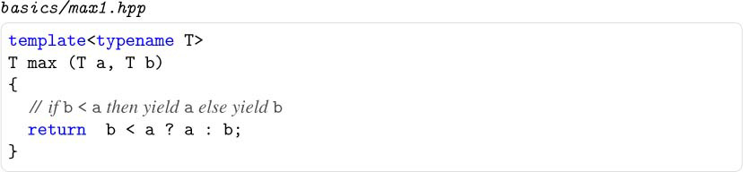](#ch1.xhtml#pch1ex03pro01){#ch1_images.xhtml#pch1ex03pro01a}

{#ch1_images.xhtml#pch1ex04pro01a}

{#ch1_images.xhtml#pch1ex04pro02a}

{#ch1_images.xhtml#pch1ex04pro03a}

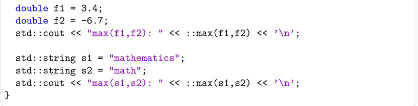

[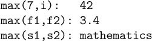](#ch1.xhtml#pch1ex05pro01){#ch1_images.xhtml#pch1ex05pro01a}

[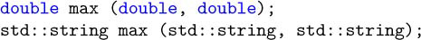](#ch1.xhtml#pch1ex06pro01){#ch1_images.xhtml#pch1ex06pro01a}

[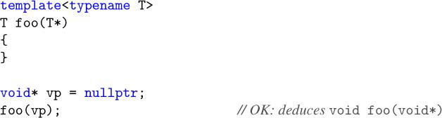](#ch1.xhtml#pch1ex06pro02){#ch1_images.xhtml#pch1ex06pro02a}

[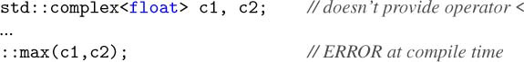](#ch1.xhtml#pch1ex06pro03){#ch1_images.xhtml#pch1ex06pro03a}

[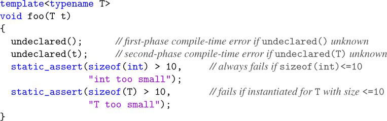](#ch1.xhtml#pch1ex07pro01){#ch1_images.xhtml#pch1ex07pro01a}

[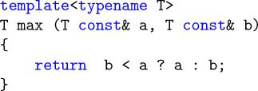](#ch1.xhtml#pch1ex07pro02){#ch1_images.xhtml#pch1ex07pro02a}

[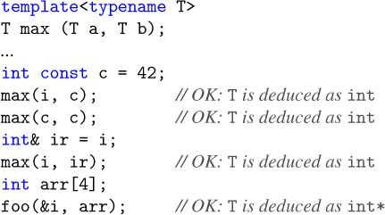](#ch1.xhtml#pch1ex08pro01){#ch1_images.xhtml#pch1ex08pro01a}

[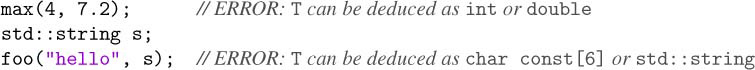](#ch1.xhtml#pch1ex08pro02){#ch1_images.xhtml#pch1ex08pro02a}

[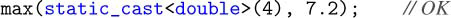](#ch1.xhtml#pch1ex08pro03){#ch1_images.xhtml#pch1ex08pro03a}

{#ch1_images.xhtml#pch1ex08pro04a}

[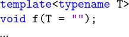](#ch1.xhtml#pch1ex08pro05){#ch1_images.xhtml#pch1ex08pro05a}

[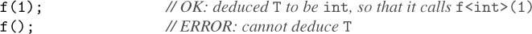](#ch1.xhtml#pch1ex09pro01){#ch1_images.xhtml#pch1ex09pro01a}

[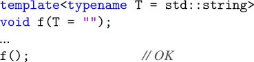](#ch1.xhtml#pch1ex09pro02){#ch1_images.xhtml#pch1ex09pro02a}

{#ch1_images.xhtml#pch1ex09pro03a}

{#ch1_images.xhtml#pch1ex09pro04a}

[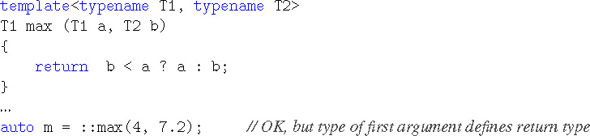](#ch1.xhtml#pch1ex09pro05){#ch1_images.xhtml#pch1ex09pro05a}

{#ch1_images.xhtml#pch1ex010pro01a}

[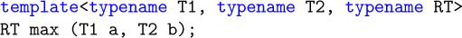](#ch1.xhtml#pch1ex010pro02){#ch1_images.xhtml#pch1ex010pro02a}

[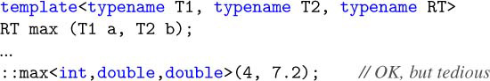](#ch1.xhtml#pch1ex010pro03){#ch1_images.xhtml#pch1ex010pro03a}

[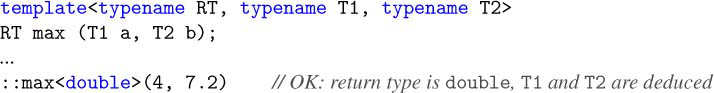](#ch1.xhtml#pch1ex010pro04){#ch1_images.xhtml#pch1ex010pro04a}

[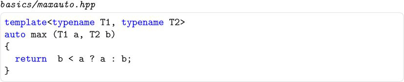](#ch1.xhtml#pch1ex011pro01){#ch1_images.xhtml#pch1ex011pro01a}

[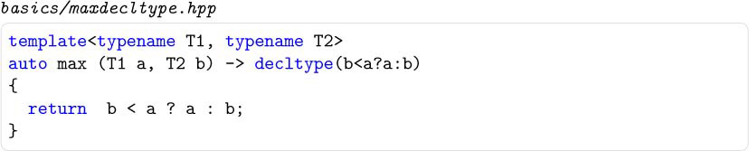](#ch1.xhtml#pch1ex011pro02){#ch1_images.xhtml#pch1ex011pro02a}

[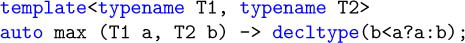](#ch1.xhtml#pch1ex011pro04){#ch1_images.xhtml#pch1ex011pro04a}

[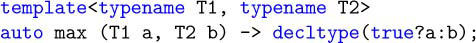](#ch1.xhtml#pch1ex012pro01){#ch1_images.xhtml#pch1ex012pro01a}

[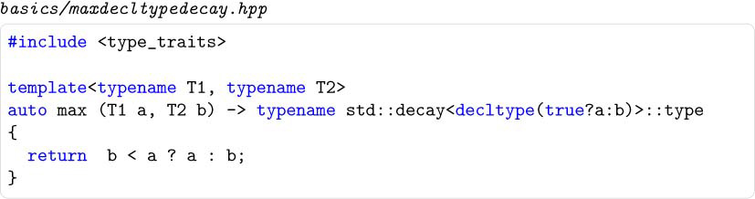](#ch1.xhtml#pch1ex012pro02){#ch1_images.xhtml#pch1ex012pro02a}

[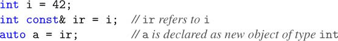](#ch1.xhtml#pch1ex012pro03){#ch1_images.xhtml#pch1ex012pro03a}

[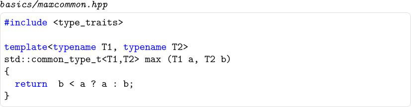](#ch1.xhtml#pch1ex012pro04){#ch1_images.xhtml#pch1ex012pro04a}

[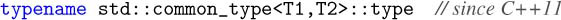](#ch1.xhtml#pch1ex013pro01){#ch1_images.xhtml#pch1ex013pro01a}

[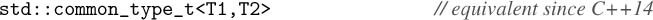](#ch1.xhtml#pch1ex013pro02){#ch1_images.xhtml#pch1ex013pro02a}

[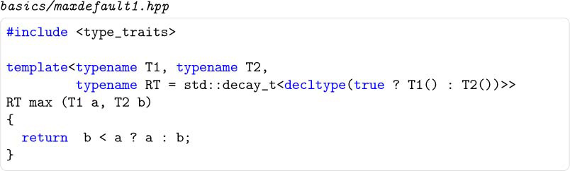](#ch1.xhtml#pch1ex013pro03){#ch1_images.xhtml#pch1ex013pro03a}

[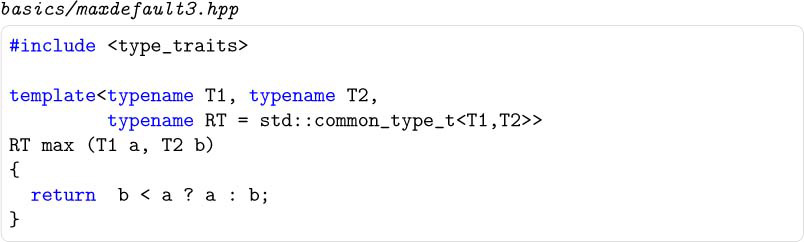](#ch1.xhtml#pch1ex014pro01){#ch1_images.xhtml#pch1ex014pro01a}

{#ch1_images.xhtml#pch1ex014pro02a}

{#ch1_images.xhtml#pch1ex014pro03a}

[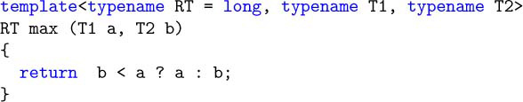](#ch1.xhtml#pch1ex014pro04){#ch1_images.xhtml#pch1ex014pro04a}

[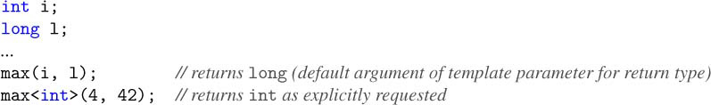](#ch1.xhtml#pch1ex014pro05){#ch1_images.xhtml#pch1ex014pro05a}

[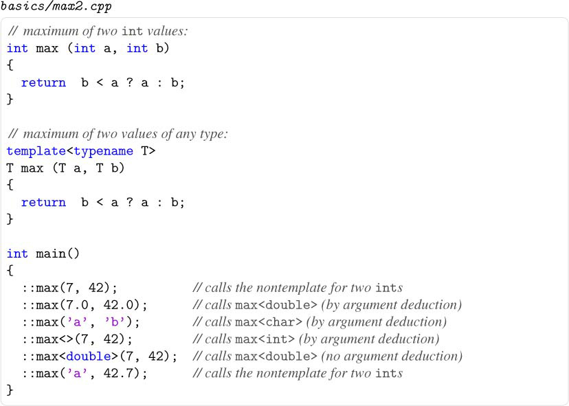](#ch1.xhtml#pch1ex015pro01){#ch1_images.xhtml#pch1ex015pro01a}

[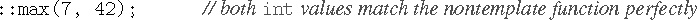](#ch1.xhtml#pch1ex015pro02){#ch1_images.xhtml#pch1ex015pro02a}

[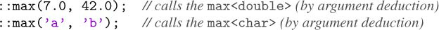](#ch1.xhtml#pch1ex016pro01){#ch1_images.xhtml#pch1ex016pro01a}

[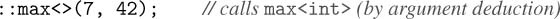](#ch1.xhtml#pch1ex016pro02){#ch1_images.xhtml#pch1ex016pro02a}

[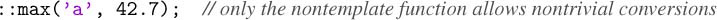](#ch1.xhtml#pch1ex016pro03){#ch1_images.xhtml#pch1ex016pro03a}

[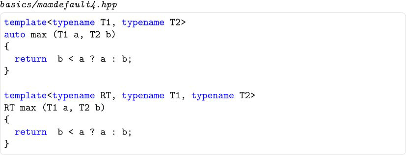](#ch1.xhtml#pch1ex016pro04){#ch1_images.xhtml#pch1ex016pro04a}

[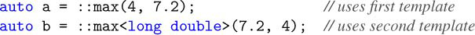](#ch1.xhtml#pch1ex016pro05){#ch1_images.xhtml#pch1ex016pro05a}

{#ch1_images.xhtml#pch1ex016pro06a}

[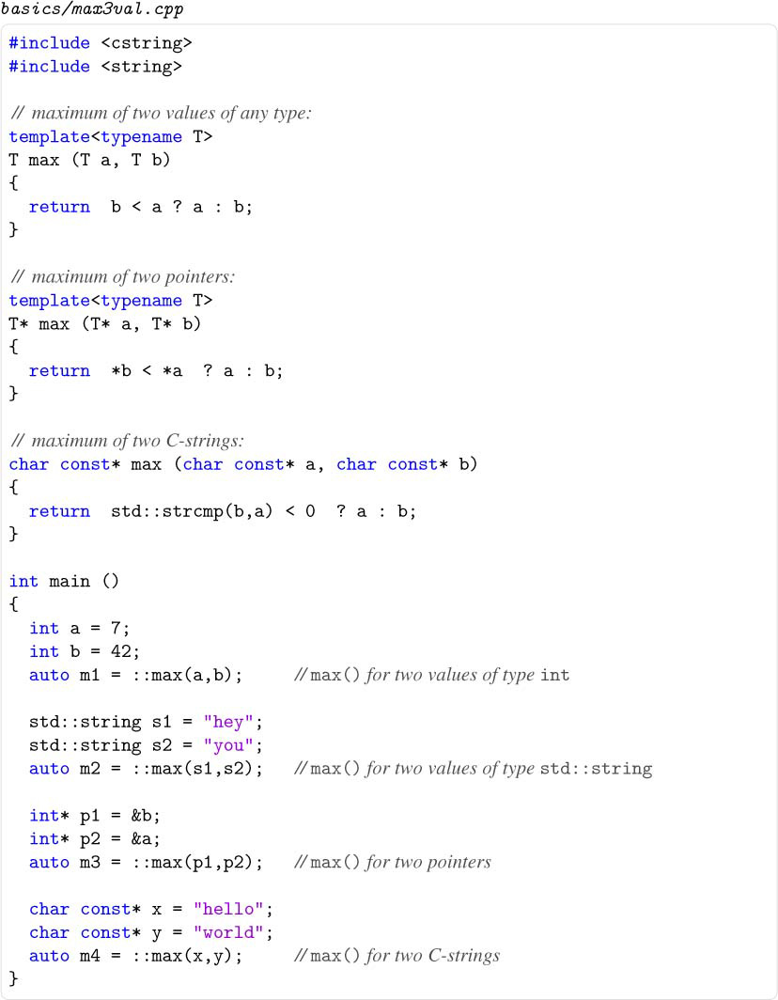](#ch1.xhtml#pch1ex17pro01){#ch1_images.xhtml#pch1ex17pro01a}

[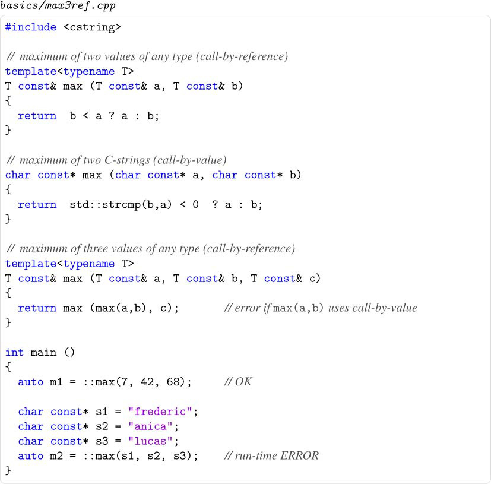](#ch1.xhtml#pch1ex018pro01){#ch1_images.xhtml#pch1ex018pro01a}

{#ch1_images.xhtml#pch1ex018pro02a}

[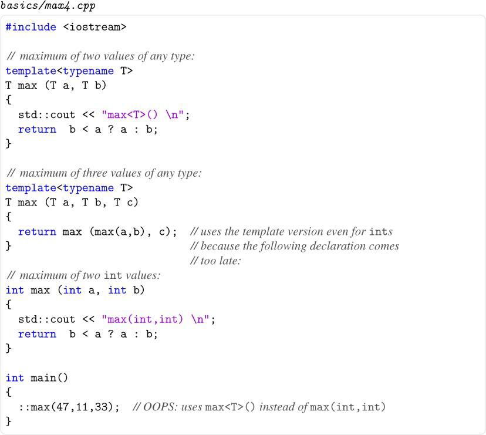](#ch1.xhtml#pch1ex019pro01){#ch1_images.xhtml#pch1ex019pro01a}

[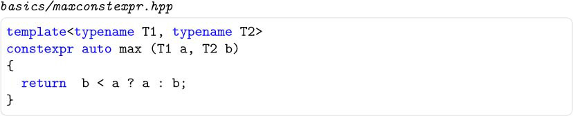](#ch1.xhtml#pch1ex021pro01){#ch1_images.xhtml#pch1ex021pro01a}

[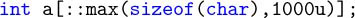](#ch1.xhtml#pch1ex021pro02){#ch1_images.xhtml#pch1ex021pro02a}

[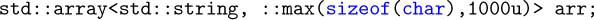](#ch1.xhtml#pch1ex021pro03){#ch1_images.xhtml#pch1ex021pro03a}

[]{#ch2_images.xhtml}

## Code Snippets {#ch2_images.xhtml#ch2_images .h2}

[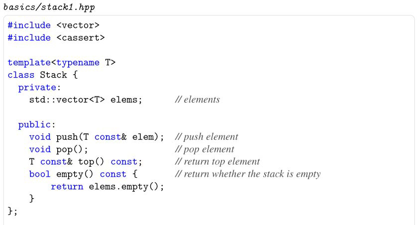](#ch2.xhtml#pch2ex023pro01){#ch2_images.xhtml#pch2ex023pro01a}

[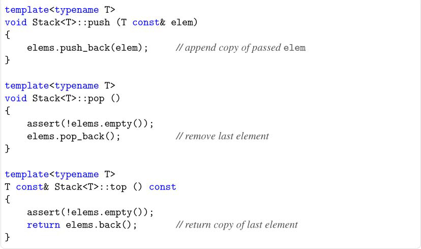](#ch2.xhtml#pch2ex023pro01)

[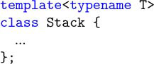](#ch2.xhtml#pch2ex024pro01){#ch2_images.xhtml#pch2ex024pro01a}

[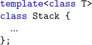](#ch2.xhtml#pch2ex024pro02){#ch2_images.xhtml#pch2ex024pro02a}

[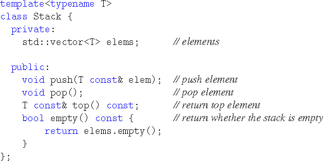](#ch2.xhtml#pch2ex025pro-01){#ch2_images.xhtml#pch2ex025pro-01a}

[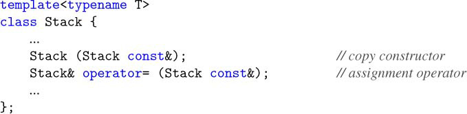](#ch2.xhtml#pch2ex025pro01){#ch2_images.xhtml#pch2ex025pro01a}

{#ch2_images.xhtml#pch2ex025pro02a}

{#ch2_images.xhtml#pch2ex025pro03a}

{#ch2_images.xhtml#pch2ex026pro01a}

{#ch2_images.xhtml#pch2ex026pro02a}

{#ch2_images.xhtml#pch2ex026pro03a}

{#ch2_images.xhtml#pch2ex027pro01a}

{#ch2_images.xhtml#pch2ex027pro02a}

{#ch2_images.xhtml#pch2ex028pro01a}

{#ch2_images.xhtml#pch2ex028pro02a}

{#ch2_images.xhtml#pch2ex028pro03a}

{#ch2_images.xhtml#pch2ex028pro04a}

{#ch2_images.xhtml#pch2ex029pro01a}

{#ch2_images.xhtml#pch2ex029pro02a}

{#ch2_images.xhtml#pch2ex029pro03a}

{#ch2_images.xhtml#pch2ex030pro01a}

{#ch2_images.xhtml#pch2ex030pro02a}

{#ch2_images.xhtml#pch2ex031pro01a}

{#ch2_images.xhtml#pch2ex031pro02a}

{#ch2_images.xhtml#pch2ex031pro03a}

{#ch2_images.xhtml#pch2ex031pro04a}

{#ch2_images.xhtml#pch2ex032pro01a}

{#ch2_images.xhtml#pch2ex032pro02a}

{#ch2_images.xhtml#pch2ex032pro03a}

{#ch2_images.xhtml#pch2ex033pro01a}

{#ch2_images.xhtml#pch2ex034pro01a}

{#ch2_images.xhtml#pch2ex034pro02a}

{#ch2_images.xhtml#pch2ex034pro03a}

{#ch2_images.xhtml#pch2ex035pro01a}

{#ch2_images.xhtml#pch2ex035pro02a}

{#ch2_images.xhtml#pch2ex035pro03a}

{#ch2_images.xhtml#pch2ex035pro04a}

{#ch2_images.xhtml#pch2ex036pro01a}

{#ch2_images.xhtml#pch2ex037pro01a}

{#ch2_images.xhtml#pch2ex037pro02a}

{#ch2_images.xhtml#pch2ex037pro03a}

{#ch2_images.xhtml#pch2ex038pro01a}

{#ch2_images.xhtml#pch2ex038pro02a}

{#ch2_images.xhtml#pch2ex038pro03a}

{#ch2_images.xhtml#pch2ex038pro04a}

{#ch2_images.xhtml#pch2ex038pro05a}

{#ch2_images.xhtml#pch2ex039pro01a}

{#ch2_images.xhtml#pch2ex039pro02a}

{#ch2_images.xhtml#pch2ex039pro02-1a}

{#ch2_images.xhtml#pch2ex039pro03a}

{#ch2_images.xhtml#pch2ex039pro04a}

{#ch2_images.xhtml#pch2ex039pro05a}

{#ch2_images.xhtml#pch2ex040pro01a}

{#ch2_images.xhtml#pch2ex040pro02a}

{#ch2_images.xhtml#pch2ex040pro03a}

{#ch2_images.xhtml#pch2ex040pro04a}

{#ch2_images.xhtml#pch2ex040pro05a}

{#ch2_images.xhtml#pch2ex040pro06a}

{#ch2_images.xhtml#pch2ex041pro01a}

{#ch2_images.xhtml#pch2ex041pro02a}

{#ch2_images.xhtml#pch2ex042pro01a}

{#ch2_images.xhtml#pch2ex042pro02a}

{#ch2_images.xhtml#pch2ex042pro03a}

{#ch2_images.xhtml#pch2ex042pro04a}

{#ch2_images.xhtml#pch2ex042pro05a}

{#ch2_images.xhtml#pch2ex042pro06a}

{#ch2_images.xhtml#pch2ex043pro01a}

{#ch2_images.xhtml#pch2ex043pro02a}

{#ch2_images.xhtml#pch2ex043pro03a}

{#ch2_images.xhtml#pch2ex043pro04a}

{#ch2_images.xhtml#pch2ex043pro05a}

[]{#ch3_images.xhtml}

## Code Snippets {#ch3_images.xhtml#ch3_images .h2}

{#ch3_images.xhtml#pch3ex01pro01a}

{#ch3_images.xhtml#pch3ex01pro02a}

{#ch3_images.xhtml#pch3ex01pro03a}

{#ch3_images.xhtml#pch3ex01pro04a}

{#ch3_images.xhtml#pch3ex01pro05a}

{#ch3_images.xhtml#pch3ex01pro06a}

{#ch3_images.xhtml#pch3ex01pro07a}

{#ch3_images.xhtml#pch3ex01pro08a}

{#ch3_images.xhtml#pch3ex01pro09a}

{#ch3_images.xhtml#pch3ex01pro010a}

{#ch3_images.xhtml#pch3ex01pro011a}

{#ch3_images.xhtml#pch3ex01pro012a}

{#ch3_images.xhtml#pch3ex01pro013a}

{#ch3_images.xhtml#pch3ex01pro014a}

{#ch3_images.xhtml#pch3ex01pro015a}

{#ch3_images.xhtml#pch3ex01pro016a}

{#ch3_images.xhtml#pch3ex01pro017a}

{#ch3_images.xhtml#pch3ex01pro018a}

{#ch3_images.xhtml#pch3ex01pro019a}

{#ch3_images.xhtml#pch3ex01pro020a}

{#ch3_images.xhtml#pch3ex01pro021a}

{#ch3_images.xhtml#pch3ex01pro022a}

{#ch3_images.xhtml#pch3ex01pro023a}

{#ch3_images.xhtml#pch3ex01pro024a}

{#ch3_images.xhtml#pch3ex01pro025a}

{#ch3_images.xhtml#pch3ex01pro026a}

{#ch3_images.xhtml#pch3ex01pro027a}

{#ch3_images.xhtml#pch3ex01pro028a}

{#ch3_images.xhtml#pch3ex01pro029a}

[]{#ch4_images.xhtml}

## Code Snippets {#ch4_images.xhtml#ch4_images .h2}

{#ch4_images.xhtml#pch4ex01pro01a}

{#ch4_images.xhtml#pch4ex01pro02a}

{#ch4_images.xhtml#pch4ex01pro03a}

{#ch4_images.xhtml#pch4ex01pro04a}

{#ch4_images.xhtml#pch4ex01pro05a}

{#ch4_images.xhtml#pch4ex01pro06a}

{#ch4_images.xhtml#pch4ex01pro07a}

{#ch4_images.xhtml#pch4ex01pro08a}

{#ch4_images.xhtml#pch4ex01pro09a}

{#ch4_images.xhtml#pch4ex01pro010a}

{#ch4_images.xhtml#pch4ex01pro011a}

{#ch4_images.xhtml#pch4ex01pro012a}

{#ch4_images.xhtml#pch4ex01pro013a}

{#ch4_images.xhtml#pch4ex01pro014a}

{#ch4_images.xhtml#pch4ex01pro015a}

{#ch4_images.xhtml#pch4ex01pro016a}

{#ch4_images.xhtml#pch4ex01pro017a}

{#ch4_images.xhtml#pch4ex01pro018a}

{#ch4_images.xhtml#pch4ex01pro019a}

{#ch4_images.xhtml#pch4ex01pro020a}

{#ch4_images.xhtml#pch4ex01pro021a}

{#ch4_images.xhtml#pch4ex01pro022a}

{#ch4_images.xhtml#pch4ex01pro023a}

{#ch4_images.xhtml#pch4ex01pro024a}

{#ch4_images.xhtml#pch4ex01pro025a}

{#ch4_images.xhtml#pch4ex01pro026a}

{#ch4_images.xhtml#pch4ex01pro027a}

{#ch4_images.xhtml#pch4ex01pro028a}

{#ch4_images.xhtml#pch4ex01pro029a}

{#ch4_images.xhtml#pch4ex01pro030a}

{#ch4_images.xhtml#pch4ex01pro031a}

{#ch4_images.xhtml#pch4ex01pro032a}

{#ch4_images.xhtml#pch4ex01pro033a}

{#ch4_images.xhtml#pch4ex01pro034a}

{#ch4_images.xhtml#pch4ex01pro035a}

{#ch4_images.xhtml#pch4ex01pro036a}

{#ch4_images.xhtml#pch4ex01pro037a}

{#ch4_images.xhtml#pch4ex01pro038a}

{#ch4_images.xhtml#pch4ex01pro039a}

{#ch4_images.xhtml#pch4ex01pro040a}

{#ch4_images.xhtml#pch4ex01pro041a}

{#ch4_images.xhtml#pch4ex01pro042a}

{#ch4_images.xhtml#pch4ex01pro043a}

{#ch4_images.xhtml#pch4ex01pro044a}

{#ch4_images.xhtml#pch4ex01pro045a}

[]{#ch5_images.xhtml}

## Code Snippets {#ch5_images.xhtml#ch5_images .h2}

{#ch5_images.xhtml#pch5ex01pro01a}

{#ch5_images.xhtml#pch5ex01pro02a}

{#ch5_images.xhtml#pch5ex01pro03a}

{#ch5_images.xhtml#pch5ex01pro04a}

{#ch5_images.xhtml#pch5ex01pro05a}

{#ch5_images.xhtml#pch5ex01pro06a}

{#ch5_images.xhtml#pch5ex01pro07a}

{#ch5_images.xhtml#pch5ex01pro08a}

{#ch5_images.xhtml#pch5ex01pro09a}

{#ch5_images.xhtml#pch5ex01pro010a}

{#ch5_images.xhtml#pch5ex01pro011a}

{#ch5_images.xhtml#pch5ex01pro012a}

{#ch5_images.xhtml#pch5ex01pro013a}

{#ch5_images.xhtml#pch5ex01pro014a}

{#ch5_images.xhtml#pch5ex01pro015a}

{#ch5_images.xhtml#pch5ex01pro016a}

{#ch5_images.xhtml#pch5ex01pro017a}

{#ch5_images.xhtml#pch5ex01pro018a}

{#ch5_images.xhtml#pch5ex01pro019a}

{#ch5_images.xhtml#pch5ex01pro020a}

{#ch5_images.xhtml#pch5ex01pro021a}

{#ch5_images.xhtml#pch5ex01pro022a}

{#ch5_images.xhtml#pch5ex01pro023a}

{#ch5_images.xhtml#pch5ex01pro024a}

{#ch5_images.xhtml#pch5ex01pro025a}

{#ch5_images.xhtml#pch5ex01pro026a}

{#ch5_images.xhtml#pch5ex01pro027a}

{#ch5_images.xhtml#pch5ex01pro028a}

{#ch5_images.xhtml#pch5ex01pro029a}

{#ch5_images.xhtml#pch5ex01pro030a}

{#ch5_images.xhtml#pch5ex01pro031a}

{#ch5_images.xhtml#pch5ex01pro032a}

{#ch5_images.xhtml#pch5ex01pro033a}

{#ch5_images.xhtml#pch5ex01pro034a}

{#ch5_images.xhtml#pch5ex01pro035a}

{#ch5_images.xhtml#pch5ex01pro036a}

{#ch5_images.xhtml#pch5ex01pro037a}

{#ch5_images.xhtml#pch5ex01pro038a}

{#ch5_images.xhtml#pch5ex01pro039a}

{#ch5_images.xhtml#pch5ex01pro040a}

{#ch5_images.xhtml#pch5ex01pro041a}

{#ch5_images.xhtml#pch5ex01pro042a}

{#ch5_images.xhtml#pch5ex01pro043a}

{#ch5_images.xhtml#pch5ex01pro044a}

{#ch5_images.xhtml#pch5ex01pro045a}

{#ch5_images.xhtml#pch5ex01pro046a}

{#ch5_images.xhtml#pch5ex01pro047a}

{#ch5_images.xhtml#pch5ex01pro048a}

{#ch5_images.xhtml#pch5ex01pro049a}

{#ch5_images.xhtml#pch5ex01pro050a}

{#ch5_images.xhtml#pch5ex01pro051a}

{#ch5_images.xhtml#pch5ex01pro052a}

{#ch5_images.xhtml#pch5ex01pro053a}

{#ch5_images.xhtml#pch5ex01pro054a}

{#ch5_images.xhtml#pch5ex01pro055a}

{#ch5_images.xhtml#pch5ex01pro056a}

{#ch5_images.xhtml#pch5ex01pro057a}

{#ch5_images.xhtml#pch5ex01pro058a}

{#ch5_images.xhtml#pch5ex01pro059a}

{#ch5_images.xhtml#pch5ex01pro060a}

{#ch5_images.xhtml#pch5ex01pro061a}

{#ch5_images.xhtml#pch5ex01pro062a}

{#ch5_images.xhtml#pch5ex01pro063a}

{#ch5_images.xhtml#pch5ex01pro064a}

{#ch5_images.xhtml#pch5ex01pro065a}

{#ch5_images.xhtml#pch5ex01pro066a}

{#ch5_images.xhtml#pch5ex01pro067a}

{#ch5_images.xhtml#pch5ex01pro068a}

[]{#ch6_images.xhtml}

## Code Snippets {#ch6_images.xhtml#ch6_images .h2}

{#ch6_images.xhtml#pch6ex01pro01a}

{#ch6_images.xhtml#pch6ex01pro02a}

{#ch6_images.xhtml#pch6ex01pro03a}

{#ch6_images.xhtml#pch6ex01pro04a}

{#ch6_images.xhtml#pch6ex01pro05a}

{#ch6_images.xhtml#pch6ex01pro06a}

{#ch6_images.xhtml#pch6ex01pro07a}

{#ch6_images.xhtml#pch6ex01pro08a}

{#ch6_images.xhtml#pch6ex01pro09a}

{#ch6_images.xhtml#pch6ex01pro010a}

{#ch6_images.xhtml#pch6ex01pro011a}

{#ch6_images.xhtml#pch6ex01pro012a}

{#ch6_images.xhtml#pch6ex01pro013a}

{#ch6_images.xhtml#pch6ex01pro014a}

{#ch6_images.xhtml#pch6ex01pro015a}

{#ch6_images.xhtml#pch6ex01pro016a}

{#ch6_images.xhtml#pch6ex01pro017a}

{#ch6_images.xhtml#pch6ex01pro018a}

{#ch6_images.xhtml#pch6ex01pro019a}

{#ch6_images.xhtml#pch6ex01pro020a}

{#ch6_images.xhtml#pch6ex01pro021a}

{#ch6_images.xhtml#pch6ex01pro022a}

{#ch6_images.xhtml#pch6ex01pro023a}

{#ch6_images.xhtml#pch6ex01pro024a}

{#ch6_images.xhtml#pch6ex01pro025a}

{#ch6_images.xhtml#pch6ex01pro026a}

{#ch6_images.xhtml#pch6ex01pro027a}

{#ch6_images.xhtml#pch6ex01pro028a}

{#ch6_images.xhtml#pch6ex01pro029a}

{#ch6_images.xhtml#pch6ex01pro030a}

{#ch6_images.xhtml#pch6ex01pro031a}

{#ch6_images.xhtml#pch6ex01pro032a}

{#ch6_images.xhtml#pch6ex01pro033a}

{#ch6_images.xhtml#pch6ex01pro034a}

{#ch6_images.xhtml#pch6ex01pro035a}

{#ch6_images.xhtml#pch6ex01pro036a}

{#ch6_images.xhtml#pch6ex01pro037a}

{#ch6_images.xhtml#pch6ex01pro038a}

{#ch6_images.xhtml#pch6ex01pro039a}

{#ch6_images.xhtml#pch6ex01pro040a}

{#ch6_images.xhtml#pch6ex01pro041a}

[]{#ch7_images.xhtml}

## Code Snippets {#ch7_images.xhtml#ch7_images .h2}

{#ch7_images.xhtml#pch7ex01pro01a}

{#ch7_images.xhtml#pch7ex01pro02a}

{#ch7_images.xhtml#pch7ex01pro03a}

{#ch7_images.xhtml#pch7ex01pro04a}

{#ch7_images.xhtml#pch7ex01pro05a}

{#ch7_images.xhtml#pch7ex01pro06a}

{#ch7_images.xhtml#pch7ex01pro07a}

{#ch7_images.xhtml#pch7ex01pro08a}

{#ch7_images.xhtml#pch7ex01pro09a}

{#ch7_images.xhtml#pch7ex01pro010a}

{#ch7_images.xhtml#pch7ex01pro011a}

{#ch7_images.xhtml#pch7ex01pro012a}

{#ch7_images.xhtml#pch7ex01pro013a}

{#ch7_images.xhtml#pch7ex01pro014a}

{#ch7_images.xhtml#pch7ex01pro015a}

{#ch7_images.xhtml#pch7ex01pro016a}

{#ch7_images.xhtml#pch7ex01pro017a}

{#ch7_images.xhtml#pch7ex01pro018a}

{#ch7_images.xhtml#pch7ex01pro019a}

{#ch7_images.xhtml#pch7ex01pro020a}

{#ch7_images.xhtml#pch7ex01pro021a}

{#ch7_images.xhtml#pch7ex01pro022a}

{#ch7_images.xhtml#pch7ex01pro023a}

{#ch7_images.xhtml#pch7ex01pro024a}

{#ch7_images.xhtml#pch7ex01pro025a}

{#ch7_images.xhtml#pch7ex01pro026a}

{#ch7_images.xhtml#pch7ex01pro027a}

{#ch7_images.xhtml#pch7ex01pro028a}

{#ch7_images.xhtml#pch7ex01pro029a}

{#ch7_images.xhtml#pch7ex01pro030a}

{#ch7_images.xhtml#pch7ex01pro031a}

{#ch7_images.xhtml#pch7ex01pro032a}

{#ch7_images.xhtml#pch7ex01pro033a}

{#ch7_images.xhtml#pch7ex01pro034a}

{#ch7_images.xhtml#pch7ex01pro035a}

{#ch7_images.xhtml#pch7ex01pro036a}

{#ch7_images.xhtml#pch7ex01pro037a}

{#ch7_images.xhtml#pch7ex01pro038a}

{#ch7_images.xhtml#pch7ex01pro039a}

{#ch7_images.xhtml#pch7ex01pro040a}

{#ch7_images.xhtml#pch7ex01pro041a}

{#ch7_images.xhtml#pch7ex01pro042a}

{#ch7_images.xhtml#pch7ex01pro043a}

{#ch7_images.xhtml#pch7ex01pro044a}

[]{#ch8_images.xhtml}

## Code Snippets {#ch8_images.xhtml#ch8_images .h2}

{#ch8_images.xhtml#pch8ex124pro01a}

{#ch8_images.xhtml#pch8ex125pro01a}

{#ch8_images.xhtml#pch8ex125pro02a}

{#ch8_images.xhtml#pch8ex125pro03a}

{#ch8_images.xhtml#pch8ex126pro01a}

{#ch8_images.xhtml#pch8ex126pro02a}

{#ch8_images.xhtml#pch8ex127pro01a}

{#ch8_images.xhtml#pch8ex127pro02a}

{#ch8_images.xhtml#pch8ex127pro03a}

{#ch8_images.xhtml#pch8ex127pro04a}

{#ch8_images.xhtml#pch8ex127pro05a}

{#ch8_images.xhtml#pch8ex128pro02a}

{#ch8_images.xhtml#pch8ex129pro01a}

{#ch8_images.xhtml#pch8ex130pro01a}

{#ch8_images.xhtml#pch8ex130pro02a}

{#ch8_images.xhtml#pch8ex130pro03a}

{#ch8_images.xhtml#pch8ex130pro04a}

{#ch8_images.xhtml#pch8ex130pro05a}

{#ch8_images.xhtml#pch8ex131pro01a}

{#ch8_images.xhtml#pch8ex132pro01a}

{#ch8_images.xhtml#pch8ex132pro02a}

{#ch8_images.xhtml#pch8ex133pro01a}

{#ch8_images.xhtml#pch8ex133pro02a}

{#ch8_images.xhtml#pch8ex133pro03a}

{#ch8_images.xhtml#pch8ex134pro01a}

{#ch8_images.xhtml#pch8ex134pro02a}

{#ch8_images.xhtml#pch8ex135pro01a}

{#ch8_images.xhtml#pch8ex135pro02a}

{#ch8_images.xhtml#pch8ex125pro04a}

[]{#ch9_images.xhtml}

## Code Snippets {#ch9_images.xhtml#ch9_images .h2}

{#ch9_images.xhtml#pch9ex138pro01a}

{#ch9_images.xhtml#pch9ex138pro02a}

{#ch9_images.xhtml#pch9ex138pro03a}

{#ch9_images.xhtml#pch9ex139pro01a}

{#ch9_images.xhtml#pch9ex143pro01a}

{#ch9_images.xhtml#pch9ex143pro02a}

{#ch9_images.xhtml#pch9ex144pro01a}

{#ch9_images.xhtml#pch9ex144pro02a}

{#ch9_images.xhtml#pch9ex144pro03a}

{#ch9_images.xhtml#pch9ex145pro01a}

{#ch9_images.xhtml#pch9ex145pro02a}

{#ch9_images.xhtml#pch9ex145pro03a}

{#ch9_images.xhtml#pch9ex145pro04a}

{#ch9_images.xhtml#pch9ex146pro01a}

{#ch9_images.xhtml#pch9ex146pro02a}

{#ch9_images.xhtml#pch9ex147pro01a}

{#ch9_images.xhtml#pch9ex148pro01a}

{#ch9_images.xhtml#pch9ex148pro02a}

{#ch9_images.xhtml#pch9ex148pro03a}

{#ch9_images.xhtml#pch9ex148pro04a}

{#ch9_images.xhtml#pch9ex148pro05a}

{#ch9_images.xhtml#pch9ex148pro06a}

{#ch9_images.xhtml#pch9ex149pro01a}

{#ch9_images.xhtml#pch9ex149pro02a}

[]{#ch10_images.xhtml}

## Code Snippets {#ch10_images.xhtml#ch10_images .h2}

{#ch10_images.xhtml#pch10ex152pro01a}

{#ch10_images.xhtml#pch10ex152pro02a}

{#ch10_images.xhtml#pch10ex153pro01a}

{#ch10_images.xhtml#pch10ex153pro02a}

{#ch10_images.xhtml#pch10ex153pro03a}

{#ch10_images.xhtml#pch10ex153pro04a}

{#ch10_images.xhtml#pch10ex154pro01a}

{#ch10_images.xhtml#pch10ex155pro01a}

{#ch10_images.xhtml#pch10ex155pro02a}

{#ch10_images.xhtml#pch10ex155pro03a}

{#ch10_images.xhtml#pch10ex156pro01a}

[]{#ch11_images.xhtml}

## Code Snippets {#ch11_images.xhtml#ch11_images .h2}

{#ch11_images.xhtml#pch11ex158pro01a}

{#ch11_images.xhtml#pch11ex158pro02a}

{#ch11_images.xhtml#pch11ex159pro01a}

{#ch11_images.xhtml#pch11ex160pro01a}

{#ch11_images.xhtml#pch11ex161pro01a}

{#ch11_images.xhtml#pch11ex162pro01a}

{#ch11_images.xhtml#pch11ex162pro02a}

{#ch11_images.xhtml#pch11ex162pro03a}

{#ch11_images.xhtml#pch11ex163pro01a}

{#ch11_images.xhtml#pch11ex163pro02a}

{#ch11_images.xhtml#pch11ex163pro03a}

{#ch11_images.xhtml#pch11ex164pro01a}

{#ch11_images.xhtml#pch11ex164pro02a}

{#ch11_images.xhtml#pch11ex165pro01a}

{#ch11_images.xhtml#pch11ex165pro02a}

{#ch11_images.xhtml#pch11ex165pro03a}

{#ch11_images.xhtml#pch11ex165pro04a}

{#ch11_images.xhtml#pch11ex165pro05a}

{#ch11_images.xhtml#pch11ex165pro06a}

{#ch11_images.xhtml#pch11ex165pro07a}

{#ch11_images.xhtml#pch11ex166pro01a}

{#ch11_images.xhtml#pch11ex166pro02a}

{#ch11_images.xhtml#pch11ex167pro01a}

{#ch11_images.xhtml#pch11ex167pro02a}

{#ch11_images.xhtml#pch11ex167pro03a}

{#ch11_images.xhtml#pch11ex167pro04a}

{#ch11_images.xhtml#pch11ex168pro01a}

{#ch11_images.xhtml#pch11ex169pro01a}

{#ch11_images.xhtml#pch11ex169pro02a}

{#ch11_images.xhtml#pch11ex170pro01a}

{#ch11_images.xhtml#pch11ex170pro02a}

{#ch11_images.xhtml#pch11ex170pro03a}

{#ch11_images.xhtml#pch11ex171pro01a}

{#ch11_images.xhtml#pch11ex171pro02a}

{#ch11_images.xhtml#pch11ex171pro03a}

{#ch11_images.xhtml#pch11ex171pro04a}

{#ch11_images.xhtml#pch11ex172pro01a}

[]{#ch12_images.xhtml}

## Code Snippets {#ch12_images.xhtml#ch12_images .h2}

{#ch12_images.xhtml#pch12ex177pro01a}

{#ch12_images.xhtml#pch12ex178pro01a}

{#ch12_images.xhtml#pch12ex179pro01a}

{#ch12_images.xhtml#pch12ex180pro01a}

{#ch12_images.xhtml#pch12ex180pro02a}

{#ch12_images.xhtml#pch12ex180pro03a}

{#ch12_images.xhtml#pch12ex180pro04a}

{#ch12_images.xhtml#pch12ex181pro01a}

{#ch12_images.xhtml#pch12ex181pro02a}

{#ch12_images.xhtml#pch12ex181pro03a}

{#ch12_images.xhtml#pch12ex182pro01a}

{#ch12_images.xhtml#pch12ex182pro02a}

{#ch12_images.xhtml#pch12ex183pro01a}

{#ch12_images.xhtml#pch12ex183pro02a}

{#ch12_images.xhtml#pch12ex184pro01a}

{#ch12_images.xhtml#pch12ex184pro02a}

{#ch12_images.xhtml#pch12ex184pro03a}

{#ch12_images.xhtml#pch12ex185pro01a}

{#ch12_images.xhtml#pch12ex185pro02a}

{#ch12_images.xhtml#pch12ex185pro03a}

{#ch12_images.xhtml#pch12ex186pro01a}

{#ch12_images.xhtml#pch12ex186pro02a}

{#ch12_images.xhtml#pch12ex186pro03a}

{#ch12_images.xhtml#pch12ex187pro01a}

{#ch12_images.xhtml#pch12ex187pro02a}

{#ch12_images.xhtml#pch12ex187pro03a}

{#ch12_images.xhtml#pch12ex187pro04a}

{#ch12_images.xhtml#pch12ex188pro01a}

{#ch12_images.xhtml#pch12ex188pro02a}

{#ch12_images.xhtml#pch12ex188pro03a}

{#ch12_images.xhtml#pch12ex188pro04a}

{#ch12_images.xhtml#pch12ex188pro05a}

{#ch12_images.xhtml#pch12ex189pro01a}

{#ch12_images.xhtml#pch12ex189pro02a}

{#ch12_images.xhtml#pch12ex189pro03a}

{#ch12_images.xhtml#pch12ex189pro04a}

{#ch12_images.xhtml#pch12ex190pro01a}

{#ch12_images.xhtml#pch12ex190pro02a}

{#ch12_images.xhtml#pch12ex190pro03a}

{#ch12_images.xhtml#pch12ex190pro04a}

{#ch12_images.xhtml#pch12ex191pro01a}

{#ch12_images.xhtml#pch12ex191pro02a}

{#ch12_images.xhtml#pch12ex191pro03a}

{#ch12_images.xhtml#pch12ex191pro04a}

{#ch12_images.xhtml#pch12ex191pro05a}

{#ch12_images.xhtml#pch12ex191pro06a}

{#ch12_images.xhtml#pch12ex192pro01a}

{#ch12_images.xhtml#pch12ex193pro01a}

{#ch12_images.xhtml#pch12ex193pro02a}

{#ch12_images.xhtml#pch12ex193pro03a}

{#ch12_images.xhtml#pch12ex194pro01a}

{#ch12_images.xhtml#pch12ex194pro02a}

{#ch12_images.xhtml#pch12ex195pro01a}

{#ch12_images.xhtml#pch12ex196pro01a}

{#ch12_images.xhtml#pch12ex197pro01a}

{#ch12_images.xhtml#pch12ex197pro02a}

{#ch12_images.xhtml#pch12ex198pro01a}

{#ch12_images.xhtml#pch12ex198pro02a}

{#ch12_images.xhtml#pch12ex199pro01a}

{#ch12_images.xhtml#pch12ex199pro02a}

{#ch12_images.xhtml#pch12ex200pro01a}

{#ch12_images.xhtml#pch12ex200pro02a}

{#ch12_images.xhtml#pch12ex201pro01a}

{#ch12_images.xhtml#pch12ex201pro02a}

{#ch12_images.xhtml#pch12ex202pro01a}

{#ch12_images.xhtml#pch12ex202pro02a}

{#ch12_images.xhtml#pch12ex202pro03a}

{#ch12_images.xhtml#pch12ex203pro01a}

{#ch12_images.xhtml#pch12ex204pro01a}

{#ch12_images.xhtml#pch12ex204pro02a}

{#ch12_images.xhtml#pch12ex205pro01a}

{#ch12_images.xhtml#pch12ex205pro02a}

{#ch12_images.xhtml#pch12ex206pro01a}

{#ch12_images.xhtml#pch12ex206pro02a}

{#ch12_images.xhtml#pch12ex206pro03a}

{#ch12_images.xhtml#pch12ex206pro04a}

{#ch12_images.xhtml#pch12ex207pro01a}

{#ch12_images.xhtml#pch12ex208pro01a}

{#ch12_images.xhtml#pch12ex208pro02a}

{#ch12_images.xhtml#pch12ex208pro03a}

{#ch12_images.xhtml#pch12ex209pro01a}

{#ch12_images.xhtml#pch12ex210pro01a}

{#ch12_images.xhtml#pch12ex210pro02a}

{#ch12_images.xhtml#pch12ex211pro01a}

{#ch12_images.xhtml#pch12ex211pro02a}

{#ch12_images.xhtml#pch12ex212pro01a}

{#ch12_images.xhtml#pch12ex212pro02a}

{#ch12_images.xhtml#pch12ex213pro01a}

[]{#ch13_images.xhtml}

## Code Snippets {#ch13_images.xhtml#ch13_images .h2}

{#ch13_images.xhtml#pch13ex217pro01a}

{#ch13_images.xhtml#pch13ex218pro01a}

{#ch13_images.xhtml#pch13ex218pro02a}

{#ch13_images.xhtml#pch13ex220pro01a}

{#ch13_images.xhtml#pch13ex220pro02a}

{#ch13_images.xhtml#pch13ex221pro01a}

{#ch13_images.xhtml#pch13ex222pro01a}

{#ch13_images.xhtml#pch13ex223pro01a}

{#ch13_images.xhtml#pch13ex223pro02a}

{#ch13_images.xhtml#pch13ex223pro03a}

{#ch13_images.xhtml#pch13ex224pro01a}

{#ch13_images.xhtml#pch13ex225pro01a}

{#ch13_images.xhtml#pch13ex226pro01a}

{#ch13_images.xhtml#pch13ex226pro02a}

{#ch13_images.xhtml#pch13ex227pro01a}

{#ch13_images.xhtml#pch13ex227pro02a}

{#ch13_images.xhtml#pch13ex228pro01a}

{#ch13_images.xhtml#pch13ex229pro01a}

{#ch13_images.xhtml#pch13ex230pro01a}

{#ch13_images.xhtml#pch13ex232pro01a}

{#ch13_images.xhtml#pch13ex232pro02a}

{#ch13_images.xhtml#pch13ex232pro03a}

{#ch13_images.xhtml#pch13ex233pro01a}

{#ch13_images.xhtml#pch13ex233pro02a}

{#ch13_images.xhtml#pch13ex234pro01a}

{#ch13_images.xhtml#pch13ex234pro02a}

{#ch13_images.xhtml#pch13ex234pro03a}

{#ch13_images.xhtml#pch13ex234pro04a}

{#ch13_images.xhtml#pch13ex234pro05a}

{#ch13_images.xhtml#pch13ex13fig01a}

{#ch13_images.xhtml#pch13ex236pro01a}

{#ch13_images.xhtml#pch13ex236pro02a}

{#ch13_images.xhtml#pch13ex236pro03a}

{#ch13_images.xhtml#pch13ex237pro01a}

{#ch13_images.xhtml#pch13ex237pro02a}

{#ch13_images.xhtml#pch13ex238pro01a}

{#ch13_images.xhtml#pch13ex238pro02a}

{#ch13_images.xhtml#pch13ex239pro01a}

{#ch13_images.xhtml#pch13ex239pro02a}

{#ch13_images.xhtml#pch13ex240pro01a}

[]{#ch14_images.xhtml}

## Code Snippets {#ch14_images.xhtml#ch14_images .h2}

{#ch14_images.xhtml#pch14ex244pro01a}

{#ch14_images.xhtml#pch14ex245pro01a}

{#ch14_images.xhtml#pch14ex245pro02a}

{#ch14_images.xhtml#pch14ex246pro01a}

{#ch14_images.xhtml#pch14ex246pro02a}

{#ch14_images.xhtml#pch14ex247pro01a}

{#ch14_images.xhtml#pch14ex248pro01a}

{#ch14_images.xhtml#pch14ex250pro01a}

{#ch14_images.xhtml#pch14ex251pro01a}

{#ch14_images.xhtml#pch14ex252pro01a}

{#ch14_images.xhtml#pch14ex252pro02a}

{#ch14_images.xhtml#pch14ex253pro01a}

{#ch14_images.xhtml#pch14ex255pro01a}

{#ch14_images.xhtml#pch14ex260pro01a}

{#ch14_images.xhtml#pch14ex260pro02a}

{#ch14_images.xhtml#pch14ex261pro01a}

{#ch14_images.xhtml#pch14ex262pro01a}

{#ch14_images.xhtml#pch14ex263pro01a}

{#ch14_images.xhtml#pch14ex263pro02a}

{#ch14_images.xhtml#pch14ex264pro01a}

{#ch14_images.xhtml#pch14ex264pro02a}

{#ch14_images.xhtml#pch14ex265pro01a}

{#ch14_images.xhtml#pch14ex265pro02a}

{#ch14_images.xhtml#pch14ex266pro01a}

[]{#ch15_images.xhtml}

## Code Snippets {#ch15_images.xhtml#ch15_images .h2}

{#ch15_images.xhtml#pch15ex269pro01a}

{#ch15_images.xhtml#pch15ex270pro01a}

{#ch15_images.xhtml#pch15ex270pro02a}

{#ch15_images.xhtml#pch15ex271pro01a}

{#ch15_images.xhtml#pch15ex271pro02a}

{#ch15_images.xhtml#pch15ex272pro01a}

{#ch15_images.xhtml#pch15ex272pro02a}

{#ch15_images.xhtml#pch15ex273pro01a}

{#ch15_images.xhtml#pch15ex273pro02a}

{#ch15_images.xhtml#pch15ex274pro02a}

{#ch15_images.xhtml#pch15ex274pro03a}

{#ch15_images.xhtml#pch15ex275pro01a}

{#ch15_images.xhtml#pch15ex275pro02a}

{#ch15_images.xhtml#pch15ex276pro01a}

{#ch15_images.xhtml#pch15ex277pro01a}

{#ch15_images.xhtml#pch15ex277pro02a}

{#ch15_images.xhtml#pch15ex277pro03a}

{#ch15_images.xhtml#pch15ex277pro04a}

{#ch15_images.xhtml#pch15ex278pro01a}

{#ch15_images.xhtml#pch15ex278pro02a}

{#ch15_images.xhtml#pch15ex279pro01a}

{#ch15_images.xhtml#pch15ex279pro02a}

{#ch15_images.xhtml#pch15ex279pro03a}

{#ch15_images.xhtml#pch15ex280pro01a}

{#ch15_images.xhtml#pch15ex281pro01a}

{#ch15_images.xhtml#pch15ex281pro02a}

{#ch15_images.xhtml#pch15ex281pro03a}

{#ch15_images.xhtml#pch15ex282pro01a}

{#ch15_images.xhtml#pch15ex282pro02a}

{#ch15_images.xhtml#pch15ex282pro03a}

{#ch15_images.xhtml#pch15ex283pro01a}

{#ch15_images.xhtml#pch15ex283pro02a}

{#ch15_images.xhtml#pch15ex283pro03a}

{#ch15_images.xhtml#pch15ex284pro01a}

{#ch15_images.xhtml#pch15ex285pro01a}

{#ch15_images.xhtml#pch15ex286pro01a}

{#ch15_images.xhtml#pch15ex287pro01a}

{#ch15_images.xhtml#pch15ex287pro02a}

{#ch15_images.xhtml#pch15ex288pro01a}

{#ch15_images.xhtml#pch15ex288pro02a}

{#ch15_images.xhtml#pch15ex288pro03a}

{#ch15_images.xhtml#pch15ex289pro01a}

{#ch15_images.xhtml#pch15ex289pro02a}

{#ch15_images.xhtml#pch15ex289pro03a}

{#ch15_images.xhtml#pch15ex290pro01a}

{#ch15_images.xhtml#pch15ex290pro02a}

{#ch15_images.xhtml#pch15ex291pro01a}

{#ch15_images.xhtml#pch15ex291pro01-1a}

{#ch15_images.xhtml#pch15ex291pro02a}

{#ch15_images.xhtml#pch15ex292pro01a}

{#ch15_images.xhtml#pch15ex292pro02a}

{#ch15_images.xhtml#pch15ex292pro03a}

{#ch15_images.xhtml#pch15ex293pro01a}

{#ch15_images.xhtml#pch15ex293pro02a}

{#ch15_images.xhtml#pch15ex293pro03a}

{#ch15_images.xhtml#pch15ex293pro04a}

{#ch15_images.xhtml#pch15ex294pro01a}

{#ch15_images.xhtml#pch15ex294pro02a}

{#ch15_images.xhtml#pch15ex294pro03a}

{#ch15_images.xhtml#pch15ex294pro04a}

{#ch15_images.xhtml#pch15ex294pro05a}

{#ch15_images.xhtml#pch15ex295pro01a}

{#ch15_images.xhtml#pch15ex295pro02a}

{#ch15_images.xhtml#pch15ex295pro03a}

{#ch15_images.xhtml#pch15ex295pro04a}

{#ch15_images.xhtml#pch15ex296pro01a}

{#ch15_images.xhtml#pch15ex296pro02a}

{#ch15_images.xhtml#pch15ex296pro03a}

{#ch15_images.xhtml#pch15ex296pro04a}

{#ch15_images.xhtml#pch15ex296pro05a}

{#ch15_images.xhtml#pch15ex297pro01a}

{#ch15_images.xhtml#pch15ex297pro02a}

{#ch15_images.xhtml#pch15ex297pro03a}

{#ch15_images.xhtml#pch15ex298pro01a}

{#ch15_images.xhtml#pch15ex298pro02a}

{#ch15_images.xhtml#pch15ex298pro03a}

{#ch15_images.xhtml#pch15ex299pro01a}

{#ch15_images.xhtml#pch15ex299pro02a}

{#ch15_images.xhtml#pch15ex299pro03a}

{#ch15_images.xhtml#pch15ex300pro01a}

{#ch15_images.xhtml#pch15ex300pro02a}

{#ch15_images.xhtml#pch15ex301pro01a}

{#ch15_images.xhtml#pch15ex301pro02a}

{#ch15_images.xhtml#pch15ex301pro03a}

{#ch15_images.xhtml#pch15ex301pro04a}

{#ch15_images.xhtml#pch15ex301pro05a}

{#ch15_images.xhtml#pch15ex302pro01a}

{#ch15_images.xhtml#pch15ex302pro02a}

{#ch15_images.xhtml#pch15ex302pro03a}

{#ch15_images.xhtml#pch15ex302pro04a}

{#ch15_images.xhtml#pch15ex303pro01a}

{#ch15_images.xhtml#pch15ex303pro02a}

{#ch15_images.xhtml#pch15ex303pro03a}

{#ch15_images.xhtml#pch15ex303pro04a}

{#ch15_images.xhtml#pch15ex303pro05a}

{#ch15_images.xhtml#pch15ex304pro01a}

{#ch15_images.xhtml#pch15ex304pro02a}

{#ch15_images.xhtml#pch15ex304pro03a}

{#ch15_images.xhtml#pch15ex304pro04a}

{#ch15_images.xhtml#pch15ex304pro05a}

{#ch15_images.xhtml#pch15ex305pro01a}

{#ch15_images.xhtml#pch15ex305pro02a}

{#ch15_images.xhtml#pch15ex305pro03a}

{#ch15_images.xhtml#pch15ex305pro04a}

{#ch15_images.xhtml#pch15ex305pro05a}

{#ch15_images.xhtml#pch15ex306pro01a}

{#ch15_images.xhtml#pch15ex307pro01a}

{#ch15_images.xhtml#pch15ex307pro02a}

{#ch15_images.xhtml#pch15ex308pro01a}

{#ch15_images.xhtml#pch15ex308pro02a}

{#ch15_images.xhtml#pch15ex308pro03a}

{#ch15_images.xhtml#pch15ex308pro04a}

{#ch15_images.xhtml#pch15ex308pro05a}

{#ch15_images.xhtml#pch15ex308pro06a}

{#ch15_images.xhtml#pch15ex309pro01a}

{#ch15_images.xhtml#pch15ex310pro01a}

{#ch15_images.xhtml#pch15ex310pro02a}

{#ch15_images.xhtml#pch15ex311pro01a}

{#ch15_images.xhtml#pch15ex311pro02a}

{#ch15_images.xhtml#pch15ex311pro03a}

{#ch15_images.xhtml#pch15ex312pro01a}

{#ch15_images.xhtml#pch15ex312pro02a}

{#ch15_images.xhtml#pch15ex313pro01a}

{#ch15_images.xhtml#pch15ex313pro02a}

{#ch15_images.xhtml#pch15ex314pro01a}

{#ch15_images.xhtml#pch15ex314pro02a}

{#ch15_images.xhtml#pch15ex314pro03a}

{#ch15_images.xhtml#pch15ex315pro01a}

{#ch15_images.xhtml#pch15ex315pro02a}

{#ch15_images.xhtml#pch15ex315pro03a}

{#ch15_images.xhtml#pch15ex315pro04a}

{#ch15_images.xhtml#pch15ex315pro05a}

{#ch15_images.xhtml#pch15ex316pro01a}

{#ch15_images.xhtml#pch15ex316pro02a}

{#ch15_images.xhtml#pch15ex317pro01a}

{#ch15_images.xhtml#pch15ex317pro02a}

{#ch15_images.xhtml#pch15ex317pro03a}

{#ch15_images.xhtml#pch15ex318pro01a}

{#ch15_images.xhtml#pch15ex318pro02a}

{#ch15_images.xhtml#pch15ex318pro03a}

{#ch15_images.xhtml#pch15ex319pro01a}

{#ch15_images.xhtml#pch15ex319pro02a}

{#ch15_images.xhtml#pch15ex319pro03a}

{#ch15_images.xhtml#pch15ex320pro01a}

[]{#ch16_images.xhtml}

## Code Snippets {#ch16_images.xhtml#ch16_images .h2}

{#ch16_images.xhtml#pch16ex323pro01a}

{#ch16_images.xhtml#pch16ex324pro01a}

{#ch16_images.xhtml#pch16ex326pro02a}

{#ch16_images.xhtml#pch16ex327pro02a}

{#ch16_images.xhtml#pch16ex328pro01a}

{#ch16_images.xhtml#pch16ex329pro01a}

{#ch16_images.xhtml#pch16ex329pro02a}

{#ch16_images.xhtml#pch16ex329pro03a}

{#ch16_images.xhtml#pch16ex330pro01a}

{#ch16_images.xhtml#pch16ex330pro02a}

{#ch16_images.xhtml#pch16ex332pro01a}

{#ch16_images.xhtml#pch16ex333pro01a}

{#ch16_images.xhtml#pch16ex334pro01a}

{#ch16_images.xhtml#pch16ex334pro02a}

{#ch16_images.xhtml#pch16ex335pro01a}

{#ch16_images.xhtml#pch16ex336pro01a}

{#ch16_images.xhtml#pch16ex336pro02a}

{#ch16_images.xhtml#pch16ex337pro01a}

{#ch16_images.xhtml#pch16ex338pro01a}

{#ch16_images.xhtml#pch16ex340pro01a}

{#ch16_images.xhtml#pch16ex340pro02a}

{#ch16_images.xhtml#pch16ex341pro01a}

{#ch16_images.xhtml#pch16ex341pro02a}

{#ch16_images.xhtml#pch16ex342pro01a}

{#ch16_images.xhtml#pch16ex343pro01a}

{#ch16_images.xhtml#pch16ex343pro02a}

{#ch16_images.xhtml#pch16ex344pro01a}

{#ch16_images.xhtml#pch16ex344pro02a}

{#ch16_images.xhtml#pch16ex344pro03a}

{#ch16_images.xhtml#pch16ex344pro04a}

{#ch16_images.xhtml#pch16ex345pro01a}

{#ch16_images.xhtml#pch16ex345pro02a}

{#ch16_images.xhtml#pch16ex346pro01a}

{#ch16_images.xhtml#pch16ex346pro02a}

{#ch16_images.xhtml#pch16ex346pro03a}

{#ch16_images.xhtml#pch16ex346pro04a}

{#ch16_images.xhtml#pch16ex346pro05a}

{#ch16_images.xhtml#pch16ex347pro01a}

{#ch16_images.xhtml#pch16ex347pro02a}

{#ch16_images.xhtml#pch16ex347pro03a}

{#ch16_images.xhtml#pch16ex348pro01a}

{#ch16_images.xhtml#pch16ex348pro02a}

{#ch16_images.xhtml#pch16ex349pro01a}

{#ch16_images.xhtml#pch16ex350pro01a}

{#ch16_images.xhtml#pch16ex351pro01a}

{#ch16_images.xhtml#pch16ex351pro02a}

{#ch16_images.xhtml#pch16ex351pro03a}

{#ch16_images.xhtml#pch16ex352pro01a}

[]{#ch17_images.xhtml}

## Code Snippets {#ch17_images.xhtml#ch17_images .h2}

{#ch17_images.xhtml#pch17ex354pro01a}

{#ch17_images.xhtml#pch17ex355pro01a}

{#ch17_images.xhtml#pch17ex355pro02a}

{#ch17_images.xhtml#pch17ex356pro01a}

{#ch17_images.xhtml#pch17ex357pro01a}

{#ch17_images.xhtml#pch17ex357pro02a}

{#ch17_images.xhtml#pch17ex358pro01a}

{#ch17_images.xhtml#pch17ex358pro02a}

{#ch17_images.xhtml#pch17ex359pro01a}

{#ch17_images.xhtml#pch17ex359pro02a}

{#ch17_images.xhtml#pch17ex359pro03a}

{#ch17_images.xhtml#pch17ex360pro01a}

{#ch17_images.xhtml#pch17ex360pro02a}

{#ch17_images.xhtml#pch17ex360pro03a}

{#ch17_images.xhtml#pch17ex361pro01a}

{#ch17_images.xhtml#pch17ex361pro02a}

{#ch17_images.xhtml#pch17ex361pro03a}

{#ch17_images.xhtml#pch17ex362pro01a}

{#ch17_images.xhtml#pch17ex362pro02a}

{#ch17_images.xhtml#pch17ex364pro01a}

{#ch17_images.xhtml#pch17ex364pro02a}

{#ch17_images.xhtml#pch17ex365pro01a}

{#ch17_images.xhtml#pch17ex365pro02a}

{#ch17_images.xhtml#pch17ex366pro01a}

{#ch17_images.xhtml#pch17ex366pro02a}

[]{#ch18_images.xhtml}

## Code Snippets {#ch18_images.xhtml#ch18_images .h2}

{#ch18_images.xhtml#pch18ex370pro01a}

{#ch18_images.xhtml#pch18ex371pro01a}

{#ch18_images.xhtml#pch18ex373pro01a}

{#ch18_images.xhtml#pch18ex373pro01aa}

{#ch18_images.xhtml#pch18ex373pro03a}

{#ch18_images.xhtml#pch18ex374pro01ba}

{#ch18_images.xhtml#pch18ex375pro02a}

{#ch18_images.xhtml#pch18ex377pro01a}

{#ch18_images.xhtml#pch18ex378pro01a}

{#ch18_images.xhtml#pch18ex378pro02a}

{#ch18_images.xhtml#pch18ex380pro01a}

{#ch18_images.xhtml#pch18ex381pro01a}

{#ch18_images.xhtml#pch18ex381pro02a}

[]{#ch19_images.xhtml}

## Code Snippets {#ch19_images.xhtml#ch19_images .h2}

{#ch19_images.xhtml#pch19ex01a}

{#ch19_images.xhtml#pch19ex02a}

{#ch19_images.xhtml#pch19ex03a}

{#ch19_images.xhtml#pch19ex04a}

{#ch19_images.xhtml#pch19ex05a}

{#ch19_images.xhtml#pch19ex06a}

{#ch19_images.xhtml#pch19ex07a}

{#ch19_images.xhtml#pch19ex08a}

{#ch19_images.xhtml#pch19ex09a}

{#ch19_images.xhtml#pch19ex010a}

{#ch19_images.xhtml#pch19ex011a}

{#ch19_images.xhtml#pch19ex012a}

{#ch19_images.xhtml#pch19ex013a}

{#ch19_images.xhtml#pch19ex014a}

{#ch19_images.xhtml#pch19ex015a}

{#ch19_images.xhtml#pch19ex016a}

{#ch19_images.xhtml#pch19ex017a}

{#ch19_images.xhtml#pch19ex018a}

{#ch19_images.xhtml#pch19ex019a}

{#ch19_images.xhtml#pch19ex020a}

{#ch19_images.xhtml#pch19ex021a}

{#ch19_images.xhtml#pch19ex022a}

{#ch19_images.xhtml#pch19ex023a}

{#ch19_images.xhtml#pch19ex024a}

{#ch19_images.xhtml#pch19ex025a}

{#ch19_images.xhtml#pch19ex026a}

{#ch19_images.xhtml#pch19ex027a}

{#ch19_images.xhtml#pch19ex028a}

{#ch19_images.xhtml#pch19ex029a}

{#ch19_images.xhtml#pch19ex030a}

{#ch19_images.xhtml#pch19ex031a}

{#ch19_images.xhtml#pch19ex032a}

{#ch19_images.xhtml#pch19ex033a}

{#ch19_images.xhtml#pch19ex034a}

{#ch19_images.xhtml#pch19ex035a}

{#ch19_images.xhtml#pch19ex036a}

{#ch19_images.xhtml#pch19ex037a}

{#ch19_images.xhtml#pch19ex038a}

{#ch19_images.xhtml#pch19ex039a}

{#ch19_images.xhtml#pch19ex040a}

{#ch19_images.xhtml#pch19ex041a}

{#ch19_images.xhtml#pch19ex042a}

{#ch19_images.xhtml#pch19ex043a}

{#ch19_images.xhtml#pch19ex044a}

{#ch19_images.xhtml#pch19ex045a}

{#ch19_images.xhtml#pch19ex046a}

{#ch19_images.xhtml#pch19ex047a}

{#ch19_images.xhtml#pch19ex048a}

{#ch19_images.xhtml#pch19ex049a}

{#ch19_images.xhtml#pch19ex050a}

{#ch19_images.xhtml#pch19ex051a}

{#ch19_images.xhtml#pch19ex052a}

{#ch19_images.xhtml#pch19ex053a}

{#ch19_images.xhtml#pch19ex054a}

{#ch19_images.xhtml#pch19ex055a}

{#ch19_images.xhtml#pch19ex056a}

{#ch19_images.xhtml#pch19ex057a}

{#ch19_images.xhtml#pch19ex058a}

{#ch19_images.xhtml#pch19ex059a}

{#ch19_images.xhtml#pch19ex060a}

{#ch19_images.xhtml#pch19ex061a}

{#ch19_images.xhtml#pch19ex062a}

{#ch19_images.xhtml#pch19ex063a}

{#ch19_images.xhtml#pch19ex064a}

{#ch19_images.xhtml#pch19ex065a}

{#ch19_images.xhtml#pch19ex066a}

{#ch19_images.xhtml#pch19ex067a}

{#ch19_images.xhtml#pch19ex068a}

{#ch19_images.xhtml#pch19ex069a}

{#ch19_images.xhtml#pch19ex070a}

{#ch19_images.xhtml#pch19ex071a}

{#ch19_images.xhtml#pch19ex072a}

{#ch19_images.xhtml#pch19ex073a}

{#ch19_images.xhtml#pch19ex074a}

{#ch19_images.xhtml#pch19ex075a}

{#ch19_images.xhtml#pch19ex076a}

{#ch19_images.xhtml#pch19ex077a}

{#ch19_images.xhtml#pch19ex078a}

{#ch19_images.xhtml#pch19ex079a}

{#ch19_images.xhtml#pch19ex080a}

{#ch19_images.xhtml#pch19ex081a}

{#ch19_images.xhtml#pch19ex082a}

{#ch19_images.xhtml#pch19ex083a}

{#ch19_images.xhtml#pch19ex084a}

{#ch19_images.xhtml#pch19ex085a}

{#ch19_images.xhtml#pch19ex086a}

{#ch19_images.xhtml#pch19ex087a}

{#ch19_images.xhtml#pch19ex088a}

{#ch19_images.xhtml#pch19ex089a}

{#ch19_images.xhtml#pch19ex090a}

{#ch19_images.xhtml#pch19ex091a}

{#ch19_images.xhtml#pch19ex092a}

{#ch19_images.xhtml#pch19ex093a}

{#ch19_images.xhtml#pch19ex094a}

{#ch19_images.xhtml#pch19ex095a}

{#ch19_images.xhtml#pch19ex096a}

{#ch19_images.xhtml#pch19ex097a}

{#ch19_images.xhtml#pch19ex098a}

{#ch19_images.xhtml#pch19ex099a}

{#ch19_images.xhtml#pch19ex0100a}

{#ch19_images.xhtml#pch19ex0101a}

{#ch19_images.xhtml#pch19ex0102a}

{#ch19_images.xhtml#pch19ex0103a}

{#ch19_images.xhtml#pch19ex0104a}

{#ch19_images.xhtml#pch19ex0105a}

{#ch19_images.xhtml#pch19ex0106a}

{#ch19_images.xhtml#pch19ex0107a}

{#ch19_images.xhtml#pch19ex0108a}

{#ch19_images.xhtml#pch19ex0109a}

{#ch19_images.xhtml#pch19ex0110a}

{#ch19_images.xhtml#pch19ex0111a}

{#ch19_images.xhtml#pch19ex0112a}

{#ch19_images.xhtml#pch19ex0113a}

{#ch19_images.xhtml#pch19ex0114a}

{#ch19_images.xhtml#pch19ex0115a}

{#ch19_images.xhtml#pch19ex0116a}

{#ch19_images.xhtml#pch19ex0117a}

{#ch19_images.xhtml#pch19ex0118a}

{#ch19_images.xhtml#pch19ex0119a}

{#ch19_images.xhtml#pch19ex0120a}

{#ch19_images.xhtml#pch19ex0121a}

{#ch19_images.xhtml#pch19ex0122a}

{#ch19_images.xhtml#pch19ex0123a}

{#ch19_images.xhtml#pch19ex0124a}

{#ch19_images.xhtml#pch19ex0125a}

{#ch19_images.xhtml#pch19ex0126a}

{#ch19_images.xhtml#pch19ex0127a}

{#ch19_images.xhtml#pch19ex0128a}

{#ch19_images.xhtml#pch19ex0129a}

{#ch19_images.xhtml#pch19ex0130a}

{#ch19_images.xhtml#pch19ex0131a}

{#ch19_images.xhtml#pch19ex0132a}

{#ch19_images.xhtml#pch19ex0133a}

{#ch19_images.xhtml#pch19ex0134a}

{#ch19_images.xhtml#pch19ex0135a}

{#ch19_images.xhtml#pch19ex0136a}

{#ch19_images.xhtml#pch19ex0137a}

{#ch19_images.xhtml#pch19ex0138a}

{#ch19_images.xhtml#pch19ex0139a}

{#ch19_images.xhtml#pch19ex0140a}

{#ch19_images.xhtml#pch19ex0141a}

{#ch19_images.xhtml#pch19ex0142a}

{#ch19_images.xhtml#pch19ex0143a}

{#ch19_images.xhtml#pch19ex0144a}

{#ch19_images.xhtml#pch19ex0145a}

{#ch19_images.xhtml#pch19ex0146a}

{#ch19_images.xhtml#pch19ex0147a}

{#ch19_images.xhtml#pch19ex0148a}

{#ch19_images.xhtml#pch19ex0149a}

{#ch19_images.xhtml#pch19ex0150a}

{#ch19_images.xhtml#pch19ex0151a}

{#ch19_images.xhtml#pch19ex0152a}

{#ch19_images.xhtml#pch19ex0153a}

{#ch19_images.xhtml#pch19ex0154a}

{#ch19_images.xhtml#pch19ex0155a}

{#ch19_images.xhtml#pch19ex0156a}

{#ch19_images.xhtml#pch19ex0157a}

{#ch19_images.xhtml#pch19ex0158a}

{#ch19_images.xhtml#pch19ex0159a}

{#ch19_images.xhtml#pch19ex0160a}

{#ch19_images.xhtml#pch19ex0161a}

{#ch19_images.xhtml#pch19ex0162a}

{#ch19_images.xhtml#pch19ex0163a}

{#ch19_images.xhtml#pch19ex0164a}

{#ch19_images.xhtml#pch19ex0165a}

{#ch19_images.xhtml#pch19ex0166a}

{#ch19_images.xhtml#pch19ex0167a}

{#ch19_images.xhtml#pch19ex0168a}

{#ch19_images.xhtml#pch19ex0169a}

{#ch19_images.xhtml#pch19ex0170a}

{#ch19_images.xhtml#pch19ex0171a}

{#ch19_images.xhtml#pch19ex0172a}

{#ch19_images.xhtml#pch19ex0173a}

{#ch19_images.xhtml#pch19ex0174a}

{#ch19_images.xhtml#pch19ex0175a}

[]{#ch20_images.xhtml}

## Code Snippets {#ch20_images.xhtml#ch20_images .h2}

{#ch20_images.xhtml#pch20ex465pro01a}

{#ch20_images.xhtml#pch20ex465pro02a}

{#ch20_images.xhtml#pch20ex466pro01a}

{#ch20_images.xhtml#pch20ex466pro02a}

{#ch20_images.xhtml#pch20ex467pro01a}

{#ch20_images.xhtml#pch20ex467pro02a}

{#ch20_images.xhtml#pch20ex467pro03a}

{#ch20_images.xhtml#pch20ex468pro01a}

{#ch20_images.xhtml#pch20ex468pro02a}

{#ch20_images.xhtml#pch20ex469pro01a}

{#ch20_images.xhtml#pch20ex469pro02a}

{#ch20_images.xhtml#pch20ex470pro01a}

{#ch20_images.xhtml#pch20ex471pro01a}

{#ch20_images.xhtml#pch20ex473pro01a}

{#ch20_images.xhtml#pch20ex473pro02a}

{#ch20_images.xhtml#pch20ex474pro01a}

{#ch20_images.xhtml#pch20ex474pro02a}

{#ch20_images.xhtml#pch20ex475pro01a}

{#ch20_images.xhtml#pch20ex476pro01a}

{#ch20_images.xhtml#pch20ex476pro02a}

{#ch20_images.xhtml#pch20ex477pro01a}

{#ch20_images.xhtml#pch20ex477pro02a}

{#ch20_images.xhtml#pch20ex478pro01a}

{#ch20_images.xhtml#pch20ex478pro02a}

{#ch20_images.xhtml#pch20ex479pro01a}

{#ch20_images.xhtml#pch20ex480pro01a}

{#ch20_images.xhtml#pch20ex480pro02a}

{#ch20_images.xhtml#pch20ex482pro01a}

{#ch20_images.xhtml#pch20ex482pro02a}

{#ch20_images.xhtml#pch20ex483pro01a}

{#ch20_images.xhtml#pch20ex484pro01a}

{#ch20_images.xhtml#pch20ex485pro01a}

{#ch20_images.xhtml#pch20ex486pro01a}

{#ch20_images.xhtml#pch20ex486pro02a}

{#ch20_images.xhtml#pch20ex487pro01a}

[]{#ch21_images.xhtml}

## Code Snippets {#ch21_images.xhtml#ch21_images .h2}

{#ch21_images.xhtml#pch21ex489pro01a}

{#ch21_images.xhtml#pch21ex490pro01a}

{#ch21_images.xhtml#pch21ex490pro02a}

{#ch21_images.xhtml#pch21exf491-01a}

{#ch21_images.xhtml#pch21exf491-02a}

{#ch21_images.xhtml#pch21ex491pro03a}

{#ch21_images.xhtml#pch21exf492-01a}

{#ch21_images.xhtml#pch21ex493pro01a}

{#ch21_images.xhtml#pch21ex493pro02a}

{#ch21_images.xhtml#pch21ex493pro03a}

{#ch21_images.xhtml#pch21ex493pro04a}

{#ch21_images.xhtml#pch21ex494pro01a}

{#ch21_images.xhtml#pch21ex495pro01a}

{#ch21_images.xhtml#pch21ex495pro02a}

{#ch21_images.xhtml#pch21ex495pro03a}

{#ch21_images.xhtml#pch21ex495pro03aa}

{#ch21_images.xhtml#pch21ex496pro01a}

{#ch21_images.xhtml#pch21ex497pro01a}

{#ch21_images.xhtml#pch21ex497pro02a}

{#ch21_images.xhtml#pch21ex498pro01a}

{#ch21_images.xhtml#pch21ex498pro02a}

{#ch21_images.xhtml#pch21ex498pro03a}

{#ch21_images.xhtml#pch21ex499pro01a}

{#ch21_images.xhtml#pch21ex500pro01a}

{#ch21_images.xhtml#pch21ex500pro02a}

{#ch21_images.xhtml#pch21ex500pro03a}

{#ch21_images.xhtml#pch21ex501pro01a}

{#ch21_images.xhtml#pch21ex501pro01aa}

{#ch21_images.xhtml#pch21ex503pro01a}

{#ch21_images.xhtml#pch21ex503pro02a}

{#ch21_images.xhtml#pch21ex503pro03a}

{#ch21_images.xhtml#pch21ex504pro01a}

{#ch21_images.xhtml#pch21ex504pro02a}

{#ch21_images.xhtml#pch21ex504pro02aa}

{#ch21_images.xhtml#pch21ex505pro01a}

{#ch21_images.xhtml#pch21ex505pro02a}

{#ch21_images.xhtml#pch21ex506pro01a}

{#ch21_images.xhtml#pch21ex507pro01a}

{#ch21_images.xhtml#pch21ex507pro02a}

{#ch21_images.xhtml#pch21ex507pro03a}

{#ch21_images.xhtml#pch21ex508pro01a}

{#ch21_images.xhtml#pch21ex508pro02a}

{#ch21_images.xhtml#pch21ex509pro01a}

{#ch21_images.xhtml#pch21ex509pro02a}

{#ch21_images.xhtml#pch21ex509pro03a}

{#ch21_images.xhtml#pch21ex509pro04a}

{#ch21_images.xhtml#pch21ex510pro01a}

{#ch21_images.xhtml#pch21ex510pro02a}

{#ch21_images.xhtml#pch21ex511pro01a}

{#ch21_images.xhtml#pch21ex512pro01a}

{#ch21_images.xhtml#pch21ex512pro02a}

{#ch21_images.xhtml#pch21ex512pro03a}

{#ch21_images.xhtml#pch21ex513pro02a}

{#ch21_images.xhtml#pch21ex513pro03a}

{#ch21_images.xhtml#pch21ex513pro04a}

{#ch21_images.xhtml#pch21ex514pro02a}

{#ch21_images.xhtml#pch21ex514pro03a}

{#ch21_images.xhtml#pch21ex21fig04a}

{#ch21_images.xhtml#pch21ex515pro01a}

[]{#ch22_images.xhtml}

## Code Snippets {#ch22_images.xhtml#ch22_images .h2}

{#ch22_images.xhtml#pex517pro01a}

{#ch22_images.xhtml#pex518pro01a}

{#ch22_images.xhtml#pex519pro01a}

{#ch22_images.xhtml#pex519pro02a}

{#ch22_images.xhtml#pex520pro01a}

{#ch22_images.xhtml#pex521pro01a}

{#ch22_images.xhtml#pex522pro01a}

{#ch22_images.xhtml#pex523pro01a}

{#ch22_images.xhtml#pex523pro02a}

{#ch22_images.xhtml#pex524pro01a}

{#ch22_images.xhtml#pex525pro01a}

{#ch22_images.xhtml#pex525pro02a}

{#ch22_images.xhtml#pex525pro03a}

{#ch22_images.xhtml#pex526pro01a}

{#ch22_images.xhtml#pex527pro01a}

{#ch22_images.xhtml#pex527pro02a}

{#ch22_images.xhtml#pex528pro01a}

[]{#ch23_images.xhtml}

## Code Snippets {#ch23_images.xhtml#ch23_images .h2}

{#ch23_images.xhtml#pch23ex530pro01a}

{#ch23_images.xhtml#pch23ex530pro02a}

{#ch23_images.xhtml#pch23ex531pro01a}

{#ch23_images.xhtml#pch23ex531pro02a}

{#ch23_images.xhtml#pch23ex532pro01a}

{#ch23_images.xhtml#pch23ex532pro02a}

{#ch23_images.xhtml#pch23ex532pro03a}

{#ch23_images.xhtml#pch23ex533pro01a}

{#ch23_images.xhtml#pch23ex534pro01a}

{#ch23_images.xhtml#pch23ex534pro02a}

{#ch23_images.xhtml#pch23ex535pro01a}

{#ch23_images.xhtml#pch23ex535pro02a}

{#ch23_images.xhtml#pch23ex535pro03a}

{#ch23_images.xhtml#pch23ex536pro01a}

{#ch23_images.xhtml#pch23ex536pro02a}

{#ch23_images.xhtml#pch23ex537pro01a}

{#ch23_images.xhtml#pch23ex537pro02a}

{#ch23_images.xhtml#pch23ex537pro03a}

{#ch23_images.xhtml#pch23ex539pro01a}

{#ch23_images.xhtml#pch23ex539pro02a}

{#ch23_images.xhtml#pch23ex540pro01a}

{#ch23_images.xhtml#pch23ex540pro02a}

{#ch23_images.xhtml#pch23ex540pro03a}

{#ch23_images.xhtml#pch23ex540pro04a}

{#ch23_images.xhtml#pch23ex541pro01a}

{#ch23_images.xhtml#pch23ex541pro02a}

{#ch23_images.xhtml#pch23ex542pro01a}

{#ch23_images.xhtml#pch23ex543pro01a}

{#ch23_images.xhtml#pch23ex544pro01a}

{#ch23_images.xhtml#pch23ex545pro01a}

{#ch23_images.xhtml#pch23ex546pro01a}

[]{#ch24_images.xhtml}

## Code Snippets {#ch24_images.xhtml#ch24_images .h2}

{#ch24_images.xhtml#pch24ex549pro01a}

{#ch24_images.xhtml#pch24ex550pro01a}

{#ch24_images.xhtml#pch24ex550pro02a}

{#ch24_images.xhtml#pch24ex550pro03a}

{#ch24_images.xhtml#pch24ex551pro01a}

{#ch24_images.xhtml#pch24ex551pro02a}

{#ch24_images.xhtml#pch24ex551pro03a}

{#ch24_images.xhtml#pch24ex551pro04a}

{#ch24_images.xhtml#pch24ex551pro05a}

{#ch24_images.xhtml#pch24ex552pro01a}

{#ch24_images.xhtml#pch24ex552pro02a}

{#ch24_images.xhtml#pch24ex552pro03a}

{#ch24_images.xhtml#pch24ex552pro04a}

{#ch24_images.xhtml#pch24ex552pro05a}

{#ch24_images.xhtml#pch24ex553pro01a}

{#ch24_images.xhtml#pch24ex554pro01a}

{#ch24_images.xhtml#pch24ex554pro02a}

{#ch24_images.xhtml#pch24ex555pro01a}

{#ch24_images.xhtml#pch24ex556pro01a}

{#ch24_images.xhtml#pch24ex556pro02a}

{#ch24_images.xhtml#pch24ex556pro03a}

{#ch24_images.xhtml#pch24ex557pro01a}

{#ch24_images.xhtml#pch24ex557pro02a}

{#ch24_images.xhtml#pch24ex557pro03a}

{#ch24_images.xhtml#pch24ex557pro04a}

{#ch24_images.xhtml#pch24ex558pro01a}

{#ch24_images.xhtml#pch24ex558pro02a}

{#ch24_images.xhtml#pch24ex559pro01a}

{#ch24_images.xhtml#pch24ex559pro02a}

{#ch24_images.xhtml#pch24ex560pro01a}

{#ch24_images.xhtml#pch24ex561pro01a}

{#ch24_images.xhtml#pch24ex561pro02a}

{#ch24_images.xhtml#pch24ex562pro01a}

{#ch24_images.xhtml#pch24ex563pro01a}

{#ch24_images.xhtml#pch24ex563pro02a}

{#ch24_images.xhtml#pch24ex565pro01a}

{#ch24_images.xhtml#pch24ex565pro02a}

{#ch24_images.xhtml#pch24ex566pro01a}

{#ch24_images.xhtml#pch24ex566pro02a}

{#ch24_images.xhtml#pch24ex566pro03a}

{#ch24_images.xhtml#pch24ex567pro01a}

{#ch24_images.xhtml#pch24ex567pro02a}

{#ch24_images.xhtml#pch24ex567pro03a}

{#ch24_images.xhtml#pch24ex568pro01a}

{#ch24_images.xhtml#pch24ex568pro02a}

{#ch24_images.xhtml#pch24ex569pro01a}

{#ch24_images.xhtml#pch24ex569pro02a}

{#ch24_images.xhtml#pch24ex569pro03a}

{#ch24_images.xhtml#pch24ex569pro04a}

{#ch24_images.xhtml#pch24ex570pro01a}

{#ch24_images.xhtml#pch24ex570pro02a}

{#ch24_images.xhtml#pch24ex571pro01a}

{#ch24_images.xhtml#pch24ex571pro02a}

{#ch24_images.xhtml#pch24ex571pro03a}

{#ch24_images.xhtml#pch24ex571pro04a}

{#ch24_images.xhtml#pch24ex572pro01a}

{#ch24_images.xhtml#pch24ex572pro02a}

{#ch24_images.xhtml#pch24ex572pro03a}

{#ch24_images.xhtml#pch24ex573pro01a}

[]{#ch25_images.xhtml}

## Code Snippets {#ch25_images.xhtml#ch25_images .h2}

{#ch25_images.xhtml#pch25ex01pro01a}

{#ch25_images.xhtml#pch25ex01pro02a}

{#ch25_images.xhtml#pch25ex01pro03a}

{#ch25_images.xhtml#pch25ex01pro04a}

{#ch25_images.xhtml#pch25ex01pro05a}

{#ch25_images.xhtml#pch25ex01pro06a}

{#ch25_images.xhtml#pch25ex01pro07a}

{#ch25_images.xhtml#pch25ex01pro08a}

{#ch25_images.xhtml#pch25ex01pro09a}

{#ch25_images.xhtml#pch25ex01pro10a}

{#ch25_images.xhtml#pch25ex01pro11a}

{#ch25_images.xhtml#pch25ex01pro12a}

{#ch25_images.xhtml#pch25ex01pro13a}

{#ch25_images.xhtml#pch25ex01pro14a}

{#ch25_images.xhtml#pch25ex01pro15a}

{#ch25_images.xhtml#pch25ex01pro16a}

{#ch25_images.xhtml#pch25ex01pro17a}

{#ch25_images.xhtml#pch25ex01pro18a}

{#ch25_images.xhtml#pch25ex01pro19a}

{#ch25_images.xhtml#pch25ex01pro20a}

{#ch25_images.xhtml#pch25ex01pro21a}

{#ch25_images.xhtml#pch25ex01pro22a}

{#ch25_images.xhtml#pch25ex01pro23a}

{#ch25_images.xhtml#pch25ex01pro24a}

{#ch25_images.xhtml#pch25ex01pro25a}

{#ch25_images.xhtml#pch25ex01pro26a}

{#ch25_images.xhtml#pch25ex01pro27a}

{#ch25_images.xhtml#pch25ex01pro28a}

{#ch25_images.xhtml#pch25ex01pro29a}

{#ch25_images.xhtml#pch25ex01pro30a}

{#ch25_images.xhtml#pch25ex01pro31a}

{#ch25_images.xhtml#pch25ex01pro32a}

{#ch25_images.xhtml#pch25ex01pro33a}

{#ch25_images.xhtml#pch25ex01pro34a}

{#ch25_images.xhtml#pch25ex01pro35a}

{#ch25_images.xhtml#pch25ex01pro36a}

{#ch25_images.xhtml#pch25ex01pro37a}

{#ch25_images.xhtml#pch25ex01pro38a}

{#ch25_images.xhtml#pch25ex01pro39a}

{#ch25_images.xhtml#pch25ex01pro40a}

{#ch25_images.xhtml#pch25ex01pro41a}

{#ch25_images.xhtml#pch25ex01pro42a}

{#ch25_images.xhtml#pch25ex01pro43a}

{#ch25_images.xhtml#pch25ex01pro44a}

{#ch25_images.xhtml#pch25ex01pro45a}

{#ch25_images.xhtml#pch25ex01pro46a}

{#ch25_images.xhtml#pch25ex01pro47a}

{#ch25_images.xhtml#pch25ex01pro48a}

{#ch25_images.xhtml#pch25ex01pro49a}

{#ch25_images.xhtml#pch25ex01pro50a}

{#ch25_images.xhtml#pch25ex01pro51a}

{#ch25_images.xhtml#pch25ex01pro52a}

{#ch25_images.xhtml#pch25ex01pro53a}

{#ch25_images.xhtml#pch25ex01pro54a}

{#ch25_images.xhtml#pch25ex01pro55a}

{#ch25_images.xhtml#pch25ex01pro56a}

{#ch25_images.xhtml#pch25ex01pro57a}

{#ch25_images.xhtml#pch25ex01pro58a}

[]{#ch26_images.xhtml}

## Code Snippets {#ch26_images.xhtml#ch26_images .h2}

{#ch26_images.xhtml#pch26ex603pro01a}

{#ch26_images.xhtml#pch26ex603pro02a}

{#ch26_images.xhtml#pch26ex604pro01a}

{#ch26_images.xhtml#pch26ex604pro02a}

{#ch26_images.xhtml#pch26ex605pro01a}

{#ch26_images.xhtml#pch26ex605pro02a}

{#ch26_images.xhtml#pch26ex606pro01a}

{#ch26_images.xhtml#pch26ex607pro01a}

{#ch26_images.xhtml#pch26ex608pro01a}

{#ch26_images.xhtml#pch26ex608pro02a}

{#ch26_images.xhtml#pch26ex608pro03a}

{#ch26_images.xhtml#pch26ex608pro04a}

{#ch26_images.xhtml#pch26ex609pro01a}

{#ch26_images.xhtml#pch26ex609pro01aa}

{#ch26_images.xhtml#pch26ex610pro01a}

{#ch26_images.xhtml#pch26ex610pro02a}

{#ch26_images.xhtml#pch26ex611pro01a}

{#ch26_images.xhtml#pch26ex612pro01a}

{#ch26_images.xhtml#pch26ex612pro02a}

{#ch26_images.xhtml#pch26ex612pro03a}

{#ch26_images.xhtml#pch26ex613pro01a}

{#ch26_images.xhtml#pch26ex613pro02a}

{#ch26_images.xhtml#pch26ex613pro03a}

{#ch26_images.xhtml#pch26ex614pro01a}

{#ch26_images.xhtml#pch26ex615pro01a}

{#ch26_images.xhtml#pch26ex615pro01aa}

{#ch26_images.xhtml#pch26ex616pro01a}

{#ch26_images.xhtml#pch26ex617pro01a}

{#ch26_images.xhtml#pch26ex618pro01a}

{#ch26_images.xhtml#pch26ex618pro02a}

{#ch26_images.xhtml#pch26ex619pro01a}

{#ch26_images.xhtml#pch26ex619pro02a}

{#ch26_images.xhtml#pch26ex620pro01a}

{#ch26_images.xhtml#pch26ex620pro01aa}

{#ch26_images.xhtml#pch26ex621pro01a}

{#ch26_images.xhtml#pch26ex621pro02a}

{#ch26_images.xhtml#pch26ex621pro03a}

{#ch26_images.xhtml#pch26ex622pro01a}

{#ch26_images.xhtml#pch26ex622pro02a}

{#ch26_images.xhtml#pch26ex622pro03a}

{#ch26_images.xhtml#pch26ex623pro01a}

{#ch26_images.xhtml#pch26ex624pro01a}

{#ch26_images.xhtml#pch26ex624pro02a}

{#ch26_images.xhtml#pch26ex625pro01a}

{#ch26_images.xhtml#pch26ex625pro02a}

{#ch26_images.xhtml#pch26ex625pro03a}

{#ch26_images.xhtml#pch26ex626pro01a}

{#ch26_images.xhtml#pch26ex626pro02a}

{#ch26_images.xhtml#pch26ex626pro03a}

{#ch26_images.xhtml#pch26ex627pro01a}

[]{#ch27_images.xhtml}

## Code Snippets {#ch27_images.xhtml#ch27_images .h2}

{#ch27_images.xhtml#pch27ex629pro01a}

{#ch27_images.xhtml#pch27ex630pro01a}

{#ch27_images.xhtml#pch27ex631pro01a}

{#ch27_images.xhtml#pch27ex632pro01a}

{#ch27_images.xhtml#pch27ex633pro01a}

{#ch27_images.xhtml#pch27ex633pro02a}

{#ch27_images.xhtml#pch27ex634pro01a}

{#ch27_images.xhtml#pch27ex635pro01a}

{#ch27_images.xhtml#pch27ex635pro02a}

{#ch27_images.xhtml#pch27ex636pro02a}

{#ch27_images.xhtml#pch27ex638pro01a}

{#ch27_images.xhtml#pch27ex638pro02a}

{#ch27_images.xhtml#pch27ex639pro01a}

{#ch27_images.xhtml#pch27ex639pro02a}

{#ch27_images.xhtml#pch27ex639pro03a}

{#ch27_images.xhtml#pch27ex640pro01a}

{#ch27_images.xhtml#pch27ex640pro02a}

{#ch27_images.xhtml#pch27ex642pro01a}

{#ch27_images.xhtml#pch27ex642pro02a}

{#ch27_images.xhtml#pch27ex643pro01a}

{#ch27_images.xhtml#pch27ex643pro02a}

{#ch27_images.xhtml#pch27ex643pro03a}

{#ch27_images.xhtml#pch27ex643pro04a}

{#ch27_images.xhtml#pch27ex643pro05a}

{#ch27_images.xhtml#pch27ex643pro06a}

{#ch27_images.xhtml#pch27ex644pro01a}

{#ch27_images.xhtml#pch27ex644pro02a}

{#ch27_images.xhtml#pch27ex644pro03a}

{#ch27_images.xhtml#pch27ex644pro04a}

{#ch27_images.xhtml#pch27ex644pro05a}

{#ch27_images.xhtml#pch27ex644pro06a}

{#ch27_images.xhtml#pch27ex644pro07a}

{#ch27_images.xhtml#pch27ex645pro01a}

{#ch27_images.xhtml#pch27ex645pro02a}

{#ch27_images.xhtml#pch27ex645pro03a}

{#ch27_images.xhtml#pch27ex645pro04a}

{#ch27_images.xhtml#pch27ex646pro01a}

{#ch27_images.xhtml#pch27ex647pro01a}

{#ch27_images.xhtml#pch27ex648pro01a}

{#ch27_images.xhtml#pch27ex648pro02a}

[]{#ch28_images.xhtml}

## Code Snippets {#ch28_images.xhtml#ch28_images .h2}

{#ch28_images.xhtml#pch28ex652pro01a}

{#ch28_images.xhtml#pch28ex652pro02a}

{#ch28_images.xhtml#pch28ex653pro01a}

{#ch28_images.xhtml#pch28ex654pro01a}

{#ch28_images.xhtml#pch28ex654pro02a}

{#ch28_images.xhtml#pch28ex655pro01a}

{#ch28_images.xhtml#pch28ex655pro02a}

{#ch28_images.xhtml#pch28ex655pro03a}

{#ch28_images.xhtml#pch28ex655pro04a}

{#ch28_images.xhtml#pch28ex656pro01a}

{#ch28_images.xhtml#pch28ex656pro02a}

{#ch28_images.xhtml#pch28ex657pro01a}

{#ch28_images.xhtml#pch28ex657pro02a}

{#ch28_images.xhtml#pch28ex658pro01a}

{#ch28_images.xhtml#pch28ex660pro01a}

{#ch28_images.xhtml#pch28ex661pro01a}

[]{#appa_images.xhtml}

## Code Snippets {#appa_images.xhtml#appa_images .h2}

{#appa_images.xhtml#pappaex663pro01a}

{#appa_images.xhtml#pappaex665pro01a}

{#appa_images.xhtml#pappaex666pro01a}

{#appa_images.xhtml#pappaex667pro01a}

{#appa_images.xhtml#pappaex667pro02a}

{#appa_images.xhtml#pappaex670pro01a}

[]{#appb_images.xhtml}

## Code Snippets {#appb_images.xhtml#appb_images .h2}

{#appb_images.xhtml#pappbex673pro01a}

{#appb_images.xhtml#pappbex674pro01a}

{#appb_images.xhtml#pappbexbfig01a}

{#appb_images.xhtml#pappbex676pro01a}

{#appb_images.xhtml#pappbex677pro01a}

{#appb_images.xhtml#pappbex678pro01a}

{#appb_images.xhtml#pappbex678pro02a}

{#appb_images.xhtml#pappbex679pro01a}

{#appb_images.xhtml#pappbex679pro02a}

[]{#appc_images.xhtml}

## Code Snippets {#appc_images.xhtml#appc_images .h2}

{#appc_images.xhtml#pappcex681pro01a}

{#appc_images.xhtml#pappcex682pro01a}

{#appc_images.xhtml#pappcex683pro01a}

{#appc_images.xhtml#pappcex683pro02a}

{#appc_images.xhtml#pappcex684pro01a}

{#appc_images.xhtml#pappcex685pro01a}

{#appc_images.xhtml#pappcex686pro01a}

{#appc_images.xhtml#pappcex686pro02a}

{#appc_images.xhtml#pappcex686pro03a}

{#appc_images.xhtml#pappcex687pro01a}

{#appc_images.xhtml#pappcex687pro02a}

{#appc_images.xhtml#pappcex687pro03a}

{#appc_images.xhtml#pappcex688pro01a}

{#appc_images.xhtml#pappcex689pro01a}

{#appc_images.xhtml#pappcex690pro02a}

{#appc_images.xhtml#pappcex690pro01a}

{#appc_images.xhtml#pappcex691pro01a}

{#appc_images.xhtml#pappcex692pro01a}

{#appc_images.xhtml#pappcex693pro01a}

{#appc_images.xhtml#pappcex694pro01a}

{#appc_images.xhtml#pappcex695pro01a}

{#appc_images.xhtml#pappcex695pro02a}

[]{#appd_images.xhtml}

## Code Snippets {#appd_images.xhtml#appd_images .h2}

{#appd_images.xhtml#pappdex697pro01a}

{#appd_images.xhtml#pappdex697pro02a}

{#appd_images.xhtml#pappdex697pro03a}

{#appd_images.xhtml#pappdex698pro01a}

{#appd_images.xhtml#pappdex699pro01a}

{#appd_images.xhtml#pappdex699pro02a}

{#appd_images.xhtml#pappdex700pro01a}

{#appd_images.xhtml#pappdex703pro01a}

{#appd_images.xhtml#pappdex704pro01a}

{#appd_images.xhtml#pappdex704pro02a}

{#appd_images.xhtml#pappdex705pro01a}

{#appd_images.xhtml#pappdex705pro02a}

{#appd_images.xhtml#pappdex706pro01a}

{#appd_images.xhtml#pappdex706pro02a}

{#appd_images.xhtml#pappdex709pro01a}

{#appd_images.xhtml#pappdex709pro02a}

{#appd_images.xhtml#pappdex711pro01a}

{#appd_images.xhtml#pappdex711pro02a}

{#appd_images.xhtml#pappdex711pro03a}

{#appd_images.xhtml#pappdex715pro01a}

{#appd_images.xhtml#pappdex715pro02a}

{#appd_images.xhtml#pappdex716pro01a}

{#appd_images.xhtml#pappdex716pro02a}

{#appd_images.xhtml#pappdex717pro01a}

{#appd_images.xhtml#pappdex719pro01a}

{#appd_images.xhtml#pappdex720pro01a}

{#appd_images.xhtml#pappdex721pro01a}

{#appd_images.xhtml#pappdex721pro02a}

{#appd_images.xhtml#pappdex722pro01a}

{#appd_images.xhtml#pappdex723pro01a}

{#appd_images.xhtml#pappdex723pro02a}

{#appd_images.xhtml#pappdex724pro01a}

{#appd_images.xhtml#pappdex724pro02a}

{#appd_images.xhtml#pappdex725pro01a}

{#appd_images.xhtml#pappdex726pro01a}

{#appd_images.xhtml#pappdex726pro02a}

{#appd_images.xhtml#pappdex727pro01a}

{#appd_images.xhtml#pappdex727pro02a}

{#appd_images.xhtml#pappdex728pro01a}

{#appd_images.xhtml#pappdex728pro02a}

{#appd_images.xhtml#pappdex728pro03a}

{#appd_images.xhtml#pappdex729pro01a}

{#appd_images.xhtml#pappdex729pro02a}

{#appd_images.xhtml#pappdex729pro03a}

{#appd_images.xhtml#pappdex729pro04a}

{#appd_images.xhtml#pappdex729pro05a}

{#appd_images.xhtml#pappdex730pro01a}

{#appd_images.xhtml#pappdex730pro02a}

{#appd_images.xhtml#pappdex730pro03a}

{#appd_images.xhtml#pappdex731pro01a}

{#appd_images.xhtml#pappdex731pro02a}

{#appd_images.xhtml#pappdex733pro01a}

{#appd_images.xhtml#pappdex733pro02a}

{#appd_images.xhtml#pappdex734pro01a}

{#appd_images.xhtml#pappdex734pro02a}

{#appd_images.xhtml#pappdex734pro03a}

{#appd_images.xhtml#pappdex734pro04a}

{#appd_images.xhtml#pappdex735pro01a}

{#appd_images.xhtml#pappdex735pro02a}

{#appd_images.xhtml#pappdex735pro03a}

{#appd_images.xhtml#pappdex735pro04a}

{#appd_images.xhtml#pappdex735pro05a}

{#appd_images.xhtml#pappdex737pro01a}
