## Chapter 7 

## By Value or by Reference? 

Since the beginning, C++ has provided call-by-value and call-by-reference, and it is not always easy to decide which one to choose: Usually calling by reference is cheaper for nontrivial objects but more complicated. C++11 added move semantics to the mix, which means that we now have different ways to pass by reference:[1]

1. **X const&** (constant lvalue reference):

The parameter refers to the passed object, without the ability to modify it.

2. **X&** (nonconstant lvalue reference):

The parameter refers to the passed object, with the ability to modify it.

3. **X&&** (rvalue reference):

The parameter refers to the passed object, with move semantics, meaning that you can modify or "steal" the value.

Deciding how to declare parameters with known concrete types is complicated enough. In templates, types are not known, and therefore it becomes even harder to decide which passing mechanism is appropriate.

Nevertheless, in Section [[1.6.1]] on page [[20]] we did recommend passing parameters in function templates by value unless there are good reasons, such as the following:

• Copying is not possible.[2]

• Parameters are used to return data.

• Templates just forward the parameters to somewhere else by keeping all the properties of the original arguments.

• There are significant performance improvements.

This chapter discusses the different approaches to declare parameters in templates, motivating the general recommendation to pass by value, and providing arguments for the reasons not to do so. It also discusses the tricky problems you run into when dealing with string literals and other raw arrays.

When reading this chapter, it is helpful to be familiar with the terminology of value categories (*lvalue*, *rvalue*, *prvalue*, *xvalue*, etc.), which is explained in [Appendix [B]].

### 7.1 Passing by Value 

When passing arguments by value, each argument must in principle be copied. Thus, each parameter becomes a copy of the passed argument. For classes, the object created as a copy generally is initialized by the copy constructor.

Calling a copy constructor can become expensive. However, there are various way to avoid expensive copying even when passing parameters by value: In fact, compilers might optimize away copy operations copying objects and can become cheap even for complex objects by using move semantics.

For example, let's look at a simple function template implemented so that the argument is passed by value:

[Click here to view code image]

template<typename T>
void printV (T arg) {
  ...
}

When calling this function template for an integer, the resulting code is

[Click here to view code image]

void printV [(int] arg) {
  ...
}

Parameter `arg` becomes a copy of any passed argument, whether it is an object or a literal or a value returned by a function.

If we define a `std::string` and call our function template for it:

std::string s = "hi";\
printV(s);

the template parameter `T` is instantiated as `std::string` so that we get

[Click here to view code image]

void printV (std::string arg)
{
  ...
}

Again, when passing the string, `arg` becomes a copy of `s`. This time the copy is created by the copy constructor of the string class, which is a potentially expensive operation, because in principle this copy operation creates a full or "deep" copy so that the copy internally allocates its own memory to hold the value.[3]

However, the potential copy constructor is not always called. Consider the following:

[Click here to view code image]

std::string returnString();
std::string s = "hi";\
printV(s);                  //copy constructor
printV(std::string("hi"));  //copying usually optimized away (if not, move constructor)
printV(returnString());     // copying usually optimized away (if not, move constructor)
printV(std::move(s));       // move constructor

In the first call we pass an *lvalue*, which means that the copy constructor is used. However, in the second and third calls, when directly calling the function template for *prvalues* (temporary objects created on the fly or returned by another function; see [Appendix [B]]), compilers usually optimize passing the argument so that no copying constructor is called at all. Note that since C++17, this optimization is required. Before C++17, a compiler that doesn't optimize the copying away, must at least have to try to use move semantics, which usually makes copying cheap. In the last call, when passing an *xvalue* (an existing nonconstant object with `std::move()`), we force to call the move constructor by signaling that we no longer need the value of `s`.

Thus, calling an implementation of `printV()` that declares the parameter to be passed by value usually is only expensive if we pass an *lvalue* (an object we created before and typically still use afterwards, as we didn't use `std::move()` to pass it). Unfortunately, this is a pretty common case. One reason is that it is pretty common to create objects early to pass them later (after some modifications) to other functions.

##### Passing by Value Decays 

There is another property of passing by value we have to mention: When passing arguments to a parameter by value, the type *decays*. This means that raw arrays get converted to pointers and that qualifiers such as `const` and `volatile` are removed (just like using the value as initializer for an object declared with `auto`):[4]

[Click here to view code image]

template<typename T>
void printV (T arg) {
  ...
}

[Click here to view code image]

std::string const c = "hi";\
printV(c);                  // [c] decays so that [arg] has type [std::string]\
\
printV("hi");               //decays to pointer so that [arg] has type [char consT
\
int arr[4];\
printV(arr);                // decays to pointer so that [arg] has type [char consT

Thus, when passing the string literal `"hi"`, its type `char const[3]` decays to `char const*` so that this is the deduced type of `T`. Thus, the template is instantiated as follows:

[Click here to view code image]

void printV [(char const]\* arg)
{
  ...
}

This behavior is derived from C and has its benefits and drawbacks. Often it simplifies the handling of passed string literals, but the drawback is that inside `printV()` we can't distinguish between passing a pointer to a single element and passing a raw array. For this reason, we will discuss how to deal with string literals and other raw arrays in Section [[7.4]] on page [[115]].

### 7.2 Passing by Reference 

Now let's discuss the different flavors of passing by reference. In all cases, no copy gets created (because the parameter just refers to the passed argument). Also, passing the argument never decays. However, sometimes passing is not possible, and if passing is possible, there are cases in which the resulting type of the parameter may cause problems.

#### 7.2.1 Passing by Constant Reference 

To avoid any (unnecessary) copying, when passing nontemporary objects, we can use constant references. For example:

[Click here to view code image]

template<typename T>
void printR (T const& arg) {
  ...
}

With this declaration, passing an object never creates a copy (whether it's cheap or not):

[Click here to view code image]

std::string returnString();
std::string s = "hi";\
printR(s);                  // no copy
printR(std::string("hi"));  // no copy
printR(returnString());     // no copy
printR(std::move(s));       // no copy

Even an `int` is passed by reference, which is a bit counterproductive but shouldn't matter that much. Thus:

[Click here to view code image]

int i = 42;\
printR(i);                  // passes reference instead of just copying [i]

results in `printR()` being instantiated as:

[Click here to view code image]

void printR[(int const]& arg) {
  ...
}

Under the hood, passing an argument by reference is implemented by passing the address of the argument. Addresses are encoded compactly, and therefore transferring an address from the caller to the callee is efficient in itself. However, passing an address can create uncertainties for the compiler when it compiles the caller's code: What is the callee doing with that address? In theory, the callee can change all the values that are "reachable" through that address. That means, that the compiler has to assume that all the values it may have cached (usually, in machine registers) are invalid after the call. Reloading all those values can be quite expensive. You may be thinking that we are passing by *constant* reference: Cannot the compiler deduce from that that no change can happen? Unfortunately, that is not the case because the caller may modify the referenced object through its own, non-`const` reference.[5]

This bad news is moderated by inlining: If the compiler can expand the call *inline*, it can reason about the caller and the callee *together* and in many cases "see" that the address is not used for anything but passing the underlying value. Function templates are often very short and therefore likely candidates for inline expansion. However, if a template encapsulates a more complex algorithm, inlining is less likely to happen.

##### Passing by Reference Does Not Decay 

When passing arguments to parameters by reference, they do not *decay*. This means that raw arrays are not converted to pointers and that qualifiers such as `const` and `volatile` are not removed. However, because the *call* parameter is declared as `T` **const**`&`, the *template* parameter `T` itself is not deduced as `const`. For example:

[Click here to view code image]

template<typename T>
void printR (T const& arg) {
  ...
}
\
std::string const c = "hi";\
printR(c);              // [T] deduced as [std::string], [arg] is [std::string const&]\
\
printR("hi");           // [T] deduced as [char[3]], [arg] is [char const(&)[3]]\
int arr[4];\
printR(arr);            // [T] deduced as [int[4]], [arg] is [int const(&)[4]]

Thus, local objects declared with type `T` in `printR()` are not constant.

### 7.2.2 Passing by Nonconstant Reference 

When you want to return values through passed arguments (i.e., when you want to use *out* or *inout* parameters), you have to use nonconstant references (unless you prefer to pass them via pointers). Again, this means that when passing the arguments, no copy gets created. The parameters of the called function template just get direct access to the passed argument.

Consider the following:

[Click here to view code image]

template<typename T>
void outR (T& arg) {
  ...
}

Note that calling `outR()` for a temporary (prvalue) or an existing object passed with `std::move()` (xvalue) usually is not allowed:

[Click here to view code image]

std::string returnString();
std::string s = "hi";\
outR(s);                  //OK: [T] deduced as [std::string], [arg] is [std::string&]\
outR(std::string("hi"));  //ERROR: not allowed to pass a temporary (prvalue)
outR(returnString());     // ERROR: not allowed to pass a temporary (prvalue)
outR(std::move(s));       // ERROR: not allowed to pass an xvalue

You can pass raw arrays of nonconstant types, which again don't decay:

[Click here to view code image]

int arr[4];\
outR(arr);              // OK: [T] deduced as [int[4]], [arg] is [int(&)[4]]

Thus, you can modify elements and, for example, deal with the size of the array. For example:

[Click here to view code image]

template<typename T>
void outR (T& arg) {
  if (std::is_array<T>::value) {
    std::cout << "got array of " << std::extent<T>::value << " elems\\n";\
  }
  ...
}

However, templates are a bit tricky here. If you pass a `const` argument, the deduction might result in `arg` becoming a declaration of a constant reference, which means that passing an rvalue is suddenly allowed, where an lvalue is expected:

[Click here to view code image]

std::string const c = "hi";\
outR(c);                   // OK: [T] deduced as [std::string const]\
outR(returnConstString()); // OK: same if [returnConstString()] returns const string
 outR(std::move(c));        // OK: [T] deduced as [std::string const][6]\
outR("hi");                // OK: [T] deduced as [char const[3]]

Of course, any attempt to modify the passed argument inside the function template is an error in such cases. Passing a `const` object is possible in the call expression itself, but when the function is fully instantiated (which may happen later in the compilation process) any attempt to modify the value will trigger an error (which, however, might happen deep inside the called template; see Section [[9.4]] on page [[143]]).

If you want to disable passing constant objects to nonconstant references, you can do the following:

• Use a static assertion to trigger a compile-time error:

[Click here to view code image]

template<typename T>
void outR (T& arg) {
  [static_assert](!std::is_const<T>::value,\
                "out parameter of foo<T>(T&) is const");
  ...
}

• Disable the template for this case either by using `std::enable_if<>` (see Section [[6.3]] on page [[98]]):

[Click here to view code image]

template<typename T,\
         typename = std::enable_if_t<!std::is_const<T>::value>
void outR (T& arg) {
  ...
}

or concepts once they are supported (see Section [[6.5]] on page [[103]] and [Appendix [E]]):

[Click here to view code image]

template<typename T>
[requires] !std::is_const_v<T>
void outR (T& arg) {
  ...
}

### 7.2.3 Passing by Forwarding Reference 

One reason to use call-by-reference is to be able to perfect forward a parameter (see Section [[6.1]] on page [[91]]). But remember that when a forwarding reference is used, which is defined as an rvalue reference of a template parameter, special rules apply. Consider the following:

[Click here to view code image]

template<typename T>
void passR (T&& arg)  [arg] declared as forwarding reference
  ...
}

You can pass everything to a forwarding reference and, as usual when passing by reference, no copy gets created:

[Click here to view code image]

std::string s = "hi";\
passR(s);                 // OK: [T] deduced as [std::string&] (also the type of [arg])
passR(std::string("hi")); // OK: [T] deduced as [std::string], [arg] is [std::string&&]\
passR(returnString());    // OK: [T] deduced as [std::string], [arg] is [std::string&&]\
passR(std::move(s));      // OK: [T] deduced as [std::string], [arg] is [std::string&&]\
passR(arr);               // OK: [T] deduced as [int(&)[4]] (also the type of [arg])

However, the special rules for type deduction may result in some surprises:

[Click here to view code image]

std::string const c = "hi";\
passR(c);                 //OK: [T] deduced as [std::string const&]\
passR("hi");              //OK: [T] deduced as [char const(&)[3]] (also the type of [arg])
int arr[4];\
passR("hi");              //OK: [T] deduced as [int (&)[4]] (also the type of [arg])

In each of these cases, inside `passR()` the parameter `arg` has a type that "knows" whether we passed an rvalue (to use move semantics) or a constant/nonconstant lvalue. This is the only way to pass an argument, such that it can be used to distinguish behavior for all of these three cases.

This gives the impression that declaring a parameter as a forwarding reference is almost perfect. But beware, there is no free lunch.

For example, this is the only case where the template parameter `T` implicitly can become a reference type. As a consequence, it might become an error to use `T` to declare a local object without initialization:

[Click here to view code image]

template<typename T>
void passR(T&& arg)  [arg] is a forwarding reference
  T x;    // for passed lvalues, [x] is a reference, which requires an initializer
  ...
\
}
\
foo(42);  // OK: [T] deduced as int\
int i;\
foo(i);   // ERROR: [T] deduced as [int&], which makes the declaration of [x] in [passR()] invalid

See Section [[15.6.2]] on page [[279]] for further details about how you can deal with this situation.

### 7.3 Using **std::ref()** and **std::cref()** 

Since C++11, you can let the caller decide, for a function template argument, whether to pass it by value or by reference. When a template is declared to take arguments by value, the caller can use `std::cref()` and `std::ref()`, declared in header file `<functional>`, to pass the argument by reference. For example:

[Click here to view code image]

template<typename T>
void printT (T arg) {
  ...
}
\
std::string s = "hello";\
printT(s);                //pass [s] by reference
printT(std::cref(s));     // pass [s] "as if by reference"

However, note that `std::cref()` does not change the handling of parameters in templates. Instead, it uses a trick: It wraps the passed argument `s` by an object that acts like a reference. In fact, it creates an object of type `std::reference_wrapper<>` referring to the original argument and passes this object by value. The wrapper more or less supports only one operation: an implicit type conversion back to the original type, yielding the original object.[7] So, whenever you have a valid operator for the passed object, you can use the reference wrapper instead. For example:

[Click here to view code image]

`basics/cref.cpp`

#include <functional>  *[// for]* [std::cref()]\
#include <string>
#include <iostream>
\
void printString(std::string const& s)
{
  std::cout << s << '\n';\
}
\
template<typename T>
void printT (T arg)
{
  printString(arg);         *[// might convert]* [arg] *[back to]* [std::string]\
}
\
int main()
{
  std::string s = "hello";\
  printT(s);               *[// print]* [s] *[passed by value]*\
  printT(std::cref(s));    *[// print]* [s] *[passed "as if by reference"]*\
}

The last call passes by value an object of type `std::reference_wrapper<string const>` to the parameter `arg`, which then passes and therefore converts it back to its underlying type `std::string`.

Note that the compiler has to know that an implicit conversion back to the original type is necessary. For this reason, `std::ref()` and `std::cref()` usually work fine only if you pass objects through generic code. For example, directly trying to output the passed object of the generic type `T` will fail because there is no output operator defined for `std::reference_wrapper<>`:

[Click here to view code image]

template<typename T>
void printV (T arg) {
  std::cout << arg << '\n';\
}
...
std::string s = "hello";\
printV(s);                //OK
printV(std::cref(s));     // ERROR: no operator [<<] for reference wrapper defined

Also, the following fails because you can't compare a reference wrapper with a `char const*` or `std::string`:

[Click here to view code image]

template<typename T1, typename T2>
[bool] isless(T1 arg1, T2 arg2)
{
   return arg1 < arg2;\
}
...
std::string s = "hello";\
if (isless(std::cref(s) < "world")) ...               //ERROR
if (isless(std::cref(s) < std::string[(\"world"))) ...  //ERROR

It also doesn't help to give `arg1` and `arg2` a common type `T`:

[Click here to view code image]

template<typename T>
[bool] isless(T arg1, T arg2)
{
   return arg1 < arg2;\
}

because then the compiler gets conflicting types when trying to deduce `T` for `arg1` and `arg2`.

Thus, the effect of class `std::reference_wrapper<>` is to be able to use a reference as a "first class object," which you can copy and therefore pass by value to function templates. You can also use it in classes, for example, to hold references to objects in containers. But you always finally need a conversion back to the underlying type.

### 7.4 Dealing with String Literals and Raw Arrays 

So far, we have seen the different effects for templates parameters when using string literals and raw arrays:

• Call-by-value decays so that they become pointers to the element type.

• Any form of call-by-reference does not decay so that the arguments become references that still refer to arrays.

Both can be good and bad. When decaying arrays to pointers, you lose the ability to distinguish between handling pointers to elements from handling passed arrays. On the other hand, when dealing with parameters where string literals may be passed, not decaying can become a problem, because string literals of different size have different types. For example:

[Click here to view code image]

template<typename T>
void foo (T const& arg1, T const& arg2)
{
  ...
}
\
foo("hi", "guy");  //ERROR

Here, `foo("hi","guy")` fails to compile, because `"hi"` has type `char const[3]`, while `"guy"` has type `char const[4]`, but the template requires them to have the same type `T`. Only if the string literals were to have the same length would such code compile. For this reason, it is strongly recommended to use string literals of different lengths in test cases.

By declaring the function template `foo()` to pass the argument by value the call is possible:

[Click here to view code image]

template<typename T>
void foo (T arg1, T arg2)
{
  ...
}
\
foo("hi", "guy");      //compiles, but ...

But, that doesn't mean that all problems are gone. Even worse, compile-time problems may have become run-time problems. Consider the following code, where we compare the passed argument using `operator==`:

[Click here to view code image]

template<typename T>
void foo (T arg1, T arg2)
{
  if (arg1 == arg2) \
    ...
  }
}
\
foo("hi", "guy");    //compiles, but ...

As written, you have to know that you should interpret the passed character pointers as strings. But that's probably the case anyway, because the template also has to deal with arguments coming from string literals that have been decayed already (e.g., by coming from another function called by value or being assigned to an object declared with `auto`).

Nevertheless, in many cases decaying is helpful, especially for checking whether two objects (both passed as arguments or one passed as argument and the other expecting the argument) have or convert to the same type. One typical usage is perfect forwarding. But if you want to use perfect forwarding, you have to declare the parameters as forwarding references. In those cases, you might explicitly decay the arguments using the type trait `std::decay<>()`. See the story of `std::make_pair()` in Section [[7.6]] on page [[120]] for a concrete example.

Note that other type traits sometimes also implicitly decay, such as `std::common_type<>`, which yields the common type of two passed argument types (see Section [[1.3.3]] on page [[12]] and Section [[D.5]] on page [[732]]).

### 7.4.1 Special Implementations for String Literals and Raw Arrays 

You might have to distinguish your implementation according to whether a pointer or an array was passed. This, of course, requires that a passed array wasn't decayed yet.

To distinguish these cases, you have to detect whether arrays are passed. Basically, there are two options:

• You can declare template parameters so that they are only valid for arrays:

[Click here to view code image]

template<typename T, std::size_t L1, std::size_t L2>
void foo(T (&arg1)[L1], T (&arg2)[L2])
{
  T* pa = arg1;  // decay [arg1]\
  T* pb = arg2;  // decay [arg2]\
  if (compareArrays(pa, L1, pb, L2)) {
    ...
  }
}

Here, `arg1` and `arg2` have to be raw arrays of the same element type `T` but with different sizes `L1` and `L2`. However, note that you might need multiple implementations to support the various forms of raw arrays (see Section [[5.4]] on page [[71]]).

• You can use type traits to detect whether an array (or a pointer) was passed:

[Click here to view code image]

template<typename T,\
         typename = std::enable_if_t<std::is_array_v<T>>>
void foo (T&& arg1, T&& arg2)
{
  ...
}

Due to these special handling, often the best way to deal with arrays in different ways is simply to use different function names. Even better, of course, is to ensure that the caller of a template uses `std::vector` or `std::array`. But as long as string literals are raw arrays, we always have to take them into account.

### 7.5 Dealing with Return Values 

For return values, you can also decide between returning by value or by reference. However, returning references is potentially a source of trouble, because you refer to something that is out of your control. There are a few cases where returning references is common programming practice:

• Returning elements of containers or strings (e.g., by `operator[]` or `front()`)

• Granting write access to class members

• Returning objects for chained calls (`operator<<` and `operator>>` for streams and `operator=` for class objects in general)

In addition, it is common to grant read access to members by returning const references.

Note that all these cases may cause trouble if used improperly. For example:

[Click here to view code image]

std::string\* s = [new] std::string[(\"whatever");
auto& c = (\*s)[0];\
delete s;\
std::cout << c;   //run-time ERROR

Here, we obtained a reference to an element of a string, but by the time we use that reference, the underlying string no longer exists (i.e., we created a *dangling reference*), and we have undefined behavior. This example is somewhat contrived (the experienced programmer is likely to notice the problem right away), but things easily become less obvious. For example:

[Click here to view code image]

auto s = std::make_shared<std::string>[(\"whatever");
auto& c = (\*s)[0];\
s.reset();
std::cout << c;   //run-time ERROR

We should therefore ensure that function templates return their result by value. However, as discussed in this chapter, using a template parameter `T` is no guarantee that it is not a reference, because `T` might sometimes implicitly be deduced as a reference:

[Click here to view code image]

template<typename T>
T retR(T&& p)    // [p] is a forwarding reference
{
  return T;   // OOPS: returns by reference when called for lvalues
}

Even when `T` is a template parameter deduced from a call-by-value call, it might become a reference type when explicitly specifying the template parameter to be a reference:

[Click here to view code image]

template<typename T>
T retV(T p)     //Note: [T] might become a reference
{
  return T;  // OOPS: returns a reference if [T] is a reference
}
\
int x;\
retV<int&>(x);  // [retT()] instantiated for [T] as [int&]

To be safe, you have two options:

• Use the type trait `std::remove_reference<>` (see Section [[D.4]] on page [[729]]) to convert type `T` to a nonreference:

[Click here to view code image]

template<typename T>
typename std::remove_reference<T>::type retV(T p)
{
  return T;  // always returns by value
}

Other traits, such as `std::decay<>` (see Section [[D.4]] on page [[731]]), may also be useful here because they also implicitly remove references.

• Let the compiler deduce the return type by just declaring the return type to be `auto` (since C++14; see Section [[1.3.2]] on page [[11]]), because `auto` always decays:

[Click here to view code image]

template<typename T>
auto retV(T p)  // by-value return type deduced by compiler
{
  return T;  // always returns by value
}

### 7.6 Recommended Template Parameter Declarations 

As we learned in the previous sections, we have very different ways to declare parameters that depend on template parameters:

• Declare to pass the arguments by value:

This approach is simple, it decays string literals and raw arrays, but it doesn't provide the best performance for large objects. Still the caller can decide to pass by reference using `std::cref()` and `std::ref()`, but the caller must be careful that doing so is valid.

• Declare to pass the arguments by-reference:

This approach often provides better performance for somewhat large objects, especially when passing

-- existing objects (lvalues) to lvalue references,

-- temporary objects (prvalues) or objects marked as movable (xvalue) to rvalue references,

-- or both to forwarding references.

Because in all these cases the arguments don't decay, you may need special care when passing string literals and other raw arrays. For forwarding references, you also have to beware that with this approach template parameters implicitly can deduce to reference types.

##### General Recommendations 

With these options in mind, for function templates we recommend the following:

1. By default, declare parameters to be passed by value. This is simple and usually works even with string literals. The performance is fine for small arguments and for temporary or movable objects. The caller can sometimes use `std::ref()` and `std::cref()` when passing existing large objects (lvalues) to avoid expensive copying.

2. If there are good reasons, do otherwise:

-- If you need an *out* or *inout* parameter, which returns a new object or allows to modify an argument to/for the caller, pass the argument as a nonconstant reference (unless you prefer to pass it via a pointer). However, you might consider disabling accidentally accepting `const` objects as discussed in Section [[7.2.2]] on page [[110]].

-- If a template is provided to *forward* an argument, use perfect forwarding. That is, declare parameters to be forwarding references and use `std::forward<>()` where appropriate. Consider using `std::decay<>` or `std::common_type<>` to "harmonize" the different types of string literals and raw arrays.

-- If *performance* is key and it is expected that copying arguments is expensive, use constant references. This, of course, does not apply if you need a local copy anyway.

3. If you know better, don't follow these recommendations. However, do not make intuitive assumptions about performance. Even experts fail if they try. Instead: Measure!

##### Don't Be Over-Generic 

Note that, in practice, function templates often are not for arbitrary types of arguments. Instead, some constraints apply. For example, you may know that only vectors of some type are passed. In this case, it is better not to declare such a function too generically, because, as discussed, surprising side effects may occur. Instead, use the following declaration:

[Click here to view code image]

template<typename T>
void printVector (std::vector<T> const& v)
{
  ...
}

With this declaration of parameter `v` in `printVector()`, we can be sure that the passed `T` can't become a reference because vectors can't use references as element types. Also, it is pretty clear that passing a vector by value almost always can become expensive because the copy constructor of `std::vector<>` creates a copy of the elements. For this reason, it is probably never useful to declare such a vector parameter to be passed by value. If we declare parameter `v` just as having type `T` deciding, between call-by-value and call-by-reference becomes less obvious.

### The **`std::make_pair()`** Example 

`std::make_pair<>()` is a good example to demonstrate the pitfalls of deciding a parameter passing mechanism. It is a convenience function template in the C++ standard library to create `std::pair<>` objects using type deduction. Its declaration changed through different versions of the C++ standard:

• In the first C++ standard, C++98, `make_pair<>()` was declared inside namespace `std` to use call-by-reference to avoid unnecessary copying:

[Click here to view code image]

template<typename T1, typename T2>
pair<T1,T2> make_pair (T1 const& a, T2 const& b)
{
  return pair<T1,T2>(a,b);
}

This, however, almost immediately caused significant problems when using pairs of string literals or raw arrays of different size.[8]

• As a consequence, with C++03 the function definition was changed to use call-by-value:

[Click here to view code image]

template<typename T1, typename T2>
pair<T1,T2> make_pair (T1 a, T2 b)
{
  return pair<T1,T2>(a,b);
}

As you can read in the rationale for the issue resolution, "*it appeared that this was a much smaller change to the standard than the other two suggestions, and any efficiency concerns were more than offset by the advantages of the solution*."

• However, with C++11, `make_pair()` had to support move semantics, so that the arguments had to become forwarding references. For this reason, the definition changed roughly again as follows:

[Click here to view code image]

template<typename T1, typename T2>
[constexpr] pair[<typename] decay<T1>::type, typename decay<T2>::type>
make_pair (T1&& a, T2&& b)
{
   return pair[<typename] decay<T1>::type,\
               typename decay<T2>::type>(forward<T1>(a), forward<T2>(b));
}

The complete implementation is even more complex: To support `std::ref()` and `std::cref()`, the function also unwraps instances of `std::reference_wrapper` into real references.

The C++ standard library now perfectly forwards passed arguments in many places in similar way, often combined with using `std::decay<>`.

### 7.7 Summary 

• When testing templates, use string literals of different length.

• Template parameters passed by value decay, while passing them by reference does not decay.

• The type trait `std::decay<>` allows you to decay parameters in templates passed by reference.

• In some cases `std::cref()` and `std::ref()` allow you to pass arguments by reference when function templates declare them to be passed by value.

• Passing template parameters by value is simple but may not result in the best performance.

• Pass parameters to function templates by value unless there are good reasons to do otherwise.

• Ensure that return values are usually passed by value (which might mean that a template parameter can't be specified directly as a return type).

• Always measure performance when it is important. Do not rely on intuition; it's probably wrong.

^[1]^ A constant rvalue reference `X const&&` is also possible but there is no established semantic meaning for it.

^[2]^ Note that since C++17 you can pass temporary entities (rvalues) by value even if no copy or move constructor is available (see Section [[B.2.1]] on page [[676]]). So, since C++17 the additional constraint is that copying *for lvalues* is not possible.

^[3]^ The implementation of the string class might itself have some optimizations to make copying cheaper. One is the *small string optimization* (*SSO*), using some memory directly inside the object to hold the value without allocating memory as long as the value is not too long. Another is the *copy-on-write* optimization, which creates a copy using the same memory as the source as long as neither source nor the copy is modified. However, the copy-on-write optimization has significant drawbacks in multithreaded code. For this reason, it is forbidden for standard strings since C++11.

^[4]^ The term *decay* comes from C, and also applies to the type conversion from a function to a function pointer (see Section [[11.1.1]] on page [[159]]).

^[5]^ The use of `const_cast` is another, more explicit, way to modify the referenced object.

^[6]^ When passing `std::move(c)`, `std::move()` first converts `c` to `std::string const&&`, which then has the effect that `T` is deduced as `std::string const`.

^[7]^ You can also call `get()` on a reference wrapper and use it as function object.

^[8]^ See C++ library issue 181 [LibIssue181] for details.

## Chapter 8 

## Compile-Time Programming 

C++ has always included some simple ways to compute values at compile time. Templates considerably increased the possibilities in this area, and further evolution of the language has only added to this toolbox.

In the simple case, you can decide whether or not to use certain or to choose between different template code. But the compiler even can compute the outcome of control flow at compile time, provided all necessary input is available.

In fact, C++ has multiple features to support compile-time programming:

• Since before C++98, templates have provided the ability to compute at compile time, including using loops and execution path selection. (However, some consider this an "abuse" of template features, e.g., because it requires nonintuitive syntax.)

• With partial specialization we can choose at compile time between different class template implementations depending on specific constraints or requirements.

• With the SFINAE principle, we can allow selection between different function template implementations for different types or different constraints.

• In C++11 and C++14, compile-time computing became increasingly better supported with the `constexpr` feature using "intuitive" execution path selection and, since C++14, most statement kinds (including `for` loops, `switch` statements, etc.).

• C++17 introduced a "compile-time `if`" to discard statements depending on compile-time conditions or constraints. It works even outside of templates.

This chapter introduces these features with a special focus on the role and context of templates.

### 8.1 Template Metaprogramming 

Templates are instantiated at compile time (in contrast to dynamic languages, where genericity is handled at run time). It turns out that some of the features of C++ templates can be combined with the instantiation process to produce a sort of primitive recursive "programming language" within the C++ language itself.[1] For this reason, templates can be used to "compute a program." [Chapter [23]] will cover the whole story and all features, but here is a short example of what is possible.

The following code finds out at compile time whether a given number is a prime number:

[Click here to view code image]

`basics/isprime.hpp`

template<[unsigned] p, [unsigned] d>  *[// p: number to check, d: current divisor]*\
struct DoIsPrime {
  [static constexpr bool] value = (p%d != 0) && DoIsPrime<p,d-1>::value;\
};
\
template<[unsigned] p>              *[// end recursion if divisor is 2]*\
struct DoIsPrime<p,2> {
  [static constexpr bool] value = (p%2 != 0);
};
\
template<[unsigned] p>              *[// primary template]*\
struct IsPrime {
  *[// start recursion with divisor from p/2:]*\
  [static constexpr bool] value = DoIsPrime<p,p/2>::value;\
};
\
*[// special cases (to avoid endless recursion with template instantiation):]*\
template<>
struct IsPrime<0>  value = [false]; };
template<>
struct IsPrime<1>  value = [false]; };
template<>
struct IsPrime<2>  value = [true]; };
template<>
struct IsPrime<3>  value = [true]; };

The `IsPrime<>` template returns in member `value` whether the passed template parameter `p` is a prime number. To achieve this, it instantiates `DoIsPrime<>`, which recursively expands to an expression checking for each divisor `d` between `p/2` and `2` whether the divisor divides `p` without remainder.

For example, the expression

IsPrime<9>::value

expands to

DoIsPrime<9,4>::value

which expands to

[Click here to view code image]

9%4!=0 && DoIsPrime<9,3>::value

which expands to

[Click here to view code image]

9%4!=0 && 9%3!=0 && DoIsPrime<9,2>::value

which expands to

[Click here to view code image]

9%4!=0 && 9%3!=0 && 9%2!=0

which evaluates to `false`, because `9%3` is `0`.

As this chain of instantiations demonstrates:

• We use recursive expansions of `DoIsPrime<>` to iterate over all divisors from `p/2` down to `2` to find out whether any of these divisors divide the given integer exactly (i.e., without remainder).

• The partial specialization of `DoIsPrime<>` for `d` equal to `2` serves as the criterion to end the recursion.

Note that all this is done at compile time. That is,

IsPrime<9>::value

expands to `false` at compile time.

The template syntax is arguably clumsy, but code similar to this has been valid since C++98 (and earlier) and has proven useful for quite a few libraries.[2]

See [Chapter [23]] for details.

### 8.2 Computing with **constexpr** 

C++11 introduced a new feature, `constexpr`, that greatly simplifies various forms of compile-time computation. In particular, given proper input, a `constexpr` function can be evaluated at compile time. While in C++11 `constexpr` functions were introduced with stringent limitations (e.g., each `constexpr` function definition was essentially limited to consist of a `return` statement), most of these restrictions were removed with C++14. Of course, successfully evaluating a `constexpr` function still requires that all computational steps be possible and valid at compile time: Currently, that excludes things like heap allocation or throwing exceptions.

Our example to test whether a number is a prime number could be implemented as follows in C++11:

[Click here to view code image]

`basics/isprime11.hpp`

[constexpr bool]\
doIsPrime [(unsigned] p, [unsigned] d)  *[// p: number to check, d: current divisor]*\
{
  return d!=2 ? (p%d!=0) && doIsPrime(p,d-1) *[// check this and smaller divisors]*\
              : (p%2!=0);                    *[// end recursion if divisor is 2]*\
\
}
\
[constexpr bool] isPrime [(unsigned] p)
{
  return p < 4 ? !(p<2)               *[// handle special cases]*\
               : doIsPrime(p,p/2);    *[// start recursion with divisor from p/2]*\
}

Due to the limitation of having only one statement, we can only use the conditional operator as a selection mechanism, and we still need recursion to iterate over the elements. But the syntax is ordinary C++ function code, making it more accessible than our first version relying on template instantiation.

With C++14, `constexpr` functions can make use of most control structures available in general C++ code. So, instead of writing unwieldy template code or somewhat arcane one-liners, we can now just use a plain `for` loop:

[Click here to view code image]

`basics/isprime14.hpp`

[constexpr bool] isPrime [(unsigned int] p)
{
  [for] [(unsigned int] d=2; d<=p/2; ++d) {
    if (p % d == 0) {
      [return false];  *[// found divisor without remainder]*\
    }
  }
  return p > 1;     *[// no divisor without remainder found]*\
}

With both the C++11 and C++14 versions of our `constexpr isPrime()` implementations, we can simply call

isPrime(9)

to find out whether `9` is a prime number. Note that it can do so at compile time, but it need not necessarily do so. In a context that requires a compile-time value (e.g., an array length or a nontype template argument), the compiler will attempt to evaluate a call to a `constexpr` function at compile time and issue an error if that is not possible (since a constant must be produced in the end). In other contexts, the compiler may or may not attempt the evaluation at compile time[3] but if such an evaluation fails, no error is issued and the call is left as a run-time call instead.

For example:

[Click here to view code image]

[constexpr bool] b1 = isPrime(9);   // evaluated at compile time

will compute the value at compile time. The same is true with

[Click here to view code image]

[const bool] b2 = isPrime(9);       // evaluated at compile time if in namespace scope

provided `b2` is defined globally or in a namespace. At block scope, the compiler can decide whether to compute it at compile or run time.[4] This, for example, is also the case here:

[Click here to view code image]

[bool] fiftySevenIsPrime() {
  return isPrime(57);             // evaluated at compile or running time
}

the compiler may or may not evaluate the call to `isPrime` at compile time.

On the other hand:

[Click here to view code image]

int x;\
...
std::cout << isPrime(x);           // evaluated at run time

will generate code that computes at run time whether `x` is a prime number.

### 8.3 Execution Path Selection with Partial Specialization 

An interesting application of a compile-time test such as `isPrime()` is to use partial specialization to select at compile time between different implementations.

For example, we can choose between different implementations depending on whether a template argument is a prime number:

[Click here to view code image]

*[// primary helper template:]*\
template<int SZ, [bool] = isPrime(SZ)>
struct Helper;\
\
*[// implementation if]* SZ *[is not a prime number:]*\
template<int SZ>
struct Helper<SZ, [false]>
{
\
  ...
};
\
*[// implementation if]* SZ *[is a prime number:]*\
template<int SZ>
struct Helper<SZ, [true]>
{
\
  ...
};
\
template<typename T, std::size_t SZ>
[long] foo (std::array<T,SZ> const& coll)
{
  Helper<SZ> h;   *[// implementation depends on whether array has prime number as size]*\
  ...
\
}

Here, depending on whether the size of the `std::array<>` argument is a prime number, we use two different implementations of class `Helper<>`. This kind of application of partial specialization is broadly applicable to select among different implementations of a function template depending on properties of the arguments it's being invoked for.

Above, we used two partial specializations to implement the two possible alternatives. Instead, we can also use the primary template for one of the alternatives (the default) case and partial specializations for any other special case:

[Click here to view code image]

*[// primary helper template (used if no specialization fits):]*\
template<int SZ, [bool] = isPrime(SZ)>
struct Helper\
{
\
  ...
};
\
*[// special implementation if]* SZ *[is a prime number:]*\
template<int SZ>
struct Helper<SZ, [true]>
{
\
  ...
};

Because function templates do not support partial specialization, you have to use other mechanisms to change function implementation based on certain constraints. Our options include the following:

• Use classes with static functions,

• Use `std::enable_if`, introduced in Section [[6.3]] on page [[98]],

• Use the *SFINAE* feature, which is introduced next, or

• Use the compile-time `if` feature, available since C++17, which is introduced below in Section [[8.5]] on page [[135]].

[Chapter [20]] discusses techniques for selecting a function implementation based on constraints.

### 8.4 SFINAE (Substitution Failure Is Not An Error) 

In C++ it is pretty common to overload functions to account for various argument types. When a compiler sees a call to an overloaded function, it must therefore consider each candidate separately, evaluating the arguments of the call and picking the candidate that matches best (see also [Appendix [C]] for some details about this process).

In cases where the set of candidates for a call includes function templates, the compiler first has to determine what template arguments should be used for that candidate, then substitute those arguments in the function parameter list and in its return type, and then evaluate how well it matches (just like an ordinary function). However, the substitution process could run into problems: It could produce constructs that make no sense. Rather than deciding that such meaningless substitutions lead to errors, the language rules instead say that candidates with such substitution problems are simply ignored.

We call this principle *SFINAE* (pronounced like *sfee-nay*), which stands for "substitution failure is not an error."

Note that the substitution process described here is distinct from the on-demand instantiation process (see Section [[2.2]] on page [[27]]): The substitution may be done even for potential instantiations that are not needed (so the compiler can evaluate whether indeed they are unneeded). It is a substitution of the constructs appearing directly in the declaration of the function (but not its body).

Consider the following example:

[Click here to view code image]

`basics/len1.hpp`

*[// number of elements in a raw array:]*\
template<typename T, [unsigned] N>
std::size_t len (T(&)[N])
{
  return N;\
}
\
*[// number of elements for a type having]* size_type*[:]*\
template<typename T>
typename T::size_type len (T const& t)
{
  return t.size();
}

Here, we define two function templates `len()` taking one generic argument:[5]

1. The first function template declares the parameter as `T(&)[N]`, which means that the parameter has to be an array of `N` elements of type `T`.

2. The second function template declares the parameter simply as `T`, which places no constraints on the parameter but returns type `T::size_type`, which requires that the passed argument type has a corresponding member `size_type`.

When passing a raw array or string literals, only the function template for raw arrays matches:

[Click here to view code image]

int a[10];\
std::cout << len(a);       // OK: only [len()] for array matches
std::cout << len[(\"tmp");   //OK: only [len()] for array matches

According to its signature, the second function template also matches when substituting (respectively) `int[10]` and `char const[4]` for `T`, but those substitutions lead to potential errors in the return type `T::size_type`. The second template is therefore ignored for these calls.

When passing a `std::vector<>`, only the second function template matches:

[Click here to view code image]

std::vector<int> v;\
std::cout << len(v);   // OK: only [len()] for a type with [size_type] matches

When passing a raw pointer, neither of the templates match (without a failure). As a result, the compiler will complain that no matching `len()` function is found:

[Click here to view code image]

int\* p;\
std::cout << len(p);   // ERROR: no matching [len()] function found

Note that this differs from passing an object of a type having a `size_type` member, but no `size()` member function, as is, for example, the case for `std::allocator<>`:

[Click here to view code image]

std::allocator<int> x;\
std::cout << len(x);   // ERROR: [len()] function found, but can't [size()]

When passing an object of such a type, the compiler finds the second function template as matching function template. So instead of an error that no matching `len()` function is found, this will result in a compile-time error that calling `size()` for a `std::allocator<int>` is invalid. This time, the second function template is not ignored.

Ignoring a candidate when substituting its return type is meaningless can cause the compiler to select another candidate whose parameters are a worse match. For example:

[Click here to view code image]

`basics/len2.hpp`

*[// number of elements in a raw array:]*\
template<typename T, [unsigned] N>
std::size_t len (T(&)[N])
{
  return N;\
}
\
*[// number of elements for a type having]* size_type*[:]*\
template<typename T>
typename T::size_type len (T const& t)
{
  return t.size();
}
\
*[// fallback for all other types:]*\
std::size_t len (...)
{
  return 0;\
}

Here, we also provide a general `len()` function that always matches but has the worst match (match with *ellipsis* (`…`) in overload resolution (see Section [[C.2]] on page [[682]]).

So, for raw arrays and vectors, we have two matches where the specific match is the better match. For pointers, only the fallback matches so that the compiler no longer complains about a missing `len()` for this call.[6] But for the allocator, the second and third function templates match, with the second function template as the better match. So, still, this results in an error that no `size()` member function can be called:

[Click here to view code image]

int a[10];\
std::cout << len(a);        // OK: [len()] for array is best match
std::cout << len[(\"tmp");    //OK: [len()] for array is best match
\
`std::vector<int> v; std::cout << len(v);`        // OK: `len()` for a type with `size_type` is best match
\
int\* p;\
std::cout << len(p);        // OK: only fallback [len()] matches
\
`std::allocator<int> x; std::cout << len(x);`        // ERROR: 2nd `len()` function matches best,
                            //        but can't call `size()` for `x`

See Section [[15.7]] on page [[284]] for more details about SFINAE and Section [[19.4]] on page [[416]] about some applications of SFINAE.

##### SFINAE and Overload Resolution 

Over time, the SFINAE principle has become so important and so prevalent among template designers that the abbreviation has become a verb. We say "we *SFINAE out* a function" if we mean to apply the SFINAE mechanism to ensure that function templates are ignored for certain constraints by instrumenting the template code to result in invalid code for these constraints. And whenever you read in the C++ standard that a function template "*shall not participate in overload resolution unless...*" it means that SFINAE is used to "SFINAE out" that function template for certain cases.

For example, class `std::thread` declares a constructor:

[Click here to view code image]

namespace std {
  class thread {
    public:
      ...
      template<typename F, typename... Args>
        [explicit] thread(F&& f, Args&&... args);
    ...
  };
}

with the following remark:

*Remarks:* This constructor shall not participate in overload resolution if `decay_t<F>` is the same type as `std::thread`.

This means that the template constructor is ignored if it is called with a `std::thread` as first and only argument. The reason is that otherwise a member template like this sometimes might better match than any predefined copy or move constructor (see Section [[6.2]] on page [[95]] and Section [[16.2.4]] on page [[333]] for details). By *SFINAE'ing out* the constructor template when called for a thread, we ensure that the predefined copy or move constructor is always used when a thread gets constructed from another thread.[7]

Applying this technique on a case-by-case basis can be unwieldy. Fortunately, the standard library provides tools to disable templates more easily. The best-known such feature is `std::enable_if<>`, which was introduced in Section [[6.3]] on page [[98]]. It allows us to disable a template just by replacing a type with a construct containing the condition to disable it.

As a consequence, the real declaration of `std::thread` typically is as follows:

[Click here to view code image]

namespace std {
  class thread {
    public:
      ...
      template<typename F, typename... Args,\
               typename = std::enable_if_t<!std::is_same_v<std::decay_t<F>,\
                                                           thread>>>
        [explicit] thread(F&& f, Args&&... args);
      ...
  `}; }`

See Section [[20.3]] on page [[469]] for details about how `std::enable_if<>` is implemented, using partial specialization and SFINAE.

#### 8.4.1 Expression SFINAE with **decltype** 

It's not always easy to find out and formulate the right expression to *SFINAE out* function templates for certain conditions.

Suppose, for example, that we want to ensure that the function template `len()` is ignored for arguments of a type that has a `size_type` member but not a `size()` member function. Without any form of requirements for a `size()` member function in the function declaration, the function template is selected and its ultimate instantiation then results in an error:

[Click here to view code image]

template<typename T>
typename T::size_type len (T const& t)
{
  return t.size();
}
\
`std::allocator<int> x; std::cout << len(x) << ’\n`';        //ERROR: `len()` selected, but `x` has no `size()`

There is a common pattern or idiom to deal with such a situation:

• Specify the return type with the *trailing return type syntax* (use `auto` at the front and `->` before the return type at the end).

• Define the return type using `decltype` and the comma operator.

• Formulate all expressions that must be valid at the beginning of the comma operator (converted to `void` in case the comma operator is overloaded).

• Define an object of the real return type at the end of the comma operator.

For example:

[Click here to view code image]

template<typename T>
auto len (T const& t) -> decltype( [(void])(t.size()), T::size_type() )
{
    return t.size();
}

Here the return type is given by

[Click here to view code image]

decltype( [(void])(t.size)(), T::size_type() )

The operand of the `decltype` construct is a comma-separated list of expressions, so that the last expression `T::size_type()` yields a value of the desired return type (which `decltype` uses to convert into the return type). Before the (last) comma, we have the expressions that must be valid, which in this case is just `t.size()`. The cast of the expression to `void` is to avoid the possibility of a user-defined comma operator overloaded for the type of the expressions.

Note that the argument of `decltype` is an *unevaluated operand*, which means that you, for example, can create "dummy objects" without calling constructors, which is discussed in Section [[11.2.3]] on page [[166]].

### 8.5 Compile-Time **if** 

Partial specialization, SFINAE, and `std::enable_if` allow us to enable or disable templates as a whole. C++17 additionally introduces a compile-time `if` statement that allows is to enable or disable specific statements based on compile-time conditions. With the syntax `if constexpr(`... `)`, the compiler uses a compile-time expression to decide whether to apply the *then* part or the *else* part (if any).

As a first example, consider the variadic function template `print()` introduced in Section [[4.1.1]] on page [[55]]. It prints its arguments (of arbitrary types) using recursion. Instead of providing a separate function to end the recursion, the *constexpr if* feature allows us to decide locally whether to continue the recursion:[8]

[Click here to view code image]

template<typename T, typename... Types>
void print (T const& firstArg, Types const&... args)
{
  std::cout << firstArg << '\n';\
  [if constexpr][(sizeof]...(args) > 0) {
    print(args...);   //code only available if `sizeof…(args)>0` (since C++17) `   } }`

Here, if `print()` is called for one argument only, `args` becomes an empty parameter pack so that `sizeof…(args)` becomes 0. As a result, the recursive call of `print()` becomes a *discarded statement*, for which the code is not instantiated. Thus, a corresponding function is not required to exist and the recursion ends.

The fact that the code is not instantiated means that only the first translation phase (the *definition time*) is performed, which checks for correct syntax and names that don't depend on template parameters (see Section [[1.1.3]] on page [[6]]). For example:

[Click here to view code image]

template<typename T>
void foo(T t)
{
  [if constexpr](std::is_integral_v<T>) {
    if (t > 0) {
      foo(t-1);   // OK
    }
  }
  [else] {
    undeclared(t);       // error if not declared and not discarded (i.e. [T] is not integral)
    undeclared();        // error if not declared (even if discarded)
    [static_assert]([false], "no integral");    // always asserts (even if discarded)
    [static_assert](!std::is_integral_v<T>, "no integral");        //OK
  }
}

Note that `if constexpr` can be used in any function, not only in templates. We only need a compile-time expression that yields a Boolean value. For example:

[Click here to view code image]

int main()
{
    [if constexpr](std::numeric_limits[<char]>::is_signed {
      foo(42);        // OK
  }
  [else] {
    undeclared(42);        // error if
    [undeclared()] not declared
    [static_assert]([false], "unsigned");          // always asserts (even if discarded)
    [static_assert](!std::numeric_limits<[char]>::is_signed,\
                  `"char is unsigned`\");        //OK
  `} }`

With this feature, we can, for example, use our `isPrime()` compile-time function, introduced in Section [[8.2]] on page [[125]], to perform additional code if a given size is not a prime number:

[Click here to view code image]

template<typename T, std::size_t SZ>
void foo (std::array<T,SZ> const& coll)
{
  [if constexpr](!isPrime(SZ)) {
    ...    //special additional handling if the passed array has no prime number as size
  `}`\
  ...
}

See Section [[14.6]] on page [[263]] for further details.

### 8.6 Summary 

• Templates provide the ability to compute at compile time (using recursion to iterate and partial specialization or operator `?:` for selections).

• With `constexpr` functions, we can replace most compile-time computations with "ordinary functions" that are callable in compile-time contexts.

• With partial specialization, we can choose between different implementations of class templates based on certain compile-time constraints.

• Templates are used only if needed *and* substitutions in function template declarations do not result in invalid code. This principle is called SFINAE (substitution failure is not an error).

• SFINAE can be used to provide function templates only for certain types and/or constraints.

• Since C++17, a compile-time `if` allows us to enable or discard statements according to compile-time conditions (even outside templates).

^[1]^ In fact, it was Erwin Unruh who first found it out by presenting a program computing prime numbers at compile time. See Section [[23.7]] on page [[545]] for details.

^[2]^ Before C++11, it was common to declare the `value` members as enumerator constants instead of static data members to avoid the need to have an out-of-class definition of the static data member (see Section [[23.6]] on page [[543]] for details). For example:

[Click here to view code image]

enum ;

^[3]^ At the time of writing this book in 2012\"fn\">^[4]^ Theoretically, even with `constexpr`, the compiler can decide to compute the initial value of `b` at run time.

^[5]^ We don't name this function `size()` because we want to avoid a naming conflict with the C++ standard library, which defines a standard function template `std::size()` since C++17.

^[6]^ In practice, such a fallback function would usually provide a more useful default, throw an exception, or contain a static assertion to result in a useful error message.

^[7]^ Since the copy constructor for class `thread` is deleted, this also ensures that copying is forbidden.

^[8]^ Although the code reads `if constexpr`, the feature is called *constexpr if*, because it is the "constexpr" form of `if` (and for historical reasons).

## Chapter 9 

## Using Templates in Practice 

Template code is a little different from ordinary code. In some ways templates lie somewhere between macros and ordinary (nontemplate) declarations. Although this may be an oversimplification, it has consequences not only for the way we write algorithms and data structures using templates but also for the day-to-day logistics of expressing and analyzing programs involving templates.

In this chapter we address some of these practicalities without necessarily delving into the technical details that underlie them. Many of these details are explored in [Chapter [14]]. To keep the discussion simple, we assume that our C++ compilation systems consist of fairly traditional compilers and linkers (C++ systems that don't fall in this category are rare).

### 9.1 The Inclusion Model 

There are several ways to organize template source code. This section presents the most popular approach: the inclusion model.

#### 9.1.1 Linker Errors 

Most C and C++ programmers organize their nontemplate code largely as follows:

• Classes and other types are entirely placed in *header files*. Typically, this is a file with a `.hpp` (or `.H`, `.h`, `.hh`, `.hxx`) filename extension.

• For global (noninline) variables and (noninline) functions, only a declaration is put in a header file, and the definition goes into a file compiled as its own translation unit. Such a *CPP file* typically is a file with a `.cpp` (or `.C`, `.c`, `.cc`, or `.cxx`) filename extension.

This works well: It makes the needed type definition easily available throughout the program and avoids duplicate definition errors on variables and functions from the linker.

With these conventions in mind, a common error about which beginning template programmers complain is illustrated by the following (erroneous) little program. As usual for "ordinary code," we declare the template in a header file:

[Click here to view code image]

*basics/myfirst.hpp*

[#ifndef] MYFIRST_HPP\
[#define] MYFIRST_HPP\
\
*[// declaration of template]*\
template<typename T>
void printTypeof (T const&);
\
[#endif]   *[//MYFIRST][\_][HPP]*

`printTypeof()` is the declaration of a simple auxiliary function that prints some type information. The implementation of the function is placed in a CPP file:

[Click here to view code image]

*basics/myfirst.cpp*

#include <iostream>
#include <typeinfo>
#include "myfirst.hpp"\
\
*[// implementation/definition of template]*\
template<typename T>
void printTypeof (T const& x)
{
    std::cout << [typeid](x).name() << '\n';\
}

The example uses the `typeid` operator to print a string that describes the type of the expression passed to it. It returns an lvalue of the static type `std::type_info`, which provides a member function `name()` that shows the types of some expressions. The C++ standard doesn't actually say that `name()` must return something meaningful, but on good C++ implementations, you should get a string that gives a good description of the type of the expression passed to `typeid`.[1]

Finally, we use the template in another CPP file, into which our template declaration is `#include`d:

[Click here to view code image]

*basics/myfirstmain.cpp*

#include "myfirst.hpp"\
\
*[// use of the template]*\
int main()
{
    [double] ice = 3.0;\
    printTypeof(ice);    *[// call function template for type]* [double]\
}

A C++ compiler will most likely accept this program without any problems, but the linker will probably report an error, implying that there is no definition of the function `printTypeof()`.

The reason for this error is that the definition of the function template `printTypeof()` has not been instantiated. In order for a template to be instantiated, the compiler must know which definition should be instantiated and for what template arguments it should be instantiated. Unfortunately, in the previous example, these two pieces of information are in files that are compiled separately. Therefore, when our compiler sees the call to `printTypeof()` but has no definition in sight to instantiate this function for `double`, it just assumes that such a definition is provided elsewhere and creates a reference (for the linker to resolve) to that definition. On the other hand, when the compiler processes the file `myfirst.cpp`, it has no indication at that point that it must instantiate the template definition it contains for specific arguments.

#### 9.1.2 Templates in Header Files 

The common solution to the previous problem is to use the same approach that we would take with macros or with inline functions: We include the definitions of a template in the header file that declares that template.

That is, instead of providing a file `myfirst.cpp`, we rewrite `myfirst.hpp` so that it contains all template declarations *and* template definitions:

[Click here to view code image]

*basics/myfirst2.hpp*

[#ifndef] MYFIRST_HPP\
[#define] MYFIRST_HPP\
\
#include <iostream>
#include <typeinfo>
\
*[// declaration of template]*\
template<typename T>
void printTypeof (T const&);
\
*[// implementation/definition of template]*\
template<typename T>
void printTypeof (T const& x)
{
    std::cout << [typeid](x).name() << '\n'; }
\
[#endif]   *[//MYFIRST][\_][HPP]*

This way of organizing templates is called the *inclusion model*. With this in place, you should find that our program now correctly compiles, links, and executes.

There are a few observations we can make at this point. The most notable is that this approach has considerably increased the cost of including the header file `myfirst.hpp`. In this example, the cost is not the result of the size of the template definition itself but the result of the fact that we must also include the headers used by the definition of our template---in this case `<iostream>` and `<typeinfo>`. You may find that this amounts to tens of thousands of lines of code because headers like `<iostream>` contain many template definitions of their own.

This is a real problem in practice because it considerably increases the time needed by the compiler to compile significant programs. We will therefore examine some possible ways to approach this problem, including precompiled headers (see Section [[9.3]] on page [[141]]) and the use of explicit template instantiation (see Section [[14.5]] on page [[260]]).

Despite this build-time issue, we do recommend following this inclusion model to organize your templates when possible until a better mechanism becomes available. At the time of writing this book in 2017, such a mechanism is in the works: *modules*, which is introduced in Section [[17.11]] on page [[366]]. They are a language mechanism that allows the programmer to more logically organize code in such a way that a compiler can separately compile all declarations and then efficiently and selectively import the processed declarations whenever needed.

Another (more subtle) observation about the inclusion approach is that noninline function templates are distinct from inline functions and macros in an important way: They are not expanded at the call site. Instead, when they are instantiated, they create a new copy of a function. Because this is an automatic process, a compiler could end up creating two copies in two different files, and some linkers could issue errors when they find two distinct definitions for the same function. In theory, this should not be a concern of ours: It is a problem for the C++ compilation system to accommodate. In practice, things work well most of the time, and we don't need to deal with this issue at all. For large projects that create their own library of code, however, problems occasionally show up. A discussion of instantiation schemes in [Chapter [14]] and a close study of the documentation that came with the C++ translation system (compiler) should help address these problems.

Finally, we need to point out that what applies to the ordinary function template in our example also applies to member functions and static data members of class templates, as well as to member function templates.

### 9.2 Templates and **inline** 

Declaring functions to be inline is a common tool to improve the running time of programs. The `inline` specifier was meant to be a hint for the implementation that inline substitution of the function body at the point of call is preferred over the usual function call mechanism.

However, an implementation may ignore the hint. Hence, the only guaranteed effect of `inline` is to allow a function definition to appear multiple times in a program (usually because it appears in a header file that is included in multiple places).

Like inline functions, function templates can be defined in multiple translation units. This is usually achieved by placing the definition in a header file that is included by multiple CPP files.

This doesn't mean, however, that function templates use inline substitutions by default. It is entirely up to the compiler whether and when inline substitution of a function template body at the point of call is preferred over the usual function call mechanism. Perhaps surprisingly, compilers are often better than programmers at estimating whether inlining a call would lead to a net performance improvement. As a result, the precise policy of a compiler with respect to `inline` varies from compiler to compiler, and even depends on the options selected for a specific compilation.

Nevertheless, with appropriate performance monitoring tools, a programmer may have better information than a compiler and may therefore wish to override compiler decisions (e.g., when tuning software for particular platforms, such as mobiles phones, or particular inputs). Sometimes this is only possible with compiler-specific attributes such as `noinline` or `always_inline`.

It's worth pointing out at this point that full specializations of function templates act like ordinary functions in this regard: Their definition can appear only once unless they're defined `inline` (see Section [[16.3]] on page [[338]]). See also [Appendix [A]] for a broader, detailed overview of this topic.

### 9.3 Precompiled Headers 

Even without templates, C++ header files can become very large and therefore take a long time to compile. Templates add to this tendency, and the outcry of waiting programmers has in many cases driven vendors to implement a scheme usually known as *precompiled headers* (*PCH*). This scheme operates outside the scope of the standard and relies on vendor-specific options. Although we leave the details on how to create and use precompiled header files to the documentation of the various C++ compilation systems that have this feature, it is useful to gain some understanding of how it works.

When a compiler translates a file, it does so starting from the beginning of the file and working through to the end. As it processes each token from the file (which may come from `#include`d files), it adapts its internal state, including such things as adding entries to a table of symbols so they may be looked up later. While doing so, the compiler may also generate code in object files.

The precompiled header scheme relies on the fact that code can be organized in such a manner that many files start with the same lines of code. Let's assume for the sake of argument that every file to be compiled starts with the same *N* lines of code. We could compile these *N* lines and save the complete state of the compiler at that point in a *precompiled header*. Then, for every file in our program, we could reload the saved state and start compilation at line *N+1*. At this point it is worthwhile to note that reloading the saved state is an operation that can be orders of magnitude faster than actually compiling the first *N* lines. However, saving the state in the first place is typically more expensive than just compiling the *N* lines. The increase in cost varies roughly from 20 to 200 percent.

    #include <iostream>

The key to making effective use of precompiled headers is to ensure that---as much as possible--- files start with a maximum number of common lines of code. In practice this means the files must start with the same `#include` directives, which (as mentioned earlier) consume a substantial portion of our build time. Hence, it can be very advantageous to pay attention to the order in which headers are included. For example, the following two files:

    #include <vector>
    #include <list>
    ...

and

    #include <list>
    #include <vector>
    ...

inhibit the use of precompiled headers because there is no common initial state in the sources.

Some programmers decide that it is better to `#include` some extra unnecessary headers than to pass on an opportunity to accelerate the translation of a file using a precompiled header. This decision can considerably ease the management of the inclusion policy. For example, it is usually relatively straightforward to create a header file named `std.hpp` that includes all the standard headers:[2]

    #include <iostream>
    #include <string>
    #include <vector>
    #include <deque>
    #include <list>
    ...

This file can then be precompiled, and every program file that makes use of the standard library can then simply be started as follows:

    #include "std.hpp"\
    ...

Normally this would take a while to compile, but given a system with sufficient memory, the pre-compiled header scheme allows it to be processed significantly faster than almost any single standard header would require without precompilation. The standard headers are particularly convenient in this way because they rarely change, and hence the precompiled header for our `std.hpp` file can be built once. Otherwise, precompiled headers are typically part of the dependency configuration of a project (e.g., they are updated as needed by the popular `make` tool or an integrated development environment's (IDE) project build tool).

One attractive approach to manage precompiled headers is to create *layers* of precompiled headers that go from the most widely used and stable headers (e.g., our `std.hpp` header) to headers that aren't expected to change all the time and therefore are still worth precompiling. However, if headers are under heavy development, creating precompiled headers for them can take more time than what is saved by reusing them. A key concept to this approach is that a precompiled header for a more stable layer can be reused to improve the precompilation time of a less stable header. For example, suppose that in addition to our `std.hpp` header (which we have precompiled), we also define a `core.hpp` header that includes additional facilities that are specific to our project but nonetheless achieve a certain level of stability:

    #include "std.hpp"\
    #include "core_data.hpp]\
    #include "core_algos.hpp"\
    ...

Because this file starts with `#include "std.hpp"`, the compiler can load the associated precom-piled header and continue with the next line without recompiling all the standard headers. When the file is completely processed, a new precompiled header can be produced. Applications can then use `#include "core.hpp"` to provide access quickly to large amounts of functionality because the compiler can load the latter precompiled header.

### 9.4 Decoding the Error Novel 

Ordinary compilation errors are normally quite succinct and to the point. For example, when a compiler says "`class X has no member ’fun’`," it usually isn't too hard to figure out what is wrong in our code (e.g., we might have mistyped `run` as `fun`). Not so with templates. Let's look at some examples.

##### Simple Type Mismatch 

Consider the following relatively simple example using the C++ standard library:

[Click here to view code image]

*basics/errornovel1.cpp*

#include <string>
#include <map>
#include <algorithm>
int main()
{
    std::map<std::string,[double]> coll;\
    ...
    *[// find the first nonempty string in]* [coll]*[:]*\
    auto pos = std::find_if (coll.begin(), coll.end(),\
                    `[] (std::string const& s));`\
}

It contains a fairly small mistake: In the lambda used to find the first matching string in the collection, we check against a given string. However, the elements in a map are key/value pairs, so that we should expect a `std::pair<std::string const, double>`.

A version of the popular GNU C++ compiler reports the following error:

[Click here to view code image]

1   In file included from /cygdrive/p/gcc/gcc61-include/bits/stl_algobase.h:71:0,\
2  from /cygdrive/p/gcc/gcc61-include/bits/char_traits.h:39,\
3  from /cygdrive/p/gcc/gcc61-include/string:40,\
4  from errornovel1.cpp:1:\
5   /cygdrive/p/gcc/gcc61-include/bits/predefined_ops.h: In instantiation of \'bool \_\_gnu_cxx\
      ::\_\_ops::\_Iter_pred<\_Predicate>::operator()(\_Iterator) [with \_Iterator = std::\_Rb_tree_i\
      terator<std::pair<const std::\_\_cxx11::basic_string<char>, double> >; \_Predicate = main()
       ::<lambda(const string&)>]\':\
6  /cygdrive/p/gcc/gcc61-include/bits/stl_algo.h:104:42:  required from \'\_InputIterator\
      std::\_\_find_if(\_InputIterator, \_InputIterator, \_Predicate, std::input_iterator_tag)
      [with \_InputIterator = std::\_Rb_tree_iterator<std::pair<const std::\_\_cxx11::basic_string\
        <char>, double> >; \_Predicate = \_\_gnu_cxx::\_\_ops::\_Iter_pred<main()::<lambda(const\
        string&)> >]\'\
7  /cygdrive/p/gcc/gcc61-include/bits/stl_algo.h:161:23:  required from \'\_Iterator std::\_\_\
      find_if(\_Iterator, \_Iterator, \_Predicate) [with \_Iterator = std::\_Rb_tree_iterator<std::\
      pair<const std::\_\_cxx11::basic_string<char>, double> >; \_Predicate = \_\_gnu_cxx::\_\_ops::\_\
      Iter_pred<main()::<lambda(const string&)> >]\'\
8  /cygdrive/p/gcc/gcc61-include/bits/stl_algo.h:3824:28:  required from \'\_IIter std::find\
      \_if(\_IIter, \_IIter, \_Predicate) [with \_IIter = std::\_Rb_tree_iterator<std::pair<const\
      std::\_\_cxx11::basic_string<char>, double> >; \_Predicate = main()::<lambda(const string&)
      >]\'\
9   errornovel1.cpp:13:29:     required from here\
10 /cygdrive/p/gcc/gcc61-include/bits/predefined_ops.h:234:11: error: no match for call to\
      \'(main()::<lambda(const string&)>) (std::pair<const std::\_\_cxx11::basic_string<char>,\
      double>&)'\
11    
12  \^\~\~\~\~\~\~\~\~\~\~\~\~\~\~\~\~\~\~\~\
13 /cygdrive/p/gcc/gcc61-include/bits/predefined_ops.h:234:11: note: candidate: bool (\*)(\
      const string&)  <conversion>
14 /cygdrive/p/gcc/gcc61-include/bits/predefined_ops.h:234:11: note:     candidate expects 2\
      arguments, 2 provided\
15 errornovel1.cpp:11:52: note: candidate: main()::<lambda(const string&)>
16  [] (std::string const& s) {
17  \^\
18 errornovel1.cpp:11:52: note:     no known conversion for argument 1 from \'std::pair<const\
      std::\_\_cxx11::basic_string<char>, double>\' to \'const string& {aka const std::\_\_cxx11::\
      basic_string<char>&}'\

A message like this starts looking more like a novel than a diagnostic. It can also be overwhelming to the point of discouraging novice template users. However, with some practice, messages like this become manageable, and the errors are at least relatively easily located.

The first part of this error message says that an error occurred in a function template instance deep inside an internal `predefined_ops.h` header, included from `errornovel1.cpp` via various other headers. Here and in the following lines, the compiler reports what was instantiated with which arguments. In this case, it all started with the statement ending on line 13 of `errornovel1.cpp`, which is:

[Click here to view code image]

    auto pos = std::find_if (coll.begin(), coll.end(),                     `[] (std::string const& s) );`

This caused the instantiation of a `find_if` template on line 115 of the `stl_algo.h` header, where the code

[Click here to view code image]

`_IIter std::find_if(_IIter, _IIter, _Predicate)`

is instantiated with

[Click here to view code image]

\_IIter = std::\_Rb_tree_iterator<std::pair<const std::\_\_cxx11::basic_string<char>,\
                        double> >
\_Predicate = main()::<lambda(const string&)>

The compiler reports all this in case we simply were not expecting all these templates to be instantiated. It allows us to determine the chain of events that caused the instantiations.

However, in our example, we're willing to believe that all kinds of templates needed to be instantiated, and we just wonder why it didn't work. This information comes in the last part of the message: The part that says "`no match for call`" implies that a function call could not be resolved because the types of the arguments and the parameter types didn't match. It lists what is called

[Click here to view code image]

(main()::<lambda(const string&)>) (std::pair<const std::\_\_cxx11::basic_string<char>,\
                            double>&)

and code that caused this call:

[Click here to view code image]

Furthermore, just after this, the line containing "`note: candidate:`" explains that there was a single candidate type expecting a `const string&` and that this candidate is defined in line 11 of `errornovel1.cpp` as lambda `[] (std::string const& s)` combined with a reason why a possible candidate didn't fit:

[Click here to view code image]

`no known conversion for argument 1 from ’std::pair<const std::__cxx11::basic_string<char>, double>’ to ’const string& ’`

which describes the problem we have.

There is no doubt that the error message could be better. The actual problem could be emitted before the history of the instantiation, and instead of using fully expanded template instantiation names like `std::__cxx11::basic_string<char>`, using just `std::string` might be enough. However, it is also true that all the information in this diagnostic could be useful in some situations. It is therefore not surprising that other compilers provide similar information (although some use the structuring techniques mentioned).

For example, the Visual C++ compiler outputs something like:

[Click here to view code image]

1   c:\\tools_root\\cl\\inc\\algorithm(166): error C2664: \'bool main::<lambda_b863c1c7cd07048816\
      f454330789acb4>::operator ()(const std::string &) const\': cannot convert argument 1 from\
      \'std::pair<const \_Kty,\_Ty>\' to \'const std::string &\'\
2        with\
3        [\
4              \_Kty=std::string,\
5              \_Ty=double\
6        ]\
7   c:\\tools_root\\cl\\inc\\algorithm(166): note: Reason: cannot convert from \'std::pair<const\
      \_Kty,\_Ty>\' to \'const std::string\'\
8        with\
9        [\
10              \_Kty=std::string,\
11              \_Ty=double\
12        ]\
13 c:\\tools_root\\cl\\inc\\algorithm(166): note: No user-defined-conversion operator available\
   that can perform this conversion, or the operator cannot be called\
14 c:\\tools_root\\cl\\inc\\algorithm(177): note: see reference to function template instantiat\
   ion \'\_InIt std::\_Find_if_unchecked<std::\_Tree_unchecked_iterator<\_Mytree>,\_Pr>(\_InIt,\_In\
   It,\_Pr &)' being compiled\
15        with\
16        [\
17            \_InIt=std::\_Tree_unchecked_iterator<std::\_Tree_val<std::\_Tree_simple_types\
              <std::pair<const std::string,double>>>>,\
18            \_Mytree=std::\_Tree_val<std::\_Tree_simple_types<std::pair<const std::string,\
              double>>>,\
19            \_Pr=main::<lambda_b863c1c7cd07048816f454330789acb4>
20        ]\
21 main.cpp(13): note: see reference to function template instantiation \'\_InIt std::find_if\
   <std::\_Tree_iterator<std::\_Tree_val<std::\_Tree_simple_types<std::pair<const \_Kty,\_Ty>>>>
   ,main::<lambda_b863c1c7cd07048816f454330789acb4>>(\_InIt,\_InIt,\_Pr)' being compiled\
22        with\
23        [\
24            \_InIt=std::\_Tree_iterator<std::\_Tree_val<std::\_Tree_simple_types<std::pair<\
              const std::string,double>>>>,\
25            \_Kty=std::string,\
26            \_Ty=double,\
27            \_Pr=main::<lambda_b863c1c7cd07048816f454330789acb4>
28        ]\

Here, again, we provide the chain of instantiations with the information telling us what was instantiated by which arguments and where in the code, and we see twice that we

[Click here to view code image]

`cannot convert from ’std::pair<const _Kty,_Ty>’ to ’const std::string’ with [     _Kty=std::string,     _Ty=double ]`

**Missing `const` on Some Compilers**

Unfortunately, it sometimes happens that generic code is a problem only with some compilers. Consider the following example:

[Click here to view code image]

*basics/errornovel2.cpp*

#include <string>
#include <unordered_set>
\
class Customer\
{
  private:\
    std::string name;\
  public:
\
    Customer (std::string const& n)
     : name(n) {
    }
    std::string getName() const {
     return name;\
  }
};
int main()
{
\
   *[// provide our own hash function:]*\
   struct MyCustomerHash {
     *[// NOTE: missing]* const *[is only an error with g++ and clang:]*\
     std::size_t [operator]() (Customer const& c) {
      return std::hash<std::string>()(c.getName());
   }
};
\
   *[// and use it for a hash table of]* Customer*[s:]*\
   std::unordered_set<Customer,MyCustomerHash> coll; *...
*}

With Visual Studio 2013 or 2015, this code compiles as expected. However, with g++ or clang, the code causes significant error messages. On g++ 6.1, for example, the first error message is as follows:

[Click here to view code image]

1   In file included from /cygdrive/p/gcc/gcc61-include/bits/hashtable.h:35:0,\
2     from /cygdrive/p/gcc/gcc61-include/unordered_set:47,\
3     from errornovel2.cpp:2:\
4   /cygdrive/p/gcc/gcc61-include/bits/hashtable_policy.h: In instantiation of \'struct std::\
      \_\_detail::\_\_is_noexcept_hash<Customer, main()::MyCustomerHash>\':\
5   /cygdrive/p/gcc/gcc61-include/type_traits:143:12:     required from \'struct std::\_\_and\_<\
      std::\_\_is_fast_hash<main()::MyCustomerHash>, std::\_\_detail::\_\_is_noexcept_hash<Customer,\
      main()::MyCustomerHash> >\'\
6   /cygdrive/p/gcc/gcc61-include/type_traits:154:38:     required from \'struct std::\_\_not\_<\
      std::\_\_and\_<std::\_\_is_fast_hash<main()::MyCustomerHash>, std::\_\_detail::\_\_is_noexcept\_\
      hash<Customer, main()::MyCustomerHash> > >\'\
7  /cygdrive/p/gcc/gcc61-include/bits/unordered_set.h:95:63:  required from \'class std::\
      unordered_set<Customer, main()::MyCustomerHash>\'\
8   errornovel2.cpp:28:47:     required from here\
9   /cygdrive/p/gcc/gcc61-include/bits/hashtable_policy.h:85:34: error: no match for call to\
      \'(const main()::MyCustomerHash) (const Customer&)'\
10     noexcept(declval<const \_Hash&>()(declval<const \_Key&>()))>
11  \~\~\~\~\~\~\~\~\~\~\~\~\~\~\~\~\~\~\~\~\~\~\~\^\~\~\~\~\~\~\~\~\~\~\~\~\~\~\~\~\~\~\~\~\~\~\~\
12 errornovel2.cpp:22:17: note: candidate: std::size_t main()::MyCustomerHash::operator()(\
      const Customer&) <near match>
13     std::size_t operator() (const Customer& c) {
14  \^\~\~\~\~\~\~\~\
15 errornovel2.cpp:22:17: note:     passing \'const main()::MyCustomerHash\*\' as \'this\' argument\
      discards qualifiers

immediately followed by more than 20 other error messages:

16 In file included from /cygdrive/p/gcc/gcc61-include/bits/move.h:57:0,\
18      from /cygdrive/p/gcc/gcc61-include/bits/stl_pair.h:59,\
19      from /cygdrive/p/gcc/gcc61-include/bits/stl_algobase.h:64,\
20      from /cygdrive/p/gcc/gcc61-include/bits/char_traits.h:39,\
21      from /cygdrive/p/gcc/gcc61-include/string:40,\
22      from errornovel2.cpp:1:\
23 /cygdrive/p/gcc/gcc61-include/type_traits: In instantiation of \'struct std::\_\_not\_<std::\
      \_\_and\_<std::\_\_is_fast_hash<main()::MyCustomerHash>, std::\_\_detail::\_\_is_noexcept_hash<\
      Customer, main()::MyCustomerHash> > >\':\
\
24 /cygdrive/p/gcc/gcc61-include/bits/unordered_set.h:95:63:     required from \'class std::\
      unordered_set<Customer, main()::MyCustomerHash>\'\
25 errornovel2.cpp:28:47:     required from here\
26 /cygdrive/p/gcc/gcc61-include/type_traits:154:38: error: \'value\' is not a member of \'std\
      ::\_\_and\_<std::\_\_is_fast_hash<main()::MyCustomerHash>, std::\_\_detail::\_\_is_noexcept_hash<\
      Customer, main()::MyCustomerHash> >\'\
27      : public integral_constant<bool, !\_Pp::value>
28  \^\~\~\~\
29 In file included from /cygdrive/p/gcc/gcc61-include/unordered_set:48:0,\
30  from errornovel2.cpp:2:\
31 /cygdrive/p/gcc/gcc61-include/bits/unordered_set.h: In instantiation of \'class std::\
      unordered_set<Customer, main()::MyCustomerHash>\':\
32 errornovel2.cpp:28:47:     required from here\
33 /cygdrive/p/gcc/gcc61-include/bits/unordered_set.h:95:63: error: \'value\' is not a member\
      of \'std::\_\_not\_<std::\_\_and\_<std::\_\_is_fast_hash<main()::MyCustomerHash>, std::\_\_detail::\
      \_\_is_noexcept_hash<Customer, main()::MyCustomerHash> > >\'\
34  typedef \_\_uset_hashtable<\_Value, \_Hash, \_Pred, \_Alloc>   \_Hashtable;\
35 \^\~\~\~\~\~\~\~\~\~\
36 /cygdrive/p/gcc/gcc61-include/bits/unordered_set.h:102:45: error: \'value\' is not a member\
      of \'std::\_\_not\_<std::\_\_and\_<std::\_\_is_fast_hash<main()::MyCustomerHash>, std::\_\_detail::\
      \_\_is_noexcept_hash<Customer, main()::MyCustomerHash> > >\'\
37  typedef typename \_Hashtable::key_type key_type;\
38  \^\~\~\~\~\~\~\~\
...

Again, it's hard to read the error message (even finding the beginning and end of each message is a chore). The essence is that deep in header file `hashtable_policy.h` in the instantiation of `std::unordered_set<>` required by

[Click here to view code image]

std::unordered_set<Customer,MyCustomerHash> coll;

there is no match for the call to

[Click here to view code image]

const main()::MyCustomerHash [(const] Customer&)

in the instantiation of

[Click here to view code image]

    [noexcept](declval<const \_Hash&>()(declval[<const] \_Key&>()))>
        \~\~\~\~\~\~\~\~\~\~\~\~\~\~\~\~\~\~\~\~\~\~\~\^\~\~\~\~\~\~\~\~\~\~\~\~\~\~\~\~\~\~\~\~\~\~\~

(`declval<const _Hash&>()` is an expression of type `main()::MyCustomerHash`). A possible "near match" candidate is

[Click here to view code image]

`std::size_t main()::MyCustomerHash::operator()(const Customer&)`

which is declared as

[Click here to view code image]

`std::size_t operator() (const Customer& c) {`\
        `^~~~~~~~`

and the last note says something about the problem:

[Click here to view code image]

`passing ’const main()::MyCustomerHash*’ as ’this’ argument discards qualifiers`

Can you see what the problem is? This implementation of the `std::unordered_set` class template requires that the function call operator for the hash object be a `const` member function (see also Section [[11.1.1]] on page [[159]]). When that's not the case, an error arises deep in the guts of the algorithm.

All other error messages cascade from the first and go away when a `const` qualifier is simply added to the hash function operator:

[Click here to view code image]

std::size_t [operator]() [(const] Customer& c) const {
...
`}`

Clang 3.9 gives the slightly better hint at the end of the first error message that `operator()` of the hash functor is not marked `const`:

[Click here to view code image]

...
errornovel2.cpp:28:47: note: in instantiation of template class 'std::unordered_set<Customer\
, MyCustomerHash, std::equal_to<Customer>, std::allocator<Customer> >' requested here\
  std::unordered_set<Customer,MyCustomerHash> coll;\
                                              \^\
\
errornovel2.cpp:22:17: note: candidate function not viable: 'this' argument has type 'const\
MyCustomerHash', but method is not marked const\
    std::size_t operator() (const Customer& c) {
                \^

Note that clang here mentions default template parameters such as `std::allocator<Customer>`, while gcc skips them.

As you can see, it is often helpful to have more than one compiler available to test your code. Not only does it help you write more portable code, but where one compiler produces a particularly inscrutable error message, another might provide more insight.

### 9.5 Afternotes 

The organization of source code in header files and CPP files is a practical consequence of various incarnations of the *one-definition rule* or *ODR*. An extensive discussion of this rule is presented in [Appendix [A]].

The inclusion model is a pragmatic answer dictated largely by existing practice in C++ compiler implementations. However, the first C++ implementation was different: The inclusion of template definitions was implicit, which created a certain illusion of *separation* (see [Chapter [14]] for details on this original model).

The first C++ standard ([C++98]) provided explicit support for the *separation model* of template compilation via *exported templates*. The separation model allowed template declarations marked as `export` to be declared in headers, while their corresponding definitions were placed in CPP files, much like declarations and definitions for nontemplate code. Unlike the inclusion model, this model was a theoretical model not based on any existing implementation, and the implementation itself proved far more complicated than the C++ standardization committee had anticipated. It took more than five years to see its first implementation published (May 2002), and no other implementations appeared in the years since. To better align the C++ standard with existing practice, the C++ standardization committee removed exported templates from C++11. Readers interested in learning more about the details (and pitfalls) of the separation model are encouraged to read Sections 6.3 and 10.3 of the first edition of this book ([VandevoordeJosuttisTemplates1st]).

It is sometimes tempting to imagine ways of extending the concept of precompiled headers so that more than one header could be loaded for a single compilation. This would in principle allow for a finer grained approach to precompilation. The obstacle here is mainly the preprocessor: Macros in one header file can entirely change the meaning of subsequent header files. However, once a file has been precompiled, macro processing is completed, and it is hardly practical to attempt to patch a precompiled header for the preprocessor effects induced by other headers. A new language feature known as *modules* (see Section [[17.11]] on page [[366]]) is expected to be added to C++ in the not too distant future to address this issue (macro definitions cannot leak into module interfaces).

### 9.6 Summary 

• The inclusion model of templates is the most widely used model for organizing template code. Alternatives are discussed in [Chapter [14]].

• Only full specializations of function templates need `inline` when defined in header files outside classes or structures.

• To take advantage of precompiled headers, be sure to keep the same order for `#include` directives.

• Debugging code with templates can be challenging.

^[1]^ With some implementations this string is *mangled* (encoded with types of arguments and names of surrounding scopes to distinguish it from other names), but a *demangler* is available to turn it into human-readable text.

^[2]^ In theory, the standard headers do not actually need to correspond to physical files. In practice, however, they do, and the files are very large.

## Chapter 10 

## Basic Template Terminology 

So far we have introduced the basic concept of templates in C++. Before we go into details, let's look at the terminology we use. This is necessary because, inside the C++ community (and even in an early version of the standard), there is sometimes a lack of precision regarding terminology.

### 10.1 "Class Template" or "Template Class"? 

In C++, structs, classes, and unions are collectively called *class types*. Without additional qualification, the word "class" in plain text type is meant to include class types introduced with either the keyword `class` or the keyword `struct`.[1] Note specifically that "class type" includes unions, but "class" does not.

There is some confusion about how a class that is a template is called:

• The term *class template* states that the class is a template. That is, it is a parameterized description of a family of classes.

• The term *template class*, on the other hand, has been used

-- as a synonym for class template.

-- to refer to classes generated from templates.

-- to refer to classes with a name that is a *template-id* (the combination of a template name followed by the template arguments specified between `<` and `>`).

The difference between the second and third meanings is somewhat subtle and unimportant for the remainder of the text.

Because of this imprecision, we avoid the term *template class* in this book.

Similarly, we use *function template*, *member template*, *member function template*, and *variable template* but avoid *template function*, *template member*, *template member function*, and *template variable*.

### 10.2 Substitution, Instantiation, and Specialization 

When processing source code that uses templates, a C++ compiler must at various times *substitute* concrete template arguments for the template parameters in the template. Sometimes, this substitution is just tentative: The compiler may need to check if the substitution could be valid (see Section [[8.4]] on page [[129]] and Section [[15.7]] on page [[284]]).

The process of actually creating a *definition* for a regular class, type alias, function, member function, or variable from a template by substituting concrete arguments for the template parameters is called *template instantiation*.

Surprisingly, there is currently no standard or generally agreed upon term to denote the process of creating a *declaration* that is not a definition through template parameter substitution. We have seen the phrases *partial instantiation* or *instantiation of a declaration* used by some teams, but those are by no means universal. Perhaps a more intuitive term is *incomplete instantiation* (which, in the case of a class template, produces an incomplete class).

The entity resulting from an instantiation or an incomplete instantiation (i.e., a class, function, member function, or variable) is generically called a *specialization*.

However, in C++ the instantiation process is not the only way to produce a specialization. Alternative mechanisms allow the programmer to specify explicitly a declaration that is tied to a special substitution of template parameters. As we showed in Section [[2.5]] on page [[31]], such a specialization is introduced with the prefix `template<>`:

[Click here to view code image]

template<typename T1, typename T2>        // primary class template
class MyClass {
   ...
`};`\
\
template<>                                // explicit specialization
class MyClass<std::string[,float]> {
   ...
`};`

Strictly speaking, this is called an *explicit specialization* (as opposed to an *instantiated* or *generated specialization*).

As described in Section [[2.6]] on page [[33]], specializations that still have template parameters are called *partial specializations*:

[Click here to view code image]

template<typename T>        // partial specialization
class MyClass<T,T> {
    ...
`};`\
\
template<typename T>        // partial specialization
class MyClass[<bool],T> {
    ...
`};`

When talking about (explicit or partial) specializations, the general template is also called the *primary template*.

### 10.3 Declarations versus Definitions 

So far, the words *declaration* and *definition* have been used only a few times in this book. However, these words carry with them a rather precise meaning in standard C++, and that is the meaning that we use.

A *declaration* is a C++ construct that introduces or reintroduces a name into a C++ scope. This introduction always includes a partial classification of that name, but the details are not required to make a valid declaration. For example:

[Click here to view code image]

class C;           // a declaration of [C] as a class
void f[(int] p);     // a declaration of [f()] as a function and [p] as a named parameter
[extern int] v;      // a declaration of [v] as a variable

Note that even though they have a "name," macro definitions and `goto` labels are not considered declarations in C++.

Declarations become *definitions* when the details of their structure are made known or, in the case of variables, when storage space must be allocated. For class type definitions, this means a brace-enclosed body must be provided. For function definitions, this means a brace-enclosed body must be provided (in the common case), or the function must be designated as `= default`[2] or `= delete`. For a variable, initialization or the absence of an `extern` specifier causes a declaration to become a definition. Here are examples that complement the preceding nondefinition declarations:

[Click here to view code image]

class C ;               // definition (and declaration) of class [C]\
\
void f[(int] p)     [f()]\
  std::cout << p << '\n';\
}
[extern int] v = 1;         // an initializer makes this a definition for [v]\
int w;                    // global variable declarations not preceded by
                          // `extern` are also definitions

By extension, the declaration of a class template or function template is called a definition if it has a body. Hence,

[Click here to view code image]

    template<typename T>
    void func (T);

is a declaration that is not a definition, whereas

[Click here to view code image]

template<typename T>
class S ;

is in fact a definition.

#### 10.3.1 Complete versus Incomplete Types 

Types can be *complete* or *incomplete*, which is a notion closely related to the distinction between a *declaration* and a *definition*. Some language constructs require *complete types*, whereas others are valid with *incomplete types* too.

Incomplete types are one of the following:

• A class type that has been declared but not yet defined.

• An array type with an unspecified bound.

• An array type with an incomplete element type.

• `void`

• An enumeration type as long as the underlying type or the enumeration values are not defined.

• Any type above to which `const` and/or `volatile` are applied. All other types are *complete*. For example:

[Click here to view code image]

class C;              // [C] is an incomplete type
C const\* cp;          // [cp] is a pointer to an incomplete type
[extern] C elems[10];   // [elems] has an incomplete type
[extern int] arr[];     // [arr] has an incomplete type
...
class C ;          // [C] now is a complete type (and therefore [cp]and [elems]\
                      // no longer refer to an incomplete type)
int arr[10];          // `arr` now has a complete type

See Section [[11.5]] on page [[171]] for hints about how to deal with incomplete types in templates.

### 10.4 The One-Definition Rule 

The C++ language definition places some constraints on the redeclaration of various entities. The totality of these constraints is known as the *one-definition rule* or *ODR*. The details of this rule are a little complex and span a large variety of situations. Later chapters illustrate the various resulting facets in each applicable context, and you can find a complete description of the ODR in [Appendix [A]]. For now, it suffices to remember the following ODR basics:

• Ordinary (i.e., not templates) noninline functions and member functions, as well as (noninline) global variables and static data members should be defined only once across the whole *program*.[3]

• Class types (including structs and unions), templates (including partial specializations but not full specializations), and inline functions and variables should be defined at most once per *translation unit*, and all these definitions should be identical.

A *translation unit* is what results from preprocessing a source file; that is, it includes the contents named by `#include` directives and produced by macro expansions.

In the remainder of this book, *linkable entity* refers to any of the following: a function or member function, a global variable or a static data member, including any such things generated from a template, as visible to the linker.

### 10.5 Template Arguments versus Template Parameters 

Compare the following class template:

[Click here to view code image]

template<typename T, int N>
class ArrayInClass {
  public:
    T array[N];\
};

with a similar plain class:

[Click here to view code image]

class DoubleArrayInClass {
  public:
    [double] array[10];\
};

The latter becomes essentially equivalent to the former if we replace the parameters `T` and `N` by `double` and `10` respectively. In C++, the name of this replacement is denoted as

`ArrayInClass<double,10>`

Note how the name of the template is followed by *template arguments* in angle brackets.

Regardless of whether these arguments are themselves dependent on template parameters, the combination of the template name, followed by the arguments in angle brackets, is called a *template-id*.

This name can be used much like a corresponding nontemplate entity would be used. For example:

[Click here to view code image]

int main()
{
   `ArrayInClass<double,10>    ad; ad.array[0] = 1.0; }`

It is essential to distinguish between *template parameters* and *template arguments*. In short, you can say that "*parameters* are initialized by *arguments*."[4] Or more precisely:

• *Template parameters* are those names that are listed after the keyword `template` in the template declaration or definition (`T` and `N` in our example).

• *Template arguments* are the items that are substituted for template parameters (`double` and `10` in our example). Unlike template parameters, template arguments can be more than just "names."

The substitution of template parameters by template arguments is explicit when indicated with a template-id, but there are various situations when the substitution is implicit (e.g., if template parameters are substituted by their default arguments).

A fundamental principle is that any template argument must be a quantity or value that can be determined at compile time. As becomes clear later, this requirement translates into dramatic benefits for the run-time costs of template entities. Because template parameters are eventually substituted by compile-time values, they can themselves be used to form compile-time expressions. This was exploited in the `ArrayInClass` template to size the member array `array`. The size of an array must be a *constant-expression*, and the template parameter `N` qualifies as such.

We can push this reasoning a little further: Because template parameters are compile-time entities, they can also be used to create valid template arguments. Here is an example:

[Click here to view code image]

template<typename T>
class Dozen {
  public:
   ArrayInClass<T,12> contents;\
};

Note how in this example the name `T` is both a template parameter and a template argument. Thus, a mechanism is available to enable the construction of more complex templates from simpler ones. Of course, this is not fundamentally different from the mechanisms that allow us to assemble types and functions.

### 10.6 Summary 

• Use *class template*, *function template*, and *variable template* for classes, functions, and variables, respectively, that are templates.

• *Template instantiation* is the process of creating regular classes or functions by replacing template *parameters* with concrete *arguments*. The resulting entity is a *specialization*.

• Types can be complete or incomplete.

• According to the one-definition rule (ODR), noninline functions, member functions, global variables, and static data members should be defined only once across the whole program.

^[1]^ In C++, the only difference between `class` and `struct` is that the default access for `class` is `private`, whereas the default access for `struct` is `public`. However, we prefer to use `class` for types that use new C++ features, and we use `struct` for ordinary C data structure that can be used as "plain old data" (POD).

^[2]^ Defaulted functions are special member functions that will be given a default implementation by the compiler, such as the default copy constructor.

^[3]^ Global and static variables and data members can be defined as `inline` since C++17. This removes the requirement that they be defined in exactly one translation unit.

^[4]^ In the academic world, *arguments* are sometimes called *actual parameters*, whereas *parameters* are called *formal parameters*.

## Chapter 11 

## Generic Libraries 

So far, our discussion of templates has focused on their specific features, capabilities, and constraints, with immediate tasks and applications in mind (the kind of things we run into as application programmers). However, templates are most effective when used to write generic libraries and frameworks, where our designs have to consider potential uses that are a priori broadly unconstrained. While just about all the content in this book can be applicable to such designs, here are some general issues you should consider when writing portable components that you intend to be usable for as-yet unimagined types.

The list of issues raised here is not complete in any sense, but it summarizes some of the features introduced so far, introduces some additional features, and refers to some features covered later in this book. We hope it will also be a great motivator to read through the many chapters that follow.

### 11.1 Callables 

Many libraries include interfaces to which client code passes an entity that must be "called." Examples include an operation that must be scheduled on another thread, a function that describes how to hash values to store them in a hash table, an object that describes an order in which to sort elements in a collection, and a generic wrapper that provides some default argument values. The standard library is no exception here: It defines many components that take such callable entities.

One term used in this context is *callback*. Traditionally that term has been reserved for entities that are passed as function call arguments (as opposed to, e.g., template arguments), and we maintain this tradition. For example, a sort function may include a callback parameter as "sorting criterion," which is called to determine whether one element precedes another in the desired sorted order.

In C++, there are several types that work well for callbacks because they can both be passed as function call arguments and can be directly called with the syntax `f(`... `)`:

• Pointer-to-function types

• Class types with an overloaded `operator()` (sometimes called *functors*), including lambdas

• Class types with a conversion function yielding a pointer-to-function or reference-to-function

Collectively, these types are called *function object types*, and a value of such a type is a *function object*. 157

The C++ standard library introduces the slightly broader notion of a *callable type*, which is either a function object type or a pointer to member. An object of callable type is a *callable object*, which we refer to as a *callable* for convenience.

Generic code often benefits from being able to accept any kind of callable, and templates make it possible to do so.

#### 11.1.1 Supporting Function Objects 

Let's look how the `for_each()` algorithm of the standard library is implemented (using our own name "`foreach`" to avoid name conflicts and for simplicity skipping returning anything):

[Click here to view code image]

*basics/foreach.hpp*

template<typename Iter, typename Callable>
void foreach (Iter current, Iter end, Callable op)
{
   [while] (current != end) \
     op(\*current);                 // call passed operator for current element
     ++current;                    // and move iterator to next element
   }
}

The following program demonstrates the use of this template with various function objects:

[Click here to view code image]

*basics/foreach.cpp*

#include <iostream>
#include <vector>
#include "foreach.hpp"\
\
// a function to call:
void func[(int] i)
   << i << '\n';\
}
\
// a function object type (for objects that can be used as functions):
class FuncObj {
  public:
    [void operator]() [(int] i) const  `const` member function
      `std::cout << "FuncObj::op() called for:      "` << i << '\n';\
    }
};
\
int main()
{
  std::vector<int> primes = ;\
  `foreach(primes.begin(), primes.end(),`        // range
          `func);`                               // function as callable (decays to pointer)
  `foreach(primes.begin(), primes.end(),`        // range
          `&func);`                              // function pointer as callable
  `foreach(primes.begin(), primes.end(),`        // range
          `FuncObj());`                          // function object as callable
  `foreach(primes.begin(), primes.end(),`        // range
          `[] (int i) \
             `std::cout <<` "lambda called for:      " << i << '\n';\
            });
    }

Let's look at each case in detail:

• When we pass the name of a function as a function argument, we don't really pass the function itself but a pointer or reference to it. As with arrays (see Section [[7.4]] on page [[115]]), function arguments *decay* to a pointer when passed by value, and in the case of a parameter whose type is a template parameter, a pointer-to-function type will be deduced.

Just like arrays, functions can be passed by reference without decay. However, function types cannot really be qualified with `const`. If we were to declare the last parameter of `foreach()` with type `Callable const&`, the `const` would just be ignored. (Generally speaking, references to functions are rarely used in mainstream C++ code.)

• Our second call explicitly takes a function pointer by passing the address of a function name. This is equivalent to the first call (where the function name implicitly decayed to a pointer value) but is perhaps a little clearer.

• When passing a functor, we pass a class type object as a callable. Calling through a class type usually amounts to invoking its `operator()`. So the call

`op(*current);`

is usually transformed into

[Click here to view code image]

`op.operator()(*current);`        // call `operator()` with parameter `*current` for `op`

Note that when defining `operator()`, you should usually define it as a constant member function. Otherwise, subtle error messages can occur when frameworks or libraries expect this call not to change the state of the passed object (see Section [[9.4]] on page [[146]] for details).

It is also possible for a class type object to be implicitly convertible to a pointer or reference to a *surrogate call function* (discussed in Section [[C.3.5]] on page [[694]]). In such a case, the call

`op(*current);`

would be transformed into

`(op.operator F())(*current);`

where `F` is the type of the pointer-to-function or reference-to-function that the class type object can be converted to. This is relatively unusual.

• Lambda expressions produce functors (called *closures*), and therefore this case is not different from the functor case. Lambdas *are*, however, a very convenient shorthand notation to introduce functors, and so they appear commonly in C++ code since C++11.

Interestingly, lambdas that start with `[]` (no captures) produce a conversion operator to a function pointer. However, that is never selected as a *surrogate call function* because it is always a worse match than the normal `operator()` of the closure.

#### 11.1.2 Dealing with Member Functions and Additional Arguments 

One possible entity to call was not used in the previous example: member functions. That's because calling a nonstatic member function normally involves specifying an object to which the call is applied using syntax like `object.memfunc(`... `)` or `ptr->memfunc(`... `)` and that doesn't match the usual pattern *function-object*`(`... `)`.

Fortunately, since C++17, the C++ standard library provides a utility `std::invoke()` that conveniently unifies this case with the ordinary function-call syntax cases, thereby enabling calls to *any* callable object with a single form. The following implementation of our `foreach()` template uses `std::invoke()`:

[Click here to view code image]

*basics/foreachinvoke.hpp*

#include <utility>
#include <functional>
\
template<typename Iter, typename Callable, typename... Args>
void foreach (Iter current, Iter end, Callable op, Args const&... args)
{
  [while] (current != end) \
    std::invoke(op,               //call passed callable with
            args...,              //any additional args
            \*current);            // and the current element
    ++current;\
  }
}

Here, besides the callable parameter, we also accept an arbitrary number of additional parameters. The `foreach()` template then calls `std::invoke()` with the given callable followed by the additional given parameters along with the referenced element. `std::invoke()` handles this as follows:

• If the callable is a pointer to member, it uses the first additional argument as the `this` object. All remaining additional parameters are just passed as arguments to the callable.

• Otherwise, all additional parameters are just passed as arguments to the callable.

Note that we can't use perfect forwarding here for the callable or additional parameters: The first call might "steal" their values, leading to unexpected behavior calling `op` in subsequent iterations.

With this implementation, we can still compile our original calls to `foreach()` above. Now, in addition, we can also pass additional arguments to the callable and the callable can be a member function.[1] The following client code illustrates this:

[Click here to view code image]

*basics/foreachinvoke.cpp*

#include <iostream>
#include <vector>
#include <string>
#include "foreachinvoke.hpp"\
\
// a class with a member function that shall be called
class MyClass {
  public:
    void memfunc[(int] i) const {
      std::cout << "MyClass::memfunc() called for: " << i << '\n'; 
    }
};
\
int main()
{
  std::vector<int> primes = ;\
\
  // pass lambda as callable and an additional argument:
  `foreach(primes.begin(), primes.end(),`           //elements for 2nd arg of lambda
          ` \
            `std::cout << prefix << i <<` '\n';\
          },\
          "- value:");                            //1st arg of lambda
\
  // call `obj.memfunc()` for/with each elements in `primes` passed as argument
  `MyClass obj;   foreach(primes.begin(), primes.end(),`   //elements used as args
          `&MyClass::memfunc,`              //member function to call
          `obj);`                           // object to call `memfunc()` for
}

The first call of `foreach()` passes its fourth argument (the string literal `"- value: "`) to the first parameter of the lambda, while the current element in the vector binds to the second parameter of the lambda. The second call passes the member function `memfunc()` as the third argument to be called for `obj` passed as the fourth argument.

See Section [[D.3.1]] on page [[716]] for type traits that yield whether a *callable* can be used by `std::invoke()`.

#### 11.1.3 Wrapping Function Calls 

A common application of `std::invoke()` is to wrap single function calls (e.g., to log the calls, measure their duration, or prepare some context such as starting a new thread for them). Now, we can support move semantics by perfect forwarding both the callable and all passed arguments:

[Click here to view code image]

*basics/invoke.hpp*

#include <utility>           // for [std::invoke()]\
#include <functional>        // for [std::forward()]\
\
template<typename Callable, typename... Args>
decltype(auto) call(Callable&& op, Args&&... args)
{
  return std::invoke(std::forward<Callable>(op),        //passed callable with
                     std::forward<Args>(args)...);      // any additional args
}

The other interesting aspect is how to deal with the return value of a called function to "perfectly forward" it back to the caller. To support returning references (such as a `std::ostream&`) you have to use `decltype(auto)` instead of just `auto`:

[Click here to view code image]

template<typename Callable, typename... Args>
decltype(auto) call(Callable&& op, Args&&... args)

`decltype(auto)` (available since C++14) is a *placeholder type* that determines the type of variable, return type, or template argument from the type of the associated expression (initializer, return value, or template argument). See Section [[15.10.3]] on page [[301]] for details.

If you want to temporarily store the value returned by `std::invoke()` in a variable to return it after doing something else (e.g., to deal with the return value or log the end of the call), you also have to declare the temporary variable with `decltype(auto)`:

[Click here to view code image]

decltype(auto) ret{std::invoke(std::forward<Callable>(op),\
                                std::forward<Args>(args)...)};
...
return ret;

Note that declaring `ret` with `auto&&` is not correct. As a reference, `auto&&` extends the lifetime of the returned value until the end of its scope (see Section [[11.3]] on page [[167]]) but not beyond the `return` statement to the caller of the function.

However, there is also a problem with using `decltype(auto)`: If the callable has return type `void`, the initialization of `ret` as `decltype(auto)` is not allowed, because `void` is an incomplete type. You have the following options:

• Declare an object in the line before that statement, whose destructor performs the observable behavior that you want to realize. For example:[2]

[Click here to view code image]

struct cleanup {
  \~cleanup() {
    ...  //code to perform on `return   } } dummy; return std::invoke(std::forward<Callable>(op),                    std::forward<Args>(args)…);`

• Implement the `void` and non-`void` cases differently:

[Click here to view code image]

*basics/invokeret.hpp*

#include <utility>           // for [std::invoke()]\
#include <functional>        // for [std::forward()]\
#include <type_traits>       // for [std::is_same<>] and [invoke_result<>]\
\
template<typename Callable, typename... Args>
decltype(auto) call(Callable&& op, Args&&... args)
{
  [if constexpr](std::is_same_v<std::invoke_result_t<Callable, Args...>,\
                              [void]>) {
    // return type is `void`:
    `std::invoke(std::forward<Callable>(op),                 std::forward<Args>(args)…);`\
    ...
    [return];\
  }
  [else] {
    // return type is not `void`:
    decltype(auto) ret{std::invoke(std::forward<Callable>(op),\
                       std::forward<Args>(args)...)};
    ...
    return ret;\
  }
}

With

[Click here to view code image]

    [if constexpr](std::is_same_v<std::invoke_result_t<Callable, Args...>,\
                                [void]>)

we test at compile time whether the return type of calling `callable` with `Args…` is `void`. See Section [[D.3.1]] on page [[717]] for details about `std::invoke_result<>`.[3]

Future C++ versions might hopefully avoid the need for such as special handling of `void` (see Section [[17.7]] on page [[361]]).

### 11.2 Other Utilities to Implement Generic Libraries 

`std::invoke()` is just one example of useful utilities provided by the C++ standard library for implementing generic libraries. In what follows, we survey some other important ones.

#### 11.2.1 Type Traits 

The standard library provides a variety of utilities called *type traits* that allow us to evaluate and modify types. This supports various cases where generic code has to adapt to or react on the capabilities of the types for which they are instantiated. For example:

[Click here to view code image]

#include <type_traits>
\
template<typename T>
class C\
{
  // ensure that `T` is not `void` (ignoring `const` or `volatile`):
  [static_assert](!std::is_same_v<std::remove_cv_t<T>,[void]>,\
                `"invalid instantiation of class C for void type`\");
  public:
    template<typename V>
    void f(V&& v) {
      [if constexpr](std::is_reference_v<T>) {
        ...  // special code if `T` is a reference type
      }
      [if constexpr](std::is_convertible_v<std::decay_t<V>,T>) {
        ...  // special code if `V` is convertible to [T]\
      }
      [if constexpr](std::has_virtual_destructor_v<V>) {
        ...  // special code if `V` has virtual destructor
      }
   }
};

As this example demonstrates, by checking certain conditions we can choose between different implementations of the template. Here, we use the compile-time `if` feature, which is available since C++17 (see Section [[8.5]] on page [[134]]), but we could have used `std::enable_if`, partial specialization, or SFINAE to enable or disable helper templates instead (see [Chapter [8]] for details).

However, note that type traits must be used with particular care: They might behave differently than the (naive) programmer might expect. For example:

[Click here to view code image]

std::remove_const_t<[int const]&>    // yields [int const&]

Here, because a reference is not `const` (although you can't modify it), the call has no effect and yields the passed type.

As a consequence, the order of removing references and `const` matters:

[Click here to view code image]

std::remove_const_t<std::remove_reference_t<[int const]&>>        // int std::remove_reference_t<std::remove_const_t<[int const]&>>        // [int const]

Instead, you might call just

[Click here to view code image]

`std::decay_t<int const&>`        // yields `int`

which, however, would also convert raw arrays and functions to the corresponding pointer types.

Also there are cases where type traits have requirements. Not satisfying those requirements results in undefined behavior.[4] For example:

[Click here to view code image]

make_unsigned_t<int>               // [unsigned int]\
make_unsigned_t<[int const]&>        // undefined behavior (hopefully error)

Sometimes the result may be surprising. For example:

[Click here to view code image]

add_rvalue_reference_t<int>              // [int&&]\
add_rvalue_reference_t<[int const]>        // [int const&&]\
add_rvalue_reference_t<[int const]&>       // [int const&] (lvalue-ref remains lvalue-ref)

Here we might expect that `add_rvalue_reference` always results in an rvalue reference, but the reference-collapsing rules of C++ (see Section [[15.6.1]] on page [[277]]) cause the combination of an lvalue reference and rvalue reference to produce an lvalue reference.

As another example:

[Click here to view code image]

is_copy_assignable_v<int>        // yields [true] (generally, you can assign an int to an int)
is_assignable_v<int,int>         // yields [false] (can't call [42 = 42])

While `is_copy_assignable` just checks in general whether you can assign `int`s to another (checking the operation for lvalues), `is_assignable` takes the value category (see [Appendix [B]]) into account (here checking whether you can assign a prvalue to a prvalue). That is, the first expression is equivalent to

[Click here to view code image]

`is_assignable_v<int&,int&>`        // yields `true`

For the same reason:

[Click here to view code image]

is_swappable_v<int>               // yields [true] (assuming lvalues)
is_swappable_v<int&,int&>         // yields [true] (equivalent to the previous check)
is_swappable_with_v<int,int>      // yields [false] (taking value category into account)

For all these reasons, carefully note the exact definition of type traits. We describe the standard ones in detail in [Appendix [D]].

### 11.2.2 **std::addressof()** 

The `std::addressof<>()` function template yields the actual address of an object or function. It works even if the object type has an overloaded operator `&`. Even though the latter is somewhat rare, it might happen (e.g., in smart pointers). Thus, it is recommended to use `addressof()` if you need an address of an object of arbitrary type:

[Click here to view code image]

template<typename T>
void f (T&& x)
{
  auto p = &x;        // might fail with overloaded operator [&]\
  auto q = std::addressof(x);        // works even with overloaded operator [&]\
  ...
}

### 11.2.3 **std::declval()** 

The `std::declval<>()` function template can be used as a placeholder for an object reference of a specific type. The function doesn't have a definition and therefore cannot be called (and doesn't create an object). Hence, it can only be used in unevaluated operands (such as those of `decltype` and `sizeof` constructs). So, instead of trying to create an object, you can assume you have an object of the corresponding type.

For example, the following declaration deduces the default return type `RT` from the passed template parameters `T1` and `T2`:

[Click here to view code image]

*basics/maxdefaultdeclval.hpp*

#include <utility>
\
template<typename T1, typename T2,\
         typename RT = std::decay_t[<decltype][(true] ? std::declval<T1>()
                                                  `: std::declval<T2>())>>`\
RT max (T1 a, T2 b)
{
  return b < a ? a : b;\
}

To avoid that we have to call a (default) constructor for `T1` and `T2` to be able to call operator `?:` in the expression to initialize `RT`, we use `std::declval` to "use" objects of the corresponding type without creating them. This is only possible in the unevaluated context of `decltype`, though.

Don't forget to use the `std::decay<>` type trait to ensure the default return type can't be a reference, because `std::declval()` itself yields rvalue references. Otherwise, calls such as `max(1, 2)` will get a return type of `int&&`.[5] See Section [[19.3.4]] on page [[415]] for details.

### 11.3 Perfect Forwarding Temporaries 

As shown in Section [[6.1]] on page [[91]], we can use *forwarding references* and `std::forward<>` to "perfectly forward" generic parameters:

[Click here to view code image]

template<typename T>
void f (T&& t)                  // t is forwarding reference
{
  g(std::forward<T>(t));        // perfectly forward passed argument [t] to [g()]\
}

However, sometimes we have to perfectly forward data in generic code that does not come through a parameter. In that case, we can use `auto&&` to create a variable that can be forwarded. Assume, for example, that we have chained calls to functions `get()` and `set()` where the return value of `get()` should be perfectly forwarded to `set()`:

[Click here to view code image]

template<typename T>
void foo(T x)
{
  set(get(x));
}

Suppose further that we need to update our code to perform some operation on the intermediate value produced by `get()`. We do this by holding the value in a variable declared with `auto&&`:

[Click here to view code image]

template<typename T>
void foo(T x)
{
  auto&& val = get(x);
  ...
  // perfectly forward the return value of [get()] to [set()]:
  set(std::forward<decltype(val)>(val));
}

This avoids extraneous copies of the intermediate value.

### 11.4 References as Template Parameters 

Although it is not common, template type parameters can become reference types. For example:

[Click here to view code image]

*basics/tmplparamref.cpp*

#include <iostream>
\
template<typename T>
void tmplParamIsReference(T) {
  std::cout << "T is reference: " <<  std::is_reference_v<T> << '\n';\
}
int main()
{
  std::cout << std::boolalpha;\
  int i;\
  int& r = i;\
  tmplParamIsReference(i);        // false
  tmplParamIsReference(r);        // false
  tmplParamIsReference<int&>(i);  // true
  tmplParamIsReference<int&>(r);  // true
}

Even if a reference variable is passed to `tmplParamIsReference()`, the template parameter `T` is deduced to the type of the referenced type (because, for a reference variable `v`, the *expression* `v` has the referenced type; the type of an *expression* is never a reference). However, we can force the reference case by explicitly specifying the type of `T`:

tmplParamIsReference<int&>(r);
tmplParamIsReference<int&>(i);

Doing this can fundamentally change the behavior of a template, and, as likely as not, a template may not have been designed with this possibility in mind, thereby triggering errors or unexpected behavior. Consider the following example:

[Click here to view code image]

*basics/referror1.cpp*

template<typename T, T Z = T>
class RefMem {
  private:\
    T zero;\
  public:
    `RefMem() : zero  };`\
\
int null = 0;\
\
int main()
{
    `RefMem<int> rm1, rm2;     rm1 = rm2;`             // OK
\
    `RefMem<int&> rm3;`      // ERROR: invalid default value for` N     RefMem<int&, 0> rm4;`   // ERROR: invalid default value for `N`\
\
    [extern int] null;\
    `RefMem<int&,null> rm5, rm6;     rm5 = rm6;`             // ERROR: operator= is deleted due to reference member
`}`

Here we have a class with a member of template parameter type `T`, initialized with a nontype template parameter `Z` that has a zero-initialized default value. Instantiating the class with type `int` works as expected. However, when trying to instantiate it with a reference, things become tricky:

• The default initialization no longer works.

• You can no longer pass just `0` as initializer for an `int`.

• And, perhaps most surprising, the assignment operator is no longer available because classes with nonstatic reference members have deleted default assignment operators.

Also, using reference types for nontype template parameters is tricky and can be dangerous. Consider this example:

[Click here to view code image]

*basics/referror2.cpp*

#include <vector>
#include <iostream>
\
template<typename T, int& SZ>      // Note: size is reference
class Arr {
  private:\
    std::vector<T> elems;\
  public:
    `Arr() : elems(SZ)  `SZ` as initial vector size
    }
    void print() const {
      [for] [(int] i=0; i<SZ; ++i)  `SZ` elements
        std::cout << elems[i] << [' '];\
      }
    }
};
\
int size = 10;\
\
int main()
{
  `Arr<int&,size> y;`        // compile-time ERROR deep in the code of class `std::vector<>`\
  `Arr<int,size> x;`         // initializes internal vector with 10 elements
  `x.print();`               // OK
  `size += 100;`             // OOPS: modifies `SZ` in `Arr<>   x.print();`               // run-time ERROR: invalid memory access: loops over 120 elements
`}`

Here, the attempt to instantiate `Arr` for elements of a reference type results in an error deep in the code of class `std::vector<>`, because it can't be instantiated with references as elements:

[Click here to view code image]

`Arr<int&,size> y;`        // compile-time ERROR deep in the code of class `std::vector<>`

The error often leads to the "error novel" described in Section [[9.4]] on page [[143]], where the compiler provides the entire template instantiation history from the initial cause of the instantiation down to the actual template definition in which the error was detected.

Perhaps worse is the run-time error resulting from making the size parameter a reference: It allows the recorded size value to change without the container being aware of it (i.e., the size value can become invalid). Thus, operations using the size (like the `print()` member) are bound to run into undefined behavior (causing the program to crash, or worse):

[Click here to view code image]

[int int] size = 10;\
...
`Arr<int,size> x;`  // initializes internal vector with 10 elements
`size += 100;`      // OOPS: modifies `SZ` in `Arr<> x.print();`        // run-time ERROR: invalid memory access: loops over 120 elements

Note that changing the template parameter `SZ` to be of type `int const&` does not address this issue, because `size` itself is still modifiable.

Arguably, this example is far-fetched. However, in more complex situations, issues like these do occur. Also, in C++17 nontype parameters can be deduced; for example:

[Click here to view code image]

template<typename T, decltype[(auto]) SZ>
class Arr;

Using `decltype(auto)` can easily produce reference types and is therefore generally avoided in this context (use `auto` by default). See Section [[15.10.3]] on page [[302]] for details.

The C++ standard library for this reason sometimes has surprising specifications and constraints. For example:

• In order to still have an assignment operator even if the template parameters are instantiated for references, classes `std::pair<>` and `std::tuple<>` implement the assignment operator instead of using the default behavior. For example:

[Click here to view code image]

namespace std {
  template<typename T1, typename T2>
  struct pair {
    T1 first;\
    T2 second;\
    ...
    // default copy/move constructors are OK even with references:
    pair(pair const&) = [default];\
    pair(pair&&) = [default];\
    ...
    // but assignment operator have to be defined to be available with references:
    pair& [operator]=(pair const& p);
    pair& [operator]=(pair&& p) [noexcept](...);
    ...
  };
}

• Because of the complexity of possible side effects, instantiation of the C++17 standard library class templates `std::optional<>` and `std::variant<>` for reference types is ill-formed (at least in C++17).

To disable references, a simple static assertion is enough:

[Click here to view code image]

template<typename T>
class optional\
{
  [static_assert](!std::is_reference<T>::value,\
                `"Invalid instantiation of optional<T> for references");   … };`

Reference types in general are quite unlike other types and are subject to several unique language rules. This impacts, for example, the declaration of call parameters (see Section [7] on page [[105]]) and also the way we define type traits (see Section [[19.6.1]] on page [[432]]).

### 11.5 Defer Evaluations 

When implementing templates, sometimes the question comes up whether the code can deal with incomplete types (see Section [[10.3.1]] on page [[154]]). Consider the following class template:

[Click here to view code image]

template<typename T>
class Cont {
  private:\
    T* elems;\
  public:
    ...
`};`

So far, this class can be used with incomplete types. This is useful, for example, with classes that refer to elements of their own type:

[Click here to view code image]

struct Node\
{
    std::string value;\
    `Cont<Node> next;`        // only possible if `Cont` accepts incomplete types
`};`

However, for example, just by using some traits, you might lose the ability to deal with incomplete types. For example:

[Click here to view code image]

template<typename T>
class Cont {
  private:\
    T* elems;\
  public:
    ...
  typename std::conditional<std::is_move_constructible<T>::value,\
                            T&&,\
                            T&\
                           >::type\
  `foo(); };`

Here, we use the trait `std::conditional` (see Section [[D.5]] on page [[732]]) to decide whether the return type of the member function `foo()` is `T&&` or `T&`. The decision depends on whether the template parameter type `T` supports move semantics.

The problem is that the trait `std::is_move_constructible` requires that its argument is a complete type (and is not `void` or an array of unknown bound; see Section [[D.3.2]] on page [[721]]). Thus, with this declaration of `foo()`, the declaration of `struct node` fails.[6]

We can deal with this problem by replacing `foo()` by a member template so that the evaluation of `std::is_move_constructible` is deferred to the point of instantiation of `foo()`:

[Click here to view code image]

template<typename T>
class Cont {
  private:\
    T* elems;\
  public:
    template<typename D = T>
    typename std::conditional<std::is_move_constructible<D>::value,\
                              T&&,\
                              T&\
                             >::type\
    `foo(); };`

Now, the traits depends on the template parameter `D` (defaulted to `T`, the value we want anyway) and the compiler has to wait until `foo()` is called for a concrete type like `Node` before evaluating the traits (by then `Node` is a complete type; it was only incomplete while being defined).

### 11.6 Things to Consider When Writing Generic Libraries 

Let's list some things to remember when implementing generic libraries (note that some of them might be introduced later in this book):

• Use forwarding references to forward values in templates (see Section [[6.1]] on page [[91]]). If the values do not depend on template parameters, use `auto&&` (see Section [[11.3]] on page [[167]]).

• When parameters are declared as forwarding references, be prepared that a template parameter has a reference type when passing lvalues (see Section [[15.6.2]] on page [[279]]).

• Use `std::addressof()` when you need the address of an object depending on a template parameter to avoid surprises when it binds to a type with overloaded `operator&` (Section [[11.2.2]] on page [[166]]).

• For member function templates, ensure that they don't match better than the predefined copy/move constructor or assignment operator (Section [[6.4]] on page [[99]]).

• Consider using `std::decay` when template parameters might be string literals and are not passed by value (Section [[7.4]] on page [[116]] and Section [[D.4]] on page [[731]]).

• If you have *out* or *inout* parameters depending on template parameters, be prepared to deal with the situation that `const` template arguments may be specified (see, e.g., Section [[7.2.2]] on page [[110]]).

• Be prepared to deal with the side effects of template parameters being references (see Section [[11.4]] on page [[167]] for details and Section [[19.6.1]] on page [[432]] for an example). In particular, you might want to ensure that the return type can't become a reference (see Section [[7.5]] on page [[117]]).

• Be prepared to deal with incomplete types to support, for example, recursive data structures (see Section [[11.5]] on page [[171]]).

• Overload for all array types and not just `T[SZ]` (see Section [[5.4]] on page [[71]]).

### 11.7 Summary 

• Templates allow you to pass functions, function pointers, function objects, functors, and lambdas as *callables*.

• When defining classes with an overloaded `operator()`, declare it as `const` (unless the call changes its state).

• With `std::invoke()`, you can implement code that can handle all callables, including member functions.

• Use `decltype(auto)` to forward a return value perfectly.

• Type traits are type functions that check for properties and capabilities of types.

• Use `std::addressof()` when you need the address of an object in a template.

• Use `std::declval()` to create values of specific types in unevaluated expressions.

• Use `auto&&` to perfectly forward objects in generic code if their type does not depend on template parameters.

• Be prepared to deal with the side effects of template parameters being references.

• You can use templates to defer the evaluation of expressions (e.g., to support using incomplete types in class templates).

^[1]^ `std::invoke()` also allows a pointer to data member as a callback type. Instead of calling a function, it returns the value of the corresponding data member in the object referred to by the additional argument.

^[2]^ Thanks to Daniel Krügler for pointing that out.

^[3]^ `std::invoke_result<>` is available since C++17. Since C++11, to get the return type you could call: typename std::result_of<Callable(Args...)>::type

^[4]^ There was a proposal for C++17 to require that violations of preconditions of type traits must always result in a compile-time error. However, because some type traits have over-constraining requirements, such as *always* requiring complete types, this change was postponed.

^[5]^ Thanks to Dietmar Kühl for pointing that out.

^[6]^ Not all compilers yield an error if `std::is_move_constructible` is not an incomplete type. This is allowed, because for this kind of error, no diagnostics is required. Thus, this is at least a portability problem.

## Part II  Templates in Depth 

The first part of this book provided a tutorial for most of the language concepts underlying C++ templates. That presentation is sufficient to answer most questions that may arise in everyday C++ programming. The second part of this book provides a reference that answers even the more unusual questions that arise when pushing the envelope of the language to achieve some advanced software effects. If desired, you can skip this part on a first read and return to specific topics as prompted by references in later chapters or after looking up a concept in the index.

Our goal is to be clear and complete but also to keep the discussion concise. To this end, our examples are short and often somewhat artificial. This also ensures that we don't stray from the topic at hand to unrelated issues.

In addition, we look at possible future changes and extensions for the templates language feature in C++.

The topics of this part include:

• Fundamental template declaration issues

• The meaning of names in templates

• The C++ template instantiation mechanisms

• The template argument deduction rules

• Specialization and overloading

• Future possibilities

## Chapter 12 

## Fundamentals in Depth 

In this chapter we review some of the fundamentals introduced in the first part of this book *in depth*: the declaration of templates, the restrictions on template parameters, the constraints on template arguments, and so forth.

### 12.1 Parameterized Declarations 

C++ currently supports four fundamental kinds of templates: class templates, function templates, variable templates, and alias templates. Each of these template kinds can appear in namespace scope, but also in class scope. In class scope they become nested class templates, member function templates, static data member templates, and member alias templates. Such templates are declared much like ordinary classes, functions, variables, and type aliases (or their class member counterparts) except for being introduced by a *parameterization clause* of the form

template<*parameters here*>

Note that C++17 introduced another construct that is introduced with such a parameterization clause: *deduction guides* (see Section [[2.9]] on page [[42]] and Section [[15.12.1]] on page [[314]]). Those aren't called *templates* in this book (e.g., they are not instantiated), but the syntax was chosen to be reminiscent of function templates.

We'll come back to the actual template parameter declarations in a later section. First, some examples illustrate the four kinds of templates. They can occur in *namespace scope* (globally or in a namespace) as follows:

[Click here to view code image]

`details/definitions1.hpp`

template<typename T>            // a namespace scope class template
class Data {
  public:
    [static constexpr bool] copyable = [true];\
    ...
};
template<typename T>            // a namespace scope function template
void log (T x) {
   ...
}
\
template<typename T>           // a namespace scope variable template (since C++14)
T zero = 0;\
\
template<typename T>           // a namespace scope variable template (since C++14)
[bool] dataCopyable = Data<T>::copyable;\
\
template<typename T>           // a namespace scope alias template
using DataList = Data<T*>;

Note that in this example, the static data member `Data<T>::copyable` is *not* a variable template, even though it is indirectly parameterized through the parameterization of the class template `Data`. However, a variable template can appear in class scope (as the next example will illustrate), and in that case it is a static data member template.

The following example shows the four kinds of templates as class members that are defined within their parent class:

[Click here to view code image]

`details/definitions2.hpp`

class Collection {
  public:
    template<typename T>        // an in-class member class template definition
    class Node {
        ...
    };
\
    template<typename T>        // an in-class (and therefore implicitly inline)
    T* alloc() \
        ...
    }
\
    template<typename T>        // a member variable template (since C++14)
     [static] T zero = 0;\
    template<typename T>        // a member alias template
     using NodePtr = Node<T>\*;\
};

Note that in C++17, variables---including static data members---and variable templates can be "in-line," which means that their definition can be repeated across translation units. This is redundant for variable templates, which can always be defined in multiple translation units. Unlike member functions, however, a static data member being defined in its enclosing class does not make it inline: The keyword `inline` must be specified in all cases.

Finally, the following code demonstrates how member templates that are not alias templates can be defined out-of-class:

[Click here to view code image]

`details/definitions3.hpp`

template<typename T>            // a namespace scope class template
class List {
  public:
    List() = [default];           // because a template constructor is defined
\
    template<typename U>        // another member class template,
     class Handle;              // without its definition
\
    template<typename U>        // a member function template
     List (List<U> const&);     // (constructor)
\
    template<typename U>        // a member variable template (since C++14)
     [static] U zero;\
};
\
template<typename T>            // out-of-class member class template definition
 template<typename U>
class List<T>::Handle {
    ...
};
\
template<typename T>            // out-of-class member function template definition
 template<typename T2>
List<T>::List (List<T2> const& b)
{
   ...
}
\
template<typename T>           // out-of-class static data member template definition
 template<typename U>
U List<T>::zero = 0;

Member templates defined outside their enclosing class may need multiple `template<`... `>` parameterization clauses: one for every enclosing class template and one for the member template itself. The clauses are listed starting from the outermost class template.

Note also that a constructor template (a special kind of member function template) disables the implicit declaration of the default constructor (because it is only implicitly declared if no other constructor is declared). Adding a defaulted declaration

List() = [default];

ensures an instance of `List<T>` is default-constructible with the semantics of an implicitly declared constructor.

##### Union Templates 

*Union templates* are possible too (and they are considered a kind of class template):

[Click here to view code image]

template<typename T>
[union] AllocChunk {
    T object;\
    [unsigned char] bytes[[sizeof](T)];\
};

##### Default Call Arguments 

Function templates can have default call arguments just like ordinary function declarations:

[Click here to view code image]

    template<typename T>
    void report_top (Stack<T> const&, int number = 10);
\
    template<typename T>
    void fill (Array<T>&, T const& = T);  // [T] is zero for built-in types

The latter declaration shows that a default call argument could depend on a template parameter. It also can be defined as (the only way possible before C++11, see Section [[5.2]] on page [[68]])

[Click here to view code image]

    template<typename T>
    void fill (Array<T>&, T const& = T());  // [T()] is zero for built-in types

When the `fill()` function is called, the default argument is not instantiated if a second function call argument is supplied. This ensures that no error is issued if the default call argument cannot be instantiated for a particular `T`. For example:

[Click here to view code image]

class Value {
  public:
    [explicit] Value[(int]);  // no default constructor
};
\
void init (Array<Value>& array)
{
    Value zero(0);
\
    fill(array, zero);   // OK: default constructor not used
    fill(array);         // ERROR: undefined default constructor for `Value` is used
}

##### Nontemplate Members of Class Templates 

In addition to the four fundamental kinds of templates declared inside a class, you can also have ordinary class members parameterized by being part of a class template They are occasionally (erroneously) also referred to as *member templates*. Although they can be parameterized, such definitions aren't quite first-class templates. Their parameters are entirely determined by the template of which they are members. For example:

[Click here to view code image]

template<int I>
class CupBoard\
{
    class Shelf;                // ordinary class in class template
    void open();                // ordinary function in class template
    [enum] Wood : [unsigned char];  // ordinary enumeration type in class template
    [static double] totalWeight;  // ordinary static data member in class template
};

The corresponding definitions only specify a parameterization clause for the parent class templates, but not for the member itself, because it is not a template (i.e., no parameterization clause is associated with the name appearing after the last `::`):

[Click here to view code image]

template<int I>         // definition of ordinary class in class template
class CupBoard<I>::Shelf {
    ...
};
\
template<int I>         // definition of ordinary function in class template
void CupBoard<I>::open()
{
    ...
}
\
template<int I>         // definition of ordinary enumeration type class in class template
[enum] CupBoard<I>::Wood {
    Maple, Cherry, Oak\
};
\
template<int I>         // definition of ordinary static member in class template
[double] CupBoard<I>::totalWeight = 0.0;

Since C++17, the static `totalWeight` member can be initialized inside the class template using `inline`:

[Click here to view code image]

template<int I>
class CupBoard\
    ...
    [inline static double] totalWeight = 0.0;\
};

Although such parameterized definitions are commonly called *templates*, the term doesn't quite apply to them. A term that has been occasionally suggested for these entities is *temploid*. Since C++17, the C++ standard does define the notion of a *templated entity*, which includes templates and temploids as well as, recursively, any entity defined or created in templated entities (that includes, e.g., a friend function defined inside a class template (see Section [[2.4]] on page [[30]]) or the closure type of a lambda expression appearing in a template). Neither *temploid* nor *templated entity* has gained much traction so far, but they may be useful terms to communicate more precisely about C++ templates in the future.

#### 12.1.1 Virtual Member Functions 

Member function templates cannot be declared virtual. This constraint is imposed because the usual implementation of the virtual function call mechanism uses a fixed-size table with one entry per virtual function. However, the number of instantiations of a member function template is not fixed until the entire program has been translated. Hence, supporting virtual member function templates would require support for a whole new kind of mechanism in C++ compilers and linkers.

In contrast, the ordinary members of class templates can be virtual because their number is fixed when a class is instantiated:

[Click here to view code image]

template<typename T>
class Dynamic {
  public:
    [virtual] \~Dynamic();  // OK: one destructor per instance of [Dynamic<T>]\
\
    template<typename T2>
    [virtual void] copy (T2 const&);
                        // ERROR: unknown number of instances of [copy()]\
                        //        given an instance of [Dynamic<T>]\
};

#### 12.1.2 Linkage of Templates 

Every template must have a name, and that name must be unique within its scope, except that function templates can be overloaded (see [Chapter [16]]). Note especially that, unlike class types, class templates cannot share a name with a different kind of entity:

[Click here to view code image]

int C;\
...
class C;    // OK: class names and nonclass names are in a different "space"
\
int X;\
...
template<typename T>
class X;   // ERROR: conflict with variable [X]\
struct S;\
...
template<typename T>
class S;   // ERROR: conflict with [struct S]

Template names have linkage, but they cannot have *C linkage*. Nonstandard linkages may have an implementation-dependent meaning (however, we don't know of an implementation that supports nonstandard name linkages for templates):

[Click here to view code image]

[extern] "C++" template[<typename] T>
void normal();           //this is the default: the linkage specification could be left out
\
[extern] "C" template[<typename] T>
void invalid();          //ERROR: templates cannot have C linkage
[extern] "Java" template[<typename] T>
void javaLink();         //nonstandard, but maybe some compiler will someday
                         // support linkage compatible with Java generics

Templates usually have external linkage. The only exceptions are namespace scope function templates with the `static` specifier, templates that are direct or indirect members of an unnamed name-space (which have internal linkage), and member templates of unnamed classes (which have no linkage). For example:

[Click here to view code image]

template<typename T>     // refers to the same entity as a declaration of the
void external();         // same name (and scope) in another file
\
template<typename T>     // unrelated to a template with the same name in
[static void] internal();  // another file
\
template<typename T>     // redeclaration of the previous declaration
[static void] internal();
\
namespace {
  template<typename>     // also unrelated to a template with the same name
  void otherInternal();  // in another file, even one that similarly appears
}                        //in an unnamed namespace
\
namespace {
  template<typename>     // redeclaration of the previous template declaration
  void otherInternal();
}
\
struct {
  template<typename T> void f(T)   //no linkage: cannot be redeclared
} x;

Note that since the latter member template has no linkage, it must be defined within the unnamed class because there is no way to provide a definition outside the class.

Currently templates cannot be declared in function scope or local class scope, but generic lambdas (see Section [[15.10.6]] on page [[309]]), which have associated closure types that contain member function templates, can appear in local scopes, which effectively implies a kind of local member function template.

The linkage of an instance of a template is that of the template. For example, a function `internal<void>()` instantiated from the template `internal` declared above will have internal linkage. This has an interesting consequence in the case of variable templates. Indeed, consider the following example:

[Click here to view code image]

template<typename T> T zero = T;

All instantiations of `zero` have external linkage, even something like `zero<int const>`. That's perhaps counterintuitive given that

[int const] zero_int = int;

has internal linkage because it is declared with a `const` type. Similarly, all instantiations of the template

[Click here to view code image]

template<typename T> [int const] max_volume = 11;

have external linkage, despite all those instantiations also having type `int const`.

#### 12.1.3 Primary Templates 

Normal declarations of templates declare *primary templates*. Such template declarations are declared without adding template arguments in angle brackets after the template name:

[Click here to view code image]

template<typename T> class Box;              // OK: primary template
template<typename T> class Box<T>;           // ERROR: does not specialize
\
template<typename T> void translate(T);      // OK: primary template
template<typename T> void translate<T>(T);   // ERROR: not allowed for functions
\
template<typename T> [constexpr] T zero = T;     // OK: primary template
template<typename T> [constexpr] T zero<T> = T;  // ERROR: does not specialize

Nonprimary templates occur when declaring *partial specializations* of class or variable templates. Those are discussed in [Chapter [16]]. Function templates must always be primary templates (see Section [[17.3]] on page [[356]] for a discussion of a potential future language change).

### 12.2 Template Parameters 

There are three basic kinds of template parameters:

1. Type parameters (these are by far the most common)

2. Nontype parameters

3. Template template parameters

Any of these basic kinds of template parameters can be used as the basis of a *template parameter pack* (see Section [[12.2.4]] on page [[188]]).

Template parameters are declared in the introductory parameterization clause of a template declaration.[1] Such declarations do not necessarily need to be named:

[Click here to view code image]

template<typename, int>
class X;    // [X<>] is parameterized by a type and an integer

A parameter name is, of course, required if the parameter is referred to later in the template. Note also that a template parameter name can be referred to in a subsequent parameter declaration (but not before):

[Click here to view code image]

template<typename T,             //the first parameter is used
         T Root,                 //in the declaration of the second one and
         template<T> class Buf>  // in the declaration of the third one
class Structure;

#### 12.2.1 Type Parameters 

Type parameters are introduced with either the keyword `typename` or the keyword `class`: The two are entirely equivalent.[2] The keyword must be followed by a simple identifier, and that identifier must be followed by a comma to denote the start of the next parameter declaration, a closing angle bracket (`>`) to denote the end of the parameterization clause, or an equal sign (`=`) to denote the beginning of a default template argument.

Within a template declaration, a type parameter acts much like a *type alias* (see Section [[2.8]] on page [[38]]). For example, it is not possible to use an elaborated name of the form `class T` when `T` is a template parameter, even if `T` were to be substituted by a class type:

[Click here to view code image]

template<typename Allocator>
class List {
    class Allocator\* allocptr;     // ERROR: use "[Allocator\* allocptr]"
    [friend class] Allocator;        // ERROR: use "[friend Allocator]"
    ...
};

#### 12.2.2 Nontype Parameters 

Nontype template parameters stand for constant values that can be determined at compile or link time.[3] The type of such a parameter (in other words, the type of the value for which it stands) must be one of the following:

• An integer type or an enumeration type

• A pointer type[4]

• A pointer-to-member type

• An lvalue reference type (both references to objects and references to functions are acceptable)

• `std::nullptr_t`

• A type containing `auto` or `decltype(auto)` (since C++17 only; see Section [[15.10.1]] on page [[296]])

All other types are currently excluded (although floating-point types may be added in the future; see Section [[17.2]] on page [[356]]).

Perhaps surprisingly, the declaration of a nontype template parameter can in some cases also start with the keyword `typename`:

[Click here to view code image]

template<typename T,                       //a type parameter
         typename T::Allocator\* Allocator> // a nontype parameter
class List;

or with the keyword `class`:

[Click here to view code image]

template<class X\*>    // a nontype parameter of pointer type
class Y;

The two cases are easily distinguished because the first is followed by a simple identifier and then one of a small set of tokens ('`=`' for a default argument, '`,`' to indicate that another template parameter follows, or a closing `>` to end the template parameter list). Section [[5.1]] on page [[67]] and Section [[13.3.2]] on page [[229]] explain the need for the keyword `typename` in the first nontype parameter.

Function and array types can be specified, but they are implicitly adjusted to the pointer type to which they decay:

[Click here to view code image]

template<int buf[5]> class Lexer;         // [buf] is really an [inT
template<int\* buf> class Lexer;           // OK: this is a redeclaration
\
template<int fun()> struct FuncWrap;      // [fun] really has pointer to
                                          // function type
template<int (\*)()> struct FuncWrap;      // OK: this is a redeclaration

Nontype template parameters are declared much like variables, but they cannot have nontype specifiers like `static`, `mutable`, and so forth. They can have `const` and `volatile` qualifiers, but if such a qualifier appears at the outermost level of the parameter type, it is simply ignored:

[Click here to view code image]

template<[int const] length> class Buffer; // const is useless here
template<int length> class Buffer;       // same as previous declaration

Finally, nonreference nontype parameters are always *prvalues*[5] when used in expressions. Their address cannot be taken, and they cannot be assigned to. A nontype parameter of lvalue reference type, on the other hand, can be used to denote an lvalue:

[Click here to view code image]

template<int& Counter>
struct LocalIncrement {
  LocalIncrement()    //OK: reference to an integer
  \~LocalIncrement() \
};

Rvalue references are not permitted.

#### 12.2.3 Template Template Parameters 

Template template parameters are placeholders for class or alias templates. They are declared much like class templates, but the keywords `struct` and `union` cannot be used:

[Click here to view code image]

template<template<typename X> class C>          // OK
void f(C[<int]>\* p);
\
template<template<typename X> struct C>         // ERROR: struct not valid here
void f(C[<int]>\* p);
\
template<template<typename X> [union] C>         // ERROR: [union] not valid here
void f(C[<int]>\* p);

C++17 allows the use of `typename` instead of `class`: That change was motivated by the fact that template template parameters can be substituted not only by class templates but also by alias templates (which instantiate to arbitrary types). So, in C++17, our example above can be written instead as

[Click here to view code image]

template<template<typename X> typename C>        // OK since C++17
void f(C[<int]>\* p);

In the scope of their declaration, template template parameters are used just like other class or alias templates.

The parameters of template template parameters can have default template arguments. These default arguments apply when the corresponding parameters are not specified in uses of the template template parameter:

[Click here to view code image]

template<template<typename T,\
                  typename A = MyAllocator> class Container>
class Adaptation {
    Container<int> storage;  // implicitly equivalent to [Container<int,MyAllocator>]\
    ...
};

`T` and `A` are the names of the template parameter of the template template parameter `Container`. These names be used only in the declaration of other parameters of that template template parameter. The following contrived template illustrates this concept:

[Click here to view code image]

template<template<typename T, T*> class Buf>  // OK
class Lexer {
    [static] T* storage;  // ERROR: a template template parameter cannot be used here
    ...
};

Usually however, the names of the template parameters of a template template parameter are not needed in the declaration of other template parameters and are therefore often left unnamed altogether. For example, our earlier `Adaptation` template could be declared as follows:

[Click here to view code image]

template<template<typename,\
                  typename = MyAllocator> class Container>
class Adaptation {
    Container<int> storage; // implicitly equivalent to [Container<int,MyAllocator>]\
    ...
};

#### 12.2.4 Template Parameter Packs 

Since C++11, any kind of template parameter can be turned into a *template parameter pack* by introducing an ellipsis (`…`) prior to the template parameter name or, if the template parameter is unnamed, where the template parameter name would occur:

[Click here to view code image]

template<typename... Types>   // declares a template parameter pack named [Types]\
class Tuple;

A template parameter pack behaves like its underlying template parameter, but with a crucial difference: While a normal template parameter matches exactly one template argument, a template parameter pack can match *any number of* template arguments. This means that the `Tuple` class template declared above accepts any number of (possibly distinct) types as template arguments:

[Click here to view code image]

using IntTuple = Tuple[<int]>;              // OK: one template argument
using IntCharTuple = Tuple[<int], [char]>;    // OK: two template arguments
using IntTriple = Tuple[<int], int, int>;   // OK: three template arguments
using EmptyTuple = Tuple<>;               // OK: zero template arguments

Similarly, template parameter packs of nontype and template template parameters can accept any number of nontype or template template arguments, respectively:

[Click here to view code image]

template<typename T, [unsigned]... Dimensions>
class MultiArray;       // OK: declares a nontype template parameter pack
\
using TransformMatrix = MultiArray[<double], 3, 3>;   // OK: 3x3 matrix
\
template<typename T, template[<typename][,typename]>... Containers>
void testContainers();  // OK: declares a template template parameter pack

The `MultiArray` example requires all nontype template arguments to be of the same type `unsigned`. C++17 introduced the possibility of deduced nontype template arguments, which allows us to work around that restriction to some extent---see Section [[15.10.1]] on page [[298]] for details.

Primary class templates, variable templates, and alias templates may have at most one template parameter pack and, if present, the template parameter pack must be the last template parameter. Function templates have a weaker restriction: Multiple template parameter packs are permitted, as long as each template parameter subsequent to a template parameter pack either has a default value (see the next section) or can be deduced (see [Chapter [15]]):

[Click here to view code image]

template<typename... Types, typename Last>
class LastType;  // ERROR: template parameter pack is not the last template parameter
\
template<typename... TestTypes, typename T>
void runTests(T value);  // OK: template parameter pack is followed
                         //     by a deducible template parameter
template<[unsigned]...> struct Tensor;\
template<[unsigned]... Dims1, [unsigned]... Dims2>
  auto compose(Tensor<Dims1...>, Tensor<Dims2...>);
                         // OK: the tensor dimensions can be deduced

The last example is the declaration of a function with a deduced return type---a C++14 feature. See also Section [[15.10.1]] on page [[296]].

Declarations of partial specializations of class and variable templates (see [Chapter [16]]) *can* have multiple parameter packs, unlike their primary template counterparts. That is because partial specialization are selected through a deduction process that is nearly identical to that used for function templates.

[Click here to view code image]

template<typename...> Typelist;\
template<typename X, typename Y> struct Zip;\
template<typename... Xs, typename... Ys>
  struct Zip<Typelist<Xs...>, Typelist<Ys...>>;\
          // OK: partial specialization uses deduction to determine
          //     the[Xs] and [Ys] substitutions

Perhaps not surprisingly, a type parameter pack cannot be expanded in its own parameter clause. For example:

[Click here to view code image]

template<typename... Ts, Ts... vals> struct StaticValues ;\
  // ERROR: `Ts` cannot be expanded in its own parameter list

However, nested templates can create similar valid situations:

[Click here to view code image]

template<typename... Ts> struct ArgList {
  template<Ts... vals> struct Vals ;\
};
ArgList<int, [char], [char]>::Vals<3, ['x'], ['y']> tada;

A template that contains a template parameter pack is called a *variadic template* because it accepts a variable number of template arguments. [Chapter [4]] and Section [[12.4]] on page [[200]] describe the use of variadic templates.

#### 12.2.5 Default Template Arguments 

Any kind of template parameter that is not a template parameter pack can be equipped with a default argument, although it must match the corresponding parameter in kind (e.g., a type parameter cannot have a nontype default argument). A default argument cannot depend on its own parameter, because the name of the parameter is not in scope until after the default argument. However, it may depend on previous parameters:

[Click here to view code image]

template<typename T, typename Allocator = allocator<T>>
class List;

A template parameter for a class template, variable template, or alias template can have a default template argument only if default arguments were also supplied for the subsequent parameters. (A similar constraint exists for default function call arguments.) The subsequent default values are usually provided in the same template declaration, but they could also have been declared in a previous declaration of that template. The following example makes this clear:

[Click here to view code image]

template<typename T1, typename T2, typename T3,\
         typename T4 = [char], typename T5 = [char]>
class Quintuple;  // OK
\
template<typename T1, typename T2, typename T3 = [char],\
         typename T4, typename T5>
class Quintuple;  // OK: [T4] and [T5] already have defaults
\
template<typename T1 = [char], typename T2, typename T3,\
         typename T4, typename T5>
class Quintuple;  // ERROR: [T1] cannot have a default argument
                  // because [T2] doesn't have a default

Default template arguments for template parameters of function templates do not require subsequent template parameters to have a default template argument:[6]

[Click here to view code image]

template<typename R = [void], typename T>
R\* addressof(T& value);  // OK: if not explicitly specified, [R] will be [void]

Default template arguments cannot be repeated:

[Click here to view code image]

template<typename T = [void]>
class Value;\
\
template<typename T = [void]>
class Value;  // ERROR: repeated default argument

A number of contexts do not permit default template arguments:

• Partial specializations:

[Click here to view code image]

template<typename T>
class C;\
...
template<typename T = int>
class C<T*>;                                        // ERROR

• Parameter packs:

[Click here to view code image]

template<typename... Ts = int> struct X;        // ERROR

• The out-of-class definition of a member of a class template:

[Click here to view code image]

template<typename T> struct X\
{
  T f();
};
\
template<typename T = int> T X<T>::f() \
  ...
}

• A friend class template declaration:

[Click here to view code image]

struct S {
 template<typename = [void]> [friend struct] F;\
};

• A friend function template declaration unless it is a definition and no declaration of it appears anywhere else in the translation unit:

[Click here to view code image]

struct S {
 template<typename = [void]> [friend void] f();    // ERROR: not a definition
 template<typename = [void]> [friend void] g() \
 }
};
template<typename> void g();  // ERROR: [g()] was given a default template argument
                              // when defined; no other declaration may exist here

### 12.3 Template Arguments 

When instantiating a template, template parameters are substituted by template arguments. The arguments can be determined using several different mechanisms:

• Explicit template arguments: A template name can be followed by explicit template arguments enclosed in angle brackets. The resulting name is called a *template-id*.

• Injected class name: Within the scope of a class template `X` with template parameters `P1`, `P2`, ... , the name of that template (`X`) can be equivalent to the template-id `X<P1, P2,` ... `>`. See Section [[13.2.3]] on page [[221]] for details.

• Default template arguments: Explicit template arguments can be omitted from template instances if default template arguments are available. However, for a class or alias template, even if all template parameters have a default value, the (possibly empty) angle brackets must be provided.

• Argument deduction: Function template arguments that are not explicitly specified may be deduced from the types of the function call arguments in a call. This is described in detail in [Chapter [15]]. Deduction is also done in a few other situations. If all the template arguments can be deduced, no angle brackets need to be specified after the name of the function template. C++17 also introduces the ability to deduce class template arguments from the initializer of a variable declaration or functional-notation type conversion; see Section [[15.12]] on page [[313]] for a discussion.

#### 12.3.1 Function Template Arguments 

Template arguments for a function template can be specified explicitly, deduced from the way the template is used, or provided as a default template argument. For example:

[Click here to view code image]

`details/max.cpp`

template<typename T>
T max (T a, T b)
{
   return b < a ? a : b;\
}
\
int main()
{
  ::max<[double]>(1.0, -3.0);  // explicitly specify template argument
  ::max(1.0, -3.0);          // template argument is implicitly deduced to be [double]\
  ::max<int>(1.0, 3.0);      // the explicit [<int>] inhibits the deduction;
                             // hence the result has type int\
}

Some template arguments can never be deduced because their corresponding template parameter does not appear in a function parameter type or for some other reason (see Section [[15.2]] on page [[271]]). The corresponding parameters are typically placed at the beginning of the list of template parameters so they can be specified explicitly while allowing the other arguments to be deduced. For example:

[Click here to view code image]

`details/implicit.cpp`

template<typename DstT, typename SrcT>
DstT implicit_cast (SrcT const& x) // [SrcT] can be deduced, but [DstT] cannot
{
  return x;\
}
\
int main()
{
  [double] value = implicit_cast[<double]>(-1);
}

If we had reversed the order of the template parameters in this example (in other words, if we had written `template<typename SrcT, typename DstT>`), a call of `implicit_cast` would have to specify both template arguments explicitly.

Moreover, such parameters can't usefully be placed after a template parameter pack or appear in a partial specialization, because there would be no way to explicitly specify or deduce them.

[Click here to view code image]

template<typename ... Ts, int N>
void f[(double] (&)[N+1], Ts ... ps);  // useless declaration because [N]\
                                     // cannot be specified or deduced

Because function templates can be overloaded, explicitly providing all the arguments for a function template may not be sufficient to identify a single function: In some cases, it identifies a *set* of functions. The following example illustrates a consequence of this observation:

[Click here to view code image]

template<typename Func, typename T>
void apply (Func funcPtr, T x)
{
    funcPtr(x);
}
\
template<typename T> void single(T);
\
template<typename T> void multi(T);
template<typename T> void multi(T*);
\
int main()
{
    apply(&single<int>, 3);  // OK
    apply(&multi<int>, 7);   // ERROR: no single [multi<int>]\
}

In this example, the first call to `apply()` works because the type of the expression `&single<int>` is unambiguous. As a result, the template argument value for the `Func` parameter is easily deduced. In the second call, however, `&multi<int>` could be one of two different types and therefore `Func` cannot be deduced in this case.

Furthermore, it is possible that substituting template arguments in a function template results in an attempt to construct an invalid C++ type or expression. Consider the following overloaded function template (`RT1` and `RT2` are unspecified types):

[Click here to view code image]

template<typename T> RT1 test[(typename] T::X const\*);
template<typename T> RT2 test(...);

The expression `test<int>` makes no sense for the first of the two function templates because type `int` has no member type `X`. However, the second template has no such problem. Therefore, the expression `&test<int>` identifies the address of a single function. The fact that the substitution of `int` into the first template fails does not make the expression invalid. This SFINAE (substitution failure is not an error) principle is an important ingredient to make the overloading of function templates practical and is discussed in Section [[8.4]] on page [[129]] and Section [[15.7]] on page [[284]].

#### 12.3.2 Type Arguments 

Template type arguments are the "values" specified for template type parameters. Any type (including `void`, function types, reference types, etc.) can, in general, be used as a template argument, but their substitution for the template parameters must lead to valid constructs:

[Click here to view code image]

template<typename T>
void clear (T p)
{
    \*p = 0;    // requires that the unary [\ be applicable to [T]\
}
\
int main()
{
    int a;\
    clear(a);  // ERROR: int doesn't support the unary [\
}

#### 12.3.3 Nontype Arguments 

Nontype template arguments are the values substituted for nontype parameters. Such a value must be one of the following things:

• Another nontype template parameter that has the right type.

• A compile-time constant value of integer (or enumeration) type. This is acceptable only if the corresponding parameter has a type that matches that of the value or a type to which the value can be implicitly converted without narrowing. For example, a `char` value can be provided for an `int` parameter, but `500` is not valid for an 8-bit `char` parameter.

• The name of an external variable or function preceded by the built-in unary `&` ("address of") operator. For functions and array variables, `&` can be left out. Such template arguments match nontype parameters of a pointer type. C++17 relaxed this requirement to permit any constant-expression that produces a pointer to a function or variable.

• The previous kind of argument but without a leading `&` operator is a valid argument for a nontype parameter of reference type. Here too, C++17 relaxed the constraint to permit any constant-expression glvalue for a function or variable.

• A pointer-to-member constant; in other words, an expression of the form `&C::m` where `C` is a class type and `m` is a nonstatic member (data or function). This matches nontype parameters of pointer-to-member type only. And again, in C++17, the actual syntactic form is no longer constrained: Any constant-expression evaluating to a matching pointer-to-member constant is permitted.

• A null pointer constant is a valid argument for a nontype parameter of pointer or pointer-to-member type.

For nontype parameters of integral type---probably the most common kind of nontype parameter--- implicit conversions to the parameter type are considered. With the introduction of `constexpr` conversion functions in C++11, this means that the argument before conversion can have a class type.

Prior to C++17, when matching an argument to a parameter that is a pointer or reference, *user-defined conversions* (constructors for one argument and conversion operators) and derived-to-base conversions are not considered, even though in other circumstances they would be valid implicit conversions. Implicit conversions that make an argument more `const` and/or more `volatile` are fine.

Here are some valid examples of nontype template arguments:

[Click here to view code image]

template<typename T, T nontypeParam>
class C;\
\
C<int, 33>\* c1;        // integer type
int a;\
C<int\*, &a>\* c2;        // address of an external variable
\
void f();
void f[(int]);
C<void (\*)[(int]), f>\* c3;  // name of a function: overload resolution selects
                          // [f(int)] in this case; the [&] is implied
\
template<typename T> void templ_func();
`C<void(), &templ_func<double>>* c4;`  // function template instantiations are functions
struct X {
    [static bool] b;\
    int n;\
     [constexpr operator int]() const  42; }
};
\
C<[bool]&, X::b>\* c5;      // static class members are acceptable variable/function names
\
C<int X::\*, &X::n>\* c6;  // an example of a pointer-to-member constant
\
C<[long], X>\* c7;        // OK: [X] is first converted to int via a [constexpr] conversion
                         // function and then to [long] via a standard integer conversion

A general constraint of template arguments is that a compiler or a linker must be able to express their value when the program is being built. Values that aren't known until a program is run (e.g., the address of local variables) aren't compatible with the notion that templates are instantiated when the program is built.

Even so, there are some constant values that are, perhaps surprisingly, not currently valid:

• Floating-point numbers

• String literals (Prior to C++11, null pointer constants were not permitted either.)

One of the problems with string literals is that two identical literals can be stored at two distinct addresses. An alternative (but cumbersome) way to express templates instantiated over constant strings involves introducing an additional variable to hold the string:

[Click here to view code image]

template<[char const]\* str>
class Message {
  ...
};
\
[extern char const] hello[] = "Hello World!";\
[char const] hello11[] = "Hello World!";\
\
void foo()
{
  [static char const] hello17[] = "Hello World!";\
\
  Message<hello> msg03;     // OK in all versions
  Message<hello11> msg11;   // OK since C++11
  Message<hello17> msg17;   // OK since C++17
}

The requirement is that a nontype template parameter declared as reference or pointer can be a *constant expression* with external linkage in all C++ versions, internal linkage since C++11, or any linkage since C++17.

See Section [[17.2]] on page [[354]] for a discussion of possible future changes in this area

Here are a few other (less surprising) invalid examples:

[Click here to view code image]

template<typename T, T nontypeParam>
class C;\
\
struct Base {
    int i;\
} base;\
\
struct Derived : [public] Base {
} derived;\
\
C<Base\*, &derived>\* err1; // ERROR: derived-to-base conversions are not considered
\
C<int&, base.i>\* err2;    // ERROR: fields of variables aren't considered to be variables
\
int a[10];\
C<int\*, &a[0]>\* err3;     // ERROR: addresses of array elements aren't acceptable either

#### 12.3.4 Template Template Arguments 

A template template argument must generally be a class template or alias template with parameters that *exactly* match the parameters of the template template parameter it substitutes. Prior to C++17, default template arguments of a template template *argument* were ignored (but if the template template *parameter* has default arguments, they are considered during the instantiation of the template). C++17 relaxed the matching rule to just require that the template template parameter be at least as specialized (see Section [[16.2.2]] on page [[330]]) as the corresponding template template argument.

This makes the following example invalid prior to C++17:

[Click here to view code image]

#include <list>
    // declares in namespace [std:]\
    // [template<typename T, typename Allocator = allocator<T>>]\
    // [class list;]\
\
template<typename T1, typename T2,\
         template<typename> class Cont>  // [Cont] expects one parameter
class Rel {
    ...
};
\
Rel<int, [double], std::list> rel;  // ERROR before C++17: [std::list] has more than
                                  //                     one template parameter

The problem in this example is that the `std::list` template of the standard library has more than one parameter. The second parameter (which describes an *allocator*) has a default value, but prior to C++17, that is not considered when matching `std::list` to the `Container` parameter.

Variadic template template parameters are an exception to the pre-C++17 "exact match" rule described above and offer a solution to this limitation: They enable more general matching against template template arguments. A template template parameter pack can match zero or more template parameters of the same kind in the template template argument:

[Click here to view code image]

#include <list>
\
template<typename T1, typename T2,\
         template<typename... > class Cont>  // [Cont] expects any number of
class Rel *\
   ...
};
\
Rel<int, [double], std::list> rel;  *[// OK:]* [std::list] *[has two template parameters]*\
                                  *[//     but can be used with one argument]*

Template parameter packs can only match template arguments of the same kind. For example, the following class template can be instantiated with any class template or alias template having only template type parameters, because the template type parameter pack passed there as `TT` can match zero or more template type parameters:

[Click here to view code image]

#include <list>
#include <map>
    *[// declares in namespace]* [std]*[:]*\
    *[//]*  [template<typename Key, typename T,]\
    *[//]*           [typename Compare = less<Key>,]\
    *[//]*           [typename Allocator = allocator<pair<Key const, T>>>]\
    *[//]*  [class map;]\
#include <array>
    *[// declares in namespace]* [std]*[:]*\
    *[//]*  [template<typename T, size_t N>]\
    *[//]*  [class array;]\
\
template<template<typename... > class TT>
class AlmostAnyTmpl {
};
\
AlmostAnyTmpl<std::vector> withVector; *[//two type parameters]*\
AlmostAnyTmpl<std::map> withMap;       *[// four type parameters]*\
AlmostAnyTmpl<std::array> withArray;   *[// ERROR: a template type parameter pack]*\
                                       *[// doesn't match a nontype template parameter]*

The fact that, prior to C++17, only the keyword `class` could be used to declare a template template parameter does not indicate that only class templates declared with the keyword `class` were allowed as substituting arguments. Indeed, `struct`, `union`, and alias templates are all valid arguments for a template template parameter (alias templates since C++11, when they were introduced). This is similar to the observation that any type can be used as an argument for a template type parameter declared with the keyword `class`.

#### 12.3.5 Equivalence 

Two sets of template arguments are equivalent when values of the arguments are identical one-forone. For type arguments, type aliases don't matter: It is the type ultimately underlying the type alias declaration that is compared. For integer nontype arguments, the value of the argument is compared; how that value is expressed doesn't matter. The following example illustrates this concept:

[Click here to view code image]

template<typename T, int I>
class Mix;\
\
using Int = int;\
\
Mix<int, 3\*3>\* p1;\
Mix<Int, 4+5>\* p2;  // [p2] has the same type as [p1]

(As is clear from this example, no template definition is needed to establish the equivalence of the template argument lists.)

In template-dependent contexts, however, the "value" of a template argument cannot always be established definitely, and the rules for equivalence become a little more complicated. Consider the following example:

[Click here to view code image]

template<int N> struct I ;\
\
template<int M, int N> void f(I<M+N>);  // #1
template<int N, int M> void f(I<N+M>);  // #2
\
template<int M, int N> void f(I<N+M>);  // #3 ERROR

Study declarations *#1* and *#2* carefully, and you'll notice that by just renaming `M` and `N` to, respectively, `N` and `M`, you obtain the same declaration: The two are therefore *equivalent* and declare the same function template `f`. The expressions `M+N` and `N+M` in those two declarations are called *equivalent*.

Declaration *#3* is, however, subtly different: The order of the operands is inverted. That makes the expression `N+M` in *#3* *not* equivalent to either of the other two expressions. However, because the expression will produce the same result for any values of the template parameters involved, those expressions are called *functionally equivalent*. It is an error for templates to be declared in ways that differ only because the declarations include functionally equivalent expressions that are not actually equivalent. However, such an error need not be diagnosed by your compiler. That's because some compilers may, for example, internally represent `N+1+1` in exactly the same way as `N+2`, whereas other compilers may not. Rather than impose a specific implementation approach, the standard allows either one and requires programmers to be careful in this area.

A function generated from a function template is never equivalent to an ordinary function even though they may have the same type and the same name. This has two important consequences for class members:

1. A function generated from a member function template never overrides a virtual function.

2. A constructor generated from a constructor template is never a copy or move constructor.[7] Similarly, an assignment generated from an assignment template is never a copy-assignment or move-assignment operator. (However, this is less prone to problems because implicit calls of copy-assignment or move-assignment operators are less common.)

This can be good and bad. See Section [[6.2]] on page [[95]] and Section [[6.4]] on page [[102]] for details.

### 12.4 Variadic Templates 

Variadic templates, introduced in Section [[4.1]] on page [[55]], are templates that contain at least one template parameter pack (see Section [[12.2.4]] on page [[188]]).[8] Variadic templates are useful when a template's behavior can be generalized to any number of arguments. The `Tuple` class template introduced in Section [[12.2.4]] on page [[188]] is one such type, because a tuple can have any number of elements, all of which are treated the same way. We can also imagine a simple `print()` function that takes any number of arguments and displays each of them in sequence.

When template arguments are determined for a variadic template, each template parameter pack in the variadic template will match a sequence of zero or more template arguments. We refer to this sequence of template arguments as an *argument pack*. The following example illustrates how the template parameter pack `Types` matches to different argument packs depending on the template arguments provided for `Tuple`:

[Click here to view code image]

template<typename... Types>
class Tuple {
  *[// provides operations on the list of types in]* [Types]\
};
\
int main() {
  Tuple<> t0;           *[//]* [Types] *[contains an empty list]*\
  Tuple<int> t1;        *[//]* [Types] *[contains]* int\
  Tuple<int, [float]> t2; *[//]*  [Types] *[contains]* int *[and]* [float]\
}

Because a template parameter pack represents a list of template arguments rather than a single template argument, it must be used in a context where the same language construct applies to all of the arguments in the argument pack. One such construct is the `sizeof…` operation, which counts the number of arguments in the argument pack:

[Click here to view code image]

template<typename... Types>
class Tuple {
   public:
    [static constexpr] std::size_t length = [sizeof]...(Types);
};
\
int a1[Tuple[<int]>::length];              // array of one integer
int a3[Tuple[<short], int, [long]>::length]; // array of three integers

#### 12.4.1 Pack Expansions 

The `sizeof…` expression is an example of a *pack expansion*. A pack expansion is a construct that expands an argument pack into separate arguments. While `sizeof…` performs this expansion just to count the number of separate arguments, other forms of parameter packs---those that occur where C++ expects a list---can expand to multiple elements within that list. Such pack expansions are identified by an ellipsis (`…`) to the right of an element in the list. Here is a simple example where we create a new class template `MyTuple` that derives from `Tuple`, passing along its arguments:

[Click here to view code image]

template<typename... Types>
class MyTuple : [public] Tuple<Types...> {
  // extra operations provided only for [MyTuple]\
};
\
MyTuple<int, [float]> t2;  // inherits from [Tuple<int, float>]

The template argument `Types…` is a pack expansion that produces a sequence of template arguments, one for each argument within the argument pack substituted for `Types`. As illustrated in the example, the instantiation of type `MyTuple<int, float>` substitutes the argument pack `int`, `float` for the template type parameter pack `Types`. When this occurs in the pack expansion `Types…`, we get one template argument for `int` and one for `float`, so `MyTuple<int, float>` inherits from `Tuple<int, float>`.

An intuitive way to understand pack expansions is to think of them in terms of a syntactic expansion, where template parameter packs are replaced with exactly the right number of (non-pack) template parameters and pack expansions are written out as separate arguments, once for each of the non-pack template parameters. For example, here is how `MyTuple` would look if it were expanded for two parameters:[9]

[Click here to view code image]

template<typename T1, typename T2>
class MyTuple : [public] Tuple<T1, T2> {
  // extra operations provided only for [MyTuple]\
};

and for three parameters:

[Click here to view code image]

template<typename T1, typename T2, typename T3>
class MyTuple : [public] Tuple<T1, T2, T3> {
  // extra operations provided only for [MyTuple]\
};

However, note that you can't access the individual elements of a parameter pack directly by name, because names such as `T1`, `T2`, and so on, are not defined in a variadic template. If you need the types, the only thing you can do is to pass them (recursively) to another class or function.

Each pack expansion has a *pattern*, which is the type or expression that will be repeated for each argument in the argument pack and typically comes before the ellipsis that denotes the pack expansion. Our prior examples have had only trivial patterns---the name of the parameter pack---but patterns can be arbitrarily complex. For example, we can define a new type `PtrTuple` that derives from a `Tuple` of pointers to its argument types:

[Click here to view code image]

template<typename... Types>
class PtrTuple : [public] Tuple<Types\*...> {
  // extra operations provided only for [PtrTuple]\
};
\
PtrTuple<int, [float]> t3; // Inherits from [Tuple<inT*, floaT*>]

The pattern for the pack expansion `Types*…` in the example above is `Types*`. Repeated substitution into this pattern produces a sequence of template type arguments, all of which are pointers to the types in the argument pack substituted for `Types`. Under the syntactic interpretation of pack expansions, here is how `PtrTuple` would look if it were expanded for three parameters:

[Click here to view code image]

template<typename T1, typename T2, typename T3>
class PtrTuple : [public] Tuple<T1\*, T2\*, T3\*> {
  // extra operations provided only for [PtrTuple]\
};

#### 12.4.2 Where Can Pack Expansions Occur? 

Our examples thus far have focused on the use of pack expansions to produce a sequence of template arguments. In fact, pack expansions can be used essentially anywhere in the language where the grammar provides a comma-separated list, including:

• In the list of base classes.

• In the list of base class initializers in a constructor.

• In a list of call arguments (the pattern is the argument expression).

• In a list of initializers (e.g., in a braced initializer list).

• In the template parameter list of a class, function, or alias template.

• In the list of exceptions that can be thrown by a function (deprecated in C++11 and C++14, and disallowed in C++17).

• Within an attribute, if the attribute itself supports pack expansions (although no such attribute is defined by the C++ standard).

• When specifying the alignment of a declaration.

• When specifying the capture list of a lambda.

• In the parameter list of a function type.

• In `using` declarations (since C++17; see Section [[4.4.5]] on page [[65]]). We've already mentioned `sizeof…` as a pack-expansion mechanism that does not actually produce a list. C++17 also adds *fold expressions*, which are another mechanism that does not produce a comma-separated list (see Section [[12.4.6]] on page [[207]].

Some of these pack-expansion contexts are included merely for the sake of completeness, so we will focus our attention on only those pack-expansion contexts that tend to be useful in practice. Since pack expansions in all contexts follow the same principles and syntax, you should be able to extrapolate from the examples given here should you find a need for the more esoteric pack-expansion contexts.

A pack expansion in a list of base classes expands to some number of direct base classes. Such expansions can be useful to aggregate externally supplied data and functionality via *mixins*, which are classes intended to be "mixed into" a class hierarchy to provide new behaviors. For example, the following `Point` class uses pack expansions in several different contexts to allow arbitrary mixins:[10]

[Click here to view code image]

template<typename... Mixins>
class Point : [public] Mixins... \
  [double] x, y, z;\
 public:
  Point() : Mixins()...          // base class initializer pack expansion
\
  template<typename Visitor>
  void visitMixins(Visitor visitor) {
    visitor([static_cast]<Mixins&>(\*[this])...); // call argument pack expansion
  }
};
\
struct Color  red, green, blue; };
struct Label ;\
Point<Color, Label> p;             // inherits from both [Color] and [Label]

The `Point` class uses a pack expansion to take each of the supplied mixins and expand it into a public base class. The default constructor of `Point` then applies a pack expansion in the base initializer list to value-initialize each of the base classes introduced via the mixin mechanism.

The member function template `visitMixins` is the most interesting in that it uses the results of a pack expansion as arguments to a call. By casting `*this` to each of the mixin types, the pack expansion produces call arguments that refer to each of the base classes corresponding to the mixins. Actually writing a visitor for use with `visitMixins`, which can make use of such an arbitrary number of function call arguments, is covered in Section [[12.4.3]] on page [[204]].

A pack expansion can also be used within a template parameter list to create a nontype or template parameter pack:

[Click here to view code image]

template<typename... Ts>
struct Values {
  template<Ts... Vs>
  struct Holder {
  };
};
\
int i;\
Values<[char], int,int*>::Holder[<'a'], 17, &i> valueHolder;

Note that once the type arguments for `Values<…>` have been specified, the nontype argument list for `Values<…>::Holder` has a fixed length; the parameter pack `Vs` is thus *not* a variable-length parameter pack.

`Values` is a nontype template parameter pack for which each of the actual template arguments can have a different type, as specified by the types provided for the template type parameter pack `Types`. Note that the ellipsis in the declaration of `Values` plays a dual role, both declaring the template parameter as a template parameter pack and declaring the type of that template parameter pack as a pack expansion. While such template parameter packs are rare in practice, the same principle applies in a much more general context: function parameters.

#### 12.4.3 Function Parameter Packs 

A *function parameter pack* is a function parameter that matches zero or more function call arguments. Like a template parameter pack, a function parameter pack is introduced using an ellipsis (`…`) prior to (or in the place of) the function parameter name and, also like a template parameter pack, a function parameter pack must be expanded by a pack expansion whenever it is used. Template parameter packs and function parameter packs together are referred to as *parameter packs*.

Unlike template parameter packs, function parameter packs are always pack expansions, so their declared types must include at least one parameter pack. In the following example, we introduce a new `Point` constructor that copy-initializes each of the mixins from supplied constructor arguments:

[Click here to view code image]

template<typename... Mixins>
class Point : [public] Mixins...
{
  [double] x, y, z;\
 public:
  //default constructor, visitor function, etc. elided
  Point(Mixins... mixins)    // [mixins] is a function parameter pack
    : Mixins(mixins)...   //initialize each base with the supplied mixin value
};
\
struct Color  red, green, blue; };
struct Label ;\
Point<Color, Label> p(, });

A function parameter pack for a function template may depend on template parameter packs declared in that template, which allows the function template to accept an arbitrary number of call arguments without losing type information:

[Click here to view code image]

template<typename... Types>
void print(Types... values);
\
int main\
{
  std::string welcome("Welcome to ");
  print(welcome, "C++", 2011, '\n'); //calls [print<std::string, char consT*,]\
}                                    //            [int, char>]

When calling the function template `print()` with some number of arguments, the types of the arguments will be placed in the argument pack to be substituted for the template type parameter pack `Types`, while the actual argument values will be placed into an argument pack to be substituted for the function parameter pack `values`. The process by which the arguments are determined from the call is described in detail in [Chapter [15]]. For now, it suffices to note that the *i^th^* type in `Types` is the type of the *i^th^* value in `Values` and that both of these parameter packs are available within the body of the function template `print()`.

The actual implementation of `print()` uses recursive template instantiation, a template metaprogramming technique described in Section [[8.1]] on page [[123]] and [Chapter [23]].

There is a syntactic ambiguity between an unnamed function parameter pack appearing at the end of a parameter list and a C-style "vararg" parameter. For example:

[Click here to view code image]

template<typename T> void c_style[(int], T...);
template<typename... T> void pack[(int], T...);

In the first case, the "`T…`" is treated as "`T, …`": an unnamed parameter of type `T` followed by a C-style vararg parameter. In the second case, the "`T…`" construct is treated as a function parameter pack because `T` is a valid expansion pattern. The disambiguation can be forced by adding a comma before the ellipsis (which ensures the ellipsis is treated as a C-style "vararg" parameter) or by following the `…` by an identifier, which makes it a named function parameter pack. Note that in generic lambdas, a trailing `…` will be treated as denoting a parameter pack if the type that immediately precedes it (with no intervening comma) contains `auto`.

#### 12.4.4 Multiple and Nested Pack Expansions 

The pattern of a pack expansion can be arbitrarily complex and may include multiple, distinct parameter packs. When instantiating a pack expansion containing multiple parameter packs, all of the parameter packs must have the same length. The resulting sequence of types or values will be formed element-wise by substituting the first argument of each parameter pack into the pattern, followed by the second argument of each parameter pack, and so on. For example, the following function copies all of its arguments before forwarding them on to the function object `f`:

[Click here to view code image]

template<typename F, typename... Types>
void forwardCopy(F f, Types const&... values) {
  f(Types(values)...);
}

The call argument pack expansion names two parameters packs, `Types` and `values`. When instantiating this template, the element-wise expansion of the `Types` and `values` parameter packs produces a series of object constructions, which builds a copy of the *i^th^* value in `values` by casting it to the *i^th^* type in `Types`. Under the syntactic interpretation of pack expansions, a three-argument `forwardCopy` would look like this:

[Click here to view code image]

template<typename F, typename T1, typename T2, typename T3>
void forwardCopy(F f, T1 const& v1, T2 const& v2, T3 const& v3) {
  f(T1(v1), T2(v2), T3(v3));
}

Pack expansions themselves may also be nested. In such cases, each occurrence of a parameter pack is "expanded" by its nearest enclosing pack expansion (and only that pack expansion). The following examples illustrates a nested pack expansion involving three different parameter packs:

[Click here to view code image]

template<typename... OuterTypes>
class Nested {
  template<typename... InnerTypes>
  void f(InnerTypes const&... innerValues) {
    g(OuterTypes(InnerTypes(innerValues)...)...);
  }
};

In the call to `g()`, the pack expansion with pattern `InnerTypes(innerValues)` is the innermost pack expansion, which expands both `InnerTypes` and `innerValues` and produces a sequence of function call arguments for the initialization of an object denoted by `OuterTypes`. The outer pack expansion's pattern includes the inner pack expansion, producing a set of call arguments for the function `g()`, created from the initialization of each of the types in `OuterTypes` from the sequence of function call arguments produced by the inner expansion. Under the syntactic interpretation of this pack expansion, where `OuterTypes` has two arguments and both `InnerTypes` and `innerValues` have three arguments, the nesting becomes more apparent:

[Click here to view code image]

template<typename O1, typename O2>
class Nested {
  template<typename I1, typename I2, typename I3>
  void f(I1 const& iv1, I2 const& iv2, I3 const& iv3) {
    g(O1(I1(iv1), I2(iv2), I3(iv3)),\
      O2(I1(iv1), I2(iv2), I3(iv3)),\
      O3(I1(iv1), I2(iv2), I3(iv3)));
  }
};

Multiple and nested pack expansions are a powerful tool (e.g., see Section [[26.2]] on page [[608]]).

#### 12.4.5 Zero-Length Pack Expansions 

The syntactic interpretation of pack expansions can be a useful tool for understanding how an instantiation of a variadic template will behave with different numbers of arguments. However, the syntactic interpretation often fails in the presence of zero-length argument packs. To illustrate this, consider the `Point` class template from Section [[12.4.2]] on page [[202]], syntactically substituted with zero arguments:

template<>
class Point : {
  Point() : \
};

The code as written above is ill-formed, since the template parameter list is now empty and the empty base class and base class initializer lists each have a stray colon character.

Pack expansions are actually semantic constructs, and the substitution of an argument pack of any size does not affect how the pack expansion (or its enclosing variadic template) is parsed. Rather, when a pack expansion expands to an empty list, the program behaves (semantically) as if the list were not present. The instantiation `Point<>` ends up having no base classes, and its default constructor has no base class initializers but is otherwise well-formed. This semantic rules holds even when the syntactic interpretation of zero-length pack expansion would be well-defined (but different) code. For example:

[Click here to view code image]

template<typename T, typename... Types>
void g(Types... values) {
  T v(values...);
}

The variadic function template `g()` creates a value `v` that is direct-initialized from the sequence of values it is given. If that sequence of values is empty, the declaration of `v` looks, syntactically, like a function declaration `T v()`. However, since substitution into a pack expansion is semantic and cannot affect the kind of entity produced by parsing, `v` is initialized with zero arguments, that is, value-initialization.[11]

#### 12.4.6 Fold Expressions 

A recurring pattern in programming is the *fold* of an operation on a sequence of values. For example, a *right fold* of a function `fn` over a sequence `x[1], x[2], …, x[n-1], x[n]` is given by `fn(x[1], fn(x[2], fn(`...`, fn(x[n-1], x[n])`...`)))` While exploring a new language feature, the C++ committee ran into the need to deal with such constructs for the special case of a logical binary operator (i.e., `&&` or `||`) applied to a pack expansion. Without an extra feature, we might write the following code to achieve that for the `&&` operator:

[Click here to view code image]

[bool] and_all() ; }
template<typename T>
  [bool] and_all(T cond)  cond; }
template<typename T, typename... Ts>
  [bool] and_all(T cond, Ts... conds) {
    return cond && and_all(conds...);
}

With C++17, a new feature called *fold expressions* was added (see Section [[4.2]] on page [[58]] for an introduction). It applies to all binary operators except `.`, `->`, and `[]`.

Given an unexpanded expression pattern *pack* and a nonpattern expression *value*, C++17 allows us to write for any such operator *op*, either

(*pack op* ... *op value*)

for a right fold of the operator (called a *binary right fold*), or

(*value op* ... *op pack*)

for a left fold (called a *binary left fold*). Note that the parentheses are required here. See Section [[4.2]] on page [[58]] for some basic examples.

The fold operation applies to the sequence that results from expanding the pack and adding `value` as either the last element of the sequence (for a right fold) or the first element of the sequence (for a left fold).

With this feature available, code like

[Click here to view code image]

template<typename... T> [bool] g() {
  return and_all(trait<T>()...);
}

(where `and_all` is as defined above), can instead be written as

[Click here to view code image]

template<typename... T> [bool] g() {
  return (trait<T>() && ... && [true]);
}

As you'd expect, fold expressions are pack expansions. Note that if the pack is empty, the type of the fold expression can still be determined from the non-pack operand (`value` in the forms above).

However, the designers of this feature also wanted an option to leave out the `value` operand. Two other forms are therefore available in C++17: The *unary right fold*

(*pack op* ... )

and the *unary left fold*

(... *op pack*)

Again, the parentheses are required. Clearly this creates a problem for empty expansions: How do we determine their type and value? The answer is that an empty expansion of a unary fold is generally an error, with three exceptions:

• An empty expansion of a unary fold of `&&` produces the value `true`,.

• An empty expansion of a unary fold of `||` produces the value `false`.

• An empty expansion of a unary fold of the comma operator (`,`) produces a `void` expression.

Note that this will create surprises if you overload one of these special operators in a somewhat unusual way. For example:

[Click here to view code image]

struct BooleanSymbol {
  ...
};
\
BooleanSymbol [operator]\|\|(BooleanSymbol, BooleanSymbol);
\
template<typename... BTs> void symbolic(BTs... ps) {
  BooleanSymbol result = (ps \|\| ...);
  ...
}

Suppose we call `symbolic` with types that are derived from `BooleanSymbol`. For all expansions, the result will produce a `BooleanSymbol` value except for the empty expansion, which will produce a `bool` value.[12] We therefore generally caution against the use of unary fold expressions, and recommend using binary fold expressions instead (with an explicitly specified empty expansion value).

### 12.5 Friends 

The basic idea of friend declarations is a simple one: Identify classes or functions that have a privileged connection with the class in which the friend declaration appears. Matters are somewhat complicated, however, by two facts:

1. A friend declaration may be the only declaration of an entity.

2. A friend function declaration can be a definition.

#### 12.5.1 Friend Classes of Class Templates 

Friend class declarations cannot be definitions and therefore are rarely problematic. In the context of templates, the only new facet of friend class declarations is the ability to name a particular instance of a class template as a friend:

template<typename T>
class Node;\
\
template<typename T>
class Tree {
    [friend class] Node<T>;\
    ...
};

Note that the class template must be visible at the point where one of its instances is made a friend of a class or class template. With an ordinary class, there is no such requirement:

[Click here to view code image]

template<typename T>
class Tree {
    [friend class] Factory;  // OK even if first declaration of [Factory]\
    [friend class] Node<T>;  // error if [Node] isn't visible
};

Section [[13.2.2]] on page [[220]] has more to say about this.

One application, introduced in Section [[5.5]] on page [[75]], is the declaration of other class template instantiations to be friends:

[Click here to view code image]

template<typename T>
class Stack {
  public:
   ...
   // assign stack of elements of type [T2]\
   template<typename T2>
   Stack<T>& [operator]= (Stack<T2> const&);
   // to get access to private members of [Stack<T2> for any type T2]:
   template<typename> [friend class] Stack;\
   ...
};

C++11 also added syntax to make a template parameter a friend:

template<typename T>
class Wrap {
  [friend] T;\
  ...
};

This is valid for any type `T` but is ignored if `T` is not actually a class type.[13]

#### 12.5.2 Friend Functions of Class Templates 

An instance of a function template can be made a friend by making sure the name of the friend function is followed by angle brackets. The angle brackets can contain the template arguments, but if the arguments can be deduced, the angle brackets can be left empty:

[Click here to view code image]

template<typename T1, typename T2>
void combine(T1, T2);
\
class Mixer {
    [friend void] combine<>[(int]&, int&);
                       // OK: [T1 = int&], [T2 = int&]\
    [friend void] combine[<int], int>[(int], int);
                       // OK: [T1 = int], [T2 = int]\
    [friend void] combine[<char]>[(char], int);
                       // OK: [T1 = char T2 = int]\
    [friend void] combine[<char]>[(char]&, int);
                       // ERROR: doesn't match [combine()] template
    [friend void] combine<>[(long], [long]) \
                       // ERROR: definition not allowed!
};

Note that we cannot *define* a template instance (at most, we can define a specialization), and hence a friend declaration that names an instance cannot be a definition.

If the name is not followed by angle brackets, there are two possibilities:

1. If the name isn't qualified (in other words, it doesn't contain `::`), it never refers to a template instance. If no matching nontemplate function is visible at the point of the friend declaration, the friend declaration is the first declaration of that function. The declaration could also be a definition.

2. If the name *is* qualified (it contains `::`), the name must refer to a previously declared function or function template. A matching function is preferred over a matching function template. However, such a friend declaration cannot be a definition. An example may help clarify the various possibilities:

[Click here to view code image]

void multiply[(void]\*);    // ordinary function
\
template<typename T>
void multiply(T);        // function template
\
class Comrades {
    [friend void] multiply[(int]) \
                         // defines a new function [::multiply(int)]\
\
    [friend void] ::multiply[(void]\*);
                         // refers to the ordinary function above,
                         // not to the [multiply<void\*>] instance
     [friend void] ::multiply[(int]);
                         // refers to an instance of the template
\
    [friend void] ::multiply[<double]\*>[(double]\*);
                         // qualified names can also have angle brackets,
                         // but a template must be visible
    [friend void] ::error() \
                         // ERROR: a qualified friend cannot be a definition
};

In our previous examples, we declared the friend functions in an ordinary class. The same rules apply when we declare them in class templates, but the template parameters may participate in identifying the function that is to be a friend:

[Click here to view code image]

template<typename T>
class Node {
    Node<T>\* allocate();
    ...
};
\
template<typename T>
class List {
    [friend] Node<T>\* Node<T>::allocate();
    ...
};

A friend function may also be *defined* within a class template, in which case it is only instantiated when it is actually used. This typically requires the friend function to use the class template itself in the type of the friend function, which makes it easier to express functions on the class template that can be called as if they were visible in namespace scope:

[Click here to view code image]

template<typename T>
class Creator {
  [friend void] feed(Creator<T>)  [T] instantiates a different function [::feed()]\
    ...
  }
};
\
int main()
{
  Creator<[void]> one;\
  feed(one);                     // instantiates [::feed(Creator<void>)]\
  Creator<[double]> two;\
  feed(two);                     // instantiates [::feed(Creator<double>)]\
}

In this example, every instantiation of `Creator` generates a different function. Note that even though these functions are generated as part of the instantiation of a template, the functions themselves are ordinary functions, not instances of a template. However, they are considered *templated entities* (see Section [[12.1]] on page [[181]]) and their definition is instantiated only when used. Also note that because the body of these functions is defined inside a class definition, they are implicitly inline. Hence, it is not an error for the same function to be generated in two different translation units. Section [[13.2.2]] on page [[220]] and Section [[21.2.1]] on page [[497]] have more to say about this topic.

#### 12.5.3 Friend Templates 

Usually when declaring a friend that is an instance of a function or a class template, we can express exactly which entity is to be the friend. Sometimes it is nonetheless useful to express that all instances of a template are friends of a class. This requires a *friend template*. For example:

[Click here to view code image]

class Manager {
    template<typename T>
      [friend class] Task;\
\
    template<typename T>
      [friend void] Schedule<T>::dispatch(Task<T>\*);
\
    template<typename T>
      [friend int] ticket() {
          return ++Manager::counter;\
      }
    [static int] counter;\
};

Just as with ordinary friend declarations, a friend template can be a definition only if it names an unqualified function name that is not followed by angle brackets.

A friend template can declare only primary templates and members of primary templates. Any partial specializations and explicit specializations associated with a primary template are automatically considered friends too.

### 12.6 Afternotes 

The general concept and syntax of C++ templates have remained relatively stable since their inception in the late 1980s. Class templates and function templates were part of the initial template facility. So were type parameters and nontype parameters.

However, there were also some significant additions to the original design, mostly driven by the needs of the C++ standard library. Member templates may well be the most fundamental of those additions. Curiously, only member *function* templates were formally voted into the C++ standard. Member *class* templates became part of the standard by an editorial oversight.

Friend templates, default template arguments, and template template parameters came afterward during the standardization of C++98. The ability to declare template template parameters is sometimes called *higher-order genericity*. They were originally introduced to support a certain allocator model in the C++ standard library, but that allocator model was later replaced by one that does not rely on template template parameters. Later, template template parameters came close to being removed from the language because their specification had remained incomplete until very late in the standardization process for the 1998 standard. Eventually a majority of committee members voted to keep them and their specifications were completed.

Alias templates were introduced as part of the 2011 standard. Alias templates serve the same needs as the oft-requested "typedef templates" feature by making it easy to write a template that is merely a different spelling of an existing class template. The specification (N2258) that made it into the standard was authored by Gabriel Dos Reis and Bjarne Stroustrup; Mat Marcus also contributed to some of the early drafts of that proposal. Gaby also worked out the details of the variable template proposal for C++14 (N3651). Originally, the proposal only intended to support `constexpr` variables, but that restriction was lifted by the time it was adopted in the draft standard.

Variadic templates were driven by the needs of the C++11 standard library and the Boost libraries (see [Boost]), where C++ template libraries were using increasingly advanced (and convoluted) techniques to provide templates that accept an arbitrary number of template arguments. Doug Gregor, Jaakko J¨arvi, Gary Powell, Jens Maurer, and Jason Merrill provided the initial specification for the standard (N2242). Doug also developed the original implementation of the feature (in GNU's GCC) while the specification was being developed, which much helped the ability to use the feature in the standard library.

Fold expressions were the work of Andrew Sutton and Richard Smith: They were added to C++17 through their paper N4191.

^[1]^ An exception since C++14 are the implicit template type parameters for a generic lambda; see Section [[15.10.6]] on page [[309]].

^[2]^ The keyword `class` does *not* imply that the substituting argument should be a class type. It could be any accessible type.

^[3]^ Template template parameters do not denote types either; however, they are distinct from *nontype* parameters. This oddity is historical: Template template parameters were added to the language after type parameters and nontype parameters.

^[4]^ At the time of this writing, only "pointer to object" and "pointer to function" types are permitted, which excludes types like `void*`. However, all compilers appear to accept `void*` also.

^[5]^ See [Appendix [B]] for a discussion of value categories such as rvalues and lvalues.

^[6]^ Template arguments for subsequent template parameters can still be determined by template argument deduction; see [Chapter [15]].

^[7]^ However, a constructor template can be a default constructor.

^[8]^ The term *variadic* is borrowed from C's variadic functions, which accept a variable number of function arguments. Variadic templates also borrowed from C the use of the ellipsis to denote zero or more arguments and are intended as a type-safe replacement for C's variadic functions for some applications.

^[9]^ This syntactic understanding of pack expansions is a useful tool, but it breaks down when the template parameter packs have length zero. Section [[12.4.5]] on page [[207]] provides more details about the interpretation of zero-length pack expansions.

^[10]^ Mixins are discussed in further detail in Section [[21.3]] on page [[508]].

^[11]^ There is a similar restriction on members of class templates and nested classes within class templates: If a member is declared with a type that does not appear to be a function type, but after instantiation the type of that member is a function type, the program is ill-formed because the semantic interpretation of the member has changed from a data member to a member function.

^[12]^ Because overloading these three special operators is unusual, this problem is fortunately rare (but subtle). The original proposal for fold expressions included empty expansion values for more common operators like `+` and `*`, which would have caused more serious problems.

^[13]^ This was the very first extension added to C++11, thanks to a proposal by William M. "Mike" Miller.

## Chapter 13 

## Names in Templates 

Names are a fundamental concept in most programming languages. They are the means by which a programmer can refer to previously constructed entities. When a C++ compiler encounters a name, it must "look it up" to identify the entity being referred. From an implementer's point of view, C++ is a hard language in this respect. Consider the C++ statement `x*y;`. If `x` and `y` are the names of variables, this statement is a multiplication, but if `x` is the name of a type, then the statement declares `y` as a pointer to an entity of type `x`.

This small example demonstrates that C++ (like C) is a *context-sensitive language*: A construct cannot always be understood without knowing its wider context. How does this relate to templates? Well, templates are constructs that must deal with multiple wider contexts: (1) the context in which the template appears, (2) the context in which the template is instantiated, and (3) the contexts associated with the template arguments for which the template is instantiated. Hence it should not be totally surprising that "names" must be dealt with quite carefully in C++.

### 13.1 Name Taxonomy 

C++ classifies names in a variety of ways---a large variety of ways, in fact. To help cope with this abundance of terminology, we provide Table [[13.1]] and Table [[13.2]], which describe these classifications. Fortunately, you can gain good insight into most C++ template issues by familiarizing yourself with two major naming concepts:

1. A name is a *qualified name* if the scope to which it belongs is explicitly denoted using a scope-resolution operator (`::`) or a member access operator (`.` or `->`). For example, `this->count` is a qualified name, but `count` is not (even though the plain `count` might actually refer to a class member).

2. A name is a *dependent name* if it depends in some way on a template parameter. For example, `std::vector<T>::iterator` is usually a dependent name if `T` is a template parameter, but it is a nondependent name if `T` is a known type alias (such as the `T` from `using T = int`).

  **Classification**       **Explanation and Notes**
  ------------------------ ----------------------------------------------------------------------------------------------------------------------------------------------------------------------------------------------------------------------------------------------------------------------------------------------------------------------------------------------------------------------------------------------------------------------------------------------------------------------------------
  Identifier               A name that consists solely of an uninterrupted sequences of letters, underscores (`_`), and digits. It cannot start with a digit, and some identifiers are reserved for the implementation: You should not introduce them in your programs (as a rule of thumb, avoid leading underscores and double underscores). The concept of "letter" should be taken broadly and includes special *universal character names* (*UCNs*) that encode glyphs from nonalphabetical languages.
  Operator-function-id     The keyword `operator` followed by the symbol for an operator---for example, `operator new` and `operator [ ]`.^[1]^
  Conversion-function-id   Used to denote a user-defined implicit conversion operator---for example, `operator int&`, which could also be obfuscated as `operator int bitand`.
  Literal-operator-id      Used to denote a user-defined literal operator---for example, `operator ""_km`, which will be used when writing a literal such as `100_km` (introduced in C++11).
  Template-id              The name of a template followed by template arguments enclosed in angle brackets; for example, `List<T, int, 0>`. A template-id may also be an operator-function-id or a literal-operator-id followed by template arguments enclosed in angle brackets; for example, `operator+<X<int>>`.
  Unqualified-id           The generalization of an identifier. It can be any of the above (identifier, operator-function-id, conversion-function-id, literal-operator-id, or template-id) or a "destructor name" (e.g., notations like `~Data` or `~List<T, T, N>`).
  Qualified-id             An unqualified-id that is qualified with the name of a class, enum, or namespace, or just with the global scope resolution operator. Note that such a name itself can be qualified. Examples are `::X`, `S::x`, `Array<T>::y`, and `::N::A<T>::z`.
  Qualified name           This term is not defined in the standard, but we use it to refer to names that undergo *qualified lookup*. Specifically, this is a qualifiedid or an unqualified-id that is used after an explicit member access operator (`.` or `->`). Examples are `S::x`, `this->f`, and `p->A::m`. However, just `class_mem` in a context that is implicitly equivalent to `this->class_mem` is not a qualified name: The member access must be explicit.
  Unqualified name         An unqualified-id that is not a qualified name. This is not a standard term but corresponds to names that undergo what the standard calls *unqualified lookup*.
  Name                     Either a qualified or an unqualified name.

*Table 13.1. Name Taxonomy (Part 1)*

  **Classification**   **Explanation and Notes**
  -------------------- -----------------------------------------------------------------------------------------------------------------------------------------------------------------------------------------------------------------------------------------------------------------------------------------------------------------------------------------------------------------------------------------------------------------------------------------------------------------------------------------------------------------------------------------------------------------------------------------------------------------------------------------------------------------------------------------------------------------------------------------------------------------------------------------------------------------------------------------------------------------------------------------------------------------------------------------------------------
  Dependent name       A name that depends in some way on a template parameter. Typically, a qualified or unqualified name that explicitly contains a template parameter is dependent. Furthermore, a qualified name that is qualified by a member access operator (`.` or `->`) is typically dependent if the type of the expression on the left of the access operator is *type-dependent*, a concept that is discussed in Section [[13.3.6]] on page [[233]]. In particular, `b` in `this->b` is generally a dependent name when it appears in a template. Finally, a name that is subject to argument-dependent lookup (described in Section [[13.2]] on page [[217]]), such as `ident` in a call of the form `ident(x, y)` or `+` in the expression `x + y`, is a dependent name if and only if any of the argument expressions is type-dependent.
  Nondependent name    A name that is not a dependent name by the above description.

*Table 13.2. Name Taxonomy (Part 2)*

It is useful to read through the tables to gain some familiarity with the terms that are sometimes used to describe C++ template issues, but it is not essential to remember the exact meaning of every term. Should the need arise, they can be found easily in the index.

### 13.2 Looking Up Names 

There are many small details to looking up names in C++, but we will focus only on a few major concepts. The details are necessary to ensure only that (1) normal cases are treated intuitively, and (2) pathological cases are covered in some way by the standard.

Qualified names are looked up in the scope implied by the qualifying construct. If that scope is a class, then base classes may also be searched. However, enclosing scopes are not considered when looking up qualified names. The following illustrates this basic principle:

[Click here to view code image]

int x;\
\
class B {
  public:
    int i;\
};
\
class D : [public] B {
};
\
void f(D\* pd)
{
    pd->i = 3;  // finds [B::i]\
    D::x = 2;   // ERROR: does not find [::x] in the enclosing scope
}

In contrast, unqualified names are typically looked up in successively more enclosing scopes (al-though in member function definitions, the scope of the class and its base classes is searched before any other enclosing scopes). This is called *ordinary lookup*. Here is a basic example showing the main idea underlying ordinary lookup:

[Click here to view code image]

[extern int] count;               // #1
\
int lookup_example[(int] count)   // #2
{
    if (count < 0) {
        int count = 1;          // #3
        lookup_example(count);  // unqualified [count] refers to #3
    }
    return count + ::count;     // the first (unqualified) [count] refers to #2;
}                               //the second (qualified) [count] refers to #1

A more recent twist to the lookup of unqualified names is that---in addition to ordinary lookup---they may sometimes undergo *argument-dependent lookup* (*ADL*).[2] Before proceeding with the details of ADL, let's motivate the mechanism with our perennial `max()` template:

template<typename T>
T max (T a, T b)
{
    return b < a ? a : b;\
}

Suppose now that we need to apply this template to a type defined in another namespace:

[Click here to view code image]

namespace BigMath {
    class BigNumber {
       ...
    };
    [bool operator] < (BigNumber const&, BigNumber const&);
    ...
}
\
using BigMath::BigNumber;\
\
void g (BigNumber const& a, BigNumber const& b)
{
    ...
    BigNumber x = ::max(a,b);
    ...
}

The problem here is that the `max()` template is unaware of the `BigMath` namespace, but ordinary lookup would not find the operator `<` applicable to values of type `BigNumber`. Without some special rules, this greatly reduces the applicability of templates in the presence of C++ namespaces. ADL is the C++ answer to those "special rules."

#### 13.2.1 Argument-Dependent Lookup 

ADL applies primarily to unqualified names that look like they name a nonmember function in a function call or operator invocation. ADL does not happen if ordinary lookup finds

• the name of a member function,

• the name of a variable,

• the name of a type, or

• the name of a block-scope function declaration.

ADL is also inhibited if the name of the function to be called is enclosed in parentheses.

Otherwise, if the name is followed by a list of argument expressions enclosed in parentheses, ADL proceeds by looking up the name in namespaces and classes "associated with" the types of the call arguments. The precise definition of these *associated namespaces* and *associated classes* is given later, but intuitively they can be thought of as being all the namespaces and classes that are fairly directly connected to a given type. For example, if the type is a pointer to a class `X`, then the associated classes and namespace would include `X` as well as any namespaces or classes to which `X` belongs.

The precise definition of the set of *associated namespaces* and *associated classes* for a given type is determined by the following rules:

• For built-in types, this is the empty set.

• For pointer and array types, the set of associated namespaces and classes is that of the underlying type.

• For enumeration types, the associated namespace is the namespace in which the enumeration is declared.

• For class members, the enclosing class is the associated class.

• For class types (including union types), the set of associated classes is the type itself, the enclosing class, and any direct and indirect base classes. The set of associated namespaces is the namespaces in which the associated classes are declared. If the class is a class template instance, then the types of the template type arguments and the classes and namespaces in which the template template arguments are declared are also included.

• For function types, the sets of associated namespaces and classes comprise the namespaces and classes associated with all the parameter types and those associated with the return type.

• For pointer-to-member-of-class-`X` types, the sets of associated namespaces and classes include those associated with `X` in addition to those associated with the type of the member. (If it is a pointer-to-member-function type, then the parameter and return types can contribute too.) ADL then looks up the name in all the associated namespaces as if the name had been qualified with each of these namespaces in turn, except that using directives are ignored. The following example illustrates this:

[Click here to view code image]

`details/adl.cpp`

#include <iostream>
\
namespace X {
    template<typename T> void f(T);
}
\
namespace N {
    [using namespace] X;\
    [enum] E ;\
    void f(E) {
        std::cout << "N::f(N::E) called\\n";\
    }
}
\
void f[(int])
{
    std::cout << "::f(int) called\\n";\
}
\
int main()
{
    ::f(N::e1);  // qualified function name: no ADL
    f(N::e1);    // ordinary lookup finds [::f()] and ADL finds [N::f()],
}                //the latter is preferred

Note that in this example, the using directive in namespace `N` is ignored when ADL is performed. Hence `X::f()` is never even a candidate for the call in `main()`.

#### 13.2.2 Argument-Dependent Lookup of Friend Declarations 

A friend function declaration can be the first declaration of the nominated function. If this is the case, then the function is assumed to be declared in the nearest namespace scope (which may be the global scope) enclosing the class containing the friend declaration. However, such a friend declaration is not directly visible in that scope. Consider the following example:

[Click here to view code image]

template<typename T>
class C {
    ...
    [friend void] f();
     [friend void] f(C<T> const&);
    ...
};
\
void g (C[<int]>\* p)
}
     [f()] visible here?
    f(\*p);   // is [f(C<int> const&)] visible here?
}

If friend declarations were visible in the enclosing namespace, then instantiating a class template may make visible the declaration of ordinary functions. This would lead to surprising behavior: The call `f()` would result in a compilation error *unless* an instantiation of the class `C` occurred earlier in the program!

On the other hand, it can be useful to declare (and define) a function in a friend declaration only (see Section [[21.2.1]] on page [[497]] for a technique that relies on this behavior). Such a function can be found when the class of which they are a friend is among the associated classes considered by ADL.

Reconsider our last example. The call `f()` has no associated classes or namespaces because there are no arguments: It is an invalid call in our example. However, the call `f(*p)` does have the associated class `C<int>` (because this is the type of `*p`), and the global namespace is also associated (because this is the namespace in which the type of `*p` is declared). Therefore, the second friend function declaration could be found provided the class `C<int>` was actually fully instantiated prior to the call. To ensure this, it is assumed that a call involving a lookup for friends in associated classes actually causes the class to be instantiated (if not done already).[3]

The ability of argument-dependent lookup to find friend declarations and definition is sometimes referred to as *friend name injection*. However, this term is somewhat misleading, because it is the name of a pre-standard C++ feature that did in fact "inject" the names of friend declarations into the enclosing scope, making them visible to normal name lookup. In our example above, this would mean that both calls would be well-formed. This chapter's afternotes further detail the history of friend name injection.

#### 13.2.3 Injected Class Names 

The name of a class is injected inside the scope of that class itself and is therefore accessible as an unqualified name in that scope. (However, it is not accessible as a qualified name because this is the notation used to denote the constructors.) For example:

[Click here to view code image]

`details/inject.cpp`

#include <iostream>
\
int C;\
class C {
  private:\
    int i[2];\
  public:
    [static int] f() {
        [return sizeof](C);
    }
};
\
int f()
{
    [return sizeof](C);
}
\
int main()
{
    std::cout << "C::f() = " << C::f() << [',']\
              << " ::f() = " << ::f() << '\n';\
}

The member function `C::f()` returns the size of type `C`, whereas the function `::f()` returns the size of the variable `C` (in other words, the size of an `int` object).

Class templates also have injected class names. However, they're stranger than ordinary injected class names: They can be followed by template arguments (in which case they are injected class *template* names), but if they are not followed by template arguments they represent the class with its parameters as its arguments (or, for a partial specialization, its specialization arguments) if the context expects a type, or a template if the context expects a template. This explains the following situation:

[Click here to view code image]

template<template<typename> class TT> class X {
};
\
template<typename T> class C {
   C\* a;       // OK: same as "[C<T>\* a;]"
   C<[void]>& b; // OK
   X<C> c;     // OK: [C] without a template argument list denotes the template [C]\
   X<::C> d;   // OK: [::C] is not the injected class name and therefore always
               //     denotes the template
};

Note how the unqualified name refers to the injected name and is not considered the name of the template if it is not followed by a list of template arguments. To compensate, we can force the name of the template to be found by using the file scope qualifier `::`.

The injected class name for a variadic template has an additional wrinkle: If the injected class name were directly formed by using the variadic template's template parameters as the template arguments, the injected class name would contain template parameter packs that have not been expanded (see Section [[12.4.1]] on page [[201]] for details of pack expansion). Therefore, when forming the injected class name for a variadic template, the template argument that corresponds to a template parameter pack is a pack expansion whose pattern is that template parameter pack:

[Click here to view code image]

template<int I, typename... T> class V {
   V\* a;         // OK: same as "[V<I, T...>\* a;]"
   V<0, [void]> b; // OK
};

#### 13.2.4 Current Instantiations 

The injected class name of a class or class template is effectively an alias for the type being defined. For a nontemplate class, this property is obvious, because the class itself is the only type with that name and in that scope. However, inside a class template or a nested class within a class template, each template instantiation produces a different type. This property is particularly interesting in that context, because it means that the injected class name refers to the same instantiation of the class template rather than some other specialization of that class template (the same holds for nested classes of class templates).

Within a class template, the injected class name or any type that is equivalent to the injected class name (including looking through type alias declarations) of any enclosing class or class template is said to refer to a *current instantiation*. Types that depend on a template parameter (i.e., *dependent types*) but do not refer to a current instantiation are said to refer to an *unknown specialization*, which may be instantiated from the same class template or some entirely different class template. The following example illustrates the difference:

[Click here to view code image]

template<typename T> class Node {
  using Type = T;\
  Node\* next;           // [Node] refers to a current instantiation
  Node<Type>\* previous; // [Node<Type>] refers to a current instantiation
  Node<T*>\* parent;     // [Node<T*>] refers to an unknown specialization
};

Identifying whether a type refers to a current instantiation can be confusing in the presence of nested classes and class templates. The injected class names of *enclosing* classes and class templates (or types equivalent to them) do refer to a current instantiation, while the names of other nested classes or class templates do not:

[Click here to view code image]

template<typename T> class C {
  using Type = T;\
\
  struct I {
    C\* c;               // [C] refers to a current instantiation
    C<Type>\* c2;        // [C<Type>] refers to a current instantiation
    I\* i;               // [I] refers to a current instantiation
  };
   struct J {
    C\* c;               //[C] refers to a current instantiation
    C<Type>\* c2;        // [C<Type>] refers to a current instantiation
    I\* i;               // [I] refers to an unknown specialization,
                        // because [I] does not enclose
    [JJ]\* j;              // [J] refers to a current instantiation
  };
};

When a type refers to a current instantiation, the contents of that instantiated class are guaranteed to be instantiated from the class template or nested class thereof that is currently being defined. This has implications for name lookup when parsing templates---the subject of our next section---but it also leads to an alternative, more game-like way to determine whether a type `X` within the definition of a class template refers to a current instantiation or an unknown specialization: If another programmer can write an explicit specialization (described in detail in [Chapter [16]]) such that `X` refers to that specialization, then `X` refers to an unknown specialization. For example, consider the instantiation of the type `C<int>::J` in the context of the above example: We know the definition of `C<T>::J` used to instantiate the concrete type (since that's the type we're instantiating). Moreover, because an explicit specialization cannot specialize a template or member of a template without also specializing all of the enclosing templates or members, `C<int>` will be instantiated from the enclosing class definition. Hence, the references to `J` and `C<int>` (where `Type` is `int`) within `J` refer to a current instantiation. On the other hand, one could write an explicit specialization for `C<int>::I` as follows:

[Click here to view code image]

template<> struct C[<int]>::I {
 // definition of the specialization
};

Here, the specialization of `C<int>::I` provides a completely different definition than the one that was visible from the definition of `C<T>::J`, so the `I` inside the definition of `C<T>::J` refers to an unknown specialization.

### 13.3 Parsing Templates 

Two fundamental activities of compilers for most programming languages are *tokenization*---also called *scanning* or *lexing*---and parsing. The tokenization process reads the source code as a sequence of characters and generates a sequence of tokens from it. For example, on seeing the sequence of characters `int* p = 0;`, the "tokenizer" will generate token descriptions for a keyword `int`, a symbol/operator `*`, an identifier `p`, a symbol/operator `=`, an integer literal `0`, and a symbol/operator `;`.

A parser will then find known patterns in the token sequence by recursively reducing tokens or previously found patterns into higher level constructs. For example, the token `0` is a valid *expression*, the combination `*` followed by an identifier `p` is a valid *declarator*, and that declarator followed by "`=`" followed by the expression "`0`" is a valid *init-declarator*. Finally, the keyword `int` is a known type name, and, when followed by the init-declarator `*p = 0`, you get the initializing declaration of `p`.

#### 13.3.1 Context Sensitivity in Nontemplates 

As you may know or expect, tokenizing is easier than parsing. Fortunately, parsing is a subject for which a solid theory has been developed, and many useful languages are not hard to parse using this theory. However, the theory works best for *context-free languages*, and we have already noted that C++ is context sensitive. To handle this, a C++ compiler will couple a symbol table to the tokenizer and parser: When a declaration is parsed, it is entered in the symbol table. When the tokenizer finds an identifier, it looks it up and annotates the resulting token if it finds a type.

For example, if the C++ compiler sees

`x*`

the tokenizer looks up `x`. If it finds a type, the parser sees

`identifier, type, x`\
`symbol, *`

and concludes that a declaration has started. However, if `x` is not found to be a type, then the parser receives from the tokenizer

`identifier, nontype, x`\
`symbol, *`

and the construct can be parsed validly only as a multiplication. The details of these principles are dependent on the particular implementation strategy, but the gist should be there.

Another example of context sensitivity is illustrated in the following expression:

X<1>(0)

If `X` is the name of a class template, then the previous expression casts the integer `0` to the type `X<1>` generated from that template. If `X` is not a template, then the previous expression is equivalent to

`(X<1)>0`

In other words, `X` is compared with `1`, and the result of that comparison---true or false, implicitly converted to `1` or `0` in this case---is compared with `0`. Although code like this is rarely used, it is valid C++ (and valid C, for that matter). A C++ parser will therefore look up names appearing before a `<` and treat the `<` as an angle bracket only if the name is known to be that of a template; otherwise, the `<` is treated as an ordinary less-than operator.

This form of context sensitivity is an unfortunate consequence of having chosen angle brackets to delimit template argument lists. Here is another such consequence:

[Click here to view code image]

template<[bool] B>
class Invert {
  public:
    [static bool const] result = !B;\
};
\
void g()
{
    [bool] test = Invert<(1>0)>::result;  // parentheses required!
}

If the parentheses in `Invert<(1>0)>` were omitted, the greater-than symbol would be mistaken for the closing of the template argument list. This would make the code invalid because the compiler would read it to be equivalent to `((Invert<1>))0>::result`.[4]

The tokenizer isn't spared problems with the angle-bracket notation either. For example, in

[Click here to view code image]

`List<List<int>> a;`\
           // `^--` no space between right angle brackets

the two `>` characters combine into a right-shift token `>>` and hence are never treated as two separate tokens *by the tokenizer*. This is a consequence of the *maximum munch* tokenization principle: A C++ implementation must collect as many consecutive characters as possible into a token.[5]

As mentioned in Section [[2.2]] on page [[28]], since C++11, the C++ standard specifically calls out this case---where a nested template-id is closed by a right-shift token `>>`---and, within the parser, treats the right shift as being equivalent to two separate right angle brackets `>` and `>` to close two template-ids at once.[6] It's interesting to note that this change silently changes the meaning of some---admittedly contrived---programs. Consider the following example:

[Click here to view code image]

`names/anglebrackethack.cpp`

#include <iostream>
\
template<int I> struct X {
  [static int const] c = 2;\
};
\
template<> struct X<0> {
  [typedef int] c;\
};
\
template<typename T> struct Y {
  [static int const] c = 3;\
};
\
[static int const] c = 4;\
\
int main()
{
  std::cout << (Y<X<1> >::c >::c>::c) << [' '];\
  std::cout << (Y<X< 1>>::c >::c>::c) << '\n';\
}

This is a valid C++98 program that outputs `0 3`. It is also a valid C++11 program, but there the angle bracket hack makes the two parenthesized expressions equivalent, and the output is `0 0`.[7]

A similar problem existed because of the existence of the digraph `<:` as an alternative for the source character `[` (which is not available on some traditional keyboards). Consider the following example:

[Click here to view code image]

template<typename T> struct G ;\
struct S;\
G<::S> gs;               // valid since C++11, but an error before that

Before C++11, that last line of code was equivalent to `G[:S> gs;`, which is clearly invalid. Another "lexical hack" was added to address that problem: When a compiler sees the characters `<::` not immediately followed by `:` or `>`, the leading pair of characters `<:` is not treated as a digraph token equivalent to `[`.[8] This *digraph hack* can make previously valid (but somewhat contrived) programs invalid:[9]

[Click here to view code image]

[#define] F(X) X \## :\
\
int a[] = , i = 1;\
int n = a F(<::)i];       // valid in C++98/C++03, but not in C++11

To understand this, note that the "digraph hack" applies to *preprocessing tokens*, which are the kinds of tokens acceptable to the preprocessor (they may not be acceptable after preprocessing has completed), and they are decided before macro expansion completes. With that in mind, C++98/C++03 unconditionally transforms `<:` into `[` in the macro invocation `F(<::)`, and the definition of `n` expands to

int n = a [ :: i];

which is perfectly fine. C++11, however, does not perform the digraph transformation because, before macro expansion, the sequence `<::` is not followed by `:` or `>`, but by `)`. Without the digraph transformation, the concatenation operator `##` must attempt to glue `::` and `:` into a new preprocessing token, but that doesn't work because `:::` is not a valid concatenation token. That standard makes this undefined behavior, which allows the compiler to do anything. Some compilers will diagnose this problem, while others won't and will just keep the two preprocessing tokens separate, which is a syntax error because it leads to a definition of `n` that expands to

int n = a < :: : i];

#### 13.3.2 Dependent Names of Types 

The problem with names in templates is that they cannot always be sufficiently classified. In particular, one template cannot look into another template because the contents of that other template can be made invalid by an explicit specialization. The following contrived example illustrates this:

[Click here to view code image]

template<typename T>
class Trap {
  public:
    [enum] ;           // #1 [x] is not a type here
};
\
template<typename T>
class Victim {
  public:
    int y;\
    void poof() {
        Trap<T>::x \* y;  // #2 declaration or multiplication?
    }
};
\
template<>
class Trap[<void]> \
  public:
    using x = int;       // #3 [x] is a type here
};
\
void boom(Victim[<void]>& bomb)
{
    bomb.poof();
}

As the compiler is parsing line *#2* , it must decide whether it is seeing a declaration or a multiplication. This decision in turn depends on whether the dependent qualified name `Trap<T>::x` is a type name. It may be tempting to look in the template `Trap` at this point and find that, according to line *#1* , `Trap<T>::x` is not a type, which would leave us to believe that line *#2* is a multiplication. However, a little later the source corrupts this idea by overriding the generic `Trap<T>::x` for the case where `T` is `void`. In this case, `Trap<T>::x` is in fact type `int`.

In this example, the type `Trap<T>` is a *dependent type* because the type depends on the template parameter `T`. Moreover, `Trap<T>` refers to an unknown specialization (described in Section [[13.2.4]] on page [[223]]), which means that the compiler cannot safely look inside the template to determine whether the name `Trap<T>::x` is a type or not. Had the type preceding the `::` referred to a current instantiation---for example, with `Victim<T>::y`---the compiler could have looked into the template definition because it is certain that no other specialization could intervene. Thus, when the type preceding `::` refers to the current instantiation, qualified name lookup in a template behaves very similarly to qualified name lookup for nondependent types.

However, as illustrated by the example, name lookup into an unknown specialization is still a problem. The language definition resolves this problem by specifying that in general a dependent qualified name does *not* denote a type unless that name is prefixed with the keyword `typename`. If it turns out, after substituting template arguments, that the name is not the name of a type, the program is invalid and your C++ compiler should complain at instantiation time. Note that this use of `typename` differs from the use to denote template type parameters. Unlike type parameters, you cannot equivalently replace `typename` with `class`.

The `typename` prefix to a name is *required* when the name satisfies all of the following conditions:[10]

1. It is qualified and not itself followed by `::` to form a more qualified name.

2. It is not part of an *elaborated-type-specifier* (i.e., a type name that starts with one of the keywords `class`, `struct`, `union`, or `enum`).

3. It is not used in a list of base class specifications or in a list of member initializers introducing a constructor definition.[11]

4. It is dependent on a template parameter.

5. It is a *member of an unknown specialization*, meaning that the type named by the qualifier refers to an unknown specialization.

Furthermore, the `typename` prefix is *not allowed* unless at least the first two previous conditions hold. To illustrate this, consider the following erroneous example:[12]

[Click here to view code image]

template<typename~1~ T>
struct S : typename~2~ X<T>::Base {
    S() : typename~3~ X<T>::Base[(typename]~4~ X<T>::Base(0)) {
    }
    typename~5~ X<T> f() {
        typename~6~ X<T>::C \* p;  // declaration of pointer [p]\
        X<T>::D \* q;            // multiplication!
    }
    typename~7~ X[<int]>::C \* s;\
\
    using Type = T;\
    using OtherType = typename~8~ S<T>::Type;\
};

Each occurrence of `typename`---correct or not---is numbered with a subscript for easy reference. The first, `typename`~1~, indicates a template parameter. The previous rules do not apply to this first use. The second and third `typename`s are disallowed by the second item in the previous rules. Names of base classes in these two contexts cannot be preceded by `typename`. However, `typename`~4~ is required. Here, the name of the base class is not used to denote what is being initialized or derived from. Instead, the name is part of an expression to construct a temporary `X<T>::Base` from its argument `0` (a sort of conversion, if you will). The fifth `typename` is prohibited because the name that follows it, `X<T>`, is not a qualified name. The sixth occurrence is required if this statement is to declare a pointer. The next line omits the `typename` keyword and is therefore interpreted by the compiler as a multiplication. The seventh `typename` is optional because it satisfies the first two rules but not the last two. The eighth `typename` is also optional, because it refers to a member of a current instantiation (and therefore does not satisfy the last rule).

The last of the rules for determining whether the `typename` prefix is required can occasionally be tricky to evaluate, because it depends on the rules for determining whether a type refers to a current instantiation or an unknown specialization. In such cases, it is safest to simply add the `typename` keyword to indicate that you intend the qualified name that follows to be a type. The `typename` keyword, even if it's optional, will provide documentation of your intent.

#### 13.3.3 Dependent Names of Templates 

A problem very similar to the one encountered in the previous section occurs when a name of a template is dependent. In general, a C++ compiler is required to treat a `<` following the name of a template as the beginning of a template argument list; otherwise, it is a less-than operator. As is the case with type names, a compiler has to assume that a dependent name does not refer to a template unless the programmer provides extra information using the keyword `template`:

[Click here to view code image]

template<typename T>
class Shell {
  public:
    template<int N>
    class In {
      public:
        template<int M>
        class Deep {
            public:
            [virtual void] f();
        };
    };
};
\
template<typename T, int N>
class Weird {
  public:
    void case1 (\
            typename Shell<T>:[:template] In<N>:[:template] Deep<N>\* p) {
        p->template Deep<N>::f(); *[// inhibit virtual call]*\
    }
     void case2 (\
            typename Shell<T>:[:template] In<N>:[:template] Deep<N>& p) {
        p.template Deep<N>::f(); *[// inhibit virtual call]*\
    }
};

This somewhat intricate example shows how all the operators that can qualify a name (`::`, `->`, and `.`) may need to be followed by the keyword `template`. Specifically, this is the case whenever the type of the name or expression preceding the qualifying operator is dependent on a template parameter and refers to an unknown specialization, and the name that follows the operator is a template-id (in other words, a template name followed by template arguments in angle brackets). For example, in the expression

`p.template Deep<N>::f()`

the type of `p` depends on the template parameter `T`. Consequently, a C++ compiler cannot look up `Deep` to see if it is a template, and we must explicitly indicate that `Deep` is the name of a template by inserting the prefix `template`. Without this prefix, `p.Deep<N>::f()` is parsed as `((p.Deep)<N)>f()`. Note also that this may need to happen multiple times within a qualified name because qualifiers themselves may be qualified with a dependent qualifier. (This is illustrated by the declaration of the parameters of `case1` and `case2` in the previous example.)

If the keyword `template` is omitted in cases such as these, the opening and closing angle brackets are parsed as less-than and greater-than operators. As with the `typename` keyword, one can safely add the `template` prefix to indicate that the following name is a `template-id`, even if the `template` prefix is not strictly needed.

#### 13.3.4 Dependent Names in Using Declarations 

Using declarations can bring in names from two places: namespaces and classes. The namespace case is not relevant in this context because there are no such things as *namespace templates*. Using declarations that bring in names from classes, on the other hand, can bring in names only from a base class to a derived class. Such using declarations behave like "symbolic links" or "shortcuts" in the derived class to the base declaration, thereby allowing the members of the derived class to access the nominated name as if it were actually a member declared in that derived class. A short nontemplate example illustrates the idea better than mere words:

class BX {
  public:
    void f[(int]);
    void f[(char const]\*);
    void g();
};
\
class DX : private BX {
  public:
    using BX::f;\
};

The previous using declaration brings in the name `f` of the base class `BX` into the derived class `DX`. In this case, this name is associated with two different declarations, thus emphasizing that we are dealing with a mechanism for names and not individual declarations of such names. Note also that this kind of using declaration can make accessible an otherwise inaccessible member. The base `BX` (and thus its members) are private to the class `DX`, except that the functions `BX::f` have been introduced in the public interface of `DX` and are therefore available to the clients of `DX`.

By now you can probably perceive the problem when a using declaration brings in a name from a dependent class. Although we know about the name, we don't know whether it's the name of a type, a template, or something else:

[Click here to view code image]

template<typename T>
class BXT {
  public:
    using Mystery = T;\
    template<typename U>
    struct Magic;\
};
\
template<typename T>
class DXTT : private BXT<T> {
  public:
    [using typename] BXT<T>::Mystery;\
    Mystery\* p;  // would be a syntax error without the earlier typename\
};

Again, if we want a dependent name to be brought in by a using declaration to denote a type, we must explicitly say so by inserting the keyword `typename`. Strangely, the C++ standard does not provide for a similar mechanism to mark such dependent names as templates. The following snippet illustrates the problem:

[Click here to view code image]

template<typename T>
class DXTM : private BXT<T> {
  public:
    using BXT<T>:[:template] Magic;  // ERROR: not standard
    Magic<T>\* plink;               // SYNTAX ERROR: [Magic] is not a
};                                 //               known template

The standardization committee has not been inclined to address this issue. However, C++11 alias templates do provide a partial workaround:

[Click here to view code image]

template<typename T>
class DXTM : private BXT<T> {
  public:
    template<typename U>
      using Magic = typename BXT<T>:[:template] Magic<T>; // Alias template
    Magic<T>\* plink;                                    // OK
};

This is a little unwieldy, but it achieves the desired effect for the case of class templates. The case of function templates (arguably less common) remains unaddressed, unfortunately.

#### 13.3.5 ADL and Explicit Template Arguments 

Consider the following example:

[Click here to view code image]

namespace N {
    class X {
       ...
    };
\
    template<int I> void select(X\*);
}
\
void g (N::X\* xp)
{
    select<3>(xp);  // ERROR: no ADL!
}

In this example, we may expect that the template `select()` is found through ADL in the call `select<3>(xp)`. However, this is not the case because a compiler cannot decide that `xp` is a function call argument until it has decided that `<3>` is a template argument list. Furthermore, a compiler cannot decide that `<3>` is a template argument list until it has found `select()` to be a template. Because this chicken-and-egg problem cannot be resolved, the expression is parsed as `(select<3)>(xp)`, which makes no sense.

This example may give the impression that ADL is disabled for template-ids, but it is not. The code can be fixed by introducing a function template named `select` that is visible at the call:

[Click here to view code image]

template<typename T> void select();

Even though it doesn't make any sense for the call `select<3>(xp)`, the presence of this function template ensures that `select<3>` will be parsed as a template-id. ADL will then find the function template `N::select`, and the call will succeed.

#### 13.3.6 Dependent Expressions 

Like names, expressions themselves can be dependent on template parameters. An expression that depends on a template parameter can behave differently from one instantiation to the next---for example, selecting a different overloaded function or producing a different type or constant value. Expressions that do not depend on a template parameter, in contrast, provide the same behavior in all instantiations.

An expression can be dependent on a template parameter in several different ways. The most common form of dependent expression is a *type-dependent expression*, where the type of the expression itself can vary from one instantiation to the next---for example, an expression that refers to a function parameter whose type is that of a template parameter:

[Click here to view code image]

template<typename T> void typeDependent1(T x)
{
  x;       // the expression type-dependent, because the type of [x] can vary
}

Expressions that have type-dependent subexpressions are generally type-dependent themselves---for example, calling a function `f()` with the argument `x`:

[Click here to view code image]

template<typename T> void typeDependent2(T x)
{
  f(x);    // the expression is type-dependent, because [x] is type-dependent
}

Here, note that type of `f(x)` can vary from one instantiation to the next both because `f` might resolve to a template whose result type depends on the argument type and because two-phase lookup (discussed in Section [[14.3.1]] on page [[249]]) might find completely different functions named `f` in different instantiations.

Not all expressions that involve template parameters are type-dependent. For example, an expression that involves template parameters can produce different constant *values* from one instantiation to the next. Such expressions are called *value-dependent expressions*, the simplest of which are those that refer to a nontype template parameter of nondependent type. For example:

[Click here to view code image]

template<int N> void valueDependent1()
{
  N;      // the expression is value-dependent but not type-dependent,
          // because [N] has a fixed type but a varying constant value
}

Like type-dependent expressions, an expression is generally value-dependent if it is composed of other value-dependent expressions, so `N + N` or `f(N)` are also value-dependent expressions.

Interestingly, some operations, such as `sizeof`, have a known result type, so they can turn a type-dependent operand into a value-dependent expression that is not type-dependent. For example:

[Click here to view code image]

template<typename T> void valueDependent2(T x)
{
  [sizeof](x);  // the expression is value-dependent but not type-dependent
}

The `sizeof` operation always produces a value of type `std::size_t`, regardless of its input, so a `sizeof` expression is never type-dependent, even if---as in this case---its subexpression is type-dependent. However, the resulting constant value will vary from one instantiation to the next, so `sizeof(x)` is a value-dependent expression.

What if we apply `sizeof` on a value-dependent expression?

[Click here to view code image]

template<typename T> void maybeDependent(T const& x)
{
  [sizeof]([sizeof](x));
}

Here, the inner `sizeof` expression is value-dependent, as noted above. However, the outer `sizeof` expression always computes the size of a `std::size_t`, so both its type and constant value are consistent across all instantiations of the template, despite the innermost expression (`x`) being type-dependent. Any expression that involves a template parameter is an *instantiation-dependent expression*,[13] even if both its type and constant value are invariant across valid instantiations. However, an instantiation-dependent expression may turn out to be invalid when instantiated. For example, instantiating `maybeDependent()` with an incomplete class type will trigger an error, because `sizeof` cannot be applied to such types.

Type-, value-, and instantiation-dependence can be thought of as a series of increasingly more inclusive classifications of expressions. Any type-dependent expression is also considered to be value-dependent, because an expression whose type that varies from one instantiation to the next will naturally have its constant value vary from one instantiation to the next. Similarly, an expression whose type or value varies from one instantiation to the next depends on a template parameter in some way, so both type-dependent expressions and value-dependent expressions are instantiation-dependent. This containment relationship is illustrated by Figure [[13.1]].

[Click here to view code image]

*Figure 13.1. Containment relationship among type-, value-, and instantiation-dependent expressions*

As one proceeds from the innermost context (type-dependent expressions) to the outermost context, more of the behavior of the template is determined when the template is parsed and therefore cannot vary from one instantiation to the next. For example, consider the call `f(x)`: If `x` is type-dependent, then `f` is a dependent name that is subject to two-phase lookup (Section [[14.3.1]] on page [[249]]), whereas if `x` is value-dependent but not type-dependent, `f` is a nondependent name for which name lookup can be completely determined at the time that the template is parsed.

#### 13.3.7 Compiler Errors 

A C++ compiler is permitted (but not required!) to diagnose errors at the time the template is parsed when all of the instantiations of the template would produce that error. Let's expand on the `f(x)` example from the previous section to explore this further:

[Click here to view code image]

void f() \
\
template<int x> void nondependentCall()
{
  f(x);    // [x] is value-dependent, so [f()] is nondependent;
           // this call will never succeed
}

Here, the call `f(x)` will produce an error in every instantiation because `f` is a nondependent name and the only visible `f` accepts zero arguments, not one. A C++ compiler can produce an error when parsing the template or may wait until the first template instantiation: Commonly used compilers differ even on this simple example. One can construct similar examples with expressions that are instantiation-dependent but not value-dependent:

[Click here to view code image]

template<int N> void instantiationDependentBound()
{
  [constexpr int] x = [sizeof](N);
  [constexpr int] y = [sizeof](N) + 1;\
  int array[x - y];  // array will have a negative size in all instantiations
}

### 13.4 Inheritance and Class Templates 

Class templates can inherit or be inherited from. For many purposes, there is nothing significantly different between the template and nontemplate scenarios. However, there is one important subtlety when deriving a class template from a base class referred to by a dependent name. Let's first look at the somewhat simpler case of nondependent base classes.

#### 13.4.1 Nondependent Base Classes 

In a class template, a nondependent base class is one with a complete type that can be determined without knowing the template arguments. In other words, the name of this base is denoted using a nondependent name. For example:

[Click here to view code image]

template<typename X>
class Base {
  public:
    int basefield;\
    using T = int;\
};
\
class D1: [public] Base<Base[<void]>> \
  public:
    void f()        //usual access to inherited member
};
\
template<typename T>
class D2 : [public] Base[<double]> \
  public:
    void f()         //usual access to inherited member
    T strange;        // [T] is [Base<double>::T], not the template parameter!
};

Nondependent bases in templates behave very much like bases in ordinary nontemplate classes, but there is a slightly unfortunate surprise: When an unqualified name is looked up in the templated derivation, the nondependent bases are considered before the list of template parameters. This means that in the previous example, the member `strange` of the class template `D2` always has the type `T` corresponding to `Base<double>::T` (in other words, `int`). For example, the following function is not valid C++ (assuming the previous declarations):

[Click here to view code image]

void g (D2[<int]\*>& d2,int* p)
{
    d2.strange = p;    // ERROR: type mismatch!
}

This is counterintuitive and requires the writer of the derived template to be aware of names in the nondependent bases from which it derives---even when that derivation is indirect or the names are private. It would probably have been preferable to place template parameters in the scope of the entity they "templatize."

#### 13.4.2 Dependent Base Classes 

In the previous example, the base class is fully determined. It does not depend on a template parameter. This implies that a C++ compiler can look up nondependent names in those base classes as soon as the template definition is seen. An alternative---not allowed by the C++ standard---would consist in delaying the lookup of such names until the template is instantiated. The disadvantage of this alternative approach is that it also delays any error messages resulting from missing symbols until instantiation. Hence, the C++ standard specifies that a nondependent name appearing in a template is looked up as soon as it is encountered. Keeping this in mind, consider the following example:

[Click here to view code image]

template<typename T>
class DD : [public] Base<T> \
  public:
    void f()   // #1 problem...
};
\
template<>  // explicit specialization
class Base[<bool]> {
  public:
    [enum] ;      // #2 tricky!
};
\
void g (DD[<bool]>& d)
{
    d.f();                       // #3 oops?
}

At point *#1* we find our reference to a nondependent name `basefield`: It must be looked up right away. Suppose we look it up in the template `Base` and bind it to the `int` member that we find therein. However, shortly after this we override the generic definition of `Base` with an explicit specialization. As it happens, this specialization changes the meaning of the `basefield` member to which we already committed! So, when we instantiate the definition of `DD::f` at point *#3* , we find that we too eagerly bound the nondependent name at point *#1* . There is no modifiable `basefield` in `DD<bool>` that was specialized at point *#2* , and an error message should have been issued.

To circumvent this problem, standard C++ says that nondependent names are *not* looked up in dependent base classes[14] (but they are still looked up as soon as they are encountered). So, a standard C++ compiler will emit a diagnostic at point *#1* . To correct the code, it suffices to make the name `basefield` dependent because dependent names can be looked up only at the time of instantiation, and at that time the concrete base instance that must be explored will be known. For example, at point *#3* , the compiler will know that the base class of `DD<bool>` is `Base<bool>` and that this has been explicitly specialized by the programmer. In this case, our preferred way to make the name dependent is as follows:

[Click here to view code image]

// Variation 1:
template<typename T>
class DD1 : [public] Base<T> {
  public:
    void f() ->basefield = 0; }  //lookup delayed
};

An alternative consists in introducing a dependency using a qualified name:

[Click here to view code image]

// Variation 2:
template<typename T>
class DD2 : [public] Base<T> {
  public:
    void f() \
};

Care must be taken with this solution, because if the unqualified nondependent name is used to form a virtual function call, then the qualification inhibits the virtual call mechanism and the meaning of the program changes. Nonetheless, there are situations when the first variation cannot be used and this alternative is appropriate:

[Click here to view code image]

template<typename T>
class B {
  public:
    [enum] E ;\
    [virtual void] zero(E e = e1);
    [virtual void] one(E&);
};
\
template<typename T>
class D : [public] B<T> {
  public:
    void f() {
        typename D<T>::E e;  // [this->E] would not be valid syntax
        [this]->zero();        // [D<T>::zero()] would inhibit virtuality
              one(e);        // [one] is dependent because its argument
  }                          //is dependent
};

Note how we used `D<T>::E` instead of `B<T>::E` in this example. In this case, either one works. In multiple-inheritance cases, however, we may not know which base class provides the desired member (in which case using the derived class for qualification works) or multiple base classes may declare the same name (in which case we may have to use a specific base class name for disambiguation).

Note that the name `one` in the call `one(e)` is dependent on the template parameter simply because the type of one of the call's explicit arguments is dependent. Implicitly used default arguments with a type that depends on a template parameter do not count because the compiler cannot verify this until it already has decided the lookup---a chicken-and-egg problem. To avoid subtlety, we prefer to use the `this->` prefix in all situations that allow it---even for nontemplate code.

If you find that the repeated qualifications are cluttering up your code, you can bring a name from a dependent base class in the derived class once and for all:

[Click here to view code image]

// Variation 3:
template<typename T>
class DD3 : [public] Base<T> {
  public:
    using Base<T>::basefield;    // #1 dependent name now in scope
    void f()   // #2 fine
};

The lookup at point *#2* succeeds and finds the *using declaration* of point *#1* . However, the using declaration is not verified until instantiation time and our goal is achieved. There are some subtle limitations to this scheme. For example, if multiple bases are derived from, the programmer must select exactly which one contains the desired member.

When searching for a qualified name within the current instantiation, the C++ standard specifies that name lookup first search in the current instantiation and in all nondependent bases, similar to the way it performs unqualified lookup for that name. If any name is found, then the qualified name refers to a member of a current instantiation and will not be a dependent name.[15] If no such name is found, and the class has any dependent bases, then the qualified name refers to a member of an unknown specialization. For example:

[Click here to view code image]

class NonDep {
 public:
  using Type = int;\
};
\
template<typename T>
class Dep {
 public:
  using OtherType = T;\
};
\
template<typename T>
class DepBase : [public] NonDep, [public] Dep<T> {
 public:
  void f() {
    typename DepBase<T>::Type t; // finds [NonDep::Type];
                                 // typename keyword is optional
    typename DepBase<T>::OtherType\* ot; // finds nothing; [DepBase<T>::OtherType]\
                                        // is a member of an unknown specialization
  }
};

### 13.5 Afternotes 

The first compiler really to parse template definitions was developed by a company called Taligent in the mid-1990s. Before that---and even several years after that---most compilers treated templates as a sequence of tokens to be played back through the parser at instantiation time. Hence no parsing was done, except for a minimal amount sufficient to find the end of a template definition. At the time of this writing, the Microsoft Visual C++ compiler still works this way. The Edison Design Group's (EDG's) compiler front end uses a hybrid technique where templates are treated internally as a sequence of annotated tokens, but a "generic parsing" is performed to validate the syntax in modes where that is desirable (EDG's product emulates multiple other compilers; in particular, it can closely emulate the behavior of Microsoft's compiler).

Bill Gibbons was Taligent's representative to the C++ committee and was the principal advocate for making templates unambiguously parsable. The Taligent effort was not released until the compiler was acquired and completed by Hewlett-Packard (HP), to become the aC++ compiler. Among its competitive advantages, the aC++ compiler was quickly recognized for its high-quality diagnostics. The fact that template diagnostics were not always delayed until instantiation time undoubtedly contributed to this perception.

Relatively early during the development of templates, Tom Pennello---a widely recognized parsing expert working for Metaware---noted some of the problems associated with angle brackets. Stroustrup also comments on that topic in [StroustrupDnE] and argues that humans prefer to read angle brackets rather than parentheses. However, other possibilities exist, and Pennello specifically proposed braces (e.g., `List`**) at a C++ standards meeting in 1991 (held in Dallas).[16] At that time the extent of the problem was more limited because templates nested inside other templates---called *member templates*---were not valid, and thus the discussion of Section [[13.3.3]] on page [[230]] was largely irrelevant. As a result, the committee declined the proposal to replace the angle brackets.

The name lookup rule for nondependent names and dependent base classes that is described in Section [[13.4.2]] on page [[237]] was introduced in the C++ standard in 1993. It was described to the "general public" in Bjarne Stroustrup's [StroustrupDnE] in early 1994. Yet the first generally available implementation of this rule did not appear until early 1997 when HP incorporated it into their aC++ compiler, and by then large amounts of code derived class templates from dependent bases. Indeed, when the HP engineers started testing their implementation, they found that most of the programs that used templates in nontrivial ways no longer compiled.[17] In particular, all implementations of the *Standard Template Library* (STL) broke the rule in many hundreds---and sometimes thousands---of places.[18] To ease the transition process for their customers, HP softened the diagnostic associated with code that assumed that nondependent names could be found in dependent base classes as follows: When a nondependent name used in the scope of a class template is not found using the standard rules, aC++ peeks inside the dependent bases. If the name is still not found, a hard error is issued and compilation fails. However, if the name is found in a dependent base, a warning is issued, and the name is marked to be treated as if it were dependent, so that lookup will be reattempted at instantiation time.

The lookup rule that causes a name in nondependent bases to hide an identically named template parameter (Section [[13.4.1]] on page [[236]]) is an oversight, but suggestions to change the rule have not garnered support from the C++ standardization committee. It is best to avoid code with template parameter names that are also used in nondependent base classes. Good naming conventions are helpful for such problems.

Friend name injection was considered harmful because it made the validity of programs more sensitive to the ordering of instantiations. Bill Gibbons (who at the time was working on the Taligent compiler) was among the most vocal supporters of addressing the problem, because eliminating instantiation order dependencies enabled new and interesting C++ development environments (on which Taligent was rumored to be working). However, the Barton-Nackman trick (Section [[21.2.1]] on page [[497]]) required a form of friend name injection, and it is this particular technique that caused it to remain in the language in its current (weakened) form based on ADL.

Andrew Koenig first proposed ADL for operator functions only (which is why ADL is sometimes called *Koenig lookup*). The motivation was primarily aesthetics: Explicitly qualifying operator names with their enclosing namespace looks awkward at best (e.g., instead of `a+b` we may need to write `N::operator+(a, b)`), and having to write using declarations for every operator can lead to unwieldy code. Hence, it was decided that operators would be looked up in the namespaces associated with arguments. ADL was later extended to ordinary function names to accommodate a limited kind of friend name injection and to support a two-phase lookup model for templates and their instantiations ([Chapter [14]]). The generalized ADL rules are also called *extended Koenig lookup*.

The specification for the angle bracket hack was added to C++11 by David Vandevoorde through his paper N1757. He also added the digraph hack via the resolution of Core issue 1104, to address a request of the United States' review of a draft of the C++11 standard.

^[2]^ In C++98/C++03, this was also called *Koenig lookup* (or *extended Koenig lookup*) after Andrew Koenig, who first proposed a variation of this mechanism.

^[3]^ Although this was clearly intended by those who wrote the C++ standard, it is not clearly spelled out in the standard.

^[4]^ Note the double parentheses to avoid parsing `(Invert<1>)0` as a cast operation---yet another source of syntactic ambiguity.

^[5]^ Specific exceptions were introduced to address tokenization issues described in this section.

^[6]^ The 1998 and 2003 versions of the C++ standard did not support this "angle bracket hack." However, the need to introduce a space between the two consecutive right angle brackets was such a common stumbling block for beginning template users that the committee decided to codify this hack in the 2011 standard.

^[7]^ Some compilers that provide a C++98 or C++03 mode keep the C++11 behavior in those modes and thus print `0 0` even when formally compiling C++98/C++03 code.

^[8]^ This is therefore an exception to the aforementioned *maximum munch* principle.

^[9]^ Thanks to Richard Smith for pointing that out.

^[10]^ Note that C++20 will probably remove the need for `typename` in most cases (see Section [[17.1]] on page [[354]] for details).

^[11]^ Syntactically, only type names are permitted within these contexts, so a qualified name is always assumed to name a type.

^[12]^ Adapted from [VandevoordeSolutions], proving once and for all that C++ promotes code reuse.

^[13]^ The terms *type-dependent expression* and *value-dependent expression* are used in the C++ standard to describe the semantics of templates, and they have an effect on several aspects of template instantiation ([Chapter [14]]). On the other hand, the term *instantiation-dependent expression* is mainly only used by the authors of C++ compilers. Our definition of a instantiation-dependent expression comes from the Itanium C++ ABI [ItaniumABI], which provides the basis for binary interoperability among a number of different C++ compilers.

^[14]^ This is part of the *two-phase lookup* rules that distinguish between a first phase when template definitions are first seen and a second phase when templates are instantiated (see Section [[14.3.1]] on page [[249]]).

^[15]^ However, the lookup is nonetheless repeated when the template is instantiated, and if a different result is produced in that context, the program is ill-formed.

^[16]^ Braces are not entirely without problems either. Specifically, the syntax to specialize class templates would require nontrivial adaptation.

^[17]^ Fortunately, they found out before they released the new functionality.

^[18]^ Ironically, the first of these implementations had been developed by HP as well.

## Chapter 14 

## Instantiation 

Template instantiation is the process that generates types, functions, and variables from generic template definitions.[1] The concept of instantiation of C++ templates is fundamental but also somewhat intricate. One of the underlying reasons for this intricacy is that the definitions of entities generated by a template are no longer limited to a single location in the source code. The location of the template, the location where the template is used, and the locations where the template arguments are defined all play a role in the meaning of the entity.

In this chapter we explain how we can organize our source code to enable proper template use. In addition, we survey the various methods that are used by the most popular C++ compilers to handle template instantiation. Although all these methods should be semantically equivalent, it is useful to understand basic principles of the compiler's instantiation strategy. Each mechanism comes with its set of little quirks when building real-life software and, conversely, each influenced the final specifications of standard C++.

### 14.1 On-Demand Instantiation 

When a C++ compiler encounters the use of a template specialization, it will create that specialization by substituting the required arguments for the template parameters.[2] This is done automatically and requires no direction from the client code (or from the template definition, for that matter). This on-demand instantiation feature sets C++ templates apart from similar facilities in other early compiled languages (like Ada or Eiffel; some of these languages require explicit instantiation directives, whereas others use run-time dispatch mechanisms to avoid the instantiation process altogether). It is sometimes also called *implicit* or *automatic* instantiation.

On-demand instantiation implies that the compiler often needs access to the full definition (in other words, not just the declaration) of the template and some of its members at the point of use. Consider the following tiny source code file:

[Click here to view code image]

template<typename T> class C;  // #1 declaration only
C<int>\* p = 0;                 // #2 fine: definition of `C<int>` not needed
\
template<typename T>
class C {
  public:
    void f();                  // #3 member declaration
};                             // #4 class template definition completed
\
void g (C[<int]>& c)             // #5 use class template declaration only
{
   c.f();                      // #6 use class template definition;
}                              //    will need definition of [C::f()]\
                               //    in this translation unit
template<typename T>
void C<T>::f()                 //required definition due to #6
{
}

At point *#1* in the source code, only the declaration of the template is available, not the definition (such a declaration is sometimes called a *forward declaration*). As is the case with ordinary classes, we do not need the definition of a class template to be visible to declare pointers or references to this type, as was done at point *#2* . For example, the type of the parameter of function `g()` does not require the full definition of the template `C`. However, as soon as a component needs to know the size of a template specialization or if it accesses a member of such a specialization, the entire class template definition is required to be visible. This explains why at point *#6* in the source code, the class template definition must be seen; otherwise, the compiler cannot verify that the member exists and is accessible (not private or protected). Furthermore, the member function definition is needed too, since the call at point *#6* requires `C<int>::f()` to exist.

Here is another expression that needs the instantiation of the previous class template because the size of `C<void>` is needed:

`C<void>* p = new C<void>;`

In this case, instantiation is needed so that the compiler can determine the size of `C<void>`, which the `new`-expression needs to determine how much storage to allocate. You might observe that for this particular template, the type of the argument `X` substituted for `T` will not influence the size of the template because in any case, `C<X>` is an empty class. However, a compiler is not required to avoid instantiation by analyzing the template definition (and all compilers do perform the instantiation in practice). Furthermore, instantiation is also needed in this example to determine whether `C<void>` has an accessible default constructor and to ensure `C<void>` does not declare member operators `new` or `delete`.

The need to access a member of a class template is not always very explicitly visible in the source code. For example, C++ overload resolution requires visibility into class types for parameters of candidate functions:

[Click here to view code image]

template<typename T>
class C {
  public:
    C(int);        // a constructor that can be called with a single parameter
};                 // may be used for implicit conversions
\
void candidate(C[<double]>);  // #1
void candidate[(int])      // #2
\
int main()
{
    candidate(42);  // both previous function declarations can be called
}

The call `candidate(42)` will resolve to the overloaded declaration at point *#2* . However, the declaration at point *#1* could also be instantiated to check whether it is a viable candidate for the call (it is in this case because the one-argument constructor can implicitly convert `42` to an rvalue of type `C<double>`). Note that the compiler is allowed (but not required) to perform this instantiation if it can resolve the call without it (as could be the case in this example because an implicit conversion would not be selected over an exact match). Note also that the instantiation of `C<double>` could trigger an error, which may be surprising.

### 14.2 Lazy Instantiation 

The examples so far illustrate requirements that are not fundamentally different from the requirements when using nontemplate classes. Many uses require a class type to be *complete* (see Section [[10.3.1]] on page [[154]]). For the template case, the compiler will generate this complete definition from the class template definition.

A pertinent question now arises: How much of the template is instantiated? A vague answer is the following: Only as much as is really needed. In other words, a compiler should be "lazy" when instantiating templates. Let's look at exactly what this laziness entails.

#### 14.2.1 Partial and Full Instantiation 

As we have seen, the compiler sometimes doesn't need to substitute the complete definition of a class or function template. For example:

[Click here to view code image]

template<typename T> T f (T p)  2\*p; }
decltype(f(2)) x = 2;

In this example, the type indicated by `decltype(f(2))` does not require the complete instantiation of the function template `f()`. A compiler is therefore only permitted to substitute the declaration of `f()`, but not its "body." This is sometimes called *partial instantiation*.

Similarly, if an instance of a class template is referred to without the need for that instance to be a complete type, the compiler should not perform a complete instantiation of that class template instance. Consider the following example:

[Click here to view code image]

template<typename T> class Q {
  using Type = typename T::Type;\
};
\
Q<int>\* p = 0;      // OK: the body of [Q<int>] is not substituted

Here, the full instantiation of `Q<int>` would trigger an error, because `T::Type` doesn't make sense when `T` is `int`. But because `Q<int>` need not be complete in this example, no full instantiation is performed and the code is okay (albeit suspicious).

Variable templates also have a "full" vs. "partial" instantiation distinction. The following example illustrates it:

[Click here to view code image]

template<typename T> T v = T::default_value();
decltype(v<int>) s;  // OK: initializer of [v<int>] not instantiated

A full instantiation of `v<int>` would elicit an error, but that is not needed if we only need the type of the variable template instance.

Interestingly, alias templates do not have this distinction: There are no two ways of substituting them.

In C++, when speaking about "template instantiation" without being specific about full or partial instantiation, the former is intended. That is, instantiation is full instantiation by default.

#### 14.2.2 Instantiated Components 

When a class template is implicitly (fully) instantiated, each declaration of its members is instantiated as well, but the corresponding definitions are not (i.e., the member are partially instantiated). There are a few exceptions to this. First, if the class template contains an anonymous union, the members of that union's definition are also instantiated.[3] The other exception occurs with virtual member functions. Their definitions may or may not be instantiated as a result of instantiating a class template. Many implementations will, in fact, instantiate the definition because the internal structure that enables the virtual call mechanism requires the virtual functions actually to exist as linkable entities.

Default function call arguments are considered separately when instantiating templates. Specifically, they are not instantiated unless there is a call to that function (or member function) that actually makes use of the default argument. If, on the other hand, the function is called with explicit arguments that override the default, then the default arguments are not instantiated.

Similarly, exception specifications and default member initializers are not instantiated unless they are needed.

Let's put together some examples that illustrate some of these principles:

[Click here to view code image]

`details/lazy1.hpp`

template<typename T>
class Safe {
};
\
template<int N>
class Danger {
    int arr[N];                    // OK here, although would fail for [N<=0]\
};
\
template<typename T, int N>
class Tricky {
  public:
    void noBodyHere(Safe<T> = 3);  // OK until usage of default value results in an error
    void inclass() {
        Danger<N> noBoomYet;       // OK until [inclass()] is used with [N<=0]\
    }
    struct Nested {
        Danger<N> pfew;            // OK until [Nested] is used with [N<=0]\
    };
    [union] \
        Danger<N> anonymous;       // OK until [Tricky] is instantiated with [N<=0]\
        int align;\
    };
    void unsafe(T (\*p)[N]);        // OK until [Tricky] is instantiated with [N<=0]\
    void error() {
        Danger<-1> boom;           // always ERROR (which not all compilers detect)
    }
};

A standard C++ compiler will examine these template definitions to check the syntax and general semantic constraints. While doing so, it will "assume the best" when checking constraints involving template parameters. For example, the parameter `N` in the member `Danger::arr` could be zero or negative (which would be invalid), but it is assumed that this isn't the case.[4] The definitions of `inclass()`, `struct Nested`, and the anonymous union are thus not a problem.

For the same reason, the declaration of the member `unsafe(T (*p)[N])` is not a problem, as long as `N` is an unsubstituted template parameter.

The default argument specification (`= 3`) on the declaration of the member `noBodyHere()` is suspicious because the template `Safe<>` isn't initializable with an integer, but the assumption is that either the default argument won't actually be needed for the generic definition of `Safe<T>` or that `Safe<T>` will be specialized (see [Chapter [16]]) to enable initialization with an integer value. However, the definition of the member function `error()` is an error even when the template is not instantiated, because the use of `Danger<-1>` requires a complete definition of the class `Danger<-1>`, and generating that class runs into an attempt to define an array with negative size. Interestingly, while the standard clearly states that this code is invalid, it also allows compilers not to diagnose the error when the template instance is not actually used. That is, since `Tricky<T,N>::error()` is not used for any concrete `T` and `N`, a compiler is not required to issue an error for this case. For example, GCC and Visual C++ do not diagnose this error at the time of this writing.

Now let's analyze what happens when we add the following definition:

Tricky<int, -1> inst;

This causes the compiler to (fully) instantiate `Tricky<int, -1>` by substituting `int` for `T` and `-1` for `N` in the definition of template `Tricky<>`. Not all the member definitions will be needed, but the default constructor and the destructor (both implicitly declared in this case) are definitely called, and hence their definitions must be available somehow (which is the case in our example, since they are implicitly generated). As explained above, the members of `Tricky<int, -1>` are partially instantiated (i.e., their *declarations* are substituted): That process can potentially result in errors. For example, the declaration of `unsafe(T (*p)[N])` creates an array type with a negative of number elements, and that is an error. Similarly, the member `anonymous` now triggers an error, because type `Danger<-1>` cannot be completed. In contrast, the definitions of the members `inclass()` and `struct Nested` are not yet instantiated, and thus no errors occur from their need for the complete type `Danger<-1>` (which contains an invalid array definition as we discussed earlier).

As written, when instantiating a template, in practice, the definitions of virtual members should also be provided. Otherwise, linker errors are likely to occur. For example:

[Click here to view code image]

`details/lazy2.cpp`

template<typename T>
class VirtualClass {
  public:
    [virtual] \~VirtualClass() \
    [virtual] T vmem();  // Likely ERROR if instantiated without definition
};
\
int main()
{
   VirtualClass<int> inst;\
}

Finally, a note about `operator->`. Consider:

template<typename T>
class C {
  public:
    T [operator]-> ();
};

Normally, `operator->` must return a pointer type or another class type to which `operator->` applies. This suggests that the completion of `C<int>` triggers an error, because it declares a return type of `int` for `operator->`. However, because certain natural class template definitions trigger these kinds of definitions,[5] the language rule is more flexible. A user-defined `operator->` is only required to return a type to which another (e.g., built-in) `operator->` applies if that operator is actually selected by overload resolution. This is true even outside templates (although the relaxed behavior is less useful in those contexts). Hence, the declaration here triggers no error, even though `int` is substituted for the return type.

### 14.3 The C++ Instantiation Model 

Template instantiation is the process of obtaining a regular type, function, or variable from a corresponding template entity by appropriately substituting the template parameters. This may sound fairly straightforward, but in practice many details need to be formally established.

#### 14.3.1 Two-Phase Lookup 

In [Chapter [13]] we saw that dependent names cannot be resolved when parsing templates. Instead, they are looked up again at the point of instantiation. Nondependent names, however, are looked up early so that many errors can be diagnosed when the template is first seen. This leads to the concept of *two-phase lookup*:[6] The first phase is the parsing of a template, and the second phase is its instantiation:

1. During the first phase, while *parsing* a template, nondependent names are looked up using both the *ordinary lookup rules* and, if applicable, the rules for argument-dependent lookup (ADL). Unqualified dependent names (which are dependent because they look like the name of a function in a function call with dependent arguments) are looked up using the ordinary lookup rules, but the result of the lookup is not considered complete until an additional lookup is performed in the second phase (when the template is instantiated).

2. During the second phase, while *instantiating* a template at a point called the *point of instantiation* (POI), dependent qualified names are looked up (with the template parameters replaced with the template arguments for that specific instantiation), and an additional ADL is performed for the unqualified dependent names that were looked up using ordinary lookup in the first phase.

For unqualified dependent names, the initial ordinary lookup---while not complete---is used to decide whether the name is a template. Consider the following example:

[Click here to view code image]

namespace N {
  template<typename> void g() \
  [enum] E ;\
}
\
template<typename> void f() \
\
template<typename T> void h(T P) {
  f<int>(p);  // #1
  g<int>(p);  // #2 ERROR
}
\
int main() {
  h(N::e);    // calls template [h] with [T = N::E]\
}

In line *#1* , when seeing the name `f` followed by a `<`, the compiler has to decide whether that `<` is an angle bracket or a *less-than* sign. That depends on whether `f` is known to be the name of a template or not; in this case, ordinary lookup finds the declaration of `f`, which is indeed a template, and so parsing succeeds with angle brackets.

Line *#2* , however, produces an error because no template `g` is found using ordinary lookup; the `<` is thus treated as a less-than sign, which is a syntax error in this example. If we could get past this issue, we'd eventually find the template `N::g` using ADL when instantiating `h` for `T = N::E` (since `N` is a namespace associated with `E`), but we cannot get that far until we successfully parse the generic definition of `h`.

#### 14.3.2 Points of Instantiation 

We have already illustrated that there are points in the source of template clients where a C++ compiler must have access to the declaration or the definition of a template entity. A *point of instantiation* (POI) is created when a code construct refers to a template specialization in such a way that the definition of the corresponding template needs to be instantiated to create that specialization. The POI is a point in the source where the substituted template could be inserted. For example:

[Click here to view code image]

class MyInt {
  public:
    MyInt(int i);
};
\
MyInt [operator] - (MyInt const&);
\
[bool operator] > (MyInt const&, MyInt const&);
\
using Int = MyInt;\
\
template<typename T>
void f(T i)
{
    if (i>0) {
        g(-i);
    }
}
// #1
void g(Int)
{
    // #2
    f<Int>(42);  // point of call
    // #3
}
// #4

When a C++ compiler sees the call `f<Int>(42)`, it knows the template `f` will need to be instantiated for `T` substituted with `MyInt`: A POI is created. Points *#2* and *#3* are very close to the point of call, but they cannot be POIs because C++ does not allow us to insert the definition of `::f<Int>(Int)` there. The essential difference between point *#1* and point *#4* is that at point *#4* the function `g(Int)` is visible, and hence the template-dependent call `g(-i)` can be resolved. However, if point *#1* were the POI, then that call could not be resolved because `g(Int)` is not yet visible. Fortunately, C++ defines the POI for a reference to a function template specialization to be immediately after the nearest namespace scope declaration or definition that contains that reference. In our example, this is point *#4* .

You may wonder why this example involved the type `MyInt` rather than simple `int`. The answer lies in the fact that the second lookup performed at the POI is only an ADL. Because `int` has no associated namespace, the POI lookup would therefore not take place and would not find function `g`. Hence, if we were to replace the type alias declaration for `Int` with

using Int = int;

the previous example would no longer compile. The following example suffers from a similar problem:

[Click here to view code image]

template<typename T>
void f1(T x)
{
    g1(x);  // #1
}
\
void g1[(int])
{
}
\
int main()
{
    f1(7);  // ERROR: [g1] not found!
}
// #2 POI for [f1<int>(int)]

The call `f1(7)` creates a POI for `f1<int>(int)` just outside of `main()` at point *#2* . In this instantiation, the key issue is the lookup of function `g1`. When the definition of the template `f1` is first encountered, it is noted that the unqualified name `g1` is dependent because it is the name of a function in a function call with dependent arguments (the type of the argument `x` depends on the template parameter `T`). Therefore, `g1` is looked up at point *#1* using ordinary lookup rules; however, no `g1` is visible at this point. At point *#2* , the POI, the function is looked up again in associated namespaces and classes, but the only argument type is `int`, and it has no associated namespaces and classes. Therefore, `g1` is never found even though ordinary lookup at the POI would have found `g1`.

The point of instantiation for variable templates is handled similarly to that of function templates.[7] For class template specializations, the situation is different, as the following example illustrates:

[Click here to view code image]

template<typename T>
class S {
  public:
    T m;\
};
// #1
[unsigned long] h()
{
    // #2
    return [(unsigned long][)sizeof](S[<int]>);
    // #3
}
// #4

Again, the function scope points *#2* and *#3* cannot be POIs because a definition of a namespace scope class `S<int>` cannot appear there (and templates can generally not appear in function scope[8]). If we were to follow the rule for function template instances, the POI would be at point *#4* , but then the expression `sizeof(S<int>)` is invalid because the size of `S<int>` cannot be determined until point *#4* is reached. Therefore, the POI for a reference to a generated class instance is defined to be the point immediately before the nearest namespace scope declaration or definition that contains the reference to that instance. In our example, this is point *#1* .

When a template is actually instantiated, the need for additional instantiations may appear. Consider a short example:

[Click here to view code image]

template<typename T>
class S {
  public:
    using I = int;\
};
\
// #1
template<typename T>
void f()
{
    S<[char]>::I var1 = 41;\
    typename S<T>::I var2 = 42;\
}
\
int main()
{
    f<[double]>();
}
// #2 : #2a , #2b

Our preceding discussion already established that the POI for `f<double>()` is at point *#2* . The function template `f()` also refers to the class specialization `S<char>` with a POI that is therefore at point *#1* . It references `S<T>` too, but because this is still dependent, we cannot really instantiate it at this point. However, if we instantiate `f<double>()` at point *#2* , we notice that we also need to instantiate the definition of `S<double>`. Such secondary or transitive POIs are defined slightly differently. For function templates, the secondary POI is exactly the same as the primary POI. For class entities, the secondary POI immediately precedes (in the nearest enclosing namespace scope) the primary POI. In our example, this means that the POI of `f<double>()` can be placed at point *#2b* , and just before it---at point *#2a* ---is the secondary POI for `S<double>`. Note how this differs from the POI for `S<char>`.

A translation unit often contains multiple POIs for the same instance. For class template instances, only the first POI in each translation unit is retained, and the subsequent ones are ignored (they are not really considered POIs). For instances of function and variable templates, all POIs are retained. In either case, the ODR requires that the instantiations occurring at any of the retained POIs be equivalent, but a C++ compiler does not need to verify and diagnose violations of this rule. This allows a C++ compiler to pick just one nonclass POI to perform the actual instantiation without worrying that another POI might result in a different instantiation.

In practice, most compilers delay the actual instantiation of most function templates to the end of the translation unit. Some instantiations cannot be delayed, including cases where instantiation is needed to determine a deduced return type (see Section [[15.10.1]] on page [[296]] and Section [[15.10.4]] on page [[303]]) and cases where the function is `constexpr` and must be evaluated to produce a constant result. Some compilers instantiate inline functions when they're first used to potentially inline the call right away.[9] This effectively moves the POIs of the corresponding template specializations to the end of the translation unit, which is permitted by the C++ standard as an alternative POI.

#### 14.3.3 The Inclusion Model 

Whenever a POI is encountered, the definition of the corresponding template must somehow be accessible. For class specializations this means that the class template definition must have been seen earlier in the translation unit. For the POIs of function and variable templates (and member functions and static data members of class templates) this is also needed, and typically template definitions are simply added to header files that are `#include`d into the translation unit, even when they're nontype templates. This source model for template definitions is called the *inclusion model*, and it is the only automatic source model for templates supported by the current C++ standard.[10]

Although the inclusion model encourages programmers to place all their template definitions in header files so that they are available to satisfy any POIs that may arise, it is also possible to explicitly manage instantiations using *explicit instantiation declarations* and *explicit instantiation definitions* (see Section [[14.5]] on page [[260]]). Doing so is logistically not trivial and most of the time programmers will prefer to rely on the automatic instantiation mechanism instead. One challenge for an implementation with the automatic scheme is to deal with the possibility of having POIs for the same specialization of a function or variable templates (or the same member function or static data member of a class template instance) across different translation units. We discuss approaches to this problem next.

### 14.4 Implementation Schemes 

In this section we review some ways in which C++ implementations support the inclusion model. All these implementations rely on two classic components: a *compiler* and a *linker*. The compiler translates source code to object files, which contain machine code with symbolic annotations (cross-referencing other object files and libraries). The linker creates executable programs or libraries by combining the object files and resolving the symbolic cross-references they contain. In what follows, we assume such a model even though it is entirely possible (but not popular) to implement C++ in other ways. For example, one might imagine a C++ interpreter.

When a class template specialization is used in multiple translation units, a compiler will repeat the instantiation process in every translation unit. This poses very few problems because class definitions do not directly create low-level code. They are used only internally by a C++ implementation to verify and interpret various other expressions and declarations. In this regard, the multiple instantiations of a class definition are not materially different from the multiple inclusions of a class definition--- typically through header file inclusion---in various translation units.

However, if you instantiate a (noninline) function template, the situation may be different. If you were to provide multiple definitions of an ordinary noninline function, you would violate the ODR. Assume, for example, that you compile and link a program consisting of the following two files:

*//* ==== ***a.cpp:***\
int main()
{
}
\
*//* ==== ***b.cpp:***\
int main()
{
}

C++ compilers will compile each module separately without any problems because indeed they are valid C++ translation units. However, your linker will most likely protest if you try to link the two together: Duplicate definitions are not allowed.

In contrast, consider the template case:

[Click here to view code image]

*//* ==== ***t.hpp:***\
// common header (inclusion model)
template<typename T>
class S {
  public:
    void f();
};
\
template<typename T>
void S::f()    //member definition
{
}
\
void helper(S[<int]>\*);
 *//* ==== ***a.cpp:***\
#include "t.hpp"\
void helper(S[<int]>\* s)
{
    s->f();   // #1 first point of instantiation of [S::f]\
}
\
*//* ==== ***b.cpp:***\
#include "t.hpp"\
int main()
{
    S<int> s;\
    helper(&s);
    s.f();    // #2 second point of instantiation of [S::f]\
}

If the linker treats instantiated member functions of class templates just like it does for ordinary functions or member functions, the compiler needs to ensure that it generates code at only one of the two POIs: at points *#1* or *#2* , but not both. To achieve this, a compiler has to carry information from one translation unit to the other, and this is something C++ compilers were never required to do prior to the introduction of templates. In what follows, we discuss the three broad classes of solutions that have been used by C++ implementers.

Note that the same problem occurs with all linkable entities produced by template instantiation: instantiated function templates and member function templates, as well as instantiated static data members and instantiated variable templates.

#### 14.4.1 Greedy Instantiation 

The first C++ compilers that popularized greedy instantiation were produced by a company called Borland. It has grown to be by far the most commonly used technique among the various C++ systems.

Greedy instantiation assumes that the linker is aware that certain entities---linkable template instantiations in particular---may in fact appear in duplicate across the various object files and libraries. The compiler will typically mark these entities in a special way. When the linker finds multiple instances, it keeps one and discards all the others. There is not much more to it than that.

In theory, greedy instantiation has some serious drawbacks:

• The compiler may be wasting time on generating and optimizing *N* instantiations, of which only one will be kept.

• Linkers typically do not check that two instantiations are identical because some insignificant differences in generated code can validly occur for multiple instances of one template specialization. These small differences should not cause the linker to fail. (These differences could result from tiny differences in the state of the compiler at the instantiation times.) However, this often also results in the linker not noticing more substantial differences, such as when one instantiation was compiled with strict floating-point math rules whereas the other was compiled with relaxed, higher-performance floating-point math rules.[11]

• The sum of all the object files could potentially be much larger than with alternatives because the same code may be duplicated many times.

In practice, these shortcomings do not seem to have caused major problems. Perhaps this is because greedy instantiation contrasts very favorably with the alternatives in one important aspect: The traditional source-object dependency is preserved. In particular, one translation unit generates but one object file, and each object file contains compiled code for all the linkable definitions in the corresponding source file (which includes the instantiated definitions). Another important benefit is that all function template instances are candidates for inlining without resorting to expensive "link-time" optimization mechanisms (and, in practice, function template instances are often small functions that benefit from inlining). The other instantiation mechanisms treat *inline* function template instances specially to ensure they can be expanded inline. However, greedy instantiation allows even noninline function template instances to be expanded inline.

Finally, it may be worth noting that the linker mechanism that allows duplicate definitions of linkable entities is also typically used to handle duplicate *spilled inlined functions*[12] and *virtual function dispatch tables*.[13] If this mechanism is not available, the alternative is usually to emit these items with internal linkage, at the expense of generating larger code. The requirement that an inline function have a single address makes it difficult to implement that alternative in a standard-conforming way.

#### 14.4.2 Queried Instantiation 

In the mid-1990s, a company called *Sun Microsystems*[14] released a reimplementation of its C++ compiler (version 4.0) with a new and interesting solution of the instantiation problem, which we call *queried instantiation*. Queried instantiation is conceptually remarkably simple and elegant, and yet it is chronologically the most recent class of instantiation schemes that we review here. In this scheme, a database shared by the compilations of all translation units participating in a program is maintained. This database keeps track of which specializations have been instantiated and on what source code they depend. The generated specializations themselves are typically stored with this information in the database. Whenever a point of instantiation for a linkable entity is encountered, one of three things can happen:

1. No specialization is available: In this case, instantiation occurs, and the resulting specialization is entered in the database.

2. A specialization is available but is out of date because source changes have occurred since it was generated. Here, too, instantiation occurs, but the resulting specialization replaces the one previously stored in the database.

3. An up-to-date specialization is available in the database. Nothing needs to be done. Although conceptually simple, this design presents a few implementation challenges:

• It is not trivial to maintain correctly the dependencies of the database contents with respect to the state of the source code. Although it is not incorrect to mistake the third case for the second, doing so increases the amount of work done by the compiler (and hence overall build time).

• It is quite common to compile multiple source files concurrently. Hence, an industrial-strength implementation needs to provide the appropriate amount of concurrency control in the database.

Despite these challenges, the scheme can be implemented quite efficiently. Furthermore, there are no obvious pathological cases that would make this solution scale poorly, in contrast, for example, with greedy instantiation, which may lead to a lot of wasted work.

The use of a database may also present some problems to the programmer, unfortunately. The origin of most of these problems lies in that fact that the traditional compilation model inherited from most C compilers no longer applies: A single translation unit no longer produces a single standalone object file. Assume, for example, that you wish to link your final program. This link operation needs not only the contents of each of the object files associated with your various translation units, but also the object files stored in the database. Similarly, if you create a binary library, you need to ensure that the tool that creates that library (typically a linker or an archiver) is aware of the database contents. More generally, any tool that operates on object files may need to be made aware of the contents of the database. Many of these problems can be alleviated by not storing the instantiations in the database, but instead by emitting the object code in the object file that caused the instantiation in the first place.

Libraries present yet another challenge. A number of generated specializations may be packaged in a library. When the library is added to another project, that project's database may need to be made aware of the instantiations that are already available. If not, and if the project creates some of its own points of instantiation for the specializations present in the library, duplicate instantiation may occur. A possible strategy to deal with such situations is to use the same linker technology that enables greedy instantiation: Make the linker aware of generated specializations and have it weed out duplicates (which should nonetheless occur much less frequently than with greedy instantiation). Various other subtle arrangements of sources, object files, and libraries can lead to frustrating problems such as missing instantiations because the object code containing the required instantiation was not linked in the final executable program.

Ultimately, queried instantiation did not survive in the marketplace, and even Sun's compiler now uses greedy instantiation.

#### 14.4.3 Iterated Instantiation 

The first compiler to support C++ templates was Cfront 3.0---a direct descendant of the compiler that Bjarne Stroustrup wrote to develop the language.[15] An inflexible constraint on Cfront was that it had to be very portable from platform to platform, and this meant that it (1) used the C language as a common target representation across all target platforms and (2) used the local target linker. In particular, this implied that the linker was not aware of templates. In fact, Cfront emitted template instantiations as ordinary C functions, and therefore it had to avoid duplicate instantiations. Although the Cfront source model was different from the standard inclusion model, its instantiation strategy can be adapted to fit the inclusion model. As such, it also merits recognition as the first incarnation of iterated instantiation. The Cfront iteration can be described as follows:

1. Compile the sources without instantiating any required linkable specializations.

2. Link the object files using a *prelinker*.

3. The prelinker invokes the linker and parses its error messages to determine whether any are the result of missing instantiations. If so, the prelinker invokes the compiler on sources that contain the needed template definitions, with options to generate the missing instantiations.

4. Repeat step 3 if any definitions are generated.

The need to iterate step 3 is prompted by the observation that the instantiation of one linkable entity may lead to the need for another such entity that was not yet instantiated. Eventually the iteration will "converge," and the linker will succeed in building a complete program.

The drawbacks of the original Cfront scheme are quite severe:

• The perceived time to link is augmented not only by the prelinker overhead but also by the cost of every required recompilation and relinking. Some users of Cfront-based systems reported link times of "a few days" compared with "about an hour" with the alternative schemes reported earlier.

• Diagnostics (errors, warnings) are delayed until link time. This is especially painful when linking becomes expensive and the developer must wait hours just to find out about a typo in a template definition.

• Special care must be taken to remember where the source containing a particular definition is located (step 1). Cfront in particular used a central repository, which had to deal with some of the challenges of the central database in the queried instantiation approach. In particular, the original Cfront implementation was not engineered to support concurrent compilations.

The iteration principle was subsequently refined both by the Edison Design Group's (EDG) implementation and by HP's aC++,[16] eliminating some of the drawbacks of the original Cfront implementation. In practice, these implementations work quite well, and, although a build "from scratch" is typically more time consuming than the alternative schemes, subsequent build times are quite competitive. Still, relatively few C++ compilers use iterated instantiation anymore.

### 14.5 Explicit Instantiation 

It is possible to create explicitly a point of instantiation for a template specialization. The construct that achieves this is called an *explicit instantiation directive*. Syntactically, it consists of the keyword `template` followed by a declaration of the specialization to be instantiated. For example:

[Click here to view code image]

template<typename T>
void f(T)
{
}
\
// four valid explicit instantiations:
[template void] f[<int]>[(int]);
[template void] f<>[(float]);
[template void] f[(long]);
[template void] f[(char]);

Note that every instantiation directive is valid. Template arguments can be deduced (see [Chapter [15]]).

Members of class templates can also be explicitly instantiated in this way:

[Click here to view code image]

template<typename T>
class S {
  public:
    void f() {
    }
};
\
[template void] S[<int]>::f();
\
[template class] S[<void]>;

Furthermore, all the members of a class template specialization can be explicitly instantiated by explicitly instantiating the class template specialization. Because these explicit instantiation directives ensure that a definition of the named template specialization (or member thereof) is created, the explicit instantiation directives above are more accurately referred to as *explicit instantiation definitions*. A template specialization that is explicitly instantiated should not be explicitly specialized, and vice versa, because that would imply that the two definitions could be different (thus violating the ODR).

#### 14.5.1 Manual Instantiation 

Many C++ programmers have observed that automatic template instantiation has a nontrivial negative impact on build times. This is particularly true with compilers that implement greedy instantiation (Section [[14.4.1]] on page [[256]]), because the same template specializations may be instantiated and optimized in many different translation units.

A technique to improve build times consists in manually instantiating those template specializations that the program requires in a single location and inhibiting the instantiation in all other translation units. One portable way to ensure this inhibition is to not provide the template definition except in the translation unit where it is explicitly instantiated.[17] For example:

[Click here to view code image]

*//* ===== ***translation unit 1:***\
template<typename T> void f(); // no definition: prevents instantiation
                               // in this translation unit
void g()
{
    f<int>();
}
\
*//* ===== ***translation unit 2:***\
template<typename T> void f()
{
  // implementation
}
\
[template void] f[<int]>();        // manual instantiation
\
void g();
\
int main()
{
    g();
}

In the first translation unit, the compiler cannot see the definition of the function template `f`, so it will not (cannot) produce an instantiation of `f<int>`. The second translation unit provides the definition of `f<int>` via an explicit instantiation definition; without it, the program would fail to link.

Manual instantiation has a clear disadvantage: We must carefully keep track of which entities to instantiate. For large projects this quickly becomes an excessive burden; hence we do not recommend it. We have worked on several projects that initially underestimated this burden, and we came to regret our decision as the code matured.

However, manual instantiation also has a few advantages because the instantiation can be tuned to the needs of the program. Clearly, the overhead of large headers is avoided, as is the overhead of repeatedly instantiating the same templates with the same arguments in multiple translation units. Moreover, the source code of template definition can be kept hidden, but then no additional instantiations can be created by a client program.

Some of the burden of manual instantiation can be alleviated by placing the template definition into a third source file, conventionally with the extension `.tpp`. For our function `f`, this breaks down into:

[Click here to view code image]

*//* ===== ***f.hpp:***\
template<typename T> void f(); // no definition: prevents instantiation
\
*//* ===== ***t.hpp:***\
#include "f.hpp"\
template<typename T> void f()  //definition
{
  // implementation
}
\
*//* ===== ***f.cpp:***\
#include "f.tpp"\
\
[template void] f[<int]>();        // manual instantiation

This structure provides some flexibility. One can include only `f.hpp` to get the declaration of `f`, with no automatic instantiation. Explicit instantiations can be manually added to `f.cpp` as needed. Or, if manual instantiations become too onerous, one can also include `f.tpp` to enable automatic instantiation.

#### 14.5.2 Explicit Instantiation Declarations 

A more targeted approach to the elimination of redundant automatic instantiations is the use of an *explicit instantiation declaration*, which is an explicit instantiation directive prefixed by the keyword `extern`. An explicit instantiation declaration *generally* suppresses automatic instantiation of the named template specialization, because it declares that the named template specialization will be defined somewhere in the program (by an explicit instantiation definition). We say *generally*, because there are many exceptions to this:

• Inline functions can still be instantiated for the purpose of expanding them inline (but no separate object code is generated).

• Variables with deduced `auto` or `decltype(auto)` types and functions with deduced return types can still be instantiated to determine their types.

• Variables whose values are usable as constant-expressions can still be instantiated so their values can be evaluated.

• Variables of reference types can still be instantiated so the entity they reference can be resolved.

• Class templates and alias templates can still be instantiated to check the resulting types.

Using explicit instantiation declarations, we can provide the template definition for `f` in the header (`t.hpp`), then suppress automatic instantiation for commonly used specializations, as follows:

[Click here to view code image]

*//* ===== ***t.hpp:***\
template<typename T> void f()
{
}
\
[extern template void] f[<int]>();    // declared but not defined
[extern template void] f[<float]>();  // declared but not defined
\
*//* ===== ***t.cpp:***\
[template void] f[<int]>();           // definition
[template void] f[<float]>();         // definition

Each explicit instantiation declaration must be paired with a corresponding explicit instantiation definition, which must follow the explicit instantiation declaration. Omitting the definition will result in a linker error.

Explicit instantiation declarations can be used to improve compile or link times when certain specializations are used in many different translation units. Unlike with manual instantiation, which requires manually updating the list of explicit instantiation definitions each time a new specialization is required, explicit instantiation declarations can be introduced as an optimization at any point. However, the compile-time benefits may not be as significant as with manual instantiation, both because some redundant automatic instantiation is likely to occur[18] and because the template definitions are still parsed as part of the header.

### 14.6 Compile-Time **if** Statements 

As introduced in Section [[8.5]] on page [[134]], C++17 added a new statement kind that turns out to be remarkably useful when writing templates: compile-time `if`. It also introduces a new wrinkle in the instantiation process.

The following example illustrates its basic operation:

[Click here to view code image]

template<typename T> [bool] f(T p) {
  [if constexpr] [(sizeof](T) <= [sizeof][(long long])) {
    return p>0;\
  } [else] {
    return p.compare(0) > 0;\
  }
}
[bool] g[(int] n) {
  return f(n);  // OK
}

The compile-time `if` is an *if* statement, where the `if` keyword is immediately followed by the `constexpr` keyword (as in this example).[19] The parenthesized condition that follows must have a constant Boolean value (implicit conversions to `bool` are included in that consideration). The compiler therefore knows which branch will be selected; the other branch is called the *discarded branch*. Of particular interest is that during the instantiation of templates (including generic lambdas), the discarded branch is *not* instantiated. That is necessary for our example to be valid: We are instantiating `f(T)` with `T = int`, which means that the *else* branch is discarded. If it weren't discarded, it would be instantiated and we'd run into an error for the expression `p.compare(0)` (which isn't valid when `p` is a simple integer).

Prior to C++17 and its *constexpr if* statements, avoiding such errors required explicit template specialization or overloading (see [Chapter [16]]) to achieve similar effects.

The example above, in C++14, might be implemented as follows:

[Click here to view code image]

template<[bool] b> struct Dispatch  [b] is [false]\
  [static bool] f(T p)  [true])
    return p.compare(0) > 0;\
  }
};
\
template<> struct Dispatch[<true]> {
  [static bool] f(T p) {
    return p > 0;\
  }
};
\
template<typename T> [bool] f(T p) {
  return Dispatch[<sizeof](T) <= [sizeof][(long long])>::f(p);
}
\
[bool] g[(int] n) {
  return f(n);  // OK
}

Clearly, the *constexpr if* alternative expresses our intention far more clearly and concisely. However, it requires implementations to refine the unit of instantiation: Whereas previously function definitions were always instantiated as a whole, now it must be possible to inhibit the instantiation of parts of them.

Another very handy use of *constexpr if* is expressing the recursion needed to handle function parameter packs. To generalize the example, introduced in Section [[8.5]] on page [[134]]:

[Click here to view code image]

template<typename Head, typename... Remainder>
void f(Head&& h, Remainder&&... r) {
   doSomething(std::forward<Head>(h));
  [if constexpr] [(sizeof]...(r) != 0) {
    // handle the remainder recursively (perfectly forwarding the arguments):
    f(std::forward<Remainder>(r)...);
  }
}

Without *constexpr if* statements, this requires an additional overload of the `f()` template to ensure that recursion terminates.

Even in nontemplate contexts, *constexpr if* statements have a somewhat unique effect:

[Click here to view code image]

void h();
void g() {
  [if constexpr] [(sizeof][(int]) == 1) {
    h();
  }
}

On most platforms, the condition in `g()` is `false` and the call to `h()` is therefore discarded. As a consequence, `h()` need not necessarily be defined at all (unless it is used elsewhere, of course). Had the keyword `constexpr` been omitted in this example, a lack of a definition for `h()` would often elicit an error at link time.[20]

### 14.7 In the Standard Library 

The C++ standard library includes a number of templates that are only commonly used with a few basic types. For example, the `std::basic_string` class template is most commonly used with `char` (because `std::string` is a type alias of `std::basic_string<char>`) or `wchar_t`, although it is possible to instantiate it with other character-like types. Therefore, it is common for standard library implementations to introduce explicit instantiation declarations for these common cases. For example:

[Click here to view code image]

namespace std {
  template<typename charT, typename traits = char_traits<charT>,\
           typename Allocator = allocator<charT>>
  class basic_string {
   ...
  };
  [extern template class] basic_string[<char]>;\
  [extern template class] basic_string[<wchar_t]>;\
}

The source files implementing the standard library will then contain the corresponding explicit instantiation definitions, so that these common implementations can be shared among all users of the standard library. Similar explicit instantiations often exist for the various stream classes, such as `basic_iostream`, `basic_istream`, and so on.

### 14.8 Afternotes 

This chapter deals with two related but different issues: the C++ template *compilation model* and various C++ template *instantiation mechanisms*.

The compilation model determines the meaning of a template at various stages of the translation of a program. In particular, it determines what the various constructs in a template mean when it is instantiated. Name lookup is an essential ingredient of the compilation model.

Standard C++ only supports a single compilation model, the inclusion model. However, the 1998 and 2003 standards also supported a *separation model* of template compilation, which allowed a template definition to be written in a different translation unit from its instantiations. These *exported templates* were only ever implemented once, by the Edison Design Group (EDG).[21] Their implementation effort determined that (1) implementing the separation model of C++ templates was vastly more difficult and time consuming than had been anticipated, and (2) the presumed benefits of the separation model, such as improved compile times, did not materialize due to complexities of the model. As the development of the 2011 standard was wrapping up, it became clear that other implementers were not going to support the feature, and the C++ standards committee voted to remove exported templates from the language. We refer readers interested in the details of the separation model to the first edition of this book ([VandevoordeJosuttisTemplates1st]), which describes the behavior of exported templates.

The *instantiation mechanisms* are the external mechanisms that allow C++ implementations to create instantiations correctly. These mechanisms may be constrained by requirements of the linker and other software building tools. While instantiation mechanisms differ from one implementation to the next (and each has its trade-offs), they generally do not have a significant impact on day-to-day programming in C++.

Shortly after C++11 was completed, Walter Bright, Herb Sutter, and Andrei Alexandrescu proposed a "static if" feature not unlike *constexpr if* (via paper N3329). It was, however, a more general feature that could appear even outside of function definitions. (Walter Bright is the principal designer and implementer of the D programming language, which has a similar feature.) For example:

[Click here to view code image]

template<[unsigned long] N>
struct Fact {
  [static if] (N <= 1) {
    [constexpr unsigned long] value = 1;\
  } [else] {
    [constexpr unsigned long] value = N\*Fact<N-1>::value;\
  }
};

Note how class-scope declarations are made conditional in this example. This powerful ability was controversial, however, with some committee members fearing that it might be abused and others not liking some technical aspects of the proposal (such as the fact that no scope is introduced by the braces and the discarded branch is not parsed at all).

A few years later, Ville Voutilainen came back with a proposal (P0128) that was mostly what would become *constexpr if* statements. It went through a few minor design iterations (involving tentative keywords `static_if` and `constexpr_if`) and, with the help of Jens Maurer, Ville eventually shepherded the proposal into the language (via paper P0292r2).

^[1]^ The term *instantiation* is sometimes also used to refer to the creation of objects from types. In this book, however, it always refers to *template* instantiation.

^[2]^ The term *specialization* is used in the general sense of an entity that is a specific instance of a template (see [Chapter [10]]). It does not refer to the *explicit specialization* mechanism described in [Chapter [16]].

^[3]^ Anonymous unions are always special in this way: Their members can be considered to be members of the enclosing class. An anonymous union is primarily a construct that says that some class members share the same storage.

^[4]^ Some compilers, such as GCC, allow zero-length arrays as extensions and may therefore accept this code even when `N` ends up being `0`.

^[5]^ Typical examples are *smart pointer* templates (e.g., the standard `std::unique_ptr<T>`).

^[6]^ Besides *two-phase lookup*, terms such as *two-stage lookup* or *two-phase name lookup* are also used.

^[7]^ Surprisingly, this is not clearly specified in the standard at the time of this writing. However, it is not expected to be a controversial issue.

^[8]^ The call operator of generic lambdas are a subtle exception to that observation.

^[9]^ In modern compilers the inlining of calls is typically handled by a mostly language-independent component of the compiler dedicated to optimizations (a "back end" or "middle end"). However, C++ "front ends" (the C++-specific part of the C++ compiler) that were designed in the earlier days of C++ may also have the ability to expand calls inline because older back ends were too conservative when considering calls for inline expansion.

^[10]^ The original C++98 standard also provided a *separation model*. It never gained popularity and was removed just before publishing the C++11 standard.

^[11]^ Current systems have grown to detect certain other differences, however. For example, they might report if one instantiation has associated debugging information and another does not.

^[12]^ When a compiler is unable to "inline" every call to a function that you marked with the keyword `inline`, a separate copy of the function is emitted in the object file. This may happen in multiple object files.

^[13]^ Virtual function calls are usually implemented as indirect calls through a table of pointers to functions. See [LippmanObjMod] for a thorough study of such implementation aspects of C++.

^[14]^ Sun Microsystems was later acquired by Oracle.

^[15]^ Do not let this phrase mislead you into thinking that Cfront was an academic prototype: It was used in industrial contexts and formed the basis of many commercial C++ compiler offerings. Release 3.0 appeared in 1991 but was plagued with bugs. Version 3.0.1 followed soon thereafter and made templates usable.

^[16]^ HP's aC++ was grown out of technology from a company called Taligent (later absorbed by International Business Machines, or IBM). HP also added greedy instantiation to aC++ and made that the default mechanism.

^[17]^ In the 1998 and 2003 C++ standards, this was the *only* portable way to inhibit instantiation in other translation units.

^[18]^ An interesting part of this optimization problem is to determine exactly which specializations are good candidates for explicit instantiation declarations. Low-level utilities such as the common Unix tool `nm` can be useful in identifying which automatic instantiations actually made it into the object files that comprise a program.

^[19]^ Although the code reads `if constexpr`, the feature is called *constexpr if*, because it is the "constexpr" form of `if`.

^[20]^ Optimization may nonetheless mask the error. With *constexpr if* the problem is guaranteed not to exist.

^[21]^ Ironically, EDG was the most vocal opponent of the feature when it was added to the working paper for the original standard.

## Chapter 15 

## Template Argument Deduction 

Explicitly specifying template arguments on every call to a function template (e.g., `concat<std::string, int>(s, 3)`) can quickly lead to unwieldy code. Fortunately, a C++ compiler can often automatically determine the intended template arguments using a powerful process called *template argument deduction*.

In this chapter we explain the details of the template argument deduction process. As is often the case in C++, there are many rules that usually produce an intuitive result. A solid understanding of this chapter allows us to avoid the more surprising situations.

Although template argument deduction was first developed to ease the invocation of function templates, it has since been broadened to apply to several other uses, including determining the types of variables from their initializers.

### 15.1 The Deduction Process 

The basic deduction process compares the types of an argument of a function call with the corresponding parameterized type of a function template and attempts to conclude the correct substitution for one or more of the deduced parameters. Each argument-parameter pair is analyzed independently, and if the conclusions differ in the end, the deduction process fails. Consider the following example:

[Click here to view code image]

template<typename T>
T max (T a, T b)
{
    return b < a ? a : b;\
}
\
auto g = max(1, 1.0);

Here the first call argument is of type `int`, so the parameter `T` of our original `max()` template is tentatively deduced to be `int`. The second call argument is a `double`, however, and so `T` should be `double` for this argument: This conflicts with the previous conclusion. Note that we say that "the deduction process fails," not that "the program is invalid." After all, it is possible that the deduction process would succeed for another template named `max` (function templates can be overloaded much like ordinary functions; see Section [[1.5]] on page [[15]] and [Chapter [16]]).

If all the deduced template parameters are consistently determined, the deduction process can still fail if substituting the arguments in the rest of the function declaration results in an invalid construct. For example:

[Click here to view code image]

template< typename T>
typename T::ElementT at (T a, int i)
{
    return a[i];\
}
\
void f [(int]\* p)
{
    int x = at(p, 7);
}

Here `T` is concluded to be `int*` (there is only one parameter type where `T` appears, so there are obviously no analysis conflicts). However, substituting `int*` for `T` in the return type `T::ElementT` is clearly invalid C++, and the deduction process fails.[1]

We still need to explore how argument-parameter matching proceeds. We describe it in terms of matching a type *A* (derived from the call argument type) to a parameterized type *P* (derived from the call parameter declaration). If the call parameter is declared with a reference declarator, *P* is taken to be the type referenced, and *A* is the type of the argument. Otherwise, however, *P* is the declared parameter type, and *A* is obtained from the type of the argument by *decaying*[2] array and function types to pointer types, ignoring top-level `const` and `volatile` qualifiers. For example:

[Click here to view code image]

    template<typename T> void f(T);  // parameterized type P is [T]\
    template<typename T> void g(T&); // parameterized type P is also [T]\
\
    [double] arr[20];\
    [int const] seven = 7;\
\
    `f(arr);`    // nonreference parameter:  `T` is `double*`\
    `g(arr);`    // reference parameter:     `T` is `double[20]`\
    `f(seven);`  // nonreference parameter:  `T` is `int`\
    `g(seven);`  // reference parameter:     `T` is `int const`\
    `f(7);`      // nonreference parameter:  `T` is `int`\
    `g(7);`      // reference parameter:     `T` is `int =>` ERROR: can't pass `7` to `int&`

For a call `f(arr)`, the array type of `arr` decays to type `double*`, which is the type deduced for `T`. In `f(seven)` the `const` qualification is stripped and hence `T` is deduced to be `int`. In contrast, calling `g(x)` deduces `T` to be type `double[20]` (no decay occurs). Similarly, `g(seven)` has an lvalue argument of type `int const`, and because `const` and `volatile` qualifiers are not dropped when matching reference parameters, `T` is deduced to be `int const`. However, note that `g(7)` would deduce `T` to be `int` (because nonclass rvalue expressions never have `const` or `volatile` qualified types), and the call would fail because an argument `7` cannot be passed to a parameter of type `int&`.

The fact that no decay occurs for arguments bound to reference parameters can be surprising when the arguments are string literals. Reconsider our `max()` template declared with references:

[Click here to view code image]

template<typename T>
T const& max(T const& a, T const& b);

It would be reasonable to expect that for the expression `max("Apple", "Pie") T` is deduced to be `char const*`. However, the type of `"Apple"` is `char const[6]`, and the type of `"Pie"` is `char const[4]`. No array-to-pointer decay occurs (because the deduction involves reference parameters), and therefore `T` would have to be both `char[6]` and `char[4]` for deduction to succeed. That is, of course, impossible. See Section [[7.4]] on page [[115]] for a discussion about how to deal with this situation.

### 15.2 Deduced Contexts 

Parameterized types that are considerably more complex than just "`T`" can be matched to a given argument type. Here are a few examples that are still fairly basic:

[Click here to view code image]

    template<typename T>
    void f1(T*);
\
    template<typename E,\
    int N>
    void f2(E(&)[N]);
\
    template<typename\
    T1, typename T2, typename T3>
    void f3(T1 (T2::\*)(T3\*));
\
    class S {
      [public:]\
        void f[(double]\*);
    };
\
    void g [(int]\*\*\* ppp)
    {
        [bool] b[42];\
        f1(ppp);   // deduces [T] to be [inT*\
        f2(b);     // deduces [E] to be [bool] and [N] to be [42]\
        f3(&S::f); // deduces [T1 = void], [T2 = S], and [T3 = double]}

Complex type declarations are built from more elementary constructs (pointer, reference, array, and function declarators; pointer-to-member declarators; template-ids; and so forth), and the matching process proceeds from the top-level construct and recurses through the composing elements. It is fair to say that most type declaration constructs can be matched in this way, and these are called *deduced contexts*. However, a few constructs are not deduced contexts. For example:

• Qualified type names. For example, a type name like `Q<T>::X` will never be used to deduce a template parameter `T`.

• Nontype expressions that are not just a nontype parameter. For example, a type name like `S<I+1>` will never be used to deduce `I`. Neither will `T` be deduced by matching against a parameter of type `int(&)[sizeof(S<T>)]`. These limitations should come as no surprise because the deduction would, in general, not be unique (or even finite), although this limitation of qualified type names is sometimes easily overlooked. A nondeduced context does not automatically imply that the program is in error or even that the parameter being analyzed cannot participate in type deduction. To illustrate this, consider the following, more intricate example:

[Click here to view code image]

`details/fppm.cpp`

template<int N>
class X {
  public:
    using I = int;\
    void f[(int]) {
    }
};
\
template<int N>
void fppm[(void] (X<N>::\*p)[(typename] X<N>::I));;\
\
int main()
{
     fppm(&X<33>::f);        // fine: [N] deduced to be [33]\
}

In the function template `fppm()`, the subconstruct `X<N>::I` is a nondeduced context. However, the member-class component `X<N>` of the pointer-to-member type is a deducible context, and when the parameter `N`, which is deduced from it, is plugged in the nondeduced context, a type compatible with that of the actual argument `&X<33>::f` is obtained. The deduction therefore succeeds on that argument-parameter pair.

Conversely, it is possible to deduce contradictions for a parameter type entirely built from deduced contexts. For example, assuming suitably declared class templates `X` and `Y`:

[Click here to view code image]

template<typename T>
void f(X<Y<T>, Y<T>>);
    void g()
    {
        f(X<Y<int>, Y[<int]>>());   // OK
        f(X<Y<int>, Y[<char]>>());  // ERROR: deduction fails
    }

The problem with the second call to the function template `f()` is that the two arguments deduce different arguments for the parameter `T`, which is not valid. (In both cases, the function call argument is a temporary object obtained by calling the default constructor of the class template `X`.)

### 15.3 Special Deduction Situations 

There are several situations in which the pair (*A*, *P*) used for deduction is not obtained from the arguments to a function call and the parameters of a function template. The first situation occurs when the address of a function template is taken. In this case, *P* is the parameterized type of the function template declaration, and *A* is the function type underlying the pointer that is initialized or assigned to. For example:

[Click here to view code image]

template<typename T>
void f(T, T);
\
void (\*pf)[(char], [char]) = &f;

In this example, *P* is `void(T, T)` and *A* is `void(char, char)`. Deduction succeeds with `T` substituted with `char`, and `pf` is initialized to the address of the specialization `f<char>`.

Similarly, function types are used for *P* and *A* for a few other special situations:

• Determining a partial ordering between overloaded function templates

• Matching an explicit specialization to a function template

• Matching an explicit instantiation to a template

• Matching a friend function template specialization to a template

• Matching a placement `operator delete` or `operator delete[]` to a corresponding placement `operator new` or `operator new[]` template Some of these topics, along with the use of template argument deduction for class template partial specializations, are further developed in [Chapter [16]].

Another special situation occurs with conversion function templates. For example:

[Click here to view code image]

class S {
  public:
    template<typename T> [operator] T&();
};

In this case, the pair (*P*, *A*) is obtained as if it involved an argument of the type to which we are attempting to convert and a parameter type that is the return type of the conversion function. The following code illustrates one variation:

void f[(int] (&)[20]);
\
void g(S s)
{
    f(s);
}

Here we are attempting to convert `S` to `int (&)[20]`. Type *A* is therefore `int[20]` and type *P* is `T`. The deduction succeeds with `T` substituted with `int[20]`.

Finally, some special treatment is also needed for the deduction of the `auto` placeholder type. That is discussed in Section [[15.10.4]] on page [[303]].

### 15.4 Initializer Lists 

When the argument of a function call is an initializer list, that argument doesn't have a specific type, so in general no deduction will be performed from that given pair (*A*, *P*) because there is no *A*. For example:

[Click here to view code image]

#include <initializer_list>
\
template<typename T> void f(T p);
\
int main() {
  f();   // ERROR: cannot deduce [T] from a braced list
}

However, if the parameter type *P*, after removing references and top-level `const` and `volatile` qualifiers, is equivalent to `std::initializer_list<`*P^′^*`>` for some type *P^′^* that has a deducible pattern, deduction proceeds by comparing *P^′^* to the type of each element in the initializer list, succeeding only if all of the elements have the same type:

[Click here to view code image]

`deduce/initlist.cpp`

#include <initializer_list>
\
template<typename T> void f(std::initializer_list<T>);
\
int main()
{
  f();                // OK: [T] is deduced to int\
  f(, ['e'], ['i'], ['o'], ['u'], 42});   //ERROR: [T] deduced to both [char] and int\
}

Similarly, if the parameter type *P* is a reference to an array type with element type *P^′^* for some type *P^′^* that has a deducible pattern, deduction proceeds by comparing *P^′^* to the type of each element in the initializer list, succeeding only if all of the elements have the same type. Furthermore, if the bound has a deducible pattern (i.e., just names a nontype template parameter), then that bound is deduced to the number of elements in the list.

### 15.5 Parameter Packs 

The deduction process matches each argument to each parameter to determine the values of template arguments. When performing template argument deduction for variadic templates, however, the 1:1 relationship between parameters and arguments no longer holds, because a parameter pack can match multiple arguments. In this case, the same parameter pack (*P*) is matched to multiple arguments (*A*), and each matching produces additional values for any template parameter packs in *P*:

[Click here to view code image]

template<typename First, typename... Rest>
void f(First first, Rest... rest);
\
void g[(int] i, [double] j,int* k)
{
    f(i, j, k); // deduces [First] to int, [Rest] to [[double, inT[}]\
}

Here, the deduction for the first function parameter is simple, since it does not involve any parameter packs. The second function parameter, `rest`, is a function parameter pack. Its type is a pack expansion (`Rest…`) whose pattern is the type `Rest`: This pattern serves as *P*, to be compared against the types *A* of the second and third call arguments. When compared against the first such *A* (the type `double`), the first value in the template parameter pack `Rest` is deduced to `double`. Similarly, when compared against the second such *A* (the type `int*`), the second value in the template parameter pack `Rest` is deduced to `int*`. Thus, deduction determines the value of the parameter pack `Rest` to be the sequence **. Substituting the results of that deduction and the deduction for the first function parameter yields the function type `void(int, double, int*)`, which matches the argument types at the call site.

Because deduction for function parameter packs uses the pattern of the expansion for its comparison, the pattern can be arbitrarily complex, and values for multiple template parameters and parameter packs can be determined from each of the argument types. Consider the deduction behavior of the functions `h1()` and `h2()`, below:

[Click here to view code image]

template<typename T, typename U> class pair ;\
\
template<typename T, typename... Rest>
  void h1(pair<T, Rest> const&...);
template<typename... Ts, typename... Rest>
  void h2(pair<Ts, Rest> const&...);
\
void foo(pair[<int], [float]> pif, pair[<int], [double]> pid,\
         pair<[double], [double]> pdd)
{
  h1(pif, pid);  // OK: deduces [T] to int, [Rest] to [float], [double]}
  h2(pif, pid);  // OK: deduces [Ts] to int, int}, [Rest] to [float], [double]}
  h1(pif, pdd);  // ERROR: [T] deduced to int from the 1st arg, but to [double] from the 2nd
  h2(pif, pdd);  // OK: deduces [Ts] to int, [double]}, [Rest] to [float], [double]}
}

For both `h1()` and `h2()`, *P* is a reference type that is adjusted to the unqualified version of the reference (`pair<T, Rest>` or `pair<Ts, Rest>`, respectively) for deduction against each argument type. Since all parameters and arguments are specializations of class template `pair`, the template arguments are compared. For `h1()`, the first template argument (`T`) is not a parameter pack, so its value is deduced independently for each argument. If the deductions differ, as in the second call to `h1()`, deduction fails. For the second `pair` template argument in both `h1()` and `h2()` (`Rest`), and for the first `pair` argument in `h2()` (`Ts`), deduction determines successive values for the template parameter packs from each of the argument types in *A*.

Deduction for parameter packs is not limited to function parameter packs where the argument-parameter pairs come from call arguments. In fact, this deduction is used wherever a pack expansion is at the end of a function parameter list or a template argument list.[3] For example, consider two similar operations on a simple `Tuple` type:

[Click here to view code image]

template<typename... Types> class Tuple ;\
\
template<typename... Types>
[bool] f1(Tuple<Types...>, Tuple<Types...>);
\
template<typename... Types1, typename... Types2>
[bool] f2(Tuple<Types1...>, Tuple<Types2...>);
\
void bar(Tuple[<short], int, [long]> sv,\
         Tuple<[unsigned short], [unsigned], [unsigned long]> uv)
{
  f1(sv, sv); // OK: [Types] is deduced to [short], int, [long]}
  f2(sv, sv); // OK: [Types1] is deduced to [short], int, [long]},
              //     [Types2] is deduced to [short], int, [long]}
  f1(sv, uv); // ERROR: [Types] is deduced to [short], int, [long]} from the 1st arg, but
              //        to [unsigned short], [unsigned], [unsigned long]} from the 2nd
  f2(sv, uv); // OK: [Types1] is deduced to [short], int, [long]},
              //     [Types2] is deduced to [unsigned short], [unsigned], [unsigned long]}
}

In both `f1()` and `f2()`, the template parameter packs are deduced by comparing the pattern of the pack expansion embedded within the `Tuple` type (e.g., `Types` for `h1()`) against each of the template arguments of the `Tuple` type provided by the call argument, deducing successive values for the corresponding template parameter pack. The function `f1()` uses the same template parameter pack `Types` in both function parameters, ensuring that deduction only succeeds when the two function call arguments have the same `Tuple` specialization as their type. The function `f2()`, on the other hand, uses different parameter packs for the `Tuple` types in each of its function parameters, so the types of the function call arguments can be different---so long as both are specializations of `Tuple`.

### 15.5.1 Literal Operator Templates 

Literal operator templates have their argument determined in a unique way. The following example illustrates this:

[Click here to view code image]

template<[char]...> [int operator] "" \_B7(); // #1
...
int a = 121_B7;                          // #2

Here, the initializer for *#2* contains a user-defined literal, which is turned into a call to the literal operator template *#2* with the template argument list `<’1’, ’2’, ’1’>`. Thus, an implementation of the literal operator such as

[Click here to view code image]

template<[char]... cs>
[int operato][r\"" \_B7()
{
  std::array<[char],[sizeof]...(cs)> chars;       //initialize array of passed chars
  [for] [(char] c : chars)
     std::cout << "'" << c << "'";\
  }
  std::cout << '\n';\
  return ...;\
}

will output `’1’ ’2’ ’1’ ’.’ ’5’` for `121.5_B7`.

Note that this technique is only supported for numeric literals that are valid even without the suffix. For example:

[Click here to view code image]

auto b = 01.3_B7;     // OK: deduces [<'0', '1', '.', '3'>]\
auto c = 0xFF00_B7;   // OK: deduces [<'0', 'x', 'F', 'F', '0', '0'>]\
auto d = 0815_B7;    // ERROR: [8] is no valid octal literal
auto e = hello_B7;   // ERROR: identifier [hello_B7] is not defined
auto f = "hello"\_B7; //ERROR: literal operator [\_B7] does not match

See Section [[25.6]] on page [[599]] for an application of the feature to compute integral literals at compile time.

### 15.6 Rvalue References 

C++11 introduced rvalue references to enable new techniques, including move semantics and perfect forwarding. This section describes the interactions between rvalue references and deduction.

### 15.6.1 Reference Collapsing Rules 

Programmers are not allowed to directly declare a "reference to a reference":

[Click here to view code image]

[int const]& r = 42;\
[int const]& & ref2ref = i;  // ERROR: reference to reference is invalid

However, when composing types through the substitution of template parameters, type aliases, or `decltype` constructs, such situations are permitted. For example:

[Click here to view code image]

using RI = int&;\
int i = 42;\
RI r = i;\
R const& rr = r;        // OK: [rr] has type [int&]

The rules that determine the type resulting from such a composition are known as the *reference collapsing* rules.[4] First, any `const` or `volatile` qualifiers applied on top of the inner reference are simply discarded (i.e., only the qualifiers *under* the inner reference are retained). Then the two references are reduced to a single reference according to Table [[15.1]], which can be summarized as "if either reference is an lvalue reference, so is the resulting type; otherwise, it is an rvalue reference."

  ----------------- ---- ----------------- --- ---------------------
  Inner reference        Outer reference       Resulting reference
  &                 \+   &                 →   &
  &                 \+   &&                →   &
  &&                \+   &                 →   &
  &&                \+   &&                →   &&
  ----------------- ---- ----------------- --- ---------------------

*Table 15.1. Reference Collapsing Rules*

One more example shows these rules in action:

[Click here to view code image]

using RCI =    [int const]&;\
RCI [volatile]&& r = 42;  // OK: [r] has type [int const&]\
using RRI = int&&;\
RRI const&& rr = 42;    // OK: [rr] has type [int&&]

Here `volatile` is applied on top of the reference type `RCI` (an alias for `int const&`) and is therefore discarded. An rvalue reference is then placed on top of that type, but since the underlying type is an lvalue reference and lvalue references "take precedence" in the reference collapsing rule, the overall type remains `int const&` (or `RCI`, which is an equivalent alias). Similarly, the `const` on top of `RRI` is discarded, and applying an rvalue reference on top of the resulting rvalue reference type, still leaves us with an rvalue reference type in the end (which is able to bind an rvalue like `42`).

### 15.6.2 Forwarding References 

As introduced in Section [[6.1]] on page [[91]], template argument deduction behaves in a special way when a function parameter is a *forwarding reference* (an rvalue reference to a template parameter of that function template). In this case, template argument deduction considers not just the type of the function call argument but also whether that argument is an lvalue or an rvalue. In the cases where the argument is an lvalue, the type determined by template argument deduction is an lvalue reference to the argument type, and the reference collapsing rules (see above) ensure that the substituted parameter will be an lvalue reference. Otherwise, the type deduced for the template parameter is simply the argument type (not a reference type), and the substituted parameter is an rvalue reference to that type. For example:

[Click here to view code image]

template<typename T> void f(T&& p); *[// p is a forwarding reference]*\
\
void g()
{
  int i;\
  [int const] j = 0;\
  f(i);*[  // argument is an lvalue; deduces]* T*[to]* int&*[and]*\
       *[  // parameter]* p*[has type]* int&\
  f(j);*[  // argument is an lvalue; deduces]* T*[to]* int const&\
       *[  // parameter]* p*[has type]* int const&\
  f(2);*[  // argument is an rvalue; deduces]* T*[to]* int\
       *[  // parameter]* p*[has type]* int&&\
}

In the call `f(i)` the template parameter `T` is deduced to `int&`, since the expression `i` is an lvalue of type `int`. Substituting `int&` for `T` into the parameter type `T&&` requires reference collapsing, and we apply the rule `&` + `&&` *!* `&` to conclude that the resulting parameter type is `int&`, which is perfectly suited to accept an lvalue of type `int`. In contrast, in the call `f(2)`, the argument `2` is an rvalue and the template parameter is therefore deduced to simply be the type of that rvalue (i.e., `int`). No reference collapsing is needed for the resulting function parameter, which is just `int&&` (again, a parameter suited for its argument).

The deduction of `T` as a reference type can have some interesting effects on the instantiation of the template. For example, a local variable declared with type `T` will, after instantiation for an lvalue, have reference type and will therefore require an initializer:

[Click here to view code image]

template<typename T> void f(T&&) // [p] is a forwarding reference
{
  T x; // for passed lvalues, [x] is a reference
  ...
}

This means that the definition of the function `f()` above needs to be careful how it uses the type `T`, or the function template itself won't work properly with lvalue arguments. To deal with this situation, the `std::remove_reference` type trait is frequently used to ensure that `x` is not a reference:

[Click here to view code image]

template<typename T> void f(T&&)        // [p] is a forwarding reference
{
  std::remove_reference_t<T> x;        // [x] is never a reference
  ...
}

### 15.6.3 Perfect Forwarding 

The combination of the special deduction rule for rvalue references and the reference collapsing rules makes it possible to write a function template with a parameter that accepts almost any argument[5] and captures its salient properties (its type and whether it is an lvalue or an rvalue). The function template can then "forward" the argument along to another function as follows:

[Click here to view code image]

class C {
 ...
};
\
void g(C&);
void g(C const&);
void g(C&&);
\
template<typename T>
void forwardToG(T&& x)
{
  g([static_cast]<T&&>(x));      // forward [x] to [g()]\
}
\
void foo()
{
  C v;\
  C const c;\
  forwardToG(v);               // eventually calls [g(C&)]\
  forwardToG(c);               // eventually calls [g(C const&)]\
  forwardToG(C());             // eventually calls [g(C&&)]\
  forwardToG(std::move(v));    // eventually calls [g(C&&)]\
}

\

The technique illustrated above is called *perfect forwarding*, because the result of calling `g()` indirectly through `forwardToG()` will be the same as if the code called `g()` directly: No additional copies are made, and the same overload of `g()` will be selected.

The use of `static_cast` within the function `forwardToG()` requires some additional explanation. In each instantiation of `forwardToG()`, the parameter `x` will either have lvalue reference type or rvalue reference type. Regardless, the *expression* `x` will be an lvalue of the type that the reference refers to.[6] The `static_cast` casts `x` to its original type and lvalue- or rvalue-ness. The type `T&&` will either collapse to an lvalue reference (if the original argument was an lvalue causing `T` to be an lvalue reference) or will be an rvalue reference (if the original argument was an rvalue), so the result of the `static_cast` has the same type and lvalue- or rvalue-ness as the original argument, thereby achieving perfect forwarding.

As introduced in Section [[6.1]] on page [[91]], the C++ standard library provides a function template `std::forward<>()` in header `<utility>` that should be used in place of `static_cast` for perfect forwarding. Using that utility template better documents the programmer's intent than the arguably opaque `static_cast` constructs shown above and prevents errors such as omitting one `&`. That is, the example above is more clearly written as follows:

[Click here to view code image]

#include <utility>
\
template<typename T> void forwardToG(T&& x)
{
  g(std::forward<T>(x));       // forward [x] to [g()]\
}

### Perfect Forwarding for Variadic Templates 

Perfect forwarding combines well with variadic templates, allowing a function template to accept any number of function call arguments and forward each of them along to another function:

[Click here to view code image]

template<typename... Ts> void forwardToG(Ts&&... xs)
{
  g(std::forward<Ts>(xs)...);  // forward all [xs] to [g()]\
}

The arguments in a call to `forwardToG()` will (independently) deduce successive values for the parameter pack `Ts` (see Section [[15.5]] on page [[275]]), so that the types and lvalue- or rvalue-ness of each argument is captured. The pack expansion (see Section [[12.4.1]] on page [[201]]) in the call to `g()` will then forward each of these arguments using the perfect forwarding technique explained above.

Despite its name, perfect forwarding is not, in fact, "perfect" in the sense that it does not capture all interesting properties of an expression. For example, it does not distinguish whether an lvalue is a bit-field lvalue, nor does it capture whether the expression has a specific constant value. The latter causes problems particularly when we're dealing with the null pointer constant, which is a value of integral type that evaluates to the constant value zero. Since the constant value of an expression is not captured by perfect forwarding, overload resolution in the following example will behave differently for the direct call to `g()` than for the forwarded call to `g()`:

[Click here to view code image]

void g[(int]\*);
void g(...);
\
template<typename T> void forwardToG(T&& x)
{
   g(std::forward<T>(x));    // forward [x] to [g()]\
}
\
void foo()
{
  g(0);                    // calls [g(inT*)]\
  forwardToG(0);           // eventually calls [g(...)]\
}

This is yet another reason to use `nullptr` (introduced in C++11) instead of null pointer constants:

[Click here to view code image]

g([nullptr]);                // calls [g(inT*)]\
forwardToG([nullptr]);       // eventually calls [g(inT*)]

All of our examples of perfect forwarding have focused on forwarding the function arguments while maintaining their precise type and whether it is an lvalue or rvalue. The same problem occurs when forwarding the return value of a call to another function, with precisely the same type and *value category*, a generalization of lvalues and rvalues discussed in [Appendix [B]]. The `decltype` facility introduced in C++11 (and described in Section [[15.10.2]] on page [[298]]) enables this use of a somewhat verbose idiom:

[Click here to view code image]

template<typename... Ts>
auto forwardToG(Ts&&... xs) -> decltype(g(std::forward<Ts>(xs)...))
{
  return g(std::forward<Ts>(xs)...); // forward all [xs] to [g()]\
}

Note that the expression in the `return` statement is copied verbatim into the `decltype` type, so that the exact type of the return expression is computed. Moreover, the *trailing return type* feature is used (i.e., the `auto` placeholder before the function name and the `->` to indicate the return type) so that the function parameter pack `xs` is in scope for the `decltype` type. This forwarding function "perfectly" forwards all arguments to `g()` and then "perfectly" forwards its result back to the caller.

C++14 introduced additional features to further simplify this case:

[Click here to view code image]

template<typename... Ts>
decltype(auto) forwardToG(Ts&&... xs)
{
  return g(std::forward<Ts>(xs)...); // forward all [xs] to [g()]\
}

The use of `decltype(auto)` as a return type indicates that the compiler should deduce the return type from the definition of the function. See Section [[15.10.1]] on page [[296]] and Section [[15.10.3]] on page [[301]].

### 15.6.4 Deduction Surprises 

The results of the special deduction rule for rvalue references are very useful for perfect forwarding. However, they can come as a surprise, because function templates typically generalize the types in the function signature without affecting what kinds of arguments (lvalue or rvalue) it allows. Consider this example:

[Click here to view code image]

void int_lvalues[(int]&);                   // accepts lvalues of type int\
template<typename T> void lvalues(T&);    // accepts lvalues of any type
\
void int_rvalues[(int]&&);                 // accepts rvalues of type int\
template<typename T> void anything(T&&); // SURPRISE: accepts lvalues and
                                         // rvalues of any type

Programmers who are simply abstracting a concrete function like `int_rvalues` to its template equivalent would likely be surprised by the fact that the function template `anything` accepts lvalues. Fortunately, this deduction behavior only applies when the function parameter is written specifically with the form *template-parameter* `&&`, is part of a function template, and the named template parameter is declared by that function template. Therefore, this deduction rule does *not* apply in any of the following situations:

[Click here to view code image]

template<typename T>
class X\
{
 public:
  X(X&&);                               // [X] is not a template parameter
  X(T&&);                               // this constructor is not a function template
\
  template<typename Other> X(X<U>&&);   // [X<U>] is not a template parameter template<\
  typename U> X(U, T&&);                // [T] is a template parameter from
                                        // an outer template
};

Despite the surprising behavior that this template deduction rule gives, the cases where this behavior causes problems don't come up all that often in practice. When it occurs, one can use a combination of SFINAE (see Section [[8.4]] on page [[129]] and Section [[15.7]] on page [[284]]) and type traits such as `std::enable_if` (see Section [[6.3]] on page [[98]] and Section [[20.3]] on page [[469]]) to restrict the template to rvalues:

[Click here to view code image]

template<typename T>
  typename std::enable_if<!std::is_lvalue_reference<T>::value>::type\
  rvalues(T&&);  // accepts rvalues of any type

### 15.7 SFINAE (Substitution Failure Is Not An Error) 

The SFINAE (substitution failure is not an error) principle, introduced in Section [[8.4]] on page [[129]], is an important aspect of template argument deduction that prevents unrelated function templates from causing errors during overload resolution.[7]

For example, consider a pair of function templates that extracts the beginning iterator for a container or an array:

[Click here to view code image]

template<typename T, [unsigned] N>
T* begin(T (&array)[N])
{
  return array;\
}
\
template<typename Container>
typename Container::iterator begin(Container& c)
{
  return c.begin();
}
\
int main()
{
  std::vector<int> v;\
  int a[10];\
\
  ::begin(v);  // OK: only container [begin()] matches, because the first deduction fails
  ::begin(a);  // OK: only array [begin()] matches, because the second substitution fails
}

The first call to `begin()`, in which the argument is a `std::vector<int>`, attempts template argument deduction for both `begin()` function templates:

• Template argument deduction for the array `begin()` fails, because a `std::vector` is not an array, so it is ignored.

• Template argument deduction for the container `begin()` succeeds with `Container` deduced to `std::vector<int>`, so that the function template is instantiated and called.

The second call to `begin()`, in which the argument is an array, also partially fails:

• Deduction for the array `begin()` succeeds with `T` deduced to `int` and `N` deduced to `10`.

• Deduction for the container `begin()` determines that `Container` should be replaced by `int[10]`. While in general this substitution is fine, the produced return type `Container::iterator` is invalid, because an array type does not have a nested type named `iterator`. In any other context, trying to access a nested type that does not exist would cause an immediate compile-time error. During the substitution of template arguments, SFINAE turns such errors into deduction failures, and the function template is removed from consideration. Thus, the second `begin()` candidate is ignored and the specialization of the first `begin()` function template is called.

### 15.7.1 Immediate Context 

SFINAE protects against attempts to form invalid types or expressions, including errors due to ambiguities or access control violations, that occur within the *immediate context* of the function template substitution. Defining the *immediate context* of a function template substitution is more easily done by defining what is *not* in that context.[8] Specifically, during function template substitution for the purpose of deduction, anything that happens during the instantiation of

• the definition of a class template (i.e., its "body" and list of base classes),

• the definition of a function template ("body" and, in the case of a constructor, its constructor-initializers),

• the initializer of a variable template,

• a default argument,

• a default member initializer, or

• an exception specification

is *not* part of the *immediate context* of that function template substitution. Any implicit definition of special member functions triggered by the substitution process is not part of the immediate context of the substitution either. Everything else *is* part of that context.

So if substituting the template parameters of a function template declaration requires the instantiation of the body of a class template because a member of that class is being referred to, an error during that instantiation is not in the *immediate context* of the function template substitution and is therefore a real error (even if another function template matches without error). For example:

[Click here to view code image]

template<typename T>
class Array {
 public:
  using iterator = T*;\
};
\
template<typename T>
void f(Array<T>::iterator first, Array<T>::iterator last);
\
template<typename T>
void f(T*, T*);
\
int main()
{
  f<int&>(0, 0);// ERROR: substituting [int&] for [T] in the first function template
}               //        instantiates [Array<int&>], which then fails

The main difference between this example and the prior example is where the failure occurs. In the prior example, the failure occurred when forming a type `typename Container::iterator` that was in the immediate context of the substitution of function template `begin()`. In this example, the failure occurs in the instantiation of `Array<int&>`, which---although it was triggered from the function template's context---actually occurs in the context of the class template `Array`. Therefore, the SFINAE principle does not apply, and the compiler will produce an error.

Here is a C++14 example---relying on deduced return types (see Section [[15.10.1]] on page [[296]])--- that involves an error during the instantiation of a function template definition:

[Click here to view code image]

template<typename T> auto f(T p) {
  return p->m;\
}
\
int f(...);
\
template<typename T> auto g(T p) -> decltype(f(p));
\
int main()
{
  g(42);
}

The call `g(42)` deduces `T` to be `int`. Making that substitution in the declaration of `g()` requires us to determine the type of `f(p)` (where `p` is now known to be of type `int`) and therefore to determine the return type of `f()`. There are two candidates for `f()`. The nontemplate candidate is a match, but not a very good one because it matches with an ellipsis parameter. Unfortunately, the template candidate has a deduced return type, and so we must instantiate its definition to determine that return type. That instantiation fails because `p->m` is not valid when `p` is an `int` and since the failure is outside the immediate context of the substitution (because it's in a subsequent instantiation of a function definition), the failure produces an error. Because of this, we recommend avoiding deduced return types if they can easily be specified explicitly.

SFINAE was originally intended to eliminate surprising errors due to unintended matches with function template overloading, as with the container `begin()` example. However, the ability to detect an invalid expression or type enables remarkable compile-time techniques, allowing one to determine whether a particular syntax is valid. These techniques are discussed in Section [[19.4]] on page [[416]].

See especially Section [[19.4.4]] on page [[424]] for an example of making a type trait *SFINAE-friendly* to avoid problems due to the *immediate context* issue.

### 15.8 Limitations of Deduction 

Template argument deduction is a powerful feature, eliminating the need to explicitly specify template arguments in most calls to function templates and enabling both function template overloading (see Section [[1.5]] on page [[15]]) and partial class template specialization (see Section [[16.4]] on page [[347]]). However, there are a few limitations that programmers may encounter when using templates and those limitations are discussed in this section.

### 15.8.1 Allowable Argument Conversions 

Normally, template deduction attempts to find a substitution of the function template parameters that make the parameterized type *P* identical to type *A*. However, when this is not possible, the following differences are tolerable when *P* contains a template parameter in a deduced context:

• If the original parameter was declared with a reference declarator, the substituted *P* type may be more `const`/`volatile`-qualified than the *A* type.

• If the *A* type is a pointer or pointer-to-member type, it may be convertible to the substituted *P* type by a qualification conversion (in other words, a conversion that adds `const` and/or `volatile` qualifiers).

• Unless deduction occurs for a conversion operator template, the substituted *P* type may be a base class type of the *A* type or a pointer to a base class type of the class type for which *A* is a pointer type. For example:

[Click here to view code image]

template<typename T>
class B {
};
\
template<typename T>
class D : [public] B<T> {
};
\
template<typename T> void f(B<T>\*);
\
void g(D[<long]> dl)
{
  f(&dl);  // deduction succeeds with [T] substituted with [long]\
}

If *P* does not contain a template parameter in a deduced context, then *all* implicit conversion are permissible. For example:

[Click here to view code image]

template<typename T> int f(T, typename T::X);
\
struct V {
  V();
  struct X {
    X([double]);
  };
} v;\
int r = f(v, 7.0); // OK: [T] is deduced to int through the first parameter,
                 [  *//    which causes the second parameter to have type [V::X]\
                 [  *//    which can be constructed from a [double] value

The relaxed matching requirements are considered only if an exact match was not possible. Even so, deduction succeeds only if exactly one substitution was found to fit the *A* type to the substituted *P* type with these added conversions.

Note that these rules are very narrow in scope, ignoring (for example) various conversions that could be applied to the function arguments to make a call succeed. For example, consider the following call to the `max()` function template shown in Section [[15.1]] on page [[269]]:

[Click here to view code image]

std::string maxWithHello(std::string s)
{
  return ::max(s, "hello");
}

Here, template argument deduction from the first argument deduces `T` to `std::string`, while deduction from the second argument deduces `T` to `char[6]`, so template argument deduction fails, because both parameters use the same template parameter. This failure may come as a surprise, because the string literal `"hello"` is implicitly convertible to `std::string`, and the call

`::max<std::string>(s, "helloa"`)

[Click here to view code image]

would have succeeded.

Perhaps even more surprising is that when the two arguments have different class types derived from a common base class, deduction does not consider that common base class as a candidate for the deduced type. See Section [[1.2]] on page [[7]] for a discussion of this issue and possible solutions.

### 15.8.2 Class Template Arguments 

Prior to C++17, template argument deduction applied exclusively to function and member function templates. In particular, the arguments for a class template were not deduced from the arguments to a call of one of its constructors. For example:

[Click here to view code image]

template<typename T>
class S {
  public:
    S(T b) : a(b) {
    }
  private:\
    T a;\
};
S x(12);// ERROR before C++17: the class template parameter [T] was not deduced from
        //                     the constructor call argument [12]

This limitation is lifted in C++17---see Section [[15.12]] on page [[313]].

### 15.8.3 Default Call Arguments 

Default function call arguments can be specified in function templates just as they are in ordinary functions:

[Click here to view code image]

template<typename T>
void init (T* loc, T const& val = T())
{
    \*loc = val;\
}

In fact, as this example shows, the default function call argument can depend on a template parameter. Such a dependent default argument is instantiated only if no explicit argument is provided---a principle that makes the following example valid:

[Click here to view code image]

class S {
  public:
    S(int, int);
};
\
S s(0, 0);
\
int main()
{
  init(&s, S(7, 42));  // [T()] is invalid for [T = S], but the default
                       // call argument [T()] needs no instantiation
                       // because an explicit argument is given
}

Even when a default call argument is not dependent, it cannot be used to deduce template arguments. This means that the following is invalid C++:

[Click here to view code image]

template<typename T>
void f (T x = 42)
{
}
\
int main()
{
    f<int>(); // OK: [T = int]\
    f();      // ERROR: cannot deduce [T] from default call argument
}

### 15.8.4 Exception Specifications 

Like default call arguments, exception specifications are only instantiated when they are needed. This means that they do not participate in template argument deduction. For example:

[Click here to view code image]

template<typename T>
void f(T, int) [noexcept](nonexistent(T()));// #1
\
template<typename T>
void f(T, ...);  // #2 (C-style vararg function)
\
void test[(int] i)
{
  f(i, i);   // ERROR: chooses #1 , but the expression [nonexistent(T())] is ill-formed
}

The `noexcept` specification in the function marked *#1* tries to call a nonexistent function. Normally, such an error directly within the declaration of the function template would trigger a template argument deduction failure (SFINAE), allowing the call `f(i, i)` to succeed by selecting the function marked *#2* that is an otherwise lesser match (matching with an ellipsis parameter is the worst kind of match from the point of overload resolution; see [Appendix [C]]). However, because exception spec-ifications do not participate in template argument deduction, overload resolution selects *#1* and the program becomes ill-formed when the `noexcept` specification is later instantiated.

The same rules apply to exception specifications that list the potential exception types:

[Click here to view code image]

template<typename T>
void g(T, int) [throw][(typename] T::Nonexistent);  //#1
\
template<typename T>
void g(T, ...);                                //#2
\
void test[(int] i)
{
  g(i, i);// ERROR: chooses #1 , but the type [T::Nonexistent] is ill-formed
}

However, these "dynamic" exception specifications have been deprecated since C++11 and were removed in C++17.

### 15.9 Explicit Function Template Arguments 

When a function template argument cannot be deduced, it may be possible to explicitly specify it following the function template name. For example:

[Click here to view code image]

template<typename T> T default_value()
{
  return T;\
}
\
int main()
{
  return default_value[<int]>();
}

This may be done also for template parameters that are deducible:

[Click here to view code image]

template<typename T> void compute(T p)
{
 ...
}
\
int main()
{
 compute<[double]>(2);
}

Once a template argument is explicitly specified, its corresponding parameter is no longer subject to deduction. That, in turn, allows conversions to take place on the function call parameter that would not be possible in a deduced call. In the example above, the argument `2` in the call `compute<double>(2)` will be implicitly converted to `double`.

It is possible to explicitly specify some template arguments while having others be deduced. However, the explicitly specified ones are always matched left-to-right with the template parameters. Therefore, parameters that cannot be deduced (or that are likely to be specified explicitly) should be specified first. For example:

[Click here to view code image]

template<typename Out, typename In>
Out convert(In p)
{
  ...
}
\
int main() {
  auto x = convert[<double]>(42);  // the type of parameter [p] is deduced,
                                 // but the return type is explicitly specified
}

It is occasionally useful to specify an empty template argument list to ensure the selected function is a template instance while still using deduction to determine the template arguments:

[Click here to view code image]

int f[(int]);                    // #1
template<typename T> T f(T);   // #2
\
int main() {
  auto x = f(42);              // calls #1
  auto y = f<>(42);            // calls #2
}

Here `f(42)` selects the nontemplate function because overload resolution prefers an ordinary function over a function template if all other things are equal. However, for `f<>(42)` the presence of a template argument list rules out the nontemplate function (even though no actual template arguments are specified).

In the context of friend function declarations, the presence of an explicit template argument list has an interesting effect. Consider the following example:

[Click here to view code image]

void f();
template<typename> void f();
namespace N {
  class C {
      [friend int] f();          // OK
      [friend int] f<>();        // ERROR: return type conflict
  };
}

When a plain identifier is used to name a friend function, that function is only looked up within the nearest enclosing scope, and if it is not found there, a new entity is declared in that scope (but it remains "invisible" except when looked up via argument-dependent lookup (ADL); see Section [[13.2.2]] on page [[220]]). That is what happens with our first friend declaration above: No `f` is declared within namespace `N`, and so a new `N::f()` is "invisibly" declared.

However, when the identifier naming the friend is followed by a template argument list, a template must be visible through normal lookup at that point, and normal lookup will go up any number of scopes that may be required. So, our second declaration above will find the global function template `f()`, but the compiler will then issue an error because the return types do not match (since no ADL is performed here, the declaration created by the preceding friend function declaration is ignored).

Explicitly specified template arguments are substituted using SFINAE principles: If the substitution leads to an error in the immediate context of that substitution, the function template is discarded, but other templates may still succeed. For example:

[Click here to view code image]

template<typename T> typename T::EType f();//          #1
template<typename T> T f();//                          #2
\
int main() {
  auto x = f[<int]\*>();
}

Here, substituting `int*` for `T` in candidate *#1* causes substitution to fail, but in candidate *#2* it succeeds, and therefore that is the candidate selected. In fact, if after substitution exactly one candidate remains, then the name of the function template with the explicit template arguments behaves pretty much like an ordinary function name, including decaying to a pointer-to-function type in many contexts. That is, replacing `main()` above by

[Click here to view code image]

int main() {
  auto x = f[<int]\*>;      // OK: [x] is a pointer to function
}

produces a valid translation unit. However, the following example:

[Click here to view code image]

template<typename T> void f(T);
template<typename T> void f(T, T);
\
int main() {
   auto x = f[<int]\*>;        // ERROR: there are two possible [f<inT*>] here
}

is not valid because `f<int*>` does not identify a single function in that case.

Variadic function templates can be used with explicit template arguments also:

[Click here to view code image]

template<typename ... Ts> void f(Ts ... ps);
\
int main() {
  f<[double], [double], int>(1, 2, 3);  // OK: [1] and [2] are converted to [double]\
}

Interestingly, a pack can be partially explicitly specified and partially deduced:

[Click here to view code image]

template<typename ... Ts> void f(Ts ... ps);
\
int main() {
  f<[double], int>(1, 2, 3);  // OK: the template arguments are [<double, int, int>]\
}

### 15.10 Deduction from Initializers and Expressions 

C++11 includes the ability to declare a variable whose type is deduced from its initializer. It also provides a mechanism to express the type of a named entity (a variable or function) or of an expression. These facilities turned out to be very convenient, and C++14 and C++17 added additional variations on that theme.

### 15.10.1 The **auto** Type Specifier 

The `auto` type specifier can be used in a number of places (primarily, namespace scopes and local scopes) to deduce the type of a variable from its initializer. In such cases, `auto` is called a *placeholder type* (another *placeholder type*, `decltype(auto)`, will be described a little later in Section [[15.10.2]] on page [[298]]). For example:

[Click here to view code image]

template<typename Container>
void useContainer(Container const& container)
{
  auto pos = container.begin();
  [while] (pos != container.end()) {
    auto& element = \*pos++;\
    ... // operate on the element
  }
}

The two uses of `auto` in the example above eliminate the need to write two long and potentially complicated types, the container's iterator type and the iterator's value type:

[Click here to view code image]

typename Container::const_iterator pos = container.begin();
...
typename std::iterator_traits[<typename] Container::iterator>::reference\
  element = \*pos++;

Deduction for `auto` uses the same mechanism as template argument deduction. The type specifier `auto` is replaced by an invented template type parameter `T`, then deduction proceeds as if the variable were a function parameter and its initializer the corresponding function argument. For the first `auto` example, that corresponds to the following situation:

[Click here to view code image]

template<typename T> void deducePos(T pos);
deducePos(container.begin());

where `T` is the type to be deduced for `auto`. One of the immediate consequences of this is that a variable of type `auto` will never be a reference type. The use of `auto&` within the second `auto` example illustrates how one produces a reference to a deduced type. Its deduction is equivalent to the following function template and call:

[Click here to view code image]

template<typename T> deduceElement(T& element);
deduceElement(\*pos++);

Here, `element` will always be of reference type, and its initializer cannot produce a temporary.

It is also possible to combine `auto` with rvalue references, but doing so makes it behave like a *forwarding reference*, because the deduction model for

auto&& fr = ...;

is based on a function template:

[Click here to view code image]

template<typename t> void f(T&& fr);// auto replaced by template parameter [T]

That explains the following example:

[Click here to view code image]

int x;\
auto&& rr = 42;   // OK: rvalue reference binds to an rvalue (auto = int)
auto&& lr = x;    // Also OK: auto = [int&] and reference collapsing makes
                  //          `lr` an lvalue reference

This technique is frequently used in generic code to bind the result of a function or operator invocation whose value category (lvalue vs. rvalue) isn't known, without having to make a copy of that result. For example, it is often the preferred way to declare the iterating value in a range-based `for` loop:

[Click here to view code image]

template<typename Container> void g(Container c) {
  [for] [(auto]&& x: c) {
    ...
  }
}

Here we do not know the signatures of the container's iteration interfaces, but by using `auto&&` we can be confident that no additional copies are made of the values we are iterating through. `std::forward<T>()` can be invoked as usual on the variable as usual, if perfect forwarding of the bound value is desired. That enables a kinds of "delayed" perfect forwarding. See Section [[11.3]] on page [[167]] for an example.

In addition to references, one can combine the `auto` specifier to make a variable `const`, a pointer, a member pointer, and so on, but `auto` has to be the "main" type specifier of the declaration. It cannot be nested in a template argument or part of the declarator that follows the type specifier. The following example illustrates various possibilities:

[Click here to view code image]

template<typename T> struct X  m; };
[auto const] N = 400u;                // OK: constant of type [unsigned int]\
auto\* gp = [(void]\*[)nullptr];          // OK: [gp] has type [void\
[auto const] S::\*pm = &X[<int]>::m;     // OK: [pm] has type [int const X<int>::\
X<auto> xa = X[<int]>();              // ERROR: auto in template argument
[int const auto]::\*pm2 = &X[<int]>::m;  // ERROR: auto is part of the "declarator"

There are no technical reasons why C++ could not support all the cases in this last example, but the C++ committee felt that the benefits were outweighed by both the additional implementation cost and the potential for abuse.

In order to avoid confusing both programmers and compilers, the old use of `auto` as a "storage class specifier" is no longer permitted in C++11 (and later standards):

[Click here to view code image]

int g() {
  [auto int] r = 24;   // valid in C++03 but invalid in C++11
  return r;\
}

This old use of `auto` (inherited from C) is always redundant. Most compilers can usually disambiguate that use from the new use as a placeholder (even though they don't have to), offering a transition path from older C++ code to newer C++ code. The old use of `auto` is very rare in practice, however.

### Deduced Return Types 

C++14 added another situation where a deducible `auto` placeholder type can appear: function return types. For example:

auto f()  42; }

defines a function with return type `int` (the type of `42`). This can be expressed using *trailing return type* syntax also:

auto f() -> auto  42; }

In the latter case, the first `auto` announces the trailing return type, and the second `auto` is the placeholder type to deduce. There is little reason to favor that more verbose syntax, however.

The same mechanism exists for lambdas by default: If no return type is specified explicitly, the lambda's return type is deduced as if it were `auto`:[9]

[Click here to view code image]

auto lm = [] [(int] x)  f(x); };
            // same as: [[] (int x) -> auto] [ [return f(x);] [}][;]

Functions can be declared separately from their definition. That is true with functions whose return type is deduced also:

[Click here to view code image]

auto f(); // forward declaration
auto f()  42; }

However, the forward declaration is of very limited use in a case like this, since the definition must be visible at any point where the function is used. Perhaps surprisingly, it is not valid to provide a forward declaration with a "resolved" return type. For example:

[Click here to view code image]

int known();
auto known()  42; }  //ERROR: incompatible return type

Mostly, the ability to forward declare a function with a deduced return type is only useful to be able to move a member function definition outside the class definition because of stylistic preferences:

[Click here to view code image]

struct S {
  auto f();  // the definition will follow the class definition
};
auto S::f()  42; }

### Deducible Nontype Parameters 

Prior to C++17, nontype template arguments had to be declared with a specific type. However, that type could be a template parameter type. For example:

[Click here to view code image]

template<typename T, T V> struct S;\
S<int, 42>\* ps;

In this example, having to specify the type of the nontype template argument---that is, specifying `int` in addition to `42`---can be tedious. C++17 therefore added the ability to declare nontype template parameters whose actual types are deduced from the corresponding template argument. They are declared as follows:

template<auto V> struct S;

which enables

`S<42>* ps;`

Here the type of `V` for `S<42>` is deduced to be `int` because `42` has type `int`. Had we written `S<42u>` instead, the type of `V` would have been deduced to be `unsigned int` (see Section [[15.10.1]] on page [[294]] for the details of deducing `auto` type specifiers).

Note that the general constraints on the type of nontype template parameters remain in effect. For example:

[Click here to view code image]

`S<3.14>* pd;`// ERROR: floating-point nontype argument

A template definition with that kind of *deducible nontype parameter* often also needs to express the actual type of the corresponding argument. That is easily done using the `decltype` construct (see Section [[15.10.2]] on page [[298]]). For example:

[Click here to view code image]

template<auto V> struct Value {
    using ArgType = decltype(V);
};

`auto` nontype template parameters are also useful to parameterize templates on members of classes. For example:

[Click here to view code image]

template<typename> struct PMClassT;\
template<typename C, typename M> struct PMClassT<M C::\*> {
  using Type = C;\
};
template<typename PM> using PMClass = typename PMClassT<PM>::Type;\
\
template<auto PMD> struct CounterHandle {
  PMClass<decltype(PMD)>& c;\
  CounterHandle(PMClass<decltype(PMD)>& c): c(c) {
  }
  void incr() {
    ++(c.\*PMD);
  }
};
\
struct S {
  int i;\
};
\
int main() {
  S s;\
  CounterHandle<&S::i> h(s);
  h.incr();// increases [s.i]\
}

Here we used a helper class template `PMClassT` to retrieve from a pointer-to-member type its "parent" class type, using class template partial specialization[10] (described in Section [[16.4]] on page [[347]]). With an `auto` template parameter, we only have to specify the pointer-to-member constant `&S::i` as a template argument. Prior to C++17, we'd also have to specify a pointer-member-type; that is, something like

[Click here to view code image]

`OldCounterHandle<int S::*, &S::i>`

which is unwieldy and feels redundant.

As you'd expect, that feature can also be used for nontype parameter packs:

[Click here to view code image]

template<auto... VS> struct Values {
};
Values<1, 2, 3> beginning;\
Values<1, ['x'], [nullptr]> triplet;\

The `triplet` example shows that each nontype parameter element of the pack can be deduced to a distinct type. Unlike the case of multiple variable declarators (see Section [[15.10.4]] on page [[303]]), there is no requirement that all the deductions be equivalent.

If we want to force a homogeneous pack of nontype template parameters, that is possible too:

[Click here to view code image]

template<auto V1, decltype(V1)... VRest> struct HomogeneousValues {
};

However, the template argument list cannot be empty in that particular case.

See Section [[3.4]] on page [[50]] for a complete example using `auto` as template parameter type.

#### 15.10.2 Expressing the Type of an Expression with **decltype** 

While `auto` avoids the need to write out the type of the variable, it doesn't easily allow one to use the type of that variable. The `decltype` keyword resolves that issue: It allows a programmer to express the precise type of an expression or declaration. However, programmers should be careful about a subtle difference in what `decltype` produces, depending on whether the passed argument is a declared entity or an expression:

• If `e` is the *name of an entity* (such as a variable, function, enumerator, or data member) or a class member access, `decltype(e)` yields the *declared type* of that entity or the denoted class member. Thus, `decltype` can be used to inspect the type of a variable.

This is useful when one wants to exactly match the type of an existing declaration. For example, consider the following variables `y1` and `y2`:

auto x = ...;\
auto y1 = x + 1;\
decltype(x) y2 = x + 1;

Depending on the initializer for `x`, `y1` may or may not have the same type as `x`: It depends on behavior of `+`. If `x` were deduced to an `int`, `y1` would also be an `int`. If `x` were deduced to a `char`, `y1` would be an `int`, because the sum of a `char` with `1` (which by definition is an `int`) is an `int`. The use of `decltype(x)` in the type of `y2` ensures that it always has the same type as `x`.

• Otherwise, if `e` is any other expression, `decltype(e)` produces a type that reflects the *type and value category* of that expression as follows:

-- If `e` is an lvalue of type `T`, `decltype(e)` produces `T&`.

-- If `e` is an xvalue of type `T`, `decltype(e)` produces `T&&`.

-- If `e` is a prvalue of type `T`, `decltype(e)` produces `T`.

See [Appendix [B]] for a detailed discussion about value categories. The difference can be demonstrated by the following example:

[Click here to view code image]

void g (std::string&& s)
{
  // check the type of [s]:
  std::is_lvalue_reference<decltype(s)>::value;    // false
  std::is_rvalue_reference<decltype(s)>::value;    // true ([s] as declared)
  std::is_same<decltype(s),std::string&>::value;   // false
  std::is_same<decltype(s),std::string&&>::value;  // true
\
  // check the value category of [s] used as expression:
  std::is_lvalue_reference<decltype((s))>::value;   // true ([s] is an lvalue)
  std::is_rvalue_reference<decltype((s))>::value;   // false
  std::is_same<decltype((s)),std::string&>::value;  // true ([T&] signals an lvalue)
  std::is_same<decltype((s)),std::string&&>::value; // false
}

In the first four expressions, `decltype` is invoked for the variable `s`:

[Click here to view code image]

decltype(s)    //declared type of entity [e] designated by [s]

which means that `decltype` produces the declared type of `s`, `std::string&&`. In the last four expressions, the operand of the `decltype` construct is not just a *name* because in every case the expression is `(s)`, which is a parenthesized name. In that case, the type will reflect the value category of `(s)`:

[Click here to view code image]

decltype((s))    //check the value category of [(s)]

Our expression refers to a variable by name and is thus an lvalue:[11] By the rules above, this means that `decltype(s)` is an ordinary (i.e., lvalue) reference to `std::string` (since the type of `(s)` is `std::string`). This is one of the few places in C++ where parenthesizing an expression changes the meaning of the program other than affecting the associativity of operators.

The fact that `decltype` computes the type of an arbitrary expression `e` can be helpful in various places. Specifically, `decltype(e)` preserves enough information about an expression to make it possible to describe the return type of a function that returns the expression `e` itself "perfectly": decltype computes the type of that expression, but it also propagates the value category of the expression to the caller of the function. For example, consider a simple forwarding function g() that returns the results of calling f():

[Click here to view code image]

*???* `f();`\
\
decltype(f()) g()
{
  return f();
}

The return type of `g()` depends on the return type of `f()`. If `f()` were to return `int&`, the computation of `g()`'s return type would first determine that the expression `f()` has type `int`. This expression is an lvalue, because `f()` returns an lvalue reference, so the declared return type of `g()` becomes `int&`. Similarly, if the return type of `f()` were an rvalue reference type, the call `f()` would be an xvalue, and `decltype` would produce an rvalue reference type that exactly matches the type returned by `f()`. Essentially, this form of `decltype` takes the primary characteristics of an arbitrary expression---its type and value category---and encodes them in the type system in a manner that enables perfect forwarding of return values.

`decltype` can also be useful when the value-producing `auto` deduction is not sufficient. For example, assume we have a variable `pos` of some unknown iterator type, and we want to create a variable `element` that refers to the element stored by `pos`. We could use

auto element = \*pos;

However, this will always make a copy of the element. If we instead try

auto& element = \*pos;

then we will always receive a reference to the element, but the program will fail if the iterator's `operator*` returns a value.[12] To address this problem, we can use `decltype` so that the value- or reference-ness of the iterator's `operator*` is preserved:

[Click here to view code image]

decltype(\*pos) element = \*pos;

This will use a reference when the iterator supports it and copy the value when the iterator does not. Its primary deficiency is that it requires the initializer expression to be written twice: once in the `decltype` (where it is not evaluated) and once as the actual initializer. C++14 introduces the `decltype(auto)` construct to address that issue, which we will discuss next.

#### 15.10.3 **decltype(auto)** 

C++14 adds a feature that is a combination of `auto` and `decltype: decltype(auto)`. Like the auto type specifier, it is a *placeholder type*, and the type of a variable, return type, or template argument is determined from the type of the associated expression (initializer, return value, or template argument). However, unlike just auto, which uses the rules for template argument deduction to determine the type of interest, the actual type is determined by applying the decltype construct directly to the expression. An example illustrates this:

[Click here to view code image]

int i = 42;               // [i] has type int\
[int const]& ref = i;       // ref has type [int const&] and refers to [i]\
\
auto x = ref;            // [x]1 has type int and is a new independent object
\
decltype(auto) y = ref;  // [y] has type [int const&] and also refers to [i]

The type of `y` is obtained by applying `decltype` to the initializer expression, here `ref`, which is `int const&`. In contrast, the rules for `auto` type deduction produce type `int`.

Another example shows the difference when indexing a `std::vector` (which produces an lvalue):

[Click here to view code image]

`std::vector<int> v = ; auto x = v[0];`            // `x` denotes a new object of type `int decltype(auto) y = v[0];` // `y` is a reference (type `int&`)

This neatly addresses the redundancy in our previous example:

[Click here to view code image]

decltype(\*pos) element = \*pos;

which can now be rewritten as

[Click here to view code image]

decltype(auto) element = \*pos;

It is frequently convenient for return types too. Consider the following example:

[Click here to view code image]

template<typename C> class Adapt\
{
  C container;\
  ...
  decltype(auto) [operator][] (std::size_t idx) {
    return container[idx];\
  }
};

If `container[idx]` produces an lvalue, we want to pass that lvalue to the caller (who might wish to takes its address or modify it): That requires an lvalue reference type, which is exactly what `decltype(auto)` resolves to. If instead a prvalue is produced, a reference type would result in dangling references, but, fortunately, `decltype(auto)` will produce an object type (not a reference type) for that case.

Unlike `auto`, `decltype(auto)` does not allow specifiers or declarator operators that modify its type. For example:

[Click here to view code image]

decltype(auto)* p = [(void]\*[)nullptr];  // invalid
[int const] N = 100;\
decltype(auto) const NN = N\*N;      // invalid

Note also that parentheses in the initializer may be significant (since they are significant for the `decltype` construct as discussed in Section [[6.1]] on page [[91]]):

[Click here to view code image]

int x;\
decltype(auto) z = x;      // object of type int\
decltype(auto) r = (x);    // reference of type [int&]

This especially means that parentheses can have a severe impact on the validity of return statements:

[Click here to view code image]

int g();
...
decltype(auto) f() {
  int r = g();
  return (r);      // run-time ERROR: returns reference to temporary
}

Since C++17, `decltype(auto)` can also be used for deducible nontype parameters (see Section [[15.10.1]] on page [[296]]). The following example illustrates this:

[Click here to view code image]

template<decltype(auto) Val> class S\
{
  ...
};
[constexpr int] c = 42;\
[extern int] v = 42;\
S<c> sc;   // #1 produces [S<42>]\
S<(v)> sv; // #2 produces [S<(int&)v>]

In line *#1* , the lack of parentheses around `c` causes the deducible parameter to be of the type of `c` itself (i.e., `int`). Because `c` is a constant-expression of value `42`, this is equivalent to `S<42>`. In line *#2* , the parentheses cause `decltype(auto)` to become a reference type `int&`, which can bind to the global variable `v` of type `int`. Thus, with this declaration the class template depends on a reference to `v`, and any change of the value of `v` might impact the behavior of class `S` (see Section [[11.4]] on page [[167]] for details). (`S<v>` without parentheses, on the other hand, would be an error, because `decltype(v)` is `int`, and therefore a constant argument of type `int` would be expected. However, `v` doesn't designate a constant `int` value.)

Note that the nature of the two cases is somewhat different; we therefore think that such nontype template parameters are likely to cause surprise and do not anticipate that they will be widely used.

Finally, a comment about using deduced nontype parameters in function templates:

[Click here to view code image]

template<auto N> struct S ;\
template<auto N> int f(S<N> p);
S<42> x;\
int r = f(x);

In this example, the type of the parameter `N` of function template `f<>()` is deduced from the type of the nontype parameter of `S`. That's possible because a name of the form *X*`<`...`>` where *X* is a class template is a deduced context. However, there are also many patterns that cannot be deduced that way:

[Click here to view code image]

template<auto V> int f[(decltype](V) p);
int r1 = deduce<42>(42);  // OK
int r2 = deduce(42);      // ERROR: [decltype(V)] is a nondeduced context

In this case, `decltype(V)` is a nondeduced context: There is no unique value of `V` that matches the argument `42` (e.g., `decltype(7)` produces the same type as `decltype(42)`). Therefore, the nontype template parameter must be specified explicitly to be able to call this function.

#### 15.10.4 Special Situations for **auto** Deduction 

There are a few special situations for the otherwise simple deduction rules of `auto`. The first is when the initializer for a variable is an initializer list. The corresponding deduction for a function call would fail, because we cannot deduce a template type parameter from an initializer list argument:

[Click here to view code image]

template<typename T>
void deduceT (T);
...
deduceT();    // ERROR
deduceT();         // ERROR

However, if our function has a more specific parameter as follows

[Click here to view code image]

template<typename T>
void deduceInitList(std::initializer_list<T>);
...
deduceInitList();  // OK: [T] deduced as int

then deduction succeeds. Copy-initializing (i.e., initialization with the `=` token) an `auto` variable with an initializer list is therefore defined in terms of that more specific parameter:

[Click here to view code image]

auto primes = ;  // [primes] is [std::initializer_list<int>]\
deduceT(primes);               // [T] deduced as [std::initializer_list<int>]

Before C++17, the corresponding direct-initialization of `auto` variables (i.e., without the `=` token) was also handled that way, but this was changed in C++17 to better match the behavior expected by most programmers:

[Click here to view code image]

auto oops ;  // ERROR in C++17
auto val ;          // OK: [val] has type int in C++17

Prior to C++17, both initializations were valid, initializing both both `oops` and `val` of type `initializer_list<int>`.

Interestingly, returning a braced initializer list for a function with a deducible placeholder type is invalid:

[Click here to view code image]

auto subtleError() {
  return ;    // ERROR
}

That is because an initializer list in function scope is an object that points into an underlying array object (with the element values specified in the list) that expires when the function returns. Allowing the construct would thus encourage what is in effect a dangling reference.

Another special situation occurs when multiple variable declarations share the same `auto`, as in the following:

[Click here to view code image]

auto first = container.begin(), last = container.end();

In such cases, deduction is performed independently for each declaration. In other words, there is an invented template type parameter `T1` for `first` and another invented template type parameter `T2` for `last`. Only if both deductions succeed, and the deductions for `T1` and `T2` are the same type, are the declarations well-formed. This can produce some interesting cases:[13]

[Click here to view code image]

[char] c;\
auto \*cp = &c, d = c;   // OK
auto e = c, f = c+1;    // ERROR: deduction mismatch [char] vs. int

Here, two pairs of variables are declared with a shared `auto` specifier. The declarations of `cp` and `d` deduce the same type `char` for `auto`, so this is valid code. The declarations of `e` and `f`, however, deduce `char` and `int` due to the promotion to `int` when computing `c+1`, and that inconsistency results in an error.

A somewhat parallel special situation can also occur with placeholders for deduced return types. Consider the following example:

[Click here to view code image]

auto f[(bool] b) {
  if (b) {
    return 42.0;      // deduces return type [double]\
  } [else] {
    return 0;        // ERROR: deduction conflict
  }
}

In this case, each return statement is deduced independently, but if different types are deduced, the program is invalid. If the returned expression calls the function recursively, deduction cannot occur and the program is invalid unless a prior deduction already determined the return type. That means that the following code is invalid:

[Click here to view code image]

auto f[(int] n)
{
  if (n > 1) {
    return n\*f(n-1);    // ERROR: type of [f(n-1)] unknown
  } [else] {
    return 1;\
  }
}

but the following otherwise equivalent code is fine:

[Click here to view code image]

auto f[(int] n)
{
  if (n <= 1) {
    return 1;           // return type is deduced to be int\
  } [else] {
    return n\*f(n-1);    // OK: type of [f(n-1)] is int and so is type of [n\*f(n-1)]\
  }
}

Deduced return types have another special case with no counterpart in deduced variable types or deduced nontype parameter types:

[Click here to view code image]

auto f1()           // OK: return type is [void]\
auto f2() ; }  // OK: return type is [void]

Both `f1()` and `f2()` are valid and have a `void` return type. However, if the return type pattern cannot match `void`, such cases are invalid:

[Click here to view code image]

auto\* f3()       //ERROR: [auto\ cannot deduce as [void]

As you'd expect, any use of a function template with a deduced return type requires the immediate instantiation of that template to determine the return type with certainty. That, however, has a surprising consequence when it comes to SFINAE (described in Section [[8.4]] on page [[129]] and Section [[15.7]] on page [[284]]). Consider the following example:

[Click here to view code image]

deduce/resulttypetmpl.cpp

template<typename T, typename U>
auto addA(T t, U u) -> decltype(t+u)
{
  return t + u;\
}
\
void addA(...);
template<typename T, typename U>
auto addB(T t, U u) -> decltype[(auto])
{
  return t + u;\
}
\
void addB(...);
\
struct X {
};
\
using AddResultA = decltype(addA(X(), X())); // OK: [AddResultA] is [void]\
using AddResultB = decltype(addB(X(), X())); // ERROR: instantiation of [addB<X>]\
                                             //        is ill-formed

Here, the use of `decltype(auto)` rather than `decltype(t+u)` for `addB()` causes an error during overload resolution: The function body of the `addB()` template must be fully instantiated to determine its return type. That instantiation isn't in the immediate context (see Section [[15.7.1]] on page [[285]]) of the call to `addB()` and therefore doesn't fall under the SFINAE filter but results in an outright error. It is therefore important to remember that *deduced return types* are not merely a shorthand for a complex explicit return type and they should be used with care (i.e., with the understanding that they shouldn't be called in the signatures of other function templates that would count on SFINAE properties).

#### 15.10.5 Structured Bindings 

C++17 added a new feature known as *structured bindings*.[14] It is most easily introduced with a small example:

[Click here to view code image]

struct MaybeInt  valid; int value; };
MaybeInt g();
[auto const]&& [b, N] = g();  // binds [b] and [N] to the members of the result of [g()]

The call to `g()` produces a value (in this case a simple class aggregate of type `MaybeInt`) that can be decomposed into "elements" (in this case, the data members of `MaybeInt`). The value of that call is produced as if the bracketed list of identifiers `[b, N]` were replaced by a distinct variable name. If that name were *e*, the initialization would be equivalent to:

[auto const]&& *e* = g();

The bracketed identifiers are then bound to the elements of *e*. Thus, you can think of `[b, N]` as introducing names for the pieces of *e* (we will discuss some details of that binding below).

Syntactically, a structured binding must always have an `auto` type optionally extended by `const` and/or `volatile` qualifiers and/or `&`and/or `&&` declarator operators (but not a `*` pointer declarator or some other declarator construct). It is followed by a bracketed list containing at least one identifier (reminiscent of the "capture" list of lambdas). That in turn has to be followed by an initializer.

Three different kinds of entities can initialize a structured binding:

1. The first case is the simple *class type*, where all the nonstatic data members are public (as in our example above). For this case to apply, all the nonstatic data members have to be public (either all directly in the class itself or all in the same, unambiguous public base class; no anonymous unions may be involved). In that case, the number of bracketed identifiers must equal the number of members, and using one of these identifiers within the scope of the structured bindings amounts to using the corresponding member of the object denoted by *e* (with all the associated properties; e.g., if the corresponding member is a bit field, it is not possible to take its address).

2. The second case corresponds to *arrays*. Here is an example:

[Click here to view code image]

int main() {
  [double] pt[3];\
  auto& [x, y, z] = pt;\
  x = 3.0; y = 4.0; z = 0.0;\
  plot(pt);
}

Unsurprisingly, the bracketed initializers are just shorthand for the corresponding elements of the unnamed array variable. The number of array elements must equal the number of bracketed initializers.

Here is another example:

[Click here to view code image]

auto f() -> int(&)[2];  // [f()] returns reference to int array
\
auto [ x, y ] = f();    // #1
auto& [ r, s ] = f();   // #2

Line *#1* is special: Ordinarily, the entity *e* described earlier would be deduced from the following for this case:

auto *e* = f();

However, that would deduce the decayed pointer to the array, which is not what happens when performing the structured binding of an array. Instead, *e* is deduced to be a variable of array type corresponding to the type of the initializer. Then that array is *copied* from the initializer, element by element: That is a somewhat unusual concept for built-in arrays.[15] Finally, `x` and `y` become aliases for the expressions *e*`[0]` and *e*`[1]`, respectively.

Line *#2* , does not involve array copying and follows the usual rules for `auto`. So the hypothetical *e* is declared as follows:

auto& *e* = f();

which yields a reference to an array, and `x` and `y` again become aliases for the expressions *e*`[0]` and *e*`[1]`, respectively (which are lvalues referring directly to the elements of the array produced by the call to `f()`).

3. Finally, a third option allows `std::tuple`*-like classes* to have their elements decomposed through a template-based protocol using `get<>()`. Let *E* be the type of the expression `(`*e*`)` with *e* declared as above. Because *E* is the type of an expression, it is never a reference type. If the expression `std::tuple_size<`*E*`>::value` is a valid integral constant expression, it must equal the number of bracketed identifiers (and the protocol kicks in, taking precedence over the first option but not the second option for *arrays*). Let's denote the bracketed identifiers by *n*~0~, *n*~1~, *n*~2~, and so forth. If *e* has any member named `get`, then the behavior is as if these identifiers are declared as

[Click here to view code image]

`std::tuple_element<i, E>::type&` *n~i~* `=` *e*`.get<i>();`

if *e* was deduced to have a reference type, or

[Click here to view code image]

`std::tuple_element<i, E>::type&&` *n~i~* `=` *e*`.get<i>();`

otherwise. If *e* has no member `get`, then the corresponding declarations become instead

[Click here to view code image]

`std::tuple_element<i, E>::type&` *n~i~* `= get<i>(`*e*`);`

or

[Click here to view code image]

`std::tuple_element<i, E>::type&&` *n~i~* `= get<i>(`*e*`);`

where `get` is only looked up in associated classes and namespaces. (In all cases, `get` is assumed to be a template and therefore the `<` follows is an angle bracket.) The `std::tuple`, `std::pair`, and `std::array` templates all implement this protocol, making, for example, the following code valid:

[Click here to view code image]

#include <tuple>
\
`std::tuple<bool, int> bi; auto [b, i] = bi; int r = i;`            // initializes `r` to `42`

However, it is not difficult to add specializations of `std::tuple_size`, `std::tuple_element`, and a function template or member function template `get<>()` that will make this mechanism work for an arbitrary class or enumeration type. For example:

[Click here to view code image]

#include <utility>
\
[enum] M ;\
\
template<> class std::tuple_size<M> {
  public:
    [static unsigned const] value = 2;  // map [M] to a pair of values
};
template<> class std::tuple_element<0, M> {
  public:
    using type = int;                 // the first value will have type int\
};
template<> class std::tuple_element<1, M> {
  public:
    using type = [double];              // the second value will have type [double]\
};
\
template<int> auto get(M);
template<> auto get<0>(M)  42; }
template<> auto get<1>(M)  7.0; }
\
auto [i, d] = M(); // as if: [int&& i = 42; double&& d = 7.0;]

Note that you only need to include `<utility>` to use the two tuple-like access helper functions `std::tuple_size<>` and `std::tuple_element<>`.

In addition, note that the third case above (using the `tuple`-like protocol) performs an actual initialization of the bracketed initializers and the bindings are actual reference variables; they are not just aliases for another expression (unlike the first two cases using simple class types and arrays). That's of interest because that reference initialization could go wrong; for example, it might throw an exception, and that exception is now unavoidable. However, the C++ standardization committee also discussed the possibility of not associating the identifiers with initialized references but instead having each later use of the identifiers evaluate a `get<>()` expression. That would have allowed structured bindings to be used with types where the "first" value must be tested before accessing the "second" value (e.g., based on `std::optional`).

### 15.10.6 Generic Lambdas 

Lambdas have quickly become one of the most popular C++11 features, in part because they significantly ease the use of the functional constructs in the C++ standard library and in many other modern C++ libraries, due largely to their concise syntax. However, within templates themselves, lambdas can become fairly verbose due to the need to spell out the parameter and result types. For example, consider a function template that finds the first negative value from a sequence:

[Click here to view code image]

template<typename Iter>
Iter findNegative(Iter first, Iter last)
{
  return std::find_if(first, last,\
                      [] [(typename] std::iterator_traits<Iter>::value_type\
                          value) {
                        return value < 0;\
                      });
}

In this function template, the most complicated part of the lambda (by far) is its parameter type. C++14 introduced the notion of "generic" lambdas, where one or more of the parameter types use `auto` to deduce the type rather than writing it specifically:

[Click here to view code image]

template<typename Iter>
Iter findNegative(Iter first, Iter last)
{
  return std::find_if(first, last,\
                      [] [(auto] value) {
                        return value < 0;\
                     });
}

An `auto` in a parameter of a lambda is handled similarly to an `auto` in the type of a variable with an initializer: It is replaced by an invented template type parameter `T`. However, unlike in the variable case, the deduction isn't performed immediately because the argument isn't known at the time the lambda is created. Instead, the lambda itself becomes generic (if it wasn't already), and the invented template type parameter is added to its template parameter list. Thus, the lambda above can be invoked with any argument type, so long as that argument type supports the `< 0` operation whose result is convertible to `bool`. For example, this lambda could be called with either an `int` or a `float` value.

To understand what it means for a lambda to be generic, we first consider the implementation model for a nongeneric lambda. Given the lambda

`[] (int i) `

the C++ compiler translates this expression into an instance of a newly invented class specific to this lambda. This instance is called a *closure* or *closure object*, and the class is called a *closure type*. The closure type has a function call operator, and hence the closure is a function object.[16] For this lambda, the closure type would look something like the following (we leave out the conversion function to a pointer-to-function value for brevity and simplicity):

[Click here to view code image]

class *SomeCompilerSpecificNameX*\
{
  public:
    *SomeCompilerSpecificNameX*();  // only callable by the compiler
    [bool operator]() [(int] i) const\
    {
      return i < 0;\
    }
};

If you check the type category for a lambda, `std::is_class<>` will yield `true` (see Section [[D.2.1]] on page [[705]]).

A lambda expression thus results in an object of this class (the closure type). For example:

foo(...,\
    [] [(int] i) {
      return i < 0;\
    });

creates an object (the closure) of the internal compiler-specific class *SomeCompilerSpecificNameX*:

[Click here to view code image]

foo(...,\
    *SomeCompilerSpecificNameX*`);`    // pass an object of the closure type

If the lambda were to capture local variables:

int x, y;\
...
[x,y](int i) {
  return i > x && i < y;\
}

those captures would be modeled as initializing members of the associated class type:

[Click here to view code image]

class *SomeCompilerSpecificNameY* {
  private\
    int \_x, \_y;\
  public:
    *SomeCompilerSpecificNameY*(int x, int y)  //only callable by the compiler
     : \_x(x), \_y(y) {
    }
    [bool operator]() [(int] i) const {
      return i > \_x && i < \_y;\
    }
};

For a generic lambda, the function call operator becomes a member function template, so our simple generic lambda

[] [(auto] i) {
  return i < 0;\
}

is transformed into the following invented class (again, ignoring the conversion function, which becomes a conversion function *template* in the generic lambda case):

[Click here to view code image]

class *SomeCompilerSpecificNameZ*\
{
  public:
    `SomeCompilerSpecificNameZ();`// only callable by compiler
    template<typename T>`</code>`\
  [auto operator]() (T i) const\
  {
    return i < 0;\
  }
};

The member function template is instantiated when the closure is invoked, which is usually not at the point where the lambda expression appears. For example:

[Click here to view code image]

#include <iostream>
\
template<typename F, typename... Ts> void invoke (F f, Ts... ps)
{
  f(ps...);
}
\
int main()
{
  invoke( {
            std::cout << x+y << '\n'\
         },\
         21, 21);
}

Here the lambda expression appears in `main()`, and that's where an associated closure is created. However, the call operator of the closure isn't instantiated at that point. Instead, the `invoke()` function template is instantiated with the closure type as the first parameter type and `int` (the type of `21`) as a second and third parameter type. That instantiation of `invoke` is called with a copy of the closure (which is still a closure associated with the original lambda), and it instantiates the `operator()` template of the closure to satisfy the instantiated call `f(ps…)`.

### 15.11 Alias Templates 

Alias templates (see Section [[2.8]] on page [[39]]) are "transparent" with respect to deduction. That means that wherever an alias template appears with some template arguments, that alias's definition (i.e., the type to the right of the `=`) is substituted with the arguments, and the resulting pattern is what is used for the deduction. For example, template argument deduction succeeds in the following three calls:

[Click here to view code image]

deduce/aliastemplate.cpp

template<typename T, typename Cont>
class Stack;\
\
template<typename T>
using DequeStack = Stack<T, std::deque<T>>;\
\
template<typename T, typename Cont>
void f1(Stack<T, Cont>);
\
template<typename T>
void f2(DequeStack<T>);
\
template<typename T>
void f3(Stack<T, std::deque<T>);  // equivalent to [f2]\
\
void test(DequeStack[<int]> intStack)
{
  f1(intStack);  // OK: [T] deduced to int, [Cont] deduced to [std::deque<int>]\
  f2(intStack);  // OK: [T] deduced to int\
  f3(intStack);  // OK: [T] deduced to int\
}

In the first call (to `f1()`), the use of the alias template `DequeStack` in the type of `intStack` has no effect on deduction: The specified type `DequeStack<int>` is treated as its substituted type `Stack<int, std::deque<int>>`. The second and third calls have the same deduction behavior, because `DequeStack<T>` in `f2()` and the substituted form `Stack<T, std::deque<T>>` in `f3()` are equivalent. For the purposes of template argument deduction, template aliases are transparent: They can be used to clarify and simplify code but have no effect on how deduction operates.

Note that this is possible because alias templates cannot be specialized (see [Chapter [16]] for details on the topic of template specialization). Suppose the following were possible:

[Click here to view code image]

template<typename T> using A = T;\
template<> using A[<int]> = [void];  // ERROR, but suppose it were possible...

Then we would not be able to match `A<T>` against type `void` and conclude that `T` must be `void` because both `A<int>` and `A<void>` are equivalent to `void`. The fact that this is not possible guarantees that each use of an alias can be generically expanded according to its definition, which allows it to be transparent for deduction.

### 15.12 Class Template Argument Deduction 

C++17 introduces a new kind of deduction: Deducing the template parameters of a class type from the arguments specified in an initializer of a variable declaration or a functional-notation type conversion. For example:

[Click here to view code image]

[Click here to view code image]

template<typename T1, typename T2, typename T3 = T2>
class C\
{
  public:
  // constructor for 0, 1, 2, or 3 arguments:
  C (T1 x = T1, T2 y = T2, T3 z = T3);
  ...
};
C c1(22, 44.3, "hi");  // OK in C++17: [T1] is int, [T2] is [double], [T3] is [char consT
C c2(22, 44.3);        // OK in C++17: [T1] is int, [T2] and [T3] are [double]\
C c3[(\"hi", "guy");     // OK in C++17: [T1], [T2], and [T3] are [char consT
C c4;                  // ERROR: [T1] and [T2] are undefined
C c5[(\"hi");            // ERROR: [T2] is undefined

Note that *all* parameters must be determined by the deduction process or from default arguments. It is not possible to explicitly specify a few arguments and deduce others. For example:

[Click here to view code image]

C<string> c10[(\"hi"[,\"my", 42);     // ERROR: only [T1] explicitly specified, [T2] not deduced
C<> c11(22, 44.3, 42);            // ERROR: neither [T1] nor [T2] explicitly specified
C<string,string> c12[(\"hi"[,\"my");  // OK: [T1] and [T2] are deduced, [T3] has default

#### 15.12.1 Deduction Guides 

Consider first a small change to our earlier example from Section [[15.8.2]] on page [[288]]:

[Click here to view code image]

template<typename T>
class S {
  private:\
    T a;\
  public:
    S(T b) : a(b) {
    }
};
\
template<typename T> S(T) -> S<T>;  // deduction guide
\
S x;         // OK since C++17, same as: [S<int> x;]\
S y(12);         // OK since C++17, same as: [S<int> y(12);]\
auto z = S;  // OK since C++17, same as: [auto z = S<int>;]

Note in particular the addition of a new template-like construct called a *deduction guide*. It looks a little like a function template, but it differs syntactically from a function template in a few ways:

• The part that looks like a trailing return type cannot be written as a traditional return type. We call the type it designates (`S<T>` in our example) as the *guided type*.

• There is no leading `auto` keyword to indicate that a trailing return type follows.

• The "name" of a deduction guide must be the unqualified name of a class template declared earlier in the same scope.

• The guided type of the guide must be a *template-id* whose template name corresponds to the guide name.

• It can be declared with the `explicit` specifier.

In the declaration `S x(12);` the specifier `S` is called a *placeholder class type*.[17] When such a placeholder is used, the name of the variable being declared must follow immediately and that in turn must be followed by an initializer. The following is therefore invalid:

[Click here to view code image]

`S* p = &x;`// ERROR: syntax not permitted

With the guide as written in the example, the declaration `S x(12);` deduces the type of the variable by treating the deduction guides associated with class `S` as an overload set and attempting overload resolution with the initializer against that overload set. In this case, the set has only one guide in it, and it successfully deduces `T` to be `int` and the guide's *guided type* to be `S<int>`.[18] That guided type is therefore selected as the type of the declaration.

Note that in the case of multiple declarators following a class template name requiring deduction, the initializer for each of those declarators has to produce the same type. For example, with the declarations above:

[Click here to view code image]

`S s1(1), s2(2.0);`// ERROR: deduces `S` both as `S<int>` and `S<double>`

This is similar to the constraints when deducing the C++11 placeholder type `auto`.

In the previous example, there is an implicit connection between the deduction guide we declared and the constructor `S(T b)` declared in class `S`. However, such a connection is not required, which means that deduction guides can be used with aggregate class templates:

[Click here to view code image]

template<typename T>
struct A\
{
  T val;\
};
\
template<typename T> A(T) -> A<T>;  // deduction guide

Without the deduction guide, we are always required (even in C++17) to specify explicit template arguments:

[Click here to view code image]

A<int> a1;      // OK
A<int> a2(42);      // ERROR: not aggregate initialization
A<int> a3 = ;   // OK
A a4 = 42;          // ERROR: can't deduce type

But with the guide as written above, we can write:

`A a4 = ;`// OK

A subtlety in cases like these, however, is that the initializer must still be a valid aggregate initializer; that is, it must use a braced initializer list. The following alternatives are therefore not permitted:

[Click here to view code image]

A a5(42);     // ERROR: not aggregate initialization
A a6 = 42;    // ERROR: not aggregate initialization

#### 15.12.2 Implicit Deduction Guides 

Quite often, a deduction guide is desirable for every constructor in a class template. That led the designers of class template argument deduction to include an implicit mechanism for the deduction. It is equivalent to introducing for every constructor and constructor template of the primary class template[19] an *implicit deduction guide* as follows:

• The template parameter list for the implicit guide consists of the template parameters for the class template, followed, in the constructor template case, by the template parameters of the constructor template. The template parameters of the constructor template retain any default arguments.

• The "function-like" parameters of the guide are copied from the constructor or constructor template.

• The guided type of the guide is the name of the template with arguments that are the template parameters taken from the class template.

Let's apply this on our original simple class template:

[Click here to view code image]

template<typename T>
class S {
  private:\
    T a;\
  public:
    `S(T b) : a(b)  };`

The template parameter list is `typename T`, the function-like parameter list becomes just `(T b)`, and the guided type is then `S<T>`. Thus, we obtain a guide that's equivalent to the user-declared guide we wrote earlier: That guide was therefore not required to achieve our desired effect! That is, with just the simple class template as originally written (and no deduction guide), we can validly write `S x(12);` with the expected result that `x` has type `S<int>`.

Deduction guides have an unfortunate ambiguity. Consider again our simple class template `S` and the following initializations:

S x;    // [x] *has type*\
S<int>
S y; S z(s1);

We already saw that `x` has type `S<int>`, but what should the type of `x` and `y` be? The two types that arise intuitively are `S<S<int>>` and `S<int>`. The committee decided somewhat controversially that it should be `S<int>` in both cases. Why is this controversial? Consider a similar example with a `vector` type:

[Click here to view code image]

std::vector v;  // [vector<int>], not surprising
std::vector w2;    // [vector<vector<int>>]\
std::vector w1;      // [vector<int>]!

In other words, a braced initializer with one element deduces differently from a braced initializer with multiple elements. Often, the one-element outcome is what is desired, but the inconsistency is somewhat subtle. In generic code, however, it is easy to miss the subtlety:

[Click here to view code image]

template<typename T, typename... Ts>
auto f(T p, Ts... ps) {
  std::vector v;  // type depends on pack length
  ...
}

Here it is easy to forget that if `T` is deduced to be a vector type, the type of `v` will be fundamentally different depending on whether `ps` is an empty or a nonempty pack.

The addition of implicit template guides themselves was not without controversy. The main argument against their inclusion is that the feature automatically adds interfaces to existing libraries. To understand this, consider once more our simple class template `S` above. Its definition has been valid since templates were introduced in C++. Suppose, however, that the author of `S` expands library causing `S` to be defined in a more elaborate way:

[Click here to view code image]

template<typename T>
struct ValueArg {
  using Type = T;\
};
\
template< typename T>
class S {
  private:\
    T a;\
  public:
    using ArgType = typename ValueArg<T>::Type;\
    S(ArgType b) : a(b) {
    }
};

Prior to C++17, transformations like these (which are not uncommon) did not affect existing code. However, in C++17 they disable implicit deduction guides. To see this, let's write a deduction guide corresponding to the one produced by the implicit deduction guide construction process outlined above: The template parameter list and the guided type are unchanged, but the function-like parameter is now written in terms of `ArgType`, which is `typename ValueArg<T>::Type`:

[Click here to view code image]

template<typename> S[(typename] ValueArg<T>::Type) -> S<T>;

Recall from Section [[15.2]] on page [[271]] that a name qualifier like `ValueArg<T>::` is not a deduced context. So a deduction guide of this form is useless and will not resolve a declaration like `S x(12);`. In other words, a library writer performing this kind of transformation is likely to break client code in C++17.

What is a library writer to do given that situation? Our advice is to carefully consider for each constructor whether you want to offer it as a source for an implicit deduction guide for the remainder of the library's lifetime. If not, replace each instance of a deducible constructor parameter of type `X` by something like `typename ValueArg<X>::Type`. There is unfortunately no simpler way to "opt out" of implicit deduction guides.

#### 15.12.3 Other Subtleties 

##### Injected Class Names 

Consider the following example:

[Click here to view code image]

template<typename T> struct X {
  template<typename Iter> X(Iter b, Iter e);
  template<typename Iter> auto f(Iter b, Iter e) {
     return X(b, e);  // What is this?
  }
};

This code is valid C++14: The `X` in `X(b, e)` is the *injected class name* and is equivalent to `X<T>` in this context (see Section [[13.2.3]] on page [[221]]). The rules for class template argument deduction, however, would naturally make that `X` equivalent to `X<Iter>`.

In order to maintain backward compatibility, however, class template argument deduction is disabled if the name of the template is an injected class name.

### Forwarding References 

Consider another example:

[Click here to view code image]

template<typename T> struct Y {
  Y(T const&);
  Y(T&&);
};
void g(std::string s) {
  Y y = s;\
}

Clearly, the intent here is that we deduce `T` to be `std::string` through the implicit deduction guide associated with the copy constructor. Writing the implicit deduction guides as explicitly declared guides reveals a surprise, however:

[Click here to view code image]

template<typename T> Y(T const&) -> Y<T>;  // #1
template<typename T> Y(T&&) -> Y<T>;      // #2

Recall from Section [[15.6]] on page [[277]] that `T&&` behaves specially during template argument deduction: As a *forwarding reference*, it causes `T` to be deduced to a reference type if the corresponding call argument is an lvalue. In our example above, the argument in the deduction process is the expression `s`, which is an lvalue. Implicit guide *#1* deduces `T` to be `std::string` but requires the argument to be adjusted from `std::string` to `std::string const`. Guide *#2* , however, would normally deduce `T` to be a reference type `std::string&` and produce a parameter of that same type (because of the reference collapsing rule), which is a better match because no `const` must be added for type adjustment purposes.

This outcome would be rather surprising and likely would result in instantiation errors (when the class template parameter is used in contexts that do not permit reference types) or, worse, silent production of misbehaving instantiations (e.g., producing dangling references).

The C++ standardization committee therefore decided to disable the special deduction rule for `T&&` when performing deduction for implicit deduction guides if the `T` was originally a class template parameter (as opposed to a constructor template parameter; for those, the special deduction rule remains). The example above thus deduces `T` to be `std::string`, as would be expected.

##### The **explicit** Keyword 

A deduction guide can be declared with the keyword `explicit`. It is then considered only for direct-initialization cases, not for copy-initialization cases. For example:

[Click here to view code image]

template<typename T, typename U> struct Z {
  Z(T const&);
  Z(T&&);
};
\
template<typename T> Z(T const&) -> Z<T, T&>;     // #1
template<typename T> [explicit] Z(T&&) -> Z<T, T>;  // #2
\
Z z1 = 1; // only considers #1 ; same as: [Z<int, int&> z1 = 1;]\
Z z2;  // prefers #2 ; same as:        [Z<int, int> z2;]

Note how the initialization of `z1` is copy-initialization, and therefore the deduction guide *#2* is not considered because it is declared `explicit`.

##### Copy Construction and Initializer Lists 

Consider the following class template:

[Click here to view code image]

template<typename ... Ts> struct Tuple {
  Tuple(Ts...);
  Tuple(Tuple<Ts...> const&);
};

To understand the effect of the implicit guides, let's write them as explicit declarations:

[Click here to view code image]

template<typename... Ts> Tuple(Ts...) -> Tuple<Ts...>;\
template<typename... Ts> Tuple(Tuple<Ts...> const&) -> Tuple<Ts...>;

Now consider some examples:

auto x = Tuple;

This clearly selects the first guide and therefore the first constructor: x is therefore a Tuple<int, int>. Let's continue with some examples that use syntax that is suggestive of copying x:

`Tuple a = x;`

`Tuple b(x);`

For both `a` and `b`, both guides match. The first guide selects type `Tuple<Tuple<int, int>`, whereas the guide associated with the copy constructor produces `Tuple<int, int>`. Fortunately, the second guide is a better match, and therefore both `a` and `b` are copy-constructed from `x`.

Now, consider some examples using braced initializer lists:

`Tuple c;`

`Tuple d;`

The first of these examples (`x`) can only match the first guide, and so produces `Tuple<Tuple<int, int>, Tuple<int, int>>`. That is entirely intuitive and not a surprise. That would suggest that the second example should deduce `d` to be of type `Tuple<Tuple<int>>`. Instead, however, it is treated as a copy construction (i.e., the second implicit guide is preferred). This also happens with functional-notation casts:

auto e = Tuple;

Here, `e` is deduced to be a `Tuple<int, int>`, not a `Tuple<Tuple<int>>`.

##### Guides Are for Deduction Only 

Deduction guides are not function templates: They are only used to deduce template parameters and are not "called." That means that the difference between passing arguments by reference or by value is not important for guiding declarations. For example:

[Click here to view code image]

template<typename T> struct X {
  ...
};
\
template<typename T> struct Y {
  Y(X<T> const&);
  Y(X<T>&&);
};
\
template<typename T> Y(X<T>) -> Y<T>;

Note how the deduction guide does not quite correspond to the two constructors of `Y`. However, that does not matter, because the guide is only used for deduction. Given a value `xtt` of type `X<TT>`--- lvalue or rvalue---it will select the deduced type `Y<TT>`. Then, initialization will perform overload resolution on the constructors of `Y<TT>` to decide which one to call (which will depend on whether `xtt` is an lvalue or an rvalue).

### 15.13 Afternotes 

Template argument deduction for function templates was part of the original C++ design. In fact, the alternative provided by explicit template arguments did not become part of C++ until many years later.

SFINAE is a term that was introduced in the first edition of this book. It quickly became very popular throughout the C++ programming community. However, in C++98, SFINAE was not as powerful as it is now: It only applied to a limited set of type operations and did not cover arbitrary expressions or access control. As more template techniques began to rely on SFINAE (see Section [[19.4]] on page [[416]]), the need to generalize the SFINAE conditions became apparent. Steve Adamczyk and John Spicer developed the wording that achieved that in C++11 (through paper N2634). Although the wording changes in the standard are relatively small, the implementation effort in some compilers turned out to be disproportionaly large.

The `auto` type specifier and the `decltype` construct were among the earliest additions to C++03 that would eventually become C++11. Their development was spearheaded by Bjarne Stroustrup and Jaakko J¨arvi (see their papers N1607 for the `auto` type specifier and N2343 for `decltype`).

Stroustrup had already considered the `auto` syntax in his original implementation of C++ (known as Cfront). When the feature was added to C++11, the original meaning of `auto` as a storage specifier (inherited from the C language) was retained and a disambiguation rule decided how the keyword should be interpreted. While implementing the feature in the Edison Design Group's front end, David Vandevoorde discovered that this rule was likely to produce surprises for C++11 programmers (N2337). After examining the issue, the standardization committee decided to drop the traditional use of `auto` altogether (everywhere the keyword `auto` is used in a C++03 program, it could just as well be left out) through paper N2546 (by David Vandevoorde and Jens Maurer). This was an unusual precedent of dropping a feature from the language without first deprecating it, but it has since been proven to be the right decision.

GNU's GCC compiler accepted an extension `typeof` not unlike the `decltype` feature, and programmers had found it useful in template programming. Unfortunately, it was a feature developed in the context of the C language and not a perfect fit for C++. The C++ committee could therefore not incorporate it as is, but neither could it modify it, because that would break existing code relying on GCC's behavior. That is why `decltype` is not spelled `typeof`. Jason Merrill and others have made strong arguments that it would be preferable to have distinct operators instead of the current subtle difference between `decltype(x)` and `decltype((x))`, but they were not convincing enough to change the final specification.

The ability to declare nontype template parameters with `auto` in C++17 was primarily developed by Mike Spertus, with help from James Touton, David Vandevoorde, and many others. The specification changes for the feature are written up in P0127R2. Interestingly, it is not clear that the ability to use `decltype(auto)` instead of `auto` was intentionally made part of the language (it was apparently not discussed by the committee, but it falls out of the specification).

Mike Spertus also drove the development of *class template argument deduction* in C++17, with Richard Smith and Faisal Vali contributing significant technical ideas (including the idea of deduction guides). Paper P0091R3 has the specification that was voted into the working paper for the next language standard.

Structured bindings were primarily driven by Herb Sutter, who wrote paper P0144R1 with Gabriel Dos Reis and Bjarne Stroustrup to propose the feature. Many tweaks were made during committee discussions, including the use of brackets to delimit the decomposing identifiers. Jens Maurer translated the proposal into a final specification for the standard (P0217R3).

^[1]^ In this case, deduction failure leads to an error. However, this falls under the SFINAE principle (see Section [[8.4]] on page [[129]]): If there were another function for which deduction succeeds, the code could be valid.

^[2]^ *Decay* is the term used to refer to the implicit conversion of function and array types to pointer types.

^[3]^ If a pack expansion occurs anywhere else in a function parameter list or template argument list, that pack expansion is considered a nondeduced context.

^[4]^ Reference collapsing was introduced into the C++ 2003 standard when it was noted that the standard `pair` class template would not work with reference types. The 2011 standard extended reference collapsing further by incorporating rules for rvalue references.

^[5]^ Bit fields are an exception.

^[6]^ Treating a parameter of rvalue reference type as an lvalue is intended as a safety feature, because anything with a name (like a parameter) can easily be referenced multiple times in a function. If each of those references could be implicitly treated as an rvalue, its value could be destroyed unbeknownst to the programmer. Therefore, one must explicitly state when a named entity should be treated as an rvalue. For this purpose, the C++ standard library function `std::move` treats any value as an rvalue (or, more precisely, an *xvalue*; see [Appendix [B]] for details).

^[7]^ SFINAE also applies to the substitution of partial class template specializations. See Section [[16.4]] on page [[347]].

^[8]^ The *immediate context* includes many things, including various kinds of lookup, alias template substitutions, overload resolution, etc. Arguably the term is a bit of a misnomer, because some of the activities it includes are not closely tied to the function template being substituted.

^[9]^ Although C++14 introduced deduced return types in general, they were already available to C++11 lambdas using a specification that was not worded in terms of deduction. In C++14, that specification was updated to use the general `auto` deduction mechanism (from a programmer's point of view, there is no difference).

^[10]^ The same technique can be used to extract the associated member type: Instead of `using Type = C;` use `using Type = M;`.

^[11]^ As mentioned elsewhere, treating a parameter of rvalue reference type as an lvalue rather than an xvalue is intended as a safety feature, because anything with a name (like a parameter) can easily be referenced multiple times in a function. If it were an xvalue, its first use might cause its value to be "moved away," causing surprising behavior for every subsequent use. See Section [[6.1]] on page [[91]] and Section [[15.6.3]] on page [[280]].

^[12]^ When we used the latter formulation in our introductory example of `auto`, we implicitly assumed that the iterators produced references to some underlying storage. While this is generally true for container iterator (and required by the standard containers other than `vector<bool>`), it is not the case for all iterators.

^[13]^ This example does not use our usual style for placing the `*` immediately adjacent to the `auto`, because it could mislead the reader into thinking we are declaring two pointers. On the other hand, the opacity of these declarations is a good argument for being conservative when declaring multiple entities in a single declaration.

^[14]^ The term *structured bindings* was used in the original proposal for the feature and was also eventually used for the formal specification in the language. Briefly, however, that specification used the term *decomposition declarations* instead.

^[15]^ The other two places where built-in arrays are copied are lambda captures and generated copy constructors.

^[16]^ This translation model of lambdas is actually used in the specification of the C++ language, making it both a convenient and an accurate description of the semantics. Captured variables become data members, the conversion of a noncapturing lambda to a function pointer is modeled as a conversion function in the class, and so on. And because lambdas *are* function objects, whenever rules for *function objects* are defined, they also apply to lambdas.

^[17]^ Note the distinction between a *placeholder type*, which is `auto` or `decltype(auto)` and can resolve to any kind of type, and a *placeholder class type*, which is a template name and can only resolve to a class type that is an instance of the indicated template.

^[18]^ As with ordinary function template deduction, SFINAE could apply if, for example, substituting the deduced arguments in the guided type failed. That is not the case in this simple example.

^[19]^ [Chapter [16]] introduces the ability to "specialize" class templates in various ways. Such specializations do not participate in class template argument deduction.

## Chapter 16 

## Specialization and Overloading 

So far we have studied how C++ templates allow a generic definition to be expanded into a family of related classes, functions, or variables. Although this is a powerful mechanism, there are many situations in which the generic form of an operation is far from optimal for a specific substitution of template parameters.

C++ is somewhat unique among other popular programming languages with support for generic programming because it has a rich set of features that enable the transparent replacement of a generic definition by a more specialized facility. In this chapter we study the two C++ language mechanisms that allow pragmatic deviations from pure generic-ness: template specialization and overloading of function templates.

### 16.1 When "Generic Code" Doesn't Quite Cut It 

Consider the following example:

[Click here to view code image]

template<typename T>
class Array {
  private:\
    T* data;\
    ...
  public:
    `Array(Array<T> const&);`\
    `Array<T>& operator= (Array<T> const&);`\
\
  void exchangeWith (Array<T>\* b) {
      T* tmp = data;\
      data = b->data;\
      b->data = tmp;\
}
  T& [operator][] (std::size_t k) {
      return data[k];\
  }
  ...
};
\
template<typename T> [inline]\
void exchange (T* a, T* b)
{
     T tmp(\*a);
     \*a = \*b;\
     \*b = tmp;\
}

For simple types, the generic implementation of `exchange()` works well. However, for types with expensive copy operations, the generic implementation may be much more expensive---both in terms of machine cycles and in terms of memory usage---than an implementation that is tailored to the particular, given structure. In our example, the generic implementation requires one call to the copy constructor of `Array<T>` and two calls to its copy-assignment operator. For large data structures these copies can often involve copying relatively large amounts of memory. However, the functionality of `exchange()` could presumably often be replaced just by swapping the internal `data` pointers, as is done in the member function `exchangeWith()`.

#### 16.1.1 Transparent Customization 

In our previous example, the member function `exchangeWith()` provides an efficient alternative to the generic `exchange()` function, but the need to use a different function is inconvenient in several ways:

1. Users of the `Array` class have to remember an extra interface and must be careful to use it when possible.

2. Generic algorithms can generally not discriminate between various possibilities. For example:

[Click here to view code image]

template<typename T>
void genericAlgorithm(T* x, T* y)
{
  ...
  `exchange(x, y);`  // How do we select the right algorithm?
  ...
}

Because of these considerations, C++ templates provide ways to customize function templates and class templates transparently. For function templates, this is achieved through the overloading mechanism. For example, we can write an overloaded set of `quickExchange()` function templates as follows:

template<typename T>
void quickExchange(T* a, T* b)                // #1
{
    T tmp(\*a);
    \*a = \*b;\
    \*b = tmp;\
}
\
template<typename T>
void quickExchange(Array<T>\* a, Array<T>\* b) //  #2
{
    a->exchangeWith(b);
}
\
void demo(Array[<int]>\* p1, Array[<int]>\* p2)
{
    int x=42, y=-7;\
    quickExchange(&x, &y);                  // uses #1
    quickExchange(p1, p2);                  // uses #2
}

The first call to `quickExchange()` has two arguments of type `int*`, and therefore deduction succeeds only with the first template, declared at point *#1* , when `T` is substituted by `int`. There is therefore no doubt regarding which function should be called. In contrast, the second call can be matched with either template: Viable functions for the call `quickExchange(p1, p2)` are obtained both when substituting `Array<int>` for `T` in the first template and when substituting `int` in the second template. Furthermore, both substitutions result in functions with parameter types that exactly match the argument types of the second call. Ordinarily, this would lead us to conclude that the call is ambiguous, but (as we will discuss later) the C++ language considers the second template to be "more specialized" than the first. All other things being equal, overload resolution prefers the more specialized template and hence selects the template at point *#2* .

#### 16.1.2 Semantic Transparency 

The use of overloading as shown in the previous section is very useful in achieving transparent customization of the instantiation process, but it is important to realize that this "transparency" depends a great deal on the details of the implementation. To illustrate this, consider our `quickExchange()` solution. Although both the generic algorithm and the one customized for `Array<T>` types end up swapping the values that are being pointed to, the side effects of the operations are very different. This is dramatically illustrated by considering some code that compares the exchange of struct objects with the exchange of `Array<T>`s:

struct S {
    int x;\
} s1, s2;\
\
void distinguish (Array[<int]> a1, Array[<int]> a2)
{
    int\* p = &a1[0];\
    int\* q = &s1.x;\
    a1[0] = s1.x = 1;\
    a2[0] = s2.x = 2;\
    quickExchange(&a1, &a2);  // [\*p == 1] after this (still)
    quickExchange(&s1, &s2);  // [\*q == 2] after this
}

This example shows that a pointer `p` into the first `Array` becomes a pointer into the second array after `quickExchange()` is called. However, the pointer into the non-`Array s1` remains pointing into `s1` even after the exchange operation: Only the values that were pointed to were exchanged. The difference is significant enough that it may confuse clients of the template implementation. The prefix `quick_` is helpful in attracting attention to the fact that a shortcut may be taken to realize the desired operation. However, the original generic `exchange()` template can still have a useful optimization for `Array<T>`s:

[Click here to view code image]

template<typename T>
void exchange (Array<T>\* a, Array<T>\* b)
{
    T* p = &(\*a)[0];\
    T* q = &(\*b)[0];\
    [for] (std::size_t k = a->size(); k\-- != 0; ) {
        exchange(p++, q++);
    }
}

The advantage of this version over the generic code is that no (potentially) large temporary `Array<T>` is needed. The `exchange()` template is called recursively so that good performance is achieved even for types such as `Array<Array<char>>`. Note also that the more specialized version of the template is not declared `inline` because it does a considerable amount of work of its own, whereas the original generic implementation is `inline` because it performs only a few operations (each of which is potentially expensive).

### 16.2 Overloading Function Templates 

In the previous section we saw that two function templates with the same name can coexist, even though they may be instantiated so that both have identical parameter types. Here is another simple example of this:

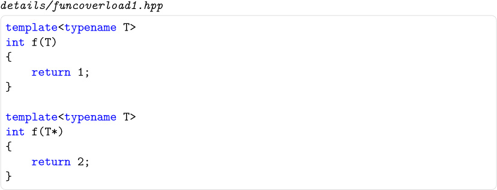

details/funcoverload1.hpp

template<typename T>
int f(T)
{
    return 1;\
}
\
template<typename T>
int f(T*)
{
    return 2;\
}

When `T` is substituted by `int*` in the first template, a function is obtained that has exactly the same parameter (and return) types as the one obtained by substituting `int` for `T` in the second template. Not only can these templates coexist, their respective instantiations can coexist even if they have identical parameter and return types.

The following demonstrates how two such generated functions can be called using explicit template argument syntax (assuming the previous template declarations):

[Click here to view code image]

details/funcoverload1.cpp

#include <iostream>
#include "funcoverload1.hpp"\
\
int main()
{
    std::cout << f[<int]\*>([(int]\*[)nullptr]);  // calls [f<T>(T)]\
    std::cout << f[<int]>([(int]\*[)nullptr]);   // calls [f<T>(T*)]\
}

This program has the following output:

`12`

To clarify this, let's analyze the call `f<int*>((int*)nullptr)` in detail. The syntax `f<int*>()` indicates that we want to substitute the first template parameter of the template `f()` with `int*` without relying on template argument deduction. In this case there is more than one template `f()`, and therefore an overload set is created containing two functions generated from templates: f<inT*>(inT*) (generated from the first template) and f<inT*>(inT*\*) (generated from the second template). The argument to the call (inT*)nullptr has type inT*. This matches only the function generated from the first template, and hence that is the function that ends up being called.

For the second call, on the other hand, the created overloading set contains `f<int>(int)` (generated from the first template) and `f<int>(int*)` (generated from the second template), so that only the second template matches.

#### 16.2.1 Signatures 

Two functions can coexist in a program if they have distinct signatures. We define the signature of a function as the following information:[1]. The unqualified name of the function (or the name of the function template from which it was generated)

2. The class or namespace scope of that name and, if the name has internal linkage, the translation unit in which the name is declared

3. The `const`, `volatile`, or `const volatile` qualification of the function (if it is a member function with such a qualifier)

4. The `&` or `&&` qualification of the function (if it is a member function with such a qualifier)

5. The types of the function parameters (before template parameters are substituted if the function is generated from a function template)

6. Its return type, if the function is generated from a function template

7. The template parameters and the template arguments, if the function is generated from a function template

This means that the following templates and their instantiations could, in principle, coexist in the same program:

[Click here to view code image]

template<typename T1, typename T2>
void f1(T1, T2);
\
template<typename T1, typename T2>
void f1(T2, T1);
\
template<typename T>
[long] f2(T);
\
template<typename T>
[char] f2(T);

However, they cannot always be used when they're declared in the same scope because instantiating both creates an overload ambiguity. For example, calling `f2(42)` when both the templates above are declared will clearly create an ambiguity. Another example is illustrated below:

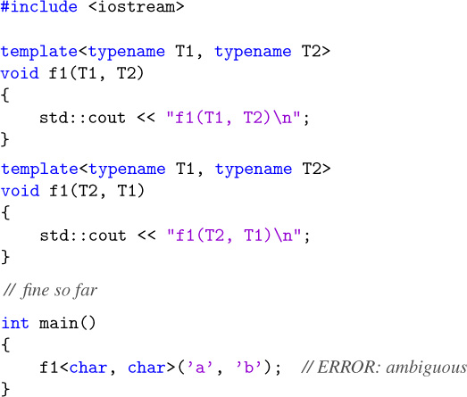

#include <iostream>
\
template<typename T1, typename T2>
void f1(T1, T2)
{
    std::cout << "f1(T1, T2)\n";\
}
template<typename T1, typename T2>
void f1(T2, T1)
{
    std::cout << "f1(T2, T1)\n";\
}
// fine so far
\
int main()
{
    f1<[char], [char]>[('a'], ['b']);  // ERROR: ambiguous
}

Here, the function

[Click here to view code image]

`f1<T1 = char, T2 = char>(T1, T2)`

can coexist with the function

[Click here to view code image]

`f1<T1 = char, T2 = char>(T2, T1)`

but overload resolution will never prefer one over the other. If the templates appear in different translation units, then the two instantiations can actually exist in the same program (and, e.g., a linker should not complain about duplicate definitions because the signatures of the instantiations are distinct):

[Click here to view code image]

*//* *translation unit 1:*\
#include <iostream>
\
template<typename T1, typename T2>
void f1(T1, T2)
{
    std::cout << "f1(T1, T2)\n";\
}
\
void g()
{
    f1<[char], [char]>[('a'], ['b']);
}
\
***//* *translation unit 2:***\
#include <iostream>
\
template<typename T1, typename T2>
void f1(T2, T1)
{
    std::cout << "f1(T2, T1)\n";\
}
[extern void] g();  // defined in translation unit 1
\
int main()
{
    f1<[char], [char]>[('a'], ['b']);
    g();
}

This program is valid and produces the following output:

`f1(T2, T1)`

`f1(T1, T2)`

#### 16.2.2 Partial Ordering of Overloaded Function Templates 

Reconsider our earlier example: We found that after substituting the given template argument lists (`<int*>` and `<int>`), overload resolution ended up selecting the right function to call:

[Click here to view code image]

std::cout << f[<int]\*>([(int]\*[)nullptr]);  // calls [f<T>(T)]\
std::cout << f[<int]>([(int]\*[)nullptr]);   // calls [f<T>(T*)]

However, a function is selected even when explicit template arguments are not provided. In this case, template argument deduction comes into play. Let's slightly modify function `main()` in the previous example to discuss this mechanism:

[Click here to view code image]

details/funcoverload2.cpp

#include <iostream>
\
template<typename T>
int f(T)
{
    return 1;\
}
\
template<typename T>
int f(T*)
{
    return 2;\
}
\
int main()
{
    std::cout << f(0);              // calls [f<T>(T)]\
    std::cout << f[(nullptr]);        // calls [f<T>(T)]\
    std::cout << f([(int]\*[)nullptr]);  // calls [f<T>(T*)]\
}

Consider the first call, `f(0)`: The type of the argument is `int`, which matches the type of the parameter of the first template if we substitute `T` with `int`. However, the parameter type of the second template is always a pointer and, hence, after deduction, only an instance generated from the first template is a candidate for the call. In this case overload resolution is trivial.

The same applies to the second call: `(f(nullptr):` The type of the argument is `std::nullptr_t`, which again only matches for the first template.

The third call (`f((int*)nullptr)`) is more interesting: Argument deduction succeeds for both templates, yielding the functions `f<int*>(int*)` and `f<int>(int*)`. From a traditional overload resolution perspective, both are equally good functions to call with an `int*` argument, which would suggest that the call is ambiguous (see [Appendix [C]]). However, in this sort of case, an additional overload resolution criterion comes into play: The function generated from the more specialized template is selected. Here (as we see shortly), the second template is considered more specialized and thus the output of our example is

`112`

#### 16.2.3 Formal Ordering Rules 

In our last example, it may seem very intuitive that the second template is more special than the first because the first can accommodate just about any argument type, whereas the second allows only pointer types. However, other examples are not necessarily as intuitive. In what follows, we describe the exact procedure to determine whether one function template participating in an overload set is more specialized than the other. Note that these are *partial* ordering rules: It is possible that given two templates, neither can be considered more specialized than the other. If overload resolution must select between two such templates, no decision can be made, and the program contains an ambiguity error.

Let's assume we are comparing two identically named function templates that seem viable for a given function call. Overload resolution is decided as follows:

• Function call parameters that are covered by a default argument and ellipsis parameters that are not used are ignored in what follows.

• We then synthesize two artificial lists of argument types (or for conversion function templates, a return type) by substituting every template parameter as follows:

1. Replace each template type parameter with a unique invented type.

2. Replace each template template parameter with a unique invented class template.

3. Replace each nontype template parameter with a unique invented value of the appropriate type. (Types, templates, and values that are invented in this context are distinct from any other types, templates, or values that either the programmer used or the compiler synthesized in other contexts.)

• If template argument deduction of the second template against the first synthesized list of argument types succeeds with an exact match, but not vice versa, then the first template is more specialized than the second. Conversely, if template argument deduction of the first template against the second synthesized list of argument types succeeds with an exact match, but not vice versa, then the second template is more specialized than the first. Otherwise (either no deduction succeeds or both succeed), there is no ordering between the two templates. Let's make this concrete by applying it to the two templates in our last example. From these two templates, we synthesize two lists of argument types by replacing the template parameters as described earlier: (`A1`) and (`A2*`) (where A1 and A2 are unique made up types). Clearly, deduction of the first template against the second list of argument types succeeds by substituting A2\* for T. However, there is no way to make `T*` of the second template match the nonpointer type `A1` in the first list. Hence, we formally conclude that the second template is more specialized than the first.

Consider a more intricate example involving multiple function parameters:

[Click here to view code image]

template<typename T>
void t(T*, T const\* = [nullptr], ...);
\
template<typename T>
void t(T const\*, T*, T* = [nullptr]);
\
void example[(int]\* p)
{
    t(p, p);
}

First, because the actual call does not use the ellipsis parameter for the first template and the last parameter of the second template is covered by its default argument, these parameters are ignored in the partial ordering. Note that the default argument of the first template is not used; hence the corresponding parameter participates in the ordering.

The synthesized lists of argument types are `(A1*, A1 const*)` and `(A2 const*, A2*)`. Template argument deduction of `(A1*, A1 const*)` versus the second template actually succeeds with the substitution of `T` with `A1 const`, but the resulting match is not exact because a qualification adjustment is needed to call `t<A1 const>(A1 const*, A1 const*, A1 const* = 0)` with arguments of types `(A1*, A1 const*)`. Similarly, no exact match can be found by deducing template arguments for the first template from the argument type list `(A2 const*, A2*)`. Therefore, there is no ordering relationship between the two templates, and the call is ambiguous.

The formal ordering rules generally result in the intuitive selection of function templates. Once in a while, however, an example comes up for which the rules do not select the intuitive choice. It is therefore possible that the rules will be revised to accommodate those examples in the future.

#### 16.2.4 Templates and Nontemplates 

Function templates can be overloaded with nontemplate functions. All else being equal, the non-template function is preferred in selecting the actual function being called. The following example illustrates this:

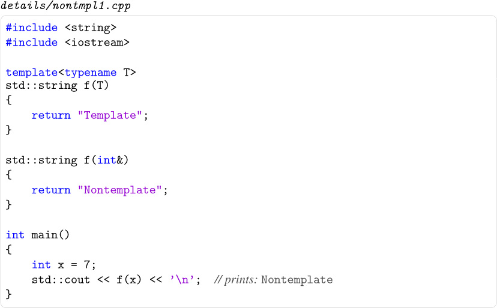

details/nontmpl1.cpp

#include <string>
#include <iostream>
\
template<typename T>
std::string f(T)
{
    return "Template";\
}
\
std::string f[(int]&)
{
    return "Nontemplate";\
}
\
int main()
{
    int x = 7;\
    std::cout << f(x) << '\n';//prints: [Nontemplate]\
}

This outputs

`Nontemplate`

However, when `const` and reference qualifiers differ, priorities for overload resolution can change. For example:

[Click here to view code image]

details/nontmpl2.cpp

#include <string>
#include <iostream>
\
template<typename T>
std::string f(T&)
{
    return "Template";\
}
\
std::string f[(int const]&)
{
    return "Nontemplate";\
}
\
int main()
{
    int x = 7;\
    std::cout << f(x) << '\n';//prints: template\
    [int const] c = 7;\
    std::cout << f(c) << '\n';//prints: [Nontemplate]\
}

The program has the following output:

`Template`

`Nontemplate`

Now, the function template `f<>(T&)` is a better match when passing a nonconstant `int`. The reason is that for an `int` the instantiated `f<>(int&)` is a better match than `f(int const&)`. Thus, the difference is not only the fact that one function is a template and the other is not. In that case the general rules of overload resolution apply (see Section [[C.2]] on page [[682]]). Only when calling `f()` for a `int const`, do both signatures have the same type `int const&`, so that the nontemplate is preferred.

For this reason, it's a good idea to declare the member function template as

[Click here to view code image]

template<typename T>
std::string f(T const&)
{
    return "Template";\
}

Nevertheless, this effect can easily occur accidentally and cause surprising behavior when member functions are defined that accept the same arguments as copy or move constructors. For example:

[Click here to view code image]

details/tmplconstr.cpp

#include <string>
#include <iostream>
\
class C {
  public:
    C() = [default];\
    C (C const&) {
      std::cout << "copy constructor\\n";\
    }
    C (C&&) {
      std::cout << "move constructor\\n";\
    }
    template<typename T>
    C (T&&) {
      std::cout << "template constructor\\n";\
    }
};
\
int main()
{
    C x;\
    C x2;             // prints: [template constructor]\
    C x3;  // prints: [move constructor]\
    C const c;\
    C x4;             // prints: [copy constructor]\
    C x5;  // prints: [template constructor]\
}

The program has the following output:

template constructor\
move constructor\
copy constructor\
template constructor

Thus, the member function template is a better match for copying a `C` than the copy constructor. And for `std::move(c)`, which yields type `C const&&` (a type that is possible but usually doesn't have meaningful semantics), the member function template also is a better match than the move constructor.

For this reason, usually you have to partially disable such member function templates when they might hide copy or move constructors. This is explained in Section [[6.4]] on page [[99]].

#### 16.2.5 Variadic Function Templates 

Variadic function templates (see Section [[12.4]] on page [[200]]) require some special treatment during partial ordering, because deduction for a parameter pack (described in Section [[15.5]] on page [[275]]) matches a single parameter to multiple arguments. This behavior introduces several interesting situations for function template ordering, illustrated by the following example:

[Click here to view code image]

details/variadicoverload.cpp

#include <iostream>
\
template<typename T>
int f(T*)
{
  return 1;\
}
\
template<typename... Ts>
int f(Ts...)
{
  return 2;\
}
\
template<typename... Ts>
int f(Ts\*...)
{
  return 3;\
}
int main()
{
  std::cout << f(0, 0.0);                          // calls [f<>(Ts...)]\
  std::cout << f([(int]\*[)nullptr], [(double]\*[)nullptr]); // calls [f<>(Ts\*...)]\
  std::cout << f([(int]\*[)nullptr]);                   // calls [f<>(T*)]\
}

The output of this example, which we will discuss in a moment, is

`231`

In the first call, `f(0, 0.0)`, each of the function templates named `f` is considered. For the first function template, `f(T*)`, deduction fails both because the template parameter `T` cannot be deduced and because there are more function arguments than parameters for this nonvariadic function template. The second function template, `f(Ts…)`, is variadic: Deduction in this case compares the pattern of a function parameter pack (`Ts`) against against the types of the two arguments (`int` and `double`, respectively), deducing `Ts` to the sequence (`int`, `double`). For the third function template, `f(Ts*…)`, deduction compares the pattern of the function parameter pack `Ts*` against each of the argument types. This deduction fails (`Ts` cannot be deduced), leaving only the second function template viable. Function template ordering is not required.

The second call, `f((int*)nullptr, (double*)nullptr)`, is more interesting: Deduction fails for the first function template because there are more function arguments than parameters, but deduction succeeds for the second and third templates. Written explicitly, the resulting calls would be

[Click here to view code image]

`f<int*,double*>((int*)nullptr, (double*)nullptr)`        //for second template

and

[Click here to view code image]

`f<int,double>((int*)nullptr, (double*)nullptr)`        //for third template

Partial ordering then considers the second and third templates, both of which are variadic as follows: When applying the formal ordering rules described in Section [[16.2.3]] on page [[331]] to a variadic template, each template parameter pack is replaced by a single made-up type, class template, or value. For example, this means that the synthesized argument types for the second and third function templates are `A1` and `A2*`, respectively, where `A1` and `A2` are unique, made-up types. Deduction of the second template against the third's list of argument types succeeds by substituting the single-element sequence (`A2*`) for the parameter pack `Ts`. However, there is no way to make the pattern `Ts*` of the third template's parameter pack match the nonpointer type `A1`, so the third function template (which accepts pointer arguments) is considered more specialized than the second function template (which accepts any arguments).

The third call, `f((int*)nullptr)`, introduces a new wrinkle: Deduction succeeds for all three of the function templates, requiring partial ordering to compare a nonvariadic template to a variadic template. To illustrate, we compare the first and third function templates. Here, the synthesized argument types are `A1*` and `A2*`, where `A1` and `A2` are unique, made-up types. Deduction of the first template against the third's synthesized argument list would normally succeed by substituting `A2` for `T`. In the other direction, deduction of the third template against the first's synthesized argument list succeeds by substituting the single-element sequence (`A1`) for the parameter pack `Ts`. Partial ordering between the first and third templates would normally result in an ambiguity. However, a special rule prohibits an argument that originally came from a function parameter pack (e.g., the third template's parameter pack `Ts*…`) from matching a parameter that is not a parameter pack (the first template's parameter `T *`). Hence, template deduction of the first template against the third's synthesized argument list fails, and the first template is considered more specialized than the third. This special rule effectively considers nonvariadic templates (those with a fixed number of parameters) to be more specialized than variadic templates (with a variable number of parameters).

The rules described above apply equally to pack expansions that occur in types in the function signature. For example, we can wrap the parameters and arguments of each of the function templates in our previous example into a variadic class template `Tuple` to arrive at a similar example not involving function parameter packs:

[Click here to view code image]

details/tupleoverload.cpp

#include <iostream>
\
template<typename... Ts> class Tuple\
{
};
\
template<typename T>
int f(Tuple<T*>)
{
  return 1;\
}
\
template<typename... Ts>
int f(Tuple<Ts...>)
{
  return 2;\
}
\
template<typename... Ts>
int f(Tuple<Ts\*...>)
{
  return 3;\
}
\
int main()
{
  std::cout << f(Tuple[<int], [double]>());    // calls [f<>(Tuple<Ts...>)]\
  std::cout << f(Tuple[<int]\*, [double]\*>());  // calls [f<>(Tuple<Ts\*...>)]\
  std::cout << f(Tuple[<int]\*>());           // calls [f<>(Tuple<T*>)]\
}

Function template ordering considers the pack expansions in the template arguments to `Tuple` analogously to the function parameter packs in our previous example, resulting in the same output:

`231`

### 16.3 Explicit Specialization 

The ability to overload function templates, combined with the partial ordering rules to select the "best" matching function template, allows us to add more specialized templates to a generic implementation to tune code transparently for greater efficiency. However, class templates and variable templates cannot be overloaded. Instead, another mechanism was chosen to enable transparent customization of class templates: *explicit specialization*. The standard term *explicit specialization* refers to a language feature that we call *full specialization* instead. It provides an implementation for a template with template parameters that are fully substituted: No template parameters remain. Class templates, function templates, and variable templates can be fully specialized.[2]

So can members of class templates that may be defined outside the body of a class definition (i.e., member functions, nested classes, static data members, and member enumeration types).

In a later section, we will describe *partial specialization*. This is similar to full specialization, but instead of fully substituting the template parameters, some parameterization is left in the alternative implementation of a template. Full specializations and partial specializations are both equally "explicit" in our source code, which is why we avoid the term *explicit specialization* in our discussion. Neither full nor partial specialization introduces a totally new template or template instance. Instead, these constructs provide alternative definitions for instances that are already implicitly declared in the generic (or *unspecialized*) template. This is a relatively important conceptual observation, and it is a key difference with overloaded templates.

#### 16.3.1 Full Class Template Specialization 

A full specialization is introduced with a sequence of three tokens: `template, <, and >`.[3] In addition, the class name is followed by the template arguments for which the specialization is declared. The following example illustrates this:

[Click here to view code image]

template<typename T>
class S {
  public:
    void info() {
        std::cout << "generic (S<T>::info())\n\";]\
    }
};
\
template<>
class S[<void]> {
  public:
    void msg() {
        std::cout << "fully specialized (S<void>::msg())\n";\
    }
};

Note how the implementation of the full specialization does not need to be related in any way to the generic definition: This allows us to have member functions of different names (`info` versus `msg`). The connection is solely determined by the name of the class template.

The list of specified template arguments must correspond to the list of template parameters. For example, it is not valid to specify a nontype value for a template type parameter. However, template arguments for parameters with default template arguments are optional:

template<typename T> class Types {
  public:
    using I = int;\
};
\
template<typename T, typename U = typename Types<T>::I>
class S;                        //#1
\
template<>
class S[<void]>  #2
  public:
    void f();
};
\
template<> class S[<char], [char]>; // #3
\
template<> class S[<char], 0>;    // ERROR: [0] cannot substitute [U]\
\
int main()
{
    `S<int>*      pi;`    // OK: uses #1 , no definition needed
    `S<int>       e1;`    // ERROR: uses #1 , but no definition available
    `S<void>*     pv;`    // OK: uses #2
    `S<void,int>  sv;`    // OK: uses #2 , definition available
    `S<void,char> e2;`    // ERROR: uses #1 , but no definition available
    `S<char,char> e3;`    // ERROR: uses #3 , but no definition available
`}`\
\
template<>
class S[<char], [char]>  #3
};

As this example also shows, declarations of full specializations (and of templates) do not necessarily have to be definitions. However, when a full specialization is declared, the generic definition is never used for the given set of template arguments. Hence, if a definition is needed but none is provided, the program is in error. For class template specialization, it is sometimes useful to "forward declare" types so that mutually dependent types can be constructed. A full specialization declaration is identical to a normal class declaration in this way (it is *not* a template declaration). The only differences are the syntax and the fact that the declaration must match a previous template declaration. Because it is not a template declaration, the members of a full class template specialization can be defined using the ordinary out-of-class member definition syntax (in other words, the `template<>` prefix cannot be specified):

[Click here to view code image]

template<typename T>
class S;\
\
template<> class S[<char]\*\*> {
  public:
    void print() const;\
};
\
// the following definition cannot be preceded by [template<>]\
void S[<char]\*\*>::print() const\
{
    std::cout << "pointer to pointer to char\\n";\
}

A more complex example may reinforce this notion:

[Click here to view code image]

template<typename T>
class Outside {
  [public]:     template<typename U>
    class Inside {
    }; };
\
template<>
class Outside[<void>] {
    // there is no special connection between the following nested class
    // and the one defined in the generic template
    template<typename U>
    class Inside {
      private:\
        [static int] count;\
    };
};
// the following definition cannot be preceded by `template<> template<typename U> int Outside<void>::Inside<U>::count = 1;`

A full specialization is a replacement for the instantiation of a certain generic template, and it is not valid to have both the explicit and the generated versions of a template present in the same program. An attempt to use both in the same file is usually caught by a compiler:

[Click here to view code image]

template<typename T>
class Invalid {
};
\
`Invalid<double> x1;`     // causes the instantiation of `Invalid<double>`\
\
template<>
class Invalid[<double]>;  // ERROR: [Invalid<double>] already instantiated

Unfortunately, if the uses occur in different translation units, the problem may not be caught so easily. The following invalid C++ example consists of two files and compiles and links on many implementations, but it is invalid and dangerous:

[Click here to view code image]

// **Translation unit 1:**
template<typename T>
class Danger {
  public:
    [enum] ;\
};
[char] buffer[Danger[<void]> ::max];  // uses generic value
\
[extern void] clear[(char]\*);
\
int main()
{
    clear(buffer);
}
\
// **Translation unit 2:**
template<typename T>
class Danger;\
\
template<>
class Danger[<void]> {
  public:
    [enum] ;\
};
\
void clear[(char]\* buf)
{
    // mismatch in array bound:
    [for] [(int] k = 0; k<Danger[<void]> ::max; ++k) {
      buf[k] = ['\\0'];\
    }
}

This example is clearly contrived to keep it short, but it illustrates that care must be taken to ensure that the declaration of the specialization is visible to all the users of the generic template. In practical terms, this means that a declaration of the specialization should normally follow the declaration of the template in its header file. When the generic implementation comes from an external source (such that the corresponding header files should not be modified), this is not necessarily practical, but it may be worth creating a header including the generic template followed by declarations of the specializations to avoid these hard-to-find errors. We find that, in general, it is better to avoid specializing templates coming from an external source unless it is clearly marked as being designed for that purpose.

#### 16.3.2 Full Function Template Specialization 

The syntax and principles behind (explicit) full function template specialization are much the same as those for full class template specialization, but overloading and argument deduction come into play.

The full specialization declaration can omit explicit template arguments when the template being specialized can be determined via argument deduction (using as argument types the parameter types provided in the declaration) and partial ordering. For example:

[Click here to view code image]

template<typename T>
int f(T)                    // #1
{
    return 1;\
}
\
template<typename T>
int f(T*)                   // #2
{
    return 2;\
}
\
template<> int f[(int])      // OK: specialization of #1
{
    return 3;\
}
template<> int f[(int]\*)    // OK: specialization of #2
{
    return 4;\
}

A full function template specialization cannot include default argument values. However, any default arguments that were specified for the template being specialized remain applicable to the explicit specialization:

[Click here to view code image]

template<typename T>
int f(T, T x = 42)
{
    return x;\
}
\
template<> int f[(int], int = 35)  // ERROR
{
    return 0;\
}

(That's because a full specialization provides an alternative definition, but not an alternative declaration. At the point of a call to a function template, the call is entirely resolved based on the function template.)

A full specialization is in many ways similar to a normal declaration (or rather, a normal *re*declaration). In particular, it does not declare a template, and therefore only *one definition* of a noninline full function template specialization should appear in a program. However, we must still ensure that a *declaration* of the full specialization follows the template to prevent attempts at using the function generated from the template. The declarations for a template `g()` and one full specialization would therefore typically be organized in two files as follows:

• The interface file contains the definitions of primary templates and partial specializations but declares only the full specializations:

[Click here to view code image]

[#ifndef] TEMPLATE_G\_HPP\
[#define] TEMPLATE_G\_HPP\
\
// template definition should appear in header file:
template<typename T>
int g(T, T x = 42)
{
    return x;\
}
\
// specialization declaration inhibits instantiations of the template;
// definition should not appear here to avoid multiple definition errors
template<> int g[(int], int y);
\
[#endif] // TEMPLATE\_G\_HPP

• The corresponding implementation file defines the full specialization:

[Click here to view code image]

#include "template_g.hpp"\
\
template<> int g[(int], int y)
{
    return y/2;\
}

Alternatively, the specialization could be made inline, in which case its definition can be (and should be) placed in the header file.

#### 16.3.3 Full Variable Template Specialization 

Variable templates can also be fully specialized. By now, the syntax should be intuitive:

[Click here to view code image]

template<typename T> [constexpr] std::size_t SZ = [sizeof](T);
template<> [constexpr] std::size_t SZ[<void]> = 0;

Clearly, the specialization can provide an initializer that is distinct from that resulting from the template. Interestingly, a variable template specialization is not required to have a type matching that of the template being specialized:

[Click here to view code image]

template<typename T> typename T::iterator null_iterator;\
template<> BitIterator null_iterator<std::bitset<100>>;\
                  // `BitIterator` doesn't match `T::iterator`, and that is fine

#### 16.3.4 Full Member Specialization 

Not only member templates, but also ordinary static data members and member functions of class templates, can be fully specialized. The syntax requires `template<>` prefix for every enclosing class template. If a member template is being specialized, a `template<>` must also be added to denote that it is being specialized. To illustrate the implications of this, let's assume the following declarations:

[Click here to view code image]

template<typename T>
class Outer  #1
  public:
    template<typename U>
    class Inner  #2
      private:\
        [static int] count;            // #3
    };
    [static int] code;                 // #4
    void print() const  #5
      std::cout << "generic";\
    }
};
template<typename T>
int Outer<T>::code = 6;              // #6
\
template<typename T> template[<typename] U>
int Outer<T>::Inner<U>::count = 7;   // #7
\
template<>
class Outer[<bool]>  #8
  public:
    template<typename U>
    class Inner  #9
      private:\
        [static int] count;            //#10
    };
    void print() const #11
    }
};

The ordinary members `code` at point *#4* and `print()` at point *#5* of the generic `Outer` template *#1* have a single enclosing class template and hence need one `template<>` prefix to specialize them fully for a specific set of template arguments:

[Click here to view code image]

    template<>
    int Outer[<void]>::code = 12;\
\
    template<>
    void Outer[<void]>::print() const\
    {
        std::cout << "Outer<void>";\
    }

These definitions are used over the generic ones at points *#4* and *#5* for class `Outer<void>`, but other members of class `Outer<void>` are still generated from the template at point *#1* . Note that after these declarations, it is no longer valid to provide an explicit specialization for `Outer<void>`.

Just as with full function template specializations, we need a way to declare the specialization of an ordinary member of a class template without specifying a definition (to prevent multiple definitions). Although nondefining out-of-class declarations are not allowed in C++ for member functions and static data members of ordinary classes, they *are* fine when specializing members of class templates. The previous definitions could be declared with

[Click here to view code image]

template<>
int Outer[<void]>::code;\
\
template<>
void Outer[<void]>::print() const;

The attentive reader might point out that the nondefining declaration of the full specialization of `Outer<void>::code` looks exactly like a definition to be initialized with a default constructor. This is indeed so, but such declarations are always interpreted as nondefining declarations. For a full specialization of a static data member with a type that can only be initialized using a default constructor, we must resort to initializer list syntax. Given the following:

[Click here to view code image]

class DefaultInitOnly {
  public:
    `DefaultInitOnly() = default;`\
    `DefaultInitOnly(DefaultInitOnly const&) = delete; };`\
\
template<typename T>
class Statics {
  private:\
    [static] T sm;\
};

the following is a declaration:

[Click here to view code image]

template<>
DefaultInitOnly Statics<DefaultInitOnly>::sm;

while the following is a definition that calls the default constructor:

[Click here to view code image]

template<>
DefaultInitOnly Statics<DefaultInitOnly>::sm;

Prior to C++11, this was not possible. Default initialization was thus not available for such specializations. Typically, an initializer copying a default value was used:

[Click here to view code image]

template<>
`DefaultInitOnly Statics<DefaultInitOnly>::sm = DefaultInitOnly();`

Unfortunately, for our example that was not possible because the copy constructor is deleted. However, C++17 introduced mandatory *copy-elision* rules, which make that alternative valid, because no copy constructor invocation is involved anymore.

The member template `Outer<T>::Inner` can also be specialized for a given template argument without affecting the other members of the specific instantiation of `Outer<T>`, for which we are specializing the member template. Again, because there is one enclosing template, we will need one `template<>` prefix. This results in code like the following:

[Click here to view code image]

template<>
    template<typename X>
  class Outer[<wchar_t]>::Inner {
      public:
        [static long] count; // member type changed
    };
\
template<>
   template<typename X>
   [long] Outer[<wchar_t]>::Inner<X>::count;

The template `Outer<T>::Inner` can also be fully specialized, but only for a given instance of `Outer<T>`. We now need two `template<>` prefixes: one because of the enclosing class and one because we're fully specializing the (inner) template:

[Click here to view code image]

template<>
    template<>
    class Outer[<char]>::Inner[<wchar_t]> {
      public:
        [enum] ;\
    };
\
// the following is not valid C++:
// `template<>` cannot follow a template parameter list
template<typename X>
template<> class Outer<X>::Inner[<void]>;  // ERROR

Contrast this with the specialization of the member template of `Outer<bool>`. Because the latter is already fully specialized, there is no enclosing template, and we need only one `template<>` prefix:

[Click here to view code image]

template<>
class Outer[<bool]>::Inner[<wchar_t]> {
  public:
    [enum] ;\
};

### 16.4 Partial Class Template Specialization 

Full template specialization is often useful, but sometimes it is natural to want to specialize a class template or variable template for a family of template arguments rather than just one specific set of template arguments. For example, let's assume we have a class template implementing a linked list:

[Click here to view code image]

template<typename T>
class List  #1
  public:
   ...
   void append(T const&);
   [inline] std::size_t length() const;\
   ...
};

A large project making use of this template may instantiate its members for many types. For member functions that are not expanded inline (say, `List<T>::append()`), this may cause noticeable growth in the object code. However, we may know that from a low-level point of view, the code for `List<int*>::append()` and `List<void*>::append()` is the same. In other words, we'd like to specify that all `List`s of pointers share an implementation. Although this cannot be expressed in C++, we can achieve something quite close by specifying that all `List`s of pointers should be instantiated from a different template definition:

[Click here to view code image]

template<typename T>
class List<T*>  #2
  private:\
    `List<void*> impl;`\
    ...
  public:
    ...
   [inline void] append(T* p) {
      impl.append(p);
   }
   [inline] std::size_t length() const {
       return impl.length();
   }
   ...
};

In this context, the original template at point *#1* is called the *primary template*, and the latter definition is called a *partial specialization* (because the template arguments for which this template definition must be used have been only partially specified). The syntax that characterizes a partial specialization is the combination of a template parameter list declaration (`template<`... `>`) and a set of explicitly specified template arguments on the name of the class template (`<T*>` in our example).

Our code contains a problem because `List<void*>` recursively contains a member of that same `List<void*>` type. To break the cycle, we can precede the previous partial specialization with a full specialization:

[Click here to view code image]

template<>
class List[<void]\*>  #3
    ...
    void append [(void]\* p);
    [inline] std::size_t length() const;\
    ...
};

This works because matching full specializations are preferred over partial specializations. As a result, all member functions of `List`s of pointers are forwarded (through easily inlineable functions) to the implementation of `List<void*>`. This is an effective way to combat *code bloat* (of which C++ templates are often accused).

There exist several limitations on the parameter and argument lists of partial specialization declarations. Some of them are as follows:

1. The arguments of the partial specialization must match in kind (type, nontype, or template) the corresponding parameters of the primary template.

2. The parameter list of the partial specialization cannot have default arguments; the default arguments of the primary class template are used instead.

3. The nontype arguments of the partial specialization should be either nondependent values or plain nontype template parameters. They cannot be more complex dependent expressions like `2*N` (where `N` is a template parameter).

4. The list of template arguments of the partial specialization should not be identical (ignoring renaming) to the list of parameters of the primary template.

5. If one of the template arguments is a pack expansion, it must come at the end of a template argument list.

An example illustrates these limitations:

[Click here to view code image]

template<typename T, int I = 3>
class S;                  // primary template
\
template<typename T>
class S[<int], T>;          // ERROR: parameter kind mismatch
\
template<typename T = int>
class S<T, 10>;          // ERROR: no default arguments
\
template<int I>
class S[<int], I\*2>;       // ERROR: no nontype expressions
\
template<typename U, int K>
class S<U, K>;           // ERROR: no significant difference from primary template
\
template<typename... Ts>
class Tuple;\
\
template<typename Tail, typename... Ts>
class Tuple<Ts..., Tail>;  // ERROR: pack expansion not at the end
\
template<typename Tail, typename... Ts>
class Tuple<Tuple<Ts...>, Tail>;  // OK: pack expansion is at the end of a
                               // nested template argument list

Every partial specialization---like every full specialization---is associated with the primary template. When a template is used, the primary template is always the one that is looked up, but then the arguments are also matched against those of the associated specializations (using template argument deduction, as described in [Chapter [15]]) to determine which template implementation is picked. Just as with function template argument deduction, the SFINAE principle applies here: If, while attempting to match a partial specialization an invalid construct is formed, that specialization is silently abandoned and another candidate is examined if one is available. If no matching specializations is found, the primary template is selected. If multiple matching specializations are found, the most specialized one (in the sense defined for overloaded function templates) is selected; if none can be called most specialized, the program contains an ambiguity error.

Finally, we should point out that it is entirely possible for a class template partial specialization to have more or fewer parameters than the primary template. Consider our generic template `List`, declared at point *#1* , again. We have already discussed how to optimize the list-of-pointers case, but we may want to do the same with certain pointer-to-member types. The following code achieves this for pointer-to-member-pointers:

[Click here to view code image]

// partial specialization for any pointer-to-`void* member template<typename C> class List<void* C::*>  #4
  public:
    using ElementType = [void]\* C::\*;\
    ...
    void append(ElementType pm);
    [inline] std::size_t length() const;\
    ...
};
\
// partial specialization for any pointer-to-member-pointer type except
// pointer-to-`void*` member, which is handled earlier
// (note that this partial specialization has two template parameters,
// whereas the primary template only has one parameter)
// this specialization makes use of the prior one to achieve the
// desired optimization
template<typename T, typename C>
class List<T* C::\*>  #5
  private:\
    `List<void* C::*> impl;`\
    ...
  public:
    using ElementType = T* C::\*;\
    ...
    [inline void] append(ElementType pm) {
        impl.append(([void]\* C::\*)pm);
    }
    [inline] std::size_t length() const {
        return impl.length();
    }
    ...
};

In addition to our observation regarding the number of template parameters, note that the common implementation defined at *#4* to which all others are forwarded by the declaration at point *#5* is itself a partial specialization (for the simple pointer case it is a full specialization). However, it is clear that the specialization at point *#4* is more specialized than that at point *#5* ; thus no ambiguity should occur.

Moreover, it is even possible that the number of explicitly written template *arguments* can differ from the number of template parameters in the primary template. This can happen both with default template arguments and, in a far more useful manner, with variadic templates:

[Click here to view code image]

template<typename... Elements>
class Tuple; // primary template
\
template<typename T1>
class Tuple<T>; // one-element tuple
\
template<typename T1, typename T2, typename... Rest>
class Tuple<T1, T2, Rest...>; // tuple with two or more elements

### 16.5 Partial Variable Template Specialization 

When variable templates were added to the draft C++11 standard, several aspects of their specifications were overlooked, and some of those issues have still not been formally resolved. However, actual implementations generally agree on the handling of these issues.

Perhaps the most surprising of these issues is that the standard refers to the ability to partially specialize variable templates, but it does not describe how they are declared or what they mean. What follows is thus based on C++ implementations in practice (which do permit such partial specializations), and not on the C++ standard.

As one would expect, the syntax is similar to full variable template specialization, except that `template<>` is replaced by an actual template declaration header, and the template argument list following the variable template name must depend on template parameters. For example:

[Click here to view code image]

template<typename T> [constexpr] std::size_t SZ = [sizeof](T);
\
template<typename T> [constexpr] std::size_t SZ<T&> = [sizeof][(void]\*);

As with the full specialization of variable templates, the type of a partial specialization is not required to match that of the primary template:

[Click here to view code image]

template<typename T> typename T::iterator null_iterator;\
\
template<typename T, std::size_t N> T* null_iterator<T[N]> = null_ptr;\
                // [T doesn't match [T::iterator], and that is fine

The rules regarding the kinds of template arguments that can be specified for a variable template partial specialization are identical to those for class template specializations. Similarly, the rules to select a specialization for a given list of concrete template arguments are identical too.

### 16.6 Afternotes 

Full template specialization was part of the C++ template mechanism from the start. Function template overloading and class template partial specialization, on the other hand, came much later. The HP aC++ compiler was the first to implement function template overloading, and EDG's C++ front end was the first to implement class template partial specialization. The partial ordering principles described in this chapter were originally invented by Steve Adamczyk and John Spicer (who are both of EDG).

The ability of template specializations to terminate an otherwise infinitely recursive template definition (such as the `List<T*>` example presented in Section [[16.4]] on page [[348]]) was known for a long time. However, Erwin Unruh was perhaps the first to note that this could lead to the interesting notion of *template metaprogramming*: using the template instantiation mechanism to perform nontrivial computations at compile time. We devote [Chapter [23]] to this topic.

You may legitimately wonder why only class templates and variable templates can be partially specialized. The reasons are mostly historical. It is probably possible to define the same mechanism for function templates (see [Chapter [17]]). In some ways, the effect of overloading function templates is similar, but there are also some subtle differences. These differences are mostly related to the fact that only the primary template needs to be looked up when a use is encountered. The specializations are considered only afterward, to determine which implementation should be used. In contrast, all overloaded function templates must be brought into an overload set by looking them up, and they may come from different namespaces or classes. This increases the likelihood of unintentionally overloading a template name somewhat.

Conversely, it is also imaginable to allow a form of overloading of class templates and variable templates. Here is an example:

[Click here to view code image]

// invalid overloading of class templates
template<typename T1, typename T2> class Pair;\
template<int N1, int N2> class Pair;

However, there doesn't seem to be a pressing need for such a mechanism.

^[1]^ This definition differs from that given in the C++ standard, but its consequences are equivalent.

^[2]^ Alias templates are the only form of template that *cannot* be specialized, either by a full specialization or a partial specialization. This restriction is necessary to make the use of template aliases transparent to the template argument deduction process Section [[15.11]] on page [[312]].

^[3]^ The same prefix is also needed to declare full function template specializations. Earlier designs of the C++ language did not include this prefix, but the addition of member templates required additional syntax to disambiguate complex specialization cases.

## Chapter 17 

## Future Directions 

C++ templates have been evolving almost continuously from their initial design in 1988, through the various standardization milestones in 1998, 2011, 2014, and 2017. It could be argued that templates were at least somewhat related to most major language additions after the original 1998 standard.

The first edition of this book listed a number of extensions that we might see after the first standard, and several of those became reality:

• The angle bracket hack: C++11 removed the need to insert a space between two closing angle brackets.

• Default function template arguments: C++11 allows function templates to have default template arguments.

• Typedef templates: C++11 introduced alias templates, which are similar.

• The `typeof` operator: C++11 introduced the `decltype` operator, which fills the same role (but uses a different token to avoid a conflict with an existing extension that doesn't quite meet the needs of the C++ programmers' community).

• Static properties: The first edition anticipated a selection of type traits being supported directly by compilers. This has come to pass, although the interface is expressed using the standard library (which is then implemented using compiler extensions for many of the traits).

• Custom instantiation diagnostics: The new keyword `static_assert` implements the idea described by `std::instantiation_error` in the first edition of this book.

• List parameters: This became *parameter packs* in C++11.

• Layout control: C++11's `alignof` and `alignas` cover the needs described in the first edition. Furthermore, the C++17 library added a `std::variant` template to support discriminated unions.

• Initializer deduction: C++17 added class template argument deduction, which addresses the same issue.

• Function expressions: C++11's lambda expressions provides exactly this functionality (with a syntax somewhat different from that discussed in the first edition).

Other directions hypothesized in the first edition have not made it into the modern language, but most are still discussed on occasion and we keep their presentation in this volume. Meanwhile, other ideas are emerging and we present some of those as well.

### 17.1 Relaxed **typename** Rules 

In the first edition of this book, this section suggested that the future might bring two kinds of relaxations to the rules for the use of `typename` (see Section [[13.3.2]] on page [[228]]): Allow `typename` where it was not previously allowed, and make `typename` optional where a compiler can relatively easily infer that a qualified name with a dependent qualifier must name a type. The former came to pass (`typename` in C++11 can be used redundantly in many places), but the latter has not.

Recently, however, there has been a renewed call to make `typename` optional in various common contexts where the expectation of a type specifier is unambiguous:

• The return type and parameter types of function and member function declarations in namespace and class scope. Similarly with function and member function templates and with lambda expressions appearing in any scope.

• The types of variable, variable template, and static data member declarations. Again, similarly with variable templates.

• The type after the `=` token in an alias or alias template declaration.

• The default argument of a type parameter of a template.

• The type appearing in the angle brackets following a `static_cast`, `const_cast`, `dynamic_cast`, or `reinterpret_cast`, construct.

• The type named in a `new` expression.

Although this is a relatively ad hoc list, it turns out that such a change in the language would allow by far most instances of this use of `typename` to be dropped, which would make code more compact and more readable.

### 17.2 Generalized Nontype Template Parameters 

Among the restrictions on nontype template arguments, perhaps the most surprising to beginning and advanced template writers alike is the inability to provide a string literal as a template argument.

The following example seems intuitive enough:

[Click here to view code image]

template<[char const]\* msg>
class Diagnoser {
  public:
    void print();
};
\
int main()
{
    `Diagnoser<"Surprise!">().print(); }`

However, there are some potential problems. In standard C++, two instances of `Diagnoser` are the same type if and only if they have the same arguments. In this case the argument is a pointer value---in other words, an address. However, two identical string literals appearing in different source locations are not required to have the same address. We could thus find ourselves in the awkward situation that `Diagnoser<"X">` and `Diagnoser<"X">` are in fact two different and incompatible types! (Note that the type of `"X"` is `char const[2]`, but it decays to `char const*` when passed as a template argument.)

Because of these (and related) considerations, the C++ standard prohibits string literals as arguments to templates. However, some implementations do offer the facility as an extension. They enable this by using the actual string literal contents in the internal representation of the template instance. Although this is clearly feasible, some C++ language commentators feel that a nontype template parameter that can be substituted by a string literal value should be declared differently from one that can be substituted by an address. One possibility would be to capture string literals in a parameter pack of characters. For example:

[Click here to view code image]

template<[char]... msg>
class Diagnoser {
  public:
    void print();
};
\
int main()
{
    // instantiates `Diagnoser<’S’,’u’,’r’,’p’,’r’,’i’,’s’,’e’,’!’>     Diagnoser<"Surprise!">().print(); }`

We should also note an additional technical wrinkle in this issue. Consider the following template declarations, and let's assume that the language has been extended to accept string literals as template arguments in this case:

[Click here to view code image]

template<[char const]\* str>
class Bracket {
  public:
    [static char const]\* address();
    [static char const]\* bytes();
};
\
template<[char const]\* str>
[char const]\* Bracket<str>::address()
{
    return str;\
}
\
template<[char const]\* str>
[char const]\* Bracket<str>::bytes()
`{`\
    return str;\
}

In the previous code, the two member functions are identical except for their names---a situation that is not that uncommon. Imagine that an implementation would instantiate `Bracket<"X">` using a process much like macro expansion: In this case, if the two member functions are instantiated in different translation units, they may return different values. Interestingly, a test of some C++ compilers that currently provide this extension reveals that they do suffer from this surprising behavior.

A related issue is the ability to provide floating-point literals (and simple constant floating-point expressions) as template arguments. For example:

[Click here to view code image]

template<[double] Ratio>
class Converter {
  public:
    [static double] convert [(double] val) {
      return val\*Ratio;\
    }
};
using InchToMeter = Converter<0.0254>;

This too is provided by some C++ implementations and presents no serious technical challenges (unlike the string literal arguments).

C++11 introduced a notion of a *literal class type*: a class type that can take constant values computed at compile time (including nontrivial computations through `constexpr` functions). Once such class types became available, it quickly became desirable to allow them for nontype template parameters. However, problems similar to those of the string literal parameters described above arose. In particular, the "equality" of two class-type values is not a trivial matter, because it is in general determined by `operator==` definitions. This equality determines if two instantiations are equivalent, but in practice, that equivalence must be checkable by the linker by comparing mangled names. One way out may be an option to mark certain literal classes as having a trivial equality criterion that amounts to pairwise comparing of the scalar members of the class. Only class types with such a trivial equality criterion would then be permitted as nontype template parameter types.

### 17.3 Partial Specialization of Function Templates 

In [Chapter [16]] we discussed how class templates can be partially specialized, whereas function templates are simply overloaded. The two mechanisms are somewhat different.

Partial specialization doesn't introduce a completely new template: It is an extension of an existing template (the *primary* template). When a class template is looked up, only primary templates are considered at first. If, after the selection of a primary template, it turns out that there is a partial specialization of that template with a template argument pattern that matches that of the instantiation, *its* definition (in other words, its *body*) is instantiated instead of the definition of the primary template. (Full template specializations work exactly the same way.)

In contrast, overloaded function templates are separate templates that are completely independent of one another. When selecting which template to instantiate, all the overloaded templates are considered together, and overload resolution attempts to choose one as the best fit. At first this might seem like an adequate alternative, but in practice there are a number of limitations:

• It is possible to specialize member templates of a class without changing the definition of that class. However, adding an overloaded member does require a change in the definition of a class. In many cases this is not an option because we may not own the rights to do so. Furthermore, the C++ standard does not currently allow us to add new templates to the `std` namespace, but it does allow us to specialize templates from that namespace.

• To overload function templates, their function parameters must differ in some material way. Consider a function template `R convert(T const&)` where `R` and `T` are template parameters. We may very well want to specialize this template for `R = void`, but this cannot be done using overloading.

• Code that is valid for a nonoverloaded function may no longer be valid when the function is overloaded. Specifically, given two function templates `f(T)` and `g(T)` (where `T` is a template parameter), the expression `g(&f<int>)` is valid only if `f` is not overloaded (otherwise, there is no way to decide which `f` is meant).

• Friend declarations refer to a specific function template or an instantiation of a specific function template. An overloaded version of a function template would not automatically have the privileges granted to the original template.

Together, this list forms a compelling argument in support of a partial specialization construct for function templates.

A natural syntax for partially specializing function templates is the generalization of the class template notation:

[Click here to view code image]

template<typename T>
T const& max (T const&, T const&);               // primary template
\
template<typename T>
T* const& max <T*>(T* const&, T* const&);        // partial specialization

Some language designers worry about the interaction of this partial specialization approach with function template overloading. For example:

[Click here to view code image]

template<typename T>
void add (T& x, int i);     // a primary template
\
template<typename T1, typename T2>
void add (T1 a, T2 b);      // another (overloaded) primary template
\
template<typename T>
void add<T*> (T*&, int);    // Which primary template does this specialize?

However, we expect such cases would be deemed errors without major impact on the utility of the feature.

This extension was briefly discussed during the standardization of C++11 but gathered relatively little interest in the end. Still, the topic occasionally arises because it neatly solves some common programming problems. Perhaps it will be taken up again in some future version of the C++ standard.

### 17.4 Named Template Arguments 

Section [[21.4]] on page [[512]] describes a technique that allows us to provide a nondefault template argument for a specific parameter without having to specify other template arguments for which a default value is available. Although it is an interesting technique, it is also clear that it results in a fair amount of work for a relatively simple effect. Hence, providing a language mechanism to name template arguments is a natural thought.

We should note at this point that a similar extension (sometimes called *keyword arguments*) was proposed earlier in the C++ standardization process by Roland Hartinger (see Section 6.5.1 of [StroustrupDnE]). Although technically sound, the proposal was ultimately not accepted into the language for various reasons. At this point there is no reason to believe named template arguments will ever make it into the language, but the topic arises regularly in committee discussions.

However, for the sake of completeness, we mention one syntactic idea that has been discussed:

[Click here to view code image]

template<typename T,\
         typename Move = defaultMove<T>,\
         typename Copy = defaultCopy<T>,\
         typename Swap = defaultSwap<T>,\
         typename Init = defaultInit<T>,\
         typename Kill = defaultKill<T>>
class Mutator {
   ...
`};`\
\
void test(MatrixList ml)
{
   mySort (ml, Mutator <Matrix, .Swap = matrixSwap>);
}

Here, the period preceding the argument name is used to indicate that we're referring to a template argument by name. This syntax is similar to the "designated initializer" syntax introduced in the 1999 C standard:

[Click here to view code image]

struct Rectangle  top, left, width, height; };
struct Rectangle r = ;

Of course, introducing named template arguments means that the template parameter names of a template are now part of the public interface to that template and cannot be freely changed. This could be addressed by a more explicit, opt-in syntax, such as the following:

[Click here to view code image]

template<typename T,\
         Move: typename M = defaultMove<T>,\
         Copy: typename C = defaultCopy<T>,\
         Swap: typename S = defaultSwap<T>,\
         Init: typename I = defaultInit<T>,\
         Kill: typename K = defaultKill<T>>
class Mutator {
   ...
`};`\
\
void test(MatrixList ml)
{
   mySort (ml, Mutator <Matrix, .Swap = matrixSwap>);
}

### 17.5 Overloaded Class Templates 

It is entirely possible to imagine that class templates could be overloaded on their template parameters. For example, one can imagine creating a family of `Array` templates that contains both dynamically and statically sized arrays:

[Click here to view code image]

template<typename T>
class Array {
    // dynamically sized array
    ...
};
\
template<typename T, [unsigned] Size>
class Array {
    // fixed size array
    ...
};

The overloading isn't necessarily restricted to the number of template parameters; the *kind* of parameters can be varied too:

[Click here to view code image]

template<typename T1, typename T2>
class Pair {
   // pair of fields
    ...
};
\
template<int I1, int I2>
class Pair {
    // pair of constant integer values
    ...
};

Although this idea has been discussed informally by some language designers, it has not yet been formally presented to the C++ standardization committee.

### 17.6 Deduction for Nonfinal Pack Expansions 

Template argument deduction for pack expansions only works when the pack expansion occurs at the end of the parameter or argument list. This means that while it is fairly simple to extract the first element from a list:

[Click here to view code image]

template<typename... Types>
struct Front;\
\
template<typename FrontT, typename... Types>
struct Front<FrontT, Types...> {
  using Type = FrontT;\
};

one cannot easily extract the last element of the list due to the restrictions placed on partial specializations described in Section [[16.4]] on page [[347]]:

[Click here to view code image]

template<typename... Types>
struct Back;\
\
template<typename BackT, typename... Types>
struct Back<Types..., BackT> \
  using Type = BackT;          //       template argument list
};

Template argument deduction for variadic function templates is similarly restricted. It is plausible that the rules regarding template argument deduction of pack expansions and partial specializations will be relaxed to allow the pack expansion to occur anywhere in the template argument list, making this kind of operation far simpler. Moreover, it is possible---albeit less likely---that deduction could permit multiple pack expansions within the same parameter list:

[Click here to view code image]

template<typename... Types> class Tuple {
};
\
template<typename T, typename... Types>
struct Split;\
\
template<typename T, typename... Before, typename... After>
struct Split<T, Before..., T, After...> {
  using before = Tuple<Before...>;\
  using after = Tuple<After...>;\
};

Allowing multiple pack expansions introduces additional complexity. For example, does `Split` separate at the first occurrence of `T`, the last occurrence, or one in between? How complicated can the deduction process become before the compiler is permitted to give up?

### 17.7 Regularization of **void** 

When programming templates, regularity is a virtue: If a single construct can cover all cases, it makes our template simpler. One aspect of our programs that is somewhat irregular are *types*. For example, consider the following:

[Click here to view code image]

auto&& r = f();        // error if f() returns [void]

That works for just about any type that `f()` returns except `void`. The same problem occurs when using `decltype(auto)`:

[Click here to view code image]

decltype(auto) r = f();        // error if f() returns [void]

`void` is not the only irregular type: Function types and reference types often also exhibit behaviors that make them exceptional in some way. However, it turns out that `void` often complicates our templates *and* that there is no deep reason for `void` to be unusual that way. For example, see Section [[11.1.3]] on page [[162]] for an example how this complicates the implementation of a perfect `std::invoke()` wrapper.

We could just decree that `void` is a normal value type with a unique value (like `std::nullptr_t` for `nullptr`). For backward compatibility purposes, we'd still have to keep a special case for function declarations like the following:

[Click here to view code image]

void g[(void]);        // same as [void g();]

However, in most other ways, `void` would become a complete value type. We could then for example declare `void` variables and references:

void v = [void];\
[void]&& rrv = f();

Most importantly, many templates would no longer need to be specialized for the `void` case.

### 17.8 Type Checking for Templates 

Much of the complexity of programming with templates comes from the compiler's inability to locally check whether a template definition is correct. Instead, most of the checking of a template occurs during template instantiation, when the template definition context and the template instantiation context are intertwined. This mixing of different contexts makes it hard to assign blame: Was the template definition at fault, because it used its template arguments incorrectly, or was the template user at fault, because the supplied template arguments didn't meet the requirements of the template? The problem can be illustrated with a simple example, which we have annotated with the diagnostics produced by a typical compiler:

[Click here to view code image]

template<typename T>
T max(T a, T b)
{
  return b < a ? a : b;       
                          // ERROR: "no match for operator [<]\
                          //        (operator types are '`X`' and '`X`')"
`}`\
\
struct X {
};
[bool operator]> (X, X);
\
int main()
{
  `X a, b;`\
  `X m = max(a, b);`        // NOTE: "in instantiation of function template specialization
                          //       '`max<X>`' requested here"
}

Note that the actual error (the lack of a proper `operator<`) is detected within the definition of the function template `max()`. It is possible that this is truly the error---perhaps `max()` should have used `operator>` instead? However, the compiler also provides a note that points to the place that caused the instantiation of `max<X>`, which may be the real error---perhaps `max()` is documented to require `operator<`? The inability to answer this question is what often leads to the "error novel" described in Section [[9.4]] on page [[143]], where the compiler provides the entire template instantiation history from the initial cause of the instantiation down to the actual template definition in which the error was detected. The programmer is then expected to determine which of the template definitions (or perhaps the original use of the template) is actually in error.

The idea behind type checking of templates is to describe the requirements of a template within the template itself, so that the compiler can determine whether the template definition or the template use is at fault when compilation fails. One solution to this problem is to describe the template's requirements as part of the signature of the template itself using a *concept*:

[Click here to view code image]

template<typename T> [requires] LessThanComparable<T>
T\
max(T a, T b)
{
   return b < a ? a : b;\
}
\
struct X ;\
[bool operator]> (X, X);
\
int main()
{
  `X a, b;`\
  `X m = max(a, b);`        // ERROR: `X` does not meet the `LessThanComparable` requirement
`}`

By describing the requirements on the template parameter `T`, the compiler is able to ensure that the function template `max()` only uses operations on `T` that the user is expected to provide (in this case, `LessThanComparable` describes the need for `operator<`). Moreover, when using a template, the compiler can check that the supplied template argument provides all of the behavior required for the `max()` function template to work properly. By separating the type-checking problem, it becomes far easier for the compiler to provide an accurate diagnosis of the problem.

In the example above, `LessThanComparable` is called a *concept*: It represents constraints on a type (in the more general case, constraints on a set of types) that a compiler can check. Concept systems can be designed in different ways.

During the standardization cycle for C++11, an elaborate system was fully designed and implemented for concepts that are powerful enough to check both the point of instantiation of a template and the definition of a template. The former means, in our example above, that an error in `main()` could be caught early with a diagnostic explaining that `X` doesn't satisfy the constraints of `LessThanComparable`. The latter means that when processing the `max()` template, the compiler checks that no operation not permitted by the `LessThanComparable` concept is used (and a diagnostic is emitted if that constraint is violated). The C++11 proposal was eventually pulled from the language specification because of various practical considerations (e.g., there were still many minor specification issues whose resolution was threatening a standard that was already running late).

After C++11 eventually shipped, a new proposal (first called *concepts lite*) was presented and developed by members of the committee. This system does not aim at checking the correctness of a template based on the constraints attached to it. Instead it focuses on the point of instantiations only. So if in our example `max()` were implemented using the `>` operator, no error would be issued at that point. However, an error would still be issued in `main()` because `X` doesn't satisfy the constraints of `LessThanComparable`. The new concepts proposal was implemented and specified in what is called the *Concepts TS* (*TS* stands for *Technical Specification*), called *C++ extensions for Concepts*.[1] Currently, the essential elements of that technical specification have been integrated into the draft for the next standard (expected to become C++20). [Appendix [E]] covers the language feature as specified in that draft at the time this book went to press.

### 17.9 Reflective Metaprogramming 

In the context of programming, *reflection* refers to the ability to programmatically inspect features of the program (e.g., answering questions such as *Is a type an integer?* or *What nonstatic data members does a class type contain?*). Metaprogramming is the craft of "programming the program," which usually amounts to programmatically generating new code. *Reflective metaprogramming*, then, is the craft of automatically synthesizing code that adapts itself to existing properties (often, types) of a program.

In [Part III] of this book, we will explore how templates can achieve some simple forms of reflection and metaprogramming (in some sense, template instantiation is a form of metaprogramming, because it causes the synthesis of new code). However, the capabilities of C++17 templates are rather limited when it comes to reflection (e.g., it is not possible to answer the question *What nonstatic data members does a class type contain?*) and the options for metaprogramming are often inconvenient in various ways (in particular, the syntax becomes unwieldy and the performance is disappointing).

Recognizing the potential of new facilities in this area, the C++ standardization committee created a study group (SG7) to explore options for more powerful reflection. That group's charter was later extended to cover metaprogramming also. Here is an example of one of the options being considered:

[Click here to view code image]

template<typename T> void report(T p) {
  [constexpr] {
    std::meta::info infoT = [reflexpr](T);
    [for] (std::meta::info : std::meta::data_members(infoT)) {
      `-> {`\
          `std::cout << (: std::meta::name(info) :)`\
                    `<<` ":  " << p.(.info.) << '\n';\
      `}     }   }`\
  //code will be injected here
`}`

Quite a few new things are present in this code. First, the `constexpr` construct forces the statements in it to be evaluated at compile time, but if it appears in a template, this evaluation is only done when the template is instantiated. Second, the `reflexpr()` operator produces an expression of opaque type `std::meta::info` that is a handle to reflected information about its argument (the type substituted for `T` in this example). A library of standard metafunctions permits querying this meta-information. One of those standard metafunctions is `std::meta::data_members`, which produces a sequence of `std::meta::info` objects describing the direct nonstatic data members of its operand. So the `for` loop above is really a loop over the nonstatic data members of `p`.

At the core of the metaprogramming capabilities of this system is the ability to "inject" code in various scopes. The construct `->` injects statements and/or declarations right after the statement or declaration that kicked off a `constexpr` evaluation. In this example, that means after the `constexpr` construct. The code fragments being injected can contain certain patterns to be replaced by computed values. In this example, `(:`... `:)` produces a string literal value (the expression `std::meta::name(info)` produces a string-like object representing the unqualified name of the entity---data member in this case---represented by `info`). Similarly, the expression `(.info.)` produces an identifier naming the entity represented by `info`. Other patterns to produce types, template argument lists, etc. are also proposed.

With all that in place, instantiating the function template `report()` for a type:

[Click here to view code image]

struct X {
  int x;\
  std::string s;\
};

would produce an instantiation similar to

[Click here to view code image]

template<> void report(X const& p) {
    std::cout << "x" << ": " << "p.x" << '\n';\
    std::cout << "s" << ": " << "p.s" << '\n';\
}

That is, this function automatically generates a function to output the nonstatic data member values of a class type.

There are many applications for these types of capabilities. While it is likely that something like this will eventually be adopted into the language, it is unclear in what time frame it can be expected. That said, a few experimental implementations of such systems have been demonstrated at the time of this writing. (Just before going to press with this book, SG7 agreed on the general direction of using constexpr evaluation and a value type somewhat like `std::meta::info` to deal with reflective metaprogramming. The injection mechanism presented here, however, was not agreed on, and most likely a different system will be pursued.)

### 17.10 Pack Facilities 

Parameter packs were introduced in C++11, but dealing with them often requires recursive template instantiation techniques. Recall this outline of code discussed in Section [[14.6]] on page [[263]]:

[Click here to view code image]

template<typename Head, typename... Remainder>
void f(Head&& h, Remainder&&... r) {
  doSomething(h);
  [if constexpr] [(sizeof]...(r) != 0) {
    // handle the remainder recursively (perfectly forwarding the arguments):
    `f(r…);   } }`

This example is made simpler by exploiting the features of the C++17 compile-time `if` statement (see Section [[8.5]] on page [[134]]), but it remains a recursive instantiation technique that may be somewhat expensive to compile.

Several committee proposals have tried to simplify this state of affairs somewhat. One example is the introduction of a notation to pick a specific element from a pack. In particular, for a pack `P` the notation `P.[N]` has been suggested as a way to denote element `N+1` of that pack. Similarly, there have been proposals to denote "slices" of packs (e.g., using the notation `P.[b, e]`).

While examining such proposals, it has become clear that they interact somewhat with the notion of reflective metaprogramming discussed above. It is unclear at this time whether specific pack selection mechanisms will be added to the language or whether metaprogramming facilities covering this need will be provided instead.

### 17.11 Modules 

Another upcoming major extension, *modules*, is only peripherally related to templates, but it is still worth mentioning here because template libraries are among the greatest beneficiaries of them.

Currently, library interfaces are specified in *header files* that are textually `#include`d into translation units. There are several downsides to this approach, but the two most objectionable ones are that (a) the meaning of the interface text may be accidentally modified by previously included code (e.g., through macros), and (b) reprocessing that text every time quickly dominates build times.

Modules are a feature that allows library interfaces to be compiled into a compiler-specific format, and then those interfaces can be "imported" into translation units without being subject to macro expansion or modification of the meaning of code by the accidental presence of addition declarations. What's more, a compiler can arrange to read only those parts of a compiled module file that are relevant to the client code, thereby drastically accelerating the compilation process.

Here is what a module definition may look like:

[Click here to view code image]

[module] MyLib;\
\
void helper() {
  ...
`} export inline void libFunc() {`\
  ...
  `helper();`\
  ...
}

This module exports a function `libFunc()` that can be used in client code as follows:

[Click here to view code image]

[import] MyLib;\
int main() {
  libFunc();
}

Note that `libFunc()` is made visible to client code but the function `helper()` is not, even though the compiled module file will likely contain information about `helper()` to enable inlining.

The proposal to add modules to C++ is well on its way, and the standardization committee is aiming at integrating it after C++17. One of the concerns in developing such a proposal is how to transition from a world of header files to a world of modules. There are already facilities to enable this to some degree (e.g., the ability to include header files without making their contents part of the module), and additional ones still under discussion (e.g., the ability to export macros from modules).

Modules are particularly useful for template libraries because templates are almost always fully defined in header files. Even including a basic standard header like `<vector>` amounts to processing tens of thousands of lines of C++ code (even when only a small number of the declarations in that header will be referenced). Other popular libraries increase this by an order of magnitude. Avoiding the costs of all this compilation will be of major interest to the C++ programmers dealing with large, complex code bases.

^[1]^ See, for example, document N4641 for the version of the *Concepts TS* in the beginning of 2017.

## Part III  Templates and Design 

Programs are generally constructed using design patterns that map relatively well on the mechanisms offered by a chosen programming language. Because templates introduce a whole new language mechanism, it is not surprising to find that they call for new design elements. We explore these elements in this part of the book. Note that several of them are covered or used by the C++ standard library.

Templates differ from more traditional language constructs in that they allow us to parameterize the types and constants of our code. When combined with (1) partial specialization and (2) recursive instantiation, this leads to a surprising amount of expressive power.

Our presentation aims not only at listing various useful design elements but also at conveying the principles that inspire such designs so that new techniques may be created. Thus, the following chapters illustrate a large number of design techniques, including:

• Advanced polymorphic dispatching

• Generic programming with traits

• Dealing with overloading and inheritance

• Metaprogramming

• Heterogeneous structures and algorithms

• Expression templates

We also present some notes to aid the debugging of templates.

## Chapter 18 

## The Polymorphic Power of Templates 

*Polymorphism* is the ability to associate different specific behaviors with a single generic notation.[1] Polymorphism is also a cornerstone of the object-oriented programming paradigm, which in C++ is supported mainly through class inheritance and virtual functions. Because these mechanisms are (at least in part) handled at run time, we talk about *dynamic polymorphism*. This is usually what is thought of when talking about plain polymorphism in C++. However, templates also allow us to associate different specific behaviors with a single generic notation, but this association is generally handled at compile time, which we refer to as *static polymorphism*. In this chapter, we review the two forms of polymorphism and discuss which form is appropriate in which situations.

Note that [Chapter [22]] will discuss some ways to deal with polymorphism after introducing and discussing some design issues in between.

### 18.1 Dynamic Polymorphism 

Historically, C++ started with supporting polymorphism only through the use of inheritance combined with virtual functions.[2] The art of polymorphic design in this context consists of identifying a common set of capabilities among related object types and declaring them as virtual function interfaces in a common base class.

The poster child for this design approach is an application that manages geometric shapes and allows them to be rendered in some way (e.g., on a screen). In such an application, we might identify an *abstract base class* (ABC) `GeoObj`, which declares the common operations and properties applicable to geometric objects. Each concrete class for specific geometric objects then derives from `GeoObj` (see Figure [[18.1]]):

*Figure 18.1. Polymorphism implemented via inheritance*

[Click here to view code image]

*poly/dynahier.hpp*

#include "coord.hpp"\
\
// common abstract base class [GeoObj] for geometric objects
class GeoObj {
  public:
   // draw geometric object:
   [virtual void] draw() const = 0;\
   // return center of gravity of geometric object:
   [virtual] Coord center_of_gravity() const = 0;\
   ...
   [virtual] \~GeoObj() = [default];\
};
\
// concrete geometric object class Circle\
// - derived from [GeoObj]\
class Circle : [public] GeoObj {
  public:
    [virtual void] draw() const override;\
    [virtual] Coord center_of_gravity() const override;\
    ...
};
// concrete geometric object class [Line]\
// - derived from [GeoObj]\
class Line : [public] GeoObj {
  public:
    [virtual void] draw() const override;\
    [virtual] Coord center_of_gravity() const override;\
    ...
};
...

After creating concrete objects, client code can manipulate these objects through references or pointers to the common base class by using the virtual function dispatch mechanism. Calling a virtual member function through a pointer or reference to a base class subobject results in an invocation of the appropriate member of the specific ("most-derived") concrete object being referred to.

In our example, the concrete code can be sketched as follows:

[Click here to view code image]

*poly/dynapoly.cpp*

#include "dynahier.hpp"\
#include <vector>
\
// draw any [GeoObj]\
void myDraw (GeoObj const& obj)
{
    obj.draw();           // call [draw()] according to type of object
}
\
// compute distance of center of gravity between two [GeoObj*s
Coord distance (GeoObj const& x1, GeoObj const& x2)
{
    Coord c = x1.center_of_gravity() - x2.center_of_gravity();
    return c.abs();       // return coordinates as absolute values
}
\
// draw heterogeneous collection of [GeoObj]s
void drawElems (std::vector<GeoObj\*> const& elems)
{
    [for] (std::size_type i=0; i<elems.size(); ++i) {
        elems[i]->draw(); // call [draw()] according to type of element
    }
}
int main()
{
    Line l;\
    Circle c, c1, c2;\
\
    myDraw(l);            // [myDraw(GeoObj&) => Line::draw()]\
    myDraw(c);            // [myDraw(GeoObj&) => Circle::draw()]\
\
    distance(c1,c2);      // [distance(GeoObj&,GeoObj&)]\
    distance(l,c);        // [distance(GeoObj&,GeoObj&)]\
\
    std::vector<GeoObj\*> coll;  // heterogeneous collection
    coll.push_back(&l);         // insert line
    coll.push_back(&c);         // insert circle
    drawElems(coll);            // draw different kinds of [GeoObj]s
}

The key polymorphic interface elements are the functions `draw()` and `center_of_gravity()`. Both are virtual member functions. Our example demonstrates their use in the functions `mydraw()`, `distance()`, and `drawElems()`. The latter functions are expressed using the common base type `GeoObj`. A consequence of this approach is that it is generally unknown at compile time which version of `draw()` or `center_of_gravity()` must be called. However, at run time, the complete dynamic type of the objects for which the virtual functions are invoked is accessed to dispatch the function calls.[3] Hence, depending on the actual type of a geometric object, the appropriate operation is performed: If `mydraw()` is called for a `Line` object, the expression `obj.draw()` calls `Line::draw()`, whereas for a `Circle` object, the function `Circle::draw()` is called. Similarly, with `distance()`, the member functions `center_of_gravity()` appropriate for the argument objects are called.

Perhaps the most compelling feature of this dynamic polymorphism is the ability to handle heterogeneous collections of objects. `drawElems()` illustrates this concept: The simple expression

`elems[i]->draw()`

results in invocations of different member functions, depending on the dynamic type of the element being iterated over.

### 18.2 Static Polymorphism 

Templates can also be used to implement polymorphism. However, they don't rely on the factoring of common behavior in base classes. Instead, the commonality is implicit in that the different "shapes" of an application must support operations using common syntax (i.e., the relevant functions must have the same names). Concrete classes are defined independently from each other (see Figure [[18.2]]). The polymorphic power is then enabled when templates are instantiated with the concrete classes.

*Figure 18.2. Polymorphism implemented via templates*

For example, the function `myDraw()` in the previous section:

[Click here to view code image]

void myDraw (GeoObj const& obj)    // [GeoObj] is abstract base class
{
    obj.draw();
}

could conceivably be rewritten as

[Click here to view code image]

template<typename GeoObj>
void myDraw (GeoObj const& obj)    // [GeoObj] is template parameter
{
    obj.draw();
}

Comparing the two implementations of `myDraw()`, we may conclude that the main difference is the specification of `GeoObj` as a template parameter instead of a common base class. There are, however, more fundamental differences under the hood. For example, using dynamic polymorphism, we had only one `myDraw()` function at run time, whereas with the template we have distinct functions, such as `myDraw<Line>()` and `myDraw<Circle>()`.

We may attempt to recode the complete example of the previous section using static polymorphism. First, instead of a hierarchy of geometric classes, we have several individual geometric classes:

[Click here to view code image]

*poly/statichier.hpp*

#include "coord.hpp"\
\
// concrete geometric object class [Circle]\
// - **not** derived from any class
class Circle {
  public:
    void draw() const;\
     Coord center_of_gravity() const;\
    ...
};
\
// concrete geometric object class [Line]\
// - **not** derived from any class
class Line {
  public:
    void draw() const;\
    Coord center_of_gravity() const;\
    ...
};
...

Now, the application of these classes looks as follows:

[Click here to view code image]

*poly/staticpoly.cpp*

#include "statichier.hpp"\
#include <vector>
\
// draw any [GeoObj]\
template<typename GeoObj>
void myDraw (GeoObj const& obj)
{
    obj.draw();  // call [draw()] according to type of object
}
\
// compute distance of center of gravity between two [GeoObj]s
template<typename GeoObj1, typename GeoObj2>
Coord distance (GeoObj1 const& x1, GeoObj2 const& x2)
{
    Coord c = x1.center_of_gravity() - x2.center_of_gravity();
    return c.abs(); // return coordinates as absolute values
}
\
// draw homogeneous collection of [GeoObj]s
template<typename GeoObj>
void drawElems (std::vector<GeoObj> const& elems)
{
    [for] [(unsigned] i=0; i<elems.size(); ++i) {
        elems[i].draw();  // call [draw()] according to type of element
    }
}
int main()
{
    Line l;\
    Circle c, c1, c2;\
\
    myDraw(l);        // [myDraw<Line>(GeoObj&) => Line::draw()]\
    myDraw(c);        // [myDraw<Circle>(GeoObj&) => Circle::draw()]\
\
    distance(c1,c2);  //[distance<Circle,Circle>(GeoObj1&,GeoObj2&)]\
    distance(l,c);    // [distance<Line,Circle>(GeoObj1&,GeoObj2&)]\
\
    // [std::vector<GeoObj\*> coll;] //ERROR: no heterogeneous collection possible
    std::vector<Line> coll;   // OK: homogeneous collection possible
    coll.push_back(l);        // insert line
    drawElems(coll);          // draw all lines
}

As with `myDraw()`, `GeoObj` can no longer be used as a concrete parameter type for `distance()`. Instead, we provide for two template parameters, `GeoObj1` and `GeoObj2`, which enables different combinations of geometric object types to be accepted for the distance computation:

[Click here to view code image]

distance(l,c);   // [distance<Line,Circle>(GeoObj1&,GeoObj2&)]

However, heterogeneous collections can no longer be handled transparently. This is where the *static* part of *static polymorphism* imposes its constraint: All types must be determined at compile time. Instead, we can easily introduce different collections for different geometric object types. There is no longer a requirement that the collection be limited to pointers, which can have significant advantages in terms of performance and type safety.

### 18.3 Dynamic versus Static Polymorphism 

Let's categorize and compare both forms of polymorphism.

##### Terminology 

Dynamic and static polymorphism provide support for different C++ programming idioms:[4]

• Polymorphism implemented via inheritance is *bounded* and *dynamic*:

-- *Bounded* means that the interfaces of the types participating in the polymorphic behavior are predetermined by the design of the common base class (other terms for this concept are *invasive* and *intrusive*).

-- *Dynamic* means that the binding of the interfaces is done at run time (dynamically).

• Polymorphism implemented via templates is *unbounded* and *static*:

-- *Unbounded* means that the interfaces of the types participating in the polymorphic behavior are not predetermined (other terms for this concept are *noninvasive* and *nonintrusive*).

-- *Static* means that the binding of the interfaces is done at compile time (statically).

So, strictly speaking, in C++ parlance, *dynamic polymorphism* and *static polymorphism* are shortcuts for *bounded dynamic polymorphism* and *unbounded static polymorphism*. In other languages, other combinations exist (e.g., Smalltalk provides unbounded dynamic polymorphism). However, in the context of C++, the more concise terms *dynamic polymorphism* and *static polymorphism* do not cause confusion.

##### Strengths and Weaknesses 

Dynamic polymorphism in C++ exhibits the following strengths:

• Heterogeneous collections are handled elegantly.

• The executable code size is potentially smaller (because only one polymorphic function is needed, whereas distinct template instances must be generated to handle different types).

• Code can be entirely compiled; hence no implementation source must be published (distributing template libraries usually requires distribution of the source code of the template implementations).

In contrast, the following can be said about static polymorphism in C++:

• Collections of built-in types are easily implemented. More generally, the interface commonality need not be expressed through a common base class.

• Generated code is potentially faster (because no indirection through pointers is needed a priori and nonvirtual functions can be inlined much more often).

• Concrete types that provide only partial interfaces can still be used if only that part ends up being exercised by the application.

Static polymorphism is often regarded as more *type safe* than dynamic polymorphism because all the bindings are checked at compile time. For example, there is little danger of inserting an object of the wrong type in a container instantiated from a template. However, in a container expecting pointers to a common base class, there is a possibility that these pointers unintentionally end up pointing to complete objects of different types.

In practice, template instantiations can also cause some grief when different semantic assumptions hide behind identical-looking interfaces. For example, surprises can occur when a template that assumes an associative operator `+` is instantiated for a type that is not associative with respect to that operator. In practice, this kind of semantic mismatch occurs less often with inheritance-based hierarchies, presumably because the interface specification is more explicitly specified.

##### Combining Both Forms 

Of course, you could combine both forms of polymorphism. For example, you could derive different kinds of geometric objects from a common base class to be able to handle heterogeneous collections of geometric objects. However, you can still use templates to write code for a certain kind of geometric object.

The combination of inheritance and templates is further described in [Chapter [21]]. We will see (among other things) how the virtuality of a member function can be parameterized and how an additional amount of flexibility is afforded to static polymorphism using the inheritance-based *curiously recurring template pattern* (or *CRTP*).

### 18.4 Using Concepts 

One argument against static polymorphism with templates is that the binding of the interfaces is done by instantiating the corresponding templates. This means that there is no common interface (class) to program against. Instead, any usage of a template simply works if all instantiated code is valid. If it is not, this might lead to hard-to-understand error messages or even cause valid but unintended behavior.

For this reason, C++ language designers have been working on the ability to explicitly provide (and check) *interfaces* for template parameters. Such an interface is usually called a *concept* in C++. It denotes a set of constraints that template arguments have to fulfill to successfully instantiate a template.

Despite many years of work in this area, concepts are still not part of standard C++ as of C++17. Some compilers provide experimental support for such a feature,[5] however, and concepts will likely be part of the next standard after C++17.

Concepts can be understood as a kind of "interface" for static polymorphism. In our example, this might look as follows:

[Click here to view code image]

*poly/conceptsreq.hpp*

#include "coord.hpp"\
\
template<typename T>
[concept] GeoObj = [requires](T x) {
   -> [void];\
   -> Coord;\
  ...
};

Here, we use the keyword `concept` to define a concept `GeoObj`, which constrains a type to have callable members `draw()` and `center_of_gravity()` with appropriate result types.

Now, we can rewrite some of our example templates to include a `requires` clause that constrains the template parameters with the `GeoObj` concept:

[Click here to view code image]

*poly/conceptspoly.hpp*

#include "conceptsreq.hpp"\
#include <vector>
\
// draw any [GeoObj]\
template<typename T>
[requires] GeoObj<T>
void myDraw (T const& obj)
{
    obj.draw();   // call [draw()] according to type of object
}
\
// compute distance of center of gravity between two [GeoObj]s
template<typename T1, typename T2>
[requires] GeoObj<T1> && GeoObj<T2>
Coord distance (T1 const& x1, T2 const& x2)
{
    Coord c = x1.center_of_gravity() - x2.center_of_gravity();
    return c.abs();   // return coordinates as absolute values
}
\
// draw homogeneous collection of [GeoObj]s
template<typename T>
[requires] GeoObj<T>
void drawElems (std::vector<T> const& elems)
{
    [for] (std::size_type i=0; i<elems.size(); ++i) {
        elems[i].draw();   // call [draw()] according to type of element
    }
}

This approach is still noninvasive with respect to the types that can participate in the (static) polymorphic behavior:

[Click here to view code image]

// concrete geometric object class `Circle`\
// - not derived from any class or implementing any interface
class Circle {
  public:
    void draw() const;\
    Coord center_of_gravity() const;\
    ...
};

That is, such types are still defined without any specific base class or requirements clause and can still be fundamental data types or types from independent frameworks.

[Appendix [E]] includes a more detailed discussion of concepts for C++, as they are expected for the next C++ standard.

### 18.5 New Forms of Design Patterns 

The availability of static polymorphism in C++ leads to new ways of implementing classic design patterns. Take, for example, the *Bridge pattern*, which plays a major role in many C++ programs. One goal of using the Bridge pattern is to switch between different implementations of an interface.

*Figure 18.3. Bridge pattern implemented using inheritance*

According to [DesignPatternsGoF], this is usually done using an interface class that embeds a pointer to refer to the actual implementation and delegating all calls through this pointer (see Figure [[18.3]]).

However, if the type of the implementation is known at compile time, we exploit the power of templates instead (see Figure [[18.4]]). This leads to more type safety (in part, by avoiding pointer conversions) and better performance.

*Figure 18.4. Bridge pattern implemented using templates*

### 18.6 Generic Programming 

Static polymorphism leads to the concept of *generic programming*. However, there is no single agreed-on definition of *generic programming* (just as there is no single agreed-on definition of *object-oriented programming*). According to [CzarneckiEiseneckerGenProg], definitions go from *programming with generic parameters* to *finding the most abstract representation of efficient algorithms*. The book summarizes:

*Generic programming is a subdiscipline of computer science that deals with finding abstract representations of efficient algorithms, data structures, and other software concepts, and with their systematic organization.... Generic programming focuses on representing families of domain concepts.* (pp. 169-170)

In the context of C++, generic programming is sometimes defined as *programming with templates* (whereas object-oriented programming is thought of as *programming with virtual functions*). In this sense, just about any use of C++ templates could be thought of as an instance of generic programming. However, practitioners often think of generic programming as having an additional essential ingredient: Templates have to be designed in a framework for the purpose of enabling a multitude of useful combinations.

By far the most significant contribution in this area is the *Standard Template Library* (STL), which later was adapted and incorporated into the C++ standard library). The STL is a framework that provides a number of useful operations, called *algorithms*, for a number of linear data structures for collections of objects, called *containers*. Both algorithms and containers are templates. However, the key is that the algorithms are *not* member functions of the containers. Instead, the algorithms are written in a *generic* way so that they can be used by any container (and linear collection of elements). To do this, the designers of STL identified an abstract concept of *iterators* that can be provided for any kind of linear collection. Essentially, the collection-specific aspects of container operations have been factored out into the iterators' functionality.

As a consequence, we can implement an operation such as computing the maximum value in a sequence without knowing the details of how values are stored in that sequence:

[Click here to view code image]

template<typename Iterator>
Iterator max_element (Iterator beg,    //refers to start of collection
                      Iterator end)    //refers to end of collection
{
   *// use only certain* [Iterator] operations to traverse all elements\
   // of the collection to find the element with the maximum value\
   // and return its position as [Iterator]\
   ...
}

Instead of providing all useful operations such as `max_element()` by every linear container, the container has to provide only an iterator type to traverse the sequence of values it contains and member functions to create such iterators:

[Click here to view code image]

namespace std {
    template<typename T, ...>
    class vector {
      public:
        using const_iterator = ...;     // implementation-specific iterator
        ...                             // type for constant [vector]s
        const_iterator begin() const;   // iterator for start of collection
        const_iterator end() const;     // iterator for end of collection
        ...
    };
\
    template<typename T, ...>
    class list {
      public:
        using const_iterator = ...;     // implementation-specific iterator
        ...                             // type for constant [list]s
         const_iterator begin() const;  // iterator for start of collection
           const_iterator end() const;  // iterator for end of collection
        ...
    };
}

Now, we can find the maximum of any collection by calling the *generic* `max_element()` operation with the beginning and end of the collection as arguments (special handling of empty collections is omitted):

[Click here to view code image]

*poly/printmax.cpp*

#include <vector>
#include <list>
#include <algorithm>
#include <iostream>
#include "MyClass.hpp"\
\
template<typename T>
void printMax (T const& coll)
{
    // compute position of maximum value
    auto pos = std::max_element(coll.begin(),coll.end());
\
    // print value of maximum element of [coll] (if any):
    if (pos != coll.end()) {
        std::cout << \*pos << '\n';\
    }
     [else] {
        std::cout << "empty" << '\n';\
    }
}
\
int main()
{
    std::vector<MyClass> c1;\
    std::list<MyClass> c2;\
    ...
    printMax(c1);
    printMax(c2);
}

By parameterizing its operations in terms of these iterators, the STL avoids an explosion in the number of operation definitions. Instead of implementing each operation for every container, we implement the algorithm once so that it can be used for every container. The *generic glue* is the iterators, which are provided by the containers and used by the algorithms. This works because iterators have a certain interface that is provided by the containers and used by the algorithms. This interface is usually called a *concept*, which denotes a set of constraints that a template has to fulfill to fit into this framework. In addition, this concept is open for additional operations and data structures.

You'll recall that we described a *concepts* language feature earlier in Section [[18.4]] on page [[377]](and in more detail in [Appendix [E]]), and indeed, the language feature maps exactly onto the notion here. In fact, the term *concept* in this context was first introduced by the designers of the STL to formalize their work. Soon thereafter, work commenced to try to make these notions explicit in our templates.

The forthcoming language feature will help us to specify and double check requirements on iterators (since there are different iterator categories, such as *forward* and *bidirectional* iterators, multiple corresponding concepts would be involved; see Section [[E.3.1]] on page [[744]]). In today's C++, however, the concepts are mostly implicit in the specifications of our generic libraries (and the standard C++ library in particular). Some features and techniques (e.g., `static_assert` and SFINAE) do permit some amount of automated checking, fortunately.

In principle, functionality such as an STL-like approach could be implemented with dynamic polymorphism. In practice, however, it would be of limited use because the iterator concept is too lightweight compared with the virtual function call mechanism. Adding an interface layer based on virtual functions would most likely slow down our operations by an order of magnitude (or more).

Generic programming is practical precisely because it relies on static polymorphism, which resolves interfaces at compile time. On the other hand, the requirement that the interfaces be resolved at compile time also calls for new design principles that differ in many ways from object-oriented design principles. Many of the most important of these *generic design principles* are described in the remainder of this book. Additionally, [Appendix [E]] delves deeper into generic programming as a development paradigm by describing direct language support for the notion of concepts.

### 18.7 Afternotes 

Container types were a primary motivation for the introduction of templates into the C++ programming language. Prior to templates, polymorphic hierarchies were a popular approach to containers. A popular example was the National Institutes of Health Class Library (NIHCL), which to a large extent translated the container class hierarchy of Smalltalk (see Figure [[18.5]]).

*Figure 18.5. Class hierarchy of the NIHCL*

Much like the C++ standard library, the NIHCL supported a rich variety of containers as well as iterators. However, the implementation followed the Smalltalk style of dynamic polymorphism: `Iterators` used the abstract base class `Collection` to operate on different types of collections:

Bag c1;\
Set c2;\
...
Iterator i1(c1);
Iterator i2(c2);
...

Unfortunately, the price of this approach was high in terms of both running time and memory usage. Running time was typically orders of magnitude worse than equivalent code using the C++ standard library because most operations ended up requiring a virtual call (whereas in the C++ standard library, many operations are inlined, and no virtual functions are involved in iterator and container interfaces). Furthermore, because (unlike Smalltalk) the interfaces were bounded, built-in types had to be wrapped in larger polymorphic classes (such wrappers were provided by the NIHCL), which in turn could lead to dramatic increases in storage requirements.

Even in today's age of templates, many projects still make suboptimal choices in their approach to polymorphism. Clearly, there are many situations in which dynamic polymorphism is the right choice. Heterogeneous iterations are an example. However, in the same vein, many programming tasks are naturally and efficiently solved using templates, and homogeneous containers are an example of this.

Static polymorphism lends itself well to code fundamental computing structures. In contrast, the need to choose a common base type implies that a dynamic polymorphic library will normally have to make domain-specific choices. It's no surprise then that the STL part of the C++ standard library never included polymorphic containers, but it contains a rich set of containers and iterators that use static polymorphism (as demonstrated in Section [[18.6]] on page [[380]]).

Medium and large C++ programs typically need to handle both kinds of polymorphism discussed in this chapter. In some situations, it may even be necessary to combine them very intimately. In many cases, the optimal design choices are clear in light of our discussion, but spending some time thinking about long-term, potential evolutions almost always pays off.

^[1]^ *Polymorphism* literally refers to the condition of having many forms or shapes (from the Greek *polymorphos*).

^[2]^ Strictly speaking, macros can also be thought of as an early form of static polymorphism. However, they are left out of consideration because they are mostly orthogonal to the other language mechanisms.

^[3]^ That is, the encoding of polymorphic base class subobjects includes some (mostly hidden) data that enables this run-time dispatch.

^[4]^ For a detailed discussion of polymorphism terminology, see also Sections 6.5 to 6.7 of [CzarneckiEiseneckerGenProg].

^[5]^ GCC 7, for example, provides the option `-fconcepts`.

## Chapter 19 

## Implementing Traits 

Templates enable us to parameterize classes and functions for various types. It could be tempting to introduce as many template parameters as possible to enable the customization of every aspect of a type or algorithm. In this way, our "templatized" components could be instantiated to meet the exact needs of client code. However, from a practical point of view, it is rarely desirable to introduce dozens of template parameters for maximal parameterization. Having to specify all the corresponding arguments in the client code is overly tedious, and each additional template parameter complicates the contract between the component and its client.

Fortunately, it turns out that most of the extra parameters we would introduce have reasonable default values. In some cases, the extra parameters are entirely determined by a few *main* parameters, and we'll see that such extra parameters can be omitted altogether. Other parameters can be given default values that depend on the main parameters and will meet the needs of most situations, but the default values must occasionally be overridden (for special applications). Yet other parameters are unrelated to the main parameters: In a sense, they are themselves main parameters except that there exist default values that almost always fit the bill.

*Traits* (or *traits templates*) are C++ programming devices that greatly facilitate the management of the sort of extra parameters that come up in the design of industrial-strength templates. In this chapter, we show a number of situations in which they prove useful and demonstrate various techniques that will enable you to write robust and powerful devices of your own.

Most of the traits presented here are available in the C++ standard library in some form. However, for clarity's sake, we often present simplified implementations that omit some details present in industrial-strength implementations (like those of the standard library). For this reason, we also use our own naming scheme, which, however, maps easily to the standard traits.

### 19.1 An Example: Accumulating a Sequence 

Computing the sum of a sequence of values is a fairly common computational task. However, this seemingly simple problem provides us with an excellent example to introduce various levels at which policy classes and traits can help.

#### 19.1.1 Fixed Traits 

Let's first assume that the values of the sum we want to compute are stored in an array, and we are given a pointer to the first element to be accumulated and a pointer one past the last element to be accumulated. Because this book is about templates, we wish to write a template that will work for many types. The following may seem straightforward by now:[1]

[Click here to view code image]

`traits/accum1.hpp`

[#ifndef] ACCUM_HPP\
[#define] ACCUM_HPP\
\
template<typename T>
T accum (T const\* beg, T const\* end)
{
    T total;  // assume this actually creates a zero value
    [while] (beg != end) {
        total += \*beg;\
        ++beg;\
    }
    return total;\
}
\
[#endif] //ACCUM_HPP

The only slightly subtle decision here is how to create a *zero value* of the correct type to start our summation. We use *value initialization* (with the `` notation) here as introduced in Section [[5.2]] on page [[68]]. It means that the local object `total` is initialized either by its default constructor or by zero (which means `nullptr` for pointers and `false` for Boolean values).

To motivate our first traits template, consider the following code that makes use of our `accum()`:

[Click here to view code image]

`traits/accum1.cpp`

#include "accum1.hpp"\
#include <iostream>
\
int main()
{
    // create array of 5 integer values
    int num[] = ;\
\
    // print average value
    std::cout << "the average value of the integer values is "\
              << accum(num, num+5) / 5\
              << '\n';\
\
    // create array of character values
    [char] name[] = "templates";\
    int length = [sizeof](name)-1;\
\
    // (try to) print average character value
    std::cout << "the average value of the characters in \\\""\
              << name << "\\\" is "\
              << accum(name, name+length) / length\
              << '\n';\
}

In the first half of the program, we use `accum()` to sum five integer values:

[Click here to view code image]

int num[] = ;\
...
accum(num0, num+5)

The average integer value is then obtained by simply dividing the resulting sum by the number of values in the array.

The second half of the program attempts to do the same for all letters in the word `templates` (provided the characters from `a` to `z` form a contiguous sequence in the actual character set, which is true for ASCII but not for EBCDIC).[2] The result should presumably lie between the value of `a` and the value of `z`. On most platforms today, these values are determined by the ASCII codes: a is encoded as 97 and z is encoded as 122. Hence, we may expect a result between 97 and 122. However, on our platform, the output of the program is as follows:

[Click here to view code image]

the average value of the integer values is 3\
the average value of the characters in \"templates\" is -5

The problem here is that our template was instantiated for the type `char`, which turns out to be too small a range for the accumulation of even relatively small values. Clearly, we could resolve this by introducing an additional template parameter `AccT` that describes the type used for the variable `total` (and hence the return type). However, this would put an extra burden on all users of our template: They would have to specify an extra type in every invocation of our template. In our example, we may therefore need to write the following:

accum<int>(name,name+5)

This is not an excessive constraint, but it can be avoided.

An alternative approach to the extra parameter is to create an association between each type `T` for which `accum()` is called and the corresponding type that should be used to hold the accumulated value. This association could be considered characteristic of the type `T`, and therefore the type in which the sum is computed is sometimes called a *trait* of `T`. As is turns out, our association can be encoded as specializations of a template:

[Click here to view code image]

`traits/accumtraits2.hpp`

template<typename T>
struct AccumulationTraits;\
\
template<>
struct AccumulationTraits[<char]> {
    using AccT = int;\
};
\
template<>
struct AccumulationTraits[<short]> {
    using AccT = int;\
};
\
template<>
struct AccumulationTraits[<int]> {
    using AccT = [long];\
};
\
template<>
struct AccumulationTraits[<unsigned int]> {
    using AccT = [unsigned long];\
};
\
template<>
struct AccumulationTraits[<float]> {
    using AccT = [double];\
};

The template `AccumulationTraits` is called a *traits template* because it holds a trait of its parameter type. (In general, there could be more than one trait and more than one parameter.) We chose not to provide a generic definition of this template because there isn't a great way to select a good accumulation type when we don't know what the type is. However, an argument could be made that `T` itself is often a good candidate for such a type (although clearly not in our earlier example).

With this in mind, we can rewrite our `accum()` template as follows:[3]

[Click here to view code image]

`traits/accum2.hpp`

[#ifndef] ACCUM_HPP\
[#define] ACCUM_HPP\
\
#include "accumtraits2.hpp"\
\
template<typename T>
auto accum (T const\* beg, T const\* end)
{
    // return type is traits of the element type
    using AccT = typename AccumulationTraits<T>::AccT;\
\
    AccT total;  // assume this actually creates a zero value
    [while] (beg != end) {
        total += \*beg;\
        ++beg;\
    }
    return total;\
}
\
[#endif] //ACCUM_HPP

The output of our sample program then becomes what we expect:

[Click here to view code image]

the average value of the integer values is 3\
the average value of the characters in \"templates\" is 108

Overall, the changes aren't very dramatic considering that we have added a very useful mechanism to customize our algorithm. Furthermore, if new types arise for use with `accum()`, an appropriate `AccT` can be associated with it simply by declaring an additional explicit specialization of the `AccumulationTraits` template. Note that this can be done for any type: fundamental types, types that are declared in other libraries, and so forth.

#### 19.1.2 Value Traits 

So far, we have seen that traits represent additional type information related to a given "main" type. In this section, we show that this extra information need not be limited to types. Constants and other classes of values can be associated with a type as well.

Our original `accum()` template uses the default constructor of the return value to initialize the result variable with what is hoped to be a zero-like value:

[Click here to view code image]

`AccT total;`  // assume this actually creates a zero value
...
return total;

Clearly, there is no guarantee that this produces a good value to start the accumulation loop. Type `AccT` may not even have a default constructor.

Again, traits can come to the rescue. For our example, we can add a new *value trait* to our `AccumulationTraits`:

`traits/accumtraits3.hpp`

template<typename T>
struct AccumulationTraits;\
\
template<>
struct AccumulationTraits[<char]> {
    using AccT = int;\
    [static] AccT const zero = 0;\
};
\
template<>
struct AccumulationTraits[<short]> {
    using AccT = int;\
    [static] AccT const zero = 0;\
};
\
template<>
struct AccumulationTraits[<int]> {
    using AccT = [long];\
    [static] AccT const zero = 0;\
};
...

In this case, our new trait provides an `zero` element as a constant that can be evaluated at compile time. Thus, `accum()` becomes the following:

[Click here to view code image]

`traits/accum3.hpp`

[#ifndef] ACCUM_HPP\
[#define] ACCUM_HPP\
\
#include "accumtraits3.hpp"\
\
template<typename T>
auto accum (T const\* beg, T const\* end)
{
\
  // return type is traits of the element type
  using AccT = typename AccumulationTraits<T>::AccT;\
  AccT total = AccumulationTraits<T>::zero; // init* total *by trait value
  [while] (beg != end) {
    total += \*beg;\
    ++beg;\
  }
  return total;\
}
\
[#endif] // ACCUM_HPP

In this code, the initialization of the accumulation variable remains straightforward:

[Click here to view code image]

AccT total = AccumulationTraits<T>::zero;

A drawback of this formulation is that C++ allows us to initialize a static constant data member inside its class only if it has an integral or enumeration type.

`constexpr` static data members are slightly more general, allowing floating-point types as well as other literal types:

[Click here to view code image]

template<>
struct AccumulationTraits[<float]> {
    using Acct = [float];\
    [static constexpr float] zero = 0.0f;\
};

However, neither `const` nor `constexpr` permit nonliteral types to be initialized this way. For example, a user-defined arbitrary-precision `BigInt` type might not be a literal type, because typically it has to allocate components on the heap, which usually precludes it from being a literal type, or just because the required constructor is not `constexpr`. The following specialization is then an error:

[Click here to view code image]

class BigInt {
  BigInt([long long]);
  ...
};
...
template<>
struct AccumulationTraits<BigInt> {
    using AccT = BigInt;\
    [static constexpr] BigInt zero = BigInt;  // ERROR: not a literal type
};

The straightforward alternative is not to define the value trait in its class:

[Click here to view code image]

template<>
struct AccumulationTraits<BigInt> {
    using AccT = BigInt;\
    [static] BigInt const zero;  // declaration only
};

The initializer then goes in a source file and looks something like the following:

[Click here to view code image]

BigInt const AccumulationTraits<BigInt>::zero = BigInt;

Although this works, it has the disadvantage of being more verbose (code must be added in two places), and it is potentially less efficient because compilers are typically unaware of definitions in other files.

In C++17, this can be addressed using *inline variables*:

[Click here to view code image]

template<>
struct AccumulationTraits<BigInt> {
    using AccT = BigInt;\
    [inline static] BigInt const zero = BigInt;  // OK since C++17
};

An alternative that works prior to C++17 is to use inline member functions for value traits that won't always yield integral values. Again, such a function can be declared `constexpr` if it returns a literal type.[4]

For example, we could rewrite `AccumulationTraits` as follows:

[Click here to view code image]

`traits/accumtraits4.hpp`

template<typename T>
struct AccumulationTraits;\
\
template<>
struct AccumulationTraits[<char]> {
    using AccT = int;\
    [static constexpr] AccT zero() {
        return 0;\
    }
};
\
template<>
struct AccumulationTraits[<short]> {
    using AccT = int;\
    [static constexpr] AccT zero() {
        return 0;\
    }
};
\
template<>
struct AccumulationTraits[<int]> {
\
    using AccT = [long];\
    [static constexpr] AccT zero() {
        return 0;\
    }
};
\
template<>
struct AccumulationTraits[<unsigned int]> {
    using AccT = [unsigned long];\
    [static constexpr] AccT zero() {
        return 0;\
    }
};
\
template<>
struct AccumulationTraits[<float]> {
    using AccT = [double];\
    [static constexpr] AccT zero() {
        return 0;\
    }
};
*...*

and then extend these traits for our own types:

[Click here to view code image]

`traits/accumtraits4bigint.hpp`

template<>
struct AccumulationTraits<BigInt> {
    using AccT = BigInt;\
    [static] BigInt zero() {
        return BigInt;\
    }
};

For the application code, the only difference is the use of function call syntax (instead of the slightly more concise access to a static data member):

[Click here to view code image]

AccT total = AccumulationTraits<T>::zero();  // init* total *by trait function

Clearly, traits can be more than just extra *types*. In our example, they can be a mechanism to provide all the necessary information that `accum()` needs about the element type for which it is called. This is the key to the notion of traits: Traits provide an avenue to *configure* concrete elements (mostly types) for generic computations.

#### 19.1.3 Parameterized Traits 

The use of traits in `accum()` in the previous sections is called *fixed*, because once the decoupled trait is defined, it cannot be replaced in the algorithm. There may be cases when such overriding is desirable. For example, we may happen to know that a set of `float` values can safely be summed into a variable of the same type, and doing so may buy us some efficiency.

We can address this problem by adding a template parameter `AT` for the trait itself having a default value determined by our traits template:

[Click here to view code image]

`traits/accum5.hpp`

[#ifndef] ACCUM_HPP\
[#define] ACCUM_HPP\
\
#include "accumtraits4.hpp"\
\
template<typename T, typename AT = AccumulationTraits<T>>
auto accum (T const\* beg, T const\* end)
{
    typename AT::AccT total = AT::zero();
    [while] (beg != end) {
        total += \*beg;\
        ++beg;\
    }
    return total;\
}
\
[#endif] //ACCUM_HPP

In this way, many users can omit the extra template argument, but those with more exceptional needs can specify an alternative to the preset accumulation type. Presumably, most users of this template would never have to provide the second template argument explicitly because it can be configured to an appropriate default for every type deduced for the first argument.

### 19.2 Traits versus Policies and Policy Classes 

So far we have equated *accumulation* with *summation*. However, we can imagine other kinds of accumulations. For example, we could multiply the sequence of given values. Or, if the values were strings, we could concatenate them. Even finding the maximum value in a sequence could be formulated as an accumulation problem. In all these alternatives, the only `accum()` operation that needs to change is `total += *beg`. This operation can be called a *policy* of our accumulation process.

Here is an example of how we could introduce such a policy in our `accum()` function template:

[Click here to view code image]

`traits/accum6.hpp`

[#ifndef] ACCUM_HPP\
[#define] ACCUM_HPP\
\
#include "accumtraits4.hpp"\
#include "sumpolicy1.hpp"\
\
template<typename T,\
         typename Policy = SumPolicy,\
         typename Traits = AccumulationTraits<T>>
auto accum (T const\* beg, T const\* end)
{
    using AccT = typename Traits::AccT;\
    AccT total = Traits::zero();
    [while] (beg != end) {
        Policy::accumulate(total, \*beg);
        ++beg;\
    }
    return total;\
}
\
[#endif] //ACCUM_HPP

In this version of `accum() SumPolicy` is a *policy class*, that is, a class that implements one or more policies for an algorithm through an agreed-upon interface.[5] `SumPolicy` could be written as follows:

[Click here to view code image]

`traits/sumpolicy1.hpp`

[#ifndef] SUMPOLICY_HPP\
[#define] SUMPOLICY_HPP\
\
class SumPolicy {
  public:
    template<typename T1, typename T2>
    [static void] accumulate (T1& total, T2 const& value) {
        total += value;\
    }
};
\
[#endif] //SUMPOLICY_HPP

By specifying a different policy to accumulate values, we can compute different things. Consider, for example, the following program, which intends to determine the product of some values:

[Click here to view code image]

`traits/accum6.cpp`

#include "accum6.hpp"\
#include <iostream>
\
class MultPolicy {
  public:
    template<typename T1, typename T2>
    [static void] accumulate (T1& total, T2 const& value) {
        total \*= value;\
    }
};
\
int main()
{
    // create array of 5 integer values
    int num[] = ;\
\
    // print product of all values
    std::cout << "the product of the integer values is "\
              << accum<int,MultPolicy>(num, num+5)
              << '\n';\
}

However, the output of this program isn't what we would like:

[Click here to view code image]

the product of the integer values is 0

The problem here is caused by our choice of initial value: Although `0` works well for summation, it does not work for multiplication (a zero initial value forces a zero result for accumulated multiplications). This illustrates that different traits and policies may interact, underscoring the importance of careful template design.

In this case, we may recognize that the initialization of an accumulation loop is a part of the accumulation policy. This policy may or may not make use of the trait `zero()`. Other alternatives are not to be forgotten: Not everything must be solved with traits and policies. For example, the `std::accumulate()` function of the C++ standard library takes the initial value as a third (function call) argument.

#### 19.2.1 Traits and Policies: What's the Difference? 

A reasonable case can be made in support of the fact that policies are just a special case of traits. Conversely, it could be claimed that traits just encode a policy.

The *New Shorter Oxford English Dictionary* (see [NewShorterOED]) has this to say:

• **trait** *n... . a distinctive feature characterizing a thing*

• **policy** *n... . any course of action adopted as advantageous or expedient*

Based on this, we tend to limit the use of the term *policy classes* to classes that encode an action of some sort that is largely orthogonal with respect to any other template argument with which it is combined. This is in agreement with Andrei Alexandrescu's statement in his book *Modern C++ Design* (see page 8 of [AlexandrescuDesign]):[6]

*Policies have much in common with traits but differ in that they put less emphasis on type and more on behavior.*

Nathan Myers, who introduced the traits technique, proposed the following more open-ended definition (see [MyersTraits]):

*Traits class: A class used in place of template parameters. As a class, it aggregates useful types and constants; as a template, it provides an avenue for that "extra level of indirection" that solves all software problems.*

In general, we therefore tend to use the following (slightly fuzzy) definitions:

• **Traits** represent natural additional properties of a template parameter.

• **Policies** represent configurable behavior for generic functions and types (often with some commonly used defaults).

To elaborate further on the possible distinctions between the two concepts, we list the following observations about traits:

• Traits can be useful as *fixed traits* (i.e., without being passed through template parameters).

• Traits parameters usually have very natural default values (which are rarely overridden, or simply cannot be overridden).

• Traits parameters tend to depend tightly on one or more main parameters.

• Traits mostly combine types and constants rather than member functions.

• Traits tend to be collected in traits *templates*.

For policy classes, we make the following observations:

• Policy classes don't contribute much if they aren't passed as template parameters.

• Policy parameters need not have default values and are often specified explicitly (although many generic components are configured with commonly used default policies).

• Policy parameters are mostly orthogonal to other parameters of a template.

• Policy classes mostly combine member functions.

• Policies can be collected in plain classes or in class templates.

However, there is certainly an indistinct line between both terms. For example, the character traits of the C++ standard library also define functional behavior such as comparing, moving, and finding characters. And by replacing these traits, we can define string classes that behave in a case-insensitive manner (see Section 13.2.15 in [JosuttisStdLib]) while keeping the same character type. Thus, although they are called *traits*, they have some properties associated with policies.

#### 19.2.2 Member Templates versus Template Template Parameters 

To implement an accumulation policy, we chose to express `SumPolicy` and `MultPolicy` as ordinary classes with a member template. An alternative consists of designing the policy class interface using class templates, which are then used as template template arguments (see Section [[5.7]] on page [[83]] and Section [[12.2.3]] on page [[187]]). For example, we could rewrite `SumPolicy` as a template:

[Click here to view code image]

`traits/sumpolicy2.hpp`

[#ifndef] SUMPOLICY_HPP\
[#define] SUMPOLICY_HPP\
\
template<typename T1, typename T2>
class SumPolicy {
  public:
    [static void] accumulate (T1& total, T2 const& value) {
        total += value;\
    }
};
\
[#endif] //SUMPOLICY_HPP

The interface of `Accum` can then be adapted to use a template template parameter:

[Click here to view code image]

`traits/accum7.hpp`

[#ifndef] ACCUM_HPP\
[#define] ACCUM_HPP\
\
#include "accumtraits4.hpp"\
#include "sumpolicy2.hpp"\
\
template<typename T,\
         template<typename,typename> class Policy = SumPolicy,\
         typename Traits = AccumulationTraits<T>>
auto accum (T const\* beg, T const\* end)
{
\
    using AccT = typename Traits::AccT;\
    AccT total = Traits::zero();
    [while] (beg != end) {
        Policy<AccT,T>::accumulate(total, \*beg);
        ++beg;\
    }
    return total;\
}
\
[#endif]//ACCUM_HPP

The same transformation can be applied to the traits parameter. (Other variations on this theme are possible: For example, instead of explicitly passing the `AccT` type to the policy type, it may be advantageous to pass the accumulation trait and have the policy determine the type of its result from a traits parameter.)

The major advantage of accessing policy classes through template template parameters is that it makes it easier to have a policy class carry with it some state information (i.e., static data members) with a type that depends on the template parameters. (In our first approach, the static data members would have to be embedded in a member class template.)

However, a downside of the template template parameter approach is that policy classes must now be written as templates, with the exact set of template parameters defined by our interface. This can make the expression of the traits themselves more verbose and less natural than a simple nontemplate class.

#### 19.2.3 Combining Multiple Policies and/or Traits 

As our development has shown, traits and policies don't entirely do away with having multiple template parameters. However, they do reduce their number to something manageable. An interesting question, then, is how to order such multiple parameters.

A simple strategy is to order the parameters according to the increasing likelihood of their default value to be selected. Typically, this would mean that the traits parameters follow the policy parameters because the latter are more often overridden in client code. (The observant reader may have noticed this strategy in our development.)

If we are willing to add a significant amount of complexity to our code, an alternative exists that essentially allows us to specify the nondefault arguments in any order. Refer to Section [[21.4]] on page [[512]] for details.

#### 19.2.4 Accumulation with General Iterators 

Before we end this introduction to traits and policies, it is instructive to look at one version of `accum()` that adds the capability to handle generalized iterators (rather than just pointers), as expected from an industrial-strength generic component. Interestingly, this still allows us to call `accum()` with pointers because the C++ standard library provides *iterator traits*. (Traits are everywhere!) Thus, we could have defined our initial version of `accum()` as follows (ignoring our later refinements):[7]

[Click here to view code image]

`traits/accum0.hpp`

[#ifndef] ACCUM_HPP\
[#define] ACCUM_HPP\
\
#include <iterator>
\
template<typename Iter>
auto accum (Iter start, Iter end)
{
    using VT = typename std::iterator_traits<Iter>::value_type;\
\
    VT total;  // assume this actually creates a zero value
    [while] (start != end) {
        total += \*start;\
        ++start;\
    }
    return total;\
}
\
[#endif] //ACCUM_HPP

The `std::iterator_traits` structure encapsulates all the relevant properties of iterators. Because a partial specialization for pointers exists, these traits are conveniently used with any ordinary pointer types. Here is how a standard library implementation may implement this support:

[Click here to view code image]

namespace std {
  template<typename T>
  struct iterator_traits<T*> {
    using difference_type   = ptrdiff_t;\
    using value_type        = T;\
    using pointer           = T*;\
    using reference         = T&;\
    using iterator_category = random_access_iterator_tag ;\
  };
}

However, there is no type for the accumulation of values to which an iterator refers; hence we still need to design our own `AccumulationTraits`.

### 19.3 Type Functions 

The initial traits example demonstrates that we can define behavior that depends on types. Traditionally, in C and C++, we define functions that could more specifically be called *value functions*: They take some values as arguments and return another value as a result. With templates, we can additionally define *type functions*: functions that takes some type as arguments and produce a type or a constant as a result.

A very useful built-in type function is `sizeof`, which returns a constant describing the size (in bytes) of the given type argument. Class templates can also serve as type functions. The parameters of the type function are the template parameters, and the result is extracted as a member type or member constant. For example, the `sizeof` operator could be given the following interface:

[Click here to view code image]

`traits/sizeof.cpp`

#include <cstddef>
#include <iostream>
\
template<typename T>
struct TypeSize {
    [static] std::size_t const value = [sizeof](T);
};
\
int main()
{
    std::cout << "TypeSize<int>::value = "\
              << TypeSize<int>::value << '\n';\
}

This may not seem very useful, since we have the built-in `sizeof` operator available, but note that `TypeSize<T>` is a type, and it can therefore be passed as a class template argument itself. Alternatively, `TypeSize` is a template and can be passed as a template template argument.

In what follows, we develop a few more general-purpose type functions that can be used as traits classes in this way.

#### 19.3.1 Element Types 

Assume that we have a number of container templates, such as `std::vector<>` and `std::list<>`, as well as built-in arrays. We want a type function that, given such a container type, produces the element type. This can be achieved using partial specialization:

[Click here to view code image]

`traits/elementtype.hpp`

#include <vector>
#include <list>
\
template<typename T>
struct ElementT;                  // primary template
\
template<typename T>
struct ElementT<std::vector<T>> \
    using Type = T;\
};
\
template<typename T>
struct ElementT<std::list<T>> \
    using Type = T;\
};
...
\
template<typename T, std::size_t N>
struct ElementT<T[N]> \
    using Type = T;\
};
\
template<typename T>
struct ElementT<T[]> \
    using Type = T;\
};
...

Note that we should provide partial specializations for all possible array types (see Section [[5.4]] on page [[71]] for details).

We can use the type function as follows:

[Click here to view code image]

`traits/elementtype.cpp`

#include "elementtype.hpp"\
#include <vector>
#include <iostream>
#include <typeinfo>
\
template<typename T>
void printElementType (T const& c)
{
    std::cout << "Container of "\
              << [typeid](typename ElementT<T>::Type).name()
              << " elements.\\n";\
}
\
int main()
{
    std::vector<[bool]> s;\
    printElementType(s);
    int arr[42];\
    printElementType(arr);
}

The use of partial specialization allows us to implement the type function without requiring the container types to know about it. In many cases, however, the type function is designed along with the applicable types, and the implementation can be simplified. For example, if the container types define a member type `value_type` (as the standard containers do), we can write the following:

[Click here to view code image]

template<typename C>
struct ElementT {
    using Type = typename C::value_type;\
};

This can be the default implementation, and it does not exclude specializations for container types that do not have an appropriate member type `value_type` defined.

Nonetheless, it is usually advisable to provide member type definitions for class template type parameters so that they can be accessed more easily in generic code (like the standard container templates do). The following sketches the idea:

[Click here to view code image]

template<typename T1, typename T2, ...>
class X {
  public:
    using ... = T1;\
    using ... = T2;\
    ...
};

How is a type function useful? It allows us to parameterize a template in terms of a container type without also requiring parameters for the element type and other characteristics. For example, instead of

[Click here to view code image]

template<typename T, typename C>
T sumOfElements (C const& c);

which requires syntax like `sumOfElements<int>(list)` to specify the element type explicitly, we can declare

[Click here to view code image]

template<typename C>
typename ElementT<C>::Type sumOfElements (C const& c);

where the element type is determined from the type function.

Observe how the traits are implemented as an extension to existing types; that is, we can define these type functions even for fundamental types and types of closed libraries.

In this case, the type `ElementT` is called a *traits class* because it is used to access a trait of the given container type C (in general, more than one trait can be collected in such a class). Thus, traits classes are not limited to describing characteristics of container parameters but of any kind of "main parameters."

As a convenience, we can create an alias template for type functions. For example, we could introduce

[Click here to view code image]

template<typename T>
using ElementType = typename ElementT<T>::Type;

which allows us to further simplify the declaration of `sumOfElements` above to

[Click here to view code image]

template<typename C>
ElementType<C> sumOfElements (C const& c);

#### 19.3.2 Transformation Traits 

In addition to providing access to particular aspects of a main parameter type, traits can also perform transformations on types, such as adding or removing references or `const` and `volatile` qualifiers.

##### Removing References 

For example, we can implement a `RemoveReferenceT` trait that turns reference types into their underlying object or function types, and leaves nonreference types alone:

[Click here to view code image]

`traits/removereference.hpp`

template<typename T>
struct RemoveReferenceT {
  using Type = T;\
};
\
template<typename T>
struct RemoveReferenceT<T&> {
  using Type = T;\
};
\
template<typename T>
struct RemoveReferenceT<T&&> {
  using Type = T;\
};

Again, a convenience alias template makes the usage simpler:

[Click here to view code image]

template<typename T>
using RemoveReference = typename RemoveReference<T>::Type;

Removing the reference from a type is typically useful when the type was derived using a construct that sometimes produces reference types, such as the special deduction rule for function parameters of type `T&&` discussed in Section [[15.6]] on page [[277]].

The C++ standard library provides a corresponding type trait `std::remove_reference<>`, which is described in Section [[D.4]] on page [[729]].

##### Adding References 

Similarly, we can take an existing type and create an lvalue or rvalue reference from it (along with the usual convenience alias templates):

[Click here to view code image]

`traits/addreference.hpp`

template<typename T>
struct AddLValueReferenceT {
  using Type = T&;\
};
\
template<typename T>
using AddLValueReference = typename AddLValueReferenceT<T>::Type;\
\
template<typename T>
struct AddRValueReferenceT {
  using Type = T&&;\
};
\
template<typename T>
using AddRValueReference = typename AddRValueReferenceT<T>::Type;

The rules of reference collapsing (Section [[15.6]] on page [[277]]) apply here. For example, calling `AddLValueReference<int&&>` produces type `int&` (there is therefore no need to implement them manually via partial specialization).

If we leave `AddLValueReferenceT` and `AddRValueReferenceT` as they are and do not introduce specializations of them, then the convenience aliases can actually be simplified to

[Click here to view code image]

template<typename T>
using AddLValueReferenceT = T&;\
\
template<typename T>
using AddRValueReferenceT = T&&;

which can be instantiated without instantiating a class template (and is therefore a lighter-weight process). However, this is risky, as we may well want to specialize these template for special cases. For example, as written above, we cannot use `void` as a template argument for these templates. A few explicit specializations can take care of that:

[Click here to view code image]

template<>
struct AddLValueReferenceT<[void]> {
  using Type = [void];\
};
\
template<>
struct AddLValueReferenceT<[void const]> {
  using Type = [void const];\
};
\
template<>
struct AddLValueReferenceT<[void volatile]> {
  using Type = [void volatile];\
};
\
template<>
struct AddLValueReferenceT<[void const volatile]> {
  using Type = [void const volatile];\
};

and similarly for `AddRValueReferenceT`.

With that in place, the convenience alias template must be formulated in terms of the class templates to ensure that the specializations are picked up also (since alias templates cannot be specialized).

The C++ standard library provides corresponding type traits `std::add_lvalue_reference<>` and `std::add_rvalue_reference<>`, which are described in Section [[D.4]] on page [[729]]. The standard templates include the specializations for `void` types.

##### Removing Qualifiers 

Transformation traits can break down or introduce any kind of compound type, not just references. For example, we can remove a `const` qualifier if present:

[Click here to view code image]

`traits/removeconst.hpp`

template<typename T>
struct RemoveConstT {
  using Type = T;\
};
\
template<typename T>
struct RemoveConstT<T const> {
  using Type = T;\
};
\
template<typename T>
using RemoveConst = typename RemoveConstT<T>::Type;

Moreover, transformation traits can be composed, such as creating a `RemoveCVT` trait that removes both `const` and `volatile`:

[Click here to view code image]

`traits/removecv.hpp`

#include "removeconst.hpp"\
#include "removevolatile.hpp"\
\
template<typename T>
struct RemoveCVT : RemoveConstT<typename RemoveVolatileT<T>::Type> {
};
\
template<typename T>
using RemoveCV = typename RemoveCVT<T>::Type;

There are two things to note with the definition of `RemoveCVT`. First, it is making use of both `RemoveConstT` and the related `RemoveVolatileT`, first removing the `volatile` (if present) and then passing the resulting type to `RemoveConstT`.[8] Second, it is using *metafunction forwarding* to inherit the `Type` member from `RemoveConstT` rather than declaring its own `Type` member that is identical to the one in the `RemoveConstT` specialization. Here, metafunction forwarding is used simply to reduce the amount of typing in the definition of `RemoveCVT`. However, metafunction forwarding is also useful when the metafunction is not defined for all inputs, a technique that will be discussed further in Section [[19.4]] on page [[416]].

The convenience alias template `RemoveCV` could be simplified to

[Click here to view code image]

template<typename T>
using RemoveCV = RemoveConst<RemoveVolatile<T>>;

Again, this works only if `RemoveCVT` is not specialized. Unlike in the case of `AddLValueReference` and `AddRValueReference`, we cannot think of any reasons for such specializations.

The C++ standard library also provides corresponding type traits `std::remove_volatile<>`, `std::remove_const<>`, and `std::remove_cv<>`, which are described in Section [[D.4]] on page [[728]].

##### Decay 

To round out our discussion of transformation traits, we develop a trait that mimics type conversions when passing arguments to parameters by value. Derived from C, this means that the arguments decay (turning array types into pointers and function types into pointer-to-function types; see Section [[7.4]] on page [[115]] and Section [[11.1.1]] on page [[159]]) and delete any top-level `const`, `volatile`, or reference qualifiers (because top-level type qualifiers on parameter types are ignored when resolving a function call).

The effect of this pass-by-value can be seen in the following program, which prints the actual parameter type produced after the compiler decays the specified type:

[Click here to view code image]

`traits/passbyvalue.cpp`

#include <iostream>
#include <typeinfo>
#include <type_traits>
\
template<typename T>
void f(T)
{
}
\
template<typename A>
void printParameterType[(void] (\*)(A))
\
{
  std::cout << "Parameter type: " << [typeid](A).name() << '\n';\
  std::cout << "- is int:     " <<std::is_same<A[,int]>::value << '\n';\
  std::cout << "- is const:   " <<std::is_const<A>::value << '\n';\
  std::cout << "- is pointer: " <<std::is_pointer<A>::value << '\n';\
}
\
int main()
{
  printParameterType(&f<int>);
  printParameterType(&f<[int const]>);
  printParameterType(&f<int[7]>);
  printParameterType(&f<int(int)>);
}

In the output of the program, the `int` parameter has been left unchanged, but the `int const`, `int[7]`, and `int(int)` parameters have *decayed* to `int`, `int*`, and `int(*)(int)`, respectively.

We can implement a trait that produces the same type conversion of passing by value. To match to the C++ standard library trait `std::decay`, we name it `DecayT`.[9] Its implementation combines several of the techniques described above First, we define the nonarray, nonfunction case, which simply deletes any `const` and `volatile` qualifiers:

[Click here to view code image]

template<typename T>
struct DecayT : RemoveCVT<T> {
};

Next, we handle the array-to-pointer decay, which requires us to recognize any array types (with or without a bound) using partial specialization:

[Click here to view code image]

template<typename T>
struct DecayT<T[]> {
  using Type = T*;\
};
\
template<typename T, std::size_t N>
struct DecayT<T[N]> {
  using Type = T*;\
};

Finally, we handle the function-to-pointer decay, which has to match any function type, regardless of the return type or the number of parameter types. For this, we employ variadic templates:

[Click here to view code image]

template<typename R, typename... Args>
struct DecayT<R(Args...)> {
  using Type = R (\*)(Args...);
};
\
template<typename R, typename... Args>
struct DecayT<R(Args..., ...)> {
  using Type = R (\*)(Args..., ...);
};

Note that the second partial specialization matches any function type that uses C-style varargs.[10] Together, the primary `DecayT` template and its four partial specialization implement parameter type decay, as illustrated by this example program:

[Click here to view code image]

`traits/decay.cpp`

#include <iostream>
#include <typeinfo>
#include <type_traits>
#include "decay.hpp"\
\
template<typename T>
void printDecayedType()
{
  using A = typename DecayT<T>::Type;\
  std::cout << "Parameter type: " << [typeid](A).name() << '\n';\
  std::cout << "- is int:     " << std::is_same<A[,int]>::value << '\n';\
  std::cout << "- is const:   " << std::is_const<A>::value << '\n';\
  std::cout << "- is pointer: " << std::is_pointer<A>::value << '\n';\
}
\
int main()
{
printDecayedType<int>();
printDecayedType<[int const]>();
printDecayedType<int[7]>();
printDecayedType<int(int)>();
}

As usual, we provide a convenience alias template:

[Click here to view code image]

[template typename] T>
using Decay = typename DecayT<T>::Type;

As written, the C++ standard library also provides a corresponding type traits `std::decay<>`, which is described in Section [[D.4]] on page [[731]].

#### 19.3.3 Predicate Traits 

So far we have studied and developed type functions of a single type: Given one type, provide other related types or constants. In general, however, we can develop type functions that depend on multiple arguments. This also leads to a special form of type traits, type predicates (type functions yielding a Boolean value).

##### IsSameT 

The `IsSameT` trait yields whether two types are equal:

[Click here to view code image]

`traits/issame0.hpp`

template<typename T1, typename T2>
struct IsSameT {
    [static constexpr bool] value = [false];\
};
\
template<typename T>
struct IsSameT<T, T> {
    [static constexpr bool] value = [true];\
};

Here the primary template defines that, in general, two different types passed as template arguments differ. so that the `value` member is `false`. However, using partial specialization, when we have the special case that the two passed types are the same, `value` is `true`.

For example, the following expression checks whether a passed template parameters is an integer:

[Click here to view code image]

if (IsSameT<T, int>::value) ...

For traits that produce a constant value, we cannot provide an alias template, but we *can* provide a `constexpr` variable template that fulfills the same role:

[Click here to view code image]

template<typename T1, typename T2>
[constexpr bool] isSame = IsSameT<T1, T2>::value;

The C++ standard library provides a corresponding type trait `std::is_same<>`, which is described in Section [[D.3.3]] on page [[726]]

##### **true_type** and **false_type** 

We can significantly improve the definition of `IsSameT` by providing different types for the possible two outcomes, `true` and `false`. In fact, if we declare a class template `BoolConstant` with the two possible instantiations `TrueType` and `FalseType`:

[Click here to view code image]

`traits/boolconstant.hpp`

template<[bool] val>
struct BoolConstant {
  using Type = BoolConstant<val>;\
  [static constexpr bool] value = val;\
};
using TrueType  = BoolConstant<[true]>;\
using FalseType = BoolConstant<[false]>;

we can define `IsSameT` so that, depending on whether the two types match, it derives from `TrueType` or `FalseType`:

[Click here to view code image]

`traits/issame.hpp`

#include "boolconstant.hpp"\
\
template<typename T1, typename T2>
struct IsSameT : FalseType\
{
};
\
template<typename T>
struct IsSameT<T, T> : TrueType\
{
};

Now, the resulting *type* of

IsSameT<T,int>

implicitly converts to its base class `TrueType` or `FalseType`, which not only provides the corresponding `value` member but also allows us to dispatch to different function implementations or partial class template specializations at compile time. For example:

[Click here to view code image]

`traits/issame.cpp`

#include "issame.hpp"\
#include <iostream>
\
template<typename T>
void fooImpl(T, TrueType)
{
  std::cout << "fooImpl(T,true) for int called\\n";\
}
\
template<typename T>
void fooImpl(T, FalseType)
{
  std::cout << "fooImpl(T,false) for other type called\\n";\
}
\
template<typename T>
void foo(T t)
{
  fooImpl(t, IsSameT<T[,int]>);  // choose impl. depending on whether* T *is* int]\
}
\
int main()
{
  foo(42);  // calls* fooImpl(42, TrueType)]\
  foo(7.7);  // calls* fooImpl(42, FalseType)]\
}

This technique is called *tag dispatching* and is introduced in Section [[20.2]] on page [[467]].

Note that our `BoolConstant` implementation includes a `Type` member, which allows us to reintroduce an alias template for `IsSameT`:

[Click here to view code image]

template<typename T>
using IsSame = typename IsSameT<T>::Type;

That alias template can coexist with the variable template `isSame`.

In general, traits yielding Boolean values should support tag dispatching by deriving from types such as `TrueType` and `FalseType`. However, to be as generic as possible, there should be only one type representing `true` and one type representing `false` instead of having each generic library defining its own types for Boolean constants.

Fortunately, the C++ standard library provides corresponding types in `<type_traits>` since C++11: std::true_type and std::false_type. In C++11 and C++14, they are defined as follows:

[Click here to view code image]

namespace std {
  using true_type = integral_constant<[bool], [true]>;\
  using false_type = integral_constant<[bool], [false]>;\
}

Since C++17, they are defined as

[Click here to view code image]

namespace std {
  using true_type = bool_constant<[true]>;\
  using false_type = bool_constant<[false]>;\
}

where `bool_constant` is defined in namespace `std` as

[Click here to view code image]

template<[bool] B>
using bool_constant = integral_constant<[bool], B>;

See Section [[D.1.1]] on page [[699]] for further details.

For this reason, we use `std::true_type` and `std::false_type` directly for the rest of this book, especially when defining type predicates.

#### 19.3.4 Result Type Traits 

Another example of type functions that deal with multiple types are *result type traits*. They are very useful when writing operator templates. To motivate the idea, let's write a function template that allows us to add two `Array` containers:

[Click here to view code image]

template<typename T>
Array<T> [operator]+ (Array<T> const&, Array<T> const&);

This would be nice, but because the language allows us to add a `char` value to an `int` value, we really would prefer to allow such mixed-type operations with arrays too. We are then faced with determining what the return type of the resulting template should be

[Click here to view code image]

template<typename T1, typename T2>
Array<???> [operator]+ (Array<T1> const&, Array<T2> const&);

Besides the different approaches introduced in Section [[1.3]] on page [[9]], a result type template allows us to fill in the question marks in the previous declaration as follows:

[Click here to view code image]

template<typename T1, typename T2>
Array<typename PlusResultT<T1, T2>::Type>
[operator]+ (Array<T1> const&, Array<T2> const&);

or, if we assume the availability of a convenience alias template,

[Click here to view code image]

template<typename T1, typename T2>
Array<PlusResult<T1, T2>>
[operator]+ (Array<T1> const&, Array<T2> const&);

The `PlusResultT` trait determines the type produced by adding values of two (possibly different) types with the `+` operator:

[Click here to view code image]

`traits/plus1.hpp`

template<typename T1, typename T2>
struct PlusResultT {
    using Type = decltype(T1() + T2());
};
\
template<typename T1, typename T2>
using PlusResult = typename PlusResultT<T1, T2>::Type;

This trait template uses `decltype` to compute the type of the expression `T1() + T2()`, leaving the hard work of determining the result type (including handling promotion rules and overloaded operators) to the compiler.

However, for the purpose of our motivating example, `decltype` actually preserves *too much* information (see Section [[15.10.2]] on page [[298]] for a description of `decltype`'s behavior). For example, our formulation of `PlusResultT` may produce a reference type, but most likely our `Array` class template is not designed to handle reference types. More realistically, an overloaded `operator+` might return a value of `const` class type:

[Click here to view code image]

class Integer ;\
Integer [const operator]+ (Integer const&, Integer const&);

Adding two `Array<Integer>` values will result in an array of `Integer const`, which is most likely not what we intended. In fact, what we want is to transform the result type by removing references and qualifiers, as discussed in the previous section:

[Click here to view code image]

template<typename T1, typename T2>
Array<RemoveCV<RemoveReference<PlusResult<T1, T2>>>>
[operator]+ (Array<T1> const&, Array<T2> const&);

Such nesting of traits is common in template libraries and is often used in the context of metaprogramming. Metaprogramming will be covered in detail in [Chapter [23]]. (The convenience alias templates are particularly helpful with multilevel nesting like this. Without them, we'd have to add a `typename` and a `::Type` suffix at every level.)

At this point, the array addition operator properly computes the result type when adding two arrays of (possibly different) element types. However, our formulation of `PlusResultT` places an undesirable restriction on the element types `T1` and `T2`: Because the expression `T1() + T2()` attempts to value-initialize values of types `T1` and `T2`, both of these types must have an accessible, nondeleted, default constructor (or be nonclass types). The `Array` class itself might not otherwise require value-initialization of its element type, so this is an additional, unnecessary restriction.

##### **declval** 

Fortunately, it is fairly easy to produce values for the `+` expression without requiring a constructor, by using a function that produces values of a given type `T`. For this, the C++ standard provides `std::declval<>`, as introduced in Section [[11.2.3]] on page [[166]]. It is defined in `<utility>` simply as follows:

[Click here to view code image]

namespace std {
  template<typename T>
  add_rvalue_reference_t<T> declval() [noexcept];\
}

The expression `declval<T>()` produces a value of type `T` without requiring a default constructor (or any other operation).

This function template is intentionally left undefined because it's only meant to be used within `decltype`, `sizeof`, or some other context where no definition is ever needed. It has two other interesting attributes:

• For referenceable types, the return type is always an rvalue reference to the type, which allows `declval` to work even with types that could not normally be returned from a function, such as abstract class types (classes with pure virtual functions) or array types. The transformation from `T` to `T&&` otherwise has no practical effect on the behavior of `declval<T>()` when used as an expression: Both are rvalues (if `T` is an object type), while lvalue reference types are unchanged due to reference collapsing (described in Section [[15.6]] on page [[277]]).[11]

• The `noexcept` exception specification documents that `declval` itself does not cause an expression to be considered to throw exceptions. It becomes useful when `declval` is used in the context of the `noexcept` operator (Section [[19.7.2]] on page [[443]]).

With `declval`, we can eliminate the value-initialization requirement for `PlusResultT`:

[Click here to view code image]

`traits/plus2.hpp`

#include <utility>
\
template<typename T1, typename T2>
struct PlusResultT {
  using Type = decltype(std::declval<T1>() + std::declval<T2>());
};
\
template<typename T1, typename T2>
using PlusResult = typename PlusResultT<T1, T2>::Type;

Result type traits offer a way to determine the precise return type of a particular operation and are often useful when describing the result types of function templates.

### 19.4 SFINAE-Based Traits 

The SFINAE principle (substitution failure is not an error; see Section [[8.4]] on page [[129]] and Section [[15.7]] on page [[284]]) turns potential errors during the formation of invalid types and expressions during template argument deduction (which would cause the program to be ill-formed) into simple deduction failures, allowing overload resolution to select a different candidate. While originally intended to avoid spurious failures with function template overloading, SFINAE also enables remarkable compile-time techniques that can determine if a particular type or expression is valid. This allows us to write traits that determine, for example, whether a type has a specific member, supports a specific operation, or is a class.

The two main approaches for SFINAE-based traits are to SFINAE out functions overloads and to SFINAE out partial specializations.

#### 19.4.1 SFINAE Out Function Overloads 

Our first foray into SFINAE-based traits illustrates the basic technology using SFINAE with function overloading to find out whether a type is default constructible, so that you can create objects without any value for initialization. That is, for a given type `T`, an expression such as `T()` has to be valid.

A basic implementation can look as follows:

[Click here to view code image]

`traits/isdefaultconstructible1.hpp`

#include "issame.hpp"\
\
template<typename T>
struct IsDefaultConstructibleT {
  private:\
    //* test() *trying substitute call of a default constructor for* T *passed as* U *:
    template<typename U, typename = decltype(U())>
      [static char] test[(void]\*);
    //* test() *fallback:
    template<typename>
      [static long] test(...);
  public:
    [static constexpr bool] value\
      = IsSameT<decltype(test<T>[(nullptr])), [char]>::value;\
};

The usual approach to implement a SFINAE-base trait with function overloading is to declare two overloaded function templates named `test()` with different return types:

[Click here to view code image]

template<...> [static char] test[(void]\*);
template<...> [static long] test(...);

The first overload is designed to match only if the requested check succeeds (we will discuss below how that is achieved). The second overload is the fallback:[12] It always matches the call, but because it matches "with ellipsis" (i.e., a vararg parameter), any other match would be preferred (see Section [[C.2]] on page [[682]]).

Our "return value" `value` depends on which overloaded `test` member is selected:

[Click here to view code image]

[static constexpr bool] value\
= IsSameT<decltype(test<...>([nullptr])), [char]>::value;

If the first `test()` member---whose return type is `char`---is selected, `value` will be initialized to `isSame<char,char>`, which is `true`. Otherwise, it will be initialized to `isSame<long,char>`, which is `false`.

Now, we have to deal with the specific properties we want to test. The goal is to make the first `test()` overload valid if and only if the condition we want to check applies. In this case, we want to find out whether we can default construct an object of the passed type `T`. To achieve this, we pass `T` as `U` and give our first declaration of `test()` a second unnamed (dummy) template argument initialized with an construct that is valid if and only if the conversion is valid. In this case, we use the expression that can only be valid if an implicit or explicit default constructor exists: U(). The expression is surrounded by decltype to make this a valid expression to initialize a type parameter.

The second template parameter cannot be deduced, as no corresponding argument is passed. And we will not provide an explicit template argument for it. Therefore, it will be substituted, and if the substitution fails, according to SFINAE, that declaration of `test()` will be discarded so that only the fallback declaration will match.

Thus, we can use the trait as follows:

[Click here to view code image]

IsDefaultConstructibleT<int>::value  //yields* true]\
\
struct S {
  S() = [delete];\
};
IsDefaultConstructibleT<S>::value    //yields* false]

Note that we can't use the template parameter `T` in the first `test()` directly:

[Click here to view code image]

template<typename T>
struct IsDefaultConstructibleT {
  private:\
    // ERROR:* test() *uses* T *directly:
    template<typename, typename = decltype(T())>
      [static char] test[(void]\*);
    //* test() *fallback:
    template<typename>
      [static long] test(...);
  public:
    [static constexpr bool] value\
      = IsSameT<decltype(test<T>[(nullptr])), [char]>::value;\
};

This doesn't work, however, because for any `T`, always, *all* member functions are substituted, so that for a type that isn't default constructible, the code fails to compile instead of ignoring the first `test()` overload. By passing the class template parameter `T` to a function template parameter `U`, we create a specific SFINAE context only for the second `test()` overload.

##### Alternative Implementation Strategies for SFINAE-based Traits 

SFINAE-based traits have been possible to implement since before the first C++ standard was published in 1998.[13] The key to the approach always consisted in declaring two overloaded function templates returning different return types:

[Click here to view code image]

template<...> [static char] test[(void]\*);
template<...> [static long] test(...);

However, the original published technique[14] used the size of the return type to determine which overload was selected (also using `0` and `enum`, because `nullptr` and `constexpr` were not available):

[Click here to view code image]

[enum] (test<...>(0)) == 1 };

On some platforms, it might happen that `sizeof(char)==sizeof(long)`. For example, on digital signal processors (DSP) or old Cray machines, all integral fundamental types could have the same size. As by definition `sizeof(char)` equals 1, on those machines `sizeof(long)` and even `sizeof(long long)` also equal 1.

Given that observation, we want to ensure that the return types of the `test()` functions have different sizes on all platforms. For example, after defining

[Click here to view code image]

using Size1T = [char];\
using Size2T = struct  a[2]; };

or

[Click here to view code image]

using Size1T = [char](&)[1];\
using Size2T = [char](&)[2];

we could define test `test()` overloads as follows:

[Click here to view code image]

template<...> [static] Size1T test[(void]\*);  // checking* test()]\
template<...> [static] Size2T test(...);    // fallback

Here, we either return a `Size1T`, which is a single `char` of size 1, or we return (a structure of) an array of two `char`s, which has a size of at least 2 on all platforms.

Code using one of these approaches is still commonly found.

Note also that the type of the call argument passed to `func()` doesn't matter. All that matters is that the passed argument matches the expected type. For example, you could also define to pass the integer 42:

[Click here to view code image]

template<...> [static] Size1T test[(int]);    // checking* test()]\
template<...> [static] Size2T test(...);    // fallback
...
[enum] (test<...>(42)) == 1 };

##### Making SFINAE-based Traits Predicate Traits 

As introduced in Section [[19.3.3]] on page [[410]], a predicate trait, which returns a Boolean value, should return a value derived from `std::true_type` or `std::false_type`. This way, we can also solve the problem that on some platforms `sizeof(char)==sizeof(long)`.

For this, we need an indirect definition of `IsDefaultConstructibleT`. The trait itself should derive from the `Type` of a helper class, which yields the necessary base class. Fortunately, we can simply provide the corresponding base classes as return types of the `test()` overloads:

[Click here to view code image]

template<...> [static] std::true_type test[(void]\*);    // checking* test()]\
template<...> [static] std::false_type test(...);     // fallback

That way, the `Type` member for the base class simply can be declared as follows:

[Click here to view code image]

using Type = decltype(test<FROM>[(nullptr]));

and we no longer need the `IsSameT` trait.

The complete improved implementation of `IsDefaultConstructibleT` therefore becomes as follows:

[Click here to view code image]

`traits/isdefaultconstructible2.hpp`

#include <type_traits>
\
template<typename T>
struct IsDefaultConstructibleHelper {
  private:\
    //* test() *trying substitute call of a default constructor for* T *passed as* U*:
    template<typename U, typename = decltype(U())>
      [static] std::true_type test[(void]\*);
    //* test() *fallback:
    template<typename>
      [static] std::false_type test(...);
  public:
    using Type = decltype(test<T>[(nullptr]));
};
\
template<typename T>
struct IsDefaultConstructibleT : IsDefaultConstructibleHelper<T>::Type {
};

Now, if the first `test()` function template is valid, it is the preferred overload, so that the member `IsDefaultConstructibleHelper::Type` is initialized by its return type `std::true_type`. As a consequence, `IsConvertibleT<`... `>` derives from `std::true_type`.

If the first `test()` function template is not valid, it becomes disabled due to SFINAE, and `IsDefaultConstructibleHelper::Type` is initialized by the return type of the `test()` fall-back, that is, `std::false_type`. The effect is that `IsConvertibleT<`... `>` then derives from `std::false_type`.

#### 19.4.2 SFINAE Out Partial Specializations 

The second approach to implement SFINAE-based traits uses partial specialization. Again, we can use the example to find out whether a type `T` is default constructible:

[Click here to view code image]

`traits/isdefaultconstructible3.hpp`

#include "issame.hpp"\
#include <type_traits>  //defines* true_type *and* false_type]\
\
// helper to ignore any number of template parameters:
template<typename...> using VoidT = [void];\
\
// primary template:
template<typename, typename = VoidT<>>
struct IsDefaultConstructibleT : std::false_type\
{
};
\
// partial specialization (may be SFINAE'd away):
template<typename T>
struct IsDefaultConstructibleT<T, VoidT<decltype(T())>> : std::true_type\
{
};

As with the improved version of `IsDefaultConstructibleT` for predicate traits above, we define the general case to be derived from `std::false_type`, because by default a type doesn't have the member `size_type`.

The interesting feature here is the second template argument that defaults to the type of a helper `VoidT`. It enables us to provide partial specializations that use an arbitrary number of compile-time type constructs.

In this case, we need only one construct:

decltype(T())

to check again whether the default constructor for `T` is valid. If, for a specific `T`, the construct is invalid, SFINAE this time causes the whole partial specialization to be discarded, and we fall back to the primary template. Otherwise, the partial specialization is valid and preferred.

In C++17, the C++ standard library introduced a type trait `std::void_t<>` that corresponds to the type `VoidT` introduced here. Before C++17, it might be helpful to define it ourselves as above or even in namespace `std` as follows:[15]

[Click here to view code image]

#include <type_traits>
\
[#ifndef] \_\_cpp_lib_void_t\
namespace std {
  template<typename...> using void_t = [void];\
}
[#endif]

Starting with C++14, the C++ standardization committee has recommended that compilers and standard libraries indicate which parts of the standard they have implemented by defining agreed-upon *feature macros*. This is not a `requirement` for standard conformance, but implementers typically follow the recommendation to be helpful to their users.[16] The macro `__cpp_lib_void_t` is the macro recommended to indicate that a library implements `std::void_t`, and thus our code above is made conditional on it.

Obviously, this way to define a type trait looks more condensed that the first approach to overload function templates. But it requires the ability to formulate the condition inside the declaration of a template parameter. Using a class template with function overloads enables us to use additional helper functions or helper types.

#### 19.4.3 Using Generic Lambdas for SFINAE 

Whichever technique we use, some boilerplate code is always needed to define traits: overloading and calling two `test()` member functions or implementing multiple partial specializations. Next, we will show how in C++17, we can minimize this boilerplate by specifying the condition to be checked in a generic lambda.[17]

To start with, we introduce a tool constructed from two nested generic lambda expressions:

[Click here to view code image]

`traits/isvalid.hpp`

#include <utility>
\
// helper: checking validity of f* (*args...*) *for* F *f* *and* Args... *args:
\
template<typename F, typename... Args,\
         typename = decltype(std::declval<F>()(std::declval<Args&&>()...))>
std::true_type isValidImpl[(void]\*);
\
// fallback if helper SFINAE'd out:
template<typename F, typename... Args>
std::false_type isValidImpl(...);
\
// define a lambda that takes a lambda* f *and returns whether calling* f *with* args *is valid
[inline constexpr]\
auto isValid = [][(auto] f) {
                 return [][(auto]&&... args) {
                          [return decltype](isValidImpl<decltype(f),\
                                                      decltype(args)&&...
                                                     >([nullptr]));
                        };
               };
\
// helper template to represent a type as a value
template<typename T>
struct TypeT {
    using Type = T;\
};
\
// helper to wrap a type as a value
template<typename T>
[constexpr auto] type = TypeT<T>;\
\
// helper to unwrap a wrapped type in unevaluated contexts
template<typename T>
T valueT(TypeT<T>); // no definition needed

Let's start with the definition of `isValid`: It is a `constexpr` variable whose type is a lambda's closure type. The declaration must necessarily use a placeholder type (`auto` in our code) because C++ has no way to express closure types directly. Prior to C++17, lambda expressions could not appear in constant-expressions, which is why this code is only valid in C++17. Since `isValid` has a closure type, it can be *invoked* (i.e., called), but the item that it returns is itself an object of a lambda closure type, produced by the inner lambda expression.

Before delving into the details of that inner lambda expression, let's examine a typical use of `isValid`:

[Click here to view code image]

[constexpr auto] isDefaultConstructible\
  = isValid([][(auto] x) -> decltype([(void][)decltype](valueT(x))() {
            });

We already know that `isDefaultConstructible` has a lambda closure type and, as the name suggests, it is a function object that checks the trait of a type being default-constructible (we'll see why in what follows). In other words, `isValid` is a *traits factory*: A component that generates traits checking objects from its argument.

The `type` helper variable template allows us to represent a type as a value. A value `x` obtained that way can be turned back into the original type with `decltype(valueT(x))`[18], and that's exactly what is done in the lambda passed to `isValid` above. If that extracted type cannot be default-constructed, `decltype(valueT(x))()` is invalid, and we will either get a compiler error, or an associated declaration will be "SFINAE'd out" (and the latter effect is what we'll achieve thanks to the details of the definition of `isValid`).

`isDefaultConstructible` can be used as follows:

[Click here to view code image]

isDefaultConstructible(type<int>)  //true (*int *is default-constructible)
isDefaultConstructible(type<int&>) //false (references are not default-constructible)

To see how all the pieces work together, consider what the inner lambda expression in `isValid` becomes with `isValid`'s parameter `f` bound to the generic lambda argument specified in the definition of `isDefaultConstructible`. By performing the substitution in `isValid`'s definition, we get the equivalent of:[19]

[Click here to view code image]

[constexpr auto] isDefaultConstructible\
  =  {
      [return decltype](\
               isValidImpl<\
                    decltype(
                                -> decltype(([void])decltype(valueT(x))())),\
                    decltype(args)&&...
               >([nullptr]));
    };

If we look back at the first declaration of `isValidImpl()` above, we note that it includes a default template argument of the form

[Click here to view code image]

decltype(std::declval<F>()(std::declval<Args&&>()...))>

which attempts to invoke a value of the type of its first template argument, which is the closure type of the lambda in the definition of `isDefaultConstructible`, with values of the types of the arguments (`decltype(args)&&…`) passed to `isDefaultConstructible`. As there is only one parameter `x` in the lambda, `args` must expand to only one argument; in our `static_assert` examples above, that argument has type `TypeT<int>` or `TypeT<int&>`. In the `TypeT<int&>` case, `decltype(valueT(x))` is `int&` which makes `decltype(valueT(x))()` invalid, and thus the substitution of the default template argument in the first declaration of `isValidImpl()` fails and is SFINAE'd out. That leaves just the second declaration (which would otherwise be a lesser match), which produces a `false_type` value. Overall, `isDefaultConstructible` produces `false_type` when `type<int&>` is passed. If instead `type<int>` is passed, the substitution does not fail, and the first declaration of `isValidImpl()` is selected, producing a `true_type` value.

Recall that for SFINAE to work, substitutions have to happen *in the immediate context* of the substituted templates. In this case, the substituted templates are the first declaration of `isValidImpl` and the call operator of the generic lambda passed to `isValid`. Therefore, the construct to be tested has to appear in the return type of that lambda, not in its body!

Our `isDefaultConstructible` trait is a little different from previous traits implementations in that it requires function-style invocation instead of specifying template arguments. That is arguably a more readable notation, but the prior style can be obtained also:

[Click here to view code image]

template<typename T>
using IsDefaultConstructibleT\
= decltype(isDefaultConstructible(std::declval<T>()));

Since this is a traditional template declaration, however, it can only appear in namespace scope, whereas the definition of `isDefaultConstructible` could conceivably have been introduced in block scope.

So far, this technique might not seem compelling because both the expressions involved in the implementation and the style of use are more complex than the previous techniques. However, once `isValid` is in place and understood, many traits can be implement with just one declaration. For example, testing for access to a member named `first`, is rather clean (see Section [[19.6.4]] on page [[438]] for the complete example):

[Click here to view code image]

[constexpr auto] hasFirst\
  = isValid([][(auto] x) -> decltype(([void])valueT(x).first) {
            });

#### 19.4.4 SFINAE-Friendly Traits 

In general, a type trait should be able to answer a particular query without causing the program to become ill-formed. SFINAE-based traits address this problem by carefully trapping potential problems within a SFINAE context, turning those would-be errors into negative results.

However, some traits presented thus far (such as the `PlusResultT` trait described in Section [[19.3.4]] on page [[413]]) do not behave well in the presence of errors. Recall the definition of `PlusResultT` from that section:

[Click here to view code image]

`traits/plus2.hpp`

#include <utility>
\
template<typename T1, typename T2>
struct PlusResultT {
  using Type = decltype(std::declval<T1>() + std::declval<T2>());
};
\
template<typename T1, typename T2>
using PlusResult = typename PlusResultT<T1, T2>::Type;

In this definition, the `+` is used in a context that is not protected by SFINAE. Therefore, if a program attempts to evaluate `PlusResultT` for types that do not have a suitable `+` operator, the evaluation of `PlusResultT` itself will cause the program to become ill-formed, as in the following attempt to declare the return type of adding arrays of unrelated types `A` and `B`:[20]

[Click here to view code image]

template<typename T>
class Array {
  ...
};
\
// declare* + *for arrays of different element types:
template<typename T1, typename T2>
Array<typename PlusResultT<T1, T2>::Type>
[operator]+ (Array<T1> const&, Array<T2> const&);

Clearly, using `PlusResultT<>` here will lead to an error if no corresponding operator `+` is defined for the array element.

[Click here to view code image]

class A {
};
class B {
};
\
void addAB(Array<A> arrayA, Array<B> arrayB) {
  auto sum = arrayA + arrayB;  // ERROR: fails in instantiation of* PlusResultT<A, B>]\
  ...
}

The practical problem is not that this failure occurs with code that is clearly ill-formed like this (there is no way to add an array of `A` to an array of `B`) but that it occurs during template argument deduction for `operator+`, deep in the instantiation of `PlusResultT<A,B>`.

This has a remarkable consequence: It means that the program *may* fail to compile even if we add a specific overload to adding `A` and `B` arrays, because C++ does not specify whether the types in a function template are actually instantiated if another overload would be better:

[Click here to view code image]

// declare generic* + *for arrays of different element types:
template<typename T1, typename T2>
Array<typename PlusResultT<T1, T2>::Type>
[operator]+ (Array<T1> const&, Array<T2> const&);
\
// overload* + *for concrete types:
Array<A> [operator]+(Array<A> const& arrayA, Array<B> const& arrayB);
\
void addAB(Array<A> const& arrayA, Array<B> const& arrayB) {
\
  auto sum = arrayA + arrayB;  // ERROR?: depends on whether the compiler
  ...                          //        instantiates* PlusResultT<A,B>]\
}

If the compiler can determine that the second declaration of `operator+` is a better match without performing deduction and substitution on the first (template) declaration of `operator+`, it will accept this code.

However, while deducing and substituting a function template candidate, anything that happens during the instantiation of the definition of a class template is *not* part of the *immediate context* of that function template substitution, and SFINAE does *not* protect us from attempts to form invalid types or expressions there. Instead of just discarding the function template candidate, an error is issued right away because we try to call `operator+` for two *elements* of types `A` and `B` inside `PlusResultT<>`:

[Click here to view code image]

template<typename T1, typename T2>
struct PlusResultT {
  using Type = decltype(std::declval<T1>() + std::declval<T2>());
};

To solve this problem, we have to make the `PlusResultT` *SFINAE-friendly*, which means to make it more resilient by giving it a suitable definition even when its `decltype` expression is ill-formed.

Following the example of `HasLessT` described in the previous section, we define a `HasPlusT` trait that allows us to detect whether there is a suitable `+` operation for the given types:

[Click here to view code image]

`traits/hasplus.hpp`

#include <utility>      // for* declval]\
#include <type_traits>  // for* true_type*,* false_type*, and* void_t]\
\
// primary template:
template<typename, typename, typename = std::void_t<>>
struct HasPlusT : std::false_type\
{
};
\
// partial specialization (may be SFINAE'd away):
template<typename T1, typename T2>
struct HasPlusT<T1, T2, std::void_t<decltype(std::declval<T1>()
                                              + std::declval<T2>())>>
 : std::true_type\
{
};

If it yields a `true` result, `PlusResultT` can use the existing implementation. Otherwise, `PlusResultT` needs a safe default. The best default for a trait that has no meaningful result for a set of template arguments is to not provide any member `Type` at all. That way, if the trait is used within a SFINAE context---such as the return type of the array `operator+` template above---the missing member `Type` will make template argument deduction fail, which is precisely the behavior desired for the array `operator+` template.

The following implementation of `PlusResultT` provides this behavior:

[Click here to view code image]

`traits/plus3.hpp`

#include "hasplus.hpp"\
\
template<typename T1, typename T2, [bool] = HasPlusT<T1, T2>::value>
struct PlusResultT \
  using Type = decltype(std::declval<T1>() + std::declval<T2>());
};
\
template<typename T1, typename T2>
struct PlusResultT<T1, T2, [false]> \
};

In this version of `PlusResultT`, we add a template parameter with a default argument that determines if the first two parameters support addition as determined by our `HasPlusT` trait above. We then partially specialize `PlusResultT` for `false` values of that extra parameter, and our partial specialization definition has no members at all, avoiding the problems we described. For cases where addition is supported, the default argument evaluates to `true` and the primary template is selected, with our existing definition of the `Type` member. Thus, we fulfill the contract that `PlusResultT` provide the result type only if in fact the `+` operation is well-formed. (Note that the added template parameter should never have an explicit template argument.)

Consider again the addition of `Array<A>` and `Array<B>`: With our latest implementation of the `PlusResultT` template, the instantiation of `PlusResultT<A,B>` will not have a `Type` member, because `A` and `B` values are not addable. Therefore, the result type of the array `operator+` template is invalid, and SFINAE will eliminate the function template from consideration. The overloaded `operator+` that is specific to `Array<A>` and `Array<B>` will therefore be chosen.

As a general design principle, a trait template should never fail at instantiation time if given reasonable template arguments as inputs. And the general approach is often to perform the corresponding check twice:

1. Once to find out whether the operation is valid

2. Once to to compute its result

We saw that already with `PlusResultT`, where we call `HasPlusT<>` to find out whether the call of `operator+` in `PlusResultImpl<>` is valid.

Let's apply this principle to `ElementT` as introduced in Section [[19.3.1]] on page [[401]]: It produces an element type from a container type. Again, since the answer relies on a (container) type having a member type `value_type`, the primary template should attempt to define the member `Type` only when the container type has such a `value_type` member:

[Click here to view code image]

template<typename C, [bool] = HasMemberT_value_type<C>::value>
struct ElementT {
  using Type = typename C::value_type;\
};
\
template<typename C>
struct ElementT<C, [false]> {
};

A third example of making traits SFINAE-friendly is shown Section [[19.7.2]] on page [[444]], where `IsNothrowMoveConstructibleT` first has to check whether a move constructor exists before checking whether it is declared with `noexcept`.

### 19.5 IsConvertibleT 

Details matter. And for that reason, the general approach for SFINAE-based traits might become more complicated in practice. Let's illustrate this by defining a trait that can determine whether a given type is convertible to another given type---for example, if we expect a certain base class or one of its derived classes. The `IsConvertibleT` trait yields whether we can convert a passed first type to a passed second type:

[Click here to view code image]

`traits/isconvertible.hpp`

#include <type_traits>  // for* true_type *and* false_type]\
#include <utility>      // for* declval]\
\
template<typename FROM, typename TO>
struct IsConvertibleHelper {
  private:\
    //* test() *trying to call the helper* aux(TO) *for a* FROM *passed as* F *:
    [static void] aux(TO);
    template<typename F, typename T,\
             typename = decltype(aux(std::declval<F>()))>
      [static] std::true_type test[(void]\*);
    //* test() *fallback:
    template<typename, typename>
      [static] std::false_type test(...);
  public:
    using Type = decltype(test<FROM>[(nullptr]));
};
\
template<typename FROM, typename TO>
struct IsConvertibleT : IsConvertibleHelper<FROM, TO>::Type {
};
\
template<typename FROM, typename TO>
using IsConvertible = typename IsConvertibleT<FROM, TO>::Type;\
\
template<typename FROM, typename TO>
[constexpr bool] isConvertible = IsConvertibleT<FROM, TO>::value;

Here, we use the approach with function overloading, as introduced in Section [[19.4.1]] on page [[416]]. That is, inside a helper class we declare two overloaded function templates named `test()` with different return types and declare a `Type` member for the base class of the resulting trait:

[Click here to view code image]

template<...> [static] std::true_type test[(void]\*);
template<...> [static] std::false_type test(...);
...
using Type = decltype(test<FROM>[(nullptr]));
...
template<typename FROM, typename TO>
struct IsConvertibleT : IsConvertibleHelper<FROM, TO>::Type {
};

As usual, the first `test()` overload is designed to match only if the requested check succeeds, while the second overload is the fallback. Thus, the goal is to make the first `test()` overload valid if and only if type `FROM` converts to type `TO`. To achieve this, again we give our first declaration of `test` a dummy (unnamed) template argument initialized with a construct that is valid if and only if the conversion is valid. This template parameter cannot be deduced, and we will not provide an explicit template argument for it. Therefore, it will be substituted, and if the substitution fails, that declaration of `test()` will be discarded.

Again, note that the following doesn't work:

[Click here to view code image]

[static void] aux(TO);
template<typename = decltype(aux(std::declval<FROM>()))>
  [static char] test[(void]\*);

Here, `FROM` and `TO` are completely determined when this member function template is parsed, and therefore a pair of types for which the conversion is not valid (e.g., `double*` and `int*`) will trigger an error right away, before any call to `test()` (and therefore outside any SFINAE context).

For that reason, we introduce `F` as a specific member function template parameter

[Click here to view code image]

[static void] aux(TO);
template<typename F, typename = decltype(aux(std::declval<F>()))>
  [static char] test[(void]\*);

and provide the `FROM` type as an explicit template argument in the call to `test()` that appears in the initialization of `value`:

[Click here to view code image]

[static constexpr bool] value\
  = isSame<decltype(test<FROM>([nullptr])), [char]>;

Note how `std::declval`, introduced in Section [[19.3.4]] on page [[415]], is used to produce a value without calling any constructor. If that value is convertible to `TO`, the call to `aux()` is valid, and this declaration of `test()` matches. Otherwise, a SFINAE failure occurs and only the fallback declaration will match.

As a result, we can use the trait as follows:

[Click here to view code image]

IsConvertibleT<int, int>::value                  //yields* true]\
IsConvertibleT<int, std::string>::value          //yields* false]\
IsConvertibleT<[char const]\*, std::string>::value  //yields* true]\
IsConvertibleT<std::string, [char const]\*>::value  //yields* false]

##### Handling Special Cases 

Three cases are not yet handled correctly by `IsConvertibleT`:

1. Conversions to array types should always yield `false`, but in our code, the parameter of type `TO` in the declaration of `aux()` will just decay to a pointer type and therefore enable a "true" result for some `FROM` types.

2. Conversions to function types should always yield `false`, but just as with the array case, our implementation just treats them as the decayed type.

3. Conversion to (`const`/`volatile`-qualified) `void` types should yield `true`. Unfortunately, our implementation above doesn't even successfully instantiate the case where `TO` is a `void` type because parameter types cannot have type `void` (and `aux()` is declared with such a parameter).

For all these cases, we'll need additional partial specializations. However, adding such specializations for every possible combination of `const` and `volatile` qualifiers quickly becomes unwieldy. Instead, we can add an additional template parameter to our helper class template as follows:

[Click here to view code image]

template<typename FROM, typename TO, [bool] = IsVoidT<TO>::value\
                                            \|\| IsArrayT<TO>::value\
                                            \|\| IsFunctionT<TO>::value>
struct IsConvertibleHelper {
  using Type = std::integral_constant<[bool],\
                                      IsVoidT<TO>::value\
                                      && IsVoidT<FROM>::value>;\
};
\
template<typename FROM, typename TO>
struct IsConvertibleHelper<FROM,TO[,false]> {
...    //previous implementation of* IsConvertibleHelper *here
};

The extra Boolean template parameter ensures that for all these special cases the implementation of the primary helper trait is used. It yields `false_type` if we convert to arrays or functions (because then `IsVoidT<TO>` is false) or if `FROM` is `void` and `TO` is not, but for two `void` types it will produce `false_type`. All other cases produce a `false` argument for the third parameter and therefore pick up the partial specialization, which corresponds to the implementation we already discussed.

See Section [[19.8.2]] on page [[453]] for a discussion of how to implement `IsArrayT` and Section [[19.8.3]] on page [[454]] for a discussion of how to implement `IsFunctionT`.

The C++ standard library provides a corresponding type trait `std::is_convertible<>`, which is described in Section [[D.3.3]] on page [[727]].

### 19.6 Detecting Members 

Another foray into SFINAE-based traits involves creating a trait (or, rather, a set of traits) that can determine whether a given type `T` has a member of a given name `X` (a type or a nontype member).

#### 19.6.1 Detecting Member Types 

Let's first define a trait that can determine whether a given type `T` has a member type `size_type`:

[Click here to view code image]

`traits/hassizetype.hpp`

#include <type_traits>  // defines* true_type *and* false_type]\
\
// helper to ignore any number of template parameters:
template<typename...> using VoidT = [void];\
\
// primary template:
template<typename, typename = VoidT<>>
struct HasSizeTypeT : std::false_type\
{
};
\
// partial specialization (may be SFINAE'd away):
template<typename T>
struct HasSizeTypeT<T, VoidT<typename T::size_type>> : std::true_type\
{
};

Here, we use the approach to SFINAE out partial specializations introduced in Section [[19.4.2]] on page [[420]].

As usual for predicate traits, we define the general case to be derived from `std::false_type`, because by default a type doesn't have the member `size_type`.

In this case, we only need one construct:

typename T::size_type

This construct is valid if and only if type `T` has a member type `size_type`, which is exactly what we are trying to determine. If, for a specific `T`, the construct is invalid (i.e., type `T` has no member type `size_type`), SFINAE causes the partial specialization to be discarded, and we fall back to the primary template. Otherwise, the partial specialization is valid and preferred.

We can use the trait as follows:

[Click here to view code image]

std::cout << HasSizeTypeT<int>::value;  //* false]\
\
struct CX {
  using size_type = std::size_t;\
};
std::cout << HasSizeType<CX>::value;    //* true]

Note that if the member type `size_type` is private, `HasSizeTypeT` yields `false` because our traits templates have no special access to their argument type, and therefore `typename T::size_type` is invalid (i.e., triggers SFINAE). In other words, the trait tests whether we have an *accessible* member type `size_type`.

##### Dealing with Reference Types 

As programmers, we are familiar with the surprises that can arise "on the edges" of the domains we consider. With a traits template like `HasSizeTypeT`, interesting issues can arise with reference types. For example, while the following works fine:

[Click here to view code image]

struct CXR {
  using size_type = [char]&;  // Note: type* size_type *is a reference type
};
std::cout << HasSizeTypeT<CXR>::value;    // OK: prints* true]

the following fails:

[Click here to view code image]

std::cout << HasSizeTypeT<CX&>::value;    // OOPS: prints* false]\
std::cout << HasSizeTypeT<CXR&>::value;   // OOPS: prints* false]

and that is potentially surprising. It is true that a reference type has not members per se, but whenever we use references, the resulting expressions have the underlying type, and so perhaps it would be preferable to consider the underlying type in that case. Here, that could be achieved by using our earlier `RemoveReference` trait in the partial specialization of `HasSizeTypeT`:

[Click here to view code image]

template<typename T>
struct HasSizeTypeT<T, VoidT<RemoveReference<T>::size_type>>
 : std::true_type {
};

##### Injected Class Names 

It's also worth noting that our traits technique to detect member types will also produce a `true` value for injected class names (see Section [[13.2.3]] on page [[221]]). For example:

[Click here to view code image]

struct size_type {
};
\
struct Sizeable : size_type {
};
\
[static_assert](HasSizeTypeT<Sizeable>::value,\
              "Compiler bug: Injected class name missing");

The latter static assertion succeeds because `size_type` introduces its own name as a member type, and that name is inherited. If it didn't succeed, we would have found a defect in the compiler.

#### 19.6.2 Detecting Arbitrary Member Types 

Defining a trait such as `HasSizeTypeT` raises the question of how to parameterize the trait to be able to check for *any* member type name.

Unfortunately, this can currently be achieved only via macros, because there is no language mechanism to describe a "potential" name.[21] The closest we can get for the moment without using macros is to use generic lambdas, as illustrated in Section [[19.6.4]] on page [[438]].

The following macro would work:

[Click here to view code image]

`traits/hastype.hpp`

#include <type_traits>  // for* true_type*,* false_type*, and* void_t]\
\
[#define] DEFINE_HAS_TYPE(MemType)                                    \\\
  template<typename, typename = std::void_t<>>                      \\\
  struct HasTypeT\_##MemType                                         \\\
   : std::false_type ;                                           \\\
  template<typename T>                                              \\\
  struct HasTypeT\_##MemType<T, std::void_t<typename T::MemType>>    \\\
   : std::true_type  //* ; *intentionally skipped

Each use of `DEFINE_HAS_TYPE(`*MemberType*`)` defines a new `HasTypeT_`*MemberType* trait. For example, we can use it to detect whether a type has a `value_type` or a `char_type` member type as follows:

[Click here to view code image]

`traits/hastype.cpp`

#include "hastype.hpp"\
\
#include <iostream>
#include <vector>
\
DEFINE_HAS_TYPE(value_type);
DEFINE_HAS_TYPE(char_type);
\
int main()
{
  std::cout << "int::value_type: "\
            << HasTypeT_value_type<int>::value << '\n';\
  std::cout << "std::vector<int>::value_type: "\
            << HasTypeT_value_type<std::vector<int>>::value << '\n';\
  std::cout << "std::iostream::value_type: "\
            << HasTypeT_value_type<std::iostream>::value << '\n';\
  std::cout << "std::iostream::char_type: "\
            << HasTypeT_char_type<std::iostream>::value << '\n';\
}

#### 19.6.3 Detecting Nontype Members 

We can modify the trait to also check for data members and (single) member functions:

[Click here to view code image]

`traits/hasmember.hpp`

#include <type_traits>  // for* true_type*,* false_type*, and* void_t]\
\
[#define] DEFINE_HAS_MEMBER(Member)                                    \\\
  template<typename, typename = std::void_t<>>                       \\\
  struct HasMemberT\_##Member                                         \\\
   : std::false_type ;                                            \\\
  template<typename T>                                               \\\
  struct HasMemberT\_##Member<T, std::void_t<decltype(&T::Member)>>   \\\
   : std::true_type  //* ; *intentionally skipped

Here, we use SFINAE to disable the partial specialization when `&T::Member` is not valid. For that construct to be valid, the following must be true:

• `Member` must unambiguously identify a member of `T` (e.g., it cannot be an overloaded member function name, or the name of multiple inherited members of the same name),

• The member must be accessible,

• The member must be a nontype, nonenumerator member (otherwise the prefix `&` would be invalid), and

• If `T::Member` is a static data member, its type must not provide an `operator&` that makes `&T::Member` invalid (e.g., by making that operator inaccessible). We can use the template as follows:

[Click here to view code image]

`traits/hasmember.cpp`

#include "hasmember.hpp"\
\
#include <iostream>
#include <vector>
#include <utility>
\
DEFINE_HAS_MEMBER(size);
DEFINE_HAS_MEMBER(first);
\
int main()
{
  std::cout << "int::size: "\
            << HasMemberT_size<int>::value << '\n';\
  std::cout << "std::vector<int>::size: "\
            << HasMemberT_size<std::vector<int>>::value << '\n';\
  std::cout << "std::pair<int,int>::first: "\
            << HasMemberT_first<std::pair<int,int>>::value << '\n';\
}

It would not be difficult to modify the partial specialization to exclude cases where `&T::Member` is not a pointer-to-member type (which amounts to excluding static data members). Similarly, a pointer-to-member function could be excluded or required to limit the trait to data members or member functions.

##### Detecting Member Functions 

Note that the `HasMember` trait only checks whether a *single* member with the corresponding name exists. The trait also will fail if two members exists, which might happen if we check for overloaded member functions. For example:

[Click here to view code image]

DEFINE_HAS_MEMBER(begin);
std::cout << HasMemberT_begin<std::vector<int>>::value;  //* false]

However, as explained in Section [[8.4.1]] on page [[133]], the SFINAE principle protects against attempts to create both invalid types *and expressions* in a function template declaration, allowing the overloading technique above to extend to testing whether arbitrary expressions are well-formed.

That is, we can simply check whether we can call a function of interest in a specific way and that can succeed even if the function is overloaded. As with the `IsConvertibleT` trait in Section [[19.5]] on page [[428]], the trick is to formulate the expression that checks whether we can call `begin()` inside a `decltype` expression for the default value of an additional function template parameter:

[Click here to view code image]

`traits/hasbegin.hpp`

#include <utility>      // for* declval]\
#include <type_traits>  // for* true_type*,* false_type*, and* void_t]\
\
// primary template:
template<typename, typename = std::void_t<>>
struct HasBeginT : std::false_type {
};
\
// partial specialization (may be SFINAE'd away):
template<typename T>
struct HasBeginT<T, std::void_t<decltype(std::declval<T>().begin())>>
 : std::true_type {
};

Here, we use

[Click here to view code image]

decltype(std::declval<T>().begin())

to test whether, given a value/object of type `T` (using `std::declval` to avoid any constructor being required), calling a member `begin()` is valid.[22]

##### Detecting Other Expressions 

We can use the technique above for other kinds of expressions and even combine multiple expressions. For example, we can test whether, given types `T1` and `T2`, there is a suitable `<` operator defined for values of these types:

[Click here to view code image]

`traits/hasless.hpp`

#include <utility>      // for* declval]\
#include <type_traits>  // for* true_type*,* false_type*, and* void_t]\
\
// primary template:
template<typename, typename, typename = std::void_t<>>
struct HasLessT : std::false_type\
{
};
\
// partial specialization (may be SFINAE'd away):
template<typename T1, typename T2>
struct HasLessT<T1, T2, std::void_t<decltype(std::declval<T1>()
                                              <std::declval<T2>())>>
 : std::true_type\
{
};

As always, the challenge is to define a valid expression for the condition to check and use `decltype` to place it in a SFINAE context, where it will cause a fallback to the primary template if the expression isn't valid:

[Click here to view code image]

decltype(std::declval<T1>() < std::declval<T2>())

Traits that detect valid expressions in this manner are fairly robust: They will evaluate `true` only when the expression is well-formed and will correctly return `false` when the `<` operator is ambiguous, deleted, or inaccessible.[23]

We can use the trait as follows:

[Click here to view code image]

HasLessT<int, [char]>::value                                    //yields* true]\
HasLessT<std::string, std::string>::value                     //yields* true]\
HasLessT<std::string, int>::value                             //yields* false]\
HasLessT<std::string, [char]\*>::value                           //yields* true]\
HasLessT<std::complex<[double]>, std::complex<[double]>>::value   //yields* false]

As introduced in Section [[2.3.1]] on page [[30]], we can use this trait to require that a template parameter `T` supports operator `<`:

[Click here to view code image]

template<typename T>
class C\
{
    [static_assert](HasLessT<T>::value,\
                  "Class C requires comparable elements");
    ...
};

Note that, due to the nature of `std::void_t`, we can combine multiple constraints in a trait:

[Click here to view code image]

`traits/hasvarious.hpp`

#include <utility>      // for* declval]\
#include <type_traits>  // for* true_type*,* false_type*, and* void_t]\
\
// primary template:
template<typename, typename = std::void_t<>>
struct HasVariousT : std::false_type\
{
};
\
// partial specialization (may be SFINAE'd away):
template<typename T>
struct HasVariousT<T, std::void_t<decltype(std::declval<T>().begin()),\
                                  typename T::difference_type,\
                                  typename T::iterator>>
 : std::true_type\
{
};

Traits that detect the validity of a specific syntax are quite powerful, allowing a template to customize its behavior based on the presence or absence of a particular operation. These traits will be used again both as part of the definition of SFINAE-friendly traits (Section [[19.4.4]] on page [[424]]) and to aid in overloading based on type properties ([Chapter [20]]).

#### 19.6.4 Using Generic Lambdas to Detect Members 

The `isValid` lambda, introduced in Section [[19.4.3]] on page [[421]], provides a more compact technique to define traits that check for members, helping is to avoid the use of macros to handle members if arbitrary names.

The following example illustrates how to define traits checking whether a data or type member such as `first` or `size_type` exists or whether `operator<` is defined for two objects of different types:

[Click here to view code image]

`traits/isvalid1.cpp`

#include "isvalid.hpp"\
#include<iostream>
#include<string>
#include<utility>
\
int main()
{
  [using namespace] std;\
  cout << boolalpha;\
\
  // define to check for data member* first*:
  [constexpr auto] hasFirst\
    = isValid([][(auto] x) -> decltype(([void])valueT(x).first) {
              });
\
  cout << "hasFirst: " << hasFirst(type<pair<int,int>>) << '\n'; //* true]\
\
  // define to check for member type* size_type*:
  [constexpr auto] hasSizeType\
    = isValid([][(auto] x) -> [typename decltype](valueT(x))::size_type {
              });
\
struct CX {
  using size_type = std::size_t;\
};
cout << "hasSizeType: " << hasSizeType(type<CX>) << '\n';       //* true]\
\
[if constexpr](!hasSizeType(type<int>)) {
\
    cout << "int has no size_type\\n";\
    ...
}
\
// define to check for* <*:
[constexpr auto] hasLess\
  = isValid( -> decltype(valueT(x) < valueT(y)) {
            });
\
cout << hasLess(42, type<[char]>) << '\n';                 //yields* true]\
cout << hasLess(type<string>, type<string>) << '\n';     //yields* true]\
cout << hasLess(type<string>, type<int>) << '\n';        //yields* false]\
cout << hasLess(type<string>, "hello") << '\n';          //yields* true]\
}

Note again that `hasSizeType` uses `std::decay` to remove the references from the passed `x` because you can't access a type member from a reference. If you skip that, the traits will always yield `false` because the second overload of `isValidImpl<>()` is used.

To be able to use the common generic syntax, taking types as template parameters, we can again define additional helpers. For example:

[Click here to view code image]

`traits/isvalid2.cpp`

#include "isvalid.hpp"\
#include<iostream>
#include<string>
#include<utility>
\
[constexpr auto] hasFirst\
  = isValid( -> decltype(([void])&x.first) {
            });
template<typename T>
using HasFirstT = decltype(hasFirst(std::declval<T>()));
\
[constexpr auto] hasSizeType\
  = isValid(
             -> typename std::decay_t<decltype(x)>::size_type {
            });
template<typename T>
using HasSizeTypeT = decltype(hasSizeType(std::declval<T>()));
\
[constexpr auto] hasLess\
= isValid( -> decltype(x < y) {
          });
\
template<typename T1, typename T2>
using HasLessT = decltype(hasLess(std::declval<T1>(), std::declval<T2>()));
\
int main()
{
  [using namespace] std;\
\
  cout << "first: " << HasFirstT<pair<int,int>>::value << '\n'; //* true]\
\
  struct CX {
    using size_type = std::size_t;\
  };
  cout << "size_type: " << HasSizeTypeT<CX>::value << '\n';     //* true]\
  cout << "size_type: " << HasSizeTypeT<int>::value << '\n';    //* false]\
\
  cout << HasLessT<int, [char]>::value << '\n';                   //* true]\
  cout << HasLessT<string, string>::value << '\n';              //* true]\
  cout << HasLessT<string, int>::value << '\n';                 //* false]\
  cout << HasLessT<string, [char]\*>::value << '\n';               //* true]\
}

Now

[Click here to view code image]

template<typename T>
using HasFirstT = decltype(hasFirst(std::declval<T>()));

allows us to call

[Click here to view code image]

HasFirstT<std::pair<int,int>>::value

which results in the call of `hasFirst` for a pair of two `int`s, which is evaluated as described above.

### 19.7 Other Traits Techniques 

Let's finally introduce and discuss some other approaches to define traits.

#### 19.7.1 If-Then-Else 

In the previous section, the final definition of the `PlusResultT` trait had a completely different implementation depending on the result of another type trait, `HasPlusT`. We can formulate this if-then-else behavior with a special type template `IfThenElse` that takes a Boolean nontype template parameter to select one of two type parameters:

[Click here to view code image]

`traits/ifthenelse.hpp`

[#ifndef] IFTHENELSE_HPP\
[#define] IFTHENELSE_HPP\
\
// primary template: yield the second argument by default and rely on
//                   a partial specialization to yield the third argument
//                   if* COND *is* false]\
template<[bool] COND, typename TrueType, typename FalseType>
struct IfThenElseT {
    using Type = TrueType;\
};
\
// partial specialization:* false *yields third argument
template<typename TrueType, typename FalseType>
struct IfThenElseT<[false], TrueType, FalseType> {
    using Type = FalseType;\
};
\
template<[bool] COND, typename TrueType, typename FalseType>
using IfThenElse = typename IfThenElseT<COND, TrueType, FalseType>::Type;\
[#endif] //IFTHENELSE_HPP

The following example demonstrates an application of this template by defining a type function that determines the lowest-ranked integer type for a given value:

[Click here to view code image]

`traits/smallestint.hpp`

#include <limits>
#include "ifthenelse.hpp"\
\
template<auto N>
struct SmallestIntT {
 using Type =\
   typename IfThenElseT<N <= std::numeric_limits<[char]> ::max(), [char],\
    typename IfThenElseT<N <= std::numeric_limits<[short]> ::max(), [short],\
     typename IfThenElseT<N <= std::numeric_limits<int> ::max(), int,\
      typename IfThenElseT<N <= std::numeric_limits<[long]> ::max(), [long],\
       typename IfThenElseT<N <= std::numeric_limits<[long long]> ::max(),\
                            [long long],  //then
                            [void]        //fallback
                           >::Type\
                          >::Type\
                         >::Type\
                        >::Type\
                       >::Type;\
};

Note that, unlike a normal C++ if-then-else statement, the template arguments for both the "then" and "else" branches are evaluated before the selection is made, so neither branch may contain ill-formed code, or the program is likely to be ill-formed. Consider, for example, a trait that yields the corresponding unsigned type for a given signed type. There is a standard trait, `std::make_unsigned`, which does this conversion, but it requires that the passed type is a signed integral type and no `bool`; otherwise its use results in undefined behavior (see Section [[D.4]] on page [[729]]). So it might be a good idea to implement a trait that yields the corresponding unsigned type if this is possible and the passed type otherwise (thus, avoiding undefined behavior if an inappropriate type is given). The naive implementation does not work:

[Click here to view code image]

// ERROR: undefined behavior if* T *is* bool *or no integral type:
template<typename T>
struct UnsignedT {
  using Type = IfThenElse<std::is_integral<T>::value\
                            && !std::is_same<T[,bool]>::value,\
                          typename std::make_unsigned<T>::type,\
                          T>;\
};

The instantiation of `UnsignedT<bool>` is still undefined behavior, because the compiler will still attempt to form the type from

[Click here to view code image]

typename std::make_unsigned<T>::type

To address this problem, we need to add an additional level of indirection, so that the `IfThenElse` arguments are themselves uses of type functions that wrap the result:

[Click here to view code image]

// yield* T *when using member* Type*:
template<typename T>
struct IdentityT {
    using Type = T;\
};
\
// to make unsigned after* IfThenElse *was evaluated:
template<typename T>
struct MakeUnsignedT {
  using Type = typename std::make_unsigned<T>::type;\
};
\
template<typename T>
struct UnsignedT {
  using Type = typename IfThenElse<std::is_integral<T>::value\
                                     && !std::is_same<T,[bool]>::value,\
                                    MakeUnsignedT<T>,\
                                    IdentityT<T>
                                   >::Type;\
};

In this definition of `UnsignedT`, the type arguments to `IfThenElse` are both instances of type functions themselves. However, the type functions are not actually evaluated before `IfThenElse` selects one. Instead, `IfThenElse` selects the type function instance (of either `MakeUnsignedT` or `IdentityT`). The `::Type` then evaluates the selected type function instance to produce `Type`.

It is worth emphasizing here that this relies entirely on the fact that the not-selected wrapper type in the `IfThenElse` construct is never fully instantiated. In particular, the following does *not* work:

[Click here to view code image]

template<typename T>
struct UnsignedT {
  using Type = typename IfThenElse<std::is_integral<T>::value\
                                     && !std::is_same<T,[bool]>::value,\
                                   MakeUnsignedT<T>::Type,\
                                   T\
                                  >::Type;\
};

Instead, we have to apply the `::Type` for `MakeUnsignedT<T>` later, which means that we need the `IdentityT` helper to also apply `::Type` later for `T` in the *else* branch.

This also means that we cannot use something like

[Click here to view code image]

template<typename T>
  using Identity = typename IdentityT<T>::Type;

in this context. We can declare such an alias template, and it may be useful elsewhere, but we cannot make effective use of it in the definition of `IfThenElse` because any use of `Identity<T>` immediately causes the full instantiation of `IdentityT<T>` to retrieve its `Type` member.

The `IfThenElseT` template is available in the C++ standard library as `std::conditional<>` (see Section [[D.5]] on page [[732]]). With it, the `UnsignedT` trait would be defined as follows:

[Click here to view code image]

template<typename T>
struct UnsignedT {
  using Type\
   = typename std::conditional_t<std::is_integral<T>::value\
                                   && !std::is_same<T,[bool]>::value,\
                                 MakeUnsignedT<T>,\
                                 IdentityT<T>
                                >::Type;\
};

#### 19.7.2 Detecting Nonthrowing Operations 

It is occasionally useful to determine whether a particular operation can throw an exception. For example, a move constructor should be marked `noexcept`, indicating that it does not throw exceptions, whenever possible. However, whether a move constructor for a particular class throws exceptions or not often depends on whether the move constructors of its members and bases throw. For example, consider the move constructor for a simple class template `Pair`:

[Click here to view code image]

template<typename T1, typename T2>
class Pair {
    T1 first;\
    T2 second;\
  public:
    Pair(Pair&& other)
     : first(std::forward<T1>(other.first)),\
       second(std::forward<T2>(other.second)) {
    }
};

`Pair`'s move constructor can throw exceptions when the move operations of either `T1` or `T2` can throw. Given a trait `IsNothrowMoveConstructibleT`, we can express this property by using a computed `noexcept` exception specification in `Pair`'s move constructor. For example:

[Click here to view code image]

Pair(Pair&& other) [noexcept](IsNothrowMoveConstructibleT<T1>::value &&\
                            IsNothrowMoveConstructibleT<T2>::value)
 : first(std::forward<T1>(other.first)),\
   second(std::forward<T2>(other.second))
{
}

All that remains is to implement the `IsNothrowMoveConstructibleT` trait. We can directly implement this trait using the `noexcept` operator, which determines whether a given expression is guaranteed to be nonthrowing:

[Click here to view code image]

`traits/isnothrowmoveconstructible1.hpp`

#include <utility>      // for* declval]\
#include <type_traits>  // for* bool_constant]\
\
template<typename T>
struct IsNothrowMoveConstructibleT\
 : std::bool_constant<[noexcept](T(std::declval<T>()))>
{
};

Here, the operator version of `noexcept` is used, which determines whether an expression is non-throwing. Because the result is a Boolean value, we can pass it directly to define the base class, `std::bool_constant<>`, which is used to define `std::true_type` and `std::false_type` (see Section [[19.3.3]] on page [[411]]).[24]

However, this implementation should be improved because it is not SFINAE-friendly (see Section [[19.4.4]] on page [[424]]): If the trait is instantiated with a type that does not have a usable move or copy constructor---making the expression `T(std::declval<T&&>())` invalid---the entire program is ill-formed:

[Click here to view code image]

class E {
  public:
    E(E&&) = [delete];\
};
...
std::cout << IsNothrowMoveConstructibleT<E>::value;  // compile-time ERROR

Instead of aborting the compilation, the type trait should yield a `value` of `false`.

As discussed in Section [[19.4.4]] on page [[424]], we have to check whether the expression computing the result is valid before it is evaluated. Here, we have to find out whether move construction is valid before checking whether it is `noexcept`. Thus, we revise the first version of the trait by adding a template parameter that defaults to `void` and a partial that uses `std::void_t` for that parameter with an argument that is valid only if move construction is valid:

[Click here to view code image]

`traits/isnothrowmoveconstructible2.hpp`

#include <utility>      // for* declval]\
#include <type_traits>  // for* true_type*,* false_type*, and* bool_constant<>]\
\
// primary template:
template<typename T, typename = std::void_t<>>
struct IsNothrowMoveConstructibleT : std::false_type\
{
};
\
// partial specialization (may be SFINAE'd away):
template<typename T>
struct IsNothrowMoveConstructibleT\
          <T, std::void_t<decltype(T(std::declval<T>()))>>
 : std::bool_constant<[noexcept](T(std::declval<T>()))>
{
};

If the substitution of `std::void_t<…>` in the partial specialization is valid, that specialization is selected, and the `noexcept(…)` expression in the base class specifier can safely be evaluated. Otherwise, the partial specialization is discarded without instantiating it, and the primary template is instantiated instead (producing a `std::false_type` result.

Note that there is no way to check whether a move constructor throws without being able to call it directly. That is, it is not enough that the move constructor is public and not deleted, it also requires that the corresponding type is no abstract class (references or pointers to abstract classes work fine). For this reason, the type trait is named *IsNothrowMoveConstructible* instead of *HasNothrowMove-Constructor*. For anything else, we'd need compiler support.

The C++ standard library provides a corresponding type trait `std::is_move_constructible<>`, which is described in Section [[D.3.2]] on page [[721]].

#### 19.7.3 Traits Convenience 

One common complaint with type traits is their relative verbosity, because each use of a type trait typically requires a trailing `::Type` and, in a dependent context, a leading `typename` keyword, both of which are boilerplate. When multiple type traits are composed, this can force some awkward formatting, as in our running example of the array `operator+`, if we would implement it correctly, ensuring that no constant or reference type is returned:

[Click here to view code image]

template<typename T1, typename T2>
Array<\
  typename RemoveCVT<\
    typename RemoveReferenceT<\
      typename PlusResultT<T1, T2>::Type\
    >::Type\
  >::Type\
>
[operator]+ (Array<T1> const&, Array<T2> const&);

By using alias templates and variable templates, we can make the usage of the traits, yielding types or values respectively more convenient. However, note that in some contexts these shortcuts are not usable, and we have to use the original class template instead. We already discussed one such situation in our `MemberPointerToIntT` example, but a more general discussion follows.

##### Alias Templates and Traits 

As introduced in Section [[2.8]] on page [[39]], alias templates offer a way to reduce verbosity. Rather than expressing a type trait as a class template with a type member `Type`, we can use an alias template directly. For example, the following three alias templates wrap the type traits used above:

[Click here to view code image]

template<typename T>
using RemoveCV = typename RemoveCVT<T>::Type;\
\
template<typename T>
using RemoveReference = typename RemoveReferenceT<T>::Type;\
\
template<typename T1, typename T2>
using PlusResult = typename PlusResultT<T1, T2>::Type;

Given these alias templates, we can simplify our `operator+` declaration down to

[Click here to view code image]

template<typename T1, typename T2>
Array<RemoveCV<RemoveReference<PlusResultT<T1, T2>>>>
[operator]+ (Array<T1> const&, Array<T2> const&);

This second version is clearly shorter and makes the composition of the traits more obvious. Such improvements make alias templates more suitable for some uses of type traits.

However, there are downsides to using alias templates for type traits:

1. Alias templates cannot be specialized (as noted in Section [[16.3]] on page [[338]]), and since many of the techniques for writing traits depend on specialization, an alias template will likely need to redirect to a class template anyway.

2. Some traits are meant to be specialized by users, such as a trait that describes whether a particular addition operation is commutative, and it can be confusing to specialize the class template when most uses involve the alias template.

3. The use of an alias template will always instantiate the type (e.g., the underlying class template specialization), which makes it harder to avoid instantiating traits that don't make sense for a given type (as discussed in Section [[19.7.1]] on page [[440]]).

Another way to express this last point, is that alias templates cannot be used with metafunction forwarding (see Section [[19.3.2]] on page [[404]]).

Because the use of alias templates for type traits has both positive and negative aspects, we recommend using them as we have in this section and as it is done in the C++ standard library: Provide both class templates with a specific naming convention (we have chosen the `T` suffix and the `Type` type member) and alias templates with a slightly different naming convention (we dropped the `T` suffix), and have each alias template defined in terms of the underlying class template. This way, we can use alias templates wherever they provide clearer code, but fall back to class templates for more advanced uses.

Note that for historical reasons, the C++ standard library has a different convention. The type traits class templates yield a type in `type` and have no specific suffix (many were introduced in C++11). Corresponding alias templates (that produce the type directly) started being introduced in C++14, and were given a `_t` suffix, since the unsuffixed name was already standardized (see Section [[D.1]] on page [[697]]).

##### Variable Templates and Traits 

Traits returning a value require a trailing `::value` (or similar member selection) to produce the result of the trait. In this case, `constexpr` variable templates (introduced in Section [[5.6]] on page [[80]]) offer a way to reduce this verbosity.

For example, the following variable templates wrap the `IsSameT` trait defined in Section [[19.3.3]] on page [[410]] and the `IsConvertibleT` trait defined in Section [[19.5]] on page [[428]]:

[Click here to view code image]

template<typename T1, typename T2>
  [constexpr bool] IsSame = IsSameT<T1,T2>::value;\
template<typename FROM, typename TO>
  [constexpr bool] IsConvertible = IsConvertibleT<FROM, TO>::value;

Now we can simply write

[Click here to view code image]

if (IsSame<T,int> \|\| IsConvertible<T,[char]>) ...

instead of

[Click here to view code image]

if (IsSameT<T,int>::value \|\| IsConvertibleT<T,[char]>::value) ...

Again, for historical reasons, the C++ standard library has a different convention. The traits class templates producing a result in `value` have no specific suffix, and many of them were introduced in the C++11 standard. The corresponding variable templates that directly produce the resulting value were introduced in C++17 with a `_v` suffix (see Section [[D.1]] on page [[697]]).[25]

### 19.8 Type Classification 

It is sometimes useful to be able to know whether a template parameter is a built-in type, a pointer type, a class type, and so on. In the following sections, we develop a suite of type traits that allow us to determine various properties of a given type. As a result, we will be able to write code specific for some types:

[Click here to view code image]

if (IsClassT<T>::value) {
    ...
}

or, using the compile-time `if` available since C++17 (see Section [[8.5]] on page [[134]]) and the features for traits convenience (see Section [[19.7.3]] on page [[446]]):

[Click here to view code image]

[if constexpr] (IsClass<T>) {
    ...
}

or, by using partial specializations:

[Click here to view code image]

template<typename T, [bool] = IsClass<T>>
class C \
 ...
};
\
template<typename T>
class C<T, [true]> \
  ...
};

Furthermore, expressions such as `IsPointerT<T>::value` will be Boolean constants that are valid nontype template arguments. In turn, this allows the construction of more sophisticated and more powerful templates that specialize their behavior on the properties of their type arguments.

The C++ standard library defines several similar traits to determine the primary and composite type categories of a type.[26] See Section [[D.2.1]] on page [[702]] and Section [[D.2.2]] on page [[706]] for details.

#### 19.8.1 Determining Fundamental Types 

To start, let's develop a template to determine whether a type is a fundamental type. By default, we assume a type is not fundamental, and we specialize the template for the fundamental cases:

[Click here to view code image]

`traits/isfunda.hpp`

#include <cstddef>      // for* nullptr_t]\
#include <type_traits>  // for* true_type*,* false_type*, and* bool_constant<>]\
\
// primary template: in general* T *is not a fundamental type
template<typename T>
struct IsFundaT : std::false_type {
};
\
// macro to specialize for fundamental types
[#define] MK_FUNDA_TYPE(T)                             \\\
   template<> struct IsFundaT<T> : std::true_type {  \\\
   };
\
MK_FUNDA_TYPE([void])
\
MK_FUNDA_TYPE([bool])
MK_FUNDA_TYPE([char])
MK_FUNDA_TYPE([signed char])
MK_FUNDA_TYPE([unsigned char])
MK_FUNDA_TYPE([wchar_t])
MK_FUNDA_TYPE([char16_t])
MK_FUNDA_TYPE([char32_t])
\
MK_FUNDA_TYPE([signed short])
MK_FUNDA_TYPE([unsigned short])
MK_FUNDA_TYPE([signed int])
MK_FUNDA_TYPE([unsigned int])
MK_FUNDA_TYPE([signed long])
MK_FUNDA_TYPE([unsigned long])
MK_FUNDA_TYPE([signed long long])
MK_FUNDA_TYPE([unsigned long long])
\
MK_FUNDA_TYPE([float])
MK_FUNDA_TYPE([double])
MK_FUNDA_TYPE([long double])
\
MK_FUNDA_TYPE(std::nullptr_t)
\
[#undef] MK_FUNDA_TYPE

The primary template defines the general case. That is, in general, `IsFundaT<`*T*`>::value` will evaluate to `false`:

[Click here to view code image]

template<typename T>
struct IsFundaT : std::false_type {
    [static constexpr bool] value = [false];\
};

For each fundamental type, a specialization is defined so that `IsFundaT<`*T*`>::value` is `true`. We define a macro that expands to the necessary code for convenience. For example:

[Click here to view code image]

`MK_FUNDA_TYPE(bool)`

expands to the following:

[Click here to view code image]

template<> struct IsFundaT<[bool]> : std::true_type {
    [static constexpr bool] value = [true];\
};

The following program demonstrates a possible use of this template:

[Click here to view code image]

`traits/isfundatest.cpp`

#include "isfunda.hpp"\
#include <iostream>
\
template<typename T>
void test (T const&)
{
    if (IsFundaT<T>::value) {
        std::cout << "T is a fundamental type" << '\n';\
    }
    [else] {
        std::cout << "T is not a fundamental type" << '\n';\
    }
}
\
int main()
{
    test(7);
    test("hello");
}

It has the following output:

[Click here to view code image]

T is a fundamental type\
T is not a fundamental type

In the same way, we can define type functions `IsIntegralT` and `IsFloatingT` to identify which of these types are integral scalar types and which are floating-point scalar types.

The C++ standard library uses a more fine-grained approach than only to check whether a type is a fundamental type. It first defines primary type categories, where each type matches exactly one type category (see Section [[D.2.1]] on page [[702]]), and then composite type categories such as `std::is_integral` or `std::is_fundamental` (see Section [[D.2.2]] on page [[706]]).

#### 19.8.2 Determining Compound Types 

Compound types are types constructed from other types. Simple compound types include pointer types, lvalue and rvalue reference types, pointer-to-member types, and array types. They are constructed from one or two underlying types. Class types and function types are also compound types, but their composition can involve an arbitrary number of types (for parameters or members). Enumeration types are also considered nonsimple compound types in this classification even though they are not compound from multiple underlying types. Simple compound types can be classified using partial specialization.

##### Pointers 

We start with one such simple classification, for pointer types:

[Click here to view code image]

`traits/ispointer.hpp`

template<typename T>
struct IsPointerT : std::false_type \
};
\
template<typename T>
struct IsPointerT<T*> : std::true_type \
  using BaseT = T;  // type pointing to
};

The primary template is a catch-all case for nonpointer types and, as usual, provides its `value` constant `false` through is base class `std::false_type`, indicating that the type is not a pointer. The partial specialization catches any kind of pointer (`T*`) and provides the `value true` to indicate that the provided type is a pointer. Additionally, it provides a type member `BaseT` that describes the type that the pointer points to. Note that this type member is only available when the original type was a pointer, making this a SFINAE-friendly type trait (see Section [[19.4.4]] on page [[424]]).

The C++ standard library provides a corresponding trait `std::is_pointer<>`, which, however, does not provide a member for the type the pointer points to. It is described in Section [[D.2.1]] on page [[704]].

##### References 

Similarly, we can identify lvalue reference types:

[Click here to view code image]

`traits/islvaluereference.hpp`

template<typename T>
struct IsLValueReferenceT : std::false_type \
};
\
template<typename T>
struct IsLValueReferenceT<T&> : std::true_type \
    using BaseT = T;  // type referring to
};

and rvalue reference types:

[Click here to view code image]

`traits/isrvaluereference.hpp`

template<typename T>
struct IsRValueReferenceT : std::false_type \
};
\
template<typename T>
struct IsRValueReferenceT<T&&> : std::true_type \
    using BaseT = T;  // type referring to
};

which can be combined into an `IsReferenceT<>` trait:

[Click here to view code image]

`traits/isreference.hpp`

#include "islvaluereference.hpp"\
#include "isrvaluereference.hpp"\
#include "ifthenelse.hpp"\
\
template<typename T>
class IsReferenceT\
 : [public] IfThenElseT<IsLValueReferenceT<T>::value,\
                      IsLValueReferenceT<T>,\
                      IsRValueReferenceT<T>
                     >::Type {
};

In this implementation, we use `IfThenElseT` (from Section [[19.7.1]] on page [[440]]) to select between either `IsLValueReference<T>` or `IsRValueReference<T>` as our base class, using metafunction forwarding (discussed in Section [[19.3.2]] on page [[404]]). If `T` is an lvalue reference, we inherit from `IsLValueReference<T>` to get the appropriate `value` and `BaseT` members. Otherwise, we inherit from `IsRValueReference<T>`, which determines whether the type is an rvalue reference or not (and provides the appropriate member(s) in either case).

The C++ standard library provides the corresponding traits `std::is_lvalue_reference<>` and `std::is_rvalue_reference<>`, which are described in Section [[D.2.1]] on page [[705]], and `std::is_reference<>`, which is described in Section [[D.2.2]] on page [[706]]. Again, these traits do not provide a member for the type the reference refers to.

##### Arrays 

When defining traits to determine arrays, it may come as a surprise that the partial specializations involve more template parameters than the primary template:

[Click here to view code image]

`traits/isarray.hpp`

#include <cstddef>
\
template<typename T>
struct IsArrayT : std::false_type \
};
\
template<typename T, std::size_t N>
struct IsArrayT<T[N]> : std::true_type \
  using BaseT = T;\
  [static constexpr] std::size_t size = N;\
};
\
template<typename T>
struct IsArrayT<T[]> : std::true_type \
  using BaseT = T;\
  [static constexpr] std::size_t size = 0;\
};

Here, multiple additional members provide information about the arrays being classified: their base type and their size (with `0` used to denote an unknown size).

The C++ standard library provides the corresponding trait `std::is_array<>` to check whether a type is an array, which is described in Section [[D.2.1]] on page [[704]]. In addition, traits such as `std::rank<>` and `std::extent<>` allow us to query their number of dimensions and the size of a specific dimension (see Section [[D.3.1]] on page [[715]]).

##### Pointers to Members 

Pointers to members can be treated using the same technique:

[Click here to view code image]

`traits/ispointertomember.hpp`

template<typename T>
struct IsPointerToMemberT : std::false_type \
};
\
template<typename T, typename C>
struct IsPointerToMemberT<T C::\*> : std::true_type \
    using MemberT = T;\
    using ClassT = C;\
};

Here, the additional members provide both the type of the member and the type of the class in which that member occurs.

The C++ standard library provides more specific traits, `std::is_member_object_pointer<>` and `std::is_member_function_pointer<>`, which are described in Section [[D.2.1]] on page [[705]], as well as `std::is_member_pointer<>`, which is described in Section [[D.2.2]] on page [[706]].

#### 19.8.3 Identifying Function Types 

Function types are interesting because they have an arbitrary number of parameters in addition to the result type. Therefore, within the partial specialization matching a function type, we employ a parameter pack to capture all of the parameter types, as we did for the `DecayT` trait in Section [[19.3.2]] on page [[404]]:

[Click here to view code image]

`traits/isfunction.hpp`

#include "../typelist/typelist.hpp"\
\
template<typename T>
struct IsFunctionT : std::false_type \
};
\
template<typename R, typename... Params>
struct IsFunctionT<R (Params...)> : std::true_type \
    using Type = R;\
    using ParamsT = Typelist<Params...>;\
    [static constexpr bool] variadic = [false];\
};
\
template<typename R, typename... Params>
struct IsFunctionT<R (Params..., ...)> : std::true_type \
    using Type = R;\
    using ParamsT = Typelist<Params...>;\
    [static constexpr bool] variadic = [true];\
};

Note that each part of the function type is exposed: Type provides the result type, while all of the parameters are captured in a single *typelist* as ParamsT (typelists are covered in [Chapter [24]]), and variadic indicates whether the function type uses C-style varargs.

Unfortunately, this formulation of `IsFunctionT` does not handle all function types, because function types can have `const` and `volatile` qualifiers as well as lvalue (`&`) and rvalue (`&&`) reference qualifiers (described in Section [[C.2.1]] on page [[684]]) and, since C++17, `noexcept` qualifiers. For example:

[Click here to view code image]

using MyFuncType = void (int&) const;

Such function types can only be meaningfully used for nonstatic member functions but are function types nonetheless. Moreover, a function type marked `const` is not actually a `const` type,[27] so `RemoveConst` is not able to strip the `const` from the function type. Therefore, to recognize function types that have qualifiers, we need to introduce a large number of additional partial specializations, covering every combination of qualifiers (both with and without C-style varargs). Here, we illustrate only five of the many[28] required partial specializations:

[Click here to view code image]

template<typename R, typename... Params>
struct IsFunctionT<R (Params...) const> : std::true_type {
    using Type = R;\
    using ParamsT = Typelist<Params...>;\
    [static constexpr bool] variadic = [false];\
};
\
template<typename R, typename... Params>
struct IsFunctionT<R (Params..., ...) [volatile]> : std::true_type {
    using Type = R;\
    using ParamsT = Typelist<Params...>;\
    [static constexpr bool] variadic = [true];\
};
\
template<typename R, typename... Params>
struct IsFunctionT<R (Params..., ...) [const volatile]> : std::true_type {
    using Type = R;\
    using ParamsT = Typelist<Params...>;\
    [static constexpr bool] variadic = [true];\
};
\
template<typename R, typename... Params>
struct IsFunctionT<R (Params..., ...) &> : std::true_type {
    using Type = R;\
    using ParamsT = Typelist<Params...>;\
    [static constexpr bool] variadic = [true];\
};
\
template<typename R, typename... Params>
struct IsFunctionT<R (Params..., ...) const&> : std::true_type {
    using Type = R;\
    using ParamsT = Typelist<Params...>;\
    [static constexpr bool] variadic = [true];\
};
...

With all this in place, we can now classify all types except class types and enumeration types. We tackle these cases in the following sections.

The C++ standard library provides the trait `std::is_function<>`, which is described in Section [[D.2.1]] on page [[706]].

#### 19.8.4 Determining Class Types 

Unlike the other compound types we have handled so far, we have no partial specialization patterns that match class types specifically. Nor is it feasible to enumerate all class types, as it is for fundamental types. Instead, we need to use an indirect method to identify class types, by coming up with some kind of type or expression that is valid for all class types (and not other type). With that type or expression, we can apply the SFINAE trait techniques discussed in Section [[19.4]] on page [[416]].

The most convenient property of class types to utilize in this case is that only class types can be used as the basis of pointer-to-member types. That is, in a type construct of the form `X Y::*`, `Y` can only be a class type. The following formulation of `IsClassT<>` exploits this property (and picks `int` arbitrarily for type `X`):

[Click here to view code image]

`traits/isclass.hpp`

#include <type_traits>
\
template<typename T, typename = std::void_t<>>
struct IsClassT : std::false_type \
};
\
template<typename T>
struct IsClassT<T, std::void_t<int T::\*>>  // classes can have pointer-to-member
 : std::true_type {
};

The C++ language specifies that the type of a lambda expression is a "*unique, unnamed non-union class type*." For this reason, lambda expressions yield `true` when examining whether they are class type objects:

[Click here to view code image]

auto l = [];\
[static_assert]<IsClassT<decltype(l)>::value, "">;  //succeeds

Note also that the expression `int T::*` is also valid for `union` types (they are also class types according to the C++ standard).

The C++ standard library provides the traits `std::is_class<>` and `std::is_union<>`, which are described in Section [[D.2.1]] on page [[705]]. However, these traits require special compiler support because distinguishing `class` and `struct` types from `union` types cannot currently be done using any standard core language techniques.[29]

#### 19.8.5 Determining Enumeration Types 

The only types not yet classified by any of our traits are enumeration types. Testing for enumeration types can be performed directly by writing a SFINAE-based trait that checks for an explicit conversion to an integral type (say, `int`) and explicitly excluding fundamental types, class types, reference types, pointer types, and pointer-to-member types, all of which can be converted to an integral type but are not enumeration types.[30] Instead, we simply note that any type that does not fall into any of the other categories must be an enumeration type, which we can implement as follows:

[Click here to view code image]

`traits/isenum.hpp`

template<typename T>
struct IsEnumT {
    [static constexpr bool] value = !IsFundaT<T>::value &&\
                                  !IsPointerT<T>::value &&\
                                  !IsReferenceT<T>::value &&\
                                  !IsArrayT<T>::value &&\
                                  !IsPointerToMemberT<T>::value &&\
                                  !IsFunctionT<T>::value &&\
                                  !IsClassT<T>::value;\
};

The C++ standard library provides the trait `std::is_enum<>`, which is described in Section [[D.2.1]] on page [[705]]. Usually, to improve compilation performance, compilers will directly provide support for such a trait instead of implementing it as "anything else."

### 19.9 Policy Traits 

So far, our examples of traits templates have been used to determine properties of template parameters: what sort of type they represent, the result type of an operator applied to values of that type, and so forth. Such traits are called *property traits*.

In contrast, some traits define how some types should be treated. We call them *policy traits*. This is reminiscent of the previously discussed concept of policy classes (and we already pointed out that the distinction between traits and policies is not entirely clear), but policy traits tend to be unique properties associated with a template parameter (whereas policy classes are usually independent of other template parameters).

Although property traits can often be implemented as type functions, policy traits usually encapsulate the policy in member functions. To illustrate this notion, let's look at a type function that defines a policy for passing read-only parameters.

#### 19.9.1 Read-Only Parameter Types 

In C and C++, function call arguments are passed by value by default. This means that the values of the arguments computed by the caller are copied to locations controlled by the callee. Most programmers know that this can be costly for large structures and that for such structures it is appropriate to pass the arguments by reference-to-`const` (or by pointer-to-`const` in C). For smaller structures, the picture is not always clear, and the best mechanism from a performance point of view depends on the exact architecture for which the code is being written. This is not so critical in most cases, but sometimes even the small structures must be handled with care.

With templates, of course, things get a little more delicate: We don't know a priori how large the type substituted for the template parameter will be. Furthermore, the decision doesn't depend just on size: A small structure may come with an expensive copy constructor that would still justify passing read-only parameters by reference-to-`const`.

As hinted at earlier, this problem is conveniently handled using a policy traits template that is a type function: The function maps an intended argument type `T` onto the optimal parameter type `T` or `T const&`. As a first approximation, the primary template can use by-value passing for types no larger than two pointers and by reference-to-`const` for everything else:

[Click here to view code image]

template<typename T>
struct RParam {
    using Type = typename IfThenElseT<[sizeof](T)<=2[\*sizeof][(void]\*),\
                                      T,\
                                      T const&>::Type;\
};

On the other hand, container types for which `sizeof` returns a small value may involve expensive copy constructors, so we may need many specializations and partial specializations, such as the following:

[Click here to view code image]

template<typename T>
struct RParam<Array<T>> {
    using Type = Array<T> const&;\
};

Because such types are common in C++, it may be safer to mark only small types with trivial copy and move constructors as by value types[31] and then selectively add other class types when performance considerations dictate it (the `std::is_trivially_copy_constructible` and `std::is_trivially_move_constructible` type traits are part of the C++ standard library).

[Click here to view code image]

`traits/rparam.hpp`

[#ifndef] RPARAM_HPP\
[#define] RPARAM_HPP\
\
#include "ifthenelse.hpp"\
#include <type_traits>
\
template<typename T>
struct RParam {
  using Type\
    = IfThenElse<[(sizeof](T) <= 2[\*sizeof]([void]\*)
                   && std::is_trivially_copy_constructible<T>::value\
                   && std::is_trivially_move_constructible<T>::value),\
                 T,\
                 T const&>;\
};
[#endif] //RPARAM_HPP

Either way, the policy can now be centralized in the traits template definition, and clients can exploit it to good effect. For example, let's suppose we have two classes, with one class specifying that calling by value is better for read-only arguments:

[Click here to view code image]

`traits/rparamcls.hpp`

#include "rparam.hpp"\
#include <iostream>
\
class MyClass1 {
  public:
    MyClass1 () {
    }
    MyClass1 (MyClass1 const&) {
        std::cout << "MyClass1 copy constructor called\\n";\
    }
};
\
class MyClass2 {
  public:
    MyClass2 () {
    }
    MyClass2 (MyClass2 const&) {
        std::cout << "MyClass2 copy constructor called\\n";\
    }
};
\
// pass* MyClass2 *objects with* RParam<> *by value
template<>
class RParam<MyClass2> {
  public:
    using Type = MyClass2;\
};

Now, we can declare functions that use `RParam<>` for read-only arguments and call these functions:

[Click here to view code image]

`traits/rparam1.cpp`

#include "rparam.hpp"\
#include "rparamcls.hpp"\
\
// function that allows parameter passing by value or by reference
template<typename T1, typename T2>
void foo (typename RParam<T1>::Type p1,\
          typename RParam<T2>::Type p2)
{
    ...
}
\
int main()
{
    MyClass1 mc1;\
    MyClass2 mc2;\
    foo<MyClass1,MyClass2>(mc1,mc2);
}

Unfortunately, there are some significant downsides to using `RParam`. First, the function declaration is significantly messier. Second, and perhaps more objectionable, is the fact that a function like `foo()` cannot be called with argument deduction because the template parameter appears only in the qualifiers of the function parameters. Call sites must therefore specify explicit template arguments.

An unwieldy workaround for this option is the use of an inline wrapper function template that provides perfect forwarding (Section [[15.6.3]] on page [[280]]), but it assumes the inline function will be elided by the compiler. For example:

[Click here to view code image]

`traits/rparam2.cpp`

#include "rparam.hpp"\
#include "rparamcls.hpp"\
\
// function that allows parameter passing by value or by reference
template<typename T1, typename T2>
void foo_core (typename RParam<T1>::Type p1,\
               typename RParam<T2>::Type p2)
{
    ...
}
\
// wrapper to avoid explicit template parameter passing
template<typename T1, typename T2>
void foo (T1 && p1, T2 && p2)
{
    foo_core<T1,T2>(std::forward<T1>(p1),std::forward<T2>(p2));
}
\
int main()
{
    MyClass1 mc1;\
    MyClass2 mc2;\
    foo(mc1,mc2);  // same as* foo_core<MyClass1,MyClass2>(mc1,mc2)]\
}

### 19.10 In the Standard Library 

With C++11, type traits became an intrinsic part of the C++ standard library. They comprise more or less all type functions and type traits discussed in this chapter. However, for some of them, such as the trivial operation detection traits and as discussed `std::is_union`, there are no known in-language solutions. Rather, the compiler provides intrinsic support for those traits. Also, compilers start to support traits even if there are in-language solutions to shorten compile time.

For this reason, if you need type traits, we recommend that you use the ones from the C++ standard library whenever available. They are all described in detail in [Appendix [D]].

Note that (as discussed) some traits have potentially surprising behavior (at least for the naive programmer). In addition to the general hints we give in Section [[11.2.1]] on page [[164]] and Section [[D.1.2]] on page [[700]], also consider the specific descriptions we provide in [Appendix [D]].

The C++ standard library also defines some policy and property traits:

• The class template `std::char_traits` is used as a policy traits parameter by the string and I/O stream classes.

• To adapt algorithms easily to the kind of standard iterators for which they are used, a very simple `std::iterator_traits` property traits template is provided (and used in standard library interfaces).

• The template `std::numeric_limits` can also be useful as a property traits template.

• Lastly, memory allocation for the standard container types is handled using policy traits classes. Since C++98, the template `std::allocator` is provided as the standard component for this purpose. With C++11, the template `std::allocator_traits` was added to be able to change the policy/behavior of allocators (switching between the classical behavior and *scoped allocators*; the latter could not be accommodated within the pre-C++11 framework).

### 19.11 Afternotes 

Nathan Myers was the first to formalize the idea of traits parameters. He originally presented them to the C++ standardization committee as a vehicle to define how character types should be treated in standard library components (e.g., input and output streams). At that time, he called them *baggage templates* and noted that they contained traits. However, some C++ committee members did not like the term *baggage*, and the name *traits* was promoted instead. The latter term has been widely used since then.

Client code usually does not deal with traits at all: The default traits classes satisfy the most common needs, and because they are default template arguments, they need not appear in the client source at all. This argues in favor of long descriptive names for the default traits templates. When client code does adapt the behavior of a template by providing a custom traits argument, it is good practice to declare a type alias name for the resulting specializations that is appropriate for the custom behavior. In this case the traits class can be given a long descriptive name without sacrificing too much source estate.

Traits can be used as a form of *reflection*, in which a program inspects its own high-level properties (such as its type structures). Traits such as `IsClassT` and `PlusResultT`, as well as many other type traits that inspect the types in the program, implement a form of *compile-time reflection*, which turns out to be a powerful ally to *metaprogramming* (see [Chapter [23]] and Section [[17.9]] on page [[363]]).

The idea of storing properties of types as members of template specializations dates back to at least the mid-1990s. Among the earlier serious applications of type classification templates was the `__type_traits` utility in the STL implementation distributed by SGI (then known as *Silicon Graphics*). The SGI template was meant to represent some properties of its template argument (e.g., whether it was a *plain old datatype* (POD) or whether its destructor was trivial). This information was then used to optimize certain STL algorithms for the given type. An interesting feature of the SGI solution was that some SGI compilers recognized the `__type_traits` specializations and provided information about the arguments that could not be derived using standard techniques. (The generic implementation of the `__type_traits` template was safe to use, albeit suboptimal.)

Boost provides a rather complete set of type classification templates (see [BoostTypeTraits]) that formed the basis of the `<type_traits>` header in the 2011 C++ standard library. While many of these traits can be implemented with the techniques described in this chapter, others (such as `std::is_pod`, for detecting PODs) require compiler support, much like the `__type_traits` specializations provided by the SGI compilers.

The use of the SFINAE principle for type classification purposes had been noted when the type deduction and substitution rules were clarified during the first standardization effort. However, it was never formally documented, and as a result, much effort was later spent trying to re-create some of the techniques described in this chapter. The first edition of this book was one of the earliest sources for this technique, and it introduced the term *SFINAE*. One of the other notable early contributors in this area was Andrei Alexandrescu, who made popular the use of the `sizeof` operator to determine the outcome of overload resolution. This technique became popular enough that the 2011 standard extended the reach of SFINAE from simple type errors to arbitrary errors within the immediate context of the function template (see [SpicerSFINAE]). This extension, in combination with the addition of `decltype`, rvalue references, and variadic templates, greatly expanded the ability to test for specific properties within traits.

Using generic lambdas like `isValid` to extract the essence of a SFINAE condition is a technique introduced by Louis Dionne in 2015, which is used by Boost.Hana (see [BoostHana]), a metaprogramming library suited for compile-time computations on both types and values.

Policy classes have apparently been developed by many programmers and a few authors. Andrei Alexandrescu made the term *policy classes* popular, and his book *Modern C++ Design* covers them in more detail than our brief section (see [AlexandrescuDesign]).

^[1]^ Most examples in this section use ordinary pointers for the sake of simplicity. Clearly, an industrial-strength interface may prefer to use iterator parameters following the conventions of the C++ standard library (see [JosuttisStdLib]). We revisit this aspect of our example later.

^[2]^ EBCDIC is an abbreviation of Extended Binary-Coded Decimal Interchange Code, which is an IBM character set that is widely used on large IBM computers.

^[3]^ In C++11, you have to declare the return type like type `AccT`.

^[4]^ Most modern C++ compilers can "see through" calls of simple inline functions. Additionally, the use of `constexpr` makes it possible to use the value traits in contexts where the expression must be a constant (e.g., in a template argument).

^[5]^ We could generalize this to a *policy parameter*, which could be a class (as discussed) or a pointer to a function.

^[6]^ Alexandrescu has been the main voice in the world of policy classes, and he has developed a rich set of techniques based on them.

^[7]^ In C++11, you have to declare the return type as `VT`.

^[8]^ The order in which the qualifiers is removed has no semantic consequence: We could first remove `volatile` and then `const` instead.

^[9]^ Using the term *decay* might be slightly confusing because in C it only implies the conversion from array/-function types to to pointer types, whereas here it also includes the removal of top-level `const`/`volatile` qualifiers.

^[10]^ Strictly speaking, the comma prior to the second ellipsis (`…`) is optional but is provided here for clarity. Due to the ellipsis being optional, the function type in the first partial specialization is actually syntactically ambiguous: It can be parsed as either `R(Args, …)` (a C-style varargs parameter) or `R(Args… name)` (a parameter pack). The second interpretation is picked because `Args` is an unexpanded parameter pack. We can explicitly add the comma in the (rare) cases where the other interpretation is desired.

^[11]^ The difference between the return types `T` and `T&&` is discoverable by direct use of `decltype`. However, given `declval`'s limited use, this is not of practical interest.

^[12]^ The fallback declaration can sometimes be a plain member function declaration instead of a member function template.

^[13]^ However, the SFINAE rules were more limited back then: When substitution of template arguments resulted in a malformed *type* construct (e.g., `T::X` where `T` is `int`), SFINAE worked as expected, but if it resulted in an invalid *expression* (e.g., `sizeof(f())` where `f()` returns `void`), SFINAE did not kick in and an error was issued right away.

^[14]^ The first edition of this book was perhaps the first source for this technique.

^[15]^ Defining `void_t` inside namespace `std` is formally invalid: User code is not permitted to add declarations to namespace `std`. In practice, no current compiler enforces that restriction, nor do they behave unexpectedly (the standard indicates that doing this leads to "undefined behavior," which allows anything to happen).

^[16]^ At the time of this writing, Microsoft Visual C++ is the unfortunate exception.

^[17]^ Thanks to Louis Dionne for pointing out the technique described in this section.

^[18]^ This very simple pair of helper templates is a fundamental technique that lies at the heart of advanced libraries such as Boost.Hana!

^[19]^ This code is not valid C++ because a lambda expression cannot appear directly in a `decltype` operand for compiler-technical reasons, but the meaning is clear.

^[20]^ For simplicity, the return value just uses `PlusResultT<T1,T2>::Type`. In practice, the return type should also be computed using `RemoveReferenceT<>` and `RemoveCVT<>` to avoid that references are returned.

^[21]^ At the time of this writing, the C++ standardization committee is exploring ways to "reflect" various program entities (like class types and their members) in ways that the program can explore. See Section [[17.9]] on page [[363]].

^[22]^ Except that `decltype(`*call-expression*`)` does not require a nonreference, non-`void` return type to be complete, unlike call expressions in other contexts. Using `decltype(std::declval<T>().begin(), 0)` instead does add the requirement that the return type of the call is complete, because the returned value is no longer the result of the `decltype` operand.

^[23]^ Prior to C++11's expansion of SFINAE to cover arbitrary invalid expressions, the techniques for detecting the validity of specific expressions centered on introducing a new overload for the function being tested (e.g., `<`) that had an overly permissive signature and a strangely sized return type to behave as a fallback case. However, such approaches were prone to ambiguities and caused errors due to access control violations.

^[24]^ In C++11 and C++14, we have to specify the base class as `std::integral_constant<bool,`...`>` instead of `std::bool_constant<`...`>`.

^[25]^ The C++ standardization committee is further bound by a long-standing tradition that all standard names consist of lowercase characters and optional underscores to separate them. That is, a name like `isSame` or `IsSame` is unlikely to ever be seriously considered for standardization (except for *concepts*, where this spelling style will be used).

^[26]^ The use of "primary" vs. "composite" *type categories* should not be confused with the distinction between "fundamental" vs. "compound" `types`. The standard describes *fundamental types* (like `int` or `std::nullptr_t`) and *compound types* (like pointer types and class types). This is different from *composite type categories* (like *arithmetic*), which are categories that are the union of *primary type categories* (like *floating-point*).

^[27]^ Specifically, when a function type is marked `const`, it refers to a qualifier on the object pointed to by the implicit parameter `this`, whereas the `const` on a `const` type refers to the object of that actual type.

^[28]^ The latest count is 48.

^[29]^ Most compilers support intrinsic operators like `__is_union` to help standard libraries implement various traits templates. This is true even for some traits that could technically be implemented using the techniques from this chapter, because the intrinsics can improve compilation performance.

^[30]^ The first edition of this book described enumeration type detection in this way. However, it checked for an implicit conversion to an integral type, which sufficed for the C++98 standard. The introduction of scoped enumeration types into the language, which do not have such an implicit conversion, complicates the detection of enumeration types.

^[31]^ A copy or move constructor is called *trivial* if, in effect, a call to it can be replaced by a simple copy of the underlying bytes.

## Chapter 20 

## Overloading on Type Properties 

Function overloading allows the same function name to be used for multiple functions, so long as those functions are distinguished by their parameter types. For example:

void f [(int]);
void f [(char const]\*);

With function templates, one overloads on type patterns such as pointer-to-`T` or `Array<T>`:

[Click here to view code image]

template<typename T> void f(T*);
template<typename T> void f(Array<T>);

Given the prevalence of type traits (discussed in [Chapter [19]]), it is natural to want to overload function templates based on the properties of the template arguments. For example:

[Click here to view code image]

template<typename Number> void f(Number);  // only for numbers
template<typename Container> void f(Container);// only for containers

However, C++ does not currently provide any direct way to express overloads based on type properties. In fact, the two `f` function templates immediately above are actually declarations of the same function template, rather than distinct overloads, because the names of template parameters are ignored when comparing two function templates.

Fortunately, there are a number of techniques that can be used to emulate overloading of function templates based on type properties. These techniques, as well as the common motivations for such overloading, are discussed in this chapter.

### 20.1 Algorithm Specialization 

One of the common motivations behind overloading of function templates is to provide more specialized versions of an algorithm based on knowledge of the types involved. Consider a simple `swap()` operation to exchange two values:

[Click here to view code image]

template<typename T>
void swap(T& x, T& y)
{
  T tmp(x);
  x = y;\
  y = tmp;\
}

This implementation involves three copy operations. For some types, however, we can provide a more efficient `swap()` operation, such as for an `Array<T>` that stores its data as a pointer to the array contents and a length:

[Click here to view code image]

template<typename T>
void swap(Array<T>& x, Array<T>& y)
{
  swap(x.ptr, y.ptr);
  swap(x.len, y.len);
}

Both implementations of `swap()` will correctly exchange the contents of two `Array<T>` objects. However, the latter implementation is more efficient, because it makes use of additional properties of an `Array<T>` (specifically, knowledge of `ptr` and `len` and their respective roles) that are not available for an arbitrary type.[1] The latter function template is therefore (conceptually) more specialized than the former, because it performs the same operation for a subset of the types accepted by the former function template. Fortunately, the second function template is also more specialized based on the partial ordering rules for function templates (see Section [[16.2.2]] on page [[330]]), so the compiler will pick the more specialized (and, therefore, more efficient) function template when it is applicable (i.e., for `Array<T>` arguments) and fall back to the more general (potentially less efficient) algorithm when the more specialized version is not applicable.

The design and optimization approach of introducing more specialized variants of a generic algorithm is called *algorithm specialization*. The more specialized variants apply to a subset of the valid inputs for the generic algorithm, identifying this subset based on the specific types or properties of the types, and are typically more efficient than the most general implementation of that generic algorithm.

Crucial to the implementation of algorithm specialization is the property that the more specialized variants are automatically selected when they are applicable, without the caller having to be aware that those variants even exist. In our `swap()` example, this was accomplished by overloading the (conceptually) more specialized function template (the second `swap()`) with the most general function template (the first `swap()`), and ensuring that the more specialized function template was also more specialized based on C++'s partial ordering rules.

Not all conceptually more specialized algorithm variants can be directly translated into function templates that provide the right partial ordering behavior. For our next example, consider

However, the alternative presented here is more broadly applicable.

the `advanceIter()` function (similar to `std::advance()` from the C++ standard library), which moves an iterator `x` forward by `n` steps. This general algorithm can operate on any input iterator:

[Click here to view code image]

template<typename InputIterator, typename Distance>
void advanceIter(InputIterator& x, Distance n)
{
  [while] (n > 0) \
    ++x;\
    \--n;\
  }
}

For a certain class of iterators---those that provide random access operations---we can provide a more efficient implementation:

[Click here to view code image]

template<typename RandomAccessIterator, typename Distance>
void advanceIter(RandomAccessIterator& x, Distance n) {
  x += n;          // constant time
}

Unfortunately, defining both of these function templates will result in a compiler error, because--- as noted in the introduction---function templates that differ only based on their template parameter names are not overloadable. The remainder of this chapter will discuss techniques that emulate the desired effect of overloading these function templates.

### 20.2 Tag Dispatching 

One approach to algorithm specialization is to "tag" different implementation variants of an algorithm with a unique type that identifies that variant. For example, to deal with the `advanceIter()` problem, just introduced, we can use the standard library's iterator category tag types (defined below) to identify the two implementation variants of the `advanceIter()` algorithm:

[Click here to view code image]

template<typename Iterator, typename Distance>
void advanceIterImpl(Iterator& x, Distance n, std::input_iterator_tag)
{
  [while] (n > 0) \
    ++x;\
    \--n;\
  }
}
template<typename Iterator, typename Distance>
void advanceIterImpl(Iterator& x, Distance n,\
                     std::random_access_iterator_tag) {
  x += n;         // constant time
}

Then, the `advanceIter()` function template itself simply forwards its arguments along with the appropriate tag:

[Click here to view code image]

template<typename Iterator, typename Distance>
void advanceIter(Iterator& x, Distance n)
{
  advanceIterImpl(x, n,\
                 typename\
                   std::iterator_traits<Iterator>::iterator_category());
}

The trait class `std::iterator_traits` provides a category for the iterator via its member type `iterator_category`. The iterator category is one of the `_tag` types mentioned earlier, which spec-ifies what kind of iterator the type is. Inside the C++ standard library, the available tags are defined as follows, using inheritance to reflect when one tag describes a category that is derived from another:[2]

[Click here to view code image]

namespace std {
 struct input_iterator_tag ;\
 struct output_iterator_tag ;\
 struct forward_iterator_tag : [public] input_iterator_tag ;\
 struct bidirectional_iterator_tag : [public] forward_iterator_tag ;\
 struct random_access_iterator_tag : [public] bidirectional_iterator_tag ;\
}

The key to effective use of tag dispatching is in the relationship among the tags. Our two variants of `advanceIterImpl()` are tagged with `std::input_iterator_tag` and with `std::random_access_iterator_tag`, and because `std::random_access_iterator_tag` inherits from `std::input_iterator_tag`, normal function overloading will prefer the more specialized algorithm variant (which uses `std::random_access_iterator_tag`) whenever `advanceIterImpl()` is called with a random access iterator. Therefore, tag dispatching relies on delegation from the single, primary function template to a set of `_impl` variants, which are tagged such that normal function overloading will select the most specialized algorithm that is applicable to the given template arguments.

Tag dispatching works well when there is a natural hierarchical structure to the properties used by the algorithm and an existing set of traits that provide those tag values. It is not as convenient when algorithm specialization depends on ad hoc type properties, such as whether the type `T` has a trivial copy assignment operator. For that, we need a more powerful technique.

### 20.3 Enabling/Disabling Function Templates 

Algorithm specialization involves providing different function templates that are selected on the basis of the properties of the template arguments. Unfortunately, neither partial ordering of function templates (Section [[16.2.2]] on page [[330]]) nor overload resolution ([Appendix [C]]) is powerful enough to express more advanced forms of algorithm specialization.

One helper the C++ standard library provides for this is `std::enable_if`, which is introduced in Section [[6.3]] on page [[98]]. This section discusses how this helper can be implemented by introducing a corresponding alias template, which we'll call `EnableIf` to avoid name clashes.

Just like `std::enable_if`, the `EnableIf` alias template can be used to enable (or disable) a specific function template under specific conditions. For example, the random-access version of the `advanceIter()` algorithm can be implemented as follows:

[Click here to view code image]

template<typename Iterator>
[constexpr bool] IsRandomAccessIterator =\
   IsConvertible<\
    typename std::iterator_traits<Iterator>::iterator_category,\
    std::random_access_iterator_tag>;\
template<typename Iterator, typename Distance>
EnableIf<IsRandomAccessIterator<Iterator>>
advanceIter(Iterator& x, Distance n){
  x += n;  // constant time
}

The `EnableIf` specialization here is used to enable this variant of `advanceIter()` only when the iterator is in fact a random access iterator. The two arguments to `EnableIf` are a Boolean condition indicating whether this template should be enabled and the type produced by the `EnableIf` expansion when the condition is true. In our example above, we used the type trait `IsConvertible`, introduced in Section [[19.5]] on page [[428]] and Section [[19.7.3]] on page [[447]], as our condition, to define a type trait `IsRandomAccessIterator`. Thus, this specific version of our `advanceIter()` implementation is only considered if the concrete type substituted for `Iterator` is usable as a random-access iterator (i.e., it is associated with a tag convertible to `std::random_access_iterator_tag`.

`EnableIf` has a fairly simple implementation:

[Click here to view code image]

*typeoverload/enableif.hpp*

template<[bool], typename T = [void]>
struct EnableIfT {
};
\
template< typename T>
struct EnableIfT[<true], T> {
  using Type = T;\
};
\
template<[bool] Cond, typename T = [void]>
using EnableIf = typename EnableIfT<Cond, T>::Type;

`EnableIf` expands to a type and is therefore implemented as an alias template. We want to use partial specialization (see [Chapter [16]]) for its implementation, but alias templates cannot be partially specialized. Fortunately, we can introduce a helper class template `EnableIfT`, which does the actual work we need, and have the alias template `EnableIf` simply select the result type from the helper template. When the condition is `true`, `EnableIfT<…>::Type` (and therefore `EnableIf<…>`) simply evaluates to the second template argument, `T`. When the condition is `false`, `EnableIf` does not produce a valid type, because the primary class template for `EnableIfT` has no member named `Type`. Normally, this would be an error, but in a SFINAE (substitution failure is not an error, described in Section [[15.7]] on page [[284]]) context---such as the return type of a function template---it has the effect of causing template argument deduction to fail, removing the function template from consideration.[3]

For `advanceIter()`, the use of `EnableIf` means that the function template will be available (and have a return type of `void`) when the `Iterator` argument is a random access iterator, and will be removed from consideration when the `Iterator` argument is not a random access iterator. We can think of `EnableIf` as a way to "guard" templates against instantiation with template arguments that don't meet the requirements of the template implementation, because this `advanceIter()` can only be instantiated with a random access iterator as it requires operations only available on a random access iterator. While using `EnableIf` in this manner is not bulletproof---the user could assert that a type is a random access iterator without providing the necessary operations---it can help diagnose common mistakes earlier.

We now have established how to explicitly "activate" the more specialized template for the types to which is applies. However, that is not sufficient: We also have to "de-activate" the less specialized template, because a compiler has no way to "order" the two and will report an ambiguity error if both versions apply. Fortunately, achieving that is not hard: We just use the same `EnableIf` pattern on the less specialized template, except that we negate the condition expression. Doing so ensures that exactly one of the two templates will be activated for any concrete `Iterator` type. Thus, our version of `advanceIter()` for an iterator that is not a random access iterator becomes the following:

[Click here to view code image]

template<typename Iterator, typename Distance>
EnableIf<!IsRandomAccessIterator<Iterator>>
advanceIter(Iterator& x, Distance n)
{
  [while] (n > 0) \
    ++x;\
    \--n;\
  }
}

#### 20.3.1 Providing Multiple Specializations 

The previous pattern generalizes to cases where more than two alternative implementations are needed: We equip each alternative with `EnableIf` constructs whose conditions are mutually exclusive for a specific set of concrete template arguments. Those conditions will typically make use of various properties that can be expressed via traits.

Consider, for example, the introduction of a third variant of the `advanceIter()` algorithm: This time we want to permit moving "backward" by specifying a negative distance.[4] That is clearly *invalid* for an input iterator, and clearly *valid* for a random access iterator. However, the standard library also includes the notion of a *bidirectional iterator*, which allows backward movement without requiring random access. Implementing this case requires slightly more sophisticated logic: Each function template must use `EnableIf` with a condition that is mutually exclusive with the conditions of all of the other function templates that represent different variants of the algorithm. This results in the following set of conditions:

• Random access iterator: Random access case (constant time, forward or backward)

• Bidirectional iterator and not random access: Bidirectional case (linear time, forward or backward)

• Input iterator and not bidirectional: General case (linear time, forward)

The following set of function templates implements this:

[Click here to view code image]

*typeoverload/advance2.hpp*

#include <iterator>
\
// implementation for random access iterators:
template<typename Iterator, typename Distance>
EnableIf<IsRandomAccessIterator<Iterator>>
advanceIter(Iterator& x, Distance n) {
  x += n;  // constant time
}
\
template<typename Iterator>
[constexpr bool] IsBidirectionalIterator =\
   IsConvertible<\
     typename std::iterator_traits<Iterator>::iterator_category,\
     std::bidirectional_iterator_tag>;\
\
// implementation for bidirectional iterators:
template<typename Iterator, typename Distance>
EnableIf<IsBidirectionalIterator<Iterator> &&\
         !IsRandomAccessIterator<Iterator>>
\
advanceIter(Iterator& x, Distance n) {
  if (n > 0) {
    [for] ( ; n > 0; ++x, \--n) \
    }
  } [else] {
    [for] ( ; n < 0; \--x, ++n) \
    }
  }
}
\
// implementation for all other iterators:
template<typename Iterator, typename Distance>
EnableIf<!IsBidirectionalIterator<Iterator>>
advanceIter(Iterator& x, Distance n) {
  if (n < 0) {
    [throw] "advanceIter(): invalid iterator category for negative n";\
  }
  [while] (n > 0) \
    ++x;\
    \--n;\
  }
}

By making the `EnableIf` condition of each function template mutually exclusive with the `EnableIf` conditions of every other function template, we ensure that, at most, one of the function templates will succeed template argument deduction for a given set of arguments.

Our example illustrates one of the disadvantages of using `EnableIf` for algorithm specialization: Each time a new variant of the algorithm is introduced, the conditions of all of the algorithm variants need to be revisited to ensure that all are mutually exclusive. In contrast, introducing the bidirectional-iterator variant using tag dispatching (Section [[20.2]] on page [[467]]) requires just the addition of a new `advanceIterImpl()` overload using the tag `std::bidirectional_iterator_tag`.

Both techniques---tag dispatching and `EnableIf`---are useful in different contexts: Generally speaking, tag dispatching supports simple dispatching based on hierarchical tags, while `EnableIf` supports more advanced dispatching based on arbitrary sets of properties determined by type traits.

#### 20.3.2 Where Does the **EnableIf** Go? 

`EnableIf` is typically used in the return type of the function template. However, this approach does not work for constructor templates or conversion function templates, because neither has a specified return type.[5] Moreover, the use of `EnableIf` can make the return type very hard to read. In such cases, we can instead embed the `EnableIf` in a defaulted template argument, as follows:

[Click here to view code image]

*typeoverload/container1.hpp*

#include <iterator>
#include "enableif.hpp"\
#include "isconvertible.hpp"\
\
template<typename Iterator>
  [constexpr bool] IsInputIterator =\
    IsConvertible<\
      typename std::iterator_traits<Iterator>::iterator_category,\
      std::input_iterator_tag>;\
\
template<typename T>
class Container {
 public:
  // construct from an input iterator sequence:
  template<typename Iterator,\
           typename = EnableIf<IsInputIterator<Iterator>>>
  Container(Iterator first, Iterator last);
\
  // convert to a container so long as the value types are convertible:
  template<typename U, typename = EnableIf<IsConvertible<T, U>>>
  [operator] Container<U>() const;\
};

However, there is a problem here. If we attempt to add yet another overload (e.g., a more efficient version of the `Container` constructor for random access iterators), it will result in an error:

[Click here to view code image]

// construct from an input iterator sequence:
template<typename Iterator,\
         typename = EnableIf<IsInputIterator<Iterator> &&\
                             !IsRandomAccessIterator<Iterator>>>
Container(Iterator first, Iterator last);
\
template<typename Iterator,\
         typename = EnableIf<IsRandomAccessIterator<Iterator>>>
Container(Iterator first, Iterator last); // ERROR: redeclaration
                                          // of constructor template

The problem is that the two constructor templates are identical except for the default template argument, but default template arguments are not considered when determining whether two templates are equivalent.

We can alleviate this problem by adding yet another defaulted template parameter, so the two constructor templates have a different number of template parameters:

[Click here to view code image]

// construct from an input iterator sequence:
template<typename Iterator,\
         typename = EnableIf<IsInputIterator<Iterator> &&\
                             !IsRandomAccessIterator<Iterator>>>
Container(Iterator first, Iterator last);
\
template<typename Iterator,\
         typename = EnableIf<IsRandomAccessIterator<Iterator>>,\
          typename = int>    // extra dummy parameter to enable both constructors
Container(Iterator first, Iterator last);      //OK now

#### 20.3.3 Compile-Time **if** 

It's worth noting here that C++17's *constexpr if* feature (see Section [[8.5]] on page [[134]]) avoids the need for `EnableIf` in many cases. For example, in C++17 we can rewrite our `advanceIter()` example as follows:

[Click here to view code image]

*typeoverload/advance3.hpp*

template<typename Iterator, typename Distance>
void advanceIter(Iterator& x, Distance n) {
  [if constexpr](IsRandomAccessIterator<Iterator>) {
    // implementation for random access iterators:
    x += n;                               // constant time
  }
  [else if constexpr](IsBidirectionalIterator<Iterator>) {
    // implementation for bidirectional iterators:
    if (n > 0) {
      [for] ( ; n > 0; ++x, \--n) \
      }
    } [else] {
      [for] ( ; n < 0; \--x, ++n) \
      }
    }
  }
  [else] {
    // implementation for all other iterators that are at least input iterators:
    if (n < 0) {
      [throw] "advanceIter(): invalid iterator category for negative n";\
    }
       [while] (n > 0) \
        ++x;\
        \--n;\
      }
    }
}

This is much clearer. The more-specialized code paths (e.g., for random access iterators) will only be instantiated for types that can support them. Therefore, it is safe for code to involve operations not present on all iterators (such as `+=`) so long as it is within the body of an appropriately-guarded `if constexpr`.

However, there are downsides. Using *constexpr if* in this way is only possible when the difference in the generic component can be expressed entirely within the body of the function template. We still need `EnableIf` in the following situations:

• Different "interfaces" are involved

• Different class definitions are needed

• No valid instantiation should exist for certain template argument lists.

It is tempting to handle that last situation with the following pattern:

[Click here to view code image]

template<typename T>
void f(T p) {
  [if constexpr] (condition<T>::value) {
    // do something here...
  }
  [else] {
    // not a [T] for which [f()] makes sense:
    [static_assert](condition<T>::value, "can't call f() for such a T");
  }
}

Doing so is not advisable because it doesn't work well with SFINAE: The function `f<T>()` is not removed from the candidates list and therefore may inhibit another overload resolution outcome. In the alternative, using `EnableIf f<T>()` would be removed altogether when substituting `EnableIf<`...`>` fails substitution.

#### 20.3.4 Concepts 

The techniques presented so far work well, but they are often somewhat clumsy, may use a fair amount of compiler resources, and, in error cases, may lead to unwieldy diagnostics. Many generic library authors are therefore looking forward to a language feature that achieves the same effect more directly. A feature called *concepts* will likely be added to the language for that reason; see Section [[6.5]] on page [[103]], Section [[18.4]] on page [[377]], and [Appendix [E]].

For example, we expect our overloaded `container` constructors would simply look as follows:

[Click here to view code image]

*typeoverload/container4.hpp*

template<typename T>
class Container {
 public:
  //construct from an input iterator sequence:
  template<typename Iterator>
  [requires] IsInputIterator<Iterator>
  Container(Iterator first, Iterator last);
\
  // construct from a random access iterator sequence:
  template<typename Iterator>
  [requires] IsRandomAccessIterator<Iterator>
  Container(Iterator first, Iterator last);
\
  // convert to a container so long as the value types are convertible:
  template<typename U>
  [requires] IsConvertible<T, U>
  [operator] Container<U>() const;\
};

The *requires clause* (discussed in Section [[E.1]] on page [[740]]) describes the requirements of the template. If any of the requirements are not satisfied, the template is not considered a candidate. It is therefore a more direct expression of the idea expressed by `EnableIf`, supported by the language itself.

The requires clause has additional benefits over `EnableIf`. Constraint subsumption (described in Section [[E.3.1]] on page [[744]]) provides an ordering among templates that differ only in their requires clauses, eliminating the need for tag dispatching. Additionally, a requires clause can be attached to a nontemplate. For example, to provide a `sort()` member function only when the type `T` is comparable with `<`:

[Click here to view code image]

template<typename T>
class Container {
  public:
    *...*\
\
  [requires] HasLess<T>
  void sort() {
    *...*\
  }
};

### 20.4 Class Specialization 

Class template partial specializations can be used to provide alternate, specialized implementations of a class template for specific template arguments, much like we used overloading for function templates. And, like overloaded function templates, it can make sense to differentiate those partial specializations based on properties of the template arguments. Consider a generic `Dictionary` class template with key and value types as its template parameters. A simple (but inefficient) `Dictionary` can be implemented so long as the key type provides just an equality operator:

[Click here to view code image]

template<typename Key, typename Value>
class Dictionary\
{
private:\
 vector<pair<Key const, Value>> data;\
public:
 //subscripted access to the data:
 value& [operator]
\
{
  // search for the element with this key:
  [for] [(auto]& element : data) {
    if (element.first == key){
      return element.second;\
    }
  }
\
  // there is no element with this key; add one
  data.push_back(pair<Key const, Value>(key, Value()));
  return data.back().second;\
 }
 ...
};

If the key type supports a `<` operator, we can provide a more efficient implementation based on the standard library's `map` container. Similarly, if the key type supports hashing operations, we can provide an even more efficient implementation based on the standard library's `unordered_map`.

#### 20.4.1 Enabling/Disabling Class Templates 

The way to enable/disable different implementations of class templates is to use enabled/disabled partial specializations of class templates. To use `EnableIf` with class template partial specializations, we first introduce an unnamed, defaulted template parameter to `Dictionary`:

[Click here to view code image]

template<typename Key, typename Value, typename = [void]>
class Dictionary\
{
  ...     //vector implementation as above
`};`

This new template parameter serves as an anchor for `EnableIf`, which now can be embedded in the template argument list of the partial specialization for the `map` version of the `Dictionary`:

[Click here to view code image]

template<typename Key, typename Value>
class Dictionary<Key, Value,\
                 EnableIf<HasLess<Key>>>
{
private:\
  map<Key, Value> data;\
public:
 value& [operator] {
 return data[key];\
 }
 *...*\
};

Unlike with overloaded function templates, we don't need to disable any condition on the primary template, because any partial specialization takes precedence over the primary template. However, when we add another implementation for keys with a hashing operation, we need to ensure that the conditions on the partial specializations are mutually exclusive:

[Click here to view code image]

template<typename Key, typename Value, typename = [void]>
class Dictionary\
{
  *...*    *// vector implementation as above*\
};
\
template<typename Key, typename Value>
class Dictionary<Key, Value,\
                 EnableIf HasLess Key> && !HasHash Key>>> {
{
  *...* *// map implementation as above*\
};
\
template typename Key, typename Value>
class Dictionary Key, Value,\
                 EnableIf HasHash Key>>>
{
 private:\
  unordered_map Key, Value> data;\
 public:
  value& [operator] {
    [return] data[key];\
  }
  *...*\
};

#### 20.4.2 Tag Dispatching for Class Templates 

Tag dispatching, too, can be used to select among class template partial specializations. To illustrate, we define a function object type `Advance<Iterator>` akin to the `advanceIter()` algorithm used in earlier sections, which advances an iterator by some number of steps. We provide both the general implementation (for input iterators) as well as specialized implementations for bidirectional and random access iterators, relying on an auxiliary trait `BestMatchInSet` (described below) to pick the best match for the iterator's category tag:

[Click here to view code image]

*[// primary template (intentionally undefined):]*\
template<typename Iterator,\
               typename Tag =\
                      BestMatchInSet<\
                             typename std::iterator_traits<Iterator>
                                                ::iterator_category,\
                             std::input_iterator_tag,\
                             std::bidirectional_iterator_tag,\
                             std::random_access_iterator_tag>>
class Advance;\
\
*[// general, linear-time implementation for input iterators:]*\
template<typename Iterator>
class Advance<Iterator, std::input_iterator_tag>
{
  public:
    using DifferenceType =\
                typename std::iterator_traits<Iterator>::difference_type;\
\
    [void operator]() (Iterator& x, DifferenceType n) const\
   {
      [while] (n > 0) {
          ++x;\
          \--n;\
      }
   }
};
\
*[// bidirectional, linear-time algorithm for bidirectional iterators:]*\
template<typename Iterator>
class Advance<Iterator, std::bidirectional_iterator_tag>
{
  public:
    using DifferenceType =\
                typename std::iterator_traits<Iterator>::difference_type;\
   [void operator]() (Iterator& x, DifferenceType n) const\
  {
    if (n > 0) {
      [while] (n > 0) {
          ++x;\
          \--n;\
      }
  } [else] {
     [while] (n < 0) {
          \--x;\
          ++n;\
      }
    }
  }
 };
\
*[// bidirectional, constant-time algorithm for random access iterators:]*\
template<typename Iterator>
class Advance<Iterator, std::random_access_iterator_tag>
{
  public:
    using DifferenceType =\
                typename std::iterator_traits<Iterator>::difference_type;\
\
    [void operator]() (Iterator& x, DifferenceType n) const\
   {
      x += n;\
   }
}

This formulation is quite similar to that of tag dispatching for function templates. However, the challenge is in writing the trait `BestMatchInSet`, which intends to determine which is the most closely matching tag (of the input, bidirectional, and random access iterator tags) for the given iterator. In essence, this trait is intended to tell us which of the following overloads would be picked given a value of the iterator's category tag and to report its parameter type:

[Click here to view code image]

void f(std::input_iterator_tag);
void f(std::bidirectional_iterator_tag);
void f(std::random_access_iterator_tag);

The easiest way to emulate overload resolution is to actually use overload resolution, as follows:

[Click here to view code image]

// construct a set of [match()] overloads for the types in [Types...]:
template<typename... Types>
struct MatchOverloads;\
// basis case: nothing matched:
template<>
struct MatchOverloads<> {
  [static void] match(...);
};
\
// recursive case: introduce a new [match()] overload:
template<typename T1, typename... Rest>
struct MatchOverloads<T1, Rest...> : [public] MatchOverloads<Rest...> {
  [static] T1 match(T1);                  // introduce overload for [T1]\
  using MatchOverloads<Rest...>::match;// collect overloads from bases
};
\
// find the best match for [T] in [Types...]\
: template<typename T, typename... Types>
struct BestMatchInSetT {
  using Type = decltype(MatchOverloads<Types...>::match(declval<T>()));
};
\
template<typename T, typename... Types>
using BestMatchInSet = typename BestMatchInSetT<T, Types...>::Type;

The `MatchOverloads` template uses recursive inheritance to declare a `match()` function with each type in the input set of `Types`. Each instantiation of the recursive `MatchOverloads` partial specialization introduces a new `match()` function for the next type in the list. It then employs a using declaration to pull in the `match()` function(s) defined in its base class, which handles the remaining types in the list. When applied recursively, the result is a complete set of `match()` overloads corresponding to the given types, each of which returns its parameter type. The `BestMatchInSetT` template then passes a `T` object to this set of overloaded `match()` functions and produces the return type of the selected (best) `match()` function.[6] If none of the functions matches, the `void-`returning basis case (which uses an ellipsis to capture any argument) indicates failure.[7] To summarize, `BestMatchInSetT` translates a function-overloading result into a trait and makes it relatively easy to use tag dispatching to select among class template partial specializations.

### 20.5 Instantiation-Safe Templates 

The essence of the `EnableIf` technique is to enable a particular template or partial specialization only when the template arguments meet some specific criteria. For example, the most efficient form of the `advanceIter()` algorithm checks that the iterator argument's category is convertible to `std::random_access_iterator_tag`, which implies that the various random-access iterator operations will be available to the algorithm.

What if we took this notion to the extreme and encoded every operation that the template performs on its template arguments as part of the `EnableIf` condition? The instantiation of such a template could never fail, because template arguments that do not provide the required operations would cause a deduction failure (via `EnableIf`) rather than allowing the instantiation to proceed. We refer to such templates as "instantiation-safe" templates and sketch the implementation of such templates here.

We start with a very basic template, `min()`, which computes the minimum of two values. We would typically implement such as a template as follows:

[Click here to view code image]

template<typename T>
T const& min(T const& x, T const& y)
{
  if (y < x) {
    return y;\
  }
  return x;\
}

This template requires the type `T` to have a `<` operator able to compare two `T` values (specifically, two `T const` lvalues) and then implicitly convert the result of that comparison to `bool` for use in the `if` statement. A trait that checks for the `<` operator and computes its result type is analogous to the SFINAE-friendly `PlusResultT` trait discussed in Section [[19.4.4]] on page [[424]], but we show the `LessResultT` trait here for convenience:

[Click here to view code image]

*typeoverload/lessresult.hpp*

#include <utility>         *[// for]* declval()
#include <type_traits>     *[// for]* true_type *[and]* false_type\
\
template<typename T1, typename T2>
class HasLess {
  template<typename T> struct Identity;\
  template<typename U1, typename U2> [static] std::true_type\
    test(Identity<decltype(std::declval<U1>() < std::declval<U2>())>\*);
  template<typename U1, typename U2> [static] std::false_type\
    test(...);
 public:
  [static constexpr bool] value = decltype(test<T1, T2>[(nullptr]))::value;\
};
\
template<typename T1, typename T2, [bool] HasLess>
class LessResultImpl {
 public:
  using Type = decltype(std::declval<T1>() < std::declval<T2>());
};
\
template<typename T1, typename T2>
class LessResultImpl<T1, T2, [false]> {
};
\
template<typename T1, typename T2>
class LessResultT\
 : [public] LessResultImpl<T1, T2, HasLess<T1, T2>::value> {
};
\
template<typename T1, typename T2>
using LessResult = typename LessResultT<T1, T2>::Type;

This trait can then be composed with the `IsConvertible` trait to make `min()` instantiation-safe:

[Click here to view code image]

*typeoverload/min2.hpp*

#include "isconvertible.hpp"\
#include "lessresult.hpp"\
\
template<typename T>
EnableIf<IsConvertible<LessResult<T const&, T const&>, [bool]>,\
         T const&>
min(T const& x, T const& y)
{
  if (y < x) {
    return y;\
  }
  return x;\
}

It is instructive to try to call this `min()` function with various types with different `<` operators (or missing the operator entirely), as in the following example:

[Click here to view code image]

*typeoverload/min.cpp*

#include"min.hpp"\
\
struct X1 ;\
[bool operator]< (X1 const&, X1 const&) ; }
\
struct X2 ;\
[bool operator]<(X2, X2) ; }
\
struct X3 ;\
[bool operator]<(X3&, X3&) ; }
\
struct X4 ;\
\
struct BoolConvertible {
  [operator bool]() const ; }       *[// implicit conversion to]* bool\
};
struct X5 ;\
BoolConvertible [operator]< (X5 const&, X5 const&)
{
  return BoolConvertible();
}
\
struct NotBoolConvertible * bool\
};
struct X6 ;\
NotBoolConvertible [operator]< (X6 const&, X6 const&)
{
return NotBoolConvertible();
}
\
struct BoolLike {
  [explicit operator bool]() const ; } *[// explicit conversion to]* bool\
};
struct X7 ;\
BoolLike [operator]< (X7 const&, X7 const&)  BoolLike(); }
\
int main()
{
  min(X1(), X1()); *[//]* X1 *[can be passed to]* min()
  min(X2(), X2()); *[//]* X2 *[can be passed to]* min()
  min(X3(), X3()); *[// ERROR:]* X3 *[cannot be passed to]* min()
  min(X4(), X4()); *[// ERROR:]* X4 *[can be passed to]* min()
  min(X5(), X5()); *[//]* X5 *[can be passed to]* min()
  min(X6(), X6()); *[// ERROR:]* X6 *[cannot be passed to]* min()
  min(X7(), X7()); *[// UNEXPECTED ERROR:]* X7 *[cannot be passed to]* min()
}

When compiling this program, notice that while there are errors for four of the different `min()` calls---for `X3`, `X4`, `X6`, and `X7`---the errors do not come from the body of `min()`, as they would have with the non-instantiation-safe variant. Rather, they complain that there is no suitable `min()` function, because the only option has been eliminated by SFINAE. Clang produces the following diagnostic:

[Click here to view code image]

min.cpp:41:3: error: no matching function for call to 'min'\
  min(X3(), X3()); // ERROR: X3 cannot be passed to min\
  \^\~\~\
\
  ./min.hpp:8:1: note: candidate template ignored: substitution failure\
        [with T = X3]: no type named 'Type' in\
        'LessResultT<const X3 &, const X3 &>'\
min(T const& x, T const& y)

Thus, the `EnableIf` is only allowing instantiation for those template arguments that meet the requirements of the template (`X1`, `X2`, and `X5`), so we never get an error from the body of `min()`. Moreover, if we had some other overload of `min()` that might work for these types, overload resolution could have selected one of those instead of failing.

The last type in our example, `X7`, illustrates some of the subtleties of implementing instantiation-safe templates. In particular, if `X7` is passed to the non-instantiation-safe `min()`, instantiation will succeed. However, the instantiation-safe `min()` rejects it because `BoolLike` is not implicitly convertible to `bool`. The distinction here is particularly subtle: An `explicit` conversion to `bool` can be used *implicitly* in certain contexts, including in Boolean conditions for control-flow statements (`if`, `while`, `for`, and `do`), the built-in `!`, `&&`, and `||` operators, and the ternary operator `?:`. In these contexts, the value is said to be *contextually converted to* `bool`.[8]

However, our insistence on having a general, implicit conversion to `bool` has the effect that our instantiation-safe template is *overconstrained*; that is, its specified requirements (in the `EnableIf`) are stronger than its actual requirements (what the template needs to instantiate properly). If, on the other hand, we had entirely forgotten the conversion-to-`bool` requirement, our `min()` template would have been *underconstrained*, and it would have allowed some template arguments that could cause an instantiation failure (such as `X6`).

To fix the instantiation-safe `min()`, we need a trait to determine whether a type `T` is contextually convertible to `bool`. The control-flow statements are not helpful in defining this trait, because statements cannot occur within a SFINAE context, nor are the logical operations, which can be overloaded for an arbitrary type. Fortunately, the ternary operator `?:` is an expression and is not overloadable, so it can be exploited to test whether a type is contextually convertible to `bool`:

[Click here to view code image]

*typeoverload/iscontextualbool.hpp*

#include <utility>        *[// for]* declval()
#include <type_traits>   *[// for]* true_type *[and]* false_type\
\
template<typename T>
class IsContextualBoolT {
 private:\
  template<typename T> struct Identity;\
  template<typename U> [static] std::true_type\
    test(Identity<decltype(declval<U>()? 0 : 1)>\*);
  template<typename U> [static] std::false_type\
    test(...);
 public:
  [static constexpr bool] value = decltype(test<T>[(nullptr]))::value;\
};
\
template<typename T>
[constexpr bool] IsContextualBool = IsContextualBoolT<T>::value;\

With this new trait, we can provide an instantiation-safe `min()` with the correct set of requirements in the `EnableIf`:

[Click here to view code image]

*typeoverload/min3.hpp*

#include "iscontextualbool.hpp"\
#include "lessresult.hpp"\
\
template<typename T>
EnableIf<IsContextualBool<LessResult<T const&, T const&>>,\
         T const&>
min(T const& x, T const& y)
{
  if (y < x) {
    return y;\
  }
  return x;\
}

The techniques used here to make `min()` instantiation-safe can be extended to describe requirements for nontrivial templates by composing various requirement checks into traits that describe some class of types, such as forward iterators, and combining those traits within `EnableIf`. Doing so has the advantages of both better overloading behavior and the elimination of the error "novel" that compilers tend to produce while printing errors deep within a nested template instantiation. On the other hand, the error messages provided tend to lack specificity regarding which particular operation failed. Moreover, as we have shown with our small `min()` example, accurately determining and encoding the exact requirements of the template can be a daunting task. We explore debugging techniques that make use of these traits in Section [[28.2]] on page [[654]].

### 20.6 In the Standard Library 

The C++ standard library provides iterator tags for input, output, forward, bidirectional, and random-access iterator tags, which we have used in our presentation. These iterator tags are part of the standard iterator traits (`std::iterator_traits`) and the requirements placed on iterators, so they can be safely used for tag dispatching purposes.

The C++11 standard library `std::enable_if` class template provides the same behavior as the `EnableIfT` class template presented here. The only difference is that the standard uses a lowercase member type named `type` rather than our uppercase `Type`.

Algorithm specialization is used in a number of places in the C++ standard library. For example, both the `std::advance()` and `std::distance()` have several variants based on the iterator category of their iterator arguments. Most standard library implementations tend to use tag dispatching, although, more recently, some have adopted `std::enable_if` to implement this algorithm specialization. Moreover, a number of C++ standard library implementations also use these techniques internally to implement algorithm specialization for various standard algorithms. For example, `std::copy()` can be specialized to call `std::memcpy()` or `std::memmove()` when the iterators refer to contiguous memory and their value types have trivial copy-assignment operators. Similarly, `std::fill()` can be optimized to call `std::memset()`, and various algorithms can avoid calling destructors when a type is known to have a trivial destructor. These algorithm specializations are not mandated by the C++ standard in the same way that they are for `std::advance()` or `std::distance()`, but implementers have chosen to provide them for efficiency reasons.

As introduced in Section [[8.4]] on page [[131]], the C++ standard library also hints strongly at the required use of `std::enable_if<>` or similar SFINAE-based techniques in its requirements. For example, `std::vector` has a constructor template to allow a vector to be built from an iterator sequence:

[Click here to view code image]

template<typename InputIterator>
vector(InputIterator first, InputIterator second,\
        allocator_type const& alloc = allocator_type());

with the requirement that "if the constructor is called with a type `InputIterator` that does not qualify as an input iterator, then the constructor shall not participate in overload resolution" (see *§*23.2.3 paragraph 14 of [C++11]). This phrasing is vague enough to allow the most efficient techniques of the day to be used for the implementation, but at the time it was added to the standard, the use of `std::enable_if<>` was envisioned.

### 20.7 Afternotes 

Tag dispatching has been known in C++ for a long time. It was used in the original implementation of the STL (see [StepanovLeeSTL]), and is often used alongside traits. The use of SFINAE and `EnableIf` is much newer: The first edition of this book (see [VandevoordeJosuttisTemplates1st]) introduced the term SFINAE and demonstrated its use for detecting the presence of member types (for example).

The "enable if" technique and terminology was first published by Jaakko J¨arvi, Jeremiah Will-cock, Howard Hinnant, and Andrew Lumsdaine in [OverloadingProperties], which describes the `EnableIf` template, how to implement function overloading with `EnableIf` (and `DisableIf`) pairs, and how to use `EnableIf` with class template partial specializations. Since then, `EnableIf` and similar techniques have become ubiquitous in the implementation of advanced template libraries, including the C++ standard library. Moreover, the popularity of these techniques motivated the extended SFINAE behavior in C++11 (see Section [[15.7]] on page [[284]]). Peter Dimov was the first to note that default template arguments for function templates (another C++11 feature) made it possible to use `EnableIf` in constructor templates without introducing another function parameter.

The *concepts* language feature (described in [Appendix [E]]) is expected in the next C++ standard after C++17. It is expected to make many techniques involving `EnableIf` largely obsolete. Meanwhile, C++17's *constexpr if* statements (see Section [[8.5]] on page [[134]] and Section [[20.3.3]] on page [[474]]) is also gradually eroding their pervasive presence in modern template libraries.

^[1]^ An better option for `swap()`, specifically, is to use `std::move()` to avoid copies in the primary template.

^[2]^ The categories in this case reflect *concepts*, and inheritance of concepts is referred to as *refinement*. Concepts and refinement are detailed in [Appendix [E]].

^[3]^ `EnableIf` can also be placed in a defaulted template parameter, which has some advantages over placement in the result type. See Section [[20.3.2]] on page [[472]] for a discussion of `EnableIf` placement.

^[4]^ Usually, algorithm specialization is used only to provide efficiency gains, either in computation time or resource usage. However, some specializations of algorithms also provide more functionality, such as (in this case) the ability to move backward in a sequence.

^[5]^ While a conversion function template does have a return type---the type it is converting to---the template parameters in that type need to be deducible (see [Chapter [15]]) for the conversion function template to behave properly.

^[6]^ In C++17, one can eliminate the recursion with pack expansions in the base class list and in a using declaration (Section [[4.4.5]] on page [[65]]). We demonstrate this technique in Section [[26.4]] on page [[611]].

^[7]^ It would be slightly better to provide no result in the case of failure, to make this a SFINAE-friendly trait (see Section [[19.4.4]] on page [[424]]). Moreover, a robust implementation would wrap the return type in something like `Identity`, because there are some types---such as array and function types---that can be parameter types but not return types. We omit these improvements for the sake of brevity and readability.

^[8]^ C++11 introduced the notion of contextual conversion to `bool` along with explicit conversion operators. Together, they replace uses of the "safe `bool`" idiom ([KarlssonSafeBool]), which typically involves an (implicit) user-defined conversion to a pointer-to-data member. The pointer-to-data member is used because it can be treated as a `bool` value but doesn't have other, unwanted conversions, such as `bool` being promoted to `int` as part of arithmetic operations. For example, `BoolConvertible() + 5` is (unfortunately) well-formed code.

## Chapter 21 

## Templates and Inheritance 

A priori, there might be no reason to think that templates and inheritance interact in interesting ways. If anything, we know from [Chapter [13]] that deriving from dependent base classes forces us to deal carefully with unqualified names. However, it turns out that some interesting techniques combine these two features, including the Curiously Recurring Template Pattern (CRTP) and mixins. In this chapter, we describe a few of these techniques.

### 21.1 The Empty Base Class Optimization (EBCO) 

C++ classes are often "empty," which means that their internal representation does not require any bits of memory at run time. This is the case typically for classes that contain only type members, nonvirtual function members, and static data members. Nonstatic data members, virtual functions, and virtual base classes, on the other hand, do require some memory at running time.

Even empty classes, however, have nonzero size. Try the following program if you'd like to verify this:

[Click here to view code image]

`inherit/empty.cpp`

#include <iostream>
\
class EmptyClass {
};
\
int main()
{
  std::cout << "sizeof(EmptyClass):" << [sizeof](EmptyClass) << '\n';\
}

For many platforms, this program will print `1` as size of `EmptyClass`. A few systems impose more strict alignment requirements on class types and may print another small integer (typically, `4`).

#### 21.1.1 Layout Principles 

The designers of C++ had various reasons to avoid zero-size classes. For example, an array of zerosize classes would presumably have size zero too, but then the usual properties of pointer arithmetic would no longer apply. For example, let's assume `ZeroSizedT` is a zero-size type:

[Click here to view code image]

ZeroSizedT z[10];\
...
&z[i] - &z[j]        //compute distance between pointers/addresses

Normally, the difference in the previous example is obtained by dividing the number of bytes between the two addresses by the size of the type to which it is pointing, but when that size is zero this is clearly not satisfactory.

However, even though there are no zero-size types in C++, the C++ standard does specify that when an empty class is used as a base class, no space needs to be allocated for it *provided that it does not cause it to be allocated to the same address as another object or subobject of the same type*. Let's look at some examples to clarify what this *empty base class optimization* (EBCO) means in practice. Consider the following program:

[Click here to view code image]

`inherit/ebco1.cpp`

#include <iostream>
\
class Empty {
  using Int = int;// type alias members don't make a class nonempty
};
\
class EmptyToo : [public] Empty {
};
\
class EmptyThree : [public] EmptyToo {
};
\
int main()
{
  std::cout << "sizeof(Empty):       " << [sizeof](Empty) << '\n';\
  std::cout << "sizeof(EmptyToo):    " << [sizeof](EmptyToo) << '\n';\
  std::cout << "sizeof(EmptyThree):  " << [sizeof](EmptyThree) << '\n';\
}

If your compiler implements the EBCO, it will print the same size for every class, but none of these classes has size zero (see Figure [[21.1]]). This means that within class `EmptyToo`, the class `Empty` is not given any space. Note also that an empty class with optimized empty bases (and no other bases) is also empty. This explains why class `EmptyThree` can also have the same size as class `Empty`. If your compiler does not implement the EBCO, it will print different sizes (see Figure [[21.2]]).

[Click here to view code image]

*Figure 21.1. Layout of* `EmptyThree` *by a compiler that implements the EBCO*

[Click here to view code image]

*Figure 21.2. Layout of* `EmptyThree` *by a compiler that does not implement the EBCO*

Consider an example that runs into a constraint of the EBCO:

[Click here to view code image]

`inherit/ebco2.cpp`

#include <iostream>!\
\
class Empty {
  using Int = int;    *[// type alias members don't make a class nonempty]*\
};
\
class EmptyToo : [public] Empty {
};
\
class NonEmpty : [public] Empty, [public] EmptyToo {
};
\
int main()
{
  std::cout <<"sizeof(Empty):]    "] << [sizeof](Empty) <<'\n';\
  std::cout <<"sizeof(EmptyToo): " << [sizeof](EmptyToo) <<'\n';\
  std::cout <<"sizeof(NonEmpty): " << [sizeof](NonEmpty) <<'\n';\
}

It may come as a surprise that class `NonEmpty` is not an empty class. After all, it does not have any members and neither do its base classes. However, the base classes `Empty` and `EmptyToo` of `NonEmpty` cannot be allocated to the same address because this would cause the base class `Empty` of `EmptyToo` to end up at the same address as the base class `Empty` of class `NonEmpty`. In other words, two subobjects of the same type would end up at the same offset, and this is not permitted by the object layout rules of C++. It may be conceivable to decide that one of the `Empty` base subobjects is placed at offset "0 bytes" and the other at offset "1 byte," but the complete `NonEmpty` object still cannot have a size of 1 byte because in an array of two `NonEmpty` objects, an `Empty` subobject of the first element cannot end up at the same address as an `Empty` subobject of the second element (see Figure [[21.3]]).

[Click here to view code image]

*Figure 21.3. Layout of* `NonEmpty` *by a compiler that implements the EBCO*

The rationale for the constraint on the EBCO stems from the fact that it is desirable to be able to compare whether two pointers point to the same object. Because pointers are nearly always internally represented as just addresses, we must ensure that two different addresses (i.e., pointer values) correspond to two different objects.

The constraint may not seem very significant. However, in practice, it is often encountered because many classes tend to inherit from a small set of empty classes that define some common type aliases. When two subobjects of such classes are used in the same complete object, the optimization is inhibited.

Even with this constraint, the EBCO is an important optimization for template libraries because a number of techniques rely on the introduction of base classes simply for the purpose of introducing new type aliases or providing extra functionality without adding new data. Several such techniques will be described in this chapter.

#### 21.1.2 Members as Base Classes 

The EBCO has no equivalent for data members because (among other things) it would create some problems with the representation of pointers to members. As a result, it is sometimes desirable to implement as a (private) base class what would at first sight be thought of as a member variable. However, this is not without its challenges.

The problem is most interesting in the context of templates because template parameters are often substituted with empty class types, but in general we cannot rely on this rule. If nothing is known about a template type parameter, the EBCO cannot easily be exploited. Indeed, consider the following trivial example:

[Click here to view code image]

template<typename T1, typename T2>
class MyClass {
  private:\
    T1 a;\
    T2 b;\
    ...
};

It is entirely possible that one or both template parameters are substituted by an empty class type. If this is the case, then the representation of `MyClass<T1,T2>` may be suboptimal and may waste a word of memory for every instance of a `MyClass<T1,T2>`.

This can be avoided by making the template arguments base classes instead:

[Click here to view code image]

template<typename T1, typename T2>
class MyClass : private T1, private T2 {
};

However, this straightforward alternative has its own set of problems:

• It doesn't work when `T1` or `T2` is substituted with a nonclass type or with a union type.

• It also doesn't work when the two parameters are substituted with the same type (although this can be addressed fairly easily by adding another layer of inheritance; see page [[513]]).

• The class may be `final`, in which case attempts to inherit from it will cause an error.

Even if we satisfactorily addressed these problems, a very serious problem persists: Adding a base class can fundamentally modify the interface of the given class. For our `MyClass` class, this may not seem significant because there are very few interface elements to affect, but as we see later in this chapter, inheriting from a template parameter can affect whether a member function is virtual. Clearly, this approach to exploiting the EBCO is fraught with all kinds of trouble.

A more practical tool can be devised for the common case when a template parameter is known to be substituted by class types only and when another member of the class template is available. The main idea is to "merge" the potentially empty type parameter with the other member using the EBCO. For example, instead of writing

[Click here to view code image]

template<typename CustomClass>
class Optimizable {
  private:\
    CustomClass info;    // might be empty
    [void]\*       storage;\
    ...
};

a template implementer would use the following:

[Click here to view code image]

template<typename CustomClass>
class Optimizable {
  private:\
    BaseMemberPair<CustomClass, [void]\*> info_and_storage;\
    ...
};

Even without seeing the implementation of the template `BaseMemberPair`, it is clear that its use makes the implementation of `Optimizable` more verbose. However, various template library implementers have reported that the performance gains (for the clients of their libraries) do justify the added complexity. We explore this idiom further in our discussion of tuple storage in Section [[25.1.1]] on page [[576]].

The implementation of `BaseMemberPair` can be fairly compact:

[Click here to view code image]

`inherit/basememberpair.hpp`

[#ifndef] BASE_MEMBER_PAIR_HPP\
[#define] BASE_MEMBER_PAIR_HPP\
\
template<typename Base, typename Member>
class BaseMemberPair : private Base {
  private:\
    Member mem;\
  public:
    *[// constructor]*\
    BaseMemberPair (Base const & b, Member const & m)
     : Base(b), mem(m) {
    }
\
    *[// access base class data via]* first()
    Base const& base() const {
        [return static_cast]<Base const&>([\*this]);
    }
    Base& base() {
        [return static_cast]<Base&>([\*this]);
    }
\
    *[// access member data via]* second()
    Member const& member() const {
        [return this]->mem;\
    }
    Member& member() {
        [return this]->mem;\
    }
\
};
\
[#endif] *[// BASE]\_[MEMBER]\_[PAIR]\_[HPP]*

An implementation needs to use the member functions `base()` and `member()` to access the encapsulated (and possibly storage-optimized) data members.

### 21.2 The Curiously Recurring Template Pattern (CRTP) 

Another pattern is the *Curiously Recurring Template Pattern* (CRTP). This oddly named pattern refers to a general class of techniques that consists of passing a derived class as a template argument to one of its own base classes. In its simplest form, C++ code for such a pattern looks as follows:

[Click here to view code image]

template<typename Derived>
class CuriousBase {
   *...*\
};
\
class Curious : [public] CuriousBase<Curious> {
   *...*\
};

Our first outline of CRTP shows a nondependent base class: The class `Curious` is not a template and is therefore immune to some of the name visibility issues of dependent base classes. However, this is not an intrinsic characteristic of CRTP. Indeed, we could just as well have used the following alternative outline:

[Click here to view code image]

template<typename Derived>
class CuriousBase {
    *...*\
};
\
template<typename T>
class CuriousTemplate : [public] CuriousBase<CuriousTemplate<T>> {
    *...*\
};

By passing the derived class down to its base class via a template parameter, the base class can customize its own behavior to the derived class without requiring the use of virtual functions. This makes CRTP useful to factor out implementations that can only be member functions (e.g., constructor, destructors, and subscript operators) or are dependent on the derived class's identity.

A simple application of CRTP consists of keeping track of how many objects of a certain class type were created. This is easily achieved by incrementing an integral static data member in every constructor and decrementing it in the destructor. However, having to provide such code in every class is tedious, and implementing this functionality via a single (non-CRTP) base class would confuse the object counts for different derived classes. Instead, we can write the following template:

[Click here to view code image]

[Click here to view code image]

`inherit/objectcounter.hpp`

#include <cstddef>
\
template<typename CountedType>
class ObjectCounter {
  private:\
\
   [inline static] std::size_t count = 0;     *// number of existing objects*\
\
[protected]:\
  *[// default constructor]*\
  ObjectCounter() {
      ++count;\
  }
\
  *[// copy constructor]*\
  ObjectCounter (ObjectCounter<CountedType> const&) {
      ++count;\
  }
\
  *[// move constructor]*\
  ObjectCounter (ObjectCounter<CountedType> &&) {
      ++count;\
  }
\
  *[// destructor]*\
  \~ObjectCounter() {
      \--count;\
  }
\
public:
  *[// return number of existing objects:]*\
  [static] std::size_t live() {
      return count;\
  }
};

Note that we use `inline` to be able to define and initialize the `count` member inside the class structure. Before C++17, we had to define it outside the class template:

[Click here to view code image]

template<typename CountedType>
class ObjectCounter {
  private:\
    [static] std::size_t count;     *// number of existing objects*\
  *...*\
};
\
*[// initialize counter with zero:]*\
template<typename CountedType>
std::size_t ObjectCounter<CountedType>::count = 0;

If we want to count the number of live (i.e., not yet destroyed) objects for a certain class type, it suffices to derive the class from the `ObjectCounter` template. For example, we can define and use a counted string class along the following lines:

[Click here to view code image]

`inherit/countertest.cpp`

#include "objectcounter.hpp"\
#include <iostream>
\
template<typename CharT>
class MyString : [public] ObjectCounter<MyString<CharT>> {
*...*\
};
\
int main()
{
  MyString<[char]> s1, s2;\
  MyString<[wchar_t]> ws;\
  std::cout << "num of MyString<char>: "\
            << MyString<[char]>::live() << [\'\\n\'];\
  std::cout << "num of MyString<wchar_t>: "\
            << ws.live() << [\'\\n\'];\
}

#### 21.2.1 The Barton-Nackman Trick 

In 1994, John J. Barton and Lee R. Nackman presented a template technique that they called *restricted template expansion* (see [BartonNackman]). The technique was motivated in part by the fact that---at the time---function template overloading was severely limited[1] and namespaces were not available in most compilers.

To illustrate this, suppose we have a class template `Array` for which we want to define the equality operator `==`. One possibility is to declare the operator as a member of the class template, but this is not good practice because the first argument (binding to the `this` pointer) is subject to conversion rules that differ from the second argument. Because operator `==` is meant to be symmetrical with respect to its arguments, it is preferable to declare it as a namespace scope function. An outline of a natural approach to its implementation may look like the following:

[Click here to view code image]

template<typename T>
class Array {
  public:
    ...
};

[Click here to view code image]

template<typename T>
[bool operator]== (Array<T> const& a, Array<T> const& b)
{
   ...
}

However, if function templates cannot be overloaded, this presents a problem: No other operator `==` template can be declared in that scope, and yet it is likely that such a template would be needed for other class templates. Barton and Nackman resolved this problem by defining the operator in the class as a normal friend function:

[Click here to view code image]

template<typename T>
class Array {
   [static bool] areEqual(Array<T> const& a, Array<T> const& b);
\
  public:
   ...
   [friend bool operator]== (Array<T> const& a, Array<T> const& b){
      return areEqual(a, b);
   }
};

Suppose this version of `Array` is instantiated for type `float`. The friend operator function is then declared as a result of that instantiation, but note that this function itself is not an instantiation of a function template. It is a normal nontemplate function that gets *injected* in the global scope as a side effect of the instantiation process. Because it is a nontemplate function, it could be overloaded with other declarations of operator `==` even before overloading of function templates was added to the language. Barton and Nackman called this *restricted template expansion* because it avoided the use of a template `operator==(T, T)` that applied to all types `T` (in other words, *un*restricted expansion).

Because

[Click here to view code image]

    [operator]== (Array<T> const&, Array<T> const&)

is defined inside a class definition, it is implicitly considered to be an `inline` function, and we therefore decided to delegate the implementation to a static member function `areEqual`, which doesn't need to be `inline`.

Name lookup for friend function definitions has changed since 1994, so the Barton-Nackman trick is not as useful in standard C++. At the time of its invention, friend declarations would be visible in the enclosing scope of a class template when that template was instantiated via a process called *friend name injection*. Standard C++ instead finds friend function declarations via argument-dependent lookup (see Section [[13.2.2]] on page [[220]] for the specific details). This means that at least one of the arguments of the function call must already have the class containing the friend function as an associated class. The friend function would not be found if the arguments were of an unrelated class type that could be converted to the class containing the friend. For example:

[Click here to view code image]

`inherit/wrapper.cpp`

class S {
};
\
template<typename T>
class Wrapper {
  private:\
    T object;\
  public:
    Wrapper(T obj) : object(obj)  [T] to [Wrapper<T>]\
    }
    [friend void] foo(Wrapper<T> const&) {
    }
};
\
int main()
{
    S s;\
    Wrapper<S> w(s);
    foo(w);  // OK: [Wrapper<S>] is a class associated with[w]\
    [foo(s);]  // ERROR: [Wrapper<S>] is not associated with [s]\
}

Here, the call `foo(w)` is valid because the function `foo()` is a friend declared in `Wrapper<S>` which is a class associated with the argument `w`.[2] However, in the call `foo(s)`, the friend declaration of function `foo(Wrapper<S> const&)` is not visible because the class `Wrapper<S>` in which it is defined is not associated with the argument `s` of type `S`. Hence, even though there is a valid implicit conversion from type `S` to type `Wrapper<S>` (through the constructor of `Wrapper<S>`), this conversion is never considered because the candidate function `foo()` is not found in the first place. At the time Barton and Nackman invented their trick, friend name injection would have made the friend `foo()` visible and the call `foo(s)` would succeed.

In modern C++, the only advantages to defining a friend function in a class template over simply defining an ordinary function template are syntactic: friend function definitions have access to the private and protected members of their enclosing class and don't need to restate all of the template parameters of enclosing class templates. However, friend function definitions can be useful when combined with the Curiously Recurring Template Pattern (CRTP), as illustrated in the operator implementations described in the following section.

#### 21.2.2 Operator Implementations 

When implementing a class that provides overloaded operators, it is common to provide overloads for a number of different (but related) operators. For example, a class that implements the equality operator (`==`) will likely also implement the inequality operator (`!=`), and a class that implements the less-than operator (`<`) will likely implement the other relational operators as well (`>`, `<=`, `>=`). In many cases, the definition of only one of these operators is actually interesting, while the others can simply be defined in terms of that one operator. For example, the inequality operator for a class `X` is likely to be defined in terms of the equality operator:

[Click here to view code image]

[bool operator]!= (X const& x1, X const& x2) {
  return !(x1 == x2);
}

Given the large number of types with similar definitions of `!=`, it is tempting to generalize this into a template:

[Click here to view code image]

template<typename T>
[bool operator]!= (T const& x1, T const& x2) {
  return !(x1 == x2);
}

In fact, the C++ standard library contains similar such definitions as part of the `<utility>` header. However, these definitions (for `!=`, `>`, `<=`, and `>=`) were relegated to the namespace `std::rel_ops` during standardization, when it was determined that they caused problems when made available in namespace `std`. Indeed, having these definitions visible makes it appear that *any* type has an `!=` operator (which may fail to instantiate), and that operator will always be an exact match for both of its arguments. While the first problem can be overcome through the use of SFINAE techniques (see Section [[19.4]] on page [[416]]), such that this `!=` definition will only be instantiated for types with a suitable `==` operator, the second problem remains: The general `!=` definition above will be preferred over user-provided definitions that require, for example, a derived-to-base conversion, which may come as a surprise.

An alternative formulation of these operator templates based on CRTP allows classes to opt in to the general operator definitions, providing the benefits of increased code reuse without the side effects of an overly general operator:

[Click here to view code image]

`inherit/equalitycomparable.cpp`

template<typename Derived>
class EqualityComparable\
{
  public:
    [friend bool operator]!= (Derived const& x1, Derived const& x2) {
      return !(x1 == x2);
    }
};
\
class X : [public] EqualityComparable<X>
{
  public:
    [friend bool operator]== (X const& x1, X const& x2) {
      // implement logic for comparing two objects of type [X]\
    }
};
\
int main()
{
  X x1, x2;\
  if (x1 != x2) \
}

Here, we have combined CRTP with the Barton-Nackman trick. `EqualityComparable<>` uses `CRTP` to provide an `operator!=` for its derived class based on the derived class's definition of `operator==`. It actually provides that definition via a friend function definition (the Barton-Nackman trick), which gives the two parameters to `operator!=` equal behavior for conversions.

CRTP can be useful when factoring behavior into a base class while retaining the identity of the eventual derived class. Along with the Barton-Nackman trick, CRTP can provide general definitions for a number of operators based on a few canonical operators. These properties have made CRTP with the Barton-Nackman trick a favorite technique for authors of C++ template libraries.

#### 21.2.3 Facades 

The use of CRTP and the Barton-Nackman trick to define some operators is a convenient shortcut. We can take this idea further, such that the CRTP base class defines most or all of the public interface of a class in terms of a much smaller (but easier to implement) interface exposed by the CRTP derived class. This pattern, called the *facade* pattern, is particularly useful when defining new types that need to meet the requirements of some existing interface---numeric types, iterators, containers, and so on.

To illustrate the facade pattern, we will implement a facade for iterators, which drastically simplifies the process of writing an iterator that conforms to the requirements of the standard library. The required interface for an iterator type (particularly a *random access iterator*) is quite large. The following skeleton for class template `IteratorFacade` demonstrates the requirements for an iterator interface:

[Click here to view code image]

[Click here to view code image]

`inherit/iteratorfacadeskel.hpp`

template<typename Derived, typename Value, typename Category,\
         typename Reference = Value&, typename Distance = std::ptrdiff_t>
class IteratorFacade\
{
  public:
   using value_type = typename std::remove_const<Value>::type;\
    using reference = Reference;\
   using pointer = Value\*;\
   using difference_type = Distance;\
   using iterator_category = Category;\
\
   // input iterator interface:
   reference [operator] \*() const \
   pointer [operator] ->() const \
   Derived& [operator] ++() \
   Derived [operator] ++[(int]) \
   [friend bool operator]== (IteratorFacade const& lhs,\
                           IteratorFacade const& rhs) \
   ...
   // bidirectional iterator interface:
   Derived& [operator] \--() \
   Derived [operator] \--[(int]) \
\
   // random access iterator interface:
   reference [operator]  const \
   Derived& [operator] +=(difference_type n) \
   ...
   [friend] difference_type [operator] -(IteratorFacade const& lhs,\
                                     IteratorFacade const& rhs) \
   [friend bool operator] <(IteratorFacade const& lhs,\
                          IteratorFacade const& rhs) \
   ...
};

We've omitted some declarations for brevity, but even implementing every one of those listed for every new iterator is quite a chore. Fortunately, that interface can be distilled into a few core operations:

• For all iterators:

-- `dereference()`: Access the value to which the iterator refers (typically used via operators `*` and `->`).

-- `increment()`: Move the iterator to refer to the next item in the sequence.

-- `equals()`: Determine whether two iterators refer to the same item in a sequence.

• For bidirectional iterators:

-- `decrement()`: Move the iterator to refer to the previous item in the list.

• For random-access iterators:

-- `advance()`: Move the iterator *n* steps forward (or backward).

-- `measureDistance()`: Determine the number of steps to get from one iterator to another in the sequence.

The role of the facade is to adapt a type that implements only those core operations to provide the full iterator interface. The implementation `IteratorFacade` mostly involves mapping the iterator syntax to the minimal interface. In the following examples, we use the member functions `asDerived()` to access the CRTP derived class:

[Click here to view code image]

Derived& asDerived()  [\*static_cast]<Derived\*>[(this]); }
Derived const& asDerived() const {
 return [\*static_cast]<Derived const\*>[(this]);
}

Given that definition, the implementation of much of the facade is straightforward.[3] We only illustrate the definitions for some of the input iterator requirements; the others follow similarly.

[Click here to view code image]

reference [operator]\*() const {
  return asDerived().dereference();
}
Derived& [operator]++() {
  asDerived().increment();
  return asDerived();
}
Derived [operator]++[(int]) {
  Derived result(asDerived());
  asDerived().increment();
  return result;\
}
[friend bool operator]== (IteratorFacade const& lhs,\
                        IteratorFacade const& rhs) {
  return lhs.asDerived().equals(rhs.asDerived());
}

##### Defining a Linked-List Iterator 

With our definition of `IteratorFacade`, we can now easily define an iterator into a simple linked-list class. For example, imagine that we define a node in the linked list as follows:

[Click here to view code image]

`inherit/listnode.hpp`

template<typename T>
class ListNode\
{
 public:
  T value;\
   ListNode<T>\* next = [nullptr];\
  \~ListNode()  next; }
};

Using `IteratorFacade`, an iterator into such a list can be defined in a straightforward manner:

[Click here to view code image]

`inherit/listnodeiterator0.hpp`

template<typename T>
class ListNodeIterator\
 : [public] IteratorFacade<ListNodeIterator<T>, T,\
                         std::forward_iterator_tag>
{
  ListNode<T>\* current = [nullptr];\
 public:
  T& dereference() const {
    return current->value;\
  }
  void increment() {
    current = current->next;\
  }
  [bool] equals(ListNodeIterator const& other) const {
    return current == other.current;\
  }
  ListNodeIterator(ListNode<T>\* current = [nullptr]) : current(current) \
};

`ListNodeIterator` provides all of the correct operators and nested types needed to act as a forward iterator, and requires very little code to implement. As we will see later, defining more complicated iterators (e.g., random access iterators) requires only a small amount of extra work.

##### Hiding the interface 

One downside to our implementation of `ListNodeIterator` is that we were required to expose, as a public interface, the operations `dereference()`, `advance()`, and `equals()`. To eliminate this requirement, we can rework `IteratorFacade` to perform all of its operations on the derived CRTP class through a separate *access* class, which we call `IteratorFacadeAccess`:

[Click here to view code image]

[Click here to view code image]

`inherit/iteratorfacadeaccessskel.hpp`

// 'friend' this class to allow [IteratorFacade] access to core iterator operations:
class IteratorFacadeAccess\
{
  // only [IteratorFacade] can use these definitions
  template<typename Derived, typename Value, typename Category,\
            typename Reference, typename Distance>
    [friend class] IteratorFacade;\
\
  // required of all iterators:
  template<typename Reference, typename Iterator>
  [static] Reference dereference(Iterator const& i) {
    return i.dereference();
  }
  ...
  // required of bidirectional iterators:
  template<typename Iterator>
  [static void] decrement(Iterator& i) {
    return i.decrement();
  }
\
  // required of random-access iterators:
  template<typename Iterator, typename Distance>
  [static void] advance(Iterator& i, Distance n) {
    return i.advance(n);
  }
  ...
};

This class provides static member functions for each of the core iterator operations, calling the corresponding (nonstatic) member function of the provided iterator. All of the static member functions are *private*, with the access only granted to `IteratorFacade` itself. Therefore, our `ListNodeIterator` can make `IteratorFacadeAccess` a friend and keep private the interface needed by the facade:

[Click here to view code image]

[friend class] IteratorFacadeAccess;

##### Iterator Adapters 

Our `IteratorFacade` makes it easy to build an iterator *adapter* that takes an existing iterator and exposes a new iterator that provides some transformed view of the underlying sequence. For example, we might have a container of `Person` values:

[Click here to view code image]

`inherit/person.hpp`

struct Person {
  std::string firstName;\
  std::string lastName;\
\
  [friend] std::ostream& [operator]<<(std::ostream& strm, Person const& p) {
    return strm << p.lastName << ", " << p.firstName;\
  }
};

However, rather than iterating over all of the `Person` values in the container, we only want to see the first names. In this section, we develop an iterator adapter called `ProjectionIterator` that allows us "project" the values of an underlying (base) iterator to some pointer-to-data member, for example, `Person::firstName`.

A `ProjectionIterator` is an iterator defined in terms of the base iterator (`Iterator`) and the type of value that will be exposed by the iterator (`T`):

[Click here to view code image]

`inherit/projectioniteratorskel.hpp`

template<typename Iterator, typename T>
class ProjectionIterator\
 : [public] IteratorFacade<\
            ProjectionIterator<Iterator, T>,\
            T,\
            typename std::iterator_traits<Iterator>::iterator_category,\
            T&,\
            typename std::iterator_traits<Iterator>::difference_type>
{
  using Base = typename std::iterator_traits<Iterator>::value_type;\
  using Distance =\
    typename std::iterator_traits<Iterator>::difference_type;\
\
  Iterator iter;\
  T Base::\* member;\
\
  [friend class] IteratorFacadeAccess\
  ... //implement core iterator operations for [IteratorFacade]\
  public:
   ProjectionIterator(Iterator iter, T Base::\* member)
     : iter(iter), member(member) \
};
\
template<typename Iterator, typename Base, typename T>
auto project(Iterator iter, T Base::\* member) {
  return ProjectionIterator<Iterator, T>(iter, member);
}

Each projection iterator stores two values: `iter`, which is the iterator into the underlying sequence (of `Base` values), and `member`, a pointer-to-data member describing which member to project through. With that in mind, we consider the template arguments provided to the `IteratorFacade` base class. The first is the `ProjectionIterator` itself (to enable CRTP). The second `(T)` and fourth `(T&)` arguments are the value and reference types of our projection iterator, defining this as a sequence of `T` values.[4] The third and fifth arguments merely pass through the category and difference types of the underlying iterator. Therefore, our projection iterator will be an input iterator when `Iterator` is an input iterator, a bidirectional iterator when `Iterator` is a bidirectional iterator, and so on. A `project()` function makes it easy to build projection iterators.

The only missing pieces are the implementations of the core requirements for `IteratorFacade`. The most interesting is `dereference()`, which dereferences the underlying iterator and then projects through the pointer-to-data member:

[Click here to view code image]

T& dereference() const {
  return (\*iter).\*member;\
}

The remaining operations are implemented in terms of the underlying iterator:

[Click here to view code image]

void increment() {
  ++iter;\
}
[bool] equals(ProjectionIterator const& other) const {
  return iter == other.iter;\
}
void decrement() {
  \--iter;\
}

For brevity, we've omitted the definitions for random access iterators, which follow analogously.

That's it! With our projection iterator, we can print out the first names of a vector containing `Person` values:

[Click here to view code image]

`inherit/projectioniterator.cpp`

#include <vector>
#include <algorithm>
#include <iterator>
\
int main()
{
  std::vector<Person> authors = , "Vandevoorde"},\
                                  , "Josuttis"},\
                                  , "Gregor"} };
\
  std::copy(project(authors.begin(), &Person::firstName),\
            project(authors.end(), &Person::firstName),\
            std::ostream_iterator<std::string>(std::cout, "\\n"));
}

This program produces:

David\
Nicolai\
Douglas

The facade pattern is particularly useful for creating new types that conform to some specific interface. New types need only expose some small number of core operations (between three and six for our iterator facade) to the facade, and the facade takes care of providing a complete and correct public interface using a combination of CRTP and the Barton-Nackman trick.

### 21.3 Mixins 

Consider a simple `Polygon` class that consists of a sequence of points:

[Click here to view code image]

class Point\
{
  public:
    [double] x, y;\
    Point() : x(0.0), y(0.0) \
    Point([double] x, [double] y) : x(x), y(y) \
};
\
class Polygon\
{
  private:\
    std::vector<Point> points;\
  public:
    ...  //public operations
};

This `Polygon` class would be more useful if the user could extend the set of information associated with each `Point` to include application-specific data such as the color of each point, or perhaps associate a label with each point. One option to make this extension possible would be to parameterize `Polygon` based on the type of the point:

[Click here to view code image]

template<typename P>
class Polygon\
{
  private:\
    std::vector
 points;\
  public:
    ...  //public operations
};

Users could conceivably create their own `Point`-like data type that provided the same interface as `Point` but includes other application-specific data, using inheritance:

[Click here to view code image]

class LabeledPoint : [public] Point\
{
  public:
    std::string label;\
    LabeledPoint() : Point(), label("") \
    LabeledPoint([double] x, [double] y) : Point(x, y), label("") \
};

This implementation has its shortcomings. For one, it requires that the type `Point` be exposed to the user so that the user can derive from it. Also, the author of `LabeledPoint` needs to be careful to provide exactly the same interface as `Point` (e.g., inheriting or providing all of the same constructors as `Point`), or `LabeledPoint` will not work with `Polygon`. This constraint becomes more problematic if `Point` changes from one version of the `Polygon` template to another: The addition of a new `Point` constructor could require each derived class to be updated.

*Mixins* provide an alternative way to customize the behavior of a type without inheriting from it. Mixins essentially invert the normal direction of inheritance, because the new classes are "mixed in" to the inheritance hierarchy as base classes of a class template rather than being created as a new derived class. This approach allows the introduction of new data members and other operations without requiring any duplication of the interface.

A class template that supports mixins will typically accept an arbitrary number of extra classes from which it will derive:

[Click here to view code image]

template<typename... Mixins>
class Point : [public] Mixins...
{
  public:
    [double] x, y;\
    Point() : Mixins()..., x(0.0), y(0.0) \
    Point([double] x, [double] y) : Mixins()..., x(x), y(y) \
};

Now, we can "mix in" a base class containing a label to produce a `LabeledPoint`:

[Click here to view code image]

class Label\
{
  public:
    std::string label;\
    Label() : label("") \
};
\
using LabeledPoint = Point<Label>;

or even mix in several base classes:

[Click here to view code image]

class Color\
{
  public:
    [unsigned char] red = 0, green = 0, blue = 0;\
};
\
using MyPoint = Point<Label, Color>;

With this mixin-based `Point`, it becomes easy to introduce additional information to `Point` without changing its interface, so `Polygon` becomes easier to use and evolve. Users need only apply the implicit conversion from the `Point` specialization to their mixin class (`Label` or `Color`, above) to access that data or interface. Moreover, the `Point` class can even be entirely hidden, with the mixins provided to the `Polygon` class template itself:

[Click here to view code image]

template<typename... Mixins>
class Polygon\
{
  private:\
    std::vector<Point<Mixins...>> points;\
  public:
    ...  //public operations
};

Mixins are useful in cases where a template needs some small level of customization---such as decorating internally stored objects with user-specified data---without requiring the library to expose and document those internal data types and their interfaces.

#### 21.3.1 Curious Mixins 

Mixins can be made more powerful by combining them with the Curiously Recurring Template Pattern (CRTP) described in Section [[21.2]] on page [[495]]. Here, each of the mixins is actually a class template that will be provided with the type of the derived class, allowing additional customization to that derived class. A CRTP-mixin version of `Point` would be written as follows:

[Click here to view code image]

template<template<typename>... Mixins>
class Point : [public] Mixins<Point>...
{
  public:
    [double] x, y;\
    Point() : Mixins<Point>()..., x(0.0), y(0.0) \
    Point([double] x, [double] y) : Mixins<Point>()..., x(x), y(y) \
};

This formulation requires some more work for each class that will be mixed in, so classes such as `Label` and `Color` will need to become class templates. However, the mixed-in classes can now tailor their behavior to the specific instance of the derived class they've been mixed into. For example, we can mix the previously discussed `ObjectCounter` template into `Point` to count the number of points created by `Polygon` and compose that mixin with other application-specific mixins as well.

#### 21.3.2 Parameterized Virtuality 

Mixins also allow us to indirectly parameterize other attributes of the derived class, such as the virtuality of a member function. A simple example shows this rather surprising technique:

[Click here to view code image]

`inherit/virtual.cpp`

#include <iostream>
\
class NotVirtual {
};
\
class Virtual {
  public:
    [virtual void] foo() {
    }
};
\
template<typename... Mixins>
class Base :\
  [public] Mixins... :\
    // the virtuality of [foo()] depends on its declaration
    // (if any) in the base classes [Mixins...]\
    void foo() {
       std::cout << "Base::foo()" << '\n';\
    }
};
\
template<typename... Mixins>
class Derived : [public] Base<Mixins...> {
  public:
    void foo() {
       std::cout << "Derived::foo()" << '\n';\
    }
};
\
int main()
{
    Base<NotVirtual>\* p1 = [new] Derived<NotVirtual>;\
    p1->foo();  // calls [Base::foo()]\
\
    Base<Virtual>\* p2 = [new] Derived<Virtual>;\
    p2->foo();  // calls [Derived::foo()]\
}

This technique can provide a tool to design a class template that is usable both to instantiate concrete classes and to extend using inheritance. However, it is rarely sufficient just to sprinkle virtuality on some member functions to obtain a class that makes a good base class for more specialized functionality. This sort of development method requires more fundamental design decisions. It is therefore usually more practical to design two different tools (class or class template hierarchies) than to try to integrate them all into one template hierarchy.

### 21.4 Named Template Arguments 

Various template techniques sometimes cause a class template to end up with many different template type parameters. However, many of these parameters often have reasonable default values. A natural way to define such a class template may look as follows:

[Click here to view code image]

template<typename Policy1 = DefaultPolicy1,\
         typename Policy2 = DefaultPolicy2,\
         typename Policy3 = DefaultPolicy3,\
         typename Policy4 = DefaultPolicy4>
class BreadSlicer {
    ...
};

Presumably, such a template can often be used with the default template argument values using the syntax `BreadSlicer<>`. However, if a nondefault argument must be specified, all preceding arguments must be specified too (even though they may have the default value).

Clearly, it would be attractive to be able to use a construct akin to `BreadSlicer<Policy3 = Custom>` rather than `BreadSlicer<DefaultPolicy1, DefaultPolicy2, Custom>`, as is the case right now. In what follows we develop a technique to enable almost exactly that.[5]

Our technique consists of placing the default type values in a base class and overriding some of them through derivation. Instead of directly specifying the type arguments, we provide them through helper classes. For example, we could write `BreadSlicer<Policy3_is<Custom>>`. Because each template argument can describe any of the policies, the defaults cannot be different. In other words, at a high level, every template parameter is equivalent:

[Click here to view code image]

template<typename PolicySetter1 = DefaultPolicyArgs,\
         typename PolicySetter2 = DefaultPolicyArgs,\
         typename PolicySetter3 = DefaultPolicyArgs,\
         typename PolicySetter4 = DefaultPolicyArgs>
class BreadSlicer {
    using Policies = PolicySelector<PolicySetter1, PolicySetter2,\
                                    PolicySetter3, PolicySetter4>;\
    // use [Policies::P1], [Policies::P2], ... to refer to the various policies
    ...
};

The remaining challenge is to write the `PolicySelector` template. It has to merge the different template arguments into a single type that overrides default type alias members with whichever non-defaults were specified. This merging can be achieved using inheritance:

[Click here to view code image]

// [PolicySelector<A,B,C,D>] creates [A,B,C,D] as base classes
// [Discriminator<>] allows having even the same base class more than once
template<typename Base, int D>
class Discriminator : [public] Base {
};
\
template<typename Setter1, typename Setter2,\
         typename Setter3, typename Setter4>
class PolicySelector : [public] Discriminator<Setter1,1>,\
                       [public] Discriminator<Setter2,2>,\
                       [public] Discriminator<Setter3,3>,\
                       [public] Discriminator<Setter4,4> {
};

Note the use of an intermediate `Discriminator` template. It is needed to allow the various `Setter` types to be identical. (You cannot have multiple direct base classes of the same type. Indirect base classes, on the other hand, can have types that are identical to those of other bases.)

As announced earlier, we're collecting the defaults in a base class:

[Click here to view code image]

// name default policies as [P1, P2, P3, P4]\
class DefaultPolicies {
  public:
    using P1 = DefaultPolicy1;\
    using P2 = DefaultPolicy2;\
    using P3 = DefaultPolicy3;\
    using P4 = DefaultPolicy4;\
};

However, we must be careful to avoid ambiguities if we end up inheriting multiple times from this base class. Therefore, we ensure that the base class is inherited virtually:

[Click here to view code image]

// class to define a use of the default policy values
// avoids ambiguities if we derive from [DefaultPolicies] more than once
class DefaultPolicyArgs : [virtual public] DefaultPolicies {
};

Finally, we also need some templates to override the default policy values:

[Click here to view code image]

template<typename Policy>
class Policy1_is : [virtual public] DefaultPolicies {
  public:
    using P1 = Policy;  // overriding type alias
};
\
template<typename Policy>
class Policy2_is : [virtual public] DefaultPolicies {
  public:
    using P2 = Policy;  // overriding type alias
};
\
template<typename Policy>
class Policy3_is : [virtual public] DefaultPolicies {
  public:
    using P3 = Policy;  // overriding type alias
};
\
template<typename Policy>
class Policy4_is : [virtual public] DefaultPolicies {
  public:
    using P4 = Policy;  // overriding type alias
};

With all this in place, our desired objective is achieved. Now let's look at what we have by example. Let's instantiate a `BreadSlicer<>` as follows:

[Click here to view code image]

BreadSlicer<Policy3_is<CustomPolicy>> bc;

For this `BreadSlicer<>` the type `Policies` is defined as

[Click here to view code image]

PolicySelector<Policy3_is<CustomPolicy>,\
               DefaultPolicyArgs,\
               DefaultPolicyArgs,\
               DefaultPolicyArgs>

With the help of the `Discriminator<>` class templates, this results in a hierarchy in which all template arguments are base classes (see Figure [[21.4]]). The important point is that these base classes

[Click here to view code image]

*Figure 21.4. Resulting type hierarchy of* `BreadSlicer<>::Policies`

all have the same virtual base class `DefaultPolicies`, which defines the default types for `P1`, `P2`, `P3`, and `P4`. However, `P3` is redefined in one of the derived classes---namely, in `Policy3_is<>`. According to the *domination rule*, this definition hides the definition of the base class. Thus, this is *not* an ambiguity.[6]

Inside the template `BreadSlicer` you can refer to the four policies by using qualified names such as `Policies::P3`. For example:

[Click here to view code image]

template<...>
class BreadSlicer {
    ...
  public:
    void print () {
        Policies::P3::doPrint();
    }
    ...
};

In `inherit/namedtmpl.cpp` you can find the entire example.

We developed the technique for four template type parameters, but it obviously scales to any reasonable number of such parameters. Note that we never actually instantiate objects of the helper class that contain virtual bases. Hence, the fact that they are virtual bases is not a performance or memory consumption issue.

### 21.5 Afternotes 

Bill Gibbons was the main sponsor behind the introduction of the EBCO into the C++ programming language. Nathan Myers made it popular and proposed a template similar to our `BaseMemberPair` to take better advantage of it. The Boost library contains a considerably more sophisticated template, called `compressed_pair`, that resolves some of the problems we reported for the `MyClass` template in this chapter. `boost::compressed_pair` can also be used instead of our `BaseMemberPair`.

CRTP has been in use since at least 1991. However, James Coplien was first to describe them formally as a class of *patterns* (see [CoplienCRTP]). Since then, many applications of CRTP have been published. The phrase *parameterized inheritance* is sometimes wrongly equated with CRTP. As we have shown, CRTP does not require the derivation to be parameterized at all, and many forms of parameterized inheritance do not conform to CRTP. CRTP is also sometimes confused with the Barton-Nackman trick (see Section [[21.2.1]] on page [[497]]) because Barton and Nackman frequently used CRTP in combination with friend name injection (and the latter is an important component of the Barton-Nackman trick). Our use of CRTP with the Barton-Nackman trick to provide operator implementations follows the same basic approach as the Boost.Operators library ([BoostOperators]), which provides an extensive set of operator definitions. Similarly, our treatment of iterator facades follows that of the Boost.Iterator library ([BoostIterator]) which provides a rich, standard-library compliant iterator interface for a derived type that provides a few core iterator operations (equality, dereference, movement), and also addresses tricky issues involving proxy iterators (which we did not address for the sake of brevity). Our `ObjectCounter` example is almost identical to a technique developed by Scott Meyers in [MeyersCounting].

The notion of *mixins* has been around in Object-Oriented programming since at least 1986 ([Moon-Flavors]) as a way to introduce small pieces of functionality into an OO class. The use of templates for mixins in C++ became popular shortly after the first C++ standard was published, with two papers ([SmaragdakisBatoryMixins] and [EiseneckerBlinnCzarnecki]) describing the approaches commonly used today for mixins. Since then, it's become a popular technique in C++ library design.

Named template arguments are used to simplify certain class templates in the Boost library. Boost uses metaprogramming to create a type with properties similar to our `PolicySelector` (but without using virtual inheritance). The simpler alternative presented here was developed by one of us (Vandevoorde).

^[1]^ It may be worthwhile to read Section [[16.2]] on page [[326]] to understand how function template overloading works in modern C++.

^[2]^ Note that `S` is also a class associated with `w` because it is a template argument for the type of `w`. The specific rules for ADL are discussed in Section [[13.2.1]] on page [[219]].

^[3]^ To simplify the presentation, we ignore the presence of *proxy iterators*, whose dereference operation does not return a true reference. A complete implementation of an iterator facade, such as the one in [BoostIterator], would adjust the result types of `operator ->` and `operator[]` to account for proxies.

^[4]^ Again, we assume that the underlying iterator returns a reference, rather than a proxy, to simplify the presentation.

^[5]^ Note that a similar language extension for function call arguments was proposed (and rejected) earlier in the C++ standardization process (see Section [[17.4]] on page [[358]] for details).

^[6]^ You can find the domination rule in Section 10.2/6 in the first C++ standard (see [C++98]) and a discussion about it in Section 10.1.1 of [EllisStroustrupARM].

## Chapter 22 

## Bridging Static and Dynamic Polymorphism 

[Chapter [18]] described the nature of static polymorphism (via templates) and dynamic polymorphism (via inheritance and virtual functions) in C++. Both kinds of polymorphism provide powerful abstractions for writing programs, yet each has tradeoffs: Static polymorphism provides the same performance as nonpolymorphic code, but the set of types that can be used at run time is fixed at compile time. On the other hand, dynamic polymorphism via inheritance allows a single version of the polymorphic function to work with types not known at the time it is compiled, but it is less flexible because types must inherit from the common base class.

This chapter describes how to bridge between static and dynamic polymorphism in C++, providing some of the benefits discussed in Section [[18.3]] on page [[375]] from each model: the smaller executable code size and (almost) entirely compiled nature of dynamic polymorphism, along with the interface flexibility of static polymorphism that allows, for example, built-in types to work seamlessly. As an example, we will build a simplified version of the standard library's `function<>` template.

### 22.1 Function Objects, Pointers, and **std::function<>** 

Function objects are useful for providing customizable behavior to templates. For example, the following function template enumerates integer values from 0 up to some value, providing each value to the given function object `f`:

[Click here to view code image]

*`bridge/forupto1.cpp`*

#include <vector>
#include <iostream>
\
template<typename F>
void forUpTo[(int] n, F f)
{
   [for] [(int] i = 0; i != n; ++i)
  {
    f(i);  // call passed function [f] for [i]\
  }
}
\
void printInt[(int] i)
{
  std::cout << i << ['] ';\
}
\
int main()
{
  std::vector<int> values;\
\
  // insert values from 0 to 4:
  forUpTo(5,\
          [&values](int i) {
            values.push_back(i);
          });
\
  // print elements:
  forUpTo(5,\
          printInt);   // prints 0 1 2 3 4
  std::cout << '\n';\
}

The `forUpTo()` function template can be used with any function object, including a lambda, function pointer, or any class that either implements a suitable `operator()` or a conversion to a function pointer or reference, and each use of `forUpTo()` will likely produce a different instantiation of the function template. Our example function template is fairly small, but if the template were large, it is possible that these instantiations could increase code size.

One approach to limit this increase in code size is to turn the function template into a nontemplate, which needs no instantiation. For example, we might attempt to do this with a function pointer:

[Click here to view code image]

*bridge/forupto2.hpp*

void forUpTo[(int] n, void (\*f)[(int]))
{
  [for] [(int] i = 0; i != n; ++i)
  {
    f(i);   // call passed function [f] for [i]\
  }
}

However, while this implementation will work when passed `printInt()`, it will produce an error when passed the lambda:

[Click here to view code image]

forUpTo(5,\
        printInt);          //OK: prints 0 1 2 3 4
\
forUpTo(5,\
        [&values](int i)
           values.push_back(i);
        });

The standard library's class template `std::function<>` permits an alternative formulation of `forUpTo()`:

[Click here to view code image]

*bridge/forupto3.hpp*

#include <functional>
\
void forUpTo[(int] n, std::function[<void][(int])> f)
{
  [for] [(int] i = 0; i != n; ++i)
  {
    f(i) // call passed function [f] for [i]\
  }
}

The template argument to `std::function<>` is a function type that describes the parameter types the function object will receive and the return type that it should produce, much like a function pointer describes the parameter and result types.

This formulation of `forUpTo()` provides some aspects of static polymorphism---the ability to work with an unbounded set of types including function pointers, lambdas, and arbitrary classes with a suitable `operator()`---while itself remaining a nontemplate function with a single implementation. It does so using a technique called *type erasure*, which bridges the gap between static and dynamic polymorphism.

### 22.2 Generalized Function Pointers 

The `std::function<>` type is effectively a generalized form of a C++ function pointer, providing the same fundamental operations:

• It can be used to invoke a function without the caller knowing anything about the function itself.

• It can be copied, moved, and assigned.

• It can be initialized or assigned from another function (with a compatible signature).

• It has a "null" state that indicates when no function is bound to it.

However, unlike a C++ function pointer, a `std::function<>` can also store a lambda or any other function object with a suitable `operator()`, all of which may have different types.

In the remainder of this chapter, we will build our own generalized function pointer class template, `FunctionPtr`, to provide these same core operations and capabilities and that can be used in place of `std::function`:

[Click here to view code image]

*bridge/forupto4.cpp*

#include "functionptr.hpp"\
#include <vector>
#include <iostream>
\
void forUpTo[(int] n, FunctionPtr[<void][(int])> f)
{
  [for] [(int] i = 0; i != n; ++i)
  {
    f(i);  // call passed function [f] for [i]\
  }
}
\
void printInt[(int] i)
{
  std::cout << i << ['] ';\
}
\
int main()
{
  std::vector<int> values;\
\
  // insert values from 0 to 4:
  forUpTo(5,\
          [&values](int i) {
             values.push_back(i);
          });
\
// print elements:
forUpTo(5,\
        printInt);  // prints 0 1 2 3 4
std::cout << '\n';\
}

The interface to `FunctionPtr` is fairly straightforward, providing construction, copy, move, destruction, initialization, and assignment from arbitrary function objects and invocation of the underlying function object. The most interesting part of the interface is how it is described entirely within a class template partial specialization, which serves to break the template argument (a function type) into its component pieces (result and argument types):

[Click here to view code image]

*bridge/functionptr.hpp*

// primary template:
template<typename Signature>
class FunctionPtr;\
\
// partial specialization:
template<typename R, typename... Args>
class FunctionPtr<R(Args...)>
{
 private:\
  FunctorBridge<R, Args...>\* bridge;\
 public:
  // constructors:
  FunctionPtr() : bridge[(nullptr]) {
  }
  FunctionPtr(FunctionPtr const& other);  // see functionptr-cpinv.hpp
  FunctionPtr(FunctionPtr& other)
    : FunctionPtr[(static_cast]<FunctionPtr const&>(other)) {
  }
  FunctionPtr(FunctionPtr&& other) : bridge(other.bridge) {
    other.bridge = [nullptr];\
  }
  //construction from arbitrary function objects:
  template<typename F> FunctionPtr(F&& f);  // see functionptr-init.hpp
\
  // assignment operators:
  FunctionPtr& [operator]=(FunctionPtr const& other) {
    FunctionPtr tmp(other);
    swap(\*[this], tmp);
    return [\*this;]\
  }
  FunctionPtr& [operator]=(FunctionPtr&& other) {
    delete bridge;\
    bridge = other.bridge;\
    other.bridge = [nullptr];\
    return [\*this];\
  }
  //construction and assignment from arbitrary function objects:
  template<typename F> FunctionPtr& [operator]=(F&& f) {
    FunctionPtr tmp(std::forward<F>(f));
    swap(\*[this], tmp);
     return \*[this];\
  }
\
  // destructor:
  \~FunctionPtr() {
    delete bridge;\
  }
\
  [friend void] swap(FunctionPtr& fp1, FunctionPtr& fp2) {
    std::swap(fp1.bridge, fp2.bridge);
  }
  [explicit operator bool]() const {
    return bridge == [nullptr];\
  }
\
  // invocation:
  R [operator]()(Args... args) const;    // see functionptr-cpinv.hpp
};

The implementation contains a single nonstatic member variable, `bridge`, which will be responsible for both storage and manipulation of the stored function object. Ownership of this pointer is tied to the `FunctionPtr` object, so most of the implementation provided merely manages this pointer. The unimplemented functions contain the interesting parts of the implementation and is described in the following subsections.

### 22.3 Bridge Interface 

The `FunctorBridge` class template is responsible for the ownership and manipulation of the underlying function object. It is implemented as an abstract base class, forming the foundation for the dynamic polymorphism of `FunctionPtr`:

[Click here to view code image]

*bridge/functorbridge.hpp*

template<typename R, typename... Args>
class FunctorBridge\
{
  public:
    [virtual] \~FunctorBridge() {
    }
    [virtual] FunctorBridge\* clone() const = 0;\
    [virtual] R invoke(Args... args) const = 0;\
};

`FunctorBridge` provides the essential operations needed to manipulate a stored function object through virtual functions: a destructor, a `clone()` operation to perform copies, and an `invoke.` operation to call the underlying function object. Don't forget to define `clone()` and `invoke()` to be const member functions.[1]

Using these virtual functions, we can implement `FunctionPtr`'s copy constructor and function call operator:

[Click here to view code image]

*bridge/functionptr-cpinv.hpp*

template<typename R, typename... Args>
FunctionPtr<R(Args...)>::FunctionPtr(FunctionPtr const& other)
 : bridge[(nullptr])
{
  if (other.bridge) {
    bridge = other.bridge->clone();
  }
}
\
template<typename R, typename... Args>
R FunctionPtr<R(Args...)>:[:operator]()(Args... args) const\
{
  return bridge->invoke(std::forward<Args>(args)...);
}

### 22.4 Type Erasure 

Each instance of `FunctorBridge` is an abstract class, so its derived classes are responsible for providing actual implementations of its virtual functions. To support the complete range of potential function objects---an unbounded set---we would need an unbounded number of derived classes. Fortunately, we can accomplish this by parameterizing the derived class on the type of the function object it stores:

[Click here to view code image]

*bridge/specificfunctorbridge.hpp*

template<typename Functor, typename R, typename... Args>
class SpecificFunctorBridge : [public] FunctorBridge<R, Args...> {
  Functor functor;\
\
 public:
  template<typename FunctorFwd>
 SpecificFunctorBridge(FunctorFwd&& functor)
  : functor(std::forward<FunctorFwd>(functor)) {
 }
 [virtual] SpecificFunctorBridge\* clone() const override {
  [return new] SpecificFunctorBridge(functor);
 }
 [virtual] R invoke(Args... args) const override {
  return functor(std::forward<Args>(args)...);
 }
};

Each instance of `SpecificFunctorBridge` stores a copy of the function object (whose type is `Functor`), which can be invoked, copied (by cloning the `SpecificFunctorBridge`), or destroyed (implicitly in the destructor). `SpecificFunctorBridge` instances are created whenever a `FunctionPtr` is initialized to a new function object, completing the `FunctionPtr` example:

[Click here to view code image]

*bridge/functionptr-init.hpp*

template<typename R, typename... Args>
template<typename F>
`FunctionPtr<R(Args…)>::FunctionPtr(F&& f)  : bridge(nullptr) `

Note that while the `FunctionPtr` constructor itself is templated on the function object type `F`, that type is known only to the particular specialization of `SpecificFunctorBridge` (described by the `Bridge` type alias). Once the newly allocated `Bridge` instance is assigned to the data member `bridge`, the extra information about the specific type `F` is lost due to the derived-to-based conversion from `Bridge *` to `FunctorBridge<R, Args…> *`.[2] This loss of type information explains why the term *type erasure* is often used to describe the technique of bridging between static and dynamic polymorphism.

One peculiarity of the implementation is the use of `std::decay` (see Section [[D.4]] on page [[731]]) to produce the `Functor` type, which makes the inferred type `F` suitable for storage, for example, by turning references to function types into function pointer types and removing top-level `const`, `volatile`, and reference types.

### 22.5 Optional Bridging 

Our `FunctionPtr` template is nearly a drop-in replacement for a function pointer. However, it does not yet support one operation provided by function pointers: testing whether two `FunctionPtr` objects will invoke the same function. Adding such an operation requires updating the `FunctorBridge` with an `equals` operation:

[Click here to view code image]

[virtual bool] equals(FunctorBridge const\* fb) const = 0;

along with an implementation within `SpecificFunctorBridge` that compares the stored function objects when they have the same type:

[Click here to view code image]

[virtual bool] equals(FunctorBridge<R, Args...> const\* fb) const override {
  if (auto specFb = [dynamic_cast]<SpecificFunctorBridge const\*>(fb)) {
    return functor == specFb->functor;\
  }
  //functors with different types are never equal:
  [return false];\
}

Finally, we implement `operator==` for `FunctionPtr`, which first checks for null functors and then delegates to `FunctorBridge`:

[Click here to view code image]

[friend bool\
operator]==(FunctionPtr const& f1, FunctionPtr const& f2) {
  if (!f1 \|\| !f2) {
    return !f1 && !f2;\
  }
  return f1.bridge->equals(f2.bridge);
}
[friend bool\
operator]!=(FunctionPtr const& f1, FunctionPtr const& f2) {
  return !(f1 == f2);
}

This implementation is correct. However, it has an unfortunate drawback: If the `FunctionPtr` is assigned or initialized with a function object that does not have a suitable `operator==` (which includes lambdas, for example), the program will fail to compile. This may come as a surprise, because `FunctionPtr`s `operator==` hasn't even been used yet, and many other class templates--- such as `std::vector`---can be instantiated with types that don't have an `operator==` so long as their own `operator==` is not used.

This problem with `operator==` is due to type erasure: Because we are effectively losing the type of the function object once the `FunctionPtr` has been assigned or initialized, we need to capture all of the information we need to know about the type before that assignment or initialization is complete. This information includes forming a call to the function object's `operator==`, because we can't be sure when it will be needed.[3]

Fortunately, we can use SFINAE-based traits (discussed in Section [[19.4]] on page [[416]]) to query whether `operator==` is available before calling it, with a fairly elaborate trait:

[Click here to view code image]

*bridge/isequalitycomparable.hpp*

#include <utility>       // for [declval()]\
#include <type_traits>   // for [true_type] and [false_type]\
\
template<typename T>
class IsEqualityComparable\
{
 private:\
  // test convertibility of [==] and [! ==] to [bool]:
  [static void]\* conv[(bool]);  // to check convertibility to [bool]\
  template<typename U>
   [static] std::true_type test[(decltype](conv(std::declval<U const&>() ==\
                                            std::declval<U const&>())),\
                              decltype(conv(!(std::declval<U const&>() ==\
                                              std::declval<U const&>())))
                             );
// fallback:
template<typename U>
 [static] std::false_type test(...);
public:
 [static constexpr bool] value = decltype(test<T>[(nullptr],\
                                                [nullptr]))::value;\
};

The `IsEqualityComparable` trait applies the typical form for expression-testing traits as introduced in Section [[19.4.1]] on page [[416]]: two `test()` overloads, one of which contains the expressions to test wrapped in `decltype`, and the other that accepts arbitrary arguments via an ellipsis. The first `test()` function attempts to compare two objects of type `T const` using `==` and then ensures that the result can be both implicitly converted to `bool` (for the first parameter) and passed to the logical negation operator `operator!`) with a result convertible to `bool`. If both operations are well formed, the parameter types themselves will both be `void*`.

Using the `IsEqualityComparable` trait, we can construct a `TryEquals` class template that can either invoke `==` on the given type (when it's available) or throw an exception if no suitable `==` exists:

[Click here to view code image]

*bridge/tryequals.hpp*

#include <exception>
#include "isequalitycomparable.hpp"\
\
template<typename T,\
         [bool] EqComparable = IsEqualityComparable<T>::value>
struct TryEquals\
{
  [static bool] equals(T const& x1, T const& x2) {
    return x1 == x2;\
  }
};
\
class NotEqualityComparable : [public] std::exception\
{
};
\
template<typename T>
struct TryEquals<T, [false]>
{
  [static bool] equals(T const& x1, T const& x2) {
    [throw] NotEqualityComparable();
  }
\
};

Finally, by using `TryEquals` within our implementation of `SpecificFunctorBridge`, we are able to provide support for `==` within `FunctionPtr` whenever the stored function object types match and the function object supports `==`:

[Click here to view code image]

[virtual bool] equals(FunctorBridge<R, Args...> const\* fb) const override {
  if [(auto] specFb = [dynamic_cast]<SpecificFunctorBridge const\*>(fb)) {
    return TryEquals<Functor>::equals(functor, specFb->functor);
  }
  //functors with different types are never equal:
  [return false];\
}

### 22.6 Performance Considerations 

Type erasure provides some of the advantages of both static polymorphism and dynamic polymorphism, but not all. In particular, the performance of generated code using type erasure hews more closely to that of dynamic polymorphism, because both use dynamic dispatch via virtual functions. Thus, some of the traditional advantages of static polymorphism, such as the ability of the compiler to inline calls, may be lost. Whether this loss of performance will be perceptible is application-dependent, but it's often easy to tell by considering how much work is performed in the function being called relative to the cost of a virtual function call: If the two are close (e.g., using `FunctionPtr` to simply add two integers), type erasure is likely to execute far more slowly than a static-polymorphic version. If, on the other hand, the function call performs a significant amount of work---querying a database, sorting a container, or updating a user interface---the overhead of type erasure is unlikely to be measurable.

### 22.7 Afternotes 

Kevlin Henney popularized type erasure in C++ with the introduction of the `any` type [HenneyValued-Conversions], which later became a popular Boost library [BoostAny] and part of the C++ standard library with C++17. The technique was refined somewhat in the Boost.Function library [Boost-Function], which applied various performance and code-size optimizations and eventually became `std::function<>`. However, each of the early libraries addressed only a single set of operations: any was a simple value type with only a copy and a cast operation; function added invocation to that.

Later efforts, such as the Boost.TypeErasure library [BoostTypeErasure] and Adobe's Poly library [AdobePoly], apply template metaprogramming techniques to allow users to form a type-erased value with some specified list of capabilities. For example, the following type (constructed using the Boost.TypeErasure library) handles copy construction, a `typeid`-like operation, and output streaming for printing:

[Click here to view code image]

using AnyPrintable = any<mpl::vector<copy_constructible<>,\
                                     typeid\_<>,\
                                     ostreamable<>
                                    >>;

^[1]^ Making invoke() const is a safety belt against invoking non-const operator() overloads through const\
FunctionPtr objects, which would violate the expectations of programmers.

^[2]^ Although the type could be queried with `dynamic_cast` (among other things), the `FunctionPtr` class makes the `bridge` pointer private, so clients of `FunctionPtr` have no access to the type itself.

^[3]^ Mechanically, the code for the call to `operator==` is instantiated because all of the virtual functions of a class template (in this case, `SpecificFunctorBridge`) are typically instantiated when the class template itself is instantiated.

## Chapter 23 

## Metaprogramming 

*Metaprogramming* consists of "programming a program." In other words, we lay out code that the programming system executes to generate new code that implements the functionality we really want. Usually, the term *metaprogramming* implies a reflexive attribute: The metaprogramming component is part of the program for which it generates a bit of code (i.e., an additional or different bit of the program).

Why would metaprogramming be desirable? As with most other programming techniques, the goal is to achieve more functionality with less effort, where effort can be measured as code size, maintenance cost, and so forth. What characterizes metaprogramming is that some user-defined computation happens at translation time. The underlying motivation is often performance (things computed at translation time can frequently be optimized away) or interface simplicity (a metapro-gram is generally shorter than what it expands to) or both.

Metaprogramming often relies on the concepts of traits and type functions, as developed in [Chapter [19]]. We therefore recommend becoming familiar with that chapter prior to delving into this one.

### 23.1 The State of Modern C++ Metaprogramming 

C++ metaprogramming techniques evolved over time (the Afternotes at the end of this chapter survey some milestones in this area). Let's discuss and categorize the various approaches to metaprogramming that are in common use in modern C++.

#### 23.1.1 Value Metaprogramming 

In the first edition of this book, we were limited to the features introduced in the original C++ standard (published in 1998, with minor corrections in 2003). In that world, composing simple compile-time ("meta-") computations was a minor challenge. We therefore devoted a good chunk of this chapter to doing just that; one fairly advanced example computed the square root of an integer value at compile time using recursive template instantiations. As introduced in Section [[8.2]] on page [[125]], C++11 and, especially, C++14 removed most of that challenge with the introduction of `constexpr` functions.[1] For example, since C++14, a compile-time function to compute a square root is easily written as follows:

[Click here to view code image]

`meta/sqrtconstexpr.hpp`

template<typename T>
[constexpr] T sqrt(T x)
{
  // handle cases where [x] and its square root are equal as a special case to simplify\
  // the iteration criterion for larger [x]:
  if (x <= 1) {
    return x;\
  }
\
  // repeatedly determine in which half of a [[lo], [hi][]] interval the square root of [x] is located,\
  // until the interval is reduced to just one value:
  T lo = 0, hi = x;\
  [for] (;;) {
    auto mid = (hi+lo)/2, midSquared = mid\*mid;\
    if (lo+1 >= hi \|\| midSquared == x) {
      // [mid] must be the square root:
      return mid;\
    }
    //continue with the higher/lower half-interval:
    if (midSquared < x) {
      lo = mid;\
    }
    [else] {
      hi = mid;\
    }
   }
 }

This algorithm searches for the answer by repeatedly halving an interval known to contain the square root of `x` (the roots of 0 and 1 are treated as special cases to keep the convergence criterion simple). This `sqrt()` function can be evaluated at compile or run time:

[Click here to view code image]

[static_assert](sqrt(25) == 5, "");        //OK (evaluated at compile time)
[static_assert](sqrt(40) == 6, "");        //OK (evaluated at compile time)
\
std::array<int, sqrt(40)+1> arr;         //declares array of 7 elements (compile time)

[Click here to view code image]

[long long] l = 53478;\
std::cout << sqrt(l) << '\n';            //prints [231] (evaluated at run time)

This function's implementation may not be the most efficient at run time (where exploiting peculiarities of the machine often pays off), but because it is meant to perform compile-time computations, absolute efficiency is less important than portability. Note that no advanced "template magic" is in sight in that square root example, only the usual template argument deduction for a function template. The code is "plain C++" and is not particularly challenging to read.

Value metaprogramming (i.e., programming the computation of compile-time values) as we did above is occasionally quite useful, but there are two additional kinds of metaprogramming that can be performed with modern C++ (say, C++14 and C++17): type metaprogramming and hybrid metaprogramming.

#### 23.1.2 Type Metaprogramming 

We already encountered a form of type computation in our discussion of certain traits templates in [Chapter [19]], which take a type as input and produce a new type from it. For example, our `RemoveReferenceT` class template computes the underlying type of a reference type. However, the examples we developed in [Chapter [19]] computed only fairly elementary type operations. By relying on recursive template instantiation---a mainstay of template-based metaprogramming---we can perform type computations that are considerably more complex.

Consider the following small example:

[Click here to view code image]

`meta/removeallextents.hpp`

// primary template: in general we yield the given type:
template<typename T>
struct RemoveAllExtentsT {
  using Type = T;\
};
\
// partial specializations for array types (with and without bounds):
template<typename T, std::size_t SZ>
struct RemoveAllExtentsT<T[SZ]> {
  using Type = typename RemoveAllExtentsT<T>::Type;\
};
template<typename T>
struct RemoveAllExtentsT<T[]> {
  using Type = typename RemoveAllExtentsT<T>::Type;\
};
\
template<typename T>
using RemoveAllExtents = typename RemoveAllExtentsT<T>::Type;

Here, `RemoveAllExtents` is a type metafunction (i.e., a computational device that produces a result type) that will remove an arbitrary number of top-level "array layers" from a type.[2] You can use it as follows:

[Click here to view code image]

`RemoveAllExtents<int[]>`        // yields `int RemoveAllExtents<int[5][10]>`   // yields `int RemoveAllExtents<int[][10]>`    // yields `int RemoveAllExtents<int(*)[5]>`    // yields `int(*)[5]`

The metafunction performs its task by having the partial specialization that matches the top-level array case recursively "invoke" the metafunction itself.

Computing with values would be very limited if all that was available to us were scalar values. Fortunately, just about any programming language has at least one container of values construct that greatly magnifies the power of that language (and most languages have a variety of container kinds, such as arrays/vectors, hash tables, etc.). The same is true of type metaprogramming: Adding a "container of types" construct greatly increases the applicability of the discipline. Fortunately, modern C++ includes mechanisms that enable the development of such a container. [Chapter [24]] develops a `Typelist<…>` class template, which is exactly such a container of types, in great detail.

#### 23.1.3 Hybrid Metaprogramming 

With value metaprogramming and type metaprogramming we can compute values and types at compile time. Ultimately, however, we're interested in run-time effects, so we use these metaprograms in run time code in places where types and constants are expected. Metaprogramming can do more than that, however: We can programmatically assemble at compile time bits of code with a run-time effect. We call that *hybrid metaprogramming*.

To illustrate this principle, let's start with a simple example: computing the dot-product of two `std::array` values. Recall that `std::array` is a fixed-length container template declared as follows:

[Click here to view code image]

namespace std {
  template<typename T, size_t N> struct array;\
}

where `N` is the number of elements (of type `T`) in the array. Given two objects of the same array type, their dot-product can be computed as follows:

[Click here to view code image]

template<typename T, std::size_t N>
auto dotProduct(std::array<T, N> const& x, std::array<T, N> const& y)
{
  T result;\
  [for] (std::size_t k = 0; k<N; ++k) {
    result += x[k]\*y[k];\
  }
  return result;\
}

A straightforward compilation of the `for`-loop will produce branching instructions that on some machines may cause some overhead compared to a straight-line execution of

result += x[0]\*y[0];\
result += x[1]\*y[1];\
result += x[2]\*y[2];\
result += x[3]\*y[3];\
...

Fortunately, modern compilers will optimize the loop into whichever form is most efficient for the target platform. For the sake of discussion, however, let's rewrite our `dotProduct()` implementation in a way that avoids the loop:[3]

[Click here to view code image]

template<typename T, std::size_t N>
struct DotProductT {
    [static inline] T result(T* a, T* b) {
        return \*a \* \*b + DotProduct<T, N-1>::result(a+1,b+1);
    }
};
\
// partial specialization as end criteria
template<typename T>
struct DotProductT<T, 0> {
    [static inline] T result(T*, T*) {
        return T;\
    }
};
\
template<typename T, std::size_t N>
auto dotProduct(std::array<T, N> const& x,\
                std::array<T, N> const& y)

``

This new implementation delegates the work to a class template `DotProductT`. That enables us to use recursive template instantiation with class template partial specialization to end the recursion. Note how each instantiation of `DotProductT` produces the sum of one term of the dot-product and the dot-product of the remaining components of the array. For values of type `std::array<T,N>` there will therefore be `N` instances of the primary template and one instance of the terminating partial specialization. For this to be efficient, it is critical that the compiler inlines every invocation of the static member functions `result()`. Fortunately, that is generally true when even a moderate level of compiler optimizations is enabled.[4]

The central observation about this code is that it blends a compile-time computation (achieved here through recursive template instantiation) that determines the overall structure of the code with a run-time computation (calling `result()`) that determines the specific run-time effect.

We mentioned earlier that type metaprogramming is greatly enhanced by the availability of a "container of types." We've already seen that in hybrid metaprogramming a fixed-length array type can be useful. Nonetheless, the true "hero container" of hybrid metaprogramming is the *tuple*. A *tuple* is a sequence of values, each with a selectable type. The C++ standard library includes a `std::tuple` class template that supports that notion. For example,

[Click here to view code image]

`std::tuple<int, std::string, bool> tVal;`

defines a variable `tVal` that aggregates three values of types `int`, `std::string`, and `bool` (in that specific order). Because of the tremendous importance of tuple-like containers for modern C++ programming, we develop one in detail in [Chapter [25]]. The type of `tVal` above is very similar to a simple `struct` type like:

[Click here to view code image]

struct MyTriple {
  int v1;\
  std::string v2;\
  [bool] v3;\
};

Given that in `std::array` and `std::tuple` we have flexible counterparts to array types and (simple) `struct` types, it is natural to wonder whether a counterpart to simple `union` types would also be useful for hybrid computation. The answer is "yes." The C++ standard library introduced a `std::variant` template for this purpose in C++17, and we develop a similar component in [Chapter [26]].

Because `std::tuple` and `std::variant`, like `struct` types, are heterogeneous types, hybrid metaprogramming that uses such types is sometimes called *heterogeneous metaprogramming*.

#### 23.1.4 Hybrid Metaprogramming for Unit Types 

Another example demonstrating the power of hybrid computing is libraries that are able to compute results of values of different unit types. The value computation is performed at run time, but the computation of the resulting units it determined at compile time.

Let's illustrate this with a highly simplified example. We are going to keep track of units in terms of their ratio (fraction) of a principal unit. For example, if the principal unit for time is a second, a millisecond is represented with ratio 1/1000 and a minute with ratio 60/1. The key, then, is to define a ratio type where each value has its own type:

[Click here to view code image]

`meta/ratio.hpp`

template<[unsigned] N, [unsigned] D = 1>
struct Ratio {
  [static constexpr unsigned] num = N;    // numerator
  [static constexpr unsigned] den = D;    // denominator
  using Type = Ratio<num, den>;\
};

Now we can define compile-time computations such as adding two units:

[Click here to view code image]

`meta/ratioadd.hpp`

// implementation of adding two ratios:
template<typename R1, typename R2>
struct RatioAddImpl\
{
 private:\
  [static constexpr unsigned] den = R1::den \* R2::den;\
  [static constexpr unsigned] num = R1::num \* R2::den + R2::num \* R1::den;\
 public:
  typedef Ratio<num, den> Type;\
};
\
// using declaration for convenient usage:
template<typename R1, typename R2>
using RatioAdd = typename RatioAddImpl<R1, R2>::Type;

This allows us to compute the sum of two ratios at compile time:

[Click here to view code image]

using R1 = Ratio<1,1000>;\
using R2 = Ratio<2,3>;\
using RS = RatioAdd<R1,R2>;                     //[RS] has type [Ratio<2003,2000>]\
std::cout << RS::num << ['/'] << RS::den << '\n'; //prints [2003/3000]\
\
using RA = RatioAdd<Ratio<2,3>,Ratio<5,7>>;     //[RA] has type [Ratio<29,21>]\
std::cout << RA::num << ['/'] << RA::den << '\n'; //prints [29/21]

We can now define a class template for durations, parameterized with an arbitrary value type and a unit type that is an instance of `Ratio<>`:

[Click here to view code image]

`meta/duration.hpp`

// duration type for values of type T with unit type U:
template<typename T, typename U = Ratio<1>>
class Duration {
 public:
  using ValueType = T;\
  using UnitType = typename U::Type;\
 private:\
  ValueType val;\
 public:
  [constexpr] Duration(ValueType v = 0)
   : val(v) {
  }
  [constexpr] ValueType value() const {
    return val;\
  }
};

The interesting part is the definition of an `operator+` to add two `Duration`s:

[Click here to view code image]

`meta/durationadd.hpp`

// adding two durations where unit type might differ:
template<typename T1, typename U1, typename T2, typename U2>
[auto constexpr operator]+(Duration<T1, U1> const& lhs,\
                         `Duration<T2, U2> const& rhs)`\
`{`\
  // resulting type is a unit with 1 a nominator and\
  // the resulting denominator of adding both unit type fractions
  using VT = Ratio<1,RatioAdd<U1,U2>::den>;\
  // resulting value is the sum of both values\
  // converted to the resulting unit type:
  auto val = lhs.value() \* VT::den / U1::den \* U1::num +\
             rhs.value() \* VT::den / U2::den \* U2::num;\
  return Duration[<decltype](val), VT>(val);
}

We allow the arguments to have different unit types, `U1` and `U2`. And we use these unit types to compute the resulting duration to have a unit type that is the corresponding *unit fraction* (a fraction where the numerator is 1). With all that in place, we can compile the following code:

[Click here to view code image]

int x = 42;\
int y = 77;\
\
auto a = Duration[<int], Ratio<1,1000>>(x);     // x milliseconds
auto b = Duration[<int], Ratio<2,3>>(y);        // y 2/3 seconds
auto c = a + b; //computes resulting unit type 1/3000 seconds
                //and generates run-time code for `c = a*3 + b*2000`

The key "hybrid" effect is that for the sum `c` the compiler determines the resulting unit type `Ratio<1,3000>` at compile time and generates code to compute at run time the resulting value, which is adjusted for the resulting unit type.

Because the value type is a template parameter, we can use class `Duration` with value types other than `int` or even use heterogeneous value types (as long as adding the values of these types is defined):

[Click here to view code image]

auto d = Duration[<double], Ratio<1,3>>(7.5);  // 7.5 1/3 seconds
auto e = Duration[<int], Ratio<1>>(4);         // 4 seconds
\
auto f = d + e;  //computes resulting unit type 1/3 seconds
                 // and generates code for `f = d + e*3`

In addition, the compiler can even perform the value computation at compile-time if the values are known at compile time, because `operator+` for durations is `constexpr`.

The C++ standard library class template `std::chrono` uses this approach with several refinements, such as using predefined units (e.g., `std::chrono::milliseconds`), supporting duration literals (e.g., `10ms`), and dealing with overflow.

### 23.2 The Dimensions of Reflective Metaprogramming 

Previously, we described value metaprogramming based on `constexpr` evaluation and type metaprogramming based on recursive template instantiation. These two options, both available in modern C++, clearly involve different methods driving the computation. It turns out that value metaprogramming can also be driven in terms of recursive template instantiation, and, prior to the introduction of `constexpr` functions in C++11, that was the mechanism of choice. For example, the following code computes a square root of an integer using recursive instantiation:

[Click here to view code image]

`meta/sqrt1.hpp`

// primary template to compute [sqrt(N)]\
template<int N, int LO=1, int HI=N>
struct Sqrt {
 // compute the midpoint, rounded up
 [static constexpr auto] mid = (LO+HI+1)/2;\
\
 // search a not too large value in a halved interval
 [static constexpr auto] value = (N<mid\*mid) ? Sqrt<N,LO,mid-1>::value\
                                           : Sqrt<N,mid,HI>::value;\
};
// partial specialization for the case when [LO] equals [HI]\
template<int N, int M>
struct Sqrt<N,M,M> {
  [static constexpr auto] value = M;\
};

This metaprogram uses much the same algorithm as our integer square root `constexpr` function in Section [[23.1.1]] on page [[529]], successively halving an interval known to contain the square root. However, the input to the *metafunction* is a nontype template argument instead of a function argument, and the "local variables" tracking the bounds to the interval are also recast as nontype template arguments. Clearly, this is a far less friendly approach than the `constexpr` function, but we will nevertheless analyze this code later on to examine how it consumes compiler resources.

In any case, we can see that the computational engine of metaprogramming could potentially have many options. That is, however, not the only dimension in which such options may be considered. Instead, we like to think that a comprehensive metaprogramming solution for C++ must make choices along *three* dimensions:

• Computation

• Reflection

• Generation

*Reflection* is the ability to programmatically inspect features of the program. Generation refers to the ability to generate additional code for the program.

We have seen two options for *computation*: recursive instantiation and `constexpr` evaluation. For reflection, we have found a partial solution in type traits (see Section [[19.6.1]] on page [[431]]). Although available traits enable quite a few advanced template techniques, they are far from covering all that is wanted from a reflection facility in the language. For example, given a class type, many applications would like to programmatically explore the members of that class. Our current traits are based on template instantiation, and C++ could conceivably provide additional language facilities or "intrinsic" library components[5] to produce class template instances that contain the reflected information at compile time. Such an approach is a good match for computations based on recursive template instantiations. Unfortunately, class template instances consume a lot of compiler storage and that storage cannot be released until the end of the compilation (trying to do otherwise would result in taking significant more compilation time). An alternative option, which is expected to pair well with the `constexpr` evaluation option for the "computation" dimension, is to introduce a new standard type to represent *reflected information*. Section [[17.9]] on page [[363]] discusses this option (which is now under active investigation by the C++ standardization committee).

Section [[17.9]] on page [[363]] also shows a potential future approach to powerful *code generation*. Creating a flexible, general, and programmer-friendly code generation mechanism within the existing C++ language remains a challenge that is being investigated by various parties. However, it is also true that instantiating templates has always been a "code generation" mechanism of sorts. In addition, compilers have become reliable enough at expanding calls to small functions in-line that that mechanism can be used as a vehicle for code generation. Those observations are exactly what underlies our `DotProductT` example above and, combined with more powerful reflection facilities, existing techniques can already achieve remarkable metaprogramming effects.

### 23.3 The Cost of Recursive Instantiation 

Let's analyze the `Sqrt<>` template introduced in Section [[23.2]] on page [[537]]. The primary template is the general recursive computation that is invoked with the template parameter `N` (the value for which to compute the square root) and two other optional parameters. These optional parameters represent the minimum and maximum values the result can have. If the template is called with only one argument, we know that the square root is at least 1 and at most the value itself.

The recursion then proceeds using a binary search technique (often called *method of bisection* in this context). Inside the template, we compute whether `value` is in the first or the second half of the range between `LO` and `HI`. This case differentiation is done using the conditional operator `?:`. If `mid`^2^ is greater than `N`, we continue the search in the first half. If `mid`^2^ is less than or equal to `N`, we use the same template for the second half again.

The partial specialization ends the recursive process when `LO` and `HI` have the same value `M`, which is our final `value`.

Template instantiations are not cheap: Even relatively modest class templates can allocate over a kilobyte of storage for every instance, and that storage cannot be reclaimed until compilation as completed. Let's therefore examine the details of a simple program that uses our `Sqrt` template:

[Click here to view code image]

`meta/sqrt1.cpp`

#include <iostream>
#include "sqrt1.hpp"\
\
int main()
{
  std::cout << "Sqrt<16>::value = " << Sqrt<16>::value << '\n';\
  std::cout << "Sqrt<25>::value = " << Sqrt<25>::value << '\n';\
  std::cout << "Sqrt<42>::value = " << Sqrt<42>::value << '\n';\
  std::cout << "Sqrt<1>::value = " << Sqrt<1>::value << '\n';\
}

The expression

`Sqrt<16>::value`

is expanded to

`Sqrt<16,1,16>::value`

Inside the template, the metaprogram computes `Sqrt<16,1,16>::value` as follows:

mid = (1+16+1)/2\
    = 9\

[Click here to view code image]

 value = (16<9\*9) ? Sqrt<16,1,8>::value\
                 : Sqrt<16,9,16>::value\
      = (16<81) ? Sqrt<16,1,8>::value\
                 : Sqrt<16,9,16>::value\
      = Sqrt<16,1,8>::value

Thus, the result is computed as `Sqrt<16,1,8>::value`, which is expanded as follows:

[Click here to view code image]

mid = (1+8+1)/2\
    = 5\
value = (16<5\*5) ? Sqrt<16,1,4>::value\
                 : Sqrt<16,5,8>::value\
      = (16<25) ? Sqrt<16,1,4>::value\
                 : Sqrt<16,5,8>::value\
      = Sqrt<16,1,4>::value\

Similarly, `Sqrt<16,1,4>::value` is decomposed as follows:

[Click here to view code image]

mid = (1+4+1)/2\
    = 3\
value = (16<3\*3) ? Sqrt<16,1,2>::value\
                 : Sqrt<16,3,4>::value\
      = (16<9) ? Sqrt<16,1,2>::value\
                 : Sqrt<16,3,4>::value\
      = Sqrt<16,3,4>::value\

Finally, `Sqrt<16,3,4>::value` results in the following:

[Click here to view code image]

mid = (3+4+1)/2\
    = 4\
value = (16<4\*4) ? Sqrt<16,3,3>::value\
                 : Sqrt<16,4,4>::value\
      = (16<16) ? Sqrt<16,3,3>::value\
                 : Sqrt<16,4,4>::value\
      = Sqrt<16,4,4>::value\

and `Sqrt<16,4,4>::value` ends the recursive process because it matches the explicit specialization that catches equal high and low bounds. The final result is therefore

value = 4

#### 23.3.1 Tracking All Instantiations 

Our analysis above followed the significant instantiations that compute the square root of 16. However, when a compiler evaluates the expression

[Click here to view code image]

(16<=8\*8) ? Sqrt<16,1,8>::value\
          : Sqrt<16,9,16>::value\

it instantiates not only the templates in the positive branch but also those in the negative branch (`Sqrt<16,9,16>`). Furthermore, because the code attempts to access a member of the resulting class type using the `::` operator, all the members inside that class type are also instantiated. This means that the full instantiation of `Sqrt<16,9,16>` results in the full instantiation of `Sqrt<16,9,12>` and `Sqrt<16,13,16>`. When the whole process is examined in detail, we find that dozens of instantiations end up being generated. The total number is almost twice the value of `N`.

Fortunately, there are techniques to reduce this explosion in the number of instantiations. To illustrate one such important technique, we rewrite our `Sqrt` metaprogram as follows:

[Click here to view code image]

`meta/sqrt2.hpp`

#include "ifthenelse.hpp"\
\
// primary template for main recursive step
template<int N, int LO=1, int HI=N>
struct Sqrt {
  // compute the midpoint, rounded up
  [static constexpr auto] mid = (LO+HI+1)/2;\
\
  // search a not too large value in a halved interval
  using SubT = IfThenElse<(N<mid\*mid),\
                          Sqrt<N,LO,mid-1>,\
                          Sqrt<N,mid,HI>>;\
  [static constexpr auto] value = SubT::value;\
};
\
// partial specialization for end of recursion criterion
template<int N, int S>
struct Sqrt<N, S, S> {
  [static constexpr auto] value = S;\
};

The key change here is the use of the `IfThenElse` template, which was introduced in Section [[19.7.1]] on page [[440]]. Remember, the `IfThenElse` template is a device that selects between two types based on a given Boolean constant. If the constant is true, the first type is `type-alias`ed to `Type`; otherwise, `Type` stands for the second type. At this point it is important to remember that defining a type alias for a class template instance does not cause a C++ compiler to instantiate the body of that instance. Therefore, when we write

[Click here to view code image]

     using SubT = IfThenElse<(N<mid\*mid),\
                             Sqrt<N,LO,mid-1>,\
                             Sqrt<N,mid,HI>>;

neither `Sqrt<N,LO,mid-1>` nor `Sqrt<N,mid,HI>` is fully instantiated. Whichever of these two types ends up being a synonym for `SubT` is fully instantiated when looking up `SubT::value`. In contrast to our first approach, this strategy leads to a number of instantiations that is proportional to *log*~2~(`N`): a very significant reduction in the cost of metaprogramming when `N` gets moderately large.

### 23.4 Computational Completeness 

Our `Sqrt<>` example demonstrates that a template metaprogram can contain:

• State variables: The template parameters

• Loop constructs: Through recursion

• Execution path selection: By using conditional expressions or specializations

• Integer arithmetic

If there are no limits to the amount of recursive instantiations and the number of state variables that are allowed, it can be shown that this is sufficient to compute anything that is computable. However, it may not be convenient to do so using templates. Furthermore, because template instantiation requires substantial compiler resources, extensive recursive instantiation quickly slows down a compiler or even exhausts the resources available. The C++ standard recommends but does not mandate that 1024 levels of recursive instantiations be allowed as a minimum, which is sufficient for most (but certainly not all) template metaprogramming tasks.

Hence, in practice, template metaprograms should be used sparingly. There are a few situations, however, when they are irreplaceable as a tool to implement convenient templates. In particular, they can sometimes be hidden in the innards of more conventional templates to squeeze more performance out of critical algorithm implementations.

### 23.5 Recursive Instantiation versus Recursive Template Arguments 

Consider the following recursive template:

[Click here to view code image]

template<typename T, typename U>
struct Doublify {
};
\
template<int N>
struct Trouble {
    using LongType = Doublify[<typename] Trouble<N-1>::LongType,\
                              typename Trouble<N-1>::LongType>;\
};
template<>
struct Trouble<0> {
    using LongType = [double];\
};
\
Trouble<10>::LongType ouch;\

The use of `Trouble<10>::LongType` not only triggers the recursive instantiation of `Trouble<9>`, `Trouble<8>`, ..., `Trouble<0>`, but it also instantiates `Doublify` over increasingly complex types. Table [[23.1]] illustrates how quickly it grows.

  **Type Alias**           **Underlying Type**
  ------------------------ ----------------------------------------------------------------------------------------------------------------------------
  `Trouble<0>::LongType`   `double`
  `Trouble<1>::LongType`   `Doublify<double,double>`
  `Trouble<2>::LongType`   `Doublify<Doublify<double,double>, Doublify<double,double>>`
  `Trouble<3>::LongType`   `Doublify<Doublify<Doublify<double,double>, Doublify<double,double>>, <Doublify<double,double>, Doublify<double,double>>>`

::: tab-heading
*Table 23.1. Growth of* `Trouble<N>::LongType`
:::

As can be seen from Table [[23.1]], the complexity of the type description of the expression `Trouble<N>::LongType` grows exponentially with `N`. In general, such a situation stresses a C++ compiler even more than do recursive instantiations that do not involve recursive template arguments. One of the problems here is that a compiler keeps a representation of the mangled name for the type. This mangled name encodes the exact template specialization in some way, and early C++ implementations used an encoding that is roughly proportional to the length of the template-id. These compilers then used well over 10,000 characters for `Trouble<10>::LongType`.

Newer C++ implementations take into account the fact that nested template-ids are fairly common in modern C++ programs and use clever compression techniques to reduce considerably the growth in name encoding (e.g., a few hundred characters for `Trouble<10>::LongType`). These newer compilers also avoid generating a mangled name if none is actually needed because no low-level code is actually generated for the template instance. Still, all other things being equal, it is probably preferable to organize recursive instantiation in such a way that template arguments need not also be nested recursively.

### 23.6 Enumeration Values versus Static Constants 

In the early days of C++, enumeration values were the only mechanism to create "true constants" (called *constant-expressions*) as named members in class declarations. With them, we could, for example, define a `Pow3` metaprogram to compute powers of 3 as follows:

[Click here to view code image]

`meta/pow3enum.hpp`

// primary template to compute [3] to the [N]th
template<int N>
struct Pow3 {
  [enum] ;\
};
// full specialization to end the recursion
template<>
struct Pow3<0> {
  [enum] ;\
};

The standardization of C++98 introduced the concept of in-class static constant initializers, so that our `Pow3` metaprogram could look as follows:

[Click here to view code image]

`meta/pow3const.hpp`

// primary template to compute `3` to the `N`th
template<int N\
struct Pow3 {
   [static int const] value = 3 \* Pow3<N-1>::value;\
};
\
// full specialization to end the recursion
template<>
struct Pow3<0> {
   [static int const] value = 1;\
};

However, there is a drawback with this version: Static constant members are lvalues (see [Appendix [B]]). So, if we have a declaration such as

void foo[(int const]&);

and we pass it the result of a metaprogram:

foo(Pow3<7>::value);

a compiler must pass the *address* of `Pow3<7>::value`, and that forces the compiler to instantiate and allocate the definition for the static member. As a result, the computation is no longer limited to a pure "compile-time" effect.

Enumeration values aren't lvalues (i.e., they don't have an address). So, when we pass them by reference, no static memory is used. It's almost exactly as if you passed the computed value as a literal. The first edition of this book therefore preferred the use of enumerator constants for this kind of applications.

C++11, however, introduced `constexpr` static data members, and those are not limited to integral types. They do not solve the address issue raised above, but in spite of that shortcoming they are now a common way to produce results of metaprograms. They have the advantage of having a correct type (as opposed to an artificial enum type), and that type can be deduced when the static member is declared with the `auto` type specifier. C++17 added `inline` static data members, which do solve the address issue raised above, and can be used in conjunction with `constexpr`.

### 23.7 Afternotes 

The earliest documented example of a metaprogram was by Erwin Unruh, then representing Siemens on the C++ standardization committee. He noted the computational completeness of the template instantiation process and demonstrated his point by developing the first metaprogram. He used the Metaware compiler and coaxed it into issuing error messages that would contain successive prime numbers. Here is the code that was circulated at a C++ committee meeting in 1994 (modified so that it now compiles on standard conforming compilers):[6]

[Click here to view code image]

`meta/unruh.cpp`

// prime number computation // (modified from original from 1994 by Erwin Unruh)

// prime number computation
// (modi ed from original from 1994 by Erwin Unruh)
\
template<int p, int i>
struct is_prime {
  [enum] ;\
};
\
template<>
struct is_prime<0,0> {
  [enum] ;\
};
\
[template<>]\
struct is_prime<0,1> {
  [enum] ;\
};
\
template<int i>
struct D {
  D([void]\*);
};
\
template<int i>
struct CondNull {
  [static int const] value = i;\
};
[template<>]\
struct CondNull<0> {
  [static void]\* value;\
};
[void]\* CondNull<0>::value = 0;\
\
template<int i>
struct Prime_print \
  Prime_print<i-1> a;\
  [enum] ;\
  void f() {
    D<i> d = CondNull<pri ? 1 : 0>::value; // 1 is an error, 0 is ne
    a.f();
  }
};
\
[template<>]\
struct Prime_print<1> \
  [enum] ;\
  void f() {
    D<1> d = 0;\
  };
};
\
[#ifndef] LAST\
[#define] LAST 18\
[#endif]\
\
int main()
{
    Prime_print<LAST> a;\
    a.f();
}

If you compile this program, the compiler will print error messages when, in `Prime_print::f()`, the initialization of `d` fails. This happens when the initial value is `1` because there is only a constructor for `void*`, and only `0` has a valid conversion to `void*`. For example, on one compiler, we get (among several other messages) the following errors:[7]

[Click here to view code image]

unruh.cpp:39:14: error: no viable conversion from 'const int' to 'D<17>'\
unruh.cpp:39:14: error: no viable conversion from 'const int' to 'D<13>'\
unruh.cpp:39:14: error: no viable conversion from 'const int' to 'D<11>'\
unruh.cpp:39:14: error: no viable conversion from 'const int' to 'D<7>'\
unruh.cpp:39:14: error: no viable conversion from 'const int' to 'D<5>'\
unruh.cpp:39:14: error: no viable conversion from 'const int' to 'D<3>'\
unruh.cpp:39:14: error: no viable conversion from 'const int' to 'D<2>'\

The concept of C++ template metaprogramming as a serious programming tool was first made popular (and somewhat formalized) by Todd Veldhuizen in his paper *Using C++ Template Metaprograms* (see [VeldhuizenMeta95]). Todd's work on Blitz++ (a numeric array library for C++, see [Blitz++]) also introduced many refinements and extensions to metaprogramming (and to expression template techniques, introduced in [Chapter [27]]).

Both the first edition of this book and Andrei Alexandrescu's "Modern C++ Design" (see [AlexandrescuDesign]) contributed to an explosion of C++ libraries exploiting template-based metaprogramming by cataloging some of the basic techniques that are still in use today. The Boost project (see [Boost]) was instrumental in bringing order to this explosion. Early on, it introduced the MPL (meta-programming library), which defined a consistent framework for *type metaprogramming* made popular also through Abrahams and Gurtovoy's book "C++ Template Metaprogramming" (see [Boost-MPL]).

Additional important advances have been made by Louis Dionne in making metaprogramming syntactically more accessible, particularly through his Boost.Hana library (see [BoostHana]). Louis, along with Andrew Sutton, Herb Sutter, David Vandevoorde, and others are now spearheading efforts in the standardization committee to give metaprogramming first-class support in the language. An important basis for that work is the exploration of what program properties should be available through reflection; Matúš Chochlík, Axel Naumann, and David Sankel are principal contributors in that area.

In [BartonNackman] John J. Barton and Lee R. Nackman illustrated how to keep track of dimensional units when performing computations. The *SIunits* library was a more comprehensive library for dealing with physical units developed by Walter Brown ([BrownSIunits]). The `std::chrono` component in the standard library, which we used as an inspiration for Section [[23.1.4]] on page [[534]], only deals with time and dates, and was contributed by Howard Hinnant.

^[1]^ The C++11 `constexpr` capabilities were sufficient to solve many common challenges, but the programming model was not always pleasant (e.g., no loop statements were available, so iterative computation had to exploit recursive function calls; see Section [[23.2]] on page [[537]]). C++14 enabled loop statements and various other constructs.

^[2]^ The C++ standard library provides a corresponding type trait `std::remove_all_extents`. See Section [[D.4]] on page [[730]] for details.

^[3]^ This is known as *loop unrolling*. We generally recommend against explicitly unrolling loops in portable code since the details that determine the best unrolling strategy depend highly on the target platform and the loop body; the compiler usually does a much better job of taking those considerations into account.

^[4]^ We specify the `inline` keyword explicitly here because some compilers (notably Clang) take this as hint to try a little harder to inline calls. From a language point of view, these functions are implicitly `inline` because they are defined in the body of their enclosing class.

^[5]^ Some of the traits provided in the C++ standard library already rely on some cooperation from the compiler (via nonstandard "intrinsic" operators). See Section [[19.10]] on page [[461]].

^[6]^ Thanks to Erwin Unruh for providing the code for this book. You can find the original example at [UnruhPrimeOrig].

^[7]^ As error handling in compilers differs, some compilers might stop after printing the first error message.

## Chapter 24 

## Typelists 

Effective programming typically requires the use of various data structures, and metaprogramming is no different. For type metaprogramming, the central data structure is the *typelist*, which, as its name implies, is a list containing types. Template metaprograms can operate on these lists of types, manipulating them to eventually produce a part of the executable program. In this chapter, we discuss techniques for working with typelists. Since most operations involving typelists make use of template metaprogramming, we recommend that you familiarize yourself with metaprogramming, as discussed in [Chapter [23]].

### 24.1 Anatomy of a Typelist 

A typelist is a type that represents a list of types and can be manipulated by a template metapro-gram. It provides the operations typically associated with a list: iterating over the elements (types) in the list, adding elements, or removing elements. However, typelists differ from most run-time data structures, such as `std::list`, in that they don't allow mutation. For example, adding an element to an `std::list` changes the list itself, and that change can be observed by any other part of the program that has access to that list. Adding an element to a typelist, on the other hand, does not change the original typelist: Rather, adding an element to an existing typelist creates a new typelist without modifying the original. Readers familiar with functional programming languages, such as Scheme, ML, and Haskell, will likely recognize the parallels between working with typelists in C++ and lists in those languages.

A typelist is typically implemented as a class template specialization that encodes the contents of the typelist---that is, the types it contains and their order---within its template arguments. A direct implementation of a typelist encodes the elements in a parameter pack:

[Click here to view code image]

`typelist/typelist.hpp`

template<typename... Elements>
class Typelist\
{
};

The elements of a `Typelist` are written directly as its template arguments. An empty typelist is written as `Typelist<>`, a typelist containing just `int` is written as `Typelist<int>`, and so on. Here is a typelist containing all of the signed integral types:

[Click here to view code image]

using SignedIntegralTypes =\
           Typelist<[signed char], [short], int, [long], [long long]>;

Manipulating this typelist typically requires breaking the typelist into parts, generally by separating the first element in the list (the head) from the remaining elements in the list (the tail). For example, the `Front` metafunction extracts the first element from the typelist:

[Click here to view code image]

`typelist/typelistfront.hpp`

template<typename List>
class FrontT;\
\
template<typename Head, typename... Tail>
class FrontT<Typelist<Head, Tail...>>
{
 public:
  using Type = Head;\
};
\
template<typename List>
using Front = typename FrontT<List>::Type;\

Therefore, `FrontT<SignedIntegralTypes>::Type` (written more succinctly as `Front<SignedIntegralTypes>`) will produce `signed char`. Similarly, the `PopFront` metafunction removes the first element from the typelist. It's implementation splits the typelist elements into the head and tail, then forms a new `Typelist` specialization from the elements in the tail.

[Click here to view code image]

`typelist/typelistpopfront.hpp`

template<typename List>
class PopFrontT;\
\
template<typename Head, typename... Tail>
class PopFrontT<Typelist<Head, Tail...>> {
 public:
  using Type = Typelist<Tail...>;\
};
\
template<typename List>
using PopFront = typename PopFrontT<List>::Type;\

`PopFront<SignedIntegralTypes>` produces the typelist

[Click here to view code image]

`Typelist<short, int, long, long long>`

One can also insert elements onto the front of the typelist by capturing all of the existing elements into a template parameter pack, then creating a new `Typelist` specialization containing all of those elements:

[Click here to view code image]

`typelist/typelistpushfront.hpp`

template<typename List, typename NewElement>
class PushFrontT;\
\
template<typename... Elements, typename NewElement>
class PushFrontT<Typelist<Elements...>, NewElement> {
 public:
  using Type = Typelist<NewElement, Elements...>;\
};
\
template<typename List, typename NewElement>
using PushFront = typename PushFrontT<List, NewElement>::Type;\

As one might expect,

[Click here to view code image]

`PushFront<SignedIntegralTypes, bool>`

produces:

[Click here to view code image]

`Typelist<bool, signed char, short, int, long, long long>`

### 24.2 Typelist Algorithms 

The fundamental typelist operations `Front`, `PopFront`, and `PushFront` can be composed to create more interesting typelist manipulations. For example, we can replace the first element in a typelist by applying `PushFront` to the result of `PopFront`:

[Click here to view code image]

using Type = PushFront<PopFront<SignedIntegralTypes>, [bool]>;\
            // equivalent to `Typelist<bool, short, int, long, long long>`

Going further, we can implement algorithms---searches, transformations, reversals---as template metafunctions operating on typelists.

#### 24.2.1 Indexing 

One of the most fundamental operations on a typelist is to extract a specific element from the list. Section [[24.1]] illustrated how to implement an operation that extracts the first element. Here, we generalize this operation to extract the *N^th^* element. For example, to extract the type at index 2 of the given typelist we can write:

[Click here to view code image]

    using TL = NthElement<Typelist[<short], int, [long]>, 2>;

which makes `TL` an alias for `long`. The `NthElement` operation is implemented with a recursive metaprogram that walks through the typelist until it finds the requested element:

[Click here to view code image]

`typelist/nthelement.hpp`

// recursive case:
template<typename List, unsigned N>
class NthElementT : [public] NthElementT<PopFront<List>, N-1>
{
};
\
// basis case:
template<typename List>
class NthElementT<List, 0> : public FrontT<List>
{
};
\
template<typename List, [unsigned] N>
using NthElement = typename NthElementT<List, N>::Type;\

First, consider the basis case, covered by the partial specialization where `N` is 0. This specialization terminates our recursion by providing the element at the front of the list. It does so by inheriting publicly from `FrontT<List>`, which (indirectly) provides the `Type` type alias that is both the front of this list and, therefore, the result of the `NthElement` metafunction, using metafunction forwarding (discussed in Section [[19.3.2]] on page [[404]]).

The recursive case, which is also the primary definition of the template, walks through the typelist. Because the partial specialization guarantees that `N` *>* 0, the recursive case removes the front element from the list and requests the (`N` *−* 1)*^st^* element from the remaining list. In our example,

[Click here to view code image]

NthElementT<Typelist<[short], int, [long]>, 2>

inherits from

[Click here to view code image]

NthElementT<Typelist<int, [long]>, 1>

which then inherits from

[Click here to view code image]

NthElementT<Typelist<[long]>, 0>

Here, we hit the basis case, and inheritance from `FrontT<Typelist<long>>` provides the result via the nested type `Type`.

#### 24.2.2 Finding the Best Match 

Many typelist algorithms search for data within the typelist. For example, one may want to find the largest type within the typelist (e.g., to allocate enough storage for any of the types in the list). This too can be accomplished with a recursive template metaprogram:

[Click here to view code image]

`typelist/largesttype.hpp`

template<typename List>
class LargestTypeT;\
\
// recursive case:
template<typename List>
class LargestTypeT\
{
 private:\
  using First = Front<List>;\
  using Rest = typename LargestTypeT<PopFront<List>>::Type;\
 public:
  using Type = IfThenElse<([sizeof](First) >= [sizeof](Rest)), First, Rest>;\
};
\
// basis case:
template<>
class LargestTypeT<Typelist<>>
{
public:\
  using Type = [char];\
};
\
template<typename List>
using LargestType = typename LargestTypeT<List>::Type;\

The `LargestType` algorithm will return the first, largest type within the typelist. For example, if given the typelist `Typelist<bool, int, long, short>`, this algorithm will return the first type that is the same size as `long`, which is likely to be either `int` or `long`, depending on your platform.[1]

The primary template for `LargestTypeT` doubles as the recursive case for the algorithm. It employs the common *first/rest idiom*, which has three steps. In the first step, it computes a partial result based on just the first element, which in this case is the front element of the list, and places it in `First`. Next, it recurses to compute the result for the rest of the elements in the list, and places that result in `Rest`. For example, in the first step of recursion for the typelist `Typelist<bool, int, long, short>`, `First` is `bool`, while `Rest` is the result of applying the algorithm to `Typelist<int, long, short>`. Finally, the third step combines the `First` and `Rest` results to produce the solution. Here, the `IfThenElse` picks the larger of either the first element in the list (`First`) or the best candidate so far (`Rest`), and returns the winner.[2] The `>=` breaks ties in favor of the element that comes earlier in the list.

The recursion terminates when the list is empty. By default, we use `char` as a sentinel type to initialize the algorithm, because every type is as large as `char`.

Note that the basis case explicitly mentions the empty typelist `Typelist<>`. This is somewhat unfortunate, because it precludes the use of other forms of typelists, which we'll return to in later sections (including Section [[24.3]] on page [[566]], Section [[24.5]] on page [[571]], and [Chapter [25]]). To address this problem, we introduce an `IsEmpty` metafunction that determines whether the given typelist has no elements:

[Click here to view code image]

`typelist/typelistisempty.hpp`

template<typename List>
class IsEmpty\
{
 public:
  [static constexpr bool] value = [false];\
};
\
template<>
class IsEmpty<Typelist<>> {
 public:
  [static constexpr bool] value = [true];\
};

Using `IsEmpty`, we can implement `LargestType` so that it works equally well for any typelist that implements `Front`, `PopFront`, and `IsEmpty`, as follows:

[Click here to view code image]

`typelist/genericlargesttype.hpp`

template<typename List, [bool] Empty = IsEmpty<List>::value>
class LargestTypeT;\
\
*[// recursive case:]*\
template<typename List>
class LargestTypeT<List, [false]>
{
 private:\
  using Contender = Front<List>;\
  using Best = typename LargestTypeT<PopFront<List>>::Type;\
 public:
  using Type = IfThenElse<[(sizeof](Contender) >= [sizeof](Best)),\
\
                           Contender, Best>;\
\
};
\
*[// basis case:]*\
template<typename List>
class LargestTypeT<List, [true]>
{
 public:
  using Type = [char];\
};
\
template<typename List>
using LargestType = typename LargestTypeT<List>::Type;\

The defaulted second template parameter to `LargestTypeT`, `Empty`, checks whether the list is empty. If not, the recursive case (which fixes this argument to `false`) continues exploring the list. Otherwise, the basis case (which fixes this argument to `true`) terminates the recursion and provides the initial result (`char`).

#### 24.2.3 Appending to a Typelist 

The `PushFront` primitive operation allows us to add a new element to the front of a typelist, producing a new typelist. Suppose that, instead, we want to add a new element at the end of the list, as we often do with run-time containers such as `std::list` and `std::vector`. For our `Typelist` template, this operation requires only a small modification to the `PushFront` implementation from Section [[24.1]] on page [[549]] to produce `PushBack`:

[Click here to view code image]

`typelist/typelistpushback.hpp`

template<typename List, typename NewElement>
class PushBackT;\
\
template<typename... Elements, typename NewElement>
class PushBackT<Typelist<Elements...>, NewElement>
{
 public:
  using Type = Typelist<Elements..., NewElement>;\
};
\
template<typename List, typename NewElement>
using PushBack = typename PushBackT<List, NewElement>::Type;\

However, as with the `LargestType` algorithm, we can implement a general algorithm for `PushBack` that uses only the primitive operations `Front`, `PushFront`, `PopFront`, and `IsEmpty`:[3]

[Click here to view code image]

`typelist/genericpushback.hpp`

template<typename List, typename NewElement, [bool] = IsEmpty<List>::value>
class PushBackRecT;\
\
*[// recursive case:]*\
template<typename List, typename NewElement>
class PushBackRecT<List, NewElement, [false]>
{
  using Head = Front<List>;\
  using Tail = PopFront<List>;\
  using NewTail = typename PushBackRecT<Tail, NewElement>::Type;\
\
 public:
  using Type = PushFront<Head, NewTail>;\
};
\
*[// basis case:]*\
template<typename List, typename NewElement>
class PushBackRecT<List, NewElement, [true]>
{
 public:
  using Type = PushFront<List, NewElement>;\
};
\
*[// generic push-back operation:]*\
template<typename List, typename NewElement>
class PushBackT : [public] PushBackRecT<List, NewElement> ;\
\
template<typename List, typename NewElement>
using PushBack = typename PushBackT<List, NewElement>::Type;\

The `PushBackRecT` template manages the recursion. In the basis case, we use `PushFront` to add `NewElement` to the empty list, because `PushFront` is equivalent to `PushBack` on an empty list. The recursive case is far more interesting: It splits the list into its first element (`Head`) and a typelist containing the remaining elements (`Tail`). The new element is then appended to the `Tail`, recursively, to produce `NewTail`. We then use `PushFront` again to add `Head` to the front of list `NewTail` to form the final list.

Let's unwrap the recursion for a simple example:

[Click here to view code image]

`PushBackRecT<Typelist<short, int>, long>`

In our outermost step, `Head` is `short` and `Tail` is `Typelist<int>`. We recurse to

[Click here to view code image]

`PushBackRecT<Typelist<int>, long>`

where `Head` is `int` and `Tail` is `Typelist<>`.

We recurse again to compute

[Click here to view code image]

`PushBackRecT<Typelist<>, long>`

which triggers the basis case and returns `PushFront<Typelist<>, long>`, which itself evaluates to `Typelist<long>`. The recursion then unwinds, pushing the previous `Head` on the front of the list:

[Click here to view code image]

`PushFront<int, Typelist<long>>`

This produces `Typelist<int, long>`. The recursion unwraps again, pushing the outermost `Head` (`short`) onto this list:

[Click here to view code image]

`PushFront<short, Typelist<int, long>>`

This produces the final result:

[Click here to view code image]

`Typelist<short, int, long>`

The general `PushBackRecT` implementation works on any kind of typelist. Like the previous algorithms developed in this section, it requires a linear number of template instantiations to evaluate, because for a typelist of length *N*, there will be *N* + 1 instantiations of `PushBackRecT` and `PushFrontT`, as well as *N* instantiations of `FrontT` and `PopFrontT`. Counting the number of template instantiations can provide rough estimates of the time it will take to *compile* a particular metaprogram, because template instantiation itself is a fairly involved process for the compiler.

Compile time can be a problem for large template metaprograms, so it is reasonable to try to reduce the number of template instantiations performed by these algorithms.[4] In fact, our first implementation of `PushBack`---which employed a partial specialization on `Typelist`---requires only a constant number of template instantiations, making it far more efficient (at compile time) than the generic version. Moreover, because it is described as a partial specialization of `PushBackT`, this efficient implementation will automatically be selected when performing `PushBack` on a `Typelist` instance, bringing the notion of algorithm specialization (as discussed in Section [[20.1]] on page [[465]]) to template metaprograms. Many of the techniques discussed in that section can be applied to template metaprograms to reduce the number of template instantiations the algorithm performs.

#### 24.2.4 Reversing a Typelist 

When typelists have some ordering among their elements, it is convenient to be able to reverse the ordering of the elements in the typelist when applying some algorithms. For example, the `SignedIntegralTypes` typelist introduced in Section [[24.1]] on page [[549]] is ordered in terms of increasing integer rank. However, it may be more useful to reverse this list to produce the typelist `Typelist<long long, long, int, short, signed char>` ordered by decreasing rank. The `Reverse` algorithm implements this metafunction:

[Click here to view code image]

`typelist/typelistreverse.hpp`

template<typename List, [bool] Empty = IsEmpty<List>::value>
class ReverseT;\
\
template<typename List>
using Reverse = typename ReverseT<List>::Type;\
\
*[// recursive case:]*\
template<typename List>
class ReverseT<List, [false]>
\
 : [public] PushBackT<Reverse<PopFront<List>>, Front<List>> ;\
\
*[// basis case:]*\
template<typename List>
class ReverseT<List, [true]>
{
 public:
  using Type = List;\
};

The basis case for the recursion of this metafunction is the identity function on an empty typelist. The recursive case splits the list into its first element and the remaining elements in the list. For example, if given the typelist `Typelist<short, int, long>`, the recursive step separates the first element (`short`) from the remaining elements (`Typelist<int, long>`). It then recursively reverses the list of remaining elements (producing `Typelist<long, int>`) and, finally, appends the first element to that reversed list with `PushBackT` (producing `Typelist<long, int, short>`).

The `Reverse` algorithm makes it possible to implement a `PopBackT` operation for typelists to remove the last element from a typelist:

[Click here to view code image]

`typelist/typelistpopback.hpp`

template<typename List>
class PopBackT {
 public:
  using Type = Reverse<PopFront<Reverse<List>>>;\
};
\
template<typename List>
using PopBack = typename PopBackT<List>::Type;\

The algorithm reverses the list, removes the first element from the reversed list (using `PopFront`), and then reverses the resulting list again.

#### 24.2.5 Transforming a Typelist 

Our previous typelist algorithms have allowed us to extract arbitrary elements from a typelist, search within the list, construct new lists, and reverse lists. However, we have yet to perform any operations on the elements within the typelist. For example, we may want to "transform" all of the types in the typelist in some way,[5] such as by turning each type into its `const`-qualified variant using the `AddConst` metafunction:

[Click here to view code image]

*typelist/addconst.hpp*

template<typename T>
struct AddConstT\
{
  using Type = T const;\
};
\
template<typename T>
using AddConst = typename AddConstT<T>::Type;\

To that end, we will implement a `Transform` algorithm that takes a typelist and a metafunction and produces another typelist containing the result of applying the metafunction to each type. For example, the type

Transform<SignedIntegralTypes, AddConstT>

will be a typelist containing `signed char const`, `short const`, `int const`, `long const`, and `long long const`. The metafunction is provided through a template template parameter, which maps an input type to an output type. The `Transform` algorithm itself is, as we might expect, a recursive algorithm:

[Click here to view code image]

*typelist/transform.hpp*

template<typename List, template[<typename] T> class MetaFun,\
[bool] Empty = IsEmpty<List>::value>
class TransformT;\
\
*[// recursive case:]*\
template<typename List, template[<typename] T> class MetaFun>
class TransformT<List, MetaFun, [false]>
\
 : [public] PushFrontT[<typename] TransformT<PopFront<List>, MetaFun>::Type,\
                     typename MetaFun<Front<List>>::Type>
{
};
// basis case:
template<typename List, template<typename T> class MetaFun>
class TransformT<List, MetaFun, [true]>
{
 public:
  using Type = List;\
};
\
template<typename List, template[<typename] T> class MetaFun>
using Transform = typename TransformT<List, MetaFun>::Type;\

The recursive case here, while syntactically heavy, is straightforward. The result of a transform is the result of transforming the first element in the typelist (second argument to `PushFront`) and adding it to the beginning of the sequence produced by recursively transforming the rest of the elements in the typelist (first argument to `PushFront`).

See also Section [[24.4]] on page [[569]] which shows how a more efficient implementation of `Transform` can be developed.

#### 24.2.6 Accumulating Typelists 

`Transform` is a useful algorithm for transforming each of the elements of the sequence. It is often used in conjunction with `Accumulate`, which combines all of the elements of a sequence into a single resulting value.[6] The `Accumulate` algorithm takes a typelist *T* with elements *T*~1~, *T*~2~, ..., *T~N~* , an initial type *I*, and a metafunction *F* , which accepts two types and returns a type. It returns *F* (*F* (*F* (*...F* (*I, T*~1~)*, T*~2~)*, ..., T~N~~−~*~1~)*, T~N~* ), where at the *i^th^* step in the accumulation *F* is applied to the result of the previous *i* *−* 1 steps and *T~i~*.

Depending on the typelist, choice of *F* , and initial type, we can use `Accumulate` to produce a number of different outcomes. For example, if *F* selects the largest of two types, `Accumulate` will behave like the `LargestType` algorithm. On the other hand, if *F* accepts a typelist and a type and pushes the type on the back of the typelist, `Accumulate` will behave like the `Reverse` algorithm.

The implementation of `Accumulate` follows our standard recursive-metaprogram breakdown:

[Click here to view code image]

`typelist/accumulate.hpp`

template<typename List,\
         template<typename X, typename Y> class F,\
         typename I,\
         [bool] = IsEmpty<List>::value>
class AccumulateT;\
\
*[// recursive case:]*\
template<typename List,\
         template<typename X, typename Y> class F,\
          typename I>
class AccumulateT<List, F, I, [false]>
\
 : [public] AccumulateT<PopFront<List>, F,\
                      typename F<I, Front<List>>::Type>
{
};
\
*[// basis case:]*\
template<typename List,\
         template<typename X, typename Y> class F,\
         typename I>
class AccumulateT<List, F, I, [true]>
{
 public:
  using Type = I;\
};
\
template<typename List,\
         template<typename X, typename Y> class F,\
         typename I>
using Accumulate = typename AccumulateT<List, F, I>::Type;\

Here, the initial type `I` is also used as the accumulator, capturing the current result. Therefore, the basis case returns this result when it reaches the end of the typelist.[7] In the recursive case, the algorithm applies `F` to the previous result (`I`) and the front of the list, passing the result of applying `F` on as the initial type for the accumulation of the remainder of the list.

With `Accumulate` in hand, we can reverse a typelist using `PushFrontT` as the metafunction `F` and an empty typelist (`TypeList<T>`) as the initial type `I`:

[Click here to view code image]

using Result = Accumulate<SignedIntegralTypes, PushFrontT, Typelist<>>;\
               // produces [TypeList<long long, long, int, short, signed char>]

Implementing an `Accumulator`-based version of `LargestType`, `LargestTypeAcc` requires slightly more effort, because we need to produce a metafunction that returns the larger of two types:

[Click here to view code image]

`typelist/largesttypeacc0.hpp`

template<typename T, typename U>
class LargerTypeT\
 : [public] IfThenElseT[<sizeof](T) >= [sizeof](U), T, U>
{
};
template<typename Typelist>
class LargestTypeAccT\
 : [public] AccumulateT<PopFront<Typelist>, LargerTypeT,\
                      Front<Typelist>>
{
};
\
template<typename Typelist>
using LargestTypeAcc = typename LargestTypeAccT<Typelist>::Type;\

Note that this formulation of `LargestType` requires a nonempty typelist, because it provides the first element of the typelist as the initial type. We could handle the empty-list case explicitly, either by returning some sentinel type (`char` or `void`) or by making the algorithm itself SFINAE-friendly, as discussed in Section [[19.4.4]] on page [[424]]:

[Click here to view code image]

`typelist/largesttypeacc.hpp`

template<typename T, typename U>
class LargerTypeT\
  : [public] IfThenElseT[<sizeof](T) >= [sizeof](U), T, U>
{
};
\
template<typename Typelist, [bool] = IsEmpty<Typelist>::value>
class LargestTypeAccT;\
\
template<typename Typelist>
class LargestTypeAccT<Typelist, [false]>
: [public] AccumulateT<PopFront<Typelist>, LargerTypeT,\
                     Front<Typelist>>
{
};
\
template<typename Typelist>
class LargestTypeAccT<Typelist, [true]>
{
};
\
template<typename Typelist>
using LargestTypeAcc = typename LargestTypeAccT<Typelist>::Type;\

`Accumulate` is a powerful typelist algorithm because it allows us to express many different operations, and therefore can be considered one of the foundational algorithms for typelist manipulation.

#### 24.2.7 Insertion Sort 

For our final typelist algorithm, we will implement an insertion sort. As with other algorithms, the recursive step splits the list into its first element (the head) and the remaining elements (the tail). The tail is then sorted (recursively), and the head is inserted into the correct position within the sorted list. The shell of this algorithm is expressed as a typelist algorithm:

[Click here to view code image]

`typelist/insertionsort.hpp`

template<typename List,\
         template<typename T, typename U> class Compare,\
         [bool] = IsEmpty<List>::value>
class InsertionSortT;\
\
template<typename List,\
         template<typename T, typename U> class Compare>
using InsertionSort = typename InsertionSortT<List, Compare>::Type;\
\
*[// recursive case (insert first element into sorted list):]*\
template<typename List,\
         template<typename T, typename U> class Compare>
class InsertionSortT<List, Compare, [false]>
 : [public] InsertSortedT<InsertionSort<PopFront<List>, Compare>,\
                        Front<List>, Compare>
{
};
\
*[// basis case (an empty list is sorted):]*\
template<typename List,\
         template<typename T, typename U> class Compare>
class InsertionSortT<List, Compare, [true]>
{
 public:
  using Type = List;\
};

The `Compare` parameter is the comparison used to order elements in the typelist. It accepts two types and evaluates to a Boolean via its `value` member. The basis case, an empty typelist, is trivial.

The core of insertion sort is the `InsertSortedT` metafunction, which inserts a value into an already-sorted list at the first point that will keep the list sorted:

[Click here to view code image]

`typelist/insertsorted.hpp`

#include "identity.hpp"\
\
template<typename List, typename Element,\
         template<typename T, typename U> class Compare,\
\
         [bool] = IsEmpty<List>::value>
class InsertSortedT;\
\
*[// recursive case:]*\
template<typename List, typename Element,\
         template<typename T, typename U> class Compare>
class InsertSortedT<List, Element, Compare, [false]>
{
\
  *[// compute the tail of the resulting list:]*\
  using NewTail =\
    typename IfThenElse<Compare<Element, Front<List>>::value,\
                        IdentityT<List>,\
                        InsertSortedT<PopFront<List>, Element, Compare>
             >::Type;\
*[// compute the head of the resulting list:]*\
using NewHead = IfThenElse<Compare<Element, Front<List>>::value,\
                           Element,\
                           Front<List>>;\
 public:
  using Type = PushFront<NewTail, NewHead>;\
};
\
*[// basis case:]*\
template<typename List, typename Element,\
         template<typename T, typename U> class Compare>
class InsertSortedT<List, Element, Compare, [true]>
\
 : [public] PushFrontT<List, Element>
{
};
\
template<typename List, typename Element,\
         template<typename T, typename U> class Compare>
using InsertSorted = typename InsertSortedT<List, Element, Compare>::Type;\

The basis case is again trivial, because a single-element list is always sorted. The recursive case differs based on whether the element to be inserted should go at the beginning of the list or later in the list. If the element being inserted precedes the first element in the list (which is already sorted), the result is that element prepended to the list with `PushFront`. Otherwise, we split the list into its head and tail, recurse to insert that element into the tail, then prepend the head to the result of inserting the element into the tail.

This implementation includes a compile-time optimization to avoid instantiating types that will not be used, a technique discussed in Section [[19.7.1]] on page [[440]]. The following implementation would technically also be correct:

[Click here to view code image]

template<typename List, typename Element,\
         template<typename T, typename U> class Compare>
class InsertSortedT<List, Element, Compare, [false]>
 : [public] IfThenElseT<Compare<Element, Front<List>>::value,\
                      PushFront<List, Element>,\
                      PushFront<InsertSorted<PopFront<List>,\
                                             Element, Compare>,\
                                Front<List>>>
{
};

However, such a formulation of the recursive case would be unnecessarily inefficient, because it evaluates the template arguments in both branches of the `IfThenElseT` even though only one branch will be used. In our case, the `PushFront` in the *then* branch is typically fairly cheap, but the recursive `InsertSorted` invocation in the *else* branch is not.

In our optimized implementation, the first `IfThenElse` computes the tail of the resulting list, `NewTail`. The second and third arguments to `IfThenElse` are both metafunctions that will compute the result for that branch. The second argument (the "then" branch) uses `IdentityT` (shown in Section [[19.7.1]] on page [[440]]) to produce the unmodified `List`. The third argument (the "else" branch) uses `InsertSortedT` to compute the result of inserting the element later in the sorted list. At the top level, only one of `IdentityT` or `InsertSortedT` will be instantiated, so very little extra work is performed (the `PopFront`, in the worse case). The second `IfThenElse` then computes the head of the resulting list; the branches are evaluated immediately because both are assumed to be cheap. The final list is constructed from the computed `NewHead` and `NewTail`. This formulation has the desirable property that the number of instantiations required to insert an element into a sorted list is proportionate to its position in the resulting list. This manifests as a much higher-level property of insertion sort in that the number of instantiations to sort an already-sorted list is linear in the length of the list. (Insertion sort remains quadratic in the number of instantiations for inputs sorted in reverse.)

The following program demonstrates the use of insertion sort to order a list of types based on their size. The comparison operation uses the `sizeof` operator and compares the result:

[Click here to view code image]

`typelist/insertionsorttest.hpp`

template<typename T, typename U>
struct SmallerThanT {
    [static constexpr bool] value = [sizeof](T) < [sizeof](U);
};
\
void testInsertionSort()
{
  using Types = Typelist[<int], [char], [short], [double]>;\
  using ST = InsertionSort<Types, SmallerThanT>;\
  std::cout << std::is_same<ST,Typelist[<char], [short], int, [double]>>::value\
          << '\n';\
}

### 24.3 Nontype Typelists 

Typelists provide the ability to describe and manipulate a sequence of types using a rich set of algorithms and operations. In some cases, it is also useful to work with sequences of compile-time values, such as the bounds of a multidimensional array or indices into another typelist.

There are several ways to produce a typelist of compile-time values. One simple approach involves defining a `CTValue` class template (named for a *compile-time value*) that represents a value of a specific type within a typelist:[8]

[Click here to view code image]

`typelist/ctvalue.hpp`

template<typename T, T Value>
struct CTValue\
{
  [static constexpr] T value = Value;\
};

Using the `CTValue` template, we can now express a typelist containing integer values for the first few prime numbers:

[Click here to view code image]

using Primes = Typelist<CTValue[<int], 2>, CTValue[<int], 3>,\
                        CTValue<int, 5>, CTValue[<int], 7>,\
                        CTValue<int, 11>>;\

With this representation, we can perform numeric computations on a typelist of values, such as computing the product of these primes.

First, a `MultiplyT` template accepts two compile-time values with the same type and produces a new compile-time value of that same type, multiplying the input values:

[Click here to view code image]

`typelist/multiply.hpp`

template<typename T, typename U>
struct MultiplyT;\
\
template<typename T, T Value1, T Value2>
struct MultiplyT<CTValue<T, Value1>, CTValue<T, Value2>> {
 public:
  using Type = CTValue<T, Value1 \* Value2>;\
};
\
template<typename T, typename U>
using Multiply = typename MultiplyT<T, U>::Type;\

Then, by using `MultiplyT`, the following expression yields the product of all prime numbers:

Accumulate<Primes, MultiplyT, CTValue[<int], 1>>::value

Unfortunately, this usage of `Typelist` and `CTValue` is fairly verbose, especially for the case where all of the values are of the same type. We can optimize this particular case by introducing an alias template `CTTypelist` that provides a homogeneous list of values, described as a `Typelist` of `CTValues`:

[Click here to view code image]

`typelist/cttypelist.hpp`

template<typename T, T... Values>
using CTTypelist = Typelist<CTValue<T, Values>...>;\

We can now write an equivalent (but far more concise) definition of `Primes` using `CTTypelist` as follows:

[Click here to view code image]

using Primes = CTTypelist[<int], 2, 3, 5, 7, 11>;

The only downside to this approach is that alias templates are just aliases, so error messages may end up printing the underlying `Typelist` of `CTValueType`s, causing them to be more verbose than we would like. To address this issue, we can create an entirely new typelist class, `Valuelist`, that stores the values directly:

[Click here to view code image]

`typelist/valuelist.hpp`

template<typename T, T... Values>
struct Valuelist {
};
\
template<typename T, T... Values>
struct IsEmpty<Valuelist<T, Values...>> {
  [static constexpr bool] value = [sizeof]...(Values) == 0;\
};
\
template<typename T, T Head, T... Tail>
struct FrontT<Valuelist<T, Head, Tail...>> {
  using Type = CTValue<T, Head>;\
  [static constexpr] T value = Head;\
};
\
template<typename T, T Head, T... Tail>
struct PopFrontT<Valuelist<T, Head, Tail...>> {
  using Type = Valuelist<T, Tail...>;\
};
\
template<typename T, T... Values, T New>
struct PushFrontT<Valuelist<T, Values...>, CTValue<T, New>> {
\
  using Type = Valuelist<T, New, Values...>;\
};
\
template<typename T, T... Values, T New>
struct PushBackT<Valuelist<T, Values...>, CTValue<T, New>> {
  using Type = Valuelist<T, Values..., New>;\
};

By providing `IsEmpty`, `FrontT`, `PopFrontT`, and `PushFrontT`, we have made `Valuelist` a proper typelist that can be used with the algorithms defined in this chapter. `PushBackT` is provided as an algorithm specialization to reduce the cost of this operation at compile time. For example, `Valuelist` can be used with the `InsertionSort` algorithm defined previously:

[Click here to view code image]

`typelist/valuelisttest.hpp`

template<typename T, typename U>
struct GreaterThanT;\
\
template<typename T, T First, T Second>
struct GreaterThanT<CTValue<T, First>, CTValue<T, Second>> {
  [static constexpr bool] value = First > Second;\
};
\
void valuelisttest()
{
  using Integers = Valuelist[<int], 6, 2, 4, 9, 5, 2, 1, 7>;\
\
  using SortedIntegers = InsertionSort<Integers, GreaterThanT>;\
\
  [static_assert](std::is_same_v<SortedIntegers,\
                  Valuelist<int, 9, 7, 6, 5, 4, 2, 2, 1>>,\
"insertion sort failed");

Note that you can provide the ability to initialize `CTValue` by using the literal operator, e.g.,

[Click here to view code image]

auto a = 42_c;        // initializes [a] as [CTValue<int,42>]

See Section [[25.6]] on page [[599]] for details.

#### 24.3.1 Deducible Nontype Parameters 

In C++17, `CTValue` can be improved by using a single, deducible nontype parameter (spelled with `auto`):

[Click here to view code image]

`typelist/ctvalue17.hpp`

template<auto Value>
struct CTValue\
{
  [static constexpr auto] value = Value;\
};

This eliminates the need to specify the type for each use of `CTValue`, making it easier to use:

[Click here to view code image]

using Primes = Typelist<CTValue<2>, CTValue<3>, CTValue<5>,\
                        CTValue<7>, CTValue<11>>;\

The same can be done for a C++17 `Valuelist`, but the result isn't necessarily better. As noted in Section [[15.10.1]] on page [[296]], a nontype parameter pack with deduced type allows the types of each argument to differ:

[Click here to view code image]

template<auto... Values>
class Valuelist ;\
\
int x;\
using MyValueList = Valuelist<1,['a'], [true], &x>;\

While such a heterogeneous value list may be useful, it is not the same as our previous `Valuelist` that required all of the elements to have the same type. Although one could require that all of the elements have the same type (which is also discussed in Section [[15.10.1]] on page [[296]]), an empty `Valuelist<>` will necessarily have no known element types.

### 24.4 Optimizing Algorithms with Pack Expansions 

Pack expansions (described in depth in Section [[12.4.1]] on page [[201]]) can be a useful mechanism for offloading the work of typelist iteration to the compiler. The `Transform` algorithm developed in Section [[24.2.5]] on page [[559]] is one that naturally lends itself to the use of a pack expansion, because it is applying the same operation to each of the elements in the list. This enables an algorithm specialization (by way of a partial specialization) for a `Transform` of a `Typelist`:

[Click here to view code image]

`typelist/variadictransform.hpp`

template<typename... Elements, template[<typename] T> class MetaFun>
class TransformT<Typelist<Elements...>, MetaFun, [false]>
{
 public:
  using Type = Typelist[<typename] MetaFun<Elements>::Type...>;\
};

This implementation captures the typelist elements into a parameter pack `Elements`. It then employs a pack expansion with the pattern `typename MetaFun<Elements>::Type` to apply the metafunction to each of the types in `Elements` and forms a typelist from the results. This implementation is arguably simpler, because it doesn't require recursion and uses language features in a fairly straightforward way. Moreover, it requires fewer template instantiations, because only one instance of the `Transform` template needs to be instantiated. The algorithm still requires a linear number of instantiations of `MetaFun`, but those instantiations are fundamental to the algorithm.

Other algorithms benefit indirectly from uses of pack expansions. For example, the `Reverse` algorithm described in Section [[24.2.4]] on page [[557]] requires a linear number of instantiations of `PushBack`. With the pack-expansion form of `PushBack` on `Typelist` described in Section [[24.2.3]] on page [[555]](which requires a single instantiation), `Reverse` is linear. However, the more-general recursive implementation of `Reverse` also described in that section is itself linear in the number of instantiations, making `Reverse` quadratic!

Pack expansions can also be useful to select the elements in a given list of indices to produce a new typelist. The `Select` metafunction takes in a typelist and a `Valuelist` containing indices into that typelist, then produces a new typelist containing the elements specified by the `Valuelist`:

[Click here to view code image]

`typelist/select.hpp`

template<typename Types, typename Indices>
class SelectT;\
\
template<typename Types, [unsigned]... Indices>
class SelectT<Types, Valuelist[<unsigned], Indices...>>
{
 public:
  using Type = Typelist<NthElement<Types, Indices>...>;\
};
\
template<typename Types, typename Indices>
using Select = typename SelectT<Types, Indices>::Type;\

The indices are captured in a parameter pack `Indices`, which is expanded to produce a sequence of `NthElement` types to index into the given typelist, capturing the result in a new `Typelist`. The following example illustrates how we can use `Select` to reverse a typelist:

[Click here to view code image]

using SignedIntegralTypes =\
  Typelist<[signed char], [short], int, [long], [long long]>;\
\
using ReversedSignedIntegralTypes =\
  Select<SignedIntegralTypes, Valuelist[<unsigned], 4, 3, 2, 1, 0>>;\
  // produces* Typelist<long long, long, int, short, signed char>]\

A nontype typelist containing indices into another list is often called an *index list* (or *index sequence*), and can allow one to simplify or eliminate recursive computations. Index lists are described in detail in Section [[25.3.4]] on page [[585]].

### 24.5 Cons-style Typelists 

Prior to the introduction of variadic templates, typelists were generally formulated with a recursive data structure modeled after LISP's `cons` cell. Each `cons` cell contains a value (the head of the list) and a nested list, the latter of which could either be another `cons` cell or the empty list, `nil`. This notion can be directly expressed in C++:

[Click here to view code image]

`typelist/cons.hpp`

class Nil ;\
\
template<typename HeadT, typename TailT = Nil>
class Cons {
 public:
  using Head = HeadT;\
  using Tail = TailT;\
};

An empty typelist is written `Nil`, while a single-element list containing `int` is written as `Cons<int, Nil>` or, more succinctly, `Cons<int>`. Longer lists require nesting:

[Click here to view code image]

using TwoShort = Cons[<short], Cons[<unsigned short]>>;

Arbitrarily long typelists can be constructed by deep recursive nesting, although writing such long lists by hand can become rather unwieldy:

[Click here to view code image]

using SignedIntegralTypes = Cons[<signed char], Cons[<short], Cons[<int],\
                              Cons<[long], Cons[<long long], Nil>>>>>;

Extracting the first element in a cons-style list refers directly to the head of the list:

[Click here to view code image]

`typelist/consfront.hpp`

template<typename List>
class FrontT {
 public:
  using Type = typename List::Head;\
};
\
template<typename List>
using Front = typename FrontT<List>::Type;\

Adding an element to the front wraps another `Cons` around the existing list:

[Click here to view code image]

`typelist/conspushfront.hpp`

template<typename List, typename Element>
class PushFrontT {
 public:
  using Type = Cons<Element, List>;\
};
\
template<typename List, typename Element>
using PushFront = typename PushFrontT<List, Element>::Type;\

Finally, removing the first element from a recursive typelist extracts the tail of the list:

[Click here to view code image]

`typelist/conspopfront.hpp`

template<typename List>
class PopFrontT {
 public:
  using Type = typename List::Tail;\
};
\
template<typename List>
using PopFront = typename PopFrontT<List>::Type;\

An `IsEmpty` specialization for `Nil` completes the set of core typelist operations:

[Click here to view code image]

`typelist/consisempty.hpp`

template<typename List>
struct IsEmpty {
  [static constexpr bool] value = [false];\
};
\
template<>
struct IsEmpty<Nil> {
  [static constexpr bool] value = [true];\
};

With these typelist operations, we can now use the `InsertionSort` algorithm defined in Section [[24.2.7]] on page [[563]], this time with cons-style lists:

[Click here to view code image]

`typelist/conslisttest.hpp`

template<typename T, typename U>
struct SmallerThanT {
  [static constexpr bool] value = [sizeof](T) < [sizeof](U);
};
\
void conslisttest()
{
  using ConsList = Cons[<int], Cons[<char], Cons[<short], Cons[<double]>>>>;\
  using SortedTypes = InsertionSort<ConsList, SmallerThanT>;\
  using Expected = Cons[<char], Cons[<short], Cons[<int], Cons[<double]>>>>;\
  std::cout << std::is_same<SortedTypes, Expected>::value <<'\n';\
}

As we've seen with the insertion sort, cons-style typelists can express all of the same algorithms as the variadic typelists described throughout this chapter. Indeed, many of the algorithms described are written in precisely the same style used to manipulate cons-style typelists. However, they have a few downsides that lead us to prefer the variadic versions: First, the nesting makes long cons-style typelists very hard to both write and read, in source code and in compiler diagnostics. Second, several algorithms (including `PushBack` and `Transform`) can be specialized for variadic typelists to provide more efficient implementations (as measured by the number of instantiations). Finally, the use of variadic templates for typelists fits well with the use of variadic templates for heterogeneous containers, discussed in [Chapter [25]] and [Chapter [26]].

### 24.6 Afternotes 

Typelists seem to have sprung forth shortly after the first C++ standard was published in

1998. Krysztof Czarnecki and Ulrich Eisenecker introduced a LISP-inspired `Cons` style list of integral constants in [CzarneckiEiseneckerGenProg], although they did not make the leap to general typelists.

Alexandrescu popularized typelists in his influential book *Modern C++ Design* ([AlexandrescuDesign]). Above all, Alexandrescu demonstrated the versatility of typelists for solving interesting design problems with template metaprogramming and typelists, making these techniques accessible to C++ programmers.

Abrahams and Gurtovoy provided much-needed structure for metaprogramming in [AbrahamsGurtovoyMeta], describing abstractions for typelists, typelist algorithms, and related components in familiar terms drawn from the C++ standard library: sequences, iterators, algorithms, and (meta)functions. The accompanying library, Boost.MPL ([BoostMPL]), is widely used for manipulating typelists.

^[1]^ There are even some platforms where `bool` is as large as a `long`!

^[2]^ Note that the typelist could contain types to which `sizeof` does not apply, such as `void`. In this case, the compiler will produce an error, when attempting to compute the largest type of the typelist.

^[3]^ To experiment with this version of the algorithm, note that you will need to remove the partial specialization of `PushBack` for `Typelist`, or it will be used in lieu of the generic version.

^[4]^ Abrahams and Gurtovoy ([AbrahamsGurtovoyMeta]) provide a much more in-depth discussion of compilation time for template metaprograms, including a number of techniques for reducing compile time. We only scratch the surface here.

^[5]^ Within the functional language community, this operation is typically known as `map`. However, we use the term `transform` to better align with the C++ standard library's own algorithm names.

^[6]^ Within the functional language community, this operation is typically known as `reduce`. However, we use the term `accumulate` to better align with the C++ standard library's own algorithm names.

^[7]^ This also ensures that the result of accumulating an empty list will be the initial value.

^[8]^ The standard library defines the `std::integral_constant` template, which is more featureful version of `CTValue`.

## Chapter 25 

## Tuples 

Throughout this book we often use homogeneous containers and array-like types to illustrate the power of templates. Such homogeneous structures extend the concept of a C/C++ array and are pervasive in most applications. C++ (and C) also has a nonhomogeneous containment facility: the class (or struct). This chapter explores *tuples*, which aggregate data in a manner similar to classes and structs. For example, a tuple containing an `int`, a `double`, and a `std::string` is similar to a struct with `int`, `double`, and `std::string` members, except that the elements of the tuple are referenced positionally (as 0, 1, 2) rather than through names. The positional interface and the ability to easily construct a tuple from a typelist make tuples more suitable than structs for use with template metaprogramming techniques.

An alternative view on tuples is as a manifestation of a typelist in the executable program. For example, while a typelist `Typelist<int, double, std::string>` describes the sequence of types containing `int`, `double`, and `std::string` that can be manipulated at compile time, a `Tuple<int, double, std::string>` describes storage for an `int`, a `double`, and a `std::string` that can be manipulated at run time. For example, the following program creates an instance of such a tuple:

[Click here to view code image]

template<typename... Types>
class Tuple {
\
... *// implementation discussed below*\
};
\
Tuple<int, [double], std::string> t(17, 3.14, "Hello, World!");

It is common to use template metaprogramming with typelists to generate tuples that can be used to store data. For example, even though we've arbitrarily selected `int`, `double`, and `std::string` as the element types in the example above, we could have created the set of types stored by the tuple with a metaprogram.

In the remainder of this chapter, we will explore the implementation and manipulation of the `Tuple` class template, which is a simplified version of the class template `std::tuple`.

### 25.1 Basic Tuple Design 

#### 25.1.1 Storage 

Tuples contain storage for each of the types in the template argument list. That storage can be accessed through a function template `get`, used as `get<I>(t)` for a tuple `t`. For example, `get<0>(t)` on the `t` in the previous example would return a reference to the `int 17`, while `get<1>(t)` returns a reference to the `double 3.14`.

The recursive formulation of tuple storage is based on the idea that a tuple containing *N >* 0 elements can be stored as both a single element (the first element, or header of the list) and a tuple containing *N* *−* 1 elements (the tail), with a separate special case for a zero-element tuple. Thus, a three-element tuple `Tuple<int, double, std::string>` can be stored as an `int` and a `Tuple<double, std::string>`. That two-element tuple can then be stored as a `double` and a `Tuple<std::string>`, which itself can be stored as a `std::string` and a `Tuple<>`. In fact, this is the same kind of recursive decomposition used in the generic versions of typelist algorithms, and the actual implementation of recursive tuple storage unfolds similarly:

[Click here to view code image]

template<typename... Types>
class Tuple;\
\
*[// recursive case:]*\
template<typename Head, typename... Tail>
class Tuple<Head, Tail...>
{
 private:\
  Head head;\
  Tuple<Tail...> tail;\
 public:
  *[// constructors:]*\
  Tuple() {
  }
  Tuple(Head const& head, Tuple<Tail...> const& tail)
    : head(head), tail(tail) {
  }
...
\
  Head& getHead()  head; }
  Head const& getHead() const  head; }
  Tuple<Tail...>& getTail()  tail; }
  Tuple<Tail...> const& getTail() const  tail; }
};
\
*[// basis case:]*\
template<>
class Tuple<> {
\
  *[// no storage required]*\
};

In the recursive case, each `Tuple` instance contains a data member `head` that stores the first element in the list, along with a data member `tail` that stores the remaining elements in the list. The basis case is simply the empty tuple, which has no associated storage.

The `get` function template walks this recursive structure to extract the requested element:[1]

[Click here to view code image]

`tuples/tupleget.hpp`

*[// recursive case:]*\
template<[unsigned] N>
struct TupleGet {
  template<typename Head, typename... Tail>
  [static auto] apply(Tuple<Head, Tail...> const& t) {
    return TupleGet<N-1>::apply(t.getTail());
  }
};
\
*[// basis case:]*\
template<>
struct TupleGet<0> {
  template<typename Head, typename... Tail>
  [static] Head const& apply(Tuple<Head, Tail...> const& t) {
    return t.getHead();
  }
};
\
template<[unsigned] N, typename... Types>
auto get(Tuple<Types...> const& t) {
  return TupleGet<N>::apply(t);
}

Note that the function template `get` is simply a thin wrapper over a call to a static member function of `TupleGet`. This technique is effectively a workaround for the lack of partial specialization of function templates (discussed in Section [[17.3]] on page [[356]]), which we use to specialize on the value of `N`. In the recursive case (`N` *>* 0), the static member function `apply()` extracts the tail of the current tuple and decrements `N` to keep looking for the requested element later in the tuple. The basis case (`N` = 0) returns the head of the current tuple, completing the implementation.

578 [Chapter 25]: Tuples

#### 25.1.2 Construction 

Besides the constructors defined so far:

[Click here to view code image]

Tuple() {
}
Tuple(Head const& head, Tuple<Tail...> const& tail)
 : head(head), tail(tail) {
}

for a tuple to be useful, we need to be able to construct it both from a set of independent values (one for each element) and from another tuple. Copy-constructing from a set of independent values passes the first of those values to initialize the head element (via its base class), then passes the remaining values to the base class representing the tail:

[Click here to view code image]

Tuple(Head const& head, Tail const&... tail)
 : head(head), tail(tail...) {
}

This enables our initial `Tuple` example:

[Click here to view code image]

Tuple<int, [double], std::string> t(17, 3.14, "Hello, World!");

However, this isn't the most general interface: Users may wish to move-construct to initialize some (but perhaps not all) of the elements or to have an element constructed from a value of a different type. Therefore, we should use perfect forwarding (Section [[15.6.3]] on page [[280]]) to initialize the tuple:

[Click here to view code image]

template<typename VHead, typename... VTail>
Tuple(VHead&& vhead, VTail&&... vtail)
 : head(std::forward<VHead>(vhead)),\
    tail(std::forward<VTail>(vtail)...) {
}

Next, we implement support for constructing a tuple from another tuple:

[Click here to view code image]

template<typename VHead, typename... VTail>
Tuple(Tuple<VHead, VTail...> const& other)
 : head(other.getHead()), tail(other.getTail()) \

However, the introduction of this constructor does not suffice to allow tuple conversions: Given the tuple `t` above, an attempt to create another tuple with compatible types will fail:

[Click here to view code image]

// ERROR: no conversion from [Tuple<int, double, string>] to [long]\
Tuple<[long int], [long double], std::string> t2(t);

The problem here is that the constructor template meant to initialize from a set of independent values is a better match than the constructor template that accepts a tuple. To address this problem, we have to use `std::enable_if<>` (see Section [[6.3]] on page [[98]] and Section [[20.3]] on page [[469]]) to disable both member function templates when the tail does not have the expected length:

[Click here to view code image]

template<typename VHead, typename... VTail,\
         typename = std::enable_if_t[<sizeof]...(VTail)=[=sizeof]...(Tail)>>
\
Tuple(VHead&& vhead, VTail&&... vtail)
  : head(std::forward<VHead>(vhead)),\
    tail(std::forward<VTail>(vtail)...) \
\
template<typename VHead, typename... VTail,\
         typename = std::enable_if_t[<sizeof]...(VTail)=[=sizeof]...(Tail)>>
Tuple(Tuple<VHead, VTail...> const& other)
  : head(other.getHead()), tail(other.getTail()) \

You can find all constructor declarations in *tuples/tuple.hpp*.

A `makeTuple()` function template uses deduction to determine the element types of the `Tuple` it returns, making it far easier to create a tuple from a given set of elements:

[Click here to view code image]

`tuples/maketuple.hpp`

    template<typename... Types>
    auto makeTuple(Types&&... elems)
    {
      return Tuple<std::decay_t<Types>...>(std::forward<Types>(elems)...);
    }

Again, we use perfect forwarding combined with the `std::decay<>` trait to convert string literals and other raw arrays into pointers and remove `const` and references. For example:

[Click here to view code image]

makeTuple(17, 3.14, "Hello, World!")

initializes a

[Click here to view code image]

`Tuple<int, double, char const*>`

### 25.2 Basic Tuple Operations 

#### 25.2.1 Comparison 

Tuples are structural types that contain other values. To compare two tuples, it suffices to compare their elements. Therefore, we can write a definition of `operator==` to compare two definitions element-wise:

[Click here to view code image]

`tuples/tupleeq.hpp`

*[// basis case:]*\
[bool operator]==(Tuple<> const&, Tuple<> const&)
{
  *[// empty tuples are always equivalent]*\
  [return true];\
}
 *[// recursive case:]*\
template<typename Head1, typename... Tail1,\
         typename Head2, typename... Tail2,\
         typename = std::enable_if_t[<sizeof]...(Tail1)=[=sizeof]...(Tail2)>>
[bool operator]==(Tuple<Head1, Tail1...> const& lhs,\
                Tuple<Head2, Tail2...> const& rhs)
{
  return lhs.getHead() == rhs.getHead() &&\
         lhs.getTail() == rhs.getTail();
}

Like many algorithms on typelists and tuples, the element-wise comparison visits the head element and then recurses to visit the tail, eventually hitting the basis case. The `!=`, `<`, `>`, `<=`, and `>=` operators follow analogously.

#### 25.2.2 Output 

Throughout this chapter, we will be creating new tuple types, so it is useful to be able to see those tuples in an executing program. The following `operator<<` prints any tuple whose element types can be printed:

[Click here to view code image]

`tuples/tupleio.hpp`

#include <iostream>
\
void printTuple(std::ostream& strm, Tuple<> const&, [bool] isFirst = [true])
{
  strm << ( isFirst ? ['('] : [')'] );
}
\
template<typename Head, typename... Tail>
void printTuple(std::ostream& strm, Tuple<Head, Tail...> const& t,\
                [bool] isFirst = [true])
\
{
  strm << ( isFirst ? "(" : ", " );
  strm << t.getHead();
  printTuple(strm, t.getTail(), [false]);
}
\
template<typename... Types>
std::ostream& [operator]<<(std::ostream& strm, Tuple<Types...> const& t)
{
  printTuple(strm, t);
  return strm;\
}

Now, it is easy to create and display tuples. For example:

[Click here to view code image]

std::cout << makeTuple(1, 2.5, std::string[(\"hello")) << '\n';

prints

`(1, 2.5, hello)`

### 25.3 Tuple Algorithms 

A tuples is a container that provides the ability to access and modify each of its elements (through `get`) as well as to create new tuples (directly or with `makeTuple()`) and to break a tuple into its head and tail (`getHead()` and `getTail()`). These fundamental building blocks are sufficient to build a suite of tuple algorithms, such as adding or removing elements from a tuple, reordering the elements in a tuple, or selecting some subset of the elements in the tuple.

Tuple algorithms are particularly interesting because they require both compile-time and run-time computation. Like the typelist algorithms of [Chapter [24]], applying an algorithm to a tuple may result in a tuple with a completely different type, which requires compile-time computation. For example, reversing a `Tuple<int, double, string>` produces a `Tuple<string, double, int>`. However, like an algorithm for a homogeneous container (e.g., `std::reverse()` on a `std::vector`), tuple algorithms actually require code to execute at run time, and we need to be mindful of the efficiency of the generated code.

#### 25.3.1 Tuples as Typelists 

If we ignore the actual run-time component of our `Tuple` template, we see that it has precisely the same structure as the `Typelist` template developed in [Chapter [24]]: It accepts any number of template type parameters. In fact, with a few partial specializations, we can turn `Tuple` into a full-featured typelist:

[Click here to view code image]

`tuples/tupletypelist.hpp`

*[// determine whether the tuple is empty:]*\
template<>
struct IsEmpty<Tuple<>> {
  [static constexpr bool] value = [true];\
};
\
*[// extract front element:]*\
template<typename Head, typename... Tail>
class FrontT<Tuple<Head, Tail...>> {
 public:
  using Type = Head;\
};
 *[// remove front element:]*\
template<typename Head, typename... Tail>
class PopFrontT<Tuple<Head, Tail...>> {
 public:
  using Type = Tuple<Tail...>;\
};
\
*[// add element to the front:]*\
template<typename... Types, typename Element>
class PushFrontT<Tuple<Types...>, Element> {
 public:
  using Type = Tuple<Element, Types...>;\
};
\
*[// add element to the back:]*\
template<typename... Types, typename Element>
class PushBackT<Tuple<Types...>, Element> {
 public:
  using Type = Tuple<Types..., Element>;\
};

Now, all of the typelist algorithms developed in [Chapter [24]] work equally well with `Tuple` and `Typelist`, so that we easily can deal with the type of tuples. For example:

[Click here to view code image]

Tuple<int, [double], std::string> t1(17, 3.14, "Hello, World!");
using\
T2 = PopFront<PushBack[<decltype](t1), [bool]>>;\
T2 t2(get<1>(t1), get<2>(t1), [true]);
std::cout << t2;

which prints:

`(3.14, Hello, World!, 1)`

As we will see shortly, typelist algorithms applied to tuple types are often used to help determine the result type of a tuple algorithm.

#### 25.3.2 Adding to and Removing from a Tuple 

For the values of tuples, the ability to add an element to the beginning or end of a tuple is important for building more advanced algorithms. As with typelists, insertion at the front of a tuple is far easier than insertion at the back, so we start with `pushFront`:

[Click here to view code image]

`tuples/pushfront.hpp`

template<typename... Types, typename V>
PushFront<Tuple<Types...>, V>
pushFront(Tuple<Types...> const& tuple, V const& value)
{
  return PushFront<Tuple<Types...>, V>(value, tuple);
}

Adding a new element (called `value`) onto the front of an existing tuple requires us to form a new tuple with `value` as its head and the existing `tuple` as its tail. The resulting tuple type is `Tuple<V, Types…>`. However, we have opted to use the typelist algorithm `PushFront` to demonstrate the tight coupling between the compile-time and run-time aspects of tuple algorithms: The compile-time `PushFront` computes the type that we need to construct to produce the appropriate run-time value.

Adding a new element to the end of an existing tuple is more complicated, because it requires a recursive walk of the tuple, building up the modified tuple as we go. Note how the structure of the `pushBack()` implementation follows the recursive formulation of the typelist `PushBack()` from Section [[24.2.3]] on page [[555]]:

[Click here to view code image]

`tuples/pushback.hpp`

*[// basis case]*\
template<typename V>
\
Tuple<V> pushBack(Tuple<> const&, V const& value)
{
  return Tuple<V>(value);
}
\
*[// recursive case]*\
template<typename Head, typename... Tail, typename V>
Tuple<Head, Tail..., V>
pushBack(Tuple<Head, Tail...> const& tuple, V const& value)
{
  return Tuple<Head, Tail..., V>(tuple.getHead(),\
                                 pushBack(tuple.getTail(), value));

The basis case, as expected, appends a value to a zero-length tuple by producing a tuple containing just that value. In the recursive case, we form a new tuple from the current element at the beginning of the list (`tuple.getHead()`) and the result of adding the new element to the tail of the list (the recursive `pushBack` call). While we have opted to express the constructed type as `Tuple<Head, Tail…, V>`, we note that this is equivalent to using the compile-time `PushBack<Tuple<Head, Tail…>, V>`.

Also, `popFront()` is easy to implement:

[Click here to view code image]

`tuples/popfront.hpp`

template<typename... Types>
PopFront<Tuple<Types...>>
popFront(Tuple<Types...> const& tuple)
{
  return tuple.getTail();
}

Now we can program the example from Section [[25.3.1]] on page [[582]] as follows:

[Click here to view code image]

Tuple<int, [double], std::string> t1(17, 3.14, "Hello, World!");
auto t2 = popFront(pushBack(t1, [true]));
std::cout << std::boolalpha << t2 << '\n';\

which prints

(3.14, Hello, World!, [true])

#### 25.3.3 Reversing a Tuple 

The elements of a tuple can be reversed with another recursive tuple algorithm whose structure follows that of the typelist reverse of Section [[24.2.4]] on page [[557]]:

[Click here to view code image]

`tuples/reverse.hpp`

// basis case
Tuple<> reverse(Tuple<> const& t)
{
  return t;\
}
\
// recursive case
template<typename Head, typename... Tail>
Reverse<Tuple<Head, Tail...>> reverse(Tuple<Head, Tail...> const& t)
{
  return pushBack(reverse(t.getTail()), t.getHead());
}

The basis case is trivial, while the recursive case reverses the tail of the list and appends the current head to the reversed list. This means, for example, that

[Click here to view code image]

reverse(makeTuple(1, 2.5, std::string[(\"hello")))

will produce a `Tuple<string, double, int>` with the values `string("hello")`, `2.5`, and `1`, respectively.

As with typelists, that way we can now easily provide `popBack()` by calling `popFront()` for the temporarily reversed list using `PopBack` from Section [[24.2.4]] on page [[558]]:

[Click here to view code image]

`tuples/popback.hpp`

template<typename... Types>
PopBack<Tuple<Types...>>
popBack(Tuple<Types...> const& tuple)
{
  return reverse(popFront(reverse(tuple)));
}

#### 25.3.4 Index Lists 

The recursive formulation of tuple reversal in the previous section is correct, but it is unnecessarily inefficient at run time. To see the problem, we introduce a simple class that counts the number of times it is copied:[2]

[Click here to view code image]

`tuples/copycounter.hpp`

template<int N>
struct CopyCounter\
{
  [inline static unsigned] numCopies = 0;\
  CopyCounter() {
  }
  CopyCounter(CopyCounter const&) {
    ++numCopies;\
  }
};

Then, we create and reverse a tuple of `CopyCounter` instances:

[Click here to view code image]

*tuples/copycountertest.hpp*

void copycountertest()
{
  Tuple<CopyCounter<0>, CopyCounter<1>, CopyCounter<2>,\
        CopyCounter<3>, CopyCounter<4>> copies;\
  auto reversed = reverse(copies);
  std::cout << "0: " << CopyCounter<0>::numCopies << " copies\\n";\
  std::cout << "1: " << CopyCounter<1>::numCopies << " copies\\n";\
   std::cout << "2: " << CopyCounter<2>::numCopies << " copies\\n";\
  std::cout << "3: " << CopyCounter<3>::numCopies << " copies\\n";\
  std::cout << "4: " << CopyCounter<4>::numCopies << " copies\\n";\
}

This program will output:

[Click here to view code image]

0: 5 copies\
1: 8 copies\
2: 9 copies\
3: 8 copies\
4: 5 copies

That's a lot of copies! In the ideal implementation of tuple reverse, each element would only be copied a single time, from the source tuple directly to the correct position in the result tuple. We could achieve this goal with careful use of references, including using references for the types of the intermediate arguments, but doing so complicates our implementation considerably.

To eliminate extraneous copies in tuple reverse, consider how we might implement a one-off tuple reverse operation for a single tuple of known length (say, 5 elements, as in our example). We could simply use `makeTuple()` and `get()`:

[Click here to view code image]

auto reversed = makeTuple(get<4>(copies), get<3>(copies),\
                          get<2>(copies), get<1>(copies),\
                          get<0>(copies));

This program produces the exact output that we want, with a single copy of each tuple element:

[Click here to view code image]

0: 1 copies\
1: 1 copies\
2: 1 copies\
3: 1 copies\
4: 1 copies

*Index lists* (also called *index sequences*; see Section [[24.4]] on page [[570]]) generalize this notion by capturing the set of tuple indices---in this case 4, 3, 2, 1, 0---into a parameter pack, which allows the sequence of `get` calls to be produced via a pack expansion. This allows the separation of the index computation, which can be an arbitrarily complicated template metaprogram, from the actual application of that index list, where run-time efficiency is most important. The standard type `std::integer_sequence` (introduced in C++14) is often used to represent index lists.

#### 25.3.5 Reversal with Index Lists 

To perform tuple reversal with index lists, we first need a representation of index lists. An index list is a typelist containing values meant to be used as indices into either a typelist or a heterogeneous data structure (see Section [[24.4]] on page [[570]]). For our index list, we will use the `Valuelist` type developed in Section [[24.3]] on page [[566]]. The index list corresponding to the tuple reversal example above would be

[Click here to view code image]

Valuelist<[unsigned], 4, 3, 2, 1, 0>

How do we produce this index list? One approach would be to start by generating an index list counting upward from 0 to *N* *−* 1 (inclusive), where *N* is the length of a tuple, using a simple template metaprogram `MakeIndexList`:[3]

[Click here to view code image]

`tuples/makeindexlist.hpp`

// recursive case
template<[unsigned] N, typename Result = Valuelist[<unsigned]>>
struct MakeIndexListT\
 : MakeIndexListT<N-1, PushFront<Result, CTValue[<unsigned], N-1>>>
{
};

// basis case
template<typename Result>
struct MakeIndexListT<0, Result>
{
  using Type = Result;\
};

template<[unsigned] N>
using MakeIndexList = typename MakeIndexListT<N>::Type;

We can then compose this operation with the typelist `Reverse` to produce the appropriate index list:

[Click here to view code image]

using MyIndexList = Reverse<MakeIndexList<5>>;\
                   // equivalent to `Valuelist<unsigned, 4, 3, 2, 1, 0>`

To actually perform the reversal, the indices in the index list need to be captured into a nontype parameter pack. This is handled by splitting the implementation of the index-set tuple `reverse()` algorithm into two parts:

[Click here to view code image]

`tuples/indexlistreverse.hpp`

template<typename... Elements, [unsigned]... Indices>
auto reverseImpl(Tuple<Elements...> const& t,\
                 Valuelist<[unsigned], Indices...>)
{
  return makeTuple(get<Indices>(t)...);
}

template<typename... Elements>
auto reverse(Tuple<Elements...> const& t)
 {
  return reverseImpl(t,\
                     Reverse<MakeIndexList<[sizeof]...(Elements)>>());
}

In C++11, the return types have to be declared as

[Click here to view code image]

-> decltype(makeTuple(get<Indices>(t)...))

and

[Click here to view code image]

-> decltype(reverseImpl(t, Reverse<MakeIndexList[<sizeof]...(Elements)>>()))

The `reverseImpl()` function template captures the indices from its `Valuelist` parameter into a parameter pack `Indices`. It then returns the result of calling `makeTuple()` with arguments formed by calling `get()` on the tuple with the set of captured indices.

The `reverse()` algorithm itself merely forms the appropriate index set, as discussed earlier, and provides that to the `reverseImpl` algorithm. The indices are manipulated as a template metaprogram and therefore produce no run-time code. The only run-time code is in `reverseImpl`, which uses `makeTuple()` to construct the resulting tuple in one step and therefore copies the tuple elements only a single time.

#### 25.3.6 Shuffle and Select 

The `reverseImpl()` function template used in the previous section to form the reversed tuple actually contains no code specific to the `reverse()` operation. Rather, it simply selects a particular set of indices from an existing tuple and uses them to form a new tuple. `reverse()` provides a reversed set of indices, but many algorithms can build on this core tuple `select()` algorithm:[4]

[Click here to view code image]

`tuples/select.hpp`

template<typename... Elements, [unsigned]... Indices>
auto select(Tuple<Elements...> const& t,\
            Valuelist<[unsigned], Indices...>)
{
  return makeTuple(get<Indices>(t)...);
}

One simple algorithm that builds on `select()` is a tuple "splat" operation, which takes a single element in a tuple and replicates it to create another tuple with some number of copies of that element. For example:

[Click here to view code image]

Tuple<int, [double], std::string> t1(42, 7.7, "hello"};
auto a = splat<1, 4>(t);
std::cout << a << '\n';

would produce a `Tuple<double, double, double, double>` where each of the values is a copy of `get<1>(t)`, so it will print

(7.7, 7.7, 7.7, 7.7)

Given a metaprogram to produce a "replicated" index set consisting of `N` copies of the value `I`, `splat()` is a direct application of `select()`:[5]

[Click here to view code image]

`tuples/splat.hpp`

template<[unsigned] I, [unsigned] N, typename IndexList = Valuelist[<unsigned]>>
class ReplicatedIndexListT;\

template<[unsigned] I, [unsigned] N, [unsigned]... Indices>
class ReplicatedIndexListT<I, N, Valuelist[<unsigned], Indices...>> 
 : [public] ReplicatedIndexListT<I, N-1,\
                               Valuelist<[unsigned], Indices..., I>> {
};

template<[unsigned] I, [unsigned]... Indices>
class ReplicatedIndexListT<I, 0, Valuelist[<unsigned], Indices...>> {
 public:
  using Type = Valuelist[<unsigned], Indices...>;\
};

template<[unsigned] I, [unsigned] N>
using ReplicatedIndexList = typename ReplicatedIndexListT<I, N>::Type;\

template<[unsigned] I, [unsigned] N, typename... Elements>
auto splat(Tuple<Elements...> const& t)
{
  return select(t, ReplicatedIndexList<I, N>());
}

Even complicated tuple algorithms can also be implemented in terms of a template metaprogram on the index list followed by an application of `select()`. For example, we can use the insertion sort developed in Section [[24.2.7]] on page [[563]] to sort a tuple based on the sizes of the element types. Given such a `sort()` function, which accepts a template metafunction comparing tuple element types as the comparison operation, we could sort tuple elements by size with code like the following:

[Click here to view code image]

`tuples/tuplesorttest.hpp`

#include <complex>
\
template<typename T, typename U>
class SmallerThanT\
{
 public:
  [static constexpr bool] value = [sizeof](T) < [sizeof](U);
};
\
void testTupleSort()
{
  auto T1 = makeTuple(17LL, std::complex[<double]>(42,77), ['c'], 42, 7.7);
  std::cout << t1 << '\n';\
  auto T2 = sort<SmallerThanT>(t1); // [t2] is [Tuple<int, long, std::string>]\
  std::cout << "sorted by size:      " << t2 << '\n';\
}

The output might, for example, be as follows:[6]

[Click here to view code image]

(17, (42,77), c, 42, 7.7)
sorted by size: (c, 42, 7.7, 17, (42,77))

The actual `sort()` implementation involves the use of `InsertionSort` with a tuple `select()`:[7]

[Click here to view code image]

`tuples/tuplesort.hpp`

// metafunction wrapper that compares the elements in a tuple:
template<typename List, template[<typename] T, typename U> class F>
class MetafunOfNthElementT {
 public:
  template<typename T, typename U> class Apply;\
\
  template<[unsigned] N, [unsigned] M>
  class Apply<CTValue[<unsigned], M>, CTValue[<unsigned], N>>
    : [public] F<NthElement<List, M>, NthElement<List, N>> ;\
};
\
// sort a tuple based on comparing the element types:
template<template<typename T, typename U> class Compare,\
         typename... Elements>
auto sort(Tuple<Elements...> const& t)
{
  return select(t,\
                InsertionSort<MakeIndexList<[sizeof]...(Elements)>,\
                              MetafunOfNthElementT<\
                                         Tuple<Elements...>,\
                                         Compare>::template Apply>());
}

Look carefully at the use of `InsertionSort`: The actual typelist to be sorted is a list of indices into the typelist, constructed with `MakeIndexList<>`. Therefore, the result of the insertion sort is a set of indices into the tuple, which is then provided to `select()`. However, because the `InsertionSort` is operating on indices, it expects its comparison operation to compare two indices. The principle is easier to understand when considering a sort of the indices of a `std::vector`, as in the following (non-metaprogramming) example:

[Click here to view code image]

`tuples/indexsort.cpp`

#include <vector>
#include <algorithm>
#include <string>
\
int main()
{
  std::vector<std::string> strings = [, "apple", "cherry"};
  std::vector<[unsigned]> indices = ;\
  std::sort(indices.begin(), indices.end(),\
            [&strings]([unsigned] i, [unsigned] j) {
                return strings[i] < strings[j];\
            });
}

Here, `indices` contains indices into the vector `strings`. The `sort()` operation sorts the actual indices, so the lambda provided as the comparison operation accepts two `unsigned` values (rather than `string` values). However, the body of the lambda uses those `unsigned` values as indices into the `strings` vector, so the ordering is actually according to the contents of `strings`. At the end of the sort, `indices` provides indices into `strings`, sorted based on the values in `strings`.

Our use of `InsertionSort` for the tuple `sort()` employs the same approach. The adapter template `MetafunOfNthElementT` provides a template metafunction (its nested `Apply`) that accepts two indices (`CTValue` specializations) and uses `NthElement` to extract the corresponding elements from its `Typelist` argument. In a sense, the member template `Apply` has "captured" the typelist provided to its enclosing template (`MetafunOfNthElementT`) in the same way that the lambda captured the `strings` vector from its enclosing scope. `Apply` then forwards the extracted element types to the underlying metafunction `F`, completing the adaptation.

Note that all of the computation for the sort is performed at compile time, and the resulting tuple is formed directly, with no extraneous copying of values at run time.

### 25.4 Expanding Tuples 

Tuples are useful for storing a set of related values together into a single value, regardless of what types or how many of those related values there are. At some point, it may be necessary to unpack such a tuple, for example, to pass its elements as separate arguments to a function. As a simple example, we may want to take a tuple and pass its elements to the variadic `print()` operation described in Section [[12.4]] on page [[200]]:

[Click here to view code image]

Tuple<std::string, [char const]\*, int, [char]> t[(\"Pi", "is roughly",\
                                             3, '\n');
print(t...); //ERROR: cannot expand a tuple; it isn't a parameter pack

As noted in the example, the "obvious" attempt to unpack a tuple will not succeed, because it is not a parameter pack. We can achieve the same means using an index list. The following function template `apply()` accepts a function and a tuple, then calls the function with the unpacked tuple elements:

[Click here to view code image]

`tuples/apply.hpp`

template<typename F, typename... Elements, [unsigned]... Indices>
auto applyImpl(F f, Tuple<Elements...> const& t,\
                    Valuelist<[unsigned], Indices...>)
  ->decltype(f(get<Indices>(t)...))
{
  return f(get<Indices>(t)...);
}
\
template<typename F, typename... Elements,\
         [unsigned] N = [sizeof]...(Elements)>
auto apply(F f, Tuple<Elements...> const& t)
  ->decltype(applyImpl(f, t, MakeIndexList<N>()))
{
  return applyImpl(f, t, MakeIndexList<N>());
}

The `applyImpl()` function template takes a given index list and uses it to expand the elements of a tuple into the argument list for its function object argument `f`. The user-facing `apply()` is responsible only for constructing the initial index list. Together, they allow us to expand a tuple into the arguments of `print()`:

[Click here to view code image]

Tuple<std::string, [char const]\*, int, [char]> t[(\"Pi", "is roughly",\
                                             3, '\n');
apply(print, t); //OK: prints [Pi is roughly 3]

C++17 provides a similar function that works for any tuple-like type.

### 25.5 Optimizing Tuple 

A tuple is a fundamental heterogeneous container with a large number of potential uses. As such, it is worthwhile to consider what can be done to optimize the use of tuples both at run time (storage, execution time) and at compile time (number of templates instantiations). This section discusses a few specific optimizations to our `Tuple` implementation.

#### 25.5.1 Tuples and the EBCO 

Our formulation for `Tuple` storage uses more storage than is strictly necessary. One problem is that the `tail` member will eventually be an empty tuple, because every nonempty tuple terminates with an empty tuple, and data members must always have at least one byte of storage.

To improve `Tuple`'s storage efficiency, we can apply the *empty base class optimization* (EBCO) discussed in Section [[21.1]] on page [[489]] by inheriting from the tail tuple rather than making it a member. For example:

[Click here to view code image]

`tuples/tuplestorage1.hpp`

// recursive case:
template<typename Head, typename... Tail>
class Tuple<Head, Tail...> : private Tuple<Tail...>
{
  private:\
    Head head;\
  public:
    Head& getHead()  head; }
    Head const& getHead() const  head; }
    Tuple<Tail...>& getTail()  \*[this]; }
    Tuple<Tail...> const& getTail() const  \*[this]; }
};

This is the same approach we took with `BaseMemberPair` in Section [[21.1.2]] on page [[494]]. Unfortunately, it has the practical side effect of reversing the order in which the tuple elements are initialized in constructors. Previously, because the `head` member preceded the `tail` member, the `head` would be initialized first. In this new formulation of `Tuple` storage, the tail is in a base class, so it will be initialized before the member `head`.[8]

This problem can be addressed by sinking the `head` member into its own base class that precedes the tail in the base class list. A direct implementation of this would introduce a `TupleElt` template that is used to wrap each element type so that `Tuple` can inherit from it:

[Click here to view code image]

*tuples/tuplestorage2.hpp*

template<typename\... Types>
class Tuple;\
\
template<typename T>
class TupleElt\
{
  T value;\
\
 public:
  TupleElt() = [default];\
\
  template<typename U>
  TupleElt(U&& other) : value(std::forward<U>(other) \
\
  T&       get()        value; }
  T const& get() const  value; }
};
\
*[// recursive case:]*\
template<typename Head, typename\... Tail>
class Tuple<Head, Tail\...>
 : private TupleElt<Head>, private Tuple<Tail\...>
{
 public:
  Head& getHead() {
    *[// potentially ambiguous]*\
    [return static_cast]<TupleElt<Head> \*>[(this])->get();
  }
  Head const& getHead() const {
    *[// potentially ambiguous]*\
    [return static_cast]<TupleElt<Head> const\*>[(this])->get();
  }
  Tuple<Tail\...>& getTail()  [\*this]; }
  Tuple<Tail\...> const& getTail() const  [\*this]; }
};
\
*[// basis case:]*\
template<>
class Tuple<> {
  *[// no storage required]*\
};

While this approach has solved the initialization-ordering problem, it has introduced a new (worse) problem: We can no longer extract elements from a tuple that has two elements of the same type, such as `Tuple<int, int>`, because the derived-to-base conversion from a tuple to `TupleElt` of that type (e.g., `TupleElt<int>`) will be ambiguous.

To break the ambiguity, we need to ensure that each `TupleElt` base class is unique within a given `Tuple`. One approach is to encode the "height" of this value within its tuple, that is, the length of the tail tuple. The last element in the tuple will be stored with height 0, the next-to-last-element will be stored with height 1, and so on:[9]

[Click here to view code image]

`tuples/tupleelt1.hpp`

template<[unsigned] Height, typename T>
class TupleElt {
  T value;\
 public:
  TupleElt() = [default];\
\
  template<typename U>
  TupleElt(U&& other) : value(std::forward<U>(other)) \
\
  T&       get()        value; }
  T const& get() const  value; }
};

With this solution, we can produce a `Tuple` that applies the EBCO while maintaining initialization order and support for multiple elements of the same type:

[Click here to view code image]

`tuples/tuplestorage3.hpp`

template<typename\... Types>
class Tuple;\
\
*[// recursive case:]*\
template<typename Head, typename\... Tail>
class Tuple<Head, Tail\...>
 : private TupleElt[<sizeof]\...(Tail), Head>, private Tuple<Tail\...>
{
  using HeadElt = TupleElt[<sizeof]\...(Tail), Head>;\
 public:
  Head& getHead() {
    [return static_cast]<HeadElt \*>[(this])->get();
 }
   Head const& getHead() const {
    [return static_cast]<HeadElt const\*>[(this])->get();
  }
  Tuple<Tail\...>& getTail()  [\*this]; }
  Tuple<Tail\...> const& getTail() const  [\*this]; }
};
\
*[// basis case:]*\
template<>
class Tuple<> {
  *[// no storage required]*\
};

With this implementation, the following program:

[Click here to view code image]

`tuples/compressedtuple1.cpp`

#include <algorithm>
#include "tupleelt1.hpp"\
#include "tuplestorage3.hpp"\
#include <iostream>
\
struct A {
   A() {
     std::cout << "A()" << '\n';\
   }
};
\
struct B {
   B() {
     std::cout << "B()" << '\n';\
   }
};
\
int main()
{
  Tuple<A, [char], A, [char], B> t1;\
  std::cout << [sizeof](t1) << " bytes" << '\n';\
}

prints

A()
A()
B()
5 bytes

The EBCO has eliminated one byte (for the empty tuple, `Tuple<>`). However, note that both `A` and `B` are empty classes, which hints at one more opportunity for applying the EBCO in `Tuple`. `TupleElt` can be extended slightly to inherit from the element type when it is safe to do so, without requiring changes to `Tuple`:

[Click here to view code image]

`tuples/tupleelt2.hpp`

#include <type_traits>
\
template<[unsigned] Height, typename T,\
         [bool] = std::is_class<T>::value && !std::is_final<T>::value>
class TupleElt;\
\
template<[unsigned] Height, typename T>
class TupleElt<Height, T, [false]>
{
  T value;\
\
 public:
  TupleElt() = [default];\
  template<typename U>
    TupleElt(U&& other) : value(std::forward<U>(other)) \
\
  T&       get()        value; }
  T const& get() const  value; }
};
\
template<[unsigned] Height, typename T>
class TupleElt<Height, T, [true]> : private T\
{
 public:
  TupleElt() = [default];\
  template<typename U>
    TupleElt(U&& other) : T(std::forward<U>(other)) \
\
  T&       get()        [\*this]; }
  T const& get() const  [\*this]; }
};

When `TupleElt` is provided with a non-`final` class, it inherits from the class privately to allow the EBCO to apply to the stored value, too. With this change, the previous program now prints

A()
A()
B()
2 bytes

#### 25.5.2 Constant-time **get()** 

The `get()` operation is extremely common when working with tuples, but it's recursive implementation requires a linear number of template instantiations that can affect compile time. Fortunately, the EBCO optimizations introduced in the previous section have enabled a more efficient implementation of `get` that we will describe here.

The key insight is that template argument deduction ([Chapter [15]]) deduces template arguments for a base class when matching a parameter (of the base class type) to an argument (of the derived class type). Thus, if we can compute the height `H` of the element we wish to extract, we can rely on the conversion from the `Tuple` specialization to `TupleElt<H, T>` (where `T` is deduced) to extract that element without manually walking through all of the indices:

[Click here to view code image]

`tuples/constantget.hpp`

template<[unsigned] H, typename T>
T& getHeight(TupleElt<H,T>& te)
{
  return te.get();
}
\
template<typename\... Types>
class Tuple;\
\
template<[unsigned] I, typename\... Elements>
auto get(Tuple<Elements\...>& t)
  -> decltype(getHeight[<sizeof]\...(Elements)-I-1>(t))
{
  return getHeight[<sizeof]\...(Elements)-I-1>(t);
}

Because `get<I>(t)` receives the index `I` of the desired element (which counts from the beginning of the tuple) while the tuple's actual storage is in terms of height `H` (which counts from the end of the tuple), we compute `H` from `I`. Template argument deduction for the call to `getHeight()` performs the actual search: The height `H` is fixed because it is explicitly provided in the call, so only one `TupleElt` base class will match, from which the type `T` will be deduced. Note that `getHeight()` must be declared a friend of `Tuple` to allow the conversion to the private base class. For example:

[Click here to view code image]

// inside the recursive case for class template [Tuple]:
template<[unsigned] I, typename... Elements>
[friend auto] get(Tuple<Elements...>& t)
        -> decltype(getHeight[<sizeof]...(Elements)-I-1>(t));

Note that this implementation requires only a constant number of template instantiations, because we have offloaded the hard work of matching up the index to the compiler's template argument deduction engine.

### 25.6 Tuple Subscript 

In principle, it is also possible to define an `operator[]` to access the elements of a tuple, similarly to the way `std::vector` defines `operator[]`.[10] However, unlike `std::vector`, a tuple's elements can each have a different type, so a tuple's `operator[]` must be a template where the result type differs depending on the index of the element. That, in turn, requires each index to have a different type, so the index's type can be used to determine the element type.

The class template `CTValue`, introduced in Section [[24.3]] on page [[566]], allows us to encode the numeric index within a type. We can use this to define a subscript operator as a member of `Tuple`:

[Click here to view code image]

template<typename T, T Index>
auto& [operator] {
  return get<Index>([\*this]);
}

Here, we use the value of the passed index within the type of the `CTValue` argument to make a corresponding `get<>()` call.

Now we can use this class as follows:

[Click here to view code image]

auto t = makeTuple(0, ['1'], 2.2f, std::string[});
auto a = t[CTValue[<unsigned], 2>];\
auto b = t[CTValue[<unsigned], 3>];

`a` and `b` will be initialized by the type and value of the third and fourth values in the `Tuple t`.

To make the usage of constant indices more convenient, we can implement the literal operator with `constexpr` to compute the numeric compile-time literals directly from ordinary literals with the suffix `_c`:

[Click here to view code image]

[`tuples/literals.hpp`]

#include "ctvalue.hpp"\
#include <cassert>
#include <cstddef>
\
// convert single char to corresponding `int` value at compile time:
[constexpr int] toInt[(char] c) {
  // hexadecimal letters:
  if (c >= ['A'] && c <= ['F']) {
    [return static_cast][<int]>(c) - [static_cast][<int]>[('A']) + 10;\
  }
  if (c >= ['a'] && c <= ['f']) {
    [return static_cast][<int]>(c) - [static_cast][<int]>[('a']) + 10;\
  }
  // other (disable `’.’` for floating-point literals):
  assert(c >= ['0'] && c <= ['9']);
  [return static_cast][<int]>(c) - [static_cast][<int]>[('0']);
}
// parse array of `char`s to corresponding `int` value at compile time:
template<std::size_t N>
[constexpr int] parseInt[(char const] (&arr)[N]) {
  int base = 10;       // to handle base (default: decimal)
  int offset = 0;      // to skip prefixes like 0x
  if (N > 2 && arr[0] == ['0']) {
    [switch] (arr[1]) {
      [case] ['x']:       //prefix `0x` or `0X`, so hexadecimal
      [case] ['X']:\
        base = 16;\
        offset = 2;\
        [break];\
      [case] ['b']:      //prefix `0b` or `0B` (since C++14), so binary
      [case] ['B']:\
        base = 2;\
        offset = 2;\
        [break];\
      [default]:       //prefix 0, so octal
        `base = 8;`\
        `offset = 1;`\
        `break;     }   }`\
  // iterate over all digits and compute resulting value:
  int value = 0;\
  int multiplier = 1;\
  [for] (std::size_t i = 0; i < N - offset; ++i) {
    if (arr[N-1-i] != ['\\''])  `1’000`)
      `value += toInt(arr[N-1-i]) * multiplier;`\
      multiplier \*= base;\
    }
  }
  return value;\
}
\
// literal operator: parse integral literals with suffix `_c` as sequence of `char`s:
template<[char]... cs>
[constexpr auto operato][r\"" \_c() {
  return CTValue[<int], parseInt[<sizeof]...(cs)>()>;\
}

Here we take the advantage of the fact that, for numeric literals, we can use the literal operator to deduce each character of the literal as its own template parameter (see Section [[15.5.1]] on page [[277]] for details). We pass the characters to a `constexpr` helper function `parseInt()` that computes the value of the character sequence at compile time and yields it as `CTValue`. For example:

• `42_c` yields `CTValue<int,42>`

• `0x815_c` yields `CTValue<int,2069>`

• `0b1111’1111_c` yields `CTValue<int,255>`[11]

Note that the parser does not handle floating-point literals. For them, the assertion results in a compile-time error because it is a run-time feature that can't be used in compile-time contexts.

With this, we can use tuples as follows:

[Click here to view code image]

    auto t = makeTuple(0, ['1'], 2.2f, std::string[});
    auto c = t[2_c];\
    auto d = t[3_c];

This approach is used by Boost.Hana (see [BoostHana]), a metaprogramming library suited for computations on both types and values.

### 25.7 Afternotes 

Tuple construction is one of those template applications that appears to have been independently attempted by many programmers. The Boost.Tuple Library [BoostTuple] became one of the most popular formulations of tuples in C++, and eventually grew into the C++11 `std::tuple`.

Prior to C++11, many tuple implementations were based on the idea of a recursive pair structure; the first edition of this book, [VandevoordeJosuttisTemplates1st], illustrated one such approach via its "recursive duos." One interesting alternative was developed by Andrei Alexandrescu in [AlexandrescuDesign]. He cleanly separated the list of types from the list of fields in the tuple, using the concept of typelists (as discussed in [Chapter [24]]) as a foundation for tuples.

C++11 brought variadic templates, where parameter packs could clearly capture the list of types for a tuple, eliminating the need for recursive pairs. Pack expansions and the notion of index lists [GregorJarviPowellVariadicTemplates] collapsed recursive template instantiations into simpler, more efficient template instantiations, making tuples more widely practical. Index lists have become so critical to the performance of tuple and type list algorithms, that compilers include an intrinsic alias template such as `__make_integer_seq<S, T, N>` that expands to `S<T, 0, 1,` ...`, N>` without additional template instantiations, thereby accelerating applications of `std::make_index_sequence` and `make_integer_sequence`.

Tuple is the most widely used heterogeneous container, but it isn't the only one. The Boost.Fusion Library [BoostFusion] provides other heterogeneous counterparts to common containers, such as heterogeneous `list`, `deque`, `set`, and `map`. More important, it provides a framework for writing algorithms for heterogeneous collections, using the same kinds of abstractions and terminology as the C++ standard library itself (e.g., iterators, sequences, and containers).

Boost.Hana [BoostHana] takes many of the ideas present in Boost.MPL [BoostMPL] and Boost.Fusion, both designed and implemented long before C++11 came to fruition, and reimagines them with the new C++11 (and C++14) language features. The result is an elegant library that provides powerful, composable components for heterogeneous computation.

^[1]^ A complete implementation of `get()` should also handle non-`const` and rvalue-reference tuples appropriately.

^[2]^ Before C++17, `inline` static members were not supported. So, we had to initialize `numCopies` outside the class structure in one translation unit.

^[3]^ C++14 provides a similar template `make_index_sequence` that yields a list of indices of type `std::size_t`, as well as a more general `make_integer_sequence` that allows the specific type to be selected.

^[4]^ In C++11, the return type has to be declared as `-> decltype(makeTuple(get<Indices>(t)…))`.

^[5]^ In C++11, the return type of `splat()` has to be declared as `-> decltype(`*return-expression*`)`.

^[6]^ Note that the resulting order depends on the platform-specific size. For example, the size of a `double` might be less, the same, or greater than the size of a `long long`.

^[7]^ In C++11, the return type of `sort()` has to be declared as `-> decltype(`*return-expression*`)`.

^[8]^ Another practical impact of this change is that the elements of the tuple will end up being stored in reverse order, because base classes are typically stored before members.

^[9]^ It would be more intuitive to simply use the index of the tuple element rather than its height. However, that information is not readily available in `Tuple`, because a given tuple may appear both as a standalone tuple and as the tail of another tuple. A given `Tuple` does know, however, how many elements are in its own tail.

^[10]^ Thanks to Louis Dionne for pointing out the features described in this section.

^[11]^ The prefix `0b` for binary literals and the single quote character to separate digits are supported since C++14.

## Chapter 26 

## Discriminated Unions 

The tuples developed in the previous chapter aggregate values of some list of types into a single value, giving them roughly the same functionality as a simple struct. Given this analogy, it is natural to wonder what the corresponding type would be for a union: It would contain a single value, but that value would have a type selected from some set of possible types. For example, a database field might contain an integer, floating-point value, string, or binary blob, but it can only contain a value of one of those types at any given time.

In this chapter, we develop a class template `Variant` that dynamically stores a value of one of a given set of possible value types, similar to the C++17 standard library's `std::variant<>`. `Variant` is a *discriminated union*, meaning that a variant knows which of its possible value types is currently active, providing better type safety than the equivalent C++ union. `Variant` itself is a variadic template, which accepts the list of types the active value may have. For example, the variable

[Click here to view code image]

Variant<int, [double], string> field;

can store an `int`, `double`, or `string`, but only one of these values at a time.[1] The following program illustrates the behavior of `Variant`:

[Click here to view code image]

`variant/variant.cpp`

#include "variant.hpp"\
#include <iostream>
#include <string>
\
int main()
{
  Variant<int, [double], std::string> field(17);
   if (field.is<int>()) {
    std::cout << "Field stores the integer "\
              << field.get<int>() << '\n';\
  }
  field = 42;      // assign value of same type
  field = "hello"; //assign value of different type
  std::cout << "Field now stores the string '"\
            << field.get<std::string>() << "'\\n";\
}

It produces the following output:

[Click here to view code image]

Field stores the integer 17\
Field now stores the string "hello"

The variant can be assigned to a value of any of its types. We can test whether the variant currently contains a value of type `T` using the member function `is<T>()`, then extract that stored value with the member function `get<T>()`.

### 26.1 Storage 

The first major design aspect of our `Variant` type is how to manage the storage of the *active value*, that is, the value that is currently stored within the variant. The different types likely have different sizes and alignments to consider. Additionally, the variant will need to store a *discriminator* to indicate which of the possible types is the type of the active value. One simple (albeit inefficient) storage mechanism uses a tuple (see [Chapter [25]]) directly:

[Click here to view code image]

`variant/variantstorageastuple.hpp`

template<typename... Types>
class Variant {
[ public]:\
  Tuple<Types...> storage;\
[  unsigned char] discriminator;\
};

Here, the discriminator acts as a dynamic index into the tuple. Only the tuple element whose static index is equal to the current discriminator value has a valid value, so when `discriminator` is 0, `get<0>(storage)` provides access to the active value; when the `discriminator` is 1, `get<1>(storage)` provides access to the active value, and so on.

We could build the core variant operations `is<T>()` and `get<T>()` on top of the tuple. However, doing so is quite inefficient, because the variant itself now requires storage equal to the sum of the sizes of all of the possible value types, even though only one will be active at a time.[2] A better approach overlaps the storage of each of the possible types. We could implement this by recursively unwrapping the variant into its head and tail, as we did with tuples in Section [[25.1.1]] on page [[576]], but with a union rather than a class:

[Click here to view code image]

`variant/variantstorageasunion.hpp`

template<typename... Types>
[union] VariantStorage;\
\
template<typename Head, typename... Tail>
[union] VariantStorage<Head, Tail...> {
  Head head;\
  VariantStorage<Tail...> tail;\
};
\
template<>
[union] VariantStorage<> {
};

Here, the union is guaranteed to have sufficient size and alignment to allow any one of the types in `Types` to be stored at any given time. Unfortunately, this union itself is fairly hard to work with, because most of the techniques we will use to implement `Variant` will use inheritance, which is not permitted for a union.

Instead, we opt for a low-level representation of the variant storage: a character array large enough to hold any of the types and with suitable alignment for any of the types, which we use as a buffer to store the active value. The `VariantStorage` class template implements this buffer along with a discriminator:

[Click here to view code image]

`variant/variantstorage.hpp`

#include <[new]> // for [std::launder()]\
\
template<typename... Types>
class VariantStorage {
  using LargestT = LargestType<Typelist<Types...>>;\
  [alignas](Types...) [unsigned char] buffer[[sizeof](LargestT)];\
  [unsigned char] discriminator = 0;\
 public:
  [unsigned char] getDiscriminator() const  discriminator; }
  void setDiscriminator[(unsigned char] d)     [void]\* getRawBuffer()  buffer; }
  [const void]\* getRawBuffer() const  buffer; }
\
  template<typename T>
    T* getBufferAs()  std::launder([reinterpret_cast]<T*>(buffer)); }
  template<typename T>
    T const\* getBufferAs() const {
      return std::launder([reinterpret_cast]<T const\*>(buffer));
    }
};

Here, we use the `LargestType` metaprogram developed in Section [[24.2.2]] on page [[552]] to compute the size of the buffer, ensuring it is large enough for any of the value types. Similarly, the `alignas` pack expansion ensures that the buffer will have an alignment suitable for any of the value types.[3] The buffer we have computed is essentially the machine representation of the union shown above. We can access a pointer to the buffer using `getBuffer()` and manipulate the storage through the use of explicit casts, placement new (to create new values), and explicit destruction (to destroy the values we created). If you are not familiar with `std::launder()` as used in `getBufferAs()`, it sufficient for now to know that it returns its argument unmodified; we will explain its role when we talk about assignment operators for our `Variant` template (see Section [[26.4.3]] on page [[617]]).

### 26.2 Design 

Now that we have a solution to the storage problem for variants, we design the `Variant` type itself. As with the `Tuple` type, we use inheritance to provide behavior for each type in the list of `Types`. Unlike with `Tuple`, however, these base classes do not have storage. Rather, each of the base classes uses the *Curiously Recurring Template Pattern* (CRTP) discussed in Section [[21.2]] on page [[495]] to access the shared variant storage through the most-derived type.

The class template `VariantChoice`, defined below, provides the core operations needed to operate on the buffer when the variant's active value is (or will be) of type `T`:

[Click here to view code image]

`variant/variantchoice.hpp`

#include "findindexof.hpp"\
\
template<typename T, typename... Types>
class VariantChoice {
  using Derived = Variant<Types...>;\
  Derived& getDerived()  \*[static_cast]<Derived\*>([this]); }
   Derived const& getDerived() const {
    return \*[static_cast]<Derived const\*>([this]);
  }
 [protected]:\
  // compute the discriminator to be used for this type
  [constexpr static unsigned] Discriminator =\
    FindIndexOfT<Typelist<Types...>, T>::value + 1;\
 public:
  VariantChoice() \
  VariantChoice(T const& value);         // see variantchoiceinit.hpp
  VariantChoice(T&& value);              // see variantchoiceinit.hpp
  [bool] destroy();                        // see variantchoicedestroy.hpp
  Derived& [operator]= (T const& value);   // see variantchoiceassign.hpp
  Derived& [operator]= (T&& value);        // see variantchoiceassign.hpp
};

The template parameter pack `Types` will contain all of the types in the `Variant`. It allows us to form the `Derived` type (for CRTP) and therefore to provide the downcast operation `getDerived()`. The second interesting use of `Types` is to find the location of the particular type `T` in the list of `Types`, which we accomplish with the metafunction `FindIndexOfT`:

[Click here to view code image]

`variant/findindexof.hpp`

template<typename List, typename T, [unsigned] N = 0,\
         [bool] Empty = IsEmpty<List>::value>
struct FindIndexOfT;\
\
// recursive case:
template<typename List, typename T, [unsigned] N>
struct FindIndexOfT<List, T, N, [false]>
 : [public] IfThenElse<std::is_same<Front<List>, T>::value,\
                     std::integral_constant<[unsigned], N>,\
                     FindIndexOfT<PopFront<List>, T, N+1>>
{
};
\
// basis case:
template<typename List, typename T, [unsigned] N>
struct FindIndexOfT<List, T, N, [true]>
{
};

This index value is used to compute the discriminator value corresponding to `T`; we will return to the specific discriminator values later.

The skeleton of `Variant` follows, illustrating the relationship among `Variant`, `VariantStorage`, and `VariantChoice`:

[Click here to view code image]

`variant/variant-skel.hpp`

template<typename... Types>
class Variant\
 : private VariantStorage<Types...>,\
   private VariantChoice<Types, Types...>...
{
  template<typename T, typename... OtherTypes>
    [friend class] VariantChoice;  // enable CRTP
  ...
};

As previously noted, each `Variant` has a single, shared `VariantStorage` base class.[4] Additionally, it has some number of `VariantChoice` base classes, which are produced from the following nested pack expansion (see Section [[12.4.4]] on page [[205]]):

[Click here to view code image]

VariantChoice<Types, Types...>...

In this instance we have two expansions: The outer expansion produces a `VariantChoice` base class for each type `T` in `Types` by expanding the first reference to `Types`. The inner expansion, which expands the second occurrence of `Types`, additionally passes all of the types in `Types` along to each `VariantChoice` base class. For a

[Click here to view code image]

Variant<int, [double], std::string>

this produces the following set of `VariantChoice` base classes:[5]

[Click here to view code image]

VariantChoice<int, int, [double], std::string>,\
VariantChoice<[double], int, [double], std::string>,\
VariantChoice<std::string, int, [double], std::string>

The discriminator values for these three base classes will be 1, 2, and 3, respectively. When the `discriminator` member of the variant's storage matches the discriminator of a particular `VariantChoice` base class, that base class is responsible for managing the active value.

The discriminator value 0 is reserved for cases where the variant contains no value, which is an odd state that can only be observed when an exception is thrown during assignment. Throughout the discussion of `Variant`, we will be careful to cope with a discriminator value of 0 (and set it when appropriate), but we leave the discussion of this case to Section [[26.4.3]] on page [[613]].

The complete definition of `Variant` is listed on the following page. The following sections will describe the implementation of each of the members of `Variant`.

[Click here to view code image]

[Click here to view code image]

`variant/variant.hpp`

template<typename... Types>
class Variant\
 : private VariantStorage<Types...>,\
   private VariantChoice<Types, Types...>...
{
  template<typename T, typename... OtherTypes>
    [friend class] VariantChoice;\
\
 public:
  template<typename T> [bool] is() const;            // see variantis.hpp
  template<typename T> T& get() &;                 // see variantget.hpp
 template<typename T> T const& get() const&;       // see variantget.hpp
  template<typename T> T&& get() &&;               // see variantget.hpp
\
  // see variantvisit.hpp:
  template<typename R = ComputedResultType, typename Visitor>
    VisitResult<R, Visitor, Types&...> visit(Visitor&& vis) &;\
  template<typename R = ComputedResultType, typename Visitor>
    VisitResult<R, Visitor, Types const&...> visit(Visitor&& vis) const&;\
  template<typename R = ComputedResultType, typename Visitor>
    VisitResult<R, Visitor, Types&&...> visit(Visitor&& vis) &&;\
\
  using VariantChoice<Types, Types...>::VariantChoice...;\
  Variant();                                         // see variantdefaultctor.hpp
  Variant(Variant const& source);                    // see variantcopyctor.hpp
  Variant(Variant&& source);                         // see variantmovector.hpp
  template<typename... SourceTypes>
    Variant(Variant<SourceTypes...> const& source);  // variantcopyctortmpl.hpp
  template<typename... SourceTypes>
    Variant(Variant<SourceTypes...>&& source);
\
  using VariantChoice<Types, Types...>::[operator]=...;\
  Variant& [operator]= (Variant const& source);       // see variantcopyassign.hpp
  Variant& [operator]= (Variant&& source);
  template<typename... SourceTypes>
    Variant& [operator]= (Variant<SourceTypes...> const& source);
  template<typename... SourceTypes>
    Variant& [operator]= (Variant<SourceTypes...>&& source);
\
  [bool] empty() const;\
\
  \~Variant() \
  void destroy();                                  // see variantdestroy.hpp
};

### 26.3 Value Query and Extraction 

The most basic queries for a `Variant` type are to ask it whether its active value is of a particular type `T` and to access the active value when its type is known. The `is()` member function, defined below, determines whether the variant currently stores a value of type `T`:

[Click here to view code image]

`variant/variantis.hpp`

template<typename... Types>
template<typename T>
[bool] Variant<Types...>::is() const\
{
  [return this]->getDiscriminator() ==\
           VariantChoice<T, Types...>::Discriminator;\
}

Given a variant `v`, `v.is<int>()` will determine whether `v`'s active value is of type `int`. The check is straightforward, comparing the discriminator in the variant's storage against the `Discriminator` value of the corresponding `VariantChoice` base class.

If the type we're looking for (`T`) is not found in the list, the `VariantChoice` base class will fail to instantiate because `FindIndexOfT` will not contain a `value` member, causing an (intentional) compilation failure in `is<T>()`. This prevents user errors where the user is asking for a type that cannot possibly be stored in the variant.

The `get()` member function extracts a reference to the stored value. It must be provided with the type to extract (e.g., `v.get<int>()`), and is only valid when the variant's active value is of that type:

[Click here to view code image]

`variant/variantget.hpp`

#include <exception>
\
class EmptyVariant : [public] std::exception {
};
\
template<typename... Types>
 template<typename T>
T& Variant<Types...>::get() & {
  if (empty()) {
    [throw] EmptyVariant();
  }
\
  assert(is<T>());
  return \*[this]->template getBufferAs<T>();
}

When the variant does not store a value (its discriminator is 0), `get()` throws an `EmptyVariant` exception. The conditions under which the discriminator can be 0 are themselves due to exceptions, and are described in Section [[26.4.3]] on page [[613]]. Other attempts to get a value from the variant with the wrong type are programmer errors detected by a failed assertion.

### 26.4 Element Initialization, Assignment and Destruction 

Each `VariantChoice` base class is responsible for handling the initialization, assignment, and destruction when the active value has type `T`. This section develops these core operations by filling in the details of the `VariantChoice` class template.

#### 26.4.1 Initialization 

We begin with initialization of a variant from a value of one of the types it stores. For example, initializing a `Variant<int, double, string>` from a `double` value. This is accomplished with `VariantChoice` constructors that accept a value of type `T`:

[Click here to view code image]

`variant/variantchoiceinit.hpp`

#include <utility>  // for std::move()
\
template<typename T, typename... Types>
VariantChoice<T, Types...>::VariantChoice(T const& value) {
  // place value in buffer and set type discriminator:
  [new](getDerived().getRawBuffer()) T(value);
  getDerived().setDiscriminator(Discriminator);
}
\
template<typename T, typename... Types>
VariantChoice<T, Types...>::VariantChoice(T&& value) {
  // place moved value in buffer and set type discriminator:
  [new](getDerived().getRawBuffer()) T(std::move(value));
  getDerived().setDiscriminator(Discriminator);
}

In each case, the constructor uses the CRTP operation `getDerived()` to access the shared buffer, then performs a placement `new` to initialize the storage with a new value of type `T`. The first constructor copy-constructs the incoming value, while the second constructor move-constructs the incoming value.[6] Afterward, the constructors set the discriminator value to indicate the (dynamic) type of the variant's storage.

Our eventual goal is to be able to initialize a variant from a value of any of its types, even accounting for implicit conversions. For example:

[Click here to view code image]

Variant<int, [double], string> v("hello"); //implicitly converted to string

To accomplish this, we inherit the `VariantChoice` constructors into `Variant` itself by introducing the using declaration[7]

[Click here to view code image]

using VariantChoice<Types, Types...>::VariantChoice...;

In effect, this using declaration produces `Variant` constructors that copy or move from each type `T` in `Types`. For a `Variant<int, double, string>`, the constructors are, effectively:

Variant([int const]&);
Variant(int&&);
Variant([double const]&);
Variant([double]&&);
Variant(string const&);
Variant(string&&);

#### 26.4.2 Destruction 

When `Variant` is initialized, a value is constructed into its buffer. The `destroy` operation handles the destruction of that value:

[Click here to view code image]

`variant/variantchoicedestroy.hpp`

template<typename T, typename... Types>
[bool] VariantChoice<T, Types...>::destroy() {
  if (getDerived().getDiscriminator() == Discriminator) {
    // if type matches, call placement delete:
    getDerived().template getBufferAs<T>()->\~T();
    [return true];\
  }
  [return false];\
}

When the discriminator matches, we explicitly destroy the contents of the buffer by calling the appropriate destructor using `->~T()`.

The `VariantChoice::destroy()` operation is only useful when the discriminator matches. However, we generally want to destroy the value stored in the variant without regard to which type is currently active. Therefore, `Variant::destroy()` calls *all* of the `VariantChoice::destroy()` operations in its base classes:

[Click here to view code image]

`variant/variantdestroy.hpp`

template<typename... Types>
void Variant<Types...>::destroy() {
  // call [destroy()] on each [VariantChoice] base class; at most one will succeed:
  [bool] results[] = {
    VariantChoice<Types, Types...>::destroy()...
  };
  // indicate that the variant does not store a value
  [this]->setDiscriminator(0);
}

The pack expansion in the initializer of `results` ensures that `destroy` is called on each of the `VariantChoice` base classes. At most one of these calls will actually succeed (the one with the matching discriminator), leaving the variant empty. The empty state is indicated by setting the discriminator value to 0.

The array `results` itself is there only to provide a context to use an initializer list; its actual values are ignored. In C++17, we can use a fold expression (discussed in Section [[12.4.6]] on page [[207]]) to eliminate the need for this extraneous variable:

[Click here to view code image]

`variant/variantdestroy17.hpp`

template<typename... Types>
void Variant<Types...>::destroy()
{
  // call [destroy()] on each [VariantChoice] base class; at most one will succeed:
  (VariantChoice<Types, Types...>::destroy() , ...);
\
  // indicate that the variant does not store a value
  [this]->setDiscriminator(0);
}

#### 26.4.3 Assignment 

Assignment builds on initialization and destruction, as illustrated by the assignment operators:

[Click here to view code image]

`variant/variantchoiceassign.hpp`

template<typename T, typename... Types>
auto VariantChoice<T, Types...>::[operator]= (T const& value) -> Derived& {
  if (getDerived().getDiscriminator() == Discriminator) {
    // assign new value of same type:
    \*getDerived().template getBufferAs<T>() = value;\
  }
   [else] {
    // assign new value of different type:
    getDerived().destroy();              // try [destroy()] for all types
    [new](getDerived().getRawBuffer()) T(value);  // place new value
    getDerived().setDiscriminator(Discriminator);
  }
  return getDerived();
}
\
template<typename T, typename... Types>
auto VariantChoice<T, Types...>::[operator]= (T&& value) -> Derived& {
  if (getDerived().getDiscriminator() == Discriminator) {
    // assign new value of same type:
    \*getDerived().template getBufferAs<T>() = std::move(value);
  }
  [else] {
    // assign new value of different type:
    getDerived().destroy();              // try [destroy()] for all types
    [new](getDerived().getRawBuffer()) T(std::move(value));  // place new value
    getDerived().setDiscriminator(Discriminator);
  }
  return getDerived();
}

As with initialization from one of the stored value types, each `VariantChoice` provides an assignment operator that copies (or moves) from its stored value type into the variant's storage. These assignment operators are inherited by `Variant` via the following using declaration;

[Click here to view code image]

using VariantChoice<Types, Types...>::[operator]=...;

The implementation of the assignment operator has two paths. If the variant already stores a value of the given type `T` (identified by a discriminator match), then the assignment operator will copy-assign or move-assign the value of type `T` directly into the buffer, as appropriate. The discriminator is unchanged.

If the variant does not store a value of type `T`, assignment requires a two-step process: Destroy the current value using `Variant::destroy()`, then initialize a new value of type `T` using *placement new*, setting the discriminator appropriately.

There are three common problems with such a two-step assignment using placement new, which we have to take into account:

• Self-assignment

• Exceptions

• `std::launder()`

##### Self-Assignment 

Self-assignment can occur for a variant `v` due to an expression like the following:

v = v.get<T>()

With the two-step process implemented above, the source value would be destroyed before it could be copied, potentially leading to memory corruption. Fortunately, self-assignment always implies that the discriminator matches, so such code will invoke the assignment operator for `T` rather than this two-step process.

##### Exceptions 

If the destruction of the existing value completes but the initialization of the new value throws an exception, what is the state of the variant? In our implementation, `Variant::destroy()` resets the discriminator value to 0. In nonexceptional cases, the discriminator will be set appropriately after initialization completes. When an exception occurs during initialization of the new value, the discriminator remains 0 to indicate that the variant does not store a value. In our design, this is the only way to produce a variant without a value.

The following program illustrates how to trigger a variant with no storage by attempting to copy a value of a type whose copy constructor throws:

[Click here to view code image]

[Click here to view code image]

`variant/variantexception.cpp`

#include "variant.hpp"\
#include <exception>
#include <iostream>
#include <string>
\
class CopiedNonCopyable : [public] std::exception\
{
};
\
class NonCopyable\
{
 public:
  NonCopyable() {
  }
\
  NonCopyable(NonCopyable const&) {
     [throw] CopiedNonCopyable();
  }
\
  NonCopyable(NonCopyable&&) = [default];\
\
  NonCopyable& [operator]= (NonCopyable const&) {
    [throw] CopiedNonCopyable();
  }
 
  NonCopyable& [operator]= (NonCopyable&&) = [default];\
};
\
int main()
{
  Variant<int, NonCopyable> v(17);
  [try] {
    NonCopyable nc;\
    v = nc;\
  }
  [catch] (CopiedNonCopyable) {
    std::cout << "Copy assignment of NonCopyable failed." << '\n';\
    if (!v.is<int>() && !v.is<NonCopyable>()) {
      std::cout << "Variant has no value." << '\n';\
    }
  }
}

The output of this program is:

Copy assignment of NonCopyable failed.\
Variant has no value.

Accesses to a variant that has no value, whether they are through `get()` or through the visitor mechanism described in the following section, throw the `EmptyVariant` exception to allow programs to recover from this exceptional condition. The `empty()` member function checks whether the variant is in this empty state:

[Click here to view code image]

`variant/variantempty.hpp`

template<typename... Types>
[bool] Variant<Types...>::empty() const {
  [return this]->getDiscriminator() == 0;\
}

The third problem with our two-step assignment is a subtle one that the C++ standardization committee has only become aware of at the end of the C++17 standardization process. We briefly explain it next.

**`std::launder()`**

C++ compilers generally aim at producing high-performance code, and perhaps the primary mechanism to improve the performance of generated code is to avoid repeatedly copying data from memory to registers. To do this well, a compiler has to make some assumptions and one of those assumptions is that certain kinds of data are immutable during their lifetime. That includes `const` data, references (which can be initialized, but not thereafter modified), and some bookkeeping data stored in polymorphic objects that is used to dispatch virtual functions, locate virtual bases classes, and handle `typeid` and `dynamic_cast` operators.

The problem with our two-step assignment procedure above is that it sneakily ends the lifetime of one object and starts the lifetime of another in the same place in a way that the compiler may not be able to recognize. Consequently, a compiler might assume that a value it acquired from the previous state of a `Variant` object is still valid, when, in fact, an initialization with placement new invalidated it. Without mitigation, the net result would be that a program using `Variant` of types with immutable data members may occasionally produce invalid results when compiled for good performance. Such bugs are usually very hard to track down (in part because they occur rarely and in part because they are not really visible in the source code).

Since C++17, the solution for this issue is to access the address of the new object through `std::launder()`, which just returns its argument, but which causes the compiler to recognize that the resulting address points to an object that may differ from what the compiler assumes about the argument passed to `std::launder()`. However, note that `std::launder()` only fixes the address it returns, not the argument passed to `std::launder()`, because the compiler reasons in terms of expressions, not actual addresses (since they do not exist until run time). Therefore, after constructing a new value with placement new, we have to ensure that each following access uses the "laundered" data. That is why we always "launder" the pointer to our `Variant` buffer. There are ways to do a little better (such as adding an additional pointer member that refers to the buffer and gets the "laundered" address after each assignment of a new value with placement new), but they complicate the code in ways that are hard to maintain. Our approach is simple and correct, as long as we access the buffer exclusively through the `getBufferAs()` members.

The situation with `std::launder()` is not wholly satisfying: It is very subtle, hard to perceive (e.g., we didn't notice it until just before the book went to press), and hard to alleviate (i.e., `std::launder()` is not very easy to use). Several members of the committee have therefore asked that more work be done to find a more satisfactory solution. See [JosuttisLaunder] for a more detailed description of the issue.

### 26.5 Visitors 

The `is()` and `get()` member functions allow us to check whether the active value is of a specific type and access a value with that type. However, inspecting all of the possible types within a variant quickly devolves into a redundant chain of `if` statements. For example, the following prints the value of a `Variant<int, double, string>` named `v`:

[Click here to view code image]

if (v.is<int>()) {
    std::cout << v.get<int>();
}
[else if] (v.is<[double]>()) {
    std::cout << v.get<[double]>();
}
[else] {
    std::cout << v.get<string>();
}

To generalize this to print the value stored in an arbitrary variant requires a recursively instantiated function template along with a helper. For example:

[Click here to view code image]

`variant/printrec.cpp`

#include "variant.hpp"\
#include <iostream>
\
template<typename V, typename Head, typename... Tail>
void printImpl(V const& v)
{
  if (v.template is<Head>()) {
    std::cout << v.template get<Head>();
  }
  [else if constexpr] [(sizeof]...(Tail) > 0) {
    printImpl<V, Tail...>(v);
  }
}
\
template<typename... Types>
void print(Variant<Types...> const& v)
{
  printImpl<Variant<Types...>, Types...>(v);
}
\
int main() {
  Variant<int, [short], [float], [double]> v(1.5);
  print(v);
}

This is a significant amount of code for a relatively simple operation. To simplify this, we turn the problem around by extending `Variant` with a `visit()` operation. The client then passes in a *visitor* function object whose `operator()` will be invoked with the active value. Because the active value could be any one of the variant's potential types, this `operator()` is likely either to be overloaded or itself a function template. For example, a generic lambda provides a templated `operator()`, allowing us to concisely represent the print operation for a variant `v`:

[Click here to view code image]

v.visit( {
            std::cout << value;\
        });

This generic lambda is roughly equivalent to the following function object, which can also be useful for compilers that do not yet support generic lambdas:

[Click here to view code image]

class VariantPrinter {
 public:
  template<typename T>
  [void operator]()(T const& value) const\
  {
    std::cout << value;\
  }
};

The core of the `visit()` operation is similar to the recursive `print` operation: It steps through the types of the `Variant`, checking whether the active value has the given type (with `is<T>()`), and then acts when it has found the appropriate type:

[Click here to view code image]

`variant/variantvisitimpl.hpp`

template<typename R, typename V, typename Visitor,\
         typename Head, typename... Tail>
R variantVisitImpl(V&& variant, Visitor&& vis, Typelist<Head, Tail...>) {
  if (variant.template is<Head>()) {
    [return static_cast]<R>(\
             std::forward<Visitor>(vis)(\
               std::forward<V>(variant).template get<Head>()));
  }
  [else if constexpr] [(sizeof]...(Tail) > 0) {
    return variantVisitImpl<R>(std::forward<V>(variant),\
                               std::forward<Visitor>(vis),\
                               Typelist<Tail...>());
  }
  [else] {
    [throw] EmptyVariant();
  }
}

`variantVisitImpl()` is a nonmember function template with a number of template parameters. The template parameter `R` describes the result type of the visitation operation, which we will return to later. `V` is the type of the variant and `Visitor` is the type of the visitor. `Head` and `Tail` are used to decompose the types in the `Variant` to effect recursion.

The first `if` performs a (run-time) check to determine whether the active value of the given variant is of type `Head`: If so, the value is extracted from the variant via `get<Head>()` and passed along to the visitor, terminating the recursion. The second `if` performs recursion when there are more elements to consider. If none of the types have matched, the variant does not contain a value,[8] in which case the implementation throws the `EmptyVariant` exception.

Aside from the result type computation provided by `VisitResult` (which will be discussed in the next section), the `visit()` implementation is straightforward:

[Click here to view code image]

[Click here to view code image]

`variant/variantvisit.hpp`

template<typename... Types>
 template<typename R, typename Visitor>
VisitResult<R, Visitor, Types&...>
Variant<Types...>::visit(Visitor&& vis)& {
  using Result = VisitResult<R, Visitor, Types&...>;\
  return variantVisitImpl<Result>(\*[this], std::forward<Visitor>(vis),\
                                  Typelist<Types...>());
}
\
template<typename... Types>
 template<typename R, typename Visitor>
VisitResult<R, Visitor, Types const&...>
Variant<Types...>::visit(Visitor&& vis) const& {
  using Result = VisitResult<R, Visitor, Types const &...>;\
  return variantVisitImpl<Result>(\*[this], std::forward<Visitor>(vis),\
                                  Typelist<Types...>());
}
\
template<typename... Types>
 template<typename R, typename Visitor>
VisitResult<R, Visitor, Types&&...>
Variant<Types...>::visit(Visitor&& vis) && {
  using Result = VisitResult<R, Visitor, Types&&...>;\
  return variantVisitImpl<Result>(std::move(\*[this]),\
                                  std::forward<Visitor>(vis),\
                                  Typelist<Types...>());
}

The implementations delegate to `variantVisitImpl` directly, passing along the variant itself, forwarding the visitor, and supplying the complete list of types. The only differences between the three implementations are whether they pass the variant itself as `Variant&`, `Variant const&`, or `Variant&&`.

#### 26.5.1 Visit Result Type 

The result type of `visit()` remains a mystery. A given visitor might have different `operator()` overloads that produce different result types, a templated `operator()` whose result type is dependent on its parameter type, or some combination thereof. For example, consider the following generic lambda:

 {
  return value + 1;\
}

The result type of this lambda depends on the input type: given an `int`, it will produce a `int`, but given a `double`, it will produce a `double`. If this generic lambda were passed to the `visit()` operation of a `Variant<int, double>`, what should the result be?

There is no single correct answer, so our `visit()` operation allows the result type to be explicitly provided. For example, one might want to capture the results in another `Variant<int, double>`. One can explicitly specify the result type to `visit()` as the first template argument:

[Click here to view code image]

v.visit<Variant<int, [double]>>([][(auto const]& value)  value + 1;                               });

The ability to explicitly specify the result type is important when there is no one-size-fits-all solution. However, requiring that the result type be explicitly specified in all cases can be verbose. Therefore, `visit()` provides both options using the combination of a default template argument and a simple metaprogram. Recall the declaration of `visit()`:

[Click here to view code image]

template<typename R = ComputedResultType, typename Visitor>
  VisitResult<R, Visitor, Types&...> visit(Visitor&& vis) &;

The template parameter `R`, which we explicitly specified in the example above, also has a default argument so that it need not always be explicitly specified. That default argument is an incomplete sentinel type `ComputedResultType`:

class ComputedResultType;

To compute its result type, `visit` passes all of its template parameters along to `VisitResult`, an alias template that provides access to a new type trait `VisitResultT`:

[Click here to view code image]

`variant/variantvisitresult.hpp`

*[// an explicitly-provided visitor result type:]*\
template<typename R, typename Visitor, typename... ElementTypes>
class VisitResultT\
{
 public:
  using Type = R;\
};
\
template<typename R, typename Visitor, typename... ElementTypes>
using VisitResult =\
typename VisitResultT<R, Visitor, ElementTypes...>::Type;

The primary definition of `VisitResultT` handles cases where the argument for `R` has been explicitly specified, so `Type` is defined to `R`. A separate partial specialization applies when `R` receives its default argument, `ComputedResultType`:

[Click here to view code image]

template<typename Visitor, typename... ElementTypes>
class VisitResultT<ComputedResultType, Visitor, ElementTypes...>
{
  ...
}

This partial specialization is responsible for computing an appropriate result type for the common case, and is the subject of the next section.

#### 26.5.2 Common Result Type 

When calling a visitor that may produce different types for each of the variant's element types, how can we combine those types into a single result type for `visit()`? There are some obvious cases---if the visitor returns the same type for each element type, that should be the result type of `visit()`.

C++ already has a notion of a reasonable result type, which was introduced in Section [[1.3.3]] on page [[12]]: In the ternary expression `b ? x : y`, the type of the expression is the *common type* between the types of `x` and `y`. For example, if `x` has type `int` and `y` has type `double`, the common type is `double` because `int` promotes to `double`. We can capture this notion of the common type in a type trait:

[Click here to view code image]

`variant/commontype.hpp`

using std::declval;\
\
template<typename T, typename U>
class CommonTypeT\
{
 public:
  using Type = decltype([true]? declval<T>() : declval<U>());
};
\
template<typename T, typename U>
using CommonType = typename CommonTypeT<T, U>::Type;

The notion of a common type extends to a set of types: The common type is a type to which all of the types in the set can promote. For our visitor, we want to compute the common type of the result types that the visitor will produce when called with each of the types in the variant:

[Click here to view code image]

`variant/variantvisitresultcommon.hpp`

#include "accumulate.hpp"\
#include "commontype.hpp"\
 *[// the result type produced when calling a visitor with a value of type T:]*\
template<typename Visitor, typename T>
using VisitElementResult = decltype(declval<Visitor>()(declval<T>()));
\
*[// the common result type for a visitor called with each of the given element types:]*\
template<typename Visitor, typename... ElementTypes>
class VisitResultT<ComputedResultType, Visitor, ElementTypes...>
{
  using ResultTypes =\
    Typelist<VisitElementResult<Visitor, ElementTypes>...>;\
\
 public:
  using Type =\
    Accumulate<PopFront<ResultTypes>, CommonTypeT, Front<ResultTypes>>;\
};

The `VisitResult` computation occurs in two stages. First, `VisitElementResult` computes the result type produced when calling the visitor with a value of type `T`. This metafunction is applied to each of the given element types to determine all of the result types that the visitor could produce, capturing the result in the typelist `ResultTypes`.

Next, the computation uses the `Accumulate` algorithm described in Section [[24.2.6]] on page [[560]] to apply the common-type computation to the typelist of result types. Its initial value (the third argument to `Accumulate`) is the first result type, which is combined via `CommonTypeT` with successive values from the remainder of the `ResultTypes` typelist. The end result is the common type to which all of the visitor's result types can be converted, or an error if the result types are incompatible.

Since C++11, the standard library provides a corresponding type trait, `std::common_type<>`, which uses this approach to yield the common type of an arbitrary number of passed types (see Section [[D.5]] on page [[732]]), effectively combining `CommonTypeT` and `Accumulate`. By using `std::common_type<>`, the implementation of `VisitResultT` is simpler:

[Click here to view code image]

`variant/variantvisitresultstd.hpp`

template<typename Visitor, typename... ElementTypes>
class VisitResultT<ComputedResultType, Visitor, ElementTypes...>
{
 public:
  using Type =\
    std::common_type_t<VisitElementResult<Visitor, ElementTypes>...>;\
};

The following example program prints out the type produced by passing in a generic lambda that adds `1` to the value it gets:

[Click here to view code image]

`variant/visit.cpp`

#include "variant.hpp"\
#include <iostream>
#include <typeinfo>
\
int main()
{
  Variant<int, [short], [double], [float]> v(1.5);
  auto result = v.visit([][(auto const]& value) {
                          return value + 1;\
                        });
  std::cout << [typeid](result).name() <<'\n';\
}

The output of this program will be the `type_info` name for `double`, because that is the type to which all of the result types can be converted.

### 26.6 Variant Initialization and Assignment 

Variants can be initialized and assigned in a variety of ways, including default construction, copy- and move-construction, and copy- and move-assignment. This section details these `Variant` operations.

##### Default Initialization 

Should variants provide a default constructor? If it does not, variants may be unnecessarily hard to use because one will always have to conjure an initial value (even when one does not make sense programmatically). If it does provide a default constructor, what should the semantics be?

One possible semantics would be for default initialization to have no stored value, represented by the discriminator 0. However, such empty variants aren't generally useful (e.g., one cannot visit them or find any value to extract), and making this the default initialization behavior would promote the exceptional state of an empty variant (described in Section [[26.4.3]] on page [[613]]) to a common one.

Alternatively, the default constructor could construct a value of *some* type. For our variant, we follow the semantics of C++17's `std::variant<>` and default-construct a value of the first type in the list of types:

[Click here to view code image]

`variant/variantdefaultctor.hpp`

template<typename... Types>
Variant<Types...>::Variant() {
  \*[this] = Front<Typelist<Types...>>();
}

This approach is simple and predictable and avoids the introduction of empty variants in most uses. The behavior can be seen in this program:

[Click here to view code image]

`variant/variantdefaultctor.cpp`

#include "variant.hpp"\
#include <iostream>
\
int main()
{
  Variant<int, [double]> v;\
  if (v.is<int>()) {
      std::cout <<"Default-constructed v stores the int "\
                << v.get<int>() <<'\n';\
  }
  Variant<[double], int> v2;\
  if (v2.is<[double]>()) {
      std::cout <<"Default-constructed v2 stores the double "\
                << v2.get<[double]>() <<'\n';\
  }
}

which produces the following output:

[Click here to view code image]

Default-constructed v stores the int 0\
Default-constructed v2 stores the double 0

##### Copy/Move Initialization 

Copy and move initialization are more interesting. To copy a source variant, we need to determine which type it is currently storing, copy-construct that value into the buffer, and set that discriminator. Fortunately, `visit()` handles decoding the active value of the source variant, and the copy-assignment operator inherited from `VariantChoice` will copy-construct a value into the buffer, leading to a compact implementation:[9]

[Click here to view code image]

`variant/variantcopyctor.hpp`

template<typename... Types>
Variant<Types...>::Variant(Variant const& source) {
  if (!source.empty()) {
    source.visit([&]([auto const]& value) {
                   \*[this] = value;\
                 });
  }
}

The move constructor is similar, differing only in its use of `std::move` when visiting the source variant and move-assigning from the source value:

[Click here to view code image]

`variant/variantmovector.hpp`

template<typename... Types>
Variant<Types...>::Variant(Variant&& source) {
  if (!source.empty()) {
    std::move(source).visit([&](auto&& value) {
                              \*[this] = std::move(value);
                            });
  }
}

One particularly interesting aspect of the visitor-based implementation is that it also works for the templated forms of the copy and move operations. For example, the templated copy constructor can be defined as follows:

[Click here to view code image]

`variant/variantcopyctortmpl.hpp`

template<typename... Types>
 template<typename... SourceTypes>
Variant<Types...>::Variant(Variant<SourceTypes...> const& source) {
  if (!source.empty()) {
    source.visit([&]([auto const]& value) {
                   \*[this] = value;\
                 });
  }
}

Because this code visits the source, the assignment to `*this` will occur for each of the types of the source variant. Overload resolution for this assignment will find the most appropriate destination type for each source type, performing implicit conversions as necessary. The following example illustrates construction and assignment from different variant types:

[Click here to view code image]

`variant/variantpromote.cpp`

#include "variant.hpp"\
#include <iostream>
#include <string>
\
int main()
{
  Variant<[short], [float], [char const]\*> v1([(short])123);
\
  Variant<int, std::string, [double]> v2(v1);
   std::cout << "v2 contains the integer " << v2.get<int>() << '\n';\
\
  v1 = 3.14f;\
  Variant<[double], int, std::string> v3(std::move(v1));
  std::cout << "v3 contains the double " << v3.get<[double]>() << '\n';\
\
  v1 ="hello";\
  Variant<[double], int, std::string> v4(std::move(v1));
  std::cout << "v4 contains the string " << v4.get<std::string>() << '\n';\
}

Constructing or assigning from `v1` to either `v2` or `v3` involves integral promotions (`short` to `int`), floating-point promotions (`float` to `double`), and user-defined conversions (`char const*` to `std::string`). The output of this program is as follows:

v2 contains the integer 123\
v3 contains the double 3.14\
v4 contains the string hello

##### Assignment 

The `Variant` assignment operators are similar to the copy and move constructors above. Here, we illustrate only the copy assignment operator:

[Click here to view code image]

`variant/variantcopyassign.hpp`

template<typename... Types>
Variant<Types...>& Variant<Types...>:[:operator]= (Variant const& source) {
  if (!source.empty()) {
    source.visit([&]([auto const]& value) {
                   \*[this] = value;\
                 });
  }
  [else] {
    destroy();
  }
  return \*[this];\
}

The only interesting addition is in the `else` branch: When the source variant contains no value (indicated by a discriminator 0), we destroy the value of the destination, implicitly setting its discriminator to 0.

### 26.7 Afternotes 

Andrei Alexandrescu covered discriminated unions in detail in a series of articles [AlexandrescuDiscriminatedUnions]. Our treatment of `Variant` relies on some of the same techniques such as aligned buffers for in-place storage and visitation to extract values. Some of the differences are due to the base language: Andrei was working with C++98, so, for example, it cannot make use of variadic templates or inheriting constructors. Andrei also devotes considerable time to the computation of alignment, which C++11 made trivial with the introduction of `alignas`. The most interesting design difference is in the handling of the discriminator: While we opted to use an integral discriminator to indicate which type was currently stored in the variant, Andrei employs a "static vtable" approach using function pointers to construct, copy, query, and destroy the underlying element type. Interestingly, this static vtable approach has been more influential as an optimization technique for open discriminated unions like the `FunctionPtr` template, developed in Section [[22.2]] on page [[519]], and is a common optimization for implementations of `std::function` to eliminate the use of virtual functions. Boost's `any` type ([BoostAny]) is another open discriminated union type, which was adopted by the standard library as `std::any` in C++17.

Later, the Boost libraries ([Boost]) introduced several discriminated union types, including a variant type ([BoostVariant]) that influenced the one developed in this chapter. The design documentation for Boost.Variant ([BoostVariant]) includes a fascinating discussion of the exception-safety issue with variant assignment (referred as the "never-empty guarantee") and the various not-entirely-satisfying solutions to the problem. When adopted by the standard library as `std::variant` with C++17 the never-empty guarantee was given up: The need to allocate heap storage for backups was removed by allowing that the `std::variant` state can become `valueless_by_exception` provided assigning a new value to it throws, a behavior we model with our empty variants.

Unlike our `Variant` template, `std::variant` allows multiple identical template arguments (e.g., `std::variant<int, int>`). Enabling that functionality in `Variant` would require significant changes in our design, including adding a method to disambiguate the `VariantChoice` base classes and an alternative to the nested pack expansion described in Section [[26.2]] on page [[608]].

The variant `visit()` operation described in this chapter is structurally identical to the ad hoc visitor pattern described by Andrei Alexandrescu in [AlexandrescuAdHocVisitor]. Alexandrescu's ad hoc visitor is intended to simplify the process of checking a pointer to some common base class against some set of known derived classes (described as a typelist). The implementation uses `dynamic_cast` to test the pointer against each derived class in the typelist, calling the visitor with the derived class pointer when it finds a match.

^[1]^ Note that the list of potential types is fixed at the time the `Variant` is declared, which means that `Variant` is a *closed* discriminated union. An *open* discriminated union would allow values of additional types, not known at the time the discriminated union was created, to be stored within the union. The `FunctionPtr` class discussed in [Chapter [22]] can be viewed as a form of an open discriminated union.

^[2]^ There are many other problems with this approach as well, such as the implied requirement that all of the types in `Types` have a default constructor.

^[3]^ Although we opted not to, we could have used a template metaprogram to compute the maximal alignment rather than using the pack expansion of `alignas`. The result is the same either way, but the formulation above moves the alignment computation work into the compiler.

^[4]^ The base classes are `private` because their presence is not part of the public interface. The friend template is required to allow the `asDerived()` functions in `VariantChoice` to perform the downcast to `Variant`.

^[5]^ One interesting effect of distinguishing the `VariantChoice` base classes of a given `Variant` only by the type `T` is that it prevents duplicate types. A `Variant<double, int, double>` will produce a compiler error indicating that a class cannot directly inherit from the same base class (in this case, `VariantChoice<double, double, int, double>`, twice).

^[6]^ The use of construction here prevents the use of reference types with our `Variant` design. This limitation could be addressed by wrapping references in a class such as `std::reference_wrapper`.

^[7]^ The use of a pack expansion in a using declaration (Section [[4.4.5]] on page [[65]]) was introduced in C++17. Prior to C++17, inheriting these constructors would have required a recursive inheritance pattern similar to the formulation of `Tuple` shown in [Chapter [25]].

^[8]^ This case is discussed in detail in Section [[26.4.3]] on page [[613]].

^[9]^ Despite the syntactic use of the assignment operator (`=`) within the lambda, the actual implementations of the assignment operator in `VariantChoice` will perform a copy-construction because the variant initially stores no value.

## Chapter 27 

## Expression Templates 

In this chapter we explore a template programming technique called *expression templates*. It was originally invented in support of numeric array classes, and that is also the context in which we introduce it here.

A numeric array class supports numeric operations on whole array objects. For example, it is possible to add two arrays, and the result contains elements that are the sums of the corresponding values in the argument arrays. Similarly, a whole array can be multiplied by a scalar, meaning that each element of the array is scaled. Naturally, it is desirable to keep the operator notation that is so familiar for built-in scalar types:

[Click here to view code image]

Array<[double]> x(1000), y(1000);
...
x = 1.2\*x + x\*y;

For the serious number cruncher, it is crucial that such expressions be evaluated as efficiently as can be expected from the platform on which the code is run. Achieving this with the compact operator notation of this example is no trivial task, but expression templates will come to our rescue.

Expression templates are reminiscent of template metaprogramming, in part because expression templates rely on sometimes deeply nested template instantiations, which are not unlike the recursive instantiations encountered in template metaprograms. The fact that both techniques were originally developed to support high-performance array operations (see our example using templates to unroll loops in Section [[23.1.3]] on page [[533]]) probably also contributes to a sense that they are related. Certainly the techniques are complementary. For example, metaprogramming is convenient for small fixed-size arrays, whereas expression templates are very effective for operations on medium to large arrays sized at run time.

### 27.1 Temporaries and Split Loops 

To motivate expression templates, let's start with a straightforward (or maybe naive) approach to implement templates that enable numeric array operations. A basic array template might look as follows (`SArray` stands for *simple array*):

[Click here to view code image]

*exprtmpl/sarray1.hpp*

#include <cstddef>
#include <cassert>

template<typename T>
class SArray {
  public:
    // create array with initial size
    [explicit] SArray (std::size_t s)
     : storage([new] T[s]), storage_size(s)
        { init();
    }

    // copy constructor
    SArray (SArray<T> const& orig)
     : storage([new] T[orig.size()]), storage_size(orig.size()) {
        copy(orig);
    }
    // destructor: free memory
    \~SArray() {
        [delete][] storage;\
    }

    // assignment operator
    SArray<T>& [operator]= (SArray<T> const& orig) {
        if (&orig!=[this]) {
            copy(orig);
        } return \*[this];\
    }

    // return size
    std::size_t size() const {
        return storage_size;\
    }

    // index operator for constants and variables
    T const& [operator][] (std::size_t idx) const {
        return storage[idx];\
    }
    T& [operator][] (std::size_t idx) {
        return storage[idx];\
    }

  [protected]:\
    // init values with default constructor
    void init() {
        [for] (std::size_t idx = 0; idx<size(); ++idx) {
            storage[idx] = T();
        }
    }
    //copy values of another array
    void copy (SArray<T> const& orig) {
        assert(size()==orig.size());
        [for] (std::size_t idx = 0; idx<size(); ++idx) {
            storage[idx] = orig.storage[idx];\
        }
    }

  private:\
    T*          storage;       // storage of the elements
    std::size_t storage_size;  // number of elements
};

The numeric operators can be coded as follows:

[Click here to view code image]

*exprtmpl/sarrayops1.hpp*

// addition of two [SArray]s
template<typename T>
SArray<T> [operator]+ (SArray<T> const& a, SArray<T> const& b)
{
    assert(a.size()==b.size());
    SArray<T> result(a.size());
    [for] (std::size_t k = 0; k<a.size(); ++k) {
        result[k] = a[k]+b[k];\
    }
    return result;\
}

// multiplication of two [SArray]s
template<typename T>
SArray<T> [operator]\* (SArray<T> const& a, SArray<T> const& b)
{
    assert(a.size()==b.size());
    SArray<T> result(a.size());
    [for] (std::size_t k = 0; k<a.size(); ++k) {
        result[k] = a[k]\*b[k];\
    }
    return result;\
}

// multiplication of scalar and* SArray]\
template<typename T>
SArray<T> [operator]\* (T const& s, SArray<T> const& a)
{

    SArray<T> result(a.size());
    [for] (std::size_t k = 0; k<a.size(); ++k) {
        result[k] = s\*a[k];\
    }
    return result;\
}

// multiplication of [SArray] and scalar
// addition of scalar and [SArray]\
// addition of [SArray] and scalar ...

Many other versions of these and other operators can be written, but these suffice to allow our example expression:

[Click here to view code image]

*exprtmpl/sarray1.cpp*

#include "sarray1.hpp"\
#include "sarrayops1.hpp"\

int main()
{
    SArray<[double]> x(1000), y(1000);
    ...
    x = 1.2\*x + x\*y;\
}

This implementation turns out to be very inefficient for two reasons:

1. Every application of an operator (except assignment) creates at least one temporary array (i.e., at least three temporary arrays of size 1,000 each in our example, assuming a compiler performs all the allowable temporary copy eliminations).

2. Every application of an operator requires additional traversals of the argument and result arrays (approximately 6,000 `double`s are read, and approximately 4,000 `double`s are written in our example, assuming only three temporary `SArray` objects are generated).

What happens concretely is a sequence of loops that operates with temporaries:

[Click here to view code image]

tmp1 = 1.2\*x;      // loop of 1,000 operations
                   // plus creation and destruction of [tmp1]\
tmp2 = x\*y         // loop of 1,000 operations
                   // plus creation and destruction of [tmp2]\
tmp3 = tmp1+tmp2;  // loop of 1,000 operations
                   // plus creation and destruction of [tmp3]\
x = tmp3;          // 1,000 read operations and 1,000 write operations

The creation of unneeded temporaries often dominates the time needed for operations on small arrays unless special fast allocators are used. For truly large arrays, temporaries are totally unacceptable because there is no storage to hold them. (Challenging numeric simulations often try to use all the available memory for more realistic results. If the memory is used to hold unneeded temporaries instead, the quality of the simulation will suffer.)

Early implementations of numeric array libraries faced this problem and encouraged users to use computed assignments (such as `+=`, `*=`, and so forth) instead. The advantage of these assignments is that both the argument and the destination are provided by the caller, and hence no temporaries are needed. For example, we could add `SArray` members as follows:

[Click here to view code image]

*exprtmpl/sarrayops2.hpp*

// additive assignment of [SArray]\
template<typename T>
SArray<T>& SArray<T>::[operator]+= (SArray<T> const& b)
{

    assert(size()==orig.size());
    [for] (std::size_t k = 0; k<size(); ++k) {
        (\*[this])[k] += b[k];\
    }
    return \*[this];\
}

// multiplicative assignment of [SArray]\
template<typename T>
SArray<T>& SArray<T>::[operator]\*= (SArray<T> const& b)
{
    assert(size()==orig.size());
    [for] (std::size_t k = 0; k<size(); ++k) {
        (\*[this])[k] \*= b[k];\
    }
    return \*[this];\
}

// multiplicative assignment of scalar
template<typename T>
SArray<T>& SArray<T>::[operator]\*= (T const& s)
{
    [for] (std::size_t k = 0; k<size(); ++k) {
        (\*[this])[k] \*= s;\
    }
    return \*[this];\
}

With operators such as these, our example computation could be rewritten as

[Click here to view code image]

*exprtmpl/sarray2.cpp*

#include "sarray2.hpp"\
#include "sarrayops1.hpp"\
#include "sarrayops2.hpp"\

int main()
{
    SArray<[double]> x(1000), y(1000);
    ...
    // process [x = 1.2\*x + x\*y]\
    SArray<[double]> tmp(x);
    tmp \*= y;\
    x \*= 1.2;\
    x += tmp;\
}

Clearly, the technique using computed assignments still falls short:

• The notation has become clumsy.

• We are still left with an unneeded temporary `tmp`.

• The loop is split over multiple operations, requiring a total of approximately 6,000 `double` elements to be read from memory and 4,000 `double`s to be written to memory.

What we really want is *one* "ideal loop" that processes the whole expression for each index:

[Click here to view code image]

int main()
{
    SArray<[double]> x(1000), y(1000);
    ...
    [for] (int idx = 0; idx<x.size(); ++idx) {
        x[idx] = 1.2\*x[idx] + x[idx]\*y[idx];\
    }
}

Now we need no temporary array, and we have only two memory reads (`x[idx]` and `y[idx]`) and one memory write (`x[k]`) per iteration. As a result, the manual loop requires only approximately 2,000 memory reads and 1,000 memory writes.

Given that on modern, high-performance computer architectures, memory bandwidth is the limiting factor for the speed of these sorts of array operations, it is not surprising that in practice the performance of the simple operator overloading approaches shown here is one or two orders of magnitude slower than the manually coded loop. However, we would like to get the performance of the manually coded loop without the cumbersome and error-prone effort of writing these loops by hand and without using a clumsy notation.

### 27.2 Encoding Expressions in Template Arguments 

The key to resolving our problem is not to attempt to evaluate part of an expression until the whole expression has been seen (in our example, until the assignment operator is invoked). Thus, before the evaluation, we must record which operations are being applied to which objects. The operations are determined at compile time and can therefore be encoded in template arguments.

For our example expression,

1.2\*x + x\*y;

this means that the result of `1.2*x` is not a new array but an object that represents *each value of* `x` *multiplied by* `1.2`. Similarly, `x*y` must yield *each element of* `x` *multiplied by each corresponding element of* `y`. Finally, when we need the values of the resulting array, we do the computation that we stored for later evaluation.

Let's design a concrete implementation. Our implementation will evaluate the expression

1.2\*x + x\*y;

into an object with the following type:

[Click here to view code image]

A_Add<A_Mult<A_Scalar<[double]>,Array<[double]>>,\
      A_Mult<Array<[double]>,Array<[double]>>>

We combine a new fundamental `Array` class template with class templates `A_Scalar`, `A_Add`, and `A_Mult`. You may recognize a prefix representation for the syntax tree corresponding to this expression (see Figure [[27.1]]). This nested template-id represents the operations involved and the types of the objects to which the operations should be applied. `A_Scalar` is presented later but is essentially just a placeholder for a scalar in an array expression.

*Figure 27.1. Tree representation of expression* `1.2*x+x*y`

### 27.2.1 Operands of the Expression Templates 

To complete the representation of the expression, we must store references to the arguments in each of the `A_Add` and `A_Mult` objects and record the value of the scalar in the `A_Scalar` object (or a reference thereto). Here are possible definitions for the corresponding operands:

[Click here to view code image]

*exprtmpl/exprops1.hpp*

#include <cstddef>
#include <cassert>

// include helper class traits template to select whether to refer to an
// expression template node either by value or by reference
#include "exprops1a.hpp"\

// class for objects that represent the addition of two operands
template<typename T, typename OP1, typename OP2>
class A_Add {
  private:\
    typename A_Traits<OP1>::ExprRef op1;    // first operand
    typename A_Traits<OP2>::ExprRef op2;    // second operand

  public:
    // constructor initializes references to operands
    A_Add (OP1 const& a, OP2 const& b)
     : op1(a), op2(b) {
    }

    // compute sum when value requested
    T [operator][] (std::size_t idx) const {
        return op1[idx] + op2[idx];\
    }

    // size is maximum size
    std::size_t size() const {
        assert (op1.size()==0 \|\| op2.size()==0\
                \|\| op1.size()==op2.size());
        return op1.size()!=0 ? op1.size() : op2.size();
    }
};

// class for objects that represent the multiplication of two operands
template<typename T, typename OP1, typename OP2>
class A_Mult {
  private:\
    typename A_Traits<OP1>::ExprRef op1;    // first operand
    typename A_Traits<OP2>::ExprRef op2;    // second operand

  public:
    // constructor initializes references to operands
    A_Mult (OP1 const& a, OP2 const& b)
      : op1(a), op2(b) {
    }

    // compute product when value requested
    T [operator][] (std::size_t idx) const {
        return op1[idx] \* op2[idx];\
    }

    // size is maximum size
    std::size_t size() const {
        assert (op1.size()==0 \|\| op2.size()==0\
                \|\| op1.size()==op2.size());
        return op1.size()!=0 ? op1.size() : op2.size();
    }
};

As you can see, we added subscripting and size-querying operations that allow us to compute the size and the values of the elements for the array resulting from the operations represented by the subtree of nodes rooted at the given object.

For operations involving arrays only, the size of the result is the size of either operand. However, for operations involving both an array and a scalar, the size of the result is the size of the array operand. To distinguish array operands from scalar operands, we define a size of zero for scalars. The `A_Scalar` template is therefore defined as follows:

[Click here to view code image]

*exprtmpl/exprscalar.hpp*

*[// class for objects that represent scalars:]*\
template<typename T>
class A_Scalar {
  private:\
    T const& s;  // value of the scalar

  public:
    *[// constructor initializes value]*\
    [constexpr] A_Scalar (T const& v)
     : s(v) {
    }

    *[// for index operations, the scalar is the value of each element]*\
    [constexpr] T const& [operator][] (std::size_t) const {
        return s;\
    }

    *[// scalars have zero as size]*\
    [constexpr] std::size_t size() const {
        return 0;\
    };
};

(We have declared the constructor and member functions `constexpr` so this class can be used at compile time. This is, however, not strictly needed for our purposes.)

Note that scalars also provide an index operator. Inside the expression, they represent an array with the same scalar value for each index.

You probably saw that the operator classes used a helper class `A_Traits` to define the members for the operands:

[Click here to view code image]

typename A_Traits<OP1>::ExprRef op1;    // first operand
typename A_Traits<OP2>::ExprRef op2;    // second operand

This is necessary because, in general, we can declare them to be references, since most temporary nodes are bound in the top-level expression and therefore live until the end of the evaluation of that complete expression. The one exception are the `A_Scalar` nodes. They are bound within the operator functions and might not live until the end of the evaluation of the complete expression. Thus, to avoid having members refer to scalars that no longer exist, the `A_Scalar` operands have to be copied by value.

In other words, we need members that are

• constant references in general:

[Click here to view code image]

OP1 const& op1;  // refer to first operand by reference
OP2 const& op2;  // refer to second operand by reference

• but ordinary values for scalars:

[Click here to view code image]

OP1 op1;         // refer to first operand by value
OP2 op2;         // refer to second operand by value

This is a perfect application of traits classes. The traits class defines a type to be a constant reference in general but an ordinary value for scalars:

[Click here to view code image]

*exprtmpl/exprops1a.hpp*

*[// helper traits class to select how to refer to an expression template node]*\
*[// - in general by reference]*\
*[// - for scalars by value]*\

template<typename T> class A_Scalar;\

*[// primary template]*\
template<typename T>
class A_Traits {
  public:
    using ExprRef = T const&;     *[// type to refer to is constant reference]*\
};

*[// partial specialization for scalars]*\
template<typename T>
class A_Traits<A_Scalar<T>> {
  public:
    using ExprRef = A_Scalar<T>;  *[// type to refer to is ordinary value]*\
};

Note that since `A_Scalar` objects refer to scalars in the top-level expression, those scalars can use reference types. That is, `A_Scalar<T>::s` is a reference member.

#### 27.2.2 The **Array** Type 

With our ability to encode expressions using lightweight expression templates, we must now create an `Array` type that controls actual storage and that knows about the expression templates. However, it is also useful for engineering purposes to keep as similar as possible the interface for a real array with storage and one for a representation of an expression that results in an array. To this end, we declare the `Array` template as follows:

[Click here to view code image]

template<typename T, typename Rep = SArray<T>>
class Array;

The type `Rep` can be `SArray` if `Array` is a real array of storage,^[1]^ or it can be the nested template-id such as `A_Add` or `A_Mult` that encodes an expression. Either way we are handling `Array` instantiations, which considerably simplify our later dealings. In fact, even the definition of the `Array` template needs no specializations to distinguish the two cases, although some of the members cannot be instantiated for types like `A_Mult` substituted for `Rep`.

Here is the definition. The functionality is limited roughly to what was provided by our `SArray` template, although once the code is understood, it is not hard to add to that functionality:

[Click here to view code image]

#include <cstddef>
#include <cassert>
#include "sarray1.hpp"\

template<typename T, typename Rep = SArray<T>>
class Array {
  private:\
    Rep expr_rep; // (access to) the data of the array

  public:
    *[// create array with initial size]*\
    [explicit] Array (std::size_t s)
     : expr_rep(s) {
    }

    *[// create array from possible representation]*\
    Array (Rep const& rb)
     : expr_rep(rb) {
    }

    *[// assignment operator for same type]*\
    Array& [operator]= (Array const& b) {
        assert(size()==b.size());
        [for] (std::size_t idx = 0; idx<b.size(); ++idx) {
            expr_rep[idx] = b[idx];\
        }
        return \*[this];\
    }

    *[// assignment operator for arrays of different type]*\
    template<typename T2, typename Rep2>
    Array& [operator]= (Array<T2, Rep2> const& b) {
        assert(size()==b.size());
        [for] (std::size_t idx = 0; idx<b.size(); ++idx) {
            expr_rep[idx] = b[idx];\
        }
        return \*[this];\
    }

    *[// size is size of represented data]*\
    std::size_t size() const {
        return expr_rep.size();
    }

    *[// index operator for constants and variables]*\
    decltype(auto) [operator][] (std::size_t idx) const {
        assert(idx<size());
        return expr_rep[idx];\
    }
    T& [operator][] (std::size_t idx) {
        assert(idx<size());
        return expr_rep[idx];\
    }

    *[// return what the array currently represents]*\
    Rep const& rep() const {
        return expr_rep;\
    }
    Rep& rep() {
        return expr_rep;\
    }
};

As you can see, many operations are simply forwarded to the underlying `Rep` object. However, when copying another array, we must take into account the possibility that the other array is really built on an expression template. Thus, we parameterize these copy operations in terms of the underlying `Rep` representation.

The subscripting operator deserves a little discussion. Note that the `const` version of that operator uses a deduced return type rather than the more traditional type `T const&`. We do that because if `Rep` represents is `A_Mult` or `A_Add`, its subscripting operator returns a temporary value (i.e., a *prvalue*), which cannot be returned by reference (and `decltype(auto)` will deduce a nonreference type for the prvalue case). On the other hand, if `Rep` is `SArray<T>` then the underlying subscript operator produces a `const` *lvalue*, and the deduced return type will be a matching `const` reference for that case.

#### 27.2.3 The Operators 

We have most of the machinery in place to have efficient numeric operators for our numeric `Array` template, except the operators themselves. As implied earlier, these operators only assemble the expression template objects---they don't actually evaluate the resulting arrays.

For each ordinary binary operator, we must implement three versions: array-array, array-scalar, and scalar-array. To be able to compute our initial value, we need, for example, the following operators:

[Click here to view code image]

*exprtmpl/exprops2.hpp*

*[// addition of two]* Array*[s:]*\
template<typename T, typename R1, typename R2>
Array<T,A_Add<T,R1,R2>>
[operator]+ (Array<T,R1> const& a, Array<T,R2> const& b) {
    return Array<T,A_Add<T,R1,R2>>
           (A_Add<T,R1,R2>(a.rep(),b.rep()));
}

*[// multiplication of two]* Array*[s:]*\
template<typename T, typename R1, typename R2>
Array<T, A_Mult<T,R1,R2>>
[operator]\* (Array<T,R1> const& a, Array<T,R2> const& b) {
    return Array<T,A_Mult<T,R1,R2>>
           (A_Mult<T,R1,R2>(a.rep(), b.rep()));
}

*[// multiplication of scalar and]* Array*[:]*\
template<typename T, typename R2>
Array<T, A_Mult<T,A_Scalar<T>,R2>>
[operator]\* (T const& s, Array<T,R2> const& b) {
    return Array<T,A_Mult<T,A_Scalar<T>,R2>>
           (A_Mult<T,A_Scalar<T>,R2>(A_Scalar<T>(s), b.rep()));
}

*[// multiplication of]* Array *[and scalar, addition of scalar and]* Array\
*[// addition of]* Array *[and scalar:]*\
...

The declaration of these operators is somewhat cumbersome (as can be seen from these examples), but the functions really don't do much. For example, the plus operator for two arrays first creates an `A_Add<>` object that represents the operator and the operands

[Click here to view code image]

A_Add<T,R1,R2>(a.rep(),b.rep())

and wraps this object in an `Array` object so that we can use the result as any other object that represents data of an array:

[Click here to view code image]

return Array<T,A_Add<T,R1,R2>> (...);

For scalar multiplication, we use the `A_Scalar` template to create the `A_Mult` object

[Click here to view code image]

A_Mult<T,A_Scalar<T>,R2>(A_Scalar<T>(s), b.rep())

and wrap again:

[Click here to view code image]

return Array<T,A_Mult<T,A_Scalar<T>,R2>> (...);

Other nonmember binary operators are so similar that macros can be used to cover most operators with relatively little source code. Another (smaller) macro could be used for nonmember unary operators.

#### 27.2.4 Review 

On first discovery of the expression template idea, the interaction of the various declarations and definitions can be daunting. Hence, a top-down review of what happens with our example code may help crystallize understanding. The code we will analyze is the following (you can find it as part of `meta/exprmain.cpp`):

[Click here to view code image]

int main()
{
    Array<[double]> x(1000), y(1000);
    ...
    x = 1.2\*x + x\*y;\
}

Because the `Rep` argument is omitted in the definition of `x` and `y`, it is set to the default, which is `SArray<double>`. So, `x` and `y` are arrays with "real" storage and not just recordings of operations.

When parsing the expression

1.2\*x + x\*y

the compiler first applies the leftmost `*` operation, which is a scalar-array operator. Overload resolution thus selects the scalar-array form of `operator*`:

[Click here to view code image]

template<typename T, typename R2>
Array<T, A_Mult<T,A_Scalar<T>,R2>>
[operator]\* (T const& s, Array<T,R2> const& b) {
    return Array<T,A_Mult<T,A_Scalar<T>,R2>>
           (A_Mult<T,A_Scalar<T>,R2>(A_Scalar<T>(s), b.rep()));
}

The operand types are `double` and `Array<double, SArray<double>>`. Thus, the type of the result is

[Click here to view code image]

Array<[double], A_Mult<[double], A_Scalar<[double]>, SArray<[double]>>>

The result value is constructed to reference an `A_Scalar<double>` object constructed from the `double` value `1.2` and the `SArray<double>` representation of the object `x`.

Next, the second multiplication is evaluated: It is an array-array operation `x*y`. This time we use the appropriate `operator*`:

[Click here to view code image]

template<typename T, typename R1, typename R2>
Array<T, A_Mult<T,R1,R2>>
[operator]\* (Array<T,R1> const& a, Array<T,R2> const& b) {
    return Array<T,A_Mult<T,R1,R2>>
           (A_Mult<T,R1,R2>(a.rep(), b.rep()));
}

The operand types are both `Array<double, SArray<double>>`, so the result type is

[Click here to view code image]

Array<[double], A_Mult<[double], SArray<[double]>, SArray<[double]>>>

This time the wrapped `A_Mult` object refers to two `SArray<double>` representations: the one of `x` and the one of `y`.

Finally, the `+` operation is evaluated. It is again an array-array operation, and the operand types are the result types that we just deduced. So, we invoke the array-array operator `+`:

[Click here to view code image]

template<typename T, typename R1, typename R2>
Array<T,A_Add<T,R1,R2>>
[operator]+ (Array<T,R1> const& a, Array<T,R2> const& b) {
    return Array<T,A_Add<T,R1,R2>>
           (A_Add<T,R1,R2>(a.rep(),b.rep()));
}

`T` is substituted with `double`, whereas `R1` is substituted with

[Click here to view code image]

A_Mult<[double], A_Scalar<[double]>, SArray<[double]>>

and `R2` is substituted with

[Click here to view code image]

A_Mult<[double], SArray<[double]>, SArray<[double]>>

Hence, the type of the expression to the right of the assignment token is

[Click here to view code image]

Array<[double],\
    A_Add<[double],\
          A_Mult<[double], A_Scalar<[double]>, SArray<[double]>>,\
          A_Mult<[double], SArray<[double]>, SArray<[double]>>>>

This type is matched to the assignment operator template of the `Array` template:

[Click here to view code image]

template<typename T, typename Rep = SArray<T>>
class Array {
  public:
    ...
    // assignment operator for arrays of different type
    template<typename T2, typename Rep2>
    Array& [operator]= (Array<T2, Rep2> const& b) {
        assert(size()==b.size());
         [for] (std::size_t idx = 0; idx<b.size(); ++idx) {
            expr_rep[idx] = b[idx];\
        }
        return \*[this];\
    }
    ...
};

The assignment operator computes each element of the destination `x` by applying the subscript operator to the representation of the right side, the type of which is

[Click here to view code image]

A_Add<[double],\
      A_Mult<[double], A_Scalar<[double]>, SArray<[double]>>,\
      A_Mult<[double], SArray<[double]>, SArray<[double]>>>>

Carefully tracing this subscript operator shows that for a given subscript `idx`, it computes

[Click here to view code image]

(1.2\*x[idx]) + (x[idx]\*y[idx])

which is exactly what we want.

#### 27.2.5 Expression Templates Assignments 

It is not possible to instantiate write operations for an array with a `Rep` argument that is built on our example `A_Mult` and `A_Add` expression templates. (Indeed, it makes no sense to write `a+b = c`.) However, it is entirely reasonable to write other expression templates for which assignment to the result is possible. For example, indexing with an array of integral values would intuitively correspond to subset selection. In other words, the expression

x[y] = 2\*x[y];

should mean the same as

[Click here to view code image]

[for] (std::size_t idx = 0; idx<y.size(); ++idx) {
    x[y[idx]] = 2\*x[y[idx]];\
}

Enabling this implies that an array built on an expression template behaves like an lvalue (i.e., is writable). The expression template component for this is not fundamentally different from, say, `A_Mult`, except that both `const` and non-`const` versions of the subscript operators are provided, and they may return lvalues (references):

[Click here to view code image]

*exprtmpl/exprops3.hpp*

template<typename T, typename A1, typename A2>
class A_Subscript {
  public:
    // constructor initializes references to operands
    A_Subscript (A1 const& a, A2 const& b)
     : a1(a), a2(b) {
    }

    // process subscription when value requested
    decltype(auto) [operator][] (std::size_t idx) const {
        return a1[a2[idx]];\
    }
    T& [operator][] (std::size_t idx) {
        return a1[a2[idx]];\
    }

    // size is size of inner array
    std::size_t size() const {
        return a2.size();
    }
  private:\
    A1 const& a1;    // reference to first operand
    A2 const& a2;    // reference to second operand
};

Again, `decltype(auto)` comes in handy to handle subscripting of arrays independently of whether the underlying representation produces prvalues or lvalues.

The extended subscript operator with subset semantics that was suggested earlier would require that additional subscript operators be added to the `Array` template. One of these operators could be defined as follows (a corresponding `const` version would presumably also be needed):

[Click here to view code image]

*exprtmpl/exprops4.hpp*

template<typename T, typename R>
  template<typename T2, typename R2>
Array<T, A_Subscript<T, R, R2>>
Array<T, R>::[operator] {
    return Array<T, A_Subscript<T, R, R2>>
           (A_Subscript<T, R, R2>(\*[this], b));
}

### 27.3 Performance and Limitations of Expression Templates 

To justify the complexity of the expression template idea, we have already invoked greatly enhanced performance on array-wise operations. As you trace what happens with the expression templates, you'll find that many small inline functions call each other and that many small expression template objects are allocated on the call stack. The optimizer must perform complete inlining and elimination of the small objects to produce code that performs as well as manually coded loops. In the first edition of this book, we reported that few compilers could achieve such optimizations. Since then, the situation has improved considerably, no doubt due in part to the fact that the technique has proven popular.

The expression templates technique does not resolve all the problematic situations involving numeric operations on arrays. For example, it does not work for matrix-vector multiplications of the form

x = A\*x;

where `x` is a column vector of size `n` and `A` is an `n`-by-`n` matrix. The problem here is that a temporary must be used because each element of the result can depend on each element of the original `x`. Unfortunately, the expression template loop updates the first element of `x` right away and then uses that newly computed element to compute the second element, which is wrong. The slightly different expression

x = A\*y;

on the other hand, does not need a temporary if `x` and `y` aren't aliases for each other, which implies that a solution would have to know the relationship of the operands at run time. This in turn suggests creating a run-time structure that represents the expression tree instead of encoding the tree in the type of the expression template. This approach was pioneered by the NewMat library of Robert Davies (see [NewMat]). It was known long before expression templates were developed.

### 27.4 Afternotes 

Expression templates were developed independently by Todd Veldhuizen and David Vandevoorde (Todd coined the term) at a time when member templates were not yet part of the C++ programming language (and it seemed at the time that they would never be added to C++). This caused some problems in implementing the assignment operator: It could not be parameterized for the expression template. One technique to work around this consisted of introducing in the expression templates a conversion operator to a `Copier` class parameterized with the expression template but inheriting from a base class that was parameterized only in the element type. This base class then provided a (virtual) `copy_to` interface to which the assignment operator could refer.

Here is a sketch of the mechanism (with the template names used in this chapter):

[Click here to view code image]

template<typename T>
class CopierInterface {
  public:
    [virtual void] copy_to(Array<T, SArray<T>>&) const;\
};

template<typename T, typename X>
class Copier : [public] CopierInterface<T> {
  public:
    Copier(X const& x) : expr(x) {
    }
    [virtual void] copy_to(Array<T, SArray<T>>&) const {
        // implementation of assignment loop
        ...
    }
 
  private:\
    X const& expr;\
}; 
template<typename T, typename Rep = SArray<T>>
class Array {
  public:
    // delegated assignment operator
    Array<T, Rep>& [operator]=(CopierInterface<T> const& b) {
        b.copy_to(rep);
    };
    ...
};

template<typename T, typename A1, typename A2>
class A_mult {
  public:
    [operator] Copier<T, A_Mult<T, A1, A2>>();
    ...
};

This adds another level of complexity and some additional run-time cost to expression templates, but even so, the resulting performance benefits were impressive at the time.

The C++ standard library contains a class template `valarray` that was meant to be used for applications that would justify the techniques used for the `Array` template developed in this chapter. A precursor of `valarray` had been designed with the intention that compilers aiming at the market for scientific computation would recognize the array type and use highly optimized internal code for their operations. Such compilers would have "understood" the types in some sense. However, this never happened (in part because the market in question is relatively small and in part because the problem grew in complexity as `valarray` became a template). Some time after the expression template technique was discovered, one of us (Vandevoorde) submitted to the C++ committee a proposal that turned `valarray` essentially into the `Array` template we developed (with many bells and whistles inspired by the existing `valarray` functionality). The proposal represents the first time that the concept of the `Rep` parameter was documented. Prior to this, the arrays with actual storage and the expression template pseudo-arrays were different templates. When client code introduced a function `foo()` accepting an array---for example,

[Click here to view code image]

[double] foo(Array<[double]> const&);

calling `foo(1.2*x)` forced the conversion for the expression template to an array with actual storage, even when the operations applied to that argument did not require a temporary. With expresssion templates embedded in the `Rep` argument, it is possible instead to declare

[Click here to view code image]

template<typename Rep>
[double] foo(Array<[double], Rep> const&);

and no conversion happens unless one is actually needed.

The `valarray` proposal came late in the C++ standardization process and practically rewrote all the text regarding `valarray` in the standard. It was rejected as a result, and instead, a few tweaks were added to the existing text to allow implementations based on expression templates. However, the exploitation of this allowance remains much more cumbersome than what was discussed here. At the time of this writing, no such implementation is known, and standard `valarray`s are, generally speaking, quite inefficient at performing the operations for which they were designed.

Finally, it is worth observing here that many of the pioneering techniques presented in this chapter, as well as what later became known as the STL,[2] were all originally implemented on the same compiler: version 4 of the Borland C++ compiler. This was perhaps the first compiler that made template programming broadly popular in the C++ programming community.

Expression templates were first applied primarily for operations on array-like types. However, after a few years, new applications were found. Among the most ground-breaking were Jaakko J¨arvi's and Gary Powell's Boost.Lambda library(see [LambdaLib]), which provided a usable lambda expression facility years before lambda expressions became a core language feature[3], and Eric Niebler's Boost.Proto library, which is a library to meta-program expression templates, with the goal of creating *embedded domain-specific languages* in C++. Other Boost libraries, like Boost.Fusion and Boost.Hana, also make advanced use of expression templates.

^[1]^ It is convenient to reuse the previously developed `SArray` here, but in an industrial-strength library, a special-purpose implementation may be preferable because we won't use all the features of `SArray`.

^[2]^ The *Standard Template Library* (STL) revolutionized the world of C++ libraries and was later made part of the C++ standard library (see [JosuttisStdLib]).

^[3]^ Jaakko was also instrumental in developing the core language feature.

## Chapter 28 

## Debugging Templates 

Templates raise two classes of challenges when it comes to debugging them. One set of challenges is definitely a problem for writers of templates: How can we ensure that the templates we write will function for *any* template arguments that satisfy the conditions we document? The other class of problems is almost exactly the opposite: How can a user of a template find out which of the template parameter requirements it violated when the template does not behave as documented?

Before we discuss these issues in depth, it is useful to contemplate the kinds of constraints that may be imposed on template parameters. In this chapter, we deal mostly with the constraints that lead to compilation errors when violated, and we call these constraints *syntactic constraints*. Syntactic constraints can include the need for a certain kind of constructor to exist, for a particular function call to be unambiguous, and so forth. The other kind of constraint we call *semantic constraints*. These constraints are much harder to verify mechanically. In the general case, it may not even be practical to do so. For example, we may require that there be a `<` operator defined on a template type parameter (which is a syntactic constraint), but usually we'll also require that the operator actually defines some sort of ordering on its domain (which is a semantic constraint).

The term *concept* is often used to denote a set of constraints that is repeatedly required in a template library. For example, the C++ standard library relies on such concepts as *random access iterator* and *default constructible*. With this terminology in place, we can say that debugging template code includes a significant amount of determining how concepts are violated in the template implementation and in their use. This chapter delves into both design and debugging techniques that can make templates easier to work with, both for template authors and for template users.

### 28.1 Shallow Instantiation 

When template errors occur, the problems are often found after a long chain of instantiations, leading to lengthy error messages like those discussed in Section [[9.4]] on page [[143]][1] To illustrate this, consider the following somewhat contrived code:

[Click here to view code image]

template<typename T>
void clear (T& p)
{
  \*p = 0;  // assumes [T] is a pointer-like type
\
}

template<typename T>
void core (T& p)
{
  clear(p);
}

template<typename T>
void middle (typename T::Index p)
{
  core(p);
}

template<typename T>
void shell (T const& env)
{
  typename T::Index i;\
  middle<T>(i);
}

This example illustrates the typical layering of software development: High-level function templates like `shell()` rely on components like `middle()`, which themselves make use of basic facilities like `core()`. When we instantiate `shell()`, all the layers below it also need to be instantiated. In this example, a problem is revealed in the deepest layer: `core()` is instantiated with type int (from the use of `Client::Index` in `middle())` and attempts to dereference a value of that type, which is an error.

The error is only detectable at instantiation time. For example:

[Click here to view code image]

class Client\
{
  public:
     using Index = int;\
};

int main()
{
  Client mainClient;\
  shell(mainClient);
}

A good generic diagnostic includes a trace of all the layers that led to the problems, but we observe that so much information can appear unwieldy.

An excellent discussion of the core ideas surrounding this problem can be found in [StroustrupDnE], in which Bjarne Stroustrup identifies two classes of approaches to determine earlier whether template arguments satisfy a set of constraints: through a language extension or through earlier parameter use. We cover the former option in Section [[17.8]] on page [[361]] and [Appendix [E]]. The latter alternative consists of forcing any errors in *shallow instantiations*. This is achieved by inserting unused code with no other purpose than to trigger an error if that code is instantiated with template arguments that do not meet the requirements of deeper levels of templates.

In our previous example, we could add code in `shell()` that attempts to dereference a value of type `T::Index`. For example:

[Click here to view code image]

template<typename T>
void ignore(T const&)
{
}

template<typename T>
void shell (T const& env)
{
  class ShallowChecks\
  {
    void deref(typename T::Index ptr) {
      ignore(\*ptr);
    }
  };
  typename T::Index i;\
  middle(i);
}

If `T` is a type such that `T::Index` cannot be dereferenced, an error is now diagnosed on the local class `ShallowChecks`. Note that because the local class is not actually used, the added code does not impact the running time of the `shell()` function. Unfortunately, many compilers will warn that `ShallowChecks` is not used (and neither are its members). Tricks such as the use of the `ignore()` template can be used to inhibit such warnings, but they add to the complexity of the code.

##### Concept Checking 

Clearly, the development of the dummy code in our example can become as complex as the code that implements the actual functionality of the template. To control this complexity, it is natural to attempt to collect various snippets of dummy code in some sort of library. For example, such a library could contain macros that expand to code that triggers the appropriate error when a template parameter substitution violates the concept underlying that particular parameter. The most popular such library is the *Concept Check Library*, which is part of the Boost distribution (see [BCCL]).

Unfortunately, the technique isn't particularly portable (the way errors are diagnosed differs considerably from one compiler to another) and sometimes masks issues that cannot be captured at a higher level.

Once we have *concepts* in C++ (see [Appendix [E]]), we have other ways to support the definition of requirements and expected behavior.

### 28.2 Static Assertions 

The `assert()` macro is often used in C++ code to check that some particular condition holds at a certain point within the program's execution. If the assertion fails, the program is (noisily) halted so the programmer can fix the problem.

The C++ `static_assert` keyword, introduced with C++11, serves the same purpose but is evaluated at compile time: If the condition (which must be a constant expression) evaluates to `false`, the compiler will issue an error message. That error message will include a string (that is part of the `static_assert` itself) indicating to the programmer what has gone wrong. For example, the following static assertion ensures that we are compiling on a platform with 64-bit pointers:

[Click here to view code image]

[static_assert]([sizeof]([void]\*) \* CHAR_BIT == 64, "Not a 64-bit platform");

Static assertions can be used to provide useful error messages when a template argument does not satisfy the constraints of a template. For example, using the techniques described in Section [[19.4]] on page [[416]], we can create a type trait to determine whether a given type is dereferenceable:

[Click here to view code image]

*debugging/hasderef.hpp*

#include <utility>        // for [declval()]\
#include <type_traits>    // for [true_type] and [false_type]\

template<typename T>
class HasDereference {
 private:\
  template<typename U> struct Identity;\
  template<typename U> [static] std::true_type\
    test(Identity<decltype(\*std::declval<U>())>\*);
  template<typename U> [static] std::false_type\
    test(...);
 public:
  [static constexpr bool] value = decltype(test<T>([nullptr]))::value;\
};

Now, we can introduce a static assertion into `shell()` that provides a better diagnostic if the `shell()` template from the previous section is instantiated with a type that is not dereferencable:

[Click here to view code image]

template<typename T>
void shell (T const& env)
{
  [static_assert](HasDereference<T>::value, "T is not dereferenceable");

  typename T::Index i;\
  middle(i);
}

With this change, the compiler produces a significantly more concise diagnostic indicating that the type `T` is not dereferenceable.

Static assertions can drastically improve the user experience when working with template libraries, by making error messages both shorter and more direct.

Note that you can also apply them to class templates and use all type traits discussed in [Appendix [D]]:

[Click here to view code image]

template<typename T>
class C {
  [static_assert](HasDereference<T>::value, "T is not dereferenceable");
  [static_assert](std::is_default_constructible<T>::value,\
                "T is not default constructible");
  ...
};

### 28.3 Archetypes 

When writing a template, it is challenging to ensure that the template definition will compile for any template arguments that meet the specified constraints for that template. Consider a simple `find()` algorithm that looks for a value within an array, along with its documented constraints:

[Click here to view code image]

// [T] must be [EqualityComparable], meaning:
//     two objects of type [T] can be compared with [==] and the result converted to [bool]\
template<typename T>
int find(T const\* array, int n, T const& value);

We could imagine the following straightforward implementation of this function template:

[Click here to view code image]

template<typename T>
int find(T const\* array, int n, T const& value) {
  int i = 0;\
  [while](i != n && array[i] != value)
    ++i;\
  return i;\
}

There are two problems with this template definition, both of which will manifest as compilation errors when given certain template arguments that *technically* meet the requirements of the template yet behave slightly differently than the template author expected. We will use the notion of *archetypes* to test our implementation's use of its template parameters against the requirements specified by the `find()` template.

Archetypes are user-defined classes that can be used as template arguments to test a template definition's adherence to the constraints it imposes on its corresponding template parameter. An archetype is specifically crafted to satisfy the requirements of the template in the most minimal way possible, without providing any extraneous operations. If instantiation of a template definition with the archetype as its template argument succeeds, then we know that the template definition does not try to use any operations not explicitly required by the template.

For example, here is an archetype intended to meet the requirements of the `EqualityComparable` concept described in the documentation of our `find()` algorithm:

[Click here to view code image]

class EqualityComparableArchetype\
{
};

class ConvertibleToBoolArchetype\
{
  public:
    [operator bool]() const;\
};

ConvertibleToBoolArchetype\
[operator]==(EqualityComparableArchetype const&,\
           EqualityComparableArchetype const&);

The `EqualityComparableArchetype` has no member functions or data, and the only operation it provides is an overloaded `operator==` to satisfy the equality requirement for `find()`. That `operator==` is itself rather minimal, returning another archetype, `ConvertibleToBoolArchetype`, whose only defined operation is a user-defined conversion to `bool`.

The `EqualityComparableArchetype` clearly meets the stated requirements of the `find()` template, so we can check whether the implementation of `find()` held up its end of the contract by attempting to instantiate `find()` with `EqualityComparableArchetype`:

[Click here to view code image]

[template int] find(EqualityComparableArchetype const\*, int,\
                  EqualityComparableArchetype const&);

The instantiation of `find<EqualityComparableArchetype>` will fail, indicating that we have found our first problem: the `EqualityComparable` description requires only `==`, but the implementation of `find()` relies on comparing `T` objects with `!=`. Our implementation would have worked with most user-defined types, which implement `==` and `!=` as a pair, but it was actually incorrect. Archetypes are intended to find such problems early in the development of template libraries.

Altering the implementation of `find()` to use equality rather than inequality solves this first problem, and the `find()` template will successfully compile with the archetype:[2]

[Click here to view code image]

template<typename T>
int find(T const\* array, int n, T const& value) {
  int i = 0;\
  [while](i != n && !(array[i] == value))
    ++i;\
  return i;\
}

Uncovering the second problem in `find()` using archetypes requires a bit more ingenuity. Note that the new definition of `find()` now applies the `!` operator directly to the result of `==`. In the case of our archetype, this relies on the user-defined conversion to `bool` and the built-in logical negation `operator!`. A more careful implementation of `ConvertibleToBoolArchetype` poisons `operator!` so that it cannot be used improperly:

[Click here to view code image]

class ConvertibleToBoolArchetype\
{
  public:
    [operator bool]() const;\
    [bool operator]!() = [delete];// logical negation was not explicitly required
};

We could extend this archetype further, using deleted functions[3] to also poison the operators `&&` and `||` to help find problems in other template definitions. Typically, a template implementer will want to develop an archetype for every concept identified in the template library and then use these archetypes to test each template definition against its stated requirements.

### 28.4 Tracers 

So far, we have discussed bugs that arise when compiling or linking programs that contain templates. However, the most challenging task of ensuring that a program behaves correctly at run time often *follows* a successful build. Templates can sometimes make this task a little more difficult because the behavior of generic code represented by a template depends uniquely on the client of that template (certainly much more so than ordinary classes and functions). A tracer is a software device that can alleviate that aspect of debugging by detecting problems in template definitions early in the development cycle.

A tracer is a user-defined class that can be used as an argument for a template to be tested. Often, a tracer is also an archetype, written just to meet the requirements of the template. More important, however, a tracer should generate a *trace* of the operations that are invoked on it. This allows, for example, to verify experimentally the efficiency of algorithms as well as the sequence of operations.

Here is an example of a tracer that might be used to test a sorting algorithm:[4]

[Click here to view code image]

*debugging/tracer.hpp*

#include <iostream>

class SortTracer {
  private:\
    int value;*[                           // integer value to be sorted]*\
    int generation;                      *[// generation of this tracer]*\
    [inline static long] n_created = 0;    *[// number of constructor calls]*\
    [inline static long] n_destroyed = 0;  *[// number of destructor calls]*\
    [inline static long] n_assigned = 0;   *[// number of assignments]*\
    [inline static long] n_compared = 0;   *[// number of comparisons]*\
    [inline static long] n_max_live = 0;   // maximum of existing objects

    *[// recompute maximum of existing objects]*\
    [static void] update_max_live() {
        if (n_created-n_destroyed > n_max_live) {
            n_max_live = n_created-n_destroyed;\
        }
    }

  public:
    [static long] creations() {
        return n_created;\
    }
    [static long] destructions() {
        return n_destroyed;\
    }
    [static long] assignments() {
        return n_assigned;\
    }
    [static long] comparisons() {
        return n_compared;\
    }
    [static long] max_live() {
        return n_max_live;\
    } 

  public:
    *[// constructor]*\
    SortTracer (int v = 0) : value(v), generation(1) {
        ++n_created;\
        update_max_live();
        std::cerr << "SortTracer #" << n_created\
                  << ", created generation " << generation\
                  << " (total: " << n_created - n_destroyed\
                  << ")\n";\
    }

    *[// copy constructor]*\
    SortTracer (SortTracer const& b)
     : value(b.value), generation(b.generation+1) {
        ++n_created;\
        update_max_live();
        std::cerr << "SortTracer #" << n_created\
                  << ", copied as generation] \" << generation\
                  << " (total: " << n_created - n_destroyed\
                  << ")\n";\
    }

    *[// destructor]*\
    \~SortTracer() {
        ++n_destroyed;\
        update_max_live();
        std::cerr [<< \"SortTracer generation " << generation\
                  << " destroyed (total: "\
                  << n_created - n_destroyed << ")\n";\
    }

    *[// assignment]*\
    SortTracer& [operator]= (SortTracer const& b) {
        ++n_assigned;\
        std::cerr << "SortTracer assignment #" << n_assigned\
                  << " (generation " << generation\
                  << " = " << b.generation\
                  << ")\n";\
        value = b.value;\
        return \*[this];\
    }

    *[// comparison]*\
    [friend bool operator] < (SortTracer const& a,\
                            SortTracer const& b) {
        ++n_compared;\
        std::cerr << "SortTracer comparison #" << n_compared\
                  << " (generation " << a.generation\
                  << " < " << b.generation\
                  << ")\n";\
        return a.value < b.value;\
    }

    int val() const {
        return value;\
    }
};

In addition to the value to sort, `value`, the tracer provides several members to trace an actual sort: For each object, `generation` traces by how many copy operations it is removed from the original. That is, an original has `generation == 1`, a direct copy of an original has `generation == 2`, a copy of a copy has `generation == 3`, and so on. The other static members trace the number of creations (constructor calls), destructions, assignment comparisons, and the maximum number of objects that ever existed.

This particular tracer allows us to track the pattern of entity creation and destruction as well as assignments and comparisons performed by a given template. The following test program illustrates this for the `std::sort()` algorithm of the C++ standard library:

[Click here to view code image]

*debugging/tracertest.cpp*

#include <iostream>
#include <algorithm>
#include "tracer.hpp"\

\
int main()
{
    *[// prepare sample input:]*\
    SortTracer input[] = ;\

    *[// print initial values:]*\
    [for] (int i=0; i<10; ++i) {
        std::cerr << input[i].val() << [' '];\
    }
    std::cerr << '\n';\

   
    *[// remember initial conditions:]*\
    [long] created_at_start = SortTracer::creations();
    [long] max_live_at_start = SortTracer::max_live();
    [long] assigned_at_start = SortTracer::assignments();
    [long] compared_at_start = SortTracer::comparisons();

    *[// execute algorithm:]*\
    std::cerr << "\-\--[ Start std::sort() ]\-\-\-\-\-\-\-\-\-\-\-\-\-\-\-\-\-\-\--\\n";\
    std::sort<>(&input[0], &input[9]+1);
    std::cerr << "\-\--[ End std::sort() ]\-\-\-\-\-\-\-\-\-\-\-\-\-\-\-\-\-\-\-\-\--\\n";\

    *[// verify result:]*\
    [for] (int i=0; i<10; ++i) {
        std::cerr << input[i].val() << [' '];\
    }
    std::cerr << "\\n\\n";\

    *[// final report:]*\
    std::cerr << "std::sort() of 10 SortTracer's"\
              << " was performed by:\\n "\
              << SortTracer::creations() - created_at_start\
              << " temporary tracers\\n "\
              << "up to "\
              << SortTracer::max_live()
              << " tracers at the same time ("\
              << max_live_at_start << " before)\n "\
              << SortTracer::assignments() - assigned_at_start\
              << " assignments\\n "\
              << SortTracer::comparisons() - compared_at_start\
              << " comparisons\\n\\n";\
}

Running this program creates a considerable amount of output, but much can be concluded from the final report. For one implementation of the `std::sort()` function, we find the following:

[Click here to view code image]

std::sort() of 10 SortTracer's was performed by:\
 9 temporary tracers\
 up to 11 tracers at the same time (10 before)
 33 assignments\
 27 comparisons

For example, we see that although nine temporary tracers were created in our program while sorting, at most two additional tracers existed at any one time.

Our tracer thus fulfills two roles: It proves that the standard `sort()` algorithm requires no more functionality than our tracer (e.g., operators `==` and `>` were not needed), and it gives us a sense of the cost of the algorithm. It does not, however, reveal much about the correctness of the sorting template.

### 28.5 Oracles 

Tracers are relatively simple and effective, but they allow us to trace the execution of templates only for specific input data and for a specific behavior of its related functionality. We may wonder, for example, what conditions must be met by the comparison operator for the sorting algorithm to be meaningful (or correct), but in our example, we have only tested a comparison operator that behaves exactly like less-than for integers.

An extension of tracers is known in some circles as *oracles* (or *run-time analysis oracles*). They are tracers that are connected to an *inference engine*---a program that can remember assertions and reasons about them to infer certain conclusions.

Oracles allow us, in some cases, to verify template algorithms dynamically without fully specifying the substituting template arguments (the oracles are the arguments) or the input data (the inference engine may request some sort of input assumption when it gets stuck). However, the complexity of the algorithms that can be analyzed in this way is still modest (because of the limitations of the inference engines), and the amount of work is considerable. For these reasons, we do not delve into the development of oracles, but the interested reader should examine the publication mentioned in the afternotes (and the references contained therein).

### 28.6 Afternotes 

A fairly systematic attempt to improve C++ compiler diagnostics by adding dummy code in high-level templates can be found in Jeremy Siek's *Concept Check Library* (see [BCCL]). It is part of the Boost library (see [Boost]).

Robert Klarer and John Maddock proposed the `static_assert` feature to help programmers check conditions at compile time. It was among the earliest features added to what would later become C++11. Prior to that, it was commonly expressed as a library or macro using techniques similar to those described in Section [[28.1]] on page [[652]]. The Boost.StaticAssert library is one such implementation.

The *MELAS* system provided oracles for certain parts of the C++ standard library, allowing verification of some of its algorithms. This system is discussed in [MusserWangDynaVeri].[5]

^[1]^ And if you've made it this far in the book, no doubt you've encountered error messages that make that initial example look tame!

^[2]^ The program will compile but it will not link, because we never defined the overloaded `operator==`. That's typical for archetypes, which are generally meant only as compile-time checking aids.

^[3]^ Deleted functions are functions that participate in overload resolution as normal functions. If they are selected by overload resolution, however, the compiler produces an error.

^[4]^ Before C++17, we had to initialize the static members outside the class declaration in one translation unit.

^[5]^ One author, David Musser, was also a key figure in the development of the C++ standard library. Among other things, he designed and implemented the first associative containers.

## Appendix A 

## The One-Definition Rule 

Affectionately known as the *ODR*, the *one-definition rule* is a cornerstone for the well-formed structuring of C++ programs. The most common consequences of the ODR are simple enough to remember and apply: Define noninline functions or objects exactly once across all files, and define classes, inline functions, and inline variables at most once per translation unit, making sure that all definitions for the same entity are identical.

However, the devil is in the details, and when combined with template instantiation, these details can be daunting. This appendix is meant to provide a comprehensive overview of the ODR for the interested reader. We also indicate when specific related issues are expounded on in the main text.

### A.1 Translation Units 

In practice we write C++ programs by filling files with "code." However, the boundary set by a file is not terribly important in the context of the ODR. Instead, what matters are *translation units*. Essentially, a translation unit is the result of applying the preprocessor to a file you feed to your compiler. The preprocessor drops sections of code not selected by conditional compilation directives (`#if`, `#ifdef`, and friends), drops comments, inserts `#include`d files (recursively), and expands macros.

Hence, as far as the ODR is concerned, having the following two files

[Click here to view code image]

*//* ══ ***header.hpp:***\
[#ifdef] DO_DEBUG\
 #define debug(x) std::cout << x << '\n'\
[#else]\
 #define debug(x)
\#[endif]\
\
void debugInit();
*//* ══ ***myprog.cpp:***\
#include "header.hpp"\
\
int main()
{
    debugInit();
    debug("main()");
}

is equivalent to the following single file:

*//* ══ ***myprog.cpp:***\
void debugInit();
\
int main()
{
    debugInit();
}

Connections across translation unit boundaries are established by having corresponding declarations with external linkage in two translation units (e.g., two declarations of the global function `debugInit()`).

Note that the concept of a translation unit is a little more abstract than just a "preprocessed file." For example, if we were to feed a preprocessed file twice to a compiler to form a single program, it would bring into the program two distinct translation units (there is no point in doing so, however).

### A.2 Declarations and Definitions 

The terms *declaration* and *definition* are often used interchangeably in common "programmer talk." In the context of the ODR, however, the exact meaning of these words is important.[1]

A declaration is a C++ construct that (usually)[2] introduces or reintroduces a name in your program. A declaration can also be a definition, depending on which entity it introduces and how it introduces it:

• **Namespaces and namespace aliases:** The declarations of namespaces and their aliases are always also definitions, although the term *definition* is unusual in this context because the list of members of a namespace can be "extended" at a later time (unlike classes and enumeration types, for example).

• **Classes, class templates, functions, function templates, member functions, and member function templates:** The declaration is a definition if and only if the declaration includes a brace-enclosed body associated with the name. This rule includes unions, operators, member operators, static member functions, constructors and destructors, and explicit specializations of template versions of such things (i.e., any class-like and function-like entity).

• **Enumerations:** The declaration is a definition if and only if it includes the brace-enclosed list of enumerators.

• **Local variables and nonstatic data members:** These entities can always be treated as definitions, although the distinction rarely matters. Note that the declaration of a function parameter in a function definition is itself a definition because it denotes a local variable, but a function parameter in a function declaration that is not a definition is not a definition.

• **Global variables:** If the declaration is not directly preceded by a keyword `extern` or if it has an initializer, the declaration of a global variable is also a definition of that variable. Otherwise, it is not a definition.

• **Static data members:** The declaration is a definition if and only if it appears outside the class or class template of which it is a member or it is declared `inline` or `constexpr` in the class or class template.

• **Explicit and partial specializations:** The declaration is a definition if the declaration following the `template<>` or `template<`...`>` is itself a definition, except that the explicit specialization of a static data member or static data member template is a definition only if it includes an initializer.

Other declarations are not definitions. That includes type aliases (with `typedef` or `using`), using declarations, using directives, template parameter declarations, explicit instantiation directive, `static_assert` declarations, and so on.

### A.3 The One-Definition Rule in Detail 

As we implied in the introduction to this appendix, there are many details to the actual ODR. We organize the rule's constraints by their scope.

#### A.3.1 One-per-Program Constraints 

There can be at most one definition of the following items per program:

• Noninline functions and noninline member functions (including full specializations of function templates)

• Noninline variables (essentially, variables declared in a namespace scope or in the global scope, and without the `static` specifier)

• Noninline static data members

For example, a C++ program consisting of the following two translation units is invalid:

[Click here to view code image]

*//* ══ ***translation unit 1:***\
int counter;\
\
*//* ══ ***translation unit 2:***\
int counter;                *[// ERROR: defined twice (ODR violation)]*

This rule does not apply to entities with *internal linkage* (essentially, entities declared with the `static` specifier in the global scope or in a namespace scope) because even when two such entities have the same name, they are considered distinct. In the same vein, entities declared in unnamed namespaces are considered distinct if they appear in distinct translation units; in C++11 and later, such entities also have internal linkage by default, but prior to C++11 they had external linkage by default. For example, the following two translation units can be combined into a valid C++ program:

[Click here to view code image]

*//* ══ ***translation unit 1:***\
[static int] counter = 2;  *[// unrelated to other translation units]*\
\
namespace {
    void unique()        *[// unrelated to other translation units]*\
    {
    }
}
\
*//* ══ ***translation unit 1:***\
[static int] counter = 0;  *[// unrelated to other translation units]*\
\
namespace {
    void unique()        *[// unrelated to other translation units]*\
    {
       ++counter;\
    }
}
\
int main()
{
\
    unique();
}

Furthermore, there must be *exactly one* of the previously mentioned items in the program if they are *used* in a context other than the discarded branch of a constexpr *if* statement (a feature only available in C++17; see Section [[14.6]] on page [[263]]). The term *used* in this context has a precise meaning. It indicates that there is some sort of reference to the entity somewhere in the program that causes the entity to be needed for straightforward code generation.[3] This reference can be an access to the value of a variable, a call to a function, or the address of such an entity. This reference can be explicit in the source, or it can be implicit. For example, a `new` expression may create an implicit call to the associated `delete` operator to handle situations when a constructor throws an exception requiring the unused (but allocated) memory to be cleaned up. Another example consists of copy constructors, which must be defined even if they end up being optimized away (unless the language requires them to be optimized away, which is frequently the case in C++17). Virtual functions are also implicitly used (by the internal structures that enable virtual function calls), unless they are pure virtual functions. Several other kinds of implicit uses exist, but we omit them for the sake of conciseness.

Some references do *not* constitute a use in the previous sense: Those that appear in an *unevaluated operand* (e.g., the operand of a `sizeof` or `decltype` operator). The operand of a `typeid` operator (see Section [[9.1.1]] on page [[138]]) is *unevaluated* only in some cases. Specifically, if a reference appears as part of a `typeid` operator, it is not a use in the previous sense, unless the argument of the `typeid` operator ends up designating a polymorphic object (an object with---possibly inherited--- virtual functions). For example, consider the following single-file program:

[Click here to view code image]

#include <typeinfo>
\
class Decider {
[#if] defined(DYNAMIC)
    [virtual] \~Decider() {
    }
[#endif]\
};
\
[extern] Decider d;\
\
int main()
{
    [char const]\* name = [typeid](d).name();
    return [(int][)sizeof](d);
\
}

This is a valid program if and only if the preprocessor symbol `DYNAMIC` is not defined. Indeed, the variable `d` is not defined, but the reference to `d` in `sizeof(d)` does not constitute a use, and the reference in `typeid(d)` is a use only if `d` is an object of a polymorphic type (because, in general, it is not always possible to determine the result of a polymorphic `typeid` operation until run time).

According to the C++ standard, the constraints described in this section do not require a diagnostic from a C++ implementation. In practice, they are usually reported by linkers as duplicate or missing definitions.

#### A.3.2 One-per-Translation Unit Constraints 

No entity can be defined more than once in a translation unit. So the following example is invalid C++:

[Click here to view code image]

[inline void] f() \
[inline void] f()   *[// ERROR: duplicate definition]*

This is one of the main reasons for surrounding the code in header files with *guards*:

*//* ══ ***guarddemo.hpp:***\
[#ifndef] GUARDDEMO_HPP\
[#define] GUARDDEMO_HPP\
...
\
[#endif]  *[// GUARDDEMO_HPP]*\

Such guards ensure that the second time a header file is `#include`d, its contents are discarded, thereby avoiding the duplicate definition of a class, inline entity, template, and so on, that it may contain.

The ODR also specifies that certain entities *must* be defined in certain circumstances. This can be the case for class types, inline functions, and inlines variables. In the following few paragraphs, we review the detailed rules.

A class type `X` (including `struct`s and `union`s) *must* be defined in a translation unit *prior* to any of the following kinds of uses in that translation unit:

• The creation of an object of type `X` (e.g., as a variable declaration or through a `new` expression). The creation could be indirect, for example, when an object that itself contains an object of type `X` is being created.

• The declaration of a data member of type `X`.

• Applying the `sizeof` or `typeid` operator to an object of type `X`.

• Explicitly or implicitly accessing members of type `X`.

• Converting an expression to or from type `X` using any kind of conversion, or converting an expression to or from a pointer or reference to `X` (except `void*`) using an implicit cast, `static_cast`, or `dynamic_cast`.

• Assigning a value to an object of type `X`.

• Defining or calling a function with an argument or return type of type `X`. Just declaring such a function doesn't need the type to be defined, however.

The rules for types also apply to types `X` generated from class templates, which means that the corresponding templates must be defined in those situations in which such a type `X` must be defined. These situations create *points of instantiation* or *POI*s (see Section [[14.3.2]] on page [[250]]).

Inline functions must be defined in every translation unit in which they are used (in which they are called or their address is taken). However, unlike class types, their definition can follow the point of use:

[inline int] notSoFast();
\
int main()
{
    notSoFast();
}
\
[inline int] notSoFast()
{
}

Although this is valid C++, some compilers based on older technology do not actually "inline" the call to a function with a body that has not been seen yet; hence the desired effect may not be achieved.

Just as with class templates, the use of a function generated from a parameterized function declaration (a function or member function template, or a member function of a class template) creates a point of instantiation. Unlike class templates, however, the corresponding definition can appear after the point of instantiation.

The facets of the ODR explained in this subsection are generally easily verified by C++ compilers; hence the C++ standard requires that compilers issue some sort of diagnostic when one of these rules is violated. An exception is the lack of definition of a parameterized function. Such situations are typically not diagnosed.

#### A.3.3 Cross-Translation Unit Equivalence Constraints 

The ability to define certain kinds of entities in more than one translation unit brings with it the potential for a new kind of error: multiple definitions that don't match. Unfortunately, such errors are hard to detect by traditional compiler technology in which translation units are processed one at a time. Consequently, the C++ standard doesn't *mandate* that differences in multiple definitions be detected or diagnosed (it does *allow* it, of course). If this cross-translation unit constraint is violated, however, the C++ standard qualifies this as leading to *undefined behavior*, which means that anything reasonable or unreasonable may happen. Typically, such undiagnosed errors may lead to program crashes or wrong results, but in principle they can also lead to other, more direct, kinds of damage (e.g., file corruption).[4]

The cross-translation unit constraints specify that when an entity is defined in two different places, the two places must consist of exactly the same sequence of tokens (the keywords, operators, identifiers, and so forth, remaining after preprocessing). Furthermore, these tokens must mean the same thing in their respective context (e.g., the identifiers may need to refer to the same variable).

Consider the following example:

*//* ══ ***translation unit 1:***\
[static int] counter = 0;\
[inline void] increaseCounter()
{
    ++counter;\
}
\
int main()
{
}
 *//* ══ ***translation unit 2:***\
[static int] counter = 0;\
[inline void] increaseCounter()
{
    ++counter;\
}

This example is in error because even though the token sequence for the inline function `increaseCounter()` looks identical in both translation units, they contain a token `counter` that refers to two different entities. Indeed, because the two variables named `counter` have internal linkage (`static` specifier), they are unrelated despite having the same name. Note that this is an error even though neither of the inline functions is actually used.

Placing the definitions of entities that can be defined in multiple translation units in header files that are `#include`d whenever the definitions are needed ensures that token sequences are identical in almost all situations.[5] With this approach, situations in which two identical tokens refer to different things become fairly rare, but when it does happen, the resulting errors are often mysterious and hard to track.

The cross-translation unit constraints apply not only to entities that can be defined in multiple places but also to default arguments in declarations. In other words, the following program has undefined behavior:

*//* ══ ***translation unit 1:***\
void unused[(int] = 3);
\
int main()
{
}
\
*//* ══ ***translation unit 2:***\
void unused[(int] = 4);

We should note here that the equivalence of token streams can sometimes involve subtle implicit effects. The following example is lifted (in a slightly modified form) from the C++ standard:

[Click here to view code image]

*//* ══ ***translation unit 1:***\
class X {
  public:
    X(int, int);
    X(int, int, int);
};
\
X::X(int, int = 0)
{
}
class D {
  X x = 0;\
};
\
D d1;*[//]* [X(int, int)] *[called by]* D()
\
*//* ══ ***translation unit 2:***\
class X {
  public:
    X(int, int);
    X(int, int, int);
};
\
X::X(int, int = 0, int = 0)
{
}
\
class D : [public] X {
  X x = 0;\
};
\
D d2;*[//]* [X(int, int, int)] *[called by]* [D()]

In this example, the problem occurs because the implicitly generated default constructor of class `D` is different in the two translation units. One calls the `X` constructor taking two arguments, and the other calls the `X` constructor taking three arguments. If anything, this example is an additional incentive to limit default arguments to one location in the program (if possible, this location should be in a header file). Fortunately, placing default arguments on out-of-class definitions is a rare practice.

There is also an exception to the rule that says that identical tokens must refer to identical entities. If identical tokens refer to unrelated constants that have the same value and the address of the resulting expressions is not used (not even implicitly by binding a reference to a variable producing the constant), then the tokens are considered equivalent. This exception allows for program structures like the following:

*//* ══ ***header.hpp:***\
[#ifndef] HEADER_HPP\
[#define] HEADER_HPP\
\
[int const] length = 10;\
\
class MiniBuffer {
  [char] buf[length];\
...
};
\
[#endif] *[// HEADER_HPP]*

In principle, when this header file is included in two different translation units, two distinct constant variables named `length` are created because `const` in this context implies `static`. However, such constant variables are often meant to define compile-time constant values, not a particular storage location at run time. Hence, if we don't force such a storage location to exist (by referring to the address of the variable), it is sufficient for the two constants to have the same value.

Finally, a note about templates. The names in templates bind in two phases. *Nondependent names* bind at the point where the template is defined. For these, the equivalence rules are handled similarly to other nontemplate definitions. For names that bind at the point of instantiation, the equivalence rules must be applied at that point, and the bindings must be equivalent.

^[1]^ We also think it's a good habit to handle the terms carefully when exchanging ideas about C and C++. We do so throughout this book.

^[2]^ Some constructs (such as `static_assert`) do not introduce any names but are syntactically treated as declarations.

^[3]^ Various optimization techniques may cause this need to be removed, but the language doesn't assume such optimizations.

^[4]^ Version 1 of the gcc compiler actually jokingly did this by starting the game of Rogue in some situations like this.

^[5]^ Occasionally, conditional compilation directives evaluate differently in different translation units. Use such directives with care. Other differences are possible too, but they are even less common.

## Appendix B 

## Value Categories 

Expressions are a cornerstone of the C++ language, providing the primary mechanism by which it can express computations. Every expression has a type, which describes the static type of the value that its computation produces. The expression `7` has type `int`, as does the expression `5 + 2`, and the expression `x` if `x` is a variable of type `int`. Each expression also has a *value category*, which describes something about how the value was formed and affects how the expression behaves.

### B.1 Traditional Lvalues and Rvalues 

Historically, there were only two value categories: lvalues and rvalues. Lvalues are expressions that refer to actual values stored in memory or in a machine register, such as the expression `x` where `x` is the name of a variable. These expressions may be modifiable, allowing one to update the stored value. For example, if `x` is a variable of type `int`, the following assignment will replace the value of `x` with `7`:

x = 7;

The term *lvalue* is derived from the role these expressions could play within an assignment: The letter "l" stands for "left-hand side" because (historically, in C) only lvalues may occur on the left-hand side of the assignment. Conversely, rvalues (where "r" stands for "right-hand side") could occur only on the right-hand side of an assignment expression.

However, when C was standardized in 1989, things changed: While an `int const` still was a value stored in memory, it could not occur on the left-hand side of an assignment:

[Click here to view code image]

[int const] x; // [x] is a nonmodifiable lvalue
x = 7;      // ERROR: modifiable lvalue required on the left

C++ changed things even further: Class rvalues can occur on the left-hand side of assignments. Such assignments are actually function calls to the appropriate assignment operator of the class rather than "simple" assignments for scalar types, so they follow the (separate) rules of member function calls.

Because of all these changes, the term *lvalue* is now sometimes said to stand for *localizable value*. Expressions that refer to a variable are not the only kind of lvalue expression. Another class of expressions that are lvalues include pointer dereference operations (e.g., `*p`), which refer to the value stored at the address the pointer references, and expressions that refer to a member of a class object (e.g., `p->data`). Even calls to functions that return values of "traditional" lvalue reference type declared with `&` are lvalues. For example (see Section [[B.4]] on page [[679]] for details):

[Click here to view code image]

std::vector<int> v;\
v.front()           //yields an lvalue because the return type is an lvalue reference

Perhaps surprisingly, string literals are also (nonmodifiable) lvalues.

Rvalues are pure mathematical values (such as `7` or the character `’a’`) that don't necessarily have any associated storage; they come into existence for the purpose of a computation but cannot be referenced again once they have been used. In particular, any literal value except string literals (e.g., `7`, `’a’`, `true`, `nullptr`) are rvalues, as are the results of many built-in arithmetic computations (e.g., `x + 5` for `x` of integer type) and calls to functions that return a result by value. That is, all temporaries are rvalues. (That doesn't apply to named references that refer to them, though.)

#### B.1.1 Lvalue-to-Rvalue Conversions 

Due to their ephemeral nature, rvalues are necessarily restricted to the right-hand side of a ("simple") assignment: An assignment `7 = 8` doesn't make sense because the mathematical `7` isn't allowed to be redefined. Lvalues, on the other hand, don't appear to have the same restriction: One can certainly compute the assignment `x = y` when `x` and `y` are variables of compatible type, even though the expressions `x` and `y` are both lvalues.

The assignment `x = y` works because the expression on the right-hand side, `y`, undergoes an implicit conversion called the *lvalue-to-rvalue conversion*. As its name implies, the lvalue-to-rvalue conversion takes an lvalue and produces an rvalue of the same type by reading from the storage or register associated with the lvalue. This conversion therefore accomplishes two things: First, it ensures that an lvalue can be used wherever an rvalue is expected (e.g., as the right-hand side of an assignment or in a mathematical expression such as `x + y`). Second, it identifies where in the program the compiler (prior to optimization) may emit a "load" instruction to read a value from memory.

### B.2 Value Categories Since C++11 

When rvalue references were introduced in C++11 in support of move semantics, the traditional partitioning of expressions into lvalues and rvalues was no longer sufficient to describe all the C++11 language behaviors. The C++ standardization committee therefore redesigned the value category system based on three core and two composite categories (see Figure [[B.1]]). The core categories are: *lvalue*, *prvalue* ("pure rvalue"), and *xvalue*. The composite categories are: *glvalue* ("generalized lvalue," which is the union of *lvalue* and *xvalue*) and *rvalue* (the union of *xvalue* and *prvalue*).

Note that all expressions are still either *lvalues* or *rvalues*, but the *rvalues* category is now further subdivided.

[Click here to view code image]

*Figure B.1. Value Categories since C++11*

This C++11 categorization has remained in effect, but in C++17 the characterization of the categories were reformulated as follows:

• A ***glvalue*** is an expression whose evaluation determines the identity of an object, bit-field, or function (i.e., an entity that has storage).

• A ***prvalue*** is an expression whose evaluation initializes an object or a bit-field, or computes the value of the operand of an operator.

• An ***xvalue*** is a glvalue designating an object or bit-field whose resources can be reused (usually because it is about to "expire"---the "x" in *xvalue* originally came from "eXpiring value").

• An ***lvalue*** is a glvalue that is not an xvalue.

• An ***rvalue*** is an expression that is either a prvalue or an xvalue.

Note that in C++17 (and to some extent, in C++11 and C++14), the *glvalue* vs. *prvalue* dichotomy is arguably more fundamental than the traditional *lvalue* vs. *rvalue* distinction.

Although this describes the characterization introduced in C++17, those descriptions also apply to C++11 and C++14 (the prior descriptions were equivalent but harder to reason about).

Except for bit fields, glvalues produce entities with an address. That address may be that of a subobject of a larger enclosing object. In the case of a base class subobject, the type of the glvalue (expression) is called its *static type*, and the type of the most derived object that base class is part of is called the *dynamic type* of the glvalue. If the glvalue does not produce a base class subobject, its static and dynamic types are identical (i.e., the type of the expression).

Examples of ***lvalues*** are:

• Expressions that designate variables or functions

• Applications of the built-in unary `*` operator ("pointer indirection")

• An expression that is just a string literal

• A call to a function with a return type that is an lvalue reference

Examples of ***prvalues*** are:

• Expressions that consist of a literal that is not a string literal or a user-defined literal[1]

• Applications of the built-in unary `&` operator (i.e., taking the address of an expression)

• Applications of built-in arithmetic operators

• A call to a function with a return type that is *not* a reference type

• Lambda expressions

Examples of ***xvalues*** are:

• A call to a function with a return type that is an rvalue reference to an object type (e.g., `std::move()`)

• A cast to an rvalue reference to an object type

Note that rvalue references to function types produce lvalues, not xvalues.

It's worth emphasizing that glvalues, prvalues, xvalues, and so on, are *expressions*, and *not* values[2] or entities. For example, a variable is not an lvalue even though an expression denoting a variable is an lvalue:

[Click here to view code image]

int x = 3;  // [x] here is a variable, not an lvalue. [3] is a prvalue initializing
            // the variable [x].
int y = x;  // [x] here is an lvalue. The evaluation of that lvalue expression does not
            // produce the value 3, but a designation of an object containing the value 3.\
            // That lvalue is then then converted to a prvalue, which is what initializes [y].

#### B.2.1 Temporary Materialization 

We previously mentioned that lvalues often undergo an lvalue-to-rvalue conversion[3] because prvalues are the kinds of expressions that initialize objects (or provide the operands for most built-in operators).

In C++17, there is a dual to this conversion, known as *temporary materialization* (but it could just as well have been called "prvalue-to-xvalue conversion"): Any time a prvalue validly appears where a glvalue (which includes the xvalue case) is expected, a temporary object is created and initialized with the prvalue (recall that prvalues are primarily "initializing values"), and the prvalue is replaced by an *xvalue* designating the temporary. For example:

    int f[(int const]&);
    int r = f(3);

Because `f()` in this example has a reference parameter, it expects a glvalue argument. However, the expression `3` is a prvalue. The "temporary materialization" rule therefore kicks in, and the expression `3` is "converted" to an xvalue designating a temporary object initialized with the value 3.

More generally, a temporary is materialized to be initialized with a prvalue in the following situations:

• A prvalue is bound to a reference (e.g., that call `f(3)` above).

• A member of a class prvalue is accessed.

• An array prvalue is subscripted.

• An array prvalue is converted to a pointer to its first element (i.e., array *decay*).

• A prvalue appears in a braced initializer list that, for some type `X`, initializes an object of type `std::initializer_list<X>`.

• The `sizeof` or `typeid` operator is applied to a prvalue.

• A prvalue is the top-level expression in a statement of the form "*expr*`;`" or an expression is cast to `void`.

Thus, in C++17, the object initialized by a prvalue is always determined by the context, and, as a result, temporaries are created only when they are really needed. Prior to C++17, prvalues (particularly of class type) always implied a temporary. Copies of those temporaries could optionally be elided later on, but a compiler still had to enforce most semantics constraints of the copy operation (e.g., a copy constructor may need to be callable). The following example shows a consequence of the C++17 revision of the rules:

[Click here to view code image]

class N {
 public:
  N();
  N(N const&) = [delete];  // this class is neither copyable ...
  N(N&&) = [delete];       // ... nor movable
};
\
N make_N() {
  return N;      // Always creates a conceptual temporary prior to C++17.
}                  // In C++17, no temporary is created at this point.
auto n = make_N(); // ERROR prior to C++17 because the prvalue needs a
                   // conceptual copy. OK since C++17, because [n] is\
                   // initialized directly from the prvalue.

Prior to C++17, the prvalue `N`** produced a temporary of type `N`, but compilers were allowed to elide copies and moves of that temporary (which they always did, in practice). In this case, that means that the temporary result of calling `make_N()` can be constructed directly in the storage of `n`; no copy or move operation is needed. Unfortunately, pre-C++17 compilers still have to check that a copy or move operation *could* be made, and in this example that is not possible because the copy constructor of `N` is deleted (and no move constructor is generated). Hence, C++11 and C++14 compilers must issue an error for this example.

With C++17 the prvalue `N` itself does not produce a temporary. Instead, it initializes an object determined by the context: In our example, that object is the one denoted by `n`. No copy or move operation is ever considered (this is not an optimization, but a language guarantee) and therefore the code is valid C++17.

We conclude with an example that shows a variety of value category situations:

[Click here to view code image]

class X {
};
X v;\
X const c;\
\
void f(X const&);   // accepts an expression of any value category
void f(X&&);        // accepts prvalues and xvalues only but is a better match
                    // for those than the previous declaration
f(v);               // passes a modifiable lvalue to the first
[f()f](c);            // passes a nonmodifiable lvalue to the first [f()]\
f(X());             // passes a prvalue (since C++17 materialized as xvalue) to the 2nd [f()]\
f(std::move(v));    // passes an xvalue to the second [f()]

### B.3 Checking Value Categories with **decltype** 

With the keyword `decltype` (introduced in C++11), it is possible to check the value category of any C++ expression. For any *expression* `x`, `decltype((x))` (note the double parentheses) yields:

• *type* if `x` is a prvalue

• *type*`&` if `x` is an lvalue

• *type*`&&` if `x` is an xvalue

The double parentheses in `decltype((x))` are needed to avoid producing the declared type of a named entity in case where the expression `x` does indeed name an entity (in other cases, the parentheses have no effect). For example, if the expression `x` simply names a variable `v`, the construct without parentheses becomes `decltype(v)`, which produces the type of the variable `v` rather than a type reflecting the value category of the expression `x` referring to that variable.

Thus, using type traits for any expression *e*, we can check its value category as follows:

[Click here to view code image]

[if constexpr] (std::is_lvalue_reference[<decltype]((*e*))>::value) {
  std::cout << "expression is lvalue\\n";\
}
[else if constexpr] (std::is_rvalue_reference[<decltype]((*e*))>::value) {
  std::cout << "expression is xvalue\\n";\
}
[else] {
  std::cout << "expression is prvalue\\n";\
}

See Section [[15.10.2]] on page [[298]] for details.

### B.4 Reference Types 

Reference types in C++---such as `int&`---interact with value categories in two important ways. The first is that a reference may limit the value category of an expression it can bind to. For example, a non-`const` lvalue reference of type `int&` can only be initialized with an expression that is an lvalue of type `int`. Similarly, an rvalue reference of type `int&&` can only be initialized with an expression that is an rvalue of type `int`.

The second way in which value categories interact with references is with the return types of functions, where the use of a reference type as the return type affects the value category of a call to that function. In particular:

• A call to a function whose return type is an lvalue reference yields an lvalue.

• A call to a function whose return type is an rvalue reference to an object type yields an xvalue (rvalue references to function types always result in lvalues).

• A call to a function that returns a nonreference type yields a prvalue.

We illustrate the interactions between reference types and value categories in the following example. Given:

int&  lvalue();
int&& xvalue();
int   prvalue();

both the value category and type of a given expression can be determined via `decltype`. As described in Section [[15.10.2]] on page [[298]], it uses reference types to describe when the expression is an lvalue or xvalue:

[Click here to view code image]

std::is_same_v<decltype(lvalue()), int&     // yields true because result is lvalue
std::is_same_v<decltype(xvalue()), int&&>   // yields true because result is xvalue
std::is_same_v<decltype(prvalue()), int>    // yields true because result is prvalue

Thus, the following calls are possible:

[Click here to view code image]

int& lref1 = lvalue();        // OK: lvalue reference can bind to an lvalue
int& lref3 = prvalue();       // ERROR: lvalue reference cannot bind to a prvalue
int& lref2 = xvalue();        // ERROR: lvalue reference cannot bind to an xvalue
\
int&& rref1 = lvalue();       // ERROR: rvalue reference cannot bind to an lvalue
int&& rref2 = prvalue();      // OK: rvalue reference can bind to a prvalue
int&& rref3 = xvalue();       // OK: rvalue reference can bind to an xrvalue

^[1]^ User-defined literals can lead to lvalues or rvalues, depending on the return type of the associated literal operator.

^[2]^ Which unfortunately means that these terms are misnomers.

^[3]^ In the world of C++11 value categories, the phrase *glvalue-to-prvalue conversion* would be more accurate, but the traditional term remains more common.

## Appendix C 

## Overload Resolution 

*Overload resolution* is the process that selects the function to call for a given call expression. Consider the following simple example:

[Click here to view code image]

void display_num[(int]);    // #1
void display_num[(double]); // #2
\
int main()
{
    display_num(399);    // #1 matches better than #2
    display_num(3.99);   // #2 matches better than #1
}

In this example, the function name `display_num()` is said to be *overloaded*. When this name is used in a call, a C++ compiler must therefore distinguish between the various candidates using additional information; mostly, this information is the types of the call arguments. In our example, it makes intuitive sense to call the `int` version when the function is called with an integer argument and the `double` version when a floating-point argument is provided. The formal process that attempts to model this intuitive choice is the overload resolution process.

The general ideas behind the rules that guide overload resolution are simple enough, but the details have become quite complex during the C++ standardization process. This complexity was driven mostly by the desire to support various real-world examples that intuitively (to a human) seem to have an "obviously best match," but when trying to formalize this intuition, various subtleties arose.

In this appendix, we provide a reasonably detailed survey of the overload resolution rules. However, the complexity of this process is such that we do not claim to cover every part of the topic.

### C.1 When Does Overload Resolution Kick In? 

Overload resolution is just one part of the complete processing of a function call. In fact, it is not part of every function call. First, calls through function pointers and calls through pointers to member functions are not subject to overload resolution because the function to call is entirely determined (at run time) by the pointers. Second, function-like macros cannot be overloaded and are therefore not subject to overload resolution.

At a very high level, a call to a named function can be processed in the following way:

• The name is looked up to form an initial *overload set*.

• If necessary, this set is adjusted in various ways (e.g., template argument deduction and substitution occurs, which can cause some function template candidates to be discarded).

• Any candidate that doesn't match the call at all (even after considering implicit conversions and default arguments) is eliminated from the overload set. This results in a set of *viable function candidates*.

• Overload resolution is performed to find a *best* candidate. If there is one, it is selected; otherwise, the call is ambiguous.

• The selected candidate is checked. For example, if it is a deleted function (i.e., one defined with `= delete`) or an inaccessible private member function, a diagnostic is issued.

Each of these steps has its own subtleties, but overload resolution is arguably the most complex. Fortunately, a few simple principles clarify the majority of situations. We examine these principles next.

### C.2 Simplified Overload Resolution 

Overload resolution ranks the viable candidate functions by comparing how each argument of the call matches the corresponding parameter of the candidates. For one candidate to be considered better than another, the better candidate cannot have any of its parameters be a worse match than the corresponding parameter in the other candidate. The following example illustrates this:

[Click here to view code image]

void combine[(int], [double]);
void combine[(long], int);
\
int main()
{
    combine(1, 2);        // ambiguous!
}

In this example, the call to `combine()` is ambiguous because the first candidate matches the first argument (the literal `1` of type `int`) *best*, whereas the second candidate matches the second argument *best*. We could argue that `int` is in some sense closer to `long` than to `double` (which supports choosing the second candidate), but C++ does not attempt to define a measure of closeness that involves multiple call arguments.

Given this first principle, we are left with specifying how well a given argument matches the corresponding parameter of a viable candidate. As a first approximation, we can rank the possible matches as follows (from best to worst):

1. Perfect match. The parameter has the type of the expression, or it has a type that is a reference to the type of the expression (possibly with added `const` and/or `volatile` qualifiers).

2. Match with minor adjustments. This includes, for example, the decay of an array variable to a pointer to its first element or the addition of `const` to match an argument of type `int**` to a parameter of type `int const* const*`.

3. Match with promotion. Promotion is a kind of implicit conversion that includes the conversion of small integral types (such as `bool`, `char`, `short`, and sometimes enumerations) to `int`, `unsigned int`, `long`, or `unsigned long`, and the conversion of `float` to `double`.

4. Match with standard conversions only. This includes any sort of standard conversion (such as `int` to `float`) or conversion from a derived class to one of its public, unambiguous base classes but excludes the implicit call to a conversion operator or a converting constructor.

5. Match with user-defined conversions. This allows any kind of implicit conversion.

6. Match with ellipsis (`…`). An ellipsis parameter can match almost any type. However, there is one exception: Class types with a nontrivial copy constructor may or may not be valid (implementations are free to allow or disallow this).

The following contrived example illustrates some of these matches:

[Click here to view code image]

int f1[(int]);     // #1
int f1[(double]);  // #2
`f1(4);`           // calls #1 : perfect match (#2 requires a standard conversion)
\
int f2[(int]);     // #3
int f2[(char]);    // #4
`f2(true);`        // calls #3 : match with promotion\
                 //           (#4 requires stronger standard conversion)
\
class X {
  public:
    `X(int); }; int f3(X);`       // #5
int f3(...);     // #6
`f3(7);`           // calls #5 : match with user-defined conversion
                 //           (#6 requires a match with ellipsis)

Note that overload resolution occurs *after* template argument deduction, and this deduction does not consider all these sorts of conversions. For example:

[Click here to view code image]

template<typename T>
class MyString {
  public:
    MyString(T const\*);   // converting constructor
    ...
};
\
template<typename T>
MyString<T> truncate(MyString<T> const&, int);
int main()
{
    MyString<[char]> str1, str2;\
    str1 = truncate[<char]>[(\"Hello World", 5);  //OK
    str2 = truncate[(\"Hello World", 5);        //ERROR
}

The implicit conversion provided through the converting constructor is not considered during template argument deduction. The assignment to `str2` finds no viable function `truncate()`; hence overload resolution is not performed at all.

In the context of template argument deduction, recall also that an rvalue reference to a template parameter can deduce to either an lvalue reference type (after reference collapsing) if the corresponding argument is an lvalue or to an rvalue reference type if that argument is an rvalue (see Section [[15.6]] on page [[277]]). For example:

[Click here to view code image]

template<typename T> void strange(T&&, T&&);
template<typename T> void bizarre(T&&, [double]&&);
\
int main()
{
    strange(1.2, 3.4);        // OK: with [T] deduced to [double]\
    [double] val = 1.2;\
    strange(val, val);        // OK: with [T] deduced to [double&]\
    strange(val, 3.4);        // ERROR: conflicting deductions
    bizarre(val, val);        // ERROR: lvalue [val] doesn't match [double&&]\
}

The previous principles are only a first approximation, but they cover many cases. Yet there are quite a few common situations that are not adequately explained by these rules. We proceed with a brief discussion of the most important refinements of these rules.

#### C.2.1 The Implied Argument for Member Functions 

Calls to nonstatic member functions have a hidden parameter that is accessible in the definition of the member function as `*this`. For a member function of a class `MyClass`, the hidden parameter is usually of type `MyClass&` (for non-`const` member functions) or `MyClass const&` (for `const` member functions).[1] This is somewhat surprising given that `this` has a pointer type. It would have been nicer to make `this` equivalent to what is now `*this`. However, `this` was part of an early version of C++ before reference types were part of the language, and by the time reference types were added, too much code already depended on `this` being a pointer.

The hidden `*this` parameter participates in overload resolution just like the explicit parameters. Most of the time this is quite natural, but occasionally it comes unexpectedly. The following example shows a string-like class that does not work as intended (yet we have seen such code in the real world):

[Click here to view code image]

#include <cstddef>
\
class BadString {
  public:
    BadString([char const]\*);
    ...
\
    // character access through subscripting:
    [char]& [operator][] (std::size_t);                          // #1
    [char const]& [operator][] (std::size_t) const;\
\
    // implicit conversion to null-terminated byte string:
    [operator char]\* ();                                       // #2
    [operator char const]\* ();
    ...
};
\
int main()
{
    BadString str[(\"correkt");
    str[5] = ['c']; //possibly an overload resolution ambiguity!
}

At first, nothing seems ambiguous about the expression `str[5]`. The subscript operator at *#1* seems like a perfect match. However, it is not *quite* perfect because the argument `5` has type `int`, and the operator expects an unsigned integer type (`size_t` and `std::size_t` usually have type `unsigned int` or `unsigned long`, but never type `int`). Still, a simple standard integer conversion makes *#1* easily viable. However, there is another viable candidate: the built-in subscript operator. Indeed, if we apply the implicit conversion operator to `str` (which is the implicit member function argument), we obtain a pointer type, and now the built-in subscript operator applies. This built-in operator takes an argument of type `ptrdiff_t`, which on many platforms is equivalent to `int` and therefore is a perfect match for the argument `5`. So even though the built-in subscript operator is a poor match (by user-defined conversion) for the implied argument, it is a better match than the operator defined at *#1* for the actual subscript! Hence the potential ambiguity.[2] To solve this kind of problem portably, you can declare operator `[ ]` with a `ptrdiff_t` parameter, or you can replace the implicit type conversion to `char*` by an explicit conversion (which is usually recommended anyway).

It is possible for a set of viable candidates to contain both static and nonstatic members. When comparing a static member with a nonstatic member, the quality of the match of the implicit argument is ignored (only the nonstatic member has an implicit `*this` parameter).

By default, a nonstatic member function has an implicit `*this` parameter that is an lvalue reference type, but C++11 introduced syntax to make it an rvalue reference type. For example:

[Click here to view code image]

struct S {
    void f1();        // implicit [\*this] parameter is an lvalue reference (see below)
    void f2() &&;     // implicit [\*this] parameter is an rvalue reference
    void f3() &;      // implicit [\*this] parameter is an lvalue reference
};

As you can tell from this example, it is possible not only to make the implicit parameter an rvalue reference (with the `&&` suffix) but also to affirm the lvalue reference case (with the `&` suffix). Interestingly, specifying the `&` suffix is not exactly equivalent to leaving it off: An old special-case permits an rvalue to be bound to an lvalue reference to non-`const` type when that reference is the traditional implicit `*this` parameter, but that (somewhat dangerous) special case no longer applies if the lvalue reference treatment was requested explicitly. So, with the definition of `S` specified above:

[Click here to view code image]

int main()
{
    S().f1();   // OK: old rule allows rvalue [S()] to match implied
                //     lvalue reference type [S&] of [\*this]\
    S().f2();   // OK: rvalue [S()] matches rvalue reference type
                //     of [\*this]\
    S().f3();   // ERROR: rvalue [S()] cannot match explicit lvalue
                //        reference type of [\*this]\
}

### C.2.2 Refining the Perfect Match 

For an argument of type `X`, there are four common parameter types that constitute a perfect match: `X, X&, X const&`, and ` X&& (X const&&` is also an exact match, but it is rarely used). However, it is rather common to overload a function on two kinds of references. Prior to C++11, this meant cases like these:

[Click here to view code image]

void report[(int]&);        // #1
void report[(int const]&);  // #2
\
int main()
{
    [for] [(int] k = 0; k<10; ++k) {
         report(k);      // calls #1
    }
    report(42);          // calls #2
}

Here, the version without the extra `const` is preferred for lvalues, whereas only the version with `const` can match rvalues.

With the addition of rvalue references in C++11, another common case of two perfect matches needing to be distinguished is illustrated by the following example:

[Click here to view code image]

struct Value {
  ...
`}; void pass(Value const&);`  // #1
void pass(Value&&);       // #2
\
void g(X&& x)
{
  pass(x);                // calls #1 , because [x] is an lvalue
  pass(X());              // calls #2 , because [X()] is an rvalue (in fact, prvalue)
  pass(std::move(x));     // calls #2 , because [std::move(x)] is an rvalue (in fact, xvalue)
}

This time, the version taking an rvalue reference is considered a better match for rvalues, but it cannot match lvalues.

Note that this also applies to the implicit argument of a member function call:

[Click here to view code image]

class Wonder {
  public:
    void tick();              // #1
    void tick() const;        // #2
    void tack() const;        // #3
};
\
void run(Wonder& device)
{
  device.tick();              // calls #1
  device.tack();              // calls #3 , because there is no non-const version
                              //            of [Wonder::tack()]\
}

Finally, the following modification of our earlier example illustrates that two perfect matches can also create an ambiguity if you overload with and without references:

[Click here to view code image]

void report[(int]);         // #1
void report[(int]&);        // #2
void report[(int const]&);  // #3
\
int main()
{
    [for] [(int] k = 0; k<10; ++k) {
        report(k);        // ambiguous: #1 and #2 match equally well
     }
    report(42);           // ambiguous: #1 and #3 match equally well
}

### C.3 Overloading Details 

The previous section covers most of the overloading situations encountered in everyday C++ programming. There are, unfortunately, many more rules and exceptions to these rules---more than is reasonable to present in a book that is not really about function overloading in C++. Nonetheless, we discuss some of them here in part because they apply somewhat more often than other rules and in part to provide a sense for how deep the details go.

#### C.3.1 Prefer Nontemplates or More Specialized Templates 

When all other aspects of overload resolution are equal, a nontemplate function is preferred over an instance of a template (it doesn't matter whether that instance is generated from the generic template definition or whether it is provided as an explicit specialization). For example:

[Click here to view code image]

template<typename T> int f(T);    // #1
void f[(int]);                      // #2
\
int main()
{
    return f(7);     // ERROR: selects #2 , which doesn't return a value
}

This example also clearly illustrates that overload resolution normally does not involve the return type of the selected function.

However, when other aspects of overload resolution slightly differ (such as having different `const` and reference qualifiers), first the general rules of overload resolution apply. This effect can easily accidentally cause surprising behavior, when member functions are defined that accept the same arguments as copy or move constructors. See Section [[16.2.4]] on page [[333]] for details.

If the choice is between two templates, then the *most specialized* of the templates is preferred (provided one is actually more specialized than the other). See Section [[16.2.2]] on page [[330]] for a thorough explanation of this concept. One special case of this distinction occurs when two templates only differ in that one adds a trailing parameter packs: The template without the pack is considered more specialized and is therefore preferred if it matches the call. Section [[4.1.2]] on page [[57]] discusses an example of this situation.

#### C.3.2 Conversion Sequences 

An implicit conversion can, in general, be a sequence of elementary conversions. Consider the following code example:

[Click here to view code image]

class Base {
  public:
    [operator short]() const;\
};
\
class Derived : [public] Base {
};
\
void count[(int]);
\
void process(Derived const& object)
{
    count(object);   // matches with user-defined conversion
}

The call `count(object)` works because `object` can implicitly be converted to `int`. However, this conversion requires several steps:

1. A conversion of `object` from `Derived const` to `Base const` (this is a glvalue conversion; it preserves the identity of the object)

2. A user-defined conversion of the resulting `Base const` object to type `short` 3. A promotion of `short` to `int`

This is the most general kind of conversion sequence: a standard conversion (a derived-to-base conversion, in this case), followed by a user-defined conversion, followed by another standard conversion. Although there can be at most one user-defined conversion in a conversion sequence, it is also possible to have only standard conversions.

An important principle of overload resolution is that a conversion sequence that is a subsequence of another conversion sequence is preferable over the latter sequence. If there were an additional candidate function

void count[(short]);

in the example, it would be preferred for the call `count(object)` because it doesn't require the third step (promotion) in the conversion sequence.

#### C.3.3 Pointer Conversions 

Pointers and pointers to members undergo various special standard conversions, including

• Conversions to type `bool`

• Conversions from an arbitrary pointer type to `void*`

• Derived-to-base conversions for pointers

• Base-to-derived conversions for pointers to members

Although all of these can cause a "match with standard conversions only," they are not ranked equally.

First, conversions to type `bool` (both from a regular pointer and from a pointer to a member) are considered worse than any other kind of standard conversion. For example:

[Click here to view code image]

;void check[(void]\*);  // #1
void check[(bool]);    // #2
\
void rearrange (Matrix\* m)
{
    check(m);        // calls #1
    ...
}

Within the category of regular pointer conversions, a conversion to type `void*` is considered worse than a conversion from a derived class pointer to a base class pointer. Furthermore, if conversions to different classes related by inheritance exist, a conversion to the most derived class is preferred. Here is another short example:

[Click here to view code image]

class Interface {
    ...
};
\
class CommonProcesses : [public] Interface {
    ...
};
\
class Machine : [public] CommonProcesses {
    ...
};
\
[char]\* serialize(Interface\*);            // #1
[char]\* serialize(CommonProcesses\*);      // #2
\
void dump (Machine\* machine)
{
    [char]\* buffer = serialize(machine);  // calls #2
    ...
}

The conversion from `Machine*` to `CommonProcesses*` is preferred over the conversion to `Interface*`, which is fairly intuitive.

A very similar rule applies to pointers to members: Between two conversions of related pointer-to-member types, the "closest base" in the inheritance graph (i.e., the least derived) is preferred.

#### C.3.4 Initializer Lists 

Initializer list arguments (initializers passed with in curly braces) can be converted to several different kinds of parameters: `initializer_lists, class types with an initializer_list` constructor, class types for which the initializer list elements can be treated as (separate) parameters to a constructor, or aggregate class types whose members can be initialized by the elements of the initializer list. The following program illustrates these cases:

[Click here to view code image]

*`overload/initlist.cpp`*

#include <initializer_list>
#include <string>
#include <vector>
#include <complex>
#include <iostream>
\
void f(std::initializer_list[<int]>) {
  std::cout << "#1\\n";\
}
\
void f(std::initializer_list<std::string>) {
  std::cout << "#2\\n";\
}
\
void g(std::vector[<int]> const& vec) {
  std::cout << "#3\\n";\
}
void h(std::complex[<double]> const& cmplx) {
  std::cout << "#4\\n";\
}
\
struct Point {
  int x, y;\
};
void i(Point const& pt) {
  std::cout << "#5\\n";\
}
int main()
{
  f();                         // prints [#1]\
  f(, "initializer", "list"});  // prints #2\
  g();                   // prints [#3]\
  h();                        // prints [#4]\
  i();                            // prints [#5]\
}

In the first two calls to `f()`, the initializer list arguments are converted to `std::initializer_list` values, which involves converting each of the elements in the initializer list to the element type of the `std::initializer_list`. In the first call, all of the elements are already of type `int`, so no additional conversion is needed. In the second call, each string literal in the initializer list is converted to a `std::string` by calling the `string(char const*)` constructor. The third call (to `g()`) performs a user-defined conversion using the `std::vector(std::initializer_list<int>)` constructor. The next call invokes the `std::complex(double, double)` constructor, as if one had written `std::complex<double>(1.5, 2.5)`. The final call performs *aggregate* initialization, which initializes the members of an instance of the `Point` class from the elements in the initializer list without calling a constructor of `Point`.[3]

There are several interesting overloading cases for initializer lists. When converting an initializer list to an `initializer_list`, as in the first two calls of the example above, the overall conversion is given the same ranking as the *worst* conversion from any given element in the initializer list to the element type of the `initializer_list` (i.e., the `T` in `initializer_list<T>`). This can lead to some surprises, as in the following example:

[Click here to view code image]

*`overload/initlistovl.cpp`*

#include <initializer_list>
#include <iostream>
\
void ovl(std::initializer_list[<char]>)
  std::cout << "#1\\n";\
}
\
void ovl(std::initializer_list[<int]>) \
  std::cout << "#2\\n";\
}
\
int main()
{
  ovl(, ['e'], ['l'], ['l'], ['o'], ['\\0']});   //prints [#1\
  o]vl(, ['e'], ['l'], ['l'], ['o'], 0});      //prints [#2]\
}

In the first call to `ovl()`, each element of the initializer list is a `char`. For the first `ovl()` function, these elements require no conversion at all. For the second `ovl()` function, these elements require a promotion to `int`. Because the perfect match is better than a promotion, the first call to `ovl()` calls *#1* .

In the second call to `ovl()`, the first five elements are of type `char`, while the last is of type `int`. For the first `ovl()` function, the `char` elements are a perfect match, but the `int` requires a standard conversion, so the overall conversion is ranked as a standard conversion. For the second `ovl()` function, the `char` elements require a promotion to `int`, while the `int` element at the end is a perfect match. The overall conversion for the second `ovl()` function is ranked as a promotion, which makes it a better candidate than the first `ovl()`, even though only a single element's conversion was better.

When initializing an object of class type with an initializer list, as in the calls to `g()` and `h()` in our original example, overload resolution proceeds in two phases:

1. The first phase considers only *initializer-list constructors*, that is, constructors whose only nonde-faulted parameter is of type `std::initializer_list<T>` for some type `T` (after removing the top-level reference and `const`/`volatile` qualifiers).

2. If no such viable constructor is found, then the second phase considers all other constructors. There is one exception to this rule: If the initializer list is empty and the class has a default constructor, the first phase is skipped so that the default constructor will be called.

The effect of this rule is that *any* initializer-list constructor is a better match than any non-initializer-list constructor, as illustrated in the following example:

[Click here to view code image]

*`overload/initlistctor.cpp`*

#include <initializer_list>
#include <string>
#include <iostream>
\
template<typename T>
struct Array {
  `Array(std::initializer_list<T>)    Array(unsigned n, T const&) {     std::cout << "#2\n`\";\
  }
};
\
void arr1(Array[<int]>) {
}
\
void arr2(Array<std::string>) {
}
\
int main()
{
  arr1();                   // prints [#1]\
  arr1();                            // prints [#1]\
   `arr1();`                          // prints `#1   arr2(, "list"});  //prints `#1   arr2();                     //prints `#2 }` `</code>`

Note that the second constructor, which takes an `unsigned` and a `T const&`, won't be called when initializing an `Array<int>` object from an initializer list, because its initializer-list constructor is always a better match than its non-initializer-list constructors. With `Array<string>`, however, the non-initializer-list constructor will be called when the initializer-list constructor is not viable, as in the second call to `arr2()`.

#### C.3.5 Functors and Surrogate Functions 

We mentioned earlier that after the name of a function has been looked up to create an initial overload set, the set is tweaked in various ways. An interesting situation arises when a call expression refers to a class type object instead of a function. In this case, there are two potential additions to the overload set.

The first addition is straightforward: Any member operator `()` (the function call operator) is added to the set. Objects with such operators are usually called *functors* or *function objects* (see Section [[11.1]] on page [[157]]).

A less obvious addition occurs when a class type object contains an implicit conversion operator to a pointer to a function type (or to a reference to a function type).[4] In such situations, a dummy (or *surrogate*) function is added to the overload set. This surrogate function candidate is considered to have an implied parameter of the type designated by the conversion function, in addition to parameters with types corresponding to the parameter types in the destination type of that conversion function. An example makes this much clearer:

[Click here to view code image]

using FuncType = void [(double], int);
\
class IndirectFunctor {
  public:
    ...
    [void operator]()[(double], [double]) const;\
    [operator] FuncType\*() const;\
};
\
void activate(IndirectFunctor const& funcObj)
{
    funcObj(3, 5);  // ERROR: ambiguous
}

The call `funcObj(3, 5)` is treated as a call with three arguments: `funcObj, 3`, and 5. The viable function candidates include the member `operator()` (which is treated as having parameter types `IndirectFunctor const&, double`, and `double`) and a surrogate function with parameters of type `FuncType*, double`, and `int`. The surrogate function has a worse match for the implied parameter (because it requires a user-defined conversion), but it has a better match for the last parameter; hence the two candidates cannot be ordered. The call is therefore ambiguous.

Surrogate functions are in the most obscure corners of C++ and rarely occur in practice (fortunately).

#### C.3.6 Other Overloading Contexts 

So far we have discussed overloading in the context of determining which function should be called in a call expression. However, there are a few other contexts in which a similar selection must be made.

The first context occurs when the address of a function is needed. Consider the following example:

[Click here to view code image]

int numElems(Matrix const&);     // #1
int numElems(Vector const&);     // #2
...
int (\*funcPtr)(Vector const&) = numElems;  // selects #2

Here, the name `numElems` refers to an overload set, but only the address of one function in that set is desirable. Overload resolution then attempts to match the required function type (the type of `funcPtr` in this example) to the available candidates.

The other context that requires overload resolution is *initialization*. Unfortunately, this is a topic fraught with subtleties that are beyond what can be covered in an appendix. However, a simple example at least illustrates this additional aspect of overload resolution:

[Click here to view code image]

#include <string>
\
class BigNum {
  public:
    `BigNum(long n);`        // #1
    `BigNum(double n);`        // #2
    `BigNum(std::string const&);`        // #3
    ...
    [operator double]();        // #4
    [operator long]();        // #5
    ...
};
void initDemo()
{
    `BigNum bn1(100103);`        // selects #1
    `BigNum bn2("7057103224.095764`\");        //selects #3
    int in = bn1;        // selects #5
`}`

In this example, overload resolution is needed to select the appropriate constructor or conversion operator. Specifically, the initialization of `bn1` calls the first constructor, that of `bn2` calls the third constructor, and that of `in()` calls `operator long()`. In the vast majority of cases, the overloading rules produce the intuitive result. However, the details of these rules are quite complex, and some applications rely on some of the more obscure corners in this area of the C++ language.

^[1]^ It could also be of type `MyClass volatile&` or `MyClass const volatile&` if the member function was `volatile`, but this is extremely rare.

^[2]^ Note that the ambiguity exists only on platforms for which `size_t` is a synonym for `unsigned int`. On platforms for which it is a synonym for `unsigned long`, the type `ptrdiff_t` is a type alias of `long`, and no ambiguity exists because the built-in subscript operator also requires a conversion of the subscript expression.

^[3]^ Aggregate initialization is only available for *aggregate* types in C++, which are either arrays or simple, C-like classes that have no user-provided constructors, no private or protected nonstatic data members, no base classes, and no virtual functions. Prior to C++14, they must also not have a default member initializer. Since C++17, public base classes are allowed.

^[4]^ The conversion operator must also be applicable in the sense that, for example, a non-`const` operator is not considered for `const` objects.

## Appendix D 

## Standard Type Utilities 

The C++ standard library largely consists of templates, many of which rely on various techniques introduced and discussed in this book. For this reason, a couple of techniques were "standardized" in the sense that the standard library defines several templates to implement libraries with generic code. These type utilities (type traits and other helpers) are listed and explained here in this chapter.

Note that some type traits need compiler support, while others can just be implemented in the library using existing in-language features (we discuss some of them in [Chapter [19]]).

### D.1 Using Type Traits 

When using type traits, in general you have to include the header file `<type_traits>`:

#include <type_traits>

Then the usage depends on whether a trait yields a type or a value:

• For traits yielding a type, you can access the type as follows:

[Click here to view code image]

typename std::*trait***<**...**>::type**\
std::*trait***\_t<**...**>**              //since C++14

• For traits yielding a value, you can access the value as follows:

[Click here to view code image]

std::*trait***<**...**>::value**\
std::*trait***<**...**>()**        //implicit conversion to its type
std::*trait***\_v<**...**>**        //since C++17

For example:

[Click here to view code image]

*`utils/traits1.cpp`*

#include <type_traits>
#include <iostream>
int main()
{
   int i = 42;\
   std::add_const<int>::type c = i;        // [c] is [int const]\
   std::add_const_t<int> c14 = i;        // since C++14
   [static_assert](std::is_const<decltype(c)>::value, "c should be const");
\
   `std::cout << std::boolalpha;    std::cout << std::is_same<decltype(c), int const>::value`  //true
             <<['`\n`'];\
   std::cout << td::is_same_v[<decltype](c), [int const]>        //since C++17
             << ['`\n`'];\
   if (std::is_same[<decltype](c), [int const]>)  `bool      std::cout` << "`same \n`";\
   }
}

See Section [[2.8]] on page [[40]] for the way the `_t` version of the traits is defined. See Section [[5.6]] on page [[83]] for the way the `_v` version of the traits is defined.

#### D.1.1 **std::integral_constant** and **std::bool_constant** 

All standard type traits yielding a value are derived from an instance of the helper class template `std::integral_constant`:

[Click here to view code image]

namespace std {
  template<typename T, T val>
  struct integral_constant {
    [static constexpr] T value = val;                 // value of the trait
    using value_type = T;                           // type of the value
    using type = integral_constant<T,val>;\
    [constexpr operator] value_type() [const noexcept] {
      return value;\
    }
    [constexpr] value_type [operator]() () [const noexcept] \
      return value;\
    }
  };
}

That is:

• We can use the `value_type` member to query the type of the result. Since many traits yielding a value are *predicates*, `value_type` is often just `bool`.

• Objects of traits types have an implicit type conversion to the type of the value produced by the type trait.

• In C++14 (and later), objects of type traits are also function objects (functors), where a "function call" yields their value.

• The `type` member just yields the underlying `integral_constant` instance.

If traits yield Boolean values, they can also use[1]

[Click here to view code image]

namespace std {
    template<[bool] B>
    using bool_constant = integral_constant[<bool], B>;  // since C++17
    using true_type = bool_constant[<true]>;\
    using false_type = bool_constant[<false]>;\
}

so that these Boolean traits inherit from `std::true_type` if a specific property applies and from `std::false_type` if not. That also means that their corresponding `value` members equal `true` or `false`. Having distinct types for the resulting values `true` and `false` allows us to tag-dispatch based on the result of type traits (see Section [[19.3.3]] on page [[411]] and Section [[20.2]] on page [[467]]).

For example:

[Click here to view code image]

*`utils/traits2.cpp`*

#include <type_traits>
#include <iostream>
\
int main()
{
   [using namespace] std;\
   cout << boolalpha;\
\
   using MyType = int;\
   cout << is_const<MyType>::value << '\n';   //prints [false]\
\
   using VT = is_const<MyType>::value_type;   // [bool]\
   using T = is_const<MyType>::type;          //* integral_constant<bool, false>]\
   cout << is_same<VT[,bool]>::value << '\n';   //prints* true]\
   cout << is_same<T, integral_constant[<bool], [false]>>::value\
         <<'\n';                               //prints* true]\
   cout << is_same<T, bool_constant[<false]>>::value\
        <<'\n';                               //prints* true *(not valid
                                              // prior to C++17)
\
   auto ic = is_const<MyType>();              // object of trait type
   cout << is_same[<decltype](ic), is_const[<int]>>::value << '\n'; // [true]\
   cout << ic() << '\n';           //function call (prints* false])
\
   [static constexpr auto] mytypeIsConst = is_const<MyType>;\
   [if constexpr](mytypeIsConst) 
     ...                              //discarded statement
   }
   [static_assert](!std::is_const<MyType>, "`MyType should not be const`");
}

Having distinct types for non-Boolean `integral_constant` specializations is also useful in various metaprogramming contexts. See the discussion of the similar type `CTValue` in Section [[24.3]] on page [[566]] and its use for element access of tuples in Section [[25.6]] on page [[599]].

#### D.1.2 Things You Should Know When Using Traits 

There are a few things to note when using traits:

• Type traits apply directly to types, but `decltype` allows us to also test the properties of expressions, variables, and functions. Recall, however, that `decltype` produces the type of a variable or function only if the entity is named with no extraneous parentheses; for any other expression, it yields a type that also reflects the type category of the expression. For example:

[Click here to view code image]

void foo (std::string&& s)
{
  // check the type of [s]:
  std::is_lvalue_reference<decltype(s)>::value        //false
  std::is_rvalue_reference<decltype(s)>::value        //true, as declared
  // check the value category of [s] used as expression:
  std::is_lvalue_reference<decltype((s))>::value      //true, [s] used as lvalue
  std::is_rvalue_reference<decltype((s))>::value      //false
}

See Section [[15.10.2]] on page [[298]] for details.

• Some traits may have nonintuitive behavior for the novice programmer. See Section [[11.2.1]] on page [[164]] for examples.

• Some traits have requirements or preconditions. Violating these preconditions results in undefined behavior.[2] See Section [[11.2.1]] on page [[164]] for some examples.

• Many traits require complete types (see Section [[10.3.1]] on page [[154]]). To be able to use them for incomplete types, we can sometimes introduce templates to defer their evaluation (see Section [[11.5]] on page [[171]] for details).

• Sometimes the logical operators `&&`, `||`, and `!` cannot be used to define new type traits based on other type traits. In addition, dealing with traits that might fail can become a problem or at least cause some drawbacks. For this reason, special traits are provided that allow us to logically combine Boolean traits. See Section [[D.6]] on page [[734]] for details.

• Although the standard alias templates (ending with `_t` or `_v`) are often convenient, they also have downsides, making them unusable in some metaprogramming contexts. See Section [[19.7.3]] on page [[446]] for details.

### D.2 Primary and Composite Type Categories 

We start with the standard traits that test primary and composite type categories (see [Figure [D.1]]).[3] In general, each type belongs to exactly one primary type category (the white elements in [Figure [D.1]]). Composite type categories then merge primary type categories into higher-level concepts.

*Figure D.1. Primary and Composite Type Categories*

#### D.2.1 Testing for the Primary Type Category 

This section describes type utilities that test the primary type category of a given type. For any given type, exactly one of the primary type categories has a static `value` member that evaluates to `true`.[4] The result is independent of whether the type is qualified with `const` and/or `volatile` (*cv-qualified*).

Note that for types `std::size_t` and `std::ptrdiff_t`, `is_integral<>` yields `true`. For type `std::max_align_t`, which one of these primary type categories yields `true` is an implementation detail (thus, it might be an integral or floating-point or class type). The language specifies that the type of a lambda expression is a class type (see Section [[15.10.6]] on page [[310]]). Applying `is_class` to that type therefore yields `true`.

  Trait                                      Effect
  ------------------------------------------ --------------------------------------------------------------------------------
  `is_void<`*T*`>`   Type `void`
  `is_integral<`*T*`>`                       Integral type (including `bool`, `char`, `char16_t`, `char32_t`, `wchar_t`)
  `is_floating_point<`*T*`>`                 Floating-point type (`float`, `double`, `long double`)
  `is_array<`*T*`>`                          Ordinary array type (not type `std::array`)
  `is_pointer<`*T*`>`                        Pointer type (including function pointer but not pointer to non-static member)
  `is_null_pointer<`*T*`>`                   Type of `nullptr` (since C++14)
  `is_member_object_pointer<`*T*`>`          Pointer to a nonstatic data member
  `is_member_function_pointer<`*T*`>`        Pointer to a nonstatic member function
  `is_lvalue_reference<`*T*`>`               Lvalue reference
  `is_rvalue_reference<`*T*`>`               Rvalue reference
  `is_enum<`*T*`>`                           Enumeration type
  `is_class<`*T*`>`                          Class/struct or lambda type but not a union type
  `is_union<`*T*`>`                          Union type
  `is_function<`*T*`>`                       Function type

*Table D.1. Traits to Check the Primary Type Category*

`std:: is_void < T >::value`

• Yields `true` if type `T` is (cv-qualified) `void`.

• For example:

[Click here to view code image]

is_void_v<[void]>           // yields [true]\
is_void_v<[void const]      // yields [true]\
is_void_v<int>            // yields [false]\
void f();
is_void_v<decltype(f)>    // yields [false] ([f] has function type)
is_void_v<decltype(f())>  // yields [true] (return type of [f()] is [void])

`std:: is_integral < T >::value`

• Yields `true` if type `T` is one of the following (cv-qualified) types:

-- `bool`

-- a character type (`char`, `signed char`, `unsigned char`, `char16_t`, `char32_t`, or `wchar_t`)

-- an integer type (signed or unsigned variants of `short`, `int`, `long`, or `long long`; this includes `std::size_t` and `std::ptrdiff_t`)

`std:: is_floating_point < T >::value`

• Yields `true` if type `T` is (cv-qualified) `float`, `double`, or `long double`.

`std:: is_array < T >::value`

• Yields `true` if type `T` is a (cv-qualified) array type.

• Recall that a *parameter* declared as an array (with or without length) by language rules really has a pointer type.

• Note that class `std::array<>` is not an array type, but a class type.

• For example:

[Click here to view code image]

is_array_v<int[]>          // yields [true]\
is_array_v<int[5]>         // yields [true]\
is_array_v<int\*>           // yields [false]\
\
void foo[(int] a[], int b[5],int* c)
{
is_array_v<decltype(a)>    // yields [false] ([a] has type [inT)
is_array_v<decltype(b)>    // yields [false] ([b] has type [inT)
is_array_v<decltype(c)>    // yields [false] ([c] has type [inT)
}

• See Section [[19.8.2]] on page [[453]] for implementation details.

`std:: is_pointer < T >::value`

• Yields `true` if type `T` is a (cv-qualified) pointer.

This includes:

-- pointers to static/global (member) functions

-- parameters declared as arrays (with or without length) or function types

This does *not* include:

-- pointer-to-member types (e.g., the type of `&X::m` where `X` is a class type and `m` is a nonstatic member function or a nonstatic data member)

-- the type of `nullptr`, `std::nullptr_t`

• For example:

[Click here to view code image]

is_pointer_v<int>                  // yields [false]\
is_pointer_v<int\*>                 // yields [true]\
is_pointer_v<int\* const>           // yields [true]\
is_pointer_v<int\*&>                // yields [false]\
is_pointer_v<decltype([nullptr])>    // yields [false]\
\
int\* foo[(int] a[5], [void](f)())
{
  is_pointer_v<decltype(a)>          // yields [true] ([a] has type [inT)
  is_pointer_v<decltype(f)>          // yields [true] ([f] has type [void(\*)()])
  is_pointer_v<decltype(foo)>        // yields false
  is_pointer_v<decltype(&foo)>       // yields true
  is_pointer_v<decltype(foo(a,f))>   // yields true (for return type [inT)
}

• See Section [[19.8.2]] on page [[451]] for implementation details.

`std:: is_null_pointer < T >::value`

• Yields `true` if type `T` is the (cv-qualified) `std:: nullptr_t`, which is the type of `nullptr`.

• For example:

[Click here to view code image]

is_null_pointer_v<decltype([nullptr])>   // yields [true]\
\
[void]\* p = [nullptr];\
is_null_pointer_v<decltype(p)>        // yields [false] ([p] has not type [std::nullptr_t])

• Provided since C++14.

`std:: is_member_object_pointer < T >::value`

`std:: is_member_function_pointer < T >::value`

• Yields `true` if type `T` is a (cv-qualified) pointer-to-member type (e.g., `int X::*` or `int (X::*)()` for some class type `X`).

`std:: is_lvalue_reference < T >::value`

`std:: is_rvalue_reference < T >::value`

• Yields `true` if type `T` is a (cv-qualified) lvalue or rvalue reference type, respectively.

• For example:

[Click here to view code image]

is_lvalue_reference_v<int>      *[// yields]* [false]\
is_lvalue_reference_v<int&>      *[// yields]* [true]\
is_lvalue_reference_v<int&&>      *[// yields]* [false]\
is_lvalue_reference_v<[void]>      *[// yields]* [false]\
is_rvalue_reference_v<int>      *[// yields]* [false]\
is_rvalue_reference_v<int&>      *[// yields]* [false]\
is_rvalue_reference_v<int&&>      *[// yields]* [true]\
is_rvalue_reference_v<[void]>      *[// yields]* [false]

• See Section [[19.8.2]] on page [[452]] for implementation details.

`std:: is_enum < T >::value`

• Yields `true` if type `T` is a (cv-qualified) enumeration type. This applies to both scoped and un-scoped enumeration types.

• See Section [[19.8.5]] on page [[457]] for implementation details.

`std:: is_class < T >::value`

• Yields `true` if type `T` is a (cv-qualified) class type declared with `class` or `struct`, including such a type generated from instantiating a class template. Note that the language guarantees that the type of a lambda expression is a class type (see Section [[15.10.6]] on page [[310]]).

• Yields `false` for unions, scoped enumeration type (despite being declared with `enum class`), `std::nullptr_t`, and any other type.

• For example:

[Click here to view code image]

is_class_v<int>                 // yields [false]\
is_class_v<std::string>         // yields [true]\
is_class_v<std::string const>   // yields [true]\
is_class_v<std::string&>        // yields [false]\
auto l1 = [];\
is_class_v<decltype(l1)>        // yields [true] (a lambda is a class object)

• See Section [[19.8.4]] on page [[456]] for implementation details.

`std:: is_union < T >::value`

• Yields `true` if type `T` is a (cv-qualified) `union`, including a union generated from a class template that is a union template.

`std:: is_function < T >::value`

• Yields `true` if type `T` is a (cv-qualified) function type. Yields `false` for a function pointer type, the type of a lambda expression, and any other type.

• Recall that a *parameter* declared as an function type by language rules really has a pointer type.

• For example:

[Click here to view code image]

void foo[(void](f)())
{
is_function_v<decltype(f)>        // yields false ([f] has type [void(\*)()])
is_function_v<decltype(foo)>      // yields [true]\
is_function_v<decltype(&foo)>     // yields [false]\
is_function_v<decltype(foo(f))>   // yields [false] (for return type)
}

• See Section [[19.8.3]] on page [[454]] for implementation details.

#### D.2.2 Test for Composite Type Categories 

The following type utilities determine whether a type belongs to a more general type category that is the union of some primary type categories. The composite type categories do not form a strict partition: A type may belong to multiple composite type categories (e.g., a pointer type is both a *scalar* type and a *compound* type). Again, cv-qualifiers (`const` and `volatile`) do not matter in classifying a type.

`std:: is_reference < T >::value`

• Yields `true` if type `T` is a reference type.

• Same as: `is_lvalue_reference_v<T> || is_rvalue_reference_v<T>`

• See Section [[19.8.2]] on page [[452]] for implementation details.

  Trait                        Effect
  ---------------------------- --------------------------------------------------------------------------------------------------------------------------------
  `is_reference<`*T*`>`        Lvalue or rvalue reference
  `is_member_pointer<`*T*`>`   Pointer to nonstatic member
  `is_arithmetic<`*T*`>`       Integral (including `bool` and characters) or floating-point type
  `is_fundamental<`*T*`>`      `void`, integral (including `bool` and characters), floating-point, or `std::nullptr_t`
  `is_scalar<`*T*`>`           Integral (including `bool` and characters), floating-point, enumeration, pointer, pointer-to-member, and `std::nullptr_t`
  `is_object<`*T*`>`           Any type except `void`, function, or reference
  `is_compound<`*T*`>`         The opposite of `is_fundamental<`*T* `>`: array, enumeration, union, class, function, reference, pointer, or pointer-to-member

*Table D.2. Traits to Check for Composite Type Category*

`std:: is_member_pointer < T >::value`

• Yields `true` if type `T` is any pointer-to-member type.

• Same as: `!` (`is_member_object_pointer_v<T> || is_member_function_pointer_v<T>`)

`std:: is_arithmetic < T >::value`

• Yields `true` if type `T` is an arithmetic type (`bool`, character type, integer type, or floating-point type).

• Same as: `is_integral_v<T> || is_floating_point_v<T>`

`std:: is_fundamental < T >::value`

• Yields `true` if type `T` is a fundamental type (arithmetic type or `void` or `std::nullptr_t`).

• Same as: `is_arithmetic_v<T> || is_void_v<T> || is_null_pointer_v<T>`

• Same as: `!` `is_compound_v<T>`

• See `IsFundaT` in Section [[19.8.1]] on page [[448]] for implementation details.

`std:: is_scalar < T >::value`

• Yields `true` if type `T` is a "scalar" type.

• Same as: `is_arithmetic_v<T> || is_enum_v<T> || is_pointer_v<T>`

\|\| is_member_pointer_v<T> \|\| is_null_pointer_v<T>>

`std:: is_object < T >::value`

• Yields `true` if type `T` describes the type of an object.

• Same as: `is_scalar_v<T> || is_array_v<T> || is_class_v<T> || is_union_v<T>)`

• Same as: `!` (`is_function_v<T> || is_reference_v<T> || is_void_v<T>`)

`std:: is_compound < T >::value`

• Yields `true` if type `T` is a type compound out of other types.

• Same as: `!is_fundamental_v<T>`

• Same as: `is_enum_v<T> || is_array_v<T> || is_class_v<T> || is_union_v<T>`

\|\| is_reference_v<T> \|\| is_pointer_v<T> \|\| is_member_pointer_v<T>

\|\| is_function_v<T>

### D.3 Type Properties and Operations 

The next group of traits tests other properties of single types as well as certain operations (e.g., value swapping) that may apply to them.

#### D.3.1 Other Type Properties 

`std:: is_signed < T >::value`

• Yields `true` if `T` is a signed arithmetic type (i.e., an arithmetic type that includes negative value representations; this includes types like (`signed`) `int`, `float`).

• For type `bool`, it yields `false`.

• For type `char`, it is implementation defined whether it yields `true` or `false`.

• For all nonarithmetic types (including enumeration types) `is_signed` yields `false`.

`std:: is_unsigned < T >::value`

• Yields `true` if `T` is an unsigned arithmetic type (i.e., an arithmetic type that does not include negative value representations; this includes types like `unsigned int` and `bool`).

• For type `char`, it is implementation defined whether it yields `true` or `false`.

• For all nonarithmetic types (including enumeration types) `is_unsigned` yields `false`.

`std:: is_const < T >::value`

• Yields `true` if the type is `const`-qualified.

• Note that a `const` pointer has a `const`-qualified type, whereas a non-`const` pointer or a reference to a `const` type is not `const`-qualified. For example:

[Click here to view code image]

is_const<int\* const>::value      // [true]\
is_const<[int const]\*>::value      // [false]\
is_const<[int const]&>::value      // [false]

• The language defines arrays to be `const`-qualified if the element type is `const`-qualified.[5] For example:

[Click here to view code image]

is_const<int[3]>::value          // [false]\
is_const<[int const][3]>::value    // [true]\
is_const<int[]>::value           // [false]\
is_const<[int const][]>::value     // [true]

  Trait                                         Effect
  --------------------------------------------- -----------------------------------------------------------------------------------------------------------------------------------------------------------------------------------------------------------
  `is_signed<`*T*`>`    Signed arithmetic type
  `is_unsigned<`*T* `>`                         Unsigned arithmetic type
  `is_const<`*T* `>`                            `const`-qualified
  `is_volatile<`*T* `>`                         `volatile`-qualified
  `is_aggregate<`*T* `>`                        Aggregate type (since C++17)
  `is_trivial<`*T* `>`                          Scalar, trivial class, or arrays of these types
  `is_trivially_copyable<`*T* `>`               Scalar, trivially copyable class, or arrays of these types
  `is_standard_layout<`*T* `>`                  Scalar, standard layout class, or arrays of these types
  `is_pod<`*T* `>`                              Plain old data type (type where `memcpy()` works to copy objects)
  `is_literal_type<`*T* `>`                     Scalar, reference, class, or arrays of these types (deprecated since C++17)
  `is_empty<`*T* `>`                            Class with no members, virtual member functions, or virtual base classes
  `is_polymorphic<`*T* `>`                      Class with a (derived) virtual member function
  `is_abstract<`*T* `>`                         Abstract class (at least one pure virtual function)
  `is_final<`*T* `>`                            Final class (a class not allowed to derive from, since C++14)
  `has_virtual_destructor<`*T* `>`              Class with virtual destructor
  `has_unique_object_representations<`*T*`>`    Any two object with same value have same representation in memory (since C++17)
  `alignment_of<`*T* `>`                        Equivalent to `alignof(`*T*`)`
  `rank<`*T* `>`                                Number of dimensions of an array type (or `0`)
  `extent<`*T*`,`*I*`=0 >`                      Extent of dimension *I* (or `0`)
  `underlying_type<`*T* `>`                     Underlying type of an enumeration type
  `is_invocable<`*T*`,`*Args...* `>`            Can be used as callable for *Args...* (since C++17) `is_nothrow_invocable<`*T*`,`*Args...*`>` Can be used as callable for *Args...* without throwing (since C++17)
  `is_invocable_r<`*RT*`,`*T*`,`*Args...* `>`   Can be used as callable for *Args...* returning *RT* (since C++17) `is_nothrow_invocable_r<`*RT*`,`*T*`,`*Args...*`>` Can be used as callable for *Args...* returning *RT* without throwing (since C++17)
  `invoke_result<`*T*`,`*Args...*`>`            Result type if used as callable for *Args...* (since C++17)
  `result_of<`*F*`,`*ArgTypes* `>`              Result type if calling *F* with argument types *ArgTypes* (deprecated since C++17)

*Table D.3. Traits to Test Simple Type Properties*

`std:: is_volatile < T >::value`

• Yields `true` if the type is `volatile`-qualified.

• Note that a `volatile` pointer has a `volatile`-qualified type, whereas a non-`volatile` pointer or a reference to a `volatile` type is not `volatile`-qualified. For example:

[Click here to view code image]

is_volatile<int\* [volatile]>::value      // [true]\
is_volatile<[int volatile]\*>::value      // [false]\
is_volatile<[int volatile]&>::value      // [false]

• The language defines arrays to be `volatile`-qualified if the element type is `volatile`-qualified.[6]

For example:

[Click here to view code image]

is_volatile<int[3]>::value             // [false]\
is_volatile<[int volatile][3]>::value    // [true]\
is_volatile<int[]>::value              // [false]\
is_volatile<[int volatile][]>::value     // [true]

`std:: is_aggregate < T >::value`

• Yields `true` if `T` is an *aggregate* type (either an array or a class/struct/union that has no user-defined, explicit, or inherited constructors, no private or protected nonstatic data members, no virtual functions, and no virtual, private, or protected base classes).[7]

• Helps to find out whether list initialization is required. For example:

[Click here to view code image]

template<typename Coll, typename... T>
void insert(Coll& coll, T&&... val)
{
 [if constexpr](!std::is_aggregate_v[<typename] Coll::value_type>)  {
  coll.emplace_back(std::forward<T>(val)...);      // invalid for aggregates
 }
 [else]  {
  coll.emplace_back(typename Coll::value_type);
 }
}

• Requires that the given type is either complete (see Section [[10.3.1]] on page [[154]]) or (cv-qualified) `void`.

• Available since C++17.

`std:: is_trivial < T >::value`

• Yields `true` if the type is a "trivial" type:

-- a scalar type (integral, float, enum, pointer; see `is_scalar()` on page [[707]])

-- a trivial class type (a class that has no virtual functions, no virtual base classes, no (indirectly) user-defined default constructor, copy/move constructor, copy/move assignment operator, or destructor, no initializer for nonstatic data members, no volatile members, and no nontrival members)

-- an array of such types

-- and cv-qualified versions of these types

• Yields `true` if `is_trivially_copyable_v<T>` yields `true` and a trivial default constructor exists.

• Requires that the given type is either complete (see Section [[10.3.1]] on page [[154]]) or (cv-qualified) `void`.

`std:: is_trivially_copyable < T >::value`

• Yields `true` if the type is a "trivially copyable" type:

-- a scalar type (integral, float, enum, pointer; see `is_scalar<>` on page [[707]])

-- a trivial class type (a class that has no virtual functions, no virtual base classes, no (indirectly) user-defined default constructor, copy/move constructor, copy/move assignment operator, or destructor, no initializer for nonstatic data members, no volatile members, and no nontrival members)

-- an array of such types -- and cv-qualified versions of these types

• Yields the same as `is_trivial_v<T>` except it can produce `true` for a class type without a trivial default constructor.

• In contrast to `is_standard_layout<>`, volatile members are not allowed, references are allowed, members might have different access, and members might be distributed among different (base) classes.

• Requires that the given type is either complete (see Section [[10.3.1]] on page [[154]]) or (cv-qualified) `void`.

`std:: is_standard_layout < T >::value`

• Yields `true` if the type has a standard layout, which, for example, makes it easier to exchange values of this type with other languages.

-- a scalar type (integral, float, enum, pointer; see `is_scalar<>` on page [[707]])

-- a *standard-layout* class type (no virtual functions, no virtual base classes, no nonstatic reference members, all nonstatic members are in the same (base) class defined with the same access, all members are also standard-layout types)

-- an array of such types

-- and cv-qualified versions of these types

• In contrast to `is_trivial<>`, volatile members are allowed, references are not allowed, members might not have different access, and members might not be distributed among different (base) classes.

• Requires that the given type (for arrays, the basic type) is either complete (see Section [[10.3.1]] on page [[154]]) or (cv-qualified) `void`.

`std:: is_pod < T >::value`

• Yields `true` if `T` is a *plain old datatype* (POD).

• Objects of such types can be copied by copying the underlying storage (e.g., using `memcpy()`).

• Same as: `is_trivial_t<T> && is_standard_layout_v<T>`

• Yields `false` for:

-- classes that don't have a trivial default constructor, copy/move constructor, copy/move assignment, or destructor

-- classes that have virtual members or virtual base classes

-- classes that have volatile or reference members

-- classes that have members in different (base) classes or with different access

-- the types of lambda expressions (called *closure types*)

-- functions

-- `void`

-- types composed from these types

• Requires that the given type is either complete (see Section [[10.3.1]] on page [[154]]) or (cv-qualified) `void`.

`std:: is_literal_type < T >::value`

• Yields `true` if the given type is a valid return type for a `constexpr` function (which notably excludes any type requiring nontrivial destruction).

• Yields `true` if `T` is a *literal type*:

-- a scalar type (integral, float, enum, pointer; see `is_scalar()` on page [[707]])

-- a reference

-- a class type with at least one `constexpr` constructor that is not a copy/move constructor in each (base) class, no user-defined or virtual destructor in any (base) class or member, and where every initialization for nonstatic data members is a constant expression

-- an array of such types

• Requires that the given type is either complete (see Section [[10.3.1]] on page [[154]]) or (cv-qualified) `void`.

• Note that this trait is deprecated since C++17 because "*it is too weak to be used meaningfully in generic code. What is really needed is the ability to know that a specific construction would produce constant initialization.*"

`std:: is_empty < T >::value`

• Yields `true` if `T` is a class type but not a union type, whose objects hold no data.

• Yields `true` if `T` is defined as `class` or `struct` with

-- no nonstatic data members other than bit-fields of length 0

-- no virtual member functions

-- no virtual base classes

-- no nonempty base classes

• Requires that the given type is complete (see Section [[10.3.1]] on page [[154]]) if it is a `class`/`struct` (an incomplete `union` is fine).

`std:: is_polymorphic < T >::value`

• Yields `true` if `T` is *polymorphic* class type (a class that declares or inherits a virtual function).

• Requires that the given type is either complete (see Section [[10.3.1]] on page [[154]]) or neither a `class` nor a `struct`.

`std:: is_abstract < T >::value`

• Yields `true` if `T` is an *abstract* class type (a class for which no objects can be created because it has at least one pure virtual member function).

• Requires that the given type is complete (see Section [[10.3.1]] on page [[154]]) if it is a `class`/`struct` (an incomplete `union` is fine).

`std:: is_final < T >::value`

• Yields `true` if `T` is an *final* class type (a class or union that can't serve as a base class because it is declared as being `final`).

• For all non-class/union types such as `int`, it returns `false` (thus, this is not the same as something like *is derivable*).

• Requires that the given type `T` is either complete (see Section [[10.3.1]] on page [[154]]) or neither `class`/`struct` nor `union`.

• Available since C++14.

`std:: has_virtual_destructor < T >::value`

• Yields `true` if type `T` has a virtual destructor.

• Requires that the given type is complete (see Section [[10.3.1]] on page [[154]]) if it is a `class`/`struct` (an incomplete `union` is fine).

`std:: has_unique_object_representations < T >::value`

• Yields `true` if any two objects of type `T` have the same object representation in memory. That is, two identical values are always represented using the same sequence of byte values.

• Objects with this property can produce a reliable hash value by hashing the associated byte sequence (there is no risk that some bits not participating in the object value might differ from one case to another).

• Requires that the given type is trivially copyable (see Section [[D.3.1]] on page [[712]]) and either complete (see Section [[10.3.1]] on page [[154]]) or (cv-qualified) `void` or an array of unknown bounds.

• Available since C++17.

`std:: alignment_of < T >::value`

• Yields the alignment value of an object of type `T` as `std::size_t` (for arrays, the element type; for references, the referenced type).

• Same as: `alignof(T)`

• This trait was introduced in C++11 before the `alignof(…)` construct. It is still useful, however, because the trait can be passed around as a class type, which is useful for certain metaprograms.

• Requires that `alignof(T)` is a valid expression.

• Use `aligned_union<>` to get the common alignment of multiple types (see Section [[D.5]] on page [[733]]).

`std:: rank < T >::value`

• Yields the number of dimensions of an array of type `T` as `std::size_t`.

• Yields `0` for all other types.

• Pointers do not have any associated dimensions. An unspecified bound in an array type does specify a dimension. (As usual, a function parameter declared with an array type does not have an actual array type, and `std::array` is not an array type either. See Section [[D.2.1]] on page [[704]].)

For example:

[Click here to view code image]

int a2[5][7];\
rank_v<decltype(a2)>;        // yields [2]\
rank_v<int\*>;                // yields [0] (no array)
[extern int] p1[];\
rank_v<decltype(p1)>;        // yields[1]

`std:: extent < T >::value`

`std:: extent < T, IDX >::value`

• Yields the size of the first or `IDX`-th dimension of an array of type `T` as `std::size_t`.

• Yields `0`, if `T` is not an array, the dimension doesn't exist, or the size of the dimension is not known.

• See Section [[19.8.2]] on page [[453]] for implementation details.

[Click here to view code image]

int a2[5][7];\
extent_v<decltype(a2)>;        // yields [5]\
extent_v<decltype(a2),0>;      // yields [5]\
extent_v<decltype(a2),1>;      // yields [7]\
extent_v<decltype(a2),2>;      // yields [0]\
extent_v<int\*>;                // yields [0]\
[extern int] p1[];\
extent_v<decltype(p1)>;        // yields [0]

`std:: underlying_type < T >::type`

• Yields the underlying type of an enumeration type `T`.

• Requires that the given type is a complete (see Section [[10.3.1]] on page [[154]]) enumeration type. For all other types, it has undefined behavior.

`std:: is_invocable < T, Args… >::value`

`std:: is_nothrow_invocable < T, Args… >::value`

• Yields `true` if `T` is usable as a callable for `Args…` (with the guarantee that no exception is thrown).

• That is, we can use these traits to test whether we can call or `std::invoke()` the given *callable* `T` for `Args…`. (See Section [[11.1]] on page [[157]] for details about *callables* and `std::invoke()`.)

• Requires that all given types are complete (see Section [[10.3.1]] on page [[154]]) or (cv-qualified) `void` or an array of unknown bounds.

• For example:

[Click here to view code image]

struct C {
  [bool operator]() [(int]) const {
    [return true];\
  }
};
std::is_invocable<C>::value         //false
std::is_invocable<C,int>::value     //true
std::is_invocable<int\*>::value      //false
std::is_invocable<int(\*)()>::value  //true

• Available since C++17.[8]

`std:: is_invocable_r < RET_T, T, Args… >::value`

`std:: is_nothrow_invocable_r < RET_T, T, Args… >::value`

• Yields `true` if we can use `T` as a callable for `Args…` (with the guarantee that no exception is thrown), returning a value convertible to type `RET_T`.

• That is, we can use these traits to test whether we can call or `std::invoke()` the passed *callable* `T` for `Args…` and use the return value as `RET_T`. (See Section [[11.1]] on page [[157]] for details about *callables* and `std::invoke()`.)

• Requires that all passed types are complete (see Section [[10.3.1]] on page [[154]]) or (cv-qualified) `void` or an array of unknown bounds.

• For example:

[Click here to view code image]

struct C {
  [bool operator]() [(int]) const {
   [return true];\
  }
};
std::is_invocable_r<[bool],C,int>::value               //true
std::is_invocable_r<int,C,[long]>::value               //true
std::is_invocable_r<[void],C,int>::value               //true
std::is_invocable_r<[char]\*,C,int>::value              //false
std::is_invocable_r<[long],int(\*)(int)>::value         //false
std::is_invocable_r<[long],int(\*)(int),int>::value     //true
std::is_invocable_r<[long],int(\*)(int),[double]>::value  //true

• Available since C++17.

`std:: invoke_result < T, Args… >::value`

`std:: result_of < T, Args… >::value`

• Yields the return type of the *callable* `T` called for `Args…`.

• Note that the syntax is slightly different:

-- To `invoke_result<>` you have to pass both the type of the callable and the type of the arguments as parameters.

-- To `result_of<>` you have to pass a "function declaration" using the corresponding types.

• If no call is possible, there is no `type` member defined, so that using it is an error (which might SFINAE out a function template using it in its declaration; see Section [[8.4]] on page [[131]]).

• That is, we can use these traits to get the return type obtained when we call or `std::invoke()` the given *callable* `T` for `Args…`. (See Section [[11.1]] on page [[157]] for details about *callables* and `std::invoke()`.)

• Requires that all given types are either complete (see Section [[10.3.1]] on page [[154]]), (cv-qualified) `void`, or an array type of unknown bound.

• `invoke_result<>` is available since C++17 and replaces `result_of<>`, which is deprecated since C++17, because `invoke_result<>` provides some improvements such the easier syntax and permitting abstract types for `T`.

• For example:

[Click here to view code image]

std::string foo[(int]);
\
using R0 = typename std::result_of[<decltype](&foo)[(int])>::type;  // C++11
using R1 = std::result_of_t[<decltype](&foo)[(int])>;        // C++14
using R2 = std::invoke_result_t[<decltype](foo), int>;        // C++17
\
struct ABC {
   [virtual] \~ABC() = 0;\
   [void operator]() [(int]) const {
   }
};
\
using T1 = typename std::result_of<ABC[(int])>::type; // ERROR: [ABC] is abstract
using T2 = typename std::invoke_result<ABC, int>::type; // OK since C++17

See Section [[11.1.3]] on page [[163]] for a full example.

#### D.3.2 Test for Specific Operations 

  Trait                                     Effect
  ----------------------------------------- -----------------------------------------------------------------------------------------------------------------
  `is_constructible<T, Args…>`              Can initialize type *T* with types *Args*
  `is_trivially_constructible<T, Args…>`    Can trivially initialize type *T* with types *Args*
  `is_nothrow_constructible<T, Args…>`      Can initialize type *T* with types *Args* and that operation can't throw
  `is_default_constructible<T>`             Can initialize *T* without arguments
  `is_trivially_default_constructible<T>`   Can trivially initialize *T* without arguments
  `is_nothrow_default_constructible<T>`     Can initialize *T* without arguments and that operation can't throw
  `is_copy_constructible<T>`                Can copy a *T*
  `is_trivially_copy_constructible<T>`      Can trivially copy a *T*
  `is_nothrow_copy_constructible<T>`        Can copy a *T* and that operation can't throw
  `is_move_constructible<T>`                Can move a *T*
  `is_trivially_move_constructible<T>`      Can trivially move a *T*
  `is_nothrow_move_constructible<T>`        Can move a *T* and that operation can't throw
  `is_assignable<T, T2>`                    Can assign type *T2* to type *T*
  `is_trivially_assignable<T, T2>`          Can trivially assign type *T2* to type *T*
  `is_nothrow_assignable<T, T2>`            Can assign type *T2* to type *T* and that operation can't throw
  `is_copy_assignable<T>`                   Can copy assign a *T*
  `is_trivially_copy_assignable<T>`         Can trivially copy assign a *T*
  `is_nothrow_copy_assignable<T>`           Can copy assign a *T* and that operation can't throw
  `is_move_assignable<T>`                   Can move assign a *T*
  `is_trivially_move_assignable<T>`         Can trivially move assign a *T*
  `is_nothrow_move_assignable<T>`           Can move assign a *T* and that operation can't throw
  `is_destructible<T>`                      Can destroy a *T*
  `is_trivially_destructible<T>`            Can trivially destroy a *T*
  `is_nothrow_destructible<T>`              Can trivially destroy a *T* and that operation can't throw
  `is_swappable<T>`                         Can call `swap()` for this type (since C++17)
  `is_nothrow_swappable<T>`                 Can call `swap()` for this type and that operation can't throw (since C++17)
  `is_swappable_with<T, T2>`                Can call `swap()` for these two types with specific value category (since C++17)
  `is_nothrow_swappable_with<T, T2>`        Can call `swap()` for these two types with specific value category and that operation can't throw (since C++17)

*Table D.4. Traits to Check for Specific Operations*

Table [[D.4]] lists the type traits that allow us to check for some specific operations. The forms with `is_trivially_`... additionally check whether all (sub-)operations called for the object, members, or base classes are trivial (neither user-defined nor virtual). The forms with `is_nothrow_`... additionally check whether the called operation guarantees not to throw. Note that all `is_`...`_constructible` checks imply the corresponding `is_`...`_destructible` check. For example:

[Click here to view code image]

*`utils/isconstructible.cpp`*

#include <iostream>
\
class C {
  public:
    C()  [noexcept]\
    }
    [virtual] \~C() = [default]; // makes [C] nontrivial
};
\
int main()
{
  [using namespace] std;\
  cout << is_default_constructible_v<C> << '\n';            // [true]\
  cout << is_trivially_default_constructible_v<C> << '\n';  // [false]\
  cout << is_nothrow_default_constructible_v<C> << '\n';    // [false]\
  cout << is_copy_constructible_v<C> << '\n';               // [true]\
  cout << is_trivially_copy_constructible_v<C> << '\n';     // [true]\
  cout << is_nothrow_copy_constructible_v<C> << '\n';       // [true]\
  cout << is_destructible_v<C> << '\n';                     // [true]\
  cout << is_trivially_destructible_v<C> << '\n';           // [false]\
  cout << is_nothrow_destructible_v<C> << '\n';             // [true]\
}

Due to the definition of a virtual constructor, all operations are no longer trivial. And because we define a default constructor without `noexcept`, it might throw. All other operations, by default, guarantee not to throw.

`std:: is_constructible < T, Args… >::value`

`std:: is_trivially_constructible < T, Args… >::value`

`std:: is_nothrow_constructible < T, Args… >::value`

• Yields `true` if an object of type `T` can be initialized with arguments of the types given by `Args…` (without using a nontrivial operation or with the guarantee that no exception is thrown). That is, the following must be valid:[9]

`T t(std::declval<Args>()…);`

• A `true` value implies that the object can be destroyed accordingly (i.e., `is_destructible_v<T>`, `is_trivially_destructible_v<T>`, or `is_nothrow_destructible_v<T>` yields `true`).

• Requires that all given types are either complete (see Section [[10.3.1]] on page [[154]]), (cv-qualified) `void`, or arrays of unknown bound.

• For example:

[Click here to view code image]

is_constructible_v<int>                              // [true]\
is_constructible_v<int,int>                          // [true]\
is_constructible_v<[long],int>                         // [true]\
is_constructible_v<int,[void]\*>                        // [false]\
is_constructible_v<[void]\*,int>                        // [false]\
is_constructible_v<[char const]\*,std::string>          // [false]\
is_constructible_v<std::string,[char const]\*>          // [true]\
is_constructible_v<std::string,[char const]\*[,int][,int]>  // [true]

• Note that `is_convertible` has a different order for the source and destination types.

`std:: is_default_constructible < T >::value`

`std:: is_trivially_default_constructible < T >::value`

`std:: is_nothrow_default_constructible < T >::value`

• Yields `true` if an object of type `T` can be initialized without any argument for initialization (without using a nontrivial operation or with the guarantee that no exception is thrown).

• Same as `is_constructible_v<T>`, `is_trivially_constructible_v<T>`, or `is_nothrow_constructible_v<T>`, respectively.

• A `true` value implies that the object can be destroyed accordingly (i.e., `is_destructible_v<T>`, `is_trivially_destructible_v<T>`, or `is_nothrow_destructible_v<T>` yields `true`).

• Requires that the given type is either complete (see Section [[10.3.1]] on page [[154]]), (cv-qualified) `void`, or an array of unknown bound.

`std:: is_copy_constructible < T >::value`

`std:: is_trivially_copy_constructible < T >::value`

`std:: is_nothrow_copy_constructible < T >::value`

• Yields `true` if an object of type `T` can be created by copying another value of type `T` (without using a nontrivial operation or with the guarantee that no exception is thrown).

• Yields `false` if `T` is not a *referenceable type* (either (cv-qualified) `void` or a function type that is qualified with `const`, `volatile`, `&`, and/or `&&`).

• Provided `T` is a referenceable type, same as `is_constructible<T,T const&>::value`, `is_trivially_constructible<T,T const&>::value`, or `is_nothrow_constructible<T,T const&>::value` respectively.

• To find out whether an object of `T` would be copy constructible from an rvalue of type `T`, use `is_constructible<T,T&&>`, and so on.

• A `true` value implies that the object can be destroyed accordingly (i.e., `is_destructible_v<T>`, `is_trivially_destructible_v<T>`, or `is_nothrow_destructible_v<T>` yields `true`).

• Requires that the given type is either complete (see Section [[10.3.1]] on page [[154]]), (cv-qualified) `void`, or an array of unknown bound.

• For example:

[Click here to view code image]

is_copy_constructible_v<int>                    // yields [true]\
is_copy_constructible_v<[void]>                   // yields [false]\
is_copy_constructible_v<std::unique_ptr<int>>   // yields [false]\
is_copy_constructible_v<std::string>            // yields [true]\
is_copy_constructible_v<std::string&>           // yields [true]\
is_copy_constructible_v<std::string&&>          // yields [false]\
// in contrast to:
is_constructible_v<std::string,std::string>     // yields [true]\
is_constructible_v<std::string&,std::string&>   // yields [true]\
is_constructible_v<std::string&&,std::string&&> // yields [true]

`std:: is_move_constructible < T >::value`

`std:: is_trivially_move_constructible < T >::value`

`std:: is_nothrow_move_constructible < T >::value`

• Yields `true` if an object of type `T` can be created from an rvalue of type `T` (without using a nontrivial operation or with the guarantee that no exception is thrown).

• Yields `false` if `T` is not a *referenceable type* (either (cv-qualified) `void` or a function type that is qualified with `const`, `volatile`, `&`, and/or `&&`).

• Provided `T` is a referenceable type, same as `is_constructible<T,T&&>::value`, `is_trivially_constructible<T,T&&>::value`, or `is_nothrow_constructible<T,T&&>::value` respectively.

• A `true` value implies that the object can be destroyed accordingly (i.e., `is_destructible_v<T>`, `is_trivially_destructible_v<T>`, or `is_nothrow_destructible_v<T>` yields `true`).

• Note that there is no way to check whether a move constructor throws without being able to call it directly for an object of type `T`. It is not enough for the constructor to be public and not deleted; it also requires that the corresponding type is not an abstract class (references or pointers to abstract classes work fine).

• See Section [[19.7.2]] on page [[443]] for implementation details.

• For example:

[Click here to view code image]

is_move_constructible_v<int>                    // yields [true]\
is_move_constructible_v<[void]>                   // yields [false]\
is_move_constructible_v<std::unique_ptr<int>>   // yields [true]\
is_move_constructible_v<std::string>            // yields [true]\
is_move_constructible_v<std::string&>           // yields [true]\
is_move_constructible_v<std::string&&>          // yields [true]\
// in contrast to:
is_constructible_v<std::string,std::string>     // yields [true]\
is_constructible_v<std::string&,std::string&>   // yields [true]\
is_constructible_v<std::string&&,std::string&&> // yields [true]

`std:: is_assignable < TO, FROM >::value`

`std:: is_trivially_assignable < TO, FROM >::value`

`std:: is_nothrow_assignable < TO, FROM >::value`

• Yields `true` if an object of type `FROM` can be assigned to an object of type `TO` (without using a nontrivial operation or with the guarantee that no exception is thrown).

• Requires that the given types are either complete (see Section [[10.3.1]] on page [[154]]), (cv-qualified) `void`, or arrays of unknown bound.

• Note that `is_assignable_v<>` for a nonreference, nonclass type as first type always yields `false`, because such types produce prvalues. That is, the statement `42 = 77;` is not valid. For class types, however, rvalues may be assigned to, given an appropriate assignment operator (due to an old rule that non-`const` member functions can be invoked on rvalues of class types).[10]

• Note that `is_convertible` has a different order for the source and destination types.

• For example:

[Click here to view code image]

is_assignable_v<int,int>                     // yields [false]\
is_assignable_v<int&,int>                    // yields [true]\
is_assignable_v<int&&,int>                   // yields [false]\
is_assignable_v<int&,int&>                   // yields [true]\
is_assignable_v<int&&,int&&>                 // yields [false]\
is_assignable_v<int&,[long]&>                  // yields [true]\
is_assignable_v<int&,[void]\*>                  // yields [false]\
is_assignable_v<[void]\*,int>                   // yields [false]\
is_assignable_v<[void]\*,int&>                  // yields [false]\
is_assignable_v<std::string,std::string>     // yields [true]\
is_assignable_v<std::string&,std::string&>   // yields [true]\
is_assignable_v<std::string&&,std::string&&> // yields [true]

`std:: is_copy_assignable < T >::value`

`std:: is_trivially_copy_assignable < T >::value`

`std:: is_nothrow_copy_assignable < T >::value`

• Yields `true` if a value of type `T` can be (copy-)assigned to an object of type `T` (without using a nontrivial operation or with the guarantee that no exception is thrown).

• Yields `false` if `T` is not a *referenceable type* (either (cv-qualified) `void` or a function type that is qualified with `const`, `volatile`, `&`, and/or `&&`).

• Provided `T` is a referenceable type, same as `is_assignable<T&,T const&>::value`, `is_trivially_assignable<T&,T const&>::value`, or `is_nothrow_assignable<T&,T const&>::value` respectively.

• To find out whether an rvalue of type `T` can be copy assigned to another rvalue of type `T`, use `is_assignable<T&&,T&&>`, and so on.

• Note that `void`, built-in array types, and classes with deleted copy-assignment operator cannot be copy-assigned.

• Requires that the given type is either complete (see Section [[10.3.1]] on page [[154]]), (cv-qualified) `void`, or an array of unknown bound.

• For example:

[Click here to view code image]

is_copy_assignable_v<int>                    // yields [true]\
is_copy_assignable_v<int&>                   // yields [true]\
is_copy_assignable_v<int&&>                  // yields [true]\
is_copy_assignable_v<[void]>                   // yields [false]\
is_copy_assignable_v<[void]\*>                  // yields [true]\
is_copy_assignable_v<[char][]>                 // yields [false]\
is_copy_assignable_v<std::string>            // yields [true]\
is_copy_assignable_v<std::unique_ptr<int>>   // yields [false]

`std:: is_move_assignable < T >::value`

`std:: is_trivially_move_assignable < T >::value`

`std:: is_nothrow_move_assignable < T >::value`

• Yields `true` if an rvalue of type `T` can be move-assigned to an object of type `T` (without using a nontrivial operation or with the guarantee that no exception is thrown).

• Yields `false` if `T` is not a *referenceable type* (either (cv-qualified) `void` or a function type that is qualified with `const`, `volatile`, `&`, and/or `&&`).

• Provided `T` is a referenceable type, same as `is_assignable<T&,T&&>::value`, `is_trivially_assignable<T&,T&&>::value`, or `is_nothrow_assignable<T&,T&&>::value` respectively.

• Note that `void`, built-in array types, and classes with deleted move-assignment operator cannot be move-assigned.

• Requires that the given type is either complete (see Section [[10.3.1]] on page [[154]]) or (cv-qualified) `void` or an array of unknown bound.

• For example:

[Click here to view code image]

is_move_assignable_v<int>                    // yields [true]\
is_move_assignable_v<int&>                   // yields [true]\
is_move_assignable_v<int&&>                  // yields [true]\
is_move_assignable_v<[void]>                   // yields [false]\
is_move_assignable_v<[void]\*>                  // yields [true]\
is_move_assignable_v<[char][]>                 // yields [false]\
is_move_assignable_v<std::string>            // yields [true]\
is_move_assignable_v<std::unique_ptr<int>>   // yields [true]

`std:: is_destructible < T >::value`

`std:: is_trivially_destructible < T >::value`

`std:: is_nothrow_destructible < T >::value`

• Yields `true` if an object of type `T` can be destroyed (without using a nontrivial operation or with the guarantee that no exception is thrown).

• Always yields `true` for references.

• Always yields `false` for `void`, array types with unknown bounds, and function types.

• `is_trivially_destructible` yields `true` if no destructor of `T`, any base class, or any nonstatic data member is user-defined or virtual.

• Requires that the given type is either complete (see Section [[10.3.1]] on page [[154]]), (cv-qualified) `void`, or an array of unknown bound.

• For example:

[Click here to view code image]

is_destructible_v<[void]>                                // yields [false]\
is_destructible_v<int>                                   // yields [true]\
is_destructible_v<std::string>                           // yields [true]\
is_destructible_v<std::pair<int,std::string>>            // yields [true]\
\
is_trivially_destructible_v<[void]>                        // yields [false]\
is_trivially_destructible_v<int>                         // yields [true]\
is_trivially_destructible_v<std::string>                 // yields [false]\
is_trivially_destructible_v<std::pair<int,int>>          // yields [true]\
is_trivially_destructible_v<std::pair<int,std::string>>  // yields [false]

`std:: is_swappable_with < T1, T2 >::value`

`std:: is_nothrow_swappable_with < T1, T2 >::value`

• Yields `true` if an expression of type `T1` can be `swap()`'ed with an expression of type `T2` except that reference types only determine the value category of the expression (with the guarantee that no exception is thrown).

• Requires that the given types are either complete (see Section [[10.3.1]] on page [[154]]), (cv-qualified) `void`, or arrays of unknown bound.

• Note that `is_swappable_with_v<>` for a nonreference, nonclass type as first or second type always yields `false`, because such types produce prvalues. That is, `swap(42,77)` is not valid.

• For example:

[Click here to view code image]

is_swappable_with_v<int,int>                     // yields [false]\
is_swappable_with_v<int&,int>                    // yields [false]\
is_swappable_with_v<int&&,int>                   // yields [false]\
is_swappable_with_v<int&,int&>                   // yields [true]\
is_swappable_with_v<int&&,int&&>                 // yields [false]\
is_swappable_with_v<int&,[long]&>                  // yields [false]\
is_swappable_with_v<int&,[void]\*>                  // yields [false]\
is_swappable_with_v<[void]\*,int>                   // yields [false]\
 is_swappable_with_v<[void]\*,int&>                  // yields [false]\
is_swappable_with_v<std::string,std::string>     // yields [false]\
is_swappable_with_v<std::string&,std::string&>   // yields [true]\
is_swappable_with_v<std::string&&,std::string&&> // yields [false]

• Available since C++17.

`std:: is_swappable < T >::value`

`std:: is_nothrow_swappable < T >::value`

• Yields `true` if lvalues of type `T` can be swapped (with the guarantee that no exception is thrown).

• Provided `T` is a referenceable type. same as `is_swappable_with<T&,T&>::value` or `is_nothrow_swappable_with<T&,T&>::value` respectively.

• Yields `false` if `T` is not a *referenceable type* (either (cv-qualified) `void` or a function type that is qualified with `const`, `volatile`, `&`, and/or `&&`).

• To find out whether an rvalue of `T` would be swappable with another rvalue of `T`, use `is_swappable_with<T&&,T&&>`.

• Requires that the given type is a *complete* type (Section [[10.3.1]] on page [[154]]), (cv-qualified) `void`, or an array of unknown bound.

• For example:

[Click here to view code image]

is_swappable_v<int>                    // yields [true]\
is_swappable_v<int&>                   // yields [true]\
is_swappable_v<int&&>                  // yields [true]\
is_swappable_v<std::string&&>          // yields [true]\
is_swappable_v<[void]>                   // yields [false]\
is_swappable_v<[void]\*>                  // yields [true]\
is_swappable_v<[char][]>                 // yields [false]\
is_swappable_v<std::unique_ptr<int>>   // yields [true]

• Available since C++17.

#### D.3.3 Relationships Between Types 

Table [[D.5]] lists the type traits that allow testing certain relationships between types. This includes checking which constructors and assignment operators are provided for class types.

  Trait                     Effect
  ------------------------- ----------------------------------------------------------------------------
  `is_same<T1, T2>`         *T1* and *T2* are the same types (including `const`/`volatile` qualifiers)
  `is_base_of<T, D>`        Type *T* is base class of type *D*
  `is_convertible<T, T2>`   Type *T* is convertible into type *T2*

*Table D.5. Traits to Test Type Relationships*

`std:: is_same < T1, T2 >::value`

• Yields `true` if `T1` and `T2` name the same type including cv-qualifiers (`const` and `volatile`).

• Yields `true` if a type is a type alias of another.

• Yields `true` if two objects were initialized by objects of the same type.

• Yields `false` for the (closure) types associated with two distinct lambda expressions even if they define the same behavior.

• For example:

[Click here to view code image]

auto a = [nullptr];\
auto b = [nullptr];\
is_same_v<decltype(a),decltype(b)>     // yields [true]\
\
using A = int;\
is_same_v<A,int>                       // yields [true]\
\
auto x = [] [(int]) ;\
auto y = x;\
auto z = [] [(int]) ;\
is_same_v<decltype(x),decltype(y)>     // yields [true]\
is_same_v<decltype(x),decltype(z)>     // yields [false]

• See Section [[19.3.3]] on page [[410]] for implementation details.

`std:: is_base_of < B, D >::value`

• Yields `true` if `B` is a base class of `D` or `B` is the same class as `D`.

• It doesn't matter whether a type is cv-qualified, private or protected inheritance is used, `D` has multiple base classes of type `B`, or `D` has `B` as a base class via multiple inheritance paths (via virtual inheritance).

• Yields `false` if at least one of the types is a `union`.

• Requires that type `D` is either complete (see Section [[10.3.1]] on page [[154]]), has the same type as `B` (ignoring any `const`/`volatile` qualification), or is neither a `struct` nor a `class`.

• For example:

[Click here to view code image]

class B {
};
class D1 : B {
}; class D2 : B {
}; class DD : private D1, private D2 {
};
is_base_of_v<B, D1>        // yields [true]\
is_base_of_v<B, DD>        // yields [true]\
is_base_of_v<B const, DD>  // yields [true]\
is_base_of_v<B, DD const>  // yields [true]\
is_base_of_v<B, B const>   // yields [true]\
 is_base_of_v<B&, DD&>      // yields [false] (no class type)
is_base_of_v<B[3], DD[3]>  // yields [false] (no class type)
is_base_of_v<int, int>     // yields [false] (no class type)

`std:: is_convertible < FROM, TO >::value`

• Yields `true` if expression of type `FROM` is convertible to type `TO`. Thus, the following must be valid:[11]

[Click here to view code image]

TO test() {
  return std::declval<FROM>();
}

• A reference on top of type `FROM` is only used to determine the value category of the expression being converted; the underlying type is then the type of the source expression.

• Note that `is_constructible` does *not* always imply `is_convertible`. For example:

[Click here to view code image]

class C {
  public:
    [explicit] C(C const&);  // no implicit copy constructor
    ...
};
is_constructible_v<C,C>   // yields [true]\
is_convertible_v<C,C>     // yields [false]

• Requires that the given types are either complete (see Section [[10.3.1]] on page [[154]]), (cv-qualified) `void`, or arrays of unknown bound.

• Note that `is_constructible` (see Section [[D.3.2]] on page [[719]]) and `is_assignable` (see Section [[D.3.2]] on page [[721]]) have a different order for the source and destination types.

• See Section [[19.5]] on page [[428]] for implementation details.

### D.4 Type Construction 

The traits listed in Table [[D.6]] allow us to construct types from other types.

  Trait                       Effect
  --------------------------- ----------------------------------------------------------------
  `remove_const<T>`           Corresponding type without `const`
  `remove_volatile<T>`        Corresponding type without `volatile`
  `remove_cv<T>`              Corresponding type without `const` and `volatile`
  `add_const<T>`              Corresponding `const` type
  `add_volatile<T>`           Corresponding `volatile` type
  `add_cv<T>`                 Corresponding `const volatile` type
  `make_signed<T>`            Corresponding signed nonreference type
  `make_unsigned<T>`          Corresponding unsigned nonreference type
  `remove_reference<T>`       Corresponding nonreference type
  `add_lvalue_reference<T>`   Corresponding lvalue reference type (rvalues become lvalues)
  `add_rvalue_reference<T>`   Corresponding rvalue reference type (lvalues remain lvalues)
  `remove_pointer<T>`         Referred type for pointers (same type otherwise)
  `add_pointer<T>`            Type of pointer to corresponding nonreference type
  `remove_extent<T>`          Element types for arrays (same type otherwise)
  `remove_all_extents<T>`     Element type for multidimensional arrays (same type otherwise)
  `decay<T>`                  Transfers to corresponding "by-value" type

*Table D.6. Traits for Type Construction*

`std:: remove_const < T >::type`

`std:: remove_volatile < T >::type`

`std:: remove_cv < T >::type`

• Yields the type `T` without `const` or/and `volatile` at the top level.

• Note that a `const` pointer is a `const`-qualified type, whereas a non-`const` pointer or reference to a const type is not `const`-qualified. For example:

[Click here to view code image]

remove_cv_t<int>                  // yields int\
remove_const_t<[int const]>         // yields int\
remove_cv_t<[int const volatile]>   // yields int\
remove_const_t<[int const]&>        // yields [int const&] (only refers to [int const])

Clearly, the order in which type construction traits are applied matters:[12]

[Click here to view code image]

`remove_const_t<remove_reference_t<int const&>>`        // yields `int remove_reference_t<remove_const_t<int const&>>`        // yields `int const`

Instead, we may prefer to use `std::decay<>`, which, however, also converts array and function types to corresponding pointer types (see Section [[D.4]] on page [[731]]):

[Click here to view code image]

decay_t<[int const]&>        // yields int

• See Section [[19.3.2]] on page [[406]] for implementation details.

`std:: add_const < T >::type`

`std:: add_volatile < T >::type`

`std:: add_cv < T >::type`

• Yields the type of `T` with `const` or/and `volatile` qualifiers added at the top level.

• Applying one of these traits to a reference type or a function type has no effect. For example:

[Click here to view code image]

add_cv_t<int>                       // yields [int const volatile]\
add_cv_t<[int const]>                 // yields [int const volatile]\
add_cv_t<[int const volatile]>        // yields [int const volatile]\
add_const_t<int>                    // yields [int const]\
add_const_t<[int const]>              // yields [int const]\
add_const_t<int&>                   // yields [int&]

`std:: make_signed < T >::type`

`std:: make_unsigned < T >::type`

• Yields the corresponding signed/unsigned type of `T`.

• Requires that `T` is an enumeration type or a (cv-qualified) integral type other than `bool`. All other types lead to undefined behavior (see Section [[19.7.1]] on page [[442]] for a discussion about how to avoid this undefined behavior).

• Applying one of these traits to a reference type or a function type has no effect, whereas a non-`const` pointer or reference to a `const` type is not `const`-qualified. For example:

[Click here to view code image]

make_unsigned_t<[char]>              // yields [unsigned char]\
make_unsigned_t<int>               // yields [unsigned int]\
make_unsigned_t<[int const]&>        // undefined behavior

`std:: remove_reference < T >::type`

• Yields the type the reference type `T` refers to (or `T` itself if it is not a reference type).

• For example:

[Click here to view code image]

remove_reference_t<int>               // yields int\
remove_reference_t<[int const]>         // yields [int const]\
remove_reference_t<[int const]&>        // yields [int const]\
remove_reference_t<int&&>             // yields int

• Note that a reference type itself is not a `const` type. For this reason, the order of applying type construction traits matters:[13]

[Click here to view code image]

remove_const_t<remove_reference_t<[int const]&>>        // yields int\
remove_reference_t<remove_const_t<[int const]&>>        // yields [int const]

Instead, we may prefer to use `std::decay<>`, which, however, also converts array and function types to corresponding pointer types (see Section [[D.4]] on page [[731]]):

[Click here to view code image]

decay_t<[int const]&>        // yields int

• See Section [[19.3.2]] on page [[404]] for implementation details.

`std:: add_lvalue_reference < T >::type`

`std:: add_rvalue_reference < T >::type`

• Yields an lvalue or rvalue reference to `T` if `T` is a referenceable type.

• Yields `T` if `T` is not referenceable (either (cv-qualified) `void` or a function type that is qualified with `const`, `volatile`, `&`, and/or `&&`).

• Note that if `T` already is a reference type, the traits use the reference collapsing rules (see Section [[15.6.1]] on page [[277]]): The result is an rvalue reference only if `add_rvalue_reference` is used and `T` is an rvalue reference.

• For example:

[Click here to view code image]

add_lvalue_reference_t<int>        // yields [int&]\
add_rvalue_reference_t<int>        // yields [int&&]\
add_rvalue_reference_t<[int const]>  // yields [int const&&]\
add_lvalue_reference_t<[int const]&> // yields [int const&]\
add_rvalue_reference_t<[int const]&> // yields [int const&] (reference collapsing rules)
add_rvalue_reference_t<remove_reference_t<[int const]&>>   // yields [int&&]\
add_lvalue_reference_t<[void]>       // yields [void]\
add_rvalue_reference_t<[void]>       // yields [void]

• See Section [[19.3.2]] on page [[405]] for implementation details.

`std:: remove_pointer < T >::type`

• Yields the type the pointer type `T` points to (or `T` itself if it is not a pointer type).

• For example:

[Click here to view code image]

remove_pointer_t<int>                      // yields int\
remove_pointer_t<[int const]\*>               // yields [int const]\
remove_pointer_t<[int const]\* const\* const>  // yields [int consT* const]

`std:: add_pointer < T >::type`

• Yields the type of a pointer to `T`, or, in the case of a reference type `T`, the type of a pointer to underlying type of `T`.

• Yields `T` if there is no such type (applies to cv-qualified function types).

• For example:

[Click here to view code image]

add_pointer_t<[void]>              // yields [void\
add_pointer_t<[int const]\* const>  // yields [int consT* consT
add_pointer_t<int&>              // yields [inT
add_pointer_t<int[3]>            // yields [int(\*)[3]]\
add_pointer_t<[void](&)(int)>      // yields [void(\*)(int)]\
add_pointer_t<[void](int)>         // yields [void(\*)(int)]\
add_pointer_t<[void](int) const>   // yields [void(int) const] (no change)

`std:: remove_extent < T >::type`

`std:: remove_all_extents < T >::type`

• Given an array type, `remove_extent` produces its immediate element type (which could itself be an array type) and `remove_all_extents` strips all "array layers" to produce the underlying element type (which is therefore no longer an array type). If `T` is not an array type, `T` itself is produced.

• Pointers do not have any associated dimensions. An unspecified bound in an array type does specify a dimension. (As usual, a function parameter declared with an array type does not have an actual array type, and `std::array` is not an array type either. See Section [[D.2.1]] on page [[704]].)

• For example:

[Click here to view code image]

remove_extent_t<int>              // yields int\
remove_extent_t<int[10]>          // yields int\
remove_extent_t<int[5][10]>       // yields [int[10]]\
remove_extent_t<int[][10]>        // yields [int[10]]\
remove_extent_t<int\*>             // yields [inT
remove_all_extents_t<int>         // yields int\
remove_all_extents_t<int[10]>     // yields int\
remove_all_extents_t<int[5][10]>  // yields int\
remove_all_extents_t<int[][10]>   // yields int\
remove_all_extents_t<int(\*)[5]>   // yields [int(\*)[5]]

• See Section [[23.1.2]] on page [[531]] for implementation details.

`std:: decay < T >::type`

• Yields the decayed type of `T`.

• In detail, for type `T` the following transformations are performed:

-- First, `remove_reference` (see Section [[D.4]] on page [[729]]) is applied.

-- If the result is an array type, a pointer to the immediate element type is produced (see Section [[7.1]] on page [[107]]).

-- Otherwise, if the result is a function type, the type yielded by `add_pointer` for that function type is produced (see Section [[11.1.1]] on page [[159]]).

-- Otherwise, that result is produced without any top-level `const`/`volatile` qualifiers.

• `decay<>` models by-value passing of arguments or the type conversions when initializing an objects of type `auto`.

• `decay<>` is particularly useful to handle template parameters that may be substituted by reference types but used to determine a return type or a parameter type of another function. See Section [[1.3.2]] on page [[12]] and Section [[7.6]] on page [[120]] for examples discussing and using `std::decay<>()` (the latter with the history of implementing `std::make_pair<>()`).

• For example:

[Click here to view code image]

decay_t<[int const]&>        // yields int\
decay_t<[int const][4]>      // yields [int consT
void foo();
decay_t<decltype(foo)>     // yields [void(\*)()]

• See Section [[19.3.2]] on page [[407]] for implementation details.

### D.5 Other Traits 

Table [[D.7]] lists all remaining type traits. They query special properties or provide more complicated type transformations.

  Trait                           Effect
  ------------------------------- ------------------------------------------------------------------------
  `enable_if<B, T=void >`         Yields type *T* only if `bool` *B* is `true`
  `conditional<B, T, F>`          Yields type *T* if `bool` *B* is `true` and type *F* otherwise
  `common_type<T1,… >`            Common type of all passed types
  `aligned_storage<Len>`          Type of *Len* bytes with default alignment
  `aligned_storage<Len, Align>`   Type of *Len* bytes aligned according to a divisor of `size_t` *Align*
  `aligned_union<Len, Types…>`    Type of *Len* bytes aligned for a union of *Types...*

*Table D.7. Other Type Traits*

`std:: enable_if < cond >::type`

`std:: enable_if < cond, T >::type`

• Yields `void` or `T` in its member `type` if `cond` is `true`. Otherwise, it does not define a member `type`.

• Because the `type` member is not defined when the `cond` is `false`, this trait can and is usually used to disable or SFINAE out a function template based on the given condition.

• See Section [[6.3]] on page [[98]] for details and a first example. See Section [[D.6]] on page [[735]] for another example using parameter packs.

• See Section [[20.3]] on page [[469]] for details about how `std::enable_if` is implemented.

`std:: conditional < cond, T, F >::type`

• Yields `T` if `cond` is true, and `F` otherwise.

• This is the standard version of the trait `IfThenElseT` introduced in Section [[19.7.1]] on page [[440]].

• Note that, unlike a normal C++ if-then-else statement, the template arguments for both the "then" and "else" branches are evaluated before the selection is made, so neither branch may contain ill-formed code or the program is likely to be ill-formed. As a consequence, you might have to add a level of indirection to avoid that expressions in the "then" and "else" branches are evaluated if the branch is not used. Section [[19.7.1]] on page [[440]] demonstrates this for the trait `IfThenElseT`, which has the same behavior.

• See Section [[11.5]] on page [[171]] for an example.

• See Section [[19.7.1]] on page [[440]] for details about how `std::conditional` is implemented.

`std:: common_type < T… >::type`

• Yields the "common type" of the given types `T`*1*, `T`*2*, ..., `T`*n*.

• The computation of a common type is a little more complex than we want to cover in this appendix. Roughly speaking, the common type of two types `U` and `V` is the type produced by the conditional operator `?:` when its second and third operands are of those types `U` and `V` (with reference types used only to determine the value category of the two operands); there is no common type if that is invalid. `decay_t` (see page [[731]]) is applied to this result. This default computation may be overridden by user specialization of `std::common_type<U, V>` (in the C++ standard library, partial specialization exists for durations and time points).

• If no type is given or no common type exists, there is no `type` member defined, so that using it is an error (which might SFINAE out a function template using it).

• If a single type is given, the result is the application of `decay_t` to that type.

• For more than two types, `common_type` recursively replaces the first two types `T`*1* and `T`*2* by their common type. If at any time that process fails, there is no common type.

• While processing the common type, the passed types are decays, so that the trait always yields a decayed type (see Section [[D.4]] on page [[731]]).

• See Section [[1.3.3]] on page [[12]] for a discussion and example of the application of this trait.

• The core of the primary template of this trait is usually implemented by something like the following (here using only two parameters):

[Click here to view code image]

template<typename T1, typename T2>
struct common_type<T1,T2> {
using type = std::decay_t[<decltype][(true] ? std::declval<T1>()
                                        : std::declval<T2>())>;\
};

`std:: aligned_union < MIN_SZ, T… >::type`

• Yields a *plain old datatype* (POD) usable as uninitialized storage that has a size of at least `MIN_SZ` and is suitable to hold any of the given types `T`*1*, `T`*2*, ..., `T`*n*.

• In addition, it yields a static member `alignment_value` whose value is the strictest alignment of all the given types, which for the result *type* is equivalent to

-- `std::alignment_of_v<`*type*`>::value` (see Section [[D.3.1]] on page [[715]])

-- `alignof(`*type*`)`

• Requires that at least one type is provided.

• For example:

[Click here to view code image]

using POD_T = std::aligned_union_t<0, [char],\
                                   std::pair<std::string,std::string>>;\
std::cout << [sizeof](POD_T) << '\n';\
std::cout << std::aligned_union<0, [char],\
                                   std::pair<std::string,std::string>
                                >::alignment_value;\
        << '\n';

Note the use of `aligned_union` instead of `aligned_union_t` to get the value for the alignment instead of the type.

`std:: aligned_storage < MAX_TYPE_SZ >::type`

`std:: aligned_storage < MAX_TYPE_SZ, DEF_ALIGN >::type`

• Yields a *plain old data type* (POD) usable as uninitialized storage that has a size to hold all possible types with a size up to `MAX_TYPE_SZ`, taking the default alignment or the alignment passed as `DEF_ALIGN` into account.

• Requires that `MAX_TYPE_SZ` is greater than zero and the platform has at least one type with the alignment value `DEF_ALIGN`.

• For example:

[Click here to view code image]

using POD_T = std::aligned_storage_t<5>;

### D.6 Combining Type Traits 

In most contexts, multiple type trait predicates can be combined by using logical operators. However, in some contexts of template metaprogramming, this is not enough:

• If you have to deal with traits that *might* fail (e.g., due to incomplete types).

• If you want to combine type trait definitions.

The type traits `std::conjunction<>`, `std::disjunction<>`, and `std::negation<>` are provided for this purpose.

One example is that these helpers short-circuit Boolean evaluations (abort the evaluation after the first `false` for `&&` or first `true` for `||`, respectively).[14] For example, if incomplete types are used:

[Click here to view code image]

struct X {
   `X(int);`         // converts from `int }; struct Y;`        // incomplete type

the following code might not compile because `is_constructible` results in undefined behavior for incomplete types (some compilers accept this code, though):

[Click here to view code image]

// undefined behavior:
[static_assert](std::is_constructible<X,int>>
              \|\| std::is_constructible<Y[,int]>,\
            "can't init X or Y from int");

Instead, the following is guaranteed to compile, since the evaluation of `is_constructible<X,int>` already yields `true`:

[Click here to view code image]

// OK:
[static_assert](std::disjunction<std::is_constructible<X, int>,\
                                  std::is_constructible<Y, int>>,\
             "can't init X or Y from int");

The other application is an easy way to define new type traits by logically combining existing type traits. For example, you can easily define a trait that checks whether a type is "*not a pointer*" (neither a pointer, nor a member pointer, nor a null pointer):

[Click here to view code image]

template<typename T>
struct isNoPtrT : std::negation<std::disjunction<std::is_null_pointer<T>,\
                               std::is_member_pointer<T>,\
                               std::is_pointer<T>>>
{
};

Here we can't use the logical operators, because we combine the corresponding trait classes. With this definition, the following is possible:

[Click here to view code image]

std::cout << isNoPtrT[<void]\*>::value << '\n';               //false
std::cout << isNoPtrT<std::string>::value << '\n';         //true
auto np = [nullptr];\
std::cout << isNoPtrT[<decltype](np)>::value << '\n';       //false

And with a corresponding variable template:

[Click here to view code image]

template<typename T>
[constexpr bool] isNoPtr = isNoPtrT<T>::value;

we can write:

[Click here to view code image]

std::cout << isNoPtr[<void]\*> << '\n';        //false
std::cout << isNoPtr[<int]> << '\n';          //true

As a last example, the following function template is only enabled if all its template arguments are neither classes not unions:

[Click here to view code image]

template<typename... Ts>
std::enable_if_t<std::conjunction_v<std::negation<std::is_class<Ts>>...,\
                                    std::negation<std::is_union<Ts>>...
                                  >>
print(Ts...)
{
   ...
}

Note that the ellipsis is placed behind each negation so that it applies to each element of the parameter pack.

Trait Effect `conjunction<`*B...*`>` Logical *and* for Boolean traits *B...* (since C++17) `disjunction<`*B...*`>` Logical *or* for Boolean traits *B...* (since C++17) `negation<`*B*`>` Logical *not* for Boolean trait *B* (since C++17)

  **Trait**              **Effect**
  ---------------------- --------------------------------------------------------
  `conjunction<B... >`   Logical *and* for Boolean traits *B*\... (since C++17)
  `disjunction<B... >`   Logical or *for* Boolean traits *B*\... (since C++17)
  `negation<B>`          Logical not *for* Boolean trait *B* (since C++17)

*Table D.8. Type Traits to Combine Other Type Traits*

`std:: conjunction < B… >::value`

`std:: disjunction < B… >::value`

• Yields whether all or one of the passed Boolean traits `B…` yield(s) `true`.

• Logically applies operator `&&` or `||`, respectively, to the passed traits.

• Both traits short-circuit (abort the evaluation after the first `false` or `true`). See the motivating example above.

• Available since C++17.

`std:: negation < B >::value`

• Yields whether the passed Boolean trait `B` yields `false`.

• Logically applies operator `!` to the passed trait.

• See the motivating example above.

• Available since C++17.

### D.7 Other Utilities 

The C++ standard library provides a few other utilities that are broadly useful to write portable generic code.

  **Trait**             **Effect**
  --------------------- -------------------------------------------------------------------------
  `declval<`*T* `>()`   yields an "object" (rvalue reference) of a type without constructing it
  `addressof(`*r*`)`    yields the address of an object or function

*Table D.9. Other Utilities for Metaprogramming*

`std:: declval <T> ()`

• Defined in header `<utility>`.

• Yields an "object" or function of any type without calling any constructor or initialization.

• If `T` is `void`, the return type is `void`.

• This can be used to deal with objects or functions of any type in unevaluated expressions.

• It is simply defined as follows:

[Click here to view code image]

template<typename T>
add_rvalue_reference_t<T> declval() [noexcept];

Thus:

-- If `T` is a plain type or an rvalue reference, it yields a `T&&`.

-- If `T` is an lvalue reference, it yields a `T&`.

-- If `T` is `void`, it yields `void`.

• See Section [[19.3.4]] on page [[415]] for details and Section [[11.2.3]] on page [[166]] and the `common_type<>` type trait in Section [[D.5]] on page [[732]] for examples using it.

`std:: addressof (`*r*`)`

• Defined in header `<memory>`.

• Yields the address of object or function *r* even if `operator&` is overloaded for its type.

• See Section [[11.2.2]] on page [[166]] for details.

^[1]^ Before C++17, the standard did not include the alias template `bool_constant<>`. `std::true_type` and `std::false_type` did exist in C++11 and C++14, however, and were specified directly in terms of `integral_constant<bool,true>` and `integral_constant<bool,false>`, respectively.

^[2]^ The C++ standardization committee considered a proposal for C++17 to require that violations of preconditions of type traits always result in a compile-time error. However, because some type traits currently have requirements that are stronger than strictly necessary (such as *always* requiring complete types) this change was postponed.

^[3]^ Thanks to Howard Hinnant for providing this type hierarchy in `http://howardhinnant.github.io/TypeHiearchy.pdf`

^[4]^ Before C++14, the only exception was the type of `nullptr`, `std::nullptr_t`, for which all primary type category utilities yielded `false`, because `is_null_pointer<>` was not part of C++11.

^[5]^ This was clarified by the resolution of core issue 1059 after C++11 was published.

^[6]^ This was clarified by the resolution of core issue 1059 after C++11 was published.

^[7]^ Note that the base classes and/or data members of aggregates don't have to be aggregates. Prior to C++14, aggregate class types could not have default member initializers. Prior to C++17, aggregates could not have public base classes.

^[8]^ Late in the standardization process of C++17, `is_invocable` was renamed from `is_callable`.

^[9]^ See Section [[11.2.3]] on page [[166]] for the effect of `std::declval`.

^[10]^ Thanks to Daniel Krügler for pointing this out.

^[11]^ See Section [[11.2.3]] on page [[166]] for the effect of `std::declval`.

^[12]^ The next standard after C++17 will probably provide a `remove_refcv` trait for this reason.

^[13]^ The next standard after C++17 will probably provide a `remove_refcv` trait for this reason.

^[14]^ Thanks to Howard Hinnant for pointing this out.

## Appendix E 

## Concepts 

For many years now, C++ language designers have explored how to constrain the parameters of templates. For example, in our prototypical `max()` template, we'd like to state up front that it shouldn't be called for types that aren't comparable using the less-than operator. Other templates may want to require that they be instantiated with types that are valid "iterator" types (for some formal definition of that term) or valid "arithmetic" type (which could be a broader notion than the set of built-in arithmetic types).

A *concept* is a named set of constraints on one or more template parameters. While C++11 was being a developed, a very rich concept system was designed for it, but integrating the feature into the language specification ended up requiring too many committee resources, and that version of concepts was eventually dropped from C++11. Some time later, a different design of the feature was proposed, and it appears that it will eventually make it into the language in some form. In fact, just before this book went to press, the standardization committee voted to integrate the new design into the draft for C++20. In this appendix, we describe the main elements of that newer design.

We already motivated and showed some applications of concepts in the main chapter of this book:

• Section [[6.5]] on page [[103]] illustrates how to use requirements and concepts to enable a constructor only if the template parameter is convertible to a string (to avoid accidentally using a constructor as a copy constructor).

• Section [[18.4]] on page [[377]] shows how to use concepts to specify and require constraints on types used to represent geometric objects. .

### E.1 Using Concepts 

Let's first examine how to use concepts in client code (i.e., the code that defines templates without necessarily defining the concepts that apply to the template parameters).

##### Dealing with Requirements 

Here is our habitual two-parameter `max()` template equipped with a constraint:

[Click here to view code image]

template<typename T> [requires] LessThanComparable<T>
T max(T a, T b) {
  return b < a ? a : b;\
}

The only addition is the *requires clause*

[Click here to view code image]

[requires] LessThanComparable<T>

which assumes that we have previously declared---most likely through a header inclusion---the *concept* `LessThanComparable`.

Such a concept is a Boolean predicate (i.e., an expression producing a value of type `bool`) that evaluates to a constant-expression. That is important because the constraints are evaluated at compile time and therefore produce no overhead in terms of the generated code: This constrained template will produce code that is just as fast as the unconstrained versions we have discussed elsewhere.

When we attempt to use this template, it will not be instantiated until the requires clause has been evaluated and found to produce a `true` value. If it produces a `false` value, an error might be emitted explaining which part of the requirement failed (or, a matching overloaded template that doesn't fail the requirements might be selected).

Requires clauses do not *have* to be expressed in terms of concepts (although doing so is good practice and tends to produce better diagnostics): Any Boolean constant-expression can be used. For example, as discussed in Section [[6.5]] on page [[103]], the following code ensures that a template constructor can't be used as copy constructor:

[Click here to view code image]

class Person\
{
  private:\
    std::string name;\
  public:
    template<typename STR>
    [requires] std::is_convertible_v<STR,std::string>
    [explicit] Person(STR&& n)
     : name(std::forward<STR>(n)) {
        std::cout << "TMPL-CONSTR for '" << name << "'\\n";\
    }
    ...
};

Here, not using a named concept (see Section [[E.2]] on page [[742]]) can be appropriate, because the ad hoc Boolean expression (using a type trait in this case) `std::is_convertible_v<STR,std::string>`

is used to fix the problem that a template constructor might be used instead of a copy constructor. Details of how to organize concepts and constraints are still an active field of exploration by the C++ community, and will likely evolve over time, but there seems to be general agreement that concepts should reflect what code means and not whether it compiles.

##### Dealing with Multiple Requirements 

In the example above, there is only one requirement, but it's not uncommon to have multiple requirements. For example, one might imagine a `Sequence` concept that describes a sequence of element values (matching the same notion in the standard) and a template `find()` that, given a sequence and a value, returns an iterator referring to the first occurrence of the value in that sequence (if any). That template might be defined as follows:

[Click here to view code image]

template<typename Seq>
  [requires] Sequence<Seq> &&\
           EqualityComparable<typename Seq::value_type>
typename Seq::iterator find(Seq const& seq,\
                            typename Seq::value_type const& val)
{
  return std::find(seq.begin(), seq.end(), val);
}

Here, any call to this template will first check each requirement in turn and only if all requirements produce `true` values can the template be selected for the call and be instantiated (provided, of course, overload resolution does not discard the template for other reasons, such as another template being a better match).

It is also possible to express "alternative" requirements using `||`. This is rarely needed and should not be done too casually because excessive use of the `||` operator in requires clauses may potentially tax compilation resources (i.e., make compilation noticeably slower). However, it can be quite convenient in some situations. For example:

[Click here to view code image]

template<typename T>
  [requires] Integral<T> \|\|\
           FloatingPoint<T>
T power(T b, T p);

A single requirement can also involve multiple template parameters, and a single concept can express a predicate over multiple template parameters. For example:

[Click here to view code image]

template<typename T, typename U>
  [requires] SomeConcept<T, U>
auto f(T x, U y) -> decltype(x+y)

Thus, concepts can impose a relationship between type parameters.

##### Shorthand Notation for Single Requirements 

To lighten the notational overhead of requires clauses, a syntactic shortcut is available when a constraint only involves one parameter at a time. This is perhaps most easily illustrated by using the shorthand for the declaration of our constrained `max()` template above:

[Click here to view code image]

template<LessThanComparable T>
T max(T a, T b) {
  return b < a ? a : b;\
}

This is functionally equivalent to the prior definition of `max()`. When redeclaring a constrained template, however, the same form must be used as the original declaration (in that sense it is functionally equivalent, but not equivalent).

We can use the same shorthand for one of the two requirements in the `find()` template:

[Click here to view code image]

template<Sequence Seq>
  [requires] EqualityComparable<typename Seq::value_type>
typename Seq::iterator find(Seq const& seq,\
                            typename Seq::value_type const& val)
{
  return std::find(seq.begin(), seq.end(), val);
}

Again, this is equivalent to the prior definition of the `find()` template for sequence types.

### E.2 Defining Concepts 

Concepts are much like `constexpr` variable templates of type `bool`, but the type is not explicitly specified:

[Click here to view code image]

template<typename T> [concept] LessThanComparable = ... ;

Here the "... " could perhaps be replaced by an expression that uses various traits to establish whether type `T` is indeed comparable using the `<` operator, but the concepts proposal provides a tool to simplify this task: the *requires expression* (which is distinct from the *requires clause* described above). Here is how the concept's complete definition may look like:

[Click here to view code image]

template<typename T>
[concept] LessThanComparable = [requires](T x, T y) {
   -> [bool];\
};

Note how the requires expression can include an optional parameter list: These parameters are never replaced by arguments but can instead be thought of as a set of "dummy variables" usable to express requirements in the body of the requires expression. In this case, there is just one such requirement expressed by the phrase

[Click here to view code image]

 -> [bool];

This syntax means that (a) the expression `x < y` must be valid in a SFINAE sense and (b) the result of that expression must be convertible to `bool`. In a phrase of this form, the keyword `noexcept` can be inserted before the `->` token to express that the expression in the braces should be known not to throw an exception (i.e., `noexcept(`...`)` applied to that expression should be `true`. The implicit conversion part of the phrase (i.e., `->` *type*) can be left out altogether if no such constraint is needed, and if only the validity of the expression must be checked, the braces can be dropped, so that the phrase reduces to just an expression. For example,

[Click here to view code image]

template<typename T>
[concept] Swappable = [requires](T x, T y) {
  swap(x, y);
};

Requires expressions can also express the need for associated types. Consider the `Sequence` concept we hypothesized earlier: In addition to requiring the validity of expressions like `seq.begin()`, it also requires corresponding sequence iterator types. That can be expressed as follows:

[Click here to view code image]

template<typename Seq>
[concept] Sequence = [requires](Seq seq) {
  typename Seq::iterator;\
   -> Seq::iterator;\
  ...
};

So the phrase `typename` *type*`;` expresses the requirement that *type* exists (this is called a *type requirement*). In this example, the type that has to exist is a member of the concept template parameter, but that need not always be the case. We could, for example, require that there exist a type `IteratorFor<Seq>` instead, and that would be achieved with the requirement-phrase

[Click here to view code image]

...
typename IteratorFor<Seq>;\
...

The `Sequence` concept definition above shows how phrases can be combined by just listing them one after another. There is a third class of requirement-phrase, which consists in just invoking another concept. For example, let's assume that we have a concept for the notion of an *iterator*. We'd want our `Sequence` concept to require not only that `Seq::iterator` be a type, but also that that type satisfies the constraints of the `Iterator` concept. That is expressed as follows:

[Click here to view code image]

template<typename Seq>
[concept] Sequence = [requires](Seq seq) {
  typename Seq::iterator;\
  [requires] Iterator<typename Seq::iterator>;\
   -> Seq::iterator;\
  ...
};

That is, we can just add requires clauses in requires expressions (and this sort of phrase is called a *nested requirement*).

### E.3 Overloading on Constraints 

Let's assume for a moment that we have defined concepts `IntegerLike<T>` and `StringLike<T>`, and we decide to write templates to print out values of types of either concept. We could do that as follows:

[Click here to view code image]

template<IntegerLike T> void print(T val);  // [#1]\
template<StringLike T> void print(T val);   // [#2]

If it weren't for the differing constraints, these two declarations would declare the same template. However, the constraints are part of the template signature and allow the templates to be distinguishable during overload resolution. In particular, if both templates are found to be viable candidates, but only template `#1` has its constraints satisfied, then overload selects the satisfied template. For example, assuming `int` satisfies `IntegerLike` and `std::string` satisfies `StringLike`, but not vice versa:

[Click here to view code image]

int main()
{
  printf(1);       // selects template [#1]\
  printf("1\"s]);    //selects template [#2]\
}

We could imagine a string-like type that supports integer-like computations. For example, if `"6"_NS` and `"7"_NS` are two literals for that type, multiplying those literals would produce the same value as `"42"_NS`. Such a type might satisfy both `IntegerLike` and `StringLike` and, therefore, a call like `print("42"_NS)` would be ambiguous.

#### E.3.1 Constraint Subsumption 

Our first discussion of overloading function templates distinguished by constraints involved constraints that are expected to generally be mutually exclusive. For example, in our example with `IntegerLike` and `StringLike`, we could envision types that satisfy both concepts, but we expect that to be rare enough that our overloaded `print` templates remain useful.

There are, however, sets of concepts that are never mutually exclusive but where one "subsumes" the other. The classical examples of this are the standard library iterator categories: input iterator, forward iterator, bidirectional iterator, random access iterator, and, in C++17, contiguous iterator.[1] Suppose we have a definition for `ForwardIterator`:

[Click here to view code image]

template<typename T>
  [concept] ForwardIterator = ...;

Then the "more refined" concept `BidirectionalIterator` might be defined as follows:

[Click here to view code image]

template<typename T>
  [concept] BidirectionIterator =\
    ForwardIterator<T> &&\
    [requires] (T it) {
       -> T&\
    };

That is, we add the ability to apply prefix `operator--` on top of the capabilities already provided by forward iterators.

Consider now the `std::advance()` algorithm (which we'll call `advanceIter()`), overloaded for forward and bidirectional iterators using constrained templates:

[Click here to view code image]

template<ForwardIterator T, typename D>
  void advanceIter(T& it, D n)
  {
    assert(n >= 0);
    [for] (; n != 0; \--n) \
  }

template<BidirectionalIterator T, typename D>
  void advanceIter(T& it, D n)
  {
    if (n > 0) {
      [for] (; n != 0; \--n) \
    } [else] if (n < 0) {
      [for] (; n != 0; ++n) \
    }
  }

When calling `advanceIter()` with a plain forward iterator (i.e., one that is not a bidirectional iterator), only the constraints of the first template will be satisfied, and overload resolution is straightforward: The first template is selected. However, a bidirectional iterator will satisfy the constraints of both templates. In cases like that, when overload resolution does not otherwise prefer one candidate over another, it will prefer the candidate whose constraints *subsume* the constraints of the other candidate, while the reverse is not true. The exact definition of subsumption is a little beyond this introductory appendix, but suffice it to know that if a constraint `C2<Ts…>` is defined by requiring a constraint `C1<Ts…>` and additional constraints (i.e., `&&`), then the former subsumes the latter.[2] Clearly, in our example, `BidirectionalIterator<T>` subsumes `ForwardIterator<T>`, and hence the second `advanceIter()` template is preferred when called with a bidirectional iterator.

#### E.3.2 Constraints and Tag Dispatching 

Recall that in Section [[20.2]] on page [[467]], we addressed the issue of overloading the `advanceIter()` algorithm using *tag dispatching*. That method can be integrated in constrained templates in a fairly elegant way. For example, input iterators and forward iterators are not distinguishable through their syntactic interfaces. So instead, we can reach to *tags* to define one in terms of the other:

[Click here to view code image]

template<typename T>
  [concept] ForwardIterator =\
    InputIterator<T> &&\
    [requires] {
      typename std::iterator_traits<T>::iterator_category;\
      is_convertible_v<std::iterator_traits<T>::iterator_category,\
                       std::forward_iterator_tag>;\
};

With that, `ForwardIterator<T>` subsumes `InputIterator<T>`, and we can now overload templates constrained for both iterator categories.

### E.4 Concept Tips 

Although C++ concepts have been worked on for many years now, and experimental implementations have been available in some form for over a decade, broad experience with them is just starting to emerge. We hope that a future edition of this book will be able to provide much more practical guidance about how to design constrained template libraries. Meanwhile, however, we offer three observations.

#### E.4.1 Testing Concepts 

Concepts are Boolean predicates that are valid constant-expressions. Therefore, given a concept `C` and some types `T1`, `T2`, ... that model the concept, we can statically assert that observation:

[Click here to view code image]

[static_assert](C<T1, T2, ...>, "Model failure");

When designing concepts, it is therefore recommended to also design simple types that test them in this way. That includes types that push the boundaries of what the concept entails, answering questions such as the following:

• Do interfaces and/or algorithms need to copy and/or move objects of the types being modeled?

• What conversions are acceptable? Which ones are needed?

• Is the basic set of operations assumed by the template unique? For example, can it operate using either `*=` or `*` and `=`?

Here, too, the notion of *archetypes* (see Section [[28.3]] on page [[655]]) can be useful.

#### E.4.2 Concept Granularity 

With concepts becoming part of the C++ language, it is natural to want to build "libraries of concepts," just as we built class libraries and template libraries as soon as those features were available. As with other libraries, it is also natural to want to layer our concepts in various ways. We briefly discussed the example of iterator categories, and it's not a great leap to envision that we could build "range categories" alongside those and perhaps "sequence concepts" on top of those, and so on.

On the other hand, we might be tempted to build all of those concepts on top of "elementary syntax" concepts. For example, we could imagine:

[Click here to view code image]

template<typename T, typename U>
  [concept] Addable =\
    [requires] (T x, U y) {
      x + y;\
    }

That is not recommended, however, because it is a concept that has no clear semantic connotation, and disparate types will satisfy it. For example, it is satisfied when `T` and `U` are both `std::string` or when one type is a pointer and the other an integral type, and of course with arithmetic types. Yet in those three cases, the notion of `Addable` means something fundamentally different (respectively, concatenation, iterator displacement, and variants of arithmetic addition). Introducing such a concept is therefore a recipe for libraries with fuzzy interfaces and likely to trigger odd ambiguities.

Instead, it appears that concepts are best designed to model real semantic notions that arise in the problem domain. Doing so in a disciplined fashion is bound to improve the overall design of our libraries, as it will bring consistency and clarity to the interfaces presented to our clients. That was very much the case when the Standard Template Library (STL) was added to the C++ standard library. Although it had no language-based "concepts" to work with, it was very much designed with a notion of concepts in mind (such as iterators and the iterator hierarchy), and the rest is history.

#### E.4.3 Binary Compatibility 

Experienced C++ programmers are aware that when certain entities (functions and member functions in particular) are compiled down to low-level machine code, a name is associated with them that combines the declared name with the type and scope of the entity. This name, commonly referred to as the *mangled name* of the entity, is what is used by the object code linker to resolve references to the entity (e.g., from other object files). For example, the mangled name of a function defined as

[Click here to view code image]

namespace X {
  void f() \
}

is `_ZN1X1fEv` in the Itanium C++ ABI [ItaniumABI] (the letters `X` and `f` in this encoding come from the namespace name and function name, respectively).

Mangled names cannot "collide" within a program. Therefore, if two functions can potentially coexist in a program, they *must* have distinct mangled names. That, in turn, means that constraints must be encoded in the function name (because template specializations that are identical in every way except their constraints and their function body can appear in different translation units.) Consider the following two translation units:

[Click here to view code image]

#include <iostream>

template<typename T>
[concept] HasPlus = [requires] (T x, T y) {
  x+y;\
};

template<typename T> int f(T p) [requires] HasPlus<T> {
  std::cout << "TU1\\n";\
}

void g();

int main() {
 f(1);
 g();
}

and

[Click here to view code image]

#include <iostream>

template<typename T>
[concept] HasMult = [requires] (T x, T y) {
  x\*y;\
};

template<typename T> int f(T p) [requires] HasMult<T> {
  std::cout << "TU2\\n";\
}

[template int] f(int);

void g() {
 f(2);
}

This program must output

`TU1`

`TU2`

which means that the two definition of `f()` must be mangled differently.[3]

^[1]^ *Contiguous iterators* are a refinement of *random access iterators* introduced in C++17. No `std::contiguous_iterator_tag` was added for them because existing algorithms that rely on `std::random_access_iterator_tag` would no longer be selected if the tag were changed.

^[2]^ The specification being proposed for standardization is a little more powerful than this. It breaks down constraints into sets of "atomic components" (including the parts of requires expressions) and analyzes those sets to see if one is clearly a strict subset of the other.

^[3]^ The experimental implementation of concepts in GCC 7.1 is known to be deficient in this respect.

## Code Snippets 

[]

[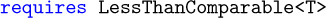]

[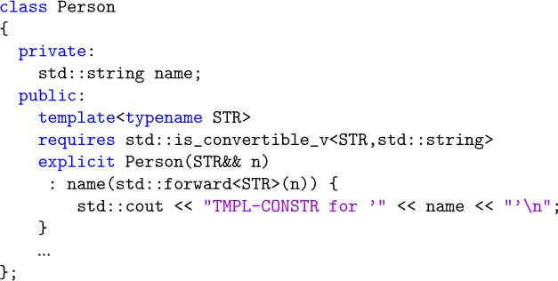]

[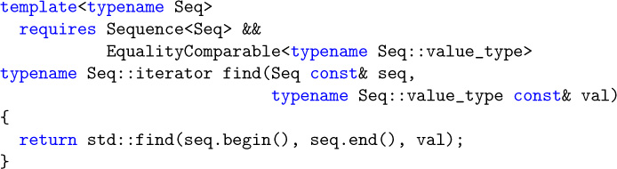]

[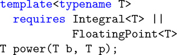]

[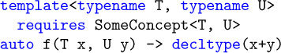]

[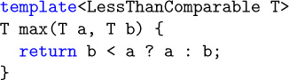]

[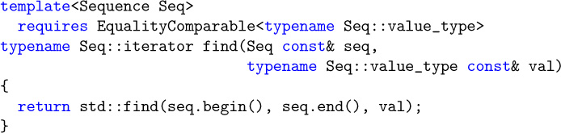]

[]

[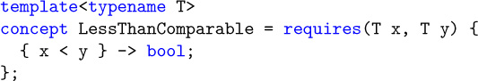]

[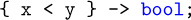]

[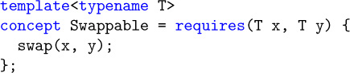]

[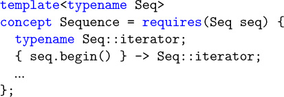]

[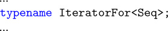]

[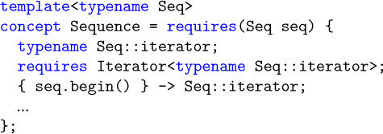]

[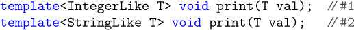]

[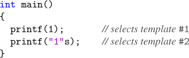]

[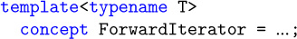]

[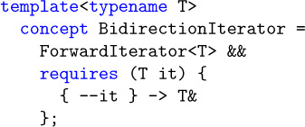]

[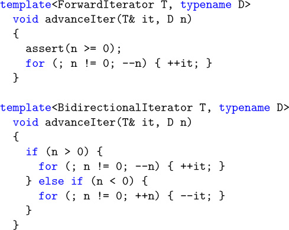]

[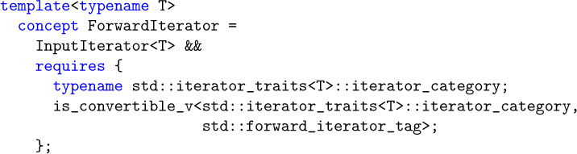]

[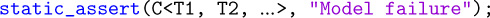]

[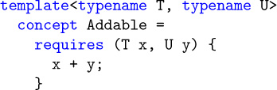]

[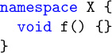]

[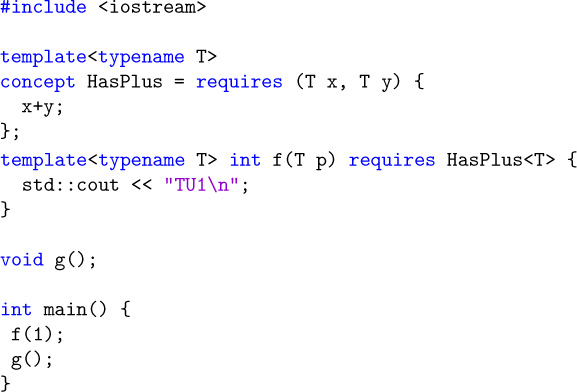]

[]

## Bibliography 

This bibliography lists the resources that were mentioned, adopted, or cited in this book. These days, many of the advancements in programming happen in electronic forums. It is therefore not surprising to find, in addition to the more traditional books and articles, quite a few Web sites. We do not claim that our list is close to being comprehensive. However, we do find that the resources are relevant contributions to the topic of C++ templates.

Web sites are typically considerably more volatile than books and articles. The Internet links listed here may not be valid in the future. Therefore, we provide the actual list of links for this book at the following site (and we expect this site to be stable):

`http://www.tmplbook.com`

Before listing the books, articles, and Web sites, we introduce the more interactive kind of resources that are provided by *newsgroups*.

### Forums 

In the first edition of this book, we referred to Usenet groups (a large collection of pre-world-wide-web on-line forums) as a source for discussions about the C++ programming language. Those groups have mostly faded since then but many other online programming communities have arisen, and several of these cater to C++ programmers. We list some of the most popular here:

• *Cppreference* "wiki" (i.e., collectively editable) of reference information about C and C++ (in various languages).

`http://www.cppreference.com`

• *Stackoverflow* is a broad developer community that also covers C++ and C++ templates in particular.

`https://stackoverflow.com/questions/tagged/c%2b%2b`

`https://stackoverflow.com/questions/tagged/c%2b%2b%20templates`

• *Quora* is similar to Stackoverflow, but not limited to technical discussions.

`https://www.quora.com/topic/C++-programming-language`

• The *Standard C++ Foundation* is a nonprofit organization run by some prominent members of the C++ standardization committee (though the two groups are separate) to support the C++ programming community. It helps fund some aspects of the standardization committee's meetings, as well as CppCon, a major yearly conference about C++ (highly recommended if you enjoyed the material in this book). It also includes a directory of on-line forums (hosted as "Google groups") that cover various C++ topics.

`https://isocpp.org/forums`

`https://cppcon.org`

• The *Association of C and C++ Users* (ACCU) is an organization based in the United Kingdom for "anyone interested in developing and improving programming skills." It hosts a yearly programming conference with a particularly strong track about C++.

`https://www.accu.org`

### Books and Web Sites 

[AbrahamsGurtovoyMeta]

David Abrahams and Aleksey Gurtovoy

*C++ Template Metaprogramming* -- *Concepts, Tools, and Techniques from Boost and Beyond*

Addison-Wesley, Boston, MA, 2005

[AlexandrescuDesign]

Andrei Alexandrescu

*Modern C++ Design* -- *Generic Programming and Design Patterns Applied*

Addison-Wesley, Boston, MA, 2001

[AlexandrescuDiscriminatedUnions]

Andrei Alexandrescu

*Discriminated Unions (parts I, II, III)*

C/C++ Users Journal, April/June/August, 2002

[AlexandrescuAdHocVisitor]

Andrei Alexandrescu

*Generic Programming:Typelists and Applications*

Dr. Dobb's Journal, February, 2002

[AusternSTL]

Matthew H. Austern

*Generic Programming and the STL* -- *Using and Extending the C++ Standard Template Library*

Addison-Wesley, Boston, MA, 1999

[BartonNackman]

John J. Barton and Lee R. Nackman

*Scientific and Engineering C++* -- *An Introduction with Advanced Techniques and Examples*

Addison-Wesley, Boston, MA, 1994

[BCCL]

Jeremy Siek

*The Boost Concept Check Library*

`http://www.boost.org/libs/concept_check/concept_check.htm`

[Blitz++]

Todd Veldhuizen

*Blitz++: Object-Oriented Scientific Computing*

`http://blitz.sourceforge.net/`

[Boost]

*The Boost Repository for Free, Peer-Reviewed C++ Libraries*

`http://www.boost.org`

[BoostAny]

Kevlin Henney

*Boost Any Library*

`http://www.boost.org/libs/any`

[BoostFusion]

Joel de Guzman, Dan Marsden, and Tobias Schwinger

*The Boost Fusion Library*

`http://boost.org/libs/fusion`

[BoostHana]

Louis Dionne

*The Boost Hana Library for Metaprogramming*

`http://boostorg.github.io/hana`

[BoostIterator]

David Abrahams, Jeremy Siek, Thomas Witt

*Boost Iterator*

`http://www.boost.org/libs/iterator`

[BoostMPL]

Aleksey Gurtovoy and David Abrahams

*Boost MPL*

`http://www.boost.org/libs/mpl`

[BoostOperators]

David Abrahams

*Boost Operators*

`http://www.boost.org/libs/utility/operators.htm`

[BoostTuple]

Jaakko J¨arvi

*The Boost Tuple Library*

`http://boost.org/libs/tuple`

[BoostOptional]

Fernando Luis Cacciola Carballal

*Boost Optional Library*

`http://www.boost.org/libs/optional`

[BoostSmartPtr]

*Smart Pointer Library*

`http://www.boost.org/libs/smart_ptr`

[BoostTypeTraits]

*Type Traits Library*

`http://www.boost.org/libs/type_traits`

[BoostVariant]

Eric Friedman and Itay Maman

*Boost Variant Library*

`http://www.boost.org/libs/variant`

[BrownSIunits]

Walter E. Brown

*Introduction to the SI Library of Unit-Based Computation*

`http://lss.fnal.gov/archive/1998/conf/Conf-98-328.pdf`

[C++98]

ISO

*Information Technology---Programming Languages---C++*

ISO/IEC, Document Number 14882-1998, 1998

[C++03]

ISO

*Information Technology---Programming Languages---C++*

ISO/IEC, Document Number 14882-2003, 2003

[C++11]

ISO

*Information Technology---Programming Languages---C++*

ISO/IEC, Document Number 14882-2011, 2011

[C++14]

ISO

*Information Technology---Programming Languages---C++*

ISO/IEC, Document Number 14882-2014, 2014

[C++17]

ISO

*Information Technology---Programming Languages---C++*

ISO/IEC, Document Number 14882-2017, 2017

[CacciolaKrzemienski2013]

Fernando Luis Cacciola Carballal and Andrzej Krzemieński

*A Proposal to Add a Utility Class to Represent Optional Objects*

`http://wg21.link/n3527`

[CargillExceptionSafety]

Tom Cargill

*Exception Handling: A False Sense of Security*

C++ Report, November-December 1994

[CoplienCRTP]

James O. Coplien

*Curiously Recurring Template Patterns*

C++ Report, February 1995

[CoreIssue1395]

*C++ Standard Core Issue 1395*

`http://wg21.link/cwg1395`

[CzarneckiEiseneckerGenProg]

Krzysztof Czarnecki and Ulrich W. Eisenecker

*Generative Programming* -- *Methods, Tools, and Applications*

Addison-Wesley, Boston, MA, 2000

[DesignPatternsGoF]

Erich Gamma, Richard Helm, Ralph Johnson, and John Vlissides

*Design Patterns* -- *Elements of Reusable Object-Oriented Software*

Addison-Wesley, Boston, MA, 1995

[DosReisMarcusAliasTemplates]

Gabrial Dos Reis and Mat Marcus

*Proposal to Add Template Aliases to C++*

`http://wg21.link/n1449`

[EDG]

Edison Design Group

*Compiler Front Ends for the OEM Market*

`http://www.edg.com`

[EiseneckerBlinnCzarnecki]

Ulrich W. Eisenecker, Frank Blinn, and Krzysztof Czarnecki

*Mixin-Based Programming in C++*

Dr. Dobbs Journal, January, 2001

[EllisStroustrupARM]

Margaret A. Ellis and Bjarne Stroustrup

*The Annotated C++ Reference Manual (ARM)*

Addison-Wesley, Boston, MA, 1990

[GregorJarviPowellVariadicTemplates]

Douglas Gregor, Jaakko J¨arvi, and Gary Powell

*Variadic Templates*

`http://wg21.link/n2080`

[HenneyValuedConversions]

Kevlin Henney

*Valued Conversions*

C++ Report 12(7), July-August 2000

[OverloadingProperties]

Jaakko J¨arvi, Jeremiah Willcock, Howard Hinnant, and Andrew Lumsdaine

*Function Overloading Based on Arbitrary Properties of Types*

C/C++ Users Journal 12 (6), June, 2003

[ItaniumABI]

*Itanium C++ ABI*

`http://itanium-cxx-abi.github.io/cxx-abi/`

[JosuttisLaunder]

Nicolai Josuttis

*On launder()*

`https://wg21.link/p0532r0`

[JosuttisStdLib]

Nicolai M. Josuttis

*The C++ Standard Library* -- *A Tutorial and Reference (2nd edition)*

Addison-Wesley, Boston, MA, 2012

[KarlssonSafeBool]

Bjorn Karlsson

*The Safe Bool Idiom*

C++ Source, July, 2004

[KoenigMooAcc]

Andrew Koenig and Barbara E. Moo

*Accelerated C++* -- *Practical Programming by Example*

Addison-Wesley, Boston, MA, 2000

[LambdaLib]

Jaakko J¨arvi and Gary Powell

*LL, The Lambda Library*

`http://www.boost.org/libs/lambda`

[LibIssue181]

*C++ Library Issue 181*

`http://wg21.link/lwg181`

[LippmanObjMod]

Stanley B. Lippman

*Inside the C++ Object Model*

Addison-Wesley, Boston, MA, 1996

[MeyersCounting]

Scott Meyers

*Counting Objects In C++*

C/C++ Users Journal, April 1998

[MeyersEffective]

Scott Meyers

*Effective C++* -- *50 Specific Ways to Improve Your Programs and Design (2nd edition)*

Addison-Wesley, Boston, MA, 1998

[MeyersMoreEffective]

Scott Meyers

*More Effective C++* -- *35 New Ways to Improve Your Programs and Designs*

Addison-Wesley, Boston, MA, 1996

[MoonFlavors]

David A. Moon

*Object-oriented programming with Flavors*

Conference proceedings on Object-oriented programming systems, languages and applications, 1986

[MTL]

Andrew Lumsdaine and Jeremy Siek

*MTL, The Matrix Template Library*

`http://www.osl.iu.edu/research/mtl`

[MusserWangDynaVeri]

D. R. Musser and C. Wang

*Dynamic Verification of C++ Generic Algorithms*

IEEE Transactions on Software Engineering, Vol. 23, No. 5, May 1997

[MyersTraits]

Nathan C. Myers

*Traits: A New and Useful Template Technique*

`http://www.cantrip.org/traits.html`

[NewMat]

Robert Davies

*NewMat10, A Matrix Library in C++*

`http://www.robertnz.net/nm_intro.htm`

[NewShorterOED]

Leslie Brown (Ed.)

*The New Shorter Oxford English Dictionary (4th edition)*

Oxford University Press, Oxford, 1993

[POOMA]

*POOMA: A High-Performance C++ Toolkit for Parallel Scientific Computation*

`http://www.nongnu.org/freepooma/`

[SmaragdakisBatoryMixins]

Yannis Smaragdakis and Don S. Batory

*Mixin-Based Programming in C++*

Proceedings of the Second International Symposium on Generative and Component-Based Software

Engineering, October, 2000

[SpicerSFINAE]

John Spicer

*Solving the SFINAE Problem for Expressions*

`http://wg21.link/n2634`

[StepanovLeeSTL]

Alexander Stepanov and Meng Lee

*The Standard Template Library* -- *HP Laboratories Technical Report 95-11(R.1)*

November 14, 1995

[StepanovNotes]

Alexander Stepanov

*Notes on Programming*

`http://stepanovpapers.com/notes.pdf`

[StroustrupC++PL]

Bjarne Stroustrup

*The C++ Programming Language* (Special Edition)

Addison-Wesley, Boston, MA, 2000

[StroustrupDnE]

Bjarne Stroustrup

*The Design and Evolution of C++*

Addison-Wesley, Boston, MA, 1994

[StroustrupGlossary]

Bjarne Stroustrup

*Bjarne Stroustrup's C++ Glossary*

`http://www.stroustrup.com/glossary.html`

[SutterExceptional]

Herb Sutter

*Exceptional C++* -- *47 Engineering Puzzles, Programming Problems, and Solutions*

Addison-Wesley, Boston, MA, 2000

[SutterMoreExceptional]

Herb Sutter

*More Exceptional C++* -- *40 New Engineering Puzzles, Programming Problems, and Solutions*

Addison-Wesley, Boston, MA, 2001

[UnruhPrimeOrig]

Erwin Unruh

*Original Metaprogram for Prime Number Computation*

`http://www.erwin-unruh.de/primorig.html`

[VandevoordeJosuttisTemplates1st]

David Vandevoorde and Nicolai M. Josuttis

*C++ Templates: The Complete Guide*

Addison-Wesley, Boston, MA, 2003

[VandevoordeSolutions]

David Vandevoorde

*C++ Solutions*

Addison-Wesley, Boston, MA, 1998

[VeldhuizenMeta95]

Todd Veldhuizen

*Using C++ Template Metaprograms*

C++ Report, May 1995

## Glossary 

This glossary is a compilation of the most important technical terms that are used in this book. See [StroustrupGlossary] for a comprehensive, general glossary of terms used by C++ programmers.

**abstract class**

A class for which the creation of concrete objects (*instances*) is impossible. Abstract classes can be used to collect common properties of different classes in a single type or to define a polymorphic interface. Because abstract classes are used as base classes, the acronym *ABC* is sometimes used for *abstract base class*.

**ADL**

An acronym for *argument-dependent lookup*. ADL is a process that looks for a name of a function (or operator) in namespaces and classes that are in some way associated with the arguments of the function call in which that function (or operator name) appears. For historical reasons, it is sometimes called *extended Koenig lookup* or just *Koenig lookup* (the latter is also used for *ADL* applied to operators only).

**alias template**

A construct that represents a family of type aliases. It specifies a pattern from which actual type aliases can be generated by substituting the template parameters by specific entities. An alias template can be a class member.

**angle bracket hack**

A C++ feature that requires a compiler to accept two consecutive `>` characters as two closing *angle brackets*. For example, the angle bracket hack causes `vector<list<int>>` to be treated identically to `vector<list<int> >`. It's called a (lexical) *hack* because it doesn't fit well in the C++ formal specification (the *grammar*, in particular) nor in the general architecture of typical compilers. Another similar hack deals with accidental digraph formation (see *digraph*).

**angle brackets**

The characters `<` and `>` when they are used as delimiters rather than as less-than and greater-than operators.

**ANSI**

An acronym for *American National Standard Institute*, a private, nonprofit organization that coordinates efforts to produce standard specifications of all kinds. See INCITS.

**argument**

A value (in a broad sense) that substitutes a *parameter* of a programmatic entity. For example, in a function call `abs(-3)`, the argument is `-3`. In some programming communities, *arguments* are called *actual parameters* (whereas *parameters* are called *formal parameters*). See also *template argument*.

**argument-dependent lookup**

See *ADL*.

**class**

The description of a category of objects. The class defines a set of characteristics for any object of that type. These include its data (*attributes*, *data members*) as well as its operations (*methods*, *member functions*). In C++, classes are structures with members that can also be functions and are subject to access limitations. They are declared using the keywords `class` or `struct`.

**class template**

A construct that represents a family of classes. It specifies a pattern from which actual classes can be generated by substituting the template parameters by specific entities. Class templates are sometimes called *parameterized classes*.

**class type**

A C++ type declared with `class`, `struct`, or `union`.

**collection class**

A class that is used to manage a group of objects. In C++, collection classes are also called *containers*.

**compiler**

A program or library component that translates the source code in a translation unit into object code (machine code with symbolic annotations that allow a linker to resolve references across translation units).

**complete type**

Any type that is not *incomplete*: a defined class, an array of complete elements and known size, an enumeration type with defined underlying type, and any fundamental data type except `void` (option-ally with `const` and/or `volatile`).

**concept**

A named set of constraints that can be applied to one or more template parameters. See [Appendix [E]].

**constant-expression**

An expression whose value can be computed at compile time by the compiler. We sometimes call this a *true constant* to avoid confusion with *constant expression* (without hyphen). The latter includes expressions that are constant but cannot always be computed at compile time by the compiler.

**const** member function

A member function that can be called for constant and temporary objects because it does not normally modify members of the `*this` object.

**container**

See *collection class*.

**conversion function**

A special member function that defines how an object can implicitly (or explicitly) be converted to an object of another type. It is declared using the form `operator` *type*`()`.

**conversion operator**

A synonym for *conversion function*. The latter is the standard term, but the former is also commonly used.

**CPP file**

A file in which *definitions* of variables and noninline functions are located. Most of the executable (as opposed to declarative) code of a program is normally placed in CPP files. They are named *CPP* files because they are usually named with the suffix `.cpp`. But for historical reasons the suffix also might be `.C`, `.c`, `.cc`, or `.cxx`. See also *header file* and *translation unit*.

**CRTP**

An acronym for *curiously recurring template pattern*. This refers to a code pattern where a class *X* derives from a base class that has *X* as a template argument.

**curiously recurring template pattern**

See *CRTP*.

**decay**

The implicit conversion of an array or a function to a pointer. For example, the string literal `"Hello"` has type `char const[6]`, but in many C++ contexts, it is implicitly converted to a pointer of type `char const*` (which points to the first character of the string).

**declaration**

A C++ construct that introduces or reintroduces a name into a C++ scope. See also *definition*.

**deduction**

The process that implicitly determines template arguments from the context in which templates are used. The complete term is *template argument deduction*.

**definition**

A *declaration* that makes the details of the declared entity known or, in the case of variables, that forces storage space to be reserved for the declared entity. For class types and function definitions, this amounts to declarations that include a brace-enclosed body. For external variable declarations, this means either a declaration with no `extern` keyword or a declaration with an initializer.

**dependent base class**

A base class that depends on a template parameter. Special care must be taken to access members of dependent base classes. See also *two-phase lookup*.

**dependent name**

A name the meaning of which depends on a template parameter. For example, `A<T>::x` is a dependent name when `A` or `T` is a template parameter. The name of a function in a function call is also dependent if any of the arguments in the call has a type that depends on a template parameter. For example, `f` in `f((T*)0)` is dependent if `T` is a template parameter. The name of a template parameter is not considered dependent, however. See also *two-phase lookup*.

**digraph**

A combination of two consecutive characters that are equivalent to another single character in C++ code. The purpose of digraphs is to allow the input of C++ source code with keyboards that lack certain characters. Although it is used relatively rarely, the digraph `<:` is sometimes accidentally formed when a left *angle bracket* is followed by a scope resolution operator (`::`) without the required intervening *whitespace*. C++11 introduced a lexical hack to disable digraph interpretation under those circumstances.

**EBCO**

An acronym for *empty base class optimization*. An optimization performed by most modern compilers whereby an "empty" base class subobject does not occupy any storage.

**empty base class optimization**

See *EBCO*.

**explicit instantiation directive**

A C++ construct whose sole purpose is to create a *point of instantiation* (POI).

**explicit specialization**

A construct that declares or defines an alternative definition for a substituted template. The original (generic) template is called the *primary template*. If the alternative definition still depends on one or more template parameters, it is called a *partial specialization*. Otherwise, it is a *full specialization*.

**expression template**

A class template used to represent a part of an expression. The template itself represents a particular kind of operation. The template parameters stand for the kinds of operands to which the operation applies.

**forwarding reference**

One of two terms for rvalue references of the form `T&&` where `T` is a deducible template parameter. Special rules that differ from ordinary rvalue references apply (see Section [[6.1]] on page [[91]]). The term was introduced by C++17 as replacement for *universal reference*, because the primary use of such a reference is to forward objects. However, note that it does not automatically forward. That is, the term does not describe what it *is* but for what it is typically used for.

**friend name injection**

The process that makes a function name visible when its only declaration is a friend declaration.

**full specialization**

See *explicit specialization*.

**function object**

An object that can be called using *function call syntax*. In C++, these are pointers to functions, classes with an overloaded `operator()` (see *functor*), and classes with a conversion function yielding a pointer to function or reference to function.

**function template**

A construct that represents a family of functions. It specifies a pattern from which actual functions can be generated by substituting the template parameters by specific entities. Note that a function template is a template and not a function. Function templates are sometimes called *parameterized functions*.

**functor**

An object of a class type with an overloaded `operator()`, which can be called using *function call syntax*. This includes the closure type of a lambda expression.

**glvalue**

A category of expressions that produces a location for a stored value (generalized localizable value). A glvalue can be an *lvalue* or an *xvalue*. See *value category* and Section [[B.2]] on page [[674]].

**header file**

A file meant to become part of a translation unit through a `#include` directive. Such files often contain *declarations* of variables and functions that are referred to from more than one translation unit, as well as *definitions* of types, inline functions, templates, constants, and macros. They are usually named with a suffix like `.hpp`, `.h`, `.H`, `.hh`, or `.hxx`. They are also called *include files*. See also *CPP file* and *translation unit*.

**INCITS**

An acronym for *InterNational Committee for Information Technology Standards*, which is a U.S. standards development organization (formerly known a X3) accredited by ANSI. A subcommittee called J16 is a driving force behind the standardization of C++. It cooperates closely with the International Organization for Standardization (ISO).

**include file**

See *header file*.

**incomplete type**

A class that is declared but not defined, an array of incomplete element type or of unknown size, an enumeration type without the underlying type defined, or `void` (optionally with `const` and/or `volatile`).

**indirect call**

A function call for which the called function is not known until the call actually occurs (at run time).

**initializer**

A construct that specifies how to initialize an object. For example, in `std::complex<float> z1 = 1.0, z2(0.0, 1.0);` the initializers are `= 1.0` and `(0.0, 1.0)`.

**initializer list**

A comma-separated list of expressions enclosed in braces used to initialize objects and references. Initializer lists are commonly used to initialize variables but also, for example, to initialize members and base classes in constructor definitions. This initialization may happen directly or via an intermediate `std::initializer_list` object.

**injected class name**

The name of a class as visible in its own definition scope. For class templates, the name of the template is treated within the scope of the template as a class name if the name is not followed by a template argument list.

**instance**

The term *instance* has two meanings in C++ programming: The meaning that is taken from the object-oriented terminology is *an instance of a class*: an object that is the realization of a class. For example, in C++, `std::cout` is an instance of the class `std::ostream`. The other meaning (and the one that is almost always intended in this book) is *a template instance*: a class, a function, or a member function obtained by substituting all the template parameters by specific values. In this sense, an *instance* is also called a *specialization*, although the latter term is often mistaken for *explicit specialization*.

**instantiation**

The replacement of the template parameters in a template definition to create a concrete entity (function, class, variable, or alias). If only the declaration of a template but not its definition is substituted, the term *partial template instantiation* is sometimes used. See also *substitution*. The alternative sense of creating an *instance* (object) of a class is not used in this book (see *instance*).

**ISO**

Worldwide acronym for International Organization for Standardization. An ISO workgroup called WG21 is a driving force behind the efforts to standardize and develop C++.

**iterator**

An object that knows how to traverse a sequence of elements. Often, these elements belong to a collection (see *collection class*).

**linkable entity**

Any of the following: a function or member function, a global variable or a static data member, including any such things generated from a template, as visible to the linker.

**linker**

A program or operating system service that links together compiled translation units and resolves references to linkable entities across those translation units.

**lvalue**

A category of expressions that produces a location for a stored value that is not assumed to be movable (i.e., *glvalues* that are no *xvalues*). Typical examples are expressions denoting named objects (variables or members) and string literals. See *value category* and Section [[B.1]] on page [[673]].

**member class template**

A construct that represents a family of member classes. It is a class template declared inside another class or class template definition. It has its own set of template parameters (unlike a member class of a class template).

**member function template**

A construct that represents a family of member functions. It has its own set of template parameters (unlike a member function of a class template). It is very similar to a function template, but when all the template parameters are substituted, the result is a member function (instead of an ordinary function). Member function templates cannot be virtual.

**member template**

A *member class template*, *member function template*, or *static data member template*.

**Modern C++**

The phrase used in this book to refer to the language as standardized in C++11 or later (i.e., C++11, C++14, or C++17).

**nondependent name**

A name that is not dependent on a template parameter. See *dependent name* and *two-phase lookup*.

**ODR**

An acronym for *one-definition rule*. This rule places some restrictions on the *definitions* that appear in a C++ program. See Section [[10.4]] on page [[154]] and [Appendix [A]] for details.

**one-definition rule**

See *ODR*.

**overload resolution**

The process that selects which function to call when several candidates (usually all having the same name) exist. See also [Appendix [C]].

**parameter**

A placeholder entity that is meant to be substituted with an actual "value" (an *argument*) at some point. For macro parameters and template parameters, the *substitution* occurs at compile time. For function call parameters, it happens at run time. In some programming communities, *parameters* are called *formal parameters* (whereas *arguments* are called *actual parameters*). See also *argument* and *template argument*.

**parameterized class**

A class template or a class nested in a class template. Both are *parameterized* because they do not correspond to a unique class until the template arguments have been specified.

**parameterized function**

A function or member function template or a member function of a class template. All are *parameterized* because they do not correspond to a unique function (or member function) until the template arguments have been specified.

**partial specialization**

A construct that declares or defines an alternative definition for certain *substitutions* of a template. The original (generic) template is called the *primary template*. The alternative definition still depends on template parameters. Currently, this construct exists only for class templates. See also *explicit specialization*.

**POD**

An acronym for "plain old data (type)." POD types are types that can be defined without certain C++ features (like virtual member functions, access keywords, and so forth). For example, every ordinary C `struct` is a POD.

**POI**

An acronym for *point of instantiation*. A POI is a location in the source code where a template (or a member of a template) is conceptually expanded by substituting template parameters with template arguments. In practice, this expansion does not need to occur at every POI. See also *explicit instantiation directive*.

**point of instantiation**

See *POI*.

**policy class**

A class or class template the members of which describe configurable behavior for a generic component. Policies are normally passed as template arguments. For example, a sorting template may have an ordering policy. *Policy classes* are also called *policy templates* or just *policies*. See also *traits template*.

**polymorphism**

The ability of an operation (which is identified by its name) to apply to objects of different kinds. In C++, the traditional object-oriented concept of polymorphism (also called *run-time* or *dynamic* polymorphism) is achieved through virtual functions that are overridden in derived classes. In addition, C++ templates enable *static* polymorphism.

**precompiled header**

A processed form of source code that can quickly be loaded by the compiler. The source code underlying a precompiled header must be the first part of a *translation unit* (i.e., it cannot start somewhere in the middle of a translation unit). Often, a precompiled header corresponds to a number of header files. Using precompiled headers can substantially reduce the time needed to build a large application written in C++.

**primary template**

A template that is not a *partial specialization*.

**prvalue**

A category of expressions that perform initializations. Prvalues can be assumed to designate pure mathematical value such as `1` or `true` and temporaries (especially values returned by value). Any *rvalue* before C++11 is a *prvalue* in C++11. See *value category* and Section [[B.2]] on page [[674]].

**qualified name**

A name containing a scope qualifier (`::`).

**reference counting**

A resource management strategy that keeps count of how many entities are referring to a particular resource. When the count drops to zero, the resource can be disposed of.

**rvalue**

A category of expressions that are not *lvalues*. An rvalue can be a *prvalue* (such as a temporary) or an *xvalue* (e.g., an *lvalue* marked with `std::move()`). What was called a *rvalue* before C++11 is called a *prvalue* in C++11. See *value category* and Section [[B.2]] on page [[674]].

**SFINAE**

An acronym for *substitution failure is not an error*. A mechanism that silently discards templates instead of triggering compilation errors when attempting to substitute template arguments in invalid ways. Other templates in an overload set then get a chance to be selected if their substitution is successful.

**source file**

A *header file* or a *CPP file*.

**specialization**

The result of substituting template parameters with actual values. A specialization may be created by an *instantiation* or by an *explicit specialization*. This term is sometimes mistakenly equated with *explicit specialization*. See also *instance*.

**static data member template**

A variable template that is a member of a class or class template.

**substitution**

The process of replacing template parameters in templated entities by actual types, values, or templates. The extent of the substitution depends on the context. During overload resolution, for example, only the minimum amount of substitution to establish the type of a candidate function is performed, and if that substitution leads to invalid constructs, the *SFINAE* rules apply. See also *instantiation*.

**template**

A construct that represents a family of types, functions, member functions, or variables. It specifies a pattern from which actual types, functions, member functions, or variables can be generated by substituting the template parameters by specific entities. In this book, the term does not include functions, classes, static data members, and type aliases that are parameterized only by virtue of being members of a class template. See *alias template*, *variable template*, *class template*, *parameterized class*, *function template*, and *parameterized function*.

**template argument**

The "value" substituted for a *template parameter*. This value is usually a type, although certain constant values and templates can be valid template arguments too. See also *argument*.

**template argument deduction**

See *deduction*.

**template-id**

The combination of a template name followed by *template arguments* specified between *angle brackets* (e.g., `std::list<int>`).

**template parameter**

A generic placeholder in a template. The most common kind of template parameter are *type parameters*, which represent types. *Nontype parameters* represent constant values of a certain type, and *template template parameters* represent type templates. See also *parameter*.

**templated entity**

A template or an entity defined or created in a template. The latter includes things like an ordinary member function of a class template or the closure type of a lambda expression appearing in a template.

**traits template**

A class template with members that describe characteristics (traits) of the template arguments. Usually the purpose of traits templates is to avoid an excessive number of template parameters. See also *policy class*.

**translation unit**

A *CPP* file with all the header files and standard library headers it includes using `#include` directives, minus the program text that is excluded by conditional compilation directives such as `#if`. For simplicity, it can also be thought of as the result of preprocessing a *CPP* file. See *CPP file* and *header file*.

**true constant**

An expression whose value can be computed at compile time by the compiler. See *constant-expression*.

**tuple**

A generalization of the C `struct` concept such that members can be accessed by number.

**two-phase lookup**

The name lookup mechanism used for names in templates. The two phases are (1) the processing of the template definition, and (2) the instantiation of the template for specific template arguments. *Nondependent names* are looked up only in the first phase, *nondependent base classes* are not considered during that phase. *Dependent names* with a scope qualifier (`::`) are looked up only in the second phase. Dependent names without a scope qualifier may be looked up in both phases, but in the second phase, only argument-dependent lookup is performed.

**type alias**

An alternative name for a type, introduced using a `typedef` declaration, an alias declaration, or the instantiation of an *alias template*.

**type template**

A class template, member class template, or alias template.

**universal reference**

One of two terms for rvalue references of the form `T&&` where `T` is a deducible template parameter. Special rules that differ from ordinary rvalue references apply (see Section [[6.1]] on page [[91]]). The term was coined by Scott Meyers as a common term for both *lvalue reference* and *rvalue reference*. Because "universal" was, well, too universal, the C++17 standard introduced the term *forwarding reference* instead.

**user-defined conversion**

A type conversion defined by the programmer. It can be a *constructor* that can be called with one argument or a *conversion function*. Unless the constructor or conversion function is declared with the keyword `explicit`, the type conversion can occur implicitly.

**value category**

A classification of expressions. The traditional value categories *lvalues* and *rvalues* were inherited from C. C++11 introduced alternative categories: *glvalues* (generalized lvalues), whose evaluation identifies stored objects, and *prvalues* (pure rvalues), whose evaluation initialize objects. Additional categories subdivide *glvalues* into *lvalues* (localizable values) and *xvalues* (eXpiring values). In addition, in C++11 *rvalues* serve as a general category for both *xvalues* and *prvalues* (before C++11, *rvalues* were what *prvalues* are in C++11). See [Appendix [B]] for details.

**variable template**

A construct that represents a family of variables or static data members. It specifies a pattern from which actual variables and static data members can be generated by substituting the template parameters by specific entities.

**whitespace**

In C++, this is the space that delimits the tokens (identifiers, literals, symbols, and so on) in source code. Besides the traditional blank space, new line, and horizontal tabulation characters, this also includes comments. Other whitespace characters (e.g., the page feed control character) are sometimes also valid whitespace.

**xvalue**

A category of expressions that produce a location for a stored object that can be assumed to be no longer needed. A typical example is an *lvalue* marked with `std::move()`. See *value category* and Section [[B.2]] on page [[674]].

