# **C++ Templates**

Many of the designations used by manufacturers and sellers to distinguish their products are claimed as trademarks. Where those designations appear in this book, and the publisher was aware of a trademark claim, the designations have been printed with initial capital letters or in all capitals.

> 制造商和销售商用来区分其产品的许多名称都被称为商标。如果这些名称出现在本书中，并且出版商知道商标声明，则这些名称已用首字母大写或全大写印刷。

The authors and publisher have taken care in the preparation of this book, but make no expressed or implied warranty of any kind and assume no responsibility for errors or omissions. No liability is assumed for incidental or consequential damages in connection with or arising out of the use of the information or programs contained herein.

> 作者和出版商在编写本书时非常谨慎，但不作任何明示或暗示的保证，也不对错误或遗漏承担任何责任。对于与使用此处包含的信息或程序有关或因使用这些信息或程序而产生的附带或间接损害，我们不承担任何责任。

For information about buying this title in bulk quantities, or for special sales opportunities (which may include electronic versions; custom cover designs; and content particular to your business, training goals, marketing focus, or branding interests), please contact our corporate sales department at `corpsales@pearsoned.com` or (800) 382-3419.

> 有关批量购买本标题的信息，或特殊销售机会(可能包括电子版本；定制封面设计；以及特定于您的业务、培训目标、营销重点或品牌兴趣的内容)，请联系我们的公司销售部门，网址为 `corpsales@pearsoned.com` 或(800)382-3419。

For government sales inquiries, please contact `governmentsales@pearsoned.com`.

> 政府销售咨询，请联系 `governmentsales@pearsoned.com`.

For questions about sales outside the U.S., please contact `intlcs@pearson.com`.

> 有关美国境外销售的问题，请联系 `intlcs@pearson.com`.

Visit us on the Web: `informit.com/aw`

Library of Congress Catalog Number: 2017946531

Copyright © 2018 Pearson Education, Inc.

This book was typeset by Nicolai M. Josuttis using the LATEX document processing system. All rights reserved. Printed in the United States of America. This publication is protected by copyright, and permission must be obtained from the publisher prior to any prohibited reproduction, storage in a retrieval system, or transmission in any form or by any means, electronic, mechanical, photocopying, recording, or likewise. For information regarding permissions, request forms and the appropriate contacts within the Pearson Education Global Rights & Permissions Department, please visit `www.pearsoned.com/permissions/`.

> 本书由 Nicolai M.Josuttis 使用 LATEX 文档处理系统进行排版。保留所有权利。在美利坚合众国印制。本出版物受版权保护，在进行任何禁止复制、存储在检索系统中或以任何形式或通过任何方式(电子、机械、复印、录音或类似方式)传输之前，必须获得出版商的许可。有关培生教育全球权利与权限部门的权限、申请表和适当联系人的信息，请访问“[www.pearsoned.com/permissions/](http://www.pearsoned.com/permissions/)”。

## Contents

```md
- *C++ Templates*(#c-templates)
  - [Contents](#contents)
  - [Preface](#preface)
  - [Acknowledgments for the Second Edition](#acknowledgments-for-the-second-edition)
    - [David's Acknowledgments for the Second Edition](#davids-acknowledgments-for-the-second-edition)
    - [Nico's Acknowledgments for the Second Edition](#nicos-acknowledgments-for-the-second-edition)
    - [Doug's Acknowledgments for the Second Edition](#dougs-acknowledgments-for-the-second-edition)
  - [Acknowledgments for the First Edition](#acknowledgments-for-the-first-edition)
    - [Nico's Acknowledgments for the First Edition](#nicos-acknowledgments-for-the-first-edition)
    - [David's Acknowledgments for the First Edition](#davids-acknowledgments-for-the-first-edition)
  - [About This Book](#about-this-book)
    - [What You Should Know Before Reading This Book](#what-you-should-know-before-reading-this-book)
    - [Overall Structure of the Book](#overall-structure-of-the-book)
    - [How to Read This Book](#how-to-read-this-book)
    - [Some Remarks About Programming Style](#some-remarks-about-programming-style)
    - [The C++11, C++14, and C++17 Standards](#the-c11-c14-and-c17-standards)
    - [Example Code and Additional Information](#example-code-and-additional-information)
    - [Feedback](#feedback)
  - [Part I  The Basics](#part-i--the-basics)
    - [Why Templates?](#why-templates)
  - [Chapter 1](#chapter-1)
  - [Function Templates](#function-templates)
    - [1.1 A First Look at Function Templates](#11-a-first-look-at-function-templates)
      - [1.1.1 Defining the Template](#111-defining-the-template)
      - [1.1.2 Using the Template](#112-using-the-template)
      - [1.1.3 Two-Phase Translation](#113-two-phase-translation)
      - [Compiling and Linking](#compiling-and-linking)
    - [1.2 Template Argument Deduction](#12-template-argument-deduction)
        - [Type Conversions During Type Deduction](#type-conversions-during-type-deduction)
        - [Type Deduction for Default Arguments](#type-deduction-for-default-arguments)
    - [1.3 Multiple Template Parameters](#13-multiple-template-parameters)
      - [1.3.1 Template Parameters for Return Types](#131-template-parameters-for-return-types)
      - [1.3.2 Deducing the Return Type](#132-deducing-the-return-type)
      - [1.3.3 Return Type as Common Type](#133-return-type-as-common-type)
    - [1.4 Default Template Arguments](#14-default-template-arguments)
    - [1.5 Overloading Function Templates](#15-overloading-function-templates)
    - [1.6 But, Shouldn't We ...?](#16-but-shouldnt-we-)
      - [1.6.1 Pass by Value or by Reference?](#161-pass-by-value-or-by-reference)
      - [1.6.2 Why Not **inline**?](#162-why-not-inline)
      - [1.6.3 Why Not **constexpr**?](#163-why-not-constexpr)
    - [1.7 Summary](#17-summary)
  - [Chapter 2](#chapter-2)
  - [Class Templates](#class-templates)
    - [2.1 Implementation of Class Template **Stack*(#21-implementation-of-class-template-stack)
      - [2.1.1 Declaration of Class Templates](#211-declaration-of-class-templates)
      - [2.1.2 Implementation of Member Functions](#212-implementation-of-member-functions)
    - [2.2 Use of Class Template **Stack*(#22-use-of-class-template-stack)
    - [2.3 Partial Usage of Class Templates](#23-partial-usage-of-class-templates)
      - [2.3.1 Concepts](#231-concepts)
    - [2.4 Friends](#24-friends)
    - [2.5 Specializations of Class Templates](#25-specializations-of-class-templates)
    - [2.6 Partial Specialization](#26-partial-specialization)
        - [Partial Specialization with Multiple Parameters](#partial-specialization-with-multiple-parameters)
    - [2.7 Default Class Template Arguments](#27-default-class-template-arguments)
    - [2.8 Type Aliases](#28-type-aliases)
        - [Typedefs and Alias Declarations](#typedefs-and-alias-declarations)
        - [Alias Templates](#alias-templates)
        - [Alias Templates for Member Types](#alias-templates-for-member-types)
        - [Type Traits Suffix\_t](#type-traits-suffix_t)
    - [2.9 Class Template Argument Deduction](#29-class-template-argument-deduction)
        - [Class Template Arguments Deduction with String Literals](#class-template-arguments-deduction-with-string-literals)
        - [Deduction Guides](#deduction-guides)
    - [2.10 Templatized Aggregates](#210-templatized-aggregates)
    - [2.11 Summary](#211-summary)
  - [Chapter 3](#chapter-3)
  - [Nontype Template Parameters](#nontype-template-parameters)
    - [3.1 Nontype Class Template Parameters](#31-nontype-class-template-parameters)
    - [3.2 Nontype Function Template Parameters](#32-nontype-function-template-parameters)
    - [3.3 Restrictions for Nontype Template Parameters](#33-restrictions-for-nontype-template-parameters)
      - [Avoiding Invalid Expressions](#avoiding-invalid-expressions)
    - [3.4 Template Parameter Type **auto*(#34-template-parameter-type-auto)
    - [3.5 Summary](#35-summary)
  - [Chapter 4](#chapter-4)
  - [Variadic Templates](#variadic-templates)
    - [4.1 Variadic Templates](#41-variadic-templates)
      - [4.1.1 Variadic Templates by Example](#411-variadic-templates-by-example)
      - [4.1.2 Overloading Variadic and Nonvariadic Templates](#412-overloading-variadic-and-nonvariadic-templates)
      - [4.1.3 Operator **sizeof...*(#413-operator-sizeof)
    - [4.2 Fold Expressions](#42-fold-expressions)
    - [4.3 Application of Variadic Templates](#43-application-of-variadic-templates)
    - [4.4 Variadic Class Templates and Variadic Expressions](#44-variadic-class-templates-and-variadic-expressions)
      - [4.4.1 Variadic Expressions](#441-variadic-expressions)
      - [4.4.2 Variadic Indices](#442-variadic-indices)
      - [4.4.3 Variadic Class Templates](#443-variadic-class-templates)
      - [4.4.4 Variadic Deduction Guides](#444-variadic-deduction-guides)
      - [4.4.5 Variadic Base Classes and **using*(#445-variadic-base-classes-and-using)
    - [4.5 Summary](#45-summary)
  - [Chapter 5](#chapter-5)
  - [Tricky Basics](#tricky-basics)
    - [5.1 Keyword **typename*(#51-keyword-typename)
    - [5.2 Zero Initialization](#52-zero-initialization)
    - [5.3 Using **this->*(#53-using-this-)
    - [5.4 Templates for Raw Arrays and String Literals](#54-templates-for-raw-arrays-and-string-literals)
    - [5.5 Member Templates](#55-member-templates)
        - [Specialization of Member Function Templates](#specialization-of-member-function-templates)
        - [Special Member Function Templates](#special-member-function-templates)
      - [5.5.1 The **.template** Construct](#551-the-template-construct)
      - [5.5.2 Generic Lambdas and Member Templates](#552-generic-lambdas-and-member-templates)
    - [5.6 Variable Templates](#56-variable-templates)
        - [Variable Templates for Data Members](#variable-templates-for-data-members)
        - [Type Traits Suffix **\_v*(#type-traits-suffix-_v)
    - [5.7 Template Template Parameters](#57-template-template-parameters)
        - [Template Template Argument Matching](#template-template-argument-matching)
    - [5.8 Summary](#58-summary)
  - [Chapter 6](#chapter-6)
  - [Move Semantics and **enable\_if<>*(#move-semantics-and-enable_if)
    - [6.1 Perfect Forwarding](#61-perfect-forwarding)
    - [6.2 Special Member Function Templates](#62-special-member-function-templates)
    - [6.3 Disable Templates with **enable\_if<>*(#63-disable-templates-with-enable_if)
    - [6.4 Using **enable\_if<>*(#64-using-enable_if)
        - [Disabling Special Member Functions](#disabling-special-member-functions)
    - [6.5 Using Concepts to Simplify **enable\_if<>** Expressions](#65-using-concepts-to-simplify-enable_if-expressions)
    - [6.6 Summary](#66-summary)
  - [Chapter 7](#chapter-7)
  - [By Value or by Reference?](#by-value-or-by-reference)
    - [7.1 Passing by Value](#71-passing-by-value)
        - [Passing by Value Decays](#passing-by-value-decays)
    - [7.2 Passing by Reference](#72-passing-by-reference)
      - [7.2.1 Passing by Constant Reference](#721-passing-by-constant-reference)
        - [Passing by Reference Does Not Decay](#passing-by-reference-does-not-decay)
    - [7.2.2 Passing by Nonconstant Reference](#722-passing-by-nonconstant-reference)
    - [7.2.3 Passing by Forwarding Reference](#723-passing-by-forwarding-reference)
    - [7.3 Using **std::ref()** and **std::cref()*(#73-using-stdref-and-stdcref)
    - [7.4 Dealing with String Literals and Raw Arrays](#74-dealing-with-string-literals-and-raw-arrays)
    - [7.4.1 Special Implementations for String Literals and Raw Arrays](#741-special-implementations-for-string-literals-and-raw-arrays)
    - [7.5 Dealing with Return Values](#75-dealing-with-return-values)
    - [7.6 Recommended Template Parameter Declarations](#76-recommended-template-parameter-declarations)
        - [General Recommendations](#general-recommendations)
        - [Don't Be Over-Generic](#dont-be-over-generic)
    - [The **`std::make_pair()`** Example](#the-stdmake_pair-example)
    - [7.7 Summary](#77-summary)
  - [Chapter 8](#chapter-8)
  - [Compile-Time Programming](#compile-time-programming)
    - [8.1 Template Metaprogramming](#81-template-metaprogramming)
    - [8.2 Computing with **constexpr*(#82-computing-with-constexpr)
    - [8.3 Execution Path Selection with Partial Specialization](#83-execution-path-selection-with-partial-specialization)
    - [8.4 SFINAE (Substitution Failure Is Not An Error)](#84-sfinae-substitution-failure-is-not-an-error)
        - [SFINAE and Overload Resolution](#sfinae-and-overload-resolution)
      - [8.4.1 Expression SFINAE with **decltype*(#841-expression-sfinae-with-decltype)
    - [8.5 Compile-Time **if*(#85-compile-time-if)
    - [8.6 Summary](#86-summary)
  - [Chapter 9](#chapter-9)
  - [Using Templates in Practice](#using-templates-in-practice)
    - [9.1 The Inclusion Model](#91-the-inclusion-model)
      - [9.1.1 Linker Errors](#911-linker-errors)
      - [9.1.2 Templates in Header Files](#912-templates-in-header-files)
    - [9.2 Templates and **inline*(#92-templates-and-inline)
    - [9.3 Precompiled Headers](#93-precompiled-headers)
    - [9.4 Decoding the Error Novel](#94-decoding-the-error-novel)
        - [Simple Type Mismatch](#simple-type-mismatch)
    - [9.5 Afternotes](#95-afternotes)
    - [9.6 Summary](#96-summary)
  - [Chapter 10](#chapter-10)
  - [Basic Template Terminology](#basic-template-terminology)
    - [10.1 "Class Template" or "Template Class"?](#101-class-template-or-template-class)
    - [10.2 Substitution, Instantiation, and Specialization](#102-substitution-instantiation-and-specialization)
    - [10.3 Declarations versus Definitions](#103-declarations-versus-definitions)
      - [10.3.1 Complete versus Incomplete Types](#1031-complete-versus-incomplete-types)
    - [10.4 The One-Definition Rule](#104-the-one-definition-rule)
    - [10.5 Template Arguments versus Template Parameters](#105-template-arguments-versus-template-parameters)
    - [10.6 Summary](#106-summary)
  - [Chapter 11](#chapter-11)
  - [Generic Libraries](#generic-libraries)
    - [11.1 Callables](#111-callables)
      - [11.1.1 Supporting Function Objects](#1111-supporting-function-objects)
      - [11.1.2 Dealing with Member Functions and Additional Arguments](#1112-dealing-with-member-functions-and-additional-arguments)
      - [11.1.3 Wrapping Function Calls](#1113-wrapping-function-calls)
    - [11.2 Other Utilities to Implement Generic Libraries](#112-other-utilities-to-implement-generic-libraries)
      - [11.2.1 Type Traits](#1121-type-traits)
    - [11.2.2 **std::addressof()*(#1122-stdaddressof)
    - [11.2.3 **std::declval()*(#1123-stddeclval)
    - [11.3 Perfect Forwarding Temporaries](#113-perfect-forwarding-temporaries)
    - [11.4 References as Template Parameters](#114-references-as-template-parameters)
    - [11.5 Defer Evaluations](#115-defer-evaluations)
    - [11.6 Things to Consider When Writing Generic Libraries](#116-things-to-consider-when-writing-generic-libraries)
    - [11.7 Summary](#117-summary)
  - [Part II  Templates in Depth](#part-ii--templates-in-depth)
  - [Chapter 12](#chapter-12)
  - [Fundamentals in Depth](#fundamentals-in-depth)
    - [12.1 Parameterized Declarations](#121-parameterized-declarations)
        - [Union Templates](#union-templates)
        - [Default Call Arguments](#default-call-arguments)
        - [Nontemplate Members of Class Templates](#nontemplate-members-of-class-templates)
      - [12.1.1 Virtual Member Functions](#1211-virtual-member-functions)
      - [12.1.2 Linkage of Templates](#1212-linkage-of-templates)
      - [12.1.3 Primary Templates](#1213-primary-templates)
    - [12.2 Template Parameters](#122-template-parameters)
      - [12.2.1 Type Parameters](#1221-type-parameters)
      - [12.2.2 Nontype Parameters](#1222-nontype-parameters)
      - [12.2.3 Template Template Parameters](#1223-template-template-parameters)
      - [12.2.4 Template Parameter Packs](#1224-template-parameter-packs)
      - [12.2.5 Default Template Arguments](#1225-default-template-arguments)
    - [12.3 Template Arguments](#123-template-arguments)
      - [12.3.1 Function Template Arguments](#1231-function-template-arguments)
      - [12.3.2 Type Arguments](#1232-type-arguments)
      - [12.3.3 Nontype Arguments](#1233-nontype-arguments)
      - [12.3.4 Template Template Arguments](#1234-template-template-arguments)
      - [12.3.5 Equivalence](#1235-equivalence)
    - [12.4 Variadic Templates](#124-variadic-templates)
      - [12.4.1 Pack Expansions](#1241-pack-expansions)
      - [12.4.2 Where Can Pack Expansions Occur?](#1242-where-can-pack-expansions-occur)
      - [12.4.3 Function Parameter Packs](#1243-function-parameter-packs)
      - [12.4.4 Multiple and Nested Pack Expansions](#1244-multiple-and-nested-pack-expansions)
      - [12.4.5 Zero-Length Pack Expansions](#1245-zero-length-pack-expansions)
      - [12.4.6 Fold Expressions](#1246-fold-expressions)
    - [12.5 Friends](#125-friends)
      - [12.5.1 Friend Classes of Class Templates](#1251-friend-classes-of-class-templates)
      - [12.5.2 Friend Functions of Class Templates](#1252-friend-functions-of-class-templates)
      - [12.5.3 Friend Templates](#1253-friend-templates)
    - [12.6 Afternotes](#126-afternotes)
  - [Chapter 13](#chapter-13)
  - [Names in Templates](#names-in-templates)
    - [13.1 Name Taxonomy](#131-name-taxonomy)
    - [13.2 Looking Up Names](#132-looking-up-names)
      - [13.2.1 Argument-Dependent Lookup](#1321-argument-dependent-lookup)
      - [13.2.2 Argument-Dependent Lookup of Friend Declarations](#1322-argument-dependent-lookup-of-friend-declarations)
      - [13.2.3 Injected Class Names](#1323-injected-class-names)
      - [13.2.4 Current Instantiations](#1324-current-instantiations)
    - [13.3 Parsing Templates](#133-parsing-templates)
      - [13.3.1 Context Sensitivity in Nontemplates](#1331-context-sensitivity-in-nontemplates)
      - [13.3.2 Dependent Names of Types](#1332-dependent-names-of-types)
      - [13.3.3 Dependent Names of Templates](#1333-dependent-names-of-templates)
      - [13.3.4 Dependent Names in Using Declarations](#1334-dependent-names-in-using-declarations)
      - [13.3.5 ADL and Explicit Template Arguments](#1335-adl-and-explicit-template-arguments)
      - [13.3.6 Dependent Expressions](#1336-dependent-expressions)
      - [13.3.7 Compiler Errors](#1337-compiler-errors)
    - [13.4 Inheritance and Class Templates](#134-inheritance-and-class-templates)
      - [13.4.1 Nondependent Base Classes](#1341-nondependent-base-classes)
      - [13.4.2 Dependent Base Classes](#1342-dependent-base-classes)
    - [13.5 Afternotes](#135-afternotes)
  - [Chapter 14](#chapter-14)
  - [Instantiation](#instantiation)
    - [14.1 On-Demand Instantiation](#141-on-demand-instantiation)
    - [14.2 Lazy Instantiation](#142-lazy-instantiation)
      - [14.2.1 Partial and Full Instantiation](#1421-partial-and-full-instantiation)
      - [14.2.2 Instantiated Components](#1422-instantiated-components)
    - [14.3 The C++ Instantiation Model](#143-the-c-instantiation-model)
      - [14.3.1 Two-Phase Lookup](#1431-two-phase-lookup)
      - [14.3.2 Points of Instantiation](#1432-points-of-instantiation)
      - [14.3.3 The Inclusion Model](#1433-the-inclusion-model)
    - [14.4 Implementation Schemes](#144-implementation-schemes)
      - [14.4.1 Greedy Instantiation](#1441-greedy-instantiation)
      - [14.4.2 Queried Instantiation](#1442-queried-instantiation)
      - [14.4.3 Iterated Instantiation](#1443-iterated-instantiation)
    - [14.5 Explicit Instantiation](#145-explicit-instantiation)
      - [14.5.1 Manual Instantiation](#1451-manual-instantiation)
      - [14.5.2 Explicit Instantiation Declarations](#1452-explicit-instantiation-declarations)
    - [14.6 Compile-Time **if** Statements](#146-compile-time-if-statements)
    - [14.7 In the Standard Library](#147-in-the-standard-library)
    - [14.8 Afternotes](#148-afternotes)
  - [Chapter 15](#chapter-15)
  - [Template Argument Deduction](#template-argument-deduction)
    - [15.1 The Deduction Process](#151-the-deduction-process)
    - [15.2 Deduced Contexts](#152-deduced-contexts)
    - [15.3 Special Deduction Situations](#153-special-deduction-situations)
    - [15.4 Initializer Lists](#154-initializer-lists)
    - [15.5 Parameter Packs](#155-parameter-packs)
    - [15.5.1 Literal Operator Templates](#1551-literal-operator-templates)
    - [15.6 Rvalue References](#156-rvalue-references)
    - [15.6.1 Reference Collapsing Rules](#1561-reference-collapsing-rules)
    - [15.6.2 Forwarding References](#1562-forwarding-references)
    - [15.6.3 Perfect Forwarding](#1563-perfect-forwarding)
    - [Perfect Forwarding for Variadic Templates](#perfect-forwarding-for-variadic-templates)
    - [15.6.4 Deduction Surprises](#1564-deduction-surprises)
    - [15.7 SFINAE (Substitution Failure Is Not An Error)](#157-sfinae-substitution-failure-is-not-an-error)
    - [15.7.1 Immediate Context](#1571-immediate-context)
    - [15.8 Limitations of Deduction](#158-limitations-of-deduction)
    - [15.8.1 Allowable Argument Conversions](#1581-allowable-argument-conversions)
    - [15.8.2 Class Template Arguments](#1582-class-template-arguments)
    - [15.8.3 Default Call Arguments](#1583-default-call-arguments)
    - [15.8.4 Exception Specifications](#1584-exception-specifications)
    - [15.9 Explicit Function Template Arguments](#159-explicit-function-template-arguments)
    - [15.10 Deduction from Initializers and Expressions](#1510-deduction-from-initializers-and-expressions)
    - [15.10.1 The **auto** Type Specifier](#15101-the-auto-type-specifier)
    - [Deduced Return Types](#deduced-return-types)
    - [Deducible Nontype Parameters](#deducible-nontype-parameters)
      - [15.10.2 Expressing the Type of an Expression with **decltype*(#15102-expressing-the-type-of-an-expression-with-decltype)
      - [15.10.3 **decltype(auto)*(#15103-decltypeauto)
      - [15.10.4 Special Situations for **auto** Deduction](#15104-special-situations-for-auto-deduction)
      - [15.10.5 Structured Bindings](#15105-structured-bindings)
    - [15.10.6 Generic Lambdas](#15106-generic-lambdas)
    - [15.11 Alias Templates](#1511-alias-templates)
    - [15.12 Class Template Argument Deduction](#1512-class-template-argument-deduction)
      - [15.12.1 Deduction Guides](#15121-deduction-guides)
      - [15.12.2 Implicit Deduction Guides](#15122-implicit-deduction-guides)
      - [15.12.3 Other Subtleties](#15123-other-subtleties)
        - [Injected Class Names](#injected-class-names)
    - [Forwarding References](#forwarding-references)
        - [The **explicit** Keyword](#the-explicit-keyword)
        - [Copy Construction and Initializer Lists](#copy-construction-and-initializer-lists)
        - [Guides Are for Deduction Only](#guides-are-for-deduction-only)
    - [15.13 Afternotes](#1513-afternotes)
  - [Chapter 16](#chapter-16)
  - [Specialization and Overloading](#specialization-and-overloading)
    - [16.1 When "Generic Code" Doesn't Quite Cut It](#161-when-generic-code-doesnt-quite-cut-it)
      - [16.1.1 Transparent Customization](#1611-transparent-customization)
      - [16.1.2 Semantic Transparency](#1612-semantic-transparency)
    - [16.2 Overloading Function Templates](#162-overloading-function-templates)
      - [16.2.1 Signatures](#1621-signatures)
      - [16.2.2 Partial Ordering of Overloaded Function Templates](#1622-partial-ordering-of-overloaded-function-templates)
      - [16.2.3 Formal Ordering Rules](#1623-formal-ordering-rules)
      - [16.2.4 Templates and Nontemplates](#1624-templates-and-nontemplates)
      - [16.2.5 Variadic Function Templates](#1625-variadic-function-templates)
    - [16.3 Explicit Specialization](#163-explicit-specialization)
      - [16.3.1 Full Class Template Specialization](#1631-full-class-template-specialization)
      - [16.3.2 Full Function Template Specialization](#1632-full-function-template-specialization)
      - [16.3.3 Full Variable Template Specialization](#1633-full-variable-template-specialization)
      - [16.3.4 Full Member Specialization](#1634-full-member-specialization)
    - [16.4 Partial Class Template Specialization](#164-partial-class-template-specialization)
    - [16.5 Partial Variable Template Specialization](#165-partial-variable-template-specialization)
    - [16.6 Afternotes](#166-afternotes)
  - [Chapter 17](#chapter-17)
  - [Future Directions](#future-directions)
    - [17.1 Relaxed **typename** Rules](#171-relaxed-typename-rules)
    - [17.2 Generalized Nontype Template Parameters](#172-generalized-nontype-template-parameters)
    - [17.3 Partial Specialization of Function Templates](#173-partial-specialization-of-function-templates)
    - [17.4 Named Template Arguments](#174-named-template-arguments)
    - [17.5 Overloaded Class Templates](#175-overloaded-class-templates)
    - [17.6 Deduction for Nonfinal Pack Expansions](#176-deduction-for-nonfinal-pack-expansions)
    - [17.7 Regularization of **void*(#177-regularization-of-void)
    - [17.8 Type Checking for Templates](#178-type-checking-for-templates)
    - [17.9 Reflective Metaprogramming](#179-reflective-metaprogramming)
    - [17.10 Pack Facilities](#1710-pack-facilities)
    - [17.11 Modules](#1711-modules)
  - [Part III  Templates and Design](#part-iii--templates-and-design)
  - [Chapter 18](#chapter-18)
  - [The Polymorphic Power of Templates](#the-polymorphic-power-of-templates)
    - [18.1 Dynamic Polymorphism](#181-dynamic-polymorphism)
    - [18.2 Static Polymorphism](#182-static-polymorphism)
    - [18.3 Dynamic versus Static Polymorphism](#183-dynamic-versus-static-polymorphism)
        - [Terminology](#terminology)
        - [Strengths and Weaknesses](#strengths-and-weaknesses)
        - [Combining Both Forms](#combining-both-forms)
    - [18.4 Using Concepts](#184-using-concepts)
    - [18.5 New Forms of Design Patterns](#185-new-forms-of-design-patterns)
    - [18.6 Generic Programming](#186-generic-programming)
    - [18.7 Afternotes](#187-afternotes)
  - [Chapter 19](#chapter-19)
  - [Implementing Traits](#implementing-traits)
    - [19.1 An Example: Accumulating a Sequence](#191-an-example-accumulating-a-sequence)
      - [19.1.1 Fixed Traits](#1911-fixed-traits)
      - [19.1.2 Value Traits](#1912-value-traits)
      - [19.1.3 Parameterized Traits](#1913-parameterized-traits)
    - [19.2 Traits versus Policies and Policy Classes](#192-traits-versus-policies-and-policy-classes)
      - [19.2.1 Traits and Policies: What's the Difference?](#1921-traits-and-policies-whats-the-difference)
      - [19.2.2 Member Templates versus Template Template Parameters](#1922-member-templates-versus-template-template-parameters)
      - [19.2.3 Combining Multiple Policies and/or Traits](#1923-combining-multiple-policies-andor-traits)
      - [19.2.4 Accumulation with General Iterators](#1924-accumulation-with-general-iterators)
    - [19.3 Type Functions](#193-type-functions)
      - [19.3.1 Element Types](#1931-element-types)
      - [19.3.2 Transformation Traits](#1932-transformation-traits)
        - [Removing References](#removing-references)
        - [Adding References](#adding-references)
        - [Removing Qualifiers](#removing-qualifiers)
        - [Decay](#decay)
      - [19.3.3 Predicate Traits](#1933-predicate-traits)
        - [IsSameT](#issamet)
        - *true\_type** and **false\_type*(#true_type-and-false_type)
      - [19.3.4 Result Type Traits](#1934-result-type-traits)
        - *declval*(#declval)
    - [19.4 SFINAE-Based Traits](#194-sfinae-based-traits)
      - [19.4.1 SFINAE Out Function Overloads](#1941-sfinae-out-function-overloads)
        - [Alternative Implementation Strategies for SFINAE-based Traits](#alternative-implementation-strategies-for-sfinae-based-traits)
        - [Making SFINAE-based Traits Predicate Traits](#making-sfinae-based-traits-predicate-traits)
      - [19.4.2 SFINAE Out Partial Specializations](#1942-sfinae-out-partial-specializations)
      - [19.4.3 Using Generic Lambdas for SFINAE](#1943-using-generic-lambdas-for-sfinae)
      - [19.4.4 SFINAE-Friendly Traits](#1944-sfinae-friendly-traits)
    - [19.5 IsConvertibleT](#195-isconvertiblet)
        - [Handling Special Cases](#handling-special-cases)
    - [19.6 Detecting Members](#196-detecting-members)
      - [19.6.1 Detecting Member Types](#1961-detecting-member-types)
        - [Dealing with Reference Types](#dealing-with-reference-types)
        - [Injected Class Names](#injected-class-names-1)
      - [19.6.2 Detecting Arbitrary Member Types](#1962-detecting-arbitrary-member-types)
      - [19.6.3 Detecting Nontype Members](#1963-detecting-nontype-members)
        - [Detecting Member Functions](#detecting-member-functions)
        - [Detecting Other Expressions](#detecting-other-expressions)
      - [19.6.4 Using Generic Lambdas to Detect Members](#1964-using-generic-lambdas-to-detect-members)
    - [19.7 Other Traits Techniques](#197-other-traits-techniques)
      - [19.7.1 If-Then-Else](#1971-if-then-else)
      - [19.7.2 Detecting Nonthrowing Operations](#1972-detecting-nonthrowing-operations)
      - [19.7.3 Traits Convenience](#1973-traits-convenience)
        - [Alias Templates and Traits](#alias-templates-and-traits)
        - [Variable Templates and Traits](#variable-templates-and-traits)
    - [19.8 Type Classification](#198-type-classification)
      - [19.8.1 Determining Fundamental Types](#1981-determining-fundamental-types)
      - [19.8.2 Determining Compound Types](#1982-determining-compound-types)
        - [Pointers](#pointers)
        - [References](#references)
        - [Arrays](#arrays)
        - [Pointers to Members](#pointers-to-members)
      - [19.8.3 Identifying Function Types](#1983-identifying-function-types)
      - [19.8.4 Determining Class Types](#1984-determining-class-types)
      - [19.8.5 Determining Enumeration Types](#1985-determining-enumeration-types)
    - [19.9 Policy Traits](#199-policy-traits)
      - [19.9.1 Read-Only Parameter Types](#1991-read-only-parameter-types)
    - [19.10 In the Standard Library](#1910-in-the-standard-library)
    - [19.11 Afternotes](#1911-afternotes)
  - [Chapter 20](#chapter-20)
  - [Overloading on Type Properties](#overloading-on-type-properties)
    - [20.1 Algorithm Specialization](#201-algorithm-specialization)
    - [20.2 Tag Dispatching](#202-tag-dispatching)
    - [20.3 Enabling/Disabling Function Templates](#203-enablingdisabling-function-templates)
      - [20.3.1 Providing Multiple Specializations](#2031-providing-multiple-specializations)
      - [20.3.2 Where Does the **EnableIf** Go?](#2032-where-does-the-enableif-go)
      - [20.3.3 Compile-Time **if*(#2033-compile-time-if)
      - [20.3.4 Concepts](#2034-concepts)
    - [20.4 Class Specialization](#204-class-specialization)
      - [20.4.1 Enabling/Disabling Class Templates](#2041-enablingdisabling-class-templates)
      - [20.4.2 Tag Dispatching for Class Templates](#2042-tag-dispatching-for-class-templates)
    - [20.5 Instantiation-Safe Templates](#205-instantiation-safe-templates)
    - [20.6 In the Standard Library](#206-in-the-standard-library)
    - [20.7 Afternotes](#207-afternotes)
  - [Chapter 21](#chapter-21)
  - [Templates and Inheritance](#templates-and-inheritance)
    - [21.1 The Empty Base Class Optimization (EBCO)](#211-the-empty-base-class-optimization-ebco)
      - [21.1.1 Layout Principles](#2111-layout-principles)
      - [21.1.2 Members as Base Classes](#2112-members-as-base-classes)
    - [21.2 The Curiously Recurring Template Pattern (CRTP)](#212-the-curiously-recurring-template-pattern-crtp)
      - [21.2.1 The Barton-Nackman Trick](#2121-the-barton-nackman-trick)
      - [21.2.2 Operator Implementations](#2122-operator-implementations)
      - [21.2.3 Facades](#2123-facades)
        - [Defining a Linked-List Iterator](#defining-a-linked-list-iterator)
        - [Hiding the interface](#hiding-the-interface)
        - [Iterator Adapters](#iterator-adapters)
    - [21.3 Mixins](#213-mixins)
      - [21.3.1 Curious Mixins](#2131-curious-mixins)
      - [21.3.2 Parameterized Virtuality](#2132-parameterized-virtuality)
    - [21.4 Named Template Arguments](#214-named-template-arguments)
    - [21.5 Afternotes](#215-afternotes)
  - [Chapter 22](#chapter-22)
  - [Bridging Static and Dynamic Polymorphism](#bridging-static-and-dynamic-polymorphism)
    - [22.1 Function Objects, Pointers, and **std::function<>*(#221-function-objects-pointers-and-stdfunction)
    - [22.2 Generalized Function Pointers](#222-generalized-function-pointers)
    - [22.3 Bridge Interface](#223-bridge-interface)
    - [22.4 Type Erasure](#224-type-erasure)
    - [22.5 Optional Bridging](#225-optional-bridging)
    - [22.6 Performance Considerations](#226-performance-considerations)
    - [22.7 Afternotes](#227-afternotes)
  - [Chapter 23](#chapter-23)
  - [Metaprogramming](#metaprogramming)
    - [23.1 The State of Modern C++ Metaprogramming](#231-the-state-of-modern-c-metaprogramming)
      - [23.1.1 Value Metaprogramming](#2311-value-metaprogramming)
      - [23.1.2 Type Metaprogramming](#2312-type-metaprogramming)
      - [23.1.3 Hybrid Metaprogramming](#2313-hybrid-metaprogramming)
      - [23.1.4 Hybrid Metaprogramming for Unit Types](#2314-hybrid-metaprogramming-for-unit-types)
    - [23.2 The Dimensions of Reflective Metaprogramming](#232-the-dimensions-of-reflective-metaprogramming)
    - [23.3 The Cost of Recursive Instantiation](#233-the-cost-of-recursive-instantiation)
      - [23.3.1 Tracking All Instantiations](#2331-tracking-all-instantiations)
    - [23.4 Computational Completeness](#234-computational-completeness)
    - [23.5 Recursive Instantiation versus Recursive Template Arguments](#235-recursive-instantiation-versus-recursive-template-arguments)
    - [23.6 Enumeration Values versus Static Constants](#236-enumeration-values-versus-static-constants)
    - [23.7 Afternotes](#237-afternotes)
  - [Chapter 24](#chapter-24)
  - [Typelists](#typelists)
    - [24.1 Anatomy of a Typelist](#241-anatomy-of-a-typelist)
    - [24.2 Typelist Algorithms](#242-typelist-algorithms)
      - [24.2.1 Indexing](#2421-indexing)
      - [24.2.2 Finding the Best Match](#2422-finding-the-best-match)
      - [24.2.3 Appending to a Typelist](#2423-appending-to-a-typelist)
      - [24.2.4 Reversing a Typelist](#2424-reversing-a-typelist)
      - [24.2.5 Transforming a Typelist](#2425-transforming-a-typelist)
      - [24.2.6 Accumulating Typelists](#2426-accumulating-typelists)
      - [24.2.7 Insertion Sort](#2427-insertion-sort)
    - [24.3 Nontype Typelists](#243-nontype-typelists)
      - [24.3.1 Deducible Nontype Parameters](#2431-deducible-nontype-parameters)
    - [24.4 Optimizing Algorithms with Pack Expansions](#244-optimizing-algorithms-with-pack-expansions)
    - [24.5 Cons-style Typelists](#245-cons-style-typelists)
    - [24.6 Afternotes](#246-afternotes)
  - [Chapter 25](#chapter-25)
  - [Tuples](#tuples)
    - [25.1 Basic Tuple Design](#251-basic-tuple-design)
      - [25.1.1 Storage](#2511-storage)
      - [25.1.2 Construction](#2512-construction)
    - [25.2 Basic Tuple Operations](#252-basic-tuple-operations)
      - [25.2.1 Comparison](#2521-comparison)
      - [25.2.2 Output](#2522-output)
    - [25.3 Tuple Algorithms](#253-tuple-algorithms)
      - [25.3.1 Tuples as Typelists](#2531-tuples-as-typelists)
      - [25.3.2 Adding to and Removing from a Tuple](#2532-adding-to-and-removing-from-a-tuple)
      - [25.3.3 Reversing a Tuple](#2533-reversing-a-tuple)
      - [25.3.4 Index Lists](#2534-index-lists)
      - [25.3.5 Reversal with Index Lists](#2535-reversal-with-index-lists)
      - [25.3.6 Shuffle and Select](#2536-shuffle-and-select)
    - [25.4 Expanding Tuples](#254-expanding-tuples)
    - [25.5 Optimizing Tuple](#255-optimizing-tuple)
      - [25.5.1 Tuples and the EBCO](#2551-tuples-and-the-ebco)
      - [25.5.2 Constant-time **get()*(#2552-constant-time-get)
    - [25.6 Tuple Subscript](#256-tuple-subscript)
    - [25.7 Afternotes](#257-afternotes)
  - [Chapter 26](#chapter-26)
  - [Discriminated Unions](#discriminated-unions)
    - [26.1 Storage](#261-storage)
    - [26.2 Design](#262-design)
    - [26.3 Value Query and Extraction](#263-value-query-and-extraction)
    - [26.4 Element Initialization, Assignment and Destruction](#264-element-initialization-assignment-and-destruction)
      - [26.4.1 Initialization](#2641-initialization)
      - [26.4.2 Destruction](#2642-destruction)
      - [26.4.3 Assignment](#2643-assignment)
        - [Self-Assignment](#self-assignment)
        - [Exceptions](#exceptions)
    - [26.5 Visitors](#265-visitors)
      - [26.5.1 Visit Result Type](#2651-visit-result-type)
      - [26.5.2 Common Result Type](#2652-common-result-type)
    - [26.6 Variant Initialization and Assignment](#266-variant-initialization-and-assignment)
        - [Default Initialization](#default-initialization)
        - [Copy/Move Initialization](#copymove-initialization)
        - [Assignment](#assignment)
    - [26.7 Afternotes](#267-afternotes)
  - [Chapter 27](#chapter-27)
  - [Expression Templates](#expression-templates)
    - [27.1 Temporaries and Split Loops](#271-temporaries-and-split-loops)
    - [27.2 Encoding Expressions in Template Arguments](#272-encoding-expressions-in-template-arguments)
    - [27.2.1 Operands of the Expression Templates](#2721-operands-of-the-expression-templates)
      - [27.2.2 The **Array** Type](#2722-the-array-type)
      - [27.2.3 The Operators](#2723-the-operators)
      - [27.2.4 Review](#2724-review)
      - [27.2.5 Expression Templates Assignments](#2725-expression-templates-assignments)
    - [27.3 Performance and Limitations of Expression Templates](#273-performance-and-limitations-of-expression-templates)
    - [27.4 Afternotes](#274-afternotes)
  - [Chapter 28](#chapter-28)
  - [Debugging Templates](#debugging-templates)
    - [28.1 Shallow Instantiation](#281-shallow-instantiation)
        - [Concept Checking](#concept-checking)
    - [28.2 Static Assertions](#282-static-assertions)
    - [28.3 Archetypes](#283-archetypes)
    - [28.4 Tracers](#284-tracers)
    - [28.5 Oracles](#285-oracles)
    - [28.6 Afternotes](#286-afternotes)
  - [Appendix A](#appendix-a)
  - [The One-Definition Rule](#the-one-definition-rule)
    - [A.1 Translation Units](#a1-translation-units)
    - [A.2 Declarations and Definitions](#a2-declarations-and-definitions)
    - [A.3 The One-Definition Rule in Detail](#a3-the-one-definition-rule-in-detail)
      - [A.3.1 One-per-Program Constraints](#a31-one-per-program-constraints)
      - [A.3.2 One-per-Translation Unit Constraints](#a32-one-per-translation-unit-constraints)
      - [A.3.3 Cross-Translation Unit Equivalence Constraints](#a33-cross-translation-unit-equivalence-constraints)
  - [Appendix B](#appendix-b)
  - [Value Categories](#value-categories)
    - [B.1 Traditional Lvalues and Rvalues](#b1-traditional-lvalues-and-rvalues)
      - [B.1.1 Lvalue-to-Rvalue Conversions](#b11-lvalue-to-rvalue-conversions)
    - [B.2 Value Categories Since C++11](#b2-value-categories-since-c11)
      - [B.2.1 Temporary Materialization](#b21-temporary-materialization)
    - [B.3 Checking Value Categories with **decltype*(#b3-checking-value-categories-with-decltype)
    - [B.4 Reference Types](#b4-reference-types)
  - [Appendix C](#appendix-c)
  - [Overload Resolution](#overload-resolution)
    - [C.1 When Does Overload Resolution Kick In?](#c1-when-does-overload-resolution-kick-in)
    - [C.2 Simplified Overload Resolution](#c2-simplified-overload-resolution)
      - [C.2.1 The Implied Argument for Member Functions](#c21-the-implied-argument-for-member-functions)
    - [C.2.2 Refining the Perfect Match](#c22-refining-the-perfect-match)
    - [C.3 Overloading Details](#c3-overloading-details)
      - [C.3.1 Prefer Nontemplates or More Specialized Templates](#c31-prefer-nontemplates-or-more-specialized-templates)
      - [C.3.2 Conversion Sequences](#c32-conversion-sequences)
      - [C.3.3 Pointer Conversions](#c33-pointer-conversions)
      - [C.3.4 Initializer Lists](#c34-initializer-lists)
      - [C.3.5 Functors and Surrogate Functions](#c35-functors-and-surrogate-functions)
      - [C.3.6 Other Overloading Contexts](#c36-other-overloading-contexts)
  - [Appendix D](#appendix-d)
  - [Standard Type Utilities](#standard-type-utilities)
    - [D.1 Using Type Traits](#d1-using-type-traits)
      - [D.1.1 **std::integral\_constant** and **std::bool\_constant*(#d11-stdintegral_constant-and-stdbool_constant)
      - [D.1.2 Things You Should Know When Using Traits](#d12-things-you-should-know-when-using-traits)
    - [D.2 Primary and Composite Type Categories](#d2-primary-and-composite-type-categories)
      - [D.2.1 Testing for the Primary Type Category](#d21-testing-for-the-primary-type-category)
      - [D.2.2 Test for Composite Type Categories](#d22-test-for-composite-type-categories)
    - [D.3 Type Properties and Operations](#d3-type-properties-and-operations)
      - [D.3.1 Other Type Properties](#d31-other-type-properties)
      - [D.3.2 Test for Specific Operations](#d32-test-for-specific-operations)
      - [D.3.3 Relationships Between Types](#d33-relationships-between-types)
    - [D.4 Type Construction](#d4-type-construction)
    - [D.5 Other Traits](#d5-other-traits)
    - [D.6 Combining Type Traits](#d6-combining-type-traits)
    - [D.7 Other Utilities](#d7-other-utilities)
  - [Appendix E](#appendix-e)
  - [Concepts](#concepts)
    - [E.1 Using Concepts](#e1-using-concepts)
        - [Dealing with Requirements](#dealing-with-requirements)
        - [Dealing with Multiple Requirements](#dealing-with-multiple-requirements)
        - [Shorthand Notation for Single Requirements](#shorthand-notation-for-single-requirements)
    - [E.2 Defining Concepts](#e2-defining-concepts)
    - [E.3 Overloading on Constraints](#e3-overloading-on-constraints)
      - [E.3.1 Constraint Subsumption](#e31-constraint-subsumption)
      - [E.3.2 Constraints and Tag Dispatching](#e32-constraints-and-tag-dispatching)
    - [E.4 Concept Tips](#e4-concept-tips)
      - [E.4.1 Testing Concepts](#e41-testing-concepts)
      - [E.4.2 Concept Granularity](#e42-concept-granularity)
      - [E.4.3 Binary Compatibility](#e43-binary-compatibility)
  - [Code Snippets](#code-snippets)
  - [Bibliography](#bibliography)
    - [Forums](#forums)
    - [Books and Web Sites](#books-and-web-sites)
  - [Glossary](#glossary)
```

## Preface

The notion of templates in C++ is over 30 years old. C++ templates were already documented in 1990 in "The Annotated C++ Reference Manual" (ARM; see [EllisStroustrupARM]), and they had been described before then in more specialized publications. However, well over a decade later, we found a dearth of literature that concentrates on the fundamental concepts and advanced techniques of this fascinating, complex, and powerful C++ feature. With the first edition of this book, we wanted to address this issue and decided to write _the_ book about templates (with perhaps a slight lack of humility).

> C++ 中模板的概念已经有 30 多年的历史了。C++ 模板已经在 1990 年的“注释 C++ 参考手册”(ARM；参见[EllisStrouttrupARM])中进行了记录，在此之前，它们已经在更专业的出版物中进行了描述。然而，十多年后，我们发现缺乏专注于这一迷人、复杂和强大的 C++ 功能的基本概念和先进技术的文献。在这本书的第一版中，我们想解决这个问题，并决定写一本关于模板的书(也许有点不谦虚)。

Much has changed in C++ since that first edition was published in late 2002. New iterations of the C++ standard have added new features, and continued innovation in the C++ community has uncovered new template-based programming techniques. The second edition of this book therefore retains the same goals as the first edition, but for "Modern C++."

> 自 2002 年末第一版发布以来，C++ 已经发生了很大变化。C++ 标准的新迭代增加了新的功能，C++ 社区的持续创新揭示了新的基于模板的编程技术。因此，本书的第二版保留了与第一版相同的目标，但针对“现代 C++”

We approached the task of writing this book with different backgrounds and with different intentions. David (aka "Daveed"), an experienced compiler implementer and active participant of the C++ Standard Committee working groups that evolve the core language, was interested in a precise and detailed description of all the power (and problems) of templates. Nico, an "ordinary" application programmer and member of the C++ Standard Committee Library Working Group, was interested in understanding all the techniques of templates in a way that he could use and benefit from them. Doug, a template library developer turned compiler implementer and language designer, was interested in collecting, categorizing, and evaluating the myriad techniques used to build template libraries. In addition, we all wanted to share this knowledge with you, the reader, and the whole community to help to avoid further misunderstanding, confusion, or apprehension.

> 我们怀着不同的背景和不同的意图来完成写这本书的任务。David(又名“Davied”)是一位经验丰富的编译器实现者，也是开发核心语言的 C++ 标准委员会工作组的积极参与者，他对模板的所有功能(和问题)的精确而详细的描述很感兴趣。Nico 是一名“普通”应用程序程序员，也是 C++ 标准委员会图书馆工作组的成员，他有兴趣以一种可以使用并从中受益的方式来理解模板的所有技术。Doug 是一名模板库开发人员，后来成为编译器实现者和语言设计师，他对收集、分类和评估用于构建模板库的无数技术很感兴趣。此外，我们都想与您、读者和整个社区分享这些知识，以帮助避免进一步的误解、困惑或担忧。

As a consequence, you will see both conceptual introductions with day-to-day examples and detailed descriptions of the exact behavior of templates. Starting from the basic principles of templates and working up to the "art of template programming," you will discover (or rediscover) techniques such as static polymorphism, type traits, metaprogramming, and expression templates. You will also gain a deeper understanding of the C++ standard library, in which almost all code involves templates.

> 因此，您将看到带有日常示例的概念介绍和对模板确切行为的详细描述。从模板的基本原理开始，一直到“模板编程艺术”，您将发现(或重新发现)静态多态性、类型特征、元编程和表达式模板等技术。您还将对 C++ 标准库有更深入的了解，其中几乎所有代码都涉及模板。

We learned a lot and we had much fun while writing this book. We hope you will have the same experience while reading it. Enjoy!

> 在写这本书的时候，我们学到了很多，也玩得很开心。我们希望你在阅读时也能有同样的体验。享受吧！

## Acknowledgments for the Second Edition

Writing a book is hard. Maintaining a book is even harder. It took us more than five years---spread over the past decade---to come up with this second edition, and it couldn't have been done without the support and patience of a lot of people.

> 写书很难。维护一本书更难。在过去的十年里，我们花了五年多的时间才完成了第二版，如果没有很多人的支持和耐心，这是不可能完成的。

First, we'd like to thank everyone in the C++ community and on the C++ standardization committee. In addition to all the work to add new language and library features, they spent many, many hours explaining and discussing their work with us, and they did so with patience and enthusiasm.

> 首先，我们要感谢 C++ 社区和 C++ 标准化委员会的每一个人。除了增加新的语言和图书馆功能的所有工作外，他们还花了很多很多小时与我们解释和讨论他们的工作，他们这样做是有耐心和热情的。

Part of this community also includes the programmers who gave feedback for errors and possible improvement for the first edition over the past 15 years. There are simply too many to list them all, but you know who you are and we're truly grateful to you for taking the time to write up your thoughts and observations. Please accept our apologies if our answers were sometimes less than prompt.

> 这个社区的一部分还包括程序员，他们在过去 15 年中为第一版的错误和可能的改进提供了反馈。太多了，无法一一列出，但你知道自己是谁，我们非常感谢你花时间写下你的想法和观察。如果我们的回答有时不够及时，请接受我们的歉意。

We'd also like to thank everyone who reviewed drafts of this book and provided us with valuable feedback and clarifications. These reviews brought the book to a significantly higher level of quality, and it again proved that good things need the input of many "wise guys." For this reason, huge thanks to Steve Dewhurst, Howard Hinnant, Mikael Kilpel¨ainen, Dietmar Kühl, Daniel Krügler, Nevin Lieber, Andreas Neiser, Eric Niebler, Richard Smith, Andrew Sutton, Hubert Tong, and Ville Voutilainen.

> 我们还要感谢每一位审阅本书草稿并为我们提供宝贵反馈和澄清的人。这些评论将这本书的质量提升到了一个显著的水平，它再次证明了好的东西需要许多“智者”的投入。因此，非常感谢 Steve Dewhurst、Howard Hinnant、Mikael Kilpel¨ainen、Dietmar Kühl、Daniel Krügler、Nevin Lieber、Andreas Neiser、Eric Niebler、Richard Smith、Andrew Sutton、Hubert Tong 和 Ville Voutilainen。

Of course, thanks to all the people who supported us from Addison-Wesley/Pearson. These days, you can no longer take professional support for book authors for granted. But they were patient, nagged us when appropriate, and were of great help when knowledge and professionalism were necessary. So, many thanks to Peter Gordon, Kim Boedigheimer, Greg Doench, Julie Nahil, Dana Wilson, and Carol Lallier.

> 当然，感谢艾迪生-卫斯理/培生所有支持我们的人。如今，你不能再把对图书作者的专业支持视为理所当然。但他们很有耐心，在适当的时候对我们唠叨不休，在需要知识和专业精神的时候，他们会给我们很大的帮助。非常感谢 Peter Gordon、Kim Boedigheimer、Greg Doench、Julie Nahil、Dana Wilson 和 Carol Lallier。

A special thanks goes to the LaTeX community for a great text system and to Frank Mittelbach for solving our LATEX issues (it was almost always our fault).

> 特别感谢 LaTeX 社区提供了一个出色的文本系统，并感谢 Frank Mittelbach 解决了我们的 LaTeX 问题(这几乎总是我们的错)。

### David's Acknowledgments for the Second Edition

This second edition was a long time in the waiting, and as we put the finishing touches to it, I am grateful for the people in my life who made it possible despite many obligations vying for attention. First, I'm indebted to my wife (Karina) and daughters (Alessandra and Cassandra), for agreeing to let me take significant time out of the "family schedule" to complete this edition, particularly in the last year of work. My parents have always shown interest in my goals, and whenever I visit them, they do not forget this particular project.

> 这第二版等待了很长时间，当我们为它做最后的润色时，我感谢我生命中的人们，尽管有很多义务在争夺关注，但他们还是让它成为了可能。首先，我感谢我的妻子(Karina)和女儿(Alessandra 和 Cassandra)，他们同意让我从“家庭日程”中抽出大量时间来完成这一版本，尤其是在工作的最后一年。我的父母一直对我的目标感兴趣，每当我去看望他们时，他们都不会忘记这个特殊的项目。

Clearly, this is a technical book, and its contents reflect knowledge and experience about a programming topic. However, that is not enough to pull off completing this kind of work. I'm therefore extremely grateful to Nico for having taken upon himself the "management" and "production" aspects of this edition (in addition to all of his technical contributions). If this book is useful to you and you run into Nico some day, be sure to tell him thanks for keeping us all going. I'm also thankful to Doug for having agreed to come on board several years ago and to keep going even as demands on his own schedule made for tough going.

> 显然，这是一本技术性的书，其内容反映了编程主题的知识和经验。然而，这还不足以完成这类工作。因此，我非常感谢 Nico 承担了本版本的“管理”和“生产”方面的工作(以及他的所有技术贡献)。如果这本书对你有用，并且有一天你遇到了尼科，一定要告诉他谢谢你让我们继续前行。我也很感谢 Doug 几年前就同意加入，并继续前进，尽管他自己的日程安排要求很高。

Many programmers in our C++ community have shared nuggets of insight over the years, and I am grateful to all of them. However, I owe special thanks to Richard Smith, who has been efficiently answering my e-mails with arcane technical issues for years now. In the same vein, thanks to my colleagues John Spicer, Mike Miller, and Mike Herrick, for sharing their knowledge and creating an encouraging work environment that allows us to learn ever more.

> 多年来，我们 C++ 社区中的许多程序员都分享了一些真知灼见，我非常感谢他们。然而，我要特别感谢 Richard Smith，多年来他一直在用晦涩的技术问题高效地回复我的电子邮件。同样，感谢我的同事 John Spicer、Mike Miller 和 Mike Herrick 分享他们的知识，并创造了一个令人鼓舞的工作环境，让我们能够学到更多。

### Nico's Acknowledgments for the Second Edition

First, I want to thank the two hard-core experts, David and Doug, because, as an application programmer and library expert, I asked so many silly questions and learned so much. I now feel like becoming a core expert (only until the next issue, of course). It was fun, guys.

> 首先，我要感谢两位核心专家，David 和 Doug，因为作为一名应用程序程序员和库专家，我问了很多愚蠢的问题，学到了很多。我现在想成为一名核心专家(当然，只到下一期为止)。很有趣，伙计们。

All my other thanks go to Jutta Eckstein. Jutta has the wonderful ability to force and support people in their ideals, ideas, and goals. While most people experience this only occasionally when meeting her or working with her in our IT industry, I have the honor to benefit from her in my day-to-day life. After all these years, I still hope this will last forever.

> 我还要感谢尤塔·埃克斯坦。尤塔拥有强大的能力，能够在人们的理想、想法和目标方面给予他们力量和支持。虽然大多数人在 IT 行业遇到她或与她共事时偶尔会遇到这种情况，但我有幸在日常生活中从她身上受益。这么多年过去了，我仍然希望这将永远持续下去。

### Doug's Acknowledgments for the Second Edition

My heartfelt thanks go to my wonderful and supportive wife, Amy, and our two little girls, Molly and Tessa. Their love and companionship bring me daily joy and the confidence to tackle the greatest challenges in life and work. I'd also like to thank my parents, who instilled in me a great love of learning and encouraged me throughout these years.

> 我衷心感谢我出色且支持我的妻子 Amy，以及我们的两个小女儿 Molly 和 Tessa。他们的爱和陪伴给我带来了每天的快乐和应对生活和工作中最大挑战的信心。我还要感谢我的父母，这些年来，他们给我灌输了对学习的热爱，并鼓励我。

It was a pleasure to work with both David and Nico, who are so different in personality yet complement each other so well. David brings a great clarity to technical writing, honing in on descriptions that are precise and illuminating. Nico, beyond his exceptional organizational skills that kept two coauthors from wandering off into the weeds, brings a unique ability to take apart a complex technical discussion and make it simpler, more accessible, and far, far clearer.

> 很高兴能和大卫和尼科一起工作，他们性格迥异，但互补性很好。David 为技术写作带来了极大的清晰度，在精确而富有启发性的描述中不断磨练。Nico 除了出色的组织技能使两位合著者免于陷入困境之外，他还拥有一种独特的能力，可以分解复杂的技术讨论，使其更简单、更容易理解，也更清晰。

## Acknowledgments for the First Edition

This book presents ideas, concepts, solutions, and examples from many sources. We'd like to thank all the people and companies who helped and supported us during the past few years.

> 本书介绍了许多来源的想法、概念、解决方案和示例。我们要感谢在过去几年里帮助和支持我们的所有人和公司。

First, we'd like to thank all the reviewers and everyone else who gave us their opinion on early manuscripts. These people endow the book with a quality it would never have had without their input. The reviewers for this book were Kyle Blaney, Thomas Gschwind, Dennis Mancl, Patrick Mc Killen, and Jan Christiaan van Winkel. Special thanks to Dietmar Kühl, who meticulously reviewed and edited the whole book. His feedback was an incredible contribution to the quality of this book.

> 首先，我们要感谢所有的审稿人和其他所有对早期手稿发表意见的人。这些人赋予了这本书一种没有他们的投入就永远不会有的品质。这本书的评论家是凯尔·布莱尼、托马斯·格施温、丹尼斯·曼克尔、帕特里克·麦克基伦和扬·克里斯蒂安·范·温克尔。特别感谢 Dietmar Kühl，他对整本书进行了细致的审阅和编辑。他的反馈对这本书的质量做出了令人难以置信的贡献。

We'd also like to thank all the people and companies who gave us the opportunity to test our examples on different platforms with different compilers. Many thanks to the Edison Design Group for their great compiler and their support. It was a big help during the standardization process and the writing of this book. Many thanks also go to all the developers of the free GNU and egcs compilers (Jason Merrill was especially responsive) and to Microsoft for an evaluation version of Visual C++ (Jonathan Caves, Herb Sutter, and Jason Shirk were our contacts there).

> 我们还要感谢所有给我们机会在不同平台上使用不同编译器测试示例的人和公司。非常感谢爱迪生设计集团的优秀编译器和他们的支持。这对本书的标准化过程和写作都有很大帮助。还要感谢所有免费 GNU 和 egcs 编译器的开发人员(Jason Merrill 的反应特别快)，以及微软提供的 Visual C++ 评估版本(Jonathan Caves、Herb Sutter 和 Jason Shirk 是我们的联系人)。

Much of the existing "C++ wisdom" was collectively created by the online C++ community. Most of it comes from the moderated Usenet groups `comp.lang.c++.moderated` and `comp.std.c++`. We are therefore especially indebted to the active moderators of those groups, who keep the discussions useful and constructive. We also much appreciate all those who over the years have taken the time to describe and explain their ideas for us all to share.

> 大部分现有的“C++ 智慧”都是由在线 C++ 社区共同创建的。其中大部分来自有节制的 Usenet 小组“comp.lang.c++.mediated”和“comp.std.c++”。因此，我们特别感谢这些小组的积极主持人，他们保持了有益和建设性的讨论。我们也非常感谢那些多年来花时间描述和解释他们的想法供我们大家分享的人。

The Addison-Wesley team did another great job. We are most indebted to Debbie Lafferty (our editor) for her gentle prodding, good advice, and relentless hard work in support of this book. Thanks also go to Tyrrell Albaugh, Bunny Ames, Melanie Buck, Jacquelyn Doucette, Chanda Leary-Coutu, Catherine Ohala, and Marty Rabinowitz. We're grateful as well to Marina Lang, who first sponsored this book within Addison-Wesley. Susan Winer contributed an early round of editing that helped shape our later work.

> Addison-Wesley 团队又做了一件很棒的工作。我们非常感谢 Debbie Lafferty(我们的编辑)为支持这本书所做的温和的鞭策、良好的建议和不懈的努力。还要感谢 Tyrrell Albaugh、Bunny Ames、Melanie Buck、Jacquelyn Doucette、Chanda Leary Coutu、Catherine Ohala 和 Marty Rabinowitz。我们也非常感谢 Marina Lang，她在 Addison Wesley 内部首次赞助了这本书。苏珊·怀纳(Susan Winer)参与了早期的编辑工作，帮助塑造了我们后来的作品。

### Nico's Acknowledgments for the First Edition

My first personal thanks go with a lot of kisses to my family: Ulli, Lucas, Anica, and Frederic supported this book with a lot of patience, consideration, and encouragement.

> 我首先要感谢我的家人：Ulli、Lucas、Anica 和 Frederic 以极大的耐心、体贴和鼓励支持了这本书。

In addition, I want to thank David. His expertise turned out to be incredible, but his patience was even better (sometimes I ask really silly questions). It is a lot of fun to work with him.

> 此外，我还要感谢大卫。他的专业知识令人难以置信，但他的耐心甚至更好(有时我会问一些非常愚蠢的问题)。和他一起工作很有趣。

### David's Acknowledgments for the First Edition

My wife, Karina, has been instrumental in this book coming to a conclusion, and I am immensely grateful for the role that she plays in my life. Writing "in your spare time" quickly becomes erratic when many other activities vie for your schedule. Karina helped me to manage that schedule, taught me to say "no" in order to make the time needed to make regular progress in the writing process, and above all was amazingly supportive of this project. I thank God every day for her friendship and love.

> 我的妻子卡琳娜在这本书的结局中发挥了重要作用，我非常感谢她在我的生活中所扮演的角色。当许多其他活动争夺你的日程安排时，“在业余时间”写作很快就会变得不稳定。Karina 帮助我管理这个时间表，教我说“不”，以便在写作过程中有规律地取得进展，最重要的是，她非常支持这个项目。我每天都感谢上帝给予我的友谊和爱。

I'm also tremendously grateful to have been able to work with Nico. Besides his directly visible contributions to the text, his experience and discipline moved us from my pitiful doodling to a well-organized production.

> 我也非常感激能够和尼科一起工作。除了他对文本的直接贡献外，他的经验和纪律让我们从我可怜的涂鸦变成了一部组织严密的作品。

John "Mr. Template" Spicer and Steve "Mr. Overload" Adamczyk are wonderful friends and colleagues, but in my opinion they are (together) also the ultimate authority regarding the core C++ language. They clarified many of the trickier issues described in this book, and should you find an error in the description of a C++ language element, it is almost certainly attributable to my failing to consult with them.

> John“Mr.Template”Spicer 和 Steve“Mr.Overload”Adamczyk 是很好的朋友和同事，但在我看来，他们(一起)也是核心 C++ 语言的最终权威。他们澄清了本书中描述的许多棘手问题，如果你在描述 C++ 语言元素时发现错误，几乎可以肯定的是，这是由于我没有与他们协商。

Finally, I want to express my appreciation to those who were supportive of this project without necessarily contributing to it directly (the power of cheer cannot be understated). First, my parents: Their love for me and their encouragement made all the difference. And then there are the numerous friends inquiring: "How is the book going?" They, too, were a source of encouragement: Michael Beckmann, Brett and Julie Beene, Jarran Carr, Simon Chang, Ho and Sarah Cho, Christophe De Dinechin, Ewa Deelman, Neil Eberle, Sassan Hazeghi, Vikram Kumar, Jim and Lindsay Long, R.J. Morgan, Mike Puritano, Ragu Raghavendra, Jim and Phuong Sharp, Gregg Vaughn, and John Wiegley.

> 最后，我想向那些支持这个项目但不一定直接为其做出贡献的人表示感谢(欢呼的力量不容低估)。首先，我的父母：他们对我的爱和鼓励让一切变得不同。还有许多朋友在问：“这本书进展如何？”他们也是鼓励的源泉：迈克尔·贝克曼、布雷特和朱莉·比恩、贾兰·卡尔、张西蒙、何和莎拉·赵、克里斯托弗·德·迪内钦、埃娃·迪尔曼、尼尔·埃伯利、萨桑·哈泽吉、维克拉姆·库马尔、吉姆和林赛·朗、R.J.摩根、迈克·清教徒、拉古·拉加文德拉、吉姆和彭·夏普、格雷格·沃恩、，和约翰·维格利。

## About This Book

The first edition of this book was published almost 15 years ago. We had set out to write the definitive guide to C++ templates, with the expectation that it would be useful to practicing C++ programmers. That project was successful: It's been tremendously gratifying to hear from readers who found our material helpful, to see our book time and again being recommended as a work of reference, and to be universally well reviewed.

> 这本书的第一版出版于大约 15 年前。我们已经着手编写 C++ 模板的权威指南，希望它对实践 C++ 程序员有用。该项目取得了成功：很高兴听到读者们认为我们的材料很有帮助，看到我们的书一次又一次地被推荐为参考作品，并得到普遍好评。

That first edition has aged well, with most material remaining entirely relevant to the modern C++ programmer, but there is no denying that the evolution of the language---culminating in the "Modern C++" standards, C++11, C++14, and C++17---has raised the need for a revision of the material in the first edition.

> 第一版已经过时了，大多数材料仍然与现代 C++ 程序员完全相关，但不可否认，该语言的演变——最终形成了“现代 C++”标准 C++11、C++14 和 C++17——提出了对第一版材料进行修订的必要性。

So with this second edition, our high-level goal has remained unchanged: to provide the definitive guide to C++ templates, including both a solid reference and an accessible tutorial. This time, however, we work with the "Modern C++" language, which is a significantly bigger beast (still!) than the language available at the time of the prior edition.

> 因此，在第二版中，我们的高级目标保持不变：提供 C++ 模板的最终指南，包括可靠的参考和可访问的教程。然而，这一次，我们使用的是“现代 C++”语言，它比上一版本时的语言要大得多。

We're also acutely aware that C++ programming resources have changed (for the better) since the first edition was published. For example, several books have appeared that develop specific template-based applications in great depth. More important, far more information about C++ templates and template-based techniques is easily available online, as are examples of advanced uses of these techniques. So in this edition, we have decided to emphasize a breadth of techniques that can be used in a variety of applications.

> 我们还敏锐地意识到，自第一版发布以来，C++ 编程资源已经发生了变化(变得更好)。例如，已经出版了几本书，深入开发了特定的基于模板的应用程序。更重要的是，关于 C++ 模板和基于模板的技术的更多信息可以很容易地在网上获得，这些技术的高级使用示例也是如此。因此，在本期中，我们决定强调可用于各种应用程序的广泛技术。

Some of the techniques we presented in the first edition have become obsolete because the C++ language now offers more direct ways of achieving the same effects. Those techniques have been dropped (or relegated to minor notes), and instead you'll find new techniques that show the state-ofthe-art uses of the new language.

> 我们在第一版中介绍的一些技术已经过时，因为 C++ 语言现在提供了更直接的方法来实现同样的效果。这些技巧已经被删除(或被放在次要注释中)，取而代之的是，你会发现新的技巧，展示了新语言的最新使用状态。

We've now lived over 20 years with C++ templates, but the C++ programmers' community still regularly finds new fundamental insights into the way they can fit in our software development needs. Our goal with this book is to share that knowledge but also to fully equip the reader to develop new understanding and, perhaps, discover the next major C++ technique.

> 我们现在已经使用 C++ 模板生活了 20 多年，但 C++ 程序员社区仍然定期发现新的基本见解，了解它们如何适应我们的软件开发需求。我们这本书的目标是分享这些知识，同时也让读者充分掌握新的理解，也许还能发现下一个主要的 C++ 技术。

### What You Should Know Before Reading This Book

To get the most from this book, you should already know C++. We describe the details of a particular language feature, not the fundamentals of the language itself. You should be familiar with the concepts of classes and inheritance, and you should be able to write C++ programs using components such as IOstreams and containers from the C++ standard library. You should also be familiar with the basic features of "Modern C++", such as `auto`, `decltype`, move semantics, and lambdas. Nevertheless, we review more subtle issues as the need arises, even when such issues aren't directly related to templates. This ensures that the text is accessible to experts and intermediate programmers alike.

> 要想从这本书中获得最大的收获，你应该已经知道 C++ 了。我们描述的是特定语言特征的细节，而不是语言本身的基本原理。您应该熟悉类和继承的概念，并且应该能够使用 C++ 标准库中的 IOstreams 和容器等组件编写 C++ 程序。您还应该熟悉“现代 C++”的基本功能，如“auto”、“decltype”、移动语义和 lambdas。尽管如此，我们还是会根据需要审查更微妙的问题，即使这些问题与模板没有直接关系。这确保了专家和中级程序员都可以访问文本。

We deal primarily with the C++ language revisions standardized in 2011, 2014, and 2017. However, at the time of this writing, the ink is barely dry on the C++17 revision, and we expect that most of our readers will not be intimately familiar with its details. All revisions had a significant impact on the behavior and usage of templates. We therefore provide short introductions to those new features that have the greatest bearing on our subject matter. However, our goal is neither to introduce the modern C++ standards nor to provide an exhaustive description of the changes from the prior versions of this standard ([C++98] and [C++03]). Instead, we focus on templates as designed and used in C++, using the modern C++ standards ([C++11], [C++14], and [C++17]) as our basis, and we occasionally call out cases where the modern C++ standards enable or encourage different techniques than the prior standards.

> 我们主要处理 2011 年、2014 年和 2017 年标准化的 C++ 语言修订。然而，在撰写本文时，C++17 修订版的墨水还没有干，我们预计大多数读者不会非常熟悉它的细节。所有修订都对模板的行为和使用产生了重大影响。因此，我们将简要介绍那些对我们的主题影响最大的新功能。然而，我们的目标既不是引入现代 C++ 标准，也不是对本标准先前版本([C++98]和[C++03])的变化进行详尽描述。相反，我们关注 C++ 中设计和使用的模板，使用现代 C++ 标准([C++11]、[C++14]和[C++17])作为我们的基础，我们偶尔会指出现代 C++ 标准支持或鼓励使用与先前标准不同的技术的情况。

### Overall Structure of the Book

Our goal is to provide the information necessary to start using templates and benefit from their power, as well as to provide information that will enable experienced programmers to push the limits of the state-of-the-art. To achieve this, we decided to organize our text in _parts_:

> 我们的目标是提供开始使用模板所需的信息，并从模板的力量中受益，同时提供信息，使经验丰富的程序员能够突破最先进的极限。为了实现这一点，我们决定将文本组织在_parts_中：

• [Part I] introduces the basic concepts underlying templates. It is written in a tutorial style.
• [Part II] presents the language details and is a handy reference to template-related constructs.
• [Part III] explains fundamental design and coding techniques supported by C++ templates. They range from near-trivial ideas to sophisticated idioms.

> •[第一部分]介绍了模板的基本概念。它是以教程风格编写的。
> •[第二部分]介绍了语言细节，是对模板相关结构的方便参考。
> •[第三部分]解释了 C++ 模板支持的基本设计和编码技术。它们的范围从近乎琐碎的想法到复杂的习语。

Each of these parts consists of several chapters. In addition, we provide a few appendixes that cover material not exclusively related to templates (e.g., an overview of overload resolution in C++). An additional appendix covers _concepts_, which is a fundamental extension to templates that has been included in the draft for a future standard (C++20, presumably).

> 每一部分都由几个章节组成。此外，我们还提供了一些附录，涵盖了与模板无关的材料(例如，C++ 中过载解决方案的概述)。另一个附录涵盖了_concepts_，这是对模板的基本扩展，该模板已包含在未来标准(可能是 C++20)的草案中。

The chapters of [Part I] are meant to be read in sequence. For example, [Chapter 3] builds on the material covered in [Chapter 2]. In the other parts, however, the connection between chapters is considerably looser. Cross references will help readers jump through the different topics.

> [第一部分]的章节应按顺序阅读。例如，[第 3 章]建立在[第 2 章]所涵盖的材料之上。然而，在其他部分，章节之间的联系要松散得多。交叉引用将帮助读者跳过不同的主题。

Last, we provide a rather complete index that encourages additional ways to read this book out of sequence.

> 最后，我们提供了一个相当完整的索引，鼓励以其他方式无序阅读这本书。

### How to Read This Book

If you are a C++ programmer who wants to learn or review the concepts of templates, carefully read [Part I], The Basics. Even if you're quite familiar with templates already, it may help to skim through this part quickly to familiarize yourself with the style and terminology that we use. This part also covers some of the logistical aspects of organizing your source code when it contains templates.

> 如果你是一个想学习或复习模板概念的 C++ 程序员，请仔细阅读[第一部分]，基础知识。即使您已经非常熟悉模板，快速浏览这一部分也可能有助于您熟悉我们使用的风格和术语。本部分还介绍了当源代码包含模板时组织源代码的一些后勤方面。

Depending on your preferred learning method, you may decide to absorb the many details of templates in [Part II], or instead you could read about practical coding techniques in [Part III] (and refer back to [Part II] for the more subtle language issues). The latter approach is probably particularly useful if you bought this book with concrete day-to-day challenges in mind.

> 根据您喜欢的学习方法，您可能会决定吸收[第二部分]中模板的许多细节，或者您可以在[第三部分]中阅读有关实用编码技术的内容(有关更微妙的语言问题，请参阅[第二章])。如果你买这本书时考虑到了具体的日常挑战，后一种方法可能特别有用。

The appendixes contain much useful information that is often referred to in the main text. We have also tried to make them interesting in their own right.

> 附录中包含了许多在正文中经常提及的有用信息。我们也试图让它们本身变得有趣。

In our experience, the best way to learn something new is to look at examples. Therefore, you'll find a lot of examples throughout the book. Some are just a few lines of code illustrating an abstract concept, whereas others are complete programs that provide a concrete application of the material. The latter kind of examples will be introduced by a C++ comment describing the file containing the program code. You can find these files at the Web site of this book at `http://www.tmplbook.com`.

> 根据我们的经验，学习新东西的最好方法是看例子。因此，你会在整本书中找到很多例子。有些只是说明抽象概念的几行代码，而另一些则是提供材料具体应用的完整程序。后一类示例将通过描述包含程序代码的文件的 C++ 注释来介绍。你可以在这本书的网站上找到这些文件，网址是 `http://www.tmplbook.com`.

### Some Remarks About Programming Style

C++ programmers use different programming styles, and so do we: The usual questions about where to put whitespace, delimiters (braces, parentheses), and so forth came up. We tried to be consistent in general, although we occasionally make concessions to the topic at hand. For example, in tutorial sections, we may prefer generous use of whitespace and concrete names to help visualize code, whereas in more advanced discussions, a more compact style could be more appropriate.

> C++ 程序员使用不同的编程风格，我们也是：出现了关于将空格、分隔符(大括号、圆括号)等放在哪里的常见问题。我们试图在总体上保持一致，尽管我们偶尔会对手头的话题做出让步。例如，在教程部分，我们可能更喜欢大量使用空格和具体名称来帮助可视化代码，而在更高级的讨论中，更紧凑的样式可能更合适。

We do want to draw your attention to one slightly uncommon decision regarding the declaration of types, parameters, and variables. Clearly, several styles are possible:

> 我们确实想提请您注意一个关于类型、参数和变量声明的稍微不常见的决定。显然，有几种样式是可能的：

```cpp
void foo [(const int] &x);
void foo [(const int]& x);
void foo [(int const] &x);
void foo [(int const]& x);
```

Although it is a bit less common, we decided to use the order `int const` rather than `const int` for "constant integer." We have two reasons for using this order. First, it provides for an easier answer to the question, "_What_ is constant?" It's always what is in front of the `const` qualifier. Indeed, although

> 虽然它不太常见，但我们决定使用顺序“int const”而不是“const int”来表示“常量整数”。使用此顺序有两个原因。首先，它为“_What_是常量？”这个问题提供了一个更简单的答案，它总是在“const”限定符前面。的确，尽管

```cpp
[const int] N = 100;
```

is equivalent to

```cpp
[int const] N = 100;
```

there is no equivalent form for

```cpp
int\* const bookmark;      // the pointer cannot change, but the value pointed to can
```

that would place the `const` qualifier before the pointer operator `*`. In this example, it is the pointer itself that is constant, not the `int` to which it points.

> 这将把“const”限定符放在指针运算符“*”之前。在本例中，指针本身是常量，而不是它所指向的“int”。

Our second reason has to do with a syntactical substitution principle that is very common when dealing with templates. Consider the following two type declarations using the `typedef` keyword:[1]

> 我们的第二个原因与语法替换原则有关，这在处理模板时非常常见。考虑使用“typedef”关键字的以下两个类型声明：[1]

```cpp
[typedef char]\* CHARS;\
typedef CHARS const CPTR;      // constant pointer to [char]s
```

or using the `using` keyword:

```cpp
using CHARS = [char]\*;\
using CPTR = CHARS const;      // constant pointer to [char]s
```

The meaning of the second declaration is preserved when we textually replace `CHARS` with what it stands for:

> 当我们将“CHARS”从文本上替换为它所代表的含义时，第二个声明的含义得以保留：

```cpp
[typedef char]\* const CPTR;      // constant pointer to [char]s
```

or:

```cpp
using CPTR = [char]\* const; // constant pointer to [char]s
```

However, if we write `const` _before_ the type it qualifies, this principle doesn't apply. Consider the alternative to our first two type definitions presented earlier:

> 然而，如果我们在它限定的类型之前写“const”_，则此原则不适用。考虑前面介绍的前两个类型定义的替代方案：

```cpp
[typedef char]\* CHARS;\
[typedef const] CHARS CPTR;      // constant pointer to [char]s
```

Textually replacing `CHARS` results in a type with a different meaning:

```cpp
[typedef const char]\* CPTR;      // pointer to constant [char*s
```

The same observation applies to the `volatile` specifier, of course.

Regarding whitespaces, we decided to put the space between the ampersand and the parameter name:

> 关于空白，我们决定在“与”和参数名称之间加一个空格：

```cpp
void foo [(int const]& x);
```

By doing this, we emphasize the separation between the parameter type and the parameter name. This is admittedly more confusing for declarations such as

> 通过这样做，我们强调了参数类型和参数名称之间的分离。诚然，这对于诸如

```cpp
[char]\* a, b;
```

where, according to the rules inherited from C, `a` is a pointer but `b` is an ordinary `char`. To avoid such confusion, we simply avoid declaring multiple entities in this way.

> 其中，根据从 C 继承的规则，“a”是指针，而“b”是普通的“char”。为了避免这种混淆，我们只是避免以这种方式声明多个实体。

This is primarily a book about language features. However, many techniques, features, and helper templates now appear in the C++ standard library. To connect these two, we therefore demonstrate template techniques by illustrating how they are used to implement certain library components, _and_ we use standard library utilities to build our own more complex examples. Hence, we use not only headers such as `<iostream>` and `<string>` (which contain templates but are not particularly relevant to define other templates) but also `<cstddef>`, `<utilities>`, `<functional>`, and `<type_traits>` (which do provide building blocks for more complex templates).

> 这主要是一本关于语言特征的书。但是，许多技术、特性和辅助模板现在出现在 C++ 标准库中。因此，为了将这两者联系起来，我们通过说明如何使用模板技术来实现某些库组件来演示模板技术，并使用标准库实用程序来构建我们自己的更复杂的示例。因此，我们不仅使用诸如“＜iostream＞”和“＜string＞”之类的头(它们包含模板，但与定义其他模板并不特别相关)，而且还使用“＜cstdef＞”、“＜utilities＞”、‘＜functional＞’和“＜type_traits＞”(它们确实为更复杂的模板提供了构建块)。

In addition, we provide a reference, [Appendix [D]], about the major template utilities provided by the C++ standard library, including a detailed description of all the standard type traits. These are commonly used at the core of sophisticated template programming

> 此外，我们还提供了一个关于 C++ 标准库提供的主要模板实用程序的参考文献[附录[D]]，包括所有标准类型特征的详细描述。这些通常用于复杂模板编程的核心

### The C++11, C++14, and C++17 Standards

The original C++ standard was published in 1998 and subsequently amended by a _technical corrigendum_ in 2003, which provided minor corrections and clarifications to the original standard. This "old C++ standard" is known as C++98 or C++03.

> 最初的 C++ 标准于 1998 年发布，随后于 2003 年通过技术勘误表进行了修订，对最初的标准进行了轻微的更正和澄清。这个“老 C++ 标准”被称为 C++98 或 C++03。

The C++11 standard was the first major revision of C++ driven by the ISO C++ standardization committee, bringing a wealth of new features to the language. A number of these new features interact with templates and are described in this book, including:

> C++11 标准是由 ISO C++ 标准化委员会推动的 C++ 的第一次重大修订，为该语言带来了丰富的新功能。本书中介绍了许多与模板交互的新功能，包括：

• Variadic templates
• Alias templates
• Move semantics, rvalue references, and perfect forwarding
• Standard type traits

C++14 and C++17 followed, both introducing some new language features, although the changes brought about by these standards were not quite as dramatic as those of C++11.[2] New features interacting with templates and described in this book include but are not limited to:

> 接下来是 C++14 和 C++17，它们都引入了一些新的语言功能，尽管这些标准带来的变化并不像 C++11 那样引人注目。[2]本书中描述的与模板交互的新功能包括但不限于：

• Variable templates (C++14)
• Generic Lambdas (C++14)
• Class template argument deduction (C++17)
• Compile-time `if` (C++17)
• Fold expressions (C++17)

We even describe _concepts_ (template interfaces), which are currently slated for inclusion in the forthcoming C++20 standard.

> 我们甚至描述了_concepts_(模板接口)，目前计划将其包含在即将发布的 C++20 标准中。

At the time of this writing, the C++11 and C++14 standards are broadly supported by the major compilers, and C++17 is largely supported also. Still, compilers differ greatly in their support of the different language features. Several will compile most of the code in this book, but a few compilers may not be able to handle some of our examples. However, we expect that this problem will soon be resolved as programmers everywhere demand standard support from their vendors.

> 在撰写本文时，C++11 和 C++14 标准得到了主要编译器的广泛支持，C++17 也得到了很大程度的支持。尽管如此，编译器在支持不同的语言特性方面还是有很大的不同。一些编译器将编译本书中的大部分代码，但少数编译器可能无法处理我们的一些示例。然而，我们预计这个问题很快就会得到解决，因为各地的程序员都要求他们的供应商提供标准支持。

Even so, the C++ programming language is likely to continue to evolve as time passes. The experts of the C++ community (regardless of whether they participate in the C++ Standardization Committee) are discussing various ways to improve the language, and already several candidate improvements affect templates. [Chapter [17]] presents some trends in this area.

> 即便如此，C++ 编程语言很可能会随着时间的推移而不断发展。C++ 社区的专家(无论他们是否参加 C++ 标准化委员会)正在讨论改进语言的各种方法，已经有几个候选改进影响了模板。[第[17]章]介绍了这一领域的一些趋势。

### Example Code and Additional Information

You can access all example programs and find more information about this book from its Web site, which has the following URL: [http://www.tmplbook.com](http://www.tmplbook.com)

> 您可以访问所有示例程序，并从其网站上找到有关这本书的更多信息，该网站的 URL 如下：[http://www.tmplbook.com](http://www.tmplbook.com)

### Feedback

We welcome your constructive input---both the negative and the positive. We worked very hard to bring you what we hope you'll find to be an excellent book. However, at some point we had to stop writing, reviewing, and tweaking so we could "release the product." You may therefore find errors, inconsistencies, and presentations that could be improved, or topics that are missing altogether. Your feedback gives us a chance to inform all readers through the book's Web site and to improve any subsequent editions.

> 我们欢迎你的建设性意见，无论是消极的还是积极的。我们非常努力地为您带来了我们希望您能发现的一本优秀的书。然而，在某个时候，我们不得不停止写作、审查和调整，以便“发布产品”。因此，你可能会发现错误、不一致和可以改进的演示，或者完全缺失的主题。您的反馈使我们有机会通过本书的网站通知所有读者，并改进后续版本。

The best way to reach us is by email. You will find the email address at the Web site of this book: [http://www.tmplbook.com](http://www.tmplbook.com)

> 联系我们的最佳方式是通过电子邮件。您可以在本书的网站上找到电子邮件地址：[http://www.tmplbook.com](http://www.tmplbook.com)

Please, be sure to check the book's Web site for the currently known errata before submitting reports. Many thanks.

> 在提交报告之前，请务必查看本书的网站，了解目前已知的勘误表。非常感谢。

^[1]^ Note that in C++, a type definition defines a "type alias" rather than a new type (see Section [[2.8]] on page [[38]]).

> ^[1]^ 请注意，在 C++ 中，类型定义定义的是“类型别名”，而不是新类型(请参见第[[38]]页第[[2.8]]节)。

For example:

```cpp
     >typedef int Length; *// define* Length *as an alias for* int\
    int i = 42;\
    Length l = 88;\
    i = l;        *// OK*\
    l = i;        *// OK*
```

^[2]^ The committee now aims at issuing a new standard roughly every 3 years. Clearly, that leaves less time for massive additions, but it brings the changes more quickly to the broader programming community. The development of larger features, then, spans time and might cover multiple standards.

> ^[2]^ 委员会现在的目标是大约每 3 年发布一次新标准。显然，这减少了大量添加的时间，但它更快地为更广泛的编程社区带来了变化。因此，更大功能的开发跨越时间，可能涵盖多个标准。

## Part I The Basics

This part introduces the general concepts and language features of C++ templates. It starts with a discussion of the general goals and concepts by showing examples of function templates and class templates. It continues with some additional fundamental template features such as nontype template parameters, variadic templates, the keyword `typename`, and member templates. Also it discusses how to deal with move semantics, how to declare parameters, and how to use generic code for compile-time programming. It ends with some general hints about terminology and regarding the use and application of templates in practice both as application programmer and author of generic libraries.

> 这部分介绍了 C++ 模板的一般概念和语言特点。它首先通过展示函数模板和类模板的示例来讨论一般目标和概念。它继续使用一些附加的基本模板功能，如非类型模板参数、可变模板、关键字“typename”和成员模板。此外，它还讨论了如何处理移动语义，如何声明参数，以及如何在编译时编程中使用泛型代码。最后，作为应用程序程序员和通用库的作者，它给出了一些关于术语以及模板在实践中的使用和应用的一般提示。

### Why Templates?

C++ requires us to declare variables, functions, and most other kinds of entities using specific types. However, a lot of code looks the same for different types. For example, the implementation of the algorithm _quicksort_ looks structurally the same for different data structures, such as arrays of `int` s or vectors of strings, as long as the contained types can be compared to each other.

> C++ 要求我们使用特定类型声明变量、函数和大多数其他类型的实体。然而，对于不同的类型，许多代码看起来是相同的。例如，对于不同的数据结构，例如“int”的数组或字符串的向量，只要所包含的类型可以相互比较，算法_quicksort_的实现在结构上看起来是相同的。

If your programming language doesn't support a special language feature for this kind of genericity, you only have bad alternatives:

> 如果你的编程语言不支持这种泛型的特殊语言功能，那么你只有糟糕的选择：

1. You can implement the same behavior again and again for each type that needs this behavior.
2. You can write general code for a common base type such as `Object` or `void*`.
3. You can use special preprocessors.

> 1. 对于每个需要此行为的类型，您可以一次又一次地实现相同的行为。
> 2. 您可以为通用基类型(如“Object”或“void*”)编写通用代码。

If you come from other languages, you probably have done some or all of this before. However, each of these approaches has its drawbacks:

> 如果你来自其他语言，你可能以前做过一些或所有这些。然而，每种方法都有其缺点：

1. If you implement a behavior again and again, you reinvent the wheel. You make the same mistakes, and you tend to avoid complicated but better algorithms because they lead to even more mistakes.

> 1.如果你一次又一次地实施一种行为，你就重新发明了轮子。你会犯同样的错误，你倾向于避免复杂但更好的算法，因为它们会导致更多的错误。

2. If you write general code for a common base class, you lose the benefit of type checking. In addition, classes may be required to be derived from special base classes, which makes it more difficult to maintain your code.

> 2.如果你为一个公共基类编写通用代码，你就失去了类型检查的好处。此外，类可能需要从特殊的基类派生，这使得维护代码变得更加困难。

3. If you use a special preprocessor, code is replaced by some "stupid text replacement mechanism" that has no idea of scope and types, which might result in strange semantic errors. Templates are a solution to this problem without these drawbacks. They are functions or classes that are written for one or more types not yet specified. When you use a template, you pass the types as arguments, explicitly or implicitly. Because templates are language features, you have full support of type checking and scope.

> 3.如果使用特殊的预处理器，代码会被一些不知道范围和类型的“愚蠢的文本替换机制”替换，这可能会导致奇怪的语义错误。模板是这个问题的解决方案，没有这些缺点。它们是为一个或多个尚未指定的类型编写的函数或类。使用模板时，可以显式或隐式地将类型作为参数传递。因为模板是语言特性，所以您完全支持类型检查和作用域。

In today's programs, templates are used a lot. For example, inside the C++ standard library almost all code is template code. The library provides sort algorithms to sort objects and values of a specified type, data structures (also called _container classes_) to manage elements of a specified type, strings for which the type of a character is parameterized, and so on. However, this is only the beginning. Templates also allow us to parameterize behavior, to optimize code, and to parameterize information. These applications are covered in later chapters. Let's first start with some simple templates.

> 在今天的程序中，模板被大量使用。例如，在 C++ 标准库中，几乎所有的代码都是模板代码。该库提供了排序算法来对指定类型的对象和值进行排序，提供了数据结构(也称为_container classes_)来管理指定类型的元素，提供了参数化字符类型的字符串等等。然而，这只是开始。模板还允许我们参数化行为、优化代码和参数化信息。这些应用程序将在后面的章节中介绍。让我们首先从一些简单的模板开始。

## Chapter 1

## Function Templates

This chapter introduces function templates. Function templates are functions that are parameterized so that they represent a family of functions.

> 本章介绍功能模板。函数模板是参数化的函数，以便它们表示一系列函数。

### 1.1 A First Look at Function Templates

Function templates provide a functional behavior that can be called for different types. In other words, a function template represents a family of functions. The representation looks a lot like an ordinary function, except that some elements of the function are left undetermined: These elements are parameterized. To illustrate, let's look at a simple example.

> 函数模板提供了可以为不同类型调用的函数行为。换句话说，函数模板表示一个函数族。这个表示看起来很像一个普通的函数，只是函数的一些元素是不确定的：这些元素是参数化的。为了进行说明，让我们看一个简单的例子。

#### 1.1.1 Defining the Template

The following is a function template that returns the maximum of two values:

> 以下是一个函数模板，它最多返回两个值：

```cpp
`basics/max1.hpp`

template<typename T>
T max (T a, T b)
{
    // if [b < a] then yield [a] else yield [b]
    return b < a ? a : b;
}
```

This template definition specifies a family of functions that return the maximum of two values, which are passed as function parameters `a` and `b`.[1] The type of these parameters is left open as _template parameter_ `T`. As seen in this example, template parameters must be announced with syntax of the following form:

> 此模板定义指定了一系列函数，这些函数最多返回两个值，这些值作为函数参数“a”和“b”传递。[1] 这些参数的类型保留为_模板参数_`T`。如本例所示，必须使用以下形式的语法来宣布模板参数：

```cpp
template< *comma-separated-list-of-parameters* >
```

In our example, the list of parameters is `typename T`. Note how the `<` and `>` tokens are used as brackets; we refer to these as _angle brackets_. The keyword `typename` introduces a _type parameter_. This is by far the most common kind of template parameter in C++ programs, but other parameters are possible, and we discuss them later (see [Chapter [3]]).

> 在我们的示例中，参数列表是“typename T”。请注意“＜”和“＞”标记是如何用作括号的；我们称之为括号。关键字“typename”引入了_type 参数_。这是迄今为止 C++ 程序中最常见的一种模板参数，但其他参数也是可能的，我们稍后会讨论(见[第[3]章])。

Here, the type parameter is `T`. You can use any identifier as a parameter name, but using `T` is the convention. The type parameter represents an arbitrary type that is determined by the caller when the caller calls the function. You can use any type (fundamental type, class, and so on) as long as it provides the operations that the template uses. In this case, type `T` has to support operator `<` because `a` and `b` are compared using this operator. Perhaps less obvious from the definition of `max()` is that values of type `T` must also be copyable in order to be returned.[2]

> 这里，类型参数是“T”。您可以使用任何标识符作为参数名称，但使用“T”是惯例。type 参数表示由调用方在调用函数时确定的任意类型。您可以使用任何类型(基本类型、类等)，只要它提供模板使用的操作即可。在这种情况下，类型“T”必须支持运算符“<”，因为“a”和“b”是使用此运算符进行比较的。从“max()”的定义中可能不太明显的是，类型为“T”的值也必须是可复制的才能返回。2.

For historical reasons, you can also use the keyword `class` instead of `typename` to define a type parameter. The keyword `typename` came relatively late in the evolution of the C++98 standard. Prior to that, the keyword `class` was the only way to introduce a type parameter, and this remains a valid way to do so. Hence, the template `max()` could be defined equivalently as follows:

> 由于历史原因，您也可以使用关键字“class”而不是“typename”来定义类型参数。关键字“typename”在 C++98 标准的发展过程中出现得相对较晚。在此之前，关键字“class”是引入类型参数的唯一方法，并且这仍然是一种有效的方法。因此，模板“max()”可以等效地定义如下：

```cpp
template<class T>
T max (T a, T b)
{
    return b < a ? a : b;\
}
```

Semantically there is no difference in this context. So, even if you use `class` here, _any_ type may be used for template arguments. However, because this use of `class` can be misleading (not only class types can be substituted for `T`), you should prefer the use of `typename` in this context. However, note that unlike class type declarations, the keyword `struct` cannot be used in place of `typename` when declaring type parameters.

> 从语义上讲，在这种情况下没有区别。因此，即使在这里使用“class”，_any_type 也可能用于模板参数。然而，由于“class”的使用可能会产生误导(不仅类类型可以代替“T”)，因此在这种情况下，您应该更喜欢使用“typename”。但是，请注意，与类类型声明不同，在声明类型参数时，不能使用关键字“struct”代替“typename”。

#### 1.1.2 Using the Template

The following program shows how to use the `max()` function template:

```cpp
`basics/max1.cpp`

#include "max1.hpp"\
#include <iostream>
#include <string>
int main()
{
    int i = 42;\
    std::cout << "max(7,i):      " << ::max(7,i) << '\n';\
\
    [double] f1 = 3.4; [double] f2 = -6.7;\
    std::cout << "max(f1,f2):    " << ::max(f1,f2) << '\n';\
\
    std::string s1 = "mathematics"; std::string s2 = "math";\
    std::cout << "max(s1,s2):    " << ::max(s1,s2) << '\n';\
}
```

Inside the program, `max()` is called three times: once for two `int` s, once for two `double` s, and once for two `std::string` s. Each time, the maximum is computed. As a result, the program has the following output:

> 在程序中，“max()”被调用三次：一次用于两个“int”，一次用于二个“double”，一次于二个“std:：string”。每次都计算最大值。因此，程序具有以下输出：

```cpp
max(7,i): 42\
max(f1,f2): 3.4\
max(s1,s2): mathematics
```

Note that each call of the `max()` template is qualified with `::`. This is to ensure that our `max()` template is found in the global namespace. There is also a `std::max()` template in the standard library, which under some circumstances may be called or may lead to ambiguity.[3]

> 请注意，对“max()”模板的每次调用都用“：：”限定。这是为了确保在全局命名空间中找到我们的“max()”模板。标准库中还有一个“std:：max()”模板，在某些情况下可能会被调用或导致歧义。3.

Templates aren't compiled into single entities that can handle any type. Instead, different entities are generated from the template for every type for which the template is used.[4] Thus, `max()` is compiled for each of these three types. For example, the first call of `max()`

> 模板不会编译成可以处理任何类型的单个实体。相反，对于使用模板的每种类型，都会从模板中生成不同的实体。[4] 因此，将为这三种类型中的每一种类型编译“max()”。例如，`max()的第一个调用`

```cpp
int i = 42;\
... max(7,i) ...
```

uses the function template with `int` as template parameter `T`. Thus, it has the semantics of calling the following code:

> 使用带有“int”的函数模板作为模板参数“T”。因此，它具有调用以下代码的语义：

```cpp
int max [(int] a, int b)
{
    return b < a ? a : b;\
}
```

The process of replacing template parameters by concrete types is called _instantiation_. It results in an _instance_ of a template.[5]

> 用具体类型替换模板参数的过程称为_instantiation_。它会产生一个模板的实例(_instance_)。5.

Note that the mere use of a function template can trigger such an instantiation process. There is no need for the programmer to request the instantiation separately.

> 请注意，仅仅使用函数模板就可以触发这样的实例化过程。程序员没有必要单独请求实例化。

Similarly, the other calls of `max()` instantiate the `max` template for `double` and `std::string` as if they were declared and implemented individually:

> 类似地，“max()”的其他调用实例化“double”和“std:：string”的“max”模板，就好像它们是单独声明和实现的一样：

```cpp
[double] max [(double], [double]);
std::string max (std::string, std::string);
```

Note also that `void` is a valid template argument provided the resulting code is valid. For example:

> 还要注意，“void”是一个有效的模板参数，前提是生成的代码是有效的。例如

```cpp
template<typename T>
T foo(T*)
{
}
\
[void]\* vp = [nullptr];\
foo(vp);                            // OK: deduces [void foo(void\*)]
```

#### 1.1.3 Two-Phase Translation

An attempt to instantiate a template for a type that doesn't support all the operations used within it will result in a compile-time error. For example:

> 试图为不支持其中使用的所有操作的类型实例化模板将导致编译时错误。例如

```cpp
std::complex<[float]> c1, c2;        // doesn't provide operator [<]\
...
::max(c1,c2);                     // ERROR at compile time
```

Thus, templates are "compiled" in two phases:

1. Without instantiation at _definition time_, the template code itself is checked for correctness ignoring the template parameters. This includes:

> 1.在_definition time_没有实例化的情况下，忽略模板参数来检查模板代码本身的正确性。这包括：

-- Syntax errors are discovered, such as missing semicolons.

-- Using unknown names (type names, function names, ...) that don't depend on template parameters are discovered.

> --发现使用不依赖于模板参数的未知名称(类型名称、函数名称…)。
> -- Static assertions that don't depend on template parameters are checked.

2. At _instantiation time_, the template code is checked (again) to ensure that all code is valid. That is, now especially, all parts that depend on template parameters are double-checked.

> 2.在实例化时间_，(再次)检查模板代码以确保所有代码都是有效的。也就是说，尤其是现在，所有依赖于模板参数的零件都要经过双重检查。

For example:

```cpp
template<typename T>
void foo(T t)
{
   undeclared();        // first-phase compile-time error if [undeclared()] unknown
   undeclared(t);        // second-phase compile-time error if [undeclared(T)] unknown
   [static_assert]([sizeof](int) > 10,          // always fails if [sizeof(int)<=10]\
                 "int too small");
   [static_assert]([sizeof](T) > 10,            //fails if instantiated for [T] with size [<=10]\
                 "T too small");
}
```

The fact that names are checked twice is called _two-phase lookup_ and discussed in detail in Section [[14.3.1]] on page [[249]].

> 名称被检查两次的事实被称为_twophase lookup_，并在第[[249]]页的第[[14.3.1]]节中进行了详细讨论。

Note that some compilers don't perform the full checks of the first phase.[6] So you might not see general problems until the template code is instantiated at least once.

> 请注意，有些编译器不会执行第一阶段的全部检查。[6] 因此，在模板代码至少实例化一次之前，您可能不会看到一般问题。

#### Compiling and Linking

Two-phase translation leads to an important problem in the handling of templates in practice: When a function template is used in a way that triggers its instantiation, a compiler will (at some point) need to see that template's definition. This breaks the usual compile and link distinction for ordinary functions, when the declaration of a function is sufficient to compile its use. Methods of handling this problem are discussed in [Chapter [9]]. For the moment, let's take the simplest approach: Implement each template inside a header file.

> 两阶段翻译在实践中导致了模板处理中的一个重要问题：当函数模板以触发其实例化的方式使用时，编译器将(在某个时候)需要查看该模板的定义。当函数的声明足以编译其使用时，这打破了普通函数通常的编译和链接区别。处理这个问题的方法在[第[9]章]中进行了讨论。目前，让我们采用最简单的方法：在头文件中实现每个模板。

### 1.2 Template Argument Deduction

When we call a function template such as `max()` for some arguments, the template parameters are determined by the arguments we pass. If we pass two `int` s to the parameter types `T`, the C++ compiler has to conclude that `T` must be `int`.

> 当我们为某些参数调用函数模板(如“max()”)时，模板参数由我们传递的参数决定。如果我们向参数类型“T”传递两个“int”，C++ 编译器必须得出结论，“T”必须是“int”。

However, `T` might only be "part" of the type. For example, if we declare `max()` to use constant references:

> 但是，“T”可能只是类型的“一部分”。例如，如果我们声明“max()”使用常量引用：

```cpp
template<typename T>
T max (T const& a, T const& b)
{
    return b < a ? a : b;\
}
```

and pass `int`, again `T` is deduced as `int`, because the function parameters match for `int const&`.

> 并传递“int”，再次将“T”推导为“int”。因为函数参数与“int const&”匹配。

##### Type Conversions During Type Deduction

Note that automatic type conversions are limited during type deduction:

• When declaring call parameters by reference, even trivial conversions do not apply to type deduction. Two arguments declared with the same template parameter `T` must match exactly.

> •通过引用声明调用参数时，即使是微不足道的转换也不适用于类型推导。用同一模板参数“T”声明的两个参数必须完全匹配。

• When declaring call parameters by value, only trivial conversions that _decay_ are supported: Qualifications with `const` or `volatile` are ignored, references convert to the referenced type, and raw arrays or functions convert to the corresponding pointer type. For two arguments declared with the same template parameter `T` the _decayed_ types must match.

> •当按值声明调用参数时，只支持_decay_的琐碎转换：忽略带有“const”或“volatile”的限定，引用转换为引用类型，原始数组或函数转换为相应的指针类型。对于用同一模板参数“T”声明的两个参数，_decayed_类型必须匹配。

For example:

```cpp
template<typename T>
T max (T a, T b);
...
[int const] c = 42;\
max(i, c);            // OK: [T] is deduced as int\
max(c, c);            // OK: [T] is deduced as int\
int& ir = i;\
max(i, ir);          // OK: [T] is deduced as int\
int arr[4];\
foo(&i, arr);        // OK: [T] is deduced as [inT
```

However, the following are errors:

```cpp
`max(4, 7.2);`        // ERROR: `T` can be deduced as `int` or [double]\
std::string s;\
foo("hello", s);    //ERROR: [T] can be deduced as [char const[6]] or [std::string]
```

There are three ways to handle such errors:

1. Cast the arguments so that they both match:

```cpp
`max(static_cast<double>(4), 7.2);`        // OK
```

2. Specify (or qualify) explicitly the type of `T` to prevent the compiler from attempting type deduction:

> 2.显式指定(或限定)“T”的类型，以防止编译器尝试进行类型推导：

```cpp
`max<double>(4, 7.2);`                   // OK
```

3. Specify that the parameters may have different types.

Section [[1.3]] on page [[9]] will elaborate on these options. Section [[7.2]] on page [[108]] and [Chapter [15]] will discuss the rules for type conversions during type deduction in detail.

> 第[[9]页第[[1.3]]节将详细阐述这些备选方案。第[[108]]页第[[7.2]]节和第[15]章将详细讨论类型推导过程中的类型转换规则。

##### Type Deduction for Default Arguments

Note also that type deduction does not work for default call arguments. For example:

> 还要注意，类型推导不适用于默认的调用参数。例如

```cpp
template<typename T>
void f(T = "");
...
```

```cpp
f(1);        // OK: deduced [T] to be int, so that it calls [f<int>(1)]\
f();         // ERROR: cannot deduce [T]
```

To support this case, you also have to declare a default argument for the template parameter, which will be discussed in Section [[1.4]] on page [[13]]:

> 为了支持这种情况，您还必须为模板参数声明一个默认参数，这将在第[[13]]页的第[[1.4]]节中进行讨论：

```cpp
template<typename T = std::string>
void f(T = "");
...
f();        // OK
```

### 1.3 Multiple Template Parameters

As we have seen so far, function templates have two distinct sets of parameters:

> 到目前为止，我们已经看到，函数模板有两组不同的参数：

1. _Template parameters_, which are declared in angle brackets before the function template name:

> 1._Template 参数，在函数模板名称前的尖括号中声明：

```cpp
template<typename T>        // [T] is template parameter
```

2. _Call parameters_, which are declared in parentheses after the function template name:

> 2._Call 参数_，在函数模板名称后面的括号中声明：

```cpp
T max (T a, T b)            // [a] and [b] are call parameters
```

You may have as many template parameters as you like. For example, you could define the `max()` template for call parameters of two potentially different types:

> 您可以拥有任意数量的模板参数。例如，您可以为两种可能不同类型的调用参数定义“max()”模板：

```cpp
template<typename T1, typename T2>
T1 max (T1 a, T2 b)
{
    return b < a ? a : b; }
...
auto m = ::max(4, 7.2);        // OK, but type of first argument defines return type
```

It may appear desirable to be able to pass parameters of different types to the `max()` template, but, as this example shows, it raises a problem. If you use one of the parameter types as return type, the argument for the other parameter might get converted to this type, regardless of the caller's intention. Thus, the return type depends on the call argument order. The maximum of 66.66 and 42 will be the `double` 66.66, while the maximum of 42 and 66.66 will be the `int` 66.

> 可能希望能够将不同类型的参数传递到“max()”模板，但正如本例所示，这会带来一个问题。如果使用其中一个参数类型作为返回类型，则无论调用方的意图如何，另一个参数的参数都可能转换为此类型。因此，返回类型取决于调用参数的顺序。最大值 66.66 和 42 将是“双”66.66，而最大值 42 和 66.66 将是“int”66。

C++ provides different ways to deal with this problem:

• Introduce a third template parameter for the return type.
• Let the compiler find out the return type.

• Declare the return type to be the "common type" of the two parameter types.

> •将返回类型声明为两种参数类型中的“公共类型”。

All these options are discussed next.

#### 1.3.1 Template Parameters for Return Types

Our earlier discussion showed that _template argument deduction_ allows us to call function templates with syntax identical to that of calling an ordinary function: We do not have to explicitly specify the types corresponding to the template parameters.

> 我们之前的讨论表明，_template 参数推导允许我们调用语法与调用普通函数相同的函数模板：我们不必显式指定与模板参数对应的类型。

We also mentioned, however, that we can specify the types to use for the template parameters explicitly:

> 但是，我们还提到，我们可以明确指定用于模板参数的类型：

```cpp
template<typename T>
T max (T a, T b);
...
::max<[double]>(4, 7.2);        // instantiate [T] as [double]
```

In cases when there is no connection between template and call parameters and when template parameters cannot be determined, you must specify the template argument explicitly with the call. For example, you can introduce a third template argument type to define the return type of a function template:

> 如果模板和调用参数之间没有连接，并且无法确定模板参数，则必须在调用中显式指定模板参数。例如，可以引入第三个模板参数类型来定义函数模板的返回类型：

```cpp
template<typename T1, typename T2, typename RT>
RT max (T1 a, T2 b);
```

However, template argument deduction does not take return types into account,[7] and `RT` does not appear in the types of the function call parameters. Therefore, `RT` cannot be deduced.[8]

> 然而，模板参数推导不考虑返回类型，[7]和“RT”不出现在函数调用参数的类型中。因此，不能推导出“RT”。8.

As a consequence, you have to specify the template argument list explicitly. For example:

> 因此，必须显式指定模板参数列表。例如

```cpp
template<typename T1, typename T2, typename RT>
RT max (T1 a, T2 b);
...
::max<int,[double],[double]>(4, 7.2);        // OK, but tedious
```

So far, we have looked at cases in which either all or none of the function template arguments were mentioned explicitly. Another approach is to specify only the first arguments explicitly and to allow the deduction process to derive the rest. In general, you must specify all the argument types up to the last argument type that cannot be determined implicitly. Thus, if you change the order of the template parameters in our example, the caller needs to specify only the return type:

> 到目前为止，我们已经研究了明确提及所有或不提及函数模板参数的情况。另一种方法是只显式指定第一个参数，并允许推导过程派生其余参数。通常，您必须指定所有参数类型，直到不能隐式确定的最后一个参数类型。因此，如果您在我们的示例中更改模板参数的顺序，那么调用者只需要指定返回类型：

```cpp
template<typename RT, typename T1, typename T2>
RT max (T1 a, T2 b);
...
::max<[double]>(4, 7.2)        //OK: return type is [double], [T1] and [T2] are deduced
```

In this example, the call to `max<double>` explicitly sets `RT` to `double`, but the parameters `T1` and `T2` are deduced to be `int` and `double` from the arguments.

> 在这个例子中，对“max＜double＞”的调用显式地将“RT”设置为“double”，但参数“T1”和“T2”从变元推导为“int”和“double’。

Note that these modified versions of `max()` don't lead to significant advantages. For the one-parameter version you can already specify the parameter (and return) type if two arguments of a different type are passed. Thus, it's a good idea to keep it simple and use the one-parameter version of `max()` (as we do in the following sections when discussing other template issues).

> 请注意，“max()”的这些修改版本并没有带来显著的优势。对于单参数版本，如果传递了两个不同类型的参数，则已经可以指定参数(和返回)类型。因此，保持简单并使用单参数版本的“max()”是一个好主意(正如我们在下面讨论其他模板问题时所做的那样)。

See [Chapter [15]] for details of the deduction process.

#### 1.3.2 Deducing the Return Type

If a return type depends on template parameters, the simplest and best approach to deduce the return type is to let the compiler find out. Since C++14, this is possible by simply not declaring any return type (you still have to declare the return type to be `auto`):

> 如果返回类型依赖于模板参数，那么推导返回类型的最简单、最好的方法是让编译器找出。由于 C++14，这可以通过简单地不声明任何返回类型来实现(您仍然需要将返回类型声明为“auto”)：

```cpp
`basics/maxauto.hpp`

template<typename T1, typename T2>
auto max (T1 a, T2 b)
{
  return b < a ? a : b;\
}
```

In fact, the use of `auto` for the return type without a corresponding _trailing return type_ (which would be introduced with a `->` at the end) indicates that the actual return type must be deduced from the return statements in the function body. Of course, deducing the return type from the function body has to be possible. Therefore, the code must be available and multiple return statements have to match.

> 事实上，对返回类型使用“auto”而没有相应的_trailing 返回类型_(将在末尾引入“->”)表明实际的返回类型必须从函数体中的返回语句中推导出来。当然，从函数体推导返回类型必须是可能的。因此，代码必须可用，并且多个返回语句必须匹配。

Before C++14, it is only possible to let the compiler determine the return type by more or less making the implementation of the function part of its declaration. In C++11 we can benefit from the fact that the _trailing return type_ syntax allows us to use the call parameters. That is, we can _declare_ that the return type is derived from what `operator?:` yields:

> 在 C++14 之前，只有通过或多或少地将函数的实现作为其声明的一部分，才能让编译器确定返回类型。在 C++11 中，_trailing 返回 type_语法允许我们使用调用参数，这一事实使我们受益匪浅。也就是说，我们可以声明返回类型是从什么 `operator？：` 派生的产量：

```cpp
`basics/maxdecltype.hpp`

template<typename T1, typename T2>
auto max (T1 a, T2 b) -> decltype(b<a?a:b)
{
  return b < a ? a : b;\
}
```

Here, the resulting type is determined by the rules for operator `?:`, which are fairly elaborate but generally produce an intuitively expected result (e.g., if `a` and `b` have different arithmetic types, a common arithmetic type is found for the result).

> 这里，结果类型由运算符“？：”的规则确定，它们相当复杂，但通常会产生直观的预期结果(例如，如果“a”和“b”具有不同的算术类型，则会为结果找到一种常见的算术类型)。

Note that

```cpp
template<typename T1, typename T2>
auto max (T1 a, T2 b) -> decltype(b<a?a:b);
```

is a _declaration_, so that the compiler uses the rules of `operator?:` called for parameters `a` and `b` to find out the return type of `max()` at compile time. The implementation does not necessarily have to match. In fact, using `true` as the condition for `operator?:` in the declaration is enough:

> 是_declaration_，因此编译器使用 `operator？：` 的规则调用了参数“a”和“b”，以在编译时找出“max()”的返回类型。实现不一定要匹配。事实上，使用“true”作为“operator？：”的条件在声明中就足够了：

```cpp
template<typename T1, typename T2>
auto max (T1 a, T2 b) -> decltype[(true]?a:b);
```

However, in any case this definition has a significant drawback: It might happen that the return type is a reference type, because under some conditions `T` might be a reference. For this reason you should return the type _decayed_ from `T`, which looks as follows:

> 然而，在任何情况下，这个定义都有一个显著的缺点：返回类型可能是引用类型，因为在某些条件下“T”可能是引用。因此，您应该从“T”返回类型_decayed_，如下所示：

```cpp
`basics/maxdecltypedecay.hpp`

#include <type_traits>
template<typename T1, typename T2>
auto max (T1 a, T2 b) -> typename std::decay[<decltype][(true]?a:b)>::type\
 b < a ? a : b;\
}
```

Here, the type trait `std::decay<>` is used, which returns the resulting type in a member `type`. It is defined by the standard library in `<type_trait>` (see Section [[D.5]] on page [[732]]). Because the member `type` is a type, you have to qualify the expression with `typename` to access it (see Section [[5.1]] on page [[67]]).

> 这里使用了类型特性“std:：decay＜＞”，它返回成员“type”中的结果类型。它由 `<type_trait>` 中的标准库定义(见第[[732]]页第[[D.5]节)。因为成员“type”是一个类型，所以必须用“typename”限定表达式才能访问它(请参见第[[67]]页的第[[5.1]]节)。

Note that an initialization of type `auto` always decays. This also applies to return values when the return type is just `auto`. `auto` as a return type behaves just as in the following code, where `a` is declared by the decayed type of `i`, `int`:

> 请注意，“auto”类型的初始化总是会衰减。当返回类型仅为“auto”时，这也适用于返回值 `auto 作为返回类型的行为与以下代码中的行为相同，其中“a”由衰退类型“i”、“int”声明：

```cpp
int i = 42;\
[int const]& ir = i;        // [ir] refers to
[i] auto a = ir;            // [a] is declared as new object of type int
```

#### 1.3.3 Return Type as Common Type

Since C++11, the C++ standard library provides a means to specify choosing "the more general type." `std::common_type<>::type` yields the "common type" of two (or more) different types passed as template arguments. For example:

> 自 C++11 以来，C++ 标准库提供了一种指定选择“更通用的类型”的方法。`std:：common_type<>：：type` 产生作为模板参数传递的两个(或多个)不同类型的“公共类型”。例如

```cpp
`basics/maxcommon.hpp`

#include <type_traits>
template<typename T1, typename T2>
std::common_type_t<T1,T2> max (T1 a, T2 b)
{
  return b < a ? a : b;\
}
```

Again, `std::common_type` is a _type trait_, defined in `<type_traits>`, which yields a structure having a `type` member for the resulting type. Thus, its core usage is as follows:

> 同样，“std:：common_type”是在“＜type_traits＞”中定义的_type-trait_，它为生成的类型生成具有“type”成员的结构。因此，其核心用途如下：

```cpp
typename std::common_type<T1,T2>::type        //since C++11
```

However, since C++14 you can simplify the usage of traits like this by appending `_t` to the trait name and skipping `typename` and `::type` (see Section [[2.8]] on page [[40]] for details), so that the return type definition simply becomes:

> 然而，由于 C++14，您可以通过在特性名称后附加“_t”并跳过“typename”和“：：type”来简化像这样的特性的使用(有关详细信息，请参阅第[[40]]页的第[[2.8]]节)，因此返回类型定义简单地变为：

```cpp
std::common_type_t<T1,T2>                    // equivalent since C++14
```

The way `std::common_type<>` is implemented uses some tricky template programming, which is discussed in Section [[26.5.2]] on page [[622]]. Internally, it chooses the resulting type according to the language rules of operator `?:` or specializations for specific types. Thus, both `::max(4, 7.2)` and `::max(7.2, 4)` yield the same value 7.2 of type `double`. Note that `std::common_type<>` also decays. See Section [[D.5]] on page [[732]] for details.

> “std:：common_type<>'的实现方式使用了一些棘手的模板编程，这在第[[622]]页的第[[26.5.2]]节中进行了讨论。在内部，它根据运算符“？：”的语言规则选择结果类型或特定类型的专业化。因此，“：：max(4，7.2)”和“：：最大(7.2，4)”都产生了类型为“double”的相同值 7.2。请注意，`std:：common_type<>` 也会衰减。详见第[[732]]页第[[D.5]节。

### 1.4 Default Template Arguments

You can also define default values for template parameters. These values are called _default template arguments_ and can be used with any kind of template.[9] They may even refer to previous template parameters.

> 还可以定义模板参数的默认值。这些值被称为_default 模板参数_，可以与任何类型的模板一起使用。[9] 它们甚至可以引用以前的模板参数。

For example, if you want to combine the approaches to define the return type with the ability to have multiple parameter types (as discussed in the section before), you can introduce a template parameter `RT` for the return type with the common type of the two arguments as default. Again, we have multiple options:

> 例如，如果您想将定义返回类型的方法与具有多个参数类型的能力相结合(如前一节所述)，则可以为返回类型引入模板参数“RT”，默认情况下使用两个参数的公共类型。同样，我们有多种选择：

1. We can use `operator?:` directly. However, because we have to apply `operator?:` before the call parameters `a` and `b` are declared, we can only use their types:

> 1.我们可以使用 `operator？：` 直接地但是，因为我们必须应用“运算符？：”在声明调用参数“a”和“b”之前，我们只能使用它们的类型：

```cpp
`basics/maxdefault1.hpp`

#include <type_traits>
template<typename T1, typename T2,\
         typename RT = std::decay_t[<decltype][(true] ? T1() : T2())>>
RT max (T1 a, T2 b)
{
  return b < a ? a : b;\
}
```

Note again the usage of `std::decay_t<>` to ensure that no reference can be returned.[10]

> 再次注意 `std:：decay_t<>` 的用法，以确保不能返回任何引用。[10]

Note also that this implementation requires that we are able to call default constructors for the passed types. There is another solution, using `std::declval`, which, however, makes the declaration even more complicated. See Section [[11.2.3]] on page [[166]] for an example.

> 还要注意，此实现要求我们能够为传递的类型调用默认构造函数。还有另一种解决方案，使用“std:：declval”，但这会使声明更加复杂。有关示例，请参见第[[166]]页第[[11.2.3]]节。

2. We can also use the `std::common_type<>` type trait to specify the default value for the return type:

> 2.我们还可以使用 `std:：common_type<>` 类型特征来指定返回类型的默认值：

```cpp
`basics/maxdefault3.hpp`

#include <type_traits>
\
template<typename T1, typename T2,\
         typename RT = std::common_type_t<T1,T2>>
RT max (T1 a, T2 b)
{
  return b < a ? a : b;\
}
```

Again, note that `std::common_type<>` decays so that the return value can't become a reference. In all cases, as a caller, you can now use the default value for the return type:

> 再次注意，`std:：common_type<>` 衰减，因此返回值不能成为引用。在所有情况下，作为调用者，您现在都可以使用返回类型的默认值：

```cpp
auto a = ::max(4, 7.2);
```

or specify the return type after all other argument types explicitly:

```cpp
auto b = ::max[<double][,int][,long double]>(7.2, 4);
```

However, again we have the problem that we have to specify three types to be able to specify the return type only. Instead, we would need the ability to have the return type as the first template parameter, while still being able to deduce it from the argument types. In principle, it is possible to have default arguments for leading function template parameters even if parameters without default arguments follow:

> 然而，我们再次遇到的问题是，我们必须指定三种类型才能仅指定返回类型。相反，我们需要能够将返回类型作为第一个模板参数，同时仍然能够从参数类型中推导出它。原则上，即使没有默认参数的参数如下所示，也可以为前导函数模板参数设置默认参数：

```cpp
template<typename RT = [long], typename T1, typename T2>
RT max (T1 a, T2 b)
{
  return b < a ? a : b;\
}
```

With this definition, for example, you can call:

```cpp
int i; [long] l;\
...
max(i, l);              // returns [long] (default argument of template parameter for return type)
max<int>(4, 42);        // returns int as explicitly requested
```

However, this approach only makes sense, if there is a "natural" default for a template parameter. Here, we need the default argument for the template parameter to depend from previous template parameters. In principle, this is possible as we discuss in Section [[26.5.1]] on page [[621]], but the technique depends on type traits and complicates the definition.

> 然而，只有当模板参数存在“自然”默认值时，这种方法才有意义。这里，我们需要模板参数的默认参数来依赖于以前的模板参数。原则上，正如我们在第[[621]]页第[[26.5.1]]节中所讨论的那样，这是可能的，但该技术取决于类型特征，并使定义复杂化。

For all these reasons, the best and easiest solution is to let the compiler deduce the return type as proposed in Section [[1.3.2]] on page [[11]].

> 出于所有这些原因，最好和最简单的解决方案是让编译器推导出第[[11]]页第[[1.3.2]]节中提出的返回类型。

### 1.5 Overloading Function Templates

Like ordinary functions, function templates can be overloaded. That is, you can have different function definitions with the same function name so that when that name is used in a function call, a C++ compiler must decide which one of the various candidates to call. The rules for this decision may become rather complicated, even without templates. In this section we discuss overloading when templates are involved. If you are not familiar with the basic rules of overloading without templates, please look at [Appendix [C]], where we provide a reasonably detailed survey of the overload resolution rules.

> 与普通函数一样，函数模板也可以重载。也就是说，可以使用相同的函数名来定义不同的函数，这样当在函数调用中使用该名称时，C++ 编译器必须决定调用各种候选函数中的哪一个。即使没有模板，这个决策的规则也可能变得相当复杂。在本节中，我们将讨论涉及模板时的重载。如果您不熟悉无模板重载的基本规则，请参阅[附录[C]，我们在其中提供了对重载解决规则的合理详细的调查。

The following short program illustrates overloading a function template:

```cpp
`basics/max2.cpp`

// maximum of two int values:
int max [(int] a,\
int b)
{
  return b < a ? a : b;\
}
// maximum of two values of any type:
template<typename T>
T max (T a, T b)
{
  return b < a ? a : b;\
}
\
int main()
{
  ::max(7, 42);                // calls the nontemplate for two ints
  ::max(7.0, 42.0);            // calls [max<double>] (by argument deduction)
  ::max(['a'], ['b']);              //calls [max<char>] (by argument deduction)
  ::max<>(7, 42);              // calls [max<int>] (by argument deduction)
  ::max<[double]>(7, 42);        // calls [max<double>] (no argument deduction)
  ::max(['a'], 42.7);             //calls the nontemplate for two ints
}
```

As this example shows, a nontemplate function can coexist with a function template that has the same name and can be instantiated with the same type. All other factors being equal, the overload resolution process prefers the nontemplate over one generated from the template. The first call falls under this rule:

> 如本例所示，非模板函数可以与具有相同名称且可以使用相同类型实例化的函数模板共存。在所有其他因素相同的情况下，重载解析过程更喜欢非模板，而不是从模板生成的模板。第一个调用属于此规则：

```cpp
::max(7, 42);        // both int values match the nontemplate function perfectly
```

If the template can generate a function with a better match, however, then the template is selected. This is demonstrated by the second and third calls of `max()`:

> 但是，如果模板可以生成匹配度更好的函数，则会选择该模板。这可以通过“max()”的第二次和第三次调用来证明：

```cpp
::max(7.0, 42.0);        // calls the [max<double>] (by argument deduction)
::max(['a'], ['b']);          //calls the [max<char>] (by argument deduction)
```

Here, the template is a better match because no conversion from `double` or `char` to `int` is required (see Section [[C.2]] on page [[682]] for the rules of overload resolution).

> 这里，模板是一个更好的匹配，因为不需要从“double”或“char”转换为“int”(过载解决规则见第[[682]]页第[[C.2]]节)。

It is also possible to specify explicitly an empty template argument list. This syntax indicates that only templates may resolve a call, but all the template parameters should be deduced from the call arguments:

> 也可以显式指定一个空的模板参数列表。此语法表示只有模板可以解析调用，但所有模板参数都应该从调用参数中推导出来：

```cpp
::max<>(7, 42);        // calls [max<int>] (by argument deduction)
```

Because automatic type conversion is not considered for deduced template parameters but is considered for ordinary function parameters, the last call uses the nontemplate function (while `’a’` and `42.7` both are converted to `int`):

> 由于推导的模板参数不考虑自动类型转换，而是考虑普通函数参数，因此最后一个调用使用非模板函数(而“'a”和“42.7'都转换为“int”)：

```cpp
::max(['a'], 42.7);        //only the nontemplate function allows nontrivial conversions
```

An interesting example would be to overload the maximum template to be able to explicitly specify the return type only:

> 一个有趣的例子是重载最大模板，使其只能显式指定返回类型：

```cpp
`basics/maxdefault4.hpp`

template<typename T1, typename T2>
auto max (T1 a, T2 b)
{
  return b < a ? a : b;\
}
template<typename RT, typename T1, typename T2>
RT max (T1 a, T2 b)
{
  return b < a ? a : b;\
}
```

Now, we can call `max()`, for example, as follows:

```cpp
auto a = ::max(4, 7.2);                     // uses first template
auto b = ::max[<long double]>(7.2, 4);        // uses second template

However, when calling:

auto c = ::max[<int]>(4, 7.2);                // ERROR: both function templates match
```

both templates match, which causes the overload resolution process normally to prefer none and result in an ambiguity error. Thus, when overloading function templates, you should ensure that only one of them matches for any call.

> 两个模板匹配，这导致过载解决过程通常不选择任何模板，并导致歧义错误。因此，当重载函数模板时，应该确保其中只有一个模板与任何调用匹配。

A useful example would be to overload the maximum template for pointers and ordinary C-strings:

> 一个有用的例子是重载指针和普通 C 字符串的最大模板：

```cpp
`basics/max3val.cpp`

\
#include   <cstring>
#include   <string>
\
[// maximum of two values of any type:]\
[template<typename]    T>
T max (T a, T b)
{
   [return]      b < a ? a : b;\
}
\
[// maximum of two pointers:]\
[template<typename]    T>
T* max (T* a, T* b)
{
   [return]       \*b < \*a   ? a : b;\
}
\
// maximum of two C-strings:\
[char const]\* max ([char   const]\* a,   [char const]\* b)
{
   [return]       std::strcmp(b,a) < 0   ? a : b;\
}
\
int   main ()
{
   int a = 7;\
   int b = 42;\
   auto m1 = ::max(a,b);         [// max() *for two values of type int
\
   std::string s1 =   "hey"; \"\
   std::string s2 =   "you"; \"\
   auto m2 = ::max(s1,s2);       [// max() *for two values of type std::string
\
  int* p1 = &b;\
  int* p2 = &a;\
   auto m3 = ::max(p1,p2);       [// max() *for two pointers
\
   [char const]\* x =  [hello"; \"\
   [char const]\* y =  "world"; \"\
   auto m4 = ::max(x,y);         [// max() *for two C-strings
}
```

Note that in all overloads of `max()` we pass the arguments by value. In general, it is a good idea not to change more than necessary when overloading function templates. You should limit your changes to the number of parameters or to specifying template parameters explicitly. Otherwise, unexpected effects may happen. For example, if you implement your `max()` template to pass the arguments by reference and overload it for two C-strings passed by value, you can't use the three-argument version to compute the maximum of three C-strings:

> 请注意，在“max()”的所有重载中，我们按值传递参数。一般来说，在重载函数模板时，最好不要进行过多的更改。您应该将更改限制在参数数量或显式指定模板参数。否则，可能会产生意想不到的影响。例如，如果您实现“max()”模板以通过引用传递参数，并为通过值传递的两个 C 字符串重载它，则不能使用三参数版本来计算最多三个 C 字符串：

```cpp
`basics/max3ref.cpp`

#include <cstring>
\
// maximum of two values of any type (call-by-reference)
template<typename\
T> T const& max (T const& a, T const& b)
{
  return b < a ? a : b;\
}
// maximum of two C-strings (call-by-value)
[char const]\* max [(char const]\* a, [char const]\* b)
{
  return std::strcmp(b,a) < 0 ? a : b;\
}
\
// maximum of three values of any type (call-by-reference)
template<typename T>
`T const& max (T const& a, T const& b, T const& c)  `max(a,b)` uses call-by-value
`}`\
int main ()
{
    auto m1 = ::max(7, 42, 68);        // OK
    [char const]\* s1 = "frederic";\
    [char const]\* s2 = "anica";\
    [char const]\* s3 = "lucas";\
    auto m2 = ::max(s1, s2, s3);       //run-time ERROR
}
```

The problem is that if you call `max()` for three C-strings, the statement

> 问题是，如果对三个 C 字符串调用“max()”，则语句

```cpp
return max (max(a,b), c);
```

becomes a run-time error because for C-strings, `max(a,b)` creates a new, temporary local value that is returned by reference, but that temporary value expires as soon as the return statement is complete, leaving `main()` with a dangling reference. Unfortunately, the error is quite subtle and may not manifest itself in all cases.[11]

> 成为运行时错误，因为对于 C 字符串，“max(a，b)”创建了一个新的临时本地值，该值通过引用返回，但该临时值在返回语句完成后立即过期，留下了一个悬空引用“main()”。不幸的是，这个错误非常微妙，可能不会在所有情况下都表现出来。[11]

Note, in contrast, that the first call to `max()` in `main()` doesn't suffer from the same issue. There temporaries are created for the arguments (7, 42, and 68), but those temporaries are created in `main()` where they persist until the statement is done.

> 相反，请注意，在“main()”中对“max()”的第一次调用不会遇到同样的问题。为参数(7、42 和 68)创建了临时变量，但这些临时变量是在“main()”中创建的，它们在语句完成之前一直存在。

This is only one example of code that might behave differently than expected as a result of detailed overload resolution rules. In addition, ensure that all overloaded versions of a function are declared before the function is called. This is because the fact that not all overloaded functions are visible when a corresponding function call is made may matter. For example, defining a three-argument version of `max()` without having seen the declaration of a special two-argument version of `max()` for `int` s causes the two-argument template to be used by the three-argument version:

> 这只是代码的一个例子，由于详细的重载解决规则，代码的行为可能与预期不同。此外，请确保在调用函数之前声明函数的所有重载版本。这是因为在进行相应的函数调用时，并非所有重载函数都可见这一事实可能很重要。例如，在没有看到“int”的“max()”的特殊双参数版本的声明的情况下定义“max(

```cpp

*basics/max4.cpp*

#include <iostream>
\
// maximum of two values of any type:
template<typename T>
T max (T a, T b)
{
  std::cout << "max<T>() \\n";\
  return b < a ? a : b;\
}
\
// maximum of three values of any type:
template<typename T>
T max (T a, T b, T c)
{
  return max (max(a,b), c);          // uses the template version even for ints
}                                    //because the following declaration comes
                                   // too late:
\
// maximum of two int values:
int max [(int] a,\
int b)
{
  std::cout << "max(int,int) \\n";\
  return b < a ? a : b;\
}
\
int main()
{
  ::max(47,11,33);        // OOPS: uses [max<T>()] instead of [max(int,int)]\
}
```

We discuss details in Section [[13.2]] on page [[217]].

### 1.6 But, Shouldn't We ...?

Probably, even these simple function template examples might raise further questions. Three questions are probably so common that we should discuss them here briefly.

> 也许，即使是这些简单的函数模板示例也可能引发进一步的问题。三个问题可能很常见，我们应该在这里简要讨论一下。

#### 1.6.1 Pass by Value or by Reference?

You might wonder, why we in general declare the functions to pass the arguments by value instead of using references. In general, passing by reference is recommended for types other than cheap simple types (such as fundamental types or `std::string_view`), because no unnecessary copies are created.

> 您可能会想，为什么我们通常声明函数以按值传递参数，而不是使用引用。通常，建议对廉价简单类型以外的类型(如基本类型或“std:：string_view”)进行引用传递，因为不会创建不必要的副本。

However, for a couple of reasons, passing by value in general is often better:

> 然而，出于以下几个原因，传递价值通常更好些：

• The syntax is simple.
• Compilers optimize better.
• Move semantics often makes copies cheap.
• And sometimes there is no copy or move at all.

In addition, for templates, specific aspects come into play:

• A template might be used for both simple and complex types, so choosing the approach for complex types might be counter-productive for simple types.

> •模板可能用于简单类型和复杂类型，因此选择复杂类型的方法可能会对简单类型产生反作用。

• As a caller you can often still decide to pass arguments by reference, using `std::ref()` and `std::cref()` (see Section [[7.3]] on page [[112]]).

> •作为调用者，您通常仍然可以决定通过引用传递参数，使用“std:：ref()”和“std：：cref()”(请参见第[[112]]页的第[[7.3]]节)。

• Although passing string literals or raw arrays always can become a problem, passing them by reference often is considered to become the bigger problem. All this will be discussed in detail in [Chapter [7]]. For the moment inside the book we will usually pass arguments by value unless some functionality is only possible when using references.

> •尽管传递字符串文字或原始数组总是会成为一个问题，但通过引用传递它们通常被认为是一个更大的问题。所有这些将在[第[7]章]中详细讨论。目前，在书中，我们通常会按值传递参数，除非某些功能只有在使用引用时才可能实现。

#### 1.6.2 Why Not **inline**?

In general, function templates don't have to be declared with `inline`. Unlike ordinary noninline functions, we can define noninline function templates in a header file and include this header file in multiple translation units.

> 通常，函数模板不必用“inline”来声明。与普通的非线性函数不同，我们可以在头文件中定义非线性函数模板，并将该头文件包含在多个翻译单元中。

The only exception to this rule are full specializations of templates for specific types, so that the resulting code is no longer generic (all template parameters are defined). See Section [[9.2]] on page [[140]] for more details.

> 该规则的唯一例外是特定类型的模板的完全专业化，因此生成的代码不再是通用的(所有模板参数都已定义)。详见第[[140]]页第[[9.2]]节。

From a strict language definition perspective, `inline` only means that a definition of a function can appear multiple times in a program. However, it is also meant as a hint to the compiler that calls to that function should be "expanded inline": Doing so can produce more efficient code for certain cases, but it can also make the code less efficient for many other cases. Nowadays, compilers usually are better at deciding this without the hint implied by the `inline` keyword. However, compilers still account for the presence of `inline` in that decision.

> 从严格的语言定义角度来看，“内联”仅意味着函数的定义可以在程序中多次出现。然而，这也意味着向编译器提示，对该函数的调用应该“内联扩展”：这样做可以在某些情况下产生更高效的代码，但在许多其他情况下也会降低代码的效率。如今，编译器通常更善于在没有“inline”关键字暗示的情况下决定这一点。然而，编译器仍然解释了“内联”在该决定中的存在。

#### 1.6.3 Why Not **constexpr**?

Since C++11, you can use `constexpr` to provide the ability to use code to compute some values at compile time. For a lot of templates this makes sense.

> 从 C++11 开始，您可以使用“constexpr”来提供在编译时使用代码计算某些值的能力。对于许多模板来说，这是有意义的。

For example, to be able to use the maximum function at compile time, you have to declare it as follows:

> 例如，为了能够在编译时使用 maximum 函数，您必须如下声明它：

```cpp
`basics/maxconstexpr.hpp`

template<typename T1, typename T2>
[constexpr auto] max (T1 a, T2 b)
{
  return b < a ? a : b;\
}
```

With this, you can use the maximum function template in places with compile-time context, such as when declaring the size of a raw array:

> 这样，您就可以在编译时上下文的地方使用最大函数模板，例如在声明原始数组的大小时：

```cpp
int a[::max[(sizeof][(char]),1000u)];
```

or the size of a `std::array<>`:

```cpp
std::array<std::string, ::max[(sizeof][(char]),1000u)> arr;
```

Note that we pass `1000` as `unsigned int` to avoid warnings about comparing a signed with an unsigned value inside the template.

> 请注意，我们将“1000”作为“unsigned int”传递，以避免在模板内比较有符号值和无符号值时出现警告。

Section [[8.2]] on page [[125]] will discuss other examples of using `constexpr`. However, to keep our focus on the fundamentals, we usually will skip `constexpr` when discussing other template features.

> 第[[125]]页第[[8.2]]节将讨论使用“constexpr”的其他示例。然而，为了保持我们对基本原理的关注，在讨论其他模板功能时，我们通常会跳过“constexpr”。

### 1.7 Summary

```cpp
- Function templates define a family of functions for different template arguments.
- When you pass arguments to function parameters depending on template parameters, function templates deduce the template parameters to be instantiated for the corresponding parameter types.
- You can explicitly qualify the leading template parameters.
- You can define default arguments for template parameters. These may refer to previous template parameters and be followed by parameters not having default arguments.
- You can overload function templates.
- When overloading function templates with other function templates, you should ensure that only one of them matches for any call.
- When you overload function templates, limit your changes to specifying template parameters explicitly.
- Ensure the compiler sees all overloaded versions of function templates before you call them.
```

```cpp
^[1]^ Note that the `max()` template according to [StepanovNotes] intentionally returns "`b < a ? a : b`" instead of "`a < b ? b : a`" to ensure that the function behaves correctly even if the two values are equivalent but not equal.
^[2]^ Before C++17, type `T` also had to be copyable to be able to pass in arguments, but since C++17 you can pass temporaries (rvalues, see [Appendix [B]]) even if neither a copy nor a move constructor is valid.
^[3]^ For example, if one argument type is defined in namespace `std` (such as `std::string`), according to the lookup rules of C++, both the global and the `max()` template in `std` are found (see [Appendix [C]]).
^[4]^ A "one-entity-fits-all" alternative is conceivable but not used in practice (it would be less efficient at run time). All language rules are based on the principle that different entities are generated for different template arguments.
^[5]^ The terms *instance* and *instantiate* are used in a different context in object-oriented programming---namely, for a concrete object of a class. However, because this book is about templates, we use this term for the "use" of templates unless otherwise specified.
^[6]^ For example, The Visual C++ compiler in some versions (such as Visual Studio 20133 and 2015) allow undeclared names that don't depend on template parameters and even some syntax flaws (such as a missing semicolon).
^[7]^ Deduction can be seen as part of overload resolution---a process that is not based on selection of return types either. The sole exception is the return type of conversion operator members.
^[8]^ In C++, the return type also cannot be deduced from the context in which the caller uses the call.
^[9]^ Prior to C++11, default template arguments were only permitted in class templates, due to a historical glitch in the development of function templates.
^[10]^ Again, in C++11 you had to use `typename std::decay<`...`>::type` instead of `std::decay_t<`...`>` (see Section [[2.8]] on page [[40]]).
^[11]^ In general, a conforming compiler isn't even permitted to reject this code.
```

## Chapter 2

## Class Templates

Similar to functions, classes can also be parameterized with one or more types. Container classes, which are used to manage elements of a certain type, are a typical example of this feature. By using class templates, you can implement such container classes while the element type is still open. In this chapter we use a stack as an example of a class template.

> 与函数类似，类也可以用一个或多个类型进行参数化。用于管理特定类型元素的容器类就是此功能的典型示例。通过使用类模板，您可以在元素类型仍然打开的情况下实现这样的容器类。在本章中，我们使用堆栈作为类模板的示例。

### 2.1 Implementation of Class Template **Stack**

As we did with function templates, we declare and define class `Stack<>` in a header file as follows:

> 正如我们对函数模板所做的那样，我们在头文件中声明和定义类“Stack＜＞”，如下所示：

```cpp
`basics/stack1.hpp`

#include <vector>
#include <cassert>
\
template<typename T>
class Stack {
     private:\
     std::vector<T> elems;      // elements
   public:
\
     void push(T const& elem);  // push element
     void pop();                // pop element
     T const& top() const;      // return top element
     [bool] empty() const \
        return elems.empty();
     }
};
template<typename T>
void Stack<T>::push (T const& elem)
{
   elems.push_back(elem);      // append copy of passed [elem]}
\
template<typename T>
void Stack<T>::pop ()
{
   assert(!elems.empty());
   elems.pop_back();           // remove last element
}
\
template<typename T>
T const& Stack<T>::top () const\
{
   assert(!elems.empty());
   return elems.back();        // return copy of last element
}
```

As you can see, the class template is implemented by using a class template of the C++ standard library: `vector<>`. As a result, we don't have to implement memory management, copy constructor, and assignment operator, so we can concentrate on the interface of this class template.

> 正如您所看到的，类模板是通过使用 C++ 标准库的类模板来实现的：`vector<>`。因此，我们不必实现内存管理、复制构造函数和赋值运算符，所以我们可以专注于这个类模板的接口。

#### 2.1.1 Declaration of Class Templates

Declaring class templates is similar to declaring function templates: Before the declaration, you have to declare one or multiple identifiers as a type parameter(s). Again, `T` is usually used as an identifier:

> 声明类模板类似于声明函数模板：在声明之前，必须将一个或多个标识符声明为类型参数。同样，“T”通常用作标识符：

```cpp
template<typename T>
class Stack {
   ...
};
```

Here again, the keyword `class` can be used instead of `typename`:

```cpp
template<class T>
class Stack {
   ...
};
```

Inside the class template, `T` can be used just like any other type to declare members and member functions. In this example, `T` is used to declare the type of the elements as vector of `T` s, to declare `push()` as a member function that uses a `T` as an argument, and to declare `top()` as a function that returns a `T`:

> 在类模板中，“T”可以像任何其他类型一样用于声明成员和成员函数。在本例中，“T”用于将元素的类型声明为“T”的向量，将“push()”声明为使用“T”作为参数的成员函数，并将“top()”宣布为返回“T”：

```cpp
template<\
typename T>
class Stack {
  private:\
    std::vector<T> elems;      // elements
\
  public:
    void push(T const& elem);  // push element
    void pop();                // pop element
    T const& top()
    const;                     // return top element
    [bool] empty() const \
        return elems.empty();
    }
};
```

The type of this class is `Stack<T>`, with `T` being a template parameter. Thus, you have to use `Stack<T>` whenever you use the type of this class in a declaration except in cases where the template arguments can be deduced. However, inside a class template using the class name not followed by template arguments represents the class with its template parameters as its arguments (see Section [[13.2.3]] on page [[221]] for details).

> 此类的类型为“Stack＜T＞”，其中“T”是一个模板参数。因此，无论何时在声明中使用此类的类型，都必须使用“Stack＜T＞”，除非可以推导出模板参数。但是，在类模板中，使用类名而不后跟模板参数表示以其模板参数作为参数的类(有关详细信息，请参见第[[221]]页的第[[13.2.3]]节)。

If, for example, you have to declare your own copy constructor and assignment operator, it typically looks like this:

> 例如，如果您必须声明自己的复制构造函数和赋值运算符，则通常如下所示：

```cpp
template<typename T>
class Stack {
   ...
   Stack (Stack const&);                    // copy constructor
   Stack& [operator]= (Stack const&);         // assignment operator
   ...
};
```

which is formally equivalent to:

```cpp
template<typename T>
class Stack {
   ...
   Stack (Stack<T> const&);                  // copy constructor
   Stack<T>& [operator]= (Stack<T> const&);    // assignment operator
   ...
};
```

but usually the `<T>` signals special handling of special template parameters, so it's usually better to use the first form.

> 但通常“＜T＞”表示对特殊模板参数的特殊处理，因此通常最好使用第一种形式。

However, outside the class structure you'd need:

```cpp
template<typename T>
[bool operator]== (Stack<T> const& lhs, Stack<T> const& rhs);
```

Note that in places where the name and not the type of the class is required, only `Stack` may be used. This is especially the case when you specify the _name_ of constructors (not their arguments) and the destructor.

> 请注意，在需要类的名称而不是类型的地方，只能使用“堆栈”。当您指定构造函数(而不是它们的参数)和析构函数的名称时，情况尤其如此。

Note also that, unlike nontemplate classes, you can't declare or define class templates inside functions or block scope. In general, templates can only be defined in global/namespace scope or inside class declarations (see Section [[12.1]] on page [[177]] for details).

> 还要注意，与非模板类不同，不能在函数或块范围内声明或定义类模板。通常，模板只能在全局/命名空间范围内或类声明内定义(有关详细信息，请参阅第[[177]]页的第[[12.1]]节)。

#### 2.1.2 Implementation of Member Functions

To define a member function of a class template, you have to specify that it is a template, and you have to use the full type qualification of the class template. Thus, the implementation of the member function `push()` for type `Stack<T>` looks like this:

> 要定义类模板的成员函数，必须指定它是一个模板，并且必须使用类模板的完整类型限定。因此，类型“Stack＜T＞”的成员函数“push()”的实现如下所示：

```cpp
template<typename T>
void Stack<T>::push (T const& elem)
{
   elems.push_back(elem);        // append copy of passed [elem]\
}
```

In this case, `push_back()` of the element vector is called, which appends the element at the end of the vector.

> 在这种情况下，调用元素向量的“push_back()”，它将元素附加在向量的末尾。

Note that `pop_back()` of a vector removes the last element but doesn't return it. The reason for this behavior is exception safety. It is impossible to implement a completely exception-safe version of `pop()` that returns the removed element (this topic was first discussed by Tom Cargill in [CargillExceptionSafety] and is discussed as Item 10 in [SutterExceptional]). However, ignoring this danger, we could implement a `pop()` that returns the element just removed. To do this, we simply use `T` to declare a local variable of the element type:

> 请注意，向量的“pop_back()”会删除最后一个元素，但不会返回它。这种行为的原因是异常安全。不可能实现返回已删除元素的完全异常安全的“pop()”版本(此主题由 Tom Cargill 在[CargillExceptionSafety]中首次讨论，并在[SutterException]中作为第 10 项讨论)。然而，忽略这个危险，我们可以实现一个返回刚刚删除的元素的“pop()”。为此，我们只需使用“T”来声明元素类型的局部变量：

```cpp
\
template<typename T>
T Stack<T>::pop ()
{
   assert(!elems.empty());
   T elem = elems.back();        // save copy of last element
   elems.pop_back();             // remove last element
   return elem;                  // return copy of saved element
}
```

Because `back()` (which returns the last element) and `pop_back()` (which removes the last element) have undefined behavior when there is no element in the vector, we decided to check whether the stack is empty. If it is empty, we assert, because it is a usage error to call `pop()` on an empty stack. This is also done in `top()`, which returns but does not remove the top element, on attempts to remove a nonexistent top element:

> 因为当向量中没有元素时，“back()”(返回最后一个元素)和“pop_back()””(删除最后一个元件)具有未定义的行为，所以我们决定检查堆栈是否为空。如果它是空的，我们断言，因为在空堆栈上调用“pop()”是一个用法错误。这也在“top()”中完成，当试图删除不存在的 top 元素时，返回但不删除 top 元素：

```cpp
template<typename T>
T const& Stack<T>::top () const\
{
    assert(!elems.empty());
   return elems.back();        // return copy of last element
}
```

Of course, as for any member function, you can also implement member functions of class templates as an inline function inside the class declaration. For example:

> 当然，对于任何成员函数，也可以将类模板的成员函数实现为类声明中的内联函数。例如

```cpp
template<typename T>
class Stack {
   ...
   void push (T const& elem) {
       elems.push_back(elem);        // append copy of passed [elem]\
   }
   ...
};
```

### 2.2 Use of Class Template **Stack**

To use an object of a class template, until C++17 you must always specify the template arguments explicitly.[1] The following example shows how to use the class template `Stack<>`:

> 要使用类模板的对象，在 C++17 之前，必须始终显式指定模板参数。[1] 以下示例显示了如何使用类模板“Stack＜＞”：

```cpp
`basics/stack1test.cpp`

#include "stack1.hpp"\
#include <iostream>
#include <string>
\
int main()
{
  Stack< int>       intStack;      // stack of ints
  Stack<std::string> stringStack;  // stack of strings
\
  // manipulate int stack
  intStack.push(7);
  std::cout << intStack.top() << '\n';\
\
  // manipulate string stack
  stringStack.push("hello");
  std::cout << stringStack.top() << '\n';\
  stringStack.pop();
}
```

By declaring type `Stack<int>`, `int` is used as type `T` inside the class template. Thus, `intStack` is created as an object that uses a vector of `int` s as elements and, for all member functions that are called, code for this type is instantiated. Similarly, by declaring and using `Stack<std::string>`, an object that uses a vector of strings as elements is created, and for all member functions that are called, code for this type is instantiated.

> 通过声明类型“Stack＜int＞”，“int”被用作类模板内的类型“T”。因此，“intStack”被创建为一个使用“int”的向量作为元素的对象，并且对于所有被调用的成员函数，该类型的代码都被实例化。类似地，通过声明和使用“Stack＜std:：string＞”，将创建一个使用字符串向量作为元素的对象，并为所有被调用的成员函数实例化此类型的代码。

Note that code is instantiated _only for template (member) functions that are called_. For class templates, member functions are instantiated only if they are used. This, of course, saves time and space and allows use of class templates only partially, which we will discuss in Section [[2.3]] on page [[29]].

> 请注意，代码仅被实例化为被调用的模板(成员)函数。对于类模板，成员函数只有在使用时才被实例化。当然，这节省了时间和空间，并且只允许部分使用类模板，我们将在第[29]页的第[2.3]]节中讨论这一点。

In this example, the default constructor, `push()`, and `top()` are instantiated for both `int` and strings. However, `pop()` is instantiated only for strings. If a class template has static members, these are also instantiated once for each type for which the class template is used.

> 在本例中，默认构造函数“push()”和“top()”都是为“int”和字符串实例化的。但是，“pop()”仅针对字符串进行实例化。如果类模板具有静态成员，则也会为使用该类模板的每个类型实例化一次。

An instantiated class template's type can be used just like any other type. You can qualify it with `const` or `volatile` or derive array and reference types from it. You can also use it as part of a type definition with `typedef` or `using` (see Section [[2.8]] on page [[38]] for details about type definitions) or use it as a type parameter when building another template type. For example:

> 实例化类模板的类型可以像任何其他类型一样使用。您可以用“const”或“volatile”限定它，也可以从中派生数组和引用类型。您也可以将它用作带有“typedef”和“using”的类型定义的一部分(有关类型定义的详细信息，请参阅第[[38]]页的第[[2.8]]节)，或者在构建另一个模板类型时将它用作类型参数。例如

```cpp
void foo(Stack [<int]> const& s)   // parameter [s] is int stack
{
  using IntStack = Stack [<int]>;  // [IntStack] is another name for [Stack<int>]\
  Stack< int> istack[10];        // [istack] is array of 10 int stacks
  IntStack istack2[10];          // [istack2] is also an array of 10 int stacks (same type)
  ...
}
```

Template arguments may be any type, such as pointers to `float` s or even stacks of `int` s:

> 模板参数可以是任何类型，例如指向“float”的指针，甚至是“int”的堆栈：

```cpp
Stack< [float]\*>     floatPtrStack;        // stack of [float] pointers
Stack<Stack< int>> intStackStack;        // stack of stack of ints
```

The only requirement is that any operation that is called is possible according to this type.

> 唯一的要求是，根据此类型，调用的任何操作都是可能的。

Note that before C++11 you had to put whitespace between the two closing template brackets:

> 请注意，在 C++11 之前，您必须在两个结束模板方括号之间放置空格：

```cpp
Stack<Stack< int> > intStackStack;        // OK with all C++ versions
```

If you didn't do this, you were using operator `>>`, which resulted in a syntax error:

> 如果不执行此操作，则说明您使用了运算符“>>”，从而导致语法错误：

```cpp
`Stack<Stack< int>> intStackStack;`        // ERROR before C++11
```

The reason for the old behavior was that it helped the first pass of a C++ compiler to tokenize the source code independent of the semantics of the code. However, because the missing space was a typical bug, which required corresponding error messages, the semantics of the code more and more had to get taken into account anyway. So, with C++11 the rule to put a space between two closing template brackets was removed with the "angle bracket hack" (see Section [[13.3.1]] on page [[226]] for details).

> 旧行为的原因是它有助于 C++ 编译器的第一次传递，使源代码独立于代码的语义进行标记化。然而，由于缺少的空间是一个典型的错误，需要相应的错误消息，因此无论如何都必须越来越多地考虑代码的语义。因此，在 C++11 中，在两个闭合模板括号之间放置空格的规则被“角括号破解”删除(详见第[[226]]页第[[13.3.1]]节)。

### 2.3 Partial Usage of Class Templates

A class template usually applies multiple operations on the template arguments it is instantiated for (including construction and destruction). This might lead to the impression that these template arguments have to provide all operations necessary for all member functions of a class template. But this is not the case: Template arguments only have to provide all necessary operations that _are_ needed (instead of that _could_ be needed).

> 类模板通常对实例化的模板参数应用多个操作(包括构造和销毁)。这可能会导致这样的印象，即这些模板参数必须提供类模板的所有成员函数所需的所有操作。但事实并非如此：Template 参数只需要提供_are_所需的所有必要操作(而不是_could_ be need)。

If, for example, class `Stack<>` would provide a member function `printOn()` to print the whole stack content, which calls `operator<<` for each element:

> 例如，如果类“Stack＜＞”将提供一个成员函数“printOn()”来打印整个堆栈内容，该函数为每个元素调用“operator＜＜”：

```cpp
template<typename T>
class Stack {
  ...
  void printOn() (std::ostream& strm) const {
     [for] (T const& elem : elems) {
       strm << elem << ['] ';        // call [<<] for each element
     }
   }
};
```

You can still use this class for elements that don't have operator<< defined:

> 您仍然可以将此类用于没有运算符 << 定义的元素：

```cpp
Stack<std::pair< int, int>> ps;        // note: [std::pair<>] has no [operator<<] defined
ps.push();                       // OK
ps.push();                       // OK
std::cout << ps.top().first << '\n';         // OK
std::cout << ps.top().second << '\n';        // OK
```

Only if you call `printOn()` for such a stack, the code will produce an error, because it can't instantiate the call of `operator<<` for this specific element type:

> 只有当您为这样的堆栈调用“printOn()”时，代码才会产生错误，因为它无法实例化此特定元素类型的“operator<<”调用：

```cpp
ps.printOn(std::cout);     // ERROR: [operator<<] not supported for element type
```

#### 2.3.1 Concepts

This raises the question: How do we know which operations are required for a template to be able to get instantiated? The term _concept_ is often used to denote a set of constraints that is repeatedly required in a template library. For example, the C++ standard library relies on such concepts as _random access iterator_ and _default constructible_.

> 这就提出了一个问题：我们如何知道模板需要哪些操作才能实例化？术语_concept_通常用于表示模板库中重复需要的一组约束。例如，C++ 标准库依赖于_random 访问迭代器_和_default 构造_等概念。

Currently (i.e., as of C++17), concepts can more or less only be expressed in the documentation (e.g., code comments). This can become a significant problem because failures to follow constraints can lead to terrible error messages (see Section [[9.4]] on page [[143]]).

> 目前(即，从 C++17 开始)，概念或多或少只能在文档中表达(例如，代码注释)。这可能成为一个重大问题，因为未能遵守约束可能会导致可怕的错误消息(见第[[143]]页第[[9.4]]节)。

For years, there have also been approaches and trials to support the definition and validation of concepts as a language feature. However, up to C++17 no such approach was standardized yet.

> 多年来，也有一些方法和试验来支持概念作为一种语言特征的定义和验证。然而，到 C++17 为止，还没有这样的方法被标准化。

Since C++11, you can at least check for some basic constraints by using the `static_assert` keyword and some predefined type traits. For example:

> 自从 C++11 以来，您至少可以通过使用“static_assert”关键字和一些预定义的类型特征来检查一些基本约束。例如

```cpp
template<typename T>
class C\
{
\
    [static_assert](std::is_default_constructible<T>::value,\
                  "Class C requires default-constructible elements");
    ...
};
```

Without this assertion the compilation will still fail, if the default constructor is required. However, the error message then might contain the entire template instantiation history from the initial cause of the instantiation down to the actual template definition in which the error was detected (see Section [[9.4]] on page [[143]]).

> 如果没有这个断言，如果需要默认的构造函数，编译仍然会失败。然而，错误消息可能包含从实例化的初始原因到检测到错误的实际模板定义的整个模板实例化历史(参见第[[143]]页第[[9.4]]节)。

However, more complicated code is necessary to check, for example, objects of type `T` provide a specific member function or that they can be compared using operator `<`. See Section [[19.6.3]] on page [[436]] for a detailed example of such code.

> 然而，需要更复杂的代码来检查，例如，类型为“T”的对象是否提供了特定的成员函数，或者它们是否可以使用运算符“<”进行比较。有关此类代码的详细示例，请参见第[[436]]页第[[19.6.3]]节。

See [Appendix [E]] for a detailed discussion of concepts for C++.

### 2.4 Friends

Instead of printing the stack contents with `printOn()` it is better to implement `operator<<` for the stack. However, as usual `operator<<` has to be implemented as nonmember function, which then could call `printOn()` inline:

> 与其用“printOn()”打印堆栈内容，不如为堆栈实现“operator<<”。然而，像往常一样，“operator<<”必须实现为非成员函数，然后可以内联调用“printOn()”：

```cpp
template<typename T>
class Stack {
   ...
   void printOn() (std::ostream& strm) const {
    ...
   }
   [friend] std::ostream& [operator]<< (std::ostream& strm,\
                                    Stack<T> const& s) {
     s.printOn(strm);
     return strm;\
   }
};
```

Note that this means that `operator<<` for class `Stack<>` is not a function template, but an "ordinary" function instantiated with the class template if needed.[2]

> 请注意，这意味着类“Stack＜＞”的“operator＜＜”不是函数模板，而是在需要时使用类模板实例化的“普通”函数。2.

However, when trying to _declare_ the friend function and _define_ it afterwards, things become more complicated. In fact, we have two options:

> 然而，当尝试_declare_friend 函数并在之后对其进行_define_时，事情会变得更加复杂。事实上，我们有两种选择：

1. We can implicitly declare a new function template, which must use a different template parameter, such as `U`:

> 1.我们可以隐式声明一个新的函数模板，它必须使用不同的模板参数，例如“U”：

```cpp
template<typename T>
class Stack {
   ...
   template<typename U>
   [friend] std::ostream& [operator]<< (std::ostream&, Stack<U> const&);
};
```

Neither using `T` again nor skipping the template parameter declaration would work (either the inner `T` hides the outer `T` or we declare a nontemplate function in namespace scope).

> 再次使用“T”或跳过模板参数声明都不起作用(内部“T”隐藏外部“T”，或者我们在命名空间范围中声明非模板函数)。

2. We can forward declare the output operator for a `Stack<T>` to be a template, which, however, means that we first have to forward declare `Stack<T>`:

> 2.我们可以将“Stack＜T＞”的输出运算符转发声明为模板，但这意味着我们首先必须转发声明“Stack＞T＞”：

```cpp
template<typename T>
class Stack;\
template<typename T>
std::ostream& [operator]<< (std::ostream&, Stack<T> const&);
```

Then, we can declare this function as friend:

```cpp
template<typename T>
class Stack {
   ...
   [friend] std::ostream& [operator]<< <T> (std::ostream&,\
                                        Stack<T> const&);
};
```

Note the <T> behind the "function name" operator<<. Thus, we declare a specialization of the nonmember function template as friend. Without <T> we would declare a new nontemplate function. See Section [[12.5.2]] on page [[211]] for details.

> 请注意“函数名”运算符 << 后面的<T>。因此，我们将非成员函数模板的专门化声明为友元。如果没有<T>，我们将声明一个新的非模板函数。详见第[[211]]页第[[12.5.2]]节。

In any case, you can still use this class for elements that don't have operator<< defined. Only calling operator<< for this stack results in an error:

> 在任何情况下，您仍然可以将此类用于未定义运算符 << 的元素。仅对此堆栈调用运算符 << 会导致错误：

```cpp
Stack<std::pair< int, int>> ps;      // [std::pair<>] has no [operator<<] defined
ps.push();                     // OK
ps.push();                     // OK
std::cout <<\
ps.top().first << '\n';               // OK
std::cout <<\
ps.top().second << '\n';              // OK
std::cout << ps << '\n';              // ERROR: [operator<<] not supported
                                     //       for element type
```

### 2.5 Specializations of Class Templates

You can specialize a class template for certain template arguments. Similar to the overloading of function templates (see Section [[1.5]] on page [[15]]), specializing class templates allows you to optimize implementations for certain types or to fix a misbehavior of certain types for an instantiation of the class template. However, if you specialize a class template, you must also specialize all member functions. Although it is possible to specialize a single member function of a class template, once you have done so, you can no longer specialize the whole class template instance that the specialized member belongs to.

> 您可以为某些模板参数专门化类模板。与函数模板的重载类似(请参见第[[15]]页的第[[1.5]]节)，专门化类模板允许您优化某些类型的实现，或修复某些类型的不当行为以实例化类模板。但是，如果专门化类模板，则还必须专门化所有成员函数。虽然可以专门化类模板的单个成员函数，但一旦这样做，就不能再专门化该专门化成员所属的整个类模板实例。

To specialize a class template, you have to declare the class with a leading `template<>` and a specification of the types for which the class template is specialized. The types are used as a template argument and must be specified directly following the name of the class:

> 要专门化类模板，必须用前导的“template＜＞”和类模板所专门化的类型的规范来声明类。类型用作模板参数，必须直接在类的名称后面指定：

```cpp
template<>
class Stack<std::string> {
   ...
};
```

For these specializations, any definition of a member function must be defined as an "ordinary" member function, with each occurrence of `T` being replaced by the specialized type:

> 对于这些专门化，成员函数的任何定义都必须定义为“普通”成员函数，每次出现的“T”都被专门化类型取代：

```cpp
void Stack<std::string>::push (std::string const& elem)
{
   elems.push_back(elem);        // append copy of passed [elem]\
}
```

Here is a complete example of a specialization of `Stack<>` for type `std::string`:

> 以下是“std:：string”类型的“Stack＜＞”专业化的完整示例：

```cpp
`basics/stack2.hpp`

#include "stack1.hpp"\
#include <deque>
#include <string>
#include <cassert>
\
template<>
class Stack<std::string> {
   private:\
      std::deque<std::string> elems;    // elements
\
   public:
      void push(std::string const&);    // push element
      void pop();                       // pop element
      std::string const& top() const;   // return top element
      [bool] empty() const \
          return elems.empty();
   }
};
\
void Stack<std::string>::push (std::string const& elem)
{
   elems.push_back(elem);     // append copy of passed [elem]\
}
\
void Stack<std::string>::pop ()
{
   assert(!elems.empty());
   elems.pop_back();          // remove last element
}
\
std::string const& Stack<std::string>::top () const\
{
   assert(!elems.empty());
   return elems.back();      // return copy of last element
}
```

In this example, the specialization uses reference semantics to pass the string argument to `push()`, which makes more sense for this specific type (we should even better pass a forwarding reference, though, which is discussed in Section [[6.1]] on page [[91]]).

> 在本例中，专业化使用引用语义将字符串参数传递给“push()”，这对这种特定类型更有意义(不过，我们应该更好地传递转发引用，这在第[[91]]页的第[[6.1]]节中进行了讨论)。

Another difference is to use a deque instead of a vector to manage the elements inside the stack. Although this has no particular benefit here, it does demonstrate that the implementation of a specialization might look very different from the implementation of the primary template.

> 另一个区别是使用 deque 而不是向量来管理堆栈中的元素。尽管这在这里没有特别的好处，但它确实表明了专业化的实现可能与主模板的实现非常不同。

### 2.6 Partial Specialization

Class templates can be partially specialized. You can provide special implementations for particular circumstances, but some template parameters must still be defined by the user. For example, we can define a special implementation of class `Stack<>` for pointers:

> 类模板可以是部分专用的。您可以为特定情况提供特殊的实现，但某些模板参数仍必须由用户定义。例如，我们可以为指针定义类“Stack＜＞”的特殊实现：

```cpp
`basics/stackpartspec.hpp`

#include "stack1.hpp"\
\
// partial specialization of class [Stack<>] for pointers:
template<typename T>
class Stack<T*> {
   private:\
      std::vector<T*> elems;     // elements
\
public:
   void push(T*);                // push element
   T* pop();                     // pop element
   T* top() const;               // return top element
   [bool] empty() const \
      return elems.empty();
   }
};
template<typename T>
void Stack<T*>::push (T* elem)
{
   elems.push_back(elem);        // append copy of passed [elem]\
}
\
template<typename T>
T* Stack<T*>::pop ()
{
    assert(!elems.empty());
    T* p = elems.back();
    elems.pop_back();           // remove last element
    return p;                   // and return it (unlike in the general case)
}
\
template<typename T>
T* Stack<T*>::top () const\
{
   assert(!elems.empty());
   return elems.back();        // return copy of last element
}
```

With

```cpp
template<typename T>
class Stack<T*> {
};
```

we define a class template, still parameterized for `T` but specialized for a pointer (`Stack<T*>`).

> 我们定义了一个类模板，仍然为“T”参数化，但专门用于指针(“Stack＜T*＞”)。

Note again that the specialization might provide a (slightly) different interface. Here, for example, `pop()` returns the stored pointer, so that a user of the class template can call `delete` for the removed value, when it was created with `new`:

> 再次注意，专业化可能会提供一个(稍微)不同的接口。例如，在这里，“pop()”返回存储的指针，这样类模板的用户就可以在使用“new”创建删除的值时调用“delete”：

```cpp
Stack<int*> ptrStack;        // stack of pointers (special implementation)
\
ptrStack.push([new int]);
std::cout << \*ptrStack.top() << '\n';\
delete ptrStack.pop();
```

##### Partial Specialization with Multiple Parameters

Class templates might also specialize the relationship between multiple template parameters. For example, for the following class template:

> 类模板还可以专门化多个模板参数之间的关系。例如，对于以下类模板：

```cpp
template<typename     T1, typename T2>
class MyClass {
   ...
};
```

the following partial specializations are possible:

```cpp
// partial specialization: both template parameters have same type
template<typename T>
class MyClass<T,T> {
   ...
};
\
// partial specialization: second type is int\
template<typename T>
class MyClass<T,int> {
   ...
};
\
// partial specialization: both template parameters are pointer types
template<typename T1, typename T2>
class MyClass<T1\*,T2\*> {
   ...
};
```

The following examples show which template is used by which declaration:

```cpp
MyClass< int, [float]> mif;      // uses [MyClass<T1,T2>]\
MyClass< [float], [float]> mff;    // uses [MyClass<T,T>]\
MyClass< [float], int> mfi;      // uses [MyClass<T,int>]\
MyClass<int*, [float]\*> mp;     // uses [MyClass<T1\*,T2\*>]
```

If more than one partial specialization matches equally well, the declaration is ambiguous:

> 如果多个分部专门化匹配得同样好，则声明不明确：

```cpp
MyClass< int, int> m;             // ERROR: matches [MyClass<T,T>]\
                                 //        and [MyClass<T,int>]\
MyClass<int*,int*> m;         // ERROR: matches [MyClass<T,T>]\
                              //         and [MyClass<T1\*,T2\*>]
```

To resolve the second ambiguity, you could provide an additional partial specialization for pointers of the same type:

> 为了解决第二个歧义，可以为相同类型的指针提供额外的部分专用化：

```cpp
template<typename T>
class MyClass<T*,T*> {
   ...
};
```

For details of partial specialization, see Section [[16.4]] on page [[347]].

> 有关部分专业化的详细信息，请参见第[[347]]页第[[16.4]]节。

### 2.7 Default Class Template Arguments

As for function templates, you can define default values for class template parameters. For example, in class `Stack<>` you can define the container that is used to manage the elements as a second template parameter, using `std::vector<>` as the default value:

> 对于函数模板，可以定义类模板参数的默认值。例如，在类“Stack＜＞”中，您可以将用于管理元素的容器定义为第二个模板参数，使用“std:：vector＜＞”作为默认值：

```cpp
`basics/stack3.hpp`

#include <vector>
#include <cassert>
\
template<typename T, typename Cont = std::vector<T>>
class Stack {
   private:\
      Cont elems;                // elements
\
   public:
      void push(T const& elem);  // push element
      void pop();                // pop element
      T const& top() const;      // return top element
      [bool] empty() const \
            return elems.empty();
   }
};
\
template<typename T, typename Cont>
void Stack<T,Cont>::push (T const& elem)
{
elems.push_back(elem);           // append copy of passed [elem]}
template<typename T,\
typename Cont>
\
void Stack<T,Cont>::pop ()
{
   assert(!elems.empty());
   elems.pop_back();             // remove last element
}
\
template<typename T, typename Cont>
T const& Stack<T,Cont>::top () const\
{
   assert(!elems.empty());
   return elems.back();        // return copy of last element
}
```

Note that we now have two template parameters, so each definition of a member function must be defined with these two parameters:

> 请注意，我们现在有两个模板参数，因此成员函数的每个定义都必须使用这两个参数进行定义：

```cpp
template<typename T, typename Cont>
void Stack<T,Cont>::push (T const& elem)
{
   elems.push_back(elem);        // append copy of passed [elem]\
}
```

You can use this stack the same way it was used before. Thus, if you pass a first and only argument as an element type, a vector is used to manage the elements of this type:

> 您可以使用与以前相同的方式使用此堆栈。因此，如果将第一个也是唯一一个参数作为元素类型传递，则会使用向量来管理此类型的元素：

```cpp
template<typename T, typename Cont = std::vector<T>>
class Stack {
   private:\
      Cont elems;        // elements
    ...
};
```

In addition, you could specify the container for the elements when you declare a Stack object in your program:

> 此外，当您在程序中声明 Stack 对象时，您可以指定元素的容器：

```cpp
`basics/stack3test.cpp`

#include "stack3.hpp"\
   
#include <iostream>
   
#include <deque>
int main()
{
\
  // stack of ints:
  Stack< int> intStack;\
\
  // stack of [double]s using a [std::deque<>] to manage the elements
  Stack< [double],std::deque< [double]>> dblStack;\
\
  // manipulate int stack
  intStack.push(7);
  std::cout << intStack.top() << '\n';\
  intStack.pop();
\
  // manipulate [double] stack
  dblStack.push(42.42);
  std::cout << dblStack.top() << '\n';\
  dblStack.pop();
}
```

With

```cpp
`Stack< double,std::deque< double>>`
```

you declare a stack for `double` s that uses a `std::deque<>` to manage the elements internally.

> 您为“double”声明了一个堆栈，该堆栈使用“std:：deque＜＞”在内部管理元素。

### 2.8 Type Aliases

You can make using a class template more convenient by defining a new name for the whole type.

> 通过为整个类型定义一个新名称，可以更方便地使用类模板。

##### Typedefs and Alias Declarations

To simply define a new name for a complete type, there are two ways to do it:

> 要简单地为一个完整的类型定义一个新名称，有两种方法：

1. By using the keyword `typedef`:

```cpp
typedef Stack\
typedef Stack[<int]> IntStack;     *[// typedef]*\
void foo (IntStack const& s);    *[//]* [s *is stack ofint*[s]*\
IntStack istack[10];             *[//]* [istack] *[is array of 10 stacks of]* [int*[s]
```

We call this declaration a _typedef_[3] and the resulting name is called a _typedef-name_.

> 我们将此声明称为_typedef_[3]，生成的名称称为_type 定义名称。

2. By using the keyword `using` (since C++11):

```cpp
using IntStack = Stack [<int]>;        // alias declaration
void foo (IntStack const& s);        // [s] is stack of ints
IntStack istack[10];                 // [istack] is array of 10 stacks of ints
```

Introduced by [DosReisMarcusAliasTemplates], this is called an _alias declaration_.

> 由[DosReisMacusAliasTemplates]引入，这被称为_alias 声明。

Note that in both cases we define a new name for an existing type rather than a new type. Thus, after the typedef

> 请注意，在这两种情况下，我们都为现有类型定义一个新名称，而不是新类型。因此，在 typedef 之后

```cpp
typedef Stack [<int]> IntStack;
```

or

```cpp
using IntStack = Stack [<int]>;
```

`IntStack` and `Stack<int>` are two interchangeable notations for the same type.

As a common term for both alternatives to define a new name for an existing type, we use the term _type alias declaration_. The new name is a _type alias_ then.

> 作为为现有类型定义新名称的两种备选方案的通用术语，我们使用术语_type alias declaration_。新名称为 a _type alias_then。

Because it is more readable (always having the defined type name on the left side of the `=`, for the remainder of this book, we prefer the alias declaration syntax when declaring an type alias.

> 因为它更可读(总是将定义的类型名称放在“=”的左侧，对于本书的其余部分，在声明类型别名时，我们更喜欢使用别名声明语法。

##### Alias Templates

Unlike a `typedef`, an alias declaration can be templated to provide a convenient name for a family of types. This is also available since C++11 and is called an _alias template_.[4]

> 与“typedef”不同，可以模板化别名声明，为类型族提供方便的名称。这也是从 C++11 开始提供的，称为_alias template_。4.

The following alias template `DequeStack`, parameterized over the element type `T`, expands to a `Stack` that stores its elements in a `std::deque`:

> 以下别名模板“DequeStack”在元素类型“T”上参数化，扩展为一个“Stack”，该“堆栈”将其元素存储在“std:：deque”中：

```cpp
template<typename T>
using DequeStack = Stack<T, std::deque<T>>;
```

Thus, both class templates and alias templates can be used as a parameterized type. But again, an alias template simply gives a new name to an existing type, which can still be used. Both `DequeStack<int>` and `Stack<int, std::deque<int>>` represent the same type.

> 因此，类模板和别名模板都可以用作参数化类型。但是，别名模板只是为现有类型提供一个新名称，该名称仍然可以使用。`DequeStack<int>` 和 `Stack<int，std:：deque<int>>` 表示相同的类型。

Note again that, in general, templates can only be declared and defined in global/namespace scope or inside class declarations.

> 再次注意，通常情况下，模板只能在全局/命名空间范围或类声明内部声明和定义。

##### Alias Templates for Member Types

Alias templates are especially helpful to define shortcuts for types that are members of class templates. After

> Alias 模板特别有助于为类模板的成员类型定义快捷方式。之后

```cpp
struct C {
   typedef ... iterator;\
   ...
};
```

or:

```cpp
struct MyType {
  using iterator = ...;\
  ...
};
```

a definition such as

```cpp
template<typename T>
using MyTypeIterator = typename MyType<T>::iterator;
```

allows the use of

```cpp
`MyTypeIterator< int> pos;`
```

instead of the following:[5]

```cpp
typename MyType<T>::iterator pos;
```

##### Type Traits Suffix_t

Since C++14, the standard library uses this technique to define shortcuts for all type traits in the standard library that yield a type. For example, to be able to write

> 自 C++14 以来，标准库使用此技术为标准库中生成类型的所有类型特征定义快捷方式。例如，为了能够写作

```cpp
std::add_const_t<T>                // since C++14
```

instead of

```cpp
typename std::add_const<T>::type   // since C++11
```

the standard library defines:

```cpp
namespace std {
  template<typename T> using add_const_t = typename add_const<T>::type;\
}
```

### 2.9 Class Template Argument Deduction

Until C++17, you always had to pass all template parameter types to class templates (unless they have default values). Since C++17, the constraint that you always have to specify the template arguments explicitly was relaxed. Instead, you can skip to define the templates arguments explicitly, if the constructor is able to _deduce_ all template parameters (that don't have a default value),

> 在 C++17 之前，您总是必须将所有模板参数类型传递给类模板(除非它们有默认值)。自从 C++17 以来，您总是必须显式指定模板参数的约束被放宽了。相反，如果构造函数能够减少所有模板参数(没有默认值)，则可以跳过显式定义模板参数，

For example, in all previous code examples, you can use a copy constructor without specifying the template arguments:

> 例如，在前面的所有代码示例中，您可以使用复制构造函数而不指定模板参数：

```cpp
Stack< int> intStack1;                 // stack of strings
Stack< int> intStack2 = intStack1;     // OK in all versions
Stack intStack3 = intStack1;           // OK since C++17
```

By providing constructors that pass some initial arguments, you can support deduction of the element type of a stack. For example, we could provide a stack that can be initialized by a single element:

> 通过提供传递一些初始参数的构造函数，您可以支持堆栈的元素类型的推导。例如，我们可以提供一个可以由单个元素初始化的堆栈：

```cpp
template<typename T>
class Stack {
   private:\
     std::vector<T> elems;        // elements
   public:
     Stack () = [default];\
     Stack (T const& elem)        // initialize stack with one element
       : elems() {
     }
     ...
};
```

This allows you to declare a stack as follows:

```cpp
`Stack intStack = 0;`              // `Stack<int>` deduced since C++17
```

By initializing the stack with the integer `0`, the template parameter `T` is deduced to be `int`, so that a `Stack<int>` is instantiated.

> 通过用整数“0”初始化堆栈，模板参数“T”被推导为“int”，从而实例化“stack＜int＞”。

Note the following:

• Due to the definition of the `int` constructor, you have to request the default constructors to be available with its default behavior, because the default constructor is available only if no other constructor is defined:

> •由于“int”构造函数的定义，您必须请求默认构造函数与其默认行为一起可用，因为只有在没有定义其他构造函数的情况下，默认构造函数才可用：

`Stack() = default;`

• The argument `elem` is passed to `elems` with braces around to initialize the vector `elems` with an initializer list with `elem` as the only argument:

> •参数“elem”通过大括号传递给“elems”，以初始化向量“elems’”，初始化器列表以“elem’”作为唯一参数：

`: elems()`

There is no constructor for a vector that is able to take a single parameter as initial element directly.[6]

> 没有一个向量的构造函数能够直接将单个参数作为初始元素。6.

Note that, unlike for function templates, class template arguments may not be deduced only partially (by explicitly specifying only _some_ of the template arguments). See Section [[15.12]] on page [[314]] for details.

> 注意，与函数模板不同，类模板参数可能不会仅部分推导(通过显式指定模板参数中的_some_)。详见第[[314]]页第[[15.12]]节。

##### Class Template Arguments Deduction with String Literals

In principle, you can even initialize the stack with a string literal:

```cpp
Stack stringStack = "bottom"; // `Stack<char const[7]>` deduced since C++17
```

**But** this causes a lot of trouble: In general, when passing arguments of a template type `T` by reference, the parameter doesn't _decay_, which is the term for the mechanism to convert a raw array type to the corresponding raw pointer type. This means that we really initialize a

> **但是**这会引起很多麻烦：通常，当通过引用传递模板类型“T”的参数时，参数不会_decay_，这是将原始数组类型转换为相应的原始指针类型的机制的术语。这意味着我们真正初始化

`Stack< char const[7]>`

and use type `char const[7]` wherever `T` is used. For example, we may not push a string of different size, because it has a different type. For a detailed discussion see Section [[7.4]] on page [[115]].

> 并在使用“T”的任何地方使用类型“char const[7]”。例如，我们可能不会推送不同大小的字符串，因为它有不同的类型。有关详细讨论，请参见第[[115]]页第[[7.4]]节。

However, when passing arguments of a template type `T` by value, the parameter _decays_, which is the term for the mechanism to convert a raw array type to the corresponding raw pointer type. That is, the call parameter `T` of the constructor is deduced to be `char const*` so that the whole class is deduced to be a `Stack<char const*>`.

> 然而，当按值传递模板类型“T”的参数时，参数_decays_是将原始数组类型转换为相应原始指针类型的机制的术语。也就是说，构造函数的调用参数“T”被推导为“char const*”，从而整个类被推导为一个“Stack＜char const*＞”。

For this reason, it might be worthwhile to declare the constructor so that the argument is passed by value:

> 出于这个原因，可能值得声明构造函数，以便按值传递参数：

```cpp
template<typename T>
class Stack {
   private:\
      std::vector<T> elems;    // elements
   public:
      `Stack (T elem)`           // initialize stack with one element by value
      `: elems() \
     }
    ...
};
```

With this, the following initialization works fine:

```cpp
Stack stringStack = "bottom"; // `Stack<char const*>` deduced since C++17
```

In this case, however, we should better move the temporary `elem` into the stack to avoid unnecessarily copying it:

> 然而，在这种情况下，我们应该更好地将临时“elem”移动到堆栈中，以避免不必要地复制它：

```cpp
template<typename T>
class Stack {
    private:\
       std::vector<T> elems;        // elements
    public:
       `Stack (T elem)`               // initialize stack with one element by value
        `: elems() `\
    ...
};
```

##### Deduction Guides

Instead of declaring the constructor to be called by value, there is a different solution: Because handling raw pointers in containers is a source of trouble, we should disable automatically deducing raw character pointers for container classes.

> 有一个不同的解决方案，而不是声明构造函数由值调用：因为处理容器中的原始指针是麻烦的根源，所以我们应该禁用自动推导容器类的原始字符指针。

You can define specific _deduction guides_ to provide additional or fix existing class template argument deductions. For example, you can define that whenever a string literal or C string is passed, the stack is instantiated for `std::string`:

> 您可以定义特定的推导指南_以提供额外的或修复现有的类模板参数推导。例如，您可以定义每当传递字符串文字或 C 字符串时，堆栈都会实例化为“std:：string”：

```cpp
`Stack( char const*) -> Stack<std::string>;`
```

This guide has to appear in the same scope (namespace) as the class definition. Usually, it follows the class definition. We call the type following the `->` the _guided type_ of the deduction guide.

> 本指南必须出现在与类定义相同的范围(命名空间)中。通常，它遵循类定义。我们将 `->` 后面的类型称为演绎指南的_guided type_。

Now, the declaration with

```cpp
Stack stringStack[};        // OK: `Stack<std::string>` deduced since C++17
```

deduces the stack to be a `Stack<std::string>`. However, the following still doesn't work:

> 将堆栈推导为 `stack<std:：string>`。但是，以下仍然不起作用：

```cpp
Stack stringStack = "bottom"; // `Stack<std::string>` deduced, but still not valid
```

We deduce `std::string` so that we instantiate a `Stack<std::string>`:

class Stack {
   private:
      std::vector[std::string](std::string) elems;        // elements
   public:

      Stack (std::string const& elem)        // initialize stack with one element

> 堆栈(std:：string const&elem)//用一个元素初始化堆栈
>       : elems() {
>     }
>     ...
> };

However, by language rules, you can't copy initialize (initialize using `=`) an object by passing a string literal to a constructor expecting a `std::string`. So you have to initialize the stack as follows:

> 但是，根据语言规则，不能通过将字符串文本传递给需要“std:：string”的构造函数来复制 initialize(使用“=”初始化)对象。因此，您必须按如下方式初始化堆栈：

```cpp
Stack stringStack[}; // `Stack<std::string>` deduced and valid
```

Note that, if in doubt, class template argument deduction copies. After declaring `stringStack` as `Stack<std::string>` the following initializations declare the same type (thus, calling the copy constructor) instead of initializing a stack by elements that are string stacks:

> 请注意，如果有疑问，类模板参数推导会复制。在将“stringStack”声明为“Stack＜std:：string＞”之后，以下初始化声明相同的类型(因此，调用复制构造函数)，而不是通过作为字符串堆栈的元素初始化堆栈：

```cpp
`Stack stack2;`        // `Stack<std::string>` deduced
`Stack stack3(stringStack);`        // `Stack<std::string>` deduced
`Stack stack4 = ;`     // `Stack<std::string>` deduced
```

See Section [[15.12]] on page [[313]] for more details about class template argument deduction.

> 有关类模板参数推导的更多详细信息，请参见第[[313]]页第[[15.12]]节。

### 2.10 Templatized Aggregates

Aggregate classes (classes/structs with no user-provided, explicit, or inherited constructors, no private or protected nonstatic data members, no virtual functions, and no virtual, private, or protected base classes) can also be templates. For example:

> 聚合类(没有用户提供的、显式的或继承的构造函数，没有私有或受保护的非静态数据成员，没有虚拟函数，也没有虚拟的、私有的或受保护基类的类/结构)也可以是模板。例如

```cpp
template<typename T>
struct ValueWithComment {
    T value;\
    std::string comment;\
};
```

defines an aggregate parameterized for the type of the value `val` it holds. You can declare objects as for any other class template and still use it as aggregate:

> 为它所持有的值“val”的类型定义了一个参数化的聚合。您可以将对象声明为任何其他类模板，但仍将其用作聚合：

```cpp
ValueWithComment< int> vc;\
vc.value = 42;\
vc.comment = "initial value";
```

Since C++17, you can even define deduction guides for aggregate class templates:

> 从 C++17 开始，您甚至可以为聚合类模板定义推导指南：

```cpp
`ValueWithComment( char const*, char const*)`\
  -> ValueWithComment<std::string>;\
ValueWithComment vc2 = [, "initial value"};
```

Without the deduction guide, the initialization would not be possible, because `ValueWithComment` has no constructor to perform the deduction against.

> 如果没有推导指南，初始化是不可能的，因为“ValueWithComment”没有可用于执行推导的构造函数。

The standard library class `std::array<>` is also an aggregate, parameterized for both the element type and the size. The C++17 standard library also defines a deduction guide for it, which we discuss in Section [[4.4.4]] on page [[64]].

> 标准库类“std:：array＜＞”也是一个聚合，对元素类型和大小都进行了参数化。C++17 标准库还为其定义了一个推导指南，我们将在第[[64]]页的第[[4.4.4]]节中对此进行讨论。

### 2.11 Summary

```cpp
  - A class template is a class that is implemented with one or more type parameters left open.
  - To use a class template, you pass the open types as template arguments. The class template is then instantiated (and compiled) for these types.
  - For class templates, only those member functions that are called are instantiated.
  - You can specialize class templates for certain types.
  - You can partially specialize class templates for certain types.
  - Since C++17, class template arguments can automatically be deduced from constructors.
  - You can define aggregate class templates.
  - Call parameters of a template type decay if declared to be called by value.
  - Templates can only be declared and defined in global/namespace scope or inside class declarations.

^[1]^ C++17 introduced class argument template deduction, which allows skipping template arguments if they can be derived from the constructor. This will be discussed in Section [[2.9]] on page [[40]].
^[2]^ It is a *templated entity*, see Section [[12.1]] on page [[181]].
^[3]^ Using the word *typedef* instead of "type definition" in intentional. The keyword `typedef` was originally meant to suggest "type definition." However, in C++, "type definition" really means something else (e.g., the definition of a class or enumeration type). Instead, a *typedef* should just be thought of as an alternative name (an "alias") for an existing type, which can be done by a `typedef`.
^[4]^ Alias templates are sometimes (incorrectly) referred to as *typedef templates* because they fulfill the same role that a `typedef` would if it could be made into a template.
^[5]^ The `typename` is necessary here because the member is a type. See Section [[5.1]] on page [[67]] for details.
^[6]^ Even worse, there is a vector constructor taking one integral argument as initial size, so that for a stack with the initial value `5`, the vector would get an initial size of five elements when `: elems(elem)` is used.
```

## Chapter 3

## Nontype Template Parameters

For function and class templates, template parameters don't have to be types. They can also be ordinary values. As with templates using type parameters, you define code for which a certain detail remains open until the code is used. However, the detail that is open is a value instead of a type. When using such a template, you have to specify this value explicitly. The resulting code then gets instantiated. This chapter illustrates this feature for a new version of the stack class template. In addition, we show an example of nontype function template parameters and discuss some restrictions to this technique.

> 对于函数和类模板，模板参数不必是类型。它们也可以是普通值。与使用类型参数的模板一样，您可以定义某些详细信息在使用代码之前保持打开状态的代码。但是，打开的详细信息是一个值，而不是类型。使用这样的模板时，必须显式指定此值。生成的代码随后被实例化。本章说明了新版本的堆栈类模板的这一功能。此外，我们还展示了一个非类型函数模板参数的示例，并讨论了对该技术的一些限制。

### 3.1 Nontype Class Template Parameters

In contrast to the sample implementations of a stack in previous chapters, you can also implement a stack by using a fixed-size array for the elements. An advantage of this method is that the memory management overhead, whether performed by you or by a standard container, is avoided. However, determining the best size for such a stack can be challenging. The smaller the size you specify, the more likely it is that the stack will get full. The larger the size you specify, the more likely it is that memory will be reserved unnecessarily. A good solution is to let the user of the stack specify the size of the array as the maximum size needed for stack elements.

> 与前几章中的堆栈示例实现不同，您还可以通过为元素使用固定大小的数组来实现堆栈。这种方法的一个优点是避免了内存管理开销，无论是由您还是由标准容器执行。然而，确定这种堆栈的最佳大小可能具有挑战性。指定的大小越小，堆栈越有可能被填满。指定的大小越大，内存被不必要地保留的可能性就越大。一个好的解决方案是让堆栈的用户将数组的大小指定为堆栈元素所需的最大大小。

To do this, define the size as a template parameter:

```cpp
`basics/stacknontype.hpp`

#include <array>
#include <cassert>

template<typename T, std::size_t Maxsize>
class Stack {
  private:\
    std::array<T,Maxsize> elems; // elements
    std::size_t numElems;        // current number of elements
   public:
    Stack();                     // constructor
    void push(T const& elem);    // push element
    void pop();                  // pop element
    T const& top() const;        // return top element
    [bool] empty() const \
        return numElems == 0;\
    }
    std::size_t size() const \
        return numElems;\
    }
};

template<typename T, std::size_t Maxsize>
Stack<T,Maxsize>::Stack ()
 : numElems(0)                 //start with no elements
{
   // nothing else to do
}

template<typename T, std::size_t Maxsize>
void Stack<T,Maxsize>::push (T const& elem)
{
    assert(numElems < Maxsize);
    elems[numElems] = elem;    // append element
    ++numElems;                // increment number of elements
}

template<typename T, std::size_t Maxsize>
void Stack<T,Maxsize>::pop ()
{
    assert(!elems.empty());
    \--numElems;                // decrement number of elements
}

template<typename T, std::size_t Maxsize>
T const& Stack<T,Maxsize>::top () const\
{
    assert(!elems.empty());
    return elems[numElems-1];  // return last element
}
```

The new second template parameter, `Maxsize`, is of type `int`. It specifies the size of the internal array of stack elements:

> 新的第二个模板参数“Maxsize”的类型为“int”。它指定堆栈元素的内部数组的大小：

```cpp
template<typename T, std::size_t Maxsize>
class Stack {
  private:\
    std::array<T,Maxsize> elems; // elements
    ...
};
```

In addition, it is used in `push()` to check whether the stack is full:

```cpp
template<typename T, std::size_t Maxsize>
void Stack<T,Maxsize>::push (T const& elem)
{
    assert(numElems < Maxsize);
    elems[numElems] = elem;   // append element     ++numElems;               // increment number of elements
}
```

To use this class template you have to specify both the element type and the maximum size:

> 若要使用此类模板，必须同时指定元素类型和最大大小：

```cpp
`basics/stacknontype.cpp`

#include "stacknontype.hpp"\
#include <iostream>
#include <string>

int main()
{
  Stack<int,20>         int20Stack;      // stack of up to 20 ints
  Stack<int,40>         int40Stack;      // stack of up to 40 ints
  Stack<std::string,40> stringStack;     // stack of up to 40 strings

  // manipulate stack of up to 20 ints
  int20Stack.push(7);
  std::cout << int20Stack.top() << '\n';\
  int20Stack.pop();

  // manipulate stack of up to 40 strings
  stringStack.push("hello");
  std::cout << stringStack.top() << '\n';\
  stringStack.pop();
}
```

Note that each template instantiation is its own type. Thus, `int20Stack` and `int40Stack` are two different types, and no implicit or explicit type conversion between them is defined. Thus, one cannot be used instead of the other, and you cannot assign one to the other.

> 请注意，每个模板实例化都是其自己的类型。因此，“int20Stack”和“int40Stack”是两种不同的类型，它们之间没有定义隐式或显式的类型转换。因此，不能使用一个来代替另一个，也不能将一个分配给另一个。

Again, default arguments for the template parameters can be specified:

```cpp
template<typename T = int, std::size_t Maxsize = 100>
class Stack {
  ...
};
```

However, from a perspective of good design, this may not be appropriate in this example. Default arguments should be intuitively correct. But neither type `int` nor a maximum size of 100 seems intuitive for a general stack type. Thus, it is better when the programmer has to specify both values explicitly so that these two attributes are always documented during a declaration.

> 然而，从良好设计的角度来看，这在本例中可能不合适。默认参数应该直观正确。但对于一般堆栈类型来说，类型“int”和最大大小 100 似乎都不直观。因此，最好是程序员必须显式指定这两个值，以便在声明过程中始终记录这两个属性。

### 3.2 Nontype Function Template Parameters

You can also define nontype parameters for function templates. For example, the following function template defines a group of functions for which a certain value can be added:

> 还可以为函数模板定义非类型参数。例如，以下函数模板定义了一组可以添加特定值的函数：

```cpp
`basics/addvalue.hpp`

template<int Val, typename T>
T addValue (T x)
{
  return x + Val;\
}
```

These kinds of functions can be useful if functions or operations are used as parameters. For example, if you use the C++ standard library you can pass an instantiation of this function template to add a value to each element of a collection:

> 如果函数或操作被用作参数，这些类型的函数可能是有用的。例如，如果您使用 C++ 标准库，您可以传递此函数模板的实例化，以向集合的每个元素添加一个值：

```cpp
std::transform (source.begin(), source.end(),  //start and end of source
                dest.begin(),                  //start of destination
                addValue<5,int>);              // operation
```

The last argument instantiates the function template `addValue<>()` to add 5 to a passed `int` value. The resulting function is called for each element in the source collection `source`, while it is translated into the destination collection `dest`.

> 最后一个参数实例化函数模板“addValue＜＞()”，以便将 5 添加到传递的“int”值中。为源集合“source”中的每个元素调用生成的函数，同时将其转换为目标集合“dest”。

Note that you have to specify the argument `int` for the template parameter `T` of `addValue<>()`. Deduction only works for immediate calls and `std::transform()` need a complete type to deduce the type of its fourth parameter. There is no support to substitute/deduce only some template parameters and the see, what could fit, and deduce the remaining parameters.

> 请注意，必须为“addValue＜＞()”的模板参数“T”指定参数“int”。推导只适用于立即调用，“std:：transform()”需要一个完整的类型来推导其第四个参数的类型。不支持仅替换/推导一些模板参数，并查看可以拟合的内容，然后推导其余参数。

Again, you can also specify that a template parameter is deduced from the previous parameter. For example, to derive the return type from the passed nontype:

> 同样，您也可以指定从上一个参数推导出模板参数。例如，要从传递的非类型派生返回类型：

```cpp
template<auto Val, typename T = decltype(Val)>
T foo();
```

or to ensure that the passed value has the same type as the passed type:

```cpp
template<typename T, T Val = T>
T bar();
```

### 3.3 Restrictions for Nontype Template Parameters

Note that nontype template parameters carry some restrictions. In general, they can be only constant integral values (including enumerations), pointers to objects/functions/members, lvalue references to objects or functions, or `std::nullptr_t` (the type of `nullptr`).

> 请注意，非类型模板参数有一些限制。通常，它们只能是常量整数值(包括枚举)、指向对象/函数/成员的指针、指向对象或函数的左值引用或“std:：nullptr_t”(“nullptr”的类型)。

Floating-point numbers and class-type objects are not allowed as nontype template parameters:

> 浮点数字和类类型对象不允许作为非类型模板参数：

```cpp
template<[double] VAT>         // ERROR: floating-point values are not
[double] process [(double] v)    //        allowed as template parameters
{
    return v \* VAT;\
}

template<std::string name>   // ERROR: class-type objects are not
class MyClass \
  ...
};
```

When passing template arguments to pointers or references, the objects must not be string literals, temporaries, or data members and other subobjects. Because these restrictions were relaxed with each and every C++ version before C++17, additional constraints apply:

> 将模板参数传递给指针或引用时，对象不能是字符串文字、临时对象或数据成员和其他子对象。因为在 C++17 之前的每个 C++ 版本都放宽了这些限制，所以还适用其他限制：

• In C++11, the objects also had to have external linkage.
• In C++14, the objects also had to have external or internal linkage.

Thus, the following is not possible:

```cpp
template<[char const]\* name>
class MyClass {
  ...
};

MyClass<"hello"> x;  //ERROR: string literal "hello" not allowed
```

However there are workarounds (again depending on the C++ version):

```cpp
[extern char const] s03[] = "hi";    // external linkage
[char const] s11[] = "hi";           // internal linkage

int main()
{
  Message<s03> m03;                // OK (all versions)
  Message<s11> m11;                // OK since C++11
   [static char const] s17[] = "hi";  // no linkage
  Message<s17> m17;                // OK since C++17
}
```

In all three cases a constant character array is initialized by `"hello"` and this object is used as a template parameter declared with `char const*`. This is valid in all C++ versions if the object has external linkage (`s03`), in C++11 and C++14 also if it has internal linkage (`s11`), and since C++17 if it has no linkage at all.

> 在这三种情况下，常量字符数组都由“hello”初始化，该对象用作用“char const*”声明的模板参数。如果对象具有外部链接(“s03”)，则这在所有 C++ 版本中都是有效的，在 C++11 和 C++14 中，如果它具有内部链接(“s11”)，并且由于 C++17，如果它根本没有链接。

See Section [[12.3.3]] on page [[194]] for a detailed discussion and Section [[17.2]] on page [[354]] for a discussion of possible future changes in this area.

> 有关详细讨论，请参见第[[194]]页第[[12.3.3]]节，有关该领域未来可能发生的变化的讨论，请参阅第[[354]]页第[17.2]]节。

#### Avoiding Invalid Expressions

Arguments for nontype template parameters might be any compile-time expressions. For example:

> 非类型模板参数的参数可以是任何编译时表达式。例如

```cpp
template<int I, [bool] B>
class C;\
...
C<[sizeof](int) + 4, [sizeof][(int])==4> c;
```

However, note that if `operator>` is used in the expression, you have to put the whole expression into parentheses so that the nested `>` ends the argument list:

> 但是，请注意，如果表达式中使用了“operator>”，则必须将整个表达式放在括号中，以便嵌套的“>”结束参数列表：

```cpp
C<42, [sizeof][(int]) > 4> c;    // ERROR: first [>] ends the template argument list
C<42, [(sizeof][(int]) > 4)> c;  // OK
```

### 3.4 Template Parameter Type **auto**

Since C++17, you can define a nontype template parameter to generically accept any type that is allowed for a nontype parameter. Using this feature, we can provide an even more generic stack class with fixed size:

> 从 C++17 开始，您可以定义一个非类型模板参数，以通用方式接受非类型参数所允许的任何类型。使用此功能，我们可以提供一个更通用的固定大小堆栈类：

```cpp
`basics/stackauto.hpp`

#include <array>
#include <cassert>

template<typename T, auto Maxsize>
class Stack {
  public:
    using size_type = decltype(Maxsize);
  private:\
    std::array<T,Maxsize> elems; // elements
    size_type numElems;          // current number of elements
   public:
    Stack();                     // constructor
    void push(T const& elem);    // push element
    void pop();                  // pop element
    T const& top() const;        // return top element
    [bool] empty() const \
        return numElems == 0;\
    }
    size_type size() const \
        return numElems;\
    }
};

// constructor
template<typename T, auto Maxsize>
Stack<T,Maxsize>::Stack ()
 : numElems(0)                 //start with no elements
{
    // nothing else to do
}

template<typename T, auto Maxsize>
void Stack<T,Maxsize>::push (T const& elem)
{
    assert(numElems < Maxsize);
    elems[numElems] = elem;   // append element
    ++numElems;               // increment number of elements
}

template<typename T, auto Maxsize>
void Stack<T,Maxsize>::pop ()
{
    assert(!elems.empty());
    \--numElems;                // decrement number of elements
}

template<typename T, auto Maxsize>
T const& Stack<T,Maxsize>::top () const\
{
    assert(!elems.empty());
    return elems[numElems-1];  // return last element
}
```

By defining

```cpp
template<typename T, auto Maxsize>
class Stack {
  ...
};
```

by using the _placeholder type_ `auto`, you define `Maxsize` to be a value of a type not specified yet. It might be any type that is allowed to be a nontype template parameter type.

> 通过使用_placeholder type_`auto`，可以将“Maxsize”定义为尚未指定的类型的值。它可以是允许作为非类型模板参数类型的任何类型。

Internally you can use both the value:

```cpp
std::array<T,Maxsize> elems;     // elements
```

and its type:

```cpp
    using size_type = decltype(Maxsize);
```

which is then, for example, used as return type of the `size()` member function:

> 例如，它被用作“size()”成员函数的返回类型：

```cpp
size_type size() const \
    return numElems;\
}
```

Since C++14, you could also just use `auto` here as return type to let the compiler find out the return type:

> 由于 C++14，您也可以在这里使用“auto”作为返回类型，让编译器找出返回类型：

```cpp
auto size() const \
    return numElems;\
}
```

With this class declaration the type of the number of elements is defined by the type used for the number of elements, when using a stack:

> 使用此类声明时，元素数量的类型由用于元素数量的类别定义，当使用堆栈时：

```cpp
`basics/stackauto.cpp`

#include <iostream>
#include <string>
#include "stackauto.hpp"\

int main()
{
  Stack<int,20u>        int20Stack;     // stack of up to 20 ints
  Stack<std::string,40> stringStack;    // stack of up to 40 strings

  // manipulate stack of up to 20 ints
  int20Stack.push(7);
  std::cout << int20Stack.top() << '\n';\
  auto size1 = int20Stack.size();

  // manipulate stack of up to 40 strings
   stringStack.push("hello");
  std::cout << stringStack.top() << '\n';\
  auto size2 = stringStack.size();

  if (!std::is_same_v[<decltype](size1), decltype(size2)>) {
    std::cout << "size types differ" << '\n';\
  }
}
```

With

```cpp
`Stack<int,20u> int20Stack;`        // stack of up to 20 `int`s
```

the internal size type is `unsigned int`, because `20u` is passed.

With

```cpp
`Stack<std::string,40> stringStack;`   // stack of up to 40 strings
```

the internal size type is `int`, because `40` is passed.

`size()` for the two stacks will have different return types, so that after

```cpp
    auto size1 = int20Stack.size();
    ...
    auto size2 = stringStack.size();
```

the types of `size1` and `size2` differ. By using the standard type trait `std::is_same` (see Section [[D.3.3]] on page [[726]]) and `decltype`, we can check that:

> “size1”和“size2”的类型不同。通过使用标准类型特征“std:：is_same”(请参见第[[726]]页的第[[D.3.3]]节)和“decltype”，我们可以检查：

```cpp
if (!std::is_same[<decltype](size1), decltype(size2)>::value) {
  std::cout << "size types differ" << '\n';\
}
```

Thus, the output will be:

size types differ

Since C++17, for traits returning values, you can also use the suffix `_v` and skip `::value` (see Section [[5.6]] on page [[83]] for details):

> 由于 C++17，对于返回值的特征，您也可以使用后缀“_v”和跳过“：：value”(有关详细信息，请参见第[[83]]页的第[[5.6]]节)：

```cpp
if (!std::is_same_v[<decltype](size1), decltype(size2)>) {
  std::cout << "size types differ" << '\n';\
}
```

Note that other constraints on the type of nontype template parameters remain in effect. Especially, the restrictions about possible types for nontype template arguments discussed in Section [[3.3]] on page [[49]] still apply. For example:

> 请注意，对非类型模板参数类型的其他约束仍然有效。特别是，第[[49]]页第[[3.3]]节中讨论的关于非类型模板参数的可能类型的限制仍然适用。例如

```cpp
`Stack<int,3.14> sd;`        // ERROR: Floating-point nontype argument
```

And, because you can also pass strings as constant arrays (since C++17 even static locally declared; see Section [[3.3]] on page [[49]]), the following is possible:

> 而且，因为您也可以将字符串作为常量数组传递(由于 C++17 甚至是静态的本地声明；请参阅第[[49]]页的第[[3.3]]节)，所以以下内容是可能的：

```cpp

`basics/message.cpp`

#include <iostream>

template<auto T>       // take value of any possible nontype parameter (since C++17)
class Message {
  public:
    void print() {
      std::cout << T << '\n';\
    }
};

int main()
{
  Message<42> msg1;\
  msg1.print();        // initialize with int 42 and print that value

  [static char const] s[] = "hello";\
  Message<s> msg2;     // initialize with [char const[6] \"hello"\
  msg2.print();        // and print that value
}
```

Note also that even `template<decltype(auto) N>` is possible, which allows instantiation of `N` as a reference:

> 还要注意，甚至“template＜decltype(auto)N＞”也是可能的，这允许实例化“N”作为引用：

```cpp
template<decltype(auto) N>
class C {
  ...
};

int i;\
C<(i)> x;  // [N] is [int&]
```

See Section [[15.10.1]] on page [[296]] for details.

### 3.5 Summary

```cpp
  - Templates can have template parameters that are values rather than types.
  - You cannot use floating-point numbers or class-type objects as arguments for nontype template parameters. For pointers/references to string literals, temporaries, and subobjects, restrictions apply.
  - Using `auto` enables templates to have nontype template parameters that are values of generic types.
```

## Chapter 4

## Variadic Templates

Since C++11, templates can have parameters that accept a variable number of template arguments. This feature allows the use of templates in places where you have to pass an arbitrary number of arguments of arbitrary types. A typical application is to pass an arbitrary number of parameters of arbitrary type through a class or framework. Another application is to provide generic code to process any number of parameters of any type.

> 从 C++11 开始，模板的参数可以接受数量可变的模板参数。此功能允许在必须传递任意数量的任意类型参数的地方使用模板。一个典型的应用程序是通过类或框架传递任意数量的任意类型的参数。另一个应用是提供通用代码来处理任意数量的任意类型的参数。

### 4.1 Variadic Templates

Template parameters can be defined to accept an unbounded number of template arguments. Templates with this ability are called _variadic templates_.

> 模板参数可以定义为接受无限数量的模板参数。具有此功能的模板称为_variadic Templates_。

#### 4.1.1 Variadic Templates by Example

For example, you can use the following code to call `print()` for a variable number of arguments of different types:

> 例如，您可以使用以下代码为不同类型的可变数量的参数调用“print()”：

```cpp
`basics/varprint1.hpp`

#include <iostream>

void print ()
{
}

template<typename T, typename... Types>
void print (T firstArg, Types... args)
{
  std::cout << firstArg << '\n';  //print first argument
  print(args...);                 // call print() for remaining arguments
}
```

If one or more arguments are passed, the function template is used, which by specifying the first argument separately allows printing of the first argument before recursively calling `print()` for the remaining arguments. These remaining arguments named `args` are a _function parameter pack_:

> 如果传递了一个或多个参数，则使用函数模板，通过单独指定第一个参数，可以在递归调用其余参数的“print()”之前打印第一个参数。剩下的这些名为“args”的参数是一个函数参数包_：

```cpp
void print (T firstArg, Types... args)
```

using different "`Types`" specified by a _template parameter pack_:

```cpp
template<typename T, typename... Types>
```

To end the recursion, the nontemplate overload of `print()` is provided, which is issued when the parameter pack is empty.

> 为了结束递归，提供了“print()”的非模板重载，该重载在参数包为空时发出。

For example, a call such as

```cpp
std::string s[(\"world");
print (7.5, "hello", s);
```

would output the following:

```cpp
7.5\
hello\
world
```

The reason is that the call first expands to

```cpp
print<[double], [char const]\*, std::string> (7.5, "hello", s);
```

with

- `firstArg` having the value `7.5` so that type `T` is a `double` and
- `args` being a variadic template argument having the values `"hello"` of type `char const*` and `"world"` of type `std::string`.

> -args 是一个可变模板参数，具有类型为 char const*的值“hello”和类型为 std:：string 的值“world”。

After printing `7.5` as `firstArg`, it calls `print()` again for the remaining arguments, which then expands to:

> 在将“7.5”打印为“firstArg”后，它将再次为其余参数调用“print()”，然后扩展为：

```cpp
print<[char const]\*, std::string> [(\"hello", s);
```

with

- `firstArg` having the value `"hello"` so that type `T` is a `char const*` here and
- `args` being a variadic template argument having the value of type `std::string`.

After printing `"hello"` as `firstArg`, it calls `print()` again for the remaining arguments, which then expands to:

> 在将“hello”打印为“firstArg”后，它将再次为其余参数调用“print()”，然后扩展为：

```cpp
print<std::string> (s);
```

with

- `firstArg` having the value `"world"` so that type `T` is a `std::string` now and
- `args` being an empty variadic template argument having no value.

Thus, after printing `"world"` as `firstArg`, we calls `print()` with no arguments, which results in calling the nontemplate overload of `print()` doing nothing.

> 因此，在将“world”打印为“firstArg”后，我们在没有参数的情况下调用“print()”，这导致调用“print”()的非模板重载时无所作为。

#### 4.1.2 Overloading Variadic and Nonvariadic Templates

Note that you can also implement the example above as follows:

```cpp
`basics/varprint2.hpp`

#include <iostream>

template<typename T>
void print (T arg)
{
  std::cout << arg << '\n';  //print passed argument
}

template<typename T, typename... Types>
void print (T firstArg, Types... args)
{
  print(firstArg);                // call* print()] for the first argument
  print(args...);                 // call print() for remaining arguments
}
```

That is, if two function templates only differ by a trailing parameter pack, the function template without the trailing parameter pack is preferred.[1] Section [[C.3.1]] on page [[688]] explains the more general overload resolution rule that applies here.

> 也就是说，如果两个函数模板仅相差一个尾随参数包，则优选不包含尾随参数包的函数模板。[1] 第[[688]]页第[[C.3.1]]节解释了此处适用的更通用的过载解决规则。

#### 4.1.3 Operator **sizeof...**

C++11 also introduced a new form of the `sizeof` operator for variadic templates: sizeof.... It expands to the number of elements a parameter pack contains. Thus,

> C++11 还为可变模板引入了一种新形式的“sizeof”运算符：sizeof。。。。它扩展到参数包包含的元素数。因此

```cpp
template<typename T, typename... Types>
void print (T firstArg, Types... args)
{
  std::cout << [sizeof]...(Types) << '\n';  //print number of remaining types
  std::cout << [sizeof]...(args) << '\n';   //print number of remaining args
  ...
}
```

twice prints the number of remaining arguments after the first argument passed to `print()`. As you can see, you can call `sizeof…` for both template parameter packs and function parameter packs.

> 两次打印传递给“print()”的第一个参数之后的剩余参数数。正如您所看到的，您可以为模板参数包和函数参数包调用“sizeof…”。

This might lead us to think we can skip the function for the end of the recursion by not calling it in case there are no more arguments:

> 这可能会导致我们认为，在没有更多参数的情况下，我们可以通过不调用该函数来跳过递归结束时的函数：

```cpp
template<typename T, typename... Types>
void print (T firstArg, Types... args)
{
  std::cout << firstArg << '\n';\
  if [(sizeof]...(args) > 0)  [sizeof...(args)==0]\
    print(args...);               // and no print() for no arguments declared
  }
}
```

However, this approach doesn't work because in general both branches of all _if_ statements in function templates are instantiated. Whether the instantiated code is useful is a _run-time_ decision, while the instantiation of the call is a _compile-time_ decision. For this reason, if you call the `print()` function template for one (last) argument, the statement with the call of `print(args…)` still is instantiated for no argument, and if there is no function `print()` for no arguments provided, this is an error.

> 然而，这种方法不起作用，因为通常情况下，函数模板中所有_if_语句的两个分支都是实例化的。实例化的代码是否有用是一个_run-time_决策，而调用的实例化是一个_compile-time_决定。因此，如果您为一个(最后一个)参数调用“print()”函数模板，则调用为“print(args…)”的语句仍会在没有参数的情况下实例化，如果没有为没有提供的参数提供函数“print(()”，则这是一个错误。

However, note that since C++17, a compile-time `if` is available, which achieves what was expected here with a slightly different syntax. This will be discussed in Section [[8.5]] on page [[134]].

> 然而，请注意，自 C++17 以来，编译时“if”是可用的，它以略微不同的语法实现了预期的效果。这将在第[[134]]页的第[[8.5]]节中进行讨论。

### 4.2 Fold Expressions

Since C++17, there is a feature to compute the result of using a binary operator over _all_ the arguments of a parameter pack (with an optional initial value).

> 自从 C++17 以来，有一个功能可以计算在参数包的_all_参数上使用二进制运算符的结果(具有可选的初始值)。

For example, the following function returns the sum of all passed arguments:

> 例如，以下函数返回所有传递参数的总和：

```cpp
template<typename... T>
auto foldSum (T... s) {
  return (... + s);   // [((s1 + s2) + s3)] [...]\
}
```

If the parameter pack is empty, the expression is usually ill-formed (with the exception that for operator `&&` the value is `true`, for operator `||` the value is `false`, and for the comma operator the value for an empty parameter pack is `void()`).

> 如果参数包为空，则表达式的格式通常不正确(除了运算符“&&”的值为“true”，运算符“||”的值是“false”，逗号运算符的空参数包的值为为“void()”)。

Table [[4.1]] lists the possible fold expressions.

**Fold Expression** **Evaluation**

---

`( …` _op pack_ `)` `(((` _pack1 op pack2_ `)` _op pack3_ `)` ... _op packN_ `)`
`(` _pack op_ `… )` `(` _pack1 op_ `(` ... `(` _packN-1 op packN_ `)))`
`(` _init op_ `…` _op pack_ `)` `(((` _init op pack1_ `)` _op pack2_ `)` ... _op packN_ `)`
`(` _pack op_ `…` _op init_ `)` `(` _pack1 op_ `(` ... `(` _packN op init_ `)))`

_Table 4.1. Fold Expressions (since C++17)_

You can use almost all binary operators for fold expressions (see Section [[12.4.6]] on page [[208]] for details). For example, you can use a fold expression to traverse a path in a binary tree using operator `->*`:

> 您可以将几乎所有的二进制运算符用于折叠表达式(有关详细信息，请参见第[[208]]页的第[[12.4.6]]节)。例如，您可以使用 fold 表达式使用运算符“->*”遍历二叉树中的路径：

```cpp
`basics/foldtraverse.cpp`

*[// define binary tree structure and traverse helpers:]*\
struct Node {
  int value;\
  Node\* left;\
  Node\* right;\
  Node(int i=0) : value(i), left[(nullptr]), right[(nullptr]) {
  }
  ...
};
auto left = &Node::left;\
auto right = &Node::right;\

*[// traverse tree, using fold expression:]*\
template<typename T, typename... TP>
Node\* traverse (T np, TP... paths) {
  return (np ->\* ... ->\* paths); *[//]* [np ->\* paths1 ->\* paths2 *...
}

int main()
{
  *[// init binary tree structure:]*\
  Node\* root = [new] Node;\
  root->left = [new] Node;\
  root->left->right = [new] Node;\
  ...
  // traverse binary tree:
  Node\* node = traverse(root, left, right);
  ...
}
```

Here,

`(np ->* … ->* paths)`

uses a fold expression to traverse the variadic elements of `paths` from `np`.

> 使用折叠表达式从“np”遍历“path”的变元。

With such a fold expression using an initializer, we might think about simplifying the variadic template to print all arguments, introduced above:

> 有了这样一个使用初始化器的 fold 表达式，我们可能会考虑简化 varadic 模板来打印上面介绍的所有参数：

```cpp
template<typename... Types>
void print (Types const&... args)
{
  (std::cout << ... << args) << '\n';\
}
```

However, note that in this case no whitespace separates all the elements from the parameter pack. To do that, you need an additional class template, which ensures that any output of any argument is extended by a space:

> 但是，请注意，在这种情况下，没有空格将参数包中的所有元素分隔开。要做到这一点，您需要一个额外的类模板，它可以确保任何参数的任何输出都扩展了一个空格：

```cpp
`basics/addspace.hpp`

template<typename T>
class AddSpace\
{
  private:\
    T const& ref;*                  [// refer to argument passed in constructor]*\
  public:
    AddSpace(T const& r): ref(r) {
    }
    [friend] std::ostream& [operator]<< (std::ostream& os, AddSpace<T> s) {
      return os << s.ref <<[''];*   [// output passed argument and a space]*\
    }
};

template<typename... Args>
void print (Args... args) {
  ( std::cout << ... << AddSpace(args) ) << '\n';\
}

\
```

Note that the expression `AddSpace(args)` uses class template argument deduction (see Section [[2.9]] on page [[40]]) to have the effect of `AddSpace<Args>(args)`, which for each argument creates an `AddSpace` object that refers to the passed argument and adds a space when it is used in output expressions.

> 请注意，表达式“AddSpace(args)”使用类模板参数推导(请参见第[[40]]页的第[[2.9]]节)来产生“AddSpace＜args＞(args’)”的效果，它为每个参数创建一个“AddSpace”对象，该对象引用传递的参数，并在输出表达式中使用时添加一个空格。

See Section [[12.4.6]] on page [[207]] for details about fold expressions.

> 有关折叠表达式的详细信息，请参见第[[207]]页第[[12.4.6]]节。

### 4.3 Application of Variadic Templates

Variadic templates play an important role when implementing generic libraries, such as the C++ standard library.

> 变分模板在实现泛型库(如 C++ 标准库)时发挥着重要作用。

One typical application is the forwarding of a variadic number of arguments of arbitrary type. For example, we use this feature when:

> 一个典型的应用是转发任意类型的可变数量的参数。例如，我们在以下情况下使用此功能：

• Passing arguments to the constructor of a new heap object owned by a shared pointer:

> •将参数传递给共享指针所拥有的新堆对象的构造函数：

```cpp
// create shared pointer to `complex<float>` initialized by `4.2` and `7.7: auto sp = std::make_shared<std::complex<float>>(4.2, 7.7);`
```

• Passing arguments to a thread, which is started by the library:

```cpp
std::thread t (foo, 42, "hello");        //call [foo(42,\"hello\")] in a separate thread
```

• Passing arguments to the constructor of a new element pushed into a vector:

> •将参数传递给推入向量的新元素的构造函数：

```cpp
std::vector<Customer> v;\
...
v.emplace("Tim", "Jovi", 1962);        //insert a [Customer] initialized by three arguments
```

Usually, the arguments are "_perfectly forwarded_" with move semantics (see Section [[6.1]] on page [[91]]), so that the corresponding declarations are, for example:

> 通常，参数是具有移动语义的“_perfectly forwarded_”(请参见第[[91]]页第[[6.1]]节)，因此相应的声明是，例如：

```cpp
namespace std {
  template<typename T, typename... Args> shared_ptr<T>
  make_shared(Args&&... args);

  class thread {
   public:
    template<typename F, typename... Args>
    [explicit] thread(F&& f, Args&&... args);   
    ...
  };

  template<typename T, typename Allocator = allocator<T>>
  class vector {
   public:
    template<typename... Args> reference emplace_back(Args&&... args);
    ...
  };
}
```

Note also that the same rules apply to variadic function template parameters as for ordinary parameters. For example, if passed by value, arguments are copied and decay (e.g., arrays become pointers), while if passed by reference, parameters refer to the original parameter and don't decay:

> 还应注意，与普通参数相同的规则适用于可变函数模板参数。例如，如果通过值传递，参数会被复制并衰减(例如，数组变成指针)，而如果通过引用传递，参数则引用原始参数，而不会衰减：

```cpp
// [args] are copies with decayed types:
template<typename... Args> void foo (Args... args);
// [args] are nondecayed references to passed objects:
template<typename... Args> void bar (Args const&... args);
```

### 4.4 Variadic Class Templates and Variadic Expressions

Besides the examples above, parameter packs can appear in additional places, including, for example, expressions, class templates, using declarations, and even deduction guides. Section [[12.4.2]] on page [[202]] has a complete list.

> 除了上面的例子，参数包还可以出现在其他地方，例如，包括表达式、类模板、使用声明，甚至推导指南。第[[202]]页第[[12.4.2]]节有一份完整的清单。

#### 4.4.1 Variadic Expressions

You can do more than just forward all the parameters. You can compute with them, which means to compute with all the parameters in a parameter pack.

> 您可以做的不仅仅是转发所有参数。您可以使用它们进行计算，这意味着使用参数包中的所有参数进行计算。

For example, the following function doubles each parameter of the parameter pack `args` and passes each doubled argument to `print()`:

> 例如，以下函数将参数包“args”的每个参数加倍，并将每个加倍的参数传递给“print()”：

```cpp
template<typename... T>
void printDoubled (T const&... args)
{
  print (args + args...);
}
```

If, for example, you call

```cpp
`printDoubled(7.5, std::string("hello"), std::complex<float>(4,2));`
```

the function has the following effect (except for any constructor side effects):

> 该函数具有以下效果(构造函数的任何副作用除外)：

```cpp
print(7.5 + 7.5,\
      std::string("hello") + std::string[(\"hello"),\
      std::complex<[float]>(4,2) + std::complex[<float]>(4,2);
```

If you just want to add 1 to each argument, note that the dots from the ellipsis may not directly follow a numeric literal:

> 如果您只想在每个参数上加 1，请注意省略号中的点可能不会直接跟在数字文字后面：

```cpp
template<typename... T>
void addOne (T const&... args)
{
  print (args + 1...);    // ERROR: [1...] is a literal with too many decimal points
  print (args + 1 ...);   // OK
  print ((args + 1)...);  // OK
}
```

Compile-time expressions can include template parameter packs in the same way. For example, the following function template returns whether the types of all the arguments are the same:

> 编译时表达式可以以相同的方式包含模板参数包。例如，以下函数模板返回所有参数的类型是否相同：

```cpp
template<typename T1, typename... TN>
[constexpr bool] isHomogeneous (T1, TN...)
{
  return (std::is_same<T1,TN>::value && ...);  // since C++17
}
```

This is an application of fold expressions (see Section [[4.2]] on page [[58]]): For

> 这是折叠表达式的应用(见第[[58]]页第[[4.2]]节)：对于

```cpp
`isHomogeneous(43, -1, "hello")`
```

the expression for the return value expands to

```cpp
`std::is_same<int,int>::value && std::is_same<int,char const*>::value`
```

and yields `false`, while

```cpp
isHomogeneous("hello", "", "world", "!")
```

yields `true` because all passed arguments are deduced to be `char const*` (note that the argument types decay because the call arguments are passed by value).

> 产生“true”，因为所有传递的参数都被推导为“char const*”(请注意，参数类型会衰减，因为调用参数是按值传递的)。

#### 4.4.2 Variadic Indices

As another example, the following function uses a variadic list of indices to access the corresponding element of the passed first argument:

> 作为另一个示例，以下函数使用索引的可变列表来访问传递的第一个参数的相应元素：

```cpp
template<typename C, typename... Idx>
void printElems (C const& coll, Idx... idx)
{
  print (coll[idx]...);
}
```

That is, when calling

```cpp
std::vector<std::string> coll = [, "times", "say", "bye"}; printElems(coll,2,0,3);
```

the effect is to call

```cpp
`print (coll[2], coll[0], coll[3]);`
```

You can also declare nontype template parameters to be parameter packs. For example:

> 您还可以将非类型模板参数声明为参数包。例如

```cpp
template<std::size_t... Idx, typename C>
void printIdx (C const& coll)
{
  print(coll[Idx]...);
}
```

allows you to call

```cpp
`std::vector<std::string> coll = ; printIdx<2,0,3>(coll);`
```

which has the same effect as the previous example.

#### 4.4.3 Variadic Class Templates

Variadic templates can also be class templates. An important example is a class where an arbitrary number of template parameters specify the types of corresponding members:

> 变分模板也可以是类模板。一个重要的例子是一个类，其中任意数量的模板参数指定相应成员的类型：

```cpp
template<typename... Elements>
class Tuple;\

Tuple<int, std::string, [char]> t;    // [t] can hold integer, string, *and* character
```

This will be discussed in [Chapter [25]].

Another example is to be able to specify the possible types objects can have:

> 另一个例子是能够指定对象可能具有的类型：

```cpp
template<typename... Types>
class Variant;

`Variant<int, std::string, char> v;`        // `v` can hold integer, string, [or] character
```

This will be discussed in [Chapter [26]].

You can also define a class that _as a type_ represents a list of indices:

> 您还可以定义一个类，该类作为类型_表示索引列表：

```cpp
// type for arbitrary number of indices:
template<std::size_t...>
struct Indices {
};
```

This can be used to define a function that calls `print()` for the elements of a `std::array` or `std::tuple` using the compile-time access with `get<>()` for the given indices:

> 这可用于定义一个函数，该函数对给定索引使用带有“get＜＞()”的编译时访问为“std:：array”或“std：：tuple”的元素调用“print()”：

```cpp
template<typename T, std::size_t... Idx>
void printByIdx(T t, Indices<Idx...>)
{
  print(std::get<Idx>(t)...);
}
```

This template can be used as follows:

```cpp
std::array<std::string, 5> arr = [, "my", "new", "!", "World"}; printByIdx(arr, Indices<0, 4, 3>());
```

or as follows:

```cpp
    auto t = std::make_tuple(12, "monkeys", 2.0);
printByIdx(t, Indices<0, 1, 2>());
```

This is a first step towards meta-programming, which will be discussed in Section [[8.1]] on page [[123]] and [Chapter [23]].

> 这是迈向元编程的第一步，将在第[[123]]页的第[[8.1]]节和第[23]]章中进行讨论。

#### 4.4.4 Variadic Deduction Guides

Even deduction guides (see Section [[2.9]] on page [[42]]) can be variadic. For example, the C++ standard library defines the following deduction guide for `std::array` s:

> 即使是推导指南(见第[[42]]页第[[2.9]]节)也可能是可变的。例如，C++ 标准库为“std:：array”定义了以下推导指南：

```cpp
namespace std {
  template<typename T, typename... U> array(T, U...)
    -> array<enable_if_t<(is_same_v<T, U> && ...), T>,\
             (1 + [sizeof]...(U))>;\
}
```

An initialization such as

```cpp
`std::array a;`
```

deduces `T` in the guide to the type of the element, and the various `U…` types to the types of the subsequent elements. The total number of elements is therefore `1 + sizeof…(U)`:

> 将指南中的“T”推导出元素的类型，并将各种“U…”类型推导出后续元素的类型。因此，元素的总数是“1+sizeof…(U)”：

```cpp
std::array<int, 3> a;
```

The `std::enable_if<>` expression for the first `array` parameter is a fold expression that (as introduced as `isHomogeneous()` in Section [[4.4.1]] on page [[62]]) expands to:

> 第一个“array”参数的“std:：enable_if＜＞”表达式是一个折叠表达式，(如第[[62]]页第[[4.4.4]]节中的“ishomogenous()”所述)扩展为：

```cpp
is_same_v<T, U1> && is_same_v<T, U2> && is_same_v<T, U3> ...
```

If the result is not `true` (i.e., not all the element types are the same), the deduction guide is discarded and the overall deduction fails. This way, the standard library ensures that all elements must have the same type for the deduction guide to succeed.

> 如果结果不是“真的”(即，并非所有元素类型都相同)，则放弃推导指南，并且整体推导失败。通过这种方式，标准库确保所有元素必须具有相同的类型，才能使推导指南成功。

#### 4.4.5 Variadic Base Classes and **using**

Finally, consider the following example:

```cpp
`basics/varusing.cpp`

#include <string>
#include <unordered_set>

class Customer\
{
  private:\
    std::string name;\
  public:
    Customer(std::string const& n) : name(n) \
    std::string getName() const  name; }
};

struct CustomerEq {
    [bool operator]() (Customer const& c1, Customer const& c2) const {
      return c1.getName() == c2.getName();
    }
};

struct CustomerHash {
    std::size_t [operator]() (Customer const& c) const {
      return std::hash<std::string>()(c.getName());
    }
};

*[// define class that combines]* [operator() *for variadic base classes:
template<typename... Bases>
struct Overloader : Bases...
{
      using Bases:[:operator]()...;  *[// OK since C++17]*\
};

int main()
{
  *[// combine hasher and equality for customers in one type:]*\
  using CustomerOP = Overloader<CustomerHash,CustomerEq>;\

  std::unordered_set<Customer,CustomerHash,CustomerEq> coll1;\
  std::unordered_set<Customer,CustomerOP,CustomerOP> coll2;\
  ...
}
```

Here, we first define a class `Customer` and independent function objects to hash and compare `Customer` objects. With

> 在这里，我们首先定义一个类“Customer”和独立的函数对象来散列和比较“Customer”对象。具有

```cpp
template<typename... Bases>
struct Overloader : Bases...
{
    using Bases:[:operator]()...;  // OK since C++17
};
```

we can define a class derived from a variadic number of base classes that brings in the `operator()` declarations from each of those base classes. With

> 我们可以定义一个从各种基类派生的类，这些基类会从每个基类中引入“operator()”声明。具有

```cpp
using CustomerOP = Overloader<CustomerHash,CustomerEq>;
```

we use this feature to derive `CustomerOP` from `CustomerHash` and `CustomerEq` and enable both implementations of `operator()` in the derived class.

> 我们使用此功能从“CustomerHash”和“CustomerEq”派生“CustomerOP”，并在派生类中启用“operator()”的两个实现。

See Section [[26.4]] on page [[611]] for another application of this technique.

> 有关该技术的另一应用，请参见第[[611]]页的第[[26.4]]节。

### 4.5 Summary

```cpp
- By using parameter packs, templates can be defined for an arbitrary number of template parameters of arbitrary type.
- To process the parameters, you need recursion and/or a matching nonvariadic function.
- Operator `sizeof…` yields the number of arguments provided for a parameter pack.
- A typical application of variadic templates is forwarding an arbitrary number of arguments of arbitrary type.
- By using fold expressions, you can apply operators to all arguments of a parameter pack.

^[1]^ Initially, in C++11 and C++14 this was an ambiguity, which was fixed later (see [CoreIssue1395]), but all compilers handle it this way in all versions.
```

## Chapter 5

## Tricky Basics

This chapter covers some further basic aspects of templates that are relevant to the practical use of templates: an additional use of the `typename` keyword, defining member functions and nested classes as templates, template template parameters, zero initialization, and some details about using string literals as arguments for function templates. These aspects can be tricky at times, but every day-to-day programmer should have heard of them.

> 本章涵盖了与模板实际使用相关的模板的一些进一步的基本方面：“typename”关键字的额外使用，将成员函数和嵌套类定义为模板，模板模板参数，零初始化，以及有关使用字符串文字作为函数模板参数的一些细节。这些方面有时可能很棘手，但每个日常程序员都应该听说过。

### 5.1 Keyword **typename**

The keyword `typename` was introduced during the standardization of C++ to clarify that an identifier inside a template is a type. Consider the following example:

> 关键字“typename”是在 C++ 标准化过程中引入的，目的是澄清模板中的标识符是类型。考虑以下示例：

```cpp
template<typename T>
class MyClass {
  public:
    *...*\
    void foo() {
      typename T::SubType\* ptr;\
    }
};
```

Here, the second `typename` is used to clarify that `SubType` is a type defined within class `T`. Thus, `ptr` is a pointer to the type `T::SubType`.

> 这里，第二个“typename”用于说明“SubType”是在类“T”中定义的类型。因此，“ptr”是指向类型“T:：SubType”的指针。

Without `typename`, `SubType` would be assumed to be a nontype member (e.g., a static data member or an enumerator constant). As a result, the expression

> 如果没有“typename”，“SubType”将被假定为非类型成员(例如，静态数据成员或枚举器常量)。因此，表达式

```cpp
`T::SubType* ptr`
```

would be a multiplication of the static `SubType` member of class `T` with `ptr`, which is not an error, because for some instantiations of `MyClass<>` this could be valid code.

> 将是类“T”的静态“SubType”成员与“ptr”的乘积，这不是错误，因为对于“MyClass＜＞”的某些实例化来说，这可能是有效的代码。

In general, `typename` has to be used whenever a name that depends on a template parameter is a type. This is discussed in detail in Section [[13.3.2]] on page [[228]].

> 通常，只要依赖于模板参数的名称是类型，就必须使用“typename”。第[[228]]页第[[13.3.2]]节对此进行了详细讨论。

One application of `typename` is the declaration to iterators of standard containers in generic code:

> “typename”的一个应用程序是对泛型代码中标准容器的迭代器的声明：

```cpp
`basics/printcoll.hpp`

#include <iostream>
\
*[// print elements of an STL container]*\
template<typename T>
void printcoll (T const& coll)
{
    typename T::const_iterator pos;  *[// iterator to iterate over]* [coll]\
    typename T::const_iterator end(coll.end());*  [// end position]*\
    [for] (pos=coll.begin(); pos!=end; ++pos) {
        std::cout << \*pos << [' '];\
    }
    std::cout << '\n';\
}
```

In this function template, the call parameter is an standard container of type `T`. To iterate over all elements of the container, the iterator type of the container is used, which is declared as type `const_iterator` inside each standard container class:

> 在这个函数模板中，调用参数是“T”类型的标准容器。为了迭代容器的所有元素，使用容器的迭代器类型，在每个标准容器类中声明为类型“const_iterator”：

```cpp
class *stlcontainer* {
 public:
  using iterator = ...;        // iterator for read/write access
  using const_iterator = ...;  // iterator for read access
 ...
};
```

Thus, to access type `const_iterator` of template type `T`, you have to qualify it with a leading `typename`:

> 因此，要访问模板类型“T”的类型“const_iterator”，必须使用前导的“typename”对其进行限定：

```cpp
typename T::const_iterator pos;
```

See Section [[13.3.2]] on page [[228]] for more details about the need for `typename` until C++17. Note that C++20 will probably remove the need for `typename` in many common cases (see Section [[17.1]] on page [[354]] for details).

> 有关在 C++17 之前需要“typename”的更多详细信息，请参见第[[228]]页上的第[[13.3.2]]节。请注意，在许多常见情况下，C++20 可能会取消对“typename”的需要(有关详细信息，请参见第[[354]]页的第[[17.1]]节)。

### 5.2 Zero Initialization

For fundamental types such as `int`, `double`, or pointer types, there is no default constructor that initializes them with a useful default value. Instead, any noninitialized local variable has an undefined value:

> 对于基本类型，如“int”、“double”或指针类型，没有默认构造函数可以使用有用的默认值初始化它们。相反，任何未初始化的局部变量都有一个未定义的值：

```cpp
void foo()
{
  int x;       // [x] has undefined value
  int\* ptr;    // [ptr] points to anywhere (instead of nowhere)
}
```

Now if you write templates and want to have variables of a template type initialized by a default value, you have the problem that a simple definition doesn't do this for built-in types:

> 现在，如果您编写模板并希望使用默认值初始化模板类型的变量，则会遇到一个问题，即对于内置类型，简单的定义无法做到这一点：

```cpp
template<typename T>
void foo()
{
  T x;*        [//]* [x *has undefined value if [T *is built-in type
}
```

For this reason, it is possible to call explicitly a default constructor for built-in types that initializes them with zero (or `false` for `bool` or `nullptr` for pointers). As a consequence, you can ensure proper initialization even for built-in types by writing the following:

> 出于这个原因，可以显式调用内置类型的默认构造函数，该构造函数用零初始化它们(或“false”表示“bool”或“nullptr”表示指针)。因此，即使对于内置类型，也可以通过编写以下内容来确保正确的初始化：

```cpp
template<typename T>
void foo()
{
  T x;      *[//]* [x *is zero (or [false*) if* T *is a built-in type
}
```

This way of initialization is called _value initialization_, which means to either call a provided constructor or _zero initialize_ an object. This even works if the constructor is `explicit`.

> 这种初始化方式称为_value initialization_，意思是调用提供的构造函数或_zero initialize_对象。即使构造函数是“显式”的，这也能起作用。

Before C++11, the syntax to ensure proper initialization was

```cpp
`T x = T();`      // `x` is zero (or `false`) if `T` is a built-in type
```

Prior to C++17, this mechanism (which is still supported) only worked if the constructor selected for the copy-initialization is not `explicit`. In C++17, mandatory copy elision avoids that limitation and either syntax can work, but the braced initialized notation can use an initializer-list constructor[1] if no default constructor is available.

> 在 C++17 之前，只有当为副本初始化选择的构造函数不是“显式”时，这种机制(仍然受支持)才有效。在 C++17 中，强制的副本省略避免了这一限制，并且任何一种语法都可以工作，但如果没有默认构造函数可用，则支持的初始化表示法可以使用初始化器列表构造函数[1]。

To ensure that a member of a class template, for which the type is parameterized, gets initialized, you can define a default constructor that uses a braced initializer to initialize the member:

> 要确保初始化类型为其参数化的类模板的成员，可以定义一个默认构造函数，该构造函数使用支持的初始值设定项来初始化该成员：

```cpp
template<typename T>
class MyClass {
  private:\
    T x;\
  public:
    MyClass() : x * [x *is initialized even for built-in types
    }
    *...*\
};
```

The pre-C++11 syntax

```cpp
MyClass() : x()  [x] is initialized even for built-in types
}
```

also still works.

Since C++11, you can also provide a default initialization for a nonstatic member, so that the following is also possible:

> 由于 C++11，您还可以为非静态成员提供默认初始化，因此也可以执行以下操作：

```cpp
template<typename T>
class MyClass {
  private:\
    T x;            *[// zero-initialize]* [x *unless otherwise specified
    *...*\
};
```

However, note that default arguments cannot use that syntax. For example,

```cpp
template<typename T>
void foo(T p) \
    ...
}
```

Instead, we have to write:

```cpp
template<typename T>
void foo(T p = T)  [T()] before C++11)
    ...
}
```

### 5.3 Using **this->**

For class templates with base classes that depend on template parameters, using a name `x` by itself is not always equivalent to `this->x`, even though a member `x` is inherited. For example:

> 对于具有依赖于模板参数的基类的类模板，单独使用名称“x”并不总是等同于“this->x”，即使成员“x”是继承的。例如

```cpp
template<typename T>
class Base {
  public:
    void bar();
};
\
template<typename T>
class Derived : Base<T> {
  public:
    void foo() {
        bar(); *[// calls external]* [bar() *or error
    }
};
```

In this example, for resolving the symbol `bar` inside `foo()`, `bar()` defined in `Base` is _never_ considered. Therefore, either you have an error, or another `bar()` (such as a global `bar()`) is called.

> 在本例中，为了解析“foo()”中的符号“bar”，在“Base”中定义的“bar()”是_never_考虑的。因此，要么出现错误，要么调用另一个“bar()”(如全局“bar(()”)。

We discuss this issue in Section [[13.4.2]] on page [[237]] in detail. For the moment, as a rule of thumb, we recommend that you always qualify any symbol that is declared in a base that is somehow dependent on a template parameter with `this->` or `Base<T>::`.

> 我们在第[[237]]页的第[[13.4.2]]节中详细讨论了这个问题。目前，根据经验，我们建议您始终使用 `this->` 或 `base<T>：：` 限定在以某种方式依赖于模板参数的基中声明的任何符号。

### 5.4 Templates for Raw Arrays and String Literals

When passing raw arrays or string literals to templates, some care has to be taken. First, if the template parameters are declared as references, the arguments don't decay. That is, a passed argument of `"hello"` has type `char const[6]`. This can become a problem if raw arrays or string arguments of different length are passed because the types differ. Only when passing the argument by value, the types decay, so that string literals are converted to type `char const*`. This is discussed in detail in [Chapter [7]].

> 将原始数组或字符串文字传递给模板时，必须格外小心。首先，如果模板参数被声明为引用，则参数不会衰减。也就是说，“hello”的传递参数的类型为“char const[6]”。如果由于类型不同而传递不同长度的原始数组或字符串参数，这可能会成为一个问题。只有在按值传递参数时，类型才会衰减，因此字符串文字会转换为类型“char const*”。这将在[第[7]章]中进行详细讨论。

Note that you can also provide templates that specifically deal with raw arrays or string literals. For example:

> 请注意，您还可以提供专门处理原始数组或字符串文字的模板。例如

```cpp
`basics/lessarray.hpp`

    template<typename T,\
    int N,\
    int M> [bool] less (T(&a)[N], T(&b)[M])
    {
        [for] [(int] i = 0; i<N && i<M; ++i)
    {
        if (a[i]<b[i]) [return true]; if (b[i]<a[i]) [return false]; } return N < M;\
    }
```

Here, when calling

```cpp
int x[] = ;\
int y[] = ;\
std::cout << less(x,y) << '\n';
```

`less<>()` is instantiated with `T` being `int`, `N` being `3`, and `M` being `5`.

You can also use this template for string literals:

```cpp
std::cout << less[(\"ab"[,\"abc") << '\n';
```

In this case, `less<>()` is instantiated with `T` being `char const`, `N` being `3` and `M` being `4`.

> 在这种情况下，“less＜＞()”被实例化，其中“T”是“char const”，“N”是“3”，“M”是“4”。

If you only want to provide a function template for string literals (and other `char` arrays), you can do this as follows:

> 如果您只想为字符串文字(和其他“char”数组)提供一个函数模板，可以按如下方式执行：

```cpp
`basics/lessstring.hpp`

template<int N, int M>
[bool] less [(char const](&a)[N], [char const](&b)[M])
{
    [for] [(int] i = 0; i<N && i<M; ++i) {
        if (a[i]<b[i]) [return true];\
        if (b[i]<a[i]) [return false];\
    }
    return N < M;\
}
```

Note that you can and sometimes have to overload or partially specialize for arrays of unknown bounds. The following program illustrates all possible overloads for arrays:

> 请注意，您可以而且有时必须重载或部分专用于未知边界的数组。以下程序说明了阵列的所有可能过载：

```cpp
`basics/arrays.hpp`

#include <iostream>
\
template<typename T>
struct MyClass;             // primary template
\
template<typename T, std::size_t SZ>
struct MyClass<T[SZ]>       *[// partial specialization for arrays of known bounds]*\
{
  [static void] print()  << SZ << "]\\n"; }
};
\
template<typename T, std::size_t SZ>
struct MyClass<T(&)[SZ]>    *[// partial spec. for references to arrays of known bounds]*\
{
  [static void] print()  << SZ << "]\\n"; }
};
\
template<typename T>
struct MyClass<T[]>         *[// partial specialization for arrays of unknown bounds]*\
{
  [static void] print() ; }
};
\
template<typename T>
struct MyClass<T(&)[]>      *[// partial spec. for references to arrays of unknown bounds]*\
{
  [static void] print() ; }
};
\
template<typename T>
struct MyClass<T*>         *[// partial specialization for pointers]*\
{
  [static void] print() ; }
};
```

Here, the class template `MyClass<>` is specialized for various types: arrays of known and unknown bound, references to arrays of known and unknown bounds, and pointers. Each case is different and can occur when using arrays:

> 这里，类模板“MyClass＜＞”专门用于各种类型：已知和未知边界的数组、对已知和未知界限的数组的引用以及指针。每种情况都不同，在使用阵列时都可能发生：

```cpp
`basics/arrays.cpp`

#include "arrays.hpp"\
\
template<typename T1, typename T2, typename T3>
void foo[(int] a1[7], int a2[],    *[// pointers by language rules]*\
         int (&a3)[42],          *[// reference to array of known bound]*\
         int (&x0)[],            *[// reference to array of unknown bound]*\
         T1 x1,                  *[// passing by value decays]*\
         T2& x2, T3&& x3)        *[// passing by reference]*\
{
  MyClass<decltype(a1)>::print();      *[// uses]* [MyClass<T*>]\
  MyClass<decltype(a2)>::print();      *[// uses]* [MyClass<T*>]\
  MyClass<decltype(a3)>::print();      *[// uses]* [MyClass<T(&)[SZ]>]\
  MyClass<decltype(x0)>::print();      *[// uses]* [MyClass<T(&)[]>]\
  MyClass<decltype(x1)>::print();      *[// uses]* [MyClass<T*>]\
  MyClass<decltype(x2)>::print();      *[// uses]* [MyClass<T(&)[]>]\
  MyClass<decltype(x3)>::print();      *[// uses]* [MyClass<T(&)[]>]\
}
\
int main()
{
  int a[42];\
  MyClass<decltype(a)>::print();       *[// uses]* [MyClass<T[SZ]>]\
\
  [extern int] x[];                      *[// forward declare array]*\
  MyClass<decltype(x)>::print();       *[// uses]* [MyClass<T[]>]\
\
  foo(a, a, a, x, x, x, x);
}
\
int x[] = ;                *[// define forward-declared array]*
```

Note that a _call parameter_ declared as an array (with or without length) by language rules really has a pointer type. Note also that templates for arrays of unknown bounds can be used for an incomplete type such as

> 请注意，由语言规则声明为数组(有或没有长度)的_call 参数_实际上具有指针类型。还要注意，未知边界数组的模板可以用于不完整的类型，例如

```cpp
[extern int] i[];
```

And when this is passed by reference, it becomes a `int(&)[]`, which can also be used as a template parameter.[2]

> 当它通过引用传递时，它将变为“int(&)[]”，也可以用作模板参数。2.

See Section [[19.3.1]] on page [[401]] for another example using the different array types in generic code.

> 有关在泛型代码中使用不同数组类型的另一个示例，请参见第[[401]]页的第[[19.3.1]]节。

### 5.5 Member Templates

Class members can also be templates. This is possible for both nested classes and member functions. The application and advantage of this ability can again be demonstrated with the `Stack<>` class template. Normally you can assign stacks to each other only when they have the same type, which implies that the elements have the same type. However, you can't assign a stack with elements of any other type, even if there is an implicit type conversion for the element types defined:

> 类成员也可以是模板。这对于嵌套类和成员函数都是可能的。这种能力的应用和优势可以用“Stack＜＞”类模板再次展示。通常情况下，只有当堆栈具有相同的类型时，才可以将它们相互分配，这意味着元素具有相同类型。但是，即使对定义的元素类型进行了隐式类型转换，也不能为堆栈分配任何其他类型的元素：

```cpp
Stack<int> intStack1, intStack2;  // stacks for ints
Stack<[float]> floatStack;          // stack for [float]s
...
intStack1 = intStack2;            // OK: stacks have same type
floatStack = intStack1;           // ERROR: stacks have different types
```

The default assignment operator requires that both sides of the assignment operator have the same type, which is not the case if stacks have different element types.

> 默认赋值运算符要求赋值运算符的两侧都具有相同的类型，但如果堆栈具有不同的元素类型，则情况并非如此。

By defining an assignment operator as a template, however, you can enable the assignment of stacks with elements for which an appropriate type conversion is defined. To do this you have to declare `Stack<>` as follows:

> 但是，通过将赋值运算符定义为模板，可以启用具有定义了适当类型转换的元素的堆栈的赋值。要执行此操作，您必须声明“Stack＜＞”，如下所示：

```cpp
`basics/stack5decl.hpp`

template<typename T>
class Stack {
  private:\
    std::deque<T> elems;        *[// elements]*\
\
  public:
    void push(T const&);        *[// push element]*\
    void pop();                 *[// pop element]*\
    T const& top() const;       *[// return top element]*\
    [bool] empty() const *\
        return elems.empty();
    }
\
    *[// assign stack of elements of type]* [T2]\
    template<typename T2>
    Stack& [operator]= (Stack<T2> const&);
};
```

The following two changes have been made:

1. We added a declaration of an assignment operator for stacks of elements of another type `T2`.

> 1.我们为另一种类型“T2”的元素堆栈添加了赋值运算符的声明。

2. The stack now uses a `std::deque<>` as an internal container for the elements. Again, this is a consequence of the implementation of the new assignment operator.

> 2.堆栈现在使用“std:：deque＜＞”作为元素的内部容器。同样，这是实现新赋值运算符的结果。

The implementation of the new assignment operator looks like this:[3]

```cpp
`basics/stack5assign.hpp`

template<typename T>
template<typename T2>
Stack<T>& Stack<T>:[:operator]= (Stack<T2> const& op2)
{
    Stack<T2> tmp(op2);              // create a copy of the assigned stack
\
    elems.clear();                   *[// remove existing elements]*\
    [while] (!tmp.empty()) *\
        elems.push_front(tmp.top());
        tmp.pop();
    }
    return [\*this];\
}
```

First let's look at the syntax to define a member template. Inside the template with template parameter `T`, an inner template with template parameter `T2` is defined:

> 首先，我们来看一下定义成员模板的语法。在具有模板参数“T”的模板内部，定义了具有模板参数‘T2’的内部模板：

```cpp
template<typename T>
 template<typename T2>
...
```

Inside the member function, you may expect simply to access all necessary data for the assigned stack `op2`. However, this stack has a different type (if you instantiate a class template for two different argument types, you get two different class types), so you are restricted to using the public interface. It follows that the only way to access the elements is by calling `top()`. However, each element has to become a top element, then. Thus, a copy of `op2` must first be made, so that the elements are taken from that copy by calling `pop()`. Because `top()` returns the last element pushed onto the stack, we might prefer to use a container that supports the insertion of elements at the other end of the collection. For this reason, we use a `std::deque<>`, which provides `push_front()` to put an element on the other side of the collection.

> 在成员函数中，您可能只需要访问指定堆栈“op2”的所有必要数据。但是，这个堆栈有一个不同的类型(如果您为两种不同的参数类型实例化一个类模板，则会得到两种不同类型的类)，因此您只能使用公共接口。因此，访问元素的唯一方法是调用“top()”。然而，每个元素都必须成为顶级元素。因此，必须首先制作“op2”的副本，以便通过调用“pop()”从该副本中获取元素。因为“top()”返回推送到堆栈上的最后一个元素，所以我们可能更喜欢使用支持在集合的另一端插入元素的容器。出于这个原因，我们使用了一个“std:：deque＜＞”，它提供了“push_front()”将元素放在集合的另一侧。

To get access to all the members of `op2` you can declare that all other stack instances are friends:

> 要访问“op2”的所有成员，您可以声明所有其他堆栈实例都是朋友：

```cpp
`basics/stack6decl.hpp`

template<typename T>
class Stack {
  private:\
    std::deque<T> elems;       // elements
   public:
    void push(T const&);       *[// push element]*\
    void pop();                *[// pop element]*\
    T const& top() const;      *[// return top element]*\
    [bool] empty() const *\
        return elems.empty();
    }

\
    *[// assign stack of elements of type]* [T2]\
    template<typename T2>
    Stack& [operator]= (Stack<T2> const&);
    *[// to get access to private members of]* [Stack<T2> for any type T2*:
    template<typename> [friend class] Stack;\
};
```

As you can see, because the name of the template parameter is not used, you can omit it:

> 正如您所看到的，由于没有使用模板参数的名称，您可以省略它：

```cpp
template<typename> [friend class] Stack;
```

Now, the following implementation of the template assignment operator is possible:

> 现在，可以实现以下模板分配运算符：

```cpp
`basics/stack6assign.hpp`

template<typename T>
 template<typename T2>
Stack<T>& Stack<T>:[:operator]= (Stack<T2> const& op2)
{
    elems.clear();                        *[// remove existing elements]*\
    elems.insert(elems.begin(),           *[// insert at the beginning]*\
                 op2.elems.begin(),       *[// all elements from]* [op2]\
                 op2.elems.end());
    return \*[this];\
}
```

Whatever your implementation is, having this member template, you can now assign a stack of `int` s to a stack of `float` s:

> 无论您的实现是什么，有了这个成员模板，现在都可以将“int”的堆栈分配给“float”的堆栈：

```cpp
Stack<int> intStack;      // stack for ints
Stack<[float]> floatStack;  // stack for [float]s
...
floatStack = intStack;    // OK: stacks have different types,
                          //     but int converts to [float]
```

Of course, this assignment does not change the type of the stack and its elements. After the assignment, the elements of the `floatStack` are still `floats` and therefore `top()` still returns a `float`.

> 当然，此赋值不会更改堆栈及其元素的类型。赋值之后，“floatStack”的元素仍然是“float”，因此“top()”仍然返回“float(浮点)”。

It may appear that this function would disable type checking such that you could assign a stack with elements of any type, but this is not the case. The necessary type checking occurs when the element of the (copy of the) source stack is moved to the destination stack:

> 这个函数可能会禁用类型检查，这样您就可以为堆栈分配任何类型的元素，但事实并非如此。将源堆栈(的副本)的元素移动到目标堆栈时，将进行必要的类型检查：

```cpp
elems.push_front(tmp.top());
```

If, for example, a stack of strings gets assigned to a stack of `float` s, the compilation of this line results in an error message stating that the string returned by `tmp.top()` cannot be passed as an argument to `elems.push_front()` (the message varies depending on the compiler, but this is the gist of what is meant):

> 例如，如果一个字符串堆栈被分配给一个“float”堆栈，则这一行的编译会导致一条错误消息，说明“tmp.top()”返回的字符串不能作为参数传递给“elems.push_front()”(该消息因编译器而异，但这是含义的要点)：

```cpp
Stack<std::string> stringStack;  // stack of [string]s
Stack<[float]> floatStack;         // stack of [float]s
...
floatStack = stringStack;        // ERROR: [std::string] doesn't convert to [float]
```

Again, you could change the implementation to parameterize the internal container type:

> 同样，您可以更改实现以参数化内部容器类型：

```cpp
`basics/stack7decl.hpp`

template<typename T, typename Cont = std::deque<T>>
class Stack {
  private:\
    Cont elems;                // elements
\
  public:
    void push(T const&);       *[// push element]*\
    void pop();                *[// pop element]*\
    T const& top() const;      *[// return top element]*\
    [bool] empty() const *\
        return elems.empty();
    }
\
    *[// assign stack of elements of type]* [T2]\
    template<typename T2, typename Cont2>
    Stack& [operator]= (Stack<T2,Cont2> const&);
    *[// to get access to private members of]* [Stack<T2> *for any type* T2*:
    template<typename, typename> [friend class] Stack;\
};

\
```

Then the template assignment operator is implemented like this:

```cpp
`basics/stack7assign.hpp`

template<typename T, typename Cont>
 template<typename T2, typename Cont2>
Stack<T,Cont>&\
Stack<T,Cont>::[operator]= (Stack<T2,Cont2> const& op2)
 {
    elems.clear();                        *[// remove existing elements]*\
    elems.insert(elems.begin(),           *[// insert at the beginning]*\
                 op2.elems.begin(),       *[// all elements from]* [op2]\
                 op2.elems.end());
    return [\*this];\
}
```

Remember, for class templates, only those member functions that are called are instantiated. Thus, if you avoid assigning a stack with elements of a different type, you could even use a vector as an internal container:

> 请记住，对于类模板，只有那些被调用的成员函数才会被实例化。因此，如果避免为堆栈分配不同类型的元素，甚至可以使用向量作为内部容器：

```cpp
// stack for ints using a vector as an internal container
Stack<int,std::vector<int>> vStack;\
...
vStack.push(42); vStack.push(7);
std::cout << vStack.top() << '\n';
```

Because the assignment operator template isn't necessary, no error message of a missing member function `push_front()` occurs and the program is fine.

> 由于不需要赋值运算符模板，因此不会出现缺少成员函数“push_front()”的错误消息，并且程序正常。

For the complete implementation of the last example, see all the files with a name that starts with _stack7_ in the subdirectory _basics_.

> 有关最后一个示例的完整实现，请参阅子目录_basics_中名称以_stack7_开头的所有文件。

##### Specialization of Member Function Templates

Member function templates can also be partially or fully specialized. For example, for the following class:

> 成员函数模板也可以部分或完全专门化。例如，对于以下类：

```cpp
`basics/boolstring.hpp`

class BoolString {
  private:\
    std::string value;\
  public:
    BoolString (std::string const& s)
     : value(s) {
    }
\
    template<typename T = std::string>
    T get() const \
      return value;\
    }
};
```

you can provide a full specialization for the member function template as follows:

> 您可以为成员函数模板提供完整的专业化，如下所示：

```cpp
`basics/boolstringgetbool.hpp`

// full specialization for [BoolString::getValue<>()] for [bool]\
template<>
[inline bool] BoolString::get[<bool]>() const {
  return value == "true" \|\| value == "1" \|\| value == "on";\
}
```

Note that you don't need and also can't declare the specializations; you only define them. Because it is a full specialization and it is in a header file you have to declare it with `inline` to avoid errors if the definition is included by different translation units.

> 请注意，您不需要也不能声明专业化；你只能定义它们。因为它是完全专业化的，并且在头文件中，所以如果定义由不同的翻译单元包含，则必须用“inline”声明它，以避免出现错误。

You can use class and the full specialization as follows:

```cpp
std::cout << std::boolalpha;\
BoolString s1[(\"hello");
std::cout << s1.get() << '\n';        //prints [hello]\
std::cout << s1.get[<bool]>() << '\n';  //prints [false]\
BoolString s2[(\"on");
std::cout << s2.get[<bool]>() << '\n';  //prints [true]
```

##### Special Member Function Templates

Template member functions can be used wherever special member functions allow copying or moving objects. Similar to assignment operators as defined above, they can also be constructors. However, note that template constructors or template assignment operators don't replace predefined constructors or assignment operators. Member templates don't count as _the_ special member functions that copy or move objects. In this example, for assignments of stacks of the same type, the default assignment operator is still called.

> 在特殊成员函数允许复制或移动对象的情况下，可以使用模板成员函数。与上面定义的赋值运算符类似，它们也可以是构造函数。但是，请注意，模板构造函数或模板赋值运算符不会替换预定义的构造函数或赋值运算符。成员模板不算作复制或移动对象的特殊成员函数。在本例中，对于相同类型堆栈的赋值，仍调用默认赋值运算符。

This effect can be good and bad:

• It can happen that a template constructor or assignment operator is a better match than the predefined copy/move constructor or assignment operator, although a template version is provided for initialization of other types only. See Section [[6.2]] on page [[95]] for details.

> •模板构造函数或赋值运算符可能比预定义的复制/移动构造函数或赋值操作符更匹配，尽管模板版本仅用于初始化其他类型。详见第[[95]]页第[[6.2]]节。

• It is not easy to "templify" a copy/move constructor, for example, to be able to constrain its existence. See Section [[6.4]] on page [[102]] for details.

> •“临时”复制/移动构造函数并不容易，例如，要约束其存在。详见第[[102]]页第[[6.4]]节。

#### 5.5.1 The **.template** Construct

Sometimes, it is necessary to explicitly qualify template arguments when calling a member template. In that case, you have to use the `template` keyword to ensure that a `<` is the beginning of the template argument list. Consider the following example using the standard `bitset` type:

> 有时，在调用成员模板时需要显式限定模板参数。在这种情况下，您必须使用“template”关键字来确保“<”是模板参数列表的开头。考虑以下使用标准“位集”类型的示例：

```cpp
template<[unsigned long] N>
void printBitset (std::bitset<N> const& bs) {
  std::cout << bs[.template] to_string[<char], std::char_traits[<char]>,\
                                     std::allocator<[char]>>();
}
```

For the bitset `bs` we call the member function template `to_string()`, while explicitly specifying the string type details. Without that extra use of `.template`, the compiler does not know that the less-than token (`<`) that follows is not really less-than but the beginning of a template argument list. Note that this is a problem only if the construct before the period depends on a template parameter. In our example, the parameter `bs` depends on the template parameter `N`.

> 对于位集“bs”，我们调用成员函数模板“to_string()”，同时显式指定字符串类型的详细信息。如果没有“.template”的额外使用，编译器就不知道后面的小于标记(“<”)实际上并不小于模板参数列表的开头。请注意，只有当句点之前的构造依赖于模板参数时，这才是一个问题。在我们的示例中，参数“bs”取决于模板参数“N”。

The `.template` notation (and similar notations such as `->template` and `::template`) should be used only inside templates and only if they follow something that depends on a template parameter. See Section [[13.3.3]] on page [[230]] for details.

> “.template”表示法(以及类似的表示法，如“->template”和“：：template”)应仅在模板内部使用，并且仅当它们遵循依赖于模板参数的内容时使用。详见第[[230]]页第[[13.3.3]]节。

#### 5.5.2 Generic Lambdas and Member Templates

Note that generic lambdas, introduced with C++14, are shortcuts for member templates. A simple lambda computing the "sum" of two arguments of arbitrary types:

> 请注意，C++14 中引入的通用 lambda 是成员模板的快捷方式。一个简单的 lambda 计算任意类型的两个参数的“和”：

```cpp
[] [(auto] x, auto y) {
  return x + y;\
}
```

is a shortcut for a default-constructed object of the following class:

```cpp
class *SomeCompilerSpecificName* {
  public:
    *SomeCompilerSpecificName*`();`  // constructor only callable by compiler
    template<typename T1, typename T2>
    [auto operator]() (T1 x, T2 y) const {
      return x + y;\
    }
};
```

See Section [[15.10.6]] on page [[309]] for details.

### 5.6 Variable Templates

Since C++14, variables also can be parameterized by a specific type. Such a thing is called a _variable template_.[4]

> 由于 C++14，变量也可以通过特定类型进行参数化。这样的东西被称为可变模板。4.

For example, you can use the following code to define the value of _ˇ_ while still not defining the type of the value:

> 例如，您可以使用以下代码定义_的值，但仍然不定义值的类型：

```cpp
template<typename T>
[constexpr] T pi;
```

Note that, as for all templates, this declaration may not occur inside functions or block scope.

> 请注意，对于所有模板，此声明可能不会出现在函数或块范围内。

To use a variable template, you have to specify its type. For example, the following code uses two different variables of the scope where `pi<>` is declared:

> 若要使用变量模板，必须指定其类型。例如，以下代码使用声明“pi＜＞”的作用域的两个不同变量：

```cpp
std::cout << pi[<double]> << '\n';\
std::cout << pi[<float]> << '\n';
```

You can also declare variable templates that are used in different translation units:

> 您还可以声明在不同翻译单位中使用的变量模板：

```cpp
// == ***header.hpp:***\
template<typename T> T val;     // zero initialized value
\
// == ***translation unit 1:***\
#include "header.hpp"\
\
int main()
{
  val<[long]> = 42;\
  print();
}
\
// == ***translation unit 2:***\
#include "header.hpp"\
\
void print()
{
  std::cout << val[<long]> << '\n'; *[// OK: prints]* [42]\
}
```

Variable templates can also have default template arguments:

```cpp
template<typename T = [long double]>
[constexpr] T pi = T;
```

You can use the default or any other type:

```cpp
std::cout << pi<> << '\n';       //outputs a long double
std::cout << pi[<float]> << '\n';  //outputs a float
```

However, note that you always have to specify the angle brackets. Just using `pi` is an error:

> 但是，请注意，必须始终指定尖括号。仅使用“pi”是一个错误：

```cpp
std::cout << pi << '\n';        //ERROR
```

Variable templates can also be parameterized by nontype parameters, which also may be used to parameterize the initializer. For example:

> 变量模板也可以通过非类型参数进行参数化，这些参数也可以用于参数化初始值设定项。例如

```cpp
#include <iostream>
#include <array>
\
template<int N>
  std::array<int,N> arr;         *[// array with]* [N] *[elements, zero-initialized]*\
 template<auto N>
  [constexpr decltype](N) dval = N;  *[// type of]* [dval] depends on passed value
\
int main()
{
  std::cout << dval[<'c]'> << '\n';             *[//]* [N] *[has value]* ['c'] *[of type]* [char]\
  arr<10>[0] = 42;                            *[// sets first element of global]* [arr]\
  [for] (std::size_t i=0; i<arr<10>.size(); ++i) * [arr]\
   std::cout << arr<10>[i] << '\n';\
  }
}
```

Again, note that even when the initialization of and iteration over `arr` happens in different translation units the same variable `std::array<int,10> arr` of global scope is still used.

> 再次注意，即使“arr”的初始化和迭代发生在不同的转换单元中，仍然使用全局范围的相同变量“std:：array＜int，10＞arr”。

##### Variable Templates for Data Members

A useful application of variable templates is to define variables that represent members of class templates. For example, if a class template is defined as follows:

> 变量模板的一个有用应用是定义表示类模板成员的变量。例如，如果类模板定义如下：

```cpp
template<typename T>
class MyClass {
  public:
    [static constexpr int] max = 1000;\
};
```

which allows you to define different values for different specializations of `MyClass<>`, then you can define

> 它允许您为“MyClass＜＞”的不同专业化定义不同的值，然后您可以定义

```cpp
template<typename T>
int myMax = MyClass<T>::max;
```

so that application programmers can just write

```cpp
auto i = myMax<std::string>;
```

instead of

```cpp
auto i = MyClass<std::string>::max;
```

This means, for a standard class such as

```cpp
namespace std {
  template<typename T> class numeric_limits {
    public:
      ...
      [static constexpr bool] is_signed = [false];\
      ...
  };
}
```

you can define

```cpp
template<typename T>
[constexpr bool] isSigned = std::numeric_limits<T>::is_signed;
```

to be able to write

```cpp
isSigned<[char]>
```

instead of

```cpp
std::numeric_limits<[char]>::is_signed
```

##### Type Traits Suffix **\_v**

Since C++17, the standard library uses the technique of variable templates to define shortcuts for all type traits in the standard library that yield a (Boolean) value. For example, to be able to write

> 自 C++17 以来，标准库使用变量模板技术为标准库中产生(布尔)值的所有类型特征定义快捷方式。例如，为了能够写作

```cpp
std::is_const_v<T>        // since C++17
```

instead of

```cpp
std::is_const<T>::value        //since C++11
```

the standard library defines

```cpp
namespace std {
  template<typename T> [constexpr bool] is_const_v = is_const<T>::value;\
}
```

### 5.7 Template Template Parameters

It can be useful to allow a template parameter itself to be a class template. Again, our stack class template can be used as an example.

> 允许模板参数本身作为类模板是非常有用的。同样，我们的堆栈类模板可以作为一个例子。

To use a different internal container for stacks, the application programmer has to specify the element type twice. Thus, to specify the type of the internal container, you have to pass the type of the container _and_ the type of its elements again:

> 要对堆栈使用不同的内部容器，应用程序程序员必须指定两次元素类型。因此，要指定内部容器的类型，必须再次传递容器的类型_and_其元素的类型：

```cpp
`Stack<int, std::vector<int>> vStack;`  // integer stack that uses a vector
```

Using template template parameters allows you to declare the `Stack` class template by specifying the type of the container without respecifying the type of its elements:

> 使用模板模板参数可以通过指定容器的类型来声明“堆栈”类模板，而无需重新指定其元素的类型：

```cpp
`Stack<int, std::vector> vStack;`        // integer stack that uses a vector
```

To do this, you must specify the second template parameter as a template template parameter. In principle, this looks as follows:[5]

> 要执行此操作，必须将第二个模板参数指定为模板模板参数。原则上，这看起来如下：[5]

```cpp
`basics/stack8decl.hpp`

template<typename T,\
         template<typename Elem> class Cont = std::deque>
class Stack {
  private:\
    Cont<T> elems;             // elements
\
  public:
    void push(T const&);       *[// push element]*\
    void pop();                *[// pop element]*\
    T const& top() const;      *[// return top element]*\
    [bool] empty() const *\
        return elems.empty();
    }
    *...*\
};
```

The difference is that the second template parameter is declared as being a class template:

> 不同之处在于，第二个模板参数被声明为类模板：

```cpp
template<typename Elem> class Cont
```

The default value has changed from `std::deque<T>` to `std::deque`. This parameter has to be a class template, which is instantiated for the type that is passed as the first template parameter:

> 默认值已从“std:：deque＜T＞”更改为“std::deque”。此参数必须是类模板，它是为作为第一个模板参数传递的类型实例化的：

```cpp
`Cont<T> elems;`
```

This use of the first template parameter for the instantiation of the second template parameter is particular to this example. In general, you can instantiate a template template parameter with any type inside a class template.

> 第一模板参数用于第二模板参数的实例化的这种使用对于该示例是特定的。通常，您可以实例化类模板中任何类型的模板模板参数。

As usual, instead of `typename` you could use the keyword `class` for template parameters. Before C++11, `Cont` could only be substituted by the name of a class template.

> 和往常一样，您可以使用关键字“class”代替“typename”作为模板参数。在 C++11 之前，“Cont”只能用类模板的名称代替。

```cpp
template<typename T,\
         template<class Elem> class Cont = std::deque>
class Stack \
  ...
};
```

Since C++11, we can also substitute `Cont` with the name of an alias template, but it wasn't until C++17 that a corresponding change was made to permit the use of the keyword `typename` instead of `class` to declare a template template parameter:

> 由于 C++11，我们也可以用别名模板的名称替换“Cont”，但直到 C++17 才进行了相应的更改，允许使用关键字“typename”而不是“class”来声明模板模板参数：

```cpp
template<typename T,\
         template<typename Elem> typename Cont = std::deque>
class Stack \
  ...
};
```

Those two variants mean exactly the same thing: Using `class` instead of `typename` does not prevent us from specifying an alias template as the argument corresponding to the `Cont` parameter.

> 这两种变体的意思完全相同：使用“class”而不是“typename”并不能阻止我们将别名模板指定为与“Cont”参数对应的参数。

Because the template parameter of the template template parameter is not used, it is customary to omit its name (unless it provides useful documentation):

> 由于没有使用模板模板参数的模板参数，因此通常会省略其名称(除非它提供有用的文档)：

```cpp
template<typename T,\
         template<typename> class Cont = std::deque>
class Stack {
  ...
};
```

Member functions must be modified accordingly. Thus, you have to specify the second template parameter as the template template parameter. The same applies to the implementation of the member function. The `push()` member function, for example, is implemented as follows:

> 成员职能必须相应修改。因此，您必须指定第二个模板参数作为模板模板参数。这同样适用于成员职能的实施。例如，“push()”成员函数的实现方式如下：

```cpp
template<typename T, template[<typename]> class Cont>
void Stack<T,Cont>::push (T const& elem)
{
    elems.push_back(elem);    // append copy of passed [elem]\
}
```

Note that while template template parameters are placeholders for class or alias templates, there is no corresponding placeholder for function or variable templates.

> 请注意，虽然模板模板参数是类或别名模板的占位符，但函数或变量模板没有相应的占位符。

##### Template Template Argument Matching

If you try to use the new version of `Stack`, you may get an error message saying that the default value `std::deque` is not compatible with the template template parameter `Cont`. The problem is that prior to C++17 a template template argument had to be a template with parameters that _exactly_ match the parameters of the template template parameter it substitutes, with some exceptions related to variadic template parameters (see Section [[12.3.4]] on page [[197]]). Default template arguments of template template arguments were not considered, so that a match couldn't be achieved by leaving out arguments that have default values (in C++17, default arguments _are_ considered).

> 如果尝试使用新版本的“Stack”，可能会收到一条错误消息，指出默认值“std:：deque”与模板模板参数“Cont”不兼容。问题是，在 C++17 之前，模板模板参数必须是一个模板，其参数_exactly_与它所替代的模板模板参数的参数匹配，但与可变模板参数有关的一些例外情况除外(见第[[197]]页第[[12.3.4]]节)。没有考虑模板模板参数的默认模板参数，因此无法通过省略具有默认值的参数(在 C++17 中，默认参数_are_ consided)来实现匹配。

The pre-C++17 problem in this example is that the `std::deque` template of the standard library has more than one parameter: The second parameter (which describes an _allocator_) has a default value, but prior to C++17 this was not considered when matching `std::deque` to the `Cont` parameter.

> 本例中 C++17 之前的问题是标准库的“std:：deque”模板有多个参数：第二个参数(描述_allocator_)有一个默认值，但在 C++17 之前，将“std:”deque“与“Cont”参数匹配时没有考虑这一点。

There is a workaround, however. We can rewrite the class declaration so that the `Cont` parameter expects containers with two template parameters:

> 然而，有一个变通办法。我们可以重写类声明，使“Cont”参数期望容器具有两个模板参数：

```cpp
template<typename T,\
         template<typename Elem,\
                  typename Alloc = std::allocator<Elem>>
          class Cont = std::deque>
class Stack {
  private:\
    Cont<T> elems;         // elements
    ...
};
```

Again, we could omit `Alloc` because it is not used.

The final version of our `Stack` template (including member templates for assignments of stacks of different element types) now looks as follows:

> “堆栈”模板的最终版本(包括用于分配不同元素类型堆栈的成员模板)现在如下所示：

```cpp
`basics/stack9.hpp`

#include <deque>
#include <cassert>
#include <memory>
\
template<typename T,\
         template<typename Elem,\
                  typename = std::allocator<Elem>>
         class Cont = std::deque>
class Stack {
  private:\
    Cont<T> elems;            // elements
\
  public:
    void push(T const&);      *[// push element]*\
    void pop();               *[// pop element]*\
    T const& top() const;     *[// return top element]*\
    [bool] empty() const *\
        return elems.empty();
    }
\
    *[// assign stack of elements of type]* [T2]\
    template<typename T2,\
             template<typename Elem2,\
                      typename = std::allocator<Elem2>
                     >class Cont2>
    Stack<T,Cont>& [operator]= (Stack<T2,Cont2> const&);
    *[// to get access to private members of any Stack with elements of type]* [T2]*[:]*\
    template<typename, template[<typename], typename[>class]>
    [friend class] Stack;\
};
\
template<typename T, template[<typename][,typename]> class Cont>
void Stack<T,Cont>::push (T const& elem)
{
    elems.push_back(elem);    *[// append copy of passed]* [elem]\
}
\
template<typename T, template[<typename][,typename]> class Cont>
 void Stack<T,Cont>::pop ()
{
    assert(!elems.empty());
    elems.pop_back();          *[// remove last element]*\
}
\
template<typename T, template[<typename][,typename]> class Cont>
T const& Stack<T,Cont>::top () const\
{
    assert(!elems.empty());
    return elems.back();       *[// return copy of last element]*\
}
\
template<typename T, template[<typename][,typename]> class Cont>
 template<typename T2, template[<typename][,typename]> class Cont2>
Stack<T,Cont>&\
Stack<T,Cont>::[operator]= (Stack<T2,Cont2> const& op2)
{
    elems.clear();                        *[// remove existing elements]*\
    elems.insert(elems.begin(),           *[// insert at the beginning]*\
                 op2.elems.begin(),       *[// all elements from]* [op2]\
                 op2.elems.end());
    return [\*this];\
}
```

Note again that to get access to all the members of `op2` we declare that all other stack instances are friends (omitting the names of the template parameters):

> 再次注意，为了访问“op2”的所有成员，我们声明所有其他堆栈实例都是朋友(省略模板参数的名称)：

```cpp
template<typename, template[<typename], typename[>class]>
[friend class] Stack;
```

Still, not _all_ standard container templates can be used for `Cont` parameter. For example, `std::array` will not work because it includes a nontype template parameter for the array length that has no match in our template template parameter declaration.

> 不过，并非所有标准容器模板都可以用于“Cont”参数。例如，“std:：array”将不起作用，因为它包含的数组长度的非类型模板参数在我们的模板模板参数声明中不匹配。

The following program uses all features of this final version:

```cpp
`basics/stack9test.cpp`

#include "stack9.hpp"\
#include <iostream>
#include <vector>
\
int main()
{
  Stack<int>   iStack;    *[// stack of]* [int*s
  Stack<[float]> fStack;    *[// stack of]* [float*s
\
*[// manipulate]* [int *stack
iStack.push(1);
iStack.push(2);
std::cout << "iStack.top(): " << iStack.top() << '\n';\
\
*[// manipulate]* [float *stack:
fStack.push(3.3);
std::cout << "fStack.top(): " << fStack.top() << '\n';\
\
*[// assign stack of different type and manipulate again]*\
fStack = iStack;\
fStack.push(4.4);
std::cout << "fStack.top(): " << fStack.top() << '\n';\
\
*[// stack for]* [doubles*s using a vector as an internal container
Stack<[double], std::vector> vStack;\
vStack.push(5.5);
vStack.push(6.6);
std::cout << "vStack.top(): " << vStack.top() << '\n';\
\
vStack = fStack;\
std::cout << "vStack: ";\
[while] (! vStack.empty()) {
  std::cout << vStack.top() << [' '];\
  vStack.pop();
}
std::cout << '\n';\
}
```

The program has the following output:

```cpp
iStack.top(): 2\
fStack.top(): 3.3\
fStack.top(): 4.4\
vStack.top(): 6.6\
vStack: 4.4 2 1
```

For further discussion and examples of template template parameters, see Section [[12.2.3]] on page [[187]], Section [[12.3.4]] on page [[197]], and Section [[19.2.2]] on page [[398]].

> 有关模板模板参数的进一步讨论和示例，请参见第[[187]]页第[[12.2.3]]节、第[[197]]页第[12.3.4]]节和第[[398]]页第][19.2.2]]节。

### 5.8 Summary

```cpp
  - To access a type name that depends on a template parameter, you have to qualify the name with a leading `typename`.
  - To access members of bases classes that depend on template parameters, you have to qualify the access by `this->` or their class name.
  - Nested classes and member functions can also be templates. One application is the ability to implement generic operations with internal type conversions.
  - Template versions of constructors or assignment operators don't replace predefined constructors or assignment operators.
  - By using braced initialization or explicitly calling a default constructor, you can ensure that variables and members of templates are initialized with a default value even if they are instantiated with a built-in type.
  - You can provide specific templates for raw arrays, which can also be applicable to string literals.
  - When passing raw arrays or string literals, arguments decay (perform an array-to-pointer conversion) during argument deduction if and only if the parameter is not a reference.
  - You can define *variable templates* (since C++14).
  - You can also use class templates as template parameters, as *template template parameters*.
  - Template template arguments must usually match their parameters exactly.

  ^[1]^ That is, a constructor with a parameter of type `std::initializer_list<X>`, for some type `X`.

  ^[2]^ Parameters of type `X (&)[]`---for some arbitrary type `X`---have become valid only in C++17, through the resolution of Core issue 393. However, many compilers accepted such parameters in earlier versions of the language.

  ^[3]^ This is a basic implementation to demonstrate the template features. Issues like proper exception handling are certainly missing.

  ^[4]^ Yes, we have very similar terms for very different things: A *variable template* is a variable that is a template (*variable* is a noun here). A *variadic template* is a template for a variadic number of template parameters (*variadic* is an adjective here).

  ^[5]^ Before C++17, there is an issue with this version that we explain in a minute. However, this affects only the default value `std::deque`. Thus, we can illustrate the general features of template template parameters with this default value before we discuss how to deal with it before C++17.
```

## Chapter 6

## Move Semantics and **enable_if<>**

One of the most prominent features C++11 introduced was _move semantics_. You can use it to optimize copying and assignments by moving ("stealing") internal resources from a source object to a destination object instead of copying those contents. This can be done provided the source no longer needs its internal value or state (because it is about to be discarded).

> C++11 引入的最突出的特性之一是动语义。您可以使用它来优化复制和分配，方法是将内部资源从源对象移动(“窃取”)到目标对象，而不是复制这些内容。只要源不再需要其内部值或状态(因为它即将被丢弃)，就可以做到这一点。

Move semantics has a significant influence on the design of templates, and special rules were introduced to support move semantics in generic code. This chapter introduces these features.

> 移动语义对模板的设计有着重要的影响，在泛型代码中引入了特殊的规则来支持移动语义。本章介绍这些功能。

### 6.1 Perfect Forwarding

Suppose you want to write generic code that forwards the basic property of passed arguments:

> 假设您想编写通用代码来转发传递参数的基本属性：

- Modifyable objects should be forwarded so that they still can be modified.
- Constant objects should be forwarded as read-only objects.
- Movable objects (objects we can "steal" from because they are about to expire) should be forwarded as movable objects.

> -可移动对象(我们可以“偷”的对象，因为它们即将过期)应该作为可移动对象转发。

To achieve this functionality without templates, we have to program all three cases. For example, to forward a call of `f()` to a corresponding function `g()`:

> 为了在没有模板的情况下实现这一功能，我们必须对所有三种情况进行编程。例如，要将“f()”的调用转发到相应的函数“g()”：

```cpp
`basics/move1.cpp`

#include <utility>
#include <iostream>
\
class X {
  *...*\
};
\
void g (X&) {
  std::cout << "g() for variable\\n";\
}
 void g (X const&) {
  std::cout << "g() for constant\\n";\
}
void g (X&&) {
  std::cout << "g() for movable object\\n";\
}
\
*[// let]* [f()] *[forward argument val to]* [g()]*[:]*\
void f (X& val) {
  g(val);             *[//]* [val] *[is non-]*const *[lvalue]* [=>] *[calls]* [g(X&)]\
}
void f (X const& val) {
  g(val);             *[//]* [val] *[is]* const *[lvalue]* [=>] *[calls]* [g(X const&)]\
}
void f (X&& val) {
  g(std::move(val));  *[//]* [val] *[is non-]*const *[lvalue]* [=>] *[needs]* [std::move()] *[to call]* [g(X&&)]\
}
\
int main()
{
  X v;              *[// create variable]*\
  X const c;        // create constant
\
  f(v);             *[//]* [f()] *[for nonconstant object calls]* [f(X&) =>] *[calls]* [g(X&)]\
  f(c);             *[//]* [f()] *[for constant object calls]* [f(X const&) =>] *[calls]* [g(X const&)]\
  f(X());           *[//]* [f()] *[for temporary calls]* [f(X&&) =>] *[calls]* [g(X&&)]\
  f(std::move(v));  *[//]* [f()] *[for movable variable calls]* [f(X&&) =>] *[calls]* [g(X&&)]\
}
```

Here, we see three different implementations of `f()` forwarding its argument to `g()`:

> 在这里，我们看到“f()”的三种不同实现将其参数转发到“g()”：

```cpp
void f (X& val) {
  g(val);             *[//]* [val] *[is non-]*const *[lvalue]* [=>] *[calls]* [g(X&)]\
}
void f (X const& val) {
  g(val);             *[//]* [val] *[is]* const *[lvalue]* [=>] *[calls]* [g(X const&)]\
}
void f (X&& val) {
  g(std::move(val));  *[//]* [val] *[is non-]*const *[lvalue]* [=>] *[needs]* [std::move()] *[to call]* [g(X&&)]\
}
```

Note that the code for movable objects (via an _rvalue reference_) differs from the other code: It needs a `std::move()` because according to language rules, move semantics is not passed through.[1] Although `val` in the third `f()` is declared as rvalue reference its value category when used as expression is a nonconstant lvalue (see [Appendix [B]]) and behaves as `val` in the first `f()`. Without the `move()`, `g(X&)` for nonconstant lvalues instead of `g(&&)` would be called.

> 请注意，可移动对象的代码(通过_rvalue reference_)与其他代码不同：它需要一个“std:：move()”，因为根据语言规则，移动语义是不传递的。[1] 尽管第三个“f()”中的“val”被声明为右值引用，但当用作表达式时，其值类别是一个非恒定的左值(请参见[附录[B]])，并且在第一个“f”中表现为“val”。如果没有“move()”，将调用非常值的“g(X&)”而不是“g(&&)”。

If we want to combine all three cases in generic code, we have a problem:

```cpp
template<typename T>
void f (T val) {
  g(T);
}
```

works for the first two cases, but not for the (third) case where movable objects are passed.

> 适用于前两种情况，但不适用于通过可移动对象的(第三种)情况。

C++11 for this reason introduces special rules for _perfect forwarding_ parameters. The idiomatic code pattern to achieve this is as follows:

> 由于这个原因，C++11 为_ perfect forwarding_参数引入了特殊规则。实现这一点的惯用代码模式如下：

```cpp
template<typename T>
void f (T&& val) {
  g(std::forward<T>(val));  // perfect forward [val] to [g()]\
}
```

Note that `std::move()` has no template parameter and "triggers" move semantics for the passed argument, while `std::forward<>()` "forwards" potential move semantic depending on a passed template argument.

> 请注意，“std:：move()”没有模板参数，并且“触发”了传递参数的移动语义，而“std：：forward＜＞()”则根据传递的模板参数“转发”了潜在的移动语义。

Don't assume that `T&&` for a template parameter `T` behaves as `X&&` for a specific type `X`. Different rules apply! However, syntactically they look identical:

> 不要假设模板参数“t”的“t&&”行为与特定类型“X”的“X&&&”相同。适用不同的规则！然而，在语法上它们看起来完全相同：

• `X&&` for a specific type `X` declares a parameter to be an rvalue reference. It can only be bound to a movable object (a prvalue, such as a temporary object, and an xvalue, such as an object passed with `std::move()`; see [Appendix [B]] for details). It is always mutable and you can always "steal" its value.[2]

> •特定类型“X”的“X&&”将参数声明为右值引用。它只能绑定到一个可移动对象(一个 prvalue，如临时对象，和一个 xvalue，如用“std:：move()”传递的对象；详见【附录【B】】)。它总是可变的，你总是可以“窃取”它的价值。2.

• `T&&` for a template parameter `T` declares a _forwarding reference_ (also called _universal reference_).[3] It can be bound to a mutable, immutable (i.e., `const`), or movable object. Inside the function definition, the parameter may be mutable, immutable, or refer to a value you can "steal" the internals from.

> •模板参数“T”的“T&&”声明了_forwarding reference_(也称为_universal reference_)。[3] 它可以绑定到可变、不可变(即“const”)或可移动对象。在函数定义中，参数可能是可变的、不可变的，或者引用一个可以“窃取”内部信息的值。

Note that `T` must really be the name of a template parameter. Depending on a template parameter is not sufficient. For a template parameter `T`, a declaration such as `typename T::iterator&&` is just an rvalue reference, not a forwarding reference.

> 请注意，“T”实际上必须是模板参数的名称。仅仅依靠模板参数是不够的。对于模板参数“T”，诸如“typename T：：迭代器&&”之类的声明只是右值引用，而不是转发引用。

So, the whole program to perfect forward arguments will look as follows:

```cpp
`basics/move2.cpp`

#include <utility>
#include <iostream>
\
class X {
  *...*\
};
\
void g (X&) {
  std::cout << "g() for variable\\n";\
}
void g (X const&) {
  std::cout << "g() for constant\\n";\
}
void g (X&&) {
  std::cout << "g() for movable object\\n";\
}
\
*[// let f() perfect forward argument val to g():]*\
template<typename T>
void f (T&& val) {
  g(std::forward<T>(val));   *[// call the right]* [g()] *[for any passed argument]* [val]\
}
\
int main()
{
  X v;              *[// create variable]*\
  X const c;        // create constant
\
  f(v);             *[//]* [f()] *[for variable calls]* [f(X&) =>] *[calls]* [g(X&)]\
  f(c);             *[//]* [f()] *[for constant calls]* [f(X const&)] => *[calls]* [g(X const&)]\
  f(X());           *[//]* [f()] *[for temporary calls]* [f(X&&) =>] *[calls]* [g(X&&)]\
  f(std::move(v));  *[//]* [f()] *[for move-enabled variable calls]* [f(X&&) =>] *[calls]* [g(X&&)]\
}
```

Of course, perfect forwarding can also be used with variadic templates (see Section [[4.3]] on page [[60]] for some examples). See Section [[15.6.3]] on page [[280]] for details of perfect forwarding.

> 当然，完美转发也可以与可变模板一起使用(有关一些示例，请参见第[[60]]页的第[[4.3]]节)。有关完美转发的详细信息，请参见第[[280]]页第[[15.6.3]]节。

### 6.2 Special Member Function Templates

Member function templates can also be used as special member functions, including as a constructor, which, however, might lead to surprising behavior.

> 成员函数模板也可以用作特殊的成员函数，包括构造函数，但这可能会导致令人惊讶的行为。

Consider the following example:

```cpp
`basics/specialmemtmpl1.cpp`

#include <utility>
#include <string>
#include <iostream>
\
class Person\
{
  private:\
    std::string name;\
  public:
    *[// constructor for passed initial name:]*\
    [explicit] Person(std::string const& n) : name(n) {
        std::cout << "copying string-CONSTR for '" << name << "'\\n";\
    }
    [explicit] Person(std::string&& n) : name(std::move(n)) {
        std::cout << "moving string-CONSTR for '" << name << "'\\n";\
    }
    *[// copy and move constructor:]*\
    Person (Person const& p) : name(p.name) {
        std::cout << "COPY-CONSTR Person '" << name << "'\\n";\
    }
    Person (Person&& p) : name(std::move(p.name)) {
        std::cout << "MOVE-CONSTR Person '" << name << "'\\n";\
    }
};
\
int main()
{
  std::string s = "sname";\
  Person p1(s);              *[// init with string object]* [=>] *[calls copying string-CONSTR]*\
  Person p2[(\"tmp");          *[// init with string literal]* [=>] *[calls moving string-CONSTR]*\
  Person p3(p1);             *[// copy Person]* [=>] *[calls COPY-CONSTR]*\
  Person p4(std::move(p1));  *[// move Person]* [=>] *[calls MOVE-CONST]*\
}
```

Here, we have a class `Person` with a string member `name` for which we provide initializing constructors. To support move semantics, we overload the constructor taking a `std::string`:

> 这里，我们有一个类“Person”，它有一个字符串成员“name”，我们为它提供初始化构造函数。为了支持移动语义，我们重载了采用“std:：string”的构造函数：

• We provide a version for string object the caller still needs, for which `name` is initialized by a copy of the passed argument:

> •我们为调用方仍然需要的字符串对象提供了一个版本，其中“name”由传递参数的副本初始化：

```cpp
Person(std::string const& n) : name(n) {
    std::cout << "copying string-CONSTR for '" << name << "'\\n";\
}
```

• We provide a version for movable string object, for which we call `std::move()` to "steal" the value from:

> •我们为可移动字符串对象提供了一个版本，为此我们调用“std:：move()”来“窃取”值：

```cpp
Person(std::string&& n) : name(std::move(n)) {
   std::cout << "moving string-CONSTR for '" << name << "'\\n";\
}
```

As expected, the first is called for passed string objects that are in use (lvalues), while the latter is called for movable objects (rvalues):

> 正如预期的那样，第一个用于正在使用的传递字符串对象(lvalues)，而后者用于可移动对象(rvalues)：

```cpp
std::string s = "sname";\
Person p1(s);              // init with string object `=>` calls copying string-CONSTR
Person p2[(\"tmp");          // init with string literal `=>` calls moving string-CONSTR
```

Besides these constructors, the example has specific implementations for the copy and move constructor to see when a `Person` as a whole is copied/moved:

> 除了这些构造函数之外，该示例还为复制和移动构造函数提供了特定的实现，以查看“Person”作为一个整体何时被复制/移动：

```cpp
Person p3(p1);             // copy Person [=>] calls COPY-CONSTR
Person p4(std::move(p1));  // move Person [=>] calls MOVE-CONSTR
```

Now let's replace the two string constructors with one generic constructor perfect forwarding the passed argument to the member `name`:

> 现在，让我们用一个泛型构造函数替换这两个字符串构造函数，完美地将传递的参数转发到成员“name”：

```cpp
`basics/specialmemtmpl2.hpp`

#include <utility>
#include <string>
#include <iostream>
\
class Person\
{
  private:\
    std::string name;\
  public:
    *[// generic constructor for passed initial name:]*\
    template<typename STR>
    [explicit] Person(STR&& n) : name(std::forward<STR>(n)) {
        std::cout << "TMPL-CONSTR for '" << name << "'\\n";\
    }
\
    *[// copy and move constructor:]*\
    Person (Person const& p) : name(p.name) {
        std::cout << "COPY-CONSTR Person '" << name << "'\\n";\
    }
     Person (Person&& p) : name(std::move(p.name)) {
        std::cout << "MOVE-CONSTR Person '" << name << "'\\n";\
    }
};
```

Construction with passed string works fine, as expected:

```cpp
std::string s = "sname";\
Person p1(s);              // init with string object [=>] calls TMPL-CONSTR
Person p2[(\"tmp");          //init with string literal [=>] calls TMPL-CONSTR
```

Note how the construction of `p2` does not create a temporary string in this case: The parameter `STR` is deduced to be of type `char const[4]`. Applying `std::forward<STR>` to the pointer parameter of the constructor has not much of an effect, and the `name` member is thus constructed from a null-terminated string.

> 请注意，在这种情况下，“p2”的构造不会创建临时字符串：参数“STR”被推断为“char const[4]”类型。将“std:：forward＜STR＞”应用于构造函数的指针参数并没有太大效果，因此“name”成员是由以 null 结尾的字符串构造的。

But when we attempt to call the copy constructor, we get an error:

```cpp
Person p3(p1);               // ERROR
```

while initializing a new `Person` by a movable object still works fine:

```cpp
Person p4(std::move(p1));  // OK: move Person [=>] calls MOVE-CONST
```

Note that also copying a constant `Person` works fine:

```cpp
Person const p2c[(\"ctmp");  //init constant object with string literal
Person p3c(p2c);           // OK: copy constant Person [=>] calls COPY-CONSTR
```

The problem is that, according to the overload resolution rules of C++ (see Section [[16.2.4]] on page [[333]]), for a nonconstant lvalue `Person p` the member template

> 问题是，根据 C++ 的过载解决规则(见第[[333]]页第[[16.2.4]]节)，对于非恒定左值“Person p”，成员模板

```cpp
template<typename STR>
Person(STR&& n)
```

is a better match than the (usually predefined) copy constructor:

```cpp
Person (Person const& p)
```

`STR` is just substituted with `Person&`, while for the copy constructor a conversion to `const` is necessary.

You might think about solving this by also providing a nonconstant copy constructor:

> 您可能会考虑通过提供一个非恒定副本构造函数来解决此问题：

```cpp
Person (Person& p)
```

However, that is only a partial solution because for objects of a derived class, the member template is still a better match. What you really want is to disable the member template for the case that the passed argument is a `Person` or an expression that can be converted to a `Person`. This can be done by using `std::enable_if<>`, which is introduced in the next section.

> 但是，这只是部分解决方案，因为对于派生类的对象，成员模板仍然是更好的匹配。您真正想要的是禁用成员模板，以防传递的参数是“Person”或可以转换为“Person’的表达式。这可以通过使用“std:：enable_if＜＞”来完成，这将在下一节中介绍。

### 6.3 Disable Templates with **enable_if<>**

Since C++11, the C++ standard library provides a helper template `std::enable_if<>` to ignore function templates under certain compile-time conditions.

> 自 C++11 以来，C++ 标准库提供了一个帮助模板“std:：enable_if＜＞”，用于在某些编译时条件下忽略函数模板。

For example, if a function template `foo<>()` is defined as follows:

```cpp
template<typename T>
typename std::enable_if<[(sizeof](T) > 4)>::type\
foo() {
}
```

this definition of `foo<>()` is ignored if `sizeof(T) > 4` yields `false`.[4] If `sizeof(T) > 4` yields `true`, the function template instance expands to

> 如果“sizeof(T)>4”产生“false”，则忽略“foo＜＞()”的定义。[4] 如果“sizeof(T)>4”产生“true”，则函数模板实例扩展为

```cpp
void foo() {
}
```

That is, `std::enable_if<>` is a type trait that evaluates a given compile-time expression passed as its (first) template argument and behaves as follows:

> 也就是说，“std:：enable_if＜＞”是一个类型特征，用于计算作为其(第一个)模板参数传递的给定编译时表达式，其行为如下：

• If the expression yields `true`, its type member `type` yields a type:

-- The type is `void` if no second template argument is passed.
-- Otherwise, the type is the second template argument type.

• If the expression yields `false`, the member `type` is not defined. Due to a template feature called SFINAE (substitution failure is not an error), which is introduced later (see Section [[8.4]] on page [[129]]), this has the effect that the function template with the `enable_if` expression is ignored.

> •如果表达式产生“false”，则不定义成员“type”。由于稍后介绍了一个名为 SFINAE 的模板功能(替换失败不是错误)(请参见第[[129]]页第[[8.4]]节)，这会导致忽略具有“enable_if”表达式的函数模板。

As for all type traits yielding a type since C++14, there is a corresponding alias template `std::enable_if_t<>`, which allows you to skip `typename` and `::type` (see Section [[2.8]] on page [[40]] for details). Thus, since C++14 you can write

> 对于 C++14 以来产生类型的所有类型特征，都有一个相应的别名模板“std:：enable_if_t<>'”，它允许您跳过“typename”和“：：type”(有关详细信息，请参阅第[[40]]页的第[[2.8]]节)。因此，由于 C++14，您可以编写

```cpp
template<typename T>
std::enable_if_t<([sizeof](T) > 4)>
foo() {
}
```

If a second argument is passed to `enable_if<>` or `enable_if_t<>`:

```cpp
template<typename T>
std::enable_if_t<([sizeof](T) > 4), T>
foo() {
  return T();
}
```

the `enable_if` construct expands to this second argument if the expression yields `true`. So, if `MyType` is the concrete type passed or deduced as `T`, whose size is larger than 4, the effect is

> 如果表达式产生“true”，那么“enable_if”构造将扩展到第二个参数。因此，如果“MyType”是传递或推导为“T”的具体类型，其大小大于 4，则效果为

```cpp
MyType foo();
```

Note that having the `enable_if` expression in the middle of a declaration is pretty clumsy. For this reason, the common way to use `std::enable_if<>` is to use an additional function template argument with a default value:

> 请注意，在声明中间使用“enable_if”表达式是相当笨拙的。因此，使用“std:：enable_if＜＞”的常见方法是使用具有默认值的附加函数模板参数：

```cpp
template<typename T,\
         typename = std::enable_if_t<[(sizeof](T) > 4)>>
void foo() {
}
```

which expands to

```cpp
template<typename T,\
         typename = [void]>
void foo() {
}
```

if `sizeof(T) > 4`.

If that is still too clumsy, and you want to make the requirement/constraint more explicit, you can define your own name for it using an alias template:[5]

> 如果这仍然过于笨拙，并且您希望使需求/约束更加明确，则可以使用别名模板为其定义自己的名称：[5]

```cpp
template<typename T>
using EnableIfSizeGreater4 = std::enable_if_t<[(sizeof](T) > 4)>;\
\
template<typename T,\
         typename = EnableIfSizeGreater4<T>>
void foo() {
}
```

See Section [[20.3]] on page [[469]] for a discussion of how `std::enable_if` is implemented.

> 关于如何实现“std:：enable_if”的讨论，请参见第[[469]]页第[[20.3]]节。

### 6.4 Using **enable_if<>**

We can use `enable_if<>` to solve our problem with the constructor template introduced in Section [[6.2]] on page [[95]].

> 我们可以使用 `enable_if<>` 来解决第[[95]]页第[[6.2]]节中介绍的构造函数模板的问题。

The problem we have to solve is to disable the declaration of the template constructor

> 我们必须解决的问题是禁用模板构造函数的声明

```cpp
template<typename STR>
Person(STR&& n);
```

if the passed argument `STR` has the right type (i.e., is a `std::string` or a type convertible to `std::string`).

> 如果传递的参数“STR”具有正确的类型(即为“std:：string”或可转换为“std：：string”的类型)。

For this, we use another standard type trait, `std::is_convertible<` _FROM_ `,` _TO_ `>`. With C++17, the corresponding declaration looks as follows:

> 为此，我们使用另一个标准类型特征，`std:：is_convertable<` _FROM_ `，` _TO_ `>`。对于 C++17，相应的声明如下所示：

```cpp
template<typename STR,\
         typename = std::enable_if_t<\
                      std::is_convertible_v<STR, std::string>>>
Person(STR&& n);
```

If type `STR` is convertible to type `std::string`, the whole declaration expands to

> 如果类型“STR”可转换为类型“std:：string”，则整个声明扩展为

```cpp
template<typename STR,\
         typename = [void]>
Person(STR&& n);
```

If type `STR` is not convertible to type `std::string`, the whole function template is ignored.[6]

> 如果类型“STR”不能转换为类型“std:：string”，则忽略整个函数模板。6.

Again, we can define our own name for the constraint by using an alias template:

> 同样，我们可以使用别名模板为约束定义自己的名称：

```cpp
template<typename T>
using EnableIfString = std::enable_if_t<\
                         std::is_convertible_v<T, std::string>>;\
...
template<typename STR, typename = EnableIfString<STR>>
Person(STR&& n);
```

Thus, the whole class `Person` should look as follows:

```cpp
`basics/specialmemtmpl3.hpp`

#include <utility>
#include <string>
#include <iostream>
#include <type_traits>
\
template<typename T>
using EnableIfString = std::enable_if_t<\
                         std::is_convertible_v<T,std::string>>;\
\
class Person\
{
  private:\
    std::string name;\
  public:
    *[// generic constructor for passed initial name:]*\
    template<typename STR, typename = EnableIfString<STR>>
    [explicit] Person(STR&& n)
     : name(std::forward<STR>(n)) {
        std::cout << "TMPL-CONSTR for '" << name << "'\\n";\
    }
     *[// copy and move constructor:]*\
    Person (Person const& p) : name(p.name) {
        std::cout << "COPY-CONSTR Person '" << name << "'\\n";\
    }
    Person (Person&& p) : name(std::move(p.name)) {
        std::cout << "MOVE-CONSTR Person '" << name << "'\\n";\
    }
};
```

Now, all calls behave as expected:

```cpp
`basics/specialmemtmpl3.cpp`

#include "specialmemtmpl3.hpp"\
\
int main()
{
  std::string s = "sname";\
  Person p1(s);              *[// init with string object]* [=>] *[calls TMPL-CONSTR]*\
  Person p2[(\"tmp");          *[// init with string literal]* [=>] *[calls TMPL-CONSTR]*\
  Person p3(p1);             *[// OK]* [=>] *[calls COPY-CONSTR]*\
  Person p4(std::move(p1));  *[// OK]* [=>] *[calls MOVE-CONST]*\
}
```

Note again that in C++14, we have to declare the alias template as follows, because the `_v` version is not defined for type traits that yield a value:

> 再次注意，在 C++14 中，我们必须如下声明别名模板，因为“_v”版本不是为产生值的类型特征定义的：

```cpp
template<typename T>
using EnableIfString = std::enable_if_t<\
                         std::is_convertible<T, std::string>::value>;
```

And in C++11, we have to declare the special member template as follows, because as written the `_t` version is not defined for type traits that yield a type:

> 在 C++11 中，我们必须如下声明特殊的成员模板，因为正如所写的那样，“_t”版本不是为产生类型的类型特征定义的：

```cpp
template<typename T>
using EnableIfString\
  = typename std::enable_if<std::is_convertible<T, std::string>::value\
                           >::type;
```

But that's all hidden now in the definition of `EnableIfString<>`.

Note also that there is an alternative to using `std::is_convertible<>` because it requires that the types are implicitly convertible. By using `std::is_constructible<>`, we also allow explicit conversions to be used for the initialization. However, the order of the arguments is the opposite is this case:

> 还要注意，还有一种替代方法可以使用“std:：is_convertable＜＞”，因为它要求类型是隐式可转换的。通过使用“std:：is_constructible＜＞”，我们还允许显式转换用于初始化。然而，在这种情况下，论点的顺序相反：

```cpp
template<typename T>
using EnableIfString = std::enable_if_t<\
                         std::is_constructible_v<std::string, T>>;
```

See Section [[D.3.2]] on page [[719]] for details about `std::is_constructible<>` and Section [[D.3.3]] on page [[727]] for details about `std::is_convertible<>`. See Section [[D.6]] on page [[734]] for details and examples to apply `enable_if<>` on variadic templates.

> 有关“std:：is_constructible<>'”的详细信息，请参见第[[719]]页的第[[D.3.2]]节；有关“std：：is_convertible<>`”的详细内容，请参阅第[[727]]页的[[D.3.3]]节。有关在可变模板上应用` enable_if<>` 的详细信息和示例，请参见第[[734]]页的第[[D.6]]节。

##### Disabling Special Member Functions

Note that normally we can't use `enable_if<>` to disable the predefined copy/move constructors and/or assignment operators. The reason is that member function templates never count as special member functions and are ignored when, for example, a copy constructor is needed. Thus, with this declaration:

> 请注意，通常我们不能使用 `enable_if<>` 来禁用预定义的复制/移动构造函数和/或赋值运算符。原因是成员函数模板从不算作特殊的成员函数，并且在需要复制构造函数时会被忽略。因此，在此声明中：

```cpp
class C {
  public:
    template<typename T>
    C (T const&) {
        std::cout << "tmpl copy constructor\\n";\
    }
    ...
};
```

the predefined copy constructor is still used, when a copy of a `C` is requested:

> 当请求“C”的副本时，仍然使用预定义的副本构造函数：

```cpp
C x;\
C y;  // still uses the predefined copy constructor (not the member template)
```

(There is really no way to use the member template because there is no way to specify or deduce its template parameter T.)

> (实际上没有办法使用成员模板，因为没有办法指定或推导其模板参数 T。)

Deleting the predefined copy constructor is no solution, because then the trial to copy a `C` results in an error.

> 删除预定义的复制构造函数不是解决方案，因为尝试复制“C”会导致错误。

There is a tricky solution, though:[7] We can declare a copy constructor for `const volatile` arguments and mark it "deleted" (i.e., define it with `= delete`). Doing so prevents another copy constructor from being implicitly declared. With that in place, we can define a constructor template that will be preferred over the (deleted) copy constructor for nonvolatile types:

> 不过，有一个棘手的解决方案：[7]我们可以为 `const-variable` 参数声明一个复制构造函数，并将其标记为“已删除”(即，用 `=delete` 定义它)。这样做可以防止隐式声明另一个复制构造函数。有了它，我们可以定义一个构造函数模板，该模板将优先于非易失性类型的(已删除的)复制构造函数：

```cpp
class C\
{
  public:
    *...*\
    // user-define the predefined copy constructor as deleted
    // (with conversion to* volatile] *[to enable better matches)]*\
    C(C [const volatile]&) = [delete];\
\
    *[// implement copy constructor template with better match:]*\
    template<typename T>
    C (T const&) {
        std::cout << "tmpl copy constructor\\n";\
     }
    *...*\
};
```

Now the template constructors are used even for "normal" copying:

```cpp
C x;\
C y;  // uses the member template
```

In such a template constructor we can then apply additional constraints with `enable_if<>`. For example, to prevent being able to copy objects of a class template `C<>` if the template parameter is an integral type, we can implement the following:

> 在这样的模板构造函数中，我们可以使用 `enable_if<>` 应用额外的约束。例如，如果模板参数是整型，为了防止复制类模板“C<>'”的对象，我们可以实现以下内容：

```cpp
template<typename T>
class C\
{
  public:
    *...*\
    // user-define the predefined copy constructor as deleted
    *// (with conversion to* [volatile] *[to enable better matches)]*\
    C(C [const volatile]&) = [delete];\
\
    *[// if]* [T] *[is no integral type, provide copy constructor template with better match:]*\
    template<typename U,\
             typename = std::enable_if_t<!std::is_integral<U>::value>>
    C (C<U> const&) {
        *...*\
    }
    *...*\
};
```

### 6.5 Using Concepts to Simplify **enable_if<>** Expressions

Even when using alias templates, the `enable_if` syntax is pretty clumsy, because it uses a work-around: To get the desired effect, we add an additional template parameter and "abuse" that parameter to provide a specific requirement for the function template to be available at all. Code like this is hard to read and makes the rest of the function template hard to understand.

> 即使在使用别名模板时，“enable_if”语法也相当笨拙，因为它使用了一种变通方法：为了获得所需的效果，我们添加了一个额外的模板参数并“滥用”该参数，以提供对函数模板可用的特定要求。像这样的代码很难阅读，并且使得函数模板的其余部分很难理解。

In principle, we just need a language feature that allows us to formulate requirements or constraints for a function in a way that causes the function to be ignored if the requirements/constraints are not met.

> 原则上，我们只需要一个语言功能，它允许我们为一个函数制定要求或约束，如果不满足要求/约束，就会忽略该函数。

This is an application of the long-awaited language feature _concepts_, which allows us to formulate requirements/conditions for templates with its own simple syntax. Unfortunately, although long discussed, concepts still did not become part of the C++17 standard. Some compilers provide experimental support for such a feature, however, and concepts will likely become part of the next standard after C++17.

> 这是期待已久的语言特性_concepts_的应用程序，它允许我们用自己的简单语法来制定模板的需求/条件。不幸的是，尽管讨论了很长时间，但概念仍然没有成为 C++17 标准的一部分。然而，一些编译器为这一特性提供了实验性支持，概念可能会成为继 C++17 之后的下一个标准的一部分。

With concepts, as their use is proposed, we simply have to write the following:

> 对于概念，在提出使用它们时，我们只需编写以下内容：

```cpp
template<typename STR>
[requires] std::is_convertible_v<STR,std::string>
Person(STR&& n) : name(std::forward<STR>(n)) {
    ...
}
```

We can even specify the requirement as a general concept

```cpp
template<typename T>
[concept] ConvertibleToString = std::is_convertible_v<T,std::string>;
```

and formulate this concept as a requirement:

```cpp
template<typename STR>
[requires] ConvertibleToString<STR>
Person(STR&& n) : name(std::forward<STR>(n)) {
    ...
}
```

This also can be formulated as follows:

```cpp
template<ConvertibleToString STR>
Person(STR&& n) : name(std::forward<STR>(n)) {
    ...
}
```

See [Appendix [E]] for a detailed discussion of concepts for C++.

### 6.6 Summary

- In templates, you can "perfectly" forward parameters by declaring them as *forwarding references* (declared with a type formed with the name of a template parameter followed by `&&`) and using `std::forward<>()` in the forwarded call.
- When using perfect forwarding member function templates, they might match better than the predefined special member function to copy or move objects.
- With `std::enable_if<>`, you can disable a function template when a compile-time condition is false (the template is then ignored once that condition has been determined).
- By using `std::enable_if<>` you can avoid problems when constructor templates or assignment operator templates that can be called for single arguments are a better match than implicitly generated special member functions.
- You can templify (and apply `enable_if<>`) to special member functions by deleting the predefined special member functions for `const volatile`.
- Concepts will allow us to use a more intuitive syntax for requirements on function templates.

^[1]^ The fact that move semantics is not automatically passed through is intentional and important. If it weren't, we would lose the value of a movable object the first time we use it in a function.
^[2]^ A type like `X const&&` is valid but provides no common semantics in practice because "stealing" the internal representation of a movable object requires modifying that object. It might be used, though, to force passing only temporaries or objects marked with `std::move()` without being able to modify them.
^[3]^ The term *universal reference* was coined by Scott Meyers as a common term that could result in either an "lvalue reference" or an "rvalue reference." Because "universal" was, well, too universal, the C++17 standard introduced the term *forwarding reference*, because the major reason to use such a reference is to forward objects. However, note that it does not automatically forward. The term does not describe what it is but what it is typically used for.
^[4]^ Don't forget to place the condition into parentheses, because otherwise the `>` in the condition would end the template argument list.
^[5]^ Thanks to Stephen C. Dewhurst for pointing that out.
^[6]^ If you wonder why we don't instead check whether `STR` is "not convertible to `Person`," beware: We are defining a function that might allow us to convert a string to a `Person`. So the constructor has to know whether it is enabled, which depends on whether it is convertible, which depends on whether it is enabled, and so on. Never use `enable_if` in places that impact the condition used by `enable_if`. This is a logical error that compilers do not necessarily detect.
^[7]^ Thanks to Peter Dimov for pointing out this technique.


## Chapter 7

## By Value or by Reference?

Since the beginning, C++ has provided call-by-value and call-by-reference, and it is not always easy to decide which one to choose: Usually calling by reference is cheaper for nontrivial objects but more complicated. C++11 added move semantics to the mix, which means that we now have different ways to pass by reference:[1]

> 从一开始，C++ 就提供了按值调用和按引用调用，而且选择哪一种并不总是容易的：通常，对非平凡的对象来说，按引用调用更便宜，但更复杂。C++11 为混合添加了移动语义，这意味着我们现在有不同的方法来通过引用传递：[1]

1. **X const&** (constant lvalue reference):

The parameter refers to the passed object, without the ability to modify it.

> 参数是指传递的对象，但不能对其进行修改。

2. **X&** (nonconstant lvalue reference):

The parameter refers to the passed object, with the ability to modify it.

3. **X&&** (rvalue reference):

The parameter refers to the passed object, with move semantics, meaning that you can modify or "steal" the value.

> 该参数引用传递的对象，具有 move 语义，这意味着您可以修改或“窃取”该值。

Deciding how to declare parameters with known concrete types is complicated enough. In templates, types are not known, and therefore it becomes even harder to decide which passing mechanism is appropriate.

> 决定如何声明具有已知具体类型的参数已经足够复杂了。在模板中，类型是未知的，因此更难决定哪种传递机制是合适的。

Nevertheless, in Section [[1.6.1]] on page [[20]] we did recommend passing parameters in function templates by value unless there are good reasons, such as the following:

> 尽管如此，在第[[20]]页的第[[1.6.1]]节中，我们确实建议按值传递函数模板中的参数，除非有充分的理由，例如：

- Copying is not possible.[2]
- Parameters are used to return data.
- Templates just forward the parameters to somewhere else by keeping all the properties of the original arguments.

> -模板只是通过保留原始参数的所有属性，将参数转发到其他地方。

- There are significant performance improvements.

This chapter discusses the different approaches to declare parameters in templates, motivating the general recommendation to pass by value, and providing arguments for the reasons not to do so. It also discusses the tricky problems you run into when dealing with string literals and other raw arrays.

> 本章讨论了在模板中声明参数的不同方法，激发了传递值的一般建议，并为不这样做的原因提供了参数。它还讨论了在处理字符串文字和其他原始数组时遇到的棘手问题。

When reading this chapter, it is helpful to be familiar with the terminology of value categories (_lvalue_, _rvalue_, _prvalue_, _xvalue_, etc.), which is explained in [Appendix [B]].

> 在阅读本章时，熟悉价值类别的术语（_lvalue_、_rvalue_、_prervale_、_xvalue_等）会有所帮助，如[附录[B]]所述。

### 7.1 Passing by Value

When passing arguments by value, each argument must in principle be copied. Thus, each parameter becomes a copy of the passed argument. For classes, the object created as a copy generally is initialized by the copy constructor.

> 按值传递参数时，原则上必须复制每个参数。因此，每个参数都成为传递参数的副本。对于类，创建为副本的对象通常由副本构造函数初始化。

Calling a copy constructor can become expensive. However, there are various way to avoid expensive copying even when passing parameters by value: In fact, compilers might optimize away copy operations copying objects and can become cheap even for complex objects by using move semantics.

> 调用复制构造函数可能会变得昂贵。然而，即使按值传递参数，也有多种方法可以避免昂贵的复制：事实上，编译器可能会优化复制对象的复制操作，并且通过使用移动语义，即使对于复杂的对象，也会变得便宜。

For example, let's look at a simple function template implemented so that the argument is passed by value:

> 例如，让我们看看一个简单的函数模板，它是通过值传递参数实现的：

```cpp
template<typename T>
void printV (T arg) {
  ...
}
```

When calling this function template for an integer, the resulting code is

```cpp
void printV (int] arg) {
  ...
}
```

Parameter `arg` becomes a copy of any passed argument, whether it is an object or a literal or a value returned by a function.

> 参数“arg”将成为任何传递参数的副本，无论它是对象、文字还是函数返回的值。

If we define a `std::string` and call our function template for it:

```cpp
std::string s = "hi";
printV(s);
```

the template parameter `T` is instantiated as `std::string` so that we get

> 模板参数“T”被实例化为“std:：string”，因此我们得到

```cpp
void printV (std::string arg)
{
  ...
}
```

Again, when passing the string, `arg` becomes a copy of `s`. This time the copy is created by the copy constructor of the string class, which is a potentially expensive operation, because in principle this copy operation creates a full or "deep" copy so that the copy internally allocates its own memory to hold the value.[3]

> 同样，在传递字符串时，“arg”将成为“s”的副本。这一次，副本是由字符串类的副本构造函数创建的，这是一个潜在的昂贵操作，因为原则上，此副本操作会创建一个完整或“深度”副本，以便副本在内部分配自己的内存来保存值。3.

However, the potential copy constructor is not always called. Consider the following:

> 但是，并不总是调用潜在的复制构造函数。考虑以下内容：

```cpp
std::string returnString();
std::string s = "hi";
printV(s);                  //copy constructor
printV(std::string("hi"));  //copying usually optimized away (if not, move constructor)
printV(returnString());     // copying usually optimized away (if not, move constructor)
printV(std::move(s));       // move constructor
```

In the first call we pass an _lvalue_, which means that the copy constructor is used. However, in the second and third calls, when directly calling the function template for _prvalues_ (temporary objects created on the fly or returned by another function; see [Appendix [B]]), compilers usually optimize passing the argument so that no copying constructor is called at all. Note that since C++17, this optimization is required. Before C++17, a compiler that doesn't optimize the copying away, must at least have to try to use move semantics, which usually makes copying cheap. In the last call, when passing an _xvalue_ (an existing nonconstant object with `std::move()`), we force to call the move constructor by signaling that we no longer need the value of `s`.

> 在第一个调用中，我们传递一个_lvalue_，这意味着使用了复制构造函数。然而，在第二次和第三次调用中，当直接调用_prvlues_（动态创建或由另一个函数返回的临时对象；请参见[附录[B]]）的函数模板时，编译器通常会优化传递参数，从而根本不调用复制构造函数。请注意，由于 C++17，因此需要进行此优化。在 C++17 之前，一个不优化复制的编译器至少必须尝试使用移动语义，这通常会使复制变得便宜。在上一次调用中，当传递_xvalue_（具有“std:：move（）”的现有非常量对象）时，我们通过发出不再需要“s”值的信号来强制调用 move 构造函数。

Thus, calling an implementation of `printV()` that declares the parameter to be passed by value usually is only expensive if we pass an _lvalue_ (an object we created before and typically still use afterwards, as we didn't use `std::move()` to pass it). Unfortunately, this is a pretty common case. One reason is that it is pretty common to create objects early to pass them later (after some modifications) to other functions.

> 因此，如果我们传递_lvalue_（一个我们之前创建的对象，通常在之后仍然使用，因为我们没有使用“std:：move（）”来传递它），那么调用“printV（）”的实现来声明要按值传递的参数通常是昂贵的。不幸的是，这种情况很常见。其中一个原因是，很常见的情况是提前创建对象，然后（经过一些修改后）将其传递给其他函数。

##### Passing by Value Decays

There is another property of passing by value we have to mention: When passing arguments to a parameter by value, the type _decays_. This means that raw arrays get converted to pointers and that qualifiers such as `const` and `volatile` are removed (just like using the value as initializer for an object declared with `auto`):[4]

> 我们必须提到按值传递的另一个属性：当按值向参数传递参数时，类型_decays_。这意味着原始数组被转换为指针，并且诸如“const”和“volatile”之类的限定符被移除（就像使用值作为用“auto”声明的对象的初始值设定项一样）：[4]

```cpp
template<typename T>
void printV (T arg) {
  ...
}
```

```cpp
std::string const c = "hi";
printV(c);                  // [c] decays so that [arg] has type [std::string]
printV("hi");               //decays to pointer so that [arg] has type [char consT
int arr[4];
printV(arr);                // decays to pointer so that [arg] has type [char consT
```

Thus, when passing the string literal "hi"`, its type ` char const[3]`decays to` char const\*`so that this is the deduced type of` T`. Thus, the template is instantiated as follows:

> 因此，当传递字符串文字“hi”` 时，其类型“char const[3]”衰减为“char const\*”，因此这是“T”的推导类型。因此，模板被实例化如下：

```cpp
void printV (char const* arg)
{
  ...
}
```

This behavior is derived from C and has its benefits and drawbacks. Often it simplifies the handling of passed string literals, but the drawback is that inside `printV()` we can't distinguish between passing a pointer to a single element and passing a raw array. For this reason, we will discuss how to deal with string literals and other raw arrays in Section [[7.4]] on page [[115]].

> 这种行为源于 C，有其优点和缺点。它通常简化了对传递的字符串文字的处理，但缺点是在“printV（）”中，我们无法区分向单个元素传递指针和传递原始数组。因此，我们将在第[[115]]页的第[[7.4]]节中讨论如何处理字符串文字和其他原始数组。

### 7.2 Passing by Reference

Now let's discuss the different flavors of passing by reference. In all cases, no copy gets created (because the parameter just refers to the passed argument). Also, passing the argument never decays. However, sometimes passing is not possible, and if passing is possible, there are cases in which the resulting type of the parameter may cause problems.

> 现在让我们讨论一下通过引用传递的不同风格。在所有情况下，都不会创建任何副本（因为参数仅引用传递的参数）。此外，传递论点永远不会失败。然而，有时传递是不可能的，如果传递是可能的，则在某些情况下，生成的参数类型可能会导致问题。

#### 7.2.1 Passing by Constant Reference

To avoid any (unnecessary) copying, when passing nontemporary objects, we can use constant references. For example:

> 为了避免任何（不必要的）复制，在传递非临时对象时，我们可以使用常量引用。例如

```cpp
template<typename T>
void printR (T const& arg) {
  ...
}
```

With this declaration, passing an object never creates a copy (whether it's cheap or not):

> 使用此声明，传递对象永远不会创建副本（无论是否便宜）：

```cpp
std::string returnString();
std::string s = "hi";
printR(s);                  // no copy
printR(std::string("hi"));  // no copy
printR(returnString());     // no copy
printR(std::move(s));       // no copy
```

Even an `int` is passed by reference, which is a bit counterproductive but shouldn't matter that much. Thus:

> 即使是“int”也是通过引用传递的，这有点适得其反，但应该没那么重要。因此

```cpp
int i = 42;
printR(i);                  // passes reference instead of just copying [i]
```

results in `printR()` being instantiated as:

```cpp
void printR(int const& arg) {
  ...
}
```

Under the hood, passing an argument by reference is implemented by passing the address of the argument. Addresses are encoded compactly, and therefore transferring an address from the caller to the callee is efficient in itself. However, passing an address can create uncertainties for the compiler when it compiles the caller's code: What is the callee doing with that address? In theory, the callee can change all the values that are "reachable" through that address. That means, that the compiler has to assume that all the values it may have cached (usually, in machine registers) are invalid after the call. Reloading all those values can be quite expensive. You may be thinking that we are passing by _constant_ reference: Cannot the compiler deduce from that that no change can happen? Unfortunately, that is not the case because the caller may modify the referenced object through its own, non-`const` reference.[5]

> 在后台，通过引用传递参数是通过传递参数的地址来实现的。地址编码紧凑，因此将地址从调用者传输到被调用者本身就很有效。然而，当编译器编译调用者的代码时，传递地址可能会给编译器带来不确定性：被调用者对该地址做了什么？理论上，被调用者可以更改通过该地址“可达”的所有值。这意味着，编译器必须假设它可能缓存的所有值（通常在机器寄存器中）在调用后都是无效的。重新加载所有这些值可能相当昂贵。您可能认为我们传递的是_constant_reference：编译器不能从中推断出不会发生任何更改吗？不幸的是，事实并非如此，因为调用者可以通过其自己的非常量引用来修改被引用的对象。5.

This bad news is moderated by inlining: If the compiler can expand the call _inline_, it can reason about the caller and the callee _together_ and in many cases "see" that the address is not used for anything but passing the underlying value. Function templates are often very short and therefore likely candidates for inline expansion. However, if a template encapsulates a more complex algorithm, inlining is less likely to happen.

> 这个坏消息是通过内联来控制的：如果编译器可以扩展 call_inline_，它可以推断调用者和被调用者_together_，并且在许多情况下“看到”该地址除了传递底层值之外没有用于任何事情。函数模板通常很短，因此很可能是内联扩展的候选者。然而，如果模板封装了更复杂的算法，那么内联就不太可能发生。

##### Passing by Reference Does Not Decay

When passing arguments to parameters by reference, they do not _decay_. This means that raw arrays are not converted to pointers and that qualifiers such as `const` and `volatile` are not removed. However, because the _call_ parameter is declared as `T` **const** `&`, the _template_ parameter `T` itself is not deduced as `const`. For example:

> 通过引用将参数传递给参数时，它们不会_decay_。这意味着原始数组不会转换为指针，并且不会删除诸如“const”和“volatile”之类的限定符。但是，因为_call_参数被声明为 `T` **const** `&`，所以_template_参数 `T` 本身不被推导为 `const`。例如

```cpp
template<typename T>
void printR (T const& arg) {
  ...
}

std::string const c = "hi";
printR(c);              // [T] deduced as [std::string], [arg] is [std::string const&]

printR("hi");           // [T] deduced as [char[3]], [arg] is [char const(&)[3]]
int arr[4];
printR(arr);            // [T] deduced as [int[4]], [arg] is [int const(&)[4]]
```

Thus, local objects declared with type `T` in `printR()` are not constant.

> 因此，在“printR（）”中用类型“T”声明的局部对象不是常量。

### 7.2.2 Passing by Nonconstant Reference

When you want to return values through passed arguments (i.e., when you want to use _out_ or _inout_ parameters), you have to use nonconstant references (unless you prefer to pass them via pointers). Again, this means that when passing the arguments, no copy gets created. The parameters of the called function template just get direct access to the passed argument.

> 当您想通过传递的参数返回值时（即，当您想使用_out_或_inout_参数时），您必须使用非恒定引用（除非您更喜欢通过指针传递它们）。同样，这意味着在传递参数时，不会创建任何副本。被调用的函数模板的参数只能直接访问传递的参数。

Consider the following:

```cpp
template<typename T>
void outR (T& arg) {
  ...
}
```

Note that calling `outR()` for a temporary (prvalue) or an existing object passed with `std::move()` (xvalue) usually is not allowed:

> 请注意，对于用“std:：move（）”（xvalue）传递的临时（prvalue）或现有对象，通常不允许调用“outR（）”：

```cpp
std::string returnString();
std::string s = "hi";
outR(s);                  //OK: [T] deduced as [std::string], [arg] is [std::string&]
outR(std::string("hi"));  //ERROR: not allowed to pass a temporary (prvalue)
outR(returnString());     // ERROR: not allowed to pass a temporary (prvalue)
outR(std::move(s));       // ERROR: not allowed to pass an xvalue
```

You can pass raw arrays of nonconstant types, which again don't decay:

```cpp
int arr[4];
outR(arr);              // OK: [T] deduced as [int[4]], [arg] is [int(&)[4]]
```

Thus, you can modify elements and, for example, deal with the size of the array. For example:

> 因此，您可以修改元素，例如，处理数组的大小。例如

```cpp
template<typename T>
void outR (T& arg) {
  if (std::is_array<T>::value) {
    std::cout << "got array of " << std::extent<T>::value << " elems\n";
  }
  ...
}
```

However, templates are a bit tricky here. If you pass a `const` argument, the deduction might result in `arg` becoming a declaration of a constant reference, which means that passing an rvalue is suddenly allowed, where an lvalue is expected:

> 然而，模板在这里有点棘手。如果传递“const”参数，则推导可能导致“arg”成为常量引用的声明，这意味着突然允许传递右值，其中应为左值：

```cpp
std::string const c = "hi";
outR(c);                   // OK: [T] deduced as [std::string const
outR(returnConstString()); // OK: same if [returnConstString()] returns const string
outR(std::move(c));        // OK: [T] deduced as [std::string const[6]
outR("hi");                // OK: [T] deduced as [char const[3]]
```

Of course, any attempt to modify the passed argument inside the function template is an error in such cases. Passing a `const` object is possible in the call expression itself, but when the function is fully instantiated (which may happen later in the compilation process) any attempt to modify the value will trigger an error (which, however, might happen deep inside the called template; see Section [[9.4]] on page [[143]]).

> 当然，在这种情况下，试图修改函数模板内传递的参数都是错误的。在调用表达式本身中传递“const”对象是可能的，但当函数被完全实例化时（这可能在编译过程的稍后发生），任何修改值的尝试都会触发错误（然而，这可能发生在被调用的模板内部；请参阅第[[143]]页第[[9.4]]节）。

If you want to disable passing constant objects to nonconstant references, you can do the following:

> 如果要禁用将常量对象传递给非常量引用，可以执行以下操作：

• Use a static assertion to trigger a compile-time error:

```cpp
template<typename T>
void outR (T& arg) {
  [static_assert](!std::is_const<T>::value,\
                "out parameter of foo<T>(T&) is const");
  ...
}
```

• Disable the template for this case either by using `std::enable_if<>` (see Section [[6.3]] on page [[98]]):

> •使用“std:：enable_if＜＞”禁用此情况下的模板（请参见第[[98]]页的第[[6.3]]节）：

```cpp
template<typename T,\
         typename = std::enable_if_t<!std::is_const<T>::value>
void outR (T& arg) {
  ...
}
```

or concepts once they are supported (see Section [[6.5]] on page [[103]] and [Appendix [E]]):

```cpp
template<typename T>
[requires] !std::is_const_v<T>
void outR (T& arg) {
  ...
}
```

### 7.2.3 Passing by Forwarding Reference

One reason to use call-by-reference is to be able to perfect forward a parameter (see Section [[6.1]] on page [[91]]). But remember that when a forwarding reference is used, which is defined as an rvalue reference of a template parameter, special rules apply. Consider the following:

> 使用引用调用的一个原因是能够完美地转发参数（请参阅第[[91]]页第[[6.1]]节）。但请记住，当使用转发引用（定义为模板参数的右值引用）时，会应用特殊规则。考虑以下内容：

```cpp
template<typename T>
void passR (T&& arg)  [arg] declared as forwarding reference
  ...
}
```

You can pass everything to a forwarding reference and, as usual when passing by reference, no copy gets created:

> 您可以将所有内容传递给转发引用，并且在传递引用时，通常不会创建任何副本：

```cpp
std::string s = "hi";
passR(s);                 // OK: [T] deduced as [std::string&] (also the type of [arg)
passR(std::string("hi")); // OK: [T] deduced as [std::string], [arg] is [std::string&&]\
passR(returnString());    // OK: [T] deduced as [std::string], [arg] is [std::string&&]\
passR(std::move(s));      // OK: [T] deduced as [std::string], [arg] is [std::string&&]\
passR(arr);               // OK: [T] deduced as [int(&)[4]] (also the type of [arg)
```

However, the special rules for type deduction may result in some surprises:

> 然而，类型推导的特殊规则可能会导致一些意外：

```cpp
std::string const c = "hi";
passR(c);                 //OK: [T] deduced as [std::string const&]\
passR("hi");              //OK: [T] deduced as [char const(&)[3]] (also the type of [arg)
int arr[4];
passR("hi");              //OK: [T] deduced as [int (&)[4]] (also the type of [arg)
```

In each of these cases, inside `passR()` the parameter `arg` has a type that "knows" whether we passed an rvalue (to use move semantics) or a constant/nonconstant lvalue. This is the only way to pass an argument, such that it can be used to distinguish behavior for all of these three cases.

> 在每种情况下，在“passR（）”中，参数“arg”都有一个类型，它“知道”我们传递的是右值（使用移动语义）还是常量/非常量左值。这是传递论点的唯一方法，因此它可以用于区分这三种情况下的行为。

This gives the impression that declaring a parameter as a forwarding reference is almost perfect. But beware, there is no free lunch.

> 这给人的印象是，将参数声明为转发引用几乎是完美的。但是要小心，这里没有免费的午餐。

For example, this is the only case where the template parameter `T` implicitly can become a reference type. As a consequence, it might become an error to use `T` to declare a local object without initialization:

> 例如，这是模板参数“T”可以隐式成为引用类型的唯一情况。因此，在未初始化的情况下使用“T”声明本地对象可能会出错：

```cpp
template<typename T>
void passR(T&& arg)  [arg] is a forwarding reference
  T x;    // for passed lvalues, [x] is a reference, which requires an initializer
  ...
\
}
\
foo(42);  // OK: [T] deduced as int\
int i;
foo(i);   // ERROR: [T] deduced as [int&], which makes the declaration of [x] in [passR()] invalid
```

See Section [[15.6.2]] on page [[279]] for further details about how you can deal with this situation.

> 有关如何处理这种情况的更多详细信息，请参见第[[279]]页的第[[15.6.2]]节。

### 7.3 Using **std::ref()** and **std::cref()**

Since C++11, you can let the caller decide, for a function template argument, whether to pass it by value or by reference. When a template is declared to take arguments by value, the caller can use `std::cref()` and `std::ref()`, declared in header file `<functional>`, to pass the argument by reference. For example:

> 从 C++11 开始，对于函数模板参数，可以让调用方决定是通过值传递还是通过引用传递。当一个模板被声明为按值接受参数时，调用方可以使用头文件“＜functional＞”中声明的“std:：cref（）”和“std：：ref（）”通过引用传递参数。例如

```cpp
template<typename T>
void printT (T arg) {
  ...
}
\
std::string s = "hello";
printT(s);                //pass [s] by reference
printT(std::cref(s));     // pass [s] "as if by reference"
```

However, note that `std::cref()` does not change the handling of parameters in templates. Instead, it uses a trick: It wraps the passed argument `s` by an object that acts like a reference. In fact, it creates an object of type `std::reference_wrapper<>` referring to the original argument and passes this object by value. The wrapper more or less supports only one operation: an implicit type conversion back to the original type, yielding the original object.[7] So, whenever you have a valid operator for the passed object, you can use the reference wrapper instead. For example:

> 但是，请注意“std:：cref（）”不会更改模板中参数的处理方式。相反，它使用了一个技巧：它用一个像引用一样的对象包装传递的参数“s”。事实上，它创建了一个引用原始参数的“std:：reference_wrapper＜＞”类型的对象，并按值传递该对象。包装器或多或少只支持一个操作：隐式类型转换回原始类型，生成原始对象。[7] 因此，只要您对传递的对象有一个有效的运算符，就可以使用引用包装器。例如

```cpp
`basics/cref.cpp`

#include <functional>  // for]* [std::cref()]\
#include <string>
#include <iostream>
\
void printString(std::string const& s)
{
  std::cout << s << '\n';
}
\
template<typename T>
void printT (T arg)
{
  printString(arg);         // might convert]* [arg] *[back to]* [std::string]\
}
\
int main()
{
  std::string s = "hello";
  printT(s);               // print]* [s] *[passed by value]*\
  printT(std::cref(s));    // print]* [s] *[passed "as if by reference"]*\
}
```

The last call passes by value an object of type `std::reference_wrapper<string const>` to the parameter `arg`, which then passes and therefore converts it back to its underlying type `std::string`.

> 最后一个调用将类型为“std:：reference_wrapper＜string const＞”的对象按值传递给参数“arg”，然后参数“arg”传递并因此将其转换回其基础类型“std：：string”。

Note that the compiler has to know that an implicit conversion back to the original type is necessary. For this reason, `std::ref()` and `std::cref()` usually work fine only if you pass objects through generic code. For example, directly trying to output the passed object of the generic type `T` will fail because there is no output operator defined for `std::reference_wrapper<>`:

> 请注意，编译器必须知道隐式转换回原始类型是必要的。出于这个原因，“std:：ref（）”和“std：：cref（）”通常只有在通过泛型代码传递对象时才能正常工作。例如，直接尝试输出泛型类型“T”的传递对象将失败，因为没有为“std:：reference_wrapper＜＞”定义输出运算符：

```cpp
template<typename T>
void printV (T arg) {
  std::cout << arg << '\n';
}
...
std::string s = "hello";
printV(s);                //OK
printV(std::cref(s));     // ERROR: no operator [<<] for reference wrapper defined
```

Also, the following fails because you can't compare a reference wrapper with a `char const*` or `std::string`:

> 此外，以下操作也会失败，因为您无法将引用包装与“char const*”或“std:：string”进行比较：

```cpp
template<typename T1, typename T2>
[bool] isless(T1 arg1, T2 arg2)
{
   return arg1 < arg2;
}
...
std::string s = "hello";
if (isless(std::cref(s) < "world")) ...               //ERROR
if (isless(std::cref(s) < std::string(\"world"))) ...  //ERROR
```

It also doesn't help to give `arg1` and `arg2` a common type `T`:

```cpp
template<typename T>
[bool] isless(T arg1, T arg2)
{
   return arg1 < arg2;
}
```

because then the compiler gets conflicting types when trying to deduce `T` for `arg1` and `arg2`.

> 因为编译器在试图推导“arg1”和“arg2”的“T”时会得到冲突的类型。

Thus, the effect of class `std::reference_wrapper<>` is to be able to use a reference as a "first class object," which you can copy and therefore pass by value to function templates. You can also use it in classes, for example, to hold references to objects in containers. But you always finally need a conversion back to the underlying type.

> 因此，类“std:：reference_wrapper＜＞”的效果是能够将引用用作“第一类对象”，您可以复制该引用，并因此将值传递给函数模板。您也可以在类中使用它，例如，在容器中保存对对象的引用。但您最终总是需要转换回底层类型。

### 7.4 Dealing with String Literals and Raw Arrays

So far, we have seen the different effects for templates parameters when using string literals and raw arrays:

> 到目前为止，我们已经看到了使用字符串文字和原始数组时模板参数的不同效果：

• Call-by-value decays so that they become pointers to the element type.

• Any form of call-by-reference does not decay so that the arguments become references that still refer to arrays.

> •任何形式的引用调用都不会衰减，因此参数会成为仍然引用数组的引用。

Both can be good and bad. When decaying arrays to pointers, you lose the ability to distinguish between handling pointers to elements from handling passed arrays. On the other hand, when dealing with parameters where string literals may be passed, not decaying can become a problem, because string literals of different size have different types. For example:

> 两者都有好的也有坏的。将数组衰减为指针时，将无法区分处理指向元素的指针和处理传递的数组。另一方面，当处理可能传递字符串文字的参数时，不衰减可能会成为一个问题，因为不同大小的字符串文字有不同的类型。例如

```cpp
template<typename T>
void foo (T const& arg1, T const& arg2)
{
  ...
}
\
foo("hi", "guy");  //ERROR
```

Here, `foo("hi","guy")` fails to compile, because "hi"`has type` char const[3]`, while "guy"` has type `char const[4]`, but the template requires them to have the same type `T`. Only if the string literals were to have the same length would such code compile. For this reason, it is strongly recommended to use string literals of different lengths in test cases.

> 这里，`foo（“hi”，“guy”）` 无法编译，因为“hi”`的类型为` char const[3]`，而“guy“` 的类型是 `char const[4]`，但模板要求它们具有相同的类型 `T`。只有当字符串文字具有相同的长度时，才会编译这样的代码。因此，强烈建议在测试用例中使用不同长度的字符串文字。

By declaring the function template `foo()` to pass the argument by value the call is possible:

> 通过声明函数模板“foo（）”以按值传递参数，可以进行调用：

```cpp
template<typename T>
void foo (T arg1, T arg2)
{
  ...
}
\
foo("hi", "guy");      //compiles, but ...
```

But, that doesn't mean that all problems are gone. Even worse, compile-time problems may have become run-time problems. Consider the following code, where we compare the passed argument using `operator==`:

> 但是，这并不意味着所有的问题都消失了。更糟糕的是，编译时问题可能已经变成了运行时问题。考虑以下代码，其中我们使用“operator==”比较传递的参数：

```cpp
template<typename T>
void foo (T arg1, T arg2)
{
  if (arg1 == arg2) \
    ...
  }
}
\
foo("hi", "guy");    //compiles, but ...
```

As written, you have to know that you should interpret the passed character pointers as strings. But that's probably the case anyway, because the template also has to deal with arguments coming from string literals that have been decayed already (e.g., by coming from another function called by value or being assigned to an object declared with `auto`).

> 在编写时，您必须知道应该将传递的字符指针解释为字符串。但无论如何，情况可能是这样的，因为模板还必须处理来自已经衰减的字符串文字的参数（例如，来自由值调用的另一个函数或分配给用“auto”声明的对象）。

Nevertheless, in many cases decaying is helpful, especially for checking whether two objects (both passed as arguments or one passed as argument and the other expecting the argument) have or convert to the same type. One typical usage is perfect forwarding. But if you want to use perfect forwarding, you have to declare the parameters as forwarding references. In those cases, you might explicitly decay the arguments using the type trait `std::decay<>()`. See the story of `std::make_pair()` in Section [[7.6]] on page [[120]] for a concrete example.

> 然而，在许多情况下，衰减是有帮助的，尤其是对于检查两个对象（都作为参数传递，或者一个作为参数传递而另一个期望参数）是否具有或转换为相同的类型。一个典型的用法是完美转发。但是，如果要使用完美转发，则必须将参数声明为转发引用。在这些情况下，可以使用类型 trait“std:：decay<>（）”显式衰减参数。具体示例请参见第[[120]]页第[[7.6]]节中的“std:：make_pair（）”。

Note that other type traits sometimes also implicitly decay, such as `std::common_type<>`, which yields the common type of two passed argument types (see Section [[1.3.3]] on page [[12]] and Section [[D.5]] on page [[732]]).

> 请注意，其他类型特征有时也会隐式衰减，如“std:：common_type<>`，这会产生两个传递参数类型的公共类型（请参见第[[12]]页第[[1.3.3]]节和第[[732]]页第[D.5]]节）。

### 7.4.1 Special Implementations for String Literals and Raw Arrays

You might have to distinguish your implementation according to whether a pointer or an array was passed. This, of course, requires that a passed array wasn't decayed yet.

> 您可能必须根据传递的是指针还是数组来区分您的实现。当然，这需要传递的数组还没有衰减。

To distinguish these cases, you have to detect whether arrays are passed. Basically, there are two options:

> 为了区分这些情况，您必须检测是否传递了数组。基本上有两种选择：

• You can declare template parameters so that they are only valid for arrays:

> •您可以声明模板参数，使其仅对数组有效：

```cpp
template<typename T, std::size_t L1, std::size_t L2>
void foo(T (&arg1)[L1], T (&arg2)[L2)
{
  T* pa = arg1;  // decay [arg1]\
  T* pb = arg2;  // decay [arg2]\
  if (compareArrays(pa, L1, pb, L2)) {
    ...
  }
}
```

Here, `arg1` and `arg2` have to be raw arrays of the same element type `T` but with different sizes `L1` and `L2`. However, note that you might need multiple implementations to support the various forms of raw arrays (see Section [[5.4]] on page [[71]]).

> 这里，“arg1”和“arg2”必须是相同元素类型“T”但具有不同大小“L1”和“L2”的原始阵列。但是，请注意，您可能需要多个实现来支持各种形式的原始数组（请参见第[[71]]页的第[[5.4]]节）。

• You can use type traits to detect whether an array (or a pointer) was passed:

> •您可以使用类型特征来检测是否传递了数组（或指针）：

```cpp
template<typename T,\
         typename = std::enable_if_t<std::is_array_v<T>>>
void foo (T&& arg1, T&& arg2)
{
  ...
}
```

Due to these special handling, often the best way to deal with arrays in different ways is simply to use different function names. Even better, of course, is to ensure that the caller of a template uses `std::vector` or `std::array`. But as long as string literals are raw arrays, we always have to take them into account.

> 由于这些特殊的处理方式，通常以不同的方式处理数组的最佳方法就是简单地使用不同的函数名。当然，更好的方法是确保模板的调用方使用“std:：vector”或“std：：array”。但是，只要字符串文字是原始数组，我们就必须将它们考虑在内。

### 7.5 Dealing with Return Values

For return values, you can also decide between returning by value or by reference. However, returning references is potentially a source of trouble, because you refer to something that is out of your control. There are a few cases where returning references is common programming practice:

> 对于返回值，您还可以决定是按值返回还是按引用返回。然而，返回引用可能会带来麻烦，因为您引用的内容超出了您的控制范围。在一些情况下，返回引用是常见的编程实践：

• Returning elements of containers or strings (e.g., by `operator[]` or `front()`)

> •返回容器或字符串的元素（例如，通过“operator[]”或“front（）”）
> • Granting write access to class members

• Returning objects for chained calls (`operator<<` and `operator>>` for streams and `operator=` for class objects in general)

> •返回链接调用的对象（流的“operator<<”和“operator>>”以及类对象的“operator=”）

In addition, it is common to grant read access to members by returning const references.

> 此外，通常通过返回 const 引用来授予成员读取访问权限。

Note that all these cases may cause trouble if used improperly. For example:

> 请注意，如果使用不当，所有这些情况都可能导致故障。例如

```cpp
std::string* s = [new] std::string(\"whatever");
auto& c = (*s)[0];
delete s;
std::cout << c;   //run-time ERROR
```

Here, we obtained a reference to an element of a string, but by the time we use that reference, the underlying string no longer exists (i.e., we created a _dangling reference_), and we have undefined behavior. This example is somewhat contrived (the experienced programmer is likely to notice the problem right away), but things easily become less obvious. For example:

> 在这里，我们获得了对字符串中某个元素的引用，但当我们使用该引用时，基础字符串已不存在（即，我们创建了一个_dangling reference_），并且我们有未定义的行为。这个例子有些做作（有经验的程序员可能会立即注意到问题），但事情很容易变得不那么明显。例如

```cpp
auto s = std::make_shared<std::string>(\"whatever");
auto& c = (*s)[0];
s.reset();
std::cout << c;   //run-time ERROR
```

We should therefore ensure that function templates return their result by value. However, as discussed in this chapter, using a template parameter `T` is no guarantee that it is not a reference, because `T` might sometimes implicitly be deduced as a reference:

> 因此，我们应该确保函数模板按值返回结果。然而，如本章所述，使用模板参数“T”并不能保证它不是引用，因为“T”有时可能隐含地被推导为引用：

```cpp
template<typename T>
T retR(T&& p)    // [p] is a forwarding reference
{
  return T;   // OOPS: returns by reference when called for lvalues
}
```

Even when `T` is a template parameter deduced from a call-by-value call, it might become a reference type when explicitly specifying the template parameter to be a reference:

> 即使“T”是从按值调用推导的模板参数，当显式指定模板参数为引用时，它也可能成为引用类型：

```cpp
template<typename T>
T retV(T p)     //Note: [T] might become a reference
{
  return T;  // OOPS: returns a reference if [T] is a reference
}
\
int x;
retV<int&>(x);  // [retT()] instantiated for [T] as [int&]
```

To be safe, you have two options:

• Use the type trait `std::remove_reference<>` (see Section [[D.4]] on page [[729]]) to convert type `T` to a nonreference:

> •使用类型特征“std:：remove_reference<>`（请参见第[[729]]页的第[[D.4]]节）将类型“T”转换为非引用：

```cpp
template<typename T>
typename std::remove_reference<T>::type retV(T p)
{
  return T;  // always returns by value
}
```

Other traits, such as `std::decay<>` (see Section [[D.4]] on page [[731]]), may also be useful here because they also implicitly remove references.

> 其他特征，如“std:：decay<>`（请参见第[[731]]页的第[[D.4]]节），在这里也可能很有用，因为它们也隐式地删除了引用。

• Let the compiler deduce the return type by just declaring the return type to be `auto` (since C++14; see Section [[1.3.2]] on page [[11]]), because `auto` always decays:

> •让编译器通过将返回类型声明为“auto”来推导返回类型（因为 C++14；请参见第[[11]]页的第[[1.3.2]]节），因为“auto’总是衰减：

```cpp
template<typename T>
auto retV(T p)  // by-value return type deduced by compiler
{
  return T;  // always returns by value
}
```

### 7.6 Recommended Template Parameter Declarations

As we learned in the previous sections, we have very different ways to declare parameters that depend on template parameters:

> 正如我们在前几节中所了解到的，我们有非常不同的方法来声明依赖于模板参数的参数：

• Declare to pass the arguments by value:

This approach is simple, it decays string literals and raw arrays, but it doesn't provide the best performance for large objects. Still the caller can decide to pass by reference using `std::cref()` and `std::ref()`, but the caller must be careful that doing so is valid.

> 这种方法很简单，它会衰减字符串文字和原始数组，但它不能为大型对象提供最佳性能。尽管如此，调用方可以决定使用“std:：cref（）”和“std：：ref（）”通过引用传递，但调用方必须小心这样做是有效的。

• Declare to pass the arguments by-reference:

This approach often provides better performance for somewhat large objects, especially when passing

> 这种方法通常为稍大的对象提供更好的性能，尤其是在传递

-- existing objects (lvalues) to lvalue references,
-- temporary objects (prvalues) or objects marked as movable (xvalue) to rvalue references,
-- or both to forwarding references.

Because in all these cases the arguments don't decay, you may need special care when passing string literals and other raw arrays. For forwarding references, you also have to beware that with this approach template parameters implicitly can deduce to reference types.

> 因为在所有这些情况下，参数都不会衰减，所以在传递字符串文字和其他原始数组时可能需要特别小心。对于转发引用，您还必须注意，使用这种方法，模板参数可以隐式推导为引用类型。

##### General Recommendations

With these options in mind, for function templates we recommend the following:

> 考虑到这些选项，对于函数模板，我们建议如下：

1. By default, declare parameters to be passed by value. This is simple and usually works even with string literals. The performance is fine for small arguments and for temporary or movable objects. The caller can sometimes use `std::ref()` and `std::cref()` when passing existing large objects (lvalues) to avoid expensive copying.

> 1.默认情况下，声明要按值传递的参数。这很简单，通常甚至适用于字符串文字。对于小参数以及临时或可移动对象，性能都很好。调用方在传递现有的大对象（lvalues）时，有时可以使用“std:：ref（）”和“std：：cref（）”来避免昂贵的复制。

2. If there are good reasons, do otherwise:

-- If you need an _out_ or _inout_ parameter, which returns a new object or allows to modify an argument to/for the caller, pass the argument as a nonconstant reference (unless you prefer to pass it via a pointer). However, you might consider disabling accidentally accepting `const` objects as discussed in Section [[7.2.2]] on page [[110]].

> --如果需要返回新对象或允许修改调用者的参数的_out_或_inout_参数，请将该参数作为非恒定引用传递（除非您更喜欢通过指针传递）。但是，您可能会考虑禁用意外接受“const”对象，如第[[110]]页第[[7.2.2]]节所述。

-- If a template is provided to _forward_ an argument, use perfect forwarding. That is, declare parameters to be forwarding references and use `std::forward<>()` where appropriate. Consider using `std::decay<>` or `std::common_type<>` to "harmonize" the different types of string literals and raw arrays.

> --如果为_forward_an 参数提供了模板，请使用完全转发。也就是说，将参数声明为转发引用，并在适当的情况下使用“std:：forward<>（）”。考虑使用“std:：decay＜＞”或“std::：common_type＜＞”来“协调”不同类型的字符串文字和原始数组。

-- If _performance_ is key and it is expected that copying arguments is expensive, use constant references. This, of course, does not apply if you need a local copy anyway.

> --如果_performance_是关键，并且复制参数的成本很高，请使用常量引用。当然，如果您无论如何都需要本地副本，则这不适用。

3. If you know better, don't follow these recommendations. However, do not make intuitive assumptions about performance. Even experts fail if they try. Instead: Measure!

> 3.如果你更清楚，不要遵循这些建议。但是，不要对性能做出直观的假设。即使是专家也会失败。相反：测量！

##### Don't Be Over-Generic

Note that, in practice, function templates often are not for arbitrary types of arguments. Instead, some constraints apply. For example, you may know that only vectors of some type are passed. In this case, it is better not to declare such a function too generically, because, as discussed, surprising side effects may occur. Instead, use the following declaration:

> 请注意，在实践中，函数模板通常不适用于任意类型的参数。取而代之的是一些约束条件。例如，您可能知道只传递某种类型的向量。在这种情况下，最好不要过于笼统地声明这样的函数，因为正如所讨论的，可能会出现令人惊讶的副作用。相反，请使用以下声明：

```cpp
template<typename T>
void printVector (std::vector<T> const& v)
{
  ...
}
```

With this declaration of parameter `v` in `printVector()`, we can be sure that the passed `T` can't become a reference because vectors can't use references as element types. Also, it is pretty clear that passing a vector by value almost always can become expensive because the copy constructor of `std::vector<>` creates a copy of the elements. For this reason, it is probably never useful to declare such a vector parameter to be passed by value. If we declare parameter `v` just as having type `T` deciding, between call-by-value and call-by-reference becomes less obvious.

> 通过在“printVector（）”中声明参数“v”，我们可以确保传递的“T”不能成为引用，因为向量不能将引用用作元素类型。此外，很明显，按值传递向量几乎总是会变得昂贵，因为“std:：vector＜＞”的复制构造函数会创建元素的副本。出于这个原因，声明这样一个按值传递的向量参数可能永远都不会有用。如果我们将参数“v”声明为具有类型“T”决策，则按值调用和按引用调用之间的区别就不那么明显了。

### The **`std::make_pair()`** Example

`std::make_pair<>()` is a good example to demonstrate the pitfalls of deciding a parameter passing mechanism. It is a convenience function template in the C++ standard library to create `std::pair<>` objects using type deduction. Its declaration changed through different versions of the C++ standard:

• In the first C++ standard, C++98, `make_pair<>()` was declared inside namespace `std` to use call-by-reference to avoid unnecessary copying:

> •在第一个 C++ 标准 C++98 中，在命名空间“std”内声明了“make_pair＜＞（）”，以使用引用调用来避免不必要的复制：

```cpp
template<typename T1, typename T2>
pair<T1,T2> make_pair (T1 const& a, T2 const& b)
{
  return pair<T1,T2>(a,b);
}
```

This, however, almost immediately caused significant problems when using pairs of string literals or raw arrays of different size.[8]

> 然而，当使用不同大小的字符串文字对或原始数组时，这几乎立即导致了重大问题。8.

• As a consequence, with C++03 the function definition was changed to use call-by-value:

> •因此，在 C++03 中，函数定义被更改为使用按值调用：

```cpp
template<typename T1, typename T2>
pair<T1,T2> make_pair (T1 a, T2 b)
{
  return pair<T1,T2>(a,b);
}
```

As you can read in the rationale for the issue resolution, "_it appeared that this was a much smaller change to the standard than the other two suggestions, and any efficiency concerns were more than offset by the advantages of the solution_."

> 正如您在问题解决方案的基本原理中所读到的，“这似乎是对标准的一个比其他两个建议小得多的更改，任何效率问题都被解决方案的优势所抵消。”

• However, with C++11, `make_pair()` had to support move semantics, so that the arguments had to become forwarding references. For this reason, the definition changed roughly again as follows:

> •然而，在 C++11 中，“make_pair（）”必须支持移动语义，因此参数必须成为转发引用。出于这个原因，定义再次大致更改如下：

```cpp
template<typename T1, typename T2>
[constexpr] pair[<typename] decay<T1>::type, typename decay<T2>::type>
make_pair (T1&& a, T2&& b)
{
   return pair[<typename] decay<T1>::type,\
               typename decay<T2>::type>(forward<T1>(a), forward<T2>(b));
}
```

The complete implementation is even more complex: To support `std::ref()` and `std::cref()`, the function also unwraps instances of `std::reference_wrapper` into real references.

> 完整的实现甚至更为复杂：为了支持“std:：ref（）”和“std：：cref（）”，该函数还将“std::reference_wrapper”的实例展开为实际引用。

The C++ standard library now perfectly forwards passed arguments in many places in similar way, often combined with using `std::decay<>`.

> C++ 标准库现在以类似的方式在许多地方完美地转发传递的参数，通常与使用“std:：decay＜＞”相结合。

### 7.7 Summary

```cpp
- When testing templates, use string literals of different length.
- Template parameters passed by value decay, while passing them by reference does not decay.
- The type trait `std::decay<>` allows you to decay parameters in templates passed by reference.
- In some cases `std::cref()` and `std::ref()` allow you to pass arguments by reference when function templates declare them to be passed by value.
- Passing template parameters by value is simple but may not result in the best performance.
- Pass parameters to function templates by value unless there are good reasons to do otherwise.
- Ensure that return values are usually passed by value (which might mean that a template parameter can't be specified directly as a return type).
- Always measure performance when it is important. Do not rely on intuition; it's probably wrong.

^[1]^ A constant rvalue reference `X const&&` is also possible but there is no established semantic meaning for it.
^[2]^ Note that since C++17 you can pass temporary entities (rvalues) by value even if no copy or move constructor is available (see Section [[B.2.1]] on page [[676]]). So, since C++17 the additional constraint is that copying *for lvalues* is not possible.
^[3]^ The implementation of the string class might itself have some optimizations to make copying cheaper. One is the *small string optimization* (*SSO*), using some memory directly inside the object to hold the value without allocating memory as long as the value is not too long. Another is the *copy-on-write* optimization, which creates a copy using the same memory as the source as long as neither source nor the copy is modified. However, the copy-on-write optimization has significant drawbacks in multithreaded code. For this reason, it is forbidden for standard strings since C++11.
^[4]^ The term *decay* comes from C, and also applies to the type conversion from a function to a function pointer (see Section [[11.1.1]] on page [[159]]).
^[5]^ The use of `const_cast` is another, more explicit, way to modify the referenced object.
^[6]^ When passing `std::move(c)`, `std::move()` first converts `c` to `std::string const&&`, which then has the effect that `T` is deduced as `std::string const`.
^[7]^ You can also call `get()` on a reference wrapper and use it as function object.
^[8]^ See C++ library issue 181 [LibIssue181] for details.
```

## Chapter 8

## Compile-Time Programming

C++ has always included some simple ways to compute values at compile time. Templates considerably increased the possibilities in this area, and further evolution of the language has only added to this toolbox.

> C++ 总是包含一些在编译时计算值的简单方法。模板大大增加了这一领域的可能性，而语言的进一步发展只会增加这个工具箱。

In the simple case, you can decide whether or not to use certain or to choose between different template code. But the compiler even can compute the outcome of control flow at compile time, provided all necessary input is available.

> 在简单的情况下，您可以决定是否使用某些模板代码或在不同的模板代码之间进行选择。但是，只要所有必要的输入都可用，编译器甚至可以在编译时计算控制流的结果。

In fact, C++ has multiple features to support compile-time programming:

• Since before C++98, templates have provided the ability to compute at compile time, including using loops and execution path selection. (However, some consider this an "abuse" of template features, e.g., because it requires nonintuitive syntax.)

> •在 C++98 之前，模板就提供了在编译时进行计算的能力，包括使用循环和执行路径选择。（然而，有些人认为这是对模板功能的“滥用”，例如，因为它需要非直觉语法。）

• With partial specialization we can choose at compile time between different class template implementations depending on specific constraints or requirements.

> •通过部分专业化，我们可以在编译时根据特定的约束或要求在不同的类模板实现之间进行选择。

• With the SFINAE principle, we can allow selection between different function template implementations for different types or different constraints.

> •利用 SFINAE 原理，我们可以在不同类型或不同约束的不同功能模板实现之间进行选择。

• In C++11 and C++14, compile-time computing became increasingly better supported with the `constexpr` feature using "intuitive" execution path selection and, since C++14, most statement kinds (including `for` loops, `switch` statements, etc.).

> •在 C++11 和 C++14 中，使用“直观”执行路径选择的“constexpr”功能，以及自 C++14 以来的大多数语句类型（包括“for”循环、“switch”语句等），越来越能更好地支持编译时计算。

• C++17 introduced a "compile-time `if" to discard statements depending on compile-time conditions or constraints. It works even outside of templates.

> •C++17 引入了“编译时 `if”，根据编译时条件或约束来丢弃语句。它甚至可以在模板之外工作。

This chapter introduces these features with a special focus on the role and context of templates.

> 本章介绍了这些功能，并特别关注模板的作用和上下文。

### 8.1 Template Metaprogramming

Templates are instantiated at compile time (in contrast to dynamic languages, where genericity is handled at run time). It turns out that some of the features of C++ templates can be combined with the instantiation process to produce a sort of primitive recursive "programming language" within the C++ language itself.[1] For this reason, templates can be used to "compute a program." [Chapter [23]] will cover the whole story and all features, but here is a short example of what is possible.

> 模板在编译时实例化（与在运行时处理泛型的动态语言不同）。事实证明，C++ 模板的一些特性可以与实例化过程相结合，在 C++ 语言本身中产生一种原始的递归“编程语言”。[1] 因此，模板可以用于“计算程序”。[第[23]章]将涵盖整个故事和所有功能，但这里有一个可能的简短例子。

The following code finds out at compile time whether a given number is a prime number:

> 以下代码在编译时找出给定的数字是否是素数：

```cpp
`basics/isprime.hpp`

template<[unsigned] p, [unsigned] d>  // p: number to check, d: current divisor]*\
struct DoIsPrime {
  [static constexpr bool] value = (p%d != 0) && DoIsPrime<p,d-1>::value;
};
\
template<[unsigned] p>              // end recursion if divisor is 2]*\
struct DoIsPrime<p,2> {
  [static constexpr bool] value = (p%2 != 0);
};
\
template<[unsigned] p>              // primary template]*\
struct IsPrime {
  // start recursion with divisor from p/2:]*\
  [static constexpr bool] value = DoIsPrime<p,p/2>::value;
};
\
// special cases (to avoid endless recursion with template instantiation):]*\
template<>
struct IsPrime<0>  value = [false]; };
template<>
struct IsPrime<1>  value = [false]; };
template<>
struct IsPrime<2>  value = [true]; };
template<>
struct IsPrime<3>  value = [true]; };
```

The `IsPrime<>` template returns in member `value` whether the passed template parameter `p` is a prime number. To achieve this, it instantiates `DoIsPrime<>`, which recursively expands to an expression checking for each divisor `d` between `p/2` and `2` whether the divisor divides `p` without remainder.

> “IsPrime＜＞”模板在成员“value”中返回传递的模板参数“p”是否为素数。为了实现这一点，它实例化了“DoIsPrime＜＞”，它递归地扩展到一个表达式，检查“p/2”和“2”之间的每个除数“d”，该除数是否在没有余数的情况下除“p”。

For example, the expression

```cpp
IsPrime<9>::value
```

expands to

```cpp
DoIsPrime<9,4>::value
```

which expands to

```cpp
9%4!=0 && DoIsPrime<9,3>::value
```

which expands to

```cpp
9%4!=0 && 9%3!=0 && DoIsPrime<9,2>::value
```

which expands to

```cpp
9%4!=0 && 9%3!=0 && 9%2!=0
```

which evaluates to `false`, because `9%3` is `0`.

As this chain of instantiations demonstrates:

• We use recursive expansions of `DoIsPrime<>` to iterate over all divisors from `p/2` down to `2` to find out whether any of these divisors divide the given integer exactly (i.e., without remainder).

> •我们使用“DoIsPrime＜＞”的递归展开来迭代从“p/2”到“2”的所有除数，以找出这些除数中是否有任何除数能精确地除给定整数（即无余数）。

• The partial specialization of `DoIsPrime<>` for `d` equal to `2` serves as the criterion to end the recursion.

> •对于等于“2”的“d”，“DoIsPrime＜＞”的部分专门化用作结束递归的标准。

Note that all this is done at compile time. That is,

```cpp
IsPrime<9>::value
```

expands to `false` at compile time.

The template syntax is arguably clumsy, but code similar to this has been valid since C++98 (and earlier) and has proven useful for quite a few libraries.[2]

> 模板语法可以说是笨拙的，但类似的代码自 C++98（及更早版本）以来一直有效，并且已被证明对相当多的库有用。2.

See [Chapter [23]] for details.

### 8.2 Computing with **constexpr**

C++11 introduced a new feature, `constexpr`, that greatly simplifies various forms of compile-time computation. In particular, given proper input, a `constexpr` function can be evaluated at compile time. While in C++11 `constexpr` functions were introduced with stringent limitations (e.g., each `constexpr` function definition was essentially limited to consist of a `return` statement), most of these restrictions were removed with C++14. Of course, successfully evaluating a `constexpr` function still requires that all computational steps be possible and valid at compile time: Currently, that excludes things like heap allocation or throwing exceptions.

> C++11 引入了一个新特性“constexpr”，它大大简化了各种形式的编译时计算。特别是，如果输入正确，“constexpr”函数可以在编译时求值。虽然在 C++11 中，引入“constexpr”函数时有严格的限制（例如，每个“constexpr”函数定义基本上都被限制为由一个“return”语句组成），但大多数这些限制在 C++14 中都被删除了。当然，成功地评估“constexpr”函数仍然需要所有计算步骤在编译时都是可能的和有效的：目前，这不包括堆分配或抛出异常等情况。

Our example to test whether a number is a prime number could be implemented as follows in C++11:

> 我们测试一个数字是否是素数的例子可以在 C++11 中实现如下：

```cpp
`basics/isprime11.hpp`

[constexpr bool]\
doIsPrime (unsigned] p, [unsigned] d)  // p: number to check, d: current divisor]*\
{
  return d!=2 ? (p%d!=0) && doIsPrime(p,d-1) // check this and smaller divisors]*\
              : (p%2!=0);                    // end recursion if divisor is 2]*\
\
}
\
[constexpr bool] isPrime (unsigned] p)
{
  return p < 4 ? !(p<2)               // handle special cases]*\
               : doIsPrime(p,p/2);    // start recursion with divisor from p/2]*\
}
```

Due to the limitation of having only one statement, we can only use the conditional operator as a selection mechanism, and we still need recursion to iterate over the elements. But the syntax is ordinary C++ function code, making it more accessible than our first version relying on template instantiation.

> 由于只有一个语句的限制，我们只能使用条件运算符作为选择机制，并且我们仍然需要递归来迭代元素。但是语法是普通的 C++ 函数代码，这使得它比我们依赖模板实例化的第一个版本更容易访问。

With C++14, `constexpr` functions can make use of most control structures available in general C++ code. So, instead of writing unwieldy template code or somewhat arcane one-liners, we can now just use a plain `for` loop:

> 在 C++14 中，“constexpr”函数可以使用通用 C++ 代码中可用的大多数控制结构。因此，我们现在可以使用一个简单的“for”循环，而不是编写笨拙的模板代码或有点晦涩的一行代码：

```cpp
`basics/isprime14.hpp`

[constexpr bool] isPrime (unsigned int] p)
{
  [for] (unsigned int] d=2; d<=p/2; ++d) {
    if (p % d == 0) {
      [return false];  // found divisor without remainder]*\
    }
  }
  return p > 1;     // no divisor without remainder found]*\
}
```

With both the C++11 and C++14 versions of our `constexpr isPrime()` implementations, we can simply call

> 对于“constexpr isPrime（）”实现的 C++11 和 C++14 版本，我们可以简单地调用

```cpp
isPrime(9)
```

to find out whether `9` is a prime number. Note that it can do so at compile time, but it need not necessarily do so. In a context that requires a compile-time value (e.g., an array length or a nontype template argument), the compiler will attempt to evaluate a call to a `constexpr` function at compile time and issue an error if that is not possible (since a constant must be produced in the end). In other contexts, the compiler may or may not attempt the evaluation at compile time[3] but if such an evaluation fails, no error is issued and the call is left as a run-time call instead.

> 以找出“9”是否是素数。请注意，它可以在编译时这样做，但不一定要这样做。在需要编译时值（例如，数组长度或非类型模板参数）的上下文中，编译器将尝试在编译时评估对“constexpr”函数的调用，如果不可能，则会发出错误（因为最终必须生成常量）。在其他情况下，编译器可能会也可能不会在编译时尝试评估[3]，但如果这种评估失败，则不会发出错误，而是将调用作为运行时调用。

For example:

```cpp
[constexpr bool] b1 = isPrime(9);   // evaluated at compile time
```

will compute the value at compile time. The same is true with

```cpp
[const bool] b2 = isPrime(9);       // evaluated at compile time if in namespace scope
```

provided `b2` is defined globally or in a namespace. At block scope, the compiler can decide whether to compute it at compile or run time.[4] This, for example, is also the case here:

> 如果“b2”是全局定义的或在名称空间中定义的。在块范围内，编译器可以决定是在编译时还是在运行时计算它。[4] 例如，这里的情况也是如此：

```cpp
[bool] fiftySevenIsPrime() {
  return isPrime(57);             // evaluated at compile or running time
}
```

the compiler may or may not evaluate the call to `isPrime` at compile time.

> 编译器可以在编译时评估对“isPrime”的调用，也可以不评估。

On the other hand:

```cpp
int x;
...
std::cout << isPrime(x);           // evaluated at run time
```

will generate code that computes at run time whether `x` is a prime number.

> 将生成在运行时计算“x”是否为素数的代码。

### 8.3 Execution Path Selection with Partial Specialization

An interesting application of a compile-time test such as `isPrime()` is to use partial specialization to select at compile time between different implementations.

> 编译时测试（如“isPrime（）”）的一个有趣应用是使用部分专门化在编译时在不同的实现之间进行选择。

For example, we can choose between different implementations depending on whether a template argument is a prime number:

> 例如，我们可以根据模板参数是否为素数在不同的实现之间进行选择：

```cpp
// primary helper template:]*\
template<int SZ, [bool] = isPrime(SZ)>
struct Helper;
\
// implementation if]* SZ *[is not a prime number:]*\
template<int SZ>
struct Helper<SZ, [false]>
{
\
  ...
};
\
// implementation if]* SZ *[is a prime number:]*\
template<int SZ>
struct Helper<SZ, [true]>
{
\
  ...
};
\
template<typename T, std::size_t SZ>
[long] foo (std::array<T,SZ> const& coll)
{
  Helper<SZ> h;   // implementation depends on whether array has prime number as size]*\
  ...
\
}
```

Here, depending on whether the size of the `std::array<>` argument is a prime number, we use two different implementations of class `Helper<>`. This kind of application of partial specialization is broadly applicable to select among different implementations of a function template depending on properties of the arguments it's being invoked for.

> 这里，根据“std:：array＜＞”参数的大小是否为素数，我们使用类“Helper＜＞”的两种不同实现。这种部分专门化的应用程序广泛适用于根据调用函数模板的参数的属性在函数模板的不同实现中进行选择。

Above, we used two partial specializations to implement the two possible alternatives. Instead, we can also use the primary template for one of the alternatives (the default) case and partial specializations for any other special case:

> 上面，我们使用了两个部分专业化来实现两个可能的替代方案。相反，我们也可以将主模板用于其中一个备选（默认）情况，并将部分专业化用于任何其他特殊情况：

```cpp
// primary helper template (used if no specialization fits):]*\
template<int SZ, [bool] = isPrime(SZ)>
struct Helper\
{
\
  ...
};
\
// special implementation if]* SZ *[is a prime number:]*\
template<int SZ>
struct Helper<SZ, [true]>
{
\
  ...
};
```

Because function templates do not support partial specialization, you have to use other mechanisms to change function implementation based on certain constraints. Our options include the following:

> 因为函数模板不支持部分专业化，所以必须使用其他机制根据某些约束来更改函数实现。我们的选择包括以下内容：

- Use classes with static functions,
- Use `std::enable_if`, introduced in Section [[6.3]] on page [[98]],
- Use the _SFINAE_ feature, which is introduced next, or
- Use the compile-time `if` feature, available since C++17, which is introduced below in Section [[8.5]] on page [[135]].

> -使用编译时“if”功能，该功能自 C++17 以来就可用，下面在第[[135]]页的第[[8.5]]节中介绍。

[Chapter [20]] discusses techniques for selecting a function implementation based on constraints.

> [第[20]章]讨论了基于约束选择功能实现的技术。

### 8.4 SFINAE (Substitution Failure Is Not An Error)

In C++ it is pretty common to overload functions to account for various argument types. When a compiler sees a call to an overloaded function, it must therefore consider each candidate separately, evaluating the arguments of the call and picking the candidate that matches best (see also [Appendix [C]] for some details about this process).

> 在 C++ 中，重载函数以考虑各种参数类型是很常见的。因此，当编译器看到对重载函数的调用时，它必须分别考虑每个候选函数，评估调用的参数并选择最匹配的候选函数（有关此过程的一些详细信息，请参见[附录[C]]）。

In cases where the set of candidates for a call includes function templates, the compiler first has to determine what template arguments should be used for that candidate, then substitute those arguments in the function parameter list and in its return type, and then evaluate how well it matches (just like an ordinary function). However, the substitution process could run into problems: It could produce constructs that make no sense. Rather than deciding that such meaningless substitutions lead to errors, the language rules instead say that candidates with such substitution problems are simply ignored.

> 如果调用的候选集包括函数模板，编译器首先必须确定该候选应使用哪些模板参数，然后在函数参数列表及其返回类型中替换这些参数，然后评估其匹配程度（就像普通函数一样）。然而，替换过程可能会遇到问题：它可能会产生毫无意义的构造。语言规则并没有决定这种毫无意义的替换会导致错误，而是说，有这种替换问题的考生会被忽略。

We call this principle _SFINAE_ (pronounced like _sfee-nay_), which stands for "substitution failure is not an error."

> 我们将这一原理称为_SFINAE_（发音类似_sfee-namey_），它代表“替换失败不是错误”

Note that the substitution process described here is distinct from the on-demand instantiation process (see Section [[2.2]] on page [[27]]): The substitution may be done even for potential instantiations that are not needed (so the compiler can evaluate whether indeed they are unneeded). It is a substitution of the constructs appearing directly in the declaration of the function (but not its body).

> 请注意，此处描述的替换过程不同于按需实例化过程（请参见第[27]]页第[[2.2]]节）：即使是不需要的潜在实例化，也可以进行替换（因此编译器可以评估它们是否确实不需要）。它是对直接出现在函数声明中的构造（而不是其主体）的替换。

Consider the following example:

```cpp
`basics/len1.hpp`

// number of elements in a raw array:]*\
template<typename T, [unsigned] N>
std::size_t len (T(&)[N)
{
  return N;
}
\
// number of elements for a type having]* size_type*[:]*\
template<typename T>
typename T::size_type len (T const& t)
{
  return t.size();
}
```

Here, we define two function templates `len()` taking one generic argument:[5]

> 在这里，我们定义了两个函数模板“len（）”，采用一个通用参数：[5]

1. The first function template declares the parameter as `T(&)[N]`, which means that the parameter has to be an array of `N` elements of type `T`.

> 1.第一个函数模板将参数声明为“T（&）[N]'，这意味着该参数必须是类型为“T”的“N”个元素的数组。

2. The second function template declares the parameter simply as `T`, which places no constraints on the parameter but returns type `T::size_type`, which requires that the passed argument type has a corresponding member `size_type`.

> 2.第二个函数模板将参数简单地声明为“T”，这不对参数施加约束，但返回类型“T：：size_type”，这要求传递的参数类型具有相应的成员“size_type“。

When passing a raw array or string literals, only the function template for raw arrays matches:

> 传递原始数组或字符串文字时，只有原始数组的函数模板匹配：

```cpp
int a[10];
std::cout << len(a);       // OK: only [len()] for array matches
std::cout << len(\"tmp");   //OK: only [len()] for array matches
```

According to its signature, the second function template also matches when substituting (respectively) `int[10]` and `char const[4]` for `T`, but those substitutions lead to potential errors in the return type `T::size_type`. The second template is therefore ignored for these calls.

> 根据其签名，当（分别）用“int[10]”和“char const[4]”代替“T”时，第二个函数模板也匹配，但这些替换会导致返回类型“T：：size_type”中的潜在错误。因此，对于这些调用，将忽略第二个模板。

When passing a `std::vector<>`, only the second function template matches:

> 当传递“std:：vector＜＞”时，只有第二个函数模板匹配：

```cpp
std::vector<int> v;
std::cout << len(v);   // OK: only [len()] for a type with [size_type] matches
```

When passing a raw pointer, neither of the templates match (without a failure). As a result, the compiler will complain that no matching `len()` function is found:

> 当传递原始指针时，两个模板都不匹配（没有失败）。因此，编译器将抱怨找不到匹配的“len（）”函数：

```cpp
int* p;
std::cout << len(p);   // ERROR: no matching [len()] function found
```

Note that this differs from passing an object of a type having a `size_type` member, but no `size()` member function, as is, for example, the case for `std::allocator<>`:

> 请注意，这与传递具有“size_type”成员但没有“size（）”成员函数的类型的对象不同，例如，“std:：allocater<>'的情况就是这样：

```cpp
std::allocator<int> x;
std::cout << len(x);   // ERROR: [len()] function found, but can't [size()]
```

When passing an object of such a type, the compiler finds the second function template as matching function template. So instead of an error that no matching `len()` function is found, this will result in a compile-time error that calling `size()` for a `std::allocator<int>` is invalid. This time, the second function template is not ignored.

> 当传递这种类型的对象时，编译器会找到第二个函数模板作为匹配的函数模板。因此，这将导致编译时错误，即为“std:：allocater＜int＞”调用“size（）”是无效的，而不是没有找到匹配的“len（）”函数。这一次，第二个函数模板没有被忽略。

Ignoring a candidate when substituting its return type is meaningless can cause the compiler to select another candidate whose parameters are a worse match. For example:

> 当替换一个候选者的返回类型时忽略它是没有意义的，这可能会导致编译器选择另一个参数匹配更差的候选者。例如

```cpp
`basics/len2.hpp`

// number of elements in a raw array:]*\
template<typename T, [unsigned] N>
std::size_t len (T(&)[N)
{
  return N;
}
\
// number of elements for a type having]* size_type*[:]*\
template<typename T>
typename T::size_type len (T const& t)
{
  return t.size();
}
\
// fallback for all other types:]*\
std::size_t len (...)
{
  return 0;
}
```

Here, we also provide a general `len()` function that always matches but has the worst match (match with _ellipsis_ (`…`) in overload resolution (see Section [[C.2]] on page [[682]]).

> 在这里，我们还提供了一个通用的“len（）”函数，它总是匹配，但在过载解析中具有最差的匹配（与_ellipsis_（`…` 匹配）（见第[[682]]页的第[[C.2]]节）。

So, for raw arrays and vectors, we have two matches where the specific match is the better match. For pointers, only the fallback matches so that the compiler no longer complains about a missing `len()` for this call.[6] But for the allocator, the second and third function templates match, with the second function template as the better match. So, still, this results in an error that no `size()` member function can be called:

> 因此，对于原始数组和向量，我们有两个匹配，其中特定的匹配是更好的匹配。对于指针，只有回退匹配，这样编译器就不会再抱怨此调用缺少“len（）”。[6] 但对于分配器，第二个和第三个函数模板匹配，第二种函数模板匹配得更好。因此，这仍然会导致无法调用“size（）”成员函数的错误：

```cpp
int a[10];
std::cout << len(a);        // OK: [len()] for array is best match
std::cout << len(\"tmp");    //OK: [len()] for array is best match
\
`std::vector<int> v; std::cout << len(v);`        // OK: `len()` for a type with `size_type` is best match
\
int* p;
std::cout << len(p);        // OK: only fallback [len()] matches
\
`std::allocator<int> x; std::cout << len(x);`        // ERROR: 2nd `len()` function matches best,
                            //        but can't call `size()` for `x`
```

See Section [[15.7]] on page [[284]] for more details about SFINAE and Section [[19.4]] on page [[416]] about some applications of SFINAE.

> 有关 SFINAE 的更多详细信息，请参见第[[284]]页第[[15.7]]节，以及关于 SFINAE 某些应用的第[[416]]页第[19.4]]节。

##### SFINAE and Overload Resolution

Over time, the SFINAE principle has become so important and so prevalent among template designers that the abbreviation has become a verb. We say "we _SFINAE out_ a function" if we mean to apply the SFINAE mechanism to ensure that function templates are ignored for certain constraints by instrumenting the template code to result in invalid code for these constraints. And whenever you read in the C++ standard that a function template "_shall not participate in overload resolution unless..._" it means that SFINAE is used to "SFINAE out" that function template for certain cases.

> 随着时间的推移，SFINAE 原则在模板设计者中变得如此重要和普遍，以至于缩写已经成为一个动词。如果我们打算应用 SFINAE 机制，通过检测模板代码来确保某些约束的函数模板被忽略，从而导致这些约束的代码无效，那么我们称之为“We _SFINAE out_ a function”。每当你在 C++ 标准中读到函数模板“_除非…_，否则不应参与重载解析”时，这意味着 SFINAE 在某些情况下被用来“SFINAE out”该函数模板。

For example, class `std::thread` declares a constructor:

```cpp
namespace std {
  class thread {
    public:
      ...
      template<typename F, typename... Args>
        [explicit] thread(F&& f, Args&&... args);
    ...
  };
}
```

with the following remark:

_Remarks:_ This constructor shall not participate in overload resolution if `decay_t<F>` is the same type as `std::thread`.

> _备注：_如果 `decay_t<F>` 与 `std:：thread` 类型相同，则此构造函数不应参与重载解析。

This means that the template constructor is ignored if it is called with a `std::thread` as first and only argument. The reason is that otherwise a member template like this sometimes might better match than any predefined copy or move constructor (see Section [[6.2]] on page [[95]] and Section [[16.2.4]] on page [[333]] for details). By _SFINAE'ing out_ the constructor template when called for a thread, we ensure that the predefined copy or move constructor is always used when a thread gets constructed from another thread.[7]

> 这意味着，如果以“std:：thread”作为第一个也是唯一的参数调用模板构造函数，则会忽略它。原因是，在其他情况下，像这样的成员模板有时可能比任何预定义的复制或移动构造函数更好地匹配（详见第[[95]]页第[[6.2]]节和第[[333]]页第[16.2.4]]节）。通过在为线程调用构造函数模板时_SFINAE，我们确保在从另一个线程构造线程时始终使用预定义的复制或移动构造函数。7.

Applying this technique on a case-by-case basis can be unwieldy. Fortunately, the standard library provides tools to disable templates more easily. The best-known such feature is `std::enable_if<>`, which was introduced in Section [[6.3]] on page [[98]]. It allows us to disable a template just by replacing a type with a construct containing the condition to disable it.

> 在个案的基础上应用这种技术可能会很困难。幸运的是，标准库提供了更容易禁用模板的工具。最著名的此类功能是“std:：enable_if<>'，它在第[[98]]页的第[[6.3]]节中介绍。它允许我们禁用模板，只需将类型替换为包含禁用条件的构造即可。

As a consequence, the real declaration of `std::thread` typically is as follows:

> 因此，“std:：thread”的实际声明通常如下所示：

````cpp
namespace std {
  class thread {
    public:
      ...
      template<typename F, typename... Args, typename = std::enable_if_t<!std::is_same_v<std::decay_t<F>, thread>>>
        [explicit] thread(F&& f, Args&&... args);
      ...
  }; }```

See Section [[20.3]] on page [[469]] for details about how `std::enable_if<>` is implemented, using partial specialization and SFINAE.

#### 8.4.1 Expression SFINAE with **decltype**

It's not always easy to find out and formulate the right expression to _SFINAE out_ function templates for certain conditions.

Suppose, for example, that we want to ensure that the function template `len()` is ignored for arguments of a type that has a `size_type` member but not a `size()` member function. Without any form of requirements for a `size()` member function in the function declaration, the function template is selected and its ultimate instantiation then results in an error:

```cpp
template<typename T>
typename T::size_type len (T const& t)
{
  return t.size();
}
\
`std::allocator<int> x; std::cout << len(x) << ’\n`';        //ERROR: `len()` selected, but `x` has no `size()`
````

There is a common pattern or idiom to deal with such a situation:

- Specify the return type with the _trailing return type syntax_ (use `auto` at the front and `->` before the return type at the end).
- Define the return type using `decltype` and the comma operator.
- Formulate all expressions that must be valid at the beginning of the comma operator (converted to `void` in case the comma operator is overloaded).
- Define an object of the real return type at the end of the comma operator.

For example:

```cpp
template<typename T>
auto len (T const& t) -> decltype( (void)(t.size()), T::size_type() )
{
    return t.size();
}
```

Here the return type is given by

```cpp
decltype( (void)(t.size)(), T::size_type() )
```

The operand of the `decltype` construct is a comma-separated list of expressions, so that the last expression `T::size_type()` yields a value of the desired return type (which `decltype` uses to convert into the return type). Before the (last) comma, we have the expressions that must be valid, which in this case is just `t.size()`. The cast of the expression to `void` is to avoid the possibility of a user-defined comma operator overloaded for the type of the expressions.

Note that the argument of `decltype` is an _unevaluated operand_, which means that you, for example, can create "dummy objects" without calling constructors, which is discussed in Section [[11.2.3]] on page [[166]].

### 8.5 Compile-Time **if**

Partial specialization, SFINAE, and `std::enable_if` allow us to enable or disable templates as a whole. C++17 additionally introduces a compile-time `if` statement that allows is to enable or disable specific statements based on compile-time conditions. With the syntax `if constexpr(`... `)`, the compiler uses a compile-time expression to decide whether to apply the _then_ part or the _else_ part (if any).

As a first example, consider the variadic function template `print()` introduced in Section [[4.1.1]] on page [[55]]. It prints its arguments (of arbitrary types) using recursion. Instead of providing a separate function to end the recursion, the _constexpr if_ feature allows us to decide locally whether to continue the recursion:[8]

```cpp
template<typename T, typename... Types>
void print (T const& firstArg, Types const&... args)
{
  std::cout << firstArg << '\n';
  [if constexpr](sizeof]...(args) > 0) {

    print(args...);   //code only available if `sizeof…(args)>0` (since C++17) `   } }

> print（args…）；//只有当`sizeof…（args）>0`（自C++17以来）`}｝时，代码才可用
```

Here, if `print()` is called for one argument only, `args` becomes an empty parameter pack so that `sizeof…(args)` becomes 0. As a result, the recursive call of `print()` becomes a _discarded statement_, for which the code is not instantiated. Thus, a corresponding function is not required to exist and the recursion ends.

The fact that the code is not instantiated means that only the first translation phase (the _definition time_) is performed, which checks for correct syntax and names that don't depend on template parameters (see Section [[1.1.3]] on page [[6]]). For example:

```cpp
template<typename T>
void foo(T t)
{
  [if constexpr](std::is_integral_v<T>) {
    if (t > 0) {
      foo(t-1);   // OK
    }
  }
  [else] {

    undeclared(t);       // error if not declared and not discarded (i.e. [T] is not integral)

> 未申报（t）；//如果未声明且未丢弃，则出错（即[T]不是整数）
    undeclared();        // error if not declared (even if discarded)

    [static_assert]([false], "no integral"]);    // always asserts (even if discarded)

> [static_assert]（[false]，“无积分”]）；//总是断言（即使被丢弃）
    [static_assert](!std::is_integral_v<T>, "no integral");        //OK
  }
}
```

Note that `if constexpr` can be used in any function, not only in templates. We only need a compile-time expression that yields a Boolean value. For example:

```cpp
int main()
{
    [if constexpr](std::numeric_limits[<char]>::is_signed {
      foo(42);        // OK
  }
  [else] {
    undeclared(42);        // error if
    [undeclared()] not declared

    [static_assert]([false], "unsigned"]);          // always asserts (even if discarded)

> [static_assert]（[false]，“unsigned”]）；//总是断言（即使被丢弃）
    [static_assert](!std::numeric_limits<[char]>::is_signed,\
                  "char is unsigned");        //OK
} }
```

With this feature, we can, for example, use our `isPrime()` compile-time function, introduced in Section [[8.2]] on page [[125]], to perform additional code if a given size is not a prime number:

```cpp
template<typename T, std::size_t SZ>
void foo (std::array<T,SZ> const& coll)
{
  [if constexpr](!isPrime(SZ)) {

    ...    //special additional handling if the passed array has no prime number as size

>     ...//如果传递的数组没有素数作为大小，则进行特殊的附加处理
  }`\
  ...
}
```

See Section [[14.6]] on page [[263]] for further details.

### 8.6 Summary

```

- Templates provide the ability to compute at compile time (using recursion to iterate and partial specialization or operator `?:` for selections).

> -模板提供了在编译时进行计算的能力（使用递归进行迭代，并使用部分专用化或运算符“？：”进行选择）。

- With `constexpr` functions, we can replace most compile-time computations with "ordinary functions" that are callable in compile-time contexts.

> -使用“constexpr”函数，我们可以用在编译时上下文中可调用的“普通函数”来替换大多数编译时计算。

- With partial specialization, we can choose between different implementations of class templates based on certain compile-time constraints.

> -通过部分专业化，我们可以根据某些编译时间限制在类模板的不同实现之间进行选择。

- Templates are used only if needed *and* substitutions in function template declarations do not result in invalid code. This principle is called SFINAE (substitution failure is not an error).

> -只有在需要时才使用模板。函数模板声明中的*和*替换不会导致无效代码。这个原理被称为SFINAE（替换失败不是错误）。
- SFINAE can be used to provide function templates only for certain types and/or constraints.

- Since C++17, a compile-time `if` allows us to enable or discard statements according to compile-time conditions (even outside templates).

> -自C++17以来，编译时“if”允许我们根据编译时条件启用或丢弃语句（甚至在模板之外）。


^[1]^ In fact, it was Erwin Unruh who first found it out by presenting a program computing prime numbers at compile time. See Section [[23.7]] on page [[545]] for details.

> ^[1] ^事实上，是Erwin Unruh通过在编译时提供一个计算素数的程序首次发现了这一点。详见第[[545]]页第[[23.7]节。

^[2]^ Before C++11, it was common to declare the `value` members as enumerator constants instead of static data members to avoid the need to have an out-of-class definition of the static data member (see Section [[23.6]] on page [[543]] for details). For example:

> ^[2] ^在C++11之前，通常将“value”成员声明为枚举器常量，而不是静态数据成员，以避免需要对静态数据成员进行类外定义（有关详细信息，请参见第[[543]]页的第[[23.6]]节）。例如

```

enum ;

```

^[3]^ At the time of writing this book in 2012\"fn\">^[4]^ Theoretically, even with `constexpr`, the compiler can decide to compute the initial value of `b` at run time.

> ^[3] ^在2012年撰写本书时\“fn \”>^[4]理论上，即使使用“constexpr”，编译器也可以决定在运行时计算“b”的初始值。


^[5]^ We don't name this function `size()` because we want to avoid a naming conflict with the C++ standard library, which defines a standard function template `std::size()` since C++17.

> ^[5] ^我们不将此函数命名为“size（）”，因为我们希望避免与C++标准库的命名冲突，C++标准库自C++17以来定义了一个标准函数模板“std:：size（））”。


^[6]^ In practice, such a fallback function would usually provide a more useful default, throw an exception, or contain a static assertion to result in a useful error message.

> ^[6] ^在实践中，这样的回退函数通常会提供更有用的默认值、引发异常或包含静态断言以产生有用的错误消息。


^[7]^ Since the copy constructor for class `thread` is deleted, this also ensures that copying is forbidden.

> ^[7] ^由于类“thread”的复制构造函数被删除，这也确保了复制被禁止。


^[8]^ Although the code reads `if constexpr`, the feature is called *constexpr if*, because it is the "constexpr" form of `if` (and for historical reasons).

> ^[8] ^虽然代码读作“if constexpr”，但该功能被称为*constexpr if*，因为它是“if”的“constexpr“形式（出于历史原因）。
```

## Chapter 9

## Using Templates in Practice

Template code is a little different from ordinary code. In some ways templates lie somewhere between macros and ordinary (nontemplate) declarations. Although this may be an oversimplification, it has consequences not only for the way we write algorithms and data structures using templates but also for the day-to-day logistics of expressing and analyzing programs involving templates.

In this chapter we address some of these practicalities without necessarily delving into the technical details that underlie them. Many of these details are explored in [Chapter [14]]. To keep the discussion simple, we assume that our C++ compilation systems consist of fairly traditional compilers and linkers (C++ systems that don't fall in this category are rare).

### 9.1 The Inclusion Model

There are several ways to organize template source code. This section presents the most popular approach: the inclusion model.

#### 9.1.1 Linker Errors

Most C and C++ programmers organize their nontemplate code largely as follows:

• Classes and other types are entirely placed in _header files_. Typically, this is a file with a `.hpp` (or `.H`, `.h`, `.hh`, `.hxx`) filename extension.

• For global (noninline) variables and (noninline) functions, only a declaration is put in a header file, and the definition goes into a file compiled as its own translation unit. Such a _CPP file_ typically is a file with a `.cpp` (or `.C`, `.c`, `.cc`, or `.cxx`) filename extension.

This works well: It makes the needed type definition easily available throughout the program and avoids duplicate definition errors on variables and functions from the linker.

With these conventions in mind, a common error about which beginning template programmers complain is illustrated by the following (erroneous) little program. As usual for "ordinary code," we declare the template in a header file:

```cpp
*basics/myfirst.hpp*

#ifndef MYFIRST_HPP\
#define MYFIRST_HPP\
\
// declaration of template]*\
template<typename T>
void printTypeof (T const&);
\
#endif   //MYFIRST_HPP]*
```

`printTypeof()` is the declaration of a simple auxiliary function that prints some type information. The implementation of the function is placed in a CPP file:

```cpp
*basics/myfirst.cpp*

#include <iostream>
#include <typeinfo>
#include "myfirst.hpp"\
\
// implementation/definition of template]*\
template<typename T>
void printTypeof (T const& x)
{
    std::cout << [typeid](x).name() << '\n';
}
```

The example uses the `typeid` operator to print a string that describes the type of the expression passed to it. It returns an lvalue of the static type `std::type_info`, which provides a member function `name()` that shows the types of some expressions. The C++ standard doesn't actually say that `name()` must return something meaningful, but on good C++ implementations, you should get a string that gives a good description of the type of the expression passed to `typeid`.[1]

Finally, we use the template in another CPP file, into which our template declaration is `#include` d:

```cpp
*basics/myfirstmain.cpp*

#include "myfirst.hpp"\
\
// use of the template]*\
int main()
{
    [double] ice = 3.0;
    printTypeof(ice);    // call function template for type]* [double]\
}
```

A C++ compiler will most likely accept this program without any problems, but the linker will probably report an error, implying that there is no definition of the function `printTypeof()`.

The reason for this error is that the definition of the function template `printTypeof()` has not been instantiated. In order for a template to be instantiated, the compiler must know which definition should be instantiated and for what template arguments it should be instantiated. Unfortunately, in the previous example, these two pieces of information are in files that are compiled separately. Therefore, when our compiler sees the call to `printTypeof()` but has no definition in sight to instantiate this function for `double`, it just assumes that such a definition is provided elsewhere and creates a reference (for the linker to resolve) to that definition. On the other hand, when the compiler processes the file `myfirst.cpp`, it has no indication at that point that it must instantiate the template definition it contains for specific arguments.

#### 9.1.2 Templates in Header Files

The common solution to the previous problem is to use the same approach that we would take with macros or with inline functions: We include the definitions of a template in the header file that declares that template.

That is, instead of providing a file `myfirst.cpp`, we rewrite `myfirst.hpp` so that it contains all template declarations _and_ template definitions:

```cpp
*basics/myfirst2.hpp*

#ifndef MYFIRST_HPP\
#define MYFIRST_HPP\
\
#include <iostream>
#include <typeinfo>
\
// declaration of template]*\
template<typename T>
void printTypeof (T const&);
\
// implementation/definition of template]*\
template<typename T>
void printTypeof (T const& x)
{
    std::cout << [typeid](x).name() << '\n'; }
\
#endif   //MYFIRST_HPP]*
```

This way of organizing templates is called the _inclusion model_. With this in place, you should find that our program now correctly compiles, links, and executes.

There are a few observations we can make at this point. The most notable is that this approach has considerably increased the cost of including the header file `myfirst.hpp`. In this example, the cost is not the result of the size of the template definition itself but the result of the fact that we must also include the headers used by the definition of our template---in this case `<iostream>` and `<typeinfo>`. You may find that this amounts to tens of thousands of lines of code because headers like `<iostream>` contain many template definitions of their own.

This is a real problem in practice because it considerably increases the time needed by the compiler to compile significant programs. We will therefore examine some possible ways to approach this problem, including precompiled headers (see Section [[9.3]] on page [[141]]) and the use of explicit template instantiation (see Section [[14.5]] on page [[260]]).

Despite this build-time issue, we do recommend following this inclusion model to organize your templates when possible until a better mechanism becomes available. At the time of writing this book in 2017, such a mechanism is in the works: _modules_, which is introduced in Section [[17.11]] on page [[366]]. They are a language mechanism that allows the programmer to more logically organize code in such a way that a compiler can separately compile all declarations and then efficiently and selectively import the processed declarations whenever needed.

Another (more subtle) observation about the inclusion approach is that noninline function templates are distinct from inline functions and macros in an important way: They are not expanded at the call site. Instead, when they are instantiated, they create a new copy of a function. Because this is an automatic process, a compiler could end up creating two copies in two different files, and some linkers could issue errors when they find two distinct definitions for the same function. In theory, this should not be a concern of ours: It is a problem for the C++ compilation system to accommodate. In practice, things work well most of the time, and we don't need to deal with this issue at all. For large projects that create their own library of code, however, problems occasionally show up. A discussion of instantiation schemes in [Chapter [14]] and a close study of the documentation that came with the C++ translation system (compiler) should help address these problems.

Finally, we need to point out that what applies to the ordinary function template in our example also applies to member functions and static data members of class templates, as well as to member function templates.

### 9.2 Templates and **inline**

Declaring functions to be inline is a common tool to improve the running time of programs. The `inline` specifier was meant to be a hint for the implementation that inline substitution of the function body at the point of call is preferred over the usual function call mechanism.

However, an implementation may ignore the hint. Hence, the only guaranteed effect of `inline` is to allow a function definition to appear multiple times in a program (usually because it appears in a header file that is included in multiple places).

Like inline functions, function templates can be defined in multiple translation units. This is usually achieved by placing the definition in a header file that is included by multiple CPP files.

This doesn't mean, however, that function templates use inline substitutions by default. It is entirely up to the compiler whether and when inline substitution of a function template body at the point of call is preferred over the usual function call mechanism. Perhaps surprisingly, compilers are often better than programmers at estimating whether inlining a call would lead to a net performance improvement. As a result, the precise policy of a compiler with respect to `inline` varies from compiler to compiler, and even depends on the options selected for a specific compilation.

Nevertheless, with appropriate performance monitoring tools, a programmer may have better information than a compiler and may therefore wish to override compiler decisions (e.g., when tuning software for particular platforms, such as mobiles phones, or particular inputs). Sometimes this is only possible with compiler-specific attributes such as `noinline` or `always_inline`.

It's worth pointing out at this point that full specializations of function templates act like ordinary functions in this regard: Their definition can appear only once unless they're defined `inline` (see Section [[16.3]] on page [[338]]). See also [Appendix [A]] for a broader, detailed overview of this topic.

### 9.3 Precompiled Headers

Even without templates, C++ header files can become very large and therefore take a long time to compile. Templates add to this tendency, and the outcry of waiting programmers has in many cases driven vendors to implement a scheme usually known as _precompiled headers_ (_PCH_). This scheme operates outside the scope of the standard and relies on vendor-specific options. Although we leave the details on how to create and use precompiled header files to the documentation of the various C++ compilation systems that have this feature, it is useful to gain some understanding of how it works.

When a compiler translates a file, it does so starting from the beginning of the file and working through to the end. As it processes each token from the file (which may come from `#include` d files), it adapts its internal state, including such things as adding entries to a table of symbols so they may be looked up later. While doing so, the compiler may also generate code in object files.

The precompiled header scheme relies on the fact that code can be organized in such a manner that many files start with the same lines of code. Let's assume for the sake of argument that every file to be compiled starts with the same _N_ lines of code. We could compile these _N_ lines and save the complete state of the compiler at that point in a _precompiled header_. Then, for every file in our program, we could reload the saved state and start compilation at line _N+1_. At this point it is worthwhile to note that reloading the saved state is an operation that can be orders of magnitude faster than actually compiling the first _N_ lines. However, saving the state in the first place is typically more expensive than just compiling the _N_ lines. The increase in cost varies roughly from 20 to 200 percent.

#include <iostream>

The key to making effective use of precompiled headers is to ensure that---as much as possible--- files start with a maximum number of common lines of code. In practice this means the files must start with the same `#include` directives, which (as mentioned earlier) consume a substantial portion of our build time. Hence, it can be very advantageous to pay attention to the order in which headers are included. For example, the following two files:

#include <vector>
    #include <list>
    ...

and

#include <list>
    #include <vector>
    ...

inhibit the use of precompiled headers because there is no common initial state in the sources.

Some programmers decide that it is better to `#include` some extra unnecessary headers than to pass on an opportunity to accelerate the translation of a file using a precompiled header. This decision can considerably ease the management of the inclusion policy. For example, it is usually relatively straightforward to create a header file named `std.hpp` that includes all the standard headers:[2]

#include <iostream>
    #include <string>
    #include <vector>
    #include <deque>
    #include <list>
    ...

This file can then be precompiled, and every program file that makes use of the standard library can then simply be started as follows:

#include "std.hpp"
    ...

Normally this would take a while to compile, but given a system with sufficient memory, the pre-compiled header scheme allows it to be processed significantly faster than almost any single standard header would require without precompilation. The standard headers are particularly convenient in this way because they rarely change, and hence the precompiled header for our `std.hpp` file can be built once. Otherwise, precompiled headers are typically part of the dependency configuration of a project (e.g., they are updated as needed by the popular `make` tool or an integrated development environment's (IDE) project build tool).

One attractive approach to manage precompiled headers is to create _layers_ of precompiled headers that go from the most widely used and stable headers (e.g., our `std.hpp` header) to headers that aren't expected to change all the time and therefore are still worth precompiling. However, if headers are under heavy development, creating precompiled headers for them can take more time than what is saved by reusing them. A key concept to this approach is that a precompiled header for a more stable layer can be reused to improve the precompilation time of a less stable header. For example, suppose that in addition to our `std.hpp` header (which we have precompiled), we also define a `core.hpp` header that includes additional facilities that are specific to our project but nonetheless achieve a certain level of stability:

#include "std.hpp"
    #include "core_data.hpp]
    #include "core_algos.hpp"
    ...

Because this file starts with `#include "std.hpp"`, the compiler can load the associated precom-piled header and continue with the next line without recompiling all the standard headers. When the file is completely processed, a new precompiled header can be produced. Applications can then use `#include "core.hpp"` to provide access quickly to large amounts of functionality because the compiler can load the latter precompiled header.

### 9.4 Decoding the Error Novel

Ordinary compilation errors are normally quite succinct and to the point. For example, when a compiler says "`class X has no member ’fun’`," it usually isn't too hard to figure out what is wrong in our code (e.g., we might have mistyped `run` as `fun`). Not so with templates. Let's look at some examples.

##### Simple Type Mismatch

Consider the following relatively simple example using the C++ standard library:

_basics/errornovel1.cpp_

#include <string>
#include <map>
#include <algorithm>
int main()
{
    std::map[std::string,[double]](std::string,%5Bdouble%5D) coll;
    ...
    // find the first nonempty string in]_ [coll]_[:]\*
    auto pos = std::find_if (coll.begin(), coll.end(),
                    `[] (std::string const& s));`
}

It contains a fairly small mistake: In the lambda used to find the first matching string in the collection, we check against a given string. However, the elements in a map are key/value pairs, so that we should expect a `std::pair<std::string const, double>`.

A version of the popular GNU C++ compiler reports the following error:

1   In file included from /cygdrive/p/gcc/gcc61-include/bits/stl*algobase.h:71:0,
2  from /cygdrive/p/gcc/gcc61-include/bits/char_traits.h:39,
3  from /cygdrive/p/gcc/gcc61-include/string:40,
4  from errornovel1.cpp:1:
5   /cygdrive/p/gcc/gcc61-include/bits/predefined_ops.h: In instantiation of \'bool \_\_gnu_cxx
      ::\_\_ops::\_Iter_pred<\_Predicate>::operator()(\_Iterator) [with _Iterator = std::\_Rb_tree_i
      terator[std::pair[const std::\_\_cxx11::basic_string<char](std::pair%3Cconst%C2%A0std::%5C*%5C*cxx11::basic_string%3Cchar), double](const%C2%A0std::%5C_%5C_cxx11::basic_string%3Cchar%5D(std::pair%3Cconst%C2%A0std::%5C*%5C*cxx11::basic_string%3Cchar),%C2%A0double) >; _Predicate = main()
       ::<lambda(const string&)>]\':
6  /cygdrive/p/gcc/gcc61-include/bits/stl_algo.h:104:42:  required from \'\_InputIterator
      std::\_\_find_if(\_InputIterator, _InputIterator, _Predicate, std::input_iterator_tag)
      [with _InputIterator = std::\_Rb_tree_iterator[std::pair[const std::\_\_cxx11::basic_string\
        <char](std::pair%3Cconst%C2%A0std::%5C*%5C*cxx11::basic_string%5C%0A%C2%A0%C2%A0%C2%A0%C2%A0%C2%A0%C2%A0%C2%A0%C2%A0%3Cchar), double](const%C2%A0std::%5C_%5C_cxx11::basic_string%5C%0A%C2%A0%C2%A0%C2%A0%C2%A0%C2%A0%C2%A0%C2%A0%C2%A0%3Cchar%5D(std::pair%3Cconst%C2%A0std::%5C*%5C*cxx11::basic_string%5C%0A%C2%A0%C2%A0%C2%A0%C2%A0%C2%A0%C2%A0%C2%A0%C2%A0%3Cchar),%C2%A0double) >; _Predicate = \_\_gnu_cxx::\_\_ops::\_Iter_pred[main()::[lambda(const\
        string&)](<main()::%3Clambda(const%5C%0A%C2%A0%C2%A0%C2%A0%C2%A0%C2%A0%C2%A0%C2%A0%C2%A0string&)](lambda(const%5C%0A%C2%A0%C2%A0%C2%A0%C2%A0%C2%A0%C2%A0%C2%A0%C2%A0string&)%5D(%3Cmain()::%3Clambda(const%5C%0A%C2%A0%C2%A0%C2%A0%C2%A0%C2%A0%C2%A0%C2%A0%C2%A0string&))) >]\'
7  /cygdrive/p/gcc/gcc61-include/bits/stl_algo.h:161:23:  required from \'\_Iterator std::\_\_
      find_if(\_Iterator, _Iterator, _Predicate) [with _Iterator = std::\_Rb_tree_iterator[std::
      pair[const std::\_\_cxx11::basic_string<char](std::%5C%0A%C2%A0%C2%A0%C2%A0%C2%A0%C2%A0%C2%A0pair%3Cconst%C2%A0std::%5C*%5C*cxx11::basic_string%3Cchar), double](const%C2%A0std::%5C_%5C_cxx11::basic_string%3Cchar%5D(std::%5C%0A%C2%A0%C2%A0%C2%A0%C2%A0%C2%A0%C2%A0pair%3Cconst%C2%A0std::%5C*%5C*cxx11::basic_string%3Cchar),%C2%A0double) >; _Predicate = \_\_gnu_cxx::\_\_ops::\_
      Iter_pred[main()::[lambda(const string&)](<main()::%3Clambda(const%C2%A0string&)](lambda(const%C2%A0string&)%5D(%3Cmain()::%3Clambda(const%C2%A0string&))) >]\'
8  /cygdrive/p/gcc/gcc61-include/bits/stl_algo.h:3824:28:  required from \'\_IIter std::find
      _if(\_IIter, _IIter, _Predicate) [with _IIter = std::\_Rb_tree_iterator[std::pair[const\
      std::\_\_cxx11::basic_string<char](std::pair%3Cconst%5C%0A%C2%A0%C2%A0%C2%A0%C2%A0%C2%A0%C2%A0std::%5C*%5C*cxx11::basic_string%3Cchar), double](const%5C%0A%C2%A0%C2%A0%C2%A0%C2%A0%C2%A0%C2%A0std::%5C_%5C_cxx11::basic_string%3Cchar%5D(std::pair%3Cconst%5C%0A%C2%A0%C2%A0%C2%A0%C2%A0%C2%A0%C2%A0std::%5C*%5C*cxx11::basic_string%3Cchar),%C2%A0double) >; _Predicate = main()::<lambda(const string&)
      >]\'
9   errornovel1.cpp:13:29:     required from here
10 /cygdrive/p/gcc/gcc61-include/bits/predefined_ops.h:234:11: error: no match for call to
      \'(main()::<lambda(const string&)>) (std::pair[const std::\_\_cxx11::basic_string[char](const%C2%A0std::%5C*%5C*cxx11::basic_string%3Cchar),
      double](char%5D(const%C2%A0std::%5C*%5C*cxx11::basic_string%3Cchar),%0A%C2%A0%C2%A0%C2%A0%C2%A0%C2%A0%C2%A0double)&)'
11    
12  \^\~\~\~\~\~\~\~\~\~\~\~\~\~\~\~\~\~\~\~
13 /cygdrive/p/gcc/gcc61-include/bits/predefined_ops.h:234:11: note: candidate: bool (\*)(
      const string&)  <conversion>
14 /cygdrive/p/gcc/gcc61-include/bits/predefined_ops.h:234:11: note:     candidate expects 2
      arguments, 2 provided
15 errornovel1.cpp:11:52: note: candidate: main()::<lambda(const string&)>
16  [] (std::string const& s) {
17  \^
18 errornovel1.cpp:11:52: note:     no known conversion for argument 1 from \'std::pair[const
      std::\_\_cxx11::basic_string[char](const%5C%0A%C2%A0%C2%A0%C2%A0%C2%A0%C2%A0%C2%A0std::%5C*%5C_cxx11::basic_string%3Cchar), double](char%5D(const%5C%0A%C2%A0%C2%A0%C2%A0%C2%A0%C2%A0%C2%A0std::%5C*%5C_cxx11::basic_string%3Cchar),%C2%A0double)\' to \'const string& {aka const std::\_\_cxx11::
      basic_string<char>&}'\

A message like this starts looking more like a novel than a diagnostic. It can also be overwhelming to the point of discouraging novice template users. However, with some practice, messages like this become manageable, and the errors are at least relatively easily located.

The first part of this error message says that an error occurred in a function template instance deep inside an internal `predefined_ops.h` header, included from `errornovel1.cpp` via various other headers. Here and in the following lines, the compiler reports what was instantiated with which arguments. In this case, it all started with the statement ending on line 13 of `errornovel1.cpp`, which is:

auto pos = std::find_if (coll.begin(), coll.end(),                     `[] (std::string const& s) );`

This caused the instantiation of a `find_if` template on line 115 of the `stl_algo.h` header, where the code

`_IIter std::find_if(_IIter, _IIter, _Predicate)`

is instantiated with

\_IIter = std::\_Rb_tree_iterator<std::pair<const std::\_\_cxx11::basic_string<char>,
                        double> >
\_Predicate = main()::<lambda(const string&)>

The compiler reports all this in case we simply were not expecting all these templates to be instantiated. It allows us to determine the chain of events that caused the instantiations.

However, in our example, we're willing to believe that all kinds of templates needed to be instantiated, and we just wonder why it didn't work. This information comes in the last part of the message: The part that says "`no match for call" implies that a function call could not be resolved because the types of the arguments and the parameter types didn't match. It lists what is called

(main()::<lambda(const string&)>) (std::pair<const std::\_\_cxx11::basic_string<char>,
                            double>&)

and code that caused this call:

Furthermore, just after this, the line containing "`note: candidate:" explains that there was a single candidate type expecting a ` const string&`and that this candidate is defined in line 11 of` errornovel1.cpp `as lambda`[] (std::string const& s)` combined with a reason why a possible candidate didn't fit:

`no known conversion for argument 1 from ’std::pair<const std::__cxx11::basic_string<char>, double>’ to ’const string& ’`

which describes the problem we have.

There is no doubt that the error message could be better. The actual problem could be emitted before the history of the instantiation, and instead of using fully expanded template instantiation names like `std::__cxx11::basic_string<char>`, using just `std::string` might be enough. However, it is also true that all the information in this diagnostic could be useful in some situations. It is therefore not surprising that other compilers provide similar information (although some use the structuring techniques mentioned).

For example, the Visual C++ compiler outputs something like:

1   c:\\tools_root\\cl\\inc\\algorithm(166): error C2664: \'bool main::<lambda_b863c1c7cd07048816
      f454330789acb4>::operator ()(const std::string &) const\': cannot convert argument 1 from
      \'std::pair<const _Kty,\_Ty>\' to \'const std::string &\'
2        with
3        [
4              \_Kty=std::string,
5              \_Ty=double
6        ]
7   c:\\tools_root\\cl\\inc\\algorithm(166): note: Reason: cannot convert from \'std::pair<const
      _Kty,\_Ty>\' to \'const std::string\'
8        with
9        [
10              \_Kty=std::string,
11              \_Ty=double
12        ]
13 c:\\tools_root\\cl\\inc\\algorithm(166): note: No user-defined-conversion operator available
   that can perform this conversion, or the operator cannot be called
14 c:\\tools_root\\cl\\inc\\algorithm(177): note: see reference to function template instantiat
   ion \'\_InIt std::\_Find_if_unchecked[std::\_Tree_unchecked_iterator[\_Mytree](std::%5C_Tree_unchecked_iterator%3C%5C_Mytree),\_Pr](%5C_Mytree%5D(std::%5C_Tree_unchecked_iterator%3C%5C_Mytree),%5C_Pr)(\_InIt,\_In
   It,\_Pr &)' being compiled
15        with
16        [
17            _InIt=std::\_Tree_unchecked_iterator[std::\_Tree_val[std::\_Tree_simple_types\
              <std::pair<const std::string,double](std::%5C_Tree_val%3Cstd::%5C_Tree_simple_types%5C%0A%C2%A0%C2%A0%C2%A0%C2%A0%C2%A0%C2%A0%C2%A0%C2%A0%C2%A0%C2%A0%C2%A0%C2%A0%C2%A0%C2%A0%3Cstd::pair%3Cconst%C2%A0std::string,double)](std::%5C_Tree_simple_types%5C%0A%C2%A0%C2%A0%C2%A0%C2%A0%C2%A0%C2%A0%C2%A0%C2%A0%C2%A0%C2%A0%C2%A0%C2%A0%C2%A0%C2%A0%3Cstd::pair%3Cconst%C2%A0std::string,double%5D(std::%5C_Tree_val%3Cstd::%5C_Tree_simple_types%5C%0A%C2%A0%C2%A0%C2%A0%C2%A0%C2%A0%C2%A0%C2%A0%C2%A0%C2%A0%C2%A0%C2%A0%C2%A0%C2%A0%C2%A0%3Cstd::pair%3Cconst%C2%A0std::string,double))>>,
18            _Mytree=std::\_Tree_val[std::\_Tree_simple_types[std::pair<const std::string,\
              double](std::%5C_Tree_simple_types%3Cstd::pair%3Cconst%C2%A0std::string,%5C%0A%C2%A0%C2%A0%C2%A0%C2%A0%C2%A0%C2%A0%C2%A0%C2%A0%C2%A0%C2%A0%C2%A0%C2%A0%C2%A0%C2%A0double)](std::pair%3Cconst%C2%A0std::string,%5C%0A%C2%A0%C2%A0%C2%A0%C2%A0%C2%A0%C2%A0%C2%A0%C2%A0%C2%A0%C2%A0%C2%A0%C2%A0%C2%A0%C2%A0double%5D(std::%5C_Tree_simple_types%3Cstd::pair%3Cconst%C2%A0std::string,%5C%0A%C2%A0%C2%A0%C2%A0%C2%A0%C2%A0%C2%A0%C2%A0%C2%A0%C2%A0%C2%A0%C2%A0%C2%A0%C2%A0%C2%A0double))>,
19            _Pr=main::<lambda_b863c1c7cd07048816f454330789acb4>
20        ]
21 main.cpp(13): note: see reference to function template instantiation \'\_InIt std::find_if
   [std::\_Tree_iterator[std::\_Tree_val<std::\_Tree_simple_types<std::pair<const _Kty,\_Ty](std::%5C_Tree_iterator%3Cstd::%5C_Tree_val%3Cstd::%5C_Tree_simple_types%3Cstd::pair%3Cconst%C2%A0_Kty,%5C_Ty)](std::%5C_Tree_val%3Cstd::%5C_Tree_simple_types%3Cstd::pair%3Cconst%C2%A0_Kty,%5C_Ty%5D(std::%5C_Tree_iterator%3Cstd::%5C_Tree_val%3Cstd::%5C_Tree_simple_types%3Cstd::pair%3Cconst%C2%A0_Kty,%5C_Ty))>>
   ,main::<lambda_b863c1c7cd07048816f454330789acb4>>(\_InIt,\_InIt,\_Pr)' being compiled
22        with
23        [
24            _InIt=std::\_Tree_iterator[std::\_Tree_val[std::\_Tree_simple_types<std::pair<\
              const std::string,double](std::%5C_Tree_val%3Cstd::%5C_Tree_simple_types%3Cstd::pair%3C%5C%0A%C2%A0%C2%A0%C2%A0%C2%A0%C2%A0%C2%A0%C2%A0%C2%A0%C2%A0%C2%A0%C2%A0%C2%A0%C2%A0%C2%A0const%C2%A0std::string,double)](std::%5C_Tree_simple_types%3Cstd::pair%3C%5C%0A%C2%A0%C2%A0%C2%A0%C2%A0%C2%A0%C2%A0%C2%A0%C2%A0%C2%A0%C2%A0%C2%A0%C2%A0%C2%A0%C2%A0const%C2%A0std::string,double%5D(std::%5C_Tree_val%3Cstd::%5C_Tree_simple_types%3Cstd::pair%3C%5C%0A%C2%A0%C2%A0%C2%A0%C2%A0%C2%A0%C2%A0%C2%A0%C2%A0%C2%A0%C2%A0%C2%A0%C2%A0%C2%A0%C2%A0const%C2%A0std::string,double))>>,
25            _Kty=std::string,
26            _Ty=double,
27            _Pr=main::<lambda_b863c1c7cd07048816f454330789acb4>
28        ]\

Here, again, we provide the chain of instantiations with the information telling us what was instantiated by which arguments and where in the code, and we see twice that we

`cannot convert from ’std::pair<const _Kty,_Ty>’ to ’const std::string’ with [     _Kty=std::string,     _Ty=double ]`

**Missing `const` on Some Compilers**

Unfortunately, it sometimes happens that generic code is a problem only with some compilers. Consider the following example:

_basics/errornovel2.cpp_

#include <string>
#include <unordered_set>

class Customer
{
  private:
    std::string name;
  public:

Customer (std::string const& n)
     : name(n) {
    }
    std::string getName() const {
     return name;
  }
};
int main()
{

// provide our own hash function:]_
   struct MyCustomerHash {
     // NOTE: missing]_ const _[is only an error with g++ and clang:]_
     std::size_t [operator]() (Customer const& c) {
      return std::hash[std::string](std::string)()(c.getName());
   }
};

// and use it for a hash table of]_ Customer_[s:]_
   std::unordered_set<Customer,MyCustomerHash> coll; _...
\*}

With Visual Studio 2013 or 2015, this code compiles as expected. However, with g++ or clang, the code causes significant error messages. On g++ 6.1, for example, the first error message is as follows:

1   In file included from /cygdrive/p/gcc/gcc61-include/bits/hashtable.h:35:0,
2     from /cygdrive/p/gcc/gcc61-include/unordered*set:47,
3     from errornovel2.cpp:2:
4   /cygdrive/p/gcc/gcc61-include/bits/hashtable_policy.h: In instantiation of \'struct std::
      \_\_detail::\_\_is_noexcept_hash<Customer, main()::MyCustomerHash>\':
5   /cygdrive/p/gcc/gcc61-include/type_traits:143:12:     required from \'struct std::\_\_and\_[
      std::\_\_is_fast_hash<main()::MyCustomerHash](%5C%0A%C2%A0%C2%A0%C2%A0%C2%A0%C2%A0%C2%A0std::%5C*%5C*is_fast_hash%3Cmain()::MyCustomerHash), std::\_\_detail::\_\_is_noexcept_hash[Customer,
      main()::MyCustomerHash](Customer,%5C%0A%C2%A0%C2%A0%C2%A0%C2%A0%C2%A0%C2%A0main()::MyCustomerHash) >\'
6   /cygdrive/p/gcc/gcc61-include/type_traits:154:38:     required from \'struct std::\_\_not\_[
      std::\_\_and\_<std::\_\_is_fast_hash<main()::MyCustomerHash](%5C%0A%C2%A0%C2%A0%C2%A0%C2%A0%C2%A0%C2%A0std::%5C*%5C*and%5C*%3Cstd::%5C_%5C_is_fast_hash%3Cmain()::MyCustomerHash), std::\_\_detail::\_\_is_noexcept\_
      hash<Customer, main()::MyCustomerHash> > >\'
7  /cygdrive/p/gcc/gcc61-include/bits/unordered_set.h:95:63:  required from \'class std::
      unordered_set<Customer, main()::MyCustomerHash>\'
8   errornovel2.cpp:28:47:     required from here
9   /cygdrive/p/gcc/gcc61-include/bits/hashtable_policy.h:85:34: error: no match for call to
      \'(const main()::MyCustomerHash) (const Customer&)'
10     noexcept(declval<const \_Hash&>()(declval<const \_Key&>()))>
11  \~\~\~\~\~\~\~\~\~\~\~\~\~\~\~\~\~\~\~\~\~\~\~\^\~\~\~\~\~\~\~\~\~\~\~\~\~\~\~\~\~\~\~\~\~\~\~
12 errornovel2.cpp:22:17: note: candidate: std::size_t main()::MyCustomerHash::operator()(
      const Customer&) <near match>
13     std::size_t operator() (const Customer& c) {
14  \^\~\~\~\~\~\~\~
15 errornovel2.cpp:22:17: note:     passing \'const main()::MyCustomerHash\*\' as \'this\' argument
      discards qualifiers

immediately followed by more than 20 other error messages:

16 In file included from /cygdrive/p/gcc/gcc61-include/bits/move.h:57:0,
18      from /cygdrive/p/gcc/gcc61-include/bits/stl*pair.h:59,
19      from /cygdrive/p/gcc/gcc61-include/bits/stl_algobase.h:64,
20      from /cygdrive/p/gcc/gcc61-include/bits/char_traits.h:39,
21      from /cygdrive/p/gcc/gcc61-include/string:40,
22      from errornovel2.cpp:1:
23 /cygdrive/p/gcc/gcc61-include/type_traits: In instantiation of \'struct std::\_\_not\_[std::
      \_\_and\_<std::\_\_is_fast_hash<main()::MyCustomerHash](std::%5C%0A%C2%A0%C2%A0%C2%A0%C2%A0%C2%A0%C2%A0%5C*%5C*and%5C*%3Cstd::%5C_%5C_is_fast_hash%3Cmain()::MyCustomerHash), std::\_\_detail::\_\_is_noexcept_hash<
      Customer, main()::MyCustomerHash> > >\':

24 /cygdrive/p/gcc/gcc61-include/bits/unordered*set.h:95:63:     required from \'class std::
      unordered_set<Customer, main()::MyCustomerHash>\'
25 errornovel2.cpp:28:47:     required from here
26 /cygdrive/p/gcc/gcc61-include/type_traits:154:38: error: \'value\' is not a member of \'std
      ::\_\_and\_[std::\_\_is_fast_hash<main()::MyCustomerHash](std::%5C*%5C*is_fast_hash%3Cmain()::MyCustomerHash), std::\_\_detail::\_\_is_noexcept_hash<
      Customer, main()::MyCustomerHash> >\'
27      : public integral_constant<bool, !\_Pp::value>
28  \^\~\~\~
29 In file included from /cygdrive/p/gcc/gcc61-include/unordered_set:48:0,
30  from errornovel2.cpp:2:
31 /cygdrive/p/gcc/gcc61-include/bits/unordered_set.h: In instantiation of \'class std::
      unordered_set<Customer, main()::MyCustomerHash>\':
32 errornovel2.cpp:28:47:     required from here
33 /cygdrive/p/gcc/gcc61-include/bits/unordered_set.h:95:63: error: \'value\' is not a member
      of \'std::\_\_not\_[std::\_\_and\_<std::\_\_is_fast_hash<main()::MyCustomerHash](std::%5C*%5C*and%5C*%3Cstd::%5C*%5C_is_fast_hash%3Cmain()::MyCustomerHash), std::\_\_detail::
      \_\_is_noexcept_hash<Customer, main()::MyCustomerHash> > >\'
34  typedef \_\_uset_hashtable<\_Value, \_Hash, \_Pred, \_Alloc>   \_Hashtable;
35 \^\~\~\~\~\~\~\~\~\~
36 /cygdrive/p/gcc/gcc61-include/bits/unordered_set.h:102:45: error: \'value\' is not a member
      of \'std::\_\_not\_[std::\_\_and\_<std::\_\_is_fast_hash<main()::MyCustomerHash](std::%5C*%5C*and%5C*%3Cstd::%5C_%5C_is_fast_hash%3Cmain()::MyCustomerHash), std::\_\_detail::
      \_\_is_noexcept_hash<Customer, main()::MyCustomerHash> > >\'
37  typedef typename \_Hashtable::key_type key_type;
38  \^\~\~\~\~\~\~\~
...

Again, it's hard to read the error message (even finding the beginning and end of each message is a chore). The essence is that deep in header file `hashtable_policy.h` in the instantiation of `std::unordered_set<>` required by

std::unordered_set<Customer,MyCustomerHash> coll;

there is no match for the call to

const main()::MyCustomerHash (const Customer&)

in the instantiation of

[noexcept](declval<const \_Hash&>()(declval[<const \_Key&>()))>
        \~\~\~\~\~\~\~\~\~\~\~\~\~\~\~\~\~\~\~\~\~\~\~\^\~\~\~\~\~\~\~\~\~\~\~\~\~\~\~\~\~\~\~\~\~\~\~

(`declval<const _Hash&>()` is an expression of type `main()::MyCustomerHash`). A possible "near match" candidate is

`std::size_t main()::MyCustomerHash::operator()(const Customer&)`

which is declared as

`std::size_t operator() (const Customer& c) {`
        `^~~~~~~~`

and the last note says something about the problem:

`passing ’const main()::MyCustomerHash*’ as ’this’ argument discards qualifiers`

Can you see what the problem is? This implementation of the `std::unordered_set` class template requires that the function call operator for the hash object be a `const` member function (see also Section [[11.1.1]] on page [[159]]). When that's not the case, an error arises deep in the guts of the algorithm.

All other error messages cascade from the first and go away when a `const` qualifier is simply added to the hash function operator:

````cpp
std::size_t [operator]() (const Customer& c) const {
...
}```


Clang 3.9 gives the slightly better hint at the end of the first error message that `operator()` of the hash functor is not marked `const`:

> Clang 3.9在第一条错误消息的末尾给出了一个稍微好一点的提示，即哈希函数的“operator（）”没有标记为“const”：

```cpp
...
errornovel2.cpp:28:47: note: in instantiation of template class 'std::unordered_set<Customer\
, MyCustomerHash, std::equal_to<Customer>, std::allocator<Customer> >' requested here\
  std::unordered_set<Customer,MyCustomerHash> coll;
                                              \^\
\
errornovel2.cpp:22:17: note: candidate function not viable: 'this' argument has type 'const\
MyCustomerHash', but method is not marked const\
    std::size_t operator() (const Customer& c) {
                \^
````

Note that clang here mentions default template parameters such as `std::allocator<Customer>`, while gcc skips them.

> 请注意，clang 在这里提到了默认的模板参数，如“std:：allocater＜Customer＞”，而 gcc 则跳过了这些参数。

As you can see, it is often helpful to have more than one compiler available to test your code. Not only does it help you write more portable code, but where one compiler produces a particularly inscrutable error message, another might provide more insight.

> 正如您所看到的，拥有多个编译器来测试代码通常是很有帮助的。它不仅可以帮助您编写更可移植的代码，而且当一个编译器产生特别难以理解的错误消息时，另一个编译器可能会提供更多的见解。

### 9.5 Afternotes

The organization of source code in header files and CPP files is a practical consequence of various incarnations of the _one-definition rule_ or _ODR_. An extensive discussion of this rule is presented in [Appendix [A]].

> 头文件和 CPP 文件中源代码的组织是定义规则_或_ODR_的各种体现的实际结果。对该规则的广泛讨论见[附录[A]]。

The inclusion model is a pragmatic answer dictated largely by existing practice in C++ compiler implementations. However, the first C++ implementation was different: The inclusion of template definitions was implicit, which created a certain illusion of _separation_ (see [Chapter [14]] for details on this original model).

> 包含模型是一个实用的答案，主要由 C++ 编译器实现中的现有实践决定。然而，第一个 C++ 实现是不同的：模板定义的包含是隐含的，这造成了_separation_的某种错觉（有关此原始模型的详细信息，请参见[第[14]]章）。

The first C++ standard ([C++98]) provided explicit support for the _separation model_ of template compilation via _exported templates_. The separation model allowed template declarations marked as `export` to be declared in headers, while their corresponding definitions were placed in CPP files, much like declarations and definitions for nontemplate code. Unlike the inclusion model, this model was a theoretical model not based on any existing implementation, and the implementation itself proved far more complicated than the C++ standardization committee had anticipated. It took more than five years to see its first implementation published (May 2002), and no other implementations appeared in the years since. To better align the C++ standard with existing practice, the C++ standardization committee removed exported templates from C++11. Readers interested in learning more about the details (and pitfalls) of the separation model are encouraged to read Sections 6.3 and 10.3 of the first edition of this book ([VandevoordeJosuttisTemplates1st]).

> 第一个 C++ 标准（[C++98]）通过导出模板为模板编译的分离模型提供了明确的支持。分离模型允许在标头中声明标记为“export”的模板声明，而其相应的定义则放置在 CPP 文件中，非常类似于非模板代码的声明和定义。与包含模型不同，该模型是一个不基于任何现有实现的理论模型，事实证明，实现本身比 C++ 标准化委员会预期的要复杂得多。它花了五年多的时间才发布了第一个实现（2002 年 5 月），此后几年没有出现其他实现。为了更好地使 C++ 标准与现有实践保持一致，C++ 标准化委员会从 C++11 中删除了导出的模板。鼓励有兴趣了解更多分离模型细节（和陷阱）的读者阅读本书第一版的第 6.3 节和第 10.3 节（[VandevooordeJosuttisTemplates1st]）。

It is sometimes tempting to imagine ways of extending the concept of precompiled headers so that more than one header could be loaded for a single compilation. This would in principle allow for a finer grained approach to precompilation. The obstacle here is mainly the preprocessor: Macros in one header file can entirely change the meaning of subsequent header files. However, once a file has been precompiled, macro processing is completed, and it is hardly practical to attempt to patch a precompiled header for the preprocessor effects induced by other headers. A new language feature known as _modules_ (see Section [[17.11]] on page [[366]]) is expected to be added to C++ in the not too distant future to address this issue (macro definitions cannot leak into module interfaces).

> 有时很容易想象如何扩展预编译头的概念，以便在一次编译中可以加载多个头。原则上，这将允许使用更细粒度的预编译方法。这里的障碍主要是预处理器：一个头文件中的宏可以完全改变后续头文件的含义。然而，一旦文件被预编译，宏处理就完成了，并且尝试修补预编译的头以获得其他头引起的预处理器效果是很难实现的。一个新的语言功能_modules_（参见第[[366]]页的第[[17.11]]节）预计将在不久的将来添加到 C++ 中，以解决这个问题（宏定义不能泄漏到模块接口中）。

### 9.6 Summary

```
- The inclusion model of templates is the most widely used model for organizing template code. Alternatives are discussed in [Chapter [14]].
- Only full specializations of function templates need `inline` when defined in header files outside classes or structures.
- To take advantage of precompiled headers, be sure to keep the same order for `#include` directives.
- Debugging code with templates can be challenging.

^[1]^ With some implementations this string is *mangled* (encoded with types of arguments and names of surrounding scopes to distinguish it from other names), but a *demangler* is available to turn it into human-readable text.
^[2]^ In theory, the standard headers do not actually need to correspond to physical files. In practice, however, they do, and the files are very large.
```


## Chapter 10

## Basic Template Terminology

So far we have introduced the basic concept of templates in C++. Before we go into details, let's look at the terminology we use. This is necessary because, inside the C++ community (and even in an early version of the standard), there is sometimes a lack of precision regarding terminology.

> 到目前为止，我们已经介绍了 C++中模板的基本概念。在我们进入细节之前，让我们看看我们使用的术语。这是必要的，因为在 C++社区内部(甚至在标准的早期版本中)，有时术语缺乏准确性。

### 10.1 "Class Template" or "Template Class"?

In C++, structs, classes, and unions are collectively called _class types_. Without additional qualification, the word "class" in plain text type is meant to include class types introduced with either the keyword `class` or the keyword `struct`.[1] Note specifically that "class type" includes unions, but "class" does not.

> 在 C++中，结构、类和并集统称为*class-types*。在没有附加限定的情况下，纯文本类型中的`类`一词意味着包括用关键字`class`或关键字`struct`引入的类类型。[1] 请特别注意，`类类型`包括并集，但`类`不包括并集。

There is some confusion about how a class that is a template is called:

• The term _class template_ states that the class is a template. That is, it is a parameterized description of a family of classes.

> •术语*class template*表示类是一个模板。也就是说，它是一个类族的参数化描述。

• The term _template class_, on the other hand, has been used

-- as a synonym for class template.
-- to refer to classes generated from templates.

-- to refer to classes with a name that is a _template-id_ (the combination of a template name followed by the template arguments specified between `<` and `>`).

> --引用名称为*template-id*(模板名称后面跟着在`<`和`>`之间指定的模板参数的组合)的类。

The difference between the second and third meanings is somewhat subtle and unimportant for the remainder of the text.

> 第二层和第三层含义之间的区别对于文本的其余部分来说有些微妙和不重要。

Because of this imprecision, we avoid the term _template class_ in this book.

> 由于这种不精确性，我们在这本书中避免使用`模板类`一词。

Similarly, we use _function template_, _member template_, _member function template_, and _variable template_ but avoid _template function_, _template member_, _template member function_, and _template variable_.

> 类似地，我们使用*function template*、_member template_、*member function template*和*variable template*，但避免使用*template function*、_template-member_、*templatemember function*和*template-variable*。

### 10.2 Substitution, Instantiation, and Specialization

When processing source code that uses templates, a C++ compiler must at various times _substitute_ concrete template arguments for the template parameters in the template. Sometimes, this substitution is just tentative: The compiler may need to check if the substitution could be valid (see Section [[8.4]] on page [[129]] and Section [[15.7]] on page [[284]]).

> 在处理使用模板的源代码时，C++编译器必须在不同时间为模板中的模板参数替换具体的模板参数。有时，这种替换只是暂时的:编译器可能需要检查替换是否有效(见第[[129]]页第[[8.4]]节和第[[284]]页第[15.7]]节)。

The process of actually creating a _definition_ for a regular class, type alias, function, member function, or variable from a template by substituting concrete arguments for the template parameters is called _template instantiation_.

> 通过用具体参数代替模板参数，从模板中实际创建正则类、类型别名、函数、成员函数或变量的*definition*的过程称为*template-instantiation*。

Surprisingly, there is currently no standard or generally agreed upon term to denote the process of creating a _declaration_ that is not a definition through template parameter substitution. We have seen the phrases _partial instantiation_ or _instantiation of a declaration_ used by some teams, but those are by no means universal. Perhaps a more intuitive term is _incomplete instantiation_ (which, in the case of a class template, produces an incomplete class).

> 令人惊讶的是，目前没有标准或公认的术语来表示创建*declaration*的过程，该过程不是通过模板参数替换的定义。我们已经看到一些团队使用的短语*部分实例化*或声明的实例化*，但这些并不是通用的。也许一个更直观的术语是\_incomplete instantiation*(在类模板的情况下，它会产生一个不完整的类)。

The entity resulting from an instantiation or an incomplete instantiation (i.e., a class, function, member function, or variable) is generically called a _specialization_.

> 实例化或不完整实例化(即类、函数、成员函数或变量)产生的实体一般称为*specialization*。

However, in C++ the instantiation process is not the only way to produce a specialization. Alternative mechanisms allow the programmer to specify explicitly a declaration that is tied to a special substitution of template parameters. As we showed in Section [[2.5]] on page [[31]], such a specialization is introduced with the prefix `template<>`:

> 然而，在 C++中，实例化过程并不是产生专业化的唯一方法。替代机制允许程序员显式指定与模板参数的特殊替换绑定的声明。正如我们在第[[31]]页的第[[2.5]]节中所示，这种专门化是以前缀`template<>'引入的:

```
[Click here to view code image]

template<typename T1, typename T2>        // primary class template
class MyClass {
   ...
};

template<>                                // explicit specialization
class MyClass<std::string[,float]> {
   ...
};

```

Strictly speaking, this is called an _explicit specialization_ (as opposed to an _instantiated_ or _generated specialization_).

> 严格地说，这被称为*explicit specialization*(而不是*instantiated*或\_generated specialization)。

As described in Section [[2.6]] on page [[33]], specializations that still have template parameters are called _partial specializations_:

> 如第[[33]]页第[[2.6]]节所述，仍具有模板参数的专业化称为*部分专业化*:

```
[Click here to view code image]

template<typename T>        // partial specialization
class MyClass<T,T> {
    ...
};

template<typename T>        // partial specialization
class MyClass[<bool],T> {
    ...
};

```

When talking about (explicit or partial) specializations, the general template is also called the _primary template_.

> 当谈到(显式或部分)专业化时，通用模板也称为*primary template*。

### 10.3 Declarations versus Definitions

So far, the words _declaration_ and _definition_ have been used only a few times in this book. However, these words carry with them a rather precise meaning in standard C++, and that is the meaning that we use.

> 到目前为止，单词*declaration*和*definition*在这本书中只使用过几次。然而，这些单词在标准 C++中有一个相当精确的含义，这就是我们使用的含义。

A _declaration_ is a C++ construct that introduces or reintroduces a name into a C++ scope. This introduction always includes a partial classification of that name, but the details are not required to make a valid declaration. For example:

> *declaration*是一种 C++构造，它将名称引入或重新引入 C++作用域。本简介始终包括该名称的部分分类，但不需要详细信息即可进行有效声明。例如

```
[Click here to view code image]

class C;           // a declaration of [C] as a class
void f(int] p);     // a declaration of [f()] as a function and [p] as a named parameter
extern int v;      // a declaration of [v] as a variable

```

Note that even though they have a "name," macro definitions and `goto` labels are not considered declarations in C++.

> 请注意，即使它们有一个`名称`，在 C++中，宏定义和`goto`标签也不被视为声明。

Declarations become _definitions_ when the details of their structure are made known or, in the case of variables, when storage space must be allocated. For class type definitions, this means a brace-enclosed body must be provided. For function definitions, this means a brace-enclosed body must be provided (in the common case), or the function must be designated as `= default`[2] or `= delete`. For a variable, initialization or the absence of an `extern` specifier causes a declaration to become a definition. Here are examples that complement the preceding nondefinition declarations:

> 当声明的结构细节已知时，或者在变量的情况下，当必须分配存储空间时，声明就变成了\_definitions。对于类类型定义，这意味着必须提供一个包含大括号的主体。对于函数定义，这意味着必须提供一个包含大括号的主体(在常见情况下)，或者必须将函数指定为`=默认`[2]或`=删除`。对于变量，初始化或缺少`extern`说明符会导致声明变成定义。以下是对前面的非定义声明进行补充的示例:

```
[Click here to view code image]

class C ;               // definition (and declaration) of class [C]\

void f(int] p)     [f()]\
  std::cout << p << '\n';
}
extern int v = 1;         // an initializer makes this a definition for [v]\
int w;                    // global variable declarations not preceded by
                          // `extern` are also definitions

```

By extension, the declaration of a class template or function template is called a definition if it has a body. Hence,

> 通过扩展，类模板或函数模板的声明被称为定义(如果它有正文的话)。因此

```
[Click here to view code image]

    template<typename T>
    void func (T);

```

is a declaration that is not a definition, whereas

```
[Click here to view code image]

template<typename T>
class S ;

```

is in fact a definition.

#### 10.3.1 Complete versus Incomplete Types

Types can be _complete_ or _incomplete_, which is a notion closely related to the distinction between a _declaration_ and a _definition_. Some language constructs require _complete types_, whereas others are valid with _incomplete types_ too.

> 类型可以是*complete*或*incomplete*，这是一个与*declaration*和*definition*之间的区别密切相关的概念。一些语言构造需要*complete types*，而另一些则对*incomplete types*有效。

Incomplete types are one of the following:

• A class type that has been declared but not yet defined.
• An array type with an unspecified bound.
• An array type with an incomplete element type.
• `void`

• An enumeration type as long as the underlying type or the enumeration values are not defined.

> •枚举类型，只要未定义基础类型或枚举值。

• Any type above to which `const` and/or `volatile` are applied. All other types are _complete_. For example:

> •上面应用了`const`和/或`volatile`的任何类型。所有其他类型都是*complete*。例如

```
[Click here to view code image]

class C;              // [C] is an incomplete type
C const\* cp;          // [cp] is a pointer to an incomplete type
[extern] C elems[10];   // [elems] has an incomplete type
extern int arr[];     // [arr] has an incomplete type
...
class C ;          // [C] now is a complete type (and therefore [cp]and [elems]\
                      // no longer refer to an incomplete type)
int arr[10];          // `arr` now has a complete type

```

See Section [[11.5]] on page [[171]] for hints about how to deal with incomplete types in templates.

> 有关如何处理模板中的不完整类型的提示，请参见第[[171]]页的第[[11.5]]节。

### 10.4 The One-Definition Rule

The C++ language definition places some constraints on the redeclaration of various entities. The totality of these constraints is known as the _one-definition rule_ or _ODR_. The details of this rule are a little complex and span a large variety of situations. Later chapters illustrate the various resulting facets in each applicable context, and you can find a complete description of the ODR in [Appendix [A]]. For now, it suffices to remember the following ODR basics:

> C++语言定义对各种实体的重新声明施加了一些约束。这些约束的总和被称为定义规则。这条规则的细节有点复杂，涉及各种各样的情况。后面的章节说明了每个适用上下文中产生的各个方面，您可以在[附录[a]]中找到 ODR 的完整描述。目前，只要记住以下 ODR 基础知识就足够了:

• Ordinary (i.e., not templates) noninline functions and member functions, as well as (noninline) global variables and static data members should be defined only once across the whole _program_.[3]

> •普通(即非模板)非线性函数和成员函数，以及(非线性)全局变量和静态数据成员，应在整个*program*中仅定义一次。3.

• Class types (including structs and unions), templates (including partial specializations but not full specializations), and inline functions and variables should be defined at most once per _translation unit_, and all these definitions should be identical.

> •类类型(包括结构和并集)、模板(包括部分专业化，但不包括完全专业化)以及内联函数和变量应在每个转换单元中最多定义一次，并且所有这些定义都应相同。

A _translation unit_ is what results from preprocessing a source file; that is, it includes the contents named by `#include` directives and produced by macro expansions.

> 翻译单位是预处理源文件的结果；也就是说，它包括由`#include`指令命名并由宏展开生成的内容。

In the remainder of this book, _linkable entity_ refers to any of the following: a function or member function, a global variable or a static data member, including any such things generated from a template, as visible to the linker.

> 在本书的其余部分中，*linkable entity*指的是以下任何一个:函数或成员函数、全局变量或静态数据成员，包括从模板生成的对链接器可见的任何此类内容。

### 10.5 Template Arguments versus Template Parameters

Compare the following class template:

```
[Click here to view code image]

template<typename T, int N>
class ArrayInClass {
  public:
    T array[N];
};

with a similar plain class:

[Click here to view code image]

class DoubleArrayInClass {
  public:
    [double] array[10];
};

```

The latter becomes essentially equivalent to the former if we replace the parameters `T` and `N` by `double` and `10` respectively. In C++, the name of this replacement is denoted as

> 如果我们将参数`T`和`N`分别替换为`double`和`10`，则后者基本上等同于前者。在 C++中，此替换的名称表示为

`ArrayInClass<double,10>`

Note how the name of the template is followed by _template arguments_ in angle brackets.

> 请注意，在尖括号中，模板名称后面跟有*template arguments*。

Regardless of whether these arguments are themselves dependent on template parameters, the combination of the template name, followed by the arguments in angle brackets, is called a _template-id_.

> 不管这些参数本身是否依赖于模板参数，模板名称与尖括号中的参数的组合都被称为*template-id*。

This name can be used much like a corresponding nontemplate entity would be used. For example:

> 这个名称的使用方式非常类似于使用相应的非模板实体。例如

```
[Click here to view code image]

int main()
{
   `ArrayInClass<double,10>    ad; ad.array[0] = 1.0; }

```

It is essential to distinguish between _template parameters_ and _template arguments_. In short, you can say that "_parameters_ are initialized by _arguments_."[4] Or more precisely:

> 区分*template 参数和\_template 自变量是至关重要的。简而言之，您可以说`\_parameters*由*arguments*初始化。`[4]或者更准确地说:

• _Template parameters_ are those names that are listed after the keyword `template` in the template declaration or definition (`T` and `N` in our example).

> •*Template parameters*是在模板声明或定义中的关键字`Template`之后列出的名称(在我们的示例中为`T`和`N`)。

• _Template arguments_ are the items that are substituted for template parameters (`double` and `10` in our example). Unlike template parameters, template arguments can be more than just "names."

> •*Template arguments*是替换模板参数的项(在我们的示例中为`double`和`10`)。与模板参数不同，模板参数可以不仅仅是`名称`

The substitution of template parameters by template arguments is explicit when indicated with a template-id, but there are various situations when the substitution is implicit (e.g., if template parameters are substituted by their default arguments).

> 当用模板 id 指示时，模板参数对模板参数的替换是显式的，但当替换是隐式的时，会出现各种情况(例如，如果模板参数被其默认参数替换)。

A fundamental principle is that any template argument must be a quantity or value that can be determined at compile time. As becomes clear later, this requirement translates into dramatic benefits for the run-time costs of template entities. Because template parameters are eventually substituted by compile-time values, they can themselves be used to form compile-time expressions. This was exploited in the `ArrayInClass` template to size the member array `array`. The size of an array must be a _constant-expression_, and the template parameter `N` qualifies as such.

> 一个基本原则是，任何模板参数都必须是可以在编译时确定的数量或值。稍后将清楚地看到，这一要求转化为模板实体的运行时成本带来的巨大好处。因为模板参数最终会被编译时值所取代，所以它们本身可以用来形成编译时表达式。在`ArrayClass'`模板中利用此漏洞来调整成员数组`array`的大小。数组的大小必须是*constant-expression*，并且模板参数`N`符合此条件。

We can push this reasoning a little further: Because template parameters are compile-time entities, they can also be used to create valid template arguments. Here is an example:

> 我们可以进一步推进这一推理:因为模板参数是编译时实体，所以它们也可以用于创建有效的模板参数。以下是一个示例:

```
[Click here to view code image]

template<typename T>
class Dozen {
  public:
   ArrayInClass<T,12> contents;
};

```

Note how in this example the name `T` is both a template parameter and a template argument. Thus, a mechanism is available to enable the construction of more complex templates from simpler ones. Of course, this is not fundamentally different from the mechanisms that allow us to assemble types and functions.

> 请注意，在本例中，名称`T`既是模板参数又是模板参数。因此，可以使用一种机制来从更简单的模板构建更复杂的模板。当然，这与允许我们组装类型和函数的机制没有根本区别。

### 10.6 Summary

    - Use *class template*, *function template*, and *variable template* for classes, functions, and variables, respectively, that are templates.
    - *Template instantiation* is the process of creating regular classes or functions by replacing template *parameters* with concrete *arguments*. The resulting entity is a *specialization*.
    - Types can be complete or incomplete.
    - According to the one-definition rule (ODR), noninline functions, member functions, global variables, and static data members should be defined only once across the whole program.

    ^[1]^ In C++, the only difference between `class` and `struct` is that the default access for `class` is `private`, whereas the default access for `struct` is `public`. However, we prefer to use `class` for types that use new C++ features, and we use `struct` for ordinary C data structure that can be used as "plain old data" (POD).

    ^[2]^ Defaulted functions are special member functions that will be given a default implementation by the compiler, such as the default copy constructor.

    ^[3]^ Global and static variables and data members can be defined as `inline` since C++17. This removes the requirement that they be defined in exactly one translation unit.

    ^[4]^ In the academic world, *arguments* are sometimes called *actual parameters*, whereas *parameters* are called *formal parameters*.

## Chapter 11

## Generic Libraries

So far, our discussion of templates has focused on their specific features, capabilities, and constraints, with immediate tasks and applications in mind (the kind of things we run into as application programmers). However, templates are most effective when used to write generic libraries and frameworks, where our designs have to consider potential uses that are a priori broadly unconstrained. While just about all the content in this book can be applicable to such designs, here are some general issues you should consider when writing portable components that you intend to be usable for as-yet unimagined types.

> 到目前为止，我们对模板的讨论主要集中在它们的特定特性、功能和约束上，并考虑到了即时任务和应用程序(作为应用程序程序员，我们会遇到这种情况)。然而，模板在用于编写通用库和框架时是最有效的，在这些库和框架中，我们的设计必须考虑先验的广泛不受约束的潜在用途。虽然本书中的几乎所有内容都适用于此类设计，但在编写可移植组件时，您应该考虑一些一般问题，这些组件旨在用于尚未想象的类型。

The list of issues raised here is not complete in any sense, but it summarizes some of the features introduced so far, introduces some additional features, and refers to some features covered later in this book. We hope it will also be a great motivator to read through the many chapters that follow.

> 这里提出的问题列表在任何意义上都不完整，但它总结了迄今为止介绍的一些功能，介绍了一些附加功能，并参考了本书稍后介绍的一些特性。我们希望这也将是一个巨大的动力，阅读下面的许多章节。

### 11.1 Callables

Many libraries include interfaces to which client code passes an entity that must be "called." Examples include an operation that must be scheduled on another thread, a function that describes how to hash values to store them in a hash table, an object that describes an order in which to sort elements in a collection, and a generic wrapper that provides some default argument values. The standard library is no exception here: It defines many components that take such callable entities.

> 许多库包括客户端代码将必须`调用`的实体传递到的接口。示例包括必须在另一个线程上调度的操作、描述如何对值进行哈希以将其存储在哈希表中的函数、描述对集合中的元素进行排序的顺序的对象，以及提供一些默认参数值的通用包装器。这里的标准库也不例外:它定义了许多采用这种可调用实体的组件。

One term used in this context is _callback_. Traditionally that term has been reserved for entities that are passed as function call arguments (as opposed to, e.g., template arguments), and we maintain this tradition. For example, a sort function may include a callback parameter as "sorting criterion," which is called to determine whether one element precedes another in the desired sorted order.

> 在此上下文中使用的一个术语是*callback*。传统上，该术语是为作为函数调用参数传递的实体保留的(与例如模板参数相反)，我们保持这一传统。例如，排序函数可能包括一个回调参数作为`排序标准`，调用该参数以确定一个元素是否按所需排序顺序先于另一个元素。

In C++, there are several types that work well for callbacks because they can both be passed as function call arguments and can be directly called with the syntax `f(`... `)`:

> 在 C++中，有几种类型可以很好地用于回调，因为它们既可以作为函数调用参数传递，也可以使用语法`f(`…`)`直接调用:

• Pointer-to-function types

• Class types with an overloaded `operator()` (sometimes called _functors_), including lambdas

> •具有重载`operator()`(有时称为*functors*)的类类型，包括 lambda

• Class types with a conversion function yielding a pointer-to-function or reference-to-function

> •具有转换函数的类类型，该转换函数产生指向函数的指针或指向函数的引用

Collectively, these types are called _function object types_, and a value of such a type is a _function object_. 157

> 总的来说，这些类型被称为*function object types*，并且这种类型的值是*function object*。157

The C++ standard library introduces the slightly broader notion of a _callable type_, which is either a function object type or a pointer to member. An object of callable type is a _callable object_, which we refer to as a _callable_ for convenience.

> C++标准库引入了稍微宽泛的*callable type*概念，它要么是函数对象类型，要么是指向成员的指针。可调用类型的对象是*callableobject*，为了方便起见，我们将其称为*callable*。

Generic code often benefits from being able to accept any kind of callable, and templates make it possible to do so.

> 泛型代码通常受益于能够接受任何类型的可调用，而模板使其成为可能。

#### 11.1.1 Supporting Function Objects

Let's look how the `for_each()` algorithm of the standard library is implemented (using our own name "`foreach" to avoid name conflicts and for simplicity skipping returning anything):

> 让我们看看标准库的`for_each()`算法是如何实现的(使用我们自己的名称``foreach`来避免名称冲突，并且为了简单起见，跳过返回任何内容):

```
[Click here to view code image]

*basics/foreach.hpp*

template<typename Iter, typename Callable>
void foreach (Iter current, Iter end, Callable op)
{
   [while] (current != end) \
     op(\*current);                 // call passed operator for current element
     ++current;                    // and move iterator to next element
   }
}

```

The following program demonstrates the use of this template with various function objects:

> 以下程序演示了此模板与各种函数对象的使用:

```
[Click here to view code image]

*basics/foreach.cpp*

#include <iostream>
#include <vector>
#include "foreach.hpp"\

// a function to call:
void func(int] i)
   << i << '\n';
}

// a function object type (for objects that can be used as functions):
class FuncObj {
  public:
    [void operator]() (int] i) const  `const` member function
      `std::cout << "FuncObj::op() called for:      "` << i << '\n';
    }
};

int main()
{
  std::vector<int> primes = ;
  `foreach(primes.begin(), primes.end(),`        // range
          `func);`                               // function as callable (decays to pointer)
  `foreach(primes.begin(), primes.end(),`        // range
          `&func);`                              // function pointer as callable
  `foreach(primes.begin(), primes.end(),`        // range
          `FuncObj());`                          // function object as callable
  `foreach(primes.begin(), primes.end(),`        // range
          `[] (int i) \
             `std::cout <<` "lambda called for:      " << i << '\n';
            });
    }

```

Let's look at each case in detail:

• When we pass the name of a function as a function argument, we don't really pass the function itself but a pointer or reference to it. As with arrays (see Section [[7.4]] on page [[115]]), function arguments _decay_ to a pointer when passed by value, and in the case of a parameter whose type is a template parameter, a pointer-to-function type will be deduced.

> •当我们将函数的名称作为函数参数传递时，我们并不是真正传递函数本身，而是传递一个指向它的指针或引用。与数组一样(请参见第[[115]]页第[[7.4]]节)，函数参数*decay*在按值传递时指向一个指针，如果参数的类型是模板参数，则会推导出指向函数类型的指针。

Just like arrays, functions can be passed by reference without decay. However, function types cannot really be qualified with `const`. If we were to declare the last parameter of `foreach()` with type `Callable const&`, the `const` would just be ignored. (Generally speaking, references to functions are rarely used in mainstream C++ code.)

> 就像数组一样，函数可以通过引用传递而不会衰减。但是，函数类型不能真正用`const`限定。如果我们用类型`Callable const&`声明`foreach()`的最后一个参数，`const`将被忽略。(一般来说，在主流 C++代码中很少使用对函数的引用。)

• Our second call explicitly takes a function pointer by passing the address of a function name. This is equivalent to the first call (where the function name implicitly decayed to a pointer value) but is perhaps a little clearer.

> •我们的第二个调用通过传递函数名称的地址来显式获取函数指针。这相当于第一次调用(函数名隐式衰减为指针值)，但可能更清晰一些。

• When passing a functor, we pass a class type object as a callable. Calling through a class type usually amounts to invoking its `operator()`. So the call `op(*current);` is usually transformed into

> •在传递函子时，我们将类类型对象作为可调用对象传递。通过类类型进行调用通常相当于调用其`operator()`。因此调用`op(*current)；`通常转化为

```
[Click here to view code image]

`op.operator()(*current);`        // call `operator()` with parameter `*current` for `op`

```

Note that when defining `operator()`, you should usually define it as a constant member function. Otherwise, subtle error messages can occur when frameworks or libraries expect this call not to change the state of the passed object (see Section [[9.4]] on page [[146]] for details).

> 请注意，在定义`operator()`时，通常应将其定义为常量成员函数。否则，当框架或库期望此调用不更改传递对象的状态时，可能会出现微妙的错误消息(有关详细信息，请参阅第[[146]]页的第[[9.4]]节)。

It is also possible for a class type object to be implicitly convertible to a pointer or reference to a _surrogate call function_ (discussed in Section [[C.3.5]] on page [[694]]). In such a case, the call `op(*current);` would be transformed into `(op.operator F())(*current);` where `F` is the type of the pointer-to-function or reference-to-function that the class type object can be converted to. This is relatively unusual.

> 类类型对象也可以隐式转换为\_surrogate 调用函数的指针或引用(在第[[694]]页的第[[C.3.5]]节中讨论)。在这种情况下，调用`op(*current)；`将被转换为`(op.operator F())(*current)；`其中`F`是指向类类型对象可以转换为的函数的指针或引用的类型。这是相对不常见的。

• Lambda expressions produce functors (called _closures_), and therefore this case is not different from the functor case. Lambdas _are_, however, a very convenient shorthand notation to introduce functors, and so they appear commonly in C++ code since C++11.

> •Lambda 表达式产生函子(称为*closures*)，因此这种情况与函子情况没有什么不同。然而，Lambdas*are*是引入函子的一种非常方便的简写符号，因此自 C++11 以来，它们通常出现在 C++代码中。

Interestingly, lambdas that start with `[]` (no captures) produce a conversion operator to a function pointer. However, that is never selected as a _surrogate call function_ because it is always a worse match than the normal `operator()` of the closure.

> 有趣的是，以`[]`(无捕获)开头的 lambda 会生成函数指针的转换运算符。但是，它永远不会被选为\_surrogate 调用函数，因为它总是比闭包的正常`operator()`匹配得更差。

#### 11.1.2 Dealing with Member Functions and Additional Arguments

One possible entity to call was not used in the previous example: member functions. That's because calling a nonstatic member function normally involves specifying an object to which the call is applied using syntax like `object.memfunc(`... `)` or `ptr->memfunc(`... `)` and that doesn't match the usual pattern _function-object_`(`... `)`.

> 上一个示例中没有使用一个可能要调用的实体:成员函数。这是因为调用非静态成员函数通常需要使用诸如`object.memfunc(`..`)`或`ptr->memfunc(`..`)'之类的语法来指定应用调用的对象，而这与通常的模式_function-object_`(` ..``) `不匹配。

Fortunately, since C++17, the C++ standard library provides a utility `std::invoke()` that conveniently unifies this case with the ordinary function-call syntax cases, thereby enabling calls to _any_ callable object with a single form. The following implementation of our `foreach()` template uses `std::invoke()`:

> 幸运的是，自 C++17 以来，C++标准库提供了一个实用程序`std::invoke()`，它方便地将这种情况与普通的函数调用语法情况统一起来，从而可以用一种形式调用*any*可调用对象。我们的`foreach()`模板的以下实现使用了`std:::invorke()`:

```
[Click here to view code image]

*basics/foreachinvoke.hpp*

#include <utility>
#include <functional>

template<typename Iter, typename Callable, typename... Args>
void foreach (Iter current, Iter end, Callable op, Args const&... args)
{
  [while] (current != end) \
    std::invoke(op,               //call passed callable with
            args...,              //any additional args
            \*current);            // and the current element
    ++current;
  }
}

```

Here, besides the callable parameter, we also accept an arbitrary number of additional parameters. The `foreach()` template then calls `std::invoke()` with the given callable followed by the additional given parameters along with the referenced element. `std::invoke()` handles this as follows:

> 这里，除了可调用的参数之外，我们还接受任意数量的附加参数。然后，`foreach()`模板调用`std::invoke()`，其中给定的可调用项后面跟着附加的给定参数和引用的元素`std::invoke()`按如下方式处理此问题:

• If the callable is a pointer to member, it uses the first additional argument as the `this` object. All remaining additional parameters are just passed as arguments to the callable.

> •如果可调用对象是指向成员的指针，则使用第一个附加参数作为`this`对象。所有剩余的附加参数只是作为参数传递给可调用对象。

• Otherwise, all additional parameters are just passed as arguments to the callable.

> •否则，所有附加参数都将作为参数传递给可调用对象。

Note that we can't use perfect forwarding here for the callable or additional parameters: The first call might "steal" their values, leading to unexpected behavior calling `op` in subsequent iterations.

> 请注意，我们不能在这里对可调用或附加参数使用完美转发:第一个调用可能会`窃取`它们的值，导致在随后的迭代中调用`op`的意外行为。

With this implementation, we can still compile our original calls to `foreach()` above. Now, in addition, we can also pass additional arguments to the callable and the callable can be a member function.[1] The following client code illustrates this:

> 有了这个实现，我们仍然可以编译对上面`foreach()`的原始调用。现在，除此之外，我们还可以向可调用函数传递额外的参数，并且可调用函数可以是成员函数。[1] 以下客户端代码说明了这一点:

```
[Click here to view code image]

*basics/foreachinvoke.cpp*

#include <iostream>
#include <vector>
#include <string>
#include "foreachinvoke.hpp"\

// a class with a member function that shall be called
class MyClass {
  public:
    void memfunc(int] i) const {
      std::cout << "MyClass::memfunc() called for: " << i << '\n'; 
    }
};

int main()
{
  std::vector<int> primes = ;

  // pass lambda as callable and an additional argument:
  `foreach(primes.begin(), primes.end(),`           //elements for 2nd arg of lambda
          `[](std::string const& prefix, int i) \
            `std::cout << prefix << i <<` '\n';
          },\
          "- value:");                            //1st arg of lambda

  // call `obj.memfunc()` for/with each elements in `primes` passed as argument
  `MyClass obj;   foreach(primes.begin(), primes.end(),`   //elements used as args
          `&MyClass::memfunc,`              //member function to call
          `obj);`                           // object to call `memfunc()` for
}

```

The first call of `foreach()` passes its fourth argument (the string literal "- value: "`) to the first parameter of the lambda, while the current element in the vector binds to the second parameter of the lambda. The second call passes the member function `memfunc()`as the third argument to be called for`obj` passed as the fourth argument.

> `foreach()`的第一个调用将其第四个参数(字符串文字` -value:``)传递给lambda的第一个参数，而向量中的当前元素绑定到lambda的第二个参数。第二个调用将成员函数 `memfunc()`作为第三个参数传递给作为第四个参数传递的`obj`。

See Section [[D.3.1]] on page [[716]] for type traits that yield whether a _callable_ can be used by `std::invoke()`.

> 请参见第[[716]]页的第[[D.3.1]]节，了解导致*callable*是否可由`std::invoke()`使用的类型特征。

#### 11.1.3 Wrapping Function Calls

A common application of `std::invoke()` is to wrap single function calls (e.g., to log the calls, measure their duration, or prepare some context such as starting a new thread for them). Now, we can support move semantics by perfect forwarding both the callable and all passed arguments:

> `std::invoke()`的一个常见应用程序是包装单个函数调用(例如，记录调用、测量其持续时间或准备一些上下文，例如为它们启动一个新线程)。现在，我们可以通过完美地转发可调用参数和所有传递的参数来支持 move 语义:

```
[Click here to view code image]

*basics/invoke.hpp*

#include <utility>           // for [std::invoke()]\
#include <functional>        // for [std::forward()]\

template<typename Callable, typename... Args>
decltype(auto) call(Callable&& op, Args&&... args)
{
  return std::invoke(std::forward<Callable>(op),        //passed callable with
                     std::forward<Args>(args)...);      // any additional args
}

```

The other interesting aspect is how to deal with the return value of a called function to "perfectly forward" it back to the caller. To support returning references (such as a `std::ostream&`) you have to use `decltype(auto)` instead of just `auto`:

> 另一个有趣的方面是如何处理被调用函数的返回值，以便将其`完美地转发`回调用者。要支持返回引用(如`std::ostream&`)，必须使用`decltype(auto)`而不仅仅是`auto`:

```
[Click here to view code image]

template<typename Callable, typename... Args>
decltype(auto) call(Callable&& op, Args&&... args)

```

`decltype(auto)` (available since C++14) is a _placeholder type_ that determines the type of variable, return type, or template argument from the type of the associated expression (initializer, return value, or template argument). See Section [[15.10.3]] on page [[301]] for details.

If you want to temporarily store the value returned by `std::invoke()` in a variable to return it after doing something else (e.g., to deal with the return value or log the end of the call), you also have to declare the temporary variable with `decltype(auto)`:

> 如果您想将`std::invoke()`返回的值临时存储在变量中，以便在执行其他操作后返回(例如，处理返回值或记录调用结束)，则还必须使用`decltype(auto)`声明临时变量:

```
[Click here to view code image]

decltype(auto) ret{std::invoke(std::forward<Callable>(op),\
                                std::forward<Args>(args)...)};
...
return ret;

```

Note that declaring `ret` with `auto&&` is not correct. As a reference, `auto&&` extends the lifetime of the returned value until the end of its scope (see Section [[11.3]] on page [[167]]) but not beyond the `return` statement to the caller of the function.

> 请注意，用`auto&&`声明`ret`是不正确的。作为引用，`auto&&`将返回值的生存期延长到其作用域的末尾(请参见第[[167]]页第[[11.3]]节)，但不超过函数调用方的`return`语句。

However, there is also a problem with using `decltype(auto)`: If the callable has return type `void`, the initialization of `ret` as `decltype(auto)` is not allowed, because `void` is an incomplete type. You have the following options:

> 然而，使用`decltype(auto)`也有一个问题:如果可调用的返回类型为`void`，则不允许将`ret`初始化为`declttype(auto`，因为`void`是一个不完整的类型。您有以下选项:

• Declare an object in the line before that statement, whose destructor performs the observable behavior that you want to realize. For example:[2]

> •在该语句之前的行中声明一个对象，该对象的析构函数执行您想要实现的可观察行为。例如:[2]

```
[Click here to view code image]

struct cleanup {
  \~cleanup() {
    ...  //code to perform on `return   } } dummy; return std::invoke(std::forward<Callable>(op),                    std::forward<Args>(args)…);`

```

• Implement the `void` and non-`void` cases differently:

```
[Click here to view code image]

*basics/invokeret.hpp*

#include <utility>           // for [std::invoke()]\
#include <functional>        // for [std::forward()]\
#include <type_traits>       // for [std::is_same<>] and [invoke_result<>]\

template<typename Callable, typename... Args>
decltype(auto) call(Callable&& op, Args&&... args)
{
  [if constexpr](std::is_same_v<std::invoke_result_t<Callable, Args...>,\
                              void>) {
    // return type is `void`:
    `std::invoke(std::forward<Callable>(op),                 std::forward<Args>(args)…);`\
    ...
    return;
  }
  else {
    // return type is not `void`:
    decltype(auto) ret{std::invoke(std::forward<Callable>(op),\
                       std::forward<Args>(args)...)};
    ...
    return ret;
  }
}

```

With

```
[Click here to view code image]

    [if constexpr](std::is_same_v<std::invoke_result_t<Callable, Args...>, void>)

```

we test at compile time whether the return type of calling `callable` with `Args…` is `void`. See Section [[D.3.1]] on page [[717]] for details about `std::invoke_result<>`.[3]

> 我们在编译时测试用`Args…`调用`callable`的返回类型是否为`void`。有关`std::invoke_result<>'`的详细信息，请参见第[[717]]页的第[[D.3.1]]节。3.

Future C++ versions might hopefully avoid the need for such as special handling of `void` (see Section [[17.7]] on page [[361]]).

> 未来的 C++版本可能有望避免对`void`进行特殊处理(见第[[361]]页第[[17.7]]节)。

### 11.2 Other Utilities to Implement Generic Libraries

`std::invoke()` is just one example of useful utilities provided by the C++ standard library for implementing generic libraries. In what follows, we survey some other important ones.

#### 11.2.1 Type Traits

The standard library provides a variety of utilities called _type traits_ that allow us to evaluate and modify types. This supports various cases where generic code has to adapt to or react on the capabilities of the types for which they are instantiated. For example:

> 标准库提供了称为*type-trails*的各种实用程序，使我们能够评估和修改类型。这支持泛型代码必须适应其实例化的类型的能力或对其作出反应的各种情况。例如

```
[Click here to view code image]

#include <type_traits>

template<typename T>
class C\
{
  // ensure that `T` is not `void` (ignoring `const` or `volatile`):
  [static_assert](!std::is_same_v<std::remove_cv_t<T>,void>,\
                "invalid instantiation of class C for void type");
  public:
    template<typename V>
    void f(V&& v) {
      [if constexpr](std::is_reference_v<T>) {
        ...  // special code if `T` is a reference type
      }
      [if constexpr](std::is_convertible_v<std::decay_t<V>,T>) {
        ...  // special code if `V` is convertible to [T]\
      }
      [if constexpr](std::has_virtual_destructor_v<V>) {
        ...  // special code if `V` has virtual destructor
      }
   }
};

```

As this example demonstrates, by checking certain conditions we can choose between different implementations of the template. Here, we use the compile-time `if` feature, which is available since C++17 (see Section [[8.5]] on page [[134]]), but we could have used `std::enable_if`, partial specialization, or SFINAE to enable or disable helper templates instead (see [Chapter [8]] for details).

> 如本例所示，通过检查某些条件，我们可以在模板的不同实现之间进行选择。在这里，我们使用编译时`if`功能，该功能自 C++17 以来就可用(请参见第[[134]]页的第[[8.5]]节)，但我们本可以使用`std::enable_if`、部分专用化或 SFINAE 来启用或禁用帮助模板(请参见[第[8]]章了解详细信息)。

However, note that type traits must be used with particular care: They might behave differently than the (naive) programmer might expect. For example:

> 然而，请注意，必须特别小心地使用类型特征:它们的行为可能与(天真的)程序员所期望的不同。例如

```
[Click here to view code image]

std::remove_const_t<int const&>    // yields [int const&]

```

Here, because a reference is not `const` (although you can't modify it), the call has no effect and yields the passed type.

> 在这里，因为引用不是`const`(尽管您不能修改它)，所以调用没有效果，并产生传递的类型。

As a consequence, the order of removing references and `const` matters:

```
[Click here to view code image]

std::remove_const_t<std::remove_reference_t<int const&>>        // int std::remove_reference_t<std::remove_const_t<int const&>>        // int const

```

Instead, you might call just

```
[Click here to view code image]

`std::decay_t<int const&>`        // yields `int`

```

which, however, would also convert raw arrays and functions to the corresponding pointer types.

> 然而，它也会将原始数组和函数转换为相应的指针类型。

Also there are cases where type traits have requirements. Not satisfying those requirements results in undefined behavior.[4] For example:

> 也有类型特征有要求的情况。不满足这些要求会导致未定义的行为。[4] 例如:

```
[Click here to view code image]

make_unsigned_t<int>               // [unsigned int]\
make_unsigned_t<int const&>        // undefined behavior (hopefully error)

```

Sometimes the result may be surprising. For example:

```
[Click here to view code image]

add_rvalue_reference_t<int>              // [int&&]\
add_rvalue_reference_t<int const>        // [int const&&]\
add_rvalue_reference_t<int const&>       // [int const&] (lvalue-ref remains lvalue-ref)

```

Here we might expect that `add_rvalue_reference` always results in an rvalue reference, but the reference-collapsing rules of C++ (see Section [[15.6.1]] on page [[277]]) cause the combination of an lvalue reference and rvalue reference to produce an lvalue reference.

> 在这里，我们可能会认为`add_rvalue_reference`总是导致右值引用，但 C++的引用折叠规则(请参见第[[277]]页的第[[15.6.1]]节)会导致左值引用和右值引用的组合产生左值引用。

As another example:

```
[Click here to view code image]

is_copy_assignable_v<int>        // yields [true] (generally, you can assign an int to an int)
is_assignable_v<int,int>         // yields [false] (can't call [42 = 42)

```

While `is_copy_assignable` just checks in general whether you can assign `int`s to another (checking the operation for lvalues), `is_assignable` takes the value category (see [Appendix [B]) into account (here checking whether you can assign a prvalue to a prvalue). That is, the first expression is equivalent to

> 虽然`is_copy_assignable`通常只是检查是否可以将`int`分配给另一个(检查操作中的 lvalues)，但`is_assignable'`将值类别(请参见[附录[B])考虑在内(此处检查是否可以为 prvalue 分配 prvalue)。也就是说，第一个表达式等效于

```
[Click here to view code image]

`is_assignable_v<int&,int&>`        // yields `true`

```

For the same reason:

```
[Click here to view code image]

is_swappable_v<int>               // yields [true] (assuming lvalues)
is_swappable_v<int&,int&>         // yields [true] (equivalent to the previous check)
is_swappable_with_v<int,int>      // yields [false] (taking value category into account)

```

For all these reasons, carefully note the exact definition of type traits. We describe the standard ones in detail in [Appendix [D]].

> 出于所有这些原因，请仔细注意类型特征的确切定义。我们在[附录[D]]中详细描述了标准的。

### 11.2.2 **std::addressof()**

The `std::addressof<>()` function template yields the actual address of an object or function. It works even if the object type has an overloaded operator `&`. Even though the latter is somewhat rare, it might happen (e.g., in smart pointers). Thus, it is recommended to use `addressof()` if you need an address of an object of arbitrary type:

> `std::addressof<>()`函数模板生成对象或函数的实际地址。即使对象类型具有重载运算符`&`，它也能工作。尽管后者有些罕见，但它可能会发生(例如，在智能指针中)。因此，如果您需要任意类型的对象的地址，建议使用`addressof()`:

```
[Click here to view code image]

template<typename T>
void f (T&& x)
{
  auto p = &x;        // might fail with overloaded operator [&]\
  auto q = std::addressof(x);        // works even with overloaded operator [&]\
  ...
}

```

### 11.2.3 **std::declval()**

The `std::declval<>()` function template can be used as a placeholder for an object reference of a specific type. The function doesn't have a definition and therefore cannot be called (and doesn't create an object). Hence, it can only be used in unevaluated operands (such as those of `decltype` and `sizeof` constructs). So, instead of trying to create an object, you can assume you have an object of the corresponding type.

> `std::declval<>()`函数模板可以用作特定类型的对象引用的占位符。该函数没有定义，因此无法调用(也不会创建对象)。因此，它只能用于未赋值的操作数(如`decltype`和`sizeof`构造的操作数)。因此，您可以假设您有一个相应类型的对象，而不是试图创建一个对象。

For example, the following declaration deduces the default return type `RT` from the passed template parameters `T1` and `T2`:

> 例如，以下声明从传递的模板参数`T1`和`T2`中推导出默认返回类型`RT`:

```
[Click here to view code image]

*basics/maxdefaultdeclval.hpp*

#include <utility>

template<typename T1, typename T2,\
         typename RT = std::decay_t[<decltype](true] ? std::declval<T1>()
                                                  `: std::declval<T2>())>>`\
RT max (T1 a, T2 b)
{
  return b < a ? a : b;
}

```

To avoid that we have to call a (default) constructor for `T1` and `T2` to be able to call operator `?:` in the expression to initialize `RT`, we use `std::declval` to "use" objects of the corresponding type without creating them. This is only possible in the unevaluated context of `decltype`, though.

> 为了避免这种情况，我们必须调用`T1`和`T2`的(默认)构造函数才能调用运算符`？:`在初始化`RT`的表达式中，我们使用`std::declval`来`使用`相应类型的对象，而不创建它们。不过，这只能在`decltype`的未赋值上下文中实现。

Don't forget to use the `std::decay<>` type trait to ensure the default return type can't be a reference, because `std::declval()` itself yields rvalue references. Otherwise, calls such as `max(1, 2)` will get a return type of `int&&`.[5] See Section [[19.3.4]] on page [[415]] for details.

> 不要忘记使用`std::decay<>`类型特性来确保默认的返回类型不能是引用，因为`std::declval()`本身会产生右值引用。否则，诸如`max(1，2)`之类的调用将获得返回类型`int&&`。[5] 详见第[[415]]页第[[19.3.4]]节。

### 11.3 Perfect Forwarding Temporaries

As shown in Section [[6.1]] on page [[91]], we can use _forwarding references_ and `std::forward<>` to "perfectly forward" generic parameters:

> 如第[[91]]页第[[6.1]]节所示，我们可以使用*forwarding references*和`std::forward<>`来`完全转发`通用参数:

```
[Click here to view code image]

template<typename T>
void f (T&& t)                  // t is forwarding reference
{
  g(std::forward<T>(t));        // perfectly forward passed argument [t] to [g()]\
}

```

However, sometimes we have to perfectly forward data in generic code that does not come through a parameter. In that case, we can use `auto&&` to create a variable that can be forwarded. Assume, for example, that we have chained calls to functions `get()` and `set()` where the return value of `get()` should be perfectly forwarded to `set()`:

> 然而，有时我们必须在不通过参数的泛型代码中完美地转发数据。在这种情况下，我们可以使用`auto&&`来创建一个可以转发的变量。例如，假设我们已经链接了对函数`get()`和`set()`的调用，其中`get(

```
[Click here to view code image]

template<typename T>
void foo(T x)
{
  set(get(x));
}

```

Suppose further that we need to update our code to perform some operation on the intermediate value produced by `get()`. We do this by holding the value in a variable declared with `auto&&`:

> 进一步假设我们需要更新代码，以便对`get()`生成的中间值执行一些操作。我们通过将值保存在用`auto&&`声明的变量中来实现这一点:

```
[Click here to view code image]

template<typename T>
void foo(T x)
{
  auto&& val = get(x);
  ...
  // perfectly forward the return value of [get()] to [set()]:
  set(std::forward<decltype(val)>(val));
}

```

This avoids extraneous copies of the intermediate value.

### 11.4 References as Template Parameters

Although it is not common, template type parameters can become reference types. For example:

> 尽管这并不常见，但模板类型参数可以成为引用类型。例如

```
[Click here to view code image]

*basics/tmplparamref.cpp*

#include <iostream>

template<typename T>
void tmplParamIsReference(T) {
  std::cout << "T is reference: " <<  std::is_reference_v<T> << '\n';
}
int main()
{
  std::cout << std::boolalpha;
  int i;
  int& r = i;
  tmplParamIsReference(i);        // false
  tmplParamIsReference(r);        // false
  tmplParamIsReference<int&>(i);  // true
  tmplParamIsReference<int&>(r);  // true
}

```

Even if a reference variable is passed to `tmplParamIsReference()`, the template parameter `T` is deduced to the type of the referenced type (because, for a reference variable `v`, the _expression_ `v` has the referenced type; the type of an _expression_ is never a reference). However, we can force the reference case by explicitly specifying the type of `T`:

> 即使引用变量被传递到`tmplParamIsReference()`，模板参数`T`也会被推导为被引用类型的类型(因为，对于引用变量`v`，_expression_'v'具有被引用类型；\_expression 的类型永远不是引用)。但是，我们可以通过显式指定`T`的类型来强制引用大小写:

```
tmplParamIsReference<int&>(r);
tmplParamIsReference<int&>(i);

```

Doing this can fundamentally change the behavior of a template, and, as likely as not, a template may not have been designed with this possibility in mind, thereby triggering errors or unexpected behavior. Consider the following example:

> 这样做可以从根本上改变模板的行为，而且，很可能在设计模板时没有考虑到这种可能性，从而引发错误或意外行为。考虑以下示例:

```
[Click here to view code image]

*basics/referror1.cpp*

template<typename T, T Z = T>
class RefMem {
  private:\
    T zero;
  public:
    `RefMem() : zero  };`\

int null = 0;

int main()
{
    `RefMem<int> rm1, rm2;     rm1 = rm2;`             // OK

    `RefMem<int&> rm3;`      // ERROR: invalid default value for` N     RefMem<int&, 0> rm4;`   // ERROR: invalid default value for `N`\

    extern int null;
    `RefMem<int&,null> rm5, rm6;     rm5 = rm6;`             // ERROR: operator= is deleted due to reference member
}

```

Here we have a class with a member of template parameter type `T`, initialized with a nontype template parameter `Z` that has a zero-initialized default value. Instantiating the class with type `int` works as expected. However, when trying to instantiate it with a reference, things become tricky:

> 这里我们有一个类，它有一个模板参数类型为`T`的成员，用一个初始化默认值为零的非类型模板参数`Z`初始化。实例化类型为`int`的类可以正常工作。然而，当试图用引用实例化它时，事情会变得棘手:

- The default initialization no longer works.
- You can no longer pass just `0` as initializer for an `int`.

- And, perhaps most surprising, the assignment operator is no longer available because classes with nonstatic reference members have deleted default assignment operators.

> -而且，也许最令人惊讶的是，赋值运算符不再可用，因为具有非静态引用成员的类已经删除了默认的赋值运算符。

Also, using reference types for nontype template parameters is tricky and can be dangerous. Consider this example:

> 此外，对非类型模板参数使用引用类型是很棘手的，而且可能很危险。考虑这个例子:

```
[Click here to view code image]

*basics/referror2.cpp*

#include <vector>
#include <iostream>

template<typename T, int& SZ>      // Note: size is reference
class Arr {
  private:\
    std::vector<T> elems;
  public:
    `Arr() : elems(SZ)  `SZ` as initial vector size
    }
    void print() const {
      [for] (int] i=0; i<SZ; ++i)  `SZ` elements
        std::cout << elems[i] << [' '];
      }
    }
};

int size = 10;

int main()
{
  `Arr<int&,size> y;`        // compile-time ERROR deep in the code of class `std::vector<>`\
  `Arr<int,size> x;`         // initializes internal vector with 10 elements
  `x.print();`               // OK
  `size += 100;`             // OOPS: modifies `SZ` in `Arr<>   x.print();`               // run-time ERROR: invalid memory access: loops over 120 elements
}

```

Here, the attempt to instantiate `Arr` for elements of a reference type results in an error deep in the code of class `std::vector<>`, because it can't be instantiated with references as elements:

> 在这里，试图为引用类型的元素实例化`Arr`会导致类`std::vector<>`的代码中出现错误，因为它不能用引用作为元素进行实例化:

```
[Click here to view code image]

`Arr<int&,size> y;`        // compile-time ERROR deep in the code of class `std::vector<>`

```

The error often leads to the "error novel" described in Section [[9.4]] on page [[143]], where the compiler provides the entire template instantiation history from the initial cause of the instantiation down to the actual template definition in which the error was detected.

> 该错误通常会导致第[[143]]页第[[9.4]]节中描述的`错误新颖性`，其中编译器提供了从实例化的初始原因到检测到错误的实际模板定义的整个模板实例化历史。

Perhaps worse is the run-time error resulting from making the size parameter a reference: It allows the recorded size value to change without the container being aware of it (i.e., the size value can become invalid). Thus, operations using the size (like the `print()` member) are bound to run into undefined behavior (causing the program to crash, or worse):

> 更糟糕的可能是将大小参数作为引用所导致的运行时错误:它允许记录的大小值在容器没有意识到的情况下发生更改(即，大小值可能会变得无效)。因此，使用大小的操作(如`print()`成员)必然会运行到未定义的行为中(导致程序崩溃，甚至更糟):

```
[Click here to view code image]

[int int] size = 10;
...
`Arr<int,size> x;`  // initializes internal vector with 10 elements
`size += 100;`      // OOPS: modifies `SZ` in `Arr<> x.print();`        // run-time ERROR: invalid memory access: loops over 120 elements

```

Note that changing the template parameter `SZ` to be of type `int const&` does not address this issue, because `size` itself is still modifiable.

> 请注意，将模板参数`SZ`更改为`int const&`类型并不能解决此问题，因为`size`本身仍然可以修改。

Arguably, this example is far-fetched. However, in more complex situations, issues like these do occur. Also, in C++17 nontype parameters can be deduced; for example:

> 可以说，这个例子有些牵强。然而，在更复杂的情况下，确实会出现这样的问题。此外，在 C++17 中，可以推导出非类型参数；例如

```
[Click here to view code image]

template<typename T, decltype(auto) SZ>
class Arr;

```

Using `decltype(auto)` can easily produce reference types and is therefore generally avoided in this context (use `auto` by default). See Section [[15.10.3]] on page [[302]] for details.

> 使用`decltype(auto)`可以很容易地生成引用类型，因此在这种情况下通常避免使用(默认情况下使用`auto`)。详见第[[302]]页第[[15.10.3]]节。

The C++ standard library for this reason sometimes has surprising specifications and constraints. For example:

> 由于这个原因，C++标准库有时会有令人惊讶的规范和约束。例如

• In order to still have an assignment operator even if the template parameters are instantiated for references, classes `std::pair<>` and `std::tuple<>` implement the assignment operator instead of using the default behavior. For example:

> •为了在模板参数为引用实例化的情况下仍然具有赋值运算符，类`std::pair<>`和`std:::tuple<>`实现赋值运算符，而不是使用默认行为。例如

```
[Click here to view code image]

namespace std {
  template<typename T1, typename T2>
  struct pair {
    T1 first;
    T2 second;
    ...
    // default copy/move constructors are OK even with references:
    pair(pair const&) = [default];
    pair(pair&&) = [default];
    ...
    // but assignment operator have to be defined to be available with references:
    pair& [operator]=(pair const& p);
    pair& [operator]=(pair&& p) [noexcept](...);
    ...
  };
}

```

• Because of the complexity of possible side effects, instantiation of the C++17 standard library class templates `std::optional<>` and `std::variant<>` for reference types is ill-formed (at least in C++17).

> •由于可能的副作用的复杂性，引用类型的 C++17 标准库类模板`std::optional<>`和`std:::variant<>`的实例化形式不正确(至少在 C++17 中是这样)。

To disable references, a simple static assertion is enough:

```
[Click here to view code image]

template<typename T>
class optional\
{
  [static_assert](!std::is_reference<T>::value,\
                "Invalid instantiation of optional<T> for references");   … };`

```

Reference types in general are quite unlike other types and are subject to several unique language rules. This impacts, for example, the declaration of call parameters (see Section [7] on page [[105]]) and also the way we define type traits (see Section [[19.6.1]] on page [[432]]).

> 一般来说，引用类型与其他类型非常不同，并且受几个独特的语言规则的约束。例如，这会影响调用参数的声明(见第[[105]]页第[7]节)以及我们定义类型特征的方式(见第[[432]]页第[[19.6.1]]节)。

### 11.5 Defer Evaluations

When implementing templates, sometimes the question comes up whether the code can deal with incomplete types (see Section [[10.3.1]] on page [[154]]). Consider the following class template:

> 在实现模板时，有时会出现代码是否可以处理不完整类型的问题(请参见第[154]]页的第[[10.3.1]]节)。考虑以下类模板:

```
[Click here to view code image]

template<typename T>
class Cont {
  private:\
    T* elems;
  public:
    ...
};

```

So far, this class can be used with incomplete types. This is useful, for example, with classes that refer to elements of their own type:

> 到目前为止，这个类可以与不完全类型一起使用。例如，对于引用自己类型的元素的类，这很有用:

```
[Click here to view code image]

struct Node\
{
    std::string value;
    `Cont<Node> next;`        // only possible if `Cont` accepts incomplete types
};

```

However, for example, just by using some traits, you might lose the ability to deal with incomplete types. For example:

> 然而，例如，仅仅通过使用某些特征，您可能会失去处理不完整类型的能力。例如

```
[Click here to view code image]

template<typename T>
class Cont {
  private:\
    T* elems;
  public:
    ...
  typename std::conditional<std::is_move_constructible<T>::value,\
                            T&&,\
                            T&\
                           >::type\
  `foo(); };`

```

Here, we use the trait `std::conditional` (see Section [[D.5]] on page [[732]]) to decide whether the return type of the member function `foo()` is `T&&` or `T&`. The decision depends on whether the template parameter type `T` supports move semantics.

> 在这里，我们使用特征`std::conditional`(请参见第[[732]]页的第[[D.5]节)来决定成员函数`foo()`的返回类型是`T&&`还是`T&`。该决定取决于模板参数类型`T`是否支持移动语义。

The problem is that the trait `std::is_move_constructible` requires that its argument is a complete type (and is not `void` or an array of unknown bound; see Section [[D.3.2]] on page [[721]]). Thus, with this declaration of `foo()`, the declaration of `struct node` fails.[6]

> 问题是特征`std::is_move_constructible`要求其参数是一个完整类型(而不是`void`或未知绑定的数组；请参见第[[721]]页的第[[D.3.2]]节)。因此，使用`foo()`的声明，`struct-node`的声明将失败。6.

We can deal with this problem by replacing `foo()` by a member template so that the evaluation of `std::is_move_constructible` is deferred to the point of instantiation of `foo()`:

> 我们可以通过用成员模板替换`foo()`来处理这个问题，从而将`std::is_move_constructible`的求值推迟到`foo`()的实例化点:

```
[Click here to view code image]

template<typename T>
class Cont {
  private:\
    T* elems;
  public:
    template<typename D = T>
    typename std::conditional<std::is_move_constructible<D>::value,\
                              T&&,\
                              T&\
                             >::type\
    `foo(); };`

```

Now, the traits depends on the template parameter `D` (defaulted to `T`, the value we want anyway) and the compiler has to wait until `foo()` is called for a concrete type like `Node` before evaluating the traits (by then `Node` is a complete type; it was only incomplete while being defined).

> 现在，特征取决于模板参数`D`(默认为`T`，这是我们想要的值)，编译器必须等到为`Node`这样的具体类型调用`foo()`后才能评估特征(那时`Node`是一个完整的类型；在定义时它只是不完整的)。

### 11.6 Things to Consider When Writing Generic Libraries

Let's list some things to remember when implementing generic libraries (note that some of them might be introduced later in this book):

> 让我们列出实现泛型库时需要记住的一些事情(请注意，其中一些可能会在本书稍后介绍):

    - Use forwarding references to forward values in templates (see Section [[6.1]] on page [[91]]). If the values do not depend on template parameters, use `auto&&` (see Section [[11.3]] on page [[167]]).
    - When parameters are declared as forwarding references, be prepared that a template parameter has a reference type when passing lvalues (see Section [[15.6.2]] on page [[279]]).
    - Use `std::addressof()` when you need the address of an object depending on a template parameter to avoid surprises when it binds to a type with overloaded `operator&` (Section [[11.2.2]] on page [[166]]).
    - For member function templates, ensure that they don't match better than the predefined copy/move constructor or assignment operator (Section [[6.4]] on page [[99]]).
    - Consider using `std::decay` when template parameters might be string literals and are not passed by value (Section [[7.4]] on page [[116]] and Section [[D.4]] on page [[731]]).
    - If you have *out* or *inout* parameters depending on template parameters, be prepared to deal with the situation that `const` template arguments may be specified (see, e.g., Section [[7.2.2]] on page [[110]]).
    - Be prepared to deal with the side effects of template parameters being references (see Section [[11.4]] on page [[167]] for details and Section [[19.6.1]] on page [[432]] for an example). In particular, you might want to ensure that the return type can't become a reference (see Section [[7.5]] on page [[117]]).
    - Be prepared to deal with incomplete types to support, for example, recursive data structures (see Section [[11.5]] on page [[171]]).
    - Overload for all array types and not just `T[SZ]` (see Section [[5.4]] on page [[71]]).

### 11.7 Summary

    - Templates allow you to pass functions, function pointers, function objects, functors, and lambdas as *callables*.
    - When defining classes with an overloaded `operator()`, declare it as `const` (unless the call changes its state).
    - With `std::invoke()`, you can implement code that can handle all callables, including member functions.
    - Use `decltype(auto)` to forward a return value perfectly.
    - Type traits are type functions that check for properties and capabilities of types.
    - Use `std::addressof()` when you need the address of an object in a template.
    - Use `std::declval()` to create values of specific types in unevaluated expressions.
    - Use `auto&&` to perfectly forward objects in generic code if their type does not depend on template parameters.
    - Be prepared to deal with the side effects of template parameters being references.
    - You can use templates to defer the evaluation of expressions (e.g., to support using incomplete types in class templates).

    ^[1]^ `std::invoke()` also allows a pointer to data member as a callback type. Instead of calling a function, it returns the value of the corresponding data member in the object referred to by the additional argument.

    ^[2]^ Thanks to Daniel Krügler for pointing that out.

    ^[3]^ `std::invoke_result<>` is available since C++17. Since C++11, to get the return type you could call: typename std::result_of<Callable(Args...)>::type

    ^[4]^ There was a proposal for C++17 to require that violations of preconditions of type traits must always result in a compile-time error. However, because some type traits have over-constraining requirements, such as *always* requiring complete types, this change was postponed.

    ^[5]^ Thanks to Dietmar Kühl for pointing that out.

    ^[6]^ Not all compilers yield an error if `std::is_move_constructible` is not an incomplete type. This is allowed, because for this kind of error, no diagnostics is required. Thus, this is at least a portability problem.


## Part II Templates in Depth

The first part of this book provided a tutorial for most of the language concepts underlying C++ templates. That presentation is sufficient to answer most questions that may arise in everyday C++ programming. The second part of this book provides a reference that answers even the more unusual questions that arise when pushing the envelope of the language to achieve some advanced software effects. If desired, you can skip this part on a first read and return to specific topics as prompted by references in later chapters or after looking up a concept in the index.

> 本书的第一部分提供了 C++ 模板基础上的大多数语言概念的教程。该演示足以回答日常 C++ 编程中可能出现的大多数问题。本书的第二部分提供了一个参考，甚至回答了在突破语言的极限以实现一些高级软件效果时出现的更不寻常的问题。如果需要，您可以在第一次阅读时跳过这一部分，并根据后面章节中的参考文献或在索引中查找概念后的提示返回到特定主题。

Our goal is to be clear and complete but also to keep the discussion concise. To this end, our examples are short and often somewhat artificial. This also ensures that we don't stray from the topic at hand to unrelated issues.

> 我们的目标是清晰和完整，但也要保持讨论的简洁。为此，我们的例子很简短，而且往往有些做作。这也确保了我们不会偏离手头的主题，去处理无关的问题。

In addition, we look at possible future changes and extensions for the templates language feature in C++.

> 此外，我们还研究了 C++ 中模板语言特性未来可能发生的更改和扩展。

The topics of this part include:

- Fundamental template declaration issues
- The meaning of names in templates
- The C++ template instantiation mechanisms
- The template argument deduction rules
- Specialization and overloading
- Future possibilities

## Chapter 12

## Fundamentals in Depth

In this chapter we review some of the fundamentals introduced in the first part of this book _in depth_: the declaration of templates, the restrictions on template parameters, the constraints on template arguments, and so forth.

> 在本章中，我们回顾了本书第一部分中介绍的一些基本知识：模板的声明、对模板参数的限制、对模板自变量的限制等等。

### 12.1 Parameterized Declarations

C++ currently supports four fundamental kinds of templates: class templates, function templates, variable templates, and alias templates. Each of these template kinds can appear in namespace scope, but also in class scope. In class scope they become nested class templates, member function templates, static data member templates, and member alias templates. Such templates are declared much like ordinary classes, functions, variables, and type aliases (or their class member counterparts) except for being introduced by a _parameterization clause_ of the form

> C++ 目前支持四种基本类型的模板：类模板、函数模板、变量模板和别名模板。这些模板类型中的每一种都可以出现在命名空间范围中，也可以出现在类范围中。在类范围内，它们成为嵌套类模板、成员函数模板、静态数据成员模板和成员别名模板。此类模板的声明与普通类、函数、变量和类型别名（或其类成员对应项）非常相似，只是由形式为的\_parameterization 子句引入

```
template<*parameters here*>

```

Note that C++17 introduced another construct that is introduced with such a parameterization clause: _deduction guides_ (see Section [[2.9]] on page [[42]] and Section [[15.12.1]] on page [[314]]). Those aren't called _templates_ in this book (e.g., they are not instantiated), but the syntax was chosen to be reminiscent of function templates.

> 请注意，C++17 引入了另一个构造，该构造与这样的参数化子句一起引入：_deduction guides_（参见第[[42]]页第[[2.9]]节和第[[314]]页第[15.12.1]]节）。这些在本书中没有被称为*templates*（例如，它们没有被实例化），但选择的语法让人想起了函数模板。

We'll come back to the actual template parameter declarations in a later section. First, some examples illustrate the four kinds of templates. They can occur in _namespace scope_ (globally or in a namespace) as follows:

> 我们将在后面的小节中回到实际的模板参数声明。首先，一些例子说明了这四种模板。它们可以出现在*namespace scope*（全局或命名空间）中，如下所示：

```
[Click here to view code image]

`details/definitions1.hpp`

template<typename T>            // a namespace scope class template
class Data {
  public:
    static constexpr bool copyable = [true];
    ...
};
template<typename T>            // a namespace scope function template
void log (T x) {
   ...
}

template<typename T>           // a namespace scope variable template (since C++14)
T zero = 0;

template<typename T>           // a namespace scope variable template (since C++14)
bool dataCopyable = Data<T>::copyable;

template<typename T>           // a namespace scope alias template
using DataList = Data<T*>;

```

Note that in this example, the static data member `Data<T>::copyable` is _not_ a variable template, even though it is indirectly parameterized through the parameterization of the class template `Data`. However, a variable template can appear in class scope (as the next example will illustrate), and in that case it is a static data member template.

> 请注意，在本例中，静态数据成员“data ＜ T ＞：：copyable”是*not*变量模板，即使它是通过类模板“data”的参数化间接参数化的。但是，变量模板可以出现在类范围中（如下一个示例所示），在这种情况下，它是一个静态数据成员模板。

The following example shows the four kinds of templates as class members that are defined within their parent class:

> 以下示例将四种模板显示为在其父类中定义的类成员：

```
[Click here to view code image]

`details/definitions2.hpp`

class Collection {
  public:
    template<typename T>        // an in-class member class template definition
    class Node {
        ...
    };

    template<typename T>        // an in-class (and therefore implicitly inline)
    T* alloc() \
        ...
    }

    template<typename T>        // a member variable template (since C++14)
     [static] T zero = 0;
    template<typename T>        // a member alias template
     using NodePtr = Node<T>*;
};

```

Note that in C++17, variables---including static data members---and variable templates can be "in-line," which means that their definition can be repeated across translation units. This is redundant for variable templates, which can always be defined in multiple translation units. Unlike member functions, however, a static data member being defined in its enclosing class does not make it inline: The keyword `inline` must be specified in all cases.

> 请注意，在 C++17 中，变量（包括静态数据成员）和变量模板可以是“内联的”，这意味着它们的定义可以在翻译单元中重复。这对于变量模板来说是多余的，因为变量模板总是可以在多个翻译单元中定义。然而，与成员函数不同的是，在其封闭类中定义的静态数据成员不会使其内联：在任何情况下都必须指定关键字“inline”。

Finally, the following code demonstrates how member templates that are not alias templates can be defined out-of-class:

> 最后，以下代码演示了如何在类外定义非别名模板的成员模板：

```
[Click here to view code image]

`details/definitions3.hpp`

template<typename T>            // a namespace scope class template
class List {
  public:
    List() = [default];           // because a template constructor is defined

    template<typename U>        // another member class template,
     class Handle;              // without its definition

    template<typename U>        // a member function template
     List (List<U> const&);     // (constructor)

    template<typename U>        // a member variable template (since C++14)
     [static] U zero;
};

template<typename T>            // out-of-class member class template definition
 template<typename U>
class List<T>::Handle {
    ...
};

template<typename T>            // out-of-class member function template definition
 template<typename T2>
List<T>::List (List<T2> const& b)
{
   ...
}

template<typename T>           // out-of-class static data member template definition
 template<typename U>
U List<T>::zero = 0;

```

Member templates defined outside their enclosing class may need multiple `template<`... `>` parameterization clauses: one for every enclosing class template and one for the member template itself. The clauses are listed starting from the outermost class template.

> 在其封闭类之外定义的成员模板可能需要多个 `template<`…`>` 参数化子句：一个用于每个封闭类模板，一个用于成员模板本身。子句从最外层的类模板开始列出。

Note also that a constructor template (a special kind of member function template) disables the implicit declaration of the default constructor (because it is only implicitly declared if no other constructor is declared). Adding a defaulted declaration

> 还要注意，构造函数模板（一种特殊类型的成员函数模板）禁用默认构造函数的隐式声明（因为只有在没有声明其他构造函数的情况下才隐式声明）。添加默认声明

```
List() = [default];

```

ensures an instance of `List<T>` is default-constructible with the semantics of an implicitly declared constructor.

> 确保“List ＜ T ＞”的实例默认可使用隐式声明的构造函数的语义进行构造。

##### Union Templates

_Union templates_ are possible too (and they are considered a kind of class template):

> *联合模板*也是可能的（它们被认为是一种类模板）：

```
[Click here to view code image]

template<typename T>
[union] AllocChunk {
    T object;
    [unsigned char] bytes[[sizeof](T)];
};

```

##### Default Call Arguments

Function templates can have default call arguments just like ordinary function declarations:

> 函数模板可以有默认的调用参数，就像普通的函数声明一样：

```
[Click here to view code image]

    template<typename T>
    void report_top (Stack<T> const&, int number = 10);

    template<typename T>
    void fill (Array<T>&, T const& = T);  // [T] is zero for built-in types

```

The latter declaration shows that a default call argument could depend on a template parameter. It also can be defined as (the only way possible before C++11, see Section [[5.2]] on page [[68]])

> 后一个声明显示默认调用参数可能依赖于模板参数。它也可以定义为（在 C++11 之前唯一可能的方法，参见第[[68]]页第[[5.2]]节）

```
[Click here to view code image]

    template<typename T>
    void fill (Array<T>&, T const& = T());  // [T()] is zero for built-in types

```

When the `fill()` function is called, the default argument is not instantiated if a second function call argument is supplied. This ensures that no error is issued if the default call argument cannot be instantiated for a particular `T`. For example:

> 当调用“fill（）”函数时，如果提供了第二个函数调用参数，则不会实例化默认参数。这确保了如果不能为特定的“T”实例化默认调用参数，则不会发出错误。例如

```
[Click here to view code image]

class Value {
  public:
    [explicit] Value(int);  // no default constructor
};

void init (Array<Value>& array)
{
    Value zero(0);

    fill(array, zero);   // OK: default constructor not used
    fill(array);         // ERROR: undefined default constructor for `Value` is used
}

```

##### Nontemplate Members of Class Templates

In addition to the four fundamental kinds of templates declared inside a class, you can also have ordinary class members parameterized by being part of a class template They are occasionally (erroneously) also referred to as _member templates_. Although they can be parameterized, such definitions aren't quite first-class templates. Their parameters are entirely determined by the template of which they are members. For example:

> 除了在类中声明的四种基本模板外，还可以通过作为类模板的一部分来参数化普通类成员。它们偶尔（错误地）也称为*member templates*。尽管这些定义可以参数化，但它们并不是一流的模板。它们的参数完全由它们所属的模板决定。例如

```
[Click here to view code image]

template<int I>
class CupBoard\
{
    class Shelf;                // ordinary class in class template
    void open();                // ordinary function in class template
    [enum] Wood : [unsigned char];  // ordinary enumeration type in class template
    [static double] totalWeight;  // ordinary static data member in class template
};

```

The corresponding definitions only specify a parameterization clause for the parent class templates, but not for the member itself, because it is not a template (i.e., no parameterization clause is associated with the name appearing after the last `::`):

> 相应的定义只为父类模板指定了一个参数化子句，而不为成员本身指定，因为它不是模板（即，没有参数化子句与出现在最后一个“：：”之后的名称相关联）：

```
[Click here to view code image]

template<int I>         // definition of ordinary class in class template
class CupBoard<I>::Shelf {
    ...
};

template<int I>         // definition of ordinary function in class template
void CupBoard<I>::open()
{
    ...
}

template<int I>         // definition of ordinary enumeration type class in class template
[enum] CupBoard<I>::Wood {
    Maple, Cherry, Oak\
};

template<int I>         // definition of ordinary static member in class template
[double] CupBoard<I>::totalWeight = 0.0;

```

Since C++17, the static `totalWeight` member can be initialized inside the class template using `inline`:

> 由于 C++17，静态“totalWeight”成员可以使用“inline”在类模板内初始化：

```
[Click here to view code image]

template<int I>
class CupBoard\
    ...
    [inline static double] totalWeight = 0.0;
};

```

Although such parameterized definitions are commonly called _templates_, the term doesn't quite apply to them. A term that has been occasionally suggested for these entities is _temploid_. Since C++17, the C++ standard does define the notion of a _templated entity_, which includes templates and temploids as well as, recursively, any entity defined or created in templated entities (that includes, e.g., a friend function defined inside a class template (see Section [[2.4]] on page [[30]]) or the closure type of a lambda expression appearing in a template). Neither _temploid_ nor _templated entity_ has gained much traction so far, but they may be useful terms to communicate more precisely about C++ templates in the future.

> 尽管这种参数化定义通常被称为*templates*，但这个术语并不完全适用于它们。一个偶尔被建议用于这些实体的术语是*就业*。由于 C++17，C++ 标准确实定义了*templated entity*的概念，它包括模板和 temploid，以及递归地，在模板化实体中定义或创建的任何实体（例如，包括在类模板内定义的友元函数（参见第[[30]]页的第[[2.4]]节）或模板中出现的 lambda 表达式的闭包类型）。到目前为止，*temploid*和*templated_entity*都没有获得太大的吸引力，但它们可能是未来更准确地交流 C++ 模板的有用术语。

#### 12.1.1 Virtual Member Functions

Member function templates cannot be declared virtual. This constraint is imposed because the usual implementation of the virtual function call mechanism uses a fixed-size table with one entry per virtual function. However, the number of instantiations of a member function template is not fixed until the entire program has been translated. Hence, supporting virtual member function templates would require support for a whole new kind of mechanism in C++ compilers and linkers.

> 成员函数模板不能声明为虚拟的。施加这种约束是因为虚拟函数调用机制的通常实现使用固定大小的表，每个虚拟函数有一个条目。然而，在整个程序被翻译之前，成员函数模板的实例化次数是不固定的。因此，支持虚拟成员函数模板需要在 C++ 编译器和链接器中支持一种全新的机制。

In contrast, the ordinary members of class templates can be virtual because their number is fixed when a class is instantiated:

> 相反，类模板的普通成员可以是虚拟的，因为当类被实例化时，它们的数量是固定的：

```
[Click here to view code image]

template<typename T>
class Dynamic {
  public:
    virtual ~Dynamic();  // OK: one destructor per instance of [Dynamic<T>]\

    template<typename T2>
    [virtual void] copy (T2 const&);
                        // ERROR: unknown number of instances of [copy()]\
                        //        given an instance of [Dynamic<T>]\
};

```

#### 12.1.2 Linkage of Templates

Every template must have a name, and that name must be unique within its scope, except that function templates can be overloaded (see [Chapter [16]). Note especially that, unlike class types, class templates cannot share a name with a different kind of entity:

> 每个模板都必须有一个名称，并且该名称在其范围内必须是唯一的，除非函数模板可以重载（参见[第[16]章）。特别注意，与类类型不同，类模板不能与不同类型的实体共享名称：

```
[Click here to view code image]

int C;
...
class C;    // OK: class names and nonclass names are in a different "space"

int X;
...
template<typename T>
class X;   // ERROR: conflict with variable [X]\
struct S;
...
template<typename T>
class S;   // ERROR: conflict with [struct S]

```

Template names have linkage, but they cannot have _C linkage_. Nonstandard linkages may have an implementation-dependent meaning (however, we don't know of an implementation that supports nonstandard name linkages for templates):

> 模板名称具有链接，但不能具有\_C 链接。非标准链接可能具有与实现相关的含义（但是，我们不知道有哪个实现支持模板的非标准名称链接）：

```
[Click here to view code image]

[extern] "C++" template[<typename] T>
void normal();           //this is the default: the linkage specification could be left out

[extern] "C" template[<typename] T>
void invalid();          //ERROR: templates cannot have C linkage
[extern] "Java" template[<typename] T>
void javaLink();         //nonstandard, but maybe some compiler will someday
                         // support linkage compatible with Java generics

```

Templates usually have external linkage. The only exceptions are namespace scope function templates with the `static` specifier, templates that are direct or indirect members of an unnamed name-space (which have internal linkage), and member templates of unnamed classes (which have no linkage). For example:

> 模板通常具有外部链接。唯一的例外是带有“static”说明符的命名空间作用域函数模板、作为未命名名称空间的直接或间接成员的模板（具有内部链接）以及未命名类的成员模板（没有链接）。例如

```
[Click here to view code image]

template<typename T>     // refers to the same entity as a declaration of the
void external();         // same name (and scope) in another file

template<typename T>     // unrelated to a template with the same name in
[static void] internal();  // another file

template<typename T>     // redeclaration of the previous declaration
[static void] internal();

namespace {
  template<typename>     // also unrelated to a template with the same name
  void otherInternal();  // in another file, even one that similarly appears
}                        //in an unnamed namespace

namespace {
  template<typename>     // redeclaration of the previous template declaration
  void otherInternal();
}

struct {
  template<typename T> void f(T)   //no linkage: cannot be redeclared
} x;

```

Note that since the latter member template has no linkage, it must be defined within the unnamed class because there is no way to provide a definition outside the class.

> 请注意，由于后一个成员模板没有链接，因此必须在未命名的类中定义它，因为无法在类之外提供定义。

Currently templates cannot be declared in function scope or local class scope, but generic lambdas (see Section [[15.10.6]] on page [[309]]), which have associated closure types that contain member function templates, can appear in local scopes, which effectively implies a kind of local member function template.

> 目前，模板不能在函数作用域或局部类作用域中声明，但具有包含成员函数模板的相关闭包类型的泛型 lambda（请参见第[309]]页第[15.10.6]]节）可以出现在局部作用域中，这实际上意味着一种局部成员函数模板。

The linkage of an instance of a template is that of the template. For example, a function `internal<void>()` instantiated from the template `internal` declared above will have internal linkage. This has an interesting consequence in the case of variable templates. Indeed, consider the following example:

> 模板实例的链接就是模板的链接。例如，从上面声明的模板“internal”实例化的函数“internal ＜ void ＞（）”将具有内部链接。在变量模板的情况下，这有一个有趣的结果。事实上，请考虑以下示例：

```
[Click here to view code image]

template<typename T> T zero = T;

```

All instantiations of `zero` have external linkage, even something like `zero<int const>`. That's perhaps counterintuitive given that

> “zero”的所有实例化都有外部链接，甚至类似于“zero ＜ int const ＞”。考虑到这一点，这可能违反直觉

```
int const zero_int = int;

```

has internal linkage because it is declared with a `const` type. Similarly, all instantiations of the template

> 具有内部链接，因为它是用“const”类型声明的。类似地，模板的所有实例化

```
[Click here to view code image]

template<typename T> int const max_volume = 11;

```

have external linkage, despite all those instantiations also having type `int const`.

> 具有外部链接，尽管所有这些实例化也具有类型“int const”。

#### 12.1.3 Primary Templates

Normal declarations of templates declare _primary templates_. Such template declarations are declared without adding template arguments in angle brackets after the template name:

> 模板的正常声明声明*primary templates*。声明此类模板声明时，不会在模板名称后的尖括号中添加模板参数：

```
[Click here to view code image]

template<typename T> class Box;              // OK: primary template
template<typename T> class Box<T>;           // ERROR: does not specialize

template<typename T> void translate(T);      // OK: primary template
template<typename T> void translate<T>(T);   // ERROR: not allowed for functions

template<typename T> [constexpr] T zero = T;     // OK: primary template
template<typename T> [constexpr] T zero<T> = T;  // ERROR: does not specialize

```

Nonprimary templates occur when declaring _partial specializations_ of class or variable templates. Those are discussed in [Chapter [16]]. Function templates must always be primary templates (see Section [[17.3]] on page [[356]] for a discussion of a potential future language change).

> 当声明类或变量模板的*部分特殊化*时，会出现非主模板。这些在[第[16]章]中进行了讨论。函数模板必须始终是主要模板（关于未来潜在语言变化的讨论，请参见第[[356]]页第[[17.3]]节）。

### 12.2 Template Parameters

There are three basic kinds of template parameters:

1. Type parameters (these are by far the most common)
2. Nontype parameters
3. Template template parameters

Any of these basic kinds of template parameters can be used as the basis of a _template parameter pack_ (see Section [[12.2.4]] on page [[188]]).

> 这些基本类型的模板参数中的任何一种都可以用作模板参数包的基础\_（参见第[[188]]页的第[[12.2.4]]节）。

Template parameters are declared in the introductory parameterization clause of a template declaration.[1] Such declarations do not necessarily need to be named:

> 模板参数是在模板声明的介绍性参数化子句中声明的。[1] 此类声明不一定需要命名：

```
[Click here to view code image]

template<typename, int>
class X;    // [X<>] is parameterized by a type and an integer

```

A parameter name is, of course, required if the parameter is referred to later in the template. Note also that a template parameter name can be referred to in a subsequent parameter declaration (but not before):

> 当然，如果稍后在模板中引用参数，则需要参数名称。还要注意，模板参数名称可以在随后的参数声明中引用（但不能在之前引用）：

```
[Click here to view code image]

template<typename T,             //the first parameter is used
         T Root,                 //in the declaration of the second one and
         template<T> class Buf>  // in the declaration of the third one
class Structure;

```

#### 12.2.1 Type Parameters

Type parameters are introduced with either the keyword `typename` or the keyword `class`: The two are entirely equivalent.[2] The keyword must be followed by a simple identifier, and that identifier must be followed by a comma to denote the start of the next parameter declaration, a closing angle bracket (`>`) to denote the end of the parameterization clause, or an equal sign (`=`) to denote the beginning of a default template argument.

> 类型参数是用关键字“typename”或关键字“class”引入的：这两者完全等效。[2] 关键字后面必须跟着一个简单的标识符，该标识符后面必须跟一个逗号以表示下一个参数声明的开始，跟一个闭角括号（`>`）以表示参数化子句的结束，或者跟一个等号（`=`）以表示默认模板参数的开始。

Within a template declaration, a type parameter acts much like a _type alias_ (see Section [[2.8]] on page [[38]]). For example, it is not possible to use an elaborated name of the form `class T` when `T` is a template parameter, even if `T` were to be substituted by a class type:

> 在模板声明中，类型参数的作用非常类似于*type-alias*（请参见第[[38]]页的第[[2.8]]节）。例如，当“T”是一个模板参数时，即使“T”要被一个类类型取代，也不可能使用形式为“类 T”的详细名称：

```
[Click here to view code image]

template<typename Allocator>
class List {
    class Allocator* allocptr;     // ERROR: use "[Allocator* allocptr]"
    [friend class] Allocator;        // ERROR: use "[friend Allocator]"
    ...
};

```

#### 12.2.2 Nontype Parameters

Nontype template parameters stand for constant values that can be determined at compile or link time.[3] The type of such a parameter (in other words, the type of the value for which it stands) must be one of the following:

> 非类型模板参数代表可以在编译或链接时确定的常数值。[3] 此类参数的类型（换言之，它所代表的值的类型）必须是以下类型之一：

```
  - An integer type or an enumeration type
  - A pointer type[4]
  - A pointer-to-member type
  - An lvalue reference type (both references to objects and references to functions are acceptable)
  - `std::nullptr_t`
  - A type containing `auto` or `decltype(auto)` (since C++17 only; see Section [[15.10.1]] on page [[296]])
```

All other types are currently excluded (although floating-point types may be added in the future; see Section [[17.2]] on page [[356]]).

> 目前排除了所有其他类型（尽管将来可能会添加浮点类型；请参见第[[356]]页第[[17.2]]节）。

Perhaps surprisingly, the declaration of a nontype template parameter can in some cases also start with the keyword `typename`:

> 也许令人惊讶的是，在某些情况下，非类型模板参数的声明也可以以关键字“typename”开头：

```
[Click here to view code image]

template<typename T,                       //a type parameter
         typename T::Allocator* Allocator> // a nontype parameter
class List;

```

or with the keyword `class`:

```
[Click here to view code image]

template<class X*>    // a nontype parameter of pointer type
class Y;

```

The two cases are easily distinguished because the first is followed by a simple identifier and then one of a small set of tokens ('`=`' for a default argument, '`,`' to indicate that another template parameter follows, or a closing `>` to end the template parameter list). Section [[5.1]] on page [[67]] and Section [[13.3.2]] on page [[229]] explain the need for the keyword `typename` in the first nontype parameter.

> 这两种情况很容易区分，因为第一种情况后面跟着一个简单的标识符，然后是一小组标记中的一个（“=”表示默认参数，“，”表示后面跟着另一个模板参数，或关闭“>”结束模板参数列表）。第[[67]]页[[5.1]]节和第[[229]]页[[13.3.2]]节解释了在第一个非类型参数中使用关键字“typename”的必要性。

Function and array types can be specified, but they are implicitly adjusted to the pointer type to which they decay:

> 可以指定函数和数组类型，但它们会隐式调整为它们衰减到的指针类型：

```
[Click here to view code image]

template<int buf[5]> class Lexer;         // [buf] is really an [inT
template<int* buf> class Lexer;           // OK: this is a redeclaration

template<int fun()> struct FuncWrap;      // [fun] really has pointer to
                                          // function type
template<int (*)()> struct FuncWrap;      // OK: this is a redeclaration

```

Nontype template parameters are declared much like variables, but they cannot have nontype specifiers like `static`, `mutable`, and so forth. They can have `const` and `volatile` qualifiers, but if such a qualifier appears at the outermost level of the parameter type, it is simply ignored:

> 非类型模板参数的声明与变量非常相似，但它们不能具有非类型说明符，如“static”、“mutable”等。它们可以有“const”和“volatile”限定符，但如果这样的限定符出现在参数类型的最外层，则会被忽略：

```
[Click here to view code image]

template<int const length> class Buffer; // const is useless here
template<int length> class Buffer;       // same as previous declaration

```

Finally, nonreference nontype parameters are always _prvalues_[5] when used in expressions. Their address cannot be taken, and they cannot be assigned to. A nontype parameter of lvalue reference type, on the other hand, can be used to denote an lvalue:

> 最后，当在表达式中使用时，非引用非类型参数总是*prvalues*[5]。不能获取它们的地址，也不能将它们分配给。另一方面，左值引用类型的非类型参数可用于表示左值：

```
[Click here to view code image]

template<int& Counter>
struct LocalIncrement {
  LocalIncrement()    //OK: reference to an integer
  ~LocalIncrement() \
};

```

Rvalue references are not permitted.

#### 12.2.3 Template Template Parameters

Template template parameters are placeholders for class or alias templates. They are declared much like class templates, but the keywords `struct` and `union` cannot be used:

> 模板模板参数是类模板或别名模板的占位符。它们的声明非常类似于类模板，但不能使用关键字“struct”和“union”：

```
[Click here to view code image]

template<template<typename X> class C>          // OK
void f(C<int>* p);

template<template<typename X> struct C>         // ERROR: struct not valid here
void f(C<int>* p);

template<template<typename X> [union] C>         // ERROR: [union] not valid here
void f(C<int>* p);

```

C++17 allows the use of `typename` instead of `class`: That change was motivated by the fact that template template parameters can be substituted not only by class templates but also by alias templates (which instantiate to arbitrary types). So, in C++17, our example above can be written instead as

> C++17 允许使用“typename”而不是“class”：这一变化的动机是模板模板参数不仅可以被类模板取代，还可以被别名模板（实例化为任意类型）取代。因此，在 C++17 中，我们上面的例子可以写成

```
[Click here to view code image]

template<template<typename X> typename C>        // OK since C++17
void f(C<int>* p);

```

In the scope of their declaration, template template parameters are used just like other class or alias templates.

> 在其声明的范围内，模板模板参数的使用与其他类或别名模板一样。

The parameters of template template parameters can have default template arguments. These default arguments apply when the corresponding parameters are not specified in uses of the template template parameter:

> 模板模板参数的参数可以具有默认的模板参数。当在使用模板模板参数时未指定相应的参数时，将应用这些默认参数：

```
[Click here to view code image]

template<template<typename T,\
                  typename A = MyAllocator> class Container>
class Adaptation {
    Container<int> storage;  // implicitly equivalent to [Container<int,MyAllocator>]\
    ...
};

```

`T` and `A` are the names of the template parameter of the template template parameter `Container`. These names be used only in the declaration of other parameters of that template template parameter. The following contrived template illustrates this concept:

```
[Click here to view code image]

template<template<typename T, T*> class Buf>  // OK
class Lexer {
    [static] T* storage;  // ERROR: a template template parameter cannot be used here
    ...
};

```

Usually however, the names of the template parameters of a template template parameter are not needed in the declaration of other template parameters and are therefore often left unnamed altogether. For example, our earlier `Adaptation` template could be declared as follows:

> 然而，通常情况下，在其他模板参数的声明中不需要模板模板参数的模板参数的名称，因此通常完全不命名。例如，我们早先的“适应”模板可以声明如下：

```
[Click here to view code image]

template<template<typename,\
                  typename = MyAllocator> class Container>
class Adaptation {
    Container<int> storage; // implicitly equivalent to [Container<int,MyAllocator>]\
    ...
};

```

#### 12.2.4 Template Parameter Packs

Since C++11, any kind of template parameter can be turned into a _template parameter pack_ by introducing an ellipsis (`…`) prior to the template parameter name or, if the template parameter is unnamed, where the template parameter name would occur:

> 由于 C++11，任何类型的模板参数都可以通过在模板参数名称之前引入省略号（“…”）而变成\_template 参数包，或者，如果模板参数未命名，则模板参数名称将出现在：

```
[Click here to view code image]

template<typename... Types>   // declares a template parameter pack named [Types]\
class Tuple;

```

A template parameter pack behaves like its underlying template parameter, but with a crucial difference: While a normal template parameter matches exactly one template argument, a template parameter pack can match _any number of_ template arguments. This means that the `Tuple` class template declared above accepts any number of (possibly distinct) types as template arguments:

> 模板参数包的行为与其底层模板参数类似，但有一个关键区别：虽然一个普通的模板参数只匹配一个模板参数，但模板参数包可以匹配任意数量的\_个模板参数。这意味着上面声明的“Tuple”类模板接受任意数量（可能不同）的类型作为模板参数：

```
[Click here to view code image]

using IntTuple = Tuple[<int]>;              // OK: one template argument
using IntCharTuple = Tuple[<int], [char]>;    // OK: two template arguments
using IntTriple = Tuple[<int], int, int>;   // OK: three template arguments
using EmptyTuple = Tuple<>;               // OK: zero template arguments

```

Similarly, template parameter packs of nontype and template template parameters can accept any number of nontype or template template arguments, respectively:

> 类似地，非类型和模板模板参数的模板参数包可以分别接受任意数量的非类型或模板模板参数：

```
[Click here to view code image]

template<typename T, [unsigned]... Dimensions>
class MultiArray;       // OK: declares a nontype template parameter pack

using TransformMatrix = MultiArray[<double], 3, 3>;   // OK: 3x3 matrix

template<typename T, template[<typename][,typename]>... Containers>
void testContainers();  // OK: declares a template template parameter pack
```

The `MultiArray` example requires all nontype template arguments to be of the same type `unsigned`. C++17 introduced the possibility of deduced nontype template arguments, which allows us to work around that restriction to some extent---see Section [[15.10.1]] on page [[298]] for details.

> “MultiArray”示例要求所有非类型模板参数都是相同类型的“unsigned”。C++17 引入了推导非类型模板参数的可能性，这使我们能够在一定程度上绕过这一限制——有关详细信息，请参见第[[298]]页的第[[15.10.1]]节。

Primary class templates, variable templates, and alias templates may have at most one template parameter pack and, if present, the template parameter pack must be the last template parameter. Function templates have a weaker restriction: Multiple template parameter packs are permitted, as long as each template parameter subsequent to a template parameter pack either has a default value (see the next section) or can be deduced (see [Chapter [15]):

> 主类模板、变量模板和别名模板最多可以有一个模板参数包，如果存在，则该模板参数包必须是最后一个模板形参。函数模板有一个较弱的限制：允许多个模板参数包，只要模板参数包后面的每个模板参数都有一个默认值（见下一节）或可以推导（见[第[15]章）：

```
[Click here to view code image]

template<typename... Types, typename Last>
class LastType;  // ERROR: template parameter pack is not the last template parameter

template<typename... TestTypes, typename T>
void runTests(T value);  // OK: template parameter pack is followed
                         //     by a deducible template parameter
template<[unsigned]...> struct Tensor;
template<[unsigned]... Dims1, [unsigned]... Dims2>
  auto compose(Tensor<Dims1...>, Tensor<Dims2...>);
                         // OK: the tensor dimensions can be deduced

```

The last example is the declaration of a function with a deduced return type---a C++14 feature. See also Section [[15.10.1]] on page [[296]].

> 最后一个例子是一个函数的声明，该函数具有推导的返回类型——C++14 特性。另见第[[296]]页第[[15.10.1]]节。

Declarations of partial specializations of class and variable templates (see [Chapter [16]) _can_ have multiple parameter packs, unlike their primary template counterparts. That is because partial specialization are selected through a deduction process that is nearly identical to that used for function templates.

> 类和变量模板的部分专业化的声明（见[第[16]章）*can*具有多个参数包，这与它们的主要模板对应物不同。这是因为部分专业化是通过一个与函数模板几乎相同的推导过程选择的。

```
[Click here to view code image]

template<typename...> Typelist;
template<typename X, typename Y> struct Zip;
template<typename... Xs, typename... Ys>
  struct Zip<Typelist<Xs...>, Typelist<Ys...>>;
          // OK: partial specialization uses deduction to determine
          //     the[Xs] and [Ys] substitutions

```

Perhaps not surprisingly, a type parameter pack cannot be expanded in its own parameter clause. For example:

> 也许并不奇怪，类型参数包不能在其自己的参数子句中展开。例如

```
[Click here to view code image]

template<typename... Ts, Ts... vals> struct StaticValues ;
  // ERROR: `Ts` cannot be expanded in its own parameter list

```

However, nested templates can create similar valid situations:

```
[Click here to view code image]

template<typename... Ts> struct ArgList {
  template<Ts... vals> struct Vals ;
};
ArgList<int, [char], [char]>::Vals<3, ['x'], ['y']> tada;

```

A template that contains a template parameter pack is called a _variadic template_ because it accepts a variable number of template arguments. [Chapter [4]] and Section [[12.4]] on page [[200]] describe the use of variadic templates.

> 包含模板参数包的模板被称为*variadic template*，因为它接受可变数量的模板参数。第[[200]]页上的[第[4]章]和第[[12.4]]节描述了可变模板的使用。

#### 12.2.5 Default Template Arguments

Any kind of template parameter that is not a template parameter pack can be equipped with a default argument, although it must match the corresponding parameter in kind (e.g., a type parameter cannot have a nontype default argument). A default argument cannot depend on its own parameter, because the name of the parameter is not in scope until after the default argument. However, it may depend on previous parameters:

> 任何一种不是模板参数包的模板参数都可以配备默认参数，尽管它必须与相应的类型参数匹配（例如，类型参数不能有非类型默认参数）。默认参数不能依赖于它自己的参数，因为参数的名称在默认参数之后才在作用域中。但是，它可能取决于以前的参数：

```
[Click here to view code image]

template<typename T, typename Allocator = allocator<T>>
class List;

```

A template parameter for a class template, variable template, or alias template can have a default template argument only if default arguments were also supplied for the subsequent parameters. (A similar constraint exists for default function call arguments.) The subsequent default values are usually provided in the same template declaration, but they could also have been declared in a previous declaration of that template. The following example makes this clear:

> 只有在为后续参数提供了默认参数的情况下，类模板、变量模板或别名模板的模板参数才能具有默认模板参数。（默认函数调用参数也存在类似的约束。）后续默认值通常在同一模板声明中提供，但也可能在该模板的前一声明中声明。以下示例说明了这一点：

```
[Click here to view code image]

template<typename T1, typename T2, typename T3,\
         typename T4 = [char], typename T5 = [char]>
class Quintuple;  // OK

template<typename T1, typename T2, typename T3 = [char],\
         typename T4, typename T5>
class Quintuple;  // OK: [T4] and [T5] already have defaults

template<typename T1 = [char], typename T2, typename T3,\
         typename T4, typename T5>
class Quintuple;  // ERROR: [T1] cannot have a default argument
                  // because [T2] doesn't have a default

```

Default template arguments for template parameters of function templates do not require subsequent template parameters to have a default template argument:[6]

> 函数模板的模板参数的默认模板参数不要求后续模板参数具有默认模板参数：[6]

```
[Click here to view code image]

template<typename R = void, typename T>
R* addressof(T& value);  // OK: if not explicitly specified, [R] will be void

```

Default template arguments cannot be repeated:

```
[Click here to view code image]

template<typename T = void>
class Value;

template<typename T = void>
class Value;  // ERROR: repeated default argument
```

A number of contexts do not permit default template arguments:

• Partial specializations:

```
[Click here to view code image]

template<typename T>
class C;
...
template<typename T = int>
class C<T*>;                                        // ERROR

```

• Parameter packs:

```
[Click here to view code image]

template<typename... Ts = int> struct X;        // ERROR

```

• The out-of-class definition of a member of a class template:

```
[Click here to view code image]

template<typename T> struct X\
{
  T f();
};

template<typename T = int> T X<T>::f() \
  ...
}

```

• A friend class template declaration:

```
[Click here to view code image]

struct S {
 template<typename = void> [friend struct] F;
};

```

• A friend function template declaration unless it is a definition and no declaration of it appears anywhere else in the translation unit:

> •友元函数模板声明，除非它是一个定义，并且在翻译单元的其他任何地方都没有它的声明：

```
[Click here to view code image]

struct S {
 template<typename = void> [friend void] f();    // ERROR: not a definition
 template<typename = void> [friend void] g() \
 }
};
template<typename> void g();  // ERROR: [g()] was given a default template argument
                              // when defined; no other declaration may exist here

```

### 12.3 Template Arguments

When instantiating a template, template parameters are substituted by template arguments. The arguments can be determined using several different mechanisms:

> 在实例化模板时，模板参数由模板参数替代。可以使用几种不同的机制来确定参数：

• Explicit template arguments: A template name can be followed by explicit template arguments enclosed in angle brackets. The resulting name is called a _template-id_.

> •显式模板参数：模板名称后面可以跟在尖括号中的显式模板自变量。生成的名称称为*template-id*。

• Injected class name: Within the scope of a class template `X` with template parameters `P1`, `P2`, ... , the name of that template (`X`) can be equivalent to the template-id `X<P1, P2,` ... `>`. See Section [[13.2.3]] on page [[221]] for details.

> •注入类名：在具有模板参数“P1”、“P2”、…的类模板“X”的范围内，该模板的名称（“X”）可以等效于模板 id“X ＜ P1，P2，‘…’＞”。详见第[[221]]页第[[13.2.3]]节。

• Default template arguments: Explicit template arguments can be omitted from template instances if default template arguments are available. However, for a class or alias template, even if all template parameters have a default value, the (possibly empty) angle brackets must be provided.

> •默认模板参数：如果默认模板参数可用，则可以从模板实例中省略显式模板参数。但是，对于类或别名模板，即使所有模板参数都有默认值，也必须提供（可能为空）尖括号。

• Argument deduction: Function template arguments that are not explicitly specified may be deduced from the types of the function call arguments in a call. This is described in detail in [Chapter [15]]. Deduction is also done in a few other situations. If all the template arguments can be deduced, no angle brackets need to be specified after the name of the function template. C++17 also introduces the ability to deduce class template arguments from the initializer of a variable declaration or functional-notation type conversion; see Section [[15.12]] on page [[313]] for a discussion.

> •参数推导：未明确指定的函数模板参数可以从调用中函数调用参数的类型中推导出来。这在[第[15]章]中有详细描述。在其他一些情况下也可以进行推导。如果可以推导出所有的模板参数，则不需要在函数模板的名称后面指定尖括号。C++17 还引入了从变量声明或函数表示法类型转换的初始值设定项推导类模板参数的能力；有关讨论，请参见第[[313]]页第[[15.12]]节。

#### 12.3.1 Function Template Arguments

Template arguments for a function template can be specified explicitly, deduced from the way the template is used, or provided as a default template argument. For example:

> 函数模板的模板参数可以显式指定，也可以根据模板的使用方式推导，或者作为默认模板参数提供。例如

```
[Click here to view code image]

`details/max.cpp`

template<typename T>
T max (T a, T b)
{
   return b < a ? a : b;
}

int main()
{
  ::max<[double]>(1.0, -3.0);  // explicitly specify template argument
  ::max(1.0, -3.0);          // template argument is implicitly deduced to be [double]\
  ::max<int>(1.0, 3.0);      // the explicit [<int>] inhibits the deduction;
                             // hence the result has type int\
}

```

Some template arguments can never be deduced because their corresponding template parameter does not appear in a function parameter type or for some other reason (see Section [[15.2]] on page [[271]]). The corresponding parameters are typically placed at the beginning of the list of template parameters so they can be specified explicitly while allowing the other arguments to be deduced. For example:

> 某些模板参数永远无法推导出来，因为它们对应的模板参数没有出现在函数参数类型中，或者由于其他原因（见第[[271]]页第[[15.2]]节）。相应的参数通常放置在模板参数列表的开头，因此可以显式指定它们，同时允许推导其他参数。例如

```
[Click here to view code image]

`details/implicit.cpp`

template<typename DstT, typename SrcT>
DstT implicit_cast (SrcT const& x) // [SrcT] can be deduced, but [DstT] cannot
{
  return x;
}

int main()
{
  [double] value = implicit_cast[<double]>(-1);
}

```

If we had reversed the order of the template parameters in this example (in other words, if we had written `template<typename SrcT, typename DstT>`), a call of `implicit_cast` would have to specify both template arguments explicitly.

> 如果我们在本例中颠倒了模板参数的顺序（换句话说，如果我们编写了“template ＜ typename SrcT，typename DstT ＞”），则调用“implicit_cast”将必须显式指定两个模板参数。

Moreover, such parameters can't usefully be placed after a template parameter pack or appear in a partial specialization, because there would be no way to explicitly specify or deduce them.

> 此外，这样的参数不能有效地放置在模板参数包之后或出现在部分专用化中，因为没有办法显式指定或推导它们。

```
[Click here to view code image]

template<typename ... Ts, int N>
void f(double] (&)[N+1], Ts ... ps);  // useless declaration because [N]\
                                     // cannot be specified or deduced

```

Because function templates can be overloaded, explicitly providing all the arguments for a function template may not be sufficient to identify a single function: In some cases, it identifies a _set_ of functions. The following example illustrates a consequence of this observation:

> 由于函数模板可以重载，因此显式提供函数模板的所有参数可能不足以标识单个函数：在某些情况下，它标识函数的*set*。以下示例说明了这一观察结果：

```
[Click here to view code image]

template<typename Func, typename T>
void apply (Func funcPtr, T x)
{
    funcPtr(x);
}

template<typename T> void single(T);

template<typename T> void multi(T);
template<typename T> void multi(T*);

int main()
{
    apply(&single<int>, 3);  // OK
    apply(&multi<int>, 7);   // ERROR: no single [multi<int>]\
}

```

In this example, the first call to `apply()` works because the type of the expression `&single<int>` is unambiguous. As a result, the template argument value for the `Func` parameter is easily deduced. In the second call, however, `&multi<int>` could be one of two different types and therefore `Func` cannot be deduced in this case.

> 在本例中，对“apply（）”的第一次调用之所以有效，是因为表达式“&single ＜ int ＞”的类型是明确的。因此，“Func”参数的模板参数值很容易推导出来。然而，在第二个调用中，“&multi ＜ int ＞”可能是两种不同类型之一，因此在这种情况下无法推导出“Func”。

Furthermore, it is possible that substituting template arguments in a function template results in an attempt to construct an invalid C++ type or expression. Consider the following overloaded function template (`RT1` and `RT2` are unspecified types):

> 此外，在函数模板中替换模板参数可能会导致试图构造无效的 C++ 类型或表达式。考虑以下重载函数模板（“RT1”和“RT2”是未指定的类型）：

```
[Click here to view code image]

template<typename T> RT1 test(typename] T::X const*);
template<typename T> RT2 test(...);

```

The expression `test<int>` makes no sense for the first of the two function templates because type `int` has no member type `X`. However, the second template has no such problem. Therefore, the expression `&test<int>` identifies the address of a single function. The fact that the substitution of `int` into the first template fails does not make the expression invalid. This SFINAE (substitution failure is not an error) principle is an important ingredient to make the overloading of function templates practical and is discussed in Section [[8.4]] on page [[129]] and Section [[15.7]] on page [[284]].

> 表达式“test ＜ int ＞”对于两个函数模板中的第一个模板没有意义，因为类型“int”没有成员类型“X”。然而，第二个模板没有这样的问题。因此，表达式“&test ＜ int ＞”标识单个函数的地址。将“int”替换为第一个模板失败并不会使表达式无效。该 SFINAE（替换失败不是错误）原则是使函数模板过载实用的重要组成部分，并在第[[129]]页第[[8.4]]节和第[[284]]页第[15.7]]节中进行了讨论。

#### 12.3.2 Type Arguments

Template type arguments are the "values" specified for template type parameters. Any type (including `void`, function types, reference types, etc.) can, in general, be used as a template argument, but their substitution for the template parameters must lead to valid constructs:

> 模板类型参数是为模板类型参数指定的“值”。通常，任何类型（包括“void”、函数类型、引用类型等）都可以用作模板参数，但它们对模板参数的替换必须导致有效的构造：

```
[Click here to view code image]

template<typename T>
void clear (T p)
{
    *p = 0;    // requires that the unary [\ be applicable to [T]\
}

int main()
{
    int a;
    clear(a);  // ERROR: int doesn't support the unary [\
}

```

#### 12.3.3 Nontype Arguments

Nontype template arguments are the values substituted for nontype parameters. Such a value must be one of the following things:

> 非类型模板参数是替换非类型参数的值。这样的值必须是以下内容之一：

• Another nontype template parameter that has the right type.

• A compile-time constant value of integer (or enumeration) type. This is acceptable only if the corresponding parameter has a type that matches that of the value or a type to which the value can be implicitly converted without narrowing. For example, a `char` value can be provided for an `int` parameter, but `500` is not valid for an 8-bit `char` parameter.

> •整数（或枚举）类型的编译时常数值。只有当相应参数的类型与值的类型相匹配，或者该值可以隐式转换为不缩小范围的类型时，这才是可以接受的。例如，可以为“int”参数提供“char”值，但“500”对 8 位“char”参数无效。

• The name of an external variable or function preceded by the built-in unary `&` ("address of") operator. For functions and array variables, `&` can be left out. Such template arguments match nontype parameters of a pointer type. C++17 relaxed this requirement to permit any constant-expression that produces a pointer to a function or variable.

> •外部变量或函数的名称，前面有内置的一元运算符“&”（“address of”）。对于函数和数组变量，可以省略“&”。这样的模板参数与指针类型的非类型参数匹配。C++17 放宽了这一要求，允许任何生成指向函数或变量的指针的常量表达式。

• The previous kind of argument but without a leading `&` operator is a valid argument for a nontype parameter of reference type. Here too, C++17 relaxed the constraint to permit any constant-expression glvalue for a function or variable.

> •前一种没有前导“&”运算符的参数是引用类型的非类型参数的有效参数。这里，C++17 也放宽了约束，允许函数或变量的任何常量表达式 glvalue。

• A pointer-to-member constant; in other words, an expression of the form `&C::m` where `C` is a class type and `m` is a nonstatic member (data or function). This matches nontype parameters of pointer-to-member type only. And again, in C++17, the actual syntactic form is no longer constrained: Any constant-expression evaluating to a matching pointer-to-member constant is permitted.

> •指向成员常量的指针；换句话说，形式为“&C：：m”的表达式，其中“C”是类类型，“m”是非静态成员（数据或函数）。这只匹配指向成员类型的指针的非类型参数。同样，在 C++17 中，实际的语法形式不再受到约束：任何计算为成员常量的匹配指针的常量表达式都是允许的。

• A null pointer constant is a valid argument for a nontype parameter of pointer or pointer-to-member type.

> •空指针常量是指针或指向成员类型的指针的非类型参数的有效参数。

For nontype parameters of integral type---probably the most common kind of nontype parameter--- implicit conversions to the parameter type are considered. With the introduction of `constexpr` conversion functions in C++11, this means that the argument before conversion can have a class type.

> 对于整型的非类型参数——可能是最常见的非类型类型参数——考虑到参数类型的隐式转换。随着“constexpr”转换函数在 C++11 中的引入，这意味着转换前的参数可以具有类类型。

Prior to C++17, when matching an argument to a parameter that is a pointer or reference, _user-defined conversions_ (constructors for one argument and conversion operators) and derived-to-base conversions are not considered, even though in other circumstances they would be valid implicit conversions. Implicit conversions that make an argument more `const` and/or more `volatile` are fine.

> 在 C++17 之前，当将参数与作为指针或引用的参数匹配时，不考虑*user-defined conversions*（一个参数和转换运算符的构造函数）和派生到基的转换，即使在其他情况下它们是有效的隐式转换。使参数更“const”和/或更“volatile”的隐式转换是可以的。

Here are some valid examples of nontype template arguments:

```
[Click here to view code image]

template<typename T, T nontypeParam>
class C;

C<int, 33>* c1;        // integer type
int a;
C<int*, &a>* c2;        // address of an external variable

void f();
void f(int);
C<void (*)(int), f>* c3;  // name of a function: overload resolution selects
                          // [f(int)] in this case; the [&] is implied

template<typename T> void templ_func();
`C<void(), &templ_func<double>>* c4;`  // function template instantiations are functions
struct X {
    [static bool] b;
    int n;
     [constexpr operator int]() const  42; }
};

C<bool&, X::b>* c5;      // static class members are acceptable variable/function names

C<int X::*, &X::n>* c6;  // an example of a pointer-to-member constant

C<[long], X>* c7;        // OK: [X] is first converted to int via a [constexpr] conversion
                         // function and then to [long] via a standard integer conversion

```

A general constraint of template arguments is that a compiler or a linker must be able to express their value when the program is being built. Values that aren't known until a program is run (e.g., the address of local variables) aren't compatible with the notion that templates are instantiated when the program is built.

> 模板参数的一个通用约束是，编译器或链接器必须能够在构建程序时表达其值。在程序运行之前不知道的值（例如，局部变量的地址）与程序构建时实例化模板的概念不兼容。

Even so, there are some constant values that are, perhaps surprisingly, not currently valid:

> 即便如此，也有一些常数值目前并不有效，这也许令人惊讶：

• Floating-point numbers

• String literals (Prior to C++11, null pointer constants were not permitted either.)

> •字符串文字（在 C++11 之前，也不允许使用空指针常量。）

One of the problems with string literals is that two identical literals can be stored at two distinct addresses. An alternative (but cumbersome) way to express templates instantiated over constant strings involves introducing an additional variable to hold the string:

> 字符串文字的一个问题是，两个相同的文字可以存储在两个不同的地址。表达在常量字符串上实例化的模板的另一种（但很麻烦）方法包括引入一个额外的变量来保存字符串：

```
[Click here to view code image]

template<char const* str>
class Message {
  ...
};

extern char const hello[] = "Hello World!";
char const hello11[] = "Hello World!";

void foo()
{
  [static char const] hello17[] = "Hello World!";

  Message<hello> msg03;     // OK in all versions
  Message<hello11> msg11;   // OK since C++11
  Message<hello17> msg17;   // OK since C++17
}

```

The requirement is that a nontype template parameter declared as reference or pointer can be a _constant expression_ with external linkage in all C++ versions, internal linkage since C++11, or any linkage since C++17.

> 要求是，声明为引用或指针的非类型模板参数可以是在所有 C++ 版本中具有外部链接、自 C++11 以来的内部链接或自 C++17 以来的任何链接的常量表达式。

See Section [[17.2]] on page [[354]] for a discussion of possible future changes in this area

> 关于该领域未来可能发生的变化的讨论，请参见第[[354]]页第[[17.2]]节

Here are a few other (less surprising) invalid examples:

```
[Click here to view code image]

template<typename T, T nontypeParam>
class C;

struct Base {
    int i;
} base;

struct Derived : [public] Base {
} derived;

C<Base*, &derived>* err1; // ERROR: derived-to-base conversions are not considered

C<int&, base.i>* err2;    // ERROR: fields of variables aren't considered to be variables

int a[10];
C<int*, &a[0]>* err3;     // ERROR: addresses of array elements aren't acceptable either

```

#### 12.3.4 Template Template Arguments

A template template argument must generally be a class template or alias template with parameters that _exactly_ match the parameters of the template template parameter it substitutes. Prior to C++17, default template arguments of a template template _argument_ were ignored (but if the template template _parameter_ has default arguments, they are considered during the instantiation of the template). C++17 relaxed the matching rule to just require that the template template parameter be at least as specialized (see Section [[16.2.2]] on page [[330]]) as the corresponding template template argument.

> 模板模板参数通常必须是类模板或别名模板，其参数*exactly*与它所替换的模板模板参数的参数匹配。在 C++17 之前，模板 template*argument*的默认模板参数被忽略（但如果模板 template*parameter*有默认参数，则在模板实例化过程中会考虑这些参数）。C++17 放宽了匹配规则，只要求模板模板参数至少与相应的模板模板参数一样专业（见第[[330]]页第[[16.2.2]]节）。

This makes the following example invalid prior to C++17:

```
[Click here to view code image]

#include <list>
    // declares in namespace [std:]\
    // [template<typename T, typename Allocator = allocator<T>>]\
    // [class list;]\

template<typename T1, typename T2,\
         template<typename> class Cont>  // [Cont] expects one parameter
class Rel {
    ...
};

Rel<int, [double], std::list> rel;  // ERROR before C++17: [std::list] has more than
                                  //                     one template parameter

```

The problem in this example is that the `std::list` template of the standard library has more than one parameter. The second parameter (which describes an _allocator_) has a default value, but prior to C++17, that is not considered when matching `std::list` to the `Container` parameter.

> 此示例中的问题是标准库的“std:：list”模板有多个参数。第二个参数（描述*allocator*）有一个默认值，但在 C++17 之前，在将“std:：list”与“Container”参数匹配时不考虑该值。

Variadic template template parameters are an exception to the pre-C++17 "exact match" rule described above and offer a solution to this limitation: They enable more general matching against template template arguments. A template template parameter pack can match zero or more template parameters of the same kind in the template template argument:

> 可变模板模板参数是上述 C++17 之前的“精确匹配”规则的例外，并为这一限制提供了一个解决方案：它们允许针对模板模板参数进行更通用的匹配。模板模板参数包可以与模板模板参数中的零个或多个相同类型的模板参数匹配：

```
[Click here to view code image]

#include <list>

template<typename T1, typename T2,\
         template<typename... > class Cont>  // [Cont] expects any number of
class Rel *\
   ...
};

Rel<int, [double], std::list> rel;  // OK:]* [std::list] *[has two template parameters]*\
                                  //     but can be used with one argument]*

```

Template parameter packs can only match template arguments of the same kind. For example, the following class template can be instantiated with any class template or alias template having only template type parameters, because the template type parameter pack passed there as `TT` can match zero or more template type parameters:

> 模板参数包只能匹配相同类型的模板参数。例如，以下类模板可以用任何仅具有模板类型参数的类模板或别名模板实例化，因为作为“TT”传递到那里的模板类型参数包可以匹配零个或多个模板类型参数：

```
[Click here to view code image]

#include <list>
#include <map>
    // declares in namespace]* [std]*[:]*\
    //]*  [template<typename Key, typename T,]\
    //]*           [typename Compare = less<Key>,]\
    //]*           [typename Allocator = allocator<pair<Key const, T>>>]\
    //]*  [class map;]\
#include <array>
    // declares in namespace]* [std]*[:]*\
    //]*  [template<typename T, size_t N>]\
    //]*  [class array;]\

template<template<typename... > class TT>
class AlmostAnyTmpl {
};

AlmostAnyTmpl<std::vector> withVector; //two type parameters]*\
AlmostAnyTmpl<std::map> withMap;       // four type parameters]*\
AlmostAnyTmpl<std::array> withArray;   // ERROR: a template type parameter pack]*\
                                       // doesn't match a nontype template parameter]*

```

The fact that, prior to C++17, only the keyword `class` could be used to declare a template template parameter does not indicate that only class templates declared with the keyword `class` were allowed as substituting arguments. Indeed, `struct`, `union`, and alias templates are all valid arguments for a template template parameter (alias templates since C++11, when they were introduced). This is similar to the observation that any type can be used as an argument for a template type parameter declared with the keyword `class`.

> 事实上，在 C++17 之前，只有关键字“class”可以用于声明模板模板参数，这并不意味着只有用关键字“class’声明的类模板才被允许作为替换参数。事实上，“struct”、“union”和别名模板都是模板模板参数的有效参数（自 C++11 引入以来的别名模板）。这类似于观察到的任何类型都可以用作用关键字“class”声明的模板类型参数的参数。

#### 12.3.5 Equivalence

Two sets of template arguments are equivalent when values of the arguments are identical one-forone. For type arguments, type aliases don't matter: It is the type ultimately underlying the type alias declaration that is compared. For integer nontype arguments, the value of the argument is compared; how that value is expressed doesn't matter. The following example illustrates this concept:

> 当参数值一对一相同时，两组模板参数是等效的。对于类型参数，类型别名并不重要：被比较的是最终作为类型别名声明基础的类型。对于整数非类型参数，将比较参数的值；这个值是如何表达的并不重要。以下示例说明了这一概念：

```
[Click here to view code image]

template<typename T, int I>
class Mix;

using Int = int;

Mix<int, 3*3>* p1;
Mix<Int, 4+5>* p2;  // [p2] has the same type as [p1]

```

(As is clear from this example, no template definition is needed to establish the equivalence of the template argument lists.)

> （从这个例子中可以清楚地看出，不需要模板定义来建立模板参数列表的等效性。）

In template-dependent contexts, however, the "value" of a template argument cannot always be established definitely, and the rules for equivalence become a little more complicated. Consider the following example:

> 然而，在依赖模板的上下文中，模板参数的“值”并不总是可以确定的，等价规则也变得有点复杂。考虑以下示例：

```
[Click here to view code image]

template<int N> struct I ;

template<int M, int N> void f(I<M+N>);  // #1
template<int N, int M> void f(I<N+M>);  // #2

template<int M, int N> void f(I<N+M>);  // #3 ERROR

```

Study declarations _#1_ and _#2_ carefully, and you'll notice that by just renaming `M` and `N` to, respectively, `N` and `M`, you obtain the same declaration: The two are therefore _equivalent_ and declare the same function template `f`. The expressions `M+N` and `N+M` in those two declarations are called _equivalent_.

> 仔细研究声明*#1*和*#2*，您会注意到，只需将“M”和“N”分别重命名为“N”和“M”，即可获得相同的声明：因此，这两个声明是等价的，并声明相同的函数模板“f”。这两个声明中的表达式“M+N”和“N+M”被称为*equivalent*。

Declaration _#3_ is, however, subtly different: The order of the operands is inverted. That makes the expression `N+M` in _#3_ _not_ equivalent to either of the other two expressions. However, because the expression will produce the same result for any values of the template parameters involved, those expressions are called _functionally equivalent_. It is an error for templates to be declared in ways that differ only because the declarations include functionally equivalent expressions that are not actually equivalent. However, such an error need not be diagnosed by your compiler. That's because some compilers may, for example, internally represent `N+1+1` in exactly the same way as `N+2`, whereas other compilers may not. Rather than impose a specific implementation approach, the standard allows either one and requires programmers to be careful in this area.

> 然而，声明*#3_3 却有着微妙的不同：操作数的顺序是颠倒的。这使得*#3*not*中的表达式“N+M”等价于其他两个表达式中的任何一个。但是，由于表达式将对所涉及的模板参数的任何值产生相同的结果，因此这些表达式被称为*functionally equivalt*。仅因为声明中包含的函数等效表达式实际上并不等效，所以以不同的方式声明模板是错误的。但是，编译器不需要诊断出这样的错误。这是因为，例如，一些编译器可能会以与“N+2”完全相同的方式在内部表示“N+1+1”，而其他编译器可能不会。该标准不强制使用特定的实现方法，而是允许使用任何一种方法，并要求程序员在这方面要小心。

A function generated from a function template is never equivalent to an ordinary function even though they may have the same type and the same name. This has two important consequences for class members:

> 从函数模板生成的函数永远不会等同于普通函数，即使它们可能具有相同的类型和名称。这对班成员有两个重要的影响：

1. A function generated from a member function template never overrides a virtual function.

> 1.从成员函数模板生成的函数从不覆盖虚拟函数。

2. A constructor generated from a constructor template is never a copy or move constructor.[7] Similarly, an assignment generated from an assignment template is never a copy-assignment or move-assignment operator. (However, this is less prone to problems because implicit calls of copy-assignment or move-assignment operators are less common.)

> 2.从构造函数模板生成的构造函数永远不是复制或移动构造函数。[7] 类似地，从分配模板生成的分配从来都不是复制分配或移动分配运算符。（但是，这不太容易出现问题，因为隐式调用复制赋值或移动赋值运算符的情况不太常见。）

This can be good and bad. See Section [[6.2]] on page [[95]] and Section [[6.4]] on page [[102]] for details.

> 这有好有坏。详见第[[95]]页第[[6.2]]节和第[[102]]页第[[6.4]]节。

### 12.4 Variadic Templates

Variadic templates, introduced in Section [[4.1]] on page [[55]], are templates that contain at least one template parameter pack (see Section [[12.2.4]] on page [[188]]).[8] Variadic templates are useful when a template's behavior can be generalized to any number of arguments. The `Tuple` class template introduced in Section [[12.2.4]] on page [[188]] is one such type, because a tuple can have any number of elements, all of which are treated the same way. We can also imagine a simple `print()` function that takes any number of arguments and displays each of them in sequence.

> 第[[55]]页第[[4.1]]节介绍的可变模板是指至少包含一个模板参数包的模板（见第[[188]]页第[12.2.4]]节）。[8] 当模板的行为可以推广到任意数量的参数时，变分模板是有用的。第[[188]]页第[[12.2.4]]节中引入的“元组”类模板就是这样一种类型，因为元组可以具有任意数量的元素，所有元素都以相同的方式处理。我们还可以想象一个简单的“print（）”函数，它接受任意数量的参数并按顺序显示每个参数。

When template arguments are determined for a variadic template, each template parameter pack in the variadic template will match a sequence of zero or more template arguments. We refer to this sequence of template arguments as an _argument pack_. The following example illustrates how the template parameter pack `Types` matches to different argument packs depending on the template arguments provided for `Tuple`:

> 当为可变模板确定模板参数时，可变模板中的每个模板参数包将与零个或多个模板参数的序列匹配。我们将这个模板参数序列称为\_argument 包。以下示例说明了模板参数包“Types”如何根据为“Tuple”提供的模板参数与不同的参数包匹配：

```
[Click here to view code image]

template<typename... Types>
class Tuple {
  // provides operations on the list of types in]* [Types]\
};

int main() {
  Tuple<> t0;           //]* [Types] *[contains an empty list]*\
  Tuple<int> t1;        //]* [Types] *[contains]* int\
  Tuple<int, [float]> t2; //]*  [Types] *[contains]* int *[and]* [float]\
}

```

Because a template parameter pack represents a list of template arguments rather than a single template argument, it must be used in a context where the same language construct applies to all of the arguments in the argument pack. One such construct is the `sizeof…` operation, which counts the number of arguments in the argument pack:

> 由于模板参数包表示模板参数列表，而不是单个模板参数，因此必须在同一语言构造适用于参数包中所有参数的上下文中使用。一个这样的构造是“sizeof…”运算，它计算参数包中的参数数量：

```
[Click here to view code image]

template<typename... Types>
class Tuple {
   public:
    [static constexpr] std::size_t length = [sizeof]...(Types);
};

int a1[Tuple[<int]>::length];              // array of one integer
int a3[Tuple[<short], int, [long]>::length]; // array of three integers

```

#### 12.4.1 Pack Expansions

The `sizeof…` expression is an example of a _pack expansion_. A pack expansion is a construct that expands an argument pack into separate arguments. While `sizeof…` performs this expansion just to count the number of separate arguments, other forms of parameter packs---those that occur where C++ expects a list---can expand to multiple elements within that list. Such pack expansions are identified by an ellipsis (`…`) to the right of an element in the list. Here is a simple example where we create a new class template `MyTuple` that derives from `Tuple`, passing along its arguments:

> “sizeof…”表达式是*pack expansion*的一个示例。包扩展是一种将参数包扩展为单独参数的构造。虽然“sizeof…”执行这种扩展只是为了计算单独参数的数量，但其他形式的参数包——那些出现在 C++ 需要列表的地方——可以扩展到该列表中的多个元素。这种包扩展由列表中元素右侧的省略号（“…”）标识。这里有一个简单的例子，我们创建了一个新的类模板“MyTuple”，该模板派生自“Tuple“，并传递其参数：

```
[Click here to view code image]

template<typename... Types>
class MyTuple : [public] Tuple<Types...> {
  // extra operations provided only for [MyTuple]\
};

MyTuple<int, [float]> t2;  // inherits from [Tuple<int, float>]

```

The template argument `Types…` is a pack expansion that produces a sequence of template arguments, one for each argument within the argument pack substituted for `Types`. As illustrated in the example, the instantiation of type `MyTuple<int, float>` substitutes the argument pack `int`, `float` for the template type parameter pack `Types`. When this occurs in the pack expansion `Types…`, we get one template argument for `int` and one for `float`, so `MyTuple<int, float>` inherits from `Tuple<int, float>`.

> 模板参数“Types…”是一个包扩展，它生成一系列模板参数，参数包中的每个参数对应一个，以替换“Types”。如示例所示，类型“MyTuple ＜ int，float ＞”的实例化用参数包“int”，“float”代替模板类型参数包“Types”。当这种情况发生在包扩展“Types…”中时，我们得到一个“int”的模板参数和一个“float”的模板自变量，因此“MyTuple ＜ int，float ＞”继承自“Tuple ＞ int，flot ＞”。

An intuitive way to understand pack expansions is to think of them in terms of a syntactic expansion, where template parameter packs are replaced with exactly the right number of (non-pack) template parameters and pack expansions are written out as separate arguments, once for each of the non-pack template parameters. For example, here is how `MyTuple` would look if it were expanded for two parameters:[9]

> 理解包扩展的一种直观方法是从语法扩展的角度来看待它们，其中模板参数包被恰好正确数量的（非包）模板参数替换，包扩展被写成单独的参数，每个非包模板参数一次。例如，以下是“MyTuple”在扩展为两个参数时的样子：[9]

```
[Click here to view code image]

template<typename T1, typename T2>
class MyTuple : [public] Tuple<T1, T2> {
  // extra operations provided only for [MyTuple]\
};

```

and for three parameters:

```
[Click here to view code image]

template<typename T1, typename T2, typename T3>
class MyTuple : [public] Tuple<T1, T2, T3> {
  // extra operations provided only for [MyTuple]\
};

```

However, note that you can't access the individual elements of a parameter pack directly by name, because names such as `T1`, `T2`, and so on, are not defined in a variadic template. If you need the types, the only thing you can do is to pass them (recursively) to another class or function.

> 但是，请注意，不能直接通过名称访问参数包的各个元素，因为诸如“T1”、“T2”等名称不是在可变模板中定义的。如果您需要这些类型，您唯一能做的就是将它们（递归地）传递给另一个类或函数。

Each pack expansion has a _pattern_, which is the type or expression that will be repeated for each argument in the argument pack and typically comes before the ellipsis that denotes the pack expansion. Our prior examples have had only trivial patterns---the name of the parameter pack---but patterns can be arbitrarily complex. For example, we can define a new type `PtrTuple` that derives from a `Tuple` of pointers to its argument types:

> 每个包扩展都有一个*pattern*，这是将为参数包中的每个参数重复的类型或表达式，通常位于表示包扩展的省略号之前。我们前面的例子只有琐碎的模式——参数包的名称——但模式可以任意复杂。例如，我们可以定义一个新类型“PtrTriple”，它派生自指向其参数类型的指针的“Tuple”：

```
[Click here to view code image]

template<typename... Types>
class PtrTuple : [public] Tuple<Types*...> {
  // extra operations provided only for [PtrTuple]\
};

PtrTuple<int, [float]> t3; // Inherits from [Tuple<inT*, floaT*>]

```

The pattern for the pack expansion `Types*…` in the example above is `Types*`. Repeated substitution into this pattern produces a sequence of template type arguments, all of which are pointers to the types in the argument pack substituted for `Types`. Under the syntactic interpretation of pack expansions, here is how `PtrTuple` would look if it were expanded for three parameters:

> 上面示例中的包扩展“Types*…”的模式是“Types*'”。对此模式的重复替换会生成一系列模板类型参数，所有这些参数都是指向参数包中被替换为“types”的类型的指针。根据 pack 展开式的句法解释，以下是“PtrTriple”在为三个参数展开时的样子：

```
[Click here to view code image]

template<typename T1, typename T2, typename T3>
class PtrTuple : [public] Tuple<T1*, T2*, T3*> {
  // extra operations provided only for [PtrTuple]\
};

```

#### 12.4.2 Where Can Pack Expansions Occur?

Our examples thus far have focused on the use of pack expansions to produce a sequence of template arguments. In fact, pack expansions can be used essentially anywhere in the language where the grammar provides a comma-separated list, including:

> 到目前为止，我们的例子集中在使用包展开来生成一系列模板参数上。事实上，包扩展基本上可以在语法提供逗号分隔列表的语言中的任何地方使用，包括：

- In the list of base classes.
- In the list of base class initializers in a constructor.
- In a list of call arguments (the pattern is the argument expression).
- In a list of initializers (e.g., in a braced initializer list).
- In the template parameter list of a class, function, or alias template.
- In the list of exceptions that can be thrown by a function (deprecated in C++11 and C++14, and disallowed in C++17).

> -在函数可以抛出的异常列表中（在 C++11 和 C++14 中不推荐使用，在 C++17 中不允许使用）。

- Within an attribute, if the attribute itself supports pack expansions (although no such attribute is defined by the C++ standard).

> -在一个属性中，如果该属性本身支持包扩展（尽管 C++ 标准没有定义这样的属性）。

- When specifying the alignment of a declaration.
- When specifying the capture list of a lambda.
- In the parameter list of a function type.
- In `using` declarations (since C++17; see Section [[4.4.5]] on page [[65]]). We've already mentioned `sizeof…` as a pack-expansion mechanism that does not actually produce a list. C++17 also adds _fold expressions_, which are another mechanism that does not produce a comma-separated list (see Section [[12.4.6]] on page [[207]].

> -在“使用”声明中（自 C++17 以来；参见第[[65]]页第[[4.4.5]]节）。我们已经提到“sizeof…”作为一种包扩展机制，它实际上不会生成列表。C++17 还添加了\_fold 表达式，这是另一种不产生逗号分隔列表的机制（见第[[207]]页第[[12.4.6]]节）。

Some of these pack-expansion contexts are included merely for the sake of completeness, so we will focus our attention on only those pack-expansion contexts that tend to be useful in practice. Since pack expansions in all contexts follow the same principles and syntax, you should be able to extrapolate from the examples given here should you find a need for the more esoteric pack-expansion contexts.

> 其中一些包扩展上下文只是为了完整性而被包括在内，因此我们将只关注那些在实践中有用的包扩展上下文。由于所有上下文中的包扩展都遵循相同的原则和语法，如果您发现需要更深奥的包扩展上下文，您应该能够从这里给出的示例中进行推断。

A pack expansion in a list of base classes expands to some number of direct base classes. Such expansions can be useful to aggregate externally supplied data and functionality via _mixins_, which are classes intended to be "mixed into" a class hierarchy to provide new behaviors. For example, the following `Point` class uses pack expansions in several different contexts to allow arbitrary mixins:[10]

> 基类列表中的包扩展将扩展到一定数量的直接基类。这种扩展对于通过*mixins*聚合外部提供的数据和功能非常有用，\_mixins\_\_是旨在“混合到”类层次结构中以提供新行为的类。例如，以下“Point”类在几个不同的上下文中使用包扩展来允许任意混合：[10]

```
[Click here to view code image]

template<typename... Mixins>
class Point : [public] Mixins... \
  [double] x, y, z;
 public:
  Point() : Mixins()...          // base class initializer pack expansion

  template<typename Visitor>
  void visitMixins(Visitor visitor) {
    visitor([static_cast]<Mixins&>(*[this])...); // call argument pack expansion
  }
};

struct Color  red, green, blue; };
struct Label ;
Point<Color, Label> p;             // inherits from both [Color] and [Label]

```

The `Point` class uses a pack expansion to take each of the supplied mixins and expand it into a public base class. The default constructor of `Point` then applies a pack expansion in the base initializer list to value-initialize each of the base classes introduced via the mixin mechanism.

> “Point”类使用包扩展来获取所提供的每个 mixin，并将其扩展到公共基类中。然后，“Point”的默认构造函数在基初始化器列表中应用包扩展，以对通过 mixin 机制引入的每个基类进行值初始化。

The member function template `visitMixins` is the most interesting in that it uses the results of a pack expansion as arguments to a call. By casting `*this` to each of the mixin types, the pack expansion produces call arguments that refer to each of the base classes corresponding to the mixins. Actually writing a visitor for use with `visitMixins`, which can make use of such an arbitrary number of function call arguments, is covered in Section [[12.4.3]] on page [[204]].

> 成员函数模板“visitMixins”最有趣的地方在于它使用包扩展的结果作为调用的参数。通过将“\*this”强制转换为每个 mixin 类型，包扩展生成引用与 mixin 对应的每个基类的调用参数。实际上，编写一个与“visitMixins”一起使用的访问者，可以使用这样任意数量的函数调用参数，这在第[[204]]页的第[[12.4.3]]节中有介绍。

A pack expansion can also be used within a template parameter list to create a nontype or template parameter pack:

> 包扩展也可以在模板参数列表中用于创建非类型或模板参数包：

```
[Click here to view code image]

template<typename... Ts>
struct Values {
  template<Ts... Vs>
  struct Holder {
  };
};

int i;
Values<[char], int,int*>::Holder[<'a'], 17, &i> valueHolder;

```

Note that once the type arguments for `Values<…>` have been specified, the nontype argument list for `Values<…>::Holder` has a fixed length; the parameter pack `Vs` is thus _not_ a variable-length parameter pack.

> 请注意，一旦指定了“Values<…>”的类型参数，“Values>…>：：Holder”的非类型参数列表就具有固定的长度；参数包“Vs”因此不是可变长度的参数包。

`Values` is a nontype template parameter pack for which each of the actual template arguments can have a different type, as specified by the types provided for the template type parameter pack `Types`. Note that the ellipsis in the declaration of `Values` plays a dual role, both declaring the template parameter as a template parameter pack and declaring the type of that template parameter pack as a pack expansion. While such template parameter packs are rare in practice, the same principle applies in a much more general context: function parameters.

#### 12.4.3 Function Parameter Packs

A _function parameter pack_ is a function parameter that matches zero or more function call arguments. Like a template parameter pack, a function parameter pack is introduced using an ellipsis (`…`) prior to (or in the place of) the function parameter name and, also like a template parameter pack, a function parameter pack must be expanded by a pack expansion whenever it is used. Template parameter packs and function parameter packs together are referred to as _parameter packs_.

> 函数参数 pack*是与零个或多个函数调用参数匹配的函数参数。与模板参数包一样，函数参数包是在函数参数名称之前（或在其位置）使用省略号（“…”）引入的，并且与模板参数组一样，无论何时使用函数参数包，都必须通过包扩展来扩展它。模板参数包和函数参数包一起称为\_parameter packs*。

Unlike template parameter packs, function parameter packs are always pack expansions, so their declared types must include at least one parameter pack. In the following example, we introduce a new `Point` constructor that copy-initializes each of the mixins from supplied constructor arguments:

> 与模板参数包不同，函数参数包始终是包扩展，因此其声明的类型必须至少包括一个参数包。在以下示例中，我们引入了一个新的“Point”构造函数，该构造函数从提供的构造函数参数中复制初始化每个 mixin：

```
[Click here to view code image]

template<typename... Mixins>
class Point : [public] Mixins...
{
  [double] x, y, z;
 public:
  //default constructor, visitor function, etc. elided
  Point(Mixins... mixins)    // [mixins] is a function parameter pack
    : Mixins(mixins)...   //initialize each base with the supplied mixin value
};

struct Color  red, green, blue; };
struct Label ;
Point<Color, Label> p(, });

```

A function parameter pack for a function template may depend on template parameter packs declared in that template, which allows the function template to accept an arbitrary number of call arguments without losing type information:

> 函数模板的函数参数包可能取决于该模板中声明的模板参数包，这允许函数模板在不丢失类型信息的情况下接受任意数量的调用参数：

```
[Click here to view code image]

template<typename... Types>
void print(Types... values);

int main\
{
  std::string welcome("Welcome to ");
  print(welcome, "C++", 2011, '\n'); //calls [print<std::string, char consT*,]\
}                                    //            [int, char>]

```

When calling the function template `print()` with some number of arguments, the types of the arguments will be placed in the argument pack to be substituted for the template type parameter pack `Types`, while the actual argument values will be placed into an argument pack to be substituted for the function parameter pack `values`. The process by which the arguments are determined from the call is described in detail in [Chapter [15]]. For now, it suffices to note that the _i^th^_ type in `Types` is the type of the _i^th^_ value in `Values` and that both of these parameter packs are available within the body of the function template `print()`.

> 当用一定数量的参数调用函数模板“print（）”时，参数的类型将被放置在参数包中以替换模板类型参数包“types”，而实际的参数值将被放置到参数包中，以替换函数参数包“values”。从调用中确定参数的过程在[第[15]章]中有详细描述。目前，只需注意“Types”中的*i^th^*类型是“Values”中\_i^th^ 值的类型，并且这两个参数包都可以在函数模板“print（）”的主体中使用。

The actual implementation of `print()` uses recursive template instantiation, a template metaprogramming technique described in Section [[8.1]] on page [[123]] and [Chapter [23]].

> “print（）”的实际实现使用递归模板实例化，这是一种模板元编程技术，如第[[123]]页第[[8.1]]节和第[23]]章所述。

There is a syntactic ambiguity between an unnamed function parameter pack appearing at the end of a parameter list and a C-style "vararg" parameter. For example:

> 出现在参数列表末尾的未命名函数参数包和 C 样式的“vararg”参数之间存在语法歧义。例如

```
[Click here to view code image]

template<typename T> void c_style(int], T...);
template<typename... T> void pack(int], T...);

```

In the first case, the "`T…" is treated as "` T, …": an unnamed parameter of type `T` followed by a C-style vararg parameter. In the second case, the "`T…" construct is treated as a function parameter pack because ` T `is a valid expansion pattern. The disambiguation can be forced by adding a comma before the ellipsis (which ensures the ellipsis is treated as a C-style "vararg" parameter) or by following the`…`by an identifier, which makes it a named function parameter pack. Note that in generic lambdas, a trailing`…`will be treated as denoting a parameter pack if the type that immediately precedes it (with no intervening comma) contains` auto`.

> 在第一种情况下，“`T…”被视为“` T，…”：一个类型为 `T'的未命名参数，后面跟着一个 C 风格的 vararg 参数。在第二种情况下，“T…”构造被视为函数参数包，因为“T”是有效的展开模式。可以通过在省略号之前添加逗号来强制消除歧义（这确保省略号被视为 C 样式的“vararg”参数），或者在“…”后面加一个标识符，使其成为命名函数参数包。请注意，在泛型 lambdas 中，如果紧跟在后面的类型（没有中间逗号）包含“auto”，则后面的“…”将被视为表示参数包。

#### 12.4.4 Multiple and Nested Pack Expansions

The pattern of a pack expansion can be arbitrarily complex and may include multiple, distinct parameter packs. When instantiating a pack expansion containing multiple parameter packs, all of the parameter packs must have the same length. The resulting sequence of types or values will be formed element-wise by substituting the first argument of each parameter pack into the pattern, followed by the second argument of each parameter pack, and so on. For example, the following function copies all of its arguments before forwarding them on to the function object `f`:

> 包扩展的模式可以是任意复杂的，并且可以包括多个不同的参数包。实例化包含多个参数包的包扩展时，所有参数包的长度必须相同。通过将每个参数包的第一个参数替换到模式中，然后再替换每个参数包中的第二个参数，依此类推，将形成类型或值的结果序列。例如，以下函数在将其所有参数转发到函数对象“f”之前复制其所有参数：

```
[Click here to view code image]

template<typename F, typename... Types>
void forwardCopy(F f, Types const&... values) {
  f(Types(values)...);
}

```

The call argument pack expansion names two parameters packs, `Types` and `values`. When instantiating this template, the element-wise expansion of the `Types` and `values` parameter packs produces a series of object constructions, which builds a copy of the _i^th^_ value in `values` by casting it to the _i^th^_ type in `Types`. Under the syntactic interpretation of pack expansions, a three-argument `forwardCopy` would look like this:

> 调用参数包扩展名为“Types”和“values”两个参数包。在实例化此模板时，“Types”和“values”参数包的逐元素扩展会生成一系列对象构造，通过将其强制转换为“Types’中的*i^th^*类型来构建“values’中*i^th^ *值的副本。根据 pack 展开式的句法解释，三个参数“forwardCopy”看起来是这样的：

```
[Click here to view code image]

template<typename F, typename T1, typename T2, typename T3>
void forwardCopy(F f, T1 const& v1, T2 const& v2, T3 const& v3) {
  f(T1(v1), T2(v2), T3(v3));
}

```

Pack expansions themselves may also be nested. In such cases, each occurrence of a parameter pack is "expanded" by its nearest enclosing pack expansion (and only that pack expansion). The following examples illustrates a nested pack expansion involving three different parameter packs:

> 包扩展本身也可以嵌套。在这种情况下，参数包的每次出现都会通过其最近的封闭包扩展（并且只有该包扩展）进行“扩展”。以下示例说明了涉及三个不同参数包的嵌套包扩展：

```
[Click here to view code image]

template<typename... OuterTypes>
class Nested {
  template<typename... InnerTypes>
  void f(InnerTypes const&... innerValues) {
    g(OuterTypes(InnerTypes(innerValues)...)...);
  }
};

```

In the call to `g()`, the pack expansion with pattern `InnerTypes(innerValues)` is the innermost pack expansion, which expands both `InnerTypes` and `innerValues` and produces a sequence of function call arguments for the initialization of an object denoted by `OuterTypes`. The outer pack expansion's pattern includes the inner pack expansion, producing a set of call arguments for the function `g()`, created from the initialization of each of the types in `OuterTypes` from the sequence of function call arguments produced by the inner expansion. Under the syntactic interpretation of this pack expansion, where `OuterTypes` has two arguments and both `InnerTypes` and `innerValues` have three arguments, the nesting becomes more apparent:

> 在对“g（）”的调用中，模式为“InnerTypes（innerValues）”的包扩展是最内部的包扩展，它同时扩展“InnerType”和“innerValue”，并生成一系列函数调用参数，用于初始化由“OuterTypes”表示的对象。外部包扩展的模式包括内部包扩展，为函数“g（）”生成一组调用参数，该函数是从内部扩展生成的函数调用参数序列初始化“OuterTypes”中的每个类型创建的。在这种包扩展的语法解释下，其中“OuterTypes”有两个参数，“InnerTypes’和“innerValues”都有三个参数，嵌套变得更加明显：

```
[Click here to view code image]

template<typename O1, typename O2>
class Nested {
  template<typename I1, typename I2, typename I3>
  void f(I1 const& iv1, I2 const& iv2, I3 const& iv3) {
    g(O1(I1(iv1), I2(iv2), I3(iv3)),\
      O2(I1(iv1), I2(iv2), I3(iv3)),\
      O3(I1(iv1), I2(iv2), I3(iv3)));
  }
};

```

Multiple and nested pack expansions are a powerful tool (e.g., see Section [[26.2]] on page [[608]]).

> 多个和嵌套的包扩展是一个强大的工具（例如，参见第[[608]]页的第[[26.2]]节）。

#### 12.4.5 Zero-Length Pack Expansions

The syntactic interpretation of pack expansions can be a useful tool for understanding how an instantiation of a variadic template will behave with different numbers of arguments. However, the syntactic interpretation often fails in the presence of zero-length argument packs. To illustrate this, consider the `Point` class template from Section [[12.4.2]] on page [[202]], syntactically substituted with zero arguments:

> 包展开的语法解释可以成为一个有用的工具，用于理解变量模板的实例化在不同数量的参数下的行为。然而，在存在零长度自变量包的情况下，句法解释往往失败。为了说明这一点，请考虑第[[202]]页第[[12.4.2]]节中的“Point”类模板，该模板在语法上用零个参数替换：

```
template<>
class Point : {
  Point() : \
};

```

The code as written above is ill-formed, since the template parameter list is now empty and the empty base class and base class initializer lists each have a stray colon character.

> 上面所写的代码格式不正确，因为模板参数列表现在是空的，空基类和基类初始值设定项列表都有一个游离的冒号。

Pack expansions are actually semantic constructs, and the substitution of an argument pack of any size does not affect how the pack expansion (or its enclosing variadic template) is parsed. Rather, when a pack expansion expands to an empty list, the program behaves (semantically) as if the list were not present. The instantiation `Point<>` ends up having no base classes, and its default constructor has no base class initializers but is otherwise well-formed. This semantic rules holds even when the syntactic interpretation of zero-length pack expansion would be well-defined (but different) code. For example:

> 包扩展实际上是语义结构，任何大小的参数包的替换都不会影响包扩展（或其包含的可变模板）的解析方式。相反，当包扩展扩展到一个空列表时，程序的行为（语义上）就好像列表不存在一样。实例化“Point ＜＞”最终没有基类，其默认构造函数没有基类初始化器，但在其他方面格式良好。即使零长度包扩展的语法解释是定义明确（但不同）的代码，这种语义规则也适用。例如

```
[Click here to view code image]

template<typename T, typename... Types>
void g(Types... values) {
  T v(values...);
}

```

The variadic function template `g()` creates a value `v` that is direct-initialized from the sequence of values it is given. If that sequence of values is empty, the declaration of `v` looks, syntactically, like a function declaration `T v()`. However, since substitution into a pack expansion is semantic and cannot affect the kind of entity produced by parsing, `v` is initialized with zero arguments, that is, value-initialization.[11]

> 可变函数模板“g（）”创建一个值“v”，该值是根据给定的值序列直接初始化的。如果该值序列为空，则“v”的声明在语法上看起来像函数声明“Tv（）”。然而，由于替换为包扩展是语义的，并且不会影响解析产生的实体类型，因此“v”是用零参数初始化的，即值初始化。[11]

#### 12.4.6 Fold Expressions

A recurring pattern in programming is the _fold_ of an operation on a sequence of values. For example, a _right fold_ of a function `fn` over a sequence `x[1], x[2], …, x[n-1], x[n]` is given by `fn(x[1], fn(x[2], fn(`...`, fn(x[n-1], x[n)`...`)))` While exploring a new language feature, the C++ committee ran into the need to deal with such constructs for the special case of a logical binary operator (i.e., `&&` or `||`) applied to a pack expansion. Without an extra feature, we might write the following code to achieve that for the `&&` operator:

> 编程中的一种循环模式是对一系列值进行运算的*fold*。例如，函数“fn”在序列“x[1]，x[2]，…，x[n-1]上的右折叠\_，x[n]`由` fn（x[1]，fn（x[2]，fn（`…`，fn（x[n-1]，x[n）`…`）`给出。在探索一种新的语言特性时，C++委员会遇到了处理应用于包扩展的逻辑二进制运算符（即`&&`或`||`）的特殊情况的这种构造的需要。如果没有额外的特性，我们可以编写以下代码来实现`&&` 运算符：

```
[Click here to view code image]

bool and_all() ; }
template<typename T>
  bool and_all(T cond)  cond; }
template<typename T, typename... Ts>
  bool and_all(T cond, Ts... conds) {
    return cond && and_all(conds...);
}

```

With C++17, a new feature called _fold expressions_ was added (see Section [[4.2]] on page [[58]] for an introduction). It applies to all binary operators except `.`, `->`, and `[]`.

> 在 C++17 中，添加了一个名为*fold expressions*的新功能（有关简介，请参见第[[58]]页的第[[4.2]]节）。它适用于除 `.`、`->` 之外的所有二进制运算符，和

Given an unexpanded expression pattern _pack_ and a nonpattern expression _value_, C++17 allows us to write for any such operator _op_, either

> 给定一个未展开的表达式模式*pack*和一个非模式表达式*value*，C++17 允许我们为任何这样的运算符*op*写，或者

```
(*pack op* ... *op value*)

```

for a right fold of the operator (called a _binary right fold_), or

```
(*value op* ... *op pack*)

```

for a left fold (called a _binary left fold_). Note that the parentheses are required here. See Section [[4.2]] on page [[58]] for some basic examples.

> 对于左折叠（称为二进制左折叠）。请注意，此处需要使用括号。有关一些基本示例，请参见第[[58]]页的第[[4.2]]节。

The fold operation applies to the sequence that results from expanding the pack and adding `value` as either the last element of the sequence (for a right fold) or the first element of the sequence (for a left fold).

> 折叠操作适用于扩展包装并添加“值”作为序列的最后一个元素（对于右折叠）或序列的第一个元素（用于左折叠）所产生的序列。

With this feature available, code like

```
[Click here to view code image]

template<typename... T> bool g() {
  return and_all(trait<T>()...);
}

```

(where `and_all` is as defined above), can instead be written as

```
[Click here to view code image]

template<typename... T> bool g() {
  return (trait<T>() && ... && [true);
}

```

As you'd expect, fold expressions are pack expansions. Note that if the pack is empty, the type of the fold expression can still be determined from the non-pack operand (`value` in the forms above).

> 正如您所料，fold 表达式是 pack 展开式。请注意，如果包为空，折叠表达式的类型仍然可以根据非包操作数（上面形式中的“value”）来确定。

However, the designers of this feature also wanted an option to leave out the `value` operand. Two other forms are therefore available in C++17: The _unary right fold_

> 然而，此功能的设计者也希望有一个选项来省略“value”操作数。因此，在 C++17 中还有另外两种形式可用：_无限右折叠_

(_pack op_ ... )

and the _unary left fold_

(... _op pack_)

Again, the parentheses are required. Clearly this creates a problem for empty expansions: How do we determine their type and value? The answer is that an empty expansion of a unary fold is generally an error, with three exceptions:

> 同样，括号是必需的。很明显，这给空展开带来了一个问题：我们如何确定它们的类型和值？答案是，一元折叠的空展开通常是一个错误，有三个例外：

• An empty expansion of a unary fold of `&&` produces the value `true`,.
• An empty expansion of a unary fold of `||` produces the value `false`.

• An empty expansion of a unary fold of the comma operator (`,`) produces a `void` expression.

> •逗号运算符（`，`）的一元折叠的空展开产生一个“void”表达式。

Note that this will create surprises if you overload one of these special operators in a somewhat unusual way. For example:

> 请注意，如果您以某种不寻常的方式重载其中一个特殊运算符，这将产生意外。例如

```
[Click here to view code image]

struct BooleanSymbol {
  ...
};

BooleanSymbol [operator]\|\|(BooleanSymbol, BooleanSymbol);

template<typename... BTs> void symbolic(BTs... ps) {
  BooleanSymbol result = (ps \|\| ...);
  ...
}

```

Suppose we call `symbolic` with types that are derived from `BooleanSymbol`. For all expansions, the result will produce a `BooleanSymbol` value except for the empty expansion, which will produce a `bool` value.[12] We therefore generally caution against the use of unary fold expressions, and recommend using binary fold expressions instead (with an explicitly specified empty expansion value).

> 假设我们用派生自“BooleanSymbol”的类型来调用“symbol”。对于所有展开，结果将产生“BooleanSymbol”值，但空展开除外，它将产生“bool”值。[12] 因此，我们通常警告不要使用一元折叠表达式，并建议使用二元折叠表达式（使用明确指定的空展开值）。

### 12.5 Friends

The basic idea of friend declarations is a simple one: Identify classes or functions that have a privileged connection with the class in which the friend declaration appears. Matters are somewhat complicated, however, by two facts:

> 友元声明的基本思想很简单：识别与友元声明所在的类具有特权连接的类或函数。然而，有两个事实使事情有些复杂：

1. A friend declaration may be the only declaration of an entity.
2. A friend function declaration can be a definition.

#### 12.5.1 Friend Classes of Class Templates

Friend class declarations cannot be definitions and therefore are rarely problematic. In the context of templates, the only new facet of friend class declarations is the ability to name a particular instance of a class template as a friend:

> 友元类声明不能是定义，因此很少有问题。在模板的上下文中，友元类声明的唯一新方面是将类模板的特定实例命名为友元的能力：

```
template<typename T>
class Node;

template<typename T>
class Tree {
    [friend class] Node<T>;
    ...
};

```

Note that the class template must be visible at the point where one of its instances is made a friend of a class or class template. With an ordinary class, there is no such requirement:

> 请注意，类模板必须在其实例之一成为类或类模板的朋友时可见。对于普通类，没有这样的要求：

```
[Click here to view code image]

template<typename T>
class Tree {
    [friend class] Factory;  // OK even if first declaration of [Factory]\
    [friend class] Node<T>;  // error if [Node] isn't visible
};

```

Section [[13.2.2]] on page [[220]] has more to say about this.

One application, introduced in Section [[5.5]] on page [[75]], is the declaration of other class template instantiations to be friends:

> 在第[[75]]页的第[[5.5]]节中介绍的一个应用程序是将其他类模板实例化声明为友元：

```
[Click here to view code image]

template<typename T>
class Stack {
  public:
   ...
   // assign stack of elements of type [T2]\
   template<typename T2>
   Stack<T>& [operator]= (Stack<T2> const&);
   // to get access to private members of [Stack<T2> for any type T2]:
   template<typename> [friend class] Stack;
   ...
};

```

C++11 also added syntax to make a template parameter a friend:

```
template<typename T>
class Wrap {
  [friend] T;
  ...
};

```

This is valid for any type `T` but is ignored if `T` is not actually a class type.[13]

> 这对任何类型“T”都有效，但如果“T”实际上不是类类型，则会被忽略。[13]

#### 12.5.2 Friend Functions of Class Templates

An instance of a function template can be made a friend by making sure the name of the friend function is followed by angle brackets. The angle brackets can contain the template arguments, but if the arguments can be deduced, the angle brackets can be left empty:

> 通过确保友元函数的名称后面跟着尖括号，可以将函数模板的实例作为友元。尖括号可以包含模板参数，但如果参数可以推导，则尖括号可以留空：

```
[Click here to view code image]

template<typename T1, typename T2>
void combine(T1, T2);

class Mixer {
    [friend void] combine<>(int]&, int&);
                       // OK: [T1 = int&], [T2 = int&]\
    [friend void] combine[<int], int>(int], int);
                       // OK: [T1 = int], [T2 = int]\
    [friend void] combine[<char]>(char], int);
                       // OK: [T1 = char T2 = int]\
    [friend void] combine[<char]>(char]&, int);
                       // ERROR: doesn't match [combine()] template
    [friend void] combine<>(long], [long) \
                       // ERROR: definition not allowed!
};

```

Note that we cannot _define_ a template instance (at most, we can define a specialization), and hence a friend declaration that names an instance cannot be a definition.

> 请注意，我们不能定义模板实例（最多可以定义一个专门化），因此命名实例的友元声明不能是定义。

If the name is not followed by angle brackets, there are two possibilities:

> 如果名称后面没有尖括号，则有两种可能性：

1. If the name isn't qualified (in other words, it doesn't contain `::`), it never refers to a template instance. If no matching nontemplate function is visible at the point of the friend declaration, the friend declaration is the first declaration of that function. The declaration could also be a definition.

> 1.如果名称不限定（换句话说，它不包含 `：：`），则它从不引用模板实例。如果在友元声明处看不到匹配的非模板函数，则友元声明是该函数的第一个声明。声明也可以是一种定义。

2. If the name _is_ qualified (it contains `::`), the name must refer to a previously declared function or function template. A matching function is preferred over a matching function template. However, such a friend declaration cannot be a definition. An example may help clarify the various possibilities:

> 2.如果名称*is*限定（它包含 `：：`），则该名称必须引用以前声明的函数或函数模板。匹配函数比匹配函数模板更可取。然而，这样的朋友声明不能成为一个定义。举个例子可以帮助阐明各种可能性：

```
[Click here to view code image]

void multiply(void]*);    // ordinary function

template<typename T>
void multiply(T);        // function template

class Comrades {
    [friend void] multiply(int) \
                         // defines a new function [::multiply(int)]\

    [friend void] ::multiply(void]*);
                         // refers to the ordinary function above,
                         // not to the [multiply<void*>] instance
     [friend void] ::multiply(int);
                         // refers to an instance of the template

    [friend void] ::multiply[<double]*>(double]*);
                         // qualified names can also have angle brackets,
                         // but a template must be visible
    [friend void] ::error() \
                         // ERROR: a qualified friend cannot be a definition
};

```

In our previous examples, we declared the friend functions in an ordinary class. The same rules apply when we declare them in class templates, but the template parameters may participate in identifying the function that is to be a friend:

> 在前面的例子中，我们在一个普通类中声明了友元函数。当我们在类模板中声明它们时，同样的规则也适用，但模板参数可能会参与识别要成为朋友的函数：

```
[Click here to view code image]

template<typename T>
class Node {
    Node<T>* allocate();
    ...
};

template<typename T>
class List {
    [friend] Node<T>* Node<T>::allocate();
    ...
};

```

A friend function may also be _defined_ within a class template, in which case it is only instantiated when it is actually used. This typically requires the friend function to use the class template itself in the type of the friend function, which makes it easier to express functions on the class template that can be called as if they were visible in namespace scope:

> 友元函数也可以在类模板中被*defined*，在这种情况下，它只在实际使用时被实例化。这通常要求友元函数在友元函数的类型中使用类模板本身，这使得在类模板上更容易表达可以调用的函数，就好像它们在命名空间范围中可见一样：

```
[Click here to view code image]

template<typename T>
class Creator {
  [friend void] feed(Creator<T>)  [T] instantiates a different function [::feed()]\
    ...
  }
};

int main()
{
  Creator<void> one;
  feed(one);                     // instantiates [::feed(Creator<void>)]\
  Creator<[double]> two;
  feed(two);                     // instantiates [::feed(Creator<double>)]\
}

```

In this example, every instantiation of `Creator` generates a different function. Note that even though these functions are generated as part of the instantiation of a template, the functions themselves are ordinary functions, not instances of a template. However, they are considered _templated entities_ (see Section [[12.1]] on page [[181]]) and their definition is instantiated only when used. Also note that because the body of these functions is defined inside a class definition, they are implicitly inline. Hence, it is not an error for the same function to be generated in two different translation units. Section [[13.2.2]] on page [[220]] and Section [[21.2.1]] on page [[497]] have more to say about this topic.

> 在本例中，“创建者”的每个实例化都会生成不同的函数。请注意，尽管这些函数是作为模板实例化的一部分生成的，但这些函数本身是普通函数，而不是模板的实例。然而，它们被视为*模板实体*（参见第[[181]]页第[[12.1]]节），并且它们的定义仅在使用时被实例化。还要注意，因为这些函数的主体是在类定义中定义的，所以它们是隐式内联的。因此，在两个不同的翻译单元中生成相同的函数不是错误。第[[220]]页第[[13.2.2]]节和第[[497]]]页第[[21.2.1]]节对此主题有更多说明。

#### 12.5.3 Friend Templates

Usually when declaring a friend that is an instance of a function or a class template, we can express exactly which entity is to be the friend. Sometimes it is nonetheless useful to express that all instances of a template are friends of a class. This requires a _friend template_. For example:

> 通常，当声明一个友元是函数或类模板的实例时，我们可以准确地表示哪个实体是友元。尽管如此，有时表达模板的所有实例都是类的朋友也是有用的。这需要一个朋友模板（\_F）。例如

```
[Click here to view code image]

class Manager {
    template<typename T>
      [friend class] Task;

    template<typename T>
      [friend void] Schedule<T>::dispatch(Task<T>*);

    template<typename T>
      [friend int] ticket() {
          return ++Manager::counter;
      }
    [static int] counter;
};

```

Just as with ordinary friend declarations, a friend template can be a definition only if it names an unqualified function name that is not followed by angle brackets.

> 就像普通的友元声明一样，友元模板只有在命名一个不带尖括号的非限定函数名时才可以是一个定义。

A friend template can declare only primary templates and members of primary templates. Any partial specializations and explicit specializations associated with a primary template are automatically considered friends too.

> 友元模板只能声明主模板和主模板的成员。与主模板相关联的任何部分专业化和显式专业化也会自动被视为好友。

### 12.6 Afternotes

The general concept and syntax of C++ templates have remained relatively stable since their inception in the late 1980s. Class templates and function templates were part of the initial template facility. So were type parameters and nontype parameters.

> C++ 模板的一般概念和语法自 20 世纪 80 年代末问世以来一直保持相对稳定。类模板和函数模板是初始模板功能的一部分。类型参数和非类型参数也是如此。

However, there were also some significant additions to the original design, mostly driven by the needs of the C++ standard library. Member templates may well be the most fundamental of those additions. Curiously, only member _function_ templates were formally voted into the C++ standard. Member _class_ templates became part of the standard by an editorial oversight.

> 然而，在最初的设计中也有一些重要的添加，主要是受 C++ 标准库的需求驱动。成员模板很可能是这些添加中最基本的。奇怪的是，只有成员\_function_templates 被正式投票加入 C++ 标准。成员类模板在编辑监督下成为标准的一部分。

Friend templates, default template arguments, and template template parameters came afterward during the standardization of C++98. The ability to declare template template parameters is sometimes called _higher-order genericity_. They were originally introduced to support a certain allocator model in the C++ standard library, but that allocator model was later replaced by one that does not rely on template template parameters. Later, template template parameters came close to being removed from the language because their specification had remained incomplete until very late in the standardization process for the 1998 standard. Eventually a majority of committee members voted to keep them and their specifications were completed.

> 友元模板、默认模板参数和模板模板参数是在 C++98 标准化之后出现的。声明模板模板参数的能力有时被称为*高阶泛型*。它们最初是为了支持 C++ 标准库中的某个分配器模型而引入的，但该分配器模型后来被不依赖于模板模板参数的分配器模型所取代。后来，模板-模板参数几乎被从语言中删除，因为它们的规范一直不完整，直到 1998 年标准的标准化过程非常晚。最终，大多数委员会成员投票决定保留它们，并完成了它们的规范。

Alias templates were introduced as part of the 2011 standard. Alias templates serve the same needs as the oft-requested "typedef templates" feature by making it easy to write a template that is merely a different spelling of an existing class template. The specification (N2258) that made it into the standard was authored by Gabriel Dos Reis and Bjarne Stroustrup; Mat Marcus also contributed to some of the early drafts of that proposal. Gaby also worked out the details of the variable template proposal for C++14 (N3651). Originally, the proposal only intended to support `constexpr` variables, but that restriction was lifted by the time it was adopted in the draft standard.

> Alias 模板是作为 2011 标准的一部分引入的。Alias 模板提供了与经常请求的“typedef 模板”功能相同的需求，使编写一个与现有类模板拼写不同的模板变得容易。将其纳入标准的规范（N2258）由 Gabriel Dos Reis 和 Bjarne Stroustrup 撰写；马特·马库斯也为该提案的一些早期草案做出了贡献。Gaby 还为 C++14（N3651）制定了可变模板建议的细节。该提案最初只打算支持“constexpr”变量，但在标准草案中通过时，这一限制已被取消。

Variadic templates were driven by the needs of the C++11 standard library and the Boost libraries (see [Boost), where C++ template libraries were using increasingly advanced (and convoluted) techniques to provide templates that accept an arbitrary number of template arguments. Doug Gregor, Jaakko J¨arvi, Gary Powell, Jens Maurer, and Jason Merrill provided the initial specification for the standard (N2242). Doug also developed the original implementation of the feature (in GNU's GCC) while the specification was being developed, which much helped the ability to use the feature in the standard library.

> 可变模板是由 C++11 标准库和 Boost 库的需求驱动的（请参见[Boost），其中 C++ 模板库使用越来越先进（且复杂）提供接受任意数量的模板参数的模板的技术。Doug Gregor、Jaakko J¨arvi、Gary Powell、Jens Maurer 和 Jason Merrill 提供了标准（N2242）的初始规范。Doug 还在规范开发过程中开发了该功能的原始实现（在 GNU 的 GCC 中），这在很大程度上有助于在标准库中使用该功能。

Fold expressions were the work of Andrew Sutton and Richard Smith: They were added to C++17 through their paper N4191.

> 折叠表达式是 Andrew Sutton 和 Richard Smith 的作品：它们是通过他们的论文 N4191 添加到 C++17 中的。

```
^[1]^ An exception since C++14 are the implicit template type parameters for a generic lambda; see Section [[15.10.6]] on page [[309]].
^[2]^ The keyword `class` does *not* imply that the substituting argument should be a class type. It could be any accessible type.
^[3]^ Template template parameters do not denote types either; however, they are distinct from *nontype* parameters. This oddity is historical: Template template parameters were added to the language after type parameters and nontype parameters.
^[4]^ At the time of this writing, only "pointer to object" and "pointer to function" types are permitted, which excludes types like `void*`. However, all compilers appear to accept `void*` also.
^[5]^ See [Appendix [B]] for a discussion of value categories such as rvalues and lvalues.
^[6]^ Template arguments for subsequent template parameters can still be determined by template argument deduction; see [Chapter [15]].
^[7]^ However, a constructor template can be a default constructor.
^[8]^ The term *variadic* is borrowed from C's variadic functions, which accept a variable number of function arguments. Variadic templates also borrowed from C the use of the ellipsis to denote zero or more arguments and are intended as a type-safe replacement for C's variadic functions for some applications.
^[9]^ This syntactic understanding of pack expansions is a useful tool, but it breaks down when the template parameter packs have length zero. Section [[12.4.5]] on page [[207]] provides more details about the interpretation of zero-length pack expansions.
^[10]^ Mixins are discussed in further detail in Section [[21.3]] on page [[508]].
^[11]^ There is a similar restriction on members of class templates and nested classes within class templates: If a member is declared with a type that does not appear to be a function type, but after instantiation the type of that member is a function type, the program is ill-formed because the semantic interpretation of the member has changed from a data member to a member function.
^[12]^ Because overloading these three special operators is unusual, this problem is fortunately rare (but subtle). The original proposal for fold expressions included empty expansion values for more common operators like `+` and `*`, which would have caused more serious problems.
^[13]^ This was the very first extension added to C++11, thanks to a proposal by William M. "Mike" Miller.
```


## Chapter 13

## Names in Templates


Names are a fundamental concept in most programming languages. They are the means by which a programmer can refer to previously constructed entities. When a C++ compiler encounters a name, it must "look it up" to identify the entity being referred. From an implementer's point of view, C++ is a hard language in this respect. Consider the C++ statement `x*y;`. If `x` and `y` are the names of variables, this statement is a multiplication, but if `x` is the name of a type, then the statement declares `y` as a pointer to an entity of type `x`.

> 名称是大多数编程语言中的一个基本概念。它们是程序员可以引用先前构建的实体的手段。当C++编译器遇到一个名称时，它必须“查找”以识别所引用的实体。从实现者的角度来看，C++在这方面是一种硬语言。考虑一下C++语句“x*y；”。如果“x”和“y”是变量的名称，则该语句是乘法，但如果“x’是类型的名称，那么该语句声明“y”为指向“x”类型实体的指针。


This small example demonstrates that C++ (like C) is a _context-sensitive language_: A construct cannot always be understood without knowing its wider context. How does this relate to templates? Well, templates are constructs that must deal with multiple wider contexts: (1) the context in which the template appears, (2) the context in which the template is instantiated, and (3) the contexts associated with the template arguments for which the template is instantiated. Hence it should not be totally surprising that "names" must be dealt with quite carefully in C++.

> 这个小例子表明C++（像C一样）是一种对文本敏感的语言：如果不了解其更广泛的上下文，就不可能总是理解一个结构。这与模板有何关系？好吧，模板是必须处理多个更广泛上下文的结构：（1）模板出现的上下文，（2）模板实例化的上下文，以及（3）与模板实例化的模板参数相关联的上下文。因此，在C++中必须非常小心地处理“名称”，这并不完全令人惊讶。

### 13.1 Name Taxonomy


C++ classifies names in a variety of ways---a large variety of ways, in fact. To help cope with this abundance of terminology, we provide Table [[13.1]] and Table [[13.2]], which describe these classifications. Fortunately, you can gain good insight into most C++ template issues by familiarizing yourself with two major naming concepts:

> C++以多种方式对名称进行分类——事实上，有很多种方式。为了帮助处理这些丰富的术语，我们提供了描述这些分类的表[[13.1]]和表[[13.2]]。幸运的是，通过熟悉两个主要的命名概念，您可以深入了解大多数C++模板问题：


1. A name is a _qualified name_ if the scope to which it belongs is explicitly denoted using a scope-resolution operator (`::`) or a member access operator (`.` or `->`). For example, `this->count` is a qualified name, but `count` is not (even though the plain `count` might actually refer to a class member).

> 1.如果名称所属的作用域是使用作用域解析运算符（`：：`）或成员访问运算符（`.`或`->`）显式表示的，则名称为_限定名称。例如，“this->count”是一个限定名称，但“count”不是（即使普通的“count”实际上可能指的是类成员）。


2. A name is a _dependent name_ if it depends in some way on a template parameter. For example, `std::vector<T>::iterator` is usually a dependent name if `T` is a template parameter, but it is a nondependent name if `T` is a known type alias (such as the `T` from `using T = int`).

> 2.如果名称在某种程度上依赖于模板参数，那么它就是一个依赖名称。例如，如果“T”是模板参数，则“std:：vector＜T＞：迭代器”通常是一个依赖名称，但如果“T’是已知类型别名（例如来自“using T=int”的“T”），则它是一个非依赖名称。

```
  **Classification**       **Explanation and Notes**
  ------------------------ ----------------------------------------------------------------------------------------------------------------------------------------------------------------------------------------------------------------------------------------------------------------------------------------------------------------------------------------------------------------------------------------------------------------------------------------------------------------------------------
  Identifier               A name that consists solely of an uninterrupted sequences of letters, underscores (`_`), and digits. It cannot start with a digit, and some identifiers are reserved for the implementation: You should not introduce them in your programs (as a rule of thumb, avoid leading underscores and double underscores). The concept of "letter" should be taken broadly and includes special *universal character names* (*UCNs*) that encode glyphs from nonalphabetical languages.
  Operator-function-id     The keyword `operator` followed by the symbol for an operator---for example, `operator new` and `operator [ ]`.^[1]^
  Conversion-function-id   Used to denote a user-defined implicit conversion operator---for example, `operator int&`, which could also be obfuscated as `operator int bitand`.
  Literal-operator-id      Used to denote a user-defined literal operator---for example, `operator ""_km`, which will be used when writing a literal such as `100_km` (introduced in C++11).
  Template-id              The name of a template followed by template arguments enclosed in angle brackets; for example, `List<T, int, 0>`. A template-id may also be an operator-function-id or a literal-operator-id followed by template arguments enclosed in angle brackets; for example, `operator+<X<int>>`.
  Unqualified-id           The generalization of an identifier. It can be any of the above (identifier, operator-function-id, conversion-function-id, literal-operator-id, or template-id) or a "destructor name" (e.g., notations like `~Data` or `~List<T, T, N>`).
  Qualified-id             An unqualified-id that is qualified with the name of a class, enum, or namespace, or just with the global scope resolution operator. Note that such a name itself can be qualified. Examples are `::X`, `S::x`, `Array<T>::y`, and `::N::A<T>::z`.
  Qualified name           This term is not defined in the standard, but we use it to refer to names that undergo *qualified lookup*. Specifically, this is a qualifiedid or an unqualified-id that is used after an explicit member access operator (`.` or `->`). Examples are `S::x`, `this->f`, and `p->A::m`. However, just `class_mem` in a context that is implicitly equivalent to `this->class_mem` is not a qualified name: The member access must be explicit.
  Unqualified name         An unqualified-id that is not a qualified name. This is not a standard term but corresponds to names that undergo what the standard calls *unqualified lookup*.
  Name                     Either a qualified or an unqualified name.
```

_Table 13.1. Name Taxonomy (Part 1)_

```
  **Classification**   **Explanation and Notes**
  -------------------- -----------------------------------------------------------------------------------------------------------------------------------------------------------------------------------------------------------------------------------------------------------------------------------------------------------------------------------------------------------------------------------------------------------------------------------------------------------------------------------------------------------------------------------------------------------------------------------------------------------------------------------------------------------------------------------------------------------------------------------------------------------------------------------------------------------------------------------------------------------------------------------------------------------------------------------------------------------
  Dependent name       A name that depends in some way on a template parameter. Typically, a qualified or unqualified name that explicitly contains a template parameter is dependent. Furthermore, a qualified name that is qualified by a member access operator (`.` or `->`) is typically dependent if the type of the expression on the left of the access operator is *type-dependent*, a concept that is discussed in Section [[13.3.6]] on page [[233]]. In particular, `b` in `this->b` is generally a dependent name when it appears in a template. Finally, a name that is subject to argument-dependent lookup (described in Section [[13.2]] on page [[217]]), such as `ident` in a call of the form `ident(x, y)` or `+` in the expression `x + y`, is a dependent name if and only if any of the argument expressions is type-dependent.
  Nondependent name    A name that is not a dependent name by the above description.
```

_Table 13.2. Name Taxonomy (Part 2)_


It is useful to read through the tables to gain some familiarity with the terms that are sometimes used to describe C++ template issues, but it is not essential to remember the exact meaning of every term. Should the need arise, they can be found easily in the index.

> 通读表格以熟悉有时用于描述C++模板问题的术语是很有用的，但记住每个术语的确切含义并不重要。如果有需要，可以很容易地在索引中找到它们。

### 13.2 Looking Up Names


There are many small details to looking up names in C++, but we will focus only on a few major concepts. The details are necessary to ensure only that (1) normal cases are treated intuitively, and (2) pathological cases are covered in some way by the standard.

> 在C++中查找名称有许多小细节，但我们将只关注几个主要概念。这些细节是必要的，以确保（1）正常病例得到直观的治疗，（2）病理病例在某种程度上被标准所涵盖。


Qualified names are looked up in the scope implied by the qualifying construct. If that scope is a class, then base classes may also be searched. However, enclosing scopes are not considered when looking up qualified names. The following illustrates this basic principle:

> 限定名称是在限定构造所隐含的作用域中查找的。如果该范围是一个类，那么也可以搜索基类。但是，在查找限定名称时不考虑封闭作用域。以下说明了这一基本原则：

```
[Click here to view code image]

int x;

class B {
  public:
    int i;
};

class D : [public] B {
};

void f(D* pd)
{
    pd->i = 3;  // finds [B::i]\
    D::x = 2;   // ERROR: does not find [::x] in the enclosing scope
}

```


In contrast, unqualified names are typically looked up in successively more enclosing scopes (al-though in member function definitions, the scope of the class and its base classes is searched before any other enclosing scopes). This is called _ordinary lookup_. Here is a basic example showing the main idea underlying ordinary lookup:

> 相反，非限定名称通常在相继的更多封闭作用域中查找（尽管在成员函数定义中，类及其基类的作用域是在任何其他封闭作用域之前搜索的）。这被称为“常规查找”。以下是一个基本示例，显示了普通查找的主要思想：

```
[Click here to view code image]

extern int count;               // #1

int lookup_example(int] count)   // #2
{
    if (count < 0) {
        int count = 1;          // #3
        lookup_example(count);  // unqualified [count] refers to #3
    }
    return count + ::count;     // the first (unqualified) [count] refers to #2;
}                               //the second (qualified) [count] refers to #1

```


A more recent twist to the lookup of unqualified names is that---in addition to ordinary lookup---they may sometimes undergo _argument-dependent lookup_ (_ADL_).[2] Before proceeding with the details of ADL, let's motivate the mechanism with our perennial `max()` template:

> 查找非限定名称的一个最新变化是，除了普通查找之外，它们有时还可能经历与参数相关的查找_（_ADL_）。[2] 在继续ADL的细节之前，让我们用我们常年的“max（）”模板来激励机制：

```
template<typename T>
T max (T a, T b)
{
    return b < a ? a : b;
}

```


Suppose now that we need to apply this template to a type defined in another namespace:

> 现在假设我们需要将此模板应用于另一个命名空间中定义的类型：

```
[Click here to view code image]

namespace BigMath {
    class BigNumber {
       ...
    };
    [bool operator] < (BigNumber const&, BigNumber const&);
    ...
}

using BigMath::BigNumber;

void g (BigNumber const& a, BigNumber const& b)
{
    ...
    BigNumber x = ::max(a,b);
    ...
}
```


The problem here is that the `max()` template is unaware of the `BigMath` namespace, but ordinary lookup would not find the operator `<` applicable to values of type `BigNumber`. Without some special rules, this greatly reduces the applicability of templates in the presence of C++ namespaces. ADL is the C++ answer to those "special rules."

> 这里的问题是“max（）”模板不知道“BigMath”命名空间，但普通查找找不到适用于“BigNumber”类型值的运算符“<”。如果没有一些特殊的规则，这将大大降低模板在C++命名空间中的适用性。ADL是C++对这些“特殊规则”的回答

#### 13.2.1 Argument-Dependent Lookup


ADL applies primarily to unqualified names that look like they name a nonmember function in a function call or operator invocation. ADL does not happen if ordinary lookup finds

> ADL主要适用于那些看起来像是在函数调用或运算符调用中命名非成员函数的非限定名称。如果普通查找找到，ADL不会发生

- the name of a member function,
- the name of a variable,
- the name of a type, or
- the name of a block-scope function declaration.


ADL is also inhibited if the name of the function to be called is enclosed in parentheses.

> 如果要调用的函数的名称包含在括号中，ADL也会被禁止。


Otherwise, if the name is followed by a list of argument expressions enclosed in parentheses, ADL proceeds by looking up the name in namespaces and classes "associated with" the types of the call arguments. The precise definition of these _associated namespaces_ and _associated classes_ is given later, but intuitively they can be thought of as being all the namespaces and classes that are fairly directly connected to a given type. For example, if the type is a pointer to a class `X`, then the associated classes and namespace would include `X` as well as any namespaces or classes to which `X` belongs.

> 否则，如果名称后面跟着括号中的参数表达式列表，ADL将在名称空间和与调用参数类型“关联”的类中查找名称。稍后将给出这些_associated namespaces_和_associaled classes_的精确定义，但直观地说，它们可以被认为是与给定类型直接连接的所有命名空间和类。例如，如果类型是指向类“X”的指针，那么相关联的类和命名空间将包括“X”以及“X”所属的任何命名空间或类。


The precise definition of the set of _associated namespaces_ and _associated classes_ for a given type is determined by the following rules:

> 给定类型的_associated namespaces_和_associatedclasses_集合的精确定义由以下规则确定：

• For built-in types, this is the empty set.


• For pointer and array types, the set of associated namespaces and classes is that of the underlying type.

> •对于指针和数组类型，关联的名称空间和类的集合是底层类型的集合。


• For enumeration types, the associated namespace is the namespace in which the enumeration is declared.

> •对于枚举类型，关联的命名空间是声明枚举的命名空间。

• For class members, the enclosing class is the associated class.


• For class types (including union types), the set of associated classes is the type itself, the enclosing class, and any direct and indirect base classes. The set of associated namespaces is the namespaces in which the associated classes are declared. If the class is a class template instance, then the types of the template type arguments and the classes and namespaces in which the template template arguments are declared are also included.

> •对于类类型（包括并集类型），关联类的集合是类型本身、封闭类以及任何直接和间接基类。关联名称空间的集合是在其中声明关联类的名称空间。如果类是类模板实例，则还包括模板类型参数的类型以及声明模板模板参数的类和命名空间。


• For function types, the sets of associated namespaces and classes comprise the namespaces and classes associated with all the parameter types and those associated with the return type.

> •对于函数类型，关联的名称空间和类的集合包括与所有参数类型关联的名称和类以及与返回类型关联的那些名称和类。


• For pointer-to-member-of-class-`X` types, the sets of associated namespaces and classes include those associated with `X` in addition to those associated with the type of the member. (If it is a pointer-to-member-function type, then the parameter and return types can contribute too.) ADL then looks up the name in all the associated namespaces as if the name had been qualified with each of these namespaces in turn, except that using directives are ignored. The following example illustrates this:

> •对于指向类“X”类型的成员的指针，除了与成员类型相关联的名称空间和类之外，相关联的命名空间和类的集合还包括与“X”相关联的那些。（如果它是指向成员函数类型的指针，那么参数和返回类型也可以起作用。以下示例说明了这一点：

```
[Click here to view code image]

`details/adl.cpp`

#include <iostream>

namespace X {
    template<typename T> void f(T);
}

namespace N {
    [using namespace] X;
    [enum] E ;
    void f(E) {
        std::cout << "N::f(N::E) called\\n";
    }
}

void f(int)
{
    std::cout << "::f(int) called\\n";
}

int main()
{
    ::f(N::e1);  // qualified function name: no ADL
    f(N::e1);    // ordinary lookup finds [::f()] and ADL finds [N::f()],
}                //the latter is preferred

```


Note that in this example, the using directive in namespace `N` is ignored when ADL is performed. Hence `X::f()` is never even a candidate for the call in `main()`.

> 请注意，在本例中，执行ADL时会忽略命名空间“N”中的using指令。因此，“X:：f（）”甚至从来都不是“main（）”中调用的候选者。

#### 13.2.2 Argument-Dependent Lookup of Friend Declarations


A friend function declaration can be the first declaration of the nominated function. If this is the case, then the function is assumed to be declared in the nearest namespace scope (which may be the global scope) enclosing the class containing the friend declaration. However, such a friend declaration is not directly visible in that scope. Consider the following example:

> 友元函数声明可以是指定函数的第一个声明。如果是这种情况，则假设函数是在最近的命名空间范围（可能是全局范围）中声明的，该命名空间范围包含包含友元声明的类。但是，这样的友元声明在该范围内是不直接可见的。考虑以下示例：

```
[Click here to view code image]

template<typename T>
class C {
    ...
    [friend void] f();
     [friend void] f(C<T> const&);
    ...
};

void g (C<int>* p)
}
     [f()] visible here?
    f(*p);   // is [f(C<int> const&)] visible here?
}

```


If friend declarations were visible in the enclosing namespace, then instantiating a class template may make visible the declaration of ordinary functions. This would lead to surprising behavior: The call `f()` would result in a compilation error _unless_ an instantiation of the class `C` occurred earlier in the program!

> 如果友元声明在封闭的命名空间中可见，那么实例化类模板可能会使普通函数的声明可见。这将导致令人惊讶的行为：调用“f（）”将导致编译错误_unless_类“C”的实例化发生在程序的早期！


On the other hand, it can be useful to declare (and define) a function in a friend declaration only (see Section [[21.2.1]] on page [[497]] for a technique that relies on this behavior). Such a function can be found when the class of which they are a friend is among the associated classes considered by ADL.

> 另一方面，仅在友元声明中声明（和定义）函数可能很有用（有关依赖于此行为的技术，请参见第[[497]]页的第[[21.2.1]]节）。当他们是朋友的类在ADL考虑的相关类中时，可以找到这样的函数。


Reconsider our last example. The call `f()` has no associated classes or namespaces because there are no arguments: It is an invalid call in our example. However, the call `f(*p)` does have the associated class `C<int>` (because this is the type of `*p`), and the global namespace is also associated (because this is the namespace in which the type of `*p` is declared). Therefore, the second friend function declaration could be found provided the class `C<int>` was actually fully instantiated prior to the call. To ensure this, it is assumed that a call involving a lookup for friends in associated classes actually causes the class to be instantiated (if not done already).[3]

> 重新考虑我们的最后一个例子。调用“f（）”没有关联的类或命名空间，因为没有参数：在我们的示例中，它是一个无效的调用。然而，调用“f（*p）”确实具有相关联的类“C＜int＞”（因为这是“*p”的类型），并且全局名称空间也相关联（因为这就是声明“*p’的类型的名称空间）。因此，如果类“C＜int＞”在调用之前实际上已完全实例化，则可以找到第二个友元函数声明。为了确保这一点，假设一个涉及在相关类中查找朋友的调用实际上会导致类被实例化（如果还没有完成的话）。3.


The ability of argument-dependent lookup to find friend declarations and definition is sometimes referred to as _friend name injection_. However, this term is somewhat misleading, because it is the name of a pre-standard C++ feature that did in fact "inject" the names of friend declarations into the enclosing scope, making them visible to normal name lookup. In our example above, this would mean that both calls would be well-formed. This chapter's afternotes further detail the history of friend name injection.

> 依赖于参数的查找查找友元声明和定义的能力有时被称为_friend-name-injection_。然而，这个术语有点误导性，因为它是一个预标准C++功能的名称，实际上它确实将友元声明的名称“注入”到了封闭范围中，使它们对正常的名称查找可见。在我们上面的例子中，这意味着两个调用都是格式良好的。本章的后记进一步详细介绍了朋友名字注入的历史。

#### 13.2.3 Injected Class Names


The name of a class is injected inside the scope of that class itself and is therefore accessible as an unqualified name in that scope. (However, it is not accessible as a qualified name because this is the notation used to denote the constructors.) For example:

> 类的名称被注入到该类本身的作用域内，因此可以作为该作用域中的非限定名称进行访问。（但是，它不能作为限定名访问，因为这是用于表示构造函数的符号。）例如：

```
[Click here to view code image]

`details/inject.cpp`

#include <iostream>

int C;
class C {
  private:\
    int i[2];
  public:
    [static int] f() {
        [return sizeof](C);
    }
};

int f()
{
    [return sizeof](C);
}

int main()
{
    std::cout << "C::f() = " << C::f() << [',']\
              << " ::f() = " << ::f() << '\n';
}

```


The member function `C::f()` returns the size of type `C`, whereas the function `::f()` returns the size of the variable `C` (in other words, the size of an `int` object).

> 成员函数“C:：f（）”返回类型“C”的大小，而函数“：：f（”返回变量“C”（换句话说，“int”对象的大小）的大小。


Class templates also have injected class names. However, they're stranger than ordinary injected class names: They can be followed by template arguments (in which case they are injected class _template_ names), but if they are not followed by template arguments they represent the class with its parameters as its arguments (or, for a partial specialization, its specialization arguments) if the context expects a type, or a template if the context expects a template. This explains the following situation:

> 类模板还注入了类名。然而，它们比普通的注入类名更奇怪：它们后面可以跟着模板参数（在这种情况下，它们被注入class_template_name），但如果它们后面没有跟着模板参数，它们就用它的参数作为参数来表示类（或者，对于部分专门化，它的专门化参数），如果上下文期望一个类型，如果上下文需要模板，则为模板。这解释了以下情况：

```
[Click here to view code image]

template<template<typename> class TT> class X {
};

template<typename T> class C {
   C* a;       // OK: same as "[C<T>* a;]"
   C<void>& b; // OK
   X<C> c;     // OK: [C] without a template argument list denotes the template [C]\
   X<::C> d;   // OK: [::C] is not the injected class name and therefore always
               //     denotes the template
};

```


Note how the unqualified name refers to the injected name and is not considered the name of the template if it is not followed by a list of template arguments. To compensate, we can force the name of the template to be found by using the file scope qualifier `::`.

> 请注意，非限定名称是如何引用注入的名称的，如果后面没有模板参数列表，则不被视为模板的名称。为了补偿，我们可以通过使用文件范围限定符“：：”来强制查找模板的名称。


The injected class name for a variadic template has an additional wrinkle: If the injected class name were directly formed by using the variadic template's template parameters as the template arguments, the injected class name would contain template parameter packs that have not been expanded (see Section [[12.4.1]] on page [[201]] for details of pack expansion). Therefore, when forming the injected class name for a variadic template, the template argument that corresponds to a template parameter pack is a pack expansion whose pattern is that template parameter pack:

> 变量模板的注入类名还有一个额外的问题：如果注入类名是通过使用变量模板的模板参数作为模板参数直接形成的，则注入类名将包含尚未扩展的模板参数包（有关包扩展的详细信息，请参阅第[[201]]页第[[12.4.1]]节）。因此，当形成可变模板的注入类名时，与模板参数包相对应的模板参数是包扩展，其模式为该模板参数包：

```
[Click here to view code image]

template<int I, typename... T> class V {
   V* a;         // OK: same as "[V<I, T...>* a;]"
   V<0, void> b; // OK
};

```

#### 13.2.4 Current Instantiations


The injected class name of a class or class template is effectively an alias for the type being defined. For a nontemplate class, this property is obvious, because the class itself is the only type with that name and in that scope. However, inside a class template or a nested class within a class template, each template instantiation produces a different type. This property is particularly interesting in that context, because it means that the injected class name refers to the same instantiation of the class template rather than some other specialization of that class template (the same holds for nested classes of class templates).

> 类或类模板的注入类名实际上是所定义类型的别名。对于非模板类，这个属性是显而易见的，因为类本身是唯一具有该名称和该范围的类型。但是，在类模板或类模板中的嵌套类中，每个模板实例化都会产生不同的类型。这个属性在该上下文中特别有趣，因为它意味着注入的类名指的是类模板的相同实例化，而不是该类模板的某些其他专门化（类模板的嵌套类也是如此）。


Within a class template, the injected class name or any type that is equivalent to the injected class name (including looking through type alias declarations) of any enclosing class or class template is said to refer to a _current instantiation_. Types that depend on a template parameter (i.e., _dependent types_) but do not refer to a current instantiation are said to refer to an _unknown specialization_, which may be instantiated from the same class template or some entirely different class template. The following example illustrates the difference:

> 在类模板中，注入的类名或与任何封闭类或类模板的注入类名等效的任何类型（包括查找类型别名声明）被称为引用_当前实例化_。依赖于模板参数（即_dependent Types_）但不引用当前实例化的类型被称为引用unknown specialization_，它可以从相同的类模板或一些完全不同的类模板实例化。以下示例说明了差异：

```
[Click here to view code image]

template<typename T> class Node {
  using Type = T;
  Node* next;           // [Node] refers to a current instantiation
  Node<Type>* previous; // [Node<Type>] refers to a current instantiation
  Node<T*>* parent;     // [Node<T*>] refers to an unknown specialization
};

```


Identifying whether a type refers to a current instantiation can be confusing in the presence of nested classes and class templates. The injected class names of _enclosing_ classes and class templates (or types equivalent to them) do refer to a current instantiation, while the names of other nested classes or class templates do not:

> 在存在嵌套类和类模板的情况下，识别类型是否引用当前实例化可能会令人困惑。_enclosing_类和类模板（或与其等效的类型）的注入类名确实引用了当前实例化，而其他嵌套类或类模板的名称则没有：

```
[Click here to view code image]

template<typename T> class C {
  using Type = T;

  struct I {
    C* c;               // [C] refers to a current instantiation
    C<Type>* c2;        // [C<Type>] refers to a current instantiation
    I* i;               // [I] refers to a current instantiation
  };
   struct J {
    C* c;               //[C] refers to a current instantiation
    C<Type>* c2;        // [C<Type>] refers to a current instantiation
    I* i;               // [I] refers to an unknown specialization,
                        // because [I] does not enclose
    [JJ]* j;              // [J] refers to a current instantiation
  };
};

```


When a type refers to a current instantiation, the contents of that instantiated class are guaranteed to be instantiated from the class template or nested class thereof that is currently being defined. This has implications for name lookup when parsing templates---the subject of our next section---but it also leads to an alternative, more game-like way to determine whether a type `X` within the definition of a class template refers to a current instantiation or an unknown specialization: If another programmer can write an explicit specialization (described in detail in [Chapter [16]) such that `X` refers to that specialization, then `X` refers to an unknown specialization. For example, consider the instantiation of the type `C<int>::J` in the context of the above example: We know the definition of `C<T>::J` used to instantiate the concrete type (since that's the type we're instantiating). Moreover, because an explicit specialization cannot specialize a template or member of a template without also specializing all of the enclosing templates or members, `C<int>` will be instantiated from the enclosing class definition. Hence, the references to `J` and `C<int>` (where `Type` is `int`) within `J` refer to a current instantiation. On the other hand, one could write an explicit specialization for `C<int>::I` as follows:

> 当类型引用当前实例化时，该实例化类的内容保证是从当前正在定义的类模板或其嵌套类实例化的。这对解析模板时的名称查找有影响——这是我们下一节的主题——但它也带来了另一种选择，更像游戏的方式来确定类模板定义中的类型“X”是指当前实例化还是未知专业化：如果另一个程序员可以编写一个显式专业化（在[第[16]章中详细描述），使得“X”指的是该专业化，那么“X”则指的是未知专业化。例如，在上例的上下文中考虑类型“C＜int＞：：J”的实例化：我们知道用于实例化具体类型的“C＜T＞：：J”的定义（因为这是我们正在实例化的类型）。此外，由于显式专门化不能在不专门化所有封闭模板或成员的情况下专门化模板或模板的成员，因此“C<int>”将从封闭类定义中实例化。因此，在“J”中对“J”和“C＜int＞”的引用（其中“Type”是“int”）指的是当前实例化。另一方面，可以为`C<int>：I`编写一个显式专门化，如下所示：

```
[Click here to view code image]

template<> struct C[<int]>::I {
 // definition of the specialization
};

```


Here, the specialization of `C<int>::I` provides a completely different definition than the one that was visible from the definition of `C<T>::J`, so the `I` inside the definition of `C<T>::J` refers to an unknown specialization.

> 这里，“C<int>：：I”的专门化提供了一个与从“C<T>：：J”的定义中可见的定义完全不同的定义，因此“C<T>：J”定义中的“I”指的是未知的专门化。

### 13.3 Parsing Templates


Two fundamental activities of compilers for most programming languages are _tokenization_---also called _scanning_ or _lexing_---and parsing. The tokenization process reads the source code as a sequence of characters and generates a sequence of tokens from it. For example, on seeing the sequence of characters `int* p = 0;`, the "tokenizer" will generate token descriptions for a keyword `int`, a symbol/operator `*`, an identifier `p`, a symbol/operator `=`, an integer literal `0`, and a symbol/operator `;`.

> 大多数编程语言的编译器的两个基本活动是_tokenization_---也称为_scanning_或_lexing_---和解析。标记化过程将源代码读取为一个字符序列，并从中生成一个标记序列。例如，在看到字符序列“int*p=0；”时，“标记化器”将生成关键字“int”、符号/运算符“*”、标识符“p”、符号或运算符“=”、整数文字“0”和符号/运算符‘；’的标记描述。


A parser will then find known patterns in the token sequence by recursively reducing tokens or previously found patterns into higher level constructs. For example, the token `0` is a valid _expression_, the combination `*` followed by an identifier `p` is a valid _declarator_, and that declarator followed by "`=" followed by the expression "`0" is a valid _init-declarator_. Finally, the keyword `int` is a known type name, and, when followed by the init-declarator `*p = 0`, you get the initializing declaration of `p`.

> 然后，解析器将通过递归地将令牌或先前找到的模式减少到更高级别的结构中，在令牌序列中找到已知的模式。例如，标记“0”是一个有效的_expression_，后跟标识符“p”的组合“*”是有效的_declarator_，后跟“`=”的声明符和后跟表达式“`0”的声明器是有效的_init-declarator_。最后，关键字“int”是一个已知的类型名，当后面跟着init声明符“*p=0”时，您将得到“p”的初始化声明。

#### 13.3.1 Context Sensitivity in Nontemplates


As you may know or expect, tokenizing is easier than parsing. Fortunately, parsing is a subject for which a solid theory has been developed, and many useful languages are not hard to parse using this theory. However, the theory works best for _context-free languages_, and we have already noted that C++ is context sensitive. To handle this, a C++ compiler will couple a symbol table to the tokenizer and parser: When a declaration is parsed, it is entered in the symbol table. When the tokenizer finds an identifier, it looks it up and annotates the resulting token if it finds a type.

> 正如您可能知道或期望的那样，标记化比解析更容易。幸运的是，解析是一个已经发展出坚实理论的学科，使用这个理论解析许多有用的语言并不困难。然而，该理论最适用于无文本语言，并且我们已经注意到C++是上下文敏感的。为了处理这个问题，C++编译器将把一个符号表耦合到标记化器和解析器：当解析一个声明时，它会被输入到符号表中。当标记化器找到一个标识符时，它会查找该标识符，并在找到类型时对生成的标记进行注释。


For example, if the C++ compiler sees `x*` the tokenizer looks up `x`. If it finds a type, the parser sees

> 例如，如果C++编译器看到“x*”，则标记化器将查找“x”。如果它找到一个类型，解析器会看到

```
`identifier, type, x`\
`symbol, *`

```


and concludes that a declaration has started. However, if `x` is not found to be a type, then the parser receives from the tokenizer

> 并得出结论，一项声明已经开始。但是，如果没有发现“x”是一个类型，则解析器从标记化器接收

```
`identifier, nontype, x`\
`symbol, *`

```


and the construct can be parsed validly only as a multiplication. The details of these principles are dependent on the particular implementation strategy, but the gist should be there.

> 并且该构造只能被有效地解析为乘法。这些原则的细节取决于具体的实施战略，但要点应该在那里。


Another example of context sensitivity is illustrated in the following expression:

> 上下文敏感性的另一个示例如以下表达式所示：

```
X<1>(0)
```


If `X` is the name of a class template, then the previous expression casts the integer `0` to the type `X<1>` generated from that template. If `X` is not a template, then the previous expression is equivalent to

> 如果“X”是类模板的名称，则上一个表达式将整数“0”强制转换为从该模板生成的类型“X＜1＞”。如果“X”不是模板，则上一个表达式等效于

`(X<1)>0`


In other words, `X` is compared with `1`, and the result of that comparison---true or false, implicitly converted to `1` or `0` in this case---is compared with `0`. Although code like this is rarely used, it is valid C++ (and valid C, for that matter). A C++ parser will therefore look up names appearing before a `<` and treat the `<` as an angle bracket only if the name is known to be that of a template; otherwise, the `<` is treated as an ordinary less-than operator.

> 换言之，将“X”与“1”进行比较，并且将该比较的结果——真或假，在这种情况下隐式地转换为“1”或“0”——与“0”进行比较。尽管很少使用这样的代码，但它是有效的C++（以及有效的C）。因此，C++解析器将查找出现在“<”之前的名称，并且仅当名称已知为模板的名称时，才将“<”视为尖括号；否则，“<”被视为普通的小于运算符。


This form of context sensitivity is an unfortunate consequence of having chosen angle brackets to delimit template argument lists. Here is another such consequence:

> 这种形式的上下文敏感性是选择尖括号来分隔模板参数列表的不幸结果。这是另一个这样的后果：

```
[Click here to view code image]

template<bool B>
class Invert {
  public:
    [static bool const] result = !B;
};

void g()
{
    bool test = Invert<(1>0)>::result;  // parentheses required!
}

```


If the parentheses in `Invert<(1>0)>` were omitted, the greater-than symbol would be mistaken for the closing of the template argument list. This would make the code invalid because the compiler would read it to be equivalent to `((Invert<1>))0>::result`.[4]

> 如果省略了“反转<（1>0）>”中的括号，则大于符号将被误认为是模板参数列表的结束符。这将使代码无效，因为编译器会将其读取为等效于`（（Invert＜1>））0>：：result`。4.


The tokenizer isn't spared problems with the angle-bracket notation either. For example, in

> 符号化器也不能避免尖括号表示法的问题。例如，在

```
[Click here to view code image]

`List<List<int>> a;`\
           // `^--` no space between right angle brackets

```


the two `>` characters combine into a right-shift token `>>` and hence are never treated as two separate tokens _by the tokenizer_. This is a consequence of the _maximum munch_ tokenization principle: A C++ implementation must collect as many consecutive characters as possible into a token.[5]

> 两个“>`字符组合成一个右移标记“>>`，因此标记制作者从不将其视为两个独立的标记。这是_maximum_mach_标记化原则的结果：C++实现必须将尽可能多的连续字符收集到一个标记中。5.


As mentioned in Section [[2.2]] on page [[28]], since C++11, the C++ standard specifically calls out this case---where a nested template-id is closed by a right-shift token `>>`---and, within the parser, treats the right shift as being equivalent to two separate right angle brackets `>` and `>` to close two template-ids at once.[6] It's interesting to note that this change silently changes the meaning of some---admittedly contrived---programs. Consider the following example:

> 如第[[28]]页第[[2.2]]节所述，由于C++11，C++标准特别指出了这种情况——其中嵌套的模板id由右移标记“>>`关闭——并且在解析器中，将右移视为等效于两个单独的直角括号“>`”和“>`，以同时关闭两个模板id。[6] 有趣的是，这种变化悄悄地改变了一些公认的人为程序的含义。考虑以下示例：

```
[Click here to view code image]

`names/anglebrackethack.cpp`

#include <iostream>

template<int I> struct X {
  [static int const] c = 2;
};

template<> struct X<0> {
  [typedef int] c;
};

template<typename T> struct Y {
  [static int const] c = 3;
};

[static int const] c = 4;

int main()
{
  std::cout << (Y<X<1> >::c >::c>::c) << [' '];
  std::cout << (Y<X< 1>>::c >::c>::c) << '\n';
}

```


This is a valid C++98 program that outputs `0 3`. It is also a valid C++11 program, but there the angle bracket hack makes the two parenthesized expressions equivalent, and the output is `0 0`.[7]

> 这是一个有效的C++98程序，输出“0 3”。它也是一个有效的C++11程序，但角括号破解使两个带括号的表达式等效，输出为“0 0”。7.


A similar problem existed because of the existence of the digraph `<:` as an alternative for the source character `[` (which is not available on some traditional keyboards). Consider the following example:

> 由于存在有向图“<：”作为源字符“[”（在一些传统键盘上不可用）的替代词，也存在类似的问题

```
[Click here to view code image]

template<typename T> struct G ;
struct S;
G<::S> gs;               // valid since C++11, but an error before that

```


Before C++11, that last line of code was equivalent to `G[:S> gs;`, which is clearly invalid. Another "lexical hack" was added to address that problem: When a compiler sees the characters `<::` not immediately followed by `:` or `>`, the leading pair of characters `<:` is not treated as a digraph token equivalent to `[`.[8] This _digraph hack_ can make previously valid (but somewhat contrived) programs invalid:[9]

> 在C++11之前，最后一行代码相当于“G[：S>gs；”，这显然是无效的。为了解决这个问题，添加了另一个“词法破解”：当编译器看到字符“<：”后面没有紧跟着“：”或“>”时，开头的一对字符“<”不会被视为相当于“[”的有向图标记。[8]这个_图破解可以生成以前有效的（但有些人为的）程序无效：[9]

```
[Click here to view code image]

#define F(X) X \## :\

int a[] = , i = 1;
int n = a F(<::)i];       // valid in C++98/C++03, but not in C++11

```


To understand this, note that the "digraph hack" applies to _preprocessing tokens_, which are the kinds of tokens acceptable to the preprocessor (they may not be acceptable after preprocessing has completed), and they are decided before macro expansion completes. With that in mind, C++98/C++03 unconditionally transforms `<:` into `[` in the macro invocation `F(<::)`, and the definition of `n` expands to

> 为了理解这一点，请注意，“有向图破解”适用于_preprocessing tokens_，这是预处理器可以接受的令牌类型（在预处理完成后可能不可接受），并且它们是在宏扩展完成之前决定的。考虑到这一点，C++98/C++03在宏调用“F（<：）”中将“<：”无条件地转换为“[”，并且“n”的定义扩展为

```
int n = a [ :: i];

```


which is perfectly fine. C++11, however, does not perform the digraph transformation because, before macro expansion, the sequence `<::` is not followed by `:` or `>`, but by `)`. Without the digraph transformation, the concatenation operator `##` must attempt to glue `::` and `:` into a new preprocessing token, but that doesn't work because `:::` is not a valid concatenation token. That standard makes this undefined behavior, which allows the compiler to do anything. Some compilers will diagnose this problem, while others won't and will just keep the two preprocessing tokens separate, which is a syntax error because it leads to a definition of `n` that expands to

> 这是非常好的。然而，C++11不执行有向图转换，因为在宏展开之前，序列“<：：”后面不是“：”或“>”，而是“）”。如果没有有向图转换，串联运算符“##”必须尝试将“：：”和“：”粘合到新的预处理标记中，但这不起作用，因为“：：：”不是有效的串联标记。该标准使得这种未定义的行为允许编译器执行任何操作。一些编译器会诊断出这个问题，而另一些则不会，只会将两个预处理标记分开，这是一个语法错误，因为它会导致“n”的定义扩展到

```
int n = a < :: : i];

```

#### 13.3.2 Dependent Names of Types


The problem with names in templates is that they cannot always be sufficiently classified. In particular, one template cannot look into another template because the contents of that other template can be made invalid by an explicit specialization. The following contrived example illustrates this:

> 模板中的名称的问题在于它们不能总是被充分分类。特别是，一个模板不能查看另一个模板，因为显式专门化可能会使另一模板的内容无效。以下人为的例子说明了这一点：

```
[Click here to view code image]

template<typename T>
class Trap {
  public:
    [enum] ;           // #1 [x] is not a type here
};

template<typename T>
class Victim {
  public:
    int y;
    void poof() {
        Trap<T>::x * y;  // #2 declaration or multiplication?
    }
};

template<>
class Trap[<void]> \
  public:
    using x = int;       // #3 [x] is a type here
};

void boom(Victim[<void]>& bomb)
{
    bomb.poof();
}

```


As the compiler is parsing line _#2_ , it must decide whether it is seeing a declaration or a multiplication. This decision in turn depends on whether the dependent qualified name `Trap<T>::x` is a type name. It may be tempting to look in the template `Trap` at this point and find that, according to line _#1_ , `Trap<T>::x` is not a type, which would leave us to believe that line _#2_ is a multiplication. However, a little later the source corrupts this idea by overriding the generic `Trap<T>::x` for the case where `T` is `void`. In this case, `Trap<T>::x` is in fact type `int`.

> 当编译器解析第_#2_行时，它必须决定看到的是声明还是乘法。这个决定反过来取决于依赖限定名“Trap＜T＞：x”是否是类型名。在这一点上，我们可能很容易在模板“Trap”中找到，根据第_#1_行，“Trap＜T＞：x”不是一个类型，这会让我们相信第_#2_行是一个乘法。然而，稍晚一点，源代码通过覆盖“T”为“void”的情况下的通用“Trap＜T＞：x”来破坏这一想法。在这种情况下，“Trap＜T＞：：x”实际上是“int”类型。


In this example, the type `Trap<T>` is a _dependent type_ because the type depends on the template parameter `T`. Moreover, `Trap<T>` refers to an unknown specialization (described in Section [[13.2.4]] on page [[223]]), which means that the compiler cannot safely look inside the template to determine whether the name `Trap<T>::x` is a type or not. Had the type preceding the `::` referred to a current instantiation---for example, with `Victim<T>::y`---the compiler could have looked into the template definition because it is certain that no other specialization could intervene. Thus, when the type preceding `::` refers to the current instantiation, qualified name lookup in a template behaves very similarly to qualified name lookup for nondependent types.

> 在本例中，类型“Trap＜T＞”是一个依赖类型，因为该类型依赖于模板参数“T”。此外，“Trap＜T＞”指的是一种未知的专门化（如第[[223]]页第[[13.2.4]]节所述），这意味着编译器无法安全地查看模板内部以确定名称“Trap＞T＞：x”是否为类型。如果“：：”前面的类型引用了当前实例化——例如，使用“Victim＜T＞：：y”——编译器本可以查看模板定义，因为可以肯定没有其他专门化可以干预。因此，当“：：”前面的类型引用当前实例化时，模板中的限定名称查找的行为与非依赖类型的限定名称查询非常相似。


However, as illustrated by the example, name lookup into an unknown specialization is still a problem. The language definition resolves this problem by specifying that in general a dependent qualified name does _not_ denote a type unless that name is prefixed with the keyword `typename`. If it turns out, after substituting template arguments, that the name is not the name of a type, the program is invalid and your C++ compiler should complain at instantiation time. Note that this use of `typename` differs from the use to denote template type parameters. Unlike type parameters, you cannot equivalently replace `typename` with `class`.

> 然而，如示例所示，对未知专业化的名称查找仍然是一个问题。语言定义通过指定依赖限定名通常不表示类型来解决这个问题，除非该名称以关键字“typename”为前缀。如果在替换模板参数后，结果证明该名称不是类型的名称，则该程序无效，并且您的C++编译器应该在实例化时抱怨。请注意，“typename”的使用与表示模板类型参数的使用不同。与类型参数不同，不能将“typename”等效地替换为“class”。


The `typename` prefix to a name is _required_ when the name satisfies all of the following conditions:[10]

> 当名称满足以下所有条件时，名称的“typename”前缀为_required_：[10]

    1. It is qualified and not itself followed by `::` to form a more qualified name.
    2. It is not part of an *elaborated-type-specifier* (i.e., a type name that starts with one of the keywords `class`, `struct`, `union`, or `enum`).
    3. It is not used in a list of base class specifications or in a list of member initializers introducing a constructor definition.[11]
    4. It is dependent on a template parameter.
    5. It is a *member of an unknown specialization*, meaning that the type named by the qualifier refers to an unknown specialization.


Furthermore, the `typename` prefix is _not allowed_ unless at least the first two previous conditions hold. To illustrate this, consider the following erroneous example:[12]

> 此外，“typename”前缀是_not allowed_，除非至少前两个条件成立。为了说明这一点，请考虑以下错误的示例：[12]

```
[Click here to view code image]

template<typename~1~ T>
struct S : typename~2~ X<T>::Base {
    S() : typename~3~ X<T>::Base(typename]~4~ X<T>::Base(0)) {
    }
    typename~5~ X<T> f() {
        typename~6~ X<T>::C * p;  // declaration of pointer [p]\
        X<T>::D * q;            // multiplication!
    }
    typename~7~ X[<int]>::C * s;

    using Type = T;
    using OtherType = typename~8~ S<T>::Type;
};

```


Each occurrence of `typename`---correct or not---is numbered with a subscript for easy reference. The first, `typename`~1~, indicates a template parameter. The previous rules do not apply to this first use. The second and third `typename`s are disallowed by the second item in the previous rules. Names of base classes in these two contexts cannot be preceded by `typename`. However, `typename`~4~ is required. Here, the name of the base class is not used to denote what is being initialized or derived from. Instead, the name is part of an expression to construct a temporary `X<T>::Base` from its argument `0` (a sort of conversion, if you will). The fifth `typename` is prohibited because the name that follows it, `X<T>`, is not a qualified name. The sixth occurrence is required if this statement is to declare a pointer. The next line omits the `typename` keyword and is therefore interpreted by the compiler as a multiplication. The seventh `typename` is optional because it satisfies the first two rules but not the last two. The eighth `typename` is also optional, because it refers to a member of a current instantiation (and therefore does not satisfy the last rule).

> “typename”（正确与否）的每一个出现都用下标进行编号，以便于参考。第一个“typename”~1~表示模板参数。以前的规则不适用于此首次使用。前面规则中的第二项不允许使用第二个和第三个“typename”。这两个上下文中基类的名称前面不能有“typename”。但是，“typename”~4~是必需的。这里，基类的名称不用于表示初始化或派生的内容。相反，该名称是表达式的一部分，用于从其参数“0”构造临时“X＜T＞：Base”（如果愿意，这是一种转换）。禁止使用第五个“typename”，因为它后面的名称“X＜T＞”不是限定名称。如果此语句要声明指针，则需要第六次出现。下一行省略了“typename”关键字，因此编译器将其解释为乘法。第七个“typename”是可选的，因为它满足前两个规则，但不满足后两个规则。第八个“typename”也是可选的，因为它指的是当前实例化的成员（因此不满足最后一个规则）。


The last of the rules for determining whether the `typename` prefix is required can occasionally be tricky to evaluate, because it depends on the rules for determining whether a type refers to a current instantiation or an unknown specialization. In such cases, it is safest to simply add the `typename` keyword to indicate that you intend the qualified name that follows to be a type. The `typename` keyword, even if it's optional, will provide documentation of your intent.

> 用于确定是否需要“typename”前缀的最后一个规则有时很难评估，因为它取决于用于确定类型是指当前实例化还是未知专业化的规则。在这种情况下，最安全的做法是简单地添加“typename”关键字，以表明您希望后面的限定名称是一个类型。“typename”关键字，即使是可选的，也会提供您的意图文档。

#### 13.3.3 Dependent Names of Templates


A problem very similar to the one encountered in the previous section occurs when a name of a template is dependent. In general, a C++ compiler is required to treat a `<` following the name of a template as the beginning of a template argument list; otherwise, it is a less-than operator. As is the case with type names, a compiler has to assume that a dependent name does not refer to a template unless the programmer provides extra information using the keyword `template`:

> 当模板的名称是依赖的时，会出现与上一节中遇到的问题非常相似的问题。通常，C++编译器需要将模板名称后面的“<”作为模板参数列表的开头；否则，它是小于运算符。与类型名的情况一样，编译器必须假设依赖名称不引用模板，除非程序员使用关键字“template”提供额外信息：

```
[Click here to view code image]

template<typename T>
class Shell {
  public:
    template<int N>
    class In {
      public:
        template<int M>
        class Deep {
            public:
            [virtual void] f();
        };
    };
};

template<typename T, int N>
class Weird {
  public:
    void case1 (
            typename Shell<T>:[:template] In<N>:[:template] Deep<N>* p) {
        p->template Deep<N>::f(); // inhibit virtual call]*\
    }
     void case2 (
            typename Shell<T>:[:template] In<N>:[:template] Deep<N>& p) {
        p.template Deep<N>::f(); // inhibit virtual call]*\
    }
};

```


This somewhat intricate example shows how all the operators that can qualify a name (`::`, `->`, and `.`) may need to be followed by the keyword `template`. Specifically, this is the case whenever the type of the name or expression preceding the qualifying operator is dependent on a template parameter and refers to an unknown specialization, and the name that follows the operator is a template-id (in other words, a template name followed by template arguments in angle brackets). For example, in the expression `p.template Deep<N>::f()` the type of `p` depends on the template parameter `T`. Consequently, a C++ compiler cannot look up `Deep` to see if it is a template, and we must explicitly indicate that `Deep` is the name of a template by inserting the prefix `template`. Without this prefix, `p.Deep<N>::f()` is parsed as `((p.Deep)<N)>f()`. Note also that this may need to happen multiple times within a qualified name because qualifiers themselves may be qualified with a dependent qualifier. (This is illustrated by the declaration of the parameters of `case1` and `case2` in the previous example.)

> 这个有点复杂的例子显示了所有可以限定名称的运算符（`：：`、`->`和`.`）可能都需要后跟关键字“template”。具体来说，只要限定运算符前面的名称或表达式的类型依赖于模板参数并引用未知的专门化，并且运算符后面的名称是模板id（换句话说，后面是尖括号中的模板参数的模板名称），就会出现这种情况。例如，在表达式“p.template Deep＜N＞：：f（）”中，“p”的类型取决于模板参数“T”。因此，C++编译器无法查找“Deep”以查看它是否是模板，并且我们必须通过插入前缀“template”来明确指示“Deep’”是模板的名称。没有这个前缀，`p。Deep＜N＞：：f（）`被解析为`（（p.Deep）＜N）＞f（）'。还请注意，这可能需要在限定名称内多次发生，因为限定符本身可能使用依赖限定符进行限定。（上一个例子中“case1”和“case2”参数的声明说明了这一点。）


If the keyword `template` is omitted in cases such as these, the opening and closing angle brackets are parsed as less-than and greater-than operators. As with the `typename` keyword, one can safely add the `template` prefix to indicate that the following name is a `template-id`, even if the `template` prefix is not strictly needed.

> 如果在这种情况下省略了关键字“template”，则左括号和右括号将被解析为小于和大于运算符。与“typename”关键字一样，可以安全地添加“template”前缀，以指示以下名称是“template id”，即使不严格需要“template“前缀。

#### 13.3.4 Dependent Names in Using Declarations


Using declarations can bring in names from two places: namespaces and classes. The namespace case is not relevant in this context because there are no such things as _namespace templates_. Using declarations that bring in names from classes, on the other hand, can bring in names only from a base class to a derived class. Such using declarations behave like "symbolic links" or "shortcuts" in the derived class to the base declaration, thereby allowing the members of the derived class to access the nominated name as if it were actually a member declared in that derived class. A short nontemplate example illustrates the idea better than mere words:

> 使用声明可以从两个地方引入名称：名称空间和类。名称空间大小写与此上下文无关，因为不存在名称空间模板之类的东西。另一方面，使用从类引入名称的声明只能将名称从基类引入到派生类。这种使用声明的行为类似于派生类中到基声明的“符号链接”或“快捷方式”，从而允许派生类的成员访问指定名称，就好像它实际上是该派生类中声明的成员一样。一个简短的非模板示例比简单的文字更能说明这个想法：

```
class BX {
  public:
    void f(int);
    void f(char const]*);
    void g();
};

class DX : private BX {
  public:
    using BX::f;
};

```


The previous using declaration brings in the name `f` of the base class `BX` into the derived class `DX`. In this case, this name is associated with two different declarations, thus emphasizing that we are dealing with a mechanism for names and not individual declarations of such names. Note also that this kind of using declaration can make accessible an otherwise inaccessible member. The base `BX` (and thus its members) are private to the class `DX`, except that the functions `BX::f` have been introduced in the public interface of `DX` and are therefore available to the clients of `DX`.

> 前面的using声明将基类“BX”的名称“f”引入派生类“DX”中。在这种情况下，该名称与两个不同的声明相关联，从而强调我们处理的是名称机制，而不是此类名称的单个声明。还要注意，这种using声明可以使可访问的成员成为不可访问的。基“BX”（以及它的成员）对于类“DX”是私有的，除了函数“BX:：f”已经被引入到“DX”的公共接口中并且因此可用于“DX”客户端之外。


By now you can probably perceive the problem when a using declaration brings in a name from a dependent class. Although we know about the name, we don't know whether it's the name of a type, a template, or something else:

> 到目前为止，当using声明从依赖类引入名称时，您可能已经意识到了这个问题。虽然我们知道这个名称，但我们不知道它是类型、模板还是其他名称：

```
[Click here to view code image]

template<typename T>
class BXT {
  public:
    using Mystery = T;
    template<typename U>
    struct Magic;
};

template<typename T>
class DXTT : private BXT<T> {
  public:
    [using typename] BXT<T>::Mystery;
    Mystery* p;  // would be a syntax error without the earlier typename\
};

```


Again, if we want a dependent name to be brought in by a using declaration to denote a type, we must explicitly say so by inserting the keyword `typename`. Strangely, the C++ standard does not provide for a similar mechanism to mark such dependent names as templates. The following snippet illustrates the problem:

> 同样，如果我们希望通过using声明引入依赖名称来表示类型，则必须通过插入关键字“typename”来明确表示。奇怪的是，C++标准没有提供类似的机制来将这些依赖名称标记为模板。以下片段说明了该问题：

```
[Click here to view code image]

template<typename T>
class DXTM : private BXT<T> {
  public:
    using BXT<T>:[:template] Magic;  // ERROR: not standard
    Magic<T>* plink;               // SYNTAX ERROR: [Magic] is not a
};                                 //               known template

```


The standardization committee has not been inclined to address this issue. However, C++11 alias templates do provide a partial workaround:

> 标准化委员会并不倾向于解决这个问题。但是，C++11别名模板确实提供了部分解决方法：

```
[Click here to view code image]

template<typename T>
class DXTM : private BXT<T> {
  public:
    template<typename U>
      using Magic = typename BXT<T>:[:template] Magic<T>; // Alias template
    Magic<T>* plink;                                    // OK
};

```


This is a little unwieldy, but it achieves the desired effect for the case of class templates. The case of function templates (arguably less common) remains unaddressed, unfortunately.

> 这有点笨拙，但它达到了类模板情况下所需的效果。不幸的是，函数模板（可以说不太常见）的情况仍未得到解决。

#### 13.3.5 ADL and Explicit Template Arguments

Consider the following example:

```
[Click here to view code image]

namespace N {
    class X {
       ...
    };

    template<int I> void select(X*);
}

void g (N::X* xp)
{
    select<3>(xp);  // ERROR: no ADL!
}

```


In this example, we may expect that the template `select()` is found through ADL in the call `select<3>(xp)`. However, this is not the case because a compiler cannot decide that `xp` is a function call argument until it has decided that `<3>` is a template argument list. Furthermore, a compiler cannot decide that `<3>` is a template argument list until it has found `select()` to be a template. Because this chicken-and-egg problem cannot be resolved, the expression is parsed as `(select<3)>(xp)`, which makes no sense.

> 在这个例子中，我们可以预期模板“select（）”是通过调用“select＜3>（xp）”中的ADL找到的。然而，情况并非如此，因为编译器在决定“<3>'”是模板参数列表之前，无法决定“xp”是函数调用参数。此外，编译器在发现“select（）”是模板之前，不能确定“<3>”是模板参数列表。因为这个鸡和蛋的问题无法解决，所以表达式被解析为“（select＜3）>（xp）”，这毫无意义。


This example may give the impression that ADL is disabled for template-ids, but it is not. The code can be fixed by introducing a function template named `select` that is visible at the call:

> 这个例子可能会给人一种ADL对模板ID被禁用的印象，但事实并非如此。可以通过引入一个名为“select”的函数模板来修复代码，该模板在调用时可见：

```
[Click here to view code image]

template<typename T> void select();

```


Even though it doesn't make any sense for the call `select<3>(xp)`, the presence of this function template ensures that `select<3>` will be parsed as a template-id. ADL will then find the function template `N::select`, and the call will succeed.

> 尽管调用“select＜3>（xp）”没有任何意义，但此函数模板的存在确保了“select＜3＞”将被解析为模板id。ADL将找到函数模板“N:：select”，调用将成功。

#### 13.3.6 Dependent Expressions


Like names, expressions themselves can be dependent on template parameters. An expression that depends on a template parameter can behave differently from one instantiation to the next---for example, selecting a different overloaded function or producing a different type or constant value. Expressions that do not depend on a template parameter, in contrast, provide the same behavior in all instantiations.

> 与名称一样，表达式本身也可以依赖于模板参数。依赖于模板参数的表达式在不同的实例化中可能会有不同的行为——例如，选择不同的重载函数或生成不同的类型或常数值。相反，不依赖于模板参数的表达式在所有实例化中提供相同的行为。


An expression can be dependent on a template parameter in several different ways. The most common form of dependent expression is a _type-dependent expression_, where the type of the expression itself can vary from one instantiation to the next---for example, an expression that refers to a function parameter whose type is that of a template parameter:

> 表达式可以通过几种不同的方式依赖于模板参数。依赖表达式最常见的形式是_type-dependent表达式，其中表达式本身的类型可以在一个实例化与下一个实例化之间变化——例如，引用类型为模板参数的函数参数的表达式：

```
[Click here to view code image]

template<typename T> void typeDependent1(T x)
{
  x;       // the expression type-dependent, because the type of [x] can vary
}

```


Expressions that have type-dependent subexpressions are generally type-dependent themselves---for example, calling a function `f()` with the argument `x`:

> 具有类型相关子表达式的表达式本身通常是类型相关的——例如，使用参数“x”调用函数“f（）”：

```
[Click here to view code image]

template<typename T> void typeDependent2(T x)
{
  f(x);    // the expression is type-dependent, because [x] is type-dependent
}

```


Here, note that type of `f(x)` can vary from one instantiation to the next both because `f` might resolve to a template whose result type depends on the argument type and because two-phase lookup (discussed in Section [[14.3.1]] on page [[249]]) might find completely different functions named `f` in different instantiations.

> 这里，请注意，“f（x）”的类型可能因一个实例化而异，这既是因为“f”可能解析为结果类型取决于参数类型的模板，也是因为两阶段查找（在第[249]]页的第[114.3.1]]节中讨论）可能在不同的实例化中找到名为“f”的完全不同的函数。


Not all expressions that involve template parameters are type-dependent. For example, an expression that involves template parameters can produce different constant _values_ from one instantiation to the next. Such expressions are called _value-dependent expressions_, the simplest of which are those that refer to a nontype template parameter of nondependent type. For example:

> 并非所有涉及模板参数的表达式都依赖于类型。例如，一个涉及模板参数的表达式可以从一个实例化到下一个实例化产生不同的常量_values_。这样的表达式被称为_value-dependent表达式，其中最简单的是引用非依赖类型的非类型模板参数的表达式。例如

```
[Click here to view code image]

template<int N> void valueDependent1()
{
  N;      // the expression is value-dependent but not type-dependent,
          // because [N] has a fixed type but a varying constant value
}

```


Like type-dependent expressions, an expression is generally value-dependent if it is composed of other value-dependent expressions, so `N + N` or `f(N)` are also value-dependent expressions.

> 与类型相关表达式一样，如果一个表达式由其他值相关表达式组成，则它通常是值相关的，因此“N+N”或“f（N）”也是值相关表达式。


Interestingly, some operations, such as `sizeof`, have a known result type, so they can turn a type-dependent operand into a value-dependent expression that is not type-dependent. For example:

> 有趣的是，某些操作（如“sizeof”）具有已知的结果类型，因此它们可以将依赖类型的操作数转换为不依赖类型的值依赖表达式。例如

```
[Click here to view code image]

template<typename T> void valueDependent2(T x)
{
  [sizeof](x);  // the expression is value-dependent but not type-dependent
}

```


The `sizeof` operation always produces a value of type `std::size_t`, regardless of its input, so a `sizeof` expression is never type-dependent, even if---as in this case---its subexpression is type-dependent. However, the resulting constant value will vary from one instantiation to the next, so `sizeof(x)` is a value-dependent expression.

> “sizeof”操作总是生成一个类型为“std:：size_t”的值，而不管它的输入是什么，因此“size of”表达式从不依赖于类型，即使它的子表达式（在本例中）依赖于类型。然而，所得到的常数值会因实例化的不同而不同，因此“sizeof（x）”是一个依赖于值的表达式。

What if we apply `sizeof` on a value-dependent expression?

```
[Click here to view code image]

template<typename T> void maybeDependent(T const& x)
{
  [sizeof]([sizeof](x]));
}

```


Here, the inner `sizeof` expression is value-dependent, as noted above. However, the outer `sizeof` expression always computes the size of a `std::size_t`, so both its type and constant value are consistent across all instantiations of the template, despite the innermost expression (`x`) being type-dependent. Any expression that involves a template parameter is an _instantiation-dependent expression_,[13] even if both its type and constant value are invariant across valid instantiations. However, an instantiation-dependent expression may turn out to be invalid when instantiated. For example, instantiating `maybeDependent()` with an incomplete class type will trigger an error, because `sizeof` cannot be applied to such types.

> 这里，内部的“sizeof”表达式是值相关的，如上所述。但是，外部的“sizeof”表达式总是计算“std:：size_t”的大小，因此它的类型和常数值在模板的所有实例化中都是一致的，尽管最内部的表达式（“x”）依赖于类型。任何涉及模板参数的表达式都是_instantation-dependent表达式_，[13]，即使其类型和常数值在有效实例化中都是不变的。然而，依赖实例化的表达式在实例化时可能会被证明是无效的。例如，用不完整的类类型实例化“maybeDependent（）”将触发错误，因为“sizeof”不能应用于此类类型。


Type-, value-, and instantiation-dependence can be thought of as a series of increasingly more inclusive classifications of expressions. Any type-dependent expression is also considered to be value-dependent, because an expression whose type that varies from one instantiation to the next will naturally have its constant value vary from one instantiation to the next. Similarly, an expression whose type or value varies from one instantiation to the next depends on a template parameter in some way, so both type-dependent expressions and value-dependent expressions are instantiation-dependent. This containment relationship is illustrated by Figure [[13.1]].

> 类型、值和实例化依赖可以被认为是一系列越来越包容的表达式分类。任何依赖于类型的表达式也被认为是依赖于值的，因为一个表达式的类型在一个实例化与另一个实例化之间变化，它的常数值自然会在一个实例与另一实例之间变化。类似地，类型或值在不同实例化之间变化的表达式在某种程度上取决于模板参数，因此类型相关表达式和值相关表达式都是实例化相关的。这种包容关系如图【13.1】所示。


_Figure 13.1. Containment relationship among type-, value-, and instantiation-dependent expressions_

> _图13.1。依赖于类型、值和实例化的表达式之间的包含关系_


As one proceeds from the innermost context (type-dependent expressions) to the outermost context, more of the behavior of the template is determined when the template is parsed and therefore cannot vary from one instantiation to the next. For example, consider the call `f(x)`: If `x` is type-dependent, then `f` is a dependent name that is subject to two-phase lookup (Section [[14.3.1]] on page [[249]]), whereas if `x` is value-dependent but not type-dependent, `f` is a nondependent name for which name lookup can be completely determined at the time that the template is parsed.

> 随着从最内部的上下文（依赖于类型的表达式）到最外部的上下文，模板的更多行为是在解析模板时确定的，因此不能随一个实例化而变化。例如，考虑调用“f（x）”：如果“x”依赖于类型，则“f”是一个依赖于两阶段查找的名称（第[249]]页第[114.3.1]]节），而如果“x’依赖于值但不依赖于类型的名称，则“f'是一个非依赖名称，在解析模板时可以完全确定其名称查找。

#### 13.3.7 Compiler Errors


A C++ compiler is permitted (but not required!) to diagnose errors at the time the template is parsed when all of the instantiations of the template would produce that error. Let's expand on the `f(x)` example from the previous section to explore this further:

> 当模板的所有实例化都会产生错误时，允许（但不是必需的！）C++编译器在解析模板时诊断错误。让我们扩展上一节中的“f（x）”示例，以进一步探讨这一点：

```
[Click here to view code image]

void f() \

template<int x> void nondependentCall()
{
  f(x);    // [x] is value-dependent, so [f()] is nondependent;
           // this call will never succeed
}

```


Here, the call `f(x)` will produce an error in every instantiation because `f` is a nondependent name and the only visible `f` accepts zero arguments, not one. A C++ compiler can produce an error when parsing the template or may wait until the first template instantiation: Commonly used compilers differ even on this simple example. One can construct similar examples with expressions that are instantiation-dependent but not value-dependent:

> 这里，调用“f（x）”在每次实例化中都会产生错误，因为“f”是一个不依赖的名称，唯一可见的“f”接受零个参数，而不是一个。C++编译器在解析模板时可能会产生错误，或者可能要等到第一个模板实例化：即使在这个简单的例子中，常用的编译器也会有所不同。可以用依赖于实例化但不依赖于值的表达式来构造类似的示例：

```
[Click here to view code image]

template<int N> void instantiationDependentBound()
{
  [constexpr int] x = [sizeof](N);
  [constexpr int] y = [sizeof](N) + 1;
  int array[x - y];  // array will have a negative size in all instantiations
}

```

### 13.4 Inheritance and Class Templates


Class templates can inherit or be inherited from. For many purposes, there is nothing significantly different between the template and nontemplate scenarios. However, there is one important subtlety when deriving a class template from a base class referred to by a dependent name. Let's first look at the somewhat simpler case of nondependent base classes.

> 类模板可以继承，也可以从继承。出于许多目的，模板和非模板场景之间没有明显的区别。然而，当从依赖名称所引用的基类派生类模板时，有一个重要的微妙之处。让我们先来看看非依赖基类的简单情况。

#### 13.4.1 Nondependent Base Classes


In a class template, a nondependent base class is one with a complete type that can be determined without knowing the template arguments. In other words, the name of this base is denoted using a nondependent name. For example:

> 在类模板中，非依赖基类是一个具有完整类型的基类，该类型可以在不知道模板参数的情况下确定。换句话说，这个库的名称是用一个不依赖的名称表示的。例如

```
[Click here to view code image]

template<typename X>
class Base {
  public:
    int basefield;
    using T = int;
};

class D1: [public] Base<Base[<void]>> \
  public:
    void f()        //usual access to inherited member
};

template<typename T>
class D2 : [public] Base[<double]> \
  public:
    void f()         //usual access to inherited member
    T strange;        // [T] is [Base<double>::T], not the template parameter!
};

```


Nondependent bases in templates behave very much like bases in ordinary nontemplate classes, but there is a slightly unfortunate surprise: When an unqualified name is looked up in the templated derivation, the nondependent bases are considered before the list of template parameters. This means that in the previous example, the member `strange` of the class template `D2` always has the type `T` corresponding to `Base<double>::T` (in other words, `int`). For example, the following function is not valid C++ (assuming the previous declarations):

> 模板中的非依赖基的行为与普通非模板类中的基非常相似，但有一个稍微令人遗憾的惊喜：当在模板化的派生中查找不合格的名称时，非依赖基会在模板参数列表之前被考虑。这意味着在前面的例子中，类模板“D2”的成员“奇怪”总是具有对应于“Base<double>：：T”的类型“T”（换句话说，“int”）。例如，以下函数不是有效的C++（假设前面的声明）：

```
[Click here to view code image]

void g (D2[<int]*>& d2,int* p)
{
    d2.strange = p;    // ERROR: type mismatch!
}

```


This is counterintuitive and requires the writer of the derived template to be aware of names in the nondependent bases from which it derives---even when that derivation is indirect or the names are private. It would probably have been preferable to place template parameters in the scope of the entity they "templatize."

> 这是违反直觉的，并且要求派生模板的编写者知道它派生的非依赖基中的名称——即使派生是间接的或名称是私有的。最好将模板参数放在它们“模板化”的实体的范围内

#### 13.4.2 Dependent Base Classes


In the previous example, the base class is fully determined. It does not depend on a template parameter. This implies that a C++ compiler can look up nondependent names in those base classes as soon as the template definition is seen. An alternative---not allowed by the C++ standard---would consist in delaying the lookup of such names until the template is instantiated. The disadvantage of this alternative approach is that it also delays any error messages resulting from missing symbols until instantiation. Hence, the C++ standard specifies that a nondependent name appearing in a template is looked up as soon as it is encountered. Keeping this in mind, consider the following example:

> 在前面的例子中，基类是完全确定的。它不依赖于模板参数。这意味着一旦看到模板定义，C++编译器就可以在这些基类中查找不依赖的名称。另一种选择——C++标准不允许——将延迟查找此类名称，直到模板被实例化。这种替代方法的缺点是，它还将由于丢失符号而产生的任何错误消息延迟到实例化。因此，C++标准规定，一旦遇到模板中出现的非依赖名称，就会立即查找该名称。记住这一点，请考虑以下示例：

```
[Click here to view code image]

template<typename T>
class DD : [public] Base<T> \
  public:
    void f()   // #1 problem...
};

template<>  // explicit specialization
class Base[<bool]> {
  public:
    [enum] ;      // #2 tricky!
};

void g (DD[<bool]>& d)
{
    d.f();                       // #3 oops?
}

```


At point _#1_ we find our reference to a nondependent name `basefield`: It must be looked up right away. Suppose we look it up in the template `Base` and bind it to the `int` member that we find therein. However, shortly after this we override the generic definition of `Base` with an explicit specialization. As it happens, this specialization changes the meaning of the `basefield` member to which we already committed! So, when we instantiate the definition of `DD::f` at point _#3_ , we find that we too eagerly bound the nondependent name at point _#1_ . There is no modifiable `basefield` in `DD<bool>` that was specialized at point _#2_ , and an error message should have been issued.

> 在第_#1_点，我们发现了对一个非独立名称“basefield”的引用：必须立即查找它。假设我们在模板“Base”中查找它，并将它绑定到我们在其中找到的“int”成员。然而，在这之后不久，我们用明确的专门化覆盖了“基础”的通用定义。碰巧的是，这种专门化改变了我们已经承诺的“basefield”成员的含义！因此，当我们在点_#3实例化“DD:：f”的定义时，我们发现我们过于急切地将非依赖名称绑定在点_#1。“DD＜bool＞”中没有可修改的“basefield”，它在点_#2_被专门化，并且应该发出一条错误消息。


To circumvent this problem, standard C++ says that nondependent names are _not_ looked up in dependent base classes[14] (but they are still looked up as soon as they are encountered). So, a standard C++ compiler will emit a diagnostic at point _#1_ . To correct the code, it suffices to make the name `basefield` dependent because dependent names can be looked up only at the time of instantiation, and at that time the concrete base instance that must be explored will be known. For example, at point _#3_ , the compiler will know that the base class of `DD<bool>` is `Base<bool>` and that this has been explicitly specialized by the programmer. In this case, our preferred way to make the name dependent is as follows:

> 为了避免这个问题，标准C++说，不在依赖基类中查找非依赖名称[14]（但一旦遇到它们，仍然会立即查找）。因此，标准C++编译器将在点_#1_发出诊断。要更正代码，只需使名称“basefield”具有依赖性就足够了，因为只有在实例化时才能查找依赖名称，并且在那时，必须探索的具体基础实例将是已知的。例如，在点_#3，编译器将知道“DD＜bool＞”的基类是“base＜bool>”，并且这已经被程序员明确地专门化了。在这种情况下，我们首选的使名称相关的方法如下：

```
[Click here to view code image]

// Variation 1:
template<typename T>
class DD1 : [public] Base<T> {
  public:
    void f() ->basefield = 0; }  //lookup delayed
};

```


An alternative consists in introducing a dependency using a qualified name:

> 另一种选择是使用限定名称引入依赖项：

```
[Click here to view code image]

// Variation 2:
template<typename T>
class DD2 : [public] Base<T> {
  public:
    void f() \
};

```


Care must be taken with this solution, because if the unqualified nondependent name is used to form a virtual function call, then the qualification inhibits the virtual call mechanism and the meaning of the program changes. Nonetheless, there are situations when the first variation cannot be used and this alternative is appropriate:

> 必须小心使用此解决方案，因为如果使用不合格的非依赖名称来形成虚拟函数调用，则该限定会抑制虚拟调用机制，并且程序的含义会发生变化。尽管如此，在某些情况下，第一种变体无法使用，而这种替代方案是合适的：

```
[Click here to view code image]

template<typename T>
class B {
  public:
    [enum] E ;
    [virtual void] zero(E e = e1);
    [virtual void] one(E&);
};

template<typename T>
class D : [public] B<T> {
  public:
    void f() {
        typename D<T>::E e;  // [this->E] would not be valid syntax
        [this]->zero();        // [D<T>::zero()] would inhibit virtuality
              one(e);        // [one] is dependent because its argument
  }                          //is dependent
};

```


Note how we used `D<T>::E` instead of `B<T>::E` in this example. In this case, either one works. In multiple-inheritance cases, however, we may not know which base class provides the desired member (in which case using the derived class for qualification works) or multiple base classes may declare the same name (in which case we may have to use a specific base class name for disambiguation).

> 请注意我们在本例中是如何使用“D<T>：：E'”而不是“B<T>”：：E`的。在这种情况下，任何一种都有效。然而，在多个继承情况下，我们可能不知道哪个基类提供了所需的成员（在这种情况下，使用派生类进行限定是有效的），或者多个基类可能声明相同的名称（在这种情形下，我们必须使用特定的基类名称来消除歧义）。


Note that the name `one` in the call `one(e)` is dependent on the template parameter simply because the type of one of the call's explicit arguments is dependent. Implicitly used default arguments with a type that depends on a template parameter do not count because the compiler cannot verify this until it already has decided the lookup---a chicken-and-egg problem. To avoid subtlety, we prefer to use the `this->` prefix in all situations that allow it---even for nontemplate code.

> 请注意，调用“one（e）”中的名称“one”依赖于模板参数，这仅仅是因为调用的显式参数之一的类型是依赖的。类型依赖于模板参数的隐含使用的默认参数不算在内，因为编译器在决定查找之前无法验证这一点——这是一个鸡和蛋的问题。为了避免微妙之处，我们更喜欢在所有允许的情况下使用`this->`前缀——即使是非模板代码也是如此。


If you find that the repeated qualifications are cluttering up your code, you can bring a name from a dependent base class in the derived class once and for all:

> 如果你发现重复的限定使你的代码变得混乱，你可以一劳永逸地从派生类中的依赖基类中获得一个名称：

```
[Click here to view code image]

// Variation 3:
template<typename T>
class DD3 : [public] Base<T> {
  public:
    using Base<T>::basefield;    // #1 dependent name now in scope
    void f()   // #2 fine
};

```


The lookup at point _#2_ succeeds and finds the _using declaration_ of point _#1_ . However, the using declaration is not verified until instantiation time and our goal is achieved. There are some subtle limitations to this scheme. For example, if multiple bases are derived from, the programmer must select exactly which one contains the desired member.

> 在点_#2_处的查找成功，并找到点_#1_的_using声明。然而，在实例化时间和我们的目标实现之前，使用声明不会得到验证。这个方案有一些微妙的局限性。例如，如果从派生出多个基，程序员必须准确地选择包含所需成员的基。


When searching for a qualified name within the current instantiation, the C++ standard specifies that name lookup first search in the current instantiation and in all nondependent bases, similar to the way it performs unqualified lookup for that name. If any name is found, then the qualified name refers to a member of a current instantiation and will not be a dependent name.[15] If no such name is found, and the class has any dependent bases, then the qualified name refers to a member of an unknown specialization. For example:

> 当在当前实例化中搜索限定名称时，C++标准指定名称查找首先在当前实例化和所有非依赖基中进行搜索，类似于它对该名称执行非限定查找的方式。如果找到任何名称，则限定名称引用当前实例化的成员，而不是从属名称。[15] 如果找不到这样的名称，并且类有任何依赖的基，那么限定名称指的是未知专业化的成员。例如

```
[Click here to view code image]

class NonDep {
 public:
  using Type = int;
};

template<typename T>
class Dep {
 public:
  using OtherType = T;
};

template<typename T>
class DepBase : [public] NonDep, [public] Dep<T> {
 public:
  void f() {
    typename DepBase<T>::Type t; // finds [NonDep::Type];
                                 // typename keyword is optional
    typename DepBase<T>::OtherType* ot; // finds nothing; [DepBase<T>::OtherType]\
                                        // is a member of an unknown specialization
  }
};

```

### 13.5 Afternotes


The first compiler really to parse template definitions was developed by a company called Taligent in the mid-1990s. Before that---and even several years after that---most compilers treated templates as a sequence of tokens to be played back through the parser at instantiation time. Hence no parsing was done, except for a minimal amount sufficient to find the end of a template definition. At the time of this writing, the Microsoft Visual C++ compiler still works this way. The Edison Design Group's (EDG's) compiler front end uses a hybrid technique where templates are treated internally as a sequence of annotated tokens, but a "generic parsing" is performed to validate the syntax in modes where that is desirable (EDG's product emulates multiple other compilers; in particular, it can closely emulate the behavior of Microsoft's compiler).

> 第一个真正解析模板定义的编译器是由一家名为Taligent的公司在20世纪90年代中期开发的。在此之前，甚至几年后，大多数编译器都将模板视为一系列令牌，在实例化时通过解析器进行回放。因此，除了足以找到模板定义末尾的最小数量之外，没有进行任何解析。在撰写本文时，Microsoft Visual C++编译器仍然以这种方式工作。爱迪生设计集团（EDG）的编译器前端使用了一种混合技术，在该技术中，模板在内部被视为一系列带注释的标记，但在需要的模式下执行“通用解析”来验证语法（EDG的产品模仿多个其他编译器；特别是，它可以密切模仿微软编译器的行为）。


Bill Gibbons was Taligent's representative to the C++ committee and was the principal advocate for making templates unambiguously parsable. The Taligent effort was not released until the compiler was acquired and completed by Hewlett-Packard (HP), to become the aC++ compiler. Among its competitive advantages, the aC++ compiler was quickly recognized for its high-quality diagnostics. The fact that template diagnostics were not always delayed until instantiation time undoubtedly contributed to this perception.

> Bill Gibbons是Taligent在C++委员会的代表，也是明确简化模板的主要倡导者。Taligent的努力直到编译器被惠普收购并完成，成为aC++编译器后才得以发布。在其竞争优势中，aC++编译器因其高质量的诊断而迅速获得认可。模板诊断并不总是延迟到实例化时间，这一事实无疑促成了这种看法。


Relatively early during the development of templates, Tom Pennello---a widely recognized parsing expert working for Metaware---noted some of the problems associated with angle brackets. Stroustrup also comments on that topic in [StroustrupDnE] and argues that humans prefer to read angle brackets rather than parentheses. However, other possibilities exist, and Pennello specifically proposed braces (e.g., `List`\**) at a C++ standards meeting in 1991 (held in Dallas).[16] At that time the extent of the problem was more limited because templates nested inside other templates---called *member templates\*---were not valid, and thus the discussion of Section [[13.3.3]] on page [[230]] was largely irrelevant. As a result, the committee declined the proposal to replace the angle brackets.

> 在开发模板的早期，Tom Pennello——一位广泛认可的Metaware解析专家——注意到了一些与尖括号相关的问题。Stroustrup也在[StroustrupDnE]中评论了这个话题，并认为人类更喜欢读尖括号而不是括号。然而，也存在其他可能性，Pennello在1991年（达拉斯举行）的C++标准会议上特别提出了括号（例如，“List”\**）。[16] 当时，问题的范围更为有限，因为嵌套在其他模板中的模板——称为*成员模板\*——是无效的，因此第[[230]]页上第[[13.3.3]]节的讨论在很大程度上无关紧要。因此，委员会拒绝了更换尖括号的提议。


The name lookup rule for nondependent names and dependent base classes that is described in Section [[13.4.2]] on page [[237]] was introduced in the C++ standard in 1993. It was described to the "general public" in Bjarne Stroustrup's [StroustrupDnE] in early 1994. Yet the first generally available implementation of this rule did not appear until early 1997 when HP incorporated it into their aC++ compiler, and by then large amounts of code derived class templates from dependent bases. Indeed, when the HP engineers started testing their implementation, they found that most of the programs that used templates in nontrivial ways no longer compiled.[17] In particular, all implementations of the _Standard Template Library_ (STL) broke the rule in many hundreds---and sometimes thousands---of places.[18] To ease the transition process for their customers, HP softened the diagnostic associated with code that assumed that nondependent names could be found in dependent base classes as follows: When a nondependent name used in the scope of a class template is not found using the standard rules, aC++ peeks inside the dependent bases. If the name is still not found, a hard error is issued and compilation fails. However, if the name is found in a dependent base, a warning is issued, and the name is marked to be treated as if it were dependent, so that lookup will be reattempted at instantiation time.

> 1993年，C++标准引入了第[[237]]页第[[13.4.2]]节中描述的非依赖名称和依赖基类的名称查找规则。1994年初，Bjarne Stroustrup的[StroustrupDnE]向“公众”描述了这一点。然而，这一规则的第一个普遍可用的实现直到1997年初才出现，当时惠普将其纳入了他们的aC++编译器，并从依赖库中获得了大量代码派生的类模板。事实上，当惠普的工程师开始测试他们的实现时，他们发现大多数以非平凡方式使用模板的程序不再编译。[17] 特别是，标准模板库_（STL）的所有实现都在成百上千的地方违反了规则。[18] 为了简化客户的转换过程，HP软化了与代码相关的诊断，该代码假设在依赖基类中可以找到非依赖名称，如下所示：当使用标准规则找不到类模板范围中使用的非依赖名称时，aC++会窥探依赖基类内部。如果仍然找不到名称，则会发出一个硬错误，编译失败。但是，如果在依赖基中找到该名称，则会发出警告，并将该名称标记为视为依赖名称，以便在实例化时重新尝试查找。


The lookup rule that causes a name in nondependent bases to hide an identically named template parameter (Section [[13.4.1]] on page [[236]]) is an oversight, but suggestions to change the rule have not garnered support from the C++ standardization committee. It is best to avoid code with template parameter names that are also used in nondependent base classes. Good naming conventions are helpful for such problems.

> 导致非依赖基中的名称隐藏同名模板参数的查找规则（第[[236]]页上的第[[13.4.1]]节）是一个疏忽，但更改该规则的建议尚未获得C++标准化委员会的支持。最好避免使用模板参数名称的代码，这些名称也在非依赖基类中使用。良好的命名约定有助于解决此类问题。


Friend name injection was considered harmful because it made the validity of programs more sensitive to the ordering of instantiations. Bill Gibbons (who at the time was working on the Taligent compiler) was among the most vocal supporters of addressing the problem, because eliminating instantiation order dependencies enabled new and interesting C++ development environments (on which Taligent was rumored to be working). However, the Barton-Nackman trick (Section [[21.2.1]] on page [[497]]) required a form of friend name injection, and it is this particular technique that caused it to remain in the language in its current (weakened) form based on ADL.

> 友名注入被认为是有害的，因为它使程序的有效性对实例化的顺序更加敏感。Bill Gibbons（当时正在开发Taligent编译器）是解决这个问题的最有力的支持者之一，因为消除实例化顺序依赖关系可以实现新的有趣的C++开发环境（据传Taligent正在其上工作）。然而，Barton Nackman技巧（第[[497]]页第[[21.2.1]]节）需要一种朋友名字注入的形式，正是这种特殊的技术使其保持在基于ADL的当前（弱化）形式的语言中。


Andrew Koenig first proposed ADL for operator functions only (which is why ADL is sometimes called _Koenig lookup_). The motivation was primarily aesthetics: Explicitly qualifying operator names with their enclosing namespace looks awkward at best (e.g., instead of `a+b` we may need to write `N::operator+(a, b)`), and having to write using declarations for every operator can lead to unwieldy code. Hence, it was decided that operators would be looked up in the namespaces associated with arguments. ADL was later extended to ordinary function names to accommodate a limited kind of friend name injection and to support a two-phase lookup model for templates and their instantiations ([Chapter [14]]). The generalized ADL rules are also called _extended Koenig lookup_.

> Andrew Koenig首先提出了仅用于运算符函数的ADL（这就是为什么ADL有时被称为_Koenig lookup_）。其动机主要是美学：用封闭的命名空间明确限定运算符名称充其量看起来很尴尬（例如，我们可能需要写“N:：operator+（a，b）”，而不是“a+b”），并且必须为每个运算符使用声明来写可能会导致代码笨拙。因此，决定在与参数相关联的名称空间中查找运算符。ADL后来扩展到普通函数名，以适应有限类型的友名注入，并支持模板及其实例化的两阶段查找模型（[第[14]]章）。广义ADL规则也称为_extended Koenig lookup_。


The specification for the angle bracket hack was added to C++11 by David Vandevoorde through his paper N1757. He also added the digraph hack via the resolution of Core issue 1104, to address a request of the United States' review of a draft of the C++11 standard.

> David Vandevoorde通过他的论文N1757将角括号破解的规范添加到C++11中。他还通过核心问题1104的解决添加了有向图破解，以满足美国对C++11标准草案的审查请求。

^[2]^ In C++98/C++03, this was also called _Koenig lookup_ (or _extended Koenig lookup_) after Andrew Koenig, who first proposed a variation of this mechanism.

> ^[2] ^在C++98/C++03中，这也被称为_Koenig lookup_（或_extended Koenig lookup_），以Andrew Koenig的名字命名，他首先提出了这种机制的变体。

^[3]^ Although this was clearly intended by those who wrote the C++ standard, it is not clearly spelled out in the standard.

> ^[3] ^尽管这显然是那些编写C++标准的人的意图，但在标准中并没有明确说明。

^[4]^ Note the double parentheses to avoid parsing `(Invert<1>)0` as a cast operation---yet another source of syntactic ambiguity.

> ^[4] ^请注意双括号，以避免将“（Invert＜1>）0”解析为强制转换操作--这是语法歧义的另一个来源。

^[5]^ Specific exceptions were introduced to address tokenization issues described in this section.

> ^[5] ^引入了特定的例外情况来解决本节中描述的标记化问题。

^[6]^ The 1998 and 2003 versions of the C++ standard did not support this "angle bracket hack." However, the need to introduce a space between the two consecutive right angle brackets was such a common stumbling block for beginning template users that the committee decided to codify this hack in the 2011 standard.

> ^[6] ^ 1998年和2003年版本的C++标准不支持这种“尖括号破解”。然而，需要在两个连续的直角括号之间引入一个空格，这对刚开始使用模板的用户来说是一个常见的障碍，因此委员会决定在2011年标准中对这种破解进行编码。

^[7]^ Some compilers that provide a C++98 or C++03 mode keep the C++11 behavior in those modes and thus print `0 0` even when formally compiling C++98/C++03 code.

> ^[7] ^一些提供C++98或C++03模式的编译器会将C++11的行为保持在这些模式下，因此即使在正式编译C++98/C++03代码时也会打印“0”。

^[8]^ This is therefore an exception to the aforementioned _maximum munch_ principle.

> ^[8] ^因此，这是上述最大咀嚼原则的一个例外。
^[9]^ Thanks to Richard Smith for pointing that out.

^[10]^ Note that C++20 will probably remove the need for `typename` in most cases (see Section [[17.1]] on page [[354]] for details).

> ^[10] ^请注意，在大多数情况下，C++20可能会取消对“typename”的需要（有关详细信息，请参阅第[[354]]页的第[[17.1]]节）。

^[11]^ Syntactically, only type names are permitted within these contexts, so a qualified name is always assumed to name a type.

> ^[11] ^从语法上讲，在这些上下文中只允许使用类型名称，因此总是假设使用限定名称来命名类型。

^[12]^ Adapted from [VandevoordeSolutions], proving once and for all that C++ promotes code reuse.

> ^[12] ^改编自[VandevordeSolutions]，一劳永逸地证明C++促进了代码重用。

^[13]^ The terms _type-dependent expression_ and _value-dependent expression_ are used in the C++ standard to describe the semantics of templates, and they have an effect on several aspects of template instantiation ([Chapter [14]]). On the other hand, the term _instantiation-dependent expression_ is mainly only used by the authors of C++ compilers. Our definition of a instantiation-dependent expression comes from the Itanium C++ ABI [ItaniumABI], which provides the basis for binary interoperability among a number of different C++ compilers.

> ^[13] ^术语类型相关表达式和值相关表达式在C++标准中用于描述模板的语义，它们对模板实例化的几个方面有影响（[第[14]]章）。另一方面，术语_instantation-dependent expression_主要仅由C++编译器的作者使用。我们对实例化相关表达式的定义来自安腾C++ABI[ItaniumABI]，它为许多不同C++编译器之间的二进制互操作性提供了基础。

^[14]^ This is part of the _two-phase lookup_ rules that distinguish between a first phase when template definitions are first seen and a second phase when templates are instantiated (see Section [[14.3.1]] on page [[249]]).

> ^[14] ^这是两阶段查找规则的一部分，用于区分第一阶段（当模板定义首次出现时）和第二阶段（当模版实例化时）（见第[[249]]页第[[14.3.1]]节）。

^[15]^ However, the lookup is nonetheless repeated when the template is instantiated, and if a different result is produced in that context, the program is ill-formed.

> ^[15] ^然而，当模板被实例化时，查找仍然会重复，如果在该上下文中产生不同的结果，则程序格式错误。

^[16]^ Braces are not entirely without problems either. Specifically, the syntax to specialize class templates would require nontrivial adaptation.

> ^[16] ^支架也并非完全没有问题。具体来说，专门化类模板的语法将需要非常重要的调整。

^[17]^ Fortunately, they found out before they released the new functionality.

> ^[17] ^幸运的是，他们在发布新功能之前就发现了这一点。

^[18]^ Ironically, the first of these implementations had been developed by HP as well.

> ^[18] ^具有讽刺意味的是，第一个实现也是由HP开发的。


## Chapter 14

## Instantiation


Template instantiation is the process that generates types, functions, and variables from generic template definitions.[1] The concept of instantiation of C++ templates is fundamental but also somewhat intricate. One of the underlying reasons for this intricacy is that the definitions of entities generated by a template are no longer limited to a single location in the source code. The location of the template, the location where the template is used, and the locations where the template arguments are defined all play a role in the meaning of the entity.

> 模板实例化是从通用模板定义中生成类型、函数和变量的过程。[1] C++模板实例化的概念是基本的，但也有些复杂。造成这种复杂性的根本原因之一是，模板生成的实体的定义不再局限于源代码中的单个位置。模板的位置、使用模板的位置以及定义模板参数的位置都在实体的含义中发挥作用。


In this chapter we explain how we can organize our source code to enable proper template use. In addition, we survey the various methods that are used by the most popular C++ compilers to handle template instantiation. Although all these methods should be semantically equivalent, it is useful to understand basic principles of the compiler's instantiation strategy. Each mechanism comes with its set of little quirks when building real-life software and, conversely, each influenced the final specifications of standard C++.

> 在本章中，我们将解释如何组织源代码以实现正确的模板使用。此外，我们还调查了最流行的C++编译器用于处理模板实例化的各种方法。尽管所有这些方法在语义上应该是等效的，但理解编译器实例化策略的基本原理是有用的。在构建真实软件时，每种机制都有其一系列的小怪癖，相反，每一种机制都影响了标准C++的最终规范。

### 14.1 On-Demand Instantiation


When a C++ compiler encounters the use of a template specialization, it will create that specialization by substituting the required arguments for the template parameters.[2] This is done automatically and requires no direction from the client code (or from the template definition, for that matter). This on-demand instantiation feature sets C++ templates apart from similar facilities in other early compiled languages (like Ada or Eiffel; some of these languages require explicit instantiation directives, whereas others use run-time dispatch mechanisms to avoid the instantiation process altogether). It is sometimes also called _implicit_ or _automatic_ instantiation.

> 当C++编译器遇到模板专用化的使用时，它将通过用所需的参数替换模板参数来创建该专用化。[2] 这是自动完成的，不需要客户端代码（或者模板定义）的指导。这种按需实例化功能将C++模板与其他早期编译语言中的类似功能区分开来（如Ada或Eiffel；其中一些语言需要显式实例化指令，而另一些语言则使用运行时调度机制来完全避免实例化过程）。它有时也被称为_implicit_或_automatic_instantiation。


On-demand instantiation implies that the compiler often needs access to the full definition (in other words, not just the declaration) of the template and some of its members at the point of use. Consider the following tiny source code file:

> 按需实例化意味着编译器在使用时经常需要访问模板及其一些成员的完整定义（换句话说，不仅仅是声明）。考虑以下微小的源代码文件：

```
[Click here to view code image]

template<typename T> class C;  // #1 declaration only
C<int>* p = 0;                 // #2 fine: definition of `C<int>` not needed

template<typename T>
class C {
  public:
    void f();                  // #3 member declaration
};                             // #4 class template definition completed

void g (C[<int]>& c)             // #5 use class template declaration only
{
   c.f();                      // #6 use class template definition;
}                              //    will need definition of [C::f()]\
                               //    in this translation unit
template<typename T>
void C<T>::f()                 //required definition due to #6
{
}

```


At point _#1_ in the source code, only the declaration of the template is available, not the definition (such a declaration is sometimes called a _forward declaration_). As is the case with ordinary classes, we do not need the definition of a class template to be visible to declare pointers or references to this type, as was done at point _#2_ . For example, the type of the parameter of function `g()` does not require the full definition of the template `C`. However, as soon as a component needs to know the size of a template specialization or if it accesses a member of such a specialization, the entire class template definition is required to be visible. This explains why at point _#6_ in the source code, the class template definition must be seen; otherwise, the compiler cannot verify that the member exists and is accessible (not private or protected). Furthermore, the member function definition is needed too, since the call at point _#6_ requires `C<int>::f()` to exist.

> 在源代码的第_#1_点，只有模板的声明可用，而没有定义（这样的声明有时被称为_forward声明_）。与普通类的情况一样，我们不需要类模板的定义是可见的，就可以声明对此类型的指针或引用，就像在第_#2_点所做的那样。例如，函数“g（）”的参数类型不需要模板“C”的完整定义。但是，一旦组件需要知道模板专门化的大小，或者如果它访问了这样一个专门化的成员，则要求整个类模板定义都是可见的。这就解释了为什么在源代码的第_#6_点，必须看到类模板定义；否则，编译器无法验证该成员是否存在以及是否可访问（不是私有的或受保护的）。此外，还需要成员函数定义，因为在点_#6_的调用需要“C<int>：：f（）”的存在。


Here is another expression that needs the instantiation of the previous class template because the size of `C<void>` is needed:

> 这里是另一个需要实例化前一个类模板的表达式，因为需要“C＜void＞”的大小：

`C<void>* p = new C<void>;`


In this case, instantiation is needed so that the compiler can determine the size of `C<void>`, which the `new`-expression needs to determine how much storage to allocate. You might observe that for this particular template, the type of the argument `X` substituted for `T` will not influence the size of the template because in any case, `C<X>` is an empty class. However, a compiler is not required to avoid instantiation by analyzing the template definition (and all compilers do perform the instantiation in practice). Furthermore, instantiation is also needed in this example to determine whether `C<void>` has an accessible default constructor and to ensure `C<void>` does not declare member operators `new` or `delete`.

> 在这种情况下，需要实例化，以便编译器可以确定“C＜void＞”的大小，“new”表达式需要确定分配多少存储。您可能会注意到，对于这个特定的模板，用参数“X”代替“T”的类型不会影响模板的大小，因为在任何情况下，“C＜X＞”都是一个空类。然而，编译器不需要通过分析模板定义来避免实例化（并且所有编译器在实践中都会执行实例化）。此外，在该示例中还需要实例化，以确定“C<void>”是否具有可访问的默认构造函数，并确保“C<void>”不声明成员运算符“new”或“delete”。


The need to access a member of a class template is not always very explicitly visible in the source code. For example, C++ overload resolution requires visibility into class types for parameters of candidate functions:

> 访问类模板的成员的需要在源代码中并不总是非常明确地可见。例如，C++重载解析要求对候选函数的参数的类类型具有可见性：

```
[Click here to view code image]

template<typename T>
class C {
  public:
    C(int);        // a constructor that can be called with a single parameter
};                 // may be used for implicit conversions

void candidate(C[<double]>);  // #1
void candidate(int)      // #2

int main()
{
    candidate(42);  // both previous function declarations can be called
}

```


The call `candidate(42)` will resolve to the overloaded declaration at point _#2_ . However, the declaration at point _#1_ could also be instantiated to check whether it is a viable candidate for the call (it is in this case because the one-argument constructor can implicitly convert `42` to an rvalue of type `C<double>`). Note that the compiler is allowed (but not required) to perform this instantiation if it can resolve the call without it (as could be the case in this example because an implicit conversion would not be selected over an exact match). Note also that the instantiation of `C<double>` could trigger an error, which may be surprising.

> 调用“候选者（42）”将解析为点_#2_处的重载声明。然而，点_#1_处的声明也可以被实例化，以检查它是否是调用的可行候选者（在这种情况下，这是因为单参数构造函数可以隐式地将“42”转换为“C＜double＞”类型的右值）。请注意，如果编译器可以在没有它的情况下解析调用，则允许（但不是必需）执行此实例化（本例中可能会出现这种情况，因为隐式转换不会在完全匹配的情况下选择）。还要注意，“C<double>”的实例化可能会触发错误，这可能令人惊讶。

### 14.2 Lazy Instantiation


The examples so far illustrate requirements that are not fundamentally different from the requirements when using nontemplate classes. Many uses require a class type to be _complete_ (see Section [[10.3.1]] on page [[154]]). For the template case, the compiler will generate this complete definition from the class template definition.

> 到目前为止的例子说明了与使用非模板类时的需求没有根本区别的需求。许多用途要求类类型为_complete_（请参见第[[154]]页的第[[10.3.1]]节）。对于模板情况，编译器将根据类模板定义生成此完整定义。


A pertinent question now arises: How much of the template is instantiated? A vague answer is the following: Only as much as is really needed. In other words, a compiler should be "lazy" when instantiating templates. Let's look at exactly what this laziness entails.

> 现在出现了一个相关的问题：实例化了多少模板？一个模糊的答案是：只需要真正需要的那么多。换句话说，编译器在实例化模板时应该是“懒惰的”。让我们来看看这种懒惰到底意味着什么。

#### 14.2.1 Partial and Full Instantiation


As we have seen, the compiler sometimes doesn't need to substitute the complete definition of a class or function template. For example:

> 正如我们所看到的，编译器有时不需要替换类或函数模板的完整定义。例如

```
[Click here to view code image]

template<typename T> T f (T p)  2*p; }
decltype(f(2)) x = 2;

```


In this example, the type indicated by `decltype(f(2))` does not require the complete instantiation of the function template `f()`. A compiler is therefore only permitted to substitute the declaration of `f()`, but not its "body." This is sometimes called _partial instantiation_.

> 在这个例子中，由“decltype（f（2））”指示的类型不需要函数模板“f（）”的完整实例化。因此，编译器只允许替换“f（）”的声明，而不允许替换其“主体”。这有时被称为_partial instantiation_。


Similarly, if an instance of a class template is referred to without the need for that instance to be a complete type, the compiler should not perform a complete instantiation of that class template instance. Consider the following example:

> 类似地，如果引用类模板的实例而不需要该实例是完整类型，则编译器不应执行该类模板实例的完整实例化。考虑以下示例：

```
[Click here to view code image]

template<typename T> class Q {
  using Type = typename T::Type;
};

Q<int>* p = 0;      // OK: the body of [Q<int>] is not substituted

```


Here, the full instantiation of `Q<int>` would trigger an error, because `T::Type` doesn't make sense when `T` is `int`. But because `Q<int>` need not be complete in this example, no full instantiation is performed and the code is okay (albeit suspicious).

> 这里，“Q＜int＞”的完整实例化将触发一个错误，因为当“T”是“int”时，“T：：Type”没有意义。但是，由于“Q＜int＞”在本例中不需要完整，因此不会执行完整的实例化，代码也可以（尽管可疑）。


Variable templates also have a "full" vs. "partial" instantiation distinction. The following example illustrates it:

> 变量模板也有“完全”与“部分”实例化的区别。以下示例对此进行了说明：

```
[Click here to view code image]

template<typename T> T v = T::default_value();
decltype(v<int>) s;  // OK: initializer of [v<int>] not instantiated

```


A full instantiation of `v<int>` would elicit an error, but that is not needed if we only need the type of the variable template instance.

> “v＜int＞”的完整实例化会引发错误，但如果我们只需要变量模板实例的类型，则不需要这样做。


Interestingly, alias templates do not have this distinction: There are no two ways of substituting them.

> 有趣的是，别名模板没有这种区别：没有两种替代方法。


In C++, when speaking about "template instantiation" without being specific about full or partial instantiation, the former is intended. That is, instantiation is full instantiation by default.

> 在C++中，当谈到“模板实例化”而不具体说明全部或部分实例化时，前者是有意的。也就是说，实例化在默认情况下是完全实例化。

#### 14.2.2 Instantiated Components


When a class template is implicitly (fully) instantiated, each declaration of its members is instantiated as well, but the corresponding definitions are not (i.e., the member are partially instantiated). There are a few exceptions to this. First, if the class template contains an anonymous union, the members of that union's definition are also instantiated.[3] The other exception occurs with virtual member functions. Their definitions may or may not be instantiated as a result of instantiating a class template. Many implementations will, in fact, instantiate the definition because the internal structure that enables the virtual call mechanism requires the virtual functions actually to exist as linkable entities.

> 当类模板被隐式（完全）实例化时，其成员的每个声明也被实例化，但相应的定义没有被实例化（即，成员被部分实例化）。这也有一些例外。首先，如果类模板包含一个匿名并集，那么该并集定义的成员也会被实例化。[3] 另一个异常发生在虚拟成员函数中。作为实例化类模板的结果，它们的定义可以被实例化，也可以不被实例化。事实上，许多实现都会实例化定义，因为启用虚拟调用机制的内部结构要求虚拟函数实际上作为可链接实体存在。


Default function call arguments are considered separately when instantiating templates. Specifically, they are not instantiated unless there is a call to that function (or member function) that actually makes use of the default argument. If, on the other hand, the function is called with explicit arguments that override the default, then the default arguments are not instantiated.

> 在实例化模板时，会单独考虑默认的函数调用参数。具体来说，除非对该函数（或成员函数）的调用实际使用了默认参数，否则它们不会被实例化。另一方面，如果使用重写默认值的显式参数调用函数，则不会实例化默认参数。


Similarly, exception specifications and default member initializers are not instantiated unless they are needed.

> 类似地，除非需要，否则不会实例化异常规范和默认成员初始值设定项。


Let's put together some examples that illustrate some of these principles:

> 让我们举几个例子来说明其中的一些原则：

```
[Click here to view code image]

`details/lazy1.hpp`

template<typename T>
class Safe {
};

template<int N>
class Danger {
    int arr[N];                    // OK here, although would fail for [N<=0]\
};

template<typename T, int N>
class Tricky {
  public:
    void noBodyHere(Safe<T> = 3);  // OK until usage of default value results in an error
    void inclass() {
        Danger<N> noBoomYet;       // OK until [inclass()] is used with [N<=0]\
    }
    struct Nested {
        Danger<N> pfew;            // OK until [Nested] is used with [N<=0]\
    };
    [union] \
        Danger<N> anonymous;       // OK until [Tricky] is instantiated with [N<=0]\
        int align;
    };
    void unsafe(T (*p)[N);        // OK until [Tricky] is instantiated with [N<=0]\
    void error() {
        Danger<-1> boom;           // always ERROR (which not all compilers detect)
    }
};

```


A standard C++ compiler will examine these template definitions to check the syntax and general semantic constraints. While doing so, it will "assume the best" when checking constraints involving template parameters. For example, the parameter `N` in the member `Danger::arr` could be zero or negative (which would be invalid), but it is assumed that this isn't the case.[4] The definitions of `inclass()`, `struct Nested`, and the anonymous union are thus not a problem.

> 标准C++编译器将检查这些模板定义，以检查语法和一般语义约束。在执行此操作时，它将在检查涉及模板参数的约束时“假设最佳”。例如，成员“Danger:：arr”中的参数“N”可以是零或负数（这将是无效的），但假设情况并非如此。[4] “inclass（）”、“structNested”和匿名联合的定义因此不是问题。


For the same reason, the declaration of the member `unsafe(T (*p)[N)` is not a problem, as long as `N` is an unsubstituted template parameter.

> 出于同样的原因，只要“N”是未取代的模板参数，成员“unsafe（T（*p）[N）”的声明就不是问题。


The default argument specification (`= 3`) on the declaration of the member `noBodyHere()` is suspicious because the template `Safe<>` isn't initializable with an integer, but the assumption is that either the default argument won't actually be needed for the generic definition of `Safe<T>` or that `Safe<T>` will be specialized (see [Chapter [16]) to enable initialization with an integer value. However, the definition of the member function `error()` is an error even when the template is not instantiated, because the use of `Danger<-1>` requires a complete definition of the class `Danger<-1>`, and generating that class runs into an attempt to define an array with negative size. Interestingly, while the standard clearly states that this code is invalid, it also allows compilers not to diagnose the error when the template instance is not actually used. That is, since `Tricky<T,N>::error()` is not used for any concrete `T` and `N`, a compiler is not required to issue an error for this case. For example, GCC and Visual C++ do not diagnose this error at the time of this writing.

> 成员“noBodyHere（）”声明上的默认参数规范（“=3”）是可疑的，因为模板“Safe＜＞”不能用整数初始化，但假设“Safe＞t＞”的通用定义实际上不需要默认参数，或者“Safe≤t＞”将被专门化（请参阅[第[16]章），以启用整数值初始化。然而，即使模板没有实例化，成员函数“error（）”的定义也是一个错误，因为使用“Danger<-1>”需要对类“Danger<-1>”进行完整定义，而生成该类会导致试图定义负大小的数组。有趣的是，虽然标准明确指出此代码无效，但它也允许编译器在实际未使用模板实例时不诊断错误。也就是说，由于“Tricky＜T，N＞：：error（）”不用于任何具体的“T”和“N”，因此编译器在这种情况下不需要发出错误。例如，GCC和Visual C++在编写本文时没有诊断出此错误。

Now let's analyze what happens when we add the following definition:

```
Tricky<int, -1> inst;

```


This causes the compiler to (fully) instantiate `Tricky<int, -1>` by substituting `int` for `T` and `-1` for `N` in the definition of template `Tricky<>`. Not all the member definitions will be needed, but the default constructor and the destructor (both implicitly declared in this case) are definitely called, and hence their definitions must be available somehow (which is the case in our example, since they are implicitly generated). As explained above, the members of `Tricky<int, -1>` are partially instantiated (i.e., their _declarations_ are substituted): That process can potentially result in errors. For example, the declaration of `unsafe(T (*p)[N)` creates an array type with a negative of number elements, and that is an error. Similarly, the member `anonymous` now triggers an error, because type `Danger<-1>` cannot be completed. In contrast, the definitions of the members `inclass()` and `struct Nested` are not yet instantiated, and thus no errors occur from their need for the complete type `Danger<-1>` (which contains an invalid array definition as we discussed earlier).

> 这导致编译器（完全）实例化“Tricky<int，-1>”，方法是在模板“Tricky<>'”的定义中用“int”代替“T”，用“-1”代替“N”。并非所有的成员定义都是必需的，但默认构造函数和析构函数（在本例中都是隐式声明的）肯定会被调用，因此它们的定义必须以某种方式可用（在我们的示例中就是这样，因为它们是隐式生成的）。如上所述，“Tricky<int，-1>”的成员是部分实例化的（即，它们的_declaration_被替换）：该过程可能会导致错误。例如“unsafe（T（*p）[N）”的声明创建了一个具有负数元素的数组类型，这是一个错误。类似地，成员“匿名”现在会触发一个错误，因为类型“危险＜-1>”无法完成。相反，成员“inclass（）”的定义`和“struct Nested”尚未实例化，因此它们对完整类型“Danger<-1>”（如前所述，它包含无效的数组定义）的需求不会出错。


As written, when instantiating a template, in practice, the definitions of virtual members should also be provided. Otherwise, linker errors are likely to occur. For example:

> 正如所写的，在实例化模板时，在实践中，还应该提供虚拟成员的定义。否则，可能会发生链接器错误。例如

```
[Click here to view code image]

`details/lazy2.cpp`

template<typename T>
class VirtualClass {
  public:
    virtual ~VirtualClass() \
    virtual T vmem();  // Likely ERROR if instantiated without definition
};

int main()
{
   VirtualClass<int> inst;
}

Finally, a note about `operator->`. Consider:

template<typename T>
class C {
  public:
    T [operator]-> ();
};

```


Normally, `operator->` must return a pointer type or another class type to which `operator->` applies. This suggests that the completion of `C<int>` triggers an error, because it declares a return type of `int` for `operator->`. However, because certain natural class template definitions trigger these kinds of definitions,[5] the language rule is more flexible. A user-defined `operator->` is only required to return a type to which another (e.g., built-in) `operator->` applies if that operator is actually selected by overload resolution. This is true even outside templates (although the relaxed behavior is less useful in those contexts). Hence, the declaration here triggers no error, even though `int` is substituted for the return type.

> 通常，`operator->`必须返回一个指针类型或`operator>`所应用的另一类类型。这表明“C＜int＞”的完成会触发一个错误，因为它为“operator->”声明了一个返回类型“int”。然而，由于某些自然类模板定义会触发这类定义，[5]语言规则更灵活。用户定义的“operator->'”只需要返回另一个（例如内置的）“operator->”所应用的类型，如果该运算符实际上是通过重载解析选择的。即使在模板之外也是如此（尽管宽松的行为在这些上下文中用处不大）。因此，即使“int”被替换为返回类型，这里的声明也不会触发错误。

### 14.3 The C++ Instantiation Model


Template instantiation is the process of obtaining a regular type, function, or variable from a corresponding template entity by appropriately substituting the template parameters. This may sound fairly straightforward, but in practice many details need to be formally established.

> 模板实例化是通过适当地替换模板参数，从相应的模板实体中获得规则类型、函数或变量的过程。这听起来可能相当简单，但在实践中，许多细节需要正式确定。

#### 14.3.1 Two-Phase Lookup


In [Chapter [13]] we saw that dependent names cannot be resolved when parsing templates. Instead, they are looked up again at the point of instantiation. Nondependent names, however, are looked up early so that many errors can be diagnosed when the template is first seen. This leads to the concept of _two-phase lookup_:[6] The first phase is the parsing of a template, and the second phase is its instantiation:

> 在[第[13]章]中，我们看到解析模板时无法解析依赖名称。相反，在实例化时会再次查找它们。然而，非依赖名称会被尽早查找，以便在第一次看到模板时可以诊断出许多错误。这就引出了_twophase lookup_的概念：[6]第一阶段是对模板的解析，第二阶段是它的实例化：


1. During the first phase, while _parsing_ a template, nondependent names are looked up using both the _ordinary lookup rules_ and, if applicable, the rules for argument-dependent lookup (ADL). Unqualified dependent names (which are dependent because they look like the name of a function in a function call with dependent arguments) are looked up using the ordinary lookup rules, but the result of the lookup is not considered complete until an additional lookup is performed in the second phase (when the template is instantiated).

> 1.在第一阶段，当_parsing_是一个模板时，使用常规查找规则和参数相关查找（ADL）规则（如果适用）来查找非相关名称。不合格的依赖名称（它们是依赖的，因为它们看起来像带有依赖参数的函数调用中的函数名称）是使用普通查找规则查找的，但在第二阶段（当模板被实例化时）执行额外的查找之前，查找的结果不被视为完整。


2. During the second phase, while _instantiating_ a template at a point called the _point of instantiation_ (POI), dependent qualified names are looked up (with the template parameters replaced with the template arguments for that specific instantiation), and an additional ADL is performed for the unqualified dependent names that were looked up using ordinary lookup in the first phase.

> 2.在第二阶段期间，当_instantiating_在称为实例化点（POI）的点处的模板时，查找依赖限定名称（用该特定实例化的模板参数替换模板参数），并且对在第一阶段中使用普通查找查找的非限定依赖名称执行附加ADL。


For unqualified dependent names, the initial ordinary lookup---while not complete---is used to decide whether the name is a template. Consider the following example:

> 对于不合格的依赖名称，初始的普通查找（虽然不完整）用于决定该名称是否为模板。考虑以下示例：

```
[Click here to view code image]

namespace N {
  template<typename> void g() \
  [enum] E ;
}

template<typename> void f() \

template<typename T> void h(T P) {
  f<int>(p);  // #1
  g<int>(p);  // #2 ERROR
}

int main() {
  h(N::e);    // calls template [h] with [T = N::E]\
}

```


In line _#1_ , when seeing the name `f` followed by a `<`, the compiler has to decide whether that `<` is an angle bracket or a _less-than_ sign. That depends on whether `f` is known to be the name of a template or not; in this case, ordinary lookup finds the declaration of `f`, which is indeed a template, and so parsing succeeds with angle brackets.

> 在第_#1_行中，当看到名称“f”后面跟着一个“<”时，编译器必须决定“<”是一个尖括号还是一个_less-than_号。这取决于“f”是否已知为模板的名称；在这种情况下，普通查找会找到“f”的声明，它实际上是一个模板，因此使用尖括号进行解析会成功。


Line _#2_ , however, produces an error because no template `g` is found using ordinary lookup; the `<` is thus treated as a less-than sign, which is a syntax error in this example. If we could get past this issue, we'd eventually find the template `N::g` using ADL when instantiating `h` for `T = N::E` (since `N` is a namespace associated with `E`), but we cannot get that far until we successfully parse the generic definition of `h`.

> 但是，第_#2_行会产生一个错误，因为使用普通查找找不到模板“g”；因此，“<”被视为小于号，这在本例中是语法错误。如果我们能克服这个问题，我们最终会在实例化'T=N:：E'的'h'时使用ADL找到模板'N:：g'（因为'N'是与'E'相关联的命名空间），但在成功解析'h'的通用定义之前，我们无法做到这一点。

#### 14.3.2 Points of Instantiation


We have already illustrated that there are points in the source of template clients where a C++ compiler must have access to the declaration or the definition of a template entity. A _point of instantiation_ (POI) is created when a code construct refers to a template specialization in such a way that the definition of the corresponding template needs to be instantiated to create that specialization. The POI is a point in the source where the substituted template could be inserted. For example:

> 我们已经说明过，在模板客户端的源代码中，C++编译器必须有权访问模板实体的声明或定义。当代码构造以需要实例化相应模板的定义以创建该专门化的方式引用模板专门化时，创建实例化点_（POI）。POI是源中可以插入替换模板的点。例如

```
[Click here to view code image]

class MyInt {
  public:
    MyInt(int i);
};

MyInt [operator] - (MyInt const&);

[bool operator] > (MyInt const&, MyInt const&);

using Int = MyInt;

template<typename T>
void f(T i)
{
    if (i>0) {
        g(-i);
    }
}
// #1
void g(Int)
{
    // #2
    f<Int>(42);  // point of call
    // #3
}
// #4

```


When a C++ compiler sees the call `f<Int>(42)`, it knows the template `f` will need to be instantiated for `T` substituted with `MyInt`: A POI is created. Points _#2_ and _#3_ are very close to the point of call, but they cannot be POIs because C++ does not allow us to insert the definition of `::f<Int>(Int)` there. The essential difference between point _#1_ and point _#4_ is that at point _#4_ the function `g(Int)` is visible, and hence the template-dependent call `g(-i)` can be resolved. However, if point _#1_ were the POI, then that call could not be resolved because `g(Int)` is not yet visible. Fortunately, C++ defines the POI for a reference to a function template specialization to be immediately after the nearest namespace scope declaration or definition that contains that reference. In our example, this is point _#4_ .

> 当C++编译器看到调用“f＜Int＞（42）”时，它知道模板“f”将需要实例化为用“MyInt”替换的“T”：创建POI。点_#2和_#3非常接近调用点，但它们不可能是POI，因为C++不允许我们在那里插入“：：f<Int>（Int）”的定义。点_#1_和点_#4_之间的本质区别在于，在点_#4 _处，函数“g（Int）”是可见的，因此可以解析依赖于模板的调用“g（-i）”。然而，如果点_#1_是POI，则该调用无法解析，因为“g（Int）”还不可见。幸运的是，C++将函数模板专门化引用的POI定义为紧跟在包含该引用的最近命名空间范围声明或定义之后。在我们的例子中，这是点_#4_。


You may wonder why this example involved the type `MyInt` rather than simple `int`. The answer lies in the fact that the second lookup performed at the POI is only an ADL. Because `int` has no associated namespace, the POI lookup would therefore not take place and would not find function `g`. Hence, if we were to replace the type alias declaration for `Int` with `using Int = int;` the previous example would no longer compile. The following example suffers from a similar problem:

> 您可能会想，为什么这个示例涉及类型“MyInt”而不是简单的“int”。答案在于在POI处执行的第二查找仅仅是ADL。由于“int”没有关联的名称空间，因此POI查找不会发生，也找不到函数“g”。因此，如果我们将“Int”的类型别名声明替换为“using Int=Int；”前面的例子将不再编译。以下示例也存在类似的问题：

```
[Click here to view code image]

template<typename T>
void f1(T x)
{
    g1(x);  // #1
}

void g1(int)
{
}

int main()
{
    f1(7);  // ERROR: [g1] not found!
}
// #2 POI for [f1<int>(int)]

```


The call `f1(7)` creates a POI for `f1<int>(int)` just outside of `main()` at point _#2_ . In this instantiation, the key issue is the lookup of function `g1`. When the definition of the template `f1` is first encountered, it is noted that the unqualified name `g1` is dependent because it is the name of a function in a function call with dependent arguments (the type of the argument `x` depends on the template parameter `T`). Therefore, `g1` is looked up at point _#1_ using ordinary lookup rules; however, no `g1` is visible at this point. At point _#2_ , the POI, the function is looked up again in associated namespaces and classes, but the only argument type is `int`, and it has no associated namespaces and classes. Therefore, `g1` is never found even though ordinary lookup at the POI would have found `g1`.

> 调用“f1（7）”在点_#2_处为“main（）”外的“f1＜int＞（int）”创建POI。在这个实例中，关键问题是函数“g1”的查找。当第一次遇到模板“f1”的定义时，注意到非限定名称“g1”是依赖的，因为它是具有依赖参数的函数调用中的函数的名称（参数“x”的类型取决于模板参数“T”）。因此，使用普通查找规则在点_#1_处查找“g1”；然而，在这一点上看不到“g1”。在点_#2_，即POI，函数在相关的名称空间和类中再次查找，但唯一的参数类型是“int”，并且它没有相关的名称和类。因此，即使在POI处的普通查找会找到“g1”，也永远不会找到“g1’。


The point of instantiation for variable templates is handled similarly to that of function templates.[7] For class template specializations, the situation is different, as the following example illustrates:

> 变量模板的实例化点与函数模板的实例化类似。[7] 对于类模板专业化，情况有所不同，如下例所示：

```
[Click here to view code image]

template<typename T>
class S {
  public:
    T m;
};
// #1
[unsigned long] h()
{
    // #2
    return (unsigned long][)sizeof](S[<int]>);
    // #3
}
// #4

```


Again, the function scope points _#2_ and _#3_ cannot be POIs because a definition of a namespace scope class `S<int>` cannot appear there (and templates can generally not appear in function scope[8). If we were to follow the rule for function template instances, the POI would be at point _#4_ , but then the expression `sizeof(S<int>)` is invalid because the size of `S<int>` cannot be determined until point _#4_ is reached. Therefore, the POI for a reference to a generated class instance is defined to be the point immediately before the nearest namespace scope declaration or definition that contains the reference to that instance. In our example, this is point _#1_ .

> 再一次函数作用域点_#2和_#3不能是POI，因为命名空间作用域类“S＜int＞”的定义不能出现在那里（模板通常不能出现在函数作用域[8）。如果我们遵循函数模板实例的规则，POI将在点_#4，但表达式“sizeof（S＜int>）`无效，因为在到达点_#4_之前无法确定“S＜int＞”的大小。因此，对生成的类实例的引用的POI被定义为紧接在最近的命名空间范围声明或定义之前的点，该声明或定义包含对该实例的引用。在我们的例子中，这是点_#1_。


When a template is actually instantiated, the need for additional instantiations may appear. Consider a short example:

> 当一个模板被实际实例化时，可能会出现对额外实例化的需求。考虑一个简短的例子：

```
[Click here to view code image]

template<typename T>
class S {
  public:
    using I = int;
};

// #1
template<typename T>
void f()
{
    S<[char]>::I var1 = 41;
    typename S<T>::I var2 = 42;
}

int main()
{
    f<[double]>();
}
// #2 : #2a , #2b

```


Our preceding discussion already established that the POI for `f<double>()` is at point _#2_ . The function template `f()` also refers to the class specialization `S<char>` with a POI that is therefore at point _#1_ . It references `S<T>` too, but because this is still dependent, we cannot really instantiate it at this point. However, if we instantiate `f<double>()` at point _#2_ , we notice that we also need to instantiate the definition of `S<double>`. Such secondary or transitive POIs are defined slightly differently. For function templates, the secondary POI is exactly the same as the primary POI. For class entities, the secondary POI immediately precedes (in the nearest enclosing namespace scope) the primary POI. In our example, this means that the POI of `f<double>()` can be placed at point _#2b_ , and just before it---at point _#2a_ ---is the secondary POI for `S<double>`. Note how this differs from the POI for `S<char>`.

> 我们前面的讨论已经确定了“f＜double＞（）”的POI在点_#2_处。函数模板“f（）”也指具有POI的类专门化“S＜char＞”，因此POI位于点_#1_。它也引用了“S＜T＞”，但由于这仍然是依赖的，我们现在无法真正实例化它。然而，如果我们在点_#2_实例化“f＜double＞（）”，我们注意到我们还需要实例化“S＜double>”的定义。这种次要或可传递POI的定义略有不同。对于功能模板，次要POI与主要POI完全相同。对于类实体，次要POI紧跟在主要POI之前（在最近的封闭命名空间范围中）。在我们的例子中，这意味着“f＜double＞（）”的POI可以放在点_#2b_，而就在它之前——在点_#2a_——是“S＜double>”的次要POI。请注意这与“S＜char＞”的POI有何不同。


A translation unit often contains multiple POIs for the same instance. For class template instances, only the first POI in each translation unit is retained, and the subsequent ones are ignored (they are not really considered POIs). For instances of function and variable templates, all POIs are retained. In either case, the ODR requires that the instantiations occurring at any of the retained POIs be equivalent, but a C++ compiler does not need to verify and diagnose violations of this rule. This allows a C++ compiler to pick just one nonclass POI to perform the actual instantiation without worrying that another POI might result in a different instantiation.

> 翻译单元通常包含同一实例的多个POI。对于类模板实例，只保留每个翻译单元中的第一个POI，而忽略后续的POI（它们不是真正的POI）。对于函数和变量模板的实例，将保留所有POI。在任何一种情况下，ODR都要求在任何保留的POI处发生的实例化是等效的，但C++编译器不需要验证和诊断违反该规则的情况。这允许C++编译器只选择一个非类POI来执行实际实例化，而不必担心另一个POI可能会导致不同的实例化。


In practice, most compilers delay the actual instantiation of most function templates to the end of the translation unit. Some instantiations cannot be delayed, including cases where instantiation is needed to determine a deduced return type (see Section [[15.10.1]] on page [[296]] and Section [[15.10.4]] on page [[303]]) and cases where the function is `constexpr` and must be evaluated to produce a constant result. Some compilers instantiate inline functions when they're first used to potentially inline the call right away.[9] This effectively moves the POIs of the corresponding template specializations to the end of the translation unit, which is permitted by the C++ standard as an alternative POI.

> 在实践中，大多数编译器将大多数函数模板的实际实例化延迟到翻译单元的末尾。某些实例化不能延迟，包括需要实例化来确定推导的返回类型的情况（见第[[296]]页第[[15.10.1]]节和第[[303]]页第[15.10.4]]节），以及函数为“constexpr”且必须进行求值以产生恒定结果的情况。一些编译器在首次使用内联函数时实例化内联函数，这些函数可能会立即内联调用。[9] 这有效地将相应模板专业化的POI移动到翻译单元的末尾，这被C++标准允许作为替代POI。

#### 14.3.3 The Inclusion Model


Whenever a POI is encountered, the definition of the corresponding template must somehow be accessible. For class specializations this means that the class template definition must have been seen earlier in the translation unit. For the POIs of function and variable templates (and member functions and static data members of class templates) this is also needed, and typically template definitions are simply added to header files that are `#include`d into the translation unit, even when they're nontype templates. This source model for template definitions is called the _inclusion model_, and it is the only automatic source model for templates supported by the current C++ standard.[10]

> 每当遇到POI时，必须以某种方式访问相应模板的定义。对于类专业化，这意味着类模板定义必须早在翻译单元中看到。对于函数和变量模板的POI（以及类模板的成员函数和静态数据成员），这也是需要的，通常模板定义只需添加到转换单元中“#include”d的头文件中，即使它们是非类型模板。这个模板定义的源模型被称为_inclusion model_，它是当前C++标准支持的唯一一个模板的自动源模型。[10]


Although the inclusion model encourages programmers to place all their template definitions in header files so that they are available to satisfy any POIs that may arise, it is also possible to explicitly manage instantiations using _explicit instantiation declarations_ and _explicit instantiation definitions_ (see Section [[14.5]] on page [[260]]). Doing so is logistically not trivial and most of the time programmers will prefer to rely on the automatic instantiation mechanism instead. One challenge for an implementation with the automatic scheme is to deal with the possibility of having POIs for the same specialization of a function or variable templates (or the same member function or static data member of a class template instance) across different translation units. We discuss approaches to this problem next.

> 尽管包含模型鼓励程序员将所有模板定义放在头文件中，以便它们可以满足可能出现的任何POI，但也可以使用_显式实例化声明_和_显式实例定义_显式管理实例化（请参见第[[260]]页第[[14.5]]节）。这样做在逻辑上并不琐碎，大多数时候程序员更喜欢依赖自动实例化机制。自动方案的实现的一个挑战是处理在不同的翻译单元中具有用于函数或变量模板（或类模板实例的相同成员函数或静态数据成员）的相同专业化的POI的可能性。我们接下来讨论解决这个问题的方法。

### 14.4 Implementation Schemes


In this section we review some ways in which C++ implementations support the inclusion model. All these implementations rely on two classic components: a _compiler_ and a _linker_. The compiler translates source code to object files, which contain machine code with symbolic annotations (cross-referencing other object files and libraries). The linker creates executable programs or libraries by combining the object files and resolving the symbolic cross-references they contain. In what follows, we assume such a model even though it is entirely possible (but not popular) to implement C++ in other ways. For example, one might imagine a C++ interpreter.

> 在本节中，我们将回顾C++实现支持包含模型的一些方式。所有这些实现都依赖于两个经典组件：_compiler_和_linker_。编译器将源代码转换为对象文件，其中包含带有符号注释的机器代码（交叉引用其他对象文件和库）。链接器通过组合对象文件并解析它们所包含的符号交叉引用来创建可执行程序或库。在接下来的内容中，我们假设这样一个模型，尽管以其他方式实现C++是完全可能的（但并不流行）。例如，可以想象一个C++解释器。


When a class template specialization is used in multiple translation units, a compiler will repeat the instantiation process in every translation unit. This poses very few problems because class definitions do not directly create low-level code. They are used only internally by a C++ implementation to verify and interpret various other expressions and declarations. In this regard, the multiple instantiations of a class definition are not materially different from the multiple inclusions of a class definition--- typically through header file inclusion---in various translation units.

> 当类模板专门化用于多个翻译单元时，编译器将在每个翻译单元中重复实例化过程。这带来的问题很少，因为类定义不会直接创建低级代码。它们仅由C++实现内部使用，以验证和解释各种其他表达式和声明。在这方面，类定义的多个实例化与类定义的多重包含（通常通过头文件包含）在各种翻译单元中没有实质性区别。


However, if you instantiate a (noninline) function template, the situation may be different. If you were to provide multiple definitions of an ordinary noninline function, you would violate the ODR. Assume, for example, that you compile and link a program consisting of the following two files:

> 但是，如果实例化一个（非线性）函数模板，情况可能会有所不同。如果要为一个普通的非线性函数提供多个定义，就会违反ODR。例如，假设您编译并链接由以下两个文件组成的程序：

```
*//* ==== ***a.cpp:***\
int main()
{
}

*//* ==== ***b.cpp:***\
int main()
{
}

```


C++ compilers will compile each module separately without any problems because indeed they are valid C++ translation units. However, your linker will most likely protest if you try to link the two together: Duplicate definitions are not allowed.

> C++编译器将单独编译每个模块，而不会出现任何问题，因为它们确实是有效的C++翻译单元。但是，如果您试图将两者链接在一起，您的链接器很可能会提出抗议：不允许重复的定义。

In contrast, consider the template case:

```
[Click here to view code image]

*//* ==== ***t.hpp:***\
// common header (inclusion model)
template<typename T>
class S {
  public:
    void f();
};

template<typename T>
void S::f()    //member definition
{
}

void helper(S<int>*);
 *//* ==== ***a.cpp:***\
#include "t.hpp"\
void helper(S<int>* s)
{
    s->f();   // #1 first point of instantiation of [S::f]\
}

*//* ==== ***b.cpp:***\
#include "t.hpp"\
int main()
{
    S<int> s;
    helper(&s);
    s.f();    // #2 second point of instantiation of [S::f]\
}

```


If the linker treats instantiated member functions of class templates just like it does for ordinary functions or member functions, the compiler needs to ensure that it generates code at only one of the two POIs: at points _#1_ or _#2_ , but not both. To achieve this, a compiler has to carry information from one translation unit to the other, and this is something C++ compilers were never required to do prior to the introduction of templates. In what follows, we discuss the three broad classes of solutions that have been used by C++ implementers.

> 如果链接器对待类模板的实例化成员函数就像对待普通函数或成员函数一样，那么编译器需要确保它只在两个POI中的一个POI处生成代码：在点_#1_或_#2_处，但不能同时在两个点处生成代码。为了实现这一点，编译器必须将信息从一个翻译单元传递到另一个翻译单位，而这是C++编译器在引入模板之前从未需要做的事情。在接下来的内容中，我们将讨论C++实现者所使用的三大类解决方案。


Note that the same problem occurs with all linkable entities produced by template instantiation: instantiated function templates and member function templates, as well as instantiated static data members and instantiated variable templates.

> 请注意，模板实例化生成的所有可链接实体都会出现同样的问题：实例化的函数模板和成员函数模板，以及实例化的静态数据成员和实例化的变量模板。

#### 14.4.1 Greedy Instantiation


The first C++ compilers that popularized greedy instantiation were produced by a company called Borland. It has grown to be by far the most commonly used technique among the various C++ systems.

> 第一批普及贪婪实例化的C++编译器是由一家名为Borland的公司生产的。它已经发展成为各种C++系统中最常用的技术。


Greedy instantiation assumes that the linker is aware that certain entities---linkable template instantiations in particular---may in fact appear in duplicate across the various object files and libraries. The compiler will typically mark these entities in a special way. When the linker finds multiple instances, it keeps one and discards all the others. There is not much more to it than that.

> 贪婪实例化假设链接器知道某些实体——特别是可链接的模板实例化——实际上可能在各种对象文件和库中重复出现。编译器通常会以一种特殊的方式标记这些实体。当链接器找到多个实例时，它会保留一个实例并丢弃所有其他实例。没有什么比这更重要的了。

In theory, greedy instantiation has some serious drawbacks:


• The compiler may be wasting time on generating and optimizing _N_ instantiations, of which only one will be kept.

> •编译器可能在生成和优化_N_实例化上浪费时间，其中只有一个实例会被保留。


• Linkers typically do not check that two instantiations are identical because some insignificant differences in generated code can validly occur for multiple instances of one template specialization. These small differences should not cause the linker to fail. (These differences could result from tiny differences in the state of the compiler at the instantiation times.) However, this often also results in the linker not noticing more substantial differences, such as when one instantiation was compiled with strict floating-point math rules whereas the other was compiled with relaxed, higher-performance floating-point math rules.[11]

> •链接器通常不会检查两个实例是否相同，因为对于一个模板专门化的多个实例，生成的代码中可能会有效地出现一些微不足道的差异。这些微小的差异不应导致链接器失败。（这些差异可能是编译器在实例化时状态的微小差异造成的。）然而，这通常也会导致链接器没有注意到更实质性的差异，例如一个实例化是用严格的浮点数学规则编译的，而另一个实例化则是用宽松的、更高性能的浮点数学准则编译的。[11]


• The sum of all the object files could potentially be much larger than with alternatives because the same code may be duplicated many times.

> •所有对象文件的总和可能比备选方案大得多，因为相同的代码可能会重复多次。


In practice, these shortcomings do not seem to have caused major problems. Perhaps this is because greedy instantiation contrasts very favorably with the alternatives in one important aspect: The traditional source-object dependency is preserved. In particular, one translation unit generates but one object file, and each object file contains compiled code for all the linkable definitions in the corresponding source file (which includes the instantiated definitions). Another important benefit is that all function template instances are candidates for inlining without resorting to expensive "link-time" optimization mechanisms (and, in practice, function template instances are often small functions that benefit from inlining). The other instantiation mechanisms treat _inline_ function template instances specially to ensure they can be expanded inline. However, greedy instantiation allows even noninline function template instances to be expanded inline.

> 在实践中，这些缺点似乎并没有造成重大问题。也许这是因为贪婪实例化在一个重要方面与替代方案形成了非常好的对比：传统的源对象依赖性得到了保留。特别地，一个翻译单元只生成一个对象文件，并且每个对象文件包含对应源文件（包括实例化的定义）中的所有可链接定义的编译代码。另一个重要的好处是，所有函数模板实例都是内联的候选者，而无需求助于昂贵的“链接时”优化机制（而且，在实践中，函数模板实例通常是受益于内联的小函数）。其他实例化机制专门处理_inline_函数模板实例，以确保它们可以内联扩展。然而，贪婪实例化甚至允许内联扩展函数模板实例。


Finally, it may be worth noting that the linker mechanism that allows duplicate definitions of linkable entities is also typically used to handle duplicate _spilled inlined functions_[12] and _virtual function dispatch tables_.[13] If this mechanism is not available, the alternative is usually to emit these items with internal linkage, at the expense of generating larger code. The requirement that an inline function have a single address makes it difficult to implement that alternative in a standard-conforming way.

> 最后，可能值得注意的是，允许可链接实体的重复定义的链接器机制通常也用于处理重复的_spilled内联函数_[12]和_virtual函数调度表_。[13] 如果这种机制不可用，那么通常可以通过内部链接来发出这些项，代价是生成更大的代码。内联函数具有单个地址的要求使得以符合标准的方式实现该替代方案变得困难。

#### 14.4.2 Queried Instantiation


In the mid-1990s, a company called _Sun Microsystems_[14] released a reimplementation of its C++ compiler (version 4.0) with a new and interesting solution of the instantiation problem, which we call _queried instantiation_. Queried instantiation is conceptually remarkably simple and elegant, and yet it is chronologically the most recent class of instantiation schemes that we review here. In this scheme, a database shared by the compilations of all translation units participating in a program is maintained. This database keeps track of which specializations have been instantiated and on what source code they depend. The generated specializations themselves are typically stored with this information in the database. Whenever a point of instantiation for a linkable entity is encountered, one of three things can happen:

> 在20世纪90年代中期，一家名为_Sun Microsystems_[14]的公司发布了其C++编译器（4.0版）的重新实现，该编译器为实例化问题提供了一个新的有趣的解决方案，我们称之为_query实例化。查询实例化在概念上非常简单和优雅，但从时间上讲，它是我们在这里回顾的最新一类实例化方案。在该方案中，维护由参与程序的所有翻译单元的汇编共享的数据库。这个数据库跟踪哪些专业化已经实例化，以及它们依赖于什么源代码。生成的专业化本身通常与这些信息一起存储在数据库中。每当遇到可链接实体的实例化点时，都可能发生以下三种情况之一：


1. No specialization is available: In this case, instantiation occurs, and the resulting specialization is entered in the database.

> 1.没有可用的专门化：在这种情况下，会发生实例化，并将生成的专门化输入数据库。


2. A specialization is available but is out of date because source changes have occurred since it was generated. Here, too, instantiation occurs, but the resulting specialization replaces the one previously stored in the database.

> 2.专业化是可用的，但已经过时，因为自生成以来发生了源更改。在这里，实例化也会发生，但由此产生的专门化会替换先前存储在数据库中的专门化。


3. An up-to-date specialization is available in the database. Nothing needs to be done. Although conceptually simple, this design presents a few implementation challenges:

> 3.数据库中提供了最新的专业知识。什么都不需要做。尽管概念上很简单，但这种设计带来了一些实现挑战：


• It is not trivial to maintain correctly the dependencies of the database contents with respect to the state of the source code. Although it is not incorrect to mistake the third case for the second, doing so increases the amount of work done by the compiler (and hence overall build time).

> •正确维护数据库内容相对于源代码状态的依赖关系并非易事。尽管将第三种情况误认为第二种情况是正确的，但这样做会增加编译器所做的工作量（从而增加总体构建时间）。


• It is quite common to compile multiple source files concurrently. Hence, an industrial-strength implementation needs to provide the appropriate amount of concurrency control in the database.

> •同时编译多个源文件是很常见的。因此，工业级的实现需要在数据库中提供适当数量的并发控制。


Despite these challenges, the scheme can be implemented quite efficiently. Furthermore, there are no obvious pathological cases that would make this solution scale poorly, in contrast, for example, with greedy instantiation, which may lead to a lot of wasted work.

> 尽管存在这些挑战，但该计划可以非常有效地实施。此外，没有明显的病理病例会使该解决方案的规模较差，相反，例如，贪婪的实例化可能会导致大量的工作浪费。


The use of a database may also present some problems to the programmer, unfortunately. The origin of most of these problems lies in that fact that the traditional compilation model inherited from most C compilers no longer applies: A single translation unit no longer produces a single standalone object file. Assume, for example, that you wish to link your final program. This link operation needs not only the contents of each of the object files associated with your various translation units, but also the object files stored in the database. Similarly, if you create a binary library, you need to ensure that the tool that creates that library (typically a linker or an archiver) is aware of the database contents. More generally, any tool that operates on object files may need to be made aware of the contents of the database. Many of these problems can be alleviated by not storing the instantiations in the database, but instead by emitting the object code in the object file that caused the instantiation in the first place.

> 不幸的是，数据库的使用也可能给程序员带来一些问题。大多数这些问题的根源在于，从大多数C编译器继承的传统编译模型不再适用：单个翻译单元不再生成单个独立的对象文件。例如，假设您希望链接您的最终程序。此链接操作不仅需要与各种翻译单元关联的每个对象文件的内容，还需要存储在数据库中的对象文件。同样，如果创建二进制库，则需要确保创建该库的工具（通常是链接器或归档器）了解数据库内容。更一般地说，任何对对象文件进行操作的工具都可能需要了解数据库的内容。这些问题中的许多可以通过不将实例化存储在数据库中，而是通过在最初导致实例化的对象文件中发出对象代码来缓解。


Libraries present yet another challenge. A number of generated specializations may be packaged in a library. When the library is added to another project, that project's database may need to be made aware of the instantiations that are already available. If not, and if the project creates some of its own points of instantiation for the specializations present in the library, duplicate instantiation may occur. A possible strategy to deal with such situations is to use the same linker technology that enables greedy instantiation: Make the linker aware of generated specializations and have it weed out duplicates (which should nonetheless occur much less frequently than with greedy instantiation). Various other subtle arrangements of sources, object files, and libraries can lead to frustrating problems such as missing instantiations because the object code containing the required instantiation was not linked in the final executable program.

> 图书馆提出了另一个挑战。许多生成的专业化可以打包在一个库中。当库被添加到另一个项目中时，该项目的数据库可能需要知道已经可用的实例。如果没有，并且项目为库中的专业化创建了一些自己的实例化点，则可能会发生重复的实例化。处理这种情况的一种可能策略是使用相同的链接器技术来实现贪婪实例化：让链接器知道生成的专业化，并让它剔除重复项（尽管如此，这种情况发生的频率应该比贪婪实例化低得多）。源、对象文件和库的各种其他微妙安排可能会导致令人沮丧的问题，例如缺少实例化，因为包含所需实例化的对象代码没有链接到最终的可执行程序中。


Ultimately, queried instantiation did not survive in the marketplace, and even Sun's compiler now uses greedy instantiation.

> 最终，被查询的实例化并没有在市场上存活下来，甚至Sun的编译器现在也使用贪婪的实例化。

#### 14.4.3 Iterated Instantiation


The first compiler to support C++ templates was Cfront 3.0---a direct descendant of the compiler that Bjarne Stroustrup wrote to develop the language.[15] An inflexible constraint on Cfront was that it had to be very portable from platform to platform, and this meant that it (1) used the C language as a common target representation across all target platforms and (2) used the local target linker. In particular, this implied that the linker was not aware of templates. In fact, Cfront emitted template instantiations as ordinary C functions, and therefore it had to avoid duplicate instantiations. Although the Cfront source model was different from the standard inclusion model, its instantiation strategy can be adapted to fit the inclusion model. As such, it also merits recognition as the first incarnation of iterated instantiation. The Cfront iteration can be described as follows:

> 第一个支持C++模板的编译器是Cfront 3.0，它是Bjarne Stroustrup为开发该语言而编写的编译器的直接后代。[15] Cfront的一个不灵活的限制是，它必须在不同平台之间非常可移植，这意味着它（1）使用C语言作为所有目标平台的通用目标表示，（2）使用本地目标链接器。特别是，这意味着链接器不知道模板。事实上，Cfront将模板实例化作为普通的C函数发出，因此它必须避免重复的实例化。尽管Cfront源模型与标准包含模型不同，但其实例化策略可以适应包含模型。因此，作为迭代实例化的第一个化身，它也值得认可。Cfront迭代可以描述如下：


1. Compile the sources without instantiating any required linkable specializations.

> 1.在不实例化任何所需的可链接专业化的情况下编译源代码。

2. Link the object files using a _prelinker_.


3. The prelinker invokes the linker and parses its error messages to determine whether any are the result of missing instantiations. If so, the prelinker invokes the compiler on sources that contain the needed template definitions, with options to generate the missing instantiations.

> 3.预链接器调用链接器并解析其错误消息，以确定是否有任何错误消息是丢失实例化的结果。如果是这样，预链接器会在包含所需模板定义的源上调用编译器，并提供生成缺失实例化的选项。

4. Repeat step 3 if any definitions are generated.


The need to iterate step 3 is prompted by the observation that the instantiation of one linkable entity may lead to the need for another such entity that was not yet instantiated. Eventually the iteration will "converge," and the linker will succeed in building a complete program.

> 迭代步骤3的需要是由一个可链接实体的实例化可能导致对另一个尚未实例化的此类实体的需要的观察所提示的。最终迭代将“收敛”，链接器将成功构建一个完整的程序。

The drawbacks of the original Cfront scheme are quite severe:


• The perceived time to link is augmented not only by the prelinker overhead but also by the cost of every required recompilation and relinking. Some users of Cfront-based systems reported link times of "a few days" compared with "about an hour" with the alternative schemes reported earlier.

> •感知到的链接时间不仅因预链接开销而增加，还因每次所需的重新编译和重新链接的成本而增加。一些基于Cfront的系统用户报告称，链接时间为“几天”，而之前报告的替代方案为“大约一小时”。


• Diagnostics (errors, warnings) are delayed until link time. This is especially painful when linking becomes expensive and the developer must wait hours just to find out about a typo in a template definition.

> •诊断（错误、警告）会延迟到链接时间。当链接变得昂贵，开发人员必须等待数小时才能发现模板定义中的拼写错误时，这尤其令人痛苦。


• Special care must be taken to remember where the source containing a particular definition is located (step 1). Cfront in particular used a central repository, which had to deal with some of the challenges of the central database in the queried instantiation approach. In particular, the original Cfront implementation was not engineered to support concurrent compilations.

> •必须特别注意记住包含特定定义的来源的位置（步骤1）。Cfront特别使用了一个中央存储库，它必须处理中央数据库在查询实例化方法中的一些挑战。特别是，最初的Cfront实现并不是为了支持并发编译而设计的。


The iteration principle was subsequently refined both by the Edison Design Group's (EDG) implementation and by HP's aC++,[16] eliminating some of the drawbacks of the original Cfront implementation. In practice, these implementations work quite well, and, although a build "from scratch" is typically more time consuming than the alternative schemes, subsequent build times are quite competitive. Still, relatively few C++ compilers use iterated instantiation anymore.

> 随后，爱迪生设计集团（EDG）和惠普的aC++对迭代原理进行了改进，[16]消除了最初Cfront实现的一些缺点。在实践中，这些实现工作得很好，尽管“从头开始”的构建通常比其他方案更耗时，但后续的构建时间非常有竞争力。尽管如此，相对较少的C++编译器不再使用迭代实例化。

### 14.5 Explicit Instantiation


It is possible to create explicitly a point of instantiation for a template specialization. The construct that achieves this is called an _explicit instantiation directive_. Syntactically, it consists of the keyword `template` followed by a declaration of the specialization to be instantiated. For example:

> 可以显式地为模板专门化创建实例化点。实现这一点的构造称为_explicit实例化directive_。从语法上讲，它由关键字“template”和要实例化的专业化声明组成。例如

```
[Click here to view code image]

template<typename T>
void f(T)
{
}

// four valid explicit instantiations:
template void f[<int]>(int);
template void f<>(float);
template void f(long);
template void f(char);

```


Note that every instantiation directive is valid. Template arguments can be deduced (see [Chapter [15]).

> 请注意，每个实例化指令都是有效的。可以推导出模板自变量（见[第[15]章]）。


Members of class templates can also be explicitly instantiated in this way:

> 类模板的成员也可以通过这种方式显式实例化：

```
[Click here to view code image]

template<typename T>
class S {
  public:
    void f() {
    }
};

template void S[<int]>::f();

template class S[<void]>;

```


Furthermore, all the members of a class template specialization can be explicitly instantiated by explicitly instantiating the class template specialization. Because these explicit instantiation directives ensure that a definition of the named template specialization (or member thereof) is created, the explicit instantiation directives above are more accurately referred to as _explicit instantiation definitions_. A template specialization that is explicitly instantiated should not be explicitly specialized, and vice versa, because that would imply that the two definitions could be different (thus violating the ODR).

> 此外，类模板专门化的所有成员都可以通过显式实例化类模板专业化来显式实例化。因为这些显式实例化指令确保创建命名模板专门化（或其成员）的定义，所以上面的显式实例化指示更准确地称为_explicit实例化定义_。显式实例化的模板专门化不应显式专门化，反之亦然，因为这意味着这两个定义可能不同（从而违反ODR）。

#### 14.5.1 Manual Instantiation


Many C++ programmers have observed that automatic template instantiation has a nontrivial negative impact on build times. This is particularly true with compilers that implement greedy instantiation (Section [[14.4.1]] on page [[256]]), because the same template specializations may be instantiated and optimized in many different translation units.

> 许多C++程序员已经观察到，自动模板实例化对构建时间有着不可忽视的负面影响。对于实现贪婪实例化的编译器来说尤其如此（第[[256]]页第[[14.4.1]]节），因为相同的模板专业化可以在许多不同的翻译单元中实例化和优化。


A technique to improve build times consists in manually instantiating those template specializations that the program requires in a single location and inhibiting the instantiation in all other translation units. One portable way to ensure this inhibition is to not provide the template definition except in the translation unit where it is explicitly instantiated.[17] For example:

> 一种改进构建时间的技术包括在单个位置手动实例化程序所需的模板专业化，并禁止在所有其他翻译单元中实例化。确保这种抑制的一种可移植的方式是不提供模板定义，除非在明确实例化模板定义的翻译单元中。[17] 例如：

```
[Click here to view code image]

*//* ===== ***translation unit 1:***\
template<typename T> void f(); // no definition: prevents instantiation
                               // in this translation unit
void g()
{
    f<int>();
}

*//* ===== ***translation unit 2:***\
template<typename T> void f()
{
  // implementation
}

template void f[<int]>();        // manual instantiation

void g();

int main()
{
    g();
}

```


In the first translation unit, the compiler cannot see the definition of the function template `f`, so it will not (cannot) produce an instantiation of `f<int>`. The second translation unit provides the definition of `f<int>` via an explicit instantiation definition; without it, the program would fail to link.

> 在第一个翻译单元中，编译器看不到函数模板“f”的定义，因此它不会（不能）生成“f＜int＞”的实例化。第二翻译单元通过显式实例化定义提供“f＜int＞”的定义；如果没有它，程序将无法链接。


Manual instantiation has a clear disadvantage: We must carefully keep track of which entities to instantiate. For large projects this quickly becomes an excessive burden; hence we do not recommend it. We have worked on several projects that initially underestimated this burden, and we came to regret our decision as the code matured.

> 手动实例化有一个明显的缺点：我们必须仔细跟踪要实例化的实体。对于大型项目来说，这很快就会成为一种过度的负担；因此，我们不建议这样做。我们已经完成了几个最初低估了这一负担的项目，随着代码的成熟，我们对自己的决定感到后悔。


However, manual instantiation also has a few advantages because the instantiation can be tuned to the needs of the program. Clearly, the overhead of large headers is avoided, as is the overhead of repeatedly instantiating the same templates with the same arguments in multiple translation units. Moreover, the source code of template definition can be kept hidden, but then no additional instantiations can be created by a client program.

> 然而，手动实例化也有一些优点，因为实例化可以根据程序的需要进行调整。显然，避免了大标题的开销，也避免了在多个翻译单元中用相同的参数重复实例化相同模板的开销。此外，模板定义的源代码可以保持隐藏，但客户端程序不能创建额外的实例化。


Some of the burden of manual instantiation can be alleviated by placing the template definition into a third source file, conventionally with the extension `.tpp`. For our function `f`, this breaks down into:

> 手动实例化的一些负担可以通过将模板定义放入第三个源文件来减轻，通常扩展名为“.tpp”。对于我们的函数“f”，这可以分解为：

```
[Click here to view code image]

*//* ===== ***f.hpp:***\
template<typename T> void f(); // no definition: prevents instantiation

*//* ===== ***t.hpp:***\
#include "f.hpp"\
template<typename T> void f()  //definition
{
  // implementation
}

*//* ===== ***f.cpp:***\
#include "f.tpp"\

template void f[<int]>();        // manual instantiation

```


This structure provides some flexibility. One can include only `f.hpp` to get the declaration of `f`, with no automatic instantiation. Explicit instantiations can be manually added to `f.cpp` as needed. Or, if manual instantiations become too onerous, one can also include `f.tpp` to enable automatic instantiation.

> 这种结构提供了一定的灵活性。可以只包含“f.hpp”来获得“f”的声明，而不需要自动实例化。可以根据需要手动将显式实例化添加到“f.cpp”中。或者，如果手动实例化变得过于繁重，也可以包括“f.tpp”以启用自动实例化。

#### 14.5.2 Explicit Instantiation Declarations


A more targeted approach to the elimination of redundant automatic instantiations is the use of an _explicit instantiation declaration_, which is an explicit instantiation directive prefixed by the keyword `extern`. An explicit instantiation declaration _generally_ suppresses automatic instantiation of the named template specialization, because it declares that the named template specialization will be defined somewhere in the program (by an explicit instantiation definition). We say _generally_, because there are many exceptions to this:

> 消除冗余自动实例化的一种更有针对性的方法是使用_explicit实例化声明_，这是一个以关键字“extern”为前缀的显式实例化指令。显式实例化声明_generaly_禁止命名模板专用化的自动实例化，因为它声明命名模板专用将在程序中的某个地方定义（通过显式实例化定义）。我们说_generaly_，因为这有很多例外：


• Inline functions can still be instantiated for the purpose of expanding them inline (but no separate object code is generated).

> •内联函数仍然可以实例化，以便内联扩展（但不会生成单独的对象代码）。


• Variables with deduced `auto` or `decltype(auto)` types and functions with deduced return types can still be instantiated to determine their types.

> •具有推导的“auto”或“decltype（auto）”类型的变量和具有推导的返回类型的函数仍然可以实例化以确定其类型。


• Variables whose values are usable as constant-expressions can still be instantiated so their values can be evaluated.

> •值可用作常量表达式的变量仍然可以实例化，以便对其值进行评估。


• Variables of reference types can still be instantiated so the entity they reference can be resolved.

> •引用类型的变量仍然可以实例化，因此可以解析它们引用的实体。


• Class templates and alias templates can still be instantiated to check the resulting types.

> •类模板和别名模板仍然可以实例化，以检查生成的类型。


Using explicit instantiation declarations, we can provide the template definition for `f` in the header (`t.hpp`), then suppress automatic instantiation for commonly used specializations, as follows:

> 使用显式实例化声明，我们可以在标头（`t.hpp`）中提供`f`的模板定义，然后抑制常用专业化的自动实例化，如下所示：

```
[Click here to view code image]

*//* ===== ***t.hpp:***\
template<typename T> void f()
{
}

[extern template void] f[<int]>();    // declared but not defined
[extern template void] f[<float]>();  // declared but not defined

*//* ===== ***t.cpp:***\
template void f[<int]>();           // definition
template void f[<float]>();         // definition

```


Each explicit instantiation declaration must be paired with a corresponding explicit instantiation definition, which must follow the explicit instantiation declaration. Omitting the definition will result in a linker error.

> 每个显式实例化声明都必须与相应的显式实例化定义配对，该定义必须遵循显式实例化宣言。省略定义将导致链接器错误。


Explicit instantiation declarations can be used to improve compile or link times when certain specializations are used in many different translation units. Unlike with manual instantiation, which requires manually updating the list of explicit instantiation definitions each time a new specialization is required, explicit instantiation declarations can be introduced as an optimization at any point. However, the compile-time benefits may not be as significant as with manual instantiation, both because some redundant automatic instantiation is likely to occur[18] and because the template definitions are still parsed as part of the header.

> 当某些专业化在许多不同的翻译单元中使用时，显式实例化声明可以用于改进编译或链接时间。与手动实例化不同，手动实例化需要在每次需要新的专门化时手动更新显式实例化定义的列表，显式实例化声明可以在任何时候作为优化引入。然而，编译时的好处可能不如手动实例化那么显著，这既是因为可能会发生一些冗余的自动实例化[18]，也是因为模板定义仍然作为头的一部分进行解析。

### 14.6 Compile-Time **if** Statements


As introduced in Section [[8.5]] on page [[134]], C++17 added a new statement kind that turns out to be remarkably useful when writing templates: compile-time `if`. It also introduces a new wrinkle in the instantiation process.

> 正如第[[134]]页第[[8.5]]节所介绍的那样，C++17添加了一种新的语句类型，它在编写模板时非常有用：编译时“if”。它还引入了实例化过程中的一个新问题。

The following example illustrates its basic operation:

```
[Click here to view code image]

template<typename T> bool f(T p) {
  [if constexpr] (sizeof](T) <= [sizeof](long long)) {
    return p>0;
  } else {
    return p.compare(0) > 0;
  }
}
bool g(int] n) {
  return f(n);  // OK
}

```


The compile-time `if` is an _if_ statement, where the `if` keyword is immediately followed by the `constexpr` keyword (as in this example).[19] The parenthesized condition that follows must have a constant Boolean value (implicit conversions to `bool` are included in that consideration). The compiler therefore knows which branch will be selected; the other branch is called the _discarded branch_. Of particular interest is that during the instantiation of templates (including generic lambdas), the discarded branch is _not_ instantiated. That is necessary for our example to be valid: We are instantiating `f(T)` with `T = int`, which means that the _else_ branch is discarded. If it weren't discarded, it would be instantiated and we'd run into an error for the expression `p.compare(0)` (which isn't valid when `p` is a simple integer).

> 编译时“if”是一个_if_语句，其中“if”关键字后面紧跟着“constexpr”关键字（如本例所示）。[19] 下面的带括号的条件必须具有一个常量布尔值（该考虑中包括到“布尔”的隐式转换）。因此，编译器知道将选择哪个分支；另一个分支称为分散分支。特别令人感兴趣的是，在模板（包括通用lambda）的实例化过程中，丢弃的分支没有实例化。这对于我们的例子有效是必要的：我们用“T=int”实例化“f（T）”，这意味着_else_分支被丢弃。如果不丢弃它，它将被实例化，我们会遇到表达式“p.compare（0）”的错误（当“p”是简单整数时，这是无效的）。


Prior to C++17 and its _constexpr if_ statements, avoiding such errors required explicit template specialization or overloading (see [Chapter [16]) to achieve similar effects.

> 在C++17及其_constexpr if_语句之前，避免此类错误需要显式的模板专门化或重载（参见[第[16]章]）才能达到类似的效果。

The example above, in C++14, might be implemented as follows:

```
[Click here to view code image]

template<bool b> struct Dispatch  [b] is [false]\
  [static bool] f(T p)  [true)
    return p.compare(0) > 0;
  }
};

template<> struct Dispatch[<true]> {
  [static bool] f(T p) {
    return p > 0;
  }
};

template<typename T> bool f(T p) {
  return Dispatch[<sizeof](T) <= [sizeof](long long)>::f(p);
}

bool g(int] n) {
  return f(n);  // OK
}

```


Clearly, the _constexpr if_ alternative expresses our intention far more clearly and concisely. However, it requires implementations to refine the unit of instantiation: Whereas previously function definitions were always instantiated as a whole, now it must be possible to inhibit the instantiation of parts of them.

> 显然，_constexpr if_替代方案更清晰简洁地表达了我们的意图。然而，它需要实现来细化实例化单元：尽管以前的函数定义总是作为一个整体实例化，但现在必须可以禁止它们的部分实例化。


Another very handy use of _constexpr if_ is expressing the recursion needed to handle function parameter packs. To generalize the example, introduced in Section [[8.5]] on page [[134]]:

> _constexpr if_的另一个非常方便的用法是表示处理函数参数包所需的递归。为了概括第[[134]]页第[[8.5]]节中介绍的示例：

```
[Click here to view code image]

template<typename Head, typename... Remainder>
void f(Head&& h, Remainder&&... r) {
   doSomething(std::forward<Head>(h));
  [if constexpr] (sizeof]...(r) != 0) {
    // handle the remainder recursively (perfectly forwarding the arguments):
    f(std::forward<Remainder>(r)...);
  }
}

```


Without _constexpr if_ statements, this requires an additional overload of the `f()` template to ensure that recursion terminates.

> 如果没有_constexpr if_语句，则需要额外重载“f（）”模板以确保递归终止。


Even in nontemplate contexts, _constexpr if_ statements have a somewhat unique effect:

> 即使在非模板上下文中，_constexpr if_语句也具有某种独特的效果：

```
[Click here to view code image]

void h();
void g() {
  [if constexpr] (sizeof](int) == 1) {
    h();
  }
}

```


On most platforms, the condition in `g()` is `false` and the call to `h()` is therefore discarded. As a consequence, `h()` need not necessarily be defined at all (unless it is used elsewhere, of course). Had the keyword `constexpr` been omitted in this example, a lack of a definition for `h()` would often elicit an error at link time.[20]

> 在大多数平台上，“g（）”中的条件为“false”，因此将放弃对“h（）”的调用。因此，“h（）”根本不需要定义（当然，除非在其他地方使用）。如果在本例中省略了关键字“constexpr”，则缺少“h（）”的定义通常会在链接时引发错误。[20]

### 14.7 In the Standard Library


The C++ standard library includes a number of templates that are only commonly used with a few basic types. For example, the `std::basic_string` class template is most commonly used with `char` (because `std::string` is a type alias of `std::basic_string<char>`) or `wchar_t`, although it is possible to instantiate it with other character-like types. Therefore, it is common for standard library implementations to introduce explicit instantiation declarations for these common cases. For example:

> C++标准库包括许多模板，这些模板通常只与少数基本类型一起使用。例如，“std：：basic_string”类模板最常用于“char”（因为“std:：string”是“std:：basic_string＜char＞”的类型别名）或“wchar_t”，尽管也可以用其他类似字符的类型实例化它。因此，标准库实现通常会为这些常见情况引入显式实例化声明。例如

```
[Click here to view code image]

namespace std {
  template<typename charT, typename traits = char_traits<charT>,\
           typename Allocator = allocator<charT>>
  class basic_string {
   ...
  };
  [extern template class] basic_string[<char]>;
  [extern template class] basic_string[<wchar_t]>;
}

```


The source files implementing the standard library will then contain the corresponding explicit instantiation definitions, so that these common implementations can be shared among all users of the standard library. Similar explicit instantiations often exist for the various stream classes, such as `basic_iostream`, `basic_istream`, and so on.

> 实现标准库的源文件将包含相应的显式实例化定义，以便这些通用实现可以在标准库的所有用户之间共享。类似的显式实例化通常存在于各种流类中，如“basic_istream”、“basic_stream”等。

### 14.8 Afternotes


This chapter deals with two related but different issues: the C++ template _compilation model_ and various C++ template _instantiation mechanisms_.

> 本章讨论了两个相关但不同的问题：C++模板编译模型和各种C++模板实例化机制。


The compilation model determines the meaning of a template at various stages of the translation of a program. In particular, it determines what the various constructs in a template mean when it is instantiated. Name lookup is an essential ingredient of the compilation model.

> 编译模型在程序翻译的各个阶段确定模板的含义。特别是，它确定了模板中的各种构造在实例化时的含义。名称查找是编译模型的一个重要组成部分。


Standard C++ only supports a single compilation model, the inclusion model. However, the 1998 and 2003 standards also supported a _separation model_ of template compilation, which allowed a template definition to be written in a different translation unit from its instantiations. These _exported templates_ were only ever implemented once, by the Edison Design Group (EDG).[21] Their implementation effort determined that (1) implementing the separation model of C++ templates was vastly more difficult and time consuming than had been anticipated, and (2) the presumed benefits of the separation model, such as improved compile times, did not materialize due to complexities of the model. As the development of the 2011 standard was wrapping up, it became clear that other implementers were not going to support the feature, and the C++ standards committee voted to remove exported templates from the language. We refer readers interested in the details of the separation model to the first edition of this book ([VandevoordeJosuttisTemplates1st]), which describes the behavior of exported templates.

> 标准C++只支持一个编译模型，即包含模型。然而，1998年和2003年的标准也支持模板编译的分离模型，该模型允许用与其实例化不同的翻译单元编写模板定义。这些导出的模板只由Edison设计集团（EDG）实现过一次。[21]他们的实现工作确定：（1）实现C++模板的分离模型比预期的要困难得多，也要耗费时间；（2）由于模型的复杂性，分离模型的假定好处，如改进的编译时间，并没有实现。随着2011年标准的开发接近尾声，其他实现者显然不会支持该功能，C++标准委员会投票决定从该语言中删除导出的模板。我们将对分离模型的细节感兴趣的读者介绍给本书的第一版（[VandevooordeJosuttisTemplates1st]），该书描述了导出模板的行为。


The _instantiation mechanisms_ are the external mechanisms that allow C++ implementations to create instantiations correctly. These mechanisms may be constrained by requirements of the linker and other software building tools. While instantiation mechanisms differ from one implementation to the next (and each has its trade-offs), they generally do not have a significant impact on day-to-day programming in C++.

> 实例化机制是允许C++实现正确创建实例化的外部机制。这些机制可能受到链接器和其他软件构建工具的要求的约束。虽然实例化机制因实现而异（每个实现都有其权衡），但它们通常不会对C++中的日常编程产生重大影响。


Shortly after C++11 was completed, Walter Bright, Herb Sutter, and Andrei Alexandrescu proposed a "static if" feature not unlike _constexpr if_ (via paper N3329). It was, however, a more general feature that could appear even outside of function definitions. (Walter Bright is the principal designer and implementer of the D programming language, which has a similar feature.) For example:

> 在C++11完成后不久，Walter Bright、Herb Sutter和Andrei Alexandrescu提出了一个“静态if”特性，与_constexpr if_没有什么不同（通过N3329号论文）。然而，这是一个更普遍的特征，甚至可能出现在函数定义之外。（Walter Bright是D编程语言的主要设计者和实现者，该语言具有类似的功能。）例如：

```
[Click here to view code image]

template<[unsigned long] N>
struct Fact {
  [static if] (N <= 1) {
    [constexpr unsigned long] value = 1;
  } else {
    [constexpr unsigned long] value = N*Fact<N-1>::value;
  }
};

```


Note how class-scope declarations are made conditional in this example. This powerful ability was controversial, however, with some committee members fearing that it might be abused and others not liking some technical aspects of the proposal (such as the fact that no scope is introduced by the braces and the discarded branch is not parsed at all).

> 请注意，在本例中如何使类作用域声明成为条件声明。然而，这种强大的能力引起了争议，一些委员会成员担心它可能会被滥用，而另一些人则不喜欢该提案的某些技术方面（例如大括号没有引入范围，丢弃的分支根本没有被解析）。


A few years later, Ville Voutilainen came back with a proposal (P0128) that was mostly what would become _constexpr if_ statements. It went through a few minor design iterations (involving tentative keywords `static_if` and `constexpr_if`) and, with the help of Jens Maurer, Ville eventually shepherded the proposal into the language (via paper P0292r2).

> 几年后，维勒·沃蒂莱宁（Ville Voutilainen）提出了一项提案（P0128），该提案主要是后来的_constexpr if_声明。它经历了一些小的设计迭代（涉及暂定关键字“static_if”和“constexpr_if”），在Jens Maurer的帮助下，Ville最终将该提案引入了该语言（通过论文P0292r2）。

    ^[1]^ The term *instantiation* is sometimes also used to refer to the creation of objects from types. In this book, however, it always refers to *template* instantiation.
    ^[2]^ The term *specialization* is used in the general sense of an entity that is a specific instance of a template (see [Chapter [10]). It does not refer to the *explicit specialization* mechanism described in [Chapter [16]].
    ^[3]^ Anonymous unions are always special in this way: Their members can be considered to be members of the enclosing class. An anonymous union is primarily a construct that says that some class members share the same storage.
    ^[4]^ Some compilers, such as GCC, allow zero-length arrays as extensions and may therefore accept this code even when `N` ends up being `0`.
    ^[5]^ Typical examples are *smart pointer* templates (e.g., the standard `std::unique_ptr<T>`).
    ^[6]^ Besides *two-phase lookup*, terms such as *two-stage lookup* or *two-phase name lookup* are also used.
    ^[7]^ Surprisingly, this is not clearly specified in the standard at the time of this writing. However, it is not expected to be a controversial issue.
    ^[8]^ The call operator of generic lambdas are a subtle exception to that observation.
    ^[9]^ In modern compilers the inlining of calls is typically handled by a mostly language-independent component of the compiler dedicated to optimizations (a "back end" or "middle end"). However, C++ "front ends" (the C++-specific part of the C++ compiler) that were designed in the earlier days of C++ may also have the ability to expand calls inline because older back ends were too conservative when considering calls for inline expansion.
    ^[10]^ The original C++98 standard also provided a *separation model*. It never gained popularity and was removed just before publishing the C++11 standard.
    ^[11]^ Current systems have grown to detect certain other differences, however. For example, they might report if one instantiation has associated debugging information and another does not.
    ^[12]^ When a compiler is unable to "inline" every call to a function that you marked with the keyword `inline`, a separate copy of the function is emitted in the object file. This may happen in multiple object files.
    ^[13]^ Virtual function calls are usually implemented as indirect calls through a table of pointers to functions. See [LippmanObjMod] for a thorough study of such implementation aspects of C++.
    ^[14]^ Sun Microsystems was later acquired by Oracle.
    ^[15]^ Do not let this phrase mislead you into thinking that Cfront was an academic prototype: It was used in industrial contexts and formed the basis of many commercial C++ compiler offerings. Release 3.0 appeared in 1991 but was plagued with bugs. Version 3.0.1 followed soon thereafter and made templates usable.
    ^[16]^ HP's aC++ was grown out of technology from a company called Taligent (later absorbed by International Business Machines, or IBM). HP also added greedy instantiation to aC++ and made that the default mechanism.
    ^[17]^ In the 1998 and 2003 C++ standards, this was the *only* portable way to inhibit instantiation in other translation units.
    ^[18]^ An interesting part of this optimization problem is to determine exactly which specializations are good candidates for explicit instantiation declarations. Low-level utilities such as the common Unix tool `nm` can be useful in identifying which automatic instantiations actually made it into the object files that comprise a program.
    ^[19]^ Although the code reads `if constexpr`, the feature is called *constexpr if*, because it is the "constexpr" form of `if`.
    ^[20]^ Optimization may nonetheless mask the error. With *constexpr if* the problem is guaranteed not to exist.
    ^[21]^ Ironically, EDG was the most vocal opponent of the feature when it was added to the working paper for the original standard.

## Chapter 15

## Template Argument Deduction


Explicitly specifying template arguments on every call to a function template (e.g., `concat<std::string, int>(s, 3)`) can quickly lead to unwieldy code. Fortunately, a C++ compiler can often automatically determine the intended template arguments using a powerful process called _template argument deduction_.

> 在每次调用函数模板时显式指定模板参数（例如，`concat<std:：string，int>（s，3）`）会很快导致代码变得笨拙。幸运的是，C++编译器通常可以使用一个名为_template argument reduction_的强大过程来自动确定预期的模板参数。


In this chapter we explain the details of the template argument deduction process. As is often the case in C++, there are many rules that usually produce an intuitive result. A solid understanding of this chapter allows us to avoid the more surprising situations.

> 在本章中，我们将详细解释模板参数的推导过程。正如C++中经常出现的情况一样，有许多规则通常会产生直观的结果。对本章的深入理解使我们能够避免出现更令人惊讶的情况。


Although template argument deduction was first developed to ease the invocation of function templates, it has since been broadened to apply to several other uses, including determining the types of variables from their initializers.

> 尽管模板参数推导最初是为了简化函数模板的调用而开发的，但后来它被扩展到了其他几种用途，包括从初始化器中确定变量的类型。

### 15.1 The Deduction Process


The basic deduction process compares the types of an argument of a function call with the corresponding parameterized type of a function template and attempts to conclude the correct substitution for one or more of the deduced parameters. Each argument-parameter pair is analyzed independently, and if the conclusions differ in the end, the deduction process fails. Consider the following example:

> 基本推导过程将函数调用的参数类型与函数模板的相应参数化类型进行比较，并试图得出对一个或多个推导参数的正确替换。每个自变量参数对都是独立分析的，如果最终得出的结论不同，推导过程就会失败。考虑以下示例：

```
[Click here to view code image]

template<typename T>
T max (T a, T b)
{
    return b < a ? a : b;
}

auto g = max(1, 1.0);

```


Here the first call argument is of type `int`, so the parameter `T` of our original `max()` template is tentatively deduced to be `int`. The second call argument is a `double`, however, and so `T` should be `double` for this argument: This conflicts with the previous conclusion. Note that we say that "the deduction process fails," not that "the program is invalid." After all, it is possible that the deduction process would succeed for another template named `max` (function templates can be overloaded much like ordinary functions; see Section [[1.5]] on page [[15]] and [Chapter [16]).

> 这里，第一个调用参数的类型是“int”，因此我们原始的“max（）”模板的参数“T”暂时推断为“int”。然而，第二个调用参数是“double”，因此“T”对于这个参数应该是“double'”：这与前面的结论相冲突。请注意，我们说的是“推导过程失败”，而不是“程序无效”。毕竟，对于另一个名为“max”的模板，推导过程可能会成功（函数模板可以像普通函数一样重载；请参阅第[[15]]页和第[16]章的第[[1.5]]节）。


If all the deduced template parameters are consistently determined, the deduction process can still fail if substituting the arguments in the rest of the function declaration results in an invalid construct. For example:

> 如果所有推导的模板参数都是一致确定的，那么如果替换函数声明的其余部分中的参数导致无效构造，则推导过程仍然可能失败。例如

```
[Click here to view code image]

template< typename T>
typename T::ElementT at (T a, int i)
{
    return a[i];
}

void f (int]* p)
{
    int x = at(p, 7);
}

```


Here `T` is concluded to be `int*` (there is only one parameter type where `T` appears, so there are obviously no analysis conflicts). However, substituting `int*` for `T` in the return type `T::ElementT` is clearly invalid C++, and the deduction process fails.[1]

> 这里，“T”被断定为“int*”（只有一个参数类型出现“T”，因此显然不存在分析冲突）。但是，在返回类型“T:：ElementT”中用“int*”代替“T”显然是无效的C++，并且推导过程失败。1.


We still need to explore how argument-parameter matching proceeds. We describe it in terms of matching a type _A_ (derived from the call argument type) to a parameterized type _P_ (derived from the call parameter declaration). If the call parameter is declared with a reference declarator, _P_ is taken to be the type referenced, and _A_ is the type of the argument. Otherwise, however, _P_ is the declared parameter type, and _A_ is obtained from the type of the argument by _decaying_[2] array and function types to pointer types, ignoring top-level `const` and `volatile` qualifiers. For example:

> 我们仍然需要探索参数参数匹配是如何进行的。我们根据将类型_a_（派生自调用参数类型）与参数化类型_P_（派生于调用参数声明）相匹配来描述它。如果调用参数是用引用声明符声明的，则_P_被视为引用的类型，_a_是参数的类型。然而，在其他情况下，_P_是声明的参数类型，_A_是通过_decaying_[2]数组和函数类型到指针类型从参数的类型中获得的，忽略顶级的“const”和“volatile”限定符。例如

```
[Click here to view code image]

    template<typename T> void f(T);  // parameterized type P is [T]\
    template<typename T> void g(T&); // parameterized type P is also [T]\

    [double] arr[20];
    int const seven = 7;

    `f(arr);`    // nonreference parameter:  `T` is `double*`\
    `g(arr);`    // reference parameter:     `T` is `double[20]`\
    `f(seven);`  // nonreference parameter:  `T` is `int`\
    `g(seven);`  // reference parameter:     `T` is `int const`\
    `f(7);`      // nonreference parameter:  `T` is `int`\
    `g(7);`      // reference parameter:     `T` is `int =>` ERROR: can't pass `7` to `int&`

```


For a call `f(arr)`, the array type of `arr` decays to type `double*`, which is the type deduced for `T`. In `f(seven)` the `const` qualification is stripped and hence `T` is deduced to be `int`. In contrast, calling `g(x)` deduces `T` to be type `double[20]` (no decay occurs). Similarly, `g(seven)` has an lvalue argument of type `int const`, and because `const` and `volatile` qualifiers are not dropped when matching reference parameters, `T` is deduced to be `int const`. However, note that `g(7)` would deduce `T` to be `int` (because nonclass rvalue expressions never have `const` or `volatile` qualified types), and the call would fail because an argument `7` cannot be passed to a parameter of type `int&`.

> 对于调用“f（arr）”，“arr”的数组类型衰减为类型“double*”，这是为“T”推导的类型。在“f（seven）”中，去掉了“const”的限定，因此“T”被推导为“int”。相反，调用“g（x）”将“T”推导为“double[20]”类型（不发生衰变）。类似地，“g（seven）”具有类型为“int const”的左值自变量，并且由于在匹配引用参数时不删除“const”和“volatile”限定符，因此“T”被推导为“int常量”。但是，请注意，“g（7）”会将“T”推导为“int”（因为非类右值表达式从来没有“const”或“volatile”限定类型），并且调用会失败，因为参数“7”不能传递给类型为“int&”的参数。


The fact that no decay occurs for arguments bound to reference parameters can be surprising when the arguments are string literals. Reconsider our `max()` template declared with references:

> 当参数是字符串文字时，绑定到引用参数的参数不会发生衰减这一事实可能会令人惊讶。重新考虑使用引用声明的“max（）”模板：

```
[Click here to view code image]

template<typename T>
T const& max(T const& a, T const& b);

```


It would be reasonable to expect that for the expression `max("Apple", "Pie") T` is deduced to be `char const*`. However, the type of "Apple"`is`char const[6]`, and the type of "Pie"` is `char const[4]`. No array-to-pointer decay occurs (because the deduction involves reference parameters), and therefore `T` would have to be both `char[6]` and `char[4]` for deduction to succeed. That is, of course, impossible. See Section [[7.4]] on page [[115]] for a discussion about how to deal with this situation.

> 可以合理地预期，对于表达式“max（“Apple”，“Pie”）T”，可以推断为“char const*”。然而，“Apple”的类型`是`char const[6]`，“Pie”的类型`char const[4]`。不会发生数组到指针的衰减（因为推导涉及引用参数），因此“T”必须同时为“char[6]”和“char[4]”才能成功推导。当然，这是不可能的。关于如何应对这种情况的讨论，请参见第[[115]]页第[[7.4]]节。

### 15.2 Deduced Contexts


Parameterized types that are considerably more complex than just "`T" can be matched to a given argument type. Here are a few examples that are still fairly basic:

> 比“`T”复杂得多的参数化类型可以与给定的参数类型匹配。以下是一些仍然相当基本的示例：

```
[Click here to view code image]

    template<typename T>
    void f1(T*);

    template<typename E,\
    int N>
    void f2(E(&)[N);

    template<typename\
    T1, typename T2, typename T3>
    void f3(T1 (T2::*)(T3*));

    class S {
      [public:]\
        void f(double]*);
    };

    void g (int]*** ppp)
    {
        bool b[42];
        f1(ppp);   // deduces [T] to be [inT*\
        f2(b);     // deduces [E] to be bool and [N] to be [42]\
        f3(&S::f); // deduces [T1 = void], [T2 = S], and [T3 = double]}

```


Complex type declarations are built from more elementary constructs (pointer, reference, array, and function declarators; pointer-to-member declarators; template-ids; and so forth), and the matching process proceeds from the top-level construct and recurses through the composing elements. It is fair to say that most type declaration constructs can be matched in this way, and these are called _deduced contexts_. However, a few constructs are not deduced contexts. For example:

> 复杂类型声明是从更基本的构造（指针、引用、数组和函数声明符；指向成员声明符的指针；模板ID；等等）构建的，匹配过程从顶层构造开始，并在组成元素中递归。可以公平地说，大多数类型声明构造都可以通过这种方式进行匹配，这些构造被称为_deduced context_。然而，一些结构并不是推导出的上下文。例如


• Qualified type names. For example, a type name like `Q<T>::X` will never be used to deduce a template parameter `T`.

> •合格的类型名称。例如，像“Q＜T＞：：X”这样的类型名称永远不会用于推导模板参数“T”。


• Nontype expressions that are not just a nontype parameter. For example, a type name like `S<I+1>` will never be used to deduce `I`. Neither will `T` be deduced by matching against a parameter of type `int(&)[sizeof(S<T>)]`. These limitations should come as no surprise because the deduction would, in general, not be unique (or even finite), although this limitation of qualified type names is sometimes easily overlooked. A nondeduced context does not automatically imply that the program is in error or even that the parameter being analyzed cannot participate in type deduction. To illustrate this, consider the following, more intricate example:

> •非类型表达式不仅仅是一个非类型参数。例如，像“S＜I+1＞”这样的类型名称永远不会用于推导“I”。也不会通过与类型为“int（&）[sizeof（S<T>）]”的参数匹配来推导出“T”。这些限制并不奇怪，因为推导通常不是唯一的（甚至是有限的），尽管限定类型名的这种限制有时很容易被忽视。非退化上下文并不自动意味着程序出错，甚至不意味着被分析的参数不能参与类型推导。为了说明这一点，请考虑以下更复杂的示例：

```
[Click here to view code image]

`details/fppm.cpp`

template<int N>
class X {
  public:
    using I = int;
    void f(int) {
    }
};

template<int N>
void fppm(void] (X<N>::*p)(typename] X<N>::I));;

int main()
{
     fppm(&X<33>::f);        // fine: [N] deduced to be [33]\
}

```


In the function template `fppm()`, the subconstruct `X<N>::I` is a nondeduced context. However, the member-class component `X<N>` of the pointer-to-member type is a deducible context, and when the parameter `N`, which is deduced from it, is plugged in the nondeduced context, a type compatible with that of the actual argument `&X<33>::f` is obtained. The deduction therefore succeeds on that argument-parameter pair.

> 在函数模板“fppm（）”中，子结构“X＜N＞：：I”是一个未减少的上下文。然而，指向成员类型的指针的成员类组件“X＜N＞”是一个可推导的上下文，并且当从中推导出的参数“N”插入到未推导的上下文中时，获得与实际参数“&X＜33＞：：f”的类型兼容的类型。因此，在该参数-参数对上推导成功。


Conversely, it is possible to deduce contradictions for a parameter type entirely built from deduced contexts. For example, assuming suitably declared class templates `X` and `Y`:

> 相反，对于完全根据推导的上下文构建的参数类型，可以推导出矛盾。例如，假设适当声明的类模板“X”和“Y”：

```
[Click here to view code image]

template<typename T>
void f(X<Y<T>, Y<T>>);
    void g()
    {
        f(X<Y<int>, Y[<int]>>());   // OK
        f(X<Y<int>, Y[<char]>>());  // ERROR: deduction fails
    }

```


The problem with the second call to the function template `f()` is that the two arguments deduce different arguments for the parameter `T`, which is not valid. (In both cases, the function call argument is a temporary object obtained by calling the default constructor of the class template `X`.)

> 对函数模板“f（）”的第二次调用的问题是，这两个参数为参数“T”推导出不同的参数，这是无效的。（在这两种情况下，函数调用参数都是通过调用类模板“X”的默认构造函数获得的临时对象。）

### 15.3 Special Deduction Situations


There are several situations in which the pair (_A_, _P_) used for deduction is not obtained from the arguments to a function call and the parameters of a function template. The first situation occurs when the address of a function template is taken. In this case, _P_ is the parameterized type of the function template declaration, and _A_ is the function type underlying the pointer that is initialized or assigned to. For example:

> 有几种情况下，用于推导的对（_A_，_P_）不是从函数调用的参数和函数模板的参数中获得的。第一种情况发生在获取函数模板的地址时。在这种情况下，_P_是函数模板声明的参数化类型，_A_是初始化或分配给的指针下面的函数类型。例如：

```
[Click here to view code image]

template<typename T>
void f(T, T);

void (*pf)(char], [char) = &f;

```


In this example, _P_ is `void(T, T)` and _A_ is `void(char, char)`. Deduction succeeds with `T` substituted with `char`, and `pf` is initialized to the address of the specialization `f<char>`.

> 在本例中，_P_是“void（T，T）”，_A_是“void（char，char）”。推导成功，用“char”替换“T”，并将“pf”初始化为专用化“f＜char＞”的地址。


Similarly, function types are used for _P_ and _A_ for a few other special situations:

> 类似地，函数类型用于_P_和_A_，用于其他一些特殊情况：

• Determining a partial ordering between overloaded function templates
• Matching an explicit specialization to a function template
• Matching an explicit instantiation to a template
• Matching a friend function template specialization to a template

• Matching a placement `operator delete` or `operator delete[]` to a corresponding placement `operator new` or `operator new[]` template Some of these topics, along with the use of template argument deduction for class template partial specializations, are further developed in [Chapter [16]].

> •将位置“operator delete”或“operator delete[]”与相应的位置“operater new”或“运算符new[]”模板匹配。其中一些主题，以及类模板部分专业化的模板参数推导的使用，在[第[16]章]中得到了进一步的发展。


Another special situation occurs with conversion function templates. For example:

> 转换函数模板会出现另一种特殊情况。例如

```
[Click here to view code image]

class S {
  public:
    template<typename T> [operator] T&();
};

```


In this case, the pair (_P_, _A_) is obtained as if it involved an argument of the type to which we are attempting to convert and a parameter type that is the return type of the conversion function. The following code illustrates one variation:

> 在这种情况下，获得对（_P_，_A_），就好像它涉及我们试图转换为的类型的参数和作为转换函数的返回类型的参数类型一样。以下代码说明了一种变体：

```
void f(int(&)20);

void g(S s)
{
    f(s);
}

```


Here we are attempting to convert `S` to `int (&)[20]`. Type _A_ is therefore `int[20]` and type _P_ is `T`. The deduction succeeds with `T` substituted with `int[20]`.

> 在这里，我们试图将“S”转换为“int（&）[20]”。因此，类型_A_是`int[20]`，类型_P_是`T`。推导成功，用“int[20]”替换了“T”。


Finally, some special treatment is also needed for the deduction of the `auto` placeholder type. That is discussed in Section [[15.10.4]] on page [[303]].

> 最后，还需要对“auto”占位符类型的推导进行一些特殊处理。第[[303]]页第[[15.10.4]]节对此进行了讨论。

### 15.4 Initializer Lists


When the argument of a function call is an initializer list, that argument doesn't have a specific type, so in general no deduction will be performed from that given pair (_A_, _P_) because there is no _A_. For example:

> 当函数调用的参数是初始值设定项列表时，该参数没有特定的类型，因此通常不会从给定的对（_a_，_P_）中进行推导，因为没有_a_。例如

```
[Click here to view code image]

#include <initializer_list>

template<typename T> void f(T p);

int main() {
  f();   // ERROR: cannot deduce [T] from a braced list
}

```


However, if the parameter type _P_, after removing references and top-level `const` and `volatile` qualifiers, is equivalent to `std::initializer_list<`_P^′^_`>` for some type _P^′^_ that has a deducible pattern, deduction proceeds by comparing _P^′^_ to the type of each element in the initializer list, succeeding only if all of the elements have the same type:

> 但是，如果参数类型_P_在删除引用和顶级“const”和“volatile”限定符后，对于具有可推导模式的某个类型_P^′^_，等效于“std:：initializer_list<`_P^′^ _`>`，则通过将_P^′^2与初始值设定项列表中每个元素的类型进行比较来进行推导，只有当所有元素都具有相同类型时，推导才会成功：

```
[Click here to view code image]

`deduce/initlist.cpp`

#include <initializer_list>

template<typename T> void f(std::initializer_list<T>);

int main()
{
  f();                // OK: [T] is deduced to int\
  f(, ['e'], ['i'], ['o'], ['u'], 42});   //ERROR: [T] deduced to both [char] and int\
}

```


Similarly, if the parameter type _P_ is a reference to an array type with element type _P^′^_ for some type _P^′^_ that has a deducible pattern, deduction proceeds by comparing _P^′^_ to the type of each element in the initializer list, succeeding only if all of the elements have the same type. Furthermore, if the bound has a deducible pattern (i.e., just names a nontype template parameter), then that bound is deduced to the number of elements in the list.

> 类似地，如果参数类型_P_是对元素类型为_P^′^_的数组类型的引用，对于具有可推导模式的某个类型_P^′^，则通过将_P^′^2与初始值设定项列表中每个元素的类型进行比较来进行推导，仅当所有元素都具有相同类型时才成功。此外，如果绑定有一个可推导的模式（即，只命名一个非类型模板参数），那么该绑定将被推导为列表中的元素数。

### 15.5 Parameter Packs


The deduction process matches each argument to each parameter to determine the values of template arguments. When performing template argument deduction for variadic templates, however, the 1:1 relationship between parameters and arguments no longer holds, because a parameter pack can match multiple arguments. In this case, the same parameter pack (_P_) is matched to multiple arguments (_A_), and each matching produces additional values for any template parameter packs in _P_:

> 推导过程将每个参数与每个参数进行匹配，以确定模板参数的值。然而，当对可变模板执行模板参数推导时，参数和参数之间的1:1关系不再成立，因为一个参数包可以匹配多个参数。在这种情况下，同一个参数包（_P_）与多个参数（_A_）匹配，并且每个匹配都会为_P_中的任何模板参数包生成附加值：

```
[Click here to view code image]

template<typename First, typename... Rest>
void f(First first, Rest... rest);

void g(int] i, [double] j,int* k)
{
    f(i, j, k); // deduces [First] to int, [Rest] to [[double, inT[}]\
}

```


Here, the deduction for the first function parameter is simple, since it does not involve any parameter packs. The second function parameter, `rest`, is a function parameter pack. Its type is a pack expansion (`Rest…`) whose pattern is the type `Rest`: This pattern serves as _P_, to be compared against the types _A_ of the second and third call arguments. When compared against the first such _A_ (the type `double`), the first value in the template parameter pack `Rest` is deduced to `double`. Similarly, when compared against the second such _A_ (the type `int*`), the second value in the template parameter pack `Rest` is deduced to `int*`. Thus, deduction determines the value of the parameter pack `Rest` to be the sequence \*_. Substituting the results of that deduction and the deduction for the first function parameter yields the function type `void(int, double, int_)`, which matches the argument types at the call site.

> 这里，第一个函数参数的推导很简单，因为它不涉及任何参数包。第二个函数参数“rest”是一个函数参数包。它的类型是一个包扩展（“Rest…”），其模式是类型“Rest”：此模式用作_P_，与第二个和第三个调用参数的类型_a_进行比较。当与第一个这样的_A_（类型为“double”）进行比较时，模板参数包“Rest”中的第一个值被推导为“double'”。类似地，当与第二个这样的_A_（类型为“int*”）进行比较时，模板参数包“Rest”中的第二个值被推导为“int*'”。因此，推导将参数包“Rest”的值确定为序列\*_。将该推导的结果和第一个函数参数的推导结果替换为函数类型“void（int，double，int_）”，它与调用位置的参数类型相匹配。


Because deduction for function parameter packs uses the pattern of the expansion for its comparison, the pattern can be arbitrarily complex, and values for multiple template parameters and parameter packs can be determined from each of the argument types. Consider the deduction behavior of the functions `h1()` and `h2()`, below:

> 由于函数参数包的推导使用展开的模式进行比较，因此该模式可以任意复杂，并且可以根据每个参数类型确定多个模板参数和参数包的值。考虑函数“h1（）”和“h2（）”的推导行为，如下所示：

```
[Click here to view code image]

template<typename T, typename U> class pair ;

template<typename T, typename... Rest>
  void h1(pair<T, Rest> const&...);
template<typename... Ts, typename... Rest>
  void h2(pair<Ts, Rest> const&...);

void foo(pair[<int], [float]> pif, pair[<int], [double]> pid,\
         pair<[double], [double]> pdd)
{
  h1(pif, pid);  // OK: deduces [T] to int, [Rest] to [float], [double]}
  h2(pif, pid);  // OK: deduces [Ts] to int, int}, [Rest] to [float], [double]}
  h1(pif, pdd);  // ERROR: [T] deduced to int from the 1st arg, but to [double] from the 2nd
  h2(pif, pdd);  // OK: deduces [Ts] to int, [double]}, [Rest] to [float], [double]}
}

```


For both `h1()` and `h2()`, _P_ is a reference type that is adjusted to the unqualified version of the reference (`pair<T, Rest>` or `pair<Ts, Rest>`, respectively) for deduction against each argument type. Since all parameters and arguments are specializations of class template `pair`, the template arguments are compared. For `h1()`, the first template argument (`T`) is not a parameter pack, so its value is deduced independently for each argument. If the deductions differ, as in the second call to `h1()`, deduction fails. For the second `pair` template argument in both `h1()` and `h2()` (`Rest`), and for the first `pair` argument in `h2()` (`Ts`), deduction determines successive values for the template parameter packs from each of the argument types in _A_.

> 对于“h1（）”和“h2（）”，_P_是一种引用类型，它被调整为引用的非限定版本（分别为“pair＜T，Rest＞”或“pair<Ts，Rest>”），用于针对每个参数类型进行推导。由于所有参数和实参都是类模板“pair”的特殊化，因此会比较模板实参。对于“h1（）”，第一个模板参数（“T”）不是参数包，因此它的值是为每个参数独立推导的。如果扣除额不同，如对“h1（）”的第二次调用，则扣除失败。对于“h1（）”和“h2（）”（“Rest”）中的第二个“pair”模板参数，以及“h2（（）”中的第一个“paire”参数（“Ts”），演绎从_A_中的每个参数类型确定模板参数包的连续值。


Deduction for parameter packs is not limited to function parameter packs where the argument-parameter pairs come from call arguments. In fact, this deduction is used wherever a pack expansion is at the end of a function parameter list or a template argument list.[3] For example, consider two similar operations on a simple `Tuple` type:

> 参数包的推导不限于参数-参数对来自调用参数的函数-参数包。事实上，只要包扩展位于函数参数列表或模板参数列表的末尾，就可以使用这种推导。[3] 例如，考虑对一个简单的“元组”类型执行两个类似的操作：

```
[Click here to view code image]

template<typename... Types> class Tuple ;

template<typename... Types>
bool f1(Tuple<Types...>, Tuple<Types...>);

template<typename... Types1, typename... Types2>
bool f2(Tuple<Types1...>, Tuple<Types2...>);

void bar(Tuple[<short], int, [long]> sv,\
         Tuple<[unsigned short], [unsigned], [unsigned long]> uv)
{
  f1(sv, sv); // OK: [Types] is deduced to [short], int, [long]}
  f2(sv, sv); // OK: [Types1] is deduced to [short], int, [long]},
              //     [Types2] is deduced to [short], int, [long]}
  f1(sv, uv); // ERROR: [Types] is deduced to [short], int, [long]} from the 1st arg, but
              //        to [unsigned short], [unsigned], [unsigned long]} from the 2nd
  f2(sv, uv); // OK: [Types1] is deduced to [short], int, [long]},
              //     [Types2] is deduced to [unsigned short], [unsigned], [unsigned long]}
}

```


In both `f1()` and `f2()`, the template parameter packs are deduced by comparing the pattern of the pack expansion embedded within the `Tuple` type (e.g., `Types` for `h1()`) against each of the template arguments of the `Tuple` type provided by the call argument, deducing successive values for the corresponding template parameter pack. The function `f1()` uses the same template parameter pack `Types` in both function parameters, ensuring that deduction only succeeds when the two function call arguments have the same `Tuple` specialization as their type. The function `f2()`, on the other hand, uses different parameter packs for the `Tuple` types in each of its function parameters, so the types of the function call arguments can be different---so long as both are specializations of `Tuple`.

> 在“f1（）”和“f2（）”中，模板参数包是通过将嵌入“元组”类型中的包扩展模式（例如，“h1（）”的“类型”）与调用参数提供的“元组”型的每个模板参数进行比较来推导的，从而推导出相应模板参数包的连续值。函数“f1（）”在两个函数参数中使用相同的模板参数包“Types”，确保只有当两个函数调用参数具有与其类型相同的“Tuple”专门化时，推理才能成功。另一方面，函数“f2（）”在其每个函数参数中为“Tuple”类型使用不同的参数包，因此函数调用参数的类型可以不同——只要两者都是“Tuple”的特殊化。

### 15.5.1 Literal Operator Templates


Literal operator templates have their argument determined in a unique way. The following example illustrates this:

> 文字运算符模板以一种独特的方式确定其参数。以下示例说明了这一点：

```
[Click here to view code image]

template<[char]...> [int operator] "" \_B7(); // #1
...
int a = 121_B7;                          // #2

```


Here, the initializer for _#2_ contains a user-defined literal, which is turned into a call to the literal operator template _#2_ with the template argument list `<’1’, ’2’, ’1’>`. Thus, an implementation of the literal operator such as

> 这里，_#2的初始值设定项包含一个用户定义的文本，该文本被转换为对文本运算符模板_#2的调用，模板参数列表为`<'1'，'2'，'1'>`。因此，诸如

```
[Click here to view code image]

template<[char]... cs>
[int operato][r\"" \_B7()
{
  std::array<[char],[sizeof]...(cs)> chars;       //initialize array of passed chars
  [for] (char] c : chars)
     std::cout << "'" << c << "'";
  }
  std::cout << '\n';
  return ...;
}

```

will output `’1’ ’2’ ’1’ ’.’ ’5’` for `121.5_B7`.


Note that this technique is only supported for numeric literals that are valid even without the suffix. For example:

> 请注意，此技术仅适用于即使没有后缀也有效的数字文字。例如

```
[Click here to view code image]

auto b = 01.3_B7;     // OK: deduces [<'0', '1', '.', '3'>]\
auto c = 0xFF00_B7;   // OK: deduces [<'0', 'x', 'F', 'F', '0', '0'>]\
auto d = 0815_B7;    // ERROR: [8] is no valid octal literal
auto e = hello_B7;   // ERROR: identifier [hello_B7] is not defined
auto f = "hello"\_B7; //ERROR: literal operator [\_B7] does not match

```


See Section [[25.6]] on page [[599]] for an application of the feature to compute integral literals at compile time.

> 请参阅第[[599]]页上的第[[25.6]]节，了解该功能在编译时计算积分文字的应用。

### 15.6 Rvalue References


C++11 introduced rvalue references to enable new techniques, including move semantics and perfect forwarding. This section describes the interactions between rvalue references and deduction.

> C++11引入了右值引用以实现新技术，包括移动语义和完美转发。本节描述右值引用和推导之间的相互作用。

### 15.6.1 Reference Collapsing Rules


Programmers are not allowed to directly declare a "reference to a reference":

> 程序员不允许直接声明“对引用的引用”：

```
[Click here to view code image]

int const& r = 42;
int const& & ref2ref = i;  // ERROR: reference to reference is invalid

```


However, when composing types through the substitution of template parameters, type aliases, or `decltype` constructs, such situations are permitted. For example:

> 但是，当通过替换模板参数、类型别名或“decltype”构造来组合类型时，允许出现这种情况。例如

```
[Click here to view code image]

using RI = int&;
int i = 42;
RI r = i;
R const& rr = r;        // OK: [rr] has type [int&]

```


The rules that determine the type resulting from such a composition are known as the _reference collapsing_ rules.[4] First, any `const` or `volatile` qualifiers applied on top of the inner reference are simply discarded (i.e., only the qualifiers _under_ the inner reference are retained). Then the two references are reduced to a single reference according to Table [[15.1]], which can be summarized as "if either reference is an lvalue reference, so is the resulting type; otherwise, it is an rvalue reference."

> 确定这种组合所产生的类型的规则称为_reference collapsing_rules。[4] 首先，应用于内部引用之上的任何“const”或“volatile”限定符都会被简单地丢弃（即，只保留内部引用之下的限定符_under_）。然后根据表[15.1]]将这两个引用简化为一个引用，可以概括为“如果其中一个引用是左值引用，则结果类型也是；否则，则为右值引用。”

```
  ----------------- ---- ----------------- --- ---------------------
  Inner reference        Outer reference       Resulting reference
  &                 \+   &                 →   &
  &                 \+   &&                →   &
  &&                \+   &                 →   &
  &&                \+   &&                →   &&
  ----------------- ---- ----------------- --- ---------------------

```

_Table 15.1. Reference Collapsing Rules_

One more example shows these rules in action:

```
[Click here to view code image]

using RCI =    int const&;
RCI [volatile]&& r = 42;  // OK: [r] has type [int const&]\
using RRI = int&&;
RRI const&& rr = 42;    // OK: [rr] has type [int&&]

```


Here `volatile` is applied on top of the reference type `RCI` (an alias for `int const&`) and is therefore discarded. An rvalue reference is then placed on top of that type, but since the underlying type is an lvalue reference and lvalue references "take precedence" in the reference collapsing rule, the overall type remains `int const&` (or `RCI`, which is an equivalent alias). Similarly, the `const` on top of `RRI` is discarded, and applying an rvalue reference on top of the resulting rvalue reference type, still leaves us with an rvalue reference type in the end (which is able to bind an rvalue like `42`).

> 这里，“volatile”应用于引用类型“RCI”（“int const&”的别名）之上，因此被丢弃。然后将一个右值引用放在该类型的顶部，但由于基础类型是一个左值引用，并且左值引用在引用折叠规则中“优先”，因此整个类型保持为“int const&”（或“RCI”，这是一个等效的别名）。类似地，在“RRI”之上的“const”被丢弃，并且在所得到的右值引用类型之上应用右值引用，最终仍然给我们留下一个右值参考类型（它能够绑定类似于“42”的右值）。

### 15.6.2 Forwarding References


As introduced in Section [[6.1]] on page [[91]], template argument deduction behaves in a special way when a function parameter is a _forwarding reference_ (an rvalue reference to a template parameter of that function template). In this case, template argument deduction considers not just the type of the function call argument but also whether that argument is an lvalue or an rvalue. In the cases where the argument is an lvalue, the type determined by template argument deduction is an lvalue reference to the argument type, and the reference collapsing rules (see above) ensure that the substituted parameter will be an lvalue reference. Otherwise, the type deduced for the template parameter is simply the argument type (not a reference type), and the substituted parameter is an rvalue reference to that type. For example:

> 如第[[91]]页第[[6.1]]节所述，当函数参数是_forwarding reference_（对该函数模板的模板参数的右值引用）时，模板参数推导以一种特殊的方式进行。在这种情况下，模板参数推导不仅考虑函数调用参数的类型，还考虑该参数是左值还是右值。在参数是左值的情况下，模板参数推导确定的类型是对参数类型的左值引用，引用折叠规则（见上文）确保被替换的参数将是左值引用。否则，为模板参数推导的类型只是参数类型（而不是引用类型），而被替换的参数是对该类型的右值引用。例如

```
[Click here to view code image]

template<typename T> void f(T&& p); // p is a forwarding reference]*\

void g()
{
  int i;
  int const j = 0;
  f(i);*[  // argument is an lvalue; deduces]* T*[to]* int&*[and]*\
       *[  // parameter]* p*[has type]* int&\
  f(j);*[  // argument is an lvalue; deduces]* T*[to]* int const&\
       *[  // parameter]* p*[has type]* int const&\
  f(2);*[  // argument is an rvalue; deduces]* T*[to]* int\
       *[  // parameter]* p*[has type]* int&&\
}

```


In the call `f(i)` the template parameter `T` is deduced to `int&`, since the expression `i` is an lvalue of type `int`. Substituting `int&` for `T` into the parameter type `T&&` requires reference collapsing, and we apply the rule `&` + `&&` _!_ `&` to conclude that the resulting parameter type is `int&`, which is perfectly suited to accept an lvalue of type `int`. In contrast, in the call `f(2)`, the argument `2` is an rvalue and the template parameter is therefore deduced to simply be the type of that rvalue (i.e., `int`). No reference collapsing is needed for the resulting function parameter, which is just `int&&` (again, a parameter suited for its argument).

> 在调用“f（i）”中，模板参数“T”被推导为“int&”，因为表达式“i”是“int”类型的左值。将“int&”替换为参数类型“T&&”需要引用折叠，我们应用规则“&`+`&&`_！_`&&`”得出结论，得到的参数类型是“int&”，这非常适合接受“int”类型的左值。相反，在调用“f（2）”中，自变量“2”是一个右值，因此模板参数被推导为该右值的类型（即“int”）。生成的函数参数不需要引用折叠，它只是“int&&”（同样是一个适合其参数的参数）。


The deduction of `T` as a reference type can have some interesting effects on the instantiation of the template. For example, a local variable declared with type `T` will, after instantiation for an lvalue, have reference type and will therefore require an initializer:

> 将“T”作为引用类型的推导可能会对模板的实例化产生一些有趣的影响。例如，用类型“T”声明的局部变量在实例化左值后将具有引用类型，因此需要初始化器：

```
[Click here to view code image]

template<typename T> void f(T&&) // [p] is a forwarding reference
{
  T x; // for passed lvalues, [x] is a reference
  ...
}

```


This means that the definition of the function `f()` above needs to be careful how it uses the type `T`, or the function template itself won't work properly with lvalue arguments. To deal with this situation, the `std::remove_reference` type trait is frequently used to ensure that `x` is not a reference:

> 这意味着上面函数“f（）”的定义需要小心如何使用类型“T”，否则函数模板本身将无法正确使用左值参数。为了处理这种情况，经常使用“std:：remove_reference”类型特征来确保“x”不是引用：

```
[Click here to view code image]

template<typename T> void f(T&&)        // [p] is a forwarding reference
{
  std::remove_reference_t<T> x;        // [x] is never a reference
  ...
}

```

### 15.6.3 Perfect Forwarding


The combination of the special deduction rule for rvalue references and the reference collapsing rules makes it possible to write a function template with a parameter that accepts almost any argument[5] and captures its salient properties (its type and whether it is an lvalue or an rvalue). The function template can then "forward" the argument along to another function as follows:

> 右值引用的特殊推导规则和引用折叠规则的结合使得编写具有参数的函数模板成为可能，该参数几乎可以接受任何参数[5]，并捕获其显著属性（其类型以及它是左值还是右值）。然后，函数模板可以将参数“转发”到另一个函数，如下所示：

```
[Click here to view code image]

class C {
 ...
};

void g(C&);
void g(C const&);
void g(C&&);

template<typename T>
void forwardToG(T&& x)
{
  g([static_cast]<T&&>(x]));      // forward [x] to [g()]\
}

void foo()
{
  C v;
  C const c;
  forwardToG(v);               // eventually calls [g(C&)]\
  forwardToG(c);               // eventually calls [g(C const&)]\
  forwardToG(C());             // eventually calls [g(C&&)]\
  forwardToG(std::move(v));    // eventually calls [g(C&&)]\
}

```


The technique illustrated above is called _perfect forwarding_, because the result of calling `g()` indirectly through `forwardToG()` will be the same as if the code called `g()` directly: No additional copies are made, and the same overload of `g()` will be selected.

> 上面说明的技术被称为_perfect forwarding_，因为通过“forwardToG（）”间接调用“g（）”的结果将与直接调用“g）”的代码相同：不进行额外的复制，并且将选择相同的“g（（）”重载。


The use of `static_cast` within the function `forwardToG()` requires some additional explanation. In each instantiation of `forwardToG()`, the parameter `x` will either have lvalue reference type or rvalue reference type. Regardless, the _expression_ `x` will be an lvalue of the type that the reference refers to.[6] The `static_cast` casts `x` to its original type and lvalue- or rvalue-ness. The type `T&&` will either collapse to an lvalue reference (if the original argument was an lvalue causing `T` to be an lvalue reference) or will be an rvalue reference (if the original argument was an rvalue), so the result of the `static_cast` has the same type and lvalue- or rvalue-ness as the original argument, thereby achieving perfect forwarding.

> 在函数“forwardToG（）”中使用“static_cast”需要一些额外的解释。在“forwardToG（）”的每个实例化中，参数“x”将具有左值引用类型或右值引用类型。无论如何，_expression_`x`将是引用所指类型的左值。[6]'static_cast`将`x`强制转换为其原始类型和左值或右值。类型“T&&”将折叠为左值引用（如果原始参数是导致“T”成为左值引用的左值）或将成为右值引用（如原始参数是右值），因此“static_cast”的结果与原始参数具有相同的类型和左值或右值，从而实现完美转发。


As introduced in Section [[6.1]] on page [[91]], the C++ standard library provides a function template `std::forward<>()` in header `<utility>` that should be used in place of `static_cast` for perfect forwarding. Using that utility template better documents the programmer's intent than the arguably opaque `static_cast` constructs shown above and prevents errors such as omitting one `&`. That is, the example above is more clearly written as follows:

> 如第[[91]]页第[[6.1]]节所述，C++标准库在标头“＜utility＞”中提供了一个函数模板“std:：forward＜＞（）”，该模板应用于代替“static_cast”以实现完美转发。使用该实用工具模板比上面显示的不透明的“static_cast”结构更好地记录程序员的意图，并防止出现诸如省略一个“&”之类的错误。也就是说，上面的例子写得更清楚如下：

```
[Click here to view code image]

#include <utility>

template<typename T> void forwardToG(T&& x)
{
  g(std::forward<T>(x));       // forward [x] to [g()]\
}

```

### Perfect Forwarding for Variadic Templates


Perfect forwarding combines well with variadic templates, allowing a function template to accept any number of function call arguments and forward each of them along to another function:

> 完美转发与可变模板结合得很好，允许函数模板接受任意数量的函数调用参数，并将每个参数转发到另一个函数：

```
[Click here to view code image]

template<typename... Ts> void forwardToG(Ts&&... xs)
{
  g(std::forward<Ts>(xs)...);  // forward all [xs] to [g()]\
}

```


The arguments in a call to `forwardToG()` will (independently) deduce successive values for the parameter pack `Ts` (see Section [[15.5]] on page [[275]]), so that the types and lvalue- or rvalue-ness of each argument is captured. The pack expansion (see Section [[12.4.1]] on page [[201]]) in the call to `g()` will then forward each of these arguments using the perfect forwarding technique explained above.

> 调用“forwardToG（）”中的参数将（独立地）推导参数包“Ts”的连续值（请参见第[[275]]页第[[15.5]]节），以便捕获每个参数的类型和左值或右值。调用“g（）”中的包扩展（参见第[[201]]页第[[12.4.1]]节）将使用上面解释的完美转发技术转发这些参数中的每一个。


Despite its name, perfect forwarding is not, in fact, "perfect" in the sense that it does not capture all interesting properties of an expression. For example, it does not distinguish whether an lvalue is a bit-field lvalue, nor does it capture whether the expression has a specific constant value. The latter causes problems particularly when we're dealing with the null pointer constant, which is a value of integral type that evaluates to the constant value zero. Since the constant value of an expression is not captured by perfect forwarding, overload resolution in the following example will behave differently for the direct call to `g()` than for the forwarded call to `g()`:

> 尽管名字叫完美转发，但事实上，完美转发并不是“完美”的，因为它不能捕捉到表达的所有有趣属性。例如，它不区分左值是否为位字段左值，也不捕获表达式是否具有特定的常数值。后者会导致问题，尤其是当我们处理空指针常量时，它是一个积分类型的值，其计算结果为常量值零。由于表达式的常数值不是通过完全转发来捕获的，因此以下示例中的重载解析对于直接调用“g（）”的行为与转发调用“g”的行为不同：

```
[Click here to view code image]

void g(int]*);
void g(...);

template<typename T> void forwardToG(T&& x)
{
   g(std::forward<T>(x));    // forward [x] to [g()]\
}

void foo()
{
  g(0);                    // calls [g(inT*)]\
  forwardToG(0);           // eventually calls [g(...)]\
}

```


This is yet another reason to use `nullptr` (introduced in C++11) instead of null pointer constants:

> 这是使用“nullptr”（在C++11中引入）而不是空指针常量的另一个原因：

```
[Click here to view code image]

g([nullptr]);                // calls [g(inT*)]\
forwardToG([nullptr]);       // eventually calls [g(inT*)]

```


All of our examples of perfect forwarding have focused on forwarding the function arguments while maintaining their precise type and whether it is an lvalue or rvalue. The same problem occurs when forwarding the return value of a call to another function, with precisely the same type and _value category_, a generalization of lvalues and rvalues discussed in [Appendix [B]]. The `decltype` facility introduced in C++11 (and described in Section [[15.10.2]] on page [[298]]) enables this use of a somewhat verbose idiom:

> 我们所有的完美转发示例都集中在转发函数参数，同时保持其精确类型以及它是左值还是右值。当将调用的返回值转发给另一个类型和值类别完全相同的函数时，也会出现同样的问题，这是[附录[B]]中讨论的左值和右值的推广。C++11中引入的“decltype”功能（并在第[[298]]页的第[[15.10.2]]节中进行了描述）允许使用一个有点冗长的习惯用法：

```
[Click here to view code image]

template<typename... Ts>
auto forwardToG(Ts&&... xs) -> decltype(g(std::forward<Ts>(xs)...))
{
  return g(std::forward<Ts>(xs)...); // forward all [xs] to [g()]\
}

```


Note that the expression in the `return` statement is copied verbatim into the `decltype` type, so that the exact type of the return expression is computed. Moreover, the _trailing return type_ feature is used (i.e., the `auto` placeholder before the function name and the `->` to indicate the return type) so that the function parameter pack `xs` is in scope for the `decltype` type. This forwarding function "perfectly" forwards all arguments to `g()` and then "perfectly" forwards its result back to the caller.

> 请注意，“return”语句中的表达式被逐字复制到“decltype”类型中，以便计算返回表达式的确切类型。此外，还使用了_trailing返回类型_特性（即，函数名称前的“auto”占位符和指示返回类型的“->'”），因此函数参数包“xs”在“decltype”类型的范围内。这个转发函数“完美”地将所有参数转发到“g（）”，然后“完美”将其结果转发回调用方。

C++14 introduced additional features to further simplify this case:

```
[Click here to view code image]

template<typename... Ts>
decltype(auto) forwardToG(Ts&&... xs)
{
  return g(std::forward<Ts>(xs)...); // forward all [xs] to [g()]\
}

```


The use of `decltype(auto)` as a return type indicates that the compiler should deduce the return type from the definition of the function. See Section [[15.10.1]] on page [[296]] and Section [[15.10.3]] on page [[301]].

> 使用“decltype（auto）”作为返回类型表明编译器应该根据函数的定义推导返回类型。见第[[296]]页第[[15.10.1]]节和第[[301]]页第【15.10.3]]节。

### 15.6.4 Deduction Surprises


The results of the special deduction rule for rvalue references are very useful for perfect forwarding. However, they can come as a surprise, because function templates typically generalize the types in the function signature without affecting what kinds of arguments (lvalue or rvalue) it allows. Consider this example:

> 对右值引用的特殊推导规则的结果对于完美转发是非常有用的。然而，它们可能会令人惊讶，因为函数模板通常会泛化函数签名中的类型，而不会影响它允许的参数类型（左值或右值）。考虑这个例子：

```
[Click here to view code image]

void int_lvalues(int]&);                   // accepts lvalues of type int\
template<typename T> void lvalues(T&);    // accepts lvalues of any type

void int_rvalues(int]&&);                 // accepts rvalues of type int\
template<typename T> void anything(T&&); // SURPRISE: accepts lvalues and
                                         // rvalues of any type

```


Programmers who are simply abstracting a concrete function like `int_rvalues` to its template equivalent would likely be surprised by the fact that the function template `anything` accepts lvalues. Fortunately, this deduction behavior only applies when the function parameter is written specifically with the form _template-parameter_ `&&`, is part of a function template, and the named template parameter is declared by that function template. Therefore, this deduction rule does _not_ apply in any of the following situations:

> 简单地将“int_rvalues”之类的具体函数抽象为其模板等效函数的程序员可能会对函数模板“anything”接受lvalues这一事实感到惊讶。幸运的是，只有当函数参数以_template-parameter_`&&`的形式专门编写，是函数模板的一部分，并且命名的模板参数由该函数模板声明时，这种推导行为才适用。因此，此推导规则不适用于以下任何情况：

```
[Click here to view code image]

template<typename T>
class X\
{
 public:
  X(X&&);                               // [X] is not a template parameter
  X(T&&);                               // this constructor is not a function template

  template<typename Other> X(X<U>&&);   // [X<U>] is not a template parameter template<\
  typename U> X(U, T&&);                // [T] is a template parameter from
                                        // an outer template
};

```


Despite the surprising behavior that this template deduction rule gives, the cases where this behavior causes problems don't come up all that often in practice. When it occurs, one can use a combination of SFINAE (see Section [[8.4]] on page [[129]] and Section [[15.7]] on page [[284]]) and type traits such as `std::enable_if` (see Section [[6.3]] on page [[98]] and Section [[20.3]] on page [[469]]) to restrict the template to rvalues:

> 尽管这个模板推导规则给出了令人惊讶的行为，但这种行为导致问题的情况在实践中并不常见。当它发生时，可以使用SFINAE（见第[[129]]页第[[8.4]]节和第[[284]]页第[15.7]]节）和类型特征（如“std:：enable_if”）的组合（见第[98]页第[[6.3]]节和[[469]]页第[20.3]]节）来将模板限制为右值：

```
[Click here to view code image]

template<typename T>
  typename std::enable_if<!std::is_lvalue_reference<T>::value>::type\
  rvalues(T&&);  // accepts rvalues of any type

```

### 15.7 SFINAE (Substitution Failure Is Not An Error)


The SFINAE (substitution failure is not an error) principle, introduced in Section [[8.4]] on page [[129]], is an important aspect of template argument deduction that prevents unrelated function templates from causing errors during overload resolution.[7]

> 第[[129]]页第[[8.4]]节中介绍的SFINAE（替换失败不是错误）原则是模板参数推导的一个重要方面，可防止不相关的函数模板在过载解决过程中造成错误。7.


For example, consider a pair of function templates that extracts the beginning iterator for a container or an array:

> 例如，考虑一对函数模板，它们提取容器或数组的起始迭代器：

```
[Click here to view code image]

template<typename T, [unsigned] N>
T* begin(T (&array)[N)
{
  return array;
}

template<typename Container>
typename Container::iterator begin(Container& c)
{
  return c.begin();
}

int main()
{
  std::vector<int> v;
  int a[10];

  ::begin(v);  // OK: only container [begin()] matches, because the first deduction fails
  ::begin(a);  // OK: only array [begin()] matches, because the second substitution fails
}
```


The first call to `begin()`, in which the argument is a `std::vector<int>`, attempts template argument deduction for both `begin()` function templates:

> 对“begin（）”的第一个调用，其中的参数是“std:：vector＜int＞”，尝试对两个“begin”（）函数模板进行模板参数推导：


• Template argument deduction for the array `begin()` fails, because a `std::vector` is not an array, so it is ignored.

> •数组“begin（）”的模板参数推导失败，因为“std:：vector”不是数组，因此它被忽略。


• Template argument deduction for the container `begin()` succeeds with `Container` deduced to `std::vector<int>`, so that the function template is instantiated and called.

> •容器“begin（）”的模板参数推导成功，将“container”推导为“std:：vector＜int＞”，从而实例化并调用函数模板。


The second call to `begin()`, in which the argument is an array, also partially fails:

> 对“begin（）”的第二次调用（其中参数是一个数组）也部分失败：


• Deduction for the array `begin()` succeeds with `T` deduced to `int` and `N` deduced to `10`.

> •数组“begin（）”的推导成功，将“T”推导为“int”，将“N”推理为“10”。


• Deduction for the container `begin()` determines that `Container` should be replaced by `int[10]`. While in general this substitution is fine, the produced return type `Container::iterator` is invalid, because an array type does not have a nested type named `iterator`. In any other context, trying to access a nested type that does not exist would cause an immediate compile-time error. During the substitution of template arguments, SFINAE turns such errors into deduction failures, and the function template is removed from consideration. Thus, the second `begin()` candidate is ignored and the specialization of the first `begin()` function template is called.

> •容器“begin（）”的推导确定“container”应替换为“int[10]'”。虽然通常这种替换是可以的，但生成的返回类型“Container:：迭代器”是无效的，因为数组类型没有名为“迭代器“的嵌套类型。在任何其他上下文中，试图访问不存在的嵌套类型都会立即导致编译时错误。在替换模板参数的过程中，SFINAE会将此类错误转化为推导失败，并将函数模板从考虑中删除。因此，忽略第二个“begin（）”候选者，并调用第一个“begin（）”函数模板的专门化。

### 15.7.1 Immediate Context


SFINAE protects against attempts to form invalid types or expressions, including errors due to ambiguities or access control violations, that occur within the _immediate context_ of the function template substitution. Defining the _immediate context_ of a function template substitution is more easily done by defining what is _not_ in that context.[8] Specifically, during function template substitution for the purpose of deduction, anything that happens during the instantiation of

> SFINAE可防止试图形成无效类型或表达式，包括在函数模板替换的_immemediate context_中发生的由于歧义或违反访问控制而导致的错误。通过定义函数模板替换的中间上下文，可以更容易地定义该上下文中的_not_。[8] 具体来说，在以推导为目的的函数模板替换过程中，实例化期间发生的任何事情

- the definition of a class template (i.e., its "body" and list of base classes),

- the definition of a function template ("body" and, in the case of a constructor, its constructor-initializers),

> -函数模板的定义（“主体”，在构造函数的情况下，它的构造函数初始化器），
- the initializer of a variable template,
- a default argument,
- a default member initializer, or
- an exception specification


is _not_ part of the _immediate context_ of that function template substitution. Any implicit definition of special member functions triggered by the substitution process is not part of the immediate context of the substitution either. Everything else _is_ part of that context.

> 是该函数模板替换的_immeediate上下文的_not_部分。由替换过程触发的任何特殊成员函数的隐式定义也不是替换的直接上下文的一部分。其他一切都是上下文的一部分。


So if substituting the template parameters of a function template declaration requires the instantiation of the body of a class template because a member of that class is being referred to, an error during that instantiation is not in the _immediate context_ of the function template substitution and is therefore a real error (even if another function template matches without error). For example:

> 因此，如果替换函数模板声明的模板参数需要实例化类模板的主体，因为引用了该类的一个成员，则该实例化过程中的错误不在函数模板替换的中间上下文中，因此是一个真正的错误（即使另一个函数模板匹配而没有错误）。例如

```
[Click here to view code image]

template<typename T>
class Array {
 public:
  using iterator = T*;
};

template<typename T>
void f(Array<T>::iterator first, Array<T>::iterator last);

template<typename T>
void f(T*, T*);

int main()
{
  f<int&>(0, 0);// ERROR: substituting [int&] for [T] in the first function template
}               //        instantiates [Array<int&>], which then fails
```


The main difference between this example and the prior example is where the failure occurs. In the prior example, the failure occurred when forming a type `typename Container::iterator` that was in the immediate context of the substitution of function template `begin()`. In this example, the failure occurs in the instantiation of `Array<int&>`, which---although it was triggered from the function template's context---actually occurs in the context of the class template `Array`. Therefore, the SFINAE principle does not apply, and the compiler will produce an error.

> 此示例与先前示例之间的主要区别在于故障发生的位置。在前面的示例中，当在替换函数模板“begin（）”的直接上下文中形成类型“typename Container:：迭代器”时，出现了故障。在本例中，失败发生在“Array＜int&＞”的实例化中，尽管它是从函数模板的上下文触发的，但实际上发生在类模板“Array”的上下文中。因此，SFINAE原则不适用，编译器将产生错误。


Here is a C++14 example---relying on deduced return types (see Section [[15.10.1]] on page [[296]])--- that involves an error during the instantiation of a function template definition:

> 以下是一个C++14示例——依赖于推导的返回类型（请参见第[[296]]页的第[[15.10.1]]节）——它涉及函数模板定义实例化过程中的错误：

```
[Click here to view code image]

template<typename T> auto f(T p) {
  return p->m;
}

int f(...);

template<typename T> auto g(T p) -> decltype(f(p));

int main()
{
  g(42);
}

```


The call `g(42)` deduces `T` to be `int`. Making that substitution in the declaration of `g()` requires us to determine the type of `f(p)` (where `p` is now known to be of type `int`) and therefore to determine the return type of `f()`. There are two candidates for `f()`. The nontemplate candidate is a match, but not a very good one because it matches with an ellipsis parameter. Unfortunately, the template candidate has a deduced return type, and so we must instantiate its definition to determine that return type. That instantiation fails because `p->m` is not valid when `p` is an `int` and since the failure is outside the immediate context of the substitution (because it's in a subsequent instantiation of a function definition), the failure produces an error. Because of this, we recommend avoiding deduced return types if they can easily be specified explicitly.

> 调用“g（42）”将“T”推导为“int”。在“g（）”的声明中进行替换需要我们确定“f（p）”的类型（其中“p”现在已知为“int”类型），从而确定“f”（）的返回类型。“f（）”有两个候选者。非模板候选者是匹配的，但不是很好，因为它与省略号参数匹配。不幸的是，候选模板有一个推导的返回类型，因此我们必须实例化它的定义来确定该返回类型。该实例化失败是因为当“p”是“int”时，“p->m”无效，并且由于失败在替换的直接上下文之外（因为它在函数定义的后续实例化中），因此失败会产生错误。因此，如果可以很容易地显式指定推导的返回类型，我们建议避免它们。


SFINAE was originally intended to eliminate surprising errors due to unintended matches with function template overloading, as with the container `begin()` example. However, the ability to detect an invalid expression or type enables remarkable compile-time techniques, allowing one to determine whether a particular syntax is valid. These techniques are discussed in Section [[19.4]] on page [[416]].

> SFINAE最初旨在消除由于与函数模板重载的意外匹配而导致的意外错误，就像容器“begin（）”示例一样。然而，检测无效表达式或类型的能力实现了卓越的编译时技术，使人们能够确定特定语法是否有效。这些技术在第[[416]]页的第[[19.4]]节中进行了讨论。


See especially Section [[19.4.4]] on page [[424]] for an example of making a type trait _SFINAE-friendly_ to avoid problems due to the _immediate context_ issue.

> 请特别参阅第[[424]]页的第[[19.4.4]]节，以获取使类型特征_SFINAE-friendly_避免因_即时上下文_问题引起的问题的示例。

### 15.8 Limitations of Deduction


Template argument deduction is a powerful feature, eliminating the need to explicitly specify template arguments in most calls to function templates and enabling both function template overloading (see Section [[1.5]] on page [[15]]) and partial class template specialization (see Section [[16.4]] on page [[347]]). However, there are a few limitations that programmers may encounter when using templates and those limitations are discussed in this section.

> 模板参数推导是一个强大的功能，它消除了在大多数函数模板调用中显式指定模板参数的需要，并启用了函数模板重载（请参见第[[15]]页第[[1.5]]节）和部分类模板专用化（请参见[[347]]页第[[16.4]]节）。然而，程序员在使用模板时可能会遇到一些限制，这些限制将在本节中讨论。

### 15.8.1 Allowable Argument Conversions


Normally, template deduction attempts to find a substitution of the function template parameters that make the parameterized type _P_ identical to type _A_. However, when this is not possible, the following differences are tolerable when _P_ contains a template parameter in a deduced context:

> 通常，模板推导试图找到使参数化类型_P_与类型_a_相同的函数模板参数的替换。然而，当这不可能时，当_P_在推导的上下文中包含模板参数时，可以容忍以下差异：


• If the original parameter was declared with a reference declarator, the substituted _P_ type may be more `const`/`volatile`-qualified than the _A_ type.

> •如果原始参数是用引用声明符声明的，则替换的_P_类型可能比_a_类型更具“const”/“volatile”限定性。


• If the _A_ type is a pointer or pointer-to-member type, it may be convertible to the substituted _P_ type by a qualification conversion (in other words, a conversion that adds `const` and/or `volatile` qualifiers).

> •如果_A_类型是指向成员类型的指针或指针，则可以通过限定转换（换句话说，添加“const”和/或“volatile”限定符的转换）将其转换为替换的_P_类型。


• Unless deduction occurs for a conversion operator template, the substituted _P_ type may be a base class type of the _A_ type or a pointer to a base class type of the class type for which _A_ is a pointer type. For example:

> •除非对转换运算符模板进行推导，否则被替换的_P_类型可以是_a_类型的基类类型，也可以是指向_a_是指针类型的类类型基类类型的指针。例如

```
[Click here to view code image]

template<typename T>
class B {
};

template<typename T>
class D : [public] B<T> {
};

template<typename T> void f(B<T>*);

void g(D[<long]> dl)
{
  f(&dl);  // deduction succeeds with [T] substituted with [long]\
}

```


If _P_ does not contain a template parameter in a deduced context, then _all_ implicit conversion are permissible. For example:

> 如果_P_在推导的上下文中不包含模板参数，则允许_all_隐式转换。例如

```
[Click here to view code image]

template<typename T> int f(T, typename T::X);

struct V {
  V();
  struct X {
    X([double]);
  };
} v;
int r = f(v, 7.0); // OK: [T] is deduced to int through the first parameter,
                 [  *//    which causes the second parameter to have type [V::X]\
                 [  *//    which can be constructed from a [double] value

```


The relaxed matching requirements are considered only if an exact match was not possible. Even so, deduction succeeds only if exactly one substitution was found to fit the _A_ type to the substituted _P_ type with these added conversions.

> 只有在不可能完全匹配的情况下，才会考虑放宽的匹配要求。即便如此，只有当发现恰好一个替换将_A_类型与添加了这些转换的替换的_P_类型相匹配时，推导才能成功。


Note that these rules are very narrow in scope, ignoring (for example) various conversions that could be applied to the function arguments to make a call succeed. For example, consider the following call to the `max()` function template shown in Section [[15.1]] on page [[269]]:

> 请注意，这些规则的范围非常窄，忽略了（例如）可以应用于函数参数以使调用成功的各种转换。例如，考虑以下对“max（）”函数模板的调用，如第[[269]]页第[[15.1]]节所示：

```
[Click here to view code image]

std::string maxWithHello(std::string s)
{
  return ::max(s, "hello");
}

```


Here, template argument deduction from the first argument deduces `T` to `std::string`, while deduction from the second argument deduces `T` to `char[6]`, so template argument deduction fails, because both parameters use the same template parameter. This failure may come as a surprise, because the string literal `"hello"` is implicitly convertible to `std::string`, and the call `::max<std::string>(s, "helloa")` would have succeeded.

> 这里，第一个参数的模板参数推导将“T”推导为“std:：string”，而第二个参数的推导将“T'推导为“char[6]”，因此模板参数推导失败，因为两个参数使用相同的模板参数。这个失败可能会让人感到意外，因为字符串文字“hello”隐式地可转换为“std:：string'”，而调用“：：max＜std:：string＞（s，“helloa”）”会成功。


Perhaps even more surprising is that when the two arguments have different class types derived from a common base class, deduction does not consider that common base class as a candidate for the deduced type. See Section [[1.2]] on page [[7]] for a discussion of this issue and possible solutions.

> 也许更令人惊讶的是，当两个自变量具有从公共基类派生的不同类类型时，演绎不将该公共基类视为推导类型的候选者。有关此问题的讨论和可能的解决方案，请参见第[[7]]页第[[1.2]]节。

### 15.8.2 Class Template Arguments


Prior to C++17, template argument deduction applied exclusively to function and member function templates. In particular, the arguments for a class template were not deduced from the arguments to a call of one of its constructors. For example:

> 在C++17之前，模板参数推导仅适用于函数和成员函数模板。特别是，类模板的参数并不是从调用其构造函数的参数中推导出来的。例如

```
[Click here to view code image]

template<typename T>
class S {
  public:
    S(T b) : a(b) {
    }
  private:\
    T a;
};
S x(12);// ERROR before C++17: the class template parameter [T] was not deduced from
        //                     the constructor call argument [12]

```


This limitation is lifted in C++17---see Section [[15.12]] on page [[313]].

> C++17取消了这一限制——见第[[313]]页第[[15.12]]节。

### 15.8.3 Default Call Arguments


Default function call arguments can be specified in function templates just as they are in ordinary functions:

> 默认函数调用参数可以在函数模板中指定，就像在普通函数中一样：

```
[Click here to view code image]

template<typename T>
void init (T* loc, T const& val = T())
{
    *loc = val;
}

```


In fact, as this example shows, the default function call argument can depend on a template parameter. Such a dependent default argument is instantiated only if no explicit argument is provided---a principle that makes the following example valid:

> 事实上，如本例所示，默认的函数调用参数可以依赖于模板参数。只有在没有提供显式参数的情况下，才会实例化这样一个依赖的默认参数——这一原则使以下示例有效：

```
[Click here to view code image]

class S {
  public:
    S(int, int);
};

S s(0, 0);

int main()
{
  init(&s, S(7, 42));  // [T()] is invalid for [T = S], but the default
                       // call argument [T()] needs no instantiation
                       // because an explicit argument is given
}

```


Even when a default call argument is not dependent, it cannot be used to deduce template arguments. This means that the following is invalid C++:

> 即使默认调用参数不依赖，也不能用于推导模板参数。这意味着以下内容是无效的C++：

```
[Click here to view code image]

template<typename T>
void f (T x = 42)
{
}

int main()
{
    f<int>(); // OK: [T = int]\
    f();      // ERROR: cannot deduce [T] from default call argument
}

```

### 15.8.4 Exception Specifications


Like default call arguments, exception specifications are only instantiated when they are needed. This means that they do not participate in template argument deduction. For example:

> 与默认调用参数一样，只有在需要时才会实例化异常规范。这意味着它们不参与模板参数推导。例如

```
[Click here to view code image]

template<typename T>
void f(T, int) [noexcept](nonexistent(T()));// #1

template<typename T>
void f(T, ...);  // #2 (C-style vararg function)

void test(int] i)
{
  f(i, i);   // ERROR: chooses #1 , but the expression [nonexistent(T())] is ill-formed
}

```


The `noexcept` specification in the function marked _#1_ tries to call a nonexistent function. Normally, such an error directly within the declaration of the function template would trigger a template argument deduction failure (SFINAE), allowing the call `f(i, i)` to succeed by selecting the function marked _#2_ that is an otherwise lesser match (matching with an ellipsis parameter is the worst kind of match from the point of overload resolution; see [Appendix [C]). However, because exception spec-ifications do not participate in template argument deduction, overload resolution selects _#1_ and the program becomes ill-formed when the `noexcept` specification is later instantiated.

> 标记为_#1_的函数中的“noexcept”规范试图调用一个不存在的函数。通常，直接在函数模板声明中的这种错误会触发模板参数推导失败（SFINAE），通过选择标记为_#2_的函数（从重载解决的角度来看，与省略号参数匹配是最差的匹配；请参见[附录[C]），允许调用“f（i，i）”成功。然而，由于异常规范不参与模板参数推导，因此重载解析选择_#1_，并且当稍后实例化“noexcept”规范时，程序将变得格式错误。


The same rules apply to exception specifications that list the potential exception types:

> 同样的规则适用于列出潜在异常类型的异常规范：

```
[Click here to view code image]

template<typename T>
void g(T, int) [throw](typename] T::Nonexistent);  //#1

template<typename T>
void g(T, ...);                                //#2

void test(int] i)
{
  g(i, i);// ERROR: chooses #1 , but the type [T::Nonexistent] is ill-formed
}

```


However, these "dynamic" exception specifications have been deprecated since C++11 and were removed in C++17.

> 然而，这些“动态”异常规范自C++11以来就被弃用，并在C++17中被删除。

### 15.9 Explicit Function Template Arguments


When a function template argument cannot be deduced, it may be possible to explicitly specify it following the function template name. For example:

> 当无法推导函数模板参数时，可以在函数模板名称后面显式指定它。例如

```
[Click here to view code image]

template<typename T> T default_value()
{
  return T;
}

int main()
{
  return default_value[<int]>();
}

```

This may be done also for template parameters that are deducible:

```
[Click here to view code image]

template<typename T> void compute(T p)
{
 ...
}

int main()
{
 compute<[double]>(2);
}

```


Once a template argument is explicitly specified, its corresponding parameter is no longer subject to deduction. That, in turn, allows conversions to take place on the function call parameter that would not be possible in a deduced call. In the example above, the argument `2` in the call `compute<double>(2)` will be implicitly converted to `double`.

> 一旦明确指定了模板参数，其相应的参数就不再进行推导。这反过来又允许对函数调用参数进行转换，而这在推导的调用中是不可能的。在上面的例子中，调用“compute＜double＞（2）”中的参数“2”将被隐式转换为“double”。


It is possible to explicitly specify some template arguments while having others be deduced. However, the explicitly specified ones are always matched left-to-right with the template parameters. Therefore, parameters that cannot be deduced (or that are likely to be specified explicitly) should be specified first. For example:

> 可以显式指定一些模板参数，同时推导其他模板参数。但是，显式指定的参数总是与模板参数从左到右匹配。因此，应首先指定无法推导（或可能明确指定）的参数。例如

```
[Click here to view code image]

template<typename Out, typename In>
Out convert(In p)
{
  ...
}

int main() {
  auto x = convert[<double]>(42);  // the type of parameter [p] is deduced,
                                 // but the return type is explicitly specified
}

```


It is occasionally useful to specify an empty template argument list to ensure the selected function is a template instance while still using deduction to determine the template arguments:

> 指定一个空的模板参数列表有时会很有用，以确保所选函数是一个模板实例，同时仍使用推导来确定模板参数：

```
[Click here to view code image]

int f(int);                    // #1
template<typename T> T f(T);   // #2

int main() {
  auto x = f(42);              // calls #1
  auto y = f<>(42);            // calls #2
}

```


Here `f(42)` selects the nontemplate function because overload resolution prefers an ordinary function over a function template if all other things are equal. However, for `f<>(42)` the presence of a template argument list rules out the nontemplate function (even though no actual template arguments are specified).

> 这里“f（42）”选择非模板函数，因为如果所有其他条件都相等，重载解析更喜欢普通函数而不是函数模板。但是，对于“f＜＞（42）”，模板参数列表的存在排除了非模板函数（即使没有指定实际的模板参数）。


In the context of friend function declarations, the presence of an explicit template argument list has an interesting effect. Consider the following example:

> 在友元函数声明的上下文中，显式模板参数列表的存在会产生有趣的效果。考虑以下示例：

```
[Click here to view code image]

void f();
template<typename> void f();
namespace N {
  class C {
      [friend int] f();          // OK
      [friend int] f<>();        // ERROR: return type conflict
  };
}

```


When a plain identifier is used to name a friend function, that function is only looked up within the nearest enclosing scope, and if it is not found there, a new entity is declared in that scope (but it remains "invisible" except when looked up via argument-dependent lookup (ADL); see Section [[13.2.2]] on page [[220]]). That is what happens with our first friend declaration above: No `f` is declared within namespace `N`, and so a new `N::f()` is "invisibly" declared.

> 当使用普通标识符命名友元函数时，该函数只在最近的封闭范围内查找，如果在那里找不到，则在该范围内声明一个新实体（但它保持“不可见”，除非通过参数相关查找（ADL）查找；参见第[[220]]页第[[13.2.2]]节）。这就是我们上面的第一个友元声明所发生的情况：在命名空间“N”中没有声明“f”，因此新的“N:：f（）”被“无形地”声明。


However, when the identifier naming the friend is followed by a template argument list, a template must be visible through normal lookup at that point, and normal lookup will go up any number of scopes that may be required. So, our second declaration above will find the global function template `f()`, but the compiler will then issue an error because the return types do not match (since no ADL is performed here, the declaration created by the preceding friend function declaration is ignored).

> 但是，当命名朋友的标识符后面跟着模板参数列表时，模板必须在该点通过正常查找可见，并且正常查找将向上移动可能需要的任何数量的范围。因此，我们上面的第二个声明将找到全局函数模板“f（）”，但编译器随后会发出错误，因为返回类型不匹配（由于这里没有执行ADL，因此会忽略前面的友元函数声明创建的声明）。


Explicitly specified template arguments are substituted using SFINAE principles: If the substitution leads to an error in the immediate context of that substitution, the function template is discarded, but other templates may still succeed. For example:

> 使用SFINAE原则替换明确指定的模板参数：如果替换导致该替换的直接上下文中出现错误，则会丢弃函数模板，但其他模板仍可能成功。例如

```
[Click here to view code image]

template<typename T> typename T::EType f();//          #1
template<typename T> T f();//                          #2

int main() {
  auto x = f[<int]*>();
}

```


Here, substituting `int*` for `T` in candidate _#1_ causes substitution to fail, but in candidate _#2_ it succeeds, and therefore that is the candidate selected. In fact, if after substitution exactly one candidate remains, then the name of the function template with the explicit template arguments behaves pretty much like an ordinary function name, including decaying to a pointer-to-function type in many contexts. That is, replacing `main()` above by

> 这里，用“int*”代替候选者_#1_中的“T”会导致替换失败，但在候选者_#2_中它成功了，因此这就是所选择的候选者。事实上，如果替换后只剩下一个候选者，那么具有显式模板参数的函数模板的名称的行为与普通函数名称非常相似，包括在许多上下文中衰减为指向函数类型的指针。也就是说，将上面的“main（）”替换为

```
[Click here to view code image]

int main() {
  auto x = f[<int]*>;      // OK: [x] is a pointer to function
}

```

produces a valid translation unit. However, the following example:

```
[Click here to view code image]

template<typename T> void f(T);
template<typename T> void f(T, T);

int main() {
   auto x = f[<int]*>;        // ERROR: there are two possible [f<inT*>] here
}

```


is not valid because `f<int*>` does not identify a single function in that case.

> 无效，因为在这种情况下“f＜int*＞”不能识别单个函数。


Variadic function templates can be used with explicit template arguments also:

> 变分函数模板也可以与显式模板参数一起使用：

```
[Click here to view code image]

template<typename ... Ts> void f(Ts ... ps);

int main() {
  f<[double], [double], int>(1, 2, 3);  // OK: [1] and [2] are converted to [double]\
}

```


Interestingly, a pack can be partially explicitly specified and partially deduced:

> 有趣的是，一个包可以部分明确地指定，也可以部分推导：

```
[Click here to view code image]

template<typename ... Ts> void f(Ts ... ps);

int main() {
  f<[double], int>(1, 2, 3);  // OK: the template arguments are [<double, int, int>]\
}

```

### 15.10 Deduction from Initializers and Expressions


C++11 includes the ability to declare a variable whose type is deduced from its initializer. It also provides a mechanism to express the type of a named entity (a variable or function) or of an expression. These facilities turned out to be very convenient, and C++14 and C++17 added additional variations on that theme.

> C++11包括声明一个变量的能力，该变量的类型是从其初始值设定项推导出来的。它还提供了一种机制来表达命名实体（变量或函数）或表达式的类型。事实证明，这些设施非常方便，C++14和C++17在这个主题上添加了额外的变体。

### 15.10.1 The **auto** Type Specifier


The `auto` type specifier can be used in a number of places (primarily, namespace scopes and local scopes) to deduce the type of a variable from its initializer. In such cases, `auto` is called a _placeholder type_ (another _placeholder type_, `decltype(auto)`, will be described a little later in Section [[15.10.2]] on page [[298]]). For example:

> “auto”类型说明符可以在多个位置（主要是命名空间作用域和本地作用域）使用，以从初始值设定项推断变量的类型。在这种情况下，“auto”被称为_占位符类型_（另一个_占位符类型，“decltype（auto）”，稍后将在第[[298]]页的第[[15.10.2]]节中描述）。例如

```
[Click here to view code image]

template<typename Container>
void useContainer(Container const& container)
{
  auto pos = container.begin();
  [while] (pos != container.end()) {
    auto& element = *pos++;
    ... // operate on the element
  }
}

```


The two uses of `auto` in the example above eliminate the need to write two long and potentially complicated types, the container's iterator type and the iterator's value type:

> 在上面的例子中，“auto”的两个用法消除了编写两个长且可能复杂的类型的需要，即容器的迭代器类型和迭代器的值类型：

```
[Click here to view code image]

typename Container::const_iterator pos = container.begin();
...
typename std::iterator_traits[<typename] Container::iterator>::reference\
  element = *pos++;

```


Deduction for `auto` uses the same mechanism as template argument deduction. The type specifier `auto` is replaced by an invented template type parameter `T`, then deduction proceeds as if the variable were a function parameter and its initializer the corresponding function argument. For the first `auto` example, that corresponds to the following situation:

> “auto”的推导使用与模板参数推导相同的机制。类型说明符“auto”被发明的模板类型参数“T”取代，然后进行推导，就好像变量是函数参数，其初始值设定项是相应的函数参数一样。对于第一个“auto”示例，它对应于以下情况：

```
[Click here to view code image]

template<typename T> void deducePos(T pos);
deducePos(container.begin());

```


where `T` is the type to be deduced for `auto`. One of the immediate consequences of this is that a variable of type `auto` will never be a reference type. The use of `auto&` within the second `auto` example illustrates how one produces a reference to a deduced type. Its deduction is equivalent to the following function template and call:

> 其中“T”是要为“auto”推导的类型。这样做的直接后果之一是“auto”类型的变量永远不会是引用类型。在第二个“auto”示例中使用“auto&”说明了如何生成对推导类型的引用。其推导等效于以下函数模板和调用：

```
[Click here to view code image]

template<typename T> deduceElement(T& element);
deduceElement(*pos++);

```


Here, `element` will always be of reference type, and its initializer cannot produce a temporary.

> 这里，“element”将始终是引用类型，并且其初始值设定项不能生成临时的。


It is also possible to combine `auto` with rvalue references, but doing so makes it behave like a _forwarding reference_, because the deduction model for

> 也可以将“auto”与右值引用相结合，但这样做会使其表现得像_forwarding reference_，因为的推导模型

```
auto&& fr = ...;

```

is based on a function template:

```
[Click here to view code image]

template<typename t> void f(T&& fr);// auto replaced by template parameter [T]

```

That explains the following example:

```
[Click here to view code image]

int x;
auto&& rr = 42;   // OK: rvalue reference binds to an rvalue (auto = int)
auto&& lr = x;    // Also OK: auto = [int&] and reference collapsing makes
                  //          `lr` an lvalue reference

```


This technique is frequently used in generic code to bind the result of a function or operator invocation whose value category (lvalue vs. rvalue) isn't known, without having to make a copy of that result. For example, it is often the preferred way to declare the iterating value in a range-based `for` loop:

> 这种技术经常在泛型代码中用于绑定值类别（左值与右值）未知的函数或运算符调用的结果，而不必复制该结果。例如，在基于范围的“For”循环中声明迭代值通常是首选方式：

```
[Click here to view code image]

template<typename Container> void g(Container c) {
  [for] (auto]&& x: c) {
    ...
  }
}

```


Here we do not know the signatures of the container's iteration interfaces, but by using `auto&&` we can be confident that no additional copies are made of the values we are iterating through. `std::forward<T>()` can be invoked as usual on the variable as usual, if perfect forwarding of the bound value is desired. That enables a kinds of "delayed" perfect forwarding. See Section [[11.3]] on page [[167]] for an example.

> 在这里，我们不知道容器迭代接口的签名，但通过使用“auto&&”，我们可以确信，我们正在迭代的值没有额外的副本`std:：forward＜T＞（）`可以像往常一样在变量上调用，如果需要完美地转发绑定值的话。这实现了一种“延迟”的完美转发。有关示例，请参见第[[167]]页第[[11.3]]节。


In addition to references, one can combine the `auto` specifier to make a variable `const`, a pointer, a member pointer, and so on, but `auto` has to be the "main" type specifier of the declaration. It cannot be nested in a template argument or part of the declarator that follows the type specifier. The following example illustrates various possibilities:

> 除了引用之外，还可以组合“auto”说明符来生成变量“const”、指针、成员指针等，但“auto’必须是声明的“main”类型说明符。它不能嵌套在模板参数中，也不能嵌套在类型说明符后面的声明符的一部分中。以下示例说明了各种可能性：

```
[Click here to view code image]

template<typename T> struct X  m; };
[auto const] N = 400u;                // OK: constant of type [unsigned int]\
auto* gp = (void]*[)nullptr];          // OK: [gp] has type [void\
[auto const] S::*pm = &X[<int]>::m;     // OK: [pm] has type [int const X<int>::\
X<auto> xa = X[<int]>();              // ERROR: auto in template argument
[int const auto]::*pm2 = &X[<int]>::m;  // ERROR: auto is part of the "declarator"

```


There are no technical reasons why C++ could not support all the cases in this last example, but the C++ committee felt that the benefits were outweighed by both the additional implementation cost and the potential for abuse.

> 没有任何技术原因可以解释为什么C++不能支持最后一个例子中的所有案例，但C++委员会认为，额外的实施成本和滥用的可能性都超过了收益。


In order to avoid confusing both programmers and compilers, the old use of `auto` as a "storage class specifier" is no longer permitted in C++11 (and later standards):

> 为了避免混淆程序员和编译器，在C++11中（及以后的标准）不再允许使用“auto”作为“存储类说明符”：

```
[Click here to view code image]

int g() {
  [auto int] r = 24;   // valid in C++03 but invalid in C++11
  return r;
}

```


This old use of `auto` (inherited from C) is always redundant. Most compilers can usually disambiguate that use from the new use as a placeholder (even though they don't have to), offering a transition path from older C++ code to newer C++ code. The old use of `auto` is very rare in practice, however.

> “auto”（从C继承而来）的这种旧用法总是多余的。大多数编译器通常可以从新的占位符用法中消除歧义（即使他们不必这样做），提供从旧的C++代码到新的C++代码的转换路径。然而，“auto”的旧用法在实践中非常罕见。

### Deduced Return Types


C++14 added another situation where a deducible `auto` placeholder type can appear: function return types. For example:

> C++14添加了另一种可以出现可推导的“auto”占位符类型的情况：函数返回类型。例如

```
auto f()  42; }

```


defines a function with return type `int` (the type of `42`). This can be expressed using _trailing return type_ syntax also:

> 定义了一个返回类型为“int”（类型为“42”）的函数。这也可以使用_trailing return type_语法来表示：

```
auto f() -> auto  42; }

```


In the latter case, the first `auto` announces the trailing return type, and the second `auto` is the placeholder type to deduce. There is little reason to favor that more verbose syntax, however.

> 在后一种情况下，第一个“auto”宣布尾部返回类型，第二个“auto”是要推导的占位符类型。然而，没有什么理由支持这种更详细的语法。


The same mechanism exists for lambdas by default: If no return type is specified explicitly, the lambda's return type is deduced as if it were `auto`:[9]

> 默认情况下，lambda也存在相同的机制：如果没有显式指定返回类型，则lambda的返回类型将被推导为“auto”：[9]

```
[Click here to view code image]

auto lm = [] (int] x)  f(x); };
            // same as: [[] (int x) -> auto] [ [return f(x);] [}][;]

```


Functions can be declared separately from their definition. That is true with functions whose return type is deduced also:

> 函数可以与它们的定义分开声明。对于返回类型也被推导出来的函数也是如此：

```
[Click here to view code image]

auto f(); // forward declaration
auto f()  42; }

```


However, the forward declaration is of very limited use in a case like this, since the definition must be visible at any point where the function is used. Perhaps surprisingly, it is not valid to provide a forward declaration with a "resolved" return type. For example:

> 然而，在这种情况下，正向声明的使用非常有限，因为定义必须在使用函数的任何点都可见。也许令人惊讶的是，提供具有“已解析”返回类型的前向声明是无效的。例如

```
[Click here to view code image]

int known();
auto known()  42; }  //ERROR: incompatible return type

```


Mostly, the ability to forward declare a function with a deduced return type is only useful to be able to move a member function definition outside the class definition because of stylistic preferences:

> 大多数情况下，使用推导的返回类型转发声明函数的能力只有在由于风格偏好而能够将成员函数定义移动到类定义之外时才有用：

```
[Click here to view code image]

struct S {
  auto f();  // the definition will follow the class definition
};
auto S::f()  42; }

```

### Deducible Nontype Parameters


Prior to C++17, nontype template arguments had to be declared with a specific type. However, that type could be a template parameter type. For example:

> 在C++17之前，非类型模板参数必须用特定类型声明。但是，该类型可以是模板参数类型。例如

```
[Click here to view code image]

template<typename T, T V> struct S;
S<int, 42>* ps;

```


In this example, having to specify the type of the nontype template argument---that is, specifying `int` in addition to `42`---can be tedious. C++17 therefore added the ability to declare nontype template parameters whose actual types are deduced from the corresponding template argument. They are declared as follows:

> 在这个例子中，必须指定非类型模板参数的类型——也就是说，除了“42”之外还指定“int”——可能会很乏味。因此，C++17增加了声明非类型模板参数的功能，这些参数的实际类型是从相应的模板参数推导出来的。声明如下：

```
template<auto V> struct S;

which enables

`S<42>* ps;`

```


Here the type of `V` for `S<42>` is deduced to be `int` because `42` has type `int`. Had we written `S<42u>` instead, the type of `V` would have been deduced to be `unsigned int` (see Section [[15.10.1]] on page [[294]] for the details of deducing `auto` type specifiers).

> 这里，“S＜42＞”的“V”的类型被推导为“int”，因为“42”具有类型“int”。如果我们改为写“S<42u>”，“V”的类型将被推导为“unsigned int”（有关推导“auto”类型说明符的详细信息，请参见第[[294]]页第[[15.10.1]]节）。


Note that the general constraints on the type of nontype template parameters remain in effect. For example:

> 请注意，对非类型模板参数类型的一般约束仍然有效。例如

```
[Click here to view code image]

`S<3.14>* pd;`// ERROR: floating-point nontype argument

```


A template definition with that kind of _deducible nontype parameter_ often also needs to express the actual type of the corresponding argument. That is easily done using the `decltype` construct (see Section [[15.10.2]] on page [[298]]). For example:

> 具有这种可降型非类型参数的模板定义通常还需要表示相应参数的实际类型。使用“decltype”结构很容易做到这一点（见第[[298]]页第[[15.10.2]]节）。例如

```
[Click here to view code image]

template<auto V> struct Value {
    using ArgType = decltype(V);
};

```

`auto` nontype template parameters are also useful to parameterize templates on members of classes. For example:

```
[Click here to view code image]

template<typename> struct PMClassT;
template<typename C, typename M> struct PMClassT<M C::*> {
  using Type = C;
};
template<typename PM> using PMClass = typename PMClassT<PM>::Type;

template<auto PMD> struct CounterHandle {
  PMClass<decltype(PMD)>& c;
  CounterHandle(PMClass<decltype(PMD)>& c): c(c) {
  }
  void incr() {
    ++(c.*PMD);
  }
};

struct S {
  int i;
};

int main() {
  S s;
  CounterHandle<&S::i> h(s);
  h.incr();// increases [s.i]\
}

```


Here we used a helper class template `PMClassT` to retrieve from a pointer-to-member type its "parent" class type, using class template partial specialization[10] (described in Section [[16.4]] on page [[347]]). With an `auto` template parameter, we only have to specify the pointer-to-member constant `&S::i` as a template argument. Prior to C++17, we'd also have to specify a pointer-member-type; that is, something like

> 在这里，我们使用帮助类模板“PMClassT”从指向成员类型的指针中检索其“父”类类型，使用类模板部分专业化[10]（如第[[347]]页第[[16.4]]节所述）。对于“auto”模板参数，我们只需要指定指向成员常量“&S：：i”的指针作为模板参数。在C++17之前，我们还必须指定一个指针成员类型；也就是说，类似于

```
[Click here to view code image]

`OldCounterHandle<int S::*, &S::i>`

which is unwieldy and feels redundant.

As you'd expect, that feature can also be used for nontype parameter packs:

[Click here to view code image]

template<auto... VS> struct Values {
};
Values<1, 2, 3> beginning;
Values<1, ['x'], [nullptr]> triplet;

```


The `triplet` example shows that each nontype parameter element of the pack can be deduced to a distinct type. Unlike the case of multiple variable declarators (see Section [[15.10.4]] on page [[303]]), there is no requirement that all the deductions be equivalent.

> “三元组”示例表明，包中的每个非类型参数元素都可以推导为不同的类型。与多个可变申报人的情况不同（见第[[303]]页第[[15.10.4]]节），没有要求所有扣除额相等。


If we want to force a homogeneous pack of nontype template parameters, that is possible too:

> 如果我们想强制使用非类型模板参数的同质包，这也是可能的：

```
[Click here to view code image]

template<auto V1, decltype(V1)... VRest> struct HomogeneousValues {
};

```


However, the template argument list cannot be empty in that particular case.

> 但是，在这种特殊情况下，模板参数列表不能为空。


See Section [[3.4]] on page [[50]] for a complete example using `auto` as template parameter type.

> 有关使用“auto”作为模板参数类型的完整示例，请参见第[[50]]页的第[[3.4]]节。

#### 15.10.2 Expressing the Type of an Expression with **decltype**


While `auto` avoids the need to write out the type of the variable, it doesn't easily allow one to use the type of that variable. The `decltype` keyword resolves that issue: It allows a programmer to express the precise type of an expression or declaration. However, programmers should be careful about a subtle difference in what `decltype` produces, depending on whether the passed argument is a declared entity or an expression:

> 虽然“auto”避免了写出变量类型的需要，但它不容易允许使用该变量的类型。“decltype”关键字解决了这个问题：它允许程序员表达表达式或声明的精确类型。然而，程序员应该注意“decltype”生成内容的细微差异，这取决于传递的参数是声明的实体还是表达式：


• If `e` is the _name of an entity_ (such as a variable, function, enumerator, or data member) or a class member access, `decltype(e)` yields the _declared type_ of that entity or the denoted class member. Thus, `decltype` can be used to inspect the type of a variable.

> •如果“e”是实体_（如变量、函数、枚举器或数据成员）或类成员访问的名称，则“decltype（e）”产生该实体或所表示的类成员的_声明类型。因此，“decltype”可用于检查变量的类型。


This is useful when one wants to exactly match the type of an existing declaration. For example, consider the following variables `y1` and `y2`:

> 当想要与现有声明的类型完全匹配时，这很有用。例如，考虑以下变量“y1”和“y2”：

```
auto x = ...;
auto y1 = x + 1;
decltype(x) y2 = x + 1;

```


Depending on the initializer for `x`, `y1` may or may not have the same type as `x`: It depends on behavior of `+`. If `x` were deduced to an `int`, `y1` would also be an `int`. If `x` were deduced to a `char`, `y1` would be an `int`, because the sum of a `char` with `1` (which by definition is an `int`) is an `int`. The use of `decltype(x)` in the type of `y2` ensures that it always has the same type as `x`.

> 根据“x”的初始值设定项，“y1”可能与“x”具有相同类型，也可能不具有相同类型：它取决于“+”的行为。如果将“x”推导为“int”，则“y1”也将是“int”。如果将“x”推导为“char”，则“y1”将是“int”，因为“char”与“1”（根据定义为“int”）的和是一个“int”。在“y2”的类型中使用“decltype（x）”可确保它始终具有与“x”相同的类型。


• Otherwise, if `e` is any other expression, `decltype(e)` produces a type that reflects the _type and value category_ of that expression as follows:

> •否则，如果“e”是任何其他表达式，“decltype（e）”将生成一个类型，该类型反映该表达式的_type和值category_，如下所示：

-- If `e` is an lvalue of type `T`, `decltype(e)` produces `T&`.
-- If `e` is an xvalue of type `T`, `decltype(e)` produces `T&&`.
-- If `e` is a prvalue of type `T`, `decltype(e)` produces `T`.


See [Appendix [B]] for a detailed discussion about value categories. The difference can be demonstrated by the following example:

> 有关价值类别的详细讨论，请参见[附录[B]]。以下示例可以证明这种差异：

```
[Click here to view code image]

void g (std::string&& s)
{
  // check the type of [s]:
  std::is_lvalue_reference<decltype(s)>::value;    // false
  std::is_rvalue_reference<decltype(s)>::value;    // true ([s] as declared])
  std::is_same<decltype(s),std::string&>::value;   // false
  std::is_same<decltype(s),std::string&&>::value;  // true

  // check the value category of [s] used as expression:
  std::is_lvalue_reference<decltype((s))>::value;   // true ([s] is an lvalue])
  std::is_rvalue_reference<decltype((s))>::value;   // false
  std::is_same<decltype((s)),std::string&>::value;  // true ([T&] signals an lvalue])
  std::is_same<decltype((s)),std::string&&>::value; // false
}

```


In the first four expressions, `decltype` is invoked for the variable `s`:

> 在前四个表达式中，为变量“s”调用“decltype”：

```
[Click here to view code image]

decltype(s)    //declared type of entity [e] designated by [s]

```


which means that `decltype` produces the declared type of `s`, `std::string&&`. In the last four expressions, the operand of the `decltype` construct is not just a _name_ because in every case the expression is `(s)`, which is a parenthesized name. In that case, the type will reflect the value category of `(s)`:

> 这意味着“decltype”产生声明的“s”类型，“std:：string&&”。在最后四个表达式中，“decltype”结构的操作数不仅仅是一个_name_，因为在任何情况下，表达式都是“（s）”，这是一个带括号的名称。在这种情况下，类型将反映“（s）”的值类别：

```
[Click here to view code image]

decltype((s))    //check the value category of (s)]

```


Our expression refers to a variable by name and is thus an lvalue:[11] By the rules above, this means that `decltype(s)` is an ordinary (i.e., lvalue) reference to `std::string` (since the type of `(s)` is `std::string`). This is one of the few places in C++ where parenthesizing an expression changes the meaning of the program other than affecting the associativity of operators.

> 我们的表达式通过名称引用变量，因此是一个左值：[11]根据上述规则，这意味着“decltype（s）”是对“std:：string”的普通（即左值）引用（因为“（s）’的类型是“std:”string”）。这是C++中为数不多的用括号括起表达式会改变程序含义而不是影响运算符关联性的地方之一。


The fact that `decltype` computes the type of an arbitrary expression `e` can be helpful in various places. Specifically, `decltype(e)` preserves enough information about an expression to make it possible to describe the return type of a function that returns the expression `e` itself "perfectly": decltype computes the type of that expression, but it also propagates the value category of the expression to the caller of the function. For example, consider a simple forwarding function g() that returns the results of calling f():

> “decltype”计算任意表达式“e”的类型这一事实在许多地方都很有用。具体来说，“decltype（e）”保留了关于表达式的足够信息，从而可以描述“完美”返回表达式“e”本身的函数的返回类型：decltype计算该表达式的类型，但它也将表达式的值类别传播给函数的调用方。例如，考虑一个简单的转发函数g（），它返回调用f（）的结果：

```
[Click here to view code image]

*???* `f();`\

decltype(f()) g()
{
  return f();
}

```


The return type of `g()` depends on the return type of `f()`. If `f()` were to return `int&`, the computation of `g()`'s return type would first determine that the expression `f()` has type `int`. This expression is an lvalue, because `f()` returns an lvalue reference, so the declared return type of `g()` becomes `int&`. Similarly, if the return type of `f()` were an rvalue reference type, the call `f()` would be an xvalue, and `decltype` would produce an rvalue reference type that exactly matches the type returned by `f()`. Essentially, this form of `decltype` takes the primary characteristics of an arbitrary expression---its type and value category---and encodes them in the type system in a manner that enables perfect forwarding of return values.

> 返回类型“g（）”取决于返回类型“f（）”。如果“f（）”返回“int&”，则“g（）”的返回类型的计算将首先确定表达式“f（（）”具有“int”类型。此表达式是左值，因为“f（）”返回一个左值引用，所以声明的返回类型“g（）”变为“int&”。类似地，如果“f（）”的返回类型是右值引用类型，则调用“f（（）”将是一个xvalue，而“decltype”将生成一个与“f（”返回的类型完全匹配的右值引用。从本质上讲，这种形式的“decltype”具有任意表达式的主要特征——其类型和值类别——并以能够完美转发返回值的方式在类型系统中对它们进行编码。

`decltype` can also be useful when the value-producing `auto` deduction is not sufficient. For example, assume we have a variable `pos` of some unknown iterator type, and we want to create a variable `element` that refers to the element stored by `pos`. We could use

```
auto element = *pos;

```

However, this will always make a copy of the element. If we instead try

```
auto& element = *pos;

```


then we will always receive a reference to the element, but the program will fail if the iterator's `operator*` returns a value.[12] To address this problem, we can use `decltype` so that the value- or reference-ness of the iterator's `operator*` is preserved:

> 那么我们将始终接收到对元素的引用，但如果迭代器的“operator*”返回值，则程序将失败。[12] 为了解决这个问题，我们可以使用“decltype”，以便保留迭代器的“operator*”的值或引用性：

```
[Click here to view code image]

decltype(*pos) element = *pos;

```


This will use a reference when the iterator supports it and copy the value when the iterator does not. Its primary deficiency is that it requires the initializer expression to be written twice: once in the `decltype` (where it is not evaluated) and once as the actual initializer. C++14 introduces the `decltype(auto)` construct to address that issue, which we will discuss next.

> 当迭代器支持时，这将使用引用，而当迭代程序不支持时，将复制值。它的主要缺陷是，它要求初始化器表达式写两次：一次在“decltype”中（未对其求值），一次作为实际的初始化器。C++14引入了“decltype（auto）”构造来解决这个问题，我们将在下面讨论这个问题。

#### 15.10.3 **decltype(auto)**


C++14 adds a feature that is a combination of `auto` and `decltype: decltype(auto)`. Like the auto type specifier, it is a _placeholder type_, and the type of a variable, return type, or template argument is determined from the type of the associated expression (initializer, return value, or template argument). However, unlike just auto, which uses the rules for template argument deduction to determine the type of interest, the actual type is determined by applying the decltype construct directly to the expression. An example illustrates this:

> C++14添加了一个功能，它是“auto”和“decltype:decltype（auto）”的组合。与自动类型说明符一样，它是_placeholder type_，变量、返回类型或模板参数的类型由关联表达式的类型（初始值设定项、返回值或模板参数）确定。然而，与使用模板参数推导规则来确定感兴趣的类型的auto不同，实际类型是通过将decltype构造直接应用于表达式来确定的。一个例子说明了这一点：

```
[Click here to view code image]

int i = 42;               // [i] has type int\
int const& ref = i;       // ref has type [int const&] and refers to [i]\

auto x = ref;            // [x]1 has type int and is a new independent object

decltype(auto) y = ref;  // [y] has type [int const&] and also refers to [i]

```


The type of `y` is obtained by applying `decltype` to the initializer expression, here `ref`, which is `int const&`. In contrast, the rules for `auto` type deduction produce type `int`.

> “y”的类型是通过将“decltype”应用于初始值设定项表达式而获得的，此处为“ref”，即“int const&”。相反，“auto”类型推导的规则产生类型“int”。


Another example shows the difference when indexing a `std::vector` (which produces an lvalue):

> 另一个例子显示了对“std:：vector”（产生左值）进行索引时的差异：

```
[Click here to view code image]

`std::vector<int> v = ; auto x = v[0];`            // `x` denotes a new object of type `int decltype(auto) y = v[0];` // `y` is a reference (type `int&`)

```

This neatly addresses the redundancy in our previous example:

```
[Click here to view code image]

decltype(*pos) element = *pos;

```

which can now be rewritten as

```
[Click here to view code image]

decltype(auto) element = *pos;

```


It is frequently convenient for return types too. Consider the following example:

> 退货类型通常也很方便。考虑以下示例：

```
[Click here to view code image]

template<typename C> class Adapt\
{
  C container;
  ...
  decltype(auto) [operator][] (std::size_t idx) {
    return container[idx];
  }
};

```


If `container[idx]` produces an lvalue, we want to pass that lvalue to the caller (who might wish to takes its address or modify it): That requires an lvalue reference type, which is exactly what `decltype(auto)` resolves to. If instead a prvalue is produced, a reference type would result in dangling references, but, fortunately, `decltype(auto)` will produce an object type (not a reference type) for that case.

> 如果“container[idx]”生成一个左值，我们希望将该左值传递给调用方（调用方可能希望获取其地址或修改它）：这需要一个左值引用类型，而这正是“decltype（auto）”所解析的类型。如果生成一个prvalue，则引用类型将导致悬空引用，但幸运的是，“decltype（auto）”将为该情况生成对象类型（而不是引用类型）。


Unlike `auto`, `decltype(auto)` does not allow specifiers or declarator operators that modify its type. For example:

> 与“auto”不同，“decltype（auto）”不允许使用说明符或声明符运算符来修改其类型。例如

```
[Click here to view code image]

decltype(auto)* p = (void]*[)nullptr];  // invalid
int const N = 100;
decltype(auto) const NN = N*N;      // invalid

```


Note also that parentheses in the initializer may be significant (since they are significant for the `decltype` construct as discussed in Section [[6.1]] on page [[91]]):

> 还应注意，初始值设定项中的括号可能是有效的（因为它们对于“decltype”构造是有效的，如第[[91]]页第[[6.1]]节所述）：

```
[Click here to view code image]

int x;
decltype(auto) z = x;      // object of type int\
decltype(auto) r = (x);    // reference of type [int&]

```


This especially means that parentheses can have a severe impact on the validity of return statements:

> 这尤其意味着括号可能会对返回语句的有效性产生严重影响：

```
[Click here to view code image]

int g();
...
decltype(auto) f() {
  int r = g();
  return (r);      // run-time ERROR: returns reference to temporary
}

```


Since C++17, `decltype(auto)` can also be used for deducible nontype parameters (see Section [[15.10.1]] on page [[296]]). The following example illustrates this:

> 由于C++17，“decltype（auto）”也可用于推导可非类型参数（见第[[296]]页第[[15.10.1]]节）。以下示例说明了这一点：

```
[Click here to view code image]

template<decltype(auto) Val> class S\
{
  ...
};
[constexpr int] c = 42;
extern int v = 42;
S<c> sc;   // #1 produces [S<42>]\
S<(v)> sv; // #2 produces [S<(int&)v>]

```


In line _#1_ , the lack of parentheses around `c` causes the deducible parameter to be of the type of `c` itself (i.e., `int`). Because `c` is a constant-expression of value `42`, this is equivalent to `S<42>`. In line _#2_ , the parentheses cause `decltype(auto)` to become a reference type `int&`, which can bind to the global variable `v` of type `int`. Thus, with this declaration the class template depends on a reference to `v`, and any change of the value of `v` might impact the behavior of class `S` (see Section [[11.4]] on page [[167]] for details). (`S<v>` without parentheses, on the other hand, would be an error, because `decltype(v)` is `int`, and therefore a constant argument of type `int` would be expected. However, `v` doesn't designate a constant `int` value.)

> 在第_#1_行中，由于“c”周围缺少括号，导致可推导参数属于“c”本身的类型（即“int”）。因为“c”是值“42”的常数表达式，所以这相当于“S<42>”。在第_#2_行中，括号使“decltype（auto）”成为引用类型“int&”，它可以绑定到“int”类型的全局变量“v”。因此，通过这种声明，类模板取决于对“v”的引用，“v”值的任何变化都可能影响类“S”的行为（详见第[[167]]页第[[11.4]]节）。（另一方面，没有括号的“S＜v＞”将是一个错误，因为“decltype（v）”是“int”，因此需要“int”类型的常量参数。但是，“v”并不指定常量“int”值。）


Note that the nature of the two cases is somewhat different; we therefore think that such nontype template parameters are likely to cause surprise and do not anticipate that they will be widely used.

> 请注意，这两种情况的性质有些不同；因此，我们认为这样的非类型模板参数可能会引起意外，并且预计它们不会被广泛使用。


Finally, a comment about using deduced nontype parameters in function templates:

> 最后，关于在函数模板中使用推导的非类型参数的注释：

```
[Click here to view code image]

template<auto N> struct S ;
template<auto N> int f(S<N> p);
S<42> x;
int r = f(x);

```


In this example, the type of the parameter `N` of function template `f<>()` is deduced from the type of the nontype parameter of `S`. That's possible because a name of the form _X_`<`...`>` where _X_ is a class template is a deduced context. However, there are also many patterns that cannot be deduced that way:

> 在这个例子中，函数模板“f＜＞（）”的参数“N”的类型是从“S”的非类型参数的类型推导出来的。这是可能的，因为形式为_X_`<`…`>`的名称其中_X_是类模板，是推导的上下文。然而，也有许多模式不能这样推导：

```
[Click here to view code image]

template<auto V> int f(decltype](V) p);
int r1 = deduce<42>(42);  // OK
int r2 = deduce(42);      // ERROR: [decltype(V)] is a nondeduced context

```


In this case, `decltype(V)` is a nondeduced context: There is no unique value of `V` that matches the argument `42` (e.g., `decltype(7)` produces the same type as `decltype(42)`). Therefore, the nontype template parameter must be specified explicitly to be able to call this function.

> 在这种情况下，“decltype（V）”是一个非退化上下文：“V”没有唯一的值与参数“42”匹配（例如，“decrtype（7）”产生与“declttype（42）”相同的类型）。因此，必须显式指定非类型模板参数才能调用此函数。

#### 15.10.4 Special Situations for **auto** Deduction


There are a few special situations for the otherwise simple deduction rules of `auto`. The first is when the initializer for a variable is an initializer list. The corresponding deduction for a function call would fail, because we cannot deduce a template type parameter from an initializer list argument:

> “auto”的简单推导规则有一些特殊情况。第一种是当变量的初始值设定项是初始值设定值列表时。函数调用的相应推导将失败，因为我们无法从初始值设定项列表参数推导模板类型参数：

```
[Click here to view code image]

template<typename T>
void deduceT (T);
...
deduceT();    // ERROR
deduceT();         // ERROR

```

However, if our function has a more specific parameter as follows

```
[Click here to view code image]

template<typename T>
void deduceInitList(std::initializer_list<T>);
...
deduceInitList();  // OK: [T] deduced as int

```


then deduction succeeds. Copy-initializing (i.e., initialization with the `=` token) an `auto` variable with an initializer list is therefore defined in terms of that more specific parameter:

> 则演绎成功。因此，复制初始化（即，用“=”标记初始化）具有初始化器列表的“auto”变量是根据更具体的参数定义的：

```
[Click here to view code image]

auto primes = ;  // [primes] is [std::initializer_list<int>]\
deduceT(primes);               // [T] deduced as [std::initializer_list<int>]

```


Before C++17, the corresponding direct-initialization of `auto` variables (i.e., without the `=` token) was also handled that way, but this was changed in C++17 to better match the behavior expected by most programmers:

> 在C++17之前，“auto”变量的相应直接初始化（即没有“=”标记）也以这种方式处理，但在C++17中进行了更改，以更好地匹配大多数程序员所期望的行为：

```
[Click here to view code image]

auto oops ;  // ERROR in C++17
auto val ;          // OK: [val] has type int in C++17

```


Prior to C++17, both initializations were valid, initializing both both `oops` and `val` of type `initializer_list<int>`.

> 在C++17之前，这两种初始化都是有效的，初始化类型为“initializer_list＜int＞”的“oops”和“val”。


Interestingly, returning a braced initializer list for a function with a deducible placeholder type is invalid:

> 有趣的是，为具有可推导占位符类型的函数返回支撑初始值设定项列表是无效的：

```
[Click here to view code image]

auto subtleError() {
  return ;    // ERROR
}

```


That is because an initializer list in function scope is an object that points into an underlying array object (with the element values specified in the list) that expires when the function returns. Allowing the construct would thus encourage what is in effect a dangling reference.

> 这是因为函数范围中的初始值设定项列表是指指向底层数组对象（具有列表中指定的元素值）的对象，该对象在函数返回时过期。因此，允许构建将鼓励实际上是悬空引用的内容。


Another special situation occurs when multiple variable declarations share the same `auto`, as in the following:

> 当多个变量声明共享相同的“auto”时，会出现另一种特殊情况，如下所示：

```
[Click here to view code image]

auto first = container.begin(), last = container.end();

```


In such cases, deduction is performed independently for each declaration. In other words, there is an invented template type parameter `T1` for `first` and another invented template type parameter `T2` for `last`. Only if both deductions succeed, and the deductions for `T1` and `T2` are the same type, are the declarations well-formed. This can produce some interesting cases:[13]

> 在这种情况下，每次申报都会单独扣除。换言之，存在用于“第一”的发明模板类型参数“T1”和用于“最后”的另一发明模板类型的参数“T2”。只有当两个推导都成功，并且“T1”和“T2”的推导类型相同时，声明才是正确的。这会产生一些有趣的案例：[13]

```
[Click here to view code image]

[char] c;
auto *cp = &c, d = c;   // OK
auto e = c, f = c+1;    // ERROR: deduction mismatch [char] vs. int

```


Here, two pairs of variables are declared with a shared `auto` specifier. The declarations of `cp` and `d` deduce the same type `char` for `auto`, so this is valid code. The declarations of `e` and `f`, however, deduce `char` and `int` due to the promotion to `int` when computing `c+1`, and that inconsistency results in an error.

> 这里，使用共享的“auto”说明符声明两对变量。“cp”和“d”的声明推导出“auto”的相同类型“char”，因此这是有效的代码。然而，由于在计算“c+1”时被提升为“int”，“e”和“f”的声明推导出了“char”和“int”。这种不一致性会导致错误。


A somewhat parallel special situation can also occur with placeholders for deduced return types. Consider the following example:

> 推导的返回类型的占位符也可能出现类似的特殊情况。考虑以下示例：

```
[Click here to view code image]

auto f(bool] b) {
  if (b) {
    return 42.0;      // deduces return type [double]\
  } else {
    return 0;        // ERROR: deduction conflict
  }
}

```


In this case, each return statement is deduced independently, but if different types are deduced, the program is invalid. If the returned expression calls the function recursively, deduction cannot occur and the program is invalid unless a prior deduction already determined the return type. That means that the following code is invalid:

> 在这种情况下，每个返回语句都是独立推导的，但如果推导出不同的类型，则程序无效。如果返回的表达式递归地调用函数，则不能进行推导，并且程序无效，除非先前的推导已经确定了返回类型。这意味着以下代码无效：

```
[Click here to view code image]

auto f(int] n)
{
  if (n > 1) {
    return n*f(n-1);    // ERROR: type of [f(n-1)] unknown
  } else {
    return 1;
  }
}

```

but the following otherwise equivalent code is fine:

```
[Click here to view code image]

auto f(int] n)
{
  if (n <= 1) {
    return 1;           // return type is deduced to be int\
  } else {
    return n*f(n-1);    // OK: type of [f(n-1)] is int and so is type of [n*f(n-1)]\
  }
}

```


Deduced return types have another special case with no counterpart in deduced variable types or deduced nontype parameter types:

> 推导的返回类型还有另一种特殊情况，在推导的变量类型或推导的非类型参数类型中没有对应项：

```
[Click here to view code image]

auto f1()           // OK: return type is void\
auto f2() ; }  // OK: return type is void

```


Both `f1()` and `f2()` are valid and have a `void` return type. However, if the return type pattern cannot match `void`, such cases are invalid:

> “f1（）”和“f2（）”都是有效的，并且具有“void”返回类型。但是，如果返回类型模式不能与“void”匹配，则这种情况无效：

```
[Click here to view code image]

auto* f3()       //ERROR: [auto\ cannot deduce as void

```


As you'd expect, any use of a function template with a deduced return type requires the immediate instantiation of that template to determine the return type with certainty. That, however, has a surprising consequence when it comes to SFINAE (described in Section [[8.4]] on page [[129]] and Section [[15.7]] on page [[284]]). Consider the following example:

> 正如您所期望的，任何使用具有推导的返回类型的函数模板都需要立即实例化该模板，以确定返回类型。然而，当涉及到SFINAE时，这会产生令人惊讶的后果（如第[[129]]页第[[8.4]]节和第[[284]]页第[15.7]]节所述）。考虑以下示例：

```
[Click here to view code image]

deduce/resulttypetmpl.cpp

template<typename T, typename U>
auto addA(T t, U u) -> decltype(t+u)
{
  return t + u;
}

void addA(...);
template<typename T, typename U>
auto addB(T t, U u) -> decltype(auto)
{
  return t + u;
}

void addB(...);

struct X {
};

using AddResultA = decltype(addA(X(), X())); // OK: [AddResultA] is void\
using AddResultB = decltype(addB(X(), X())); // ERROR: instantiation of [addB<X>]\
                                             //        is ill-formed

```


Here, the use of `decltype(auto)` rather than `decltype(t+u)` for `addB()` causes an error during overload resolution: The function body of the `addB()` template must be fully instantiated to determine its return type. That instantiation isn't in the immediate context (see Section [[15.7.1]] on page [[285]]) of the call to `addB()` and therefore doesn't fall under the SFINAE filter but results in an outright error. It is therefore important to remember that _deduced return types_ are not merely a shorthand for a complex explicit return type and they should be used with care (i.e., with the understanding that they shouldn't be called in the signatures of other function templates that would count on SFINAE properties).

> 这里，在重载解析过程中，使用`decltype（auto）`而不是`declttype（t+u）`来表示`addB（）`会导致错误：`addB'（）`模板的函数体必须完全实例化才能确定其返回类型。该实例化不在调用“addB（）”的直接上下文中（请参见第[[285]]页第[[15.7.1]]节），因此不属于SFINAE过滤器，但会导致完全错误。因此，重要的是要记住，_dereduced返回类型s_不仅仅是复杂显式返回类型的简写，应该谨慎使用它们（即，理解它们不应该在依赖SFINAE属性的其他函数模板的签名中调用）。

#### 15.10.5 Structured Bindings


C++17 added a new feature known as _structured bindings_.[14] It is most easily introduced with a small example:

> C++17添加了一个新特性，称为_结构化绑定_。[14] 它最容易通过一个小例子介绍：

```
[Click here to view code image]

struct MaybeInt  valid; int value; };
MaybeInt g();
[auto const]&& [b, N] = g();  // binds [b] and [N] to the members of the result of [g()]

```


The call to `g()` produces a value (in this case a simple class aggregate of type `MaybeInt`) that can be decomposed into "elements" (in this case, the data members of `MaybeInt`). The value of that call is produced as if the bracketed list of identifiers `[b, N]` were replaced by a distinct variable name. If that name were _e_, the initialization would be equivalent to:

> 对“g（）”的调用产生一个值（在本例中为“MaybeInt”类型的简单类聚合），该值可以分解为“元素”（在本案中为“MaybeInt’的数据成员）。产生该调用的值时，就好像用一个不同的变量名替换了括号中的标识符列表“[b，N]”一样。如果该名称为_e_，则初始化等效于：

```
[auto const]&& *e* = g();

```


The bracketed identifiers are then bound to the elements of _e_. Thus, you can think of `[b, N]` as introducing names for the pieces of _e_ (we will discuss some details of that binding below).

> 然后，括号中的标识符被绑定到_e_的元素。因此，您可以将“[b，N]”视为引入_e_片段的名称（我们将在下面讨论该绑定的一些细节）。


Syntactically, a structured binding must always have an `auto` type optionally extended by `const` and/or `volatile` qualifiers and/or `&`and/or `&&` declarator operators (but not a `*` pointer declarator or some other declarator construct). It is followed by a bracketed list containing at least one identifier (reminiscent of the "capture" list of lambdas). That in turn has to be followed by an initializer.

> 从语法上讲，结构化绑定必须始终具有“auto”类型，该类型可选地由“const”和/或“volatile”限定符和/或”&“和/或'&&'声明符运算符扩展（但不是”*“指针声明符或其他声明符构造）。后面是一个包含至少一个标识符的方括号列表（让人想起Lambda的“捕获”列表）。然后必须有一个初始值设定项。

Three different kinds of entities can initialize a structured binding:


1. The first case is the simple _class type_, where all the nonstatic data members are public (as in our example above). For this case to apply, all the nonstatic data members have to be public (either all directly in the class itself or all in the same, unambiguous public base class; no anonymous unions may be involved). In that case, the number of bracketed identifiers must equal the number of members, and using one of these identifiers within the scope of the structured bindings amounts to using the corresponding member of the object denoted by _e_ (with all the associated properties; e.g., if the corresponding member is a bit field, it is not possible to take its address).

> 1.第一种情况是简单的_class type_，其中所有非静态数据成员都是公共的（如我们上面的示例中所示）。为了应用这种情况，所有非静态数据成员都必须是公共的（要么全部直接在类本身中，要么全部在同一个明确的公共基类中；不可能涉及匿名联合）。在这种情况下，带括号的标识符的数量必须等于成员的数量，并且在结构化绑定的范围内使用其中一个标识符相当于使用对象的对应成员_e_（具有所有相关属性；例如，如果对应成员是位字段，则不可能取其地址）。

2. The second case corresponds to _arrays_. Here is an example:

```
[Click here to view code image]

int main() {
  [double] pt[3];
  auto& [x, y, z] = pt;
  x = 3.0; y = 4.0; z = 0.0;
  plot(pt);
}

```


Unsurprisingly, the bracketed initializers are just shorthand for the corresponding elements of the unnamed array variable. The number of array elements must equal the number of bracketed initializers.

> 不出所料，带括号的初始值设定项只是未命名数组变量的相应元素的简写。数组元素的数量必须等于方括号内的初始值设定项的数量。

Here is another example:

```
[Click here to view code image]

auto f() -> int(&)[2];  // [f()] returns reference to int array

auto [ x, y ] = f();    // #1
auto& [ r, s ] = f();   // #2

```


Line _#1_ is special: Ordinarily, the entity _e_ described earlier would be deduced from the following for this case:

> 第_#1_行是特殊的：通常，对于这种情况，前面描述的实体_e_可以从以下内容中推导出来：

```
auto *e* = f();

```


However, that would deduce the decayed pointer to the array, which is not what happens when performing the structured binding of an array. Instead, _e_ is deduced to be a variable of array type corresponding to the type of the initializer. Then that array is _copied_ from the initializer, element by element: That is a somewhat unusual concept for built-in arrays.[15] Finally, `x` and `y` become aliases for the expressions _e_`[0]` and _e_`[1]`, respectively.

> 然而，这将推导出指向数组的衰退指针，而执行数组的结构化绑定时不会发生这种情况。相反，_e_被推导为与初始值设定项的类型相对应的数组类型的变量。然后，从初始值设定项逐个元素地复制该数组：对于内置数组来说，这是一个有点不寻常的概念。[15] 最后，“x”和“y”分别成为表达式_e_`[0]和_e_`[1]的别名。


Line _#2_ , does not involve array copying and follows the usual rules for `auto`. So the hypothetical _e_ is declared as follows:

> 第_#2_行不涉及数组复制，并遵循“auto”的常规规则。因此，假设_e_声明如下：

```
auto& *e* = f();

```


which yields a reference to an array, and `x` and `y` again become aliases for the expressions _e_`[0]` and _e_`[1]`, respectively (which are lvalues referring directly to the elements of the array produced by the call to `f()`).

> 其产生对数组的引用，并且“x”和“y”再次分别成为表达式_e_`[0]’和_e_`[1]’的别名（它们是直接引用由对“f（）”的调用产生的数组元素的左值）。


3. Finally, a third option allows `std::tuple`_-like classes_ to have their elements decomposed through a template-based protocol using `get<>()`. Let _E_ be the type of the expression `(`_e_`)` with _e_ declared as above. Because _E_ is the type of an expression, it is never a reference type. If the expression `std::tuple_size<`_E_`>::value` is a valid integral constant expression, it must equal the number of bracketed identifiers (and the protocol kicks in, taking precedence over the first option but not the second option for _arrays_). Let's denote the bracketed identifiers by _n_~0~, _n_~1~, _n_~2~, and so forth. If _e_ has any member named `get`, then the behavior is as if these identifiers are declared as

> 3.最后，第三个选项允许类似“std:：tuple”的类使用“get<>（）”通过基于模板的协议分解它们的元素。设_E_是表达式`（`_E_`）`的类型，其中_E_如上所述声明。因为_E_是表达式的类型，所以它从来都不是引用类型。如果表达式“std:：tuple_size<`_E_`>：：value”是有效的整数常量表达式，则它必须等于括号内标识符的数量（并且协议开始生效，优先于_arrays_的第一个选项，而不是第二个选项）。让我们用_n_~0~、_n_~1~、_n_~2~等来表示括号中的标识符。如果_e_有任何名为“get”的成员，那么行为就好像这些标识符被声明为

```
[Click here to view code image]

`std::tuple_element<i, E>::type&` *n~i~* `=` *e*`.get<i>();`

```

if _e_ was deduced to have a reference type, or

```
[Click here to view code image]

`std::tuple_element<i, E>::type&&` *n~i~* `=` *e*`.get<i>();`

```


otherwise. If _e_ has no member `get`, then the corresponding declarations become instead

> 否则如果_e_没有成员“get”，则相应的声明变为

```
[Click here to view code image]

`std::tuple_element<i, E>::type&` *n~i~* `= get<i>(`*e*`);`

```

or

```
[Click here to view code image]

`std::tuple_element<i, E>::type&&` *n~i~* `= get<i>(`*e*`);`

```


where `get` is only looked up in associated classes and namespaces. (In all cases, `get` is assumed to be a template and therefore the `<` follows is an angle bracket.) The `std::tuple`, `std::pair`, and `std::array` templates all implement this protocol, making, for example, the following code valid:

> 其中“get”仅在关联的类和命名空间中查找。（在所有情况下，“get”都被假设为模板，因此后面的“<”是一个尖括号

```
[Click here to view code image]

#include <tuple>

`std::tuple<bool, int> bi; auto [b, i] = bi; int r = i;`            // initializes `r` to `42`

```


However, it is not difficult to add specializations of `std::tuple_size`, `std::tuple_element`, and a function template or member function template `get<>()` that will make this mechanism work for an arbitrary class or enumeration type. For example:

> 然而，添加“std:：tuple_size”、“std:”tuple_element”和函数模板或成员函数模板“get<>（）”的专门化并不困难，这将使该机制适用于任意类或枚举类型。例如

```
[Click here to view code image]

#include <utility>

[enum] M ;

template<> class std::tuple_size<M> {
  public:
    [static unsigned const] value = 2;  // map [M] to a pair of values
};
template<> class std::tuple_element<0, M> {
  public:
    using type = int;                 // the first value will have type int\
};
template<> class std::tuple_element<1, M> {
  public:
    using type = [double];              // the second value will have type [double]\
};

template<int> auto get(M);
template<> auto get<0>(M)  42; }
template<> auto get<1>(M)  7.0; }

auto [i, d] = M(); // as if: [int&& i = 42; double&& d = 7.0;]

```


Note that you only need to include `<utility>` to use the two tuple-like access helper functions `std::tuple_size<>` and `std::tuple_element<>`.

> 请注意，您只需要包含“＜utility＞”即可使用两个类似元组的访问辅助函数“std:：tuple_size＜＞”和“std：：tuple_element＜＞”。


In addition, note that the third case above (using the `tuple`-like protocol) performs an actual initialization of the bracketed initializers and the bindings are actual reference variables; they are not just aliases for another expression (unlike the first two cases using simple class types and arrays). That's of interest because that reference initialization could go wrong; for example, it might throw an exception, and that exception is now unavoidable. However, the C++ standardization committee also discussed the possibility of not associating the identifiers with initialized references but instead having each later use of the identifiers evaluate a `get<>()` expression. That would have allowed structured bindings to be used with types where the "first" value must be tested before accessing the "second" value (e.g., based on `std::optional`).

> 此外，请注意，上面的第三种情况（使用类似“元组”的协议）执行方括号初始化器的实际初始化，并且绑定是实际的参考变量；它们不仅仅是另一个表达式的别名（与前两种使用简单类类型和数组的情况不同）。这很有趣，因为引用初始化可能会出错；例如，它可能会抛出一个异常，而这个异常现在是不可避免的。然而，C++标准化委员会也讨论了不将标识符与初始化的引用相关联，而是让标识符的每次后续使用都评估“get<>（）”表达式的可能性。这将允许结构化绑定与在访问“第二”值之前必须测试“第一”值的类型一起使用（例如，基于“std:：optional”）。

### 15.10.6 Generic Lambdas


Lambdas have quickly become one of the most popular C++11 features, in part because they significantly ease the use of the functional constructs in the C++ standard library and in many other modern C++ libraries, due largely to their concise syntax. However, within templates themselves, lambdas can become fairly verbose due to the need to spell out the parameter and result types. For example, consider a function template that finds the first negative value from a sequence:

> Lambdas已迅速成为最受欢迎的C++11功能之一，部分原因是它们在很大程度上简化了C++标准库和许多其他现代C++库中函数结构的使用，这主要是由于它们简洁的语法。然而，在模板本身中，由于需要拼写出参数和结果类型，lambda可能会变得相当冗长。例如，考虑一个从序列中查找第一个负值的函数模板：

```
[Click here to view code image]

template<typename Iter>
Iter findNegative(Iter first, Iter last)
{
  return std::find_if(first, last,\
                      [] (typename] std::iterator_traits<Iter>::value_type\
                          value) {
                        return value < 0;
                      });
}

```


In this function template, the most complicated part of the lambda (by far) is its parameter type. C++14 introduced the notion of "generic" lambdas, where one or more of the parameter types use `auto` to deduce the type rather than writing it specifically:

> 在这个函数模板中，lambda（到目前为止）最复杂的部分是它的参数类型。C++14引入了“泛型”lambdas的概念，其中一个或多个参数类型使用“auto”来推导类型，而不是专门编写：

```
[Click here to view code image]

template<typename Iter>
Iter findNegative(Iter first, Iter last)
{
  return std::find_if(first, last,\
                      [] (auto] value) {
                        return value < 0;
                     });
}

```


An `auto` in a parameter of a lambda is handled similarly to an `auto` in the type of a variable with an initializer: It is replaced by an invented template type parameter `T`. However, unlike in the variable case, the deduction isn't performed immediately because the argument isn't known at the time the lambda is created. Instead, the lambda itself becomes generic (if it wasn't already), and the invented template type parameter is added to its template parameter list. Thus, the lambda above can be invoked with any argument type, so long as that argument type supports the `< 0` operation whose result is convertible to `bool`. For example, this lambda could be called with either an `int` or a `float` value.

> lambda参数中的“auto”与带有初始值设定项的变量类型中的“autom”处理类似：它被发明的模板类型参数“T”所取代。然而，与变量情况不同的是，推导不会立即执行，因为在创建lambda时参数是未知的。相反，lambda本身变为泛型（如果它还没有），并且发明的模板类型参数被添加到其模板参数列表中。因此，上面的lambda可以用任何参数类型调用，只要该参数类型支持其结果可转换为“bool”的“＜0”运算。例如，这个lambda可以用“int”或“float”值调用。


To understand what it means for a lambda to be generic, we first consider the implementation model for a nongeneric lambda. Given the lambda

> 为了理解lambda的泛型意味着什么，我们首先考虑非泛型lambda的实现模型。给定lambda

```
`[] (int i) `

```


the C++ compiler translates this expression into an instance of a newly invented class specific to this lambda. This instance is called a _closure_ or _closure object_, and the class is called a _closure type_. The closure type has a function call operator, and hence the closure is a function object.[16] For this lambda, the closure type would look something like the following (we leave out the conversion function to a pointer-to-function value for brevity and simplicity):

> C++编译器将该表达式翻译成特定于该lambda的新发明类的实例。这个实例被称为_closure_或_closure对象，类被称为_closure类型。闭包类型有一个函数调用运算符，因此闭包是一个函数对象。[16] 对于这个lambda，闭包类型如下所示（为了简洁起见，我们省略了指向函数值指针的转换函数）：

```
[Click here to view code image]

class *SomeCompilerSpecificNameX*\
{
  public:
    *SomeCompilerSpecificNameX*();  // only callable by the compiler
    [bool operator]() (int] i) const\
    {
      return i < 0;
    }
};

```


If you check the type category for a lambda, `std::is_class<>` will yield `true` (see Section [[D.2.1]] on page [[705]]).

> 如果检查lambda的类型类别，“std:：is_class＜＞”将产生“true”（请参见第[[705]]页的第[[D.2.1]]节）。


A lambda expression thus results in an object of this class (the closure type). For example:

> 因此，lambda表达式会产生此类的对象（闭包类型）。例如

```
foo(...,\
    [] (int] i) {
      return i < 0;
    });

```


creates an object (the closure) of the internal compiler-specific class _SomeCompilerSpecificNameX_:

> 创建内部编译器特定类_SomeCompilerSpecificNameX_的对象（闭包）：

```
[Click here to view code image]

foo(...,\
    *SomeCompilerSpecificNameX*`);`    // pass an object of the closure type

```

If the lambda were to capture local variables:

```
int x, y;
...
[x,y](int i) {
  return i > x && i < y;
}

```


those captures would be modeled as initializing members of the associated class type:

> 这些捕获将被建模为初始化关联类类型的成员：

```
[Click here to view code image]

class *SomeCompilerSpecificNameY* {
  private\
    int \_x, \_y;
  public:
    *SomeCompilerSpecificNameY*(int x, int y)  //only callable by the compiler
     : \_x(x), \_y(y) {
    }
    [bool operator]() (int] i) const {
      return i > \_x && i < \_y;
    }
};

```


For a generic lambda, the function call operator becomes a member function template, so our simple generic lambda

> 对于泛型lambda，函数调用运算符将成为成员函数模板，因此我们的简单泛型lambda

```
[] (auto] i) {
  return i < 0;
}

```


is transformed into the following invented class (again, ignoring the conversion function, which becomes a conversion function _template_ in the generic lambda case):

> 被转换为以下发明的类（同样，忽略转换函数，它在通用lambda情况下变成转换函数_template_）：

```
[Click here to view code image]

class *SomeCompilerSpecificNameZ*\
{
  public:
    `SomeCompilerSpecificNameZ();`// only callable by compiler
    template<typename T>`</code>`\
  [auto operator]() (T i) const\
  {
    return i < 0;
  }
};

```


The member function template is instantiated when the closure is invoked, which is usually not at the point where the lambda expression appears. For example:

> 成员函数模板是在调用闭包时实例化的，通常不在lambda表达式出现的位置。例如

```
[Click here to view code image]

#include <iostream>

template<typename F, typename... Ts> void invoke (F f, Ts... ps)
{
  f(ps...);
}

int main()
{
  invoke([](auto x, auto y]) {
            std::cout << x+y << '\n'\
         },\
         21, 21);
}

```


Here the lambda expression appears in `main()`, and that's where an associated closure is created. However, the call operator of the closure isn't instantiated at that point. Instead, the `invoke()` function template is instantiated with the closure type as the first parameter type and `int` (the type of `21`) as a second and third parameter type. That instantiation of `invoke` is called with a copy of the closure (which is still a closure associated with the original lambda), and it instantiates the `operator()` template of the closure to satisfy the instantiated call `f(ps…)`.

> 这里lambda表达式出现在“main（）”中，这就是创建关联闭包的地方。然而，闭包的调用操作符在这一点上没有实例化。相反，“invoke（）”函数模板被实例化，闭包类型作为第一个参数类型，“int”（“21”的类型）作为第二个和第三个参数类型。“invoke”的实例化是用闭包的副本调用的（它仍然是与原始lambda相关联的闭包），它实例化闭包的“operator（）”模板以满足实例化调用“f（ps..）”。

### 15.11 Alias Templates


Alias templates (see Section [[2.8]] on page [[39]]) are "transparent" with respect to deduction. That means that wherever an alias template appears with some template arguments, that alias's definition (i.e., the type to the right of the `=`) is substituted with the arguments, and the resulting pattern is what is used for the deduction. For example, template argument deduction succeeds in the following three calls:

> 别名模板（参见第[[39]]页第[[2.8]]节）在推导方面是“透明的”。这意味着，无论别名模板出现在哪里，只要有一些模板参数，该别名的定义（即“=”右侧的类型）就会被参数替换，由此产生的模式就是用于推导的模式。例如，模板参数推导在以下三个调用中成功：

```
[Click here to view code image]

deduce/aliastemplate.cpp

template<typename T, typename Cont>
class Stack;

template<typename T>
using DequeStack = Stack<T, std::deque<T>>;

template<typename T, typename Cont>
void f1(Stack<T, Cont>);

template<typename T>
void f2(DequeStack<T>);

template<typename T>
void f3(Stack<T, std::deque<T>);  // equivalent to [f2]\

void test(DequeStack[<int]> intStack)
{
  f1(intStack);  // OK: [T] deduced to int, [Cont] deduced to [std::deque<int>]\
  f2(intStack);  // OK: [T] deduced to int\
  f3(intStack);  // OK: [T] deduced to int\
}

```


In the first call (to `f1()`), the use of the alias template `DequeStack` in the type of `intStack` has no effect on deduction: The specified type `DequeStack<int>` is treated as its substituted type `Stack<int, std::deque<int>>`. The second and third calls have the same deduction behavior, because `DequeStack<T>` in `f2()` and the substituted form `Stack<T, std::deque<T>>` in `f3()` are equivalent. For the purposes of template argument deduction, template aliases are transparent: They can be used to clarify and simplify code but have no effect on how deduction operates.

> 在第一个调用（对“f1（）”）中，在“intStack”类型中使用别名模板“DequeStack”对推导没有影响：指定的类型“DequeStack＜int＞”被视为其替换类型“Stack＜int，std:：deque＜int＞>”。第二个和第三个调用具有相同的推导行为，因为'f2'（）'中的'DequeStack<T>'和'f3（）'的替换形式'Stack<T，std:：deque<T>>'是等效的。出于模板参数推导的目的，模板别名是透明的：它们可以用于澄清和简化代码，但对推导的操作方式没有影响。


Note that this is possible because alias templates cannot be specialized (see [Chapter [16]] for details on the topic of template specialization). Suppose the following were possible:

> 请注意，这是可能的，因为别名模板不能专门化（有关模板专门化主题的详细信息，请参见[第[16]章]）。假设以下情况是可能的：

```
[Click here to view code image]

template<typename T> using A = T;
template<> using A[<int]> = void;  // ERROR, but suppose it were possible...

```


Then we would not be able to match `A<T>` against type `void` and conclude that `T` must be `void` because both `A<int>` and `A<void>` are equivalent to `void`. The fact that this is not possible guarantees that each use of an alias can be generically expanded according to its definition, which allows it to be transparent for deduction.

> 那么我们就不能将“A＜T＞”与类型“void”相匹配，并得出结论，“T”必须是“void”，因为“A＜int＞”和“A＜void＞”都等价于“void”。事实上，这是不可能的，这保证了别名的每次使用都可以根据其定义进行一般扩展，这使得它可以透明地进行推导。

### 15.12 Class Template Argument Deduction


C++17 introduces a new kind of deduction: Deducing the template parameters of a class type from the arguments specified in an initializer of a variable declaration or a functional-notation type conversion. For example:

> C++17引入了一种新的推导：从变量声明的初始值设定项或函数表示法类型转换中指定的参数中推导类类型的模板参数。例如

```
[Click here to view code image]

template<typename T1, typename T2, typename T3 = T2>
class C\
{
  public:
  // constructor for 0, 1, 2, or 3 arguments:
  C (T1 x = T1, T2 y = T2, T3 z = T3);
  ...
};
C c1(22, 44.3, "hi");  // OK in C++17: [T1] is int, [T2] is [double], [T3] is [char consT
C c2(22, 44.3);        // OK in C++17: [T1] is int, [T2] and [T3] are [double]\
C c3("hi", "guy");     // OK in C++17: [T1], [T2], and [T3] are [char consT
C c4;                  // ERROR: [T1] and [T2] are undefined
C c5("hi");            // ERROR: [T2] is undefined

```


Note that _all_ parameters must be determined by the deduction process or from default arguments. It is not possible to explicitly specify a few arguments and deduce others. For example:

> 请注意，_all_参数必须由推导过程或默认参数确定。不可能明确地指定几个参数并推导其他参数。例如

```
[Click here to view code image]

C<string> c10("hi"[,\"my", 42);     // ERROR: only [T1] explicitly specified, [T2] not deduced
C<> c11(22, 44.3, 42);            // ERROR: neither [T1] nor [T2] explicitly specified
C<string,string> c12("hi"[,\"my");  // OK: [T1] and [T2] are deduced, [T3] has default

```

#### 15.12.1 Deduction Guides


Consider first a small change to our earlier example from Section [[15.8.2]] on page [[288]]:

> 首先考虑对第[[288]]页第[[15.8.2]]节中前面示例的一个小改动：

```
[Click here to view code image]

template<typename T>
class S {
  private:\
    T a;
  public:
    S(T b) : a(b) {
    }
};

template<typename T> S(T) -> S<T>;  // deduction guide

S x;         // OK since C++17, same as: [S<int> x;]\
S y(12);         // OK since C++17, same as: [S<int> y(12);]\
auto z = S;  // OK since C++17, same as: [auto z = S<int>;]

```


Note in particular the addition of a new template-like construct called a _deduction guide_. It looks a little like a function template, but it differs syntactically from a function template in a few ways:

> 特别要注意的是，添加了一个新的类似模板的结构，称为_deduction guide_。它看起来有点像函数模板，但在语法上与函数模板有以下几点不同：


• The part that looks like a trailing return type cannot be written as a traditional return type. We call the type it designates (`S<T>` in our example) as the _guided type_.

> •看起来像尾随返回类型的部分不能写成传统的返回类型。我们将它指定的类型（在我们的示例中为`S<T>`）称为_guided type_。

• There is no leading `auto` keyword to indicate that a trailing return type follows.

> •没有前导的“auto”关键字表示后面跟着一个尾随返回类型。

• The "name" of a deduction guide must be the unqualified name of a class template declared earlier in the same scope.

> •推导指南的“名称”必须是先前在同一范围内声明的类模板的非限定名称。

• The guided type of the guide must be a _template-id_ whose template name corresponds to the guide name.

> •指南的引导类型必须是模板名称与指南名称相对应的_template-id_。
• It can be declared with the `explicit` specifier.


In the declaration `S x(12);` the specifier `S` is called a _placeholder class type_.[17] When such a placeholder is used, the name of the variable being declared must follow immediately and that in turn must be followed by an initializer. The following is therefore invalid:

> 在声明中`S x（12）；`说明符“S”被称为_占位符类type_。[17] 当使用这样的占位符时，所声明的变量的名称必须紧跟在后面，然后必须紧跟一个初始值设定项。因此，以下内容无效：

```
[Click here to view code image]

`S* p = &x;`// ERROR: syntax not permitted

```


With the guide as written in the example, the declaration `S x(12);` deduces the type of the variable by treating the deduction guides associated with class `S` as an overload set and attempting overload resolution with the initializer against that overload set. In this case, the set has only one guide in it, and it successfully deduces `T` to be `int` and the guide's _guided type_ to be `S<int>`.[18] That guided type is therefore selected as the type of the declaration.

> 对于示例中所写的指南，声明“S x（12）；”通过将与类“S”相关联的推导指南视为重载集并尝试用初始化器针对该重载集进行重载解析来推导变量的类型。在这种情况下，集合中只有一个引导，并且它成功地将“T”推导为“int”，并将引导的_guided类型_推导为“s<int>”。[18] 因此，选择该引导类型作为声明的类型。


Note that in the case of multiple declarators following a class template name requiring deduction, the initializer for each of those declarators has to produce the same type. For example, with the declarations above:

> 请注意，如果一个类模板名称后面有多个声明符需要推导，那么每个声明符的初始值设定项都必须生成相同的类型。例如，对于上面的声明：

```
[Click here to view code image]

`S s1(1), s2(2.0);`// ERROR: deduces `S` both as `S<int>` and `S<double>`

```


This is similar to the constraints when deducing the C++11 placeholder type `auto`.

> 这类似于推导C++11占位符类型“auto”时的约束。


In the previous example, there is an implicit connection between the deduction guide we declared and the constructor `S(T b)` declared in class `S`. However, such a connection is not required, which means that deduction guides can be used with aggregate class templates:

> 在前面的例子中，我们声明的推导指南和类“S”中声明的构造函数“S（T b）”之间存在隐式连接。然而，不需要这样的连接，这意味着推理指南可以与聚合类模板一起使用：

```
[Click here to view code image]

template<typename T>
struct A\
{
  T val;
};

template<typename T> A(T) -> A<T>;  // deduction guide

```


Without the deduction guide, we are always required (even in C++17) to specify explicit template arguments:

> 如果没有推导指南，我们总是被要求（甚至在C++17中）指定显式模板参数：

```
[Click here to view code image]

A<int> a1;      // OK
A<int> a2(42);      // ERROR: not aggregate initialization
A<int> a3 = ;   // OK
A a4 = 42;          // ERROR: can't deduce type

```

But with the guide as written above, we can write:

```
`A a4 = ;`// OK

```


A subtlety in cases like these, however, is that the initializer must still be a valid aggregate initializer; that is, it must use a braced initializer list. The following alternatives are therefore not permitted:

> 然而，在这种情况下，一个微妙之处在于初始化器必须仍然是有效的聚合初始化器；也就是说，它必须使用一个有支撑的初始值设定项列表。因此，不允许使用以下替代方案：

```
[Click here to view code image]

A a5(42);     // ERROR: not aggregate initialization
A a6 = 42;    // ERROR: not aggregate initialization

```

#### 15.12.2 Implicit Deduction Guides


Quite often, a deduction guide is desirable for every constructor in a class template. That led the designers of class template argument deduction to include an implicit mechanism for the deduction. It is equivalent to introducing for every constructor and constructor template of the primary class template[19] an _implicit deduction guide_ as follows:

> 通常，类模板中的每个构造函数都需要一个推导指南。这导致类模板参数推导的设计者包含了一个隐含的推导机制。这相当于为初级类模板[19]的每个构造函数和构造函数模板引入一个_实例推导指南_如下所示：


• The template parameter list for the implicit guide consists of the template parameters for the class template, followed, in the constructor template case, by the template parameters of the constructor template. The template parameters of the constructor template retain any default arguments.

> •隐式指南的模板参数列表由类模板的模板参数组成，在构造函数模板的情况下，后面是构造函数模板的模板参数。构造函数模板的模板参数保留任何默认参数。


• The "function-like" parameters of the guide are copied from the constructor or constructor template.

> •指南的“类函数”参数是从构造函数或构造函数模板中复制的。


• The guided type of the guide is the name of the template with arguments that are the template parameters taken from the class template.

> •指南的引导类型是模板的名称，其参数是取自类模板的模板参数。

Let's apply this on our original simple class template:

```
[Click here to view code image]

template<typename T>
class S {
  private:\
    T a;
  public:
    `S(T b) : a(b)  };`

```


The template parameter list is `typename T`, the function-like parameter list becomes just `(T b)`, and the guided type is then `S<T>`. Thus, we obtain a guide that's equivalent to the user-declared guide we wrote earlier: That guide was therefore not required to achieve our desired effect! That is, with just the simple class template as originally written (and no deduction guide), we can validly write `S x(12);` with the expected result that `x` has type `S<int>`.

> 模板参数列表是“typename T”，类似函数的参数列表变成了“（Tb）”，然后引导类型是“S<T>'”。因此，我们获得了一个与我们之前编写的用户声明指南等效的指南：因此，不需要该指南来达到我们想要的效果！也就是说，只需最初编写的简单类模板（没有推导指南），我们就可以有效地编写“SX（12）；”预期结果是“x”具有类型“S＜int＞”。


Deduction guides have an unfortunate ambiguity. Consider again our simple class template `S` and the following initializations:

> 不幸的是，演绎指南有一个模糊之处。再次考虑我们的简单类模板“S”和以下初始化：

```
S x;    // [x] *has type*\
S<int>
S y; S z(s1);

```


We already saw that `x` has type `S<int>`, but what should the type of `x` and `y` be? The two types that arise intuitively are `S<S<int>>` and `S<int>`. The committee decided somewhat controversially that it should be `S<int>` in both cases. Why is this controversial? Consider a similar example with a `vector` type:

> 我们已经看到“x”具有类型“S＜int＞”，但“x”和“y”的类型应该是什么？直观地出现的两种类型是“S<S<int>>”和“S<int>”。委员会有点争议地决定，在这两种情况下都应该是“S＜int＞”。为什么这会引起争议？考虑一个“vector”类型的类似示例：

```
[Click here to view code image]

std::vector v;  // [vector<int>], not surprising
std::vector w2;    // [vector<vector<int>>]\
std::vector w1;      // [vector<int>]!

```


In other words, a braced initializer with one element deduces differently from a braced initializer with multiple elements. Often, the one-element outcome is what is desired, but the inconsistency is somewhat subtle. In generic code, however, it is easy to miss the subtlety:

> 换句话说，具有一个元素的支撑初始化器与具有多个元素的支持初始化器的推导方式不同。通常，一个因素的结果是所期望的，但不一致性有些微妙。然而，在通用代码中，很容易忽略其中的微妙之处：

```
[Click here to view code image]

template<typename T, typename... Ts>
auto f(T p, Ts... ps) {
  std::vector v;  // type depends on pack length
  ...
}

```


Here it is easy to forget that if `T` is deduced to be a vector type, the type of `v` will be fundamentally different depending on whether `ps` is an empty or a nonempty pack.

> 这里很容易忘记，如果“T”被推导为向量类型，则“v”的类型将从根本上不同，这取决于“ps”是空包还是非空包。


The addition of implicit template guides themselves was not without controversy. The main argument against their inclusion is that the feature automatically adds interfaces to existing libraries. To understand this, consider once more our simple class template `S` above. Its definition has been valid since templates were introduced in C++. Suppose, however, that the author of `S` expands library causing `S` to be defined in a more elaborate way:

> 添加隐含模板指南本身并非没有争议。反对包含它们的主要论点是，该功能会自动向现有库添加接口。要理解这一点，请再次考虑上面的简单类模板“S”。自从模板在C++中引入以来，它的定义一直有效。然而，假设“S”的作者扩展了库，导致“S”以更详细的方式定义：

```
[Click here to view code image]

template<typename T>
struct ValueArg {
  using Type = T;
};

template< typename T>
class S {
  private:\
    T a;
  public:
    using ArgType = typename ValueArg<T>::Type;
    S(ArgType b) : a(b) {
    }
};

```


Prior to C++17, transformations like these (which are not uncommon) did not affect existing code. However, in C++17 they disable implicit deduction guides. To see this, let's write a deduction guide corresponding to the one produced by the implicit deduction guide construction process outlined above: The template parameter list and the guided type are unchanged, but the function-like parameter is now written in terms of `ArgType`, which is `typename ValueArg<T>::Type`:

> 在C++17之前，像这样的转换（并不罕见）不会影响现有的代码。然而，在C++17中，它们禁用了隐式推导指南。为了看到这一点，让我们编写一个与上面概述的隐式推导指南构建过程产生的推导指南相对应的推导指南：模板参数列表和被引导类型没有变化，但类似函数的参数现在是按照`ArgType`编写的，即`typename ValueArg<T>：：type`：

```
[Click here to view code image]

template<typename> S(typename] ValueArg<T>::Type) -> S<T>;

```


Recall from Section [[15.2]] on page [[271]] that a name qualifier like `ValueArg<T>::` is not a deduced context. So a deduction guide of this form is useless and will not resolve a declaration like `S x(12);`. In other words, a library writer performing this kind of transformation is likely to break client code in C++17.

> 回想一下第[[271]]页第[[15.2]]节，类似“ValueArg<T>：：”的名称限定符不是推导的上下文。因此，这种形式的推导指南是无用的，不会解决像“SX（12）；”这样的声明。换句话说，执行这种转换的库编写器可能会破坏C++17中的客户端代码。


What is a library writer to do given that situation? Our advice is to carefully consider for each constructor whether you want to offer it as a source for an implicit deduction guide for the remainder of the library's lifetime. If not, replace each instance of a deducible constructor parameter of type `X` by something like `typename ValueArg<X>::Type`. There is unfortunately no simpler way to "opt out" of implicit deduction guides.

> 在这种情况下，图书馆作家该怎么办？我们的建议是，仔细考虑每个构造函数是否要在库的剩余寿命内将其作为隐式推导指南的来源。如果不是，请将类型为“X”的可推导构造函数参数的每个实例替换为类似于“typename ValueArg＜X＞：：type”的内容。不幸的是，没有更简单的方法可以“选择退出”隐含的演绎指南。

#### 15.12.3 Other Subtleties

##### Injected Class Names

Consider the following example:

```
[Click here to view code image]

template<typename T> struct X {
  template<typename Iter> X(Iter b, Iter e);
  template<typename Iter> auto f(Iter b, Iter e) {
     return X(b, e);  // What is this?
  }
};

```


This code is valid C++14: The `X` in `X(b, e)` is the _injected class name_ and is equivalent to `X<T>` in this context (see Section [[13.2.3]] on page [[221]]). The rules for class template argument deduction, however, would naturally make that `X` equivalent to `X<Iter>`.

> 此代码是有效的C++14：“X（b，e）”中的“X”是_对象类名，在本文中等效于“X＜T＞”（请参见第[[221]]页的第[[13.2.3]]节）。然而，类模板参数推导的规则自然会使“X”等价于“X＜Iter＞”。


In order to maintain backward compatibility, however, class template argument deduction is disabled if the name of the template is an injected class name.

> 但是，为了保持向后兼容性，如果模板的名称是注入的类名，则禁用类模板参数推导。

### Forwarding References

Consider another example:

```
[Click here to view code image]

template<typename T> struct Y {
  Y(T const&);
  Y(T&&);
};
void g(std::string s) {
  Y y = s;
}

```


Clearly, the intent here is that we deduce `T` to be `std::string` through the implicit deduction guide associated with the copy constructor. Writing the implicit deduction guides as explicitly declared guides reveals a surprise, however:

> 显然，这里的意图是通过与复制构造函数相关的隐式推导指南将“T”推导为“std:：string”。然而，将隐含的推导指南写成明确声明的指南会让人大吃一惊：

```
[Click here to view code image]

template<typename T> Y(T const&) -> Y<T>;  // #1
template<typename T> Y(T&&) -> Y<T>;      // #2

```


Recall from Section [[15.6]] on page [[277]] that `T&&` behaves specially during template argument deduction: As a _forwarding reference_, it causes `T` to be deduced to a reference type if the corresponding call argument is an lvalue. In our example above, the argument in the deduction process is the expression `s`, which is an lvalue. Implicit guide _#1_ deduces `T` to be `std::string` but requires the argument to be adjusted from `std::string` to `std::string const`. Guide _#2_ , however, would normally deduce `T` to be a reference type `std::string&` and produce a parameter of that same type (because of the reference collapsing rule), which is a better match because no `const` must be added for type adjustment purposes.

> 回想一下第[[277]]页第[[15.6]]节中的“T&&”在模板参数推导过程中的特殊行为：作为_forwarding reference_，如果相应的调用参数是左值，它会导致“T”推导为引用类型。在我们上面的例子中，推导过程中的自变量是表达式“s”，它是一个左值。隐式指南_#1_将“T”推导为“std:：string”，但要求将参数从“std：：string”调整为“std：：string const”。然而，Guide _#2_通常会将“T”推导为引用类型“std:：string&”，并生成相同类型的参数（因为引用折叠规则），这是一个更好的匹配，因为不必添加“const”来进行类型调整。


This outcome would be rather surprising and likely would result in instantiation errors (when the class template parameter is used in contexts that do not permit reference types) or, worse, silent production of misbehaving instantiations (e.g., producing dangling references).

> 这一结果将相当令人惊讶，并可能导致实例化错误（当类模板参数用于不允许引用类型的上下文时），或者更糟的是，无声地产生行为不端的实例化（例如，产生悬空引用）。


The C++ standardization committee therefore decided to disable the special deduction rule for `T&&` when performing deduction for implicit deduction guides if the `T` was originally a class template parameter (as opposed to a constructor template parameter; for those, the special deduction rule remains). The example above thus deduces `T` to be `std::string`, as would be expected.

> 因此，C++标准化委员会决定，如果“T”最初是类模板参数（而不是构造函数模板参数；对于这些参数，保留特殊推导规则），则在为隐式推导指南执行推导时，禁用“T&&”的特殊推导规则。因此，上面的例子将“T”推导出为“std:：string”，这是意料之中的。

##### The **explicit** Keyword


A deduction guide can be declared with the keyword `explicit`. It is then considered only for direct-initialization cases, not for copy-initialization cases. For example:

> 演绎指南可以用关键字“explicit”来声明。然后只考虑直接初始化情况，而不考虑复制初始化情况。例如

```
[Click here to view code image]

template<typename T, typename U> struct Z {
  Z(T const&);
  Z(T&&);
};

template<typename T> Z(T const&) -> Z<T, T&>;     // #1
template<typename T> [explicit] Z(T&&) -> Z<T, T>;  // #2

Z z1 = 1; // only considers #1 ; same as: [Z<int, int&> z1 = 1;]\
Z z2;  // prefers #2 ; same as:        [Z<int, int> z2;]

```


Note how the initialization of `z1` is copy-initialization, and therefore the deduction guide _#2_ is not considered because it is declared `explicit`.

> 注意“z1”的初始化是如何进行复制初始化的，因此不考虑推导指南_#2_，因为它被声明为“显式”。

##### Copy Construction and Initializer Lists

Consider the following class template:

```
[Click here to view code image]

template<typename ... Ts> struct Tuple {
  Tuple(Ts...);
  Tuple(Tuple<Ts...> const&);
};

```


To understand the effect of the implicit guides, let's write them as explicit declarations:

> 为了理解隐式引导的效果，让我们将它们写成显式声明：

```
[Click here to view code image]

template<typename... Ts> Tuple(Ts...) -> Tuple<Ts...>;
template<typename... Ts> Tuple(Tuple<Ts...> const&) -> Tuple<Ts...>;

```

Now consider some examples:

```
auto x = Tuple;

```


This clearly selects the first guide and therefore the first constructor: x is therefore a Tuple<int, int>. Let's continue with some examples that use syntax that is suggestive of copying x:

> 这清楚地选择了第一个指南，因此也选择了第一种构造函数：x因此是一个Tuple＜int，int＞。让我们继续看一些使用暗示复制x的语法的示例：

```
`Tuple a = x;`

`Tuple b(x);`

```


For both `a` and `b`, both guides match. The first guide selects type `Tuple<Tuple<int, int>`, whereas the guide associated with the copy constructor produces `Tuple<int, int>`. Fortunately, the second guide is a better match, and therefore both `a` and `b` are copy-constructed from `x`.

> 对于“a”和“b”，两个辅助线都匹配。第一个指南选择类型“Tuple＜Tuple＞int，int＞”，而与复制构造函数相关联的指南生成“Tupple＜int，int＜”。幸运的是，第二个指南是更好的匹配，因此“a”和“b”都是从“x”复制构建的。

Now, consider some examples using braced initializer lists:

```
`Tuple c;`

`Tuple d;`

```


The first of these examples (`x`) can only match the first guide, and so produces `Tuple<Tuple<int, int>, Tuple<int, int>>`. That is entirely intuitive and not a surprise. That would suggest that the second example should deduce `d` to be of type `Tuple<Tuple<int>>`. Instead, however, it is treated as a copy construction (i.e., the second implicit guide is preferred). This also happens with functional-notation casts:

> 这些示例中的第一个（“x”）只能匹配第一个指南，因此会产生“Tuple<Tuple<int，int>，Tuple<int>>”。这完全是直观的，并不奇怪。这表明第二个例子应该将“d”推导为“Tuple<Tuple<int>>”类型。然而，相反，它被视为一种复制结构（即，第二个隐含指南是优选的）。函数表示法强制转换也会发生这种情况：

```
auto e = Tuple;

```


Here, `e` is deduced to be a `Tuple<int, int>`, not a `Tuple<Tuple<int>>`.

> 这里，“e”被推导为“元组＜int，int＞”，而不是“元组＜元组＜int＞”。

##### Guides Are for Deduction Only


Deduction guides are not function templates: They are only used to deduce template parameters and are not "called." That means that the difference between passing arguments by reference or by value is not important for guiding declarations. For example:

> 推导指南不是函数模板：它们只用于推导模板参数，而不是“调用”的。这意味着通过引用或值传递参数之间的差异对于指导声明来说并不重要。例如

```
[Click here to view code image]

template<typename T> struct X {
  ...
};

template<typename T> struct Y {
  Y(X<T> const&);
  Y(X<T>&&);
};

template<typename T> Y(X<T>) -> Y<T>;

```


Note how the deduction guide does not quite correspond to the two constructors of `Y`. However, that does not matter, because the guide is only used for deduction. Given a value `xtt` of type `X<TT>`--- lvalue or rvalue---it will select the deduced type `Y<TT>`. Then, initialization will perform overload resolution on the constructors of `Y<TT>` to decide which one to call (which will depend on whether `xtt` is an lvalue or an rvalue).

> 请注意，推导指南与“Y”的两个构造函数并不完全对应。然而，这并不重要，因为指南仅用于推导。给定类型为“X＜TT＞”的值“xtt”——左值或右值——它将选择推导的类型“Y＜TT＞’。然后，初始化将对“Y<TT>”的构造函数执行重载解析，以决定调用哪个构造函数（这将取决于“xtt”是左值还是右值）。

### 15.13 Afternotes


Template argument deduction for function templates was part of the original C++ design. In fact, the alternative provided by explicit template arguments did not become part of C++ until many years later.

> 函数模板的模板参数推导是最初C++设计的一部分。事实上，由显式模板参数提供的替代方案直到多年后才成为C++的一部分。


SFINAE is a term that was introduced in the first edition of this book. It quickly became very popular throughout the C++ programming community. However, in C++98, SFINAE was not as powerful as it is now: It only applied to a limited set of type operations and did not cover arbitrary expressions or access control. As more template techniques began to rely on SFINAE (see Section [[19.4]] on page [[416]]), the need to generalize the SFINAE conditions became apparent. Steve Adamczyk and John Spicer developed the wording that achieved that in C++11 (through paper N2634). Although the wording changes in the standard are relatively small, the implementation effort in some compilers turned out to be disproportionaly large.

> SFINAE是本书第一版中引入的一个术语。它很快在整个C++编程社区变得非常流行。然而，在C++98中，SFINAE并不像现在这样强大：它只应用于有限的一组类型运算，不包括任意表达式或访问控制。随着越来越多的模板技术开始依赖于SFINAE（见第[[416]]页第[[19.4]]节），推广SFINAE条件的必要性变得显而易见。Steve Adamczyk和John Spicer在C++11中开发了实现这一目标的措辞（通过论文N2634）。尽管标准中的措辞变化相对较小，但一些编译器的实现工作量却不成比例地大。


The `auto` type specifier and the `decltype` construct were among the earliest additions to C++03 that would eventually become C++11. Their development was spearheaded by Bjarne Stroustrup and Jaakko J¨arvi (see their papers N1607 for the `auto` type specifier and N2343 for `decltype`).

> “auto”类型说明符和“decltype”构造是C++03中最早添加的内容之一，最终将成为C++11。他们的开发是由Bjarne Stroustrup和Jaakko J¨arvi带头的（参见他们的论文N1607中的“auto”类型说明符和N2343的“decltype”）。


Stroustrup had already considered the `auto` syntax in his original implementation of C++ (known as Cfront). When the feature was added to C++11, the original meaning of `auto` as a storage specifier (inherited from the C language) was retained and a disambiguation rule decided how the keyword should be interpreted. While implementing the feature in the Edison Design Group's front end, David Vandevoorde discovered that this rule was likely to produce surprises for C++11 programmers (N2337). After examining the issue, the standardization committee decided to drop the traditional use of `auto` altogether (everywhere the keyword `auto` is used in a C++03 program, it could just as well be left out) through paper N2546 (by David Vandevoorde and Jens Maurer). This was an unusual precedent of dropping a feature from the language without first deprecating it, but it has since been proven to be the right decision.

> Stroustrup在他最初的C++实现（称为Cfront）中已经考虑了“auto”语法。当该功能被添加到C++11中时，“auto”作为存储说明符（继承自C语言）的原意被保留了下来，并且消歧规则决定了如何解释关键字。在爱迪生设计集团的前端实现该功能时，David Vandevoorde发现这一规则可能会给C++11程序员带来惊喜（N2337）。在审查了这个问题后，标准化委员会决定通过论文N2546（由David Vandevoorde和Jens Maurer撰写），完全放弃“auto”的传统用法（C++03程序中使用关键字“auto’的地方，也可以省略它）。这是一个不寻常的先例，即在不首先贬低的情况下从语言中删除一个功能，但后来被证明是正确的决定。


GNU's GCC compiler accepted an extension `typeof` not unlike the `decltype` feature, and programmers had found it useful in template programming. Unfortunately, it was a feature developed in the context of the C language and not a perfect fit for C++. The C++ committee could therefore not incorporate it as is, but neither could it modify it, because that would break existing code relying on GCC's behavior. That is why `decltype` is not spelled `typeof`. Jason Merrill and others have made strong arguments that it would be preferable to have distinct operators instead of the current subtle difference between `decltype(x)` and `decltype((x))`, but they were not convincing enough to change the final specification.

> GNU的GCC编译器接受了一个扩展“typeof”，与“decltype”功能没有什么不同，程序员发现它在模板编程中很有用。不幸的是，这是在C语言环境下开发的一个功能，并不完全适合C++。因此，C++委员会不能按原样合并它，但也不能修改它，因为这会破坏依赖GCC行为的现有代码。这就是为什么“decltype”不拼写为“typeof”。Jason Merrill和其他人提出了强有力的论点，认为最好使用不同的运算符，而不是当前“decltype（x）”和“declttype（（x））”之间的细微差异，但他们的说服力不足以改变最终规范。


The ability to declare nontype template parameters with `auto` in C++17 was primarily developed by Mike Spertus, with help from James Touton, David Vandevoorde, and many others. The specification changes for the feature are written up in P0127R2. Interestingly, it is not clear that the ability to use `decltype(auto)` instead of `auto` was intentionally made part of the language (it was apparently not discussed by the committee, but it falls out of the specification).

> 在C++17中用“auto”声明非类型模板参数的能力主要是由Mike Spertus在James Touton、David Vandevoorde和许多其他人的帮助下开发的。该功能的技术规格变化记录在P0127R2中。有趣的是，目前尚不清楚使用“decltype（auto）”而不是“auto”的能力是否是故意成为语言的一部分（委员会显然没有讨论过这一点，但它不符合规范）。


Mike Spertus also drove the development of _class template argument deduction_ in C++17, with Richard Smith and Faisal Vali contributing significant technical ideas (including the idea of deduction guides). Paper P0091R3 has the specification that was voted into the working paper for the next language standard.

> Mike Spertus还推动了C++17中_类模板自变量推导的开发，Richard Smith和Faisal Vali贡献了重要的技术思想（包括推导指南的思想）。论文P0091R3的规范已被选为下一个语言标准的工作文件。


Structured bindings were primarily driven by Herb Sutter, who wrote paper P0144R1 with Gabriel Dos Reis and Bjarne Stroustrup to propose the feature. Many tweaks were made during committee discussions, including the use of brackets to delimit the decomposing identifiers. Jens Maurer translated the proposal into a final specification for the standard (P0217R3).

> 结构化绑定主要由Herb Sutter驱动，他与Gabriel Dos Reis和Bjarne Stroustrup共同撰写了论文P0144R1，提出了该功能。在委员会讨论期间进行了许多调整，包括使用括号来界定分解的标识符。Jens Maurer将该提案转化为标准的最终规范（P0217R3）。


^[1]^ In this case, deduction failure leads to an error. However, this falls under the SFINAE principle (see Section [[8.4]] on page [[129]]): If there were another function for which deduction succeeds, the code could be valid.

> ^[1] ^在这种情况下，推导失败会导致错误。然而，这属于SFINAE原则（见第[[129]]页第[[8.4]]节）：如果有另一个函数的推导成功，则代码可能有效。


^[2]^ _Decay_ is the term used to refer to the implicit conversion of function and array types to pointer types.

> ^[2] ^_Decay_是一个术语，用于指函数和数组类型到指针类型的隐式转换。


^[3]^ If a pack expansion occurs anywhere else in a function parameter list or template argument list, that pack expansion is considered a nondeduced context.

> ^[3] ^如果包扩展发生在函数参数列表或模板参数列表中的其他位置，则该包扩展被视为非精简上下文。


^[4]^ Reference collapsing was introduced into the C++ 2003 standard when it was noted that the standard `pair` class template would not work with reference types. The 2011 standard extended reference collapsing further by incorporating rules for rvalue references.

> ^[4] ^引用折叠是在C++2003标准中引入的，当时注意到标准的“对”类模板不能与引用类型一起使用。2011年标准通过纳入右值引用规则，进一步扩展了引用折叠。

^[5]^ Bit fields are an exception.


^[6]^ Treating a parameter of rvalue reference type as an lvalue is intended as a safety feature, because anything with a name (like a parameter) can easily be referenced multiple times in a function. If each of those references could be implicitly treated as an rvalue, its value could be destroyed unbeknownst to the programmer. Therefore, one must explicitly state when a named entity should be treated as an rvalue. For this purpose, the C++ standard library function `std::move` treats any value as an rvalue (or, more precisely, an _xvalue_; see [Appendix [B]] for details).

> ^[6] ^将右值引用类型的参数视为左值是一种安全功能，因为任何具有名称的东西（如参数）都可以在函数中轻松地多次引用。如果这些引用中的每一个都可以被隐式地视为右值，那么它的值可能会在程序员不知情的情况下被破坏。因此，必须明确说明何时应将命名实体视为右值。为此，C++标准库函数“std:：move”将任何值视为右值（或者更准确地说，是_xvalue_；有关详细信息，请参见[附录[B]]）。


^[7]^ SFINAE also applies to the substitution of partial class template specializations. See Section [[16.4]] on page [[347]].

> ^[7] ^SFINAE也适用于部分类模板专业化的替换。参见第[[347]]页第[[16.4]]节。


^[8]^ The _immediate context_ includes many things, including various kinds of lookup, alias template substitutions, overload resolution, etc. Arguably the term is a bit of a misnomer, because some of the activities it includes are not closely tied to the function template being substituted.

> ^[8] ^中间上下文包括许多内容，包括各种查找、别名模板替换、重载解析等。可以说，这个词有点用词不当，因为它包含的一些活动与被替换的函数模板没有紧密联系。


^[9]^ Although C++14 introduced deduced return types in general, they were already available to C++11 lambdas using a specification that was not worded in terms of deduction. In C++14, that specification was updated to use the general `auto` deduction mechanism (from a programmer's point of view, there is no difference).

> ^[9] ^尽管C++14通常引入了推导的返回类型，但它们已经可用于C++11 lambdas，使用的规范不是以推导的形式表述的。在C++14中，该规范被更新为使用通用的“自动”推理机制（从程序员的角度来看，没有区别）。


^[10]^ The same technique can be used to extract the associated member type: Instead of `using Type = C;` use `using Type = M;`.

> ^[10] ^可以使用相同的技术提取关联的成员类型：而不是“using type=C；”使用`using Type=M；`。


^[11]^ As mentioned elsewhere, treating a parameter of rvalue reference type as an lvalue rather than an xvalue is intended as a safety feature, because anything with a name (like a parameter) can easily be referenced multiple times in a function. If it were an xvalue, its first use might cause its value to be "moved away," causing surprising behavior for every subsequent use. See Section [[6.1]] on page [[91]] and Section [[15.6.3]] on page [[280]].

> ^[11] ^如其他地方所述，将右值引用类型的参数视为左值而非xvalue是一种安全功能，因为任何具有名称（如参数）的参数都可以在函数中轻松多次引用。如果它是一个xvalue，那么它的第一次使用可能会导致它的值被“移走”，从而导致后续每次使用都会出现令人惊讶的行为。参见第[[91]]页第[[6.1]]节和第[[280]]页第[15.6.3]]节。


^[12]^ When we used the latter formulation in our introductory example of `auto`, we implicitly assumed that the iterators produced references to some underlying storage. While this is generally true for container iterator (and required by the standard containers other than `vector<bool>`), it is not the case for all iterators.

> ^[12] ^当我们在“auto”的介绍性示例中使用后一种公式时，我们隐含地假设迭代器生成了对某些底层存储的引用。虽然容器迭代器通常是这样（并且是“vector＜bool＞”以外的标准容器所要求的），但并非所有迭代器都是这样。


^[13]^ This example does not use our usual style for placing the `*` immediately adjacent to the `auto`, because it could mislead the reader into thinking we are declaring two pointers. On the other hand, the opacity of these declarations is a good argument for being conservative when declaring multiple entities in a single declaration.

> ^[13] ^这个例子没有使用我们通常的风格将“*”直接放在“auto”旁边，因为它可能会误导读者，让他们认为我们在声明两个指针。另一方面，当在一个声明中声明多个实体时，这些声明的不透明性是保守的一个很好的论据。


^[14]^ The term _structured bindings_ was used in the original proposal for the feature and was also eventually used for the formal specification in the language. Briefly, however, that specification used the term _decomposition declarations_ instead.

> ^[14] ^术语_结构化绑定_用于该功能的原始提案，最终也用于该语言的正式规范。然而，简而言之，该规范使用了术语_decomposition declarations_。


^[15]^ The other two places where built-in arrays are copied are lambda captures and generated copy constructors.

> ^[15] ^复制内置数组的另外两个地方是lambda捕获和生成的复制构造函数。


^[16]^ This translation model of lambdas is actually used in the specification of the C++ language, making it both a convenient and an accurate description of the semantics. Captured variables become data members, the conversion of a noncapturing lambda to a function pointer is modeled as a conversion function in the class, and so on. And because lambdas _are_ function objects, whenever rules for _function objects_ are defined, they also apply to lambdas.

> ^[16] ^ lambdas的这种翻译模型实际上被用于C++语言的规范中，使其既方便又准确地描述了语义。捕获的变量成为数据成员，非捕获lambda到函数指针的转换被建模为类中的转换函数，依此类推。由于lambdas_are_函数对象，每当定义_function对象的规则时，它们也适用于lambda。


^[17]^ Note the distinction between a _placeholder type_, which is `auto` or `decltype(auto)` and can resolve to any kind of type, and a _placeholder class type_, which is a template name and can only resolve to a class type that is an instance of the indicated template.

> ^[17] ^请注意_placeholder type_（它是“auto”或“decltype（auto）”，可以解析为任何类型）和_placeholderclass type_（这是一个模板名称，只能解析为所指示模板的实例的类类型）之间的区别。


^[18]^ As with ordinary function template deduction, SFINAE could apply if, for example, substituting the deduced arguments in the guided type failed. That is not the case in this simple example.

> ^[18] ^与普通函数模板推导一样，如果（例如）在引导类型中替换推导的参数失败，则可以应用SFINAE。在这个简单的例子中情况并非如此。


^[19]^ [Chapter [16]] introduces the ability to "specialize" class templates in various ways. Such specializations do not participate in class template argument deduction.

> ^[19] ^[第[16]章]介绍了以各种方式“专门化”类模板的能力。此类专业化不参与类模板参数推导。


## Chapter 16

## Specialization and Overloading


So far we have studied how C++ templates allow a generic definition to be expanded into a family of related classes, functions, or variables. Although this is a powerful mechanism, there are many situations in which the generic form of an operation is far from optimal for a specific substitution of template parameters.

> 到目前为止，我们已经研究了C++模板如何允许通用定义扩展到一系列相关的类、函数或变量中。尽管这是一种强大的机制，但在许多情况下，操作的通用形式对于模板参数的特定替换来说远不是最佳的。


C++ is somewhat unique among other popular programming languages with support for generic programming because it has a rich set of features that enable the transparent replacement of a generic definition by a more specialized facility. In this chapter we study the two C++ language mechanisms that allow pragmatic deviations from pure generic-ness: template specialization and overloading of function templates.

> C++在支持泛型编程的其他流行编程语言中有些独特，因为它有一组丰富的功能，可以用更专业的工具透明地替换泛型定义。在本章中，我们研究了允许语用偏离纯泛型的两种C++语言机制：模板专门化和函数模板重载。

### 16.1 When "Generic Code" Doesn't Quite Cut It

Consider the following example:

```
[Click here to view code image]

template<typename T>
class Array {
  private:
    T* data;
    ...
  public:
    Array(Array<T> const&);
    Array<T>& operator= (Array<T> const&);

  void exchangeWith (Array<T>* b) {
      T* tmp = data;
      data = b->data;
      b->data = tmp;
}
  T& [operator][] (std::size_t k) {
      return data[k];
  }
  ...
};

template<typename T> inline\
void exchange (T* a, T* b)
{
     T tmp(*a);
     *a = *b;
     *b = tmp;
}

```


For simple types, the generic implementation of `exchange()` works well. However, for types with expensive copy operations, the generic implementation may be much more expensive---both in terms of machine cycles and in terms of memory usage---than an implementation that is tailored to the particular, given structure. In our example, the generic implementation requires one call to the copy constructor of `Array<T>` and two calls to its copy-assignment operator. For large data structures these copies can often involve copying relatively large amounts of memory. However, the functionality of `exchange()` could presumably often be replaced just by swapping the internal `data` pointers, as is done in the member function `exchangeWith()`.

> 对于简单类型，“exchange（）”的泛型实现效果良好。然而，对于具有昂贵复制操作的类型，通用实现可能比根据特定给定结构定制的实现昂贵得多——无论是在机器周期还是在内存使用方面。在我们的示例中，泛型实现需要对“Array＜T＞”的复制构造函数进行一次调用，并对其复制赋值运算符进行两次调用。对于大型数据结构，这些拷贝通常涉及拷贝相对大量的内存。然而，“exchange（）”的功能通常可以通过交换内部“数据”指针来替换，就像在成员函数“exchangeWith（））”中所做的那样。

#### 16.1.1 Transparent Customization


In our previous example, the member function `exchangeWith()` provides an efficient alternative to the generic `exchange()` function, but the need to use a different function is inconvenient in several ways:

> 在我们前面的例子中，成员函数“exchangeWith（）”提供了通用“exchange（））”函数的有效替代方案，但使用不同函数的需要在以下几个方面很不方便：


1. Users of the `Array` class have to remember an extra interface and must be careful to use it when possible.

> 1.“Array”类的用户必须记住一个额外的接口，并且在可能的情况下必须小心使用它。


2. Generic algorithms can generally not discriminate between various possibilities. For example:

> 2.通用算法通常不能区分各种可能性。例如

```
[Click here to view code image]

template<typename T>
void genericAlgorithm(T* x, T* y)
{
  ...
  `exchange(x, y);`  // How do we select the right algorithm?
  ...
}

```


Because of these considerations, C++ templates provide ways to customize function templates and class templates transparently. For function templates, this is achieved through the overloading mechanism. For example, we can write an overloaded set of `quickExchange()` function templates as follows:

> 由于这些考虑，C++模板提供了透明地自定义函数模板和类模板的方法。对于函数模板，这是通过重载机制实现的。例如，我们可以编写一组重载的“quickExchange（）”函数模板，如下所示：

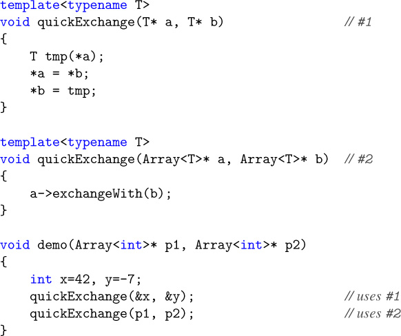

```
template<typename T>
void quickExchange(T* a, T* b)                // #1
{
    T tmp(*a);
    *a = *b;
    *b = tmp;
}

template<typename T>
void quickExchange(Array<T>* a, Array<T>* b) //  #2
{
    a->exchangeWith(b);
}

void demo(Array<int>* p1, Array<int>* p2)
{
    int x=42, y=-7;
    quickExchange(&x, &y);                  // uses #1
    quickExchange(p1, p2);                  // uses #2
}

```


The first call to `quickExchange()` has two arguments of type `int*`, and therefore deduction succeeds only with the first template, declared at point _#1_ , when `T` is substituted by `int`. There is therefore no doubt regarding which function should be called. In contrast, the second call can be matched with either template: Viable functions for the call `quickExchange(p1, p2)` are obtained both when substituting `Array<int>` for `T` in the first template and when substituting `int` in the second template. Furthermore, both substitutions result in functions with parameter types that exactly match the argument types of the second call. Ordinarily, this would lead us to conclude that the call is ambiguous, but (as we will discuss later) the C++ language considers the second template to be "more specialized" than the first. All other things being equal, overload resolution prefers the more specialized template and hence selects the template at point _#2_ .

> 对“quickExchange（）”的第一个调用有两个类型为“int*”的参数，因此只有当“T”被“int”替换时，在点_#1_声明的第一个模板才能成功推导。因此，应该调用哪个函数是毫无疑问的。相反，第二个调用可以与任一模板匹配：当用“Array＜int＞”代替第一个模板中的“T”时，以及当用第二个模板中“int”代替时，都可以获得调用“quickExchange（p1，p2）”的可行函数。此外，这两个替换都会导致函数的参数类型与第二个调用的参数类型完全匹配。通常，这会导致我们得出调用不明确的结论，但（我们稍后将讨论）C++语言认为第二个模板比第一个模板“更专业”。在所有其他条件相同的情况下，重载解析更喜欢更专业的模板，因此选择点_#2_处的模板。

#### 16.1.2 Semantic Transparency


The use of overloading as shown in the previous section is very useful in achieving transparent customization of the instantiation process, but it is important to realize that this "transparency" depends a great deal on the details of the implementation. To illustrate this, consider our `quickExchange()` solution. Although both the generic algorithm and the one customized for `Array<T>` types end up swapping the values that are being pointed to, the side effects of the operations are very different. This is dramatically illustrated by considering some code that compares the exchange of struct objects with the exchange of `Array<T>`s:

> 如前一节所示，重载的使用在实现实例化过程的透明定制方面非常有用，但重要的是要认识到，这种“透明性”在很大程度上取决于实现的细节。为了说明这一点，请考虑我们的“quickExchange（）”解决方案。尽管通用算法和为“Array＜T＞”类型定制的算法最终都会交换所指向的值，但操作的副作用非常不同。通过考虑一些将结构对象的交换与“Array＜T＞”的交换进行比较的代码，可以显著地说明这一点：

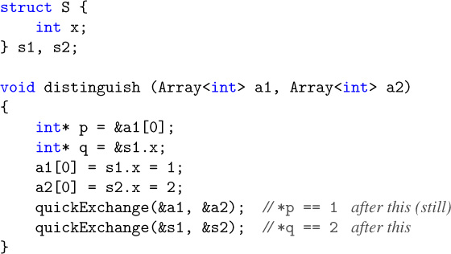

```
struct S {
    int x;
} s1, s2;

void distinguish (Array[<int]> a1, Array[<int]> a2)
{
    int* p = &a1[0];
    int* q = &s1.x;
    a1[0] = s1.x = 1;
    a2[0] = s2.x = 2;
    quickExchange(&a1, &a2);  // [*p == 1] after this (still)
    quickExchange(&s1, &s2);  // [*q == 2] after this
}

```


This example shows that a pointer `p` into the first `Array` becomes a pointer into the second array after `quickExchange()` is called. However, the pointer into the non-`Array s1` remains pointing into `s1` even after the exchange operation: Only the values that were pointed to were exchanged. The difference is significant enough that it may confuse clients of the template implementation. The prefix `quick_` is helpful in attracting attention to the fact that a shortcut may be taken to realize the desired operation. However, the original generic `exchange()` template can still have a useful optimization for `Array<T>`s:

> 此示例显示，在调用“quickExchange（）”后，指向第一个“Array”的指针“p”将变为指向第二个数组的指针。但是，即使在交换操作之后，指向非“数组s1”的指针仍将指向“s1”：仅交换了指向的值。这种差异非常显著，可能会混淆模板实现的客户端。前缀“quick_”有助于引起人们的注意，即可以采用快捷方式来实现所需的操作。然而，原始的通用“exchange（）”模板仍然可以对“Array＜T＞”进行有用的优化：

```
[Click here to view code image]

template<typename T>
void exchange (Array<T>* a, Array<T>* b)
{
    T* p = &(*a)[0];
    T* q = &(*b)[0];
    [for] (std::size_t k = a->size(); k\-- != 0; ) {
        exchange(p++, q++);
    }
}

```


The advantage of this version over the generic code is that no (potentially) large temporary `Array<T>` is needed. The `exchange()` template is called recursively so that good performance is achieved even for types such as `Array<Array<char>>`. Note also that the more specialized version of the template is not declared `inline` because it does a considerable amount of work of its own, whereas the original generic implementation is `inline` because it performs only a few operations (each of which is potentially expensive).

> 与通用代码相比，此版本的优势在于不需要（潜在的）大型临时“Array＜T＞”。“exchange（）”模板是递归调用的，因此即使对于“Array＜Array＜char＞”之类的类型，也能获得良好的性能。还要注意的是，模板的更专业的版本没有被声明为“内联”，因为它自己做了大量的工作，而原始的通用实现是“内联”的，因为它只执行少数操作（每一个操作都可能很昂贵）。

### 16.2 Overloading Function Templates


In the previous section we saw that two function templates with the same name can coexist, even though they may be instantiated so that both have identical parameter types. Here is another simple example of this:

> 在上一节中，我们看到了具有相同名称的两个函数模板可以共存，即使它们可能被实例化，从而具有相同的参数类型。下面是另一个简单的例子：

```
details/funcoverload1.hpp

template<typename T>
int f(T)
{
    return 1;
}

template<typename T>
int f(T*)
{
    return 2;
}

```


When `T` is substituted by `int*` in the first template, a function is obtained that has exactly the same parameter (and return) types as the one obtained by substituting `int` for `T` in the second template. Not only can these templates coexist, their respective instantiations can coexist even if they have identical parameter and return types.

> 当第一个模板中的“T”被“int*”代替时，得到的函数具有与第二个模板中用“int”代替“T”所得到的函数完全相同的参数（和返回）类型。这些模板不仅可以共存，即使它们具有相同的参数和返回类型，它们各自的实例化也可以共存。


The following demonstrates how two such generated functions can be called using explicit template argument syntax (assuming the previous template declarations):

> 以下演示了如何使用显式模板参数语法（假设前面的模板声明）调用两个这样生成的函数：

```
[Click here to view code image]

details/funcoverload1.cpp

#include <iostream>
#include "funcoverload1.hpp"\

int main()
{
    std::cout << f[<int]*>((int]*[)nullptr);  // calls [f<T>(T)]\
    std::cout << f[<int]>((int]*[)nullptr);   // calls [f<T>(T*)]\
}

```

This program has the following output: `12`


To clarify this, let's analyze the call `f<int*>((int*)nullptr)` in detail. The syntax `f<int*>()` indicates that we want to substitute the first template parameter of the template `f()` with `int*` without relying on template argument deduction. In this case there is more than one template `f()`, and therefore an overload set is created containing two functions generated from templates: f<inT*>(inT*) (generated from the first template) and f<inT*>(inT\*\*) (generated from the second template). The argument to the call (inT*)nullptr has type inT\*. This matches only the function generated from the first template, and hence that is the function that ends up being called.

> 为了澄清这一点，让我们详细分析调用“f＜int*＞（（int*）nullptr）”。语法“f＜int*＞（）”表示我们希望用“int*”替换模板“f（）”的第一个模板参数，而不依赖于模板参数推导。在这种情况下，有多个模板“f（）”，因此创建了一个重载集，其中包含从模板生成的两个函数：f＜inT*＞（inT*）（从第一个模板生成）和f＜inT*＞（inT\*\*）（由第二个模板生成。调用（inT*）nullptr的参数的类型为inT\*。这只匹配从第一个模板生成的函数，因此这就是最终被调用的函数。


For the second call, on the other hand, the created overloading set contains `f<int>(int)` (generated from the first template) and `f<int>(int*)` (generated from the second template), so that only the second template matches.

> 另一方面，对于第二个调用，创建的重载集包含“f＜int＞（int）”（从第一个模板生成）和“f＜int>（int*）”（由第二个模板生成的），因此只有第二个模版匹配。

#### 16.2.1 Signatures


Two functions can coexist in a program if they have distinct signatures. We define the signature of a function as the following information:[1]. The unqualified name of the function (or the name of the function template from which it was generated)

> 如果两个函数具有不同的签名，则它们可以在程序中共存。我们将函数的签名定义为以下信息：[1]。函数的非限定名称（或生成函数的函数模板的名称）


2. The class or namespace scope of that name and, if the name has internal linkage, the translation unit in which the name is declared

> 2.该名称的类或命名空间作用域，如果该名称具有内部链接，则声明该名称的转换单元


3. The `const`, `volatile`, or `const volatile` qualification of the function (if it is a member function with such a qualifier)

> 3.函数的“const”、“volatile”或“const-volatile”限定符（如果它是具有此类限定符的成员函数）


4. The `&` or `&&` qualification of the function (if it is a member function with such a qualifier)

> 4.函数的“&”或“&&”限定（如果它是具有这样限定符的成员函数）


5. The types of the function parameters (before template parameters are substituted if the function is generated from a function template)

> 5.函数参数的类型（如果函数是从函数模板生成的，则在替换模板参数之前）

6. Its return type, if the function is generated from a function template


7. The template parameters and the template arguments, if the function is generated from a function template

> 7.如果函数是从函数模板生成的，则模板参数和模板自变量


This means that the following templates and their instantiations could, in principle, coexist in the same program:

> 这意味着以下模板及其实例化原则上可以共存于同一程序中：

```
[Click here to view code image]

template<typename T1, typename T2>
void f1(T1, T2);

template<typename T1, typename T2>
void f1(T2, T1);

template<typename T>
[long] f2(T);

template<typename T>
[char] f2(T);

```


However, they cannot always be used when they're declared in the same scope because instantiating both creates an overload ambiguity. For example, calling `f2(42)` when both the templates above are declared will clearly create an ambiguity. Another example is illustrated below:

> 然而，当它们在同一范围内声明时，不能总是使用它们，因为实例化两者会产生过载歧义。例如，当上述两个模板都被声明时，调用“f2（42）”显然会产生歧义。另一个例子如下所示：

```
#include <iostream>

template<typename T1, typename T2>
void f1(T1, T2)
{
    std::cout << "f1(T1, T2)\n";
}
template<typename T1, typename T2>
void f1(T2, T1)
{
    std::cout << "f1(T2, T1)\n";
}
// fine so far

int main()
{
    f1<[char], [char]>('a'], ['b');  // ERROR: ambiguous
}

```

Here, the function

```
[Click here to view code image]

`f1<T1 = char, T2 = char>(T1, T2)`

```

can coexist with the function

```
[Click here to view code image]

`f1<T1 = char, T2 = char>(T2, T1)`

```


but overload resolution will never prefer one over the other. If the templates appear in different translation units, then the two instantiations can actually exist in the same program (and, e.g., a linker should not complain about duplicate definitions because the signatures of the instantiations are distinct):

> 但是过载分辨率永远不会偏好其中一个而非另一个。如果模板出现在不同的翻译单元中，那么这两个实例化实际上可以存在于同一个程序中（例如，链接器不应该抱怨重复的定义，因为实例化的签名是不同的）：

```
[Click here to view code image]

*//* *translation unit 1:*\
#include <iostream>

template<typename T1, typename T2>
void f1(T1, T2)
{
    std::cout << "f1(T1, T2)\n";
}

void g()
{
    f1<[char], [char]>('a'], ['b');
}

***//* *translation unit 2:***\
#include <iostream>

template<typename T1, typename T2>
void f1(T2, T1)
{
    std::cout << "f1(T2, T1)\n";
}
[extern void] g();  // defined in translation unit 1

int main()
{
    f1<[char], [char]>('a'], ['b');
    g();
}

```

This program is valid and produces the following output:

`f1(T2, T1)`

`f1(T1, T2)`

#### 16.2.2 Partial Ordering of Overloaded Function Templates


Reconsider our earlier example: We found that after substituting the given template argument lists (`<int*>` and `<int>`), overload resolution ended up selecting the right function to call:

> 重新考虑我们之前的例子：我们发现，在替换给定的模板参数列表（`<int*>`和`<int>`）后，重载解析最终选择了要调用的正确函数：

```
[Click here to view code image]

std::cout << f[<int]*>((int]*[)nullptr);  // calls [f<T>(T)]\
std::cout << f[<int]>((int]*[)nullptr);   // calls [f<T>(T*)]

```


However, a function is selected even when explicit template arguments are not provided. In this case, template argument deduction comes into play. Let's slightly modify function `main()` in the previous example to discuss this mechanism:

> 但是，即使没有提供显式模板参数，也会选择函数。在这种情况下，模板参数推导就发挥了作用。让我们稍微修改上一个例子中的函数“main（）”来讨论这种机制：

```
[Click here to view code image]

details/funcoverload2.cpp

#include <iostream>

template<typename T>
int f(T)
{
    return 1;
}

template<typename T>
int f(T*)
{
    return 2;
}

int main()
{
    std::cout << f(0);              // calls [f<T>(T)]\
    std::cout << f(nullptr);        // calls [f<T>(T)]\
    std::cout << f((int]*[)nullptr);  // calls [f<T>(T*)]\
}

```


Consider the first call, `f(0)`: The type of the argument is `int`, which matches the type of the parameter of the first template if we substitute `T` with `int`. However, the parameter type of the second template is always a pointer and, hence, after deduction, only an instance generated from the first template is a candidate for the call. In this case overload resolution is trivial.

> 考虑第一个调用“f（0）”：参数的类型是“int”，如果我们用“int”替换“T”，它将与第一个模板的参数的类型相匹配。然而，第二个模板的参数类型始终是指针，因此，在推导之后，只有从第一个模板生成的实例才是调用的候选者。在这种情况下，过载解决是微不足道的。


The same applies to the second call: `(f(nullptr):` The type of the argument is `std::nullptr_t`, which again only matches for the first template.

> 这同样适用于第二个调用：“（f（nullptr）：”参数的类型是“std:：nullptr_t”，它同样只与第一个模板匹配。


The third call (`f((int*)nullptr)`) is more interesting: Argument deduction succeeds for both templates, yielding the functions `f<int*>(int*)` and `f<int>(int*)`. From a traditional overload resolution perspective, both are equally good functions to call with an `int*` argument, which would suggest that the call is ambiguous (see [Appendix [C]). However, in this sort of case, an additional overload resolution criterion comes into play: The function generated from the more specialized template is selected. Here (as we see shortly), the second template is considered more specialized and thus the output of our example is

> 第三个调用（`f（（int*）nullptr）`）更有趣：两个模板的参数推导都成功，生成了函数`f＜int*>（int*'）`和`f＜int＞（int*]）`。从传统的重载解析的角度来看，这两个函数都是用“int*”参数调用的同样好的函数，这表明调用是不明确的（请参见[附录[C]）。然而，在这种情况下，一个额外的过载解决标准将发挥作用：选择从更专业的模板生成的函数。在这里（我们很快就会看到），第二个模板被认为更专业，因此我们的例子的输出是

`112`

#### 16.2.3 Formal Ordering Rules


In our last example, it may seem very intuitive that the second template is more special than the first because the first can accommodate just about any argument type, whereas the second allows only pointer types. However, other examples are not necessarily as intuitive. In what follows, we describe the exact procedure to determine whether one function template participating in an overload set is more specialized than the other. Note that these are _partial_ ordering rules: It is possible that given two templates, neither can be considered more specialized than the other. If overload resolution must select between two such templates, no decision can be made, and the program contains an ambiguity error.

> 在我们的最后一个例子中，第二个模板比第一个模板更特殊，这似乎非常直观，因为第一个模板几乎可以容纳任何参数类型，而第二个只允许指针类型。然而，其他例子并不一定那么直观。在下面的内容中，我们描述了确定参与重载集的一个函数模板是否比另一个更专业的确切过程。请注意，这些是_partial_ordering规则：有可能给定两个模板，两者都不能被认为比另一个更专业。如果过载解析必须在两个这样的模板之间进行选择，则无法做出任何决定，并且程序包含模糊性错误。


Let's assume we are comparing two identically named function templates that seem viable for a given function call. Overload resolution is decided as follows:

> 假设我们正在比较两个名称相同的函数模板，这两个模板对于给定的函数调用来说似乎是可行的。过载决议决定如下：


• Function call parameters that are covered by a default argument and ellipsis parameters that are not used are ignored in what follows.

> •默认参数包含的函数调用参数和未使用的省略号参数在以下内容中被忽略。


• We then synthesize two artificial lists of argument types (or for conversion function templates, a return type) by substituting every template parameter as follows:

> •然后，我们通过如下替换每个模板参数，合成两个参数类型的人工列表（或者对于转换函数模板，返回类型）：

1. Replace each template type parameter with a unique invented type.


2. Replace each template template parameter with a unique invented class template.

> 2.将每个模板模板参数替换为唯一的发明类模板。


3. Replace each nontype template parameter with a unique invented value of the appropriate type. (Types, templates, and values that are invented in this context are distinct from any other types, templates, or values that either the programmer used or the compiler synthesized in other contexts.)

> 3.将每个非类型模板参数替换为适当类型的唯一虚构值。（在此上下文中发明的类型、模板和值不同于程序员在其他上下文中使用或编译器合成的任何其他类型、模板或值。）


• If template argument deduction of the second template against the first synthesized list of argument types succeeds with an exact match, but not vice versa, then the first template is more specialized than the second. Conversely, if template argument deduction of the first template against the second synthesized list of argument types succeeds with an exact match, but not vice versa, then the second template is more specialized than the first. Otherwise (either no deduction succeeds or both succeed), there is no ordering between the two templates. Let's make this concrete by applying it to the two templates in our last example. From these two templates, we synthesize two lists of argument types by replacing the template parameters as described earlier: (`A1`) and (`A2*`) (where A1 and A2 are unique made up types). Clearly, deduction of the first template against the second list of argument types succeeds by substituting A2* for T. However, there is no way to make `T*`of the second template match the nonpointer type`A1` in the first list. Hence, we formally conclude that the second template is more specialized than the first.

> •如果第二个模板相对于第一个合成的参数类型列表的模板参数推导成功，但没有完全匹配，则第一个模板比第二个更专业。相反，如果第一个模板相对于参数类型的第二个合成列表的模板参数推导成功，但没有完全匹配，则第二个模板比第一个模板更专业。否则（要么没有推导成功，要么两者都成功），两个模板之间没有排序。让我们通过将其应用于上一个示例中的两个模板来具体化。根据这两个模板，我们通过替换前面描述的模板参数来合成两个参数类型列表：（“A1”）和（“A2*”）（其中A1和A2是唯一的组合类型）。显然，通过用A2*代替T，第一模板相对于第二参数类型列表的推导是成功的。然而，没有办法使第二模板的“T*”与第一列表中的非参数类型“A1”匹配。因此，我们正式得出结论，第二个模板比第一个模板更专业。

Consider a more intricate example involving multiple function parameters:

```
[Click here to view code image]

template<typename T>
void t(T*, T const* = [nullptr], ...);

template<typename T>
void t(T const*, T*, T* = [nullptr);

void example(int]* p)
{
    t(p, p);
}

```


First, because the actual call does not use the ellipsis parameter for the first template and the last parameter of the second template is covered by its default argument, these parameters are ignored in the partial ordering. Note that the default argument of the first template is not used; hence the corresponding parameter participates in the ordering.

> 首先，由于实际调用不使用第一个模板的省略号参数，而第二个模板的最后一个参数由其默认参数覆盖，因此在部分排序中会忽略这些参数。请注意，没有使用第一个模板的默认参数；因此相应的参数参与排序。


The synthesized lists of argument types are `(A1*, A1 const*)` and `(A2 const*, A2*)`. Template argument deduction of `(A1*, A1 const*)` versus the second template actually succeeds with the substitution of `T` with `A1 const`, but the resulting match is not exact because a qualification adjustment is needed to call `t<A1 const>(A1 const*, A1 const*, A1 const* = 0)` with arguments of types `(A1*, A1 const*)`. Similarly, no exact match can be found by deducing template arguments for the first template from the argument type list `(A2 const*, A2*)`. Therefore, there is no ordering relationship between the two templates, and the call is ambiguous.

> 参数类型的合成列表为“（A1*，A1 const*）”和“（A2 const*，A2*）”。与第二个模板相比，“（A1*，A1 const*）”的模板参数推导实际上成功地用“A1 const”替换了“T”，但所得到的匹配并不准确，因为需要进行限定调整才能用类型为“（A1*，A1 const*'）”的参数调用“T＜A1 const>（A1 const*，A1 const*=0）”。类似地，通过从参数类型列表“（A2 const*，A2*）”推导第一个模板的模板参数，也找不到完全匹配。因此，这两个模板之间没有排序关系，调用也不明确。


The formal ordering rules generally result in the intuitive selection of function templates. Once in a while, however, an example comes up for which the rules do not select the intuitive choice. It is therefore possible that the rules will be revised to accommodate those examples in the future.

> 形式排序规则通常导致函数模板的直观选择。然而，偶尔会出现一个规则没有选择直观选择的例子。因此，今后有可能对规则进行修订，以适应这些例子。

#### 16.2.4 Templates and Nontemplates


Function templates can be overloaded with nontemplate functions. All else being equal, the non-template function is preferred in selecting the actual function being called. The following example illustrates this:

> 函数模板可以用非模板函数重载。在其他条件相同的情况下，在选择被调用的实际函数时，非模板函数是首选。以下示例说明了这一点：

```
details/nontmpl1.cpp

#include <string>
#include <iostream>

template<typename T>
std::string f(T)
{
    return "Template";
}

std::string f(int]&)
{
    return "Nontemplate";
}

int main()
{
    int x = 7;
    std::cout << f(x) << '\n';//prints: [Nontemplate]\
}

```

This outputs

`Nontemplate`


However, when `const` and reference qualifiers differ, priorities for overload resolution can change. For example:

> 但是，当“const”和引用限定符不同时，过载解决的优先级可能会发生变化。例如

```
[Click here to view code image]

details/nontmpl2.cpp

#include <string>
#include <iostream>

template<typename T>
std::string f(T&)
{
    return "Template";
}

std::string f(int const]&)
{
    return "Nontemplate";
}

int main()
{
    int x = 7;
    std::cout << f(x) << '\n';//prints: template\
    int const c = 7;
    std::cout << f(c) << '\n';//prints: [Nontemplate]\
}

```

The program has the following output:

`Template`

`Nontemplate`


Now, the function template `f<>(T&)` is a better match when passing a nonconstant `int`. The reason is that for an `int` the instantiated `f<>(int&)` is a better match than `f(int const&)`. Thus, the difference is not only the fact that one function is a template and the other is not. In that case the general rules of overload resolution apply (see Section [[C.2]] on page [[682]]). Only when calling `f()` for a `int const`, do both signatures have the same type `int const&`, so that the nontemplate is preferred.

> 现在，函数模板“f＜＞（T&）”在传递非常量“int”时更匹配。原因是，对于“int”，实例化的“f＜＞（int&）”比“f（int const&）”更匹配。因此，区别不仅在于一个函数是模板，另一个不是。在这种情况下，过载解决的一般规则适用（见第[[682]]页第[[C.2]]节）。只有在为“int const”调用“f（）”时，两个签名才具有相同的类型“int const&”，因此首选非模板。


For this reason, it's a good idea to declare the member function template as

> 因此，最好将成员函数模板声明为

```
[Click here to view code image]

template<typename T>
std::string f(T const&)
{
    return "Template";
}

```


Nevertheless, this effect can easily occur accidentally and cause surprising behavior when member functions are defined that accept the same arguments as copy or move constructors. For example:

> 然而，当定义的成员函数接受与复制或移动构造函数相同的参数时，这种影响很容易意外发生，并导致令人惊讶的行为。例如

```
[Click here to view code image]

details/tmplconstr.cpp

#include <string>
#include <iostream>

class C {
  public:
    C() = [default];
    C (C const&) {
      std::cout << "copy constructor\\n";
    }
    C (C&&) {
      std::cout << "move constructor\\n";
    }
    template<typename T>
    C (T&&) {
      std::cout << "template constructor\\n";
    }
};

int main()
{
    C x;
    C x2;             // prints: [template constructor]\
    C x3;  // prints: [move constructor]\
    C const c;
    C x4;             // prints: [copy constructor]\
    C x5;  // prints: [template constructor]\
}

```

The program has the following output:

```
template constructor\
move constructor\
copy constructor\
template constructor

```


Thus, the member function template is a better match for copying a `C` than the copy constructor. And for `std::move(c)`, which yields type `C const&&` (a type that is possible but usually doesn't have meaningful semantics), the member function template also is a better match than the move constructor.

> 因此，成员函数模板比复制构造函数更适合复制“C”。对于“std:：move（c）”，它产生类型“c const&&”（一种可能的类型，但通常没有有意义的语义），成员函数模板也比move构造函数更匹配。


For this reason, usually you have to partially disable such member function templates when they might hide copy or move constructors. This is explained in Section [[6.4]] on page [[99]].

> 出于这个原因，当这些成员函数模板可能隐藏复制或移动构造函数时，通常必须部分禁用它们。第[[99]]页第[[6.4]]节对此进行了解释。

#### 16.2.5 Variadic Function Templates


Variadic function templates (see Section [[12.4]] on page [[200]]) require some special treatment during partial ordering, because deduction for a parameter pack (described in Section [[15.5]] on page [[275]]) matches a single parameter to multiple arguments. This behavior introduces several interesting situations for function template ordering, illustrated by the following example:

> 变分函数模板（见第[[200]]页第[[12.4]]节）在偏序过程中需要一些特殊处理，因为参数包的推导（如第[[275]]页第[15.5]]节所述）将单个参数与多个参数相匹配。此行为为函数模板排序引入了几种有趣的情况，如以下示例所示：

```
[Click here to view code image]

details/variadicoverload.cpp

#include <iostream>

template<typename T>
int f(T*)
{
  return 1;
}

template<typename... Ts>
int f(Ts...)
{
  return 2;
}

template<typename... Ts>
int f(Ts*...)
{
  return 3;
}
int main()
{
  std::cout << f(0, 0.0);                          // calls [f<>(Ts...)]\
  std::cout << f((int]*[)nullptr], (double]*[)nullptr); // calls [f<>(Ts*...)]\
  std::cout << f((int]*[)nullptr);                   // calls [f<>(T*)]\
}

```

The output of this example, which we will discuss in a moment, is `231`


In the first call, `f(0, 0.0)`, each of the function templates named `f` is considered. For the first function template, `f(T*)`, deduction fails both because the template parameter `T` cannot be deduced and because there are more function arguments than parameters for this nonvariadic function template. The second function template, `f(Ts…)`, is variadic: Deduction in this case compares the pattern of a function parameter pack (`Ts`) against against the types of the two arguments (`int` and `double`, respectively), deducing `Ts` to the sequence (`int`, `double`). For the third function template, `f(Ts*…)`, deduction compares the pattern of the function parameter pack `Ts*` against each of the argument types. This deduction fails (`Ts` cannot be deduced), leaving only the second function template viable. Function template ordering is not required.

> 在第一个调用“f（0,0.0）”中，考虑每个名为“f”的函数模板。对于第一个函数模板“f（T*）”，推导失败，这既是因为模板参数“T”无法推导，也是因为函数自变量比这个非变量函数模板的参数多。第二个函数模板“f（Ts..）”是可变的：在这种情况下，推导将函数参数包（“Ts”）的模式与两个参数的类型（分别为“int”和“double”）进行比较，将“Ts’推导为序列（“int”、“double’）。对于第三个函数模板“f（Ts*…）”，推导将函数参数包“Ts*”的模式与每个参数类型进行比较。这种推导失败（不能推导出“Ts”），只剩下第二个函数模板是可行的。不需要函数模板排序。


The second call, `f((int*)nullptr, (double*)nullptr)`, is more interesting: Deduction fails for the first function template because there are more function arguments than parameters, but deduction succeeds for the second and third templates. Written explicitly, the resulting calls would be

> 第二个调用“f（（int*）nullptr，（double*）nulttr）”更有趣：第一个函数模板的推导失败，因为函数参数比参数多，但第二个和第三个模板的推导成功。明确编写的调用将是

```
[Click here to view code image]

`f<int*,double*>((int*)nullptr, (double*)nullptr)`        //for second template

```

and

```
[Click here to view code image]

`f<int,double>((int*)nullptr, (double*)nullptr)`        //for third template

```


Partial ordering then considers the second and third templates, both of which are variadic as follows: When applying the formal ordering rules described in Section [[16.2.3]] on page [[331]] to a variadic template, each template parameter pack is replaced by a single made-up type, class template, or value. For example, this means that the synthesized argument types for the second and third function templates are `A1` and `A2*`, respectively, where `A1` and `A2` are unique, made-up types. Deduction of the second template against the third's list of argument types succeeds by substituting the single-element sequence (`A2*`) for the parameter pack `Ts`. However, there is no way to make the pattern `Ts*` of the third template's parameter pack match the nonpointer type `A1`, so the third function template (which accepts pointer arguments) is considered more specialized than the second function template (which accepts any arguments).

> 然后，部分排序考虑第二个和第三个模板，这两个模板都是可变的，如下所示：当将第[331]]页第[[16.2.3]]节中描述的形式排序规则应用于可变模板时，每个模板参数包都被一个单独的组合类型、类模板或值替换。例如，这意味着第二和第三函数模板的合成自变量类型分别是“A1”和“A2*”，其中“A1”与“A2”是唯一的组合类型。通过用单个元素序列（“A2*”）代替参数包“Ts”，第二个模板相对于第三个参数类型列表的推导成功。然而，没有办法使第三个模板的参数包的模式“Ts*”与非指针类型“A1”匹配，因此第三个函数模板（接受指针参数）被认为比第二个函数模板更专业（接受任何参数）。


The third call, `f((int*)nullptr)`, introduces a new wrinkle: Deduction succeeds for all three of the function templates, requiring partial ordering to compare a nonvariadic template to a variadic template. To illustrate, we compare the first and third function templates. Here, the synthesized argument types are `A1*` and `A2*`, where `A1` and `A2` are unique, made-up types. Deduction of the first template against the third's synthesized argument list would normally succeed by substituting `A2` for `T`. In the other direction, deduction of the third template against the first's synthesized argument list succeeds by substituting the single-element sequence (`A1`) for the parameter pack `Ts`. Partial ordering between the first and third templates would normally result in an ambiguity. However, a special rule prohibits an argument that originally came from a function parameter pack (e.g., the third template's parameter pack `Ts*…`) from matching a parameter that is not a parameter pack (the first template's parameter `T *`). Hence, template deduction of the first template against the third's synthesized argument list fails, and the first template is considered more specialized than the third. This special rule effectively considers nonvariadic templates (those with a fixed number of parameters) to be more specialized than variadic templates (with a variable number of parameters).

> 第三个调用“f（（int*）nullptr）”引入了一个新的问题：所有三个函数模板的推导都成功，需要部分排序才能将非变量模板与变量模板进行比较。为了说明，我们比较了第一个和第三个函数模板。这里，合成的自变量类型是“A1*”和“A2*”，其中“A1”和“A2”是唯一的组合类型。通过用“A2”代替“T”，第一个模板相对于第三个合成参数列表的推导通常会成功。在另一个方向上，通过用单个元素序列（‘A1’）代替参数包‘Ts’，第三个模板相对于第一个合成的参数列表的推导成功。第一和第三模板之间的部分排序通常会导致歧义。然而，有一条特殊规则禁止最初来自函数参数包（例如，第三个模板的参数包“Ts*…”）的参数与不是参数包的参数（第一个模板的数据包“T*”）匹配。因此，第一个模板相对于第三个模板的合成参数列表的模板推导失败，并且第一个模板被认为比第三个更专业。这一特殊规则有效地认为非变量模板（具有固定数量的参数的模板）比变变量模板（拥有可变数量的参数）更专业。


The rules described above apply equally to pack expansions that occur in types in the function signature. For example, we can wrap the parameters and arguments of each of the function templates in our previous example into a variadic class template `Tuple` to arrive at a similar example not involving function parameter packs:

> 上述规则同样适用于函数签名中类型中出现的包扩展。例如，我们可以将前面例子中每个函数模板的参数和自变量包装成一个变量类模板“Tuple”，以获得一个不涉及函数参数包的类似例子：

```
[Click here to view code image]

details/tupleoverload.cpp

#include <iostream>

template<typename... Ts> class Tuple\
{
};

template<typename T>
int f(Tuple<T*>)
{
  return 1;
}

template<typename... Ts>
int f(Tuple<Ts...>)
{
  return 2;
}

template<typename... Ts>
int f(Tuple<Ts*...>)
{
  return 3;
}

int main()
{
  std::cout << f(Tuple[<int], [double]>());    // calls [f<>(Tuple<Ts...>)]\
  std::cout << f(Tuple[<int]*, [double]*>());  // calls [f<>(Tuple<Ts*...>)]\
  std::cout << f(Tuple[<int]*>());           // calls [f<>(Tuple<T*>)]\
}

```


Function template ordering considers the pack expansions in the template arguments to `Tuple` analogously to the function parameter packs in our previous example, resulting in the same output:

> 函数模板排序将模板参数中的包扩展考虑为“Tuple”，类似于我们前面示例中的函数参数包，从而产生相同的输出：

`231`

### 16.3 Explicit Specialization


The ability to overload function templates, combined with the partial ordering rules to select the "best" matching function template, allows us to add more specialized templates to a generic implementation to tune code transparently for greater efficiency. However, class templates and variable templates cannot be overloaded. Instead, another mechanism was chosen to enable transparent customization of class templates: _explicit specialization_. The standard term _explicit specialization_ refers to a language feature that we call _full specialization_ instead. It provides an implementation for a template with template parameters that are fully substituted: No template parameters remain. Class templates, function templates, and variable templates can be fully specialized.[2]

> 重载函数模板的能力，再加上部分排序规则来选择“最佳”匹配的函数模板，使我们能够向通用实现中添加更专业的模板，以透明地调整代码，从而提高效率。但是，类模板和变量模板不能重载。相反，选择了另一种机制来实现类模板的透明自定义：_explicit specialization_。标准术语_explicit specialization_指的是我们称之为_full specialization的语言特性。它为具有完全替换的模板参数的模板提供了一个实现：不保留任何模板参数。类模板、函数模板和变量模板可以完全专业化。2.


So can members of class templates that may be defined outside the body of a class definition (i.e., member functions, nested classes, static data members, and member enumeration types).

> 类模板的成员也可以在类定义的主体之外定义（即，成员函数、嵌套类、静态数据成员和成员枚举类型）。


In a later section, we will describe _partial specialization_. This is similar to full specialization, but instead of fully substituting the template parameters, some parameterization is left in the alternative implementation of a template. Full specializations and partial specializations are both equally "explicit" in our source code, which is why we avoid the term _explicit specialization_ in our discussion. Neither full nor partial specialization introduces a totally new template or template instance. Instead, these constructs provide alternative definitions for instances that are already implicitly declared in the generic (or _unspecialized_) template. This is a relatively important conceptual observation, and it is a key difference with overloaded templates.

> 在后面的部分中，我们将描述_部分专业化_。这类似于完全专业化，但不是完全替换模板参数，而是在模板的替代实现中保留一些参数化。完全专业化和部分专业化在我们的源代码中都是同样“明确”的，这就是为什么我们在讨论中避免使用术语_explicit specialization_。无论是完全专业化还是部分专业化都不会引入全新的模板或模板实例。相反，这些构造为已经在泛型（或_unspecializedd_）模板中隐式声明的实例提供了替代定义。这是一个相对重要的概念观察，也是与重载模板的关键区别。

#### 16.3.1 Full Class Template Specialization


A full specialization is introduced with a sequence of three tokens: `template, <, and >`.[3] In addition, the class name is followed by the template arguments for which the specialization is declared. The following example illustrates this:

> 通过三个标记的序列引入了完全专业化：`template、<和>`。[3] 此外，类名后面跟有为其声明专门化的模板参数。以下示例说明了这一点：

```
[Click here to view code image]

template<typename T>
class S {
  public:
    void info() {
        std::cout << "generic (S<T>::info())\n\";]\
    }
};

template<>
class S<void>> {
  public:
    void msg() {
        std::cout << "fully specialized (S<void>::msg())\n";
    }
};

```


Note how the implementation of the full specialization does not need to be related in any way to the generic definition: This allows us to have member functions of different names (`info` versus `msg`). The connection is solely determined by the name of the class template.

> 请注意，完全专业化的实现不需要以任何方式与泛型定义相关：这允许我们拥有不同名称的成员函数（“info”与“msg”）。连接完全由类模板的名称决定。


The list of specified template arguments must correspond to the list of template parameters. For example, it is not valid to specify a nontype value for a template type parameter. However, template arguments for parameters with default template arguments are optional:

> 指定的模板参数列表必须与模板参数列表相对应。例如，为模板类型参数指定非类型值是无效的。但是，具有默认模板参数的参数的模板参数是可选的：

```
template<typename T> class Types {
  public:
    using I = int;
};

template<typename T, typename U = typename Types<T>::I>
class S;                        //#1

template<>
class S<void>>  #2
  public:
    void f();
};

template<> class S[<char], [char]>; // #3

template<> class S[<char], 0>;    // ERROR: [0] cannot substitute [U]\

int main()
{
    S<int>*      pi;`    // OK: uses #1 , no definition needed
    S<int>       e1;`    // ERROR: uses #1 , but no definition available
    S<void>*     pv;`    // OK: uses #2
    S<void,int>  sv;`    // OK: uses #2 , definition available
    S<void,char> e2;`    // ERROR: uses #1 , but no definition available
    S<char,char> e3;`    // ERROR: uses #3 , but no definition available
}\

template<>
class S[<char], [char]>  #3
};

```


As this example also shows, declarations of full specializations (and of templates) do not necessarily have to be definitions. However, when a full specialization is declared, the generic definition is never used for the given set of template arguments. Hence, if a definition is needed but none is provided, the program is in error. For class template specialization, it is sometimes useful to "forward declare" types so that mutually dependent types can be constructed. A full specialization declaration is identical to a normal class declaration in this way (it is _not_ a template declaration). The only differences are the syntax and the fact that the declaration must match a previous template declaration. Because it is not a template declaration, the members of a full class template specialization can be defined using the ordinary out-of-class member definition syntax (in other words, the `template<>` prefix cannot be specified):

> 正如这个例子所示，完全专业化（和模板）的声明不一定必须是定义。但是，当声明完全专业化时，泛型定义永远不会用于给定的模板参数集。因此，如果需要定义，但没有提供定义，则程序是错误的。对于类模板专门化，“前向声明”类型有时很有用，这样就可以构造相互依赖的类型。通过这种方式，完全专业化声明与普通类声明相同（它不是模板声明）。唯一的区别在于语法和声明必须与以前的模板声明匹配这一事实。因为它不是模板声明，所以可以使用普通的类外成员定义语法来定义全类模板专用化的成员（换句话说，不能指定`template<>`前缀）：

```
[Click here to view code image]

template<typename T>
class S;

template<> class S[<char]**> {
  public:
    void print() const;
};

// the following definition cannot be preceded by [template<>]\
void S[<char]**>::print() const\
{
    std::cout << "pointer to pointer to char\\n";
}

```

A more complex example may reinforce this notion:

```
[Click here to view code image]

template<typename T>
class Outside {
  [public]:     template<typename U>
    class Inside {
    }; };

template<>
class Outside[<void>] {
    // there is no special connection between the following nested class
    // and the one defined in the generic template
    template<typename U>
    class Inside {
      private:
        static int count;
    };
};
// the following definition cannot be preceded by `template<> template<typename U> int Outside<void>::Inside<U>::count = 1;`

```


A full specialization is a replacement for the instantiation of a certain generic template, and it is not valid to have both the explicit and the generated versions of a template present in the same program. An attempt to use both in the same file is usually caught by a compiler:

> 完全专业化是对某个通用模板实例化的替代，在同一程序中同时存在模板的显式版本和生成版本是无效的。试图在同一文件中同时使用这两种方法通常会被编译器捕获：

```
[Click here to view code image]

template<typename T>
class Invalid {
};

`Invalid<double> x1;`     // causes the instantiation of `Invalid<double>`\

template<>
class Invalid[<double]>;  // ERROR: [Invalid<double>] already instantiated

```


Unfortunately, if the uses occur in different translation units, the problem may not be caught so easily. The following invalid C++ example consists of two files and compiles and links on many implementations, but it is invalid and dangerous:

> 不幸的是，如果使用不同的翻译单位，问题可能不会那么容易解决。以下无效的C++示例由两个文件组成，并在许多实现上编译和链接，但它是无效且危险的：

```
[Click here to view code image]

// **Translation unit 1:**
template<typename T>
class Danger {
  public:
    [enum] ;
};
[char] buffer[Danger<void>> ::max];  // uses generic value

[extern void] clear(char]*);

int main()
{
    clear(buffer);
}

// **Translation unit 2:**
template<typename T>
class Danger;

template<>
class Danger<void>> {
  public:
    [enum] ;
};

void clear(char]* buf)
{
    // mismatch in array bound:
    [for] (int] k = 0; k<Danger<void>> ::max; ++k) {
      buf[k] = ['\\0'];
    }
}

```


This example is clearly contrived to keep it short, but it illustrates that care must be taken to ensure that the declaration of the specialization is visible to all the users of the generic template. In practical terms, this means that a declaration of the specialization should normally follow the declaration of the template in its header file. When the generic implementation comes from an external source (such that the corresponding header files should not be modified), this is not necessarily practical, but it may be worth creating a header including the generic template followed by declarations of the specializations to avoid these hard-to-find errors. We find that, in general, it is better to avoid specializing templates coming from an external source unless it is clearly marked as being designed for that purpose.

> 这个例子显然是为了简洁起见，但它表明，必须小心确保通用模板的所有用户都能看到专业化的声明。实际上，这意味着专门化的声明通常应该在其头文件中的模板声明之后。当通用实现来自外部源（因此不应修改相应的头文件）时，这不一定实用，但可能值得创建一个头，包括通用模板和专用化声明，以避免这些难以找到的错误。我们发现，一般来说，最好避免专门化来自外部来源的模板，除非它被明确标记为是为此目的而设计的。

#### 16.3.2 Full Function Template Specialization


The syntax and principles behind (explicit) full function template specialization are much the same as those for full class template specialization, but overloading and argument deduction come into play.

> （显式）全函数模板专门化背后的语法和原理与全类模板专门化的语法和原则基本相同，但重载和参数推导会起作用。


The full specialization declaration can omit explicit template arguments when the template being specialized can be determined via argument deduction (using as argument types the parameter types provided in the declaration) and partial ordering. For example:

> 当可以通过参数推导（使用声明中提供的参数类型作为参数类型）和部分排序来确定要专门化的模板时，完全专门化声明可以省略显式模板参数。例如

```
[Click here to view code image]

template<typename T>
int f(T)                    // #1
{
    return 1;
}

template<typename T>
int f(T*)                   // #2
{
    return 2;
}

template<> int f(int)      // OK: specialization of #1
{
    return 3;
}
template<> int f(int]*)    // OK: specialization of #2
{
    return 4;
}

```


A full function template specialization cannot include default argument values. However, any default arguments that were specified for the template being specialized remain applicable to the explicit specialization:

> 完整的函数模板专用化不能包含默认参数值。但是，为要专门化的模板指定的任何默认参数仍然适用于显式专门化：

```
[Click here to view code image]

template<typename T>
int f(T, T x = 42)
{
    return x;
}

template<> int f(int], int = 35)  // ERROR
{
    return 0;
}

```


(That's because a full specialization provides an alternative definition, but not an alternative declaration. At the point of a call to a function template, the call is entirely resolved based on the function template.)

> （这是因为完全专业化提供了一个替代定义，但没有提供替代声明。在调用函数模板时，调用完全基于函数模板进行解析。）


A full specialization is in many ways similar to a normal declaration (or rather, a normal *re*declaration). In particular, it does not declare a template, and therefore only _one definition_ of a noninline full function template specialization should appear in a program. However, we must still ensure that a _declaration_ of the full specialization follows the template to prevent attempts at using the function generated from the template. The declarations for a template `g()` and one full specialization would therefore typically be organized in two files as follows:

> 完全专业化在很多方面类似于普通声明（或者更确切地说，普通的*re*声明）。特别是，它不声明模板，因此程序中只应出现非线性全函数模板专门化的定义（_O）。然而，我们仍然必须确保完全专业化的_declaration_遵循模板，以防止试图使用从模板生成的函数。因此，模板“g（）”和一个完整专业化的声明通常会组织在两个文件中，如下所示：


• The interface file contains the definitions of primary templates and partial specializations but declares only the full specializations:

> •接口文件包含主模板和部分专业化的定义，但仅声明完全专业化：

```
[Click here to view code image]

#ifndef TEMPLATE_G\_HPP\
#define TEMPLATE_G\_HPP\

// template definition should appear in header file:
template<typename T>
int g(T, T x = 42)
{
    return x;
}

// specialization declaration inhibits instantiations of the template;
// definition should not appear here to avoid multiple definition errors
template<> int g(int], int y);

#endif // TEMPLATE\_G\_HPP

```

• The corresponding implementation file defines the full specialization:

```
[Click here to view code image]

#include "template_g.hpp"\

template<> int g(int], int y)
{
    return y/2;
}

```


Alternatively, the specialization could be made inline, in which case its definition can be (and should be) placed in the header file.

> 或者，专业化可以内联，在这种情况下，它的定义可以（也应该）放在头文件中。

#### 16.3.3 Full Variable Template Specialization


Variable templates can also be fully specialized. By now, the syntax should be intuitive:

> 变量模板也可以完全专业化。到目前为止，语法应该是直观的：

```
[Click here to view code image]

template<typename T> [constexpr] std::size_t SZ = [sizeof](T);
template<> [constexpr] std::size_t SZ<void>> = 0;

```


Clearly, the specialization can provide an initializer that is distinct from that resulting from the template. Interestingly, a variable template specialization is not required to have a type matching that of the template being specialized:

> 显然，专业化可以提供一个与模板产生的初始化器不同的初始化器。有趣的是，变量模板专业化不需要具有与被专业化的模板的类型匹配的类型：

```
[Click here to view code image]

template<typename T> typename T::iterator null_iterator;
template<> BitIterator null_iterator<std::bitset<100>>;
                  // `BitIterator` doesn't match `T::iterator`, and that is fine

```

#### 16.3.4 Full Member Specialization


Not only member templates, but also ordinary static data members and member functions of class templates, can be fully specialized. The syntax requires `template<>` prefix for every enclosing class template. If a member template is being specialized, a `template<>` must also be added to denote that it is being specialized. To illustrate the implications of this, let's assume the following declarations:

> 不仅成员模板，普通的静态数据成员和类模板的成员函数也可以完全专业化。语法要求每个封闭类模板都有“template＜＞”前缀。如果成员模板是专门化的，还必须添加一个“template＜＞”来表示它是专门化。为了说明这一点的含义，让我们假设以下声明：

```cpp
template<typename T>
class Outer //  #1
  public:
    template<typename U>
    class Inner //  #2
      private:
        static int count;            // #3
    };
    static int code;                 // #4
    void print() const //  #5
      std::cout << "generic";
    }
};
template<typename T>
int Outer<T>::code = 6;              // #6

template<typename T> template[<typename] U>
int Outer<T>::Inner<U>::count = 7;   // #7

template<>
class Outer[<bool]> //  #8
  public:
    template<typename U>
    class Inner //  #9
      private:
        static int count;            //#10
    };
    void print() const // #11
    }
};
```


The ordinary members `code` at point _#4_ and `print()` at point _#5_ of the generic `Outer` template _#1_ have a single enclosing class template and hence need one `template<>` prefix to specialize them fully for a specific set of template arguments:

> 通用“外部”模板_#1_的点_#4_处的普通成员“code”和点_#5_处的“print（）”具有单个封闭类模板，因此需要一个“模板＜＞”前缀来将它们完全专用于一组特定的模板参数：

```
[Click here to view code image]

    template<>
    int Outer<void>>::code = 12;

    template<>
    void Outer<void>>::print() const\
    {
        std::cout << "Outer<void>";
    }

```


These definitions are used over the generic ones at points _#4_ and _#5_ for class `Outer<void>`, but other members of class `Outer<void>` are still generated from the template at point _#1_ . Note that after these declarations, it is no longer valid to provide an explicit specialization for `Outer<void>`.

> 这些定义用于类“Outer<void>”的点_#4_和_#5_5处的通用定义，但类“Outer<void>’的其他成员仍然是从点_#1_处的模板生成的。请注意，在这些声明之后，为“Outer＜void＞”提供显式专门化将不再有效。


Just as with full function template specializations, we need a way to declare the specialization of an ordinary member of a class template without specifying a definition (to prevent multiple definitions). Although nondefining out-of-class declarations are not allowed in C++ for member functions and static data members of ordinary classes, they _are_ fine when specializing members of class templates. The previous definitions could be declared with

> 就像使用全功能模板专门化一样，我们需要一种方法来声明类模板的普通成员的专门化，而无需指定定义（以防止多个定义）。尽管在C++中，普通类的成员函数和静态数据成员不允许进行类外声明的非定义，但当专门化类模板的成员时，这些声明会很好。以前的定义可以用声明

```
[Click here to view code image]

template<>
int Outer<void>>::code;

template<>
void Outer<void>>::print() const;

```


The attentive reader might point out that the nondefining declaration of the full specialization of `Outer<void>::code` looks exactly like a definition to be initialized with a default constructor. This is indeed so, but such declarations are always interpreted as nondefining declarations. For a full specialization of a static data member with a type that can only be initialized using a default constructor, we must resort to initializer list syntax. Given the following:

> 细心的读者可能会指出，“Outer＜void＞：：code”的完全专业化的非定义声明看起来就像是要用默认构造函数初始化的定义。确实如此，但此类声明总是被解释为不明确的声明。对于类型只能使用默认构造函数初始化的静态数据成员的完全专用化，我们必须使用初始化器列表语法。给定以下内容：

```
[Click here to view code image]

class DefaultInitOnly {
  public:
    DefaultInitOnly() = default;
    DefaultInitOnly(DefaultInitOnly const&) = delete; };

template<typename T>
class Statics {
  private:
    [static] T sm;
};

```

the following is a declaration:

```
[Click here to view code image]

template<>
DefaultInitOnly Statics<DefaultInitOnly>::sm;

```

while the following is a definition that calls the default constructor:

```
[Click here to view code image]

template<>
DefaultInitOnly Statics<DefaultInitOnly>::sm;

```


Prior to C++11, this was not possible. Default initialization was thus not available for such specializations. Typically, an initializer copying a default value was used:

> 在C++11之前，这是不可能的。因此，默认初始化不适用于此类专业化。通常，使用复制默认值的初始值设定项：

```
[Click here to view code image]

template<>
DefaultInitOnly Statics<DefaultInitOnly>::sm = DefaultInitOnly();

```


Unfortunately, for our example that was not possible because the copy constructor is deleted. However, C++17 introduced mandatory _copy-elision_ rules, which make that alternative valid, because no copy constructor invocation is involved anymore.

> 不幸的是，对于我们的例子，这是不可能的，因为复制构造函数被删除了。然而，C++17引入了强制性的_copy-elision_规则，这使得该替代方案有效，因为不再涉及复制构造函数调用。


The member template `Outer<T>::Inner` can also be specialized for a given template argument without affecting the other members of the specific instantiation of `Outer<T>`, for which we are specializing the member template. Again, because there is one enclosing template, we will need one `template<>` prefix. This results in code like the following:

> 成员模板“Outer＜T＞：：Inner”也可以专门用于给定的模板参数，而不会影响“Outer＞T＞”的特定实例化的其他成员，我们正在专门用于该成员模板。同样，因为有一个封闭模板，所以我们需要一个“template<>'前缀。这会产生如下代码：

```
[Click here to view code image]

template<>
    template<typename X>
  class Outer[<wchar_t]>::Inner {
      public:
        [static long] count; // member type changed
    };

template<>
   template<typename X>
   [long] Outer[<wchar_t]>::Inner<X>::count;

```


The template `Outer<T>::Inner` can also be fully specialized, but only for a given instance of `Outer<T>`. We now need two `template<>` prefixes: one because of the enclosing class and one because we're fully specializing the (inner) template:

> 模板“Outer＜T＞：：Inner”也可以完全专用，但仅适用于给定的“Outer＞T＞”实例。我们现在需要两个`template<>`前缀：一个是因为封闭类，另一个是由于我们完全专门化（内部）模板：

```
[Click here to view code image]

template<>
    template<>
    class Outer[<char]>::Inner[<wchar_t]> {
      public:
        [enum] ;
    };

// the following is not valid C++:
// `template<>` cannot follow a template parameter list
template<typename X>
template<> class Outer<X>::Inner<void>>;  // ERROR

```


Contrast this with the specialization of the member template of `Outer<bool>`. Because the latter is already fully specialized, there is no enclosing template, and we need only one `template<>` prefix:

> 与此形成对比的是“Outer＜bool＞”成员模板的专业化。因为后者已经完全专业化了，所以没有封闭模板，我们只需要一个`template<>`前缀：

```
[Click here to view code image]

template<>
class Outer[<bool]>::Inner[<wchar_t]> {
  public:
    [enum] ;
};

```

### 16.4 Partial Class Template Specialization


Full template specialization is often useful, but sometimes it is natural to want to specialize a class template or variable template for a family of template arguments rather than just one specific set of template arguments. For example, let's assume we have a class template implementing a linked list:

> 完全的模板专门化通常是有用的，但有时很自然地想要为一系列模板参数专门化类模板或变量模板，而不仅仅是一组特定的模板参数。例如，假设我们有一个实现链表的类模板：

```
[Click here to view code image]

template<typename T>
class List  #1
  public:
   ...
   void append(T const&);
   inline std::size_t length() const;
   ...
};

```


A large project making use of this template may instantiate its members for many types. For member functions that are not expanded inline (say, `List<T>::append()`), this may cause noticeable growth in the object code. However, we may know that from a low-level point of view, the code for `List<int*>::append()` and `List<void*>::append()` is the same. In other words, we'd like to specify that all `List`s of pointers share an implementation. Although this cannot be expressed in C++, we can achieve something quite close by specifying that all `List`s of pointers should be instantiated from a different template definition:

> 使用此模板的大型项目可能会实例化许多类型的成员。对于未内联扩展的成员函数（例如“List<T>：：append（）”），这可能会导致对象代码显著增长。然而，我们可能知道，从低级的角度来看，“List<int*>：：append（）”和“List<void*>：（append）”的代码是相同的。换句话说，我们希望指定所有指针的“List”共享一个实现。尽管这不能在C++中表达，但我们可以通过指定所有指针的“列表”都应该从不同的模板定义中实例化来实现非常接近的效果：

```
[Click here to view code image]

template<typename T>
class List<T*>  #2
  private:
    List<void*> impl;
    ...
  public:
    ...
   [inline void] append(T* p) {
      impl.append(p);
   }
   inline std::size_t length() const {
       return impl.length();
   }
   ...
};

```


In this context, the original template at point _#1_ is called the _primary template_, and the latter definition is called a _partial specialization_ (because the template arguments for which this template definition must be used have been only partially specified). The syntax that characterizes a partial specialization is the combination of a template parameter list declaration (`template<`... `>`) and a set of explicitly specified template arguments on the name of the class template (`<T*>` in our example).

> 在此上下文中，点_#1_处的原始模板称为_primary template_，后一个定义称为_partial specialization_（因为必须使用此模板定义的模板参数仅部分指定）。表征部分专门化的语法是模板参数列表声明（`template<`…`>`）和类模板名称上显式指定的一组模板参数（在我们的示例中为`<T*>`）的组合。


Our code contains a problem because `List<void*>` recursively contains a member of that same `List<void*>` type. To break the cycle, we can precede the previous partial specialization with a full specialization:

> 我们的代码包含一个问题，因为“List＜void*＞”递归地包含同一“List＜void*＞”类型的成员。为了打破这种循环，我们可以在之前的部分专业化之前进行完全专业化：

```
[Click here to view code image]

template<>
class List<void>*>  #3
    ...
    void append (void]* p);
    inline std::size_t length() const;
    ...
};
```


This works because matching full specializations are preferred over partial specializations. As a result, all member functions of `List`s of pointers are forwarded (through easily inlineable functions) to the implementation of `List<void*>`. This is an effective way to combat _code bloat_ (of which C++ templates are often accused).

> 这是因为匹配完全专业化比部分专业化更可取。结果，指针的“List”的所有成员函数都被转发（通过易于内联的函数）到“List＜void*＞”的实现。这是一种有效的方法来对抗代码膨胀（C++模板经常被指责）。


There exist several limitations on the parameter and argument lists of partial specialization declarations. Some of them are as follows:

> 部分专门化声明的参数和自变量列表存在一些限制。其中一些如下：


1. The arguments of the partial specialization must match in kind (type, nontype, or template) the corresponding parameters of the primary template.

> 1.部分专用化的参数必须在种类（类型、非类型或模板）上与主模板的相应参数匹配。


2. The parameter list of the partial specialization cannot have default arguments; the default arguments of the primary class template are used instead.

> 2.部分专业化的参数列表不能有默认参数；而是使用主类模板的默认参数。


3. The nontype arguments of the partial specialization should be either nondependent values or plain nontype template parameters. They cannot be more complex dependent expressions like `2*N` (where `N` is a template parameter).

> 3.部分专门化的非类型参数应该是非依赖值或纯非类型模板参数。它们不能是更复杂的依赖表达式，如“2*N”（其中“N”是模板参数）。


4. The list of template arguments of the partial specialization should not be identical (ignoring renaming) to the list of parameters of the primary template.

> 4.部分专业化的模板参数列表不应与主模板的参数列表相同（忽略重命名）。


5. If one of the template arguments is a pack expansion, it must come at the end of a template argument list.

> 5.如果其中一个模板参数是包扩展，则它必须位于模板参数列表的末尾。

An example illustrates these limitations:

```
[Click here to view code image]

template<typename T, int I = 3>
class S;                  // primary template

template<typename T>
class S[<int], T>;          // ERROR: parameter kind mismatch

template<typename T = int>
class S<T, 10>;          // ERROR: no default arguments

template<int I>
class S[<int], I*2>;       // ERROR: no nontype expressions

template<typename U, int K>
class S<U, K>;           // ERROR: no significant difference from primary template

template<typename... Ts>
class Tuple;

template<typename Tail, typename... Ts>
class Tuple<Ts..., Tail>;  // ERROR: pack expansion not at the end

template<typename Tail, typename... Ts>
class Tuple<Tuple<Ts...>, Tail>;  // OK: pack expansion is at the end of a
                               // nested template argument list

```


Every partial specialization---like every full specialization---is associated with the primary template. When a template is used, the primary template is always the one that is looked up, but then the arguments are also matched against those of the associated specializations (using template argument deduction, as described in [Chapter [15]) to determine which template implementation is picked. Just as with function template argument deduction, the SFINAE principle applies here: If, while attempting to match a partial specialization an invalid construct is formed, that specialization is silently abandoned and another candidate is examined if one is available. If no matching specializations is found, the primary template is selected. If multiple matching specializations are found, the most specialized one (in the sense defined for overloaded function templates) is selected; if none can be called most specialized, the program contains an ambiguity error.

> 每一个部分专门化——就像每一个完全专门化一样——都与主模板相关联。当使用模板时，主模板总是被查找的模板，但随后参数也与相关专业的参数相匹配（使用模板参数推导，如[第[15]章所述），以确定选择哪个模板实现。与函数模板参数推导一样，SFINAE原则也适用于此：如果在尝试匹配部分专门化时形成了一个无效的构造，则该专门化将被默默放弃，并检查另一个候选者（如果有）。如果没有找到匹配的专业化，则选择主模板。如果找到多个匹配的专业化，则选择最专业化的一个（在为重载函数模板定义的意义上）；如果没有一个可以称为最专业的，则程序包含模糊性错误。


Finally, we should point out that it is entirely possible for a class template partial specialization to have more or fewer parameters than the primary template. Consider our generic template `List`, declared at point _#1_ , again. We have already discussed how to optimize the list-of-pointers case, but we may want to do the same with certain pointer-to-member types. The following code achieves this for pointer-to-member-pointers:

> 最后，我们应该指出，类模板部分专业化完全有可能比主模板具有更多或更少的参数。再次考虑我们在第_#1_点声明的通用模板“List”。我们已经讨论了如何优化指针列表的情况，但我们可能希望对某些指向成员的指针类型也这样做。以下代码为指向成员的指针实现了这一点：

```
[Click here to view code image]

// partial specialization for any pointer-to-`void* member template<typename C> class List<void* C::*>  #4
  public:
    using ElementType = void* C::*;
    ...
    void append(ElementType pm);
    inline std::size_t length() const;
    ...
};

// partial specialization for any pointer-to-member-pointer type except
// pointer-to-`void*` member, which is handled earlier
// (note that this partial specialization has two template parameters,
// whereas the primary template only has one parameter)
// this specialization makes use of the prior one to achieve the
// desired optimization
template<typename T, typename C>
class List<T* C::*>  #5
  private:
    List<void* C::*> impl;
    ...
  public:
    using ElementType = T* C::*;
    ...
    [inline void] append(ElementType pm) {
        impl.append((void* C::*])pm);
    }
    inline std::size_t length() const {
        return impl.length();
    }
    ...
};

```


In addition to our observation regarding the number of template parameters, note that the common implementation defined at _#4_ to which all others are forwarded by the declaration at point _#5_ is itself a partial specialization (for the simple pointer case it is a full specialization). However, it is clear that the specialization at point _#4_ is more specialized than that at point _#5_ ; thus no ambiguity should occur.

> 除了我们对模板参数数量的观察之外，请注意，在_#4_定义的公共实现（所有其他实现都由_#5_5点的声明转发到该公共实现）本身就是部分专门化（对于简单指针的情况，它是完全专门化）。然而，很明显，在点_#4_处的专门化比在点_#5_处更专门化；因此不应出现歧义。


Moreover, it is even possible that the number of explicitly written template _arguments_ can differ from the number of template parameters in the primary template. This can happen both with default template arguments and, in a far more useful manner, with variadic templates:

> 此外，显式写入的模板_arguments_的数量甚至可能与主模板中的模板参数的数量不同。这既可以发生在默认模板参数中，也可以以更有用的方式发生在可变模板中：

```
[Click here to view code image]

template<typename... Elements>
class Tuple; // primary template

template<typename T1>
class Tuple<T>; // one-element tuple

template<typename T1, typename T2, typename... Rest>
class Tuple<T1, T2, Rest...>; // tuple with two or more elements

```

### 16.5 Partial Variable Template Specialization


When variable templates were added to the draft C++11 standard, several aspects of their specifications were overlooked, and some of those issues have still not been formally resolved. However, actual implementations generally agree on the handling of these issues.

> 当变量模板被添加到C++11标准草案中时，它们规范的几个方面被忽视了，其中一些问题仍未得到正式解决。然而，实际实现通常对这些问题的处理达成一致。


Perhaps the most surprising of these issues is that the standard refers to the ability to partially specialize variable templates, but it does not describe how they are declared or what they mean. What follows is thus based on C++ implementations in practice (which do permit such partial specializations), and not on the C++ standard.

> 也许这些问题中最令人惊讶的是，该标准提到了部分专门化变量模板的能力，但它没有描述它们是如何声明的，也没有描述它们的含义。因此，下面的内容是基于实践中的C++实现（它确实允许这样的部分专业化），而不是基于C++标准。


As one would expect, the syntax is similar to full variable template specialization, except that `template<>` is replaced by an actual template declaration header, and the template argument list following the variable template name must depend on template parameters. For example:

> 正如人们所期望的，语法类似于完整的变量模板专门化，只是“template＜＞”被实际的模板声明头所取代，并且变量模板名称后面的模板参数列表必须取决于模板参数。例如

```
[Click here to view code image]

template<typename T> [constexpr] std::size_t SZ = [sizeof](T);

template<typename T> [constexpr] std::size_t SZ<T&> = [sizeof](void]*);

```


As with the full specialization of variable templates, the type of a partial specialization is not required to match that of the primary template:

> 与变量模板的完全专业化一样，部分专业化的类型不需要与主模板的类型匹配：

```
[Click here to view code image]

template<typename T> typename T::iterator null_iterator;

template<typename T, std::size_t N> T* null_iterator<T[N]> = null_ptr;
                // [T doesn't match [T::iterator], and that is fine

```


The rules regarding the kinds of template arguments that can be specified for a variable template partial specialization are identical to those for class template specializations. Similarly, the rules to select a specialization for a given list of concrete template arguments are identical too.

> 关于可以为变量模板部分专业化指定的模板参数类型的规则与类模板专业化的规则相同。同样，为给定的具体模板参数列表选择专门化的规则也相同。

### 16.6 Afternotes


Full template specialization was part of the C++ template mechanism from the start. Function template overloading and class template partial specialization, on the other hand, came much later. The HP aC++ compiler was the first to implement function template overloading, and EDG's C++ front end was the first to implement class template partial specialization. The partial ordering principles described in this chapter were originally invented by Steve Adamczyk and John Spicer (who are both of EDG).

> 完全模板专业化从一开始就是C++模板机制的一部分。另一方面，函数模板重载和类模板部分专业化的出现要晚得多。HP aC++编译器是第一个实现函数模板重载的编译器，EDG的C++前端也是第一个实现类模板部分专业化的编译器。本章中描述的偏序原理最初是由Steve Adamczyk和John Spicer（他们都是EDG的成员）发明的。


The ability of template specializations to terminate an otherwise infinitely recursive template definition (such as the `List<T*>` example presented in Section [[16.4]] on page [[348]]) was known for a long time. However, Erwin Unruh was perhaps the first to note that this could lead to the interesting notion of _template metaprogramming_: using the template instantiation mechanism to perform nontrivial computations at compile time. We devote [Chapter [23]] to this topic.

> 模板专业化终止无限递归模板定义的能力（例如第[[348]]页第[[16.4]]节中给出的“List<T*>”示例）早就为人所知。然而，Erwin Unruh可能是第一个注意到这可能导致_模板元编程的有趣概念的人：使用模板实例化机制在编译时执行非平凡的计算。我们将[第[23]章]专门讨论这个主题。


You may legitimately wonder why only class templates and variable templates can be partially specialized. The reasons are mostly historical. It is probably possible to define the same mechanism for function templates (see [Chapter [17]). In some ways, the effect of overloading function templates is similar, but there are also some subtle differences. These differences are mostly related to the fact that only the primary template needs to be looked up when a use is encountered. The specializations are considered only afterward, to determine which implementation should be used. In contrast, all overloaded function templates must be brought into an overload set by looking them up, and they may come from different namespaces or classes. This increases the likelihood of unintentionally overloading a template name somewhat.

> 您可能会合理地想知道为什么只有类模板和变量模板可以部分专用化。原因大多是历史原因。可能会为功能模板定义相同的机制（见[第[17]章]）。在某些方面，重载函数模板的效果是相似的，但也有一些细微的区别。这些差异主要与这样一个事实有关，即当遇到使用时，只需要查找主模板。只有在以后才考虑专门化，以确定应该使用哪个实现。相反，所有重载的函数模板都必须通过查找它们来引入重载集，并且它们可能来自不同的名称空间或类。这在一定程度上增加了无意中重载模板名称的可能性。


Conversely, it is also imaginable to allow a form of overloading of class templates and variable templates. Here is an example:

> 相反，也可以想象允许类模板和变量模板的重载形式。以下是一个示例：

```
[Click here to view code image]

// invalid overloading of class templates
template<typename T1, typename T2> class Pair;
template<int N1, int N2> class Pair;

```

However, there doesn't seem to be a pressing need for such a mechanism.


^[1]^ This definition differs from that given in the C++ standard, but its consequences are equivalent.

> ^[1] ^这个定义与C++标准中给出的定义不同，但其后果是等效的。


^[2]^ Alias templates are the only form of template that _cannot_ be specialized, either by a full specialization or a partial specialization. This restriction is necessary to make the use of template aliases transparent to the template argument deduction process Section [[15.11]] on page [[312]].

> ^[2] ^别名模板是唯一可以通过完全专业化或部分专业化进行专门化的模板形式（_C）。为了使模板别名的使用对第[[312]]页第[[15.11]]节的模板参数推导过程透明，此限制是必要的。


^[3]^ The same prefix is also needed to declare full function template specializations. Earlier designs of the C++ language did not include this prefix, but the addition of member templates required additional syntax to disambiguate complex specialization cases.

> ^[3] ^声明全功能模板专业化也需要相同的前缀。C++语言的早期设计不包括这个前缀，但添加成员模板需要额外的语法来消除复杂的专业化情况的歧义。


## Chapter 17

## Future Directions


C++ templates have been evolving almost continuously from their initial design in 1988, through the various standardization milestones in 1998, 2011, 2014, and 2017. It could be argued that templates were at least somewhat related to most major language additions after the original 1998 standard.

> C++模板从1988年的初始设计到1998年、2011年、2014年和2017年的各种标准化里程碑，几乎一直在不断发展。可以说，模板至少在某种程度上与1998年原始标准之后的大多数主要语言添加有关。


The first edition of this book listed a number of extensions that we might see after the first standard, and several of those became reality:

> 本书的第一版列出了在第一个标准之后我们可能会看到的一些扩展，其中一些扩展成为了现实：


• The angle bracket hack: C++11 removed the need to insert a space between two closing angle brackets.

> •角括号破解：C++11消除了在两个闭合角括号之间插入空格的需要。

• Default function template arguments: C++11 allows function templates to have default template arguments.

> •默认的函数模板参数：C++11允许函数模板具有默认的模板参数。
• Typedef templates: C++11 introduced alias templates, which are similar.

• The `typeof` operator: C++11 introduced the `decltype` operator, which fills the same role (but uses a different token to avoid a conflict with an existing extension that doesn't quite meet the needs of the C++ programmers' community).

> •“typeof”运算符：C++11引入了“decltype”运算符，它扮演相同的角色（但使用不同的令牌来避免与不完全满足C++程序员社区需求的现有扩展发生冲突）。

• Static properties: The first edition anticipated a selection of type traits being supported directly by compilers. This has come to pass, although the interface is expressed using the standard library (which is then implemented using compiler extensions for many of the traits).

> •静态特性：第一版预计编译器将直接支持一些类型特征。这已经实现了，尽管接口是使用标准库来表达的（然后使用许多特性的编译器扩展来实现）。

• Custom instantiation diagnostics: The new keyword `static_assert` implements the idea described by `std::instantiation_error` in the first edition of this book.

> •自定义实例化诊断：新关键字“static_assert”实现了本书第一版中“std:：instantiation_error”所描述的思想。
• List parameters: This became _parameter packs_ in C++11.

• Layout control: C++11's `alignof` and `alignas` cover the needs described in the first edition. Furthermore, the C++17 library added a `std::variant` template to support discriminated unions.

> •布局控制：C++11的“alignof”和“alignas”涵盖了第一版中描述的需求。此外，C++17库添加了一个“std:：variant”模板来支持有区别的并集。

• Initializer deduction: C++17 added class template argument deduction, which addresses the same issue.

> •初始化程序推导：C++17添加了类模板参数推导，解决了同样的问题。

• Function expressions: C++11's lambda expressions provides exactly this functionality (with a syntax somewhat different from that discussed in the first edition).

> •函数表达式：C++11的lambda表达式正好提供了这一功能（语法与第一版中讨论的有所不同）。


Other directions hypothesized in the first edition have not made it into the modern language, but most are still discussed on occasion and we keep their presentation in this volume. Meanwhile, other ideas are emerging and we present some of those as well.

> 第一版中假设的其他方向尚未成为现代语言，但大多数方向仍在偶尔讨论，我们将在本卷中对其进行介绍。与此同时，其他想法正在出现，我们也提出了其中一些想法。

### 17.1 Relaxed **typename** Rules


In the first edition of this book, this section suggested that the future might bring two kinds of relaxations to the rules for the use of `typename` (see Section [[13.3.2]] on page [[228]]): Allow `typename` where it was not previously allowed, and make `typename` optional where a compiler can relatively easily infer that a qualified name with a dependent qualifier must name a type. The former came to pass (`typename` in C++11 can be used redundantly in many places), but the latter has not.

> 在本书的第一版中，这一部分建议，未来可能会对“typename”的使用规则进行两种放宽（见第[[228]]页第[[13.3.2]]节）：在以前不允许的地方允许使用“typename'”，在编译器可以相对容易地推断出带有从属限定符的限定名必须命名类型的地方，使“typename`成为可选项。前者实现了（C++11中的“typename”可以在许多地方重复使用），但后者没有。


Recently, however, there has been a renewed call to make `typename` optional in various common contexts where the expectation of a type specifier is unambiguous:

> 然而，最近有人再次呼吁在对类型说明符的期望是明确的各种常见上下文中使“typename”成为可选的：


• The return type and parameter types of function and member function declarations in namespace and class scope. Similarly with function and member function templates and with lambda expressions appearing in any scope.

> •命名空间和类作用域中函数和成员函数声明的返回类型和参数类型。类似地，函数和成员函数模板以及lambda表达式出现在任何范围中。


• The types of variable, variable template, and static data member declarations. Again, similarly with variable templates.

> •变量、变量模板和静态数据成员声明的类型。同样，变量模板也是如此。

• The type after the `=` token in an alias or alias template declaration.

• The default argument of a type parameter of a template.


• The type appearing in the angle brackets following a `static_cast`, `const_cast`, `dynamic_cast`, or `reinterpret_cast`, construct.

> •出现在“static_cast”、“const_cast”或“dynamic_cast”构造后面的尖括号中的类型。

• The type named in a `new` expression.


Although this is a relatively ad hoc list, it turns out that such a change in the language would allow by far most instances of this use of `typename` to be dropped, which would make code more compact and more readable.

> 尽管这是一个相对临时的列表，但事实证明，语言的这种变化将允许删除迄今为止使用“typename”的大多数实例，这将使代码更加紧凑和可读。

### 17.2 Generalized Nontype Template Parameters


Among the restrictions on nontype template arguments, perhaps the most surprising to beginning and advanced template writers alike is the inability to provide a string literal as a template argument.

> 在对非类型模板参数的限制中，对于初学者和高级模板编写器来说，最令人惊讶的可能是无法提供字符串文字作为模板参数。

The following example seems intuitive enough:

```
[Click here to view code image]

template<char const* msg>
class Diagnoser {
  public:
    void print();
};

int main()
{
    Diagnoser<"Surprise!">().print(); }

```


However, there are some potential problems. In standard C++, two instances of `Diagnoser` are the same type if and only if they have the same arguments. In this case the argument is a pointer value---in other words, an address. However, two identical string literals appearing in different source locations are not required to have the same address. We could thus find ourselves in the awkward situation that `Diagnoser<"X">` and `Diagnoser<"X">` are in fact two different and incompatible types! (Note that the type of "X"`is`char const[2]`, but it decays to `char const\*` when passed as a template argument.)

> 然而，也存在一些潜在的问题。在标准C++中，“诊断程序”的两个实例是相同的类型，当且仅当它们具有相同的参数。在这种情况下，参数是一个指针值——换句话说，是一个地址。但是，出现在不同源位置的两个相同字符串文字不需要具有相同的地址。因此，我们可能会发现自己处于尴尬的境地，“诊断程序<“X”>`和“诊断程序>”X“>`实际上是两种不同且不兼容的类型！（请注意，“X”`的类型是`char const[2]`，但当作为模板参数传递时，它会衰减为`char const\*`。）


Because of these (and related) considerations, the C++ standard prohibits string literals as arguments to templates. However, some implementations do offer the facility as an extension. They enable this by using the actual string literal contents in the internal representation of the template instance. Although this is clearly feasible, some C++ language commentators feel that a nontype template parameter that can be substituted by a string literal value should be declared differently from one that can be substituted by an address. One possibility would be to capture string literals in a parameter pack of characters. For example:

> 由于这些（以及相关的）考虑，C++标准禁止字符串文字作为模板的参数。然而，有些实现确实提供了该功能作为扩展。它们通过在模板实例的内部表示中使用实际的字符串文字内容来实现这一点。尽管这显然是可行的，但一些C++语言评论员认为，可以用字符串文字值替换的非类型模板参数的声明应该与可以用地址替换的参数不同。一种可能性是在一个字符参数包中捕获字符串文字。例如

```
[Click here to view code image]

template<[char]... msg>
class Diagnoser {
  public:
    void print();
};

int main()
{
    // instantiates `Diagnoser<’S’,’u’,’r’,’p’,’r’,’i’,’s’,’e’,’!’>     Diagnoser<"Surprise!">().print(); }

```


We should also note an additional technical wrinkle in this issue. Consider the following template declarations, and let's assume that the language has been extended to accept string literals as template arguments in this case:

> 我们还应该注意到这个问题中的一个额外的技术问题。考虑以下模板声明，让我们假设该语言已经扩展为在这种情况下接受字符串文字作为模板参数：

```
[Click here to view code image]

template<char const* str>
class Bracket {
  public:
    [static char const]* address();
    [static char const]* bytes();
};

template<char const* str>
char const* Bracket<str>::address()
{
    return str;
}

template<char const* str>
char const* Bracket<str>::bytes()
`{`\
    return str;
}

```


In the previous code, the two member functions are identical except for their names---a situation that is not that uncommon. Imagine that an implementation would instantiate `Bracket<"X">` using a process much like macro expansion: In this case, if the two member functions are instantiated in different translation units, they may return different values. Interestingly, a test of some C++ compilers that currently provide this extension reveals that they do suffer from this surprising behavior.

> 在前面的代码中，除了名称之外，这两个成员函数是相同的——这种情况并不罕见。想象一下，一个实现将使用类似于宏扩展的过程实例化“Bracket<“X”>'：在这种情况下，如果两个成员函数在不同的转换单元中实例化，它们可能会返回不同的值。有趣的是，对目前提供此扩展的一些C++编译器的测试表明，它们确实受到了这种令人惊讶的行为的影响。


A related issue is the ability to provide floating-point literals (and simple constant floating-point expressions) as template arguments. For example:

> 一个相关的问题是提供浮点文字（和简单的常量浮点表达式）作为模板参数的能力。例如

```
[Click here to view code image]

template<[double] Ratio>
class Converter {
  public:
    [static double] convert (double] val) {
      return val*Ratio;
    }
};
using InchToMeter = Converter<0.0254>;

```


This too is provided by some C++ implementations and presents no serious technical challenges (unlike the string literal arguments).

> 这也是由一些C++实现提供的，并且不会带来严重的技术挑战（与字符串文字参数不同）。


C++11 introduced a notion of a _literal class type_: a class type that can take constant values computed at compile time (including nontrivial computations through `constexpr` functions). Once such class types became available, it quickly became desirable to allow them for nontype template parameters. However, problems similar to those of the string literal parameters described above arose. In particular, the "equality" of two class-type values is not a trivial matter, because it is in general determined by `operator==` definitions. This equality determines if two instantiations are equivalent, but in practice, that equivalence must be checkable by the linker by comparing mangled names. One way out may be an option to mark certain literal classes as having a trivial equality criterion that amounts to pairwise comparing of the scalar members of the class. Only class types with such a trivial equality criterion would then be permitted as nontype template parameter types.

> C++11引入了_lilateral类类型的概念：一种可以采用编译时计算的常数值（包括通过“constexpr”函数进行的非平凡计算）的类类型。一旦这样的类类型可用，就很快需要允许它们用于非类型模板参数。然而，出现了类似于上述字符串文字参数的问题。特别是，两个类类型值的“相等”不是一件小事，因为它通常由“运算符==”定义决定。这种相等性决定了两个实例化是否等效，但在实践中，链接器必须通过比较损坏的名称来检查等效性。一种解决方法可能是选择将某些文字类标记为具有琐碎的相等标准，该标准相当于该类的标量成员的成对比较。只有具有这种琐碎相等条件的类类型才被允许作为非类型模板参数类型。

### 17.3 Partial Specialization of Function Templates


In [Chapter [16]] we discussed how class templates can be partially specialized, whereas function templates are simply overloaded. The two mechanisms are somewhat different.

> 在[第[16]章]中，我们讨论了类模板是如何部分专用的，而函数模板只是重载的。这两种机制有些不同。


Partial specialization doesn't introduce a completely new template: It is an extension of an existing template (the _primary_ template). When a class template is looked up, only primary templates are considered at first. If, after the selection of a primary template, it turns out that there is a partial specialization of that template with a template argument pattern that matches that of the instantiation, _its_ definition (in other words, its _body_) is instantiated instead of the definition of the primary template. (Full template specializations work exactly the same way.)

> 部分专业化不会引入全新的模板：它是现有模板（_primary_template）的扩展。当查找类模板时，首先只考虑主模板。如果在选择主模板后，发现该模板具有与实例化匹配的模板参数模式的部分专业化，则实例化_its_定义（换句话说，其_body_），而不是主模板的定义。（完全模板专业化的工作方式完全相同。）


In contrast, overloaded function templates are separate templates that are completely independent of one another. When selecting which template to instantiate, all the overloaded templates are considered together, and overload resolution attempts to choose one as the best fit. At first this might seem like an adequate alternative, but in practice there are a number of limitations:

> 相反，重载的函数模板是彼此完全独立的独立模板。在选择要实例化的模板时，所有重载的模板都会一起考虑，重载解析会尝试选择一个最适合的模板。起初，这似乎是一个足够的选择，但在实践中有许多局限性：


• It is possible to specialize member templates of a class without changing the definition of that class. However, adding an overloaded member does require a change in the definition of a class. In many cases this is not an option because we may not own the rights to do so. Furthermore, the C++ standard does not currently allow us to add new templates to the `std` namespace, but it does allow us to specialize templates from that namespace.

> •可以在不更改类的定义的情况下专门化该类的成员模板。但是，添加重载成员确实需要更改类的定义。在许多情况下，这不是一种选择，因为我们可能没有这样做的权利。此外，C++标准目前不允许我们向“std”命名空间添加新模板，但它允许我们专门化该命名空间中的模板。


• To overload function templates, their function parameters must differ in some material way. Consider a function template `R convert(T const&)` where `R` and `T` are template parameters. We may very well want to specialize this template for `R = void`, but this cannot be done using overloading.

> •要重载函数模板，它们的函数参数必须在某些实质性方面有所不同。考虑一个函数模板“R convert（T const&）”，其中“R”和“T”是模板参数。我们可能很想将此模板专门化为“R=void”，但这不能使用重载来完成。


• Code that is valid for a nonoverloaded function may no longer be valid when the function is overloaded. Specifically, given two function templates `f(T)` and `g(T)` (where `T` is a template parameter), the expression `g(&f<int>)` is valid only if `f` is not overloaded (otherwise, there is no way to decide which `f` is meant).

> •当函数重载时，对未重载函数有效的代码可能不再有效。具体地说，给定两个函数模板“f（T）”和“g（T））（其中“T”是一个模板参数），表达式“g（&f＜int＞）”只有在“f”没有重载的情况下才有效（否则，无法确定“f”是指哪一个）。


• Friend declarations refer to a specific function template or an instantiation of a specific function template. An overloaded version of a function template would not automatically have the privileges granted to the original template.

> •友元声明是指特定的函数模板或特定函数模板的实例化。函数模板的重载版本不会自动具有授予原始模板的权限。


Together, this list forms a compelling argument in support of a partial specialization construct for function templates.

> 总之，这个列表形成了一个令人信服的论点，支持函数模板的部分专业化构造。


A natural syntax for partially specializing function templates is the generalization of the class template notation:

> 部分专业化函数模板的自然语法是类模板表示法的泛化：

```
[Click here to view code image]

template<typename T>
T const& max (T const&, T const&);               // primary template

template<typename T>
T* const& max <T*>(T* const&, T* const&);        // partial specialization

Some language designers worry about the interaction of this partial specialization approach with function template overloading. For example:

[Click here to view code image]

template<typename T>
void add (T& x, int i);     // a primary template

template<typename T1, typename T2>
void add (T1 a, T2 b);      // another (overloaded) primary template

template<typename T>
void add<T*> (T*&, int);    // Which primary template does this specialize?

```


However, we expect such cases would be deemed errors without major impact on the utility of the feature.

> 然而，我们预计此类情况将被视为错误，不会对功能的实用性产生重大影响。


This extension was briefly discussed during the standardization of C++11 but gathered relatively little interest in the end. Still, the topic occasionally arises because it neatly solves some common programming problems. Perhaps it will be taken up again in some future version of the C++ standard.

> 在C++11的标准化过程中，对这种扩展进行了简短的讨论，但最终引起的兴趣相对较少。尽管如此，这个话题偶尔会出现，因为它巧妙地解决了一些常见的编程问题。也许它会在未来的C++标准版本中再次被使用。

### 17.4 Named Template Arguments


Section [[21.4]] on page [[512]] describes a technique that allows us to provide a nondefault template argument for a specific parameter without having to specify other template arguments for which a default value is available. Although it is an interesting technique, it is also clear that it results in a fair amount of work for a relatively simple effect. Hence, providing a language mechanism to name template arguments is a natural thought.

> 第[[512]]页第[[21.4]]节描述了一种技术，该技术允许我们为特定参数提供非默认模板参数，而不必指定其他具有默认值的模板参数。尽管这是一种有趣的技术，但也很明显，它可以为相对简单的效果带来相当多的工作量。因此，提供一种命名模板参数的语言机制是一种自然的想法。


We should note at this point that a similar extension (sometimes called _keyword arguments_) was proposed earlier in the C++ standardization process by Roland Hartinger (see Section 6.5.1 of [StroustrupDnE). Although technically sound, the proposal was ultimately not accepted into the language for various reasons. At this point there is no reason to believe named template arguments will ever make it into the language, but the topic arises regularly in committee discussions.

> 在这一点上，我们应该注意到Roland Hartinger在C++标准化过程的早期提出了类似的扩展（有时称为_keyword arguments_）（见[StroustrupDnE的第6.5.1节）.虽然该提案在技术上是合理的，但由于各种原因，最终没有被接受为该语文。在这一点上，没有理由相信命名模板论点会成为语言，但这个话题经常出现在委员会的讨论中。


However, for the sake of completeness, we mention one syntactic idea that has been discussed:

> 然而，为了完整起见，我们提到了一个已经讨论过的句法概念：

```
[Click here to view code image]

template<typename T,\
         typename Move = defaultMove<T>,\
         typename Copy = defaultCopy<T>,\
         typename Swap = defaultSwap<T>,\
         typename Init = defaultInit<T>,\
         typename Kill = defaultKill<T>>
class Mutator {
   ...
};

void test(MatrixList ml)
{
   mySort (ml, Mutator <Matrix, .Swap = matrixSwap>);
}

```


Here, the period preceding the argument name is used to indicate that we're referring to a template argument by name. This syntax is similar to the "designated initializer" syntax introduced in the 1999 C standard:

> 这里，参数名称前面的句点用于指示我们按名称引用模板参数。此语法类似于1999年C标准中引入的“指定初始化器”语法：

```
[Click here to view code image]

struct Rectangle  top, left, width, height; };
struct Rectangle r = ;

```


Of course, introducing named template arguments means that the template parameter names of a template are now part of the public interface to that template and cannot be freely changed. This could be addressed by a more explicit, opt-in syntax, such as the following:

> 当然，引入命名模板参数意味着模板的模板参数名称现在是该模板的公共接口的一部分，不能自由更改。这可以通过更明确的选择加入语法来解决，例如以下语法：

```
[Click here to view code image]

template<typename T,\
         Move: typename M = defaultMove<T>,\
         Copy: typename C = defaultCopy<T>,\
         Swap: typename S = defaultSwap<T>,\
         Init: typename I = defaultInit<T>,\
         Kill: typename K = defaultKill<T>>
class Mutator {
   ...
};

void test(MatrixList ml)
{
   mySort (ml, Mutator <Matrix, .Swap = matrixSwap>);
}

```

### 17.5 Overloaded Class Templates


It is entirely possible to imagine that class templates could be overloaded on their template parameters. For example, one can imagine creating a family of `Array` templates that contains both dynamically and statically sized arrays:

> 完全可以想象类模板的模板参数可能会过载。例如，可以想象创建一个“数组”模板族，其中包含动态和静态大小的数组：

```
[Click here to view code image]

template<typename T>
class Array {
    // dynamically sized array
    ...
};

template<typename T, [unsigned] Size>
class Array {
    // fixed size array
    ...
};

```


The overloading isn't necessarily restricted to the number of template parameters; the _kind_ of parameters can be varied too:

> 重载不一定局限于模板参数的数量；参数的种类也可以变化：

```
[Click here to view code image]

template<typename T1, typename T2>
class Pair {
   // pair of fields
    ...
};

template<int I1, int I2>
class Pair {
    // pair of constant integer values
    ...
};

```


Although this idea has been discussed informally by some language designers, it has not yet been formally presented to the C++ standardization committee.

> 尽管这个想法已经被一些语言设计者非正式地讨论过，但它还没有正式地提交给C++标准化委员会。

### 17.6 Deduction for Nonfinal Pack Expansions


Template argument deduction for pack expansions only works when the pack expansion occurs at the end of the parameter or argument list. This means that while it is fairly simple to extract the first element from a list:

> 只有当包扩展发生在参数或参数列表的末尾时，包扩展的模板参数推导才有效。这意味着，虽然从列表中提取第一个元素相当简单：

```
[Click here to view code image]

template<typename... Types>
struct Front;

template<typename FrontT, typename... Types>
struct Front<FrontT, Types...> {
  using Type = FrontT;
};

```


one cannot easily extract the last element of the list due to the restrictions placed on partial specializations described in Section [[16.4]] on page [[347]]:

> 由于第[[347]]页第[[16.4]]节中对部分专业化的限制，无法轻易提取列表的最后一个元素：

```
[Click here to view code image]

template<typename... Types>
struct Back;

template<typename BackT, typename... Types>
struct Back<Types..., BackT> \
  using Type = BackT;          //       template argument list
};

```


Template argument deduction for variadic function templates is similarly restricted. It is plausible that the rules regarding template argument deduction of pack expansions and partial specializations will be relaxed to allow the pack expansion to occur anywhere in the template argument list, making this kind of operation far simpler. Moreover, it is possible---albeit less likely---that deduction could permit multiple pack expansions within the same parameter list:

> 变量函数模板的模板参数推导也受到类似的限制。关于包扩展和部分专业化的模板参数推导的规则可能会放宽，以允许包扩展发生在模板参数列表中的任何位置，从而使这种操作简单得多。此外，尽管可能性较小，但推断可能允许在同一参数列表中进行多个包扩展：

```
[Click here to view code image]

template<typename... Types> class Tuple {
};

template<typename T, typename... Types>
struct Split;

template<typename T, typename... Before, typename... After>
struct Split<T, Before..., T, After...> {
  using before = Tuple<Before...>;
  using after = Tuple<After...>;
};

```


Allowing multiple pack expansions introduces additional complexity. For example, does `Split` separate at the first occurrence of `T`, the last occurrence, or one in between? How complicated can the deduction process become before the compiler is permitted to give up?

> 允许多个包扩展会带来额外的复杂性。例如，“Split”是在“T”的第一个出现处、最后一个出现处还是在两者之间？在编译器被允许放弃之前，推导过程会变得多么复杂？

### 17.7 Regularization of **void**


When programming templates, regularity is a virtue: If a single construct can cover all cases, it makes our template simpler. One aspect of our programs that is somewhat irregular are _types_. For example, consider the following:

> 在编程模板时，规则性是一个优点：如果一个结构可以覆盖所有情况，那么它会使我们的模板更简单。我们程序的一个有点不规则的方面是_types_。例如，考虑以下内容：

```
[Click here to view code image]

auto&& r = f();        // error if f() returns void

```


That works for just about any type that `f()` returns except `void`. The same problem occurs when using `decltype(auto)`:

> 这适用于除“void”之外的“f（）”返回的几乎任何类型。使用“decltype（auto）”时也会出现同样的问题：

```
[Click here to view code image]

decltype(auto) r = f();        // error if f() returns void

```

`void` is not the only irregular type: Function types and reference types often also exhibit behaviors that make them exceptional in some way. However, it turns out that `void` often complicates our templates _and_ that there is no deep reason for `void` to be unusual that way. For example, see Section [[11.1.3]] on page [[162]] for an example how this complicates the implementation of a perfect `std::invoke()` wrapper.


We could just decree that `void` is a normal value type with a unique value (like `std::nullptr_t` for `nullptr`). For backward compatibility purposes, we'd still have to keep a special case for function declarations like the following:

> 我们可以判定“void”是一个具有唯一值的正常值类型（如“std:：nullptr_t”表示“nullptr”）。出于向后兼容性的目的，我们仍然需要为如下函数声明保留特殊情况：

```
[Click here to view code image]

void g(void);        // same as [void g();]

```


However, in most other ways, `void` would become a complete value type. We could then for example declare `void` variables and references:

> 然而，在大多数其他方面，“void”将成为一个完整的值类型。例如，我们可以声明“void”变量和引用：

```
void v = void;
void&& rrv = f();

```


Most importantly, many templates would no longer need to be specialized for the `void` case.

> 最重要的是，许多模板将不再需要专门用于“无效”情况。

### 17.8 Type Checking for Templates


Much of the complexity of programming with templates comes from the compiler's inability to locally check whether a template definition is correct. Instead, most of the checking of a template occurs during template instantiation, when the template definition context and the template instantiation context are intertwined. This mixing of different contexts makes it hard to assign blame: Was the template definition at fault, because it used its template arguments incorrectly, or was the template user at fault, because the supplied template arguments didn't meet the requirements of the template? The problem can be illustrated with a simple example, which we have annotated with the diagnostics produced by a typical compiler:

> 使用模板编程的复杂性很大程度上源于编译器无法在本地检查模板定义是否正确。相反，大多数对模板的检查都发生在模板实例化期间，此时模板定义上下文和模板实例化上下文交织在一起。这种不同上下文的混合使得很难推卸责任：模板定义有错是因为它错误地使用了模板参数，还是模板用户有错是由于提供的模板参数不符合模板的要求？这个问题可以用一个简单的例子来说明，我们用典型编译器生成的诊断进行了注释：

```
[Click here to view code image]

template<typename T>
T max(T a, T b)
{
  return b < a ? a : b;       
                          // ERROR: "no match for operator [<]\
                          //        (operator types are '`X`' and '`X`')"
}\

struct X {
};
[bool operator]> (X, X);

int main()
{
  `X a, b;
  `X m = max(a, b);`        // NOTE: "in instantiation of function template specialization
                          //       '`max<X>`' requested here"
}

```


Note that the actual error (the lack of a proper `operator<`) is detected within the definition of the function template `max()`. It is possible that this is truly the error---perhaps `max()` should have used `operator>` instead? However, the compiler also provides a note that points to the place that caused the instantiation of `max<X>`, which may be the real error---perhaps `max()` is documented to require `operator<`? The inability to answer this question is what often leads to the "error novel" described in Section [[9.4]] on page [[143]], where the compiler provides the entire template instantiation history from the initial cause of the instantiation down to the actual template definition in which the error was detected. The programmer is then expected to determine which of the template definitions (or perhaps the original use of the template) is actually in error.

> 请注意，实际错误（缺少适当的“运算符<”）是在函数模板“max（）”的定义中检测到的。这可能真的是错误——也许“max（）”应该使用“operator>”？然而，编译器也提供了一个注释，指出了导致“max＜X＞”实例化的位置，这可能是真正的错误——也许“max（）”被记录为需要“operator＜”？无法回答这个问题往往导致第[[143]]页第[[9.4]]节中描述的“错误小说”，其中编译器提供了从实例化的初始原因到检测到错误的实际模板定义的整个模板实例化历史。然后，程序员需要确定哪些模板定义（或者可能是模板的原始使用）实际上有错误。


The idea behind type checking of templates is to describe the requirements of a template within the template itself, so that the compiler can determine whether the template definition or the template use is at fault when compilation fails. One solution to this problem is to describe the template's requirements as part of the signature of the template itself using a _concept_:

> 模板的类型检查背后的思想是描述模板本身中模板的需求，这样编译器就可以在编译失败时确定模板定义或模板使用是否有问题。这个问题的一个解决方案是使用_概念将模板的需求描述为模板本身签名的一部分：

```
[Click here to view code image]

template<typename T> [requires] LessThanComparable<T>
T\
max(T a, T b)
{
   return b < a ? a : b;
}

struct X ;
[bool operator]> (X, X);

int main()
{
  `X a, b;
  `X m = max(a, b);`        // ERROR: `X` does not meet the `LessThanComparable` requirement
}

```


By describing the requirements on the template parameter `T`, the compiler is able to ensure that the function template `max()` only uses operations on `T` that the user is expected to provide (in this case, `LessThanComparable` describes the need for `operator<`). Moreover, when using a template, the compiler can check that the supplied template argument provides all of the behavior required for the `max()` function template to work properly. By separating the type-checking problem, it becomes far easier for the compiler to provide an accurate diagnosis of the problem.

> 通过描述对模板参数“T”的要求，编译器能够确保函数模板“max（）”仅使用期望用户提供的对“T”上的操作（在这种情况下，“LessThanComparable”描述了对“operator<”的需要）。此外，当使用模板时，编译器可以检查提供的模板参数是否提供了“max（）”函数模板正常工作所需的所有行为。通过分离类型检查问题，编译器可以更容易地提供问题的准确诊断。


In the example above, `LessThanComparable` is called a _concept_: It represents constraints on a type (in the more general case, constraints on a set of types) that a compiler can check. Concept systems can be designed in different ways.

> 在上面的例子中，“LessThanComparable”被称为_concept_：它表示编译器可以检查的类型上的约束（在更一般的情况下，是一组类型上的限制）。概念系统可以用不同的方式设计。


During the standardization cycle for C++11, an elaborate system was fully designed and implemented for concepts that are powerful enough to check both the point of instantiation of a template and the definition of a template. The former means, in our example above, that an error in `main()` could be caught early with a diagnostic explaining that `X` doesn't satisfy the constraints of `LessThanComparable`. The latter means that when processing the `max()` template, the compiler checks that no operation not permitted by the `LessThanComparable` concept is used (and a diagnostic is emitted if that constraint is violated). The C++11 proposal was eventually pulled from the language specification because of various practical considerations (e.g., there were still many minor specification issues whose resolution was threatening a standard that was already running late).

> 在C++11的标准化周期中，为那些足够强大的概念设计和实现了一个精心设计的系统，这些概念可以检查模板的实例化点和模板的定义。前者意味着，在我们上面的例子中，“main（）”中的错误可能会被早期发现，诊断解释为“X”不满足“LessThanComparable”的约束。后者意味着，在处理“max（）”模板时，编译器会检查是否未使用“LessThanComparable”概念不允许的操作（如果违反该约束，则会发出诊断）。由于各种实际考虑，C++11提案最终被从语言规范中删除（例如，仍有许多小的规范问题，其解决方案威胁到已经过时的标准）。


After C++11 eventually shipped, a new proposal (first called _concepts lite_) was presented and developed by members of the committee. This system does not aim at checking the correctness of a template based on the constraints attached to it. Instead it focuses on the point of instantiations only. So if in our example `max()` were implemented using the `>` operator, no error would be issued at that point. However, an error would still be issued in `main()` because `X` doesn't satisfy the constraints of `LessThanComparable`. The new concepts proposal was implemented and specified in what is called the _Concepts TS_ (_TS_ stands for _Technical Specification_), called _C++ extensions for Concepts_.[1] Currently, the essential elements of that technical specification have been integrated into the draft for the next standard (expected to become C++20). [Appendix [E]] covers the language feature as specified in that draft at the time this book went to press.

> 在C++11最终发布后，委员会成员提出并开发了一个新的提案（最初称为_concepts lite_）。这个系统的目的不是基于附加的约束来检查模板的正确性。相反，它只关注实例化的点。因此，如果在我们的示例中“max（）”是使用“>”运算符实现的，则此时不会发出错误。但是，由于“X”不满足“LessThanComparable”的约束，“main（）”中仍会发出错误。新概念提案在所谓的_concepts TS_（_TS_代表_Technology Specification_）中实施和规定，称为概念的_C++扩展。[1] 目前，该技术规范的基本要素已集成到下一个标准（预计将成为C++20）的草案中。[附录[E]]涵盖了本书付印时该草案中规定的语言特征。

### 17.9 Reflective Metaprogramming


In the context of programming, _reflection_ refers to the ability to programmatically inspect features of the program (e.g., answering questions such as _Is a type an integer?_ or _What nonstatic data members does a class type contain?_). Metaprogramming is the craft of "programming the program," which usually amounts to programmatically generating new code. _Reflective metaprogramming_, then, is the craft of automatically synthesizing code that adapts itself to existing properties (often, types) of a program.

> 在编程环境中，_reflection_指的是以编程方式检查程序特征的能力（例如，回答诸如_I类型是整数吗？_或_类类型包含哪些非静态数据成员？_之类的问题）。元编程是“对程序进行编程”的技巧，通常相当于以编程方式生成新代码_反射元编程是一种自动合成代码的技巧，它使自己适应程序的现有属性（通常是类型）。


In [Part III] of this book, we will explore how templates can achieve some simple forms of reflection and metaprogramming (in some sense, template instantiation is a form of metaprogramming, because it causes the synthesis of new code). However, the capabilities of C++17 templates are rather limited when it comes to reflection (e.g., it is not possible to answer the question _What nonstatic data members does a class type contain?_) and the options for metaprogramming are often inconvenient in various ways (in particular, the syntax becomes unwieldy and the performance is disappointing).

> 在本书的[第三部分]中，我们将探讨模板如何实现一些简单形式的反射和元编程（在某种意义上，模板实例化是元编程的一种形式，因为它会导致新代码的合成）。然而，当涉及到反射时，C++17模板的功能相当有限（例如，无法回答“类类型包含哪些非静态数据成员？_”的问题），并且元编程的选项通常在各种方面都很不方便（特别是，语法变得笨拙，性能令人失望）。


Recognizing the potential of new facilities in this area, the C++ standardization committee created a study group (SG7) to explore options for more powerful reflection. That group's charter was later extended to cover metaprogramming also. Here is an example of one of the options being considered:

> 认识到这一领域新设施的潜力，C++标准化委员会成立了一个研究小组（SG7），以探索更有力的反思方案。该组织的章程后来也扩展到元编程。以下是正在考虑的选项之一的示例：

```
[Click here to view code image]

template<typename T> void report(T p) {
  [constexpr] {
    std::meta::info infoT = [reflexpr](T);
    [for] (std::meta::info : std::meta::data_members(infoT)) {
      -> {`\
          std::cout << (: std::meta::name(info) :)`\
                    <<` ":  " << p.(.info.) << '\n';
      }     }   }`\
  //code will be injected here
}

```


Quite a few new things are present in this code. First, the `constexpr` construct forces the statements in it to be evaluated at compile time, but if it appears in a template, this evaluation is only done when the template is instantiated. Second, the `reflexpr()` operator produces an expression of opaque type `std::meta::info` that is a handle to reflected information about its argument (the type substituted for `T` in this example). A library of standard metafunctions permits querying this meta-information. One of those standard metafunctions is `std::meta::data_members`, which produces a sequence of `std::meta::info` objects describing the direct nonstatic data members of its operand. So the `for` loop above is really a loop over the nonstatic data members of `p`.

> 这段代码中出现了相当多的新内容。首先，“constexpr”构造强制在编译时对其中的语句进行求值，但如果它出现在模板中，则只有在模板实例化时才能进行求值。其次，“reflectpr（）”运算符生成不透明类型“std:：meta：：info”的表达式，该表达式是关于其参数的反射信息的句柄（在本例中，该类型被替换为“T”）。标准元函数库允许查询此元信息。其中一个标准元函数是“std:：meta：：data_members”，它生成一系列“std:；meta：：info”对象，描述其操作数的直接非静态数据成员。因此，上面的“for”循环实际上是“p”的非静态数据成员上的循环。


At the core of the metaprogramming capabilities of this system is the ability to "inject" code in various scopes. The construct `->` injects statements and/or declarations right after the statement or declaration that kicked off a `constexpr` evaluation. In this example, that means after the `constexpr` construct. The code fragments being injected can contain certain patterns to be replaced by computed values. In this example, `(:`... `:)` produces a string literal value (the expression `std::meta::name(info)` produces a string-like object representing the unqualified name of the entity---data member in this case---represented by `info`). Similarly, the expression `(.info.)` produces an identifier naming the entity represented by `info`. Other patterns to produce types, template argument lists, etc. are also proposed.

> 这个系统的元编程功能的核心是在各种范围内“注入”代码的能力。构造`->`在启动`constexpr`求值的语句或声明之后立即注入语句和/或声明。在本例中，这意味着在“constexpr”构造之后。被注入的代码片段可以包含要被计算值替换的某些模式。在本例中，`（：`…`：）`生成字符串文字值（表达式` std:：meta：：name（info）`生成一个类似字符串的对象，表示由`info`表示的实体的非限定名称，在本例为数据成员）。类似地，表达式“（.info.）”生成一个标识符，命名由“info”表示的实体。还提出了生成类型、模板参数列表等的其他模式。


With all that in place, instantiating the function template `report()` for a type:

> 有了所有这些，实例化一个类型的函数模板“report（）”：

```
[Click here to view code image]

struct X {
  int x;
  std::string s;
};

```

would produce an instantiation similar to

```
[Click here to view code image]

template<> void report(X const& p) {
    std::cout << "x" << ": " << "p.x" << '\n';
    std::cout << "s" << ": " << "p.s" << '\n';
}

```


That is, this function automatically generates a function to output the nonstatic data member values of a class type.

> 也就是说，此函数自动生成一个函数来输出类类型的非静态数据成员值。


There are many applications for these types of capabilities. While it is likely that something like this will eventually be adopted into the language, it is unclear in what time frame it can be expected. That said, a few experimental implementations of such systems have been demonstrated at the time of this writing. (Just before going to press with this book, SG7 agreed on the general direction of using constexpr evaluation and a value type somewhat like `std::meta::info` to deal with reflective metaprogramming. The injection mechanism presented here, however, was not agreed on, and most likely a different system will be pursued.)

> 这些类型的功能有许多应用程序。虽然类似的东西很可能最终会被采用到语言中，但目前尚不清楚预期的时间范围。也就是说，在撰写本文时，已经演示了这种系统的一些实验实现。（就在出版这本书之前，SG7同意了使用constexpr求值和类似“std:：meta：：info”的值类型来处理反射元编程的总体方向。然而，这里提出的注入机制没有达成一致，很可能会采用不同的系统。）

### 17.10 Pack Facilities


Parameter packs were introduced in C++11, but dealing with them often requires recursive template instantiation techniques. Recall this outline of code discussed in Section [[14.6]] on page [[263]]:

> 参数包是在C++11中引入的，但处理它们通常需要递归模板实例化技术。回顾第[[263]]页第[[14.6]]节中讨论的代码大纲：

```
[Click here to view code image]

template<typename Head, typename... Remainder>
void f(Head&& h, Remainder&&... r) {
  doSomething(h);
  [if constexpr] (sizeof]...(r) != 0) {
    // handle the remainder recursively (perfectly forwarding the arguments):
    f(r…);   } }

```


This example is made simpler by exploiting the features of the C++17 compile-time `if` statement (see Section [[8.5]] on page [[134]]), but it remains a recursive instantiation technique that may be somewhat expensive to compile.

> 通过利用C++17编译时“if”语句的特性（参见第[[134]]页第[[8.5]]节），该示例变得更简单，但它仍然是一种递归实例化技术，编译起来可能有些昂贵。


Several committee proposals have tried to simplify this state of affairs somewhat. One example is the introduction of a notation to pick a specific element from a pack. In particular, for a pack `P` the notation `P.[N]` has been suggested as a way to denote element `N+1` of that pack. Similarly, there have been proposals to denote "slices" of packs (e.g., using the notation `P.[b, e]`).

> 委员会的几项提案试图在某种程度上简化这种情况。一个例子是引入了一种从包中挑选特定元素的符号。特别地，对于包“P”，符号“P”。[N] ’已经被建议作为表示该包的元素‘N+1’的一种方式。同样，也有人提议表示包装的“切片”（例如，使用符号“P.[b，e]'）。


While examining such proposals, it has become clear that they interact somewhat with the notion of reflective metaprogramming discussed above. It is unclear at this time whether specific pack selection mechanisms will be added to the language or whether metaprogramming facilities covering this need will be provided instead.

> 在研究这些建议时，很明显，它们在一定程度上与上面讨论的反射元编程的概念相互作用。目前尚不清楚是否会在语言中添加特定的包选择机制，或者是否会提供满足这一需求的元编程设施。

### 17.11 Modules


Another upcoming major extension, _modules_, is only peripherally related to templates, but it is still worth mentioning here because template libraries are among the greatest beneficiaries of them.

> 另一个即将推出的主要扩展_modules_只是与模板有一些间接的关系，但这里仍然值得一提，因为模板库是其中最大的受益者之一。


Currently, library interfaces are specified in _header files_ that are textually `#include`d into translation units. There are several downsides to this approach, but the two most objectionable ones are that (a) the meaning of the interface text may be accidentally modified by previously included code (e.g., through macros), and (b) reprocessing that text every time quickly dominates build times.

> 目前，库接口是在_header files_中指定的，这些文件在文本上被`#include`d转换为翻译单元。这种方法有几个缺点，但最令人反感的两个缺点是：（a）接口文本的含义可能会被以前包含的代码意外修改（例如，通过宏），以及（b）每次重新处理该文本都会迅速主导构建时间。


Modules are a feature that allows library interfaces to be compiled into a compiler-specific format, and then those interfaces can be "imported" into translation units without being subject to macro expansion or modification of the meaning of code by the accidental presence of addition declarations. What's more, a compiler can arrange to read only those parts of a compiled module file that are relevant to the client code, thereby drastically accelerating the compilation process.

> 模块是一种功能，它允许将库接口编译成编译器特定的格式，然后可以将这些接口“导入”到翻译单元中，而不必由于意外出现添加声明而进行宏扩展或修改代码的含义。此外，编译器可以安排只读取已编译模块文件中与客户端代码相关的部分，从而大大加快编译过程。

Here is what a module definition may look like:

```
[Click here to view code image]

module MyLib;

void helper() {
  ...
`} export inline void libFunc() {`\
  ...
  `helper();
  ...
}

```


This module exports a function `libFunc()` that can be used in client code as follows:

> 此模块导出可在客户端代码中使用的函数“libFunc（）”，如下所示：

```
[Click here to view code image]

import MyLib;
int main() {
  libFunc();
}

```


Note that `libFunc()` is made visible to client code but the function `helper()` is not, even though the compiled module file will likely contain information about `helper()` to enable inlining.

> 请注意，“libFunc（）”对客户端代码可见，但函数“helper（）”不可见，即使编译后的模块文件可能会包含有关“help（）”的信息以启用内联。


The proposal to add modules to C++ is well on its way, and the standardization committee is aiming at integrating it after C++17. One of the concerns in developing such a proposal is how to transition from a world of header files to a world of modules. There are already facilities to enable this to some degree (e.g., the ability to include header files without making their contents part of the module), and additional ones still under discussion (e.g., the ability to export macros from modules).

> 向C++添加模块的提议正在进行中，标准化委员会的目标是在C++17之后对其进行集成。制定这样一个提案的问题之一是如何从头文件的世界过渡到模块的世界。已经有一些设施在一定程度上实现了这一点（例如，在不将头文件的内容作为模块的一部分的情况下包括头文件的能力），还有一些其他设施仍在讨论中（例如，从模块导出宏的能力）。


Modules are particularly useful for template libraries because templates are almost always fully defined in header files. Even including a basic standard header like `<vector>` amounts to processing tens of thousands of lines of C++ code (even when only a small number of the declarations in that header will be referenced). Other popular libraries increase this by an order of magnitude. Avoiding the costs of all this compilation will be of major interest to the C++ programmers dealing with large, complex code bases.

> 模块对于模板库特别有用，因为模板几乎总是在头文件中完全定义的。即使包括像“＜vector＞”这样的基本标准标头，也相当于处理数万行C++代码（即使只有该标头中的少量声明会被引用）。其他流行的图书馆将这一数字增加了一个数量级。避免所有这些编译的成本将是处理大型复杂代码库的C++程序员的主要兴趣所在。


^[1]^ See, for example, document N4641 for the version of the _Concepts TS_ in the beginning of 2017.

> ^[1] ^例如，有关2017年初_Concepts TS_的版本，请参见文件N4641。


## Part III Templates and Design

Programs are generally constructed using design patterns that map relatively well on the mechanisms offered by a chosen programming language. Because templates introduce a whole new language mechanism, it is not surprising to find that they call for new design elements. We explore these elements in this part of the book. Note that several of them are covered or used by the C++ standard library.

> 程序通常是使用设计模式构建的，这些设计模式相对较好地反映了所选编程语言提供的机制。因为模板引入了一种全新的语言机制，所以发现它们需要新的设计元素也就不足为奇了。我们在本书的这一部分探讨这些元素。请注意，C++标准库涵盖或使用了其中的几个。

Templates differ from more traditional language constructs in that they allow us to parameterize the types and constants of our code. When combined with (1) partial specialization and (2) recursive instantiation, this leads to a surprising amount of expressive power.

> 模板与更传统的语言结构的不同之处在于，它们允许我们参数化代码的类型和常量。当与（1）部分专门化和（2）递归实例化相结合时，这会带来惊人的表达能力。

Our presentation aims not only at listing various useful design elements but also at conveying the principles that inspire such designs so that new techniques may be created. Thus, the following chapters illustrate a large number of design techniques, including:

> 我们的演示不仅旨在列出各种有用的设计元素，还旨在传达启发此类设计的原则，以便创造新的技术。因此，以下章节说明了大量的设计技术，包括：

- Advanced polymorphic dispatching
- Generic programming with traits
- Dealing with overloading and inheritance
- Metaprogramming
- Heterogeneous structures and algorithms
- Expression templates

We also present some notes to aid the debugging of templates.

## Chapter 18

## The Polymorphic Power of Templates

_Polymorphism_ is the ability to associate different specific behaviors with a single generic notation.[1] Polymorphism is also a cornerstone of the object-oriented programming paradigm, which in C++ is supported mainly through class inheritance and virtual functions. Because these mechanisms are (at least in part) handled at run time, we talk about _dynamic polymorphism_. This is usually what is thought of when talking about plain polymorphism in C++. However, templates also allow us to associate different specific behaviors with a single generic notation, but this association is generally handled at compile time, which we refer to as _static polymorphism_. In this chapter, we review the two forms of polymorphism and discuss which form is appropriate in which situations.

> \_多态性是将不同的特定行为与单个通用符号相关联的能力。[1] 多态性也是面向对象编程范式的基石，在 C++中，它主要通过类继承和虚拟函数来支持。因为这些机制（至少部分）是在运行时处理的，所以我们讨论\_dynamic polymorphism。当谈到 C++中的普通多态性时，通常会想到这一点。然而，模板也允许我们将不同的特定行为与单个通用表示法相关联，但这种关联通常在编译时处理，我们称之为\_static polymorphism。在本章中，我们回顾了多态性的两种形式，并讨论了在哪些情况下哪种形式是合适的。

Note that [Chapter [22] will discuss some ways to deal with polymorphism after introducing and discussing some design issues in between.

> 请注意，在介绍和讨论了其间的一些设计问题后，[第[22]章]将讨论一些处理多态性的方法。

### 18.1 Dynamic Polymorphism

Historically, C++ started with supporting polymorphism only through the use of inheritance combined with virtual functions.[2] The art of polymorphic design in this context consists of identifying a common set of capabilities among related object types and declaring them as virtual function interfaces in a common base class.

> 从历史上看，C++最初只是通过使用与虚拟函数相结合的继承来支持多态性。[2] 在这种情况下，多态设计的艺术包括识别相关对象类型中的一组公共功能，并将它们声明为公共基类中的虚拟函数接口。

The poster child for this design approach is an application that manages geometric shapes and allows them to be rendered in some way (e.g., on a screen). In such an application, we might identify an _abstract base class_ (ABC) `GeoObj`, which declares the common operations and properties applicable to geometric objects. Each concrete class for specific geometric objects then derives from `GeoObj` (see Figure [18.1]):

> 这种设计方法的海报儿童是一个管理几何形状并允许以某种方式（例如，在屏幕上）渲染几何形状的应用程序。在这样的应用程序中，我们可以识别一个*abstract 基类*（ABC）`GeoObj`，它声明了适用于几何对象的常见操作和属性。然后，特定几何对象的每个具体类都源自“GeoObj”（见图[18.1]）：

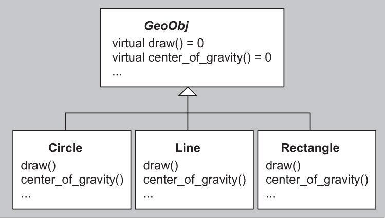
_Figure 18.1. Polymorphism implemented via inheritance_

```
[Click here to view code image]

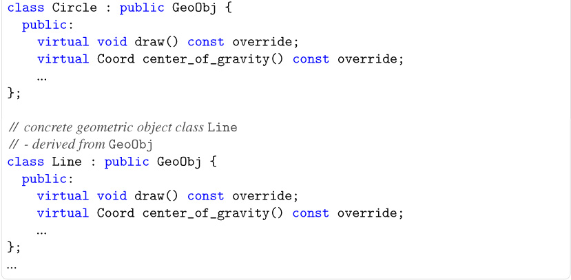

*poly/dynahier.hpp*

#include "coord.hpp"\

// common abstract base class [GeoObj] for geometric objects
class GeoObj {
  public:
   // draw geometric object:
   [virtual void] draw() const = 0;
   // return center of gravity of geometric object:
   virtual Coord center_of_gravity() const = 0;
   ...
   virtual ~GeoObj() = [default];
};

// concrete geometric object class Circle\
// - derived from [GeoObj]\
class Circle : public GeoObj {
  public:
    [virtual void] draw() const override;
    virtual Coord center_of_gravity() const override;
    ...
};
// concrete geometric object class [Line]\
// - derived from [GeoObj]\
class Line : public GeoObj {
  public:
    [virtual void] draw() const override;
    virtual Coord center_of_gravity() const override;
    ...
};
...
```

After creating concrete objects, client code can manipulate these objects through references or pointers to the common base class by using the virtual function dispatch mechanism. Calling a virtual member function through a pointer or reference to a base class subobject results in an invocation of the appropriate member of the specific ("most-derived") concrete object being referred to.

> 在创建了具体的对象之后，客户端代码可以使用虚拟函数调度机制，通过对公共基类的引用或指针来操作这些对象。通过对基类子对象的指针或引用调用虚拟成员函数会导致调用所引用的特定（“派生程度最高”）具体对象的适当成员。

In our example, the concrete code can be sketched as follows:

```
[Click here to view code image]

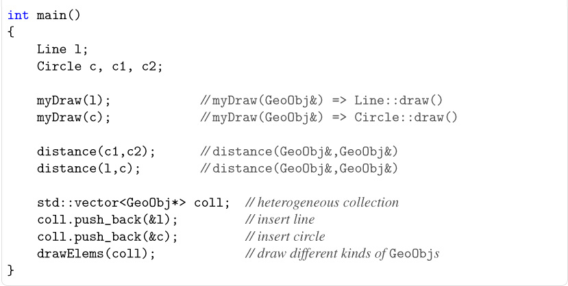

*poly/dynapoly.cpp*

#include "dynahier.hpp"\
#include <vector>

// draw any [GeoObj]\
void myDraw (GeoObj const& obj)
{
    obj.draw();           // call [draw()] according to type of object
}

// compute distance of center of gravity between two [GeoObj*s
Coord distance (GeoObj const& x1, GeoObj const& x2)
{
    Coord c = x1.center_of_gravity() - x2.center_of_gravity();
    return c.abs();       // return coordinates as absolute values
}

// draw heterogeneous collection of [GeoObj]s
void drawElems (std::vector<GeoObj*> const& elems)
{
    [for] (std::size_type i=0; i<elems.size(); ++i) {
        elems[i]->draw(); // call [draw()] according to type of element
    }
}
int main()
{
    Line l;
    Circle c, c1, c2;

    myDraw(l);            // [myDraw(GeoObj&) => Line::draw()]\
    myDraw(c);            // [myDraw(GeoObj&) => Circle::draw()]\

    distance(c1,c2);      // [distance(GeoObj&,GeoObj&)]\
    distance(l,c);        // [distance(GeoObj&,GeoObj&)]\

    std::vector<GeoObj*> coll;  // heterogeneous collection
    coll.push_back(&l);         // insert line
    coll.push_back(&c);         // insert circle
    drawElems(coll);            // draw different kinds of [GeoObj]s
}

```

The key polymorphic interface elements are the functions `draw()` and `center_of_gravity()`. Both are virtual member functions. Our example demonstrates their use in the functions `mydraw()`, `distance()`, and `drawElems()`. The latter functions are expressed using the common base type `GeoObj`. A consequence of this approach is that it is generally unknown at compile time which version of `draw()` or `center_of_gravity()` must be called. However, at run time, the complete dynamic type of the objects for which the virtual functions are invoked is accessed to dispatch the function calls.[3] Hence, depending on the actual type of a geometric object, the appropriate operation is performed: If `mydraw()` is called for a `Line` object, the expression `obj.draw()` calls `Line::draw()`, whereas for a `Circle` object, the function `Circle::draw()` is called. Similarly, with `distance()`, the member functions `center_of_gravity()` appropriate for the argument objects are called.

> 关键的多态接口元素是函数“draw（）”和“center_of_gravity（）”。两者都是虚拟成员功能。我们的示例演示了它们在函数“mydraw（）”、“distance（）”和“drawElems（）”中的使用。后一种函数是使用通用的基本类型“GeoObj”来表示的。这种方法的结果是，在编译时通常不知道必须调用“draw（）”或“center_of_gravity（）”的哪个版本。然而，在运行时，会访问调用虚拟函数的对象的完整动态类型，以调度函数调用。[3] 因此，根据几何对象的实际类型，将执行适当的操作：如果对“Line”对象调用“mydraw（）”，则表达式“obj.draw（（）”将调用“Line:：draw（。类似地，使用“distance（）”，将调用适用于参数对象的成员函数“center_of_gravity（）”。

Perhaps the most compelling feature of this dynamic polymorphism is the ability to handle heterogeneous collections of objects. `drawElems()` illustrates this concept: The simple expression `elems[i]->draw()` results in invocations of different member functions, depending on the dynamic type of the element being iterated over.

> 也许这种动态多态性最引人注目的特性是能够处理对象的异构集合`drawElems（）`说明了这个概念：简单的表达式`elems[i]->draw（）`会导致调用不同的成员函数，这取决于被迭代元素的动态类型。

### 18.2 Static Polymorphism

Templates can also be used to implement polymorphism. However, they don't rely on the factoring of common behavior in base classes. Instead, the commonality is implicit in that the different "shapes" of an application must support operations using common syntax (i.e., the relevant functions must have the same names). Concrete classes are defined independently from each other (see Figure [18.2]). The polymorphic power is then enabled when templates are instantiated with the concrete classes.

> 模板也可以用于实现多态性。然而，它们并不依赖于基类中常见行为的因子分解。相反，通用性隐含在应用程序的不同“形状”必须支持使用通用语法的操作（即，相关函数必须具有相同的名称）。具体类是相互独立定义的（见图[18.2]）。当模板与具体类一起实例化时，多态能力就会被启用。

```
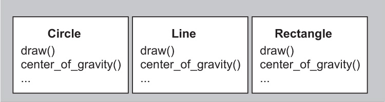

*Figure 18.2. Polymorphism implemented via templates*

For example, the function `myDraw()` in the previous section:

[Click here to view code image]

void myDraw (GeoObj const& obj)    // [GeoObj] is abstract base class
{
    obj.draw();
}

could conceivably be rewritten as

[Click here to view code image]

template<typename GeoObj>
void myDraw (GeoObj const& obj)    // [GeoObj] is template parameter
{
    obj.draw();
}

```

Comparing the two implementations of `myDraw()`, we may conclude that the main difference is the specification of `GeoObj` as a template parameter instead of a common base class. There are, however, more fundamental differences under the hood. For example, using dynamic polymorphism, we had only one `myDraw()` function at run time, whereas with the template we have distinct functions, such as `myDraw<Line>()` and `myDraw<Circle>()`.

> 比较“myDraw（）”的两个实现，我们可以得出结论，主要区别在于将“GeoObj”指定为模板参数，而不是公共基类。然而，在幕后还有更根本的区别。例如，使用动态多态性，我们在运行时只有一个“myDraw（）”函数，而使用模板，我们有不同的函数，如“myDraw<Line>（）”和“myDraw<Circle>（））”。

We may attempt to recode the complete example of the previous section using static polymorphism. First, instead of a hierarchy of geometric classes, we have several individual geometric classes:

> 我们可以尝试使用静态多态性对上一节的完整示例进行重新编码。首先，我们有几个单独的几何类，而不是几何类的层次结构：

```
[Click here to view code image]

*poly/statichier.hpp*

#include "coord.hpp"\

// concrete geometric object class [Circle]\
// - **not** derived from any class
class Circle {
  public:
    void draw() const;
     Coord center_of_gravity() const;
    ...
};

// concrete geometric object class [Line]\
// - **not** derived from any class
class Line {
  public:
    void draw() const;
    Coord center_of_gravity() const;
    ...
};
...

```

Now, the application of these classes looks as follows:

```
[Click here to view code image]

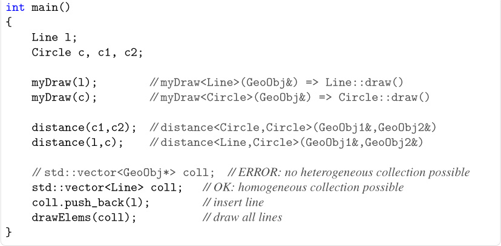

*poly/staticpoly.cpp*

#include "statichier.hpp"\
#include <vector>

// draw any [GeoObj]\
template<typename GeoObj>
void myDraw (GeoObj const& obj)
{
    obj.draw();  // call [draw()] according to type of object
}

// compute distance of center of gravity between two [GeoObj]s
template<typename GeoObj1, typename GeoObj2>
Coord distance (GeoObj1 const& x1, GeoObj2 const& x2)
{
    Coord c = x1.center_of_gravity() - x2.center_of_gravity();
    return c.abs(); // return coordinates as absolute values
}

// draw homogeneous collection of [GeoObj]s
template<typename GeoObj>
void drawElems (std::vector<GeoObj> const& elems)
{
    [for] (unsigned] i=0; i<elems.size(); ++i) {
        elems[i].draw();  // call [draw()] according to type of element
    }
}
int main()
{
    Line l;
    Circle c, c1, c2;

    myDraw(l);        // [myDraw<Line>(GeoObj&) => Line::draw()]\
    myDraw(c);        // [myDraw<Circle>(GeoObj&) => Circle::draw()]\

    distance(c1,c2);  //[distance<Circle,Circle>(GeoObj1&,GeoObj2&)]\
    distance(l,c);    // [distance<Line,Circle>(GeoObj1&,GeoObj2&)]\

    // [std::vector<GeoObj*> coll;] //ERROR: no heterogeneous collection possible
    std::vector<Line> coll;   // OK: homogeneous collection possible
    coll.push_back(l);        // insert line
    drawElems(coll);          // draw all lines
}

```

As with `myDraw()`, `GeoObj` can no longer be used as a concrete parameter type for `distance()`. Instead, we provide for two template parameters, `GeoObj1` and `GeoObj2`, which enables different combinations of geometric object types to be accepted for the distance computation:

> 与“myDraw（）”一样，“GeoObj”不能再用作“distance（）”的具体参数类型。相反，我们提供了两个模板参数“GeoObj1”和“GeoObj2”，这使得几何对象类型的不同组合能够被接受用于距离计算：

```
[Click here to view code image]

distance(l,c);   // [distance<Line,Circle>(GeoObj1&,GeoObj2&)]

```

However, heterogeneous collections can no longer be handled transparently. This is where the _static_ part of _static polymorphism_ imposes its constraint: All types must be determined at compile time. Instead, we can easily introduce different collections for different geometric object types. There is no longer a requirement that the collection be limited to pointers, which can have significant advantages in terms of performance and type safety.

> 但是，不能再透明地处理异构集合。这就是*static polymorphism 的\_static*部分施加约束的地方：所有类型都必须在编译时确定。相反，我们可以很容易地为不同的几何对象类型引入不同的集合。不再要求集合仅限于指针，指针在性能和类型安全方面具有显著优势。

### 18.3 Dynamic versus Static Polymorphism

Let's categorize and compare both forms of polymorphism.

##### Terminology

Dynamic and static polymorphism provide support for different C++ programming idioms:[4]

> 动态和静态多态性为不同的 C++编程习惯提供了支持：[4]

• Polymorphism implemented via inheritance is _bounded_ and _dynamic_:

-- _Bounded_ means that the interfaces of the types participating in the polymorphic behavior are predetermined by the design of the common base class (other terms for this concept are _invasive_ and _intrusive_).

> --*Bounded*意味着参与多态行为的类型的接口是由公共基类的设计预先确定的（该概念的其他术语是*invasive*和*inIntroduct*）。
> -- _Dynamic_ means that the binding of the interfaces is done at run time (dynamically).

• Polymorphism implemented via templates is _unbounded_ and _static_:

-- _Unbounded_ means that the interfaces of the types participating in the polymorphic behavior are not predetermined (other terms for this concept are _noninvasive_ and _nonintrusive_).

> --*Unboundd*意味着参与多态行为的类型的接口不是预先确定的（这个概念的其他术语是*noninvasive*和*noninterprise*）。
> -- _Static_ means that the binding of the interfaces is done at compile time (statically).

So, strictly speaking, in C++ parlance, _dynamic polymorphism_ and _static polymorphism_ are shortcuts for _bounded dynamic polymorphism_ and _unbounded static polymorphism_. In other languages, other combinations exist (e.g., Smalltalk provides unbounded dynamic polymorphism). However, in the context of C++, the more concise terms _dynamic polymorphism_ and _static polymorphism_ do not cause confusion.

> 因此，严格地说，用 C++的话说，*动态多态性*和*静态多态性*是*有界动态多态性-和*有界静态多态性-的快捷方式。在其他语言中，还存在其他组合（例如，Smalltalk 提供了无限动态多态性）。然而，在 C++的上下文中，更简洁的术语*动态多态性*和*静态多态性*不会引起混淆。

##### Strengths and Weaknesses

Dynamic polymorphism in C++ exhibits the following strengths:

• Heterogeneous collections are handled elegantly.

• The executable code size is potentially smaller (because only one polymorphic function is needed, whereas distinct template instances must be generated to handle different types).

> •可执行代码的大小可能更小（因为只需要一个多态函数，而必须生成不同的模板实例来处理不同的类型）。

• Code can be entirely compiled; hence no implementation source must be published (distributing template libraries usually requires distribution of the source code of the template implementations).

> •代码可以完全编译；因此，不必发布任何实现源代码（分发模板库通常需要分发模板实现的源代码）。

In contrast, the following can be said about static polymorphism in C++:

• Collections of built-in types are easily implemented. More generally, the interface commonality need not be expressed through a common base class.

> •内置类型的集合易于实现。更一般地说，接口通用性不需要通过公共基类来表达。

• Generated code is potentially faster (because no indirection through pointers is needed a priori and nonvirtual functions can be inlined much more often).

> •生成的代码可能更快（因为不需要通过指针进行间接操作，而且非虚拟函数可以更频繁地内联）。

• Concrete types that provide only partial interfaces can still be used if only that part ends up being exercised by the application.

> •如果应用程序最终只使用部分接口，则仍可以使用仅提供部分接口的具体类型。

Static polymorphism is often regarded as more _type safe_ than dynamic polymorphism because all the bindings are checked at compile time. For example, there is little danger of inserting an object of the wrong type in a container instantiated from a template. However, in a container expecting pointers to a common base class, there is a possibility that these pointers unintentionally end up pointing to complete objects of different types.

> 静态多态性通常被认为比动态多态性更安全，因为所有绑定都是在编译时检查的。例如，在从模板实例化的容器中插入错误类型的对象的危险很小。然而，在期望指向公共基类的指针的容器中，这些指针可能会无意中指向不同类型的完整对象。

In practice, template instantiations can also cause some grief when different semantic assumptions hide behind identical-looking interfaces. For example, surprises can occur when a template that assumes an associative operator `+` is instantiated for a type that is not associative with respect to that operator. In practice, this kind of semantic mismatch occurs less often with inheritance-based hierarchies, presumably because the interface specification is more explicitly specified.

> 在实践中，当不同的语义假设隐藏在外观相同的界面后面时，模板实例化也会引起一些悲伤。例如，当假设关联运算符“+”的模板被实例化为与该运算符不关联的类型时，可能会发生意外。在实践中，这种语义不匹配在基于继承的层次结构中发生的频率较低，可能是因为接口规范更明确地指定了。

##### Combining Both Forms

Of course, you could combine both forms of polymorphism. For example, you could derive different kinds of geometric objects from a common base class to be able to handle heterogeneous collections of geometric objects. However, you can still use templates to write code for a certain kind of geometric object.

> 当然，你可以将这两种形式的多态性结合起来。例如，您可以从一个公共基类派生不同类型的几何对象，以便能够处理几何对象的异构集合。但是，您仍然可以使用模板为某种几何对象编写代码。

The combination of inheritance and templates is further described in [Chapter [21]. We will see (among other things) how the virtuality of a member function can be parameterized and how an additional amount of flexibility is afforded to static polymorphism using the inheritance-based _curiously recurring template pattern_ (or _CRTP_).

> 继承和模板的结合在[第[21]章中有进一步的描述。我们将看到（除其他外）成员函数的虚拟性是如何参数化的，以及如何使用基于继承的*循环模板模式*（或*CRTP*）为静态多态性提供额外的灵活性。

### 18.4 Using Concepts

One argument against static polymorphism with templates is that the binding of the interfaces is done by instantiating the corresponding templates. This means that there is no common interface (class) to program against. Instead, any usage of a template simply works if all instantiated code is valid. If it is not, this might lead to hard-to-understand error messages or even cause valid but unintended behavior.

> 反对模板静态多态性的一个论点是，接口的绑定是通过实例化相应的模板来完成的。这意味着没有公共接口（类）可以进行编程。相反，如果所有实例化的代码都是有效的，那么模板的任何使用都会起作用。如果不是，这可能会导致难以理解的错误消息，甚至导致有效但意外的行为。

For this reason, C++ language designers have been working on the ability to explicitly provide (and check) _interfaces_ for template parameters. Such an interface is usually called a _concept_ in C++. It denotes a set of constraints that template arguments have to fulfill to successfully instantiate a template.

> 出于这个原因，C++语言设计者一直致力于为模板参数显式提供（和检查）接口的能力。这样的接口在 C++中通常被称为*concept*。它表示一组约束，模板参数必须满足这些约束才能成功实例化模板。

Despite many years of work in this area, concepts are still not part of standard C++ as of C++17. Some compilers provide experimental support for such a feature,[5] however, and concepts will likely be part of the next standard after C++17.

> 尽管在这个领域做了很多年的工作，但从 C++17 开始，概念仍然不是标准 C++的一部分。然而，一些编译器为这一特性提供了实验支持[5]，概念可能会成为继 C++17 之后的下一个标准的一部分。

Concepts can be understood as a kind of "interface" for static polymorphism. In our example, this might look as follows:

> 概念可以理解为静态多态性的一种“接口”。在我们的示例中，这可能看起来如下：

```
[Click here to view code image]

*poly/conceptsreq.hpp*

#include "coord.hpp"\

template<typename T>
[concept] GeoObj = requires(T x) {
   -> void;
   -> Coord;
  ...
};

```

Here, we use the keyword `concept` to define a concept `GeoObj`, which constrains a type to have callable members `draw()` and `center_of_gravity()` with appropriate result types.

> 在这里，我们使用关键字“concept”来定义一个概念“GeoObj”，它将类型约束为具有适当结果类型的可调用成员“draw（）”和“center_of_gravity（）”。

Now, we can rewrite some of our example templates to include a `requires` clause that constrains the template parameters with the `GeoObj` concept:

> 现在，我们可以重写一些示例模板，以包含一个“requires”子句，该子句使用“GeoObj”概念约束模板参数：

```
[Click here to view code image]


*poly/conceptspoly.hpp*

#include "conceptsreq.hpp"\
#include <vector>

// draw any [GeoObj]\
template<typename T>
requires GeoObj<T>
void myDraw (T const& obj)
{
    obj.draw();   // call [draw()] according to type of object
}

// compute distance of center of gravity between two [GeoObj]s
template<typename T1, typename T2>
requires GeoObj<T1> && GeoObj<T2>
Coord distance (T1 const& x1, T2 const& x2)
{
    Coord c = x1.center_of_gravity() - x2.center_of_gravity();
    return c.abs();   // return coordinates as absolute values
}

// draw homogeneous collection of [GeoObj]s
template<typename T>
requires GeoObj<T>
void drawElems (std::vector<T> const& elems)
{
    [for] (std::size_type i=0; i<elems.size(); ++i) {
        elems[i].draw();   // call [draw()] according to type of element
    }
}

```

This approach is still noninvasive with respect to the types that can participate in the (static) polymorphic behavior:

> 对于可以参与（静态）多态行为的类型，这种方法仍然是非侵入性的：

```
[Click here to view code image]

// concrete geometric object class `Circle`\
// - not derived from any class or implementing any interface
class Circle {
  public:
    void draw() const;
    Coord center_of_gravity() const;
    ...
};

```

That is, such types are still defined without any specific base class or requirements clause and can still be fundamental data types or types from independent frameworks.

> 也就是说，这些类型仍然是在没有任何特定基类或需求子句的情况下定义的，并且仍然可以是基本数据类型或独立框架中的类型。

[Appendix [E]] includes a more detailed discussion of concepts for C++, as they are expected for the next C++ standard.

> [附录[E]]包括对 C++概念的更详细讨论，因为它们有望用于下一个 C++标准。

### 18.5 New Forms of Design Patterns

The availability of static polymorphism in C++ leads to new ways of implementing classic design patterns. Take, for example, the _Bridge pattern_, which plays a major role in many C++ programs. One goal of using the Bridge pattern is to switch between different implementations of an interface.

> C++中静态多态性的可用性导致了实现经典设计模式的新方法。以桥模式为例，它在许多 C++程序中起着重要作用。使用桥接模式的一个目标是在接口的不同实现之间切换。

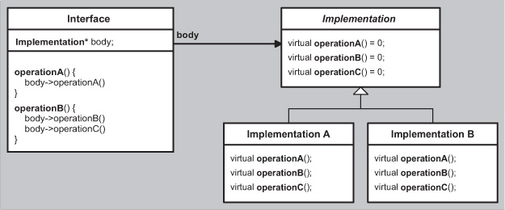

_Figure 18.3. Bridge pattern implemented using inheritance_

According to [DesignPatternsGoF], this is usually done using an interface class that embeds a pointer to refer to the actual implementation and delegating all calls through this pointer (see Figure [18.3]).

> 根据[DesignPatternsGoF]，这通常是使用一个接口类来完成的，该接口类嵌入一个指针来引用实际实现，并通过该指针委派所有调用（见图[18.3]）。

However, if the type of the implementation is known at compile time, we exploit the power of templates instead (see Figure [18.4]). This leads to more type safety (in part, by avoiding pointer conversions) and better performance.

> 然而，如果在编译时实现的类型是已知的，我们会利用模板的功能（见图[18.4]）。这会带来更多的类型安全性（部分是通过避免指针转换）和更好的性能。

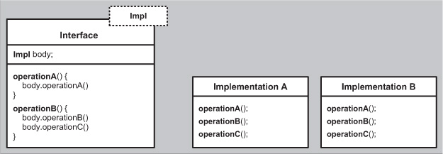

_Figure 18.4. Bridge pattern implemented using templates_

### 18.6 Generic Programming

Static polymorphism leads to the concept of _generic programming_. However, there is no single agreed-on definition of _generic programming_ (just as there is no single agreed-on definition of _object-oriented programming_). According to [CzarneckiEiseneckerGenProg], definitions go from _programming with generic parameters_ to _finding the most abstract representation of efficient algorithms_. The book summarizes:

> 静态多态性导致了一般编程的概念。然而，对于*generic programming*的定义没有达成一致（就像对于*object-oriented programming*没有达成一致的定义一样）。根据[CzarneckiEiseneckerGenProg]，定义从具有通用参数的*编程*到*找到有效算法的最抽象的表示*。这本书总结道：

_Generic programming is a subdiscipline of computer science that deals with finding abstract representations of efficient algorithms, data structures, and other software concepts, and with their systematic organization.... Generic programming focuses on representing families of domain concepts._ (pp. 169-170)

> _通用编程是计算机科学的一个分支学科，致力于寻找高效算法、数据结构和其他软件概念的抽象表示，以及它们的系统组织。。。。泛型编程侧重于表示域概念的族。_（第 169-170 页）

In the context of C++, generic programming is sometimes defined as _programming with templates_ (whereas object-oriented programming is thought of as _programming with virtual functions_). In this sense, just about any use of C++ templates could be thought of as an instance of generic programming. However, practitioners often think of generic programming as having an additional essential ingredient: Templates have to be designed in a framework for the purpose of enabling a multitude of useful combinations.

> 在 C++的上下文中，泛型编程有时被定义为具有模板的程序设计（而面向对象编程被认为是具有虚拟函数的程序设计）。从这个意义上讲，C++模板的任何使用都可以被视为泛型编程的一个实例。然而，从业者通常认为通用编程有一个额外的基本要素：模板必须在一个框架中设计，以实现多种有用的组合。

By far the most significant contribution in this area is the _Standard Template Library_ (STL), which later was adapted and incorporated into the C++ standard library). The STL is a framework that provides a number of useful operations, called _algorithms_, for a number of linear data structures for collections of objects, called _containers_. Both algorithms and containers are templates. However, the key is that the algorithms are _not_ member functions of the containers. Instead, the algorithms are written in a _generic_ way so that they can be used by any container (and linear collection of elements). To do this, the designers of STL identified an abstract concept of _iterators_ that can be provided for any kind of linear collection. Essentially, the collection-specific aspects of container operations have been factored out into the iterators' functionality.

> 到目前为止，这一领域最重要的贡献是*标准模板库*（STL），它后来被改编并合并到 C++标准库中）。STL 是一个框架，它为对象集合的许多线性数据结构提供了许多有用的操作，称为*algoriths*，称为*containers*。算法和容器都是模板。然而，关键是算法是容器的*not*成员函数。相反，算法是以*generic*的方式编写的，因此它们可以由任何容器（以及元素的线性集合）使用。为了做到这一点，STL 的设计者确定了一个抽象的概念*iterators*，它可以提供给任何类型的线性集合。从本质上讲，容器操作的集合特定方面已经被分解到迭代器的功能中。

As a consequence, we can implement an operation such as computing the maximum value in a sequence without knowing the details of how values are stored in that sequence:

> 因此，我们可以在不知道值如何存储在序列中的细节的情况下实现诸如计算序列中的最大值的操作：

```
[Click here to view code image]

template<typename Iterator>
Iterator max_element (Iterator beg,    //refers to start of collection
                      Iterator end)    //refers to end of collection
{
   *// use only certain* [Iterator] operations to traverse all elements\
   // of the collection to find the element with the maximum value\
   // and return its position as [Iterator]\
   ...
}

```

Instead of providing all useful operations such as `max_element()` by every linear container, the container has to provide only an iterator type to traverse the sequence of values it contains and member functions to create such iterators:

> 容器不必为每个线性容器提供所有有用的操作，如“max_element（）”，而只需提供一个迭代器类型来遍历它所包含的值序列，并提供成员函数来创建这样的迭代器：

```
[Click here to view code image]

namespace std {
    template<typename T, ...>
    class vector {
      public:
        using const_iterator = ...;     // implementation-specific iterator
        ...                             // type for constant [vector]s
        const_iterator begin() const;   // iterator for start of collection
        const_iterator end() const;     // iterator for end of collection
        ...
    };

    template<typename T, ...>
    class list {
      public:
        using const_iterator = ...;     // implementation-specific iterator
        ...                             // type for constant [list]s
         const_iterator begin() const;  // iterator for start of collection
           const_iterator end() const;  // iterator for end of collection
        ...
    };
}

```

Now, we can find the maximum of any collection by calling the _generic_ `max_element()` operation with the beginning and end of the collection as arguments (special handling of empty collections is omitted):

> 现在，我们可以通过调用*generic*`max_element（）`操作来找到任何集合的最大值，该操作以集合的开头和结尾为参数（省略了对空集合的特殊处理）：

```
[Click here to view code image]

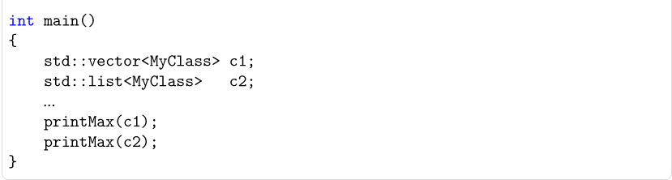

*poly/printmax.cpp*

#include <vector>
#include <list>
#include <algorithm>
#include <iostream>
#include "MyClass.hpp"\

template<typename T>
void printMax (T const& coll)
{
    // compute position of maximum value
    auto pos = std::max_element(coll.begin(),coll.end());

    // print value of maximum element of [coll] (if any):
    if (pos != coll.end()) {
        std::cout << *pos << '\n';
    }
     else {
        std::cout << "empty" << '\n';
    }
}

int main()
{
    std::vector<MyClass> c1;
    std::list<MyClass> c2;
    ...
    printMax(c1);
    printMax(c2);
}

```

By parameterizing its operations in terms of these iterators, the STL avoids an explosion in the number of operation definitions. Instead of implementing each operation for every container, we implement the algorithm once so that it can be used for every container. The _generic glue_ is the iterators, which are provided by the containers and used by the algorithms. This works because iterators have a certain interface that is provided by the containers and used by the algorithms. This interface is usually called a _concept_, which denotes a set of constraints that a template has to fulfill to fit into this framework. In addition, this concept is open for additional operations and data structures.

> 通过根据这些迭代器对其操作进行参数化，STL 避免了操作定义数量的爆炸。我们不是为每个容器实现每个操作，而是实现一次算法，以便它可以用于每个容器。*generic glue*是迭代器，由容器提供并由算法使用。这是因为迭代器有一个由容器提供并由算法使用的特定接口。这个接口通常被称为*concept*，表示模板必须满足的一组约束才能适应这个框架。此外，这一概念对额外的操作和数据结构是开放的。

You'll recall that we described a _concepts_ language feature earlier in Section [18.4] on page [377](and in more detail in [Appendix [E]]), and indeed, the language feature maps exactly onto the notion here. In fact, the term _concept_ in this context was first introduced by the designers of the STL to formalize their work. Soon thereafter, work commenced to try to make these notions explicit in our templates.

> 您会记得，我们在第[377]页第[18.4]节中描述了一个*concepts*语言特征（在[附录[E]]中有更详细的描述），事实上，语言特征正好映射到这里的概念上。事实上，在这种情况下，术语*concept*最早是由 STL 的设计者引入的，以形式化他们的工作。此后不久，我们开始尝试在模板中明确这些概念。

The forthcoming language feature will help us to specify and double check requirements on iterators (since there are different iterator categories, such as _forward_ and _bidirectional_ iterators, multiple corresponding concepts would be involved; see Section [E.3.1] on page [744]). In today's C++, however, the concepts are mostly implicit in the specifications of our generic libraries (and the standard C++ library in particular). Some features and techniques (e.g., `static_assert` and SFINAE) do permit some amount of automated checking, fortunately.

> 即将推出的语言功能将帮助我们指定并仔细检查迭代器的要求（由于有不同的迭代器类别，如*forward*和*bididirectional*迭代器，因此将涉及多个相应的概念；请参见第[744]页的[E.31]节）。然而，在今天的 C++中，这些概念大多隐含在我们的通用库（尤其是标准 C++库）的规范中。幸运的是，一些功能和技术（例如“static_assert”和 SFINAE）确实允许进行一定程度的自动检查。

In principle, functionality such as an STL-like approach could be implemented with dynamic polymorphism. In practice, however, it would be of limited use because the iterator concept is too lightweight compared with the virtual function call mechanism. Adding an interface layer based on virtual functions would most likely slow down our operations by an order of magnitude (or more).

> 原则上，类似 STL 的方法之类的功能可以用动态多态性来实现。然而，在实践中，它的用途有限，因为与虚拟函数调用机制相比，迭代器概念过于轻量级。添加一个基于虚拟功能的接口层很可能会使我们的操作慢一个数量级（或更多）。

Generic programming is practical precisely because it relies on static polymorphism, which resolves interfaces at compile time. On the other hand, the requirement that the interfaces be resolved at compile time also calls for new design principles that differ in many ways from object-oriented design principles. Many of the most important of these _generic design principles_ are described in the remainder of this book. Additionally, [Appendix [E]] delves deeper into generic programming as a development paradigm by describing direct language support for the notion of concepts.

> 泛型编程之所以实用，正是因为它依赖于静态多态性，后者在编译时解析接口。另一方面，在编译时解决接口的要求也要求新的设计原则，这些原则在许多方面与面向对象的设计原则不同。这些一般设计原则中许多最重要的原则在本书的剩余部分中进行了描述。此外，[附录[E]]通过描述对概念概念的直接语言支持，深入探讨了通用编程作为一种开发范式。

### 18.7 Afternotes

Container types were a primary motivation for the introduction of templates into the C++ programming language. Prior to templates, polymorphic hierarchies were a popular approach to containers. A popular example was the National Institutes of Health Class Library (NIHCL), which to a large extent translated the container class hierarchy of Smalltalk (see Figure [18.5]).

> 容器类型是将模板引入 C++编程语言的主要动机。在使用模板之前，多态层次结构是一种流行的容器方法。一个流行的例子是美国国立卫生研究院类库（NIHCL），它在很大程度上转换了 Smalltalk 的容器类层次结构（见图[18.5]）。

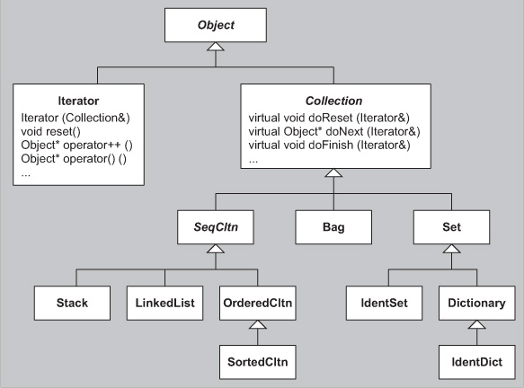

_Figure 18.5. Class hierarchy of the NIHCL_

Much like the C++ standard library, the NIHCL supported a rich variety of containers as well as iterators. However, the implementation followed the Smalltalk style of dynamic polymorphism: `Iterators` used the abstract base class `Collection` to operate on different types of collections:

> 与 C++标准库非常相似，NIHCL 支持各种各样的容器以及迭代器。然而，实现遵循了 Smalltalk 风格的动态多态性：“Iterators”使用抽象基类“Collection”对不同类型的集合进行操作：

```
Bag c1;
Set c2;
...
Iterator i1(c1);
Iterator i2(c2);
...

```

Unfortunately, the price of this approach was high in terms of both running time and memory usage. Running time was typically orders of magnitude worse than equivalent code using the C++ standard library because most operations ended up requiring a virtual call (whereas in the C++ standard library, many operations are inlined, and no virtual functions are involved in iterator and container interfaces). Furthermore, because (unlike Smalltalk) the interfaces were bounded, built-in types had to be wrapped in larger polymorphic classes (such wrappers were provided by the NIHCL), which in turn could lead to dramatic increases in storage requirements.

> 不幸的是，这种方法在运行时间和内存使用方面的代价都很高。运行时间通常比使用 C++标准库的等效代码差几个数量级，因为大多数操作最终都需要虚拟调用（而在 C++标准库中，许多操作都是内联的，迭代器和容器接口中不涉及虚拟函数）。此外，由于（与 Smalltalk 不同）接口是有界的，内置类型必须封装在更大的多态类中（这种封装器由 NIHCL 提供），这反过来可能导致存储需求的急剧增加。

Even in today's age of templates, many projects still make suboptimal choices in their approach to polymorphism. Clearly, there are many situations in which dynamic polymorphism is the right choice. Heterogeneous iterations are an example. However, in the same vein, many programming tasks are naturally and efficiently solved using templates, and homogeneous containers are an example of this.

> 即使在今天的模板时代，许多项目在多态性方法上仍然做出了次优选择。显然，在许多情况下，动态多态性是正确的选择。异构迭代就是一个例子。然而，同样地，许多编程任务都是使用模板自然高效地解决的，同构容器就是一个例子。

Static polymorphism lends itself well to code fundamental computing structures. In contrast, the need to choose a common base type implies that a dynamic polymorphic library will normally have to make domain-specific choices. It's no surprise then that the STL part of the C++ standard library never included polymorphic containers, but it contains a rich set of containers and iterators that use static polymorphism (as demonstrated in Section [18.6] on page [380]).

> 静态多态性很适合编码基本的计算结构。相比之下，选择公共基类型的需要意味着动态多态库通常必须做出特定于域的选择。因此，C++标准库的 STL 部分从未包含多态容器也就不足为奇了，但它包含了一组使用静态多态性的丰富容器和迭代器（如第[380]页[18.6]节所示）。

Medium and large C++ programs typically need to handle both kinds of polymorphism discussed in this chapter. In some situations, it may even be necessary to combine them very intimately. In many cases, the optimal design choices are clear in light of our discussion, but spending some time thinking about long-term, potential evolutions almost always pays off.

> 中型和大型 C++程序通常需要处理本章中讨论的这两种多态性。在某些情况下，甚至可能需要将它们非常紧密地结合在一起。在许多情况下，根据我们的讨论，最佳设计选择是明确的，但花一些时间思考长期的、潜在的演变几乎总是有回报的。

```
^[1]^ *Polymorphism* literally refers to the condition of having many forms or shapes (from the Greek *polymorphos*).
^[2]^ Strictly speaking, macros can also be thought of as an early form of static polymorphism. However, they are left out of consideration because they are mostly orthogonal to the other language mechanisms.
^[3]^ That is, the encoding of polymorphic base class subobjects includes some (mostly hidden) data that enables this run-time dispatch.
^[4]^ For a detailed discussion of polymorphism terminology, see also Sections 6.5 to 6.7 of [CzarneckiEiseneckerGenProg].
^[5]^ GCC 7, for example, provides the option `-fconcepts`.
```

## Chapter 19

## Implementing Traits

Templates enable us to parameterize classes and functions for various types. It could be tempting to introduce as many template parameters as possible to enable the customization of every aspect of a type or algorithm. In this way, our "templatized" components could be instantiated to meet the exact needs of client code. However, from a practical point of view, it is rarely desirable to introduce dozens of template parameters for maximal parameterization. Having to specify all the corresponding arguments in the client code is overly tedious, and each additional template parameter complicates the contract between the component and its client.

> 模板使我们能够参数化各种类型的类和函数。引入尽可能多的模板参数以实现对类型或算法的各个方面的定制可能很诱人。通过这种方式，我们的“模板化”组件可以被实例化，以满足客户端代码的确切需求。然而，从实际的角度来看，引入几十个模板参数进行最大参数化是不可取的。必须在客户端代码中指定所有相应的参数过于繁琐，并且每个额外的模板参数都会使组件与其客户端之间的契约复杂化。

Fortunately, it turns out that most of the extra parameters we would introduce have reasonable default values. In some cases, the extra parameters are entirely determined by a few _main_ parameters, and we'll see that such extra parameters can be omitted altogether. Other parameters can be given default values that depend on the main parameters and will meet the needs of most situations, but the default values must occasionally be overridden (for special applications). Yet other parameters are unrelated to the main parameters: In a sense, they are themselves main parameters except that there exist default values that almost always fit the bill.

> 幸运的是，事实证明，我们将引入的大多数额外参数都有合理的默认值。在某些情况下，额外的参数完全由几个*main*参数决定，我们将看到这些额外的参数可以完全省略。其他参数可以被赋予默认值，这些默认值取决于主要参数，并将满足大多数情况的需要，但默认值必须偶尔被覆盖（对于特殊应用程序）。然而，其他参数与主要参数无关：从某种意义上说，它们本身就是主要参数，只是存在几乎总是符合要求的默认值。

_Traits_ (or _traits templates_) are C++ programming devices that greatly facilitate the management of the sort of extra parameters that come up in the design of industrial-strength templates. In this chapter, we show a number of situations in which they prove useful and demonstrate various techniques that will enable you to write robust and powerful devices of your own.

> _Traits_（或*Traits-templates*）是 C++编程设备，极大地促进了工业强度模板设计中出现的那种额外参数的管理。在本章中，我们展示了它们被证明有用的许多情况，并展示了各种技术，这些技术将使您能够编写自己强大的设备。

Most of the traits presented here are available in the C++ standard library in some form. However, for clarity's sake, we often present simplified implementations that omit some details present in industrial-strength implementations (like those of the standard library). For this reason, we also use our own naming scheme, which, however, maps easily to the standard traits.

> 这里介绍的大多数特性在 C++标准库中都以某种形式提供。然而，为了清晰起见，我们经常提供简化的实现，这些实现省略了工业强度实现中的一些细节（如标准库的那些细节）。出于这个原因，我们也使用自己的命名方案，然而，它很容易映射到标准特征。

### 19.1 An Example: Accumulating a Sequence

Computing the sum of a sequence of values is a fairly common computational task. However, this seemingly simple problem provides us with an excellent example to introduce various levels at which policy classes and traits can help.

> 计算一系列值的总和是一项相当常见的计算任务。然而，这个看似简单的问题为我们提供了一个很好的例子，介绍了策略类和特性可以帮助我们的各个级别。

#### 19.1.1 Fixed Traits

Let's first assume that the values of the sum we want to compute are stored in an array, and we are given a pointer to the first element to be accumulated and a pointer one past the last element to be accumulated. Because this book is about templates, we wish to write a template that will work for many types. The following may seem straightforward by now:[1]

> 让我们首先假设我们想要计算的和的值存储在一个数组中，并且我们得到一个指向第一个要累加的元素的指针和一个经过最后一个要累加元素的指针。因为这本书是关于模板的，我们希望写一个适用于多种类型的模板。到目前为止，以下内容可能看起来很简单：[1]

```
[Click here to view code image]

`traits/accum1.hpp`

#ifndef ACCUM_HPP\
#define ACCUM_HPP\

template<typename T>
T accum (T const* beg, T const* end)
{
    T total;  // assume this actually creates a zero value
    [while] (beg != end) {
        total += *beg;
        ++beg;
    }
    return total;
}

#endif //ACCUM_HPP

```

The only slightly subtle decision here is how to create a _zero value_ of the correct type to start our summation. We use _value initialization_ (with the ``notation) here as introduced in Section [5.2] on page [68]. It means that the local object`total`is initialized either by its default constructor or by zero (which means`nullptr`for pointers and`false` for Boolean values).

> 这里唯一稍微微妙的决定是如何创建正确类型的*zero 值来开始求和。如第[68]页第[5.2]节所述，我们在此处使用\_value initialization*（带``符号）。这意味着本地对象“total”要么由其默认构造函数初始化，要么由零初始化（这意味着指针为“nullptr”，布尔值为“false”）。

To motivate our first traits template, consider the following code that makes use of our `accum()`:

> 要激发我们的第一个特征模板，请考虑以下使用“accum（）”的代码：

```
[Click here to view code image]

`traits/accum1.cpp`

#include "accum1.hpp"\
#include <iostream>

int main()
{
    // create array of 5 integer values
    int num[] = ;

    // print average value
    std::cout << "the average value of the integer values is "\
              << accum(num, num+5) / 5\
              << '\n';

    // create array of character values
    [char] name[] = "templates";
    int length = [sizeof](name)-1;

    // (try to) print average character value
    std::cout << "the average value of the characters in \\\""\
              << name << "\\\" is "\
              << accum(name, name+length) / length\
              << '\n';
}

```

In the first half of the program, we use `accum()` to sum five integer values:

> 在程序的前半部分，我们使用“accum（）”对五个整数值求和：

```
[Click here to view code image]

int num[] = ;
...
accum(num0, num+5)
```

The average integer value is then obtained by simply dividing the resulting sum by the number of values in the array.

> 然后通过简单地将所得和除以数组中的值的数量来获得平均整数值。

The second half of the program attempts to do the same for all letters in the word `templates` (provided the characters from `a` to `z` form a contiguous sequence in the actual character set, which is true for ASCII but not for EBCDIC).[2] The result should presumably lie between the value of `a` and the value of `z`. On most platforms today, these values are determined by the ASCII codes: a is encoded as 97 and z is encoded as 122. Hence, we may expect a result between 97 and 122. However, on our platform, the output of the program is as follows:

> 程序的后半部分试图对单词“templates”中的所有字母执行相同的操作（假设从“a”到“z”的字符在实际字符集中形成连续序列，这对 ASCII 是正确的，但对 EBCDIC 不是正确的）。[2] 结果大概应该在“a”的值和“z”的值之间。在今天的大多数平台上，这些值是由 ASCII 码决定的：a 编码为 97，z 编码为 122。因此，我们可以预期 97 到 122 之间的结果。然而，在我们的平台上，程序的输出如下：

```
[Click here to view code image]

the average value of the integer values is 3\
the average value of the characters in \"templates\" is -5
```

The problem here is that our template was instantiated for the type `char`, which turns out to be too small a range for the accumulation of even relatively small values. Clearly, we could resolve this by introducing an additional template parameter `AccT` that describes the type used for the variable `total` (and hence the return type). However, this would put an extra burden on all users of our template: They would have to specify an extra type in every invocation of our template. In our example, we may therefore need to write the following:

> 这里的问题是，我们的模板是为“char”类型实例化的，事实证明，对于相对较小的值的累积来说，这是一个太小的范围。显然，我们可以通过引入一个额外的模板参数“AccT”来解决这个问题，该参数描述变量“total”所使用的类型（以及返回类型）。然而，这将给我们模板的所有用户带来额外的负担：他们必须在每次调用我们的模板时指定一个额外的类型。因此，在我们的示例中，我们可能需要编写以下内容：

```
accum<int>(name,name+5)

```

This is not an excessive constraint, but it can be avoided.

An alternative approach to the extra parameter is to create an association between each type `T` for which `accum()` is called and the corresponding type that should be used to hold the accumulated value. This association could be considered characteristic of the type `T`, and therefore the type in which the sum is computed is sometimes called a _trait_ of `T`. As is turns out, our association can be encoded as specializations of a template:

> 额外参数的另一种方法是在调用“accum（）”的每个类型“T”与应用于保存累积值的相应类型之间创建关联。这种关联可以被认为是“T”类型的特征，因此计算和的类型有时被称为“T”的*trait*。事实证明，我们的关联可以编码为模板的专业化：

```
[Click here to view code image]

`traits/accumtraits2.hpp`

template<typename T>
struct AccumulationTraits;

template<>
struct AccumulationTraits[<char]> {
    using AccT = int;
};

template<>
struct AccumulationTraits[<short]> {
    using AccT = int;
};

template<>
struct AccumulationTraits[<int]> {
    using AccT = [long];
};

template<>
struct AccumulationTraits[<unsigned int]> {
    using AccT = [unsigned long];
};

template<>
struct AccumulationTraits[<float]> {
    using AccT = [double];
};

```

The template `AccumulationTraits` is called a _traits template_ because it holds a trait of its parameter type. (In general, there could be more than one trait and more than one parameter.) We chose not to provide a generic definition of this template because there isn't a great way to select a good accumulation type when we don't know what the type is. However, an argument could be made that `T` itself is often a good candidate for such a type (although clearly not in our earlier example).

> 模板`AccurationTraits`被称为*traits-template*，因为它包含其参数类型的特征。（一般来说，可能有不止一个特征和不止一个参数。）我们选择不提供该模板的通用定义，因为当我们不知道一个好的积累类型是什么时，没有很好的方法来选择该类型。然而，可以提出一个论点，即“t”本身通常是这种类型的好候选者（尽管在我们之前的例子中显然不是）。

With this in mind, we can rewrite our `accum()` template as follows:[3]

```
[Click here to view code image]

`traits/accum2.hpp`

#ifndef ACCUM_HPP\
#define ACCUM_HPP\

#include "accumtraits2.hpp"\

template<typename T>
auto accum (T const* beg, T const* end)
{
    // return type is traits of the element type
    using AccT = typename AccumulationTraits<T>::AccT;

    AccT total;  // assume this actually creates a zero value
    [while] (beg != end) {
        total += *beg;
        ++beg;
    }
    return total;
}

#endif //ACCUM_HPP

```

The output of our sample program then becomes what we expect:

```
[Click here to view code image]

the average value of the integer values is 3\
the average value of the characters in \"templates\" is 108

```

Overall, the changes aren't very dramatic considering that we have added a very useful mechanism to customize our algorithm. Furthermore, if new types arise for use with `accum()`, an appropriate `AccT` can be associated with it simply by declaring an additional explicit specialization of the `AccumulationTraits` template. Note that this can be done for any type: fundamental types, types that are declared in other libraries, and so forth.

> 总的来说，考虑到我们添加了一个非常有用的机制来定制我们的算法，这些变化并不是很显著。此外，如果出现了与“accum（）”一起使用的新类型，则只需声明“AccurationTraits”模板的额外显式专门化，就可以将适当的“AccT”与之关联。请注意，这可以用于任何类型：基本类型、在其他库中声明的类型等等。

#### 19.1.2 Value Traits

So far, we have seen that traits represent additional type information related to a given "main" type. In this section, we show that this extra information need not be limited to types. Constants and other classes of values can be associated with a type as well.

> 到目前为止，我们已经看到特征代表了与给定的“主要”类型相关的额外类型信息。在本节中，我们将展示这些额外信息不必局限于类型。常量和其他值类也可以与类型相关联。

Our original `accum()` template uses the default constructor of the return value to initialize the result variable with what is hoped to be a zero-like value:

> 我们最初的“accum（）”模板使用返回值的默认构造函数来初始化结果变量，希望其值为零：

```
[Click here to view code image]

`AccT total;`  // assume this actually creates a zero value
...
return total;

```

Clearly, there is no guarantee that this produces a good value to start the accumulation loop. Type `AccT` may not even have a default constructor.

> 显然，不能保证这会产生一个好的值来启动累加循环。类型“AccT”甚至可能没有默认构造函数。

Again, traits can come to the rescue. For our example, we can add a new _value trait_ to our `AccumulationTraits`:

> 同样，特质也可以起到拯救作用。例如，我们可以将一个新的*value trait*添加到“累加特征”中：

```
`traits/accumtraits3.hpp`

template<typename T>
struct AccumulationTraits;

template<>
struct AccumulationTraits[<char]> {
    using AccT = int;
    [static] AccT const zero = 0;
};

template<>
struct AccumulationTraits[<short]> {
    using AccT = int;
    [static] AccT const zero = 0;
};

template<>
struct AccumulationTraits[<int]> {
    using AccT = [long];
    [static] AccT const zero = 0;
};
...

```

In this case, our new trait provides an `zero` element as a constant that can be evaluated at compile time. Thus, `accum()` becomes the following:

> 在这种情况下，我们的新特性提供了一个“零”元素作为常量，可以在编译时进行求值。因此，“accum（）”变成如下：

```
[Click here to view code image]

`traits/accum3.hpp`

#ifndef ACCUM_HPP\
#define ACCUM_HPP\

#include "accumtraits3.hpp"\

template<typename T>
auto accum (T const* beg, T const* end)
{

  // return type is traits of the element type
  using AccT = typename AccumulationTraits<T>::AccT;
  AccT total = AccumulationTraits<T>::zero; // init* total *by trait value
  [while] (beg != end) {
    total += *beg;
    ++beg;
  }
  return total;
}

#endif // ACCUM_HPP

```

In this code, the initialization of the accumulation variable remains straightforward:

> 在这段代码中，累加变量的初始化仍然很简单：

```
[Click here to view code image]

AccT total = AccumulationTraits<T>::zero;

```

A drawback of this formulation is that C++ allows us to initialize a static constant data member inside its class only if it has an integral or enumeration type.

> 此公式的一个缺点是，C++允许我们仅当静态常量数据成员具有整型或枚举类型时，才在其类内初始化它。

`constexpr` static data members are slightly more general, allowing floating-point types as well as other literal types:

```
[Click here to view code image]

template<>
struct AccumulationTraits[<float]> {
    using Acct = [float];
    [static constexpr float] zero = 0.0f;
};

```

However, neither `const` nor `constexpr` permit nonliteral types to be initialized this way. For example, a user-defined arbitrary-precision `BigInt` type might not be a literal type, because typically it has to allocate components on the heap, which usually precludes it from being a literal type, or just because the required constructor is not `constexpr`. The following specialization is then an error:

> 但是，“const”和“constexpr”都不允许以这种方式初始化非迭代类型。例如，用户定义的任意精度“BigInt”类型可能不是文字类型，因为它通常必须在堆上分配组件，这通常会阻止它成为文字类型，或者只是因为所需的构造函数不是“constexpr”。以下专业化就是一个错误：

```
[Click here to view code image]

class BigInt {
  BigInt([long long]);
  ...
};
...
template<>
struct AccumulationTraits<BigInt> {
    using AccT = BigInt;
    [static constexpr] BigInt zero = BigInt;  // ERROR: not a literal type
};

```

The straightforward alternative is not to define the value trait in its class:

> 直接的替代方案是不定义其类别中的价值特征：

```
[Click here to view code image]

template<>
struct AccumulationTraits<BigInt> {
    using AccT = BigInt;
    [static] BigInt const zero;  // declaration only
};

```

The initializer then goes in a source file and looks something like the following:

> 初始化器然后进入一个源文件，看起来如下所示：

```
[Click here to view code image]

BigInt const AccumulationTraits<BigInt>::zero = BigInt;

```

Although this works, it has the disadvantage of being more verbose (code must be added in two places), and it is potentially less efficient because compilers are typically unaware of definitions in other files.

> 尽管这是有效的，但它的缺点是更详细（必须在两个地方添加代码），而且可能效率较低，因为编译器通常不知道其他文件中的定义。

In C++17, this can be addressed using _inline variables_:

```
[Click here to view code image]

template<>
struct AccumulationTraits<BigInt> {
    using AccT = BigInt;
    [inline static] BigInt const zero = BigInt;  // OK since C++17
};

```

An alternative that works prior to C++17 is to use inline member functions for value traits that won't always yield integral values. Again, such a function can be declared `constexpr` if it returns a literal type.[4]

> 在 C++17 之前工作的另一种选择是对值特征使用内联成员函数，这些值特征并不总是产生整数值。同样，如果这样的函数返回文字类型，则可以将其声明为“constexpr”。4.

For example, we could rewrite `AccumulationTraits` as follows:

```
[Click here to view code image]

`traits/accumtraits4.hpp`

template<typename T>
struct AccumulationTraits;

template<>
struct AccumulationTraits[<char]> {
    using AccT = int;
    [static constexpr] AccT zero() {
        return 0;
    }
};

template<>
struct AccumulationTraits[<short]> {
    using AccT = int;
    [static constexpr] AccT zero() {
        return 0;
    }
};

template<>
struct AccumulationTraits[<int]> {

    using AccT = [long];
    [static constexpr] AccT zero() {
        return 0;
    }
};

template<>
struct AccumulationTraits[<unsigned int]> {
    using AccT = [unsigned long];
    [static constexpr] AccT zero() {
        return 0;
    }
};

template<>
struct AccumulationTraits[<float]> {
    using AccT = [double];
    [static constexpr] AccT zero() {
        return 0;
    }
};
*...*

```

and then extend these traits for our own types:

```
[Click here to view code image]

`traits/accumtraits4bigint.hpp`

template<>
struct AccumulationTraits<BigInt> {
    using AccT = BigInt;
    [static] BigInt zero() {
        return BigInt;
    }
};

```

For the application code, the only difference is the use of function call syntax (instead of the slightly more concise access to a static data member):

> 对于应用程序代码，唯一的区别是使用了函数调用语法（而不是对静态数据成员进行稍微简洁的访问）：

```
[Click here to view code image]

AccT total = AccumulationTraits<T>::zero();  // init* total *by trait function

```

Clearly, traits can be more than just extra _types_. In our example, they can be a mechanism to provide all the necessary information that `accum()` needs about the element type for which it is called. This is the key to the notion of traits: Traits provide an avenue to _configure_ concrete elements (mostly types) for generic computations.

> 很明显，特征不仅仅是额外的类型。在我们的例子中，它们可以是一种机制，用于提供“accum（）”所需的关于调用它的元素类型的所有必要信息。这是特性概念的关键：特性为泛型计算提供了配置具体元素（主要是类型）的途径。

#### 19.1.3 Parameterized Traits

The use of traits in `accum()` in the previous sections is called _fixed_, because once the decoupled trait is defined, it cannot be replaced in the algorithm. There may be cases when such overriding is desirable. For example, we may happen to know that a set of `float` values can safely be summed into a variable of the same type, and doing so may buy us some efficiency.

> 在前几节的“accum（）”中使用的特征被称为*fixed*，因为一旦定义了解耦的特征，它就不能在算法中被替换。在某些情况下，这种压倒一切可能是可取的。例如，我们可能碰巧知道，一组“浮点”值可以安全地相加为同一类型的变量，这样做可能会为我们带来一些效率。

We can address this problem by adding a template parameter `AT` for the trait itself having a default value determined by our traits template:

> 我们可以通过为特征本身添加模板参数“AT”来解决这个问题，该特征本身具有由我们的特征模板确定的默认值：

```
[Click here to view code image]

`traits/accum5.hpp`

#ifndef ACCUM_HPP\
#define ACCUM_HPP\

#include "accumtraits4.hpp"\

template<typename T, typename AT = AccumulationTraits<T>>
auto accum (T const* beg, T const* end)
{
    typename AT::AccT total = AT::zero();
    [while] (beg != end) {
        total += *beg;
        ++beg;
    }
    return total;
}

#endif //ACCUM_HPP

```

In this way, many users can omit the extra template argument, but those with more exceptional needs can specify an alternative to the preset accumulation type. Presumably, most users of this template would never have to provide the second template argument explicitly because it can be configured to an appropriate default for every type deduced for the first argument.

> 通过这种方式，许多用户可以省略额外的模板参数，但那些有更多特殊需求的用户可以指定预设累积类型的替代方案。据推测，该模板的大多数用户永远不必显式提供第二个模板参数，因为可以将其配置为针对第一个参数推导出的每个类型的适当默认值。

### 19.2 Traits versus Policies and Policy Classes

So far we have equated _accumulation_ with _summation_. However, we can imagine other kinds of accumulations. For example, we could multiply the sequence of given values. Or, if the values were strings, we could concatenate them. Even finding the maximum value in a sequence could be formulated as an accumulation problem. In all these alternatives, the only `accum()` operation that needs to change is `total += *beg`. This operation can be called a _policy_ of our accumulation process.

> 到目前为止，我们已经将*累积*等同于*总结*。然而，我们可以想象其他类型的积累。例如，我们可以将给定值的序列相乘。或者，如果这些值是字符串，我们可以将它们连接起来。甚至在一个序列中找到最大值也可以被公式化为一个累积问题。在所有这些备选方案中，唯一需要更改的“accum（）”操作是“total+=\*beg”。这个操作可以称为我们积累过程的一个策略。

Here is an example of how we could introduce such a policy in our `accum()` function template:

> 以下是我们如何在“accum（）”函数模板中引入此类策略的示例：

```
[Click here to view code image]

`traits/accum6.hpp`

#ifndef ACCUM_HPP\
#define ACCUM_HPP\

#include "accumtraits4.hpp"\
#include "sumpolicy1.hpp"\

template<typename T,\
         typename Policy = SumPolicy,\
         typename Traits = AccumulationTraits<T>>
auto accum (T const* beg, T const* end)
{
    using AccT = typename Traits::AccT;
    AccT total = Traits::zero();
    [while] (beg != end) {
        Policy::accumulate(total, *beg);
        ++beg;
    }
    return total;
}

#endif //ACCUM_HPP

```

In this version of `accum() SumPolicy` is a _policy class_, that is, a class that implements one or more policies for an algorithm through an agreed-upon interface.[5] `SumPolicy` could be written as follows:

> 在这个版本的`accum（）SumPolicy`是一个*policy 类*，也就是说，一个通过商定的接口为算法实现一个或多个策略的类。[5] “SumPolicy”可以写成如下：

```
[Click here to view code image]

`traits/sumpolicy1.hpp`

#ifndef SUMPOLICY_HPP\
#define SUMPOLICY_HPP\

class SumPolicy {
  public:
    template<typename T1, typename T2>
    [static void] accumulate (T1& total, T2 const& value) {
        total += value;
    }
};

#endif //SUMPOLICY_HPP

```

By specifying a different policy to accumulate values, we can compute different things. Consider, for example, the following program, which intends to determine the product of some values:

> 通过指定不同的策略来累积值，我们可以计算不同的东西。例如，考虑以下程序，该程序旨在确定某些值的乘积：

```
[Click here to view code image]

`traits/accum6.cpp`

#include "accum6.hpp"\
#include <iostream>

class MultPolicy {
  public:
    template<typename T1, typename T2>
    [static void] accumulate (T1& total, T2 const& value) {
        total *= value;
    }
};

int main()
{
    // create array of 5 integer values
    int num[] = ;

    // print product of all values
    std::cout << "the product of the integer values is "\
              << accum<int,MultPolicy>(num, num+5)
              << '\n';
}

```

However, the output of this program isn't what we would like:

[Click here to view code image]

the product of the integer values is 0

The problem here is caused by our choice of initial value: Although `0` works well for summation, it does not work for multiplication (a zero initial value forces a zero result for accumulated multiplications). This illustrates that different traits and policies may interact, underscoring the importance of careful template design.

> 这里的问题是由我们对初始值的选择引起的：虽然“0”适用于求和，但不适用于乘法（零初始值迫使累积乘法的结果为零）。这说明不同的特征和策略可能会相互作用，强调了仔细设计模板的重要性。

In this case, we may recognize that the initialization of an accumulation loop is a part of the accumulation policy. This policy may or may not make use of the trait `zero()`. Other alternatives are not to be forgotten: Not everything must be solved with traits and policies. For example, the `std::accumulate()` function of the C++ standard library takes the initial value as a third (function call) argument.

> 在这种情况下，我们可以认识到，累加循环的初始化是累加策略的一部分。此策略可能会也可能不会使用特性“zero（）”。其他选择也不容忘记：并非所有事情都必须通过特征和政策来解决。例如，C++标准库的“std:：accumulate（）”函数将初始值作为第三个（函数调用）参数。

#### 19.2.1 Traits and Policies: What's the Difference?

A reasonable case can be made in support of the fact that policies are just a special case of traits. Conversely, it could be claimed that traits just encode a policy.

> 可以提出一个合理的理由来支持这样一个事实，即政策只是特征的一个特例。相反，可以说特征只是一种政策的编码。

The _New Shorter Oxford English Dictionary_ (see [NewShorterOED) has this to say:

> 新牛津英语词典（参见[NewShorterOED）是这样说的：

• **trait** _n... . a distinctive feature characterizing a thing_

• **policy** _n... . any course of action adopted as advantageous or expedient_

> •**政策**_n。任何作为有利或权宜之计而采取的行动_

Based on this, we tend to limit the use of the term _policy classes_ to classes that encode an action of some sort that is largely orthogonal with respect to any other template argument with which it is combined. This is in agreement with Andrei Alexandrescu's statement in his book _Modern C++ Design_ (see page 8 of [AlexandrescuDesign):[6]

> 基于此，我们倾向于将术语*policy classes*的使用限制为对某种动作进行编码的类，该动作在很大程度上与它所组合的任何其他模板参数正交。这与 Andrei Alexandrescu 在其著作《现代 C++设计》中的陈述一致（见[AndrescuDesign 第 8 页）：[6]

_Policies have much in common with traits but differ in that they put less emphasis on type and more on behavior._

> _政策与特质有很多共同点，但不同之处在于，它们不太强调类型，而更多地强调行为_

Nathan Myers, who introduced the traits technique, proposed the following more open-ended definition (see [MyersTraits]):

> Nathan Myers 介绍了特征技术，提出了以下更开放的定义（见[MeyersTraits]）：

_Traits class: A class used in place of template parameters. As a class, it aggregates useful types and constants; as a template, it provides an avenue for that "extra level of indirection" that solves all software problems._

> _特性类：一个用来代替模板参数的类。作为一个类，它聚合有用的类型和常量；作为一个模板，它为解决所有软件问题的“额外级别的间接性”提供了途径_

In general, we therefore tend to use the following (slightly fuzzy) definitions:

> 因此，一般来说，我们倾向于使用以下（稍微模糊的）定义：

• **Traits** represent natural additional properties of a template parameter.

> •**特征**表示模板参数的自然附加属性。

• **Policies** represent configurable behavior for generic functions and types (often with some commonly used defaults).

> •**策略**表示通用函数和类型的可配置行为（通常带有一些常用默认值）。

To elaborate further on the possible distinctions between the two concepts, we list the following observations about traits:

> 为了进一步阐述这两个概念之间可能的区别，我们列出了以下关于特征的观察结果：

```
• Traits can be useful as *fixed traits* (i.e., without being passed through template parameters).
• Traits parameters usually have very natural default values (which are rarely overridden, or simply cannot be overridden).
• Traits parameters tend to depend tightly on one or more main parameters.
• Traits mostly combine types and constants rather than member functions.
• Traits tend to be collected in traits *templates*.
```

For policy classes, we make the following observations:

```
• Policy classes don't contribute much if they aren't passed as template parameters.
• Policy parameters need not have default values and are often specified explicitly (although many generic components are configured with commonly used default policies).
• Policy parameters are mostly orthogonal to other parameters of a template.
• Policy classes mostly combine member functions.
• Policies can be collected in plain classes or in class templates.
```

However, there is certainly an indistinct line between both terms. For example, the character traits of the C++ standard library also define functional behavior such as comparing, moving, and finding characters. And by replacing these traits, we can define string classes that behave in a case-insensitive manner (see Section 13.2.15 in [JosuttisStdLib]) while keeping the same character type. Thus, although they are called _traits_, they have some properties associated with policies.

> 然而，这两个术语之间肯定有一条模糊的界线。例如，C++标准库的字符特征还定义了功能行为，如比较、移动和查找字符。通过替换这些特征，我们可以定义行为不区分大小写的字符串类（请参见[JosuttisStdLib]中的第 13.2.15 节），同时保持相同的字符类型。因此，尽管它们被称为*traits*，但它们具有一些与策略相关联的属性。

#### 19.2.2 Member Templates versus Template Template Parameters

To implement an accumulation policy, we chose to express `SumPolicy` and `MultPolicy` as ordinary classes with a member template. An alternative consists of designing the policy class interface using class templates, which are then used as template template arguments (see Section [5.7] on page [83] and Section [12.2.3] on page [187]). For example, we could rewrite `SumPolicy` as a template:

> 为了实现累积策略，我们选择将“SumPolicy”和“MultPolicy”表示为具有成员模板的普通类。一种替代方案包括使用类模板设计策略类接口，然后将类模板用作模板模板参数（见第[83]页第[5.7]节和第[187]页第[12.3.]节）。例如，我们可以将“SumPolicy”重写为模板：

```
[Click here to view code image]

`traits/sumpolicy2.hpp`

#ifndef SUMPOLICY_HPP\
#define SUMPOLICY_HPP\

template<typename T1, typename T2>
class SumPolicy {
  public:
    [static void] accumulate (T1& total, T2 const& value) {
        total += value;
    }
};

#endif //SUMPOLICY_HPP

```

The interface of `Accum` can then be adapted to use a template template parameter:

> 然后可以调整“Accum”的接口以使用模板模板参数：

```
[Click here to view code image]

`traits/accum7.hpp`

#ifndef ACCUM_HPP\
#define ACCUM_HPP\

#include "accumtraits4.hpp"\
#include "sumpolicy2.hpp"\

template<typename T,\
         template<typename,typename> class Policy = SumPolicy,\
         typename Traits = AccumulationTraits<T>>
auto accum (T const* beg, T const* end)
{

    using AccT = typename Traits::AccT;
    AccT total = Traits::zero();
    [while] (beg != end) {
        Policy<AccT,T>::accumulate(total, *beg);
        ++beg;
    }
    return total;
}

#endif//ACCUM_HPP

```

The same transformation can be applied to the traits parameter. (Other variations on this theme are possible: For example, instead of explicitly passing the `AccT` type to the policy type, it may be advantageous to pass the accumulation trait and have the policy determine the type of its result from a traits parameter.)

> 相同的变换可以应用于性状参数。（这个主题的其他变体也是可能的：例如，与其明确地将“AccT”类型传递给策略类型，不如传递累积特性，并让策略根据特性参数确定其结果的类型。）

The major advantage of accessing policy classes through template template parameters is that it makes it easier to have a policy class carry with it some state information (i.e., static data members) with a type that depends on the template parameters. (In our first approach, the static data members would have to be embedded in a member class template.)

> 通过模板模板参数访问策略类的主要优点是，它使策略类更容易携带一些类型取决于模板参数的状态信息（即静态数据成员）。（在我们的第一种方法中，静态数据成员必须嵌入到成员类模板中。）

However, a downside of the template template parameter approach is that policy classes must now be written as templates, with the exact set of template parameters defined by our interface. This can make the expression of the traits themselves more verbose and less natural than a simple nontemplate class.

> 然而，模板-模板参数方法的一个缺点是，现在必须将策略类编写为模板，并由我们的接口定义模板参数的确切集合。这可以使特征本身的表达比简单的非模板类更详细，也不那么自然。

#### 19.2.3 Combining Multiple Policies and/or Traits

As our development has shown, traits and policies don't entirely do away with having multiple template parameters. However, they do reduce their number to something manageable. An interesting question, then, is how to order such multiple parameters.

> 正如我们的发展所表明的那样，特性和策略并不能完全消除多个模板参数。然而，他们确实将自己的数量减少到了可以管理的程度。那么，一个有趣的问题是如何对这样多个参数进行排序。

A simple strategy is to order the parameters according to the increasing likelihood of their default value to be selected. Typically, this would mean that the traits parameters follow the policy parameters because the latter are more often overridden in client code. (The observant reader may have noticed this strategy in our development.)

> 一个简单的策略是根据参数默认值被选择的可能性增加来对参数进行排序。通常，这意味着 traits 参数遵循策略参数，因为后者在客户端代码中更经常被覆盖。（细心的读者可能在我们的发展过程中注意到了这一策略。）

If we are willing to add a significant amount of complexity to our code, an alternative exists that essentially allows us to specify the nondefault arguments in any order. Refer to Section [21.4] on page [512] for details.

> 如果我们愿意为代码增加大量的复杂性，那么存在一种替代方案，它基本上允许我们以任何顺序指定非默认参数。详见第[512]页第[21.4]节。

#### 19.2.4 Accumulation with General Iterators

Before we end this introduction to traits and policies, it is instructive to look at one version of `accum()` that adds the capability to handle generalized iterators (rather than just pointers), as expected from an industrial-strength generic component. Interestingly, this still allows us to call `accum()` with pointers because the C++ standard library provides _iterator traits_. (Traits are everywhere!) Thus, we could have defined our initial version of `accum()` as follows (ignoring our later refinements):[7]

> 在我们结束对特性和策略的介绍之前，看看“accum（）”的一个版本是很有启发性的，它添加了处理广义迭代器（而不仅仅是指针）的能力，正如工业级通用组件所期望的那样。有趣的是，这仍然允许我们用指针调用“accum（）”，因为 C++标准库提供了*iterator traits*。（特征无处不在！）因此，我们可以定义“accum（）”的初始版本如下（忽略我们后来的改进）：[7]

```
[Click here to view code image]

`traits/accum0.hpp`

#ifndef ACCUM_HPP\
#define ACCUM_HPP\

#include <iterator>

template<typename Iter>
auto accum (Iter start, Iter end)
{
    using VT = typename std::iterator_traits<Iter>::value_type;

    VT total;  // assume this actually creates a zero value
    [while] (start != end) {
        total += *start;
        ++start;
    }
    return total;
}

#endif //ACCUM_HPP

```

The `std::iterator_traits` structure encapsulates all the relevant properties of iterators. Because a partial specialization for pointers exists, these traits are conveniently used with any ordinary pointer types. Here is how a standard library implementation may implement this support:

> “std:：iterator_traits”结构封装了迭代器的所有相关属性。因为存在指针的部分专用化，所以这些特性可以方便地与任何普通的指针类型一起使用。以下是标准库实现如何实现此支持：

```
[Click here to view code image]

namespace std {
  template<typename T>
  struct iterator_traits<T*> {
    using difference_type   = ptrdiff_t;
    using value_type        = T;
    using pointer           = T*;
    using reference         = T&;
    using iterator_category = random_access_iterator_tag ;
  };
}

```

However, there is no type for the accumulation of values to which an iterator refers; hence we still need to design our own `AccumulationTraits`.

> 然而，迭代器所引用的值的累积没有类型；因此，我们仍然需要设计自己的“积累特征”。

### 19.3 Type Functions

The initial traits example demonstrates that we can define behavior that depends on types. Traditionally, in C and C++, we define functions that could more specifically be called _value functions_: They take some values as arguments and return another value as a result. With templates, we can additionally define _type functions_: functions that takes some type as arguments and produce a type or a constant as a result.

> 初始特征示例表明，我们可以定义依赖于类型的行为。传统上，在 C 和 C++中，我们定义的函数可以更具体地称为*value 函数：它们将一些值作为参数，并返回另一个值作为结果。使用模板，我们可以额外定义\_type functions*：以某种类型为参数并生成类型或常量的函数。

A very useful built-in type function is `sizeof`, which returns a constant describing the size (in bytes) of the given type argument. Class templates can also serve as type functions. The parameters of the type function are the template parameters, and the result is extracted as a member type or member constant. For example, the `sizeof` operator could be given the following interface:

> 一个非常有用的内置类型函数是“sizeof”，它返回一个常量，描述给定类型参数的大小（以字节为单位）。类模板也可以用作类型函数。类型函数的参数是模板参数，结果被提取为成员类型或成员常量。例如，可以为“sizeof”运算符提供以下接口：

```
[Click here to view code image]

`traits/sizeof.cpp`

#include <cstddef>
#include <iostream>

template<typename T>
struct TypeSize {
    [static] std::size_t const value = [sizeof](T);
};

int main()
{
    std::cout << "TypeSize<int>::value = "\
              << TypeSize<int>::value << '\n';
}

```

This may not seem very useful, since we have the built-in `sizeof` operator available, but note that `TypeSize<T>` is a type, and it can therefore be passed as a class template argument itself. Alternatively, `TypeSize` is a template and can be passed as a template template argument.

> 这似乎不是很有用，因为我们有内置的“sizeof”运算符，但请注意，“TypeSize ＜ T ＞”是一种类型，因此它本身可以作为类模板参数传递。或者，“TypeSize”是一个模板，可以作为模板模板参数传递。

In what follows, we develop a few more general-purpose type functions that can be used as traits classes in this way.

> 在接下来的内容中，我们开发了一些更通用的类型函数，这些函数可以通过这种方式用作 traits 类。

#### 19.3.1 Element Types

Assume that we have a number of container templates, such as `std::vector<>` and `std::list<>`, as well as built-in arrays. We want a type function that, given such a container type, produces the element type. This can be achieved using partial specialization:

> 假设我们有许多容器模板，如“std:：vector ＜＞”和“std::：list ＜＞”，以及内置数组。我们想要一个类型函数，在给定这样的容器类型的情况下，生成元素类型。这可以使用部分专业化来实现：

```
[Click here to view code image]

`traits/elementtype.hpp`

#include <vector>
#include <list>

template<typename T>
struct ElementT;                  // primary template

template<typename T>
struct ElementT<std::vector<T>> \
    using Type = T;
};

template<typename T>
struct ElementT<std::list<T>> \
    using Type = T;
};
...

template<typename T, std::size_t N>
struct ElementT<T[N]> \
    using Type = T;
};

template<typename T>
struct ElementT<T[]> \
    using Type = T;
};
...

```

Note that we should provide partial specializations for all possible array types (see Section [5.4] on page [71] for details).

> 请注意，我们应该为所有可能的数组类型提供部分专用化（有关详细信息，请参见第[71]页的第[5.4]节）。

We can use the type function as follows:

```
[Click here to view code image]

`traits/elementtype.cpp`

#include "elementtype.hpp"\
#include <vector>
#include <iostream>
#include <typeinfo>

template<typename T>
void printElementType (T const& c)
{
    std::cout << "Container of "\
              << [typeid](typename ElementT<T>::Type).name()
              << " elements.\\n";
}

int main()
{
    std::vector<bool> s;
    printElementType(s);
    int arr[42];
    printElementType(arr);
}

```

The use of partial specialization allows us to implement the type function without requiring the container types to know about it. In many cases, however, the type function is designed along with the applicable types, and the implementation can be simplified. For example, if the container types define a member type `value_type` (as the standard containers do), we can write the following:

> 部分专门化的使用使我们能够在不需要容器类型知道的情况下实现类型函数。然而，在许多情况下，类型函数是与适用的类型一起设计的，并且可以简化实现。例如，如果容器类型定义了一个成员类型`value_type`（就像标准容器一样），我们可以编写以下内容：

```
[Click here to view code image]

template<typename C>
struct ElementT {
    using Type = typename C::value_type;
};

```

This can be the default implementation, and it does not exclude specializations for container types that do not have an appropriate member type `value_type` defined.

> 这可以是默认实现，并且不排除未定义适当成员类型“value_type”的容器类型的专用化。

Nonetheless, it is usually advisable to provide member type definitions for class template type parameters so that they can be accessed more easily in generic code (like the standard container templates do). The following sketches the idea:

> 尽管如此，通常还是建议为类模板类型参数提供成员类型定义，以便在泛型代码中更容易访问它们（就像标准容器模板一样）。以下概述了这一想法：

```
[Click here to view code image]

template<typename T1, typename T2, ...>
class X {
  public:
    using ... = T1;
    using ... = T2;
    ...
};

```

How is a type function useful? It allows us to parameterize a template in terms of a container type without also requiring parameters for the element type and other characteristics. For example, instead of

> 类型函数如何有用？它允许我们根据容器类型对模板进行参数化，而不需要元素类型和其他特性的参数。例如，而不是

```
[Click here to view code image]

template<typename T, typename C>
T sumOfElements (C const& c);

```

which requires syntax like `sumOfElements<int>(list)` to specify the element type explicitly, we can declare

> 它需要像“sumOfElements ＜ int ＞（list）”这样的语法来显式指定元素类型，我们可以声明

```
[Click here to view code image]

template<typename C>
typename ElementT<C>::Type sumOfElements (C const& c);

```

where the element type is determined from the type function.

Observe how the traits are implemented as an extension to existing types; that is, we can define these type functions even for fundamental types and types of closed libraries.

> 观察这些特性是如何作为对现有类型的扩展来实现的；也就是说，我们甚至可以为基本类型和封闭库的类型定义这些类型函数。

In this case, the type `ElementT` is called a _traits class_ because it is used to access a trait of the given container type C (in general, more than one trait can be collected in such a class). Thus, traits classes are not limited to describing characteristics of container parameters but of any kind of "main parameters."

> 在这种情况下，类型“ElementT”被称为*traits 类*，因为它用于访问给定容器类型 C 的特征（通常，在这样的类中可以收集多个特征）。因此，特征类不限于描述容器参数的特征，而是任何类型的“主要参数”的特征

As a convenience, we can create an alias template for type functions. For example, we could introduce

> 为了方便起见，我们可以为类型函数创建一个别名模板。例如，我们可以介绍

```
[Click here to view code image]

template<typename T>
using ElementType = typename ElementT<T>::Type;

```

which allows us to further simplify the declaration of `sumOfElements` above to

> 这使我们能够进一步简化上述“sumOfElements”的声明为

```
[Click here to view code image]

template<typename C>
ElementType<C> sumOfElements (C const& c);

```

#### 19.3.2 Transformation Traits

In addition to providing access to particular aspects of a main parameter type, traits can also perform transformations on types, such as adding or removing references or `const` and `volatile` qualifiers.

> 除了提供对主参数类型的特定方面的访问外，traits 还可以对类型执行转换，例如添加或删除引用或“const”和“volatile”限定符。

##### Removing References

For example, we can implement a `RemoveReferenceT` trait that turns reference types into their underlying object or function types, and leaves nonreference types alone:

> 例如，我们可以实现一个“RemoveReferenceT”特性，将引用类型转换为其底层对象或函数类型，并保留非引用类型：

```
[Click here to view code image]

`traits/removereference.hpp`

template<typename T>
struct RemoveReferenceT {
  using Type = T;
};

template<typename T>
struct RemoveReferenceT<T&> {
  using Type = T;
};

template<typename T>
struct RemoveReferenceT<T&&> {
  using Type = T;
};

```

Again, a convenience alias template makes the usage simpler:

```
[Click here to view code image]

template<typename T>
using RemoveReference = typename RemoveReference<T>::Type;

```

Removing the reference from a type is typically useful when the type was derived using a construct that sometimes produces reference types, such as the special deduction rule for function parameters of type `T&&` discussed in Section [15.6] on page [277].

> 当使用有时会产生引用类型的构造来派生类型时，从类型中删除引用通常是有用的，例如第[277]页第[15.6]节中讨论的“T&&”类型的函数参数的特殊推导规则。

The C++ standard library provides a corresponding type trait `std::remove_reference<>`, which is described in Section [D.4] on page [729].

> C++标准库提供了相应的类型特征“std:：remove_reference ＜＞”，如第[729]页第[D.4]节所述。

##### Adding References

Similarly, we can take an existing type and create an lvalue or rvalue reference from it (along with the usual convenience alias templates):

> 类似地，我们可以采用现有类型，并从中创建左值或右值引用（以及常见的方便别名模板）：

```
[Click here to view code image]

`traits/addreference.hpp`

template<typename T>
struct AddLValueReferenceT {
  using Type = T&;
};

template<typename T>
using AddLValueReference = typename AddLValueReferenceT<T>::Type;

template<typename T>
struct AddRValueReferenceT {
  using Type = T&&;
};

template<typename T>
using AddRValueReference = typename AddRValueReferenceT<T>::Type;

```

The rules of reference collapsing (Section [15.6] on page [277]) apply here. For example, calling `AddLValueReference<int&&>` produces type `int&` (there is therefore no need to implement them manually via partial specialization).

> 引用折叠规则（第[277]页第[15.6]节）适用于此处。例如，调用`AddLValueReference<int&&>`会产生类型`int&&`（因此不需要通过部分专门化手动实现它们）。

If we leave `AddLValueReferenceT` and `AddRValueReferenceT` as they are and do not introduce specializations of them, then the convenience aliases can actually be simplified to

> 如果我们保持`AddLValueReferenceT`和`AddRValueReferenceT`原样，不引入它们的专门化，那么方便别名实际上可以简化为

```
[Click here to view code image]

template<typename T>
using AddLValueReferenceT = T&;

template<typename T>
using AddRValueReferenceT = T&&;

```

which can be instantiated without instantiating a class template (and is therefore a lighter-weight process). However, this is risky, as we may well want to specialize these template for special cases. For example, as written above, we cannot use `void` as a template argument for these templates. A few explicit specializations can take care of that:

> 其可以在不实例化类模板的情况下被实例化（并且因此是较轻重量的过程）。然而，这是有风险的，因为我们很可能想将这些模板专门用于特殊情况。例如，如上所述，我们不能使用“void”作为这些模板的模板参数。一些明确的专业化可以解决这一问题：

```
[Click here to view code image]

template<>
struct AddLValueReferenceT<void> {
  using Type = void;
};

template<>
struct AddLValueReferenceT<[void const]> {
  using Type = [void const];
};

template<>
struct AddLValueReferenceT<[void volatile]> {
  using Type = [void volatile];
};

template<>
struct AddLValueReferenceT<[void const volatile]> {
  using Type = [void const volatile];
};

```

and similarly for `AddRValueReferenceT`.

With that in place, the convenience alias template must be formulated in terms of the class templates to ensure that the specializations are picked up also (since alias templates cannot be specialized).

> 有了这一点，必须根据类模板来制定方便的别名模板，以确保也能获得专业化（因为别名模板不能专门化）。

The C++ standard library provides corresponding type traits `std::add_lvalue_reference<>` and `std::add_rvalue_reference<>`, which are described in Section [D.4] on page [729]. The standard templates include the specializations for `void` types.

> C++标准库提供了相应的类型特征`std:：add_lvalue_reference<>`和`std::：add_rvalue_reference<>`，如第[729]页[D.4]节所述。标准模板包括“void”类型的专门化。

##### Removing Qualifiers

Transformation traits can break down or introduce any kind of compound type, not just references. For example, we can remove a `const` qualifier if present:

> 转化性状可以分解或引入任何类型的复合类型，而不仅仅是引用。例如，我们可以删除“const”限定符（如果存在）：

```
[Click here to view code image]

`traits/removeconst.hpp`

template<typename T>
struct RemoveConstT {
  using Type = T;
};

template<typename T>
struct RemoveConstT<T const> {
  using Type = T;
};

template<typename T>
using RemoveConst = typename RemoveConstT<T>::Type;

```

Moreover, transformation traits can be composed, such as creating a `RemoveCVT` trait that removes both `const` and `volatile`:

> 此外，可以组合转换特性，例如创建一个“RemoveCVT”特性，该特性同时删除“const”和“volatile”：

```
[Click here to view code image]

`traits/removecv.hpp`

#include "removeconst.hpp"\
#include "removevolatile.hpp"\

template<typename T>
struct RemoveCVT : RemoveConstT<typename RemoveVolatileT<T>::Type> {
};

template<typename T>
using RemoveCV = typename RemoveCVT<T>::Type;

```

There are two things to note with the definition of `RemoveCVT`. First, it is making use of both `RemoveConstT` and the related `RemoveVolatileT`, first removing the `volatile` (if present) and then passing the resulting type to `RemoveConstT`.[8] Second, it is using _metafunction forwarding_ to inherit the `Type` member from `RemoveConstT` rather than declaring its own `Type` member that is identical to the one in the `RemoveConstT` specialization. Here, metafunction forwarding is used simply to reduce the amount of typing in the definition of `RemoveCVT`. However, metafunction forwarding is also useful when the metafunction is not defined for all inputs, a technique that will be discussed further in Section [19.4] on page [416].

> 关于“RemoveCVT”的定义，有两件事需要注意。首先，它同时使用“RemoveConstT”和相关的“RemoveVolatileT”，首先删除“volatile”（如果存在），然后将生成的类型传递给“RemoveConst”。[8] 其次，它使用*metafunction forwarding*从“RemoveConstT”继承“Type”成员，而不是声明其自己的“Type”会员，该会员与“RemoveConstT”专业化中的会员相同。这里，元函数转发仅用于减少“RemoveCVT”定义中的键入量。然而，当没有为所有输入定义元函数时，元函数转发也很有用，这一技术将在第[416]页第[19.4]节中进一步讨论。

The convenience alias template `RemoveCV` could be simplified to

```
[Click here to view code image]

template<typename T>
using RemoveCV = RemoveConst<RemoveVolatile<T>>;

```

Again, this works only if `RemoveCVT` is not specialized. Unlike in the case of `AddLValueReference` and `AddRValueReference`, we cannot think of any reasons for such specializations.

> 同样，只有当“RemoveCVT”不是专门的时，这才有效。与“AddLValueReference”和“AddRValueReference”不同，我们想不出有任何理由进行此类专业化。

The C++ standard library also provides corresponding type traits `std::remove_volatile<>`, `std::remove_const<>`, and `std::remove_cv<>`, which are described in Section [D.4] on page [728].

> C++标准库还提供了相应的类型特征“std:：remove_volatile<>`、“std::：remove_const<>`和”std:：move_cv<>`，这些特征在第[728]页的[D.4]节中进行了描述。

##### Decay

To round out our discussion of transformation traits, we develop a trait that mimics type conversions when passing arguments to parameters by value. Derived from C, this means that the arguments decay (turning array types into pointers and function types into pointer-to-function types; see Section [7.4] on page [115] and Section [11.1.1] on page [159]) and delete any top-level `const`, `volatile`, or reference qualifiers (because top-level type qualifiers on parameter types are ignored when resolving a function call).

> 为了完善我们对转换特性的讨论，我们开发了一种特性，在按值将参数传递给参数时模拟类型转换。从 C 派生，这意味着参数会衰减（将数组类型转换为指针，将函数类型转换为指向函数类型的指针；请参见第[115]页第[7.4]节和第[159]页第[111.1.1]节），并删除任何顶级“const”、“volatile”或引用限定符（因为解析函数调用时会忽略参数类型上的顶级类型限定符）。

The effect of this pass-by-value can be seen in the following program, which prints the actual parameter type produced after the compiler decays the specified type:

> 此传递值的效果可以在以下程序中看到，该程序打印编译器衰减指定类型后产生的实际参数类型：

```
[Click here to view code image]

`traits/passbyvalue.cpp`

#include <iostream>
#include <typeinfo>
#include <type_traits>

template<typename T>
void f(T)
{
}

template<typename A>
void printParameterType(void (*)(A))

{
  std::cout << "Parameter type: " << [typeid](A).name() << '\n';
  std::cout << "- is int:     " <<std::is_same<A[,int]>::value << '\n';
  std::cout << "- is const:   " <<std::is_const<A>::value << '\n';
  std::cout << "- is pointer: " <<std::is_pointer<A>::value << '\n';
}

int main()
{
  printParameterType(&f<int>);
  printParameterType(&f<int const>);
  printParameterType(&f<int[7]>);
  printParameterType(&f<int(int)>);
}

```

In the output of the program, the `int` parameter has been left unchanged, but the `int const`, `int[7]`, and `int(int)` parameters have _decayed_ to `int`, `int*`, and `int(*)(int)`, respectively.

> 在程序的输出中，“int”参数保持不变，但“int const”、“int[7]”和“int（int）”参数已分别更改为“int”、“int*”和“int（*）（int））”。

We can implement a trait that produces the same type conversion of passing by value. To match to the C++ standard library trait `std::decay`, we name it `DecayT`.[9] Its implementation combines several of the techniques described above First, we define the nonarray, nonfunction case, which simply deletes any `const` and `volatile` qualifiers:

> 我们可以实现一个特性，该特性产生传递值的相同类型转换。为了与 C++标准库特性“std:：decay”相匹配，我们将其命名为“DecayT”。[9] 它的实现结合了上面描述的几种技术。首先，我们定义了非数组、非函数的情况，它只删除任何“const”和“volatile”限定符：

```
[Click here to view code image]

template<typename T>
struct DecayT : RemoveCVT<T> {
};

```

Next, we handle the array-to-pointer decay, which requires us to recognize any array types (with or without a bound) using partial specialization:

```
[Click here to view code image]

template<typename T>
struct DecayT<T[]> {
  using Type = T*;
};

template<typename T, std::size_t N>
struct DecayT<T[N]> {
  using Type = T*;
};

```

Finally, we handle the function-to-pointer decay, which has to match any function type, regardless of the return type or the number of parameter types. For this, we employ variadic templates:

> 最后，我们处理函数到指针的衰减，它必须匹配任何函数类型，无论返回类型或参数类型的数量如何。为此，我们使用可变模板：

```
[Click here to view code image]

template<typename R, typename... Args>
struct DecayT<R(Args...)> {
  using Type = R (*)(Args...);
};

template<typename R, typename... Args>
struct DecayT<R(Args..., ...)> {
  using Type = R (*)(Args..., ...);
};

```

Note that the second partial specialization matches any function type that uses C-style varargs.[10] Together, the primary `DecayT` template and its four partial specialization implement parameter type decay, as illustrated by this example program:

> 请注意，第二个部分专用化匹配任何使用 C 样式 varargs 的函数类型。[10] 主“DecayT”模板及其四个部分专门化一起实现参数类型衰减，如本示例程序所示：

```
[Click here to view code image]

`traits/decay.cpp`

#include <iostream>
#include <typeinfo>
#include <type_traits>
#include "decay.hpp"\

template<typename T>
void printDecayedType()
{
  using A = typename DecayT<T>::Type;
  std::cout << "Parameter type: " << [typeid](A).name() << '\n';
  std::cout << "- is int:     " << std::is_same<A[,int]>::value << '\n';
  std::cout << "- is const:   " << std::is_const<A>::value << '\n';
  std::cout << "- is pointer: " << std::is_pointer<A>::value << '\n';
}

int main()
{
printDecayedType<int>();
printDecayedType<int const>();
printDecayedType<int[7]>();
printDecayedType<int(int)>();
}

```

As usual, we provide a convenience alias template:

```
[Click here to view code image]

[template typename] T>
using Decay = typename DecayT<T>::Type;

```

As written, the C++ standard library also provides a corresponding type traits `std::decay<>`, which is described in Section [D.4] on page [731].

> 如前所述，C++标准库还提供了相应的类型特征“std:：decay<>'”，如第[731]页[D.4]节所述。

#### 19.3.3 Predicate Traits

So far we have studied and developed type functions of a single type: Given one type, provide other related types or constants. In general, however, we can develop type functions that depend on multiple arguments. This also leads to a special form of type traits, type predicates (type functions yielding a Boolean value).

> 到目前为止，我们已经研究和开发了单一类型的类型函数：给定一个类型，提供其他相关类型或常数。但是，一般来说，我们可以开发依赖于多个参数的类型函数。这也导致了一种特殊形式的类型特征，即类型谓词（产生布尔值的类型函数）。

##### IsSameT

The `IsSameT` trait yields whether two types are equal:

```
[Click here to view code image]

`traits/issame0.hpp`

template<typename T1, typename T2>
struct IsSameT {
    static constexpr bool value = [false];
};

template<typename T>
struct IsSameT<T, T> {
    static constexpr bool value = [true];
};

```

Here the primary template defines that, in general, two different types passed as template arguments differ. so that the `value` member is `false`. However, using partial specialization, when we have the special case that the two passed types are the same, `value` is `true`.

> 在这里，主模板定义了通常作为模板参数传递的两种不同类型是不同的。使得“value”成员是“false”。然而，使用部分专门化，当我们有两个传递的类型相同的特殊情况时，“value”是“true”。

For example, the following expression checks whether a passed template parameters is an integer:

> 例如，以下表达式检查传递的模板参数是否为整数：

```
[Click here to view code image]

if (IsSameT<T, int>::value) ...

```

For traits that produce a constant value, we cannot provide an alias template, but we _can_ provide a `constexpr` variable template that fulfills the same role:

> 对于产生常数值的特征，我们不能提供别名模板，但我们*can*提供了一个“constexpr”变量模板来实现相同的角色：

```
[Click here to view code image]

template<typename T1, typename T2>
constexpr bool isSame = IsSameT<T1, T2>::value;

```

The C++ standard library provides a corresponding type trait `std::is_same<>`, which is described in Section [D.3.3] on page [726]

> C++标准库提供了一个相应的类型特征“std:：is_same<>'，如第[726]页第[D.3]节所述

##### **true_type** and **false_type**

We can significantly improve the definition of `IsSameT` by providing different types for the possible two outcomes, `true` and `false`. In fact, if we declare a class template `BoolConstant` with the two possible instantiations `TrueType` and `FalseType`:

> 我们可以通过为可能的两种结果“true”和“false”提供不同的类型来显著改进“IsSameT”的定义。事实上，如果我们用两个可能的实例化“TrueType”和“FalseType”声明类模板“BoolConstant”：

```
[Click here to view code image]

`traits/boolconstant.hpp`

template<bool val>
struct BoolConstant {
  using Type = BoolConstant<val>;
  static constexpr bool value = val;
};
using TrueType  = BoolConstant<[true]>;
using FalseType = BoolConstant<[false]>;

```

we can define `IsSameT` so that, depending on whether the two types match, it derives from `TrueType` or `FalseType`:

> 我们可以定义“IsSameT”，以便根据这两种类型是否匹配，它派生自“TrueType”或“FalseType”：

```
[Click here to view code image]

`traits/issame.hpp`

#include "boolconstant.hpp"\

template<typename T1, typename T2>
struct IsSameT : FalseType\
{
};

template<typename T>
struct IsSameT<T, T> : TrueType\
{
};

```

Now, the resulting _type_ of

```
IsSameT<T,int>

```

implicitly converts to its base class `TrueType` or `FalseType`, which not only provides the corresponding `value` member but also allows us to dispatch to different function implementations or partial class template specializations at compile time. For example:

> 隐式转换为其基类“TrueType”或“FalseType”，这不仅提供了相应的“value”成员，而且允许我们在编译时分派到不同的函数实现或部分类模板专业化。例如

```
[Click here to view code image]

`traits/issame.cpp`

#include "issame.hpp"\
#include <iostream>

template<typename T>
void fooImpl(T, TrueType)
{
  std::cout << "fooImpl(T,true) for int called\\n";
}

template<typename T>
void fooImpl(T, FalseType)
{
  std::cout << "fooImpl(T,false) for other type called\\n";
}

template<typename T>
void foo(T t)
{
  fooImpl(t, IsSameT<T[,int]>);  // choose impl. depending on whether* T *is* int]\
}

int main()
{
  foo(42);  // calls* fooImpl(42, TrueType)]\
  foo(7.7);  // calls* fooImpl(42, FalseType)]\
}

```

This technique is called _tag dispatching_ and is introduced in Section [20.2] on page [467].

> 这种技术被称为*tag dispatching*，在第[467]页的第[20.2]节中进行了介绍。

Note that our `BoolConstant` implementation includes a `Type` member, which allows us to reintroduce an alias template for `IsSameT`:

> 请注意，我们的“BoolConstant”实现包括一个“Type”成员，这允许我们重新引入“IsSameT”的别名模板：

```
[Click here to view code image]

template<typename T>
using IsSame = typename IsSameT<T>::Type;

```

That alias template can coexist with the variable template `isSame`.

In general, traits yielding Boolean values should support tag dispatching by deriving from types such as `TrueType` and `FalseType`. However, to be as generic as possible, there should be only one type representing `true` and one type representing `false` instead of having each generic library defining its own types for Boolean constants.

> 通常，产生布尔值的特征应该通过从“TrueType”和“FalseType”等类型派生来支持标记调度。然而，为了尽可能通用，应该只有一个类型表示“true”，一个类型代表“false”，而不是让每个通用库为布尔常量定义自己的类型。

Fortunately, the C++ standard library provides corresponding types in `<type_traits>` since C++11: std::true_type and std::false_type. In C++11 and C++14, they are defined as follows:

> 幸运的是，C++标准库在`<type_traits>`中提供了相应的类型，因为 C++11:std:：true_type 和 std:：false \_type。在 C++11 和 C++14 中，它们的定义如下：

```
[Click here to view code image]

namespace std {
  using true_type = integral_constant<bool, [true]>;
  using false_type = integral_constant<bool, [false]>;
}

```

Since C++17, they are defined as

```
[Click here to view code image]

namespace std {
  using true_type = bool_constant<[true]>;
  using false_type = bool_constant<[false]>;
}

```

where `bool_constant` is defined in namespace `std` as

```
[Click here to view code image]

template<bool B>
using bool_constant = integral_constant<bool, B>;

```

See Section [D.1.1] on page [699] for further details.

For this reason, we use `std::true_type` and `std::false_type` directly for the rest of this book, especially when defining type predicates.

> 出于这个原因，我们在本书的其余部分直接使用“std:：true_type”和“std::：false \_type”，尤其是在定义类型谓词时。

#### 19.3.4 Result Type Traits

Another example of type functions that deal with multiple types are _result type traits_. They are very useful when writing operator templates. To motivate the idea, let's write a function template that allows us to add two `Array` containers:

> 处理多个类型的类型函数的另一个例子是*result 类型 traits*。它们在编写运算符模板时非常有用。为了激发这个想法，让我们编写一个函数模板，允许我们添加两个“数组”容器：

```
[Click here to view code image]

template<typename T>
Array<T> [operator]+ (Array<T> const&, Array<T> const&);

```

This would be nice, but because the language allows us to add a `char` value to an `int` value, we really would prefer to allow such mixed-type operations with arrays too. We are then faced with determining what the return type of the resulting template should be

> 这将是很好的，但因为该语言允许我们将“char”值添加到“int”值，所以我们确实更愿意允许使用数组进行这种混合类型的操作。然后，我们要确定结果模板的返回类型

```
[Click here to view code image]

template<typename T1, typename T2>
Array<???> [operator]+ (Array<T1> const&, Array<T2> const&);

```

Besides the different approaches introduced in Section [1.3] on page [9], a result type template allows us to fill in the question marks in the previous declaration as follows:

> 除了第[9]页第[1.3]节中介绍的不同方法外，结果类型模板还允许我们按如下方式填写先前声明中的问号：

```
[Click here to view code image]

template<typename T1, typename T2>
Array<typename PlusResultT<T1, T2>::Type>
[operator]+ (Array<T1> const&, Array<T2> const&);

```

or, if we assume the availability of a convenience alias template,

```
[Click here to view code image]

template<typename T1, typename T2>
Array<PlusResult<T1, T2>>
[operator]+ (Array<T1> const&, Array<T2> const&);

```

The `PlusResultT` trait determines the type produced by adding values of two (possibly different) types with the `+` operator:

> “PlusResultT”特性确定通过使用“+”运算符将两个（可能不同）类型的值相加而产生的类型：

```
[Click here to view code image]

`traits/plus1.hpp`

template<typename T1, typename T2>
struct PlusResultT {
    using Type = decltype(T1() + T2());
};

template<typename T1, typename T2>
using PlusResult = typename PlusResultT<T1, T2>::Type;

```

This trait template uses `decltype` to compute the type of the expression `T1() + T2()`, leaving the hard work of determining the result type (including handling promotion rules and overloaded operators) to the compiler.

> 此特征模板使用“decltype”来计算表达式“T1（）+T2（）”的类型，将确定结果类型的艰巨工作（包括处理提升规则和重载运算符）留给编译器。

However, for the purpose of our motivating example, `decltype` actually preserves _too much_ information (see Section [15.10.2] on page [298] for a description of `decltype`'s behavior). For example, our formulation of `PlusResultT` may produce a reference type, but most likely our `Array` class template is not designed to handle reference types. More realistically, an overloaded `operator+` might return a value of `const` class type:

> 然而，就我们的激励性例子而言，“decltype”实际上保留了太多信息（关于“declttype”行为的描述，请参见第[298]页第[15.10.2]节）。例如，我们的“PlusResultT”公式可能会产生引用类型，但很可能我们的“Array”类模板不是为处理引用类型而设计的。更实际地说，重载的“operator+”可能返回“const”类类型的值：

```
[Click here to view code image]

class Integer ;
Integer [const operator]+ (Integer const&, Integer const&);

```

Adding two `Array<Integer>` values will result in an array of `Integer const`, which is most likely not what we intended. In fact, what we want is to transform the result type by removing references and qualifiers, as discussed in the previous section:

> 添加两个“Array<Integer>”值将产生一个“Integer const”数组，这很可能不是我们想要的。事实上，我们想要的是通过删除引用和限定符来转换结果类型，如前一节所述：

```
[Click here to view code image]

template<typename T1, typename T2>
Array<RemoveCV<RemoveReference<PlusResult<T1, T2>>>>
[operator]+ (Array<T1> const&, Array<T2> const&);

```

Such nesting of traits is common in template libraries and is often used in the context of metaprogramming. Metaprogramming will be covered in detail in [Chapter [23]. (The convenience alias templates are particularly helpful with multilevel nesting like this. Without them, we'd have to add a `typename` and a `::Type` suffix at every level.)

> 这种特征嵌套在模板库中很常见，并且经常用于元编程的上下文中。元编程将在[第[23]章]中详细介绍。（方便的别名模板对这样的多级嵌套特别有用。如果没有它们，我们将不得不在每个级别添加“typename”和“：：Type”后缀。）

At this point, the array addition operator properly computes the result type when adding two arrays of (possibly different) element types. However, our formulation of `PlusResultT` places an undesirable restriction on the element types `T1` and `T2`: Because the expression `T1() + T2()` attempts to value-initialize values of types `T1` and `T2`, both of these types must have an accessible, nondeleted, default constructor (or be nonclass types). The `Array` class itself might not otherwise require value-initialization of its element type, so this is an additional, unnecessary restriction.

> 在这一点上，当添加两个（可能不同）元素类型的数组时，数组加法运算符正确地计算结果类型。然而，我们的“PlusResultT”公式对元素类型“T1”和“T2”设置了一个不希望的限制：因为表达式“T1（）+T2（）”试图对类型“T1’和“T2’的值进行初始化，所以这两种类型都必须有一个可访问的、不可删除的默认构造函数（或者是非类类型）。“Array”类本身可能不需要对其元素类型进行值初始化，因此这是一个额外的、不必要的限制。

##### **declval**

Fortunately, it is fairly easy to produce values for the `+` expression without requiring a constructor, by using a function that produces values of a given type `T`. For this, the C++ standard provides `std::declval<>`, as introduced in Section [11.2.3] on page [166]. It is defined in `<utility>` simply as follows:

> 幸运的是，通过使用生成给定类型“T”的值的函数，在不需要构造函数的情况下为“+”表达式生成值是相当容易的。为此，C++标准提供了“std:：declval ＜＞”，如第[166]页第[11.2.3]节所述。它在“＜ utility ＞”中的定义如下：

```
[Click here to view code image]

namespace std {
  template<typename T>
  add_rvalue_reference_t<T> declval() [noexcept];
}

```

The expression `declval<T>()` produces a value of type `T` without requiring a default constructor (or any other operation).

> 表达式“declval ＜ T ＞（）”生成类型为“T”的值，而不需要默认构造函数（或任何其他操作）。

This function template is intentionally left undefined because it's only meant to be used within `decltype`, `sizeof`, or some other context where no definition is ever needed. It has two other interesting attributes:

> 此函数模板故意未定义，因为它只用于“decltype”、“sizeof”或其他不需要定义的上下文中。它还有另外两个有趣的特性：

• For referenceable types, the return type is always an rvalue reference to the type, which allows `declval` to work even with types that could not normally be returned from a function, such as abstract class types (classes with pure virtual functions) or array types. The transformation from `T` to `T&&` otherwise has no practical effect on the behavior of `declval<T>()` when used as an expression: Both are rvalues (if `T` is an object type), while lvalue reference types are unchanged due to reference collapsing (described in Section [15.6] on page [277]).[11]

> •对于可引用的类型，返回类型始终是对该类型的右值引用，这允许“decval”即使与通常不能从函数返回的类型一起使用，例如抽象类类型（具有纯虚拟函数的类）或数组类型。当用作表达式时，从“T”到“T&&”的转换对“decval<T>（）”的行为没有实际影响：两者都是右值（如果“T”是对象类型），而左值引用类型由于引用折叠而保持不变（如第[277]页第[15.6]节所述）。[11]

• The `noexcept` exception specification documents that `declval` itself does not cause an expression to be considered to throw exceptions. It becomes useful when `declval` is used in the context of the `noexcept` operator (Section [19.7.2] on page [443]).

> •“noexcept”异常规范文档中的“declval”本身不会导致表达式被视为引发异常。当在“noexcept”运算符的上下文中使用“declval”时，它变得很有用（第[443]页第[19.72]节）。

With `declval`, we can eliminate the value-initialization requirement for `PlusResultT`:

> 使用“decval”，我们可以消除“PlusResultT”的值初始化要求：

```
[Click here to view code image]

`traits/plus2.hpp`

#include <utility>

template<typename T1, typename T2>
struct PlusResultT {
  using Type = decltype(std::declval<T1>() + std::declval<T2>());
};

template<typename T1, typename T2>
using PlusResult = typename PlusResultT<T1, T2>::Type;

```

Result type traits offer a way to determine the precise return type of a particular operation and are often useful when describing the result types of function templates.

> 结果类型特征提供了一种确定特定操作的精确返回类型的方法，并且在描述函数模板的结果类型时通常很有用。

### 19.4 SFINAE-Based Traits

The SFINAE principle (substitution failure is not an error; see Section [8.4] on page [129] and Section [15.7] on page [284]) turns potential errors during the formation of invalid types and expressions during template argument deduction (which would cause the program to be ill-formed) into simple deduction failures, allowing overload resolution to select a different candidate. While originally intended to avoid spurious failures with function template overloading, SFINAE also enables remarkable compile-time techniques that can determine if a particular type or expression is valid. This allows us to write traits that determine, for example, whether a type has a specific member, supports a specific operation, or is a class.

> SFINAE 原理（替换失败不是错误；请参见第[129]页第[8.4]节和第[284]页第[15.7]节）将模板参数推导过程中形成无效类型和表达式期间的潜在错误（这将导致程序格式错误）转化为简单的推导失败，从而允许过载解决方案选择不同的候选者。虽然最初的目的是避免函数模板重载的虚假失败，但 SFINAE 还支持非凡的编译时技术，可以确定特定类型或表达式是否有效。这允许我们编写特征，例如，确定类型是否具有特定成员、支持特定操作或是类。

The two main approaches for SFINAE-based traits are to SFINAE out functions overloads and to SFINAE out partial specializations.

> 基于 SFINAE 的特征的两种主要方法是 SFINAE out 函数重载和 SFINAE out 局部专业化。

#### 19.4.1 SFINAE Out Function Overloads

Our first foray into SFINAE-based traits illustrates the basic technology using SFINAE with function overloading to find out whether a type is default constructible, so that you can create objects without any value for initialization. That is, for a given type `T`, an expression such as `T()` has to be valid.

> 我们对基于 SFINAE 的特性的第一次尝试说明了使用带有函数重载的 SFINAE 来确定类型是否是默认可构造的基本技术，这样您就可以创建没有任何初始化值的对象。也就是说，对于给定的类型“T”，诸如“T（）”之类的表达式必须是有效的。

A basic implementation can look as follows:

```
[Click here to view code image]

`traits/isdefaultconstructible1.hpp`

#include "issame.hpp"\

template<typename T>
struct IsDefaultConstructibleT {
  private:
    //* test() *trying substitute call of a default constructor for* T *passed as* U *:
    template<typename U, typename = decltype(U())>
      [static char] test(void*);
    //* test() *fallback:
    template<typename>
      [static long] test(...);
  public:
    static constexpr bool value\
      = IsSameT<decltype(test<T>(nullptr)), [char]>::value;
};

```

The usual approach to implement a SFINAE-base trait with function overloading is to declare two overloaded function templates named `test()` with different return types:

> 用函数重载实现 SFINAE 基特性的常用方法是声明两个重载的函数模板，它们名为“test（）”，具有不同的返回类型：

```
[Click here to view code image]

template<...> [static char] test(void*);
template<...> [static long] test(...);

```

The first overload is designed to match only if the requested check succeeds (we will discuss below how that is achieved). The second overload is the fallback:[12] It always matches the call, but because it matches "with ellipsis" (i.e., a vararg parameter), any other match would be preferred (see Section [C.2] on page [682]).

> 第一个重载被设计为只有在请求的检查成功时才匹配（我们将在下面讨论如何实现这一点）。第二个重载是回退：[12]它总是与调用匹配，但因为它与省略号（即 vararg 参数）匹配，所以任何其他匹配都是首选（见第[682]页第[C.2]节）。

Our "return value" `value` depends on which overloaded `test` member is selected:

> 我们的“返回值”“值”取决于选择了哪个重载的“测试”成员：

```
[Click here to view code image]

static constexpr bool value\
= IsSameT<decltype(test<...>([nullptr])), [char]>::value;

```

If the first `test()` member---whose return type is `char`---is selected, `value` will be initialized to `isSame<char,char>`, which is `true`. Otherwise, it will be initialized to `isSame<long,char>`, which is `false`.

> 如果选择了返回类型为“char”的第一个“test（）”成员，则“value”将初始化为“isSame ＜ char，char ＞”，即“true”。否则，它将被初始化为“isSame ＜ long，char ＞”，这是“false”。

Now, we have to deal with the specific properties we want to test. The goal is to make the first `test()` overload valid if and only if the condition we want to check applies. In this case, we want to find out whether we can default construct an object of the passed type `T`. To achieve this, we pass `T` as `U` and give our first declaration of `test()` a second unnamed (dummy) template argument initialized with an construct that is valid if and only if the conversion is valid. In this case, we use the expression that can only be valid if an implicit or explicit default constructor exists: U(). The expression is surrounded by decltype to make this a valid expression to initialize a type parameter.

> 现在，我们必须处理我们想要测试的特定属性。目标是使第一个“test（）”重载有效，当且仅当我们要检查的条件适用时。在这种情况下，我们想知道是否可以默认构造一个传递类型为“T”的对象。为了实现这一点，我们将“T”作为“U”传递，并为“test（）”的第一个声明提供第二个未命名（伪）模板参数，该参数初始化为有效的构造，当且仅当转换有效时。在这种情况下，我们使用的表达式只有在存在隐式或显式默认构造函数时才有效：U（）。表达式被 decltype 包围，使其成为初始化类型参数的有效表达式。

The second template parameter cannot be deduced, as no corresponding argument is passed. And we will not provide an explicit template argument for it. Therefore, it will be substituted, and if the substitution fails, according to SFINAE, that declaration of `test()` will be discarded so that only the fallback declaration will match.

> 无法推导第二个模板参数，因为没有传递相应的参数。我们不会为它提供显式的模板参数。因此，它将被替换，如果替换失败，根据 SFINAE，“test（）”的声明将被丢弃，这样只有回退声明会匹配。

Thus, we can use the trait as follows:

```
[Click here to view code image]

IsDefaultConstructibleT<int>::value  //yields* true]\

struct S {
  S() = [delete];
};
IsDefaultConstructibleT<S>::value    //yields* false]

```

Note that we can't use the template parameter `T` in the first `test()` directly:

> 请注意，我们不能在第一个“test（）”中直接使用模板参数“t”：

```
[Click here to view code image]

template<typename T>
struct IsDefaultConstructibleT {
  private:
    // ERROR:* test() *uses* T *directly:
    template<typename, typename = decltype(T())>
      [static char] test(void*);
    //* test() *fallback:
    template<typename>
      [static long] test(...);
  public:
    static constexpr bool value\
      = IsSameT<decltype(test<T>(nullptr)), [char]>::value;
};

```

This doesn't work, however, because for any `T`, always, _all_ member functions are substituted, so that for a type that isn't default constructible, the code fails to compile instead of ignoring the first `test()` overload. By passing the class template parameter `T` to a function template parameter `U`, we create a specific SFINAE context only for the second `test()` overload.

> 然而，这并不起作用，因为对于任何“t”，总是替换*all*成员函数，因此对于不可默认构造的类型，代码无法编译，而忽略了第一个“test（）”重载。通过将类模板参数“T”传递给函数模板参数“U”，我们仅为第二个“test（）”重载创建特定的 SFINAE 上下文。

##### Alternative Implementation Strategies for SFINAE-based Traits

SFINAE-based traits have been possible to implement since before the first C++ standard was published in 1998.[13] The key to the approach always consisted in declaring two overloaded function templates returning different return types:

> 自 1998 年第一个 C++标准发布之前，基于 SFINAE 的特性就已经可以实现了。[13]该方法的关键始终在于声明两个重载的函数模板，返回不同的返回类型：

```
[Click here to view code image]

template<...> [static char] test(void*);
template<...> [static long] test(...);

```

However, the original published technique[14] used the size of the return type to determine which overload was selected (also using `0` and `enum`, because `nullptr` and `constexpr` were not available):

> 然而，最初公布的技术[14]使用返回类型的大小来确定选择了哪个重载（也使用“0”和“enum”，因为“nullptr”和“constexpr”不可用）：

```
[Click here to view code image]

enum (test<...>(0)) == 1 };

```

On some platforms, it might happen that `sizeof(char)==sizeof(long)`. For example, on digital signal processors (DSP) or old Cray machines, all integral fundamental types could have the same size. As by definition `sizeof(char)` equals 1, on those machines `sizeof(long)` and even `sizeof(long long)` also equal 1.

> 在某些平台上，可能会出现“sizeof（char）==sizeof（long）”的情况。例如，在数字信号处理器（DSP）或旧的克雷机器上，所有积分基本类型都可以具有相同的大小。根据定义，“sizeof（char）”等于 1，在那些机器上，“sizeof（long）”和甚至“sizeof（long-long）”也等于 1。

Given that observation, we want to ensure that the return types of the `test()` functions have different sizes on all platforms. For example, after defining

> 鉴于上述观察结果，我们希望确保“test（）”函数的返回类型在所有平台上具有不同的大小。例如，定义之后

```
[Click here to view code image]

using Size1T = [char];
using Size2T = struct  a[2]; };

```

or

```
[Click here to view code image]

using Size1T = [char](&)[1];
using Size2T = [char](&)[2];

```

we could define test `test()` overloads as follows:

```
[Click here to view code image]

template<...> [static] Size1T test(void*);  // checking* test()]\
template<...> [static] Size2T test(...);    // fallback

```

Here, we either return a `Size1T`, which is a single `char` of size 1, or we return (a structure of) an array of two `char`s, which has a size of at least 2 on all platforms.

> 这里，我们要么返回一个“Size1T”，它是一个大小为 1 的单个“char”，要么返回两个“char”的数组（的结构），它在所有平台上的大小至少为 2。

Code using one of these approaches is still commonly found.

Note also that the type of the call argument passed to `func()` doesn't matter. All that matters is that the passed argument matches the expected type. For example, you could also define to pass the integer 42:

> 还要注意，传递给“func（）”的调用参数的类型无关紧要。重要的是传递的参数是否与期望的类型匹配。例如，您还可以定义为传递整数 42：

```
[Click here to view code image]

template<...> [static] Size1T test(int);    // checking* test()]\
template<...> [static] Size2T test(...);    // fallback
...
enum (test<...>(42)) == 1 };

```

##### Making SFINAE-based Traits Predicate Traits

As introduced in Section [19.3.3] on page [410], a predicate trait, which returns a Boolean value, should return a value derived from `std::true_type` or `std::false_type`. This way, we can also solve the problem that on some platforms `sizeof(char)==sizeof(long)`.

> 如第[410]页第[19.3]节所述，返回布尔值的谓词特征应返回从“std:：true_type”或“std::：false \_type”派生的值。这样，我们还可以解决某些平台上“sizeof（char）==sizeof（long）”的问题。

For this, we need an indirect definition of `IsDefaultConstructibleT`. The trait itself should derive from the `Type` of a helper class, which yields the necessary base class. Fortunately, we can simply provide the corresponding base classes as return types of the `test()` overloads:

> 为此，我们需要一个“IsDefaultConstructableT”的间接定义。特性本身应该派生自辅助类的“Type”，该类产生必要的基类。幸运的是，我们可以简单地提供相应的基类作为“test（）”重载的返回类型：

```
[Click here to view code image]

template<...> [static] std::true_type test(void*);    // checking* test()]\
template<...> [static] std::false_type test(...);     // fallback

```

That way, the `Type` member for the base class simply can be declared as follows:

> 这样，基类的“Type”成员可以简单地声明如下：

```
[Click here to view code image]

using Type = decltype(test<FROM>(nullptr));

```

and we no longer need the `IsSameT` trait.

The complete improved implementation of `IsDefaultConstructibleT` therefore becomes as follows:

> 因此，“IsDefaultConstructableT”的完全改进实现如下：

```
[Click here to view code image]

`traits/isdefaultconstructible2.hpp`

#include <type_traits>

template<typename T>
struct IsDefaultConstructibleHelper {
  private:
    //* test() *trying substitute call of a default constructor for* T *passed as* U*:
    template<typename U, typename = decltype(U())>
      [static] std::true_type test(void*);
    //* test() *fallback:
    template<typename>
      [static] std::false_type test(...);
  public:
    using Type = decltype(test<T>(nullptr));
};

template<typename T>
struct IsDefaultConstructibleT : IsDefaultConstructibleHelper<T>::Type {
};

```

Now, if the first `test()` function template is valid, it is the preferred overload, so that the member `IsDefaultConstructibleHelper::Type` is initialized by its return type `std::true_type`. As a consequence, `IsConvertibleT<`... `>` derives from `std::true_type`.

> 现在，如果第一个“test（）”函数模板有效，则它是首选重载，因此成员“IsDefaultConstructionbleHelper:：Type”由其返回类型“std:：true_Type”初始化。因此，`IsConvertableT<`…`>`派生自“std:：true_type”。

If the first `test()` function template is not valid, it becomes disabled due to SFINAE, and `IsDefaultConstructibleHelper::Type` is initialized by the return type of the `test()` fall-back, that is, `std::false_type`. The effect is that `IsConvertibleT<`... `>` then derives from `std::false_type`.

> 如果第一个“test（）”函数模板无效，它将由于 SFINAE 而被禁用，并且“IsDefaultConstructionbleHelper:：Type”由“test（（）”回退的返回类型初始化，即“std:：false \_Type”。其效果是`IsConvertableT<`…`>`然后从“std:：false \_type”派生。

#### 19.4.2 SFINAE Out Partial Specializations

The second approach to implement SFINAE-based traits uses partial specialization. Again, we can use the example to find out whether a type `T` is default constructible:

> 实现基于 SFINAE 的特征的第二种方法使用部分专业化。同样，我们可以使用这个例子来找出类型“T”是否是默认可构造的：

```
[Click here to view code image]

`traits/isdefaultconstructible3.hpp`

#include "issame.hpp"\
#include <type_traits>  //defines* true_type *and* false_type]\

// helper to ignore any number of template parameters:
template<typename...> using VoidT = void;

// primary template:
template<typename, typename = VoidT<>>
struct IsDefaultConstructibleT : std::false_type\
{
};

// partial specialization (may be SFINAE'd away):
template<typename T>
struct IsDefaultConstructibleT<T, VoidT<decltype(T())>> : std::true_type\
{
};

```

As with the improved version of `IsDefaultConstructibleT` for predicate traits above, we define the general case to be derived from `std::false_type`, because by default a type doesn't have the member `size_type`.

> 与上面谓词特征的改进版本“IsDefaultConstructionbleT”一样，我们定义了从“std:：false_type”派生的一般情况，因为默认情况下，类型没有成员“size_type”。

The interesting feature here is the second template argument that defaults to the type of a helper `VoidT`. It enables us to provide partial specializations that use an arbitrary number of compile-time type constructs.

> 这里有趣的功能是第二个模板参数，它默认为帮助程序“VoidT”的类型。它使我们能够提供使用任意数量的编译时类型构造的部分专业化。

In this case, we need only one construct: `decltype(T())` to check again whether the default constructor for `T` is valid. If, for a specific `T`, the construct is invalid, SFINAE this time causes the whole partial specialization to be discarded, and we fall back to the primary template. Otherwise, the partial specialization is valid and preferred.

> 在这种情况下，我们只需要一个构造函数：“decltype（T（））”来再次检查“T”的默认构造函数是否有效。如果对于特定的“T”，构造无效，那么 SFINAE 这次会导致整个部分专门化被丢弃，我们回到主模板。否则，部分专业化是有效的，也是首选的。

In C++17, the C++ standard library introduced a type trait `std::void_t<>` that corresponds to the type `VoidT` introduced here. Before C++17, it might be helpful to define it ourselves as above or even in namespace `std` as follows:[15]

> 在 C++17 中，C++标准库引入了一个类型特征“std:：void_t ＜＞”，该特征对应于此处引入的类型“VoidT”。在 C++17 之前，我们自己如上定义它可能会有所帮助，甚至在命名空间“std”中定义如下：[15]

```
[Click here to view code image]

#include <type_traits>

#ifndef \_\_cpp_lib_void_t\
namespace std {
  template<typename...> using void_t = void;
}
#endif

```

Starting with C++14, the C++ standardization committee has recommended that compilers and standard libraries indicate which parts of the standard they have implemented by defining agreed-upon _feature macros_. This is not a `requirement` for standard conformance, but implementers typically follow the recommendation to be helpful to their users.[16] The macro `__cpp_lib_void_t` is the macro recommended to indicate that a library implements `std::void_t`, and thus our code above is made conditional on it.

> 从 C++14 开始，C++标准化委员会建议编译器和标准库通过定义商定的*feature macro*来指示他们实现了标准的哪些部分。这不是标准一致性的“要求”，但实现者通常会遵循建议以帮助他们的用户。[16] 建议使用宏“\_\_cpp_lib_valid_t”来指示库实现“std:：void_t”，因此我们上面的代码是以它为条件的。

Obviously, this way to define a type trait looks more condensed that the first approach to overload function templates. But it requires the ability to formulate the condition inside the declaration of a template parameter. Using a class template with function overloads enables us to use additional helper functions or helper types.

> 显然，这种定义类型特征的方法看起来比第一种重载函数模板的方法更精简。但它需要能够在模板参数的声明中公式化条件。使用带有函数重载的类模板使我们能够使用其他辅助函数或辅助类型。

#### 19.4.3 Using Generic Lambdas for SFINAE

Whichever technique we use, some boilerplate code is always needed to define traits: overloading and calling two `test()` member functions or implementing multiple partial specializations. Next, we will show how in C++17, we can minimize this boilerplate by specifying the condition to be checked in a generic lambda.[17]

> 无论我们使用哪种技术，总是需要一些样板代码来定义特性：重载和调用两个“test（）”成员函数，或者实现多个部分专业化。接下来，我们将展示在 C++17 中，如何通过指定要在泛型 lambda 中检查的条件来最小化这个样板。[17]

To start with, we introduce a tool constructed from two nested generic lambda expressions:

> 首先，我们介绍一个由两个嵌套的泛型 lambda 表达式构建的工具：

```
[Click here to view code image]

`traits/isvalid.hpp`

#include <utility>

// helper: checking validity of f* (*args...*) *for* F *f* *and* Args... *args:

template<typename F, typename... Args,\
         typename = decltype(std::declval<F>()(std::declval<Args&&>()...))>
std::true_type isValidImpl(void*);

// fallback if helper SFINAE'd out:
template<typename F, typename... Args>
std::false_type isValidImpl(...);

// define a lambda that takes a lambda* f *and returns whether calling* f *with* args *is valid
[inline constexpr]\
auto isValid = [](auto] f) {
                 return [](auto]&&... args) {
                          [return decltype](isValidImpl<decltype(f),\
                                                      decltype(args)&&...
                                                     >([nullptr]));
                        };
               };

// helper template to represent a type as a value
template<typename T>
struct TypeT {
    using Type = T;
};

// helper to wrap a type as a value
template<typename T>
constexpr auto type = TypeT<T>;

// helper to unwrap a wrapped type in unevaluated contexts
template<typename T>
T valueT(TypeT<T>); // no definition needed

```

Let's start with the definition of `isValid`: It is a `constexpr` variable whose type is a lambda's closure type. The declaration must necessarily use a placeholder type (`auto` in our code) because C++ has no way to express closure types directly. Prior to C++17, lambda expressions could not appear in constant-expressions, which is why this code is only valid in C++17. Since `isValid` has a closure type, it can be _invoked_ (i.e., called), but the item that it returns is itself an object of a lambda closure type, produced by the inner lambda expression.

> 让我们从“isValid”的定义开始：它是一个“constexpr”变量，其类型是 lambda 的闭包类型。声明必须使用占位符类型（在我们的代码中为“auto”），因为 C++无法直接表达闭包类型。在 C++17 之前，lambda 表达式不能出现在常量表达式中，这就是为什么此代码仅在 C++17 中有效。由于“isValid”有一个闭包类型，它可以是*invoked*（即调用），但它返回的项本身是 lambda 闭包类型的对象，由内部 lambda 表达式生成。

Before delving into the details of that inner lambda expression, let's examine a typical use of `isValid`:

> 在深入研究内部 lambda 表达式的细节之前，让我们先研究一下“isValid”的典型用法：

```
[Click here to view code image]

constexpr auto isDefaultConstructible\
  = isValid([](auto] x]) -> decltype((void[)decltype](valueT(x))() {
            });

```

We already know that `isDefaultConstructible` has a lambda closure type and, as the name suggests, it is a function object that checks the trait of a type being default-constructible (we'll see why in what follows). In other words, `isValid` is a _traits factory_: A component that generates traits checking objects from its argument.

> 我们已经知道“isDefaultConstructible”有一个 lambda 闭包类型，顾名思义，它是一个函数对象，用于检查类型是否为默认可构造类型（我们将在下面看到原因）。换句话说，“isValid”是一个*traits factory*：一个根据其参数生成特征检查对象的组件。

The `type` helper variable template allows us to represent a type as a value. A value `x` obtained that way can be turned back into the original type with `decltype(valueT(x))`[18], and that's exactly what is done in the lambda passed to `isValid` above. If that extracted type cannot be default-constructed, `decltype(valueT(x))()` is invalid, and we will either get a compiler error, or an associated declaration will be "SFINAE'd out" (and the latter effect is what we'll achieve thanks to the details of the definition of `isValid`).

> “type”辅助变量模板允许我们将类型表示为值。以这种方式获得的值“x”可以用“decltype（valueT（x））”[18]返回到原始类型，这正是在上面传递给“isValid”的 lambda 中所做的。如果提取的类型不能默认构造，那么“decltype（valueT（x））（）”是无效的，我们将得到一个编译器错误，或者相关声明将是“SFINAE’d out”（由于“isValid”的定义细节，后一种效果是我们将实现的）。

`isDefaultConstructible` can be used as follows:

```
[Click here to view code image]

isDefaultConstructible(type<int>)  //true (*int *is default-constructible)
isDefaultConstructible(type<int&>) //false (references are not default-constructible)

```

To see how all the pieces work together, consider what the inner lambda expression in `isValid` becomes with `isValid`'s parameter `f` bound to the generic lambda argument specified in the definition of `isDefaultConstructible`. By performing the substitution in `isValid`'s definition, we get the equivalent of:[19]

> 要了解所有部分是如何协同工作的，请考虑“isValid”中的内部 lambda 表达式在“isValid'”的参数“f”绑定到“isDefaultConstructible”定义中指定的泛型 lambda 参数后会变成什么样子。通过在“isValid”的定义中执行替换，我们得到了等价的：[19]

```
[Click here to view code image]

constexpr auto isDefaultConstructible\
  = [](auto&&... args) {
      [return decltype](
               isValidImpl<\
                    decltype([](auto x])
                                -> decltype((void)decltype(valueT(x))())),\
                    decltype(args)&&...
               >([nullptr]));
    };

```

If we look back at the first declaration of `isValidImpl()` above, we note that it includes a default template argument of the form

> 如果我们回顾上面“isValidImpl（）”的第一个声明，我们会注意到它包含一个表单的默认模板参数

```
[Click here to view code image]

decltype(std::declval<F>()(std::declval<Args&&>()...))>

```

which attempts to invoke a value of the type of its first template argument, which is the closure type of the lambda in the definition of `isDefaultConstructible`, with values of the types of the arguments (`decltype(args)&&…`) passed to `isDefaultConstructible`. As there is only one parameter `x` in the lambda, `args` must expand to only one argument; in our `static_assert` examples above, that argument has type `TypeT<int>` or `TypeT<int&>`. In the `TypeT<int&>` case, `decltype(valueT(x))` is `int&` which makes `decltype(valueT(x))()` invalid, and thus the substitution of the default template argument in the first declaration of `isValidImpl()` fails and is SFINAE'd out. That leaves just the second declaration (which would otherwise be a lesser match), which produces a `false_type` value. Overall, `isDefaultConstructible` produces `false_type` when `type<int&>` is passed. If instead `type<int>` is passed, the substitution does not fail, and the first declaration of `isValidImpl()` is selected, producing a `true_type` value.

> 它试图调用其第一个模板参数的类型的值，该值是“isDefaultConstructible”定义中 lambda 的闭包类型，参数类型的值（“decltype（args）&&…”）传递给“isDefaultconstructionble”。由于 lambda 中只有一个参数“x”，“args”必须扩展到只有一个自变量；在上面的“static_assert”示例中，该参数的类型为“TypeT ＜ int ＞”或“TypeT<int&＞”。在`TypeT<int&>`的情况下，`decltype（valueT（x））`是`int&`，这使得`decltype[valueT（x））（）`无效，因此在`isValidImpl（）`的第一个声明中对默认模板参数的替换失败，并被 SFINAE'dout。这只剩下第二个声明（否则会是一个较小的匹配），它会产生一个“false \_type”值。总的来说，当传递“type ＜ int&＞”时，“isDefaultConstructable”会产生“false \_type”。如果改为传递“type ＜ int ＞”，则替换不会失败，并选择“isValidImpl（）”的第一个声明，从而生成“true_type”值。

Recall that for SFINAE to work, substitutions have to happen _in the immediate context_ of the substituted templates. In this case, the substituted templates are the first declaration of `isValidImpl` and the call operator of the generic lambda passed to `isValid`. Therefore, the construct to be tested has to appear in the return type of that lambda, not in its body!

> 回想一下，为了使 SFINAE 工作，必须在被替换模板的直接上下文中进行替换。在这种情况下，被替换的模板是“isValidImpl”的第一个声明和传递给“isValid”的泛型 lambda 的调用运算符。因此，要测试的构造必须出现在该 lambda 的返回类型中，而不是出现在其主体中！

Our `isDefaultConstructible` trait is a little different from previous traits implementations in that it requires function-style invocation instead of specifying template arguments. That is arguably a more readable notation, but the prior style can be obtained also:

> 我们的“isDefaultConstructable”特性与以前的特性实现有点不同，因为它需要函数样式调用，而不是指定模板参数。这可以说是一种更可读的符号，但也可以获得先前的样式：

```
[Click here to view code image]

template<typename T>
using IsDefaultConstructibleT\
= decltype(isDefaultConstructible(std::declval<T>()));

```

Since this is a traditional template declaration, however, it can only appear in namespace scope, whereas the definition of `isDefaultConstructible` could conceivably have been introduced in block scope.

> 然而，由于这是一个传统的模板声明，它只能出现在命名空间范围中，而“isDefaultConstructible”的定义可能已经在块范围中引入。

So far, this technique might not seem compelling because both the expressions involved in the implementation and the style of use are more complex than the previous techniques. However, once `isValid` is in place and understood, many traits can be implement with just one declaration. For example, testing for access to a member named `first`, is rather clean (see Section [19.6.4] on page [438] for the complete example):

> 到目前为止，这种技术似乎并不引人注目，因为实现中涉及的表达式和使用风格都比以前的技术更复杂。然而，一旦“isValid”到位并被理解，许多特性就可以通过一个声明来实现。例如，测试对名为“first”的成员的访问是相当干净的（完整示例见第[438]页第[19.6.4]节）：

```
[Click here to view code image]

constexpr auto hasFirst\
  = isValid([](auto] x]) -> decltype((void)valueT(x).first) {
            });

```

#### 19.4.4 SFINAE-Friendly Traits

In general, a type trait should be able to answer a particular query without causing the program to become ill-formed. SFINAE-based traits address this problem by carefully trapping potential problems within a SFINAE context, turning those would-be errors into negative results.

> 一般来说，类型特征应该能够回答特定的查询，而不会导致程序格式错误。基于 SFINAE 的特质通过仔细地将潜在问题困在 SFINAE 环境中，将这些潜在的错误转化为负面结果来解决这个问题。

However, some traits presented thus far (such as the `PlusResultT` trait described in Section [19.3.4] on page [413]) do not behave well in the presence of errors. Recall the definition of `PlusResultT` from that section:

> 然而，迄今为止提出的一些特征（如第 413 页第[19.3.4]节中描述的“PlusResultT”特征）在存在错误的情况下表现不佳。回想一下该节中“PlusResultT”的定义：

```
[Click here to view code image]

`traits/plus2.hpp`

#include <utility>

template<typename T1, typename T2>
struct PlusResultT {
  using Type = decltype(std::declval<T1>() + std::declval<T2>());
};

template<typename T1, typename T2>
using PlusResult = typename PlusResultT<T1, T2>::Type;

```

In this definition, the `+` is used in a context that is not protected by SFINAE. Therefore, if a program attempts to evaluate `PlusResultT` for types that do not have a suitable `+` operator, the evaluation of `PlusResultT` itself will cause the program to become ill-formed, as in the following attempt to declare the return type of adding arrays of unrelated types `A` and `B`:[20]

> 在该定义中，“+”用于不受 SFINAE 保护的上下文中。因此，如果程序试图为没有合适的“+”运算符的类型求值“PlusResultT”，则对“PlusResultT”本身的求值将导致程序格式错误，如下面试图声明添加不相关类型“a”和“B”的数组的返回类型：[20]

```
[Click here to view code image]

template<typename T>
class Array {
  ...
};

// declare* + *for arrays of different element types:
template<typename T1, typename T2>
Array<typename PlusResultT<T1, T2>::Type>
[operator]+ (Array<T1> const&, Array<T2> const&);

```

Clearly, using `PlusResultT<>` here will lead to an error if no corresponding operator `+` is defined for the array element.

> 显然，如果没有为数组元素定义相应的运算符“+”，则在此处使用“PlusResultT ＜＞”将导致错误。

```
[Click here to view code image]

class A {
};
class B {
};

void addAB(Array<A> arrayA, Array<B> arrayB) {
  auto sum = arrayA + arrayB;  // ERROR: fails in instantiation of* PlusResultT<A, B>]\
  ...
}

```

The practical problem is not that this failure occurs with code that is clearly ill-formed like this (there is no way to add an array of `A` to an array of `B`) but that it occurs during template argument deduction for `operator+`, deep in the instantiation of `PlusResultT<A,B>`.

> 实际问题不在于这种失败发生在明显格式错误的代码中（无法将“A”的数组添加到“B”的数组中），而在于它发生在“operator+”的模板参数推导过程中，深入到“PlusResultT<A，B>'”的实例化中。

This has a remarkable consequence: It means that the program _may_ fail to compile even if we add a specific overload to adding `A` and `B` arrays, because C++ does not specify whether the types in a function template are actually instantiated if another overload would be better:

> 这有一个显著的后果：这意味着即使我们在添加“a”和“B”数组时添加了特定的重载，程序*may*也无法编译，因为 C++没有指定如果另一个重载更好，函数模板中的类型是否实际实例化：

```
[Click here to view code image]

// declare generic* + *for arrays of different element types:
template<typename T1, typename T2>
Array<typename PlusResultT<T1, T2>::Type>
[operator]+ (Array<T1> const&, Array<T2> const&);

// overload* + *for concrete types:
Array<A> [operator]+(Array<A> const& arrayA, Array<B> const& arrayB);

void addAB(Array<A> const& arrayA, Array<B> const& arrayB) {

  auto sum = arrayA + arrayB;  // ERROR?: depends on whether the compiler
  ...                          //        instantiates* PlusResultT<A,B>]\
}

```

If the compiler can determine that the second declaration of `operator+` is a better match without performing deduction and substitution on the first (template) declaration of `operator+`, it will accept this code.

> 如果编译器能够确定“operator+”的第二个声明是更好的匹配，而不需要对“operator+”的第一个（模板）声明进行推导和替换，那么它将接受此代码。

However, while deducing and substituting a function template candidate, anything that happens during the instantiation of the definition of a class template is _not_ part of the _immediate context_ of that function template substitution, and SFINAE does _not_ protect us from attempts to form invalid types or expressions there. Instead of just discarding the function template candidate, an error is issued right away because we try to call `operator+` for two _elements_ of types `A` and `B` inside `PlusResultT<>`:

> 然而，在推导和替换候选函数模板时，在类模板定义的实例化过程中发生的任何事情都是该函数模板替换的中间上下文的*not*部分，并且 SFINAE 确实*not*保护我们免受在那里形成无效类型或表达式的尝试。不只是丢弃候选函数模板，而是立即发出错误，因为我们试图为'PlusResultT<>`内部的'A'和'B'类型的两个*elements*调用'operator+'：

```
[Click here to view code image]

template<typename T1, typename T2>
struct PlusResultT {
  using Type = decltype(std::declval<T1>() + std::declval<T2>());
};

```

To solve this problem, we have to make the `PlusResultT` _SFINAE-friendly_, which means to make it more resilient by giving it a suitable definition even when its `decltype` expression is ill-formed.

> 为了解决这个问题，我们必须使“PlusResultT”_SFINAE-friendly_，这意味着即使其“decltype”表达式格式不正确，也要给它一个合适的定义，使其更有弹性。

Following the example of `HasLessT` described in the previous section, we define a `HasPlusT` trait that allows us to detect whether there is a suitable `+` operation for the given types:

> 根据上一节中描述的“HasLessT”示例，我们定义了一个“HasPlusT”特性，该特性允许我们检测是否存在适用于给定类型的“+”操作：

```
[Click here to view code image]

`traits/hasplus.hpp`

#include <utility>      // for* declval]\
#include <type_traits>  // for* true_type*,* false_type*, and* void_t]\

// primary template:
template<typename, typename, typename = std::void_t<>>
struct HasPlusT : std::false_type\
{
};

// partial specialization (may be SFINAE'd away):
template<typename T1, typename T2>
struct HasPlusT<T1, T2, std::void_t<decltype(std::declval<T1>()
                                              + std::declval<T2>())>>
 : std::true_type\
{
};

```

If it yields a `true` result, `PlusResultT` can use the existing implementation. Otherwise, `PlusResultT` needs a safe default. The best default for a trait that has no meaningful result for a set of template arguments is to not provide any member `Type` at all. That way, if the trait is used within a SFINAE context---such as the return type of the array `operator+` template above---the missing member `Type` will make template argument deduction fail, which is precisely the behavior desired for the array `operator+` template.

> 如果结果为“true”，则“PlusResultT”可以使用现有的实现。否则，“PlusResultT”需要一个安全的默认值。对于一组模板参数没有有意义结果的特性，最好的默认设置是根本不提供任何成员“Type”。这样，如果特性在 SFINAE 上下文中使用，例如上面数组“operator+”模板的返回类型，则缺少成员“type”将导致模板参数推导失败，这正是数组“operator+”模板所需的行为。

The following implementation of `PlusResultT` provides this behavior:

```
[Click here to view code image]

`traits/plus3.hpp`

#include "hasplus.hpp"\

template<typename T1, typename T2, bool = HasPlusT<T1, T2>::value>
struct PlusResultT \
  using Type = decltype(std::declval<T1>() + std::declval<T2>());
};

template<typename T1, typename T2>
struct PlusResultT<T1, T2, [false]> \
};

```

In this version of `PlusResultT`, we add a template parameter with a default argument that determines if the first two parameters support addition as determined by our `HasPlusT` trait above. We then partially specialize `PlusResultT` for `false` values of that extra parameter, and our partial specialization definition has no members at all, avoiding the problems we described. For cases where addition is supported, the default argument evaluates to `true` and the primary template is selected, with our existing definition of the `Type` member. Thus, we fulfill the contract that `PlusResultT` provide the result type only if in fact the `+` operation is well-formed. (Note that the added template parameter should never have an explicit template argument.)

> 在这个版本的“PlusResultT”中，我们添加了一个带有默认参数的模板参数，该参数确定前两个参数是否支持添加，如上面的“HasPlusT”特性所确定的。然后，我们将“PlusResultT”部分专门化为该额外参数的“false”值，并且我们的部分专门化定义根本没有成员，从而避免了我们描述的问题。对于支持加法的情况，默认参数的计算结果为“true”，并使用我们现有的“Type”成员定义选择主模板。因此，我们履行了“PlusResultT”提供结果类型的约定，只有当事实上“+”运算形式良好时。（请注意，添加的模板参数不应具有显式模板参数。）

Consider again the addition of `Array<A>` and `Array<B>`: With our latest implementation of the `PlusResultT` template, the instantiation of `PlusResultT<A,B>` will not have a `Type` member, because `A` and `B` values are not addable. Therefore, the result type of the array `operator+` template is invalid, and SFINAE will eliminate the function template from consideration. The overloaded `operator+` that is specific to `Array<A>` and `Array<B>` will therefore be chosen.

> 再次考虑添加“Array ＜ A ＞”和“Array ＜ B ＞”：使用我们最新实现的“PlusResultT”模板，“PlusResultT ＜ A，B ＞”的实例化将没有“Type”成员，因为“A”和“B”值是不可添加的。因此，数组“operator+”模板的结果类型无效，SFINAE 将不考虑函数模板。因此，将选择特定于“Array ＜ A ＞”和“Array ＜ B ＞”的重载“operator+”。

As a general design principle, a trait template should never fail at instantiation time if given reasonable template arguments as inputs. And the general approach is often to perform the corresponding check twice:

> 作为一个通用的设计原则，如果给定合理的模板参数作为输入，那么特征模板在实例化时永远不会失败。一般的方法通常是执行两次相应的检查：

1. Once to find out whether the operation is valid
2. Once to to compute its result

We saw that already with `PlusResultT`, where we call `HasPlusT<>` to find out whether the call of `operator+` in `PlusResultImpl<>` is valid.

> 我们已经在“PlusResultT”中看到了这一点，在这里我们调用“HasPlusT ＜＞”来确定“PlusResultImpl ＜＞”中的“operator+”调用是否有效。

Let's apply this principle to `ElementT` as introduced in Section [19.3.1] on page [401]: It produces an element type from a container type. Again, since the answer relies on a (container) type having a member type `value_type`, the primary template should attempt to define the member `Type` only when the container type has such a `value_type` member:

> 让我们将此原理应用于“ElementT”，如第【401】页第【19.3.1】节所述：它从容器类型生成元素类型。同样，由于答案依赖于具有成员类型“value_type”的（容器）类型，因此只有当容器类型具有这样的“value_type”成员时，主模板才应尝试定义成员“type”：

```
[Click here to view code image]

template<typename C, bool = HasMemberT_value_type<C>::value>
struct ElementT {
  using Type = typename C::value_type;
};

template<typename C>
struct ElementT<C, [false]> {
};

```

A third example of making traits SFINAE-friendly is shown Section [19.7.2] on page [444], where `IsNothrowMoveConstructibleT` first has to check whether a move constructor exists before checking whether it is declared with `noexcept`.

> 使特征 SFINAE 友好的第三个例子如第[444]页第[19.72]节所示，其中“IsNothrowMoveConstructableT”首先必须检查移动构造函数是否存在，然后检查它是否用“noexcept”声明。

### 19.5 IsConvertibleT

Details matter. And for that reason, the general approach for SFINAE-based traits might become more complicated in practice. Let's illustrate this by defining a trait that can determine whether a given type is convertible to another given type---for example, if we expect a certain base class or one of its derived classes. The `IsConvertibleT` trait yields whether we can convert a passed first type to a passed second type:

> 细节很重要。因此，基于 SFINAE 的特征的一般方法在实践中可能会变得更加复杂。让我们通过定义一个特性来说明这一点，该特性可以确定给定类型是否可以转换为另一个给定类型——例如，如果我们期望某个基类或其派生类之一。“IsConvertableT”特性决定了我们是否可以将传递的第一种类型转换为传递的第二种类型：

```
[Click here to view code image]

`traits/isconvertible.hpp`

#include <type_traits>  // for* true_type *and* false_type]\
#include <utility>      // for* declval]\

template<typename FROM, typename TO>
struct IsConvertibleHelper {
  private:
    //* test() *trying to call the helper* aux(TO) *for a* FROM *passed as* F *:
    [static void] aux(TO);
    template<typename F, typename T,\
             typename = decltype(aux(std::declval<F>()))>
      [static] std::true_type test(void*);
    //* test() *fallback:
    template<typename, typename>
      [static] std::false_type test(...);
  public:
    using Type = decltype(test<FROM>(nullptr));
};

template<typename FROM, typename TO>
struct IsConvertibleT : IsConvertibleHelper<FROM, TO>::Type {
};

template<typename FROM, typename TO>
using IsConvertible = typename IsConvertibleT<FROM, TO>::Type;

template<typename FROM, typename TO>
constexpr bool isConvertible = IsConvertibleT<FROM, TO>::value;

```

Here, we use the approach with function overloading, as introduced in Section [19.4.1] on page [416]. That is, inside a helper class we declare two overloaded function templates named `test()` with different return types and declare a `Type` member for the base class of the resulting trait:

> 在这里，我们使用函数重载的方法，如第[416]页第[19.4.1]节所述。也就是说，在一个 helper 类中，我们声明两个名为“test（）”的重载函数模板，它们具有不同的返回类型，并为生成的 trait 的基类声明一个“Type”成员：

```
[Click here to view code image]

template<...> [static] std::true_type test(void*);
template<...> [static] std::false_type test(...);
...
using Type = decltype(test<FROM>(nullptr));
...
template<typename FROM, typename TO>
struct IsConvertibleT : IsConvertibleHelper<FROM, TO>::Type {
};

```

As usual, the first `test()` overload is designed to match only if the requested check succeeds, while the second overload is the fallback. Thus, the goal is to make the first `test()` overload valid if and only if type `FROM` converts to type `TO`. To achieve this, again we give our first declaration of `test` a dummy (unnamed) template argument initialized with a construct that is valid if and only if the conversion is valid. This template parameter cannot be deduced, and we will not provide an explicit template argument for it. Therefore, it will be substituted, and if the substitution fails, that declaration of `test()` will be discarded.

> 和往常一样，第一个“test（）”重载被设计为只有在请求的检查成功时才匹配，而第二个重载是回退。因此，目标是使第一个“test（）”重载有效，当且仅当类型“FROM”转换为类型“to”时。为了实现这一点，我们再次为“test”的第一个声明提供一个伪（未命名）模板参数，该参数用一个有效的构造初始化，当且仅当转换有效。此模板参数无法推导，我们也不会为其提供显式的模板参数。因此，它将被替换，如果替换失败，将丢弃“test（）”的声明。

Again, note that the following doesn't work:

```
[Click here to view code image]

[static void] aux(TO);
template<typename = decltype(aux(std::declval<FROM>()))>
  [static char] test(void*);

```

Here, `FROM` and `TO` are completely determined when this member function template is parsed, and therefore a pair of types for which the conversion is not valid (e.g., `double*` and `int*`) will trigger an error right away, before any call to `test()` (and therefore outside any SFINAE context).

> 这里，当解析该成员函数模板时，“FROM”和“TO”是完全确定的，因此转换无效的一对类型（例如，“double*”和“int*”）将在调用“test（）”之前立即触发错误（因此在任何 SFINAE 上下文之外）。

For that reason, we introduce `F` as a specific member function template parameter

> 因此，我们引入“F”作为特定的成员函数模板参数

```
[Click here to view code image]

[static void] aux(TO);
template<typename F, typename = decltype(aux(std::declval<F>()))>
  [static char] test(void*);

```

and provide the `FROM` type as an explicit template argument in the call to `test()` that appears in the initialization of `value`:

> 并在对“value”的初始化中出现的“test（）”的调用中提供“FROM”类型作为显式模板参数：

```
[Click here to view code image]

static constexpr bool value\
  = isSame<decltype(test<FROM>([nullptr])), [char]>;

```

Note how `std::declval`, introduced in Section [19.3.4] on page [415], is used to produce a value without calling any constructor. If that value is convertible to `TO`, the call to `aux()` is valid, and this declaration of `test()` matches. Otherwise, a SFINAE failure occurs and only the fallback declaration will match.

> 请注意，在第[415]页第[19.3.4]节中引入的“std:：declval”是如何在不调用任何构造函数的情况下用于生成值的。如果该值可转换为“to”，则对“aux（）”的调用有效，并且“test（）”声明匹配。否则，将发生 SFINAE 故障，并且只有回退声明匹配。

As a result, we can use the trait as follows:

```
[Click here to view code image]

IsConvertibleT<int, int>::value                  //yields* true]\
IsConvertibleT<int, std::string>::value          //yields* false]\
IsConvertibleT<char const*, std::string>::value  //yields* true]\
IsConvertibleT<std::string, char const*>::value  //yields* false]

```

##### Handling Special Cases

Three cases are not yet handled correctly by `IsConvertibleT`:

1. Conversions to array types should always yield `false`, but in our code, the parameter of type `TO` in the declaration of `aux()` will just decay to a pointer type and therefore enable a "true" result for some `FROM` types.

> 1.对数组类型的转换应该总是产生“false”，但在我们的代码中，“aux（）”声明中类型为“to”的参数只会衰减为指针类型，从而为某些“FROM”类型启用“true”结果。

2. Conversions to function types should always yield `false`, but just as with the array case, our implementation just treats them as the decayed type.

> 2.对函数类型的转换应该总是产生“false”，但就像数组的情况一样，我们的实现只是将它们视为衰退类型。

3. Conversion to (`const`/`volatile`-qualified) `void` types should yield `true`. Unfortunately, our implementation above doesn't even successfully instantiate the case where `TO` is a `void` type because parameter types cannot have type `void` (and `aux()` is declared with such a parameter).

> 3.转换为（`const`/`volatile`限定的）`void类型应产生`true`。不幸的是，我们上面的实现甚至没有成功地实例化“TO”是“void”类型的情况，因为参数类型不能具有类型“void”（并且“aux（）”是用这样的参数声明的）。

For all these cases, we'll need additional partial specializations. However, adding such specializations for every possible combination of `const` and `volatile` qualifiers quickly becomes unwieldy. Instead, we can add an additional template parameter to our helper class template as follows:

> 对于所有这些情况，我们将需要额外的部分专业化。然而，为“const”和“volatile”限定符的每一个可能组合添加这样的专门化很快就会变得难以处理。相反，我们可以向助手类模板添加一个额外的模板参数，如下所示：

```
[Click here to view code image]

template<typename FROM, typename TO, bool = IsVoidT<TO>::value\
                                            \|\| IsArrayT<TO>::value\
                                            \|\| IsFunctionT<TO>::value>
struct IsConvertibleHelper {
  using Type = std::integral_constant<bool,\
                                      IsVoidT<TO>::value\
                                      && IsVoidT<FROM>::value>;
};

template<typename FROM, typename TO>
struct IsConvertibleHelper<FROM,TO[,false]> {
...    //previous implementation of* IsConvertibleHelper *here
};

```

The extra Boolean template parameter ensures that for all these special cases the implementation of the primary helper trait is used. It yields `false_type` if we convert to arrays or functions (because then `IsVoidT<TO>` is false) or if `FROM` is `void` and `TO` is not, but for two `void` types it will produce `false_type`. All other cases produce a `false` argument for the third parameter and therefore pick up the partial specialization, which corresponds to the implementation we already discussed.

> 额外的布尔模板参数确保在所有这些特殊情况下使用主辅助特性的实现。如果我们转换为数组或函数（因为“IsVoidT<to>”是 false），或者如果“FROM”是“void”而“to”不是，则它会产生“false_type”，但对于两种“void”类型，它将产生“false \_type”。所有其他情况都会为第三个参数生成一个“false”参数，因此会选择部分专业化，这与我们已经讨论过的实现相对应。

See Section [19.8.2] on page [453] for a discussion of how to implement `IsArrayT` and Section [19.8.3] on page [454] for a discussion of how to implement `IsFunctionT`.

> 关于如何实现“IsArrayT”的讨论，请参见第【453】页第【19.8.2】节，关于如何实现‘IsFunctionT’的讨论，参见第【454】页的第【19.8.3】节。

The C++ standard library provides a corresponding type trait `std::is_convertible<>`, which is described in Section [D.3.3] on page [727].

> C++标准库提供了一个相应的类型特征“std:：is_convertable ＜＞”，如第[727]页第[D.3]节所述。

### 19.6 Detecting Members

Another foray into SFINAE-based traits involves creating a trait (or, rather, a set of traits) that can determine whether a given type `T` has a member of a given name `X` (a type or a nontype member).

> 对基于 SFINAE 的特征的另一次尝试涉及创建一个特征（或者更确切地说，一组特征），该特征可以确定给定类型“T”是否具有给定名称“X”的成员（类型成员或非类型成员）。

#### 19.6.1 Detecting Member Types

Let's first define a trait that can determine whether a given type `T` has a member type `size_type`:

> 让我们首先定义一个特征，该特征可以确定给定类型“T”是否具有成员类型“size_type”：

```
[Click here to view code image]

`traits/hassizetype.hpp`

#include <type_traits>  // defines* true_type *and* false_type]\

// helper to ignore any number of template parameters:
template<typename...> using VoidT = void;

// primary template:
template<typename, typename = VoidT<>>
struct HasSizeTypeT : std::false_type\
{
};

// partial specialization (may be SFINAE'd away):
template<typename T>
struct HasSizeTypeT<T, VoidT<typename T::size_type>> : std::true_type\
{
};

```

Here, we use the approach to SFINAE out partial specializations introduced in Section [19.4.2] on page [420].

> 在这里，我们使用在第[420]页第[19.4.2]节中介绍的 SFINAE 部分专业化的方法。

As usual for predicate traits, we define the general case to be derived from `std::false_type`, because by default a type doesn't have the member `size_type`.

> 对于谓词特征，我们通常定义从“std:：false_type”派生的一般大小写，因为默认情况下类型没有成员“size_type”。

In this case, we only need one construct:

```
typename T::size_type
```

This construct is valid if and only if type `T` has a member type `size_type`, which is exactly what we are trying to determine. If, for a specific `T`, the construct is invalid (i.e., type `T` has no member type `size_type`), SFINAE causes the partial specialization to be discarded, and we fall back to the primary template. Otherwise, the partial specialization is valid and preferred.

> 当且仅当类型“T”具有成员类型“size_type”时，此构造才有效，这正是我们试图确定的。如果对于特定的“T”，该构造无效（即，类型“T”没有成员类型“size_type”），则 SFINAE 会导致部分专用化被丢弃，并且我们返回到主模板。否则，部分专业化是有效的，也是首选的。

We can use the trait as follows:

```
[Click here to view code image]

std::cout << HasSizeTypeT<int>::value;  //* false]\

struct CX {
  using size_type = std::size_t;
};
std::cout << HasSizeType<CX>::value;    //* true]

```

Note that if the member type `size_type` is private, `HasSizeTypeT` yields `false` because our traits templates have no special access to their argument type, and therefore `typename T::size_type` is invalid (i.e., triggers SFINAE). In other words, the trait tests whether we have an _accessible_ member type `size_type`.

> 请注意，如果成员类型“size*type”是私有的，则“HasSizeTypeT”会产生“false”，因为我们的特征模板对其参数类型没有特殊访问权限，因此“typename T:：size_type“无效（即触发 SFINAE）。换句话说，trait 测试我们是否具有\_accessible*成员类型“size_type”。

##### Dealing with Reference Types

As programmers, we are familiar with the surprises that can arise "on the edges" of the domains we consider. With a traits template like `HasSizeTypeT`, interesting issues can arise with reference types. For example, while the following works fine:

> 作为程序员，我们熟悉在我们考虑的领域的“边缘”可能出现的惊喜。使用像“HasSizeTypeT”这样的特征模板，引用类型可能会出现有趣的问题。例如，虽然以下操作很好：

```
[Click here to view code image]

struct CXR {
  using size_type = [char]&;  // Note: type* size_type *is a reference type
};
std::cout << HasSizeTypeT<CXR>::value;    // OK: prints* true]

```

the following fails:

```
[Click here to view code image]

std::cout << HasSizeTypeT<CX&>::value;    // OOPS: prints* false]\
std::cout << HasSizeTypeT<CXR&>::value;   // OOPS: prints* false]

```

and that is potentially surprising. It is true that a reference type has not members per se, but whenever we use references, the resulting expressions have the underlying type, and so perhaps it would be preferable to consider the underlying type in that case. Here, that could be achieved by using our earlier `RemoveReference` trait in the partial specialization of `HasSizeTypeT`:

> 这可能令人惊讶。的确，引用类型本身没有成员，但每当我们使用引用时，生成的表达式都具有基础类型，因此在这种情况下，最好考虑基础类型。在这里，这可以通过在“HasSizeTypeT”的部分专业化中使用我们早期的“RemoveReference”特性来实现：

```
[Click here to view code image]

template<typename T>
struct HasSizeTypeT<T, VoidT<RemoveReference<T>::size_type>>
 : std::true_type {
};

```

##### Injected Class Names

It's also worth noting that our traits technique to detect member types will also produce a `true` value for injected class names (see Section [13.2.3] on page [221]). For example:

> 同样值得注意的是，我们检测成员类型的特征技术也会为注入的类名产生“true”值（见第[221]页第[113.2.3]节）。例如

```
[Click here to view code image]

struct size_type {
};

struct Sizeable : size_type {
};

[static_assert](HasSizeTypeT<Sizeable>::value,\
              "Compiler bug: Injected class name missing");

```

The latter static assertion succeeds because `size_type` introduces its own name as a member type, and that name is inherited. If it didn't succeed, we would have found a defect in the compiler.

> 后一个静态断言之所以成功，是因为“size_type”引入了自己的名称作为成员类型，并且该名称是继承的。如果它没有成功，我们就会发现编译器有缺陷。

#### 19.6.2 Detecting Arbitrary Member Types

Defining a trait such as `HasSizeTypeT` raises the question of how to parameterize the trait to be able to check for _any_ member type name.

> 定义诸如“HasSizeTypeT”之类的特征会引发一个问题，即如何参数化特征以检查\_any_member 类型名称。

Unfortunately, this can currently be achieved only via macros, because there is no language mechanism to describe a "potential" name.[21] The closest we can get for the moment without using macros is to use generic lambdas, as illustrated in Section [19.6.4] on page [438].

> 不幸的是，这目前只能通过宏来实现，因为没有描述“潜在”名称的语言机制。[21]在不使用宏的情况下，我们目前最接近的方法是使用通用 lambda，如第[438]页第[19.6.4]节所示。

The following macro would work:

```
[Click here to view code image]

`traits/hastype.hpp`

#include <type_traits>  // for* true_type*,* false_type*, and* void_t]\

#define DEFINE_HAS_TYPE(MemType)                                    \\\
  template<typename, typename = std::void_t<>>                      \\\
  struct HasTypeT\_##MemType                                         \\\
   : std::false_type ;                                           \\\
  template<typename T>                                              \\\
  struct HasTypeT\_##MemType<T, std::void_t<typename T::MemType>>    \\\
   : std::true_type  //* ; *intentionally skipped

```

Each use of `DEFINE_HAS_TYPE(`_MemberType_`)` defines a new `HasTypeT_`_MemberType_ trait. For example, we can use it to detect whether a type has a `value_type` or a `char_type` member type as follows:

> 每次使用`DEFINE_HAS_TYPE（`_MemberType_`）`都会定义一个新的`HasTypeT_`*Member TYPE*特性。例如，我们可以使用它来检测类型是否具有“value_type”或“char_type”成员类型，如下所示：

```
[Click here to view code image]

`traits/hastype.cpp`

#include "hastype.hpp"\

#include <iostream>
#include <vector>

DEFINE_HAS_TYPE(value_type);
DEFINE_HAS_TYPE(char_type);

int main()
{
  std::cout << "int::value_type: "\
            << HasTypeT_value_type<int>::value << '\n';
  std::cout << "std::vector<int>::value_type: "\
            << HasTypeT_value_type<std::vector<int>>::value << '\n';
  std::cout << "std::iostream::value_type: "\
            << HasTypeT_value_type<std::iostream>::value << '\n';
  std::cout << "std::iostream::char_type: "\
            << HasTypeT_char_type<std::iostream>::value << '\n';
}

```

#### 19.6.3 Detecting Nontype Members

We can modify the trait to also check for data members and (single) member functions:

> 我们可以修改特性以检查数据成员和（单个）成员函数：

```
[Click here to view code image]

`traits/hasmember.hpp`

#include <type_traits>  // for* true_type*,* false_type*, and* void_t]\

#define DEFINE_HAS_MEMBER(Member)                                    \\\
  template<typename, typename = std::void_t<>>                       \\\
  struct HasMemberT\_##Member                                         \\\
   : std::false_type ;                                            \\\
  template<typename T>                                               \\\
  struct HasMemberT\_##Member<T, std::void_t<decltype(&T::Member)>>   \\\
   : std::true_type  //* ; *intentionally skipped

```

Here, we use SFINAE to disable the partial specialization when `&T::Member` is not valid. For that construct to be valid, the following must be true:

> 在这里，当`&T：：Member`无效时，我们使用 SFINAE 禁用部分专用化。为了使该构造有效，必须满足以下条件：

• `Member` must unambiguously identify a member of `T` (e.g., it cannot be an overloaded member function name, or the name of multiple inherited members of the same name),

> •“成员”必须明确标识“T”的一个成员（例如，它不能是重载的成员函数名，也不能是同一名称的多个继承成员的名称），
> • The member must be accessible,

• The member must be a nontype, nonenumerator member (otherwise the prefix `&` would be invalid), and

> •成员必须是非类型、非分子成员（否则前缀“&”将无效），以及

• If `T::Member` is a static data member, its type must not provide an `operator&` that makes `&T::Member` invalid (e.g., by making that operator inaccessible). We can use the template as follows:

> •如果`T:：Member`是静态数据成员，则其类型不得提供使`&T：：Member`无效的`operator&`（例如，使该运算符不可访问）。我们可以使用如下模板：

```
[Click here to view code image]

`traits/hasmember.cpp`

#include "hasmember.hpp"\

#include <iostream>
#include <vector>
#include <utility>

DEFINE_HAS_MEMBER(size);
DEFINE_HAS_MEMBER(first);

int main()
{
  std::cout << "int::size: "\
            << HasMemberT_size<int>::value << '\n';
  std::cout << "std::vector<int>::size: "\
            << HasMemberT_size<std::vector<int>>::value << '\n';
  std::cout << "std::pair<int,int>::first: "\
            << HasMemberT_first<std::pair<int,int>>::value << '\n';
}

```

It would not be difficult to modify the partial specialization to exclude cases where `&T::Member` is not a pointer-to-member type (which amounts to excluding static data members). Similarly, a pointer-to-member function could be excluded or required to limit the trait to data members or member functions.

> 修改局部专门化以排除“&T：：Member”不是指向成员类型的指针的情况（相当于排除静态数据成员）并不困难。类似地，可以排除或要求指向成员函数的指针，以将特性限制为数据成员或成员函数。

##### Detecting Member Functions

Note that the `HasMember` trait only checks whether a _single_ member with the corresponding name exists. The trait also will fail if two members exists, which might happen if we check for overloaded member functions. For example:

> 请注意，“HasMember”特性仅检查是否存在具有相应名称的*single*成员。如果存在两个成员，则该特性也将失败，如果我们检查重载的成员函数，则可能会发生这种情况。例如

```
[Click here to view code image]

DEFINE_HAS_MEMBER(begin);
std::cout << HasMemberT_begin<std::vector<int>>::value;  //* false]

```

However, as explained in Section [8.4.1] on page [133], the SFINAE principle protects against attempts to create both invalid types _and expressions_ in a function template declaration, allowing the overloading technique above to extend to testing whether arbitrary expressions are well-formed.

> 然而，如第[133]页第[8.4.1]节所述，SFINAE 原则防止试图在函数模板声明中创建无效类型和表达式，从而使上述重载技术能够扩展到测试任意表达式的格式是否正确。

That is, we can simply check whether we can call a function of interest in a specific way and that can succeed even if the function is overloaded. As with the `IsConvertibleT` trait in Section [19.5] on page [428], the trick is to formulate the expression that checks whether we can call `begin()` inside a `decltype` expression for the default value of an additional function template parameter:

> 也就是说，我们可以简单地检查是否可以以特定的方式调用感兴趣的函数，即使函数过载，也可以成功调用。与第[428]页第[19.5]节中的“IsConvertableT”特性一样，诀窍是制定一个表达式，检查我们是否可以在“decltype”表达式内部调用“begin（）”作为附加函数模板参数的默认值：

```
[Click here to view code image]

`traits/hasbegin.hpp`

#include <utility>      // for* declval]\
#include <type_traits>  // for* true_type*,* false_type*, and* void_t]\

// primary template:
template<typename, typename = std::void_t<>>
struct HasBeginT : std::false_type {
};

// partial specialization (may be SFINAE'd away):
template<typename T>
struct HasBeginT<T, std::void_t<decltype(std::declval<T>().begin())>>
 : std::true_type {
};

```

Here, we use

```
[Click here to view code image]

decltype(std::declval<T>().begin())
```

to test whether, given a value/object of type `T` (using `std::declval` to avoid any constructor being required), calling a member `begin()` is valid.[22]

> 若要测试给定类型为“T”的值/对象（使用“std:：declval”以避免需要任何构造函数），调用成员“begin（）”是否有效。[22]

##### Detecting Other Expressions

We can use the technique above for other kinds of expressions and even combine multiple expressions. For example, we can test whether, given types `T1` and `T2`, there is a suitable `<` operator defined for values of these types:

> 我们可以将上面的技术用于其他类型的表达式，甚至可以组合多个表达式。例如，我们可以测试给定类型“T1”和“T2”，是否存在为这些类型的值定义的合适的“<”运算符：

```
[Click here to view code image]

`traits/hasless.hpp`

#include <utility>      // for* declval]\
#include <type_traits>  // for* true_type*,* false_type*, and* void_t]\

// primary template:
template<typename, typename, typename = std::void_t<>>
struct HasLessT : std::false_type\
{
};

// partial specialization (may be SFINAE'd away):
template<typename T1, typename T2>
struct HasLessT<T1, T2, std::void_t<decltype(std::declval<T1>()
                                              <std::declval<T2>())>>
 : std::true_type\
{
};

```

As always, the challenge is to define a valid expression for the condition to check and use `decltype` to place it in a SFINAE context, where it will cause a fallback to the primary template if the expression isn't valid:

> 与往常一样，挑战是为要检查的条件定义一个有效的表达式，并使用“decltype”将其放置在 SFINAE 上下文中，如果表达式无效，它将导致回退到主模板：

```
[Click here to view code image]

decltype(std::declval<T1>() < std::declval<T2>())

```

Traits that detect valid expressions in this manner are fairly robust: They will evaluate `true` only when the expression is well-formed and will correctly return `false` when the `<` operator is ambiguous, deleted, or inaccessible.[23]

> 以这种方式检测有效表达式的特性相当稳健：只有当表达式的形式正确时，它们才会计算“true”，而当“<”运算符不明确、已删除或无法访问时，它们会正确返回“false”。[23]

We can use the trait as follows:

```
[Click here to view code image]

HasLessT<int, [char]>::value                                    //yields* true]\
HasLessT<std::string, std::string>::value                     //yields* true]\
HasLessT<std::string, int>::value                             //yields* false]\
HasLessT<std::string, [char]*>::value                           //yields* true]\
HasLessT<std::complex<[double]>, std::complex<[double]>>::value   //yields* false]

```

As introduced in Section [2.3.1] on page [30], we can use this trait to require that a template parameter `T` supports operator `<`:

> 如第[30]页第[2.3.1]节所述，我们可以使用此特性来要求模板参数“T”支持运算符“<”：

```
[Click here to view code image]

template<typename T>
class C\
{
    [static_assert](HasLessT<T>::value,\
                  "Class C requires comparable elements");
    ...
};

```

Note that, due to the nature of `std::void_t`, we can combine multiple constraints in a trait:

> 请注意，由于“std:：void_t”的性质，我们可以在一个特性中组合多个约束：

```
[Click here to view code image]

`traits/hasvarious.hpp`

#include <utility>      // for* declval]\
#include <type_traits>  // for* true_type*,* false_type*, and* void_t]\

// primary template:
template<typename, typename = std::void_t<>>
struct HasVariousT : std::false_type\
{
};

// partial specialization (may be SFINAE'd away):
template<typename T>
struct HasVariousT<T, std::void_t<decltype(std::declval<T>().begin()),\
                                  typename T::difference_type,\
                                  typename T::iterator>>
 : std::true_type\
{
};

```

Traits that detect the validity of a specific syntax are quite powerful, allowing a template to customize its behavior based on the presence or absence of a particular operation. These traits will be used again both as part of the definition of SFINAE-friendly traits (Section [19.4.4] on page [424]) and to aid in overloading based on type properties ([Chapter [20]).

> 检测特定语法有效性的特性非常强大，允许模板根据特定操作的存在或不存在来自定义其行为。这些特征将再次用作 SFINAE 友好特征定义的一部分（第[424]页第[19.4.4]节），并有助于基于类型属性的过载（第[20]章）。

#### 19.6.4 Using Generic Lambdas to Detect Members

The `isValid` lambda, introduced in Section [19.4.3] on page [421], provides a more compact technique to define traits that check for members, helping is to avoid the use of macros to handle members if arbitrary names.

> 在第[421]页的第[19.4.3]节中引入的“isValid”lambda 提供了一种更紧凑的技术来定义检查成员的特征，有助于避免使用宏来处理任意名称的成员。

The following example illustrates how to define traits checking whether a data or type member such as `first` or `size_type` exists or whether `operator<` is defined for two objects of different types:

> 以下示例说明了如何定义特征，检查是否存在诸如“first”或“size_type”之类的数据或类型成员，或者是否为不同类型的两个对象定义了“operator<”：

```
[Click here to view code image]

`traits/isvalid1.cpp`

#include "isvalid.hpp"\
#include<iostream>
#include<string>
#include<utility>

int main()
{
  using namespace std;
  cout << boolalpha;

  // define to check for data member* first*:
  constexpr auto hasFirst\
    = isValid([](auto] x]) -> decltype((void)valueT(x).first) {
              });

  cout << "hasFirst: " << hasFirst(type<pair<int,int>>) << '\n'; //* true]\

  // define to check for member type* size_type*:
  constexpr auto hasSizeType\
    = isValid([](auto] x]) -> [typename decltype](valueT(x))::size_type {
              });

struct CX {
  using size_type = std::size_t;
};
cout << "hasSizeType: " << hasSizeType(type<CX>) << '\n';       //* true]\

if constexpr(!hasSizeType(type<int>)) {

    cout << "int has no size_type\\n";
    ...
}

// define to check for* <*:
constexpr auto hasLess\
  = isValid([](auto x, auto y]) -> decltype(valueT(x) < valueT(y)) {
            });

cout << hasLess(42, type<[char]>) << '\n';                 //yields* true]\
cout << hasLess(type<string>, type<string>) << '\n';     //yields* true]\
cout << hasLess(type<string>, type<int>) << '\n';        //yields* false]\
cout << hasLess(type<string>, "hello") << '\n';          //yields* true]\
}

```

Note again that `hasSizeType` uses `std::decay` to remove the references from the passed `x` because you can't access a type member from a reference. If you skip that, the traits will always yield `false` because the second overload of `isValidImpl<>()` is used.

> 再次注意，“hasSizeType”使用“std:：decay”从传递的“x”中删除引用，因为您无法从引用中访问类型成员。如果跳过它，特性将始终产生“false”，因为使用了第二个重载“isValidImpl<>（）”。

To be able to use the common generic syntax, taking types as template parameters, we can again define additional helpers. For example:

> 为了能够使用通用的泛型语法，将类型作为模板参数，我们可以再次定义额外的助手。例如

```
[Click here to view code image]

`traits/isvalid2.cpp`

#include "isvalid.hpp"\
#include<iostream>
#include<string>
#include<utility>

constexpr auto hasFirst\
  = isValid([](auto&& x]) -> decltype((void)&x.first) {
            });
template<typename T>
using HasFirstT = decltype(hasFirst(std::declval<T>()));

constexpr auto hasSizeType\
  = isValid([](auto&& x])
             -> typename std::decay_t<decltype(x)>::size_type {
            });
template<typename T>
using HasSizeTypeT = decltype(hasSizeType(std::declval<T>()));

constexpr auto hasLess\
= isValid([](auto&& x, auto&& y]) -> decltype(x < y) {
          });

template<typename T1, typename T2>
using HasLessT = decltype(hasLess(std::declval<T1>(), std::declval<T2>()));

int main()
{
  using namespace std;

  cout << "first: " << HasFirstT<pair<int,int>>::value << '\n'; //* true]\

  struct CX {
    using size_type = std::size_t;
  };
  cout << "size_type: " << HasSizeTypeT<CX>::value << '\n';     //* true]\
  cout << "size_type: " << HasSizeTypeT<int>::value << '\n';    //* false]\

  cout << HasLessT<int, [char]>::value << '\n';                   //* true]\
  cout << HasLessT<string, string>::value << '\n';              //* true]\
  cout << HasLessT<string, int>::value << '\n';                 //* false]\
  cout << HasLessT<string, [char]*>::value << '\n';               //* true]\
}

```

Now

```
[Click here to view code image]

template<typename T>
using HasFirstT = decltype(hasFirst(std::declval<T>()));

```

allows us to call

```
[Click here to view code image]

HasFirstT<std::pair<int,int>>::value

```

which results in the call of `hasFirst` for a pair of two `int`s, which is evaluated as described above.

> 这导致对如上所述评估的一对两个“int”调用“hasFirst”。

### 19.7 Other Traits Techniques

Let's finally introduce and discuss some other approaches to define traits.

> 最后，让我们介绍并讨论一些定义特征的其他方法。

#### 19.7.1 If-Then-Else

In the previous section, the final definition of the `PlusResultT` trait had a completely different implementation depending on the result of another type trait, `HasPlusT`. We can formulate this if-then-else behavior with a special type template `IfThenElse` that takes a Boolean nontype template parameter to select one of two type parameters:

> 在上一节中，“PlusResultT”特性的最终定义有一个完全不同的实现，这取决于另一种类型特性“HasPlusT”的结果。我们可以用一个特殊的类型模板“IfThenElse”来表示这种 if-then-else 行为，该模板使用布尔非类型模板参数来选择两个类型参数之一：

```
[Click here to view code image]

`traits/ifthenelse.hpp`

#ifndef IFTHENELSE_HPP\
#define IFTHENELSE_HPP\

// primary template: yield the second argument by default and rely on
//                   a partial specialization to yield the third argument
//                   if* COND *is* false]\
template<bool COND, typename TrueType, typename FalseType>
struct IfThenElseT {
    using Type = TrueType;
};

// partial specialization:* false *yields third argument
template<typename TrueType, typename FalseType>
struct IfThenElseT<[false], TrueType, FalseType> {
    using Type = FalseType;
};

template<bool COND, typename TrueType, typename FalseType>
using IfThenElse = typename IfThenElseT<COND, TrueType, FalseType>::Type;
#endif //IFTHENELSE_HPP

```

The following example demonstrates an application of this template by defining a type function that determines the lowest-ranked integer type for a given value:

> 以下示例通过定义一个类型函数来演示此模板的应用，该函数用于确定给定值的最低排序整数类型：

```
[Click here to view code image]

`traits/smallestint.hpp`

#include <limits>
#include "ifthenelse.hpp"\

template<auto N>
struct SmallestIntT {
 using Type =\
   typename IfThenElseT<N <= std::numeric_limits<[char]> ::max(), [char],\
    typename IfThenElseT<N <= std::numeric_limits<[short]> ::max(), [short],\
     typename IfThenElseT<N <= std::numeric_limits<int> ::max(), int,\
      typename IfThenElseT<N <= std::numeric_limits<[long]> ::max(), [long],\
       typename IfThenElseT<N <= std::numeric_limits<[long long]> ::max(),\
                            [long long],  //then
                            void        //fallback
                           >::Type\
                          >::Type\
                         >::Type\
                        >::Type\
                       >::Type;
};

```

Note that, unlike a normal C++ if-then-else statement, the template arguments for both the "then" and "else" branches are evaluated before the selection is made, so neither branch may contain ill-formed code, or the program is likely to be ill-formed. Consider, for example, a trait that yields the corresponding unsigned type for a given signed type. There is a standard trait, `std::make_unsigned`, which does this conversion, but it requires that the passed type is a signed integral type and no `bool`; otherwise its use results in undefined behavior (see Section [D.4] on page [729]). So it might be a good idea to implement a trait that yields the corresponding unsigned type if this is possible and the passed type otherwise (thus, avoiding undefined behavior if an inappropriate type is given). The naive implementation does not work:

> 请注意，与普通的 C++if-then-else 语句不同，“then”和“else”分支的模板参数都是在进行选择之前求值的，因此这两个分支都可能包含格式错误的代码，或者程序可能格式错误。例如，考虑一个特性，该特性为给定的有符号类型生成相应的无符号类型。有一个标准特性“std:：make_unsigned”可以进行此转换，但它要求传递的类型是有符号的整型，而不是“bool”；否则，其使用会导致未定义的行为（见第[729]页第[D.4]节）。因此，如果可能的话，实现一个产生相应的无符号类型的特性可能是一个好主意，否则会产生传递的类型（因此，如果给定了不合适的类型，可以避免未定义的行为）。天真的实施行不通：

```
[Click here to view code image]

// ERROR: undefined behavior if* T *is* bool *or no integral type:
template<typename T>
struct UnsignedT {
  using Type = IfThenElse<std::is_integral<T>::value\
                            && !std::is_same<T[,bool]>::value,\
                          typename std::make_unsigned<T>::type,\
                          T>;
};

```

The instantiation of `UnsignedT<bool>` is still undefined behavior, because the compiler will still attempt to form the type from

> “UnsignedT<bool>”的实例化仍然是未定义的行为，因为编译器仍将尝试从中形成类型

```
[Click here to view code image]

typename std::make_unsigned<T>::type

```

To address this problem, we need to add an additional level of indirection, so that the `IfThenElse` arguments are themselves uses of type functions that wrap the result:

> 为了解决这个问题，我们需要添加一个额外的间接级别，以便“IfThenElse”参数本身就是包装结果的类型函数的使用：

```
[Click here to view code image]

// yield* T *when using member* Type*:
template<typename T>
struct IdentityT {
    using Type = T;
};

// to make unsigned after* IfThenElse *was evaluated:
template<typename T>
struct MakeUnsignedT {
  using Type = typename std::make_unsigned<T>::type;
};

template<typename T>
struct UnsignedT {
  using Type = typename IfThenElse<std::is_integral<T>::value\
                                     && !std::is_same<T,bool>::value,\
                                    MakeUnsignedT<T>,\
                                    IdentityT<T>
                                   >::Type;
};

```

In this definition of `UnsignedT`, the type arguments to `IfThenElse` are both instances of type functions themselves. However, the type functions are not actually evaluated before `IfThenElse` selects one. Instead, `IfThenElse` selects the type function instance (of either `MakeUnsignedT` or `IdentityT`). The `::Type` then evaluates the selected type function instance to produce `Type`.

> 在“UnsignedT”的定义中，“IfThenElse”的类型参数都是类型函数本身的实例。但是，在“IfThenElse”选择一个类型函数之前，实际上不会对类型函数求值。相反，“IfThenElse”选择类型函数实例（属于“MakeUnsignedT”或“IdentityT”）。“：：Type”然后对所选类型函数实例求值以生成“Type”。

It is worth emphasizing here that this relies entirely on the fact that the not-selected wrapper type in the `IfThenElse` construct is never fully instantiated. In particular, the following does _not_ work:

> 这里值得强调的是，这完全取决于这样一个事实，即“IfThenElse”构造中未选择的包装类型从未完全实例化。特别是，以下内容不起作用（\_N）：

```
[Click here to view code image]

template<typename T>
struct UnsignedT {
  using Type = typename IfThenElse<std::is_integral<T>::value\
                                     && !std::is_same<T,bool>::value,\
                                   MakeUnsignedT<T>::Type,\
                                   T\
                                  >::Type;
};

```

Instead, we have to apply the `::Type` for `MakeUnsignedT<T>` later, which means that we need the `IdentityT` helper to also apply `::Type` later for `T` in the _else_ branch.

> 相反，我们必须稍后为`MakeUnsignedT<T>`应用`:：Type`，这意味着我们需要`IdentityT`帮助程序稍后也为*else*分支中的`T`应用`：：Type`。

This also means that we cannot use something like

```
[Click here to view code image]

template<typename T>
  using Identity = typename IdentityT<T>::Type;

```

in this context. We can declare such an alias template, and it may be useful elsewhere, but we cannot make effective use of it in the definition of `IfThenElse` because any use of `Identity<T>` immediately causes the full instantiation of `IdentityT<T>` to retrieve its `Type` member.

> 在这种情况下。我们可以声明这样一个别名模板，它在其他地方可能有用，但我们不能在“IfThenElse”的定义中有效使用它，因为任何对“Identity ＜ T ＞”的使用都会立即导致“Identity ＜ T ＞”的完整实例化以检索其“Type”成员。

The `IfThenElseT` template is available in the C++ standard library as `std::conditional<>` (see Section [D.5] on page [732]). With it, the `UnsignedT` trait would be defined as follows:

> “IfThenElseT”模板在 C++标准库中以“std:：conditional<>'”的形式提供（请参见第[732]页的[D.5]节）。有了它，“UnsignedT”特性将定义如下：

```
[Click here to view code image]

template<typename T>
struct UnsignedT {
  using Type\
   = typename std::conditional_t<std::is_integral<T>::value\
                                   && !std::is_same<T,bool>::value,\
                                 MakeUnsignedT<T>,\
                                 IdentityT<T>
                                >::Type;
};

```

#### 19.7.2 Detecting Nonthrowing Operations

It is occasionally useful to determine whether a particular operation can throw an exception. For example, a move constructor should be marked `noexcept`, indicating that it does not throw exceptions, whenever possible. However, whether a move constructor for a particular class throws exceptions or not often depends on whether the move constructors of its members and bases throw. For example, consider the move constructor for a simple class template `Pair`:

> 确定特定操作是否可以引发异常偶尔会很有用。例如，移动构造函数应标记为“noexcept”，表示它在可能的情况下不抛出异常。然而，特定类的移动构造函数是否抛出异常通常取决于其成员和基的移动构造函数是不是抛出异常。例如，考虑简单类模板“Pair”的 move 构造函数：

```
[Click here to view code image]

template<typename T1, typename T2>
class Pair {
    T1 first;
    T2 second;
  public:
    Pair(Pair&& other)
     : first(std::forward<T1>(other.first)),\
       second(std::forward<T2>(other.second)) {
    }
};

```

`Pair`'s move constructor can throw exceptions when the move operations of either `T1` or `T2` can throw. Given a trait `IsNothrowMoveConstructibleT`, we can express this property by using a computed `noexcept` exception specification in `Pair`'s move constructor. For example:

```
[Click here to view code image]

Pair(Pair&& other) [noexcept](IsNothrowMoveConstructibleT<T1>::value &&\
                            IsNothrowMoveConstructibleT<T2>::value)
 : first(std::forward<T1>(other.first)),\
   second(std::forward<T2>(other.second))
{
}

```

All that remains is to implement the `IsNothrowMoveConstructibleT` trait. We can directly implement this trait using the `noexcept` operator, which determines whether a given expression is guaranteed to be nonthrowing:

> 剩下的就是实现“IsNothrowMoveConstructableT”特性。我们可以使用“noexcept”运算符直接实现此特性，该运算符确定给定的表达式是否保证为非 throwing：

```
[Click here to view code image]

`traits/isnothrowmoveconstructible1.hpp`

#include <utility>      // for* declval]\
#include <type_traits>  // for* bool_constant]\

template<typename T>
struct IsNothrowMoveConstructibleT\
 : std::bool_constant<[noexcept](T(std::declval<T>()))>
{
};

```

Here, the operator version of `noexcept` is used, which determines whether an expression is non-throwing. Because the result is a Boolean value, we can pass it directly to define the base class, `std::bool_constant<>`, which is used to define `std::true_type` and `std::false_type` (see Section [19.3.3] on page [411]).[24]

> 这里，使用运算符版本的“noexcept”，它确定表达式是否为非抛出表达式。因为结果是一个布尔值，所以我们可以直接传递它来定义基类“std:：bool_constant ＜＞”，该基类用于定义“std:”true_type“和”std:：false \_type“（请参见第[411]页第[19.3.3]节）。[24]

However, this implementation should be improved because it is not SFINAE-friendly (see Section [19.4.4] on page [424]): If the trait is instantiated with a type that does not have a usable move or copy constructor---making the expression `T(std::declval<T&&>())` invalid---the entire program is ill-formed:

> 然而，这个实现应该得到改进，因为它对 SFINAE 不友好（请参阅第[424]页第[19.4.4]节）：如果特性是用一个没有可用的移动或复制构造函数的类型实例化的，则会使表达式“T（std:：declval ＜ T&&>（））”无效，则整个程序格式错误：

```
[Click here to view code image]

class E {
  public:
    E(E&&) = [delete];
};
...
std::cout << IsNothrowMoveConstructibleT<E>::value;  // compile-time ERROR

```

Instead of aborting the compilation, the type trait should yield a `value` of `false`.

> 类型特征应该产生“false”的“value”，而不是中止编译。

As discussed in Section [19.4.4] on page [424], we have to check whether the expression computing the result is valid before it is evaluated. Here, we have to find out whether move construction is valid before checking whether it is `noexcept`. Thus, we revise the first version of the trait by adding a template parameter that defaults to `void` and a partial that uses `std::void_t` for that parameter with an argument that is valid only if move construction is valid:

> 如第[424]页第[19.4.4]节所述，在评估结果之前，我们必须检查计算结果的表达式是否有效。在这里，我们必须先了解 move 构造是否有效，然后再检查它是否为“noexcept”。因此，我们修改了 trait 的第一个版本，添加了一个默认为“void”的模板参数和一个对该参数使用“std:：void_t”的分部参数，该参数只有在 move 构造有效时才有效：

```
[Click here to view code image]

`traits/isnothrowmoveconstructible2.hpp`

#include <utility>      // for* declval]\
#include <type_traits>  // for* true_type*,* false_type*, and* bool_constant<>]\

// primary template:
template<typename T, typename = std::void_t<>>
struct IsNothrowMoveConstructibleT : std::false_type\
{
};

// partial specialization (may be SFINAE'd away):
template<typename T>
struct IsNothrowMoveConstructibleT\
          <T, std::void_t<decltype(T(std::declval<T>()))>>
 : std::bool_constant<[noexcept](T(std::declval<T>()))>
{
};

```

If the substitution of `std::void_t<…>` in the partial specialization is valid, that specialization is selected, and the `noexcept(…)` expression in the base class specifier can safely be evaluated. Otherwise, the partial specialization is discarded without instantiating it, and the primary template is instantiated instead (producing a `std::false_type` result.

> 如果部分专门化中“std:：void_t<…>”的替换有效，则选择该专门化，并且可以安全地计算基类说明符中的“noexcept（…）”表达式。否则，部分专用化将被丢弃而不进行实例化，而主模板将被实例化（产生一个“std:：false \_type”结果）。

Note that there is no way to check whether a move constructor throws without being able to call it directly. That is, it is not enough that the move constructor is public and not deleted, it also requires that the corresponding type is no abstract class (references or pointers to abstract classes work fine). For this reason, the type trait is named _IsNothrowMoveConstructible_ instead of _HasNothrowMove-Constructor_. For anything else, we'd need compiler support.

> 请注意，如果不能直接调用 move 构造函数，就无法检查它是否抛出。也就是说，移动构造函数是公共的且不被删除是不够的，它还要求相应的类型不是抽象类（对抽象类的引用或指针工作正常）。因此，类型特征被命名为*IsNothrowMoveConstructble*，而不是*HasNothrowMove-Constructor*。对于其他任何事情，我们都需要编译器支持。

The C++ standard library provides a corresponding type trait `std::is_move_constructible<>`, which is described in Section [D.3.2] on page [721].

> C++标准库提供了相应的类型特征“std:：is_move_constructible<>'，如第[721]页的第[D.3.2]节所述。

#### 19.7.3 Traits Convenience

One common complaint with type traits is their relative verbosity, because each use of a type trait typically requires a trailing `::Type` and, in a dependent context, a leading `typename` keyword, both of which are boilerplate. When multiple type traits are composed, this can force some awkward formatting, as in our running example of the array `operator+`, if we would implement it correctly, ensuring that no constant or reference type is returned:

> 对类型特征的一个常见抱怨是它们的相对冗长，因为每次使用类型特征通常都需要一个尾随的“：：type”，在从属上下文中，还需要一个前导的“typename”关键字，这两者都是样板。当组合多个类型特征时，如果我们能正确实现它，确保不返回常量或引用类型，这可能会强制进行一些尴尬的格式化，如在我们运行的数组“operator+”的示例中：

```
[Click here to view code image]

template<typename T1, typename T2>
Array<\
  typename RemoveCVT<\
    typename RemoveReferenceT<\
      typename PlusResultT<T1, T2>::Type\
    >::Type\
  >::Type\
>
[operator]+ (Array<T1> const&, Array<T2> const&);

```

By using alias templates and variable templates, we can make the usage of the traits, yielding types or values respectively more convenient. However, note that in some contexts these shortcuts are not usable, and we have to use the original class template instead. We already discussed one such situation in our `MemberPointerToIntT` example, but a more general discussion follows.

> 通过使用别名模板和变量模板，我们可以更方便地分别使用特征、生成类型或值。但是，请注意，在某些情况下，这些快捷方式是不可用的，我们必须使用原始类模板。我们已经在“MemberPointerToIntT”示例中讨论过一种这样的情况，但下面将进行更一般的讨论。

##### Alias Templates and Traits

As introduced in Section [2.8] on page [39], alias templates offer a way to reduce verbosity. Rather than expressing a type trait as a class template with a type member `Type`, we can use an alias template directly. For example, the following three alias templates wrap the type traits used above:

> 如第[39]页第[2.8]节所述，别名模板提供了一种减少冗长的方法。我们可以直接使用别名模板，而不是将类型特征表示为具有类型成员“type”的类模板。例如，以下三个别名模板包装了上面使用的类型特征：

```
[Click here to view code image]

template<typename T>
using RemoveCV = typename RemoveCVT<T>::Type;

template<typename T>
using RemoveReference = typename RemoveReferenceT<T>::Type;

template<typename T1, typename T2>
using PlusResult = typename PlusResultT<T1, T2>::Type;

```

Given these alias templates, we can simplify our `operator+` declaration down to

> 给定这些别名模板，我们可以将“operator+”声明简化为

```
[Click here to view code image]

template<typename T1, typename T2>
Array<RemoveCV<RemoveReference<PlusResultT<T1, T2>>>>
[operator]+ (Array<T1> const&, Array<T2> const&);

```

This second version is clearly shorter and makes the composition of the traits more obvious. Such improvements make alias templates more suitable for some uses of type traits.

> 第二个版本明显更短，使性状的组成更加明显。这样的改进使别名模板更适合于某些类型特征的使用。

However, there are downsides to using alias templates for type traits:

1. Alias templates cannot be specialized (as noted in Section [16.3] on page [338]), and since many of the techniques for writing traits depend on specialization, an alias template will likely need to redirect to a class template anyway.

> 1.别名模板不能专门化（如第[338]页第[16.3]节所述），而且由于许多书写特征的技术都依赖于专门化，因此别名模板可能无论如何都需要重定向到类模板。

2. Some traits are meant to be specialized by users, such as a trait that describes whether a particular addition operation is commutative, and it can be confusing to specialize the class template when most uses involve the alias template.

> 2.有些特性是由用户专门化的，例如描述特定加法运算是否可交换的特性，当大多数使用涉及别名模板时，专门化类模板可能会令人困惑。

3. The use of an alias template will always instantiate the type (e.g., the underlying class template specialization), which makes it harder to avoid instantiating traits that don't make sense for a given type (as discussed in Section [19.7.1] on page [440]).

> 3.使用别名模板总是实例化类型（例如，底层类模板专门化），这使得很难避免实例化对给定类型没有意义的特征（如第[440]页第[19.71]节所述）。

Another way to express this last point, is that alias templates cannot be used with metafunction forwarding (see Section [19.3.2] on page [404]).

> 表达最后一点的另一种方式是，别名模板不能与元函数转发一起使用（见第[404]页第[19.3.2]节）。

Because the use of alias templates for type traits has both positive and negative aspects, we recommend using them as we have in this section and as it is done in the C++ standard library: Provide both class templates with a specific naming convention (we have chosen the `T` suffix and the `Type` type member) and alias templates with a slightly different naming convention (we dropped the `T` suffix), and have each alias template defined in terms of the underlying class template. This way, we can use alias templates wherever they provide clearer code, but fall back to class templates for more advanced uses.

> 由于别名模板用于类型特征具有积极和消极两个方面，我们建议使用它们，就像我们在本节中和 C++标准库中所做的那样：为类模板提供特定的命名约定（我们选择了“T”后缀和“Type”类型成员）和别名模板提供稍微不同的名称约定（我们去掉了“T’后缀），并根据底层类模板定义每个别名模板。通过这种方式，我们可以在提供更清晰代码的任何地方使用别名模板，但对于更高级的用途，我们可以使用类模板。

Note that for historical reasons, the C++ standard library has a different convention. The type traits class templates yield a type in `type` and have no specific suffix (many were introduced in C++11). Corresponding alias templates (that produce the type directly) started being introduced in C++14, and were given a `_t` suffix, since the unsuffixed name was already standardized (see Section [D.1] on page [697]).

> 请注意，由于历史原因，C++标准库有不同的约定。类型特征类模板在“type”中产生一个类型，并且没有特定的后缀（许多是在 C++11 中引入的）。相应的别名模板（直接产生类型）开始在 C++14 中引入，并被赋予“\_t”后缀，因为未命名的名称已经标准化了（见第[697]页的[D.1]节）。

##### Variable Templates and Traits

Traits returning a value require a trailing `::value` (or similar member selection) to produce the result of the trait. In this case, `constexpr` variable templates (introduced in Section [5.6] on page [80]) offer a way to reduce this verbosity.

> 返回值的特性需要一个尾随的“：：value”（或类似的成员选择）来产生特性的结果。在这种情况下，“constexpr”变量模板（在第[80]页第[5.6]节中介绍）提供了一种减少这种冗长的方法。

For example, the following variable templates wrap the `IsSameT` trait defined in Section [19.3.3] on page [410] and the `IsConvertibleT` trait defined in Section [19.5] on page [428]:

> 例如，以下变量模板包装第[410]页第[19.3]节中定义的“IsSameT”特性和第[428]页第[19.5]节中限定的“IsConvertableT”特性：

```
[Click here to view code image]

template<typename T1, typename T2>
  constexpr bool IsSame = IsSameT<T1,T2>::value;
template<typename FROM, typename TO>
  constexpr bool IsConvertible = IsConvertibleT<FROM, TO>::value;

```

Now we can simply write

```
[Click here to view code image]

if (IsSame<T,int> \|\| IsConvertible<T,[char]>) ...

```

instead of

```
[Click here to view code image]

if (IsSameT<T,int>::value \|\| IsConvertibleT<T,[char]>::value) ...

```

Again, for historical reasons, the C++ standard library has a different convention. The traits class templates producing a result in `value` have no specific suffix, and many of them were introduced in the C++11 standard. The corresponding variable templates that directly produce the resulting value were introduced in C++17 with a `_v` suffix (see Section [D.1] on page [697]).[25]

> 同样，由于历史原因，C++标准库有不同的约定。产生“值”结果的特征类模板没有特定的后缀，其中许多是在 C++11 标准中引入的。直接产生结果值的相应变量模板在 C++17 中引入，后缀为“\_v”（见第[697]页的[D.1]节）。[25]

### 19.8 Type Classification

It is sometimes useful to be able to know whether a template parameter is a built-in type, a pointer type, a class type, and so on. In the following sections, we develop a suite of type traits that allow us to determine various properties of a given type. As a result, we will be able to write code specific for some types:

> 有时，了解模板参数是内置类型、指针类型还是类类型等等是很有用的。在下面的部分中，我们开发了一套类型特征，使我们能够确定给定类型的各种属性。因此，我们将能够编写特定于某些类型的代码：

```
[Click here to view code image]

if (IsClassT<T>::value) {
    ...
}

```

or, using the compile-time `if` available since C++17 (see Section [8.5] on page [134]) and the features for traits convenience (see Section [19.7.3] on page [446]):

```
[Click here to view code image]

if constexpr (IsClass<T>) {
    ...
}

```

or, by using partial specializations:

```
[Click here to view code image]

template<typename T, bool = IsClass<T>>
class C \
 ...
};

template<typename T>
class C<T, [true]> \
  ...
};

```

Furthermore, expressions such as `IsPointerT<T>::value` will be Boolean constants that are valid nontype template arguments. In turn, this allows the construction of more sophisticated and more powerful templates that specialize their behavior on the properties of their type arguments.

> 此外，诸如“IsPointerT ＜ T ＞：：value”之类的表达式将是布尔常量，它们是有效的非类型模板参数。反过来，这允许构建更复杂、更强大的模板，将其行为专门化为类型参数的属性。

The C++ standard library defines several similar traits to determine the primary and composite type categories of a type.[26] See Section [D.2.1] on page [702] and Section [D.2.2] on page [706] for details.

> C++标准库定义了几个类似的特征，以确定类型的主要类型类别和复合类型类别。[26]详见第[702]页第[D.2]节和第[706]页第[D.2]节。

#### 19.8.1 Determining Fundamental Types

To start, let's develop a template to determine whether a type is a fundamental type. By default, we assume a type is not fundamental, and we specialize the template for the fundamental cases:

> 首先，让我们开发一个模板来确定一个类型是否是基本类型。默认情况下，我们假设一个类型不是基本类型，并将模板专门用于基本情况：

```
[Click here to view code image]

`traits/isfunda.hpp`

#include <cstddef>      // for* nullptr_t]\
#include <type_traits>  // for* true_type*,* false_type*, and* bool_constant<>]\

// primary template: in general* T *is not a fundamental type
template<typename T>
struct IsFundaT : std::false_type {
};

// macro to specialize for fundamental types
#define MK_FUNDA_TYPE(T)                             \\\
   template<> struct IsFundaT<T> : std::true_type {  \\\
   };

MK_FUNDA_TYPE(void)

MK_FUNDA_TYPE(bool)
MK_FUNDA_TYPE([char])
MK_FUNDA_TYPE([signed char])
MK_FUNDA_TYPE([unsigned char])
MK_FUNDA_TYPE([wchar_t])
MK_FUNDA_TYPE([char16_t])
MK_FUNDA_TYPE([char32_t])

MK_FUNDA_TYPE([signed short])
MK_FUNDA_TYPE([unsigned short])
MK_FUNDA_TYPE([signed int])
MK_FUNDA_TYPE([unsigned int])
MK_FUNDA_TYPE([signed long])
MK_FUNDA_TYPE([unsigned long])
MK_FUNDA_TYPE([signed long long])
MK_FUNDA_TYPE([unsigned long long])

MK_FUNDA_TYPE([float])
MK_FUNDA_TYPE([double])
MK_FUNDA_TYPE([long double])

MK_FUNDA_TYPE(std::nullptr_t)

#undef MK_FUNDA_TYPE

```

The primary template defines the general case. That is, in general, `IsFundaT<`_T_`>::value` will evaluate to `false`:

> 主模板定义了一般情况。也就是说，通常情况下，`IsFundaT<`_T_`>：：value`的求值结果为`false`：

```
[Click here to view code image]

template<typename T>
struct IsFundaT : std::false_type {
    static constexpr bool value = [false];
};

```

For each fundamental type, a specialization is defined so that `IsFundaT<`_T_`>::value` is `true`. We define a macro that expands to the necessary code for convenience. For example:

> 对于每个基本类型，都定义了一个专门化，使得`IsFundaT<`_T_`>：：value`为`true`。为了方便起见，我们定义了一个扩展到必要代码的宏。例如

```
[Click here to view code image]

`MK_FUNDA_TYPE(bool)`

```

expands to the following:

```
[Click here to view code image]

template<> struct IsFundaT<bool> : std::true_type {
    static constexpr bool value = [true];
};

```

The following program demonstrates a possible use of this template:

```
[Click here to view code image]

`traits/isfundatest.cpp`

#include "isfunda.hpp"\
#include <iostream>

template<typename T>
void test (T const&)
{
    if (IsFundaT<T>::value) {
        std::cout << "T is a fundamental type" << '\n';
    }
    else {
        std::cout << "T is not a fundamental type" << '\n';
    }
}

int main()
{
    test(7);
    test("hello");
}

```

It has the following output:

```
[Click here to view code image]

T is a fundamental type\
T is not a fundamental type

```

In the same way, we can define type functions `IsIntegralT` and `IsFloatingT` to identify which of these types are integral scalar types and which are floating-point scalar types.

> 以同样的方式，我们可以定义类型函数“IsIntegralT”和“IsFloatingT”，以确定这些类型中哪些是积分标量类型，哪些是浮点标量类型。

The C++ standard library uses a more fine-grained approach than only to check whether a type is a fundamental type. It first defines primary type categories, where each type matches exactly one type category (see Section [D.2.1] on page [702]), and then composite type categories such as `std::is_integral` or `std::is_fundamental` (see Section [D.2.2] on page [706]).

> C++标准库使用了一种更细粒度的方法，而不仅仅是检查类型是否是基本类型。它首先定义了主类型类别，其中每个类型恰好与一个类型类别匹配（见第[702]页第[D.2]节），然后定义了复合类型类别，如“std:：is_integral”或“std:”is_fundamental”（见第【706】页第[D.2.2]节）。

#### 19.8.2 Determining Compound Types

Compound types are types constructed from other types. Simple compound types include pointer types, lvalue and rvalue reference types, pointer-to-member types, and array types. They are constructed from one or two underlying types. Class types and function types are also compound types, but their composition can involve an arbitrary number of types (for parameters or members). Enumeration types are also considered nonsimple compound types in this classification even though they are not compound from multiple underlying types. Simple compound types can be classified using partial specialization.

> 复合类型是由其他类型构造而成的类型。简单复合类型包括指针类型、左值和右值引用类型、指向成员的指针类型和数组类型。它们是由一个或两个底层类型构建的。类类型和函数类型也是复合类型，但它们的组合可能涉及任意数量的类型（对于参数或成员）。在此分类中，枚举类型也被视为非简单复合类型，即使它们不是由多个基础类型复合而成。简单的复合类型可以使用部分专门化进行分类。

##### Pointers

We start with one such simple classification, for pointer types:

```
[Click here to view code image]

`traits/ispointer.hpp`

template<typename T>
struct IsPointerT : std::false_type \
};

template<typename T>
struct IsPointerT<T*> : std::true_type \
  using BaseT = T;  // type pointing to
};

```

The primary template is a catch-all case for nonpointer types and, as usual, provides its `value` constant `false` through is base class `std::false_type`, indicating that the type is not a pointer. The partial specialization catches any kind of pointer (`T*`) and provides the `value true` to indicate that the provided type is a pointer. Additionally, it provides a type member `BaseT` that describes the type that the pointer points to. Note that this type member is only available when the original type was a pointer, making this a SFINAE-friendly type trait (see Section [19.4.4] on page [424]).

> 主模板是非指针类型的包罗万象的情况，并且像往常一样，通过 is 基类“std:：false \_type”提供其“value”常量“false”，表示该类型不是指针。部分专门化捕获任何类型的指针（“T\*”），并提供“值 true”以指示所提供的类型是指针。此外，它还提供了一个类型成员“BaseT”，用于描述指针所指向的类型。请注意，只有当原始类型是指针时，此类型成员才可用，这使其成为 SFINAE 友好的类型特征（请参阅第[424]页第[19.4.4]节）。

The C++ standard library provides a corresponding trait `std::is_pointer<>`, which, however, does not provide a member for the type the pointer points to. It is described in Section [D.2.1] on page [704].

> C++标准库提供了一个相应的特性“std:：is_pointer<>'”，但它不为指针所指向的类型提供成员。它在第[704]页的第[D.2.1]节中进行了描述。

##### References

Similarly, we can identify lvalue reference types:

```
[Click here to view code image]

`traits/islvaluereference.hpp`

template<typename T>
struct IsLValueReferenceT : std::false_type \
};

template<typename T>
struct IsLValueReferenceT<T&> : std::true_type \
    using BaseT = T;  // type referring to
};

```

and rvalue reference types:

```
[Click here to view code image]

`traits/isrvaluereference.hpp`

template<typename T>
struct IsRValueReferenceT : std::false_type \
};

template<typename T>
struct IsRValueReferenceT<T&&> : std::true_type \
    using BaseT = T;  // type referring to
};

```

which can be combined into an `IsReferenceT<>` trait:

```
[Click here to view code image]

`traits/isreference.hpp`

#include "islvaluereference.hpp"\
#include "isrvaluereference.hpp"\
#include "ifthenelse.hpp"\

template<typename T>
class IsReferenceT\
 : public IfThenElseT<IsLValueReferenceT<T>::value,\
                      IsLValueReferenceT<T>,\
                      IsRValueReferenceT<T>
                     >::Type {
};

```

In this implementation, we use `IfThenElseT` (from Section [19.7.1] on page [440]) to select between either `IsLValueReference<T>` or `IsRValueReference<T>` as our base class, using metafunction forwarding (discussed in Section [19.3.2] on page [404]). If `T` is an lvalue reference, we inherit from `IsLValueReference<T>` to get the appropriate `value` and `BaseT` members. Otherwise, we inherit from `IsRValueReference<T>`, which determines whether the type is an rvalue reference or not (and provides the appropriate member(s) in either case).

> 在这个实现中，我们使用“IfThenElseT”（来自第[440]页第[19.7]节），使用元函数转发（在第[404]页第[19.3.2]节中讨论），在“IsLValueReference<T>”或“IsRValueReference<T>”之间选择基类。如果“T”是一个左值引用，我们从“IsLValueReference ＜ T ＞”继承以获得适当的“value”和“BaseT”成员。否则，我们从`IsRValueReference<T>`继承，它确定类型是否是右值引用（并在任何一种情况下提供适当的成员）。

The C++ standard library provides the corresponding traits `std::is_lvalue_reference<>` and `std::is_rvalue_reference<>`, which are described in Section [D.2.1] on page [705], and `std::is_reference<>`, which is described in Section [D.2.2] on page [706]. Again, these traits do not provide a member for the type the reference refers to.

> C++标准库提供了相应的特征“std:：is_lvalue_reference<>`和“std::：is_rvalue_reference<>`，如第[705]页第[D.2]节所述，以及”std:：is \_reference</>`，见第[706]页第 D.2.2]节。同样，这些特征不会为引用所指的类型提供成员。

##### Arrays

When defining traits to determine arrays, it may come as a surprise that the partial specializations involve more template parameters than the primary template:

> 当定义特征来确定数组时，可能会令人惊讶的是，部分专业化涉及的模板参数比主模板更多：

```
[Click here to view code image]

`traits/isarray.hpp`

#include <cstddef>

template<typename T>
struct IsArrayT : std::false_type \
};

template<typename T, std::size_t N>
struct IsArrayT<T[N]> : std::true_type \
  using BaseT = T;
  [static constexpr] std::size_t size = N;
};

template<typename T>
struct IsArrayT<T[]> : std::true_type \
  using BaseT = T;
  [static constexpr] std::size_t size = 0;
};

```

Here, multiple additional members provide information about the arrays being classified: their base type and their size (with `0` used to denote an unknown size).

> 这里，多个附加成员提供了关于被分类的数组的信息：它们的基本类型和大小（“0”用于表示未知大小）。

The C++ standard library provides the corresponding trait `std::is_array<>` to check whether a type is an array, which is described in Section [D.2.1] on page [704]. In addition, traits such as `std::rank<>` and `std::extent<>` allow us to query their number of dimensions and the size of a specific dimension (see Section [D.3.1] on page [715]).

> C++标准库提供了相应的特性“std:：is_array ＜＞”，用于检查类型是否为数组，如第[704]页第[D.2.1]节所述。此外，诸如“std:：rank ＜＞”和“std：：extent ＜＞”之类的特征允许我们查询它们的维度数量和特定维度的大小（请参见第[715]页的第[D.3.1]节）。

##### Pointers to Members

Pointers to members can be treated using the same technique:

```
[Click here to view code image]

`traits/ispointertomember.hpp`

template<typename T>
struct IsPointerToMemberT : std::false_type \
};

template<typename T, typename C>
struct IsPointerToMemberT<T C::*> : std::true_type \
    using MemberT = T;
    using ClassT = C;
};

```

Here, the additional members provide both the type of the member and the type of the class in which that member occurs.

> 这里，附加成员提供成员的类型和该成员所在的类的类型。

The C++ standard library provides more specific traits, `std::is_member_object_pointer<>` and `std::is_member_function_pointer<>`, which are described in Section [D.2.1] on page [705], as well as `std::is_member_pointer<>`, which is described in Section [D.2.2] on page [706].

> C++标准库提供了更具体的特性，“std:：is_member_object_pointer<>'”和“std::：is_member_function_pointer</>'”，如第[705]页第[D.2]节所述，以及“std:”is_membel_pointer<>`，如第 706]页第[D.2]节中所述。

#### 19.8.3 Identifying Function Types

Function types are interesting because they have an arbitrary number of parameters in addition to the result type. Therefore, within the partial specialization matching a function type, we employ a parameter pack to capture all of the parameter types, as we did for the `DecayT` trait in Section [19.3.2] on page [404]:

> 函数类型很有趣，因为除了结果类型之外，它们还有任意数量的参数。因此，在与函数类型匹配的部分专业化中，我们使用参数包来捕获所有参数类型，就像我们在第[404]页第[19.3.2]节中对“DecayT”特性所做的那样：

```
[Click here to view code image]

`traits/isfunction.hpp`

#include "../typelist/typelist.hpp"\

template<typename T>
struct IsFunctionT : std::false_type \
};

template<typename R, typename... Params>
struct IsFunctionT<R (Params...)> : std::true_type \
    using Type = R;
    using ParamsT = Typelist<Params...>;
    static constexpr bool variadic = [false];
};

template<typename R, typename... Params>
struct IsFunctionT<R (Params..., ...)> : std::true_type \
    using Type = R;
    using ParamsT = Typelist<Params...>;
    static constexpr bool variadic = [true];
};

```

Note that each part of the function type is exposed: Type provides the result type, while all of the parameters are captured in a single _typelist_ as ParamsT (typelists are covered in [Chapter [24]), and variadic indicates whether the function type uses C-style varargs.

> 请注意，函数类型的每一部分都是公开的：类型提供结果类型，而所有参数都捕获在一个\_typelist_as ParamsT 中（类型列表在[第[24]章中介绍），varadic 表示函数类型是否使用 C 风格的 varargs。

Unfortunately, this formulation of `IsFunctionT` does not handle all function types, because function types can have `const` and `volatile` qualifiers as well as lvalue (`&`) and rvalue (`&&`) reference qualifiers (described in Section [C.2.1] on page [684]) and, since C++17, `noexcept` qualifiers. For example:

> 不幸的是，“IsFunctionT”的这种形式并不能处理所有的函数类型，因为函数类型可以有“const”和“volatile”限定符，以及左值（“&”）和右值（“&&”）引用限定符（如第[684]页[C.21]节所述），并且由于 C++17，还有“noexcept”限定符。例如

```
[Click here to view code image]

using MyFuncType = void (int&) const;

```

Such function types can only be meaningfully used for nonstatic member functions but are function types nonetheless. Moreover, a function type marked `const` is not actually a `const` type,[27] so `RemoveConst` is not able to strip the `const` from the function type. Therefore, to recognize function types that have qualifiers, we need to introduce a large number of additional partial specializations, covering every combination of qualifiers (both with and without C-style varargs). Here, we illustrate only five of the many[28] required partial specializations:

> 这样的函数类型只能用于非静态成员函数，但仍然是函数类型。此外，标记为`const`的函数类型实际上不是`const`类型，[27]因此`RemoveConst`不能从函数类型中剥离`const`。因此，要识别具有限定符的函数类型，我们需要引入大量额外的部分专门化，涵盖限定符的每一个组合（包括有 C 样式 varargs 和没有 C 样式 varrgs）。在这里，我们只说明了[28]所需的许多部分专业化中的五个：

```
[Click here to view code image]

template<typename R, typename... Params>
struct IsFunctionT<R (Params...) const> : std::true_type {
    using Type = R;
    using ParamsT = Typelist<Params...>;
    static constexpr bool variadic = [false];
};

template<typename R, typename... Params>
struct IsFunctionT<R (Params..., ...) [volatile]> : std::true_type {
    using Type = R;
    using ParamsT = Typelist<Params...>;
    static constexpr bool variadic = [true];
};

template<typename R, typename... Params>
struct IsFunctionT<R (Params..., ...) [const volatile]> : std::true_type {
    using Type = R;
    using ParamsT = Typelist<Params...>;
    static constexpr bool variadic = [true];
};

template<typename R, typename... Params>
struct IsFunctionT<R (Params..., ...) &> : std::true_type {
    using Type = R;
    using ParamsT = Typelist<Params...>;
    static constexpr bool variadic = [true];
};

template<typename R, typename... Params>
struct IsFunctionT<R (Params..., ...) const&> : std::true_type {
    using Type = R;
    using ParamsT = Typelist<Params...>;
    static constexpr bool variadic = [true];
};
...

```

With all this in place, we can now classify all types except class types and enumeration types. We tackle these cases in the following sections.

> 有了所有这些，我们现在可以对除类类型和枚举类型之外的所有类型进行分类。我们将在以下部分中处理这些情况。

The C++ standard library provides the trait `std::is_function<>`, which is described in Section [D.2.1] on page [706].

> C++标准库提供了特性“std:：is_function ＜＞”，如第[706]页第[D.2.1]节所述。

#### 19.8.4 Determining Class Types

Unlike the other compound types we have handled so far, we have no partial specialization patterns that match class types specifically. Nor is it feasible to enumerate all class types, as it is for fundamental types. Instead, we need to use an indirect method to identify class types, by coming up with some kind of type or expression that is valid for all class types (and not other type). With that type or expression, we can apply the SFINAE trait techniques discussed in Section [19.4] on page [416].

> 与我们迄今为止处理的其他复合类型不同，我们没有专门匹配类类型的部分专门化模式。枚举所有类类型也不可行，就像枚举基本类型一样。相反，我们需要使用一种间接方法来识别类类型，方法是提出某种对所有类类型（而不是其他类型）都有效的类型或表达式。对于这种类型或表达，我们可以应用第[416]页第[19.4]节中讨论的 SFINAE 特征技术。

The most convenient property of class types to utilize in this case is that only class types can be used as the basis of pointer-to-member types. That is, in a type construct of the form `X Y::*`, `Y` can only be a class type. The following formulation of `IsClassT<>` exploits this property (and picks `int` arbitrarily for type `X`):

> 在这种情况下，类类型最方便的特性是，只有类类型才能用作指向成员类型的指针的基础。也就是说，在形式为“X Y:：\*”的类型构造中，“Y”只能是类类型。以下“IsClassT ＜＞”公式利用了此属性（并为类型“X”任意选择“int”）：

```
[Click here to view code image]

`traits/isclass.hpp`

#include <type_traits>

template<typename T, typename = std::void_t<>>
struct IsClassT : std::false_type \
};

template<typename T>
struct IsClassT<T, std::void_t<int T::*>>  // classes can have pointer-to-member
 : std::true_type {
};

```

The C++ language specifies that the type of a lambda expression is a "_unique, unnamed non-union class type_." For this reason, lambda expressions yield `true` when examining whether they are class type objects:

> C++语言指定 lambda 表达式的类型为“_unique，unnamed non-union class type_”。因此，lambda 表达式在检查它们是否为类类型对象时会产生“true”：

```
[Click here to view code image]

auto l = [];
[static_assert]<IsClassT<decltype(l)>::value, "">;  //succeeds

```

Note also that the expression `int T::*` is also valid for `union` types (they are also class types according to the C++ standard).

> 还要注意，表达式“int T:：\*”也适用于“union”类型（根据 C++标准，它们也是类类型）。

The C++ standard library provides the traits `std::is_class<>` and `std::is_union<>`, which are described in Section [D.2.1] on page [705]. However, these traits require special compiler support because distinguishing `class` and `struct` types from `union` types cannot currently be done using any standard core language techniques.[29]

> C++标准库提供了特性“std:：is_class ＜＞”和“std::：is_union ＜＞”，这些特性在第[705]页的第[D.2.1]节中进行了描述。然而，这些特性需要特殊的编译器支持，因为目前无法使用任何标准核心语言技术来区分“类”和“结构”类型与“联合”类型。[29]

#### 19.8.5 Determining Enumeration Types

The only types not yet classified by any of our traits are enumeration types. Testing for enumeration types can be performed directly by writing a SFINAE-based trait that checks for an explicit conversion to an integral type (say, `int`) and explicitly excluding fundamental types, class types, reference types, pointer types, and pointer-to-member types, all of which can be converted to an integral type but are not enumeration types.[30] Instead, we simply note that any type that does not fall into any of the other categories must be an enumeration type, which we can implement as follows:

> 唯一尚未按我们的任何特征分类的类型是枚举类型。枚举类型的测试可以直接通过编写基于 SFINAE 的特性来执行，该特性检查是否显式转换为整型（例如“int”），并显式排除基本类型、类类型、引用类型、指针类型和指向成员的指针类型，所有这些类型都可以转换为整型，但不是枚举类型。[30]相反，我们只是注意到，任何不属于任何其他类别的类型都必须是枚举类型，我们可以实现如下：

```
[Click here to view code image]

`traits/isenum.hpp`

template<typename T>
struct IsEnumT {
    static constexpr bool value = !IsFundaT<T>::value &&\
                                  !IsPointerT<T>::value &&\
                                  !IsReferenceT<T>::value &&\
                                  !IsArrayT<T>::value &&\
                                  !IsPointerToMemberT<T>::value &&\
                                  !IsFunctionT<T>::value &&\
                                  !IsClassT<T>::value;
};

```

The C++ standard library provides the trait `std::is_enum<>`, which is described in Section [D.2.1] on page [705]. Usually, to improve compilation performance, compilers will directly provide support for such a trait instead of implementing it as "anything else."

> C++标准库提供了特性“std:：is_enum ＜＞”，如第[705 页第[D.2.1]节所述。通常，为了提高编译性能，编译器将直接为这种特性提供支持，而不是将其实现为“其他任何特性”

### 19.9 Policy Traits

So far, our examples of traits templates have been used to determine properties of template parameters: what sort of type they represent, the result type of an operator applied to values of that type, and so forth. Such traits are called _property traits_.

> 到目前为止，我们的特征模板示例已用于确定模板参数的属性：它们表示什么类型的类型，应用于该类型值的运算符的结果类型，等等。这种特性被称为\_特性特性。

In contrast, some traits define how some types should be treated. We call them _policy traits_. This is reminiscent of the previously discussed concept of policy classes (and we already pointed out that the distinction between traits and policies is not entirely clear), but policy traits tend to be unique properties associated with a template parameter (whereas policy classes are usually independent of other template parameters).

> 相比之下，一些特征定义了应该如何对待某些类型。我们称之为“政策之路”。这让人想起了之前讨论的策略类的概念（我们已经指出，特征和策略之间的区别并不完全清楚），但策略特征往往是与模板参数相关的唯一属性（而策略类通常独立于其他模板参数）。

Although property traits can often be implemented as type functions, policy traits usually encapsulate the policy in member functions. To illustrate this notion, let's look at a type function that defines a policy for passing read-only parameters.

> 尽管属性特征通常可以实现为类型函数，但策略特征通常将策略封装在成员函数中。为了说明这一概念，让我们来看一个类型函数，它定义了用于传递只读参数的策略。

#### 19.9.1 Read-Only Parameter Types

In C and C++, function call arguments are passed by value by default. This means that the values of the arguments computed by the caller are copied to locations controlled by the callee. Most programmers know that this can be costly for large structures and that for such structures it is appropriate to pass the arguments by reference-to-`const` (or by pointer-to-`const` in C). For smaller structures, the picture is not always clear, and the best mechanism from a performance point of view depends on the exact architecture for which the code is being written. This is not so critical in most cases, but sometimes even the small structures must be handled with care.

> 在 C 和 C++中，默认情况下，函数调用参数是按值传递的。这意味着由调用者计算的自变量的值被复制到由调用者控制的位置。大多数程序员都知道，这对于大型结构来说可能代价高昂，而对于这样的结构，通过引用-`const`（或通过 C 中的指针-`const'）来传递参数是合适的。对于较小的结构，情况并不总是清楚的，从性能的角度来看，最佳机制取决于编写代码的确切架构。在大多数情况下，这并不那么关键，但有时即使是小型结构也必须小心处理。

With templates, of course, things get a little more delicate: We don't know a priori how large the type substituted for the template parameter will be. Furthermore, the decision doesn't depend just on size: A small structure may come with an expensive copy constructor that would still justify passing read-only parameters by reference-to-`const`.

> 当然，对于模板，事情会变得更加微妙：我们不知道模板参数所替代的类型会有多大。此外，决策不仅仅取决于大小：一个小结构可能带有一个昂贵的复制构造函数，该构造函数仍然可以通过引用-`const`来证明传递只读参数的合理性。

As hinted at earlier, this problem is conveniently handled using a policy traits template that is a type function: The function maps an intended argument type `T` onto the optimal parameter type `T` or `T const&`. As a first approximation, the primary template can use by-value passing for types no larger than two pointers and by reference-to-`const` for everything else:

> 如前所述，使用作为类型函数的策略特征模板可以方便地处理此问题：该函数将预期的参数类型“T”映射到最佳参数类型“T”或“T const&”上。作为第一个近似值，主模板可以通过值传递用于不大于两个指针的类型，并通过引用-“const”用于其他所有类型：

```
[Click here to view code image]

template<typename T>
struct RParam {
    using Type = typename IfThenElseT<[sizeof](T)<=2[*sizeof](void*),\
                                      T,\
                                      T const&>::Type;
};

```

On the other hand, container types for which `sizeof` returns a small value may involve expensive copy constructors, so we may need many specializations and partial specializations, such as the following:

> 另一方面，“sizeof”返回小值的容器类型可能涉及昂贵的复制构造函数，因此我们可能需要许多专门化和部分专门化，例如以下内容：

```
[Click here to view code image]

template<typename T>
struct RParam<Array<T>> {
    using Type = Array<T> const&;
};

```

Because such types are common in C++, it may be safer to mark only small types with trivial copy and move constructors as by value types[31] and then selectively add other class types when performance considerations dictate it (the `std::is_trivially_copy_constructible` and `std::is_trivially_move_constructible` type traits are part of the C++ standard library).

> 因为这类类型在 C++中很常见，所以只使用琐碎的复制和移动构造函数来标记小类型（如按值类型[31]），然后在性能考虑需要时选择性地添加其他类类型可能会更安全（“std:：is_trivialy_copy_constructible”和“std::：is_Trivialy_move_constructable”类型特征是 C++标准库的一部分）。

```
[Click here to view code image]

`traits/rparam.hpp`

#ifndef RPARAM_HPP\
#define RPARAM_HPP\

#include "ifthenelse.hpp"\
#include <type_traits>

template<typename T>
struct RParam {
  using Type\
    = IfThenElse<(sizeof](T) <= 2[*sizeof](void*])
                   && std::is_trivially_copy_constructible<T>::value\
                   && std::is_trivially_move_constructible<T>::value),\
                 T,\
                 T const&>;
};
#endif //RPARAM_HPP

```

Either way, the policy can now be centralized in the traits template definition, and clients can exploit it to good effect. For example, let's suppose we have two classes, with one class specifying that calling by value is better for read-only arguments:

> 无论哪种方式，策略现在都可以集中在特征模板定义中，客户端可以利用它达到良好的效果。例如，假设我们有两个类，其中一个类指定按值调用更适合只读参数：

```
[Click here to view code image]

`traits/rparamcls.hpp`

#include "rparam.hpp"\
#include <iostream>

class MyClass1 {
  public:
    MyClass1 () {
    }
    MyClass1 (MyClass1 const&) {
        std::cout << "MyClass1 copy constructor called\\n";
    }
};

class MyClass2 {
  public:
    MyClass2 () {
    }
    MyClass2 (MyClass2 const&) {
        std::cout << "MyClass2 copy constructor called\\n";
    }
};

// pass* MyClass2 *objects with* RParam<> *by value
template<>
class RParam<MyClass2> {
  public:
    using Type = MyClass2;
};

```

Now, we can declare functions that use `RParam<>` for read-only arguments and call these functions:

> 现在，我们可以声明使用`RParam<>`作为只读参数的函数，并调用这些函数：

```
[Click here to view code image]

`traits/rparam1.cpp`

#include "rparam.hpp"\
#include "rparamcls.hpp"\

// function that allows parameter passing by value or by reference
template<typename T1, typename T2>
void foo (typename RParam<T1>::Type p1,\
          typename RParam<T2>::Type p2)
{
    ...
}

int main()
{
    MyClass1 mc1;
    MyClass2 mc2;
    foo<MyClass1,MyClass2>(mc1,mc2);
}

```

Unfortunately, there are some significant downsides to using `RParam`. First, the function declaration is significantly messier. Second, and perhaps more objectionable, is the fact that a function like `foo()` cannot be called with argument deduction because the template parameter appears only in the qualifiers of the function parameters. Call sites must therefore specify explicit template arguments.

> 不幸的是，使用“RParam”有一些显著的缺点。首先，函数声明非常混乱。其次，也许更令人反感的是，像“foo（）”这样的函数不能用参数推导来调用，因为模板参数只出现在函数参数的限定符中。因此，调用站点必须指定显式模板参数。

An unwieldy workaround for this option is the use of an inline wrapper function template that provides perfect forwarding (Section [15.6.3] on page [280]), but it assumes the inline function will be elided by the compiler. For example:

> 此选项的一个笨拙的解决方法是使用提供完美转发的内联包装器函数模板（第[280]页第[15.6.3]节），但它假设编译器将忽略内联函数。例如

```
[Click here to view code image]

`traits/rparam2.cpp`

#include "rparam.hpp"\
#include "rparamcls.hpp"\

// function that allows parameter passing by value or by reference
template<typename T1, typename T2>
void foo_core (typename RParam<T1>::Type p1,\
               typename RParam<T2>::Type p2)
{
    ...
}

// wrapper to avoid explicit template parameter passing
template<typename T1, typename T2>
void foo (T1 && p1, T2 && p2)
{
    foo_core<T1,T2>(std::forward<T1>(p1),std::forward<T2>(p2));
}

int main()
{
    MyClass1 mc1;
    MyClass2 mc2;
    foo(mc1,mc2);  // same as* foo_core<MyClass1,MyClass2>(mc1,mc2)]\
}

```

### 19.10 In the Standard Library

With C++11, type traits became an intrinsic part of the C++ standard library. They comprise more or less all type functions and type traits discussed in this chapter. However, for some of them, such as the trivial operation detection traits and as discussed `std::is_union`, there are no known in-language solutions. Rather, the compiler provides intrinsic support for those traits. Also, compilers start to support traits even if there are in-language solutions to shorten compile time.

> 在 C++11 中，类型特征成为 C++标准库的内在组成部分。它们或多或少包括本章讨论的所有类型函数和类型特征。然而，对于其中的一些，例如琐碎的操作检测特性和所讨论的“std:：is_union”，没有已知的语言内解决方案。相反，编译器为这些特性提供了内在的支持。此外，编译器开始支持特性，即使存在缩短编译时间的语言内解决方案。

For this reason, if you need type traits, we recommend that you use the ones from the C++ standard library whenever available. They are all described in detail in [Appendix [D]].

> 因此，如果您需要类型特征，我们建议您尽可能使用 C++标准库中的类型特征。它们都在[附录[D]中进行了详细描述。

Note that (as discussed) some traits have potentially surprising behavior (at least for the naive programmer). In addition to the general hints we give in Section [11.2.1] on page [164] and Section [D.1.2] on page [700], also consider the specific descriptions we provide in [Appendix [D]].

> 请注意（正如所讨论的）一些特性具有潜在的令人惊讶的行为（至少对于天真的程序员来说）。除了我们在第[164]页第[111.2.1]节和第[700]页第[D.12]节中给出的一般提示外，还应考虑我们在[附录[D]]中提供的具体说明。

The C++ standard library also defines some policy and property traits:

• The class template `std::char_traits` is used as a policy traits parameter by the string and I/O stream classes.

> •类模板“std:：char_traits”被字符串和 I/O 流类用作策略特征参数。

• To adapt algorithms easily to the kind of standard iterators for which they are used, a very simple `std::iterator_traits` property traits template is provided (and used in standard library interfaces).

> •为了使算法易于适应所使用的标准迭代器，提供了一个非常简单的“std:：iterator_traits”属性特征模板（用于标准库接口）。

• The template `std::numeric_limits` can also be useful as a property traits template.

> •模板“std:：numeric_limits”也可以用作属性特征模板。

• Lastly, memory allocation for the standard container types is handled using policy traits classes. Since C++98, the template `std::allocator` is provided as the standard component for this purpose. With C++11, the template `std::allocator_traits` was added to be able to change the policy/behavior of allocators (switching between the classical behavior and _scoped allocators_; the latter could not be accommodated within the pre-C++11 framework).

> •最后，使用策略特征类来处理标准容器类型的内存分配。从 C++98 开始，模板“std:：allocater”就作为标准组件提供了。在 C++11 中，添加了模板“std:：allocater*traits”，以便能够更改分配器的策略/行为（在经典行为和*范围分配器之间切换；后者在前 C++11 框架中无法容纳）。

### 19.11 Afternotes

Nathan Myers was the first to formalize the idea of traits parameters. He originally presented them to the C++ standardization committee as a vehicle to define how character types should be treated in standard library components (e.g., input and output streams). At that time, he called them _baggage templates_ and noted that they contained traits. However, some C++ committee members did not like the term _baggage_, and the name _traits_ was promoted instead. The latter term has been widely used since then.

> 内森·迈尔斯是第一个将性状参数概念形式化的人。他最初将它们作为一种工具提交给 C++标准化委员会，以定义在标准库组件（例如，输入和输出流）中应如何处理字符类型。当时，他称之为*bagge-templates*，并指出它们包含特征。然而，一些 C++委员会成员不喜欢术语*bagge*，取而代之的是名称*traits*。后一个术语从那时起就被广泛使用。

Client code usually does not deal with traits at all: The default traits classes satisfy the most common needs, and because they are default template arguments, they need not appear in the client source at all. This argues in favor of long descriptive names for the default traits templates. When client code does adapt the behavior of a template by providing a custom traits argument, it is good practice to declare a type alias name for the resulting specializations that is appropriate for the custom behavior. In this case the traits class can be given a long descriptive name without sacrificing too much source estate.

> 客户端代码通常根本不处理特征：默认的特征类满足了最常见的需求，而且因为它们是默认的模板参数，所以根本不需要出现在客户端源代码中。这有利于默认特征模板的长描述性名称。当客户端代码通过提供自定义特征参数来调整模板的行为时，最好为生成的专门化声明一个适合自定义行为的类型别名。在这种情况下，traits 类可以被赋予一个长的描述性名称，而不会牺牲太多的源属性。

Traits can be used as a form of _reflection_, in which a program inspects its own high-level properties (such as its type structures). Traits such as `IsClassT` and `PlusResultT`, as well as many other type traits that inspect the types in the program, implement a form of _compile-time reflection_, which turns out to be a powerful ally to _metaprogramming_ (see [Chapter [23] and Section [17.9] on page [363]).

> 特征可以用作*reflection*的一种形式，在该形式中，程序检查自己的高级属性（如类型结构）。诸如“IsClassT”和“PlusResultT”之类的特性，以及检查程序中类型的许多其他类型特性，实现了*compile-time reflection*的形式，它被证明是*metaprogramming*的强大盟友（参见第[363]页的[第[23]章和第[17.9]节）。

The idea of storing properties of types as members of template specializations dates back to at least the mid-1990s. Among the earlier serious applications of type classification templates was the `__type_traits` utility in the STL implementation distributed by SGI (then known as _Silicon Graphics_). The SGI template was meant to represent some properties of its template argument (e.g., whether it was a _plain old datatype_ (POD) or whether its destructor was trivial). This information was then used to optimize certain STL algorithms for the given type. An interesting feature of the SGI solution was that some SGI compilers recognized the `__type_traits` specializations and provided information about the arguments that could not be derived using standard techniques. (The generic implementation of the `__type_traits` template was safe to use, albeit suboptimal.)

> 将类型的属性存储为模板专业化成员的想法至少可以追溯到 20 世纪 90 年代中期。类型分类模板早期的重要应用之一是 SGI 分发的 STL 实现中的“**type*traits”实用程序（当时称为\_Sicon Graphics*）。SGI 模板旨在表示其模板参数的一些属性（例如，它是否是一个*plain 旧数据类型*（POD），或者它的析构函数是否微不足道）。然后，该信息被用于针对给定类型优化某些 STL 算法。SGI 解决方案的一个有趣的特点是，一些 SGI 编译器识别了“**type_traits”专业化，并提供了无法使用标准技术导出的参数信息。（“\_\_type_traits”模板的通用实现使用起来是安全的，尽管不是最佳的。）

Boost provides a rather complete set of type classification templates (see [BoostTypeTraits) that formed the basis of the `<type_traits>` header in the 2011 C++ standard library. While many of these traits can be implemented with the techniques described in this chapter, others (such as `std::is_pod`, for detecting PODs) require compiler support, much like the `__type_traits` specializations provided by the SGI compilers.

> Boost 提供了一套相当完整的类型分类模板（请参见[BoostTypeTraits），这些模板构成了 2011 C++标准库中“＜ type_traits ＞”标头的基础。虽然其中许多特征可以使用本章中描述的技术来实现，但其他特征（如“std:：is_pod”，用于检测 pod）需要编译器支持，就像 SGI 编译器提供的“\_\_type_traits”专业化一样。

The use of the SFINAE principle for type classification purposes had been noted when the type deduction and substitution rules were clarified during the first standardization effort. However, it was never formally documented, and as a result, much effort was later spent trying to re-create some of the techniques described in this chapter. The first edition of this book was one of the earliest sources for this technique, and it introduced the term _SFINAE_. One of the other notable early contributors in this area was Andrei Alexandrescu, who made popular the use of the `sizeof` operator to determine the outcome of overload resolution. This technique became popular enough that the 2011 standard extended the reach of SFINAE from simple type errors to arbitrary errors within the immediate context of the function template (see [SpicerSFINAE). This extension, in combination with the addition of `decltype`, rvalue references, and variadic templates, greatly expanded the ability to test for specific properties within traits.

> 在第一次标准化工作中澄清了类型推导和替换规则时，已经注意到将 SFINAE 原则用于类型分类。然而，它从未被正式记录下来，因此，后来花了很多精力试图重新创建本章中描述的一些技术。这本书的第一版是这项技术的最早来源之一，它引入了术语*SFINAE*。Andrei Alexandrescu 是该领域其他著名的早期贡献者之一，他流行使用“sizeof”运算符来确定过载解决的结果。这项技术变得非常流行，以至于 2011 年的标准将 SFINAE 的范围从简单的类型错误扩展到了函数模板的直接上下文中的任意错误（请参见[SpicerFINAE）。这一扩展，再加上“decltype”、右值引用和可变模板的添加，大大扩展了测试特征中特定属性的能力。

Using generic lambdas like `isValid` to extract the essence of a SFINAE condition is a technique introduced by Louis Dionne in 2015, which is used by Boost.Hana (see [BoostHana), a metaprogramming library suited for compile-time computations on both types and values.

> Louis Dionne 于 2015 年引入了一种技术，使用“isValid”等通用 lambdas 来提取 SFINAE 条件的本质，Boost 也使用了这种技术。Hana（参见[BoostHana），一个元编程库，适用于对类型和值进行编译时计算。

Policy classes have apparently been developed by many programmers and a few authors. Andrei Alexandrescu made the term _policy classes_ popular, and his book _Modern C++ Design_ covers them in more detail than our brief section (see [AlexandrescuDesign]).

> 策略类显然是由许多程序员和少数作者开发的。安德烈·亚历山德雷斯库使“政策类”一词广受欢迎，他的书《现代 C++设计》比我们的简介部分更详细地介绍了这些类（请参见[AndrescuDesign]）。

^[1]^ Most examples in this section use ordinary pointers for the sake of simplicity. Clearly, an industrial-strength interface may prefer to use iterator parameters following the conventions of the C++ standard library (see [JosuttisStdLib]). We revisit this aspect of our example later.

> ^[1] ^为了简单起见，本节中的大多数示例都使用普通指针。显然，工业强度接口可能更喜欢使用遵循 C++标准库约定的迭代器参数（请参见[JosuttisStdLib]）。稍后我们将重新审视示例的这一方面。

^[2]^ EBCDIC is an abbreviation of Extended Binary-Coded Decimal Interchange Code, which is an IBM character set that is widely used on large IBM computers.

> ^[2] ^EBCDIC 是 Extended Binary Coded Decimal Interchange Code 的缩写，这是一种在大型 IBM 计算机上广泛使用的 IBM 字符集。

^[3]^ In C++11, you have to declare the return type like type `AccT`.

^[4]^ Most modern C++ compilers can "see through" calls of simple inline functions. Additionally, the use of `constexpr` makes it possible to use the value traits in contexts where the expression must be a constant (e.g., in a template argument).

> ^[4] ^大多数现代 C++编译器都可以“看穿”简单内联函数的调用。此外，使用“constexpr”可以在表达式必须是常量的情况下（例如，在模板参数中）使用值特征。

^[5]^ We could generalize this to a _policy parameter_, which could be a class (as discussed) or a pointer to a function.

> ^[5] ^我们可以将其概括为\_policy 参数，它可以是一个类（如所讨论的）或指向函数的指针。

^[6]^ Alexandrescu has been the main voice in the world of policy classes, and he has developed a rich set of techniques based on them.

> ^[6] ^Alexandrescu 一直是政策阶层世界的主要声音，他在政策阶层的基础上发展了一套丰富的技术。

^[7]^ In C++11, you have to declare the return type as `VT`.

^[8]^ The order in which the qualifiers is removed has no semantic consequence: We could first remove `volatile` and then `const` instead.

> ^[8] ^删除限定符的顺序没有语义后果：我们可以先删除“volatile”，然后再删除“const”。

^[9]^ Using the term _decay_ might be slightly confusing because in C it only implies the conversion from array/-function types to to pointer types, whereas here it also includes the removal of top-level `const`/`volatile` qualifiers.

> ^[9] ^使用术语*decay*可能会有点混淆，因为在 C 中，它只意味着从数组/函数类型到指针类型的转换，而在这里，它还包括删除顶级的“const”/“volatile”限定符。

^[10]^ Strictly speaking, the comma prior to the second ellipsis (`…`) is optional but is provided here for clarity. Due to the ellipsis being optional, the function type in the first partial specialization is actually syntactically ambiguous: It can be parsed as either `R(Args, …)` (a C-style varargs parameter) or `R(Args… name)` (a parameter pack). The second interpretation is picked because `Args` is an unexpanded parameter pack. We can explicitly add the comma in the (rare) cases where the other interpretation is desired.

> ^[10] ^严格来说，第二个省略号（“…”）之前的逗号是可选的，但为了清楚起见，此处提供了逗号。由于省略号是可选的，第一个部分专门化中的函数类型实际上在语法上是不明确的：它可以被解析为“R（Args，…）”（C 风格的 varargs 参数）或“R（Args…name）”（参数包）。之所以选择第二种解释，是因为“Args”是一个未展开的参数包。在需要其他解释的（罕见的）情况下，我们可以明确地添加逗号。

^[11]^ The difference between the return types `T` and `T&&` is discoverable by direct use of `decltype`. However, given `declval`'s limited use, this is not of practical interest.

> ^[11] ^返回类型“T”和“T&&”之间的区别可以通过直接使用“decltype”来发现。然而，鉴于“declval”的使用有限，这并没有实际意义。

^[12]^ The fallback declaration can sometimes be a plain member function declaration instead of a member function template.

> ^[12] ^回退声明有时可以是纯成员函数声明，而不是成员函数模板。

^[13]^ However, the SFINAE rules were more limited back then: When substitution of template arguments resulted in a malformed _type_ construct (e.g., `T::X` where `T` is `int`), SFINAE worked as expected, but if it resulted in an invalid _expression_ (e.g., `sizeof(f())` where `f()` returns `void`), SFINAE did not kick in and an error was issued right away.

> ^[13] ^然而，SFINAE 规则在当时受到了更大的限制：当模板参数的替换导致格式错误的*type*构造（例如，`T:：X`，其中`T`是`int`）时，SFINAE 按预期工作，但如果它导致无效的*expression*（例如，` sizeof（f（））`，其中` f（）`返回`void `），则 SFINAE 不会生效，并立即发出错误。

^[14]^ The first edition of this book was perhaps the first source for this technique.

> ^[14] ^这本书的第一版也许是这项技术的第一个来源。

^[15]^ Defining `void_t` inside namespace `std` is formally invalid: User code is not permitted to add declarations to namespace `std`. In practice, no current compiler enforces that restriction, nor do they behave unexpectedly (the standard indicates that doing this leads to "undefined behavior," which allows anything to happen).

> ^[15] ^在命名空间“std”内定义“void_t”在形式上无效：不允许用户代码向命名空间“std”添加声明。在实践中，当前没有编译器强制执行该限制，也没有意外的行为（标准表明，这样做会导致“未定义的行为”，从而允许任何事情发生）。

^[16]^ At the time of this writing, Microsoft Visual C++ is the unfortunate exception.

> ^[16] ^在撰写本文时，Microsoft Visual C++是一个不幸的例外。

^[17]^ Thanks to Louis Dionne for pointing out the technique described in this section.

> ^[17] ^感谢 Louis Dionne 指出本节所述的技巧。

^[18]^ This very simple pair of helper templates is a fundamental technique that lies at the heart of advanced libraries such as Boost.Hana!

> ^[18] ^这对非常简单的辅助模板是 Boost 等高级库的核心技术。哈娜！

^[19]^ This code is not valid C++ because a lambda expression cannot appear directly in a `decltype` operand for compiler-technical reasons, but the meaning is clear.

> ^[19] ^此代码不是有效的 C++，因为由于编译器技术原因，lambda 表达式不能直接出现在“decltype”操作数中，但其含义很清楚。

^[20]^ For simplicity, the return value just uses `PlusResultT<T1,T2>::Type`. In practice, the return type should also be computed using `RemoveReferenceT<>` and `RemoveCVT<>` to avoid that references are returned.

> ^[20] ^为了简单起见，返回值只使用`PlusResultT<T1，T2>：：Type`。在实践中，还应该使用“RemoveReferenceT<>”和“RemoveCVT<>”来计算返回类型，以避免返回引用。

^[21]^ At the time of this writing, the C++ standardization committee is exploring ways to "reflect" various program entities (like class types and their members) in ways that the program can explore. See Section [17.9] on page [363].

> ^[21]^在撰写本文时，C++标准化委员会正在探索如何以程序可以探索的方式“反映”各种程序实体（如类类型及其成员）。参见第[363]页第[17.9]节。

^[22]^ Except that `decltype(`_call-expression_`)` does not require a nonreference, non-`void` return type to be complete, unlike call expressions in other contexts. Using `decltype(std::declval<T>().begin(), 0)` instead does add the requirement that the return type of the call is complete, because the returned value is no longer the result of the `decltype` operand.

> ^[22]^不同于其他上下文中的调用表达式，除了“decltype（`_call-expression_`）”不要求非引用的非“void”返回类型是完整的。使用“decltype（std:：declval ＜ T ＞（）.begin（），0）”会增加调用的返回类型是完整的要求，因为返回值不再是“decltype”操作数的结果。

^[23]^ Prior to C++11's expansion of SFINAE to cover arbitrary invalid expressions, the techniques for detecting the validity of specific expressions centered on introducing a new overload for the function being tested (e.g., `<`) that had an overly permissive signature and a strangely sized return type to behave as a fallback case. However, such approaches were prone to ambiguities and caused errors due to access control violations.

> ^[23]^在 C++11 扩展 SFINAE 以覆盖任意无效表达式之前，检测特定表达式有效性的技术集中在为被测试的函数（例如“<”）引入一个新的重载，该重载具有过度宽松的签名和大小奇怪的返回类型，可作为回退情况。然而，这种方法容易产生歧义，并由于违反访问控制而导致错误。

^[24]^ In C++11 and C++14, we have to specify the base class as `std::integral_constant<bool,`...`>` instead of `std::bool_constant<`...`>`.

> ^[24]^在 C++11 和 C++14 中，我们必须将基类指定为“std:：integral_content<bool，`…`>`”而不是`std:：bool_constant<`…`>`。

^[25]^ The C++ standardization committee is further bound by a long-standing tradition that all standard names consist of lowercase characters and optional underscores to separate them. That is, a name like `isSame` or `IsSame` is unlikely to ever be seriously considered for standardization (except for _concepts_, where this spelling style will be used).

> ^[25]^ C++标准化委员会进一步受到一个长期传统的约束，即所有标准名称都由小写字符和可选的下划线组成，以将它们分开。也就是说，像“isSame”或“isSame”这样的名称不太可能被认真考虑用于标准化（*concepts*除外，在这里将使用这种拼写风格）。

^[26]^ The use of "primary" vs. "composite" _type categories_ should not be confused with the distinction between "fundamental" vs. "compound" `types`. The standard describes _fundamental types_ (like `int` or `std::nullptr_t`) and _compound types_ (like pointer types and class types). This is different from _composite type categories_ (like _arithmetic_), which are categories that are the union of _primary type categories_ (like _floating-point_).

> ^[26]^“主要”与“复合”类型类别的使用不应与“基本”与“组合”类型之间的区别混淆。该标准描述了*基本类型*（如“int”或“std:：nullptr*t”）和*复合类型*（例如指针类型和类类型）。这不同于*复合类型类别*（如*算术*），后者是*主要类型类别*的并集（如*浮点\_）。

^[27]^ Specifically, when a function type is marked `const`, it refers to a qualifier on the object pointed to by the implicit parameter `this`, whereas the `const` on a `const` type refers to the object of that actual type.

> ^[27]^具体地说，当函数类型标记为“const”时，它指的是隐式参数“this”指向的对象上的限定符，而“const’类型上的“const“指的是实际类型的对象。

^[28]^ The latest count is 48.

^[29]^ Most compilers support intrinsic operators like `__is_union` to help standard libraries implement various traits templates. This is true even for some traits that could technically be implemented using the techniques from this chapter, because the intrinsics can improve compilation performance.

> ^[29]^大多数编译器都支持像“\_\_is_union”这样的内部运算符，以帮助标准库实现各种特征模板。即使对于一些可以使用本章中的技术在技术上实现的特性也是如此，因为内部函数可以提高编译性能。

^[30]^ The first edition of this book described enumeration type detection in this way. However, it checked for an implicit conversion to an integral type, which sufficed for the C++98 standard. The introduction of scoped enumeration types into the language, which do not have such an implicit conversion, complicates the detection of enumeration types.

> ^[30]^本书第一版是这样描述枚举类型检测的。然而，它检查了到积分类型的隐式转换，这对于 C++98 标准来说已经足够了。在语言中引入作用域枚举类型（不具有这种隐式转换）会使枚举类型的检测变得复杂。

^[31]^ A copy or move constructor is called _trivial_ if, in effect, a call to it can be replaced by a simple copy of the underlying bytes.

> ^[31]^复制或移动构造函数被称为*trivial*如果实际上，对它的调用可以被底层字节的简单副本取代。


## Chapter 20

## Overloading on Type Properties


Function overloading allows the same function name to be used for multiple functions, so long as those functions are distinguished by their parameter types. For example:

> 函数重载允许多个函数使用相同的函数名，只要这些函数通过其参数类型进行区分即可。例如

```
void f (int);
void f (char const]*);

```


With function templates, one overloads on type patterns such as pointer-to-`T` or `Array<T>`:

> 使用函数模板时，会重载类型模式，如指针指向“T”或“Array＜T＞”：

```
[Click here to view code image]

template<typename T> void f(T*);
template<typename T> void f(Array<T>);

```


Given the prevalence of type traits (discussed in [Chapter [19]), it is natural to want to overload function templates based on the properties of the template arguments. For example:

> 考虑到类型特征的普遍性（在[第[19]章中讨论），基于模板参数的属性来重载函数模板是很自然的。例如

```
[Click here to view code image]

template<typename Number> void f(Number);  // only for numbers
template<typename Container> void f(Container);// only for containers

```


However, C++ does not currently provide any direct way to express overloads based on type properties. In fact, the two `f` function templates immediately above are actually declarations of the same function template, rather than distinct overloads, because the names of template parameters are ignored when comparing two function templates.

> 然而，C++目前没有提供任何基于类型属性表达重载的直接方法。事实上，上面的两个“f”函数模板实际上是同一个函数模板的声明，而不是不同的重载，因为在比较两个函数模板时会忽略模板参数的名称。


Fortunately, there are a number of techniques that can be used to emulate overloading of function templates based on type properties. These techniques, as well as the common motivations for such overloading, are discussed in this chapter.

> 幸运的是，有许多技术可以用来模拟基于类型属性的函数模板重载。本章将讨论这些技术以及这种过载的常见动机。

### 20.1 Algorithm Specialization


One of the common motivations behind overloading of function templates is to provide more specialized versions of an algorithm based on knowledge of the types involved. Consider a simple `swap()` operation to exchange two values:

> 函数模板重载背后的一个常见动机是基于所涉及类型的知识提供更专业的算法版本。考虑一个简单的“swap（）”操作来交换两个值：

```
[Click here to view code image]

template<typename T>
void swap(T& x, T& y)
{
  T tmp(x);
  x = y;
  y = tmp;
}

```


This implementation involves three copy operations. For some types, however, we can provide a more efficient `swap()` operation, such as for an `Array<T>` that stores its data as a pointer to the array contents and a length:

> 此实现涉及三个复制操作。然而，对于某些类型，我们可以提供更有效的“swap（）”操作，例如对于将其数据存储为指向数组内容和长度的指针的“Array＜T＞”：

```
[Click here to view code image]

template<typename T>
void swap(Array<T>& x, Array<T>& y)
{
  swap(x.ptr, y.ptr);
  swap(x.len, y.len);
}

```


Both implementations of `swap()` will correctly exchange the contents of two `Array<T>` objects. However, the latter implementation is more efficient, because it makes use of additional properties of an `Array<T>` (specifically, knowledge of `ptr` and `len` and their respective roles) that are not available for an arbitrary type.[1] The latter function template is therefore (conceptually) more specialized than the former, because it performs the same operation for a subset of the types accepted by the former function template. Fortunately, the second function template is also more specialized based on the partial ordering rules for function templates (see Section [16.2.2] on page [330]), so the compiler will pick the more specialized (and, therefore, more efficient) function template when it is applicable (i.e., for `Array<T>` arguments) and fall back to the more general (potentially less efficient) algorithm when the more specialized version is not applicable.

> “swap（）”的两个实现都将正确地交换两个“Array＜T＞”对象的内容。然而，后一种实现更有效，因为它利用了“Array＜T＞”的附加属性（特别是“ptr”和“len”及其各自角色的知识），这些属性对于任意类型都不可用。[1] 因此，后一个函数模板（在概念上）比前一个更专业，因为它对前一个函数模版所接受的类型的子集执行相同的操作。幸运的是，基于函数模板的偏序规则，第二个函数模板也更专业（见第[330]页第[16.2.2]节），因此，编译器将在更专业的（因此，更高效的）函数模板适用时（即，对于“Array＜T＞”参数）选择该模板，而在更专业版本不适用时返回到更通用的（可能效率较低的）算法。


The design and optimization approach of introducing more specialized variants of a generic algorithm is called _algorithm specialization_. The more specialized variants apply to a subset of the valid inputs for the generic algorithm, identifying this subset based on the specific types or properties of the types, and are typically more efficient than the most general implementation of that generic algorithm.

> 引入通用算法的更专业化变体的设计和优化方法称为_algorithm specialization_。更专业化的变体应用于通用算法的有效输入的子集，基于类型的特定类型或属性来识别该子集，并且通常比该通用算法的最通用实现更有效。


Crucial to the implementation of algorithm specialization is the property that the more specialized variants are automatically selected when they are applicable, without the caller having to be aware that those variants even exist. In our `swap()` example, this was accomplished by overloading the (conceptually) more specialized function template (the second `swap()`) with the most general function template (the first `swap()`), and ensuring that the more specialized function template was also more specialized based on C++'s partial ordering rules.

> 对于算法专业化的实现至关重要的是，当更专业的变体适用时，它们会被自动选择，而调用方不必意识到这些变体的存在。在我们的“swap（）”示例中，这是通过用最通用的函数模板（第一个“swap”）重载（概念上）更专业的函数模板来实现的，并确保更专业的功能模板也基于C++的偏序规则更专业。


Not all conceptually more specialized algorithm variants can be directly translated into function templates that provide the right partial ordering behavior. For our next example, consider

> 并非所有概念上更专业的算法变体都可以直接转换为提供正确偏序行为的函数模板。对于我们的下一个示例，请考虑

However, the alternative presented here is more broadly applicable.


the `advanceIter()` function (similar to `std::advance()` from the C++ standard library), which moves an iterator `x` forward by `n` steps. This general algorithm can operate on any input iterator:

> “advanceIter（）”函数（类似于C++标准库中的“std:：advancement（）”），它将迭代器“x”向前移动“n”步。此通用算法可以在任何输入迭代器上操作：

```
[Click here to view code image]

template<typename InputIterator, typename Distance>
void advanceIter(InputIterator& x, Distance n)
{
  [while] (n > 0) \
    ++x;
    \--n;
  }
}

```


For a certain class of iterators---those that provide random access operations---we can provide a more efficient implementation:

> 对于某类迭代器——那些提供随机访问操作的迭代器，我们可以提供更高效的实现：

```
[Click here to view code image]

template<typename RandomAccessIterator, typename Distance>
void advanceIter(RandomAccessIterator& x, Distance n) {
  x += n;          // constant time
}

```


Unfortunately, defining both of these function templates will result in a compiler error, because--- as noted in the introduction---function templates that differ only based on their template parameter names are not overloadable. The remainder of this chapter will discuss techniques that emulate the desired effect of overloading these function templates.

> 不幸的是，定义这两个函数模板都会导致编译器错误，因为正如引言中所述，仅根据模板参数名称而不同的函数模板是不可重载的。本章的剩余部分将讨论模拟重载这些函数模板所需效果的技术。

### 20.2 Tag Dispatching


One approach to algorithm specialization is to "tag" different implementation variants of an algorithm with a unique type that identifies that variant. For example, to deal with the `advanceIter()` problem, just introduced, we can use the standard library's iterator category tag types (defined below) to identify the two implementation variants of the `advanceIter()` algorithm:

> 算法专业化的一种方法是用标识该变体的唯一类型来“标记”算法的不同实现变体。例如，为了处理刚才介绍的“advanceIter（）”问题，我们可以使用标准库的迭代器类别标记类型（定义如下）来识别“advanceIt（）”算法的两个实现变体：

```
[Click here to view code image]

template<typename Iterator, typename Distance>
void advanceIterImpl(Iterator& x, Distance n, std::input_iterator_tag)
{
  [while] (n > 0) \
    ++x;
    \--n;
  }
}
template<typename Iterator, typename Distance>
void advanceIterImpl(Iterator& x, Distance n,\
                     std::random_access_iterator_tag) {
  x += n;         // constant time
}

```


Then, the `advanceIter()` function template itself simply forwards its arguments along with the appropriate tag:

> 然后，“advanceIter（）”函数模板本身只需将其参数与相应的标记一起转发：

```
[Click here to view code image]

template<typename Iterator, typename Distance>
void advanceIter(Iterator& x, Distance n)
{
  advanceIterImpl(x, n,\
                 typename\
                   std::iterator_traits<Iterator>::iterator_category());
}

```


The trait class `std::iterator_traits` provides a category for the iterator via its member type `iterator_category`. The iterator category is one of the `_tag` types mentioned earlier, which spec-ifies what kind of iterator the type is. Inside the C++ standard library, the available tags are defined as follows, using inheritance to reflect when one tag describes a category that is derived from another:[2]

> trait类“std:：iterator_traits”通过其成员类型“iterator_category”为迭代器提供了一个类别。迭代器类别是前面提到的“_tag”类型之一，它指定类型是什么类型的迭代器。在C++标准库中，可用的标记定义如下，使用继承来反映一个标记何时描述从另一个派生的类别：[2]

```
[Click here to view code image]

namespace std {
 struct input_iterator_tag ;
 struct output_iterator_tag ;
 struct forward_iterator_tag : public input_iterator_tag ;
 struct bidirectional_iterator_tag : public forward_iterator_tag ;
 struct random_access_iterator_tag : public bidirectional_iterator_tag ;
}

```


The key to effective use of tag dispatching is in the relationship among the tags. Our two variants of `advanceIterImpl()` are tagged with `std::input_iterator_tag` and with `std::random_access_iterator_tag`, and because `std::random_access_iterator_tag` inherits from `std::input_iterator_tag`, normal function overloading will prefer the more specialized algorithm variant (which uses `std::random_access_iterator_tag`) whenever `advanceIterImpl()` is called with a random access iterator. Therefore, tag dispatching relies on delegation from the single, primary function template to a set of `_impl` variants, which are tagged such that normal function overloading will select the most specialized algorithm that is applicable to the given template arguments.

> 有效利用标签调度的关键在于标签之间的关系。我们的“advanceIterImpl（）”的两个变体分别用“std:：input_iterator_tag”和“std：：random_access_iterator_tag”标记，并且因为“std:”random_aaccess_iterator.tag”继承自“std:；input_iteror_tag”，每当使用随机访问迭代器调用“advanceIterImpl（）”时，正常的函数重载将更喜欢更专业的算法变体（使用“std:：random_access_iterator_tag”）。因此，标记调度依赖于从单个主函数模板到一组“_impl”变体的委托，这些变体被标记为使得正常的函数重载将选择适用于给定模板参数的最专业的算法。


Tag dispatching works well when there is a natural hierarchical structure to the properties used by the algorithm and an existing set of traits that provide those tag values. It is not as convenient when algorithm specialization depends on ad hoc type properties, such as whether the type `T` has a trivial copy assignment operator. For that, we need a more powerful technique.

> 当算法使用的属性和提供这些标签值的现有特征集具有自然的层次结构时，标签调度工作得很好。当算法专门化依赖于特定类型属性时，例如类型“T”是否具有琐碎的复制赋值运算符，这就不那么方便了。为此，我们需要一种更强大的技术。

### 20.3 Enabling/Disabling Function Templates


Algorithm specialization involves providing different function templates that are selected on the basis of the properties of the template arguments. Unfortunately, neither partial ordering of function templates (Section [16.2.2] on page [330]) nor overload resolution ([Appendix [C]]) is powerful enough to express more advanced forms of algorithm specialization.

> 算法专门化涉及提供不同的函数模板，这些模板是根据模板参数的属性选择的。不幸的是，函数模板的部分排序（第[330]页第[16.2.2]节）和过载解析（[附录[C]]）都不足以表达更高级的算法专业化形式。


One helper the C++ standard library provides for this is `std::enable_if`, which is introduced in Section [6.3] on page [98]. This section discusses how this helper can be implemented by introducing a corresponding alias template, which we'll call `EnableIf` to avoid name clashes.

> C++标准库为此提供的一个帮助是“std:：enable_if”，它在第[98]页的第[6.3]节中介绍。本节讨论如何通过引入相应的别名模板来实现此助手，我们将其称为“EnableIf”以避免名称冲突。


Just like `std::enable_if`, the `EnableIf` alias template can be used to enable (or disable) a specific function template under specific conditions. For example, the random-access version of the `advanceIter()` algorithm can be implemented as follows:

> 就像“std:：enable_if”一样，“EnableIf”别名模板可以用于在特定条件下启用（或禁用）特定的函数模板。例如，“advanceIter（）”算法的随机访问版本可以实现如下：

```
[Click here to view code image]

template<typename Iterator>
constexpr bool IsRandomAccessIterator =\
   IsConvertible<\
    typename std::iterator_traits<Iterator>::iterator_category,\
    std::random_access_iterator_tag>;
template<typename Iterator, typename Distance>
EnableIf<IsRandomAccessIterator<Iterator>>
advanceIter(Iterator& x, Distance n){
  x += n;  // constant time
}

```


The `EnableIf` specialization here is used to enable this variant of `advanceIter()` only when the iterator is in fact a random access iterator. The two arguments to `EnableIf` are a Boolean condition indicating whether this template should be enabled and the type produced by the `EnableIf` expansion when the condition is true. In our example above, we used the type trait `IsConvertible`, introduced in Section [19.5] on page [428] and Section [19.7.3] on page [447], as our condition, to define a type trait `IsRandomAccessIterator`. Thus, this specific version of our `advanceIter()` implementation is only considered if the concrete type substituted for `Iterator` is usable as a random-access iterator (i.e., it is associated with a tag convertible to `std::random_access_iterator_tag`.

> 只有当迭代器实际上是随机访问迭代器时，这里的“EnableIf”专用化才用于启用“advanceIter（）”的此变体。“EnableIf”的两个参数是一个布尔条件，指示是否应启用此模板，以及当条件为true时由“EnableIf”展开生成的类型。在我们上面的例子中，我们使用在第[428]页第[19.5]节和第[447]页第[19.73]节中引入的类型特征“IsConvertible”作为我们的条件，来定义类型特征“IsRandomAccessIterator”。因此，只有当替换为“Iterator”的具体类型可用作随机访问迭代器（即，它与可转换为“std:：random_access_Iterator_tag”的标记相关联）时，才考虑“advanceIter（）”实现的此特定版本。

`EnableIf` has a fairly simple implementation:

```
[Click here to view code image]

*typeoverload/enableif.hpp*

template<bool, typename T = void>
struct EnableIfT {
};

template< typename T>
struct EnableIfT[<true], T> {
  using Type = T;
};

template<bool Cond, typename T = void>
using EnableIf = typename EnableIfT<Cond, T>::Type;
```

`EnableIf` expands to a type and is therefore implemented as an alias template. We want to use partial specialization (see [Chapter [16]) for its implementation, but alias templates cannot be partially specialized. Fortunately, we can introduce a helper class template `EnableIfT`, which does the actual work we need, and have the alias template `EnableIf` simply select the result type from the helper template. When the condition is `true`, `EnableIfT<…>::Type` (and therefore `EnableIf<…>`) simply evaluates to the second template argument, `T`. When the condition is `false`, `EnableIf` does not produce a valid type, because the primary class template for `EnableIfT` has no member named `Type`. Normally, this would be an error, but in a SFINAE (substitution failure is not an error, described in Section [15.7] on page [284]) context---such as the return type of a function template---it has the effect of causing template argument deduction to fail, removing the function template from consideration.[3]


For `advanceIter()`, the use of `EnableIf` means that the function template will be available (and have a return type of `void`) when the `Iterator` argument is a random access iterator, and will be removed from consideration when the `Iterator` argument is not a random access iterator. We can think of `EnableIf` as a way to "guard" templates against instantiation with template arguments that don't meet the requirements of the template implementation, because this `advanceIter()` can only be instantiated with a random access iterator as it requires operations only available on a random access iterator. While using `EnableIf` in this manner is not bulletproof---the user could assert that a type is a random access iterator without providing the necessary operations---it can help diagnose common mistakes earlier.

> 对于“advanceIter（）”，使用“EnableIf”意味着当“Iterator”参数是随机访问迭代器时，函数模板将可用（并且返回类型为“void”），而当“Itator”参数不是随机访问迭代器时，将不考虑函数模板。我们可以将“EnableIf”视为一种“保护”模板不被不符合模板实现要求的模板参数实例化的方法，因为这个“advanceIter（）”只能用随机访问迭代器实例化，因为它只需要在随机访问迭代器上可用的操作。虽然以这种方式使用“EnableIf”不是防弹的——用户可以断言一个类型是随机访问迭代器，而不提供必要的操作——但它可以帮助更早地诊断常见错误。


We now have established how to explicitly "activate" the more specialized template for the types to which is applies. However, that is not sufficient: We also have to "de-activate" the less specialized template, because a compiler has no way to "order" the two and will report an ambiguity error if both versions apply. Fortunately, achieving that is not hard: We just use the same `EnableIf` pattern on the less specialized template, except that we negate the condition expression. Doing so ensures that exactly one of the two templates will be activated for any concrete `Iterator` type. Thus, our version of `advanceIter()` for an iterator that is not a random access iterator becomes the following:

> 我们现在已经确定了如何显式地“激活”适用于的类型的更专业的模板。然而，这还不够：我们还必须“取消激活”不太专业的模板，因为编译器无法对两者进行“排序”，如果两个版本都适用，则会报告模糊性错误。幸运的是，实现这一点并不困难：我们只是在不太专业的模板上使用相同的“EnableIf”模式，只是我们否定了条件表达式。这样做可以确保为任何具体的“迭代器”类型恰好激活两个模板中的一个。因此，对于不是随机访问迭代器的迭代器，我们的“advanceIter（）”版本如下：

```
[Click here to view code image]

template<typename Iterator, typename Distance>
EnableIf<!IsRandomAccessIterator<Iterator>>
advanceIter(Iterator& x, Distance n)
{
  [while] (n > 0) \
    ++x;
    \--n;
  }
}

```

#### 20.3.1 Providing Multiple Specializations


The previous pattern generalizes to cases where more than two alternative implementations are needed: We equip each alternative with `EnableIf` constructs whose conditions are mutually exclusive for a specific set of concrete template arguments. Those conditions will typically make use of various properties that can be expressed via traits.

> 前面的模式适用于需要两个以上可选实现的情况：我们为每个可选实现配备“EnableIf”构造，这些构造的条件对于一组特定的具体模板参数是互斥的。这些条件通常会利用可以通过性状表达的各种特性。


Consider, for example, the introduction of a third variant of the `advanceIter()` algorithm: This time we want to permit moving "backward" by specifying a negative distance.[4] That is clearly _invalid_ for an input iterator, and clearly _valid_ for a random access iterator. However, the standard library also includes the notion of a _bidirectional iterator_, which allows backward movement without requiring random access. Implementing this case requires slightly more sophisticated logic: Each function template must use `EnableIf` with a condition that is mutually exclusive with the conditions of all of the other function templates that represent different variants of the algorithm. This results in the following set of conditions:

> 例如，考虑引入“advanceIter（）”算法的第三种变体：这一次，我们希望通过指定负距离来允许“向后”移动。[4] 对于输入迭代器来说，这显然是_invalid_，对于随机访问迭代器而言，这显然也是_valid_。然而，标准库还包括_双向迭代器_的概念，它允许向后移动而不需要随机访问。实现这种情况需要稍微复杂一点的逻辑：每个函数模板都必须使用“EnableIf”，其条件与表示算法不同变体的所有其他函数模板的条件互斥。这会导致以下一组条件：


• Random access iterator: Random access case (constant time, forward or backward)

> •随机访问迭代器：随机访问情况（恒定时间，正向或反向）

• Bidirectional iterator and not random access: Bidirectional case (linear time, forward or backward)

> •双向迭代器而非随机访问：双向情况（线性时间，向前或向后）

• Input iterator and not bidirectional: General case (linear time, forward)

> •输入迭代器而非双向：一般情况（线性时间、正向）

The following set of function templates implements this:

```
[Click here to view code image]

*typeoverload/advance2.hpp*

#include <iterator>

// implementation for random access iterators:
template<typename Iterator, typename Distance>
EnableIf<IsRandomAccessIterator<Iterator>>
advanceIter(Iterator& x, Distance n) {
  x += n;  // constant time
}

template<typename Iterator>
constexpr bool IsBidirectionalIterator =\
   IsConvertible<\
     typename std::iterator_traits<Iterator>::iterator_category,\
     std::bidirectional_iterator_tag>;

// implementation for bidirectional iterators:
template<typename Iterator, typename Distance>
EnableIf<IsBidirectionalIterator<Iterator> &&\
         !IsRandomAccessIterator<Iterator>>

advanceIter(Iterator& x, Distance n) {
  if (n > 0) {
    [for] ( ; n > 0; ++x, \--n) \
    }
  } else {
    [for] ( ; n < 0; \--x, ++n) \
    }
  }
}

// implementation for all other iterators:
template<typename Iterator, typename Distance>
EnableIf<!IsBidirectionalIterator<Iterator>>
advanceIter(Iterator& x, Distance n) {
  if (n < 0) {
    [throw] "advanceIter(): invalid iterator category for negative n";
  }
  [while] (n > 0) \
    ++x;
    \--n;
  }
}

```


By making the `EnableIf` condition of each function template mutually exclusive with the `EnableIf` conditions of every other function template, we ensure that, at most, one of the function templates will succeed template argument deduction for a given set of arguments.

> 通过使每个函数模板的“EnableIf”条件与每个其他函数模板的”EnableIf“条件互斥，我们确保最多有一个函数模板将成功推导给定参数集的模板参数。


Our example illustrates one of the disadvantages of using `EnableIf` for algorithm specialization: Each time a new variant of the algorithm is introduced, the conditions of all of the algorithm variants need to be revisited to ensure that all are mutually exclusive. In contrast, introducing the bidirectional-iterator variant using tag dispatching (Section [20.2] on page [467]) requires just the addition of a new `advanceIterImpl()` overload using the tag `std::bidirectional_iterator_tag`.

> 我们的例子说明了使用“EnableIf”进行算法专门化的缺点之一：每次引入新的算法变体时，都需要重新考虑所有算法变体的条件，以确保所有变体都是互斥的。相比之下，使用标记调度引入双向迭代器变体（第[467]页第[20.2]节）只需要使用标记“std:：bidirectional_editor_tag”添加一个新的“advanceIterImpl（）”重载。


Both techniques---tag dispatching and `EnableIf`---are useful in different contexts: Generally speaking, tag dispatching supports simple dispatching based on hierarchical tags, while `EnableIf` supports more advanced dispatching based on arbitrary sets of properties determined by type traits.

> 标记调度和EnableIf这两种技术在不同的上下文中都很有用：一般来说，标记调度支持基于层次标记的简单调度，而EnableIf支持基于类型特征确定的任意属性集的更高级调度。

#### 20.3.2 Where Does the **EnableIf** Go?

`EnableIf` is typically used in the return type of the function template. However, this approach does not work for constructor templates or conversion function templates, because neither has a specified return type.[5] Moreover, the use of `EnableIf` can make the return type very hard to read. In such cases, we can instead embed the `EnableIf` in a defaulted template argument, as follows:

```
[Click here to view code image]

*typeoverload/container1.hpp*

#include <iterator>
#include "enableif.hpp"\
#include "isconvertible.hpp"\

template<typename Iterator>
  constexpr bool IsInputIterator =\
    IsConvertible<\
      typename std::iterator_traits<Iterator>::iterator_category,\
      std::input_iterator_tag>;

template<typename T>
class Container {
 public:
  // construct from an input iterator sequence:
  template<typename Iterator,\
           typename = EnableIf<IsInputIterator<Iterator>>>
  Container(Iterator first, Iterator last);

  // convert to a container so long as the value types are convertible:
  template<typename U, typename = EnableIf<IsConvertible<T, U>>>
  [operator] Container<U>() const;
};

```


However, there is a problem here. If we attempt to add yet another overload (e.g., a more efficient version of the `Container` constructor for random access iterators), it will result in an error:

> 然而，这里有一个问题。如果我们试图添加另一个重载（例如，用于随机访问迭代器的“Container”构造函数的更高效版本），将导致错误：

```
[Click here to view code image]

// construct from an input iterator sequence:
template<typename Iterator,\
         typename = EnableIf<IsInputIterator<Iterator> &&\
                             !IsRandomAccessIterator<Iterator>>>
Container(Iterator first, Iterator last);

template<typename Iterator,\
         typename = EnableIf<IsRandomAccessIterator<Iterator>>>
Container(Iterator first, Iterator last); // ERROR: redeclaration
                                          // of constructor template

```


The problem is that the two constructor templates are identical except for the default template argument, but default template arguments are not considered when determining whether two templates are equivalent.

> 问题是，除了默认模板参数外，两个构造函数模板是相同的，但在确定两个模板是否等效时，不考虑默认模板参数。


We can alleviate this problem by adding yet another defaulted template parameter, so the two constructor templates have a different number of template parameters:

> 我们可以通过添加另一个默认的模板参数来缓解这个问题，因此这两个构造函数模板具有不同数量的模板参数：

```
[Click here to view code image]

// construct from an input iterator sequence:
template<typename Iterator,\
         typename = EnableIf<IsInputIterator<Iterator> &&\
                             !IsRandomAccessIterator<Iterator>>>
Container(Iterator first, Iterator last);

template<typename Iterator,\
         typename = EnableIf<IsRandomAccessIterator<Iterator>>,\
          typename = int>    // extra dummy parameter to enable both constructors
Container(Iterator first, Iterator last);      //OK now

```

#### 20.3.3 Compile-Time **if**


It's worth noting here that C++17's _constexpr if_ feature (see Section [8.5] on page [134]) avoids the need for `EnableIf` in many cases. For example, in C++17 we can rewrite our `advanceIter()` example as follows:

> 这里值得注意的是，C++17的_constexpr if_特性（请参见第[134]页第[8.5]节）在许多情况下避免了使用“EnableIf”。例如，在C++17中，我们可以将“advanceIter（）”示例重写如下：

```
[Click here to view code image]

*typeoverload/advance3.hpp*

template<typename Iterator, typename Distance>
void advanceIter(Iterator& x, Distance n) {
  if constexpr(IsRandomAccessIterator<Iterator>) {
    // implementation for random access iterators:
    x += n;                               // constant time
  }
  [else if constexpr](IsBidirectionalIterator<Iterator>) {
    // implementation for bidirectional iterators:
    if (n > 0) {
      [for] ( ; n > 0; ++x, \--n) \
      }
    } else {
      [for] ( ; n < 0; \--x, ++n) \
      }
    }
  }
  else {
    // implementation for all other iterators that are at least input iterators:
    if (n < 0) {
      [throw] "advanceIter(): invalid iterator category for negative n";
    }
       [while] (n > 0) \
        ++x;
        \--n;
      }
    }
}

```


This is much clearer. The more-specialized code paths (e.g., for random access iterators) will only be instantiated for types that can support them. Therefore, it is safe for code to involve operations not present on all iterators (such as `+=`) so long as it is within the body of an appropriately-guarded `if constexpr`.

> 这一点要清楚得多。更专业的代码路径（例如，用于随机访问迭代器）将仅针对能够支持它们的类型进行实例化。因此，代码涉及并非所有迭代器上都存在的操作（如“+=”）是安全的，只要它在适当保护的“if constexpr”的主体内即可。


However, there are downsides. Using _constexpr if_ in this way is only possible when the difference in the generic component can be expressed entirely within the body of the function template. We still need `EnableIf` in the following situations:

> 然而，也有缺点。只有当泛型组件中的差异可以完全在函数模板的主体中表达时，才能以这种方式使用_constexpr if_。在以下情况下，我们仍然需要“EnableIf”：

• Different "interfaces" are involved
• Different class definitions are needed

• No valid instantiation should exist for certain template argument lists.

> •对于某些模板参数列表，不应存在有效的实例化。

It is tempting to handle that last situation with the following pattern:

```
[Click here to view code image]

template<typename T>
void f(T p) {
  if constexpr (condition<T>::value) {
    // do something here...
  }
  else {
    // not a [T] for which [f()] makes sense:
    [static_assert](condition<T>::value, "can't call f() for such a T");
  }
}

```


Doing so is not advisable because it doesn't work well with SFINAE: The function `f<T>()` is not removed from the candidates list and therefore may inhibit another overload resolution outcome. In the alternative, using `EnableIf f<T>()` would be removed altogether when substituting `EnableIf<`...`>` fails substitution.

> 这样做是不可取的，因为它不适合SFINAE：函数“f＜t＞（）”不会从候选列表中删除，因此可能会抑制另一个过载解决结果。在另一种情况下，使用“EnableIf f＜T＞（）”将在替换“EnableIf＜…”时完全删除替换失败。

#### 20.3.4 Concepts


The techniques presented so far work well, but they are often somewhat clumsy, may use a fair amount of compiler resources, and, in error cases, may lead to unwieldy diagnostics. Many generic library authors are therefore looking forward to a language feature that achieves the same effect more directly. A feature called _concepts_ will likely be added to the language for that reason; see Section [6.5] on page [103], Section [18.4] on page [377], and [Appendix [E]].

> 到目前为止，所介绍的技术运行良好，但它们往往有些笨拙，可能会使用相当多的编译器资源，并且在错误情况下，可能会导致难以进行的诊断。因此，许多通用库作者都期待着一种更直接地实现相同效果的语言功能。由于这个原因，一个名为_concepts_的功能可能会被添加到该语言中；参见第[103]页第[6.5]节、第[377]页第[18.4]节和[附录[E]]。


For example, we expect our overloaded `container` constructors would simply look as follows:

> 例如，我们期望重载的“container”构造函数看起来如下：

```
[Click here to view code image]

*typeoverload/container4.hpp*

template<typename T>
class Container {
 public:
  //construct from an input iterator sequence:
  template<typename Iterator>
  requires IsInputIterator<Iterator>
  Container(Iterator first, Iterator last);

  // construct from a random access iterator sequence:
  template<typename Iterator>
  requires IsRandomAccessIterator<Iterator>
  Container(Iterator first, Iterator last);

  // convert to a container so long as the value types are convertible:
  template<typename U>
  requires IsConvertible<T, U>
  [operator] Container<U>() const;
};

```


The _requires clause_ (discussed in Section [E.1] on page [740]) describes the requirements of the template. If any of the requirements are not satisfied, the template is not considered a candidate. It is therefore a more direct expression of the idea expressed by `EnableIf`, supported by the language itself.

> 要求条款_（在第[740]页第[E.1]节中讨论）描述了模板的要求。如果不满足任何要求，则该模板不被视为候选模板。因此，它更直接地表达了“EnableIf”所表达的思想，并得到了语言本身的支持。


The requires clause has additional benefits over `EnableIf`. Constraint subsumption (described in Section [E.3.1] on page [744]) provides an ordering among templates that differ only in their requires clauses, eliminating the need for tag dispatching. Additionally, a requires clause can be attached to a nontemplate. For example, to provide a `sort()` member function only when the type `T` is comparable with `<`:

> requires子句比“EnableIf”有其他好处。约束包容（如第[744]页第[E.3.1]节所述）提供了模板之间的排序，这些模板仅在requires子句上有所不同，从而消除了标记调度的需要。此外，requires子句可以附加到非模板。例如，仅当类型“T”与“<”相当时，才提供“sort（）”成员函数：

```
[Click here to view code image]

template<typename T>
class Container {
  public:
    *...*\

  requires HasLess<T>
  void sort() {
    *...*\
  }
};

```

### 20.4 Class Specialization


Class template partial specializations can be used to provide alternate, specialized implementations of a class template for specific template arguments, much like we used overloading for function templates. And, like overloaded function templates, it can make sense to differentiate those partial specializations based on properties of the template arguments. Consider a generic `Dictionary` class template with key and value types as its template parameters. A simple (but inefficient) `Dictionary` can be implemented so long as the key type provides just an equality operator:

> 类模板部分专业化可以用于为特定的模板参数提供类模板的替代、专业化实现，就像我们对函数模板使用重载一样。而且，就像重载的函数模板一样，基于模板参数的属性来区分这些部分专业化是有意义的。考虑将键和值类型作为其模板参数的通用“Dictionary”类模板。只要密钥类型只提供一个相等运算符，就可以实现简单（但效率低下）的“字典”：

```
[Click here to view code image]

template<typename Key, typename Value>
class Dictionary\
{
private:
 vector<pair<Key const, Value>> data;
public:
 //subscripted access to the data:
 value& [operator][](Key const& key)

{
  // search for the element with this key:
  [for] (auto]& element : data) {
    if (element.first == key){
      return element.second;
    }
  }

  // there is no element with this key; add one
  data.push_back(pair<Key const, Value>(key, Value()));
  return data.back().second;
 }
 ...
};

```


If the key type supports a `<` operator, we can provide a more efficient implementation based on the standard library's `map` container. Similarly, if the key type supports hashing operations, we can provide an even more efficient implementation based on the standard library's `unordered_map`.

> 如果密钥类型支持“<”运算符，我们可以基于标准库的“map”容器提供更高效的实现。类似地，如果密钥类型支持哈希运算，我们可以基于标准库的“unordered_map”提供更高效的实现。

#### 20.4.1 Enabling/Disabling Class Templates


The way to enable/disable different implementations of class templates is to use enabled/disabled partial specializations of class templates. To use `EnableIf` with class template partial specializations, we first introduce an unnamed, defaulted template parameter to `Dictionary`:

> 启用/禁用类模板的不同实现的方法是使用类模板的启用/禁用部分专用化。要在类模板部分专业化中使用“EnableIf”，我们首先向“Dictionary”引入一个未命名的默认模板参数：

```
[Click here to view code image]

template<typename Key, typename Value, typename = void>
class Dictionary\
{
  ...     //vector implementation as above
};

```


This new template parameter serves as an anchor for `EnableIf`, which now can be embedded in the template argument list of the partial specialization for the `map` version of the `Dictionary`:

> 这个新的模板参数充当“EnableIf”的锚，它现在可以嵌入“Dictionary”的“map”版本的部分专业化的模板参数列表中：

```
[Click here to view code image]

template<typename Key, typename Value>
class Dictionary<Key, Value,\
                 EnableIf<HasLess<Key>>>
{
private:
  map<Key, Value> data;
public:
 value& [operator][](Key const& key) {
 return data[key];
 }
 *...*\
};

```


Unlike with overloaded function templates, we don't need to disable any condition on the primary template, because any partial specialization takes precedence over the primary template. However, when we add another implementation for keys with a hashing operation, we need to ensure that the conditions on the partial specializations are mutually exclusive:

> 与重载的函数模板不同，我们不需要禁用主模板上的任何条件，因为任何部分专用化都优先于主模板。然而，当我们为具有哈希操作的密钥添加另一个实现时，我们需要确保部分专门化的条件是互斥的：

```
[Click here to view code image]

template<typename Key, typename Value, typename = void>
class Dictionary\
{
  *...*    *// vector implementation as above*\
};

template<typename Key, typename Value>
class Dictionary<Key, Value,\
                 EnableIf HasLess Key> && !HasHash Key>>> {
{
  *...* *// map implementation as above*\
};

template typename Key, typename Value>
class Dictionary Key, Value,\
                 EnableIf HasHash Key>>>
{
 private:
  unordered_map Key, Value> data;
 public:
  value& [operator][](Key const& key) {
    return data[key];
  }
  *...*\
};

```

#### 20.4.2 Tag Dispatching for Class Templates


Tag dispatching, too, can be used to select among class template partial specializations. To illustrate, we define a function object type `Advance<Iterator>` akin to the `advanceIter()` algorithm used in earlier sections, which advances an iterator by some number of steps. We provide both the general implementation (for input iterators) as well as specialized implementations for bidirectional and random access iterators, relying on an auxiliary trait `BestMatchInSet` (described below) to pick the best match for the iterator's category tag:

> 标记调度也可以用于在类模板部分专业化之间进行选择。为了说明这一点，我们定义了一个函数对象类型“Advance＜Iterator＞”，类似于前面部分中使用的“advanceIter（）”算法，它将迭代器推进一些步骤。我们提供了通用实现（用于输入迭代器）以及双向和随机访问迭代器的专用实现，依靠辅助特性“BestMatchInSet”（如下所述）为迭代器类别标签选择最佳匹配：

```
[Click here to view code image]

// primary template (intentionally undefined):]*\
template<typename Iterator,\
               typename Tag =\
                      BestMatchInSet<\
                             typename std::iterator_traits<Iterator>
                                                ::iterator_category,\
                             std::input_iterator_tag,\
                             std::bidirectional_iterator_tag,\
                             std::random_access_iterator_tag>>
class Advance;

// general, linear-time implementation for input iterators:]*\
template<typename Iterator>
class Advance<Iterator, std::input_iterator_tag>
{
  public:
    using DifferenceType =\
                typename std::iterator_traits<Iterator>::difference_type;

    [void operator]() (Iterator& x, DifferenceType n) const\
   {
      [while] (n > 0) {
          ++x;
          \--n;
      }
   }
};

// bidirectional, linear-time algorithm for bidirectional iterators:]*\
template<typename Iterator>
class Advance<Iterator, std::bidirectional_iterator_tag>
{
  public:
    using DifferenceType =\
                typename std::iterator_traits<Iterator>::difference_type;
   [void operator]() (Iterator& x, DifferenceType n) const\
  {
    if (n > 0) {
      [while] (n > 0) {
          ++x;
          \--n;
      }
  } else {
     [while] (n < 0) {
          \--x;
          ++n;
      }
    }
  }
 };

// bidirectional, constant-time algorithm for random access iterators:]*\
template<typename Iterator>
class Advance<Iterator, std::random_access_iterator_tag>
{
  public:
    using DifferenceType =\
                typename std::iterator_traits<Iterator>::difference_type;

    [void operator]() (Iterator& x, DifferenceType n) const\
   {
      x += n;
   }
}

```


This formulation is quite similar to that of tag dispatching for function templates. However, the challenge is in writing the trait `BestMatchInSet`, which intends to determine which is the most closely matching tag (of the input, bidirectional, and random access iterator tags) for the given iterator. In essence, this trait is intended to tell us which of the following overloads would be picked given a value of the iterator's category tag and to report its parameter type:

> 这个公式与函数模板的标记调度非常相似。然而，挑战在于编写特性“BestMatchInSet”，该特性旨在确定给定迭代器的（输入、双向和随机访问迭代器标签）最匹配的标签是哪个。本质上，这个特性旨在告诉我们，给定迭代器的类别标记的值，将选择以下哪些重载，并报告其参数类型：

```
[Click here to view code image]

void f(std::input_iterator_tag);
void f(std::bidirectional_iterator_tag);
void f(std::random_access_iterator_tag);

```


The easiest way to emulate overload resolution is to actually use overload resolution, as follows:

> 模拟过载分辨率的最简单方法是实际使用过载分辨率，如下所示：

```
[Click here to view code image]

// construct a set of [match()] overloads for the types in [Types...]:
template<typename... Types>
struct MatchOverloads;
// basis case: nothing matched:
template<>
struct MatchOverloads<> {
  [static void] match(...);
};

// recursive case: introduce a new [match()] overload:
template<typename T1, typename... Rest>
struct MatchOverloads<T1, Rest...> : public MatchOverloads<Rest...> {
  [static] T1 match(T1);                  // introduce overload for [T1]\
  using MatchOverloads<Rest...>::match;// collect overloads from bases
};

// find the best match for [T] in [Types...]\
: template<typename T, typename... Types>
struct BestMatchInSetT {
  using Type = decltype(MatchOverloads<Types...>::match(declval<T>()));
};

template<typename T, typename... Types>
using BestMatchInSet = typename BestMatchInSetT<T, Types...>::Type;
```


The `MatchOverloads` template uses recursive inheritance to declare a `match()` function with each type in the input set of `Types`. Each instantiation of the recursive `MatchOverloads` partial specialization introduces a new `match()` function for the next type in the list. It then employs a using declaration to pull in the `match()` function(s) defined in its base class, which handles the remaining types in the list. When applied recursively, the result is a complete set of `match()` overloads corresponding to the given types, each of which returns its parameter type. The `BestMatchInSetT` template then passes a `T` object to this set of overloaded `match()` functions and produces the return type of the selected (best) `match()` function.[6] If none of the functions matches, the `void-`returning basis case (which uses an ellipsis to capture any argument) indicates failure.[7] To summarize, `BestMatchInSetT` translates a function-overloading result into a trait and makes it relatively easy to use tag dispatching to select among class template partial specializations.

> “MatchOverloads”模板使用递归继承为“Types”输入集中的每个类型声明一个“match（）”函数。递归“MatchOverloads”部分专门化的每个实例化都会为列表中的下一个类型引入一个新的“match（）”函数。然后，它使用using声明来拉入在其基类中定义的“match（）”函数，该函数处理列表中的其余类型。当递归应用时，结果是对应于给定类型的一整套“match（）”重载，每个重载返回其参数类型。然后，“BestMatchInSetT”模板将一个“T”对象传递给这组重载的“match（）”函数，并生成所选（最佳）“match）”函数的返回类型。[6] 如果没有一个函数匹配，则返回的“void-”基本情况（使用省略号捕获任何参数）表示失败。[7] 总之，“BestMatchInSetT”将函数重载结果转换为特性，并使使用标记调度在类模板部分专业化之间进行选择相对容易。

### 20.5 Instantiation-Safe Templates


The essence of the `EnableIf` technique is to enable a particular template or partial specialization only when the template arguments meet some specific criteria. For example, the most efficient form of the `advanceIter()` algorithm checks that the iterator argument's category is convertible to `std::random_access_iterator_tag`, which implies that the various random-access iterator operations will be available to the algorithm.

> “EnableIf”技术的本质是仅当模板参数满足某些特定标准时才启用特定模板或部分专业化。例如，“advanceIter（）”算法的最有效形式检查迭代器参数的类别是否可转换为“std:：random_access_iterator_tag”，这意味着各种随机访问迭代器操作将可用于该算法。


What if we took this notion to the extreme and encoded every operation that the template performs on its template arguments as part of the `EnableIf` condition? The instantiation of such a template could never fail, because template arguments that do not provide the required operations would cause a deduction failure (via `EnableIf`) rather than allowing the instantiation to proceed. We refer to such templates as "instantiation-safe" templates and sketch the implementation of such templates here.

> 如果我们将这个概念发挥到极致，并将模板对其模板参数执行的每个操作编码为“EnableIf”条件的一部分，会怎么样？这种模板的实例化永远不会失败，因为不提供所需操作的模板参数将导致推导失败（通过“EnableIf”），而不是允许实例化继续进行。我们将这些模板称为“实例化安全”模板，并在此处概述这些模板的实现。


We start with a very basic template, `min()`, which computes the minimum of two values. We would typically implement such as a template as follows:

> 我们从一个非常基本的模板“min（）”开始，它计算两个值中的最小值。我们通常会实现这样一个模板，如下所示：

```
[Click here to view code image]

template<typename T>
T const& min(T const& x, T const& y)
{
  if (y < x) {
    return y;
  }
  return x;
}

```


This template requires the type `T` to have a `<` operator able to compare two `T` values (specifically, two `T const` lvalues) and then implicitly convert the result of that comparison to `bool` for use in the `if` statement. A trait that checks for the `<` operator and computes its result type is analogous to the SFINAE-friendly `PlusResultT` trait discussed in Section [19.4.4] on page [424], but we show the `LessResultT` trait here for convenience:

> 此模板要求类型“T”具有一个“<”运算符，该运算符能够比较两个“T”值（特别是两个“T const”lvalues），然后将比较结果隐式转换为“bool”以用于“if”语句。检查“<”运算符并计算其结果类型的特性类似于第[424]页第[19.4.4]节中讨论的SFINAE友好型“PlusResultT”特性，但为了方便起见，我们在此处显示了“LessResultT’特性：

```
[Click here to view code image]

*typeoverload/lessresult.hpp*

#include <utility>         // for]* declval()
#include <type_traits>     // for]* true_type *[and]* false_type\

template<typename T1, typename T2>
class HasLess {
  template<typename T> struct Identity;
  template<typename U1, typename U2> [static] std::true_type\
    test(Identity<decltype(std::declval<U1>() < std::declval<U2>())>*);
  template<typename U1, typename U2> [static] std::false_type\
    test(...);
 public:
  static constexpr bool value = decltype(test<T1, T2>(nullptr))::value;
};

template<typename T1, typename T2, bool HasLess>
class LessResultImpl {
 public:
  using Type = decltype(std::declval<T1>() < std::declval<T2>());
};

template<typename T1, typename T2>
class LessResultImpl<T1, T2, [false]> {
};

template<typename T1, typename T2>
class LessResultT\
 : public LessResultImpl<T1, T2, HasLess<T1, T2>::value> {
};

template<typename T1, typename T2>
using LessResult = typename LessResultT<T1, T2>::Type;

```


This trait can then be composed with the `IsConvertible` trait to make `min()` instantiation-safe:

> 然后，可以将此特性与“IsConvertible”特性组合，以使“min（）”实例化安全：

```
[Click here to view code image]

*typeoverload/min2.hpp*

#include "isconvertible.hpp"\
#include "lessresult.hpp"\

template<typename T>
EnableIf<IsConvertible<LessResult<T const&, T const&>, bool>,\
         T const&>
min(T const& x, T const& y)
{
  if (y < x) {
    return y;
  }
  return x;
}

```


It is instructive to try to call this `min()` function with various types with different `<` operators (or missing the operator entirely), as in the following example:

> 尝试用不同的“<”运算符（或完全缺少运算符）用各种类型调用此“min（）”函数是很有指导意义的，如下例所示：

```
[Click here to view code image]

*typeoverload/min.cpp*

#include"min.hpp"\

struct X1 ;
[bool operator]< (X1 const&, X1 const&) ; }

struct X2 ;
[bool operator]<(X2, X2) ; }

struct X3 ;
[bool operator]<(X3&, X3&) ; }

struct X4 ;

struct BoolConvertible {
  [operator bool]() const ; }       // implicit conversion to]* bool\
};
struct X5 ;
BoolConvertible [operator]< (X5 const&, X5 const&)
{
  return BoolConvertible();
}

struct NotBoolConvertible * bool\
};
struct X6 ;
NotBoolConvertible [operator]< (X6 const&, X6 const&)
{
return NotBoolConvertible();
}

struct BoolLike {
  [explicit operator bool]() const ; } // explicit conversion to]* bool\
};
struct X7 ;
BoolLike [operator]< (X7 const&, X7 const&)  BoolLike(); }

int main()
{
  min(X1(), X1()); //]* X1 *[can be passed to]* min()
  min(X2(), X2()); //]* X2 *[can be passed to]* min()
  min(X3(), X3()); // ERROR:]* X3 *[cannot be passed to]* min()
  min(X4(), X4()); // ERROR:]* X4 *[can be passed to]* min()
  min(X5(), X5()); //]* X5 *[can be passed to]* min()
  min(X6(), X6()); // ERROR:]* X6 *[cannot be passed to]* min()
  min(X7(), X7()); // UNEXPECTED ERROR:]* X7 *[cannot be passed to]* min()
}

```


When compiling this program, notice that while there are errors for four of the different `min()` calls---for `X3`, `X4`, `X6`, and `X7`---the errors do not come from the body of `min()`, as they would have with the non-instantiation-safe variant. Rather, they complain that there is no suitable `min()` function, because the only option has been eliminated by SFINAE. Clang produces the following diagnostic:

> 编译此程序时，请注意，虽然“X3”、“X4”、“X6”和“X7”的四个不同的“min（）”调用存在错误，但这些错误并不像非实例化安全变体那样来自“min（（）”的主体。相反，他们抱怨没有合适的“min（）”函数，因为SFINAE已经取消了唯一的选项。Clang产生以下诊断：

```
[Click here to view code image]

min.cpp:41:3: error: no matching function for call to 'min'\
  min(X3(), X3()); // ERROR: X3 cannot be passed to min\
  \^~~\

  ./min.hpp:8:1: note: candidate template ignored: substitution failure\
        [with T = X3]: no type named 'Type' in\
        'LessResultT<const X3 &, const X3 &>'\
min(T const& x, T const& y)

```


Thus, the `EnableIf` is only allowing instantiation for those template arguments that meet the requirements of the template (`X1`, `X2`, and `X5`), so we never get an error from the body of `min()`. Moreover, if we had some other overload of `min()` that might work for these types, overload resolution could have selected one of those instead of failing.

> 因此，“EnableIf”只允许实例化那些满足模板要求的模板参数（“X1”、“X2”和“X5”），因此我们永远不会从“min（）”的主体中得到错误。此外，如果我们有其他一些“min（）”重载可能适用于这些类型，重载解析可能会选择其中一个而不是失败。


The last type in our example, `X7`, illustrates some of the subtleties of implementing instantiation-safe templates. In particular, if `X7` is passed to the non-instantiation-safe `min()`, instantiation will succeed. However, the instantiation-safe `min()` rejects it because `BoolLike` is not implicitly convertible to `bool`. The distinction here is particularly subtle: An `explicit` conversion to `bool` can be used _implicitly_ in certain contexts, including in Boolean conditions for control-flow statements (`if`, `while`, `for`, and `do`), the built-in `!`, `&&`, and `||` operators, and the ternary operator `?:`. In these contexts, the value is said to be _contextually converted to_ `bool`.[8]

> 我们示例中的最后一种类型“X7”说明了实现实例化安全模板的一些微妙之处。特别是，如果将“X7”传递给非实例化安全的“min（）”，则实例化将成功。但是，实例化安全的“min（）”拒绝它，因为“BoolLike”不能隐式转换为“bool”。这里的区别特别微妙：在某些上下文中，可以简单地使用到“bool”的“显式”转换，包括在控制流语句（“if”、“while”、“for”和“do”）的布尔条件中，内置的“！”、“&&”，和“||”运算符，以及三元运算符“？：”。在这些上下文中，该值被称为_contextually转换为_`bool`。8.


However, our insistence on having a general, implicit conversion to `bool` has the effect that our instantiation-safe template is _overconstrained_; that is, its specified requirements (in the `EnableIf`) are stronger than its actual requirements (what the template needs to instantiate properly). If, on the other hand, we had entirely forgotten the conversion-to-`bool` requirement, our `min()` template would have been _underconstrained_, and it would have allowed some template arguments that could cause an instantiation failure (such as `X6`).

> 然而，我们坚持对“bool”进行一般的隐式转换，结果是我们的实例化安全模板是_overconstrained_；也就是说，它指定的需求（在“EnableIf”中）比它的实际需求（模板需要正确实例化的内容）更强。另一方面，如果我们完全忘记了到“bool”要求的转换，那么我们的“min（）”模板将是_underconstrained_，并且它将允许一些可能导致实例化失败的模板参数（例如“X6”）。


To fix the instantiation-safe `min()`, we need a trait to determine whether a type `T` is contextually convertible to `bool`. The control-flow statements are not helpful in defining this trait, because statements cannot occur within a SFINAE context, nor are the logical operations, which can be overloaded for an arbitrary type. Fortunately, the ternary operator `?:` is an expression and is not overloadable, so it can be exploited to test whether a type is contextually convertible to `bool`:

> 为了修复实例化安全的“min（）”，我们需要一个特性来确定类型“T”在上下文中是否可转换为“bool”。控制流语句对定义这一特性没有帮助，因为语句不能出现在SFINAE上下文中，逻辑运算也不能出现，因为逻辑运算可以为任意类型重载。幸运的是，三元运算符`？：`是一个表达式，不可重载，因此可以利用它来测试类型是否可在上下文中转换为“bool”：

```
[Click here to view code image]

*typeoverload/iscontextualbool.hpp*

#include <utility>        // for]* declval()
#include <type_traits>   // for]* true_type *[and]* false_type\

template<typename T>
class IsContextualBoolT {
 private:
  template<typename T> struct Identity;
  template<typename U> [static] std::true_type\
    test(Identity<decltype(declval<U>()? 0 : 1)>*);
  template<typename U> [static] std::false_type\
    test(...);
 public:
  static constexpr bool value = decltype(test<T>(nullptr))::value;
};

template<typename T>
constexpr bool IsContextualBool = IsContextualBoolT<T>::value;

```


With this new trait, we can provide an instantiation-safe `min()` with the correct set of requirements in the `EnableIf`:

> 有了这个新特性，我们可以在“EnableIf”中提供一个实例化安全的“min（）”，其中包含正确的一组要求：

```
[Click here to view code image]

*typeoverload/min3.hpp*

#include "iscontextualbool.hpp"\
#include "lessresult.hpp"\

template<typename T>
EnableIf<IsContextualBool<LessResult<T const&, T const&>>,\
         T const&>
min(T const& x, T const& y)
{
  if (y < x) {
    return y;
  }
  return x;
}

```


The techniques used here to make `min()` instantiation-safe can be extended to describe requirements for nontrivial templates by composing various requirement checks into traits that describe some class of types, such as forward iterators, and combining those traits within `EnableIf`. Doing so has the advantages of both better overloading behavior and the elimination of the error "novel" that compilers tend to produce while printing errors deep within a nested template instantiation. On the other hand, the error messages provided tend to lack specificity regarding which particular operation failed. Moreover, as we have shown with our small `min()` example, accurately determining and encoding the exact requirements of the template can be a daunting task. We explore debugging techniques that make use of these traits in Section [28.2] on page [654].

> 这里用于使“min（）”实例化安全的技术可以扩展到描述非平凡模板的需求，方法是将各种需求检查组合成描述某类类型的特征（如前向迭代器），并在“EnableIf”中组合这些特征。这样做既有更好的重载行为，又消除了编译器在嵌套模板实例化中打印错误时往往会产生的错误“新颖”。另一方面，所提供的错误消息往往缺乏特定操作失败的具体性。此外，正如我们在小的“min（）”示例中所示，准确地确定和编码模板的确切要求可能是一项艰巨的任务。我们在第[654]页第[28.2]节中探讨了利用这些特性的调试技术。

### 20.6 In the Standard Library


The C++ standard library provides iterator tags for input, output, forward, bidirectional, and random-access iterator tags, which we have used in our presentation. These iterator tags are part of the standard iterator traits (`std::iterator_traits`) and the requirements placed on iterators, so they can be safely used for tag dispatching purposes.

> C++标准库为输入、输出、正向、双向和随机访问迭代器标记提供了迭代器标签，我们在演示中使用了这些标签。这些迭代器标记是标准迭代器特征（“std:：iterator_traits”）和对迭代器的要求的一部分，因此可以安全地用于标记调度目的。


The C++11 standard library `std::enable_if` class template provides the same behavior as the `EnableIfT` class template presented here. The only difference is that the standard uses a lowercase member type named `type` rather than our uppercase `Type`.

> C++11标准库“std:：enable_if”类模板提供了与此处提供的“EnableIfT”类模板相同的行为。唯一的区别是，该标准使用名为“type”的小写成员类型，而不是我们的大写“type”。


Algorithm specialization is used in a number of places in the C++ standard library. For example, both the `std::advance()` and `std::distance()` have several variants based on the iterator category of their iterator arguments. Most standard library implementations tend to use tag dispatching, although, more recently, some have adopted `std::enable_if` to implement this algorithm specialization. Moreover, a number of C++ standard library implementations also use these techniques internally to implement algorithm specialization for various standard algorithms. For example, `std::copy()` can be specialized to call `std::memcpy()` or `std::memmove()` when the iterators refer to contiguous memory and their value types have trivial copy-assignment operators. Similarly, `std::fill()` can be optimized to call `std::memset()`, and various algorithms can avoid calling destructors when a type is known to have a trivial destructor. These algorithm specializations are not mandated by the C++ standard in the same way that they are for `std::advance()` or `std::distance()`, but implementers have chosen to provide them for efficiency reasons.

> 在C++标准库中的许多地方都使用了算法专门化。例如，“std:：advanced（）”和“std：：distance（）”都有几个基于其迭代器参数的迭代器类别的变体。大多数标准库实现倾向于使用标记调度，尽管最近一些实现采用了“std:：enable_if”来实现这种算法专用化。此外，许多C++标准库实现也在内部使用这些技术来实现各种标准算法的算法专用化。例如，当迭代器引用连续内存并且它们的值类型具有琐碎的复制赋值运算符时，“std:：copy（）”可以专门用于调用“std：：memcpy（）”或“std::：memmove（）”。类似地，“std:：fill（）”可以被优化为调用“std：：memset（）”，并且当已知类型具有琐碎的析构函数时，各种算法可以避免调用析构函数。C++标准并没有像对“std:：advanced（）”或“std：：distance（）”那样强制要求这些算法专门化，但实现者出于效率原因选择提供它们。


As introduced in Section [8.4] on page [131], the C++ standard library also hints strongly at the required use of `std::enable_if<>` or similar SFINAE-based techniques in its requirements. For example, `std::vector` has a constructor template to allow a vector to be built from an iterator sequence:

> 如第[131]页第[8.4]节所述，C++标准库还强烈暗示在其要求中需要使用“std:：enable_if<>”或类似的基于SFINAE的技术。例如，“std:：vector”有一个构造函数模板，允许从迭代器序列构建向量：

```
[Click here to view code image]

template<typename InputIterator>
vector(InputIterator first, InputIterator second,\
        allocator_type const& alloc = allocator_type());

```


with the requirement that "if the constructor is called with a type `InputIterator` that does not qualify as an input iterator, then the constructor shall not participate in overload resolution" (see *§*23.2.3 paragraph 14 of [C++11). This phrasing is vague enough to allow the most efficient techniques of the day to be used for the implementation, but at the time it was added to the standard, the use of `std::enable_if<>` was envisioned.

> 要求“如果使用不符合输入迭代器条件的类型`InputIterator`调用构造函数，则构造函数不应参与重载解析”（参见[C++11的*§*23.2.3第14段）。这一措辞足够模糊，可以使用当今最有效的技术来实现，但在将其添加到标准中时，已经设想使用“std:：enable_if<>”。

### 20.7 Afternotes


Tag dispatching has been known in C++ for a long time. It was used in the original implementation of the STL (see [StepanovLeeSTL), and is often used alongside traits. The use of SFINAE and `EnableIf` is much newer: The first edition of this book (see [VandevoordeJosuttisTemplates1st) introduced the term SFINAE and demonstrated its use for detecting the presence of member types (for example).

> 标记调度在C++中已经存在很长一段时间了。它被用于STL的原始实现（请参见[StepanoLeeSTL），并且经常与traits一起使用。SFINAE和EnableIf的使用要新得多：本书的第一版（请参见[VandevordeJosuttisTemplates1st）介绍了SFINAE一词，并演示了它在检测成员类型存在时的用途（例如）。


The "enable if" technique and terminology was first published by Jaakko J¨arvi, Jeremiah Will-cock, Howard Hinnant, and Andrew Lumsdaine in [OverloadingProperties], which describes the `EnableIf` template, how to implement function overloading with `EnableIf` (and `DisableIf`) pairs, and how to use `EnableIf` with class template partial specializations. Since then, `EnableIf` and similar techniques have become ubiquitous in the implementation of advanced template libraries, including the C++ standard library. Moreover, the popularity of these techniques motivated the extended SFINAE behavior in C++11 (see Section [15.7] on page [284]). Peter Dimov was the first to note that default template arguments for function templates (another C++11 feature) made it possible to use `EnableIf` in constructor templates without introducing another function parameter.

> Jaakko J¨arvi、Jeremiah Will cock、Howard Hinnant和Andrew Lumsdaine在[OverloadingProperties]中首次发表了“启用if”技术和术语，其中描述了“启用if”模板，如何使用“启用if（和“禁用if”）对实现函数重载，以及如何将“启用if’与类模板部分专业化一起使用。从那时起，“EnableIf”和类似技术在高级模板库（包括C++标准库）的实现中变得无处不在。此外，这些技术的流行推动了C++11中扩展的SFINAE行为（见第[284]页第[15.7]节）。Peter Dimov是第一个注意到函数模板的默认模板参数（C++11的另一个功能）使得在构造函数模板中使用“EnableIf”成为可能，而无需引入另一个函数参数。


The _concepts_ language feature (described in [Appendix [E]]) is expected in the next C++ standard after C++17. It is expected to make many techniques involving `EnableIf` largely obsolete. Meanwhile, C++17's _constexpr if_ statements (see Section [8.5] on page [134] and Section [20.3.3] on page [474]) is also gradually eroding their pervasive presence in modern template libraries.

> 在C++17之后的下一个C++标准中，预计会出现_concepts_语言特性（如[附录[E]]所述）。预计它将使许多涉及“EnableIf”的技术在很大程度上过时。同时，C++17的_constexpr if_语句（参见第[134]页第[8.5]节和第[474]页第[20.3]节）也在逐渐侵蚀它们在现代模板库中的普遍存在。


^[1]^ An better option for `swap()`, specifically, is to use `std::move()` to avoid copies in the primary template.

> ^[1] ^“swap（）”的一个更好的选项，特别是使用“std:：move（）”来避免主模板中的副本。


^[2]^ The categories in this case reflect _concepts_, and inheritance of concepts is referred to as _refinement_. Concepts and refinement are detailed in [Appendix [E]].

> ^[2] ^本例中的类别反映了_concepts_，概念的继承称为_refinement_。概念和改进详见[附录[E]。


^[3]^ `EnableIf` can also be placed in a defaulted template parameter, which has some advantages over placement in the result type. See Section [20.3.2] on page [472] for a discussion of `EnableIf` placement.

> ^[3] ^`EnableIf`也可以放在默认的模板参数中，这比放在结果类型中有一些优势。有关“EnableIf”放置的讨论，请参见第[472]页第[20.3.2]节。


^[4]^ Usually, algorithm specialization is used only to provide efficiency gains, either in computation time or resource usage. However, some specializations of algorithms also provide more functionality, such as (in this case) the ability to move backward in a sequence.

> ^[4] ^通常，算法专业化仅用于在计算时间或资源使用方面提高效率。然而，一些算法的专业化也提供了更多的功能，例如（在这种情况下）在序列中向后移动的能力。


^[5]^ While a conversion function template does have a return type---the type it is converting to---the template parameters in that type need to be deducible (see [Chapter [15]) for the conversion function template to behave properly.

> ^[5] ^虽然转换函数模板确实有一个返回类型——它要转换为的类型——但该类型中的模板参数需要是可推导的（见[第[15]章]），转换函数模板才能正常工作。


^[6]^ In C++17, one can eliminate the recursion with pack expansions in the base class list and in a using declaration (Section [4.4.5] on page [65]). We demonstrate this technique in Section [26.4] on page [611].

> ^[6] ^在C++17中，可以在基类列表和using声明中使用包展开来消除递归（第[65]页第[4.4.5]节）。我们在第[611]页第[26.4]节中演示了这种技术。


^[7]^ It would be slightly better to provide no result in the case of failure, to make this a SFINAE-friendly trait (see Section [19.4.4] on page [424]). Moreover, a robust implementation would wrap the return type in something like `Identity`, because there are some types---such as array and function types---that can be parameter types but not return types. We omit these improvements for the sake of brevity and readability.

> ^[7] ^在失败的情况下，最好不提供结果，使其成为SFINAE友好的特征（见第[424]页第[19.4.4]节）。此外，一个健壮的实现会将返回类型封装在类似“Identity”的东西中，因为有些类型（如数组和函数类型）可以是参数类型，但不能是返回类型。为了简洁易读，我们省略了这些改进。


^[8]^ C++11 introduced the notion of contextual conversion to `bool` along with explicit conversion operators. Together, they replace uses of the "safe `bool" idiom ([KarlssonSafeBool]), which typically involves an (implicit) user-defined conversion to a pointer-to-data member. The pointer-to-data member is used because it can be treated as a `bool`value but doesn't have other, unwanted conversions, such as`bool`being promoted to`int`as part of arithmetic operations. For example,`BoolConvertible() + 5` is (unfortunately) well-formed code.

> ^[8] ^C++11引入了上下文转换为“布尔”的概念以及显式转换运算符。它们一起取代了“safe`bool”习语（[KarlssonSafeBool]）的使用，后者通常涉及到用户定义的到指向数据成员的指针的（隐式）转换。之所以使用指向数据成员的指针，是因为它可以被视为“bool”值，但不具有其他不需要的转换，例如作为算术运算的一部分，“bool”被提升为“int”。例如，“BoolConvertible（）+5”（不幸的是）是格式良好的代码。

## Chapter 21

## Templates and Inheritance


A priori, there might be no reason to think that templates and inheritance interact in interesting ways. If anything, we know from [Chapter [13] that deriving from dependent base classes forces us to deal carefully with unqualified names. However, it turns out that some interesting techniques combine these two features, including the Curiously Recurring Template Pattern (CRTP) and mixins. In this chapter, we describe a few of these techniques.

> 先验地说，可能没有理由认为模板和继承以有趣的方式相互作用。如果有什么不同的话，我们从[第[13]章]中知道，从依赖基类派生迫使我们小心处理不合格的名称。然而，事实证明，一些有趣的技术结合了这两个功能，包括奇怪的递归模板模式（CRTP）和混合。在本章中，我们将介绍其中的一些技术。

### 21.1 The Empty Base Class Optimization (EBCO)


C++ classes are often "empty," which means that their internal representation does not require any bits of memory at run time. This is the case typically for classes that contain only type members, nonvirtual function members, and static data members. Nonstatic data members, virtual functions, and virtual base classes, on the other hand, do require some memory at running time.

> C++类通常是“空的”，这意味着它们的内部表示在运行时不需要任何内存。这种情况通常适用于仅包含类型成员、非虚拟函数成员和静态数据成员的类。另一方面，非静态数据成员、虚拟函数和虚拟基类在运行时确实需要一些内存。


Even empty classes, however, have nonzero size. Try the following program if you'd like to verify this:

> 然而，即使是空类也具有非零大小。如果您想验证这一点，请尝试以下程序：

```
[Click here to view code image]

`inherit/empty.cpp`

#include <iostream>

class EmptyClass {
};

int main()
{
  std::cout << "sizeof(EmptyClass):" << [sizeof](EmptyClass) << '\n';
}

```


For many platforms, this program will print `1` as size of `EmptyClass`. A few systems impose more strict alignment requirements on class types and may print another small integer (typically, `4`).

> 对于许多平台，此程序将“1”打印为“EmptyClass”的大小。一些系统对类类型施加了更严格的对齐要求，并且可以打印另一个小整数（通常为“4”）。

#### 21.1.1 Layout Principles


The designers of C++ had various reasons to avoid zero-size classes. For example, an array of zerosize classes would presumably have size zero too, but then the usual properties of pointer arithmetic would no longer apply. For example, let's assume `ZeroSizedT` is a zero-size type:

> C++的设计者有各种各样的理由来避免零大小类。例如，一个零大小类数组的大小可能也为零，但指针算术的通常属性将不再适用。例如，假设“ZeroSizedT”是一个零大小类型：

```
[Click here to view code image]

ZeroSizedT z[10];
...
&z[i] - &z[j]        //compute distance between pointers/addresses

```


Normally, the difference in the previous example is obtained by dividing the number of bytes between the two addresses by the size of the type to which it is pointing, but when that size is zero this is clearly not satisfactory.

> 通常，上一个例子中的差异是通过将两个地址之间的字节数除以它所指向的类型的大小来获得的，但当该大小为零时，这显然是不令人满意的。


However, even though there are no zero-size types in C++, the C++ standard does specify that when an empty class is used as a base class, no space needs to be allocated for it _provided that it does not cause it to be allocated to the same address as another object or subobject of the same type_. Let's look at some examples to clarify what this _empty base class optimization_ (EBCO) means in practice. Consider the following program:

> 然而，即使C++中没有零大小类型，C++标准也规定，当一个空类用作基类时，不需要为它分配空间_前提是它不会导致它被分配到与另一个相同类型的对象或子对象相同的地址_。让我们看一些例子来阐明这个_empty基类优化_（EBCO）在实践中的含义。考虑以下程序：

```
[Click here to view code image]

`inherit/ebco1.cpp`

#include <iostream>

class Empty {
  using Int = int;// type alias members don't make a class nonempty
};

class EmptyToo : public Empty {
};

class EmptyThree : public EmptyToo {
};

int main()
{
  std::cout << "sizeof(Empty):       " << [sizeof](Empty) << '\n';
  std::cout << "sizeof(EmptyToo):    " << [sizeof](EmptyToo) << '\n';
  std::cout << "sizeof(EmptyThree):  " << [sizeof](EmptyThree) << '\n';
}

```


If your compiler implements the EBCO, it will print the same size for every class, but none of these classes has size zero (see Figure [21.1]). This means that within class `EmptyToo`, the class `Empty` is not given any space. Note also that an empty class with optimized empty bases (and no other bases) is also empty. This explains why class `EmptyThree` can also have the same size as class `Empty`. If your compiler does not implement the EBCO, it will print different sizes (see Figure [21.2]).

> 如果编译器实现EBCO，它将为每个类打印相同的大小，但这些类都没有大小为零（见图[21.1]）。这意味着在类“EmptyToo”中，类“Empty”没有任何空间。还要注意的是，具有优化空基（没有其他基）的空类也是空的。这解释了为什么类“EmptyThree”也可以具有与类“Empty”相同的大小。如果编译器没有实现EBCO，它将打印不同大小的文件（见图[21.2]）。

```
[Click here to view code image]

_Figure 21.1. Layout of_ `EmptyThree` _by a compiler that implements the EBCO_

[Click here to view code image]

_Figure 21.2. Layout of_ `EmptyThree` _by a compiler that does not implement the EBCO_

Consider an example that runs into a constraint of the EBCO:

[Click here to view code image]

`inherit/ebco2.cpp`

#include <iostream>!\

class Empty {
  using Int = int;    // type alias members don't make a class nonempty]\*\
};

class EmptyToo : public Empty {
};

class NonEmpty : public Empty, public EmptyToo {
};

int main()
{
  std::cout <<"sizeof(Empty):]    "] << [sizeof](Empty) <<'\n';
  std::cout <<"sizeof(EmptyToo): " << [sizeof](EmptyToo) <<'\n';
  std::cout <<"sizeof(NonEmpty): " << [sizeof](NonEmpty) <<'\n';
}

```


It may come as a surprise that class `NonEmpty` is not an empty class. After all, it does not have any members and neither do its base classes. However, the base classes `Empty` and `EmptyToo` of `NonEmpty` cannot be allocated to the same address because this would cause the base class `Empty` of `EmptyToo` to end up at the same address as the base class `Empty` of class `NonEmpty`. In other words, two subobjects of the same type would end up at the same offset, and this is not permitted by the object layout rules of C++. It may be conceivable to decide that one of the `Empty` base subobjects is placed at offset "0 bytes" and the other at offset "1 byte," but the complete `NonEmpty` object still cannot have a size of 1 byte because in an array of two `NonEmpty` objects, an `Empty` subobject of the first element cannot end up at the same address as an `Empty` subobject of the second element (see Figure [21.3]).

> 类“NonEmpty”不是一个空类，这可能会让人感到惊讶。毕竟，它没有任何成员，基类也没有。但是，不能将“NonEmpty”的基类“Empty”和“EmptyToo”分配到同一地址，因为这将导致“EmptyToo”的基类‘Empty’最终与类“NonEmpty'”的基类’Empty’位于同一地址。换言之，相同类型的两个子对象将以相同的偏移量结束，这是C++的对象布局规则不允许的。可以想象的是，决定一个“空”基子对象的偏移量为“0字节”，另一个则为“1字节”，但完整的“非空”对象仍然不能具有1字节的大小，因为在两个“非空“对象的数组中，第一个元素的“空”子对象不能与第二个元素的‘空’子对象位于相同的地址（见图[21.3]）。

[Click here to view code image]


_Figure 21.3. Layout of_ `NonEmpty` _by a compiler that implements the EBCO_

> _图21.3。实现EBCO的编译器对_`NonEmpty`的布局_


The rationale for the constraint on the EBCO stems from the fact that it is desirable to be able to compare whether two pointers point to the same object. Because pointers are nearly always internally represented as just addresses, we must ensure that two different addresses (i.e., pointer values) correspond to two different objects.

> 对EBCO进行约束的基本原理源于这样一个事实，即希望能够比较两个指针是否指向同一对象。因为指针在内部几乎总是只表示为地址，所以我们必须确保两个不同的地址（即指针值）对应于两个不同对象。


The constraint may not seem very significant. However, in practice, it is often encountered because many classes tend to inherit from a small set of empty classes that define some common type aliases. When two subobjects of such classes are used in the same complete object, the optimization is inhibited.

> 这种限制似乎不是很重要。然而，在实践中，经常会遇到这种情况，因为许多类倾向于从定义一些常见类型别名的一小部分空类中继承。当在同一个完整对象中使用此类的两个子对象时，将禁止优化。


Even with this constraint, the EBCO is an important optimization for template libraries because a number of techniques rely on the introduction of base classes simply for the purpose of introducing new type aliases or providing extra functionality without adding new data. Several such techniques will be described in this chapter.

> 即使有这种限制，EBCO也是模板库的一个重要优化，因为许多技术都依赖于基类的引入，只是为了引入新的类型别名或在不添加新数据的情况下提供额外的功能。本章将介绍几种此类技术。

#### 21.1.2 Members as Base Classes


The EBCO has no equivalent for data members because (among other things) it would create some problems with the representation of pointers to members. As a result, it is sometimes desirable to implement as a (private) base class what would at first sight be thought of as a member variable. However, this is not without its challenges.

> EBCO不适用于数据成员，因为（除其他外）它会在成员的指针表示方面产生一些问题。因此，有时需要将乍一看会被认为是成员变量的东西实现为（私有）基类。然而，这并非没有挑战。


The problem is most interesting in the context of templates because template parameters are often substituted with empty class types, but in general we cannot rely on this rule. If nothing is known about a template type parameter, the EBCO cannot easily be exploited. Indeed, consider the following trivial example:

> 这个问题在模板的上下文中最有趣，因为模板参数通常被空的类类型替换，但通常我们不能依赖这个规则。如果对模板类型参数一无所知，则无法轻易利用EBCO。事实上，考虑以下琐碎的例子：

```
[Click here to view code image]

template<typename T1, typename T2>
class MyClass {
  private:
    T1 a;
    T2 b;
    ...
};

```


It is entirely possible that one or both template parameters are substituted by an empty class type. If this is the case, then the representation of `MyClass<T1,T2>` may be suboptimal and may waste a word of memory for every instance of a `MyClass<T1,T2>`.

> 完全有可能一个或两个模板参数都被一个空的类类型所取代。如果是这种情况，则“MyClass＜T1，T2>”的表示可能是次优的，并且可能对于“MyClass＞T1，T2>'的每个实例浪费一个内存字。


This can be avoided by making the template arguments base classes instead:

> 这可以通过将模板参数改为基类来避免：

```
[Click here to view code image]

template<typename T1, typename T2>
class MyClass : private T1, private T2 {
};

```

However, this straightforward alternative has its own set of problems:


• It doesn't work when `T1` or `T2` is substituted with a nonclass type or with a union type.

> •当“T1”或“T2”被非类类型或并集类型替换时，它不起作用。


• It also doesn't work when the two parameters are substituted with the same type (although this can be addressed fairly easily by adding another layer of inheritance; see page [513]).

> •当两个参数被相同的类型替换时，它也不起作用（尽管通过添加另一层继承可以很容易地解决这一问题；请参见第[513]页）。


• The class may be `final`, in which case attempts to inherit from it will cause an error.

> •该类可能是“final”，在这种情况下，试图从中继承将导致错误。


Even if we satisfactorily addressed these problems, a very serious problem persists: Adding a base class can fundamentally modify the interface of the given class. For our `MyClass` class, this may not seem significant because there are very few interface elements to affect, but as we see later in this chapter, inheriting from a template parameter can affect whether a member function is virtual. Clearly, this approach to exploiting the EBCO is fraught with all kinds of trouble.

> 即使我们满意地解决了这些问题，一个非常严重的问题仍然存在：添加基类可以从根本上修改给定类的接口。对于我们的“MyClass”类，这似乎并不重要，因为要影响的接口元素非常少，但正如我们在本章后面所看到的，从模板参数继承可能会影响成员函数是否是虚拟的。显然，这种利用EBCO的方法充满了各种各样的麻烦。


A more practical tool can be devised for the common case when a template parameter is known to be substituted by class types only and when another member of the class template is available. The main idea is to "merge" the potentially empty type parameter with the other member using the EBCO. For example, instead of writing

> 当已知模板参数仅由类类型替代并且类模板的另一个成员可用时，可以为常见情况设计更实用的工具。其主要思想是使用EBCO将可能为空的类型参数与其他成员“合并”。例如，代替书写

```
[Click here to view code image]

template<typename CustomClass>
class Optimizable {
  private:
    CustomClass info;    // might be empty
    void\*       storage;
    ...
};

```

a template implementer would use the following:

```
[Click here to view code image]

template<typename CustomClass>
class Optimizable {
  private:
    BaseMemberPair<CustomClass, void\*> info_and_storage;
    ...
};

```


Even without seeing the implementation of the template `BaseMemberPair`, it is clear that its use makes the implementation of `Optimizable` more verbose. However, various template library implementers have reported that the performance gains (for the clients of their libraries) do justify the added complexity. We explore this idiom further in our discussion of tuple storage in Section [25.1.1] on page [576].

> 即使没有看到模板“BaseMemberPair”的实现，很明显，它的使用使“Optimizable”的实现更加详细。然而，各种模板库实现者已经报告说，（针对其库的客户端）性能的提高确实证明了增加的复杂性是合理的。我们在第[576]页第[25.1]节中对元组存储的讨论中进一步探讨了这个习语。

The implementation of `BaseMemberPair` can be fairly compact:

```
[Click here to view code image]

`inherit/basememberpair.hpp`

#ifndef BASE_MEMBER_PAIR_HPP\
#define BASE_MEMBER_PAIR_HPP\

template<typename Base, typename Member>
class BaseMemberPair : private Base {
  private:
    Member mem;
  public:
    // constructor]\*\
    BaseMemberPair (Base const & b, Member const & m)
     : Base(b), mem(m) {
    }

// access base class data via]* first()
    Base const& base() const {
        [return static_cast]<Base const&>([*this]);
    }
    Base& base() {
        [return static_cast]<Base&>([*this]);
    }

// access member data via]\* second()
    Member const& member() const {
        [return this]->mem;
    }
    Member& member() {
        [return this]->mem;
    }

};

#endif // BASE]\_[MEMBER]\_[PAIR]\_[HPP]\*

```


An implementation needs to use the member functions `base()` and `member()` to access the encapsulated (and possibly storage-optimized) data members.

> 实现需要使用成员函数“base（）”和“member（）”来访问封装的（可能是存储优化的）数据成员。

### 21.2 The Curiously Recurring Template Pattern (CRTP)


Another pattern is the _Curiously Recurring Template Pattern_ (CRTP). This oddly named pattern refers to a general class of techniques that consists of passing a derived class as a template argument to one of its own base classes. In its simplest form, C++ code for such a pattern looks as follows:

> 另一种模式是_循环模板模式_（CRTP）。这个命名奇怪的模式指的是一个通用的技术类，它包括将派生类作为模板参数传递给它自己的基类之一。在最简单的形式中，这种模式的C++代码如下所示：

```
[Click here to view code image]

template<typename Derived>
class CuriousBase {
   *...*\
};

class Curious : public CuriousBase<Curious> {
   *...*\
};

```


Our first outline of CRTP shows a nondependent base class: The class `Curious` is not a template and is therefore immune to some of the name visibility issues of dependent base classes. However, this is not an intrinsic characteristic of CRTP. Indeed, we could just as well have used the following alternative outline:

> 我们对CRTP的第一个概述显示了一个非依赖基类：类“Curious”不是模板，因此不受依赖基类的一些名称可见性问题的影响。然而，这并不是CRTP的固有特征。事实上，我们也可以使用以下备选纲要：

```
[Click here to view code image]

template<typename Derived>
class CuriousBase {
    *...*\
};

template<typename T>
class CuriousTemplate : public CuriousBase<CuriousTemplate<T>> {
    *...*\
};

```


By passing the derived class down to its base class via a template parameter, the base class can customize its own behavior to the derived class without requiring the use of virtual functions. This makes CRTP useful to factor out implementations that can only be member functions (e.g., constructor, destructors, and subscript operators) or are dependent on the derived class's identity.

> 通过模板参数将派生类传递给基类，基类可以将自己的行为自定义为派生类，而不需要使用虚拟函数。这使得CRTP对于排除只能是成员函数（例如，构造函数、析构函数和下标运算符）或依赖于派生类标识的实现非常有用。


A simple application of CRTP consists of keeping track of how many objects of a certain class type were created. This is easily achieved by incrementing an integral static data member in every constructor and decrementing it in the destructor. However, having to provide such code in every class is tedious, and implementing this functionality via a single (non-CRTP) base class would confuse the object counts for different derived classes. Instead, we can write the following template:

> CRTP的一个简单应用程序包括跟踪创建了多少特定类类型的对象。这很容易通过在每个构造函数中增加一个积分静态数据成员并在析构函数中减少它来实现。然而，必须在每个类中提供这样的代码是乏味的，并且通过单个（非CRTP）基类实现此功能会混淆不同派生类的对象计数。相反，我们可以编写以下模板：

```
[Click here to view code image]

`inherit/objectcounter.hpp`

#include <cstddef>

template<typename CountedType>
class ObjectCounter {
  private:

[inline static] std::size_t count = 0;     *// number of existing objects*\

[protected]: \

// default constructor]\*\
  ObjectCounter() {
      ++count;
  }

// copy constructor]\*\
  ObjectCounter (ObjectCounter<CountedType> const&) {
      ++count;
  }

// move constructor]\*\
  ObjectCounter (ObjectCounter<CountedType> &&) {
      ++count;
  }

// destructor]\*\
  ~ObjectCounter() {
      \--count;
  }

public:
  // return number of existing objects:]\*\
  [static] std::size_t live() {
      return count;
  }
};

```


Note that we use `inline` to be able to define and initialize the `count` member inside the class structure. Before C++17, we had to define it outside the class template:

> 请注意，我们使用“inline”来定义和初始化类结构中的“count”成员。在C++17之前，我们必须在类模板之外定义它：

```
[Click here to view code image]

template<typename CountedType>
class ObjectCounter {
  private:
    [static] std::size_t count;     *// number of existing objects*\
  *...*\
};

// initialize counter with zero:]\*\
template<typename CountedType>
std::size_t ObjectCounter<CountedType>::count = 0;

```


If we want to count the number of live (i.e., not yet destroyed) objects for a certain class type, it suffices to derive the class from the `ObjectCounter` template. For example, we can define and use a counted string class along the following lines:

> 如果我们想计算某个类类型的活动（即尚未销毁）对象的数量，那么从“ObjectCounter”模板派生该类就足够了。例如，我们可以按照以下几行定义和使用计数字符串类：

```
[Click here to view code image]

`inherit/countertest.cpp`

#include "objectcounter.hpp"\
#include <iostream>

template<typename CharT>
class MyString : public ObjectCounter<MyString<CharT>> {
_..._\
};

int main()
{
  MyString<[char]> s1, s2;
  MyString<[wchar_t]> ws;
  std::cout << "num of MyString<char>: "\
            << MyString<[char]>::live() << [\'\\n\'];
  std::cout << "num of MyString<wchar_t>: "\
            << ws.live() << [\'\\n\'];
}

```

#### 21.2.1 The Barton-Nackman Trick


In 1994, John J. Barton and Lee R. Nackman presented a template technique that they called _restricted template expansion_ (see [BartonNackman). The technique was motivated in part by the fact that---at the time---function template overloading was severely limited[1] and namespaces were not available in most compilers.

> 1994年，John J.Barton和Lee R.Nackman提出了一种模板技术，他们称之为_restricted template expansion_（参见[BartonBackman）。该技术的部分动机是，当时函数模板重载受到严重限制[1]，并且大多数编译器中都没有名称空间。


To illustrate this, suppose we have a class template `Array` for which we want to define the equality operator `==`. One possibility is to declare the operator as a member of the class template, but this is not good practice because the first argument (binding to the `this` pointer) is subject to conversion rules that differ from the second argument. Because operator `==` is meant to be symmetrical with respect to its arguments, it is preferable to declare it as a namespace scope function. An outline of a natural approach to its implementation may look like the following:

> 为了说明这一点，假设我们有一个类模板“Array”，我们想为它定义相等运算符“==”。一种可能性是将运算符声明为类模板的成员，但这不是一种好的做法，因为第一个参数（绑定到“this”指针）受与第二个参数不同的转换规则的约束。因为运算符“==”相对于其参数是对称的，所以最好将其声明为命名空间作用域函数。其实施的自然方法概述如下：

```
[Click here to view code image]

template<typename T>
class Array {
  public:
    ...
};

[Click here to view code image]

template<typename T>
[bool operator]== (Array<T> const& a, Array<T> const& b)
{
   ...
}

```


However, if function templates cannot be overloaded, this presents a problem: No other operator `==` template can be declared in that scope, and yet it is likely that such a template would be needed for other class templates. Barton and Nackman resolved this problem by defining the operator in the class as a normal friend function:

> 然而，如果函数模板不能重载，这就带来了一个问题：在该范围内不能声明其他运算符“==”模板，但其他类模板可能需要这样的模板。Barton和Nackman通过将类中的运算符定义为正常的朋友函数来解决这个问题：

```
[Click here to view code image]

template<typename T>
class Array {
   [static bool] areEqual(Array<T> const& a, Array<T> const& b);

public:
   ...
   [friend bool operator]== (Array<T> const& a, Array<T> const& b){
      return areEqual(a, b);
   }
};

```


Suppose this version of `Array` is instantiated for type `float`. The friend operator function is then declared as a result of that instantiation, but note that this function itself is not an instantiation of a function template. It is a normal nontemplate function that gets _injected_ in the global scope as a side effect of the instantiation process. Because it is a nontemplate function, it could be overloaded with other declarations of operator `==` even before overloading of function templates was added to the language. Barton and Nackman called this _restricted template expansion_ because it avoided the use of a template `operator==(T, T)` that applied to all types `T` (in other words, *un*restricted expansion).

> 假设此版本的“Array”是为类型“float”实例化的。友元运算符函数随后被声明为该实例化的结果，但请注意，该函数本身不是函数模板的实例化。它是一个正常的非模板函数，作为实例化过程的副作用，在全局范围内获取_injected_。因为它是一个非模板函数，所以即使在函数模板重载添加到语言中之前，它也可能被运算符“==”的其他声明重载。Barton和Nackman称之为限制模板扩展，因为它避免了使用适用于所有类型“T”的模板“运算符==（T，T）”（换句话说，*un*限制扩展）。

Because

```
[Click here to view code image]

[operator]== (Array<T> const&, Array<T> const&)

```


is defined inside a class definition, it is implicitly considered to be an `inline` function, and we therefore decided to delegate the implementation to a static member function `areEqual`, which doesn't need to be `inline`.

> 是在类定义内部定义的，它被隐式地视为“内联”函数，因此我们决定将实现委托给静态成员函数“areEqual”，它不需要是“内联”。


Name lookup for friend function definitions has changed since 1994, so the Barton-Nackman trick is not as useful in standard C++. At the time of its invention, friend declarations would be visible in the enclosing scope of a class template when that template was instantiated via a process called _friend name injection_. Standard C++ instead finds friend function declarations via argument-dependent lookup (see Section [13.2.2] on page [220] for the specific details). This means that at least one of the arguments of the function call must already have the class containing the friend function as an associated class. The friend function would not be found if the arguments were of an unrelated class type that could be converted to the class containing the friend. For example:

> 自1994年以来，友元函数定义的名称查找已经发生了变化，因此Barton-Nackman技巧在标准C++中没有那么有用。在其发明时，当通过名为_friend-name-injection_的过程实例化类模板时，友元声明将在类模板的封闭范围中可见。标准C++通过依赖于参数的查找来查找友元函数声明（有关具体细节，请参见第[220]页的第[113.2.2]节）。这意味着函数调用的至少一个参数必须已经将包含友元函数的类作为关联类。如果参数是不相关的类类型，并且可以转换为包含友元的类，则找不到友元函数。例如

```
[Click here to view code image]

`inherit/wrapper.cpp`

class S {
};

template<typename T>
class Wrapper {
  private:
    T object;
  public:
    Wrapper(T obj) : object(obj) [T] to [Wrapper<T>]\
    }
    [friend void] foo(Wrapper<T> const&) {
    }
};

int main()
{
    S s;
    Wrapper<S> w(s);
    foo(w);  // OK: [Wrapper<S>] is a class associated with[w]\
    [foo(s);]  // ERROR: [Wrapper<S>] is not associated with [s]\
}

```


Here, the call `foo(w)` is valid because the function `foo()` is a friend declared in `Wrapper<S>` which is a class associated with the argument `w`.[2] However, in the call `foo(s)`, the friend declaration of function `foo(Wrapper<S> const&)` is not visible because the class `Wrapper<S>` in which it is defined is not associated with the argument `s` of type `S`. Hence, even though there is a valid implicit conversion from type `S` to type `Wrapper<S>` (through the constructor of `Wrapper<S>`), this conversion is never considered because the candidate function `foo()` is not found in the first place. At the time Barton and Nackman invented their trick, friend name injection would have made the friend `foo()` visible and the call `foo(s)` would succeed.

> 这里，调用“foo（w）”是有效的，因为函数“foo”（）是在“Wrapper＜S＞”中声明的友元，该类与参数“w”相关。[2] 但是，在调用“foo（s）”中，函数“foo的友元声明（Wrapper＜s＞const&）”不可见，因为定义它的类“Wrapper＞s＞”与类型为“s”的参数“s”不关联。因此，即使存在从类型“S”到类型“Wrapper＜S＞”的有效隐式转换（通过“Wrapper＜S＞’”的构造函数），也从不考虑这种转换，因为首先找不到候选函数“foo（）”。在Barton和Nackman发明他们的技巧时，朋友名称注入会使朋友“foo（）”可见，调用“foo”（s）会成功。


In modern C++, the only advantages to defining a friend function in a class template over simply defining an ordinary function template are syntactic: friend function definitions have access to the private and protected members of their enclosing class and don't need to restate all of the template parameters of enclosing class templates. However, friend function definitions can be useful when combined with the Curiously Recurring Template Pattern (CRTP), as illustrated in the operator implementations described in the following section.

> 在现代C++中，在类模板中定义友元函数比简单地定义普通函数模板的唯一优势是语法：友元函数定义可以访问其封闭类的私有和受保护成员，并且不需要重述封闭类模板的所有模板参数。然而，当与奇怪的递归模板模式（CRTP）相结合时，友元函数定义可能会很有用，如以下部分中描述的运算符实现所示。

#### 21.2.2 Operator Implementations


When implementing a class that provides overloaded operators, it is common to provide overloads for a number of different (but related) operators. For example, a class that implements the equality operator (`==`) will likely also implement the inequality operator (`!=`), and a class that implements the less-than operator (`<`) will likely implement the other relational operators as well (`>`, `<=`, `>=`). In many cases, the definition of only one of these operators is actually interesting, while the others can simply be defined in terms of that one operator. For example, the inequality operator for a class `X` is likely to be defined in terms of the equality operator:

> 当实现一个提供重载运算符的类时，通常会为许多不同（但相关）的运算符提供重载。例如，实现相等运算符（`==`）的类也可能实现不等式运算符（`！=`），而实现小于运算符（`<`）的类别也可能实现其他关系运算符（`>`，`<=`，`>=`）。在许多情况下，实际上只有一个运算符的定义是有趣的，而其他运算符可以简单地根据这一个运算符来定义。例如，类“X”的不等式运算符很可能是根据等式运算符定义的：

```
[Click here to view code image]

[bool operator]!= (X const& x1, X const& x2) {
  return !(x1 == x2);
}

```


Given the large number of types with similar definitions of `!=`, it is tempting to generalize this into a template:

> 给定具有类似定义的“！=”的大量类型，很容易将其概括为一个模板：

```
[Click here to view code image]

template<typename T>
[bool operator]!= (T const& x1, T const& x2) {
  return !(x1 == x2);
}

```


In fact, the C++ standard library contains similar such definitions as part of the `<utility>` header. However, these definitions (for `!=`, `>`, `<=`, and `>=`) were relegated to the namespace `std::rel_ops` during standardization, when it was determined that they caused problems when made available in namespace `std`. Indeed, having these definitions visible makes it appear that _any_ type has an `!=` operator (which may fail to instantiate), and that operator will always be an exact match for both of its arguments. While the first problem can be overcome through the use of SFINAE techniques (see Section [19.4] on page [416]), such that this `!=` definition will only be instantiated for types with a suitable `==` operator, the second problem remains: The general `!=` definition above will be preferred over user-provided definitions that require, for example, a derived-to-base conversion, which may come as a surprise.

> 事实上，C++标准库包含类似的定义，作为`<utility>`头的一部分。然而，在标准化过程中，当确定这些定义在命名空间“std”中可用时会引起问题时，这些定义（用于“！=”、“>”、“<=”和“>=”）被降级到命名空间“std:：rel_ops”中。事实上，使这些定义可见会使_any_type看起来有一个`！=`运算符（可能无法实例化），并且该运算符将始终与其两个参数完全匹配。虽然第一个问题可以通过使用SFINAE技术来克服（见第[416]页第[19.4]节），因此“！=”定义将仅为具有合适的“==”运算符的类型实例化，第二个问题仍然存在：一般的“！==”上面的定义将优先于用户提供的定义，这些定义需要，例如，派生到基的转换，这可能会令人惊讶。


An alternative formulation of these operator templates based on CRTP allows classes to opt in to the general operator definitions, providing the benefits of increased code reuse without the side effects of an overly general operator:

> 基于CRTP的这些运算符模板的替代公式允许类选择使用通用运算符定义，提供了增加代码重用的好处，而不会产生过于通用的运算符的副作用：

```
[Click here to view code image]

`inherit/equalitycomparable.cpp`

template<typename Derived>
class EqualityComparable\
{
  public:
    [friend bool operator]!= (Derived const& x1, Derived const& x2) {
      return !(x1 == x2);
    }
};

class X : public EqualityComparable<X>
{
  public:
    [friend bool operator]== (X const& x1, X const& x2) {
      // implement logic for comparing two objects of type [X]\
    }
};

int main()
{
  X x1, x2;
  if (x1 != x2) \
}

```


Here, we have combined CRTP with the Barton-Nackman trick. `EqualityComparable<>` uses `CRTP` to provide an `operator!=` for its derived class based on the derived class's definition of `operator==`. It actually provides that definition via a friend function definition (the Barton-Nackman trick), which gives the two parameters to `operator!=` equal behavior for conversions.

> 在这里，我们将CRTP和Barton Nackman的技巧结合起来`EqualityComparable<>`使用`CRTP`提供`operator！=`基于派生类的“运算符==”的定义为其派生类。实际上，它通过一个朋友函数定义（Barton Nackman技巧）提供了这个定义，该定义将两个参数赋予“operator！=”转换的平等行为。


CRTP can be useful when factoring behavior into a base class while retaining the identity of the eventual derived class. Along with the Barton-Nackman trick, CRTP can provide general definitions for a number of operators based on a few canonical operators. These properties have made CRTP with the Barton-Nackman trick a favorite technique for authors of C++ template libraries.

> 当将行为分解到基类中，同时保留最终派生类的标识时，CRTP可能很有用。除了Barton-Nackman技巧外，CRTP还可以基于一些规范运算符为许多运算符提供通用定义。这些特性使得使用Barton-Nackman技巧的CRTP成为C++模板库作者最喜欢的技术。

#### 21.2.3 Facades


The use of CRTP and the Barton-Nackman trick to define some operators is a convenient shortcut. We can take this idea further, such that the CRTP base class defines most or all of the public interface of a class in terms of a much smaller (but easier to implement) interface exposed by the CRTP derived class. This pattern, called the _facade_ pattern, is particularly useful when defining new types that need to meet the requirements of some existing interface---numeric types, iterators, containers, and so on.

> 使用CRTP和Barton-Nackman技巧来定义一些运算符是一种方便的快捷方式。我们可以进一步理解这个想法，使得CRTP基类根据CRTP派生类公开的更小（但更容易实现）的接口来定义类的大部分或全部公共接口。此模式称为_facade_模式，在定义需要满足某些现有接口（数字类型、迭代器、容器等）要求的新类型时特别有用。


To illustrate the facade pattern, we will implement a facade for iterators, which drastically simplifies the process of writing an iterator that conforms to the requirements of the standard library. The required interface for an iterator type (particularly a _random access iterator_) is quite large. The following skeleton for class template `IteratorFacade` demonstrates the requirements for an iterator interface:

> 为了说明facade模式，我们将为迭代器实现facade，这大大简化了编写符合标准库要求的迭代器的过程。迭代器类型（尤其是_random访问迭代器）所需的接口相当大。类模板“IteratorFacade”的以下框架演示了迭代器接口的要求：

```
[Click here to view code image]

`inherit/iteratorfacadeskel.hpp`

template<typename Derived, typename Value, typename Category,\
         typename Reference = Value&, typename Distance = std::ptrdiff_t>
class IteratorFacade\
{
  public:
   using value_type = typename std::remove_const<Value>::type;
   using reference = Reference;
   using pointer = Value\*;
   using difference_type = Distance;
   using iterator_category = Category;

// input iterator interface:
   reference [operator] \*() const \
   pointer [operator] ->() const \
   Derived& [operator] ++() \
   Derived [operator] ++(int) \
   [friend bool operator]== (IteratorFacade const& lhs,\
                           IteratorFacade const& rhs) \
   ...
   // bidirectional iterator interface:
   Derived& [operator] \--() \
   Derived [operator] \--(int) \

// random access iterator interface:
   reference [operator] [](difference_type n) const \
   Derived& [operator] +=(difference_type n) \
   ...
   friend difference_type [operator] -(IteratorFacade const& lhs,\
                                     IteratorFacade const& rhs) \
   [friend bool operator] <(IteratorFacade const& lhs,\
                          IteratorFacade const& rhs) \
   ...
};

```


We've omitted some declarations for brevity, but even implementing every one of those listed for every new iterator is quite a chore. Fortunately, that interface can be distilled into a few core operations:

> 为了简洁起见，我们省略了一些声明，但即使实现为每个新迭代器列出的每一个声明也相当麻烦。幸运的是，该接口可以提炼为几个核心操作：

• For all iterators:


-- `dereference()`: Access the value to which the iterator refers (typically used via operators `*` and `->`).

> --`dereference（）`：访问迭代器引用的值（通常通过运算符`*`和`->`使用）。
-- `increment()`: Move the iterator to refer to the next item in the sequence.
-- `equals()`: Determine whether two iterators refer to the same item in a sequence.

• For bidirectional iterators:

-- `decrement()`: Move the iterator to refer to the previous item in the list.

• For random-access iterators:

-- `advance()`: Move the iterator _n_ steps forward (or backward).

-- `measureDistance()`: Determine the number of steps to get from one iterator to another in the sequence.

> --`measureDistance（）`：确定序列中从一个迭代器到另一个迭代器的步骤数。


The role of the facade is to adapt a type that implements only those core operations to provide the full iterator interface. The implementation `IteratorFacade` mostly involves mapping the iterator syntax to the minimal interface. In the following examples, we use the member functions `asDerived()` to access the CRTP derived class:

> facade的作用是调整只实现那些核心操作的类型，以提供完整的迭代器接口。实现“IteratorFacade”主要涉及将迭代器语法映射到最小接口。在以下示例中，我们使用成员函数“asDerived（）”来访问CRTP派生类：

```
[Click here to view code image]

Derived& asDerived() [*static_cast]<Derived*>(this); }
Derived const& asDerived() const {
 return [*static_cast]<Derived const\*>(this);
}
```


Given that definition, the implementation of much of the facade is straightforward.[3] We only illustrate the definitions for some of the input iterator requirements; the others follow similarly.

> 考虑到这个定义，facade的大部分实现都很简单。[3] 我们只说明了一些输入迭代器需求的定义；其他人也紧随其后。

```
[Click here to view code image]

reference [operator]\*() const {
  return asDerived().dereference();
}
Derived& [operator]++() {
  asDerived().increment();
  return asDerived();
}
Derived [operator]++(int) {
  Derived result(asDerived());
  asDerived().increment();
  return result;
}
[friend bool operator]== (IteratorFacade const& lhs,\
                        IteratorFacade const& rhs) {
  return lhs.asDerived().equals(rhs.asDerived());
}

```

##### Defining a Linked-List Iterator


With our definition of `IteratorFacade`, we can now easily define an iterator into a simple linked-list class. For example, imagine that we define a node in the linked list as follows:

> 有了“IteratorFacade”的定义，我们现在可以很容易地将迭代器定义为一个简单的链表类。例如，假设我们在链表中定义一个节点，如下所示：

```
[Click here to view code image]

`inherit/listnode.hpp`

template<typename T>
class ListNode\
{
 public:
  T value;
  ListNode<T>\* next = [nullptr];
  ~ListNode() next; }
};

```


Using `IteratorFacade`, an iterator into such a list can be defined in a straightforward manner:

> 使用“IteratorFacade”，可以以简单的方式将迭代器定义为这样的列表：

```
[Click here to view code image]

`inherit/listnodeiterator0.hpp`

template<typename T>
class ListNodeIterator\
 : public IteratorFacade<ListNodeIterator<T>, T,\
                         std::forward_iterator_tag>
{
  ListNode<T>_ current = [nullptr];
 public:
  T& dereference() const {
    return current->value;
  }
  void increment() {
    current = current->next;
  }
  bool equals(ListNodeIterator const& other) const {
    return current == other.current;
  }
  ListNodeIterator(ListNode<T>_ current = [nullptr) : current(current) \
};

```

`ListNodeIterator` provides all of the correct operators and nested types needed to act as a forward iterator, and requires very little code to implement. As we will see later, defining more complicated iterators (e.g., random access iterators) requires only a small amount of extra work.

##### Hiding the interface


One downside to our implementation of `ListNodeIterator` is that we were required to expose, as a public interface, the operations `dereference()`, `advance()`, and `equals()`. To eliminate this requirement, we can rework `IteratorFacade` to perform all of its operations on the derived CRTP class through a separate _access_ class, which we call `IteratorFacadeAccess`:

> 我们实现“ListNodeIterator”的一个缺点是，我们被要求将操作“dereference（）”、“advanced（）”和“equals（）”作为公共接口公开。为了消除这一要求，我们可以重新生成“IteratorFacade”，通过一个单独的_access_类（我们称之为“Iterator FacadeAccess”）对派生的CRTP类执行其所有操作：

```
[Click here to view code image]

`inherit/iteratorfacadeaccessskel.hpp`

// 'friend' this class to allow [IteratorFacade] access to core iterator operations:
class IteratorFacadeAccess\
{
  // only [IteratorFacade] can use these definitions
  template<typename Derived, typename Value, typename Category,\
            typename Reference, typename Distance>
    [friend class] IteratorFacade;

// required of all iterators:
  template<typename Reference, typename Iterator>
  [static] Reference dereference(Iterator const& i) {
    return i.dereference();
  }
  ...
  // required of bidirectional iterators:
  template<typename Iterator>
  [static void] decrement(Iterator& i) {
    return i.decrement();
  }

// required of random-access iterators:
  template<typename Iterator, typename Distance>
  [static void] advance(Iterator& i, Distance n) {
    return i.advance(n);
  }
  ...
};

```


This class provides static member functions for each of the core iterator operations, calling the corresponding (nonstatic) member function of the provided iterator. All of the static member functions are _private_, with the access only granted to `IteratorFacade` itself. Therefore, our `ListNodeIterator` can make `IteratorFacadeAccess` a friend and keep private the interface needed by the facade:

> 此类为每个核心迭代器操作提供静态成员函数，调用所提供迭代器的相应（非静态）成员函数。所有静态成员函数都是_private_，访问权限仅授予“IteratorFacade”本身。因此，我们的“ListNodeIterator”可以让“IteratorFacadeAccess”成为朋友，并将facade所需的接口保密：

```
[Click here to view code image]

[friend class] IteratorFacadeAccess;

```

##### Iterator Adapters


Our `IteratorFacade` makes it easy to build an iterator _adapter_ that takes an existing iterator and exposes a new iterator that provides some transformed view of the underlying sequence. For example, we might have a container of `Person` values:

> 我们的“IteratorFacade”可以轻松地构建一个迭代器_adapter_，该迭代器采用现有的迭代器并公开一个新迭代器，提供底层序列的一些转换视图。例如，我们可能有一个“Person”值的容器：

```
[Click here to view code image]

`inherit/person.hpp`

struct Person {
  std::string firstName;
  std::string lastName;

friend std::ostream& [operator]<<(std::ostream& strm, Person const& p) {
    return strm << p.lastName << ", " << p.firstName;
  }
};

```


However, rather than iterating over all of the `Person` values in the container, we only want to see the first names. In this section, we develop an iterator adapter called `ProjectionIterator` that allows us "project" the values of an underlying (base) iterator to some pointer-to-data member, for example, `Person::firstName`.

> 但是，我们不想遍历容器中的所有“Person”值，而只想看到名字。在本节中，我们开发了一个名为“ProjectionIterator”的迭代器适配器，它允许我们将底层（基）迭代器的值“投影”到指向数据成员的某个指针，例如“Person:：firstName”。


A `ProjectionIterator` is an iterator defined in terms of the base iterator (`Iterator`) and the type of value that will be exposed by the iterator (`T`):

> “ProjectionIterator”是根据基迭代器（“iterator”）和迭代器将公开的值类型（“T”）定义的迭代器：

```
[Click here to view code image]

`inherit/projectioniteratorskel.hpp`

template<typename Iterator, typename T>
class ProjectionIterator\
 : public IteratorFacade<\
            ProjectionIterator<Iterator, T>,\
            T,\
            typename std::iterator_traits<Iterator>::iterator_category,\
            T&,\
            typename std::iterator_traits<Iterator>::difference_type>
{
  using Base = typename std::iterator_traits<Iterator>::value_type;
  using Distance =\
    typename std::iterator_traits<Iterator>::difference_type;

Iterator iter;
  T Base::\* member;

[friend class] IteratorFacadeAccess\
  ... //implement core iterator operations for [IteratorFacade]\
  public:
   ProjectionIterator(Iterator iter, T Base::\* member)
     : iter(iter), member(member) \
};

template<typename Iterator, typename Base, typename T>
auto project(Iterator iter, T Base::\* member) {
  return ProjectionIterator<Iterator, T>(iter, member);
}

```


Each projection iterator stores two values: `iter`, which is the iterator into the underlying sequence (of `Base` values), and `member`, a pointer-to-data member describing which member to project through. With that in mind, we consider the template arguments provided to the `IteratorFacade` base class. The first is the `ProjectionIterator` itself (to enable CRTP). The second `(T)` and fourth `(T&)` arguments are the value and reference types of our projection iterator, defining this as a sequence of `T` values.[4] The third and fifth arguments merely pass through the category and difference types of the underlying iterator. Therefore, our projection iterator will be an input iterator when `Iterator` is an input iterator, a bidirectional iterator when `Iterator` is a bidirectional iterator, and so on. A `project()` function makes it easy to build projection iterators.

> 每个投影迭代器存储两个值：“iter”和“member”，前者是（基本值）底层序列的迭代器，后者是指向数据成员的指针，描述要通过哪个成员进行投影。考虑到这一点，我们考虑提供给“IteratorFacade”基类的模板参数。第一个是“ProjectionTerator”本身（用于启用CRTP）。第二个“（T）”和第四个“（T&）”自变量是我们的投影迭代器的值和引用类型，将其定义为“T”值的序列。[4] 第三个和第五个参数仅通过底层迭代器的类别和差异类型。因此，当“iterator”是输入迭代器时，我们的投影迭代器将是输入迭代器，当“迭代器”是双向迭代器等时，我们将是双向迭代器。“project（）”函数使构建投影迭代机变得容易。


The only missing pieces are the implementations of the core requirements for `IteratorFacade`. The most interesting is `dereference()`, which dereferences the underlying iterator and then projects through the pointer-to-data member:

> 唯一缺少的部分是“IteratorFacade”的核心需求的实现。最有趣的是“dereference（）”，它取消引用底层迭代器，然后通过指向数据成员的指针进行投影：

```
[Click here to view code image]

T& dereference() const {
  return (*iter).*member;
}

```


The remaining operations are implemented in terms of the underlying iterator:

> 剩下的操作是根据底层迭代器来实现的：

```
[Click here to view code image]

void increment() {
  ++iter;
}
bool equals(ProjectionIterator const& other) const {
  return iter == other.iter;
}
void decrement() {
  \--iter;
}

```


For brevity, we've omitted the definitions for random access iterators, which follow analogously.

> 为了简洁起见，我们省略了随机访问迭代器的定义，下面类似地介绍。


That's it! With our projection iterator, we can print out the first names of a vector containing `Person` values:

> 就是这样！使用我们的投影迭代器，我们可以打印出包含“Person”值的向量的名字：

```
[Click here to view code image]

`inherit/projectioniterator.cpp`

#include <vector>
#include <algorithm>
#include <iterator>

int main()
{
  std::vector<Person> authors = , "Vandevoorde"},\
                                  , "Josuttis"},\
                                  , "Gregor"} };

std::copy(project(authors.begin(), &Person::firstName),\
            project(authors.end(), &Person::firstName),\
            std::ostream_iterator<std::string>(std::cout, "\\n"));
}

```

This program produces:

David\
Nicolai\
Douglas


The facade pattern is particularly useful for creating new types that conform to some specific interface. New types need only expose some small number of core operations (between three and six for our iterator facade) to the facade, and the facade takes care of providing a complete and correct public interface using a combination of CRTP and the Barton-Nackman trick.

> facade模式对于创建符合某些特定接口的新类型特别有用。新类型只需要向facade公开少量的核心操作（迭代器facade的操作数在3到6个之间），facade负责使用CRTP和Barton Nackman技巧的组合来提供完整而正确的公共接口。

### 21.3 Mixins

Consider a simple `Polygon` class that consists of a sequence of points:

```
[Click here to view code image]

class Point\
{
  public:
    [double] x, y;
    Point() : x(0.0), y(0.0) \
    Point([double] x, [double] y]) : x(x), y(y) \
};

class Polygon\
{
  private:
    std::vector<Point> points;
  public:
    ...  //public operations
};

```


This `Polygon` class would be more useful if the user could extend the set of information associated with each `Point` to include application-specific data such as the color of each point, or perhaps associate a label with each point. One option to make this extension possible would be to parameterize `Polygon` based on the type of the point:

> 如果用户可以扩展与每个“点”相关联的信息集，以包括特定于应用程序的数据，例如每个点的颜色，或者可能将标签与每个点相关联，则这种“多边形”类将更有用。实现此扩展的一个选项是根据点的类型参数化“多边形”：

```
[Click here to view code image]

template<typename P>
class Polygon\
{
  private:
    std::vector<P> points;
  public:
    ...  //public operations
};

```


Users could conceivably create their own `Point`-like data type that provided the same interface as `Point` but includes other application-specific data, using inheritance:

> 可以想象，用户可以使用继承创建自己的类似“点”的数据类型，该类型提供与“点”相同的接口，但包括其他特定于应用程序的数据：

```
[Click here to view code image]

class LabeledPoint : public Point\
{
  public:
    std::string label;
    LabeledPoint() : Point(), label("") \
    LabeledPoint([double] x, [double] y]) : Point(x, y), label("") \
};

```


This implementation has its shortcomings. For one, it requires that the type `Point` be exposed to the user so that the user can derive from it. Also, the author of `LabeledPoint` needs to be careful to provide exactly the same interface as `Point` (e.g., inheriting or providing all of the same constructors as `Point`), or `LabeledPoint` will not work with `Polygon`. This constraint becomes more problematic if `Point` changes from one version of the `Polygon` template to another: The addition of a new `Point` constructor could require each derived class to be updated.

> 这种实施方式有其不足之处。首先，它要求向用户公开类型“Point”，以便用户可以从中派生。此外，“Labeled Point”的作者需要小心提供与“Point”完全相同的接口（例如，继承或提供与“Point”相同的所有构造函数），否则“Labeled Point”将无法与“Polygon”一起使用。如果“Point”从“Polygon”模板的一个版本更改为另一个版本，则此约束将变得更成问题：添加新的“Point”构造函数可能需要更新每个派生类。


_Mixins_ provide an alternative way to customize the behavior of a type without inheriting from it. Mixins essentially invert the normal direction of inheritance, because the new classes are "mixed in" to the inheritance hierarchy as base classes of a class template rather than being created as a new derived class. This approach allows the introduction of new data members and other operations without requiring any duplication of the interface.

> _Mixins_提供了一种自定义类型行为而不从其继承的替代方法。Mixins本质上颠倒了继承的正常方向，因为新类作为类模板的基类“混合”到继承层次结构中，而不是作为新的派生类创建。这种方法允许引入新的数据成员和其他操作，而不需要任何重复的接口。


A class template that supports mixins will typically accept an arbitrary number of extra classes from which it will derive:

> 支持mixin的类模板通常会接受任意数量的额外类，从中派生：

```
[Click here to view code image]

template<typename... Mixins>
class Point : public Mixins...
{
  public:
    [double] x, y;
    Point() : Mixins()..., x(0.0), y(0.0) \
    Point([double] x, [double] y]) : Mixins()..., x(x), y(y) \
};

```


Now, we can "mix in" a base class containing a label to produce a `LabeledPoint`:

> 现在，我们可以“混合”一个包含标签的基类，以生成一个“LabeledPoint”：

```
[Click here to view code image]

class Label\
{
  public:
    std::string label;
    Label() : label("") \
};

using LabeledPoint = Point<Label>;
```

or even mix in several base classes:

```
[Click here to view code image]

class Color\
{
  public:
    [unsigned char] red = 0, green = 0, blue = 0;
};

using MyPoint = Point<Label, Color>;

```


With this mixin-based `Point`, it becomes easy to introduce additional information to `Point` without changing its interface, so `Polygon` becomes easier to use and evolve. Users need only apply the implicit conversion from the `Point` specialization to their mixin class (`Label` or `Color`, above) to access that data or interface. Moreover, the `Point` class can even be entirely hidden, with the mixins provided to the `Polygon` class template itself:

> 有了这种基于mixin的“点”，在不更改其界面的情况下，可以很容易地向“点”引入额外信息，因此“多边形”变得更易于使用和发展。用户只需要将“Point”专业化的隐式转换应用到他们的mixin类（上面的“Label”或“Color”）即可访问该数据或接口。此外，“Point”类甚至可以完全隐藏，将mixin提供给“Polygon”类模板本身：

```
[Click here to view code image]

template<typename... Mixins>
class Polygon\
{
  private:
    std::vector<Point<Mixins...>> points;
  public:
    ...  //public operations
};

```


Mixins are useful in cases where a template needs some small level of customization---such as decorating internally stored objects with user-specified data---without requiring the library to expose and document those internal data types and their interfaces.

> 在模板需要一些小级别的自定义（例如用用户指定的数据装饰内部存储的对象）而不需要库公开和记录这些内部数据类型及其接口的情况下，Mixin非常有用。

#### 21.3.1 Curious Mixins


Mixins can be made more powerful by combining them with the Curiously Recurring Template Pattern (CRTP) described in Section [21.2] on page [495]. Here, each of the mixins is actually a class template that will be provided with the type of the derived class, allowing additional customization to that derived class. A CRTP-mixin version of `Point` would be written as follows:

> 将Mixin与第【495】页第【21.2】节所述的奇怪重复模板模式（CRTP）相结合，可以使其功能更强大。这里，每个mixin实际上都是一个类模板，它将与派生类的类型一起提供，从而允许对该派生类进行额外的自定义。“Point”的CRTP混合版本如下所示：

```
[Click here to view code image]

template<template<typename>... Mixins>
class Point : public Mixins<Point>...
{
  public:
    [double] x, y;
    Point() : Mixins<Point>()..., x(0.0), y(0.0) \
    Point([double] x, [double] y]) : Mixins<Point>()..., x(x), y(y) \
};

```


This formulation requires some more work for each class that will be mixed in, so classes such as `Label` and `Color` will need to become class templates. However, the mixed-in classes can now tailor their behavior to the specific instance of the derived class they've been mixed into. For example, we can mix the previously discussed `ObjectCounter` template into `Point` to count the number of points created by `Polygon` and compose that mixin with other application-specific mixins as well.

> 这个公式需要为将要混合的每个类做更多的工作，因此像“Label”和“Color”这样的类将需要成为类模板。然而，混合类现在可以根据它们混合到的派生类的特定实例来调整它们的行为。例如，我们可以将前面讨论的“ObjectCounter”模板混合到“Point”中，以计算“Polygon”创建的点的数量，并将该混合元素与其他特定于应用程序的混合元素组合在一起。

#### 21.3.2 Parameterized Virtuality


Mixins also allow us to indirectly parameterize other attributes of the derived class, such as the virtuality of a member function. A simple example shows this rather surprising technique:

> Mixin还允许我们间接地参数化派生类的其他属性，例如成员函数的虚拟性。一个简单的例子展示了这种相当令人惊讶的技术：

```
[Click here to view code image]

`inherit/virtual.cpp`

#include <iostream>

class NotVirtual {
};

class Virtual {
  public:
    [virtual void] foo() {
    }
};

template<typename... Mixins>
class Base :\
  public Mixins... :\
    // the virtuality of [foo()] depends on its declaration
    // (if any) in the base classes [Mixins...]\
    void foo() {
       std::cout << "Base::foo()" << '\n';
    }
};

template<typename... Mixins>
class Derived : public Base<Mixins...> {
  public:
    void foo() {
       std::cout << "Derived::foo()" << '\n';
    }
};

int main()
{
    Base<NotVirtual>\* p1 = [new] Derived<NotVirtual>;
    p1->foo();  // calls [Base::foo()]\

Base<Virtual>\* p2 = [new] Derived<Virtual>;
    p2->foo();  // calls [Derived::foo()]\
}

```


This technique can provide a tool to design a class template that is usable both to instantiate concrete classes and to extend using inheritance. However, it is rarely sufficient just to sprinkle virtuality on some member functions to obtain a class that makes a good base class for more specialized functionality. This sort of development method requires more fundamental design decisions. It is therefore usually more practical to design two different tools (class or class template hierarchies) than to try to integrate them all into one template hierarchy.

> 这种技术可以提供一种工具来设计类模板，该模板既可用于实例化具体类，也可用于使用继承进行扩展。然而，仅仅在一些成员函数上撒上虚拟性以获得一个类是不够的，该类可以为更专业的功能提供良好的基类。这种开发方法需要更基本的设计决策。因此，设计两个不同的工具（类或类模板层次结构）通常比尝试将它们全部集成到一个模板层次结构中更实用。

### 21.4 Named Template Arguments


Various template techniques sometimes cause a class template to end up with many different template type parameters. However, many of these parameters often have reasonable default values. A natural way to define such a class template may look as follows:

> 各种模板技术有时会导致类模板最终具有许多不同的模板类型参数。然而，这些参数中的许多通常具有合理的默认值。定义此类类模板的一种自然方式可能如下所示：

```
[Click here to view code image]

template<typename Policy1 = DefaultPolicy1,\
         typename Policy2 = DefaultPolicy2,\
         typename Policy3 = DefaultPolicy3,\
         typename Policy4 = DefaultPolicy4>
class BreadSlicer {
    ...
};

```


Presumably, such a template can often be used with the default template argument values using the syntax `BreadSlicer<>`. However, if a nondefault argument must be specified, all preceding arguments must be specified too (even though they may have the default value).

> 据推测，这样的模板通常可以与使用语法“BreadSlicer＜＞”的默认模板参数值一起使用。但是，如果必须指定非默认参数，则也必须指定前面的所有参数（即使它们可能具有默认值）。


Clearly, it would be attractive to be able to use a construct akin to `BreadSlicer<Policy3 = Custom>` rather than `BreadSlicer<DefaultPolicy1, DefaultPolicy2, Custom>`, as is the case right now. In what follows we develop a technique to enable almost exactly that.[5]

> 显然，能够使用类似于“BreadSlicer＜Policy3＝Custom＞”的构造，而不是像现在这样使用“BreadSticer＜DefaultPolicy1，DefaultPolicy2，Custom＞”，这将是很有吸引力的。在接下来的内容中，我们开发了一种技术来实现这一点。5.


Our technique consists of placing the default type values in a base class and overriding some of them through derivation. Instead of directly specifying the type arguments, we provide them through helper classes. For example, we could write `BreadSlicer<Policy3_is<Custom>>`. Because each template argument can describe any of the policies, the defaults cannot be different. In other words, at a high level, every template parameter is equivalent:

> 我们的技术包括将默认类型值放置在基类中，并通过派生覆盖其中一些值。我们不是直接指定类型参数，而是通过辅助类提供它们。例如，我们可以写“BreadSlicer＜Policy3_is＜Custom＞”。因为每个模板参数都可以描述任何策略，所以默认值不能不同。换句话说，在高级别上，每个模板参数都是等效的：

```
[Click here to view code image]

template<typename PolicySetter1 = DefaultPolicyArgs,\
         typename PolicySetter2 = DefaultPolicyArgs,\
         typename PolicySetter3 = DefaultPolicyArgs,\
         typename PolicySetter4 = DefaultPolicyArgs>
class BreadSlicer {
    using Policies = PolicySelector<PolicySetter1, PolicySetter2,\
                                    PolicySetter3, PolicySetter4>;
    // use [Policies::P1], [Policies::P2], ... to refer to the various policies
    ...
};

```


The remaining challenge is to write the `PolicySelector` template. It has to merge the different template arguments into a single type that overrides default type alias members with whichever non-defaults were specified. This merging can be achieved using inheritance:

> 剩下的挑战是编写“策略选择器”模板。它必须将不同的模板参数合并为一个类型，该类型将覆盖具有指定的非默认值的默认类型别名成员。这种合并可以使用继承来实现：

```
[Click here to view code image]

// [PolicySelector<A,B,C,D>] creates [A,B,C,D] as base classes
// [Discriminator<>] allows having even the same base class more than once
template<typename Base, int D>
class Discriminator : public Base {
};

template<typename Setter1, typename Setter2,\
         typename Setter3, typename Setter4>
class PolicySelector : public Discriminator<Setter1,1>,\
                       public Discriminator<Setter2,2>,\
                       public Discriminator<Setter3,3>,\
                       public Discriminator<Setter4,4> {
};

```


Note the use of an intermediate `Discriminator` template. It is needed to allow the various `Setter` types to be identical. (You cannot have multiple direct base classes of the same type. Indirect base classes, on the other hand, can have types that are identical to those of other bases.)

> 注意中间“鉴别器”模板的使用。需要允许各种“Setter”类型相同。（不能有多个相同类型的直接基类。另一方面，间接基类的类型可以与其他基类的类型相同。）

As announced earlier, we're collecting the defaults in a base class:

```
[Click here to view code image]

// name default policies as [P1, P2, P3, P4]\
class DefaultPolicies {
  public:
    using P1 = DefaultPolicy1;
    using P2 = DefaultPolicy2;
    using P3 = DefaultPolicy3;
    using P4 = DefaultPolicy4;
};

```


However, we must be careful to avoid ambiguities if we end up inheriting multiple times from this base class. Therefore, we ensure that the base class is inherited virtually:

> 然而，如果我们最终从这个基类继承了多次，我们必须小心避免歧义。因此，我们确保基类是虚拟继承的：

```
[Click here to view code image]

// class to define a use of the default policy values
// avoids ambiguities if we derive from [DefaultPolicies] more than once
class DefaultPolicyArgs : [virtual public] DefaultPolicies {
};

```


Finally, we also need some templates to override the default policy values:

> 最后，我们还需要一些模板来覆盖默认的策略值：

```
[Click here to view code image]

template<typename Policy>
class Policy1_is : [virtual public] DefaultPolicies {
  public:
    using P1 = Policy;  // overriding type alias
};

template<typename Policy>
class Policy2_is : [virtual public] DefaultPolicies {
  public:
    using P2 = Policy;  // overriding type alias
};

template<typename Policy>
class Policy3_is : [virtual public] DefaultPolicies {
  public:
    using P3 = Policy;  // overriding type alias
};

template<typename Policy>
class Policy4_is : [virtual public] DefaultPolicies {
  public:
    using P4 = Policy;  // overriding type alias
};

```


With all this in place, our desired objective is achieved. Now let's look at what we have by example. Let's instantiate a `BreadSlicer<>` as follows:

> 有了这一切，我们所期望的目标就实现了。现在让我们通过例子来看看我们有什么。让我们实例化一个“BreadSlicer＜＞”，如下所示：

```
[Click here to view code image]

BreadSlicer<Policy3_is<CustomPolicy>> bc;

```

For this `BreadSlicer<>` the type `Policies` is defined as

```
[Click here to view code image]

PolicySelector<Policy3_is<CustomPolicy>,\
               DefaultPolicyArgs,\
               DefaultPolicyArgs,\
               DefaultPolicyArgs>

```


With the help of the `Discriminator<>` class templates, this results in a hierarchy in which all template arguments are base classes (see Figure [21.4]). The important point is that these base classes

> 在“鉴别器”类模板的帮助下，这导致了一个层次结构，其中所有模板参数都是基类（见图[21.4]）

[Click here to view code image]
_Figure 21.4. Resulting type hierarchy of_ `BreadSlicer<>::Policies`


all have the same virtual base class `DefaultPolicies`, which defines the default types for `P1`, `P2`, `P3`, and `P4`. However, `P3` is redefined in one of the derived classes---namely, in `Policy3_is<>`. According to the _domination rule_, this definition hides the definition of the base class. Thus, this is _not_ an ambiguity.[6]

> 所有这些都具有相同的虚拟基类“DefaultPolicies”，它定义了“P1”、“P2”、“P3”和“P4”的默认类型。然而，“P3”在一个派生类中被重新定义，即在“Policy3_is<>'”中。根据_domination规则，此定义隐藏基类的定义。因此，这不是一个歧义。6.


Inside the template `BreadSlicer` you can refer to the four policies by using qualified names such as `Policies::P3`. For example:

> 在模板“BreadSlicer”中，您可以使用限定名称（如“policies:：P3”）来引用这四个策略。例如

```
[Click here to view code image]

template<...>
class BreadSlicer {
    ...
  public:
    void print () {
        Policies::P3::doPrint();
    }
    ...
};

```

In `inherit/namedtmpl.cpp` you can find the entire example.


We developed the technique for four template type parameters, but it obviously scales to any reasonable number of such parameters. Note that we never actually instantiate objects of the helper class that contain virtual bases. Hence, the fact that they are virtual bases is not a performance or memory consumption issue.

> 我们开发了四个模板类型参数的技术，但它显然可以扩展到任何合理数量的此类参数。请注意，我们从未实际实例化包含虚拟基的helper类的对象。因此，它们是虚拟基础这一事实并不是性能或内存消耗问题。

### 21.5 Afternotes


Bill Gibbons was the main sponsor behind the introduction of the EBCO into the C++ programming language. Nathan Myers made it popular and proposed a template similar to our `BaseMemberPair` to take better advantage of it. The Boost library contains a considerably more sophisticated template, called `compressed_pair`, that resolves some of the problems we reported for the `MyClass` template in this chapter. `boost::compressed_pair` can also be used instead of our `BaseMemberPair`.

> Bill Gibbons是将EBCO引入C++编程语言的主要发起人。Nathan Myers使其广受欢迎，并提出了一个类似于我们的“BaseMemberPair”的模板来更好地利用它。Boost库包含一个相当复杂的模板，称为“compressed_pair”，它解决了我们在本章中为“MyClass”模板报告的一些问题`boost:：compressed_pair'也可以用来代替我们的“BaseMemberPair”。


CRTP has been in use since at least 1991. However, James Coplien was first to describe them formally as a class of _patterns_ (see [CoplienCRTP). Since then, many applications of CRTP have been published. The phrase _parameterized inheritance_ is sometimes wrongly equated with CRTP. As we have shown, CRTP does not require the derivation to be parameterized at all, and many forms of parameterized inheritance do not conform to CRTP. CRTP is also sometimes confused with the Barton-Nackman trick (see Section [21.2.1] on page [497]) because Barton and Nackman frequently used CRTP in combination with friend name injection (and the latter is an important component of the Barton-Nackman trick). Our use of CRTP with the Barton-Nackman trick to provide operator implementations follows the same basic approach as the Boost.Operators library ([BoostOperators]), which provides an extensive set of operator definitions. Similarly, our treatment of iterator facades follows that of the Boost.Iterator library ([BoostIterator]) which provides a rich, standard-library compliant iterator interface for a derived type that provides a few core iterator operations (equality, dereference, movement), and also addresses tricky issues involving proxy iterators (which we did not address for the sake of brevity). Our `ObjectCounter` example is almost identical to a technique developed by Scott Meyers in [MeyersCounting].

> CRTP至少从1991年开始使用。然而James Coplien是第一个将它们正式描述为_patterns_的类的人（参见[CoplienCRTP）从那时起，CRTP的许多应用程序已经发布。短语_参数化继承_有时被错误地等同于CRTP。正如我们所展示的，CRTP根本不需要对派生进行参数化，并且许多形式的参数化继承都不符合CRTP。CRTP有时也与Barton Nackman技巧混淆（见第[497]页第[21.21]节），因为Barton和Nackman经常将CRTP与好友姓名注入结合使用（后者是Barton Nakman技巧的重要组成部分）。我们使用CRTP和Barton Nackman技巧来提供运算符实现，遵循与Boost相同的基本方法。运算符库（[BoostOperators]），它提供了一组广泛的运算符定义。类似地，我们对迭代器外观的处理遵循Boost的处理。迭代器库（[BoostIterator]）为派生类型提供了丰富的、符合库标准的迭代器接口，该派生类型提供一些核心迭代器操作（相等、取消引用、移动），还解决了涉及代理迭代器的棘手问题（为简洁起见，我们没有解决这些问题）。我们的“ObjectCounter”示例与Scott Meyers在[MeyersCompunting]中开发的技术几乎相同。


The notion of _mixins_ has been around in Object-Oriented programming since at least 1986 ([Moon-Flavors]) as a way to introduce small pieces of functionality into an OO class. The use of templates for mixins in C++ became popular shortly after the first C++ standard was published, with two papers ([SmaragdakisBatoryMixins] and [EiseneckerBlinnCzarnecki]) describing the approaches commonly used today for mixins. Since then, it's become a popular technique in C++ library design.

> _mixins_的概念至少从1986年起就出现在面向对象编程中（[Moon Flavors]），作为将小块功能引入OO类的一种方式。在第一个C++标准发布后不久，C++中混合蛋白模板的使用就开始流行起来，有两篇论文（[SmarragdakisBatoryMixins]和[EsseneckerBlinnZarnecki]）描述了当今常用的混合蛋白方法。从那时起，它就成为C++库设计中一种流行的技术。


Named template arguments are used to simplify certain class templates in the Boost library. Boost uses metaprogramming to create a type with properties similar to our `PolicySelector` (but without using virtual inheritance). The simpler alternative presented here was developed by one of us (Vandevoorde).

> 命名模板参数用于简化Boost库中的某些类模板。Boost使用元编程来创建一个属性类似于“PolicySelector”的类型（但不使用虚拟继承）。这里提出的更简单的替代方案是由我们中的一位（Vandvoorde）开发的。


^[1]^ It may be worthwhile to read Section [16.2] on page [326] to understand how function template overloading works in modern C++.

> ^[1] ^不妨阅读第[326]页的第[16.2]节，了解函数模板重载在现代C++中的工作原理。


^[2]^ Note that `S` is also a class associated with `w` because it is a template argument for the type of `w`. The specific rules for ADL are discussed in Section [13.2.1] on page [219].

> ^[2] ^请注意，“S”也是与“w”关联的类，因为它是“w”类型的模板参数。ADL的具体规则在第[219]页的第[113.2.1]节中进行了讨论。


^[3]^ To simplify the presentation, we ignore the presence of _proxy iterators_, whose dereference operation does not return a true reference. A complete implementation of an iterator facade, such as the one in [BoostIterator], would adjust the result types of `operator ->` and `operator[]` to account for proxies.

> ^[3] ^为了简化表示，我们忽略_proxy迭代器的存在，其解引用操作不会返回真正的引用。迭代器facade的完整实现，如[BoostTerator]中的实现，将调整“operator->'”和“operator[]”的结果类型以考虑代理。


^[4]^ Again, we assume that the underlying iterator returns a reference, rather than a proxy, to simplify the presentation.

> ^[4] ^同样，我们假设底层迭代器返回引用，而不是代理，以简化表示。


^[5]^ Note that a similar language extension for function call arguments was proposed (and rejected) earlier in the C++ standardization process (see Section [17.4] on page [358] for details).

> ^[5] ^请注意，函数调用参数的类似语言扩展在C++标准化过程的早期被提出（但被拒绝）（有关详细信息，请参见第[358]页的第[17.4]节）。


^[6]^ You can find the domination rule in Section 10.2/6 in the first C++ standard (see [C++98) and a discussion about it in Section 10.1.1 of [EllisStroustrupARM].

> ^[6] ^您可以在第一个C++标准（见[C++98）的第10.2/6节中找到支配规则，并在[EllisStrouttrupARM]的第10.1.1节中对此进行讨论。

## Chapter 22

## Bridging Static and Dynamic Polymorphism


[Chapter [18] described the nature of static polymorphism (via templates) and dynamic polymorphism (via inheritance and virtual functions) in C++. Both kinds of polymorphism provide powerful abstractions for writing programs, yet each has tradeoffs: Static polymorphism provides the same performance as nonpolymorphic code, but the set of types that can be used at run time is fixed at compile time. On the other hand, dynamic polymorphism via inheritance allows a single version of the polymorphic function to work with types not known at the time it is compiled, but it is less flexible because types must inherit from the common base class.

> [第[18]章描述了C++中静态多态性（通过模板）和动态多态性（经由继承和虚拟函数）的性质。这两种多态性都为编写程序提供了强大的抽象，但每种都有折衷：静态多态性提供了与非多态性代码相同的性能，但可以在运行时使用的类型集在编译时是固定的。另一方面，通过继承的动态多态性允许多态函数的单个版本处理编译时未知的类型，但它的灵活性较低，因为类型必须从公共基类继承。


This chapter describes how to bridge between static and dynamic polymorphism in C++, providing some of the benefits discussed in Section [18.3] on page [375] from each model: the smaller executable code size and (almost) entirely compiled nature of dynamic polymorphism, along with the interface flexibility of static polymorphism that allows, for example, built-in types to work seamlessly. As an example, we will build a simplified version of the standard library's `function<>` template.

> 本章描述了如何在C++中的静态和动态多态性之间架起桥梁，提供了[375]页第[18.3]节中讨论的每个模型的一些好处：动态多态性的较小可执行代码大小和（几乎）完全编译的性质，以及静态多态性的接口灵活性，例如，允许内置类型无缝工作。例如，我们将构建标准库的“函数<>'模板的简化版本。

### 22.1 Function Objects, Pointers, and **std::function<>**


Function objects are useful for providing customizable behavior to templates. For example, the following function template enumerates integer values from 0 up to some value, providing each value to the given function object `f`:

> 函数对象可用于为模板提供可自定义的行为。例如，以下函数模板枚举从0到某个值的整数值，将每个值提供给给定的函数对象“f”：

```
[Click here to view code image]

_`bridge/forupto1.cpp`_

#include <vector>
#include <iostream>

template<typename F>
void forUpTo(int] n, F f)
{
  [for] (int] i = 0; i != n; ++i)
  {
    f(i);  // call passed function [f] for [i]\
  }
}

void printInt(int] i)
{
  std::cout << i << ['] ';
}

int main()
{
  std::vector<int> values;

// insert values from 0 to 4:
  forUpTo(5,\
          [&values](int i) {
            values.push_back(i);
          });

// print elements:
  forUpTo(5,\
          printInt);   // prints 0 1 2 3 4
  std::cout << '\n';
}

```


The `forUpTo()` function template can be used with any function object, including a lambda, function pointer, or any class that either implements a suitable `operator()` or a conversion to a function pointer or reference, and each use of `forUpTo()` will likely produce a different instantiation of the function template. Our example function template is fairly small, but if the template were large, it is possible that these instantiations could increase code size.

> “forUpTo（）”函数模板可以与任何函数对象一起使用，包括lambda、函数指针或实现适当的“operator（）”或转换为函数指针或引用的任何类，每次使用“forUpTo[（）]都可能产生函数模板的不同实例化。我们的示例函数模板相当小，但如果模板很大，这些实例化可能会增加代码大小。


One approach to limit this increase in code size is to turn the function template into a nontemplate, which needs no instantiation. For example, we might attempt to do this with a function pointer:

> 限制代码大小增加的一种方法是将函数模板转换为不需要实例化的非模板。例如，我们可以尝试使用函数指针来执行此操作：

```
[Click here to view code image]

_bridge/forupto2.hpp_

void forUpTo(int] n, void (\*f)(int))
{
  [for] (int] i = 0; i != n; ++i)
  {
    f(i);   // call passed function [f] for [i]\
  }
}

```


However, while this implementation will work when passed `printInt()`, it will produce an error when passed the lambda:

> 然而，虽然此实现在传递“printInt（）”时可以工作，但在传递lambda时会产生错误：

```
[Click here to view code image]

forUpTo(5,\
        printInt);          //OK: prints 0 1 2 3 4

forUpTo(5,\
        [&values](int i)
           values.push_back(i);
        });

```


The standard library's class template `std::function<>` permits an alternative formulation of `forUpTo()`:

> 标准库的类模板“std:：function＜＞”允许使用“forUpTo（）”的替代公式：

```
[Click here to view code image]

_bridge/forupto3.hpp_

#include <functional>

void forUpTo(int] n, std::function<void>(int)> f)
{
  [for] (int] i = 0; i != n; ++i)
  {
    f(i) // call passed function [f] for [i]\
  }
}

```


The template argument to `std::function<>` is a function type that describes the parameter types the function object will receive and the return type that it should produce, much like a function pointer describes the parameter and result types.

> “std:：function＜＞”的模板参数是一种函数类型，它描述函数对象将接收的参数类型及其应该产生的返回类型，就像函数指针描述参数和结果类型一样。


This formulation of `forUpTo()` provides some aspects of static polymorphism---the ability to work with an unbounded set of types including function pointers, lambdas, and arbitrary classes with a suitable `operator()`---while itself remaining a nontemplate function with a single implementation. It does so using a technique called _type erasure_, which bridges the gap between static and dynamic polymorphism.

> “forUpTo（）”的这个公式提供了静态多态性的一些方面——使用合适的“operator（）”处理一组无界类型的能力，包括函数指针、lambda和任意类——同时它本身仍然是一个具有单个实现的非模板函数。它使用一种名为_type-erasure_的技术来实现这一点，该技术弥合了静态多态性和动态多态性之间的差距。

### 22.2 Generalized Function Pointers


The `std::function<>` type is effectively a generalized form of a C++ function pointer, providing the same fundamental operations:

> “std:：function＜＞”类型实际上是C++函数指针的广义形式，提供了相同的基本操作：


• It can be used to invoke a function without the caller knowing anything about the function itself.

> •它可以用于调用函数，而调用方对函数本身一无所知。
• It can be copied, moved, and assigned.

• It can be initialized or assigned from another function (with a compatible signature).

> •它可以从另一个函数初始化或分配（具有兼容的签名）。
• It has a "null" state that indicates when no function is bound to it.


However, unlike a C++ function pointer, a `std::function<>` can also store a lambda or any other function object with a suitable `operator()`, all of which may have different types.

> 然而，与C++函数指针不同的是，“std:：function＜＞”还可以存储lambda或任何其他具有适当“operator（）”的函数对象，所有这些对象都可能具有不同的类型。


In the remainder of this chapter, we will build our own generalized function pointer class template, `FunctionPtr`, to provide these same core operations and capabilities and that can be used in place of `std::function`:

> 在本章的剩余部分中，我们将构建自己的通用函数指针类模板“FunctionPtr”，以提供这些相同的核心操作和功能，并可用于代替“std:：function”：

```
[Click here to view code image]

_bridge/forupto4.cpp_

#include "functionptr.hpp"\
#include <vector>
#include <iostream>

void forUpTo(int] n, FunctionPtr<void>(int)> f)
{
  [for] (int] i = 0; i != n; ++i)
  {
    f(i);  // call passed function [f] for [i]\
  }
}

void printInt(int] i)
{
  std::cout << i << ['] ';
}

int main()
{
  std::vector<int> values;

// insert values from 0 to 4:
  forUpTo(5,\
          [&values](int i) {
             values.push_back(i);
          });

// print elements:
forUpTo(5,\
        printInt);  // prints 0 1 2 3 4
std::cout << '\n';
}

```


The interface to `FunctionPtr` is fairly straightforward, providing construction, copy, move, destruction, initialization, and assignment from arbitrary function objects and invocation of the underlying function object. The most interesting part of the interface is how it is described entirely within a class template partial specialization, which serves to break the template argument (a function type) into its component pieces (result and argument types):

> “FunctionPtr”的接口相当简单，提供任意函数对象的构造、复制、移动、销毁、初始化和分配，以及底层函数对象的调用。该接口最有趣的部分是如何在类模板部分专门化中完全描述它，该部分专门化用于将模板参数（函数类型）分解为其组成部分（结果和参数类型）：

```
[Click here to view code image]

_bridge/functionptr.hpp_

// primary template:
template<typename Signature>
class FunctionPtr;

// partial specialization:
template<typename R, typename... Args>
class FunctionPtr<R(Args...)>
{
 private:
  FunctorBridge<R, Args...>\* bridge;
 public:
  // constructors:
  FunctionPtr() : bridge(nullptr) {
  }
  FunctionPtr(FunctionPtr const& other);  // see functionptr-cpinv.hpp
  FunctionPtr(FunctionPtr& other)
    : FunctionPtr(static_cast]<FunctionPtr const&>(other)) {
  }
  FunctionPtr(FunctionPtr&& other) : bridge(other.bridge) {
    other.bridge = [nullptr];
  }
  //construction from arbitrary function objects:
  template<typename F> FunctionPtr(F&& f);  // see functionptr-init.hpp

// assignment operators:
  FunctionPtr& [operator]=(FunctionPtr const& other) {
    FunctionPtr tmp(other);
    swap(*[this], tmp);
    return [*this;]\
  }
  FunctionPtr& [operator]=(FunctionPtr&& other) {
    delete bridge;
    bridge = other.bridge;
    other.bridge = [nullptr];
    return [*this];
  }
  //construction and assignment from arbitrary function objects:
  template<typename F> FunctionPtr& [operator]=(F&& f) {
    FunctionPtr tmp(std::forward<F>(f));
    swap(_[this], tmp);
    return _[this];
  }

// destructor:
  ~FunctionPtr() {
    delete bridge;
  }

[friend void] swap(FunctionPtr& fp1, FunctionPtr& fp2) {
    std::swap(fp1.bridge, fp2.bridge);
  }
  [explicit operator bool]() const {
    return bridge == [nullptr];
  }

// invocation:
  R [operator]()(Args... args) const;    // see functionptr-cpinv.hpp
};

```


The implementation contains a single nonstatic member variable, `bridge`, which will be responsible for both storage and manipulation of the stored function object. Ownership of this pointer is tied to the `FunctionPtr` object, so most of the implementation provided merely manages this pointer. The unimplemented functions contain the interesting parts of the implementation and is described in the following subsections.

> 该实现包含一个非静态成员变量“bridge”，它将负责存储和操作存储的函数对象。此指针的所有权与“FunctionPtr”对象绑定，因此提供的大多数实现仅管理此指针。未实现的函数包含实现中感兴趣的部分，并在以下小节中进行描述。

### 22.3 Bridge Interface


The `FunctorBridge` class template is responsible for the ownership and manipulation of the underlying function object. It is implemented as an abstract base class, forming the foundation for the dynamic polymorphism of `FunctionPtr`:

> “FunctorBridge”类模板负责底层函数对象的所有权和操作。它被实现为一个抽象基类，为“FunctionPtr”的动态多态性奠定了基础：

```
[Click here to view code image]

_bridge/functorbridge.hpp_

template<typename R, typename... Args>
class FunctorBridge\
{
  public:
    virtual ~FunctorBridge() {
    }
    virtual FunctorBridge\* clone() const = 0;
    virtual R invoke(Args... args) const = 0;
};

```

`FunctorBridge` provides the essential operations needed to manipulate a stored function object through virtual functions: a destructor, a `clone()` operation to perform copies, and an `invoke.` operation to call the underlying function object. Don't forget to define `clone()` and `invoke()` to be const member functions.[1]


Using these virtual functions, we can implement `FunctionPtr`'s copy constructor and function call operator:

> 使用这些虚拟函数，我们可以实现“FunctionPtr”的复制构造函数和函数调用运算符：

```
[Click here to view code image]

_bridge/functionptr-cpinv.hpp_

template<typename R, typename... Args>
FunctionPtr<R(Args...)>::FunctionPtr(FunctionPtr const& other)
 : bridge(nullptr)
{
  if (other.bridge) {
    bridge = other.bridge->clone();
  }
}

template<typename R, typename... Args>
R FunctionPtr<R(Args...)>:[:operator]()(Args... args) const\
{
  return bridge->invoke(std::forward<Args>(args)...);
}

```

### 22.4 Type Erasure


Each instance of `FunctorBridge` is an abstract class, so its derived classes are responsible for providing actual implementations of its virtual functions. To support the complete range of potential function objects---an unbounded set---we would need an unbounded number of derived classes. Fortunately, we can accomplish this by parameterizing the derived class on the type of the function object it stores:

> “FunctorBridge”的每个实例都是一个抽象类，因此其派生类负责提供其虚拟函数的实际实现。为了支持潜在函数对象的完整范围——一个无界集合——我们需要无界数量的派生类。幸运的是，我们可以通过对派生类存储的函数对象的类型进行参数化来实现这一点：

```
[Click here to view code image]

_bridge/specificfunctorbridge.hpp_

template<typename Functor, typename R, typename... Args>
class SpecificFunctorBridge : public FunctorBridge<R, Args...> {
  Functor functor;

public:
  template<typename FunctorFwd>
 SpecificFunctorBridge(FunctorFwd&& functor)
  : functor(std::forward<FunctorFwd>(functor)) {
 }
 virtual SpecificFunctorBridge\* clone() const override {
  [return new] SpecificFunctorBridge(functor);
 }
 virtual R invoke(Args... args) const override {
  return functor(std::forward<Args>(args)...);
 }
};

```


Each instance of `SpecificFunctorBridge` stores a copy of the function object (whose type is `Functor`), which can be invoked, copied (by cloning the `SpecificFunctorBridge`), or destroyed (implicitly in the destructor). `SpecificFunctorBridge` instances are created whenever a `FunctionPtr` is initialized to a new function object, completing the `FunctionPtr` example:

> “SpecificFunctorBridge”的每个实例都存储一个函数对象的副本（其类型为“Functor”），可以调用、复制（通过克隆“SpecificFunctorBridge”）或销毁（隐含在析构函数中）`每当“FunctionPtr”初始化为新的函数对象时，就会创建SpecificFunctorBridge实例，完成“FunctionPter”示例：

```
[Click here to view code image]

_bridge/functionptr-init.hpp_

template<typename R, typename... Args>
template<typename F>
FunctionPtr<R(Args…)>::FunctionPtr(F&& f)  : bridge(nullptr)

```


Note that while the `FunctionPtr` constructor itself is templated on the function object type `F`, that type is known only to the particular specialization of `SpecificFunctorBridge` (described by the `Bridge` type alias). Once the newly allocated `Bridge` instance is assigned to the data member `bridge`, the extra information about the specific type `F` is lost due to the derived-to-based conversion from `Bridge *` to `FunctorBridge<R, Args…> *`.[2] This loss of type information explains why the term _type erasure_ is often used to describe the technique of bridging between static and dynamic polymorphism.

> 请注意，虽然“FunctionPtr”构造函数本身是在函数对象类型“F”上模板化的，但该类型仅对“SpecificFunctorBridge”的特定专业化（由“Bridge”类型别名描述）已知。一旦新分配的“桥”实例被分配给数据成员“桥”，由于从“桥*”到“FunctorBridge<R，Args…>*”的派生到基于转换，关于特定类型“F”的额外信息就会丢失。[2] 这种类型信息的丢失解释了为什么术语_type-erasure_经常被用来描述静态和动态多态性之间的桥接技术。


One peculiarity of the implementation is the use of `std::decay` (see Section [D.4] on page [731]) to produce the `Functor` type, which makes the inferred type `F` suitable for storage, for example, by turning references to function types into function pointer types and removing top-level `const`, `volatile`, and reference types.

> 该实现的一个特点是使用“std:：decay”（见第[731]页[D.4]节）来生成“Functor”类型，这使得推断的类型“F”适合存储，例如，通过将对函数类型的引用转换为函数指针类型，并删除顶级的“const”、“volatile”和引用类型。

### 22.5 Optional Bridging


Our `FunctionPtr` template is nearly a drop-in replacement for a function pointer. However, it does not yet support one operation provided by function pointers: testing whether two `FunctionPtr` objects will invoke the same function. Adding such an operation requires updating the `FunctorBridge` with an `equals` operation:

> 我们的“FunctionPtr”模板几乎是函数指针的替代品。然而，它还不支持函数指针提供的一个操作：测试两个“FunctionPtr”对象是否会调用同一个函数。添加这样的操作需要使用“equals”操作更新“FunctorBridge”：

```
[Click here to view code image]

virtual bool equals(FunctorBridge const\* fb) const = 0;

```


along with an implementation within `SpecificFunctorBridge` that compares the stored function objects when they have the same type:

> 以及“SpecificFunctorBridge”中的一个实现，该实现在存储的函数对象具有相同类型时对其进行比较：

```
[Click here to view code image]

virtual bool equals(FunctorBridge<R, Args...> const* fb) const override {
  if (auto specFb = [dynamic_cast]<SpecificFunctorBridge const*>(fb)) {
    return functor == specFb->functor;
  }
  //functors with different types are never equal:
  [return false];
}

```


Finally, we implement `operator==` for `FunctionPtr`, which first checks for null functors and then delegates to `FunctorBridge`:

> 最后，我们为“FunctionPtr”实现了“operator==”，它首先检查空函子，然后委托给“FunctorBridge”：

```
[Click here to view code image]

[friend bool\
operator]==(FunctionPtr const& f1, FunctionPtr const& f2) {
  if (!f1 \|\| !f2) {
    return !f1 && !f2;
  }
  return f1.bridge->equals(f2.bridge);
}
[friend bool\
operator]!=(FunctionPtr const& f1, FunctionPtr const& f2) {
  return !(f1 == f2);
}

```


This implementation is correct. However, it has an unfortunate drawback: If the `FunctionPtr` is assigned or initialized with a function object that does not have a suitable `operator==` (which includes lambdas, for example), the program will fail to compile. This may come as a surprise, because `FunctionPtr`s `operator==` hasn't even been used yet, and many other class templates--- such as `std::vector`---can be instantiated with types that don't have an `operator==` so long as their own `operator==` is not used.

> 这种实施是正确的。然而，它有一个不幸的缺点：如果“FunctionPtr”被分配或初始化为一个没有合适的“operator==”（例如，包括lambdas）的函数对象，程序将无法编译。这可能会让人感到惊讶，因为“FunctionPtr”的“operator==”甚至还没有被使用，而许多其他类模板——如“std:：vector”——可以用没有“operator===”的类型实例化，只要不使用它们自己的“operator===”。


This problem with `operator==` is due to type erasure: Because we are effectively losing the type of the function object once the `FunctionPtr` has been assigned or initialized, we need to capture all of the information we need to know about the type before that assignment or initialization is complete. This information includes forming a call to the function object's `operator==`, because we can't be sure when it will be needed.[3]

> “operator==”的这个问题是由类型擦除引起的：因为一旦“FunctionPtr”被分配或初始化，我们就有效地丢失了函数对象的类型，所以我们需要在分配或初始化完成之前捕获我们需要了解的关于该类型的所有信息。这些信息包括形成对函数对象的“operator==”的调用，因为我们不能确定何时需要它。3.


Fortunately, we can use SFINAE-based traits (discussed in Section [19.4] on page [416]) to query whether `operator==` is available before calling it, with a fairly elaborate trait:

> 幸运的是，我们可以使用基于SFINAE的特征（在第[416]页的第[19.4]节中讨论）来查询“operator==”是否可用，然后再调用它，其中有一个相当详细的特征：

```
[Click here to view code image]

_bridge/isequalitycomparable.hpp_

#include <utility>       // for [declval()]\
#include <type_traits>   // for [true_type] and [false_type]\

template<typename T>
class IsEqualityComparable\
{
 private:
  // test convertibility of [==] and [! ==] to bool:
  [static void]\* conv(bool);  // to check convertibility to bool\
  template<typename U>
   [static] std::true_type test(decltype](conv(std::declval<U const&>() ==\
                                            std::declval<U const&>())),\
                              decltype(conv(!(std::declval<U const&>() ==\
                                              std::declval<U const&>())))
                             );
// fallback:
template<typename U>
 [static] std::false_type test(...);
public:
 static constexpr bool value = decltype(test<T>(nullptr],\
                                                [nullptr))::value;
};

```


The `IsEqualityComparable` trait applies the typical form for expression-testing traits as introduced in Section [19.4.1] on page [416]: two `test()` overloads, one of which contains the expressions to test wrapped in `decltype`, and the other that accepts arbitrary arguments via an ellipsis. The first `test()` function attempts to compare two objects of type `T const` using `==` and then ensures that the result can be both implicitly converted to `bool` (for the first parameter) and passed to the logical negation operator `operator!`) with a result convertible to `bool`. If both operations are well formed, the parameter types themselves will both be `void*`.

> “IsEqualityComparable”特性适用于第[416]页第[19.4.1]节中介绍的表达式测试特性的典型形式：两个“test（）”重载，其中一个包含用“decltype”包装的要测试的表达式，另一个通过省略号接受任意参数。第一个“test（）”函数试图使用“==”比较两个“T const”类型的对象，然后确保结果可以隐式转换为“bool”（对于第一个参数）并传递给逻辑否定运算符“operator！”）结果可转换为“bool”。如果这两个操作的形式都很好，那么参数类型本身都将是“void*”。


Using the `IsEqualityComparable` trait, we can construct a `TryEquals` class template that can either invoke `==` on the given type (when it's available) or throw an exception if no suitable `==` exists:

> 使用“IsEqualityComparable”特性，我们可以构造一个“TryEquals”类模板，该模板可以在给定类型上调用“==”（当它可用时），也可以在不存在合适的“===”时抛出异常：

```
[Click here to view code image]

_bridge/tryequals.hpp_

#include <exception>
#include "isequalitycomparable.hpp"\

template<typename T,\
         bool EqComparable = IsEqualityComparable<T>::value>
struct TryEquals\
{
  [static bool] equals(T const& x1, T const& x2) {
    return x1 == x2;
  }
};

class NotEqualityComparable : public std::exception\
{
};

template<typename T>
struct TryEquals<T, [false]>
{
  [static bool] equals(T const& x1, T const& x2) {
    [throw] NotEqualityComparable();
  }

};

```


Finally, by using `TryEquals` within our implementation of `SpecificFunctorBridge`, we are able to provide support for `==` within `FunctionPtr` whenever the stored function object types match and the function object supports `==`:

> 最后，通过在“SpecificFunctorBridge”的实现中使用“TryEquals”，我们能够在存储的函数对象类型匹配且函数对象支持“==”时，在“FunctionPtr”中提供对“==“的支持：

```
[Click here to view code image]

virtual bool equals(FunctorBridge<R, Args...> const* fb) const override {
  if (auto] specFb = [dynamic_cast]<SpecificFunctorBridge const*>(fb)) {
    return TryEquals<Functor>::equals(functor, specFb->functor);
  }
  //functors with different types are never equal:
  [return false];
}

```

### 22.6 Performance Considerations


Type erasure provides some of the advantages of both static polymorphism and dynamic polymorphism, but not all. In particular, the performance of generated code using type erasure hews more closely to that of dynamic polymorphism, because both use dynamic dispatch via virtual functions. Thus, some of the traditional advantages of static polymorphism, such as the ability of the compiler to inline calls, may be lost. Whether this loss of performance will be perceptible is application-dependent, but it's often easy to tell by considering how much work is performed in the function being called relative to the cost of a virtual function call: If the two are close (e.g., using `FunctionPtr` to simply add two integers), type erasure is likely to execute far more slowly than a static-polymorphic version. If, on the other hand, the function call performs a significant amount of work---querying a database, sorting a container, or updating a user interface---the overhead of type erasure is unlikely to be measurable.

> 类型擦除提供了静态多态性和动态多态性的一些优点，但不是全部。特别是，使用类型擦除生成的代码的性能更接近于动态多态性，因为两者都通过虚拟函数使用动态调度。因此，静态多态性的一些传统优势，例如编译器内联调用的能力，可能会丢失。这种性能损失是否可察觉取决于应用程序，但考虑到在被调用的函数中执行的工作量相对于虚拟函数调用的成本，通常很容易判断：如果两者接近（例如，使用“FunctionPtr”简单地将两个整数相加），则类型擦除的执行速度可能比静态多态版本慢得多。另一方面，如果函数调用执行大量的工作——查询数据库、对容器进行排序或更新用户界面——那么类型擦除的开销不太可能是可测量的。

### 22.7 Afternotes


Kevlin Henney popularized type erasure in C++ with the introduction of the `any` type [HenneyValued-Conversions], which later became a popular Boost library [BoostAny] and part of the C++ standard library with C++17. The technique was refined somewhat in the Boost.Function library [Boost-Function], which applied various performance and code-size optimizations and eventually became `std::function<>`. However, each of the early libraries addressed only a single set of operations: any was a simple value type with only a copy and a cast operation; function added invocation to that.

> Kevlin-Henney在C++中推广了类型擦除，引入了“any”类型[HenneyValued Conversations]，该类型后来成为流行的Boost库[BoostAny]，并与C++17一起成为C++标准库的一部分。这项技术在助推中有所改进。函数库[Boost Function]，它应用了各种性能和代码大小优化，最终成为“std:：Function＜＞”。然而，每个早期的库只处理一组操作：any是一个简单的值类型，只有一个拷贝和一个强制转换操作；函数为其添加了调用。


Later efforts, such as the Boost.TypeErasure library [BoostTypeErasure] and Adobe's Poly library [AdobePoly], apply template metaprogramming techniques to allow users to form a type-erased value with some specified list of capabilities. For example, the following type (constructed using the Boost.TypeErasure library) handles copy construction, a `typeid`-like operation, and output streaming for printing:

> 后来的努力，如助推。TypeErasure库[BoostTypeErasure]和Adobe的Poly库[AdobePoly]应用模板元编程技术，允许用户形成具有某些指定功能列表的类型擦除值。例如，以下类型（使用Boost.TypeErasure库构建）处理复制构造、类似“typeid”的操作以及用于打印的输出流：

```
[Click here to view code image]

using AnyPrintable = any<mpl::vector<copy_constructible<>,\
                                     typeid\_<>,\
                                     ostreamable<>
                                    >>;

```


^[1]^ Making invoke() const is a safety belt against invoking non-const operator() overloads through const\

> ^[1] ^使invoke（）const是防止通过const调用非const运算符（）重载的安全带\
FunctionPtr objects, which would violate the expectations of programmers.


^[2]^ Although the type could be queried with `dynamic_cast` (among other things), the `FunctionPtr` class makes the `bridge` pointer private, so clients of `FunctionPtr` have no access to the type itself.

> ^[2] ^尽管可以使用“dynamic_cast”（除其他外）查询该类型，但“FunctionPtr”类使“bridge”指针为私有指针，因此“FunctionPter”的客户端无法访问该类型本身。


^[3]^ Mechanically, the code for the call to `operator==` is instantiated because all of the virtual functions of a class template (in this case, `SpecificFunctorBridge`) are typically instantiated when the class template itself is instantiated.

> ^[3] ^从机制上讲，调用“operator==”的代码是实例化的，因为类模板（在本例中为“SpecificFunctorBridge”）的所有虚拟函数通常都是在类模板本身实例化时实例化的。


## Chapter 23

## Metaprogramming

_Metaprogramming_ consists of "programming a program." In other words, we lay out code that the programming system executes to generate new code that implements the functionality we really want. Usually, the term _metaprogramming_ implies a reflexive attribute: The metaprogramming component is part of the program for which it generates a bit of code (i.e., an additional or different bit of the program).

> *元编程由“编程一个程序”组成。换句话说，我们布局编程系统执行的代码，以生成实现我们真正想要的功能的新代码。通常，术语\_metaprogramming*暗示了一个自反属性：元编程组件是程序的一部分，它为其生成一位代码（即程序的附加位或不同位）。

Why would metaprogramming be desirable? As with most other programming techniques, the goal is to achieve more functionality with less effort, where effort can be measured as code size, maintenance cost, and so forth. What characterizes metaprogramming is that some user-defined computation happens at translation time. The underlying motivation is often performance (things computed at translation time can frequently be optimized away) or interface simplicity (a metapro-gram is generally shorter than what it expands to) or both.

> 为什么元编程是可取的？与大多数其他编程技术一样，目标是用更少的努力实现更多的功能，其中努力可以用代码大小、维护成本等来衡量。元编程的特点是一些用户定义的计算发生在翻译时。潜在的动机通常是性能（在翻译时计算的东西经常会被优化掉）或界面简单性（元程序图通常比它扩展到的要短），或者两者兼而有之。

Metaprogramming often relies on the concepts of traits and type functions, as developed in [Chapter [19]. We therefore recommend becoming familiar with that chapter prior to delving into this one.

> 元编程通常依赖于特征和类型函数的概念，如[第[19]章所述。因此，我们建议在深入研究本章之前先熟悉该章。

### 23.1 The State of Modern C++ Metaprogramming

C++ metaprogramming techniques evolved over time (the Afternotes at the end of this chapter survey some milestones in this area). Let's discuss and categorize the various approaches to metaprogramming that are in common use in modern C++.

> C++元编程技术随着时间的推移而发展（本章末尾的后记考察了这一领域的一些里程碑）。让我们讨论并分类现代 C++中常用的各种元编程方法。

#### 23.1.1 Value Metaprogramming

In the first edition of this book, we were limited to the features introduced in the original C++ standard (published in 1998, with minor corrections in 2003). In that world, composing simple compile-time ("meta-") computations was a minor challenge. We therefore devoted a good chunk of this chapter to doing just that; one fairly advanced example computed the square root of an integer value at compile time using recursive template instantiations. As introduced in Section [8.2] on page [125], C++11 and, especially, C++14 removed most of that challenge with the introduction of `constexpr` functions.[1] For example, since C++14, a compile-time function to compute a square root is easily written as follows:

> 在本书的第一版中，我们仅限于原始 C++标准中引入的功能（1998 年出版，2003 年略有更正）。在那个世界里，编写简单的编译时（“meta”）计算是一个小挑战。因此，我们在本章中花了很大一部分时间来做到这一点；一个相当高级的示例使用递归模板实例化在编译时计算整数值的平方根。如第[125]页第[8.2]节所述，C++11，尤其是 C++14 通过引入“constexpr”函数消除了大部分挑战。[1] 例如，由于 C++14，计算平方根的编译时函数很容易编写如下：

```
[Click here to view code image]

`meta/sqrtconstexpr.hpp`

template<typename T>
[constexpr] T sqrt(T x)
{
  // handle cases where [x] and its square root are equal as a special case to simplify\
  // the iteration criterion for larger [x]:
  if (x <= 1) {
    return x;
  }

// repeatedly determine in which half of a [lo], [hi][] interval the square root of [x] is located,\
  // until the interval is reduced to just one value:
  T lo = 0, hi = x;
  [for] (;;) {
    auto mid = (hi+lo)/2, midSquared = mid\*mid;
    if (lo+1 >= hi \|\| midSquared == x) {
      // [mid] must be the square root:
      return mid;
    }
    //continue with the higher/lower half-interval:
    if (midSquared < x) {
      lo = mid;
    }
    else {
      hi = mid;
    }
   }
 }

```

This algorithm searches for the answer by repeatedly halving an interval known to contain the square root of `x` (the roots of 0 and 1 are treated as special cases to keep the convergence criterion simple). This `sqrt()` function can be evaluated at compile or run time:

> 该算法通过重复地将已知包含“x”的平方根的区间减半来搜索答案（0 和 1 的根被视为特殊情况以保持收敛标准简单）。此“sqrt（）”函数可以在编译或运行时进行求值：

```
[Click here to view code image]

[static_assert](sqrt(25) == 5, "");        //OK (evaluated at compile time)
[static_assert](sqrt(40) == 6, "");        //OK (evaluated at compile time)

std::array<int, sqrt(40)+1> arr;         //declares array of 7 elements (compile time)

```

```
[Click here to view code image]

[long long] l = 53478;
std::cout << sqrt(l) << '\n';            //prints [231] (evaluated at run time)

```

This function's implementation may not be the most efficient at run time (where exploiting peculiarities of the machine often pays off), but because it is meant to perform compile-time computations, absolute efficiency is less important than portability. Note that no advanced "template magic" is in sight in that square root example, only the usual template argument deduction for a function template. The code is "plain C++" and is not particularly challenging to read.

> 这个函数的实现在运行时可能不是最高效的（利用机器的特性通常会得到回报），但因为它是用来执行编译时计算的，所以绝对效率不如可移植性重要。请注意，在这个平方根示例中看不到高级的“模板魔术”，只有函数模板的常用模板参数推导。该代码是“普通 C++”，阅读起来并不是特别具有挑战性。

Value metaprogramming (i.e., programming the computation of compile-time values) as we did above is occasionally quite useful, but there are two additional kinds of metaprogramming that can be performed with modern C++ (say, C++14 and C++17): type metaprogramming and hybrid metaprogramming.

> 正如我们上面所做的，值元编程（即编程编译时值的计算）偶尔会很有用，但还有两种额外的元编程可以用现代 C++（比如 C++14 和 C++17）执行：类型元编程和混合元编程。

#### 23.1.2 Type Metaprogramming

We already encountered a form of type computation in our discussion of certain traits templates in [Chapter [19], which take a type as input and produce a new type from it. For example, our `RemoveReferenceT` class template computes the underlying type of a reference type. However, the examples we developed in [Chapter [19] computed only fairly elementary type operations. By relying on recursive template instantiation---a mainstay of template-based metaprogramming---we can perform type computations that are considerably more complex.

> 我们在[第[19]章中讨论某些特征模板时已经遇到了一种类型计算形式，它将一个类型作为输入并从中生成一个新的类型。例如，我们的“RemoveReferenceT”类模板计算引用类型的底层类型。然而，我们在[第[19]章中开发的例子只计算了相当基本的类型运算。通过依赖递归模板实例化——基于模板的元编程的支柱——我们可以执行复杂得多的类型计算。

Consider the following small example:

```
[Click here to view code image]

`meta/removeallextents.hpp`

// primary template: in general we yield the given type:
template<typename T>
struct RemoveAllExtentsT {
  using Type = T;
};

// partial specializations for array types (with and without bounds):
template<typename T, std::size_t SZ>
struct RemoveAllExtentsT<T[SZ]> {
  using Type = typename RemoveAllExtentsT<T>::Type;
};
template<typename T>
struct RemoveAllExtentsT<T[]> {
  using Type = typename RemoveAllExtentsT<T>::Type;
};

template<typename T>
using RemoveAllExtents = typename RemoveAllExtentsT<T>::Type;

```

Here, `RemoveAllExtents` is a type metafunction (i.e., a computational device that produces a result type) that will remove an arbitrary number of top-level "array layers" from a type.[2] You can use it as follows:

> 这里，“RemoveAllExtents”是一个类型元函数（即，产生结果类型的计算设备），它将从类型中删除任意数量的顶级“数组层”。[2] 您可以按如下方式使用它：

```
[Click here to view code image]

`RemoveAllExtents<int[]>`        // yields
`int RemoveAllExtents<int[5][10]>`   // yields
`int RemoveAllExtents<int[][10]>`    // yields
`int RemoveAllExtents<int(*)[5]>`    // yields
`int(*)[5]`

```

The metafunction performs its task by having the partial specialization that matches the top-level array case recursively "invoke" the metafunction itself.

> 元函数通过使与顶级数组事例匹配的部分专门化递归地“调用”元函数本身来执行其任务。

Computing with values would be very limited if all that was available to us were scalar values. Fortunately, just about any programming language has at least one container of values construct that greatly magnifies the power of that language (and most languages have a variety of container kinds, such as arrays/vectors, hash tables, etc.). The same is true of type metaprogramming: Adding a "container of types" construct greatly increases the applicability of the discipline. Fortunately, modern C++ includes mechanisms that enable the development of such a container. [Chapter [24] develops a `Typelist<…>` class template, which is exactly such a container of types, in great detail.

> 如果所有可用的都是标量值，那么用值进行计算将非常有限。幸运的是，几乎任何编程语言都至少有一个值容器结构，这大大增强了该语言的能力（大多数语言都有各种容器类型，如数组/向量、哈希表等）。类型元编程也是如此：添加“类型容器”结构大大提高了该学科的适用性。幸运的是，现代 C++包含了能够开发这样一个容器的机制。[第[24]章开发了一个'Typelist<…>'类模板，它正是这样一个类型容器，非常详细。

#### 23.1.3 Hybrid Metaprogramming

With value metaprogramming and type metaprogramming we can compute values and types at compile time. Ultimately, however, we're interested in run-time effects, so we use these metaprograms in run time code in places where types and constants are expected. Metaprogramming can do more than that, however: We can programmatically assemble at compile time bits of code with a run-time effect. We call that _hybrid metaprogramming_.

> 通过值元编程和类型元编程，我们可以在编译时计算值和类型。然而，最终，我们对运行时效果感兴趣，所以我们在运行时代码中预期类型和常量的地方使用这些元程序。然而，元编程可以做更多的事情：我们可以在编译时以编程方式汇编具有运行时效果的代码。我们称之为混合网格元编程。

To illustrate this principle, let's start with a simple example: computing the dot-product of two `std::array` values. Recall that `std::array` is a fixed-length container template declared as follows:

> 为了说明这一原理，让我们从一个简单的例子开始：计算两个“std:：array”值的点积。回想一下，“std:：array”是一个固定长度的容器模板，声明如下：

```
[Click here to view code image]

namespace std {
  template<typename T, size_t N> struct array;
}

```

where `N` is the number of elements (of type `T`) in the array. Given two objects of the same array type, their dot-product can be computed as follows:

> 其中“N”是数组中（类型为“T”的）元素的数量。给定两个相同数组类型的对象，它们的点积可以计算如下：

```
[Click here to view code image]

template<typename T, std::size_t N>
auto dotProduct(std::array<T, N> const& x, std::array<T, N> const& y)
{
  T result;
  [for] (std::size_t k = 0; k<N; ++k) {
    result += x[k]\*y[k];
  }
  return result;
}

```

A straightforward compilation of the `for`-loop will produce branching instructions that on some machines may cause some overhead compared to a straight-line execution of

> “for”循环的直接编译将产生分支指令，与的直线执行相比，在某些机器上可能会产生一些开销

```
result += x[0]*y[0];
result += x[1]*y[1];
result += x[2]*y[2];
result += x[3]*y[3];
...

```

Fortunately, modern compilers will optimize the loop into whichever form is most efficient for the target platform. For the sake of discussion, however, let's rewrite our `dotProduct()` implementation in a way that avoids the loop:[3]

> 幸运的是，现代编译器会将循环优化为对目标平台最有效的形式。然而，为了便于讨论，让我们以避免循环的方式重写“dotProduct（）”实现：[3]

```
[Click here to view code image]

template<typename T, std::size_t N>
struct DotProductT {
    [static inline] T result(T* a, T* b) {
        return _a _ \*b + DotProduct<T, N-1>::result(a+1,b+1);
    }
};

// partial specialization as end criteria
template<typename T>
struct DotProductT<T, 0> {
    [static inline] T result(T*, T*) {
        return T;
    }
};

template<typename T, std::size_t N>
auto dotProduct(std::array<T, N> const& x,\
                std::array<T, N> const& y)


```

This new implementation delegates the work to a class template `DotProductT`. That enables us to use recursive template instantiation with class template partial specialization to end the recursion. Note how each instantiation of `DotProductT` produces the sum of one term of the dot-product and the dot-product of the remaining components of the array. For values of type `std::array<T,N>` there will therefore be `N` instances of the primary template and one instance of the terminating partial specialization. For this to be efficient, it is critical that the compiler inlines every invocation of the static member functions `result()`. Fortunately, that is generally true when even a moderate level of compiler optimizations is enabled.[4]

> 这个新的实现将工作委托给类模板“DotProductT”。这使我们能够使用递归模板实例化和类模板部分专门化来结束递归。注意“DotProductT”的每个实例化是如何产生点积的一项与数组其余组件的点积的和的。因此，对于“std:：array ＜ T，N ＞”类型的值，将有主模板的“N”个实例和终止部分专用化的一个实例。为了提高效率，编译器内联静态成员函数“result（）”的每次调用是至关重要的。幸运的是，即使启用了中等级别的编译器优化，这通常也是正确的。4.

The central observation about this code is that it blends a compile-time computation (achieved here through recursive template instantiation) that determines the overall structure of the code with a run-time computation (calling `result()`) that determines the specific run-time effect.

> 关于这段代码的主要观察点是，它将决定代码整体结构的编译时计算（此处通过递归模板实例化实现）与决定特定运行时效果的运行时计算（调用“result（）”）混合在一起。

We mentioned earlier that type metaprogramming is greatly enhanced by the availability of a "container of types." We've already seen that in hybrid metaprogramming a fixed-length array type can be useful. Nonetheless, the true "hero container" of hybrid metaprogramming is the _tuple_. A _tuple_ is a sequence of values, each with a selectable type. The C++ standard library includes a `std::tuple` class template that supports that notion. For example,

> 我们前面提到过，“类型容器”的可用性大大增强了类型元编程。我们已经看到，在混合元编程中，固定长度的数组类型是有用的。尽管如此，混合元编程的真正“英雄容器”是*tuple*。*tuple*是一系列值，每个值都有一个可选择的类型。C++标准库包括一个“std:：tuple”类模板，它支持这个概念。例如

```
[Click here to view code image]

`std::tuple<int, std::string, bool> tVal;`

```

defines a variable `tVal` that aggregates three values of types `int`, `std::string`, and `bool` (in that specific order). Because of the tremendous importance of tuple-like containers for modern C++ programming, we develop one in detail in [Chapter [25]. The type of `tVal` above is very similar to a simple `struct` type like:

> 定义了一个变量“tVal”，该变量聚合了类型为“int”、“std:：string”和“bool”的三个值（按特定顺序）。由于类元组容器对现代 C++编程的巨大重要性，我们在[第[25]章中详细开发了一个容器。上面的“tVal”类型与简单的“struct”类型非常相似，如：

```
[Click here to view code image]

struct MyTriple {
  int v1;
  std::string v2;
  bool v3;
};

```

Given that in `std::array` and `std::tuple` we have flexible counterparts to array types and (simple) `struct` types, it is natural to wonder whether a counterpart to simple `union` types would also be useful for hybrid computation. The answer is "yes." The C++ standard library introduced a `std::variant` template for this purpose in C++17, and we develop a similar component in [Chapter [26].

> 考虑到在“std:：array”和“std：：tuple”中，我们对数组类型和（简单）“struct”类型有灵活的对应关系，很自然地会怀疑简单“union”类型的对应关系是否也适用于混合计算。答案是“是的”。C++标准库在 C++17 中为此引入了一个“std:：variant”模板，我们在[第[26]章中开发了一个类似的组件。

Because `std::tuple` and `std::variant`, like `struct` types, are heterogeneous types, hybrid metaprogramming that uses such types is sometimes called _heterogeneous metaprogramming_.

> 因为与“struct”类型一样，“std:：tuple”和“std：：variant”是异构类型，所以使用此类类型的混合元编程有时被称为*异构元编程*。

#### 23.1.4 Hybrid Metaprogramming for Unit Types

Another example demonstrating the power of hybrid computing is libraries that are able to compute results of values of different unit types. The value computation is performed at run time, but the computation of the resulting units it determined at compile time.

> 展示混合计算能力的另一个例子是能够计算不同单位类型的值的结果的库。值计算是在运行时执行的，但结果单位的计算是在编译时确定的。

Let's illustrate this with a highly simplified example. We are going to keep track of units in terms of their ratio (fraction) of a principal unit. For example, if the principal unit for time is a second, a millisecond is represented with ratio 1/1000 and a minute with ratio 60/1. The key, then, is to define a ratio type where each value has its own type:

> 让我们用一个高度简化的例子来说明这一点。我们将根据单位与主单位的比率（分数）来跟踪单位。例如，如果时间的主要单位是秒，则毫秒以 1/1000 的比率表示，分钟以 60/1 的比率表示。因此，关键是定义一种比率类型，其中每个值都有自己的类型：

```
[Click here to view code image]

`meta/ratio.hpp`

template<[unsigned] N, [unsigned] D = 1>
struct Ratio {
  [static constexpr unsigned] num = N;    // numerator
  [static constexpr unsigned] den = D;    // denominator
  using Type = Ratio<num, den>;
};

```

Now we can define compile-time computations such as adding two units:

```
[Click here to view code image]

`meta/ratioadd.hpp`

// implementation of adding two ratios:
template<typename R1, typename R2>
struct RatioAddImpl\
{
 private:
  [static constexpr unsigned] den = R1::den _ R2::den;
  [static constexpr unsigned] num = R1::num _ R2::den + R2::num \* R1::den;
 public:
  typedef Ratio<num, den> Type;
};

// using declaration for convenient usage:
template<typename R1, typename R2>
using RatioAdd = typename RatioAddImpl<R1, R2>::Type;

```

This allows us to compute the sum of two ratios at compile time:

```
[Click here to view code image]

using R1 = Ratio<1,1000>;
using R2 = Ratio<2,3>;
using RS = RatioAdd<R1,R2>;                     //[RS] has type [Ratio<2003,2000>]\
std::cout << RS::num << ['/'] << RS::den << '\n'; //prints [2003/3000]\

using RA = RatioAdd<Ratio<2,3>,Ratio<5,7>>;     //[RA] has type [Ratio<29,21>]\
std::cout << RA::num << ['/'] << RA::den << '\n'; //prints [29/21]

```

We can now define a class template for durations, parameterized with an arbitrary value type and a unit type that is an instance of `Ratio<>`:

> 我们现在可以定义一个持续时间的类模板，用任意值类型和“Ratio ＜＞”实例的单位类型进行参数化：

```
[Click here to view code image]

`meta/duration.hpp`

// duration type for values of type T with unit type U:
template<typename T, typename U = Ratio<1>>
class Duration {
 public:
  using ValueType = T;
  using UnitType = typename U::Type;
 private:
  ValueType val;
 public:
  [constexpr] Duration(ValueType v = 0)
   : val(v) {
  }
  [constexpr] ValueType value() const {
    return val;
  }
};

```

The interesting part is the definition of an `operator+` to add two `Duration`s:

> 有趣的部分是定义一个“operator+”来添加两个“Duration”：

```
[Click here to view code image]

`meta/durationadd.hpp`

// adding two durations where unit type might differ:
template<typename T1, typename U1, typename T2, typename U2>
[auto constexpr operator]+(Duration<T1, U1> const& lhs,\
                         Duration<T2, U2> const& rhs)`\
`{`\
  // resulting type is a unit with 1 a nominator and\
  // the resulting denominator of adding both unit type fractions
  using VT = Ratio<1,RatioAdd<U1,U2>::den>;
  // resulting value is the sum of both values\
  // converted to the resulting unit type:
  auto val = lhs.value() _ VT::den / U1::den _ U1::num +\
             rhs.value() _ VT::den / U2::den _ U2::num;
  return Duration[<decltype](val), VT>(val);
}

```

We allow the arguments to have different unit types, `U1` and `U2`. And we use these unit types to compute the resulting duration to have a unit type that is the corresponding _unit fraction_ (a fraction where the numerator is 1). With all that in place, we can compile the following code:

> 我们允许自变量具有不同的单元类型，“U1”和“U2”。我们使用这些单位类型来计算得到的持续时间，使其具有对应的*unit fraction*（分子为 1 的分数）的单位类型。有了所有这些，我们可以编译以下代码：

```
[Click here to view code image]

int x = 42;
int y = 77;

auto a = Duration[<int], Ratio<1,1000>>(x);     // x milliseconds
auto b = Duration[<int], Ratio<2,3>>(y);        // y 2/3 seconds
auto c = a + b; //computes resulting unit type 1/3000 seconds
                //and generates run-time code for `c = a*3 + b*2000`

```

The key "hybrid" effect is that for the sum `c` the compiler determines the resulting unit type `Ratio<1,3000>` at compile time and generates code to compute at run time the resulting value, which is adjusted for the resulting unit type.

> 关键的“混合”效应是，对于总和“c”，编译器在编译时确定结果单元类型“Ratio ＜ 13000 ＞”，并生成代码在运行时计算结果值，该值根据结果单元类型进行调整。

Because the value type is a template parameter, we can use class `Duration` with value types other than `int` or even use heterogeneous value types (as long as adding the values of these types is defined):

> 由于值类型是一个模板参数，我们可以将类“Duration”与“int”以外的值类型一起使用，甚至可以使用异类值类型（只要定义了添加这些类型的值）：

```
[Click here to view code image]

auto d = Duration[<double], Ratio<1,3>>(7.5);  // 7.5 1/3 seconds
auto e = Duration[<int], Ratio<1>>(4);         // 4 seconds

auto f = d + e;  //computes resulting unit type 1/3 seconds
                 // and generates code for `f = d + e*3`

```

In addition, the compiler can even perform the value computation at compile-time if the values are known at compile time, because `operator+` for durations is `constexpr`.

> 此外，如果值在编译时已知，编译器甚至可以在编译时执行值计算，因为持续时间的“operator+”是“constexpr”。

The C++ standard library class template `std::chrono` uses this approach with several refinements, such as using predefined units (e.g., `std::chrono::milliseconds`), supporting duration literals (e.g., `10ms`), and dealing with overflow.

> C++标准库类模板“std:：chrono”使用这种方法进行了一些改进，例如使用预定义的单位（例如“std:；chrono：：毫秒”），支持持续时间文字（例如“10ms”），以及处理溢出。

### 23.2 The Dimensions of Reflective Metaprogramming

Previously, we described value metaprogramming based on `constexpr` evaluation and type metaprogramming based on recursive template instantiation. These two options, both available in modern C++, clearly involve different methods driving the computation. It turns out that value metaprogramming can also be driven in terms of recursive template instantiation, and, prior to the introduction of `constexpr` functions in C++11, that was the mechanism of choice. For example, the following code computes a square root of an integer using recursive instantiation:

```
[Click here to view code image]

`meta/sqrt1.hpp`

// primary template to compute [sqrt(N)]\
template<int N, int LO=1, int HI=N>
struct Sqrt {
 // compute the midpoint, rounded up
 [static constexpr auto] mid = (LO+HI+1)/2;

// search a not too large value in a halved interval
 [static constexpr auto] value = (N<mid\*mid) ? Sqrt<N,LO,mid-1>::value\
                                           : Sqrt<N,mid,HI>::value;
};
// partial specialization for the case when [LO] equals [HI]\
template<int N, int M>
struct Sqrt<N,M,M> {
  [static constexpr auto] value = M;
};

```

This metaprogram uses much the same algorithm as our integer square root `constexpr` function in Section [23.1.1] on page [529], successively halving an interval known to contain the square root. However, the input to the _metafunction_ is a nontype template argument instead of a function argument, and the "local variables" tracking the bounds to the interval are also recast as nontype template arguments. Clearly, this is a far less friendly approach than the `constexpr` function, but we will nevertheless analyze this code later on to examine how it consumes compiler resources.

> 这个元程序使用的算法与我们在第[529]页第[23.1]节中的整数平方根“constexpr”函数几乎相同，依次将已知包含平方根的区间减半。但是，*metafunction*的输入是非类型模板参数，而不是函数参数，并且跟踪区间边界的“局部变量”也被重新转换为非类型模板变量。显然，这是一种远不如“constexpr”函数友好的方法，但我们稍后将分析此代码，以检查它是如何消耗编译器资源的。

In any case, we can see that the computational engine of metaprogramming could potentially have many options. That is, however, not the only dimension in which such options may be considered. Instead, we like to think that a comprehensive metaprogramming solution for C++ must make choices along _three_ dimensions:

> 无论如何，我们可以看到元编程的计算引擎可能有很多选择。然而，这并不是可以考虑这些选择的唯一方面。相反，我们认为一个全面的 C++元编程解决方案必须沿着*three*维度做出选择：

• Computation
• Reflection
• Generation

_Reflection_ is the ability to programmatically inspect features of the program. Generation refers to the ability to generate additional code for the program.

> *Reflection*是以编程方式检查程序功能的能力。生成是指为程序生成附加代码的能力。

We have seen two options for _computation_: recursive instantiation and `constexpr` evaluation. For reflection, we have found a partial solution in type traits (see Section [19.6.1] on page [431]). Although available traits enable quite a few advanced template techniques, they are far from covering all that is wanted from a reflection facility in the language. For example, given a class type, many applications would like to programmatically explore the members of that class. Our current traits are based on template instantiation, and C++ could conceivably provide additional language facilities or "intrinsic" library components[5] to produce class template instances that contain the reflected information at compile time. Such an approach is a good match for computations based on recursive template instantiations. Unfortunately, class template instances consume a lot of compiler storage and that storage cannot be released until the end of the compilation (trying to do otherwise would result in taking significant more compilation time). An alternative option, which is expected to pair well with the `constexpr` evaluation option for the "computation" dimension, is to introduce a new standard type to represent _reflected information_. Section [17.9] on page [363] discusses this option (which is now under active investigation by the C++ standardization committee).

> 我们看到了*computation*的两个选项：递归实例化和“constexpr”评估。为了反思，我们发现了类型特征的部分解决方案（见第[431]页第[19.6.1]节）。尽管可用的特性支持相当多的高级模板技术，但它们远远不能涵盖语言中反射功能所需的所有内容。例如，给定一个类类型，许多应用程序都希望以编程方式探索该类的成员。我们目前的特点是基于模板实例化，C++可以提供额外的语言设施或“内在”库组件[5]，以生成在编译时包含反映信息的类模板实例。这种方法与基于递归模板实例化的计算非常匹配。不幸的是，类模板实例消耗了大量的编译器存储，并且在编译结束之前无法释放这些存储（如果不这样做，将导致花费更多的编译时间）。另一种选择是引入一种新的标准类型来表示*反射信息*，它有望与“计算”维度的“constexpr”评估选项很好地配对。第[363]页第[17.9]节讨论了此选项（C++标准化委员会目前正在对其进行积极调查）。

Section [17.9] on page [363] also shows a potential future approach to powerful _code generation_. Creating a flexible, general, and programmer-friendly code generation mechanism within the existing C++ language remains a challenge that is being investigated by various parties. However, it is also true that instantiating templates has always been a "code generation" mechanism of sorts. In addition, compilers have become reliable enough at expanding calls to small functions in-line that that mechanism can be used as a vehicle for code generation. Those observations are exactly what underlies our `DotProductT` example above and, combined with more powerful reflection facilities, existing techniques can already achieve remarkable metaprogramming effects.

> 第[363]页第[17.9]节还展示了一种潜在的未来强大代码生成方法。在现有的 C++语言中创建一个灵活的、通用的、对程序员友好的代码生成机制仍然是各方正在研究的一个挑战。然而，实例化模板一直是一种“代码生成”机制，这也是事实。此外，编译器在扩展对内联小函数的调用方面已经变得足够可靠，因此该机制可以用作代码生成的工具。这些观察结果正是我们上面的“DotProductT”示例的基础，再加上更强大的反射设施，现有技术已经可以实现显著的元编程效果。

### 23.3 The Cost of Recursive Instantiation

Let's analyze the `Sqrt<>` template introduced in Section [23.2] on page [537]. The primary template is the general recursive computation that is invoked with the template parameter `N` (the value for which to compute the square root) and two other optional parameters. These optional parameters represent the minimum and maximum values the result can have. If the template is called with only one argument, we know that the square root is at least 1 and at most the value itself.

> 让我们来分析第[537]页第[23.2]节中介绍的“Sqrt<>”模板。主模板是用模板参数“N”（计算平方根的值）和其他两个可选参数调用的一般递归计算。这些可选参数表示结果可能具有的最小值和最大值。如果只使用一个参数调用模板，我们知道平方根至少为 1，最多为值本身。

The recursion then proceeds using a binary search technique (often called _method of bisection_ in this context). Inside the template, we compute whether `value` is in the first or the second half of the range between `LO` and `HI`. This case differentiation is done using the conditional operator `?:`. If `mid`^2^ is greater than `N`, we continue the search in the first half. If `mid`^2^ is less than or equal to `N`, we use the same template for the second half again.

> 然后使用二进制搜索技术（在本文中通常称为*method of division*）进行递归。在模板内部，我们计算“value”是在“LO”和“HI”之间的范围的前半部分还是后半部分。这种大小写区分是使用条件运算符“？：”来完成的。如果'mid'^2^大于'N'，我们在前半部分继续搜索。如果“mid”^2 ^小于或等于“N”，我们将再次对后半部分使用相同的模板。

The partial specialization ends the recursive process when `LO` and `HI` have the same value `M`, which is our final `value`.

> 当“LO”和“HI”具有相同的值“M”时，部分专门化结束递归过程，这是我们的最终“值”。

Template instantiations are not cheap: Even relatively modest class templates can allocate over a kilobyte of storage for every instance, and that storage cannot be reclaimed until compilation as completed. Let's therefore examine the details of a simple program that uses our `Sqrt` template:

> 模板实例化并不便宜：即使是相对适中的类模板也可以为每个实例分配超过千字节的存储空间，并且在编译完成之前无法回收这些存储空间。因此，让我们来检查一个使用“Sqrt”模板的简单程序的细节：

```
[Click here to view code image]

`meta/sqrt1.cpp`

#include <iostream>
#include "sqrt1.hpp"\

int main()
{
  std::cout << "Sqrt<16>::value = " << Sqrt<16>::value << '\n';
  std::cout << "Sqrt<25>::value = " << Sqrt<25>::value << '\n';
  std::cout << "Sqrt<42>::value = " << Sqrt<42>::value << '\n';
  std::cout << "Sqrt<1>::value = " << Sqrt<1>::value << '\n';
}

```

The expression `Sqrt<16>::value` is expanded to `Sqrt<16,1,16>::value`

Inside the template, the metaprogram computes `Sqrt<16,1,16>::value` as follows:

> 在模板内，元程序计算“Sqrt<16,16>：：值”如下：

```
mid = (1+16+1)/2\
    = 9\

```

```
[Click here to view code image]

value = (16<9\*9) ? Sqrt<16,1,8>::value\
                 : Sqrt<16,9,16>::value\
      = (16<81) ? Sqrt<16,1,8>::value\
                 : Sqrt<16,9,16>::value\
      = Sqrt<16,1,8>::value

```

Thus, the result is computed as `Sqrt<16,1,8>::value`, which is expanded as follows:

> 因此，结果计算为“Sqrt<16,18>：：值”，其展开如下：

```
[Click here to view code image]

mid = (1+8+1)/2\
    = 5\
value = (16<5\*5) ? Sqrt<16,1,4>::value\
                 : Sqrt<16,5,8>::value\
      = (16<25) ? Sqrt<16,1,4>::value\
                 : Sqrt<16,5,8>::value\
      = Sqrt<16,1,4>::value\

```

Similarly, `Sqrt<16,1,4>::value` is decomposed as follows:

```
[Click here to view code image]

mid = (1+4+1)/2\
    = 3\
value = (16<3\*3) ? Sqrt<16,1,2>::value\
                 : Sqrt<16,3,4>::value\
      = (16<9) ? Sqrt<16,1,2>::value\
                 : Sqrt<16,3,4>::value\
      = Sqrt<16,3,4>::value\

```

Finally, `Sqrt<16,3,4>::value` results in the following:

```
[Click here to view code image]

mid = (3+4+1)/2\
    = 4\
value = (16<4\*4) ? Sqrt<16,3,3>::value\
                 : Sqrt<16,4,4>::value\
      = (16<16) ? Sqrt<16,3,3>::value\
                 : Sqrt<16,4,4>::value\
      = Sqrt<16,4,4>::value\

```

and `Sqrt<16,4,4>::value` ends the recursive process because it matches the explicit specialization that catches equal high and low bounds. The final result is therefore `value = 4`

> 并且“Sqrt ＜ 16，4，4 ＞：：value”结束递归过程，因为它匹配捕获相等高和低边界的显式专门化。因此，最终结果是`值=4`

#### 23.3.1 Tracking All Instantiations

Our analysis above followed the significant instantiations that compute the square root of 16. However, when a compiler evaluates the expression

> 我们上面的分析遵循了计算 16 的平方根的重要实例。但是，当编译器计算表达式时

```
[Click here to view code image]

(16<=8\*8) ? Sqrt<16,1,8>::value\
          : Sqrt<16,9,16>::value\

```

it instantiates not only the templates in the positive branch but also those in the negative branch (`Sqrt<16,9,16>`). Furthermore, because the code attempts to access a member of the resulting class type using the `::` operator, all the members inside that class type are also instantiated. This means that the full instantiation of `Sqrt<16,9,16>` results in the full instantiation of `Sqrt<16,9,12>` and `Sqrt<16,13,16>`. When the whole process is examined in detail, we find that dozens of instantiations end up being generated. The total number is almost twice the value of `N`.

> 它不仅实例化了正分支中的模板，而且实例化了负分支中的那些模板（“Sqrt<16,9,16>”）。此外，因为代码试图使用“：：”运算符访问生成的类类型的成员，所以该类类型内的所有成员也被实例化。这意味着“Sqrt<16,9,16>”的完全实例化导致“Sqrt<16,9,12>”和“Sqrt=16,13,16>”的完整实例化。当详细检查整个过程时，我们发现最终会生成数十个实例化。总数几乎是“N”值的两倍。

Fortunately, there are techniques to reduce this explosion in the number of instantiations. To illustrate one such important technique, we rewrite our `Sqrt` metaprogram as follows:

> 幸运的是，有一些技术可以减少实例化数量的激增。为了说明一个如此重要的技术，我们将“Sqrt”元程序重写如下：

```
[Click here to view code image]

`meta/sqrt2.hpp`

#include "ifthenelse.hpp"\

// primary template for main recursive step
template<int N, int LO=1, int HI=N>
struct Sqrt {
  // compute the midpoint, rounded up
  [static constexpr auto] mid = (LO+HI+1)/2;

// search a not too large value in a halved interval
  using SubT = IfThenElse<(N<mid\*mid),\
                          Sqrt<N,LO,mid-1>,\
                          Sqrt<N,mid,HI>>;
  [static constexpr auto] value = SubT::value;
};

// partial specialization for end of recursion criterion
template<int N, int S>
struct Sqrt<N, S, S> {
  [static constexpr auto] value = S;
};

```

The key change here is the use of the `IfThenElse` template, which was introduced in Section [19.7.1] on page [440]. Remember, the `IfThenElse` template is a device that selects between two types based on a given Boolean constant. If the constant is true, the first type is `type-alias`ed to `Type`; otherwise, `Type` stands for the second type. At this point it is important to remember that defining a type alias for a class template instance does not cause a C++ compiler to instantiate the body of that instance. Therefore, when we write

> 这里的关键变化是使用了“IfThenElse”模板，该模板在第[440]页第[19.71]节中介绍。请记住，“IfThenElse”模板是一种根据给定布尔常量在两种类型之间进行选择的设备。如果常数为 true，则第一个类型为`type-alias'ed到`type`；否则，“Type”代表第二种类型。在这一点上，重要的是要记住，为类模板实例定义类型别名不会导致 C++编译器实例化该实例的主体。因此，当我们写作时

```
[Click here to view code image]

using SubT = IfThenElse<(N<mid\*mid),\
                             Sqrt<N,LO,mid-1>,\
                             Sqrt<N,mid,HI>>;

```

neither `Sqrt<N,LO,mid-1>` nor `Sqrt<N,mid,HI>` is fully instantiated. Whichever of these two types ends up being a synonym for `SubT` is fully instantiated when looking up `SubT::value`. In contrast to our first approach, this strategy leads to a number of instantiations that is proportional to _log_~2~(`N`): a very significant reduction in the cost of metaprogramming when `N` gets moderately large.

> “Sqrt<N，LO，mid-1>”和“Sqrt<N，mid，HI>”都不是完全实例化的。无论这两种类型中的哪一种最终成为“SubT”的同义词，在查找“SubT:：value”时都会被完全实例化。与我们的第一种方法相比，这种策略导致了许多与\_log_2~（`N`）成比例的实例化：当`N`变得适度大时，元编程的成本显著降低。

### 23.4 Computational Completeness

Our `Sqrt<>` example demonstrates that a template metaprogram can contain:

> 我们的“Sqrt ＜＞”示例演示了模板元程序可以包含：

• State variables: The template parameters
• Loop constructs: Through recursion

• Execution path selection: By using conditional expressions or specializations

> •执行路径选择：通过使用条件表达式或专业化
> • Integer arithmetic

If there are no limits to the amount of recursive instantiations and the number of state variables that are allowed, it can be shown that this is sufficient to compute anything that is computable. However, it may not be convenient to do so using templates. Furthermore, because template instantiation requires substantial compiler resources, extensive recursive instantiation quickly slows down a compiler or even exhausts the resources available. The C++ standard recommends but does not mandate that 1024 levels of recursive instantiations be allowed as a minimum, which is sufficient for most (but certainly not all) template metaprogramming tasks.

> 如果递归实例化的数量和允许的状态变量的数量没有限制，则可以证明这足以计算任何可计算的东西。但是，使用模板可能不方便。此外，由于模板实例化需要大量的编译器资源，大量的递归实例化会迅速减慢编译器的速度，甚至耗尽可用的资源。C++标准建议但没有强制要求至少允许 1024 级递归实例化，这对于大多数（但肯定不是所有）模板元编程任务来说已经足够了。

Hence, in practice, template metaprograms should be used sparingly. There are a few situations, however, when they are irreplaceable as a tool to implement convenient templates. In particular, they can sometimes be hidden in the innards of more conventional templates to squeeze more performance out of critical algorithm implementations.

> 因此，在实践中，应该谨慎使用模板元程序。然而，在少数情况下，它们作为实现方便模板的工具是不可替代的。特别是，它们有时可以隐藏在更传统的模板的内部，以从关键的算法实现中挤出更多的性能。

### 23.5 Recursive Instantiation versus Recursive Template Arguments

Consider the following recursive template:

```
[Click here to view code image]

template<typename T, typename U>
struct Doublify {
};

template<int N>
struct Trouble {
    using LongType = Doublify[<typename] Trouble<N-1>::LongType,\
                              typename Trouble<N-1>::LongType>;
};
template<>
struct Trouble<0> {
    using LongType = [double];
};

Trouble<10>::LongType ouch;

```

The use of `Trouble<10>::LongType` not only triggers the recursive instantiation of `Trouble<9>`, `Trouble<8>`, ..., `Trouble<0>`, but it also instantiates `Doublify` over increasingly complex types. Table [23.1] illustrates how quickly it grows.

> “Trouble ＜ 10>：：LongType”的使用不仅触发了“Trouble<9>”、“Trouble-<8>”、…的递归实例化`Trouble ＜ 0>'，但它也在越来越复杂的类型上实例化了“Doublify”。表[23.1]说明了它的增长速度。

**Type Alias** **Underlying Type**

```
`Trouble<0>::LongType` `double`
`Trouble<1>::LongType` `Doublify<double,double>`
`Trouble<2>::LongType` `Doublify<Doublify<double,double>, Doublify<double,double>>`
`Trouble<3>::LongType` `Doublify<Doublify<Doublify<double,double>, Doublify<double,double>>, <Doublify<double,double>, Doublify<double,double>>>`

```

::: tab-heading
_Table 23.1. Growth of_ `Trouble<N>::LongType`
:::

As can be seen from Table [23.1], the complexity of the type description of the expression `Trouble<N>::LongType` grows exponentially with `N`. In general, such a situation stresses a C++ compiler even more than do recursive instantiations that do not involve recursive template arguments. One of the problems here is that a compiler keeps a representation of the mangled name for the type. This mangled name encodes the exact template specialization in some way, and early C++ implementations used an encoding that is roughly proportional to the length of the template-id. These compilers then used well over 10,000 characters for `Trouble<10>::LongType`.

> 从表[23.1]中可以看出，表达式“Trouble ＜ N ＞：：LongType”的类型描述的复杂性随着“N”呈指数增长。一般来说，这种情况对 C++编译器的压力甚至比不涉及递归模板参数的递归实例化更大。这里的一个问题是，编译器为类型保留了损坏名称的表示形式。这个混乱的名称以某种方式编码了确切的模板专用化，早期的 C++实现使用的编码与模板 id 的长度大致成比例。然后，这些编译器为“Trouble ＜ 10 ＞：：LongType”使用了远远超过 10000 个字符。

Newer C++ implementations take into account the fact that nested template-ids are fairly common in modern C++ programs and use clever compression techniques to reduce considerably the growth in name encoding (e.g., a few hundred characters for `Trouble<10>::LongType`). These newer compilers also avoid generating a mangled name if none is actually needed because no low-level code is actually generated for the template instance. Still, all other things being equal, it is probably preferable to organize recursive instantiation in such a way that template arguments need not also be nested recursively.

> 较新的 C++实现考虑到嵌套模板 ID 在现代 C++程序中相当常见的事实，并使用巧妙的压缩技术来显著减少名称编码的增长（例如，“Trouble ＜ 10 ＞：：LongType”的几百个字符）。这些较新的编译器还避免了在实际不需要的情况下生成损坏的名称，因为实际上没有为模板实例生成低级代码。尽管如此，在所有其他条件相同的情况下，最好以这样一种方式组织递归实例化，即模板参数也不需要递归嵌套。

### 23.6 Enumeration Values versus Static Constants

In the early days of C++, enumeration values were the only mechanism to create "true constants" (called _constant-expressions_) as named members in class declarations. With them, we could, for example, define a `Pow3` metaprogram to compute powers of 3 as follows:

> 在 C++的早期，枚举值是在类声明中创建“真常量”（称为*constant-expressions*）作为命名成员的唯一机制。例如，有了它们，我们可以定义一个“Pow3”元程序来计算 3 的幂，如下所示：

```
[Click here to view code image]

`meta/pow3enum.hpp`

// primary template to compute [3] to the [N]th
template<int N>
struct Pow3 {
  enum ;
};
// full specialization to end the recursion
template<>
struct Pow3<0> {
  enum ;
};

```

The standardization of C++98 introduced the concept of in-class static constant initializers, so that our `Pow3` metaprogram could look as follows:

> C++98 的标准化引入了类内静态常量初始化器的概念，因此我们的“Pow3”元程序可以如下所示：

```
[Click here to view code image]

`meta/pow3const.hpp`

// primary template to compute `3` to the `N`th
template<int N\
struct Pow3 {
   [static int const] value = 3 \* Pow3<N-1>::value;
};

// full specialization to end the recursion
template<>
struct Pow3<0> {
   [static int const] value = 1;
};

```

However, there is a drawback with this version: Static constant members are lvalues (see [Appendix [B]]). So, if we have a declaration such as `void foo(int const]&);` and we pass it the result of a metaprogram:

> 然而，这个版本有一个缺点：静态常量成员是 lvalues（参见[附录[B]]）。因此，如果我们有一个声明，如`void foo（int const]&）；`我们将元程序的结果传递给它：

```
foo(Pow3<7>::value);
```

a compiler must pass the _address_ of `Pow3<7>::value`, and that forces the compiler to instantiate and allocate the definition for the static member. As a result, the computation is no longer limited to a pure "compile-time" effect.

> 编译器必须传递`Pow3<7>：：value`的*address*，这将强制编译器实例化并分配静态成员的定义。因此，计算不再局限于纯粹的“编译时”效果。

Enumeration values aren't lvalues (i.e., they don't have an address). So, when we pass them by reference, no static memory is used. It's almost exactly as if you passed the computed value as a literal. The first edition of this book therefore preferred the use of enumerator constants for this kind of applications.

> 枚举值不是左值（即，它们没有地址）。因此，当我们通过引用传递它们时，不使用静态内存。这几乎就像您将计算值作为文字传递一样。因此，本书的第一版更倾向于在这类应用程序中使用枚举器常量。

C++11, however, introduced `constexpr` static data members, and those are not limited to integral types. They do not solve the address issue raised above, but in spite of that shortcoming they are now a common way to produce results of metaprograms. They have the advantage of having a correct type (as opposed to an artificial enum type), and that type can be deduced when the static member is declared with the `auto` type specifier. C++17 added `inline` static data members, which do solve the address issue raised above, and can be used in conjunction with `constexpr`.

> 然而，C++11 引入了“constexpr”静态数据成员，并且这些成员不限于整型。它们并不能解决上面提出的地址问题，但尽管有这个缺点，它们现在是生成元程序结果的一种常见方式。它们的优点是具有正确的类型（与人工枚举类型相反），并且当使用“auto”类型说明符声明静态成员时，可以推导出该类型。C++17 添加了“内联”静态数据成员，这确实解决了上面提出的地址问题，并且可以与“constexpr”一起使用。

### 23.7 Afternotes

The earliest documented example of a metaprogram was by Erwin Unruh, then representing Siemens on the C++ standardization committee. He noted the computational completeness of the template instantiation process and demonstrated his point by developing the first metaprogram. He used the Metaware compiler and coaxed it into issuing error messages that would contain successive prime numbers. Here is the code that was circulated at a C++ committee meeting in 1994 (modified so that it now compiles on standard conforming compilers):[6]

> 最早有文献记载的元程序例子是 Erwin Unruh，他当时代表西门子参加 C++标准化委员会。他注意到模板实例化过程的计算完整性，并通过开发第一个元程序来证明他的观点。他使用了 Metaware 编译器，并诱使它发出包含连续素数的错误消息。以下是 1994 年 C++委员会会议上分发的代码（经过修改，现在可以在符合标准的编译器上编译）：[6]

```
[Click here to view code image]

`meta/unruh.cpp`

// prime number computation // (modified from original from 1994 by Erwin Unruh)

// prime number computation
// (modi ed from original from 1994 by Erwin Unruh)

template<int p, int i>
struct is_prime {
  enum ;
};

template<>
struct is_prime<0,0> {
  enum ;
};

[template<>]\
struct is_prime<0,1> {
  enum ;
};

template<int i>
struct D {
  D(void\*]);
};

template<int i>
struct CondNull {
  [static int const] value = i;
};
[template<>]\
struct CondNull<0> {
  [static void]_ value;
};
void_ CondNull<0>::value = 0;

template<int i>
struct Prime_print \
  Prime_print<i-1> a;
  enum ;
  void f() {
    D<i> d = CondNull<pri ? 1 : 0>::value; // 1 is an error, 0 is ne
    a.f();
  }
};

[template<>]\
struct Prime_print<1> \
  enum ;
  void f() {
    D<1> d = 0;
  };
};

#ifndef LAST\
#define LAST 18\
#endif\

int main()
{
    Prime_print<LAST> a;
    a.f();
}

```

If you compile this program, the compiler will print error messages when, in `Prime_print::f()`, the initialization of `d` fails. This happens when the initial value is `1` because there is only a constructor for `void*`, and only `0` has a valid conversion to `void*`. For example, on one compiler, we get (among several other messages) the following errors:[7]

> 如果编译此程序，当在“Prime_print:：f（）”中初始化“d”失败时，编译器将打印错误消息。当初始值为“1”时会发生这种情况，因为“void*”只有一个构造函数，而只有“0”可以有效转换为“void*”。例如，在一个编译器上，我们得到（以及其他几个消息）以下错误：[7]

```
[Click here to view code image]

unruh.cpp:39:14: error: no viable conversion from 'const int' to 'D<17>'\
unruh.cpp:39:14: error: no viable conversion from 'const int' to 'D<13>'\
unruh.cpp:39:14: error: no viable conversion from 'const int' to 'D<11>'\
unruh.cpp:39:14: error: no viable conversion from 'const int' to 'D<7>'\
unruh.cpp:39:14: error: no viable conversion from 'const int' to 'D<5>'\
unruh.cpp:39:14: error: no viable conversion from 'const int' to 'D<3>'\
unruh.cpp:39:14: error: no viable conversion from 'const int' to 'D<2>'\

```

The concept of C++ template metaprogramming as a serious programming tool was first made popular (and somewhat formalized) by Todd Veldhuizen in his paper _Using C++ Template Metaprograms_ (see [VeldhuizenMeta95). Todd's work on Blitz++ (a numeric array library for C++, see [Blitz++) also introduced many refinements and extensions to metaprogramming (and to expression template techniques, introduced in [Chapter [27]).

> Todd Veldhuizen 在他的论文《使用 C++模板元程序》中首次将 C++模板元编程作为一种严肃的编程工具（并在一定程度上形式化了）。Todd 在 Blitz++（C++的数字数组库，请参见[Blitz++）方面的工作也引入了元编程的许多改进和扩展（以及[第[27]章]中介绍的表达模板技术）。

Both the first edition of this book and Andrei Alexandrescu's "Modern C++ Design" (see [AlexandrescuDesign) contributed to an explosion of C++ libraries exploiting template-based metaprogramming by cataloging some of the basic techniques that are still in use today. The Boost project (see [Boost) was instrumental in bringing order to this explosion. Early on, it introduced the MPL (meta-programming library), which defined a consistent framework for _type metaprogramming_ made popular also through Abrahams and Gurtovoy's book "C++ Template Metaprogramming" (see [Boost-MPL).

> 这本书的第一版和安德烈·亚历山德雷斯库的“现代 C++设计”（见[AndrescuDesign）都通过对一些至今仍在使用的基本技术进行编目，促进了 C++库的爆炸式发展，这些库利用了基于模板的元编程。Boost 项目（见[Boost）在这一爆炸式发展中发挥了重要作用。早期，它引入了 MPL（元编程库），它定义了\_type 元编程的一致框架，也通过 Abrahams 和 Gurtovoy 的书《C++模板元编程》（见[Boost MPL）而流行起来。

Additional important advances have been made by Louis Dionne in making metaprogramming syntactically more accessible, particularly through his Boost.Hana library (see [BoostHana). Louis, along with Andrew Sutton, Herb Sutter, David Vandevoorde, and others are now spearheading efforts in the standardization committee to give metaprogramming first-class support in the language. An important basis for that work is the exploration of what program properties should be available through reflection; Matúš Chochlík, Axel Naumann, and David Sankel are principal contributors in that area.

> Louis Dionne 在使元编程在语法上更容易访问方面取得了其他重要进展，特别是通过他的 Boost。Hana 库（参见[BoostHana）Louis 与 Andrew Sutton、Herb Sutter、David Vandevoorde 和其他人一起，正在标准化委员会中带头努力，为元编程提供一流的语言支持。这项工作的一个重要基础是探索通过反思可以获得哪些程序属性；MatúšChochlík、Axel Naumann 和 David Sankel 是该领域的主要贡献者。

In [BartonNackman] John J. Barton and Lee R. Nackman illustrated how to keep track of dimensional units when performing computations. The _SIunits_ library was a more comprehensive library for dealing with physical units developed by Walter Brown ([BrownSIunits]). The `std::chrono` component in the standard library, which we used as an inspiration for Section [23.1.4] on page [534], only deals with time and dates, and was contributed by Howard Hinnant.

> 在[BartonBackman]中，John J.Barton 和 Lee R.Nackman 阐述了在进行计算时如何跟踪尺寸单位。*SIunits*库是一个更全面的库，用于处理由 Walter Brown 开发的物理单元（[BrownSIunits]）。标准库中的“std:：chrono”组件仅涉及时间和日期，我们将其用作第[534]页第[23.14]节的灵感来源，该组件由 Howard Hinnant 提供。

^[1]^ The C++11 `constexpr` capabilities were sufficient to solve many common challenges, but the programming model was not always pleasant (e.g., no loop statements were available, so iterative computation had to exploit recursive function calls; see Section [23.2] on page [537]). C++14 enabled loop statements and various other constructs.

> ^[1] ^ C++11 的“constexpr”功能足以解决许多常见的挑战，但编程模型并不总是令人愉快的（例如，没有循环语句可用，因此迭代计算必须利用递归函数调用；请参见第[537]页第[23.2]节）。C++14 启用了循环语句和各种其他构造。

^[2]^ The C++ standard library provides a corresponding type trait `std::remove_all_extents`. See Section [D.4] on page [730] for details.

> ^[2] ^ C++标准库提供了相应的类型特征“std:：remove_all_extents”。详见第[730]页第[D.4]节。

^[3]^ This is known as _loop unrolling_. We generally recommend against explicitly unrolling loops in portable code since the details that determine the best unrolling strategy depend highly on the target platform and the loop body; the compiler usually does a much better job of taking those considerations into account.

> ^[3] ^这被称为*loop unrolling*。我们通常建议不要在可移植代码中显式展开循环，因为决定最佳展开策略的细节在很大程度上取决于目标平台和循环体；编译器通常会更好地考虑这些因素。

^[4]^ We specify the `inline` keyword explicitly here because some compilers (notably Clang) take this as hint to try a little harder to inline calls. From a language point of view, these functions are implicitly `inline` because they are defined in the body of their enclosing class.

> ^[4] ^我们在这里显式地指定了“inline”关键字，因为一些编译器（尤其是 Clang）将此作为提示，试图更努力地进行内联调用。从语言的角度来看，这些函数是隐式“内联”的，因为它们是在其封闭类的主体中定义的。

^[5]^ Some of the traits provided in the C++ standard library already rely on some cooperation from the compiler (via nonstandard "intrinsic" operators). See Section [19.10] on page [461].

> ^[5] ^ C++标准库中提供的一些特性已经依赖于编译器的一些合作（通过非标准的“内在”运算符）。参见第【461】页第【19.10】节。

^[6]^ Thanks to Erwin Unruh for providing the code for this book. You can find the original example at [UnruhPrimeOrig].

> ^[6] ^感谢 Erwin Unruh 为本书提供代码。您可以在[UnruhPrimeOrig]中找到原始示例。

^[7]^ As error handling in compilers differs, some compilers might stop after printing the first error message.

> ^[7] ^由于编译器中的错误处理方式不同，某些编译器可能会在打印第一条错误消息后停止。

## Chapter 24

## Typelists

Effective programming typically requires the use of various data structures, and metaprogramming is no different. For type metaprogramming, the central data structure is the _typelist_, which, as its name implies, is a list containing types. Template metaprograms can operate on these lists of types, manipulating them to eventually produce a part of the executable program. In this chapter, we discuss techniques for working with typelists. Since most operations involving typelists make use of template metaprogramming, we recommend that you familiarize yourself with metaprogramming, as discussed in [Chapter [23].

> 有效的编程通常需要使用各种数据结构，元编程也不例外。对于类型元编程，中心数据结构是*typelist*，顾名思义，它是一个包含类型的列表。模板元程序可以对这些类型列表进行操作，操纵它们最终生成可执行程序的一部分。在本章中，我们将讨论使用类型表的技术。由于大多数涉及类型列表的操作都使用模板元编程，我们建议您熟悉元编程，如[第[23]章所述。

### 24.1 Anatomy of a Typelist

A typelist is a type that represents a list of types and can be manipulated by a template metapro-gram. It provides the operations typically associated with a list: iterating over the elements (types) in the list, adding elements, or removing elements. However, typelists differ from most run-time data structures, such as `std::list`, in that they don't allow mutation. For example, adding an element to an `std::list` changes the list itself, and that change can be observed by any other part of the program that has access to that list. Adding an element to a typelist, on the other hand, does not change the original typelist: Rather, adding an element to an existing typelist creates a new typelist without modifying the original. Readers familiar with functional programming languages, such as Scheme, ML, and Haskell, will likely recognize the parallels between working with typelists in C++ and lists in those languages.

> typelist 是一种表示类型列表的类型，可以通过模板元程序进行操作。它提供了通常与列表相关联的操作：迭代列表中的元素（类型）、添加元素或删除元素。然而，类型列表与大多数运行时数据结构（如“std:：list”）的不同之处在于，它们不允许突变。例如，将一个元素添加到“std:：list”中会更改列表本身，并且该更改可以被访问该列表的程序的任何其他部分观察到。另一方面，向类型列表中添加元素并不会改变原始类型列表：相反，向现有类型列表添加元素会创建一个新的类型列表，而不会修改原始类型列表。熟悉函数式编程语言（如 Scheme、ML 和 Haskell）的读者可能会意识到在 C++中使用类型列表与在这些语言中使用列表之间的相似之处。

A typelist is typically implemented as a class template specialization that encodes the contents of the typelist---that is, the types it contains and their order---within its template arguments. A direct implementation of a typelist encodes the elements in a parameter pack:

> 类型列表通常被实现为一个类模板专门化，它在模板参数中对类型列表的内容进行编码，即它所包含的类型及其顺序。类型列表的直接实现对参数包中的元素进行编码：

```
[Click here to view code image]

`typelist/typelist.hpp`

template<typename... Elements>
class Typelist\
{
};

```

The elements of a `Typelist` are written directly as its template arguments. An empty typelist is written as `Typelist<>`, a typelist containing just `int` is written as `Typelist<int>`, and so on. Here is a typelist containing all of the signed integral types:

> “Typelist”的元素直接作为其模板参数编写。一个空的类型列表被写成“typelist ＜＞”，一个只包含“int”的类型列表则被写成“Type list ＜ int ＞”，依此类推。这是一个包含所有有符号整数类型的类型列表：

```
[Click here to view code image]

using SignedIntegralTypes =\
           Typelist<[signed char], [short], int, [long], [long long]>;

```

Manipulating this typelist typically requires breaking the typelist into parts, generally by separating the first element in the list (the head) from the remaining elements in the list (the tail). For example, the `Front` metafunction extracts the first element from the typelist:

> 处理这个类型列表通常需要将类型列表分解为多个部分，通常是通过将列表中的第一个元素（头）与列表中的其余元素（尾）分开。例如，“Front”元函数从类型列表中提取第一个元素：

```
[Click here to view code image]

`typelist/typelistfront.hpp`

template<typename List>
class FrontT;

template<typename Head, typename... Tail>
class FrontT<Typelist<Head, Tail...>>
{
 public:
  using Type = Head;
};

template<typename List>
using Front = typename FrontT<List>::Type;
```

Therefore, `FrontT<SignedIntegralTypes>::Type` (written more succinctly as `Front<SignedIntegralTypes>`) will produce `signed char`. Similarly, the `PopFront` metafunction removes the first element from the typelist. It's implementation splits the typelist elements into the head and tail, then forms a new `Typelist` specialization from the elements in the tail.

> 因此，“FrontT ＜ SignedIntegralTypes ＞：：Type”（更简洁地写成“Front ＜ SignedIntegration Types ＞”）将生成“signed char”。类似地，“PopFront”元函数从类型列表中删除第一个元素。它的实现将 typelist 元素分为头和尾，然后从尾中的元素形成一个新的“typelist”专门化。

```
[Click here to view code image]

`typelist/typelistpopfront.hpp`

template<typename List>
class PopFrontT;

template<typename Head, typename... Tail>
class PopFrontT<Typelist<Head, Tail...>> {
 public:
  using Type = Typelist<Tail...>;
};

template<typename List>
using PopFront = typename PopFrontT<List>::Type;

```

`PopFront<SignedIntegralTypes>` produces the typelist

```
[Click here to view code image]

`Typelist<short, int, long, long long>`

```

One can also insert elements onto the front of the typelist by capturing all of the existing elements into a template parameter pack, then creating a new `Typelist` specialization containing all of those elements:

> 还可以通过将所有现有元素捕获到模板参数包中，然后创建包含所有这些元素的新“typelist”专门化，将元素插入到类型列表的前面：

```
[Click here to view code image]

`typelist/typelistpushfront.hpp`

template<typename List, typename NewElement>
class PushFrontT;

template<typename... Elements, typename NewElement>
class PushFrontT<Typelist<Elements...>, NewElement> {
 public:
  using Type = Typelist<NewElement, Elements...>;
};

template<typename List, typename NewElement>
using PushFront = typename PushFrontT<List, NewElement>::Type;
```

As one might expect,

```
[Click here to view code image]

`PushFront<SignedIntegralTypes, bool>`

```

produces:

```
[Click here to view code image]

`Typelist<bool, signed char, short, int, long, long long>`

```

### 24.2 Typelist Algorithms

The fundamental typelist operations `Front`, `PopFront`, and `PushFront` can be composed to create more interesting typelist manipulations. For example, we can replace the first element in a typelist by applying `PushFront` to the result of `PopFront`:

> 基本的类型列表操作“Front”、“PopFront”和“PushFront”可以组合起来创建更有趣的类型列表处理。例如，我们可以通过将“PushFront”应用于“PopFront”的结果来替换类型列表中的第一个元素：

```
[Click here to view code image]

using Type = PushFront<PopFront<SignedIntegralTypes>, bool>;
            // equivalent to `Typelist<bool, short, int, long, long long>`

```

Going further, we can implement algorithms---searches, transformations, reversals---as template metafunctions operating on typelists.

> 更进一步，我们可以实现算法——搜索、转换、反转——作为在类型列表上操作的模板元函数。

#### 24.2.1 Indexing

One of the most fundamental operations on a typelist is to extract a specific element from the list. Section [24.1] illustrated how to implement an operation that extracts the first element. Here, we generalize this operation to extract the _N^th^_ element. For example, to extract the type at index 2 of the given typelist we can write:

> 对类型列表最基本的操作之一是从列表中提取特定的元素。第[24.1]节说明了如何实现提取第一个元素的操作。在这里，我们将这个运算推广到提取*N^th^*元素。例如，为了提取给定类型列表的索引 2 处的类型，我们可以写道：

```
[Click here to view code image]

using TL = NthElement<Typelist[<short], int, [long]>, 2>;

```

which makes `TL` an alias for `long`. The `NthElement` operation is implemented with a recursive metaprogram that walks through the typelist until it finds the requested element:

> 这使得“TL”成为“long”的别名。“第 N 个元素”操作是用递归元程序实现的，该程序遍历类型列表，直到找到所请求的元素：

```
[Click here to view code image]

`typelist/nthelement.hpp`

// recursive case:
template<typename List, unsigned N>
class NthElementT : public NthElementT<PopFront<List>, N-1>
{
};

// basis case:
template<typename List>
class NthElementT<List, 0> : public FrontT<List>
{
};

template<typename List, [unsigned] N>
using NthElement = typename NthElementT<List, N>::Type;

```

First, consider the basis case, covered by the partial specialization where `N` is 0. This specialization terminates our recursion by providing the element at the front of the list. It does so by inheriting publicly from `FrontT<List>`, which (indirectly) provides the `Type` type alias that is both the front of this list and, therefore, the result of the `NthElement` metafunction, using metafunction forwarding (discussed in Section [19.3.2] on page [404]).

> 首先，考虑基本情况，它被部分专门化所覆盖，其中“N”是 0。这种专门化通过在列表的前面提供元素来终止我们的递归。它通过从“FrontT ＜ List ＞”公开继承来实现这一点，后者（间接）提供了“Type”类型别名，该别名既是该列表的前面，因此也是“NthElement”元函数的结果，使用元函数转发（在第[404]页第[19.3.2]节中讨论）。

The recursive case, which is also the primary definition of the template, walks through the typelist. Because the partial specialization guarantees that `N` _>_ 0, the recursive case removes the front element from the list and requests the (`N` _−_ 1)_^st^_ element from the remaining list. In our example,

> 递归情况也是模板的主要定义，它遍历类型列表。因为部分专门化保证了`N`*>\_0，递归情况从列表中删除前面的元素，并从其余列表中请求（`N`*−*1）*^st^\_元素。在我们的例子中，

```
[Click here to view code image]

NthElementT<Typelist<[short], int, [long]>, 2>

```

inherits from

```
[Click here to view code image]

NthElementT<Typelist<int, [long]>, 1>

```

which then inherits from

```
[Click here to view code image]

NthElementT<Typelist<[long]>, 0>

```

Here, we hit the basis case, and inheritance from `FrontT<Typelist<long>>` provides the result via the nested type `Type`.

> 在这里，我们触及基本情况，从`FrontT<Typelist<long>>`继承通过嵌套类型`type`提供结果。

#### 24.2.2 Finding the Best Match

Many typelist algorithms search for data within the typelist. For example, one may want to find the largest type within the typelist (e.g., to allocate enough storage for any of the types in the list). This too can be accomplished with a recursive template metaprogram:

> 许多类型列表算法在类型列表中搜索数据。例如，人们可能想要在类型列表中找到最大的类型（例如，为列表中的任何类型分配足够的存储）。这也可以通过递归模板元程序来实现：

```
[Click here to view code image]

`typelist/largesttype.hpp`

template<typename List>
class LargestTypeT;

// recursive case:
template<typename List>
class LargestTypeT\
{
 private:
  using First = Front<List>;
  using Rest = typename LargestTypeT<PopFront<List>>::Type;
 public:
  using Type = IfThenElse<([sizeof](First]) >= [sizeof](Rest)), First, Rest>;
};

// basis case:
template<>
class LargestTypeT<Typelist<>>
{
public:\
  using Type = [char];
};

template<typename List>
using LargestType = typename LargestTypeT<List>::Type;
```

The `LargestType` algorithm will return the first, largest type within the typelist. For example, if given the typelist `Typelist<bool, int, long, short>`, this algorithm will return the first type that is the same size as `long`, which is likely to be either `int` or `long`, depending on your platform.[1]

> “LargestType”算法将返回类型列表中最大的第一个类型。例如，如果给定类型列表“typelist ＜ bool，int，long，short ＞”，则此算法将返回与“long”大小相同的第一个类型，该类型可能是“int”或“long’，具体取决于您的平台。1.

The primary template for `LargestTypeT` doubles as the recursive case for the algorithm. It employs the common _first/rest idiom_, which has three steps. In the first step, it computes a partial result based on just the first element, which in this case is the front element of the list, and places it in `First`. Next, it recurses to compute the result for the rest of the elements in the list, and places that result in `Rest`. For example, in the first step of recursion for the typelist `Typelist<bool, int, long, short>`, `First` is `bool`, while `Rest` is the result of applying the algorithm to `Typelist<int, long, short>`. Finally, the third step combines the `First` and `Rest` results to produce the solution. Here, the `IfThenElse` picks the larger of either the first element in the list (`First`) or the best candidate so far (`Rest`), and returns the winner.[2] The `>=` breaks ties in favor of the element that comes earlier in the list.

> “LargestTypeT”的主模板兼作算法的递归情况。它使用公共的\_first/rest 白痴，它有三个步骤。在第一步中，它仅基于第一个元素计算部分结果，在这种情况下，第一个元素是列表的前一个元素，并将其放在“第一”中。接下来，它递归计算列表中其余元素的结果，并将结果放在“rest”中。例如，在类型列表`typelist<bool，int，long，short>`的递归的第一步中，`first`是`bool`，而`Rest`是将算法应用于`typelist<int，long，short>'的结果。最后，第三步将“First”和“Rest”结果组合起来生成解决方案。这里，“IfThenElse”选择列表中第一个元素（“first”）或迄今为止最好的候选者（“Rest”）中较大的一个，并返回获胜者。[2] “>=”打破关系，支持列表中较早出现的元素。

The recursion terminates when the list is empty. By default, we use `char` as a sentinel type to initialize the algorithm, because every type is as large as `char`.

> 当列表为空时，递归终止。默认情况下，我们使用“char”作为哨兵类型来初始化算法，因为每个类型都和“char”一样大。

Note that the basis case explicitly mentions the empty typelist `Typelist<>`. This is somewhat unfortunate, because it precludes the use of other forms of typelists, which we'll return to in later sections (including Section [24.3] on page [566], Section [24.5] on page [571], and [Chapter [25]). To address this problem, we introduce an `IsEmpty` metafunction that determines whether the given typelist has no elements:

> 请注意，基本情况明确提到了空的类型列表`typelist<>`。这有点令人遗憾，因为它排除了使用其他形式的打字单，我们将在后面的章节中再次讨论这些打字单（包括第[566 页第[24.3]节、第[571 页第[24.5]节和第[25]章）。为了解决这个问题，我们引入了一个“IsEmpty”元函数，用于确定给定的类型列表是否没有元素：

```
[Click here to view code image]

`typelist/typelistisempty.hpp`

template<typename List>
class IsEmpty\
{
 public:
  static constexpr bool value = [false];
};

template<>
class IsEmpty<Typelist<>> {
 public:
  static constexpr bool value = [true];
};

```

Using `IsEmpty`, we can implement `LargestType` so that it works equally well for any typelist that implements `Front`, `PopFront`, and `IsEmpty`, as follows:

> 使用“IsEmpty”，我们可以实现“LargestType”，以便它同样适用于实现“Front”、“PopFront”和“IsEmpty'的任何类型列表，如下所示：

```
[Click here to view code image]

`typelist/genericlargesttype.hpp`

template<typename List, bool Empty = IsEmpty<List>::value>
class LargestTypeT;

// recursive case:]\*\
template<typename List>
class LargestTypeT<List, [false]>
{
 private:
  using Contender = Front<List>;
  using Best = typename LargestTypeT<PopFront<List>>::Type;
 public:
  using Type = IfThenElse<(sizeof](Contender) >= [sizeof](Best)),\

Contender, Best>;

};

// basis case:]\*\
template<typename List>
class LargestTypeT<List, [true]>
{
 public:
  using Type = [char];
};

template<typename List>
using LargestType = typename LargestTypeT<List>::Type;

```

The defaulted second template parameter to `LargestTypeT`, `Empty`, checks whether the list is empty. If not, the recursive case (which fixes this argument to `false`) continues exploring the list. Otherwise, the basis case (which fixes this argument to `true`) terminates the recursion and provides the initial result (`char`).

> 默认的第二个模板参数“LargestTypeT”“Empty”检查列表是否为空。如果不是，递归情况（将此参数固定为“false”）将继续浏览列表。否则，基本情况（将此参数固定为“true”）终止递归并提供初始结果（“char”）。

#### 24.2.3 Appending to a Typelist

The `PushFront` primitive operation allows us to add a new element to the front of a typelist, producing a new typelist. Suppose that, instead, we want to add a new element at the end of the list, as we often do with run-time containers such as `std::list` and `std::vector`. For our `Typelist` template, this operation requires only a small modification to the `PushFront` implementation from Section [24.1] on page [549] to produce `PushBack`:

> “PushFront”基元操作允许我们将新元素添加到类型列表的前面，从而生成新的类型列表。相反，假设我们想在列表的末尾添加一个新元素，就像我们经常对运行时容器（如“std:：list”和“std:”vector”）所做的那样。对于我们的“Typelist”模板，此操作只需要对第[549]页第[24.1]节中的“PushFront”实现进行少量修改即可生成“PushBack”：

```
[Click here to view code image]

`typelist/typelistpushback.hpp`

template<typename List, typename NewElement>
class PushBackT;

template<typename... Elements, typename NewElement>
class PushBackT<Typelist<Elements...>, NewElement>
{
 public:
  using Type = Typelist<Elements..., NewElement>;
};

template<typename List, typename NewElement>
using PushBack = typename PushBackT<List, NewElement>::Type;

```

However, as with the `LargestType` algorithm, we can implement a general algorithm for `PushBack` that uses only the primitive operations `Front`, `PushFront`, `PopFront`, and `IsEmpty`:[3]

> 然而，与“LargestType”算法一样，我们可以实现“PushBack”的通用算法，该算法仅使用基元运算“Front”、“PushFront”，“PopFront”和“IsEmpty”：[3]

```
[Click here to view code image]

`typelist/genericpushback.hpp`

template<typename List, typename NewElement, bool = IsEmpty<List>::value>
class PushBackRecT;

// recursive case:]\*\
template<typename List, typename NewElement>
class PushBackRecT<List, NewElement, [false]>
{
  using Head = Front<List>;
  using Tail = PopFront<List>;
  using NewTail = typename PushBackRecT<Tail, NewElement>::Type;

public:
  using Type = PushFront<Head, NewTail>;
};

// basis case:]\*\
template<typename List, typename NewElement>
class PushBackRecT<List, NewElement, [true]>
{
 public:
  using Type = PushFront<List, NewElement>;
};

// generic push-back operation:]\*\
template<typename List, typename NewElement>
class PushBackT : public PushBackRecT<List, NewElement> ;

template<typename List, typename NewElement>
using PushBack = typename PushBackT<List, NewElement>::Type;

```

The `PushBackRecT` template manages the recursion. In the basis case, we use `PushFront` to add `NewElement` to the empty list, because `PushFront` is equivalent to `PushBack` on an empty list. The recursive case is far more interesting: It splits the list into its first element (`Head`) and a typelist containing the remaining elements (`Tail`). The new element is then appended to the `Tail`, recursively, to produce `NewTail`. We then use `PushFront` again to add `Head` to the front of list `NewTail` to form the final list.

> “PushBackRecT”模板管理递归。在基本情况下，我们使用“PushFront”将“NewElement”添加到空列表中，因为“PushFront”等效于空列表中的“PushBack”。递归情况更有趣：它将列表拆分为第一个元素（“Head”）和一个包含其余元素的类型列表（“Tail”）。然后，新元素被递归地附加到“Tail”，以产生“NewTail”。然后，我们再次使用“PushFront”将“Head”添加到列表“NewTail”的前面，以形成最终列表。

Let's unwrap the recursion for a simple example:

```
[Click here to view code image]

`PushBackRecT<Typelist<short, int>, long>`

```

In our outermost step, `Head` is `short` and `Tail` is `Typelist<int>`. We recurse to

> 在我们最外层的步骤中，“Head”是“short”，“Tail”是“Typelist ＜ int ＞”。我们递归到

```
[Click here to view code image]

`PushBackRecT<Typelist<int>, long>`

```

where `Head` is `int` and `Tail` is `Typelist<>`.

We recurse again to compute

```
[Click here to view code image]

`PushBackRecT<Typelist<>, long>`

```

which triggers the basis case and returns `PushFront<Typelist<>, long>`, which itself evaluates to `Typelist<long>`. The recursion then unwinds, pushing the previous `Head` on the front of the list:

> 它触发基本情况并返回“PushFront ＜ Typelist ＜＞，long ＞”，其本身评估为“Typelist ＜ long ＞’。然后递归展开，将上一个“头”推到列表的前面：

```
[Click here to view code image]

`PushFront<int, Typelist<long>>`

```

This produces `Typelist<int, long>`. The recursion unwraps again, pushing the outermost `Head` (`short`) onto this list:

> 这将生成“Typelist ＜ int，long ＞”。递归再次展开，将最外层的“Head”（“short”）推到此列表上：

```
[Click here to view code image]

`PushFront<short, Typelist<int, long>>`

```

This produces the final result:

```
[Click here to view code image]

`Typelist<short, int, long>`

```

The general `PushBackRecT` implementation works on any kind of typelist. Like the previous algorithms developed in this section, it requires a linear number of template instantiations to evaluate, because for a typelist of length _N_, there will be _N_ + 1 instantiations of `PushBackRecT` and `PushFrontT`, as well as _N_ instantiations of `FrontT` and `PopFrontT`. Counting the number of template instantiations can provide rough estimates of the time it will take to _compile_ a particular metaprogram, because template instantiation itself is a fairly involved process for the compiler.

> 一般的“PushBackRecT”实现适用于任何类型的类型列表。与本节中开发的先前算法一样，它需要线性数量的模板实例化来进行评估，因为对于长度为*N*的类型列表，将有*N*+1 个`PushBackRecT`和`PushFrontT`的实例化，以及*N*个`FrontT`和` PopFrontT'的实例化。计算模板实例化的数量可以粗略估计编译特定元程序所需的时间，因为模板实例化本身对编译器来说是一个相当复杂的过程。

Compile time can be a problem for large template metaprograms, so it is reasonable to try to reduce the number of template instantiations performed by these algorithms.[4] In fact, our first implementation of `PushBack`---which employed a partial specialization on `Typelist`---requires only a constant number of template instantiations, making it far more efficient (at compile time) than the generic version. Moreover, because it is described as a partial specialization of `PushBackT`, this efficient implementation will automatically be selected when performing `PushBack` on a `Typelist` instance, bringing the notion of algorithm specialization (as discussed in Section [20.1] on page [465]) to template metaprograms. Many of the techniques discussed in that section can be applied to template metaprograms to reduce the number of template instantiations the algorithm performs.

> 对于大型模板元程序来说，编译时间可能是一个问题，因此尝试减少这些算法执行的模板实例化的数量是合理的。[4] 事实上，我们的第一个“PushBack”实现——它在“Typelist”上使用了部分专业化——只需要恒定数量的模板实例化，这使得它（在编译时）比通用版本效率高得多。此外，由于它被描述为“PushBackT”的部分专门化，当对“Typelist”实例执行“PushBack”时，将自动选择这种有效的实现，从而将算法专门化的概念（如第[465]页第[201]节所述）引入模板元程序。该节中讨论的许多技术可以应用于模板元程序，以减少算法执行的模板实例化的数量。

#### 24.2.4 Reversing a Typelist

When typelists have some ordering among their elements, it is convenient to be able to reverse the ordering of the elements in the typelist when applying some algorithms. For example, the `SignedIntegralTypes` typelist introduced in Section [24.1] on page [549] is ordered in terms of increasing integer rank. However, it may be more useful to reverse this list to produce the typelist `Typelist<long long, long, int, short, signed char>` ordered by decreasing rank. The `Reverse` algorithm implements this metafunction:

> 当类型表的元素之间有一些排序时，在应用一些算法时，能够反转类型表中元素的排序是很方便的。例如，第[549]页第[24.1]节中介绍的“SignedIntegralTypes”类型列表是根据递增整数秩排序的。然而，反转此列表以生成按降序排列的类型列表“typelist ＜ long-long，long，int，short，signed char ＞”可能更有用。“反向”算法实现了这个元函数：

```
[Click here to view code image]

`typelist/typelistreverse.hpp`

template<typename List, bool Empty = IsEmpty<List>::value>
class ReverseT;

template<typename List>
using Reverse = typename ReverseT<List>::Type;

// recursive case:]\*\
template<typename List>
class ReverseT<List, [false]>

: public PushBackT<Reverse<PopFront<List>>, Front<List>> ;

// basis case:]\*\
template<typename List>
class ReverseT<List, [true]>
{
 public:
  using Type = List;
};
```

The basis case for the recursion of this metafunction is the identity function on an empty typelist. The recursive case splits the list into its first element and the remaining elements in the list. For example, if given the typelist `Typelist<short, int, long>`, the recursive step separates the first element (`short`) from the remaining elements (`Typelist<int, long>`). It then recursively reverses the list of remaining elements (producing `Typelist<long, int>`) and, finally, appends the first element to that reversed list with `PushBackT` (producing `Typelist<long, int, short>`).

> 这个元函数递归的基本情况是空类型列表上的标识函数。递归情况将列表拆分为其第一个元素和列表中的其余元素。例如，如果给定类型列表`typelist<short，int，long>`，则递归步骤将第一个元素（`short`）与其余元素（`typelist<int，long>`）分离。然后，它递归地反转剩余元素的列表（生成“Typelist ＜ long，int ＞”），最后，用“PushBackT”将第一个元素附加到反转的列表中（生成“Type list ＜ long，int，short ＞”）。

The `Reverse` algorithm makes it possible to implement a `PopBackT` operation for typelists to remove the last element from a typelist:

> “反向”算法可以对类型列表执行“PopBackT”操作，以从类型列表中删除最后一个元素：

```
[Click here to view code image]

`typelist/typelistpopback.hpp`

template<typename List>
class PopBackT {
 public:
  using Type = Reverse<PopFront<Reverse<List>>>;
};

template<typename List>
using PopBack = typename PopBackT<List>::Type;

```

The algorithm reverses the list, removes the first element from the reversed list (using `PopFront`), and then reverses the resulting list again.

> 该算法反转列表，从反转的列表中删除第一个元素（使用“PopFront”），然后再次反转生成的列表。

#### 24.2.5 Transforming a Typelist

Our previous typelist algorithms have allowed us to extract arbitrary elements from a typelist, search within the list, construct new lists, and reverse lists. However, we have yet to perform any operations on the elements within the typelist. For example, we may want to "transform" all of the types in the typelist in some way,[5] such as by turning each type into its `const`-qualified variant using the `AddConst` metafunction:

> 我们以前的类型列表算法允许我们从类型列表中提取任意元素，在列表中搜索，构建新的列表，以及反转列表。然而，我们还没有对类型列表中的元素执行任何操作。例如，我们可能希望以某种方式“转换”类型列表中的所有类型[5]，例如使用“AddConst”元函数将每个类型转换为其“const”限定的变体：

```
[Click here to view code image]

_typelist/addconst.hpp_

template<typename T>
struct AddConstT\
{
  using Type = T const;
};

template<typename T>
using AddConst = typename AddConstT<T>::Type;

```

To that end, we will implement a `Transform` algorithm that takes a typelist and a metafunction and produces another typelist containing the result of applying the metafunction to each type. For example, the type `Transform<SignedIntegralTypes, AddConstT>` will be a typelist containing `signed char const`, `short const`, `int const`, `long const`, and `long long const`. The metafunction is provided through a template template parameter, which maps an input type to an output type. The `Transform` algorithm itself is, as we might expect, a recursive algorithm:

> 为此，我们将实现一个“Transform”算法，该算法采用类型列表和元函数，并生成另一个类型列表，其中包含将元函数应用于每个类型的结果。例如，类型“Transform ＜ SignedIntegralTypes，AddConstT ＞”将是一个类型列表，包含“signed char const”、“short const”，“int const”和“long const’”。元函数是通过模板模板参数提供的，该参数将输入类型映射到输出类型。正如我们所期望的，“Transform”算法本身是一种递归算法：

```
[Click here to view code image]

_typelist/transform.hpp_

template<typename List, template[<typename] T> class MetaFun,\
bool Empty = IsEmpty<List>::value>
class TransformT;

// recursive case:]\*\
template<typename List, template[<typename] T> class MetaFun>
class TransformT<List, MetaFun, [false]>

: public PushFrontT[<typename] TransformT<PopFront<List>, MetaFun>::Type,\
                     typename MetaFun<Front<List>>::Type>
{
};
// basis case:
template<typename List, template<typename T> class MetaFun>
class TransformT<List, MetaFun, [true]>
{
 public:
  using Type = List;
};

template<typename List, template[<typename] T> class MetaFun>
using Transform = typename TransformT<List, MetaFun>::Type;

```

The recursive case here, while syntactically heavy, is straightforward. The result of a transform is the result of transforming the first element in the typelist (second argument to `PushFront`) and adding it to the beginning of the sequence produced by recursively transforming the rest of the elements in the typelist (first argument to `PushFront`).

> 这里的递归情况虽然语法上很重，但很简单。转换的结果是将类型列表中的第一个元素（第二个参数为“PushFront”）转换并将其添加到通过递归转换类型列表中其余元素而产生的序列的开头（第一个参数为”PushFront'）的结果。

See also Section [24.4] on page [569] which shows how a more efficient implementation of `Transform` can be developed.

> 另见第【569】页第【24.4】节，该节展示了如何开发更高效的“转换”实现。

#### 24.2.6 Accumulating Typelists

`Transform` is a useful algorithm for transforming each of the elements of the sequence. It is often used in conjunction with `Accumulate`, which combines all of the elements of a sequence into a single resulting value.[6] The `Accumulate` algorithm takes a typelist _T_ with elements _T_~1~, _T_~2~, ..., _T~N~_ , an initial type _I_, and a metafunction _F_ , which accepts two types and returns a type. It returns _F_ (_F_ (_F_ (_...F_ (_I, T_~1~)_, T_~2~)_, ..., T~N~~−~_~1~)_, T~N~_ ), where at the _i^th^_ step in the accumulation _F_ is applied to the result of the previous _i_ _−_ 1 steps and _T~i~_.

Depending on the typelist, choice of _F_ , and initial type, we can use `Accumulate` to produce a number of different outcomes. For example, if _F_ selects the largest of two types, `Accumulate` will behave like the `LargestType` algorithm. On the other hand, if _F_ accepts a typelist and a type and pushes the type on the back of the typelist, `Accumulate` will behave like the `Reverse` algorithm.

> 根据类型列表、*F*的选择和初始类型，我们可以使用“累加”来产生许多不同的结果。例如，如果*F*选择两种类型中最大的一种，则“累加”的行为将类似于“LargestType”算法。另一方面，如果*F*接受一个类型列表和一个类型，并将该类型推到类型列表的后面，则“累加”的行为将类似于“反向”算法。

The implementation of `Accumulate` follows our standard recursive-metaprogram breakdown:

> “Accumulate”的实现遵循我们的标准递归元程序分解：

```
[Click here to view code image]

`typelist/accumulate.hpp`

template<typename List,\
         template<typename X, typename Y> class F,\
         typename I,\
         bool = IsEmpty<List>::value>
class AccumulateT;

// recursive case:]\*\
template<typename List,\
         template<typename X, typename Y> class F,\
          typename I>
class AccumulateT<List, F, I, [false]>

: public AccumulateT<PopFront<List>, F,\
                      typename F<I, Front<List>>::Type>
{
};

// basis case:]\*\
template<typename List,\
         template<typename X, typename Y> class F,\
         typename I>
class AccumulateT<List, F, I, [true]>
{
 public:
  using Type = I;
};

template<typename List,\
         template<typename X, typename Y> class F,\
         typename I>
using Accumulate = typename AccumulateT<List, F, I>::Type;

```

Here, the initial type `I` is also used as the accumulator, capturing the current result. Therefore, the basis case returns this result when it reaches the end of the typelist.[7] In the recursive case, the algorithm applies `F` to the previous result (`I`) and the front of the list, passing the result of applying `F` on as the initial type for the accumulation of the remainder of the list.

> 这里，初始类型“I”也用作累加器，捕获当前结果。因此，基本情况在到达类型列表的末尾时返回此结果。[7] 在递归的情况下，算法将“F”应用于前一个结果（“I”）和列表的前面，将应用“F”的结果作为累积列表其余部分的初始类型。

With `Accumulate` in hand, we can reverse a typelist using `PushFrontT` as the metafunction `F` and an empty typelist (`TypeList<T>`) as the initial type `I`:

> 有了“Accumulate”，我们可以使用“PushFrontT”作为元函数“F”和空的类型列表（“typelist ＜ T ＞”）作为初始类型“I”来反转类型列表：

```
[Click here to view code image]

using Result = Accumulate<SignedIntegralTypes, PushFrontT, Typelist<>>;
               // produces [TypeList<long long, long, int, short, signed char>]

```

Implementing an `Accumulator`-based version of `LargestType`, `LargestTypeAcc` requires slightly more effort, because we need to produce a metafunction that returns the larger of two types:

> 实现基于`Accumulator`的`LargestType`版本，`LargestTypeAcc`需要付出更多的努力，因为我们需要生成一个返回两种类型中较大一种的元函数：

```
[Click here to view code image]

`typelist/largesttypeacc0.hpp`

template<typename T, typename U>
class LargerTypeT\
 : public IfThenElseT[<sizeof](T) >= [sizeof](U), T, U>
{
};
template<typename Typelist>
class LargestTypeAccT\
 : public AccumulateT<PopFront<Typelist>, LargerTypeT,\
                      Front<Typelist>>
{
};

template<typename Typelist>
using LargestTypeAcc = typename LargestTypeAccT<Typelist>::Type;

```

Note that this formulation of `LargestType` requires a nonempty typelist, because it provides the first element of the typelist as the initial type. We could handle the empty-list case explicitly, either by returning some sentinel type (`char` or `void`) or by making the algorithm itself SFINAE-friendly, as discussed in Section [19.4.4] on page [424]:

> 请注意，“LargestType”的这个公式需要一个非空的类型列表，因为它提供了类型列表的第一个元素作为初始类型。我们可以通过返回一些 sentinel 类型（“char”或“void”）或使算法本身对 SFINAE 友好来显式处理空列表情况，如第[424]页第[19.4.4]节所述：

```
[Click here to view code image]

`typelist/largesttypeacc.hpp`

template<typename T, typename U>
class LargerTypeT\
  : public IfThenElseT[<sizeof](T) >= [sizeof](U), T, U>
{
};

template<typename Typelist, bool = IsEmpty<Typelist>::value>
class LargestTypeAccT;

template<typename Typelist>
class LargestTypeAccT<Typelist, [false]>
: public AccumulateT<PopFront<Typelist>, LargerTypeT,\
                     Front<Typelist>>
{
};

template<typename Typelist>
class LargestTypeAccT<Typelist, [true]>
{
};

template<typename Typelist>
using LargestTypeAcc = typename LargestTypeAccT<Typelist>::Type;

```

`Accumulate` is a powerful typelist algorithm because it allows us to express many different operations, and therefore can be considered one of the foundational algorithms for typelist manipulation.

#### 24.2.7 Insertion Sort

For our final typelist algorithm, we will implement an insertion sort. As with other algorithms, the recursive step splits the list into its first element (the head) and the remaining elements (the tail). The tail is then sorted (recursively), and the head is inserted into the correct position within the sorted list. The shell of this algorithm is expressed as a typelist algorithm:

> 对于我们的最终类型列表算法，我们将实现插入排序。与其他算法一样，递归步骤将列表拆分为第一个元素（头）和其余元素（尾）。然后对尾部进行排序（递归），并将头部插入排序列表中的正确位置。该算法的外壳表示为类型列表算法：

```
[Click here to view code image]

`typelist/insertionsort.hpp`

template<typename List,\
         template<typename T, typename U> class Compare,\
         bool = IsEmpty<List>::value>
class InsertionSortT;

template<typename List,\
         template<typename T, typename U> class Compare>
using InsertionSort = typename InsertionSortT<List, Compare>::Type;

// recursive case (insert first element into sorted list):]\*\
template<typename List,\
         template<typename T, typename U> class Compare>
class InsertionSortT<List, Compare, [false]>
 : public InsertSortedT<InsertionSort<PopFront<List>, Compare>,\
                        Front<List>, Compare>
{
};

// basis case (an empty list is sorted):]\*\
template<typename List,\
         template<typename T, typename U> class Compare>
class InsertionSortT<List, Compare, [true]>
{
 public:
  using Type = List;
};

```

The `Compare` parameter is the comparison used to order elements in the typelist. It accepts two types and evaluates to a Boolean via its `value` member. The basis case, an empty typelist, is trivial.

> “Compare”参数是用于对类型列表中的元素进行排序的比较。它接受两种类型，并通过其“value”成员计算为布尔值。基本情况，一个空的类型列表，是微不足道的。

The core of insertion sort is the `InsertSortedT` metafunction, which inserts a value into an already-sorted list at the first point that will keep the list sorted:

> 插入排序的核心是“InsertSortedT”元函数，它在已排序的列表的第一点插入一个值，以保持列表的排序：

```
[Click here to view code image]

`typelist/insertsorted.hpp`

#include "identity.hpp"\

template<typename List, typename Element,\
         template<typename T, typename U> class Compare,\

bool = IsEmpty<List>::value>
class InsertSortedT;

// recursive case:]\*\
template<typename List, typename Element,\
         template<typename T, typename U> class Compare>
class InsertSortedT<List, Element, Compare, [false]>
{

// compute the tail of the resulting list:]_\
  using NewTail =\
    typename IfThenElse<Compare<Element, Front<List>>::value,\
                        IdentityT<List>,\
                        InsertSortedT<PopFront<List>, Element, Compare>
             >::Type;
// compute the head of the resulting list:]_\
using NewHead = IfThenElse<Compare<Element, Front<List>>::value,\
                           Element,\
                           Front<List>>;
 public:
  using Type = PushFront<NewTail, NewHead>;
};

// basis case:]\*\
template<typename List, typename Element,\
         template<typename T, typename U> class Compare>
class InsertSortedT<List, Element, Compare, [true]>

: public PushFrontT<List, Element>
{
};

template<typename List, typename Element,\
         template<typename T, typename U> class Compare>
using InsertSorted = typename InsertSortedT<List, Element, Compare>::Type;

```

The basis case is again trivial, because a single-element list is always sorted. The recursive case differs based on whether the element to be inserted should go at the beginning of the list or later in the list. If the element being inserted precedes the first element in the list (which is already sorted), the result is that element prepended to the list with `PushFront`. Otherwise, we split the list into its head and tail, recurse to insert that element into the tail, then prepend the head to the result of inserting the element into the tail.

> 基本情况也是琐碎的，因为单个元素列表总是排序的。递归情况的不同取决于要插入的元素是位于列表的开头还是位于列表的后面。如果要插入的元素位于列表中的第一个元素之前（该元素已排序），则结果是该元素以“PushFront”开头。否则，我们将列表拆分为头部和尾部，递归将该元素插入尾部，然后将头部置于将元素插入尾部的结果之前。

This implementation includes a compile-time optimization to avoid instantiating types that will not be used, a technique discussed in Section [19.7.1] on page [440]. The following implementation would technically also be correct:

> 该实现包括编译时优化，以避免实例化将不使用的类型，这是第[440]页第[19.71]节中讨论的技术。以下实施在技术上也是正确的：

```
[Click here to view code image]

template<typename List, typename Element,\
         template<typename T, typename U> class Compare>
class InsertSortedT<List, Element, Compare, [false]>
 : public IfThenElseT<Compare<Element, Front<List>>::value,\
                      PushFront<List, Element>,\
                      PushFront<InsertSorted<PopFront<List>,\
                                             Element, Compare>,\
                                Front<List>>>
{
};

```

However, such a formulation of the recursive case would be unnecessarily inefficient, because it evaluates the template arguments in both branches of the `IfThenElseT` even though only one branch will be used. In our case, the `PushFront` in the _then_ branch is typically fairly cheap, but the recursive `InsertSorted` invocation in the _else_ branch is not.

> 然而，这种递归情况的公式将是不必要的低效，因为它评估“IfThenElseT”的两个分支中的模板参数，即使只使用一个分支。在我们的例子中，*then*分支中的“PushFront”通常相当便宜，但*else*分支中递归的“InsertSorted”调用则不然。

In our optimized implementation, the first `IfThenElse` computes the tail of the resulting list, `NewTail`. The second and third arguments to `IfThenElse` are both metafunctions that will compute the result for that branch. The second argument (the "then" branch) uses `IdentityT` (shown in Section [19.7.1] on page [440]) to produce the unmodified `List`. The third argument (the "else" branch) uses `InsertSortedT` to compute the result of inserting the element later in the sorted list. At the top level, only one of `IdentityT` or `InsertSortedT` will be instantiated, so very little extra work is performed (the `PopFront`, in the worse case). The second `IfThenElse` then computes the head of the resulting list; the branches are evaluated immediately because both are assumed to be cheap. The final list is constructed from the computed `NewHead` and `NewTail`. This formulation has the desirable property that the number of instantiations required to insert an element into a sorted list is proportionate to its position in the resulting list. This manifests as a much higher-level property of insertion sort in that the number of instantiations to sort an already-sorted list is linear in the length of the list. (Insertion sort remains quadratic in the number of instantiations for inputs sorted in reverse.)

> 在我们的优化实现中，第一个“IfThenElse”计算结果列表的尾部“NewTail”。“IfThenElse”的第二个和第三个参数都是元函数，它们将计算该分支的结果。第二个自变量（“then”分支）使用“IdentityT”（如第[440]页第[19.7]节所示）来生成未修改的“List”。第三个参数（“else”分支）使用“InsertSortedT”来计算稍后在排序列表中插入元素的结果。在顶层，只有“IdentityT”或“InsertSortedT”中的一个会被实例化，因此执行的额外工作很少（在更糟糕的情况下是“PopFront”）。第二个“IfThenElse”然后计算结果列表的头；立即评估分支，因为两者都被认为是廉价的。最后的列表是根据计算的“NewHead”和“NewTail”构建的。该公式具有理想的性质，即将元素插入排序列表所需的实例化数量与其在结果列表中的位置成比例。这体现为插入排序的一个更高级的属性，即对已经排序的列表进行排序的实例化数量在列表的长度上是线性的。（对于反向排序的输入，插入排序在实例化数量上保持二次型。）

The following program demonstrates the use of insertion sort to order a list of types based on their size. The comparison operation uses the `sizeof` operator and compares the result:

> 下面的程序演示了使用插入排序根据类型的大小对列表进行排序。比较操作使用“sizeof”运算符并比较结果：

```
[Click here to view code image]

`typelist/insertionsorttest.hpp`

template<typename T, typename U>
struct SmallerThanT {
    static constexpr bool value = [sizeof](T) < [sizeof](U);
};

void testInsertionSort()
{
  using Types = Typelist[<int], [char], [short], [double]>;
  using ST = InsertionSort<Types, SmallerThanT>;
  std::cout << std::is_same<ST,Typelist[<char], [short], int, [double]>>::value\
          << '\n';
}

```

### 24.3 Nontype Typelists

Typelists provide the ability to describe and manipulate a sequence of types using a rich set of algorithms and operations. In some cases, it is also useful to work with sequences of compile-time values, such as the bounds of a multidimensional array or indices into another typelist.

> 类型列表提供了使用一组丰富的算法和操作来描述和操作类型序列的能力。在某些情况下，处理编译时值的序列也很有用，例如多维数组的边界或到另一个类型列表的索引。

There are several ways to produce a typelist of compile-time values. One simple approach involves defining a `CTValue` class template (named for a _compile-time value_) that represents a value of a specific type within a typelist:[8]

> 有几种方法可以生成编译时值的类型列表。一种简单的方法是定义一个“CTValue”类模板（以*compile-time value*命名），该模板表示类型列表中特定类型的值：[8]

```
[Click here to view code image]

`typelist/ctvalue.hpp`

template<typename T, T Value>
struct CTValue\
{
  [static constexpr] T value = Value;
};

```

Using the `CTValue` template, we can now express a typelist containing integer values for the first few prime numbers:

> 使用“CTValue”模板，我们现在可以表达包含前几个素数的整数值的类型列表：

```
[Click here to view code image]

using Primes = Typelist<CTValue[<int], 2>, CTValue[<int], 3>,\
                        CTValue<int, 5>, CTValue[<int], 7>,\
                        CTValue<int, 11>>;

```

With this representation, we can perform numeric computations on a typelist of values, such as computing the product of these primes.

> 通过这种表示，我们可以对值的类型列表进行数值计算，例如计算这些素数的乘积。

First, a `MultiplyT` template accepts two compile-time values with the same type and produces a new compile-time value of that same type, multiplying the input values:

> 首先，“MultiplyT”模板接受两个具有相同类型的编译时值，并将输入值相乘，生成相同类型的新编译时值：

```
[Click here to view code image]

`typelist/multiply.hpp`

template<typename T, typename U>
struct MultiplyT;

template<typename T, T Value1, T Value2>
struct MultiplyT<CTValue<T, Value1>, CTValue<T, Value2>> {
 public:
  using Type = CTValue<T, Value1 \* Value2>;
};

template<typename T, typename U>
using Multiply = typename MultiplyT<T, U>::Type;

```

Then, by using `MultiplyT`, the following expression yields the product of all prime numbers:

> 然后，通过使用“MultiplyT”，以下表达式产生所有素数的乘积：

```
Accumulate<Primes, MultiplyT, CTValue[<int], 1>>::value

```

Unfortunately, this usage of `Typelist` and `CTValue` is fairly verbose, especially for the case where all of the values are of the same type. We can optimize this particular case by introducing an alias template `CTTypelist` that provides a homogeneous list of values, described as a `Typelist` of `CTValues`:

> 不幸的是，“Typelist”和“CTValue”的这种用法相当冗长，尤其是在所有值都属于同一类型的情况下。我们可以通过引入别名模板“CTTypelist”来优化这种特殊情况，该模板提供了一个同质的值列表，称为“CTValues”的“Typelist”：

```
[Click here to view code image]

`typelist/cttypelist.hpp`

template<typename T, T... Values>
using CTTypelist = Typelist<CTValue<T, Values>...>;

```

We can now write an equivalent (but far more concise) definition of `Primes` using `CTTypelist` as follows:

> 现在，我们可以使用“CTTypelist”编写“Primes”的等效（但要简洁得多）定义，如下所示：

```
[Click here to view code image]

using Primes = CTTypelist[<int], 2, 3, 5, 7, 11>;

```

The only downside to this approach is that alias templates are just aliases, so error messages may end up printing the underlying `Typelist` of `CTValueType`s, causing them to be more verbose than we would like. To address this issue, we can create an entirely new typelist class, `Valuelist`, that stores the values directly:

> 这种方法唯一的缺点是，别名模板只是别名，因此错误消息最终可能会打印“CTValueType”的底层“Typelist”，导致它们比我们希望的更详细。为了解决这个问题，我们可以创建一个全新的类型列表类“Valuelist”，它直接存储值：

```
[Click here to view code image]

`typelist/valuelist.hpp`

template<typename T, T... Values>
struct Valuelist {
};

template<typename T, T... Values>
struct IsEmpty<Valuelist<T, Values...>> {
  static constexpr bool value = [sizeof]...(Values) == 0;
};

template<typename T, T Head, T... Tail>
struct FrontT<Valuelist<T, Head, Tail...>> {
  using Type = CTValue<T, Head>;
  [static constexpr] T value = Head;
};

template<typename T, T Head, T... Tail>
struct PopFrontT<Valuelist<T, Head, Tail...>> {
  using Type = Valuelist<T, Tail...>;
};

template<typename T, T... Values, T New>
struct PushFrontT<Valuelist<T, Values...>, CTValue<T, New>> {

using Type = Valuelist<T, New, Values...>;
};

template<typename T, T... Values, T New>
struct PushBackT<Valuelist<T, Values...>, CTValue<T, New>> {
  using Type = Valuelist<T, Values..., New>;
};

```

By providing `IsEmpty`, `FrontT`, `PopFrontT`, and `PushFrontT`, we have made `Valuelist` a proper typelist that can be used with the algorithms defined in this chapter. `PushBackT` is provided as an algorithm specialization to reduce the cost of this operation at compile time. For example, `Valuelist` can be used with the `InsertionSort` algorithm defined previously:

> 通过提供“IsEmpty”、“FrontT”、“PopFrontT”和“PushFrontT”，我们使“Valuelist”成为一个适当的类型列表，可以与本章中定义的算法一起使用`PushBackT’是作为一种算法专门化提供的，以减少编译时该操作的成本。例如，“Valuelist”可以与前面定义的“InsertionSort”算法一起使用：

```
[Click here to view code image]

`typelist/valuelisttest.hpp`

template<typename T, typename U>
struct GreaterThanT;

template<typename T, T First, T Second>
struct GreaterThanT<CTValue<T, First>, CTValue<T, Second>> {
  static constexpr bool value = First > Second;
};

void valuelisttest()
{
  using Integers = Valuelist[<int], 6, 2, 4, 9, 5, 2, 1, 7>;

using SortedIntegers = InsertionSort<Integers, GreaterThanT>;

[static_assert](std::is_same_v<SortedIntegers,\
                  Valuelist<int, 9, 7, 6, 5, 4, 2, 2, 1>>,\
"insertion sort failed");

```

Note that you can provide the ability to initialize `CTValue` by using the literal operator, e.g.,

> 请注意，您可以通过使用文字运算符（例如。，

```
[Click here to view code image]

auto a = 42_c;        // initializes [a] as [CTValue<int,42>]

```

See Section [25.6] on page [599] for details.

#### 24.3.1 Deducible Nontype Parameters

In C++17, `CTValue` can be improved by using a single, deducible nontype parameter (spelled with `auto`):

> 在 C++17 中，“CTValue”可以通过使用单个可推导的非类型参数（拼写为“auto”）来改进：

```
[Click here to view code image]

`typelist/ctvalue17.hpp`

template<auto Value>
struct CTValue\
{
  [static constexpr auto] value = Value;
};

```

This eliminates the need to specify the type for each use of `CTValue`, making it easier to use:

> 这消除了每次使用“CTValue”时指定类型的需要，使其更易于使用：

```
[Click here to view code image]

using Primes = Typelist<CTValue<2>, CTValue<3>, CTValue<5>,\
                        CTValue<7>, CTValue<11>>;

```

The same can be done for a C++17 `Valuelist`, but the result isn't necessarily better. As noted in Section [15.10.1] on page [296], a nontype parameter pack with deduced type allows the types of each argument to differ:

> 对于 C++17 的“值列表”也可以这样做，但结果并不一定更好。如第[296]页第[15.10.1]节所述，具有推导类型的非类型参数包允许每个参数的类型不同：

```
[Click here to view code image]

template<auto... Values>
class Valuelist ;

int x;
using MyValueList = Valuelist<1,['a'], [true], &x>;

```

While such a heterogeneous value list may be useful, it is not the same as our previous `Valuelist` that required all of the elements to have the same type. Although one could require that all of the elements have the same type (which is also discussed in Section [15.10.1] on page [296]), an empty `Valuelist<>` will necessarily have no known element types.

> 虽然这样的异构值列表可能很有用，但它与我们以前的“值列表”不同，后者要求所有元素都具有相同的类型。尽管可以要求所有元素都具有相同的类型（这也在第[296]页第[15.10.1]节中进行了讨论），但空的“Valuelist>>”必然没有已知的元素类型。

### 24.4 Optimizing Algorithms with Pack Expansions

Pack expansions (described in depth in Section [12.4.1] on page [201]) can be a useful mechanism for offloading the work of typelist iteration to the compiler. The `Transform` algorithm developed in Section [24.2.5] on page [559] is one that naturally lends itself to the use of a pack expansion, because it is applying the same operation to each of the elements in the list. This enables an algorithm specialization (by way of a partial specialization) for a `Transform` of a `Typelist`:

> 包扩展（在第[201]页的第 12.4.1]节中详细描述）可以是一种有用的机制，用于将类型列表迭代的工作卸载到编译器。第[559]页第[24.2.5]节中开发的“变换”算法自然适合使用包扩展，因为它对列表中的每个元素都应用相同的运算。这使得能够对“Typelist”的“Transform”进行算法专门化（通过部分专门化）：

```
[Click here to view code image]

`typelist/variadictransform.hpp`

template<typename... Elements, template[<typename] T> class MetaFun>
class TransformT<Typelist<Elements...>, MetaFun, [false]>
{
 public:
  using Type = Typelist[<typename] MetaFun<Elements>::Type...>;
};

```

This implementation captures the typelist elements into a parameter pack `Elements`. It then employs a pack expansion with the pattern `typename MetaFun<Elements>::Type` to apply the metafunction to each of the types in `Elements` and forms a typelist from the results. This implementation is arguably simpler, because it doesn't require recursion and uses language features in a fairly straightforward way. Moreover, it requires fewer template instantiations, because only one instance of the `Transform` template needs to be instantiated. The algorithm still requires a linear number of instantiations of `MetaFun`, but those instantiations are fundamental to the algorithm.

> 此实现将类型列表元素捕获到参数包“elements”中。然后，它使用模式为“typename MetaFun ＜ Elements ＞：：Type”的包扩展，将元函数应用于“Elements”中的每个类型，并根据结果形成类型列表。这种实现可以说更简单，因为它不需要递归，并且以相当直接的方式使用语言功能。此外，它需要更少的模板实例化，因为只需要实例化“Transform”模板的一个实例。该算法仍然需要线性数量的“MetaFun”实例，但这些实例是该算法的基础。

Other algorithms benefit indirectly from uses of pack expansions. For example, the `Reverse` algorithm described in Section [24.2.4] on page [557] requires a linear number of instantiations of `PushBack`. With the pack-expansion form of `PushBack` on `Typelist` described in Section [24.2.3] on page [555](which requires a single instantiation), `Reverse` is linear. However, the more-general recursive implementation of `Reverse` also described in that section is itself linear in the number of instantiations, making `Reverse` quadratic!

> 其他算法间接受益于包扩展的使用。例如，第[557]页第[224.2.4]节中描述的“反向”算法需要线性数量的“推回”实例。对于第[555]页第[24.2.3]节中描述的“Typelist”上的“PushBack”的包扩展形式（需要单个实例化），“Reverse”是线性的。然而，该节中描述的“反向”的更通用递归实现本身在实例化数量上是线性的，使得“反向”是二次的！

Pack expansions can also be useful to select the elements in a given list of indices to produce a new typelist. The `Select` metafunction takes in a typelist and a `Valuelist` containing indices into that typelist, then produces a new typelist containing the elements specified by the `Valuelist`:

> 包扩展对于选择给定索引列表中的元素以生成新的类型列表也很有用。“Select”元函数接收一个类型列表和一个包含该类型列表索引的“Valuelist”，然后生成一个新的类型列表，其中包含“Valuelist’指定的元素：

```
[Click here to view code image]

`typelist/select.hpp`

template<typename Types, typename Indices>
class SelectT;

template<typename Types, [unsigned]... Indices>
class SelectT<Types, Valuelist[<unsigned], Indices...>>
{
 public:
  using Type = Typelist<NthElement<Types, Indices>...>;
};

template<typename Types, typename Indices>
using Select = typename SelectT<Types, Indices>::Type;

```

The indices are captured in a parameter pack `Indices`, which is expanded to produce a sequence of `NthElement` types to index into the given typelist, capturing the result in a new `Typelist`. The following example illustrates how we can use `Select` to reverse a typelist:

> 索引被捕获在参数包“indices”中，该参数包被扩展以产生一系列“NthElement”类型以索引到给定的类型列表中，从而在新的“typelist”中捕获结果。以下示例说明了如何使用“Select”反转类型列表：

```
[Click here to view code image]

using SignedIntegralTypes =\
  Typelist<[signed char], [short], int, [long], [long long]>;

using ReversedSignedIntegralTypes =\
  Select<SignedIntegralTypes, Valuelist[<unsigned], 4, 3, 2, 1, 0>>;
  // produces\* Typelist<long long, long, int, short, signed char>]\

```

A nontype typelist containing indices into another list is often called an _index list_ (or _index sequence_), and can allow one to simplify or eliminate recursive computations. Index lists are described in detail in Section [25.3.4] on page [585].

> 包含索引到另一个列表的非类型类型列表通常称为*index list*（或*index sequence*），可以简化或消除递归计算。索引列表详见第[585]页第[25.3.4]节。

### 24.5 Cons-style Typelists

Prior to the introduction of variadic templates, typelists were generally formulated with a recursive data structure modeled after LISP's `cons` cell. Each `cons` cell contains a value (the head of the list) and a nested list, the latter of which could either be another `cons` cell or the empty list, `nil`. This notion can be directly expressed in C++:

> 在引入可变模板之前，类型表通常是以 LISP 的“cons”单元为模型的递归数据结构来制定的。每个“cons”单元格都包含一个值（列表的头）和一个嵌套列表，后者可以是另一个“cons’单元格，也可以是空列表“nil”。这个概念可以直接用 C++表示：

```
[Click here to view code image]

`typelist/cons.hpp`

class Nil ;

template<typename HeadT, typename TailT = Nil>
class Cons {
 public:
  using Head = HeadT;
  using Tail = TailT;
};

```

An empty typelist is written `Nil`, while a single-element list containing `int` is written as `Cons<int, Nil>` or, more succinctly, `Cons<int>`. Longer lists require nesting:

> 一个空的类型列表写为“Nil”，而包含“int”的单个元素列表则写为“Cons ＜ int，Nil ＞”，或者更简洁地说，写为“Cons ＜ int ＞”。较长的列表需要嵌套：

```
[Click here to view code image]

using TwoShort = Cons[<short], Cons[<unsigned short]>>;

```

Arbitrarily long typelists can be constructed by deep recursive nesting, although writing such long lists by hand can become rather unwieldy:

> 任意长的类型列表可以通过深度递归嵌套来构建，尽管手工编写这样的长列表可能会变得相当笨拙：

```
[Click here to view code image]

using SignedIntegralTypes = Cons[<signed char], Cons[<short], Cons[<int],\
                              Cons<[long], Cons[<long long], Nil>>>>>;

```

Extracting the first element in a cons-style list refers directly to the head of the list:

> 提取 cons 样式列表中的第一个元素直接指向列表的头部：

```
[Click here to view code image]

`typelist/consfront.hpp`

template<typename List>
class FrontT {
 public:
  using Type = typename List::Head;
};

template<typename List>
using Front = typename FrontT<List>::Type;

```

Adding an element to the front wraps another `Cons` around the existing list:

> 在前面添加一个元素会将另一个“缺点”包裹在现有列表中：

```
[Click here to view code image]

`typelist/conspushfront.hpp`

template<typename List, typename Element>
class PushFrontT {
 public:
  using Type = Cons<Element, List>;
};

template<typename List, typename Element>
using PushFront = typename PushFrontT<List, Element>::Type;

```

Finally, removing the first element from a recursive typelist extracts the tail of the list:

> 最后，从递归类型列表中删除第一个元素会提取列表的尾部：

```
[Click here to view code image]

`typelist/conspopfront.hpp`

template<typename List>
class PopFrontT {
 public:
  using Type = typename List::Tail;
};

template<typename List>
using PopFront = typename PopFrontT<List>::Type;

```

An `IsEmpty` specialization for `Nil` completes the set of core typelist operations:

> “Nil”的“IsEmpty”专用化完成了一组核心类型列表操作：

```
[Click here to view code image]

`typelist/consisempty.hpp`

template<typename List>
struct IsEmpty {
  static constexpr bool value = [false];
};

template<>
struct IsEmpty<Nil> {
  static constexpr bool value = [true];
};

```

With these typelist operations, we can now use the `InsertionSort` algorithm defined in Section [24.2.7] on page [563], this time with cons-style lists:

> 通过这些类型列表操作，我们现在可以使用第[563]页第[24.2.7]节中定义的“InsertionSort”算法，这一次使用 cons 样式列表：

```
[Click here to view code image]

`typelist/conslisttest.hpp`

template<typename T, typename U>
struct SmallerThanT {
  static constexpr bool value = [sizeof](T) < [sizeof](U);
};

void conslisttest()
{
  using ConsList = Cons[<int], Cons[<char], Cons[<short], Cons[<double]>>>>;
  using SortedTypes = InsertionSort<ConsList, SmallerThanT>;
  using Expected = Cons[<char], Cons[<short], Cons[<int], Cons[<double]>>>>;
  std::cout << std::is_same<SortedTypes, Expected>::value <<'\n';
}

```

As we've seen with the insertion sort, cons-style typelists can express all of the same algorithms as the variadic typelists described throughout this chapter. Indeed, many of the algorithms described are written in precisely the same style used to manipulate cons-style typelists. However, they have a few downsides that lead us to prefer the variadic versions: First, the nesting makes long cons-style typelists very hard to both write and read, in source code and in compiler diagnostics. Second, several algorithms (including `PushBack` and `Transform`) can be specialized for variadic typelists to provide more efficient implementations (as measured by the number of instantiations). Finally, the use of variadic templates for typelists fits well with the use of variadic templates for heterogeneous containers, discussed in [Chapter [25] and [Chapter [26].

> 正如我们在插入排序中看到的那样，cons 风格的类型列表可以表达与本章中描述的可变类型列表相同的所有算法。事实上，所描述的许多算法都是用与操作 cons 风格的类型列表完全相同的风格编写的。然而，它们有一些缺点，导致我们更喜欢可变版本：首先，嵌套使长 cons 风格的类型列表在源代码和编译器诊断中都很难写入和读取。其次，几种算法（包括“PushBack”和“Transform”）可以专门用于可变类型列表，以提供更有效的实现（通过实例化的数量来衡量）。最后，在[第[25]章和[第[26]章中讨论了对类型列表使用可变模板与对异构容器使用可变模板非常吻合。

### 24.6 Afternotes

Typelists seem to have sprung forth shortly after the first C++ standard was published in

> 在第一个 C++标准于年发布后不久，类型列表就出现了

1998. Krysztof Czarnecki and Ulrich Eisenecker introduced a LISP-inspired `Cons` style list of integral constants in [CzarneckiEiseneckerGenProg], although they did not make the leap to general typelists.

> 1998 年，Krysztof Czarnecki 和 Ulrich Eisenecker 在[Czarnecki EiseneckerGenProg]中引入了一个受 LISP 启发的积分常数“Cons”风格列表，尽管他们没有跳到一般的类型列表。

Alexandrescu popularized typelists in his influential book _Modern C++ Design_ ([AlexandrescuDesign]). Above all, Alexandrescu demonstrated the versatility of typelists for solving interesting design problems with template metaprogramming and typelists, making these techniques accessible to C++ programmers.

> Alexandrescu 在其颇具影响力的著作《现代 C++设计》中推广了打字表。最重要的是，Alexandrescu 展示了类型列表的多功能性，通过模板元编程和类型列表解决了有趣的设计问题，使 C++程序员可以访问这些技术。

Abrahams and Gurtovoy provided much-needed structure for metaprogramming in [AbrahamsGurtovoyMeta], describing abstractions for typelists, typelist algorithms, and related components in familiar terms drawn from the C++ standard library: sequences, iterators, algorithms, and (meta)functions. The accompanying library, Boost.MPL ([BoostMPL]), is widely used for manipulating typelists.

> Abrahams 和 Gurtovoy 在[AbrahamsGurtovoMeta]中为元编程提供了急需的结构，用从 C++标准库中提取的熟悉术语描述了类型列表、类型列表算法和相关组件的抽象：序列、迭代器、算法和（元）函数。附带的库 Boost。MPL（[BoostMPL]）被广泛用于操作类型列表。

^[1]^ There are even some platforms where `bool` is as large as a `long`!

^[2]^ Note that the typelist could contain types to which `sizeof` does not apply, such as `void`. In this case, the compiler will produce an error, when attempting to compute the largest type of the typelist.

> ^[2] ^请注意，类型列表可能包含“sizeof”不适用的类型，如“void”。在这种情况下，当试图计算类型列表的最大类型时，编译器将产生错误。

^[3]^ To experiment with this version of the algorithm, note that you will need to remove the partial specialization of `PushBack` for `Typelist`, or it will be used in lieu of the generic version.

> ^[3] ^要试用此版本的算法，请注意，您需要删除“Typelist”的“PushBack”的部分专用化，否则将使用它来代替通用版本。

^[4]^ Abrahams and Gurtovoy ([AbrahamsGurtovoyMeta]) provide a much more in-depth discussion of compilation time for template metaprograms, including a number of techniques for reducing compile time. We only scratch the surface here.

> ^[4] ^ Abrahams 和 Gurtovoy（[AbrahamsGurtovyMeta]）对模板元程序的编译时间进行了更深入的讨论，包括许多减少编译时间的技术。我们这里只触及表面。

^[5]^ Within the functional language community, this operation is typically known as `map`. However, we use the term `transform` to better align with the C++ standard library's own algorithm names.

> ^[5] ^在函数式语言社区中，此操作通常被称为“映射”。然而，我们使用术语“transform”来更好地与 C++标准库自己的算法名称保持一致。

^[6]^ Within the functional language community, this operation is typically known as `reduce`. However, we use the term `accumulate` to better align with the C++ standard library's own algorithm names.

> ^[6] ^在函数式语言社区中，此操作通常被称为“reduce”。然而，我们使用术语“累积”来更好地与 C++标准库自己的算法名称保持一致。

^[7]^ This also ensures that the result of accumulating an empty list will be the initial value.

> ^[7] ^这也确保了累积空列表的结果将是初始值。

^[8]^ The standard library defines the `std::integral_constant` template, which is more featureful version of `CTValue`.

> ^[8] ^标准库定义了“std:：integral_content”模板，它是“CTValue”的更具特色的版本。

## Chapter 25

## Tuples


Throughout this book we often use homogeneous containers and array-like types to illustrate the power of templates. Such homogeneous structures extend the concept of a C/C++ array and are pervasive in most applications. C++ (and C) also has a nonhomogeneous containment facility: the class (or struct). This chapter explores _tuples_, which aggregate data in a manner similar to classes and structs. For example, a tuple containing an `int`, a `double`, and a `std::string` is similar to a struct with `int`, `double`, and `std::string` members, except that the elements of the tuple are referenced positionally (as 0, 1, 2) rather than through names. The positional interface and the ability to easily construct a tuple from a typelist make tuples more suitable than structs for use with template metaprogramming techniques.

> 在这本书中，我们经常使用同构容器和类数组类型来说明模板的强大功能。这种同构结构扩展了C/C++阵列的概念，并在大多数应用中普遍存在。C++（和C）也有一个非齐次包容设施：类（或结构）。本章探讨_tuples_，它以类似于类和结构的方式聚合数据。例如，包含“int”、“double”和“std:：string”的元组类似于具有“int”，“double'”和“std：：：string”成员的结构，只是元组的元素是按位置（如0，1，2）引用的，而不是通过名称引用的。位置接口和从类型列表轻松构建元组的能力使元组比结构更适合与模板元编程技术一起使用。


An alternative view on tuples is as a manifestation of a typelist in the executable program. For example, while a typelist `Typelist<int, double, std::string>` describes the sequence of types containing `int`, `double`, and `std::string` that can be manipulated at compile time, a `Tuple<int, double, std::string>` describes storage for an `int`, a `double`, and a `std::string` that can be manipulated at run time. For example, the following program creates an instance of such a tuple:

> 关于元组的另一种观点是作为可执行程序中类型列表的表现。例如，虽然类型列表“typelist＜int，double，std:：string＞”描述了可在编译时操作的包含“int”、“double”和“std:：string”的类型序列，但“Tuple＜int，duble，std：：string>”描述了可以在运行时操作的“int”，“double’和“std：：：string”的存储。例如，以下程序创建这样一个元组的实例：

```
[Click here to view code image]

template<typename... Types>
class Tuple {

... _// implementation discussed below_\
};

Tuple<int, [double], std::string> t(17, 3.14, "Hello, World!");

```


It is common to use template metaprogramming with typelists to generate tuples that can be used to store data. For example, even though we've arbitrarily selected `int`, `double`, and `std::string` as the element types in the example above, we could have created the set of types stored by the tuple with a metaprogram.

> 通常使用带有类型列表的模板元编程来生成可用于存储数据的元组。例如，即使我们在上面的例子中任意选择了“int”、“double”和“std:：string”作为元素类型，我们也可以用元程序创建元组存储的类型集。


In the remainder of this chapter, we will explore the implementation and manipulation of the `Tuple` class template, which is a simplified version of the class template `std::tuple`.

> 在本章的剩余部分中，我们将探讨“Tuple”类模板的实现和操作，它是类模板“std:：Tuple”的简化版本。

### 25.1 Basic Tuple Design

#### 25.1.1 Storage


Tuples contain storage for each of the types in the template argument list. That storage can be accessed through a function template `get`, used as `get<I>(t)` for a tuple `t`. For example, `get<0>(t)` on the `t` in the previous example would return a reference to the `int 17`, while `get<1>(t)` returns a reference to the `double 3.14`.

> 元组包含模板参数列表中每个类型的存储空间。该存储可以通过函数模板“get”访问，该模板用作元组“t”的“get＜I＞（t）”。例如，上一个例子中的“t”上的“get＜0>（t）”将返回对“int 17”的引用，而“get＜1>（t））”返回对“double 3.14”的引用。


The recursive formulation of tuple storage is based on the idea that a tuple containing _N >_ 0 elements can be stored as both a single element (the first element, or header of the list) and a tuple containing _N_ _−_ 1 elements (the tail), with a separate special case for a zero-element tuple. Thus, a three-element tuple `Tuple<int, double, std::string>` can be stored as an `int` and a `Tuple<double, std::string>`. That two-element tuple can then be stored as a `double` and a `Tuple<std::string>`, which itself can be stored as a `std::string` and a `Tuple<>`. In fact, this is the same kind of recursive decomposition used in the generic versions of typelist algorithms, and the actual implementation of recursive tuple storage unfolds similarly:

> 元组存储的递归公式基于这样一种思想，即包含_N>_0个元素的元组既可以存储为单个元素（列表的第一个元素或标头），也可以存储为包含_N_−_1个元素（尾部）的元组，零元素元组有单独的特殊情况。因此，三元元组“元组＜int，double，std:：string>”可以存储为“int”和“元组＜double，td:：stringe>”。然后，这两个元素元组可以存储为“double”和“tuple＜std:：string＞”，其本身可以存储为‘std:：字符串’和“Tupple＜＞”。事实上，这与类型列表算法的通用版本中使用的递归分解相同，递归元组存储的实际实现也类似：

```
[Click here to view code image]

template<typename... Types>
class Tuple;

// recursive case:]_\
template<typename Head, typename... Tail>
class Tuple<Head, Tail...>
{
 private:
  Head head;
  Tuple<Tail...> tail;
 public:
  // constructors:]_\
  Tuple() {
  }
  Tuple(Head const& head, Tuple<Tail...> const& tail)
    : head(head), tail(tail) {
  }
...

Head& getHead() head; }
  Head const& getHead() const head; }
  Tuple<Tail...>& getTail() tail; }
  Tuple<Tail...> const& getTail() const tail; }
};

// basis case:]\*\
template<>
class Tuple<> {

// no storage required]\*\
};

```


In the recursive case, each `Tuple` instance contains a data member `head` that stores the first element in the list, along with a data member `tail` that stores the remaining elements in the list. The basis case is simply the empty tuple, which has no associated storage.

> 在递归情况下，每个“元组”实例都包含一个存储列表中第一个元素的数据成员“头”，以及存储列表中其余元素的数据元素“尾”。基本情况只是空元组，它没有关联的存储。


The `get` function template walks this recursive structure to extract the requested element:[1]

> “get”函数模板遍历此递归结构以提取请求的元素：[1]

```
[Click here to view code image]

`tuples/tupleget.hpp`

// recursive case:]\*\
template<[unsigned] N>
struct TupleGet {
  template<typename Head, typename... Tail>
  [static auto] apply(Tuple<Head, Tail...> const& t) {
    return TupleGet<N-1>::apply(t.getTail());
  }
};

// basis case:]\*\
template<>
struct TupleGet<0> {
  template<typename Head, typename... Tail>
  [static] Head const& apply(Tuple<Head, Tail...> const& t) {
    return t.getHead();
  }
};

template<[unsigned] N, typename... Types>
auto get(Tuple<Types...> const& t) {
  return TupleGet<N>::apply(t);
}

```


Note that the function template `get` is simply a thin wrapper over a call to a static member function of `TupleGet`. This technique is effectively a workaround for the lack of partial specialization of function templates (discussed in Section [17.3] on page [356]), which we use to specialize on the value of `N`. In the recursive case (`N` _>_ 0), the static member function `apply()` extracts the tail of the current tuple and decrements `N` to keep looking for the requested element later in the tuple. The basis case (`N` = 0) returns the head of the current tuple, completing the implementation.

> 请注意，函数模板“get”只是对“TupleGet”的静态成员函数的调用的一个精简包装器。这项技术有效地解决了函数模板缺乏部分专门化的问题（在第[356]页第[17.3]节中讨论），我们使用它来专门化“N”的值。在递归情况下（`N`_>_0），静态成员函数`apply（）`提取当前元组的尾部，并递减`N`以在元组中稍后继续查找请求的元素。基本情况（`N`=0）返回当前元组的头，完成实现。

#### 25.1.2 Construction

Besides the constructors defined so far:

```
[Click here to view code image]

Tuple() {
}
Tuple(Head const& head, Tuple<Tail...> const& tail)
 : head(head), tail(tail) {
}

```


for a tuple to be useful, we need to be able to construct it both from a set of independent values (one for each element) and from another tuple. Copy-constructing from a set of independent values passes the first of those values to initialize the head element (via its base class), then passes the remaining values to the base class representing the tail:

> 为了使元组有用，我们需要能够从一组独立的值（每个元素一个）和另一个元组中构造它。从一组独立值进行复制构造时，会传递这些值中的第一个值以初始化head元素（通过其基类），然后将其余值传递给表示tail的基类：

```
[Click here to view code image]

Tuple(Head const& head, Tail const&... tail)
 : head(head), tail(tail...) {
}

```

This enables our initial `Tuple` example:

```
[Click here to view code image]

Tuple<int, [double], std::string> t(17, 3.14, "Hello, World!");

```


However, this isn't the most general interface: Users may wish to move-construct to initialize some (but perhaps not all) of the elements or to have an element constructed from a value of a different type. Therefore, we should use perfect forwarding (Section [15.6.3] on page [280]) to initialize the tuple:

> 然而，这并不是最通用的接口：用户可能希望移动构造来初始化一些（但可能不是全部）元素，或者让一个元素由不同类型的值构造。因此，我们应该使用完美转发（第[280]页[15.6.3]节）来初始化元组：

```
[Click here to view code image]

template<typename VHead, typename... VTail>
Tuple(VHead&& vhead, VTail&&... vtail)
 : head(std::forward<VHead>(vhead)),\
    tail(std::forward<VTail>(vtail)...) {
}

```

Next, we implement support for constructing a tuple from another tuple:

```
[Click here to view code image]

template<typename VHead, typename... VTail>
Tuple(Tuple<VHead, VTail...> const& other)
 : head(other.getHead()), tail(other.getTail()) \

```


However, the introduction of this constructor does not suffice to allow tuple conversions: Given the tuple `t` above, an attempt to create another tuple with compatible types will fail:

> 然而，此构造函数的引入不足以允许元组转换：给定上面的元组“t”，尝试创建另一个具有兼容类型的元组将失败：

```
[Click here to view code image]

// ERROR: no conversion from [Tuple<int, double, string>] to [long]\
Tuple<[long int], [long double], std::string> t2(t);

```


The problem here is that the constructor template meant to initialize from a set of independent values is a better match than the constructor template that accepts a tuple. To address this problem, we have to use `std::enable_if<>` (see Section [6.3] on page [98] and Section [20.3] on page [469]) to disable both member function templates when the tail does not have the expected length:

> 这里的问题是，用于从一组独立值初始化的构造函数模板比接受元组的构造函数模板更匹配。为了解决这个问题，我们必须使用`std:：enable_if<>`（请参阅第[98]页第[6.3]节和第[469]页第[20.3]节）在尾部没有预期长度时禁用两个成员函数模板：

```
[Click here to view code image]

template<typename VHead, typename... VTail,\
         typename = std::enable_if_t[<sizeof]...(VTail)=[=sizeof]...(Tail)>>

Tuple(VHead&& vhead, VTail&&... vtail)
  : head(std::forward<VHead>(vhead)),\
    tail(std::forward<VTail>(vtail)...) \

template<typename VHead, typename... VTail,\
         typename = std::enable_if_t[<sizeof]...(VTail)=[=sizeof]...(Tail)>>
Tuple(Tuple<VHead, VTail...> const& other)
  : head(other.getHead()), tail(other.getTail()) \

```

You can find all constructor declarations in _tuples/tuple.hpp_.


A `makeTuple()` function template uses deduction to determine the element types of the `Tuple` it returns, making it far easier to create a tuple from a given set of elements:

> “makeTuple（）”函数模板使用推导来确定其返回的“Tuple”的元素类型，从而更容易从给定的元素集创建元组：

```
[Click here to view code image]

`tuples/maketuple.hpp`

template<typename... Types>
    auto makeTuple(Types&&... elems)
    {
      return Tuple<std::decay_t<Types>...>(std::forward<Types>(elems)...);
    }

```


Again, we use perfect forwarding combined with the `std::decay<>` trait to convert string literals and other raw arrays into pointers and remove `const` and references. For example:

> 同样，我们使用完美转发与“std:：decay＜＞”特性相结合，将字符串文字和其他原始数组转换为指针，并删除“const”和引用。例如

```
[Click here to view code image]

makeTuple(17, 3.14, "Hello, World!")

```

initializes a

```
[Click here to view code image]

`Tuple<int, double, char const*>`

```

### 25.2 Basic Tuple Operations

#### 25.2.1 Comparison


Tuples are structural types that contain other values. To compare two tuples, it suffices to compare their elements. Therefore, we can write a definition of `operator==` to compare two definitions element-wise:

> 元组是包含其他值的结构类型。要比较两个元组，只需比较它们的元素即可。因此，我们可以写一个“operator==”的定义来比较两个元素定义：

```
[Click here to view code image]

`tuples/tupleeq.hpp`

// basis case:]_\
[bool operator]==(Tuple<> const&, Tuple<> const&)
{
  // empty tuples are always equivalent]_\
  [return true];
}
// recursive case:]\*\
template<typename Head1, typename... Tail1,\
         typename Head2, typename... Tail2,\
         typename = std::enable_if_t[<sizeof]...(Tail1)=[=sizeof]...(Tail2)>>
[bool operator]==(Tuple<Head1, Tail1...> const& lhs,\
                Tuple<Head2, Tail2...> const& rhs)
{
  return lhs.getHead() == rhs.getHead() &&\
         lhs.getTail() == rhs.getTail();
}

```


Like many algorithms on typelists and tuples, the element-wise comparison visits the head element and then recurses to visit the tail, eventually hitting the basis case. The `!=`, `<`, `>`, `<=`, and `>=` operators follow analogously.

> 与类型列表和元组上的许多算法一样，逐元素比较访问头部元素，然后递归访问尾部，最终达到基本情况。这个和“>=”运算符类似。

#### 25.2.2 Output


Throughout this chapter, we will be creating new tuple types, so it is useful to be able to see those tuples in an executing program. The following `operator<<` prints any tuple whose element types can be printed:

> 在本章中，我们将创建新的元组类型，因此能够在执行程序中看到这些元组是非常有用的。以下“operator<<”打印元素类型可以打印的任何元组：

```
[Click here to view code image]

`tuples/tupleio.hpp`

#include <iostream>

void printTuple(std::ostream& strm, Tuple<> const&, bool isFirst = [true)
{
  strm << ( isFirst ? ['('] : [')'] );
}

template<typename Head, typename... Tail>
void printTuple(std::ostream& strm, Tuple<Head, Tail...> const& t,\
                bool isFirst = [true)

{
  strm << ( isFirst ? "(" : ", " );
  strm << t.getHead();
  printTuple(strm, t.getTail(), [false);
}

template<typename... Types>
std::ostream& [operator]<<(std::ostream& strm, Tuple<Types...> const& t)
{
  printTuple(strm, t);
  return strm;
}

```

Now, it is easy to create and display tuples. For example:

```
[Click here to view code image]

std::cout << makeTuple(1, 2.5, std::string("hello")) << '\n';

```

prints `(1, 2.5, hello)`

### 25.3 Tuple Algorithms


A tuples is a container that provides the ability to access and modify each of its elements (through `get`) as well as to create new tuples (directly or with `makeTuple()`) and to break a tuple into its head and tail (`getHead()` and `getTail()`). These fundamental building blocks are sufficient to build a suite of tuple algorithms, such as adding or removing elements from a tuple, reordering the elements in a tuple, or selecting some subset of the elements in the tuple.

> 元组是一个容器，它提供了访问和修改其每个元素（通过“get”）、创建新元组（直接或使用“makeTuple（）”）以及将元组分解为头部和尾部（“getHead（））和“getTail（））”）的能力。这些基本构建块足以构建一套元组算法，例如从元组中添加或删除元素，对元组中的元素进行重新排序，或选择元组中元素的某个子集。


Tuple algorithms are particularly interesting because they require both compile-time and run-time computation. Like the typelist algorithms of [Chapter [24], applying an algorithm to a tuple may result in a tuple with a completely different type, which requires compile-time computation. For example, reversing a `Tuple<int, double, string>` produces a `Tuple<string, double, int>`. However, like an algorithm for a homogeneous container (e.g., `std::reverse()` on a `std::vector`), tuple algorithms actually require code to execute at run time, and we need to be mindful of the efficiency of the generated code.

> 元组算法特别有趣，因为它们需要编译时和运行时计算。与[第[24]章的类型列表算法一样，将算法应用于元组可能会导致具有完全不同类型的元组，这需要编译时计算。例如，反转“元组＜int，double，string＞”会生成“元组＜string，double、int＞”。然而，就像同构容器的算法一样（例如，“std:：vector”上的“std：：reverse（）”），元组算法实际上需要在运行时执行代码，我们需要注意生成代码的效率。

#### 25.3.1 Tuples as Typelists


If we ignore the actual run-time component of our `Tuple` template, we see that it has precisely the same structure as the `Typelist` template developed in [Chapter [24]: It accepts any number of template type parameters. In fact, with a few partial specializations, we can turn `Tuple` into a full-featured typelist:

> 如果我们忽略“Tuple”模板的实际运行时组件，我们会发现它的结构与[第[24]章中开发的“Typelist”模板完全相同：它接受任何数量的模板类型参数。事实上，通过一些部分专业化，我们可以将“Tuple”变成一个功能齐全的打字列表：

```
[Click here to view code image]

`tuples/tupletypelist.hpp`

// determine whether the tuple is empty:]\*\
template<>
struct IsEmpty<Tuple<>> {
  static constexpr bool value = [true];
};

// extract front element:]_\
template<typename Head, typename... Tail>
class FrontT<Tuple<Head, Tail...>> {
 public:
  using Type = Head;
};
// remove front element:]_\
template<typename Head, typename... Tail>
class PopFrontT<Tuple<Head, Tail...>> {
 public:
  using Type = Tuple<Tail...>;
};

// add element to the front:]\*\
template<typename... Types, typename Element>
class PushFrontT<Tuple<Types...>, Element> {
 public:
  using Type = Tuple<Element, Types...>;
};

// add element to the back:]\*\
template<typename... Types, typename Element>
class PushBackT<Tuple<Types...>, Element> {
 public:
  using Type = Tuple<Types..., Element>;
};

```


Now, all of the typelist algorithms developed in [Chapter [24] work equally well with `Tuple` and `Typelist`, so that we easily can deal with the type of tuples. For example:

> 现在，[第[24]章中开发的所有类型列表算法都能很好地与“元组”和“类型列表”配合使用，因此我们可以很容易地处理元组的类型。例如

```
[Click here to view code image]

Tuple<int, [double], std::string> t1(17, 3.14, "Hello, World!");
using\
T2 = PopFront<PushBack[<decltype](t1), bool>>;
T2 t2(get<1>(t1), get<2>(t1), [true);
std::cout << t2;

```

which prints: `(3.14, Hello, World!, 1)`


As we will see shortly, typelist algorithms applied to tuple types are often used to help determine the result type of a tuple algorithm.

> 正如我们稍后将看到的，应用于元组类型的类型列表算法通常用于帮助确定元组算法的结果类型。

#### 25.3.2 Adding to and Removing from a Tuple


For the values of tuples, the ability to add an element to the beginning or end of a tuple is important for building more advanced algorithms. As with typelists, insertion at the front of a tuple is far easier than insertion at the back, so we start with `pushFront`:

> 对于元组的值，在元组的开头或结尾添加元素的能力对于构建更高级的算法非常重要。与类型列表一样，在元组前面插入要比在后面插入容易得多，所以我们从“pushFront”开始：

```
[Click here to view code image]

`tuples/pushfront.hpp`

template<typename... Types, typename V>
PushFront<Tuple<Types...>, V>
pushFront(Tuple<Types...> const& tuple, V const& value)
{
  return PushFront<Tuple<Types...>, V>(value, tuple);
}

```


Adding a new element (called `value`) onto the front of an existing tuple requires us to form a new tuple with `value` as its head and the existing `tuple` as its tail. The resulting tuple type is `Tuple<V, Types…>`. However, we have opted to use the typelist algorithm `PushFront` to demonstrate the tight coupling between the compile-time and run-time aspects of tuple algorithms: The compile-time `PushFront` computes the type that we need to construct to produce the appropriate run-time value.

> 在现有元组的前面添加一个新元素（称为“value”）需要我们形成一个以“value”为头、以现有“tuple”为尾的新元组。生成的元组类型为“元组＜V，类型…＞”。然而，我们选择使用类型列表算法“PushFront”来演示元组算法的编译时和运行时方面之间的紧密耦合：编译时“PushFront”计算我们需要构造的类型，以产生适当的运行时值。


Adding a new element to the end of an existing tuple is more complicated, because it requires a recursive walk of the tuple, building up the modified tuple as we go. Note how the structure of the `pushBack()` implementation follows the recursive formulation of the typelist `PushBack()` from Section [24.2.3] on page [555]:

> 将新元素添加到现有元组的末尾更为复杂，因为它需要对元组进行递归遍历，在遍历过程中构建修改后的元组。请注意“pushBack（）”实现的结构如何遵循第[555]页第[24.2.3]节中类型列表“pushBack（））”的递归公式：

```
[Click here to view code image]

`tuples/pushback.hpp`

// basis case]\*\
template<typename V>

Tuple<V> pushBack(Tuple<> const&, V const& value)
{
  return Tuple<V>(value);
}

// recursive case]\*\
template<typename Head, typename... Tail, typename V>
Tuple<Head, Tail..., V>
pushBack(Tuple<Head, Tail...> const& tuple, V const& value)
{
  return Tuple<Head, Tail..., V>(tuple.getHead(),\
                                 pushBack(tuple.getTail(), value));

```


The basis case, as expected, appends a value to a zero-length tuple by producing a tuple containing just that value. In the recursive case, we form a new tuple from the current element at the beginning of the list (`tuple.getHead()`) and the result of adding the new element to the tail of the list (the recursive `pushBack` call). While we have opted to express the constructed type as `Tuple<Head, Tail…, V>`, we note that this is equivalent to using the compile-time `PushBack<Tuple<Head, Tail…>, V>`.

> 正如预期的那样，基本情况是通过生成仅包含该值的元组，将值附加到零长度元组。在递归的情况下，我们从列表开头的当前元素（“tuple.getHead（）”）和将新元素添加到列表尾部的结果（递归的“pushBack”调用）形成一个新的元组。虽然我们选择将构造的类型表示为“Tuple＜Head，Tail…，V>”，但我们注意到这相当于使用编译时的“PushBack＜Tuple＞Head，Tail…，V>'”。

Also, `popFront()` is easy to implement:

```
[Click here to view code image]

`tuples/popfront.hpp`

template<typename... Types>
PopFront<Tuple<Types...>>
popFront(Tuple<Types...> const& tuple)
{
  return tuple.getTail();
}

```


Now we can program the example from Section [25.3.1] on page [582] as follows:

> 现在，我们可以对第[582]页第[25.3.1]节中的示例进行如下编程：

```
[Click here to view code image]

Tuple<int, [double], std::string> t1(17, 3.14, "Hello, World!");
auto t2 = popFront(pushBack(t1, [true));
std::cout << std::boolalpha << t2 << '\n';

```

which prints `(3.14, Hello, World!, true)`

#### 25.3.3 Reversing a Tuple


The elements of a tuple can be reversed with another recursive tuple algorithm whose structure follows that of the typelist reverse of Section [24.2.4] on page [557]:

> 元组的元素可以用另一个递归元组算法反转，该算法的结构遵循第[557]页第[224.2.4]节的类型列表反转：

```
[Click here to view code image]

`tuples/reverse.hpp`

// basis case
Tuple<> reverse(Tuple<> const& t)
{
  return t;
}

// recursive case
template<typename Head, typename... Tail>
Reverse<Tuple<Head, Tail...>> reverse(Tuple<Head, Tail...> const& t)
{
  return pushBack(reverse(t.getTail()), t.getHead());
}

```


The basis case is trivial, while the recursive case reverses the tail of the list and appends the current head to the reversed list. This means, for example, that

> 基本情况是琐碎的，而递归情况反转列表的尾部，并将当前头附加到反转的列表中。例如，这意味着

```
[Click here to view code image]

reverse(makeTuple(1, 2.5, std::string("hello")))

```


will produce a `Tuple<string, double, int>` with the values `string("hello")`, `2.5`, and `1`, respectively.

> 将生成一个值分别为“string（“hello”）”、“2.5”和“1”的“Tuple＜string，double，int＞”。


As with typelists, that way we can now easily provide `popBack()` by calling `popFront()` for the temporarily reversed list using `PopBack` from Section [24.2.4] on page [558]:

> 与类型列表一样，这样我们现在可以很容易地提供“popBack（）”，方法是使用第[558]页第[224.2.4]节中的“popBack”为临时反转的列表调用“popFront（）”：

```
[Click here to view code image]

`tuples/popback.hpp`

template<typename... Types>
PopBack<Tuple<Types...>>
popBack(Tuple<Types...> const& tuple)
{
  return reverse(popFront(reverse(tuple)));
}

```

#### 25.3.4 Index Lists


The recursive formulation of tuple reversal in the previous section is correct, but it is unnecessarily inefficient at run time. To see the problem, we introduce a simple class that counts the number of times it is copied:[2]

> 上一节中元组反转的递归公式是正确的，但在运行时效率不必要。为了解决这个问题，我们引入了一个简单的类来计算它被复制的次数：[2]

```
[Click here to view code image]

`tuples/copycounter.hpp`

template<int N>
struct CopyCounter\
{
  [inline static unsigned] numCopies = 0;
  CopyCounter() {
  }
  CopyCounter(CopyCounter const&) {
    ++numCopies;
  }
};

```

Then, we create and reverse a tuple of `CopyCounter` instances:

```
[Click here to view code image]

_tuples/copycountertest.hpp_

void copycountertest()
{
  Tuple<CopyCounter<0>, CopyCounter<1>, CopyCounter<2>,\
        CopyCounter<3>, CopyCounter<4>> copies;
  auto reversed = reverse(copies);
  std::cout << "0: " << CopyCounter<0>::numCopies << " copies\\n";
  std::cout << "1: " << CopyCounter<1>::numCopies << " copies\\n";
  std::cout << "2: " << CopyCounter<2>::numCopies << " copies\\n";
  std::cout << "3: " << CopyCounter<3>::numCopies << " copies\\n";
  std::cout << "4: " << CopyCounter<4>::numCopies << " copies\\n";
}

```

This program will output:

```
[Click here to view code image]

0: 5 copies\
1: 8 copies\
2: 9 copies\
3: 8 copies\
4: 5 copies

```


That's a lot of copies! In the ideal implementation of tuple reverse, each element would only be copied a single time, from the source tuple directly to the correct position in the result tuple. We could achieve this goal with careful use of references, including using references for the types of the intermediate arguments, but doing so complicates our implementation considerably.

> 复制品太多了！在元组反向的理想实现中，每个元素只会被复制一次，从源元组直接复制到结果元组中的正确位置。我们可以通过仔细使用引用来实现这一目标，包括对中间参数的类型使用引用，但这样做会使我们的实现相当复杂。


To eliminate extraneous copies in tuple reverse, consider how we might implement a one-off tuple reverse operation for a single tuple of known length (say, 5 elements, as in our example). We could simply use `makeTuple()` and `get()`:

> 为了消除元组反向中的无关副本，请考虑如何对已知长度的单个元组（例如，如我们的示例中的5个元素）实现一次性元组反向操作。我们可以简单地使用“makeTuple（）”和“get（）”：

```
[Click here to view code image]

auto reversed = makeTuple(get<4>(copies), get<3>(copies),\
                          get<2>(copies), get<1>(copies),\
                          get<0>(copies));

```


This program produces the exact output that we want, with a single copy of each tuple element:

> 该程序使用每个元组元素的单个副本生成我们想要的精确输出：

```
[Click here to view code image]

0: 1 copies\
1: 1 copies\
2: 1 copies\
3: 1 copies\
4: 1 copies

```


_Index lists_ (also called _index sequences_; see Section [24.4] on page [570]) generalize this notion by capturing the set of tuple indices---in this case 4, 3, 2, 1, 0---into a parameter pack, which allows the sequence of `get` calls to be produced via a pack expansion. This allows the separation of the index computation, which can be an arbitrarily complicated template metaprogram, from the actual application of that index list, where run-time efficiency is most important. The standard type `std::integer_sequence` (introduced in C++14) is often used to represent index lists.

> _索引列表_（也称为_Index sequences_；参见第[570]页第[24.4]节）通过将元组索引集（在本例中为4、3、2、1、0）捕获到参数包中来概括这一概念，该参数包允许通过包扩展生成“get”调用序列。这允许将索引计算（可以是任意复杂的模板元程序）与该索引列表的实际应用程序分离，其中运行时效率是最重要的。标准类型“std:：integer_sequence”（在C++14中引入）通常用于表示索引列表。

#### 25.3.5 Reversal with Index Lists


To perform tuple reversal with index lists, we first need a representation of index lists. An index list is a typelist containing values meant to be used as indices into either a typelist or a heterogeneous data structure (see Section [24.4] on page [570]). For our index list, we will use the `Valuelist` type developed in Section [24.3] on page [566]. The index list corresponding to the tuple reversal example above would be

> 要使用索引列表执行元组反转，我们首先需要索引列表的表示。索引列表是一种类型列表，包含用作类型列表或异构数据结构索引的值（见第[570]页第[24.4]节）。对于我们的索引列表，我们将使用第[566]页第[24.3]节中开发的“Valuelist”类型。与上面的元组反转示例相对应的索引列表将是

```
[Click here to view code image]

Valuelist<[unsigned], 4, 3, 2, 1, 0>

```


How do we produce this index list? One approach would be to start by generating an index list counting upward from 0 to _N_ _−_ 1 (inclusive), where _N_ is the length of a tuple, using a simple template metaprogram `MakeIndexList`:[3]

> 我们如何生成这个索引列表？一种方法是首先使用简单的模板元程序“MakeIndexList”生成一个从0向上计数到_N_−_1（包括0）的索引列表，其中_N_是元组的长度：[3]

```
[Click here to view code image]

`tuples/makeindexlist.hpp`

// recursive case
template<[unsigned] N, typename Result = Valuelist[<unsigned]>>
struct MakeIndexListT\
 : MakeIndexListT<N-1, PushFront<Result, CTValue[<unsigned], N-1>>>
{
};

// basis case
template<typename Result>
struct MakeIndexListT<0, Result>
{
  using Type = Result;
};

template<[unsigned] N>
using MakeIndexList = typename MakeIndexListT<N>::Type;

```


We can then compose this operation with the typelist `Reverse` to produce the appropriate index list:

> 然后，我们可以将此操作与类型列表“反向”组合，以生成适当的索引列表：

```
[Click here to view code image]

using MyIndexList = Reverse<MakeIndexList<5>>;
                   // equivalent to `Valuelist<unsigned, 4, 3, 2, 1, 0>`

```


To actually perform the reversal, the indices in the index list need to be captured into a nontype parameter pack. This is handled by splitting the implementation of the index-set tuple `reverse()` algorithm into two parts:

> 要实际执行反转，需要将索引列表中的索引捕获到非类型参数包中。这是通过将索引集元组“reverse（）”算法的实现分为两部分来处理的：

```
[Click here to view code image]

`tuples/indexlistreverse.hpp`

template<typename... Elements, [unsigned]... Indices>
auto reverseImpl(Tuple<Elements...> const& t,\
                 Valuelist<[unsigned], Indices...>)
{
  return makeTuple(get<Indices>(t)...);
}

template<typename... Elements>
auto reverse(Tuple<Elements...> const& t)
{
  return reverseImpl(t,\
                     Reverse<MakeIndexList<[sizeof]...(Elements)>>());
}

```

In C++11, the return types have to be declared as

```
[Click here to view code image]

-> decltype(makeTuple(get<Indices>(t)...))

```

and

```
[Click here to view code image]

-> decltype(reverseImpl(t, Reverse<MakeIndexList[<sizeof]...(Elements)>>()))

```


The `reverseImpl()` function template captures the indices from its `Valuelist` parameter into a parameter pack `Indices`. It then returns the result of calling `makeTuple()` with arguments formed by calling `get()` on the tuple with the set of captured indices.

> “reverseImpl（）”函数模板将其“Valuelist”参数中的索引捕获到参数包“indices”中。然后，它返回调用“makeTuple（）”的结果，这些参数是通过对具有捕获索引集的元组调用“get（）”形成的。


The `reverse()` algorithm itself merely forms the appropriate index set, as discussed earlier, and provides that to the `reverseImpl` algorithm. The indices are manipulated as a template metaprogram and therefore produce no run-time code. The only run-time code is in `reverseImpl`, which uses `makeTuple()` to construct the resulting tuple in one step and therefore copies the tuple elements only a single time.

> 如前所述，“reverse（）”算法本身仅形成适当的索引集，并将其提供给“reverseImpl”算法。索引是作为模板元程序进行操作的，因此不生成运行时代码。唯一的运行时代码在“reverseImpl”中，它使用“makeTuple（）”在一步中构造结果元组，因此只复制元组元素一次。

#### 25.3.6 Shuffle and Select


The `reverseImpl()` function template used in the previous section to form the reversed tuple actually contains no code specific to the `reverse()` operation. Rather, it simply selects a particular set of indices from an existing tuple and uses them to form a new tuple. `reverse()` provides a reversed set of indices, but many algorithms can build on this core tuple `select()` algorithm:[4]

> 上一节中用于形成反向元组的“reverseImpl（）”函数模板实际上不包含特定于“reverse（）”操作的代码。相反，它只是从现有元组中选择一组特定的索引，并使用它们来形成新的元组`reverse（）'提供了一组相反的索引，但许多算法可以建立在这个核心元组的select（）算法上：[4]

```
[Click here to view code image]

`tuples/select.hpp`

template<typename... Elements, [unsigned]... Indices>
auto select(Tuple<Elements...> const& t,\
            Valuelist<[unsigned], Indices...>)
{
  return makeTuple(get<Indices>(t)...);
}

```


One simple algorithm that builds on `select()` is a tuple "splat" operation, which takes a single element in a tuple and replicates it to create another tuple with some number of copies of that element. For example:

> 建立在“select（）”基础上的一个简单算法是元组“splat”操作，该操作获取元组中的单个元素并复制它，以创建另一个具有该元素一定数量副本的元组。例如

```
[Click here to view code image]

Tuple<int, [double], std::string> t1(42, 7.7, "hello"};
auto a = splat<1, 4>(t);
std::cout << a << '\n';

```


would produce a `Tuple<double, double, double, double>` where each of the values is a copy of `get<1>(t)`, so it will print `(7.7, 7.7, 7.7, 7.7)`

> 将生成“Tuple＜double，double，double，double＞”，其中每个值都是“get＜1>（t）”的副本，因此它将打印“（7.7，7.7，7.7）`


Given a metaprogram to produce a "replicated" index set consisting of `N` copies of the value `I`, `splat()` is a direct application of `select()`:[5]

> 给定一个元程序来生成一个由值“I”的“N”个副本组成的“复制”索引集，“splat（）”是“select（）”的直接应用程序：[5]

```
[Click here to view code image]

`tuples/splat.hpp`

template<[unsigned] I, [unsigned] N, typename IndexList = Valuelist[<unsigned]>>
class ReplicatedIndexListT;

template<[unsigned] I, [unsigned] N, [unsigned]... Indices>
class ReplicatedIndexListT<I, N, Valuelist[<unsigned], Indices...>>
 : public ReplicatedIndexListT<I, N-1,\
                               Valuelist<[unsigned], Indices..., I>> {
};

template<[unsigned] I, [unsigned]... Indices>
class ReplicatedIndexListT<I, 0, Valuelist[<unsigned], Indices...>> {
 public:
  using Type = Valuelist[<unsigned], Indices...>;
};

template<[unsigned] I, [unsigned] N>
using ReplicatedIndexList = typename ReplicatedIndexListT<I, N>::Type;

template<[unsigned] I, [unsigned] N, typename... Elements>
auto splat(Tuple<Elements...> const& t)
{
  return select(t, ReplicatedIndexList<I, N>());
}

```


Even complicated tuple algorithms can also be implemented in terms of a template metaprogram on the index list followed by an application of `select()`. For example, we can use the insertion sort developed in Section [24.2.7] on page [563] to sort a tuple based on the sizes of the element types. Given such a `sort()` function, which accepts a template metafunction comparing tuple element types as the comparison operation, we could sort tuple elements by size with code like the following:

> 甚至复杂的元组算法也可以通过索引列表上的模板元程序和“select（）”的应用程序来实现。例如，我们可以使用第[563]页第[24.2.7]节中开发的插入排序，根据元素类型的大小对元组进行排序。给定这样一个“sort（）”函数，它接受一个比较元组元素类型的模板元函数作为比较操作，我们可以使用如下代码按大小对元组元素进行排序：

```
[Click here to view code image]

`tuples/tuplesorttest.hpp`

#include <complex>

template<typename T, typename U>
class SmallerThanT\
{
 public:
  static constexpr bool value = [sizeof](T) < [sizeof](U);
};

void testTupleSort()
{
  auto T1 = makeTuple(17LL, std::complex[<double]>(42,77), ['c'], 42, 7.7);
  std::cout << t1 << '\n';
  auto T2 = sort<SmallerThanT>(t1); // [t2] is [Tuple<int, long, std::string>]\
  std::cout << "sorted by size:      " << t2 << '\n';
}

```

The output might, for example, be as follows:[6]

```
[Click here to view code image]

(17, (42,77), c, 42, 7.7)
```

sorted by size: (c, 42, 7.7, 17, (42,77))


The actual `sort()` implementation involves the use of `InsertionSort` with a tuple `select()`:[7]

> 实际的“sort（）”实现涉及将“InsertionSort”与元组“select（）”一起使用：[7]

```
[Click here to view code image]

`tuples/tuplesort.hpp`

// metafunction wrapper that compares the elements in a tuple:
template<typename List, template[<typename] T, typename U> class F>
class MetafunOfNthElementT {
 public:
  template<typename T, typename U> class Apply;

template<[unsigned] N, [unsigned] M>
  class Apply<CTValue[<unsigned], M>, CTValue[<unsigned], N>>
    : public F<NthElement<List, M>, NthElement<List, N>> ;
};

// sort a tuple based on comparing the element types:
template<template<typename T, typename U> class Compare,\
         typename... Elements>
auto sort(Tuple<Elements...> const& t)
{
  return select(t,\
                InsertionSort<MakeIndexList<[sizeof]...(Elements)>,\
                              MetafunOfNthElementT<\
                                         Tuple<Elements...>,\
                                         Compare>::template Apply>());
}

```


Look carefully at the use of `InsertionSort`: The actual typelist to be sorted is a list of indices into the typelist, constructed with `MakeIndexList<>`. Therefore, the result of the insertion sort is a set of indices into the tuple, which is then provided to `select()`. However, because the `InsertionSort` is operating on indices, it expects its comparison operation to compare two indices. The principle is easier to understand when considering a sort of the indices of a `std::vector`, as in the following (non-metaprogramming) example:

> 仔细观察“InsertionSort”的用法：要排序的实际类型列表是使用“MakeIndexList＜＞”构造的类型列表中的索引列表。因此，插入排序的结果是元组中的一组索引，然后将其提供给“select（）”。但是，由于“InsertionSort”是对索引进行操作的，因此它希望其比较操作能够比较两个索引。当考虑“std:：vector”的一类索引时，原理更容易理解，如以下（非元编程）示例所示：

```
[Click here to view code image]

`tuples/indexsort.cpp`

#include <vector>
#include <algorithm>
#include <string>

int main()
{
  std::vector<std::string> strings = [, "apple", "cherry"};
  std::vector<[unsigned]> indices = ;
  std::sort(indices.begin(), indices.end(),\
            [&strings]([unsigned] i, [unsigned] j]) {
                return strings[i] < strings[j];
            });
}

```


Here, `indices` contains indices into the vector `strings`. The `sort()` operation sorts the actual indices, so the lambda provided as the comparison operation accepts two `unsigned` values (rather than `string` values). However, the body of the lambda uses those `unsigned` values as indices into the `strings` vector, so the ordering is actually according to the contents of `strings`. At the end of the sort, `indices` provides indices into `strings`, sorted based on the values in `strings`.

> 这里，“索引”包含向量“字符串”中的索引。“sort（）”操作对实际索引进行排序，因此作为比较操作提供的lambda接受两个“无符号”值（而不是“字符串”值）。然而，lambda的主体使用这些“无符号”值作为“字符串”向量的索引，因此排序实际上是根据“字符串”的内容进行的。在排序结束时，“indexes”将索引提供给“string”，并根据“string”中的值进行排序。


Our use of `InsertionSort` for the tuple `sort()` employs the same approach. The adapter template `MetafunOfNthElementT` provides a template metafunction (its nested `Apply`) that accepts two indices (`CTValue` specializations) and uses `NthElement` to extract the corresponding elements from its `Typelist` argument. In a sense, the member template `Apply` has "captured" the typelist provided to its enclosing template (`MetafunOfNthElementT`) in the same way that the lambda captured the `strings` vector from its enclosing scope. `Apply` then forwards the extracted element types to the underlying metafunction `F`, completing the adaptation.

> 我们对元组“sort（）”使用“InsertionSort”使用了相同的方法。适配器模板“MetafunOfNthElementT”提供了一个模板元函数（其嵌套的“Apply”），该函数接受两个索引（“CTValue”专业化），并使用“NthElement”从其“Typelist”参数中提取相应的元素。从某种意义上说，成员模板“Apply”已经“捕获”了提供给其封闭模板（“MetafunOfNthElementT”）的类型列表，其方式与lambda从其封闭范围捕获“字符串”向量的方式相同`Apply”，然后将提取的元素类型转发到底层元函数“F”，完成自适应。


Note that all of the computation for the sort is performed at compile time, and the resulting tuple is formed directly, with no extraneous copying of values at run time.

> 请注意，排序的所有计算都是在编译时执行的，结果元组是直接形成的，在运行时没有额外的值复制。

### 25.4 Expanding Tuples


Tuples are useful for storing a set of related values together into a single value, regardless of what types or how many of those related values there are. At some point, it may be necessary to unpack such a tuple, for example, to pass its elements as separate arguments to a function. As a simple example, we may want to take a tuple and pass its elements to the variadic `print()` operation described in Section [12.4] on page [200]:

> 元组对于将一组相关值一起存储为单个值非常有用，无论这些相关值的类型或数量如何。在某些情况下，可能需要对这样的元组进行解包，例如，将其元素作为单独的参数传递给函数。作为一个简单的例子，我们可能想要取一个元组，并将其元素传递给第[200]页第[12.4]节中描述的可变“print（）”操作：

```
[Click here to view code image]

Tuple<std::string, char const\*, int, [char]> t("Pi", "is roughly",\
                                             3, '\n');
print(t...); //ERROR: cannot expand a tuple; it isn't a parameter pack

```


As noted in the example, the "obvious" attempt to unpack a tuple will not succeed, because it is not a parameter pack. We can achieve the same means using an index list. The following function template `apply()` accepts a function and a tuple, then calls the function with the unpacked tuple elements:

> 如示例中所述，“显而易见”的解包元组的尝试不会成功，因为它不是参数包。我们可以使用索引列表来实现同样的方法。以下函数模板“apply（）”接受一个函数和一个元组，然后使用未打包的元组元素调用该函数：

```
[Click here to view code image]

`tuples/apply.hpp`

template<typename F, typename... Elements, [unsigned]... Indices>
auto applyImpl(F f, Tuple<Elements...> const& t,\
                    Valuelist<[unsigned], Indices...>)
  ->decltype(f(get<Indices>(t)...))
{
  return f(get<Indices>(t)...);
}

template<typename F, typename... Elements,\
         [unsigned] N = [sizeof]...(Elements)>
auto apply(F f, Tuple<Elements...> const& t)
  ->decltype(applyImpl(f, t, MakeIndexList<N>()))
{
  return applyImpl(f, t, MakeIndexList<N>());
}

```


The `applyImpl()` function template takes a given index list and uses it to expand the elements of a tuple into the argument list for its function object argument `f`. The user-facing `apply()` is responsible only for constructing the initial index list. Together, they allow us to expand a tuple into the arguments of `print()`:

> “applyImpl（）”函数模板采用给定的索引列表，并使用它将元组的元素扩展到其函数对象参数“f”的参数列表中。面向用户的“apply（）”只负责构建初始索引列表。它们一起允许我们将元组扩展为“print（）”的参数：

```
[Click here to view code image]

Tuple<std::string, char const\*, int, [char]> t("Pi", "is roughly",\
                                             3, '\n');
apply(print, t); //OK: prints [Pi is roughly 3]

```

C++17 provides a similar function that works for any tuple-like type.

### 25.5 Optimizing Tuple


A tuple is a fundamental heterogeneous container with a large number of potential uses. As such, it is worthwhile to consider what can be done to optimize the use of tuples both at run time (storage, execution time) and at compile time (number of templates instantiations). This section discusses a few specific optimizations to our `Tuple` implementation.

> 元组是一个具有大量潜在用途的基本异构容器。因此，值得考虑在运行时（存储、执行时）和编译时（模板实例化的数量）可以做些什么来优化元组的使用。本节讨论了对“Tuple”实现的一些特定优化。

#### 25.5.1 Tuples and the EBCO


Our formulation for `Tuple` storage uses more storage than is strictly necessary. One problem is that the `tail` member will eventually be an empty tuple, because every nonempty tuple terminates with an empty tuple, and data members must always have at least one byte of storage.

> 我们的“Tuple”储存配方使用的储存量超过了严格要求。一个问题是，“tail”成员最终将是一个空元组，因为每个非空元组都以一个空的元组结束，并且数据成员必须始终具有至少一个字节的存储空间。


To improve `Tuple`'s storage efficiency, we can apply the _empty base class optimization_ (EBCO) discussed in Section [21.1] on page [489] by inheriting from the tail tuple rather than making it a member. For example:

> 为了提高“元组”的存储效率，我们可以通过从尾部元组继承而不是使其成为成员来应用在第[489]页第[21.1]节中讨论的_empty基类优化_（EBCO）。例如

```
[Click here to view code image]

`tuples/tuplestorage1.hpp`

// recursive case:
template<typename Head, typename... Tail>
class Tuple<Head, Tail...> : private Tuple<Tail...>
{
  private:
    Head head;
  public:
    Head& getHead() head; }
    Head const& getHead() const head; }
    Tuple<Tail...>& getTail() _[this]; }
    Tuple<Tail...> const& getTail() const _[this]; }
};

```


This is the same approach we took with `BaseMemberPair` in Section [21.1.2] on page [494]. Unfortunately, it has the practical side effect of reversing the order in which the tuple elements are initialized in constructors. Previously, because the `head` member preceded the `tail` member, the `head` would be initialized first. In this new formulation of `Tuple` storage, the tail is in a base class, so it will be initialized before the member `head`.[8]

> 这与我们在第【494】页第【21.1.2】节中对“BaseMemberPair”采取的方法相同。不幸的是，它的实际副作用是颠倒了元组元素在构造函数中初始化的顺序。以前，因为“head”成员在“tail”成员之前，所以“head（头）”将首先初始化。在这个“元组”存储的新公式中，尾部位于基类中，因此它将在成员“头”之前初始化。8.


This problem can be addressed by sinking the `head` member into its own base class that precedes the tail in the base class list. A direct implementation of this would introduce a `TupleElt` template that is used to wrap each element type so that `Tuple` can inherit from it:

> 这个问题可以通过将“head”成员放入基类列表中位于尾部之前的自己的基类来解决。这方面的直接实现将引入一个“TupleElt”模板，该模板用于包装每个元素类型，以便“Tuple”可以从中继承：

```
[Click here to view code image]

_tuples/tuplestorage2.hpp_

template<typename\... Types>
class Tuple;

template<typename T>
class TupleElt\
{
  T value;

public:
  TupleElt() = [default];

template<typename U>
  TupleElt(U&& other) : value(std::forward<U>(other) \

T&       get()        value; }
  T const& get() const value; }
};

// recursive case:]_\
template<typename Head, typename\... Tail>
class Tuple<Head, Tail\...>
 : private TupleElt<Head>, private Tuple<Tail\...>
{
 public:
  Head& getHead() {
    // potentially ambiguous]_\
    [return static_cast]<TupleElt<Head> _>(this)->get();
  }
  Head const& getHead() const {
    // potentially ambiguous]_\
    [return static_cast]<TupleElt<Head> const*>(this)->get();
  }
  Tuple<Tail\...>& getTail() [*this]; }
  Tuple<Tail\...> const& getTail() const [*this]; }
};

// basis case:]_\
template<>
class Tuple<> {
  // no storage required]_\
};

```


While this approach has solved the initialization-ordering problem, it has introduced a new (worse) problem: We can no longer extract elements from a tuple that has two elements of the same type, such as `Tuple<int, int>`, because the derived-to-base conversion from a tuple to `TupleElt` of that type (e.g., `TupleElt<int>`) will be ambiguous.

> 虽然这种方法解决了初始化排序问题，但它引入了一个新的（更糟糕的）问题：我们不能再从具有两个相同类型元素的元组中提取元素，例如“tuple＜int，int＞”，因为从元组到该类型的“TupleElt”（例如“TuppleElt＜int＞”）的派生到基转换将是不明确的。


To break the ambiguity, we need to ensure that each `TupleElt` base class is unique within a given `Tuple`. One approach is to encode the "height" of this value within its tuple, that is, the length of the tail tuple. The last element in the tuple will be stored with height 0, the next-to-last-element will be stored with height 1, and so on:[9]

> 为了打破歧义，我们需要确保每个“TupleElt”基类在给定的“Tuple”中是唯一的。一种方法是在其元组中对该值的“高度”进行编码，即尾部元组的长度。元组中的最后一个元素将以高度0存储，倒数第二个元素将按高度1存储，依此类推：[9]

```
[Click here to view code image]

`tuples/tupleelt1.hpp`

template<[unsigned] Height, typename T>
class TupleElt {
  T value;
 public:
  TupleElt() = [default];

template<typename U>
  TupleElt(U&& other) : value(std::forward<U>(other)) \

T&       get()        value; }
  T const& get() const value; }
};

```


With this solution, we can produce a `Tuple` that applies the EBCO while maintaining initialization order and support for multiple elements of the same type:

> 使用此解决方案，我们可以生成一个应用EBCO的“元组”，同时保持初始化顺序并支持同一类型的多个元素：

```
[Click here to view code image]

`tuples/tuplestorage3.hpp`

template<typename\... Types>
class Tuple;

// recursive case:]_\
template<typename Head, typename\... Tail>
class Tuple<Head, Tail\...>
 : private TupleElt[<sizeof]\...(Tail), Head>, private Tuple<Tail\...>
{
  using HeadElt = TupleElt[<sizeof]\...(Tail), Head>;
 public:
  Head& getHead() {
    [return static_cast]<HeadElt _>(this)->get();
 }
  Head const& getHead() const {
    [return static_cast]<HeadElt const*>(this)->get();
  }
  Tuple<Tail\...>& getTail() [*this]; }
  Tuple<Tail\...> const& getTail() const [*this]; }
};

// basis case:]_\
template<>
class Tuple<> {
  // no storage required]_\
};

```

With this implementation, the following program:

```
[Click here to view code image]

`tuples/compressedtuple1.cpp`

#include <algorithm>
#include "tupleelt1.hpp"\
#include "tuplestorage3.hpp"\
#include <iostream>

struct A {
   A() {
     std::cout << "A()" << '\n';
   }
};

struct B {
   B() {
     std::cout << "B()" << '\n';
   }
};

int main()
{
  Tuple<A, [char], A, [char], B> t1;
  std::cout << [sizeof](t1) << " bytes" << '\n';
}

```

prints

```
A()
A()
B()
5 bytes

```


The EBCO has eliminated one byte (for the empty tuple, `Tuple<>`). However, note that both `A` and `B` are empty classes, which hints at one more opportunity for applying the EBCO in `Tuple`. `TupleElt` can be extended slightly to inherit from the element type when it is safe to do so, without requiring changes to `Tuple`:

> EBCO已经消除了一个字节（对于空元组“tuple＜＞”）。然而，请注意，“A”和“B”都是空类，这暗示了在“Tuple”中应用EBCO的又一个机会`在安全的情况下，可以稍微扩展TupleElt`以从元素类型继承，而不需要更改“Tuple”：

```
[Click here to view code image]

`tuples/tupleelt2.hpp`

#include <type_traits>

template<[unsigned] Height, typename T,\
         bool = std::is_class<T>::value && !std::is_final<T>::value>
class TupleElt;

template<[unsigned] Height, typename T>
class TupleElt<Height, T, [false]>
{
  T value;

public:
  TupleElt() = [default];
  template<typename U>
    TupleElt(U&& other) : value(std::forward<U>(other)) \

T&       get()        value; }
  T const& get() const value; }
};

template<[unsigned] Height, typename T>
class TupleElt<Height, T, [true]> : private T\
{
 public:
  TupleElt() = [default];
  template<typename U>
    TupleElt(U&& other) : T(std::forward<U>(other)) \

T&       get()        [*this]; }
  T const& get() const [*this]; }
};

```


When `TupleElt` is provided with a non-`final` class, it inherits from the class privately to allow the EBCO to apply to the stored value, too. With this change, the previous program now prints

> 当为“TupleElt”提供一个非“final”类时，它会从该类私有继承，以允许EBCO也应用于存储的值。通过此更改，上一个程序现在打印

```
A()
A()
B()
2 bytes

```

#### 25.5.2 Constant-time **get()**


The `get()` operation is extremely common when working with tuples, but it's recursive implementation requires a linear number of template instantiations that can affect compile time. Fortunately, the EBCO optimizations introduced in the previous section have enabled a more efficient implementation of `get` that we will describe here.

> “get（）”操作在处理元组时非常常见，但它的递归实现需要线性数量的模板实例化，这可能会影响编译时间。幸运的是，上一节中介绍的EBCO优化实现了我们将在这里描述的“get”的更高效的实现。


The key insight is that template argument deduction ([Chapter [15]) deduces template arguments for a base class when matching a parameter (of the base class type) to an argument (of the derived class type). Thus, if we can compute the height `H` of the element we wish to extract, we can rely on the conversion from the `Tuple` specialization to `TupleElt<H, T>` (where `T` is deduced) to extract that element without manually walking through all of the indices:

> 关键的见解是，当（基类类型的）参数与（派生类类型的）自变量匹配时，模板自变量推导（[第[15]章]）推导基类的模板自变量。因此，如果我们可以计算我们希望提取的元素的高度“H”，我们可以依靠从“Tuple”专门化到“TupleElt＜H，T＞”的转换（其中推导出“T”）来提取该元素，而无需手动遍历所有索引：

```
[Click here to view code image]

`tuples/constantget.hpp`

template<[unsigned] H, typename T>
T& getHeight(TupleElt<H,T>& te)
{
  return te.get();
}

template<typename\... Types>
class Tuple;

template<[unsigned] I, typename\... Elements>
auto get(Tuple<Elements\...>& t)
  -> decltype(getHeight[<sizeof]\...(Elements)-I-1>(t))
{
  return getHeight[<sizeof]\...(Elements)-I-1>(t);
}

```


Because `get<I>(t)` receives the index `I` of the desired element (which counts from the beginning of the tuple) while the tuple's actual storage is in terms of height `H` (which counts from the end of the tuple), we compute `H` from `I`. Template argument deduction for the call to `getHeight()` performs the actual search: The height `H` is fixed because it is explicitly provided in the call, so only one `TupleElt` base class will match, from which the type `T` will be deduced. Note that `getHeight()` must be declared a friend of `Tuple` to allow the conversion to the private base class. For example:

> 因为“get＜I＞（t）”接收所需元素的索引“I”（从元组的开始计数），而元组的实际存储是根据高度“H”（从该元组的结束计数），所以我们从“I”计算“H”。调用“getHeight（）”的模板参数推导执行实际搜索：高度“H”是固定的，因为它是在调用中显式提供的，所以只有一个“TupleElt”基类会匹配，从中可以推导出类型“T”。请注意，“getHeight（）”必须声明为“Tuple”的友元，才能允许转换为私有基类。例如

```
[Click here to view code image]

// inside the recursive case for class template [Tuple]:
template<[unsigned] I, typename... Elements>
[friend auto] get(Tuple<Elements...>& t)
        -> decltype(getHeight[<sizeof]...(Elements)-I-1>(t));

```


Note that this implementation requires only a constant number of template instantiations, because we have offloaded the hard work of matching up the index to the compiler's template argument deduction engine.

> 请注意，此实现只需要恒定数量的模板实例化，因为我们已经卸下了将索引匹配到编译器的模板参数推导引擎的繁重工作。

### 25.6 Tuple Subscript


In principle, it is also possible to define an `operator[]` to access the elements of a tuple, similarly to the way `std::vector` defines `operator[]`.[10] However, unlike `std::vector`, a tuple's elements can each have a different type, so a tuple's `operator[]` must be a template where the result type differs depending on the index of the element. That, in turn, requires each index to have a different type, so the index's type can be used to determine the element type.

> 原则上，也可以定义“operator[]”来访问元组的元素，类似于“std:：vector”定义“operator[]”的方式。[10] 然而，与“std:：vector”不同，元组的元素可以各自具有不同的类型，因此元组的“operator[]”必须是一个模板，其中结果类型根据元素的索引而不同。这反过来又要求每个索引都有不同的类型，因此可以使用索引的类型来确定元素类型。


The class template `CTValue`, introduced in Section [24.3] on page [566], allows us to encode the numeric index within a type. We can use this to define a subscript operator as a member of `Tuple`:

> 在第[566]页第[24.3]节中引入的类模板“CTValue”允许我们对类型中的数字索引进行编码。我们可以使用它将下标运算符定义为“元组”的成员：

```
[Click here to view code image]

template<typename T, T Index>
auto& [operator][](CTValue<T, Index>) {
  return get<Index>([*this]);
}

```


Here, we use the value of the passed index within the type of the `CTValue` argument to make a corresponding `get<>()` call.

> 在这里，我们使用“CTValue”参数类型中传递的索引的值来进行相应的“get<>（）”调用。

Now we can use this class as follows:

```
[Click here to view code image]

auto t = makeTuple(0, ['1'], 2.2f, std::string[});
auto a = t[CTValue[<unsigned], 2>];
auto b = t[CTValue[<unsigned], 3>];

```

`a` and `b` will be initialized by the type and value of the third and fourth values in the `Tuple t`.


To make the usage of constant indices more convenient, we can implement the literal operator with `constexpr` to compute the numeric compile-time literals directly from ordinary literals with the suffix `_c`:

> 为了更方便地使用常量索引，我们可以使用“constexpr”实现文字运算符，直接从后缀为“_c”的普通文字计算数字编译时文字：

```
[Click here to view code image]

[`tuples/literals.hpp`]

#include "ctvalue.hpp"\
#include <cassert>
#include <cstddef>

// convert single char to corresponding `int` value at compile time:
[constexpr int] toInt(char] c) {
  // hexadecimal letters:
  if (c >= ['A'] && c <= ['F') {
    [return static_cast][<int]>(c) - [static_cast][<int]>('A') + 10;
  }
  if (c >= ['a'] && c <= ['f') {
    [return static_cast][<int]>(c) - [static_cast][<int]>('a') + 10;
  }
  // other (disable `’.’` for floating-point literals):
  assert(c >= ['0'] && c <= ['9');
  [return static_cast][<int]>(c) - [static_cast][<int]>('0');
}
// parse array of `char`s to corresponding `int` value at compile time:
template<std::size_t N>
[constexpr int] parseInt(char const] (&arr)[N) {
  int base = 10;       // to handle base (default: decimal)
  int offset = 0;      // to skip prefixes like 0x
  if (N > 2 && arr[0] == ['0') {
    [switch] (arr[1) {
      [case] ['x']:       //prefix `0x` or `0X`, so hexadecimal
      [case] ['X']:\
        base = 16;
        offset = 2;
        [break];
      [case] ['b']:      //prefix `0b` or `0B` (since C++14), so binary
      [case] ['B']:\
        base = 2;
        offset = 2;
        [break];
      [default]:       //prefix 0, so octal
        base = 8;
        offset = 1;
        break;     }   }`\
  // iterate over all digits and compute resulting value:
  int value = 0;
  int multiplier = 1;
  [for] (std::size_t i = 0; i < N - offset; ++i) {
    if (arr[N-1-i] != ['\\'')  `1’000`)
      value += toInt(arr[N-1-i) _ multiplier;
      multiplier _= base;
    }
  }
  return value;
}

// literal operator: parse integral literals with suffix `_c` as sequence of `char`s:
template<[char]... cs>
[constexpr auto operato]r\"" \_c() {
  return CTValue[<int], parseInt[<sizeof]...(cs)>()>;
}

```


Here we take the advantage of the fact that, for numeric literals, we can use the literal operator to deduce each character of the literal as its own template parameter (see Section [15.5.1] on page [277] for details). We pass the characters to a `constexpr` helper function `parseInt()` that computes the value of the character sequence at compile time and yields it as `CTValue`. For example:

> 在这里，我们利用了这样一个事实，即对于数字文字，我们可以使用文字运算符来推导文字的每个字符作为其自己的模板参数（有关详细信息，请参见第[277]页的第[15.5.1]节）。我们将字符传递给“constexpr”辅助函数“parseInt（）”，该函数在编译时计算字符序列的值，并将其生成为“CTValue”。例如

• `42_c` yields `CTValue<int,42>`
• `0x815_c` yields `CTValue<int,2069>`
• `0b1111’1111_c` yields `CTValue<int,255>`[11]


Note that the parser does not handle floating-point literals. For them, the assertion results in a compile-time error because it is a run-time feature that can't be used in compile-time contexts.

> 请注意，解析器不处理浮点文字。对他们来说，断言会导致编译时错误，因为它是一个运行时功能，不能在编译时上下文中使用。

With this, we can use tuples as follows:

```
[Click here to view code image]

auto t = makeTuple(0, ['1'], 2.2f, std::string[});
    auto c = t[2_c];
    auto d = t[3_c];

```


This approach is used by Boost.Hana (see [BoostHana), a metaprogramming library suited for computations on both types and values.

> Boost使用了这种方法。Hana（参见[BoostHana），一个适用于计算类型和值的元编程库。

### 25.7 Afternotes


Tuple construction is one of those template applications that appears to have been independently attempted by many programmers. The Boost.Tuple Library [BoostTuple] became one of the most popular formulations of tuples in C++, and eventually grew into the C++11 `std::tuple`.

> 元组构造是许多程序员独立尝试的模板应用程序之一。The Boost。元组库[BoostTuple]成为C++中最流行的元组公式之一，并最终发展为C++11“std:：Tuple”。


Prior to C++11, many tuple implementations were based on the idea of a recursive pair structure; the first edition of this book, [VandevoordeJosuttisTemplates1st], illustrated one such approach via its "recursive duos." One interesting alternative was developed by Andrei Alexandrescu in [AlexandrescuDesign]. He cleanly separated the list of types from the list of fields in the tuple, using the concept of typelists (as discussed in [Chapter [24]) as a foundation for tuples.

> 在C++11之前，许多元组实现都是基于递归对结构的思想；这本书的第一版[VandevooordeJosuttisTemplates1st]通过其“递归二人组”说明了一种这样的方法。Andrei Alexandrescu在[AndrescuDesign]中开发了一种有趣的替代方案。他使用类型列表的概念（如[第[24]章所述）作为元组的基础，将类型列表与元组中的字段列表清晰地分离开来。


C++11 brought variadic templates, where parameter packs could clearly capture the list of types for a tuple, eliminating the need for recursive pairs. Pack expansions and the notion of index lists [GregorJarviPowellVariadicTemplates] collapsed recursive template instantiations into simpler, more efficient template instantiations, making tuples more widely practical. Index lists have become so critical to the performance of tuple and type list algorithms, that compilers include an intrinsic alias template such as `__make_integer_seq<S, T, N>` that expands to `S<T, 0, 1,` ...`, N>` without additional template instantiations, thereby accelerating applications of `std::make_index_sequence` and `make_integer_sequence`.

> C++11带来了可变模板，其中参数包可以清楚地捕获元组的类型列表，从而消除了对递归对的需要。包扩展和索引列表的概念[GregorJarviPowellVariadicTemplates]将递归模板实例化压缩为更简单、更高效的模板实例化，使元组更广泛地实用。索引列表对元组和类型列表算法的性能变得如此关键，以至于编译器包括一个内部别名模板，如“__make_integer_seq<S，T，N>”，该模板扩展为“S<T，0，1，…”，N> '，而不需要额外的模板实例化，从而加速了'std:：make_index_sequence'和'make_integer_sequence'的应用程序。


Tuple is the most widely used heterogeneous container, but it isn't the only one. The Boost.Fusion Library [BoostFusion] provides other heterogeneous counterparts to common containers, such as heterogeneous `list`, `deque`, `set`, and `map`. More important, it provides a framework for writing algorithms for heterogeneous collections, using the same kinds of abstractions and terminology as the C++ standard library itself (e.g., iterators, sequences, and containers).

> Tuple是使用最广泛的异构容器，但它并不是唯一一个。The Boost。Fusion Library[BostFusion]为常见容器提供了其他异构对应物，如异构“list”、“deque”、“set”和“map”。更重要的是，它提供了一个为异构集合编写算法的框架，使用与C++标准库本身相同的抽象和术语（例如迭代器、序列和容器）。


Boost.Hana [BoostHana] takes many of the ideas present in Boost.MPL [BoostMPL] and Boost.Fusion, both designed and implemented long before C++11 came to fruition, and reimagines them with the new C++11 (and C++14) language features. The result is an elegant library that provides powerful, composable components for heterogeneous computation.

> 促进Hana[BoostHana]采纳了Boost中的许多想法。MPL[BoostMPL]和Boost。Fusion，早在C++11实现之前就已经设计和实现了，并用新的C++11（和C++14）语言功能重新构想了它们。结果是一个优雅的库，它为异构计算提供了强大的、可组合的组件。


^[1]^ A complete implementation of `get()` should also handle non-`const` and rvalue-reference tuples appropriately.

> ^[1] ^“get（）”的完整实现还应该适当地处理非“const”和右值引用元组。


^[2]^ Before C++17, `inline` static members were not supported. So, we had to initialize `numCopies` outside the class structure in one translation unit.

> ^[2] ^在C++17之前，不支持“inline”静态成员。因此，我们必须在一个翻译单元的类结构之外初始化“numCopies”。


^[3]^ C++14 provides a similar template `make_index_sequence` that yields a list of indices of type `std::size_t`, as well as a more general `make_integer_sequence` that allows the specific type to be selected.

> ^[3] ^C++14提供了一个类似的模板“make_index_sequence”，它生成一个类型为“std:：size_t”的索引列表，以及一个更通用的“make_integer_sequence”（允许选择特定类型）。


^[4]^ In C++11, the return type has to be declared as `-> decltype(makeTuple(get<Indices>(t)…))`.

> ^[4] ^在C++11中，返回类型必须声明为`->decltype（makeTuple（get<Indices>（t）…））`。


^[5]^ In C++11, the return type of `splat()` has to be declared as `-> decltype(`_return-expression_`)`.

> ^[5] ^在C++11中，“splat（）”的返回类型必须声明为“->decltype（`_return-expression_`）”。


^[6]^ Note that the resulting order depends on the platform-specific size. For example, the size of a `double` might be less, the same, or greater than the size of a `long long`.

> ^[6] ^请注意，生成的订单取决于特定于平台的大小。例如，“double”的大小可能小于、等于或大于“long-long”的大小。


^[7]^ In C++11, the return type of `sort()` has to be declared as `-> decltype(`_return-expression_`)`.

> ^[7] ^在C++11中，“sort（）”的返回类型必须声明为“->decltype（`_return-expression_`）”。


^[8]^ Another practical impact of this change is that the elements of the tuple will end up being stored in reverse order, because base classes are typically stored before members.

> ^[8] ^此更改的另一个实际影响是元组的元素最终将以相反的顺序存储，因为基类通常存储在成员之前。


^[9]^ It would be more intuitive to simply use the index of the tuple element rather than its height. However, that information is not readily available in `Tuple`, because a given tuple may appear both as a standalone tuple and as the tail of another tuple. A given `Tuple` does know, however, how many elements are in its own tail.

> ^[9] ^简单地使用元组元素的索引而不是其高度会更直观。然而，该信息在“元组”中并不容易获得，因为给定的元组可能同时作为独立元组和另一个元组的尾部出现。然而，一个给定的“元组”确实知道它自己的尾部有多少元素。


^[10]^ Thanks to Louis Dionne for pointing out the features described in this section.

> ^[10] ^感谢Louis Dionne指出本节所述的功能。


^[11]^ The prefix `0b` for binary literals and the single quote character to separate digits are supported since C++14.

> ^[11] ^自C++14以来，支持二进制文字的前缀“0b”和分隔数字的单引号字符。

## Chapter 26

## Discriminated Unions

The tuples developed in the previous chapter aggregate values of some list of types into a single value, giving them roughly the same functionality as a simple struct. Given this analogy, it is natural to wonder what the corresponding type would be for a union: It would contain a single value, but that value would have a type selected from some set of possible types. For example, a database field might contain an integer, floating-point value, string, or binary blob, but it can only contain a value of one of those types at any given time.

> 上一章中开发的元组将某些类型列表的值聚合为一个值，赋予它们与简单结构大致相同的功能。考虑到这种类比，很自然地会想知道并集的对应类型是什么：它将包含一个值，但该值将具有从一组可能的类型中选择的类型。例如，数据库字段可能包含整数、浮点值、字符串或二进制 blob，但在任何给定时间只能包含其中一种类型的值。

In this chapter, we develop a class template `Variant` that dynamically stores a value of one of a given set of possible value types, similar to the C++17 standard library's `std::variant<>`. `Variant` is a _discriminated union_, meaning that a variant knows which of its possible value types is currently active, providing better type safety than the equivalent C++ union. `Variant` itself is a variadic template, which accepts the list of types the active value may have. For example, the variable

> 在本章中，我们开发了一个类模板“Variant”，它动态存储一组给定的可能值类型之一的值，类似于 C++17 标准库的“std:：Variant<>'”`变量`是一个*离散的 union*，这意味着变量知道其可能的值类型中的哪一个当前处于活动状态，从而提供比等效 C++并集更好的类型安全性`变量本身是一个变量模板，它接受活动值可能具有的类型列表。例如，变量

```
[Click here to view code image]

Variant<int, [double], string> field;

```

can store an `int`, `double`, or `string`, but only one of these values at a time.[1] The following program illustrates the behavior of `Variant`:

> 可以存储“int”、“double”或“string”，但一次只能存储其中一个值。[1] 以下程序说明了“Variant”的行为：

```
[Click here to view code image]

`variant/variant.cpp`

#include "variant.hpp"\
#include <iostream>
#include <string>

int main()
{
  Variant<int, [double], std::string> field(17);
  if (field.is<int>()) {
    std::cout << "Field stores the integer "\
              << field.get<int>() << '\n';
  }
  field = 42;      // assign value of same type
  field = "hello"; //assign value of different type
  std::cout << "Field now stores the string '"\
            << field.get<std::string>() << "'\\n";
}

```

It produces the following output:

```
[Click here to view code image]

Field stores the integer 17\
Field now stores the string "hello"

```

The variant can be assigned to a value of any of its types. We can test whether the variant currently contains a value of type `T` using the member function `is<T>()`, then extract that stored value with the member function `get<T>()`.

> 变量可以指定给其任何类型的值。我们可以使用成员函数'is<T>（）'来测试变量当前是否包含类型为'T'的值，然后使用成员函数`get<T>[）'来提取存储的值。

### 26.1 Storage

The first major design aspect of our `Variant` type is how to manage the storage of the _active value_, that is, the value that is currently stored within the variant. The different types likely have different sizes and alignments to consider. Additionally, the variant will need to store a _discriminator_ to indicate which of the possible types is the type of the active value. One simple (albeit inefficient) storage mechanism uses a tuple (see [Chapter [25]) directly:

> 我们的“变量”类型的第一个主要设计方面是如何管理*active value*的存储，即当前存储在变量中的值。不同的类型可能有不同的尺寸和路线需要考虑。此外，变体将需要存储一个*dispariminator*，以指示哪种可能的类型是活动值的类型。一种简单（尽管效率低下）的存储机制直接使用元组（参见[第[25]章]）：

```
[Click here to view code image]

`variant/variantstorageastuple.hpp`

template<typename... Types>
class Variant {
public:\
  Tuple<Types...> storage;
  unsigned char discriminator;
};

```

Here, the discriminator acts as a dynamic index into the tuple. Only the tuple element whose static index is equal to the current discriminator value has a valid value, so when `discriminator` is 0, `get<0>(storage)` provides access to the active value; when the `discriminator` is 1, `get<1>(storage)` provides access to the active value, and so on.

> 这里，鉴别器充当元组的动态索引。只有静态索引等于当前鉴别器值的元组元素具有有效值，因此当“鉴别器”为 0 时，“get<0>（存储）”提供对活动值的访问；当“鉴别器”为 1 时，“get<1>（存储）”提供对活动值的访问，依此类推。

We could build the core variant operations `is<T>()` and `get<T>()` on top of the tuple. However, doing so is quite inefficient, because the variant itself now requires storage equal to the sum of the sizes of all of the possible value types, even though only one will be active at a time.[2] A better approach overlaps the storage of each of the possible types. We could implement this by recursively unwrapping the variant into its head and tail, as we did with tuples in Section [25.1.1] on page [576], but with a union rather than a class:

> 我们可以在元组的顶部构建核心变量运算“is ＜ T ＞（）”和“get ＜ T ＞”。然而，这样做效率很低，因为变体本身现在需要的存储量等于所有可能的值类型的大小之和，即使一次只有一个值类型是活动的。[2] 更好的方法是将每种可能类型的存储重叠起来。我们可以通过递归地将变体展开到其头部和尾部来实现这一点，就像我们在第[576]页第[25.1]节中对元组所做的那样，但使用并集而不是类：

```
[Click here to view code image]

`variant/variantstorageasunion.hpp`

template<typename... Types>
[union] VariantStorage;

template<typename Head, typename... Tail>
[union] VariantStorage<Head, Tail...> {
  Head head;
  VariantStorage<Tail...> tail;
};

template<>
[union] VariantStorage<> {
};

```

Here, the union is guaranteed to have sufficient size and alignment to allow any one of the types in `Types` to be stored at any given time. Unfortunately, this union itself is fairly hard to work with, because most of the techniques we will use to implement `Variant` will use inheritance, which is not permitted for a union.

> 这里，保证并集具有足够的大小和对齐，以允许在任何给定时间存储“类型”中的任何一个类型。不幸的是，这个联合本身很难使用，因为我们将用于实现“变体”的大多数技术都将使用继承，这对于联合是不允许的。

Instead, we opt for a low-level representation of the variant storage: a character array large enough to hold any of the types and with suitable alignment for any of the types, which we use as a buffer to store the active value. The `VariantStorage` class template implements this buffer along with a discriminator:

> 相反，我们选择了变体存储的低级别表示：一个足够大的字符数组，可以容纳任何类型，并对任何类型进行适当的对齐，我们将其用作存储活动值的缓冲区。“VariantStorage”类模板与鉴别器一起实现了此缓冲区：

```
[Click here to view code image]

`variant/variantstorage.hpp`

#include <[new]> // for [std::launder()]\

template<typename... Types>
class VariantStorage {
  using LargestT = LargestType<Typelist<Types...>>;
  [alignas](Types...) [unsigned char] buffer[sizeof](LargestT)];
  [unsigned char] discriminator = 0;
 public:
  [unsigned char] getDiscriminator() const discriminator; }
  void setDiscriminator(unsigned char] d)   void* getRawBuffer() buffer; }
  [const void]* getRawBuffer() const buffer; }

template<typename T>
    T* getBufferAs() std::launder([reinterpret_cast]<T*>(buffer])); }
  template<typename T>
    T const* getBufferAs() const {
      return std::launder([reinterpret_cast]<T const*>(buffer]));
    }
};

```

Here, we use the `LargestType` metaprogram developed in Section [24.2.2] on page [552] to compute the size of the buffer, ensuring it is large enough for any of the value types. Similarly, the `alignas` pack expansion ensures that the buffer will have an alignment suitable for any of the value types.[3] The buffer we have computed is essentially the machine representation of the union shown above. We can access a pointer to the buffer using `getBuffer()` and manipulate the storage through the use of explicit casts, placement new (to create new values), and explicit destruction (to destroy the values we created). If you are not familiar with `std::launder()` as used in `getBufferAs()`, it sufficient for now to know that it returns its argument unmodified; we will explain its role when we talk about assignment operators for our `Variant` template (see Section [26.4.3] on page [617]).

> 在这里，我们使用第[552]页第[224.2.2]节中开发的“LargestType”元程序来计算缓冲区的大小，确保它足够大，可以用于任何值类型。类似地，“alignas”包扩展确保缓冲区具有适用于任何值类型的对齐方式。[3] 我们计算的缓冲区本质上是上面显示的并集的机器表示。我们可以使用“getBuffer（）”访问缓冲区的指针，并通过使用显式强制转换、placement new（创建新值）和显式销毁（销毁我们创建的值）来操作存储。如果您不熟悉“getBufferAs（）”中使用的“std:：flush（）”，那么现在就足以知道它未经修改地返回其参数；当我们讨论“变量”模板的赋值运算符时，我们将解释它的作用（见第[617]页第[26.43]节）。

### 26.2 Design

Now that we have a solution to the storage problem for variants, we design the `Variant` type itself. As with the `Tuple` type, we use inheritance to provide behavior for each type in the list of `Types`. Unlike with `Tuple`, however, these base classes do not have storage. Rather, each of the base classes uses the _Curiously Recurring Template Pattern_ (CRTP) discussed in Section [21.2] on page [495] to access the shared variant storage through the most-derived type.

> 既然我们有了变体存储问题的解决方案，我们就设计“变体”类型本身。与“Tuple”类型一样，我们使用继承为“Types”列表中的每个类型提供行为。然而，与“元组”不同，这些基类没有存储空间。相反，每个基类都使用第[495]页第[212]节中讨论的*Curily Recurring Template Pattern*（CRTP），通过最派生的类型访问共享变量存储。

The class template `VariantChoice`, defined below, provides the core operations needed to operate on the buffer when the variant's active value is (or will be) of type `T`:

> 下面定义的类模板“VariantChoice”提供了在变量的活动值为（或将为）类型“T”时对缓冲区进行操作所需的核心操作：

```
[Click here to view code image]

`variant/variantchoice.hpp`

#include "findindexof.hpp"\

template<typename T, typename... Types>
class VariantChoice {
  using Derived = Variant<Types...>;
  Derived& getDerived() _[static_cast]<Derived_>([this]); }
  Derived const& getDerived() const {
    return _[static_cast]<Derived const_>([this]);
  }
 [protected]:\
  // compute the discriminator to be used for this type
  [constexpr static unsigned] Discriminator =\
    FindIndexOfT<Typelist<Types...>, T>::value + 1;
 public:
  VariantChoice() \
  VariantChoice(T const& value);         // see variantchoiceinit.hpp
  VariantChoice(T&& value);              // see variantchoiceinit.hpp
  bool destroy();                        // see variantchoicedestroy.hpp
  Derived& [operator]= (T const& value);   // see variantchoiceassign.hpp
  Derived& [operator]= (T&& value);        // see variantchoiceassign.hpp
};

```

The template parameter pack `Types` will contain all of the types in the `Variant`. It allows us to form the `Derived` type (for CRTP) and therefore to provide the downcast operation `getDerived()`. The second interesting use of `Types` is to find the location of the particular type `T` in the list of `Types`, which we accomplish with the metafunction `FindIndexOfT`:

> 模板参数包“Types”将包含“Variant”中的所有类型。它允许我们形成“Derived”类型（用于 CRTP），从而提供向下转换操作“getDerived（）”。“类型”的第二个有趣用法是在“类型”列表中查找特定类型“T”的位置，这是我们使用元函数“FindIndexOfT”完成的：

```
[Click here to view code image]

`variant/findindexof.hpp`

template<typename List, typename T, [unsigned] N = 0,\
         bool Empty = IsEmpty<List>::value>
struct FindIndexOfT;

// recursive case:
template<typename List, typename T, [unsigned] N>
struct FindIndexOfT<List, T, N, [false]>
 : public IfThenElse<std::is_same<Front<List>, T>::value,\
                     std::integral_constant<[unsigned], N>,\
                     FindIndexOfT<PopFront<List>, T, N+1>>
{
};

// basis case:
template<typename List, typename T, [unsigned] N>
struct FindIndexOfT<List, T, N, [true]>
{
};

```

This index value is used to compute the discriminator value corresponding to `T`; we will return to the specific discriminator values later.

> 该索引值用于计算对应于“T”的鉴别器值；我们稍后将返回到特定的鉴别器值。

The skeleton of `Variant` follows, illustrating the relationship among `Variant`, `VariantStorage`, and `VariantChoice`:

> “Variant”的框架如下所示，说明了“Variant”、“VariantStorage”和“VariantChoice”之间的关系：

```
[Click here to view code image]

`variant/variant-skel.hpp`

template<typename... Types>
class Variant\
 : private VariantStorage<Types...>,\
   private VariantChoice<Types, Types...>...
{
  template<typename T, typename... OtherTypes>
    [friend class] VariantChoice;  // enable CRTP
  ...
};

```

As previously noted, each `Variant` has a single, shared `VariantStorage` base class.[4] Additionally, it has some number of `VariantChoice` base classes, which are produced from the following nested pack expansion (see Section [12.4.4] on page [205]):

> 如前所述，每个“Variant”都有一个共享的“VariantStorage”基类。[4] 此外，它还有一些“VariantChoice”基类，这些基类是由以下嵌套包扩展生成的（见第[205]页第 12.4.4]节）：

```
[Click here to view code image]

VariantChoice<Types, Types...>...

```

In this instance we have two expansions: The outer expansion produces a `VariantChoice` base class for each type `T` in `Types` by expanding the first reference to `Types`. The inner expansion, which expands the second occurrence of `Types`, additionally passes all of the types in `Types` along to each `VariantChoice` base class. For a

> 在这个例子中，我们有两个扩展：外部扩展通过扩展对“Types”的第一个引用，为“Types’中的每个类型“T”生成一个“VariantChoice”基类。内部扩展扩展第二次出现的“Types”，还将“Types’中的所有类型传递给每个“VariantChoice”基类。对于

```
[Click here to view code image]

Variant<int, [double], std::string>

```

this produces the following set of `VariantChoice` base classes:[5]

```
[Click here to view code image]

VariantChoice<int, int, [double], std::string>,\
VariantChoice<[double], int, [double], std::string>,\
VariantChoice<std::string, int, [double], std::string>

```

The discriminator values for these three base classes will be 1, 2, and 3, respectively. When the `discriminator` member of the variant's storage matches the discriminator of a particular `VariantChoice` base class, that base class is responsible for managing the active value.

> 这三个基类的鉴别器值将分别为 1、2 和 3。当变体存储的“鉴别器”成员与特定“VariantChoice”基类的鉴别器匹配时，该基类负责管理活动值。

The discriminator value 0 is reserved for cases where the variant contains no value, which is an odd state that can only be observed when an exception is thrown during assignment. Throughout the discussion of `Variant`, we will be careful to cope with a discriminator value of 0 (and set it when appropriate), but we leave the discussion of this case to Section [26.4.3] on page [613].

> 鉴别器值 0 是为变量不包含值的情况保留的，这是一种奇怪的状态，只有在赋值期间抛出异常时才能观察到。在讨论“变量”的整个过程中，我们将小心处理鉴别器值 0（并在适当的时候设置它），但我们将把这种情况的讨论留给第[613]页第[26.43]节。

The complete definition of `Variant` is listed on the following page. The following sections will describe the implementation of each of the members of `Variant`.

> “变体”的完整定义见下页。以下各节将介绍“变体”各成员的实施情况。

```
[Click here to view code image]

`variant/variant.hpp`

template<typename... Types>
class Variant\
 : private VariantStorage<Types...>,\
   private VariantChoice<Types, Types...>...
{
  template<typename T, typename... OtherTypes>
    [friend class] VariantChoice;

public:
  template<typename T> bool is() const;            // see variantis.hpp
  template<typename T> T& get() &;                 // see variantget.hpp
 template<typename T> T const& get() const&;       // see variantget.hpp
  template<typename T> T&& get() &&;               // see variantget.hpp

// see variantvisit.hpp:
  template<typename R = ComputedResultType, typename Visitor>
    VisitResult<R, Visitor, Types&...> visit(Visitor&& vis) &;
  template<typename R = ComputedResultType, typename Visitor>
    VisitResult<R, Visitor, Types const&...> visit(Visitor&& vis) const&;
  template<typename R = ComputedResultType, typename Visitor>
    VisitResult<R, Visitor, Types&&...> visit(Visitor&& vis) &&;

using VariantChoice<Types, Types...>::VariantChoice...;
  Variant();                                         // see variantdefaultctor.hpp
  Variant(Variant const& source);                    // see variantcopyctor.hpp
  Variant(Variant&& source);                         // see variantmovector.hpp
  template<typename... SourceTypes>
    Variant(Variant<SourceTypes...> const& source);  // variantcopyctortmpl.hpp
  template<typename... SourceTypes>
    Variant(Variant<SourceTypes...>&& source);

using VariantChoice<Types, Types...>::[operator]=...;
  Variant& [operator]= (Variant const& source);       // see variantcopyassign.hpp
  Variant& [operator]= (Variant&& source);
  template<typename... SourceTypes>
    Variant& [operator]= (Variant<SourceTypes...> const& source);
  template<typename... SourceTypes>
    Variant& [operator]= (Variant<SourceTypes...>&& source);

bool empty() const;

~Variant() \
  void destroy();                                  // see variantdestroy.hpp
};

```

### 26.3 Value Query and Extraction

The most basic queries for a `Variant` type are to ask it whether its active value is of a particular type `T` and to access the active value when its type is known. The `is()` member function, defined below, determines whether the variant currently stores a value of type `T`:

> 对于“变量”类型，最基本的查询是询问它的活动值是否属于特定类型“T”，并在已知其类型时访问活动值。下面定义的“is（）”成员函数确定变量当前是否存储“T”类型的值：

```
[Click here to view code image]

`variant/variantis.hpp`

template<typename... Types>
template<typename T>
bool Variant<Types...>::is() const\
{
  [return this]->getDiscriminator() ==\
           VariantChoice<T, Types...>::Discriminator;
}

```

Given a variant `v`, `v.is<int>()` will determine whether `v`'s active value is of type `int`. The check is straightforward, comparing the discriminator in the variant's storage against the `Discriminator` value of the corresponding `VariantChoice` base class.

> 给定变量“v”，“v.is ＜ int ＞（）”将确定“v”的活动值是否为“int”类型。检查很简单，将变量存储中的鉴别器与相应的“VariantChoice”基类的“鉴别器”值进行比较。

If the type we're looking for (`T`) is not found in the list, the `VariantChoice` base class will fail to instantiate because `FindIndexOfT` will not contain a `value` member, causing an (intentional) compilation failure in `is<T>()`. This prevents user errors where the user is asking for a type that cannot possibly be stored in the variant.

> 如果在列表中找不到我们要查找的类型（“T”），则“VariantChoice”基类将无法实例化，因为“FindIndexOfT”将不包含“value”成员，从而导致“is ＜ T ＞（）”中的（故意）编译失败。这可以防止用户在请求不可能存储在变体中的类型时出现用户错误。

The `get()` member function extracts a reference to the stored value. It must be provided with the type to extract (e.g., `v.get<int>()`), and is only valid when the variant's active value is of that type:

> “get（）”成员函数提取对存储值的引用。它必须提供要提取的类型（例如“v.get ＜ int ＞（）”），并且只有当变量的活动值为该类型时才有效：

```
[Click here to view code image]

`variant/variantget.hpp`

#include <exception>

class EmptyVariant : public std::exception {
};

template<typename... Types>
 template<typename T>
T& Variant<Types...>::get() & {
  if (empty()) {
    [throw] EmptyVariant();
  }

assert(is<T>());
  return \*[this]->template getBufferAs<T>();
}

```

When the variant does not store a value (its discriminator is 0), `get()` throws an `EmptyVariant` exception. The conditions under which the discriminator can be 0 are themselves due to exceptions, and are described in Section [26.4.3] on page [613]. Other attempts to get a value from the variant with the wrong type are programmer errors detected by a failed assertion.

> 当变量不存储值（其鉴别器为 0）时，“get（）”将抛出“EmptyVariant”异常。鉴别器可以为 0 的条件本身是由于例外情况造成的，如第[613]页第[26.43]节所述。从具有错误类型的变量中获取值的其他尝试是由失败断言检测到的程序员错误。

### 26.4 Element Initialization, Assignment and Destruction

Each `VariantChoice` base class is responsible for handling the initialization, assignment, and destruction when the active value has type `T`. This section develops these core operations by filling in the details of the `VariantChoice` class template.

> 当活动值的类型为“T”时，每个“VariantChoice”基类都负责处理初始化、赋值和销毁。本节通过填写“VariantChoice”类模板的详细信息来开发这些核心操作。

#### 26.4.1 Initialization

We begin with initialization of a variant from a value of one of the types it stores. For example, initializing a `Variant<int, double, string>` from a `double` value. This is accomplished with `VariantChoice` constructors that accept a value of type `T`:

> 我们从一个变量存储的类型之一的值开始初始化它。例如，从“double”值初始化“Variant ＜ int，double，string ＞”。这是通过接受“T”类型值的“VariantChoice”构造函数实现的：

```
[Click here to view code image]

`variant/variantchoiceinit.hpp`

#include <utility>  // for std::move()

template<typename T, typename... Types>
VariantChoice<T, Types...>::VariantChoice(T const& value) {
  // place value in buffer and set type discriminator:
  [new](<getDerived().getRawBuffer()>) T(value);
  getDerived().setDiscriminator(Discriminator);
}

template<typename T, typename... Types>
VariantChoice<T, Types...>::VariantChoice(T&& value) {
  // place moved value in buffer and set type discriminator:
  [new](<getDerived().getRawBuffer()>) T(std::move(value));
  getDerived().setDiscriminator(Discriminator);
}

```

In each case, the constructor uses the CRTP operation `getDerived()` to access the shared buffer, then performs a placement `new` to initialize the storage with a new value of type `T`. The first constructor copy-constructs the incoming value, while the second constructor move-constructs the incoming value.[6] Afterward, the constructors set the discriminator value to indicate the (dynamic) type of the variant's storage.

> 在每种情况下，构造函数都使用 CRTP 操作“getDerived（）”来访问共享缓冲区，然后执行一个位置“new”以使用类型为“T”的新值初始化存储。第一个构造函数 copy 构造传入值，而第二个构造函数 move 构造传入值。[6] 然后，构造函数设置鉴别器值，以指示变量存储的（动态）类型。

Our eventual goal is to be able to initialize a variant from a value of any of its types, even accounting for implicit conversions. For example:

> 我们的最终目标是能够从任何类型的值初始化变量，甚至考虑隐式转换。例如

```
[Click here to view code image]

Variant<int, [double], string> v("hello"); //implicitly converted to string

```

To accomplish this, we inherit the `VariantChoice` constructors into `Variant` itself by introducing the using declaration[7]

> 为了实现这一点，我们通过引入 using 声明[7]将“VariantChoice”构造函数继承到“Variant”本身中

```
[Click here to view code image]

using VariantChoice<Types, Types...>::VariantChoice...;

```

In effect, this using declaration produces `Variant` constructors that copy or move from each type `T` in `Types`. For a `Variant<int, double, string>`, the constructors are, effectively:

> 实际上，这种 using 声明产生了“Variant”构造函数，这些构造函数复制或移动自“Types”中的每个类型“T”。对于“Variant ＜ int，double，string ＞”，构造函数实际上是：

```
Variant(int const&]);
Variant(int&&);
Variant([double const]&]);
Variant([double]&&]);
Variant(string const&);
Variant(string&&);

```

#### 26.4.2 Destruction

When `Variant` is initialized, a value is constructed into its buffer. The `destroy` operation handles the destruction of that value:

> 初始化“Variant”时，会在其缓冲区中构造一个值。“destroy”操作处理该值的销毁：

```
[Click here to view code image]

`variant/variantchoicedestroy.hpp`

template<typename T, typename... Types>
bool VariantChoice<T, Types...>::destroy() {
  if (getDerived().getDiscriminator() == Discriminator) {
    // if type matches, call placement delete:
    getDerived().template getBufferAs<T>()->~T();
    [return true];
  }
  [return false];
}

```

When the discriminator matches, we explicitly destroy the contents of the buffer by calling the appropriate destructor using `->~T()`.

> 当鉴别器匹配时，我们通过使用`->~T（）`调用适当的析构函数来显式销毁缓冲区的内容。

The `VariantChoice::destroy()` operation is only useful when the discriminator matches. However, we generally want to destroy the value stored in the variant without regard to which type is currently active. Therefore, `Variant::destroy()` calls _all_ of the `VariantChoice::destroy()` operations in its base classes:

> 只有当鉴别器匹配时，“VariantChoice:：destroy（）”操作才有用。然而，我们通常希望销毁存储在变体中的值，而不考虑当前活动的类型。因此，“Variant:：destroy（）”调用其基类中的“VariantChoice:：destry（）”操作的*all*：

```
[Click here to view code image]

`variant/variantdestroy.hpp`

template<typename... Types>
void Variant<Types...>::destroy() {
  // call [destroy()] on each [VariantChoice] base class; at most one will succeed:
  bool results[] = {
    VariantChoice<Types, Types...>::destroy()...
  };
  // indicate that the variant does not store a value
  [this]->setDiscriminator(0);
}

```

The pack expansion in the initializer of `results` ensures that `destroy` is called on each of the `VariantChoice` base classes. At most one of these calls will actually succeed (the one with the matching discriminator), leaving the variant empty. The empty state is indicated by setting the discriminator value to 0.

> “results”初始值设定项中的包扩展确保对每个“VariantChoice”基类调用“destroy”。这些调用中最多有一个实际会成功（具有匹配鉴别器的调用），使变量为空。通过将鉴别器值设置为 0 来指示空状态。

The array `results` itself is there only to provide a context to use an initializer list; its actual values are ignored. In C++17, we can use a fold expression (discussed in Section [12.4.6] on page [207]) to eliminate the need for this extraneous variable:

> 数组“results”本身只是为了提供使用初始值设定项列表的上下文；其实际值被忽略。在 C++17 中，我们可以使用折叠表达式（在第[207]页的第 12.4.6]节中讨论）来消除对这个无关变量的需要：

```
[Click here to view code image]

`variant/variantdestroy17.hpp`

template<typename... Types>
void Variant<Types...>::destroy()
{
  // call [destroy()] on each [VariantChoice] base class; at most one will succeed:
  (VariantChoice<Types, Types...>::destroy() , ...);

// indicate that the variant does not store a value
  [this]->setDiscriminator(0);
}

```

#### 26.4.3 Assignment

Assignment builds on initialization and destruction, as illustrated by the assignment operators:

> 赋值建立在初始化和销毁的基础上，如赋值运算符所示：

```
[Click here to view code image]

`variant/variantchoiceassign.hpp`

template<typename T, typename... Types>
auto VariantChoice<T, Types...>::[operator]= (T const& value) -> Derived& {
  if (getDerived().getDiscriminator() == Discriminator) {
    // assign new value of same type:
    \*getDerived().template getBufferAs<T>() = value;
  }
  else {
    // assign new value of different type:
    getDerived().destroy();              // try [destroy()] for all types
    [new](<getDerived().getRawBuffer()>) T(value);  // place new value
    getDerived().setDiscriminator(Discriminator);
  }
  return getDerived();
}

template<typename T, typename... Types>
auto VariantChoice<T, Types...>::[operator]= (T&& value) -> Derived& {
  if (getDerived().getDiscriminator() == Discriminator) {
    // assign new value of same type:
    \*getDerived().template getBufferAs<T>() = std::move(value);
  }
  else {
    // assign new value of different type:
    getDerived().destroy();              // try [destroy()] for all types
    [new](<getDerived().getRawBuffer()>) T(std::move(value));  // place new value
    getDerived().setDiscriminator(Discriminator);
  }
  return getDerived();
}

```

As with initialization from one of the stored value types, each `VariantChoice` provides an assignment operator that copies (or moves) from its stored value type into the variant's storage. These assignment operators are inherited by `Variant` via the following using declaration;

> 与从其中一个存储值类型进行初始化一样，每个“VariantChoice”都提供一个赋值运算符，用于将其存储值类型复制（或移动）到变量的存储器中。这些赋值运算符由“Variant”通过以下 using 声明继承；

```
[Click here to view code image]

using VariantChoice<Types, Types...>::[operator]=...;

```

The implementation of the assignment operator has two paths. If the variant already stores a value of the given type `T` (identified by a discriminator match), then the assignment operator will copy-assign or move-assign the value of type `T` directly into the buffer, as appropriate. The discriminator is unchanged.

> 赋值运算符的实现有两条路径。如果变量已经存储了给定类型“T”的值（由鉴别器匹配标识），则赋值运算符将适当地将类型“T’”的值直接复制赋值或移动赋值到缓冲器中。鉴别器没有变化。

If the variant does not store a value of type `T`, assignment requires a two-step process: Destroy the current value using `Variant::destroy()`, then initialize a new value of type `T` using _placement new_, setting the discriminator appropriately.

> 如果变量不存储“T”类型的值，则赋值需要两步过程：使用“variant:：Destroy（）”销毁当前值，然后使用*placement new*初始化“T”型的新值，并适当设置鉴别器。

There are three common problems with such a two-step assignment using placement new, which we have to take into account:

> 使用 placement new 的两步作业有三个常见问题，我们必须考虑这些问题：

• Self-assignment
• Exceptions
• `std::launder()`

##### Self-Assignment

Self-assignment can occur for a variant `v` due to an expression like the following:

> 由于如下表达式，变量“v”可能会发生自赋值：

```
v = v.get<T>()
```

With the two-step process implemented above, the source value would be destroyed before it could be copied, potentially leading to memory corruption. Fortunately, self-assignment always implies that the discriminator matches, so such code will invoke the assignment operator for `T` rather than this two-step process.

> 使用上面实现的两步过程，源值将在复制之前被销毁，这可能导致内存损坏。幸运的是，自赋值总是意味着鉴别器匹配，因此这样的代码将调用“T”的赋值运算符，而不是这两步过程。

##### Exceptions

If the destruction of the existing value completes but the initialization of the new value throws an exception, what is the state of the variant? In our implementation, `Variant::destroy()` resets the discriminator value to 0. In nonexceptional cases, the discriminator will be set appropriately after initialization completes. When an exception occurs during initialization of the new value, the discriminator remains 0 to indicate that the variant does not store a value. In our design, this is the only way to produce a variant without a value.

> 如果现有值的销毁完成，但新值的初始化引发异常，那么变体的状态是什么？在我们的实现中，`Variant:：destroy（）`将鉴别器值重置为 0。在非例外情况下，初始化完成后将适当设置鉴别器。当在初始化新值的过程中发生异常时，鉴别器保持为 0，以指示变量不存储值。在我们的设计中，这是产生没有价值的变体的唯一方法。

The following program illustrates how to trigger a variant with no storage by attempting to copy a value of a type whose copy constructor throws:

> 以下程序说明了如何通过尝试复制复制构造函数抛出的类型的值来触发没有存储的变体：

```
[Click here to view code image]

`variant/variantexception.cpp`

#include "variant.hpp"\
#include <exception>
#include <iostream>
#include <string>

class CopiedNonCopyable : public std::exception\
{
};

class NonCopyable\
{
 public:
  NonCopyable() {
  }

NonCopyable(NonCopyable const&) {
    [throw] CopiedNonCopyable();
  }

NonCopyable(NonCopyable&&) = [default];

NonCopyable& [operator]= (NonCopyable const&) {
    [throw] CopiedNonCopyable();
  }

NonCopyable& [operator]= (NonCopyable&&) = [default];
};

int main()
{
  Variant<int, NonCopyable> v(17);
  [try] {
    NonCopyable nc;
    v = nc;
  }
  [catch] (CopiedNonCopyable) {
    std::cout << "Copy assignment of NonCopyable failed." << '\n';
    if (!v.is<int>() && !v.is<NonCopyable>()) {
      std::cout << "Variant has no value." << '\n';
    }
  }
}

```

The output of this program is:

```
Copy assignment of NonCopyable failed.\
Variant has no value.

```

Accesses to a variant that has no value, whether they are through `get()` or through the visitor mechanism described in the following section, throw the `EmptyVariant` exception to allow programs to recover from this exceptional condition. The `empty()` member function checks whether the variant is in this empty state:

> 访问一个没有值的变量，无论是通过“get（）”还是通过下一节中描述的访问者机制，都会抛出“EmptyVariant”异常，以允许程序从此异常条件中恢复。“empty（）”成员函数检查变量是否处于此空状态：

```
[Click here to view code image]

`variant/variantempty.hpp`

template<typename... Types>
bool Variant<Types...>::empty() const {
  [return this]->getDiscriminator() == 0;
}

```

The third problem with our two-step assignment is a subtle one that the C++ standardization committee has only become aware of at the end of the C++17 standardization process. We briefly explain it next.

> 我们的两步任务的第三个问题是一个微妙的问题，C++标准化委员会在 C++17 标准化过程结束时才意识到这一点。接下来我们将对此进行简要解释。

**`std::launder()`**

C++ compilers generally aim at producing high-performance code, and perhaps the primary mechanism to improve the performance of generated code is to avoid repeatedly copying data from memory to registers. To do this well, a compiler has to make some assumptions and one of those assumptions is that certain kinds of data are immutable during their lifetime. That includes `const` data, references (which can be initialized, but not thereafter modified), and some bookkeeping data stored in polymorphic objects that is used to dispatch virtual functions, locate virtual bases classes, and handle `typeid` and `dynamic_cast` operators.

> C++编译器通常旨在生成高性能代码，也许提高生成代码性能的主要机制是避免重复将数据从内存复制到寄存器。要做到这一点，编译器必须做出一些假设，其中一个假设是某些类型的数据在其生命周期中是不可变的。这包括“const”数据、引用（可以初始化，但此后不能修改）和存储在多态对象中的一些记账数据，这些数据用于调度虚拟函数、定位虚拟基类以及处理“typeid”和“dynamic_cast”运算符。

The problem with our two-step assignment procedure above is that it sneakily ends the lifetime of one object and starts the lifetime of another in the same place in a way that the compiler may not be able to recognize. Consequently, a compiler might assume that a value it acquired from the previous state of a `Variant` object is still valid, when, in fact, an initialization with placement new invalidated it. Without mitigation, the net result would be that a program using `Variant` of types with immutable data members may occasionally produce invalid results when compiled for good performance. Such bugs are usually very hard to track down (in part because they occur rarely and in part because they are not really visible in the source code).

> 我们上面的两步赋值过程的问题是，它偷偷地结束了一个对象的生命周期，并在同一个地方开始了另一个对象，编译器可能无法识别。因此，编译器可能会认为它从“Variant”对象的先前状态中获取的值仍然有效，而事实上，带有新位置的初始化使其无效。如果不加以缓解，最终结果将是，使用具有不可变数据成员的类型的“Variant’的程序在编译以获得良好性能时，偶尔会产生无效结果。这样的 bug 通常很难追踪（部分原因是它们很少出现，部分原因是在源代码中并不可见）。

Since C++17, the solution for this issue is to access the address of the new object through `std::launder()`, which just returns its argument, but which causes the compiler to recognize that the resulting address points to an object that may differ from what the compiler assumes about the argument passed to `std::launder()`. However, note that `std::launder()` only fixes the address it returns, not the argument passed to `std::launder()`, because the compiler reasons in terms of expressions, not actual addresses (since they do not exist until run time). Therefore, after constructing a new value with placement new, we have to ensure that each following access uses the "laundered" data. That is why we always "launder" the pointer to our `Variant` buffer. There are ways to do a little better (such as adding an additional pointer member that refers to the buffer and gets the "laundered" address after each assignment of a new value with placement new), but they complicate the code in ways that are hard to maintain. Our approach is simple and correct, as long as we access the buffer exclusively through the `getBufferAs()` members.

> 自从 C++17 以来，这个问题的解决方案是通过“std:：flush（）”访问新对象的地址，这只会返回其参数，但会导致编译器识别出生成的地址指向的对象可能与编译器对传递给“std：：fluh（）”的参数的假设不同。但是，请注意，“std:：flush（）”只修复它返回的地址，而不是传递给“std::：fluh（）”的参数，因为编译器是根据表达式而不是实际地址进行推理的（因为它们直到运行时才存在）。因此，在使用 placement new 构建新值后，我们必须确保以下每次访问都使用“洗过的”数据。这就是为什么我们总是“清洗”指向“变体”缓冲区的指针。有一些方法可以做得更好一点（例如添加一个额外的指针成员，该成员引用缓冲区，并在每次分配新值后获得“洗过的”地址，位置为 new），但它们以难以维护的方式使代码复杂化。只要我们只通过“getBufferAs（）”成员访问缓冲区，我们的方法就简单而正确。

The situation with `std::launder()` is not wholly satisfying: It is very subtle, hard to perceive (e.g., we didn't notice it until just before the book went to press), and hard to alleviate (i.e., `std::launder()` is not very easy to use). Several members of the committee have therefore asked that more work be done to find a more satisfactory solution. See [JosuttisLaunder] for a more detailed description of the issue.

> “std:：flush（）”的情况并不完全令人满意：它非常微妙，很难察觉（例如，我们直到这本书出版前才注意到它），也很难缓解（例如，“std：：fluh（）”不太容易使用）。因此，委员会的一些成员要求做更多的工作，以找到一个更令人满意的解决方案。有关该问题的更详细描述，请参见[JosuttisLaunder]。

### 26.5 Visitors

The `is()` and `get()` member functions allow us to check whether the active value is of a specific type and access a value with that type. However, inspecting all of the possible types within a variant quickly devolves into a redundant chain of `if` statements. For example, the following prints the value of a `Variant<int, double, string>` named `v`:

> “is（）”和“get（）”成员函数允许我们检查活动值是否属于特定类型，并访问具有该类型的值。然而，检查变体中所有可能的类型很快就会演变成一个“如果”语句的冗余链。例如，下面打印名为“v”的“Variant ＜ int，double，string ＞”的值：

```
[Click here to view code image]

if (v.is<int>()) {
    std::cout << v.get<int>();
}
[else if] (v.is<[double]>()) {
    std::cout << v.get<[double]>();
}
else {
    std::cout << v.get<string>();
}

```

To generalize this to print the value stored in an arbitrary variant requires a recursively instantiated function template along with a helper. For example:

> 要将其概括为打印存储在任意变体中的值，需要一个递归实例化的函数模板和一个助手。例如

```
[Click here to view code image]

`variant/printrec.cpp`

#include "variant.hpp"\
#include <iostream>

template<typename V, typename Head, typename... Tail>
void printImpl(V const& v)
{
  if (v.template is<Head>()) {
    std::cout << v.template get<Head>();
  }
  [else if constexpr] (sizeof]...(Tail) > 0) {
    printImpl<V, Tail...>(v);
  }
}

template<typename... Types>
void print(Variant<Types...> const& v)
{
  printImpl<Variant<Types...>, Types...>(v);
}

int main() {
  Variant<int, [short], [float], [double]> v(1.5);
  print(v);
}

```

This is a significant amount of code for a relatively simple operation. To simplify this, we turn the problem around by extending `Variant` with a `visit()` operation. The client then passes in a _visitor_ function object whose `operator()` will be invoked with the active value. Because the active value could be any one of the variant's potential types, this `operator()` is likely either to be overloaded or itself a function template. For example, a generic lambda provides a templated `operator()`, allowing us to concisely represent the print operation for a variant `v`:

> 对于一个相对简单的操作来说，这是一个相当大的代码量。为了简化这一点，我们通过使用“visit（）”操作扩展“Variant”来解决问题。然后，客户端传入一个*visitor*函数对象，该对象的“operator（）”将使用活动值调用。因为活动值可以是变量的任何一个潜在类型，所以这个“operator（）”可能被重载，或者它本身就是一个函数模板。例如，泛型 lambda 提供了模板化的“operator（）”，使我们能够简明地表示变量“v”的打印操作：

```
[Click here to view code image]

v.visit([]([auto const]& value]) {
            std::cout << value;
        });

```

This generic lambda is roughly equivalent to the following function object, which can also be useful for compilers that do not yet support generic lambdas:

> 这个通用 lambda 大致相当于以下函数对象，这对于还不支持通用 lambda 的编译器也很有用：

```
[Click here to view code image]

class VariantPrinter {
 public:
  template<typename T>
  [void operator]()(T const& value) const\
  {
    std::cout << value;
  }
};

```

The core of the `visit()` operation is similar to the recursive `print` operation: It steps through the types of the `Variant`, checking whether the active value has the given type (with `is<T>()`), and then acts when it has found the appropriate type:

> “visit（）”操作的核心类似于递归的“print”操作：它遍历“Variant”的类型，检查活动值是否具有给定的类型（带有“is ＜ T ＞（）”），然后在找到合适的类型时采取行动：

```
[Click here to view code image]

`variant/variantvisitimpl.hpp`

template<typename R, typename V, typename Visitor,\
         typename Head, typename... Tail>
R variantVisitImpl(V&& variant, Visitor&& vis, Typelist<Head, Tail...>) {
  if (variant.template is<Head>()) {
    [return static_cast]<R>(
             std::forward<Visitor>(vis)(
               std::forward<V>(variant).template get<Head>()));
  }
  [else if constexpr] (sizeof]...(Tail) > 0) {
    return variantVisitImpl<R>(std::forward<V>(variant),\
                               std::forward<Visitor>(vis),\
                               Typelist<Tail...>());
  }
  else {
    [throw] EmptyVariant();
  }
}

```

`variantVisitImpl()` is a nonmember function template with a number of template parameters. The template parameter `R` describes the result type of the visitation operation, which we will return to later. `V` is the type of the variant and `Visitor` is the type of the visitor. `Head` and `Tail` are used to decompose the types in the `Variant` to effect recursion.

The first `if` performs a (run-time) check to determine whether the active value of the given variant is of type `Head`: If so, the value is extracted from the variant via `get<Head>()` and passed along to the visitor, terminating the recursion. The second `if` performs recursion when there are more elements to consider. If none of the types have matched, the variant does not contain a value,[8] in which case the implementation throws the `EmptyVariant` exception.

> 第一个“if”执行（运行时）检查，以确定给定变量的活动值是否为“Head”类型：如果是，则通过“get<Head>（）”从变量中提取该值，并将其传递给访问者，从而终止递归。第二个“if”在需要考虑更多元素时执行递归。如果没有一个类型匹配，则变体不包含值[8]，在这种情况下，实现抛出“EmptyVariant”异常。

Aside from the result type computation provided by `VisitResult` (which will be discussed in the next section), the `visit()` implementation is straightforward:

> 除了“VisitResult”提供的结果类型计算（将在下一节中讨论）之外，“visit（）”实现非常简单：

```
[Click here to view code image]

`variant/variantvisit.hpp`

template<typename... Types>
 template<typename R, typename Visitor>
VisitResult<R, Visitor, Types&...>
Variant<Types...>::visit(Visitor&& vis)& {
  using Result = VisitResult<R, Visitor, Types&...>;
  return variantVisitImpl<Result>(\*[this], std::forward<Visitor>(vis),\
                                  Typelist<Types...>());
}

template<typename... Types>
 template<typename R, typename Visitor>
VisitResult<R, Visitor, Types const&...>
Variant<Types...>::visit(Visitor&& vis) const& {
  using Result = VisitResult<R, Visitor, Types const &...>;
  return variantVisitImpl<Result>(\*[this], std::forward<Visitor>(vis),\
                                  Typelist<Types...>());
}

template<typename... Types>
 template<typename R, typename Visitor>
VisitResult<R, Visitor, Types&&...>
Variant<Types...>::visit(Visitor&& vis) && {
  using Result = VisitResult<R, Visitor, Types&&...>;
  return variantVisitImpl<Result>(std::move(\*[this),\
                                  std::forward<Visitor>(vis),\
                                  Typelist<Types...>());
}

```

The implementations delegate to `variantVisitImpl` directly, passing along the variant itself, forwarding the visitor, and supplying the complete list of types. The only differences between the three implementations are whether they pass the variant itself as `Variant&`, `Variant const&`, or `Variant&&`.

> 实现直接委托给“variantVisitImpl”，传递变体本身，转发访问者，并提供完整的类型列表。这三种实现之间的唯一区别是它们是否将变量本身传递为“variant&”、“variant const&”或“variant&&”。

#### 26.5.1 Visit Result Type

The result type of `visit()` remains a mystery. A given visitor might have different `operator()` overloads that produce different result types, a templated `operator()` whose result type is dependent on its parameter type, or some combination thereof. For example, consider the following generic lambda:

> “visit（）”的结果类型仍然是个谜。给定的访问者可能具有产生不同结果类型的不同“operator（）”重载、结果类型取决于其参数类型的模板化“operator”（）或其某些组合。例如，考虑以下通用 lambda：

```
[]([auto const]& value]) {
  return value + 1;
}

```

The result type of this lambda depends on the input type: given an `int`, it will produce a `int`, but given a `double`, it will produce a `double`. If this generic lambda were passed to the `visit()` operation of a `Variant<int, double>`, what should the result be?

> 此 lambda 的结果类型取决于输入类型：给定“int”，它将产生“int”；但给定“double”，它会产生“double’。如果将此泛型 lambda 传递给“Variant ＜ int，double ＞”的“visit（）”运算，结果应该是什么？

There is no single correct answer, so our `visit()` operation allows the result type to be explicitly provided. For example, one might want to capture the results in another `Variant<int, double>`. One can explicitly specify the result type to `visit()` as the first template argument:

> 没有一个正确的答案，所以我们的“visit（）”操作允许显式提供结果类型。例如，可能需要在另一个“Variant ＜ int，double ＞”中捕获结果。可以将结果类型显式指定为“visit（）”作为第一个模板参数：

```
[Click here to view code image]

v.visit<Variant<int, [double]>>([](auto const]& value]) value + 1;                               });

```

The ability to explicitly specify the result type is important when there is no one-size-fits-all solution. However, requiring that the result type be explicitly specified in all cases can be verbose. Therefore, `visit()` provides both options using the combination of a default template argument and a simple metaprogram. Recall the declaration of `visit()`:

> 当没有一刀切的解决方案时，显式指定结果类型的能力非常重要。但是，要求在所有情况下都显式指定结果类型可能很繁琐。因此，“visit（）”使用默认模板参数和简单元程序的组合提供了这两个选项。回忆一下“visit（）”的声明：

```
[Click here to view code image]

template<typename R = ComputedResultType, typename Visitor>
  VisitResult<R, Visitor, Types&...> visit(Visitor&& vis) &;

```

The template parameter `R`, which we explicitly specified in the example above, also has a default argument so that it need not always be explicitly specified. That default argument is an incomplete sentinel type `ComputedResultType`:

> 我们在上面的例子中明确指定的模板参数“R”也有一个默认参数，因此不必总是明确指定。该默认参数是不完整的 sentinel 类型`ComputedResultType`：

```
class ComputedResultType;

```

To compute its result type, `visit` passes all of its template parameters along to `VisitResult`, an alias template that provides access to a new type trait `VisitResultT`:

> 要计算其结果类型，“visit”会将其所有模板参数传递给“VisitResult”，这是一个别名模板，提供对新类型特征“VisitResoult”的访问：

```
[Click here to view code image]

`variant/variantvisitresult.hpp`

// an explicitly-provided visitor result type:]\*\
template<typename R, typename Visitor, typename... ElementTypes>
class VisitResultT\
{
 public:
  using Type = R;
};

template<typename R, typename Visitor, typename... ElementTypes>
using VisitResult =\
typename VisitResultT<R, Visitor, ElementTypes...>::Type;

The primary definition of `VisitResultT` handles cases where the argument for `R` has been explicitly specified, so `Type` is defined to `R`. A separate partial specialization applies when `R` receives its default argument, `ComputedResultType`:

[Click here to view code image]

template<typename Visitor, typename... ElementTypes>
class VisitResultT<ComputedResultType, Visitor, ElementTypes...>
{
  ...
}

```

This partial specialization is responsible for computing an appropriate result type for the common case, and is the subject of the next section.

> 这种部分专门化负责为常见情况计算适当的结果类型，并且是下一节的主题。

#### 26.5.2 Common Result Type

When calling a visitor that may produce different types for each of the variant's element types, how can we combine those types into a single result type for `visit()`? There are some obvious cases---if the visitor returns the same type for each element type, that should be the result type of `visit()`.

> 当调用可能为每个变量的元素类型生成不同类型的访问者时，我们如何将这些类型组合为“visit（）”的单个结果类型？有一些明显的情况——如果访问者为每个元素类型返回相同的类型，那么应该是“visit（）”的结果类型。

C++ already has a notion of a reasonable result type, which was introduced in Section [1.3.3] on page [12]: In the ternary expression `b ? x : y`, the type of the expression is the _common type_ between the types of `x` and `y`. For example, if `x` has type `int` and `y` has type `double`, the common type is `double` because `int` promotes to `double`. We can capture this notion of the common type in a type trait:

> C++已经有了一个合理结果类型的概念，这在第[12]页的第[1.3.3]节中介绍：在三元表达式“b？x:y'，表达式的类型是'x'和'y'类型之间的*common type*。例如，如果“x”具有“int”类型，“y”具有“double”类型，则常见类型为“double’，因为“int”提升为“double'”。我们可以在类型特征中捕捉到这种常见类型的概念：

```
[Click here to view code image]

`variant/commontype.hpp`

using std::declval;

template<typename T, typename U>
class CommonTypeT\
{
 public:
  using Type = decltype([true]? declval<T>(]) : declval<U>());
};

template<typename T, typename U>
using CommonType = typename CommonTypeT<T, U>::Type;

```

The notion of a common type extends to a set of types: The common type is a type to which all of the types in the set can promote. For our visitor, we want to compute the common type of the result types that the visitor will produce when called with each of the types in the variant:

> 公共类型的概念扩展到一组类型：公共类型是集合中的所有类型都可以提升到的类型。对于我们的访问者，我们希望计算访问者在使用变体中的每个类型调用时将产生的结果类型的常见类型：

```
[Click here to view code image]

`variant/variantvisitresultcommon.hpp`

#include "accumulate.hpp"\
#include "commontype.hpp"\
 // the result type produced when calling a visitor with a value of type T:]\*\
template<typename Visitor, typename T>
using VisitElementResult = decltype(declval<Visitor>()(declval<T>()));

// the common result type for a visitor called with each of the given element types:]\*\
template<typename Visitor, typename... ElementTypes>
class VisitResultT<ComputedResultType, Visitor, ElementTypes...>
{
  using ResultTypes =\
    Typelist<VisitElementResult<Visitor, ElementTypes>...>;

public:
  using Type =\
    Accumulate<PopFront<ResultTypes>, CommonTypeT, Front<ResultTypes>>;
};

```

The `VisitResult` computation occurs in two stages. First, `VisitElementResult` computes the result type produced when calling the visitor with a value of type `T`. This metafunction is applied to each of the given element types to determine all of the result types that the visitor could produce, capturing the result in the typelist `ResultTypes`.

> “VisitResult”计算分两个阶段进行。首先，“VisitElementResult”计算调用具有“T”类型值的访问者时产生的结果类型。此元函数应用于每个给定的元素类型，以确定访问者可以生成的所有结果类型，从而在类型列表“ResultTypes”中捕获结果。

Next, the computation uses the `Accumulate` algorithm described in Section [24.2.6] on page [560] to apply the common-type computation to the typelist of result types. Its initial value (the third argument to `Accumulate`) is the first result type, which is combined via `CommonTypeT` with successive values from the remainder of the `ResultTypes` typelist. The end result is the common type to which all of the visitor's result types can be converted, or an error if the result types are incompatible.

Since C++11, the standard library provides a corresponding type trait, `std::common_type<>`, which uses this approach to yield the common type of an arbitrary number of passed types (see Section [D.5] on page [732]), effectively combining `CommonTypeT` and `Accumulate`. By using `std::common_type<>`, the implementation of `VisitResultT` is simpler:

> 由于 C++11，标准库提供了一个相应的类型特性“std:：common_type ＜＞”，它使用这种方法来生成任意数量的传递类型的公共类型（见第[732]页[D.5]节），有效地组合了“CommonTypeT”和“Accumulate”。通过使用“std:：common_type ＜＞”，“VisitResultT”的实现更简单：

```
[Click here to view code image]

`variant/variantvisitresultstd.hpp`

template<typename Visitor, typename... ElementTypes>
class VisitResultT<ComputedResultType, Visitor, ElementTypes...>
{
 public:
  using Type =\
    std::common_type_t<VisitElementResult<Visitor, ElementTypes>...>;
};

```

The following example program prints out the type produced by passing in a generic lambda that adds `1` to the value it gets:

> 下面的示例程序打印出通过传递一个泛型 lambda 生成的类型，该 lambda 将“1”添加到它获得的值：

```
[Click here to view code image]

`variant/visit.cpp`

#include "variant.hpp"\
#include <iostream>
#include <typeinfo>

int main()
{
  Variant<int, [short], [double], [float]> v(1.5);
  auto result = v.visit([](auto const]& value]) {
                          return value + 1;
                        });
  std::cout << [typeid](result).name() <<'\n';
}

```

The output of this program will be the `type_info` name for `double`, because that is the type to which all of the result types can be converted.

> 该程序的输出将是“double”的“type_info”名称，因为这是所有结果类型都可以转换为的类型。

### 26.6 Variant Initialization and Assignment

Variants can be initialized and assigned in a variety of ways, including default construction, copy- and move-construction, and copy- and move-assignment. This section details these `Variant` operations.

> 变量可以通过多种方式初始化和分配，包括默认构造、复制和移动构造以及复制和移动分配。本节详细介绍这些“变体”操作。

##### Default Initialization

Should variants provide a default constructor? If it does not, variants may be unnecessarily hard to use because one will always have to conjure an initial value (even when one does not make sense programmatically). If it does provide a default constructor, what should the semantics be?

> 变体是否应该提供默认构造函数？如果不这样做，变体可能会不必要地难以使用，因为总是必须变出一个初始值（即使在编程上没有意义的情况下）。如果它确实提供了一个默认的构造函数，那么语义应该是什么？

One possible semantics would be for default initialization to have no stored value, represented by the discriminator 0. However, such empty variants aren't generally useful (e.g., one cannot visit them or find any value to extract), and making this the default initialization behavior would promote the exceptional state of an empty variant (described in Section [26.4.3] on page [613]) to a common one.

> 一种可能的语义是默认初始化没有存储值，由鉴别器 0 表示。然而，这样的空变体通常并不有用（例如，无法访问它们或找到任何要提取的值），将其作为默认初始化行为会将空变体的异常状态（如第[613]页第[26.43]节所述）提升为常见状态。

Alternatively, the default constructor could construct a value of _some_ type. For our variant, we follow the semantics of C++17's `std::variant<>` and default-construct a value of the first type in the list of types:

> 或者，默认构造函数可以构造*some*类型的值。对于我们的变体，我们遵循 C++17 的“std:：variant ＜＞”的语义，并默认构造类型列表中第一个类型的值：

```
[Click here to view code image]

`variant/variantdefaultctor.hpp`

template<typename... Types>
Variant<Types...>::Variant() {
  \*[this] = Front<Typelist<Types...>>();
}

```

This approach is simple and predictable and avoids the introduction of empty variants in most uses. The behavior can be seen in this program:

> 这种方法简单且可预测，避免了在大多数使用中引入空的变体。行为可以在该程序中看到：

```
[Click here to view code image]

`variant/variantdefaultctor.cpp`

#include "variant.hpp"\
#include <iostream>

int main()
{
  Variant<int, [double]> v;
  if (v.is<int>()) {
      std::cout <<"Default-constructed v stores the int "\
                << v.get<int>() <<'\n';
  }
  Variant<[double], int> v2;
  if (v2.is<[double]>()) {
      std::cout <<"Default-constructed v2 stores the double "\
                << v2.get<[double]>() <<'\n';
  }
}

```

which produces the following output:

```
[Click here to view code image]

Default-constructed v stores the int 0\
Default-constructed v2 stores the double 0

```

##### Copy/Move Initialization

Copy and move initialization are more interesting. To copy a source variant, we need to determine which type it is currently storing, copy-construct that value into the buffer, and set that discriminator. Fortunately, `visit()` handles decoding the active value of the source variant, and the copy-assignment operator inherited from `VariantChoice` will copy-construct a value into the buffer, leading to a compact implementation:[9]

> 复制和移动初始化更有趣。要复制源变量，我们需要确定它当前存储的类型，将该值复制到缓冲区中，并设置鉴别器。幸运的是，“visit（）”处理解码源变量的活动值，从“VariantChoice”继承的复制赋值运算符将把构造值复制到缓冲区中，从而实现紧凑：[9]

```
[Click here to view code image]

`variant/variantcopyctor.hpp`

template<typename... Types>
Variant<Types...>::Variant(Variant const& source) {
  if (!source.empty()) {
    source.visit([&]([auto const]& value]) {
                   \*[this] = value;
                 });
  }
}

```

The move constructor is similar, differing only in its use of `std::move` when visiting the source variant and move-assigning from the source value:

> move 构造函数类似，不同之处仅在于访问源变量时使用“std:：move”和从源值进行 move 赋值：

```
[Click here to view code image]

`variant/variantmovector.hpp`

template<typename... Types>
Variant<Types...>::Variant(Variant&& source) {
  if (!source.empty()) {
    std::move(source).visit([&](auto&& value]) {
                              \*[this] = std::move(value);
                            });
  }
}

```

One particularly interesting aspect of the visitor-based implementation is that it also works for the templated forms of the copy and move operations. For example, the templated copy constructor can be defined as follows:

> 基于访问者的实现的一个特别有趣的方面是，它也适用于复制和移动操作的模板形式。例如，模板化复制构造函数可以定义如下：

```
[Click here to view code image]

`variant/variantcopyctortmpl.hpp`

template<typename... Types>
 template<typename... SourceTypes>
Variant<Types...>::Variant(Variant<SourceTypes...> const& source) {
  if (!source.empty()) {
    source.visit([&]([auto const]& value]) {
                   \*[this] = value;
                 });
  }
}

```

Because this code visits the source, the assignment to `*this` will occur for each of the types of the source variant. Overload resolution for this assignment will find the most appropriate destination type for each source type, performing implicit conversions as necessary. The following example illustrates construction and assignment from different variant types:

> 由于此代码访问源代码，因此将为源变量的每种类型分配“\*this”。此赋值的重载解析将为每个源类型找到最合适的目标类型，并根据需要执行隐式转换。以下示例说明了不同变体类型的构造和赋值：

```
[Click here to view code image]

`variant/variantpromote.cpp`

#include "variant.hpp"\
#include <iostream>
#include <string>

int main()
{
  Variant<[short], [float], char const\*> v1((short)123);

Variant<int, std::string, [double]> v2(v1);
  std::cout << "v2 contains the integer " << v2.get<int>() << '\n';

v1 = 3.14f;
  Variant<[double], int, std::string> v3(std::move(v1));
  std::cout << "v3 contains the double " << v3.get<[double]>() << '\n';

v1 ="hello";
  Variant<[double], int, std::string> v4(std::move(v1));
  std::cout << "v4 contains the string " << v4.get<std::string>() << '\n';
}

```

Constructing or assigning from `v1` to either `v2` or `v3` involves integral promotions (`short` to `int`), floating-point promotions (`float` to `double`), and user-defined conversions (`char const*` to `std::string`). The output of this program is as follows:

> 从“v1”到“v2”或“v3”的构造或赋值涉及整数提升（“short”到“int”）、浮点提升（“float”到“double”）和用户定义的转换（“char const\*”到“std:：string”）。该程序的输出如下：

```
v2 contains the integer 123\
v3 contains the double 3.14\
v4 contains the string hello

```

##### Assignment

The `Variant` assignment operators are similar to the copy and move constructors above. Here, we illustrate only the copy assignment operator:

> “Variant”赋值运算符类似于上面的复制和移动构造函数。在这里，我们仅说明复制分配运算符：

```
[Click here to view code image]

`variant/variantcopyassign.hpp`

template<typename... Types>
Variant<Types...>& Variant<Types...>:[:operator]= (Variant const& source) {
  if (!source.empty()) {
    source.visit([&]([auto const]& value]) {
                   *[this] = value;
                 });
  }
  else {
    destroy();
  }
  return *[this];
}

```

The only interesting addition is in the `else` branch: When the source variant contains no value (indicated by a discriminator 0), we destroy the value of the destination, implicitly setting its discriminator to 0.

> 唯一有趣的添加是在“else”分支中：当源变量不包含值（由鉴别器 0 指示）时，我们破坏目标的值，隐式地将其鉴别器设置为 0。

### 26.7 Afternotes

Andrei Alexandrescu covered discriminated unions in detail in a series of articles [AlexandrescuDiscriminatedUnions]. Our treatment of `Variant` relies on some of the same techniques such as aligned buffers for in-place storage and visitation to extract values. Some of the differences are due to the base language: Andrei was working with C++98, so, for example, it cannot make use of variadic templates or inheriting constructors. Andrei also devotes considerable time to the computation of alignment, which C++11 made trivial with the introduction of `alignas`. The most interesting design difference is in the handling of the discriminator: While we opted to use an integral discriminator to indicate which type was currently stored in the variant, Andrei employs a "static vtable" approach using function pointers to construct, copy, query, and destroy the underlying element type. Interestingly, this static vtable approach has been more influential as an optimization technique for open discriminated unions like the `FunctionPtr` template, developed in Section [22.2] on page [519], and is a common optimization for implementations of `std::function` to eliminate the use of virtual functions. Boost's `any` type ([BoostAny]) is another open discriminated union type, which was adopted by the standard library as `std::any` in C++17.

> Andrei Alexandrescu 在一系列文章中详细报道了受歧视的工会。我们对“变量”的处理依赖于一些相同的技术，例如用于原位存储的对齐缓冲区和提取值的访问。一些差异是由于基础语言造成的：Andrei 使用的是 C++98，因此，例如，它不能使用可变模板或继承构造函数。Andrei 还花了相当多的时间来计算对齐，C++11 通过引入“alignas”使对齐变得微不足道。最有趣的设计差异在于鉴别器的处理：虽然我们选择使用积分鉴别器来指示当前存储在变体中的类型，但 Andrei 采用了“静态 vtable”方法，使用函数指针来构建、复制、查询和销毁底层元素类型。有趣的是，这种静态 vtable 方法作为一种用于开放区分并集的优化技术，如第[519]页第[22.2]节中开发的“FunctionPtr”模板，更具影响力，并且是用于实现“std:：function”以消除虚拟函数使用的常见优化。Boost 的“any”类型（[BoostAny]）是另一个开放可区分的并集类型，在 C++17 中被标准库采用为“std:：any”。

Later, the Boost libraries ([Boost]) introduced several discriminated union types, including a variant type ([BoostVariant]) that influenced the one developed in this chapter. The design documentation for Boost.Variant ([BoostVariant]) includes a fascinating discussion of the exception-safety issue with variant assignment (referred as the "never-empty guarantee") and the various not-entirely-satisfying solutions to the problem. When adopted by the standard library as `std::variant` with C++17 the never-empty guarantee was given up: The need to allocate heap storage for backups was removed by allowing that the `std::variant` state can become `valueless_by_exception` provided assigning a new value to it throws, a behavior we model with our empty variants.

> 后来，Boost 库（[Boost]）引入了几种不同的并集类型，包括影响本章中开发的变体类型的变体类型（[BosstVariant]）。Boost 的设计文档。变体（[BoostVariant]）包括对变体分配的异常安全问题（称为“从不为空的保证”）和各种不完全令人满意的问题解决方案的有趣讨论。当被标准库采用为 C++17 的“std:：variant”时，放弃了从不为空的保证：通过允许“std::variant”状态变为“valueless_by_exception”，消除了为备份分配堆存储的需要，前提是为其分配一个新值，这是我们用空变体建模的行为。

Unlike our `Variant` template, `std::variant` allows multiple identical template arguments (e.g., `std::variant<int, int>`). Enabling that functionality in `Variant` would require significant changes in our design, including adding a method to disambiguate the `VariantChoice` base classes and an alternative to the nested pack expansion described in Section [26.2] on page [608].

> 与我们的“Variant”模板不同，“std:：Variant”允许多个相同的模板参数（例如，“std：：Variant ＜ int，int ＞”）。在“Variant”中启用该功能需要对我们的设计进行重大更改，包括添加一种消除“VariantChoice”基类歧义的方法，以及第[608]页第[26.2]节中描述的嵌套包扩展的替代方法。

The variant `visit()` operation described in this chapter is structurally identical to the ad hoc visitor pattern described by Andrei Alexandrescu in [AlexandrescuAdHocVisitor]. Alexandrescu's ad hoc visitor is intended to simplify the process of checking a pointer to some common base class against some set of known derived classes (described as a typelist). The implementation uses `dynamic_cast` to test the pointer against each derived class in the typelist, calling the visitor with the derived class pointer when it finds a match.

> 本章中描述的变体“visit（）”操作在结构上与 Andrei Alexandrescu 在[AndrescuAdHocVisitor]中描述的特定访问者模式相同。Alexandrescu 的临时访问者旨在简化将指向某个公共基类的指针与某组已知派生类（称为类型列表）进行检查的过程。该实现使用“dynamic_cast”针对类型列表中的每个派生类测试指针，在找到匹配项时使用派生类指针调用访问者。

^[1]^ Note that the list of potential types is fixed at the time the `Variant` is declared, which means that `Variant` is a _closed_ discriminated union. An _open_ discriminated union would allow values of additional types, not known at the time the discriminated union was created, to be stored within the union. The `FunctionPtr` class discussed in [Chapter [22] can be viewed as a form of an open discriminated union.

> ^[1] ^请注意，在声明“变量”时，潜在类型列表是固定的，这意味着“变量”是一个*closed*有区别的并集。一个*open*受歧视的并集将允许在该并集中存储其他类型的值，这些值在创建受歧视的联集时是未知的。[第[22]章中讨论的“FunctionPtr”类可以被视为一种开放的、有区别的联合形式。

^[2]^ There are many other problems with this approach as well, such as the implied requirement that all of the types in `Types` have a default constructor.

> ^[2] ^这种方法还有许多其他问题，例如隐含要求“types”中的所有类型都有一个默认构造函数。

^[3]^ Although we opted not to, we could have used a template metaprogram to compute the maximal alignment rather than using the pack expansion of `alignas`. The result is the same either way, but the formulation above moves the alignment computation work into the compiler.

> ^[3] ^尽管我们选择了不这样做，但我们本可以使用模板元程序来计算最大对齐，而不是使用“alignas”的包扩展。无论哪种方式，结果都是相同的，但上面的公式将对齐计算工作转移到编译器中。

^[4]^ The base classes are `private` because their presence is not part of the public interface. The friend template is required to allow the `asDerived()` functions in `VariantChoice` to perform the downcast to `Variant`.

> ^[4] ^基类是“私有”的，因为它们的存在不是公共接口的一部分。友元模板是允许“VariantChoice”中的“asDerived（）”函数执行向下转换到“Variant”所必需的。

^[5]^ One interesting effect of distinguishing the `VariantChoice` base classes of a given `Variant` only by the type `T` is that it prevents duplicate types. A `Variant<double, int, double>` will produce a compiler error indicating that a class cannot directly inherit from the same base class (in this case, `VariantChoice<double, double, int, double>`, twice).

> ^[5] ^仅通过类型“T”来区分给定“Variant”的“VariantChoice”基类的一个有趣效果是，它可以防止重复的类型。“Variant ＜ double，int，double ＞”将产生编译器错误，指示类不能直接从同一基类继承（在这种情况下，“VariantChoice ＜ double、double、int，double>”，两次）。

^[6]^ The use of construction here prevents the use of reference types with our `Variant` design. This limitation could be addressed by wrapping references in a class such as `std::reference_wrapper`.

> ^[6] ^这里使用的构造防止了在我们的“变体”设计中使用引用类型。这个限制可以通过将引用包装在类中来解决，例如“std:：reference_wrapper”。

^[7]^ The use of a pack expansion in a using declaration (Section [4.4.5] on page [65]) was introduced in C++17. Prior to C++17, inheriting these constructors would have required a recursive inheritance pattern similar to the formulation of `Tuple` shown in [Chapter [25].

> ^[7] ^在 C++17 中介绍了使用声明中包扩展的使用（第[65]页第[4.4.5]节）。在 C++17 之前，继承这些构造函数需要一个递归继承模式，类似于[第[25]章中所示的“元组”的公式。

^[8]^ This case is discussed in detail in Section [26.4.3] on page [613].

^[9]^ Despite the syntactic use of the assignment operator (`=`) within the lambda, the actual implementations of the assignment operator in `VariantChoice` will perform a copy-construction because the variant initially stores no value.

> ^[9] ^尽管 lambda 中使用了赋值运算符（“=”），但“VariantChoice”中赋值运算符的实际实现将执行复制构造，因为变量最初不存储值。

## Chapter 27

## Expression Templates

In this chapter we explore a template programming technique called _expression templates_. It was originally invented in support of numeric array classes, and that is also the context in which we introduce it here.

> 在本章中，我们将探讨一种称为*expression templates*的模板编程技术。它最初是为了支持数值数组类而发明的，这也是我们在这里介绍它的上下文。

A numeric array class supports numeric operations on whole array objects. For example, it is possible to add two arrays, and the result contains elements that are the sums of the corresponding values in the argument arrays. Similarly, a whole array can be multiplied by a scalar, meaning that each element of the array is scaled. Naturally, it is desirable to keep the operator notation that is so familiar for built-in scalar types:

> 数值数组类支持对整个数组对象进行数值运算。例如，可以添加两个数组，结果包含的元素是参数数组中相应值的总和。类似地，整个数组可以乘以标量，这意味着数组的每个元素都是按比例缩放的。当然，最好保留对内置标量类型非常熟悉的运算符表示法：

```
[Click here to view code image]

Array<[double]> x(1000), y(1000);
...
x = 1.2*x + x*y;

```

For the serious number cruncher, it is crucial that such expressions be evaluated as efficiently as can be expected from the platform on which the code is run. Achieving this with the compact operator notation of this example is no trivial task, but expression templates will come to our rescue.

> 对于严肃的数字运算器来说，至关重要的是，要尽可能高效地从运行代码的平台上评估这些表达式。用这个例子的紧凑运算符表示法实现这一点绝非易事，但表达式模板将帮助我们。

Expression templates are reminiscent of template metaprogramming, in part because expression templates rely on sometimes deeply nested template instantiations, which are not unlike the recursive instantiations encountered in template metaprograms. The fact that both techniques were originally developed to support high-performance array operations (see our example using templates to unroll loops in Section [23.1.3] on page [533]) probably also contributes to a sense that they are related. Certainly the techniques are complementary. For example, metaprogramming is convenient for small fixed-size arrays, whereas expression templates are very effective for operations on medium to large arrays sized at run time.

> 表达式模板让人想起模板元程序，部分原因是表达式模板有时依赖于嵌套很深的模板实例化，这与模板元程序中遇到的递归实例化没有什么不同。这两种技术最初都是为了支持高性能阵列操作而开发的（请参阅我们在第[533]页第[223.1.3]节中使用模板展开循环的示例），这可能也有助于理解它们之间的相关性。当然，这些技术是相辅相成的。例如，元编程对固定大小的小数组很方便，而表达式模板对运行时大小从中到大的数组的操作非常有效。

### 27.1 Temporaries and Split Loops

To motivate expression templates, let's start with a straightforward (or maybe naive) approach to implement templates that enable numeric array operations. A basic array template might look as follows (`SArray` stands for _simple array_):

> 为了激励表达式模板，让我们从一种简单（或者可能是天真）的方法开始，来实现启用数字数组运算的模板。基本数组模板可能如下所示（“SArray”代表*simple array*）：

```
[Click here to view code image]

_exprtmpl/sarray1.hpp_

#include <cstddef>
#include <cassert>

template<typename T>
class SArray {
  public:
    // create array with initial size
    [explicit] SArray (std::size_t s)
     : storage([new] T[s]), storage_size(s)
        { init();
    }

// copy constructor
    SArray (SArray<T> const& orig)
     : storage([new] T[orig.size(])), storage_size(orig.size()) {
        copy(orig);
    }
    // destructor: free memory
    ~SArray() {
        [delete][] storage;
    }

// assignment operator
    SArray<T>& [operator]= (SArray<T> const& orig) {
        if (&orig!=[this) {
            copy(orig);
        } return \*[this];
    }

// return size
    std::size_t size() const {
        return storage_size;
    }

// index operator for constants and variables
    T const& [operator][] (std::size_t idx) const {
        return storage[idx];
    }
    T& [operator][] (std::size_t idx) {
        return storage[idx];
    }

[protected]:\
    // init values with default constructor
    void init() {
        [for] (std::size_t idx = 0; idx<size(); ++idx) {
            storage[idx] = T();
        }
    }
    //copy values of another array
    void copy (SArray<T> const& orig) {
        assert(size()==orig.size());
        [for] (std::size_t idx = 0; idx<size(); ++idx) {
            storage[idx] = orig.storage[idx];
        }
    }

private:
    T\*          storage;       // storage of the elements
    std::size_t storage_size;  // number of elements
};

```

The numeric operators can be coded as follows:

```
[Click here to view code image]

_exprtmpl/sarrayops1.hpp_

// addition of two [SArray]s
template<typename T>
SArray<T> [operator]+ (SArray<T> const& a, SArray<T> const& b)
{
    assert(a.size()==b.size());
    SArray<T> result(a.size());
    [for] (std::size_t k = 0; k<a.size(); ++k) {
        result[k] = a[k]+b[k];
    }
    return result;
}

// multiplication of two [SArray]s
template<typename T>
SArray<T> [operator]* (SArray<T> const& a, SArray<T> const& b)
{
    assert(a.size()==b.size());
    SArray<T> result(a.size());
    [for] (std::size_t k = 0; k<a.size(); ++k) {
        result[k] = a[k]*b[k];
    }
    return result;
}

// multiplication of scalar and* SArray]\
template<typename T>
SArray<T> [operator]* (T const& s, SArray<T> const& a)
{

SArray<T> result(a.size());
    [for] (std::size_t k = 0; k<a.size(); ++k) {
        result[k] = s\*a[k];
    }
    return result;
}

// multiplication of [SArray] and scalar
// addition of scalar and [SArray]\
// addition of [SArray] and scalar ...

```

Many other versions of these and other operators can be written, but these suffice to allow our example expression:

> 可以编写这些运算符和其他运算符的许多其他版本，但这些足以允许我们的示例表达式：

```
[Click here to view code image]

_exprtmpl/sarray1.cpp_

#include "sarray1.hpp"\
#include "sarrayops1.hpp"\

int main()
{
    SArray<[double]> x(1000), y(1000);
    ...
    x = 1.2*x + x*y;
}

```

This implementation turns out to be very inefficient for two reasons:

1. Every application of an operator (except assignment) creates at least one temporary array (i.e., at least three temporary arrays of size 1,000 each in our example, assuming a compiler performs all the allowable temporary copy eliminations).

> 1.运算符的每个应用程序（赋值除外）都会创建至少一个临时数组（即，在我们的示例中，假设编译器执行所有允许的临时副本消除，则至少有三个临时数组，每个数组的大小为 1000）。

2. Every application of an operator requires additional traversals of the argument and result arrays (approximately 6,000 `double`s are read, and approximately 4,000 `double`s are written in our example, assuming only three temporary `SArray` objects are generated).

> 2.运算符的每个应用程序都需要对参数和结果数组进行额外的遍历（在我们的示例中，假设只生成三个临时“SArray”对象，则读取大约 6000 个“double”，写入大约 4000 个“double”）。

What happens concretely is a sequence of loops that operates with temporaries:

> 具体发生的是一系列与临时操作相关的循环：

```
[Click here to view code image]

tmp1 = 1.2*x;      // loop of 1,000 operations
                   // plus creation and destruction of [tmp1]\
tmp2 = x*y         // loop of 1,000 operations
                   // plus creation and destruction of [tmp2]\
tmp3 = tmp1+tmp2;  // loop of 1,000 operations
                   // plus creation and destruction of [tmp3]\
x = tmp3;          // 1,000 read operations and 1,000 write operations

```

The creation of unneeded temporaries often dominates the time needed for operations on small arrays unless special fast allocators are used. For truly large arrays, temporaries are totally unacceptable because there is no storage to hold them. (Challenging numeric simulations often try to use all the available memory for more realistic results. If the memory is used to hold unneeded temporaries instead, the quality of the simulation will suffer.)

> 除非使用特殊的快速分配器，否则创建不需要的临时库通常会占用在小数组上进行操作所需的时间。对于真正的大型阵列，临时存储是完全不可接受的，因为没有存储空间来容纳它们。（具有挑战性的数值模拟通常会尝试使用所有可用内存来获得更逼真的结果。如果内存被用来容纳不需要的临时内存，模拟的质量就会受到影响。）

Early implementations of numeric array libraries faced this problem and encouraged users to use computed assignments (such as `+=`, `*=`, and so forth) instead. The advantage of these assignments is that both the argument and the destination are provided by the caller, and hence no temporaries are needed. For example, we could add `SArray` members as follows:

> 数值数组库的早期实现面临着这个问题，并鼓励用户使用计算赋值（如“+=”、“\*=”等）。这些赋值的优点是参数和目的地都由调用者提供，因此不需要临时性。例如，我们可以按如下方式添加“SArray”成员：

```
[Click here to view code image]

_exprtmpl/sarrayops2.hpp_

// additive assignment of [SArray]\
template<typename T>
SArray<T>& SArray<T>::[operator]+= (SArray<T> const& b)
{

assert(size()==orig.size());
    [for] (std::size_t k = 0; k<size(); ++k) {
        (_[this)[k] += b[k];
    }
    return _[this];
}

// multiplicative assignment of [SArray]\
template<typename T>
SArray<T>& SArray<T>::[operator]_= (SArray<T> const& b)
{
    assert(size()==orig.size());
    [for] (std::size_t k = 0; k<size(); ++k) {
        (_[this)[k] _= b[k];
    }
    return _[this];
}

// multiplicative assignment of scalar
template<typename T>
SArray<T>& SArray<T>::[operator]_= (T const& s)
{
    [for] (std::size_t k = 0; k<size(); ++k) {
        (_[this)[k] _= s;
    }
    return _[this];
}

```

With operators such as these, our example computation could be rewritten as

> 使用这样的运算符，我们的示例计算可以重写为

```
[Click here to view code image]

_exprtmpl/sarray2.cpp_

#include "sarray2.hpp"\
#include "sarrayops1.hpp"\
#include "sarrayops2.hpp"\

int main()
{
    SArray<[double]> x(1000), y(1000);
    ...
    // process [x = 1.2*x + x*y]\
    SArray<[double]> tmp(x);
    tmp _= y;
    x _= 1.2;
    x += tmp;
}

```

Clearly, the technique using computed assignments still falls short:

• The notation has become clumsy.

• We are still left with an unneeded temporary `tmp`.

• The loop is split over multiple operations, requiring a total of approximately 6,000 `double` elements to be read from memory and 4,000 `double`s to be written to memory.

> •循环分为多个操作，总共需要从内存中读取约 6000 个“双”元素，并将 4000 个“双’元素写入内存。

What we really want is _one_ "ideal loop" that processes the whole expression for each index:

> 我们真正想要的是*one*“理想循环”，它处理每个索引的整个表达式：

```
[Click here to view code image]

int main()
{
    SArray<[double]> x(1000), y(1000);
    ...
    [for] (int idx = 0; idx<x.size(); ++idx) {
        x[idx] = 1.2*x[idx] + x[idx]*y[idx];
    }
}

```

Now we need no temporary array, and we have only two memory reads (`x[idx]` and `y[idx]`) and one memory write (`x[k]`) per iteration. As a result, the manual loop requires only approximately 2,000 memory reads and 1,000 memory writes.

> 现在我们不需要临时数组，并且每次迭代只有两个内存读取（'x[idx]`和'y[idx]'）和一个内存写入（'x[k]`）。因此，手动循环只需要大约 2000 次内存读取和 1000 次内存写入。

Given that on modern, high-performance computer architectures, memory bandwidth is the limiting factor for the speed of these sorts of array operations, it is not surprising that in practice the performance of the simple operator overloading approaches shown here is one or two orders of magnitude slower than the manually coded loop. However, we would like to get the performance of the manually coded loop without the cumbersome and error-prone effort of writing these loops by hand and without using a clumsy notation.

> 考虑到在现代高性能计算机体系结构上，内存带宽是这类阵列操作速度的限制因素，在实践中，这里所示的简单运算符重载方法的性能比手动编码环路慢一到两个数量级也就不足为奇了。然而，我们希望获得手动编码循环的性能，而不需要手动编写这些循环的繁琐和容易出错的工作，也不需要使用笨拙的符号。

### 27.2 Encoding Expressions in Template Arguments

The key to resolving our problem is not to attempt to evaluate part of an expression until the whole expression has been seen (in our example, until the assignment operator is invoked). Thus, before the evaluation, we must record which operations are being applied to which objects. The operations are determined at compile time and can therefore be encoded in template arguments.

> 解决问题的关键是，在看到整个表达式之前（在我们的示例中，在调用赋值运算符之前），不要尝试计算表达式的一部分。因此，在评估之前，我们必须记录将哪些操作应用于哪些对象。操作是在编译时确定的，因此可以在模板参数中进行编码。

For our example expression, `1.2*x + x*y;` this means that the result of `1.2*x` is not a new array but an object that represents _each value of_ `x` _multiplied by_ `1.2`. Similarly, `x*y` must yield _each element of_ `x` _multiplied by each corresponding element of_ `y`. Finally, when we need the values of the resulting array, we do the computation that we stored for later evaluation.

> 对于我们的示例表达式，`1.2*x+x*y；`这意味着“1.2*x”的结果不是一个新数组，而是一个表示*`x`的每个值乘以*`1.2`的对象。类似地，“x*y”必须产生*`x'的每个元素乘以*`y`的每个相应元素的\_each 元素。最后，当我们需要结果数组的值时，我们会进行存储的计算，以便稍后进行评估。

Let's design a concrete implementation. Our implementation will evaluate the expression `1.2*x + x*y;` into an object with the following type:

> 让我们设计一个具体的实现。我们的实现将评估表达式“1.2*x+x*y；”转换为具有以下类型的对象：

```
[Click here to view code image]

A_Add<A_Mult<A_Scalar<[double]>,Array<[double]>>,\
      A_Mult<Array<[double]>,Array<[double]>>>

```

We combine a new fundamental `Array` class template with class templates `A_Scalar`, `A_Add`, and `A_Mult`. You may recognize a prefix representation for the syntax tree corresponding to this expression (see Figure [27.1]). This nested template-id represents the operations involved and the types of the objects to which the operations should be applied. `A_Scalar` is presented later but is essentially just a placeholder for a scalar in an array expression.

> 我们将一个新的基本“Array”类模板与类模板“a_Scalar”、“a_Add”和“a_Mult”相结合。您可以识别与此表达式对应的语法树的前缀表示（见图[27.1]）。此嵌套模板 id 表示所涉及的操作以及应应用这些操作的对象的类型`A_Scalar`稍后介绍，但本质上只是数组表达式中标量的占位符。

_Figure 27.1. Tree representation of expression_ `1.2*x+x*y`

### 27.2.1 Operands of the Expression Templates

To complete the representation of the expression, we must store references to the arguments in each of the `A_Add` and `A_Mult` objects and record the value of the scalar in the `A_Scalar` object (or a reference thereto). Here are possible definitions for the corresponding operands:

> 为了完成表达式的表示，我们必须存储对“A_Add”和“A_Mult”对象中每个对象的参数的引用，并在“A_scalar”对象中记录标量的值（或对其的引用）。以下是对应操作数的可能定义：

```
[Click here to view code image]

_exprtmpl/exprops1.hpp_

#include <cstddef>
#include <cassert>

// include helper class traits template to select whether to refer to an
// expression template node either by value or by reference
#include "exprops1a.hpp"\

// class for objects that represent the addition of two operands
template<typename T, typename OP1, typename OP2>
class A_Add {
  private:
    typename A_Traits<OP1>::ExprRef op1;    // first operand
    typename A_Traits<OP2>::ExprRef op2;    // second operand

public:
    // constructor initializes references to operands
    A_Add (OP1 const& a, OP2 const& b)
     : op1(a), op2(b) {
    }

// compute sum when value requested
    T [operator][] (std::size_t idx) const {
        return op1[idx] + op2[idx];
    }

// size is maximum size
    std::size_t size() const {
        assert (op1.size()==0 \|\| op2.size()==0\
                \|\| op1.size()==op2.size());
        return op1.size()!=0 ? op1.size() : op2.size();
    }
};

// class for objects that represent the multiplication of two operands
template<typename T, typename OP1, typename OP2>
class A_Mult {
  private:
    typename A_Traits<OP1>::ExprRef op1;    // first operand
    typename A_Traits<OP2>::ExprRef op2;    // second operand

public:
    // constructor initializes references to operands
    A_Mult (OP1 const& a, OP2 const& b)
      : op1(a), op2(b) {
    }

// compute product when value requested
    T [operator][] (std::size_t idx) const {
        return op1[idx] \* op2[idx];
    }

// size is maximum size
    std::size_t size() const {
        assert (op1.size()==0 \|\| op2.size()==0\
                \|\| op1.size()==op2.size());
        return op1.size()!=0 ? op1.size() : op2.size();
    }
};

```

As you can see, we added subscripting and size-querying operations that allow us to compute the size and the values of the elements for the array resulting from the operations represented by the subtree of nodes rooted at the given object.

> 正如您所看到的，我们添加了下标和大小查询操作，使我们能够计算数组元素的大小和值，这些元素是由植根于给定对象的节点子树表示的操作产生的。

For operations involving arrays only, the size of the result is the size of either operand. However, for operations involving both an array and a scalar, the size of the result is the size of the array operand. To distinguish array operands from scalar operands, we define a size of zero for scalars. The `A_Scalar` template is therefore defined as follows:

> 对于仅涉及数组的操作，结果的大小为任一操作数的大小。但是，对于同时涉及数组和标量的操作，结果的大小就是数组操作数的大小。为了区分数组操作数和标量操作数，我们定义标量的大小为零。因此，“A_Scalar”模板定义如下：

```
[Click here to view code image]

_exprtmpl/exprscalar.hpp_

// class for objects that represent scalars:]\*\
template<typename T>
class A_Scalar {
  private:
    T const& s;  // value of the scalar

public:
    // constructor initializes value]\*\
    [constexpr] A_Scalar (T const& v)
     : s(v) {
    }

// for index operations, the scalar is the value of each element]\*\
    [constexpr] T const& [operator][] (std::size_t) const {
        return s;
    }

// scalars have zero as size]\*\
    [constexpr] std::size_t size() const {
        return 0;
    };
};

```

(We have declared the constructor and member functions `constexpr` so this class can be used at compile time. This is, however, not strictly needed for our purposes.)

> （我们已经声明了构造函数和成员函数“constexpr”，所以这个类可以在编译时使用。但是，这并不是我们严格需要的。）

Note that scalars also provide an index operator. Inside the expression, they represent an array with the same scalar value for each index.

> 请注意，标量还提供了一个索引运算符。在表达式内部，它们表示每个索引具有相同标量值的数组。

You probably saw that the operator classes used a helper class `A_Traits` to define the members for the operands:

> 您可能看到运算符类使用辅助类“a_Traits”来定义操作数的成员：

```
[Click here to view code image]

typename A_Traits<OP1>::ExprRef op1;    // first operand
typename A_Traits<OP2>::ExprRef op2;    // second operand

```

This is necessary because, in general, we can declare them to be references, since most temporary nodes are bound in the top-level expression and therefore live until the end of the evaluation of that complete expression. The one exception are the `A_Scalar` nodes. They are bound within the operator functions and might not live until the end of the evaluation of the complete expression. Thus, to avoid having members refer to scalars that no longer exist, the `A_Scalar` operands have to be copied by value.

> 这是必要的，因为通常情况下，我们可以将它们声明为引用，因为大多数临时节点都绑定在顶级表达式中，因此一直存在到该完整表达式的求值结束。唯一的例外是“A_Scalar”节点。它们被绑定在运算符函数中，可能直到完整表达式的求值结束才有效。因此，为了避免成员引用不再存在的标量，必须按值复制“A_Scalar”操作数。

In other words, we need members that are

• constant references in general:

```
[Click here to view code image]

OP1 const& op1;  // refer to first operand by reference
OP2 const& op2;  // refer to second operand by reference

```

• but ordinary values for scalars:

```
[Click here to view code image]

OP1 op1;         // refer to first operand by value
OP2 op2;         // refer to second operand by value

```

This is a perfect application of traits classes. The traits class defines a type to be a constant reference in general but an ordinary value for scalars:

> 这是特征类的完美应用。traits 类通常将类型定义为常量引用，但将其定义为标量的普通值：

```
[Click here to view code image]

_exprtmpl/exprops1a.hpp_

// helper traits class to select how to refer to an expression template node]_\
// - in general by reference]_\
// - for scalars by value]\*\

template<typename T> class A_Scalar;

// primary template]_\
template<typename T>
class A_Traits {
  public:
    using ExprRef = T const&;     // type to refer to is constant reference]_\
};

// partial specialization for scalars]_\
template<typename T>
class A_Traits<A_Scalar<T>> {
  public:
    using ExprRef = A_Scalar<T>;  // type to refer to is ordinary value]_\
};

```

Note that since `A_Scalar` objects refer to scalars in the top-level expression, those scalars can use reference types. That is, `A_Scalar<T>::s` is a reference member.

> 请注意，由于“A_Scalar”对象引用顶级表达式中的标量，因此这些标量可以使用引用类型。也就是说，`A_Scalar<T>：：s`是一个引用成员。

#### 27.2.2 The **Array** Type

With our ability to encode expressions using lightweight expression templates, we must now create an `Array` type that controls actual storage and that knows about the expression templates. However, it is also useful for engineering purposes to keep as similar as possible the interface for a real array with storage and one for a representation of an expression that results in an array. To this end, we declare the `Array` template as follows:

> 有了使用轻量级表达式模板对表达式进行编码的能力，我们现在必须创建一个“数组”类型，该类型控制实际存储并了解表达式模板。然而，出于工程目的，尽可能保持具有存储器的真实阵列的接口与产生阵列的表达式的表示的接口相似也是有用的。为此，我们声明“Array”模板如下：

```
[Click here to view code image]

template<typename T, typename Rep = SArray<T>>
class Array;

```

The type `Rep` can be `SArray` if `Array` is a real array of storage,^[1]^ or it can be the nested template-id such as `A_Add` or `A_Mult` that encodes an expression. Either way we are handling `Array` instantiations, which considerably simplify our later dealings. In fact, even the definition of the `Array` template needs no specializations to distinguish the two cases, although some of the members cannot be instantiated for types like `A_Mult` substituted for `Rep`.

> 如果“Array”是存储的真实数组^[1]^，则类型“Rep”可以是“SArray”，也可以是编码表达式的嵌套模板 id，如“a_Add”或“a_Mult”。无论哪种方式，我们都在处理“数组”实例化，这大大简化了我们以后的交易。事实上，即使是“Array”模板的定义也不需要专门化来区分这两种情况，尽管有些成员不能实例化为“A_Mult”等类型来代替“Rep”。

Here is the definition. The functionality is limited roughly to what was provided by our `SArray` template, although once the code is understood, it is not hard to add to that functionality:

> 这是定义。该功能大致限于我们的“SArray”模板提供的内容，尽管一旦理解了代码，就不难添加到该功能中：

```
[Click here to view code image]

#include <cstddef>
#include <cassert>
#include "sarray1.hpp"\

template<typename T, typename Rep = SArray<T>>
class Array {
  private:
    Rep expr_rep; // (access to) the data of the array

public:
    // create array with initial size]\*\
    [explicit] Array (std::size_t s)
     : expr_rep(s) {
    }

// create array from possible representation]\*\
    Array (Rep const& rb)
     : expr_rep(rb) {
    }

// assignment operator for same type]_\
    Array& [operator]= (Array const& b) {
        assert(size()==b.size());
        [for] (std::size_t idx = 0; idx<b.size(); ++idx) {
            expr_rep[idx] = b[idx];
        }
        return _[this];
    }

// assignment operator for arrays of different type]_\
    template<typename T2, typename Rep2>
    Array& [operator]= (Array<T2, Rep2> const& b) {
        assert(size()==b.size());
        [for] (std::size_t idx = 0; idx<b.size(); ++idx) {
            expr_rep[idx] = b[idx];
        }
        return _[this];
    }

// size is size of represented data]\*\
    std::size_t size() const {
        return expr_rep.size();
    }

// index operator for constants and variables]\*\
    decltype(auto) [operator][] (std::size_t idx) const {
        assert(idx<size());
        return expr_rep[idx];
    }
    T& [operator][] (std::size_t idx) {
        assert(idx<size());
        return expr_rep[idx];
    }

// return what the array currently represents]\*\
    Rep const& rep() const {
        return expr_rep;
    }
    Rep& rep() {
        return expr_rep;
    }
};

```

As you can see, many operations are simply forwarded to the underlying `Rep` object. However, when copying another array, we must take into account the possibility that the other array is really built on an expression template. Thus, we parameterize these copy operations in terms of the underlying `Rep` representation.

> 正如您所看到的，许多操作都被简单地转发到底层的“Rep”对象。但是，在复制另一个数组时，我们必须考虑到另一个阵列实际上是基于表达式模板构建的。因此，我们根据基本的“Rep”表示来参数化这些复制操作。

The subscripting operator deserves a little discussion. Note that the `const` version of that operator uses a deduced return type rather than the more traditional type `T const&`. We do that because if `Rep` represents is `A_Mult` or `A_Add`, its subscripting operator returns a temporary value (i.e., a _prvalue_), which cannot be returned by reference (and `decltype(auto)` will deduce a nonreference type for the prvalue case). On the other hand, if `Rep` is `SArray<T>` then the underlying subscript operator produces a `const` _lvalue_, and the deduced return type will be a matching `const` reference for that case.

> 下标运算符值得讨论一下。请注意，该运算符的“const”版本使用推导的返回类型，而不是更传统的类型“T const&”。我们这样做是因为，如果“Rep”表示的是“A*Mult”或“A_Add”，则其下标运算符将返回一个临时值（即\_prrvalue*），该值不能通过引用返回（并且“decltype（auto）”将为 prvalue 情况推导出一个非引用类型）。另一方面，如果“Rep”是“SArray ＜ T ＞”，则底层下标运算符生成一个“const”_lvalue_，并且推导出的返回类型将是该情况下的匹配“const’引用。

#### 27.2.3 The Operators

We have most of the machinery in place to have efficient numeric operators for our numeric `Array` template, except the operators themselves. As implied earlier, these operators only assemble the expression template objects---they don't actually evaluate the resulting arrays.

> 除了运算符本身之外，我们已经为数字“数组”模板配备了大多数有效的数字运算符。正如前面所暗示的，这些操作符只组装表达式模板对象——它们实际上并不计算结果数组。

For each ordinary binary operator, we must implement three versions: array-array, array-scalar, and scalar-array. To be able to compute our initial value, we need, for example, the following operators:

> 对于每个普通的二进制运算符，我们必须实现三个版本：数组数组、数组标量和标量数组。为了能够计算我们的初始值，例如，我们需要以下运算符：

```
[Click here to view code image]

_exprtmpl/exprops2.hpp_

// addition of two]_ Array_[s:]\*\
template<typename T, typename R1, typename R2>
Array<T,A_Add<T,R1,R2>>
[operator]+ (Array<T,R1> const& a, Array<T,R2> const& b) {
    return Array<T,A_Add<T,R1,R2>>
           (A_Add<T,R1,R2>(a.rep(),b.rep()));
}

// multiplication of two]_ Array_[s:]_\
template<typename T, typename R1, typename R2>
Array<T, A_Mult<T,R1,R2>>
[operator]_ (Array<T,R1> const& a, Array<T,R2> const& b) {
    return Array<T,A_Mult<T,R1,R2>>
           (A_Mult<T,R1,R2>(a.rep(), b.rep()));
}

// multiplication of scalar and]_ Array_[:]_\
template<typename T, typename R2>
Array<T, A_Mult<T,A_Scalar<T>,R2>>
[operator]_ (T const& s, Array<T,R2> const& b) {
    return Array<T,A_Mult<T,A_Scalar<T>,R2>>
           (A_Mult<T,A_Scalar<T>,R2>(A_Scalar<T>(s), b.rep()));
}

// multiplication of]_ Array _[and scalar, addition of scalar and]_ Array\
// addition of]_ Array _[and scalar:]_\
...

```

The declaration of these operators is somewhat cumbersome (as can be seen from these examples), but the functions really don't do much. For example, the plus operator for two arrays first creates an `A_Add<>` object that represents the operator and the operands

> 这些运算符的声明有些繁琐（从这些示例中可以看出），但这些函数实际上并没有起到多大作用。例如，两个数组的加号运算符首先创建一个“A_Add<>”对象，该对象表示运算符和操作数

```
[Click here to view code image]

A_Add<T,R1,R2>(a.rep(),b.rep())

```

and wraps this object in an `Array` object so that we can use the result as any other object that represents data of an array:

> 并将该对象包装在“Array”对象中，以便我们可以将结果用作表示数组数据的任何其他对象：

```
[Click here to view code image]

return Array<T,A_Add<T,R1,R2>> (...);

```

For scalar multiplication, we use the `A_Scalar` template to create the `A_Mult` object

> 对于标量乘法，我们使用“A_scalar”模板来创建“A_Mult”对象

```
[Click here to view code image]

A_Mult<T,A_Scalar<T>,R2>(A_Scalar<T>(s), b.rep())

```

and wrap again:

```
[Click here to view code image]

return Array<T,A_Mult<T,A_Scalar<T>,R2>> (...);

```

Other nonmember binary operators are so similar that macros can be used to cover most operators with relatively little source code. Another (smaller) macro could be used for nonmember unary operators.

> 其他非成员二进制运算符非常相似，因此宏可以用来覆盖大多数源代码相对较少的运算符。另一个（较小的）宏可以用于非成员一元运算符。

#### 27.2.4 Review

On first discovery of the expression template idea, the interaction of the various declarations and definitions can be daunting. Hence, a top-down review of what happens with our example code may help crystallize understanding. The code we will analyze is the following (you can find it as part of `meta/exprmain.cpp`):

> 在第一次发现表达式模板思想时，各种声明和定义之间的交互可能会令人望而生畏。因此，对我们的示例代码进行自上而下的审查可能有助于明确理解。我们将分析的代码如下（您可以在“meta/exprmain.cpp”中找到它）：

```
[Click here to view code image]

int main()
{
    Array<[double]> x(1000), y(1000);
    ...
    x = 1.2*x + x*y;
}

```

Because the `Rep` argument is omitted in the definition of `x` and `y`, it is set to the default, which is `SArray<double>`. So, `x` and `y` are arrays with "real" storage and not just recordings of operations.

> 因为在“x”和“y”的定义中省略了“Rep”参数，所以它被设置为默认值，即“SArray ＜ double ＞”。因此，“x”和“y”是具有“真实”存储的数组，而不仅仅是操作的记录。

When parsing the expression `1.2*x + x*y` the compiler first applies the leftmost `*` operation, which is a scalar-array operator. Overload resolution thus selects the scalar-array form of `operator*`:

> 当解析表达式“1.2*x+x*y”时，编译器首先应用最左边的“_”运算，这是一个标量数组运算符。因此，过载分辨率选择了“运算符_”的标量数组形式：

```
[Click here to view code image]

template<typename T, typename R2>
Array<T, A_Mult<T,A_Scalar<T>,R2>>
operator* (T const& s, Array<T,R2> const& b) {
    return Array<T,A_Mult<T,A_Scalar<T>,R2>>
           (A_Mult<T,A_Scalar<T>,R2>(A_Scalar<T>(s), b.rep()));
}

```

The operand types are `double` and `Array<double, SArray<double>>`. Thus, the type of the result is

> 操作数类型为“double”和“Array<double，SArray<double>>”。因此，结果的类型为

```
[Click here to view code image]

Array<[double], A_Mult<[double], A_Scalar<[double]>, SArray<[double]>>>

```

The result value is constructed to reference an `A_Scalar<double>` object constructed from the `double` value `1.2` and the `SArray<double>` representation of the object `x`.

> 结果值被构造为引用由对象“x”的“double”值“1.2”和“SArray<double”表示构造的“A_Scalar<double>”对象。

Next, the second multiplication is evaluated: It is an array-array operation `x*y`. This time we use the appropriate `operator*`:

```
[Click here to view code image]

template<typename T, typename R1, typename R2>
Array<T, A_Mult<T,R1,R2>>
operator* (Array<T,R1> const& a, Array<T,R2> const& b) {
    return Array<T,A_Mult<T,R1,R2>>
           (A_Mult<T,R1,R2>(a.rep(), b.rep()));
}

```

The operand types are both `Array<double, SArray<double>>`, so the result type is

> 操作数类型均为“Array ＜ double，SArray ＜ double ＞”，因此结果类型为

```
[Click here to view code image]

Array<[double], A_Mult<[double], SArray<[double]>, SArray<[double]>>>

```

This time the wrapped `A_Mult` object refers to two `SArray<double>` representations: the one of `x` and the one of `y`.

> 这一次，被包装的“A_Mult”对象引用了两个“SArray ＜ double ＞”表示：“x”中的一个和“y”中的另一个。

Finally, the `+` operation is evaluated. It is again an array-array operation, and the operand types are the result types that we just deduced. So, we invoke the array-array operator `+`:

> 最后，对“+”运算进行求值。它又是一个数组数组运算，操作数类型是我们刚刚推导出的结果类型。因此，我们调用数组运算符“+”：

```
[Click here to view code image]

template<typename T, typename R1, typename R2>
Array<T,A_Add<T,R1,R2>>
[operator]+ (Array<T,R1> const& a, Array<T,R2> const& b) {
    return Array<T,A_Add<T,R1,R2>>
           (A_Add<T,R1,R2>(a.rep(),b.rep()));
}

```

`T` is substituted with `double`, whereas `R1` is substituted with

```
[Click here to view code image]

A_Mult<[double], A_Scalar<[double]>, SArray<[double]>>

```

and `R2` is substituted with

```
[Click here to view code image]

A_Mult<[double], SArray<[double]>, SArray<[double]>>

```

Hence, the type of the expression to the right of the assignment token is

```
[Click here to view code image]

Array<[double],\
    A_Add<[double],\
          A_Mult<[double], A_Scalar<[double]>, SArray<[double]>>,\
          A_Mult<[double], SArray<[double]>, SArray<[double]>>>>

```

This type is matched to the assignment operator template of the `Array` template:

> 此类型与“数组”模板的赋值运算符模板匹配：

```
[Click here to view code image]

template<typename T, typename Rep = SArray<T>>
class Array {
  public:
    ...
    // assignment operator for arrays of different type
    template<typename T2, typename Rep2>
    Array& [operator]= (Array<T2, Rep2> const& b) {
        assert(size()==b.size());
        [for] (std::size_t idx = 0; idx<b.size(); ++idx) {
            expr_rep[idx] = b[idx];
        }
        return \*[this];
    }
    ...
};

```

The assignment operator computes each element of the destination `x` by applying the subscript operator to the representation of the right side, the type of which is

> 赋值运算符通过将下标运算符应用于右侧的表示来计算目的地“x”的每个元素，其类型为

```
[Click here to view code image]

A_Add<[double],\
      A_Mult<[double], A_Scalar<[double]>, SArray<[double]>>,\
      A_Mult<[double], SArray<[double]>, SArray<[double]>>>>

```

Carefully tracing this subscript operator shows that for a given subscript `idx`, it computes

> 仔细跟踪这个下标运算符可以看出，对于给定的下标“idx”，它计算

```
[Click here to view code image]

(1.2*x[idx) + (x[idx]*y[idx)

```

which is exactly what we want.

#### 27.2.5 Expression Templates Assignments

It is not possible to instantiate write operations for an array with a `Rep` argument that is built on our example `A_Mult` and `A_Add` expression templates. (Indeed, it makes no sense to write `a+b = c`.) However, it is entirely reasonable to write other expression templates for which assignment to the result is possible. For example, indexing with an array of integral values would intuitively correspond to subset selection. In other words, the expression `x[y] = 2\*x[y];` should mean the same as

> 无法使用基于示例“a_Mult”和“a_Add”表达式模板的“Rep”参数实例化数组的写入操作。（事实上，写“a+b=c”是没有意义的。）然而，写其他可以赋值给结果的表达式模板是完全合理的。例如，使用整数值数组进行索引将直观地对应于子集选择。换句话说，表达式'x[y]=2\*x[y]；`意思应该与

```
[Click here to view code image]

[for] (std::size_t idx = 0; idx<y.size(); ++idx) {
    x[y[idx] = 2\*x[y[idx];
}

```

Enabling this implies that an array built on an expression template behaves like an lvalue (i.e., is writable). The expression template component for this is not fundamentally different from, say, `A_Mult`, except that both `const` and non-`const` versions of the subscript operators are provided, and they may return lvalues (references):

> 启用此选项意味着基于表达式模板构建的数组的行为类似于左值（即可写）。这方面的表达式模板组件与“A_Mult”没有根本区别，只是提供了下标运算符的“const”和非“const’版本，并且它们可以返回 lvalues（references）：

```
[Click here to view code image]

_exprtmpl/exprops3.hpp_

template<typename T, typename A1, typename A2>
class A_Subscript {
  public:
    // constructor initializes references to operands
    A_Subscript (A1 const& a, A2 const& b)
     : a1(a), a2(b) {
    }

// process subscription when value requested
    decltype(auto) [operator][] (std::size_t idx) const {
        return a1[a2[idx];
    }
    T& [operator][] (std::size_t idx) {
        return a1[a2[idx];
    }

// size is size of inner array
    std::size_t size() const {
        return a2.size();
    }
  private:
    A1 const& a1;    // reference to first operand
    A2 const& a2;    // reference to second operand
};

```

Again, `decltype(auto)` comes in handy to handle subscripting of arrays independently of whether the underlying representation produces prvalues or lvalues.

> 同样，“decltype（auto）”可以方便地处理数组的下标，而与底层表示是否产生 prvalue 或 lvalues 无关。

The extended subscript operator with subset semantics that was suggested earlier would require that additional subscript operators be added to the `Array` template. One of these operators could be defined as follows (a corresponding `const` version would presumably also be needed):

> 前面提出的具有子集语义的扩展下标运算符将需要向“数组”模板添加额外的下标运算符。其中一个运算符可以定义如下（可能还需要相应的“const”版本）：

```
[Click here to view code image]

_exprtmpl/exprops4.hpp_

template<typename T, typename R>
  template<typename T2, typename R2>
Array<T, A_Subscript<T, R, R2>>
Array<T, R>::[operator][](Array<T2, R2> const& b) {
    return Array<T, A_Subscript<T, R, R2>>
           (A_Subscript<T, R, R2>(\*[this], b));
}

```

### 27.3 Performance and Limitations of Expression Templates

To justify the complexity of the expression template idea, we have already invoked greatly enhanced performance on array-wise operations. As you trace what happens with the expression templates, you'll find that many small inline functions call each other and that many small expression template objects are allocated on the call stack. The optimizer must perform complete inlining and elimination of the small objects to produce code that performs as well as manually coded loops. In the first edition of this book, we reported that few compilers could achieve such optimizations. Since then, the situation has improved considerably, no doubt due in part to the fact that the technique has proven popular.

> 为了证明表达式模板思想的复杂性，我们已经调用了大大增强的数组操作性能。当您跟踪表达式模板的情况时，您会发现许多小型内联函数相互调用，并且在调用堆栈上分配了许多小型表达式模板对象。优化器必须执行完整的内联和小对象的消除，以生成执行良好的代码以及手动编码的循环。在本书的第一版中，我们报告了很少有编译器能够实现这样的优化。从那时起，情况有了很大的改善，毫无疑问，部分原因是这项技术已经被证明很受欢迎。

The expression templates technique does not resolve all the problematic situations involving numeric operations on arrays. For example, it does not work for matrix-vector multiplications of the form `x = A\*x;` where `x` is a column vector of size `n` and `A` is an `n`-by-`n` matrix. The problem here is that a temporary must be used because each element of the result can depend on each element of the original `x`. Unfortunately, the expression template loop updates the first element of `x` right away and then uses that newly computed element to compute the second element, which is wrong. The slightly different expression `x = A\*y;` on the other hand, does not need a temporary if `x` and `y` aren't aliases for each other, which implies that a solution would have to know the relationship of the operands at run time. This in turn suggests creating a run-time structure that represents the expression tree instead of encoding the tree in the type of the expression template. This approach was pioneered by the NewMat library of Robert Davies (see [NewMat]). It was known long before expression templates were developed.

> 表达式模板技术并不能解决所有涉及数组数字运算的问题。例如，它不适用于形式为“x=A\*x；”的矩阵向量乘法其中“x”是大小为“n”的列矢量，“a”是“n”乘“n”矩阵。这里的问题是必须使用临时的，因为结果的每个元素都可以依赖于原始“x”的每个元素。不幸的是，表达式模板循环立即更新“x”的第一个元素，然后使用新计算的元素来计算第二个元素，这是错误的。略有不同的表达式“x=A\*y；”另一方面，如果“x”和“y”不是彼此的别名，则不需要临时的 if，这意味着解决方案必须在运行时知道操作数的关系。这反过来又建议创建一个表示表达式树的运行时结构，而不是将树编码为表达式模板的类型。这种方法是由 Robert Davies 的 NewMat 图书馆首创的（见[NewMat]）。早在开发表达模板之前就已经知道了。

### 27.4 Afternotes

Expression templates were developed independently by Todd Veldhuizen and David Vandevoorde (Todd coined the term) at a time when member templates were not yet part of the C++ programming language (and it seemed at the time that they would never be added to C++). This caused some problems in implementing the assignment operator: It could not be parameterized for the expression template. One technique to work around this consisted of introducing in the expression templates a conversion operator to a `Copier` class parameterized with the expression template but inheriting from a base class that was parameterized only in the element type. This base class then provided a (virtual) `copy_to` interface to which the assignment operator could refer.

> 表达式模板是由 Todd Veldhuizen 和 David Vandevoorde（Todd 创造了这个词）独立开发的，当时成员模板还不是 C++编程语言的一部分（当时似乎永远不会添加到 C++中）。这导致在实现赋值运算符时出现一些问题：无法为表达式模板对其进行参数化。解决这一问题的一种技术是在表达式模板中引入一个转换运算符到用表达式模板参数化但从仅在元素类型中参数化的基类继承的“Copier”类。然后，这个基类提供了一个（虚拟的）“copy_to”接口，赋值运算符可以引用该接口。

Here is a sketch of the mechanism (with the template names used in this chapter):

> 以下是该机构的示意图（包括本章中使用的模板名称）：

```
[Click here to view code image]

template<typename T>
class CopierInterface {
  public:
    [virtual void] copy_to(Array<T, SArray<T>>&) const;
};

template<typename T, typename X>
class Copier : public CopierInterface<T> {
  public:
    Copier(X const& x) : expr(x) {
    }
    [virtual void] copy_to(Array<T, SArray<T>>&) const {
        // implementation of assignment loop
        ...
    }

private:
    X const& expr;
};
template<typename T, typename Rep = SArray<T>>
class Array {
  public:
    // delegated assignment operator
    Array<T, Rep>& [operator]=(CopierInterface<T> const& b) {
        b.copy_to(rep);
    };
    ...
};

template<typename T, typename A1, typename A2>
class A_mult {
  public:
    [operator] Copier<T, A_Mult<T, A1, A2>>();
    ...
};

```

This adds another level of complexity and some additional run-time cost to expression templates, but even so, the resulting performance benefits were impressive at the time.

> 这为表达式模板增加了另一个级别的复杂性和一些额外的运行时成本，但即便如此，所产生的性能优势在当时还是令人印象深刻的。

The C++ standard library contains a class template `valarray` that was meant to be used for applications that would justify the techniques used for the `Array` template developed in this chapter. A precursor of `valarray` had been designed with the intention that compilers aiming at the market for scientific computation would recognize the array type and use highly optimized internal code for their operations. Such compilers would have "understood" the types in some sense. However, this never happened (in part because the market in question is relatively small and in part because the problem grew in complexity as `valarray` became a template). Some time after the expression template technique was discovered, one of us (Vandevoorde) submitted to the C++ committee a proposal that turned `valarray` essentially into the `Array` template we developed (with many bells and whistles inspired by the existing `valarray` functionality). The proposal represents the first time that the concept of the `Rep` parameter was documented. Prior to this, the arrays with actual storage and the expression template pseudo-arrays were different templates. When client code introduced a function `foo()` accepting an array---for example,

> C++标准库包含一个类模板“valarray”，该模板用于证明本章开发的“Array”模板所用技术合理的应用程序。设计“valarray”的前身是为了让面向科学计算市场的编译器能够识别数组类型，并使用高度优化的内部代码进行操作。这样的编译器会在某种意义上“理解”这些类型。然而，这种情况从未发生过（部分原因是相关市场相对较小，部分原因是随着“valarray”成为模板，问题变得越来越复杂）。在表达式模板技术被发现一段时间后，我们中的一个人（Vandevoorde）向 C++委员会提交了一份提案，将“valarray”本质上变成了我们开发的“Array”模板（许多细节都受到现有“valarray”功能的启发）。该提案是首次记录“代表”参数的概念。在此之前，具有实际存储的数组和表达式模板伪数组是不同的模板。当客户端代码引入一个接受数组的函数“foo（）”时——例如，

```
[Click here to view code image]

[double] foo(Array<[double]> const&);

```

calling `foo(1.2*x)` forced the conversion for the expression template to an array with actual storage, even when the operations applied to that argument did not require a temporary. With expresssion templates embedded in the `Rep` argument, it is possible instead to declare

> 调用“foo（1.2\*x）”强制将表达式模板转换为具有实际存储的数组，即使应用于该参数的操作不需要临时的。在“Rep”参数中嵌入表达式模板的情况下，可以声明

```
[Click here to view code image]

template<typename Rep>
[double] foo(Array<[double], Rep> const&);

```

and no conversion happens unless one is actually needed.

The `valarray` proposal came late in the C++ standardization process and practically rewrote all the text regarding `valarray` in the standard. It was rejected as a result, and instead, a few tweaks were added to the existing text to allow implementations based on expression templates. However, the exploitation of this allowance remains much more cumbersome than what was discussed here. At the time of this writing, no such implementation is known, and standard `valarray`s are, generally speaking, quite inefficient at performing the operations for which they were designed.

> “valarray”提案出现在 C++标准化过程的后期，实际上重写了标准中关于“valarray”的所有文本。结果它被拒绝了，取而代之的是，在现有文本中添加了一些调整，以允许基于表达式模板的实现。然而，这项津贴的使用仍然比这里讨论的要麻烦得多。在撰写本文时，还不知道这样的实现，而且一般来说，标准的“valarray”在执行其设计的操作时效率相当低。

Finally, it is worth observing here that many of the pioneering techniques presented in this chapter, as well as what later became known as the STL,[2] were all originally implemented on the same compiler: version 4 of the Borland C++ compiler. This was perhaps the first compiler that made template programming broadly popular in the C++ programming community.

> 最后，值得注意的是，本章中介绍的许多开创性技术，以及后来被称为 STL 的技术[2]，最初都是在同一个编译器上实现的：Borland C++编译器的版本 4。这也许是第一个使模板编程在 C++编程社区广泛流行的编译器。

Expression templates were first applied primarily for operations on array-like types. However, after a few years, new applications were found. Among the most ground-breaking were Jaakko J¨arvi's and Gary Powell's Boost.Lambda library(see [LambdaLib), which provided a usable lambda expression facility years before lambda expressions became a core language feature[3], and Eric Niebler's Boost.Proto library, which is a library to meta-program expression templates, with the goal of creating _embedded domain-specific languages_ in C++. Other Boost libraries, like Boost.Fusion and Boost.Hana, also make advanced use of expression templates.

> 表达式模板最初主要应用于对类数组类型的操作。然而，几年后，人们发现了新的应用程序。其中最具突破性的是 Jaakko J¨arvi 和 Gary Powell 的 Boost。Lambda 库（参见[LambdaLib），在 Lambda 表达式成为核心语言功能[3]之前几年，它提供了一个可用的 Lambda 表达式工具，以及 Eric Niebler 的 Boost。Proto 库是一个元程序表达式模板库，其目标是在 C++中创建嵌入的领域特定语言。其他 Boost 库，如 Boost。Fusion 和 Boost。Hana，还高级使用了表达模板。

^[1]^ It is convenient to reuse the previously developed `SArray` here, but in an industrial-strength library, a special-purpose implementation may be preferable because we won't use all the features of `SArray`.

> ^[1] ^在这里重用以前开发的“SArray”很方便，但在工业强度库中，专用实现可能更可取，因为我们不会使用“SArray'的所有功能。

^[2]^ The _Standard Template Library_ (STL) revolutionized the world of C++ libraries and was later made part of the C++ standard library (see [JosuttisStdLib).

> ^[2] ^标准模板库\_（STL）彻底改变了 C++库的世界，后来成为 C++标准库的一部分（参见[JosuttisStdLib）。

^[3]^ Jaakko was also instrumental in developing the core language feature.

> ^[3] ^ Jaakko 在开发核心语言功能方面也发挥了重要作用。

## Chapter 28

## Debugging Templates

Templates raise two classes of challenges when it comes to debugging them. One set of challenges is definitely a problem for writers of templates: How can we ensure that the templates we write will function for _any_ template arguments that satisfy the conditions we document? The other class of problems is almost exactly the opposite: How can a user of a template find out which of the template parameter requirements it violated when the template does not behave as documented?

> 在调试模板时，模板会带来两类挑战。对于模板的编写者来说，有一组挑战无疑是一个问题：我们如何确保我们编写的模板将为满足我们记录的条件的\_any_template 参数发挥作用？另一类问题几乎恰恰相反：当模板的行为没有如文档所示时，模板的用户如何发现它违反了模板参数要求中的哪一个？

Before we discuss these issues in depth, it is useful to contemplate the kinds of constraints that may be imposed on template parameters. In this chapter, we deal mostly with the constraints that lead to compilation errors when violated, and we call these constraints _syntactic constraints_. Syntactic constraints can include the need for a certain kind of constructor to exist, for a particular function call to be unambiguous, and so forth. The other kind of constraint we call _semantic constraints_. These constraints are much harder to verify mechanically. In the general case, it may not even be practical to do so. For example, we may require that there be a `<` operator defined on a template type parameter (which is a syntactic constraint), but usually we'll also require that the operator actually defines some sort of ordering on its domain (which is a semantic constraint).

> 在我们深入讨论这些问题之前，考虑一下可能施加在模板参数上的约束类型是有用的。在本章中，我们主要处理违反时导致编译错误的约束，并将这些约束称为*syntactic constraints*。语法约束可以包括需要存在某种构造函数，需要特定的函数调用是明确的，等等。另一种约束我们称之为\_随机约束。这些约束条件很难机械地验证。在一般情况下，这样做甚至可能不实用。例如，我们可能要求在模板类型参数上定义一个“<”运算符（这是一个语法约束），但通常我们也会要求该运算符在其域上实际定义某种排序（这是语义约束）。

The term _concept_ is often used to denote a set of constraints that is repeatedly required in a template library. For example, the C++ standard library relies on such concepts as _random access iterator_ and _default constructible_. With this terminology in place, we can say that debugging template code includes a significant amount of determining how concepts are violated in the template implementation and in their use. This chapter delves into both design and debugging techniques that can make templates easier to work with, both for template authors and for template users.

> 术语*concept*通常用于表示模板库中重复需要的一组约束。例如，C++标准库依赖于*random 访问迭代器*和*default 构造*等概念。有了这个术语，我们可以说调试模板代码包括大量确定在模板实现及其使用中如何违反概念的工作。本章深入研究设计和调试技术，这些技术可以使模板作者和模板用户更容易地使用模板。

### 28.1 Shallow Instantiation

When template errors occur, the problems are often found after a long chain of instantiations, leading to lengthy error messages like those discussed in Section [9.4] on page [143][1] To illustrate this, consider the following somewhat contrived code:

> 当模板错误发生时，通常会在长时间的实例化后发现问题，从而导致长时间的错误消息，如第[143][1]页第[9.4]节中讨论的错误消息。为了说明这一点，请考虑以下有点人为的代码：

```
[Click here to view code image]

template<typename T>
void clear (T& p)
{
  \*p = 0;  // assumes [T] is a pointer-like type

}

template<typename T>
void core (T& p)
{
  clear(p);
}

template<typename T>
void middle (typename T::Index p)
{
  core(p);
}

template<typename T>
void shell (T const& env)
{
  typename T::Index i;
  middle<T>(i);
}

```

This example illustrates the typical layering of software development: High-level function templates like `shell()` rely on components like `middle()`, which themselves make use of basic facilities like `core()`. When we instantiate `shell()`, all the layers below it also need to be instantiated. In this example, a problem is revealed in the deepest layer: `core()` is instantiated with type int (from the use of `Client::Index` in `middle())` and attempts to dereference a value of that type, which is an error.

> 这个例子说明了软件开发的典型分层：像“shell（）”这样的高级功能模板依赖于像“middle（）”那样的组件，这些组件本身使用了像“core（）”之类的基本功能。当我们实例化“shell（）”时，它下面的所有层也需要实例化。在本例中，最深层揭示了一个问题：“core（）”使用类型 int（来自“middle（）”中的“Client:：Index”的使用）进行实例化，并试图取消引用该类型的值，这是一个错误。

The error is only detectable at instantiation time. For example:

```
[Click here to view code image]

class Client\
{
  public:
    using Index = int;
};

int main()
{
  Client mainClient;
  shell(mainClient);
}

```

A good generic diagnostic includes a trace of all the layers that led to the problems, but we observe that so much information can appear unwieldy.

> 一个好的通用诊断包括对导致问题的所有层的跟踪，但我们观察到，如此多的信息可能显得难以处理。

An excellent discussion of the core ideas surrounding this problem can be found in [StroustrupDnE], in which Bjarne Stroustrup identifies two classes of approaches to determine earlier whether template arguments satisfy a set of constraints: through a language extension or through earlier parameter use. We cover the former option in Section [17.8] on page [361] and [Appendix [E]]. The latter alternative consists of forcing any errors in _shallow instantiations_. This is achieved by inserting unused code with no other purpose than to trigger an error if that code is instantiated with template arguments that do not meet the requirements of deeper levels of templates.

> 围绕这个问题的核心思想的一个很好的讨论可以在[StroustrupDnE]中找到，其中 Bjarne Stroustrup 确定了两类方法来更早地确定模板参数是否满足一组约束：通过语言扩展或通过更早的参数使用。我们在第[361]页第[17.8]节和[附录[E]]中涵盖了前一种选择。后一种选择包括强制*shallow instantation*中的任何错误。这是通过插入未使用的代码来实现的，如果代码是用不满足更深层次模板要求的模板参数实例化的，则插入未使用代码的目的无非是触发错误。

In our previous example, we could add code in `shell()` that attempts to dereference a value of type `T::Index`. For example:

> 在前面的例子中，我们可以在“shell（）”中添加试图取消引用“T:：Index”类型的值的代码。例如

```
[Click here to view code image]

template<typename T>
void ignore(T const&)
{
}

template<typename T>
void shell (T const& env)
{
  class ShallowChecks\
  {
    void deref(typename T::Index ptr) {
      ignore(\*ptr);
    }
  };
  typename T::Index i;
  middle(i);
}

```

If `T` is a type such that `T::Index` cannot be dereferenced, an error is now diagnosed on the local class `ShallowChecks`. Note that because the local class is not actually used, the added code does not impact the running time of the `shell()` function. Unfortunately, many compilers will warn that `ShallowChecks` is not used (and neither are its members). Tricks such as the use of the `ignore()` template can be used to inhibit such warnings, but they add to the complexity of the code.

> 如果“T”是不能取消引用“T：：Index”的类型，则现在在本地类“ShallowChecks”上诊断出错误。请注意，由于实际没有使用本地类，因此添加的代码不会影响“shell（）”函数的运行时间。不幸的是，许多编译器会警告说，“ShallowChecks”没有被使用（其成员也没有）。可以使用诸如“ignore（）”模板之类的技巧来禁止此类警告，但它们会增加代码的复杂性。

##### Concept Checking

Clearly, the development of the dummy code in our example can become as complex as the code that implements the actual functionality of the template. To control this complexity, it is natural to attempt to collect various snippets of dummy code in some sort of library. For example, such a library could contain macros that expand to code that triggers the appropriate error when a template parameter substitution violates the concept underlying that particular parameter. The most popular such library is the _Concept Check Library_, which is part of the Boost distribution (see [BCCL]).

> 显然，在我们的示例中，伪代码的开发可能会变得与实现模板实际功能的代码一样复杂。为了控制这种复杂性，尝试在某种库中收集各种伪代码片段是很自然的。例如，这样的库可以包含宏，这些宏扩展为当模板参数替换违反特定参数的基本概念时触发适当错误的代码。最流行的此类库是*Concept Check library*，它是 Boost 分发的一部分（请参见[BCCL]）。

Unfortunately, the technique isn't particularly portable (the way errors are diagnosed differs considerably from one compiler to another) and sometimes masks issues that cannot be captured at a higher level.

> 不幸的是，该技术并不是特别可移植（错误的诊断方式因编译器而异），有时会掩盖无法在更高级别上捕获的问题。

Once we have _concepts_ in C++ (see [Appendix [E]]), we have other ways to support the definition of requirements and expected behavior.

> 一旦我们在 C++中有了*concepts*（请参见[附录[E]]），我们就有了其他方法来支持需求和预期行为的定义。

### 28.2 Static Assertions

The `assert()` macro is often used in C++ code to check that some particular condition holds at a certain point within the program's execution. If the assertion fails, the program is (noisily) halted so the programmer can fix the problem.

> “assert（）”宏在 C++代码中经常用于检查某个特定条件是否在程序执行的某个时刻成立。如果断言失败，程序就会（有噪音地）停止，这样程序员就可以解决问题。

The C++ `static_assert` keyword, introduced with C++11, serves the same purpose but is evaluated at compile time: If the condition (which must be a constant expression) evaluates to `false`, the compiler will issue an error message. That error message will include a string (that is part of the `static_assert` itself) indicating to the programmer what has gone wrong. For example, the following static assertion ensures that we are compiling on a platform with 64-bit pointers:

> 与 C++11 一起引入的 C++“static_assert”关键字具有相同的目的，但在编译时进行求值：如果条件（必须是常量表达式）的求值结果为“false”，编译器将发出错误消息。该错误消息将包括一个字符串（它是“static_assert”本身的一部分），向程序员指示出了什么问题。例如，以下静态断言确保我们在具有 64 位指针的平台上进行编译：

```
[Click here to view code image]

[static_assert]([sizeof](void*]) \* CHAR_BIT == 64, "Not a 64-bit platform");

```

Static assertions can be used to provide useful error messages when a template argument does not satisfy the constraints of a template. For example, using the techniques described in Section [19.4] on page [416], we can create a type trait to determine whether a given type is dereferenceable:

> 当模板参数不满足模板的约束时，可以使用静态断言来提供有用的错误消息。例如，使用第[416]页第[19.4]节中描述的技术，我们可以创建一个类型特征，以确定给定类型是否可取消引用：

```
[Click here to view code image]

_debugging/hasderef.hpp_

#include <utility>        // for [declval()]\
#include <type_traits>    // for [true_type] and [false_type]\

template<typename T>
class HasDereference {
 private:
  template<typename U> struct Identity;
  template<typename U> [static] std::true_type\
    test(Identity<decltype(_std::declval<U>())>_);
  template<typename U> [static] std::false_type\
    test(...);
 public:
  static constexpr bool value = decltype(test<T>([nullptr]))::value;
};

```

Now, we can introduce a static assertion into `shell()` that provides a better diagnostic if the `shell()` template from the previous section is instantiated with a type that is not dereferencable:

> 现在，我们可以在“shell（）”中引入一个静态断言，如果上一节中的“shell（）”模板是用一个不可取消引用的类型实例化的，它将提供更好的诊断：

```
[Click here to view code image]

template<typename T>
void shell (T const& env)
{
  [static_assert](HasDereference<T>::value, "T is not dereferenceable");

typename T::Index i;
  middle(i);
}

```

With this change, the compiler produces a significantly more concise diagnostic indicating that the type `T` is not dereferenceable.

> 有了这个变化，编译器会产生一个明显更简洁的诊断，表明类型“T”是不可取消引用的。

Static assertions can drastically improve the user experience when working with template libraries, by making error messages both shorter and more direct.

> 在使用模板库时，静态断言可以使错误消息更短、更直接，从而大大改善用户体验。

Note that you can also apply them to class templates and use all type traits discussed in [Appendix [D]]:

> 请注意，您也可以将它们应用于类模板，并使用[附录[D]]中讨论的所有类型特征：

```
[Click here to view code image]

template<typename T>
class C {
  [static_assert](HasDereference<T>::value, "T is not dereferenceable");
  [static_assert](std::is_default_constructible<T>::value,
 "T is not default constructible");
  ...
};

```

### 28.3 Archetypes

When writing a template, it is challenging to ensure that the template definition will compile for any template arguments that meet the specified constraints for that template. Consider a simple `find()` algorithm that looks for a value within an array, along with its documented constraints:

> 在编写模板时，确保模板定义将针对满足该模板指定约束的任何模板参数进行编译是一项挑战。考虑一个简单的“find（）”算法，该算法在数组中查找值及其文档约束：

```
[Click here to view code image]

// [T] must be [EqualityComparable], meaning:
//     two objects of type [T] can be compared with [==] and the result converted to bool\
template<typename T>
int find(T const\* array, int n, T const& value);

```

We could imagine the following straightforward implementation of this function template:

> 我们可以想象这个函数模板的以下简单实现：

```
[Click here to view code image]

template<typename T>
int find(T const\* array, int n, T const& value) {
  int i = 0;
  [while](i != n && array[i] != value)
    ++i;
  return i;
}

```

There are two problems with this template definition, both of which will manifest as compilation errors when given certain template arguments that _technically_ meet the requirements of the template yet behave slightly differently than the template author expected. We will use the notion of _archetypes_ to test our implementation's use of its template parameters against the requirements specified by the `find()` template.

> 这个模板定义有两个问题，当给定某些模板参数*technoly*满足模板的要求但行为与模板作者预期的略有不同时，这两个问题都将表现为编译错误。我们将使用*archetypes*的概念来测试我们的实现对其模板参数的使用是否符合“find（）”模板指定的要求。

Archetypes are user-defined classes that can be used as template arguments to test a template definition's adherence to the constraints it imposes on its corresponding template parameter. An archetype is specifically crafted to satisfy the requirements of the template in the most minimal way possible, without providing any extraneous operations. If instantiation of a template definition with the archetype as its template argument succeeds, then we know that the template definition does not try to use any operations not explicitly required by the template.

> 原型是用户定义的类，可以用作模板参数来测试模板定义对其相应模板参数施加的约束的遵守情况。原型是专门制作的，以尽可能少的方式满足模板的要求，而不提供任何无关的操作。如果以原型作为其模板参数的模板定义实例化成功，那么我们知道模板定义不会尝试使用模板未明确要求的任何操作。

For example, here is an archetype intended to meet the requirements of the `EqualityComparable` concept described in the documentation of our `find()` algorithm:

> 例如，这里有一个原型，旨在满足我们的“find（）”算法文档中描述的“EqualityComparable”概念的要求：

```
[Click here to view code image]

class EqualityComparableArchetype\
{
};

class ConvertibleToBoolArchetype\
{
  public:
    [operator bool]() const;
};

ConvertibleToBoolArchetype\
[operator]==(EqualityComparableArchetype const&,\
           EqualityComparableArchetype const&);

```

The `EqualityComparableArchetype` has no member functions or data, and the only operation it provides is an overloaded `operator==` to satisfy the equality requirement for `find()`. That `operator==` is itself rather minimal, returning another archetype, `ConvertibleToBoolArchetype`, whose only defined operation is a user-defined conversion to `bool`.

> “EqualityComparableArchetype”没有成员函数或数据，它提供的唯一操作是重载的“operator==”，以满足“find（）”的相等要求。“operator==”本身相当小，返回另一个原型“ConvertableToBoolArchetype”，其唯一定义的操作是用户定义的到“bool”的转换。

The `EqualityComparableArchetype` clearly meets the stated requirements of the `find()` template, so we can check whether the implementation of `find()` held up its end of the contract by attempting to instantiate `find()` with `EqualityComparableArchetype`:

> “EqualityComparableArchetype”显然符合“find（）”模板的规定要求，因此我们可以通过尝试用“Equality Comparablearchetype”实例化“find”来检查“find）”的实现是否阻碍了合同的结束：

```
[Click here to view code image]

[template int] find(EqualityComparableArchetype const\*, int,\
                  EqualityComparableArchetype const&);

```

The instantiation of `find<EqualityComparableArchetype>` will fail, indicating that we have found our first problem: the `EqualityComparable` description requires only `==`, but the implementation of `find()` relies on comparing `T` objects with `!=`. Our implementation would have worked with most user-defined types, which implement `==` and `!=` as a pair, but it was actually incorrect. Archetypes are intended to find such problems early in the development of template libraries.

> “find ＜ EqualityComparableArchetype ＞”的实例化将失败，这表明我们发现了第一个问题：“EqualityComparable”描述只需要“==”，但“find（）”的实现依赖于将“T”对象与“！==”进行比较。我们的实现可以与大多数用户定义的类型一起使用，它们实现了`==`和`！=`作为一对，但实际上是不正确的。原型旨在在开发模板库的早期发现此类问题。

Altering the implementation of `find()` to use equality rather than inequality solves this first problem, and the `find()` template will successfully compile with the archetype:[2]

> 将“find（）”的实现更改为使用等式而不是不等式解决了第一个问题，并且“find”模板将成功地使用原型进行编译：[2]

```
[Click here to view code image]

template<typename T>
int find(T const\* array, int n, T const& value) {
  int i = 0;
  [while](i != n && !(array[i] == value))
    ++i;
  return i;
}

```

Uncovering the second problem in `find()` using archetypes requires a bit more ingenuity. Note that the new definition of `find()` now applies the `!` operator directly to the result of `==`. In the case of our archetype, this relies on the user-defined conversion to `bool` and the built-in logical negation `operator!`. A more careful implementation of `ConvertibleToBoolArchetype` poisons `operator!` so that it cannot be used improperly:

> 使用原型揭示“find（）”中的第二个问题需要更多的独创性。请注意，“find（）”的新定义现在应用了“！”运算符直接转换为“==”的结果。在我们的原型的情况下，这依赖于用户定义的到“bool”的转换和内置的逻辑否定“operator！”。更仔细地实现`ConvertableToBoolArchetype`会毒害`operator！`使得其不能被不适当地使用：

```
[Click here to view code image]

class ConvertibleToBoolArchetype\
{
  public:
    [operator bool]() const;
    [bool operator]!() = [delete];// logical negation was not explicitly required
};

```

We could extend this archetype further, using deleted functions[3] to also poison the operators `&&` and `||` to help find problems in other template definitions. Typically, a template implementer will want to develop an archetype for every concept identified in the template library and then use these archetypes to test each template definition against its stated requirements.

> 我们可以进一步扩展这个原型，使用删除的函数[3]来毒害运算符“&&”和“||”，以帮助发现其他模板定义中的问题。通常，模板实现者希望为模板库中确定的每个概念开发一个原型，然后使用这些原型根据其规定的需求测试每个模板定义。

### 28.4 Tracers

So far, we have discussed bugs that arise when compiling or linking programs that contain templates. However, the most challenging task of ensuring that a program behaves correctly at run time often _follows_ a successful build. Templates can sometimes make this task a little more difficult because the behavior of generic code represented by a template depends uniquely on the client of that template (certainly much more so than ordinary classes and functions). A tracer is a software device that can alleviate that aspect of debugging by detecting problems in template definitions early in the development cycle.

> 到目前为止，我们已经讨论了编译或链接包含模板的程序时出现的错误。然而，确保程序在运行时正确运行这一最具挑战性的任务往往是成功构建。模板有时会使这项任务变得更加困难，因为模板所代表的泛型代码的行为唯一地取决于该模板的客户端（当然比普通类和函数更重要）。跟踪器是一种软件设备，可以通过在开发周期的早期检测模板定义中的问题来缓解调试的这一方面。

A tracer is a user-defined class that can be used as an argument for a template to be tested. Often, a tracer is also an archetype, written just to meet the requirements of the template. More important, however, a tracer should generate a _trace_ of the operations that are invoked on it. This allows, for example, to verify experimentally the efficiency of algorithms as well as the sequence of operations.

> 跟踪器是用户定义的类，可以用作要测试的模板的参数。通常，跟踪器也是一个原型，只是为了满足模板的要求而编写的。然而，更重要的是，跟踪器应该生成对其调用的操作的*trace*。例如，这允许通过实验验证算法的效率以及操作序列。

Here is an example of a tracer that might be used to test a sorting algorithm:[4]

> 以下是可用于测试排序算法的跟踪器示例：[4]

```
[Click here to view code image]

_debugging/tracer.hpp_

#include <iostream>

class SortTracer {
  private:
    int value;_[                           // integer value to be sorted]_\
    int generation;                      // generation of this tracer]_\
    [inline static long] n_created = 0;    // number of constructor calls]_\
    [inline static long] n_destroyed = 0;  // number of destructor calls]_\
    [inline static long] n_assigned = 0;   // number of assignments]_\
    [inline static long] n_compared = 0;   // number of comparisons]\*\
    [inline static long] n_max_live = 0;   // maximum of existing objects

// recompute maximum of existing objects]\*\
    static void update_max_live() {
        if (n_created-n_destroyed > n_max_live) {
            n_max_live = n_created-n_destroyed;
        }
    }

public:
    static long creations() {
        return n_created;
    }
    static long destructions() {
        return n_destroyed;
    }
    static long assignments() {
        return n_assigned;
    }
    static long comparisons() {
        return n_compared;
    }
    static long max_live() {
        return n_max_live;
    }

public:
    // constructor]\*\
    SortTracer (int v = 0) : value(v), generation(1) {
        ++n_created;
        update_max_live();
        std::cerr << "SortTracer #" << n_created\
                  << ", created generation " << generation\
                  << " (total: " << n_created - n_destroyed\
                  << ")\n";
    }

// copy constructor]\*\
    SortTracer (SortTracer const& b)
     : value(b.value), generation(b.generation+1) {
        ++n_created;
        update_max_live();
        std::cerr << "SortTracer #" << n_created\
                  << ", copied as generation] \" << generation\
                  << " (total: " << n_created - n_destroyed\
                  << ")\n";
    }

// destructor]\*\
    ~SortTracer() {
        ++n_destroyed;
        update_max_live();
        std::cerr [<< \"SortTracer generation " << generation\
                  << " destroyed (total: "\
                  << n_created - n_destroyed << ")\n";
    }

// assignment]_\
    SortTracer& [operator]= (SortTracer const& b) {
        ++n_assigned;
        std::cerr << "SortTracer assignment #" << n_assigned\
                  << " (generation " << generation\
                  << " = " << b.generation\
                  << ")\n";
        value = b.value;
        return _[this];
    }

// comparison]\*\
    [friend bool operator] < (SortTracer const& a,\
                            SortTracer const& b) {
        ++n_compared;
        std::cerr << "SortTracer comparison #" << n_compared\
                  << " (generation " << a.generation\
                  << " < " << b.generation\
                  << ")\n";
        return a.value < b.value;
    }

int val() const {
        return value;
    }
};

```

In addition to the value to sort, `value`, the tracer provides several members to trace an actual sort: For each object, `generation` traces by how many copy operations it is removed from the original. That is, an original has `generation == 1`, a direct copy of an original has `generation == 2`, a copy of a copy has `generation == 3`, and so on. The other static members trace the number of creations (constructor calls), destructions, assignment comparisons, and the maximum number of objects that ever existed.

> 除了要排序的值“value”之外，跟踪器还提供了几个成员来跟踪实际排序：对于每个对象，“generation”通过从原始对象中删除多少复制操作来跟踪。也就是说，原件具有“generation==1”，原件的直接副本具有“generation==2”，副本的副本具有“generation==3”，依此类推。其他静态成员跟踪创建（构造函数调用）、破坏、赋值比较的数量，以及曾经存在的对象的最大数量。

This particular tracer allows us to track the pattern of entity creation and destruction as well as assignments and comparisons performed by a given template. The following test program illustrates this for the `std::sort()` algorithm of the C++ standard library:

> 这种特殊的跟踪器使我们能够跟踪实体创建和销毁的模式，以及给定模板执行的分配和比较。以下测试程序为 C++标准库的“std:：sort（）”算法说明了这一点：

```
[Click here to view code image]

_debugging/tracertest.cpp_

#include <iostream>
#include <algorithm>
#include "tracer.hpp"\

int main()
{
    // prepare sample input:]\*\
    SortTracer input[] = ;

// print initial values:]\*\
    [for] (int i=0; i<10; ++i) {
        std::cerr << input[i].val() << [' '];
    }
    std::cerr << '\n';

// remember initial conditions:]\*\
    [long] created_at_start = SortTracer::creations();
    [long] max_live_at_start = SortTracer::max_live();
    [long] assigned_at_start = SortTracer::assignments();
    [long] compared_at_start = SortTracer::comparisons();

// execute algorithm:]\*\
    std::cerr << "\-\--[ Start std::sort() ]\-\-\-\-\-\-\-\-\-\-\-\-\-\-\-\-\-\-\--\\n";
    std::sort<>(&input[0], &input[9]+1);
    std::cerr << "\-\--[ End std::sort() ]\-\-\-\-\-\-\-\-\-\-\-\-\-\-\-\-\-\-\-\-\--\\n";

// verify result:]\*\
    [for] (int i=0; i<10; ++i) {
        std::cerr << input[i].val() << [' '];
    }
    std::cerr << "\\n\\n";

// final report:]\*\
    std::cerr << "std::sort() of 10 SortTracer's"\
              << " was performed by:\\n "\
              << SortTracer::creations() - created_at_start\
              << " temporary tracers\\n "\
              << "up to "\
              << SortTracer::max_live()
              << " tracers at the same time ("\
              << max_live_at_start << " before)\n "\
              << SortTracer::assignments() - assigned_at_start\
              << " assignments\\n "\
              << SortTracer::comparisons() - compared_at_start\
              << " comparisons\\n\\n";
}

```

Running this program creates a considerable amount of output, but much can be concluded from the final report. For one implementation of the `std::sort()` function, we find the following:

> 运行这个程序会产生相当多的输出，但从最终报告中可以得出很多结论。对于“std:：sort（）”函数的一个实现，我们发现以下内容：

```
[Click here to view code image]

std::sort() of 10 SortTracer's was performed by:\
 9 temporary tracers\
 up to 11 tracers at the same time (10 before)
 33 assignments\
 27 comparisons

```

For example, we see that although nine temporary tracers were created in our program while sorting, at most two additional tracers existed at any one time.

> 例如，我们看到，尽管在排序时在我们的程序中创建了九个临时跟踪器，但在任何时候最多存在两个额外的跟踪器。

Our tracer thus fulfills two roles: It proves that the standard `sort()` algorithm requires no more functionality than our tracer (e.g., operators `==` and `>` were not needed), and it gives us a sense of the cost of the algorithm. It does not, however, reveal much about the correctness of the sorting template.

> 因此，我们的跟踪器起到了两个作用：它证明了标准的“sort（）”算法不需要比我们的跟踪器更多的功能（例如，不需要运算符“==”和“>'），并且它让我们了解了算法的成本。然而，它并没有透露出排序模板的正确性。

### 28.5 Oracles

Tracers are relatively simple and effective, but they allow us to trace the execution of templates only for specific input data and for a specific behavior of its related functionality. We may wonder, for example, what conditions must be met by the comparison operator for the sorting algorithm to be meaningful (or correct), but in our example, we have only tested a comparison operator that behaves exactly like less-than for integers.

> 跟踪器相对简单有效，但它们允许我们仅跟踪特定输入数据及其相关功能的特定行为的模板执行情况。例如，我们可能想知道比较运算符必须满足什么条件才能使排序算法有意义（或正确），但在我们的例子中，我们只测试了一个比较运算符，它的行为与整数的行为完全相似。

An extension of tracers is known in some circles as _oracles_ (or _run-time analysis oracles_). They are tracers that are connected to an _inference engine_---a program that can remember assertions and reasons about them to infer certain conclusions.

> 示踪剂的一个扩展在一些圈子里被称为*oracles*（或*run-time analysis oracles*）。它们是连接到引用引擎的跟踪器，引用引擎是一个可以记住断言和原因以推断某些结论的程序。

Oracles allow us, in some cases, to verify template algorithms dynamically without fully specifying the substituting template arguments (the oracles are the arguments) or the input data (the inference engine may request some sort of input assumption when it gets stuck). However, the complexity of the algorithms that can be analyzed in this way is still modest (because of the limitations of the inference engines), and the amount of work is considerable. For these reasons, we do not delve into the development of oracles, but the interested reader should examine the publication mentioned in the afternotes (and the references contained therein).

> 在某些情况下，Oracle 允许我们动态验证模板算法，而无需完全指定替代模板参数（Oracle 是参数）或输入数据（推理机在陷入困境时可能会请求某种输入假设）。然而，可以用这种方式分析的算法的复杂性仍然不高（因为推理机的局限性），而且工作量相当大。出于这些原因，我们不深入研究神谕的发展，但感兴趣的读者应该查看后记中提到的出版物（以及其中包含的参考文献）。

### 28.6 Afternotes

A fairly systematic attempt to improve C++ compiler diagnostics by adding dummy code in high-level templates can be found in Jeremy Siek's _Concept Check Library_ (see [BCCL]). It is part of the Boost library (see [Boost).

> Jeremy Siek 的*Concept Check Library*（参见[BCCL]）中提供了一个相当系统的尝试，通过在高级模板中添加伪代码来改进 C++编译器诊断。它是 Boost 库的一部分（请参见[Boost）。

Robert Klarer and John Maddock proposed the `static_assert` feature to help programmers check conditions at compile time. It was among the earliest features added to what would later become C++11. Prior to that, it was commonly expressed as a library or macro using techniques similar to those described in Section [28.1] on page [652]. The Boost.StaticAssert library is one such implementation.

> Robert Klarer 和 John Maddock 提出了“static_assert”功能，以帮助程序员在编译时检查条件。它是最早添加到后来的 C++11 中的功能之一。在此之前，它通常使用与第[652]页第[28.1]节所述技术类似的技术表示为库或宏。The Boost。StaticAssert 库就是这样一个实现。

The _MELAS_ system provided oracles for certain parts of the C++ standard library, allowing verification of some of its algorithms. This system is discussed in [MusserWangDynaVeri].[5]

> *MELAS*系统为 C++标准库的某些部分提供了 oracles，允许验证其某些算法。该系统在[MusserWangDynaVeri]中进行了讨论。5.

^[1]^ And if you've made it this far in the book, no doubt you've encountered error messages that make that initial example look tame!

> ^[1] ^如果你在书中已经做到了这一点，毫无疑问，你会遇到错误消息，让最初的例子看起来很平淡！

^[2]^ The program will compile but it will not link, because we never defined the overloaded `operator==`. That's typical for archetypes, which are generally meant only as compile-time checking aids.

> ^[2] ^程序会编译，但不会链接，因为我们从未定义过重载的运算符==。这是典型的原型，通常只作为编译时检查的辅助工具。

^[3]^ Deleted functions are functions that participate in overload resolution as normal functions. If they are selected by overload resolution, however, the compiler produces an error.

> ^[3] ^删除的函数是作为正常函数参与过载解决的函数。但是，如果它们是通过重载解析选择的，编译器会产生一个错误。

^[4]^ Before C++17, we had to initialize the static members outside the class declaration in one translation unit.

> ^[4] ^在 C++17 之前，我们必须在一个翻译单元中初始化类声明之外的静态成员。

^[5]^ One author, David Musser, was also a key figure in the development of the C++ standard library. Among other things, he designed and implemented the first associative containers.

> ^[5] ^作者 David Musser 也是 C++标准库开发的关键人物。除其他外，他设计并实现了第一个关联容器。

## Appendix A

## The One-Definition Rule

Affectionately known as the _ODR_, the _one-definition rule_ is a cornerstone for the well-formed structuring of C++ programs. The most common consequences of the ODR are simple enough to remember and apply: Define noninline functions or objects exactly once across all files, and define classes, inline functions, and inline variables at most once per translation unit, making sure that all definitions for the same entity are identical.

> 单定义规则被亲切地称为*ODR*，是 C++程序良好结构的基石。ODR 最常见的结果很容易记住并应用：在所有文件中只定义一次非内联函数或对象，每个翻译单元最多定义一次类、内联函数和内联变量，确保同一实体的所有定义都相同。

However, the devil is in the details, and when combined with template instantiation, these details can be daunting. This appendix is meant to provide a comprehensive overview of the ODR for the interested reader. We also indicate when specific related issues are expounded on in the main text.

> 然而，魔鬼在于细节，当与模板实例化相结合时，这些细节可能会令人望而生畏。本附录旨在为感兴趣的读者提供 ODR 的全面概述。我们还指出了具体相关问题在正文中阐述的时间。

### A.1 Translation Units

In practice we write C++ programs by filling files with "code." However, the boundary set by a file is not terribly important in the context of the ODR. Instead, what matters are _translation units_. Essentially, a translation unit is the result of applying the preprocessor to a file you feed to your compiler. The preprocessor drops sections of code not selected by conditional compilation directives (`#if`, `#ifdef`, and friends), drops comments, inserts `#include`d files (recursively), and expands macros.

> 在实践中，我们通过用“代码”填充文件来编写 C++程序。然而，文件设置的边界在 ODR 的上下文中并不十分重要。相反，重要的是转换单位。从本质上讲，翻译单元是将预处理器应用于提供给编译器的文件的结果。预处理器删除条件编译指令（`#if`、`#ifdef`和 friends）未选择的代码段，删除注释，插入`#include`d 文件（递归），并扩展宏。

Hence, as far as the ODR is concerned, having the following two files

```
[Click here to view code image]

_//_ ══ **_header.hpp:_**\
#ifdef DO_DEBUG\
 #define debug(x) std::cout << x << '\n'\
#else\
 #define debug(x)
\#endif\

void debugInit();
_//_ ══ **_myprog.cpp:_**\
#include "header.hpp"\

int main()
{
    debugInit();
    debug("main()");
}

is equivalent to the following single file:

_//_ ══ **_myprog.cpp:_**\
void debugInit();

int main()
{
    debugInit();
}

```

Connections across translation unit boundaries are established by having corresponding declarations with external linkage in two translation units (e.g., two declarations of the global function `debugInit()`).

> 跨翻译单元边界的连接是通过在两个翻译单元中具有具有外部链接的相应声明来建立的（例如，全局函数“debugInit（）”的两个声明）。

Note that the concept of a translation unit is a little more abstract than just a "preprocessed file." For example, if we were to feed a preprocessed file twice to a compiler to form a single program, it would bring into the program two distinct translation units (there is no point in doing so, however).

> 请注意，翻译单元的概念比“预处理文件”更抽象。例如，如果我们将一个预处理文件两次提供给编译器以形成一个程序，它将为程序带来两个不同的翻译单元（然而，这样做毫无意义）。

### A.2 Declarations and Definitions

The terms _declaration_ and _definition_ are often used interchangeably in common "programmer talk." In the context of the ODR, however, the exact meaning of these words is important.[1]

> 在常见的“程序员谈话”中，术语*declaration*和*definition*经常互换使用。然而，在 ODR 的上下文中，这些词的确切含义很重要。1.

A declaration is a C++ construct that (usually)[2] introduces or reintroduces a name in your program. A declaration can also be a definition, depending on which entity it introduces and how it introduces it:

> 声明是一种 C++构造，（通常）[2]在程序中引入或重新引入名称。声明也可以是一种定义，这取决于它引入的实体和引入方式：

• **Namespaces and namespace aliases:** The declarations of namespaces and their aliases are always also definitions, although the term _definition_ is unusual in this context because the list of members of a namespace can be "extended" at a later time (unlike classes and enumeration types, for example).

> •**名称空间和名称空间别名：**名称空间及其别名的声明始终也是定义，尽管术语*definition*在本文中不常见，因为名称空间的成员列表可以在以后进行“扩展”（例如，与类和枚举类型不同）。

• **Classes, class templates, functions, function templates, member functions, and member function templates:** The declaration is a definition if and only if the declaration includes a brace-enclosed body associated with the name. This rule includes unions, operators, member operators, static member functions, constructors and destructors, and explicit specializations of template versions of such things (i.e., any class-like and function-like entity).

> •**类、类模板、函数、函数模板、成员函数和成员函数模板：**声明是一个定义，当且仅当声明包含与名称相关的大括号括体时。这个规则包括并集、运算符、成员运算符、静态成员函数、构造函数和析构函数，以及这些东西的模板版本的显式专门化（即，任何类和函数实体）。

• **Enumerations:** The declaration is a definition if and only if it includes the brace-enclosed list of enumerators.

> •**枚举：**声明是一个定义，当且仅当它包括括号括起来的枚举器列表时。

• **Local variables and nonstatic data members:** These entities can always be treated as definitions, although the distinction rarely matters. Note that the declaration of a function parameter in a function definition is itself a definition because it denotes a local variable, but a function parameter in a function declaration that is not a definition is not a definition.

> •**局部变量和非静态数据成员：**这些实体始终可以被视为定义，尽管区别并不重要。请注意，函数定义中函数参数的声明本身就是一个定义，因为它表示局部变量，但函数声明中不是定义的函数参数不是定义。

• **Global variables:** If the declaration is not directly preceded by a keyword `extern` or if it has an initializer, the declaration of a global variable is also a definition of that variable. Otherwise, it is not a definition.

> •**全局变量：**如果声明前面没有关键字“extern”，或者声明有初始值设定项，则全局变量的声明也是该变量的定义。否则，它就不是一个定义。

• **Static data members:** The declaration is a definition if and only if it appears outside the class or class template of which it is a member or it is declared `inline` or `constexpr` in the class or class template.

> •**静态数据成员：**声明是一个定义，当且仅当它出现在它所属的类或类模板之外，或者在类或类样板中声明为“inline”或“constexpr”时。

• **Explicit and partial specializations:** The declaration is a definition if the declaration following the `template<>` or `template<`...`>` is itself a definition, except that the explicit specialization of a static data member or static data member template is a definition only if it includes an initializer.

> •**显式和部分专业化：**如果“template ＜＞”或“template<`…`>`后面的声明，则声明是一个定义本身就是一个定义，只是静态数据成员或静态数据成员模板的显式专用化只有在包含初始值设定项时才是一个定义。

Other declarations are not definitions. That includes type aliases (with `typedef` or `using`), using declarations, using directives, template parameter declarations, explicit instantiation directive, `static_assert` declarations, and so on.

> 其他声明不是定义。这包括类型别名（带有“typedef”或“using”）、using 声明、using 指令、模板参数声明、显式实例化指令、“static_assert”声明等等。

### A.3 The One-Definition Rule in Detail

As we implied in the introduction to this appendix, there are many details to the actual ODR. We organize the rule's constraints by their scope.

> 正如我们在本附录引言中所暗示的，实际 ODR 有许多细节。我们根据规则的范围来组织规则的约束。

#### A.3.1 One-per-Program Constraints

There can be at most one definition of the following items per program:

• Noninline functions and noninline member functions (including full specializations of function templates)

> •非内联函数和非内联成员函数（包括函数模板的完全专业化）

• Noninline variables (essentially, variables declared in a namespace scope or in the global scope, and without the `static` specifier)

> •非内联变量（本质上是在命名空间范围或全局范围中声明的变量，不带“static”说明符）

• Noninline static data members

For example, a C++ program consisting of the following two translation units is invalid:

> 例如，由以下两个翻译单元组成的 C++程序是无效的：

```
[Click here to view code image]

_//_ ══ **_translation unit 1:_**\
int counter;

_//_ ══ **_translation unit 2:_**\
int counter;                // ERROR: defined twice (ODR violation)]\*

```

This rule does not apply to entities with _internal linkage_ (essentially, entities declared with the `static` specifier in the global scope or in a namespace scope) because even when two such entities have the same name, they are considered distinct. In the same vein, entities declared in unnamed namespaces are considered distinct if they appear in distinct translation units; in C++11 and later, such entities also have internal linkage by default, but prior to C++11 they had external linkage by default. For example, the following two translation units can be combined into a valid C++ program:

> 此规则不适用于具有*internal linkage*的实体（本质上是在全局作用域或命名空间作用域中用“static”说明符声明的实体），因为即使两个这样的实体具有相同的名称，它们也被视为不同的。同样，在未命名名称空间中声明的实体如果以不同的翻译单位出现，则被视为不同的；在 C++11 及更高版本中，这些实体默认情况下也有内部链接，但在 C++11 之前，它们默认情况下有外部链接。例如，以下两个翻译单元可以组合成一个有效的 C++程序：

```
[Click here to view code image]

_//_ ══ **_translation unit 1:_**\
static int counter = 2;  // unrelated to other translation units]\*\

namespace {
    void unique()        // unrelated to other translation units]\*\
    {
    }
}

_//_ ══ **_translation unit 1:_**\
static int counter = 0;  // unrelated to other translation units]\*\

namespace {
    void unique()        // unrelated to other translation units]\*\
    {
       ++counter;
    }
}

int main() {
  unique();
}

```

Furthermore, there must be _exactly one_ of the previously mentioned items in the program if they are _used_ in a context other than the discarded branch of a constexpr _if_ statement (a feature only available in C++17; see Section [14.6] on page [263]). The term _used_ in this context has a precise meaning. It indicates that there is some sort of reference to the entity somewhere in the program that causes the entity to be needed for straightforward code generation.[3] This reference can be an access to the value of a variable, a call to a function, or the address of such an entity. This reference can be explicit in the source, or it can be implicit. For example, a `new` expression may create an implicit call to the associated `delete` operator to handle situations when a constructor throws an exception requiring the unused (but allocated) memory to be cleaned up. Another example consists of copy constructors, which must be defined even if they end up being optimized away (unless the language requires them to be optimized away, which is frequently the case in C++17). Virtual functions are also implicitly used (by the internal structures that enable virtual function calls), unless they are pure virtual functions. Several other kinds of implicit uses exist, but we omit them for the sake of conciseness.

> 此外，如果前面提到的项在 constexpr *if*语句的丢弃分支之外的上下文中被使用，则程序中必须有一个*精确的*项（这一功能仅在 C++17 中可用；请参见第[263]页第[14.6]节）。在此上下文中，术语*used*具有确切的含义。它表示在程序中的某个地方存在某种对实体的引用，导致直接生成代码需要该实体。[3] 此引用可以是对变量值的访问、对函数的调用或此类实体的地址。此引用可以是源中的显式引用，也可以是隐式引用。例如，当构造函数抛出需要清理未使用（但已分配）内存的异常时，“new”表达式可以创建对相关“delete”运算符的隐式调用，以处理这种情况。另一个例子由复制构造函数组成，即使它们最终被优化掉，也必须定义复制构造函数（除非语言要求它们被优化掉——C++17 中经常出现这种情况）。虚拟函数也被隐式使用（由启用虚拟函数调用的内部结构使用），除非它们是纯虚拟函数。还有其他几种隐含用法，但为了简洁起见，我们省略了它们。

Some references do _not_ constitute a use in the previous sense: Those that appear in an _unevaluated operand_ (e.g., the operand of a `sizeof` or `decltype` operator). The operand of a `typeid` operator (see Section [9.1.1] on page [138]) is _unevaluated_ only in some cases. Specifically, if a reference appears as part of a `typeid` operator, it is not a use in the previous sense, unless the argument of the `typeid` operator ends up designating a polymorphic object (an object with---possibly inherited--- virtual functions). For example, consider the following single-file program:

> 一些引用不构成以前意义上的用法：那些出现在*unevaluated operated*中的引用（例如，“sizeof”或“decltype”运算符的操作数）。“typeid”运算符的操作数（参见第[138]页第[9.1.1 节）仅在某些情况下为*unevaluated*。具体地说，如果引用作为“typeid”运算符的一部分出现，那么它就不是以前意义上的用法，除非“typeid’运算符的自变量最终指定了一个多态对象（一个可能继承了虚拟函数的对象）。例如，考虑以下单个文件程序：

```
[Click here to view code image]

#include <typeinfo>

class Decider {
#if defined(DYNAMIC)
    virtual ~Decider() {
    }
#endif\
};

extern Decider d;

int main()
{
    char const\* name = typeid(d).name();
    return (int)sizeof(d);

}

```

This is a valid program if and only if the preprocessor symbol `DYNAMIC` is not defined. Indeed, the variable `d` is not defined, but the reference to `d` in `sizeof(d)` does not constitute a use, and the reference in `typeid(d)` is a use only if `d` is an object of a polymorphic type (because, in general, it is not always possible to determine the result of a polymorphic `typeid` operation until run time).

> 当且仅当未定义预处理器符号“DYNAMIC”时，这是一个有效程序。事实上，变量“d”没有定义，但在“sizeof（d）”中对“d”的引用不构成使用，并且只有当“d”是多态类型的对象时，“typeid（d））中的引用才是使用（因为，通常，在运行时之前，并不总是能够确定多态“typeid”操作的结果）。

According to the C++ standard, the constraints described in this section do not require a diagnostic from a C++ implementation. In practice, they are usually reported by linkers as duplicate or missing definitions.

> 根据 C++标准，本节中描述的约束不需要来自 C++实现的诊断。在实践中，它们通常被链接者报告为重复或缺失的定义。

#### A.3.2 One-per-Translation Unit Constraints

No entity can be defined more than once in a translation unit. So the following example is invalid C++:

> 在一个翻译单元中，任何实体都不能定义多次。因此以下示例是无效的 C++：

```
[Click here to view code image]

inline void f() \
inline void f()   // ERROR: duplicate definition]\*

```

This is one of the main reasons for surrounding the code in header files with _guards_:

> 这是使用*guards*包围头文件中的代码的主要原因之一：

```
_//_ ══ **_guarddemo.hpp:_**\
#ifndef GUARDDEMO_HPP\
#define GUARDDEMO_HPP\
...

#endif  // GUARDDEMO_HPP]\*\

```

Such guards ensure that the second time a header file is `#include`d, its contents are discarded, thereby avoiding the duplicate definition of a class, inline entity, template, and so on, that it may contain.

> 这样的保护确保头文件第二次是“#include”d 时，其内容被丢弃，从而避免了它可能包含的类、内联实体、模板等的重复定义。

The ODR also specifies that certain entities _must_ be defined in certain circumstances. This can be the case for class types, inline functions, and inlines variables. In the following few paragraphs, we review the detailed rules.

> ODR 还规定在某些情况下必须定义某些实体*must*。类类型、内联函数和内联变量都可能是这种情况。在以下几段中，我们将回顾详细规则。

A class type `X` (including `struct`s and `union`s) _must_ be defined in a translation unit _prior_ to any of the following kinds of uses in that translation unit:

> 类类型“X”（包括“struct”s 和“union”s）*must*在翻译单元中定义为优先于该翻译单元中的以下任何一种用途：

• The creation of an object of type `X` (e.g., as a variable declaration or through a `new` expression). The creation could be indirect, for example, when an object that itself contains an object of type `X` is being created.

> •创建“X”类型的对象（例如，作为变量声明或通过“新”表达式）。例如，当创建一个本身包含“X”类型对象的对象时，创建可以是间接的。

• The declaration of a data member of type `X`.

• Applying the `sizeof` or `typeid` operator to an object of type `X`.

• Explicitly or implicitly accessing members of type `X`.

• Converting an expression to or from type `X` using any kind of conversion, or converting an expression to or from a pointer or reference to `X` (except `void*`) using an implicit cast, `static_cast`, or `dynamic_cast`.

> •使用任何类型的转换将表达式转换为“X”类型或从“X”转换表达式，或使用隐式强制转换、“static_cast”或“dynamic_cast”将表达式转换成指向“X”的指针或引用（“void\*”除外）。

• Assigning a value to an object of type `X`.

• Defining or calling a function with an argument or return type of type `X`. Just declaring such a function doesn't need the type to be defined, however.

> •定义或调用参数或返回类型为“X”的函数。然而，仅仅声明这样一个函数并不需要定义类型。

The rules for types also apply to types `X` generated from class templates, which means that the corresponding templates must be defined in those situations in which such a type `X` must be defined. These situations create _points of instantiation_ or *POI*s (see Section [14.3.2] on page [250]).

> 类型规则也适用于从类模板生成的类型“X”，这意味着必须在必须定义此类类型“X’的情况下定义相应的模板。这些情况会创建实例化点或*POI*s（见第[250]页第[114.3.2]节）。

Inline functions must be defined in every translation unit in which they are used (in which they are called or their address is taken). However, unlike class types, their definition can follow the point of use:

> 内联函数必须在使用它们的每个翻译单元中定义（在其中调用它们或获取它们的地址）。但是，与类类型不同，它们的定义可以遵循使用点：

```
inline int notSoFast();

int main()
{
    notSoFast();
}

inline int notSoFast()
{
}

```

Although this is valid C++, some compilers based on older technology do not actually "inline" the call to a function with a body that has not been seen yet; hence the desired effect may not be achieved.

> 尽管这是有效的 C++，但一些基于旧技术的编译器实际上并没有“内联”调用一个尚未出现的函数体；因此可能无法实现期望的效果。

Just as with class templates, the use of a function generated from a parameterized function declaration (a function or member function template, or a member function of a class template) creates a point of instantiation. Unlike class templates, however, the corresponding definition can appear after the point of instantiation.

> 与类模板一样，使用参数化函数声明生成的函数（函数或成员函数模板，或类模板的成员函数）会创建实例化点。然而，与类模板不同的是，相应的定义可以出现在实例化点之后。

The facets of the ODR explained in this subsection are generally easily verified by C++ compilers; hence the C++ standard requires that compilers issue some sort of diagnostic when one of these rules is violated. An exception is the lack of definition of a parameterized function. Such situations are typically not diagnosed.

> 本小节中解释的 ODR 的各个方面通常很容易通过 C++编译器进行验证；因此，C++标准要求编译器在违反其中一条规则时发出某种诊断。一个例外是缺少参数化函数的定义。这种情况通常不会被诊断出来。

#### A.3.3 Cross-Translation Unit Equivalence Constraints

The ability to define certain kinds of entities in more than one translation unit brings with it the potential for a new kind of error: multiple definitions that don't match. Unfortunately, such errors are hard to detect by traditional compiler technology in which translation units are processed one at a time. Consequently, the C++ standard doesn't _mandate_ that differences in multiple definitions be detected or diagnosed (it does _allow_ it, of course). If this cross-translation unit constraint is violated, however, the C++ standard qualifies this as leading to _undefined behavior_, which means that anything reasonable or unreasonable may happen. Typically, such undiagnosed errors may lead to program crashes or wrong results, but in principle they can also lead to other, more direct, kinds of damage (e.g., file corruption).[4]

> 在多个翻译单元中定义某些类型的实体的能力可能会带来一种新的错误：多个不匹配的定义。不幸的是，这样的错误很难被传统的编译技术检测到，在传统的编译器技术中，翻译单元一次处理一个。因此，C++标准不要求检测或诊断多个定义中的差异（当然，它允许）。然而，如果违反了这种交叉翻译单元约束，C++标准将其定义为导致定义行为，这意味着任何合理或不合理的事情都可能发生。通常，这种未经诊断的错误可能会导致程序崩溃或错误结果，但原则上，它们也可能导致其他更直接的损坏（例如，文件损坏）。4.

The cross-translation unit constraints specify that when an entity is defined in two different places, the two places must consist of exactly the same sequence of tokens (the keywords, operators, identifiers, and so forth, remaining after preprocessing). Furthermore, these tokens must mean the same thing in their respective context (e.g., the identifiers may need to refer to the same variable).

> 交叉翻译单元约束规定，当一个实体在两个不同的地方定义时，这两个地方必须由完全相同的令牌序列组成（预处理后剩余的关键字、运算符、标识符等）。此外，这些令牌在其各自的上下文中必须意味着相同的东西（例如，标识符可能需要引用相同的变量）。

Consider the following example:

```
_//_ ══ **_translation unit 1:_**\
static int counter = 0;
inline void increaseCounter()
{
    ++counter;
}

int main()
{
}
_//_ ══ **_translation unit 2:_**\
static int counter = 0;
inline void increaseCounter()
{
    ++counter;
}

```

This example is in error because even though the token sequence for the inline function `increaseCounter()` looks identical in both translation units, they contain a token `counter` that refers to two different entities. Indeed, because the two variables named `counter` have internal linkage (`static` specifier), they are unrelated despite having the same name. Note that this is an error even though neither of the inline functions is actually used.

> 这个例子是错误的，因为即使内联函数“increaseCounter（）”的标记序列在两个转换单元中看起来相同，但它们包含一个引用两个不同实体的标记“counter”。事实上，因为名为“counter”的两个变量具有内部链接（“static”说明符），所以尽管它们具有相同的名称，但它们是不相关的。请注意，这是一个错误，尽管实际上没有使用任何一个内联函数。

Placing the definitions of entities that can be defined in multiple translation units in header files that are `#include`d whenever the definitions are needed ensures that token sequences are identical in almost all situations.[5] With this approach, situations in which two identical tokens refer to different things become fairly rare, but when it does happen, the resulting errors are often mysterious and hard to track.

> 每当需要定义时，将可以在多个翻译单元中定义的实体的定义放置在“#include”d 的头文件中，可以确保令牌序列在几乎所有情况下都是相同的。[5] 使用这种方法，两个相同的令牌指代不同事物的情况变得相当罕见，但当这种情况发生时，所产生的错误往往是神秘的，难以跟踪。

The cross-translation unit constraints apply not only to entities that can be defined in multiple places but also to default arguments in declarations. In other words, the following program has undefined behavior:

> 交叉转换单元约束不仅适用于可以在多个位置定义的实体，还适用于声明中的默认参数。换句话说，以下程序具有未定义的行为：

```
_//_ ══ **_translation unit 1:_**\
void unused(int] = 3);

int main()
{
}

_//_ ══ **_translation unit 2:_**\
void unused(int] = 4);

```

We should note here that the equivalence of token streams can sometimes involve subtle implicit effects. The following example is lifted (in a slightly modified form) from the C++ standard:

> 我们在这里应该注意到，令牌流的等价有时可能涉及微妙的隐含效应。以下示例是从 C++标准中提取的（以稍微修改的形式）：

```
[Click here to view code image]

_//_ ══ **_translation unit 1:_**\
class X {
  public:
    X(int, int);
    X(int, int, int);
};

X::X(int, int = 0)
{
}
class D {
  X x = 0;
};

D d1;//]_ [X(int, int)] _[called by]\* D()

_//_ ══ **_translation unit 2:_**\
class X {
  public:
    X(int, int);
    X(int, int, int);
};

X::X(int, int = 0, int = 0)
{
}

class D : public X {
  X x = 0;
};

D d2;//]_ [X(int, int, int)] _[called by]\* [D()]

```

In this example, the problem occurs because the implicitly generated default constructor of class `D` is different in the two translation units. One calls the `X` constructor taking two arguments, and the other calls the `X` constructor taking three arguments. If anything, this example is an additional incentive to limit default arguments to one location in the program (if possible, this location should be in a header file). Fortunately, placing default arguments on out-of-class definitions is a rare practice.

> 在这个例子中，问题的出现是因为类“D”的隐式生成的默认构造函数在两个翻译单元中不同。一个调用带有两个参数的“X”构造函数，另一个调用带三个参数的”X“构造函数。如果有什么不同的话，这个例子是一个额外的激励，将默认参数限制在程序中的一个位置（如果可能，这个位置应该在头文件中）。幸运的是，在类外定义上放置默认参数是一种罕见的做法。

There is also an exception to the rule that says that identical tokens must refer to identical entities. If identical tokens refer to unrelated constants that have the same value and the address of the resulting expressions is not used (not even implicitly by binding a reference to a variable producing the constant), then the tokens are considered equivalent. This exception allows for program structures like the following:

> 该规则还有一个例外，即相同的令牌必须指代相同的实体。如果相同的标记引用具有相同值的不相关常量，并且没有使用结果表达式的地址（甚至没有通过将引用绑定到生成常量的变量来隐式使用），则这些标记被认为是等效的。此例外允许以下程序结构：

```
_//_ ══ **_header.hpp:_**\
#ifndef HEADER_HPP\
#define HEADER_HPP\

int const length = 10;

class MiniBuffer {
  [char] buf[length];
...
};

#endif // HEADER_HPP]\*

```

In principle, when this header file is included in two different translation units, two distinct constant variables named `length` are created because `const` in this context implies `static`. However, such constant variables are often meant to define compile-time constant values, not a particular storage location at run time. Hence, if we don't force such a storage location to exist (by referring to the address of the variable), it is sufficient for the two constants to have the same value.

> 原则上，当这个头文件包含在两个不同的翻译单元中时，会创建两个名为“长度”的不同常量变量，因为“const”在本文中意味着“static”。然而，此类常量变量通常用于定义编译时常数值，而不是运行时的特定存储位置。因此，如果我们不强制存在这样的存储位置（通过引用变量的地址），那么这两个常量具有相同的值就足够了。

Finally, a note about templates. The names in templates bind in two phases. _Nondependent names_ bind at the point where the template is defined. For these, the equivalence rules are handled similarly to other nontemplate definitions. For names that bind at the point of instantiation, the equivalence rules must be applied at that point, and the bindings must be equivalent.

> 最后，请注意模板。模板中的名称分两个阶段绑定*非依赖名称*在定义模板的点绑定。对于这些，等效规则的处理方式与其他非模板定义类似。对于在实例化时绑定的名称，必须在该点应用等效规则，并且绑定必须是等效的。

^[1]^ We also think it's a good habit to handle the terms carefully when exchanging ideas about C and C++. We do so throughout this book.

> ^[1] ^我们还认为，在交流关于 C 和 C++的想法时，仔细处理这些术语是一个好习惯。我们在整本书中都是这样做的。

^[2]^ Some constructs (such as `static_assert`) do not introduce any names but are syntactically treated as declarations.

> ^[2] ^某些构造（如“static_assert”）不引入任何名称，但在语法上被视为声明。

^[3]^ Various optimization techniques may cause this need to be removed, but the language doesn't assume such optimizations.

> ^[3] ^各种优化技术可能会导致需要删除此项，但该语言不假设进行此类优化。

^[4]^ Version 1 of the gcc compiler actually jokingly did this by starting the game of Rogue in some situations like this.

> ^[4] ^ gcc 编译器的第 1 版实际上开玩笑地在某些情况下启动了 Rogue 游戏。

^[5]^ Occasionally, conditional compilation directives evaluate differently in different translation units. Use such directives with care. Other differences are possible too, but they are even less common.

> ^[5] ^有时，条件编译指令在不同的翻译单位中的评估会有所不同。小心使用此类指令。其他差异也是可能的，但它们更不常见。

## Appendix B

## Value Categories

Expressions are a cornerstone of the C++ language, providing the primary mechanism by which it can express computations. Every expression has a type, which describes the static type of the value that its computation produces. The expression `7` has type `int`, as does the expression `5 + 2`, and the expression `x` if `x` is a variable of type `int`. Each expression also has a _value category_, which describes something about how the value was formed and affects how the expression behaves.

> 表达式是 C++语言的基石，它提供了表达计算的主要机制。每个表达式都有一个类型，用于描述其计算产生的值的静态类型。表达式“7”的类型为“int”，表达式“5+2”也是如此，而表达式“x”如果“x”是“int”类型的变量。每个表达式还有一个*value 类别*，它描述了值是如何形成的，并影响表达式的行为。

### B.1 Traditional Lvalues and Rvalues

Historically, there were only two value categories: lvalues and rvalues. Lvalues are expressions that refer to actual values stored in memory or in a machine register, such as the expression `x` where `x` is the name of a variable. These expressions may be modifiable, allowing one to update the stored value. For example, if `x` is a variable of type `int`, the following assignment will replace the value of `x` with `7`:

> 历史上，只有两个价值类别：左值和右值。Lvalue 是指存储在内存或机器寄存器中的实际值的表达式，例如表达式“x”，其中“x”是变量的名称。这些表达式可以是可修改的，从而允许更新存储的值。例如，如果“x”是“int”类型的变量，则以下赋值将用“7”替换“x”的值：

```
x = 7;
```

The term _lvalue_ is derived from the role these expressions could play within an assignment: The letter "l" stands for "left-hand side" because (historically, in C) only lvalues may occur on the left-hand side of the assignment. Conversely, rvalues (where "r" stands for "right-hand side") could occur only on the right-hand side of an assignment expression.

> 术语*lvalue*来源于这些表达式在赋值中可能扮演的角色：字母“l”代表“左手边”，因为（历史上，在 C 中）只有 lvalue 可能出现在赋值的左手边。相反，右值（其中“r”表示“右侧”）只能出现在赋值表达式的右侧。

However, when C was standardized in 1989, things changed: While an `int const` still was a value stored in memory, it could not occur on the left-hand side of an assignment:

> 然而，当 C 在 1989 年标准化时，情况发生了变化：虽然“int const”仍然是存储在内存中的值，但它不能出现在赋值的左侧：

```
[Click here to view code image]

int const x; // [x] is a nonmodifiable lvalue
x = 7;      // ERROR: modifiable lvalue required on the left

```

C++ changed things even further: Class rvalues can occur on the left-hand side of assignments. Such assignments are actually function calls to the appropriate assignment operator of the class rather than "simple" assignments for scalar types, so they follow the (separate) rules of member function calls.

> C++进一步改变了事情：类右值可以出现在赋值的左侧。这样的赋值实际上是对类的适当赋值运算符的函数调用，而不是标量类型的“简单”赋值，因此它们遵循成员函数调用的（单独的）规则。

Because of all these changes, the term _lvalue_ is now sometimes said to stand for _localizable value_. Expressions that refer to a variable are not the only kind of lvalue expression. Another class of expressions that are lvalues include pointer dereference operations (e.g., `*p`), which refer to the value stored at the address the pointer references, and expressions that refer to a member of a class object (e.g., `p->data`). Even calls to functions that return values of "traditional" lvalue reference type declared with `&` are lvalues. For example (see Section [B.4] on page [679] for details):

> 由于所有这些变化，术语*lvalue*现在有时被认为代表*localizable value*。引用变量的表达式并不是唯一一种左值表达式。另一类为 lvalue 的表达式包括指针解引用操作（例如，“\*p”）和表达式，指针解引用运算指的是存储在指针引用的地址处的值，表达式指的是类对象的成员（例如，`p->data`）。即使是对返回用“&”声明的“传统”左值引用类型值的函数的调用也是左值。例如（详见第[679]页第[B.4]节）：

```
[Click here to view code image]

std::vector<int> v;
v.front()           //yields an lvalue because the return type is an lvalue reference
```

Perhaps surprisingly, string literals are also (nonmodifiable) lvalues.

Rvalues are pure mathematical values (such as `7` or the character `’a’`) that don't necessarily have any associated storage; they come into existence for the purpose of a computation but cannot be referenced again once they have been used. In particular, any literal value except string literals (e.g., `7`, `’a’`, `true`, `nullptr`) are rvalues, as are the results of many built-in arithmetic computations (e.g., `x + 5` for `x` of integer type) and calls to functions that return a result by value. That is, all temporaries are rvalues. (That doesn't apply to named references that refer to them, though.)

> R 值是纯数学值（如“7”或字符“a”），不一定具有任何相关的存储；它们是为了计算的目的而存在的，但一旦被使用，就不能再被引用。特别地，除了字符串文字（例如，“7”、“a”、“true”、“nullptr”）之外的任何文字值都是右值，许多内置算术计算（例如，整数类型的“x”的“x+5”）和对按值返回结果的函数的调用的结果也是如此。也就是说，所有的临时值都是右值。（不过，这不适用于引用它们的命名引用。）

#### B.1.1 Lvalue-to-Rvalue Conversions

Due to their ephemeral nature, rvalues are necessarily restricted to the right-hand side of a ("simple") assignment: An assignment `7 = 8` doesn't make sense because the mathematical `7` isn't allowed to be redefined. Lvalues, on the other hand, don't appear to have the same restriction: One can certainly compute the assignment `x = y` when `x` and `y` are variables of compatible type, even though the expressions `x` and `y` are both lvalues.

> 由于其短暂性，右值必然局限于（“简单”）赋值的右侧：赋值“7=8”没有意义，因为数学“7”不允许重新定义。另一方面，Lvalue 似乎没有同样的限制：当“x”和“y”是兼容类型的变量时，即使表达式“x”与“y”都是 Lvalue，也可以确定地计算赋值“x=y”。

The assignment `x = y` works because the expression on the right-hand side, `y`, undergoes an implicit conversion called the _lvalue-to-rvalue conversion_. As its name implies, the lvalue-to-rvalue conversion takes an lvalue and produces an rvalue of the same type by reading from the storage or register associated with the lvalue. This conversion therefore accomplishes two things: First, it ensures that an lvalue can be used wherever an rvalue is expected (e.g., as the right-hand side of an assignment or in a mathematical expression such as `x + y`). Second, it identifies where in the program the compiler (prior to optimization) may emit a "load" instruction to read a value from memory.

> 赋值“x=y”之所以有效，是因为右侧的表达式“y”经历了一个隐式转换，称为*lvalue-to--rvalue conversion*。顾名思义，左值到右值的转换取一个左值，并通过从与该左值相关的存储器或寄存器中读取来产生相同类型的右值。因此，这种转换完成了两件事：首先，它确保了一个左值可以在任何需要右值的地方使用（例如，作为赋值的右侧或在“x+y”等数学表达式中）。其次，它确定编译器（在优化之前）可以在程序中的何处发出“加载”指令来从内存中读取值。

### B.2 Value Categories Since C++11

When rvalue references were introduced in C++11 in support of move semantics, the traditional partitioning of expressions into lvalues and rvalues was no longer sufficient to describe all the C++11 language behaviors. The C++ standardization committee therefore redesigned the value category system based on three core and two composite categories (see Figure [B.1]). The core categories are: _lvalue_, _prvalue_ ("pure rvalue"), and _xvalue_. The composite categories are: _glvalue_ ("generalized lvalue," which is the union of _lvalue_ and _xvalue_) and _rvalue_ (the union of _xvalue_ and _prvalue_).

> 当在 C++11 中引入右值引用以支持移动语义时，传统的将表达式划分为左值和右值的方法已不足以描述 C++11 语言的所有行为。因此，C++标准化委员会重新设计了基于三个核心类别和两个复合类别的价值类别体系（见图[B.1]）。核心类别为：_lvalue_、_prvale_（“纯右值”）和*xvalue*。复合类别为：_glvalue_（“广义左值”，它是*lvalue*和*xvalue*的并集）和*rvalue*（*xvalue*和*prervalue*的并合）。

Note that all expressions are still either _lvalues_ or _rvalues_, but the _rvalues_ category is now further subdivided.

> 请注意，所有表达式仍然是*lvalues*或*rvalues*，但现在对*rvalues*类别进行了进一步细分。

_Figure B.1. Value Categories since C++11_

This C++11 categorization has remained in effect, but in C++17 the characterization of the categories were reformulated as follows:

> 这种 C++11 分类仍然有效，但在 C++17 中，分类的特征被重新表述如下：

```
• A **_glvalue_** is an expression whose evaluation determines the identity of an object, bit-field, or function (i.e., an entity that has storage).
• A **_prvalue_** is an expression whose evaluation initializes an object or a bit-field, or computes the value of the operand of an operator.
• An **_xvalue_** is a glvalue designating an object or bit-field whose resources can be reused (usually because it is about to "expire"---the "x" in _xvalue_ originally came from "eXpiring value").
• An **_lvalue_** is a glvalue that is not an xvalue.
• An **_rvalue_** is an expression that is either a prvalue or an xvalue.

```

Note that in C++17 (and to some extent, in C++11 and C++14), the _glvalue_ vs. _prvalue_ dichotomy is arguably more fundamental than the traditional _lvalue_ vs. _rvalue_ distinction.

> 注意，在 C++17 中（在某种程度上，在 C++11 和 C++14 中），*glvalue*与*prvalue*的二分法可以说比传统的*lvalue*与*rvalue*的区别更基本。

Although this describes the characterization introduced in C++17, those descriptions also apply to C++11 and C++14 (the prior descriptions were equivalent but harder to reason about).

> 尽管这描述了 C++17 中引入的特征，但这些描述也适用于 C++11 和 C++14（先前的描述是等效的，但更难推理）。

Except for bit fields, glvalues produce entities with an address. That address may be that of a subobject of a larger enclosing object. In the case of a base class subobject, the type of the glvalue (expression) is called its _static type_, and the type of the most derived object that base class is part of is called the _dynamic type_ of the glvalue. If the glvalue does not produce a base class subobject, its static and dynamic types are identical (i.e., the type of the expression).

> 除了位字段之外，glvalues 生成具有地址的实体。该地址可能是较大封闭对象的子对象的地址。在基类子对象的情况下，glvalue（表达式）的类型被称为其*static type*，基类所属的最派生对象的类型被称作 glvalue 的*dynamic type*。如果 glvalue 不生成基类子对象，则其静态类型和动态类型（即表达式的类型）是相同的。

Examples of **_lvalues_** are:

```
• Expressions that designate variables or functions
• Applications of the built-in unary `*` operator ("pointer indirection")
• An expression that is just a string literal
• A call to a function with a return type that is an lvalue reference

```

Examples of **_prvalues_** are:

```
• Expressions that consist of a literal that is not a string literal or a user-defined literal[1]
• Applications of the built-in unary `&` operator (i.e., taking the address of an expression)
• Applications of built-in arithmetic operators
• A call to a function with a return type that is _not_ a reference type
• Lambda expressions

```

Examples of **_xvalues_** are:

```
• A call to a function with a return type that is an rvalue reference to an object type (e.g., `std::move()`)
• A cast to an rvalue reference to an object type

```

Note that rvalue references to function types produce lvalues, not xvalues.

> 注意，对函数类型的右值引用产生的是 lvalues，而不是 xvalues。

It's worth emphasizing that glvalues, prvalues, xvalues, and so on, are _expressions_, and _not_ values[2] or entities. For example, a variable is not an lvalue even though an expression denoting a variable is an lvalue:

> 值得强调的是，glvalues、prvalues、xvalues 等都是*expression*和*not* values[2]或实体。例如，即使表示变量的表达式是左值，变量也不是左值：

```
[Click here to view code image]

int x = 3;  // [x] here is a variable, not an lvalue. [3] is a prvalue initializing
            // the variable [x].
int y = x;  // [x] here is an lvalue. The evaluation of that lvalue expression does not
            // produce the value 3, but a designation of an object containing the value 3.\
            // That lvalue is then then converted to a prvalue, which is what initializes [y].

```

#### B.2.1 Temporary Materialization

We previously mentioned that lvalues often undergo an lvalue-to-rvalue conversion[3] because prvalues are the kinds of expressions that initialize objects (or provide the operands for most built-in operators).

> 我们之前提到过，左值经常经历左值到右值的转换[3]，因为 prvalues 是初始化对象（或为大多数内置运算符提供操作数）的表达式类型。

In C++17, there is a dual to this conversion, known as _temporary materialization_ (but it could just as well have been called "prvalue-to-xvalue conversion"): Any time a prvalue validly appears where a glvalue (which includes the xvalue case) is expected, a temporary object is created and initialized with the prvalue (recall that prvalues are primarily "initializing values"), and the prvalue is replaced by an _xvalue_ designating the temporary. For example:

> 在 C++17 中，这种转换有一个对偶，称为*临时物化*（但它也可以被称为“prvalue 到 xvalue 的转换”）：任何时候，只要一个 prvalue 有效地出现在期望 glvalue（包括 xvalue 情况）的地方，就会创建一个临时对象，并用 prvalue 初始化（记住，prvalue 主要是“初始化值”），并且 prvalue 被指定临时的*xvalue*所代替。例如

```
int f(int const]&);
    int r = f(3);

```

Because `f()` in this example has a reference parameter, it expects a glvalue argument. However, the expression `3` is a prvalue. The "temporary materialization" rule therefore kicks in, and the expression `3` is "converted" to an xvalue designating a temporary object initialized with the value 3.

> 因为本例中的“f（）”有一个引用参数，所以它需要一个 glvalue 参数。但是，表达式“3”是一个 prvalue。因此，“临时物化”规则开始生效，表达式“3”被“转换”为指定用值 3 初始化的临时对象的 x 值。

More generally, a temporary is materialized to be initialized with a prvalue in the following situations:

> 更一般地说，在以下情况下，临时被物化为使用 prvalue 初始化：

```
• A prvalue is bound to a reference (e.g., that call `f(3)` above).
• A member of a class prvalue is accessed.
• An array prvalue is subscripted.
• An array prvalue is converted to a pointer to its first element (i.e., array _decay_).
• A prvalue appears in a braced initializer list that, for some type `X`, initializes an object of type `std::initializer_list<X>`.
• The `sizeof` or `typeid` operator is applied to a prvalue.
• A prvalue is the top-level expression in a statement of the form "_expr_`;" or an expression is cast to `void`.

```

Thus, in C++17, the object initialized by a prvalue is always determined by the context, and, as a result, temporaries are created only when they are really needed. Prior to C++17, prvalues (particularly of class type) always implied a temporary. Copies of those temporaries could optionally be elided later on, but a compiler still had to enforce most semantics constraints of the copy operation (e.g., a copy constructor may need to be callable). The following example shows a consequence of the C++17 revision of the rules:

> 因此，在 C++17 中，由 prvalue 初始化的对象总是由上下文确定的，因此，只有在真正需要临时库时才会创建临时库。在 C++17 之前，prvalues（尤其是类类型的）总是隐含一个临时的。稍后可以选择性地消除这些临时副本，但编译器仍然必须强制执行复制操作的大多数语义约束（例如，复制构造函数可能需要是可调用的）。以下示例显示了 C++17 规则修订的结果：

```
[Click here to view code image]

class N {
 public:
  N();
  N(N const&) = [delete];  // this class is neither copyable ...
  N(N&&) = [delete];       // ... nor movable
};

N make_N() {
  return N;      // Always creates a conceptual temporary prior to C++17.
}                  // In C++17, no temporary is created at this point.
auto n = make_N(); // ERROR prior to C++17 because the prvalue needs a
                   // conceptual copy. OK since C++17, because [n] is\
                   // initialized directly from the prvalue.

```

Prior to C++17, the prvalue `N`\** produced a temporary of type `N`, but compilers were allowed to elide copies and moves of that temporary (which they always did, in practice). In this case, that means that the temporary result of calling `make_N()` can be constructed directly in the storage of `n`; no copy or move operation is needed. Unfortunately, pre-C++17 compilers still have to check that a copy or move operation *could\* be made, and in this example that is not possible because the copy constructor of `N` is deleted (and no move constructor is generated). Hence, C++11 and C++14 compilers must issue an error for this example.

> 在 C++17 之前，prvalue“N”\*_产生了一个“N”类型的临时值，但编译器被允许删除该临时值的副本和移动（在实践中，他们总是这样做）。在这种情况下，这意味着调用“make_N（）”的临时结果可以直接在“N”的存储中构造；不需要复制或移动操作。不幸的是，C++17 之前的编译器仍然必须检查是否可以进行复制或移动操作_，在本例中，这是不可能的，因为“N”的复制构造函数已被删除（并且没有生成移动构造函数）。因此，对于本例，C++11 和 C++14 编译器必须发出一个错误。

With C++17 the prvalue `N` itself does not produce a temporary. Instead, it initializes an object determined by the context: In our example, that object is the one denoted by `n`. No copy or move operation is ever considered (this is not an optimization, but a language guarantee) and therefore the code is valid C++17.

> 对于 C++17，prvalue“N”本身不产生临时值。相反，它初始化由上下文确定的对象：在我们的示例中，该对象是用“n”表示的对象。不考虑复制或移动操作（这不是优化，而是语言保证），因此代码是有效的 C++17。

We conclude with an example that shows a variety of value category situations:

> 最后，我们举一个例子来说明各种价值类别的情况：

```
[Click here to view code image]

class X {
};
X v;
X const c;

void f(X const&);   // accepts an expression of any value category
void f(X&&);        // accepts prvalues and xvalues only but is a better match
                    // for those than the previous declaration
f(v);               // passes a modifiable lvalue to the first
[f()f](c);            // passes a nonmodifiable lvalue to the first [f()]\
f(X());             // passes a prvalue (since C++17 materialized as xvalue) to the 2nd [f()]\
f(std::move(v));    // passes an xvalue to the second [f()]

```

### B.3 Checking Value Categories with **decltype**

With the keyword `decltype` (introduced in C++11), it is possible to check the value category of any C++ expression. For any _expression_ `x`, `decltype((x))` (note the double parentheses) yields:

> 使用关键字“decltype”（在 C++11 中引入），可以检查任何 C++表达式的值类别。对于任何*expression*`x`，`decltype（（x））`（注意双括号）产生：

• _type_ if `x` is a prvalue
• _type_`&` if `x` is an lvalue
• _type_`&&` if `x` is an xvalue

The double parentheses in `decltype((x))` are needed to avoid producing the declared type of a named entity in case where the expression `x` does indeed name an entity (in other cases, the parentheses have no effect). For example, if the expression `x` simply names a variable `v`, the construct without parentheses becomes `decltype(v)`, which produces the type of the variable `v` rather than a type reflecting the value category of the expression `x` referring to that variable.

> “decltype（（x））”中的双括号是必要的，以避免在表达式“x”确实命名实体的情况下产生命名实体的声明类型（在其他情况下，括号无效）。例如，如果表达式“x”只是将变量命名为“v”，则不带括号的结构变为“decltype（v）”，这产生了变量“v”的类型，而不是反映引用该变量的表达式“x’的值类别的类型。

Thus, using type traits for any expression _e_, we can check its value category as follows:

> 因此，使用任何表达式*e*的类型特征，我们可以如下检查其值类别：

```
[Click here to view code image]

if constexpr (std::is_lvalue_reference[<decltype](<(*e*)>)>::value) {
  std::cout << "expression is lvalue\\n";
}
[else if constexpr] (std::is_rvalue_reference[<decltype](<(*e*)>)>::value) {
  std::cout << "expression is xvalue\\n";
}
else {
  std::cout << "expression is prvalue\\n";
}

```

See Section [15.10.2] on page [298] for details.

### B.4 Reference Types

Reference types in C++---such as `int&`---interact with value categories in two important ways. The first is that a reference may limit the value category of an expression it can bind to. For example, a non-`const` lvalue reference of type `int&` can only be initialized with an expression that is an lvalue of type `int`. Similarly, an rvalue reference of type `int&&` can only be initialized with an expression that is an rvalue of type `int`.

> C++中的引用类型，如“int&”，通过两种重要方式与值类别交互。首先，引用可能会限制它可以绑定到的表达式的值类别。例如，类型为“int&”的非“const”左值引用只能用类型为“int”的左值表达式初始化。类似地，“int&&”类型的右值引用只能用“int”类型的右值表达式初始化。

The second way in which value categories interact with references is with the return types of functions, where the use of a reference type as the return type affects the value category of a call to that function. In particular:

> 值类别与引用交互的第二种方式是使用函数的返回类型，其中使用引用类型作为返回类型会影响对该函数的调用的值类别。特别地：

• A call to a function whose return type is an lvalue reference yields an lvalue.

> •对返回类型为左值引用的函数的调用会产生一个左值。

• A call to a function whose return type is an rvalue reference to an object type yields an xvalue (rvalue references to function types always result in lvalues).

> •对返回类型为对对象类型的右值引用的函数的调用会产生一个 xvalue（对函数类型的右价引用总是产生 lvalue）。
> • A call to a function that returns a nonreference type yields a prvalue.

We illustrate the interactions between reference types and value categories in the following example. Given:

> 我们在下面的例子中说明了引用类型和值类别之间的相互作用。鉴于

```
int&  lvalue();
int&& xvalue();
int   prvalue();

```

both the value category and type of a given expression can be determined via `decltype`. As described in Section [15.10.2] on page [298], it uses reference types to describe when the expression is an lvalue or xvalue:

> 给定表达式的值类别和类型都可以通过“decltype”来确定。如第[298]页第[15.10.2]节所述，它使用引用类型来描述表达式何时为左值或 x 值：

```
[Click here to view code image]

std::is_same_v<decltype(lvalue()), int&     // yields true because result is lvalue
std::is_same_v<decltype(xvalue()), int&&>   // yields true because result is xvalue
std::is_same_v<decltype(prvalue()), int>    // yields true because result is prvalue

```

Thus, the following calls are possible:

```
[Click here to view code image]

int& lref1 = lvalue();        // OK: lvalue reference can bind to an lvalue
int& lref3 = prvalue();       // ERROR: lvalue reference cannot bind to a prvalue
int& lref2 = xvalue();        // ERROR: lvalue reference cannot bind to an xvalue

int&& rref1 = lvalue();       // ERROR: rvalue reference cannot bind to an lvalue
int&& rref2 = prvalue();      // OK: rvalue reference can bind to a prvalue
int&& rref3 = xvalue();       // OK: rvalue reference can bind to an xrvalue

```

^[1]^ User-defined literals can lead to lvalues or rvalues, depending on the return type of the associated literal operator.

> ^[1] ^用户定义的文字可能导致左值或右值，这取决于相关文字运算符的返回类型。

^[2]^ Which unfortunately means that these terms are misnomers.

^[3]^ In the world of C++11 value categories, the phrase _glvalue-to-prvalue conversion_ would be more accurate, but the traditional term remains more common.

> ^[3] ^在 C++11 值类别的世界中，短语*glvalue-to-ervalue conversion*会更准确，但传统术语仍然更常见。

## Appendix C

## Overload Resolution

_Overload resolution_ is the process that selects the function to call for a given call expression. Consider the following simple example:

> *重载解析*是为给定的调用表达式选择要调用的函数的过程。考虑以下简单示例：

```
[Click here to view code image]

void display_num(int);    // #1
void display_num(double); // #2

int main()
{
    display_num(399);    // #1 matches better than #2
    display_num(3.99);   // #2 matches better than #1
}

```

In this example, the function name `display_num()` is said to be _overloaded_. When this name is used in a call, a C++ compiler must therefore distinguish between the various candidates using additional information; mostly, this information is the types of the call arguments. In our example, it makes intuitive sense to call the `int` version when the function is called with an integer argument and the `double` version when a floating-point argument is provided. The formal process that attempts to model this intuitive choice is the overload resolution process.

> 在这个例子中，函数名“display*num（）”被称为\_overloaded*。因此，当在调用中使用此名称时，C++编译器必须使用附加信息来区分各种候选者；大多数情况下，这些信息是调用参数的类型。在我们的示例中，当使用整数参数调用函数时，调用“int”版本是直观的，而当提供浮点参数时，则调用“double”版本。试图为这种直观选择建模的正式过程是过载解决过程。

The general ideas behind the rules that guide overload resolution are simple enough, but the details have become quite complex during the C++ standardization process. This complexity was driven mostly by the desire to support various real-world examples that intuitively (to a human) seem to have an "obviously best match," but when trying to formalize this intuition, various subtleties arose.

> 指导过载解决的规则背后的总体思想很简单，但在 C++标准化过程中，细节变得相当复杂。这种复杂性主要是由于希望支持各种现实世界的例子，这些例子在直觉上（对人类来说）似乎“显然是最匹配的”，但当试图将这种直觉形式化时，出现了各种微妙之处。

In this appendix, we provide a reasonably detailed survey of the overload resolution rules. However, the complexity of this process is such that we do not claim to cover every part of the topic.

> 在本附录中，我们对过载解决规则进行了合理详细的调查。然而，由于这一过程的复杂性，我们并不声称涵盖了主题的每一部分。

### C.1 When Does Overload Resolution Kick In?

Overload resolution is just one part of the complete processing of a function call. In fact, it is not part of every function call. First, calls through function pointers and calls through pointers to member functions are not subject to overload resolution because the function to call is entirely determined (at run time) by the pointers. Second, function-like macros cannot be overloaded and are therefore not subject to overload resolution.

> 重载解析只是函数调用完整处理的一部分。事实上，它并不是每个函数调用的一部分。首先，通过函数指针的调用和通过指向成员函数的指针的调用不受重载解析的约束，因为要调用的函数完全由指针决定（在运行时）。其次，类函数宏不能重载，因此不受重载解析的约束。

At a very high level, a call to a named function can be processed in the following way:

> 在非常高的级别上，可以通过以下方式处理对命名函数的调用：

```
• The name is looked up to form an initial _overload set_.
• If necessary, this set is adjusted in various ways (e.g., template argument deduction and substitution occurs, which can cause some function template candidates to be discarded).
• Any candidate that doesn't match the call at all (even after considering implicit conversions and default arguments) is eliminated from the overload set. This results in a set of _viable function candidates_.
• Overload resolution is performed to find a _best_ candidate. If there is one, it is selected; otherwise, the call is ambiguous.
• The selected candidate is checked. For example, if it is a deleted function (i.e., one defined with `= delete`) or an inaccessible private member function, a diagnostic is issued.
```

Each of these steps has its own subtleties, but overload resolution is arguably the most complex. Fortunately, a few simple principles clarify the majority of situations. We examine these principles next.

> 这些步骤中的每一个都有自己的微妙之处，但过载解决方案可以说是最复杂的。幸运的是，一些简单的原则澄清了大多数情况。接下来我们将研究这些原则。

### C.2 Simplified Overload Resolution

Overload resolution ranks the viable candidate functions by comparing how each argument of the call matches the corresponding parameter of the candidates. For one candidate to be considered better than another, the better candidate cannot have any of its parameters be a worse match than the corresponding parameter in the other candidate. The following example illustrates this:

> 重载解析通过比较调用的每个参数与候选函数的相应参数的匹配程度，对可行的候选函数进行排名。对于一个候选被认为比另一个更好，更好的候选不能使其任何参数比另一候选中的相应参数匹配得更差。以下示例说明了这一点：

```
[Click here to view code image]

void combine(int], [double);
void combine(long], int);

int main()
{
    combine(1, 2);        // ambiguous!
}

```

In this example, the call to `combine()` is ambiguous because the first candidate matches the first argument (the literal `1` of type `int`) _best_, whereas the second candidate matches the second argument _best_. We could argue that `int` is in some sense closer to `long` than to `double` (which supports choosing the second candidate), but C++ does not attempt to define a measure of closeness that involves multiple call arguments.

> 在本例中，对“combine（）”的调用是不明确的，因为第一个候选者与第一个自变量（类型为“int”的文字“1”）*best*匹配，而第二个候选者与第二个自变量*best*相匹配。我们可以说，在某种意义上，“int”更接近“long”，而不是“double”（支持选择第二个候选者），但 C++并不试图定义涉及多个调用参数的接近度度量。

Given this first principle, we are left with specifying how well a given argument matches the corresponding parameter of a viable candidate. As a first approximation, we can rank the possible matches as follows (from best to worst):

> 给定第一个原则，我们只需指定给定参数与可行候选者的相应参数的匹配程度。作为第一个近似值，我们可以对可能的匹配进行如下排序（从最好到最坏）：

1. Perfect match. The parameter has the type of the expression, or it has a type that is a reference to the type of the expression (possibly with added `const` and/or `volatile` qualifiers).

> 1.完美匹配。参数具有表达式的类型，或者其类型是对表达式类型的引用（可能添加了“const”和/或“volatile”限定符）。

2. Match with minor adjustments. This includes, for example, the decay of an array variable to a pointer to its first element or the addition of `const` to match an argument of type `int**` to a parameter of type `int const* const*`.

> 2.配合细微的调整。例如，这包括将数组变量衰减为指向其第一个元素的指针，或添加“const”以将“int\**”类型的参数与“int const*const\*”类型的变量相匹配。

3. Match with promotion. Promotion is a kind of implicit conversion that includes the conversion of small integral types (such as `bool`, `char`, `short`, and sometimes enumerations) to `int`, `unsigned int`, `long`, or `unsigned long`, and the conversion of `float` to `double`.

> 3.与晋升相匹配。提升是一种隐式转换，包括将小整型（如“bool”、“char”、“short”，有时还有枚举）转换为“int”、“unsigned int”、”long“或”unsigned long“，以及将“float”转换为”double“。

4. Match with standard conversions only. This includes any sort of standard conversion (such as `int` to `float`) or conversion from a derived class to one of its public, unambiguous base classes but excludes the implicit call to a conversion operator or a converting constructor.

> 4.仅与标准转换匹配。这包括任何类型的标准转换（如“int”到“float”）或从派生类到其公共的、明确的基类之一的转换，但不包括对转换运算符或转换构造函数的隐式调用。

5. Match with user-defined conversions. This allows any kind of implicit conversion.

> 5.与用户定义的转换匹配。这允许任何类型的隐式转换。

6. Match with ellipsis (`…`). An ellipsis parameter can match almost any type. However, there is one exception: Class types with a nontrivial copy constructor may or may not be valid (implementations are free to allow or disallow this).

> 6.用省略号（`…`）匹配。省略号参数几乎可以匹配任何类型。然而，有一个例外：具有非平凡复制构造函数的类类型可能有效，也可能无效（实现可以自由地允许或不允许这样做）。

The following contrived example illustrates some of these matches:

```
[Click here to view code image]

int f1(int);     // #1
int f1(double);  // #2
`f1(4);`           // calls #1 : perfect match (#2 requires a standard conversion)

int f2(int);     // #3
int f2(char);    // #4
`f2(true);`        // calls #3 : match with promotion\
                 //           (#4 requires stronger standard conversion)

class X {
  public:
    X(int); }; int f3(X);`      // #5
int f3(...);     // #6`f3(7);`           // calls #5 : match with user-defined conversion
                 //           (#6 requires a match with ellipsis)

```

Note that overload resolution occurs _after_ template argument deduction, and this deduction does not consider all these sorts of conversions. For example:

> 请注意，重载解析发生\_after_template 参数推导，并且此推导不考虑所有这些类型的转换。例如

```
[Click here to view code image]

template<typename T>
class MyString {
  public:
    MyString(T const\*);   // converting constructor
    ...
};

template<typename T>
MyString<T> truncate(MyString<T> const&, int);
int main()
{
    MyString<[char]> str1, str2;
    str1 = truncate[<char]>("Hello World", 5);  //OK
    str2 = truncate("Hello World", 5);        //ERROR
}

```

The implicit conversion provided through the converting constructor is not considered during template argument deduction. The assignment to `str2` finds no viable function `truncate()`; hence overload resolution is not performed at all.

> 在模板参数推导过程中，不考虑通过转换构造函数提供的隐式转换。对“str2”的赋值找不到可行的函数“truncate（）”；因此根本不执行过载解析。

In the context of template argument deduction, recall also that an rvalue reference to a template parameter can deduce to either an lvalue reference type (after reference collapsing) if the corresponding argument is an lvalue or to an rvalue reference type if that argument is an rvalue (see Section [15.6] on page [277]). For example:

> 在模板参数推导的上下文中，还记得，如果对应的参数是左值，则对模板参数的右值引用可以推导为左值引用类型（引用折叠后），如果该参数是右值，则可以推导为右值引用类型。例如

```
[Click here to view code image]

template<typename T> void strange(T&&, T&&);
template<typename T> void bizarre(T&&, [double]&&);

int main()
{
    strange(1.2, 3.4);        // OK: with [T] deduced to [double]\
    [double] val = 1.2;
    strange(val, val);        // OK: with [T] deduced to [double&]\
    strange(val, 3.4);        // ERROR: conflicting deductions
    bizarre(val, val);        // ERROR: lvalue [val] doesn't match [double&&]\
}

```

The previous principles are only a first approximation, but they cover many cases. Yet there are quite a few common situations that are not adequately explained by these rules. We proceed with a brief discussion of the most important refinements of these rules.

> 前面的原理只是一阶近似，但它们涵盖了许多情况。然而，有相当多的常见情况没有得到这些规则的充分解释。我们首先简要讨论这些规则中最重要的改进。

#### C.2.1 The Implied Argument for Member Functions

Calls to nonstatic member functions have a hidden parameter that is accessible in the definition of the member function as `*this`. For a member function of a class `MyClass`, the hidden parameter is usually of type `MyClass&` (for non-`const` member functions) or `MyClass const&` (for `const` member functions).[1] This is somewhat surprising given that `this` has a pointer type. It would have been nicer to make `this` equivalent to what is now `*this`. However, `this` was part of an early version of C++ before reference types were part of the language, and by the time reference types were added, too much code already depended on `this` being a pointer.

> 对非静态成员函数的调用有一个隐藏参数，该参数在成员函数的定义中可以访问为“*this”。对于类“MyClass”的成员函数，隐藏参数的类型通常为“MyClass&”（对于非“const”成员函数）或“MyClass const&”（针对“const’成员函数）。[1] 考虑到“This”有一个指针类型，这有点令人惊讶。如果把“this”等同于现在的“*this”，那就更好了。然而，在引用类型成为 C++语言的一部分之前，“this”是 C++早期版本的一部分，当添加引用类型时，太多的代码已经依赖于“this”作为指针。

The hidden `*this` parameter participates in overload resolution just like the explicit parameters. Most of the time this is quite natural, but occasionally it comes unexpectedly. The following example shows a string-like class that does not work as intended (yet we have seen such code in the real world):

> 隐藏的“\*this”参数与显式参数一样参与重载解析。大多数时候，这是很自然的，但偶尔也会出乎意料。下面的例子显示了一个类似字符串的类，它不能按预期工作（但我们在现实世界中看到过这样的代码）：

```
[Click here to view code image]

#include <cstddef>

class BadString {
  public:
    BadString(char const\*]);
    ...

// character access through subscripting:
    [char]& [operator][] (std::size_t);                          // #1
    char const& [operator][] (std::size_t) const;

// implicit conversion to null-terminated byte string:
    [operator char]_ ();                                       // #2
    [operator char const]_ ();
    ...
};

int main()
{
    BadString str("correkt");
    str[5] = ['c']; //possibly an overload resolution ambiguity!
}

```

At first, nothing seems ambiguous about the expression `str[5]`. The subscript operator at _#1_ seems like a perfect match. However, it is not _quite_ perfect because the argument `5` has type `int`, and the operator expects an unsigned integer type (`size_t` and `std::size_t` usually have type `unsigned int` or `unsigned long`, but never type `int`). Still, a simple standard integer conversion makes _#1_ easily viable. However, there is another viable candidate: the built-in subscript operator. Indeed, if we apply the implicit conversion operator to `str` (which is the implicit member function argument), we obtain a pointer type, and now the built-in subscript operator applies. This built-in operator takes an argument of type `ptrdiff_t`, which on many platforms is equivalent to `int` and therefore is a perfect match for the argument `5`. So even though the built-in subscript operator is a poor match (by user-defined conversion) for the implied argument, it is a better match than the operator defined at _#1_ for the actual subscript! Hence the potential ambiguity.[2] To solve this kind of problem portably, you can declare operator `[ ]` with a `ptrdiff_t` parameter, or you can replace the implicit type conversion to `char*` by an explicit conversion (which is usually recommended anyway).

> 起初，“str[5]”这个表达似乎没有什么模棱两可的地方。*#1*处的下标运算符看起来是完全匹配的。但是，它不是*quite_perfect，因为参数“5”的类型为“int”，并且运算符需要一个无符号整数类型（“size_t”和“std:：size_t’通常具有“unsigned int”或“unsigned-long”类型，但决不具有“int”类型）。尽管如此，一个简单的标准整数转换使*#1*很容易实现。然而，还有另一个可行的候选者：内置的下标运算符。事实上，如果我们将隐式转换运算符应用于“str”（这是隐式成员函数参数），我们将获得一个指针类型，现在应用内置的下标运算符。此内置运算符采用类型为“ptrdiff_t”的参数，在许多平台上，该参数等效于“int”，因此与参数“5”完全匹配。因此，即使内置的下标运算符（通过用户定义的转换）与隐含参数匹配不好，但它比在*#1\_中为实际下标定义的运算符更匹配！因此存在潜在的歧义。[2] 要方便地解决这类问题，可以用“ptrdif_t”参数声明运算符“[]”，也可以用显式转换（通常建议使用此转换）代替对“char\*”的隐式类型转换。

It is possible for a set of viable candidates to contain both static and nonstatic members. When comparing a static member with a nonstatic member, the quality of the match of the implicit argument is ignored (only the nonstatic member has an implicit `*this` parameter).

> 一组可行的候选者可能同时包含静态成员和非静态成员。将静态成员与非静态成员进行比较时，会忽略隐式参数的匹配质量（只有非静态成员具有隐式“\*this”参数）。

By default, a nonstatic member function has an implicit `*this` parameter that is an lvalue reference type, but C++11 introduced syntax to make it an rvalue reference type. For example:

> 默认情况下，非静态成员函数有一个隐式“\*this”参数，该参数是左值引用类型，但 C++11 引入了语法使其成为右值引用类型。例如

```
[Click here to view code image]

struct S {
    void f1();        // implicit [*this] parameter is an lvalue reference (see below)
    void f2() &&;     // implicit [*this] parameter is an rvalue reference
    void f3() &;      // implicit [*this] parameter is an lvalue reference
};

```

As you can tell from this example, it is possible not only to make the implicit parameter an rvalue reference (with the `&&` suffix) but also to affirm the lvalue reference case (with the `&` suffix). Interestingly, specifying the `&` suffix is not exactly equivalent to leaving it off: An old special-case permits an rvalue to be bound to an lvalue reference to non-`const` type when that reference is the traditional implicit `*this` parameter, but that (somewhat dangerous) special case no longer applies if the lvalue reference treatment was requested explicitly. So, with the definition of `S` specified above:

> 从这个例子中可以看出，不仅可以使隐式参数成为右值引用（后缀为“&&”），还可以确认左值引用大小写（后缀为”&&“）。有趣的是，指定“&”后缀并不完全等同于取消它：当引用是传统的隐式“\*this”参数时，旧的特殊情况允许右值绑定到非“const”类型的左值引用，但如果显式请求左值引用处理，则这种（有点危险的）特殊情况不再适用。因此，根据上述“S”的定义：

```
[Click here to view code image]

int main()
{
    S().f1();   // OK: old rule allows rvalue [S()] to match implied
                //     lvalue reference type [S&] of [*this]\
    S().f2();   // OK: rvalue [S()] matches rvalue reference type
                //     of [*this]\
    S().f3();   // ERROR: rvalue [S()] cannot match explicit lvalue
                //        reference type of [*this]\
}

```

### C.2.2 Refining the Perfect Match

For an argument of type `X`, there are four common parameter types that constitute a perfect match: `X, X&, X const&`, and ` X&& (X const&&` is also an exact match, but it is rarely used). However, it is rather common to overload a function on two kinds of references. Prior to C++11, this meant cases like these:

> 对于类型为“X”的参数，有四种常见的参数类型构成完全匹配：“X、X&、X const&”和“X&&”（X const&&也是完全匹配，但很少使用）。然而，在两种引用上重载函数是相当常见的。在 C++11 之前，这意味着这样的情况：

```
[Click here to view code image]

void report(int]&);        // #1
void report(int const]&);  // #2

int main()
{
    [for] (int] k = 0; k<10; ++k) {
         report(k);      // calls #1
    }
    report(42);          // calls #2
}

```

Here, the version without the extra `const` is preferred for lvalues, whereas only the version with `const` can match rvalues.

> 这里，不带额外“const”的版本是 lvalues 的首选版本，而只有带“const“的版本才能匹配 rvalues。

With the addition of rvalue references in C++11, another common case of two perfect matches needing to be distinguished is illustrated by the following example:

> 在 C++11 中添加了右值引用，下面的例子说明了需要区分两个完全匹配的另一种常见情况：

```
[Click here to view code image]

struct Value {
  ...
`}; void pass(Value const&);`  // #1
void pass(Value&&);       // #2

void g(X&& x)
{
  pass(x);                // calls #1 , because [x] is an lvalue
  pass(X());              // calls #2 , because [X()] is an rvalue (in fact, prvalue)
  pass(std::move(x));     // calls #2 , because [std::move(x)] is an rvalue (in fact, xvalue)
}

```

This time, the version taking an rvalue reference is considered a better match for rvalues, but it cannot match lvalues.

> 这一次，采用右值引用的版本被认为是右值的更好匹配，但它不能匹配左值。

Note that this also applies to the implicit argument of a member function call:

> 请注意，这也适用于成员函数调用的隐式参数：

```
[Click here to view code image]

class Wonder {
  public:
    void tick();              // #1
    void tick() const;        // #2
    void tack() const;        // #3
};

void run(Wonder& device)
{
  device.tick();              // calls #1
  device.tack();              // calls #3 , because there is no non-const version
                              //            of [Wonder::tack()]\
}

```

Finally, the following modification of our earlier example illustrates that two perfect matches can also create an ambiguity if you overload with and without references:

> 最后，对前面示例的以下修改说明，如果重载有引用和没有引用，两个完全匹配也会产生歧义：

```
[Click here to view code image]

void report(int);         // #1
void report(int]&);        // #2
void report(int const]&);  // #3

int main()
{
    [for] (int] k = 0; k<10; ++k) {
        report(k);        // ambiguous: #1 and #2 match equally well
    }
    report(42);           // ambiguous: #1 and #3 match equally well
}

```

### C.3 Overloading Details

The previous section covers most of the overloading situations encountered in everyday C++ programming. There are, unfortunately, many more rules and exceptions to these rules---more than is reasonable to present in a book that is not really about function overloading in C++. Nonetheless, we discuss some of them here in part because they apply somewhat more often than other rules and in part to provide a sense for how deep the details go.

> 上一节介绍了在日常 C++编程中遇到的大多数重载情况。不幸的是，这些规则还有更多的规则和例外——这超出了一本书的合理范围，而这本书并不是关于 C++中函数重载的。尽管如此，我们在这里讨论其中一些规则，部分原因是它们比其他规则更频繁地应用，部分原因也是为了了解细节的深度。

#### C.3.1 Prefer Nontemplates or More Specialized Templates

When all other aspects of overload resolution are equal, a nontemplate function is preferred over an instance of a template (it doesn't matter whether that instance is generated from the generic template definition or whether it is provided as an explicit specialization). For example:

> 当重载解析的所有其他方面都相等时，非模板函数比模板的实例更可取（无论该实例是从通用模板定义生成的，还是作为显式专用化提供的，都无关紧要）。例如

```
[Click here to view code image]

template<typename T> int f(T);    // #1
void f(int);                      // #2

int main()
{
    return f(7);     // ERROR: selects #2 , which doesn't return a value
}

```

This example also clearly illustrates that overload resolution normally does not involve the return type of the selected function.

> 这个例子还清楚地说明了重载解析通常不涉及所选函数的返回类型。

However, when other aspects of overload resolution slightly differ (such as having different `const` and reference qualifiers), first the general rules of overload resolution apply. This effect can easily accidentally cause surprising behavior, when member functions are defined that accept the same arguments as copy or move constructors. See Section [16.2.4] on page [333] for details.

> 然而，当过载解决的其他方面略有不同时（例如具有不同的“const”和引用限定符），首先应用过载解决的一般规则。当定义的成员函数接受与复制或移动构造函数相同的参数时，这种影响很容易意外地导致令人惊讶的行为。详见第[333]页第【16.2.4】节。

If the choice is between two templates, then the _most specialized_ of the templates is preferred (provided one is actually more specialized than the other). See Section [16.2.2] on page [330] for a thorough explanation of this concept. One special case of this distinction occurs when two templates only differ in that one adds a trailing parameter packs: The template without the pack is considered more specialized and is therefore preferred if it matches the call. Section [4.1.2] on page [57] discusses an example of this situation.

> 如果在两个模板之间进行选择，则首选模板中的*most-specializedd*（前提是其中一个实际上比另一个更专业）。有关这一概念的全面解释，请参见第[330]页第[16.2.2]节。当两个模板的不同之处仅在于添加了一个尾随参数包时，就会出现这种区别的一种特殊情况：没有包的模板被认为更专业，因此如果它与调用匹配，则是首选模板。第[57]页第[4.1.2]节讨论了这种情况的一个例子。

#### C.3.2 Conversion Sequences

An implicit conversion can, in general, be a sequence of elementary conversions. Consider the following code example:

> 一般来说，隐式转换可以是一系列基本转换。考虑以下代码示例：

```
[Click here to view code image]

class Base {
  public:
    [operator short]() const;
};

class Derived : public Base {
};

void count(int);

void process(Derived const& object)
{
    count(object);   // matches with user-defined conversion
}

```

The call `count(object)` works because `object` can implicitly be converted to `int`. However, this conversion requires several steps:

> 调用“count（object）”之所以有效，是因为“object”可以隐式转换为“int”。但是，这种转换需要几个步骤：

1. A conversion of `object` from `Derived const` to `Base const` (this is a glvalue conversion; it preserves the identity of the object)

> 1.将“object”从“Derived const”转换为“Base const”（这是 glvalue 转换；它保留了对象的标识）

2. A user-defined conversion of the resulting `Base const` object to type `short` 3. A promotion of `short` to `int`

> 2.用户定义的将生成的“Base const”对象转换为类型“short”3 的转换。将“short”提升为“int”`

This is the most general kind of conversion sequence: a standard conversion (a derived-to-base conversion, in this case), followed by a user-defined conversion, followed by another standard conversion. Although there can be at most one user-defined conversion in a conversion sequence, it is also possible to have only standard conversions.

> 这是最常见的转换序列：标准转换（在这种情况下是派生到基础的转换），然后是用户定义的转换，然后是另一个标准转换。尽管在转换序列中最多可以有一个用户定义的转换，但也可以只有标准转换。

An important principle of overload resolution is that a conversion sequence that is a subsequence of another conversion sequence is preferable over the latter sequence. If there were an additional candidate function

> 过载解析的一个重要原理是，作为另一个转换序列的子序列的转换序列比后一个序列更可取。如果有其他候选功能

void count(short);

in the example, it would be preferred for the call `count(object)` because it doesn't require the third step (promotion) in the conversion sequence.

> 在本例中，最好调用“count（object）”，因为它不需要转换序列中的第三步（提升）。

#### C.3.3 Pointer Conversions

Pointers and pointers to members undergo various special standard conversions, including

> 指向成员的指针和指针经过各种特殊的标准转换，包括

• Conversions to type `bool`
• Conversions from an arbitrary pointer type to `void*`
• Derived-to-base conversions for pointers
• Base-to-derived conversions for pointers to members

Although all of these can cause a "match with standard conversions only," they are not ranked equally.

> 尽管所有这些都可能导致“仅与标准转换匹配”，但它们的排名并不相同。

First, conversions to type `bool` (both from a regular pointer and from a pointer to a member) are considered worse than any other kind of standard conversion. For example:

> 首先，转换为类型“bool”（从常规指针和从指针到成员）被认为比任何其他类型的标准转换都糟糕。例如

```
[Click here to view code image]

;void check(void\*);  // #1
void check(bool);    // #2

void rearrange (Matrix\* m)
{
    check(m);        // calls #1
    ...
}

```

Within the category of regular pointer conversions, a conversion to type `void*` is considered worse than a conversion from a derived class pointer to a base class pointer. Furthermore, if conversions to different classes related by inheritance exist, a conversion to the most derived class is preferred. Here is another short example:

> 在常规指针转换的类别中，转换为类型“void\*”被认为比从派生类指针转换为基类指针更糟糕。此外，如果存在到通过继承相关的不同类的转换，则首选到派生程度最高的类的转换。下面是另一个简短的例子：

```
[Click here to view code image]

class Interface {
    ...
};

class CommonProcesses : public Interface {
    ...
};

class Machine : public CommonProcesses {
    ...
};

[char]_ serialize(Interface_);            // #1
[char]_ serialize(CommonProcesses_);      // #2

void dump (Machine* machine)
{
    [char]* buffer = serialize(machine);  // calls #2
    ...
}

```

The conversion from `Machine*` to `CommonProcesses*` is preferred over the conversion to `Interface*`, which is fairly intuitive.

> 从“Machine*”到“CommonProcesses*”的转换比转换到“Interface\*”更可取，这是相当直观的。

A very similar rule applies to pointers to members: Between two conversions of related pointer-to-member types, the "closest base" in the inheritance graph (i.e., the least derived) is preferred.

> 一个非常相似的规则适用于指向成员的指针：在相关指针到成员类型的两次转换之间，继承图中的“最接近的基”（即派生最少的基）是首选。

#### C.3.4 Initializer Lists

Initializer list arguments (initializers passed with in curly braces) can be converted to several different kinds of parameters: `initializer_lists, class types with an initializer_list` constructor, class types for which the initializer list elements can be treated as (separate) parameters to a constructor, or aggregate class types whose members can be initialized by the elements of the initializer list. The following program illustrates these cases:

> 初始化器列表参数（以大括号传递的初始化器）可以转换为几种不同类型的参数：`Initializer_lists，带有Initializer_list的类类型`constructor，初始化器列表元素可以被视为构造函数的（单独的）参数的类类型，或者聚合类类型，其成员可以由初始化器列表的元素初始化。以下程序说明了这些情况：

```
[Click here to view code image]

_`overload/initlist.cpp`_

#include <initializer_list>
#include <string>
#include <vector>
#include <complex>
#include <iostream>

void f(std::initializer_list[<int]>) {
  std::cout << "#1\\n";
}

void f(std::initializer_list<std::string>) {
  std::cout << "#2\\n";
}

void g(std::vector[<int]> const& vec) {
  std::cout << "#3\\n";
}
void h(std::complex[<double]> const& cmplx) {
  std::cout << "#4\\n";
}

struct Point {
  int x, y;
};
void i(Point const& pt) {
  std::cout << "#5\\n";
}
int main()
{
  f();                         // prints [#1]\
  f(, "initializer", "list"});  // prints #2\
  g();                   // prints [#3]\
  h();                        // prints [#4]\
  i();                            // prints [#5]\
}

```

In the first two calls to `f()`, the initializer list arguments are converted to `std::initializer_list` values, which involves converting each of the elements in the initializer list to the element type of the `std::initializer_list`. In the first call, all of the elements are already of type `int`, so no additional conversion is needed. In the second call, each string literal in the initializer list is converted to a `std::string` by calling the `string(char const*)` constructor. The third call (to `g()`) performs a user-defined conversion using the `std::vector(std::initializer_list<int>)` constructor. The next call invokes the `std::complex(double, double)` constructor, as if one had written `std::complex<double>(1.5, 2.5)`. The final call performs _aggregate_ initialization, which initializes the members of an instance of the `Point` class from the elements in the initializer list without calling a constructor of `Point`.[3]

> 在对“f（）”的前两个调用中，初始化器列表参数被转换为“std:：initializer*list”值，这涉及到将初始化器列表中的每个元素转换为“std：：initialize_list”的元素类型。在第一个调用中，所有元素的类型都已为“int”，因此不需要额外的转换。在第二个调用中，初始化器列表中的每个字符串文字都通过调用“string（char const\*）”构造函数转换为“std:：string”。第三个调用（对“g（）”）使用“std:：vector（std:：initializer_list ＜ int ＞）”构造函数执行用户定义的转换。下一个调用调用“std:：complex（double，double）”构造函数，就好像编写了“std：：complex ＜ double ＞（1.5，2.5）”一样。最后一个调用执行\_aggregate* initialization，它从初始化器列表中的元素初始化“Point”类实例的成员，而不调用“Point”的构造函数。3.

There are several interesting overloading cases for initializer lists. When converting an initializer list to an `initializer_list`, as in the first two calls of the example above, the overall conversion is given the same ranking as the _worst_ conversion from any given element in the initializer list to the element type of the `initializer_list` (i.e., the `T` in `initializer_list<T>`). This can lead to some surprises, as in the following example:

> 初始化器列表有几个有趣的重载情况。当将初始化器列表转换为“initializer*list”时，如在上面示例的前两个调用中那样，总体转换被赋予与从初始化器列表中的任何给定元素到“initialize_list”的元素类型（即，“initializer_list ＜ T ＞”中的“T”）的\_worst*转换相同的排序。这可能会导致一些意外，如以下示例所示：

```
[Click here to view code image]

_`overload/initlistovl.cpp`_

#include <initializer_list>
#include <iostream>

void ovl(std::initializer_list[<char]>)
  std::cout << "#1\\n";
}

void ovl(std::initializer_list[<int]>) \
  std::cout << "#2\\n";
}

int main()
{
  ovl(, ['e'], ['l'], ['l'], ['o'], ['\\0']});   //prints [#1\
  o]vl(, ['e'], ['l'], ['l'], ['o'], 0});      //prints [#2]\
}

```

In the first call to `ovl()`, each element of the initializer list is a `char`. For the first `ovl()` function, these elements require no conversion at all. For the second `ovl()` function, these elements require a promotion to `int`. Because the perfect match is better than a promotion, the first call to `ovl()` calls _#1_ .

> 在对“ovl（）”的第一次调用中，初始值设定项列表的每个元素都是一个“char”。对于第一个“ovl（）”函数，这些元素根本不需要转换。对于第二个“ovl（）”函数，这些元素需要升级为“int”。因为完美匹配比升级更好，所以对“ovl（）”的第一个调用调用*#1*。

In the second call to `ovl()`, the first five elements are of type `char`, while the last is of type `int`. For the first `ovl()` function, the `char` elements are a perfect match, but the `int` requires a standard conversion, so the overall conversion is ranked as a standard conversion. For the second `ovl()` function, the `char` elements require a promotion to `int`, while the `int` element at the end is a perfect match. The overall conversion for the second `ovl()` function is ranked as a promotion, which makes it a better candidate than the first `ovl()`, even though only a single element's conversion was better.

> 在对“ovl（）”的第二次调用中，前五个元素的类型为“char”，而最后一个元素类型为“int”。对于第一个“ovl（）”函数，“char”元素是完美匹配的，但“int”需要标准转换，因此整个转换被列为标准转换。对于第二个“ovl（）”函数，“char”元素需要升级为“int”，而末尾的“int”元素是完全匹配的。第二个“ovl（）”函数的整体转换被列为提升，这使其成为比第一个“ovl（）”更好的候选者，即使只有单个元素的转换更好。

When initializing an object of class type with an initializer list, as in the calls to `g()` and `h()` in our original example, overload resolution proceeds in two phases:

> 当使用初始化器列表初始化类类型的对象时，如我们原始示例中对“g（）”和“h（）”的调用，重载解析分两个阶段进行：

1. The first phase considers only _initializer-list constructors_, that is, constructors whose only nonde-faulted parameter is of type `std::initializer_list<T>` for some type `T` (after removing the top-level reference and `const`/`volatile` qualifiers).

> 1.第一阶段只考虑*initializer-list constructors*，也就是说，对于某些类型“T”，其唯一非故障参数为“std:：initializer_list ＜ T ＞”类型的构造函数（在删除顶级引用和“const”/“volatile”限定符之后）。

2. If no such viable constructor is found, then the second phase considers all other constructors. There is one exception to this rule: If the initializer list is empty and the class has a default constructor, the first phase is skipped so that the default constructor will be called.

> 2.如果没有找到这样可行的构造函数，那么第二阶段将考虑所有其他构造函数。此规则有一个例外：如果初始值设定项列表为空，并且类具有默认构造函数，则跳过第一阶段，以便调用默认构造函数。

The effect of this rule is that _any_ initializer-list constructor is a better match than any non-initializer-list constructor, as illustrated in the following example:

> 该规则的效果是*any*初始化器列表构造函数比任何非初始化器列表构造器都更匹配，如以下示例所示：

```
[Click here to view code image]

_`overload/initlistctor.cpp`_

#include <initializer_list>
#include <string>
#include <iostream>

template<typename T>
struct Array {
  `Array(std::initializer_list<T>)   Array(unsigned n, T const&) {     std::cout << "#2\n";
  }
};

void arr1(Array[<int]>) {
}

void arr2(Array<std::string>) {
}

int main()
{
  arr1();                   // prints [#1]\
  arr1();                            // prints [#1]\
   `arr1();`                          // prints `#1   arr2(, "list"});  //prints `#1   arr2();                     //prints `#2 } `</code>`

```

Note that the second constructor, which takes an `unsigned` and a `T const&`, won't be called when initializing an `Array<int>` object from an initializer list, because its initializer-list constructor is always a better match than its non-initializer-list constructors. With `Array<string>`, however, the non-initializer-list constructor will be called when the initializer-list constructor is not viable, as in the second call to `arr2()`.

> 请注意，在初始化初始化器列表中的“Array ＜ int ＞”对象时，不会调用第二个构造函数，该构造函数使用“unsigned”和“T const&”，因为它的初始化器列表构造函数总是比非初始化器列表构造器更匹配。然而，对于“Array ＜ string ＞”，当初始化器列表构造函数不可行时，将调用非初始化器列表构造器，如对“arr2（）”的第二次调用。

#### C.3.5 Functors and Surrogate Functions

We mentioned earlier that after the name of a function has been looked up to create an initial overload set, the set is tweaked in various ways. An interesting situation arises when a call expression refers to a class type object instead of a function. In this case, there are two potential additions to the overload set.

> 我们前面提到过，在查找函数名称以创建初始重载集后，会以各种方式对该集进行调整。当调用表达式引用类类型对象而不是函数时，会出现一种有趣的情况。在这种情况下，过载集有两个潜在的附加项。

The first addition is straightforward: Any member operator `()` (the function call operator) is added to the set. Objects with such operators are usually called _functors_ or _function objects_ (see Section [11.1] on page [157]).

> 第一个添加很简单：任何成员运算符“（）”（函数调用运算符）都被添加到集合中。具有此类运算符的对象通常称为*functors*或*function Objects*（参见第[157]页第[111]节）。

A less obvious addition occurs when a class type object contains an implicit conversion operator to a pointer to a function type (or to a reference to a function type).[4] In such situations, a dummy (or _surrogate_) function is added to the overload set. This surrogate function candidate is considered to have an implied parameter of the type designated by the conversion function, in addition to parameters with types corresponding to the parameter types in the destination type of that conversion function. An example makes this much clearer:

> 当类类型对象包含指向函数类型指针（或指向函数类型引用）的隐式转换运算符时，会出现不太明显的添加。[4] 在这种情况下，会向重载集添加一个伪（或*surrogate*）函数。除了具有与转换函数的目标类型中的参数类型相对应的类型的参数之外，该代理函数候选者被认为具有转换函数指定的类型的隐含参数。一个例子更清楚地表明了这一点：

```
[Click here to view code image]

using FuncType = void (double], int);

class IndirectFunctor {
  public:
    ...
    [void operator]()(double], [double) const;
    [operator] FuncType\*() const;
};

void activate(IndirectFunctor const& funcObj)
{
    funcObj(3, 5);  // ERROR: ambiguous
}

```

The call `funcObj(3, 5)` is treated as a call with three arguments: `funcObj, 3`, and 5. The viable function candidates include the member `operator()` (which is treated as having parameter types `IndirectFunctor const&, double`, and `double`) and a surrogate function with parameters of type `FuncType*, double`, and `int`. The surrogate function has a worse match for the implied parameter (because it requires a user-defined conversion), but it has a better match for the last parameter; hence the two candidates cannot be ordered. The call is therefore ambiguous.

> 调用“funcObj（3，5）”被视为具有三个参数的调用：“funcObj，3”和 5。可行的候选函数包括成员“operator（）”（被视为具有参数类型“IndirectFunctor const&，double”和“double”）和具有参数类型为“FuncType\*，double’和“int”的代理函数。代理函数与隐含参数的匹配较差（因为它需要用户定义的转换），但与最后一个参数的匹配较好；因此不能对这两个候选者进行排序。因此，这一呼吁是模棱两可的。

Surrogate functions are in the most obscure corners of C++ and rarely occur in practice (fortunately).

> 代理函数位于 C++中最模糊的角落，在实践中很少出现（幸运的是）。

#### C.3.6 Other Overloading Contexts

So far we have discussed overloading in the context of determining which function should be called in a call expression. However, there are a few other contexts in which a similar selection must be made.

> 到目前为止，我们已经在确定调用表达式中应该调用哪个函数的上下文中讨论了重载。然而，在其他一些情况下，必须做出类似的选择。

The first context occurs when the address of a function is needed. Consider the following example:

> 当需要函数的地址时，会出现第一个上下文。考虑以下示例：

```
[Click here to view code image]

int numElems(Matrix const&);     // #1
int numElems(Vector const&);     // #2
...
int (\*funcPtr)(Vector const&) = numElems;  // selects #2

```

Here, the name `numElems` refers to an overload set, but only the address of one function in that set is desirable. Overload resolution then attempts to match the required function type (the type of `funcPtr` in this example) to the available candidates.

> 这里，名称“numElems”指的是重载集，但只需要该集中一个函数的地址。重载解析然后尝试将所需的函数类型（本例中为“funcPtr”的类型）与可用的候选函数匹配。

The other context that requires overload resolution is _initialization_. Unfortunately, this is a topic fraught with subtleties that are beyond what can be covered in an appendix. However, a simple example at least illustrates this additional aspect of overload resolution:

> 另一个需要重载解析的上下文是*initialization*。不幸的是，这是一个充满微妙之处的话题，超出了附录所能涵盖的范围。然而，一个简单的例子至少说明了过载解决方案的这一附加方面：

```
[Click here to view code image]

#include <string>

class BigNum {
  public:
    BigNum(long n);`        // #1
    BigNum(double n);`        // #2
    BigNum(std::string const&);`        // #3
    ...
    [operator double]();        // #4
    [operator long]();        // #5
    ...
};
void initDemo()
{
    BigNum bn1(100103);`        // selects #1
    BigNum bn2("7057103224.095764");        //selects #3
    int in = bn1;        // selects #5
}

```

In this example, overload resolution is needed to select the appropriate constructor or conversion operator. Specifically, the initialization of `bn1` calls the first constructor, that of `bn2` calls the third constructor, and that of `in()` calls `operator long()`. In the vast majority of cases, the overloading rules produce the intuitive result. However, the details of these rules are quite complex, and some applications rely on some of the more obscure corners in this area of the C++ language.

> 在本例中，需要重载解析来选择适当的构造函数或转换运算符。具体来说，“bn1”的初始化调用第一个构造函数，“bn2”的初始化呼叫第三个构造函数，而“in（）”的初始化则调用“operator long（）”。在绝大多数情况下，重载规则会产生直观的结果。然而，这些规则的细节相当复杂，一些应用程序依赖于 C++语言这一领域中一些更模糊的角落。

^[1]^ It could also be of type `MyClass volatile&` or `MyClass const volatile&` if the member function was `volatile`, but this is extremely rare.

> ^[1] ^如果成员函数是“volatile”，它也可以是“MyClass volatile&”或“MyClass const volatile&'”类型，但这种情况极为罕见。

^[2]^ Note that the ambiguity exists only on platforms for which `size_t` is a synonym for `unsigned int`. On platforms for which it is a synonym for `unsigned long`, the type `ptrdiff_t` is a type alias of `long`, and no ambiguity exists because the built-in subscript operator also requires a conversion of the subscript expression.

> ^[2] ^请注意，这种歧义仅存在于“size_t”是“unsigned int”同义词的平台上。在它是“unsigned long”同义词的平台上，类型“ptrdiff_t”是“long”的类型别名，不存在歧义，因为内置的下标运算符也需要转换下标表达式。

^[3]^ Aggregate initialization is only available for _aggregate_ types in C++, which are either arrays or simple, C-like classes that have no user-provided constructors, no private or protected nonstatic data members, no base classes, and no virtual functions. Prior to C++14, they must also not have a default member initializer. Since C++17, public base classes are allowed.

> ^[3] ^聚合初始化仅适用于 C++中的*Aggregate*类型，它们是数组或简单的类 C 类，没有用户提供的构造函数，没有私有或受保护的非静态数据成员，没有基类，也没有虚拟函数。在 C++14 之前，它们也不能有默认的成员初始值设定项。由于 C++17，公共基类是允许的。

^[4]^ The conversion operator must also be applicable in the sense that, for example, a non-`const` operator is not considered for `const` objects.

> ^[4] ^转换运算符也必须适用于这样的意义，例如，非“const”运算符不适用于“const“对象。

## Appendix D

## Standard Type Utilities

The C++ standard library largely consists of templates, many of which rely on various techniques introduced and discussed in this book. For this reason, a couple of techniques were "standardized" in the sense that the standard library defines several templates to implement libraries with generic code. These type utilities (type traits and other helpers) are listed and explained here in this chapter.

> C++标准库主要由模板组成，其中许多模板依赖于本书中介绍和讨论的各种技术。出于这个原因，一些技术被“标准化”了，因为标准库定义了几个模板来用通用代码实现库。本章列出并解释了这些类型实用程序（类型特征和其他辅助对象）。

Note that some type traits need compiler support, while others can just be implemented in the library using existing in-language features (we discuss some of them in [Chapter [19]).

> 请注意，一些类型特征需要编译器支持，而其他类型特征则可以使用现有的语言内功能在库中实现（我们在[第[19]章中讨论了其中的一些）。

### D.1 Using Type Traits

When using type traits, in general you have to include the header file `<type_traits>`:

> 使用类型特征时，通常必须包含头文件`<type_traits>`：

```
#include <type_traits>

```

Then the usage depends on whether a trait yields a type or a value:

• For traits yielding a type, you can access the type as follows:

```
[Click here to view code image]

typename std::\*trait**\*<**...**>::type**\
std::\*trait**\*\_t<**...**>**              //since C++14

```

• For traits yielding a value, you can access the value as follows:

```
[Click here to view code image]

std::\*trait**\*<**...**>::value**\
std::\*trait**\*<**...**>()**        //implicit conversion to its type
std::\*trait**\*\_v<**...**>**        //since C++17

```

For example:

```
[Click here to view code image]

_`utils/traits1.cpp`_

#include <type_traits>
#include <iostream>
int main()
{
   int i = 42;
   std::add_const<int>::type c = i;        // [c] is int const\
   std::add_const_t<int> c14 = i;        // since C++14
   [static_assert](<std::is_const<decltype(c)>::value,> "c should be const");

`std::cout << std::boolalpha;    std::cout << std::is_same<decltype(c), int const>::value`  //true
             <<['`\n`'];
   std::cout << td::is_same_v[<decltype](c), int const>        //since C++17
             << ['`\n`'];
   if (std::is_same[<decltype](c), int const>) `bool      std::cout` << "`same \n";
   }
}

```

See Section [2.8] on page [40] for the way the `_t` version of the traits is defined. See Section [5.6] on page [83] for the way the `_v` version of the traits is defined.

> 有关特征的“\_t”版本的定义方式，请参见第[40]页第[2.8]节。有关特征的“\_v”版本的定义方式，请参见第[83]页第[5.6]节。

#### D.1.1 **std::integral_constant** and **std::bool_constant**

All standard type traits yielding a value are derived from an instance of the helper class template `std::integral_constant`:

> 所有产生值的标准类型特征都是从辅助类模板“std:：integral_content”的实例派生而来的：

```
[Click here to view code image]

namespace std {
  template<typename T, T val>
  struct integral_constant {
    [static constexpr] T value = val;                 // value of the trait
    using value_type = T;                           // type of the value
    using type = integral_constant<T,val>;
    [constexpr operator] value_type() [const noexcept] {
      return value;
    }
    [constexpr] value_type [operator]() () [const noexcept] \
      return value;
    }
  };
}

```

That is:

• We can use the `value_type` member to query the type of the result. Since many traits yielding a value are _predicates_, `value_type` is often just `bool`.

> •我们可以使用`value_type`成员来查询结果的类型。由于产生值的许多特征都是*predicates*，所以“value_type”通常只是“bool”。

• Objects of traits types have an implicit type conversion to the type of the value produced by the type trait.

> •特质类型的对象有一种隐含的类型转换，即类型特质产生的价值类型。

• In C++14 (and later), objects of type traits are also function objects (functors), where a "function call" yields their value.

> •在 C++14（及更高版本）中，类型特征的对象也是函数对象（函子），其中“函数调用”产生其值。

• The `type` member just yields the underlying `integral_constant` instance.

> •“type”成员只生成基础的“integral_content”实例。

If traits yield Boolean values, they can also use[1]

```
[Click here to view code image]

namespace std {
    template<bool B>
    using bool_constant = integral_constant[<bool], B>;  // since C++17
    using true_type = bool_constant[<true]>;
    using false_type = bool_constant[<false]>;
}

```

so that these Boolean traits inherit from `std::true_type` if a specific property applies and from `std::false_type` if not. That also means that their corresponding `value` members equal `true` or `false`. Having distinct types for the resulting values `true` and `false` allows us to tag-dispatch based on the result of type traits (see Section [19.3.3] on page [411] and Section [20.2] on page [467]).

> 因此，如果应用特定属性，则这些布尔特征从“std:：true_type”继承，如果不应用，则从“std：：false \_type”继承。这也意味着它们相应的“value”成员等于“true”或“false”。结果值“true”和“false”具有不同的类型使我们能够根据类型特征的结果标记调度（见第[411]页第[19.3]节和第[467]页第[220.2]节）。

For example:

```
[Click here to view code image]

_`utils/traits2.cpp`_

#include <type_traits>
#include <iostream>

int main()
{
   using namespace std;
   cout << boolalpha;

using MyType = int;
   cout << is_const<MyType>::value << '\n';   //prints [false]\

using VT = is_const<MyType>::value_type;   // bool\
   using T = is_const<MyType>::type;          //_ integral_constant<bool, false>]\
   cout << is_same<VT[,bool]>::value << '\n';   //prints_ true]\
   cout << is_same<T, integral_constant[<bool], [false]>>::value\
         <<'\n';                               //prints* true]\
   cout << is_same<T, bool_constant[<false]>>::value\
        <<'\n';                               //prints* true \*(not valid
                                              // prior to C++17)

auto ic = is_const<MyType>();              // object of trait type
   cout << is_same[<decltype](ic), is_const[<int]>>::value << '\n'; // [true]\
   cout << ic() << '\n';           //function call (prints\* false)

[static constexpr auto] mytypeIsConst = is_const<MyType>;
   if constexpr(mytypeIsConst) 
     ...                              //discarded statement
   }
   [static_assert](!std::is_const<MyType>, "`MyType should not be const");
}

```

Having distinct types for non-Boolean `integral_constant` specializations is also useful in various metaprogramming contexts. See the discussion of the similar type `CTValue` in Section [24.3] on page [566] and its use for element access of tuples in Section [25.6] on page [599].

> 在各种元编程上下文中，为非布尔“integral_content”专门化提供不同的类型也很有用。参见第[566]页第[24.3]节中关于类似类型“CTValue”的讨论，以及第[599]页第[25.6]节中对元组元素访问的使用。

#### D.1.2 Things You Should Know When Using Traits

There are a few things to note when using traits:

• Type traits apply directly to types, but `decltype` allows us to also test the properties of expressions, variables, and functions. Recall, however, that `decltype` produces the type of a variable or function only if the entity is named with no extraneous parentheses; for any other expression, it yields a type that also reflects the type category of the expression. For example:

> •类型特征直接适用于类型，但“decltype”也允许我们测试表达式、变量和函数的属性。然而，回想一下，“decltype”只在实体命名时不使用无关括号时才产生变量或函数的类型；对于任何其他表达式，它生成的类型也反映了该表达式的类型类别。例如

```
[Click here to view code image]

void foo (std::string&& s)
{
  // check the type of [s]:
  std::is_lvalue_reference<decltype(s)>::value        //false
  std::is_rvalue_reference<decltype(s)>::value        //true, as declared
  // check the value category of [s] used as expression:
  std::is_lvalue_reference<decltype((s))>::value      //true, [s] used as lvalue
  std::is_rvalue_reference<decltype((s))>::value      //false
}

```

See Section [15.10.2] on page [298] for details.

• Some traits may have nonintuitive behavior for the novice programmer. See Section [11.2.1] on page [164] for examples.

> •对于新手程序员来说，某些特征可能具有非直觉行为。示例见第[164]页第[111.2.1]节。

• Some traits have requirements or preconditions. Violating these preconditions results in undefined behavior.[2] See Section [11.2.1] on page [164] for some examples.

> •某些特征有要求或前提条件。违反这些先决条件会导致未定义的行为。[2] 有关一些示例，请参见第[164]页第[11.2.1]节。

• Many traits require complete types (see Section [10.3.1] on page [154]). To be able to use them for incomplete types, we can sometimes introduce templates to defer their evaluation (see Section [11.5] on page [171] for details).

> •许多特征需要完整的类型（见第[154]页第[10.31]节）。为了能够将它们用于不完整的类型，我们有时可以引入模板来推迟对它们的评估（有关详细信息，请参见第[171]页的第[11.5]节）。

• Sometimes the logical operators `&&`, `||`, and `!` cannot be used to define new type traits based on other type traits. In addition, dealing with traits that might fail can become a problem or at least cause some drawbacks. For this reason, special traits are provided that allow us to logically combine Boolean traits. See Section [D.6] on page [734] for details.

> •有时使用逻辑运算符`&&`、`||`和`！`不能用于基于其他类型特征来定义新的类型特征。此外，处理可能失败的特质可能会成为一个问题，或者至少会导致一些缺点。出于这个原因，提供了特殊的特征，使我们能够逻辑地组合布尔特征。详见第[734]页第[D.6]节。

• Although the standard alias templates (ending with `_t` or `_v`) are often convenient, they also have downsides, making them unusable in some metaprogramming contexts. See Section [19.7.3] on page [446] for details.

> •尽管标准别名模板（以“\_t”或“\_v”结尾）通常很方便，但它们也有缺点，使其在某些元编程环境中不可用。详见第【446】页第【19.7.3】节。

### D.2 Primary and Composite Type Categories

We start with the standard traits that test primary and composite type categories (see [Figure [D.1]).[3] In general, each type belongs to exactly one primary type category (the white elements in [Figure [D.1]). Composite type categories then merge primary type categories into higher-level concepts.

> 我们从测试主要类型和复合类型类别的标准特征开始（参见[图[D.1]）。[3]通常，每个类型只属于一个主要类型类别（[图[D.19]中的白色元素）。然后，复合类型类别将主要类型类别合并为更高级别的概念。

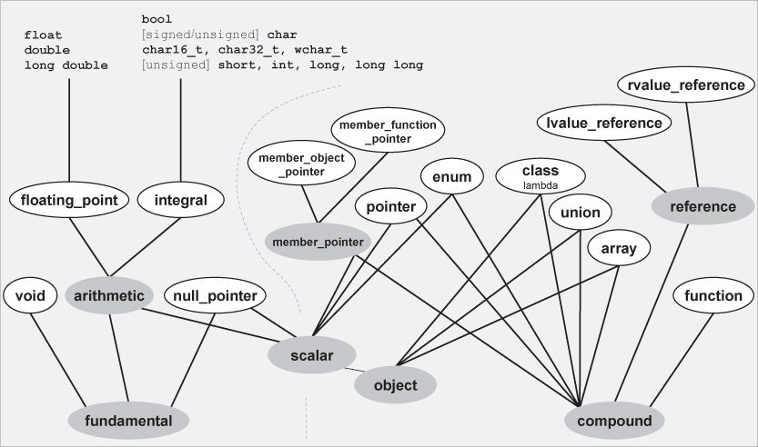

_Figure D.1. Primary and Composite Type Categories_

#### D.2.1 Testing for the Primary Type Category

This section describes type utilities that test the primary type category of a given type. For any given type, exactly one of the primary type categories has a static `value` member that evaluates to `true`.[4] The result is independent of whether the type is qualified with `const` and/or `volatile` (_cv-qualified_).

> 本节介绍测试给定类型的主类型类别的类型实用程序。对于任何给定的类型，恰好有一个主类型类别具有一个计算结果为“true”的静态“value”成员。[4] 结果与类型是否用“const”和/或“volatile”（_cv-qualified_）限定无关。

Note that for types `std::size_t` and `std::ptrdiff_t`, `is_integral<>` yields `true`. For type `std::max_align_t`, which one of these primary type categories yields `true` is an implementation detail (thus, it might be an integral or floating-point or class type). The language specifies that the type of a lambda expression is a class type (see Section [15.10.6] on page [310]). Applying `is_class` to that type therefore yields `true`.

> 请注意，对于类型“std:：size_t”和“std：：ptrdiff_t”，“is_integral ＜＞”产生“true”。对于类型“std:：max_align_t”，这些主要类型类别中的哪一个产生“true”是实现细节（因此，它可能是整型、浮点型或类类型）。该语言指定 lambda 表达式的类型为类类型（请参见第[310]页第[15.10.6]节）。因此，将“is_class”应用于该类型会产生“true”。

Trait Effect

---

```
`is_void<`_T_`>` Type `void`
`is_integral<`_T_`>` Integral type (including `bool`, `char`, `char16_t`, `char32_t`, `wchar_t`)
`is_floating_point<`_T_`>` Floating-point type (`float`, `double`, `long double`)
`is_array<`_T_`>` Ordinary array type (not type `std::array`)
`is_pointer<`_T_`>` Pointer type (including function pointer but not pointer to non-static member)
`is_null_pointer<`_T_`>` Type of `nullptr` (since C++14)
`is_member_object_pointer<`_T_`>` Pointer to a nonstatic data member
`is_member_function_pointer<`_T_`>` Pointer to a nonstatic member function
`is_lvalue_reference<`_T_`>` Lvalue reference
`is_rvalue_reference<`_T_`>` Rvalue reference
`is_enum<`_T_`>` Enumeration type
`is_class<`_T_`>` Class/struct or lambda type but not a union type
`is_union<`_T_`>` Union type
`is_function<`_T_`>` Function type

```

_Table D.1. Traits to Check the Primary Type Category_

`std:: is_void < T >::value`

• Yields `true` if type `T` is (cv-qualified) `void`.

• For example:

```
[Click here to view code image]

is_void_v<void>           // yields [true]\
is_void_v<[void const]      // yields [true]\
is_void_v<int>            // yields [false]\
void f();
is_void_v<decltype(f)>    // yields [false] ([f] has function type])
is_void_v<decltype(f())>  // yields [true] (return type of [f()] is [void)

```

`std:: is_integral < T >::value`

• Yields `true` if type `T` is one of the following (cv-qualified) types:

```
-- `bool`
-- a character type (`char`, `signed char`, `unsigned char`, `char16_t`, `char32_t`, or `wchar_t`)
-- an integer type (signed or unsigned variants of `short`, `int`, `long`, or `long long`; this includes `std::size_t` and `std::ptrdiff_t`)
```

`std:: is_floating_point < T >::value`

• Yields `true` if type `T` is (cv-qualified) `float`, `double`, or `long double`.

> •如果类型“T”是（cv 限定的）“float”、“double”或“long double”，则产生“true”。

`std:: is_array < T >::value`

```
• Yields `true` if type `T` is a (cv-qualified) array type.
• Recall that a _parameter_ declared as an array (with or without length) by language rules really has a pointer type.
• Note that class `std::array<>` is not an array type, but a class type.
```

• For example:

```
[Click here to view code image]

is_array_v<int[]>          // yields [true]\
is_array_v<int[5]>         // yields [true]\
is_array_v<int\*>           // yields [false]\

void foo(int] a[], int b[5],int\* c)
{
is_array_v<decltype(a)>    // yields [false] ([a] has type [inT])
is_array_v<decltype(b)>    // yields [false] ([b] has type [inT])
is_array_v<decltype(c)>    // yields [false] ([c] has type [inT])
}

```

• See Section [19.8.2] on page [453] for implementation details.

`std:: is_pointer < T >::value`

• Yields `true` if type `T` is a (cv-qualified) pointer.

This includes:

-- pointers to static/global (member) functions
-- parameters declared as arrays (with or without length) or function types

This does _not_ include:

-- pointer-to-member types (e.g., the type of `&X::m` where `X` is a class type and `m` is a nonstatic member function or a nonstatic data member)

> --指向成员类型的指针（例如，`&X:：m`的类型，其中`X`是类类型，`m`是非静态成员函数或非静态数据成员）
> -- the type of `nullptr`, `std::nullptr_t`

• For example:

```
[Click here to view code image]

is_pointer_v<int>                  // yields [false]\
is_pointer_v<int*>                 // yields [true]\
is_pointer_v<int* const>           // yields [true]\
is_pointer_v<int\*&>                // yields [false]\
is_pointer_v<decltype([nullptr])>    // yields [false]\

int* foo(int] a[5], void(f)())
{
  is_pointer_v<decltype(a)>          // yields [true] ([a] has type [inT])
  is_pointer_v<decltype(f)>          // yields [true] ([f] has type [void(*])())
  is_pointer_v<decltype(foo)>        // yields false
  is_pointer_v<decltype(&foo)>       // yields true
  is_pointer_v<decltype(foo(a,f))>   // yields true (for return type [inT)
}

```

• See Section [19.8.2] on page [451] for implementation details.

`std:: is_null_pointer < T >::value`

• Yields `true` if type `T` is the (cv-qualified) `std:: nullptr_t`, which is the type of `nullptr`.

> •如果类型“T”是（cv 限定的）“std:：nullptr_T”，即“nullptr”的类型，则产生“true”。

• For example:

```
[Click here to view code image]

is_null_pointer_v<decltype([nullptr])>   // yields [true]\

void\* p = [nullptr];
is_null_pointer_v<decltype(p)>        // yields [false] ([p] has not type [std::nullptr_t])

```

• Provided since C++14.

`std:: is_member_object_pointer < T >::value`
`std:: is_member_function_pointer < T >::value`

• Yields `true` if type `T` is a (cv-qualified) pointer-to-member type (e.g., `int X::*` or `int (X::*)()` for some class type `X`).

> •如果类型“T”是指向成员类型的（cv 限定的）指针（例如，某些类类型“X”的“int X:：_”或“int（X:：_'）（）”），则产生“true”。

`std:: is_lvalue_reference < T >::value`
`std:: is_rvalue_reference < T >::value`

• Yields `true` if type `T` is a (cv-qualified) lvalue or rvalue reference type, respectively.

> •如果类型“T”分别是（cv 限定的）左值或右值引用类型，则产生“true”。

• For example:

```
[Click here to view code image]

is_lvalue_reference_v<int>      // yields]_ [false]\
is_lvalue_reference_v<int&>      // yields]_ [true]\
is_lvalue_reference_v<int&&>      // yields]_ [false]\
is_lvalue_reference_v<void>      // yields]_ [false]\
is_rvalue_reference_v<int>      // yields]_ [false]\
is_rvalue_reference_v<int&>      // yields]_ [false]\
is_rvalue_reference_v<int&&>      // yields]_ [true]\
is_rvalue_reference_v<void>      // yields]_ [false]

```

• See Section [19.8.2] on page [452] for implementation details.

`std:: is_enum < T >::value`

• Yields `true` if type `T` is a (cv-qualified) enumeration type. This applies to both scoped and un-scoped enumeration types.

> •如果类型“T”是（cv 限定的）枚举类型，则产生“true”。这适用于作用域和非作用域枚举类型。

• See Section [19.8.5] on page [457] for implementation details.

`std:: is_class < T >::value`

• Yields `true` if type `T` is a (cv-qualified) class type declared with `class` or `struct`, including such a type generated from instantiating a class template. Note that the language guarantees that the type of a lambda expression is a class type (see Section [15.10.6] on page [310]).

> •如果类型“T”是用“class”或“struct”声明的（cv 限定的）类类型，包括通过实例化类模板生成的类型，则产生“true”。请注意，该语言保证 lambda 表达式的类型是类类型（请参见第[310]页第[15.10.6]节）。

• Yields `false` for unions, scoped enumeration type (despite being declared with `enum class`), `std::nullptr_t`, and any other type.

> •为并集、作用域枚举类型（尽管使用“enum class”声明）、“std:：nullptr_t”和任何其他类型生成“false”。

• For example:

```
[Click here to view code image]

is_class_v<int>                 // yields [false]\
is_class_v<std::string>         // yields [true]\
is_class_v<std::string const>   // yields [true]\
is_class_v<std::string&>        // yields [false]\
auto l1 = [];
is_class_v<decltype(l1)>        // yields [true] (a lambda is a class object)

```

• See Section [19.8.4] on page [456] for implementation details.

`std:: is_union < T >::value`

• Yields `true` if type `T` is a (cv-qualified) `union`, including a union generated from a class template that is a union template.

> •如果类型“T”是（cv 限定的）“并集”，包括从作为并集模板的类模板生成的并集，则产生“true”。

`std:: is_function < T >::value`

• Yields `true` if type `T` is a (cv-qualified) function type. Yields `false` for a function pointer type, the type of a lambda expression, and any other type.

> •如果类型“T”是（cv 限定的）函数类型，则产生“true”。为函数指针类型、lambda 表达式的类型和任何其他类型生成“false”。

• Recall that a _parameter_ declared as an function type by language rules really has a pointer type.

> •回想一下，语言规则声明为函数类型的*parameter*实际上有一个指针类型。

• For example:

```
[Click here to view code image]

void foo(void(f)())
{
is_function_v<decltype(f)>        // yields false ([f] has type [void(*])())
is_function_v<decltype(foo)>      // yields [true]\
is_function_v<decltype(&foo)>     // yields [false]\
is_function_v<decltype(foo(f))>   // yields [false] (for return type)
}

```

• See Section [19.8.3] on page [454] for implementation details.

#### D.2.2 Test for Composite Type Categories

The following type utilities determine whether a type belongs to a more general type category that is the union of some primary type categories. The composite type categories do not form a strict partition: A type may belong to multiple composite type categories (e.g., a pointer type is both a _scalar_ type and a _compound_ type). Again, cv-qualifiers (`const` and `volatile`) do not matter in classifying a type.

> 以下类型实用程序确定类型是否属于更通用的类型类别，该类别是某些主要类型类别的并集。复合类型类别不形成严格的分区：一个类型可能属于多个复合类型类别（例如，指针类型既是\_scalar_type 又是\_compound_type）。同样，cv 限定符（“const”和“volatile”）在对类型进行分类时并不重要。

`std:: is_reference < T >::value`

• Yields `true` if type `T` is a reference type.
• Same as: `is_lvalue_reference_v<T> || is_rvalue_reference_v<T>`
• See Section [19.8.2] on page [452] for implementation details.

Trait Effect

---

```
`is_reference<`_T_`>` Lvalue or rvalue reference
`is_member_pointer<`_T_`>` Pointer to nonstatic member
`is_arithmetic<`_T_`>` Integral (including `bool` and characters) or floating-point type
`is_fundamental<`_T_`>` `void`, integral (including `bool` and characters), floating-point, or `std::nullptr_t`
`is_scalar<`_T_`>` Integral (including `bool` and characters), floating-point, enumeration, pointer, pointer-to-member, and `std::nullptr_t`
`is_object<`_T_`>` Any type except `void`, function, or reference
`is_compound<`_T_`>` The opposite of `is_fundamental<`_T_ `>`: array, enumeration, union, class, function, reference, pointer, or pointer-to-member
```

_Table D.2. Traits to Check for Composite Type Category_

`std:: is_member_pointer < T >::value`

• Yields `true` if type `T` is any pointer-to-member type.

• Same as: `!` (`is_member_object_pointer_v<T> || is_member_function_pointer_v<T>`)

> •与：`！`相同（`is_member_object_pointer_v<T>||is_membel_function_pointer_v<T>`）

`std:: is_arithmetic < T >::value`

• Yields `true` if type `T` is an arithmetic type (`bool`, character type, integer type, or floating-point type).

> •如果类型“T”是算术类型（“布尔”、字符类型、整数类型或浮点类型），则产生“true”。
> • Same as: `is_integral_v<T> || is_floating_point_v<T>`

`std:: is_fundamental < T >::value`

• Yields `true` if type `T` is a fundamental type (arithmetic type or `void` or `std::nullptr_t`).

> •如果类型“T”是基本类型（算术类型或“void”或“std:：nullptr_T”），则产生“true”。
> • Same as: `is_arithmetic_v<T> || is_void_v<T> || is_null_pointer_v<T>`
> • Same as: `!` `is_compound_v<T>`

• See `IsFundaT` in Section [19.8.1] on page [448] for implementation details.

> •有关实施细节，请参见第[448]页第[19.8.1]节中的“IsFundaT”。

`std:: is_scalar < T >::value`

• Yields `true` if type `T` is a "scalar" type.
• Same as: `is_arithmetic_v<T> || is_enum_v<T> || is_pointer_v<T>`

\|\| is_member_pointer_v<T> \|\| is_null_pointer_v<T>>

`std:: is_object < T >::value`

• Yields `true` if type `T` describes the type of an object.

• Same as: `is_scalar_v<T> || is_array_v<T> || is_class_v<T> || is_union_v<T>)`

> •与：`is_scalar_v<T>|is_array_v<T>|| is_class_v<T>|is_union_v<T>相同）`
> • Same as: `!` (`is_function_v<T> || is_reference_v<T> || is_void_v<T>`)

`std:: is_compound < T >::value`

• Yields `true` if type `T` is a type compound out of other types.
• Same as: `!is_fundamental_v<T>`

• Same as: `is_enum_v<T> || is_array_v<T> || is_class_v<T> || is_union_v<T>`

> •与：`is_enum_v<T>||is_array_v<T>|| is_class_v<T>||is_union_v<T>相同`

\|\| is_reference_v<T> \|\| is_pointer_v<T> \|\| is_member_pointer_v<T>

\|\| is_function_v<T>

### D.3 Type Properties and Operations

The next group of traits tests other properties of single types as well as certain operations (e.g., value swapping) that may apply to them.

> 下一组特征测试单个类型的其他特性以及可能应用于它们的某些操作（例如，值交换）。

#### D.3.1 Other Type Properties

`std:: is_signed < T >::value`

• Yields `true` if `T` is a signed arithmetic type (i.e., an arithmetic type that includes negative value representations; this includes types like (`signed`) `int`, `float`).

> •如果“T”是有符号算术类型（即包括负值表示的算术类型；这包括（“signed”）“int”、“float”等类型），则产生“true”。
> • For type `bool`, it yields `false`.

• For type `char`, it is implementation defined whether it yields `true` or `false`.

> •对于类型“char”，它是由实现定义的，无论它产生“true”还是“false”。

• For all nonarithmetic types (including enumeration types) `is_signed` yields `false`.

> •对于所有非算术类型（包括枚举类型），“is_signed”产生“false”。

`std:: is_unsigned < T >::value`

• Yields `true` if `T` is an unsigned arithmetic type (i.e., an arithmetic type that does not include negative value representations; this includes types like `unsigned int` and `bool`).

> •如果“T”是无符号算术类型（即不包括负值表示的算术类型；这包括“unsigned int”和“bool”等类型），则产生“true”。

• For type `char`, it is implementation defined whether it yields `true` or `false`.

> •对于类型“char”，它是由实现定义的，无论它产生“true”还是“false”。

• For all nonarithmetic types (including enumeration types) `is_unsigned` yields `false`.

> •对于所有非算术类型（包括枚举类型），“is_unsigned”产生“false”。

`std:: is_const < T >::value`

• Yields `true` if the type is `const`-qualified.

• Note that a `const` pointer has a `const`-qualified type, whereas a non-`const` pointer or a reference to a `const` type is not `const`-qualified. For example:

> •请注意，“常量”指针具有“常量”限定类型，而非“常量”指示器或对“常量”类型的引用不是“常量”合格类型。例如

```
[Click here to view code image]

is_const<int* const>::value      // [true]\
is_const<int const*>::value      // [false]\
is_const<int const&>::value      // [false]

```

• The language defines arrays to be `const`-qualified if the element type is `const`-qualified.[5] For example:

> •如果元素类型为“const”限定，则该语言将数组定义为“const”限定。[5] 例如：

```
[Click here to view code image]

is_const<int[3]>::value          // [false]\
is_const<int const[3]>::value    // [true]\
is_const<int[]>::value           // [false]\
is_const<int const[]>::value     // [true]

```

Trait Effect

---

```
`is_signed<`_T_`>` Signed arithmetic type
`is_unsigned<`_T_ `>` Unsigned arithmetic type
`is_const<`_T_ `>` `const`-qualified
`is_volatile<`_T_ `>` `volatile`-qualified
`is_aggregate<`_T_ `>` Aggregate type (since C++17)
`is_trivial<`_T_ `>` Scalar, trivial class, or arrays of these types
`is_trivially_copyable<`_T_ `>` Scalar, trivially copyable class, or arrays of these types
`is_standard_layout<`_T_ `>` Scalar, standard layout class, or arrays of these types
`is_pod<`_T_ `>` Plain old data type (type where `memcpy()` works to copy objects)
`is_literal_type<`_T_ `>` Scalar, reference, class, or arrays of these types (deprecated since C++17)
`is_empty<`_T_ `>` Class with no members, virtual member functions, or virtual base classes
`is_polymorphic<`_T_ `>` Class with a (derived) virtual member function
`is_abstract<`_T_ `>` Abstract class (at least one pure virtual function)
`is_final<`_T_ `>` Final class (a class not allowed to derive from, since C++14)
`has_virtual_destructor<`_T_ `>` Class with virtual destructor
`has_unique_object_representations<`_T_`>` Any two object with same value have same representation in memory (since C++17)
`alignment_of<`_T_ `>` Equivalent to `alignof(`_T_`)`
`rank<`_T_ `>` Number of dimensions of an array type (or `0`)
`extent<`_T_`,`_I_`=0 >` Extent of dimension _I_ (or `0`)
`underlying_type<`_T_ `>` Underlying type of an enumeration type
`is_invocable<`_T_`,`_Args..._ `>` Can be used as callable for _Args..._ (since C++17) `is_nothrow_invocable<`_T_`,`_Args..._`>` Can be used as callable for _Args..._ without throwing (since C++17)
`is_invocable_r<`_RT_`,`_T_`,`_Args..._ `>` Can be used as callable for _Args..._ returning _RT_ (since C++17) `is_nothrow_invocable_r<`_RT_`,`_T_`,`_Args..._`>` Can be used as callable for _Args..._ returning _RT_ without throwing (since C++17)
`invoke_result<`_T_`,`_Args..._`>` Result type if used as callable for _Args..._ (since C++17)
`result_of<`_F_`,`_ArgTypes_ `>` Result type if calling _F_ with argument types _ArgTypes_ (deprecated since C++17)

```

_Table D.3. Traits to Test Simple Type Properties_

`std:: is_volatile < T >::value`

• Yields `true` if the type is `volatile`-qualified.

• Note that a `volatile` pointer has a `volatile`-qualified type, whereas a non-`volatile` pointer or a reference to a `volatile` type is not `volatile`-qualified. For example:

> •请注意，“volatile”指针具有“volatible”限定类型，而非“volatial”指针或对“volatille”类型的引用不具有“volabile”限定类型。例如

```
[Click here to view code image]

is_volatile<int* [volatile]>::value      // [true]\
is_volatile<[int volatile]*>::value      // [false]\
is_volatile<[int volatile]&>::value      // [false]

```

• The language defines arrays to be `volatile`-qualified if the element type is `volatile`-qualified.[6]

> •如果元素类型是“volatile”限定的，则该语言将数组定义为“volatible”限定的。6.

For example:

```
[Click here to view code image]

is_volatile<int[3]>::value             // [false]\
is_volatile<[int volatile][3]>::value    // [true]\
is_volatile<int[]>::value              // [false]\
is_volatile<[int volatile][]>::value     // [true]

```

`std:: is_aggregate < T >::value`

• Yields `true` if `T` is an _aggregate_ type (either an array or a class/struct/union that has no user-defined, explicit, or inherited constructors, no private or protected nonstatic data members, no virtual functions, and no virtual, private, or protected base classes).[7]

> •如果“T”是*aggregate*类型（数组或类/结构/并集，没有用户定义的、显式的或继承的构造函数，没有私有或受保护的非静态数据成员，没有虚拟函数，也没有虚拟、专用或受保护基类），则产生“true”。7.

• Helps to find out whether list initialization is required. For example:

```
[Click here to view code image]

template<typename Coll, typename... T>
void insert(Coll& coll, T&&... val)
{
 if constexpr(!std::is_aggregate_v[<typename] Coll::value_type>)  {
  coll.emplace_back(std::forward<T>(val)...);      // invalid for aggregates
 }
 else  {
  coll.emplace_back(typename Coll::value_type);
 }
}

```

• Requires that the given type is either complete (see Section [10.3.1] on page [154]) or (cv-qualified) `void`.

> •要求给定类型是完整的（见第[154]页第[10.3.1]节）或（cv 限定的）“无效”。
> • Available since C++17.

`std:: is_trivial < T >::value`

• Yields `true` if the type is a "trivial" type:

-- a scalar type (integral, float, enum, pointer; see `is_scalar()` on page [707])

-- a trivial class type (a class that has no virtual functions, no virtual base classes, no (indirectly) user-defined default constructor, copy/move constructor, copy/move assignment operator, or destructor, no initializer for nonstatic data members, no volatile members, and no nontrival members)

> --平凡类类型（一个没有虚拟函数、没有虚拟基类、没有（间接）用户定义的默认构造函数、复制/移动构造函数、拷贝/移动赋值运算符或析构函数、没有非静态数据成员的初始值设定项、没有易失性成员和非平凡成员的类）
> -- an array of such types
> -- and cv-qualified versions of these types

• Yields `true` if `is_trivially_copyable_v<T>` yields `true` and a trivial default constructor exists.

> •如果`is_trivialy_copyable_v<T>`产生`true`并且存在一个琐碎的默认构造函数，则产生`trup`。

• Requires that the given type is either complete (see Section [10.3.1] on page [154]) or (cv-qualified) `void`.

> •要求给定类型是完整的（见第[154]页第[10.3.1]节）或（cv 限定的）“无效”。

`std:: is_trivially_copyable < T >::value`

• Yields `true` if the type is a "trivially copyable" type:

-- a scalar type (integral, float, enum, pointer; see `is_scalar<>` on page [707])

-- a trivial class type (a class that has no virtual functions, no virtual base classes, no (indirectly) user-defined default constructor, copy/move constructor, copy/move assignment operator, or destructor, no initializer for nonstatic data members, no volatile members, and no nontrival members)

> --平凡类类型（一个没有虚拟函数、没有虚拟基类、没有（间接）用户定义的默认构造函数、复制/移动构造函数、拷贝/移动赋值运算符或析构函数、没有非静态数据成员的初始值设定项、没有易失性成员和非平凡成员的类）

-- an array of such types -- and cv-qualified versions of these types

• Yields the same as `is_trivial_v<T>` except it can produce `true` for a class type without a trivial default constructor.

> •产生的结果与“is_trivial_v<T>”相同，只是它可以为类类型生成“true”，而无需简单的默认构造函数。

• In contrast to `is_standard_layout<>`, volatile members are not allowed, references are allowed, members might have different access, and members might be distributed among different (base) classes.

> •与“is_standard_layout ＜＞”相反，不允许使用 volatile 成员，允许引用，成员可能具有不同的访问权限，并且成员可能分布在不同的（基类）之间。

• Requires that the given type is either complete (see Section [10.3.1] on page [154]) or (cv-qualified) `void`.

> •要求给定类型是完整的（见第[154]页第[10.3.1]节）或（cv 限定的）“无效”。

`std:: is_standard_layout < T >::value`

• Yields `true` if the type has a standard layout, which, for example, makes it easier to exchange values of this type with other languages.

> •如果类型具有标准布局，则会产生“true”，例如，这使此类型的值更容易与其他语言交换。

-- a scalar type (integral, float, enum, pointer; see `is_scalar<>` on page [707])

-- a _standard-layout_ class type (no virtual functions, no virtual base classes, no nonstatic reference members, all nonstatic members are in the same (base) class defined with the same access, all members are also standard-layout types)

> --一个标准布局类类型（没有虚拟函数，没有虚拟基类，没有非静态引用成员，所有非静态成员都在用相同访问定义的同一（基类）中，所有成员也是标准布局类型）

-- an array of such types

-- and cv-qualified versions of these types

• In contrast to `is_trivial<>`, volatile members are allowed, references are not allowed, members might not have different access, and members might not be distributed among different (base) classes.

> •与`is_trivial<>`相反，允许使用 volatile 成员，不允许引用，成员可能没有不同的访问权限，并且成员可能不会分布在不同的（基类）之间。

• Requires that the given type (for arrays, the basic type) is either complete (see Section [10.3.1] on page [154]) or (cv-qualified) `void`.

> •要求给定类型（对于数组，基本类型）是完整的（见第[154]页第[10.31]节）或（cv 限定的）“void”。

`std:: is_pod < T >::value`

• Yields `true` if `T` is a _plain old datatype_ (POD).

• Objects of such types can be copied by copying the underlying storage (e.g., using `memcpy()`).

> •可以通过复制底层存储来复制此类对象（例如，使用“memcpy（）”）。
> • Same as: `is_trivial_t<T> && is_standard_layout_v<T>`
> • Yields `false` for:

-- classes that don't have a trivial default constructor, copy/move constructor, copy/move assignment, or destructor

> --没有普通默认构造函数、复制/移动构造函数、复制或移动赋值或析构函数的类
> -- classes that have virtual members or virtual base classes
> -- classes that have volatile or reference members
> -- classes that have members in different (base) classes or with different access
> -- the types of lambda expressions (called _closure types_)
> -- functions
> -- `void`
> -- types composed from these types

• Requires that the given type is either complete (see Section [10.3.1] on page [154]) or (cv-qualified) `void`.

> •要求给定类型是完整的（见第[154]页第[10.3.1]节）或（cv 限定的）“无效”。

`std:: is_literal_type < T >::value`

• Yields `true` if the given type is a valid return type for a `constexpr` function (which notably excludes any type requiring nontrivial destruction).

> •如果给定类型是“constexpr”函数的有效返回类型（特别是排除任何需要非平凡破坏的类型），则产生“true”。

• Yields `true` if `T` is a _literal type_:

-- a scalar type (integral, float, enum, pointer; see `is_scalar()` on page [707])
-- a reference

-- a class type with at least one `constexpr` constructor that is not a copy/move constructor in each (base) class, no user-defined or virtual destructor in any (base) class or member, and where every initialization for nonstatic data members is a constant expression

> --至少有一个“constexpr”构造函数的类类型，该构造函数不是每个（基类）中的复制/移动构造函数，在任何（基类）或成员中都没有用户定义的或虚拟的析构函数，并且非静态数据成员的每次初始化都是常量表达式
> -- an array of such types

• Requires that the given type is either complete (see Section [10.3.1] on page [154]) or (cv-qualified) `void`.

> •要求给定类型是完整的（见第[154]页第[10.3.1]节）或（cv 限定的）“无效”。

• Note that this trait is deprecated since C++17 because "_it is too weak to be used meaningfully in generic code. What is really needed is the ability to know that a specific construction would produce constant initialization._"

> •请注意，自 C++17 以来，这一特性一直被弃用，因为“_it 太弱，无法在泛型代码中有意义地使用。真正需要的是知道特定构造将产生常量初始化的能力。_”

`std:: is_empty < T >::value`

• Yields `true` if `T` is a class type but not a union type, whose objects hold no data.

> •如果“T”是类类型而不是并集类型，且其对象不包含数据，则生成“true”。
> • Yields `true` if `T` is defined as `class` or `struct` with

-- no nonstatic data members other than bit-fields of length 0
-- no virtual member functions
-- no virtual base classes
-- no nonempty base classes

• Requires that the given type is complete (see Section [10.3.1] on page [154]) if it is a `class`/`struct` (an incomplete `union` is fine).

> •如果给定类型是“类”/“结构”（不完整的“并集”也可以），则要求该类型是完整的（见第[154]页第[10.31]节）。

`std:: is_polymorphic < T >::value`

• Yields `true` if `T` is _polymorphic_ class type (a class that declares or inherits a virtual function).

> •如果“T”是\_polymmorphic_class 类型（声明或继承虚拟函数的类），则生成“true”。

• Requires that the given type is either complete (see Section [10.3.1] on page [154]) or neither a `class` nor a `struct`.

> •要求给定的类型要么是完整的（见第[154]页第[10.3.1]节），要么既不是“类”也不是“结构”。

`std:: is_abstract < T >::value`

• Yields `true` if `T` is an _abstract_ class type (a class for which no objects can be created because it has at least one pure virtual member function).

> •如果“T”是\_abstract_class 类型（一个不能为其创建对象的类，因为它至少有一个纯虚拟成员函数），则产生“true”。

• Requires that the given type is complete (see Section [10.3.1] on page [154]) if it is a `class`/`struct` (an incomplete `union` is fine).

> •如果给定类型是“类”/“结构”（不完整的“并集”也可以），则要求该类型是完整的（见第[154]页第[10.31]节）。

`std:: is_final < T >::value`

• Yields `true` if `T` is an _final_ class type (a class or union that can't serve as a base class because it is declared as being `final`).

> •如果“T”是\_final_class 类型（一个不能用作基类的类或并集，因为它被声明为“final”），则产生“true”。

• For all non-class/union types such as `int`, it returns `false` (thus, this is not the same as something like _is derivable_).

> •对于所有非类/并集类型，如“int”，它返回“false”（因此，这与*is derivable*等不同）。

• Requires that the given type `T` is either complete (see Section [10.3.1] on page [154]) or neither `class`/`struct` nor `union`.

> •要求给定类型“T”要么是完整的（见第[154]页第[10.31]节），要么既不是“class”/“struct”也不是“union”。

• Available since C++14.

`std:: has_virtual_destructor < T >::value`

• Yields `true` if type `T` has a virtual destructor.

• Requires that the given type is complete (see Section [10.3.1] on page [154]) if it is a `class`/`struct` (an incomplete `union` is fine).

> •如果给定类型是“类”/“结构”（不完整的“并集”也可以），则要求该类型是完整的（见第[154]页第[10.31]节）。

`std:: has_unique_object_representations < T >::value`

• Yields `true` if any two objects of type `T` have the same object representation in memory. That is, two identical values are always represented using the same sequence of byte values.

> •如果任何两个类型为“T”的对象在内存中具有相同的对象表示，则产生“true”。也就是说，两个相同的值总是使用相同的字节值序列来表示。

• Objects with this property can produce a reliable hash value by hashing the associated byte sequence (there is no risk that some bits not participating in the object value might differ from one case to another).

> •具有此属性的对象可以通过散列相关的字节序列来生成可靠的散列值（不存在某些不参与对象值的位可能因情况而异的风险）。

• Requires that the given type is trivially copyable (see Section [D.3.1] on page [712]) and either complete (see Section [10.3.1] on page [154]) or (cv-qualified) `void` or an array of unknown bounds.

> •要求给定类型是可复制的（见第[712]页第[D.3.1]节），并且是完整的（见[154]页第[10.3.1]节）或（cv 限定的）“void”或未知边界数组。

• Available since C++17.

`std:: alignment_of < T >::value`

• Yields the alignment value of an object of type `T` as `std::size_t` (for arrays, the element type; for references, the referenced type).

> •将类型为“T”的对象的对齐值生成为“std:：size_T”（对于数组，为元素类型；对于引用，为引用类型）。

• Same as: `alignof(T)`

• This trait was introduced in C++11 before the `alignof(…)` construct. It is still useful, however, because the trait can be passed around as a class type, which is useful for certain metaprograms.

> •这种特性是在“alignof（…）”构造之前在 C++11 中引入的。然而，它仍然很有用，因为特性可以作为类类型传递，这对某些元程序很有用。

• Requires that `alignof(T)` is a valid expression.

• Use `aligned_union<>` to get the common alignment of multiple types (see Section [D.5] on page [733]).

> •使用`aligned_union<>`获得多种类型的通用对齐方式（参见第[733]页第[D.5]节）。

`std:: rank < T >::value`

• Yields the number of dimensions of an array of type `T` as `std::size_t`.

> •将类型为“T”的数组的维数生成为“std:：size_T”。

• Yields `0` for all other types.

• Pointers do not have any associated dimensions. An unspecified bound in an array type does specify a dimension. (As usual, a function parameter declared with an array type does not have an actual array type, and `std::array` is not an array type either. See Section [D.2.1] on page [704].)

> •指针没有任何相关的尺寸。数组类型中的未指定绑定未指定维度。（通常，用数组类型声明的函数参数没有实际的数组类型，“std:：array”也不是数组类型。请参见第[704]页的第[D.2.1]节。）

For example:

```
[Click here to view code image]

int a2[5][7];
rank_v<decltype(a2)>;        // yields [2]\
rank_v<int\*>;                // yields [0] (no array)
extern int p1[];
rank_v<decltype(p1)>;        // yields[1]

```

`std:: extent < T >::value`

`std:: extent < T, IDX >::value`

• Yields the size of the first or `IDX`-th dimension of an array of type `T` as `std::size_t`.

> •将类型为“T”的数组的第一个或第“IDX”维度的大小生成为“std:：size_T”。

• Yields `0`, if `T` is not an array, the dimension doesn't exist, or the size of the dimension is not known.

> •产生“0”，如果“T”不是数组，则维度不存在，或者维度的大小未知。
> • See Section [19.8.2] on page [453] for implementation details.

```
[Click here to view code image]

int a2[5][7];
extent_v<decltype(a2)>;        // yields [5]\
extent_v<decltype(a2),0>;      // yields [5]\
extent_v<decltype(a2),1>;      // yields [7]\
extent_v<decltype(a2),2>;      // yields [0]\
extent_v<int\*>;                // yields [0]\
extern int p1[];
extent_v<decltype(p1)>;        // yields [0]

```

`std:: underlying_type < T >::type`

• Yields the underlying type of an enumeration type `T`.

• Requires that the given type is a complete (see Section [10.3.1] on page [154]) enumeration type. For all other types, it has undefined behavior.

> •要求给定类型是完整的枚举类型（见第[154]页第[10.3.1]节）。对于所有其他类型，它具有未定义的行为。

`std:: is_invocable < T, Args… >::value`

`std:: is_nothrow_invocable < T, Args… >::value`

• Yields `true` if `T` is usable as a callable for `Args…` (with the guarantee that no exception is thrown).

> •如果“T”可用作“Args…”的可调用函数，则产生“true”（保证不会引发异常）。

• That is, we can use these traits to test whether we can call or `std::invoke()` the given _callable_ `T` for `Args…`. (See Section [11.1] on page [157] for details about _callables_ and `std::invoke()`.)

> •也就是说，我们可以使用这些特性来测试是否可以为“Args…”调用或“std:：invoke（）”给定的*callable*`T'。（有关_callables_和`std:：invoke（）`的详细信息，请参见第[157]页第[111]节。）

• Requires that all given types are complete (see Section [10.3.1] on page [154]) or (cv-qualified) `void` or an array of unknown bounds.

> •要求所有给定类型都是完整的（见第[154]页第[10.3.1]节）或（cv 限定的）“void”或未知边界数组。

• For example:

```
[Click here to view code image]

struct C {
  [bool operator]() (int) const {
    [return true];
  }
};
std::is_invocable<C>::value         //false
std::is_invocable<C,int>::value     //true
std::is_invocable<int*>::value      //false
std::is_invocable<int(*)()>::value  //true

```

• Available since C++17.[8]

`std:: is_invocable_r < RET_T, T, Args… >::value`

`std:: is_nothrow_invocable_r < RET_T, T, Args… >::value`

• Yields `true` if we can use `T` as a callable for `Args…` (with the guarantee that no exception is thrown), returning a value convertible to type `RET_T`.

> •如果我们可以使用“T”作为“Args…”的可调用项（保证不会引发异常），则返回一个可转换为“RET_T”类型的值，则返回“true”。

• That is, we can use these traits to test whether we can call or `std::invoke()` the passed _callable_ `T` for `Args…` and use the return value as `RET_T`. (See Section [11.1] on page [157] for details about _callables_ and `std::invoke()`.)

> •也就是说，我们可以使用这些特性来测试是否可以为“Args…”调用或“std:：invoke（）”传递的*callable*`T'，并将返回值用作“RET_T”。（有关_callables_和`std:：invoke（）`的详细信息，请参见第[157]页第[111]节。）

• Requires that all passed types are complete (see Section [10.3.1] on page [154]) or (cv-qualified) `void` or an array of unknown bounds.

> •要求所有传递的类型都是完整的（见第[154]页第[10.3.1]节）或（cv 限定的）“void”或未知边界数组。

• For example:

```
[Click here to view code image]

struct C {
  [bool operator]() (int) const {
   [return true];
  }
};
std::is_invocable_r<bool,C,int>::value               //true
std::is_invocable_r<int,C,[long]>::value               //true
std::is_invocable_r<void,C,int>::value               //true
std::is_invocable_r<[char]_,C,int>::value              //false
std::is_invocable_r<[long],int(_)(int)>::value         //false
std::is_invocable_r<[long],int(_)(int),int>::value     //true
std::is_invocable_r<[long],int(_)(int),[double]>::value  //true

```

• Available since C++17.

`std:: invoke_result < T, Args… >::value`
`std:: result_of < T, Args… >::value`

• Yields the return type of the _callable_ `T` called for `Args…`.
• Note that the syntax is slightly different:

-- To `invoke_result<>` you have to pass both the type of the callable and the type of the arguments as parameters.

> --要“invoke_result ＜＞”，必须将可调用的类型和参数的类型作为参数传递。
> -- To `result_of<>` you have to pass a "function declaration" using the corresponding types.

• If no call is possible, there is no `type` member defined, so that using it is an error (which might SFINAE out a function template using it in its declaration; see Section [8.4] on page [131]).

> •如果不可能调用，则没有定义“类型”成员，因此使用它是一个错误（这可能会在函数模板的声明中使用它来 SFINAE；请参见第[131]页第[8.4]节）。

• That is, we can use these traits to get the return type obtained when we call or `std::invoke()` the given _callable_ `T` for `Args…`. (See Section [11.1] on page [157] for details about _callables_ and `std::invoke()`.)

> •也就是说，我们可以使用这些特性来获得当我们为“Args…”调用或“std:：invoke（）”给定的*callable*`T'时获得的返回类型。（有关_callables_和`std:：invoke（）`的详细信息，请参见第[157]页第[111]节。）

• Requires that all given types are either complete (see Section [10.3.1] on page [154]), (cv-qualified) `void`, or an array type of unknown bound.

> •要求所有给定类型要么是完整的（见第[154]页第[10.31]节），（cv 限定的）“void”，要么是未知绑定的数组类型。

• `invoke_result<>` is available since C++17 and replaces `result_of<>`, which is deprecated since C++17, because `invoke_result<>` provides some improvements such the easier syntax and permitting abstract types for `T`.

> •`invoke_result<>`自 C++17 起可用，并取代了`result_of<>`，后者自 C++17 以来已被弃用，因为`invoke_result<>`提供了一些改进，例如更简单的语法和允许`T`的抽象类型。

• For example:

```
[Click here to view code image]

std::string foo(int);

using R0 = typename std::result_of[<decltype](&foo)(int)>::type;  // C++11
using R1 = std::result_of_t[<decltype](&foo)(int)>;        // C++14
using R2 = std::invoke_result_t[<decltype](foo), int>;        // C++17

struct ABC {
   virtual ~ABC() = 0;
   [void operator]() (int) const {
   }
};

using T1 = typename std::result_of<ABC(int)>::type; // ERROR: [ABC] is abstract
using T2 = typename std::invoke_result<ABC, int>::type; // OK since C++17

```

See Section [11.1.3] on page [163] for a full example.

#### D.3.2 Test for Specific Operations

Trait Effect

---

```
`is_constructible<T, Args…>` Can initialize type _T_ with types _Args_
`is_trivially_constructible<T, Args…>` Can trivially initialize type _T_ with types _Args_
`is_nothrow_constructible<T, Args…>` Can initialize type _T_ with types _Args_ and that operation can't throw
`is_default_constructible<T>` Can initialize _T_ without arguments
`is_trivially_default_constructible<T>` Can trivially initialize _T_ without arguments
`is_nothrow_default_constructible<T>` Can initialize _T_ without arguments and that operation can't throw
`is_copy_constructible<T>` Can copy a _T_
`is_trivially_copy_constructible<T>` Can trivially copy a _T_
`is_nothrow_copy_constructible<T>` Can copy a _T_ and that operation can't throw
`is_move_constructible<T>` Can move a _T_
`is_trivially_move_constructible<T>` Can trivially move a _T_
`is_nothrow_move_constructible<T>` Can move a _T_ and that operation can't throw
`is_assignable<T, T2>` Can assign type _T2_ to type _T_
`is_trivially_assignable<T, T2>` Can trivially assign type _T2_ to type _T_
`is_nothrow_assignable<T, T2>` Can assign type _T2_ to type _T_ and that operation can't throw
`is_copy_assignable<T>` Can copy assign a _T_
`is_trivially_copy_assignable<T>` Can trivially copy assign a _T_
`is_nothrow_copy_assignable<T>` Can copy assign a _T_ and that operation can't throw
`is_move_assignable<T>` Can move assign a _T_
`is_trivially_move_assignable<T>` Can trivially move assign a _T_
`is_nothrow_move_assignable<T>` Can move assign a _T_ and that operation can't throw
`is_destructible<T>` Can destroy a _T_
`is_trivially_destructible<T>` Can trivially destroy a _T_
`is_nothrow_destructible<T>` Can trivially destroy a _T_ and that operation can't throw
`is_swappable<T>` Can call `swap()` for this type (since C++17)
`is_nothrow_swappable<T>` Can call `swap()` for this type and that operation can't throw (since C++17)
`is_swappable_with<T, T2>` Can call `swap()` for these two types with specific value category (since C++17)
`is_nothrow_swappable_with<T, T2>` Can call `swap()` for these two types with specific value category and that operation can't throw (since C++17)

```

_Table D.4. Traits to Check for Specific Operations_

Table [D.4] lists the type traits that allow us to check for some specific operations. The forms with `is_trivially_`... additionally check whether all (sub-)operations called for the object, members, or base classes are trivial (neither user-defined nor virtual). The forms with `is_nothrow_`... additionally check whether the called operation guarantees not to throw. Note that all `is_`...`_constructible` checks imply the corresponding `is_`...`_destructible` check. For example:

> 表[D.4]列出了允许我们检查某些特定操作的类型特征。带有`is_trivally_`的表单。。。另外，检查为对象、成员或基类调用的所有（子）操作是否都是琐碎的（既不是用户定义的，也不是虚拟的）。带有`is_nothrow_`的表单。。。另外检查被调用的操作是否保证不抛出。请注意，所有的` is_``_可构造的“check”表示相应的“is_” `\_可破坏`检查。例如

```
[Click here to view code image]

_`utils/isconstructible.cpp`_

#include <iostream>

class C {
  public:
    C() [noexcept]\
    }
    virtual ~C() = [default]; // makes [C] nontrivial
};

int main()
{
  using namespace std;
  cout << is_default_constructible_v<C> << '\n';            // [true]\
  cout << is_trivially_default_constructible_v<C> << '\n';  // [false]\
  cout << is_nothrow_default_constructible_v<C> << '\n';    // [false]\
  cout << is_copy_constructible_v<C> << '\n';               // [true]\
  cout << is_trivially_copy_constructible_v<C> << '\n';     // [true]\
  cout << is_nothrow_copy_constructible_v<C> << '\n';       // [true]\
  cout << is_destructible_v<C> << '\n';                     // [true]\
  cout << is_trivially_destructible_v<C> << '\n';           // [false]\
  cout << is_nothrow_destructible_v<C> << '\n';             // [true]\
}

```

Due to the definition of a virtual constructor, all operations are no longer trivial. And because we define a default constructor without `noexcept`, it might throw. All other operations, by default, guarantee not to throw.

> 由于虚拟构造函数的定义，所有操作都不再是琐碎的。因为我们定义了一个没有“noexcept”的默认构造函数，所以它可能会抛出。默认情况下，所有其他操作都保证不会抛出。

`std:: is_constructible < T, Args… >::value`
`std:: is_trivially_constructible < T, Args… >::value`
`std:: is_nothrow_constructible < T, Args… >::value`

• Yields `true` if an object of type `T` can be initialized with arguments of the types given by `Args…` (without using a nontrivial operation or with the guarantee that no exception is thrown). That is, the following must be valid:[9]

> •如果类型为“T”的对象可以用“Args…”给出的类型的参数初始化，则产生“true”（不使用非平凡操作或保证不会引发异常）。也就是说，以下内容必须有效：[9]

`T t(std::declval<Args>()…);`

• A `true` value implies that the object can be destroyed accordingly (i.e., `is_destructible_v<T>`, `is_trivially_destructible_v<T>`, or `is_nothrow_destructible_v<T>` yields `true`).

> •“true”值意味着对象可以相应地被销毁（即，“is_destructible_v ＜ T ＞”、“is_trivaly_structible \_v ＜ T ＞”或“is_nothrow_destructible_v ＞ T ＞”产生“true”）。

• Requires that all given types are either complete (see Section [10.3.1] on page [154]), (cv-qualified) `void`, or arrays of unknown bound.

> •要求所有给定类型要么是完整的（见第[154]页第[10.3.1]节），（cv 限定的）“void”，要么是未知绑定的数组。

• For example:

```
[Click here to view code image]

is_constructible_v<int>                              // [true]\
is_constructible_v<int,int>                          // [true]\
is_constructible_v<[long],int>                         // [true]\
is_constructible_v<int,void*>                        // [false]\
is_constructible_v<void*,int>                        // [false]\
is_constructible_v<char const*,std::string>          // [false]\
is_constructible_v<std::string,char const*>          // [true]\
is_constructible_v<std::string,char const\*[,int][,int]>  // [true]

```

• Note that `is_convertible` has a different order for the source and destination types.

> •请注意，“is_convertable”对源类型和目标类型有不同的顺序。

`std:: is_default_constructible < T >::value`
`std:: is_trivially_default_constructible < T >::value`
`std:: is_nothrow_default_constructible < T >::value`

• Yields `true` if an object of type `T` can be initialized without any argument for initialization (without using a nontrivial operation or with the guarantee that no exception is thrown).

> •如果类型为“T”的对象可以在没有任何初始化参数的情况下进行初始化（不使用非平凡操作或保证不会引发异常），则产生“true”。

• Same as `is_constructible_v<T>`, `is_trivially_constructible_v<T>`, or `is_nothrow_constructible_v<T>`, respectively.

> •分别与`is_constructible_v<T>`、`is_trivaly_construction_v<T>`或`is_nothrow_constructible_v<T>`相同。

• A `true` value implies that the object can be destroyed accordingly (i.e., `is_destructible_v<T>`, `is_trivially_destructible_v<T>`, or `is_nothrow_destructible_v<T>` yields `true`).

> •“true”值意味着对象可以相应地被销毁（即，“is_destructible_v ＜ T ＞”、“is_trivaly_structible \_v ＜ T ＞”或“is_nothrow_destructible_v ＞ T ＞”产生“true”）。

• Requires that the given type is either complete (see Section [10.3.1] on page [154]), (cv-qualified) `void`, or an array of unknown bound.

> •要求给定类型是完整的（见第[154]页第[10.31]节）、（cv 限定的）“void”或未知绑定的数组。

`std:: is_copy_constructible < T >::value`
`std:: is_trivially_copy_constructible < T >::value`
`std:: is_nothrow_copy_constructible < T >::value`

• Yields `true` if an object of type `T` can be created by copying another value of type `T` (without using a nontrivial operation or with the guarantee that no exception is thrown).

> •如果可以通过复制另一个类型为“T”的值来创建“T”类型的对象（不使用非平凡运算或保证不会引发异常），则会产生“true”。

• Yields `false` if `T` is not a _referenceable type_ (either (cv-qualified) `void` or a function type that is qualified with `const`, `volatile`, `&`, and/or `&&`).

> •如果“T”不是可引用类型\_（（cv 限定的）“void”或用“const”、“volatile”、“&”和/或“&&”限定的函数类型），则产生“false”。

• Provided `T` is a referenceable type, same as `is_constructible<T,T const&>::value`, `is_trivially_constructible<T,T const&>::value`, or `is_nothrow_constructible<T,T const&>::value` respectively.

> •假设“T”是可引用类型，分别与“is_constructible ＜ T，T const&>：：value”、“is_trivilly_constructable ＜ T，T const&>；：value”或“is_nothrow_constructsible ＜ T、T const&>:：value”相同。

• To find out whether an object of `T` would be copy constructible from an rvalue of type `T`, use `is_constructible<T,T&&>`, and so on.

> •要从“T”类型的右值中找出“T”的对象是否是可复制构造的，请使用“is_constructible<T，T&&>'，依此类推。

• A `true` value implies that the object can be destroyed accordingly (i.e., `is_destructible_v<T>`, `is_trivially_destructible_v<T>`, or `is_nothrow_destructible_v<T>` yields `true`).

> •“true”值意味着对象可以相应地被销毁（即，“is_destructible_v ＜ T ＞”、“is_trivaly_structible \_v ＜ T ＞”或“is_nothrow_destructible_v ＞ T ＞”产生“true”）。

• Requires that the given type is either complete (see Section [10.3.1] on page [154]), (cv-qualified) `void`, or an array of unknown bound.

> •要求给定类型是完整的（见第[154]页第[10.31]节）、（cv 限定的）“void”或未知绑定的数组。

• For example:

```
[Click here to view code image]

is_copy_constructible_v<int>                    // yields [true]\
is_copy_constructible_v<void>                   // yields [false]\
is_copy_constructible_v<std::unique_ptr<int>>   // yields [false]\
is_copy_constructible_v<std::string>            // yields [true]\
is_copy_constructible_v<std::string&>           // yields [true]\
is_copy_constructible_v<std::string&&>          // yields [false]\
// in contrast to:
is_constructible_v<std::string,std::string>     // yields [true]\
is_constructible_v<std::string&,std::string&>   // yields [true]\
is_constructible_v<std::string&&,std::string&&> // yields [true]

```

`std:: is_move_constructible < T >::value`

`std:: is_trivially_move_constructible < T >::value`

`std:: is_nothrow_move_constructible < T >::value`

• Yields `true` if an object of type `T` can be created from an rvalue of type `T` (without using a nontrivial operation or with the guarantee that no exception is thrown).

> •如果“T”类型的对象可以从“T”型的右值创建，则产生“true”（不使用非平凡运算或保证不会引发异常）。

• Yields `false` if `T` is not a _referenceable type_ (either (cv-qualified) `void` or a function type that is qualified with `const`, `volatile`, `&`, and/or `&&`).

> •如果“T”不是可引用类型\_（（cv 限定的）“void”或用“const”、“volatile”、“&”和/或“&&”限定的函数类型），则产生“false”。

• Provided `T` is a referenceable type, same as `is_constructible<T,T&&>::value`, `is_trivially_constructible<T,T&&>::value`, or `is_nothrow_constructible<T,T&&>::value` respectively.

> •假设`T`是可引用类型，分别与`is_constructible<T，T&&>:：value`、`is_trivial_structible<T，T&&>:：value `或`is_nothrow_constructsible<T、T&&>::value`相同。

• A `true` value implies that the object can be destroyed accordingly (i.e., `is_destructible_v<T>`, `is_trivially_destructible_v<T>`, or `is_nothrow_destructible_v<T>` yields `true`).

> •“true”值意味着对象可以相应地被销毁（即，“is_destructible_v ＜ T ＞”、“is_trivaly_structible \_v ＜ T ＞”或“is_nothrow_destructible_v ＞ T ＞”产生“true”）。

• Note that there is no way to check whether a move constructor throws without being able to call it directly for an object of type `T`. It is not enough for the constructor to be public and not deleted; it also requires that the corresponding type is not an abstract class (references or pointers to abstract classes work fine).

> •请注意，如果不能直接为“T”类型的对象调用 move 构造函数，就无法检查它是否抛出。构造函数是公共的而不被删除是不够的；它还要求对应的类型不是抽象类（对抽象类的引用或指针工作正常）。

• See Section [19.7.2] on page [443] for implementation details.

• For example:

```
[Click here to view code image]

is_move_constructible_v<int>                    // yields [true]\
is_move_constructible_v<void>                   // yields [false]\
is_move_constructible_v<std::unique_ptr<int>>   // yields [true]\
is_move_constructible_v<std::string>            // yields [true]\
is_move_constructible_v<std::string&>           // yields [true]\
is_move_constructible_v<std::string&&>          // yields [true]\
// in contrast to:
is_constructible_v<std::string,std::string>     // yields [true]\
is_constructible_v<std::string&,std::string&>   // yields [true]\
is_constructible_v<std::string&&,std::string&&> // yields [true]

```

`std:: is_assignable < TO, FROM >::value`

`std:: is_trivially_assignable < TO, FROM >::value`

`std:: is_nothrow_assignable < TO, FROM >::value`

• Yields `true` if an object of type `FROM` can be assigned to an object of type `TO` (without using a nontrivial operation or with the guarantee that no exception is thrown).

> •如果类型为“FROM”的对象可以分配给类型为“to”的对象，则产生“true”（不使用非平凡操作或保证不会引发异常）。

• Requires that the given types are either complete (see Section [10.3.1] on page [154]), (cv-qualified) `void`, or arrays of unknown bound.

> •要求给定类型是完整的（见第[154]页第[10.31]节）、（cv 限定的）“void”或未知绑定的数组。

• Note that `is_assignable_v<>` for a nonreference, nonclass type as first type always yields `false`, because such types produce prvalues. That is, the statement `42 = 77;` is not valid. For class types, however, rvalues may be assigned to, given an appropriate assignment operator (due to an old rule that non-`const` member functions can be invoked on rvalues of class types).[10]

> •请注意，对于非引用的“is_assignable_v<>”，作为第一个类型的非类类型总是产生“false”，因为这样的类型会产生 prvalue。也就是说，语句“42 ＝ 77；”无效。然而，对于类类型，在给定适当的赋值运算符的情况下，可以将右值赋值给（由于一条旧规则，即可以在类类型的右值上调用非常量成员函数）。[10]

• Note that `is_convertible` has a different order for the source and destination types.

> •请注意，“is_convertable”对源类型和目标类型有不同的顺序。

• For example:

```
[Click here to view code image]

is_assignable_v<int,int>                     // yields [false]\
is_assignable_v<int&,int>                    // yields [true]\
is_assignable_v<int&&,int>                   // yields [false]\
is_assignable_v<int&,int&>                   // yields [true]\
is_assignable_v<int&&,int&&>                 // yields [false]\
is_assignable_v<int&,[long]&>                  // yields [true]\
is_assignable_v<int&,void*>                  // yields [false]\
is_assignable_v<void*,int>                   // yields [false]\
is_assignable_v<void\*,int&>                  // yields [false]\
is_assignable_v<std::string,std::string>     // yields [true]\
is_assignable_v<std::string&,std::string&>   // yields [true]\
is_assignable_v<std::string&&,std::string&&> // yields [true]

```

`std:: is_copy_assignable < T >::value`

`std:: is_trivially_copy_assignable < T >::value`

`std:: is_nothrow_copy_assignable < T >::value`

• Yields `true` if a value of type `T` can be (copy-)assigned to an object of type `T` (without using a nontrivial operation or with the guarantee that no exception is thrown).

> •如果类型为“T”的值可以（copy-）分配给类型为“T”的对象（不使用非平凡运算或保证不引发异常），则产生“true”。

• Yields `false` if `T` is not a _referenceable type_ (either (cv-qualified) `void` or a function type that is qualified with `const`, `volatile`, `&`, and/or `&&`).

> •如果“T”不是可引用类型\_（（cv 限定的）“void”或用“const”、“volatile”、“&”和/或“&&”限定的函数类型），则产生“false”。

• Provided `T` is a referenceable type, same as `is_assignable<T&,T const&>::value`, `is_trivially_assignable<T&,T const&>::value`, or `is_nothrow_assignable<T&,T const&>::value` respectively.

> •假设“T”是可引用类型，分别与“is_assignable<T&，T const&>：：value”、“is_trivaly_assignable<T&，T const&>：：value'”或“is_nothrow_assignable<T&、T const&>:：value”相同。

• To find out whether an rvalue of type `T` can be copy assigned to another rvalue of type `T`, use `is_assignable<T&&,T&&>`, and so on.

> •要确定是否可以将类型为“T”的右值复制分配给另一个类型为“T”的右价，请使用“is_assignable ＜ T&&，T&&＞”，依此类推。

• Note that `void`, built-in array types, and classes with deleted copy-assignment operator cannot be copy-assigned.

> •请注意，不能对“void”、内置数组类型和具有已删除的复制赋值运算符的类进行复制赋值。

• Requires that the given type is either complete (see Section [10.3.1] on page [154]), (cv-qualified) `void`, or an array of unknown bound.

> •要求给定类型是完整的（见第[154]页第[10.31]节）、（cv 限定的）“void”或未知绑定的数组。

• For example:

```
[Click here to view code image]

is_copy_assignable_v<int>                    // yields [true]\
is_copy_assignable_v<int&>                   // yields [true]\
is_copy_assignable_v<int&&>                  // yields [true]\
is_copy_assignable_v<void>                   // yields [false]\
is_copy_assignable_v<void\*>                  // yields [true]\
is_copy_assignable_v<[char][]>                 // yields [false]\
is_copy_assignable_v<std::string>            // yields [true]\
is_copy_assignable_v<std::unique_ptr<int>>   // yields [false]

```

`std:: is_move_assignable < T >::value`

`std:: is_trivially_move_assignable < T >::value`

`std:: is_nothrow_move_assignable < T >::value`

• Yields `true` if an rvalue of type `T` can be move-assigned to an object of type `T` (without using a nontrivial operation or with the guarantee that no exception is thrown).

> •如果类型为“T”的右值可以移动分配给类型为“T”的对象，则产生“true”（不使用非平凡运算或保证不会引发异常）。

• Yields `false` if `T` is not a _referenceable type_ (either (cv-qualified) `void` or a function type that is qualified with `const`, `volatile`, `&`, and/or `&&`).

> •如果“T”不是可引用类型\_（（cv 限定的）“void”或用“const”、“volatile”、“&”和/或“&&”限定的函数类型），则产生“false”。

• Provided `T` is a referenceable type, same as `is_assignable<T&,T&&>::value`, `is_trivially_assignable<T&,T&&>::value`, or `is_nothrow_assignable<T&,T&&>::value` respectively.

> •假设“T”是可引用的类型，分别与“is_assignable<T&，T&&>：：value”、“is_trivaly_assignable<T&，T&&>:：value”或“is_nothrow_assignable<T&、T&&>::value”相同。

• Note that `void`, built-in array types, and classes with deleted move-assignment operator cannot be move-assigned.

> •请注意，不能对“void”、内置数组类型和具有已删除移动赋值运算符的类进行移动赋值。

• Requires that the given type is either complete (see Section [10.3.1] on page [154]) or (cv-qualified) `void` or an array of unknown bound.

> •要求给定类型是完整的（见第[154]页第[10.31]节）或（cv 限定的）“void”或未知绑定的数组。

• For example:

```
[Click here to view code image]

is_move_assignable_v<int>                    // yields [true]\
is_move_assignable_v<int&>                   // yields [true]\
is_move_assignable_v<int&&>                  // yields [true]\
is_move_assignable_v<void>                   // yields [false]\
is_move_assignable_v<void\*>                  // yields [true]\
is_move_assignable_v<[char][]>                 // yields [false]\
is_move_assignable_v<std::string>            // yields [true]\
is_move_assignable_v<std::unique_ptr<int>>   // yields [true]

```

`std:: is_destructible < T >::value`

`std:: is_trivially_destructible < T >::value`

`std:: is_nothrow_destructible < T >::value`

• Yields `true` if an object of type `T` can be destroyed (without using a nontrivial operation or with the guarantee that no exception is thrown).

> •如果类型为“T”的对象可以被销毁（不使用非平凡操作或保证不会引发异常），则会产生“true”。

• Always yields `true` for references.

• Always yields `false` for `void`, array types with unknown bounds, and function types.

> •总是为“void”、具有未知边界的数组类型和函数类型生成“false”。

• `is_trivially_destructible` yields `true` if no destructor of `T`, any base class, or any nonstatic data member is user-defined or virtual.

> •如果“T”、任何基类或任何非静态数据成员的析构函数都不是用户定义的或虚拟的，则“is_trivialy_destructible”产生“true”。

• Requires that the given type is either complete (see Section [10.3.1] on page [154]), (cv-qualified) `void`, or an array of unknown bound.

> •要求给定类型是完整的（见第[154]页第[10.31]节）、（cv 限定的）“void”或未知绑定的数组。

• For example:

```
[Click here to view code image]

is_destructible_v<void>                                // yields [false]\
is_destructible_v<int>                                   // yields [true]\
is_destructible_v<std::string>                           // yields [true]\
is_destructible_v<std::pair<int,std::string>>            // yields [true]\

is_trivially_destructible_v<void>                        // yields [false]\
is_trivially_destructible_v<int>                         // yields [true]\
is_trivially_destructible_v<std::string>                 // yields [false]\
is_trivially_destructible_v<std::pair<int,int>>          // yields [true]\
is_trivially_destructible_v<std::pair<int,std::string>>  // yields [false]

```

`std:: is_swappable_with < T1, T2 >::value`

`std:: is_nothrow_swappable_with < T1, T2 >::value`

• Yields `true` if an expression of type `T1` can be `swap()`'ed with an expression of type `T2` except that reference types only determine the value category of the expression (with the guarantee that no exception is thrown).

> •如果类型为“T1”的表达式可以与类型为“T2”的表达式进行“swap（）”处理，则产生“true”，但引用类型仅决定表达式的值类别（保证不会引发异常）。

• Requires that the given types are either complete (see Section [10.3.1] on page [154]), (cv-qualified) `void`, or arrays of unknown bound.

> •要求给定类型是完整的（见第[154]页第[10.31]节）、（cv 限定的）“void”或未知绑定的数组。

• Note that `is_swappable_with_v<>` for a nonreference, nonclass type as first or second type always yields `false`, because such types produce prvalues. That is, `swap(42,77)` is not valid.

> •请注意，对于非引用的非类类型，作为第一或第二类型的“is_swappable_with_v<>”总是产生“false”，因为此类类型会产生 prvalue。也就是说，“swap（42,77）”是无效的。

• For example:

```
[Click here to view code image]

is_swappable_with_v<int,int>                     // yields [false]\
is_swappable_with_v<int&,int>                    // yields [false]\
is_swappable_with_v<int&&,int>                   // yields [false]\
is_swappable_with_v<int&,int&>                   // yields [true]\
is_swappable_with_v<int&&,int&&>                 // yields [false]\
is_swappable_with_v<int&,[long]&>                  // yields [false]\
is_swappable_with_v<int&,void*>                  // yields [false]\
is_swappable_with_v<void*,int>                   // yields [false]\
is_swappable_with_v<void\*,int&>                  // yields [false]\
is_swappable_with_v<std::string,std::string>     // yields [false]\
is_swappable_with_v<std::string&,std::string&>   // yields [true]\
is_swappable_with_v<std::string&&,std::string&&> // yields [false]

```

• Available since C++17.

`std:: is_swappable < T >::value`

`std:: is_nothrow_swappable < T >::value`

• Yields `true` if lvalues of type `T` can be swapped (with the guarantee that no exception is thrown).

> •如果“T”类型的 lvalues 可以交换，则产生“true”（保证不会引发异常）。

• Provided `T` is a referenceable type. same as `is_swappable_with<T&,T&>::value` or `is_nothrow_swappable_with<T&,T&>::value` respectively.

> •假设“T”是可引用的类型。分别与`is_swappable_with<T&，T&>：：value`或`is_nothrow_swappaable_with<T&，T&>:：value`相同。

• Yields `false` if `T` is not a _referenceable type_ (either (cv-qualified) `void` or a function type that is qualified with `const`, `volatile`, `&`, and/or `&&`).

> •如果“T”不是可引用类型\_（（cv 限定的）“void”或用“const”、“volatile”、“&”和/或“&&”限定的函数类型），则产生“false”。

• To find out whether an rvalue of `T` would be swappable with another rvalue of `T`, use `is_swappable_with<T&&,T&&>`.

> •要确定“T”的一个右值是否可以与另一个“T”右值交换，请使用“is_swappable_with<T&&，T&&>`。

• Requires that the given type is a _complete_ type (Section [10.3.1] on page [154]), (cv-qualified) `void`, or an array of unknown bound.

> •要求给定类型为*complete*类型（第[154]页第[10.31]节）、（cv 限定的）“void”或未知绑定的数组。

• For example:

```
[Click here to view code image]

is_swappable_v<int>                    // yields [true]\
is_swappable_v<int&>                   // yields [true]\
is_swappable_v<int&&>                  // yields [true]\
is_swappable_v<std::string&&>          // yields [true]\
is_swappable_v<void>                   // yields [false]\
is_swappable_v<void\*>                  // yields [true]\
is_swappable_v<[char][]>                 // yields [false]\
is_swappable_v<std::unique_ptr<int>>   // yields [true]

```

• Available since C++17.

#### D.3.3 Relationships Between Types

Table [D.5] lists the type traits that allow testing certain relationships between types. This includes checking which constructors and assignment operators are provided for class types.

> 表[D.5]列出了允许测试类型之间某些关系的类型特征。这包括检查为类类型提供了哪些构造函数和赋值运算符。

Trait Effect

---

`is_same<T1, T2>` _T1_ and _T2_ are the same types (including `const`/`volatile` qualifiers)
`is_base_of<T, D>` Type _T_ is base class of type _D_
`is_convertible<T, T2>` Type _T_ is convertible into type _T2_

_Table D.5. Traits to Test Type Relationships_

`std:: is_same < T1, T2 >::value`

• Yields `true` if `T1` and `T2` name the same type including cv-qualifiers (`const` and `volatile`).

> •如果“T1”和“T2”名称相同，包括 cv 限定符（“const”和“volatile”），则产生“true”。
> • Yields `true` if a type is a type alias of another.

• Yields `true` if two objects were initialized by objects of the same type.

> •如果两个对象由相同类型的对象初始化，则产生“true”。

• Yields `false` for the (closure) types associated with two distinct lambda expressions even if they define the same behavior.

> •对于与两个不同的 lambda 表达式关联的（闭包）类型，即使它们定义了相同的行为，也会产生“false”。

• For example:

```
[Click here to view code image]

auto a = [nullptr];
auto b = [nullptr];
is_same_v<decltype(a),decltype(b)>     // yields [true]\

using A = int;
is_same_v<A,int>                       // yields [true]\

auto x = [] (int) ;
auto y = x;
auto z = [] (int) ;
is_same_v<decltype(x),decltype(y)>     // yields [true]\
is_same_v<decltype(x),decltype(z)>     // yields [false]

```

• See Section [19.3.3] on page [410] for implementation details.

`std:: is_base_of < B, D >::value`

• Yields `true` if `B` is a base class of `D` or `B` is the same class as `D`.

> •如果“B”是“D”的基类或“B”与“D”是同一类，则产生“true”。

• It doesn't matter whether a type is cv-qualified, private or protected inheritance is used, `D` has multiple base classes of type `B`, or `D` has `B` as a base class via multiple inheritance paths (via virtual inheritance).

> •一个类型是 cv 限定的、私有的还是受保护的继承都无关紧要，“D”有多个类型为“B”的基类，或者“D”通过多个继承路径（通过虚拟继承）将“B”作为基类。

• Yields `false` if at least one of the types is a `union`.

• Requires that type `D` is either complete (see Section [10.3.1] on page [154]), has the same type as `B` (ignoring any `const`/`volatile` qualification), or is neither a `struct` nor a `class`.

> •要求类型“D”要么是完整的（见第[154]页第[10.31]节），要么与“B”具有相同的类型（忽略任何“const”/“volatile”限定），要么既不是“struct”也不是“class”。

• For example:

```
[Click here to view code image]

class B {
};
class D1 : B {
}; class D2 : B {
}; class DD : private D1, private D2 {
};
is_base_of_v<B, D1>        // yields [true]\
is_base_of_v<B, DD>        // yields [true]\
is_base_of_v<B const, DD>  // yields [true]\
is_base_of_v<B, DD const>  // yields [true]\
is_base_of_v<B, B const>   // yields [true]\
 is_base_of_v<B&, DD&>      // yields [false] (no class type)
is_base_of_v<B[3], DD[3]>  // yields [false] (no class type)
is_base_of_v<int, int>     // yields [false] (no class type)

```

`std:: is_convertible < FROM, TO >::value`

• Yields `true` if expression of type `FROM` is convertible to type `TO`. Thus, the following must be valid:[11]

> •如果“FROM”类型的表达式可转换为“to”类型，则生成“true”。因此，以下内容必须有效：[11]

```
[Click here to view code image]

TO test() {
  return std::declval<FROM>();
}

```

• A reference on top of type `FROM` is only used to determine the value category of the expression being converted; the underlying type is then the type of the source expression.

> •类型“FROM”顶部的引用仅用于确定要转换的表达式的值类别；那么基础类型就是源表达式的类型。

• Note that `is_constructible` does _not_ always imply `is_convertible`. For example:

> •请注意，“is_constructible”并不总是意味着“is_convertable”。例如

```
[Click here to view code image]

class C {
  public:
    [explicit] C(C const&);  // no implicit copy constructor
    ...
};
is_constructible_v<C,C>   // yields [true]\
is_convertible_v<C,C>     // yields [false]

```

• Requires that the given types are either complete (see Section [10.3.1] on page [154]), (cv-qualified) `void`, or arrays of unknown bound.

> •要求给定类型是完整的（见第[154]页第[10.31]节）、（cv 限定的）“void”或未知绑定的数组。

• Note that `is_constructible` (see Section [D.3.2] on page [719]) and `is_assignable` (see Section [D.3.2] on page [721]) have a different order for the source and destination types.

> •请注意，“is_constructible”（请参阅第[719]页第[D.3.2]节）和“is_assignable”（请参见第[721]页第[D.3.2]节）的来源和目的地类型顺序不同。

• See Section [19.5] on page [428] for implementation details.

### D.4 Type Construction

The traits listed in Table [D.6] allow us to construct types from other types.

> 表[D.6]中列出的特征允许我们从其他类型构建类型。

Trait Effect

---

```
`remove_const<T>` Corresponding type without `const`
`remove_volatile<T>` Corresponding type without `volatile`
`remove_cv<T>` Corresponding type without `const` and `volatile`
`add_const<T>` Corresponding `const` type
`add_volatile<T>` Corresponding `volatile` type
`add_cv<T>` Corresponding `const volatile` type
`make_signed<T>` Corresponding signed nonreference type
`make_unsigned<T>` Corresponding unsigned nonreference type
`remove_reference<T>` Corresponding nonreference type
`add_lvalue_reference<T>` Corresponding lvalue reference type (rvalues become lvalues)
`add_rvalue_reference<T>` Corresponding rvalue reference type (lvalues remain lvalues)
`remove_pointer<T>` Referred type for pointers (same type otherwise)
`add_pointer<T>` Type of pointer to corresponding nonreference type
`remove_extent<T>` Element types for arrays (same type otherwise)
`remove_all_extents<T>` Element type for multidimensional arrays (same type otherwise)
`decay<T>` Transfers to corresponding "by-value" type

```

_Table D.6. Traits for Type Construction_

`std:: remove_const < T >::type`
`std:: remove_volatile < T >::type`
`std:: remove_cv < T >::type`

• Yields the type `T` without `const` or/and `volatile` at the top level.

• Note that a `const` pointer is a `const`-qualified type, whereas a non-`const` pointer or reference to a const type is not `const`-qualified. For example:

> •请注意，“常量”指针是“常量”限定的类型，而非“常量”指示器或对常量类型的引用不是“常量”限制的。例如

```
[Click here to view code image]

remove_cv_t<int>                  // yields int\
remove_const_t<int const>         // yields int\
remove_cv_t<[int const volatile]>   // yields int\
remove_const_t<int const&>        // yields [int const&] (only refers to [int const)

```

Clearly, the order in which type construction traits are applied matters:[12]

> 显然，应用类型构造特征的顺序很重要：[12]

```
[Click here to view code image]

`remove_const_t<remove_reference_t<int const&>>`        // yields `int remove_reference_t<remove_const_t<int const&>>`        // yields `int const`

```

Instead, we may prefer to use `std::decay<>`, which, however, also converts array and function types to corresponding pointer types (see Section [D.4] on page [731]):

> 相反，我们可能更喜欢使用“std:：decay ＜＞”，但它也会将数组和函数类型转换为相应的指针类型（请参见第[731]页[D.4]节）：

```
[Click here to view code image]

decay_t<int const&>        // yields int

```

• See Section [19.3.2] on page [406] for implementation details.

`std:: add_const < T >::type`
`std:: add_volatile < T >::type`
`std:: add_cv < T >::type`

• Yields the type of `T` with `const` or/and `volatile` qualifiers added at the top level.

> •生成“T”类型，并在顶级添加“const”或/和“volatile”限定符。

• Applying one of these traits to a reference type or a function type has no effect. For example:

> •将其中一个特征应用于引用类型或函数类型没有效果。例如

```
[Click here to view code image]

add_cv_t<int>                       // yields [int const volatile]\
add_cv_t<int const>                 // yields [int const volatile]\
add_cv_t<[int const volatile]>        // yields [int const volatile]\
add_const_t<int>                    // yields int const\
add_const_t<int const>              // yields int const\
add_const_t<int&>                   // yields [int&]

```

`std:: make_signed < T >::type`
`std:: make_unsigned < T >::type`

• Yields the corresponding signed/unsigned type of `T`.

• Requires that `T` is an enumeration type or a (cv-qualified) integral type other than `bool`. All other types lead to undefined behavior (see Section [19.7.1] on page [442] for a discussion about how to avoid this undefined behavior).

> •要求“T”是除“bool”之外的枚举类型或（cv 限定的）积分类型。所有其他类型都会导致未定义的行为（有关如何避免这种未定义行为的讨论，请参见第[442]页第[19.71]节）。

• Applying one of these traits to a reference type or a function type has no effect, whereas a non-`const` pointer or reference to a `const` type is not `const`-qualified. For example:

> •将其中一个特征应用于引用类型或函数类型没有效果，而非“const”指针或对“const’类型的引用不是“const‘限定的。例如

```
[Click here to view code image]

make_unsigned_t<[char]>              // yields [unsigned char]\
make_unsigned_t<int>               // yields [unsigned int]\
make_unsigned_t<int const&>        // undefined behavior

```

`std:: remove_reference < T >::type`

• Yields the type the reference type `T` refers to (or `T` itself if it is not a reference type).

> •生成引用类型“T”所指的类型（如果不是引用类型，则生成“T”本身）。

• For example:

```
[Click here to view code image]

remove_reference_t<int>               // yields int\
remove_reference_t<int const>         // yields int const\
remove_reference_t<int const&>        // yields int const\
remove_reference_t<int&&>             // yields int

```

• Note that a reference type itself is not a `const` type. For this reason, the order of applying type construction traits matters:[13]

> •请注意，引用类型本身不是“const”类型。因此，应用类型构造特征的顺序很重要：[13]

```
[Click here to view code image]

remove_const_t<remove_reference_t<int const&>>        // yields int\
remove_reference_t<remove_const_t<int const&>>        // yields int const

```

Instead, we may prefer to use `std::decay<>`, which, however, also converts array and function types to corresponding pointer types (see Section [D.4] on page [731]):

> 相反，我们可能更喜欢使用“std:：decay ＜＞”，但它也会将数组和函数类型转换为相应的指针类型（请参见第[731]页[D.4]节）：

```
[Click here to view code image]

decay_t<int const&>        // yields int

```

• See Section [19.3.2] on page [404] for implementation details.

`std:: add_lvalue_reference < T >::type`
`std:: add_rvalue_reference < T >::type`

• Yields an lvalue or rvalue reference to `T` if `T` is a referenceable type.

> •如果“T”是可引用类型，则生成对“T”的左值或右值引用。

• Yields `T` if `T` is not referenceable (either (cv-qualified) `void` or a function type that is qualified with `const`, `volatile`, `&`, and/or `&&`).

> •如果“T”不可引用，则产生“T”（（cv 限定的）“void”或用“const”、“volatile”、“&”和/或“&&”限定的函数类型）。

• Note that if `T` already is a reference type, the traits use the reference collapsing rules (see Section [15.6.1] on page [277]): The result is an rvalue reference only if `add_rvalue_reference` is used and `T` is an rvalue reference.

> •请注意，如果“T”已经是引用类型，则特征使用引用折叠规则（参见第[277]页第[15.61]节）：只有当使用了“add_rvalue_reference”并且“T”是右值引用时，结果才是右值参考。

• For example:

```
[Click here to view code image]

add_lvalue_reference_t<int>        // yields [int&]\
add_rvalue_reference_t<int>        // yields [int&&]\
add_rvalue_reference_t<int const>  // yields [int const&&]\
add_lvalue_reference_t<int const&> // yields [int const&]\
add_rvalue_reference_t<int const&> // yields [int const&] (reference collapsing rules)
add_rvalue_reference_t<remove_reference_t<int const&>>   // yields [int&&]\
add_lvalue_reference_t<void>       // yields void\
add_rvalue_reference_t<void>       // yields void

```

• See Section [19.3.2] on page [405] for implementation details.

`std:: remove_pointer < T >::type`

• Yields the type the pointer type `T` points to (or `T` itself if it is not a pointer type).

> •产生指针类型“T”所指向的类型（如果不是指针类型，则为“T”本身）。

• For example:

```
[Click here to view code image]

remove_pointer_t<int>                      // yields int\
remove_pointer_t<int const*>               // yields int const\
remove_pointer_t<int const* const* const>  // yields [int consT* const]

```

`std:: add_pointer < T >::type`

• Yields the type of a pointer to `T`, or, in the case of a reference type `T`, the type of a pointer to underlying type of `T`.

> •产生指向“T”的指针的类型，或者，在引用类型为“T”时，产生指向基本类型“T”指针的类型。

• Yields `T` if there is no such type (applies to cv-qualified function types).

> •如果没有此类类型，则产生“T”（适用于 cv 限定的函数类型）。

• For example:

```
[Click here to view code image]

add_pointer_t<void>              // yields [void\
add_pointer_t<int const* const>  // yields [int consT* consT
add_pointer_t<int&>              // yields [inT
add_pointer_t<int[3]>            // yields [int(_)[3]\
add_pointer_t<void(&)(int)>      // yields [void(_)(int)]\
add_pointer_t<void(int)>         // yields [void(*)(int)]\
add_pointer_t<void(int) const>   // yields [void(int) const] (no change)

```

`std:: remove_extent < T >::type`

`std:: remove_all_extents < T >::type`

• Given an array type, `remove_extent` produces its immediate element type (which could itself be an array type) and `remove_all_extents` strips all "array layers" to produce the underlying element type (which is therefore no longer an array type). If `T` is not an array type, `T` itself is produced.

> •给定一个数组类型，`remove_extent`生成其直接元素类型（其本身可能是数组类型），`remove_all_extents'剥离所有“数组层”以生成底层元素类型（因此不再是数组类型。）。如果“T”不是数组类型，则生成“T”本身。

• Pointers do not have any associated dimensions. An unspecified bound in an array type does specify a dimension. (As usual, a function parameter declared with an array type does not have an actual array type, and `std::array` is not an array type either. See Section [D.2.1] on page [704].)

> •指针没有任何相关的尺寸。数组类型中的未指定绑定未指定维度。（通常，用数组类型声明的函数参数没有实际的数组类型，“std:：array”也不是数组类型。请参见第[704]页的第[D.2.1]节。）

• For example:

```
[Click here to view code image]

remove_extent_t<int>              // yields int\
remove_extent_t<int[10]>          // yields int\
remove_extent_t<int[5][10]>       // yields [int[10]\
remove_extent_t<int[][10]>        // yields [int[10]\
remove_extent_t<int*>             // yields [inT
remove_all_extents_t<int>         // yields int\
remove_all_extents_t<int[10]>     // yields int\
remove_all_extents_t<int[5][10]>  // yields int\
remove_all_extents_t<int[][10]>   // yields int\
remove_all_extents_t<int(*)[5]>   // yields [int(\*)[5]

```

• See Section [23.1.2] on page [531] for implementation details.

`std:: decay < T >::type`

• Yields the decayed type of `T`.

• In detail, for type `T` the following transformations are performed:

-- First, `remove_reference` (see Section [D.4] on page [729]) is applied.

-- If the result is an array type, a pointer to the immediate element type is produced (see Section [7.1] on page [107]).

> --如果结果是数组类型，则会生成指向立即数元素类型的指针（请参见第[107]页第[7.1]节）。

-- Otherwise, if the result is a function type, the type yielded by `add_pointer` for that function type is produced (see Section [11.1.1] on page [159]).

> --否则，如果结果是一个函数类型，则会生成“add_pointer”为该函数类型生成的类型（见第[159]页第[111.1.1]节）。

-- Otherwise, that result is produced without any top-level `const`/`volatile` qualifiers.

• `decay<>` models by-value passing of arguments or the type conversions when initializing an objects of type `auto`.

> •初始化“auto”类型的对象时，“decay ＜＞”通过参数的值传递或类型转换进行建模。

• `decay<>` is particularly useful to handle template parameters that may be substituted by reference types but used to determine a return type or a parameter type of another function. See Section [1.3.2] on page [12] and Section [7.6] on page [120] for examples discussing and using `std::decay<>()` (the latter with the history of implementing `std::make_pair<>()`).

> •“decay ＜＞”对于处理模板参数特别有用，这些参数可能被引用类型取代，但用于确定另一个函数的返回类型或参数类型。有关讨论和使用“std:：decay<>（）”（后者具有实现“std::：make_pair<>（（）”的历史）的示例，请参见第[12]页第[11.3.2]节和第[120]页第[7.6]节。

• For example:

```
[Click here to view code image]

decay_t<int const&>        // yields int\
decay_t<int const[4]>      // yields [int consT
void foo();
decay_t<decltype(foo)>     // yields [void(*)()]

```

• See Section [19.3.2] on page [407] for implementation details.

### D.5 Other Traits

Table [D.7] lists all remaining type traits. They query special properties or provide more complicated type transformations.

> 表[D.7]列出了所有剩余的类型特征。它们查询特殊属性或提供更复杂的类型转换。

Trait Effect

---

```
`enable_if<B, T=void >` Yields type _T_ only if `bool` _B_ is `true`
`conditional<B, T, F>` Yields type _T_ if `bool` _B_ is `true` and type _F_ otherwise
`common_type<T1,… >` Common type of all passed types
`aligned_storage<Len>` Type of _Len_ bytes with default alignment
`aligned_storage<Len, Align>` Type of _Len_ bytes aligned according to a divisor of `size_t` _Align_
`aligned_union<Len, Types…>` Type of _Len_ bytes aligned for a union of _Types..._

```

_Table D.7. Other Type Traits_

`std:: enable_if < cond >::type`

`std:: enable_if < cond, T >::type`

• Yields `void` or `T` in its member `type` if `cond` is `true`. Otherwise, it does not define a member `type`.

> •如果“cond”为“true”，则在其成员“type”中产生“void”或“T”。否则，它不会定义成员“类型”。

• Because the `type` member is not defined when the `cond` is `false`, this trait can and is usually used to disable or SFINAE out a function template based on the given condition.

> •因为当“cond”为“false”时没有定义“type”成员，所以此特性可以而且通常用于基于给定条件禁用或 SFINAE 出函数模板。

• See Section [6.3] on page [98] for details and a first example. See Section [D.6] on page [735] for another example using parameter packs.

> •有关详细信息和第一个示例，请参见第[98]页第[6.3]节。有关使用参数包的另一个示例，请参见第[735]页的第[D.6]节。

• See Section [20.3] on page [469] for details about how `std::enable_if` is implemented.

> •有关如何实现“std:：enable_if”的详细信息，请参见第【469】页第【20.3】节。

`std:: conditional < cond, T, F >::type`

• Yields `T` if `cond` is true, and `F` otherwise.

• This is the standard version of the trait `IfThenElseT` introduced in Section [19.7.1] on page [440].

> •这是第【440】页第【19.7.1】节中介绍的特征“IfThenElseT”的标准版本。

• Note that, unlike a normal C++ if-then-else statement, the template arguments for both the "then" and "else" branches are evaluated before the selection is made, so neither branch may contain ill-formed code or the program is likely to be ill-formed. As a consequence, you might have to add a level of indirection to avoid that expressions in the "then" and "else" branches are evaluated if the branch is not used. Section [19.7.1] on page [440] demonstrates this for the trait `IfThenElseT`, which has the same behavior.

> •请注意，与正常的 C++if-then-else 语句不同，“then”和“else”分支的模板参数都是在进行选择之前评估的，因此这两个分支都可能包含格式错误的代码，或者程序可能格式错误。因此，您可能必须添加一个间接级别，以避免在不使用“then”和“else”分支的情况下计算该分支中的表达式。第[440]页第[19.71]节对具有相同行为的特征“IfThenElseT”进行了说明。

• See Section [11.5] on page [171] for an example.

• See Section [19.7.1] on page [440] for details about how `std::conditional` is implemented.

> •有关如何实现“std:：conditional”的详细信息，请参见第[440]页第[19.71]节。

`std:: common_type < T… >::type`

• Yields the "common type" of the given types `T`_1_, `T`_2_, ..., `T`_n_.

> •产生给定类型`T`_1_，`T`_2_，…的“公共类型”`T`_n_。

• The computation of a common type is a little more complex than we want to cover in this appendix. Roughly speaking, the common type of two types `U` and `V` is the type produced by the conditional operator `?:` when its second and third operands are of those types `U` and `V` (with reference types used only to determine the value category of the two operands); there is no common type if that is invalid. `decay_t` (see page [731]) is applied to this result. This default computation may be overridden by user specialization of `std::common_type<U, V>` (in the C++ standard library, partial specialization exists for durations and time points).

> •常见类型的计算比我们希望在本附录中涵盖的要复杂一些。粗略地说，两种类型“U”和“V”的常见类型是由条件运算符“？：”产生的类型当它的第二和第三个操作数是那些类型“U”和“V”时（参考类型仅用于确定这两个操作数的值类别）；如果这是无效的，就没有通用类型`decay_t’（参见第[731]页）应用于该结果。此默认计算可能会被“std:：common_type ＜ U，V ＞”的用户专用化覆盖（在 C++标准库中，部分专用化存在于持续时间和时间点）。

• If no type is given or no common type exists, there is no `type` member defined, so that using it is an error (which might SFINAE out a function template using it).

> •如果没有给定类型或不存在通用类型，则没有定义“类型”成员，因此使用它是一个错误（这可能会导致使用它的函数模板失效）。

• If a single type is given, the result is the application of `decay_t` to that type.

> •如果给定单个类型，则结果是将“decay_t”应用于该类型。

• For more than two types, `common_type` recursively replaces the first two types `T`_1_ and `T`_2_ by their common type. If at any time that process fails, there is no common type.

> •对于两个以上的类型，“common*type”将前两个类型“T`\_1*”和“T`_2_”递归替换为它们的公共类型。如果在任何时候该过程失败，则没有通用类型。

• While processing the common type, the passed types are decays, so that the trait always yields a decayed type (see Section [D.4] on page [731]).

> •在处理常见类型时，传递的类型是衰退的，因此特性总是产生衰退的类型（见第[731]页第[D.4]节）。

• See Section [1.3.3] on page [12] for a discussion and example of the application of this trait.

> •有关该特性应用的讨论和示例，请参见第[12]页第[11.3.3]节。

• The core of the primary template of this trait is usually implemented by something like the following (here using only two parameters):

> •该特性的主要模板的核心通常由以下内容实现（此处仅使用两个参数）：

```
[Click here to view code image]

template<typename T1, typename T2>
struct common_type<T1,T2> {
using type = std::decay_t[<decltype](true] ? std::declval<T1>()
                                        : std::declval<T2>())>;
};

```

`std:: aligned_union < MIN_SZ, T… >::type`

• Yields a _plain old datatype_ (POD) usable as uninitialized storage that has a size of at least `MIN_SZ` and is suitable to hold any of the given types `T`_1_, `T`_2_, ..., `T`_n_.

> •产生一个可用作未初始化存储的剩余旧数据类型*（POD），其大小至少为“MIN_SZ”，并适用于保存任何给定类型的“T”\_1*、“T”_2_、`T`_n_。

• In addition, it yields a static member `alignment_value` whose value is the strictest alignment of all the given types, which for the result _type_ is equivalent to

> •此外，它还产生一个静态成员“alignment*value”，其值是所有给定类型中最严格的对齐方式，对于 result_type*，它等效于

-- `std::alignment_of_v<`_type_`>::value` (see Section [D.3.1] on page [715])

-- `alignof(`_type_`)`

• Requires that at least one type is provided.

• For example:

```
[Click here to view code image]

using POD_T = std::aligned_union_t<0, [char],\
                                   std::pair<std::string,std::string>>;
std::cout << [sizeof](POD_T) << '\n';
std::cout << std::aligned_union<0, [char],\
                                   std::pair<std::string,std::string>
                                >::alignment_value;
        << '\n';

```

Note the use of `aligned_union` instead of `aligned_union_t` to get the value for the alignment instead of the type.

> 请注意使用“aligned_union”而不是“aligned \_union_t”来获取对齐值，而不是类型。

`std:: aligned_storage < MAX_TYPE_SZ >::type`
`std:: aligned_storage < MAX_TYPE_SZ, DEF_ALIGN >::type`

• Yields a _plain old data type_ (POD) usable as uninitialized storage that has a size to hold all possible types with a size up to `MAX_TYPE_SZ`, taking the default alignment or the alignment passed as `DEF_ALIGN` into account.

> •生成一个可用作未初始化存储的剩余旧数据类型（POD），该存储的大小可容纳所有可能的类型，最大大小为“MAX_type_SZ”，同时考虑默认对齐方式或传递为“DEF_ALIGN”的对齐方式。

• Requires that `MAX_TYPE_SZ` is greater than zero and the platform has at least one type with the alignment value `DEF_ALIGN`.

> •要求“MAX_TYPE_SZ”大于零，并且平台至少有一种类型的对齐值为“DEF_ALIGN”。

• For example:

```
[Click here to view code image]

using POD_T = std::aligned_storage_t<5>;

```

### D.6 Combining Type Traits

In most contexts, multiple type trait predicates can be combined by using logical operators. However, in some contexts of template metaprogramming, this is not enough:

> 在大多数上下文中，可以通过使用逻辑运算符来组合多个类型特征谓词。然而，在模板元编程的某些上下文中，这是不够的：

• If you have to deal with traits that _might_ fail (e.g., due to incomplete types).

> •如果你必须处理*might*失败的特征（例如，由于不完整的类型）。
> • If you want to combine type trait definitions.

The type traits `std::conjunction<>`, `std::disjunction<>`, and `std::negation<>` are provided for this purpose.

> 类型特征“std:：连接＜＞”、“std::析取＜＞”和“std:”否定＜＞”是为此目的提供的。

One example is that these helpers short-circuit Boolean evaluations (abort the evaluation after the first `false` for `&&` or first `true` for `||`, respectively).[14] For example, if incomplete types are used:

> 一个例子是，这些助手缩短布尔求值（分别在“&&”的第一个“false”或“||”的第一“true”之后中止求值）。[14] 例如，如果使用不完整的类型：

```
[Click here to view code image]

struct X {
   `X(int);`         // converts from `int }; struct Y;`        // incomplete type

```

the following code might not compile because `is_constructible` results in undefined behavior for incomplete types (some compilers accept this code, though):

> 以下代码可能无法编译，因为“is_constructible”会导致不完整类型的未定义行为（不过，有些编译器接受此代码）：

```
[Click here to view code image]

// undefined behavior:
[static_assert](std::is_constructible<X,int>>
              \|\| std::is_constructible<Y[,int]>,\
            "can't init X or Y from int");

```

Instead, the following is guaranteed to compile, since the evaluation of `is_constructible<X,int>` already yields `true`:

> 相反，由于“is_constructible ＜ X，int ＞”的求值已经产生“true”，因此保证编译以下内容：

```
[Click here to view code image]

// OK:
[static_assert](std::disjunction<std::is_constructible<X, int>,\
                                  std::is_constructible<Y, int>>,\
             "can't init X or Y from int");

```

The other application is an easy way to define new type traits by logically combining existing type traits. For example, you can easily define a trait that checks whether a type is "_not a pointer_" (neither a pointer, nor a member pointer, nor a null pointer):

> 另一个应用程序是通过逻辑组合现有类型特征来定义新类型特征的简单方法。例如，您可以很容易地定义一个特征，该特征检查类型是否为“_not a pointer_”（既不是指针，也不是成员指针，也没有空指针）：

```
[Click here to view code image]

template<typename T>
struct isNoPtrT : std::negation<std::disjunction<std::is_null_pointer<T>,\
                               std::is_member_pointer<T>,\
                               std::is_pointer<T>>>
{
};

```

Here we can't use the logical operators, because we combine the corresponding trait classes. With this definition, the following is possible:

> 这里我们不能使用逻辑运算符，因为我们组合了相应的特征类。有了这个定义，以下是可能的：

```
[Click here to view code image]

std::cout << isNoPtrT<void>\*>::value << '\n';               //false
std::cout << isNoPtrT<std::string>::value << '\n';         //true
auto np = [nullptr];
std::cout << isNoPtrT[<decltype](np)>::value << '\n';       //false

```

And with a corresponding variable template:

```
[Click here to view code image]

template<typename T>
constexpr bool isNoPtr = isNoPtrT<T>::value;

```

we can write:

```
[Click here to view code image]

std::cout << isNoPtr<void>\*> << '\n';        //false
std::cout << isNoPtr[<int]> << '\n';          //true

```

As a last example, the following function template is only enabled if all its template arguments are neither classes not unions:

> 最后一个例子是，只有当以下函数模板的所有模板参数既不是类也不是并集时，才启用该模板：

```
[Click here to view code image]

template<typename... Ts>
std::enable_if_t<std::conjunction_v<std::negation<std::is_class<Ts>>...,\
                                    std::negation<std::is_union<Ts>>...
                                  >>
print(Ts...)
{
   ...
}

```

Note that the ellipsis is placed behind each negation so that it applies to each element of the parameter pack.

> 请注意，省略号位于每个否定的后面，因此它适用于参数包的每个元素。

Trait Effect `conjunction<`_B..._`>` Logical _and_ for Boolean traits _B..._ (since C++17) `disjunction<`_B..._`>` Logical _or_ for Boolean traits _B..._ (since C++17) `negation<`_B_`>` Logical _not_ for Boolean trait _B_ (since C++17)

> 特质效果`concording<`_B…_`>`布尔特征的逻辑*and_B…*（由于 C++17）`析取<`_B…_`>`布尔特征的逻辑*or* _B…_（自 C++17 以来）`否定<`_B_`>`布尔特征*B*的逻辑*not*（自 C++17 以来）

**Trait** **Effect**

---

```
`conjunction<B... >` Logical _and_ for Boolean traits _B_\... (since C++17)
`disjunction<B... >` Logical or _for_ Boolean traits _B_\... (since C++17)
`negation<B>` Logical not _for_ Boolean trait _B_ (since C++17)

```

_Table D.8. Type Traits to Combine Other Type Traits_

`std:: conjunction < B… >::value`
`std:: disjunction < B… >::value`

• Yields whether all or one of the passed Boolean traits `B…` yield(s) `true`.

> •产生所有或一个传递的布尔特征“B…”产生“true”。

• Logically applies operator `&&` or `||`, respectively, to the passed traits.

> •逻辑上将运算符“&&”或“||”分别应用于传递的特征。

• Both traits short-circuit (abort the evaluation after the first `false` or `true`). See the motivating example above.

> •两个特征都短路（在第一个“假”或“真”之后中止评估）。请参阅上面的激励示例。

• Available since C++17.

`std:: negation < B >::value`

• Yields whether the passed Boolean trait `B` yields `false`.

• Logically applies operator `!` to the passed trait.

• See the motivating example above.

• Available since C++17.

### D.7 Other Utilities

The C++ standard library provides a few other utilities that are broadly useful to write portable generic code.

> C++标准库提供了一些其他实用程序，这些实用程序对于编写可移植的通用代码非常有用。

**Trait** **Effect**

---

```
`declval<`_T_ `>()` yields an "object" (rvalue reference) of a type without constructing it
`addressof(`_r_`)` yields the address of an object or function

```

_Table D.9. Other Utilities for Metaprogramming_

`std:: declval <T> ()`

• Defined in header `<utility>`.

• Yields an "object" or function of any type without calling any constructor or initialization.

> •在不调用任何构造函数或初始化的情况下生成任何类型的“对象”或函数。

• If `T` is `void`, the return type is `void`.

• This can be used to deal with objects or functions of any type in unevaluated expressions.

> •这可用于处理未赋值表达式中任何类型的对象或函数。

• It is simply defined as follows:

[Click here to view code image]

template<typename T>
add_rvalue_reference_t<T> declval() [noexcept];

Thus:

-- If `T` is a plain type or an rvalue reference, it yields a `T&&`.

-- If `T` is an lvalue reference, it yields a `T&`.

-- If `T` is `void`, it yields `void`.

• See Section [19.3.4] on page [415] for details and Section [11.2.3] on page [166] and the `common_type<>` type trait in Section [D.5] on page [732] for examples using it.

> •详见第[415]页第[19.3.4]节，第[166]页第[111.2.3]节，第[732]页第[D.5]节中的“common_type<>'类型特征”，以获取使用它的示例。

`std:: addressof (`_r_`)`

• Defined in header `<memory>`.

• Yields the address of object or function _r_ even if `operator&` is overloaded for its type.

> •生成对象或函数*r*的地址，即使“operator&”的类型重载。

• See Section [11.2.2] on page [166] for details.

^[1]^ Before C++17, the standard did not include the alias template `bool_constant<>`. `std::true_type` and `std::false_type` did exist in C++11 and C++14, however, and were specified directly in terms of `integral_constant<bool,true>` and `integral_constant<bool,false>`, respectively.

> ^[1] ^在 C++17 之前，标准不包括别名模板“bool_constant”`然而，std:：true_type 和 std:：false_type 在 C++11 和 C++14 中确实存在，并且分别直接根据“integral_content ＜ bool，true ＞”和“integral-content ＜ bool，false ＞”指定。

^[2]^ The C++ standardization committee considered a proposal for C++17 to require that violations of preconditions of type traits always result in a compile-time error. However, because some type traits currently have requirements that are stronger than strictly necessary (such as _always_ requiring complete types) this change was postponed.

> ^[2] ^ C++标准化委员会考虑了一项针对 C++17 的提案，该提案要求违反类型特征的先决条件总是会导致编译时错误。然而，由于一些类型特征目前的要求比严格必要的要求更强（例如*always*需要完整的类型），这一变化被推迟了。

^[3]^ Thanks to Howard Hinnant for providing this type hierarchy in `http://howardhinnant.github.io/TypeHiearchy.pdf`

> ^[3] ^感谢 Howard Hinnant 在`http://howardhinnant.github.io/TypeHiearchy.pdf`

^[4]^ Before C++14, the only exception was the type of `nullptr`, `std::nullptr_t`, for which all primary type category utilities yielded `false`, because `is_null_pointer<>` was not part of C++11.

> ^[4] ^在 C++14 之前，唯一的例外是“nullptr”类型，“std:：nullptr_t”，对于它，所有主要类型类别实用程序都产生了“false”，因为“is_null_pointer<>'不是 C++11 的一部分。

^[5]^ This was clarified by the resolution of core issue 1059 after C++11 was published.

> ^[5] ^这一点在 C++11 发布后通过核心问题 1059 的决议得到了澄清。

^[6]^ This was clarified by the resolution of core issue 1059 after C++11 was published.

> ^[6] ^这一点在 C++11 发布后通过核心问题 1059 的决议得到了澄清。

^[7]^ Note that the base classes and/or data members of aggregates don't have to be aggregates. Prior to C++14, aggregate class types could not have default member initializers. Prior to C++17, aggregates could not have public base classes.

> ^[7] ^请注意，聚合的基类和/或数据成员不必是聚合。在 C++14 之前，聚合类类型不能有默认的成员初始值设定项。在 C++17 之前，聚合不能有公共基类。

^[8]^ Late in the standardization process of C++17, `is_invocable` was renamed from `is_callable`.

> ^[8] ^在 C++17 的标准化过程后期，“is_invocable”由“is_callable”重命名。

^[9]^ See Section [11.2.3] on page [166] for the effect of `std::declval`.

> ^[9] ^关于“std:：declval”的影响，请参见第[166]页第[11.2.3]节。

^[10]^ Thanks to Daniel Krügler for pointing this out.

^[11]^ See Section [11.2.3] on page [166] for the effect of `std::declval`.

> ^[11] ^关于“std:：declval”的影响，请参见第[166]页第[11.2.3]节。

^[12]^ The next standard after C++17 will probably provide a `remove_refcv` trait for this reason.

> ^[12] ^由于这个原因，C++17 之后的下一个标准可能会提供“remove_refcv”特性。

^[13]^ The next standard after C++17 will probably provide a `remove_refcv` trait for this reason.

> ^[13] ^由于这个原因，C++17 之后的下一个标准可能会提供“remove_refcv”特性。

^[14]^ Thanks to Howard Hinnant for pointing this out.

## Appendix E

## Concepts

For many years now, C++ language designers have explored how to constrain the parameters of templates. For example, in our prototypical `max()` template, we'd like to state up front that it shouldn't be called for types that aren't comparable using the less-than operator. Other templates may want to require that they be instantiated with types that are valid "iterator" types (for some formal definition of that term) or valid "arithmetic" type (which could be a broader notion than the set of built-in arithmetic types).

> 多年来，C++语言设计者一直在探索如何约束模板的参数。例如，在我们的原型“max（）”模板中，我们想预先声明，不应该使用小于运算符为不可比较的类型调用它。其他模板可能希望使用有效的“迭代器”类型（对于该术语的一些正式定义）或有效的“算术”类型（这可能是一个比内置算术类型集更广泛的概念）来实例化它们。

A _concept_ is a named set of constraints on one or more template parameters. While C++11 was being a developed, a very rich concept system was designed for it, but integrating the feature into the language specification ended up requiring too many committee resources, and that version of concepts was eventually dropped from C++11. Some time later, a different design of the feature was proposed, and it appears that it will eventually make it into the language in some form. In fact, just before this book went to press, the standardization committee voted to integrate the new design into the draft for C++20. In this appendix, we describe the main elements of that newer design.

> *concept*是一个或多个模板参数上的一组命名约束。在开发 C++11 时，为其设计了一个非常丰富的概念系统，但将该功能集成到语言规范中最终需要太多的委员会资源，该版本的概念最终从 C++11 中删除。一段时间后，有人提出了一种不同的功能设计，看起来它最终会以某种形式融入语言。事实上，就在这本书出版之前，标准化委员会投票决定将新设计融入 C++20 的草案中。在本附录中，我们将介绍更新设计的主要元素。

We already motivated and showed some applications of concepts in the main chapter of this book:

> 我们已经在本书的主要章节中激发并展示了一些概念的应用：

• Section [6.5] on page [103] illustrates how to use requirements and concepts to enable a constructor only if the template parameter is convertible to a string (to avoid accidentally using a constructor as a copy constructor).

> •第[103]页第[6.5]节说明了只有当模板参数可转换为字符串时，如何使用需求和概念来启用构造函数（以避免意外地将构造函数用作复制构造函数）。

• Section [18.4] on page [377] shows how to use concepts to specify and require constraints on types used to represent geometric objects. .

> •第[377]页第[18.4]节展示了如何使用概念来指定和要求对用于表示几何对象的类型进行约束。

### E.1 Using Concepts

Let's first examine how to use concepts in client code (i.e., the code that defines templates without necessarily defining the concepts that apply to the template parameters).

> 让我们首先研究如何在客户端代码中使用概念（即，定义模板的代码，而不必定义应用于模板参数的概念）。

##### Dealing with Requirements

Here is our habitual two-parameter `max()` template equipped with a constraint:

> 这是我们习惯的带有约束的双参数“max（）”模板：

```
[Click here to view code image]

template<typename T> requires LessThanComparable<T>
T max(T a, T b) {
  return b < a ? a : b;
}

```

The only addition is the _requires clause_

```
[Click here to view code image]

requires LessThanComparable<T>

```

which assumes that we have previously declared---most likely through a header inclusion---the _concept_ `LessThanComparable`.

> 它假设我们之前已经声明了——很可能是通过标头包含——_concept_`LessThanComparable`。

Such a concept is a Boolean predicate (i.e., an expression producing a value of type `bool`) that evaluates to a constant-expression. That is important because the constraints are evaluated at compile time and therefore produce no overhead in terms of the generated code: This constrained template will produce code that is just as fast as the unconstrained versions we have discussed elsewhere.

> 这样的概念是一个布尔谓词（即，产生“bool”类型值的表达式），其求值为常量表达式。这一点很重要，因为约束是在编译时评估的，因此不会产生生成代码的开销：这个受约束的模板将产生与我们在其他地方讨论的无约束版本一样快的代码。

When we attempt to use this template, it will not be instantiated until the requires clause has been evaluated and found to produce a `true` value. If it produces a `false` value, an error might be emitted explaining which part of the requirement failed (or, a matching overloaded template that doesn't fail the requirements might be selected).

> 当我们尝试使用此模板时，在对 requires 子句进行评估并发现其产生“true”值之前，不会对其进行实例化。如果它产生一个“false”值，则可能会发出一个错误，解释需求的哪一部分失败（或者，可能会选择一个没有失败需求的匹配重载模板）。

Requires clauses do not _have_ to be expressed in terms of concepts (although doing so is good practice and tends to produce better diagnostics): Any Boolean constant-expression can be used. For example, as discussed in Section [6.5] on page [103], the following code ensures that a template constructor can't be used as copy constructor:

> Requires 子句不需要用概念来表示（尽管这样做是一种很好的做法，而且往往会产生更好的诊断结果）：任何布尔常量表达式都可以使用。例如，如第[103]页第[6.5]节所述，以下代码确保模板构造函数不能用作复制构造函数：

```
[Click here to view code image]

class Person\
{
  private:
    std::string name;
  public:
    template<typename STR>
    requires std::is_convertible_v<STR,std::string>
    [explicit] Person(STR&& n)
     : name(std::forward<STR>(n)) {
        std::cout << "TMPL-CONSTR for '" << name << "'\\n";
    }
    ...
};

```

Here, not using a named concept (see Section [E.2] on page [742]) can be appropriate, because the ad hoc Boolean expression (using a type trait in this case) `std::is_convertible_v<STR,std::string>`

> 这里，不使用命名概念（请参见第[742]页第[E.2]节）可能是合适的，因为特设布尔表达式（在这种情况下使用类型特征）`std:：is_convertible_v<STR，std:：string>`

is used to fix the problem that a template constructor might be used instead of a copy constructor. Details of how to organize concepts and constraints are still an active field of exploration by the C++ community, and will likely evolve over time, but there seems to be general agreement that concepts should reflect what code means and not whether it compiles.

> 用于解决可能使用模板构造函数而不是复制构造函数的问题。如何组织概念和约束的细节仍然是 C++社区探索的一个活跃领域，并且可能会随着时间的推移而演变，但人们似乎普遍认为，概念应该反映代码的含义，而不是它是否编译。

##### Dealing with Multiple Requirements

In the example above, there is only one requirement, but it's not uncommon to have multiple requirements. For example, one might imagine a `Sequence` concept that describes a sequence of element values (matching the same notion in the standard) and a template `find()` that, given a sequence and a value, returns an iterator referring to the first occurrence of the value in that sequence (if any). That template might be defined as follows:

> 在上面的例子中，只有一个需求，但有多个需求并不罕见。例如，可以想象一个描述元素值序列（与标准中的相同概念匹配）的“序列”概念和一个模板“find（）”，在给定序列和值的情况下，返回一个迭代器，该迭代器引用该序列中值的第一次出现（如果有的话）。该模板可定义如下：

```
[Click here to view code image]

template<typename Seq>
  requires Sequence<Seq> &&\
           EqualityComparable<typename Seq::value_type>
typename Seq::iterator find(Seq const& seq,\
                            typename Seq::value_type const& val)
{
  return std::find(seq.begin(), seq.end(), val);
}

```

Here, any call to this template will first check each requirement in turn and only if all requirements produce `true` values can the template be selected for the call and be instantiated (provided, of course, overload resolution does not discard the template for other reasons, such as another template being a better match).

> 在这里，对该模板的任何调用都将首先依次检查每个需求，只有当所有需求都产生“true”值时，才能为调用选择该模板并对其进行实例化（当然，前提是过载解决不会因为其他原因而丢弃该模板，例如另一个模板更匹配）。

It is also possible to express "alternative" requirements using `||`. This is rarely needed and should not be done too casually because excessive use of the `||` operator in requires clauses may potentially tax compilation resources (i.e., make compilation noticeably slower). However, it can be quite convenient in some situations. For example:

> 也可以使用“||”来表达“替代”要求。很少需要这样做，也不应过于随意，因为在 requires 子句中过度使用“||”运算符可能会对编译资源征税（即，使编译明显变慢）。然而，在某些情况下，它可能非常方便。例如

```
[Click here to view code image]

template<typename T>
  requires Integral<T> \|\|\
           FloatingPoint<T>
T power(T b, T p);

```

A single requirement can also involve multiple template parameters, and a single concept can express a predicate over multiple template parameters. For example:

> 一个需求也可以涉及多个模板参数，一个概念可以在多个模板的参数上表达一个谓词。例如

```
[Click here to view code image]

template<typename T, typename U>
  requires SomeConcept<T, U>
auto f(T x, U y) -> decltype(x+y)

```

Thus, concepts can impose a relationship between type parameters.

##### Shorthand Notation for Single Requirements

To lighten the notational overhead of requires clauses, a syntactic shortcut is available when a constraint only involves one parameter at a time. This is perhaps most easily illustrated by using the shorthand for the declaration of our constrained `max()` template above:

> 为了减轻 requires 子句的符号开销，当约束一次只涉及一个参数时，可以使用语法快捷方式。这可能最容易通过使用上面约束的“max（）”模板声明的简写来说明：

```
[Click here to view code image]

template<LessThanComparable T>
T max(T a, T b) {
  return b < a ? a : b;
}

```

This is functionally equivalent to the prior definition of `max()`. When redeclaring a constrained template, however, the same form must be used as the original declaration (in that sense it is functionally equivalent, but not equivalent).

> 这在功能上等同于先前定义的“max（）”。然而，当重新定义受约束的模板时，必须使用与原始声明相同的形式（从这个意义上说，它在功能上是等效的，但不是等效的）。

We can use the same shorthand for one of the two requirements in the `find()` template:

> 我们可以对“find（）”模板中的两个需求之一使用相同的简写：

```
[Click here to view code image]

template<Sequence Seq>
  requires EqualityComparable<typename Seq::value_type>
typename Seq::iterator find(Seq const& seq,\
                            typename Seq::value_type const& val)
{
  return std::find(seq.begin(), seq.end(), val);
}

```

Again, this is equivalent to the prior definition of the `find()` template for sequence types.

> 同样，这相当于先前对序列类型的“find（）”模板的定义。

### E.2 Defining Concepts

Concepts are much like `constexpr` variable templates of type `bool`, but the type is not explicitly specified:

> 概念很像“bool”类型的“constexpr”变量模板，但没有明确指定类型：

```
[Click here to view code image]

template<typename T> [concept] LessThanComparable = ... ;

```

Here the "... " could perhaps be replaced by an expression that uses various traits to establish whether type `T` is indeed comparable using the `<` operator, but the concepts proposal provides a tool to simplify this task: the _requires expression_ (which is distinct from the _requires clause_ described above). Here is how the concept's complete definition may look like:

> 在这里，“…”可能会被一个表达式所取代，该表达式使用各种特征来确定类型“T”是否确实可以使用“<”运算符进行比较，但概念提案提供了一个简化此任务的工具：_requires 表达式_（与上述*requires 子句*不同）。以下是该概念的完整定义：

```
[Click here to view code image]

template<typename T>
[concept] LessThanComparable = requires(T x, T y) {
   -> bool;
};

```

Note how the requires expression can include an optional parameter list: These parameters are never replaced by arguments but can instead be thought of as a set of "dummy variables" usable to express requirements in the body of the requires expression. In this case, there is just one such requirement expressed by the phrase

> 请注意 requires 表达式如何包含可选参数列表：这些参数永远不会被参数取代，而是可以被视为一组“伪变量”，可用于在 requires 表达式的主体中表达需求。在这种情况下，只有一个这样的要求由短语表达

```
[Click here to view code image]

-> bool;

```

This syntax means that (a) the expression `x < y` must be valid in a SFINAE sense and (b) the result of that expression must be convertible to `bool`. In a phrase of this form, the keyword `noexcept` can be inserted before the `->` token to express that the expression in the braces should be known not to throw an exception (i.e., `noexcept(`...`)` applied to that expression should be `true`. The implicit conversion part of the phrase (i.e., `->` _type_) can be left out altogether if no such constraint is needed, and if only the validity of the expression must be checked, the braces can be dropped, so that the phrase reduces to just an expression. For example,

> 这种语法意味着（a）表达式“x ＜ y”在 SFINAE 意义上必须有效，（b）该表达式的结果必须可转换为“bool”。在这种形式的短语中，关键字“noexcept”可以插入在“->”标记之前，以表示应该知道大括号中的表达式不会引发异常（即，应用于该表达式的“noexception（“…”）”应该是“true”。如果不需要这样的约束，则可以完全省略短语的隐式转换部分（即`->`_type_），如果只需要检查表达式的有效性，则可以去掉大括号，从而使短语简化为一个表达式。例如

```
[Click here to view code image]

template<typename T>
[concept] Swappable = requires(T x, T y) {
  swap(x, y);
};

```

Requires expressions can also express the need for associated types. Consider the `Sequence` concept we hypothesized earlier: In addition to requiring the validity of expressions like `seq.begin()`, it also requires corresponding sequence iterator types. That can be expressed as follows:

> Requires 表达式也可以表示对关联类型的需要。考虑一下我们之前假设的“序列”概念：除了要求“seq.begin（）”等表达式的有效性外，它还需要相应的序列迭代器类型。这可以表示如下：

```
[Click here to view code image]

template<typename Seq>
[concept] Sequence = requires(Seq seq) {
  typename Seq::iterator;
   -> Seq::iterator;
  ...
};

```

So the phrase `typename` _type_`;` expresses the requirement that _type_ exists (this is called a _type requirement_). In this example, the type that has to exist is a member of the concept template parameter, but that need not always be the case. We could, for example, require that there exist a type `IteratorFor<Seq>` instead, and that would be achieved with the requirement-phrase

> 所以短语“typename”_type_`；`表示存在*type 的需求（这被称为\_typerequirement*）。在本例中，必须存在的类型是概念模板参数的成员，但不一定总是这样。例如，我们可以要求存在一个类型“IteratorFor ＜ Seq ＞”，这可以通过需求短语来实现

```
[Click here to view code image]

...
typename IteratorFor<Seq>;
...

```

The `Sequence` concept definition above shows how phrases can be combined by just listing them one after another. There is a third class of requirement-phrase, which consists in just invoking another concept. For example, let's assume that we have a concept for the notion of an _iterator_. We'd want our `Sequence` concept to require not only that `Seq::iterator` be a type, but also that that type satisfies the constraints of the `Iterator` concept. That is expressed as follows:

> 上面的“序列”概念定义显示了如何通过一个接一个地列出短语来组合短语。还有第三类需求短语，它只是调用另一个概念。例如，让我们假设我们有一个*iterator*的概念。我们希望我们的“序列”概念不仅要求“Seq:：迭代器”是一个类型，而且要求该类型满足“迭代者”概念的约束。其表述如下：

```
[Click here to view code image]

template<typename Seq>
[concept] Sequence = requires(Seq seq) {
  typename Seq::iterator;
  requires Iterator<typename Seq::iterator>;
   -> Seq::iterator;
  ...
};

```

That is, we can just add requires clauses in requires expressions (and this sort of phrase is called a _nested requirement_).

> 也就是说，我们可以在 requires 表达式中添加 requires 子句（这种短语被称为*nested requirement*）。

### E.3 Overloading on Constraints

Let's assume for a moment that we have defined concepts `IntegerLike<T>` and `StringLike<T>`, and we decide to write templates to print out values of types of either concept. We could do that as follows:

> 让我们假设我们已经定义了概念“IntegerLike ＜ T ＞”和“StringLike ＜ T ＞”，并决定编写模板来打印出这两个概念类型的值。我们可以这样做：

```
[Click here to view code image]

template<IntegerLike T> void print(T val);  // [#1]\
template<StringLike T> void print(T val);   // [#2]

```

If it weren't for the differing constraints, these two declarations would declare the same template. However, the constraints are part of the template signature and allow the templates to be distinguishable during overload resolution. In particular, if both templates are found to be viable candidates, but only template `#1` has its constraints satisfied, then overload selects the satisfied template. For example, assuming `int` satisfies `IntegerLike` and `std::string` satisfies `StringLike`, but not vice versa:

> 如果没有不同的约束，这两个声明将声明相同的模板。但是，这些约束是模板签名的一部分，并允许在过载解决过程中区分模板。特别地，如果发现两个模板都是可行的候选者，但只有模板“#1”的约束得到满足，则重载选择满足的模板。例如，假设“int”满足“IntegerLike”和“std:：string”满足“StringLike”，但不是相反：

```
[Click here to view code image]

int main()
{
  printf(1);       // selects template [#1]\
  printf("1\"s);    //selects template [#2]\
}

```

We could imagine a string-like type that supports integer-like computations. For example, if "6"\_NS` and "7"_NS` are two literals for that type, multiplying those literals would produce the same value as "42"\_NS`. Such a type might satisfy both `IntegerLike`and`StringLike`and, therefore, a call like`print("42"\_NS)` would be ambiguous.

> 我们可以想象一个类似字符串的类型，它支持类似整数的计算。例如，如果“6”\_NS`和“7”_NS`是该类型的两个文字，则将这些文字相乘将产生与“42”\_NS `相同的值。这样的类型可能同时满足“IntegerLike”和“StringLike”，因此，像“print（“42”\_NS）”这样的调用是不明确的。

#### E.3.1 Constraint Subsumption

Our first discussion of overloading function templates distinguished by constraints involved constraints that are expected to generally be mutually exclusive. For example, in our example with `IntegerLike` and `StringLike`, we could envision types that satisfy both concepts, but we expect that to be rare enough that our overloaded `print` templates remain useful.

> 我们对重载函数模板的第一次讨论是通过约束来区分的，这些约束涉及通常互斥的约束。例如，在我们的“IntegerLike”和“StringLike”示例中，我们可以设想满足这两个概念的类型，但我们希望这种类型足够罕见，以至于我们过载的“打印”模板仍然有用。

There are, however, sets of concepts that are never mutually exclusive but where one "subsumes" the other. The classical examples of this are the standard library iterator categories: input iterator, forward iterator, bidirectional iterator, random access iterator, and, in C++17, contiguous iterator.[1] Suppose we have a definition for `ForwardIterator`:

> 然而，有些概念从来都不是相互排斥的，而是一个概念“包容”另一个概念。这方面的经典例子是标准的库迭代器类别：输入迭代器、前向迭代器，双向迭代器和随机访问迭代器；在 C++17 中，还有连续迭代器。[1] 假设我们有一个“ForwardIterator”的定义：

```
[Click here to view code image]

template<typename T>
  [concept] ForwardIterator = ...;

Then the "more refined" concept `BidirectionalIterator` might be defined as follows:

[Click here to view code image]

template<typename T>
  [concept] BidirectionIterator =\
    ForwardIterator<T> &&\
    requires (T it) {
       -> T&\
    };

```

That is, we add the ability to apply prefix `operator--` on top of the capabilities already provided by forward iterators.

> 也就是说，在前向迭代器已经提供的功能之上，我们添加了应用前缀“operator--”的功能。

Consider now the `std::advance()` algorithm (which we'll call `advanceIter()`), overloaded for forward and bidirectional iterators using constrained templates:

> 现在考虑“std:：advancement（）”算法（我们将其称为“advanceIter（）”），该算法使用受约束的模板为正向和双向迭代器重载：

```
[Click here to view code image]

template<ForwardIterator T, typename D>
  void advanceIter(T& it, D n)
  {
    assert(n >= 0);
    [for] (; n != 0; \--n) \
  }

template<BidirectionalIterator T, typename D>
  void advanceIter(T& it, D n)
  {
    if (n > 0) {
      [for] (; n != 0; \--n) \
    } else if (n < 0) {
      [for] (; n != 0; ++n) \
    }
  }

```

When calling `advanceIter()` with a plain forward iterator (i.e., one that is not a bidirectional iterator), only the constraints of the first template will be satisfied, and overload resolution is straightforward: The first template is selected. However, a bidirectional iterator will satisfy the constraints of both templates. In cases like that, when overload resolution does not otherwise prefer one candidate over another, it will prefer the candidate whose constraints _subsume_ the constraints of the other candidate, while the reverse is not true. The exact definition of subsumption is a little beyond this introductory appendix, but suffice it to know that if a constraint `C2<Ts…>` is defined by requiring a constraint `C1<Ts…>` and additional constraints (i.e., `&&`), then the former subsumes the latter.[2] Clearly, in our example, `BidirectionalIterator<T>` subsumes `ForwardIterator<T>`, and hence the second `advanceIter()` template is preferred when called with a bidirectional iterator.

> 当使用纯前向迭代器（即不是双向迭代器的迭代器）调用“advanceIter（）”时，只会满足第一个模板的约束，重载解决方法很简单：选择第一个模板。但是，双向迭代器将满足这两个模板的约束。在这种情况下，当过载解析不喜欢一个候选者而不是另一个候选者时，它会喜欢其约束*subsume*为另一个候选项的约束的候选者，而反之则不然。包容的确切定义略超出了本介绍性附录的范围，但足以知道，如果约束“C2 ＜ Ts…＞”是通过要求约束“C1 ＜ Ts..＞”和附加约束（即“&&”）来定义的，则前者包容后者。[2] 显然，在我们的示例中，“BidirectionalIterator ＜ T ＞”包含“ForwardIterator ＞ T ＞”，因此当使用双向迭代器调用时，首选第二个“advanceIter（）”模板。

#### E.3.2 Constraints and Tag Dispatching

Recall that in Section [20.2] on page [467], we addressed the issue of overloading the `advanceIter()` algorithm using _tag dispatching_. That method can be integrated in constrained templates in a fairly elegant way. For example, input iterators and forward iterators are not distinguishable through their syntactic interfaces. So instead, we can reach to _tags_ to define one in terms of the other:

> 回想一下，在第[467]页的第[20.2]节中，我们使用*tag dispatching*解决了重载“advanceIter（）”算法的问题。该方法可以以一种相当优雅的方式集成到受约束的模板中。例如，输入迭代器和前向迭代器不能通过它们的语法接口来区分。因此，我们可以访问*tags*来根据另一个定义一个：

```
[Click here to view code image]

template<typename T>
  [concept] ForwardIterator =\
    InputIterator<T> &&\
    requires {
      typename std::iterator_traits<T>::iterator_category;
      is_convertible_v<std::iterator_traits<T>::iterator_category,\
                       std::forward_iterator_tag>;
};

```

With that, `ForwardIterator<T>` subsumes `InputIterator<T>`, and we can now overload templates constrained for both iterator categories.

> 这样，“ForwardIterator ＜ T ＞”就包含了“InputIterator ＞ T ＞”，我们现在可以重载为两个迭代器类别约束的模板。

### E.4 Concept Tips

Although C++ concepts have been worked on for many years now, and experimental implementations have been available in some form for over a decade, broad experience with them is just starting to emerge. We hope that a future edition of this book will be able to provide much more practical guidance about how to design constrained template libraries. Meanwhile, however, we offer three observations.

> 尽管 C++概念已经研究了很多年，而且实验实现已经以某种形式出现了十多年，但对它们的广泛经验才刚刚开始出现。我们希望这本书的未来版本能够为如何设计受约束的模板库提供更实用的指导。然而，与此同时，我们提出三点看法。

#### E.4.1 Testing Concepts

Concepts are Boolean predicates that are valid constant-expressions. Therefore, given a concept `C` and some types `T1`, `T2`, ... that model the concept, we can statically assert that observation:

> 概念是布尔谓词，是有效的常量表达式。因此，给定一个概念“C”和一些类型“T1”，“T2”。。。对概念进行建模，我们可以静态地断言观察结果：

```
[Click here to view code image]

[static_assert](C<T1, T2, ...>, "Model failure");

```

When designing concepts, it is therefore recommended to also design simple types that test them in this way. That includes types that push the boundaries of what the concept entails, answering questions such as the following:

> 因此，在设计概念时，建议还设计以这种方式测试它们的简单类型。这包括突破概念界限的类型，回答以下问题：

• Do interfaces and/or algorithms need to copy and/or move objects of the types being modeled?

> •接口和/或算法是否需要复制和/或移动建模类型的对象？

• What conversions are acceptable? Which ones are needed?

• Is the basic set of operations assumed by the template unique? For example, can it operate using either `*=` or `*` and `=`?

> •模板所承担的基本操作集是否唯一？例如，它可以使用“_=”或“_”和“=”进行操作吗？

Here, too, the notion of _archetypes_ (see Section [28.3] on page [655]) can be useful.

> 在这里，*archetypes*的概念（参见第[655]页第[28.3]节）也很有用。

#### E.4.2 Concept Granularity

With concepts becoming part of the C++ language, it is natural to want to build "libraries of concepts," just as we built class libraries and template libraries as soon as those features were available. As with other libraries, it is also natural to want to layer our concepts in various ways. We briefly discussed the example of iterator categories, and it's not a great leap to envision that we could build "range categories" alongside those and perhaps "sequence concepts" on top of those, and so on.

> 随着概念成为 C++语言的一部分，很自然地会想要构建“概念库”，就像我们在这些功能可用时构建类库和模板库一样。与其他库一样，希望以各种方式对概念进行分层也是很自然的。我们简要讨论了迭代器类别的例子，设想我们可以在这些类别的旁边构建“范围类别”，也许还可以在它们之上构建“序列概念”，等等，这并不是一个很大的飞跃。

On the other hand, we might be tempted to build all of those concepts on top of "elementary syntax" concepts. For example, we could imagine:

> 另一方面，我们可能会倾向于在“基本语法”概念之上构建所有这些概念。例如，我们可以想象：

```
[Click here to view code image]

template<typename T, typename U>
  [concept] Addable =\
    requires (T x, U y) {
      x + y;
    }

```

That is not recommended, however, because it is a concept that has no clear semantic connotation, and disparate types will satisfy it. For example, it is satisfied when `T` and `U` are both `std::string` or when one type is a pointer and the other an integral type, and of course with arithmetic types. Yet in those three cases, the notion of `Addable` means something fundamentally different (respectively, concatenation, iterator displacement, and variants of arithmetic addition). Introducing such a concept is therefore a recipe for libraries with fuzzy interfaces and likely to trigger odd ambiguities.

> 然而，这是不推荐的，因为它是一个没有明确语义内涵的概念，不同的类型会满足它。例如，当“T”和“U”都是“std:：string”时，或者当一个类型是指针，另一个是整型时，当然还有算术类型时，它就满足了。然而，在这三种情况下，“可添加”的概念意味着根本不同的东西（分别是串联、迭代器移位和算术加法的变体）。因此，引入这样一个概念对于具有模糊接口的库来说是一个处方，并且可能会引发奇怪的歧义。

Instead, it appears that concepts are best designed to model real semantic notions that arise in the problem domain. Doing so in a disciplined fashion is bound to improve the overall design of our libraries, as it will bring consistency and clarity to the interfaces presented to our clients. That was very much the case when the Standard Template Library (STL) was added to the C++ standard library. Although it had no language-based "concepts" to work with, it was very much designed with a notion of concepts in mind (such as iterators and the iterator hierarchy), and the rest is history.

> 相反，似乎概念最好是为问题领域中出现的真实语义概念建模而设计的。以一种有纪律的方式这样做势必会改善我们库的整体设计，因为这将为向客户提供的界面带来一致性和清晰度。当标准模板库（STL）被添加到 C++标准库时，情况就是这样。尽管它没有基于语言的“概念”可供使用，但它的设计在很大程度上考虑了概念的概念（如迭代器和迭代器层次结构），其余的都是历史。

#### E.4.3 Binary Compatibility

Experienced C++ programmers are aware that when certain entities (functions and member functions in particular) are compiled down to low-level machine code, a name is associated with them that combines the declared name with the type and scope of the entity. This name, commonly referred to as the _mangled name_ of the entity, is what is used by the object code linker to resolve references to the entity (e.g., from other object files). For example, the mangled name of a function defined as

> 经验丰富的 C++程序员都知道，当某些实体（尤其是函数和成员函数）被编译成低级机器代码时，会有一个名称与它们相关联，该名称将声明的名称与实体的类型和范围相结合。该名称通常被称为实体的*mangled name*，是对象代码链接器用来解析对实体的引用（例如，来自其他对象文件）的名称。例如，定义为的函数的损坏名称

```
[Click here to view code image]

namespace X {
  void f() \
}

```

is `_ZN1X1fEv` in the Itanium C++ ABI [ItaniumABI] (the letters `X` and `f` in this encoding come from the namespace name and function name, respectively).

> 在安腾 C++ABI[ItaniumABI]中为“\_ZN1X1fEv”（此编码中的字母“X”和“f”分别来自命名空间名称和函数名称）。

Mangled names cannot "collide" within a program. Therefore, if two functions can potentially coexist in a program, they _must_ have distinct mangled names. That, in turn, means that constraints must be encoded in the function name (because template specializations that are identical in every way except their constraints and their function body can appear in different translation units.) Consider the following two translation units:

> 混乱的名称不能在程序中“冲突”。因此，如果两个函数可能在一个程序中共存，那么它们必须具有不同的损坏名称。这反过来意味着约束必须编码在函数名称中（因为除了约束和函数体之外，其他方面都相同的模板专业化可以出现在不同的转换单元中。）考虑以下两个转换单元：

```
[Click here to view code image]

#include <iostream>

template<typename T>
[concept] HasPlus = requires (T x, T y) {
  x+y;
};

template<typename T> int f(T p) requires HasPlus<T> {
  std::cout << "TU1\\n";
}

void g();

int main() {
 f(1);
 g();
}

```

and

```
[Click here to view code image]

#include <iostream>

template<typename T>
[concept] HasMult = requires (T x, T y) {
  x\*y;
};

template<typename T> int f(T p) requires HasMult<T> {
  std::cout << "TU2\\n";
}

[template int] f(int);

void g() {
 f(2);
}

```

This program must output

`TU1`
`TU2`

which means that the two definition of `f()` must be mangled differently.[3]

> 这意味着“f（）”的两个定义必须以不同的方式进行处理。3.

^[1]^ _Contiguous iterators_ are a refinement of _random access iterators_ introduced in C++17. No `std::contiguous_iterator_tag` was added for them because existing algorithms that rely on `std::random_access_iterator_tag` would no longer be selected if the tag were changed.

> ^[1] ^\_连续迭代器是 C++17 中引入的\_random 访问迭代器的改进。没有为它们添加“std:：contique_iterator_tag”，因为如果标记发生更改，将不再选择依赖于“std：：random_access_iterator_tag”的现有算法。

^[2]^ The specification being proposed for standardization is a little more powerful than this. It breaks down constraints into sets of "atomic components" (including the parts of requires expressions) and analyzes those sets to see if one is clearly a strict subset of the other.

> ^[2] ^为标准化而提出的规范比这更有力。它将约束分解为“原子组件”的集合（包括 requires 表达式的部分），并分析这些集合，看看其中一个是否显然是另一个的严格子集。

^[3]^ The experimental implementation of concepts in GCC 7.1 is known to be deficient in this respect.

> ^[3] ^众所周知，GCC 7.1 中概念的实验性实施在这方面存在不足。

## Code Snippets

[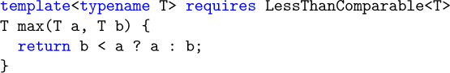]
[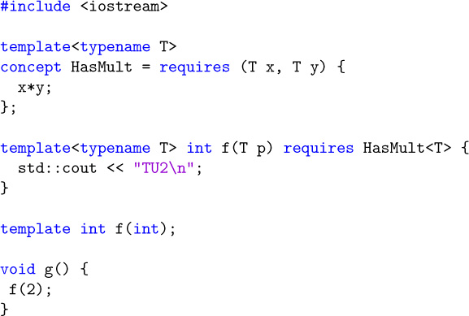]

## Bibliography

This bibliography lists the resources that were mentioned, adopted, or cited in this book. These days, many of the advancements in programming happen in electronic forums. It is therefore not surprising to find, in addition to the more traditional books and articles, quite a few Web sites. We do not claim that our list is close to being comprehensive. However, we do find that the resources are relevant contributions to the topic of C++ templates.

> 本参考书目列出了本书中提及、采用或引用的资源。如今，编程的许多进步都发生在电子论坛上。因此，除了更传统的书籍和文章外，还有相当多的网站也就不足为奇了。我们并不声称我们的清单接近全面。然而，我们确实发现这些资源是对 C++模板主题的相关贡献。

Web sites are typically considerably more volatile than books and articles. The Internet links listed here may not be valid in the future. Therefore, we provide the actual list of links for this book at the following site (and we expect this site to be stable):

> 网站的波动性通常比书籍和文章大得多。此处列出的 Internet 链接将来可能无效。因此，我们在以下网站上提供了这本书的实际链接列表（我们希望这个网站是稳定的）：

`http://www.tmplbook.com`

Before listing the books, articles, and Web sites, we introduce the more interactive kind of resources that are provided by _newsgroups_.

> 在列出书籍、文章和网站之前，我们将介绍*newsgroups*提供的更具交互性的资源。

### Forums

In the first edition of this book, we referred to Usenet groups (a large collection of pre-world-wide-web on-line forums) as a source for discussions about the C++ programming language. Those groups have mostly faded since then but many other online programming communities have arisen, and several of these cater to C++ programmers. We list some of the most popular here:

> 在本书的第一版中，我们将 Usenet 小组（一个前万维网在线论坛的大型集合）作为讨论 C++编程语言的来源。从那时起，这些群体大多已经消失，但许多其他在线编程社区也出现了，其中一些社区是为 C++程序员服务的。我们在这里列出了一些最受欢迎的：

• _Cppreference_ "wiki" (i.e., collectively editable) of reference information about C and C++ (in various languages).

> •*Cppreference*关于 C 和 C++（各种语言）的参考信息的“wiki”（即可集体编辑）。

`http://www.cppreference.com`

• _Stackoverflow_ is a broad developer community that also covers C++ and C++ templates in particular.

> •*Stackoverflow*是一个广泛的开发人员社区，特别涵盖 C++和 C++模板。

`https://stackoverflow.com/questions/tagged/c%2b%2b`

`https://stackoverflow.com/questions/tagged/c%2b%2b%20templates`

• _Quora_ is similar to Stackoverflow, but not limited to technical discussions.

> •*Quora*类似于 Stackoverflow，但不限于技术讨论。

`https://www.quora.com/topic/C++-programming-language`

• The _Standard C++ Foundation_ is a nonprofit organization run by some prominent members of the C++ standardization committee (though the two groups are separate) to support the C++ programming community. It helps fund some aspects of the standardization committee's meetings, as well as CppCon, a major yearly conference about C++ (highly recommended if you enjoyed the material in this book). It also includes a directory of on-line forums (hosted as "Google groups") that cover various C++ topics.

> •标准 C++基金会是一个非营利组织，由 C++标准化委员会的一些知名成员运营（尽管这两个小组是分开的），以支持 C++编程社区。它有助于资助标准化委员会会议的某些方面，以及 CppCon，一个关于 C++的重要年度会议（如果你喜欢这本书中的材料，强烈推荐）。它还包括一个在线论坛目录（以“谷歌小组”的形式托管），涵盖了各种 C++主题。

`https://isocpp.org/forums`

`https://cppcon.org`

• The _Association of C and C++ Users_ (ACCU) is an organization based in the United Kingdom for "anyone interested in developing and improving programming skills." It hosts a yearly programming conference with a particularly strong track about C++.

> •_Association of C and C++Users_（ACCU）是一个总部位于英国的组织，面向“任何有兴趣发展和提高编程技能的人”。它每年都会举办一次编程会议，特别关注 C++。

`https://www.accu.org`

### Books and Web Sites

```
[AbrahamsGurtovoyMeta]

David Abrahams and Aleksey Gurtovoy

_C++ Template Metaprogramming_ -- _Concepts, Tools, and Techniques from Boost and Beyond_

Addison-Wesley, Boston, MA, 2005

[AlexandrescuDesign]

Andrei Alexandrescu

_Modern C++ Design_ -- _Generic Programming and Design Patterns Applied_

Addison-Wesley, Boston, MA, 2001

[AlexandrescuDiscriminatedUnions]

Andrei Alexandrescu

_Discriminated Unions (parts I, II, III)_

C/C++ Users Journal, April/June/August, 2002

[AlexandrescuAdHocVisitor]

Andrei Alexandrescu

_Generic Programming:Typelists and Applications_

Dr. Dobb's Journal, February, 2002

[AusternSTL]

Matthew H. Austern

_Generic Programming and the STL_ -- _Using and Extending the C++ Standard Template Library_

Addison-Wesley, Boston, MA, 1999

[BartonNackman]

John J. Barton and Lee R. Nackman

_Scientific and Engineering C++_ -- _An Introduction with Advanced Techniques and Examples_

Addison-Wesley, Boston, MA, 1994

[BCCL]

Jeremy Siek

_The Boost Concept Check Library_

`http://www.boost.org/libs/concept_check/concept_check.htm`

[Blitz++]

Todd Veldhuizen

_Blitz++: Object-Oriented Scientific Computing_

`http://blitz.sourceforge.net/`

[Boost]

_The Boost Repository for Free, Peer-Reviewed C++ Libraries_

`http://www.boost.org`

[BoostAny]

Kevlin Henney

_Boost Any Library_

`http://www.boost.org/libs/any`

[BoostFusion]

Joel de Guzman, Dan Marsden, and Tobias Schwinger

_The Boost Fusion Library_

`http://boost.org/libs/fusion`

[BoostHana]

Louis Dionne

_The Boost Hana Library for Metaprogramming_

`http://boostorg.github.io/hana`

[BoostIterator]

David Abrahams, Jeremy Siek, Thomas Witt

_Boost Iterator_

`http://www.boost.org/libs/iterator`

[BoostMPL]

Aleksey Gurtovoy and David Abrahams

_Boost MPL_

`http://www.boost.org/libs/mpl`

[BoostOperators]

David Abrahams

_Boost Operators_

`http://www.boost.org/libs/utility/operators.htm`

[BoostTuple]

Jaakko J¨arvi

_The Boost Tuple Library_

`http://boost.org/libs/tuple`

[BoostOptional]

Fernando Luis Cacciola Carballal

_Boost Optional Library_

`http://www.boost.org/libs/optional`

[BoostSmartPtr]

_Smart Pointer Library_

`http://www.boost.org/libs/smart_ptr`

[BoostTypeTraits]

_Type Traits Library_

`http://www.boost.org/libs/type_traits`

[BoostVariant]

Eric Friedman and Itay Maman

_Boost Variant Library_

`http://www.boost.org/libs/variant`

[BrownSIunits]

Walter E. Brown

_Introduction to the SI Library of Unit-Based Computation_

`http://lss.fnal.gov/archive/1998/conf/Conf-98-328.pdf`

[C++98]

ISO

_Information Technology---Programming Languages---C++_

ISO/IEC, Document Number 14882-1998, 1998

[C++03]

ISO

_Information Technology---Programming Languages---C++_

ISO/IEC, Document Number 14882-2003, 2003

[C++11]

ISO

_Information Technology---Programming Languages---C++_

ISO/IEC, Document Number 14882-2011, 2011

[C++14]

ISO

_Information Technology---Programming Languages---C++_

ISO/IEC, Document Number 14882-2014, 2014

[C++17]

ISO

_Information Technology---Programming Languages---C++_

ISO/IEC, Document Number 14882-2017, 2017

[CacciolaKrzemienski2013]

Fernando Luis Cacciola Carballal and Andrzej Krzemieński

_A Proposal to Add a Utility Class to Represent Optional Objects_

`http://wg21.link/n3527`

[CargillExceptionSafety]

Tom Cargill

_Exception Handling: A False Sense of Security_

C++ Report, November-December 1994

[CoplienCRTP]

James O. Coplien

_Curiously Recurring Template Patterns_

C++ Report, February 1995

[CoreIssue1395]

_C++ Standard Core Issue 1395_

`http://wg21.link/cwg1395`

[CzarneckiEiseneckerGenProg]

Krzysztof Czarnecki and Ulrich W. Eisenecker

_Generative Programming_ -- _Methods, Tools, and Applications_

Addison-Wesley, Boston, MA, 2000

[DesignPatternsGoF]

Erich Gamma, Richard Helm, Ralph Johnson, and John Vlissides

_Design Patterns_ -- _Elements of Reusable Object-Oriented Software_

Addison-Wesley, Boston, MA, 1995

[DosReisMarcusAliasTemplates]

Gabrial Dos Reis and Mat Marcus

_Proposal to Add Template Aliases to C++_

`http://wg21.link/n1449`

[EDG]

Edison Design Group

_Compiler Front Ends for the OEM Market_

`http://www.edg.com`

[EiseneckerBlinnCzarnecki]

Ulrich W. Eisenecker, Frank Blinn, and Krzysztof Czarnecki

_Mixin-Based Programming in C++_

Dr. Dobbs Journal, January, 2001

[EllisStroustrupARM]

Margaret A. Ellis and Bjarne Stroustrup

_The Annotated C++ Reference Manual (ARM)_

Addison-Wesley, Boston, MA, 1990

[GregorJarviPowellVariadicTemplates]

Douglas Gregor, Jaakko J¨arvi, and Gary Powell

_Variadic Templates_

`http://wg21.link/n2080`

[HenneyValuedConversions]

Kevlin Henney

_Valued Conversions_

C++ Report 12(7), July-August 2000

[OverloadingProperties]

Jaakko J¨arvi, Jeremiah Willcock, Howard Hinnant, and Andrew Lumsdaine

_Function Overloading Based on Arbitrary Properties of Types_

C/C++ Users Journal 12 (6), June, 2003

[ItaniumABI]

_Itanium C++ ABI_

`http://itanium-cxx-abi.github.io/cxx-abi/`

[JosuttisLaunder]

Nicolai Josuttis

_On launder()_

`https://wg21.link/p0532r0`

[JosuttisStdLib]

Nicolai M. Josuttis

_The C++ Standard Library_ -- _A Tutorial and Reference (2nd edition)_

Addison-Wesley, Boston, MA, 2012

[KarlssonSafeBool]

Bjorn Karlsson

_The Safe Bool Idiom_

C++ Source, July, 2004

[KoenigMooAcc]

Andrew Koenig and Barbara E. Moo

_Accelerated C++_ -- _Practical Programming by Example_

Addison-Wesley, Boston, MA, 2000

[LambdaLib]

Jaakko J¨arvi and Gary Powell

_LL, The Lambda Library_

`http://www.boost.org/libs/lambda`

[LibIssue181]

_C++ Library Issue 181_

`http://wg21.link/lwg181`

[LippmanObjMod]

Stanley B. Lippman

_Inside the C++ Object Model_

Addison-Wesley, Boston, MA, 1996

[MeyersCounting]

Scott Meyers

_Counting Objects In C++_

C/C++ Users Journal, April 1998

[MeyersEffective]

Scott Meyers

_Effective C++_ -- _50 Specific Ways to Improve Your Programs and Design (2nd edition)_

Addison-Wesley, Boston, MA, 1998

[MeyersMoreEffective]

Scott Meyers

_More Effective C++_ -- _35 New Ways to Improve Your Programs and Designs_

Addison-Wesley, Boston, MA, 1996

[MoonFlavors]

David A. Moon

_Object-oriented programming with Flavors_

Conference proceedings on Object-oriented programming systems, languages and applications, 1986

[MTL]

Andrew Lumsdaine and Jeremy Siek

_MTL, The Matrix Template Library_

`http://www.osl.iu.edu/research/mtl`

[MusserWangDynaVeri]

D. R. Musser and C. Wang

_Dynamic Verification of C++ Generic Algorithms_

IEEE Transactions on Software Engineering, Vol. 23, No. 5, May 1997

[MyersTraits]

Nathan C. Myers

_Traits: A New and Useful Template Technique_

`http://www.cantrip.org/traits.html`

[NewMat]

Robert Davies

_NewMat10, A Matrix Library in C++_

`http://www.robertnz.net/nm_intro.htm`

[NewShorterOED]

Leslie Brown (Ed.)

_The New Shorter Oxford English Dictionary (4th edition)_

Oxford University Press, Oxford, 1993

[POOMA]

_POOMA: A High-Performance C++ Toolkit for Parallel Scientific Computation_

`http://www.nongnu.org/freepooma/`

[SmaragdakisBatoryMixins]

Yannis Smaragdakis and Don S. Batory

_Mixin-Based Programming in C++_

Proceedings of the Second International Symposium on Generative and Component-Based Software

Engineering, October, 2000

[SpicerSFINAE]

John Spicer

_Solving the SFINAE Problem for Expressions_

`http://wg21.link/n2634`

[StepanovLeeSTL]

Alexander Stepanov and Meng Lee

_The Standard Template Library_ -- _HP Laboratories Technical Report 95-11(R.1)_

November 14, 1995

[StepanovNotes]

Alexander Stepanov

_Notes on Programming_

`http://stepanovpapers.com/notes.pdf`

[StroustrupC++PL]

Bjarne Stroustrup

_The C++ Programming Language_ (Special Edition)

Addison-Wesley, Boston, MA, 2000

[StroustrupDnE]

Bjarne Stroustrup

_The Design and Evolution of C++_

Addison-Wesley, Boston, MA, 1994

[StroustrupGlossary]

Bjarne Stroustrup

_Bjarne Stroustrup's C++ Glossary_

`http://www.stroustrup.com/glossary.html`

[SutterExceptional]

Herb Sutter

_Exceptional C++_ -- _47 Engineering Puzzles, Programming Problems, and Solutions_

Addison-Wesley, Boston, MA, 2000

[SutterMoreExceptional]

Herb Sutter

_More Exceptional C++_ -- _40 New Engineering Puzzles, Programming Problems, and Solutions_

Addison-Wesley, Boston, MA, 2001

[UnruhPrimeOrig]

Erwin Unruh

_Original Metaprogram for Prime Number Computation_

`http://www.erwin-unruh.de/primorig.html`

[VandevoordeJosuttisTemplates1st]

David Vandevoorde and Nicolai M. Josuttis

_C++ Templates: The Complete Guide_

Addison-Wesley, Boston, MA, 2003

[VandevoordeSolutions]

David Vandevoorde

_C++ Solutions_

Addison-Wesley, Boston, MA, 1998

[VeldhuizenMeta95]

Todd Veldhuizen

_Using C++ Template Metaprograms_

C++ Report, May 1995

```

## Glossary

This glossary is a compilation of the most important technical terms that are used in this book. See [StroustrupGlossary] for a comprehensive, general glossary of terms used by C++ programmers.

> 本术语表汇集了本书中使用的最重要的技术术语。请参阅[StroustrupGlossary]，了解 C++程序员使用的全面通用术语表。

**abstract class**

A class for which the creation of concrete objects (_instances_) is impossible. Abstract classes can be used to collect common properties of different classes in a single type or to define a polymorphic interface. Because abstract classes are used as base classes, the acronym _ABC_ is sometimes used for _abstract base class_.

> 无法创建具体对象（_instances_）的类。抽象类可以用于收集单个类型中不同类的公共属性，也可以用于定义多态接口。因为抽象类被用作基类，所以缩写词*ABC*有时被用于\_abstract 基类。

**ADL**

An acronym for _argument-dependent lookup_. ADL is a process that looks for a name of a function (or operator) in namespaces and classes that are in some way associated with the arguments of the function call in which that function (or operator name) appears. For historical reasons, it is sometimes called _extended Koenig lookup_ or just _Koenig lookup_ (the latter is also used for _ADL_ applied to operators only).

> *argument-dependent lookup*的缩写。ADL 是一个在命名空间和类中查找函数（或运算符）名称的过程，这些命名空间和类在某种程度上与该函数（或操作符名称）出现的函数调用的参数相关联。由于历史原因，它有时被称为*extended Koenig lookup*或仅*Koenig lookup*（后者也用于仅应用于运算符的*ADL*）。

**alias template**

A construct that represents a family of type aliases. It specifies a pattern from which actual type aliases can be generated by substituting the template parameters by specific entities. An alias template can be a class member.

> 表示类型别名族的构造。它指定了一种模式，通过用特定实体替换模板参数，可以从中生成实际的类型别名。别名模板可以是类成员。

**angle bracket hack**

A C++ feature that requires a compiler to accept two consecutive `>` characters as two closing _angle brackets_. For example, the angle bracket hack causes `vector<list<int>>` to be treated identically to `vector<list<int> >`. It's called a (lexical) _hack_ because it doesn't fit well in the C++ formal specification (the _grammar_, in particular) nor in the general architecture of typical compilers. Another similar hack deals with accidental digraph formation (see _digraph_).

> 一种 C++功能，要求编译器接受两个连续的“>”字符作为两个右括号。例如，尖括号破解导致“vector<list<int>>”与“vector<list<int>>”被同等对待。它之所以被称为（词法）_hack_，是因为它既不适合 C++形式化规范（特别是*grammar*），也不适合典型编译器的通用体系结构。另一个类似的破解处理意外的有向图形成（参见*digh*）。

**angle brackets**

The characters `<` and `>` when they are used as delimiters rather than as less-than and greater-than operators.

> 字符“<”和“>”用作分隔符时，而不是用作小于和大于运算符。

**ANSI**

An acronym for _American National Standard Institute_, a private, nonprofit organization that coordinates efforts to produce standard specifications of all kinds. See INCITS.

> 美国国家标准研究所的缩写，这是一个私人非营利组织，负责协调制定各种标准规范的工作。参见 INCITS。

**argument**

A value (in a broad sense) that substitutes a _parameter_ of a programmatic entity. For example, in a function call `abs(-3)`, the argument is `-3`. In some programming communities, _arguments_ are called _actual parameters_ (whereas _parameters_ are called _formal parameters_). See also _template argument_.

> 一个值（广义上），用于替换程序实体的*parameter*。例如，在函数调用“abs（-3）”中，参数为“-3”。在一些编程社区中，*arguments*被称为*actual parameters*（而*parameters*被称为*formal parameters*）。另请参见模板论证。

**argument-dependent lookup**

See _ADL_.

**class**

The description of a category of objects. The class defines a set of characteristics for any object of that type. These include its data (_attributes_, _data members_) as well as its operations (_methods_, _member functions_). In C++, classes are structures with members that can also be functions and are subject to access limitations. They are declared using the keywords `class` or `struct`.

> 一类对象的描述。该类为该类型的任何对象定义了一组特征。其中包括它的数据（_attributes_，_data members_）以及它的操作（_methods_，_member functions_）。在 C++中，类是具有成员的结构，这些成员也可以是函数，并且受访问限制。它们是使用关键字“class”或“struct”声明的。

**class template**

A construct that represents a family of classes. It specifies a pattern from which actual classes can be generated by substituting the template parameters by specific entities. Class templates are sometimes called _parameterized classes_.

> 表示类族的构造。它指定了一种模式，通过用特定实体替换模板参数，可以从中生成实际的类。类模板有时被称为*参数化类*。

**class type**

A C++ type declared with `class`, `struct`, or `union`.

**collection class**

A class that is used to manage a group of objects. In C++, collection classes are also called _containers_.

> 用于管理一组对象的类。在 C++中，集合类也称为*containers*。

**compiler**

A program or library component that translates the source code in a translation unit into object code (machine code with symbolic annotations that allow a linker to resolve references across translation units).

> 一种程序或库组件，用于将翻译单元中的源代码翻译成目标代码（带有符号注释的机器代码，允许链接器解析跨翻译单元的引用）。

**complete type**

Any type that is not _incomplete_: a defined class, an array of complete elements and known size, an enumeration type with defined underlying type, and any fundamental data type except `void` (option-ally with `const` and/or `volatile`).

> 任何非*incomplete*的类型：定义的类、完整元素和已知大小的数组、具有定义的底层类型的枚举类型，以及除“void”（带有“const”和/或“volatile”的选项 ally）之外的任何基本数据类型。

**concept**

A named set of constraints that can be applied to one or more template parameters. See [Appendix [E]].

> 可以应用于一个或多个模板参数的一组命名约束。见[附录[E]]。

**constant-expression**

An expression whose value can be computed at compile time by the compiler. We sometimes call this a _true constant_ to avoid confusion with _constant expression_ (without hyphen). The latter includes expressions that are constant but cannot always be computed at compile time by the compiler.

> 一种表达式，其值可以在编译时由编译器计算。我们有时将其称为*true constant*，以避免与*constant expression*（不带连字符）混淆。后者包括常量表达式，但编译器不能总是在编译时计算这些表达式。

**const** member function

A member function that can be called for constant and temporary objects because it does not normally modify members of the `*this` object.

> 一种成员函数，可以为常量和临时对象调用，因为它通常不修改“\*this”对象的成员。

**container**

See _collection class_.

**conversion function**

A special member function that defines how an object can implicitly (or explicitly) be converted to an object of another type. It is declared using the form `operator` _type_`()`.

> 一种特殊的成员函数，定义如何将对象隐式（或显式）转换为另一种类型的对象。它是使用`operator`_type_`（）`形式声明的。

**conversion operator**

A synonym for _conversion function_. The latter is the standard term, but the former is also commonly used.

> \_conversion 函数的同义词。后者是标准术语，但前者也是常用术语。

**CPP file**

A file in which _definitions_ of variables and noninline functions are located. Most of the executable (as opposed to declarative) code of a program is normally placed in CPP files. They are named _CPP_ files because they are usually named with the suffix `.cpp`. But for historical reasons the suffix also might be `.C`, `.c`, `.cc`, or `.cxx`. See also _header file_ and _translation unit_.

> 变量和非线性函数的定义所在的文件。程序的大多数可执行代码（与声明性代码相反）通常放在 CPP 文件中。它们被命名为*CPP*文件，因为它们通常以后缀“.CPP”命名。但由于历史原因，后缀也可能是“”。C`、`.C`、`cc`或`.cxx`。另请参见*header 文件*和*translation 单元*。

**CRTP**

An acronym for _curiously recurring template pattern_. This refers to a code pattern where a class _X_ derives from a base class that has _X_ as a template argument.

> 循环模板模式的缩写。这指的是一种代码模式，其中类*X*派生自具有*X*作为模板参数的基类。

**curiously recurring template pattern**

See _CRTP_.

**decay**

The implicit conversion of an array or a function to a pointer. For example, the string literal "Hello"`has type`char const[6]`, but in many C++ contexts, it is implicitly converted to a pointer of type `char const\*` (which points to the first character of the string).

> 数组或函数到指针的隐式转换。例如，字符串文字“Hello”`的类型为“char const[6]”，但在许多 C++上下文中，它被隐式转换为“char const\*”类型的指针（指向字符串的第一个字符）。

**declaration**

A C++ construct that introduces or reintroduces a name into a C++ scope. See also _definition_.

> 一种 C++构造，将名称引入或重新引入 C++作用域。另请参见定义。

**deduction**

The process that implicitly determines template arguments from the context in which templates are used. The complete term is _template argument deduction_.

> 从使用模板的上下文中隐式确定模板参数的过程。完整的术语是*模板自变量推导*。

**definition**

A _declaration_ that makes the details of the declared entity known or, in the case of variables, that forces storage space to be reserved for the declared entity. For class types and function definitions, this amounts to declarations that include a brace-enclosed body. For external variable declarations, this means either a declaration with no `extern` keyword or a declaration with an initializer.

> 一个*declaration*，它使已声明实体的详细信息为已知，或者在变量的情况下，它强制为已声明实体保留存储空间。对于类类型和函数定义，这相当于包含大括号括体的声明。对于外部变量声明，这意味着要么是不带“extern”关键字的声明，要么是带初始值设定项的声明。

**dependent base class**

A base class that depends on a template parameter. Special care must be taken to access members of dependent base classes. See also _two-phase lookup_.

> 依赖于模板参数的基类。访问依赖基类的成员时必须特别小心。另请参见*two-phase lookup*。

**dependent name**

A name the meaning of which depends on a template parameter. For example, `A<T>::x` is a dependent name when `A` or `T` is a template parameter. The name of a function in a function call is also dependent if any of the arguments in the call has a type that depends on a template parameter. For example, `f` in `f((T*)0)` is dependent if `T` is a template parameter. The name of a template parameter is not considered dependent, however. See also _two-phase lookup_.

> 一个名称，其含义取决于模板参数。例如，当“A”或“T”是模板参数时，“A ＜ T ＞：：x”是从属名称。如果函数调用中的任何参数的类型依赖于模板参数，则函数调用中函数的名称也是依赖的。例如，如果“T”是模板参数，则“f（（T\*）0）”中的“f”是依赖的。但是，模板参数的名称不被视为依赖参数。另请参见*two-phase lookup*。

**digraph**

A combination of two consecutive characters that are equivalent to another single character in C++ code. The purpose of digraphs is to allow the input of C++ source code with keyboards that lack certain characters. Although it is used relatively rarely, the digraph `<:` is sometimes accidentally formed when a left _angle bracket_ is followed by a scope resolution operator (`::`) without the required intervening _whitespace_. C++11 introduced a lexical hack to disable digraph interpretation under those circumstances.

> 两个连续字符的组合，相当于 C++代码中的另一个单个字符。有向图的目的是允许用缺少某些字符的键盘输入 C++源代码。尽管它的使用相对较少，但当左括号后面跟着范围解析运算符（“：：”）而没有所需的插入*whitespace*时，有时会意外形成有向图“<：”。C++11 引入了一个词法破解，在这种情况下禁用有向图解释。

**EBCO**

An acronym for _empty base class optimization_. An optimization performed by most modern compilers whereby an "empty" base class subobject does not occupy any storage.

> empty 基类优化的首字母缩写。由大多数现代编译器执行的一种优化，即“空”基类子对象不占用任何存储空间。

**empty base class optimization**

See _EBCO_.

**explicit instantiation directive**

A C++ construct whose sole purpose is to create a _point of instantiation_ (POI).

> 一种 C++构造，其唯一目的是创建一个\_实例化点（POI）。

**explicit specialization**

A construct that declares or defines an alternative definition for a substituted template. The original (generic) template is called the _primary template_. If the alternative definition still depends on one or more template parameters, it is called a _partial specialization_. Otherwise, it is a _full specialization_.

> 声明或定义替换模板的替代定义的构造。原始（通用）模板称为*primary template*。如果替代定义仍然依赖于一个或多个模板参数，则称为*partial specialization*。否则，它就是一个*full specialization*。

**expression template**

A class template used to represent a part of an expression. The template itself represents a particular kind of operation. The template parameters stand for the kinds of operands to which the operation applies.

> 用于表示表达式的一部分的类模板。模板本身表示一种特定类型的操作。模板参数代表运算所应用的操作数类型。

**forwarding reference**

One of two terms for rvalue references of the form `T&&` where `T` is a deducible template parameter. Special rules that differ from ordinary rvalue references apply (see Section [6.1] on page [91]). The term was introduced by C++17 as replacement for _universal reference_, because the primary use of such a reference is to forward objects. However, note that it does not automatically forward. That is, the term does not describe what it _is_ but for what it is typically used for.

> 形式为“T&&”的右值引用的两个术语之一，其中“T”是可推导的模板参数。适用与普通右值参考不同的特殊规则（见第[91]页第[6.1]节）。这个术语是由 C++17 引入的，作为*universal reference*的替代，因为这种引用的主要用途是转发对象。但是，请注意，它不会自动转发。也就是说，这个术语不是描述它*is*，而是描述它通常用于什么。

**friend name injection**

The process that makes a function name visible when its only declaration is a friend declaration.

> 当函数名称的唯一声明是友元声明时，使其可见的过程。

**full specialization**

See _explicit specialization_.

**function object**

An object that can be called using _function call syntax_. In C++, these are pointers to functions, classes with an overloaded `operator()` (see _functor_), and classes with a conversion function yielding a pointer to function or reference to function.

> 可以使用*function 调用 syntax*调用的对象。在 C++中，这些是指向函数的指针，具有重载“operator（）”（请参见*functor*）的类，以及具有转换函数的类，该转换函数产生指向函数的指向或指向函数的引用。

**function template**

A construct that represents a family of functions. It specifies a pattern from which actual functions can be generated by substituting the template parameters by specific entities. Note that a function template is a template and not a function. Function templates are sometimes called _parameterized functions_.

> 表示函数族的构造。它指定了一种模式，通过用特定实体替换模板参数，可以从中生成实际函数。请注意，函数模板是模板，而不是函数。函数模板有时被称为参数化函数。

**functor**

An object of a class type with an overloaded `operator()`, which can be called using _function call syntax_. This includes the closure type of a lambda expression.

> 具有重载“operator（）”的类类型的对象，可以使用*function call syntax*调用该对象。这包括 lambda 表达式的闭包类型。

**glvalue**

A category of expressions that produces a location for a stored value (generalized localizable value). A glvalue can be an _lvalue_ or an _xvalue_. See _value category_ and Section [B.2] on page [674].

> 为存储值（广义可本地化值）生成位置的表达式类别。glvalue 可以是*lvalue*或*xvalue*。参见第[674]页的*值类别*和第[B.2]节。

**header file**

A file meant to become part of a translation unit through a `#include` directive. Such files often contain _declarations_ of variables and functions that are referred to from more than one translation unit, as well as _definitions_ of types, inline functions, templates, constants, and macros. They are usually named with a suffix like `.hpp`, `.h`, `.H`, `.hh`, or `.hxx`. They are also called _include files_. See also _CPP file_ and _translation unit_.

> 通过“#include”指令成为翻译单元一部分的文件。此类文件通常包含从多个翻译单元引用的变量和函数的*declaration*，以及类型、内联函数、模板、常量和宏的*definition*。它们通常以后缀命名，如“.hpp”、“.h”、“。H`、`.hh`或`.hxx`。它们也称为*include files*。另请参见\_CPP 文件和翻译单位。

**INCITS**

An acronym for _InterNational Committee for Information Technology Standards_, which is a U.S. standards development organization (formerly known a X3) accredited by ANSI. A subcommittee called J16 is a driving force behind the standardization of C++. It cooperates closely with the International Organization for Standardization (ISO).

> *InterNational Committee for Information Technology Standards*的首字母缩写，它是经 ANSI 认证的美国标准开发组织（以前称为 X3）。一个名为 J16 的小组委员会是 C++标准化背后的推动力。它与国际标准化组织（ISO）密切合作。

**include file**

See _header file_.

**incomplete type**

A class that is declared but not defined, an array of incomplete element type or of unknown size, an enumeration type without the underlying type defined, or `void` (optionally with `const` and/or `volatile`).

> 已声明但未定义的类、元素类型不完整或大小未知的数组、未定义底层类型的枚举类型或“void”（可选带有“const”和/或“volatile”）。

**indirect call**

A function call for which the called function is not known until the call actually occurs (at run time).

> 一种函数调用，直到调用实际发生（在运行时），才知道调用的函数。

**initializer**

A construct that specifies how to initialize an object. For example, in `std::complex<float> z1 = 1.0, z2(0.0, 1.0);` the initializers are `= 1.0` and `(0.0, 1.0)`.

> 指定如何初始化对象的构造。例如，在“std:：complex ＜ float ＞ z1=1.0，z2（0.0，1.0）；”初始化器是“＝ 1.0”和“（0.0，1.0）”。

**initializer list**

A comma-separated list of expressions enclosed in braces used to initialize objects and references. Initializer lists are commonly used to initialize variables but also, for example, to initialize members and base classes in constructor definitions. This initialization may happen directly or via an intermediate `std::initializer_list` object.

> 逗号分隔的表达式列表，用大括号括起来，用于初始化对象和引用。初始化器列表通常用于初始化变量，但也用于初始化构造函数定义中的成员和基类。此初始化可以直接进行，也可以通过中间的“std:：initializer_list”对象进行。

**injected class name**

The name of a class as visible in its own definition scope. For class templates, the name of the template is treated within the scope of the template as a class name if the name is not followed by a template argument list.

> 在其自己的定义范围中可见的类的名称。对于类模板，如果名称后面没有模板参数列表，则模板的名称在模板的作用域内被视为类名。

**instance**

The term _instance_ has two meanings in C++ programming: The meaning that is taken from the object-oriented terminology is _an instance of a class_: an object that is the realization of a class. For example, in C++, `std::cout` is an instance of the class `std::ostream`. The other meaning (and the one that is almost always intended in this book) is _a template instance_: a class, a function, or a member function obtained by substituting all the template parameters by specific values. In this sense, an _instance_ is also called a _specialization_, although the latter term is often mistaken for _explicit specialization_.

> 术语*instance*在 C++编程中有两个含义：取自面向对象术语的含义是类的实例：类的实现对象。例如，在 C++中，“std：：cout”是类“std:：ostream”的一个实例。另一个含义（也是本书中几乎一直想要的含义）是*a 模板实例：通过用特定值替换所有模板参数而获得的类、函数或成员函数。从这个意义上讲，\_instance*也被称为*specialization*，尽管后者经常被误认为是*explicit specialization*。

**instantiation**

The replacement of the template parameters in a template definition to create a concrete entity (function, class, variable, or alias). If only the declaration of a template but not its definition is substituted, the term _partial template instantiation_ is sometimes used. See also _substitution_. The alternative sense of creating an _instance_ (object) of a class is not used in this book (see _instance_).

> 替换模板定义中的模板参数以创建具体实体（函数、类、变量或别名）。如果只替换模板的声明而不替换其定义，则有时会使用术语*部分模板实例化*。另请参见替换。创建类的*instance*（对象）的另一种意义在本书中没有使用（请参见\_instance_1）。

**ISO**

Worldwide acronym for International Organization for Standardization. An ISO workgroup called WG21 is a driving force behind the efforts to standardize and develop C++.

> 国际标准化组织的全球首字母缩写。一个名为 WG21 的 ISO 工作组是标准化和开发 C++的幕后推手。

**iterator**

An object that knows how to traverse a sequence of elements. Often, these elements belong to a collection (see _collection class_).

> 一个知道如何遍历元素序列的对象。通常，这些元素属于一个集合（请参见*collection class*）。

**linkable entity**

Any of the following: a function or member function, a global variable or a static data member, including any such things generated from a template, as visible to the linker.

> 以下任一项：函数或成员函数、全局变量或静态数据成员，包括从模板生成的链接器可见的任何此类内容。

**linker**

A program or operating system service that links together compiled translation units and resolves references to linkable entities across those translation units.

> 一种程序或操作系统服务，它将已编译的翻译单元链接在一起，并解析跨这些翻译单元对可链接实体的引用。

**lvalue**

A category of expressions that produces a location for a stored value that is not assumed to be movable (i.e., _glvalues_ that are no _xvalues_). Typical examples are expressions denoting named objects (variables or members) and string literals. See _value category_ and Section [B.1] on page [673].

> 一类表达式，为存储的值生成一个位置，该值被认为是不可移动的（即，不为*xvalues*的*glvalues*）。典型的例子是表示命名对象（变量或成员）和字符串文字的表达式。请参见第[673]页的值类别和章节[B.1]。

**member class template**

A construct that represents a family of member classes. It is a class template declared inside another class or class template definition. It has its own set of template parameters (unlike a member class of a class template).

> 表示成员类族的构造。它是在另一个类或类模板定义中声明的类模板。它有自己的一组模板参数（与类模板的成员类不同）。

**member function template**

A construct that represents a family of member functions. It has its own set of template parameters (unlike a member function of a class template). It is very similar to a function template, but when all the template parameters are substituted, the result is a member function (instead of an ordinary function). Member function templates cannot be virtual.

> 表示成员函数族的构造。它有自己的一组模板参数（与类模板的成员函数不同）。它与函数模板非常相似，但当所有模板参数都被替换时，结果是一个成员函数（而不是一个普通函数）。成员函数模板不能是虚拟的。

**member template**

A _member class template_, _member function template_, or _static data member template_.

> 成员类 template*、成员函数 template*或静态数据成员 template\_。

**Modern C++**

The phrase used in this book to refer to the language as standardized in C++11 or later (i.e., C++11, C++14, or C++17).

> 本书中使用的短语，指的是在 C++11 或更高版本（即 C++11、C++14 或 C++17）中标准化的语言。

**nondependent name**

A name that is not dependent on a template parameter. See _dependent name_ and _two-phase lookup_.

> 不依赖于模板参数的名称。请参见*dependent name*和*twophase lookup*。

**ODR**

An acronym for _one-definition rule_. This rule places some restrictions on the _definitions_ that appear in a C++ program. See Section [10.4] on page [154] and [Appendix [A]] for details.

> 定义规则的缩写。这个规则对 C++程序中出现的*definitions*进行了一些限制。详见第[154]页第[10.4]节和[附录[A]]。

**one-definition rule**

See _ODR_.

**overload resolution**

The process that selects which function to call when several candidates (usually all having the same name) exist. See also [Appendix [C]].

> 当存在多个候选者（通常都有相同的名称）时，选择调用哪个函数的过程。另见[附录[C]]。

**parameter**

A placeholder entity that is meant to be substituted with an actual "value" (an _argument_) at some point. For macro parameters and template parameters, the _substitution_ occurs at compile time. For function call parameters, it happens at run time. In some programming communities, _parameters_ are called _formal parameters_ (whereas _arguments_ are called _actual parameters_). See also _argument_ and _template argument_.

> 一个占位符实体，它意味着在某个时刻被实际的“值”（_argument_）取代。对于宏参数和模板参数，*substitution*发生在编译时。对于函数调用参数，它发生在运行时。在一些编程社区中，*parameters 被称为\_formal parameters（而\_arguments*被称为*actual parameters）。另请参见\_argument*和*template argument*。

**parameterized class**

A class template or a class nested in a class template. Both are _parameterized_ because they do not correspond to a unique class until the template arguments have been specified.

> 类模板或嵌套在类模板中的类。两者都是*parameterized*，因为在指定模板参数之前，它们不会对应于唯一的类。

**parameterized function**

A function or member function template or a member function of a class template. All are _parameterized_ because they do not correspond to a unique function (or member function) until the template arguments have been specified.

> 函数或成员函数模板或类模板的成员函数。所有参数都是*parameterized*，因为在指定模板参数之前，它们不对应于唯一函数（或成员函数）。

**partial specialization**

A construct that declares or defines an alternative definition for certain _substitutions_ of a template. The original (generic) template is called the _primary template_. The alternative definition still depends on template parameters. Currently, this construct exists only for class templates. See also _explicit specialization_.

> 一种构造，用于声明或定义模板的某些替换的替代定义。原始（通用）模板称为*primary template*。替代定义仍然取决于模板参数。目前，此构造仅适用于类模板。另请参见*explicit specialization*。

**POD**

An acronym for "plain old data (type)." POD types are types that can be defined without certain C++ features (like virtual member functions, access keywords, and so forth). For example, every ordinary C `struct` is a POD.

> “纯旧数据（类型）”的首字母缩写。POD 类型是可以在没有某些 C++功能（如虚拟成员函数、访问关键字等）的情况下定义的类型。例如，每个普通的 C“结构体”都是一个 POD。

**POI**

An acronym for _point of instantiation_. A POI is a location in the source code where a template (or a member of a template) is conceptually expanded by substituting template parameters with template arguments. In practice, this expansion does not need to occur at every POI. See also _explicit instantiation directive_.

> 实例化点的缩写。POI 是源代码中的一个位置，通过用模板参数替换模板参数，可以在概念上扩展模板（或模板的成员）。在实践中，这种扩展不需要发生在每个 POI。另请参见*explicit instantiation directive*。

**point of instantiation**

See _POI_.

**policy class**

A class or class template the members of which describe configurable behavior for a generic component. Policies are normally passed as template arguments. For example, a sorting template may have an ordering policy. _Policy classes_ are also called _policy templates_ or just _policies_. See also _traits template_.

> 类或类模板，其成员描述通用组件的可配置行为。策略通常作为模板参数传递。例如，排序模板可能具有排序策略*策略类也称为\_Policy templates*或仅称为*policies*。另请参见*traits template*。

**polymorphism**

The ability of an operation (which is identified by its name) to apply to objects of different kinds. In C++, the traditional object-oriented concept of polymorphism (also called _run-time_ or _dynamic_ polymorphism) is achieved through virtual functions that are overridden in derived classes. In addition, C++ templates enable _static_ polymorphism.

> 操作（由其名称标识）应用于不同类型对象的能力。在 C++中，多态性的传统面向对象概念（也称为*run-time*或\_dynamic_polymorphism）是通过在派生类中重写的虚拟函数来实现的。此外，C++模板还支持静态多态性。

**precompiled header**

A processed form of source code that can quickly be loaded by the compiler. The source code underlying a precompiled header must be the first part of a _translation unit_ (i.e., it cannot start somewhere in the middle of a translation unit). Often, a precompiled header corresponds to a number of header files. Using precompiled headers can substantially reduce the time needed to build a large application written in C++.

> 一种经过处理的源代码形式，可以由编译器快速加载。预编译头的源代码必须是\_translation 单元的第一部分（即，它不能从翻译单元中间的某个地方开始）。通常，一个预编译的头对应于多个头文件。使用预编译的头可以大大减少构建用 C++编写的大型应用程序所需的时间。

**primary template**

A template that is not a _partial specialization_.

**prvalue**

A category of expressions that perform initializations. Prvalues can be assumed to designate pure mathematical value such as `1` or `true` and temporaries (especially values returned by value). Any _rvalue_ before C++11 is a _prvalue_ in C++11. See _value category_ and Section [B.2] on page [674].

> 执行初始化的一类表达式。可以假设 Prvalues 指定纯数学值，如“1”或“true”和临时值（尤其是由 value 返回的值）。C++11 之前的任何*rvalue*都是 C++11 中的*prervalue*。参见第[674]页的*值类别*和第[B.2]节。

**qualified name**

A name containing a scope qualifier (`::`).

**reference counting**

A resource management strategy that keeps count of how many entities are referring to a particular resource. When the count drops to zero, the resource can be disposed of.

> 一种资源管理策略，用于统计有多少实体引用特定资源。当计数降至零时，可以处置该资源。

**rvalue**

A category of expressions that are not _lvalues_. An rvalue can be a _prvalue_ (such as a temporary) or an _xvalue_ (e.g., an _lvalue_ marked with `std::move()`). What was called a _rvalue_ before C++11 is called a _prvalue_ in C++11. See _value category_ and Section [B.2] on page [674].

> 一类不是*lvalues*的表达式。右值可以是*prervalue*（例如临时值）或*xvalue*（例如标记有“std:：move（）”的*lvalue*）。在 C++11 之前被称为*rvalue*的东西在 C++11 中被称为*prervalue*。参见第[674]页的*值类别*和第[B.2]节。

**SFINAE**

An acronym for _substitution failure is not an error_. A mechanism that silently discards templates instead of triggering compilation errors when attempting to substitute template arguments in invalid ways. Other templates in an overload set then get a chance to be selected if their substitution is successful.

> 替换失败的缩写词不是错误。一种机制，当试图以无效方式替换模板参数时，它会自动丢弃模板，而不是触发编译错误。如果替换成功，重载集中的其他模板将有机会被选中。

**source file**

A _header file_ or a _CPP file_.

**specialization**

The result of substituting template parameters with actual values. A specialization may be created by an _instantiation_ or by an _explicit specialization_. This term is sometimes mistakenly equated with _explicit specialization_. See also _instance_.

> 用实际值替换模板参数的结果。专业化可以由*instantiation*或*explicit specialization*创建。这个术语有时被错误地等同于*explicit specialization*。另请参见实例（_instance_）。

**static data member template**

A variable template that is a member of a class or class template.

**substitution**

The process of replacing template parameters in templated entities by actual types, values, or templates. The extent of the substitution depends on the context. During overload resolution, for example, only the minimum amount of substitution to establish the type of a candidate function is performed, and if that substitution leads to invalid constructs, the _SFINAE_ rules apply. See also _instantiation_.

> 用实际类型、值或模板替换模板化实体中的模板参数的过程。替换的程度取决于上下文。例如，在重载解析过程中，只执行建立候选函数类型的最小替换量，如果该替换导致无效构造，则应用*SFINAE*规则。另请参见实例化。

**template**

A construct that represents a family of types, functions, member functions, or variables. It specifies a pattern from which actual types, functions, member functions, or variables can be generated by substituting the template parameters by specific entities. In this book, the term does not include functions, classes, static data members, and type aliases that are parameterized only by virtue of being members of a class template. See _alias template_, _variable template_, _class template_, _parameterized class_, _function template_, and _parameterized function_.

> 表示类型、函数、成员函数或变量族的构造。它指定了一种模式，通过用特定实体替换模板参数，可以从中生成实际类型、函数、成员函数或变量。在本书中，该术语不包括函数、类、静态数据成员和类型别名，这些仅通过作为类模板的成员而参数化。请参见*alias template*、_variable template_、_class template_、_parameterized class_、*function template*和*parameterated function*。

**template argument**

The "value" substituted for a _template parameter_. This value is usually a type, although certain constant values and templates can be valid template arguments too. See also _argument_.

> 替换为*模板参数*的“值”。该值通常是一种类型，尽管某些常数值和模板也可以是有效的模板参数。另请参见*argument*。

**template argument deduction**

See _deduction_.

**template-id**

The combination of a template name followed by _template arguments_ specified between _angle brackets_ (e.g., `std::list<int>`).

> 在*括号*之间指定的模板名称后跟*模板参数*的组合（例如，“std:：list ＜ int ＞”）。

**template parameter**

A generic placeholder in a template. The most common kind of template parameter are _type parameters_, which represent types. _Nontype parameters_ represent constant values of a certain type, and _template template parameters_ represent type templates. See also _parameter_.

> 模板中的通用占位符。最常见的模板参数类型是*type parameters*，它表示类型*非类型参数*表示某一类型的常数值，模板模板参数*表示类型模板。另请参见参数*。

**templated entity**

A template or an entity defined or created in a template. The latter includes things like an ordinary member function of a class template or the closure type of a lambda expression appearing in a template.

> 在模板中定义或创建的模板或实体。后者包括类模板的普通成员函数或模板中出现的 lambda 表达式的闭包类型。

**traits template**

A class template with members that describe characteristics (traits) of the template arguments. Usually the purpose of traits templates is to avoid an excessive number of template parameters. See also _policy class_.

> 一个类模板，其成员描述了模板参数的特征。通常特征模板的目的是避免模板参数过多。另请参见*policy class*。

**translation unit**

A _CPP_ file with all the header files and standard library headers it includes using `#include` directives, minus the program text that is excluded by conditional compilation directives such as `#if`. For simplicity, it can also be thought of as the result of preprocessing a _CPP_ file. See _CPP file_ and _header file_.

> 一个*CPP*文件，包含使用“#include”指令包含的所有头文件和标准库头，减去被条件编译指令（如“#if”）排除的程序文本。为了简单起见，它也可以被认为是预处理*CPP*文件的结果。请参见\_CPP 文件和\_header 文件。

**true constant**

An expression whose value can be computed at compile time by the compiler. See _constant-expression_.

> 一种表达式，其值可以在编译时由编译器计算。请参见*constant-pression*。

**tuple**

A generalization of the C `struct` concept such that members can be accessed by number.

> C“结构”概念的一种推广，使得成员可以通过数字访问。

**two-phase lookup**

The name lookup mechanism used for names in templates. The two phases are (1) the processing of the template definition, and (2) the instantiation of the template for specific template arguments. _Nondependent names_ are looked up only in the first phase, _nondependent base classes_ are not considered during that phase. _Dependent names_ with a scope qualifier (`::`) are looked up only in the second phase. Dependent names without a scope qualifier may be looked up in both phases, but in the second phase, only argument-dependent lookup is performed.

> 用于模板中名称的名称查找机制。这两个阶段是（1）模板定义的处理，以及（2）特定模板参数的模板实例化*仅在第一阶段查找非依赖名称，在该阶段不考虑非依赖基类*具有作用域限定符（`：：`）的从属名称\_仅在第二阶段中查找。在这两个阶段中都可以查找不带作用域限定符的依赖名称，但在第二个阶段中，只执行与参数相关的查找。

**type alias**

An alternative name for a type, introduced using a `typedef` declaration, an alias declaration, or the instantiation of an _alias template_.

> 类型的替代名称，使用“typedef”声明、别名声明或*alias template*的实例化引入。

**type template**

A class template, member class template, or alias template.

**universal reference**

One of two terms for rvalue references of the form `T&&` where `T` is a deducible template parameter. Special rules that differ from ordinary rvalue references apply (see Section [6.1] on page [91]). The term was coined by Scott Meyers as a common term for both _lvalue reference_ and _rvalue reference_. Because "universal" was, well, too universal, the C++17 standard introduced the term _forwarding reference_ instead.

> 形式为“T&&”的右值引用的两个术语之一，其中“T”是可推导的模板参数。适用与普通右值参考不同的特殊规则（见第[91]页第[6.1]节）。这个词是由 Scott Meyers 创造的，是*lvalue reference*和*rvalue reference*的共同术语。因为“通用”太通用了，C++17 标准引入了“转发引用”一词。

**user-defined conversion**

A type conversion defined by the programmer. It can be a _constructor_ that can be called with one argument or a _conversion function_. Unless the constructor or conversion function is declared with the keyword `explicit`, the type conversion can occur implicitly.

> 由程序员定义的一种类型转换。它可以是可以用一个参数调用的*constructor*，也可以是*conversion 函数*。除非构造函数或转换函数是用关键字“explicit”声明的，否则类型转换可以隐式发生。

**value category**

A classification of expressions. The traditional value categories _lvalues_ and _rvalues_ were inherited from C. C++11 introduced alternative categories: _glvalues_ (generalized lvalues), whose evaluation identifies stored objects, and _prvalues_ (pure rvalues), whose evaluation initialize objects. Additional categories subdivide _glvalues_ into _lvalues_ (localizable values) and _xvalues_ (eXpiring values). In addition, in C++11 _rvalues_ serve as a general category for both _xvalues_ and _prvalues_ (before C++11, _rvalues_ were what _prvalues_ are in C++11). See [Appendix [B]] for details.

> 表达式的分类。传统的值类别*lvalues*和*rvalues*继承自 C。C++11 引入了替代类别：_glvalues_（广义 lvalues），其求值标识存储的对象，_prvalues_。其他类别将*glvalues*细分为*lvalues*（可本地化的值）和*xvalues*。此外，在 C++11 中，*rvalues*同时作为*xvalues*和*prrvalues*的一般类别（在 C++111 之前，*rvalues*是 C++11 的\_prrvalues）。详见【附录【B】】。

**variable template**

A construct that represents a family of variables or static data members. It specifies a pattern from which actual variables and static data members can be generated by substituting the template parameters by specific entities.

> 表示变量族或静态数据成员的构造。它指定了一种模式，通过用特定实体替换模板参数，可以从中生成实际变量和静态数据成员。

**whitespace**

In C++, this is the space that delimits the tokens (identifiers, literals, symbols, and so on) in source code. Besides the traditional blank space, new line, and horizontal tabulation characters, this also includes comments. Other whitespace characters (e.g., the page feed control character) are sometimes also valid whitespace.

> 在 C++中，这是对源代码中的标记（标识符、文字、符号等）进行定界的空间。除了传统的空格、换行和水平制表字符外，还包括注释。其他空白字符（例如，页面馈送控制字符）有时也是有效的空白字符。

**xvalue**

A category of expressions that produce a location for a stored object that can be assumed to be no longer needed. A typical example is an _lvalue_ marked with `std::move()`. See _value category_ and Section [B.2] on page [674].

> 一类表达式，用于为存储的对象生成一个可以被认为不再需要的位置。一个典型的例子是用“std:：move（）”标记的*lvalue*。参见第[674]页的*值类别*和第[B.2]节。
